# Original graph

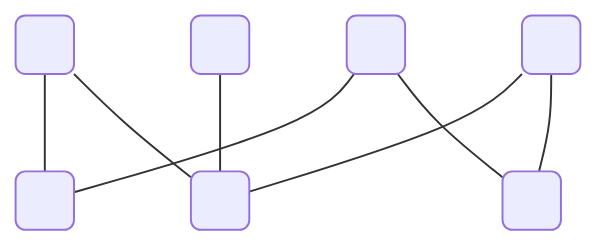

## Independent sets


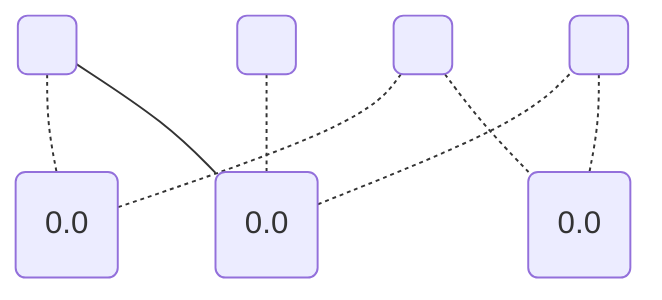

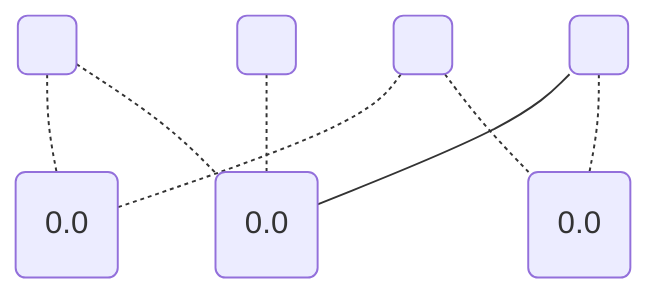

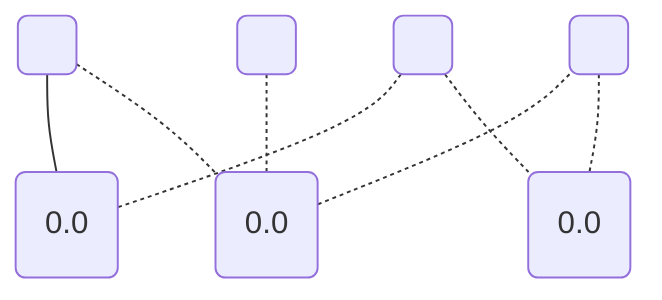

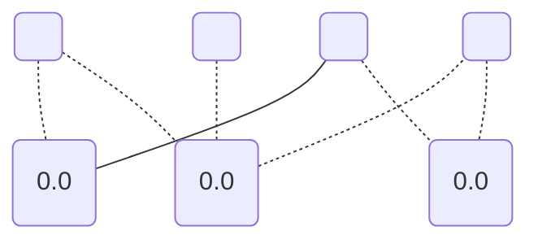

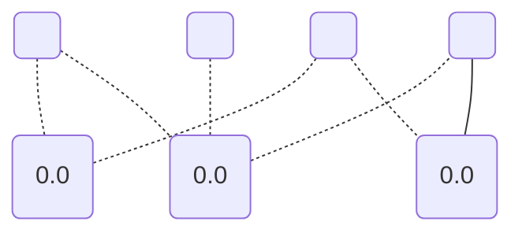


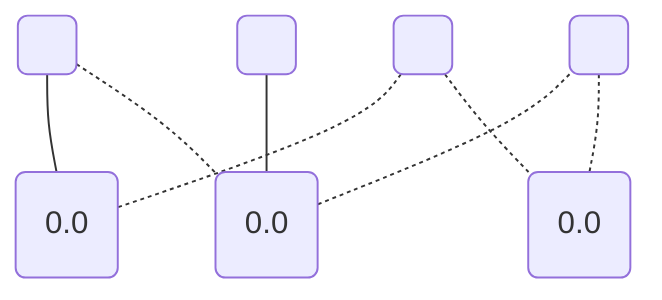

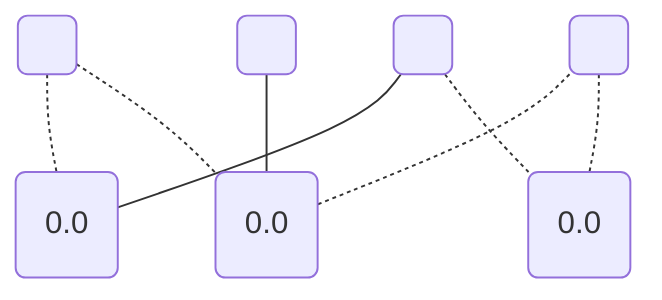

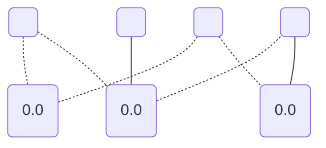


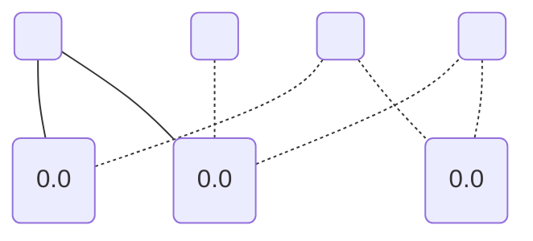

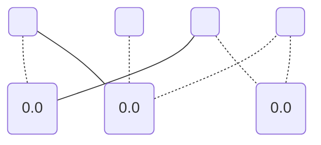

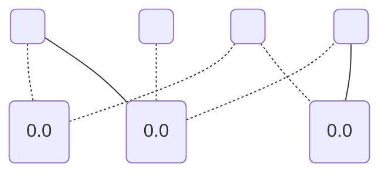

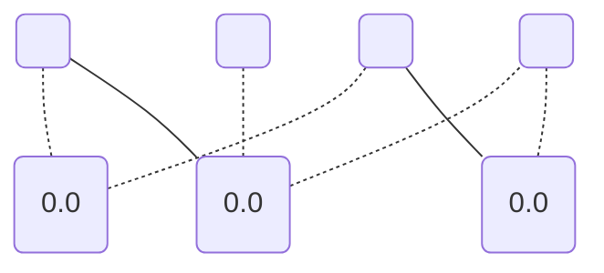

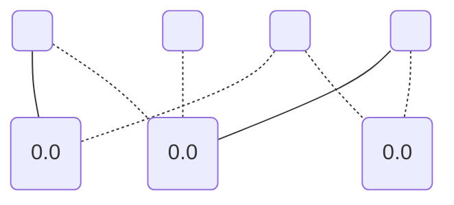

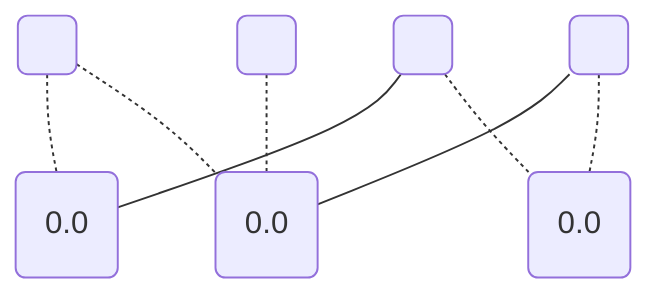


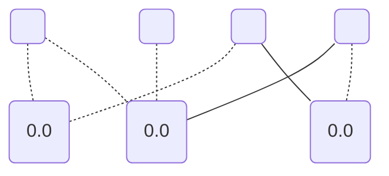

```mermaid
graph TD;
	0(" ");
	1("0.0");
	2(" ");
	3("0.0");
	4(" ");
	5("0.0");
	6(" ");
	0 --- 1;
	2 -.- 1;
	4 --- 3;
	0 -.- 3;
	6 -.- 3;
	6 -.- 5;
	2 -.- 5;
```

```mermaid
graph TD;
	0(" ");
	1("0.0");
	2(" ");
	3("0.0");
	4(" ");
	5("0.0");
	6(" ");
	0 --- 1;
	2 -.- 1;
	4 -.- 3;
	0 --- 3;
	6 -.- 3;
	6 -.- 5;
	2 -.- 5;
```

```mermaid
graph TD;
	0(" ");
	1("0.0");
	2(" ");
	3("0.0");
	4(" ");
	5("0.0");
	6(" ");
	0 --- 1;
	2 -.- 1;
	4 -.- 3;
	0 -.- 3;
	6 --- 3;
	6 -.- 5;
	2 -.- 5;
```

```mermaid
graph TD;
	0(" ");
	1("0.0");
	2(" ");
	3("0.0");
	4(" ");
	5("0.0");
	6(" ");
	0 --- 1;
	2 -.- 1;
	4 -.- 3;
	0 -.- 3;
	6 -.- 3;
	6 --- 5;
	2 -.- 5;
```

```mermaid
graph TD;
	0(" ");
	1("0.0");
	2(" ");
	3("0.0");
	4(" ");
	5("0.0");
	6(" ");
	0 --- 1;
	2 -.- 1;
	4 -.- 3;
	0 -.- 3;
	6 -.- 3;
	6 -.- 5;
	2 --- 5;
```

```mermaid
graph TD;
	0(" ");
	1("0.0");
	2(" ");
	3("0.0");
	4(" ");
	5("0.0");
	6(" ");
	0 -.- 1;
	2 --- 1;
	4 --- 3;
	0 -.- 3;
	6 -.- 3;
	6 -.- 5;
	2 -.- 5;
```

```mermaid
graph TD;
	0(" ");
	1("0.0");
	2(" ");
	3("0.0");
	4(" ");
	5("0.0");
	6(" ");
	0 -.- 1;
	2 --- 1;
	4 -.- 3;
	0 --- 3;
	6 -.- 3;
	6 -.- 5;
	2 -.- 5;
```

```mermaid
graph TD;
	0(" ");
	1("0.0");
	2(" ");
	3("0.0");
	4(" ");
	5("0.0");
	6(" ");
	0 -.- 1;
	2 --- 1;
	4 -.- 3;
	0 -.- 3;
	6 --- 3;
	6 -.- 5;
	2 -.- 5;
```

```mermaid
graph TD;
	0(" ");
	1("0.0");
	2(" ");
	3("0.0");
	4(" ");
	5("0.0");
	6(" ");
	0 -.- 1;
	2 --- 1;
	4 -.- 3;
	0 -.- 3;
	6 -.- 3;
	6 --- 5;
	2 -.- 5;
```

```mermaid
graph TD;
	0(" ");
	1("0.0");
	2(" ");
	3("0.0");
	4(" ");
	5("0.0");
	6(" ");
	0 -.- 1;
	2 --- 1;
	4 -.- 3;
	0 -.- 3;
	6 -.- 3;
	6 -.- 5;
	2 --- 5;
```

```mermaid
graph TD;
	0(" ");
	1("0.0");
	2(" ");
	3("0.0");
	4(" ");
	5("0.0");
	6(" ");
	0 -.- 1;
	2 -.- 1;
	4 --- 3;
	0 -.- 3;
	6 -.- 3;
	6 --- 5;
	2 -.- 5;
```

```mermaid
graph TD;
	0(" ");
	1("0.0");
	2(" ");
	3("0.0");
	4(" ");
	5("0.0");
	6(" ");
	0 -.- 1;
	2 -.- 1;
	4 -.- 3;
	0 --- 3;
	6 -.- 3;
	6 --- 5;
	2 -.- 5;
```

```mermaid
graph TD;
	0(" ");
	1("0.0");
	2(" ");
	3("0.0");
	4(" ");
	5("0.0");
	6(" ");
	0 -.- 1;
	2 -.- 1;
	4 -.- 3;
	0 -.- 3;
	6 --- 3;
	6 --- 5;
	2 -.- 5;
```

```mermaid
graph TD;
	0(" ");
	1("0.0");
	2(" ");
	3("0.0");
	4(" ");
	5("0.0");
	6(" ");
	0 --- 1;
	2 -.- 1;
	4 -.- 3;
	0 -.- 3;
	6 -.- 3;
	6 --- 5;
	2 -.- 5;
```

```mermaid
graph TD;
	0(" ");
	1("0.0");
	2(" ");
	3("0.0");
	4(" ");
	5("0.0");
	6(" ");
	0 -.- 1;
	2 --- 1;
	4 -.- 3;
	0 -.- 3;
	6 -.- 3;
	6 --- 5;
	2 -.- 5;
```

```mermaid
graph TD;
	0(" ");
	1("0.0");
	2(" ");
	3("0.0");
	4(" ");
	5("0.0");
	6(" ");
	0 -.- 1;
	2 -.- 1;
	4 --- 3;
	0 -.- 3;
	6 -.- 3;
	6 -.- 5;
	2 --- 5;
```

```mermaid
graph TD;
	0(" ");
	1("0.0");
	2(" ");
	3("0.0");
	4(" ");
	5("0.0");
	6(" ");
	0 -.- 1;
	2 -.- 1;
	4 -.- 3;
	0 --- 3;
	6 -.- 3;
	6 -.- 5;
	2 --- 5;
```

```mermaid
graph TD;
	0(" ");
	1("0.0");
	2(" ");
	3("0.0");
	4(" ");
	5("0.0");
	6(" ");
	0 -.- 1;
	2 -.- 1;
	4 -.- 3;
	0 -.- 3;
	6 --- 3;
	6 -.- 5;
	2 --- 5;
```

```mermaid
graph TD;
	0(" ");
	1("0.0");
	2(" ");
	3("0.0");
	4(" ");
	5("0.0");
	6(" ");
	0 --- 1;
	2 -.- 1;
	4 -.- 3;
	0 -.- 3;
	6 -.- 3;
	6 -.- 5;
	2 --- 5;
```

```mermaid
graph TD;
	0(" ");
	1("0.0");
	2(" ");
	3("0.0");
	4(" ");
	5("0.0");
	6(" ");
	0 -.- 1;
	2 --- 1;
	4 -.- 3;
	0 -.- 3;
	6 -.- 3;
	6 -.- 5;
	2 --- 5;
```

```mermaid
graph TD;
	0(" ");
	1("0.0");
	2(" ");
	3("0.0");
	4(" ");
	5("0.0");
	6(" ");
	0 --- 1;
	2 -.- 1;
	4 --- 3;
	0 -.- 3;
	6 -.- 3;
	6 --- 5;
	2 -.- 5;
```

```mermaid
graph TD;
	0(" ");
	1("0.0");
	2(" ");
	3("0.0");
	4(" ");
	5("0.0");
	6(" ");
	0 --- 1;
	2 -.- 1;
	4 --- 3;
	0 -.- 3;
	6 -.- 3;
	6 -.- 5;
	2 --- 5;
```

```mermaid
graph TD;
	0(" ");
	1("0.0");
	2(" ");
	3("0.0");
	4(" ");
	5("0.0");
	6(" ");
	0 -.- 1;
	2 --- 1;
	4 --- 3;
	0 -.- 3;
	6 -.- 3;
	6 --- 5;
	2 -.- 5;
```

```mermaid
graph TD;
	0(" ");
	1("0.0");
	2(" ");
	3("0.0");
	4(" ");
	5("0.0");
	6(" ");
	0 -.- 1;
	2 --- 1;
	4 --- 3;
	0 -.- 3;
	6 -.- 3;
	6 -.- 5;
	2 --- 5;
```

```mermaid
graph TD;
	0(" ");
	1("0.0");
	2(" ");
	3("0.0");
	4(" ");
	5("0.0");
	6(" ");
	0 --- 1;
	2 -.- 1;
	4 --- 3;
	0 -.- 3;
	6 -.- 3;
	6 --- 5;
	2 -.- 5;
```

```mermaid
graph TD;
	0(" ");
	1("0.0");
	2(" ");
	3("0.0");
	4(" ");
	5("0.0");
	6(" ");
	0 -.- 1;
	2 --- 1;
	4 --- 3;
	0 -.- 3;
	6 -.- 3;
	6 --- 5;
	2 -.- 5;
```

```mermaid
graph TD;
	0(" ");
	1("0.0");
	2(" ");
	3("0.0");
	4(" ");
	5("0.0");
	6(" ");
	0 --- 1;
	2 -.- 1;
	4 --- 3;
	0 -.- 3;
	6 -.- 3;
	6 -.- 5;
	2 --- 5;
```

```mermaid
graph TD;
	0(" ");
	1("0.0");
	2(" ");
	3("0.0");
	4(" ");
	5("0.0");
	6(" ");
	0 -.- 1;
	2 --- 1;
	4 --- 3;
	0 -.- 3;
	6 -.- 3;
	6 -.- 5;
	2 --- 5;
```

```mermaid
graph TD;
	0(" ");
	1("0.0");
	2(" ");
	3("0.0");
	4(" ");
	5("0.0");
	6(" ");
	0 --- 1;
	2 -.- 1;
	4 -.- 3;
	0 --- 3;
	6 -.- 3;
	6 --- 5;
	2 -.- 5;
```

```mermaid
graph TD;
	0(" ");
	1("0.0");
	2(" ");
	3("0.0");
	4(" ");
	5("0.0");
	6(" ");
	0 --- 1;
	2 -.- 1;
	4 -.- 3;
	0 --- 3;
	6 -.- 3;
	6 -.- 5;
	2 --- 5;
```

```mermaid
graph TD;
	0(" ");
	1("0.0");
	2(" ");
	3("0.0");
	4(" ");
	5("0.0");
	6(" ");
	0 -.- 1;
	2 --- 1;
	4 -.- 3;
	0 --- 3;
	6 -.- 3;
	6 --- 5;
	2 -.- 5;
```

```mermaid
graph TD;
	0(" ");
	1("0.0");
	2(" ");
	3("0.0");
	4(" ");
	5("0.0");
	6(" ");
	0 -.- 1;
	2 --- 1;
	4 -.- 3;
	0 --- 3;
	6 -.- 3;
	6 -.- 5;
	2 --- 5;
```

```mermaid
graph TD;
	0(" ");
	1("0.0");
	2(" ");
	3("0.0");
	4(" ");
	5("0.0");
	6(" ");
	0 --- 1;
	2 -.- 1;
	4 -.- 3;
	0 --- 3;
	6 -.- 3;
	6 --- 5;
	2 -.- 5;
```

```mermaid
graph TD;
	0(" ");
	1("0.0");
	2(" ");
	3("0.0");
	4(" ");
	5("0.0");
	6(" ");
	0 -.- 1;
	2 --- 1;
	4 -.- 3;
	0 --- 3;
	6 -.- 3;
	6 --- 5;
	2 -.- 5;
```

```mermaid
graph TD;
	0(" ");
	1("0.0");
	2(" ");
	3("0.0");
	4(" ");
	5("0.0");
	6(" ");
	0 --- 1;
	2 -.- 1;
	4 -.- 3;
	0 --- 3;
	6 -.- 3;
	6 -.- 5;
	2 --- 5;
```

```mermaid
graph TD;
	0(" ");
	1("0.0");
	2(" ");
	3("0.0");
	4(" ");
	5("0.0");
	6(" ");
	0 -.- 1;
	2 --- 1;
	4 -.- 3;
	0 --- 3;
	6 -.- 3;
	6 -.- 5;
	2 --- 5;
```

```mermaid
graph TD;
	0(" ");
	1("0.0");
	2(" ");
	3("0.0");
	4(" ");
	5("0.0");
	6(" ");
	0 --- 1;
	2 -.- 1;
	4 -.- 3;
	0 -.- 3;
	6 --- 3;
	6 --- 5;
	2 -.- 5;
```

```mermaid
graph TD;
	0(" ");
	1("0.0");
	2(" ");
	3("0.0");
	4(" ");
	5("0.0");
	6(" ");
	0 --- 1;
	2 -.- 1;
	4 -.- 3;
	0 -.- 3;
	6 --- 3;
	6 -.- 5;
	2 --- 5;
```

```mermaid
graph TD;
	0(" ");
	1("0.0");
	2(" ");
	3("0.0");
	4(" ");
	5("0.0");
	6(" ");
	0 -.- 1;
	2 --- 1;
	4 -.- 3;
	0 -.- 3;
	6 --- 3;
	6 --- 5;
	2 -.- 5;
```

```mermaid
graph TD;
	0(" ");
	1("0.0");
	2(" ");
	3("0.0");
	4(" ");
	5("0.0");
	6(" ");
	0 -.- 1;
	2 --- 1;
	4 -.- 3;
	0 -.- 3;
	6 --- 3;
	6 -.- 5;
	2 --- 5;
```

```mermaid
graph TD;
	0(" ");
	1("0.0");
	2(" ");
	3("0.0");
	4(" ");
	5("0.0");
	6(" ");
	0 --- 1;
	2 -.- 1;
	4 -.- 3;
	0 -.- 3;
	6 --- 3;
	6 --- 5;
	2 -.- 5;
```

```mermaid
graph TD;
	0(" ");
	1("0.0");
	2(" ");
	3("0.0");
	4(" ");
	5("0.0");
	6(" ");
	0 -.- 1;
	2 --- 1;
	4 -.- 3;
	0 -.- 3;
	6 --- 3;
	6 --- 5;
	2 -.- 5;
```

```mermaid
graph TD;
	0(" ");
	1("0.0");
	2(" ");
	3("0.0");
	4(" ");
	5("0.0");
	6(" ");
	0 --- 1;
	2 -.- 1;
	4 -.- 3;
	0 -.- 3;
	6 --- 3;
	6 -.- 5;
	2 --- 5;
```

```mermaid
graph TD;
	0(" ");
	1("0.0");
	2(" ");
	3("0.0");
	4(" ");
	5("0.0");
	6(" ");
	0 -.- 1;
	2 --- 1;
	4 -.- 3;
	0 -.- 3;
	6 --- 3;
	6 -.- 5;
	2 --- 5;
```

```mermaid
graph TD;
	0(" ");
	1("0.0");
	2(" ");
	3("0.0");
	4(" ");
	5("0.0");
	6(" ");
	0 --- 1;
	2 -.- 1;
	4 --- 3;
	0 -.- 3;
	6 -.- 3;
	6 --- 5;
	2 -.- 5;
```

```mermaid
graph TD;
	0(" ");
	1("0.0");
	2(" ");
	3("0.0");
	4(" ");
	5("0.0");
	6(" ");
	0 --- 1;
	2 -.- 1;
	4 --- 3;
	0 -.- 3;
	6 -.- 3;
	6 -.- 5;
	2 --- 5;
```

```mermaid
graph TD;
	0(" ");
	1("0.0");
	2(" ");
	3("0.0");
	4(" ");
	5("0.0");
	6(" ");
	0 --- 1;
	2 -.- 1;
	4 -.- 3;
	0 --- 3;
	6 -.- 3;
	6 --- 5;
	2 -.- 5;
```

```mermaid
graph TD;
	0(" ");
	1("0.0");
	2(" ");
	3("0.0");
	4(" ");
	5("0.0");
	6(" ");
	0 --- 1;
	2 -.- 1;
	4 -.- 3;
	0 --- 3;
	6 -.- 3;
	6 -.- 5;
	2 --- 5;
```

```mermaid
graph TD;
	0(" ");
	1("0.0");
	2(" ");
	3("0.0");
	4(" ");
	5("0.0");
	6(" ");
	0 --- 1;
	2 -.- 1;
	4 -.- 3;
	0 -.- 3;
	6 --- 3;
	6 --- 5;
	2 -.- 5;
```

```mermaid
graph TD;
	0(" ");
	1("0.0");
	2(" ");
	3("0.0");
	4(" ");
	5("0.0");
	6(" ");
	0 --- 1;
	2 -.- 1;
	4 -.- 3;
	0 -.- 3;
	6 --- 3;
	6 -.- 5;
	2 --- 5;
```

```mermaid
graph TD;
	0(" ");
	1("0.0");
	2(" ");
	3("0.0");
	4(" ");
	5("0.0");
	6(" ");
	0 --- 1;
	2 -.- 1;
	4 --- 3;
	0 -.- 3;
	6 -.- 3;
	6 --- 5;
	2 -.- 5;
```

```mermaid
graph TD;
	0(" ");
	1("0.0");
	2(" ");
	3("0.0");
	4(" ");
	5("0.0");
	6(" ");
	0 --- 1;
	2 -.- 1;
	4 -.- 3;
	0 --- 3;
	6 -.- 3;
	6 --- 5;
	2 -.- 5;
```

```mermaid
graph TD;
	0(" ");
	1("0.0");
	2(" ");
	3("0.0");
	4(" ");
	5("0.0");
	6(" ");
	0 --- 1;
	2 -.- 1;
	4 -.- 3;
	0 -.- 3;
	6 --- 3;
	6 --- 5;
	2 -.- 5;
```

```mermaid
graph TD;
	0(" ");
	1("0.0");
	2(" ");
	3("0.0");
	4(" ");
	5("0.0");
	6(" ");
	0 --- 1;
	2 -.- 1;
	4 --- 3;
	0 -.- 3;
	6 -.- 3;
	6 -.- 5;
	2 --- 5;
```

```mermaid
graph TD;
	0(" ");
	1("0.0");
	2(" ");
	3("0.0");
	4(" ");
	5("0.0");
	6(" ");
	0 --- 1;
	2 -.- 1;
	4 -.- 3;
	0 --- 3;
	6 -.- 3;
	6 -.- 5;
	2 --- 5;
```

```mermaid
graph TD;
	0(" ");
	1("0.0");
	2(" ");
	3("0.0");
	4(" ");
	5("0.0");
	6(" ");
	0 --- 1;
	2 -.- 1;
	4 -.- 3;
	0 -.- 3;
	6 --- 3;
	6 -.- 5;
	2 --- 5;
```

```mermaid
graph TD;
	0(" ");
	1("0.0");
	2(" ");
	3("0.0");
	4(" ");
	5("0.0");
	6(" ");
	0 -.- 1;
	2 --- 1;
	4 --- 3;
	0 -.- 3;
	6 -.- 3;
	6 --- 5;
	2 -.- 5;
```

```mermaid
graph TD;
	0(" ");
	1("0.0");
	2(" ");
	3("0.0");
	4(" ");
	5("0.0");
	6(" ");
	0 -.- 1;
	2 --- 1;
	4 --- 3;
	0 -.- 3;
	6 -.- 3;
	6 -.- 5;
	2 --- 5;
```

```mermaid
graph TD;
	0(" ");
	1("0.0");
	2(" ");
	3("0.0");
	4(" ");
	5("0.0");
	6(" ");
	0 -.- 1;
	2 --- 1;
	4 -.- 3;
	0 --- 3;
	6 -.- 3;
	6 --- 5;
	2 -.- 5;
```

```mermaid
graph TD;
	0(" ");
	1("0.0");
	2(" ");
	3("0.0");
	4(" ");
	5("0.0");
	6(" ");
	0 -.- 1;
	2 --- 1;
	4 -.- 3;
	0 --- 3;
	6 -.- 3;
	6 -.- 5;
	2 --- 5;
```

```mermaid
graph TD;
	0(" ");
	1("0.0");
	2(" ");
	3("0.0");
	4(" ");
	5("0.0");
	6(" ");
	0 -.- 1;
	2 --- 1;
	4 -.- 3;
	0 -.- 3;
	6 --- 3;
	6 --- 5;
	2 -.- 5;
```

```mermaid
graph TD;
	0(" ");
	1("0.0");
	2(" ");
	3("0.0");
	4(" ");
	5("0.0");
	6(" ");
	0 -.- 1;
	2 --- 1;
	4 -.- 3;
	0 -.- 3;
	6 --- 3;
	6 -.- 5;
	2 --- 5;
```

```mermaid
graph TD;
	0(" ");
	1("0.0");
	2(" ");
	3("0.0");
	4(" ");
	5("0.0");
	6(" ");
	0 -.- 1;
	2 --- 1;
	4 --- 3;
	0 -.- 3;
	6 -.- 3;
	6 --- 5;
	2 -.- 5;
```

```mermaid
graph TD;
	0(" ");
	1("0.0");
	2(" ");
	3("0.0");
	4(" ");
	5("0.0");
	6(" ");
	0 -.- 1;
	2 --- 1;
	4 -.- 3;
	0 --- 3;
	6 -.- 3;
	6 --- 5;
	2 -.- 5;
```

```mermaid
graph TD;
	0(" ");
	1("0.0");
	2(" ");
	3("0.0");
	4(" ");
	5("0.0");
	6(" ");
	0 -.- 1;
	2 --- 1;
	4 -.- 3;
	0 -.- 3;
	6 --- 3;
	6 --- 5;
	2 -.- 5;
```

```mermaid
graph TD;
	0(" ");
	1("0.0");
	2(" ");
	3("0.0");
	4(" ");
	5("0.0");
	6(" ");
	0 -.- 1;
	2 --- 1;
	4 --- 3;
	0 -.- 3;
	6 -.- 3;
	6 -.- 5;
	2 --- 5;
```

```mermaid
graph TD;
	0(" ");
	1("0.0");
	2(" ");
	3("0.0");
	4(" ");
	5("0.0");
	6(" ");
	0 -.- 1;
	2 --- 1;
	4 -.- 3;
	0 --- 3;
	6 -.- 3;
	6 -.- 5;
	2 --- 5;
```

```mermaid
graph TD;
	0(" ");
	1("0.0");
	2(" ");
	3("0.0");
	4(" ");
	5("0.0");
	6(" ");
	0 -.- 1;
	2 --- 1;
	4 -.- 3;
	0 -.- 3;
	6 --- 3;
	6 -.- 5;
	2 --- 5;
```

```mermaid
graph TD;
	0(" ");
	1("0.0");
	2(" ");
	3("0.0");
	4(" ");
	5("0.0");
	6(" ");
	0 --- 1;
	2 -.- 1;
	4 --- 3;
	0 -.- 3;
	6 -.- 3;
	6 --- 5;
	2 -.- 5;
```

```mermaid
graph TD;
	0(" ");
	1("0.0");
	2(" ");
	3("0.0");
	4(" ");
	5("0.0");
	6(" ");
	0 -.- 1;
	2 --- 1;
	4 --- 3;
	0 -.- 3;
	6 -.- 3;
	6 --- 5;
	2 -.- 5;
```

```mermaid
graph TD;
	0(" ");
	1("0.0");
	2(" ");
	3("0.0");
	4(" ");
	5("0.0");
	6(" ");
	0 --- 1;
	2 -.- 1;
	4 -.- 3;
	0 --- 3;
	6 -.- 3;
	6 --- 5;
	2 -.- 5;
```

```mermaid
graph TD;
	0(" ");
	1("0.0");
	2(" ");
	3("0.0");
	4(" ");
	5("0.0");
	6(" ");
	0 -.- 1;
	2 --- 1;
	4 -.- 3;
	0 --- 3;
	6 -.- 3;
	6 --- 5;
	2 -.- 5;
```

```mermaid
graph TD;
	0(" ");
	1("0.0");
	2(" ");
	3("0.0");
	4(" ");
	5("0.0");
	6(" ");
	0 --- 1;
	2 -.- 1;
	4 -.- 3;
	0 -.- 3;
	6 --- 3;
	6 --- 5;
	2 -.- 5;
```

```mermaid
graph TD;
	0(" ");
	1("0.0");
	2(" ");
	3("0.0");
	4(" ");
	5("0.0");
	6(" ");
	0 -.- 1;
	2 --- 1;
	4 -.- 3;
	0 -.- 3;
	6 --- 3;
	6 --- 5;
	2 -.- 5;
```

```mermaid
graph TD;
	0(" ");
	1("0.0");
	2(" ");
	3("0.0");
	4(" ");
	5("0.0");
	6(" ");
	0 --- 1;
	2 -.- 1;
	4 --- 3;
	0 -.- 3;
	6 -.- 3;
	6 --- 5;
	2 -.- 5;
```

```mermaid
graph TD;
	0(" ");
	1("0.0");
	2(" ");
	3("0.0");
	4(" ");
	5("0.0");
	6(" ");
	0 --- 1;
	2 -.- 1;
	4 -.- 3;
	0 --- 3;
	6 -.- 3;
	6 --- 5;
	2 -.- 5;
```

```mermaid
graph TD;
	0(" ");
	1("0.0");
	2(" ");
	3("0.0");
	4(" ");
	5("0.0");
	6(" ");
	0 --- 1;
	2 -.- 1;
	4 -.- 3;
	0 -.- 3;
	6 --- 3;
	6 --- 5;
	2 -.- 5;
```

```mermaid
graph TD;
	0(" ");
	1("0.0");
	2(" ");
	3("0.0");
	4(" ");
	5("0.0");
	6(" ");
	0 -.- 1;
	2 --- 1;
	4 --- 3;
	0 -.- 3;
	6 -.- 3;
	6 --- 5;
	2 -.- 5;
```

```mermaid
graph TD;
	0(" ");
	1("0.0");
	2(" ");
	3("0.0");
	4(" ");
	5("0.0");
	6(" ");
	0 -.- 1;
	2 --- 1;
	4 -.- 3;
	0 --- 3;
	6 -.- 3;
	6 --- 5;
	2 -.- 5;
```

```mermaid
graph TD;
	0(" ");
	1("0.0");
	2(" ");
	3("0.0");
	4(" ");
	5("0.0");
	6(" ");
	0 -.- 1;
	2 --- 1;
	4 -.- 3;
	0 -.- 3;
	6 --- 3;
	6 --- 5;
	2 -.- 5;
```

```mermaid
graph TD;
	0(" ");
	1("0.0");
	2(" ");
	3("0.0");
	4(" ");
	5("0.0");
	6(" ");
	0 --- 1;
	2 -.- 1;
	4 --- 3;
	0 -.- 3;
	6 -.- 3;
	6 -.- 5;
	2 --- 5;
```

```mermaid
graph TD;
	0(" ");
	1("0.0");
	2(" ");
	3("0.0");
	4(" ");
	5("0.0");
	6(" ");
	0 -.- 1;
	2 --- 1;
	4 --- 3;
	0 -.- 3;
	6 -.- 3;
	6 -.- 5;
	2 --- 5;
```

```mermaid
graph TD;
	0(" ");
	1("0.0");
	2(" ");
	3("0.0");
	4(" ");
	5("0.0");
	6(" ");
	0 --- 1;
	2 -.- 1;
	4 -.- 3;
	0 --- 3;
	6 -.- 3;
	6 -.- 5;
	2 --- 5;
```

```mermaid
graph TD;
	0(" ");
	1("0.0");
	2(" ");
	3("0.0");
	4(" ");
	5("0.0");
	6(" ");
	0 -.- 1;
	2 --- 1;
	4 -.- 3;
	0 --- 3;
	6 -.- 3;
	6 -.- 5;
	2 --- 5;
```

```mermaid
graph TD;
	0(" ");
	1("0.0");
	2(" ");
	3("0.0");
	4(" ");
	5("0.0");
	6(" ");
	0 --- 1;
	2 -.- 1;
	4 -.- 3;
	0 -.- 3;
	6 --- 3;
	6 -.- 5;
	2 --- 5;
```

```mermaid
graph TD;
	0(" ");
	1("0.0");
	2(" ");
	3("0.0");
	4(" ");
	5("0.0");
	6(" ");
	0 -.- 1;
	2 --- 1;
	4 -.- 3;
	0 -.- 3;
	6 --- 3;
	6 -.- 5;
	2 --- 5;
```

```mermaid
graph TD;
	0(" ");
	1("0.0");
	2(" ");
	3("0.0");
	4(" ");
	5("0.0");
	6(" ");
	0 --- 1;
	2 -.- 1;
	4 --- 3;
	0 -.- 3;
	6 -.- 3;
	6 -.- 5;
	2 --- 5;
```

```mermaid
graph TD;
	0(" ");
	1("0.0");
	2(" ");
	3("0.0");
	4(" ");
	5("0.0");
	6(" ");
	0 --- 1;
	2 -.- 1;
	4 -.- 3;
	0 --- 3;
	6 -.- 3;
	6 -.- 5;
	2 --- 5;
```

```mermaid
graph TD;
	0(" ");
	1("0.0");
	2(" ");
	3("0.0");
	4(" ");
	5("0.0");
	6(" ");
	0 --- 1;
	2 -.- 1;
	4 -.- 3;
	0 -.- 3;
	6 --- 3;
	6 -.- 5;
	2 --- 5;
```

```mermaid
graph TD;
	0(" ");
	1("0.0");
	2(" ");
	3("0.0");
	4(" ");
	5("0.0");
	6(" ");
	0 -.- 1;
	2 --- 1;
	4 --- 3;
	0 -.- 3;
	6 -.- 3;
	6 -.- 5;
	2 --- 5;
```

```mermaid
graph TD;
	0(" ");
	1("0.0");
	2(" ");
	3("0.0");
	4(" ");
	5("0.0");
	6(" ");
	0 -.- 1;
	2 --- 1;
	4 -.- 3;
	0 --- 3;
	6 -.- 3;
	6 -.- 5;
	2 --- 5;
```

```mermaid
graph TD;
	0(" ");
	1("0.0");
	2(" ");
	3("0.0");
	4(" ");
	5("0.0");
	6(" ");
	0 -.- 1;
	2 --- 1;
	4 -.- 3;
	0 -.- 3;
	6 --- 3;
	6 -.- 5;
	2 --- 5;
```

