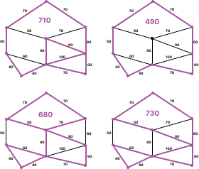
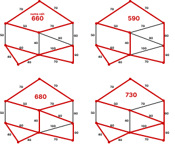
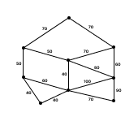
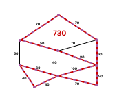

## Defining matroids ##
A finite **matroid $\mathcal{M}$** is pairing $(X, I)$ where $X$ is a finite set called ground set and $I$ is a family of subsets of $X$ called the independent set satisfying three axioms:
- $(I_{1})$ The empty set is independent, i.e., $\emptyset \in I$
- $(I_{2})$ Hereditary property: every subset of an independent set is independent.
- $(I_{3})$ Exchange Property: The exchange axiom states that any independent set can be extended by adding an element from a larger independent set.
- $(I_{3'})$ If $A$ is any subset of $X$ then all the maximal (w.r.t. inclusion) subsets $Y$ of $A$ with $Y$ ∈ $I$ have the same cardinality.

A **basis of a matroid** is a maximal independent set of the matroid — that is, an independent set that is not contained in any other independent set.

### $\mathcal{M}_{1}$: even subgraph matroid ###
We will define the first matroid ($\mathcal{M}_{1}$) as even subgraph matroid:
The ground set of the matroid is the set of all subgraphs of a given graph.
Independent set: A subset of subgraphs is independent if and only if it does not contain any odd degree vertices.

Axioms:

- $(I_{1})$ Empty set does not contain any odd degree vertices and therefore satisfies the first axiom.
- $(I_{2})$ If a subgraph does not contain any odd degree vertices, then any subset of that subgraph also does not contain any odd degree vertices.
- $(I_{3})$ Suppose $A$ and $B$ are two independent sets with $|A|$ < $|B|$. Let $J$ be a maximal independent subset of $B$ (with respect to ⊆). By $(I_{3'})$, all maximal independent subsets of $B$ have the same cardinality. Therefore, $|J|$ = k, for some integer k.

    Consider the set $B'$ = $J$ ∪ ($B$ \ $A$). Since $A$ ⊆ $B$, we have $B'$ = $J$ ∪ ($B$ \ $A$) ⊆ $B$, so $B'$ is a subset of the larger independent set $B$.

    We claim that $B'$ is also an independent set. Suppose for contradiction that $B'$ is not independent, i.e., there exists an odd-degree vertex in $B'$. Since every vertex in $J$ has even degree (by the definition of $M_1$), the odd-degree vertex must be in ($B$ \ $A$). But this means that there exists an edge in ($B$ \ $A$) that is incident to an odd-degree vertex, which contradicts the fact that $A$ is an independent set in $M_1$. Therefore, $B'$ is indeed an independent set.

    Moreover, $|B'|$ = $|J|$ + $|B$ \ $A|$ = k + $|B|$ - $|A|$ > k = $|J|$. Therefore, $B'$ is a strictly larger independent set than $J$, which contradicts the maximality of $J$.

    Therefore, we have shown that any two independent sets $A$ and $B$ with $|A|$ < $|B|$ can be enlarged by adding an element from $B$ to $A$ to obtain a larger independent set. 

> !!POKUS, NENÍ TO STOPROCENTNĚ SPRÁVNĚ!! Zkusíme použít axiom 3' místo 3. Ten říká, že pokud vezmeme nějakou podmnožinu $A \subseteq X$, tak všechny jeho nezávislé maximální (vzhledem k $\subseteq$) množiny mají stejnou kardinalitu. Nebo-li v našem případě je $X$ hrany grafu a tedy $A$ nějaké vybrané hrany z celého grafu. Pro spor řekněme, že dvě maximální množiny a jedna je menší než druhá. Potom nutně ta jedna musí mít o hranu méně a tedy nemůže být maximální, protože existuje druhá větší.

Therefore, the even subgraph matroid satisfies the axioms of a matroid, and can be used in matroid intersection algorithm.

Independent set in even subraph matroid for graph $G=(V,E)$:



### $\mathcal{M}_{2}$: cycle matroid ###

<!-- proč je tady N na pozici vrcholů, jako že nodes? -->

The term “cycle matroid” of a graph $G = (N, E)$ is well-known. It is frequently used as a simple introduction to basic matroid concepts. In that introductory example, a set of edges $X \subseteq E$ is said to be “independent” if it contains no cycles. A maximal, independent set is thus a spanning tree of $G$. However, it is not at all what we mean by a “cycle matroid”. The elements of graph based matroids are the edges of the graph. The ground set of our “cycle matroid” are the cycles themselves. We use nodes and edges only to help describe the individual cycles. [[John L. Pfaltz: Cycle Matroids]](https://www.cs.virginia.edu/~jlp/19.CYCLE.pdf).
An independent set of this matroid is a set of cycle subgraphs that do not share any edges.

Axioms: proving the axioms of this matroid would be a bit lengthy, so for simplicity we will refer to the article by [[John L. Pfaltz: Cycle Matroids]](https://www.cs.virginia.edu/~jlp/19.CYCLE.pdf)

> **!!TAKÉ JEN ZBĚŽNĚ SEPSANÉ!!** První axiom je ez, protože prázdné množina má jen cykly. Druhý axiom je taky ez, protože pokud si vezmu několik cyklů bez průniku, tak určitě jejich podmnožina jsou také cykly bez průniků. Třetí axiom by možná šlo přes standardní 3 axiom. Pokud mám dvě množiny jednu větší a druhou menší, tak se podíváme jaké situace mohou nastat při snaze najít $x$, které lze do menší z větší přidat. Tak buď nemají žádný průnik, to potom je v pohodě. Pak průnik záleží jestli je jen jeden bod (to asi nevadí *idk*) a pokud přes dva body, nebo více bodů, tak si vybereme větší oblouky (*!existence!*). **!DALŠÍ VAROVÁNÍ JE, JESTLI JSEM TY MATROIDY SPRÁVNĚ POCHOPIL, PROTOŽE JESTLI NE, TAK JE TO ASI KOMLETNĚ ŠPATNĚ!**

Independent set in cycle matroid for graph $G=(V,E)$:




## Matroid Intersection Algorithm ##
The matroid intersection problem is to find a largest common independent set in two matroids over the same ground set. If the elements of the matroid are assigned real weights, the weighted matroid intersection problem is to find a common independent set with the maximum possible weight.

More specifically, let $\mathcal{M}_{1} = (E, I_{1})$ and $\mathcal{M}_{2} = (E, I_{2})$ be two matroids defined over the same ground set $E$. Let $w: E \to \mathbb{R}$ be a weight function that assigns a weight to each element of $E$. The goal of the matroid intersection algorithm is to find an independent set $I^{\ast}$ that is a member of both $I_{1}$ and $I_{2}$ and has maximum total weight $w(I^{\ast})$.

The idea of the matroid intersection algorithm was first proposed by mathematicians Jack Edmonds and Richard M. Karp. In 1972 they introduced the concept of matroid intersection and showed that it can be used to solve a wide range of combinatorial optimization problems, including network flow, matching, and shortest path problems.

Using the matroid intersection algorithm, **we want to find the edges whose duplication will be the most efficient solution to the CPP**.


#### Algorithm ####

TOTO JE LEN JEDNA greedy MOŽNOSŤ, možno by nebolo odveci sa inšpirovať od [Lawler, Eugene L.: Matroid intersection algorithms](https://link.springer.com/article/10.1007/BF01681329)

Input: Weighted unoriented graph $G = (V, E)$



```
I1 <- findEvenSubgraphs(G) (all subgraphs of G not containing vertices with odd degree)
B1 <- findMaximalIndependentSet(I1)
I2 <- findCycleSubgraphs(G) (all cycle subgraphs which don't share any edge)
B2 <- findMaximalIndependentSet(I2)

maximalComonIndependentSet(B1, B2):
  P <- empty set representing intersection

  while B1 is not epty:
    take arbitrary edge e from B1:
      if e in B2:
        add e to P
        remove e from B1 and B2
      otherwise:
        I1' <- I1 \ B1
        B1' <- findMaximalIndependentSet(I1')
        I2' <- I2 \ B2
        B2' <- findMaximalIndependentSet(I2')
        choose greater from maximalComonIndependentSet(B1, B2')and maximalComonIndependentSet(B1', B2)
  return P
```



```
CPP():
  toDuplicate <- E \ maximalComonIndependentSet()
  return G' <- G + edges toDuplicate
  find Euler circuit on G'
```

output: Euler circuit on graph with duplicated edges gives solution to Chinese Postman Problem
  

