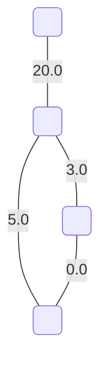
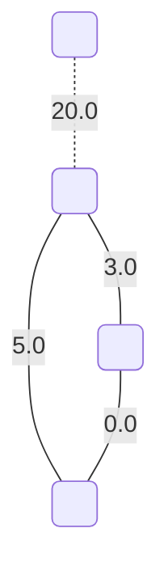

# Cycle Matroids

On input we have following graph $G$:

By this non-so efficient way we find all cycles and then try to combine as most of the cycles together. Then we get following so called **cycle matroids**.

## Matroid Nr.1

**This matroid is maximal with respect to the edge values.**

This matroid has a value: 8.0

