# Cycle Matroids

On input we have following graph $G$:

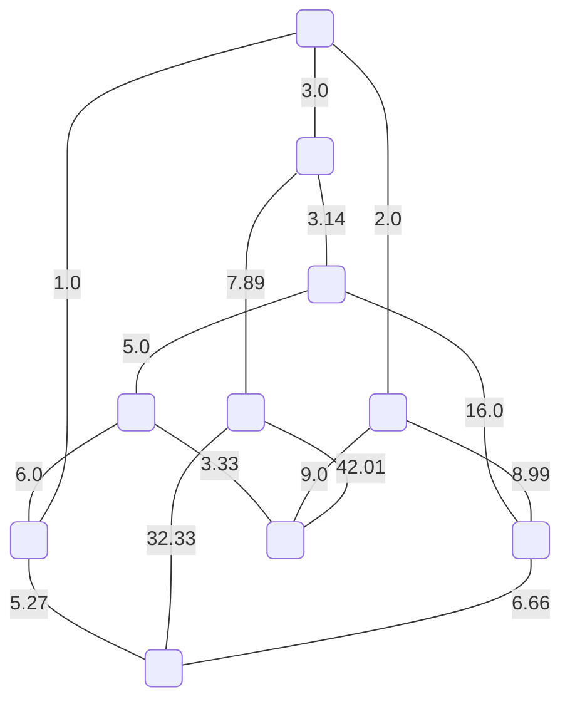

By this non-so efficient way we find all cycles and then try to combine as most of the cycles together. Then we get following so called **cycle matroids**.


This matroid has a value: 117.13


This matroid has a value: 107.75


This matroid has a value: 40.06

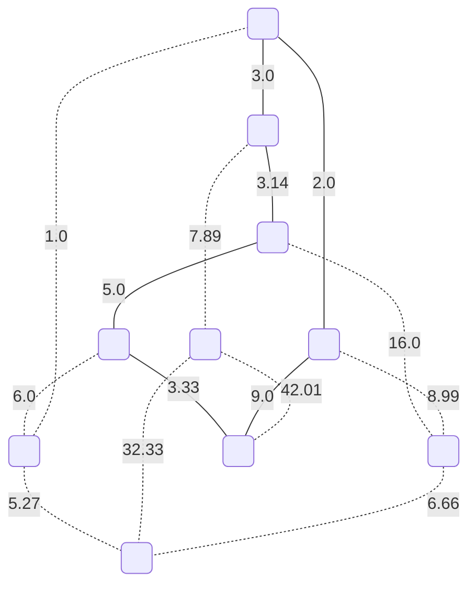

This matroid has a value: 25.47


This matroid has a value: 45.39


This matroid has a value: 95.08


This matroid has a value: 106.46000000000001

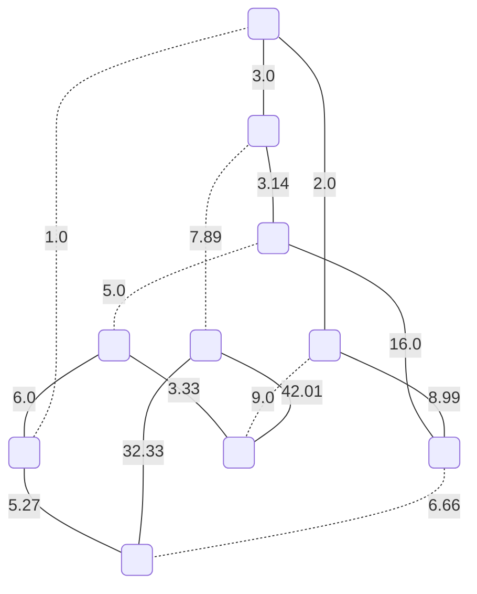

This matroid has a value: 122.07

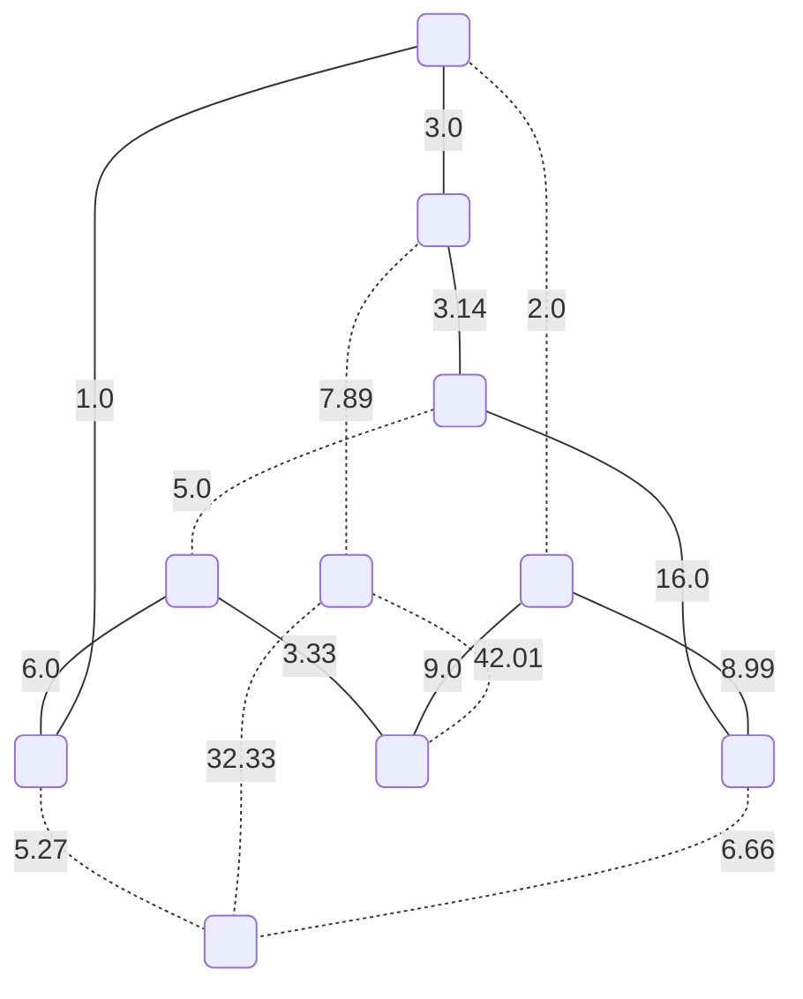

This matroid has a value: 50.46


This matroid has a value: 120.73999999999998

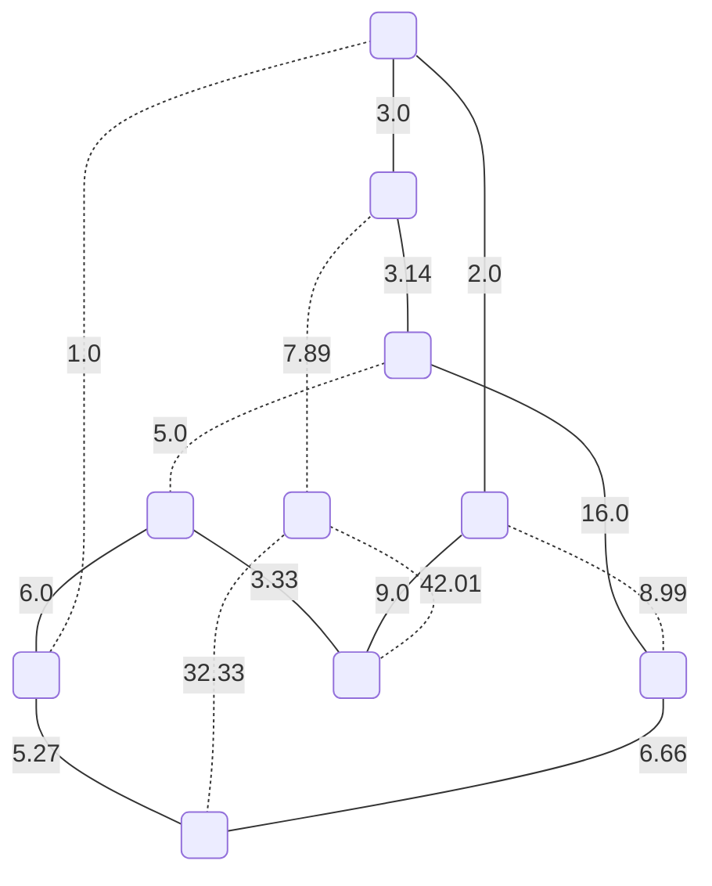

This matroid has a value: 54.4

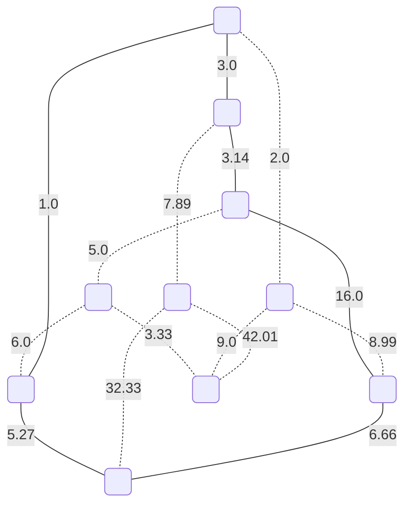

This matroid has a value: 35.07

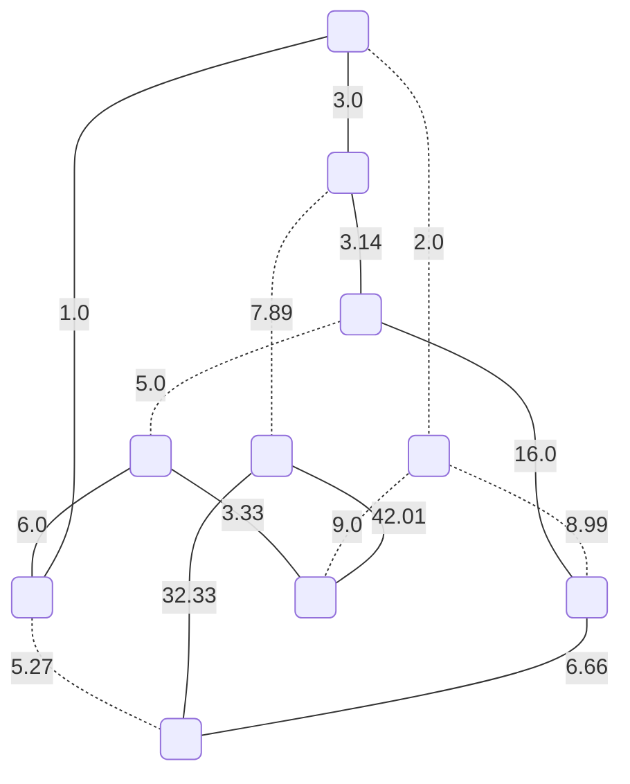

This matroid has a value: 113.47


This matroid has a value: 114.13999999999999

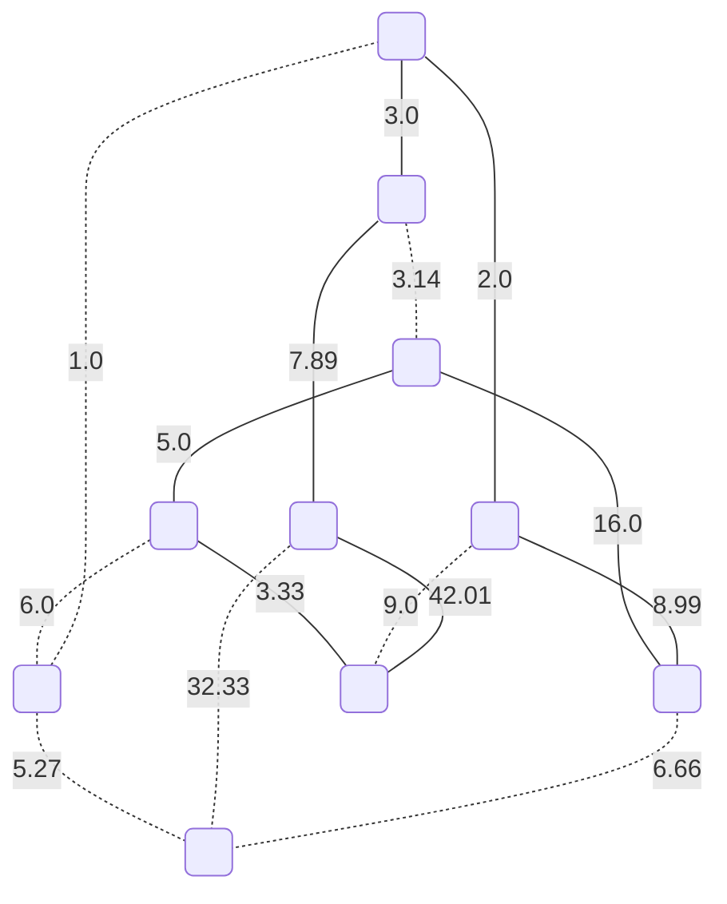

This matroid has a value: 88.22

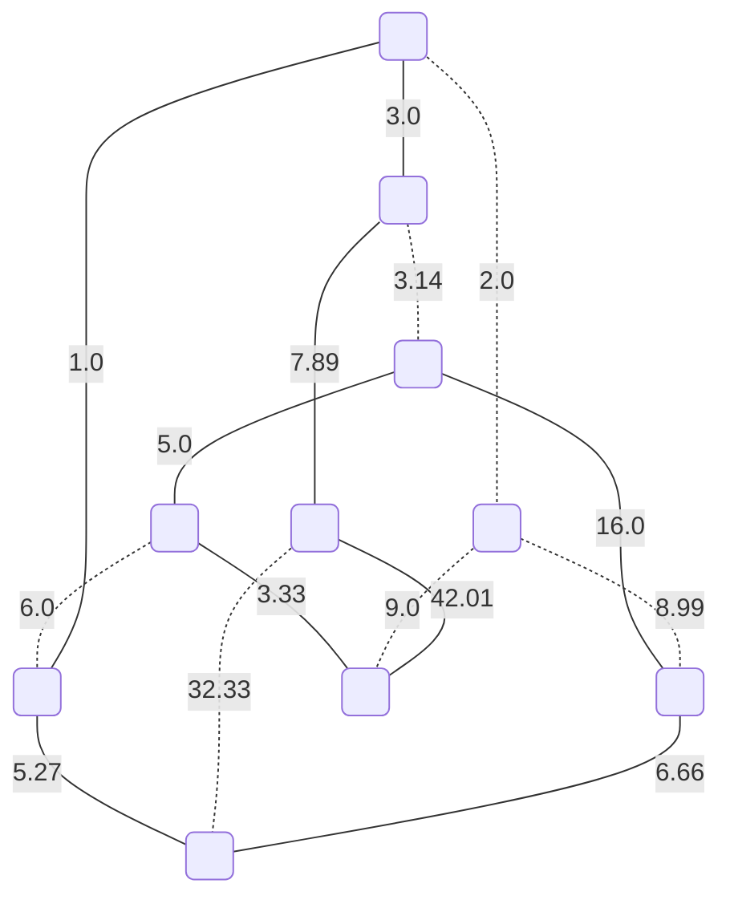

This matroid has a value: 90.16

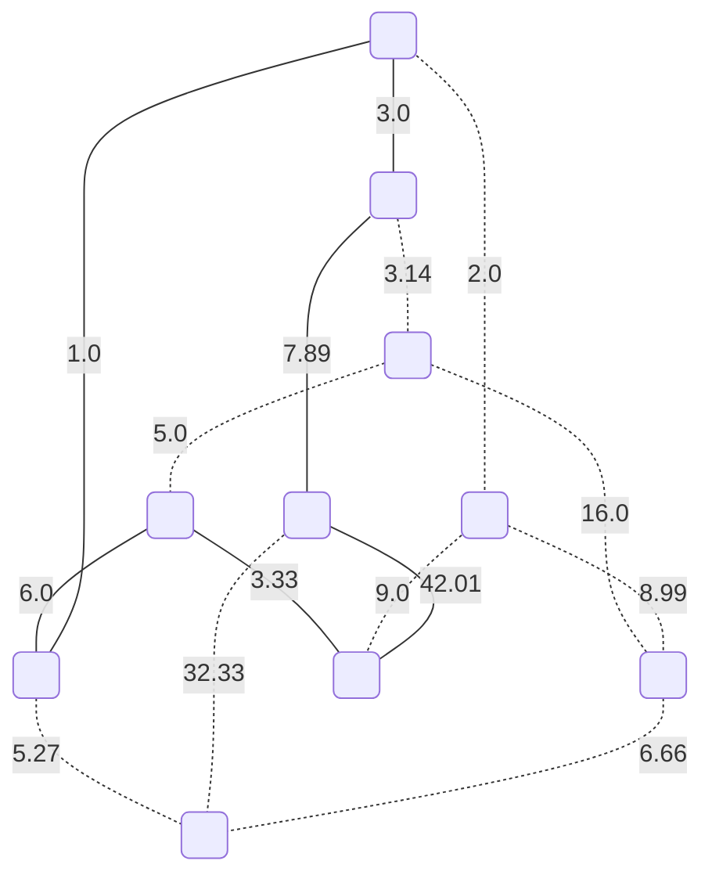

This matroid has a value: 63.23

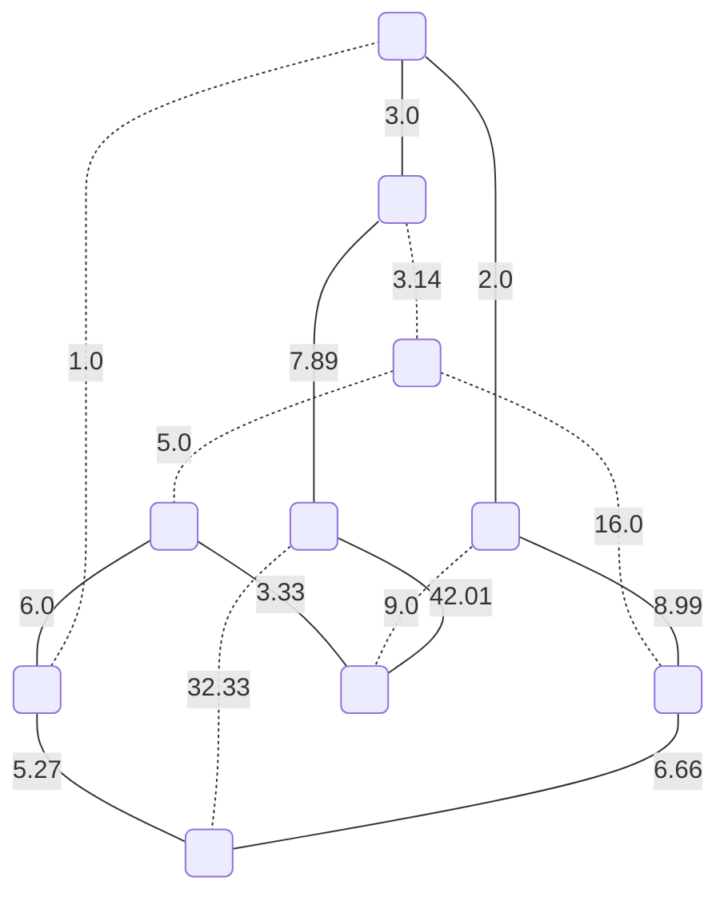

This matroid has a value: 85.15

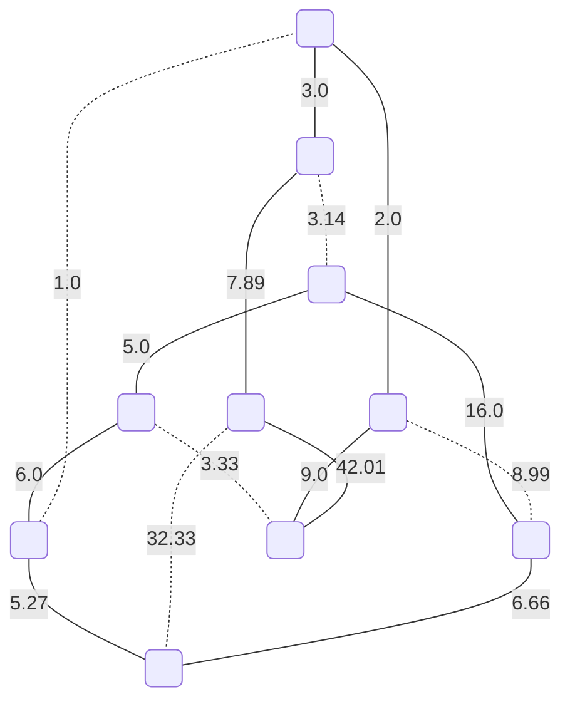

This matroid has a value: 102.83

```mermaid
graph TD;
	0(" ");
	1(" ");
	2(" ");
	3(" ");
	4(" ");
	5(" ");
	6(" ");
	7(" ");
	8(" ");
	9(" ");
	0 -- "3.0" --- 1;
	1 -. "3.14" -.- 2;
	2 -- "5.0" --- 3;
	3 -- "6.0" --- 4;
	4 -- "1.0" --- 0;
	0 -. "2.0" -.- 5;
	1 -- "7.89" --- 6;
	2 -- "16.0" --- 7;
	3 -. "3.33" -.- 8;
	4 -. "5.27" -.- 9;
	5 -- "8.99" --- 7;
	5 -- "9.0" --- 8;
	6 -- "42.01" --- 8;
	6 -. "32.33" -.- 9;
	7 -. "6.66" -.- 9;
```

This matroid has a value: 98.89

```mermaid
graph TD;
	0(" ");
	1(" ");
	2(" ");
	3(" ");
	4(" ");
	5(" ");
	6(" ");
	7(" ");
	8(" ");
	9(" ");
	0 -- "3.0" --- 1;
	1 -. "3.14" -.- 2;
	2 -. "5.0" -.- 3;
	3 -. "6.0" -.- 4;
	4 -- "1.0" --- 0;
	0 -. "2.0" -.- 5;
	1 -- "7.89" --- 6;
	2 -. "16.0" -.- 7;
	3 -. "3.33" -.- 8;
	4 -- "5.27" --- 9;
	5 -- "8.99" --- 7;
	5 -- "9.0" --- 8;
	6 -- "42.01" --- 8;
	6 -. "32.33" -.- 9;
	7 -- "6.66" --- 9;
```

This matroid has a value: 83.82

```mermaid
graph TD;
	0(" ");
	1(" ");
	2(" ");
	3(" ");
	4(" ");
	5(" ");
	6(" ");
	7(" ");
	8(" ");
	9(" ");
	0 -- "3.0" --- 1;
	1 -. "3.14" -.- 2;
	2 -- "5.0" --- 3;
	3 -- "6.0" --- 4;
	4 -. "1.0" -.- 0;
	0 -- "2.0" --- 5;
	1 -- "7.89" --- 6;
	2 -- "16.0" --- 7;
	3 -. "3.33" -.- 8;
	4 -- "5.27" --- 9;
	5 -- "8.99" --- 7;
	5 -. "9.0" -.- 8;
	6 -. "42.01" -.- 8;
	6 -- "32.33" --- 9;
	7 -. "6.66" -.- 9;
```

This matroid has a value: 86.47999999999999

```mermaid
graph TD;
	0(" ");
	1(" ");
	2(" ");
	3(" ");
	4(" ");
	5(" ");
	6(" ");
	7(" ");
	8(" ");
	9(" ");
	0 -- "3.0" --- 1;
	1 -. "3.14" -.- 2;
	2 -. "5.0" -.- 3;
	3 -- "6.0" --- 4;
	4 -. "1.0" -.- 0;
	0 -- "2.0" --- 5;
	1 -- "7.89" --- 6;
	2 -. "16.0" -.- 7;
	3 -- "3.33" --- 8;
	4 -- "5.27" --- 9;
	5 -. "8.99" -.- 7;
	5 -- "9.0" --- 8;
	6 -. "42.01" -.- 8;
	6 -- "32.33" --- 9;
	7 -. "6.66" -.- 9;
```

This matroid has a value: 68.82

```mermaid
graph TD;
	0(" ");
	1(" ");
	2(" ");
	3(" ");
	4(" ");
	5(" ");
	6(" ");
	7(" ");
	8(" ");
	9(" ");
	0 -- "3.0" --- 1;
	1 -. "3.14" -.- 2;
	2 -- "5.0" --- 3;
	3 -. "6.0" -.- 4;
	4 -- "1.0" --- 0;
	0 -. "2.0" -.- 5;
	1 -- "7.89" --- 6;
	2 -- "16.0" --- 7;
	3 -- "3.33" --- 8;
	4 -- "5.27" --- 9;
	5 -- "8.99" --- 7;
	5 -- "9.0" --- 8;
	6 -. "42.01" -.- 8;
	6 -- "32.33" --- 9;
	7 -. "6.66" -.- 9;
```

This matroid has a value: 91.81

```mermaid
graph TD;
	0(" ");
	1(" ");
	2(" ");
	3(" ");
	4(" ");
	5(" ");
	6(" ");
	7(" ");
	8(" ");
	9(" ");
	0 -- "3.0" --- 1;
	1 -. "3.14" -.- 2;
	2 -- "5.0" --- 3;
	3 -- "6.0" --- 4;
	4 -- "1.0" --- 0;
	0 -. "2.0" -.- 5;
	1 -- "7.89" --- 6;
	2 -- "16.0" --- 7;
	3 -. "3.33" -.- 8;
	4 -. "5.27" -.- 9;
	5 -. "8.99" -.- 7;
	5 -. "9.0" -.- 8;
	6 -. "42.01" -.- 8;
	6 -- "32.33" --- 9;
	7 -- "6.66" --- 9;
```

This matroid has a value: 77.88

```mermaid
graph TD;
	0(" ");
	1(" ");
	2(" ");
	3(" ");
	4(" ");
	5(" ");
	6(" ");
	7(" ");
	8(" ");
	9(" ");
	0 -- "3.0" --- 1;
	1 -. "3.14" -.- 2;
	2 -- "5.0" --- 3;
	3 -. "6.0" -.- 4;
	4 -. "1.0" -.- 0;
	0 -- "2.0" --- 5;
	1 -- "7.89" --- 6;
	2 -- "16.0" --- 7;
	3 -- "3.33" --- 8;
	4 -. "5.27" -.- 9;
	5 -. "8.99" -.- 7;
	5 -- "9.0" --- 8;
	6 -. "42.01" -.- 8;
	6 -- "32.33" --- 9;
	7 -- "6.66" --- 9;
```

This matroid has a value: 85.21000000000001

```mermaid
graph TD;
	0(" ");
	1(" ");
	2(" ");
	3(" ");
	4(" ");
	5(" ");
	6(" ");
	7(" ");
	8(" ");
	9(" ");
	0 -- "3.0" --- 1;
	1 -. "3.14" -.- 2;
	2 -. "5.0" -.- 3;
	3 -. "6.0" -.- 4;
	4 -. "1.0" -.- 0;
	0 -- "2.0" --- 5;
	1 -- "7.89" --- 6;
	2 -. "16.0" -.- 7;
	3 -. "3.33" -.- 8;
	4 -. "5.27" -.- 9;
	5 -- "8.99" --- 7;
	5 -. "9.0" -.- 8;
	6 -. "42.01" -.- 8;
	6 -- "32.33" --- 9;
	7 -- "6.66" --- 9;
```

This matroid has a value: 60.87

```mermaid
graph TD;
	0(" ");
	1(" ");
	2(" ");
	3(" ");
	4(" ");
	5(" ");
	6(" ");
	7(" ");
	8(" ");
	9(" ");
	0 -- "3.0" --- 1;
	1 -. "3.14" -.- 2;
	2 -. "5.0" -.- 3;
	3 -- "6.0" --- 4;
	4 -- "1.0" --- 0;
	0 -. "2.0" -.- 5;
	1 -- "7.89" --- 6;
	2 -. "16.0" -.- 7;
	3 -- "3.33" --- 8;
	4 -. "5.27" -.- 9;
	5 -- "8.99" --- 7;
	5 -- "9.0" --- 8;
	6 -. "42.01" -.- 8;
	6 -- "32.33" --- 9;
	7 -- "6.66" --- 9;
```

This matroid has a value: 78.19999999999999

```mermaid
graph TD;
	0(" ");
	1(" ");
	2(" ");
	3(" ");
	4(" ");
	5(" ");
	6(" ");
	7(" ");
	8(" ");
	9(" ");
	0 -. "3.0" -.- 1;
	1 -- "3.14" --- 2;
	2 -- "5.0" --- 3;
	3 -- "6.0" --- 4;
	4 -- "1.0" --- 0;
	0 -- "2.0" --- 5;
	1 -- "7.89" --- 6;
	2 -. "16.0" -.- 7;
	3 -. "3.33" -.- 8;
	4 -. "5.27" -.- 9;
	5 -- "8.99" --- 7;
	5 -. "9.0" -.- 8;
	6 -. "42.01" -.- 8;
	6 -- "32.33" --- 9;
	7 -- "6.66" --- 9;
```

This matroid has a value: 73.00999999999999

```mermaid
graph TD;
	0(" ");
	1(" ");
	2(" ");
	3(" ");
	4(" ");
	5(" ");
	6(" ");
	7(" ");
	8(" ");
	9(" ");
	0 -. "3.0" -.- 1;
	1 -- "3.14" --- 2;
	2 -- "5.0" --- 3;
	3 -- "6.0" --- 4;
	4 -- "1.0" --- 0;
	0 -- "2.0" --- 5;
	1 -- "7.89" --- 6;
	2 -. "16.0" -.- 7;
	3 -. "3.33" -.- 8;
	4 -. "5.27" -.- 9;
	5 -. "8.99" -.- 7;
	5 -- "9.0" --- 8;
	6 -- "42.01" --- 8;
	6 -. "32.33" -.- 9;
	7 -. "6.66" -.- 9;
```

This matroid has a value: 76.03999999999999

```mermaid
graph TD;
	0(" ");
	1(" ");
	2(" ");
	3(" ");
	4(" ");
	5(" ");
	6(" ");
	7(" ");
	8(" ");
	9(" ");
	0 -. "3.0" -.- 1;
	1 -- "3.14" --- 2;
	2 -- "5.0" --- 3;
	3 -- "6.0" --- 4;
	4 -. "1.0" -.- 0;
	0 -. "2.0" -.- 5;
	1 -- "7.89" --- 6;
	2 -. "16.0" -.- 7;
	3 -. "3.33" -.- 8;
	4 -- "5.27" --- 9;
	5 -. "8.99" -.- 7;
	5 -. "9.0" -.- 8;
	6 -. "42.01" -.- 8;
	6 -- "32.33" --- 9;
	7 -. "6.66" -.- 9;
```

This matroid has a value: 59.629999999999995

```mermaid
graph TD;
	0(" ");
	1(" ");
	2(" ");
	3(" ");
	4(" ");
	5(" ");
	6(" ");
	7(" ");
	8(" ");
	9(" ");
	0 -. "3.0" -.- 1;
	1 -- "3.14" --- 2;
	2 -- "5.0" --- 3;
	3 -- "6.0" --- 4;
	4 -. "1.0" -.- 0;
	0 -. "2.0" -.- 5;
	1 -- "7.89" --- 6;
	2 -. "16.0" -.- 7;
	3 -. "3.33" -.- 8;
	4 -- "5.27" --- 9;
	5 -- "8.99" --- 7;
	5 -- "9.0" --- 8;
	6 -- "42.01" --- 8;
	6 -. "32.33" -.- 9;
	7 -- "6.66" --- 9;
```

This matroid has a value: 93.96000000000001

```mermaid
graph TD;
	0(" ");
	1(" ");
	2(" ");
	3(" ");
	4(" ");
	5(" ");
	6(" ");
	7(" ");
	8(" ");
	9(" ");
	0 -. "3.0" -.- 1;
	1 -- "3.14" --- 2;
	2 -- "5.0" --- 3;
	3 -. "6.0" -.- 4;
	4 -- "1.0" --- 0;
	0 -- "2.0" --- 5;
	1 -- "7.89" --- 6;
	2 -. "16.0" -.- 7;
	3 -- "3.33" --- 8;
	4 -- "5.27" --- 9;
	5 -. "8.99" -.- 7;
	5 -- "9.0" --- 8;
	6 -. "42.01" -.- 8;
	6 -- "32.33" --- 9;
	7 -. "6.66" -.- 9;
```

This matroid has a value: 68.96

```mermaid
graph TD;
	0(" ");
	1(" ");
	2(" ");
	3(" ");
	4(" ");
	5(" ");
	6(" ");
	7(" ");
	8(" ");
	9(" ");
	0 -. "3.0" -.- 1;
	1 -- "3.14" --- 2;
	2 -- "5.0" --- 3;
	3 -. "6.0" -.- 4;
	4 -. "1.0" -.- 0;
	0 -. "2.0" -.- 5;
	1 -- "7.89" --- 6;
	2 -. "16.0" -.- 7;
	3 -- "3.33" --- 8;
	4 -. "5.27" -.- 9;
	5 -- "8.99" --- 7;
	5 -- "9.0" --- 8;
	6 -. "42.01" -.- 8;
	6 -- "32.33" --- 9;
	7 -- "6.66" --- 9;
```

This matroid has a value: 76.34

```mermaid
graph TD;
	0(" ");
	1(" ");
	2(" ");
	3(" ");
	4(" ");
	5(" ");
	6(" ");
	7(" ");
	8(" ");
	9(" ");
	0 -. "3.0" -.- 1;
	1 -- "3.14" --- 2;
	2 -- "5.0" --- 3;
	3 -. "6.0" -.- 4;
	4 -- "1.0" --- 0;
	0 -- "2.0" --- 5;
	1 -- "7.89" --- 6;
	2 -. "16.0" -.- 7;
	3 -- "3.33" --- 8;
	4 -- "5.27" --- 9;
	5 -- "8.99" --- 7;
	5 -. "9.0" -.- 8;
	6 -- "42.01" --- 8;
	6 -. "32.33" -.- 9;
	7 -- "6.66" --- 9;
```

This matroid has a value: 85.28999999999999

```mermaid
graph TD;
	0(" ");
	1(" ");
	2(" ");
	3(" ");
	4(" ");
	5(" ");
	6(" ");
	7(" ");
	8(" ");
	9(" ");
	0 -. "3.0" -.- 1;
	1 -- "3.14" --- 2;
	2 -. "5.0" -.- 3;
	3 -- "6.0" --- 4;
	4 -- "1.0" --- 0;
	0 -- "2.0" --- 5;
	1 -- "7.89" --- 6;
	2 -- "16.0" --- 7;
	3 -- "3.33" --- 8;
	4 -. "5.27" -.- 9;
	5 -- "8.99" --- 7;
	5 -. "9.0" -.- 8;
	6 -- "42.01" --- 8;
	6 -. "32.33" -.- 9;
	7 -. "6.66" -.- 9;
```

This matroid has a value: 90.36

```mermaid
graph TD;
	0(" ");
	1(" ");
	2(" ");
	3(" ");
	4(" ");
	5(" ");
	6(" ");
	7(" ");
	8(" ");
	9(" ");
	0 -. "3.0" -.- 1;
	1 -- "3.14" --- 2;
	2 -. "5.0" -.- 3;
	3 -. "6.0" -.- 4;
	4 -- "1.0" --- 0;
	0 -- "2.0" --- 5;
	1 -- "7.89" --- 6;
	2 -- "16.0" --- 7;
	3 -. "3.33" -.- 8;
	4 -- "5.27" --- 9;
	5 -- "8.99" --- 7;
	5 -. "9.0" -.- 8;
	6 -. "42.01" -.- 8;
	6 -- "32.33" --- 9;
	7 -. "6.66" -.- 9;
```

This matroid has a value: 76.62

```mermaid
graph TD;
	0(" ");
	1(" ");
	2(" ");
	3(" ");
	4(" ");
	5(" ");
	6(" ");
	7(" ");
	8(" ");
	9(" ");
	0 -. "3.0" -.- 1;
	1 -- "3.14" --- 2;
	2 -. "5.0" -.- 3;
	3 -- "6.0" --- 4;
	4 -. "1.0" -.- 0;
	0 -. "2.0" -.- 5;
	1 -- "7.89" --- 6;
	2 -- "16.0" --- 7;
	3 -- "3.33" --- 8;
	4 -- "5.27" --- 9;
	5 -- "8.99" --- 7;
	5 -- "9.0" --- 8;
	6 -. "42.01" -.- 8;
	6 -- "32.33" --- 9;
	7 -. "6.66" -.- 9;
```

This matroid has a value: 91.94999999999999

```mermaid
graph TD;
	0(" ");
	1(" ");
	2(" ");
	3(" ");
	4(" ");
	5(" ");
	6(" ");
	7(" ");
	8(" ");
	9(" ");
	0 -. "3.0" -.- 1;
	1 -- "3.14" --- 2;
	2 -. "5.0" -.- 3;
	3 -. "6.0" -.- 4;
	4 -. "1.0" -.- 0;
	0 -. "2.0" -.- 5;
	1 -- "7.89" --- 6;
	2 -- "16.0" --- 7;
	3 -. "3.33" -.- 8;
	4 -. "5.27" -.- 9;
	5 -- "8.99" --- 7;
	5 -- "9.0" --- 8;
	6 -- "42.01" --- 8;
	6 -. "32.33" -.- 9;
	7 -. "6.66" -.- 9;
```

This matroid has a value: 87.03

```mermaid
graph TD;
	0(" ");
	1(" ");
	2(" ");
	3(" ");
	4(" ");
	5(" ");
	6(" ");
	7(" ");
	8(" ");
	9(" ");
	0 -. "3.0" -.- 1;
	1 -- "3.14" --- 2;
	2 -. "5.0" -.- 3;
	3 -- "6.0" --- 4;
	4 -. "1.0" -.- 0;
	0 -. "2.0" -.- 5;
	1 -- "7.89" --- 6;
	2 -- "16.0" --- 7;
	3 -- "3.33" --- 8;
	4 -- "5.27" --- 9;
	5 -. "8.99" -.- 7;
	5 -. "9.0" -.- 8;
	6 -- "42.01" --- 8;
	6 -. "32.33" -.- 9;
	7 -- "6.66" --- 9;
```

This matroid has a value: 90.3

```mermaid
graph TD;
	0(" ");
	1(" ");
	2(" ");
	3(" ");
	4(" ");
	5(" ");
	6(" ");
	7(" ");
	8(" ");
	9(" ");
	0 -. "3.0" -.- 1;
	1 -- "3.14" --- 2;
	2 -. "5.0" -.- 3;
	3 -. "6.0" -.- 4;
	4 -- "1.0" --- 0;
	0 -- "2.0" --- 5;
	1 -- "7.89" --- 6;
	2 -- "16.0" --- 7;
	3 -. "3.33" -.- 8;
	4 -- "5.27" --- 9;
	5 -. "8.99" -.- 7;
	5 -- "9.0" --- 8;
	6 -- "42.01" --- 8;
	6 -. "32.33" -.- 9;
	7 -- "6.66" --- 9;
```

This matroid has a value: 92.97

```mermaid
graph TD;
	0(" ");
	1(" ");
	2(" ");
	3(" ");
	4(" ");
	5(" ");
	6(" ");
	7(" ");
	8(" ");
	9(" ");
	0 -. "3.0" -.- 1;
	1 -- "3.14" --- 2;
	2 -. "5.0" -.- 3;
	3 -- "6.0" --- 4;
	4 -- "1.0" --- 0;
	0 -- "2.0" --- 5;
	1 -- "7.89" --- 6;
	2 -- "16.0" --- 7;
	3 -- "3.33" --- 8;
	4 -. "5.27" -.- 9;
	5 -. "8.99" -.- 7;
	5 -- "9.0" --- 8;
	6 -. "42.01" -.- 8;
	6 -- "32.33" --- 9;
	7 -- "6.66" --- 9;
```

This matroid has a value: 87.35

```mermaid
graph TD;
	0(" ");
	1(" ");
	2(" ");
	3(" ");
	4(" ");
	5(" ");
	6(" ");
	7(" ");
	8(" ");
	9(" ");
	0 -. "3.0" -.- 1;
	1 -. "3.14" -.- 2;
	2 -- "5.0" --- 3;
	3 -- "6.0" --- 4;
	4 -- "1.0" --- 0;
	0 -- "2.0" --- 5;
	1 -. "7.89" -.- 6;
	2 -- "16.0" --- 7;
	3 -. "3.33" -.- 8;
	4 -. "5.27" -.- 9;
	5 -- "8.99" --- 7;
	5 -. "9.0" -.- 8;
	6 -. "42.01" -.- 8;
	6 -. "32.33" -.- 9;
	7 -. "6.66" -.- 9;
```

This matroid has a value: 38.99

```mermaid
graph TD;
	0(" ");
	1(" ");
	2(" ");
	3(" ");
	4(" ");
	5(" ");
	6(" ");
	7(" ");
	8(" ");
	9(" ");
	0 -. "3.0" -.- 1;
	1 -. "3.14" -.- 2;
	2 -- "5.0" --- 3;
	3 -- "6.0" --- 4;
	4 -- "1.0" --- 0;
	0 -- "2.0" --- 5;
	1 -. "7.89" -.- 6;
	2 -- "16.0" --- 7;
	3 -. "3.33" -.- 8;
	4 -. "5.27" -.- 9;
	5 -. "8.99" -.- 7;
	5 -- "9.0" --- 8;
	6 -- "42.01" --- 8;
	6 -- "32.33" --- 9;
	7 -- "6.66" --- 9;
```

This matroid has a value: 120.0

```mermaid
graph TD;
	0(" ");
	1(" ");
	2(" ");
	3(" ");
	4(" ");
	5(" ");
	6(" ");
	7(" ");
	8(" ");
	9(" ");
	0 -. "3.0" -.- 1;
	1 -. "3.14" -.- 2;
	2 -- "5.0" --- 3;
	3 -- "6.0" --- 4;
	4 -. "1.0" -.- 0;
	0 -. "2.0" -.- 5;
	1 -. "7.89" -.- 6;
	2 -- "16.0" --- 7;
	3 -. "3.33" -.- 8;
	4 -- "5.27" --- 9;
	5 -- "8.99" --- 7;
	5 -- "9.0" --- 8;
	6 -- "42.01" --- 8;
	6 -- "32.33" --- 9;
	7 -. "6.66" -.- 9;
```

This matroid has a value: 124.6

```mermaid
graph TD;
	0(" ");
	1(" ");
	2(" ");
	3(" ");
	4(" ");
	5(" ");
	6(" ");
	7(" ");
	8(" ");
	9(" ");
	0 -. "3.0" -.- 1;
	1 -. "3.14" -.- 2;
	2 -- "5.0" --- 3;
	3 -- "6.0" --- 4;
	4 -. "1.0" -.- 0;
	0 -. "2.0" -.- 5;
	1 -. "7.89" -.- 6;
	2 -- "16.0" --- 7;
	3 -. "3.33" -.- 8;
	4 -- "5.27" --- 9;
	5 -. "8.99" -.- 7;
	5 -. "9.0" -.- 8;
	6 -. "42.01" -.- 8;
	6 -. "32.33" -.- 9;
	7 -- "6.66" --- 9;
```

This matroid has a value: 38.93

```mermaid
graph TD;
	0(" ");
	1(" ");
	2(" ");
	3(" ");
	4(" ");
	5(" ");
	6(" ");
	7(" ");
	8(" ");
	9(" ");
	0 -. "3.0" -.- 1;
	1 -. "3.14" -.- 2;
	2 -- "5.0" --- 3;
	3 -. "6.0" -.- 4;
	4 -- "1.0" --- 0;
	0 -- "2.0" --- 5;
	1 -. "7.89" -.- 6;
	2 -- "16.0" --- 7;
	3 -- "3.33" --- 8;
	4 -- "5.27" --- 9;
	5 -. "8.99" -.- 7;
	5 -- "9.0" --- 8;
	6 -. "42.01" -.- 8;
	6 -. "32.33" -.- 9;
	7 -- "6.66" --- 9;
```

This matroid has a value: 48.26

```mermaid
graph TD;
	0(" ");
	1(" ");
	2(" ");
	3(" ");
	4(" ");
	5(" ");
	6(" ");
	7(" ");
	8(" ");
	9(" ");
	0 -. "3.0" -.- 1;
	1 -. "3.14" -.- 2;
	2 -- "5.0" --- 3;
	3 -. "6.0" -.- 4;
	4 -. "1.0" -.- 0;
	0 -. "2.0" -.- 5;
	1 -. "7.89" -.- 6;
	2 -- "16.0" --- 7;
	3 -- "3.33" --- 8;
	4 -. "5.27" -.- 9;
	5 -- "8.99" --- 7;
	5 -- "9.0" --- 8;
	6 -. "42.01" -.- 8;
	6 -. "32.33" -.- 9;
	7 -. "6.66" -.- 9;
```

This matroid has a value: 42.32

```mermaid
graph TD;
	0(" ");
	1(" ");
	2(" ");
	3(" ");
	4(" ");
	5(" ");
	6(" ");
	7(" ");
	8(" ");
	9(" ");
	0 -. "3.0" -.- 1;
	1 -. "3.14" -.- 2;
	2 -- "5.0" --- 3;
	3 -. "6.0" -.- 4;
	4 -- "1.0" --- 0;
	0 -- "2.0" --- 5;
	1 -. "7.89" -.- 6;
	2 -- "16.0" --- 7;
	3 -- "3.33" --- 8;
	4 -- "5.27" --- 9;
	5 -- "8.99" --- 7;
	5 -. "9.0" -.- 8;
	6 -- "42.01" --- 8;
	6 -- "32.33" --- 9;
	7 -. "6.66" -.- 9;
```

This matroid has a value: 115.93

```mermaid
graph TD;
	0(" ");
	1(" ");
	2(" ");
	3(" ");
	4(" ");
	5(" ");
	6(" ");
	7(" ");
	8(" ");
	9(" ");
	0 -. "3.0" -.- 1;
	1 -. "3.14" -.- 2;
	2 -- "5.0" --- 3;
	3 -. "6.0" -.- 4;
	4 -. "1.0" -.- 0;
	0 -. "2.0" -.- 5;
	1 -. "7.89" -.- 6;
	2 -- "16.0" --- 7;
	3 -- "3.33" --- 8;
	4 -. "5.27" -.- 9;
	5 -. "8.99" -.- 7;
	5 -. "9.0" -.- 8;
	6 -- "42.01" --- 8;
	6 -- "32.33" --- 9;
	7 -- "6.66" --- 9;
```

This matroid has a value: 105.33

```mermaid
graph TD;
	0(" ");
	1(" ");
	2(" ");
	3(" ");
	4(" ");
	5(" ");
	6(" ");
	7(" ");
	8(" ");
	9(" ");
	0 -. "3.0" -.- 1;
	1 -. "3.14" -.- 2;
	2 -. "5.0" -.- 3;
	3 -- "6.0" --- 4;
	4 -- "1.0" --- 0;
	0 -- "2.0" --- 5;
	1 -. "7.89" -.- 6;
	2 -. "16.0" -.- 7;
	3 -- "3.33" --- 8;
	4 -. "5.27" -.- 9;
	5 -- "8.99" --- 7;
	5 -. "9.0" -.- 8;
	6 -- "42.01" --- 8;
	6 -- "32.33" --- 9;
	7 -- "6.66" --- 9;
```

This matroid has a value: 102.32

```mermaid
graph TD;
	0(" ");
	1(" ");
	2(" ");
	3(" ");
	4(" ");
	5(" ");
	6(" ");
	7(" ");
	8(" ");
	9(" ");
	0 -. "3.0" -.- 1;
	1 -. "3.14" -.- 2;
	2 -. "5.0" -.- 3;
	3 -- "6.0" --- 4;
	4 -- "1.0" --- 0;
	0 -- "2.0" --- 5;
	1 -. "7.89" -.- 6;
	2 -. "16.0" -.- 7;
	3 -- "3.33" --- 8;
	4 -. "5.27" -.- 9;
	5 -. "8.99" -.- 7;
	5 -- "9.0" --- 8;
	6 -. "42.01" -.- 8;
	6 -. "32.33" -.- 9;
	7 -. "6.66" -.- 9;
```

This matroid has a value: 21.33

```mermaid
graph TD;
	0(" ");
	1(" ");
	2(" ");
	3(" ");
	4(" ");
	5(" ");
	6(" ");
	7(" ");
	8(" ");
	9(" ");
	0 -. "3.0" -.- 1;
	1 -. "3.14" -.- 2;
	2 -. "5.0" -.- 3;
	3 -- "6.0" --- 4;
	4 -. "1.0" -.- 0;
	0 -. "2.0" -.- 5;
	1 -. "7.89" -.- 6;
	2 -. "16.0" -.- 7;
	3 -- "3.33" --- 8;
	4 -- "5.27" --- 9;
	5 -. "8.99" -.- 7;
	5 -. "9.0" -.- 8;
	6 -- "42.01" --- 8;
	6 -- "32.33" --- 9;
	7 -. "6.66" -.- 9;
```

This matroid has a value: 88.94

```mermaid
graph TD;
	0(" ");
	1(" ");
	2(" ");
	3(" ");
	4(" ");
	5(" ");
	6(" ");
	7(" ");
	8(" ");
	9(" ");
	0 -. "3.0" -.- 1;
	1 -. "3.14" -.- 2;
	2 -. "5.0" -.- 3;
	3 -- "6.0" --- 4;
	4 -. "1.0" -.- 0;
	0 -. "2.0" -.- 5;
	1 -. "7.89" -.- 6;
	2 -. "16.0" -.- 7;
	3 -- "3.33" --- 8;
	4 -- "5.27" --- 9;
	5 -- "8.99" --- 7;
	5 -- "9.0" --- 8;
	6 -. "42.01" -.- 8;
	6 -. "32.33" -.- 9;
	7 -- "6.66" --- 9;
```

This matroid has a value: 39.25

```mermaid
graph TD;
	0(" ");
	1(" ");
	2(" ");
	3(" ");
	4(" ");
	5(" ");
	6(" ");
	7(" ");
	8(" ");
	9(" ");
	0 -. "3.0" -.- 1;
	1 -. "3.14" -.- 2;
	2 -. "5.0" -.- 3;
	3 -. "6.0" -.- 4;
	4 -- "1.0" --- 0;
	0 -- "2.0" --- 5;
	1 -. "7.89" -.- 6;
	2 -. "16.0" -.- 7;
	3 -. "3.33" -.- 8;
	4 -- "5.27" --- 9;
	5 -- "8.99" --- 7;
	5 -. "9.0" -.- 8;
	6 -. "42.01" -.- 8;
	6 -. "32.33" -.- 9;
	7 -- "6.66" --- 9;
```

This matroid has a value: 23.92

```mermaid
graph TD;
	0(" ");
	1(" ");
	2(" ");
	3(" ");
	4(" ");
	5(" ");
	6(" ");
	7(" ");
	8(" ");
	9(" ");
	0 -. "3.0" -.- 1;
	1 -. "3.14" -.- 2;
	2 -. "5.0" -.- 3;
	3 -. "6.0" -.- 4;
	4 -- "1.0" --- 0;
	0 -- "2.0" --- 5;
	1 -. "7.89" -.- 6;
	2 -. "16.0" -.- 7;
	3 -. "3.33" -.- 8;
	4 -- "5.27" --- 9;
	5 -. "8.99" -.- 7;
	5 -- "9.0" --- 8;
	6 -- "42.01" --- 8;
	6 -- "32.33" --- 9;
	7 -. "6.66" -.- 9;
```

This matroid has a value: 91.60999999999999

```mermaid
graph TD;
	0(" ");
	1(" ");
	2(" ");
	3(" ");
	4(" ");
	5(" ");
	6(" ");
	7(" ");
	8(" ");
	9(" ");
	0 -. "3.0" -.- 1;
	1 -. "3.14" -.- 2;
	2 -. "5.0" -.- 3;
	3 -. "6.0" -.- 4;
	4 -. "1.0" -.- 0;
	0 -. "2.0" -.- 5;
	1 -. "7.89" -.- 6;
	2 -. "16.0" -.- 7;
	3 -. "3.33" -.- 8;
	4 -. "5.27" -.- 9;
	5 -- "8.99" --- 7;
	5 -- "9.0" --- 8;
	6 -- "42.01" --- 8;
	6 -- "32.33" --- 9;
	7 -- "6.66" --- 9;
```

This matroid has a value: 98.99

