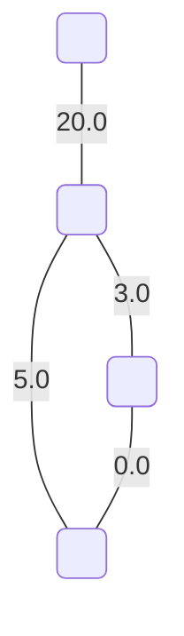
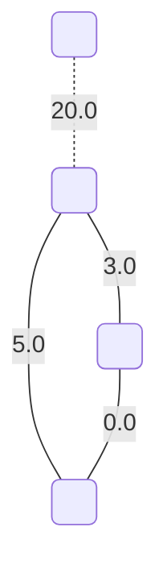
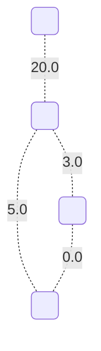

# Even subgraph matroids

On input we have following graph $G$:

By this non-so efficient way we find all even subgraph matroids by greedily going through all combinations. Then we get so called **even subgraph matroids**.

## Matroid Nr.1

**This matroid is maximal with respect to the edge values.**

This matroid has a value: `8.0`.

## Matroid Nr.2

This matroid has a value: `0.0`.

