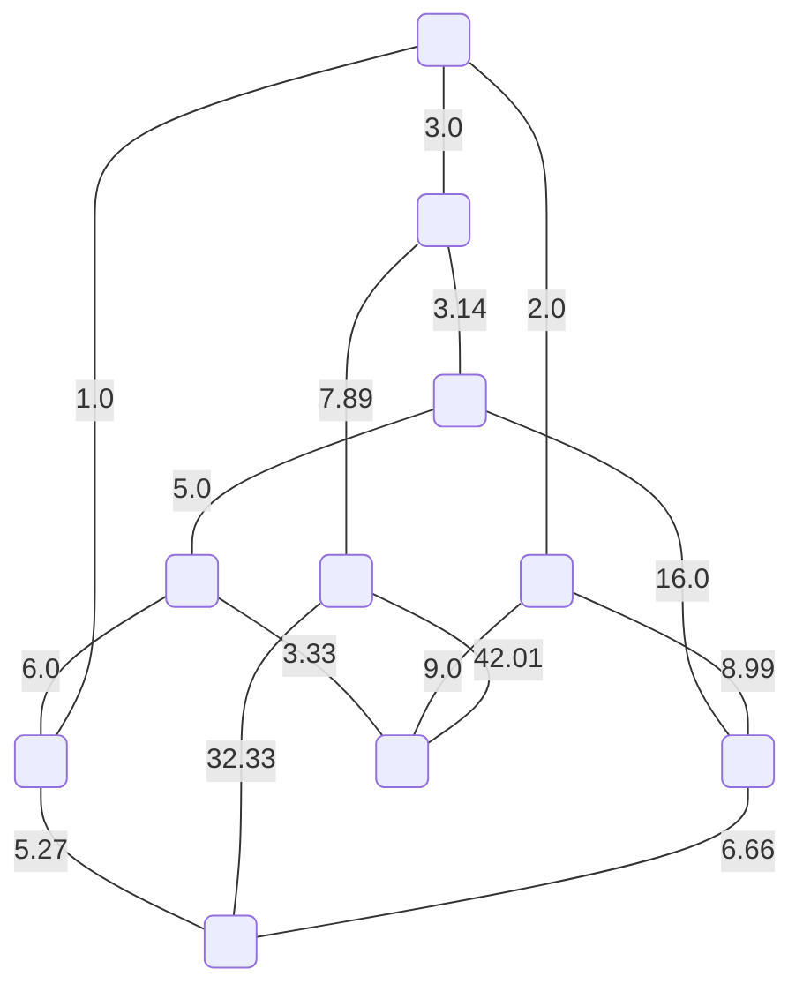
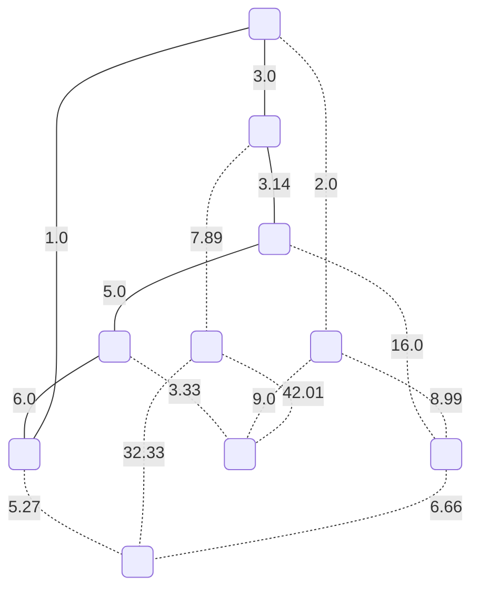
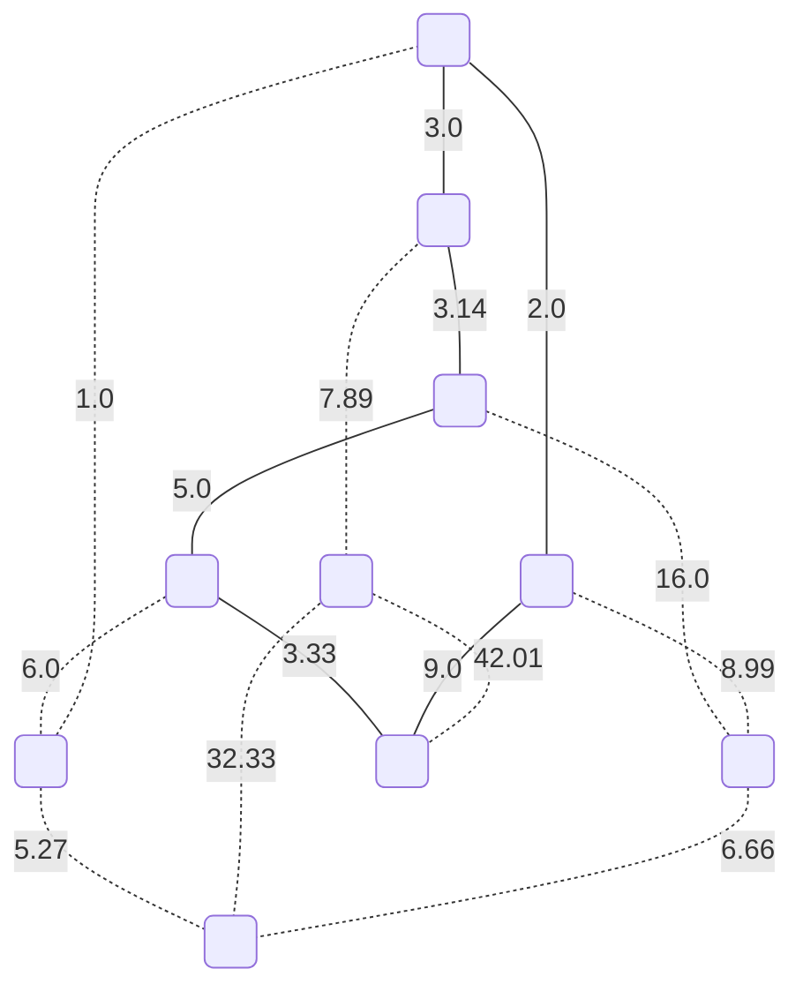
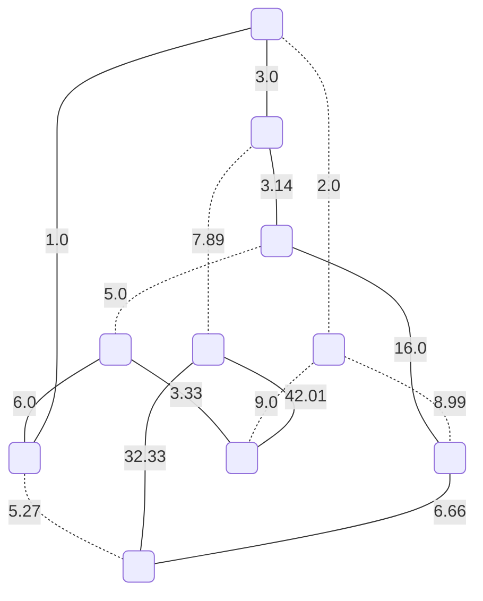
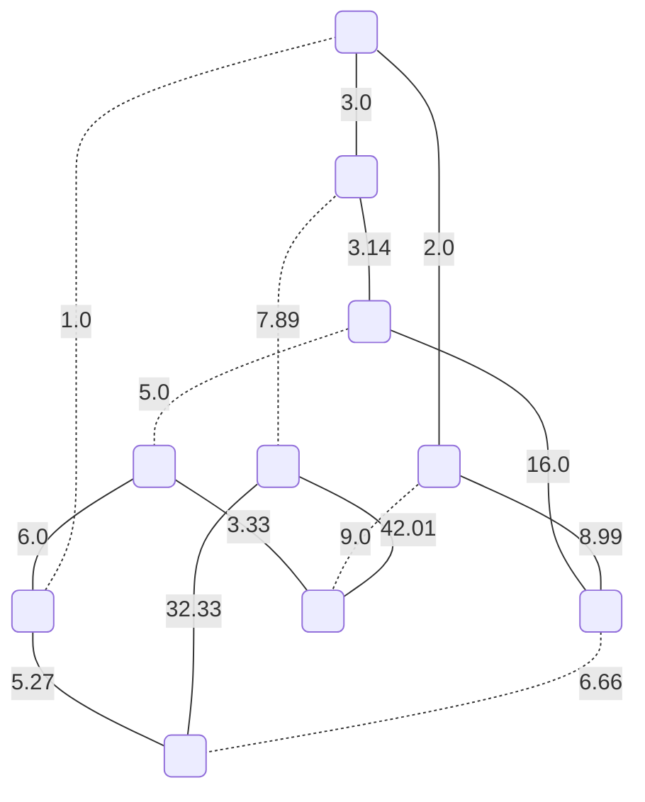
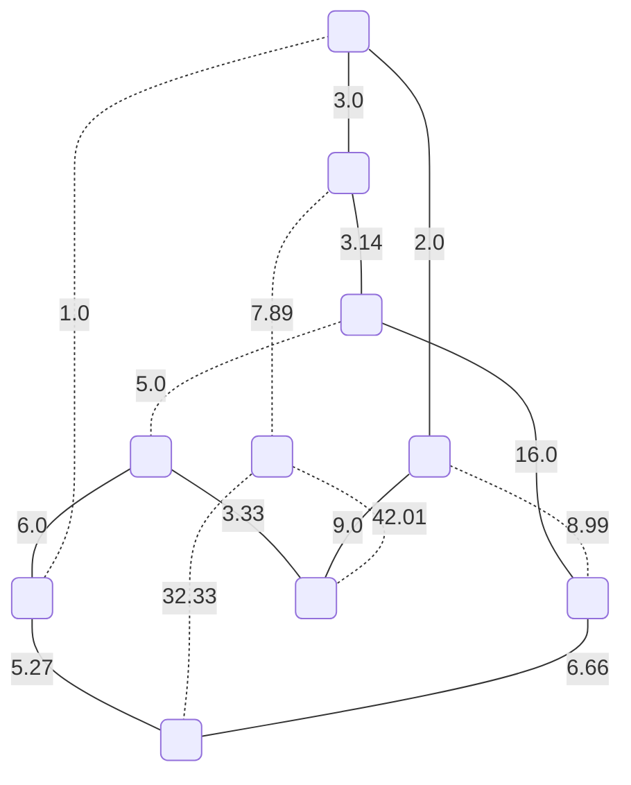
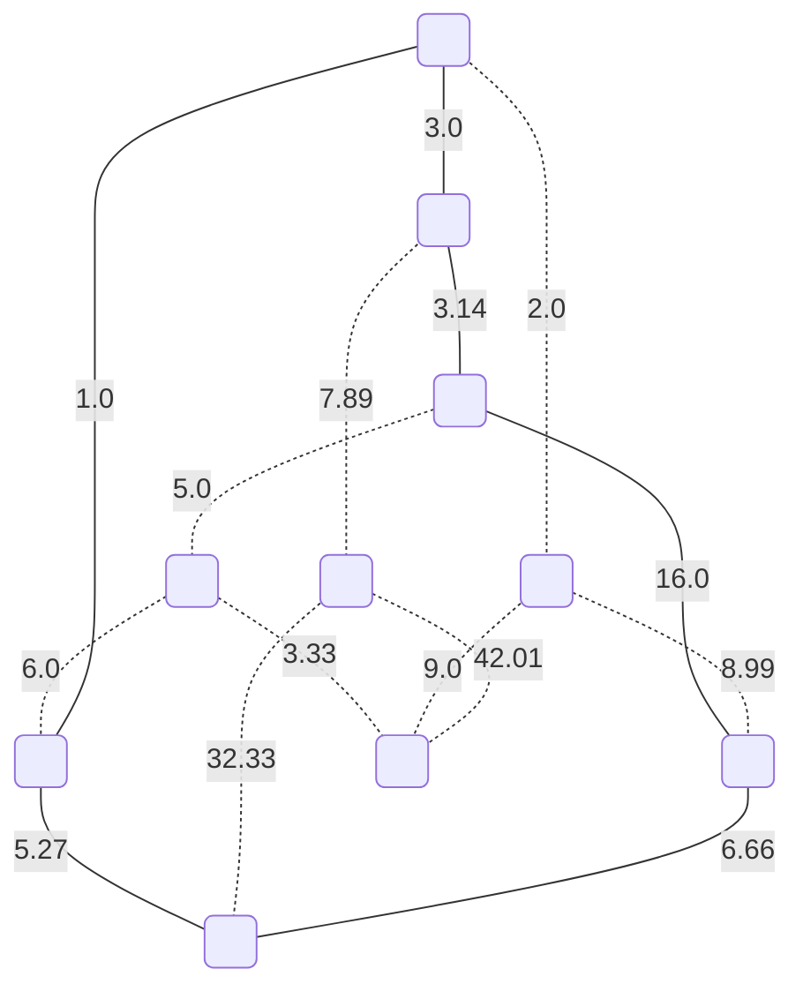
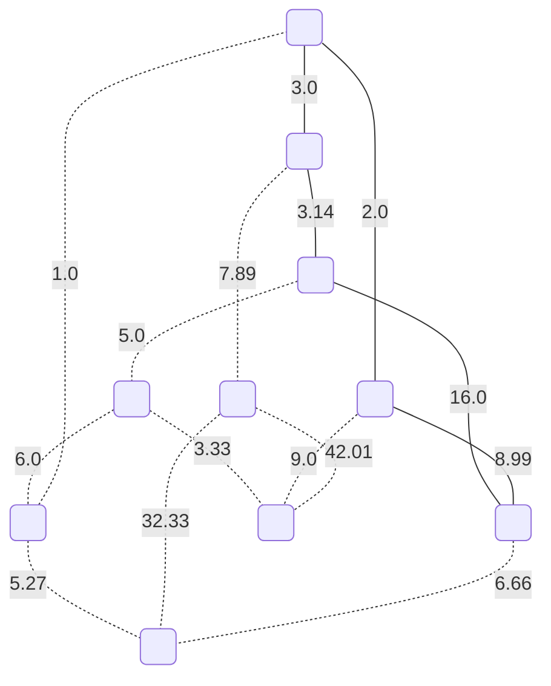
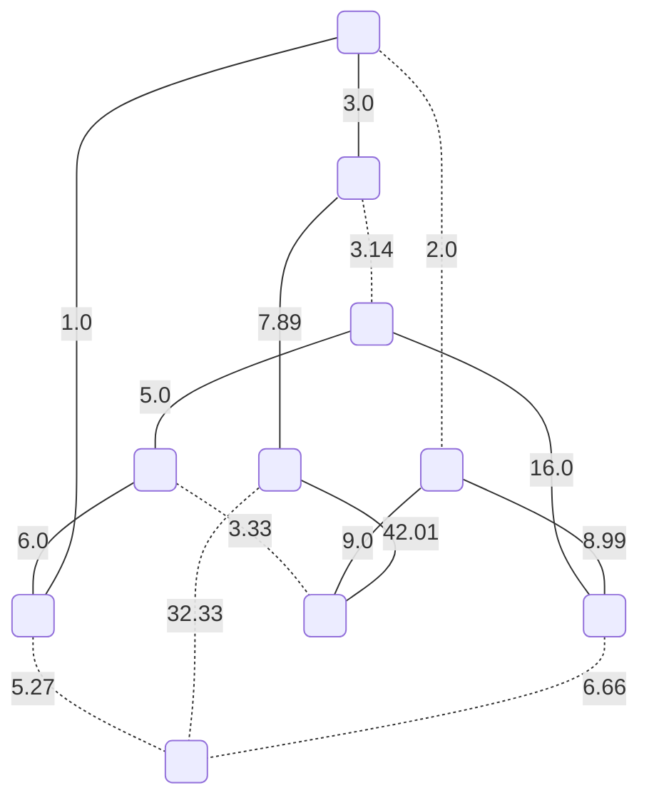

# Even subgraph matroids

On input we have following graph $G$:



By this non-so efficient way we find all even subgraph matroids by greedily going through all combinations. Then we get so called **even subgraph matroids**.

## Matroid Nr.1



This matroid has a value: `18.14`.

## Matroid Nr.2


This matroid has a value: `117.13`.

## Matroid Nr.3


This matroid has a value: `40.06`.

## Matroid Nr.4


This matroid has a value: `107.74999999999999`.

## Matroid Nr.5


This matroid has a value: `45.39`.

## Matroid Nr.6


This matroid has a value: `95.08`.

## Matroid Nr.7


This matroid has a value: `106.46`.

## Matroid Nr.8



This matroid has a value: `25.47`.

## Matroid Nr.9


This matroid has a value: `50.46`.

## Matroid Nr.10



This matroid has a value: `113.47`.

## Matroid Nr.11



This matroid has a value: `122.07`.

## Matroid Nr.12



This matroid has a value: `54.4`.

## Matroid Nr.13


This matroid has a value: `120.74`.

## Matroid Nr.14



This matroid has a value: `35.07`.

## Matroid Nr.15



This matroid has a value: `33.13`.

## Matroid Nr.16


This matroid has a value: `114.13999999999999`.

## Matroid Nr.17



This matroid has a value: `98.88999999999999`.

## Matroid Nr.18


This matroid has a value: `77.88`.

## Matroid Nr.19


This matroid has a value: `86.47999999999999`.

## Matroid Nr.20

```mermaid
graph TD;
	0(" ");
	1(" ");
	2(" ");
	3(" ");
	4(" ");
	5(" ");
	6(" ");
	7(" ");
	8(" ");
	9(" ");
	0 -- "3.0" --- 1;
	1 -. "3.14" -.- 2;
	2 -- "5.0" --- 3;
	3 -- "6.0" --- 4;
	4 -. "1.0" -.- 0;
	0 -- "2.0" --- 5;
	1 -- "7.89" --- 6;
	2 -- "16.0" --- 7;
	3 -. "3.33" -.- 8;
	4 -- "5.27" --- 9;
	5 -. "8.99" -.- 7;
	5 -- "9.0" --- 8;
	6 -- "42.01" --- 8;
	6 -. "32.33" -.- 9;
	7 -- "6.66" --- 9;
```

This matroid has a value: `102.82999999999998`.

## Matroid Nr.21

```mermaid
graph TD;
	0(" ");
	1(" ");
	2(" ");
	3(" ");
	4(" ");
	5(" ");
	6(" ");
	7(" ");
	8(" ");
	9(" ");
	0 -- "3.0" --- 1;
	1 -. "3.14" -.- 2;
	2 -- "5.0" --- 3;
	3 -. "6.0" -.- 4;
	4 -- "1.0" --- 0;
	0 -. "2.0" -.- 5;
	1 -- "7.89" --- 6;
	2 -- "16.0" --- 7;
	3 -- "3.33" --- 8;
	4 -- "5.27" --- 9;
	5 -- "8.99" --- 7;
	5 -- "9.0" --- 8;
	6 -. "42.01" -.- 8;
	6 -- "32.33" --- 9;
	7 -. "6.66" -.- 9;
```

This matroid has a value: `91.81`.

## Matroid Nr.22

```mermaid
graph TD;
	0(" ");
	1(" ");
	2(" ");
	3(" ");
	4(" ");
	5(" ");
	6(" ");
	7(" ");
	8(" ");
	9(" ");
	0 -- "3.0" --- 1;
	1 -. "3.14" -.- 2;
	2 -- "5.0" --- 3;
	3 -. "6.0" -.- 4;
	4 -- "1.0" --- 0;
	0 -. "2.0" -.- 5;
	1 -- "7.89" --- 6;
	2 -- "16.0" --- 7;
	3 -- "3.33" --- 8;
	4 -- "5.27" --- 9;
	5 -. "8.99" -.- 7;
	5 -. "9.0" -.- 8;
	6 -- "42.01" --- 8;
	6 -. "32.33" -.- 9;
	7 -- "6.66" --- 9;
```

This matroid has a value: `90.16`.

## Matroid Nr.23

```mermaid
graph TD;
	0(" ");
	1(" ");
	2(" ");
	3(" ");
	4(" ");
	5(" ");
	6(" ");
	7(" ");
	8(" ");
	9(" ");
	0 -- "3.0" --- 1;
	1 -. "3.14" -.- 2;
	2 -- "5.0" --- 3;
	3 -. "6.0" -.- 4;
	4 -. "1.0" -.- 0;
	0 -- "2.0" --- 5;
	1 -- "7.89" --- 6;
	2 -- "16.0" --- 7;
	3 -- "3.33" --- 8;
	4 -. "5.27" -.- 9;
	5 -- "8.99" --- 7;
	5 -. "9.0" -.- 8;
	6 -- "42.01" --- 8;
	6 -. "32.33" -.- 9;
	7 -. "6.66" -.- 9;
```

This matroid has a value: `88.22`.

## Matroid Nr.24

```mermaid
graph TD;
	0(" ");
	1(" ");
	2(" ");
	3(" ");
	4(" ");
	5(" ");
	6(" ");
	7(" ");
	8(" ");
	9(" ");
	0 -- "3.0" --- 1;
	1 -. "3.14" -.- 2;
	2 -- "5.0" --- 3;
	3 -. "6.0" -.- 4;
	4 -. "1.0" -.- 0;
	0 -- "2.0" --- 5;
	1 -- "7.89" --- 6;
	2 -- "16.0" --- 7;
	3 -- "3.33" --- 8;
	4 -. "5.27" -.- 9;
	5 -. "8.99" -.- 7;
	5 -- "9.0" --- 8;
	6 -. "42.01" -.- 8;
	6 -- "32.33" --- 9;
	7 -- "6.66" --- 9;
```

This matroid has a value: `85.21`.

## Matroid Nr.25

```mermaid
graph TD;
	0(" ");
	1(" ");
	2(" ");
	3(" ");
	4(" ");
	5(" ");
	6(" ");
	7(" ");
	8(" ");
	9(" ");
	0 -- "3.0" --- 1;
	1 -. "3.14" -.- 2;
	2 -. "5.0" -.- 3;
	3 -- "6.0" --- 4;
	4 -- "1.0" --- 0;
	0 -. "2.0" -.- 5;
	1 -- "7.89" --- 6;
	2 -. "16.0" -.- 7;
	3 -- "3.33" --- 8;
	4 -. "5.27" -.- 9;
	5 -- "8.99" --- 7;
	5 -- "9.0" --- 8;
	6 -. "42.01" -.- 8;
	6 -- "32.33" --- 9;
	7 -- "6.66" --- 9;
```

This matroid has a value: `78.19999999999999`.

## Matroid Nr.26

```mermaid
graph TD;
	0(" ");
	1(" ");
	2(" ");
	3(" ");
	4(" ");
	5(" ");
	6(" ");
	7(" ");
	8(" ");
	9(" ");
	0 -- "3.0" --- 1;
	1 -. "3.14" -.- 2;
	2 -. "5.0" -.- 3;
	3 -- "6.0" --- 4;
	4 -- "1.0" --- 0;
	0 -. "2.0" -.- 5;
	1 -- "7.89" --- 6;
	2 -. "16.0" -.- 7;
	3 -- "3.33" --- 8;
	4 -. "5.27" -.- 9;
	5 -. "8.99" -.- 7;
	5 -. "9.0" -.- 8;
	6 -- "42.01" --- 8;
	6 -. "32.33" -.- 9;
	7 -. "6.66" -.- 9;
```

This matroid has a value: `63.23`.

## Matroid Nr.27

```mermaid
graph TD;
	0(" ");
	1(" ");
	2(" ");
	3(" ");
	4(" ");
	5(" ");
	6(" ");
	7(" ");
	8(" ");
	9(" ");
	0 -- "3.0" --- 1;
	1 -. "3.14" -.- 2;
	2 -. "5.0" -.- 3;
	3 -- "6.0" --- 4;
	4 -. "1.0" -.- 0;
	0 -- "2.0" --- 5;
	1 -- "7.89" --- 6;
	2 -. "16.0" -.- 7;
	3 -- "3.33" --- 8;
	4 -- "5.27" --- 9;
	5 -- "8.99" --- 7;
	5 -. "9.0" -.- 8;
	6 -- "42.01" --- 8;
	6 -. "32.33" -.- 9;
	7 -- "6.66" --- 9;
```

This matroid has a value: `85.14999999999998`.

## Matroid Nr.28

```mermaid
graph TD;
	0(" ");
	1(" ");
	2(" ");
	3(" ");
	4(" ");
	5(" ");
	6(" ");
	7(" ");
	8(" ");
	9(" ");
	0 -- "3.0" --- 1;
	1 -. "3.14" -.- 2;
	2 -. "5.0" -.- 3;
	3 -- "6.0" --- 4;
	4 -. "1.0" -.- 0;
	0 -- "2.0" --- 5;
	1 -- "7.89" --- 6;
	2 -. "16.0" -.- 7;
	3 -- "3.33" --- 8;
	4 -- "5.27" --- 9;
	5 -. "8.99" -.- 7;
	5 -- "9.0" --- 8;
	6 -. "42.01" -.- 8;
	6 -- "32.33" --- 9;
	7 -. "6.66" -.- 9;
```

This matroid has a value: `68.82`.

## Matroid Nr.29

```mermaid
graph TD;
	0(" ");
	1(" ");
	2(" ");
	3(" ");
	4(" ");
	5(" ");
	6(" ");
	7(" ");
	8(" ");
	9(" ");
	0 -- "3.0" --- 1;
	1 -. "3.14" -.- 2;
	2 -. "5.0" -.- 3;
	3 -. "6.0" -.- 4;
	4 -- "1.0" --- 0;
	0 -. "2.0" -.- 5;
	1 -- "7.89" --- 6;
	2 -. "16.0" -.- 7;
	3 -. "3.33" -.- 8;
	4 -- "5.27" --- 9;
	5 -- "8.99" --- 7;
	5 -- "9.0" --- 8;
	6 -- "42.01" --- 8;
	6 -. "32.33" -.- 9;
	7 -- "6.66" --- 9;
```

This matroid has a value: `83.82`.

## Matroid Nr.30

```mermaid
graph TD;
	0(" ");
	1(" ");
	2(" ");
	3(" ");
	4(" ");
	5(" ");
	6(" ");
	7(" ");
	8(" ");
	9(" ");
	0 -- "3.0" --- 1;
	1 -. "3.14" -.- 2;
	2 -. "5.0" -.- 3;
	3 -. "6.0" -.- 4;
	4 -- "1.0" --- 0;
	0 -. "2.0" -.- 5;
	1 -- "7.89" --- 6;
	2 -. "16.0" -.- 7;
	3 -. "3.33" -.- 8;
	4 -- "5.27" --- 9;
	5 -. "8.99" -.- 7;
	5 -. "9.0" -.- 8;
	6 -. "42.01" -.- 8;
	6 -- "32.33" --- 9;
	7 -. "6.66" -.- 9;
```

This matroid has a value: `49.489999999999995`.

## Matroid Nr.31

```mermaid
graph TD;
	0(" ");
	1(" ");
	2(" ");
	3(" ");
	4(" ");
	5(" ");
	6(" ");
	7(" ");
	8(" ");
	9(" ");
	0 -- "3.0" --- 1;
	1 -. "3.14" -.- 2;
	2 -. "5.0" -.- 3;
	3 -. "6.0" -.- 4;
	4 -. "1.0" -.- 0;
	0 -- "2.0" --- 5;
	1 -- "7.89" --- 6;
	2 -. "16.0" -.- 7;
	3 -. "3.33" -.- 8;
	4 -. "5.27" -.- 9;
	5 -- "8.99" --- 7;
	5 -. "9.0" -.- 8;
	6 -. "42.01" -.- 8;
	6 -- "32.33" --- 9;
	7 -- "6.66" --- 9;
```

This matroid has a value: `60.870000000000005`.

## Matroid Nr.32

```mermaid
graph TD;
	0(" ");
	1(" ");
	2(" ");
	3(" ");
	4(" ");
	5(" ");
	6(" ");
	7(" ");
	8(" ");
	9(" ");
	0 -- "3.0" --- 1;
	1 -. "3.14" -.- 2;
	2 -. "5.0" -.- 3;
	3 -. "6.0" -.- 4;
	4 -. "1.0" -.- 0;
	0 -- "2.0" --- 5;
	1 -- "7.89" --- 6;
	2 -. "16.0" -.- 7;
	3 -. "3.33" -.- 8;
	4 -. "5.27" -.- 9;
	5 -. "8.99" -.- 7;
	5 -- "9.0" --- 8;
	6 -- "42.01" --- 8;
	6 -. "32.33" -.- 9;
	7 -. "6.66" -.- 9;
```

This matroid has a value: `63.9`.

## Matroid Nr.33

```mermaid
graph TD;
	0(" ");
	1(" ");
	2(" ");
	3(" ");
	4(" ");
	5(" ");
	6(" ");
	7(" ");
	8(" ");
	9(" ");
	0 -. "3.0" -.- 1;
	1 -- "3.14" --- 2;
	2 -- "5.0" --- 3;
	3 -- "6.0" --- 4;
	4 -- "1.0" --- 0;
	0 -- "2.0" --- 5;
	1 -- "7.89" --- 6;
	2 -. "16.0" -.- 7;
	3 -. "3.33" -.- 8;
	4 -. "5.27" -.- 9;
	5 -- "8.99" --- 7;
	5 -. "9.0" -.- 8;
	6 -. "42.01" -.- 8;
	6 -- "32.33" --- 9;
	7 -- "6.66" --- 9;
```

This matroid has a value: `73.01`.

## Matroid Nr.34

```mermaid
graph TD;
	0(" ");
	1(" ");
	2(" ");
	3(" ");
	4(" ");
	5(" ");
	6(" ");
	7(" ");
	8(" ");
	9(" ");
	0 -. "3.0" -.- 1;
	1 -- "3.14" --- 2;
	2 -- "5.0" --- 3;
	3 -- "6.0" --- 4;
	4 -- "1.0" --- 0;
	0 -- "2.0" --- 5;
	1 -- "7.89" --- 6;
	2 -. "16.0" -.- 7;
	3 -. "3.33" -.- 8;
	4 -. "5.27" -.- 9;
	5 -. "8.99" -.- 7;
	5 -- "9.0" --- 8;
	6 -- "42.01" --- 8;
	6 -. "32.33" -.- 9;
	7 -. "6.66" -.- 9;
```

This matroid has a value: `76.03999999999999`.

## Matroid Nr.35

```mermaid
graph TD;
	0(" ");
	1(" ");
	2(" ");
	3(" ");
	4(" ");
	5(" ");
	6(" ");
	7(" ");
	8(" ");
	9(" ");
	0 -. "3.0" -.- 1;
	1 -- "3.14" --- 2;
	2 -- "5.0" --- 3;
	3 -- "6.0" --- 4;
	4 -. "1.0" -.- 0;
	0 -. "2.0" -.- 5;
	1 -- "7.89" --- 6;
	2 -. "16.0" -.- 7;
	3 -. "3.33" -.- 8;
	4 -- "5.27" --- 9;
	5 -- "8.99" --- 7;
	5 -- "9.0" --- 8;
	6 -- "42.01" --- 8;
	6 -. "32.33" -.- 9;
	7 -- "6.66" --- 9;
```

This matroid has a value: `93.95999999999998`.

## Matroid Nr.36

```mermaid
graph TD;
	0(" ");
	1(" ");
	2(" ");
	3(" ");
	4(" ");
	5(" ");
	6(" ");
	7(" ");
	8(" ");
	9(" ");
	0 -. "3.0" -.- 1;
	1 -- "3.14" --- 2;
	2 -- "5.0" --- 3;
	3 -- "6.0" --- 4;
	4 -. "1.0" -.- 0;
	0 -. "2.0" -.- 5;
	1 -- "7.89" --- 6;
	2 -. "16.0" -.- 7;
	3 -. "3.33" -.- 8;
	4 -- "5.27" --- 9;
	5 -. "8.99" -.- 7;
	5 -. "9.0" -.- 8;
	6 -. "42.01" -.- 8;
	6 -- "32.33" --- 9;
	7 -. "6.66" -.- 9;
```

This matroid has a value: `59.629999999999995`.

## Matroid Nr.37

```mermaid
graph TD;
	0(" ");
	1(" ");
	2(" ");
	3(" ");
	4(" ");
	5(" ");
	6(" ");
	7(" ");
	8(" ");
	9(" ");
	0 -. "3.0" -.- 1;
	1 -- "3.14" --- 2;
	2 -- "5.0" --- 3;
	3 -. "6.0" -.- 4;
	4 -- "1.0" --- 0;
	0 -- "2.0" --- 5;
	1 -- "7.89" --- 6;
	2 -. "16.0" -.- 7;
	3 -- "3.33" --- 8;
	4 -- "5.27" --- 9;
	5 -- "8.99" --- 7;
	5 -. "9.0" -.- 8;
	6 -- "42.01" --- 8;
	6 -. "32.33" -.- 9;
	7 -- "6.66" --- 9;
```

This matroid has a value: `85.28999999999999`.

## Matroid Nr.38

```mermaid
graph TD;
	0(" ");
	1(" ");
	2(" ");
	3(" ");
	4(" ");
	5(" ");
	6(" ");
	7(" ");
	8(" ");
	9(" ");
	0 -. "3.0" -.- 1;
	1 -- "3.14" --- 2;
	2 -- "5.0" --- 3;
	3 -. "6.0" -.- 4;
	4 -- "1.0" --- 0;
	0 -- "2.0" --- 5;
	1 -- "7.89" --- 6;
	2 -. "16.0" -.- 7;
	3 -- "3.33" --- 8;
	4 -- "5.27" --- 9;
	5 -. "8.99" -.- 7;
	5 -- "9.0" --- 8;
	6 -. "42.01" -.- 8;
	6 -- "32.33" --- 9;
	7 -. "6.66" -.- 9;
```

This matroid has a value: `68.96`.

## Matroid Nr.39

```mermaid
graph TD;
	0(" ");
	1(" ");
	2(" ");
	3(" ");
	4(" ");
	5(" ");
	6(" ");
	7(" ");
	8(" ");
	9(" ");
	0 -. "3.0" -.- 1;
	1 -- "3.14" --- 2;
	2 -- "5.0" --- 3;
	3 -. "6.0" -.- 4;
	4 -. "1.0" -.- 0;
	0 -. "2.0" -.- 5;
	1 -- "7.89" --- 6;
	2 -. "16.0" -.- 7;
	3 -- "3.33" --- 8;
	4 -. "5.27" -.- 9;
	5 -- "8.99" --- 7;
	5 -- "9.0" --- 8;
	6 -. "42.01" -.- 8;
	6 -- "32.33" --- 9;
	7 -- "6.66" --- 9;
```

This matroid has a value: `76.34`.

## Matroid Nr.40

```mermaid
graph TD;
	0(" ");
	1(" ");
	2(" ");
	3(" ");
	4(" ");
	5(" ");
	6(" ");
	7(" ");
	8(" ");
	9(" ");
	0 -. "3.0" -.- 1;
	1 -- "3.14" --- 2;
	2 -- "5.0" --- 3;
	3 -. "6.0" -.- 4;
	4 -. "1.0" -.- 0;
	0 -. "2.0" -.- 5;
	1 -- "7.89" --- 6;
	2 -. "16.0" -.- 7;
	3 -- "3.33" --- 8;
	4 -. "5.27" -.- 9;
	5 -. "8.99" -.- 7;
	5 -. "9.0" -.- 8;
	6 -- "42.01" --- 8;
	6 -. "32.33" -.- 9;
	7 -. "6.66" -.- 9;
```

This matroid has a value: `61.37`.

## Matroid Nr.41

```mermaid
graph TD;
	0(" ");
	1(" ");
	2(" ");
	3(" ");
	4(" ");
	5(" ");
	6(" ");
	7(" ");
	8(" ");
	9(" ");
	0 -. "3.0" -.- 1;
	1 -- "3.14" --- 2;
	2 -. "5.0" -.- 3;
	3 -- "6.0" --- 4;
	4 -- "1.0" --- 0;
	0 -- "2.0" --- 5;
	1 -- "7.89" --- 6;
	2 -- "16.0" --- 7;
	3 -- "3.33" --- 8;
	4 -. "5.27" -.- 9;
	5 -- "8.99" --- 7;
	5 -. "9.0" -.- 8;
	6 -- "42.01" --- 8;
	6 -. "32.33" -.- 9;
	7 -. "6.66" -.- 9;
```

This matroid has a value: `90.35999999999999`.

## Matroid Nr.42

```mermaid
graph TD;
	0(" ");
	1(" ");
	2(" ");
	3(" ");
	4(" ");
	5(" ");
	6(" ");
	7(" ");
	8(" ");
	9(" ");
	0 -. "3.0" -.- 1;
	1 -- "3.14" --- 2;
	2 -. "5.0" -.- 3;
	3 -- "6.0" --- 4;
	4 -- "1.0" --- 0;
	0 -- "2.0" --- 5;
	1 -- "7.89" --- 6;
	2 -- "16.0" --- 7;
	3 -- "3.33" --- 8;
	4 -. "5.27" -.- 9;
	5 -. "8.99" -.- 7;
	5 -- "9.0" --- 8;
	6 -. "42.01" -.- 8;
	6 -- "32.33" --- 9;
	7 -- "6.66" --- 9;
```

This matroid has a value: `87.35`.

## Matroid Nr.43

```mermaid
graph TD;
	0(" ");
	1(" ");
	2(" ");
	3(" ");
	4(" ");
	5(" ");
	6(" ");
	7(" ");
	8(" ");
	9(" ");
	0 -. "3.0" -.- 1;
	1 -- "3.14" --- 2;
	2 -. "5.0" -.- 3;
	3 -- "6.0" --- 4;
	4 -. "1.0" -.- 0;
	0 -. "2.0" -.- 5;
	1 -- "7.89" --- 6;
	2 -- "16.0" --- 7;
	3 -- "3.33" --- 8;
	4 -- "5.27" --- 9;
	5 -- "8.99" --- 7;
	5 -- "9.0" --- 8;
	6 -. "42.01" -.- 8;
	6 -- "32.33" --- 9;
	7 -. "6.66" -.- 9;
```

This matroid has a value: `91.94999999999999`.

## Matroid Nr.44

```mermaid
graph TD;
	0(" ");
	1(" ");
	2(" ");
	3(" ");
	4(" ");
	5(" ");
	6(" ");
	7(" ");
	8(" ");
	9(" ");
	0 -. "3.0" -.- 1;
	1 -- "3.14" --- 2;
	2 -. "5.0" -.- 3;
	3 -- "6.0" --- 4;
	4 -. "1.0" -.- 0;
	0 -. "2.0" -.- 5;
	1 -- "7.89" --- 6;
	2 -- "16.0" --- 7;
	3 -- "3.33" --- 8;
	4 -- "5.27" --- 9;
	5 -. "8.99" -.- 7;
	5 -. "9.0" -.- 8;
	6 -- "42.01" --- 8;
	6 -. "32.33" -.- 9;
	7 -- "6.66" --- 9;
```

This matroid has a value: `90.3`.

## Matroid Nr.45

```mermaid
graph TD;
	0(" ");
	1(" ");
	2(" ");
	3(" ");
	4(" ");
	5(" ");
	6(" ");
	7(" ");
	8(" ");
	9(" ");
	0 -. "3.0" -.- 1;
	1 -- "3.14" --- 2;
	2 -. "5.0" -.- 3;
	3 -. "6.0" -.- 4;
	4 -- "1.0" --- 0;
	0 -- "2.0" --- 5;
	1 -- "7.89" --- 6;
	2 -- "16.0" --- 7;
	3 -. "3.33" -.- 8;
	4 -- "5.27" --- 9;
	5 -- "8.99" --- 7;
	5 -. "9.0" -.- 8;
	6 -. "42.01" -.- 8;
	6 -- "32.33" --- 9;
	7 -. "6.66" -.- 9;
```

This matroid has a value: `76.62`.

## Matroid Nr.46

```mermaid
graph TD;
	0(" ");
	1(" ");
	2(" ");
	3(" ");
	4(" ");
	5(" ");
	6(" ");
	7(" ");
	8(" ");
	9(" ");
	0 -. "3.0" -.- 1;
	1 -- "3.14" --- 2;
	2 -. "5.0" -.- 3;
	3 -. "6.0" -.- 4;
	4 -- "1.0" --- 0;
	0 -- "2.0" --- 5;
	1 -- "7.89" --- 6;
	2 -- "16.0" --- 7;
	3 -. "3.33" -.- 8;
	4 -- "5.27" --- 9;
	5 -. "8.99" -.- 7;
	5 -- "9.0" --- 8;
	6 -- "42.01" --- 8;
	6 -. "32.33" -.- 9;
	7 -- "6.66" --- 9;
```

This matroid has a value: `92.96999999999998`.

## Matroid Nr.47

```mermaid
graph TD;
	0(" ");
	1(" ");
	2(" ");
	3(" ");
	4(" ");
	5(" ");
	6(" ");
	7(" ");
	8(" ");
	9(" ");
	0 -. "3.0" -.- 1;
	1 -- "3.14" --- 2;
	2 -. "5.0" -.- 3;
	3 -. "6.0" -.- 4;
	4 -. "1.0" -.- 0;
	0 -. "2.0" -.- 5;
	1 -- "7.89" --- 6;
	2 -- "16.0" --- 7;
	3 -. "3.33" -.- 8;
	4 -. "5.27" -.- 9;
	5 -- "8.99" --- 7;
	5 -- "9.0" --- 8;
	6 -- "42.01" --- 8;
	6 -. "32.33" -.- 9;
	7 -. "6.66" -.- 9;
```

This matroid has a value: `87.03`.

## Matroid Nr.48

```mermaid
graph TD;
	0(" ");
	1(" ");
	2(" ");
	3(" ");
	4(" ");
	5(" ");
	6(" ");
	7(" ");
	8(" ");
	9(" ");
	0 -. "3.0" -.- 1;
	1 -- "3.14" --- 2;
	2 -. "5.0" -.- 3;
	3 -. "6.0" -.- 4;
	4 -. "1.0" -.- 0;
	0 -. "2.0" -.- 5;
	1 -- "7.89" --- 6;
	2 -- "16.0" --- 7;
	3 -. "3.33" -.- 8;
	4 -. "5.27" -.- 9;
	5 -. "8.99" -.- 7;
	5 -. "9.0" -.- 8;
	6 -. "42.01" -.- 8;
	6 -- "32.33" --- 9;
	7 -- "6.66" --- 9;
```

This matroid has a value: `66.02`.

## Matroid Nr.49

```mermaid
graph TD;
	0(" ");
	1(" ");
	2(" ");
	3(" ");
	4(" ");
	5(" ");
	6(" ");
	7(" ");
	8(" ");
	9(" ");
	0 -. "3.0" -.- 1;
	1 -. "3.14" -.- 2;
	2 -- "5.0" --- 3;
	3 -- "6.0" --- 4;
	4 -- "1.0" --- 0;
	0 -- "2.0" --- 5;
	1 -. "7.89" -.- 6;
	2 -- "16.0" --- 7;
	3 -. "3.33" -.- 8;
	4 -. "5.27" -.- 9;
	5 -- "8.99" --- 7;
	5 -. "9.0" -.- 8;
	6 -. "42.01" -.- 8;
	6 -. "32.33" -.- 9;
	7 -. "6.66" -.- 9;
```

This matroid has a value: `38.99`.

## Matroid Nr.50

```mermaid
graph TD;
	0(" ");
	1(" ");
	2(" ");
	3(" ");
	4(" ");
	5(" ");
	6(" ");
	7(" ");
	8(" ");
	9(" ");
	0 -. "3.0" -.- 1;
	1 -. "3.14" -.- 2;
	2 -- "5.0" --- 3;
	3 -- "6.0" --- 4;
	4 -- "1.0" --- 0;
	0 -- "2.0" --- 5;
	1 -. "7.89" -.- 6;
	2 -- "16.0" --- 7;
	3 -. "3.33" -.- 8;
	4 -. "5.27" -.- 9;
	5 -. "8.99" -.- 7;
	5 -- "9.0" --- 8;
	6 -- "42.01" --- 8;
	6 -- "32.33" --- 9;
	7 -- "6.66" --- 9;
```

This matroid has a value: `120.0`.

## Matroid Nr.51

**This matroid is maximal with respect to the edge values.**

```mermaid
graph TD;
	0(" ");
	1(" ");
	2(" ");
	3(" ");
	4(" ");
	5(" ");
	6(" ");
	7(" ");
	8(" ");
	9(" ");
	0 -. "3.0" -.- 1;
	1 -. "3.14" -.- 2;
	2 -- "5.0" --- 3;
	3 -- "6.0" --- 4;
	4 -. "1.0" -.- 0;
	0 -. "2.0" -.- 5;
	1 -. "7.89" -.- 6;
	2 -- "16.0" --- 7;
	3 -. "3.33" -.- 8;
	4 -- "5.27" --- 9;
	5 -- "8.99" --- 7;
	5 -- "9.0" --- 8;
	6 -- "42.01" --- 8;
	6 -- "32.33" --- 9;
	7 -. "6.66" -.- 9;
```

This matroid has a value: `124.6`.

## Matroid Nr.52

```mermaid
graph TD;
	0(" ");
	1(" ");
	2(" ");
	3(" ");
	4(" ");
	5(" ");
	6(" ");
	7(" ");
	8(" ");
	9(" ");
	0 -. "3.0" -.- 1;
	1 -. "3.14" -.- 2;
	2 -- "5.0" --- 3;
	3 -- "6.0" --- 4;
	4 -. "1.0" -.- 0;
	0 -. "2.0" -.- 5;
	1 -. "7.89" -.- 6;
	2 -- "16.0" --- 7;
	3 -. "3.33" -.- 8;
	4 -- "5.27" --- 9;
	5 -. "8.99" -.- 7;
	5 -. "9.0" -.- 8;
	6 -. "42.01" -.- 8;
	6 -. "32.33" -.- 9;
	7 -- "6.66" --- 9;
```

This matroid has a value: `38.93`.

## Matroid Nr.53

```mermaid
graph TD;
	0(" ");
	1(" ");
	2(" ");
	3(" ");
	4(" ");
	5(" ");
	6(" ");
	7(" ");
	8(" ");
	9(" ");
	0 -. "3.0" -.- 1;
	1 -. "3.14" -.- 2;
	2 -- "5.0" --- 3;
	3 -. "6.0" -.- 4;
	4 -- "1.0" --- 0;
	0 -- "2.0" --- 5;
	1 -. "7.89" -.- 6;
	2 -- "16.0" --- 7;
	3 -- "3.33" --- 8;
	4 -- "5.27" --- 9;
	5 -- "8.99" --- 7;
	5 -. "9.0" -.- 8;
	6 -- "42.01" --- 8;
	6 -- "32.33" --- 9;
	7 -. "6.66" -.- 9;
```

This matroid has a value: `115.93`.

## Matroid Nr.54

```mermaid
graph TD;
	0(" ");
	1(" ");
	2(" ");
	3(" ");
	4(" ");
	5(" ");
	6(" ");
	7(" ");
	8(" ");
	9(" ");
	0 -. "3.0" -.- 1;
	1 -. "3.14" -.- 2;
	2 -- "5.0" --- 3;
	3 -. "6.0" -.- 4;
	4 -- "1.0" --- 0;
	0 -- "2.0" --- 5;
	1 -. "7.89" -.- 6;
	2 -- "16.0" --- 7;
	3 -- "3.33" --- 8;
	4 -- "5.27" --- 9;
	5 -. "8.99" -.- 7;
	5 -- "9.0" --- 8;
	6 -. "42.01" -.- 8;
	6 -. "32.33" -.- 9;
	7 -- "6.66" --- 9;
```

This matroid has a value: `48.260000000000005`.

## Matroid Nr.55

```mermaid
graph TD;
	0(" ");
	1(" ");
	2(" ");
	3(" ");
	4(" ");
	5(" ");
	6(" ");
	7(" ");
	8(" ");
	9(" ");
	0 -. "3.0" -.- 1;
	1 -. "3.14" -.- 2;
	2 -- "5.0" --- 3;
	3 -. "6.0" -.- 4;
	4 -. "1.0" -.- 0;
	0 -. "2.0" -.- 5;
	1 -. "7.89" -.- 6;
	2 -- "16.0" --- 7;
	3 -- "3.33" --- 8;
	4 -. "5.27" -.- 9;
	5 -- "8.99" --- 7;
	5 -- "9.0" --- 8;
	6 -. "42.01" -.- 8;
	6 -. "32.33" -.- 9;
	7 -. "6.66" -.- 9;
```

This matroid has a value: `42.32`.

## Matroid Nr.56

```mermaid
graph TD;
	0(" ");
	1(" ");
	2(" ");
	3(" ");
	4(" ");
	5(" ");
	6(" ");
	7(" ");
	8(" ");
	9(" ");
	0 -. "3.0" -.- 1;
	1 -. "3.14" -.- 2;
	2 -- "5.0" --- 3;
	3 -. "6.0" -.- 4;
	4 -. "1.0" -.- 0;
	0 -. "2.0" -.- 5;
	1 -. "7.89" -.- 6;
	2 -- "16.0" --- 7;
	3 -- "3.33" --- 8;
	4 -. "5.27" -.- 9;
	5 -. "8.99" -.- 7;
	5 -. "9.0" -.- 8;
	6 -- "42.01" --- 8;
	6 -- "32.33" --- 9;
	7 -- "6.66" --- 9;
```

This matroid has a value: `105.32999999999998`.

## Matroid Nr.57

```mermaid
graph TD;
	0(" ");
	1(" ");
	2(" ");
	3(" ");
	4(" ");
	5(" ");
	6(" ");
	7(" ");
	8(" ");
	9(" ");
	0 -. "3.0" -.- 1;
	1 -. "3.14" -.- 2;
	2 -. "5.0" -.- 3;
	3 -- "6.0" --- 4;
	4 -- "1.0" --- 0;
	0 -- "2.0" --- 5;
	1 -. "7.89" -.- 6;
	2 -. "16.0" -.- 7;
	3 -- "3.33" --- 8;
	4 -. "5.27" -.- 9;
	5 -- "8.99" --- 7;
	5 -. "9.0" -.- 8;
	6 -- "42.01" --- 8;
	6 -- "32.33" --- 9;
	7 -- "6.66" --- 9;
```

This matroid has a value: `102.32`.

## Matroid Nr.58

```mermaid
graph TD;
	0(" ");
	1(" ");
	2(" ");
	3(" ");
	4(" ");
	5(" ");
	6(" ");
	7(" ");
	8(" ");
	9(" ");
	0 -. "3.0" -.- 1;
	1 -. "3.14" -.- 2;
	2 -. "5.0" -.- 3;
	3 -- "6.0" --- 4;
	4 -- "1.0" --- 0;
	0 -- "2.0" --- 5;
	1 -. "7.89" -.- 6;
	2 -. "16.0" -.- 7;
	3 -- "3.33" --- 8;
	4 -. "5.27" -.- 9;
	5 -. "8.99" -.- 7;
	5 -- "9.0" --- 8;
	6 -. "42.01" -.- 8;
	6 -. "32.33" -.- 9;
	7 -. "6.66" -.- 9;
```

This matroid has a value: `21.33`.

## Matroid Nr.59

```mermaid
graph TD;
	0(" ");
	1(" ");
	2(" ");
	3(" ");
	4(" ");
	5(" ");
	6(" ");
	7(" ");
	8(" ");
	9(" ");
	0 -. "3.0" -.- 1;
	1 -. "3.14" -.- 2;
	2 -. "5.0" -.- 3;
	3 -- "6.0" --- 4;
	4 -. "1.0" -.- 0;
	0 -. "2.0" -.- 5;
	1 -. "7.89" -.- 6;
	2 -. "16.0" -.- 7;
	3 -- "3.33" --- 8;
	4 -- "5.27" --- 9;
	5 -- "8.99" --- 7;
	5 -- "9.0" --- 8;
	6 -. "42.01" -.- 8;
	6 -. "32.33" -.- 9;
	7 -- "6.66" --- 9;
```

This matroid has a value: `39.25`.

## Matroid Nr.60

```mermaid
graph TD;
	0(" ");
	1(" ");
	2(" ");
	3(" ");
	4(" ");
	5(" ");
	6(" ");
	7(" ");
	8(" ");
	9(" ");
	0 -. "3.0" -.- 1;
	1 -. "3.14" -.- 2;
	2 -. "5.0" -.- 3;
	3 -- "6.0" --- 4;
	4 -. "1.0" -.- 0;
	0 -. "2.0" -.- 5;
	1 -. "7.89" -.- 6;
	2 -. "16.0" -.- 7;
	3 -- "3.33" --- 8;
	4 -- "5.27" --- 9;
	5 -. "8.99" -.- 7;
	5 -. "9.0" -.- 8;
	6 -- "42.01" --- 8;
	6 -- "32.33" --- 9;
	7 -. "6.66" -.- 9;
```

This matroid has a value: `88.94`.

## Matroid Nr.61

```mermaid
graph TD;
	0(" ");
	1(" ");
	2(" ");
	3(" ");
	4(" ");
	5(" ");
	6(" ");
	7(" ");
	8(" ");
	9(" ");
	0 -. "3.0" -.- 1;
	1 -. "3.14" -.- 2;
	2 -. "5.0" -.- 3;
	3 -. "6.0" -.- 4;
	4 -- "1.0" --- 0;
	0 -- "2.0" --- 5;
	1 -. "7.89" -.- 6;
	2 -. "16.0" -.- 7;
	3 -. "3.33" -.- 8;
	4 -- "5.27" --- 9;
	5 -- "8.99" --- 7;
	5 -. "9.0" -.- 8;
	6 -. "42.01" -.- 8;
	6 -. "32.33" -.- 9;
	7 -- "6.66" --- 9;
```

This matroid has a value: `23.919999999999998`.

## Matroid Nr.62

```mermaid
graph TD;
	0(" ");
	1(" ");
	2(" ");
	3(" ");
	4(" ");
	5(" ");
	6(" ");
	7(" ");
	8(" ");
	9(" ");
	0 -. "3.0" -.- 1;
	1 -. "3.14" -.- 2;
	2 -. "5.0" -.- 3;
	3 -. "6.0" -.- 4;
	4 -- "1.0" --- 0;
	0 -- "2.0" --- 5;
	1 -. "7.89" -.- 6;
	2 -. "16.0" -.- 7;
	3 -. "3.33" -.- 8;
	4 -- "5.27" --- 9;
	5 -. "8.99" -.- 7;
	5 -- "9.0" --- 8;
	6 -- "42.01" --- 8;
	6 -- "32.33" --- 9;
	7 -. "6.66" -.- 9;
```

This matroid has a value: `91.61`.

## Matroid Nr.63

```mermaid
graph TD;
	0(" ");
	1(" ");
	2(" ");
	3(" ");
	4(" ");
	5(" ");
	6(" ");
	7(" ");
	8(" ");
	9(" ");
	0 -. "3.0" -.- 1;
	1 -. "3.14" -.- 2;
	2 -. "5.0" -.- 3;
	3 -. "6.0" -.- 4;
	4 -. "1.0" -.- 0;
	0 -. "2.0" -.- 5;
	1 -. "7.89" -.- 6;
	2 -. "16.0" -.- 7;
	3 -. "3.33" -.- 8;
	4 -. "5.27" -.- 9;
	5 -- "8.99" --- 7;
	5 -- "9.0" --- 8;
	6 -- "42.01" --- 8;
	6 -- "32.33" --- 9;
	7 -- "6.66" --- 9;
```

This matroid has a value: `98.99`.

## Matroid Nr.64

```mermaid
graph TD;
	0(" ");
	1(" ");
	2(" ");
	3(" ");
	4(" ");
	5(" ");
	6(" ");
	7(" ");
	8(" ");
	9(" ");
	0 -. "3.0" -.- 1;
	1 -. "3.14" -.- 2;
	2 -. "5.0" -.- 3;
	3 -. "6.0" -.- 4;
	4 -. "1.0" -.- 0;
	0 -. "2.0" -.- 5;
	1 -. "7.89" -.- 6;
	2 -. "16.0" -.- 7;
	3 -. "3.33" -.- 8;
	4 -. "5.27" -.- 9;
	5 -. "8.99" -.- 7;
	5 -. "9.0" -.- 8;
	6 -. "42.01" -.- 8;
	6 -. "32.33" -.- 9;
	7 -. "6.66" -.- 9;
```

This matroid has a value: `0.0`.

