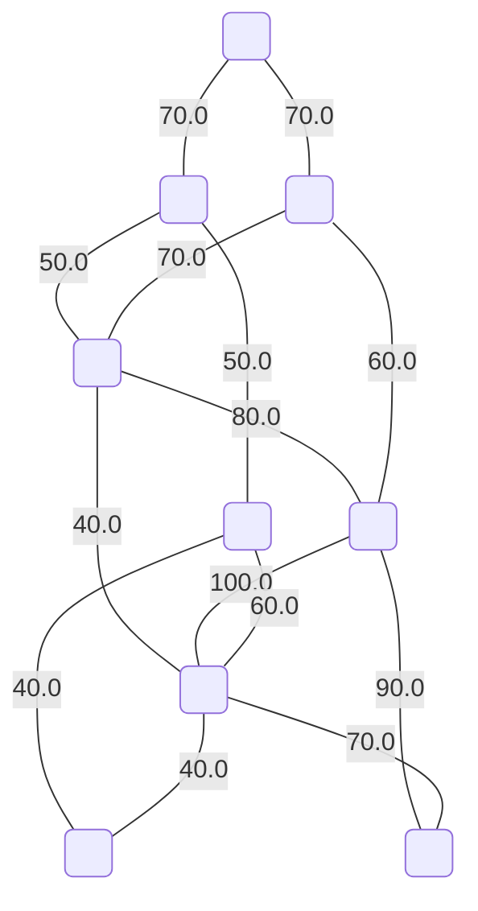

# Maximal matching in bipartite graph

We have following Graph $G$:

```mermaid
graph TD;
	0(" ");
	1(" ");
	2(" ");
	3(" ");
	4(" ");
	5(" ");
	6(" ");
	7(" ");
	8(" ");
	0 -- "70.0" --- 1;
	0 -- "70.0" --- 3;
	1 -- "50.0" --- 2;
	1 -- "50.0" --- 5;
	2 -- "40.0" --- 6;
	2 -- "80.0" --- 4;
	3 -- "70.0" --- 2;
	3 -- "60.0" --- 4;
	4 -- "100.0" --- 6;
	4 -- "90.0" --- 8;
	5 -- "40.0" --- 7;
	5 -- "60.0" --- 6;
	6 -- "40.0" --- 7;
	6 -- "70.0" --- 8;
```

We may already see, that the graph itself is not bipartite.

