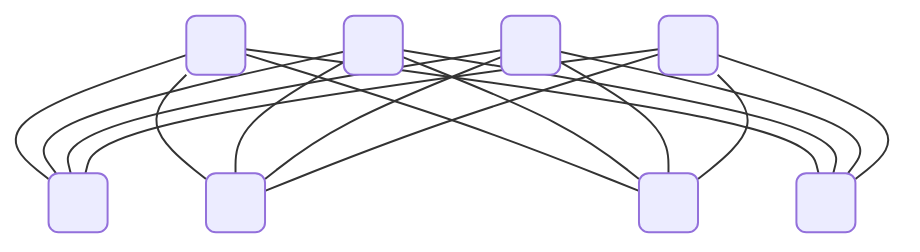
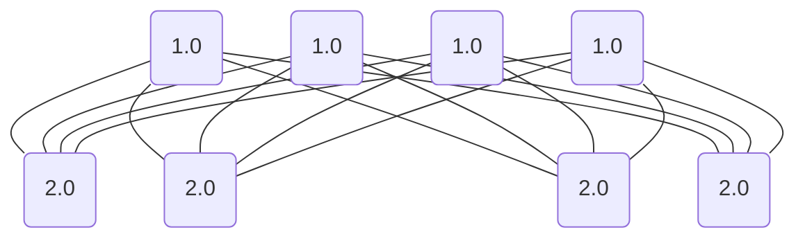
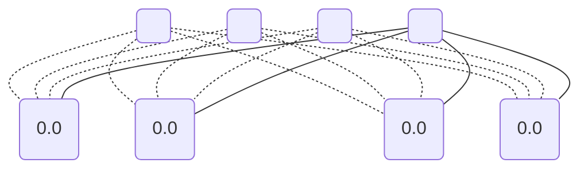
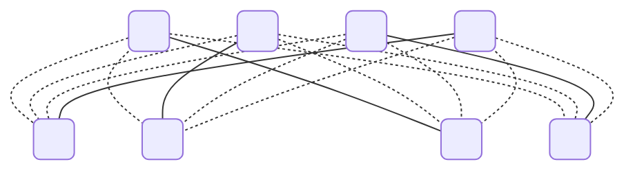

# Maximal matching in bipartite graph

We have following Graph $G$:

We may see two parts on the graph. We can visualize it by giving them indexes.

Now we will find all independent sets of a transversal matroid. Because there may be a way more graphs, we will put it in a separate files.First part we have [here](./../output/3(1).md) and second [here](./../output/3(2).md). And showcase just the maximal sets from both.

### $I_{1}$

### $I_{2}$

## Intersection

Last think to show we will find the maximal independent sets from both which are the same.

