# Original graph

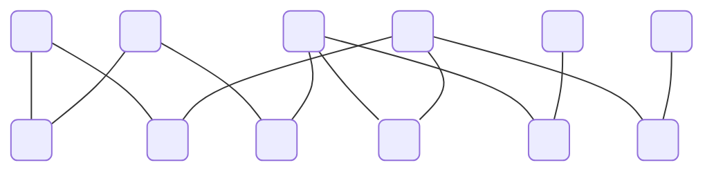

## Independent sets

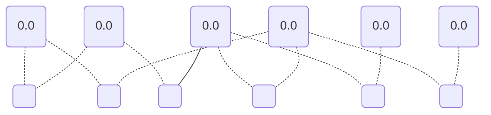

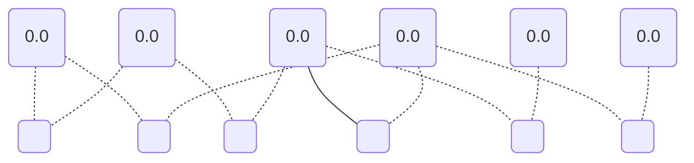

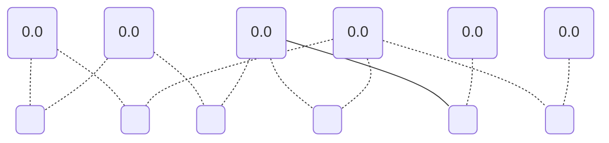

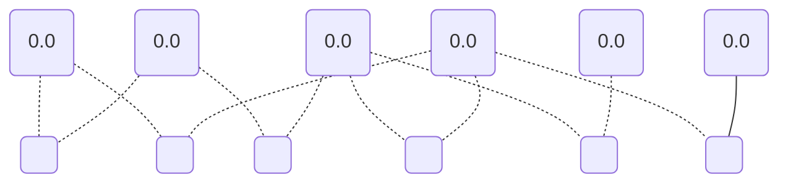

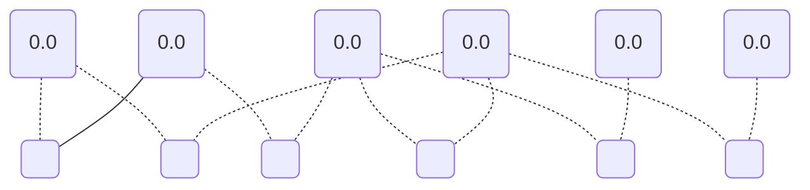

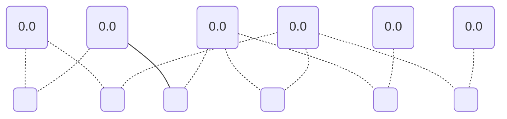

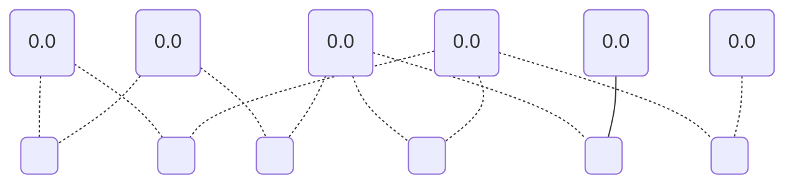

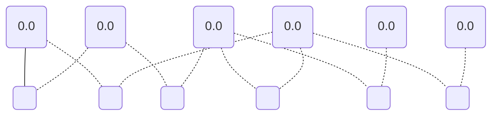

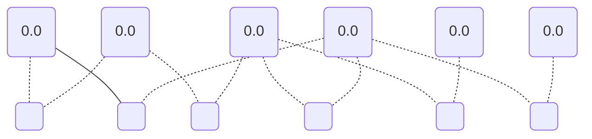

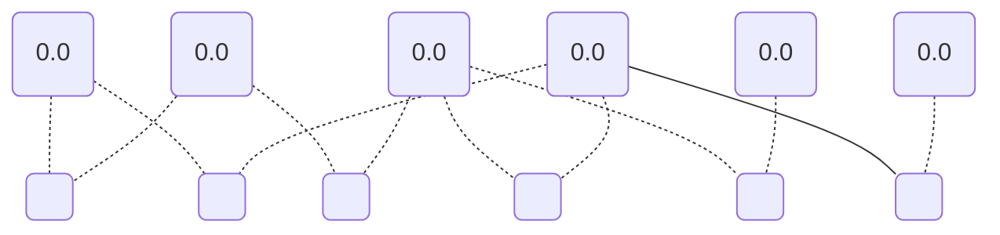

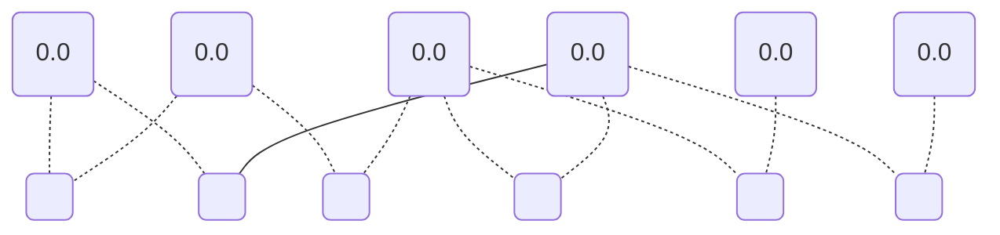

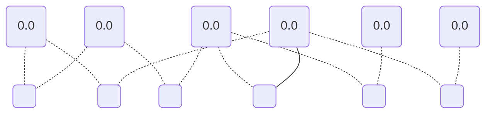

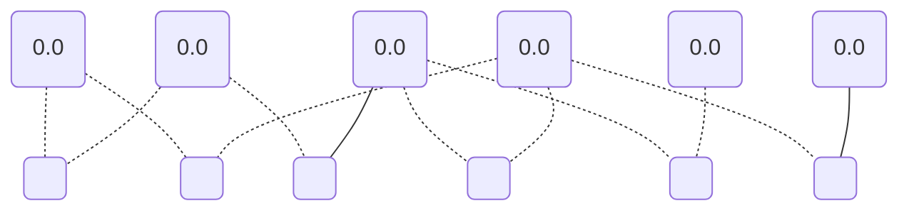

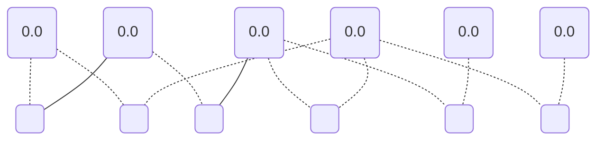

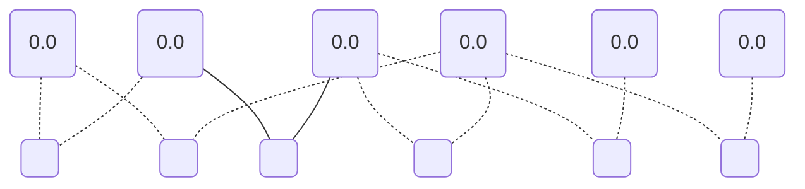

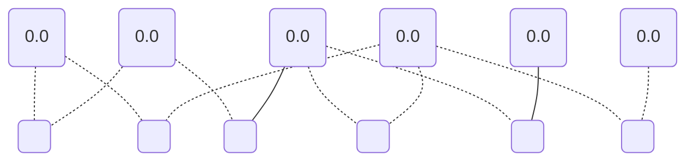

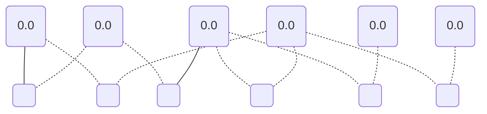

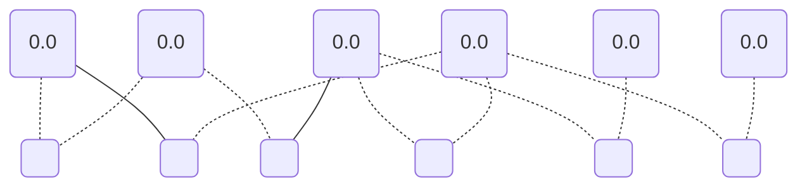

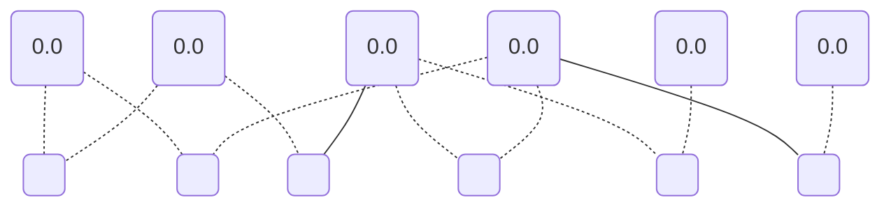

```mermaid
graph TD;
	0("0.0");
	1(" ");
	2("0.0");
	3(" ");
	4("0.0");
	5(" ");
	6("0.0");
	7(" ");
	8("0.0");
	9(" ");
	10("0.0");
	11(" ");
	0 -.- 1;
	0 -.- 7;
	2 -.- 1;
	2 -.- 3;
	4 --- 3;
	4 -.- 9;
	4 -.- 11;
	6 -.- 5;
	6 --- 7;
	6 -.- 9;
	8 -.- 5;
	10 -.- 11;
```

```mermaid
graph TD;
	0("0.0");
	1(" ");
	2("0.0");
	3(" ");
	4("0.0");
	5(" ");
	6("0.0");
	7(" ");
	8("0.0");
	9(" ");
	10("0.0");
	11(" ");
	0 -.- 1;
	0 -.- 7;
	2 -.- 1;
	2 -.- 3;
	4 --- 3;
	4 -.- 9;
	4 -.- 11;
	6 -.- 5;
	6 -.- 7;
	6 --- 9;
	8 -.- 5;
	10 -.- 11;
```

```mermaid
graph TD;
	0("0.0");
	1(" ");
	2("0.0");
	3(" ");
	4("0.0");
	5(" ");
	6("0.0");
	7(" ");
	8("0.0");
	9(" ");
	10("0.0");
	11(" ");
	0 -.- 1;
	0 -.- 7;
	2 -.- 1;
	2 -.- 3;
	4 -.- 3;
	4 --- 9;
	4 -.- 11;
	6 -.- 5;
	6 -.- 7;
	6 -.- 9;
	8 --- 5;
	10 -.- 11;
```

```mermaid
graph TD;
	0("0.0");
	1(" ");
	2("0.0");
	3(" ");
	4("0.0");
	5(" ");
	6("0.0");
	7(" ");
	8("0.0");
	9(" ");
	10("0.0");
	11(" ");
	0 -.- 1;
	0 -.- 7;
	2 --- 1;
	2 -.- 3;
	4 -.- 3;
	4 --- 9;
	4 -.- 11;
	6 -.- 5;
	6 -.- 7;
	6 -.- 9;
	8 -.- 5;
	10 -.- 11;
```

```mermaid
graph TD;
	0("0.0");
	1(" ");
	2("0.0");
	3(" ");
	4("0.0");
	5(" ");
	6("0.0");
	7(" ");
	8("0.0");
	9(" ");
	10("0.0");
	11(" ");
	0 -.- 1;
	0 -.- 7;
	2 -.- 1;
	2 --- 3;
	4 -.- 3;
	4 --- 9;
	4 -.- 11;
	6 -.- 5;
	6 -.- 7;
	6 -.- 9;
	8 -.- 5;
	10 -.- 11;
```

```mermaid
graph TD;
	0("0.0");
	1(" ");
	2("0.0");
	3(" ");
	4("0.0");
	5(" ");
	6("0.0");
	7(" ");
	8("0.0");
	9(" ");
	10("0.0");
	11(" ");
	0 -.- 1;
	0 -.- 7;
	2 -.- 1;
	2 -.- 3;
	4 -.- 3;
	4 --- 9;
	4 -.- 11;
	6 -.- 5;
	6 -.- 7;
	6 -.- 9;
	8 -.- 5;
	10 --- 11;
```

```mermaid
graph TD;
	0("0.0");
	1(" ");
	2("0.0");
	3(" ");
	4("0.0");
	5(" ");
	6("0.0");
	7(" ");
	8("0.0");
	9(" ");
	10("0.0");
	11(" ");
	0 --- 1;
	0 -.- 7;
	2 -.- 1;
	2 -.- 3;
	4 -.- 3;
	4 --- 9;
	4 -.- 11;
	6 -.- 5;
	6 -.- 7;
	6 -.- 9;
	8 -.- 5;
	10 -.- 11;
```

```mermaid
graph TD;
	0("0.0");
	1(" ");
	2("0.0");
	3(" ");
	4("0.0");
	5(" ");
	6("0.0");
	7(" ");
	8("0.0");
	9(" ");
	10("0.0");
	11(" ");
	0 -.- 1;
	0 --- 7;
	2 -.- 1;
	2 -.- 3;
	4 -.- 3;
	4 --- 9;
	4 -.- 11;
	6 -.- 5;
	6 -.- 7;
	6 -.- 9;
	8 -.- 5;
	10 -.- 11;
```

```mermaid
graph TD;
	0("0.0");
	1(" ");
	2("0.0");
	3(" ");
	4("0.0");
	5(" ");
	6("0.0");
	7(" ");
	8("0.0");
	9(" ");
	10("0.0");
	11(" ");
	0 -.- 1;
	0 -.- 7;
	2 -.- 1;
	2 -.- 3;
	4 -.- 3;
	4 --- 9;
	4 -.- 11;
	6 --- 5;
	6 -.- 7;
	6 -.- 9;
	8 -.- 5;
	10 -.- 11;
```

```mermaid
graph TD;
	0("0.0");
	1(" ");
	2("0.0");
	3(" ");
	4("0.0");
	5(" ");
	6("0.0");
	7(" ");
	8("0.0");
	9(" ");
	10("0.0");
	11(" ");
	0 -.- 1;
	0 -.- 7;
	2 -.- 1;
	2 -.- 3;
	4 -.- 3;
	4 --- 9;
	4 -.- 11;
	6 -.- 5;
	6 --- 7;
	6 -.- 9;
	8 -.- 5;
	10 -.- 11;
```

```mermaid
graph TD;
	0("0.0");
	1(" ");
	2("0.0");
	3(" ");
	4("0.0");
	5(" ");
	6("0.0");
	7(" ");
	8("0.0");
	9(" ");
	10("0.0");
	11(" ");
	0 -.- 1;
	0 -.- 7;
	2 -.- 1;
	2 -.- 3;
	4 -.- 3;
	4 --- 9;
	4 -.- 11;
	6 -.- 5;
	6 -.- 7;
	6 --- 9;
	8 -.- 5;
	10 -.- 11;
```

```mermaid
graph TD;
	0("0.0");
	1(" ");
	2("0.0");
	3(" ");
	4("0.0");
	5(" ");
	6("0.0");
	7(" ");
	8("0.0");
	9(" ");
	10("0.0");
	11(" ");
	0 -.- 1;
	0 -.- 7;
	2 -.- 1;
	2 -.- 3;
	4 -.- 3;
	4 -.- 9;
	4 --- 11;
	6 -.- 5;
	6 -.- 7;
	6 -.- 9;
	8 --- 5;
	10 -.- 11;
```

```mermaid
graph TD;
	0("0.0");
	1(" ");
	2("0.0");
	3(" ");
	4("0.0");
	5(" ");
	6("0.0");
	7(" ");
	8("0.0");
	9(" ");
	10("0.0");
	11(" ");
	0 -.- 1;
	0 -.- 7;
	2 --- 1;
	2 -.- 3;
	4 -.- 3;
	4 -.- 9;
	4 --- 11;
	6 -.- 5;
	6 -.- 7;
	6 -.- 9;
	8 -.- 5;
	10 -.- 11;
```

```mermaid
graph TD;
	0("0.0");
	1(" ");
	2("0.0");
	3(" ");
	4("0.0");
	5(" ");
	6("0.0");
	7(" ");
	8("0.0");
	9(" ");
	10("0.0");
	11(" ");
	0 -.- 1;
	0 -.- 7;
	2 -.- 1;
	2 --- 3;
	4 -.- 3;
	4 -.- 9;
	4 --- 11;
	6 -.- 5;
	6 -.- 7;
	6 -.- 9;
	8 -.- 5;
	10 -.- 11;
```

```mermaid
graph TD;
	0("0.0");
	1(" ");
	2("0.0");
	3(" ");
	4("0.0");
	5(" ");
	6("0.0");
	7(" ");
	8("0.0");
	9(" ");
	10("0.0");
	11(" ");
	0 -.- 1;
	0 -.- 7;
	2 -.- 1;
	2 -.- 3;
	4 -.- 3;
	4 -.- 9;
	4 --- 11;
	6 -.- 5;
	6 -.- 7;
	6 -.- 9;
	8 -.- 5;
	10 --- 11;
```

```mermaid
graph TD;
	0("0.0");
	1(" ");
	2("0.0");
	3(" ");
	4("0.0");
	5(" ");
	6("0.0");
	7(" ");
	8("0.0");
	9(" ");
	10("0.0");
	11(" ");
	0 --- 1;
	0 -.- 7;
	2 -.- 1;
	2 -.- 3;
	4 -.- 3;
	4 -.- 9;
	4 --- 11;
	6 -.- 5;
	6 -.- 7;
	6 -.- 9;
	8 -.- 5;
	10 -.- 11;
```

```mermaid
graph TD;
	0("0.0");
	1(" ");
	2("0.0");
	3(" ");
	4("0.0");
	5(" ");
	6("0.0");
	7(" ");
	8("0.0");
	9(" ");
	10("0.0");
	11(" ");
	0 -.- 1;
	0 --- 7;
	2 -.- 1;
	2 -.- 3;
	4 -.- 3;
	4 -.- 9;
	4 --- 11;
	6 -.- 5;
	6 -.- 7;
	6 -.- 9;
	8 -.- 5;
	10 -.- 11;
```

```mermaid
graph TD;
	0("0.0");
	1(" ");
	2("0.0");
	3(" ");
	4("0.0");
	5(" ");
	6("0.0");
	7(" ");
	8("0.0");
	9(" ");
	10("0.0");
	11(" ");
	0 -.- 1;
	0 -.- 7;
	2 -.- 1;
	2 -.- 3;
	4 -.- 3;
	4 -.- 9;
	4 --- 11;
	6 --- 5;
	6 -.- 7;
	6 -.- 9;
	8 -.- 5;
	10 -.- 11;
```

```mermaid
graph TD;
	0("0.0");
	1(" ");
	2("0.0");
	3(" ");
	4("0.0");
	5(" ");
	6("0.0");
	7(" ");
	8("0.0");
	9(" ");
	10("0.0");
	11(" ");
	0 -.- 1;
	0 -.- 7;
	2 -.- 1;
	2 -.- 3;
	4 -.- 3;
	4 -.- 9;
	4 --- 11;
	6 -.- 5;
	6 --- 7;
	6 -.- 9;
	8 -.- 5;
	10 -.- 11;
```

```mermaid
graph TD;
	0("0.0");
	1(" ");
	2("0.0");
	3(" ");
	4("0.0");
	5(" ");
	6("0.0");
	7(" ");
	8("0.0");
	9(" ");
	10("0.0");
	11(" ");
	0 -.- 1;
	0 -.- 7;
	2 -.- 1;
	2 -.- 3;
	4 -.- 3;
	4 -.- 9;
	4 --- 11;
	6 -.- 5;
	6 -.- 7;
	6 --- 9;
	8 -.- 5;
	10 -.- 11;
```

```mermaid
graph TD;
	0("0.0");
	1(" ");
	2("0.0");
	3(" ");
	4("0.0");
	5(" ");
	6("0.0");
	7(" ");
	8("0.0");
	9(" ");
	10("0.0");
	11(" ");
	0 -.- 1;
	0 -.- 7;
	2 --- 1;
	2 -.- 3;
	4 -.- 3;
	4 -.- 9;
	4 -.- 11;
	6 -.- 5;
	6 -.- 7;
	6 -.- 9;
	8 --- 5;
	10 -.- 11;
```

```mermaid
graph TD;
	0("0.0");
	1(" ");
	2("0.0");
	3(" ");
	4("0.0");
	5(" ");
	6("0.0");
	7(" ");
	8("0.0");
	9(" ");
	10("0.0");
	11(" ");
	0 -.- 1;
	0 -.- 7;
	2 -.- 1;
	2 --- 3;
	4 -.- 3;
	4 -.- 9;
	4 -.- 11;
	6 -.- 5;
	6 -.- 7;
	6 -.- 9;
	8 --- 5;
	10 -.- 11;
```

```mermaid
graph TD;
	0("0.0");
	1(" ");
	2("0.0");
	3(" ");
	4("0.0");
	5(" ");
	6("0.0");
	7(" ");
	8("0.0");
	9(" ");
	10("0.0");
	11(" ");
	0 -.- 1;
	0 -.- 7;
	2 -.- 1;
	2 -.- 3;
	4 -.- 3;
	4 -.- 9;
	4 -.- 11;
	6 -.- 5;
	6 -.- 7;
	6 -.- 9;
	8 --- 5;
	10 --- 11;
```

```mermaid
graph TD;
	0("0.0");
	1(" ");
	2("0.0");
	3(" ");
	4("0.0");
	5(" ");
	6("0.0");
	7(" ");
	8("0.0");
	9(" ");
	10("0.0");
	11(" ");
	0 --- 1;
	0 -.- 7;
	2 -.- 1;
	2 -.- 3;
	4 -.- 3;
	4 -.- 9;
	4 -.- 11;
	6 -.- 5;
	6 -.- 7;
	6 -.- 9;
	8 --- 5;
	10 -.- 11;
```

```mermaid
graph TD;
	0("0.0");
	1(" ");
	2("0.0");
	3(" ");
	4("0.0");
	5(" ");
	6("0.0");
	7(" ");
	8("0.0");
	9(" ");
	10("0.0");
	11(" ");
	0 -.- 1;
	0 --- 7;
	2 -.- 1;
	2 -.- 3;
	4 -.- 3;
	4 -.- 9;
	4 -.- 11;
	6 -.- 5;
	6 -.- 7;
	6 -.- 9;
	8 --- 5;
	10 -.- 11;
```

```mermaid
graph TD;
	0("0.0");
	1(" ");
	2("0.0");
	3(" ");
	4("0.0");
	5(" ");
	6("0.0");
	7(" ");
	8("0.0");
	9(" ");
	10("0.0");
	11(" ");
	0 -.- 1;
	0 -.- 7;
	2 -.- 1;
	2 -.- 3;
	4 -.- 3;
	4 -.- 9;
	4 -.- 11;
	6 --- 5;
	6 -.- 7;
	6 -.- 9;
	8 --- 5;
	10 -.- 11;
```

```mermaid
graph TD;
	0("0.0");
	1(" ");
	2("0.0");
	3(" ");
	4("0.0");
	5(" ");
	6("0.0");
	7(" ");
	8("0.0");
	9(" ");
	10("0.0");
	11(" ");
	0 -.- 1;
	0 -.- 7;
	2 -.- 1;
	2 -.- 3;
	4 -.- 3;
	4 -.- 9;
	4 -.- 11;
	6 -.- 5;
	6 --- 7;
	6 -.- 9;
	8 --- 5;
	10 -.- 11;
```

```mermaid
graph TD;
	0("0.0");
	1(" ");
	2("0.0");
	3(" ");
	4("0.0");
	5(" ");
	6("0.0");
	7(" ");
	8("0.0");
	9(" ");
	10("0.0");
	11(" ");
	0 -.- 1;
	0 -.- 7;
	2 -.- 1;
	2 -.- 3;
	4 -.- 3;
	4 -.- 9;
	4 -.- 11;
	6 -.- 5;
	6 -.- 7;
	6 --- 9;
	8 --- 5;
	10 -.- 11;
```

```mermaid
graph TD;
	0("0.0");
	1(" ");
	2("0.0");
	3(" ");
	4("0.0");
	5(" ");
	6("0.0");
	7(" ");
	8("0.0");
	9(" ");
	10("0.0");
	11(" ");
	0 -.- 1;
	0 -.- 7;
	2 --- 1;
	2 -.- 3;
	4 -.- 3;
	4 -.- 9;
	4 -.- 11;
	6 -.- 5;
	6 -.- 7;
	6 -.- 9;
	8 -.- 5;
	10 --- 11;
```

```mermaid
graph TD;
	0("0.0");
	1(" ");
	2("0.0");
	3(" ");
	4("0.0");
	5(" ");
	6("0.0");
	7(" ");
	8("0.0");
	9(" ");
	10("0.0");
	11(" ");
	0 --- 1;
	0 -.- 7;
	2 --- 1;
	2 -.- 3;
	4 -.- 3;
	4 -.- 9;
	4 -.- 11;
	6 -.- 5;
	6 -.- 7;
	6 -.- 9;
	8 -.- 5;
	10 -.- 11;
```

```mermaid
graph TD;
	0("0.0");
	1(" ");
	2("0.0");
	3(" ");
	4("0.0");
	5(" ");
	6("0.0");
	7(" ");
	8("0.0");
	9(" ");
	10("0.0");
	11(" ");
	0 -.- 1;
	0 --- 7;
	2 --- 1;
	2 -.- 3;
	4 -.- 3;
	4 -.- 9;
	4 -.- 11;
	6 -.- 5;
	6 -.- 7;
	6 -.- 9;
	8 -.- 5;
	10 -.- 11;
```

```mermaid
graph TD;
	0("0.0");
	1(" ");
	2("0.0");
	3(" ");
	4("0.0");
	5(" ");
	6("0.0");
	7(" ");
	8("0.0");
	9(" ");
	10("0.0");
	11(" ");
	0 -.- 1;
	0 -.- 7;
	2 --- 1;
	2 -.- 3;
	4 -.- 3;
	4 -.- 9;
	4 -.- 11;
	6 --- 5;
	6 -.- 7;
	6 -.- 9;
	8 -.- 5;
	10 -.- 11;
```

```mermaid
graph TD;
	0("0.0");
	1(" ");
	2("0.0");
	3(" ");
	4("0.0");
	5(" ");
	6("0.0");
	7(" ");
	8("0.0");
	9(" ");
	10("0.0");
	11(" ");
	0 -.- 1;
	0 -.- 7;
	2 --- 1;
	2 -.- 3;
	4 -.- 3;
	4 -.- 9;
	4 -.- 11;
	6 -.- 5;
	6 --- 7;
	6 -.- 9;
	8 -.- 5;
	10 -.- 11;
```

```mermaid
graph TD;
	0("0.0");
	1(" ");
	2("0.0");
	3(" ");
	4("0.0");
	5(" ");
	6("0.0");
	7(" ");
	8("0.0");
	9(" ");
	10("0.0");
	11(" ");
	0 -.- 1;
	0 -.- 7;
	2 --- 1;
	2 -.- 3;
	4 -.- 3;
	4 -.- 9;
	4 -.- 11;
	6 -.- 5;
	6 -.- 7;
	6 --- 9;
	8 -.- 5;
	10 -.- 11;
```

```mermaid
graph TD;
	0("0.0");
	1(" ");
	2("0.0");
	3(" ");
	4("0.0");
	5(" ");
	6("0.0");
	7(" ");
	8("0.0");
	9(" ");
	10("0.0");
	11(" ");
	0 -.- 1;
	0 -.- 7;
	2 -.- 1;
	2 --- 3;
	4 -.- 3;
	4 -.- 9;
	4 -.- 11;
	6 -.- 5;
	6 -.- 7;
	6 -.- 9;
	8 -.- 5;
	10 --- 11;
```

```mermaid
graph TD;
	0("0.0");
	1(" ");
	2("0.0");
	3(" ");
	4("0.0");
	5(" ");
	6("0.0");
	7(" ");
	8("0.0");
	9(" ");
	10("0.0");
	11(" ");
	0 --- 1;
	0 -.- 7;
	2 -.- 1;
	2 --- 3;
	4 -.- 3;
	4 -.- 9;
	4 -.- 11;
	6 -.- 5;
	6 -.- 7;
	6 -.- 9;
	8 -.- 5;
	10 -.- 11;
```

```mermaid
graph TD;
	0("0.0");
	1(" ");
	2("0.0");
	3(" ");
	4("0.0");
	5(" ");
	6("0.0");
	7(" ");
	8("0.0");
	9(" ");
	10("0.0");
	11(" ");
	0 -.- 1;
	0 --- 7;
	2 -.- 1;
	2 --- 3;
	4 -.- 3;
	4 -.- 9;
	4 -.- 11;
	6 -.- 5;
	6 -.- 7;
	6 -.- 9;
	8 -.- 5;
	10 -.- 11;
```

```mermaid
graph TD;
	0("0.0");
	1(" ");
	2("0.0");
	3(" ");
	4("0.0");
	5(" ");
	6("0.0");
	7(" ");
	8("0.0");
	9(" ");
	10("0.0");
	11(" ");
	0 -.- 1;
	0 -.- 7;
	2 -.- 1;
	2 --- 3;
	4 -.- 3;
	4 -.- 9;
	4 -.- 11;
	6 --- 5;
	6 -.- 7;
	6 -.- 9;
	8 -.- 5;
	10 -.- 11;
```

```mermaid
graph TD;
	0("0.0");
	1(" ");
	2("0.0");
	3(" ");
	4("0.0");
	5(" ");
	6("0.0");
	7(" ");
	8("0.0");
	9(" ");
	10("0.0");
	11(" ");
	0 -.- 1;
	0 -.- 7;
	2 -.- 1;
	2 --- 3;
	4 -.- 3;
	4 -.- 9;
	4 -.- 11;
	6 -.- 5;
	6 --- 7;
	6 -.- 9;
	8 -.- 5;
	10 -.- 11;
```

```mermaid
graph TD;
	0("0.0");
	1(" ");
	2("0.0");
	3(" ");
	4("0.0");
	5(" ");
	6("0.0");
	7(" ");
	8("0.0");
	9(" ");
	10("0.0");
	11(" ");
	0 -.- 1;
	0 -.- 7;
	2 -.- 1;
	2 --- 3;
	4 -.- 3;
	4 -.- 9;
	4 -.- 11;
	6 -.- 5;
	6 -.- 7;
	6 --- 9;
	8 -.- 5;
	10 -.- 11;
```

```mermaid
graph TD;
	0("0.0");
	1(" ");
	2("0.0");
	3(" ");
	4("0.0");
	5(" ");
	6("0.0");
	7(" ");
	8("0.0");
	9(" ");
	10("0.0");
	11(" ");
	0 --- 1;
	0 -.- 7;
	2 -.- 1;
	2 -.- 3;
	4 -.- 3;
	4 -.- 9;
	4 -.- 11;
	6 -.- 5;
	6 -.- 7;
	6 -.- 9;
	8 -.- 5;
	10 --- 11;
```

```mermaid
graph TD;
	0("0.0");
	1(" ");
	2("0.0");
	3(" ");
	4("0.0");
	5(" ");
	6("0.0");
	7(" ");
	8("0.0");
	9(" ");
	10("0.0");
	11(" ");
	0 -.- 1;
	0 --- 7;
	2 -.- 1;
	2 -.- 3;
	4 -.- 3;
	4 -.- 9;
	4 -.- 11;
	6 -.- 5;
	6 -.- 7;
	6 -.- 9;
	8 -.- 5;
	10 --- 11;
```

```mermaid
graph TD;
	0("0.0");
	1(" ");
	2("0.0");
	3(" ");
	4("0.0");
	5(" ");
	6("0.0");
	7(" ");
	8("0.0");
	9(" ");
	10("0.0");
	11(" ");
	0 -.- 1;
	0 -.- 7;
	2 -.- 1;
	2 -.- 3;
	4 -.- 3;
	4 -.- 9;
	4 -.- 11;
	6 --- 5;
	6 -.- 7;
	6 -.- 9;
	8 -.- 5;
	10 --- 11;
```

```mermaid
graph TD;
	0("0.0");
	1(" ");
	2("0.0");
	3(" ");
	4("0.0");
	5(" ");
	6("0.0");
	7(" ");
	8("0.0");
	9(" ");
	10("0.0");
	11(" ");
	0 -.- 1;
	0 -.- 7;
	2 -.- 1;
	2 -.- 3;
	4 -.- 3;
	4 -.- 9;
	4 -.- 11;
	6 -.- 5;
	6 --- 7;
	6 -.- 9;
	8 -.- 5;
	10 --- 11;
```

```mermaid
graph TD;
	0("0.0");
	1(" ");
	2("0.0");
	3(" ");
	4("0.0");
	5(" ");
	6("0.0");
	7(" ");
	8("0.0");
	9(" ");
	10("0.0");
	11(" ");
	0 -.- 1;
	0 -.- 7;
	2 -.- 1;
	2 -.- 3;
	4 -.- 3;
	4 -.- 9;
	4 -.- 11;
	6 -.- 5;
	6 -.- 7;
	6 --- 9;
	8 -.- 5;
	10 --- 11;
```

```mermaid
graph TD;
	0("0.0");
	1(" ");
	2("0.0");
	3(" ");
	4("0.0");
	5(" ");
	6("0.0");
	7(" ");
	8("0.0");
	9(" ");
	10("0.0");
	11(" ");
	0 --- 1;
	0 -.- 7;
	2 -.- 1;
	2 -.- 3;
	4 -.- 3;
	4 -.- 9;
	4 -.- 11;
	6 --- 5;
	6 -.- 7;
	6 -.- 9;
	8 -.- 5;
	10 -.- 11;
```

```mermaid
graph TD;
	0("0.0");
	1(" ");
	2("0.0");
	3(" ");
	4("0.0");
	5(" ");
	6("0.0");
	7(" ");
	8("0.0");
	9(" ");
	10("0.0");
	11(" ");
	0 --- 1;
	0 -.- 7;
	2 -.- 1;
	2 -.- 3;
	4 -.- 3;
	4 -.- 9;
	4 -.- 11;
	6 -.- 5;
	6 --- 7;
	6 -.- 9;
	8 -.- 5;
	10 -.- 11;
```

```mermaid
graph TD;
	0("0.0");
	1(" ");
	2("0.0");
	3(" ");
	4("0.0");
	5(" ");
	6("0.0");
	7(" ");
	8("0.0");
	9(" ");
	10("0.0");
	11(" ");
	0 --- 1;
	0 -.- 7;
	2 -.- 1;
	2 -.- 3;
	4 -.- 3;
	4 -.- 9;
	4 -.- 11;
	6 -.- 5;
	6 -.- 7;
	6 --- 9;
	8 -.- 5;
	10 -.- 11;
```

```mermaid
graph TD;
	0("0.0");
	1(" ");
	2("0.0");
	3(" ");
	4("0.0");
	5(" ");
	6("0.0");
	7(" ");
	8("0.0");
	9(" ");
	10("0.0");
	11(" ");
	0 -.- 1;
	0 --- 7;
	2 -.- 1;
	2 -.- 3;
	4 -.- 3;
	4 -.- 9;
	4 -.- 11;
	6 --- 5;
	6 -.- 7;
	6 -.- 9;
	8 -.- 5;
	10 -.- 11;
```

```mermaid
graph TD;
	0("0.0");
	1(" ");
	2("0.0");
	3(" ");
	4("0.0");
	5(" ");
	6("0.0");
	7(" ");
	8("0.0");
	9(" ");
	10("0.0");
	11(" ");
	0 -.- 1;
	0 --- 7;
	2 -.- 1;
	2 -.- 3;
	4 -.- 3;
	4 -.- 9;
	4 -.- 11;
	6 -.- 5;
	6 --- 7;
	6 -.- 9;
	8 -.- 5;
	10 -.- 11;
```

```mermaid
graph TD;
	0("0.0");
	1(" ");
	2("0.0");
	3(" ");
	4("0.0");
	5(" ");
	6("0.0");
	7(" ");
	8("0.0");
	9(" ");
	10("0.0");
	11(" ");
	0 -.- 1;
	0 --- 7;
	2 -.- 1;
	2 -.- 3;
	4 -.- 3;
	4 -.- 9;
	4 -.- 11;
	6 -.- 5;
	6 -.- 7;
	6 --- 9;
	8 -.- 5;
	10 -.- 11;
```

```mermaid
graph TD;
	0("0.0");
	1(" ");
	2("0.0");
	3(" ");
	4("0.0");
	5(" ");
	6("0.0");
	7(" ");
	8("0.0");
	9(" ");
	10("0.0");
	11(" ");
	0 -.- 1;
	0 -.- 7;
	2 --- 1;
	2 -.- 3;
	4 --- 3;
	4 -.- 9;
	4 -.- 11;
	6 -.- 5;
	6 -.- 7;
	6 -.- 9;
	8 --- 5;
	10 -.- 11;
```

```mermaid
graph TD;
	0("0.0");
	1(" ");
	2("0.0");
	3(" ");
	4("0.0");
	5(" ");
	6("0.0");
	7(" ");
	8("0.0");
	9(" ");
	10("0.0");
	11(" ");
	0 -.- 1;
	0 -.- 7;
	2 -.- 1;
	2 --- 3;
	4 --- 3;
	4 -.- 9;
	4 -.- 11;
	6 -.- 5;
	6 -.- 7;
	6 -.- 9;
	8 --- 5;
	10 -.- 11;
```

```mermaid
graph TD;
	0("0.0");
	1(" ");
	2("0.0");
	3(" ");
	4("0.0");
	5(" ");
	6("0.0");
	7(" ");
	8("0.0");
	9(" ");
	10("0.0");
	11(" ");
	0 -.- 1;
	0 -.- 7;
	2 -.- 1;
	2 -.- 3;
	4 --- 3;
	4 -.- 9;
	4 -.- 11;
	6 -.- 5;
	6 -.- 7;
	6 -.- 9;
	8 --- 5;
	10 --- 11;
```

```mermaid
graph TD;
	0("0.0");
	1(" ");
	2("0.0");
	3(" ");
	4("0.0");
	5(" ");
	6("0.0");
	7(" ");
	8("0.0");
	9(" ");
	10("0.0");
	11(" ");
	0 --- 1;
	0 -.- 7;
	2 -.- 1;
	2 -.- 3;
	4 --- 3;
	4 -.- 9;
	4 -.- 11;
	6 -.- 5;
	6 -.- 7;
	6 -.- 9;
	8 --- 5;
	10 -.- 11;
```

```mermaid
graph TD;
	0("0.0");
	1(" ");
	2("0.0");
	3(" ");
	4("0.0");
	5(" ");
	6("0.0");
	7(" ");
	8("0.0");
	9(" ");
	10("0.0");
	11(" ");
	0 -.- 1;
	0 --- 7;
	2 -.- 1;
	2 -.- 3;
	4 --- 3;
	4 -.- 9;
	4 -.- 11;
	6 -.- 5;
	6 -.- 7;
	6 -.- 9;
	8 --- 5;
	10 -.- 11;
```

```mermaid
graph TD;
	0("0.0");
	1(" ");
	2("0.0");
	3(" ");
	4("0.0");
	5(" ");
	6("0.0");
	7(" ");
	8("0.0");
	9(" ");
	10("0.0");
	11(" ");
	0 -.- 1;
	0 -.- 7;
	2 -.- 1;
	2 -.- 3;
	4 --- 3;
	4 -.- 9;
	4 -.- 11;
	6 --- 5;
	6 -.- 7;
	6 -.- 9;
	8 --- 5;
	10 -.- 11;
```

```mermaid
graph TD;
	0("0.0");
	1(" ");
	2("0.0");
	3(" ");
	4("0.0");
	5(" ");
	6("0.0");
	7(" ");
	8("0.0");
	9(" ");
	10("0.0");
	11(" ");
	0 -.- 1;
	0 -.- 7;
	2 -.- 1;
	2 -.- 3;
	4 --- 3;
	4 -.- 9;
	4 -.- 11;
	6 -.- 5;
	6 --- 7;
	6 -.- 9;
	8 --- 5;
	10 -.- 11;
```

```mermaid
graph TD;
	0("0.0");
	1(" ");
	2("0.0");
	3(" ");
	4("0.0");
	5(" ");
	6("0.0");
	7(" ");
	8("0.0");
	9(" ");
	10("0.0");
	11(" ");
	0 -.- 1;
	0 -.- 7;
	2 -.- 1;
	2 -.- 3;
	4 --- 3;
	4 -.- 9;
	4 -.- 11;
	6 -.- 5;
	6 -.- 7;
	6 --- 9;
	8 --- 5;
	10 -.- 11;
```

```mermaid
graph TD;
	0("0.0");
	1(" ");
	2("0.0");
	3(" ");
	4("0.0");
	5(" ");
	6("0.0");
	7(" ");
	8("0.0");
	9(" ");
	10("0.0");
	11(" ");
	0 -.- 1;
	0 -.- 7;
	2 --- 1;
	2 -.- 3;
	4 --- 3;
	4 -.- 9;
	4 -.- 11;
	6 -.- 5;
	6 -.- 7;
	6 -.- 9;
	8 -.- 5;
	10 --- 11;
```

```mermaid
graph TD;
	0("0.0");
	1(" ");
	2("0.0");
	3(" ");
	4("0.0");
	5(" ");
	6("0.0");
	7(" ");
	8("0.0");
	9(" ");
	10("0.0");
	11(" ");
	0 --- 1;
	0 -.- 7;
	2 --- 1;
	2 -.- 3;
	4 --- 3;
	4 -.- 9;
	4 -.- 11;
	6 -.- 5;
	6 -.- 7;
	6 -.- 9;
	8 -.- 5;
	10 -.- 11;
```

```mermaid
graph TD;
	0("0.0");
	1(" ");
	2("0.0");
	3(" ");
	4("0.0");
	5(" ");
	6("0.0");
	7(" ");
	8("0.0");
	9(" ");
	10("0.0");
	11(" ");
	0 -.- 1;
	0 --- 7;
	2 --- 1;
	2 -.- 3;
	4 --- 3;
	4 -.- 9;
	4 -.- 11;
	6 -.- 5;
	6 -.- 7;
	6 -.- 9;
	8 -.- 5;
	10 -.- 11;
```

```mermaid
graph TD;
	0("0.0");
	1(" ");
	2("0.0");
	3(" ");
	4("0.0");
	5(" ");
	6("0.0");
	7(" ");
	8("0.0");
	9(" ");
	10("0.0");
	11(" ");
	0 -.- 1;
	0 -.- 7;
	2 --- 1;
	2 -.- 3;
	4 --- 3;
	4 -.- 9;
	4 -.- 11;
	6 --- 5;
	6 -.- 7;
	6 -.- 9;
	8 -.- 5;
	10 -.- 11;
```

```mermaid
graph TD;
	0("0.0");
	1(" ");
	2("0.0");
	3(" ");
	4("0.0");
	5(" ");
	6("0.0");
	7(" ");
	8("0.0");
	9(" ");
	10("0.0");
	11(" ");
	0 -.- 1;
	0 -.- 7;
	2 --- 1;
	2 -.- 3;
	4 --- 3;
	4 -.- 9;
	4 -.- 11;
	6 -.- 5;
	6 --- 7;
	6 -.- 9;
	8 -.- 5;
	10 -.- 11;
```

```mermaid
graph TD;
	0("0.0");
	1(" ");
	2("0.0");
	3(" ");
	4("0.0");
	5(" ");
	6("0.0");
	7(" ");
	8("0.0");
	9(" ");
	10("0.0");
	11(" ");
	0 -.- 1;
	0 -.- 7;
	2 --- 1;
	2 -.- 3;
	4 --- 3;
	4 -.- 9;
	4 -.- 11;
	6 -.- 5;
	6 -.- 7;
	6 --- 9;
	8 -.- 5;
	10 -.- 11;
```

```mermaid
graph TD;
	0("0.0");
	1(" ");
	2("0.0");
	3(" ");
	4("0.0");
	5(" ");
	6("0.0");
	7(" ");
	8("0.0");
	9(" ");
	10("0.0");
	11(" ");
	0 -.- 1;
	0 -.- 7;
	2 -.- 1;
	2 --- 3;
	4 --- 3;
	4 -.- 9;
	4 -.- 11;
	6 -.- 5;
	6 -.- 7;
	6 -.- 9;
	8 -.- 5;
	10 --- 11;
```

```mermaid
graph TD;
	0("0.0");
	1(" ");
	2("0.0");
	3(" ");
	4("0.0");
	5(" ");
	6("0.0");
	7(" ");
	8("0.0");
	9(" ");
	10("0.0");
	11(" ");
	0 --- 1;
	0 -.- 7;
	2 -.- 1;
	2 --- 3;
	4 --- 3;
	4 -.- 9;
	4 -.- 11;
	6 -.- 5;
	6 -.- 7;
	6 -.- 9;
	8 -.- 5;
	10 -.- 11;
```

```mermaid
graph TD;
	0("0.0");
	1(" ");
	2("0.0");
	3(" ");
	4("0.0");
	5(" ");
	6("0.0");
	7(" ");
	8("0.0");
	9(" ");
	10("0.0");
	11(" ");
	0 -.- 1;
	0 --- 7;
	2 -.- 1;
	2 --- 3;
	4 --- 3;
	4 -.- 9;
	4 -.- 11;
	6 -.- 5;
	6 -.- 7;
	6 -.- 9;
	8 -.- 5;
	10 -.- 11;
```

```mermaid
graph TD;
	0("0.0");
	1(" ");
	2("0.0");
	3(" ");
	4("0.0");
	5(" ");
	6("0.0");
	7(" ");
	8("0.0");
	9(" ");
	10("0.0");
	11(" ");
	0 -.- 1;
	0 -.- 7;
	2 -.- 1;
	2 --- 3;
	4 --- 3;
	4 -.- 9;
	4 -.- 11;
	6 --- 5;
	6 -.- 7;
	6 -.- 9;
	8 -.- 5;
	10 -.- 11;
```

```mermaid
graph TD;
	0("0.0");
	1(" ");
	2("0.0");
	3(" ");
	4("0.0");
	5(" ");
	6("0.0");
	7(" ");
	8("0.0");
	9(" ");
	10("0.0");
	11(" ");
	0 -.- 1;
	0 -.- 7;
	2 -.- 1;
	2 --- 3;
	4 --- 3;
	4 -.- 9;
	4 -.- 11;
	6 -.- 5;
	6 --- 7;
	6 -.- 9;
	8 -.- 5;
	10 -.- 11;
```

```mermaid
graph TD;
	0("0.0");
	1(" ");
	2("0.0");
	3(" ");
	4("0.0");
	5(" ");
	6("0.0");
	7(" ");
	8("0.0");
	9(" ");
	10("0.0");
	11(" ");
	0 -.- 1;
	0 -.- 7;
	2 -.- 1;
	2 --- 3;
	4 --- 3;
	4 -.- 9;
	4 -.- 11;
	6 -.- 5;
	6 -.- 7;
	6 --- 9;
	8 -.- 5;
	10 -.- 11;
```

```mermaid
graph TD;
	0("0.0");
	1(" ");
	2("0.0");
	3(" ");
	4("0.0");
	5(" ");
	6("0.0");
	7(" ");
	8("0.0");
	9(" ");
	10("0.0");
	11(" ");
	0 --- 1;
	0 -.- 7;
	2 -.- 1;
	2 -.- 3;
	4 --- 3;
	4 -.- 9;
	4 -.- 11;
	6 -.- 5;
	6 -.- 7;
	6 -.- 9;
	8 -.- 5;
	10 --- 11;
```

```mermaid
graph TD;
	0("0.0");
	1(" ");
	2("0.0");
	3(" ");
	4("0.0");
	5(" ");
	6("0.0");
	7(" ");
	8("0.0");
	9(" ");
	10("0.0");
	11(" ");
	0 -.- 1;
	0 --- 7;
	2 -.- 1;
	2 -.- 3;
	4 --- 3;
	4 -.- 9;
	4 -.- 11;
	6 -.- 5;
	6 -.- 7;
	6 -.- 9;
	8 -.- 5;
	10 --- 11;
```

```mermaid
graph TD;
	0("0.0");
	1(" ");
	2("0.0");
	3(" ");
	4("0.0");
	5(" ");
	6("0.0");
	7(" ");
	8("0.0");
	9(" ");
	10("0.0");
	11(" ");
	0 -.- 1;
	0 -.- 7;
	2 -.- 1;
	2 -.- 3;
	4 --- 3;
	4 -.- 9;
	4 -.- 11;
	6 --- 5;
	6 -.- 7;
	6 -.- 9;
	8 -.- 5;
	10 --- 11;
```

```mermaid
graph TD;
	0("0.0");
	1(" ");
	2("0.0");
	3(" ");
	4("0.0");
	5(" ");
	6("0.0");
	7(" ");
	8("0.0");
	9(" ");
	10("0.0");
	11(" ");
	0 -.- 1;
	0 -.- 7;
	2 -.- 1;
	2 -.- 3;
	4 --- 3;
	4 -.- 9;
	4 -.- 11;
	6 -.- 5;
	6 --- 7;
	6 -.- 9;
	8 -.- 5;
	10 --- 11;
```

```mermaid
graph TD;
	0("0.0");
	1(" ");
	2("0.0");
	3(" ");
	4("0.0");
	5(" ");
	6("0.0");
	7(" ");
	8("0.0");
	9(" ");
	10("0.0");
	11(" ");
	0 -.- 1;
	0 -.- 7;
	2 -.- 1;
	2 -.- 3;
	4 --- 3;
	4 -.- 9;
	4 -.- 11;
	6 -.- 5;
	6 -.- 7;
	6 --- 9;
	8 -.- 5;
	10 --- 11;
```

```mermaid
graph TD;
	0("0.0");
	1(" ");
	2("0.0");
	3(" ");
	4("0.0");
	5(" ");
	6("0.0");
	7(" ");
	8("0.0");
	9(" ");
	10("0.0");
	11(" ");
	0 --- 1;
	0 -.- 7;
	2 -.- 1;
	2 -.- 3;
	4 --- 3;
	4 -.- 9;
	4 -.- 11;
	6 --- 5;
	6 -.- 7;
	6 -.- 9;
	8 -.- 5;
	10 -.- 11;
```

```mermaid
graph TD;
	0("0.0");
	1(" ");
	2("0.0");
	3(" ");
	4("0.0");
	5(" ");
	6("0.0");
	7(" ");
	8("0.0");
	9(" ");
	10("0.0");
	11(" ");
	0 --- 1;
	0 -.- 7;
	2 -.- 1;
	2 -.- 3;
	4 --- 3;
	4 -.- 9;
	4 -.- 11;
	6 -.- 5;
	6 --- 7;
	6 -.- 9;
	8 -.- 5;
	10 -.- 11;
```

```mermaid
graph TD;
	0("0.0");
	1(" ");
	2("0.0");
	3(" ");
	4("0.0");
	5(" ");
	6("0.0");
	7(" ");
	8("0.0");
	9(" ");
	10("0.0");
	11(" ");
	0 --- 1;
	0 -.- 7;
	2 -.- 1;
	2 -.- 3;
	4 --- 3;
	4 -.- 9;
	4 -.- 11;
	6 -.- 5;
	6 -.- 7;
	6 --- 9;
	8 -.- 5;
	10 -.- 11;
```

```mermaid
graph TD;
	0("0.0");
	1(" ");
	2("0.0");
	3(" ");
	4("0.0");
	5(" ");
	6("0.0");
	7(" ");
	8("0.0");
	9(" ");
	10("0.0");
	11(" ");
	0 -.- 1;
	0 --- 7;
	2 -.- 1;
	2 -.- 3;
	4 --- 3;
	4 -.- 9;
	4 -.- 11;
	6 --- 5;
	6 -.- 7;
	6 -.- 9;
	8 -.- 5;
	10 -.- 11;
```

```mermaid
graph TD;
	0("0.0");
	1(" ");
	2("0.0");
	3(" ");
	4("0.0");
	5(" ");
	6("0.0");
	7(" ");
	8("0.0");
	9(" ");
	10("0.0");
	11(" ");
	0 -.- 1;
	0 --- 7;
	2 -.- 1;
	2 -.- 3;
	4 --- 3;
	4 -.- 9;
	4 -.- 11;
	6 -.- 5;
	6 --- 7;
	6 -.- 9;
	8 -.- 5;
	10 -.- 11;
```

```mermaid
graph TD;
	0("0.0");
	1(" ");
	2("0.0");
	3(" ");
	4("0.0");
	5(" ");
	6("0.0");
	7(" ");
	8("0.0");
	9(" ");
	10("0.0");
	11(" ");
	0 -.- 1;
	0 --- 7;
	2 -.- 1;
	2 -.- 3;
	4 --- 3;
	4 -.- 9;
	4 -.- 11;
	6 -.- 5;
	6 -.- 7;
	6 --- 9;
	8 -.- 5;
	10 -.- 11;
```

```mermaid
graph TD;
	0("0.0");
	1(" ");
	2("0.0");
	3(" ");
	4("0.0");
	5(" ");
	6("0.0");
	7(" ");
	8("0.0");
	9(" ");
	10("0.0");
	11(" ");
	0 -.- 1;
	0 -.- 7;
	2 --- 1;
	2 -.- 3;
	4 -.- 3;
	4 --- 9;
	4 -.- 11;
	6 -.- 5;
	6 -.- 7;
	6 -.- 9;
	8 --- 5;
	10 -.- 11;
```

```mermaid
graph TD;
	0("0.0");
	1(" ");
	2("0.0");
	3(" ");
	4("0.0");
	5(" ");
	6("0.0");
	7(" ");
	8("0.0");
	9(" ");
	10("0.0");
	11(" ");
	0 -.- 1;
	0 -.- 7;
	2 -.- 1;
	2 --- 3;
	4 -.- 3;
	4 --- 9;
	4 -.- 11;
	6 -.- 5;
	6 -.- 7;
	6 -.- 9;
	8 --- 5;
	10 -.- 11;
```

```mermaid
graph TD;
	0("0.0");
	1(" ");
	2("0.0");
	3(" ");
	4("0.0");
	5(" ");
	6("0.0");
	7(" ");
	8("0.0");
	9(" ");
	10("0.0");
	11(" ");
	0 -.- 1;
	0 -.- 7;
	2 -.- 1;
	2 -.- 3;
	4 -.- 3;
	4 --- 9;
	4 -.- 11;
	6 -.- 5;
	6 -.- 7;
	6 -.- 9;
	8 --- 5;
	10 --- 11;
```

```mermaid
graph TD;
	0("0.0");
	1(" ");
	2("0.0");
	3(" ");
	4("0.0");
	5(" ");
	6("0.0");
	7(" ");
	8("0.0");
	9(" ");
	10("0.0");
	11(" ");
	0 --- 1;
	0 -.- 7;
	2 -.- 1;
	2 -.- 3;
	4 -.- 3;
	4 --- 9;
	4 -.- 11;
	6 -.- 5;
	6 -.- 7;
	6 -.- 9;
	8 --- 5;
	10 -.- 11;
```

```mermaid
graph TD;
	0("0.0");
	1(" ");
	2("0.0");
	3(" ");
	4("0.0");
	5(" ");
	6("0.0");
	7(" ");
	8("0.0");
	9(" ");
	10("0.0");
	11(" ");
	0 -.- 1;
	0 --- 7;
	2 -.- 1;
	2 -.- 3;
	4 -.- 3;
	4 --- 9;
	4 -.- 11;
	6 -.- 5;
	6 -.- 7;
	6 -.- 9;
	8 --- 5;
	10 -.- 11;
```

```mermaid
graph TD;
	0("0.0");
	1(" ");
	2("0.0");
	3(" ");
	4("0.0");
	5(" ");
	6("0.0");
	7(" ");
	8("0.0");
	9(" ");
	10("0.0");
	11(" ");
	0 -.- 1;
	0 -.- 7;
	2 -.- 1;
	2 -.- 3;
	4 -.- 3;
	4 --- 9;
	4 -.- 11;
	6 --- 5;
	6 -.- 7;
	6 -.- 9;
	8 --- 5;
	10 -.- 11;
```

```mermaid
graph TD;
	0("0.0");
	1(" ");
	2("0.0");
	3(" ");
	4("0.0");
	5(" ");
	6("0.0");
	7(" ");
	8("0.0");
	9(" ");
	10("0.0");
	11(" ");
	0 -.- 1;
	0 -.- 7;
	2 -.- 1;
	2 -.- 3;
	4 -.- 3;
	4 --- 9;
	4 -.- 11;
	6 -.- 5;
	6 --- 7;
	6 -.- 9;
	8 --- 5;
	10 -.- 11;
```

```mermaid
graph TD;
	0("0.0");
	1(" ");
	2("0.0");
	3(" ");
	4("0.0");
	5(" ");
	6("0.0");
	7(" ");
	8("0.0");
	9(" ");
	10("0.0");
	11(" ");
	0 -.- 1;
	0 -.- 7;
	2 -.- 1;
	2 -.- 3;
	4 -.- 3;
	4 --- 9;
	4 -.- 11;
	6 -.- 5;
	6 -.- 7;
	6 --- 9;
	8 --- 5;
	10 -.- 11;
```

```mermaid
graph TD;
	0("0.0");
	1(" ");
	2("0.0");
	3(" ");
	4("0.0");
	5(" ");
	6("0.0");
	7(" ");
	8("0.0");
	9(" ");
	10("0.0");
	11(" ");
	0 -.- 1;
	0 -.- 7;
	2 --- 1;
	2 -.- 3;
	4 -.- 3;
	4 --- 9;
	4 -.- 11;
	6 -.- 5;
	6 -.- 7;
	6 -.- 9;
	8 -.- 5;
	10 --- 11;
```

```mermaid
graph TD;
	0("0.0");
	1(" ");
	2("0.0");
	3(" ");
	4("0.0");
	5(" ");
	6("0.0");
	7(" ");
	8("0.0");
	9(" ");
	10("0.0");
	11(" ");
	0 --- 1;
	0 -.- 7;
	2 --- 1;
	2 -.- 3;
	4 -.- 3;
	4 --- 9;
	4 -.- 11;
	6 -.- 5;
	6 -.- 7;
	6 -.- 9;
	8 -.- 5;
	10 -.- 11;
```

```mermaid
graph TD;
	0("0.0");
	1(" ");
	2("0.0");
	3(" ");
	4("0.0");
	5(" ");
	6("0.0");
	7(" ");
	8("0.0");
	9(" ");
	10("0.0");
	11(" ");
	0 -.- 1;
	0 --- 7;
	2 --- 1;
	2 -.- 3;
	4 -.- 3;
	4 --- 9;
	4 -.- 11;
	6 -.- 5;
	6 -.- 7;
	6 -.- 9;
	8 -.- 5;
	10 -.- 11;
```

```mermaid
graph TD;
	0("0.0");
	1(" ");
	2("0.0");
	3(" ");
	4("0.0");
	5(" ");
	6("0.0");
	7(" ");
	8("0.0");
	9(" ");
	10("0.0");
	11(" ");
	0 -.- 1;
	0 -.- 7;
	2 --- 1;
	2 -.- 3;
	4 -.- 3;
	4 --- 9;
	4 -.- 11;
	6 --- 5;
	6 -.- 7;
	6 -.- 9;
	8 -.- 5;
	10 -.- 11;
```

```mermaid
graph TD;
	0("0.0");
	1(" ");
	2("0.0");
	3(" ");
	4("0.0");
	5(" ");
	6("0.0");
	7(" ");
	8("0.0");
	9(" ");
	10("0.0");
	11(" ");
	0 -.- 1;
	0 -.- 7;
	2 --- 1;
	2 -.- 3;
	4 -.- 3;
	4 --- 9;
	4 -.- 11;
	6 -.- 5;
	6 --- 7;
	6 -.- 9;
	8 -.- 5;
	10 -.- 11;
```

```mermaid
graph TD;
	0("0.0");
	1(" ");
	2("0.0");
	3(" ");
	4("0.0");
	5(" ");
	6("0.0");
	7(" ");
	8("0.0");
	9(" ");
	10("0.0");
	11(" ");
	0 -.- 1;
	0 -.- 7;
	2 --- 1;
	2 -.- 3;
	4 -.- 3;
	4 --- 9;
	4 -.- 11;
	6 -.- 5;
	6 -.- 7;
	6 --- 9;
	8 -.- 5;
	10 -.- 11;
```

```mermaid
graph TD;
	0("0.0");
	1(" ");
	2("0.0");
	3(" ");
	4("0.0");
	5(" ");
	6("0.0");
	7(" ");
	8("0.0");
	9(" ");
	10("0.0");
	11(" ");
	0 -.- 1;
	0 -.- 7;
	2 -.- 1;
	2 --- 3;
	4 -.- 3;
	4 --- 9;
	4 -.- 11;
	6 -.- 5;
	6 -.- 7;
	6 -.- 9;
	8 -.- 5;
	10 --- 11;
```

```mermaid
graph TD;
	0("0.0");
	1(" ");
	2("0.0");
	3(" ");
	4("0.0");
	5(" ");
	6("0.0");
	7(" ");
	8("0.0");
	9(" ");
	10("0.0");
	11(" ");
	0 --- 1;
	0 -.- 7;
	2 -.- 1;
	2 --- 3;
	4 -.- 3;
	4 --- 9;
	4 -.- 11;
	6 -.- 5;
	6 -.- 7;
	6 -.- 9;
	8 -.- 5;
	10 -.- 11;
```

```mermaid
graph TD;
	0("0.0");
	1(" ");
	2("0.0");
	3(" ");
	4("0.0");
	5(" ");
	6("0.0");
	7(" ");
	8("0.0");
	9(" ");
	10("0.0");
	11(" ");
	0 -.- 1;
	0 --- 7;
	2 -.- 1;
	2 --- 3;
	4 -.- 3;
	4 --- 9;
	4 -.- 11;
	6 -.- 5;
	6 -.- 7;
	6 -.- 9;
	8 -.- 5;
	10 -.- 11;
```

```mermaid
graph TD;
	0("0.0");
	1(" ");
	2("0.0");
	3(" ");
	4("0.0");
	5(" ");
	6("0.0");
	7(" ");
	8("0.0");
	9(" ");
	10("0.0");
	11(" ");
	0 -.- 1;
	0 -.- 7;
	2 -.- 1;
	2 --- 3;
	4 -.- 3;
	4 --- 9;
	4 -.- 11;
	6 --- 5;
	6 -.- 7;
	6 -.- 9;
	8 -.- 5;
	10 -.- 11;
```

```mermaid
graph TD;
	0("0.0");
	1(" ");
	2("0.0");
	3(" ");
	4("0.0");
	5(" ");
	6("0.0");
	7(" ");
	8("0.0");
	9(" ");
	10("0.0");
	11(" ");
	0 -.- 1;
	0 -.- 7;
	2 -.- 1;
	2 --- 3;
	4 -.- 3;
	4 --- 9;
	4 -.- 11;
	6 -.- 5;
	6 --- 7;
	6 -.- 9;
	8 -.- 5;
	10 -.- 11;
```

```mermaid
graph TD;
	0("0.0");
	1(" ");
	2("0.0");
	3(" ");
	4("0.0");
	5(" ");
	6("0.0");
	7(" ");
	8("0.0");
	9(" ");
	10("0.0");
	11(" ");
	0 -.- 1;
	0 -.- 7;
	2 -.- 1;
	2 --- 3;
	4 -.- 3;
	4 --- 9;
	4 -.- 11;
	6 -.- 5;
	6 -.- 7;
	6 --- 9;
	8 -.- 5;
	10 -.- 11;
```

```mermaid
graph TD;
	0("0.0");
	1(" ");
	2("0.0");
	3(" ");
	4("0.0");
	5(" ");
	6("0.0");
	7(" ");
	8("0.0");
	9(" ");
	10("0.0");
	11(" ");
	0 --- 1;
	0 -.- 7;
	2 -.- 1;
	2 -.- 3;
	4 -.- 3;
	4 --- 9;
	4 -.- 11;
	6 -.- 5;
	6 -.- 7;
	6 -.- 9;
	8 -.- 5;
	10 --- 11;
```

```mermaid
graph TD;
	0("0.0");
	1(" ");
	2("0.0");
	3(" ");
	4("0.0");
	5(" ");
	6("0.0");
	7(" ");
	8("0.0");
	9(" ");
	10("0.0");
	11(" ");
	0 -.- 1;
	0 --- 7;
	2 -.- 1;
	2 -.- 3;
	4 -.- 3;
	4 --- 9;
	4 -.- 11;
	6 -.- 5;
	6 -.- 7;
	6 -.- 9;
	8 -.- 5;
	10 --- 11;
```

```mermaid
graph TD;
	0("0.0");
	1(" ");
	2("0.0");
	3(" ");
	4("0.0");
	5(" ");
	6("0.0");
	7(" ");
	8("0.0");
	9(" ");
	10("0.0");
	11(" ");
	0 -.- 1;
	0 -.- 7;
	2 -.- 1;
	2 -.- 3;
	4 -.- 3;
	4 --- 9;
	4 -.- 11;
	6 --- 5;
	6 -.- 7;
	6 -.- 9;
	8 -.- 5;
	10 --- 11;
```

```mermaid
graph TD;
	0("0.0");
	1(" ");
	2("0.0");
	3(" ");
	4("0.0");
	5(" ");
	6("0.0");
	7(" ");
	8("0.0");
	9(" ");
	10("0.0");
	11(" ");
	0 -.- 1;
	0 -.- 7;
	2 -.- 1;
	2 -.- 3;
	4 -.- 3;
	4 --- 9;
	4 -.- 11;
	6 -.- 5;
	6 --- 7;
	6 -.- 9;
	8 -.- 5;
	10 --- 11;
```

```mermaid
graph TD;
	0("0.0");
	1(" ");
	2("0.0");
	3(" ");
	4("0.0");
	5(" ");
	6("0.0");
	7(" ");
	8("0.0");
	9(" ");
	10("0.0");
	11(" ");
	0 -.- 1;
	0 -.- 7;
	2 -.- 1;
	2 -.- 3;
	4 -.- 3;
	4 --- 9;
	4 -.- 11;
	6 -.- 5;
	6 -.- 7;
	6 --- 9;
	8 -.- 5;
	10 --- 11;
```

```mermaid
graph TD;
	0("0.0");
	1(" ");
	2("0.0");
	3(" ");
	4("0.0");
	5(" ");
	6("0.0");
	7(" ");
	8("0.0");
	9(" ");
	10("0.0");
	11(" ");
	0 --- 1;
	0 -.- 7;
	2 -.- 1;
	2 -.- 3;
	4 -.- 3;
	4 --- 9;
	4 -.- 11;
	6 --- 5;
	6 -.- 7;
	6 -.- 9;
	8 -.- 5;
	10 -.- 11;
```

```mermaid
graph TD;
	0("0.0");
	1(" ");
	2("0.0");
	3(" ");
	4("0.0");
	5(" ");
	6("0.0");
	7(" ");
	8("0.0");
	9(" ");
	10("0.0");
	11(" ");
	0 --- 1;
	0 -.- 7;
	2 -.- 1;
	2 -.- 3;
	4 -.- 3;
	4 --- 9;
	4 -.- 11;
	6 -.- 5;
	6 --- 7;
	6 -.- 9;
	8 -.- 5;
	10 -.- 11;
```

```mermaid
graph TD;
	0("0.0");
	1(" ");
	2("0.0");
	3(" ");
	4("0.0");
	5(" ");
	6("0.0");
	7(" ");
	8("0.0");
	9(" ");
	10("0.0");
	11(" ");
	0 --- 1;
	0 -.- 7;
	2 -.- 1;
	2 -.- 3;
	4 -.- 3;
	4 --- 9;
	4 -.- 11;
	6 -.- 5;
	6 -.- 7;
	6 --- 9;
	8 -.- 5;
	10 -.- 11;
```

```mermaid
graph TD;
	0("0.0");
	1(" ");
	2("0.0");
	3(" ");
	4("0.0");
	5(" ");
	6("0.0");
	7(" ");
	8("0.0");
	9(" ");
	10("0.0");
	11(" ");
	0 -.- 1;
	0 --- 7;
	2 -.- 1;
	2 -.- 3;
	4 -.- 3;
	4 --- 9;
	4 -.- 11;
	6 --- 5;
	6 -.- 7;
	6 -.- 9;
	8 -.- 5;
	10 -.- 11;
```

```mermaid
graph TD;
	0("0.0");
	1(" ");
	2("0.0");
	3(" ");
	4("0.0");
	5(" ");
	6("0.0");
	7(" ");
	8("0.0");
	9(" ");
	10("0.0");
	11(" ");
	0 -.- 1;
	0 --- 7;
	2 -.- 1;
	2 -.- 3;
	4 -.- 3;
	4 --- 9;
	4 -.- 11;
	6 -.- 5;
	6 --- 7;
	6 -.- 9;
	8 -.- 5;
	10 -.- 11;
```

```mermaid
graph TD;
	0("0.0");
	1(" ");
	2("0.0");
	3(" ");
	4("0.0");
	5(" ");
	6("0.0");
	7(" ");
	8("0.0");
	9(" ");
	10("0.0");
	11(" ");
	0 -.- 1;
	0 --- 7;
	2 -.- 1;
	2 -.- 3;
	4 -.- 3;
	4 --- 9;
	4 -.- 11;
	6 -.- 5;
	6 -.- 7;
	6 --- 9;
	8 -.- 5;
	10 -.- 11;
```

```mermaid
graph TD;
	0("0.0");
	1(" ");
	2("0.0");
	3(" ");
	4("0.0");
	5(" ");
	6("0.0");
	7(" ");
	8("0.0");
	9(" ");
	10("0.0");
	11(" ");
	0 -.- 1;
	0 -.- 7;
	2 --- 1;
	2 -.- 3;
	4 -.- 3;
	4 -.- 9;
	4 --- 11;
	6 -.- 5;
	6 -.- 7;
	6 -.- 9;
	8 --- 5;
	10 -.- 11;
```

```mermaid
graph TD;
	0("0.0");
	1(" ");
	2("0.0");
	3(" ");
	4("0.0");
	5(" ");
	6("0.0");
	7(" ");
	8("0.0");
	9(" ");
	10("0.0");
	11(" ");
	0 -.- 1;
	0 -.- 7;
	2 -.- 1;
	2 --- 3;
	4 -.- 3;
	4 -.- 9;
	4 --- 11;
	6 -.- 5;
	6 -.- 7;
	6 -.- 9;
	8 --- 5;
	10 -.- 11;
```

```mermaid
graph TD;
	0("0.0");
	1(" ");
	2("0.0");
	3(" ");
	4("0.0");
	5(" ");
	6("0.0");
	7(" ");
	8("0.0");
	9(" ");
	10("0.0");
	11(" ");
	0 -.- 1;
	0 -.- 7;
	2 -.- 1;
	2 -.- 3;
	4 -.- 3;
	4 -.- 9;
	4 --- 11;
	6 -.- 5;
	6 -.- 7;
	6 -.- 9;
	8 --- 5;
	10 --- 11;
```

```mermaid
graph TD;
	0("0.0");
	1(" ");
	2("0.0");
	3(" ");
	4("0.0");
	5(" ");
	6("0.0");
	7(" ");
	8("0.0");
	9(" ");
	10("0.0");
	11(" ");
	0 --- 1;
	0 -.- 7;
	2 -.- 1;
	2 -.- 3;
	4 -.- 3;
	4 -.- 9;
	4 --- 11;
	6 -.- 5;
	6 -.- 7;
	6 -.- 9;
	8 --- 5;
	10 -.- 11;
```

```mermaid
graph TD;
	0("0.0");
	1(" ");
	2("0.0");
	3(" ");
	4("0.0");
	5(" ");
	6("0.0");
	7(" ");
	8("0.0");
	9(" ");
	10("0.0");
	11(" ");
	0 -.- 1;
	0 --- 7;
	2 -.- 1;
	2 -.- 3;
	4 -.- 3;
	4 -.- 9;
	4 --- 11;
	6 -.- 5;
	6 -.- 7;
	6 -.- 9;
	8 --- 5;
	10 -.- 11;
```

```mermaid
graph TD;
	0("0.0");
	1(" ");
	2("0.0");
	3(" ");
	4("0.0");
	5(" ");
	6("0.0");
	7(" ");
	8("0.0");
	9(" ");
	10("0.0");
	11(" ");
	0 -.- 1;
	0 -.- 7;
	2 -.- 1;
	2 -.- 3;
	4 -.- 3;
	4 -.- 9;
	4 --- 11;
	6 --- 5;
	6 -.- 7;
	6 -.- 9;
	8 --- 5;
	10 -.- 11;
```

```mermaid
graph TD;
	0("0.0");
	1(" ");
	2("0.0");
	3(" ");
	4("0.0");
	5(" ");
	6("0.0");
	7(" ");
	8("0.0");
	9(" ");
	10("0.0");
	11(" ");
	0 -.- 1;
	0 -.- 7;
	2 -.- 1;
	2 -.- 3;
	4 -.- 3;
	4 -.- 9;
	4 --- 11;
	6 -.- 5;
	6 --- 7;
	6 -.- 9;
	8 --- 5;
	10 -.- 11;
```

```mermaid
graph TD;
	0("0.0");
	1(" ");
	2("0.0");
	3(" ");
	4("0.0");
	5(" ");
	6("0.0");
	7(" ");
	8("0.0");
	9(" ");
	10("0.0");
	11(" ");
	0 -.- 1;
	0 -.- 7;
	2 -.- 1;
	2 -.- 3;
	4 -.- 3;
	4 -.- 9;
	4 --- 11;
	6 -.- 5;
	6 -.- 7;
	6 --- 9;
	8 --- 5;
	10 -.- 11;
```

```mermaid
graph TD;
	0("0.0");
	1(" ");
	2("0.0");
	3(" ");
	4("0.0");
	5(" ");
	6("0.0");
	7(" ");
	8("0.0");
	9(" ");
	10("0.0");
	11(" ");
	0 -.- 1;
	0 -.- 7;
	2 --- 1;
	2 -.- 3;
	4 -.- 3;
	4 -.- 9;
	4 --- 11;
	6 -.- 5;
	6 -.- 7;
	6 -.- 9;
	8 -.- 5;
	10 --- 11;
```

```mermaid
graph TD;
	0("0.0");
	1(" ");
	2("0.0");
	3(" ");
	4("0.0");
	5(" ");
	6("0.0");
	7(" ");
	8("0.0");
	9(" ");
	10("0.0");
	11(" ");
	0 --- 1;
	0 -.- 7;
	2 --- 1;
	2 -.- 3;
	4 -.- 3;
	4 -.- 9;
	4 --- 11;
	6 -.- 5;
	6 -.- 7;
	6 -.- 9;
	8 -.- 5;
	10 -.- 11;
```

```mermaid
graph TD;
	0("0.0");
	1(" ");
	2("0.0");
	3(" ");
	4("0.0");
	5(" ");
	6("0.0");
	7(" ");
	8("0.0");
	9(" ");
	10("0.0");
	11(" ");
	0 -.- 1;
	0 --- 7;
	2 --- 1;
	2 -.- 3;
	4 -.- 3;
	4 -.- 9;
	4 --- 11;
	6 -.- 5;
	6 -.- 7;
	6 -.- 9;
	8 -.- 5;
	10 -.- 11;
```

```mermaid
graph TD;
	0("0.0");
	1(" ");
	2("0.0");
	3(" ");
	4("0.0");
	5(" ");
	6("0.0");
	7(" ");
	8("0.0");
	9(" ");
	10("0.0");
	11(" ");
	0 -.- 1;
	0 -.- 7;
	2 --- 1;
	2 -.- 3;
	4 -.- 3;
	4 -.- 9;
	4 --- 11;
	6 --- 5;
	6 -.- 7;
	6 -.- 9;
	8 -.- 5;
	10 -.- 11;
```

```mermaid
graph TD;
	0("0.0");
	1(" ");
	2("0.0");
	3(" ");
	4("0.0");
	5(" ");
	6("0.0");
	7(" ");
	8("0.0");
	9(" ");
	10("0.0");
	11(" ");
	0 -.- 1;
	0 -.- 7;
	2 --- 1;
	2 -.- 3;
	4 -.- 3;
	4 -.- 9;
	4 --- 11;
	6 -.- 5;
	6 --- 7;
	6 -.- 9;
	8 -.- 5;
	10 -.- 11;
```

```mermaid
graph TD;
	0("0.0");
	1(" ");
	2("0.0");
	3(" ");
	4("0.0");
	5(" ");
	6("0.0");
	7(" ");
	8("0.0");
	9(" ");
	10("0.0");
	11(" ");
	0 -.- 1;
	0 -.- 7;
	2 --- 1;
	2 -.- 3;
	4 -.- 3;
	4 -.- 9;
	4 --- 11;
	6 -.- 5;
	6 -.- 7;
	6 --- 9;
	8 -.- 5;
	10 -.- 11;
```

```mermaid
graph TD;
	0("0.0");
	1(" ");
	2("0.0");
	3(" ");
	4("0.0");
	5(" ");
	6("0.0");
	7(" ");
	8("0.0");
	9(" ");
	10("0.0");
	11(" ");
	0 -.- 1;
	0 -.- 7;
	2 -.- 1;
	2 --- 3;
	4 -.- 3;
	4 -.- 9;
	4 --- 11;
	6 -.- 5;
	6 -.- 7;
	6 -.- 9;
	8 -.- 5;
	10 --- 11;
```

```mermaid
graph TD;
	0("0.0");
	1(" ");
	2("0.0");
	3(" ");
	4("0.0");
	5(" ");
	6("0.0");
	7(" ");
	8("0.0");
	9(" ");
	10("0.0");
	11(" ");
	0 --- 1;
	0 -.- 7;
	2 -.- 1;
	2 --- 3;
	4 -.- 3;
	4 -.- 9;
	4 --- 11;
	6 -.- 5;
	6 -.- 7;
	6 -.- 9;
	8 -.- 5;
	10 -.- 11;
```

```mermaid
graph TD;
	0("0.0");
	1(" ");
	2("0.0");
	3(" ");
	4("0.0");
	5(" ");
	6("0.0");
	7(" ");
	8("0.0");
	9(" ");
	10("0.0");
	11(" ");
	0 -.- 1;
	0 --- 7;
	2 -.- 1;
	2 --- 3;
	4 -.- 3;
	4 -.- 9;
	4 --- 11;
	6 -.- 5;
	6 -.- 7;
	6 -.- 9;
	8 -.- 5;
	10 -.- 11;
```

```mermaid
graph TD;
	0("0.0");
	1(" ");
	2("0.0");
	3(" ");
	4("0.0");
	5(" ");
	6("0.0");
	7(" ");
	8("0.0");
	9(" ");
	10("0.0");
	11(" ");
	0 -.- 1;
	0 -.- 7;
	2 -.- 1;
	2 --- 3;
	4 -.- 3;
	4 -.- 9;
	4 --- 11;
	6 --- 5;
	6 -.- 7;
	6 -.- 9;
	8 -.- 5;
	10 -.- 11;
```

```mermaid
graph TD;
	0("0.0");
	1(" ");
	2("0.0");
	3(" ");
	4("0.0");
	5(" ");
	6("0.0");
	7(" ");
	8("0.0");
	9(" ");
	10("0.0");
	11(" ");
	0 -.- 1;
	0 -.- 7;
	2 -.- 1;
	2 --- 3;
	4 -.- 3;
	4 -.- 9;
	4 --- 11;
	6 -.- 5;
	6 --- 7;
	6 -.- 9;
	8 -.- 5;
	10 -.- 11;
```

```mermaid
graph TD;
	0("0.0");
	1(" ");
	2("0.0");
	3(" ");
	4("0.0");
	5(" ");
	6("0.0");
	7(" ");
	8("0.0");
	9(" ");
	10("0.0");
	11(" ");
	0 -.- 1;
	0 -.- 7;
	2 -.- 1;
	2 --- 3;
	4 -.- 3;
	4 -.- 9;
	4 --- 11;
	6 -.- 5;
	6 -.- 7;
	6 --- 9;
	8 -.- 5;
	10 -.- 11;
```

```mermaid
graph TD;
	0("0.0");
	1(" ");
	2("0.0");
	3(" ");
	4("0.0");
	5(" ");
	6("0.0");
	7(" ");
	8("0.0");
	9(" ");
	10("0.0");
	11(" ");
	0 --- 1;
	0 -.- 7;
	2 -.- 1;
	2 -.- 3;
	4 -.- 3;
	4 -.- 9;
	4 --- 11;
	6 -.- 5;
	6 -.- 7;
	6 -.- 9;
	8 -.- 5;
	10 --- 11;
```

```mermaid
graph TD;
	0("0.0");
	1(" ");
	2("0.0");
	3(" ");
	4("0.0");
	5(" ");
	6("0.0");
	7(" ");
	8("0.0");
	9(" ");
	10("0.0");
	11(" ");
	0 -.- 1;
	0 --- 7;
	2 -.- 1;
	2 -.- 3;
	4 -.- 3;
	4 -.- 9;
	4 --- 11;
	6 -.- 5;
	6 -.- 7;
	6 -.- 9;
	8 -.- 5;
	10 --- 11;
```

```mermaid
graph TD;
	0("0.0");
	1(" ");
	2("0.0");
	3(" ");
	4("0.0");
	5(" ");
	6("0.0");
	7(" ");
	8("0.0");
	9(" ");
	10("0.0");
	11(" ");
	0 -.- 1;
	0 -.- 7;
	2 -.- 1;
	2 -.- 3;
	4 -.- 3;
	4 -.- 9;
	4 --- 11;
	6 --- 5;
	6 -.- 7;
	6 -.- 9;
	8 -.- 5;
	10 --- 11;
```

```mermaid
graph TD;
	0("0.0");
	1(" ");
	2("0.0");
	3(" ");
	4("0.0");
	5(" ");
	6("0.0");
	7(" ");
	8("0.0");
	9(" ");
	10("0.0");
	11(" ");
	0 -.- 1;
	0 -.- 7;
	2 -.- 1;
	2 -.- 3;
	4 -.- 3;
	4 -.- 9;
	4 --- 11;
	6 -.- 5;
	6 --- 7;
	6 -.- 9;
	8 -.- 5;
	10 --- 11;
```

```mermaid
graph TD;
	0("0.0");
	1(" ");
	2("0.0");
	3(" ");
	4("0.0");
	5(" ");
	6("0.0");
	7(" ");
	8("0.0");
	9(" ");
	10("0.0");
	11(" ");
	0 -.- 1;
	0 -.- 7;
	2 -.- 1;
	2 -.- 3;
	4 -.- 3;
	4 -.- 9;
	4 --- 11;
	6 -.- 5;
	6 -.- 7;
	6 --- 9;
	8 -.- 5;
	10 --- 11;
```

```mermaid
graph TD;
	0("0.0");
	1(" ");
	2("0.0");
	3(" ");
	4("0.0");
	5(" ");
	6("0.0");
	7(" ");
	8("0.0");
	9(" ");
	10("0.0");
	11(" ");
	0 --- 1;
	0 -.- 7;
	2 -.- 1;
	2 -.- 3;
	4 -.- 3;
	4 -.- 9;
	4 --- 11;
	6 --- 5;
	6 -.- 7;
	6 -.- 9;
	8 -.- 5;
	10 -.- 11;
```

```mermaid
graph TD;
	0("0.0");
	1(" ");
	2("0.0");
	3(" ");
	4("0.0");
	5(" ");
	6("0.0");
	7(" ");
	8("0.0");
	9(" ");
	10("0.0");
	11(" ");
	0 --- 1;
	0 -.- 7;
	2 -.- 1;
	2 -.- 3;
	4 -.- 3;
	4 -.- 9;
	4 --- 11;
	6 -.- 5;
	6 --- 7;
	6 -.- 9;
	8 -.- 5;
	10 -.- 11;
```

```mermaid
graph TD;
	0("0.0");
	1(" ");
	2("0.0");
	3(" ");
	4("0.0");
	5(" ");
	6("0.0");
	7(" ");
	8("0.0");
	9(" ");
	10("0.0");
	11(" ");
	0 --- 1;
	0 -.- 7;
	2 -.- 1;
	2 -.- 3;
	4 -.- 3;
	4 -.- 9;
	4 --- 11;
	6 -.- 5;
	6 -.- 7;
	6 --- 9;
	8 -.- 5;
	10 -.- 11;
```

```mermaid
graph TD;
	0("0.0");
	1(" ");
	2("0.0");
	3(" ");
	4("0.0");
	5(" ");
	6("0.0");
	7(" ");
	8("0.0");
	9(" ");
	10("0.0");
	11(" ");
	0 -.- 1;
	0 --- 7;
	2 -.- 1;
	2 -.- 3;
	4 -.- 3;
	4 -.- 9;
	4 --- 11;
	6 --- 5;
	6 -.- 7;
	6 -.- 9;
	8 -.- 5;
	10 -.- 11;
```

```mermaid
graph TD;
	0("0.0");
	1(" ");
	2("0.0");
	3(" ");
	4("0.0");
	5(" ");
	6("0.0");
	7(" ");
	8("0.0");
	9(" ");
	10("0.0");
	11(" ");
	0 -.- 1;
	0 --- 7;
	2 -.- 1;
	2 -.- 3;
	4 -.- 3;
	4 -.- 9;
	4 --- 11;
	6 -.- 5;
	6 --- 7;
	6 -.- 9;
	8 -.- 5;
	10 -.- 11;
```

```mermaid
graph TD;
	0("0.0");
	1(" ");
	2("0.0");
	3(" ");
	4("0.0");
	5(" ");
	6("0.0");
	7(" ");
	8("0.0");
	9(" ");
	10("0.0");
	11(" ");
	0 -.- 1;
	0 --- 7;
	2 -.- 1;
	2 -.- 3;
	4 -.- 3;
	4 -.- 9;
	4 --- 11;
	6 -.- 5;
	6 -.- 7;
	6 --- 9;
	8 -.- 5;
	10 -.- 11;
```

```mermaid
graph TD;
	0("0.0");
	1(" ");
	2("0.0");
	3(" ");
	4("0.0");
	5(" ");
	6("0.0");
	7(" ");
	8("0.0");
	9(" ");
	10("0.0");
	11(" ");
	0 -.- 1;
	0 -.- 7;
	2 --- 1;
	2 -.- 3;
	4 -.- 3;
	4 -.- 9;
	4 -.- 11;
	6 -.- 5;
	6 -.- 7;
	6 -.- 9;
	8 --- 5;
	10 --- 11;
```

```mermaid
graph TD;
	0("0.0");
	1(" ");
	2("0.0");
	3(" ");
	4("0.0");
	5(" ");
	6("0.0");
	7(" ");
	8("0.0");
	9(" ");
	10("0.0");
	11(" ");
	0 --- 1;
	0 -.- 7;
	2 --- 1;
	2 -.- 3;
	4 -.- 3;
	4 -.- 9;
	4 -.- 11;
	6 -.- 5;
	6 -.- 7;
	6 -.- 9;
	8 --- 5;
	10 -.- 11;
```

```mermaid
graph TD;
	0("0.0");
	1(" ");
	2("0.0");
	3(" ");
	4("0.0");
	5(" ");
	6("0.0");
	7(" ");
	8("0.0");
	9(" ");
	10("0.0");
	11(" ");
	0 -.- 1;
	0 --- 7;
	2 --- 1;
	2 -.- 3;
	4 -.- 3;
	4 -.- 9;
	4 -.- 11;
	6 -.- 5;
	6 -.- 7;
	6 -.- 9;
	8 --- 5;
	10 -.- 11;
```

```mermaid
graph TD;
	0("0.0");
	1(" ");
	2("0.0");
	3(" ");
	4("0.0");
	5(" ");
	6("0.0");
	7(" ");
	8("0.0");
	9(" ");
	10("0.0");
	11(" ");
	0 -.- 1;
	0 -.- 7;
	2 --- 1;
	2 -.- 3;
	4 -.- 3;
	4 -.- 9;
	4 -.- 11;
	6 --- 5;
	6 -.- 7;
	6 -.- 9;
	8 --- 5;
	10 -.- 11;
```

```mermaid
graph TD;
	0("0.0");
	1(" ");
	2("0.0");
	3(" ");
	4("0.0");
	5(" ");
	6("0.0");
	7(" ");
	8("0.0");
	9(" ");
	10("0.0");
	11(" ");
	0 -.- 1;
	0 -.- 7;
	2 --- 1;
	2 -.- 3;
	4 -.- 3;
	4 -.- 9;
	4 -.- 11;
	6 -.- 5;
	6 --- 7;
	6 -.- 9;
	8 --- 5;
	10 -.- 11;
```

```mermaid
graph TD;
	0("0.0");
	1(" ");
	2("0.0");
	3(" ");
	4("0.0");
	5(" ");
	6("0.0");
	7(" ");
	8("0.0");
	9(" ");
	10("0.0");
	11(" ");
	0 -.- 1;
	0 -.- 7;
	2 --- 1;
	2 -.- 3;
	4 -.- 3;
	4 -.- 9;
	4 -.- 11;
	6 -.- 5;
	6 -.- 7;
	6 --- 9;
	8 --- 5;
	10 -.- 11;
```

```mermaid
graph TD;
	0("0.0");
	1(" ");
	2("0.0");
	3(" ");
	4("0.0");
	5(" ");
	6("0.0");
	7(" ");
	8("0.0");
	9(" ");
	10("0.0");
	11(" ");
	0 -.- 1;
	0 -.- 7;
	2 -.- 1;
	2 --- 3;
	4 -.- 3;
	4 -.- 9;
	4 -.- 11;
	6 -.- 5;
	6 -.- 7;
	6 -.- 9;
	8 --- 5;
	10 --- 11;
```

```mermaid
graph TD;
	0("0.0");
	1(" ");
	2("0.0");
	3(" ");
	4("0.0");
	5(" ");
	6("0.0");
	7(" ");
	8("0.0");
	9(" ");
	10("0.0");
	11(" ");
	0 --- 1;
	0 -.- 7;
	2 -.- 1;
	2 --- 3;
	4 -.- 3;
	4 -.- 9;
	4 -.- 11;
	6 -.- 5;
	6 -.- 7;
	6 -.- 9;
	8 --- 5;
	10 -.- 11;
```

```mermaid
graph TD;
	0("0.0");
	1(" ");
	2("0.0");
	3(" ");
	4("0.0");
	5(" ");
	6("0.0");
	7(" ");
	8("0.0");
	9(" ");
	10("0.0");
	11(" ");
	0 -.- 1;
	0 --- 7;
	2 -.- 1;
	2 --- 3;
	4 -.- 3;
	4 -.- 9;
	4 -.- 11;
	6 -.- 5;
	6 -.- 7;
	6 -.- 9;
	8 --- 5;
	10 -.- 11;
```

```mermaid
graph TD;
	0("0.0");
	1(" ");
	2("0.0");
	3(" ");
	4("0.0");
	5(" ");
	6("0.0");
	7(" ");
	8("0.0");
	9(" ");
	10("0.0");
	11(" ");
	0 -.- 1;
	0 -.- 7;
	2 -.- 1;
	2 --- 3;
	4 -.- 3;
	4 -.- 9;
	4 -.- 11;
	6 --- 5;
	6 -.- 7;
	6 -.- 9;
	8 --- 5;
	10 -.- 11;
```

```mermaid
graph TD;
	0("0.0");
	1(" ");
	2("0.0");
	3(" ");
	4("0.0");
	5(" ");
	6("0.0");
	7(" ");
	8("0.0");
	9(" ");
	10("0.0");
	11(" ");
	0 -.- 1;
	0 -.- 7;
	2 -.- 1;
	2 --- 3;
	4 -.- 3;
	4 -.- 9;
	4 -.- 11;
	6 -.- 5;
	6 --- 7;
	6 -.- 9;
	8 --- 5;
	10 -.- 11;
```

```mermaid
graph TD;
	0("0.0");
	1(" ");
	2("0.0");
	3(" ");
	4("0.0");
	5(" ");
	6("0.0");
	7(" ");
	8("0.0");
	9(" ");
	10("0.0");
	11(" ");
	0 -.- 1;
	0 -.- 7;
	2 -.- 1;
	2 --- 3;
	4 -.- 3;
	4 -.- 9;
	4 -.- 11;
	6 -.- 5;
	6 -.- 7;
	6 --- 9;
	8 --- 5;
	10 -.- 11;
```

```mermaid
graph TD;
	0("0.0");
	1(" ");
	2("0.0");
	3(" ");
	4("0.0");
	5(" ");
	6("0.0");
	7(" ");
	8("0.0");
	9(" ");
	10("0.0");
	11(" ");
	0 --- 1;
	0 -.- 7;
	2 -.- 1;
	2 -.- 3;
	4 -.- 3;
	4 -.- 9;
	4 -.- 11;
	6 -.- 5;
	6 -.- 7;
	6 -.- 9;
	8 --- 5;
	10 --- 11;
```

```mermaid
graph TD;
	0("0.0");
	1(" ");
	2("0.0");
	3(" ");
	4("0.0");
	5(" ");
	6("0.0");
	7(" ");
	8("0.0");
	9(" ");
	10("0.0");
	11(" ");
	0 -.- 1;
	0 --- 7;
	2 -.- 1;
	2 -.- 3;
	4 -.- 3;
	4 -.- 9;
	4 -.- 11;
	6 -.- 5;
	6 -.- 7;
	6 -.- 9;
	8 --- 5;
	10 --- 11;
```

```mermaid
graph TD;
	0("0.0");
	1(" ");
	2("0.0");
	3(" ");
	4("0.0");
	5(" ");
	6("0.0");
	7(" ");
	8("0.0");
	9(" ");
	10("0.0");
	11(" ");
	0 -.- 1;
	0 -.- 7;
	2 -.- 1;
	2 -.- 3;
	4 -.- 3;
	4 -.- 9;
	4 -.- 11;
	6 --- 5;
	6 -.- 7;
	6 -.- 9;
	8 --- 5;
	10 --- 11;
```

```mermaid
graph TD;
	0("0.0");
	1(" ");
	2("0.0");
	3(" ");
	4("0.0");
	5(" ");
	6("0.0");
	7(" ");
	8("0.0");
	9(" ");
	10("0.0");
	11(" ");
	0 -.- 1;
	0 -.- 7;
	2 -.- 1;
	2 -.- 3;
	4 -.- 3;
	4 -.- 9;
	4 -.- 11;
	6 -.- 5;
	6 --- 7;
	6 -.- 9;
	8 --- 5;
	10 --- 11;
```

```mermaid
graph TD;
	0("0.0");
	1(" ");
	2("0.0");
	3(" ");
	4("0.0");
	5(" ");
	6("0.0");
	7(" ");
	8("0.0");
	9(" ");
	10("0.0");
	11(" ");
	0 -.- 1;
	0 -.- 7;
	2 -.- 1;
	2 -.- 3;
	4 -.- 3;
	4 -.- 9;
	4 -.- 11;
	6 -.- 5;
	6 -.- 7;
	6 --- 9;
	8 --- 5;
	10 --- 11;
```

```mermaid
graph TD;
	0("0.0");
	1(" ");
	2("0.0");
	3(" ");
	4("0.0");
	5(" ");
	6("0.0");
	7(" ");
	8("0.0");
	9(" ");
	10("0.0");
	11(" ");
	0 --- 1;
	0 -.- 7;
	2 -.- 1;
	2 -.- 3;
	4 -.- 3;
	4 -.- 9;
	4 -.- 11;
	6 --- 5;
	6 -.- 7;
	6 -.- 9;
	8 --- 5;
	10 -.- 11;
```

```mermaid
graph TD;
	0("0.0");
	1(" ");
	2("0.0");
	3(" ");
	4("0.0");
	5(" ");
	6("0.0");
	7(" ");
	8("0.0");
	9(" ");
	10("0.0");
	11(" ");
	0 --- 1;
	0 -.- 7;
	2 -.- 1;
	2 -.- 3;
	4 -.- 3;
	4 -.- 9;
	4 -.- 11;
	6 -.- 5;
	6 --- 7;
	6 -.- 9;
	8 --- 5;
	10 -.- 11;
```

```mermaid
graph TD;
	0("0.0");
	1(" ");
	2("0.0");
	3(" ");
	4("0.0");
	5(" ");
	6("0.0");
	7(" ");
	8("0.0");
	9(" ");
	10("0.0");
	11(" ");
	0 --- 1;
	0 -.- 7;
	2 -.- 1;
	2 -.- 3;
	4 -.- 3;
	4 -.- 9;
	4 -.- 11;
	6 -.- 5;
	6 -.- 7;
	6 --- 9;
	8 --- 5;
	10 -.- 11;
```

```mermaid
graph TD;
	0("0.0");
	1(" ");
	2("0.0");
	3(" ");
	4("0.0");
	5(" ");
	6("0.0");
	7(" ");
	8("0.0");
	9(" ");
	10("0.0");
	11(" ");
	0 -.- 1;
	0 --- 7;
	2 -.- 1;
	2 -.- 3;
	4 -.- 3;
	4 -.- 9;
	4 -.- 11;
	6 --- 5;
	6 -.- 7;
	6 -.- 9;
	8 --- 5;
	10 -.- 11;
```

```mermaid
graph TD;
	0("0.0");
	1(" ");
	2("0.0");
	3(" ");
	4("0.0");
	5(" ");
	6("0.0");
	7(" ");
	8("0.0");
	9(" ");
	10("0.0");
	11(" ");
	0 -.- 1;
	0 --- 7;
	2 -.- 1;
	2 -.- 3;
	4 -.- 3;
	4 -.- 9;
	4 -.- 11;
	6 -.- 5;
	6 --- 7;
	6 -.- 9;
	8 --- 5;
	10 -.- 11;
```

```mermaid
graph TD;
	0("0.0");
	1(" ");
	2("0.0");
	3(" ");
	4("0.0");
	5(" ");
	6("0.0");
	7(" ");
	8("0.0");
	9(" ");
	10("0.0");
	11(" ");
	0 -.- 1;
	0 --- 7;
	2 -.- 1;
	2 -.- 3;
	4 -.- 3;
	4 -.- 9;
	4 -.- 11;
	6 -.- 5;
	6 -.- 7;
	6 --- 9;
	8 --- 5;
	10 -.- 11;
```

```mermaid
graph TD;
	0("0.0");
	1(" ");
	2("0.0");
	3(" ");
	4("0.0");
	5(" ");
	6("0.0");
	7(" ");
	8("0.0");
	9(" ");
	10("0.0");
	11(" ");
	0 --- 1;
	0 -.- 7;
	2 --- 1;
	2 -.- 3;
	4 -.- 3;
	4 -.- 9;
	4 -.- 11;
	6 -.- 5;
	6 -.- 7;
	6 -.- 9;
	8 -.- 5;
	10 --- 11;
```

```mermaid
graph TD;
	0("0.0");
	1(" ");
	2("0.0");
	3(" ");
	4("0.0");
	5(" ");
	6("0.0");
	7(" ");
	8("0.0");
	9(" ");
	10("0.0");
	11(" ");
	0 -.- 1;
	0 --- 7;
	2 --- 1;
	2 -.- 3;
	4 -.- 3;
	4 -.- 9;
	4 -.- 11;
	6 -.- 5;
	6 -.- 7;
	6 -.- 9;
	8 -.- 5;
	10 --- 11;
```

```mermaid
graph TD;
	0("0.0");
	1(" ");
	2("0.0");
	3(" ");
	4("0.0");
	5(" ");
	6("0.0");
	7(" ");
	8("0.0");
	9(" ");
	10("0.0");
	11(" ");
	0 -.- 1;
	0 -.- 7;
	2 --- 1;
	2 -.- 3;
	4 -.- 3;
	4 -.- 9;
	4 -.- 11;
	6 --- 5;
	6 -.- 7;
	6 -.- 9;
	8 -.- 5;
	10 --- 11;
```

```mermaid
graph TD;
	0("0.0");
	1(" ");
	2("0.0");
	3(" ");
	4("0.0");
	5(" ");
	6("0.0");
	7(" ");
	8("0.0");
	9(" ");
	10("0.0");
	11(" ");
	0 -.- 1;
	0 -.- 7;
	2 --- 1;
	2 -.- 3;
	4 -.- 3;
	4 -.- 9;
	4 -.- 11;
	6 -.- 5;
	6 --- 7;
	6 -.- 9;
	8 -.- 5;
	10 --- 11;
```

```mermaid
graph TD;
	0("0.0");
	1(" ");
	2("0.0");
	3(" ");
	4("0.0");
	5(" ");
	6("0.0");
	7(" ");
	8("0.0");
	9(" ");
	10("0.0");
	11(" ");
	0 -.- 1;
	0 -.- 7;
	2 --- 1;
	2 -.- 3;
	4 -.- 3;
	4 -.- 9;
	4 -.- 11;
	6 -.- 5;
	6 -.- 7;
	6 --- 9;
	8 -.- 5;
	10 --- 11;
```

```mermaid
graph TD;
	0("0.0");
	1(" ");
	2("0.0");
	3(" ");
	4("0.0");
	5(" ");
	6("0.0");
	7(" ");
	8("0.0");
	9(" ");
	10("0.0");
	11(" ");
	0 --- 1;
	0 -.- 7;
	2 --- 1;
	2 -.- 3;
	4 -.- 3;
	4 -.- 9;
	4 -.- 11;
	6 --- 5;
	6 -.- 7;
	6 -.- 9;
	8 -.- 5;
	10 -.- 11;
```

```mermaid
graph TD;
	0("0.0");
	1(" ");
	2("0.0");
	3(" ");
	4("0.0");
	5(" ");
	6("0.0");
	7(" ");
	8("0.0");
	9(" ");
	10("0.0");
	11(" ");
	0 --- 1;
	0 -.- 7;
	2 --- 1;
	2 -.- 3;
	4 -.- 3;
	4 -.- 9;
	4 -.- 11;
	6 -.- 5;
	6 --- 7;
	6 -.- 9;
	8 -.- 5;
	10 -.- 11;
```

```mermaid
graph TD;
	0("0.0");
	1(" ");
	2("0.0");
	3(" ");
	4("0.0");
	5(" ");
	6("0.0");
	7(" ");
	8("0.0");
	9(" ");
	10("0.0");
	11(" ");
	0 --- 1;
	0 -.- 7;
	2 --- 1;
	2 -.- 3;
	4 -.- 3;
	4 -.- 9;
	4 -.- 11;
	6 -.- 5;
	6 -.- 7;
	6 --- 9;
	8 -.- 5;
	10 -.- 11;
```

```mermaid
graph TD;
	0("0.0");
	1(" ");
	2("0.0");
	3(" ");
	4("0.0");
	5(" ");
	6("0.0");
	7(" ");
	8("0.0");
	9(" ");
	10("0.0");
	11(" ");
	0 -.- 1;
	0 --- 7;
	2 --- 1;
	2 -.- 3;
	4 -.- 3;
	4 -.- 9;
	4 -.- 11;
	6 --- 5;
	6 -.- 7;
	6 -.- 9;
	8 -.- 5;
	10 -.- 11;
```

```mermaid
graph TD;
	0("0.0");
	1(" ");
	2("0.0");
	3(" ");
	4("0.0");
	5(" ");
	6("0.0");
	7(" ");
	8("0.0");
	9(" ");
	10("0.0");
	11(" ");
	0 -.- 1;
	0 --- 7;
	2 --- 1;
	2 -.- 3;
	4 -.- 3;
	4 -.- 9;
	4 -.- 11;
	6 -.- 5;
	6 --- 7;
	6 -.- 9;
	8 -.- 5;
	10 -.- 11;
```

```mermaid
graph TD;
	0("0.0");
	1(" ");
	2("0.0");
	3(" ");
	4("0.0");
	5(" ");
	6("0.0");
	7(" ");
	8("0.0");
	9(" ");
	10("0.0");
	11(" ");
	0 -.- 1;
	0 --- 7;
	2 --- 1;
	2 -.- 3;
	4 -.- 3;
	4 -.- 9;
	4 -.- 11;
	6 -.- 5;
	6 -.- 7;
	6 --- 9;
	8 -.- 5;
	10 -.- 11;
```

```mermaid
graph TD;
	0("0.0");
	1(" ");
	2("0.0");
	3(" ");
	4("0.0");
	5(" ");
	6("0.0");
	7(" ");
	8("0.0");
	9(" ");
	10("0.0");
	11(" ");
	0 --- 1;
	0 -.- 7;
	2 -.- 1;
	2 --- 3;
	4 -.- 3;
	4 -.- 9;
	4 -.- 11;
	6 -.- 5;
	6 -.- 7;
	6 -.- 9;
	8 -.- 5;
	10 --- 11;
```

```mermaid
graph TD;
	0("0.0");
	1(" ");
	2("0.0");
	3(" ");
	4("0.0");
	5(" ");
	6("0.0");
	7(" ");
	8("0.0");
	9(" ");
	10("0.0");
	11(" ");
	0 -.- 1;
	0 --- 7;
	2 -.- 1;
	2 --- 3;
	4 -.- 3;
	4 -.- 9;
	4 -.- 11;
	6 -.- 5;
	6 -.- 7;
	6 -.- 9;
	8 -.- 5;
	10 --- 11;
```

```mermaid
graph TD;
	0("0.0");
	1(" ");
	2("0.0");
	3(" ");
	4("0.0");
	5(" ");
	6("0.0");
	7(" ");
	8("0.0");
	9(" ");
	10("0.0");
	11(" ");
	0 -.- 1;
	0 -.- 7;
	2 -.- 1;
	2 --- 3;
	4 -.- 3;
	4 -.- 9;
	4 -.- 11;
	6 --- 5;
	6 -.- 7;
	6 -.- 9;
	8 -.- 5;
	10 --- 11;
```

```mermaid
graph TD;
	0("0.0");
	1(" ");
	2("0.0");
	3(" ");
	4("0.0");
	5(" ");
	6("0.0");
	7(" ");
	8("0.0");
	9(" ");
	10("0.0");
	11(" ");
	0 -.- 1;
	0 -.- 7;
	2 -.- 1;
	2 --- 3;
	4 -.- 3;
	4 -.- 9;
	4 -.- 11;
	6 -.- 5;
	6 --- 7;
	6 -.- 9;
	8 -.- 5;
	10 --- 11;
```

```mermaid
graph TD;
	0("0.0");
	1(" ");
	2("0.0");
	3(" ");
	4("0.0");
	5(" ");
	6("0.0");
	7(" ");
	8("0.0");
	9(" ");
	10("0.0");
	11(" ");
	0 -.- 1;
	0 -.- 7;
	2 -.- 1;
	2 --- 3;
	4 -.- 3;
	4 -.- 9;
	4 -.- 11;
	6 -.- 5;
	6 -.- 7;
	6 --- 9;
	8 -.- 5;
	10 --- 11;
```

```mermaid
graph TD;
	0("0.0");
	1(" ");
	2("0.0");
	3(" ");
	4("0.0");
	5(" ");
	6("0.0");
	7(" ");
	8("0.0");
	9(" ");
	10("0.0");
	11(" ");
	0 --- 1;
	0 -.- 7;
	2 -.- 1;
	2 --- 3;
	4 -.- 3;
	4 -.- 9;
	4 -.- 11;
	6 --- 5;
	6 -.- 7;
	6 -.- 9;
	8 -.- 5;
	10 -.- 11;
```

```mermaid
graph TD;
	0("0.0");
	1(" ");
	2("0.0");
	3(" ");
	4("0.0");
	5(" ");
	6("0.0");
	7(" ");
	8("0.0");
	9(" ");
	10("0.0");
	11(" ");
	0 --- 1;
	0 -.- 7;
	2 -.- 1;
	2 --- 3;
	4 -.- 3;
	4 -.- 9;
	4 -.- 11;
	6 -.- 5;
	6 --- 7;
	6 -.- 9;
	8 -.- 5;
	10 -.- 11;
```

```mermaid
graph TD;
	0("0.0");
	1(" ");
	2("0.0");
	3(" ");
	4("0.0");
	5(" ");
	6("0.0");
	7(" ");
	8("0.0");
	9(" ");
	10("0.0");
	11(" ");
	0 --- 1;
	0 -.- 7;
	2 -.- 1;
	2 --- 3;
	4 -.- 3;
	4 -.- 9;
	4 -.- 11;
	6 -.- 5;
	6 -.- 7;
	6 --- 9;
	8 -.- 5;
	10 -.- 11;
```

```mermaid
graph TD;
	0("0.0");
	1(" ");
	2("0.0");
	3(" ");
	4("0.0");
	5(" ");
	6("0.0");
	7(" ");
	8("0.0");
	9(" ");
	10("0.0");
	11(" ");
	0 -.- 1;
	0 --- 7;
	2 -.- 1;
	2 --- 3;
	4 -.- 3;
	4 -.- 9;
	4 -.- 11;
	6 --- 5;
	6 -.- 7;
	6 -.- 9;
	8 -.- 5;
	10 -.- 11;
```

```mermaid
graph TD;
	0("0.0");
	1(" ");
	2("0.0");
	3(" ");
	4("0.0");
	5(" ");
	6("0.0");
	7(" ");
	8("0.0");
	9(" ");
	10("0.0");
	11(" ");
	0 -.- 1;
	0 --- 7;
	2 -.- 1;
	2 --- 3;
	4 -.- 3;
	4 -.- 9;
	4 -.- 11;
	6 -.- 5;
	6 --- 7;
	6 -.- 9;
	8 -.- 5;
	10 -.- 11;
```

```mermaid
graph TD;
	0("0.0");
	1(" ");
	2("0.0");
	3(" ");
	4("0.0");
	5(" ");
	6("0.0");
	7(" ");
	8("0.0");
	9(" ");
	10("0.0");
	11(" ");
	0 -.- 1;
	0 --- 7;
	2 -.- 1;
	2 --- 3;
	4 -.- 3;
	4 -.- 9;
	4 -.- 11;
	6 -.- 5;
	6 -.- 7;
	6 --- 9;
	8 -.- 5;
	10 -.- 11;
```

```mermaid
graph TD;
	0("0.0");
	1(" ");
	2("0.0");
	3(" ");
	4("0.0");
	5(" ");
	6("0.0");
	7(" ");
	8("0.0");
	9(" ");
	10("0.0");
	11(" ");
	0 --- 1;
	0 -.- 7;
	2 -.- 1;
	2 -.- 3;
	4 -.- 3;
	4 -.- 9;
	4 -.- 11;
	6 --- 5;
	6 -.- 7;
	6 -.- 9;
	8 -.- 5;
	10 --- 11;
```

```mermaid
graph TD;
	0("0.0");
	1(" ");
	2("0.0");
	3(" ");
	4("0.0");
	5(" ");
	6("0.0");
	7(" ");
	8("0.0");
	9(" ");
	10("0.0");
	11(" ");
	0 --- 1;
	0 -.- 7;
	2 -.- 1;
	2 -.- 3;
	4 -.- 3;
	4 -.- 9;
	4 -.- 11;
	6 -.- 5;
	6 --- 7;
	6 -.- 9;
	8 -.- 5;
	10 --- 11;
```

```mermaid
graph TD;
	0("0.0");
	1(" ");
	2("0.0");
	3(" ");
	4("0.0");
	5(" ");
	6("0.0");
	7(" ");
	8("0.0");
	9(" ");
	10("0.0");
	11(" ");
	0 --- 1;
	0 -.- 7;
	2 -.- 1;
	2 -.- 3;
	4 -.- 3;
	4 -.- 9;
	4 -.- 11;
	6 -.- 5;
	6 -.- 7;
	6 --- 9;
	8 -.- 5;
	10 --- 11;
```

```mermaid
graph TD;
	0("0.0");
	1(" ");
	2("0.0");
	3(" ");
	4("0.0");
	5(" ");
	6("0.0");
	7(" ");
	8("0.0");
	9(" ");
	10("0.0");
	11(" ");
	0 -.- 1;
	0 --- 7;
	2 -.- 1;
	2 -.- 3;
	4 -.- 3;
	4 -.- 9;
	4 -.- 11;
	6 --- 5;
	6 -.- 7;
	6 -.- 9;
	8 -.- 5;
	10 --- 11;
```

```mermaid
graph TD;
	0("0.0");
	1(" ");
	2("0.0");
	3(" ");
	4("0.0");
	5(" ");
	6("0.0");
	7(" ");
	8("0.0");
	9(" ");
	10("0.0");
	11(" ");
	0 -.- 1;
	0 --- 7;
	2 -.- 1;
	2 -.- 3;
	4 -.- 3;
	4 -.- 9;
	4 -.- 11;
	6 -.- 5;
	6 --- 7;
	6 -.- 9;
	8 -.- 5;
	10 --- 11;
```

```mermaid
graph TD;
	0("0.0");
	1(" ");
	2("0.0");
	3(" ");
	4("0.0");
	5(" ");
	6("0.0");
	7(" ");
	8("0.0");
	9(" ");
	10("0.0");
	11(" ");
	0 -.- 1;
	0 --- 7;
	2 -.- 1;
	2 -.- 3;
	4 -.- 3;
	4 -.- 9;
	4 -.- 11;
	6 -.- 5;
	6 -.- 7;
	6 --- 9;
	8 -.- 5;
	10 --- 11;
```

```mermaid
graph TD;
	0("0.0");
	1(" ");
	2("0.0");
	3(" ");
	4("0.0");
	5(" ");
	6("0.0");
	7(" ");
	8("0.0");
	9(" ");
	10("0.0");
	11(" ");
	0 -.- 1;
	0 -.- 7;
	2 --- 1;
	2 -.- 3;
	4 --- 3;
	4 -.- 9;
	4 -.- 11;
	6 -.- 5;
	6 -.- 7;
	6 -.- 9;
	8 --- 5;
	10 --- 11;
```

```mermaid
graph TD;
	0("0.0");
	1(" ");
	2("0.0");
	3(" ");
	4("0.0");
	5(" ");
	6("0.0");
	7(" ");
	8("0.0");
	9(" ");
	10("0.0");
	11(" ");
	0 --- 1;
	0 -.- 7;
	2 --- 1;
	2 -.- 3;
	4 --- 3;
	4 -.- 9;
	4 -.- 11;
	6 -.- 5;
	6 -.- 7;
	6 -.- 9;
	8 --- 5;
	10 -.- 11;
```

```mermaid
graph TD;
	0("0.0");
	1(" ");
	2("0.0");
	3(" ");
	4("0.0");
	5(" ");
	6("0.0");
	7(" ");
	8("0.0");
	9(" ");
	10("0.0");
	11(" ");
	0 -.- 1;
	0 --- 7;
	2 --- 1;
	2 -.- 3;
	4 --- 3;
	4 -.- 9;
	4 -.- 11;
	6 -.- 5;
	6 -.- 7;
	6 -.- 9;
	8 --- 5;
	10 -.- 11;
```

```mermaid
graph TD;
	0("0.0");
	1(" ");
	2("0.0");
	3(" ");
	4("0.0");
	5(" ");
	6("0.0");
	7(" ");
	8("0.0");
	9(" ");
	10("0.0");
	11(" ");
	0 -.- 1;
	0 -.- 7;
	2 --- 1;
	2 -.- 3;
	4 --- 3;
	4 -.- 9;
	4 -.- 11;
	6 --- 5;
	6 -.- 7;
	6 -.- 9;
	8 --- 5;
	10 -.- 11;
```

```mermaid
graph TD;
	0("0.0");
	1(" ");
	2("0.0");
	3(" ");
	4("0.0");
	5(" ");
	6("0.0");
	7(" ");
	8("0.0");
	9(" ");
	10("0.0");
	11(" ");
	0 -.- 1;
	0 -.- 7;
	2 --- 1;
	2 -.- 3;
	4 --- 3;
	4 -.- 9;
	4 -.- 11;
	6 -.- 5;
	6 --- 7;
	6 -.- 9;
	8 --- 5;
	10 -.- 11;
```

```mermaid
graph TD;
	0("0.0");
	1(" ");
	2("0.0");
	3(" ");
	4("0.0");
	5(" ");
	6("0.0");
	7(" ");
	8("0.0");
	9(" ");
	10("0.0");
	11(" ");
	0 -.- 1;
	0 -.- 7;
	2 --- 1;
	2 -.- 3;
	4 --- 3;
	4 -.- 9;
	4 -.- 11;
	6 -.- 5;
	6 -.- 7;
	6 --- 9;
	8 --- 5;
	10 -.- 11;
```

```mermaid
graph TD;
	0("0.0");
	1(" ");
	2("0.0");
	3(" ");
	4("0.0");
	5(" ");
	6("0.0");
	7(" ");
	8("0.0");
	9(" ");
	10("0.0");
	11(" ");
	0 -.- 1;
	0 -.- 7;
	2 -.- 1;
	2 --- 3;
	4 --- 3;
	4 -.- 9;
	4 -.- 11;
	6 -.- 5;
	6 -.- 7;
	6 -.- 9;
	8 --- 5;
	10 --- 11;
```

```mermaid
graph TD;
	0("0.0");
	1(" ");
	2("0.0");
	3(" ");
	4("0.0");
	5(" ");
	6("0.0");
	7(" ");
	8("0.0");
	9(" ");
	10("0.0");
	11(" ");
	0 --- 1;
	0 -.- 7;
	2 -.- 1;
	2 --- 3;
	4 --- 3;
	4 -.- 9;
	4 -.- 11;
	6 -.- 5;
	6 -.- 7;
	6 -.- 9;
	8 --- 5;
	10 -.- 11;
```

```mermaid
graph TD;
	0("0.0");
	1(" ");
	2("0.0");
	3(" ");
	4("0.0");
	5(" ");
	6("0.0");
	7(" ");
	8("0.0");
	9(" ");
	10("0.0");
	11(" ");
	0 -.- 1;
	0 --- 7;
	2 -.- 1;
	2 --- 3;
	4 --- 3;
	4 -.- 9;
	4 -.- 11;
	6 -.- 5;
	6 -.- 7;
	6 -.- 9;
	8 --- 5;
	10 -.- 11;
```

```mermaid
graph TD;
	0("0.0");
	1(" ");
	2("0.0");
	3(" ");
	4("0.0");
	5(" ");
	6("0.0");
	7(" ");
	8("0.0");
	9(" ");
	10("0.0");
	11(" ");
	0 -.- 1;
	0 -.- 7;
	2 -.- 1;
	2 --- 3;
	4 --- 3;
	4 -.- 9;
	4 -.- 11;
	6 --- 5;
	6 -.- 7;
	6 -.- 9;
	8 --- 5;
	10 -.- 11;
```

```mermaid
graph TD;
	0("0.0");
	1(" ");
	2("0.0");
	3(" ");
	4("0.0");
	5(" ");
	6("0.0");
	7(" ");
	8("0.0");
	9(" ");
	10("0.0");
	11(" ");
	0 -.- 1;
	0 -.- 7;
	2 -.- 1;
	2 --- 3;
	4 --- 3;
	4 -.- 9;
	4 -.- 11;
	6 -.- 5;
	6 --- 7;
	6 -.- 9;
	8 --- 5;
	10 -.- 11;
```

```mermaid
graph TD;
	0("0.0");
	1(" ");
	2("0.0");
	3(" ");
	4("0.0");
	5(" ");
	6("0.0");
	7(" ");
	8("0.0");
	9(" ");
	10("0.0");
	11(" ");
	0 -.- 1;
	0 -.- 7;
	2 -.- 1;
	2 --- 3;
	4 --- 3;
	4 -.- 9;
	4 -.- 11;
	6 -.- 5;
	6 -.- 7;
	6 --- 9;
	8 --- 5;
	10 -.- 11;
```

```mermaid
graph TD;
	0("0.0");
	1(" ");
	2("0.0");
	3(" ");
	4("0.0");
	5(" ");
	6("0.0");
	7(" ");
	8("0.0");
	9(" ");
	10("0.0");
	11(" ");
	0 --- 1;
	0 -.- 7;
	2 -.- 1;
	2 -.- 3;
	4 --- 3;
	4 -.- 9;
	4 -.- 11;
	6 -.- 5;
	6 -.- 7;
	6 -.- 9;
	8 --- 5;
	10 --- 11;
```

```mermaid
graph TD;
	0("0.0");
	1(" ");
	2("0.0");
	3(" ");
	4("0.0");
	5(" ");
	6("0.0");
	7(" ");
	8("0.0");
	9(" ");
	10("0.0");
	11(" ");
	0 -.- 1;
	0 --- 7;
	2 -.- 1;
	2 -.- 3;
	4 --- 3;
	4 -.- 9;
	4 -.- 11;
	6 -.- 5;
	6 -.- 7;
	6 -.- 9;
	8 --- 5;
	10 --- 11;
```

```mermaid
graph TD;
	0("0.0");
	1(" ");
	2("0.0");
	3(" ");
	4("0.0");
	5(" ");
	6("0.0");
	7(" ");
	8("0.0");
	9(" ");
	10("0.0");
	11(" ");
	0 -.- 1;
	0 -.- 7;
	2 -.- 1;
	2 -.- 3;
	4 --- 3;
	4 -.- 9;
	4 -.- 11;
	6 --- 5;
	6 -.- 7;
	6 -.- 9;
	8 --- 5;
	10 --- 11;
```

```mermaid
graph TD;
	0("0.0");
	1(" ");
	2("0.0");
	3(" ");
	4("0.0");
	5(" ");
	6("0.0");
	7(" ");
	8("0.0");
	9(" ");
	10("0.0");
	11(" ");
	0 -.- 1;
	0 -.- 7;
	2 -.- 1;
	2 -.- 3;
	4 --- 3;
	4 -.- 9;
	4 -.- 11;
	6 -.- 5;
	6 --- 7;
	6 -.- 9;
	8 --- 5;
	10 --- 11;
```

```mermaid
graph TD;
	0("0.0");
	1(" ");
	2("0.0");
	3(" ");
	4("0.0");
	5(" ");
	6("0.0");
	7(" ");
	8("0.0");
	9(" ");
	10("0.0");
	11(" ");
	0 -.- 1;
	0 -.- 7;
	2 -.- 1;
	2 -.- 3;
	4 --- 3;
	4 -.- 9;
	4 -.- 11;
	6 -.- 5;
	6 -.- 7;
	6 --- 9;
	8 --- 5;
	10 --- 11;
```

```mermaid
graph TD;
	0("0.0");
	1(" ");
	2("0.0");
	3(" ");
	4("0.0");
	5(" ");
	6("0.0");
	7(" ");
	8("0.0");
	9(" ");
	10("0.0");
	11(" ");
	0 --- 1;
	0 -.- 7;
	2 -.- 1;
	2 -.- 3;
	4 --- 3;
	4 -.- 9;
	4 -.- 11;
	6 --- 5;
	6 -.- 7;
	6 -.- 9;
	8 --- 5;
	10 -.- 11;
```

```mermaid
graph TD;
	0("0.0");
	1(" ");
	2("0.0");
	3(" ");
	4("0.0");
	5(" ");
	6("0.0");
	7(" ");
	8("0.0");
	9(" ");
	10("0.0");
	11(" ");
	0 --- 1;
	0 -.- 7;
	2 -.- 1;
	2 -.- 3;
	4 --- 3;
	4 -.- 9;
	4 -.- 11;
	6 -.- 5;
	6 --- 7;
	6 -.- 9;
	8 --- 5;
	10 -.- 11;
```

```mermaid
graph TD;
	0("0.0");
	1(" ");
	2("0.0");
	3(" ");
	4("0.0");
	5(" ");
	6("0.0");
	7(" ");
	8("0.0");
	9(" ");
	10("0.0");
	11(" ");
	0 --- 1;
	0 -.- 7;
	2 -.- 1;
	2 -.- 3;
	4 --- 3;
	4 -.- 9;
	4 -.- 11;
	6 -.- 5;
	6 -.- 7;
	6 --- 9;
	8 --- 5;
	10 -.- 11;
```

```mermaid
graph TD;
	0("0.0");
	1(" ");
	2("0.0");
	3(" ");
	4("0.0");
	5(" ");
	6("0.0");
	7(" ");
	8("0.0");
	9(" ");
	10("0.0");
	11(" ");
	0 -.- 1;
	0 --- 7;
	2 -.- 1;
	2 -.- 3;
	4 --- 3;
	4 -.- 9;
	4 -.- 11;
	6 --- 5;
	6 -.- 7;
	6 -.- 9;
	8 --- 5;
	10 -.- 11;
```

```mermaid
graph TD;
	0("0.0");
	1(" ");
	2("0.0");
	3(" ");
	4("0.0");
	5(" ");
	6("0.0");
	7(" ");
	8("0.0");
	9(" ");
	10("0.0");
	11(" ");
	0 -.- 1;
	0 --- 7;
	2 -.- 1;
	2 -.- 3;
	4 --- 3;
	4 -.- 9;
	4 -.- 11;
	6 -.- 5;
	6 --- 7;
	6 -.- 9;
	8 --- 5;
	10 -.- 11;
```

```mermaid
graph TD;
	0("0.0");
	1(" ");
	2("0.0");
	3(" ");
	4("0.0");
	5(" ");
	6("0.0");
	7(" ");
	8("0.0");
	9(" ");
	10("0.0");
	11(" ");
	0 -.- 1;
	0 --- 7;
	2 -.- 1;
	2 -.- 3;
	4 --- 3;
	4 -.- 9;
	4 -.- 11;
	6 -.- 5;
	6 -.- 7;
	6 --- 9;
	8 --- 5;
	10 -.- 11;
```

```mermaid
graph TD;
	0("0.0");
	1(" ");
	2("0.0");
	3(" ");
	4("0.0");
	5(" ");
	6("0.0");
	7(" ");
	8("0.0");
	9(" ");
	10("0.0");
	11(" ");
	0 --- 1;
	0 -.- 7;
	2 --- 1;
	2 -.- 3;
	4 --- 3;
	4 -.- 9;
	4 -.- 11;
	6 -.- 5;
	6 -.- 7;
	6 -.- 9;
	8 -.- 5;
	10 --- 11;
```

```mermaid
graph TD;
	0("0.0");
	1(" ");
	2("0.0");
	3(" ");
	4("0.0");
	5(" ");
	6("0.0");
	7(" ");
	8("0.0");
	9(" ");
	10("0.0");
	11(" ");
	0 -.- 1;
	0 --- 7;
	2 --- 1;
	2 -.- 3;
	4 --- 3;
	4 -.- 9;
	4 -.- 11;
	6 -.- 5;
	6 -.- 7;
	6 -.- 9;
	8 -.- 5;
	10 --- 11;
```

```mermaid
graph TD;
	0("0.0");
	1(" ");
	2("0.0");
	3(" ");
	4("0.0");
	5(" ");
	6("0.0");
	7(" ");
	8("0.0");
	9(" ");
	10("0.0");
	11(" ");
	0 -.- 1;
	0 -.- 7;
	2 --- 1;
	2 -.- 3;
	4 --- 3;
	4 -.- 9;
	4 -.- 11;
	6 --- 5;
	6 -.- 7;
	6 -.- 9;
	8 -.- 5;
	10 --- 11;
```

```mermaid
graph TD;
	0("0.0");
	1(" ");
	2("0.0");
	3(" ");
	4("0.0");
	5(" ");
	6("0.0");
	7(" ");
	8("0.0");
	9(" ");
	10("0.0");
	11(" ");
	0 -.- 1;
	0 -.- 7;
	2 --- 1;
	2 -.- 3;
	4 --- 3;
	4 -.- 9;
	4 -.- 11;
	6 -.- 5;
	6 --- 7;
	6 -.- 9;
	8 -.- 5;
	10 --- 11;
```

```mermaid
graph TD;
	0("0.0");
	1(" ");
	2("0.0");
	3(" ");
	4("0.0");
	5(" ");
	6("0.0");
	7(" ");
	8("0.0");
	9(" ");
	10("0.0");
	11(" ");
	0 -.- 1;
	0 -.- 7;
	2 --- 1;
	2 -.- 3;
	4 --- 3;
	4 -.- 9;
	4 -.- 11;
	6 -.- 5;
	6 -.- 7;
	6 --- 9;
	8 -.- 5;
	10 --- 11;
```

```mermaid
graph TD;
	0("0.0");
	1(" ");
	2("0.0");
	3(" ");
	4("0.0");
	5(" ");
	6("0.0");
	7(" ");
	8("0.0");
	9(" ");
	10("0.0");
	11(" ");
	0 --- 1;
	0 -.- 7;
	2 --- 1;
	2 -.- 3;
	4 --- 3;
	4 -.- 9;
	4 -.- 11;
	6 --- 5;
	6 -.- 7;
	6 -.- 9;
	8 -.- 5;
	10 -.- 11;
```

```mermaid
graph TD;
	0("0.0");
	1(" ");
	2("0.0");
	3(" ");
	4("0.0");
	5(" ");
	6("0.0");
	7(" ");
	8("0.0");
	9(" ");
	10("0.0");
	11(" ");
	0 --- 1;
	0 -.- 7;
	2 --- 1;
	2 -.- 3;
	4 --- 3;
	4 -.- 9;
	4 -.- 11;
	6 -.- 5;
	6 --- 7;
	6 -.- 9;
	8 -.- 5;
	10 -.- 11;
```

```mermaid
graph TD;
	0("0.0");
	1(" ");
	2("0.0");
	3(" ");
	4("0.0");
	5(" ");
	6("0.0");
	7(" ");
	8("0.0");
	9(" ");
	10("0.0");
	11(" ");
	0 --- 1;
	0 -.- 7;
	2 --- 1;
	2 -.- 3;
	4 --- 3;
	4 -.- 9;
	4 -.- 11;
	6 -.- 5;
	6 -.- 7;
	6 --- 9;
	8 -.- 5;
	10 -.- 11;
```

```mermaid
graph TD;
	0("0.0");
	1(" ");
	2("0.0");
	3(" ");
	4("0.0");
	5(" ");
	6("0.0");
	7(" ");
	8("0.0");
	9(" ");
	10("0.0");
	11(" ");
	0 -.- 1;
	0 --- 7;
	2 --- 1;
	2 -.- 3;
	4 --- 3;
	4 -.- 9;
	4 -.- 11;
	6 --- 5;
	6 -.- 7;
	6 -.- 9;
	8 -.- 5;
	10 -.- 11;
```

```mermaid
graph TD;
	0("0.0");
	1(" ");
	2("0.0");
	3(" ");
	4("0.0");
	5(" ");
	6("0.0");
	7(" ");
	8("0.0");
	9(" ");
	10("0.0");
	11(" ");
	0 -.- 1;
	0 --- 7;
	2 --- 1;
	2 -.- 3;
	4 --- 3;
	4 -.- 9;
	4 -.- 11;
	6 -.- 5;
	6 --- 7;
	6 -.- 9;
	8 -.- 5;
	10 -.- 11;
```

```mermaid
graph TD;
	0("0.0");
	1(" ");
	2("0.0");
	3(" ");
	4("0.0");
	5(" ");
	6("0.0");
	7(" ");
	8("0.0");
	9(" ");
	10("0.0");
	11(" ");
	0 -.- 1;
	0 --- 7;
	2 --- 1;
	2 -.- 3;
	4 --- 3;
	4 -.- 9;
	4 -.- 11;
	6 -.- 5;
	6 -.- 7;
	6 --- 9;
	8 -.- 5;
	10 -.- 11;
```

```mermaid
graph TD;
	0("0.0");
	1(" ");
	2("0.0");
	3(" ");
	4("0.0");
	5(" ");
	6("0.0");
	7(" ");
	8("0.0");
	9(" ");
	10("0.0");
	11(" ");
	0 --- 1;
	0 -.- 7;
	2 -.- 1;
	2 --- 3;
	4 --- 3;
	4 -.- 9;
	4 -.- 11;
	6 -.- 5;
	6 -.- 7;
	6 -.- 9;
	8 -.- 5;
	10 --- 11;
```

```mermaid
graph TD;
	0("0.0");
	1(" ");
	2("0.0");
	3(" ");
	4("0.0");
	5(" ");
	6("0.0");
	7(" ");
	8("0.0");
	9(" ");
	10("0.0");
	11(" ");
	0 -.- 1;
	0 --- 7;
	2 -.- 1;
	2 --- 3;
	4 --- 3;
	4 -.- 9;
	4 -.- 11;
	6 -.- 5;
	6 -.- 7;
	6 -.- 9;
	8 -.- 5;
	10 --- 11;
```

```mermaid
graph TD;
	0("0.0");
	1(" ");
	2("0.0");
	3(" ");
	4("0.0");
	5(" ");
	6("0.0");
	7(" ");
	8("0.0");
	9(" ");
	10("0.0");
	11(" ");
	0 -.- 1;
	0 -.- 7;
	2 -.- 1;
	2 --- 3;
	4 --- 3;
	4 -.- 9;
	4 -.- 11;
	6 --- 5;
	6 -.- 7;
	6 -.- 9;
	8 -.- 5;
	10 --- 11;
```

```mermaid
graph TD;
	0("0.0");
	1(" ");
	2("0.0");
	3(" ");
	4("0.0");
	5(" ");
	6("0.0");
	7(" ");
	8("0.0");
	9(" ");
	10("0.0");
	11(" ");
	0 -.- 1;
	0 -.- 7;
	2 -.- 1;
	2 --- 3;
	4 --- 3;
	4 -.- 9;
	4 -.- 11;
	6 -.- 5;
	6 --- 7;
	6 -.- 9;
	8 -.- 5;
	10 --- 11;
```

```mermaid
graph TD;
	0("0.0");
	1(" ");
	2("0.0");
	3(" ");
	4("0.0");
	5(" ");
	6("0.0");
	7(" ");
	8("0.0");
	9(" ");
	10("0.0");
	11(" ");
	0 -.- 1;
	0 -.- 7;
	2 -.- 1;
	2 --- 3;
	4 --- 3;
	4 -.- 9;
	4 -.- 11;
	6 -.- 5;
	6 -.- 7;
	6 --- 9;
	8 -.- 5;
	10 --- 11;
```

```mermaid
graph TD;
	0("0.0");
	1(" ");
	2("0.0");
	3(" ");
	4("0.0");
	5(" ");
	6("0.0");
	7(" ");
	8("0.0");
	9(" ");
	10("0.0");
	11(" ");
	0 --- 1;
	0 -.- 7;
	2 -.- 1;
	2 --- 3;
	4 --- 3;
	4 -.- 9;
	4 -.- 11;
	6 --- 5;
	6 -.- 7;
	6 -.- 9;
	8 -.- 5;
	10 -.- 11;
```

```mermaid
graph TD;
	0("0.0");
	1(" ");
	2("0.0");
	3(" ");
	4("0.0");
	5(" ");
	6("0.0");
	7(" ");
	8("0.0");
	9(" ");
	10("0.0");
	11(" ");
	0 --- 1;
	0 -.- 7;
	2 -.- 1;
	2 --- 3;
	4 --- 3;
	4 -.- 9;
	4 -.- 11;
	6 -.- 5;
	6 --- 7;
	6 -.- 9;
	8 -.- 5;
	10 -.- 11;
```

```mermaid
graph TD;
	0("0.0");
	1(" ");
	2("0.0");
	3(" ");
	4("0.0");
	5(" ");
	6("0.0");
	7(" ");
	8("0.0");
	9(" ");
	10("0.0");
	11(" ");
	0 --- 1;
	0 -.- 7;
	2 -.- 1;
	2 --- 3;
	4 --- 3;
	4 -.- 9;
	4 -.- 11;
	6 -.- 5;
	6 -.- 7;
	6 --- 9;
	8 -.- 5;
	10 -.- 11;
```

```mermaid
graph TD;
	0("0.0");
	1(" ");
	2("0.0");
	3(" ");
	4("0.0");
	5(" ");
	6("0.0");
	7(" ");
	8("0.0");
	9(" ");
	10("0.0");
	11(" ");
	0 -.- 1;
	0 --- 7;
	2 -.- 1;
	2 --- 3;
	4 --- 3;
	4 -.- 9;
	4 -.- 11;
	6 --- 5;
	6 -.- 7;
	6 -.- 9;
	8 -.- 5;
	10 -.- 11;
```

```mermaid
graph TD;
	0("0.0");
	1(" ");
	2("0.0");
	3(" ");
	4("0.0");
	5(" ");
	6("0.0");
	7(" ");
	8("0.0");
	9(" ");
	10("0.0");
	11(" ");
	0 -.- 1;
	0 --- 7;
	2 -.- 1;
	2 --- 3;
	4 --- 3;
	4 -.- 9;
	4 -.- 11;
	6 -.- 5;
	6 --- 7;
	6 -.- 9;
	8 -.- 5;
	10 -.- 11;
```

```mermaid
graph TD;
	0("0.0");
	1(" ");
	2("0.0");
	3(" ");
	4("0.0");
	5(" ");
	6("0.0");
	7(" ");
	8("0.0");
	9(" ");
	10("0.0");
	11(" ");
	0 -.- 1;
	0 --- 7;
	2 -.- 1;
	2 --- 3;
	4 --- 3;
	4 -.- 9;
	4 -.- 11;
	6 -.- 5;
	6 -.- 7;
	6 --- 9;
	8 -.- 5;
	10 -.- 11;
```

```mermaid
graph TD;
	0("0.0");
	1(" ");
	2("0.0");
	3(" ");
	4("0.0");
	5(" ");
	6("0.0");
	7(" ");
	8("0.0");
	9(" ");
	10("0.0");
	11(" ");
	0 --- 1;
	0 -.- 7;
	2 -.- 1;
	2 -.- 3;
	4 --- 3;
	4 -.- 9;
	4 -.- 11;
	6 --- 5;
	6 -.- 7;
	6 -.- 9;
	8 -.- 5;
	10 --- 11;
```

```mermaid
graph TD;
	0("0.0");
	1(" ");
	2("0.0");
	3(" ");
	4("0.0");
	5(" ");
	6("0.0");
	7(" ");
	8("0.0");
	9(" ");
	10("0.0");
	11(" ");
	0 --- 1;
	0 -.- 7;
	2 -.- 1;
	2 -.- 3;
	4 --- 3;
	4 -.- 9;
	4 -.- 11;
	6 -.- 5;
	6 --- 7;
	6 -.- 9;
	8 -.- 5;
	10 --- 11;
```

```mermaid
graph TD;
	0("0.0");
	1(" ");
	2("0.0");
	3(" ");
	4("0.0");
	5(" ");
	6("0.0");
	7(" ");
	8("0.0");
	9(" ");
	10("0.0");
	11(" ");
	0 --- 1;
	0 -.- 7;
	2 -.- 1;
	2 -.- 3;
	4 --- 3;
	4 -.- 9;
	4 -.- 11;
	6 -.- 5;
	6 -.- 7;
	6 --- 9;
	8 -.- 5;
	10 --- 11;
```

```mermaid
graph TD;
	0("0.0");
	1(" ");
	2("0.0");
	3(" ");
	4("0.0");
	5(" ");
	6("0.0");
	7(" ");
	8("0.0");
	9(" ");
	10("0.0");
	11(" ");
	0 -.- 1;
	0 --- 7;
	2 -.- 1;
	2 -.- 3;
	4 --- 3;
	4 -.- 9;
	4 -.- 11;
	6 --- 5;
	6 -.- 7;
	6 -.- 9;
	8 -.- 5;
	10 --- 11;
```

```mermaid
graph TD;
	0("0.0");
	1(" ");
	2("0.0");
	3(" ");
	4("0.0");
	5(" ");
	6("0.0");
	7(" ");
	8("0.0");
	9(" ");
	10("0.0");
	11(" ");
	0 -.- 1;
	0 --- 7;
	2 -.- 1;
	2 -.- 3;
	4 --- 3;
	4 -.- 9;
	4 -.- 11;
	6 -.- 5;
	6 --- 7;
	6 -.- 9;
	8 -.- 5;
	10 --- 11;
```

```mermaid
graph TD;
	0("0.0");
	1(" ");
	2("0.0");
	3(" ");
	4("0.0");
	5(" ");
	6("0.0");
	7(" ");
	8("0.0");
	9(" ");
	10("0.0");
	11(" ");
	0 -.- 1;
	0 --- 7;
	2 -.- 1;
	2 -.- 3;
	4 --- 3;
	4 -.- 9;
	4 -.- 11;
	6 -.- 5;
	6 -.- 7;
	6 --- 9;
	8 -.- 5;
	10 --- 11;
```

```mermaid
graph TD;
	0("0.0");
	1(" ");
	2("0.0");
	3(" ");
	4("0.0");
	5(" ");
	6("0.0");
	7(" ");
	8("0.0");
	9(" ");
	10("0.0");
	11(" ");
	0 -.- 1;
	0 -.- 7;
	2 --- 1;
	2 -.- 3;
	4 -.- 3;
	4 --- 9;
	4 -.- 11;
	6 -.- 5;
	6 -.- 7;
	6 -.- 9;
	8 --- 5;
	10 --- 11;
```

```mermaid
graph TD;
	0("0.0");
	1(" ");
	2("0.0");
	3(" ");
	4("0.0");
	5(" ");
	6("0.0");
	7(" ");
	8("0.0");
	9(" ");
	10("0.0");
	11(" ");
	0 --- 1;
	0 -.- 7;
	2 --- 1;
	2 -.- 3;
	4 -.- 3;
	4 --- 9;
	4 -.- 11;
	6 -.- 5;
	6 -.- 7;
	6 -.- 9;
	8 --- 5;
	10 -.- 11;
```

```mermaid
graph TD;
	0("0.0");
	1(" ");
	2("0.0");
	3(" ");
	4("0.0");
	5(" ");
	6("0.0");
	7(" ");
	8("0.0");
	9(" ");
	10("0.0");
	11(" ");
	0 -.- 1;
	0 --- 7;
	2 --- 1;
	2 -.- 3;
	4 -.- 3;
	4 --- 9;
	4 -.- 11;
	6 -.- 5;
	6 -.- 7;
	6 -.- 9;
	8 --- 5;
	10 -.- 11;
```

```mermaid
graph TD;
	0("0.0");
	1(" ");
	2("0.0");
	3(" ");
	4("0.0");
	5(" ");
	6("0.0");
	7(" ");
	8("0.0");
	9(" ");
	10("0.0");
	11(" ");
	0 -.- 1;
	0 -.- 7;
	2 --- 1;
	2 -.- 3;
	4 -.- 3;
	4 --- 9;
	4 -.- 11;
	6 --- 5;
	6 -.- 7;
	6 -.- 9;
	8 --- 5;
	10 -.- 11;
```

```mermaid
graph TD;
	0("0.0");
	1(" ");
	2("0.0");
	3(" ");
	4("0.0");
	5(" ");
	6("0.0");
	7(" ");
	8("0.0");
	9(" ");
	10("0.0");
	11(" ");
	0 -.- 1;
	0 -.- 7;
	2 --- 1;
	2 -.- 3;
	4 -.- 3;
	4 --- 9;
	4 -.- 11;
	6 -.- 5;
	6 --- 7;
	6 -.- 9;
	8 --- 5;
	10 -.- 11;
```

```mermaid
graph TD;
	0("0.0");
	1(" ");
	2("0.0");
	3(" ");
	4("0.0");
	5(" ");
	6("0.0");
	7(" ");
	8("0.0");
	9(" ");
	10("0.0");
	11(" ");
	0 -.- 1;
	0 -.- 7;
	2 --- 1;
	2 -.- 3;
	4 -.- 3;
	4 --- 9;
	4 -.- 11;
	6 -.- 5;
	6 -.- 7;
	6 --- 9;
	8 --- 5;
	10 -.- 11;
```

```mermaid
graph TD;
	0("0.0");
	1(" ");
	2("0.0");
	3(" ");
	4("0.0");
	5(" ");
	6("0.0");
	7(" ");
	8("0.0");
	9(" ");
	10("0.0");
	11(" ");
	0 -.- 1;
	0 -.- 7;
	2 -.- 1;
	2 --- 3;
	4 -.- 3;
	4 --- 9;
	4 -.- 11;
	6 -.- 5;
	6 -.- 7;
	6 -.- 9;
	8 --- 5;
	10 --- 11;
```

```mermaid
graph TD;
	0("0.0");
	1(" ");
	2("0.0");
	3(" ");
	4("0.0");
	5(" ");
	6("0.0");
	7(" ");
	8("0.0");
	9(" ");
	10("0.0");
	11(" ");
	0 --- 1;
	0 -.- 7;
	2 -.- 1;
	2 --- 3;
	4 -.- 3;
	4 --- 9;
	4 -.- 11;
	6 -.- 5;
	6 -.- 7;
	6 -.- 9;
	8 --- 5;
	10 -.- 11;
```

```mermaid
graph TD;
	0("0.0");
	1(" ");
	2("0.0");
	3(" ");
	4("0.0");
	5(" ");
	6("0.0");
	7(" ");
	8("0.0");
	9(" ");
	10("0.0");
	11(" ");
	0 -.- 1;
	0 --- 7;
	2 -.- 1;
	2 --- 3;
	4 -.- 3;
	4 --- 9;
	4 -.- 11;
	6 -.- 5;
	6 -.- 7;
	6 -.- 9;
	8 --- 5;
	10 -.- 11;
```

```mermaid
graph TD;
	0("0.0");
	1(" ");
	2("0.0");
	3(" ");
	4("0.0");
	5(" ");
	6("0.0");
	7(" ");
	8("0.0");
	9(" ");
	10("0.0");
	11(" ");
	0 -.- 1;
	0 -.- 7;
	2 -.- 1;
	2 --- 3;
	4 -.- 3;
	4 --- 9;
	4 -.- 11;
	6 --- 5;
	6 -.- 7;
	6 -.- 9;
	8 --- 5;
	10 -.- 11;
```

```mermaid
graph TD;
	0("0.0");
	1(" ");
	2("0.0");
	3(" ");
	4("0.0");
	5(" ");
	6("0.0");
	7(" ");
	8("0.0");
	9(" ");
	10("0.0");
	11(" ");
	0 -.- 1;
	0 -.- 7;
	2 -.- 1;
	2 --- 3;
	4 -.- 3;
	4 --- 9;
	4 -.- 11;
	6 -.- 5;
	6 --- 7;
	6 -.- 9;
	8 --- 5;
	10 -.- 11;
```

```mermaid
graph TD;
	0("0.0");
	1(" ");
	2("0.0");
	3(" ");
	4("0.0");
	5(" ");
	6("0.0");
	7(" ");
	8("0.0");
	9(" ");
	10("0.0");
	11(" ");
	0 -.- 1;
	0 -.- 7;
	2 -.- 1;
	2 --- 3;
	4 -.- 3;
	4 --- 9;
	4 -.- 11;
	6 -.- 5;
	6 -.- 7;
	6 --- 9;
	8 --- 5;
	10 -.- 11;
```

```mermaid
graph TD;
	0("0.0");
	1(" ");
	2("0.0");
	3(" ");
	4("0.0");
	5(" ");
	6("0.0");
	7(" ");
	8("0.0");
	9(" ");
	10("0.0");
	11(" ");
	0 --- 1;
	0 -.- 7;
	2 -.- 1;
	2 -.- 3;
	4 -.- 3;
	4 --- 9;
	4 -.- 11;
	6 -.- 5;
	6 -.- 7;
	6 -.- 9;
	8 --- 5;
	10 --- 11;
```

```mermaid
graph TD;
	0("0.0");
	1(" ");
	2("0.0");
	3(" ");
	4("0.0");
	5(" ");
	6("0.0");
	7(" ");
	8("0.0");
	9(" ");
	10("0.0");
	11(" ");
	0 -.- 1;
	0 --- 7;
	2 -.- 1;
	2 -.- 3;
	4 -.- 3;
	4 --- 9;
	4 -.- 11;
	6 -.- 5;
	6 -.- 7;
	6 -.- 9;
	8 --- 5;
	10 --- 11;
```

```mermaid
graph TD;
	0("0.0");
	1(" ");
	2("0.0");
	3(" ");
	4("0.0");
	5(" ");
	6("0.0");
	7(" ");
	8("0.0");
	9(" ");
	10("0.0");
	11(" ");
	0 -.- 1;
	0 -.- 7;
	2 -.- 1;
	2 -.- 3;
	4 -.- 3;
	4 --- 9;
	4 -.- 11;
	6 --- 5;
	6 -.- 7;
	6 -.- 9;
	8 --- 5;
	10 --- 11;
```

```mermaid
graph TD;
	0("0.0");
	1(" ");
	2("0.0");
	3(" ");
	4("0.0");
	5(" ");
	6("0.0");
	7(" ");
	8("0.0");
	9(" ");
	10("0.0");
	11(" ");
	0 -.- 1;
	0 -.- 7;
	2 -.- 1;
	2 -.- 3;
	4 -.- 3;
	4 --- 9;
	4 -.- 11;
	6 -.- 5;
	6 --- 7;
	6 -.- 9;
	8 --- 5;
	10 --- 11;
```

```mermaid
graph TD;
	0("0.0");
	1(" ");
	2("0.0");
	3(" ");
	4("0.0");
	5(" ");
	6("0.0");
	7(" ");
	8("0.0");
	9(" ");
	10("0.0");
	11(" ");
	0 -.- 1;
	0 -.- 7;
	2 -.- 1;
	2 -.- 3;
	4 -.- 3;
	4 --- 9;
	4 -.- 11;
	6 -.- 5;
	6 -.- 7;
	6 --- 9;
	8 --- 5;
	10 --- 11;
```

```mermaid
graph TD;
	0("0.0");
	1(" ");
	2("0.0");
	3(" ");
	4("0.0");
	5(" ");
	6("0.0");
	7(" ");
	8("0.0");
	9(" ");
	10("0.0");
	11(" ");
	0 --- 1;
	0 -.- 7;
	2 -.- 1;
	2 -.- 3;
	4 -.- 3;
	4 --- 9;
	4 -.- 11;
	6 --- 5;
	6 -.- 7;
	6 -.- 9;
	8 --- 5;
	10 -.- 11;
```

```mermaid
graph TD;
	0("0.0");
	1(" ");
	2("0.0");
	3(" ");
	4("0.0");
	5(" ");
	6("0.0");
	7(" ");
	8("0.0");
	9(" ");
	10("0.0");
	11(" ");
	0 --- 1;
	0 -.- 7;
	2 -.- 1;
	2 -.- 3;
	4 -.- 3;
	4 --- 9;
	4 -.- 11;
	6 -.- 5;
	6 --- 7;
	6 -.- 9;
	8 --- 5;
	10 -.- 11;
```

```mermaid
graph TD;
	0("0.0");
	1(" ");
	2("0.0");
	3(" ");
	4("0.0");
	5(" ");
	6("0.0");
	7(" ");
	8("0.0");
	9(" ");
	10("0.0");
	11(" ");
	0 --- 1;
	0 -.- 7;
	2 -.- 1;
	2 -.- 3;
	4 -.- 3;
	4 --- 9;
	4 -.- 11;
	6 -.- 5;
	6 -.- 7;
	6 --- 9;
	8 --- 5;
	10 -.- 11;
```

```mermaid
graph TD;
	0("0.0");
	1(" ");
	2("0.0");
	3(" ");
	4("0.0");
	5(" ");
	6("0.0");
	7(" ");
	8("0.0");
	9(" ");
	10("0.0");
	11(" ");
	0 -.- 1;
	0 --- 7;
	2 -.- 1;
	2 -.- 3;
	4 -.- 3;
	4 --- 9;
	4 -.- 11;
	6 --- 5;
	6 -.- 7;
	6 -.- 9;
	8 --- 5;
	10 -.- 11;
```

```mermaid
graph TD;
	0("0.0");
	1(" ");
	2("0.0");
	3(" ");
	4("0.0");
	5(" ");
	6("0.0");
	7(" ");
	8("0.0");
	9(" ");
	10("0.0");
	11(" ");
	0 -.- 1;
	0 --- 7;
	2 -.- 1;
	2 -.- 3;
	4 -.- 3;
	4 --- 9;
	4 -.- 11;
	6 -.- 5;
	6 --- 7;
	6 -.- 9;
	8 --- 5;
	10 -.- 11;
```

```mermaid
graph TD;
	0("0.0");
	1(" ");
	2("0.0");
	3(" ");
	4("0.0");
	5(" ");
	6("0.0");
	7(" ");
	8("0.0");
	9(" ");
	10("0.0");
	11(" ");
	0 -.- 1;
	0 --- 7;
	2 -.- 1;
	2 -.- 3;
	4 -.- 3;
	4 --- 9;
	4 -.- 11;
	6 -.- 5;
	6 -.- 7;
	6 --- 9;
	8 --- 5;
	10 -.- 11;
```

```mermaid
graph TD;
	0("0.0");
	1(" ");
	2("0.0");
	3(" ");
	4("0.0");
	5(" ");
	6("0.0");
	7(" ");
	8("0.0");
	9(" ");
	10("0.0");
	11(" ");
	0 --- 1;
	0 -.- 7;
	2 --- 1;
	2 -.- 3;
	4 -.- 3;
	4 --- 9;
	4 -.- 11;
	6 -.- 5;
	6 -.- 7;
	6 -.- 9;
	8 -.- 5;
	10 --- 11;
```

```mermaid
graph TD;
	0("0.0");
	1(" ");
	2("0.0");
	3(" ");
	4("0.0");
	5(" ");
	6("0.0");
	7(" ");
	8("0.0");
	9(" ");
	10("0.0");
	11(" ");
	0 -.- 1;
	0 --- 7;
	2 --- 1;
	2 -.- 3;
	4 -.- 3;
	4 --- 9;
	4 -.- 11;
	6 -.- 5;
	6 -.- 7;
	6 -.- 9;
	8 -.- 5;
	10 --- 11;
```

```mermaid
graph TD;
	0("0.0");
	1(" ");
	2("0.0");
	3(" ");
	4("0.0");
	5(" ");
	6("0.0");
	7(" ");
	8("0.0");
	9(" ");
	10("0.0");
	11(" ");
	0 -.- 1;
	0 -.- 7;
	2 --- 1;
	2 -.- 3;
	4 -.- 3;
	4 --- 9;
	4 -.- 11;
	6 --- 5;
	6 -.- 7;
	6 -.- 9;
	8 -.- 5;
	10 --- 11;
```

```mermaid
graph TD;
	0("0.0");
	1(" ");
	2("0.0");
	3(" ");
	4("0.0");
	5(" ");
	6("0.0");
	7(" ");
	8("0.0");
	9(" ");
	10("0.0");
	11(" ");
	0 -.- 1;
	0 -.- 7;
	2 --- 1;
	2 -.- 3;
	4 -.- 3;
	4 --- 9;
	4 -.- 11;
	6 -.- 5;
	6 --- 7;
	6 -.- 9;
	8 -.- 5;
	10 --- 11;
```

```mermaid
graph TD;
	0("0.0");
	1(" ");
	2("0.0");
	3(" ");
	4("0.0");
	5(" ");
	6("0.0");
	7(" ");
	8("0.0");
	9(" ");
	10("0.0");
	11(" ");
	0 -.- 1;
	0 -.- 7;
	2 --- 1;
	2 -.- 3;
	4 -.- 3;
	4 --- 9;
	4 -.- 11;
	6 -.- 5;
	6 -.- 7;
	6 --- 9;
	8 -.- 5;
	10 --- 11;
```

```mermaid
graph TD;
	0("0.0");
	1(" ");
	2("0.0");
	3(" ");
	4("0.0");
	5(" ");
	6("0.0");
	7(" ");
	8("0.0");
	9(" ");
	10("0.0");
	11(" ");
	0 --- 1;
	0 -.- 7;
	2 --- 1;
	2 -.- 3;
	4 -.- 3;
	4 --- 9;
	4 -.- 11;
	6 --- 5;
	6 -.- 7;
	6 -.- 9;
	8 -.- 5;
	10 -.- 11;
```

```mermaid
graph TD;
	0("0.0");
	1(" ");
	2("0.0");
	3(" ");
	4("0.0");
	5(" ");
	6("0.0");
	7(" ");
	8("0.0");
	9(" ");
	10("0.0");
	11(" ");
	0 --- 1;
	0 -.- 7;
	2 --- 1;
	2 -.- 3;
	4 -.- 3;
	4 --- 9;
	4 -.- 11;
	6 -.- 5;
	6 --- 7;
	6 -.- 9;
	8 -.- 5;
	10 -.- 11;
```

```mermaid
graph TD;
	0("0.0");
	1(" ");
	2("0.0");
	3(" ");
	4("0.0");
	5(" ");
	6("0.0");
	7(" ");
	8("0.0");
	9(" ");
	10("0.0");
	11(" ");
	0 --- 1;
	0 -.- 7;
	2 --- 1;
	2 -.- 3;
	4 -.- 3;
	4 --- 9;
	4 -.- 11;
	6 -.- 5;
	6 -.- 7;
	6 --- 9;
	8 -.- 5;
	10 -.- 11;
```

```mermaid
graph TD;
	0("0.0");
	1(" ");
	2("0.0");
	3(" ");
	4("0.0");
	5(" ");
	6("0.0");
	7(" ");
	8("0.0");
	9(" ");
	10("0.0");
	11(" ");
	0 -.- 1;
	0 --- 7;
	2 --- 1;
	2 -.- 3;
	4 -.- 3;
	4 --- 9;
	4 -.- 11;
	6 --- 5;
	6 -.- 7;
	6 -.- 9;
	8 -.- 5;
	10 -.- 11;
```

```mermaid
graph TD;
	0("0.0");
	1(" ");
	2("0.0");
	3(" ");
	4("0.0");
	5(" ");
	6("0.0");
	7(" ");
	8("0.0");
	9(" ");
	10("0.0");
	11(" ");
	0 -.- 1;
	0 --- 7;
	2 --- 1;
	2 -.- 3;
	4 -.- 3;
	4 --- 9;
	4 -.- 11;
	6 -.- 5;
	6 --- 7;
	6 -.- 9;
	8 -.- 5;
	10 -.- 11;
```

```mermaid
graph TD;
	0("0.0");
	1(" ");
	2("0.0");
	3(" ");
	4("0.0");
	5(" ");
	6("0.0");
	7(" ");
	8("0.0");
	9(" ");
	10("0.0");
	11(" ");
	0 -.- 1;
	0 --- 7;
	2 --- 1;
	2 -.- 3;
	4 -.- 3;
	4 --- 9;
	4 -.- 11;
	6 -.- 5;
	6 -.- 7;
	6 --- 9;
	8 -.- 5;
	10 -.- 11;
```

```mermaid
graph TD;
	0("0.0");
	1(" ");
	2("0.0");
	3(" ");
	4("0.0");
	5(" ");
	6("0.0");
	7(" ");
	8("0.0");
	9(" ");
	10("0.0");
	11(" ");
	0 --- 1;
	0 -.- 7;
	2 -.- 1;
	2 --- 3;
	4 -.- 3;
	4 --- 9;
	4 -.- 11;
	6 -.- 5;
	6 -.- 7;
	6 -.- 9;
	8 -.- 5;
	10 --- 11;
```

```mermaid
graph TD;
	0("0.0");
	1(" ");
	2("0.0");
	3(" ");
	4("0.0");
	5(" ");
	6("0.0");
	7(" ");
	8("0.0");
	9(" ");
	10("0.0");
	11(" ");
	0 -.- 1;
	0 --- 7;
	2 -.- 1;
	2 --- 3;
	4 -.- 3;
	4 --- 9;
	4 -.- 11;
	6 -.- 5;
	6 -.- 7;
	6 -.- 9;
	8 -.- 5;
	10 --- 11;
```

```mermaid
graph TD;
	0("0.0");
	1(" ");
	2("0.0");
	3(" ");
	4("0.0");
	5(" ");
	6("0.0");
	7(" ");
	8("0.0");
	9(" ");
	10("0.0");
	11(" ");
	0 -.- 1;
	0 -.- 7;
	2 -.- 1;
	2 --- 3;
	4 -.- 3;
	4 --- 9;
	4 -.- 11;
	6 --- 5;
	6 -.- 7;
	6 -.- 9;
	8 -.- 5;
	10 --- 11;
```

```mermaid
graph TD;
	0("0.0");
	1(" ");
	2("0.0");
	3(" ");
	4("0.0");
	5(" ");
	6("0.0");
	7(" ");
	8("0.0");
	9(" ");
	10("0.0");
	11(" ");
	0 -.- 1;
	0 -.- 7;
	2 -.- 1;
	2 --- 3;
	4 -.- 3;
	4 --- 9;
	4 -.- 11;
	6 -.- 5;
	6 --- 7;
	6 -.- 9;
	8 -.- 5;
	10 --- 11;
```

```mermaid
graph TD;
	0("0.0");
	1(" ");
	2("0.0");
	3(" ");
	4("0.0");
	5(" ");
	6("0.0");
	7(" ");
	8("0.0");
	9(" ");
	10("0.0");
	11(" ");
	0 -.- 1;
	0 -.- 7;
	2 -.- 1;
	2 --- 3;
	4 -.- 3;
	4 --- 9;
	4 -.- 11;
	6 -.- 5;
	6 -.- 7;
	6 --- 9;
	8 -.- 5;
	10 --- 11;
```

```mermaid
graph TD;
	0("0.0");
	1(" ");
	2("0.0");
	3(" ");
	4("0.0");
	5(" ");
	6("0.0");
	7(" ");
	8("0.0");
	9(" ");
	10("0.0");
	11(" ");
	0 --- 1;
	0 -.- 7;
	2 -.- 1;
	2 --- 3;
	4 -.- 3;
	4 --- 9;
	4 -.- 11;
	6 --- 5;
	6 -.- 7;
	6 -.- 9;
	8 -.- 5;
	10 -.- 11;
```

```mermaid
graph TD;
	0("0.0");
	1(" ");
	2("0.0");
	3(" ");
	4("0.0");
	5(" ");
	6("0.0");
	7(" ");
	8("0.0");
	9(" ");
	10("0.0");
	11(" ");
	0 --- 1;
	0 -.- 7;
	2 -.- 1;
	2 --- 3;
	4 -.- 3;
	4 --- 9;
	4 -.- 11;
	6 -.- 5;
	6 --- 7;
	6 -.- 9;
	8 -.- 5;
	10 -.- 11;
```

```mermaid
graph TD;
	0("0.0");
	1(" ");
	2("0.0");
	3(" ");
	4("0.0");
	5(" ");
	6("0.0");
	7(" ");
	8("0.0");
	9(" ");
	10("0.0");
	11(" ");
	0 --- 1;
	0 -.- 7;
	2 -.- 1;
	2 --- 3;
	4 -.- 3;
	4 --- 9;
	4 -.- 11;
	6 -.- 5;
	6 -.- 7;
	6 --- 9;
	8 -.- 5;
	10 -.- 11;
```

```mermaid
graph TD;
	0("0.0");
	1(" ");
	2("0.0");
	3(" ");
	4("0.0");
	5(" ");
	6("0.0");
	7(" ");
	8("0.0");
	9(" ");
	10("0.0");
	11(" ");
	0 -.- 1;
	0 --- 7;
	2 -.- 1;
	2 --- 3;
	4 -.- 3;
	4 --- 9;
	4 -.- 11;
	6 --- 5;
	6 -.- 7;
	6 -.- 9;
	8 -.- 5;
	10 -.- 11;
```

```mermaid
graph TD;
	0("0.0");
	1(" ");
	2("0.0");
	3(" ");
	4("0.0");
	5(" ");
	6("0.0");
	7(" ");
	8("0.0");
	9(" ");
	10("0.0");
	11(" ");
	0 -.- 1;
	0 --- 7;
	2 -.- 1;
	2 --- 3;
	4 -.- 3;
	4 --- 9;
	4 -.- 11;
	6 -.- 5;
	6 --- 7;
	6 -.- 9;
	8 -.- 5;
	10 -.- 11;
```

```mermaid
graph TD;
	0("0.0");
	1(" ");
	2("0.0");
	3(" ");
	4("0.0");
	5(" ");
	6("0.0");
	7(" ");
	8("0.0");
	9(" ");
	10("0.0");
	11(" ");
	0 -.- 1;
	0 --- 7;
	2 -.- 1;
	2 --- 3;
	4 -.- 3;
	4 --- 9;
	4 -.- 11;
	6 -.- 5;
	6 -.- 7;
	6 --- 9;
	8 -.- 5;
	10 -.- 11;
```

```mermaid
graph TD;
	0("0.0");
	1(" ");
	2("0.0");
	3(" ");
	4("0.0");
	5(" ");
	6("0.0");
	7(" ");
	8("0.0");
	9(" ");
	10("0.0");
	11(" ");
	0 --- 1;
	0 -.- 7;
	2 -.- 1;
	2 -.- 3;
	4 -.- 3;
	4 --- 9;
	4 -.- 11;
	6 --- 5;
	6 -.- 7;
	6 -.- 9;
	8 -.- 5;
	10 --- 11;
```

```mermaid
graph TD;
	0("0.0");
	1(" ");
	2("0.0");
	3(" ");
	4("0.0");
	5(" ");
	6("0.0");
	7(" ");
	8("0.0");
	9(" ");
	10("0.0");
	11(" ");
	0 --- 1;
	0 -.- 7;
	2 -.- 1;
	2 -.- 3;
	4 -.- 3;
	4 --- 9;
	4 -.- 11;
	6 -.- 5;
	6 --- 7;
	6 -.- 9;
	8 -.- 5;
	10 --- 11;
```

```mermaid
graph TD;
	0("0.0");
	1(" ");
	2("0.0");
	3(" ");
	4("0.0");
	5(" ");
	6("0.0");
	7(" ");
	8("0.0");
	9(" ");
	10("0.0");
	11(" ");
	0 --- 1;
	0 -.- 7;
	2 -.- 1;
	2 -.- 3;
	4 -.- 3;
	4 --- 9;
	4 -.- 11;
	6 -.- 5;
	6 -.- 7;
	6 --- 9;
	8 -.- 5;
	10 --- 11;
```

```mermaid
graph TD;
	0("0.0");
	1(" ");
	2("0.0");
	3(" ");
	4("0.0");
	5(" ");
	6("0.0");
	7(" ");
	8("0.0");
	9(" ");
	10("0.0");
	11(" ");
	0 -.- 1;
	0 --- 7;
	2 -.- 1;
	2 -.- 3;
	4 -.- 3;
	4 --- 9;
	4 -.- 11;
	6 --- 5;
	6 -.- 7;
	6 -.- 9;
	8 -.- 5;
	10 --- 11;
```

```mermaid
graph TD;
	0("0.0");
	1(" ");
	2("0.0");
	3(" ");
	4("0.0");
	5(" ");
	6("0.0");
	7(" ");
	8("0.0");
	9(" ");
	10("0.0");
	11(" ");
	0 -.- 1;
	0 --- 7;
	2 -.- 1;
	2 -.- 3;
	4 -.- 3;
	4 --- 9;
	4 -.- 11;
	6 -.- 5;
	6 --- 7;
	6 -.- 9;
	8 -.- 5;
	10 --- 11;
```

```mermaid
graph TD;
	0("0.0");
	1(" ");
	2("0.0");
	3(" ");
	4("0.0");
	5(" ");
	6("0.0");
	7(" ");
	8("0.0");
	9(" ");
	10("0.0");
	11(" ");
	0 -.- 1;
	0 --- 7;
	2 -.- 1;
	2 -.- 3;
	4 -.- 3;
	4 --- 9;
	4 -.- 11;
	6 -.- 5;
	6 -.- 7;
	6 --- 9;
	8 -.- 5;
	10 --- 11;
```

```mermaid
graph TD;
	0("0.0");
	1(" ");
	2("0.0");
	3(" ");
	4("0.0");
	5(" ");
	6("0.0");
	7(" ");
	8("0.0");
	9(" ");
	10("0.0");
	11(" ");
	0 -.- 1;
	0 -.- 7;
	2 --- 1;
	2 -.- 3;
	4 -.- 3;
	4 -.- 9;
	4 --- 11;
	6 -.- 5;
	6 -.- 7;
	6 -.- 9;
	8 --- 5;
	10 --- 11;
```

```mermaid
graph TD;
	0("0.0");
	1(" ");
	2("0.0");
	3(" ");
	4("0.0");
	5(" ");
	6("0.0");
	7(" ");
	8("0.0");
	9(" ");
	10("0.0");
	11(" ");
	0 --- 1;
	0 -.- 7;
	2 --- 1;
	2 -.- 3;
	4 -.- 3;
	4 -.- 9;
	4 --- 11;
	6 -.- 5;
	6 -.- 7;
	6 -.- 9;
	8 --- 5;
	10 -.- 11;
```

```mermaid
graph TD;
	0("0.0");
	1(" ");
	2("0.0");
	3(" ");
	4("0.0");
	5(" ");
	6("0.0");
	7(" ");
	8("0.0");
	9(" ");
	10("0.0");
	11(" ");
	0 -.- 1;
	0 --- 7;
	2 --- 1;
	2 -.- 3;
	4 -.- 3;
	4 -.- 9;
	4 --- 11;
	6 -.- 5;
	6 -.- 7;
	6 -.- 9;
	8 --- 5;
	10 -.- 11;
```

```mermaid
graph TD;
	0("0.0");
	1(" ");
	2("0.0");
	3(" ");
	4("0.0");
	5(" ");
	6("0.0");
	7(" ");
	8("0.0");
	9(" ");
	10("0.0");
	11(" ");
	0 -.- 1;
	0 -.- 7;
	2 --- 1;
	2 -.- 3;
	4 -.- 3;
	4 -.- 9;
	4 --- 11;
	6 --- 5;
	6 -.- 7;
	6 -.- 9;
	8 --- 5;
	10 -.- 11;
```

```mermaid
graph TD;
	0("0.0");
	1(" ");
	2("0.0");
	3(" ");
	4("0.0");
	5(" ");
	6("0.0");
	7(" ");
	8("0.0");
	9(" ");
	10("0.0");
	11(" ");
	0 -.- 1;
	0 -.- 7;
	2 --- 1;
	2 -.- 3;
	4 -.- 3;
	4 -.- 9;
	4 --- 11;
	6 -.- 5;
	6 --- 7;
	6 -.- 9;
	8 --- 5;
	10 -.- 11;
```

```mermaid
graph TD;
	0("0.0");
	1(" ");
	2("0.0");
	3(" ");
	4("0.0");
	5(" ");
	6("0.0");
	7(" ");
	8("0.0");
	9(" ");
	10("0.0");
	11(" ");
	0 -.- 1;
	0 -.- 7;
	2 --- 1;
	2 -.- 3;
	4 -.- 3;
	4 -.- 9;
	4 --- 11;
	6 -.- 5;
	6 -.- 7;
	6 --- 9;
	8 --- 5;
	10 -.- 11;
```

```mermaid
graph TD;
	0("0.0");
	1(" ");
	2("0.0");
	3(" ");
	4("0.0");
	5(" ");
	6("0.0");
	7(" ");
	8("0.0");
	9(" ");
	10("0.0");
	11(" ");
	0 -.- 1;
	0 -.- 7;
	2 -.- 1;
	2 --- 3;
	4 -.- 3;
	4 -.- 9;
	4 --- 11;
	6 -.- 5;
	6 -.- 7;
	6 -.- 9;
	8 --- 5;
	10 --- 11;
```

```mermaid
graph TD;
	0("0.0");
	1(" ");
	2("0.0");
	3(" ");
	4("0.0");
	5(" ");
	6("0.0");
	7(" ");
	8("0.0");
	9(" ");
	10("0.0");
	11(" ");
	0 --- 1;
	0 -.- 7;
	2 -.- 1;
	2 --- 3;
	4 -.- 3;
	4 -.- 9;
	4 --- 11;
	6 -.- 5;
	6 -.- 7;
	6 -.- 9;
	8 --- 5;
	10 -.- 11;
```

```mermaid
graph TD;
	0("0.0");
	1(" ");
	2("0.0");
	3(" ");
	4("0.0");
	5(" ");
	6("0.0");
	7(" ");
	8("0.0");
	9(" ");
	10("0.0");
	11(" ");
	0 -.- 1;
	0 --- 7;
	2 -.- 1;
	2 --- 3;
	4 -.- 3;
	4 -.- 9;
	4 --- 11;
	6 -.- 5;
	6 -.- 7;
	6 -.- 9;
	8 --- 5;
	10 -.- 11;
```

```mermaid
graph TD;
	0("0.0");
	1(" ");
	2("0.0");
	3(" ");
	4("0.0");
	5(" ");
	6("0.0");
	7(" ");
	8("0.0");
	9(" ");
	10("0.0");
	11(" ");
	0 -.- 1;
	0 -.- 7;
	2 -.- 1;
	2 --- 3;
	4 -.- 3;
	4 -.- 9;
	4 --- 11;
	6 --- 5;
	6 -.- 7;
	6 -.- 9;
	8 --- 5;
	10 -.- 11;
```

```mermaid
graph TD;
	0("0.0");
	1(" ");
	2("0.0");
	3(" ");
	4("0.0");
	5(" ");
	6("0.0");
	7(" ");
	8("0.0");
	9(" ");
	10("0.0");
	11(" ");
	0 -.- 1;
	0 -.- 7;
	2 -.- 1;
	2 --- 3;
	4 -.- 3;
	4 -.- 9;
	4 --- 11;
	6 -.- 5;
	6 --- 7;
	6 -.- 9;
	8 --- 5;
	10 -.- 11;
```

```mermaid
graph TD;
	0("0.0");
	1(" ");
	2("0.0");
	3(" ");
	4("0.0");
	5(" ");
	6("0.0");
	7(" ");
	8("0.0");
	9(" ");
	10("0.0");
	11(" ");
	0 -.- 1;
	0 -.- 7;
	2 -.- 1;
	2 --- 3;
	4 -.- 3;
	4 -.- 9;
	4 --- 11;
	6 -.- 5;
	6 -.- 7;
	6 --- 9;
	8 --- 5;
	10 -.- 11;
```

```mermaid
graph TD;
	0("0.0");
	1(" ");
	2("0.0");
	3(" ");
	4("0.0");
	5(" ");
	6("0.0");
	7(" ");
	8("0.0");
	9(" ");
	10("0.0");
	11(" ");
	0 --- 1;
	0 -.- 7;
	2 -.- 1;
	2 -.- 3;
	4 -.- 3;
	4 -.- 9;
	4 --- 11;
	6 -.- 5;
	6 -.- 7;
	6 -.- 9;
	8 --- 5;
	10 --- 11;
```

```mermaid
graph TD;
	0("0.0");
	1(" ");
	2("0.0");
	3(" ");
	4("0.0");
	5(" ");
	6("0.0");
	7(" ");
	8("0.0");
	9(" ");
	10("0.0");
	11(" ");
	0 -.- 1;
	0 --- 7;
	2 -.- 1;
	2 -.- 3;
	4 -.- 3;
	4 -.- 9;
	4 --- 11;
	6 -.- 5;
	6 -.- 7;
	6 -.- 9;
	8 --- 5;
	10 --- 11;
```

```mermaid
graph TD;
	0("0.0");
	1(" ");
	2("0.0");
	3(" ");
	4("0.0");
	5(" ");
	6("0.0");
	7(" ");
	8("0.0");
	9(" ");
	10("0.0");
	11(" ");
	0 -.- 1;
	0 -.- 7;
	2 -.- 1;
	2 -.- 3;
	4 -.- 3;
	4 -.- 9;
	4 --- 11;
	6 --- 5;
	6 -.- 7;
	6 -.- 9;
	8 --- 5;
	10 --- 11;
```

```mermaid
graph TD;
	0("0.0");
	1(" ");
	2("0.0");
	3(" ");
	4("0.0");
	5(" ");
	6("0.0");
	7(" ");
	8("0.0");
	9(" ");
	10("0.0");
	11(" ");
	0 -.- 1;
	0 -.- 7;
	2 -.- 1;
	2 -.- 3;
	4 -.- 3;
	4 -.- 9;
	4 --- 11;
	6 -.- 5;
	6 --- 7;
	6 -.- 9;
	8 --- 5;
	10 --- 11;
```

```mermaid
graph TD;
	0("0.0");
	1(" ");
	2("0.0");
	3(" ");
	4("0.0");
	5(" ");
	6("0.0");
	7(" ");
	8("0.0");
	9(" ");
	10("0.0");
	11(" ");
	0 -.- 1;
	0 -.- 7;
	2 -.- 1;
	2 -.- 3;
	4 -.- 3;
	4 -.- 9;
	4 --- 11;
	6 -.- 5;
	6 -.- 7;
	6 --- 9;
	8 --- 5;
	10 --- 11;
```

```mermaid
graph TD;
	0("0.0");
	1(" ");
	2("0.0");
	3(" ");
	4("0.0");
	5(" ");
	6("0.0");
	7(" ");
	8("0.0");
	9(" ");
	10("0.0");
	11(" ");
	0 --- 1;
	0 -.- 7;
	2 -.- 1;
	2 -.- 3;
	4 -.- 3;
	4 -.- 9;
	4 --- 11;
	6 --- 5;
	6 -.- 7;
	6 -.- 9;
	8 --- 5;
	10 -.- 11;
```

```mermaid
graph TD;
	0("0.0");
	1(" ");
	2("0.0");
	3(" ");
	4("0.0");
	5(" ");
	6("0.0");
	7(" ");
	8("0.0");
	9(" ");
	10("0.0");
	11(" ");
	0 --- 1;
	0 -.- 7;
	2 -.- 1;
	2 -.- 3;
	4 -.- 3;
	4 -.- 9;
	4 --- 11;
	6 -.- 5;
	6 --- 7;
	6 -.- 9;
	8 --- 5;
	10 -.- 11;
```

```mermaid
graph TD;
	0("0.0");
	1(" ");
	2("0.0");
	3(" ");
	4("0.0");
	5(" ");
	6("0.0");
	7(" ");
	8("0.0");
	9(" ");
	10("0.0");
	11(" ");
	0 --- 1;
	0 -.- 7;
	2 -.- 1;
	2 -.- 3;
	4 -.- 3;
	4 -.- 9;
	4 --- 11;
	6 -.- 5;
	6 -.- 7;
	6 --- 9;
	8 --- 5;
	10 -.- 11;
```

```mermaid
graph TD;
	0("0.0");
	1(" ");
	2("0.0");
	3(" ");
	4("0.0");
	5(" ");
	6("0.0");
	7(" ");
	8("0.0");
	9(" ");
	10("0.0");
	11(" ");
	0 -.- 1;
	0 --- 7;
	2 -.- 1;
	2 -.- 3;
	4 -.- 3;
	4 -.- 9;
	4 --- 11;
	6 --- 5;
	6 -.- 7;
	6 -.- 9;
	8 --- 5;
	10 -.- 11;
```

```mermaid
graph TD;
	0("0.0");
	1(" ");
	2("0.0");
	3(" ");
	4("0.0");
	5(" ");
	6("0.0");
	7(" ");
	8("0.0");
	9(" ");
	10("0.0");
	11(" ");
	0 -.- 1;
	0 --- 7;
	2 -.- 1;
	2 -.- 3;
	4 -.- 3;
	4 -.- 9;
	4 --- 11;
	6 -.- 5;
	6 --- 7;
	6 -.- 9;
	8 --- 5;
	10 -.- 11;
```

```mermaid
graph TD;
	0("0.0");
	1(" ");
	2("0.0");
	3(" ");
	4("0.0");
	5(" ");
	6("0.0");
	7(" ");
	8("0.0");
	9(" ");
	10("0.0");
	11(" ");
	0 -.- 1;
	0 --- 7;
	2 -.- 1;
	2 -.- 3;
	4 -.- 3;
	4 -.- 9;
	4 --- 11;
	6 -.- 5;
	6 -.- 7;
	6 --- 9;
	8 --- 5;
	10 -.- 11;
```

```mermaid
graph TD;
	0("0.0");
	1(" ");
	2("0.0");
	3(" ");
	4("0.0");
	5(" ");
	6("0.0");
	7(" ");
	8("0.0");
	9(" ");
	10("0.0");
	11(" ");
	0 --- 1;
	0 -.- 7;
	2 --- 1;
	2 -.- 3;
	4 -.- 3;
	4 -.- 9;
	4 --- 11;
	6 -.- 5;
	6 -.- 7;
	6 -.- 9;
	8 -.- 5;
	10 --- 11;
```

```mermaid
graph TD;
	0("0.0");
	1(" ");
	2("0.0");
	3(" ");
	4("0.0");
	5(" ");
	6("0.0");
	7(" ");
	8("0.0");
	9(" ");
	10("0.0");
	11(" ");
	0 -.- 1;
	0 --- 7;
	2 --- 1;
	2 -.- 3;
	4 -.- 3;
	4 -.- 9;
	4 --- 11;
	6 -.- 5;
	6 -.- 7;
	6 -.- 9;
	8 -.- 5;
	10 --- 11;
```

```mermaid
graph TD;
	0("0.0");
	1(" ");
	2("0.0");
	3(" ");
	4("0.0");
	5(" ");
	6("0.0");
	7(" ");
	8("0.0");
	9(" ");
	10("0.0");
	11(" ");
	0 -.- 1;
	0 -.- 7;
	2 --- 1;
	2 -.- 3;
	4 -.- 3;
	4 -.- 9;
	4 --- 11;
	6 --- 5;
	6 -.- 7;
	6 -.- 9;
	8 -.- 5;
	10 --- 11;
```

```mermaid
graph TD;
	0("0.0");
	1(" ");
	2("0.0");
	3(" ");
	4("0.0");
	5(" ");
	6("0.0");
	7(" ");
	8("0.0");
	9(" ");
	10("0.0");
	11(" ");
	0 -.- 1;
	0 -.- 7;
	2 --- 1;
	2 -.- 3;
	4 -.- 3;
	4 -.- 9;
	4 --- 11;
	6 -.- 5;
	6 --- 7;
	6 -.- 9;
	8 -.- 5;
	10 --- 11;
```

```mermaid
graph TD;
	0("0.0");
	1(" ");
	2("0.0");
	3(" ");
	4("0.0");
	5(" ");
	6("0.0");
	7(" ");
	8("0.0");
	9(" ");
	10("0.0");
	11(" ");
	0 -.- 1;
	0 -.- 7;
	2 --- 1;
	2 -.- 3;
	4 -.- 3;
	4 -.- 9;
	4 --- 11;
	6 -.- 5;
	6 -.- 7;
	6 --- 9;
	8 -.- 5;
	10 --- 11;
```

```mermaid
graph TD;
	0("0.0");
	1(" ");
	2("0.0");
	3(" ");
	4("0.0");
	5(" ");
	6("0.0");
	7(" ");
	8("0.0");
	9(" ");
	10("0.0");
	11(" ");
	0 --- 1;
	0 -.- 7;
	2 --- 1;
	2 -.- 3;
	4 -.- 3;
	4 -.- 9;
	4 --- 11;
	6 --- 5;
	6 -.- 7;
	6 -.- 9;
	8 -.- 5;
	10 -.- 11;
```

```mermaid
graph TD;
	0("0.0");
	1(" ");
	2("0.0");
	3(" ");
	4("0.0");
	5(" ");
	6("0.0");
	7(" ");
	8("0.0");
	9(" ");
	10("0.0");
	11(" ");
	0 --- 1;
	0 -.- 7;
	2 --- 1;
	2 -.- 3;
	4 -.- 3;
	4 -.- 9;
	4 --- 11;
	6 -.- 5;
	6 --- 7;
	6 -.- 9;
	8 -.- 5;
	10 -.- 11;
```

```mermaid
graph TD;
	0("0.0");
	1(" ");
	2("0.0");
	3(" ");
	4("0.0");
	5(" ");
	6("0.0");
	7(" ");
	8("0.0");
	9(" ");
	10("0.0");
	11(" ");
	0 --- 1;
	0 -.- 7;
	2 --- 1;
	2 -.- 3;
	4 -.- 3;
	4 -.- 9;
	4 --- 11;
	6 -.- 5;
	6 -.- 7;
	6 --- 9;
	8 -.- 5;
	10 -.- 11;
```

```mermaid
graph TD;
	0("0.0");
	1(" ");
	2("0.0");
	3(" ");
	4("0.0");
	5(" ");
	6("0.0");
	7(" ");
	8("0.0");
	9(" ");
	10("0.0");
	11(" ");
	0 -.- 1;
	0 --- 7;
	2 --- 1;
	2 -.- 3;
	4 -.- 3;
	4 -.- 9;
	4 --- 11;
	6 --- 5;
	6 -.- 7;
	6 -.- 9;
	8 -.- 5;
	10 -.- 11;
```

```mermaid
graph TD;
	0("0.0");
	1(" ");
	2("0.0");
	3(" ");
	4("0.0");
	5(" ");
	6("0.0");
	7(" ");
	8("0.0");
	9(" ");
	10("0.0");
	11(" ");
	0 -.- 1;
	0 --- 7;
	2 --- 1;
	2 -.- 3;
	4 -.- 3;
	4 -.- 9;
	4 --- 11;
	6 -.- 5;
	6 --- 7;
	6 -.- 9;
	8 -.- 5;
	10 -.- 11;
```

```mermaid
graph TD;
	0("0.0");
	1(" ");
	2("0.0");
	3(" ");
	4("0.0");
	5(" ");
	6("0.0");
	7(" ");
	8("0.0");
	9(" ");
	10("0.0");
	11(" ");
	0 -.- 1;
	0 --- 7;
	2 --- 1;
	2 -.- 3;
	4 -.- 3;
	4 -.- 9;
	4 --- 11;
	6 -.- 5;
	6 -.- 7;
	6 --- 9;
	8 -.- 5;
	10 -.- 11;
```

```mermaid
graph TD;
	0("0.0");
	1(" ");
	2("0.0");
	3(" ");
	4("0.0");
	5(" ");
	6("0.0");
	7(" ");
	8("0.0");
	9(" ");
	10("0.0");
	11(" ");
	0 --- 1;
	0 -.- 7;
	2 -.- 1;
	2 --- 3;
	4 -.- 3;
	4 -.- 9;
	4 --- 11;
	6 -.- 5;
	6 -.- 7;
	6 -.- 9;
	8 -.- 5;
	10 --- 11;
```

```mermaid
graph TD;
	0("0.0");
	1(" ");
	2("0.0");
	3(" ");
	4("0.0");
	5(" ");
	6("0.0");
	7(" ");
	8("0.0");
	9(" ");
	10("0.0");
	11(" ");
	0 -.- 1;
	0 --- 7;
	2 -.- 1;
	2 --- 3;
	4 -.- 3;
	4 -.- 9;
	4 --- 11;
	6 -.- 5;
	6 -.- 7;
	6 -.- 9;
	8 -.- 5;
	10 --- 11;
```

```mermaid
graph TD;
	0("0.0");
	1(" ");
	2("0.0");
	3(" ");
	4("0.0");
	5(" ");
	6("0.0");
	7(" ");
	8("0.0");
	9(" ");
	10("0.0");
	11(" ");
	0 -.- 1;
	0 -.- 7;
	2 -.- 1;
	2 --- 3;
	4 -.- 3;
	4 -.- 9;
	4 --- 11;
	6 --- 5;
	6 -.- 7;
	6 -.- 9;
	8 -.- 5;
	10 --- 11;
```

```mermaid
graph TD;
	0("0.0");
	1(" ");
	2("0.0");
	3(" ");
	4("0.0");
	5(" ");
	6("0.0");
	7(" ");
	8("0.0");
	9(" ");
	10("0.0");
	11(" ");
	0 -.- 1;
	0 -.- 7;
	2 -.- 1;
	2 --- 3;
	4 -.- 3;
	4 -.- 9;
	4 --- 11;
	6 -.- 5;
	6 --- 7;
	6 -.- 9;
	8 -.- 5;
	10 --- 11;
```

```mermaid
graph TD;
	0("0.0");
	1(" ");
	2("0.0");
	3(" ");
	4("0.0");
	5(" ");
	6("0.0");
	7(" ");
	8("0.0");
	9(" ");
	10("0.0");
	11(" ");
	0 -.- 1;
	0 -.- 7;
	2 -.- 1;
	2 --- 3;
	4 -.- 3;
	4 -.- 9;
	4 --- 11;
	6 -.- 5;
	6 -.- 7;
	6 --- 9;
	8 -.- 5;
	10 --- 11;
```

```mermaid
graph TD;
	0("0.0");
	1(" ");
	2("0.0");
	3(" ");
	4("0.0");
	5(" ");
	6("0.0");
	7(" ");
	8("0.0");
	9(" ");
	10("0.0");
	11(" ");
	0 --- 1;
	0 -.- 7;
	2 -.- 1;
	2 --- 3;
	4 -.- 3;
	4 -.- 9;
	4 --- 11;
	6 --- 5;
	6 -.- 7;
	6 -.- 9;
	8 -.- 5;
	10 -.- 11;
```

```mermaid
graph TD;
	0("0.0");
	1(" ");
	2("0.0");
	3(" ");
	4("0.0");
	5(" ");
	6("0.0");
	7(" ");
	8("0.0");
	9(" ");
	10("0.0");
	11(" ");
	0 --- 1;
	0 -.- 7;
	2 -.- 1;
	2 --- 3;
	4 -.- 3;
	4 -.- 9;
	4 --- 11;
	6 -.- 5;
	6 --- 7;
	6 -.- 9;
	8 -.- 5;
	10 -.- 11;
```

```mermaid
graph TD;
	0("0.0");
	1(" ");
	2("0.0");
	3(" ");
	4("0.0");
	5(" ");
	6("0.0");
	7(" ");
	8("0.0");
	9(" ");
	10("0.0");
	11(" ");
	0 --- 1;
	0 -.- 7;
	2 -.- 1;
	2 --- 3;
	4 -.- 3;
	4 -.- 9;
	4 --- 11;
	6 -.- 5;
	6 -.- 7;
	6 --- 9;
	8 -.- 5;
	10 -.- 11;
```

```mermaid
graph TD;
	0("0.0");
	1(" ");
	2("0.0");
	3(" ");
	4("0.0");
	5(" ");
	6("0.0");
	7(" ");
	8("0.0");
	9(" ");
	10("0.0");
	11(" ");
	0 -.- 1;
	0 --- 7;
	2 -.- 1;
	2 --- 3;
	4 -.- 3;
	4 -.- 9;
	4 --- 11;
	6 --- 5;
	6 -.- 7;
	6 -.- 9;
	8 -.- 5;
	10 -.- 11;
```

```mermaid
graph TD;
	0("0.0");
	1(" ");
	2("0.0");
	3(" ");
	4("0.0");
	5(" ");
	6("0.0");
	7(" ");
	8("0.0");
	9(" ");
	10("0.0");
	11(" ");
	0 -.- 1;
	0 --- 7;
	2 -.- 1;
	2 --- 3;
	4 -.- 3;
	4 -.- 9;
	4 --- 11;
	6 -.- 5;
	6 --- 7;
	6 -.- 9;
	8 -.- 5;
	10 -.- 11;
```

```mermaid
graph TD;
	0("0.0");
	1(" ");
	2("0.0");
	3(" ");
	4("0.0");
	5(" ");
	6("0.0");
	7(" ");
	8("0.0");
	9(" ");
	10("0.0");
	11(" ");
	0 -.- 1;
	0 --- 7;
	2 -.- 1;
	2 --- 3;
	4 -.- 3;
	4 -.- 9;
	4 --- 11;
	6 -.- 5;
	6 -.- 7;
	6 --- 9;
	8 -.- 5;
	10 -.- 11;
```

```mermaid
graph TD;
	0("0.0");
	1(" ");
	2("0.0");
	3(" ");
	4("0.0");
	5(" ");
	6("0.0");
	7(" ");
	8("0.0");
	9(" ");
	10("0.0");
	11(" ");
	0 --- 1;
	0 -.- 7;
	2 -.- 1;
	2 -.- 3;
	4 -.- 3;
	4 -.- 9;
	4 --- 11;
	6 --- 5;
	6 -.- 7;
	6 -.- 9;
	8 -.- 5;
	10 --- 11;
```

```mermaid
graph TD;
	0("0.0");
	1(" ");
	2("0.0");
	3(" ");
	4("0.0");
	5(" ");
	6("0.0");
	7(" ");
	8("0.0");
	9(" ");
	10("0.0");
	11(" ");
	0 --- 1;
	0 -.- 7;
	2 -.- 1;
	2 -.- 3;
	4 -.- 3;
	4 -.- 9;
	4 --- 11;
	6 -.- 5;
	6 --- 7;
	6 -.- 9;
	8 -.- 5;
	10 --- 11;
```

```mermaid
graph TD;
	0("0.0");
	1(" ");
	2("0.0");
	3(" ");
	4("0.0");
	5(" ");
	6("0.0");
	7(" ");
	8("0.0");
	9(" ");
	10("0.0");
	11(" ");
	0 --- 1;
	0 -.- 7;
	2 -.- 1;
	2 -.- 3;
	4 -.- 3;
	4 -.- 9;
	4 --- 11;
	6 -.- 5;
	6 -.- 7;
	6 --- 9;
	8 -.- 5;
	10 --- 11;
```

```mermaid
graph TD;
	0("0.0");
	1(" ");
	2("0.0");
	3(" ");
	4("0.0");
	5(" ");
	6("0.0");
	7(" ");
	8("0.0");
	9(" ");
	10("0.0");
	11(" ");
	0 -.- 1;
	0 --- 7;
	2 -.- 1;
	2 -.- 3;
	4 -.- 3;
	4 -.- 9;
	4 --- 11;
	6 --- 5;
	6 -.- 7;
	6 -.- 9;
	8 -.- 5;
	10 --- 11;
```

```mermaid
graph TD;
	0("0.0");
	1(" ");
	2("0.0");
	3(" ");
	4("0.0");
	5(" ");
	6("0.0");
	7(" ");
	8("0.0");
	9(" ");
	10("0.0");
	11(" ");
	0 -.- 1;
	0 --- 7;
	2 -.- 1;
	2 -.- 3;
	4 -.- 3;
	4 -.- 9;
	4 --- 11;
	6 -.- 5;
	6 --- 7;
	6 -.- 9;
	8 -.- 5;
	10 --- 11;
```

```mermaid
graph TD;
	0("0.0");
	1(" ");
	2("0.0");
	3(" ");
	4("0.0");
	5(" ");
	6("0.0");
	7(" ");
	8("0.0");
	9(" ");
	10("0.0");
	11(" ");
	0 -.- 1;
	0 --- 7;
	2 -.- 1;
	2 -.- 3;
	4 -.- 3;
	4 -.- 9;
	4 --- 11;
	6 -.- 5;
	6 -.- 7;
	6 --- 9;
	8 -.- 5;
	10 --- 11;
```

```mermaid
graph TD;
	0("0.0");
	1(" ");
	2("0.0");
	3(" ");
	4("0.0");
	5(" ");
	6("0.0");
	7(" ");
	8("0.0");
	9(" ");
	10("0.0");
	11(" ");
	0 --- 1;
	0 -.- 7;
	2 --- 1;
	2 -.- 3;
	4 -.- 3;
	4 -.- 9;
	4 -.- 11;
	6 -.- 5;
	6 -.- 7;
	6 -.- 9;
	8 --- 5;
	10 --- 11;
```

```mermaid
graph TD;
	0("0.0");
	1(" ");
	2("0.0");
	3(" ");
	4("0.0");
	5(" ");
	6("0.0");
	7(" ");
	8("0.0");
	9(" ");
	10("0.0");
	11(" ");
	0 -.- 1;
	0 --- 7;
	2 --- 1;
	2 -.- 3;
	4 -.- 3;
	4 -.- 9;
	4 -.- 11;
	6 -.- 5;
	6 -.- 7;
	6 -.- 9;
	8 --- 5;
	10 --- 11;
```

```mermaid
graph TD;
	0("0.0");
	1(" ");
	2("0.0");
	3(" ");
	4("0.0");
	5(" ");
	6("0.0");
	7(" ");
	8("0.0");
	9(" ");
	10("0.0");
	11(" ");
	0 -.- 1;
	0 -.- 7;
	2 --- 1;
	2 -.- 3;
	4 -.- 3;
	4 -.- 9;
	4 -.- 11;
	6 --- 5;
	6 -.- 7;
	6 -.- 9;
	8 --- 5;
	10 --- 11;
```

```mermaid
graph TD;
	0("0.0");
	1(" ");
	2("0.0");
	3(" ");
	4("0.0");
	5(" ");
	6("0.0");
	7(" ");
	8("0.0");
	9(" ");
	10("0.0");
	11(" ");
	0 -.- 1;
	0 -.- 7;
	2 --- 1;
	2 -.- 3;
	4 -.- 3;
	4 -.- 9;
	4 -.- 11;
	6 -.- 5;
	6 --- 7;
	6 -.- 9;
	8 --- 5;
	10 --- 11;
```

```mermaid
graph TD;
	0("0.0");
	1(" ");
	2("0.0");
	3(" ");
	4("0.0");
	5(" ");
	6("0.0");
	7(" ");
	8("0.0");
	9(" ");
	10("0.0");
	11(" ");
	0 -.- 1;
	0 -.- 7;
	2 --- 1;
	2 -.- 3;
	4 -.- 3;
	4 -.- 9;
	4 -.- 11;
	6 -.- 5;
	6 -.- 7;
	6 --- 9;
	8 --- 5;
	10 --- 11;
```

```mermaid
graph TD;
	0("0.0");
	1(" ");
	2("0.0");
	3(" ");
	4("0.0");
	5(" ");
	6("0.0");
	7(" ");
	8("0.0");
	9(" ");
	10("0.0");
	11(" ");
	0 --- 1;
	0 -.- 7;
	2 --- 1;
	2 -.- 3;
	4 -.- 3;
	4 -.- 9;
	4 -.- 11;
	6 --- 5;
	6 -.- 7;
	6 -.- 9;
	8 --- 5;
	10 -.- 11;
```

```mermaid
graph TD;
	0("0.0");
	1(" ");
	2("0.0");
	3(" ");
	4("0.0");
	5(" ");
	6("0.0");
	7(" ");
	8("0.0");
	9(" ");
	10("0.0");
	11(" ");
	0 --- 1;
	0 -.- 7;
	2 --- 1;
	2 -.- 3;
	4 -.- 3;
	4 -.- 9;
	4 -.- 11;
	6 -.- 5;
	6 --- 7;
	6 -.- 9;
	8 --- 5;
	10 -.- 11;
```

```mermaid
graph TD;
	0("0.0");
	1(" ");
	2("0.0");
	3(" ");
	4("0.0");
	5(" ");
	6("0.0");
	7(" ");
	8("0.0");
	9(" ");
	10("0.0");
	11(" ");
	0 --- 1;
	0 -.- 7;
	2 --- 1;
	2 -.- 3;
	4 -.- 3;
	4 -.- 9;
	4 -.- 11;
	6 -.- 5;
	6 -.- 7;
	6 --- 9;
	8 --- 5;
	10 -.- 11;
```

```mermaid
graph TD;
	0("0.0");
	1(" ");
	2("0.0");
	3(" ");
	4("0.0");
	5(" ");
	6("0.0");
	7(" ");
	8("0.0");
	9(" ");
	10("0.0");
	11(" ");
	0 -.- 1;
	0 --- 7;
	2 --- 1;
	2 -.- 3;
	4 -.- 3;
	4 -.- 9;
	4 -.- 11;
	6 --- 5;
	6 -.- 7;
	6 -.- 9;
	8 --- 5;
	10 -.- 11;
```

```mermaid
graph TD;
	0("0.0");
	1(" ");
	2("0.0");
	3(" ");
	4("0.0");
	5(" ");
	6("0.0");
	7(" ");
	8("0.0");
	9(" ");
	10("0.0");
	11(" ");
	0 -.- 1;
	0 --- 7;
	2 --- 1;
	2 -.- 3;
	4 -.- 3;
	4 -.- 9;
	4 -.- 11;
	6 -.- 5;
	6 --- 7;
	6 -.- 9;
	8 --- 5;
	10 -.- 11;
```

```mermaid
graph TD;
	0("0.0");
	1(" ");
	2("0.0");
	3(" ");
	4("0.0");
	5(" ");
	6("0.0");
	7(" ");
	8("0.0");
	9(" ");
	10("0.0");
	11(" ");
	0 -.- 1;
	0 --- 7;
	2 --- 1;
	2 -.- 3;
	4 -.- 3;
	4 -.- 9;
	4 -.- 11;
	6 -.- 5;
	6 -.- 7;
	6 --- 9;
	8 --- 5;
	10 -.- 11;
```

```mermaid
graph TD;
	0("0.0");
	1(" ");
	2("0.0");
	3(" ");
	4("0.0");
	5(" ");
	6("0.0");
	7(" ");
	8("0.0");
	9(" ");
	10("0.0");
	11(" ");
	0 --- 1;
	0 -.- 7;
	2 -.- 1;
	2 --- 3;
	4 -.- 3;
	4 -.- 9;
	4 -.- 11;
	6 -.- 5;
	6 -.- 7;
	6 -.- 9;
	8 --- 5;
	10 --- 11;
```

```mermaid
graph TD;
	0("0.0");
	1(" ");
	2("0.0");
	3(" ");
	4("0.0");
	5(" ");
	6("0.0");
	7(" ");
	8("0.0");
	9(" ");
	10("0.0");
	11(" ");
	0 -.- 1;
	0 --- 7;
	2 -.- 1;
	2 --- 3;
	4 -.- 3;
	4 -.- 9;
	4 -.- 11;
	6 -.- 5;
	6 -.- 7;
	6 -.- 9;
	8 --- 5;
	10 --- 11;
```

```mermaid
graph TD;
	0("0.0");
	1(" ");
	2("0.0");
	3(" ");
	4("0.0");
	5(" ");
	6("0.0");
	7(" ");
	8("0.0");
	9(" ");
	10("0.0");
	11(" ");
	0 -.- 1;
	0 -.- 7;
	2 -.- 1;
	2 --- 3;
	4 -.- 3;
	4 -.- 9;
	4 -.- 11;
	6 --- 5;
	6 -.- 7;
	6 -.- 9;
	8 --- 5;
	10 --- 11;
```

```mermaid
graph TD;
	0("0.0");
	1(" ");
	2("0.0");
	3(" ");
	4("0.0");
	5(" ");
	6("0.0");
	7(" ");
	8("0.0");
	9(" ");
	10("0.0");
	11(" ");
	0 -.- 1;
	0 -.- 7;
	2 -.- 1;
	2 --- 3;
	4 -.- 3;
	4 -.- 9;
	4 -.- 11;
	6 -.- 5;
	6 --- 7;
	6 -.- 9;
	8 --- 5;
	10 --- 11;
```

```mermaid
graph TD;
	0("0.0");
	1(" ");
	2("0.0");
	3(" ");
	4("0.0");
	5(" ");
	6("0.0");
	7(" ");
	8("0.0");
	9(" ");
	10("0.0");
	11(" ");
	0 -.- 1;
	0 -.- 7;
	2 -.- 1;
	2 --- 3;
	4 -.- 3;
	4 -.- 9;
	4 -.- 11;
	6 -.- 5;
	6 -.- 7;
	6 --- 9;
	8 --- 5;
	10 --- 11;
```

```mermaid
graph TD;
	0("0.0");
	1(" ");
	2("0.0");
	3(" ");
	4("0.0");
	5(" ");
	6("0.0");
	7(" ");
	8("0.0");
	9(" ");
	10("0.0");
	11(" ");
	0 --- 1;
	0 -.- 7;
	2 -.- 1;
	2 --- 3;
	4 -.- 3;
	4 -.- 9;
	4 -.- 11;
	6 --- 5;
	6 -.- 7;
	6 -.- 9;
	8 --- 5;
	10 -.- 11;
```

```mermaid
graph TD;
	0("0.0");
	1(" ");
	2("0.0");
	3(" ");
	4("0.0");
	5(" ");
	6("0.0");
	7(" ");
	8("0.0");
	9(" ");
	10("0.0");
	11(" ");
	0 --- 1;
	0 -.- 7;
	2 -.- 1;
	2 --- 3;
	4 -.- 3;
	4 -.- 9;
	4 -.- 11;
	6 -.- 5;
	6 --- 7;
	6 -.- 9;
	8 --- 5;
	10 -.- 11;
```

```mermaid
graph TD;
	0("0.0");
	1(" ");
	2("0.0");
	3(" ");
	4("0.0");
	5(" ");
	6("0.0");
	7(" ");
	8("0.0");
	9(" ");
	10("0.0");
	11(" ");
	0 --- 1;
	0 -.- 7;
	2 -.- 1;
	2 --- 3;
	4 -.- 3;
	4 -.- 9;
	4 -.- 11;
	6 -.- 5;
	6 -.- 7;
	6 --- 9;
	8 --- 5;
	10 -.- 11;
```

```mermaid
graph TD;
	0("0.0");
	1(" ");
	2("0.0");
	3(" ");
	4("0.0");
	5(" ");
	6("0.0");
	7(" ");
	8("0.0");
	9(" ");
	10("0.0");
	11(" ");
	0 -.- 1;
	0 --- 7;
	2 -.- 1;
	2 --- 3;
	4 -.- 3;
	4 -.- 9;
	4 -.- 11;
	6 --- 5;
	6 -.- 7;
	6 -.- 9;
	8 --- 5;
	10 -.- 11;
```

```mermaid
graph TD;
	0("0.0");
	1(" ");
	2("0.0");
	3(" ");
	4("0.0");
	5(" ");
	6("0.0");
	7(" ");
	8("0.0");
	9(" ");
	10("0.0");
	11(" ");
	0 -.- 1;
	0 --- 7;
	2 -.- 1;
	2 --- 3;
	4 -.- 3;
	4 -.- 9;
	4 -.- 11;
	6 -.- 5;
	6 --- 7;
	6 -.- 9;
	8 --- 5;
	10 -.- 11;
```

```mermaid
graph TD;
	0("0.0");
	1(" ");
	2("0.0");
	3(" ");
	4("0.0");
	5(" ");
	6("0.0");
	7(" ");
	8("0.0");
	9(" ");
	10("0.0");
	11(" ");
	0 -.- 1;
	0 --- 7;
	2 -.- 1;
	2 --- 3;
	4 -.- 3;
	4 -.- 9;
	4 -.- 11;
	6 -.- 5;
	6 -.- 7;
	6 --- 9;
	8 --- 5;
	10 -.- 11;
```

```mermaid
graph TD;
	0("0.0");
	1(" ");
	2("0.0");
	3(" ");
	4("0.0");
	5(" ");
	6("0.0");
	7(" ");
	8("0.0");
	9(" ");
	10("0.0");
	11(" ");
	0 --- 1;
	0 -.- 7;
	2 -.- 1;
	2 -.- 3;
	4 -.- 3;
	4 -.- 9;
	4 -.- 11;
	6 --- 5;
	6 -.- 7;
	6 -.- 9;
	8 --- 5;
	10 --- 11;
```

```mermaid
graph TD;
	0("0.0");
	1(" ");
	2("0.0");
	3(" ");
	4("0.0");
	5(" ");
	6("0.0");
	7(" ");
	8("0.0");
	9(" ");
	10("0.0");
	11(" ");
	0 --- 1;
	0 -.- 7;
	2 -.- 1;
	2 -.- 3;
	4 -.- 3;
	4 -.- 9;
	4 -.- 11;
	6 -.- 5;
	6 --- 7;
	6 -.- 9;
	8 --- 5;
	10 --- 11;
```

```mermaid
graph TD;
	0("0.0");
	1(" ");
	2("0.0");
	3(" ");
	4("0.0");
	5(" ");
	6("0.0");
	7(" ");
	8("0.0");
	9(" ");
	10("0.0");
	11(" ");
	0 --- 1;
	0 -.- 7;
	2 -.- 1;
	2 -.- 3;
	4 -.- 3;
	4 -.- 9;
	4 -.- 11;
	6 -.- 5;
	6 -.- 7;
	6 --- 9;
	8 --- 5;
	10 --- 11;
```

```mermaid
graph TD;
	0("0.0");
	1(" ");
	2("0.0");
	3(" ");
	4("0.0");
	5(" ");
	6("0.0");
	7(" ");
	8("0.0");
	9(" ");
	10("0.0");
	11(" ");
	0 -.- 1;
	0 --- 7;
	2 -.- 1;
	2 -.- 3;
	4 -.- 3;
	4 -.- 9;
	4 -.- 11;
	6 --- 5;
	6 -.- 7;
	6 -.- 9;
	8 --- 5;
	10 --- 11;
```

```mermaid
graph TD;
	0("0.0");
	1(" ");
	2("0.0");
	3(" ");
	4("0.0");
	5(" ");
	6("0.0");
	7(" ");
	8("0.0");
	9(" ");
	10("0.0");
	11(" ");
	0 -.- 1;
	0 --- 7;
	2 -.- 1;
	2 -.- 3;
	4 -.- 3;
	4 -.- 9;
	4 -.- 11;
	6 -.- 5;
	6 --- 7;
	6 -.- 9;
	8 --- 5;
	10 --- 11;
```

```mermaid
graph TD;
	0("0.0");
	1(" ");
	2("0.0");
	3(" ");
	4("0.0");
	5(" ");
	6("0.0");
	7(" ");
	8("0.0");
	9(" ");
	10("0.0");
	11(" ");
	0 -.- 1;
	0 --- 7;
	2 -.- 1;
	2 -.- 3;
	4 -.- 3;
	4 -.- 9;
	4 -.- 11;
	6 -.- 5;
	6 -.- 7;
	6 --- 9;
	8 --- 5;
	10 --- 11;
```

```mermaid
graph TD;
	0("0.0");
	1(" ");
	2("0.0");
	3(" ");
	4("0.0");
	5(" ");
	6("0.0");
	7(" ");
	8("0.0");
	9(" ");
	10("0.0");
	11(" ");
	0 --- 1;
	0 -.- 7;
	2 --- 1;
	2 -.- 3;
	4 -.- 3;
	4 -.- 9;
	4 -.- 11;
	6 --- 5;
	6 -.- 7;
	6 -.- 9;
	8 -.- 5;
	10 --- 11;
```

```mermaid
graph TD;
	0("0.0");
	1(" ");
	2("0.0");
	3(" ");
	4("0.0");
	5(" ");
	6("0.0");
	7(" ");
	8("0.0");
	9(" ");
	10("0.0");
	11(" ");
	0 --- 1;
	0 -.- 7;
	2 --- 1;
	2 -.- 3;
	4 -.- 3;
	4 -.- 9;
	4 -.- 11;
	6 -.- 5;
	6 --- 7;
	6 -.- 9;
	8 -.- 5;
	10 --- 11;
```

```mermaid
graph TD;
	0("0.0");
	1(" ");
	2("0.0");
	3(" ");
	4("0.0");
	5(" ");
	6("0.0");
	7(" ");
	8("0.0");
	9(" ");
	10("0.0");
	11(" ");
	0 --- 1;
	0 -.- 7;
	2 --- 1;
	2 -.- 3;
	4 -.- 3;
	4 -.- 9;
	4 -.- 11;
	6 -.- 5;
	6 -.- 7;
	6 --- 9;
	8 -.- 5;
	10 --- 11;
```

```mermaid
graph TD;
	0("0.0");
	1(" ");
	2("0.0");
	3(" ");
	4("0.0");
	5(" ");
	6("0.0");
	7(" ");
	8("0.0");
	9(" ");
	10("0.0");
	11(" ");
	0 -.- 1;
	0 --- 7;
	2 --- 1;
	2 -.- 3;
	4 -.- 3;
	4 -.- 9;
	4 -.- 11;
	6 --- 5;
	6 -.- 7;
	6 -.- 9;
	8 -.- 5;
	10 --- 11;
```

```mermaid
graph TD;
	0("0.0");
	1(" ");
	2("0.0");
	3(" ");
	4("0.0");
	5(" ");
	6("0.0");
	7(" ");
	8("0.0");
	9(" ");
	10("0.0");
	11(" ");
	0 -.- 1;
	0 --- 7;
	2 --- 1;
	2 -.- 3;
	4 -.- 3;
	4 -.- 9;
	4 -.- 11;
	6 -.- 5;
	6 --- 7;
	6 -.- 9;
	8 -.- 5;
	10 --- 11;
```

```mermaid
graph TD;
	0("0.0");
	1(" ");
	2("0.0");
	3(" ");
	4("0.0");
	5(" ");
	6("0.0");
	7(" ");
	8("0.0");
	9(" ");
	10("0.0");
	11(" ");
	0 -.- 1;
	0 --- 7;
	2 --- 1;
	2 -.- 3;
	4 -.- 3;
	4 -.- 9;
	4 -.- 11;
	6 -.- 5;
	6 -.- 7;
	6 --- 9;
	8 -.- 5;
	10 --- 11;
```

```mermaid
graph TD;
	0("0.0");
	1(" ");
	2("0.0");
	3(" ");
	4("0.0");
	5(" ");
	6("0.0");
	7(" ");
	8("0.0");
	9(" ");
	10("0.0");
	11(" ");
	0 --- 1;
	0 -.- 7;
	2 -.- 1;
	2 --- 3;
	4 -.- 3;
	4 -.- 9;
	4 -.- 11;
	6 --- 5;
	6 -.- 7;
	6 -.- 9;
	8 -.- 5;
	10 --- 11;
```

```mermaid
graph TD;
	0("0.0");
	1(" ");
	2("0.0");
	3(" ");
	4("0.0");
	5(" ");
	6("0.0");
	7(" ");
	8("0.0");
	9(" ");
	10("0.0");
	11(" ");
	0 --- 1;
	0 -.- 7;
	2 -.- 1;
	2 --- 3;
	4 -.- 3;
	4 -.- 9;
	4 -.- 11;
	6 -.- 5;
	6 --- 7;
	6 -.- 9;
	8 -.- 5;
	10 --- 11;
```

```mermaid
graph TD;
	0("0.0");
	1(" ");
	2("0.0");
	3(" ");
	4("0.0");
	5(" ");
	6("0.0");
	7(" ");
	8("0.0");
	9(" ");
	10("0.0");
	11(" ");
	0 --- 1;
	0 -.- 7;
	2 -.- 1;
	2 --- 3;
	4 -.- 3;
	4 -.- 9;
	4 -.- 11;
	6 -.- 5;
	6 -.- 7;
	6 --- 9;
	8 -.- 5;
	10 --- 11;
```

```mermaid
graph TD;
	0("0.0");
	1(" ");
	2("0.0");
	3(" ");
	4("0.0");
	5(" ");
	6("0.0");
	7(" ");
	8("0.0");
	9(" ");
	10("0.0");
	11(" ");
	0 -.- 1;
	0 --- 7;
	2 -.- 1;
	2 --- 3;
	4 -.- 3;
	4 -.- 9;
	4 -.- 11;
	6 --- 5;
	6 -.- 7;
	6 -.- 9;
	8 -.- 5;
	10 --- 11;
```

```mermaid
graph TD;
	0("0.0");
	1(" ");
	2("0.0");
	3(" ");
	4("0.0");
	5(" ");
	6("0.0");
	7(" ");
	8("0.0");
	9(" ");
	10("0.0");
	11(" ");
	0 -.- 1;
	0 --- 7;
	2 -.- 1;
	2 --- 3;
	4 -.- 3;
	4 -.- 9;
	4 -.- 11;
	6 -.- 5;
	6 --- 7;
	6 -.- 9;
	8 -.- 5;
	10 --- 11;
```

```mermaid
graph TD;
	0("0.0");
	1(" ");
	2("0.0");
	3(" ");
	4("0.0");
	5(" ");
	6("0.0");
	7(" ");
	8("0.0");
	9(" ");
	10("0.0");
	11(" ");
	0 -.- 1;
	0 --- 7;
	2 -.- 1;
	2 --- 3;
	4 -.- 3;
	4 -.- 9;
	4 -.- 11;
	6 -.- 5;
	6 -.- 7;
	6 --- 9;
	8 -.- 5;
	10 --- 11;
```

```mermaid
graph TD;
	0("0.0");
	1(" ");
	2("0.0");
	3(" ");
	4("0.0");
	5(" ");
	6("0.0");
	7(" ");
	8("0.0");
	9(" ");
	10("0.0");
	11(" ");
	0 --- 1;
	0 -.- 7;
	2 --- 1;
	2 -.- 3;
	4 --- 3;
	4 -.- 9;
	4 -.- 11;
	6 -.- 5;
	6 -.- 7;
	6 -.- 9;
	8 --- 5;
	10 --- 11;
```

```mermaid
graph TD;
	0("0.0");
	1(" ");
	2("0.0");
	3(" ");
	4("0.0");
	5(" ");
	6("0.0");
	7(" ");
	8("0.0");
	9(" ");
	10("0.0");
	11(" ");
	0 -.- 1;
	0 --- 7;
	2 --- 1;
	2 -.- 3;
	4 --- 3;
	4 -.- 9;
	4 -.- 11;
	6 -.- 5;
	6 -.- 7;
	6 -.- 9;
	8 --- 5;
	10 --- 11;
```

```mermaid
graph TD;
	0("0.0");
	1(" ");
	2("0.0");
	3(" ");
	4("0.0");
	5(" ");
	6("0.0");
	7(" ");
	8("0.0");
	9(" ");
	10("0.0");
	11(" ");
	0 -.- 1;
	0 -.- 7;
	2 --- 1;
	2 -.- 3;
	4 --- 3;
	4 -.- 9;
	4 -.- 11;
	6 --- 5;
	6 -.- 7;
	6 -.- 9;
	8 --- 5;
	10 --- 11;
```

```mermaid
graph TD;
	0("0.0");
	1(" ");
	2("0.0");
	3(" ");
	4("0.0");
	5(" ");
	6("0.0");
	7(" ");
	8("0.0");
	9(" ");
	10("0.0");
	11(" ");
	0 -.- 1;
	0 -.- 7;
	2 --- 1;
	2 -.- 3;
	4 --- 3;
	4 -.- 9;
	4 -.- 11;
	6 -.- 5;
	6 --- 7;
	6 -.- 9;
	8 --- 5;
	10 --- 11;
```

```mermaid
graph TD;
	0("0.0");
	1(" ");
	2("0.0");
	3(" ");
	4("0.0");
	5(" ");
	6("0.0");
	7(" ");
	8("0.0");
	9(" ");
	10("0.0");
	11(" ");
	0 -.- 1;
	0 -.- 7;
	2 --- 1;
	2 -.- 3;
	4 --- 3;
	4 -.- 9;
	4 -.- 11;
	6 -.- 5;
	6 -.- 7;
	6 --- 9;
	8 --- 5;
	10 --- 11;
```

```mermaid
graph TD;
	0("0.0");
	1(" ");
	2("0.0");
	3(" ");
	4("0.0");
	5(" ");
	6("0.0");
	7(" ");
	8("0.0");
	9(" ");
	10("0.0");
	11(" ");
	0 --- 1;
	0 -.- 7;
	2 --- 1;
	2 -.- 3;
	4 --- 3;
	4 -.- 9;
	4 -.- 11;
	6 --- 5;
	6 -.- 7;
	6 -.- 9;
	8 --- 5;
	10 -.- 11;
```

```mermaid
graph TD;
	0("0.0");
	1(" ");
	2("0.0");
	3(" ");
	4("0.0");
	5(" ");
	6("0.0");
	7(" ");
	8("0.0");
	9(" ");
	10("0.0");
	11(" ");
	0 --- 1;
	0 -.- 7;
	2 --- 1;
	2 -.- 3;
	4 --- 3;
	4 -.- 9;
	4 -.- 11;
	6 -.- 5;
	6 --- 7;
	6 -.- 9;
	8 --- 5;
	10 -.- 11;
```

```mermaid
graph TD;
	0("0.0");
	1(" ");
	2("0.0");
	3(" ");
	4("0.0");
	5(" ");
	6("0.0");
	7(" ");
	8("0.0");
	9(" ");
	10("0.0");
	11(" ");
	0 --- 1;
	0 -.- 7;
	2 --- 1;
	2 -.- 3;
	4 --- 3;
	4 -.- 9;
	4 -.- 11;
	6 -.- 5;
	6 -.- 7;
	6 --- 9;
	8 --- 5;
	10 -.- 11;
```

```mermaid
graph TD;
	0("0.0");
	1(" ");
	2("0.0");
	3(" ");
	4("0.0");
	5(" ");
	6("0.0");
	7(" ");
	8("0.0");
	9(" ");
	10("0.0");
	11(" ");
	0 -.- 1;
	0 --- 7;
	2 --- 1;
	2 -.- 3;
	4 --- 3;
	4 -.- 9;
	4 -.- 11;
	6 --- 5;
	6 -.- 7;
	6 -.- 9;
	8 --- 5;
	10 -.- 11;
```

```mermaid
graph TD;
	0("0.0");
	1(" ");
	2("0.0");
	3(" ");
	4("0.0");
	5(" ");
	6("0.0");
	7(" ");
	8("0.0");
	9(" ");
	10("0.0");
	11(" ");
	0 -.- 1;
	0 --- 7;
	2 --- 1;
	2 -.- 3;
	4 --- 3;
	4 -.- 9;
	4 -.- 11;
	6 -.- 5;
	6 --- 7;
	6 -.- 9;
	8 --- 5;
	10 -.- 11;
```

```mermaid
graph TD;
	0("0.0");
	1(" ");
	2("0.0");
	3(" ");
	4("0.0");
	5(" ");
	6("0.0");
	7(" ");
	8("0.0");
	9(" ");
	10("0.0");
	11(" ");
	0 -.- 1;
	0 --- 7;
	2 --- 1;
	2 -.- 3;
	4 --- 3;
	4 -.- 9;
	4 -.- 11;
	6 -.- 5;
	6 -.- 7;
	6 --- 9;
	8 --- 5;
	10 -.- 11;
```

```mermaid
graph TD;
	0("0.0");
	1(" ");
	2("0.0");
	3(" ");
	4("0.0");
	5(" ");
	6("0.0");
	7(" ");
	8("0.0");
	9(" ");
	10("0.0");
	11(" ");
	0 --- 1;
	0 -.- 7;
	2 -.- 1;
	2 --- 3;
	4 --- 3;
	4 -.- 9;
	4 -.- 11;
	6 -.- 5;
	6 -.- 7;
	6 -.- 9;
	8 --- 5;
	10 --- 11;
```

```mermaid
graph TD;
	0("0.0");
	1(" ");
	2("0.0");
	3(" ");
	4("0.0");
	5(" ");
	6("0.0");
	7(" ");
	8("0.0");
	9(" ");
	10("0.0");
	11(" ");
	0 -.- 1;
	0 --- 7;
	2 -.- 1;
	2 --- 3;
	4 --- 3;
	4 -.- 9;
	4 -.- 11;
	6 -.- 5;
	6 -.- 7;
	6 -.- 9;
	8 --- 5;
	10 --- 11;
```

```mermaid
graph TD;
	0("0.0");
	1(" ");
	2("0.0");
	3(" ");
	4("0.0");
	5(" ");
	6("0.0");
	7(" ");
	8("0.0");
	9(" ");
	10("0.0");
	11(" ");
	0 -.- 1;
	0 -.- 7;
	2 -.- 1;
	2 --- 3;
	4 --- 3;
	4 -.- 9;
	4 -.- 11;
	6 --- 5;
	6 -.- 7;
	6 -.- 9;
	8 --- 5;
	10 --- 11;
```

```mermaid
graph TD;
	0("0.0");
	1(" ");
	2("0.0");
	3(" ");
	4("0.0");
	5(" ");
	6("0.0");
	7(" ");
	8("0.0");
	9(" ");
	10("0.0");
	11(" ");
	0 -.- 1;
	0 -.- 7;
	2 -.- 1;
	2 --- 3;
	4 --- 3;
	4 -.- 9;
	4 -.- 11;
	6 -.- 5;
	6 --- 7;
	6 -.- 9;
	8 --- 5;
	10 --- 11;
```

```mermaid
graph TD;
	0("0.0");
	1(" ");
	2("0.0");
	3(" ");
	4("0.0");
	5(" ");
	6("0.0");
	7(" ");
	8("0.0");
	9(" ");
	10("0.0");
	11(" ");
	0 -.- 1;
	0 -.- 7;
	2 -.- 1;
	2 --- 3;
	4 --- 3;
	4 -.- 9;
	4 -.- 11;
	6 -.- 5;
	6 -.- 7;
	6 --- 9;
	8 --- 5;
	10 --- 11;
```

```mermaid
graph TD;
	0("0.0");
	1(" ");
	2("0.0");
	3(" ");
	4("0.0");
	5(" ");
	6("0.0");
	7(" ");
	8("0.0");
	9(" ");
	10("0.0");
	11(" ");
	0 --- 1;
	0 -.- 7;
	2 -.- 1;
	2 --- 3;
	4 --- 3;
	4 -.- 9;
	4 -.- 11;
	6 --- 5;
	6 -.- 7;
	6 -.- 9;
	8 --- 5;
	10 -.- 11;
```

```mermaid
graph TD;
	0("0.0");
	1(" ");
	2("0.0");
	3(" ");
	4("0.0");
	5(" ");
	6("0.0");
	7(" ");
	8("0.0");
	9(" ");
	10("0.0");
	11(" ");
	0 --- 1;
	0 -.- 7;
	2 -.- 1;
	2 --- 3;
	4 --- 3;
	4 -.- 9;
	4 -.- 11;
	6 -.- 5;
	6 --- 7;
	6 -.- 9;
	8 --- 5;
	10 -.- 11;
```

```mermaid
graph TD;
	0("0.0");
	1(" ");
	2("0.0");
	3(" ");
	4("0.0");
	5(" ");
	6("0.0");
	7(" ");
	8("0.0");
	9(" ");
	10("0.0");
	11(" ");
	0 --- 1;
	0 -.- 7;
	2 -.- 1;
	2 --- 3;
	4 --- 3;
	4 -.- 9;
	4 -.- 11;
	6 -.- 5;
	6 -.- 7;
	6 --- 9;
	8 --- 5;
	10 -.- 11;
```

```mermaid
graph TD;
	0("0.0");
	1(" ");
	2("0.0");
	3(" ");
	4("0.0");
	5(" ");
	6("0.0");
	7(" ");
	8("0.0");
	9(" ");
	10("0.0");
	11(" ");
	0 -.- 1;
	0 --- 7;
	2 -.- 1;
	2 --- 3;
	4 --- 3;
	4 -.- 9;
	4 -.- 11;
	6 --- 5;
	6 -.- 7;
	6 -.- 9;
	8 --- 5;
	10 -.- 11;
```

```mermaid
graph TD;
	0("0.0");
	1(" ");
	2("0.0");
	3(" ");
	4("0.0");
	5(" ");
	6("0.0");
	7(" ");
	8("0.0");
	9(" ");
	10("0.0");
	11(" ");
	0 -.- 1;
	0 --- 7;
	2 -.- 1;
	2 --- 3;
	4 --- 3;
	4 -.- 9;
	4 -.- 11;
	6 -.- 5;
	6 --- 7;
	6 -.- 9;
	8 --- 5;
	10 -.- 11;
```

```mermaid
graph TD;
	0("0.0");
	1(" ");
	2("0.0");
	3(" ");
	4("0.0");
	5(" ");
	6("0.0");
	7(" ");
	8("0.0");
	9(" ");
	10("0.0");
	11(" ");
	0 -.- 1;
	0 --- 7;
	2 -.- 1;
	2 --- 3;
	4 --- 3;
	4 -.- 9;
	4 -.- 11;
	6 -.- 5;
	6 -.- 7;
	6 --- 9;
	8 --- 5;
	10 -.- 11;
```

```mermaid
graph TD;
	0("0.0");
	1(" ");
	2("0.0");
	3(" ");
	4("0.0");
	5(" ");
	6("0.0");
	7(" ");
	8("0.0");
	9(" ");
	10("0.0");
	11(" ");
	0 --- 1;
	0 -.- 7;
	2 -.- 1;
	2 -.- 3;
	4 --- 3;
	4 -.- 9;
	4 -.- 11;
	6 --- 5;
	6 -.- 7;
	6 -.- 9;
	8 --- 5;
	10 --- 11;
```

```mermaid
graph TD;
	0("0.0");
	1(" ");
	2("0.0");
	3(" ");
	4("0.0");
	5(" ");
	6("0.0");
	7(" ");
	8("0.0");
	9(" ");
	10("0.0");
	11(" ");
	0 --- 1;
	0 -.- 7;
	2 -.- 1;
	2 -.- 3;
	4 --- 3;
	4 -.- 9;
	4 -.- 11;
	6 -.- 5;
	6 --- 7;
	6 -.- 9;
	8 --- 5;
	10 --- 11;
```

```mermaid
graph TD;
	0("0.0");
	1(" ");
	2("0.0");
	3(" ");
	4("0.0");
	5(" ");
	6("0.0");
	7(" ");
	8("0.0");
	9(" ");
	10("0.0");
	11(" ");
	0 --- 1;
	0 -.- 7;
	2 -.- 1;
	2 -.- 3;
	4 --- 3;
	4 -.- 9;
	4 -.- 11;
	6 -.- 5;
	6 -.- 7;
	6 --- 9;
	8 --- 5;
	10 --- 11;
```

```mermaid
graph TD;
	0("0.0");
	1(" ");
	2("0.0");
	3(" ");
	4("0.0");
	5(" ");
	6("0.0");
	7(" ");
	8("0.0");
	9(" ");
	10("0.0");
	11(" ");
	0 -.- 1;
	0 --- 7;
	2 -.- 1;
	2 -.- 3;
	4 --- 3;
	4 -.- 9;
	4 -.- 11;
	6 --- 5;
	6 -.- 7;
	6 -.- 9;
	8 --- 5;
	10 --- 11;
```

```mermaid
graph TD;
	0("0.0");
	1(" ");
	2("0.0");
	3(" ");
	4("0.0");
	5(" ");
	6("0.0");
	7(" ");
	8("0.0");
	9(" ");
	10("0.0");
	11(" ");
	0 -.- 1;
	0 --- 7;
	2 -.- 1;
	2 -.- 3;
	4 --- 3;
	4 -.- 9;
	4 -.- 11;
	6 -.- 5;
	6 --- 7;
	6 -.- 9;
	8 --- 5;
	10 --- 11;
```

```mermaid
graph TD;
	0("0.0");
	1(" ");
	2("0.0");
	3(" ");
	4("0.0");
	5(" ");
	6("0.0");
	7(" ");
	8("0.0");
	9(" ");
	10("0.0");
	11(" ");
	0 -.- 1;
	0 --- 7;
	2 -.- 1;
	2 -.- 3;
	4 --- 3;
	4 -.- 9;
	4 -.- 11;
	6 -.- 5;
	6 -.- 7;
	6 --- 9;
	8 --- 5;
	10 --- 11;
```

```mermaid
graph TD;
	0("0.0");
	1(" ");
	2("0.0");
	3(" ");
	4("0.0");
	5(" ");
	6("0.0");
	7(" ");
	8("0.0");
	9(" ");
	10("0.0");
	11(" ");
	0 --- 1;
	0 -.- 7;
	2 --- 1;
	2 -.- 3;
	4 --- 3;
	4 -.- 9;
	4 -.- 11;
	6 --- 5;
	6 -.- 7;
	6 -.- 9;
	8 -.- 5;
	10 --- 11;
```

```mermaid
graph TD;
	0("0.0");
	1(" ");
	2("0.0");
	3(" ");
	4("0.0");
	5(" ");
	6("0.0");
	7(" ");
	8("0.0");
	9(" ");
	10("0.0");
	11(" ");
	0 --- 1;
	0 -.- 7;
	2 --- 1;
	2 -.- 3;
	4 --- 3;
	4 -.- 9;
	4 -.- 11;
	6 -.- 5;
	6 --- 7;
	6 -.- 9;
	8 -.- 5;
	10 --- 11;
```

```mermaid
graph TD;
	0("0.0");
	1(" ");
	2("0.0");
	3(" ");
	4("0.0");
	5(" ");
	6("0.0");
	7(" ");
	8("0.0");
	9(" ");
	10("0.0");
	11(" ");
	0 --- 1;
	0 -.- 7;
	2 --- 1;
	2 -.- 3;
	4 --- 3;
	4 -.- 9;
	4 -.- 11;
	6 -.- 5;
	6 -.- 7;
	6 --- 9;
	8 -.- 5;
	10 --- 11;
```

```mermaid
graph TD;
	0("0.0");
	1(" ");
	2("0.0");
	3(" ");
	4("0.0");
	5(" ");
	6("0.0");
	7(" ");
	8("0.0");
	9(" ");
	10("0.0");
	11(" ");
	0 -.- 1;
	0 --- 7;
	2 --- 1;
	2 -.- 3;
	4 --- 3;
	4 -.- 9;
	4 -.- 11;
	6 --- 5;
	6 -.- 7;
	6 -.- 9;
	8 -.- 5;
	10 --- 11;
```

```mermaid
graph TD;
	0("0.0");
	1(" ");
	2("0.0");
	3(" ");
	4("0.0");
	5(" ");
	6("0.0");
	7(" ");
	8("0.0");
	9(" ");
	10("0.0");
	11(" ");
	0 -.- 1;
	0 --- 7;
	2 --- 1;
	2 -.- 3;
	4 --- 3;
	4 -.- 9;
	4 -.- 11;
	6 -.- 5;
	6 --- 7;
	6 -.- 9;
	8 -.- 5;
	10 --- 11;
```

```mermaid
graph TD;
	0("0.0");
	1(" ");
	2("0.0");
	3(" ");
	4("0.0");
	5(" ");
	6("0.0");
	7(" ");
	8("0.0");
	9(" ");
	10("0.0");
	11(" ");
	0 -.- 1;
	0 --- 7;
	2 --- 1;
	2 -.- 3;
	4 --- 3;
	4 -.- 9;
	4 -.- 11;
	6 -.- 5;
	6 -.- 7;
	6 --- 9;
	8 -.- 5;
	10 --- 11;
```

```mermaid
graph TD;
	0("0.0");
	1(" ");
	2("0.0");
	3(" ");
	4("0.0");
	5(" ");
	6("0.0");
	7(" ");
	8("0.0");
	9(" ");
	10("0.0");
	11(" ");
	0 --- 1;
	0 -.- 7;
	2 -.- 1;
	2 --- 3;
	4 --- 3;
	4 -.- 9;
	4 -.- 11;
	6 --- 5;
	6 -.- 7;
	6 -.- 9;
	8 -.- 5;
	10 --- 11;
```

```mermaid
graph TD;
	0("0.0");
	1(" ");
	2("0.0");
	3(" ");
	4("0.0");
	5(" ");
	6("0.0");
	7(" ");
	8("0.0");
	9(" ");
	10("0.0");
	11(" ");
	0 --- 1;
	0 -.- 7;
	2 -.- 1;
	2 --- 3;
	4 --- 3;
	4 -.- 9;
	4 -.- 11;
	6 -.- 5;
	6 --- 7;
	6 -.- 9;
	8 -.- 5;
	10 --- 11;
```

```mermaid
graph TD;
	0("0.0");
	1(" ");
	2("0.0");
	3(" ");
	4("0.0");
	5(" ");
	6("0.0");
	7(" ");
	8("0.0");
	9(" ");
	10("0.0");
	11(" ");
	0 --- 1;
	0 -.- 7;
	2 -.- 1;
	2 --- 3;
	4 --- 3;
	4 -.- 9;
	4 -.- 11;
	6 -.- 5;
	6 -.- 7;
	6 --- 9;
	8 -.- 5;
	10 --- 11;
```

```mermaid
graph TD;
	0("0.0");
	1(" ");
	2("0.0");
	3(" ");
	4("0.0");
	5(" ");
	6("0.0");
	7(" ");
	8("0.0");
	9(" ");
	10("0.0");
	11(" ");
	0 -.- 1;
	0 --- 7;
	2 -.- 1;
	2 --- 3;
	4 --- 3;
	4 -.- 9;
	4 -.- 11;
	6 --- 5;
	6 -.- 7;
	6 -.- 9;
	8 -.- 5;
	10 --- 11;
```

```mermaid
graph TD;
	0("0.0");
	1(" ");
	2("0.0");
	3(" ");
	4("0.0");
	5(" ");
	6("0.0");
	7(" ");
	8("0.0");
	9(" ");
	10("0.0");
	11(" ");
	0 -.- 1;
	0 --- 7;
	2 -.- 1;
	2 --- 3;
	4 --- 3;
	4 -.- 9;
	4 -.- 11;
	6 -.- 5;
	6 --- 7;
	6 -.- 9;
	8 -.- 5;
	10 --- 11;
```

```mermaid
graph TD;
	0("0.0");
	1(" ");
	2("0.0");
	3(" ");
	4("0.0");
	5(" ");
	6("0.0");
	7(" ");
	8("0.0");
	9(" ");
	10("0.0");
	11(" ");
	0 -.- 1;
	0 --- 7;
	2 -.- 1;
	2 --- 3;
	4 --- 3;
	4 -.- 9;
	4 -.- 11;
	6 -.- 5;
	6 -.- 7;
	6 --- 9;
	8 -.- 5;
	10 --- 11;
```

```mermaid
graph TD;
	0("0.0");
	1(" ");
	2("0.0");
	3(" ");
	4("0.0");
	5(" ");
	6("0.0");
	7(" ");
	8("0.0");
	9(" ");
	10("0.0");
	11(" ");
	0 --- 1;
	0 -.- 7;
	2 --- 1;
	2 -.- 3;
	4 -.- 3;
	4 --- 9;
	4 -.- 11;
	6 -.- 5;
	6 -.- 7;
	6 -.- 9;
	8 --- 5;
	10 --- 11;
```

```mermaid
graph TD;
	0("0.0");
	1(" ");
	2("0.0");
	3(" ");
	4("0.0");
	5(" ");
	6("0.0");
	7(" ");
	8("0.0");
	9(" ");
	10("0.0");
	11(" ");
	0 -.- 1;
	0 --- 7;
	2 --- 1;
	2 -.- 3;
	4 -.- 3;
	4 --- 9;
	4 -.- 11;
	6 -.- 5;
	6 -.- 7;
	6 -.- 9;
	8 --- 5;
	10 --- 11;
```

```mermaid
graph TD;
	0("0.0");
	1(" ");
	2("0.0");
	3(" ");
	4("0.0");
	5(" ");
	6("0.0");
	7(" ");
	8("0.0");
	9(" ");
	10("0.0");
	11(" ");
	0 -.- 1;
	0 -.- 7;
	2 --- 1;
	2 -.- 3;
	4 -.- 3;
	4 --- 9;
	4 -.- 11;
	6 --- 5;
	6 -.- 7;
	6 -.- 9;
	8 --- 5;
	10 --- 11;
```

```mermaid
graph TD;
	0("0.0");
	1(" ");
	2("0.0");
	3(" ");
	4("0.0");
	5(" ");
	6("0.0");
	7(" ");
	8("0.0");
	9(" ");
	10("0.0");
	11(" ");
	0 -.- 1;
	0 -.- 7;
	2 --- 1;
	2 -.- 3;
	4 -.- 3;
	4 --- 9;
	4 -.- 11;
	6 -.- 5;
	6 --- 7;
	6 -.- 9;
	8 --- 5;
	10 --- 11;
```

```mermaid
graph TD;
	0("0.0");
	1(" ");
	2("0.0");
	3(" ");
	4("0.0");
	5(" ");
	6("0.0");
	7(" ");
	8("0.0");
	9(" ");
	10("0.0");
	11(" ");
	0 -.- 1;
	0 -.- 7;
	2 --- 1;
	2 -.- 3;
	4 -.- 3;
	4 --- 9;
	4 -.- 11;
	6 -.- 5;
	6 -.- 7;
	6 --- 9;
	8 --- 5;
	10 --- 11;
```

```mermaid
graph TD;
	0("0.0");
	1(" ");
	2("0.0");
	3(" ");
	4("0.0");
	5(" ");
	6("0.0");
	7(" ");
	8("0.0");
	9(" ");
	10("0.0");
	11(" ");
	0 --- 1;
	0 -.- 7;
	2 --- 1;
	2 -.- 3;
	4 -.- 3;
	4 --- 9;
	4 -.- 11;
	6 --- 5;
	6 -.- 7;
	6 -.- 9;
	8 --- 5;
	10 -.- 11;
```

```mermaid
graph TD;
	0("0.0");
	1(" ");
	2("0.0");
	3(" ");
	4("0.0");
	5(" ");
	6("0.0");
	7(" ");
	8("0.0");
	9(" ");
	10("0.0");
	11(" ");
	0 --- 1;
	0 -.- 7;
	2 --- 1;
	2 -.- 3;
	4 -.- 3;
	4 --- 9;
	4 -.- 11;
	6 -.- 5;
	6 --- 7;
	6 -.- 9;
	8 --- 5;
	10 -.- 11;
```

```mermaid
graph TD;
	0("0.0");
	1(" ");
	2("0.0");
	3(" ");
	4("0.0");
	5(" ");
	6("0.0");
	7(" ");
	8("0.0");
	9(" ");
	10("0.0");
	11(" ");
	0 --- 1;
	0 -.- 7;
	2 --- 1;
	2 -.- 3;
	4 -.- 3;
	4 --- 9;
	4 -.- 11;
	6 -.- 5;
	6 -.- 7;
	6 --- 9;
	8 --- 5;
	10 -.- 11;
```

```mermaid
graph TD;
	0("0.0");
	1(" ");
	2("0.0");
	3(" ");
	4("0.0");
	5(" ");
	6("0.0");
	7(" ");
	8("0.0");
	9(" ");
	10("0.0");
	11(" ");
	0 -.- 1;
	0 --- 7;
	2 --- 1;
	2 -.- 3;
	4 -.- 3;
	4 --- 9;
	4 -.- 11;
	6 --- 5;
	6 -.- 7;
	6 -.- 9;
	8 --- 5;
	10 -.- 11;
```

```mermaid
graph TD;
	0("0.0");
	1(" ");
	2("0.0");
	3(" ");
	4("0.0");
	5(" ");
	6("0.0");
	7(" ");
	8("0.0");
	9(" ");
	10("0.0");
	11(" ");
	0 -.- 1;
	0 --- 7;
	2 --- 1;
	2 -.- 3;
	4 -.- 3;
	4 --- 9;
	4 -.- 11;
	6 -.- 5;
	6 --- 7;
	6 -.- 9;
	8 --- 5;
	10 -.- 11;
```

```mermaid
graph TD;
	0("0.0");
	1(" ");
	2("0.0");
	3(" ");
	4("0.0");
	5(" ");
	6("0.0");
	7(" ");
	8("0.0");
	9(" ");
	10("0.0");
	11(" ");
	0 -.- 1;
	0 --- 7;
	2 --- 1;
	2 -.- 3;
	4 -.- 3;
	4 --- 9;
	4 -.- 11;
	6 -.- 5;
	6 -.- 7;
	6 --- 9;
	8 --- 5;
	10 -.- 11;
```

```mermaid
graph TD;
	0("0.0");
	1(" ");
	2("0.0");
	3(" ");
	4("0.0");
	5(" ");
	6("0.0");
	7(" ");
	8("0.0");
	9(" ");
	10("0.0");
	11(" ");
	0 --- 1;
	0 -.- 7;
	2 -.- 1;
	2 --- 3;
	4 -.- 3;
	4 --- 9;
	4 -.- 11;
	6 -.- 5;
	6 -.- 7;
	6 -.- 9;
	8 --- 5;
	10 --- 11;
```

```mermaid
graph TD;
	0("0.0");
	1(" ");
	2("0.0");
	3(" ");
	4("0.0");
	5(" ");
	6("0.0");
	7(" ");
	8("0.0");
	9(" ");
	10("0.0");
	11(" ");
	0 -.- 1;
	0 --- 7;
	2 -.- 1;
	2 --- 3;
	4 -.- 3;
	4 --- 9;
	4 -.- 11;
	6 -.- 5;
	6 -.- 7;
	6 -.- 9;
	8 --- 5;
	10 --- 11;
```

```mermaid
graph TD;
	0("0.0");
	1(" ");
	2("0.0");
	3(" ");
	4("0.0");
	5(" ");
	6("0.0");
	7(" ");
	8("0.0");
	9(" ");
	10("0.0");
	11(" ");
	0 -.- 1;
	0 -.- 7;
	2 -.- 1;
	2 --- 3;
	4 -.- 3;
	4 --- 9;
	4 -.- 11;
	6 --- 5;
	6 -.- 7;
	6 -.- 9;
	8 --- 5;
	10 --- 11;
```

```mermaid
graph TD;
	0("0.0");
	1(" ");
	2("0.0");
	3(" ");
	4("0.0");
	5(" ");
	6("0.0");
	7(" ");
	8("0.0");
	9(" ");
	10("0.0");
	11(" ");
	0 -.- 1;
	0 -.- 7;
	2 -.- 1;
	2 --- 3;
	4 -.- 3;
	4 --- 9;
	4 -.- 11;
	6 -.- 5;
	6 --- 7;
	6 -.- 9;
	8 --- 5;
	10 --- 11;
```

```mermaid
graph TD;
	0("0.0");
	1(" ");
	2("0.0");
	3(" ");
	4("0.0");
	5(" ");
	6("0.0");
	7(" ");
	8("0.0");
	9(" ");
	10("0.0");
	11(" ");
	0 -.- 1;
	0 -.- 7;
	2 -.- 1;
	2 --- 3;
	4 -.- 3;
	4 --- 9;
	4 -.- 11;
	6 -.- 5;
	6 -.- 7;
	6 --- 9;
	8 --- 5;
	10 --- 11;
```

```mermaid
graph TD;
	0("0.0");
	1(" ");
	2("0.0");
	3(" ");
	4("0.0");
	5(" ");
	6("0.0");
	7(" ");
	8("0.0");
	9(" ");
	10("0.0");
	11(" ");
	0 --- 1;
	0 -.- 7;
	2 -.- 1;
	2 --- 3;
	4 -.- 3;
	4 --- 9;
	4 -.- 11;
	6 --- 5;
	6 -.- 7;
	6 -.- 9;
	8 --- 5;
	10 -.- 11;
```

```mermaid
graph TD;
	0("0.0");
	1(" ");
	2("0.0");
	3(" ");
	4("0.0");
	5(" ");
	6("0.0");
	7(" ");
	8("0.0");
	9(" ");
	10("0.0");
	11(" ");
	0 --- 1;
	0 -.- 7;
	2 -.- 1;
	2 --- 3;
	4 -.- 3;
	4 --- 9;
	4 -.- 11;
	6 -.- 5;
	6 --- 7;
	6 -.- 9;
	8 --- 5;
	10 -.- 11;
```

```mermaid
graph TD;
	0("0.0");
	1(" ");
	2("0.0");
	3(" ");
	4("0.0");
	5(" ");
	6("0.0");
	7(" ");
	8("0.0");
	9(" ");
	10("0.0");
	11(" ");
	0 --- 1;
	0 -.- 7;
	2 -.- 1;
	2 --- 3;
	4 -.- 3;
	4 --- 9;
	4 -.- 11;
	6 -.- 5;
	6 -.- 7;
	6 --- 9;
	8 --- 5;
	10 -.- 11;
```

```mermaid
graph TD;
	0("0.0");
	1(" ");
	2("0.0");
	3(" ");
	4("0.0");
	5(" ");
	6("0.0");
	7(" ");
	8("0.0");
	9(" ");
	10("0.0");
	11(" ");
	0 -.- 1;
	0 --- 7;
	2 -.- 1;
	2 --- 3;
	4 -.- 3;
	4 --- 9;
	4 -.- 11;
	6 --- 5;
	6 -.- 7;
	6 -.- 9;
	8 --- 5;
	10 -.- 11;
```

```mermaid
graph TD;
	0("0.0");
	1(" ");
	2("0.0");
	3(" ");
	4("0.0");
	5(" ");
	6("0.0");
	7(" ");
	8("0.0");
	9(" ");
	10("0.0");
	11(" ");
	0 -.- 1;
	0 --- 7;
	2 -.- 1;
	2 --- 3;
	4 -.- 3;
	4 --- 9;
	4 -.- 11;
	6 -.- 5;
	6 --- 7;
	6 -.- 9;
	8 --- 5;
	10 -.- 11;
```

```mermaid
graph TD;
	0("0.0");
	1(" ");
	2("0.0");
	3(" ");
	4("0.0");
	5(" ");
	6("0.0");
	7(" ");
	8("0.0");
	9(" ");
	10("0.0");
	11(" ");
	0 -.- 1;
	0 --- 7;
	2 -.- 1;
	2 --- 3;
	4 -.- 3;
	4 --- 9;
	4 -.- 11;
	6 -.- 5;
	6 -.- 7;
	6 --- 9;
	8 --- 5;
	10 -.- 11;
```

```mermaid
graph TD;
	0("0.0");
	1(" ");
	2("0.0");
	3(" ");
	4("0.0");
	5(" ");
	6("0.0");
	7(" ");
	8("0.0");
	9(" ");
	10("0.0");
	11(" ");
	0 --- 1;
	0 -.- 7;
	2 -.- 1;
	2 -.- 3;
	4 -.- 3;
	4 --- 9;
	4 -.- 11;
	6 --- 5;
	6 -.- 7;
	6 -.- 9;
	8 --- 5;
	10 --- 11;
```

```mermaid
graph TD;
	0("0.0");
	1(" ");
	2("0.0");
	3(" ");
	4("0.0");
	5(" ");
	6("0.0");
	7(" ");
	8("0.0");
	9(" ");
	10("0.0");
	11(" ");
	0 --- 1;
	0 -.- 7;
	2 -.- 1;
	2 -.- 3;
	4 -.- 3;
	4 --- 9;
	4 -.- 11;
	6 -.- 5;
	6 --- 7;
	6 -.- 9;
	8 --- 5;
	10 --- 11;
```

```mermaid
graph TD;
	0("0.0");
	1(" ");
	2("0.0");
	3(" ");
	4("0.0");
	5(" ");
	6("0.0");
	7(" ");
	8("0.0");
	9(" ");
	10("0.0");
	11(" ");
	0 --- 1;
	0 -.- 7;
	2 -.- 1;
	2 -.- 3;
	4 -.- 3;
	4 --- 9;
	4 -.- 11;
	6 -.- 5;
	6 -.- 7;
	6 --- 9;
	8 --- 5;
	10 --- 11;
```

```mermaid
graph TD;
	0("0.0");
	1(" ");
	2("0.0");
	3(" ");
	4("0.0");
	5(" ");
	6("0.0");
	7(" ");
	8("0.0");
	9(" ");
	10("0.0");
	11(" ");
	0 -.- 1;
	0 --- 7;
	2 -.- 1;
	2 -.- 3;
	4 -.- 3;
	4 --- 9;
	4 -.- 11;
	6 --- 5;
	6 -.- 7;
	6 -.- 9;
	8 --- 5;
	10 --- 11;
```

```mermaid
graph TD;
	0("0.0");
	1(" ");
	2("0.0");
	3(" ");
	4("0.0");
	5(" ");
	6("0.0");
	7(" ");
	8("0.0");
	9(" ");
	10("0.0");
	11(" ");
	0 -.- 1;
	0 --- 7;
	2 -.- 1;
	2 -.- 3;
	4 -.- 3;
	4 --- 9;
	4 -.- 11;
	6 -.- 5;
	6 --- 7;
	6 -.- 9;
	8 --- 5;
	10 --- 11;
```

```mermaid
graph TD;
	0("0.0");
	1(" ");
	2("0.0");
	3(" ");
	4("0.0");
	5(" ");
	6("0.0");
	7(" ");
	8("0.0");
	9(" ");
	10("0.0");
	11(" ");
	0 -.- 1;
	0 --- 7;
	2 -.- 1;
	2 -.- 3;
	4 -.- 3;
	4 --- 9;
	4 -.- 11;
	6 -.- 5;
	6 -.- 7;
	6 --- 9;
	8 --- 5;
	10 --- 11;
```

```mermaid
graph TD;
	0("0.0");
	1(" ");
	2("0.0");
	3(" ");
	4("0.0");
	5(" ");
	6("0.0");
	7(" ");
	8("0.0");
	9(" ");
	10("0.0");
	11(" ");
	0 --- 1;
	0 -.- 7;
	2 --- 1;
	2 -.- 3;
	4 -.- 3;
	4 --- 9;
	4 -.- 11;
	6 --- 5;
	6 -.- 7;
	6 -.- 9;
	8 -.- 5;
	10 --- 11;
```

```mermaid
graph TD;
	0("0.0");
	1(" ");
	2("0.0");
	3(" ");
	4("0.0");
	5(" ");
	6("0.0");
	7(" ");
	8("0.0");
	9(" ");
	10("0.0");
	11(" ");
	0 --- 1;
	0 -.- 7;
	2 --- 1;
	2 -.- 3;
	4 -.- 3;
	4 --- 9;
	4 -.- 11;
	6 -.- 5;
	6 --- 7;
	6 -.- 9;
	8 -.- 5;
	10 --- 11;
```

```mermaid
graph TD;
	0("0.0");
	1(" ");
	2("0.0");
	3(" ");
	4("0.0");
	5(" ");
	6("0.0");
	7(" ");
	8("0.0");
	9(" ");
	10("0.0");
	11(" ");
	0 --- 1;
	0 -.- 7;
	2 --- 1;
	2 -.- 3;
	4 -.- 3;
	4 --- 9;
	4 -.- 11;
	6 -.- 5;
	6 -.- 7;
	6 --- 9;
	8 -.- 5;
	10 --- 11;
```

```mermaid
graph TD;
	0("0.0");
	1(" ");
	2("0.0");
	3(" ");
	4("0.0");
	5(" ");
	6("0.0");
	7(" ");
	8("0.0");
	9(" ");
	10("0.0");
	11(" ");
	0 -.- 1;
	0 --- 7;
	2 --- 1;
	2 -.- 3;
	4 -.- 3;
	4 --- 9;
	4 -.- 11;
	6 --- 5;
	6 -.- 7;
	6 -.- 9;
	8 -.- 5;
	10 --- 11;
```

```mermaid
graph TD;
	0("0.0");
	1(" ");
	2("0.0");
	3(" ");
	4("0.0");
	5(" ");
	6("0.0");
	7(" ");
	8("0.0");
	9(" ");
	10("0.0");
	11(" ");
	0 -.- 1;
	0 --- 7;
	2 --- 1;
	2 -.- 3;
	4 -.- 3;
	4 --- 9;
	4 -.- 11;
	6 -.- 5;
	6 --- 7;
	6 -.- 9;
	8 -.- 5;
	10 --- 11;
```

```mermaid
graph TD;
	0("0.0");
	1(" ");
	2("0.0");
	3(" ");
	4("0.0");
	5(" ");
	6("0.0");
	7(" ");
	8("0.0");
	9(" ");
	10("0.0");
	11(" ");
	0 -.- 1;
	0 --- 7;
	2 --- 1;
	2 -.- 3;
	4 -.- 3;
	4 --- 9;
	4 -.- 11;
	6 -.- 5;
	6 -.- 7;
	6 --- 9;
	8 -.- 5;
	10 --- 11;
```

```mermaid
graph TD;
	0("0.0");
	1(" ");
	2("0.0");
	3(" ");
	4("0.0");
	5(" ");
	6("0.0");
	7(" ");
	8("0.0");
	9(" ");
	10("0.0");
	11(" ");
	0 --- 1;
	0 -.- 7;
	2 -.- 1;
	2 --- 3;
	4 -.- 3;
	4 --- 9;
	4 -.- 11;
	6 --- 5;
	6 -.- 7;
	6 -.- 9;
	8 -.- 5;
	10 --- 11;
```

```mermaid
graph TD;
	0("0.0");
	1(" ");
	2("0.0");
	3(" ");
	4("0.0");
	5(" ");
	6("0.0");
	7(" ");
	8("0.0");
	9(" ");
	10("0.0");
	11(" ");
	0 --- 1;
	0 -.- 7;
	2 -.- 1;
	2 --- 3;
	4 -.- 3;
	4 --- 9;
	4 -.- 11;
	6 -.- 5;
	6 --- 7;
	6 -.- 9;
	8 -.- 5;
	10 --- 11;
```

```mermaid
graph TD;
	0("0.0");
	1(" ");
	2("0.0");
	3(" ");
	4("0.0");
	5(" ");
	6("0.0");
	7(" ");
	8("0.0");
	9(" ");
	10("0.0");
	11(" ");
	0 --- 1;
	0 -.- 7;
	2 -.- 1;
	2 --- 3;
	4 -.- 3;
	4 --- 9;
	4 -.- 11;
	6 -.- 5;
	6 -.- 7;
	6 --- 9;
	8 -.- 5;
	10 --- 11;
```

```mermaid
graph TD;
	0("0.0");
	1(" ");
	2("0.0");
	3(" ");
	4("0.0");
	5(" ");
	6("0.0");
	7(" ");
	8("0.0");
	9(" ");
	10("0.0");
	11(" ");
	0 -.- 1;
	0 --- 7;
	2 -.- 1;
	2 --- 3;
	4 -.- 3;
	4 --- 9;
	4 -.- 11;
	6 --- 5;
	6 -.- 7;
	6 -.- 9;
	8 -.- 5;
	10 --- 11;
```

```mermaid
graph TD;
	0("0.0");
	1(" ");
	2("0.0");
	3(" ");
	4("0.0");
	5(" ");
	6("0.0");
	7(" ");
	8("0.0");
	9(" ");
	10("0.0");
	11(" ");
	0 -.- 1;
	0 --- 7;
	2 -.- 1;
	2 --- 3;
	4 -.- 3;
	4 --- 9;
	4 -.- 11;
	6 -.- 5;
	6 --- 7;
	6 -.- 9;
	8 -.- 5;
	10 --- 11;
```

```mermaid
graph TD;
	0("0.0");
	1(" ");
	2("0.0");
	3(" ");
	4("0.0");
	5(" ");
	6("0.0");
	7(" ");
	8("0.0");
	9(" ");
	10("0.0");
	11(" ");
	0 -.- 1;
	0 --- 7;
	2 -.- 1;
	2 --- 3;
	4 -.- 3;
	4 --- 9;
	4 -.- 11;
	6 -.- 5;
	6 -.- 7;
	6 --- 9;
	8 -.- 5;
	10 --- 11;
```

```mermaid
graph TD;
	0("0.0");
	1(" ");
	2("0.0");
	3(" ");
	4("0.0");
	5(" ");
	6("0.0");
	7(" ");
	8("0.0");
	9(" ");
	10("0.0");
	11(" ");
	0 --- 1;
	0 -.- 7;
	2 --- 1;
	2 -.- 3;
	4 -.- 3;
	4 -.- 9;
	4 --- 11;
	6 -.- 5;
	6 -.- 7;
	6 -.- 9;
	8 --- 5;
	10 --- 11;
```

```mermaid
graph TD;
	0("0.0");
	1(" ");
	2("0.0");
	3(" ");
	4("0.0");
	5(" ");
	6("0.0");
	7(" ");
	8("0.0");
	9(" ");
	10("0.0");
	11(" ");
	0 -.- 1;
	0 --- 7;
	2 --- 1;
	2 -.- 3;
	4 -.- 3;
	4 -.- 9;
	4 --- 11;
	6 -.- 5;
	6 -.- 7;
	6 -.- 9;
	8 --- 5;
	10 --- 11;
```

```mermaid
graph TD;
	0("0.0");
	1(" ");
	2("0.0");
	3(" ");
	4("0.0");
	5(" ");
	6("0.0");
	7(" ");
	8("0.0");
	9(" ");
	10("0.0");
	11(" ");
	0 -.- 1;
	0 -.- 7;
	2 --- 1;
	2 -.- 3;
	4 -.- 3;
	4 -.- 9;
	4 --- 11;
	6 --- 5;
	6 -.- 7;
	6 -.- 9;
	8 --- 5;
	10 --- 11;
```

```mermaid
graph TD;
	0("0.0");
	1(" ");
	2("0.0");
	3(" ");
	4("0.0");
	5(" ");
	6("0.0");
	7(" ");
	8("0.0");
	9(" ");
	10("0.0");
	11(" ");
	0 -.- 1;
	0 -.- 7;
	2 --- 1;
	2 -.- 3;
	4 -.- 3;
	4 -.- 9;
	4 --- 11;
	6 -.- 5;
	6 --- 7;
	6 -.- 9;
	8 --- 5;
	10 --- 11;
```

```mermaid
graph TD;
	0("0.0");
	1(" ");
	2("0.0");
	3(" ");
	4("0.0");
	5(" ");
	6("0.0");
	7(" ");
	8("0.0");
	9(" ");
	10("0.0");
	11(" ");
	0 -.- 1;
	0 -.- 7;
	2 --- 1;
	2 -.- 3;
	4 -.- 3;
	4 -.- 9;
	4 --- 11;
	6 -.- 5;
	6 -.- 7;
	6 --- 9;
	8 --- 5;
	10 --- 11;
```

```mermaid
graph TD;
	0("0.0");
	1(" ");
	2("0.0");
	3(" ");
	4("0.0");
	5(" ");
	6("0.0");
	7(" ");
	8("0.0");
	9(" ");
	10("0.0");
	11(" ");
	0 --- 1;
	0 -.- 7;
	2 --- 1;
	2 -.- 3;
	4 -.- 3;
	4 -.- 9;
	4 --- 11;
	6 --- 5;
	6 -.- 7;
	6 -.- 9;
	8 --- 5;
	10 -.- 11;
```

```mermaid
graph TD;
	0("0.0");
	1(" ");
	2("0.0");
	3(" ");
	4("0.0");
	5(" ");
	6("0.0");
	7(" ");
	8("0.0");
	9(" ");
	10("0.0");
	11(" ");
	0 --- 1;
	0 -.- 7;
	2 --- 1;
	2 -.- 3;
	4 -.- 3;
	4 -.- 9;
	4 --- 11;
	6 -.- 5;
	6 --- 7;
	6 -.- 9;
	8 --- 5;
	10 -.- 11;
```

```mermaid
graph TD;
	0("0.0");
	1(" ");
	2("0.0");
	3(" ");
	4("0.0");
	5(" ");
	6("0.0");
	7(" ");
	8("0.0");
	9(" ");
	10("0.0");
	11(" ");
	0 --- 1;
	0 -.- 7;
	2 --- 1;
	2 -.- 3;
	4 -.- 3;
	4 -.- 9;
	4 --- 11;
	6 -.- 5;
	6 -.- 7;
	6 --- 9;
	8 --- 5;
	10 -.- 11;
```

```mermaid
graph TD;
	0("0.0");
	1(" ");
	2("0.0");
	3(" ");
	4("0.0");
	5(" ");
	6("0.0");
	7(" ");
	8("0.0");
	9(" ");
	10("0.0");
	11(" ");
	0 -.- 1;
	0 --- 7;
	2 --- 1;
	2 -.- 3;
	4 -.- 3;
	4 -.- 9;
	4 --- 11;
	6 --- 5;
	6 -.- 7;
	6 -.- 9;
	8 --- 5;
	10 -.- 11;
```

```mermaid
graph TD;
	0("0.0");
	1(" ");
	2("0.0");
	3(" ");
	4("0.0");
	5(" ");
	6("0.0");
	7(" ");
	8("0.0");
	9(" ");
	10("0.0");
	11(" ");
	0 -.- 1;
	0 --- 7;
	2 --- 1;
	2 -.- 3;
	4 -.- 3;
	4 -.- 9;
	4 --- 11;
	6 -.- 5;
	6 --- 7;
	6 -.- 9;
	8 --- 5;
	10 -.- 11;
```

```mermaid
graph TD;
	0("0.0");
	1(" ");
	2("0.0");
	3(" ");
	4("0.0");
	5(" ");
	6("0.0");
	7(" ");
	8("0.0");
	9(" ");
	10("0.0");
	11(" ");
	0 -.- 1;
	0 --- 7;
	2 --- 1;
	2 -.- 3;
	4 -.- 3;
	4 -.- 9;
	4 --- 11;
	6 -.- 5;
	6 -.- 7;
	6 --- 9;
	8 --- 5;
	10 -.- 11;
```

```mermaid
graph TD;
	0("0.0");
	1(" ");
	2("0.0");
	3(" ");
	4("0.0");
	5(" ");
	6("0.0");
	7(" ");
	8("0.0");
	9(" ");
	10("0.0");
	11(" ");
	0 --- 1;
	0 -.- 7;
	2 -.- 1;
	2 --- 3;
	4 -.- 3;
	4 -.- 9;
	4 --- 11;
	6 -.- 5;
	6 -.- 7;
	6 -.- 9;
	8 --- 5;
	10 --- 11;
```

```mermaid
graph TD;
	0("0.0");
	1(" ");
	2("0.0");
	3(" ");
	4("0.0");
	5(" ");
	6("0.0");
	7(" ");
	8("0.0");
	9(" ");
	10("0.0");
	11(" ");
	0 -.- 1;
	0 --- 7;
	2 -.- 1;
	2 --- 3;
	4 -.- 3;
	4 -.- 9;
	4 --- 11;
	6 -.- 5;
	6 -.- 7;
	6 -.- 9;
	8 --- 5;
	10 --- 11;
```

```mermaid
graph TD;
	0("0.0");
	1(" ");
	2("0.0");
	3(" ");
	4("0.0");
	5(" ");
	6("0.0");
	7(" ");
	8("0.0");
	9(" ");
	10("0.0");
	11(" ");
	0 -.- 1;
	0 -.- 7;
	2 -.- 1;
	2 --- 3;
	4 -.- 3;
	4 -.- 9;
	4 --- 11;
	6 --- 5;
	6 -.- 7;
	6 -.- 9;
	8 --- 5;
	10 --- 11;
```

```mermaid
graph TD;
	0("0.0");
	1(" ");
	2("0.0");
	3(" ");
	4("0.0");
	5(" ");
	6("0.0");
	7(" ");
	8("0.0");
	9(" ");
	10("0.0");
	11(" ");
	0 -.- 1;
	0 -.- 7;
	2 -.- 1;
	2 --- 3;
	4 -.- 3;
	4 -.- 9;
	4 --- 11;
	6 -.- 5;
	6 --- 7;
	6 -.- 9;
	8 --- 5;
	10 --- 11;
```

```mermaid
graph TD;
	0("0.0");
	1(" ");
	2("0.0");
	3(" ");
	4("0.0");
	5(" ");
	6("0.0");
	7(" ");
	8("0.0");
	9(" ");
	10("0.0");
	11(" ");
	0 -.- 1;
	0 -.- 7;
	2 -.- 1;
	2 --- 3;
	4 -.- 3;
	4 -.- 9;
	4 --- 11;
	6 -.- 5;
	6 -.- 7;
	6 --- 9;
	8 --- 5;
	10 --- 11;
```

```mermaid
graph TD;
	0("0.0");
	1(" ");
	2("0.0");
	3(" ");
	4("0.0");
	5(" ");
	6("0.0");
	7(" ");
	8("0.0");
	9(" ");
	10("0.0");
	11(" ");
	0 --- 1;
	0 -.- 7;
	2 -.- 1;
	2 --- 3;
	4 -.- 3;
	4 -.- 9;
	4 --- 11;
	6 --- 5;
	6 -.- 7;
	6 -.- 9;
	8 --- 5;
	10 -.- 11;
```

```mermaid
graph TD;
	0("0.0");
	1(" ");
	2("0.0");
	3(" ");
	4("0.0");
	5(" ");
	6("0.0");
	7(" ");
	8("0.0");
	9(" ");
	10("0.0");
	11(" ");
	0 --- 1;
	0 -.- 7;
	2 -.- 1;
	2 --- 3;
	4 -.- 3;
	4 -.- 9;
	4 --- 11;
	6 -.- 5;
	6 --- 7;
	6 -.- 9;
	8 --- 5;
	10 -.- 11;
```

```mermaid
graph TD;
	0("0.0");
	1(" ");
	2("0.0");
	3(" ");
	4("0.0");
	5(" ");
	6("0.0");
	7(" ");
	8("0.0");
	9(" ");
	10("0.0");
	11(" ");
	0 --- 1;
	0 -.- 7;
	2 -.- 1;
	2 --- 3;
	4 -.- 3;
	4 -.- 9;
	4 --- 11;
	6 -.- 5;
	6 -.- 7;
	6 --- 9;
	8 --- 5;
	10 -.- 11;
```

```mermaid
graph TD;
	0("0.0");
	1(" ");
	2("0.0");
	3(" ");
	4("0.0");
	5(" ");
	6("0.0");
	7(" ");
	8("0.0");
	9(" ");
	10("0.0");
	11(" ");
	0 -.- 1;
	0 --- 7;
	2 -.- 1;
	2 --- 3;
	4 -.- 3;
	4 -.- 9;
	4 --- 11;
	6 --- 5;
	6 -.- 7;
	6 -.- 9;
	8 --- 5;
	10 -.- 11;
```

```mermaid
graph TD;
	0("0.0");
	1(" ");
	2("0.0");
	3(" ");
	4("0.0");
	5(" ");
	6("0.0");
	7(" ");
	8("0.0");
	9(" ");
	10("0.0");
	11(" ");
	0 -.- 1;
	0 --- 7;
	2 -.- 1;
	2 --- 3;
	4 -.- 3;
	4 -.- 9;
	4 --- 11;
	6 -.- 5;
	6 --- 7;
	6 -.- 9;
	8 --- 5;
	10 -.- 11;
```

```mermaid
graph TD;
	0("0.0");
	1(" ");
	2("0.0");
	3(" ");
	4("0.0");
	5(" ");
	6("0.0");
	7(" ");
	8("0.0");
	9(" ");
	10("0.0");
	11(" ");
	0 -.- 1;
	0 --- 7;
	2 -.- 1;
	2 --- 3;
	4 -.- 3;
	4 -.- 9;
	4 --- 11;
	6 -.- 5;
	6 -.- 7;
	6 --- 9;
	8 --- 5;
	10 -.- 11;
```

```mermaid
graph TD;
	0("0.0");
	1(" ");
	2("0.0");
	3(" ");
	4("0.0");
	5(" ");
	6("0.0");
	7(" ");
	8("0.0");
	9(" ");
	10("0.0");
	11(" ");
	0 --- 1;
	0 -.- 7;
	2 -.- 1;
	2 -.- 3;
	4 -.- 3;
	4 -.- 9;
	4 --- 11;
	6 --- 5;
	6 -.- 7;
	6 -.- 9;
	8 --- 5;
	10 --- 11;
```

```mermaid
graph TD;
	0("0.0");
	1(" ");
	2("0.0");
	3(" ");
	4("0.0");
	5(" ");
	6("0.0");
	7(" ");
	8("0.0");
	9(" ");
	10("0.0");
	11(" ");
	0 --- 1;
	0 -.- 7;
	2 -.- 1;
	2 -.- 3;
	4 -.- 3;
	4 -.- 9;
	4 --- 11;
	6 -.- 5;
	6 --- 7;
	6 -.- 9;
	8 --- 5;
	10 --- 11;
```

```mermaid
graph TD;
	0("0.0");
	1(" ");
	2("0.0");
	3(" ");
	4("0.0");
	5(" ");
	6("0.0");
	7(" ");
	8("0.0");
	9(" ");
	10("0.0");
	11(" ");
	0 --- 1;
	0 -.- 7;
	2 -.- 1;
	2 -.- 3;
	4 -.- 3;
	4 -.- 9;
	4 --- 11;
	6 -.- 5;
	6 -.- 7;
	6 --- 9;
	8 --- 5;
	10 --- 11;
```

```mermaid
graph TD;
	0("0.0");
	1(" ");
	2("0.0");
	3(" ");
	4("0.0");
	5(" ");
	6("0.0");
	7(" ");
	8("0.0");
	9(" ");
	10("0.0");
	11(" ");
	0 -.- 1;
	0 --- 7;
	2 -.- 1;
	2 -.- 3;
	4 -.- 3;
	4 -.- 9;
	4 --- 11;
	6 --- 5;
	6 -.- 7;
	6 -.- 9;
	8 --- 5;
	10 --- 11;
```

```mermaid
graph TD;
	0("0.0");
	1(" ");
	2("0.0");
	3(" ");
	4("0.0");
	5(" ");
	6("0.0");
	7(" ");
	8("0.0");
	9(" ");
	10("0.0");
	11(" ");
	0 -.- 1;
	0 --- 7;
	2 -.- 1;
	2 -.- 3;
	4 -.- 3;
	4 -.- 9;
	4 --- 11;
	6 -.- 5;
	6 --- 7;
	6 -.- 9;
	8 --- 5;
	10 --- 11;
```

```mermaid
graph TD;
	0("0.0");
	1(" ");
	2("0.0");
	3(" ");
	4("0.0");
	5(" ");
	6("0.0");
	7(" ");
	8("0.0");
	9(" ");
	10("0.0");
	11(" ");
	0 -.- 1;
	0 --- 7;
	2 -.- 1;
	2 -.- 3;
	4 -.- 3;
	4 -.- 9;
	4 --- 11;
	6 -.- 5;
	6 -.- 7;
	6 --- 9;
	8 --- 5;
	10 --- 11;
```

```mermaid
graph TD;
	0("0.0");
	1(" ");
	2("0.0");
	3(" ");
	4("0.0");
	5(" ");
	6("0.0");
	7(" ");
	8("0.0");
	9(" ");
	10("0.0");
	11(" ");
	0 --- 1;
	0 -.- 7;
	2 --- 1;
	2 -.- 3;
	4 -.- 3;
	4 -.- 9;
	4 --- 11;
	6 --- 5;
	6 -.- 7;
	6 -.- 9;
	8 -.- 5;
	10 --- 11;
```

```mermaid
graph TD;
	0("0.0");
	1(" ");
	2("0.0");
	3(" ");
	4("0.0");
	5(" ");
	6("0.0");
	7(" ");
	8("0.0");
	9(" ");
	10("0.0");
	11(" ");
	0 --- 1;
	0 -.- 7;
	2 --- 1;
	2 -.- 3;
	4 -.- 3;
	4 -.- 9;
	4 --- 11;
	6 -.- 5;
	6 --- 7;
	6 -.- 9;
	8 -.- 5;
	10 --- 11;
```

```mermaid
graph TD;
	0("0.0");
	1(" ");
	2("0.0");
	3(" ");
	4("0.0");
	5(" ");
	6("0.0");
	7(" ");
	8("0.0");
	9(" ");
	10("0.0");
	11(" ");
	0 --- 1;
	0 -.- 7;
	2 --- 1;
	2 -.- 3;
	4 -.- 3;
	4 -.- 9;
	4 --- 11;
	6 -.- 5;
	6 -.- 7;
	6 --- 9;
	8 -.- 5;
	10 --- 11;
```

```mermaid
graph TD;
	0("0.0");
	1(" ");
	2("0.0");
	3(" ");
	4("0.0");
	5(" ");
	6("0.0");
	7(" ");
	8("0.0");
	9(" ");
	10("0.0");
	11(" ");
	0 -.- 1;
	0 --- 7;
	2 --- 1;
	2 -.- 3;
	4 -.- 3;
	4 -.- 9;
	4 --- 11;
	6 --- 5;
	6 -.- 7;
	6 -.- 9;
	8 -.- 5;
	10 --- 11;
```

```mermaid
graph TD;
	0("0.0");
	1(" ");
	2("0.0");
	3(" ");
	4("0.0");
	5(" ");
	6("0.0");
	7(" ");
	8("0.0");
	9(" ");
	10("0.0");
	11(" ");
	0 -.- 1;
	0 --- 7;
	2 --- 1;
	2 -.- 3;
	4 -.- 3;
	4 -.- 9;
	4 --- 11;
	6 -.- 5;
	6 --- 7;
	6 -.- 9;
	8 -.- 5;
	10 --- 11;
```

```mermaid
graph TD;
	0("0.0");
	1(" ");
	2("0.0");
	3(" ");
	4("0.0");
	5(" ");
	6("0.0");
	7(" ");
	8("0.0");
	9(" ");
	10("0.0");
	11(" ");
	0 -.- 1;
	0 --- 7;
	2 --- 1;
	2 -.- 3;
	4 -.- 3;
	4 -.- 9;
	4 --- 11;
	6 -.- 5;
	6 -.- 7;
	6 --- 9;
	8 -.- 5;
	10 --- 11;
```

```mermaid
graph TD;
	0("0.0");
	1(" ");
	2("0.0");
	3(" ");
	4("0.0");
	5(" ");
	6("0.0");
	7(" ");
	8("0.0");
	9(" ");
	10("0.0");
	11(" ");
	0 --- 1;
	0 -.- 7;
	2 -.- 1;
	2 --- 3;
	4 -.- 3;
	4 -.- 9;
	4 --- 11;
	6 --- 5;
	6 -.- 7;
	6 -.- 9;
	8 -.- 5;
	10 --- 11;
```

```mermaid
graph TD;
	0("0.0");
	1(" ");
	2("0.0");
	3(" ");
	4("0.0");
	5(" ");
	6("0.0");
	7(" ");
	8("0.0");
	9(" ");
	10("0.0");
	11(" ");
	0 --- 1;
	0 -.- 7;
	2 -.- 1;
	2 --- 3;
	4 -.- 3;
	4 -.- 9;
	4 --- 11;
	6 -.- 5;
	6 --- 7;
	6 -.- 9;
	8 -.- 5;
	10 --- 11;
```

```mermaid
graph TD;
	0("0.0");
	1(" ");
	2("0.0");
	3(" ");
	4("0.0");
	5(" ");
	6("0.0");
	7(" ");
	8("0.0");
	9(" ");
	10("0.0");
	11(" ");
	0 --- 1;
	0 -.- 7;
	2 -.- 1;
	2 --- 3;
	4 -.- 3;
	4 -.- 9;
	4 --- 11;
	6 -.- 5;
	6 -.- 7;
	6 --- 9;
	8 -.- 5;
	10 --- 11;
```

```mermaid
graph TD;
	0("0.0");
	1(" ");
	2("0.0");
	3(" ");
	4("0.0");
	5(" ");
	6("0.0");
	7(" ");
	8("0.0");
	9(" ");
	10("0.0");
	11(" ");
	0 -.- 1;
	0 --- 7;
	2 -.- 1;
	2 --- 3;
	4 -.- 3;
	4 -.- 9;
	4 --- 11;
	6 --- 5;
	6 -.- 7;
	6 -.- 9;
	8 -.- 5;
	10 --- 11;
```

```mermaid
graph TD;
	0("0.0");
	1(" ");
	2("0.0");
	3(" ");
	4("0.0");
	5(" ");
	6("0.0");
	7(" ");
	8("0.0");
	9(" ");
	10("0.0");
	11(" ");
	0 -.- 1;
	0 --- 7;
	2 -.- 1;
	2 --- 3;
	4 -.- 3;
	4 -.- 9;
	4 --- 11;
	6 -.- 5;
	6 --- 7;
	6 -.- 9;
	8 -.- 5;
	10 --- 11;
```

```mermaid
graph TD;
	0("0.0");
	1(" ");
	2("0.0");
	3(" ");
	4("0.0");
	5(" ");
	6("0.0");
	7(" ");
	8("0.0");
	9(" ");
	10("0.0");
	11(" ");
	0 -.- 1;
	0 --- 7;
	2 -.- 1;
	2 --- 3;
	4 -.- 3;
	4 -.- 9;
	4 --- 11;
	6 -.- 5;
	6 -.- 7;
	6 --- 9;
	8 -.- 5;
	10 --- 11;
```

```mermaid
graph TD;
	0("0.0");
	1(" ");
	2("0.0");
	3(" ");
	4("0.0");
	5(" ");
	6("0.0");
	7(" ");
	8("0.0");
	9(" ");
	10("0.0");
	11(" ");
	0 --- 1;
	0 -.- 7;
	2 --- 1;
	2 -.- 3;
	4 -.- 3;
	4 -.- 9;
	4 -.- 11;
	6 --- 5;
	6 -.- 7;
	6 -.- 9;
	8 --- 5;
	10 --- 11;
```

```mermaid
graph TD;
	0("0.0");
	1(" ");
	2("0.0");
	3(" ");
	4("0.0");
	5(" ");
	6("0.0");
	7(" ");
	8("0.0");
	9(" ");
	10("0.0");
	11(" ");
	0 --- 1;
	0 -.- 7;
	2 --- 1;
	2 -.- 3;
	4 -.- 3;
	4 -.- 9;
	4 -.- 11;
	6 -.- 5;
	6 --- 7;
	6 -.- 9;
	8 --- 5;
	10 --- 11;
```

```mermaid
graph TD;
	0("0.0");
	1(" ");
	2("0.0");
	3(" ");
	4("0.0");
	5(" ");
	6("0.0");
	7(" ");
	8("0.0");
	9(" ");
	10("0.0");
	11(" ");
	0 --- 1;
	0 -.- 7;
	2 --- 1;
	2 -.- 3;
	4 -.- 3;
	4 -.- 9;
	4 -.- 11;
	6 -.- 5;
	6 -.- 7;
	6 --- 9;
	8 --- 5;
	10 --- 11;
```

```mermaid
graph TD;
	0("0.0");
	1(" ");
	2("0.0");
	3(" ");
	4("0.0");
	5(" ");
	6("0.0");
	7(" ");
	8("0.0");
	9(" ");
	10("0.0");
	11(" ");
	0 -.- 1;
	0 --- 7;
	2 --- 1;
	2 -.- 3;
	4 -.- 3;
	4 -.- 9;
	4 -.- 11;
	6 --- 5;
	6 -.- 7;
	6 -.- 9;
	8 --- 5;
	10 --- 11;
```

```mermaid
graph TD;
	0("0.0");
	1(" ");
	2("0.0");
	3(" ");
	4("0.0");
	5(" ");
	6("0.0");
	7(" ");
	8("0.0");
	9(" ");
	10("0.0");
	11(" ");
	0 -.- 1;
	0 --- 7;
	2 --- 1;
	2 -.- 3;
	4 -.- 3;
	4 -.- 9;
	4 -.- 11;
	6 -.- 5;
	6 --- 7;
	6 -.- 9;
	8 --- 5;
	10 --- 11;
```

```mermaid
graph TD;
	0("0.0");
	1(" ");
	2("0.0");
	3(" ");
	4("0.0");
	5(" ");
	6("0.0");
	7(" ");
	8("0.0");
	9(" ");
	10("0.0");
	11(" ");
	0 -.- 1;
	0 --- 7;
	2 --- 1;
	2 -.- 3;
	4 -.- 3;
	4 -.- 9;
	4 -.- 11;
	6 -.- 5;
	6 -.- 7;
	6 --- 9;
	8 --- 5;
	10 --- 11;
```

```mermaid
graph TD;
	0("0.0");
	1(" ");
	2("0.0");
	3(" ");
	4("0.0");
	5(" ");
	6("0.0");
	7(" ");
	8("0.0");
	9(" ");
	10("0.0");
	11(" ");
	0 --- 1;
	0 -.- 7;
	2 -.- 1;
	2 --- 3;
	4 -.- 3;
	4 -.- 9;
	4 -.- 11;
	6 --- 5;
	6 -.- 7;
	6 -.- 9;
	8 --- 5;
	10 --- 11;
```

```mermaid
graph TD;
	0("0.0");
	1(" ");
	2("0.0");
	3(" ");
	4("0.0");
	5(" ");
	6("0.0");
	7(" ");
	8("0.0");
	9(" ");
	10("0.0");
	11(" ");
	0 --- 1;
	0 -.- 7;
	2 -.- 1;
	2 --- 3;
	4 -.- 3;
	4 -.- 9;
	4 -.- 11;
	6 -.- 5;
	6 --- 7;
	6 -.- 9;
	8 --- 5;
	10 --- 11;
```

```mermaid
graph TD;
	0("0.0");
	1(" ");
	2("0.0");
	3(" ");
	4("0.0");
	5(" ");
	6("0.0");
	7(" ");
	8("0.0");
	9(" ");
	10("0.0");
	11(" ");
	0 --- 1;
	0 -.- 7;
	2 -.- 1;
	2 --- 3;
	4 -.- 3;
	4 -.- 9;
	4 -.- 11;
	6 -.- 5;
	6 -.- 7;
	6 --- 9;
	8 --- 5;
	10 --- 11;
```

```mermaid
graph TD;
	0("0.0");
	1(" ");
	2("0.0");
	3(" ");
	4("0.0");
	5(" ");
	6("0.0");
	7(" ");
	8("0.0");
	9(" ");
	10("0.0");
	11(" ");
	0 -.- 1;
	0 --- 7;
	2 -.- 1;
	2 --- 3;
	4 -.- 3;
	4 -.- 9;
	4 -.- 11;
	6 --- 5;
	6 -.- 7;
	6 -.- 9;
	8 --- 5;
	10 --- 11;
```

```mermaid
graph TD;
	0("0.0");
	1(" ");
	2("0.0");
	3(" ");
	4("0.0");
	5(" ");
	6("0.0");
	7(" ");
	8("0.0");
	9(" ");
	10("0.0");
	11(" ");
	0 -.- 1;
	0 --- 7;
	2 -.- 1;
	2 --- 3;
	4 -.- 3;
	4 -.- 9;
	4 -.- 11;
	6 -.- 5;
	6 --- 7;
	6 -.- 9;
	8 --- 5;
	10 --- 11;
```

```mermaid
graph TD;
	0("0.0");
	1(" ");
	2("0.0");
	3(" ");
	4("0.0");
	5(" ");
	6("0.0");
	7(" ");
	8("0.0");
	9(" ");
	10("0.0");
	11(" ");
	0 -.- 1;
	0 --- 7;
	2 -.- 1;
	2 --- 3;
	4 -.- 3;
	4 -.- 9;
	4 -.- 11;
	6 -.- 5;
	6 -.- 7;
	6 --- 9;
	8 --- 5;
	10 --- 11;
```

```mermaid
graph TD;
	0("0.0");
	1(" ");
	2("0.0");
	3(" ");
	4("0.0");
	5(" ");
	6("0.0");
	7(" ");
	8("0.0");
	9(" ");
	10("0.0");
	11(" ");
	0 --- 1;
	0 -.- 7;
	2 --- 1;
	2 -.- 3;
	4 --- 3;
	4 -.- 9;
	4 -.- 11;
	6 --- 5;
	6 -.- 7;
	6 -.- 9;
	8 --- 5;
	10 --- 11;
```

```mermaid
graph TD;
	0("0.0");
	1(" ");
	2("0.0");
	3(" ");
	4("0.0");
	5(" ");
	6("0.0");
	7(" ");
	8("0.0");
	9(" ");
	10("0.0");
	11(" ");
	0 --- 1;
	0 -.- 7;
	2 --- 1;
	2 -.- 3;
	4 --- 3;
	4 -.- 9;
	4 -.- 11;
	6 -.- 5;
	6 --- 7;
	6 -.- 9;
	8 --- 5;
	10 --- 11;
```

```mermaid
graph TD;
	0("0.0");
	1(" ");
	2("0.0");
	3(" ");
	4("0.0");
	5(" ");
	6("0.0");
	7(" ");
	8("0.0");
	9(" ");
	10("0.0");
	11(" ");
	0 --- 1;
	0 -.- 7;
	2 --- 1;
	2 -.- 3;
	4 --- 3;
	4 -.- 9;
	4 -.- 11;
	6 -.- 5;
	6 -.- 7;
	6 --- 9;
	8 --- 5;
	10 --- 11;
```

```mermaid
graph TD;
	0("0.0");
	1(" ");
	2("0.0");
	3(" ");
	4("0.0");
	5(" ");
	6("0.0");
	7(" ");
	8("0.0");
	9(" ");
	10("0.0");
	11(" ");
	0 -.- 1;
	0 --- 7;
	2 --- 1;
	2 -.- 3;
	4 --- 3;
	4 -.- 9;
	4 -.- 11;
	6 --- 5;
	6 -.- 7;
	6 -.- 9;
	8 --- 5;
	10 --- 11;
```

```mermaid
graph TD;
	0("0.0");
	1(" ");
	2("0.0");
	3(" ");
	4("0.0");
	5(" ");
	6("0.0");
	7(" ");
	8("0.0");
	9(" ");
	10("0.0");
	11(" ");
	0 -.- 1;
	0 --- 7;
	2 --- 1;
	2 -.- 3;
	4 --- 3;
	4 -.- 9;
	4 -.- 11;
	6 -.- 5;
	6 --- 7;
	6 -.- 9;
	8 --- 5;
	10 --- 11;
```

```mermaid
graph TD;
	0("0.0");
	1(" ");
	2("0.0");
	3(" ");
	4("0.0");
	5(" ");
	6("0.0");
	7(" ");
	8("0.0");
	9(" ");
	10("0.0");
	11(" ");
	0 -.- 1;
	0 --- 7;
	2 --- 1;
	2 -.- 3;
	4 --- 3;
	4 -.- 9;
	4 -.- 11;
	6 -.- 5;
	6 -.- 7;
	6 --- 9;
	8 --- 5;
	10 --- 11;
```

```mermaid
graph TD;
	0("0.0");
	1(" ");
	2("0.0");
	3(" ");
	4("0.0");
	5(" ");
	6("0.0");
	7(" ");
	8("0.0");
	9(" ");
	10("0.0");
	11(" ");
	0 --- 1;
	0 -.- 7;
	2 -.- 1;
	2 --- 3;
	4 --- 3;
	4 -.- 9;
	4 -.- 11;
	6 --- 5;
	6 -.- 7;
	6 -.- 9;
	8 --- 5;
	10 --- 11;
```

```mermaid
graph TD;
	0("0.0");
	1(" ");
	2("0.0");
	3(" ");
	4("0.0");
	5(" ");
	6("0.0");
	7(" ");
	8("0.0");
	9(" ");
	10("0.0");
	11(" ");
	0 --- 1;
	0 -.- 7;
	2 -.- 1;
	2 --- 3;
	4 --- 3;
	4 -.- 9;
	4 -.- 11;
	6 -.- 5;
	6 --- 7;
	6 -.- 9;
	8 --- 5;
	10 --- 11;
```

```mermaid
graph TD;
	0("0.0");
	1(" ");
	2("0.0");
	3(" ");
	4("0.0");
	5(" ");
	6("0.0");
	7(" ");
	8("0.0");
	9(" ");
	10("0.0");
	11(" ");
	0 --- 1;
	0 -.- 7;
	2 -.- 1;
	2 --- 3;
	4 --- 3;
	4 -.- 9;
	4 -.- 11;
	6 -.- 5;
	6 -.- 7;
	6 --- 9;
	8 --- 5;
	10 --- 11;
```

```mermaid
graph TD;
	0("0.0");
	1(" ");
	2("0.0");
	3(" ");
	4("0.0");
	5(" ");
	6("0.0");
	7(" ");
	8("0.0");
	9(" ");
	10("0.0");
	11(" ");
	0 -.- 1;
	0 --- 7;
	2 -.- 1;
	2 --- 3;
	4 --- 3;
	4 -.- 9;
	4 -.- 11;
	6 --- 5;
	6 -.- 7;
	6 -.- 9;
	8 --- 5;
	10 --- 11;
```

```mermaid
graph TD;
	0("0.0");
	1(" ");
	2("0.0");
	3(" ");
	4("0.0");
	5(" ");
	6("0.0");
	7(" ");
	8("0.0");
	9(" ");
	10("0.0");
	11(" ");
	0 -.- 1;
	0 --- 7;
	2 -.- 1;
	2 --- 3;
	4 --- 3;
	4 -.- 9;
	4 -.- 11;
	6 -.- 5;
	6 --- 7;
	6 -.- 9;
	8 --- 5;
	10 --- 11;
```

```mermaid
graph TD;
	0("0.0");
	1(" ");
	2("0.0");
	3(" ");
	4("0.0");
	5(" ");
	6("0.0");
	7(" ");
	8("0.0");
	9(" ");
	10("0.0");
	11(" ");
	0 -.- 1;
	0 --- 7;
	2 -.- 1;
	2 --- 3;
	4 --- 3;
	4 -.- 9;
	4 -.- 11;
	6 -.- 5;
	6 -.- 7;
	6 --- 9;
	8 --- 5;
	10 --- 11;
```

```mermaid
graph TD;
	0("0.0");
	1(" ");
	2("0.0");
	3(" ");
	4("0.0");
	5(" ");
	6("0.0");
	7(" ");
	8("0.0");
	9(" ");
	10("0.0");
	11(" ");
	0 --- 1;
	0 -.- 7;
	2 --- 1;
	2 -.- 3;
	4 -.- 3;
	4 --- 9;
	4 -.- 11;
	6 --- 5;
	6 -.- 7;
	6 -.- 9;
	8 --- 5;
	10 --- 11;
```

```mermaid
graph TD;
	0("0.0");
	1(" ");
	2("0.0");
	3(" ");
	4("0.0");
	5(" ");
	6("0.0");
	7(" ");
	8("0.0");
	9(" ");
	10("0.0");
	11(" ");
	0 --- 1;
	0 -.- 7;
	2 --- 1;
	2 -.- 3;
	4 -.- 3;
	4 --- 9;
	4 -.- 11;
	6 -.- 5;
	6 --- 7;
	6 -.- 9;
	8 --- 5;
	10 --- 11;
```

```mermaid
graph TD;
	0("0.0");
	1(" ");
	2("0.0");
	3(" ");
	4("0.0");
	5(" ");
	6("0.0");
	7(" ");
	8("0.0");
	9(" ");
	10("0.0");
	11(" ");
	0 --- 1;
	0 -.- 7;
	2 --- 1;
	2 -.- 3;
	4 -.- 3;
	4 --- 9;
	4 -.- 11;
	6 -.- 5;
	6 -.- 7;
	6 --- 9;
	8 --- 5;
	10 --- 11;
```

```mermaid
graph TD;
	0("0.0");
	1(" ");
	2("0.0");
	3(" ");
	4("0.0");
	5(" ");
	6("0.0");
	7(" ");
	8("0.0");
	9(" ");
	10("0.0");
	11(" ");
	0 -.- 1;
	0 --- 7;
	2 --- 1;
	2 -.- 3;
	4 -.- 3;
	4 --- 9;
	4 -.- 11;
	6 --- 5;
	6 -.- 7;
	6 -.- 9;
	8 --- 5;
	10 --- 11;
```

```mermaid
graph TD;
	0("0.0");
	1(" ");
	2("0.0");
	3(" ");
	4("0.0");
	5(" ");
	6("0.0");
	7(" ");
	8("0.0");
	9(" ");
	10("0.0");
	11(" ");
	0 -.- 1;
	0 --- 7;
	2 --- 1;
	2 -.- 3;
	4 -.- 3;
	4 --- 9;
	4 -.- 11;
	6 -.- 5;
	6 --- 7;
	6 -.- 9;
	8 --- 5;
	10 --- 11;
```

```mermaid
graph TD;
	0("0.0");
	1(" ");
	2("0.0");
	3(" ");
	4("0.0");
	5(" ");
	6("0.0");
	7(" ");
	8("0.0");
	9(" ");
	10("0.0");
	11(" ");
	0 -.- 1;
	0 --- 7;
	2 --- 1;
	2 -.- 3;
	4 -.- 3;
	4 --- 9;
	4 -.- 11;
	6 -.- 5;
	6 -.- 7;
	6 --- 9;
	8 --- 5;
	10 --- 11;
```

```mermaid
graph TD;
	0("0.0");
	1(" ");
	2("0.0");
	3(" ");
	4("0.0");
	5(" ");
	6("0.0");
	7(" ");
	8("0.0");
	9(" ");
	10("0.0");
	11(" ");
	0 --- 1;
	0 -.- 7;
	2 -.- 1;
	2 --- 3;
	4 -.- 3;
	4 --- 9;
	4 -.- 11;
	6 --- 5;
	6 -.- 7;
	6 -.- 9;
	8 --- 5;
	10 --- 11;
```

```mermaid
graph TD;
	0("0.0");
	1(" ");
	2("0.0");
	3(" ");
	4("0.0");
	5(" ");
	6("0.0");
	7(" ");
	8("0.0");
	9(" ");
	10("0.0");
	11(" ");
	0 --- 1;
	0 -.- 7;
	2 -.- 1;
	2 --- 3;
	4 -.- 3;
	4 --- 9;
	4 -.- 11;
	6 -.- 5;
	6 --- 7;
	6 -.- 9;
	8 --- 5;
	10 --- 11;
```

```mermaid
graph TD;
	0("0.0");
	1(" ");
	2("0.0");
	3(" ");
	4("0.0");
	5(" ");
	6("0.0");
	7(" ");
	8("0.0");
	9(" ");
	10("0.0");
	11(" ");
	0 --- 1;
	0 -.- 7;
	2 -.- 1;
	2 --- 3;
	4 -.- 3;
	4 --- 9;
	4 -.- 11;
	6 -.- 5;
	6 -.- 7;
	6 --- 9;
	8 --- 5;
	10 --- 11;
```

```mermaid
graph TD;
	0("0.0");
	1(" ");
	2("0.0");
	3(" ");
	4("0.0");
	5(" ");
	6("0.0");
	7(" ");
	8("0.0");
	9(" ");
	10("0.0");
	11(" ");
	0 -.- 1;
	0 --- 7;
	2 -.- 1;
	2 --- 3;
	4 -.- 3;
	4 --- 9;
	4 -.- 11;
	6 --- 5;
	6 -.- 7;
	6 -.- 9;
	8 --- 5;
	10 --- 11;
```

```mermaid
graph TD;
	0("0.0");
	1(" ");
	2("0.0");
	3(" ");
	4("0.0");
	5(" ");
	6("0.0");
	7(" ");
	8("0.0");
	9(" ");
	10("0.0");
	11(" ");
	0 -.- 1;
	0 --- 7;
	2 -.- 1;
	2 --- 3;
	4 -.- 3;
	4 --- 9;
	4 -.- 11;
	6 -.- 5;
	6 --- 7;
	6 -.- 9;
	8 --- 5;
	10 --- 11;
```

```mermaid
graph TD;
	0("0.0");
	1(" ");
	2("0.0");
	3(" ");
	4("0.0");
	5(" ");
	6("0.0");
	7(" ");
	8("0.0");
	9(" ");
	10("0.0");
	11(" ");
	0 -.- 1;
	0 --- 7;
	2 -.- 1;
	2 --- 3;
	4 -.- 3;
	4 --- 9;
	4 -.- 11;
	6 -.- 5;
	6 -.- 7;
	6 --- 9;
	8 --- 5;
	10 --- 11;
```

```mermaid
graph TD;
	0("0.0");
	1(" ");
	2("0.0");
	3(" ");
	4("0.0");
	5(" ");
	6("0.0");
	7(" ");
	8("0.0");
	9(" ");
	10("0.0");
	11(" ");
	0 --- 1;
	0 -.- 7;
	2 --- 1;
	2 -.- 3;
	4 -.- 3;
	4 -.- 9;
	4 --- 11;
	6 --- 5;
	6 -.- 7;
	6 -.- 9;
	8 --- 5;
	10 --- 11;
```

```mermaid
graph TD;
	0("0.0");
	1(" ");
	2("0.0");
	3(" ");
	4("0.0");
	5(" ");
	6("0.0");
	7(" ");
	8("0.0");
	9(" ");
	10("0.0");
	11(" ");
	0 --- 1;
	0 -.- 7;
	2 --- 1;
	2 -.- 3;
	4 -.- 3;
	4 -.- 9;
	4 --- 11;
	6 -.- 5;
	6 --- 7;
	6 -.- 9;
	8 --- 5;
	10 --- 11;
```

```mermaid
graph TD;
	0("0.0");
	1(" ");
	2("0.0");
	3(" ");
	4("0.0");
	5(" ");
	6("0.0");
	7(" ");
	8("0.0");
	9(" ");
	10("0.0");
	11(" ");
	0 --- 1;
	0 -.- 7;
	2 --- 1;
	2 -.- 3;
	4 -.- 3;
	4 -.- 9;
	4 --- 11;
	6 -.- 5;
	6 -.- 7;
	6 --- 9;
	8 --- 5;
	10 --- 11;
```

```mermaid
graph TD;
	0("0.0");
	1(" ");
	2("0.0");
	3(" ");
	4("0.0");
	5(" ");
	6("0.0");
	7(" ");
	8("0.0");
	9(" ");
	10("0.0");
	11(" ");
	0 -.- 1;
	0 --- 7;
	2 --- 1;
	2 -.- 3;
	4 -.- 3;
	4 -.- 9;
	4 --- 11;
	6 --- 5;
	6 -.- 7;
	6 -.- 9;
	8 --- 5;
	10 --- 11;
```

```mermaid
graph TD;
	0("0.0");
	1(" ");
	2("0.0");
	3(" ");
	4("0.0");
	5(" ");
	6("0.0");
	7(" ");
	8("0.0");
	9(" ");
	10("0.0");
	11(" ");
	0 -.- 1;
	0 --- 7;
	2 --- 1;
	2 -.- 3;
	4 -.- 3;
	4 -.- 9;
	4 --- 11;
	6 -.- 5;
	6 --- 7;
	6 -.- 9;
	8 --- 5;
	10 --- 11;
```

```mermaid
graph TD;
	0("0.0");
	1(" ");
	2("0.0");
	3(" ");
	4("0.0");
	5(" ");
	6("0.0");
	7(" ");
	8("0.0");
	9(" ");
	10("0.0");
	11(" ");
	0 -.- 1;
	0 --- 7;
	2 --- 1;
	2 -.- 3;
	4 -.- 3;
	4 -.- 9;
	4 --- 11;
	6 -.- 5;
	6 -.- 7;
	6 --- 9;
	8 --- 5;
	10 --- 11;
```

```mermaid
graph TD;
	0("0.0");
	1(" ");
	2("0.0");
	3(" ");
	4("0.0");
	5(" ");
	6("0.0");
	7(" ");
	8("0.0");
	9(" ");
	10("0.0");
	11(" ");
	0 --- 1;
	0 -.- 7;
	2 -.- 1;
	2 --- 3;
	4 -.- 3;
	4 -.- 9;
	4 --- 11;
	6 --- 5;
	6 -.- 7;
	6 -.- 9;
	8 --- 5;
	10 --- 11;
```

```mermaid
graph TD;
	0("0.0");
	1(" ");
	2("0.0");
	3(" ");
	4("0.0");
	5(" ");
	6("0.0");
	7(" ");
	8("0.0");
	9(" ");
	10("0.0");
	11(" ");
	0 --- 1;
	0 -.- 7;
	2 -.- 1;
	2 --- 3;
	4 -.- 3;
	4 -.- 9;
	4 --- 11;
	6 -.- 5;
	6 --- 7;
	6 -.- 9;
	8 --- 5;
	10 --- 11;
```

```mermaid
graph TD;
	0("0.0");
	1(" ");
	2("0.0");
	3(" ");
	4("0.0");
	5(" ");
	6("0.0");
	7(" ");
	8("0.0");
	9(" ");
	10("0.0");
	11(" ");
	0 --- 1;
	0 -.- 7;
	2 -.- 1;
	2 --- 3;
	4 -.- 3;
	4 -.- 9;
	4 --- 11;
	6 -.- 5;
	6 -.- 7;
	6 --- 9;
	8 --- 5;
	10 --- 11;
```

```mermaid
graph TD;
	0("0.0");
	1(" ");
	2("0.0");
	3(" ");
	4("0.0");
	5(" ");
	6("0.0");
	7(" ");
	8("0.0");
	9(" ");
	10("0.0");
	11(" ");
	0 -.- 1;
	0 --- 7;
	2 -.- 1;
	2 --- 3;
	4 -.- 3;
	4 -.- 9;
	4 --- 11;
	6 --- 5;
	6 -.- 7;
	6 -.- 9;
	8 --- 5;
	10 --- 11;
```

```mermaid
graph TD;
	0("0.0");
	1(" ");
	2("0.0");
	3(" ");
	4("0.0");
	5(" ");
	6("0.0");
	7(" ");
	8("0.0");
	9(" ");
	10("0.0");
	11(" ");
	0 -.- 1;
	0 --- 7;
	2 -.- 1;
	2 --- 3;
	4 -.- 3;
	4 -.- 9;
	4 --- 11;
	6 -.- 5;
	6 --- 7;
	6 -.- 9;
	8 --- 5;
	10 --- 11;
```

```mermaid
graph TD;
	0("0.0");
	1(" ");
	2("0.0");
	3(" ");
	4("0.0");
	5(" ");
	6("0.0");
	7(" ");
	8("0.0");
	9(" ");
	10("0.0");
	11(" ");
	0 -.- 1;
	0 --- 7;
	2 -.- 1;
	2 --- 3;
	4 -.- 3;
	4 -.- 9;
	4 --- 11;
	6 -.- 5;
	6 -.- 7;
	6 --- 9;
	8 --- 5;
	10 --- 11;
```

