# Original graph

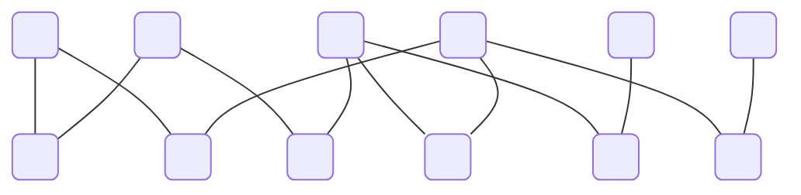

## Independent sets


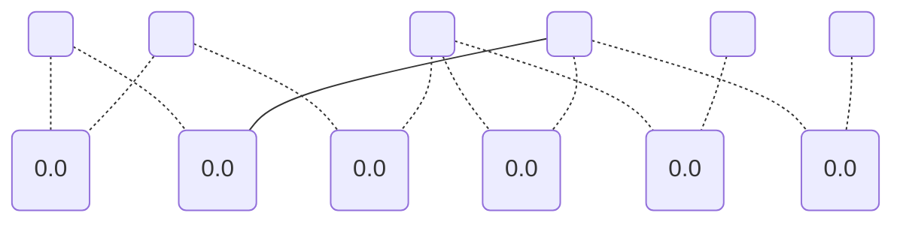

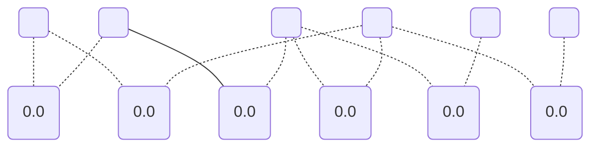

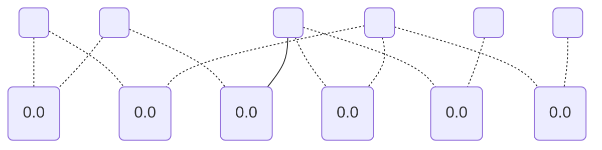

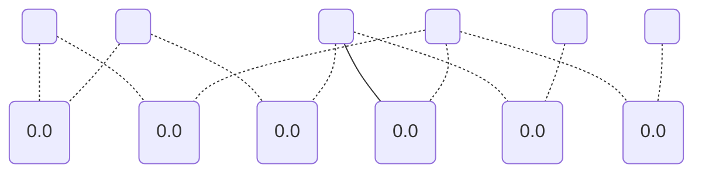

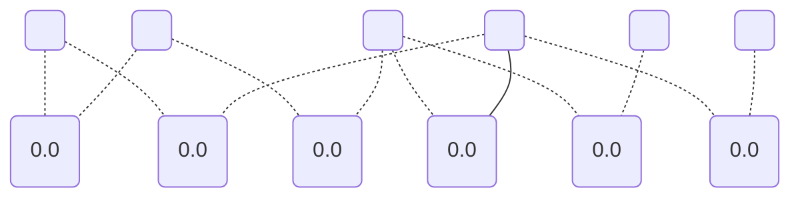


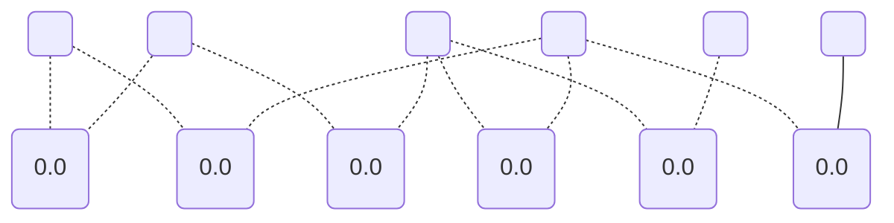

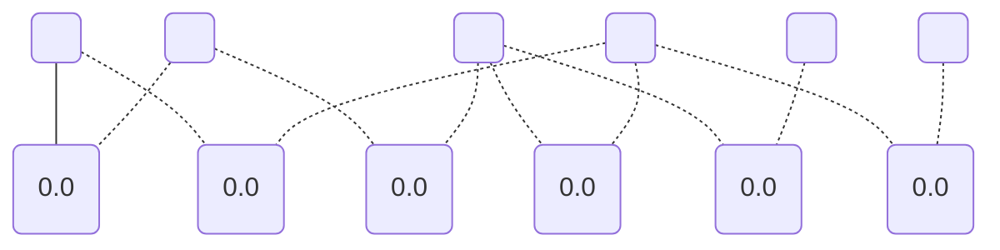

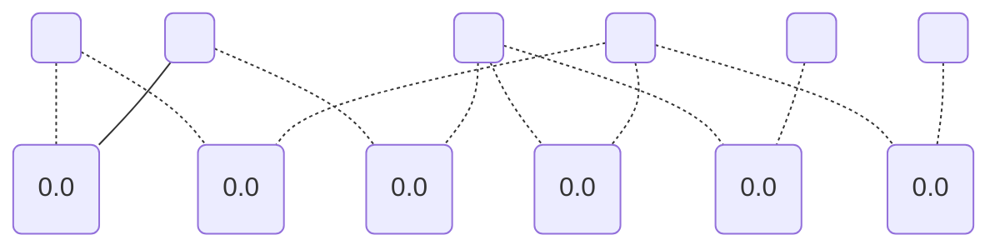

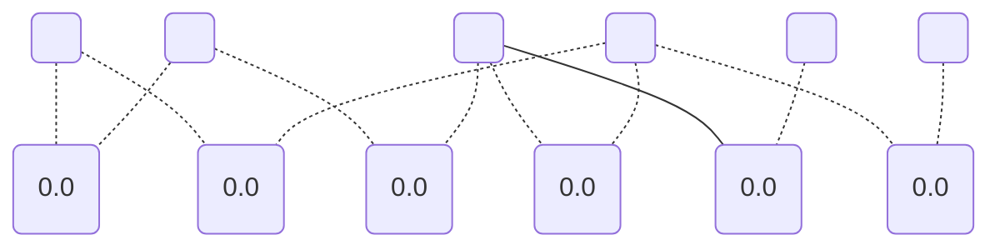

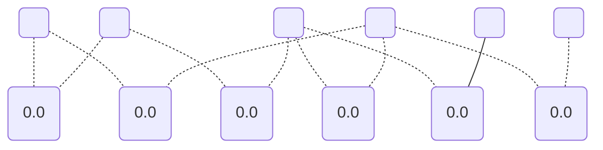

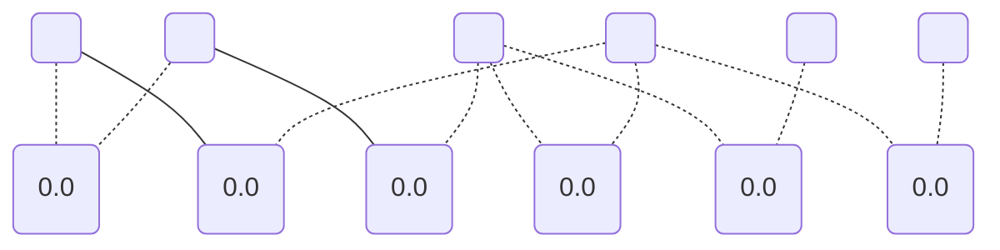

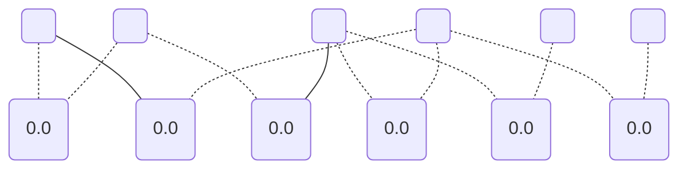

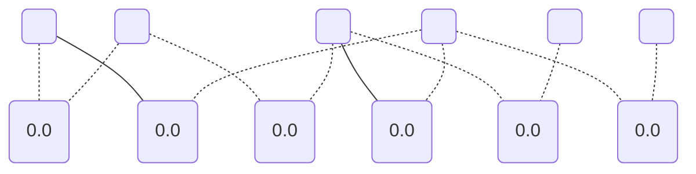

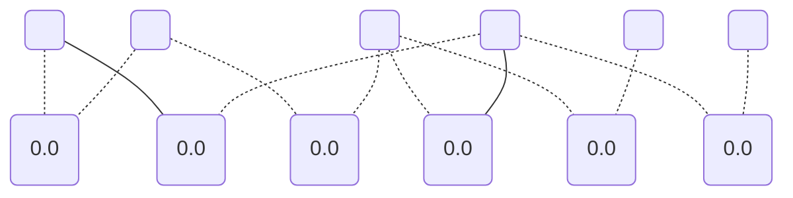

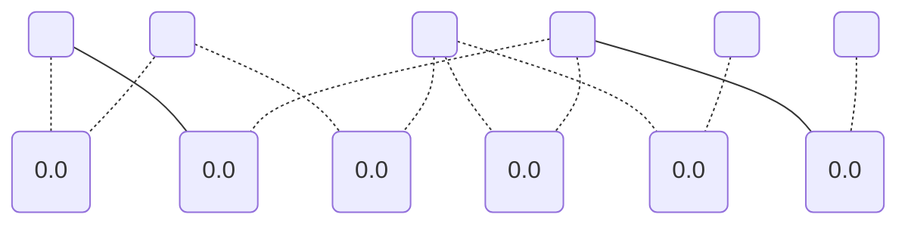


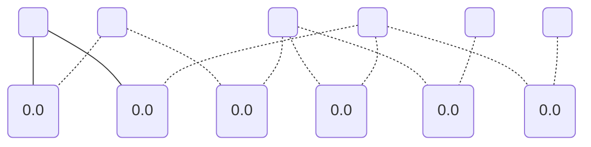

```mermaid
graph TD;
	0(" ");
	1("0.0");
	2(" ");
	3("0.0");
	4(" ");
	5("0.0");
	6(" ");
	7("0.0");
	8(" ");
	9("0.0");
	10(" ");
	11("0.0");
	0 -.- 1;
	0 --- 7;
	2 --- 1;
	2 -.- 3;
	4 -.- 3;
	4 -.- 9;
	4 -.- 11;
	6 -.- 5;
	6 -.- 7;
	6 -.- 9;
	8 -.- 5;
	10 -.- 11;
```

```mermaid
graph TD;
	0(" ");
	1("0.0");
	2(" ");
	3("0.0");
	4(" ");
	5("0.0");
	6(" ");
	7("0.0");
	8(" ");
	9("0.0");
	10(" ");
	11("0.0");
	0 -.- 1;
	0 --- 7;
	2 -.- 1;
	2 -.- 3;
	4 -.- 3;
	4 -.- 9;
	4 --- 11;
	6 -.- 5;
	6 -.- 7;
	6 -.- 9;
	8 -.- 5;
	10 -.- 11;
```

```mermaid
graph TD;
	0(" ");
	1("0.0");
	2(" ");
	3("0.0");
	4(" ");
	5("0.0");
	6(" ");
	7("0.0");
	8(" ");
	9("0.0");
	10(" ");
	11("0.0");
	0 -.- 1;
	0 --- 7;
	2 -.- 1;
	2 -.- 3;
	4 -.- 3;
	4 -.- 9;
	4 -.- 11;
	6 -.- 5;
	6 -.- 7;
	6 -.- 9;
	8 -.- 5;
	10 --- 11;
```

```mermaid
graph TD;
	0(" ");
	1("0.0");
	2(" ");
	3("0.0");
	4(" ");
	5("0.0");
	6(" ");
	7("0.0");
	8(" ");
	9("0.0");
	10(" ");
	11("0.0");
	0 -.- 1;
	0 -.- 7;
	2 -.- 1;
	2 --- 3;
	4 -.- 3;
	4 -.- 9;
	4 -.- 11;
	6 -.- 5;
	6 --- 7;
	6 -.- 9;
	8 -.- 5;
	10 -.- 11;
```

```mermaid
graph TD;
	0(" ");
	1("0.0");
	2(" ");
	3("0.0");
	4(" ");
	5("0.0");
	6(" ");
	7("0.0");
	8(" ");
	9("0.0");
	10(" ");
	11("0.0");
	0 -.- 1;
	0 -.- 7;
	2 -.- 1;
	2 -.- 3;
	4 --- 3;
	4 -.- 9;
	4 -.- 11;
	6 -.- 5;
	6 --- 7;
	6 -.- 9;
	8 -.- 5;
	10 -.- 11;
```

```mermaid
graph TD;
	0(" ");
	1("0.0");
	2(" ");
	3("0.0");
	4(" ");
	5("0.0");
	6(" ");
	7("0.0");
	8(" ");
	9("0.0");
	10(" ");
	11("0.0");
	0 -.- 1;
	0 -.- 7;
	2 -.- 1;
	2 -.- 3;
	4 -.- 3;
	4 --- 9;
	4 -.- 11;
	6 -.- 5;
	6 --- 7;
	6 -.- 9;
	8 -.- 5;
	10 -.- 11;
```

```mermaid
graph TD;
	0(" ");
	1("0.0");
	2(" ");
	3("0.0");
	4(" ");
	5("0.0");
	6(" ");
	7("0.0");
	8(" ");
	9("0.0");
	10(" ");
	11("0.0");
	0 -.- 1;
	0 -.- 7;
	2 -.- 1;
	2 -.- 3;
	4 -.- 3;
	4 -.- 9;
	4 -.- 11;
	6 -.- 5;
	6 --- 7;
	6 --- 9;
	8 -.- 5;
	10 -.- 11;
```

```mermaid
graph TD;
	0(" ");
	1("0.0");
	2(" ");
	3("0.0");
	4(" ");
	5("0.0");
	6(" ");
	7("0.0");
	8(" ");
	9("0.0");
	10(" ");
	11("0.0");
	0 -.- 1;
	0 -.- 7;
	2 -.- 1;
	2 -.- 3;
	4 -.- 3;
	4 -.- 9;
	4 -.- 11;
	6 --- 5;
	6 --- 7;
	6 -.- 9;
	8 -.- 5;
	10 -.- 11;
```

```mermaid
graph TD;
	0(" ");
	1("0.0");
	2(" ");
	3("0.0");
	4(" ");
	5("0.0");
	6(" ");
	7("0.0");
	8(" ");
	9("0.0");
	10(" ");
	11("0.0");
	0 -.- 1;
	0 -.- 7;
	2 -.- 1;
	2 -.- 3;
	4 -.- 3;
	4 -.- 9;
	4 -.- 11;
	6 -.- 5;
	6 --- 7;
	6 -.- 9;
	8 --- 5;
	10 -.- 11;
```

```mermaid
graph TD;
	0(" ");
	1("0.0");
	2(" ");
	3("0.0");
	4(" ");
	5("0.0");
	6(" ");
	7("0.0");
	8(" ");
	9("0.0");
	10(" ");
	11("0.0");
	0 --- 1;
	0 -.- 7;
	2 -.- 1;
	2 -.- 3;
	4 -.- 3;
	4 -.- 9;
	4 -.- 11;
	6 -.- 5;
	6 --- 7;
	6 -.- 9;
	8 -.- 5;
	10 -.- 11;
```

```mermaid
graph TD;
	0(" ");
	1("0.0");
	2(" ");
	3("0.0");
	4(" ");
	5("0.0");
	6(" ");
	7("0.0");
	8(" ");
	9("0.0");
	10(" ");
	11("0.0");
	0 -.- 1;
	0 -.- 7;
	2 --- 1;
	2 -.- 3;
	4 -.- 3;
	4 -.- 9;
	4 -.- 11;
	6 -.- 5;
	6 --- 7;
	6 -.- 9;
	8 -.- 5;
	10 -.- 11;
```

```mermaid
graph TD;
	0(" ");
	1("0.0");
	2(" ");
	3("0.0");
	4(" ");
	5("0.0");
	6(" ");
	7("0.0");
	8(" ");
	9("0.0");
	10(" ");
	11("0.0");
	0 -.- 1;
	0 -.- 7;
	2 -.- 1;
	2 -.- 3;
	4 -.- 3;
	4 -.- 9;
	4 --- 11;
	6 -.- 5;
	6 --- 7;
	6 -.- 9;
	8 -.- 5;
	10 -.- 11;
```

```mermaid
graph TD;
	0(" ");
	1("0.0");
	2(" ");
	3("0.0");
	4(" ");
	5("0.0");
	6(" ");
	7("0.0");
	8(" ");
	9("0.0");
	10(" ");
	11("0.0");
	0 -.- 1;
	0 -.- 7;
	2 -.- 1;
	2 -.- 3;
	4 -.- 3;
	4 -.- 9;
	4 -.- 11;
	6 -.- 5;
	6 --- 7;
	6 -.- 9;
	8 -.- 5;
	10 --- 11;
```

```mermaid
graph TD;
	0(" ");
	1("0.0");
	2(" ");
	3("0.0");
	4(" ");
	5("0.0");
	6(" ");
	7("0.0");
	8(" ");
	9("0.0");
	10(" ");
	11("0.0");
	0 -.- 1;
	0 -.- 7;
	2 -.- 1;
	2 --- 3;
	4 -.- 3;
	4 --- 9;
	4 -.- 11;
	6 -.- 5;
	6 -.- 7;
	6 -.- 9;
	8 -.- 5;
	10 -.- 11;
```

```mermaid
graph TD;
	0(" ");
	1("0.0");
	2(" ");
	3("0.0");
	4(" ");
	5("0.0");
	6(" ");
	7("0.0");
	8(" ");
	9("0.0");
	10(" ");
	11("0.0");
	0 -.- 1;
	0 -.- 7;
	2 -.- 1;
	2 --- 3;
	4 -.- 3;
	4 -.- 9;
	4 -.- 11;
	6 -.- 5;
	6 -.- 7;
	6 --- 9;
	8 -.- 5;
	10 -.- 11;
```

```mermaid
graph TD;
	0(" ");
	1("0.0");
	2(" ");
	3("0.0");
	4(" ");
	5("0.0");
	6(" ");
	7("0.0");
	8(" ");
	9("0.0");
	10(" ");
	11("0.0");
	0 -.- 1;
	0 -.- 7;
	2 -.- 1;
	2 --- 3;
	4 -.- 3;
	4 -.- 9;
	4 -.- 11;
	6 --- 5;
	6 -.- 7;
	6 -.- 9;
	8 -.- 5;
	10 -.- 11;
```

```mermaid
graph TD;
	0(" ");
	1("0.0");
	2(" ");
	3("0.0");
	4(" ");
	5("0.0");
	6(" ");
	7("0.0");
	8(" ");
	9("0.0");
	10(" ");
	11("0.0");
	0 -.- 1;
	0 -.- 7;
	2 -.- 1;
	2 --- 3;
	4 -.- 3;
	4 -.- 9;
	4 -.- 11;
	6 -.- 5;
	6 -.- 7;
	6 -.- 9;
	8 --- 5;
	10 -.- 11;
```

```mermaid
graph TD;
	0(" ");
	1("0.0");
	2(" ");
	3("0.0");
	4(" ");
	5("0.0");
	6(" ");
	7("0.0");
	8(" ");
	9("0.0");
	10(" ");
	11("0.0");
	0 --- 1;
	0 -.- 7;
	2 -.- 1;
	2 --- 3;
	4 -.- 3;
	4 -.- 9;
	4 -.- 11;
	6 -.- 5;
	6 -.- 7;
	6 -.- 9;
	8 -.- 5;
	10 -.- 11;
```

```mermaid
graph TD;
	0(" ");
	1("0.0");
	2(" ");
	3("0.0");
	4(" ");
	5("0.0");
	6(" ");
	7("0.0");
	8(" ");
	9("0.0");
	10(" ");
	11("0.0");
	0 -.- 1;
	0 -.- 7;
	2 --- 1;
	2 --- 3;
	4 -.- 3;
	4 -.- 9;
	4 -.- 11;
	6 -.- 5;
	6 -.- 7;
	6 -.- 9;
	8 -.- 5;
	10 -.- 11;
```

```mermaid
graph TD;
	0(" ");
	1("0.0");
	2(" ");
	3("0.0");
	4(" ");
	5("0.0");
	6(" ");
	7("0.0");
	8(" ");
	9("0.0");
	10(" ");
	11("0.0");
	0 -.- 1;
	0 -.- 7;
	2 -.- 1;
	2 --- 3;
	4 -.- 3;
	4 -.- 9;
	4 --- 11;
	6 -.- 5;
	6 -.- 7;
	6 -.- 9;
	8 -.- 5;
	10 -.- 11;
```

```mermaid
graph TD;
	0(" ");
	1("0.0");
	2(" ");
	3("0.0");
	4(" ");
	5("0.0");
	6(" ");
	7("0.0");
	8(" ");
	9("0.0");
	10(" ");
	11("0.0");
	0 -.- 1;
	0 -.- 7;
	2 -.- 1;
	2 --- 3;
	4 -.- 3;
	4 -.- 9;
	4 -.- 11;
	6 -.- 5;
	6 -.- 7;
	6 -.- 9;
	8 -.- 5;
	10 --- 11;
```

```mermaid
graph TD;
	0(" ");
	1("0.0");
	2(" ");
	3("0.0");
	4(" ");
	5("0.0");
	6(" ");
	7("0.0");
	8(" ");
	9("0.0");
	10(" ");
	11("0.0");
	0 -.- 1;
	0 -.- 7;
	2 -.- 1;
	2 -.- 3;
	4 --- 3;
	4 --- 9;
	4 -.- 11;
	6 -.- 5;
	6 -.- 7;
	6 -.- 9;
	8 -.- 5;
	10 -.- 11;
```

```mermaid
graph TD;
	0(" ");
	1("0.0");
	2(" ");
	3("0.0");
	4(" ");
	5("0.0");
	6(" ");
	7("0.0");
	8(" ");
	9("0.0");
	10(" ");
	11("0.0");
	0 -.- 1;
	0 -.- 7;
	2 -.- 1;
	2 -.- 3;
	4 --- 3;
	4 -.- 9;
	4 -.- 11;
	6 -.- 5;
	6 -.- 7;
	6 --- 9;
	8 -.- 5;
	10 -.- 11;
```

```mermaid
graph TD;
	0(" ");
	1("0.0");
	2(" ");
	3("0.0");
	4(" ");
	5("0.0");
	6(" ");
	7("0.0");
	8(" ");
	9("0.0");
	10(" ");
	11("0.0");
	0 -.- 1;
	0 -.- 7;
	2 -.- 1;
	2 -.- 3;
	4 --- 3;
	4 -.- 9;
	4 -.- 11;
	6 --- 5;
	6 -.- 7;
	6 -.- 9;
	8 -.- 5;
	10 -.- 11;
```

```mermaid
graph TD;
	0(" ");
	1("0.0");
	2(" ");
	3("0.0");
	4(" ");
	5("0.0");
	6(" ");
	7("0.0");
	8(" ");
	9("0.0");
	10(" ");
	11("0.0");
	0 -.- 1;
	0 -.- 7;
	2 -.- 1;
	2 -.- 3;
	4 --- 3;
	4 -.- 9;
	4 -.- 11;
	6 -.- 5;
	6 -.- 7;
	6 -.- 9;
	8 --- 5;
	10 -.- 11;
```

```mermaid
graph TD;
	0(" ");
	1("0.0");
	2(" ");
	3("0.0");
	4(" ");
	5("0.0");
	6(" ");
	7("0.0");
	8(" ");
	9("0.0");
	10(" ");
	11("0.0");
	0 --- 1;
	0 -.- 7;
	2 -.- 1;
	2 -.- 3;
	4 --- 3;
	4 -.- 9;
	4 -.- 11;
	6 -.- 5;
	6 -.- 7;
	6 -.- 9;
	8 -.- 5;
	10 -.- 11;
```

```mermaid
graph TD;
	0(" ");
	1("0.0");
	2(" ");
	3("0.0");
	4(" ");
	5("0.0");
	6(" ");
	7("0.0");
	8(" ");
	9("0.0");
	10(" ");
	11("0.0");
	0 -.- 1;
	0 -.- 7;
	2 --- 1;
	2 -.- 3;
	4 --- 3;
	4 -.- 9;
	4 -.- 11;
	6 -.- 5;
	6 -.- 7;
	6 -.- 9;
	8 -.- 5;
	10 -.- 11;
```

```mermaid
graph TD;
	0(" ");
	1("0.0");
	2(" ");
	3("0.0");
	4(" ");
	5("0.0");
	6(" ");
	7("0.0");
	8(" ");
	9("0.0");
	10(" ");
	11("0.0");
	0 -.- 1;
	0 -.- 7;
	2 -.- 1;
	2 -.- 3;
	4 --- 3;
	4 -.- 9;
	4 --- 11;
	6 -.- 5;
	6 -.- 7;
	6 -.- 9;
	8 -.- 5;
	10 -.- 11;
```

```mermaid
graph TD;
	0(" ");
	1("0.0");
	2(" ");
	3("0.0");
	4(" ");
	5("0.0");
	6(" ");
	7("0.0");
	8(" ");
	9("0.0");
	10(" ");
	11("0.0");
	0 -.- 1;
	0 -.- 7;
	2 -.- 1;
	2 -.- 3;
	4 --- 3;
	4 -.- 9;
	4 -.- 11;
	6 -.- 5;
	6 -.- 7;
	6 -.- 9;
	8 -.- 5;
	10 --- 11;
```

```mermaid
graph TD;
	0(" ");
	1("0.0");
	2(" ");
	3("0.0");
	4(" ");
	5("0.0");
	6(" ");
	7("0.0");
	8(" ");
	9("0.0");
	10(" ");
	11("0.0");
	0 -.- 1;
	0 -.- 7;
	2 -.- 1;
	2 -.- 3;
	4 -.- 3;
	4 --- 9;
	4 -.- 11;
	6 --- 5;
	6 -.- 7;
	6 -.- 9;
	8 -.- 5;
	10 -.- 11;
```

```mermaid
graph TD;
	0(" ");
	1("0.0");
	2(" ");
	3("0.0");
	4(" ");
	5("0.0");
	6(" ");
	7("0.0");
	8(" ");
	9("0.0");
	10(" ");
	11("0.0");
	0 -.- 1;
	0 -.- 7;
	2 -.- 1;
	2 -.- 3;
	4 -.- 3;
	4 --- 9;
	4 -.- 11;
	6 -.- 5;
	6 -.- 7;
	6 -.- 9;
	8 --- 5;
	10 -.- 11;
```

```mermaid
graph TD;
	0(" ");
	1("0.0");
	2(" ");
	3("0.0");
	4(" ");
	5("0.0");
	6(" ");
	7("0.0");
	8(" ");
	9("0.0");
	10(" ");
	11("0.0");
	0 --- 1;
	0 -.- 7;
	2 -.- 1;
	2 -.- 3;
	4 -.- 3;
	4 --- 9;
	4 -.- 11;
	6 -.- 5;
	6 -.- 7;
	6 -.- 9;
	8 -.- 5;
	10 -.- 11;
```

```mermaid
graph TD;
	0(" ");
	1("0.0");
	2(" ");
	3("0.0");
	4(" ");
	5("0.0");
	6(" ");
	7("0.0");
	8(" ");
	9("0.0");
	10(" ");
	11("0.0");
	0 -.- 1;
	0 -.- 7;
	2 --- 1;
	2 -.- 3;
	4 -.- 3;
	4 --- 9;
	4 -.- 11;
	6 -.- 5;
	6 -.- 7;
	6 -.- 9;
	8 -.- 5;
	10 -.- 11;
```

```mermaid
graph TD;
	0(" ");
	1("0.0");
	2(" ");
	3("0.0");
	4(" ");
	5("0.0");
	6(" ");
	7("0.0");
	8(" ");
	9("0.0");
	10(" ");
	11("0.0");
	0 -.- 1;
	0 -.- 7;
	2 -.- 1;
	2 -.- 3;
	4 -.- 3;
	4 --- 9;
	4 --- 11;
	6 -.- 5;
	6 -.- 7;
	6 -.- 9;
	8 -.- 5;
	10 -.- 11;
```

```mermaid
graph TD;
	0(" ");
	1("0.0");
	2(" ");
	3("0.0");
	4(" ");
	5("0.0");
	6(" ");
	7("0.0");
	8(" ");
	9("0.0");
	10(" ");
	11("0.0");
	0 -.- 1;
	0 -.- 7;
	2 -.- 1;
	2 -.- 3;
	4 -.- 3;
	4 --- 9;
	4 -.- 11;
	6 -.- 5;
	6 -.- 7;
	6 -.- 9;
	8 -.- 5;
	10 --- 11;
```

```mermaid
graph TD;
	0(" ");
	1("0.0");
	2(" ");
	3("0.0");
	4(" ");
	5("0.0");
	6(" ");
	7("0.0");
	8(" ");
	9("0.0");
	10(" ");
	11("0.0");
	0 -.- 1;
	0 -.- 7;
	2 -.- 1;
	2 -.- 3;
	4 -.- 3;
	4 -.- 9;
	4 -.- 11;
	6 --- 5;
	6 -.- 7;
	6 --- 9;
	8 -.- 5;
	10 -.- 11;
```

```mermaid
graph TD;
	0(" ");
	1("0.0");
	2(" ");
	3("0.0");
	4(" ");
	5("0.0");
	6(" ");
	7("0.0");
	8(" ");
	9("0.0");
	10(" ");
	11("0.0");
	0 -.- 1;
	0 -.- 7;
	2 -.- 1;
	2 -.- 3;
	4 -.- 3;
	4 -.- 9;
	4 -.- 11;
	6 -.- 5;
	6 -.- 7;
	6 --- 9;
	8 --- 5;
	10 -.- 11;
```

```mermaid
graph TD;
	0(" ");
	1("0.0");
	2(" ");
	3("0.0");
	4(" ");
	5("0.0");
	6(" ");
	7("0.0");
	8(" ");
	9("0.0");
	10(" ");
	11("0.0");
	0 --- 1;
	0 -.- 7;
	2 -.- 1;
	2 -.- 3;
	4 -.- 3;
	4 -.- 9;
	4 -.- 11;
	6 -.- 5;
	6 -.- 7;
	6 --- 9;
	8 -.- 5;
	10 -.- 11;
```

```mermaid
graph TD;
	0(" ");
	1("0.0");
	2(" ");
	3("0.0");
	4(" ");
	5("0.0");
	6(" ");
	7("0.0");
	8(" ");
	9("0.0");
	10(" ");
	11("0.0");
	0 -.- 1;
	0 -.- 7;
	2 --- 1;
	2 -.- 3;
	4 -.- 3;
	4 -.- 9;
	4 -.- 11;
	6 -.- 5;
	6 -.- 7;
	6 --- 9;
	8 -.- 5;
	10 -.- 11;
```

```mermaid
graph TD;
	0(" ");
	1("0.0");
	2(" ");
	3("0.0");
	4(" ");
	5("0.0");
	6(" ");
	7("0.0");
	8(" ");
	9("0.0");
	10(" ");
	11("0.0");
	0 -.- 1;
	0 -.- 7;
	2 -.- 1;
	2 -.- 3;
	4 -.- 3;
	4 -.- 9;
	4 --- 11;
	6 -.- 5;
	6 -.- 7;
	6 --- 9;
	8 -.- 5;
	10 -.- 11;
```

```mermaid
graph TD;
	0(" ");
	1("0.0");
	2(" ");
	3("0.0");
	4(" ");
	5("0.0");
	6(" ");
	7("0.0");
	8(" ");
	9("0.0");
	10(" ");
	11("0.0");
	0 -.- 1;
	0 -.- 7;
	2 -.- 1;
	2 -.- 3;
	4 -.- 3;
	4 -.- 9;
	4 -.- 11;
	6 -.- 5;
	6 -.- 7;
	6 --- 9;
	8 -.- 5;
	10 --- 11;
```

```mermaid
graph TD;
	0(" ");
	1("0.0");
	2(" ");
	3("0.0");
	4(" ");
	5("0.0");
	6(" ");
	7("0.0");
	8(" ");
	9("0.0");
	10(" ");
	11("0.0");
	0 --- 1;
	0 -.- 7;
	2 -.- 1;
	2 -.- 3;
	4 -.- 3;
	4 -.- 9;
	4 -.- 11;
	6 --- 5;
	6 -.- 7;
	6 -.- 9;
	8 -.- 5;
	10 -.- 11;
```

```mermaid
graph TD;
	0(" ");
	1("0.0");
	2(" ");
	3("0.0");
	4(" ");
	5("0.0");
	6(" ");
	7("0.0");
	8(" ");
	9("0.0");
	10(" ");
	11("0.0");
	0 -.- 1;
	0 -.- 7;
	2 --- 1;
	2 -.- 3;
	4 -.- 3;
	4 -.- 9;
	4 -.- 11;
	6 --- 5;
	6 -.- 7;
	6 -.- 9;
	8 -.- 5;
	10 -.- 11;
```

```mermaid
graph TD;
	0(" ");
	1("0.0");
	2(" ");
	3("0.0");
	4(" ");
	5("0.0");
	6(" ");
	7("0.0");
	8(" ");
	9("0.0");
	10(" ");
	11("0.0");
	0 -.- 1;
	0 -.- 7;
	2 -.- 1;
	2 -.- 3;
	4 -.- 3;
	4 -.- 9;
	4 --- 11;
	6 --- 5;
	6 -.- 7;
	6 -.- 9;
	8 -.- 5;
	10 -.- 11;
```

```mermaid
graph TD;
	0(" ");
	1("0.0");
	2(" ");
	3("0.0");
	4(" ");
	5("0.0");
	6(" ");
	7("0.0");
	8(" ");
	9("0.0");
	10(" ");
	11("0.0");
	0 -.- 1;
	0 -.- 7;
	2 -.- 1;
	2 -.- 3;
	4 -.- 3;
	4 -.- 9;
	4 -.- 11;
	6 --- 5;
	6 -.- 7;
	6 -.- 9;
	8 -.- 5;
	10 --- 11;
```

```mermaid
graph TD;
	0(" ");
	1("0.0");
	2(" ");
	3("0.0");
	4(" ");
	5("0.0");
	6(" ");
	7("0.0");
	8(" ");
	9("0.0");
	10(" ");
	11("0.0");
	0 --- 1;
	0 -.- 7;
	2 -.- 1;
	2 -.- 3;
	4 -.- 3;
	4 -.- 9;
	4 -.- 11;
	6 -.- 5;
	6 -.- 7;
	6 -.- 9;
	8 --- 5;
	10 -.- 11;
```

```mermaid
graph TD;
	0(" ");
	1("0.0");
	2(" ");
	3("0.0");
	4(" ");
	5("0.0");
	6(" ");
	7("0.0");
	8(" ");
	9("0.0");
	10(" ");
	11("0.0");
	0 -.- 1;
	0 -.- 7;
	2 --- 1;
	2 -.- 3;
	4 -.- 3;
	4 -.- 9;
	4 -.- 11;
	6 -.- 5;
	6 -.- 7;
	6 -.- 9;
	8 --- 5;
	10 -.- 11;
```

```mermaid
graph TD;
	0(" ");
	1("0.0");
	2(" ");
	3("0.0");
	4(" ");
	5("0.0");
	6(" ");
	7("0.0");
	8(" ");
	9("0.0");
	10(" ");
	11("0.0");
	0 -.- 1;
	0 -.- 7;
	2 -.- 1;
	2 -.- 3;
	4 -.- 3;
	4 -.- 9;
	4 --- 11;
	6 -.- 5;
	6 -.- 7;
	6 -.- 9;
	8 --- 5;
	10 -.- 11;
```

```mermaid
graph TD;
	0(" ");
	1("0.0");
	2(" ");
	3("0.0");
	4(" ");
	5("0.0");
	6(" ");
	7("0.0");
	8(" ");
	9("0.0");
	10(" ");
	11("0.0");
	0 -.- 1;
	0 -.- 7;
	2 -.- 1;
	2 -.- 3;
	4 -.- 3;
	4 -.- 9;
	4 -.- 11;
	6 -.- 5;
	6 -.- 7;
	6 -.- 9;
	8 --- 5;
	10 --- 11;
```

```mermaid
graph TD;
	0(" ");
	1("0.0");
	2(" ");
	3("0.0");
	4(" ");
	5("0.0");
	6(" ");
	7("0.0");
	8(" ");
	9("0.0");
	10(" ");
	11("0.0");
	0 --- 1;
	0 -.- 7;
	2 -.- 1;
	2 -.- 3;
	4 -.- 3;
	4 -.- 9;
	4 --- 11;
	6 -.- 5;
	6 -.- 7;
	6 -.- 9;
	8 -.- 5;
	10 -.- 11;
```

```mermaid
graph TD;
	0(" ");
	1("0.0");
	2(" ");
	3("0.0");
	4(" ");
	5("0.0");
	6(" ");
	7("0.0");
	8(" ");
	9("0.0");
	10(" ");
	11("0.0");
	0 --- 1;
	0 -.- 7;
	2 -.- 1;
	2 -.- 3;
	4 -.- 3;
	4 -.- 9;
	4 -.- 11;
	6 -.- 5;
	6 -.- 7;
	6 -.- 9;
	8 -.- 5;
	10 --- 11;
```

```mermaid
graph TD;
	0(" ");
	1("0.0");
	2(" ");
	3("0.0");
	4(" ");
	5("0.0");
	6(" ");
	7("0.0");
	8(" ");
	9("0.0");
	10(" ");
	11("0.0");
	0 -.- 1;
	0 -.- 7;
	2 --- 1;
	2 -.- 3;
	4 -.- 3;
	4 -.- 9;
	4 --- 11;
	6 -.- 5;
	6 -.- 7;
	6 -.- 9;
	8 -.- 5;
	10 -.- 11;
```

```mermaid
graph TD;
	0(" ");
	1("0.0");
	2(" ");
	3("0.0");
	4(" ");
	5("0.0");
	6(" ");
	7("0.0");
	8(" ");
	9("0.0");
	10(" ");
	11("0.0");
	0 -.- 1;
	0 -.- 7;
	2 --- 1;
	2 -.- 3;
	4 -.- 3;
	4 -.- 9;
	4 -.- 11;
	6 -.- 5;
	6 -.- 7;
	6 -.- 9;
	8 -.- 5;
	10 --- 11;
```

```mermaid
graph TD;
	0(" ");
	1("0.0");
	2(" ");
	3("0.0");
	4(" ");
	5("0.0");
	6(" ");
	7("0.0");
	8(" ");
	9("0.0");
	10(" ");
	11("0.0");
	0 -.- 1;
	0 --- 7;
	2 -.- 1;
	2 --- 3;
	4 -.- 3;
	4 --- 9;
	4 -.- 11;
	6 -.- 5;
	6 -.- 7;
	6 -.- 9;
	8 -.- 5;
	10 -.- 11;
```

```mermaid
graph TD;
	0(" ");
	1("0.0");
	2(" ");
	3("0.0");
	4(" ");
	5("0.0");
	6(" ");
	7("0.0");
	8(" ");
	9("0.0");
	10(" ");
	11("0.0");
	0 -.- 1;
	0 --- 7;
	2 -.- 1;
	2 --- 3;
	4 -.- 3;
	4 -.- 9;
	4 -.- 11;
	6 -.- 5;
	6 -.- 7;
	6 --- 9;
	8 -.- 5;
	10 -.- 11;
```

```mermaid
graph TD;
	0(" ");
	1("0.0");
	2(" ");
	3("0.0");
	4(" ");
	5("0.0");
	6(" ");
	7("0.0");
	8(" ");
	9("0.0");
	10(" ");
	11("0.0");
	0 -.- 1;
	0 --- 7;
	2 -.- 1;
	2 --- 3;
	4 -.- 3;
	4 -.- 9;
	4 -.- 11;
	6 --- 5;
	6 -.- 7;
	6 -.- 9;
	8 -.- 5;
	10 -.- 11;
```

```mermaid
graph TD;
	0(" ");
	1("0.0");
	2(" ");
	3("0.0");
	4(" ");
	5("0.0");
	6(" ");
	7("0.0");
	8(" ");
	9("0.0");
	10(" ");
	11("0.0");
	0 -.- 1;
	0 --- 7;
	2 -.- 1;
	2 --- 3;
	4 -.- 3;
	4 -.- 9;
	4 -.- 11;
	6 -.- 5;
	6 -.- 7;
	6 -.- 9;
	8 --- 5;
	10 -.- 11;
```

```mermaid
graph TD;
	0(" ");
	1("0.0");
	2(" ");
	3("0.0");
	4(" ");
	5("0.0");
	6(" ");
	7("0.0");
	8(" ");
	9("0.0");
	10(" ");
	11("0.0");
	0 --- 1;
	0 --- 7;
	2 -.- 1;
	2 --- 3;
	4 -.- 3;
	4 -.- 9;
	4 -.- 11;
	6 -.- 5;
	6 -.- 7;
	6 -.- 9;
	8 -.- 5;
	10 -.- 11;
```

```mermaid
graph TD;
	0(" ");
	1("0.0");
	2(" ");
	3("0.0");
	4(" ");
	5("0.0");
	6(" ");
	7("0.0");
	8(" ");
	9("0.0");
	10(" ");
	11("0.0");
	0 -.- 1;
	0 --- 7;
	2 --- 1;
	2 --- 3;
	4 -.- 3;
	4 -.- 9;
	4 -.- 11;
	6 -.- 5;
	6 -.- 7;
	6 -.- 9;
	8 -.- 5;
	10 -.- 11;
```

```mermaid
graph TD;
	0(" ");
	1("0.0");
	2(" ");
	3("0.0");
	4(" ");
	5("0.0");
	6(" ");
	7("0.0");
	8(" ");
	9("0.0");
	10(" ");
	11("0.0");
	0 -.- 1;
	0 --- 7;
	2 -.- 1;
	2 --- 3;
	4 -.- 3;
	4 -.- 9;
	4 --- 11;
	6 -.- 5;
	6 -.- 7;
	6 -.- 9;
	8 -.- 5;
	10 -.- 11;
```

```mermaid
graph TD;
	0(" ");
	1("0.0");
	2(" ");
	3("0.0");
	4(" ");
	5("0.0");
	6(" ");
	7("0.0");
	8(" ");
	9("0.0");
	10(" ");
	11("0.0");
	0 -.- 1;
	0 --- 7;
	2 -.- 1;
	2 --- 3;
	4 -.- 3;
	4 -.- 9;
	4 -.- 11;
	6 -.- 5;
	6 -.- 7;
	6 -.- 9;
	8 -.- 5;
	10 --- 11;
```

```mermaid
graph TD;
	0(" ");
	1("0.0");
	2(" ");
	3("0.0");
	4(" ");
	5("0.0");
	6(" ");
	7("0.0");
	8(" ");
	9("0.0");
	10(" ");
	11("0.0");
	0 -.- 1;
	0 --- 7;
	2 -.- 1;
	2 -.- 3;
	4 --- 3;
	4 --- 9;
	4 -.- 11;
	6 -.- 5;
	6 -.- 7;
	6 -.- 9;
	8 -.- 5;
	10 -.- 11;
```

```mermaid
graph TD;
	0(" ");
	1("0.0");
	2(" ");
	3("0.0");
	4(" ");
	5("0.0");
	6(" ");
	7("0.0");
	8(" ");
	9("0.0");
	10(" ");
	11("0.0");
	0 -.- 1;
	0 --- 7;
	2 -.- 1;
	2 -.- 3;
	4 --- 3;
	4 -.- 9;
	4 -.- 11;
	6 -.- 5;
	6 -.- 7;
	6 --- 9;
	8 -.- 5;
	10 -.- 11;
```

```mermaid
graph TD;
	0(" ");
	1("0.0");
	2(" ");
	3("0.0");
	4(" ");
	5("0.0");
	6(" ");
	7("0.0");
	8(" ");
	9("0.0");
	10(" ");
	11("0.0");
	0 -.- 1;
	0 --- 7;
	2 -.- 1;
	2 -.- 3;
	4 --- 3;
	4 -.- 9;
	4 -.- 11;
	6 --- 5;
	6 -.- 7;
	6 -.- 9;
	8 -.- 5;
	10 -.- 11;
```

```mermaid
graph TD;
	0(" ");
	1("0.0");
	2(" ");
	3("0.0");
	4(" ");
	5("0.0");
	6(" ");
	7("0.0");
	8(" ");
	9("0.0");
	10(" ");
	11("0.0");
	0 -.- 1;
	0 --- 7;
	2 -.- 1;
	2 -.- 3;
	4 --- 3;
	4 -.- 9;
	4 -.- 11;
	6 -.- 5;
	6 -.- 7;
	6 -.- 9;
	8 --- 5;
	10 -.- 11;
```

```mermaid
graph TD;
	0(" ");
	1("0.0");
	2(" ");
	3("0.0");
	4(" ");
	5("0.0");
	6(" ");
	7("0.0");
	8(" ");
	9("0.0");
	10(" ");
	11("0.0");
	0 --- 1;
	0 --- 7;
	2 -.- 1;
	2 -.- 3;
	4 --- 3;
	4 -.- 9;
	4 -.- 11;
	6 -.- 5;
	6 -.- 7;
	6 -.- 9;
	8 -.- 5;
	10 -.- 11;
```

```mermaid
graph TD;
	0(" ");
	1("0.0");
	2(" ");
	3("0.0");
	4(" ");
	5("0.0");
	6(" ");
	7("0.0");
	8(" ");
	9("0.0");
	10(" ");
	11("0.0");
	0 -.- 1;
	0 --- 7;
	2 --- 1;
	2 -.- 3;
	4 --- 3;
	4 -.- 9;
	4 -.- 11;
	6 -.- 5;
	6 -.- 7;
	6 -.- 9;
	8 -.- 5;
	10 -.- 11;
```

```mermaid
graph TD;
	0(" ");
	1("0.0");
	2(" ");
	3("0.0");
	4(" ");
	5("0.0");
	6(" ");
	7("0.0");
	8(" ");
	9("0.0");
	10(" ");
	11("0.0");
	0 -.- 1;
	0 --- 7;
	2 -.- 1;
	2 -.- 3;
	4 --- 3;
	4 -.- 9;
	4 --- 11;
	6 -.- 5;
	6 -.- 7;
	6 -.- 9;
	8 -.- 5;
	10 -.- 11;
```

```mermaid
graph TD;
	0(" ");
	1("0.0");
	2(" ");
	3("0.0");
	4(" ");
	5("0.0");
	6(" ");
	7("0.0");
	8(" ");
	9("0.0");
	10(" ");
	11("0.0");
	0 -.- 1;
	0 --- 7;
	2 -.- 1;
	2 -.- 3;
	4 --- 3;
	4 -.- 9;
	4 -.- 11;
	6 -.- 5;
	6 -.- 7;
	6 -.- 9;
	8 -.- 5;
	10 --- 11;
```

```mermaid
graph TD;
	0(" ");
	1("0.0");
	2(" ");
	3("0.0");
	4(" ");
	5("0.0");
	6(" ");
	7("0.0");
	8(" ");
	9("0.0");
	10(" ");
	11("0.0");
	0 -.- 1;
	0 --- 7;
	2 -.- 1;
	2 --- 3;
	4 -.- 3;
	4 --- 9;
	4 -.- 11;
	6 -.- 5;
	6 -.- 7;
	6 -.- 9;
	8 -.- 5;
	10 -.- 11;
```

```mermaid
graph TD;
	0(" ");
	1("0.0");
	2(" ");
	3("0.0");
	4(" ");
	5("0.0");
	6(" ");
	7("0.0");
	8(" ");
	9("0.0");
	10(" ");
	11("0.0");
	0 -.- 1;
	0 --- 7;
	2 -.- 1;
	2 -.- 3;
	4 --- 3;
	4 --- 9;
	4 -.- 11;
	6 -.- 5;
	6 -.- 7;
	6 -.- 9;
	8 -.- 5;
	10 -.- 11;
```

```mermaid
graph TD;
	0(" ");
	1("0.0");
	2(" ");
	3("0.0");
	4(" ");
	5("0.0");
	6(" ");
	7("0.0");
	8(" ");
	9("0.0");
	10(" ");
	11("0.0");
	0 -.- 1;
	0 --- 7;
	2 -.- 1;
	2 -.- 3;
	4 -.- 3;
	4 --- 9;
	4 -.- 11;
	6 --- 5;
	6 -.- 7;
	6 -.- 9;
	8 -.- 5;
	10 -.- 11;
```

```mermaid
graph TD;
	0(" ");
	1("0.0");
	2(" ");
	3("0.0");
	4(" ");
	5("0.0");
	6(" ");
	7("0.0");
	8(" ");
	9("0.0");
	10(" ");
	11("0.0");
	0 -.- 1;
	0 --- 7;
	2 -.- 1;
	2 -.- 3;
	4 -.- 3;
	4 --- 9;
	4 -.- 11;
	6 -.- 5;
	6 -.- 7;
	6 -.- 9;
	8 --- 5;
	10 -.- 11;
```

```mermaid
graph TD;
	0(" ");
	1("0.0");
	2(" ");
	3("0.0");
	4(" ");
	5("0.0");
	6(" ");
	7("0.0");
	8(" ");
	9("0.0");
	10(" ");
	11("0.0");
	0 --- 1;
	0 --- 7;
	2 -.- 1;
	2 -.- 3;
	4 -.- 3;
	4 --- 9;
	4 -.- 11;
	6 -.- 5;
	6 -.- 7;
	6 -.- 9;
	8 -.- 5;
	10 -.- 11;
```

```mermaid
graph TD;
	0(" ");
	1("0.0");
	2(" ");
	3("0.0");
	4(" ");
	5("0.0");
	6(" ");
	7("0.0");
	8(" ");
	9("0.0");
	10(" ");
	11("0.0");
	0 -.- 1;
	0 --- 7;
	2 --- 1;
	2 -.- 3;
	4 -.- 3;
	4 --- 9;
	4 -.- 11;
	6 -.- 5;
	6 -.- 7;
	6 -.- 9;
	8 -.- 5;
	10 -.- 11;
```

```mermaid
graph TD;
	0(" ");
	1("0.0");
	2(" ");
	3("0.0");
	4(" ");
	5("0.0");
	6(" ");
	7("0.0");
	8(" ");
	9("0.0");
	10(" ");
	11("0.0");
	0 -.- 1;
	0 --- 7;
	2 -.- 1;
	2 -.- 3;
	4 -.- 3;
	4 --- 9;
	4 --- 11;
	6 -.- 5;
	6 -.- 7;
	6 -.- 9;
	8 -.- 5;
	10 -.- 11;
```

```mermaid
graph TD;
	0(" ");
	1("0.0");
	2(" ");
	3("0.0");
	4(" ");
	5("0.0");
	6(" ");
	7("0.0");
	8(" ");
	9("0.0");
	10(" ");
	11("0.0");
	0 -.- 1;
	0 --- 7;
	2 -.- 1;
	2 -.- 3;
	4 -.- 3;
	4 --- 9;
	4 -.- 11;
	6 -.- 5;
	6 -.- 7;
	6 -.- 9;
	8 -.- 5;
	10 --- 11;
```

```mermaid
graph TD;
	0(" ");
	1("0.0");
	2(" ");
	3("0.0");
	4(" ");
	5("0.0");
	6(" ");
	7("0.0");
	8(" ");
	9("0.0");
	10(" ");
	11("0.0");
	0 -.- 1;
	0 --- 7;
	2 -.- 1;
	2 --- 3;
	4 -.- 3;
	4 -.- 9;
	4 -.- 11;
	6 -.- 5;
	6 -.- 7;
	6 --- 9;
	8 -.- 5;
	10 -.- 11;
```

```mermaid
graph TD;
	0(" ");
	1("0.0");
	2(" ");
	3("0.0");
	4(" ");
	5("0.0");
	6(" ");
	7("0.0");
	8(" ");
	9("0.0");
	10(" ");
	11("0.0");
	0 -.- 1;
	0 --- 7;
	2 -.- 1;
	2 -.- 3;
	4 --- 3;
	4 -.- 9;
	4 -.- 11;
	6 -.- 5;
	6 -.- 7;
	6 --- 9;
	8 -.- 5;
	10 -.- 11;
```

```mermaid
graph TD;
	0(" ");
	1("0.0");
	2(" ");
	3("0.0");
	4(" ");
	5("0.0");
	6(" ");
	7("0.0");
	8(" ");
	9("0.0");
	10(" ");
	11("0.0");
	0 -.- 1;
	0 --- 7;
	2 -.- 1;
	2 -.- 3;
	4 -.- 3;
	4 -.- 9;
	4 -.- 11;
	6 --- 5;
	6 -.- 7;
	6 --- 9;
	8 -.- 5;
	10 -.- 11;
```

```mermaid
graph TD;
	0(" ");
	1("0.0");
	2(" ");
	3("0.0");
	4(" ");
	5("0.0");
	6(" ");
	7("0.0");
	8(" ");
	9("0.0");
	10(" ");
	11("0.0");
	0 -.- 1;
	0 --- 7;
	2 -.- 1;
	2 -.- 3;
	4 -.- 3;
	4 -.- 9;
	4 -.- 11;
	6 -.- 5;
	6 -.- 7;
	6 --- 9;
	8 --- 5;
	10 -.- 11;
```

```mermaid
graph TD;
	0(" ");
	1("0.0");
	2(" ");
	3("0.0");
	4(" ");
	5("0.0");
	6(" ");
	7("0.0");
	8(" ");
	9("0.0");
	10(" ");
	11("0.0");
	0 --- 1;
	0 --- 7;
	2 -.- 1;
	2 -.- 3;
	4 -.- 3;
	4 -.- 9;
	4 -.- 11;
	6 -.- 5;
	6 -.- 7;
	6 --- 9;
	8 -.- 5;
	10 -.- 11;
```

```mermaid
graph TD;
	0(" ");
	1("0.0");
	2(" ");
	3("0.0");
	4(" ");
	5("0.0");
	6(" ");
	7("0.0");
	8(" ");
	9("0.0");
	10(" ");
	11("0.0");
	0 -.- 1;
	0 --- 7;
	2 --- 1;
	2 -.- 3;
	4 -.- 3;
	4 -.- 9;
	4 -.- 11;
	6 -.- 5;
	6 -.- 7;
	6 --- 9;
	8 -.- 5;
	10 -.- 11;
```

```mermaid
graph TD;
	0(" ");
	1("0.0");
	2(" ");
	3("0.0");
	4(" ");
	5("0.0");
	6(" ");
	7("0.0");
	8(" ");
	9("0.0");
	10(" ");
	11("0.0");
	0 -.- 1;
	0 --- 7;
	2 -.- 1;
	2 -.- 3;
	4 -.- 3;
	4 -.- 9;
	4 --- 11;
	6 -.- 5;
	6 -.- 7;
	6 --- 9;
	8 -.- 5;
	10 -.- 11;
```

```mermaid
graph TD;
	0(" ");
	1("0.0");
	2(" ");
	3("0.0");
	4(" ");
	5("0.0");
	6(" ");
	7("0.0");
	8(" ");
	9("0.0");
	10(" ");
	11("0.0");
	0 -.- 1;
	0 --- 7;
	2 -.- 1;
	2 -.- 3;
	4 -.- 3;
	4 -.- 9;
	4 -.- 11;
	6 -.- 5;
	6 -.- 7;
	6 --- 9;
	8 -.- 5;
	10 --- 11;
```

```mermaid
graph TD;
	0(" ");
	1("0.0");
	2(" ");
	3("0.0");
	4(" ");
	5("0.0");
	6(" ");
	7("0.0");
	8(" ");
	9("0.0");
	10(" ");
	11("0.0");
	0 -.- 1;
	0 --- 7;
	2 -.- 1;
	2 --- 3;
	4 -.- 3;
	4 -.- 9;
	4 -.- 11;
	6 --- 5;
	6 -.- 7;
	6 -.- 9;
	8 -.- 5;
	10 -.- 11;
```

```mermaid
graph TD;
	0(" ");
	1("0.0");
	2(" ");
	3("0.0");
	4(" ");
	5("0.0");
	6(" ");
	7("0.0");
	8(" ");
	9("0.0");
	10(" ");
	11("0.0");
	0 -.- 1;
	0 --- 7;
	2 -.- 1;
	2 -.- 3;
	4 --- 3;
	4 -.- 9;
	4 -.- 11;
	6 --- 5;
	6 -.- 7;
	6 -.- 9;
	8 -.- 5;
	10 -.- 11;
```

```mermaid
graph TD;
	0(" ");
	1("0.0");
	2(" ");
	3("0.0");
	4(" ");
	5("0.0");
	6(" ");
	7("0.0");
	8(" ");
	9("0.0");
	10(" ");
	11("0.0");
	0 -.- 1;
	0 --- 7;
	2 -.- 1;
	2 -.- 3;
	4 -.- 3;
	4 --- 9;
	4 -.- 11;
	6 --- 5;
	6 -.- 7;
	6 -.- 9;
	8 -.- 5;
	10 -.- 11;
```

```mermaid
graph TD;
	0(" ");
	1("0.0");
	2(" ");
	3("0.0");
	4(" ");
	5("0.0");
	6(" ");
	7("0.0");
	8(" ");
	9("0.0");
	10(" ");
	11("0.0");
	0 -.- 1;
	0 --- 7;
	2 -.- 1;
	2 -.- 3;
	4 -.- 3;
	4 -.- 9;
	4 -.- 11;
	6 --- 5;
	6 -.- 7;
	6 --- 9;
	8 -.- 5;
	10 -.- 11;
```

```mermaid
graph TD;
	0(" ");
	1("0.0");
	2(" ");
	3("0.0");
	4(" ");
	5("0.0");
	6(" ");
	7("0.0");
	8(" ");
	9("0.0");
	10(" ");
	11("0.0");
	0 --- 1;
	0 --- 7;
	2 -.- 1;
	2 -.- 3;
	4 -.- 3;
	4 -.- 9;
	4 -.- 11;
	6 --- 5;
	6 -.- 7;
	6 -.- 9;
	8 -.- 5;
	10 -.- 11;
```

```mermaid
graph TD;
	0(" ");
	1("0.0");
	2(" ");
	3("0.0");
	4(" ");
	5("0.0");
	6(" ");
	7("0.0");
	8(" ");
	9("0.0");
	10(" ");
	11("0.0");
	0 -.- 1;
	0 --- 7;
	2 --- 1;
	2 -.- 3;
	4 -.- 3;
	4 -.- 9;
	4 -.- 11;
	6 --- 5;
	6 -.- 7;
	6 -.- 9;
	8 -.- 5;
	10 -.- 11;
```

```mermaid
graph TD;
	0(" ");
	1("0.0");
	2(" ");
	3("0.0");
	4(" ");
	5("0.0");
	6(" ");
	7("0.0");
	8(" ");
	9("0.0");
	10(" ");
	11("0.0");
	0 -.- 1;
	0 --- 7;
	2 -.- 1;
	2 -.- 3;
	4 -.- 3;
	4 -.- 9;
	4 --- 11;
	6 --- 5;
	6 -.- 7;
	6 -.- 9;
	8 -.- 5;
	10 -.- 11;
```

```mermaid
graph TD;
	0(" ");
	1("0.0");
	2(" ");
	3("0.0");
	4(" ");
	5("0.0");
	6(" ");
	7("0.0");
	8(" ");
	9("0.0");
	10(" ");
	11("0.0");
	0 -.- 1;
	0 --- 7;
	2 -.- 1;
	2 -.- 3;
	4 -.- 3;
	4 -.- 9;
	4 -.- 11;
	6 --- 5;
	6 -.- 7;
	6 -.- 9;
	8 -.- 5;
	10 --- 11;
```

```mermaid
graph TD;
	0(" ");
	1("0.0");
	2(" ");
	3("0.0");
	4(" ");
	5("0.0");
	6(" ");
	7("0.0");
	8(" ");
	9("0.0");
	10(" ");
	11("0.0");
	0 -.- 1;
	0 --- 7;
	2 -.- 1;
	2 --- 3;
	4 -.- 3;
	4 -.- 9;
	4 -.- 11;
	6 -.- 5;
	6 -.- 7;
	6 -.- 9;
	8 --- 5;
	10 -.- 11;
```

```mermaid
graph TD;
	0(" ");
	1("0.0");
	2(" ");
	3("0.0");
	4(" ");
	5("0.0");
	6(" ");
	7("0.0");
	8(" ");
	9("0.0");
	10(" ");
	11("0.0");
	0 -.- 1;
	0 --- 7;
	2 -.- 1;
	2 -.- 3;
	4 --- 3;
	4 -.- 9;
	4 -.- 11;
	6 -.- 5;
	6 -.- 7;
	6 -.- 9;
	8 --- 5;
	10 -.- 11;
```

```mermaid
graph TD;
	0(" ");
	1("0.0");
	2(" ");
	3("0.0");
	4(" ");
	5("0.0");
	6(" ");
	7("0.0");
	8(" ");
	9("0.0");
	10(" ");
	11("0.0");
	0 -.- 1;
	0 --- 7;
	2 -.- 1;
	2 -.- 3;
	4 -.- 3;
	4 --- 9;
	4 -.- 11;
	6 -.- 5;
	6 -.- 7;
	6 -.- 9;
	8 --- 5;
	10 -.- 11;
```

```mermaid
graph TD;
	0(" ");
	1("0.0");
	2(" ");
	3("0.0");
	4(" ");
	5("0.0");
	6(" ");
	7("0.0");
	8(" ");
	9("0.0");
	10(" ");
	11("0.0");
	0 -.- 1;
	0 --- 7;
	2 -.- 1;
	2 -.- 3;
	4 -.- 3;
	4 -.- 9;
	4 -.- 11;
	6 -.- 5;
	6 -.- 7;
	6 --- 9;
	8 --- 5;
	10 -.- 11;
```

```mermaid
graph TD;
	0(" ");
	1("0.0");
	2(" ");
	3("0.0");
	4(" ");
	5("0.0");
	6(" ");
	7("0.0");
	8(" ");
	9("0.0");
	10(" ");
	11("0.0");
	0 --- 1;
	0 --- 7;
	2 -.- 1;
	2 -.- 3;
	4 -.- 3;
	4 -.- 9;
	4 -.- 11;
	6 -.- 5;
	6 -.- 7;
	6 -.- 9;
	8 --- 5;
	10 -.- 11;
```

```mermaid
graph TD;
	0(" ");
	1("0.0");
	2(" ");
	3("0.0");
	4(" ");
	5("0.0");
	6(" ");
	7("0.0");
	8(" ");
	9("0.0");
	10(" ");
	11("0.0");
	0 -.- 1;
	0 --- 7;
	2 --- 1;
	2 -.- 3;
	4 -.- 3;
	4 -.- 9;
	4 -.- 11;
	6 -.- 5;
	6 -.- 7;
	6 -.- 9;
	8 --- 5;
	10 -.- 11;
```

```mermaid
graph TD;
	0(" ");
	1("0.0");
	2(" ");
	3("0.0");
	4(" ");
	5("0.0");
	6(" ");
	7("0.0");
	8(" ");
	9("0.0");
	10(" ");
	11("0.0");
	0 -.- 1;
	0 --- 7;
	2 -.- 1;
	2 -.- 3;
	4 -.- 3;
	4 -.- 9;
	4 --- 11;
	6 -.- 5;
	6 -.- 7;
	6 -.- 9;
	8 --- 5;
	10 -.- 11;
```

```mermaid
graph TD;
	0(" ");
	1("0.0");
	2(" ");
	3("0.0");
	4(" ");
	5("0.0");
	6(" ");
	7("0.0");
	8(" ");
	9("0.0");
	10(" ");
	11("0.0");
	0 -.- 1;
	0 --- 7;
	2 -.- 1;
	2 -.- 3;
	4 -.- 3;
	4 -.- 9;
	4 -.- 11;
	6 -.- 5;
	6 -.- 7;
	6 -.- 9;
	8 --- 5;
	10 --- 11;
```

```mermaid
graph TD;
	0(" ");
	1("0.0");
	2(" ");
	3("0.0");
	4(" ");
	5("0.0");
	6(" ");
	7("0.0");
	8(" ");
	9("0.0");
	10(" ");
	11("0.0");
	0 --- 1;
	0 --- 7;
	2 -.- 1;
	2 --- 3;
	4 -.- 3;
	4 -.- 9;
	4 -.- 11;
	6 -.- 5;
	6 -.- 7;
	6 -.- 9;
	8 -.- 5;
	10 -.- 11;
```

```mermaid
graph TD;
	0(" ");
	1("0.0");
	2(" ");
	3("0.0");
	4(" ");
	5("0.0");
	6(" ");
	7("0.0");
	8(" ");
	9("0.0");
	10(" ");
	11("0.0");
	0 --- 1;
	0 --- 7;
	2 -.- 1;
	2 -.- 3;
	4 --- 3;
	4 -.- 9;
	4 -.- 11;
	6 -.- 5;
	6 -.- 7;
	6 -.- 9;
	8 -.- 5;
	10 -.- 11;
```

```mermaid
graph TD;
	0(" ");
	1("0.0");
	2(" ");
	3("0.0");
	4(" ");
	5("0.0");
	6(" ");
	7("0.0");
	8(" ");
	9("0.0");
	10(" ");
	11("0.0");
	0 --- 1;
	0 --- 7;
	2 -.- 1;
	2 -.- 3;
	4 -.- 3;
	4 --- 9;
	4 -.- 11;
	6 -.- 5;
	6 -.- 7;
	6 -.- 9;
	8 -.- 5;
	10 -.- 11;
```

```mermaid
graph TD;
	0(" ");
	1("0.0");
	2(" ");
	3("0.0");
	4(" ");
	5("0.0");
	6(" ");
	7("0.0");
	8(" ");
	9("0.0");
	10(" ");
	11("0.0");
	0 --- 1;
	0 --- 7;
	2 -.- 1;
	2 -.- 3;
	4 -.- 3;
	4 -.- 9;
	4 -.- 11;
	6 -.- 5;
	6 -.- 7;
	6 --- 9;
	8 -.- 5;
	10 -.- 11;
```

```mermaid
graph TD;
	0(" ");
	1("0.0");
	2(" ");
	3("0.0");
	4(" ");
	5("0.0");
	6(" ");
	7("0.0");
	8(" ");
	9("0.0");
	10(" ");
	11("0.0");
	0 --- 1;
	0 --- 7;
	2 -.- 1;
	2 -.- 3;
	4 -.- 3;
	4 -.- 9;
	4 -.- 11;
	6 --- 5;
	6 -.- 7;
	6 -.- 9;
	8 -.- 5;
	10 -.- 11;
```

```mermaid
graph TD;
	0(" ");
	1("0.0");
	2(" ");
	3("0.0");
	4(" ");
	5("0.0");
	6(" ");
	7("0.0");
	8(" ");
	9("0.0");
	10(" ");
	11("0.0");
	0 --- 1;
	0 --- 7;
	2 -.- 1;
	2 -.- 3;
	4 -.- 3;
	4 -.- 9;
	4 -.- 11;
	6 -.- 5;
	6 -.- 7;
	6 -.- 9;
	8 --- 5;
	10 -.- 11;
```

```mermaid
graph TD;
	0(" ");
	1("0.0");
	2(" ");
	3("0.0");
	4(" ");
	5("0.0");
	6(" ");
	7("0.0");
	8(" ");
	9("0.0");
	10(" ");
	11("0.0");
	0 --- 1;
	0 --- 7;
	2 -.- 1;
	2 -.- 3;
	4 -.- 3;
	4 -.- 9;
	4 --- 11;
	6 -.- 5;
	6 -.- 7;
	6 -.- 9;
	8 -.- 5;
	10 -.- 11;
```

```mermaid
graph TD;
	0(" ");
	1("0.0");
	2(" ");
	3("0.0");
	4(" ");
	5("0.0");
	6(" ");
	7("0.0");
	8(" ");
	9("0.0");
	10(" ");
	11("0.0");
	0 --- 1;
	0 --- 7;
	2 -.- 1;
	2 -.- 3;
	4 -.- 3;
	4 -.- 9;
	4 -.- 11;
	6 -.- 5;
	6 -.- 7;
	6 -.- 9;
	8 -.- 5;
	10 --- 11;
```

```mermaid
graph TD;
	0(" ");
	1("0.0");
	2(" ");
	3("0.0");
	4(" ");
	5("0.0");
	6(" ");
	7("0.0");
	8(" ");
	9("0.0");
	10(" ");
	11("0.0");
	0 -.- 1;
	0 --- 7;
	2 --- 1;
	2 --- 3;
	4 -.- 3;
	4 -.- 9;
	4 -.- 11;
	6 -.- 5;
	6 -.- 7;
	6 -.- 9;
	8 -.- 5;
	10 -.- 11;
```

```mermaid
graph TD;
	0(" ");
	1("0.0");
	2(" ");
	3("0.0");
	4(" ");
	5("0.0");
	6(" ");
	7("0.0");
	8(" ");
	9("0.0");
	10(" ");
	11("0.0");
	0 -.- 1;
	0 --- 7;
	2 --- 1;
	2 -.- 3;
	4 --- 3;
	4 -.- 9;
	4 -.- 11;
	6 -.- 5;
	6 -.- 7;
	6 -.- 9;
	8 -.- 5;
	10 -.- 11;
```

```mermaid
graph TD;
	0(" ");
	1("0.0");
	2(" ");
	3("0.0");
	4(" ");
	5("0.0");
	6(" ");
	7("0.0");
	8(" ");
	9("0.0");
	10(" ");
	11("0.0");
	0 -.- 1;
	0 --- 7;
	2 --- 1;
	2 -.- 3;
	4 -.- 3;
	4 --- 9;
	4 -.- 11;
	6 -.- 5;
	6 -.- 7;
	6 -.- 9;
	8 -.- 5;
	10 -.- 11;
```

```mermaid
graph TD;
	0(" ");
	1("0.0");
	2(" ");
	3("0.0");
	4(" ");
	5("0.0");
	6(" ");
	7("0.0");
	8(" ");
	9("0.0");
	10(" ");
	11("0.0");
	0 -.- 1;
	0 --- 7;
	2 --- 1;
	2 -.- 3;
	4 -.- 3;
	4 -.- 9;
	4 -.- 11;
	6 -.- 5;
	6 -.- 7;
	6 --- 9;
	8 -.- 5;
	10 -.- 11;
```

```mermaid
graph TD;
	0(" ");
	1("0.0");
	2(" ");
	3("0.0");
	4(" ");
	5("0.0");
	6(" ");
	7("0.0");
	8(" ");
	9("0.0");
	10(" ");
	11("0.0");
	0 -.- 1;
	0 --- 7;
	2 --- 1;
	2 -.- 3;
	4 -.- 3;
	4 -.- 9;
	4 -.- 11;
	6 --- 5;
	6 -.- 7;
	6 -.- 9;
	8 -.- 5;
	10 -.- 11;
```

```mermaid
graph TD;
	0(" ");
	1("0.0");
	2(" ");
	3("0.0");
	4(" ");
	5("0.0");
	6(" ");
	7("0.0");
	8(" ");
	9("0.0");
	10(" ");
	11("0.0");
	0 -.- 1;
	0 --- 7;
	2 --- 1;
	2 -.- 3;
	4 -.- 3;
	4 -.- 9;
	4 -.- 11;
	6 -.- 5;
	6 -.- 7;
	6 -.- 9;
	8 --- 5;
	10 -.- 11;
```

```mermaid
graph TD;
	0(" ");
	1("0.0");
	2(" ");
	3("0.0");
	4(" ");
	5("0.0");
	6(" ");
	7("0.0");
	8(" ");
	9("0.0");
	10(" ");
	11("0.0");
	0 -.- 1;
	0 --- 7;
	2 --- 1;
	2 -.- 3;
	4 -.- 3;
	4 -.- 9;
	4 --- 11;
	6 -.- 5;
	6 -.- 7;
	6 -.- 9;
	8 -.- 5;
	10 -.- 11;
```

```mermaid
graph TD;
	0(" ");
	1("0.0");
	2(" ");
	3("0.0");
	4(" ");
	5("0.0");
	6(" ");
	7("0.0");
	8(" ");
	9("0.0");
	10(" ");
	11("0.0");
	0 -.- 1;
	0 --- 7;
	2 --- 1;
	2 -.- 3;
	4 -.- 3;
	4 -.- 9;
	4 -.- 11;
	6 -.- 5;
	6 -.- 7;
	6 -.- 9;
	8 -.- 5;
	10 --- 11;
```

```mermaid
graph TD;
	0(" ");
	1("0.0");
	2(" ");
	3("0.0");
	4(" ");
	5("0.0");
	6(" ");
	7("0.0");
	8(" ");
	9("0.0");
	10(" ");
	11("0.0");
	0 -.- 1;
	0 --- 7;
	2 -.- 1;
	2 --- 3;
	4 -.- 3;
	4 -.- 9;
	4 --- 11;
	6 -.- 5;
	6 -.- 7;
	6 -.- 9;
	8 -.- 5;
	10 -.- 11;
```

```mermaid
graph TD;
	0(" ");
	1("0.0");
	2(" ");
	3("0.0");
	4(" ");
	5("0.0");
	6(" ");
	7("0.0");
	8(" ");
	9("0.0");
	10(" ");
	11("0.0");
	0 -.- 1;
	0 --- 7;
	2 -.- 1;
	2 -.- 3;
	4 --- 3;
	4 -.- 9;
	4 --- 11;
	6 -.- 5;
	6 -.- 7;
	6 -.- 9;
	8 -.- 5;
	10 -.- 11;
```

```mermaid
graph TD;
	0(" ");
	1("0.0");
	2(" ");
	3("0.0");
	4(" ");
	5("0.0");
	6(" ");
	7("0.0");
	8(" ");
	9("0.0");
	10(" ");
	11("0.0");
	0 -.- 1;
	0 --- 7;
	2 -.- 1;
	2 -.- 3;
	4 -.- 3;
	4 --- 9;
	4 --- 11;
	6 -.- 5;
	6 -.- 7;
	6 -.- 9;
	8 -.- 5;
	10 -.- 11;
```

```mermaid
graph TD;
	0(" ");
	1("0.0");
	2(" ");
	3("0.0");
	4(" ");
	5("0.0");
	6(" ");
	7("0.0");
	8(" ");
	9("0.0");
	10(" ");
	11("0.0");
	0 -.- 1;
	0 --- 7;
	2 -.- 1;
	2 -.- 3;
	4 -.- 3;
	4 -.- 9;
	4 --- 11;
	6 -.- 5;
	6 -.- 7;
	6 --- 9;
	8 -.- 5;
	10 -.- 11;
```

```mermaid
graph TD;
	0(" ");
	1("0.0");
	2(" ");
	3("0.0");
	4(" ");
	5("0.0");
	6(" ");
	7("0.0");
	8(" ");
	9("0.0");
	10(" ");
	11("0.0");
	0 -.- 1;
	0 --- 7;
	2 -.- 1;
	2 -.- 3;
	4 -.- 3;
	4 -.- 9;
	4 --- 11;
	6 --- 5;
	6 -.- 7;
	6 -.- 9;
	8 -.- 5;
	10 -.- 11;
```

```mermaid
graph TD;
	0(" ");
	1("0.0");
	2(" ");
	3("0.0");
	4(" ");
	5("0.0");
	6(" ");
	7("0.0");
	8(" ");
	9("0.0");
	10(" ");
	11("0.0");
	0 -.- 1;
	0 --- 7;
	2 -.- 1;
	2 -.- 3;
	4 -.- 3;
	4 -.- 9;
	4 --- 11;
	6 -.- 5;
	6 -.- 7;
	6 -.- 9;
	8 --- 5;
	10 -.- 11;
```

```mermaid
graph TD;
	0(" ");
	1("0.0");
	2(" ");
	3("0.0");
	4(" ");
	5("0.0");
	6(" ");
	7("0.0");
	8(" ");
	9("0.0");
	10(" ");
	11("0.0");
	0 --- 1;
	0 --- 7;
	2 -.- 1;
	2 -.- 3;
	4 -.- 3;
	4 -.- 9;
	4 --- 11;
	6 -.- 5;
	6 -.- 7;
	6 -.- 9;
	8 -.- 5;
	10 -.- 11;
```

```mermaid
graph TD;
	0(" ");
	1("0.0");
	2(" ");
	3("0.0");
	4(" ");
	5("0.0");
	6(" ");
	7("0.0");
	8(" ");
	9("0.0");
	10(" ");
	11("0.0");
	0 -.- 1;
	0 --- 7;
	2 --- 1;
	2 -.- 3;
	4 -.- 3;
	4 -.- 9;
	4 --- 11;
	6 -.- 5;
	6 -.- 7;
	6 -.- 9;
	8 -.- 5;
	10 -.- 11;
```

```mermaid
graph TD;
	0(" ");
	1("0.0");
	2(" ");
	3("0.0");
	4(" ");
	5("0.0");
	6(" ");
	7("0.0");
	8(" ");
	9("0.0");
	10(" ");
	11("0.0");
	0 -.- 1;
	0 --- 7;
	2 -.- 1;
	2 --- 3;
	4 -.- 3;
	4 -.- 9;
	4 -.- 11;
	6 -.- 5;
	6 -.- 7;
	6 -.- 9;
	8 -.- 5;
	10 --- 11;
```

```mermaid
graph TD;
	0(" ");
	1("0.0");
	2(" ");
	3("0.0");
	4(" ");
	5("0.0");
	6(" ");
	7("0.0");
	8(" ");
	9("0.0");
	10(" ");
	11("0.0");
	0 -.- 1;
	0 --- 7;
	2 -.- 1;
	2 -.- 3;
	4 --- 3;
	4 -.- 9;
	4 -.- 11;
	6 -.- 5;
	6 -.- 7;
	6 -.- 9;
	8 -.- 5;
	10 --- 11;
```

```mermaid
graph TD;
	0(" ");
	1("0.0");
	2(" ");
	3("0.0");
	4(" ");
	5("0.0");
	6(" ");
	7("0.0");
	8(" ");
	9("0.0");
	10(" ");
	11("0.0");
	0 -.- 1;
	0 --- 7;
	2 -.- 1;
	2 -.- 3;
	4 -.- 3;
	4 --- 9;
	4 -.- 11;
	6 -.- 5;
	6 -.- 7;
	6 -.- 9;
	8 -.- 5;
	10 --- 11;
```

```mermaid
graph TD;
	0(" ");
	1("0.0");
	2(" ");
	3("0.0");
	4(" ");
	5("0.0");
	6(" ");
	7("0.0");
	8(" ");
	9("0.0");
	10(" ");
	11("0.0");
	0 -.- 1;
	0 --- 7;
	2 -.- 1;
	2 -.- 3;
	4 -.- 3;
	4 -.- 9;
	4 -.- 11;
	6 -.- 5;
	6 -.- 7;
	6 --- 9;
	8 -.- 5;
	10 --- 11;
```

```mermaid
graph TD;
	0(" ");
	1("0.0");
	2(" ");
	3("0.0");
	4(" ");
	5("0.0");
	6(" ");
	7("0.0");
	8(" ");
	9("0.0");
	10(" ");
	11("0.0");
	0 -.- 1;
	0 --- 7;
	2 -.- 1;
	2 -.- 3;
	4 -.- 3;
	4 -.- 9;
	4 -.- 11;
	6 --- 5;
	6 -.- 7;
	6 -.- 9;
	8 -.- 5;
	10 --- 11;
```

```mermaid
graph TD;
	0(" ");
	1("0.0");
	2(" ");
	3("0.0");
	4(" ");
	5("0.0");
	6(" ");
	7("0.0");
	8(" ");
	9("0.0");
	10(" ");
	11("0.0");
	0 -.- 1;
	0 --- 7;
	2 -.- 1;
	2 -.- 3;
	4 -.- 3;
	4 -.- 9;
	4 -.- 11;
	6 -.- 5;
	6 -.- 7;
	6 -.- 9;
	8 --- 5;
	10 --- 11;
```

```mermaid
graph TD;
	0(" ");
	1("0.0");
	2(" ");
	3("0.0");
	4(" ");
	5("0.0");
	6(" ");
	7("0.0");
	8(" ");
	9("0.0");
	10(" ");
	11("0.0");
	0 --- 1;
	0 --- 7;
	2 -.- 1;
	2 -.- 3;
	4 -.- 3;
	4 -.- 9;
	4 -.- 11;
	6 -.- 5;
	6 -.- 7;
	6 -.- 9;
	8 -.- 5;
	10 --- 11;
```

```mermaid
graph TD;
	0(" ");
	1("0.0");
	2(" ");
	3("0.0");
	4(" ");
	5("0.0");
	6(" ");
	7("0.0");
	8(" ");
	9("0.0");
	10(" ");
	11("0.0");
	0 -.- 1;
	0 --- 7;
	2 --- 1;
	2 -.- 3;
	4 -.- 3;
	4 -.- 9;
	4 -.- 11;
	6 -.- 5;
	6 -.- 7;
	6 -.- 9;
	8 -.- 5;
	10 --- 11;
```

```mermaid
graph TD;
	0(" ");
	1("0.0");
	2(" ");
	3("0.0");
	4(" ");
	5("0.0");
	6(" ");
	7("0.0");
	8(" ");
	9("0.0");
	10(" ");
	11("0.0");
	0 -.- 1;
	0 -.- 7;
	2 -.- 1;
	2 --- 3;
	4 -.- 3;
	4 --- 9;
	4 -.- 11;
	6 -.- 5;
	6 --- 7;
	6 -.- 9;
	8 -.- 5;
	10 -.- 11;
```

```mermaid
graph TD;
	0(" ");
	1("0.0");
	2(" ");
	3("0.0");
	4(" ");
	5("0.0");
	6(" ");
	7("0.0");
	8(" ");
	9("0.0");
	10(" ");
	11("0.0");
	0 -.- 1;
	0 -.- 7;
	2 -.- 1;
	2 --- 3;
	4 -.- 3;
	4 -.- 9;
	4 -.- 11;
	6 -.- 5;
	6 --- 7;
	6 --- 9;
	8 -.- 5;
	10 -.- 11;
```

```mermaid
graph TD;
	0(" ");
	1("0.0");
	2(" ");
	3("0.0");
	4(" ");
	5("0.0");
	6(" ");
	7("0.0");
	8(" ");
	9("0.0");
	10(" ");
	11("0.0");
	0 -.- 1;
	0 -.- 7;
	2 -.- 1;
	2 --- 3;
	4 -.- 3;
	4 -.- 9;
	4 -.- 11;
	6 --- 5;
	6 --- 7;
	6 -.- 9;
	8 -.- 5;
	10 -.- 11;
```

```mermaid
graph TD;
	0(" ");
	1("0.0");
	2(" ");
	3("0.0");
	4(" ");
	5("0.0");
	6(" ");
	7("0.0");
	8(" ");
	9("0.0");
	10(" ");
	11("0.0");
	0 -.- 1;
	0 -.- 7;
	2 -.- 1;
	2 --- 3;
	4 -.- 3;
	4 -.- 9;
	4 -.- 11;
	6 -.- 5;
	6 --- 7;
	6 -.- 9;
	8 --- 5;
	10 -.- 11;
```

```mermaid
graph TD;
	0(" ");
	1("0.0");
	2(" ");
	3("0.0");
	4(" ");
	5("0.0");
	6(" ");
	7("0.0");
	8(" ");
	9("0.0");
	10(" ");
	11("0.0");
	0 --- 1;
	0 -.- 7;
	2 -.- 1;
	2 --- 3;
	4 -.- 3;
	4 -.- 9;
	4 -.- 11;
	6 -.- 5;
	6 --- 7;
	6 -.- 9;
	8 -.- 5;
	10 -.- 11;
```

```mermaid
graph TD;
	0(" ");
	1("0.0");
	2(" ");
	3("0.0");
	4(" ");
	5("0.0");
	6(" ");
	7("0.0");
	8(" ");
	9("0.0");
	10(" ");
	11("0.0");
	0 -.- 1;
	0 -.- 7;
	2 --- 1;
	2 --- 3;
	4 -.- 3;
	4 -.- 9;
	4 -.- 11;
	6 -.- 5;
	6 --- 7;
	6 -.- 9;
	8 -.- 5;
	10 -.- 11;
```

```mermaid
graph TD;
	0(" ");
	1("0.0");
	2(" ");
	3("0.0");
	4(" ");
	5("0.0");
	6(" ");
	7("0.0");
	8(" ");
	9("0.0");
	10(" ");
	11("0.0");
	0 -.- 1;
	0 -.- 7;
	2 -.- 1;
	2 --- 3;
	4 -.- 3;
	4 -.- 9;
	4 --- 11;
	6 -.- 5;
	6 --- 7;
	6 -.- 9;
	8 -.- 5;
	10 -.- 11;
```

```mermaid
graph TD;
	0(" ");
	1("0.0");
	2(" ");
	3("0.0");
	4(" ");
	5("0.0");
	6(" ");
	7("0.0");
	8(" ");
	9("0.0");
	10(" ");
	11("0.0");
	0 -.- 1;
	0 -.- 7;
	2 -.- 1;
	2 --- 3;
	4 -.- 3;
	4 -.- 9;
	4 -.- 11;
	6 -.- 5;
	6 --- 7;
	6 -.- 9;
	8 -.- 5;
	10 --- 11;
```

```mermaid
graph TD;
	0(" ");
	1("0.0");
	2(" ");
	3("0.0");
	4(" ");
	5("0.0");
	6(" ");
	7("0.0");
	8(" ");
	9("0.0");
	10(" ");
	11("0.0");
	0 -.- 1;
	0 -.- 7;
	2 -.- 1;
	2 -.- 3;
	4 --- 3;
	4 --- 9;
	4 -.- 11;
	6 -.- 5;
	6 --- 7;
	6 -.- 9;
	8 -.- 5;
	10 -.- 11;
```

```mermaid
graph TD;
	0(" ");
	1("0.0");
	2(" ");
	3("0.0");
	4(" ");
	5("0.0");
	6(" ");
	7("0.0");
	8(" ");
	9("0.0");
	10(" ");
	11("0.0");
	0 -.- 1;
	0 -.- 7;
	2 -.- 1;
	2 -.- 3;
	4 --- 3;
	4 -.- 9;
	4 -.- 11;
	6 -.- 5;
	6 --- 7;
	6 --- 9;
	8 -.- 5;
	10 -.- 11;
```

```mermaid
graph TD;
	0(" ");
	1("0.0");
	2(" ");
	3("0.0");
	4(" ");
	5("0.0");
	6(" ");
	7("0.0");
	8(" ");
	9("0.0");
	10(" ");
	11("0.0");
	0 -.- 1;
	0 -.- 7;
	2 -.- 1;
	2 -.- 3;
	4 --- 3;
	4 -.- 9;
	4 -.- 11;
	6 --- 5;
	6 --- 7;
	6 -.- 9;
	8 -.- 5;
	10 -.- 11;
```

```mermaid
graph TD;
	0(" ");
	1("0.0");
	2(" ");
	3("0.0");
	4(" ");
	5("0.0");
	6(" ");
	7("0.0");
	8(" ");
	9("0.0");
	10(" ");
	11("0.0");
	0 -.- 1;
	0 -.- 7;
	2 -.- 1;
	2 -.- 3;
	4 --- 3;
	4 -.- 9;
	4 -.- 11;
	6 -.- 5;
	6 --- 7;
	6 -.- 9;
	8 --- 5;
	10 -.- 11;
```

```mermaid
graph TD;
	0(" ");
	1("0.0");
	2(" ");
	3("0.0");
	4(" ");
	5("0.0");
	6(" ");
	7("0.0");
	8(" ");
	9("0.0");
	10(" ");
	11("0.0");
	0 --- 1;
	0 -.- 7;
	2 -.- 1;
	2 -.- 3;
	4 --- 3;
	4 -.- 9;
	4 -.- 11;
	6 -.- 5;
	6 --- 7;
	6 -.- 9;
	8 -.- 5;
	10 -.- 11;
```

```mermaid
graph TD;
	0(" ");
	1("0.0");
	2(" ");
	3("0.0");
	4(" ");
	5("0.0");
	6(" ");
	7("0.0");
	8(" ");
	9("0.0");
	10(" ");
	11("0.0");
	0 -.- 1;
	0 -.- 7;
	2 --- 1;
	2 -.- 3;
	4 --- 3;
	4 -.- 9;
	4 -.- 11;
	6 -.- 5;
	6 --- 7;
	6 -.- 9;
	8 -.- 5;
	10 -.- 11;
```

```mermaid
graph TD;
	0(" ");
	1("0.0");
	2(" ");
	3("0.0");
	4(" ");
	5("0.0");
	6(" ");
	7("0.0");
	8(" ");
	9("0.0");
	10(" ");
	11("0.0");
	0 -.- 1;
	0 -.- 7;
	2 -.- 1;
	2 -.- 3;
	4 --- 3;
	4 -.- 9;
	4 --- 11;
	6 -.- 5;
	6 --- 7;
	6 -.- 9;
	8 -.- 5;
	10 -.- 11;
```

```mermaid
graph TD;
	0(" ");
	1("0.0");
	2(" ");
	3("0.0");
	4(" ");
	5("0.0");
	6(" ");
	7("0.0");
	8(" ");
	9("0.0");
	10(" ");
	11("0.0");
	0 -.- 1;
	0 -.- 7;
	2 -.- 1;
	2 -.- 3;
	4 --- 3;
	4 -.- 9;
	4 -.- 11;
	6 -.- 5;
	6 --- 7;
	6 -.- 9;
	8 -.- 5;
	10 --- 11;
```

```mermaid
graph TD;
	0(" ");
	1("0.0");
	2(" ");
	3("0.0");
	4(" ");
	5("0.0");
	6(" ");
	7("0.0");
	8(" ");
	9("0.0");
	10(" ");
	11("0.0");
	0 -.- 1;
	0 -.- 7;
	2 -.- 1;
	2 --- 3;
	4 -.- 3;
	4 --- 9;
	4 -.- 11;
	6 -.- 5;
	6 --- 7;
	6 -.- 9;
	8 -.- 5;
	10 -.- 11;
```

```mermaid
graph TD;
	0(" ");
	1("0.0");
	2(" ");
	3("0.0");
	4(" ");
	5("0.0");
	6(" ");
	7("0.0");
	8(" ");
	9("0.0");
	10(" ");
	11("0.0");
	0 -.- 1;
	0 -.- 7;
	2 -.- 1;
	2 -.- 3;
	4 --- 3;
	4 --- 9;
	4 -.- 11;
	6 -.- 5;
	6 --- 7;
	6 -.- 9;
	8 -.- 5;
	10 -.- 11;
```

```mermaid
graph TD;
	0(" ");
	1("0.0");
	2(" ");
	3("0.0");
	4(" ");
	5("0.0");
	6(" ");
	7("0.0");
	8(" ");
	9("0.0");
	10(" ");
	11("0.0");
	0 -.- 1;
	0 -.- 7;
	2 -.- 1;
	2 -.- 3;
	4 -.- 3;
	4 --- 9;
	4 -.- 11;
	6 --- 5;
	6 --- 7;
	6 -.- 9;
	8 -.- 5;
	10 -.- 11;
```

```mermaid
graph TD;
	0(" ");
	1("0.0");
	2(" ");
	3("0.0");
	4(" ");
	5("0.0");
	6(" ");
	7("0.0");
	8(" ");
	9("0.0");
	10(" ");
	11("0.0");
	0 -.- 1;
	0 -.- 7;
	2 -.- 1;
	2 -.- 3;
	4 -.- 3;
	4 --- 9;
	4 -.- 11;
	6 -.- 5;
	6 --- 7;
	6 -.- 9;
	8 --- 5;
	10 -.- 11;
```

```mermaid
graph TD;
	0(" ");
	1("0.0");
	2(" ");
	3("0.0");
	4(" ");
	5("0.0");
	6(" ");
	7("0.0");
	8(" ");
	9("0.0");
	10(" ");
	11("0.0");
	0 --- 1;
	0 -.- 7;
	2 -.- 1;
	2 -.- 3;
	4 -.- 3;
	4 --- 9;
	4 -.- 11;
	6 -.- 5;
	6 --- 7;
	6 -.- 9;
	8 -.- 5;
	10 -.- 11;
```

```mermaid
graph TD;
	0(" ");
	1("0.0");
	2(" ");
	3("0.0");
	4(" ");
	5("0.0");
	6(" ");
	7("0.0");
	8(" ");
	9("0.0");
	10(" ");
	11("0.0");
	0 -.- 1;
	0 -.- 7;
	2 --- 1;
	2 -.- 3;
	4 -.- 3;
	4 --- 9;
	4 -.- 11;
	6 -.- 5;
	6 --- 7;
	6 -.- 9;
	8 -.- 5;
	10 -.- 11;
```

```mermaid
graph TD;
	0(" ");
	1("0.0");
	2(" ");
	3("0.0");
	4(" ");
	5("0.0");
	6(" ");
	7("0.0");
	8(" ");
	9("0.0");
	10(" ");
	11("0.0");
	0 -.- 1;
	0 -.- 7;
	2 -.- 1;
	2 -.- 3;
	4 -.- 3;
	4 --- 9;
	4 --- 11;
	6 -.- 5;
	6 --- 7;
	6 -.- 9;
	8 -.- 5;
	10 -.- 11;
```

```mermaid
graph TD;
	0(" ");
	1("0.0");
	2(" ");
	3("0.0");
	4(" ");
	5("0.0");
	6(" ");
	7("0.0");
	8(" ");
	9("0.0");
	10(" ");
	11("0.0");
	0 -.- 1;
	0 -.- 7;
	2 -.- 1;
	2 -.- 3;
	4 -.- 3;
	4 --- 9;
	4 -.- 11;
	6 -.- 5;
	6 --- 7;
	6 -.- 9;
	8 -.- 5;
	10 --- 11;
```

```mermaid
graph TD;
	0(" ");
	1("0.0");
	2(" ");
	3("0.0");
	4(" ");
	5("0.0");
	6(" ");
	7("0.0");
	8(" ");
	9("0.0");
	10(" ");
	11("0.0");
	0 -.- 1;
	0 -.- 7;
	2 -.- 1;
	2 --- 3;
	4 -.- 3;
	4 -.- 9;
	4 -.- 11;
	6 -.- 5;
	6 --- 7;
	6 --- 9;
	8 -.- 5;
	10 -.- 11;
```

```mermaid
graph TD;
	0(" ");
	1("0.0");
	2(" ");
	3("0.0");
	4(" ");
	5("0.0");
	6(" ");
	7("0.0");
	8(" ");
	9("0.0");
	10(" ");
	11("0.0");
	0 -.- 1;
	0 -.- 7;
	2 -.- 1;
	2 -.- 3;
	4 --- 3;
	4 -.- 9;
	4 -.- 11;
	6 -.- 5;
	6 --- 7;
	6 --- 9;
	8 -.- 5;
	10 -.- 11;
```

```mermaid
graph TD;
	0(" ");
	1("0.0");
	2(" ");
	3("0.0");
	4(" ");
	5("0.0");
	6(" ");
	7("0.0");
	8(" ");
	9("0.0");
	10(" ");
	11("0.0");
	0 -.- 1;
	0 -.- 7;
	2 -.- 1;
	2 -.- 3;
	4 -.- 3;
	4 -.- 9;
	4 -.- 11;
	6 --- 5;
	6 --- 7;
	6 --- 9;
	8 -.- 5;
	10 -.- 11;
```

```mermaid
graph TD;
	0(" ");
	1("0.0");
	2(" ");
	3("0.0");
	4(" ");
	5("0.0");
	6(" ");
	7("0.0");
	8(" ");
	9("0.0");
	10(" ");
	11("0.0");
	0 -.- 1;
	0 -.- 7;
	2 -.- 1;
	2 -.- 3;
	4 -.- 3;
	4 -.- 9;
	4 -.- 11;
	6 -.- 5;
	6 --- 7;
	6 --- 9;
	8 --- 5;
	10 -.- 11;
```

```mermaid
graph TD;
	0(" ");
	1("0.0");
	2(" ");
	3("0.0");
	4(" ");
	5("0.0");
	6(" ");
	7("0.0");
	8(" ");
	9("0.0");
	10(" ");
	11("0.0");
	0 --- 1;
	0 -.- 7;
	2 -.- 1;
	2 -.- 3;
	4 -.- 3;
	4 -.- 9;
	4 -.- 11;
	6 -.- 5;
	6 --- 7;
	6 --- 9;
	8 -.- 5;
	10 -.- 11;
```

```mermaid
graph TD;
	0(" ");
	1("0.0");
	2(" ");
	3("0.0");
	4(" ");
	5("0.0");
	6(" ");
	7("0.0");
	8(" ");
	9("0.0");
	10(" ");
	11("0.0");
	0 -.- 1;
	0 -.- 7;
	2 --- 1;
	2 -.- 3;
	4 -.- 3;
	4 -.- 9;
	4 -.- 11;
	6 -.- 5;
	6 --- 7;
	6 --- 9;
	8 -.- 5;
	10 -.- 11;
```

```mermaid
graph TD;
	0(" ");
	1("0.0");
	2(" ");
	3("0.0");
	4(" ");
	5("0.0");
	6(" ");
	7("0.0");
	8(" ");
	9("0.0");
	10(" ");
	11("0.0");
	0 -.- 1;
	0 -.- 7;
	2 -.- 1;
	2 -.- 3;
	4 -.- 3;
	4 -.- 9;
	4 --- 11;
	6 -.- 5;
	6 --- 7;
	6 --- 9;
	8 -.- 5;
	10 -.- 11;
```

```mermaid
graph TD;
	0(" ");
	1("0.0");
	2(" ");
	3("0.0");
	4(" ");
	5("0.0");
	6(" ");
	7("0.0");
	8(" ");
	9("0.0");
	10(" ");
	11("0.0");
	0 -.- 1;
	0 -.- 7;
	2 -.- 1;
	2 -.- 3;
	4 -.- 3;
	4 -.- 9;
	4 -.- 11;
	6 -.- 5;
	6 --- 7;
	6 --- 9;
	8 -.- 5;
	10 --- 11;
```

```mermaid
graph TD;
	0(" ");
	1("0.0");
	2(" ");
	3("0.0");
	4(" ");
	5("0.0");
	6(" ");
	7("0.0");
	8(" ");
	9("0.0");
	10(" ");
	11("0.0");
	0 -.- 1;
	0 -.- 7;
	2 -.- 1;
	2 --- 3;
	4 -.- 3;
	4 -.- 9;
	4 -.- 11;
	6 --- 5;
	6 --- 7;
	6 -.- 9;
	8 -.- 5;
	10 -.- 11;
```

```mermaid
graph TD;
	0(" ");
	1("0.0");
	2(" ");
	3("0.0");
	4(" ");
	5("0.0");
	6(" ");
	7("0.0");
	8(" ");
	9("0.0");
	10(" ");
	11("0.0");
	0 -.- 1;
	0 -.- 7;
	2 -.- 1;
	2 -.- 3;
	4 --- 3;
	4 -.- 9;
	4 -.- 11;
	6 --- 5;
	6 --- 7;
	6 -.- 9;
	8 -.- 5;
	10 -.- 11;
```

```mermaid
graph TD;
	0(" ");
	1("0.0");
	2(" ");
	3("0.0");
	4(" ");
	5("0.0");
	6(" ");
	7("0.0");
	8(" ");
	9("0.0");
	10(" ");
	11("0.0");
	0 -.- 1;
	0 -.- 7;
	2 -.- 1;
	2 -.- 3;
	4 -.- 3;
	4 --- 9;
	4 -.- 11;
	6 --- 5;
	6 --- 7;
	6 -.- 9;
	8 -.- 5;
	10 -.- 11;
```

```mermaid
graph TD;
	0(" ");
	1("0.0");
	2(" ");
	3("0.0");
	4(" ");
	5("0.0");
	6(" ");
	7("0.0");
	8(" ");
	9("0.0");
	10(" ");
	11("0.0");
	0 -.- 1;
	0 -.- 7;
	2 -.- 1;
	2 -.- 3;
	4 -.- 3;
	4 -.- 9;
	4 -.- 11;
	6 --- 5;
	6 --- 7;
	6 --- 9;
	8 -.- 5;
	10 -.- 11;
```

```mermaid
graph TD;
	0(" ");
	1("0.0");
	2(" ");
	3("0.0");
	4(" ");
	5("0.0");
	6(" ");
	7("0.0");
	8(" ");
	9("0.0");
	10(" ");
	11("0.0");
	0 --- 1;
	0 -.- 7;
	2 -.- 1;
	2 -.- 3;
	4 -.- 3;
	4 -.- 9;
	4 -.- 11;
	6 --- 5;
	6 --- 7;
	6 -.- 9;
	8 -.- 5;
	10 -.- 11;
```

```mermaid
graph TD;
	0(" ");
	1("0.0");
	2(" ");
	3("0.0");
	4(" ");
	5("0.0");
	6(" ");
	7("0.0");
	8(" ");
	9("0.0");
	10(" ");
	11("0.0");
	0 -.- 1;
	0 -.- 7;
	2 --- 1;
	2 -.- 3;
	4 -.- 3;
	4 -.- 9;
	4 -.- 11;
	6 --- 5;
	6 --- 7;
	6 -.- 9;
	8 -.- 5;
	10 -.- 11;
```

```mermaid
graph TD;
	0(" ");
	1("0.0");
	2(" ");
	3("0.0");
	4(" ");
	5("0.0");
	6(" ");
	7("0.0");
	8(" ");
	9("0.0");
	10(" ");
	11("0.0");
	0 -.- 1;
	0 -.- 7;
	2 -.- 1;
	2 -.- 3;
	4 -.- 3;
	4 -.- 9;
	4 --- 11;
	6 --- 5;
	6 --- 7;
	6 -.- 9;
	8 -.- 5;
	10 -.- 11;
```

```mermaid
graph TD;
	0(" ");
	1("0.0");
	2(" ");
	3("0.0");
	4(" ");
	5("0.0");
	6(" ");
	7("0.0");
	8(" ");
	9("0.0");
	10(" ");
	11("0.0");
	0 -.- 1;
	0 -.- 7;
	2 -.- 1;
	2 -.- 3;
	4 -.- 3;
	4 -.- 9;
	4 -.- 11;
	6 --- 5;
	6 --- 7;
	6 -.- 9;
	8 -.- 5;
	10 --- 11;
```

```mermaid
graph TD;
	0(" ");
	1("0.0");
	2(" ");
	3("0.0");
	4(" ");
	5("0.0");
	6(" ");
	7("0.0");
	8(" ");
	9("0.0");
	10(" ");
	11("0.0");
	0 -.- 1;
	0 -.- 7;
	2 -.- 1;
	2 --- 3;
	4 -.- 3;
	4 -.- 9;
	4 -.- 11;
	6 -.- 5;
	6 --- 7;
	6 -.- 9;
	8 --- 5;
	10 -.- 11;
```

```mermaid
graph TD;
	0(" ");
	1("0.0");
	2(" ");
	3("0.0");
	4(" ");
	5("0.0");
	6(" ");
	7("0.0");
	8(" ");
	9("0.0");
	10(" ");
	11("0.0");
	0 -.- 1;
	0 -.- 7;
	2 -.- 1;
	2 -.- 3;
	4 --- 3;
	4 -.- 9;
	4 -.- 11;
	6 -.- 5;
	6 --- 7;
	6 -.- 9;
	8 --- 5;
	10 -.- 11;
```

```mermaid
graph TD;
	0(" ");
	1("0.0");
	2(" ");
	3("0.0");
	4(" ");
	5("0.0");
	6(" ");
	7("0.0");
	8(" ");
	9("0.0");
	10(" ");
	11("0.0");
	0 -.- 1;
	0 -.- 7;
	2 -.- 1;
	2 -.- 3;
	4 -.- 3;
	4 --- 9;
	4 -.- 11;
	6 -.- 5;
	6 --- 7;
	6 -.- 9;
	8 --- 5;
	10 -.- 11;
```

```mermaid
graph TD;
	0(" ");
	1("0.0");
	2(" ");
	3("0.0");
	4(" ");
	5("0.0");
	6(" ");
	7("0.0");
	8(" ");
	9("0.0");
	10(" ");
	11("0.0");
	0 -.- 1;
	0 -.- 7;
	2 -.- 1;
	2 -.- 3;
	4 -.- 3;
	4 -.- 9;
	4 -.- 11;
	6 -.- 5;
	6 --- 7;
	6 --- 9;
	8 --- 5;
	10 -.- 11;
```

```mermaid
graph TD;
	0(" ");
	1("0.0");
	2(" ");
	3("0.0");
	4(" ");
	5("0.0");
	6(" ");
	7("0.0");
	8(" ");
	9("0.0");
	10(" ");
	11("0.0");
	0 --- 1;
	0 -.- 7;
	2 -.- 1;
	2 -.- 3;
	4 -.- 3;
	4 -.- 9;
	4 -.- 11;
	6 -.- 5;
	6 --- 7;
	6 -.- 9;
	8 --- 5;
	10 -.- 11;
```

```mermaid
graph TD;
	0(" ");
	1("0.0");
	2(" ");
	3("0.0");
	4(" ");
	5("0.0");
	6(" ");
	7("0.0");
	8(" ");
	9("0.0");
	10(" ");
	11("0.0");
	0 -.- 1;
	0 -.- 7;
	2 --- 1;
	2 -.- 3;
	4 -.- 3;
	4 -.- 9;
	4 -.- 11;
	6 -.- 5;
	6 --- 7;
	6 -.- 9;
	8 --- 5;
	10 -.- 11;
```

```mermaid
graph TD;
	0(" ");
	1("0.0");
	2(" ");
	3("0.0");
	4(" ");
	5("0.0");
	6(" ");
	7("0.0");
	8(" ");
	9("0.0");
	10(" ");
	11("0.0");
	0 -.- 1;
	0 -.- 7;
	2 -.- 1;
	2 -.- 3;
	4 -.- 3;
	4 -.- 9;
	4 --- 11;
	6 -.- 5;
	6 --- 7;
	6 -.- 9;
	8 --- 5;
	10 -.- 11;
```

```mermaid
graph TD;
	0(" ");
	1("0.0");
	2(" ");
	3("0.0");
	4(" ");
	5("0.0");
	6(" ");
	7("0.0");
	8(" ");
	9("0.0");
	10(" ");
	11("0.0");
	0 -.- 1;
	0 -.- 7;
	2 -.- 1;
	2 -.- 3;
	4 -.- 3;
	4 -.- 9;
	4 -.- 11;
	6 -.- 5;
	6 --- 7;
	6 -.- 9;
	8 --- 5;
	10 --- 11;
```

```mermaid
graph TD;
	0(" ");
	1("0.0");
	2(" ");
	3("0.0");
	4(" ");
	5("0.0");
	6(" ");
	7("0.0");
	8(" ");
	9("0.0");
	10(" ");
	11("0.0");
	0 --- 1;
	0 -.- 7;
	2 -.- 1;
	2 --- 3;
	4 -.- 3;
	4 -.- 9;
	4 -.- 11;
	6 -.- 5;
	6 --- 7;
	6 -.- 9;
	8 -.- 5;
	10 -.- 11;
```

```mermaid
graph TD;
	0(" ");
	1("0.0");
	2(" ");
	3("0.0");
	4(" ");
	5("0.0");
	6(" ");
	7("0.0");
	8(" ");
	9("0.0");
	10(" ");
	11("0.0");
	0 --- 1;
	0 -.- 7;
	2 -.- 1;
	2 -.- 3;
	4 --- 3;
	4 -.- 9;
	4 -.- 11;
	6 -.- 5;
	6 --- 7;
	6 -.- 9;
	8 -.- 5;
	10 -.- 11;
```

```mermaid
graph TD;
	0(" ");
	1("0.0");
	2(" ");
	3("0.0");
	4(" ");
	5("0.0");
	6(" ");
	7("0.0");
	8(" ");
	9("0.0");
	10(" ");
	11("0.0");
	0 --- 1;
	0 -.- 7;
	2 -.- 1;
	2 -.- 3;
	4 -.- 3;
	4 --- 9;
	4 -.- 11;
	6 -.- 5;
	6 --- 7;
	6 -.- 9;
	8 -.- 5;
	10 -.- 11;
```

```mermaid
graph TD;
	0(" ");
	1("0.0");
	2(" ");
	3("0.0");
	4(" ");
	5("0.0");
	6(" ");
	7("0.0");
	8(" ");
	9("0.0");
	10(" ");
	11("0.0");
	0 --- 1;
	0 -.- 7;
	2 -.- 1;
	2 -.- 3;
	4 -.- 3;
	4 -.- 9;
	4 -.- 11;
	6 -.- 5;
	6 --- 7;
	6 --- 9;
	8 -.- 5;
	10 -.- 11;
```

```mermaid
graph TD;
	0(" ");
	1("0.0");
	2(" ");
	3("0.0");
	4(" ");
	5("0.0");
	6(" ");
	7("0.0");
	8(" ");
	9("0.0");
	10(" ");
	11("0.0");
	0 --- 1;
	0 -.- 7;
	2 -.- 1;
	2 -.- 3;
	4 -.- 3;
	4 -.- 9;
	4 -.- 11;
	6 --- 5;
	6 --- 7;
	6 -.- 9;
	8 -.- 5;
	10 -.- 11;
```

```mermaid
graph TD;
	0(" ");
	1("0.0");
	2(" ");
	3("0.0");
	4(" ");
	5("0.0");
	6(" ");
	7("0.0");
	8(" ");
	9("0.0");
	10(" ");
	11("0.0");
	0 --- 1;
	0 -.- 7;
	2 -.- 1;
	2 -.- 3;
	4 -.- 3;
	4 -.- 9;
	4 -.- 11;
	6 -.- 5;
	6 --- 7;
	6 -.- 9;
	8 --- 5;
	10 -.- 11;
```

```mermaid
graph TD;
	0(" ");
	1("0.0");
	2(" ");
	3("0.0");
	4(" ");
	5("0.0");
	6(" ");
	7("0.0");
	8(" ");
	9("0.0");
	10(" ");
	11("0.0");
	0 --- 1;
	0 -.- 7;
	2 -.- 1;
	2 -.- 3;
	4 -.- 3;
	4 -.- 9;
	4 --- 11;
	6 -.- 5;
	6 --- 7;
	6 -.- 9;
	8 -.- 5;
	10 -.- 11;
```

```mermaid
graph TD;
	0(" ");
	1("0.0");
	2(" ");
	3("0.0");
	4(" ");
	5("0.0");
	6(" ");
	7("0.0");
	8(" ");
	9("0.0");
	10(" ");
	11("0.0");
	0 --- 1;
	0 -.- 7;
	2 -.- 1;
	2 -.- 3;
	4 -.- 3;
	4 -.- 9;
	4 -.- 11;
	6 -.- 5;
	6 --- 7;
	6 -.- 9;
	8 -.- 5;
	10 --- 11;
```

```mermaid
graph TD;
	0(" ");
	1("0.0");
	2(" ");
	3("0.0");
	4(" ");
	5("0.0");
	6(" ");
	7("0.0");
	8(" ");
	9("0.0");
	10(" ");
	11("0.0");
	0 -.- 1;
	0 -.- 7;
	2 --- 1;
	2 --- 3;
	4 -.- 3;
	4 -.- 9;
	4 -.- 11;
	6 -.- 5;
	6 --- 7;
	6 -.- 9;
	8 -.- 5;
	10 -.- 11;
```

```mermaid
graph TD;
	0(" ");
	1("0.0");
	2(" ");
	3("0.0");
	4(" ");
	5("0.0");
	6(" ");
	7("0.0");
	8(" ");
	9("0.0");
	10(" ");
	11("0.0");
	0 -.- 1;
	0 -.- 7;
	2 --- 1;
	2 -.- 3;
	4 --- 3;
	4 -.- 9;
	4 -.- 11;
	6 -.- 5;
	6 --- 7;
	6 -.- 9;
	8 -.- 5;
	10 -.- 11;
```

```mermaid
graph TD;
	0(" ");
	1("0.0");
	2(" ");
	3("0.0");
	4(" ");
	5("0.0");
	6(" ");
	7("0.0");
	8(" ");
	9("0.0");
	10(" ");
	11("0.0");
	0 -.- 1;
	0 -.- 7;
	2 --- 1;
	2 -.- 3;
	4 -.- 3;
	4 --- 9;
	4 -.- 11;
	6 -.- 5;
	6 --- 7;
	6 -.- 9;
	8 -.- 5;
	10 -.- 11;
```

```mermaid
graph TD;
	0(" ");
	1("0.0");
	2(" ");
	3("0.0");
	4(" ");
	5("0.0");
	6(" ");
	7("0.0");
	8(" ");
	9("0.0");
	10(" ");
	11("0.0");
	0 -.- 1;
	0 -.- 7;
	2 --- 1;
	2 -.- 3;
	4 -.- 3;
	4 -.- 9;
	4 -.- 11;
	6 -.- 5;
	6 --- 7;
	6 --- 9;
	8 -.- 5;
	10 -.- 11;
```

```mermaid
graph TD;
	0(" ");
	1("0.0");
	2(" ");
	3("0.0");
	4(" ");
	5("0.0");
	6(" ");
	7("0.0");
	8(" ");
	9("0.0");
	10(" ");
	11("0.0");
	0 -.- 1;
	0 -.- 7;
	2 --- 1;
	2 -.- 3;
	4 -.- 3;
	4 -.- 9;
	4 -.- 11;
	6 --- 5;
	6 --- 7;
	6 -.- 9;
	8 -.- 5;
	10 -.- 11;
```

```mermaid
graph TD;
	0(" ");
	1("0.0");
	2(" ");
	3("0.0");
	4(" ");
	5("0.0");
	6(" ");
	7("0.0");
	8(" ");
	9("0.0");
	10(" ");
	11("0.0");
	0 -.- 1;
	0 -.- 7;
	2 --- 1;
	2 -.- 3;
	4 -.- 3;
	4 -.- 9;
	4 -.- 11;
	6 -.- 5;
	6 --- 7;
	6 -.- 9;
	8 --- 5;
	10 -.- 11;
```

```mermaid
graph TD;
	0(" ");
	1("0.0");
	2(" ");
	3("0.0");
	4(" ");
	5("0.0");
	6(" ");
	7("0.0");
	8(" ");
	9("0.0");
	10(" ");
	11("0.0");
	0 -.- 1;
	0 -.- 7;
	2 --- 1;
	2 -.- 3;
	4 -.- 3;
	4 -.- 9;
	4 --- 11;
	6 -.- 5;
	6 --- 7;
	6 -.- 9;
	8 -.- 5;
	10 -.- 11;
```

```mermaid
graph TD;
	0(" ");
	1("0.0");
	2(" ");
	3("0.0");
	4(" ");
	5("0.0");
	6(" ");
	7("0.0");
	8(" ");
	9("0.0");
	10(" ");
	11("0.0");
	0 -.- 1;
	0 -.- 7;
	2 --- 1;
	2 -.- 3;
	4 -.- 3;
	4 -.- 9;
	4 -.- 11;
	6 -.- 5;
	6 --- 7;
	6 -.- 9;
	8 -.- 5;
	10 --- 11;
```

```mermaid
graph TD;
	0(" ");
	1("0.0");
	2(" ");
	3("0.0");
	4(" ");
	5("0.0");
	6(" ");
	7("0.0");
	8(" ");
	9("0.0");
	10(" ");
	11("0.0");
	0 -.- 1;
	0 -.- 7;
	2 -.- 1;
	2 --- 3;
	4 -.- 3;
	4 -.- 9;
	4 --- 11;
	6 -.- 5;
	6 --- 7;
	6 -.- 9;
	8 -.- 5;
	10 -.- 11;
```

```mermaid
graph TD;
	0(" ");
	1("0.0");
	2(" ");
	3("0.0");
	4(" ");
	5("0.0");
	6(" ");
	7("0.0");
	8(" ");
	9("0.0");
	10(" ");
	11("0.0");
	0 -.- 1;
	0 -.- 7;
	2 -.- 1;
	2 -.- 3;
	4 --- 3;
	4 -.- 9;
	4 --- 11;
	6 -.- 5;
	6 --- 7;
	6 -.- 9;
	8 -.- 5;
	10 -.- 11;
```

```mermaid
graph TD;
	0(" ");
	1("0.0");
	2(" ");
	3("0.0");
	4(" ");
	5("0.0");
	6(" ");
	7("0.0");
	8(" ");
	9("0.0");
	10(" ");
	11("0.0");
	0 -.- 1;
	0 -.- 7;
	2 -.- 1;
	2 -.- 3;
	4 -.- 3;
	4 --- 9;
	4 --- 11;
	6 -.- 5;
	6 --- 7;
	6 -.- 9;
	8 -.- 5;
	10 -.- 11;
```

```mermaid
graph TD;
	0(" ");
	1("0.0");
	2(" ");
	3("0.0");
	4(" ");
	5("0.0");
	6(" ");
	7("0.0");
	8(" ");
	9("0.0");
	10(" ");
	11("0.0");
	0 -.- 1;
	0 -.- 7;
	2 -.- 1;
	2 -.- 3;
	4 -.- 3;
	4 -.- 9;
	4 --- 11;
	6 -.- 5;
	6 --- 7;
	6 --- 9;
	8 -.- 5;
	10 -.- 11;
```

```mermaid
graph TD;
	0(" ");
	1("0.0");
	2(" ");
	3("0.0");
	4(" ");
	5("0.0");
	6(" ");
	7("0.0");
	8(" ");
	9("0.0");
	10(" ");
	11("0.0");
	0 -.- 1;
	0 -.- 7;
	2 -.- 1;
	2 -.- 3;
	4 -.- 3;
	4 -.- 9;
	4 --- 11;
	6 --- 5;
	6 --- 7;
	6 -.- 9;
	8 -.- 5;
	10 -.- 11;
```

```mermaid
graph TD;
	0(" ");
	1("0.0");
	2(" ");
	3("0.0");
	4(" ");
	5("0.0");
	6(" ");
	7("0.0");
	8(" ");
	9("0.0");
	10(" ");
	11("0.0");
	0 -.- 1;
	0 -.- 7;
	2 -.- 1;
	2 -.- 3;
	4 -.- 3;
	4 -.- 9;
	4 --- 11;
	6 -.- 5;
	6 --- 7;
	6 -.- 9;
	8 --- 5;
	10 -.- 11;
```

```mermaid
graph TD;
	0(" ");
	1("0.0");
	2(" ");
	3("0.0");
	4(" ");
	5("0.0");
	6(" ");
	7("0.0");
	8(" ");
	9("0.0");
	10(" ");
	11("0.0");
	0 --- 1;
	0 -.- 7;
	2 -.- 1;
	2 -.- 3;
	4 -.- 3;
	4 -.- 9;
	4 --- 11;
	6 -.- 5;
	6 --- 7;
	6 -.- 9;
	8 -.- 5;
	10 -.- 11;
```

```mermaid
graph TD;
	0(" ");
	1("0.0");
	2(" ");
	3("0.0");
	4(" ");
	5("0.0");
	6(" ");
	7("0.0");
	8(" ");
	9("0.0");
	10(" ");
	11("0.0");
	0 -.- 1;
	0 -.- 7;
	2 --- 1;
	2 -.- 3;
	4 -.- 3;
	4 -.- 9;
	4 --- 11;
	6 -.- 5;
	6 --- 7;
	6 -.- 9;
	8 -.- 5;
	10 -.- 11;
```

```mermaid
graph TD;
	0(" ");
	1("0.0");
	2(" ");
	3("0.0");
	4(" ");
	5("0.0");
	6(" ");
	7("0.0");
	8(" ");
	9("0.0");
	10(" ");
	11("0.0");
	0 -.- 1;
	0 -.- 7;
	2 -.- 1;
	2 --- 3;
	4 -.- 3;
	4 -.- 9;
	4 -.- 11;
	6 -.- 5;
	6 --- 7;
	6 -.- 9;
	8 -.- 5;
	10 --- 11;
```

```mermaid
graph TD;
	0(" ");
	1("0.0");
	2(" ");
	3("0.0");
	4(" ");
	5("0.0");
	6(" ");
	7("0.0");
	8(" ");
	9("0.0");
	10(" ");
	11("0.0");
	0 -.- 1;
	0 -.- 7;
	2 -.- 1;
	2 -.- 3;
	4 --- 3;
	4 -.- 9;
	4 -.- 11;
	6 -.- 5;
	6 --- 7;
	6 -.- 9;
	8 -.- 5;
	10 --- 11;
```

```mermaid
graph TD;
	0(" ");
	1("0.0");
	2(" ");
	3("0.0");
	4(" ");
	5("0.0");
	6(" ");
	7("0.0");
	8(" ");
	9("0.0");
	10(" ");
	11("0.0");
	0 -.- 1;
	0 -.- 7;
	2 -.- 1;
	2 -.- 3;
	4 -.- 3;
	4 --- 9;
	4 -.- 11;
	6 -.- 5;
	6 --- 7;
	6 -.- 9;
	8 -.- 5;
	10 --- 11;
```

```mermaid
graph TD;
	0(" ");
	1("0.0");
	2(" ");
	3("0.0");
	4(" ");
	5("0.0");
	6(" ");
	7("0.0");
	8(" ");
	9("0.0");
	10(" ");
	11("0.0");
	0 -.- 1;
	0 -.- 7;
	2 -.- 1;
	2 -.- 3;
	4 -.- 3;
	4 -.- 9;
	4 -.- 11;
	6 -.- 5;
	6 --- 7;
	6 --- 9;
	8 -.- 5;
	10 --- 11;
```

```mermaid
graph TD;
	0(" ");
	1("0.0");
	2(" ");
	3("0.0");
	4(" ");
	5("0.0");
	6(" ");
	7("0.0");
	8(" ");
	9("0.0");
	10(" ");
	11("0.0");
	0 -.- 1;
	0 -.- 7;
	2 -.- 1;
	2 -.- 3;
	4 -.- 3;
	4 -.- 9;
	4 -.- 11;
	6 --- 5;
	6 --- 7;
	6 -.- 9;
	8 -.- 5;
	10 --- 11;
```

```mermaid
graph TD;
	0(" ");
	1("0.0");
	2(" ");
	3("0.0");
	4(" ");
	5("0.0");
	6(" ");
	7("0.0");
	8(" ");
	9("0.0");
	10(" ");
	11("0.0");
	0 -.- 1;
	0 -.- 7;
	2 -.- 1;
	2 -.- 3;
	4 -.- 3;
	4 -.- 9;
	4 -.- 11;
	6 -.- 5;
	6 --- 7;
	6 -.- 9;
	8 --- 5;
	10 --- 11;
```

```mermaid
graph TD;
	0(" ");
	1("0.0");
	2(" ");
	3("0.0");
	4(" ");
	5("0.0");
	6(" ");
	7("0.0");
	8(" ");
	9("0.0");
	10(" ");
	11("0.0");
	0 --- 1;
	0 -.- 7;
	2 -.- 1;
	2 -.- 3;
	4 -.- 3;
	4 -.- 9;
	4 -.- 11;
	6 -.- 5;
	6 --- 7;
	6 -.- 9;
	8 -.- 5;
	10 --- 11;
```

```mermaid
graph TD;
	0(" ");
	1("0.0");
	2(" ");
	3("0.0");
	4(" ");
	5("0.0");
	6(" ");
	7("0.0");
	8(" ");
	9("0.0");
	10(" ");
	11("0.0");
	0 -.- 1;
	0 -.- 7;
	2 --- 1;
	2 -.- 3;
	4 -.- 3;
	4 -.- 9;
	4 -.- 11;
	6 -.- 5;
	6 --- 7;
	6 -.- 9;
	8 -.- 5;
	10 --- 11;
```

```mermaid
graph TD;
	0(" ");
	1("0.0");
	2(" ");
	3("0.0");
	4(" ");
	5("0.0");
	6(" ");
	7("0.0");
	8(" ");
	9("0.0");
	10(" ");
	11("0.0");
	0 -.- 1;
	0 -.- 7;
	2 -.- 1;
	2 --- 3;
	4 -.- 3;
	4 --- 9;
	4 -.- 11;
	6 --- 5;
	6 -.- 7;
	6 -.- 9;
	8 -.- 5;
	10 -.- 11;
```

```mermaid
graph TD;
	0(" ");
	1("0.0");
	2(" ");
	3("0.0");
	4(" ");
	5("0.0");
	6(" ");
	7("0.0");
	8(" ");
	9("0.0");
	10(" ");
	11("0.0");
	0 -.- 1;
	0 -.- 7;
	2 -.- 1;
	2 --- 3;
	4 -.- 3;
	4 --- 9;
	4 -.- 11;
	6 -.- 5;
	6 -.- 7;
	6 -.- 9;
	8 --- 5;
	10 -.- 11;
```

```mermaid
graph TD;
	0(" ");
	1("0.0");
	2(" ");
	3("0.0");
	4(" ");
	5("0.0");
	6(" ");
	7("0.0");
	8(" ");
	9("0.0");
	10(" ");
	11("0.0");
	0 --- 1;
	0 -.- 7;
	2 -.- 1;
	2 --- 3;
	4 -.- 3;
	4 --- 9;
	4 -.- 11;
	6 -.- 5;
	6 -.- 7;
	6 -.- 9;
	8 -.- 5;
	10 -.- 11;
```

```mermaid
graph TD;
	0(" ");
	1("0.0");
	2(" ");
	3("0.0");
	4(" ");
	5("0.0");
	6(" ");
	7("0.0");
	8(" ");
	9("0.0");
	10(" ");
	11("0.0");
	0 -.- 1;
	0 -.- 7;
	2 --- 1;
	2 --- 3;
	4 -.- 3;
	4 --- 9;
	4 -.- 11;
	6 -.- 5;
	6 -.- 7;
	6 -.- 9;
	8 -.- 5;
	10 -.- 11;
```

```mermaid
graph TD;
	0(" ");
	1("0.0");
	2(" ");
	3("0.0");
	4(" ");
	5("0.0");
	6(" ");
	7("0.0");
	8(" ");
	9("0.0");
	10(" ");
	11("0.0");
	0 -.- 1;
	0 -.- 7;
	2 -.- 1;
	2 --- 3;
	4 -.- 3;
	4 --- 9;
	4 --- 11;
	6 -.- 5;
	6 -.- 7;
	6 -.- 9;
	8 -.- 5;
	10 -.- 11;
```

```mermaid
graph TD;
	0(" ");
	1("0.0");
	2(" ");
	3("0.0");
	4(" ");
	5("0.0");
	6(" ");
	7("0.0");
	8(" ");
	9("0.0");
	10(" ");
	11("0.0");
	0 -.- 1;
	0 -.- 7;
	2 -.- 1;
	2 --- 3;
	4 -.- 3;
	4 --- 9;
	4 -.- 11;
	6 -.- 5;
	6 -.- 7;
	6 -.- 9;
	8 -.- 5;
	10 --- 11;
```

```mermaid
graph TD;
	0(" ");
	1("0.0");
	2(" ");
	3("0.0");
	4(" ");
	5("0.0");
	6(" ");
	7("0.0");
	8(" ");
	9("0.0");
	10(" ");
	11("0.0");
	0 -.- 1;
	0 -.- 7;
	2 -.- 1;
	2 --- 3;
	4 -.- 3;
	4 -.- 9;
	4 -.- 11;
	6 --- 5;
	6 -.- 7;
	6 --- 9;
	8 -.- 5;
	10 -.- 11;
```

```mermaid
graph TD;
	0(" ");
	1("0.0");
	2(" ");
	3("0.0");
	4(" ");
	5("0.0");
	6(" ");
	7("0.0");
	8(" ");
	9("0.0");
	10(" ");
	11("0.0");
	0 -.- 1;
	0 -.- 7;
	2 -.- 1;
	2 --- 3;
	4 -.- 3;
	4 -.- 9;
	4 -.- 11;
	6 -.- 5;
	6 -.- 7;
	6 --- 9;
	8 --- 5;
	10 -.- 11;
```

```mermaid
graph TD;
	0(" ");
	1("0.0");
	2(" ");
	3("0.0");
	4(" ");
	5("0.0");
	6(" ");
	7("0.0");
	8(" ");
	9("0.0");
	10(" ");
	11("0.0");
	0 --- 1;
	0 -.- 7;
	2 -.- 1;
	2 --- 3;
	4 -.- 3;
	4 -.- 9;
	4 -.- 11;
	6 -.- 5;
	6 -.- 7;
	6 --- 9;
	8 -.- 5;
	10 -.- 11;
```

```mermaid
graph TD;
	0(" ");
	1("0.0");
	2(" ");
	3("0.0");
	4(" ");
	5("0.0");
	6(" ");
	7("0.0");
	8(" ");
	9("0.0");
	10(" ");
	11("0.0");
	0 -.- 1;
	0 -.- 7;
	2 --- 1;
	2 --- 3;
	4 -.- 3;
	4 -.- 9;
	4 -.- 11;
	6 -.- 5;
	6 -.- 7;
	6 --- 9;
	8 -.- 5;
	10 -.- 11;
```

```mermaid
graph TD;
	0(" ");
	1("0.0");
	2(" ");
	3("0.0");
	4(" ");
	5("0.0");
	6(" ");
	7("0.0");
	8(" ");
	9("0.0");
	10(" ");
	11("0.0");
	0 -.- 1;
	0 -.- 7;
	2 -.- 1;
	2 --- 3;
	4 -.- 3;
	4 -.- 9;
	4 --- 11;
	6 -.- 5;
	6 -.- 7;
	6 --- 9;
	8 -.- 5;
	10 -.- 11;
```

```mermaid
graph TD;
	0(" ");
	1("0.0");
	2(" ");
	3("0.0");
	4(" ");
	5("0.0");
	6(" ");
	7("0.0");
	8(" ");
	9("0.0");
	10(" ");
	11("0.0");
	0 -.- 1;
	0 -.- 7;
	2 -.- 1;
	2 --- 3;
	4 -.- 3;
	4 -.- 9;
	4 -.- 11;
	6 -.- 5;
	6 -.- 7;
	6 --- 9;
	8 -.- 5;
	10 --- 11;
```

```mermaid
graph TD;
	0(" ");
	1("0.0");
	2(" ");
	3("0.0");
	4(" ");
	5("0.0");
	6(" ");
	7("0.0");
	8(" ");
	9("0.0");
	10(" ");
	11("0.0");
	0 -.- 1;
	0 -.- 7;
	2 -.- 1;
	2 --- 3;
	4 -.- 3;
	4 --- 9;
	4 -.- 11;
	6 --- 5;
	6 -.- 7;
	6 -.- 9;
	8 -.- 5;
	10 -.- 11;
```

```mermaid
graph TD;
	0(" ");
	1("0.0");
	2(" ");
	3("0.0");
	4(" ");
	5("0.0");
	6(" ");
	7("0.0");
	8(" ");
	9("0.0");
	10(" ");
	11("0.0");
	0 -.- 1;
	0 -.- 7;
	2 -.- 1;
	2 --- 3;
	4 -.- 3;
	4 -.- 9;
	4 -.- 11;
	6 --- 5;
	6 -.- 7;
	6 --- 9;
	8 -.- 5;
	10 -.- 11;
```

```mermaid
graph TD;
	0(" ");
	1("0.0");
	2(" ");
	3("0.0");
	4(" ");
	5("0.0");
	6(" ");
	7("0.0");
	8(" ");
	9("0.0");
	10(" ");
	11("0.0");
	0 --- 1;
	0 -.- 7;
	2 -.- 1;
	2 --- 3;
	4 -.- 3;
	4 -.- 9;
	4 -.- 11;
	6 --- 5;
	6 -.- 7;
	6 -.- 9;
	8 -.- 5;
	10 -.- 11;
```

```mermaid
graph TD;
	0(" ");
	1("0.0");
	2(" ");
	3("0.0");
	4(" ");
	5("0.0");
	6(" ");
	7("0.0");
	8(" ");
	9("0.0");
	10(" ");
	11("0.0");
	0 -.- 1;
	0 -.- 7;
	2 --- 1;
	2 --- 3;
	4 -.- 3;
	4 -.- 9;
	4 -.- 11;
	6 --- 5;
	6 -.- 7;
	6 -.- 9;
	8 -.- 5;
	10 -.- 11;
```

```mermaid
graph TD;
	0(" ");
	1("0.0");
	2(" ");
	3("0.0");
	4(" ");
	5("0.0");
	6(" ");
	7("0.0");
	8(" ");
	9("0.0");
	10(" ");
	11("0.0");
	0 -.- 1;
	0 -.- 7;
	2 -.- 1;
	2 --- 3;
	4 -.- 3;
	4 -.- 9;
	4 --- 11;
	6 --- 5;
	6 -.- 7;
	6 -.- 9;
	8 -.- 5;
	10 -.- 11;
```

```mermaid
graph TD;
	0(" ");
	1("0.0");
	2(" ");
	3("0.0");
	4(" ");
	5("0.0");
	6(" ");
	7("0.0");
	8(" ");
	9("0.0");
	10(" ");
	11("0.0");
	0 -.- 1;
	0 -.- 7;
	2 -.- 1;
	2 --- 3;
	4 -.- 3;
	4 -.- 9;
	4 -.- 11;
	6 --- 5;
	6 -.- 7;
	6 -.- 9;
	8 -.- 5;
	10 --- 11;
```

```mermaid
graph TD;
	0(" ");
	1("0.0");
	2(" ");
	3("0.0");
	4(" ");
	5("0.0");
	6(" ");
	7("0.0");
	8(" ");
	9("0.0");
	10(" ");
	11("0.0");
	0 -.- 1;
	0 -.- 7;
	2 -.- 1;
	2 --- 3;
	4 -.- 3;
	4 --- 9;
	4 -.- 11;
	6 -.- 5;
	6 -.- 7;
	6 -.- 9;
	8 --- 5;
	10 -.- 11;
```

```mermaid
graph TD;
	0(" ");
	1("0.0");
	2(" ");
	3("0.0");
	4(" ");
	5("0.0");
	6(" ");
	7("0.0");
	8(" ");
	9("0.0");
	10(" ");
	11("0.0");
	0 -.- 1;
	0 -.- 7;
	2 -.- 1;
	2 --- 3;
	4 -.- 3;
	4 -.- 9;
	4 -.- 11;
	6 -.- 5;
	6 -.- 7;
	6 --- 9;
	8 --- 5;
	10 -.- 11;
```

```mermaid
graph TD;
	0(" ");
	1("0.0");
	2(" ");
	3("0.0");
	4(" ");
	5("0.0");
	6(" ");
	7("0.0");
	8(" ");
	9("0.0");
	10(" ");
	11("0.0");
	0 --- 1;
	0 -.- 7;
	2 -.- 1;
	2 --- 3;
	4 -.- 3;
	4 -.- 9;
	4 -.- 11;
	6 -.- 5;
	6 -.- 7;
	6 -.- 9;
	8 --- 5;
	10 -.- 11;
```

```mermaid
graph TD;
	0(" ");
	1("0.0");
	2(" ");
	3("0.0");
	4(" ");
	5("0.0");
	6(" ");
	7("0.0");
	8(" ");
	9("0.0");
	10(" ");
	11("0.0");
	0 -.- 1;
	0 -.- 7;
	2 --- 1;
	2 --- 3;
	4 -.- 3;
	4 -.- 9;
	4 -.- 11;
	6 -.- 5;
	6 -.- 7;
	6 -.- 9;
	8 --- 5;
	10 -.- 11;
```

```mermaid
graph TD;
	0(" ");
	1("0.0");
	2(" ");
	3("0.0");
	4(" ");
	5("0.0");
	6(" ");
	7("0.0");
	8(" ");
	9("0.0");
	10(" ");
	11("0.0");
	0 -.- 1;
	0 -.- 7;
	2 -.- 1;
	2 --- 3;
	4 -.- 3;
	4 -.- 9;
	4 --- 11;
	6 -.- 5;
	6 -.- 7;
	6 -.- 9;
	8 --- 5;
	10 -.- 11;
```

```mermaid
graph TD;
	0(" ");
	1("0.0");
	2(" ");
	3("0.0");
	4(" ");
	5("0.0");
	6(" ");
	7("0.0");
	8(" ");
	9("0.0");
	10(" ");
	11("0.0");
	0 -.- 1;
	0 -.- 7;
	2 -.- 1;
	2 --- 3;
	4 -.- 3;
	4 -.- 9;
	4 -.- 11;
	6 -.- 5;
	6 -.- 7;
	6 -.- 9;
	8 --- 5;
	10 --- 11;
```

```mermaid
graph TD;
	0(" ");
	1("0.0");
	2(" ");
	3("0.0");
	4(" ");
	5("0.0");
	6(" ");
	7("0.0");
	8(" ");
	9("0.0");
	10(" ");
	11("0.0");
	0 --- 1;
	0 -.- 7;
	2 -.- 1;
	2 --- 3;
	4 -.- 3;
	4 --- 9;
	4 -.- 11;
	6 -.- 5;
	6 -.- 7;
	6 -.- 9;
	8 -.- 5;
	10 -.- 11;
```

```mermaid
graph TD;
	0(" ");
	1("0.0");
	2(" ");
	3("0.0");
	4(" ");
	5("0.0");
	6(" ");
	7("0.0");
	8(" ");
	9("0.0");
	10(" ");
	11("0.0");
	0 --- 1;
	0 -.- 7;
	2 -.- 1;
	2 --- 3;
	4 -.- 3;
	4 -.- 9;
	4 -.- 11;
	6 -.- 5;
	6 -.- 7;
	6 --- 9;
	8 -.- 5;
	10 -.- 11;
```

```mermaid
graph TD;
	0(" ");
	1("0.0");
	2(" ");
	3("0.0");
	4(" ");
	5("0.0");
	6(" ");
	7("0.0");
	8(" ");
	9("0.0");
	10(" ");
	11("0.0");
	0 --- 1;
	0 -.- 7;
	2 -.- 1;
	2 --- 3;
	4 -.- 3;
	4 -.- 9;
	4 -.- 11;
	6 --- 5;
	6 -.- 7;
	6 -.- 9;
	8 -.- 5;
	10 -.- 11;
```

```mermaid
graph TD;
	0(" ");
	1("0.0");
	2(" ");
	3("0.0");
	4(" ");
	5("0.0");
	6(" ");
	7("0.0");
	8(" ");
	9("0.0");
	10(" ");
	11("0.0");
	0 --- 1;
	0 -.- 7;
	2 -.- 1;
	2 --- 3;
	4 -.- 3;
	4 -.- 9;
	4 -.- 11;
	6 -.- 5;
	6 -.- 7;
	6 -.- 9;
	8 --- 5;
	10 -.- 11;
```

```mermaid
graph TD;
	0(" ");
	1("0.0");
	2(" ");
	3("0.0");
	4(" ");
	5("0.0");
	6(" ");
	7("0.0");
	8(" ");
	9("0.0");
	10(" ");
	11("0.0");
	0 --- 1;
	0 -.- 7;
	2 -.- 1;
	2 --- 3;
	4 -.- 3;
	4 -.- 9;
	4 --- 11;
	6 -.- 5;
	6 -.- 7;
	6 -.- 9;
	8 -.- 5;
	10 -.- 11;
```

```mermaid
graph TD;
	0(" ");
	1("0.0");
	2(" ");
	3("0.0");
	4(" ");
	5("0.0");
	6(" ");
	7("0.0");
	8(" ");
	9("0.0");
	10(" ");
	11("0.0");
	0 --- 1;
	0 -.- 7;
	2 -.- 1;
	2 --- 3;
	4 -.- 3;
	4 -.- 9;
	4 -.- 11;
	6 -.- 5;
	6 -.- 7;
	6 -.- 9;
	8 -.- 5;
	10 --- 11;
```

```mermaid
graph TD;
	0(" ");
	1("0.0");
	2(" ");
	3("0.0");
	4(" ");
	5("0.0");
	6(" ");
	7("0.0");
	8(" ");
	9("0.0");
	10(" ");
	11("0.0");
	0 -.- 1;
	0 -.- 7;
	2 --- 1;
	2 --- 3;
	4 -.- 3;
	4 --- 9;
	4 -.- 11;
	6 -.- 5;
	6 -.- 7;
	6 -.- 9;
	8 -.- 5;
	10 -.- 11;
```

```mermaid
graph TD;
	0(" ");
	1("0.0");
	2(" ");
	3("0.0");
	4(" ");
	5("0.0");
	6(" ");
	7("0.0");
	8(" ");
	9("0.0");
	10(" ");
	11("0.0");
	0 -.- 1;
	0 -.- 7;
	2 --- 1;
	2 --- 3;
	4 -.- 3;
	4 -.- 9;
	4 -.- 11;
	6 -.- 5;
	6 -.- 7;
	6 --- 9;
	8 -.- 5;
	10 -.- 11;
```

```mermaid
graph TD;
	0(" ");
	1("0.0");
	2(" ");
	3("0.0");
	4(" ");
	5("0.0");
	6(" ");
	7("0.0");
	8(" ");
	9("0.0");
	10(" ");
	11("0.0");
	0 -.- 1;
	0 -.- 7;
	2 --- 1;
	2 --- 3;
	4 -.- 3;
	4 -.- 9;
	4 -.- 11;
	6 --- 5;
	6 -.- 7;
	6 -.- 9;
	8 -.- 5;
	10 -.- 11;
```

```mermaid
graph TD;
	0(" ");
	1("0.0");
	2(" ");
	3("0.0");
	4(" ");
	5("0.0");
	6(" ");
	7("0.0");
	8(" ");
	9("0.0");
	10(" ");
	11("0.0");
	0 -.- 1;
	0 -.- 7;
	2 --- 1;
	2 --- 3;
	4 -.- 3;
	4 -.- 9;
	4 -.- 11;
	6 -.- 5;
	6 -.- 7;
	6 -.- 9;
	8 --- 5;
	10 -.- 11;
```

```mermaid
graph TD;
	0(" ");
	1("0.0");
	2(" ");
	3("0.0");
	4(" ");
	5("0.0");
	6(" ");
	7("0.0");
	8(" ");
	9("0.0");
	10(" ");
	11("0.0");
	0 -.- 1;
	0 -.- 7;
	2 --- 1;
	2 --- 3;
	4 -.- 3;
	4 -.- 9;
	4 --- 11;
	6 -.- 5;
	6 -.- 7;
	6 -.- 9;
	8 -.- 5;
	10 -.- 11;
```

```mermaid
graph TD;
	0(" ");
	1("0.0");
	2(" ");
	3("0.0");
	4(" ");
	5("0.0");
	6(" ");
	7("0.0");
	8(" ");
	9("0.0");
	10(" ");
	11("0.0");
	0 -.- 1;
	0 -.- 7;
	2 --- 1;
	2 --- 3;
	4 -.- 3;
	4 -.- 9;
	4 -.- 11;
	6 -.- 5;
	6 -.- 7;
	6 -.- 9;
	8 -.- 5;
	10 --- 11;
```

```mermaid
graph TD;
	0(" ");
	1("0.0");
	2(" ");
	3("0.0");
	4(" ");
	5("0.0");
	6(" ");
	7("0.0");
	8(" ");
	9("0.0");
	10(" ");
	11("0.0");
	0 -.- 1;
	0 -.- 7;
	2 -.- 1;
	2 --- 3;
	4 -.- 3;
	4 --- 9;
	4 --- 11;
	6 -.- 5;
	6 -.- 7;
	6 -.- 9;
	8 -.- 5;
	10 -.- 11;
```

```mermaid
graph TD;
	0(" ");
	1("0.0");
	2(" ");
	3("0.0");
	4(" ");
	5("0.0");
	6(" ");
	7("0.0");
	8(" ");
	9("0.0");
	10(" ");
	11("0.0");
	0 -.- 1;
	0 -.- 7;
	2 -.- 1;
	2 --- 3;
	4 -.- 3;
	4 -.- 9;
	4 --- 11;
	6 -.- 5;
	6 -.- 7;
	6 --- 9;
	8 -.- 5;
	10 -.- 11;
```

```mermaid
graph TD;
	0(" ");
	1("0.0");
	2(" ");
	3("0.0");
	4(" ");
	5("0.0");
	6(" ");
	7("0.0");
	8(" ");
	9("0.0");
	10(" ");
	11("0.0");
	0 -.- 1;
	0 -.- 7;
	2 -.- 1;
	2 --- 3;
	4 -.- 3;
	4 -.- 9;
	4 --- 11;
	6 --- 5;
	6 -.- 7;
	6 -.- 9;
	8 -.- 5;
	10 -.- 11;
```

```mermaid
graph TD;
	0(" ");
	1("0.0");
	2(" ");
	3("0.0");
	4(" ");
	5("0.0");
	6(" ");
	7("0.0");
	8(" ");
	9("0.0");
	10(" ");
	11("0.0");
	0 -.- 1;
	0 -.- 7;
	2 -.- 1;
	2 --- 3;
	4 -.- 3;
	4 -.- 9;
	4 --- 11;
	6 -.- 5;
	6 -.- 7;
	6 -.- 9;
	8 --- 5;
	10 -.- 11;
```

```mermaid
graph TD;
	0(" ");
	1("0.0");
	2(" ");
	3("0.0");
	4(" ");
	5("0.0");
	6(" ");
	7("0.0");
	8(" ");
	9("0.0");
	10(" ");
	11("0.0");
	0 --- 1;
	0 -.- 7;
	2 -.- 1;
	2 --- 3;
	4 -.- 3;
	4 -.- 9;
	4 --- 11;
	6 -.- 5;
	6 -.- 7;
	6 -.- 9;
	8 -.- 5;
	10 -.- 11;
```

```mermaid
graph TD;
	0(" ");
	1("0.0");
	2(" ");
	3("0.0");
	4(" ");
	5("0.0");
	6(" ");
	7("0.0");
	8(" ");
	9("0.0");
	10(" ");
	11("0.0");
	0 -.- 1;
	0 -.- 7;
	2 --- 1;
	2 --- 3;
	4 -.- 3;
	4 -.- 9;
	4 --- 11;
	6 -.- 5;
	6 -.- 7;
	6 -.- 9;
	8 -.- 5;
	10 -.- 11;
```

```mermaid
graph TD;
	0(" ");
	1("0.0");
	2(" ");
	3("0.0");
	4(" ");
	5("0.0");
	6(" ");
	7("0.0");
	8(" ");
	9("0.0");
	10(" ");
	11("0.0");
	0 -.- 1;
	0 -.- 7;
	2 -.- 1;
	2 --- 3;
	4 -.- 3;
	4 --- 9;
	4 -.- 11;
	6 -.- 5;
	6 -.- 7;
	6 -.- 9;
	8 -.- 5;
	10 --- 11;
```

```mermaid
graph TD;
	0(" ");
	1("0.0");
	2(" ");
	3("0.0");
	4(" ");
	5("0.0");
	6(" ");
	7("0.0");
	8(" ");
	9("0.0");
	10(" ");
	11("0.0");
	0 -.- 1;
	0 -.- 7;
	2 -.- 1;
	2 --- 3;
	4 -.- 3;
	4 -.- 9;
	4 -.- 11;
	6 -.- 5;
	6 -.- 7;
	6 --- 9;
	8 -.- 5;
	10 --- 11;
```

```mermaid
graph TD;
	0(" ");
	1("0.0");
	2(" ");
	3("0.0");
	4(" ");
	5("0.0");
	6(" ");
	7("0.0");
	8(" ");
	9("0.0");
	10(" ");
	11("0.0");
	0 -.- 1;
	0 -.- 7;
	2 -.- 1;
	2 --- 3;
	4 -.- 3;
	4 -.- 9;
	4 -.- 11;
	6 --- 5;
	6 -.- 7;
	6 -.- 9;
	8 -.- 5;
	10 --- 11;
```

```mermaid
graph TD;
	0(" ");
	1("0.0");
	2(" ");
	3("0.0");
	4(" ");
	5("0.0");
	6(" ");
	7("0.0");
	8(" ");
	9("0.0");
	10(" ");
	11("0.0");
	0 -.- 1;
	0 -.- 7;
	2 -.- 1;
	2 --- 3;
	4 -.- 3;
	4 -.- 9;
	4 -.- 11;
	6 -.- 5;
	6 -.- 7;
	6 -.- 9;
	8 --- 5;
	10 --- 11;
```

```mermaid
graph TD;
	0(" ");
	1("0.0");
	2(" ");
	3("0.0");
	4(" ");
	5("0.0");
	6(" ");
	7("0.0");
	8(" ");
	9("0.0");
	10(" ");
	11("0.0");
	0 --- 1;
	0 -.- 7;
	2 -.- 1;
	2 --- 3;
	4 -.- 3;
	4 -.- 9;
	4 -.- 11;
	6 -.- 5;
	6 -.- 7;
	6 -.- 9;
	8 -.- 5;
	10 --- 11;
```

```mermaid
graph TD;
	0(" ");
	1("0.0");
	2(" ");
	3("0.0");
	4(" ");
	5("0.0");
	6(" ");
	7("0.0");
	8(" ");
	9("0.0");
	10(" ");
	11("0.0");
	0 -.- 1;
	0 -.- 7;
	2 --- 1;
	2 --- 3;
	4 -.- 3;
	4 -.- 9;
	4 -.- 11;
	6 -.- 5;
	6 -.- 7;
	6 -.- 9;
	8 -.- 5;
	10 --- 11;
```

```mermaid
graph TD;
	0(" ");
	1("0.0");
	2(" ");
	3("0.0");
	4(" ");
	5("0.0");
	6(" ");
	7("0.0");
	8(" ");
	9("0.0");
	10(" ");
	11("0.0");
	0 -.- 1;
	0 -.- 7;
	2 -.- 1;
	2 -.- 3;
	4 --- 3;
	4 --- 9;
	4 -.- 11;
	6 --- 5;
	6 -.- 7;
	6 -.- 9;
	8 -.- 5;
	10 -.- 11;
```

```mermaid
graph TD;
	0(" ");
	1("0.0");
	2(" ");
	3("0.0");
	4(" ");
	5("0.0");
	6(" ");
	7("0.0");
	8(" ");
	9("0.0");
	10(" ");
	11("0.0");
	0 -.- 1;
	0 -.- 7;
	2 -.- 1;
	2 -.- 3;
	4 --- 3;
	4 --- 9;
	4 -.- 11;
	6 -.- 5;
	6 -.- 7;
	6 -.- 9;
	8 --- 5;
	10 -.- 11;
```

```mermaid
graph TD;
	0(" ");
	1("0.0");
	2(" ");
	3("0.0");
	4(" ");
	5("0.0");
	6(" ");
	7("0.0");
	8(" ");
	9("0.0");
	10(" ");
	11("0.0");
	0 --- 1;
	0 -.- 7;
	2 -.- 1;
	2 -.- 3;
	4 --- 3;
	4 --- 9;
	4 -.- 11;
	6 -.- 5;
	6 -.- 7;
	6 -.- 9;
	8 -.- 5;
	10 -.- 11;
```

```mermaid
graph TD;
	0(" ");
	1("0.0");
	2(" ");
	3("0.0");
	4(" ");
	5("0.0");
	6(" ");
	7("0.0");
	8(" ");
	9("0.0");
	10(" ");
	11("0.0");
	0 -.- 1;
	0 -.- 7;
	2 --- 1;
	2 -.- 3;
	4 --- 3;
	4 --- 9;
	4 -.- 11;
	6 -.- 5;
	6 -.- 7;
	6 -.- 9;
	8 -.- 5;
	10 -.- 11;
```

```mermaid
graph TD;
	0(" ");
	1("0.0");
	2(" ");
	3("0.0");
	4(" ");
	5("0.0");
	6(" ");
	7("0.0");
	8(" ");
	9("0.0");
	10(" ");
	11("0.0");
	0 -.- 1;
	0 -.- 7;
	2 -.- 1;
	2 -.- 3;
	4 --- 3;
	4 --- 9;
	4 --- 11;
	6 -.- 5;
	6 -.- 7;
	6 -.- 9;
	8 -.- 5;
	10 -.- 11;
```

```mermaid
graph TD;
	0(" ");
	1("0.0");
	2(" ");
	3("0.0");
	4(" ");
	5("0.0");
	6(" ");
	7("0.0");
	8(" ");
	9("0.0");
	10(" ");
	11("0.0");
	0 -.- 1;
	0 -.- 7;
	2 -.- 1;
	2 -.- 3;
	4 --- 3;
	4 --- 9;
	4 -.- 11;
	6 -.- 5;
	6 -.- 7;
	6 -.- 9;
	8 -.- 5;
	10 --- 11;
```

```mermaid
graph TD;
	0(" ");
	1("0.0");
	2(" ");
	3("0.0");
	4(" ");
	5("0.0");
	6(" ");
	7("0.0");
	8(" ");
	9("0.0");
	10(" ");
	11("0.0");
	0 -.- 1;
	0 -.- 7;
	2 -.- 1;
	2 -.- 3;
	4 --- 3;
	4 -.- 9;
	4 -.- 11;
	6 --- 5;
	6 -.- 7;
	6 --- 9;
	8 -.- 5;
	10 -.- 11;
```

```mermaid
graph TD;
	0(" ");
	1("0.0");
	2(" ");
	3("0.0");
	4(" ");
	5("0.0");
	6(" ");
	7("0.0");
	8(" ");
	9("0.0");
	10(" ");
	11("0.0");
	0 -.- 1;
	0 -.- 7;
	2 -.- 1;
	2 -.- 3;
	4 --- 3;
	4 -.- 9;
	4 -.- 11;
	6 -.- 5;
	6 -.- 7;
	6 --- 9;
	8 --- 5;
	10 -.- 11;
```

```mermaid
graph TD;
	0(" ");
	1("0.0");
	2(" ");
	3("0.0");
	4(" ");
	5("0.0");
	6(" ");
	7("0.0");
	8(" ");
	9("0.0");
	10(" ");
	11("0.0");
	0 --- 1;
	0 -.- 7;
	2 -.- 1;
	2 -.- 3;
	4 --- 3;
	4 -.- 9;
	4 -.- 11;
	6 -.- 5;
	6 -.- 7;
	6 --- 9;
	8 -.- 5;
	10 -.- 11;
```

```mermaid
graph TD;
	0(" ");
	1("0.0");
	2(" ");
	3("0.0");
	4(" ");
	5("0.0");
	6(" ");
	7("0.0");
	8(" ");
	9("0.0");
	10(" ");
	11("0.0");
	0 -.- 1;
	0 -.- 7;
	2 --- 1;
	2 -.- 3;
	4 --- 3;
	4 -.- 9;
	4 -.- 11;
	6 -.- 5;
	6 -.- 7;
	6 --- 9;
	8 -.- 5;
	10 -.- 11;
```

```mermaid
graph TD;
	0(" ");
	1("0.0");
	2(" ");
	3("0.0");
	4(" ");
	5("0.0");
	6(" ");
	7("0.0");
	8(" ");
	9("0.0");
	10(" ");
	11("0.0");
	0 -.- 1;
	0 -.- 7;
	2 -.- 1;
	2 -.- 3;
	4 --- 3;
	4 -.- 9;
	4 --- 11;
	6 -.- 5;
	6 -.- 7;
	6 --- 9;
	8 -.- 5;
	10 -.- 11;
```

```mermaid
graph TD;
	0(" ");
	1("0.0");
	2(" ");
	3("0.0");
	4(" ");
	5("0.0");
	6(" ");
	7("0.0");
	8(" ");
	9("0.0");
	10(" ");
	11("0.0");
	0 -.- 1;
	0 -.- 7;
	2 -.- 1;
	2 -.- 3;
	4 --- 3;
	4 -.- 9;
	4 -.- 11;
	6 -.- 5;
	6 -.- 7;
	6 --- 9;
	8 -.- 5;
	10 --- 11;
```

```mermaid
graph TD;
	0(" ");
	1("0.0");
	2(" ");
	3("0.0");
	4(" ");
	5("0.0");
	6(" ");
	7("0.0");
	8(" ");
	9("0.0");
	10(" ");
	11("0.0");
	0 -.- 1;
	0 -.- 7;
	2 -.- 1;
	2 -.- 3;
	4 --- 3;
	4 --- 9;
	4 -.- 11;
	6 --- 5;
	6 -.- 7;
	6 -.- 9;
	8 -.- 5;
	10 -.- 11;
```

```mermaid
graph TD;
	0(" ");
	1("0.0");
	2(" ");
	3("0.0");
	4(" ");
	5("0.0");
	6(" ");
	7("0.0");
	8(" ");
	9("0.0");
	10(" ");
	11("0.0");
	0 -.- 1;
	0 -.- 7;
	2 -.- 1;
	2 -.- 3;
	4 --- 3;
	4 -.- 9;
	4 -.- 11;
	6 --- 5;
	6 -.- 7;
	6 --- 9;
	8 -.- 5;
	10 -.- 11;
```

```mermaid
graph TD;
	0(" ");
	1("0.0");
	2(" ");
	3("0.0");
	4(" ");
	5("0.0");
	6(" ");
	7("0.0");
	8(" ");
	9("0.0");
	10(" ");
	11("0.0");
	0 --- 1;
	0 -.- 7;
	2 -.- 1;
	2 -.- 3;
	4 --- 3;
	4 -.- 9;
	4 -.- 11;
	6 --- 5;
	6 -.- 7;
	6 -.- 9;
	8 -.- 5;
	10 -.- 11;
```

```mermaid
graph TD;
	0(" ");
	1("0.0");
	2(" ");
	3("0.0");
	4(" ");
	5("0.0");
	6(" ");
	7("0.0");
	8(" ");
	9("0.0");
	10(" ");
	11("0.0");
	0 -.- 1;
	0 -.- 7;
	2 --- 1;
	2 -.- 3;
	4 --- 3;
	4 -.- 9;
	4 -.- 11;
	6 --- 5;
	6 -.- 7;
	6 -.- 9;
	8 -.- 5;
	10 -.- 11;
```

```mermaid
graph TD;
	0(" ");
	1("0.0");
	2(" ");
	3("0.0");
	4(" ");
	5("0.0");
	6(" ");
	7("0.0");
	8(" ");
	9("0.0");
	10(" ");
	11("0.0");
	0 -.- 1;
	0 -.- 7;
	2 -.- 1;
	2 -.- 3;
	4 --- 3;
	4 -.- 9;
	4 --- 11;
	6 --- 5;
	6 -.- 7;
	6 -.- 9;
	8 -.- 5;
	10 -.- 11;
```

```mermaid
graph TD;
	0(" ");
	1("0.0");
	2(" ");
	3("0.0");
	4(" ");
	5("0.0");
	6(" ");
	7("0.0");
	8(" ");
	9("0.0");
	10(" ");
	11("0.0");
	0 -.- 1;
	0 -.- 7;
	2 -.- 1;
	2 -.- 3;
	4 --- 3;
	4 -.- 9;
	4 -.- 11;
	6 --- 5;
	6 -.- 7;
	6 -.- 9;
	8 -.- 5;
	10 --- 11;
```

```mermaid
graph TD;
	0(" ");
	1("0.0");
	2(" ");
	3("0.0");
	4(" ");
	5("0.0");
	6(" ");
	7("0.0");
	8(" ");
	9("0.0");
	10(" ");
	11("0.0");
	0 -.- 1;
	0 -.- 7;
	2 -.- 1;
	2 -.- 3;
	4 --- 3;
	4 --- 9;
	4 -.- 11;
	6 -.- 5;
	6 -.- 7;
	6 -.- 9;
	8 --- 5;
	10 -.- 11;
```

```mermaid
graph TD;
	0(" ");
	1("0.0");
	2(" ");
	3("0.0");
	4(" ");
	5("0.0");
	6(" ");
	7("0.0");
	8(" ");
	9("0.0");
	10(" ");
	11("0.0");
	0 -.- 1;
	0 -.- 7;
	2 -.- 1;
	2 -.- 3;
	4 --- 3;
	4 -.- 9;
	4 -.- 11;
	6 -.- 5;
	6 -.- 7;
	6 --- 9;
	8 --- 5;
	10 -.- 11;
```

```mermaid
graph TD;
	0(" ");
	1("0.0");
	2(" ");
	3("0.0");
	4(" ");
	5("0.0");
	6(" ");
	7("0.0");
	8(" ");
	9("0.0");
	10(" ");
	11("0.0");
	0 --- 1;
	0 -.- 7;
	2 -.- 1;
	2 -.- 3;
	4 --- 3;
	4 -.- 9;
	4 -.- 11;
	6 -.- 5;
	6 -.- 7;
	6 -.- 9;
	8 --- 5;
	10 -.- 11;
```

```mermaid
graph TD;
	0(" ");
	1("0.0");
	2(" ");
	3("0.0");
	4(" ");
	5("0.0");
	6(" ");
	7("0.0");
	8(" ");
	9("0.0");
	10(" ");
	11("0.0");
	0 -.- 1;
	0 -.- 7;
	2 --- 1;
	2 -.- 3;
	4 --- 3;
	4 -.- 9;
	4 -.- 11;
	6 -.- 5;
	6 -.- 7;
	6 -.- 9;
	8 --- 5;
	10 -.- 11;
```

```mermaid
graph TD;
	0(" ");
	1("0.0");
	2(" ");
	3("0.0");
	4(" ");
	5("0.0");
	6(" ");
	7("0.0");
	8(" ");
	9("0.0");
	10(" ");
	11("0.0");
	0 -.- 1;
	0 -.- 7;
	2 -.- 1;
	2 -.- 3;
	4 --- 3;
	4 -.- 9;
	4 --- 11;
	6 -.- 5;
	6 -.- 7;
	6 -.- 9;
	8 --- 5;
	10 -.- 11;
```

```mermaid
graph TD;
	0(" ");
	1("0.0");
	2(" ");
	3("0.0");
	4(" ");
	5("0.0");
	6(" ");
	7("0.0");
	8(" ");
	9("0.0");
	10(" ");
	11("0.0");
	0 -.- 1;
	0 -.- 7;
	2 -.- 1;
	2 -.- 3;
	4 --- 3;
	4 -.- 9;
	4 -.- 11;
	6 -.- 5;
	6 -.- 7;
	6 -.- 9;
	8 --- 5;
	10 --- 11;
```

```mermaid
graph TD;
	0(" ");
	1("0.0");
	2(" ");
	3("0.0");
	4(" ");
	5("0.0");
	6(" ");
	7("0.0");
	8(" ");
	9("0.0");
	10(" ");
	11("0.0");
	0 --- 1;
	0 -.- 7;
	2 -.- 1;
	2 -.- 3;
	4 --- 3;
	4 --- 9;
	4 -.- 11;
	6 -.- 5;
	6 -.- 7;
	6 -.- 9;
	8 -.- 5;
	10 -.- 11;
```

```mermaid
graph TD;
	0(" ");
	1("0.0");
	2(" ");
	3("0.0");
	4(" ");
	5("0.0");
	6(" ");
	7("0.0");
	8(" ");
	9("0.0");
	10(" ");
	11("0.0");
	0 --- 1;
	0 -.- 7;
	2 -.- 1;
	2 -.- 3;
	4 --- 3;
	4 -.- 9;
	4 -.- 11;
	6 -.- 5;
	6 -.- 7;
	6 --- 9;
	8 -.- 5;
	10 -.- 11;
```

```mermaid
graph TD;
	0(" ");
	1("0.0");
	2(" ");
	3("0.0");
	4(" ");
	5("0.0");
	6(" ");
	7("0.0");
	8(" ");
	9("0.0");
	10(" ");
	11("0.0");
	0 --- 1;
	0 -.- 7;
	2 -.- 1;
	2 -.- 3;
	4 --- 3;
	4 -.- 9;
	4 -.- 11;
	6 --- 5;
	6 -.- 7;
	6 -.- 9;
	8 -.- 5;
	10 -.- 11;
```

```mermaid
graph TD;
	0(" ");
	1("0.0");
	2(" ");
	3("0.0");
	4(" ");
	5("0.0");
	6(" ");
	7("0.0");
	8(" ");
	9("0.0");
	10(" ");
	11("0.0");
	0 --- 1;
	0 -.- 7;
	2 -.- 1;
	2 -.- 3;
	4 --- 3;
	4 -.- 9;
	4 -.- 11;
	6 -.- 5;
	6 -.- 7;
	6 -.- 9;
	8 --- 5;
	10 -.- 11;
```

```mermaid
graph TD;
	0(" ");
	1("0.0");
	2(" ");
	3("0.0");
	4(" ");
	5("0.0");
	6(" ");
	7("0.0");
	8(" ");
	9("0.0");
	10(" ");
	11("0.0");
	0 --- 1;
	0 -.- 7;
	2 -.- 1;
	2 -.- 3;
	4 --- 3;
	4 -.- 9;
	4 --- 11;
	6 -.- 5;
	6 -.- 7;
	6 -.- 9;
	8 -.- 5;
	10 -.- 11;
```

```mermaid
graph TD;
	0(" ");
	1("0.0");
	2(" ");
	3("0.0");
	4(" ");
	5("0.0");
	6(" ");
	7("0.0");
	8(" ");
	9("0.0");
	10(" ");
	11("0.0");
	0 --- 1;
	0 -.- 7;
	2 -.- 1;
	2 -.- 3;
	4 --- 3;
	4 -.- 9;
	4 -.- 11;
	6 -.- 5;
	6 -.- 7;
	6 -.- 9;
	8 -.- 5;
	10 --- 11;
```

```mermaid
graph TD;
	0(" ");
	1("0.0");
	2(" ");
	3("0.0");
	4(" ");
	5("0.0");
	6(" ");
	7("0.0");
	8(" ");
	9("0.0");
	10(" ");
	11("0.0");
	0 -.- 1;
	0 -.- 7;
	2 --- 1;
	2 -.- 3;
	4 --- 3;
	4 --- 9;
	4 -.- 11;
	6 -.- 5;
	6 -.- 7;
	6 -.- 9;
	8 -.- 5;
	10 -.- 11;
```

```mermaid
graph TD;
	0(" ");
	1("0.0");
	2(" ");
	3("0.0");
	4(" ");
	5("0.0");
	6(" ");
	7("0.0");
	8(" ");
	9("0.0");
	10(" ");
	11("0.0");
	0 -.- 1;
	0 -.- 7;
	2 --- 1;
	2 -.- 3;
	4 --- 3;
	4 -.- 9;
	4 -.- 11;
	6 -.- 5;
	6 -.- 7;
	6 --- 9;
	8 -.- 5;
	10 -.- 11;
```

```mermaid
graph TD;
	0(" ");
	1("0.0");
	2(" ");
	3("0.0");
	4(" ");
	5("0.0");
	6(" ");
	7("0.0");
	8(" ");
	9("0.0");
	10(" ");
	11("0.0");
	0 -.- 1;
	0 -.- 7;
	2 --- 1;
	2 -.- 3;
	4 --- 3;
	4 -.- 9;
	4 -.- 11;
	6 --- 5;
	6 -.- 7;
	6 -.- 9;
	8 -.- 5;
	10 -.- 11;
```

```mermaid
graph TD;
	0(" ");
	1("0.0");
	2(" ");
	3("0.0");
	4(" ");
	5("0.0");
	6(" ");
	7("0.0");
	8(" ");
	9("0.0");
	10(" ");
	11("0.0");
	0 -.- 1;
	0 -.- 7;
	2 --- 1;
	2 -.- 3;
	4 --- 3;
	4 -.- 9;
	4 -.- 11;
	6 -.- 5;
	6 -.- 7;
	6 -.- 9;
	8 --- 5;
	10 -.- 11;
```

```mermaid
graph TD;
	0(" ");
	1("0.0");
	2(" ");
	3("0.0");
	4(" ");
	5("0.0");
	6(" ");
	7("0.0");
	8(" ");
	9("0.0");
	10(" ");
	11("0.0");
	0 -.- 1;
	0 -.- 7;
	2 --- 1;
	2 -.- 3;
	4 --- 3;
	4 -.- 9;
	4 --- 11;
	6 -.- 5;
	6 -.- 7;
	6 -.- 9;
	8 -.- 5;
	10 -.- 11;
```

```mermaid
graph TD;
	0(" ");
	1("0.0");
	2(" ");
	3("0.0");
	4(" ");
	5("0.0");
	6(" ");
	7("0.0");
	8(" ");
	9("0.0");
	10(" ");
	11("0.0");
	0 -.- 1;
	0 -.- 7;
	2 --- 1;
	2 -.- 3;
	4 --- 3;
	4 -.- 9;
	4 -.- 11;
	6 -.- 5;
	6 -.- 7;
	6 -.- 9;
	8 -.- 5;
	10 --- 11;
```

```mermaid
graph TD;
	0(" ");
	1("0.0");
	2(" ");
	3("0.0");
	4(" ");
	5("0.0");
	6(" ");
	7("0.0");
	8(" ");
	9("0.0");
	10(" ");
	11("0.0");
	0 -.- 1;
	0 -.- 7;
	2 -.- 1;
	2 -.- 3;
	4 --- 3;
	4 --- 9;
	4 --- 11;
	6 -.- 5;
	6 -.- 7;
	6 -.- 9;
	8 -.- 5;
	10 -.- 11;
```

```mermaid
graph TD;
	0(" ");
	1("0.0");
	2(" ");
	3("0.0");
	4(" ");
	5("0.0");
	6(" ");
	7("0.0");
	8(" ");
	9("0.0");
	10(" ");
	11("0.0");
	0 -.- 1;
	0 -.- 7;
	2 -.- 1;
	2 -.- 3;
	4 --- 3;
	4 -.- 9;
	4 --- 11;
	6 -.- 5;
	6 -.- 7;
	6 --- 9;
	8 -.- 5;
	10 -.- 11;
```

```mermaid
graph TD;
	0(" ");
	1("0.0");
	2(" ");
	3("0.0");
	4(" ");
	5("0.0");
	6(" ");
	7("0.0");
	8(" ");
	9("0.0");
	10(" ");
	11("0.0");
	0 -.- 1;
	0 -.- 7;
	2 -.- 1;
	2 -.- 3;
	4 --- 3;
	4 -.- 9;
	4 --- 11;
	6 --- 5;
	6 -.- 7;
	6 -.- 9;
	8 -.- 5;
	10 -.- 11;
```

```mermaid
graph TD;
	0(" ");
	1("0.0");
	2(" ");
	3("0.0");
	4(" ");
	5("0.0");
	6(" ");
	7("0.0");
	8(" ");
	9("0.0");
	10(" ");
	11("0.0");
	0 -.- 1;
	0 -.- 7;
	2 -.- 1;
	2 -.- 3;
	4 --- 3;
	4 -.- 9;
	4 --- 11;
	6 -.- 5;
	6 -.- 7;
	6 -.- 9;
	8 --- 5;
	10 -.- 11;
```

```mermaid
graph TD;
	0(" ");
	1("0.0");
	2(" ");
	3("0.0");
	4(" ");
	5("0.0");
	6(" ");
	7("0.0");
	8(" ");
	9("0.0");
	10(" ");
	11("0.0");
	0 --- 1;
	0 -.- 7;
	2 -.- 1;
	2 -.- 3;
	4 --- 3;
	4 -.- 9;
	4 --- 11;
	6 -.- 5;
	6 -.- 7;
	6 -.- 9;
	8 -.- 5;
	10 -.- 11;
```

```mermaid
graph TD;
	0(" ");
	1("0.0");
	2(" ");
	3("0.0");
	4(" ");
	5("0.0");
	6(" ");
	7("0.0");
	8(" ");
	9("0.0");
	10(" ");
	11("0.0");
	0 -.- 1;
	0 -.- 7;
	2 --- 1;
	2 -.- 3;
	4 --- 3;
	4 -.- 9;
	4 --- 11;
	6 -.- 5;
	6 -.- 7;
	6 -.- 9;
	8 -.- 5;
	10 -.- 11;
```

```mermaid
graph TD;
	0(" ");
	1("0.0");
	2(" ");
	3("0.0");
	4(" ");
	5("0.0");
	6(" ");
	7("0.0");
	8(" ");
	9("0.0");
	10(" ");
	11("0.0");
	0 -.- 1;
	0 -.- 7;
	2 -.- 1;
	2 -.- 3;
	4 --- 3;
	4 --- 9;
	4 -.- 11;
	6 -.- 5;
	6 -.- 7;
	6 -.- 9;
	8 -.- 5;
	10 --- 11;
```

```mermaid
graph TD;
	0(" ");
	1("0.0");
	2(" ");
	3("0.0");
	4(" ");
	5("0.0");
	6(" ");
	7("0.0");
	8(" ");
	9("0.0");
	10(" ");
	11("0.0");
	0 -.- 1;
	0 -.- 7;
	2 -.- 1;
	2 -.- 3;
	4 --- 3;
	4 -.- 9;
	4 -.- 11;
	6 -.- 5;
	6 -.- 7;
	6 --- 9;
	8 -.- 5;
	10 --- 11;
```

```mermaid
graph TD;
	0(" ");
	1("0.0");
	2(" ");
	3("0.0");
	4(" ");
	5("0.0");
	6(" ");
	7("0.0");
	8(" ");
	9("0.0");
	10(" ");
	11("0.0");
	0 -.- 1;
	0 -.- 7;
	2 -.- 1;
	2 -.- 3;
	4 --- 3;
	4 -.- 9;
	4 -.- 11;
	6 --- 5;
	6 -.- 7;
	6 -.- 9;
	8 -.- 5;
	10 --- 11;
```

```mermaid
graph TD;
	0(" ");
	1("0.0");
	2(" ");
	3("0.0");
	4(" ");
	5("0.0");
	6(" ");
	7("0.0");
	8(" ");
	9("0.0");
	10(" ");
	11("0.0");
	0 -.- 1;
	0 -.- 7;
	2 -.- 1;
	2 -.- 3;
	4 --- 3;
	4 -.- 9;
	4 -.- 11;
	6 -.- 5;
	6 -.- 7;
	6 -.- 9;
	8 --- 5;
	10 --- 11;
```

```mermaid
graph TD;
	0(" ");
	1("0.0");
	2(" ");
	3("0.0");
	4(" ");
	5("0.0");
	6(" ");
	7("0.0");
	8(" ");
	9("0.0");
	10(" ");
	11("0.0");
	0 --- 1;
	0 -.- 7;
	2 -.- 1;
	2 -.- 3;
	4 --- 3;
	4 -.- 9;
	4 -.- 11;
	6 -.- 5;
	6 -.- 7;
	6 -.- 9;
	8 -.- 5;
	10 --- 11;
```

```mermaid
graph TD;
	0(" ");
	1("0.0");
	2(" ");
	3("0.0");
	4(" ");
	5("0.0");
	6(" ");
	7("0.0");
	8(" ");
	9("0.0");
	10(" ");
	11("0.0");
	0 -.- 1;
	0 -.- 7;
	2 --- 1;
	2 -.- 3;
	4 --- 3;
	4 -.- 9;
	4 -.- 11;
	6 -.- 5;
	6 -.- 7;
	6 -.- 9;
	8 -.- 5;
	10 --- 11;
```

```mermaid
graph TD;
	0(" ");
	1("0.0");
	2(" ");
	3("0.0");
	4(" ");
	5("0.0");
	6(" ");
	7("0.0");
	8(" ");
	9("0.0");
	10(" ");
	11("0.0");
	0 --- 1;
	0 -.- 7;
	2 -.- 1;
	2 -.- 3;
	4 -.- 3;
	4 --- 9;
	4 -.- 11;
	6 --- 5;
	6 -.- 7;
	6 -.- 9;
	8 -.- 5;
	10 -.- 11;
```

```mermaid
graph TD;
	0(" ");
	1("0.0");
	2(" ");
	3("0.0");
	4(" ");
	5("0.0");
	6(" ");
	7("0.0");
	8(" ");
	9("0.0");
	10(" ");
	11("0.0");
	0 -.- 1;
	0 -.- 7;
	2 --- 1;
	2 -.- 3;
	4 -.- 3;
	4 --- 9;
	4 -.- 11;
	6 --- 5;
	6 -.- 7;
	6 -.- 9;
	8 -.- 5;
	10 -.- 11;
```

```mermaid
graph TD;
	0(" ");
	1("0.0");
	2(" ");
	3("0.0");
	4(" ");
	5("0.0");
	6(" ");
	7("0.0");
	8(" ");
	9("0.0");
	10(" ");
	11("0.0");
	0 -.- 1;
	0 -.- 7;
	2 -.- 1;
	2 -.- 3;
	4 -.- 3;
	4 --- 9;
	4 --- 11;
	6 --- 5;
	6 -.- 7;
	6 -.- 9;
	8 -.- 5;
	10 -.- 11;
```

```mermaid
graph TD;
	0(" ");
	1("0.0");
	2(" ");
	3("0.0");
	4(" ");
	5("0.0");
	6(" ");
	7("0.0");
	8(" ");
	9("0.0");
	10(" ");
	11("0.0");
	0 -.- 1;
	0 -.- 7;
	2 -.- 1;
	2 -.- 3;
	4 -.- 3;
	4 --- 9;
	4 -.- 11;
	6 --- 5;
	6 -.- 7;
	6 -.- 9;
	8 -.- 5;
	10 --- 11;
```

```mermaid
graph TD;
	0(" ");
	1("0.0");
	2(" ");
	3("0.0");
	4(" ");
	5("0.0");
	6(" ");
	7("0.0");
	8(" ");
	9("0.0");
	10(" ");
	11("0.0");
	0 --- 1;
	0 -.- 7;
	2 -.- 1;
	2 -.- 3;
	4 -.- 3;
	4 --- 9;
	4 -.- 11;
	6 -.- 5;
	6 -.- 7;
	6 -.- 9;
	8 --- 5;
	10 -.- 11;
```

```mermaid
graph TD;
	0(" ");
	1("0.0");
	2(" ");
	3("0.0");
	4(" ");
	5("0.0");
	6(" ");
	7("0.0");
	8(" ");
	9("0.0");
	10(" ");
	11("0.0");
	0 -.- 1;
	0 -.- 7;
	2 --- 1;
	2 -.- 3;
	4 -.- 3;
	4 --- 9;
	4 -.- 11;
	6 -.- 5;
	6 -.- 7;
	6 -.- 9;
	8 --- 5;
	10 -.- 11;
```

```mermaid
graph TD;
	0(" ");
	1("0.0");
	2(" ");
	3("0.0");
	4(" ");
	5("0.0");
	6(" ");
	7("0.0");
	8(" ");
	9("0.0");
	10(" ");
	11("0.0");
	0 -.- 1;
	0 -.- 7;
	2 -.- 1;
	2 -.- 3;
	4 -.- 3;
	4 --- 9;
	4 --- 11;
	6 -.- 5;
	6 -.- 7;
	6 -.- 9;
	8 --- 5;
	10 -.- 11;
```

```mermaid
graph TD;
	0(" ");
	1("0.0");
	2(" ");
	3("0.0");
	4(" ");
	5("0.0");
	6(" ");
	7("0.0");
	8(" ");
	9("0.0");
	10(" ");
	11("0.0");
	0 -.- 1;
	0 -.- 7;
	2 -.- 1;
	2 -.- 3;
	4 -.- 3;
	4 --- 9;
	4 -.- 11;
	6 -.- 5;
	6 -.- 7;
	6 -.- 9;
	8 --- 5;
	10 --- 11;
```

```mermaid
graph TD;
	0(" ");
	1("0.0");
	2(" ");
	3("0.0");
	4(" ");
	5("0.0");
	6(" ");
	7("0.0");
	8(" ");
	9("0.0");
	10(" ");
	11("0.0");
	0 --- 1;
	0 -.- 7;
	2 -.- 1;
	2 -.- 3;
	4 -.- 3;
	4 --- 9;
	4 -.- 11;
	6 --- 5;
	6 -.- 7;
	6 -.- 9;
	8 -.- 5;
	10 -.- 11;
```

```mermaid
graph TD;
	0(" ");
	1("0.0");
	2(" ");
	3("0.0");
	4(" ");
	5("0.0");
	6(" ");
	7("0.0");
	8(" ");
	9("0.0");
	10(" ");
	11("0.0");
	0 --- 1;
	0 -.- 7;
	2 -.- 1;
	2 -.- 3;
	4 -.- 3;
	4 --- 9;
	4 -.- 11;
	6 -.- 5;
	6 -.- 7;
	6 -.- 9;
	8 --- 5;
	10 -.- 11;
```

```mermaid
graph TD;
	0(" ");
	1("0.0");
	2(" ");
	3("0.0");
	4(" ");
	5("0.0");
	6(" ");
	7("0.0");
	8(" ");
	9("0.0");
	10(" ");
	11("0.0");
	0 --- 1;
	0 -.- 7;
	2 -.- 1;
	2 -.- 3;
	4 -.- 3;
	4 --- 9;
	4 --- 11;
	6 -.- 5;
	6 -.- 7;
	6 -.- 9;
	8 -.- 5;
	10 -.- 11;
```

```mermaid
graph TD;
	0(" ");
	1("0.0");
	2(" ");
	3("0.0");
	4(" ");
	5("0.0");
	6(" ");
	7("0.0");
	8(" ");
	9("0.0");
	10(" ");
	11("0.0");
	0 --- 1;
	0 -.- 7;
	2 -.- 1;
	2 -.- 3;
	4 -.- 3;
	4 --- 9;
	4 -.- 11;
	6 -.- 5;
	6 -.- 7;
	6 -.- 9;
	8 -.- 5;
	10 --- 11;
```

```mermaid
graph TD;
	0(" ");
	1("0.0");
	2(" ");
	3("0.0");
	4(" ");
	5("0.0");
	6(" ");
	7("0.0");
	8(" ");
	9("0.0");
	10(" ");
	11("0.0");
	0 -.- 1;
	0 -.- 7;
	2 --- 1;
	2 -.- 3;
	4 -.- 3;
	4 --- 9;
	4 -.- 11;
	6 --- 5;
	6 -.- 7;
	6 -.- 9;
	8 -.- 5;
	10 -.- 11;
```

```mermaid
graph TD;
	0(" ");
	1("0.0");
	2(" ");
	3("0.0");
	4(" ");
	5("0.0");
	6(" ");
	7("0.0");
	8(" ");
	9("0.0");
	10(" ");
	11("0.0");
	0 -.- 1;
	0 -.- 7;
	2 --- 1;
	2 -.- 3;
	4 -.- 3;
	4 --- 9;
	4 -.- 11;
	6 -.- 5;
	6 -.- 7;
	6 -.- 9;
	8 --- 5;
	10 -.- 11;
```

```mermaid
graph TD;
	0(" ");
	1("0.0");
	2(" ");
	3("0.0");
	4(" ");
	5("0.0");
	6(" ");
	7("0.0");
	8(" ");
	9("0.0");
	10(" ");
	11("0.0");
	0 -.- 1;
	0 -.- 7;
	2 --- 1;
	2 -.- 3;
	4 -.- 3;
	4 --- 9;
	4 --- 11;
	6 -.- 5;
	6 -.- 7;
	6 -.- 9;
	8 -.- 5;
	10 -.- 11;
```

```mermaid
graph TD;
	0(" ");
	1("0.0");
	2(" ");
	3("0.0");
	4(" ");
	5("0.0");
	6(" ");
	7("0.0");
	8(" ");
	9("0.0");
	10(" ");
	11("0.0");
	0 -.- 1;
	0 -.- 7;
	2 --- 1;
	2 -.- 3;
	4 -.- 3;
	4 --- 9;
	4 -.- 11;
	6 -.- 5;
	6 -.- 7;
	6 -.- 9;
	8 -.- 5;
	10 --- 11;
```

```mermaid
graph TD;
	0(" ");
	1("0.0");
	2(" ");
	3("0.0");
	4(" ");
	5("0.0");
	6(" ");
	7("0.0");
	8(" ");
	9("0.0");
	10(" ");
	11("0.0");
	0 -.- 1;
	0 -.- 7;
	2 -.- 1;
	2 -.- 3;
	4 -.- 3;
	4 --- 9;
	4 --- 11;
	6 --- 5;
	6 -.- 7;
	6 -.- 9;
	8 -.- 5;
	10 -.- 11;
```

```mermaid
graph TD;
	0(" ");
	1("0.0");
	2(" ");
	3("0.0");
	4(" ");
	5("0.0");
	6(" ");
	7("0.0");
	8(" ");
	9("0.0");
	10(" ");
	11("0.0");
	0 -.- 1;
	0 -.- 7;
	2 -.- 1;
	2 -.- 3;
	4 -.- 3;
	4 --- 9;
	4 --- 11;
	6 -.- 5;
	6 -.- 7;
	6 -.- 9;
	8 --- 5;
	10 -.- 11;
```

```mermaid
graph TD;
	0(" ");
	1("0.0");
	2(" ");
	3("0.0");
	4(" ");
	5("0.0");
	6(" ");
	7("0.0");
	8(" ");
	9("0.0");
	10(" ");
	11("0.0");
	0 --- 1;
	0 -.- 7;
	2 -.- 1;
	2 -.- 3;
	4 -.- 3;
	4 --- 9;
	4 --- 11;
	6 -.- 5;
	6 -.- 7;
	6 -.- 9;
	8 -.- 5;
	10 -.- 11;
```

```mermaid
graph TD;
	0(" ");
	1("0.0");
	2(" ");
	3("0.0");
	4(" ");
	5("0.0");
	6(" ");
	7("0.0");
	8(" ");
	9("0.0");
	10(" ");
	11("0.0");
	0 -.- 1;
	0 -.- 7;
	2 --- 1;
	2 -.- 3;
	4 -.- 3;
	4 --- 9;
	4 --- 11;
	6 -.- 5;
	6 -.- 7;
	6 -.- 9;
	8 -.- 5;
	10 -.- 11;
```

```mermaid
graph TD;
	0(" ");
	1("0.0");
	2(" ");
	3("0.0");
	4(" ");
	5("0.0");
	6(" ");
	7("0.0");
	8(" ");
	9("0.0");
	10(" ");
	11("0.0");
	0 -.- 1;
	0 -.- 7;
	2 -.- 1;
	2 -.- 3;
	4 -.- 3;
	4 --- 9;
	4 -.- 11;
	6 --- 5;
	6 -.- 7;
	6 -.- 9;
	8 -.- 5;
	10 --- 11;
```

```mermaid
graph TD;
	0(" ");
	1("0.0");
	2(" ");
	3("0.0");
	4(" ");
	5("0.0");
	6(" ");
	7("0.0");
	8(" ");
	9("0.0");
	10(" ");
	11("0.0");
	0 -.- 1;
	0 -.- 7;
	2 -.- 1;
	2 -.- 3;
	4 -.- 3;
	4 --- 9;
	4 -.- 11;
	6 -.- 5;
	6 -.- 7;
	6 -.- 9;
	8 --- 5;
	10 --- 11;
```

```mermaid
graph TD;
	0(" ");
	1("0.0");
	2(" ");
	3("0.0");
	4(" ");
	5("0.0");
	6(" ");
	7("0.0");
	8(" ");
	9("0.0");
	10(" ");
	11("0.0");
	0 --- 1;
	0 -.- 7;
	2 -.- 1;
	2 -.- 3;
	4 -.- 3;
	4 --- 9;
	4 -.- 11;
	6 -.- 5;
	6 -.- 7;
	6 -.- 9;
	8 -.- 5;
	10 --- 11;
```

```mermaid
graph TD;
	0(" ");
	1("0.0");
	2(" ");
	3("0.0");
	4(" ");
	5("0.0");
	6(" ");
	7("0.0");
	8(" ");
	9("0.0");
	10(" ");
	11("0.0");
	0 -.- 1;
	0 -.- 7;
	2 --- 1;
	2 -.- 3;
	4 -.- 3;
	4 --- 9;
	4 -.- 11;
	6 -.- 5;
	6 -.- 7;
	6 -.- 9;
	8 -.- 5;
	10 --- 11;
```

```mermaid
graph TD;
	0(" ");
	1("0.0");
	2(" ");
	3("0.0");
	4(" ");
	5("0.0");
	6(" ");
	7("0.0");
	8(" ");
	9("0.0");
	10(" ");
	11("0.0");
	0 --- 1;
	0 -.- 7;
	2 -.- 1;
	2 -.- 3;
	4 -.- 3;
	4 -.- 9;
	4 -.- 11;
	6 --- 5;
	6 -.- 7;
	6 --- 9;
	8 -.- 5;
	10 -.- 11;
```

```mermaid
graph TD;
	0(" ");
	1("0.0");
	2(" ");
	3("0.0");
	4(" ");
	5("0.0");
	6(" ");
	7("0.0");
	8(" ");
	9("0.0");
	10(" ");
	11("0.0");
	0 -.- 1;
	0 -.- 7;
	2 --- 1;
	2 -.- 3;
	4 -.- 3;
	4 -.- 9;
	4 -.- 11;
	6 --- 5;
	6 -.- 7;
	6 --- 9;
	8 -.- 5;
	10 -.- 11;
```

```mermaid
graph TD;
	0(" ");
	1("0.0");
	2(" ");
	3("0.0");
	4(" ");
	5("0.0");
	6(" ");
	7("0.0");
	8(" ");
	9("0.0");
	10(" ");
	11("0.0");
	0 -.- 1;
	0 -.- 7;
	2 -.- 1;
	2 -.- 3;
	4 -.- 3;
	4 -.- 9;
	4 --- 11;
	6 --- 5;
	6 -.- 7;
	6 --- 9;
	8 -.- 5;
	10 -.- 11;
```

```mermaid
graph TD;
	0(" ");
	1("0.0");
	2(" ");
	3("0.0");
	4(" ");
	5("0.0");
	6(" ");
	7("0.0");
	8(" ");
	9("0.0");
	10(" ");
	11("0.0");
	0 -.- 1;
	0 -.- 7;
	2 -.- 1;
	2 -.- 3;
	4 -.- 3;
	4 -.- 9;
	4 -.- 11;
	6 --- 5;
	6 -.- 7;
	6 --- 9;
	8 -.- 5;
	10 --- 11;
```

```mermaid
graph TD;
	0(" ");
	1("0.0");
	2(" ");
	3("0.0");
	4(" ");
	5("0.0");
	6(" ");
	7("0.0");
	8(" ");
	9("0.0");
	10(" ");
	11("0.0");
	0 --- 1;
	0 -.- 7;
	2 -.- 1;
	2 -.- 3;
	4 -.- 3;
	4 -.- 9;
	4 -.- 11;
	6 -.- 5;
	6 -.- 7;
	6 --- 9;
	8 --- 5;
	10 -.- 11;
```

```mermaid
graph TD;
	0(" ");
	1("0.0");
	2(" ");
	3("0.0");
	4(" ");
	5("0.0");
	6(" ");
	7("0.0");
	8(" ");
	9("0.0");
	10(" ");
	11("0.0");
	0 -.- 1;
	0 -.- 7;
	2 --- 1;
	2 -.- 3;
	4 -.- 3;
	4 -.- 9;
	4 -.- 11;
	6 -.- 5;
	6 -.- 7;
	6 --- 9;
	8 --- 5;
	10 -.- 11;
```

```mermaid
graph TD;
	0(" ");
	1("0.0");
	2(" ");
	3("0.0");
	4(" ");
	5("0.0");
	6(" ");
	7("0.0");
	8(" ");
	9("0.0");
	10(" ");
	11("0.0");
	0 -.- 1;
	0 -.- 7;
	2 -.- 1;
	2 -.- 3;
	4 -.- 3;
	4 -.- 9;
	4 --- 11;
	6 -.- 5;
	6 -.- 7;
	6 --- 9;
	8 --- 5;
	10 -.- 11;
```

```mermaid
graph TD;
	0(" ");
	1("0.0");
	2(" ");
	3("0.0");
	4(" ");
	5("0.0");
	6(" ");
	7("0.0");
	8(" ");
	9("0.0");
	10(" ");
	11("0.0");
	0 -.- 1;
	0 -.- 7;
	2 -.- 1;
	2 -.- 3;
	4 -.- 3;
	4 -.- 9;
	4 -.- 11;
	6 -.- 5;
	6 -.- 7;
	6 --- 9;
	8 --- 5;
	10 --- 11;
```

```mermaid
graph TD;
	0(" ");
	1("0.0");
	2(" ");
	3("0.0");
	4(" ");
	5("0.0");
	6(" ");
	7("0.0");
	8(" ");
	9("0.0");
	10(" ");
	11("0.0");
	0 --- 1;
	0 -.- 7;
	2 -.- 1;
	2 -.- 3;
	4 -.- 3;
	4 -.- 9;
	4 -.- 11;
	6 --- 5;
	6 -.- 7;
	6 --- 9;
	8 -.- 5;
	10 -.- 11;
```

```mermaid
graph TD;
	0(" ");
	1("0.0");
	2(" ");
	3("0.0");
	4(" ");
	5("0.0");
	6(" ");
	7("0.0");
	8(" ");
	9("0.0");
	10(" ");
	11("0.0");
	0 --- 1;
	0 -.- 7;
	2 -.- 1;
	2 -.- 3;
	4 -.- 3;
	4 -.- 9;
	4 -.- 11;
	6 -.- 5;
	6 -.- 7;
	6 --- 9;
	8 --- 5;
	10 -.- 11;
```

```mermaid
graph TD;
	0(" ");
	1("0.0");
	2(" ");
	3("0.0");
	4(" ");
	5("0.0");
	6(" ");
	7("0.0");
	8(" ");
	9("0.0");
	10(" ");
	11("0.0");
	0 --- 1;
	0 -.- 7;
	2 -.- 1;
	2 -.- 3;
	4 -.- 3;
	4 -.- 9;
	4 --- 11;
	6 -.- 5;
	6 -.- 7;
	6 --- 9;
	8 -.- 5;
	10 -.- 11;
```

```mermaid
graph TD;
	0(" ");
	1("0.0");
	2(" ");
	3("0.0");
	4(" ");
	5("0.0");
	6(" ");
	7("0.0");
	8(" ");
	9("0.0");
	10(" ");
	11("0.0");
	0 --- 1;
	0 -.- 7;
	2 -.- 1;
	2 -.- 3;
	4 -.- 3;
	4 -.- 9;
	4 -.- 11;
	6 -.- 5;
	6 -.- 7;
	6 --- 9;
	8 -.- 5;
	10 --- 11;
```

```mermaid
graph TD;
	0(" ");
	1("0.0");
	2(" ");
	3("0.0");
	4(" ");
	5("0.0");
	6(" ");
	7("0.0");
	8(" ");
	9("0.0");
	10(" ");
	11("0.0");
	0 -.- 1;
	0 -.- 7;
	2 --- 1;
	2 -.- 3;
	4 -.- 3;
	4 -.- 9;
	4 -.- 11;
	6 --- 5;
	6 -.- 7;
	6 --- 9;
	8 -.- 5;
	10 -.- 11;
```

```mermaid
graph TD;
	0(" ");
	1("0.0");
	2(" ");
	3("0.0");
	4(" ");
	5("0.0");
	6(" ");
	7("0.0");
	8(" ");
	9("0.0");
	10(" ");
	11("0.0");
	0 -.- 1;
	0 -.- 7;
	2 --- 1;
	2 -.- 3;
	4 -.- 3;
	4 -.- 9;
	4 -.- 11;
	6 -.- 5;
	6 -.- 7;
	6 --- 9;
	8 --- 5;
	10 -.- 11;
```

```mermaid
graph TD;
	0(" ");
	1("0.0");
	2(" ");
	3("0.0");
	4(" ");
	5("0.0");
	6(" ");
	7("0.0");
	8(" ");
	9("0.0");
	10(" ");
	11("0.0");
	0 -.- 1;
	0 -.- 7;
	2 --- 1;
	2 -.- 3;
	4 -.- 3;
	4 -.- 9;
	4 --- 11;
	6 -.- 5;
	6 -.- 7;
	6 --- 9;
	8 -.- 5;
	10 -.- 11;
```

```mermaid
graph TD;
	0(" ");
	1("0.0");
	2(" ");
	3("0.0");
	4(" ");
	5("0.0");
	6(" ");
	7("0.0");
	8(" ");
	9("0.0");
	10(" ");
	11("0.0");
	0 -.- 1;
	0 -.- 7;
	2 --- 1;
	2 -.- 3;
	4 -.- 3;
	4 -.- 9;
	4 -.- 11;
	6 -.- 5;
	6 -.- 7;
	6 --- 9;
	8 -.- 5;
	10 --- 11;
```

```mermaid
graph TD;
	0(" ");
	1("0.0");
	2(" ");
	3("0.0");
	4(" ");
	5("0.0");
	6(" ");
	7("0.0");
	8(" ");
	9("0.0");
	10(" ");
	11("0.0");
	0 -.- 1;
	0 -.- 7;
	2 -.- 1;
	2 -.- 3;
	4 -.- 3;
	4 -.- 9;
	4 --- 11;
	6 --- 5;
	6 -.- 7;
	6 --- 9;
	8 -.- 5;
	10 -.- 11;
```

```mermaid
graph TD;
	0(" ");
	1("0.0");
	2(" ");
	3("0.0");
	4(" ");
	5("0.0");
	6(" ");
	7("0.0");
	8(" ");
	9("0.0");
	10(" ");
	11("0.0");
	0 -.- 1;
	0 -.- 7;
	2 -.- 1;
	2 -.- 3;
	4 -.- 3;
	4 -.- 9;
	4 --- 11;
	6 -.- 5;
	6 -.- 7;
	6 --- 9;
	8 --- 5;
	10 -.- 11;
```

```mermaid
graph TD;
	0(" ");
	1("0.0");
	2(" ");
	3("0.0");
	4(" ");
	5("0.0");
	6(" ");
	7("0.0");
	8(" ");
	9("0.0");
	10(" ");
	11("0.0");
	0 --- 1;
	0 -.- 7;
	2 -.- 1;
	2 -.- 3;
	4 -.- 3;
	4 -.- 9;
	4 --- 11;
	6 -.- 5;
	6 -.- 7;
	6 --- 9;
	8 -.- 5;
	10 -.- 11;
```

```mermaid
graph TD;
	0(" ");
	1("0.0");
	2(" ");
	3("0.0");
	4(" ");
	5("0.0");
	6(" ");
	7("0.0");
	8(" ");
	9("0.0");
	10(" ");
	11("0.0");
	0 -.- 1;
	0 -.- 7;
	2 --- 1;
	2 -.- 3;
	4 -.- 3;
	4 -.- 9;
	4 --- 11;
	6 -.- 5;
	6 -.- 7;
	6 --- 9;
	8 -.- 5;
	10 -.- 11;
```

```mermaid
graph TD;
	0(" ");
	1("0.0");
	2(" ");
	3("0.0");
	4(" ");
	5("0.0");
	6(" ");
	7("0.0");
	8(" ");
	9("0.0");
	10(" ");
	11("0.0");
	0 -.- 1;
	0 -.- 7;
	2 -.- 1;
	2 -.- 3;
	4 -.- 3;
	4 -.- 9;
	4 -.- 11;
	6 --- 5;
	6 -.- 7;
	6 --- 9;
	8 -.- 5;
	10 --- 11;
```

```mermaid
graph TD;
	0(" ");
	1("0.0");
	2(" ");
	3("0.0");
	4(" ");
	5("0.0");
	6(" ");
	7("0.0");
	8(" ");
	9("0.0");
	10(" ");
	11("0.0");
	0 -.- 1;
	0 -.- 7;
	2 -.- 1;
	2 -.- 3;
	4 -.- 3;
	4 -.- 9;
	4 -.- 11;
	6 -.- 5;
	6 -.- 7;
	6 --- 9;
	8 --- 5;
	10 --- 11;
```

```mermaid
graph TD;
	0(" ");
	1("0.0");
	2(" ");
	3("0.0");
	4(" ");
	5("0.0");
	6(" ");
	7("0.0");
	8(" ");
	9("0.0");
	10(" ");
	11("0.0");
	0 --- 1;
	0 -.- 7;
	2 -.- 1;
	2 -.- 3;
	4 -.- 3;
	4 -.- 9;
	4 -.- 11;
	6 -.- 5;
	6 -.- 7;
	6 --- 9;
	8 -.- 5;
	10 --- 11;
```

```mermaid
graph TD;
	0(" ");
	1("0.0");
	2(" ");
	3("0.0");
	4(" ");
	5("0.0");
	6(" ");
	7("0.0");
	8(" ");
	9("0.0");
	10(" ");
	11("0.0");
	0 -.- 1;
	0 -.- 7;
	2 --- 1;
	2 -.- 3;
	4 -.- 3;
	4 -.- 9;
	4 -.- 11;
	6 -.- 5;
	6 -.- 7;
	6 --- 9;
	8 -.- 5;
	10 --- 11;
```

```mermaid
graph TD;
	0(" ");
	1("0.0");
	2(" ");
	3("0.0");
	4(" ");
	5("0.0");
	6(" ");
	7("0.0");
	8(" ");
	9("0.0");
	10(" ");
	11("0.0");
	0 --- 1;
	0 -.- 7;
	2 -.- 1;
	2 -.- 3;
	4 -.- 3;
	4 -.- 9;
	4 --- 11;
	6 --- 5;
	6 -.- 7;
	6 -.- 9;
	8 -.- 5;
	10 -.- 11;
```

```mermaid
graph TD;
	0(" ");
	1("0.0");
	2(" ");
	3("0.0");
	4(" ");
	5("0.0");
	6(" ");
	7("0.0");
	8(" ");
	9("0.0");
	10(" ");
	11("0.0");
	0 --- 1;
	0 -.- 7;
	2 -.- 1;
	2 -.- 3;
	4 -.- 3;
	4 -.- 9;
	4 -.- 11;
	6 --- 5;
	6 -.- 7;
	6 -.- 9;
	8 -.- 5;
	10 --- 11;
```

```mermaid
graph TD;
	0(" ");
	1("0.0");
	2(" ");
	3("0.0");
	4(" ");
	5("0.0");
	6(" ");
	7("0.0");
	8(" ");
	9("0.0");
	10(" ");
	11("0.0");
	0 -.- 1;
	0 -.- 7;
	2 --- 1;
	2 -.- 3;
	4 -.- 3;
	4 -.- 9;
	4 --- 11;
	6 --- 5;
	6 -.- 7;
	6 -.- 9;
	8 -.- 5;
	10 -.- 11;
```

```mermaid
graph TD;
	0(" ");
	1("0.0");
	2(" ");
	3("0.0");
	4(" ");
	5("0.0");
	6(" ");
	7("0.0");
	8(" ");
	9("0.0");
	10(" ");
	11("0.0");
	0 -.- 1;
	0 -.- 7;
	2 --- 1;
	2 -.- 3;
	4 -.- 3;
	4 -.- 9;
	4 -.- 11;
	6 --- 5;
	6 -.- 7;
	6 -.- 9;
	8 -.- 5;
	10 --- 11;
```

```mermaid
graph TD;
	0(" ");
	1("0.0");
	2(" ");
	3("0.0");
	4(" ");
	5("0.0");
	6(" ");
	7("0.0");
	8(" ");
	9("0.0");
	10(" ");
	11("0.0");
	0 --- 1;
	0 -.- 7;
	2 -.- 1;
	2 -.- 3;
	4 -.- 3;
	4 -.- 9;
	4 --- 11;
	6 --- 5;
	6 -.- 7;
	6 -.- 9;
	8 -.- 5;
	10 -.- 11;
```

```mermaid
graph TD;
	0(" ");
	1("0.0");
	2(" ");
	3("0.0");
	4(" ");
	5("0.0");
	6(" ");
	7("0.0");
	8(" ");
	9("0.0");
	10(" ");
	11("0.0");
	0 -.- 1;
	0 -.- 7;
	2 --- 1;
	2 -.- 3;
	4 -.- 3;
	4 -.- 9;
	4 --- 11;
	6 --- 5;
	6 -.- 7;
	6 -.- 9;
	8 -.- 5;
	10 -.- 11;
```

```mermaid
graph TD;
	0(" ");
	1("0.0");
	2(" ");
	3("0.0");
	4(" ");
	5("0.0");
	6(" ");
	7("0.0");
	8(" ");
	9("0.0");
	10(" ");
	11("0.0");
	0 --- 1;
	0 -.- 7;
	2 -.- 1;
	2 -.- 3;
	4 -.- 3;
	4 -.- 9;
	4 -.- 11;
	6 --- 5;
	6 -.- 7;
	6 -.- 9;
	8 -.- 5;
	10 --- 11;
```

```mermaid
graph TD;
	0(" ");
	1("0.0");
	2(" ");
	3("0.0");
	4(" ");
	5("0.0");
	6(" ");
	7("0.0");
	8(" ");
	9("0.0");
	10(" ");
	11("0.0");
	0 -.- 1;
	0 -.- 7;
	2 --- 1;
	2 -.- 3;
	4 -.- 3;
	4 -.- 9;
	4 -.- 11;
	6 --- 5;
	6 -.- 7;
	6 -.- 9;
	8 -.- 5;
	10 --- 11;
```

```mermaid
graph TD;
	0(" ");
	1("0.0");
	2(" ");
	3("0.0");
	4(" ");
	5("0.0");
	6(" ");
	7("0.0");
	8(" ");
	9("0.0");
	10(" ");
	11("0.0");
	0 --- 1;
	0 -.- 7;
	2 -.- 1;
	2 -.- 3;
	4 -.- 3;
	4 -.- 9;
	4 --- 11;
	6 -.- 5;
	6 -.- 7;
	6 -.- 9;
	8 --- 5;
	10 -.- 11;
```

```mermaid
graph TD;
	0(" ");
	1("0.0");
	2(" ");
	3("0.0");
	4(" ");
	5("0.0");
	6(" ");
	7("0.0");
	8(" ");
	9("0.0");
	10(" ");
	11("0.0");
	0 --- 1;
	0 -.- 7;
	2 -.- 1;
	2 -.- 3;
	4 -.- 3;
	4 -.- 9;
	4 -.- 11;
	6 -.- 5;
	6 -.- 7;
	6 -.- 9;
	8 --- 5;
	10 --- 11;
```

```mermaid
graph TD;
	0(" ");
	1("0.0");
	2(" ");
	3("0.0");
	4(" ");
	5("0.0");
	6(" ");
	7("0.0");
	8(" ");
	9("0.0");
	10(" ");
	11("0.0");
	0 -.- 1;
	0 -.- 7;
	2 --- 1;
	2 -.- 3;
	4 -.- 3;
	4 -.- 9;
	4 --- 11;
	6 -.- 5;
	6 -.- 7;
	6 -.- 9;
	8 --- 5;
	10 -.- 11;
```

```mermaid
graph TD;
	0(" ");
	1("0.0");
	2(" ");
	3("0.0");
	4(" ");
	5("0.0");
	6(" ");
	7("0.0");
	8(" ");
	9("0.0");
	10(" ");
	11("0.0");
	0 -.- 1;
	0 -.- 7;
	2 --- 1;
	2 -.- 3;
	4 -.- 3;
	4 -.- 9;
	4 -.- 11;
	6 -.- 5;
	6 -.- 7;
	6 -.- 9;
	8 --- 5;
	10 --- 11;
```

```mermaid
graph TD;
	0(" ");
	1("0.0");
	2(" ");
	3("0.0");
	4(" ");
	5("0.0");
	6(" ");
	7("0.0");
	8(" ");
	9("0.0");
	10(" ");
	11("0.0");
	0 --- 1;
	0 -.- 7;
	2 -.- 1;
	2 -.- 3;
	4 -.- 3;
	4 -.- 9;
	4 --- 11;
	6 -.- 5;
	6 -.- 7;
	6 -.- 9;
	8 --- 5;
	10 -.- 11;
```

```mermaid
graph TD;
	0(" ");
	1("0.0");
	2(" ");
	3("0.0");
	4(" ");
	5("0.0");
	6(" ");
	7("0.0");
	8(" ");
	9("0.0");
	10(" ");
	11("0.0");
	0 -.- 1;
	0 -.- 7;
	2 --- 1;
	2 -.- 3;
	4 -.- 3;
	4 -.- 9;
	4 --- 11;
	6 -.- 5;
	6 -.- 7;
	6 -.- 9;
	8 --- 5;
	10 -.- 11;
```

```mermaid
graph TD;
	0(" ");
	1("0.0");
	2(" ");
	3("0.0");
	4(" ");
	5("0.0");
	6(" ");
	7("0.0");
	8(" ");
	9("0.0");
	10(" ");
	11("0.0");
	0 --- 1;
	0 -.- 7;
	2 -.- 1;
	2 -.- 3;
	4 -.- 3;
	4 -.- 9;
	4 -.- 11;
	6 -.- 5;
	6 -.- 7;
	6 -.- 9;
	8 --- 5;
	10 --- 11;
```

```mermaid
graph TD;
	0(" ");
	1("0.0");
	2(" ");
	3("0.0");
	4(" ");
	5("0.0");
	6(" ");
	7("0.0");
	8(" ");
	9("0.0");
	10(" ");
	11("0.0");
	0 -.- 1;
	0 -.- 7;
	2 --- 1;
	2 -.- 3;
	4 -.- 3;
	4 -.- 9;
	4 -.- 11;
	6 -.- 5;
	6 -.- 7;
	6 -.- 9;
	8 --- 5;
	10 --- 11;
```

```mermaid
graph TD;
	0(" ");
	1("0.0");
	2(" ");
	3("0.0");
	4(" ");
	5("0.0");
	6(" ");
	7("0.0");
	8(" ");
	9("0.0");
	10(" ");
	11("0.0");
	0 -.- 1;
	0 --- 7;
	2 -.- 1;
	2 --- 3;
	4 -.- 3;
	4 --- 9;
	4 -.- 11;
	6 --- 5;
	6 -.- 7;
	6 -.- 9;
	8 -.- 5;
	10 -.- 11;
```

```mermaid
graph TD;
	0(" ");
	1("0.0");
	2(" ");
	3("0.0");
	4(" ");
	5("0.0");
	6(" ");
	7("0.0");
	8(" ");
	9("0.0");
	10(" ");
	11("0.0");
	0 -.- 1;
	0 --- 7;
	2 -.- 1;
	2 --- 3;
	4 -.- 3;
	4 --- 9;
	4 -.- 11;
	6 -.- 5;
	6 -.- 7;
	6 -.- 9;
	8 --- 5;
	10 -.- 11;
```

```mermaid
graph TD;
	0(" ");
	1("0.0");
	2(" ");
	3("0.0");
	4(" ");
	5("0.0");
	6(" ");
	7("0.0");
	8(" ");
	9("0.0");
	10(" ");
	11("0.0");
	0 --- 1;
	0 --- 7;
	2 -.- 1;
	2 --- 3;
	4 -.- 3;
	4 --- 9;
	4 -.- 11;
	6 -.- 5;
	6 -.- 7;
	6 -.- 9;
	8 -.- 5;
	10 -.- 11;
```

```mermaid
graph TD;
	0(" ");
	1("0.0");
	2(" ");
	3("0.0");
	4(" ");
	5("0.0");
	6(" ");
	7("0.0");
	8(" ");
	9("0.0");
	10(" ");
	11("0.0");
	0 -.- 1;
	0 --- 7;
	2 --- 1;
	2 --- 3;
	4 -.- 3;
	4 --- 9;
	4 -.- 11;
	6 -.- 5;
	6 -.- 7;
	6 -.- 9;
	8 -.- 5;
	10 -.- 11;
```

```mermaid
graph TD;
	0(" ");
	1("0.0");
	2(" ");
	3("0.0");
	4(" ");
	5("0.0");
	6(" ");
	7("0.0");
	8(" ");
	9("0.0");
	10(" ");
	11("0.0");
	0 -.- 1;
	0 --- 7;
	2 -.- 1;
	2 --- 3;
	4 -.- 3;
	4 --- 9;
	4 --- 11;
	6 -.- 5;
	6 -.- 7;
	6 -.- 9;
	8 -.- 5;
	10 -.- 11;
```

```mermaid
graph TD;
	0(" ");
	1("0.0");
	2(" ");
	3("0.0");
	4(" ");
	5("0.0");
	6(" ");
	7("0.0");
	8(" ");
	9("0.0");
	10(" ");
	11("0.0");
	0 -.- 1;
	0 --- 7;
	2 -.- 1;
	2 --- 3;
	4 -.- 3;
	4 --- 9;
	4 -.- 11;
	6 -.- 5;
	6 -.- 7;
	6 -.- 9;
	8 -.- 5;
	10 --- 11;
```

```mermaid
graph TD;
	0(" ");
	1("0.0");
	2(" ");
	3("0.0");
	4(" ");
	5("0.0");
	6(" ");
	7("0.0");
	8(" ");
	9("0.0");
	10(" ");
	11("0.0");
	0 -.- 1;
	0 --- 7;
	2 -.- 1;
	2 --- 3;
	4 -.- 3;
	4 -.- 9;
	4 -.- 11;
	6 --- 5;
	6 -.- 7;
	6 --- 9;
	8 -.- 5;
	10 -.- 11;
```

```mermaid
graph TD;
	0(" ");
	1("0.0");
	2(" ");
	3("0.0");
	4(" ");
	5("0.0");
	6(" ");
	7("0.0");
	8(" ");
	9("0.0");
	10(" ");
	11("0.0");
	0 -.- 1;
	0 --- 7;
	2 -.- 1;
	2 --- 3;
	4 -.- 3;
	4 -.- 9;
	4 -.- 11;
	6 -.- 5;
	6 -.- 7;
	6 --- 9;
	8 --- 5;
	10 -.- 11;
```

```mermaid
graph TD;
	0(" ");
	1("0.0");
	2(" ");
	3("0.0");
	4(" ");
	5("0.0");
	6(" ");
	7("0.0");
	8(" ");
	9("0.0");
	10(" ");
	11("0.0");
	0 --- 1;
	0 --- 7;
	2 -.- 1;
	2 --- 3;
	4 -.- 3;
	4 -.- 9;
	4 -.- 11;
	6 -.- 5;
	6 -.- 7;
	6 --- 9;
	8 -.- 5;
	10 -.- 11;
```

```mermaid
graph TD;
	0(" ");
	1("0.0");
	2(" ");
	3("0.0");
	4(" ");
	5("0.0");
	6(" ");
	7("0.0");
	8(" ");
	9("0.0");
	10(" ");
	11("0.0");
	0 -.- 1;
	0 --- 7;
	2 --- 1;
	2 --- 3;
	4 -.- 3;
	4 -.- 9;
	4 -.- 11;
	6 -.- 5;
	6 -.- 7;
	6 --- 9;
	8 -.- 5;
	10 -.- 11;
```

```mermaid
graph TD;
	0(" ");
	1("0.0");
	2(" ");
	3("0.0");
	4(" ");
	5("0.0");
	6(" ");
	7("0.0");
	8(" ");
	9("0.0");
	10(" ");
	11("0.0");
	0 -.- 1;
	0 --- 7;
	2 -.- 1;
	2 --- 3;
	4 -.- 3;
	4 -.- 9;
	4 --- 11;
	6 -.- 5;
	6 -.- 7;
	6 --- 9;
	8 -.- 5;
	10 -.- 11;
```

```mermaid
graph TD;
	0(" ");
	1("0.0");
	2(" ");
	3("0.0");
	4(" ");
	5("0.0");
	6(" ");
	7("0.0");
	8(" ");
	9("0.0");
	10(" ");
	11("0.0");
	0 -.- 1;
	0 --- 7;
	2 -.- 1;
	2 --- 3;
	4 -.- 3;
	4 -.- 9;
	4 -.- 11;
	6 -.- 5;
	6 -.- 7;
	6 --- 9;
	8 -.- 5;
	10 --- 11;
```

```mermaid
graph TD;
	0(" ");
	1("0.0");
	2(" ");
	3("0.0");
	4(" ");
	5("0.0");
	6(" ");
	7("0.0");
	8(" ");
	9("0.0");
	10(" ");
	11("0.0");
	0 -.- 1;
	0 --- 7;
	2 -.- 1;
	2 --- 3;
	4 -.- 3;
	4 --- 9;
	4 -.- 11;
	6 --- 5;
	6 -.- 7;
	6 -.- 9;
	8 -.- 5;
	10 -.- 11;
```

```mermaid
graph TD;
	0(" ");
	1("0.0");
	2(" ");
	3("0.0");
	4(" ");
	5("0.0");
	6(" ");
	7("0.0");
	8(" ");
	9("0.0");
	10(" ");
	11("0.0");
	0 -.- 1;
	0 --- 7;
	2 -.- 1;
	2 --- 3;
	4 -.- 3;
	4 -.- 9;
	4 -.- 11;
	6 --- 5;
	6 -.- 7;
	6 --- 9;
	8 -.- 5;
	10 -.- 11;
```

```mermaid
graph TD;
	0(" ");
	1("0.0");
	2(" ");
	3("0.0");
	4(" ");
	5("0.0");
	6(" ");
	7("0.0");
	8(" ");
	9("0.0");
	10(" ");
	11("0.0");
	0 --- 1;
	0 --- 7;
	2 -.- 1;
	2 --- 3;
	4 -.- 3;
	4 -.- 9;
	4 -.- 11;
	6 --- 5;
	6 -.- 7;
	6 -.- 9;
	8 -.- 5;
	10 -.- 11;
```

```mermaid
graph TD;
	0(" ");
	1("0.0");
	2(" ");
	3("0.0");
	4(" ");
	5("0.0");
	6(" ");
	7("0.0");
	8(" ");
	9("0.0");
	10(" ");
	11("0.0");
	0 -.- 1;
	0 --- 7;
	2 --- 1;
	2 --- 3;
	4 -.- 3;
	4 -.- 9;
	4 -.- 11;
	6 --- 5;
	6 -.- 7;
	6 -.- 9;
	8 -.- 5;
	10 -.- 11;
```

```mermaid
graph TD;
	0(" ");
	1("0.0");
	2(" ");
	3("0.0");
	4(" ");
	5("0.0");
	6(" ");
	7("0.0");
	8(" ");
	9("0.0");
	10(" ");
	11("0.0");
	0 -.- 1;
	0 --- 7;
	2 -.- 1;
	2 --- 3;
	4 -.- 3;
	4 -.- 9;
	4 --- 11;
	6 --- 5;
	6 -.- 7;
	6 -.- 9;
	8 -.- 5;
	10 -.- 11;
```

```mermaid
graph TD;
	0(" ");
	1("0.0");
	2(" ");
	3("0.0");
	4(" ");
	5("0.0");
	6(" ");
	7("0.0");
	8(" ");
	9("0.0");
	10(" ");
	11("0.0");
	0 -.- 1;
	0 --- 7;
	2 -.- 1;
	2 --- 3;
	4 -.- 3;
	4 -.- 9;
	4 -.- 11;
	6 --- 5;
	6 -.- 7;
	6 -.- 9;
	8 -.- 5;
	10 --- 11;
```

```mermaid
graph TD;
	0(" ");
	1("0.0");
	2(" ");
	3("0.0");
	4(" ");
	5("0.0");
	6(" ");
	7("0.0");
	8(" ");
	9("0.0");
	10(" ");
	11("0.0");
	0 -.- 1;
	0 --- 7;
	2 -.- 1;
	2 --- 3;
	4 -.- 3;
	4 --- 9;
	4 -.- 11;
	6 -.- 5;
	6 -.- 7;
	6 -.- 9;
	8 --- 5;
	10 -.- 11;
```

```mermaid
graph TD;
	0(" ");
	1("0.0");
	2(" ");
	3("0.0");
	4(" ");
	5("0.0");
	6(" ");
	7("0.0");
	8(" ");
	9("0.0");
	10(" ");
	11("0.0");
	0 -.- 1;
	0 --- 7;
	2 -.- 1;
	2 --- 3;
	4 -.- 3;
	4 -.- 9;
	4 -.- 11;
	6 -.- 5;
	6 -.- 7;
	6 --- 9;
	8 --- 5;
	10 -.- 11;
```

```mermaid
graph TD;
	0(" ");
	1("0.0");
	2(" ");
	3("0.0");
	4(" ");
	5("0.0");
	6(" ");
	7("0.0");
	8(" ");
	9("0.0");
	10(" ");
	11("0.0");
	0 --- 1;
	0 --- 7;
	2 -.- 1;
	2 --- 3;
	4 -.- 3;
	4 -.- 9;
	4 -.- 11;
	6 -.- 5;
	6 -.- 7;
	6 -.- 9;
	8 --- 5;
	10 -.- 11;
```

```mermaid
graph TD;
	0(" ");
	1("0.0");
	2(" ");
	3("0.0");
	4(" ");
	5("0.0");
	6(" ");
	7("0.0");
	8(" ");
	9("0.0");
	10(" ");
	11("0.0");
	0 -.- 1;
	0 --- 7;
	2 --- 1;
	2 --- 3;
	4 -.- 3;
	4 -.- 9;
	4 -.- 11;
	6 -.- 5;
	6 -.- 7;
	6 -.- 9;
	8 --- 5;
	10 -.- 11;
```

```mermaid
graph TD;
	0(" ");
	1("0.0");
	2(" ");
	3("0.0");
	4(" ");
	5("0.0");
	6(" ");
	7("0.0");
	8(" ");
	9("0.0");
	10(" ");
	11("0.0");
	0 -.- 1;
	0 --- 7;
	2 -.- 1;
	2 --- 3;
	4 -.- 3;
	4 -.- 9;
	4 --- 11;
	6 -.- 5;
	6 -.- 7;
	6 -.- 9;
	8 --- 5;
	10 -.- 11;
```

```mermaid
graph TD;
	0(" ");
	1("0.0");
	2(" ");
	3("0.0");
	4(" ");
	5("0.0");
	6(" ");
	7("0.0");
	8(" ");
	9("0.0");
	10(" ");
	11("0.0");
	0 -.- 1;
	0 --- 7;
	2 -.- 1;
	2 --- 3;
	4 -.- 3;
	4 -.- 9;
	4 -.- 11;
	6 -.- 5;
	6 -.- 7;
	6 -.- 9;
	8 --- 5;
	10 --- 11;
```

```mermaid
graph TD;
	0(" ");
	1("0.0");
	2(" ");
	3("0.0");
	4(" ");
	5("0.0");
	6(" ");
	7("0.0");
	8(" ");
	9("0.0");
	10(" ");
	11("0.0");
	0 --- 1;
	0 --- 7;
	2 -.- 1;
	2 --- 3;
	4 -.- 3;
	4 --- 9;
	4 -.- 11;
	6 -.- 5;
	6 -.- 7;
	6 -.- 9;
	8 -.- 5;
	10 -.- 11;
```

```mermaid
graph TD;
	0(" ");
	1("0.0");
	2(" ");
	3("0.0");
	4(" ");
	5("0.0");
	6(" ");
	7("0.0");
	8(" ");
	9("0.0");
	10(" ");
	11("0.0");
	0 --- 1;
	0 --- 7;
	2 -.- 1;
	2 --- 3;
	4 -.- 3;
	4 -.- 9;
	4 -.- 11;
	6 -.- 5;
	6 -.- 7;
	6 --- 9;
	8 -.- 5;
	10 -.- 11;
```

```mermaid
graph TD;
	0(" ");
	1("0.0");
	2(" ");
	3("0.0");
	4(" ");
	5("0.0");
	6(" ");
	7("0.0");
	8(" ");
	9("0.0");
	10(" ");
	11("0.0");
	0 --- 1;
	0 --- 7;
	2 -.- 1;
	2 --- 3;
	4 -.- 3;
	4 -.- 9;
	4 -.- 11;
	6 --- 5;
	6 -.- 7;
	6 -.- 9;
	8 -.- 5;
	10 -.- 11;
```

```mermaid
graph TD;
	0(" ");
	1("0.0");
	2(" ");
	3("0.0");
	4(" ");
	5("0.0");
	6(" ");
	7("0.0");
	8(" ");
	9("0.0");
	10(" ");
	11("0.0");
	0 --- 1;
	0 --- 7;
	2 -.- 1;
	2 --- 3;
	4 -.- 3;
	4 -.- 9;
	4 -.- 11;
	6 -.- 5;
	6 -.- 7;
	6 -.- 9;
	8 --- 5;
	10 -.- 11;
```

```mermaid
graph TD;
	0(" ");
	1("0.0");
	2(" ");
	3("0.0");
	4(" ");
	5("0.0");
	6(" ");
	7("0.0");
	8(" ");
	9("0.0");
	10(" ");
	11("0.0");
	0 --- 1;
	0 --- 7;
	2 -.- 1;
	2 --- 3;
	4 -.- 3;
	4 -.- 9;
	4 --- 11;
	6 -.- 5;
	6 -.- 7;
	6 -.- 9;
	8 -.- 5;
	10 -.- 11;
```

```mermaid
graph TD;
	0(" ");
	1("0.0");
	2(" ");
	3("0.0");
	4(" ");
	5("0.0");
	6(" ");
	7("0.0");
	8(" ");
	9("0.0");
	10(" ");
	11("0.0");
	0 --- 1;
	0 --- 7;
	2 -.- 1;
	2 --- 3;
	4 -.- 3;
	4 -.- 9;
	4 -.- 11;
	6 -.- 5;
	6 -.- 7;
	6 -.- 9;
	8 -.- 5;
	10 --- 11;
```

```mermaid
graph TD;
	0(" ");
	1("0.0");
	2(" ");
	3("0.0");
	4(" ");
	5("0.0");
	6(" ");
	7("0.0");
	8(" ");
	9("0.0");
	10(" ");
	11("0.0");
	0 -.- 1;
	0 --- 7;
	2 --- 1;
	2 --- 3;
	4 -.- 3;
	4 --- 9;
	4 -.- 11;
	6 -.- 5;
	6 -.- 7;
	6 -.- 9;
	8 -.- 5;
	10 -.- 11;
```

```mermaid
graph TD;
	0(" ");
	1("0.0");
	2(" ");
	3("0.0");
	4(" ");
	5("0.0");
	6(" ");
	7("0.0");
	8(" ");
	9("0.0");
	10(" ");
	11("0.0");
	0 -.- 1;
	0 --- 7;
	2 --- 1;
	2 --- 3;
	4 -.- 3;
	4 -.- 9;
	4 -.- 11;
	6 -.- 5;
	6 -.- 7;
	6 --- 9;
	8 -.- 5;
	10 -.- 11;
```

```mermaid
graph TD;
	0(" ");
	1("0.0");
	2(" ");
	3("0.0");
	4(" ");
	5("0.0");
	6(" ");
	7("0.0");
	8(" ");
	9("0.0");
	10(" ");
	11("0.0");
	0 -.- 1;
	0 --- 7;
	2 --- 1;
	2 --- 3;
	4 -.- 3;
	4 -.- 9;
	4 -.- 11;
	6 --- 5;
	6 -.- 7;
	6 -.- 9;
	8 -.- 5;
	10 -.- 11;
```

```mermaid
graph TD;
	0(" ");
	1("0.0");
	2(" ");
	3("0.0");
	4(" ");
	5("0.0");
	6(" ");
	7("0.0");
	8(" ");
	9("0.0");
	10(" ");
	11("0.0");
	0 -.- 1;
	0 --- 7;
	2 --- 1;
	2 --- 3;
	4 -.- 3;
	4 -.- 9;
	4 -.- 11;
	6 -.- 5;
	6 -.- 7;
	6 -.- 9;
	8 --- 5;
	10 -.- 11;
```

```mermaid
graph TD;
	0(" ");
	1("0.0");
	2(" ");
	3("0.0");
	4(" ");
	5("0.0");
	6(" ");
	7("0.0");
	8(" ");
	9("0.0");
	10(" ");
	11("0.0");
	0 -.- 1;
	0 --- 7;
	2 --- 1;
	2 --- 3;
	4 -.- 3;
	4 -.- 9;
	4 --- 11;
	6 -.- 5;
	6 -.- 7;
	6 -.- 9;
	8 -.- 5;
	10 -.- 11;
```

```mermaid
graph TD;
	0(" ");
	1("0.0");
	2(" ");
	3("0.0");
	4(" ");
	5("0.0");
	6(" ");
	7("0.0");
	8(" ");
	9("0.0");
	10(" ");
	11("0.0");
	0 -.- 1;
	0 --- 7;
	2 --- 1;
	2 --- 3;
	4 -.- 3;
	4 -.- 9;
	4 -.- 11;
	6 -.- 5;
	6 -.- 7;
	6 -.- 9;
	8 -.- 5;
	10 --- 11;
```

```mermaid
graph TD;
	0(" ");
	1("0.0");
	2(" ");
	3("0.0");
	4(" ");
	5("0.0");
	6(" ");
	7("0.0");
	8(" ");
	9("0.0");
	10(" ");
	11("0.0");
	0 -.- 1;
	0 --- 7;
	2 -.- 1;
	2 --- 3;
	4 -.- 3;
	4 --- 9;
	4 --- 11;
	6 -.- 5;
	6 -.- 7;
	6 -.- 9;
	8 -.- 5;
	10 -.- 11;
```

```mermaid
graph TD;
	0(" ");
	1("0.0");
	2(" ");
	3("0.0");
	4(" ");
	5("0.0");
	6(" ");
	7("0.0");
	8(" ");
	9("0.0");
	10(" ");
	11("0.0");
	0 -.- 1;
	0 --- 7;
	2 -.- 1;
	2 --- 3;
	4 -.- 3;
	4 -.- 9;
	4 --- 11;
	6 -.- 5;
	6 -.- 7;
	6 --- 9;
	8 -.- 5;
	10 -.- 11;
```

```mermaid
graph TD;
	0(" ");
	1("0.0");
	2(" ");
	3("0.0");
	4(" ");
	5("0.0");
	6(" ");
	7("0.0");
	8(" ");
	9("0.0");
	10(" ");
	11("0.0");
	0 -.- 1;
	0 --- 7;
	2 -.- 1;
	2 --- 3;
	4 -.- 3;
	4 -.- 9;
	4 --- 11;
	6 --- 5;
	6 -.- 7;
	6 -.- 9;
	8 -.- 5;
	10 -.- 11;
```

```mermaid
graph TD;
	0(" ");
	1("0.0");
	2(" ");
	3("0.0");
	4(" ");
	5("0.0");
	6(" ");
	7("0.0");
	8(" ");
	9("0.0");
	10(" ");
	11("0.0");
	0 -.- 1;
	0 --- 7;
	2 -.- 1;
	2 --- 3;
	4 -.- 3;
	4 -.- 9;
	4 --- 11;
	6 -.- 5;
	6 -.- 7;
	6 -.- 9;
	8 --- 5;
	10 -.- 11;
```

```mermaid
graph TD;
	0(" ");
	1("0.0");
	2(" ");
	3("0.0");
	4(" ");
	5("0.0");
	6(" ");
	7("0.0");
	8(" ");
	9("0.0");
	10(" ");
	11("0.0");
	0 --- 1;
	0 --- 7;
	2 -.- 1;
	2 --- 3;
	4 -.- 3;
	4 -.- 9;
	4 --- 11;
	6 -.- 5;
	6 -.- 7;
	6 -.- 9;
	8 -.- 5;
	10 -.- 11;
```

```mermaid
graph TD;
	0(" ");
	1("0.0");
	2(" ");
	3("0.0");
	4(" ");
	5("0.0");
	6(" ");
	7("0.0");
	8(" ");
	9("0.0");
	10(" ");
	11("0.0");
	0 -.- 1;
	0 --- 7;
	2 --- 1;
	2 --- 3;
	4 -.- 3;
	4 -.- 9;
	4 --- 11;
	6 -.- 5;
	6 -.- 7;
	6 -.- 9;
	8 -.- 5;
	10 -.- 11;
```

```mermaid
graph TD;
	0(" ");
	1("0.0");
	2(" ");
	3("0.0");
	4(" ");
	5("0.0");
	6(" ");
	7("0.0");
	8(" ");
	9("0.0");
	10(" ");
	11("0.0");
	0 -.- 1;
	0 --- 7;
	2 -.- 1;
	2 --- 3;
	4 -.- 3;
	4 --- 9;
	4 -.- 11;
	6 -.- 5;
	6 -.- 7;
	6 -.- 9;
	8 -.- 5;
	10 --- 11;
```

```mermaid
graph TD;
	0(" ");
	1("0.0");
	2(" ");
	3("0.0");
	4(" ");
	5("0.0");
	6(" ");
	7("0.0");
	8(" ");
	9("0.0");
	10(" ");
	11("0.0");
	0 -.- 1;
	0 --- 7;
	2 -.- 1;
	2 --- 3;
	4 -.- 3;
	4 -.- 9;
	4 -.- 11;
	6 -.- 5;
	6 -.- 7;
	6 --- 9;
	8 -.- 5;
	10 --- 11;
```

```mermaid
graph TD;
	0(" ");
	1("0.0");
	2(" ");
	3("0.0");
	4(" ");
	5("0.0");
	6(" ");
	7("0.0");
	8(" ");
	9("0.0");
	10(" ");
	11("0.0");
	0 -.- 1;
	0 --- 7;
	2 -.- 1;
	2 --- 3;
	4 -.- 3;
	4 -.- 9;
	4 -.- 11;
	6 --- 5;
	6 -.- 7;
	6 -.- 9;
	8 -.- 5;
	10 --- 11;
```

```mermaid
graph TD;
	0(" ");
	1("0.0");
	2(" ");
	3("0.0");
	4(" ");
	5("0.0");
	6(" ");
	7("0.0");
	8(" ");
	9("0.0");
	10(" ");
	11("0.0");
	0 -.- 1;
	0 --- 7;
	2 -.- 1;
	2 --- 3;
	4 -.- 3;
	4 -.- 9;
	4 -.- 11;
	6 -.- 5;
	6 -.- 7;
	6 -.- 9;
	8 --- 5;
	10 --- 11;
```

```mermaid
graph TD;
	0(" ");
	1("0.0");
	2(" ");
	3("0.0");
	4(" ");
	5("0.0");
	6(" ");
	7("0.0");
	8(" ");
	9("0.0");
	10(" ");
	11("0.0");
	0 --- 1;
	0 --- 7;
	2 -.- 1;
	2 --- 3;
	4 -.- 3;
	4 -.- 9;
	4 -.- 11;
	6 -.- 5;
	6 -.- 7;
	6 -.- 9;
	8 -.- 5;
	10 --- 11;
```

```mermaid
graph TD;
	0(" ");
	1("0.0");
	2(" ");
	3("0.0");
	4(" ");
	5("0.0");
	6(" ");
	7("0.0");
	8(" ");
	9("0.0");
	10(" ");
	11("0.0");
	0 -.- 1;
	0 --- 7;
	2 --- 1;
	2 --- 3;
	4 -.- 3;
	4 -.- 9;
	4 -.- 11;
	6 -.- 5;
	6 -.- 7;
	6 -.- 9;
	8 -.- 5;
	10 --- 11;
```

```mermaid
graph TD;
	0(" ");
	1("0.0");
	2(" ");
	3("0.0");
	4(" ");
	5("0.0");
	6(" ");
	7("0.0");
	8(" ");
	9("0.0");
	10(" ");
	11("0.0");
	0 -.- 1;
	0 --- 7;
	2 -.- 1;
	2 -.- 3;
	4 --- 3;
	4 --- 9;
	4 -.- 11;
	6 --- 5;
	6 -.- 7;
	6 -.- 9;
	8 -.- 5;
	10 -.- 11;
```

```mermaid
graph TD;
	0(" ");
	1("0.0");
	2(" ");
	3("0.0");
	4(" ");
	5("0.0");
	6(" ");
	7("0.0");
	8(" ");
	9("0.0");
	10(" ");
	11("0.0");
	0 -.- 1;
	0 --- 7;
	2 -.- 1;
	2 -.- 3;
	4 --- 3;
	4 --- 9;
	4 -.- 11;
	6 -.- 5;
	6 -.- 7;
	6 -.- 9;
	8 --- 5;
	10 -.- 11;
```

```mermaid
graph TD;
	0(" ");
	1("0.0");
	2(" ");
	3("0.0");
	4(" ");
	5("0.0");
	6(" ");
	7("0.0");
	8(" ");
	9("0.0");
	10(" ");
	11("0.0");
	0 --- 1;
	0 --- 7;
	2 -.- 1;
	2 -.- 3;
	4 --- 3;
	4 --- 9;
	4 -.- 11;
	6 -.- 5;
	6 -.- 7;
	6 -.- 9;
	8 -.- 5;
	10 -.- 11;
```

```mermaid
graph TD;
	0(" ");
	1("0.0");
	2(" ");
	3("0.0");
	4(" ");
	5("0.0");
	6(" ");
	7("0.0");
	8(" ");
	9("0.0");
	10(" ");
	11("0.0");
	0 -.- 1;
	0 --- 7;
	2 --- 1;
	2 -.- 3;
	4 --- 3;
	4 --- 9;
	4 -.- 11;
	6 -.- 5;
	6 -.- 7;
	6 -.- 9;
	8 -.- 5;
	10 -.- 11;
```

```mermaid
graph TD;
	0(" ");
	1("0.0");
	2(" ");
	3("0.0");
	4(" ");
	5("0.0");
	6(" ");
	7("0.0");
	8(" ");
	9("0.0");
	10(" ");
	11("0.0");
	0 -.- 1;
	0 --- 7;
	2 -.- 1;
	2 -.- 3;
	4 --- 3;
	4 --- 9;
	4 --- 11;
	6 -.- 5;
	6 -.- 7;
	6 -.- 9;
	8 -.- 5;
	10 -.- 11;
```

```mermaid
graph TD;
	0(" ");
	1("0.0");
	2(" ");
	3("0.0");
	4(" ");
	5("0.0");
	6(" ");
	7("0.0");
	8(" ");
	9("0.0");
	10(" ");
	11("0.0");
	0 -.- 1;
	0 --- 7;
	2 -.- 1;
	2 -.- 3;
	4 --- 3;
	4 --- 9;
	4 -.- 11;
	6 -.- 5;
	6 -.- 7;
	6 -.- 9;
	8 -.- 5;
	10 --- 11;
```

```mermaid
graph TD;
	0(" ");
	1("0.0");
	2(" ");
	3("0.0");
	4(" ");
	5("0.0");
	6(" ");
	7("0.0");
	8(" ");
	9("0.0");
	10(" ");
	11("0.0");
	0 -.- 1;
	0 --- 7;
	2 -.- 1;
	2 -.- 3;
	4 --- 3;
	4 -.- 9;
	4 -.- 11;
	6 --- 5;
	6 -.- 7;
	6 --- 9;
	8 -.- 5;
	10 -.- 11;
```

```mermaid
graph TD;
	0(" ");
	1("0.0");
	2(" ");
	3("0.0");
	4(" ");
	5("0.0");
	6(" ");
	7("0.0");
	8(" ");
	9("0.0");
	10(" ");
	11("0.0");
	0 -.- 1;
	0 --- 7;
	2 -.- 1;
	2 -.- 3;
	4 --- 3;
	4 -.- 9;
	4 -.- 11;
	6 -.- 5;
	6 -.- 7;
	6 --- 9;
	8 --- 5;
	10 -.- 11;
```

```mermaid
graph TD;
	0(" ");
	1("0.0");
	2(" ");
	3("0.0");
	4(" ");
	5("0.0");
	6(" ");
	7("0.0");
	8(" ");
	9("0.0");
	10(" ");
	11("0.0");
	0 --- 1;
	0 --- 7;
	2 -.- 1;
	2 -.- 3;
	4 --- 3;
	4 -.- 9;
	4 -.- 11;
	6 -.- 5;
	6 -.- 7;
	6 --- 9;
	8 -.- 5;
	10 -.- 11;
```

```mermaid
graph TD;
	0(" ");
	1("0.0");
	2(" ");
	3("0.0");
	4(" ");
	5("0.0");
	6(" ");
	7("0.0");
	8(" ");
	9("0.0");
	10(" ");
	11("0.0");
	0 -.- 1;
	0 --- 7;
	2 --- 1;
	2 -.- 3;
	4 --- 3;
	4 -.- 9;
	4 -.- 11;
	6 -.- 5;
	6 -.- 7;
	6 --- 9;
	8 -.- 5;
	10 -.- 11;
```

```mermaid
graph TD;
	0(" ");
	1("0.0");
	2(" ");
	3("0.0");
	4(" ");
	5("0.0");
	6(" ");
	7("0.0");
	8(" ");
	9("0.0");
	10(" ");
	11("0.0");
	0 -.- 1;
	0 --- 7;
	2 -.- 1;
	2 -.- 3;
	4 --- 3;
	4 -.- 9;
	4 --- 11;
	6 -.- 5;
	6 -.- 7;
	6 --- 9;
	8 -.- 5;
	10 -.- 11;
```

```mermaid
graph TD;
	0(" ");
	1("0.0");
	2(" ");
	3("0.0");
	4(" ");
	5("0.0");
	6(" ");
	7("0.0");
	8(" ");
	9("0.0");
	10(" ");
	11("0.0");
	0 -.- 1;
	0 --- 7;
	2 -.- 1;
	2 -.- 3;
	4 --- 3;
	4 -.- 9;
	4 -.- 11;
	6 -.- 5;
	6 -.- 7;
	6 --- 9;
	8 -.- 5;
	10 --- 11;
```

```mermaid
graph TD;
	0(" ");
	1("0.0");
	2(" ");
	3("0.0");
	4(" ");
	5("0.0");
	6(" ");
	7("0.0");
	8(" ");
	9("0.0");
	10(" ");
	11("0.0");
	0 -.- 1;
	0 --- 7;
	2 -.- 1;
	2 -.- 3;
	4 --- 3;
	4 --- 9;
	4 -.- 11;
	6 --- 5;
	6 -.- 7;
	6 -.- 9;
	8 -.- 5;
	10 -.- 11;
```

```mermaid
graph TD;
	0(" ");
	1("0.0");
	2(" ");
	3("0.0");
	4(" ");
	5("0.0");
	6(" ");
	7("0.0");
	8(" ");
	9("0.0");
	10(" ");
	11("0.0");
	0 -.- 1;
	0 --- 7;
	2 -.- 1;
	2 -.- 3;
	4 --- 3;
	4 -.- 9;
	4 -.- 11;
	6 --- 5;
	6 -.- 7;
	6 --- 9;
	8 -.- 5;
	10 -.- 11;
```

```mermaid
graph TD;
	0(" ");
	1("0.0");
	2(" ");
	3("0.0");
	4(" ");
	5("0.0");
	6(" ");
	7("0.0");
	8(" ");
	9("0.0");
	10(" ");
	11("0.0");
	0 --- 1;
	0 --- 7;
	2 -.- 1;
	2 -.- 3;
	4 --- 3;
	4 -.- 9;
	4 -.- 11;
	6 --- 5;
	6 -.- 7;
	6 -.- 9;
	8 -.- 5;
	10 -.- 11;
```

```mermaid
graph TD;
	0(" ");
	1("0.0");
	2(" ");
	3("0.0");
	4(" ");
	5("0.0");
	6(" ");
	7("0.0");
	8(" ");
	9("0.0");
	10(" ");
	11("0.0");
	0 -.- 1;
	0 --- 7;
	2 --- 1;
	2 -.- 3;
	4 --- 3;
	4 -.- 9;
	4 -.- 11;
	6 --- 5;
	6 -.- 7;
	6 -.- 9;
	8 -.- 5;
	10 -.- 11;
```

```mermaid
graph TD;
	0(" ");
	1("0.0");
	2(" ");
	3("0.0");
	4(" ");
	5("0.0");
	6(" ");
	7("0.0");
	8(" ");
	9("0.0");
	10(" ");
	11("0.0");
	0 -.- 1;
	0 --- 7;
	2 -.- 1;
	2 -.- 3;
	4 --- 3;
	4 -.- 9;
	4 --- 11;
	6 --- 5;
	6 -.- 7;
	6 -.- 9;
	8 -.- 5;
	10 -.- 11;
```

```mermaid
graph TD;
	0(" ");
	1("0.0");
	2(" ");
	3("0.0");
	4(" ");
	5("0.0");
	6(" ");
	7("0.0");
	8(" ");
	9("0.0");
	10(" ");
	11("0.0");
	0 -.- 1;
	0 --- 7;
	2 -.- 1;
	2 -.- 3;
	4 --- 3;
	4 -.- 9;
	4 -.- 11;
	6 --- 5;
	6 -.- 7;
	6 -.- 9;
	8 -.- 5;
	10 --- 11;
```

```mermaid
graph TD;
	0(" ");
	1("0.0");
	2(" ");
	3("0.0");
	4(" ");
	5("0.0");
	6(" ");
	7("0.0");
	8(" ");
	9("0.0");
	10(" ");
	11("0.0");
	0 -.- 1;
	0 --- 7;
	2 -.- 1;
	2 -.- 3;
	4 --- 3;
	4 --- 9;
	4 -.- 11;
	6 -.- 5;
	6 -.- 7;
	6 -.- 9;
	8 --- 5;
	10 -.- 11;
```

```mermaid
graph TD;
	0(" ");
	1("0.0");
	2(" ");
	3("0.0");
	4(" ");
	5("0.0");
	6(" ");
	7("0.0");
	8(" ");
	9("0.0");
	10(" ");
	11("0.0");
	0 -.- 1;
	0 --- 7;
	2 -.- 1;
	2 -.- 3;
	4 --- 3;
	4 -.- 9;
	4 -.- 11;
	6 -.- 5;
	6 -.- 7;
	6 --- 9;
	8 --- 5;
	10 -.- 11;
```

```mermaid
graph TD;
	0(" ");
	1("0.0");
	2(" ");
	3("0.0");
	4(" ");
	5("0.0");
	6(" ");
	7("0.0");
	8(" ");
	9("0.0");
	10(" ");
	11("0.0");
	0 --- 1;
	0 --- 7;
	2 -.- 1;
	2 -.- 3;
	4 --- 3;
	4 -.- 9;
	4 -.- 11;
	6 -.- 5;
	6 -.- 7;
	6 -.- 9;
	8 --- 5;
	10 -.- 11;
```

```mermaid
graph TD;
	0(" ");
	1("0.0");
	2(" ");
	3("0.0");
	4(" ");
	5("0.0");
	6(" ");
	7("0.0");
	8(" ");
	9("0.0");
	10(" ");
	11("0.0");
	0 -.- 1;
	0 --- 7;
	2 --- 1;
	2 -.- 3;
	4 --- 3;
	4 -.- 9;
	4 -.- 11;
	6 -.- 5;
	6 -.- 7;
	6 -.- 9;
	8 --- 5;
	10 -.- 11;
```

```mermaid
graph TD;
	0(" ");
	1("0.0");
	2(" ");
	3("0.0");
	4(" ");
	5("0.0");
	6(" ");
	7("0.0");
	8(" ");
	9("0.0");
	10(" ");
	11("0.0");
	0 -.- 1;
	0 --- 7;
	2 -.- 1;
	2 -.- 3;
	4 --- 3;
	4 -.- 9;
	4 --- 11;
	6 -.- 5;
	6 -.- 7;
	6 -.- 9;
	8 --- 5;
	10 -.- 11;
```

```mermaid
graph TD;
	0(" ");
	1("0.0");
	2(" ");
	3("0.0");
	4(" ");
	5("0.0");
	6(" ");
	7("0.0");
	8(" ");
	9("0.0");
	10(" ");
	11("0.0");
	0 -.- 1;
	0 --- 7;
	2 -.- 1;
	2 -.- 3;
	4 --- 3;
	4 -.- 9;
	4 -.- 11;
	6 -.- 5;
	6 -.- 7;
	6 -.- 9;
	8 --- 5;
	10 --- 11;
```

```mermaid
graph TD;
	0(" ");
	1("0.0");
	2(" ");
	3("0.0");
	4(" ");
	5("0.0");
	6(" ");
	7("0.0");
	8(" ");
	9("0.0");
	10(" ");
	11("0.0");
	0 --- 1;
	0 --- 7;
	2 -.- 1;
	2 -.- 3;
	4 --- 3;
	4 --- 9;
	4 -.- 11;
	6 -.- 5;
	6 -.- 7;
	6 -.- 9;
	8 -.- 5;
	10 -.- 11;
```

```mermaid
graph TD;
	0(" ");
	1("0.0");
	2(" ");
	3("0.0");
	4(" ");
	5("0.0");
	6(" ");
	7("0.0");
	8(" ");
	9("0.0");
	10(" ");
	11("0.0");
	0 --- 1;
	0 --- 7;
	2 -.- 1;
	2 -.- 3;
	4 --- 3;
	4 -.- 9;
	4 -.- 11;
	6 -.- 5;
	6 -.- 7;
	6 --- 9;
	8 -.- 5;
	10 -.- 11;
```

```mermaid
graph TD;
	0(" ");
	1("0.0");
	2(" ");
	3("0.0");
	4(" ");
	5("0.0");
	6(" ");
	7("0.0");
	8(" ");
	9("0.0");
	10(" ");
	11("0.0");
	0 --- 1;
	0 --- 7;
	2 -.- 1;
	2 -.- 3;
	4 --- 3;
	4 -.- 9;
	4 -.- 11;
	6 --- 5;
	6 -.- 7;
	6 -.- 9;
	8 -.- 5;
	10 -.- 11;
```

```mermaid
graph TD;
	0(" ");
	1("0.0");
	2(" ");
	3("0.0");
	4(" ");
	5("0.0");
	6(" ");
	7("0.0");
	8(" ");
	9("0.0");
	10(" ");
	11("0.0");
	0 --- 1;
	0 --- 7;
	2 -.- 1;
	2 -.- 3;
	4 --- 3;
	4 -.- 9;
	4 -.- 11;
	6 -.- 5;
	6 -.- 7;
	6 -.- 9;
	8 --- 5;
	10 -.- 11;
```

```mermaid
graph TD;
	0(" ");
	1("0.0");
	2(" ");
	3("0.0");
	4(" ");
	5("0.0");
	6(" ");
	7("0.0");
	8(" ");
	9("0.0");
	10(" ");
	11("0.0");
	0 --- 1;
	0 --- 7;
	2 -.- 1;
	2 -.- 3;
	4 --- 3;
	4 -.- 9;
	4 --- 11;
	6 -.- 5;
	6 -.- 7;
	6 -.- 9;
	8 -.- 5;
	10 -.- 11;
```

```mermaid
graph TD;
	0(" ");
	1("0.0");
	2(" ");
	3("0.0");
	4(" ");
	5("0.0");
	6(" ");
	7("0.0");
	8(" ");
	9("0.0");
	10(" ");
	11("0.0");
	0 --- 1;
	0 --- 7;
	2 -.- 1;
	2 -.- 3;
	4 --- 3;
	4 -.- 9;
	4 -.- 11;
	6 -.- 5;
	6 -.- 7;
	6 -.- 9;
	8 -.- 5;
	10 --- 11;
```

```mermaid
graph TD;
	0(" ");
	1("0.0");
	2(" ");
	3("0.0");
	4(" ");
	5("0.0");
	6(" ");
	7("0.0");
	8(" ");
	9("0.0");
	10(" ");
	11("0.0");
	0 -.- 1;
	0 --- 7;
	2 --- 1;
	2 -.- 3;
	4 --- 3;
	4 --- 9;
	4 -.- 11;
	6 -.- 5;
	6 -.- 7;
	6 -.- 9;
	8 -.- 5;
	10 -.- 11;
```

```mermaid
graph TD;
	0(" ");
	1("0.0");
	2(" ");
	3("0.0");
	4(" ");
	5("0.0");
	6(" ");
	7("0.0");
	8(" ");
	9("0.0");
	10(" ");
	11("0.0");
	0 -.- 1;
	0 --- 7;
	2 --- 1;
	2 -.- 3;
	4 --- 3;
	4 -.- 9;
	4 -.- 11;
	6 -.- 5;
	6 -.- 7;
	6 --- 9;
	8 -.- 5;
	10 -.- 11;
```

```mermaid
graph TD;
	0(" ");
	1("0.0");
	2(" ");
	3("0.0");
	4(" ");
	5("0.0");
	6(" ");
	7("0.0");
	8(" ");
	9("0.0");
	10(" ");
	11("0.0");
	0 -.- 1;
	0 --- 7;
	2 --- 1;
	2 -.- 3;
	4 --- 3;
	4 -.- 9;
	4 -.- 11;
	6 --- 5;
	6 -.- 7;
	6 -.- 9;
	8 -.- 5;
	10 -.- 11;
```

```mermaid
graph TD;
	0(" ");
	1("0.0");
	2(" ");
	3("0.0");
	4(" ");
	5("0.0");
	6(" ");
	7("0.0");
	8(" ");
	9("0.0");
	10(" ");
	11("0.0");
	0 -.- 1;
	0 --- 7;
	2 --- 1;
	2 -.- 3;
	4 --- 3;
	4 -.- 9;
	4 -.- 11;
	6 -.- 5;
	6 -.- 7;
	6 -.- 9;
	8 --- 5;
	10 -.- 11;
```

```mermaid
graph TD;
	0(" ");
	1("0.0");
	2(" ");
	3("0.0");
	4(" ");
	5("0.0");
	6(" ");
	7("0.0");
	8(" ");
	9("0.0");
	10(" ");
	11("0.0");
	0 -.- 1;
	0 --- 7;
	2 --- 1;
	2 -.- 3;
	4 --- 3;
	4 -.- 9;
	4 --- 11;
	6 -.- 5;
	6 -.- 7;
	6 -.- 9;
	8 -.- 5;
	10 -.- 11;
```

```mermaid
graph TD;
	0(" ");
	1("0.0");
	2(" ");
	3("0.0");
	4(" ");
	5("0.0");
	6(" ");
	7("0.0");
	8(" ");
	9("0.0");
	10(" ");
	11("0.0");
	0 -.- 1;
	0 --- 7;
	2 --- 1;
	2 -.- 3;
	4 --- 3;
	4 -.- 9;
	4 -.- 11;
	6 -.- 5;
	6 -.- 7;
	6 -.- 9;
	8 -.- 5;
	10 --- 11;
```

```mermaid
graph TD;
	0(" ");
	1("0.0");
	2(" ");
	3("0.0");
	4(" ");
	5("0.0");
	6(" ");
	7("0.0");
	8(" ");
	9("0.0");
	10(" ");
	11("0.0");
	0 -.- 1;
	0 --- 7;
	2 -.- 1;
	2 -.- 3;
	4 --- 3;
	4 --- 9;
	4 --- 11;
	6 -.- 5;
	6 -.- 7;
	6 -.- 9;
	8 -.- 5;
	10 -.- 11;
```

```mermaid
graph TD;
	0(" ");
	1("0.0");
	2(" ");
	3("0.0");
	4(" ");
	5("0.0");
	6(" ");
	7("0.0");
	8(" ");
	9("0.0");
	10(" ");
	11("0.0");
	0 -.- 1;
	0 --- 7;
	2 -.- 1;
	2 -.- 3;
	4 --- 3;
	4 -.- 9;
	4 --- 11;
	6 -.- 5;
	6 -.- 7;
	6 --- 9;
	8 -.- 5;
	10 -.- 11;
```

```mermaid
graph TD;
	0(" ");
	1("0.0");
	2(" ");
	3("0.0");
	4(" ");
	5("0.0");
	6(" ");
	7("0.0");
	8(" ");
	9("0.0");
	10(" ");
	11("0.0");
	0 -.- 1;
	0 --- 7;
	2 -.- 1;
	2 -.- 3;
	4 --- 3;
	4 -.- 9;
	4 --- 11;
	6 --- 5;
	6 -.- 7;
	6 -.- 9;
	8 -.- 5;
	10 -.- 11;
```

```mermaid
graph TD;
	0(" ");
	1("0.0");
	2(" ");
	3("0.0");
	4(" ");
	5("0.0");
	6(" ");
	7("0.0");
	8(" ");
	9("0.0");
	10(" ");
	11("0.0");
	0 -.- 1;
	0 --- 7;
	2 -.- 1;
	2 -.- 3;
	4 --- 3;
	4 -.- 9;
	4 --- 11;
	6 -.- 5;
	6 -.- 7;
	6 -.- 9;
	8 --- 5;
	10 -.- 11;
```

```mermaid
graph TD;
	0(" ");
	1("0.0");
	2(" ");
	3("0.0");
	4(" ");
	5("0.0");
	6(" ");
	7("0.0");
	8(" ");
	9("0.0");
	10(" ");
	11("0.0");
	0 --- 1;
	0 --- 7;
	2 -.- 1;
	2 -.- 3;
	4 --- 3;
	4 -.- 9;
	4 --- 11;
	6 -.- 5;
	6 -.- 7;
	6 -.- 9;
	8 -.- 5;
	10 -.- 11;
```

```mermaid
graph TD;
	0(" ");
	1("0.0");
	2(" ");
	3("0.0");
	4(" ");
	5("0.0");
	6(" ");
	7("0.0");
	8(" ");
	9("0.0");
	10(" ");
	11("0.0");
	0 -.- 1;
	0 --- 7;
	2 --- 1;
	2 -.- 3;
	4 --- 3;
	4 -.- 9;
	4 --- 11;
	6 -.- 5;
	6 -.- 7;
	6 -.- 9;
	8 -.- 5;
	10 -.- 11;
```

```mermaid
graph TD;
	0(" ");
	1("0.0");
	2(" ");
	3("0.0");
	4(" ");
	5("0.0");
	6(" ");
	7("0.0");
	8(" ");
	9("0.0");
	10(" ");
	11("0.0");
	0 -.- 1;
	0 --- 7;
	2 -.- 1;
	2 -.- 3;
	4 --- 3;
	4 --- 9;
	4 -.- 11;
	6 -.- 5;
	6 -.- 7;
	6 -.- 9;
	8 -.- 5;
	10 --- 11;
```

```mermaid
graph TD;
	0(" ");
	1("0.0");
	2(" ");
	3("0.0");
	4(" ");
	5("0.0");
	6(" ");
	7("0.0");
	8(" ");
	9("0.0");
	10(" ");
	11("0.0");
	0 -.- 1;
	0 --- 7;
	2 -.- 1;
	2 -.- 3;
	4 --- 3;
	4 -.- 9;
	4 -.- 11;
	6 -.- 5;
	6 -.- 7;
	6 --- 9;
	8 -.- 5;
	10 --- 11;
```

```mermaid
graph TD;
	0(" ");
	1("0.0");
	2(" ");
	3("0.0");
	4(" ");
	5("0.0");
	6(" ");
	7("0.0");
	8(" ");
	9("0.0");
	10(" ");
	11("0.0");
	0 -.- 1;
	0 --- 7;
	2 -.- 1;
	2 -.- 3;
	4 --- 3;
	4 -.- 9;
	4 -.- 11;
	6 --- 5;
	6 -.- 7;
	6 -.- 9;
	8 -.- 5;
	10 --- 11;
```

```mermaid
graph TD;
	0(" ");
	1("0.0");
	2(" ");
	3("0.0");
	4(" ");
	5("0.0");
	6(" ");
	7("0.0");
	8(" ");
	9("0.0");
	10(" ");
	11("0.0");
	0 -.- 1;
	0 --- 7;
	2 -.- 1;
	2 -.- 3;
	4 --- 3;
	4 -.- 9;
	4 -.- 11;
	6 -.- 5;
	6 -.- 7;
	6 -.- 9;
	8 --- 5;
	10 --- 11;
```

```mermaid
graph TD;
	0(" ");
	1("0.0");
	2(" ");
	3("0.0");
	4(" ");
	5("0.0");
	6(" ");
	7("0.0");
	8(" ");
	9("0.0");
	10(" ");
	11("0.0");
	0 --- 1;
	0 --- 7;
	2 -.- 1;
	2 -.- 3;
	4 --- 3;
	4 -.- 9;
	4 -.- 11;
	6 -.- 5;
	6 -.- 7;
	6 -.- 9;
	8 -.- 5;
	10 --- 11;
```

```mermaid
graph TD;
	0(" ");
	1("0.0");
	2(" ");
	3("0.0");
	4(" ");
	5("0.0");
	6(" ");
	7("0.0");
	8(" ");
	9("0.0");
	10(" ");
	11("0.0");
	0 -.- 1;
	0 --- 7;
	2 --- 1;
	2 -.- 3;
	4 --- 3;
	4 -.- 9;
	4 -.- 11;
	6 -.- 5;
	6 -.- 7;
	6 -.- 9;
	8 -.- 5;
	10 --- 11;
```

```mermaid
graph TD;
	0(" ");
	1("0.0");
	2(" ");
	3("0.0");
	4(" ");
	5("0.0");
	6(" ");
	7("0.0");
	8(" ");
	9("0.0");
	10(" ");
	11("0.0");
	0 -.- 1;
	0 --- 7;
	2 -.- 1;
	2 --- 3;
	4 -.- 3;
	4 --- 9;
	4 -.- 11;
	6 --- 5;
	6 -.- 7;
	6 -.- 9;
	8 -.- 5;
	10 -.- 11;
```

```mermaid
graph TD;
	0(" ");
	1("0.0");
	2(" ");
	3("0.0");
	4(" ");
	5("0.0");
	6(" ");
	7("0.0");
	8(" ");
	9("0.0");
	10(" ");
	11("0.0");
	0 -.- 1;
	0 --- 7;
	2 -.- 1;
	2 --- 3;
	4 -.- 3;
	4 --- 9;
	4 -.- 11;
	6 -.- 5;
	6 -.- 7;
	6 -.- 9;
	8 --- 5;
	10 -.- 11;
```

```mermaid
graph TD;
	0(" ");
	1("0.0");
	2(" ");
	3("0.0");
	4(" ");
	5("0.0");
	6(" ");
	7("0.0");
	8(" ");
	9("0.0");
	10(" ");
	11("0.0");
	0 --- 1;
	0 --- 7;
	2 -.- 1;
	2 --- 3;
	4 -.- 3;
	4 --- 9;
	4 -.- 11;
	6 -.- 5;
	6 -.- 7;
	6 -.- 9;
	8 -.- 5;
	10 -.- 11;
```

```mermaid
graph TD;
	0(" ");
	1("0.0");
	2(" ");
	3("0.0");
	4(" ");
	5("0.0");
	6(" ");
	7("0.0");
	8(" ");
	9("0.0");
	10(" ");
	11("0.0");
	0 -.- 1;
	0 --- 7;
	2 --- 1;
	2 --- 3;
	4 -.- 3;
	4 --- 9;
	4 -.- 11;
	6 -.- 5;
	6 -.- 7;
	6 -.- 9;
	8 -.- 5;
	10 -.- 11;
```

```mermaid
graph TD;
	0(" ");
	1("0.0");
	2(" ");
	3("0.0");
	4(" ");
	5("0.0");
	6(" ");
	7("0.0");
	8(" ");
	9("0.0");
	10(" ");
	11("0.0");
	0 -.- 1;
	0 --- 7;
	2 -.- 1;
	2 --- 3;
	4 -.- 3;
	4 --- 9;
	4 --- 11;
	6 -.- 5;
	6 -.- 7;
	6 -.- 9;
	8 -.- 5;
	10 -.- 11;
```

```mermaid
graph TD;
	0(" ");
	1("0.0");
	2(" ");
	3("0.0");
	4(" ");
	5("0.0");
	6(" ");
	7("0.0");
	8(" ");
	9("0.0");
	10(" ");
	11("0.0");
	0 -.- 1;
	0 --- 7;
	2 -.- 1;
	2 --- 3;
	4 -.- 3;
	4 --- 9;
	4 -.- 11;
	6 -.- 5;
	6 -.- 7;
	6 -.- 9;
	8 -.- 5;
	10 --- 11;
```

```mermaid
graph TD;
	0(" ");
	1("0.0");
	2(" ");
	3("0.0");
	4(" ");
	5("0.0");
	6(" ");
	7("0.0");
	8(" ");
	9("0.0");
	10(" ");
	11("0.0");
	0 -.- 1;
	0 --- 7;
	2 -.- 1;
	2 -.- 3;
	4 --- 3;
	4 --- 9;
	4 -.- 11;
	6 --- 5;
	6 -.- 7;
	6 -.- 9;
	8 -.- 5;
	10 -.- 11;
```

```mermaid
graph TD;
	0(" ");
	1("0.0");
	2(" ");
	3("0.0");
	4(" ");
	5("0.0");
	6(" ");
	7("0.0");
	8(" ");
	9("0.0");
	10(" ");
	11("0.0");
	0 -.- 1;
	0 --- 7;
	2 -.- 1;
	2 -.- 3;
	4 --- 3;
	4 --- 9;
	4 -.- 11;
	6 -.- 5;
	6 -.- 7;
	6 -.- 9;
	8 --- 5;
	10 -.- 11;
```

```mermaid
graph TD;
	0(" ");
	1("0.0");
	2(" ");
	3("0.0");
	4(" ");
	5("0.0");
	6(" ");
	7("0.0");
	8(" ");
	9("0.0");
	10(" ");
	11("0.0");
	0 --- 1;
	0 --- 7;
	2 -.- 1;
	2 -.- 3;
	4 --- 3;
	4 --- 9;
	4 -.- 11;
	6 -.- 5;
	6 -.- 7;
	6 -.- 9;
	8 -.- 5;
	10 -.- 11;
```

```mermaid
graph TD;
	0(" ");
	1("0.0");
	2(" ");
	3("0.0");
	4(" ");
	5("0.0");
	6(" ");
	7("0.0");
	8(" ");
	9("0.0");
	10(" ");
	11("0.0");
	0 -.- 1;
	0 --- 7;
	2 --- 1;
	2 -.- 3;
	4 --- 3;
	4 --- 9;
	4 -.- 11;
	6 -.- 5;
	6 -.- 7;
	6 -.- 9;
	8 -.- 5;
	10 -.- 11;
```

```mermaid
graph TD;
	0(" ");
	1("0.0");
	2(" ");
	3("0.0");
	4(" ");
	5("0.0");
	6(" ");
	7("0.0");
	8(" ");
	9("0.0");
	10(" ");
	11("0.0");
	0 -.- 1;
	0 --- 7;
	2 -.- 1;
	2 -.- 3;
	4 --- 3;
	4 --- 9;
	4 --- 11;
	6 -.- 5;
	6 -.- 7;
	6 -.- 9;
	8 -.- 5;
	10 -.- 11;
```

```mermaid
graph TD;
	0(" ");
	1("0.0");
	2(" ");
	3("0.0");
	4(" ");
	5("0.0");
	6(" ");
	7("0.0");
	8(" ");
	9("0.0");
	10(" ");
	11("0.0");
	0 -.- 1;
	0 --- 7;
	2 -.- 1;
	2 -.- 3;
	4 --- 3;
	4 --- 9;
	4 -.- 11;
	6 -.- 5;
	6 -.- 7;
	6 -.- 9;
	8 -.- 5;
	10 --- 11;
```

```mermaid
graph TD;
	0(" ");
	1("0.0");
	2(" ");
	3("0.0");
	4(" ");
	5("0.0");
	6(" ");
	7("0.0");
	8(" ");
	9("0.0");
	10(" ");
	11("0.0");
	0 -.- 1;
	0 --- 7;
	2 -.- 1;
	2 --- 3;
	4 -.- 3;
	4 --- 9;
	4 -.- 11;
	6 --- 5;
	6 -.- 7;
	6 -.- 9;
	8 -.- 5;
	10 -.- 11;
```

```mermaid
graph TD;
	0(" ");
	1("0.0");
	2(" ");
	3("0.0");
	4(" ");
	5("0.0");
	6(" ");
	7("0.0");
	8(" ");
	9("0.0");
	10(" ");
	11("0.0");
	0 -.- 1;
	0 --- 7;
	2 -.- 1;
	2 -.- 3;
	4 --- 3;
	4 --- 9;
	4 -.- 11;
	6 --- 5;
	6 -.- 7;
	6 -.- 9;
	8 -.- 5;
	10 -.- 11;
```

```mermaid
graph TD;
	0(" ");
	1("0.0");
	2(" ");
	3("0.0");
	4(" ");
	5("0.0");
	6(" ");
	7("0.0");
	8(" ");
	9("0.0");
	10(" ");
	11("0.0");
	0 --- 1;
	0 --- 7;
	2 -.- 1;
	2 -.- 3;
	4 -.- 3;
	4 --- 9;
	4 -.- 11;
	6 --- 5;
	6 -.- 7;
	6 -.- 9;
	8 -.- 5;
	10 -.- 11;
```

```mermaid
graph TD;
	0(" ");
	1("0.0");
	2(" ");
	3("0.0");
	4(" ");
	5("0.0");
	6(" ");
	7("0.0");
	8(" ");
	9("0.0");
	10(" ");
	11("0.0");
	0 -.- 1;
	0 --- 7;
	2 --- 1;
	2 -.- 3;
	4 -.- 3;
	4 --- 9;
	4 -.- 11;
	6 --- 5;
	6 -.- 7;
	6 -.- 9;
	8 -.- 5;
	10 -.- 11;
```

```mermaid
graph TD;
	0(" ");
	1("0.0");
	2(" ");
	3("0.0");
	4(" ");
	5("0.0");
	6(" ");
	7("0.0");
	8(" ");
	9("0.0");
	10(" ");
	11("0.0");
	0 -.- 1;
	0 --- 7;
	2 -.- 1;
	2 -.- 3;
	4 -.- 3;
	4 --- 9;
	4 --- 11;
	6 --- 5;
	6 -.- 7;
	6 -.- 9;
	8 -.- 5;
	10 -.- 11;
```

```mermaid
graph TD;
	0(" ");
	1("0.0");
	2(" ");
	3("0.0");
	4(" ");
	5("0.0");
	6(" ");
	7("0.0");
	8(" ");
	9("0.0");
	10(" ");
	11("0.0");
	0 -.- 1;
	0 --- 7;
	2 -.- 1;
	2 -.- 3;
	4 -.- 3;
	4 --- 9;
	4 -.- 11;
	6 --- 5;
	6 -.- 7;
	6 -.- 9;
	8 -.- 5;
	10 --- 11;
```

```mermaid
graph TD;
	0(" ");
	1("0.0");
	2(" ");
	3("0.0");
	4(" ");
	5("0.0");
	6(" ");
	7("0.0");
	8(" ");
	9("0.0");
	10(" ");
	11("0.0");
	0 -.- 1;
	0 --- 7;
	2 -.- 1;
	2 --- 3;
	4 -.- 3;
	4 --- 9;
	4 -.- 11;
	6 -.- 5;
	6 -.- 7;
	6 -.- 9;
	8 --- 5;
	10 -.- 11;
```

```mermaid
graph TD;
	0(" ");
	1("0.0");
	2(" ");
	3("0.0");
	4(" ");
	5("0.0");
	6(" ");
	7("0.0");
	8(" ");
	9("0.0");
	10(" ");
	11("0.0");
	0 -.- 1;
	0 --- 7;
	2 -.- 1;
	2 -.- 3;
	4 --- 3;
	4 --- 9;
	4 -.- 11;
	6 -.- 5;
	6 -.- 7;
	6 -.- 9;
	8 --- 5;
	10 -.- 11;
```

```mermaid
graph TD;
	0(" ");
	1("0.0");
	2(" ");
	3("0.0");
	4(" ");
	5("0.0");
	6(" ");
	7("0.0");
	8(" ");
	9("0.0");
	10(" ");
	11("0.0");
	0 --- 1;
	0 --- 7;
	2 -.- 1;
	2 -.- 3;
	4 -.- 3;
	4 --- 9;
	4 -.- 11;
	6 -.- 5;
	6 -.- 7;
	6 -.- 9;
	8 --- 5;
	10 -.- 11;
```

```mermaid
graph TD;
	0(" ");
	1("0.0");
	2(" ");
	3("0.0");
	4(" ");
	5("0.0");
	6(" ");
	7("0.0");
	8(" ");
	9("0.0");
	10(" ");
	11("0.0");
	0 -.- 1;
	0 --- 7;
	2 --- 1;
	2 -.- 3;
	4 -.- 3;
	4 --- 9;
	4 -.- 11;
	6 -.- 5;
	6 -.- 7;
	6 -.- 9;
	8 --- 5;
	10 -.- 11;
```

```mermaid
graph TD;
	0(" ");
	1("0.0");
	2(" ");
	3("0.0");
	4(" ");
	5("0.0");
	6(" ");
	7("0.0");
	8(" ");
	9("0.0");
	10(" ");
	11("0.0");
	0 -.- 1;
	0 --- 7;
	2 -.- 1;
	2 -.- 3;
	4 -.- 3;
	4 --- 9;
	4 --- 11;
	6 -.- 5;
	6 -.- 7;
	6 -.- 9;
	8 --- 5;
	10 -.- 11;
```

```mermaid
graph TD;
	0(" ");
	1("0.0");
	2(" ");
	3("0.0");
	4(" ");
	5("0.0");
	6(" ");
	7("0.0");
	8(" ");
	9("0.0");
	10(" ");
	11("0.0");
	0 -.- 1;
	0 --- 7;
	2 -.- 1;
	2 -.- 3;
	4 -.- 3;
	4 --- 9;
	4 -.- 11;
	6 -.- 5;
	6 -.- 7;
	6 -.- 9;
	8 --- 5;
	10 --- 11;
```

```mermaid
graph TD;
	0(" ");
	1("0.0");
	2(" ");
	3("0.0");
	4(" ");
	5("0.0");
	6(" ");
	7("0.0");
	8(" ");
	9("0.0");
	10(" ");
	11("0.0");
	0 --- 1;
	0 --- 7;
	2 -.- 1;
	2 --- 3;
	4 -.- 3;
	4 --- 9;
	4 -.- 11;
	6 -.- 5;
	6 -.- 7;
	6 -.- 9;
	8 -.- 5;
	10 -.- 11;
```

```mermaid
graph TD;
	0(" ");
	1("0.0");
	2(" ");
	3("0.0");
	4(" ");
	5("0.0");
	6(" ");
	7("0.0");
	8(" ");
	9("0.0");
	10(" ");
	11("0.0");
	0 --- 1;
	0 --- 7;
	2 -.- 1;
	2 -.- 3;
	4 --- 3;
	4 --- 9;
	4 -.- 11;
	6 -.- 5;
	6 -.- 7;
	6 -.- 9;
	8 -.- 5;
	10 -.- 11;
```

```mermaid
graph TD;
	0(" ");
	1("0.0");
	2(" ");
	3("0.0");
	4(" ");
	5("0.0");
	6(" ");
	7("0.0");
	8(" ");
	9("0.0");
	10(" ");
	11("0.0");
	0 --- 1;
	0 --- 7;
	2 -.- 1;
	2 -.- 3;
	4 -.- 3;
	4 --- 9;
	4 -.- 11;
	6 --- 5;
	6 -.- 7;
	6 -.- 9;
	8 -.- 5;
	10 -.- 11;
```

```mermaid
graph TD;
	0(" ");
	1("0.0");
	2(" ");
	3("0.0");
	4(" ");
	5("0.0");
	6(" ");
	7("0.0");
	8(" ");
	9("0.0");
	10(" ");
	11("0.0");
	0 --- 1;
	0 --- 7;
	2 -.- 1;
	2 -.- 3;
	4 -.- 3;
	4 --- 9;
	4 -.- 11;
	6 -.- 5;
	6 -.- 7;
	6 -.- 9;
	8 --- 5;
	10 -.- 11;
```

```mermaid
graph TD;
	0(" ");
	1("0.0");
	2(" ");
	3("0.0");
	4(" ");
	5("0.0");
	6(" ");
	7("0.0");
	8(" ");
	9("0.0");
	10(" ");
	11("0.0");
	0 --- 1;
	0 --- 7;
	2 -.- 1;
	2 -.- 3;
	4 -.- 3;
	4 --- 9;
	4 --- 11;
	6 -.- 5;
	6 -.- 7;
	6 -.- 9;
	8 -.- 5;
	10 -.- 11;
```

```mermaid
graph TD;
	0(" ");
	1("0.0");
	2(" ");
	3("0.0");
	4(" ");
	5("0.0");
	6(" ");
	7("0.0");
	8(" ");
	9("0.0");
	10(" ");
	11("0.0");
	0 --- 1;
	0 --- 7;
	2 -.- 1;
	2 -.- 3;
	4 -.- 3;
	4 --- 9;
	4 -.- 11;
	6 -.- 5;
	6 -.- 7;
	6 -.- 9;
	8 -.- 5;
	10 --- 11;
```

```mermaid
graph TD;
	0(" ");
	1("0.0");
	2(" ");
	3("0.0");
	4(" ");
	5("0.0");
	6(" ");
	7("0.0");
	8(" ");
	9("0.0");
	10(" ");
	11("0.0");
	0 -.- 1;
	0 --- 7;
	2 --- 1;
	2 --- 3;
	4 -.- 3;
	4 --- 9;
	4 -.- 11;
	6 -.- 5;
	6 -.- 7;
	6 -.- 9;
	8 -.- 5;
	10 -.- 11;
```

```mermaid
graph TD;
	0(" ");
	1("0.0");
	2(" ");
	3("0.0");
	4(" ");
	5("0.0");
	6(" ");
	7("0.0");
	8(" ");
	9("0.0");
	10(" ");
	11("0.0");
	0 -.- 1;
	0 --- 7;
	2 --- 1;
	2 -.- 3;
	4 --- 3;
	4 --- 9;
	4 -.- 11;
	6 -.- 5;
	6 -.- 7;
	6 -.- 9;
	8 -.- 5;
	10 -.- 11;
```

```mermaid
graph TD;
	0(" ");
	1("0.0");
	2(" ");
	3("0.0");
	4(" ");
	5("0.0");
	6(" ");
	7("0.0");
	8(" ");
	9("0.0");
	10(" ");
	11("0.0");
	0 -.- 1;
	0 --- 7;
	2 --- 1;
	2 -.- 3;
	4 -.- 3;
	4 --- 9;
	4 -.- 11;
	6 --- 5;
	6 -.- 7;
	6 -.- 9;
	8 -.- 5;
	10 -.- 11;
```

```mermaid
graph TD;
	0(" ");
	1("0.0");
	2(" ");
	3("0.0");
	4(" ");
	5("0.0");
	6(" ");
	7("0.0");
	8(" ");
	9("0.0");
	10(" ");
	11("0.0");
	0 -.- 1;
	0 --- 7;
	2 --- 1;
	2 -.- 3;
	4 -.- 3;
	4 --- 9;
	4 -.- 11;
	6 -.- 5;
	6 -.- 7;
	6 -.- 9;
	8 --- 5;
	10 -.- 11;
```

```mermaid
graph TD;
	0(" ");
	1("0.0");
	2(" ");
	3("0.0");
	4(" ");
	5("0.0");
	6(" ");
	7("0.0");
	8(" ");
	9("0.0");
	10(" ");
	11("0.0");
	0 -.- 1;
	0 --- 7;
	2 --- 1;
	2 -.- 3;
	4 -.- 3;
	4 --- 9;
	4 --- 11;
	6 -.- 5;
	6 -.- 7;
	6 -.- 9;
	8 -.- 5;
	10 -.- 11;
```

```mermaid
graph TD;
	0(" ");
	1("0.0");
	2(" ");
	3("0.0");
	4(" ");
	5("0.0");
	6(" ");
	7("0.0");
	8(" ");
	9("0.0");
	10(" ");
	11("0.0");
	0 -.- 1;
	0 --- 7;
	2 --- 1;
	2 -.- 3;
	4 -.- 3;
	4 --- 9;
	4 -.- 11;
	6 -.- 5;
	6 -.- 7;
	6 -.- 9;
	8 -.- 5;
	10 --- 11;
```

```mermaid
graph TD;
	0(" ");
	1("0.0");
	2(" ");
	3("0.0");
	4(" ");
	5("0.0");
	6(" ");
	7("0.0");
	8(" ");
	9("0.0");
	10(" ");
	11("0.0");
	0 -.- 1;
	0 --- 7;
	2 -.- 1;
	2 --- 3;
	4 -.- 3;
	4 --- 9;
	4 --- 11;
	6 -.- 5;
	6 -.- 7;
	6 -.- 9;
	8 -.- 5;
	10 -.- 11;
```

```mermaid
graph TD;
	0(" ");
	1("0.0");
	2(" ");
	3("0.0");
	4(" ");
	5("0.0");
	6(" ");
	7("0.0");
	8(" ");
	9("0.0");
	10(" ");
	11("0.0");
	0 -.- 1;
	0 --- 7;
	2 -.- 1;
	2 -.- 3;
	4 --- 3;
	4 --- 9;
	4 --- 11;
	6 -.- 5;
	6 -.- 7;
	6 -.- 9;
	8 -.- 5;
	10 -.- 11;
```

```mermaid
graph TD;
	0(" ");
	1("0.0");
	2(" ");
	3("0.0");
	4(" ");
	5("0.0");
	6(" ");
	7("0.0");
	8(" ");
	9("0.0");
	10(" ");
	11("0.0");
	0 -.- 1;
	0 --- 7;
	2 -.- 1;
	2 -.- 3;
	4 -.- 3;
	4 --- 9;
	4 --- 11;
	6 --- 5;
	6 -.- 7;
	6 -.- 9;
	8 -.- 5;
	10 -.- 11;
```

```mermaid
graph TD;
	0(" ");
	1("0.0");
	2(" ");
	3("0.0");
	4(" ");
	5("0.0");
	6(" ");
	7("0.0");
	8(" ");
	9("0.0");
	10(" ");
	11("0.0");
	0 -.- 1;
	0 --- 7;
	2 -.- 1;
	2 -.- 3;
	4 -.- 3;
	4 --- 9;
	4 --- 11;
	6 -.- 5;
	6 -.- 7;
	6 -.- 9;
	8 --- 5;
	10 -.- 11;
```

```mermaid
graph TD;
	0(" ");
	1("0.0");
	2(" ");
	3("0.0");
	4(" ");
	5("0.0");
	6(" ");
	7("0.0");
	8(" ");
	9("0.0");
	10(" ");
	11("0.0");
	0 --- 1;
	0 --- 7;
	2 -.- 1;
	2 -.- 3;
	4 -.- 3;
	4 --- 9;
	4 --- 11;
	6 -.- 5;
	6 -.- 7;
	6 -.- 9;
	8 -.- 5;
	10 -.- 11;
```

```mermaid
graph TD;
	0(" ");
	1("0.0");
	2(" ");
	3("0.0");
	4(" ");
	5("0.0");
	6(" ");
	7("0.0");
	8(" ");
	9("0.0");
	10(" ");
	11("0.0");
	0 -.- 1;
	0 --- 7;
	2 --- 1;
	2 -.- 3;
	4 -.- 3;
	4 --- 9;
	4 --- 11;
	6 -.- 5;
	6 -.- 7;
	6 -.- 9;
	8 -.- 5;
	10 -.- 11;
```

```mermaid
graph TD;
	0(" ");
	1("0.0");
	2(" ");
	3("0.0");
	4(" ");
	5("0.0");
	6(" ");
	7("0.0");
	8(" ");
	9("0.0");
	10(" ");
	11("0.0");
	0 -.- 1;
	0 --- 7;
	2 -.- 1;
	2 --- 3;
	4 -.- 3;
	4 --- 9;
	4 -.- 11;
	6 -.- 5;
	6 -.- 7;
	6 -.- 9;
	8 -.- 5;
	10 --- 11;
```

```mermaid
graph TD;
	0(" ");
	1("0.0");
	2(" ");
	3("0.0");
	4(" ");
	5("0.0");
	6(" ");
	7("0.0");
	8(" ");
	9("0.0");
	10(" ");
	11("0.0");
	0 -.- 1;
	0 --- 7;
	2 -.- 1;
	2 -.- 3;
	4 --- 3;
	4 --- 9;
	4 -.- 11;
	6 -.- 5;
	6 -.- 7;
	6 -.- 9;
	8 -.- 5;
	10 --- 11;
```

```mermaid
graph TD;
	0(" ");
	1("0.0");
	2(" ");
	3("0.0");
	4(" ");
	5("0.0");
	6(" ");
	7("0.0");
	8(" ");
	9("0.0");
	10(" ");
	11("0.0");
	0 -.- 1;
	0 --- 7;
	2 -.- 1;
	2 -.- 3;
	4 -.- 3;
	4 --- 9;
	4 -.- 11;
	6 --- 5;
	6 -.- 7;
	6 -.- 9;
	8 -.- 5;
	10 --- 11;
```

```mermaid
graph TD;
	0(" ");
	1("0.0");
	2(" ");
	3("0.0");
	4(" ");
	5("0.0");
	6(" ");
	7("0.0");
	8(" ");
	9("0.0");
	10(" ");
	11("0.0");
	0 -.- 1;
	0 --- 7;
	2 -.- 1;
	2 -.- 3;
	4 -.- 3;
	4 --- 9;
	4 -.- 11;
	6 -.- 5;
	6 -.- 7;
	6 -.- 9;
	8 --- 5;
	10 --- 11;
```

```mermaid
graph TD;
	0(" ");
	1("0.0");
	2(" ");
	3("0.0");
	4(" ");
	5("0.0");
	6(" ");
	7("0.0");
	8(" ");
	9("0.0");
	10(" ");
	11("0.0");
	0 --- 1;
	0 --- 7;
	2 -.- 1;
	2 -.- 3;
	4 -.- 3;
	4 --- 9;
	4 -.- 11;
	6 -.- 5;
	6 -.- 7;
	6 -.- 9;
	8 -.- 5;
	10 --- 11;
```

```mermaid
graph TD;
	0(" ");
	1("0.0");
	2(" ");
	3("0.0");
	4(" ");
	5("0.0");
	6(" ");
	7("0.0");
	8(" ");
	9("0.0");
	10(" ");
	11("0.0");
	0 -.- 1;
	0 --- 7;
	2 --- 1;
	2 -.- 3;
	4 -.- 3;
	4 --- 9;
	4 -.- 11;
	6 -.- 5;
	6 -.- 7;
	6 -.- 9;
	8 -.- 5;
	10 --- 11;
```

```mermaid
graph TD;
	0(" ");
	1("0.0");
	2(" ");
	3("0.0");
	4(" ");
	5("0.0");
	6(" ");
	7("0.0");
	8(" ");
	9("0.0");
	10(" ");
	11("0.0");
	0 -.- 1;
	0 --- 7;
	2 -.- 1;
	2 --- 3;
	4 -.- 3;
	4 -.- 9;
	4 -.- 11;
	6 --- 5;
	6 -.- 7;
	6 --- 9;
	8 -.- 5;
	10 -.- 11;
```

```mermaid
graph TD;
	0(" ");
	1("0.0");
	2(" ");
	3("0.0");
	4(" ");
	5("0.0");
	6(" ");
	7("0.0");
	8(" ");
	9("0.0");
	10(" ");
	11("0.0");
	0 -.- 1;
	0 --- 7;
	2 -.- 1;
	2 --- 3;
	4 -.- 3;
	4 -.- 9;
	4 -.- 11;
	6 -.- 5;
	6 -.- 7;
	6 --- 9;
	8 --- 5;
	10 -.- 11;
```

```mermaid
graph TD;
	0(" ");
	1("0.0");
	2(" ");
	3("0.0");
	4(" ");
	5("0.0");
	6(" ");
	7("0.0");
	8(" ");
	9("0.0");
	10(" ");
	11("0.0");
	0 --- 1;
	0 --- 7;
	2 -.- 1;
	2 --- 3;
	4 -.- 3;
	4 -.- 9;
	4 -.- 11;
	6 -.- 5;
	6 -.- 7;
	6 --- 9;
	8 -.- 5;
	10 -.- 11;
```

```mermaid
graph TD;
	0(" ");
	1("0.0");
	2(" ");
	3("0.0");
	4(" ");
	5("0.0");
	6(" ");
	7("0.0");
	8(" ");
	9("0.0");
	10(" ");
	11("0.0");
	0 -.- 1;
	0 --- 7;
	2 --- 1;
	2 --- 3;
	4 -.- 3;
	4 -.- 9;
	4 -.- 11;
	6 -.- 5;
	6 -.- 7;
	6 --- 9;
	8 -.- 5;
	10 -.- 11;
```

```mermaid
graph TD;
	0(" ");
	1("0.0");
	2(" ");
	3("0.0");
	4(" ");
	5("0.0");
	6(" ");
	7("0.0");
	8(" ");
	9("0.0");
	10(" ");
	11("0.0");
	0 -.- 1;
	0 --- 7;
	2 -.- 1;
	2 --- 3;
	4 -.- 3;
	4 -.- 9;
	4 --- 11;
	6 -.- 5;
	6 -.- 7;
	6 --- 9;
	8 -.- 5;
	10 -.- 11;
```

```mermaid
graph TD;
	0(" ");
	1("0.0");
	2(" ");
	3("0.0");
	4(" ");
	5("0.0");
	6(" ");
	7("0.0");
	8(" ");
	9("0.0");
	10(" ");
	11("0.0");
	0 -.- 1;
	0 --- 7;
	2 -.- 1;
	2 --- 3;
	4 -.- 3;
	4 -.- 9;
	4 -.- 11;
	6 -.- 5;
	6 -.- 7;
	6 --- 9;
	8 -.- 5;
	10 --- 11;
```

```mermaid
graph TD;
	0(" ");
	1("0.0");
	2(" ");
	3("0.0");
	4(" ");
	5("0.0");
	6(" ");
	7("0.0");
	8(" ");
	9("0.0");
	10(" ");
	11("0.0");
	0 -.- 1;
	0 --- 7;
	2 -.- 1;
	2 -.- 3;
	4 --- 3;
	4 -.- 9;
	4 -.- 11;
	6 --- 5;
	6 -.- 7;
	6 --- 9;
	8 -.- 5;
	10 -.- 11;
```

```mermaid
graph TD;
	0(" ");
	1("0.0");
	2(" ");
	3("0.0");
	4(" ");
	5("0.0");
	6(" ");
	7("0.0");
	8(" ");
	9("0.0");
	10(" ");
	11("0.0");
	0 -.- 1;
	0 --- 7;
	2 -.- 1;
	2 -.- 3;
	4 --- 3;
	4 -.- 9;
	4 -.- 11;
	6 -.- 5;
	6 -.- 7;
	6 --- 9;
	8 --- 5;
	10 -.- 11;
```

```mermaid
graph TD;
	0(" ");
	1("0.0");
	2(" ");
	3("0.0");
	4(" ");
	5("0.0");
	6(" ");
	7("0.0");
	8(" ");
	9("0.0");
	10(" ");
	11("0.0");
	0 --- 1;
	0 --- 7;
	2 -.- 1;
	2 -.- 3;
	4 --- 3;
	4 -.- 9;
	4 -.- 11;
	6 -.- 5;
	6 -.- 7;
	6 --- 9;
	8 -.- 5;
	10 -.- 11;
```

```mermaid
graph TD;
	0(" ");
	1("0.0");
	2(" ");
	3("0.0");
	4(" ");
	5("0.0");
	6(" ");
	7("0.0");
	8(" ");
	9("0.0");
	10(" ");
	11("0.0");
	0 -.- 1;
	0 --- 7;
	2 --- 1;
	2 -.- 3;
	4 --- 3;
	4 -.- 9;
	4 -.- 11;
	6 -.- 5;
	6 -.- 7;
	6 --- 9;
	8 -.- 5;
	10 -.- 11;
```

```mermaid
graph TD;
	0(" ");
	1("0.0");
	2(" ");
	3("0.0");
	4(" ");
	5("0.0");
	6(" ");
	7("0.0");
	8(" ");
	9("0.0");
	10(" ");
	11("0.0");
	0 -.- 1;
	0 --- 7;
	2 -.- 1;
	2 -.- 3;
	4 --- 3;
	4 -.- 9;
	4 --- 11;
	6 -.- 5;
	6 -.- 7;
	6 --- 9;
	8 -.- 5;
	10 -.- 11;
```

```mermaid
graph TD;
	0(" ");
	1("0.0");
	2(" ");
	3("0.0");
	4(" ");
	5("0.0");
	6(" ");
	7("0.0");
	8(" ");
	9("0.0");
	10(" ");
	11("0.0");
	0 -.- 1;
	0 --- 7;
	2 -.- 1;
	2 -.- 3;
	4 --- 3;
	4 -.- 9;
	4 -.- 11;
	6 -.- 5;
	6 -.- 7;
	6 --- 9;
	8 -.- 5;
	10 --- 11;
```

```mermaid
graph TD;
	0(" ");
	1("0.0");
	2(" ");
	3("0.0");
	4(" ");
	5("0.0");
	6(" ");
	7("0.0");
	8(" ");
	9("0.0");
	10(" ");
	11("0.0");
	0 -.- 1;
	0 --- 7;
	2 -.- 1;
	2 --- 3;
	4 -.- 3;
	4 -.- 9;
	4 -.- 11;
	6 --- 5;
	6 -.- 7;
	6 --- 9;
	8 -.- 5;
	10 -.- 11;
```

```mermaid
graph TD;
	0(" ");
	1("0.0");
	2(" ");
	3("0.0");
	4(" ");
	5("0.0");
	6(" ");
	7("0.0");
	8(" ");
	9("0.0");
	10(" ");
	11("0.0");
	0 -.- 1;
	0 --- 7;
	2 -.- 1;
	2 -.- 3;
	4 --- 3;
	4 -.- 9;
	4 -.- 11;
	6 --- 5;
	6 -.- 7;
	6 --- 9;
	8 -.- 5;
	10 -.- 11;
```

```mermaid
graph TD;
	0(" ");
	1("0.0");
	2(" ");
	3("0.0");
	4(" ");
	5("0.0");
	6(" ");
	7("0.0");
	8(" ");
	9("0.0");
	10(" ");
	11("0.0");
	0 --- 1;
	0 --- 7;
	2 -.- 1;
	2 -.- 3;
	4 -.- 3;
	4 -.- 9;
	4 -.- 11;
	6 --- 5;
	6 -.- 7;
	6 --- 9;
	8 -.- 5;
	10 -.- 11;
```

```mermaid
graph TD;
	0(" ");
	1("0.0");
	2(" ");
	3("0.0");
	4(" ");
	5("0.0");
	6(" ");
	7("0.0");
	8(" ");
	9("0.0");
	10(" ");
	11("0.0");
	0 -.- 1;
	0 --- 7;
	2 --- 1;
	2 -.- 3;
	4 -.- 3;
	4 -.- 9;
	4 -.- 11;
	6 --- 5;
	6 -.- 7;
	6 --- 9;
	8 -.- 5;
	10 -.- 11;
```

```mermaid
graph TD;
	0(" ");
	1("0.0");
	2(" ");
	3("0.0");
	4(" ");
	5("0.0");
	6(" ");
	7("0.0");
	8(" ");
	9("0.0");
	10(" ");
	11("0.0");
	0 -.- 1;
	0 --- 7;
	2 -.- 1;
	2 -.- 3;
	4 -.- 3;
	4 -.- 9;
	4 --- 11;
	6 --- 5;
	6 -.- 7;
	6 --- 9;
	8 -.- 5;
	10 -.- 11;
```

```mermaid
graph TD;
	0(" ");
	1("0.0");
	2(" ");
	3("0.0");
	4(" ");
	5("0.0");
	6(" ");
	7("0.0");
	8(" ");
	9("0.0");
	10(" ");
	11("0.0");
	0 -.- 1;
	0 --- 7;
	2 -.- 1;
	2 -.- 3;
	4 -.- 3;
	4 -.- 9;
	4 -.- 11;
	6 --- 5;
	6 -.- 7;
	6 --- 9;
	8 -.- 5;
	10 --- 11;
```

```mermaid
graph TD;
	0(" ");
	1("0.0");
	2(" ");
	3("0.0");
	4(" ");
	5("0.0");
	6(" ");
	7("0.0");
	8(" ");
	9("0.0");
	10(" ");
	11("0.0");
	0 -.- 1;
	0 --- 7;
	2 -.- 1;
	2 --- 3;
	4 -.- 3;
	4 -.- 9;
	4 -.- 11;
	6 -.- 5;
	6 -.- 7;
	6 --- 9;
	8 --- 5;
	10 -.- 11;
```

```mermaid
graph TD;
	0(" ");
	1("0.0");
	2(" ");
	3("0.0");
	4(" ");
	5("0.0");
	6(" ");
	7("0.0");
	8(" ");
	9("0.0");
	10(" ");
	11("0.0");
	0 -.- 1;
	0 --- 7;
	2 -.- 1;
	2 -.- 3;
	4 --- 3;
	4 -.- 9;
	4 -.- 11;
	6 -.- 5;
	6 -.- 7;
	6 --- 9;
	8 --- 5;
	10 -.- 11;
```

```mermaid
graph TD;
	0(" ");
	1("0.0");
	2(" ");
	3("0.0");
	4(" ");
	5("0.0");
	6(" ");
	7("0.0");
	8(" ");
	9("0.0");
	10(" ");
	11("0.0");
	0 --- 1;
	0 --- 7;
	2 -.- 1;
	2 -.- 3;
	4 -.- 3;
	4 -.- 9;
	4 -.- 11;
	6 -.- 5;
	6 -.- 7;
	6 --- 9;
	8 --- 5;
	10 -.- 11;
```

```mermaid
graph TD;
	0(" ");
	1("0.0");
	2(" ");
	3("0.0");
	4(" ");
	5("0.0");
	6(" ");
	7("0.0");
	8(" ");
	9("0.0");
	10(" ");
	11("0.0");
	0 -.- 1;
	0 --- 7;
	2 --- 1;
	2 -.- 3;
	4 -.- 3;
	4 -.- 9;
	4 -.- 11;
	6 -.- 5;
	6 -.- 7;
	6 --- 9;
	8 --- 5;
	10 -.- 11;
```

```mermaid
graph TD;
	0(" ");
	1("0.0");
	2(" ");
	3("0.0");
	4(" ");
	5("0.0");
	6(" ");
	7("0.0");
	8(" ");
	9("0.0");
	10(" ");
	11("0.0");
	0 -.- 1;
	0 --- 7;
	2 -.- 1;
	2 -.- 3;
	4 -.- 3;
	4 -.- 9;
	4 --- 11;
	6 -.- 5;
	6 -.- 7;
	6 --- 9;
	8 --- 5;
	10 -.- 11;
```

```mermaid
graph TD;
	0(" ");
	1("0.0");
	2(" ");
	3("0.0");
	4(" ");
	5("0.0");
	6(" ");
	7("0.0");
	8(" ");
	9("0.0");
	10(" ");
	11("0.0");
	0 -.- 1;
	0 --- 7;
	2 -.- 1;
	2 -.- 3;
	4 -.- 3;
	4 -.- 9;
	4 -.- 11;
	6 -.- 5;
	6 -.- 7;
	6 --- 9;
	8 --- 5;
	10 --- 11;
```

```mermaid
graph TD;
	0(" ");
	1("0.0");
	2(" ");
	3("0.0");
	4(" ");
	5("0.0");
	6(" ");
	7("0.0");
	8(" ");
	9("0.0");
	10(" ");
	11("0.0");
	0 --- 1;
	0 --- 7;
	2 -.- 1;
	2 --- 3;
	4 -.- 3;
	4 -.- 9;
	4 -.- 11;
	6 -.- 5;
	6 -.- 7;
	6 --- 9;
	8 -.- 5;
	10 -.- 11;
```

```mermaid
graph TD;
	0(" ");
	1("0.0");
	2(" ");
	3("0.0");
	4(" ");
	5("0.0");
	6(" ");
	7("0.0");
	8(" ");
	9("0.0");
	10(" ");
	11("0.0");
	0 --- 1;
	0 --- 7;
	2 -.- 1;
	2 -.- 3;
	4 --- 3;
	4 -.- 9;
	4 -.- 11;
	6 -.- 5;
	6 -.- 7;
	6 --- 9;
	8 -.- 5;
	10 -.- 11;
```

```mermaid
graph TD;
	0(" ");
	1("0.0");
	2(" ");
	3("0.0");
	4(" ");
	5("0.0");
	6(" ");
	7("0.0");
	8(" ");
	9("0.0");
	10(" ");
	11("0.0");
	0 --- 1;
	0 --- 7;
	2 -.- 1;
	2 -.- 3;
	4 -.- 3;
	4 -.- 9;
	4 -.- 11;
	6 --- 5;
	6 -.- 7;
	6 --- 9;
	8 -.- 5;
	10 -.- 11;
```

```mermaid
graph TD;
	0(" ");
	1("0.0");
	2(" ");
	3("0.0");
	4(" ");
	5("0.0");
	6(" ");
	7("0.0");
	8(" ");
	9("0.0");
	10(" ");
	11("0.0");
	0 --- 1;
	0 --- 7;
	2 -.- 1;
	2 -.- 3;
	4 -.- 3;
	4 -.- 9;
	4 -.- 11;
	6 -.- 5;
	6 -.- 7;
	6 --- 9;
	8 --- 5;
	10 -.- 11;
```

```mermaid
graph TD;
	0(" ");
	1("0.0");
	2(" ");
	3("0.0");
	4(" ");
	5("0.0");
	6(" ");
	7("0.0");
	8(" ");
	9("0.0");
	10(" ");
	11("0.0");
	0 --- 1;
	0 --- 7;
	2 -.- 1;
	2 -.- 3;
	4 -.- 3;
	4 -.- 9;
	4 --- 11;
	6 -.- 5;
	6 -.- 7;
	6 --- 9;
	8 -.- 5;
	10 -.- 11;
```

```mermaid
graph TD;
	0(" ");
	1("0.0");
	2(" ");
	3("0.0");
	4(" ");
	5("0.0");
	6(" ");
	7("0.0");
	8(" ");
	9("0.0");
	10(" ");
	11("0.0");
	0 --- 1;
	0 --- 7;
	2 -.- 1;
	2 -.- 3;
	4 -.- 3;
	4 -.- 9;
	4 -.- 11;
	6 -.- 5;
	6 -.- 7;
	6 --- 9;
	8 -.- 5;
	10 --- 11;
```

```mermaid
graph TD;
	0(" ");
	1("0.0");
	2(" ");
	3("0.0");
	4(" ");
	5("0.0");
	6(" ");
	7("0.0");
	8(" ");
	9("0.0");
	10(" ");
	11("0.0");
	0 -.- 1;
	0 --- 7;
	2 --- 1;
	2 --- 3;
	4 -.- 3;
	4 -.- 9;
	4 -.- 11;
	6 -.- 5;
	6 -.- 7;
	6 --- 9;
	8 -.- 5;
	10 -.- 11;
```

```mermaid
graph TD;
	0(" ");
	1("0.0");
	2(" ");
	3("0.0");
	4(" ");
	5("0.0");
	6(" ");
	7("0.0");
	8(" ");
	9("0.0");
	10(" ");
	11("0.0");
	0 -.- 1;
	0 --- 7;
	2 --- 1;
	2 -.- 3;
	4 --- 3;
	4 -.- 9;
	4 -.- 11;
	6 -.- 5;
	6 -.- 7;
	6 --- 9;
	8 -.- 5;
	10 -.- 11;
```

```mermaid
graph TD;
	0(" ");
	1("0.0");
	2(" ");
	3("0.0");
	4(" ");
	5("0.0");
	6(" ");
	7("0.0");
	8(" ");
	9("0.0");
	10(" ");
	11("0.0");
	0 -.- 1;
	0 --- 7;
	2 --- 1;
	2 -.- 3;
	4 -.- 3;
	4 -.- 9;
	4 -.- 11;
	6 --- 5;
	6 -.- 7;
	6 --- 9;
	8 -.- 5;
	10 -.- 11;
```

```mermaid
graph TD;
	0(" ");
	1("0.0");
	2(" ");
	3("0.0");
	4(" ");
	5("0.0");
	6(" ");
	7("0.0");
	8(" ");
	9("0.0");
	10(" ");
	11("0.0");
	0 -.- 1;
	0 --- 7;
	2 --- 1;
	2 -.- 3;
	4 -.- 3;
	4 -.- 9;
	4 -.- 11;
	6 -.- 5;
	6 -.- 7;
	6 --- 9;
	8 --- 5;
	10 -.- 11;
```

```mermaid
graph TD;
	0(" ");
	1("0.0");
	2(" ");
	3("0.0");
	4(" ");
	5("0.0");
	6(" ");
	7("0.0");
	8(" ");
	9("0.0");
	10(" ");
	11("0.0");
	0 -.- 1;
	0 --- 7;
	2 --- 1;
	2 -.- 3;
	4 -.- 3;
	4 -.- 9;
	4 --- 11;
	6 -.- 5;
	6 -.- 7;
	6 --- 9;
	8 -.- 5;
	10 -.- 11;
```

```mermaid
graph TD;
	0(" ");
	1("0.0");
	2(" ");
	3("0.0");
	4(" ");
	5("0.0");
	6(" ");
	7("0.0");
	8(" ");
	9("0.0");
	10(" ");
	11("0.0");
	0 -.- 1;
	0 --- 7;
	2 --- 1;
	2 -.- 3;
	4 -.- 3;
	4 -.- 9;
	4 -.- 11;
	6 -.- 5;
	6 -.- 7;
	6 --- 9;
	8 -.- 5;
	10 --- 11;
```

```mermaid
graph TD;
	0(" ");
	1("0.0");
	2(" ");
	3("0.0");
	4(" ");
	5("0.0");
	6(" ");
	7("0.0");
	8(" ");
	9("0.0");
	10(" ");
	11("0.0");
	0 -.- 1;
	0 --- 7;
	2 -.- 1;
	2 --- 3;
	4 -.- 3;
	4 -.- 9;
	4 --- 11;
	6 -.- 5;
	6 -.- 7;
	6 --- 9;
	8 -.- 5;
	10 -.- 11;
```

```mermaid
graph TD;
	0(" ");
	1("0.0");
	2(" ");
	3("0.0");
	4(" ");
	5("0.0");
	6(" ");
	7("0.0");
	8(" ");
	9("0.0");
	10(" ");
	11("0.0");
	0 -.- 1;
	0 --- 7;
	2 -.- 1;
	2 -.- 3;
	4 --- 3;
	4 -.- 9;
	4 --- 11;
	6 -.- 5;
	6 -.- 7;
	6 --- 9;
	8 -.- 5;
	10 -.- 11;
```

```mermaid
graph TD;
	0(" ");
	1("0.0");
	2(" ");
	3("0.0");
	4(" ");
	5("0.0");
	6(" ");
	7("0.0");
	8(" ");
	9("0.0");
	10(" ");
	11("0.0");
	0 -.- 1;
	0 --- 7;
	2 -.- 1;
	2 -.- 3;
	4 -.- 3;
	4 -.- 9;
	4 --- 11;
	6 --- 5;
	6 -.- 7;
	6 --- 9;
	8 -.- 5;
	10 -.- 11;
```

```mermaid
graph TD;
	0(" ");
	1("0.0");
	2(" ");
	3("0.0");
	4(" ");
	5("0.0");
	6(" ");
	7("0.0");
	8(" ");
	9("0.0");
	10(" ");
	11("0.0");
	0 -.- 1;
	0 --- 7;
	2 -.- 1;
	2 -.- 3;
	4 -.- 3;
	4 -.- 9;
	4 --- 11;
	6 -.- 5;
	6 -.- 7;
	6 --- 9;
	8 --- 5;
	10 -.- 11;
```

```mermaid
graph TD;
	0(" ");
	1("0.0");
	2(" ");
	3("0.0");
	4(" ");
	5("0.0");
	6(" ");
	7("0.0");
	8(" ");
	9("0.0");
	10(" ");
	11("0.0");
	0 --- 1;
	0 --- 7;
	2 -.- 1;
	2 -.- 3;
	4 -.- 3;
	4 -.- 9;
	4 --- 11;
	6 -.- 5;
	6 -.- 7;
	6 --- 9;
	8 -.- 5;
	10 -.- 11;
```

```mermaid
graph TD;
	0(" ");
	1("0.0");
	2(" ");
	3("0.0");
	4(" ");
	5("0.0");
	6(" ");
	7("0.0");
	8(" ");
	9("0.0");
	10(" ");
	11("0.0");
	0 -.- 1;
	0 --- 7;
	2 --- 1;
	2 -.- 3;
	4 -.- 3;
	4 -.- 9;
	4 --- 11;
	6 -.- 5;
	6 -.- 7;
	6 --- 9;
	8 -.- 5;
	10 -.- 11;
```

```mermaid
graph TD;
	0(" ");
	1("0.0");
	2(" ");
	3("0.0");
	4(" ");
	5("0.0");
	6(" ");
	7("0.0");
	8(" ");
	9("0.0");
	10(" ");
	11("0.0");
	0 -.- 1;
	0 --- 7;
	2 -.- 1;
	2 --- 3;
	4 -.- 3;
	4 -.- 9;
	4 -.- 11;
	6 -.- 5;
	6 -.- 7;
	6 --- 9;
	8 -.- 5;
	10 --- 11;
```

```mermaid
graph TD;
	0(" ");
	1("0.0");
	2(" ");
	3("0.0");
	4(" ");
	5("0.0");
	6(" ");
	7("0.0");
	8(" ");
	9("0.0");
	10(" ");
	11("0.0");
	0 -.- 1;
	0 --- 7;
	2 -.- 1;
	2 -.- 3;
	4 --- 3;
	4 -.- 9;
	4 -.- 11;
	6 -.- 5;
	6 -.- 7;
	6 --- 9;
	8 -.- 5;
	10 --- 11;
```

```mermaid
graph TD;
	0(" ");
	1("0.0");
	2(" ");
	3("0.0");
	4(" ");
	5("0.0");
	6(" ");
	7("0.0");
	8(" ");
	9("0.0");
	10(" ");
	11("0.0");
	0 -.- 1;
	0 --- 7;
	2 -.- 1;
	2 -.- 3;
	4 -.- 3;
	4 -.- 9;
	4 -.- 11;
	6 --- 5;
	6 -.- 7;
	6 --- 9;
	8 -.- 5;
	10 --- 11;
```

```mermaid
graph TD;
	0(" ");
	1("0.0");
	2(" ");
	3("0.0");
	4(" ");
	5("0.0");
	6(" ");
	7("0.0");
	8(" ");
	9("0.0");
	10(" ");
	11("0.0");
	0 -.- 1;
	0 --- 7;
	2 -.- 1;
	2 -.- 3;
	4 -.- 3;
	4 -.- 9;
	4 -.- 11;
	6 -.- 5;
	6 -.- 7;
	6 --- 9;
	8 --- 5;
	10 --- 11;
```

```mermaid
graph TD;
	0(" ");
	1("0.0");
	2(" ");
	3("0.0");
	4(" ");
	5("0.0");
	6(" ");
	7("0.0");
	8(" ");
	9("0.0");
	10(" ");
	11("0.0");
	0 --- 1;
	0 --- 7;
	2 -.- 1;
	2 -.- 3;
	4 -.- 3;
	4 -.- 9;
	4 -.- 11;
	6 -.- 5;
	6 -.- 7;
	6 --- 9;
	8 -.- 5;
	10 --- 11;
```

```mermaid
graph TD;
	0(" ");
	1("0.0");
	2(" ");
	3("0.0");
	4(" ");
	5("0.0");
	6(" ");
	7("0.0");
	8(" ");
	9("0.0");
	10(" ");
	11("0.0");
	0 -.- 1;
	0 --- 7;
	2 --- 1;
	2 -.- 3;
	4 -.- 3;
	4 -.- 9;
	4 -.- 11;
	6 -.- 5;
	6 -.- 7;
	6 --- 9;
	8 -.- 5;
	10 --- 11;
```

```mermaid
graph TD;
	0(" ");
	1("0.0");
	2(" ");
	3("0.0");
	4(" ");
	5("0.0");
	6(" ");
	7("0.0");
	8(" ");
	9("0.0");
	10(" ");
	11("0.0");
	0 -.- 1;
	0 --- 7;
	2 -.- 1;
	2 --- 3;
	4 -.- 3;
	4 --- 9;
	4 -.- 11;
	6 --- 5;
	6 -.- 7;
	6 -.- 9;
	8 -.- 5;
	10 -.- 11;
```

```mermaid
graph TD;
	0(" ");
	1("0.0");
	2(" ");
	3("0.0");
	4(" ");
	5("0.0");
	6(" ");
	7("0.0");
	8(" ");
	9("0.0");
	10(" ");
	11("0.0");
	0 -.- 1;
	0 --- 7;
	2 -.- 1;
	2 --- 3;
	4 -.- 3;
	4 -.- 9;
	4 -.- 11;
	6 --- 5;
	6 -.- 7;
	6 --- 9;
	8 -.- 5;
	10 -.- 11;
```

```mermaid
graph TD;
	0(" ");
	1("0.0");
	2(" ");
	3("0.0");
	4(" ");
	5("0.0");
	6(" ");
	7("0.0");
	8(" ");
	9("0.0");
	10(" ");
	11("0.0");
	0 --- 1;
	0 --- 7;
	2 -.- 1;
	2 --- 3;
	4 -.- 3;
	4 -.- 9;
	4 -.- 11;
	6 --- 5;
	6 -.- 7;
	6 -.- 9;
	8 -.- 5;
	10 -.- 11;
```

```mermaid
graph TD;
	0(" ");
	1("0.0");
	2(" ");
	3("0.0");
	4(" ");
	5("0.0");
	6(" ");
	7("0.0");
	8(" ");
	9("0.0");
	10(" ");
	11("0.0");
	0 -.- 1;
	0 --- 7;
	2 --- 1;
	2 --- 3;
	4 -.- 3;
	4 -.- 9;
	4 -.- 11;
	6 --- 5;
	6 -.- 7;
	6 -.- 9;
	8 -.- 5;
	10 -.- 11;
```

```mermaid
graph TD;
	0(" ");
	1("0.0");
	2(" ");
	3("0.0");
	4(" ");
	5("0.0");
	6(" ");
	7("0.0");
	8(" ");
	9("0.0");
	10(" ");
	11("0.0");
	0 -.- 1;
	0 --- 7;
	2 -.- 1;
	2 --- 3;
	4 -.- 3;
	4 -.- 9;
	4 --- 11;
	6 --- 5;
	6 -.- 7;
	6 -.- 9;
	8 -.- 5;
	10 -.- 11;
```

```mermaid
graph TD;
	0(" ");
	1("0.0");
	2(" ");
	3("0.0");
	4(" ");
	5("0.0");
	6(" ");
	7("0.0");
	8(" ");
	9("0.0");
	10(" ");
	11("0.0");
	0 -.- 1;
	0 --- 7;
	2 -.- 1;
	2 --- 3;
	4 -.- 3;
	4 -.- 9;
	4 -.- 11;
	6 --- 5;
	6 -.- 7;
	6 -.- 9;
	8 -.- 5;
	10 --- 11;
```

```mermaid
graph TD;
	0(" ");
	1("0.0");
	2(" ");
	3("0.0");
	4(" ");
	5("0.0");
	6(" ");
	7("0.0");
	8(" ");
	9("0.0");
	10(" ");
	11("0.0");
	0 -.- 1;
	0 --- 7;
	2 -.- 1;
	2 -.- 3;
	4 --- 3;
	4 --- 9;
	4 -.- 11;
	6 --- 5;
	6 -.- 7;
	6 -.- 9;
	8 -.- 5;
	10 -.- 11;
```

```mermaid
graph TD;
	0(" ");
	1("0.0");
	2(" ");
	3("0.0");
	4(" ");
	5("0.0");
	6(" ");
	7("0.0");
	8(" ");
	9("0.0");
	10(" ");
	11("0.0");
	0 -.- 1;
	0 --- 7;
	2 -.- 1;
	2 -.- 3;
	4 --- 3;
	4 -.- 9;
	4 -.- 11;
	6 --- 5;
	6 -.- 7;
	6 --- 9;
	8 -.- 5;
	10 -.- 11;
```

```mermaid
graph TD;
	0(" ");
	1("0.0");
	2(" ");
	3("0.0");
	4(" ");
	5("0.0");
	6(" ");
	7("0.0");
	8(" ");
	9("0.0");
	10(" ");
	11("0.0");
	0 --- 1;
	0 --- 7;
	2 -.- 1;
	2 -.- 3;
	4 --- 3;
	4 -.- 9;
	4 -.- 11;
	6 --- 5;
	6 -.- 7;
	6 -.- 9;
	8 -.- 5;
	10 -.- 11;
```

```mermaid
graph TD;
	0(" ");
	1("0.0");
	2(" ");
	3("0.0");
	4(" ");
	5("0.0");
	6(" ");
	7("0.0");
	8(" ");
	9("0.0");
	10(" ");
	11("0.0");
	0 -.- 1;
	0 --- 7;
	2 --- 1;
	2 -.- 3;
	4 --- 3;
	4 -.- 9;
	4 -.- 11;
	6 --- 5;
	6 -.- 7;
	6 -.- 9;
	8 -.- 5;
	10 -.- 11;
```

```mermaid
graph TD;
	0(" ");
	1("0.0");
	2(" ");
	3("0.0");
	4(" ");
	5("0.0");
	6(" ");
	7("0.0");
	8(" ");
	9("0.0");
	10(" ");
	11("0.0");
	0 -.- 1;
	0 --- 7;
	2 -.- 1;
	2 -.- 3;
	4 --- 3;
	4 -.- 9;
	4 --- 11;
	6 --- 5;
	6 -.- 7;
	6 -.- 9;
	8 -.- 5;
	10 -.- 11;
```

```mermaid
graph TD;
	0(" ");
	1("0.0");
	2(" ");
	3("0.0");
	4(" ");
	5("0.0");
	6(" ");
	7("0.0");
	8(" ");
	9("0.0");
	10(" ");
	11("0.0");
	0 -.- 1;
	0 --- 7;
	2 -.- 1;
	2 -.- 3;
	4 --- 3;
	4 -.- 9;
	4 -.- 11;
	6 --- 5;
	6 -.- 7;
	6 -.- 9;
	8 -.- 5;
	10 --- 11;
```

```mermaid
graph TD;
	0(" ");
	1("0.0");
	2(" ");
	3("0.0");
	4(" ");
	5("0.0");
	6(" ");
	7("0.0");
	8(" ");
	9("0.0");
	10(" ");
	11("0.0");
	0 -.- 1;
	0 --- 7;
	2 -.- 1;
	2 --- 3;
	4 -.- 3;
	4 --- 9;
	4 -.- 11;
	6 --- 5;
	6 -.- 7;
	6 -.- 9;
	8 -.- 5;
	10 -.- 11;
```

```mermaid
graph TD;
	0(" ");
	1("0.0");
	2(" ");
	3("0.0");
	4(" ");
	5("0.0");
	6(" ");
	7("0.0");
	8(" ");
	9("0.0");
	10(" ");
	11("0.0");
	0 -.- 1;
	0 --- 7;
	2 -.- 1;
	2 -.- 3;
	4 --- 3;
	4 --- 9;
	4 -.- 11;
	6 --- 5;
	6 -.- 7;
	6 -.- 9;
	8 -.- 5;
	10 -.- 11;
```

```mermaid
graph TD;
	0(" ");
	1("0.0");
	2(" ");
	3("0.0");
	4(" ");
	5("0.0");
	6(" ");
	7("0.0");
	8(" ");
	9("0.0");
	10(" ");
	11("0.0");
	0 --- 1;
	0 --- 7;
	2 -.- 1;
	2 -.- 3;
	4 -.- 3;
	4 --- 9;
	4 -.- 11;
	6 --- 5;
	6 -.- 7;
	6 -.- 9;
	8 -.- 5;
	10 -.- 11;
```

```mermaid
graph TD;
	0(" ");
	1("0.0");
	2(" ");
	3("0.0");
	4(" ");
	5("0.0");
	6(" ");
	7("0.0");
	8(" ");
	9("0.0");
	10(" ");
	11("0.0");
	0 -.- 1;
	0 --- 7;
	2 --- 1;
	2 -.- 3;
	4 -.- 3;
	4 --- 9;
	4 -.- 11;
	6 --- 5;
	6 -.- 7;
	6 -.- 9;
	8 -.- 5;
	10 -.- 11;
```

```mermaid
graph TD;
	0(" ");
	1("0.0");
	2(" ");
	3("0.0");
	4(" ");
	5("0.0");
	6(" ");
	7("0.0");
	8(" ");
	9("0.0");
	10(" ");
	11("0.0");
	0 -.- 1;
	0 --- 7;
	2 -.- 1;
	2 -.- 3;
	4 -.- 3;
	4 --- 9;
	4 --- 11;
	6 --- 5;
	6 -.- 7;
	6 -.- 9;
	8 -.- 5;
	10 -.- 11;
```

```mermaid
graph TD;
	0(" ");
	1("0.0");
	2(" ");
	3("0.0");
	4(" ");
	5("0.0");
	6(" ");
	7("0.0");
	8(" ");
	9("0.0");
	10(" ");
	11("0.0");
	0 -.- 1;
	0 --- 7;
	2 -.- 1;
	2 -.- 3;
	4 -.- 3;
	4 --- 9;
	4 -.- 11;
	6 --- 5;
	6 -.- 7;
	6 -.- 9;
	8 -.- 5;
	10 --- 11;
```

```mermaid
graph TD;
	0(" ");
	1("0.0");
	2(" ");
	3("0.0");
	4(" ");
	5("0.0");
	6(" ");
	7("0.0");
	8(" ");
	9("0.0");
	10(" ");
	11("0.0");
	0 -.- 1;
	0 --- 7;
	2 -.- 1;
	2 --- 3;
	4 -.- 3;
	4 -.- 9;
	4 -.- 11;
	6 --- 5;
	6 -.- 7;
	6 --- 9;
	8 -.- 5;
	10 -.- 11;
```

```mermaid
graph TD;
	0(" ");
	1("0.0");
	2(" ");
	3("0.0");
	4(" ");
	5("0.0");
	6(" ");
	7("0.0");
	8(" ");
	9("0.0");
	10(" ");
	11("0.0");
	0 -.- 1;
	0 --- 7;
	2 -.- 1;
	2 -.- 3;
	4 --- 3;
	4 -.- 9;
	4 -.- 11;
	6 --- 5;
	6 -.- 7;
	6 --- 9;
	8 -.- 5;
	10 -.- 11;
```

```mermaid
graph TD;
	0(" ");
	1("0.0");
	2(" ");
	3("0.0");
	4(" ");
	5("0.0");
	6(" ");
	7("0.0");
	8(" ");
	9("0.0");
	10(" ");
	11("0.0");
	0 --- 1;
	0 --- 7;
	2 -.- 1;
	2 -.- 3;
	4 -.- 3;
	4 -.- 9;
	4 -.- 11;
	6 --- 5;
	6 -.- 7;
	6 --- 9;
	8 -.- 5;
	10 -.- 11;
```

```mermaid
graph TD;
	0(" ");
	1("0.0");
	2(" ");
	3("0.0");
	4(" ");
	5("0.0");
	6(" ");
	7("0.0");
	8(" ");
	9("0.0");
	10(" ");
	11("0.0");
	0 -.- 1;
	0 --- 7;
	2 --- 1;
	2 -.- 3;
	4 -.- 3;
	4 -.- 9;
	4 -.- 11;
	6 --- 5;
	6 -.- 7;
	6 --- 9;
	8 -.- 5;
	10 -.- 11;
```

```mermaid
graph TD;
	0(" ");
	1("0.0");
	2(" ");
	3("0.0");
	4(" ");
	5("0.0");
	6(" ");
	7("0.0");
	8(" ");
	9("0.0");
	10(" ");
	11("0.0");
	0 -.- 1;
	0 --- 7;
	2 -.- 1;
	2 -.- 3;
	4 -.- 3;
	4 -.- 9;
	4 --- 11;
	6 --- 5;
	6 -.- 7;
	6 --- 9;
	8 -.- 5;
	10 -.- 11;
```

```mermaid
graph TD;
	0(" ");
	1("0.0");
	2(" ");
	3("0.0");
	4(" ");
	5("0.0");
	6(" ");
	7("0.0");
	8(" ");
	9("0.0");
	10(" ");
	11("0.0");
	0 -.- 1;
	0 --- 7;
	2 -.- 1;
	2 -.- 3;
	4 -.- 3;
	4 -.- 9;
	4 -.- 11;
	6 --- 5;
	6 -.- 7;
	6 --- 9;
	8 -.- 5;
	10 --- 11;
```

```mermaid
graph TD;
	0(" ");
	1("0.0");
	2(" ");
	3("0.0");
	4(" ");
	5("0.0");
	6(" ");
	7("0.0");
	8(" ");
	9("0.0");
	10(" ");
	11("0.0");
	0 --- 1;
	0 --- 7;
	2 -.- 1;
	2 --- 3;
	4 -.- 3;
	4 -.- 9;
	4 -.- 11;
	6 --- 5;
	6 -.- 7;
	6 -.- 9;
	8 -.- 5;
	10 -.- 11;
```

```mermaid
graph TD;
	0(" ");
	1("0.0");
	2(" ");
	3("0.0");
	4(" ");
	5("0.0");
	6(" ");
	7("0.0");
	8(" ");
	9("0.0");
	10(" ");
	11("0.0");
	0 --- 1;
	0 --- 7;
	2 -.- 1;
	2 -.- 3;
	4 --- 3;
	4 -.- 9;
	4 -.- 11;
	6 --- 5;
	6 -.- 7;
	6 -.- 9;
	8 -.- 5;
	10 -.- 11;
```

```mermaid
graph TD;
	0(" ");
	1("0.0");
	2(" ");
	3("0.0");
	4(" ");
	5("0.0");
	6(" ");
	7("0.0");
	8(" ");
	9("0.0");
	10(" ");
	11("0.0");
	0 --- 1;
	0 --- 7;
	2 -.- 1;
	2 -.- 3;
	4 -.- 3;
	4 --- 9;
	4 -.- 11;
	6 --- 5;
	6 -.- 7;
	6 -.- 9;
	8 -.- 5;
	10 -.- 11;
```

```mermaid
graph TD;
	0(" ");
	1("0.0");
	2(" ");
	3("0.0");
	4(" ");
	5("0.0");
	6(" ");
	7("0.0");
	8(" ");
	9("0.0");
	10(" ");
	11("0.0");
	0 --- 1;
	0 --- 7;
	2 -.- 1;
	2 -.- 3;
	4 -.- 3;
	4 -.- 9;
	4 -.- 11;
	6 --- 5;
	6 -.- 7;
	6 --- 9;
	8 -.- 5;
	10 -.- 11;
```

```mermaid
graph TD;
	0(" ");
	1("0.0");
	2(" ");
	3("0.0");
	4(" ");
	5("0.0");
	6(" ");
	7("0.0");
	8(" ");
	9("0.0");
	10(" ");
	11("0.0");
	0 --- 1;
	0 --- 7;
	2 -.- 1;
	2 -.- 3;
	4 -.- 3;
	4 -.- 9;
	4 --- 11;
	6 --- 5;
	6 -.- 7;
	6 -.- 9;
	8 -.- 5;
	10 -.- 11;
```

```mermaid
graph TD;
	0(" ");
	1("0.0");
	2(" ");
	3("0.0");
	4(" ");
	5("0.0");
	6(" ");
	7("0.0");
	8(" ");
	9("0.0");
	10(" ");
	11("0.0");
	0 --- 1;
	0 --- 7;
	2 -.- 1;
	2 -.- 3;
	4 -.- 3;
	4 -.- 9;
	4 -.- 11;
	6 --- 5;
	6 -.- 7;
	6 -.- 9;
	8 -.- 5;
	10 --- 11;
```

```mermaid
graph TD;
	0(" ");
	1("0.0");
	2(" ");
	3("0.0");
	4(" ");
	5("0.0");
	6(" ");
	7("0.0");
	8(" ");
	9("0.0");
	10(" ");
	11("0.0");
	0 -.- 1;
	0 --- 7;
	2 --- 1;
	2 --- 3;
	4 -.- 3;
	4 -.- 9;
	4 -.- 11;
	6 --- 5;
	6 -.- 7;
	6 -.- 9;
	8 -.- 5;
	10 -.- 11;
```

```mermaid
graph TD;
	0(" ");
	1("0.0");
	2(" ");
	3("0.0");
	4(" ");
	5("0.0");
	6(" ");
	7("0.0");
	8(" ");
	9("0.0");
	10(" ");
	11("0.0");
	0 -.- 1;
	0 --- 7;
	2 --- 1;
	2 -.- 3;
	4 --- 3;
	4 -.- 9;
	4 -.- 11;
	6 --- 5;
	6 -.- 7;
	6 -.- 9;
	8 -.- 5;
	10 -.- 11;
```

```mermaid
graph TD;
	0(" ");
	1("0.0");
	2(" ");
	3("0.0");
	4(" ");
	5("0.0");
	6(" ");
	7("0.0");
	8(" ");
	9("0.0");
	10(" ");
	11("0.0");
	0 -.- 1;
	0 --- 7;
	2 --- 1;
	2 -.- 3;
	4 -.- 3;
	4 --- 9;
	4 -.- 11;
	6 --- 5;
	6 -.- 7;
	6 -.- 9;
	8 -.- 5;
	10 -.- 11;
```

```mermaid
graph TD;
	0(" ");
	1("0.0");
	2(" ");
	3("0.0");
	4(" ");
	5("0.0");
	6(" ");
	7("0.0");
	8(" ");
	9("0.0");
	10(" ");
	11("0.0");
	0 -.- 1;
	0 --- 7;
	2 --- 1;
	2 -.- 3;
	4 -.- 3;
	4 -.- 9;
	4 -.- 11;
	6 --- 5;
	6 -.- 7;
	6 --- 9;
	8 -.- 5;
	10 -.- 11;
```

```mermaid
graph TD;
	0(" ");
	1("0.0");
	2(" ");
	3("0.0");
	4(" ");
	5("0.0");
	6(" ");
	7("0.0");
	8(" ");
	9("0.0");
	10(" ");
	11("0.0");
	0 -.- 1;
	0 --- 7;
	2 --- 1;
	2 -.- 3;
	4 -.- 3;
	4 -.- 9;
	4 --- 11;
	6 --- 5;
	6 -.- 7;
	6 -.- 9;
	8 -.- 5;
	10 -.- 11;
```

```mermaid
graph TD;
	0(" ");
	1("0.0");
	2(" ");
	3("0.0");
	4(" ");
	5("0.0");
	6(" ");
	7("0.0");
	8(" ");
	9("0.0");
	10(" ");
	11("0.0");
	0 -.- 1;
	0 --- 7;
	2 --- 1;
	2 -.- 3;
	4 -.- 3;
	4 -.- 9;
	4 -.- 11;
	6 --- 5;
	6 -.- 7;
	6 -.- 9;
	8 -.- 5;
	10 --- 11;
```

```mermaid
graph TD;
	0(" ");
	1("0.0");
	2(" ");
	3("0.0");
	4(" ");
	5("0.0");
	6(" ");
	7("0.0");
	8(" ");
	9("0.0");
	10(" ");
	11("0.0");
	0 -.- 1;
	0 --- 7;
	2 -.- 1;
	2 --- 3;
	4 -.- 3;
	4 -.- 9;
	4 --- 11;
	6 --- 5;
	6 -.- 7;
	6 -.- 9;
	8 -.- 5;
	10 -.- 11;
```

```mermaid
graph TD;
	0(" ");
	1("0.0");
	2(" ");
	3("0.0");
	4(" ");
	5("0.0");
	6(" ");
	7("0.0");
	8(" ");
	9("0.0");
	10(" ");
	11("0.0");
	0 -.- 1;
	0 --- 7;
	2 -.- 1;
	2 -.- 3;
	4 --- 3;
	4 -.- 9;
	4 --- 11;
	6 --- 5;
	6 -.- 7;
	6 -.- 9;
	8 -.- 5;
	10 -.- 11;
```

```mermaid
graph TD;
	0(" ");
	1("0.0");
	2(" ");
	3("0.0");
	4(" ");
	5("0.0");
	6(" ");
	7("0.0");
	8(" ");
	9("0.0");
	10(" ");
	11("0.0");
	0 -.- 1;
	0 --- 7;
	2 -.- 1;
	2 -.- 3;
	4 -.- 3;
	4 --- 9;
	4 --- 11;
	6 --- 5;
	6 -.- 7;
	6 -.- 9;
	8 -.- 5;
	10 -.- 11;
```

```mermaid
graph TD;
	0(" ");
	1("0.0");
	2(" ");
	3("0.0");
	4(" ");
	5("0.0");
	6(" ");
	7("0.0");
	8(" ");
	9("0.0");
	10(" ");
	11("0.0");
	0 -.- 1;
	0 --- 7;
	2 -.- 1;
	2 -.- 3;
	4 -.- 3;
	4 -.- 9;
	4 --- 11;
	6 --- 5;
	6 -.- 7;
	6 --- 9;
	8 -.- 5;
	10 -.- 11;
```

```mermaid
graph TD;
	0(" ");
	1("0.0");
	2(" ");
	3("0.0");
	4(" ");
	5("0.0");
	6(" ");
	7("0.0");
	8(" ");
	9("0.0");
	10(" ");
	11("0.0");
	0 --- 1;
	0 --- 7;
	2 -.- 1;
	2 -.- 3;
	4 -.- 3;
	4 -.- 9;
	4 --- 11;
	6 --- 5;
	6 -.- 7;
	6 -.- 9;
	8 -.- 5;
	10 -.- 11;
```

```mermaid
graph TD;
	0(" ");
	1("0.0");
	2(" ");
	3("0.0");
	4(" ");
	5("0.0");
	6(" ");
	7("0.0");
	8(" ");
	9("0.0");
	10(" ");
	11("0.0");
	0 -.- 1;
	0 --- 7;
	2 --- 1;
	2 -.- 3;
	4 -.- 3;
	4 -.- 9;
	4 --- 11;
	6 --- 5;
	6 -.- 7;
	6 -.- 9;
	8 -.- 5;
	10 -.- 11;
```

```mermaid
graph TD;
	0(" ");
	1("0.0");
	2(" ");
	3("0.0");
	4(" ");
	5("0.0");
	6(" ");
	7("0.0");
	8(" ");
	9("0.0");
	10(" ");
	11("0.0");
	0 -.- 1;
	0 --- 7;
	2 -.- 1;
	2 --- 3;
	4 -.- 3;
	4 -.- 9;
	4 -.- 11;
	6 --- 5;
	6 -.- 7;
	6 -.- 9;
	8 -.- 5;
	10 --- 11;
```

```mermaid
graph TD;
	0(" ");
	1("0.0");
	2(" ");
	3("0.0");
	4(" ");
	5("0.0");
	6(" ");
	7("0.0");
	8(" ");
	9("0.0");
	10(" ");
	11("0.0");
	0 -.- 1;
	0 --- 7;
	2 -.- 1;
	2 -.- 3;
	4 --- 3;
	4 -.- 9;
	4 -.- 11;
	6 --- 5;
	6 -.- 7;
	6 -.- 9;
	8 -.- 5;
	10 --- 11;
```

```mermaid
graph TD;
	0(" ");
	1("0.0");
	2(" ");
	3("0.0");
	4(" ");
	5("0.0");
	6(" ");
	7("0.0");
	8(" ");
	9("0.0");
	10(" ");
	11("0.0");
	0 -.- 1;
	0 --- 7;
	2 -.- 1;
	2 -.- 3;
	4 -.- 3;
	4 --- 9;
	4 -.- 11;
	6 --- 5;
	6 -.- 7;
	6 -.- 9;
	8 -.- 5;
	10 --- 11;
```

```mermaid
graph TD;
	0(" ");
	1("0.0");
	2(" ");
	3("0.0");
	4(" ");
	5("0.0");
	6(" ");
	7("0.0");
	8(" ");
	9("0.0");
	10(" ");
	11("0.0");
	0 -.- 1;
	0 --- 7;
	2 -.- 1;
	2 -.- 3;
	4 -.- 3;
	4 -.- 9;
	4 -.- 11;
	6 --- 5;
	6 -.- 7;
	6 --- 9;
	8 -.- 5;
	10 --- 11;
```

```mermaid
graph TD;
	0(" ");
	1("0.0");
	2(" ");
	3("0.0");
	4(" ");
	5("0.0");
	6(" ");
	7("0.0");
	8(" ");
	9("0.0");
	10(" ");
	11("0.0");
	0 --- 1;
	0 --- 7;
	2 -.- 1;
	2 -.- 3;
	4 -.- 3;
	4 -.- 9;
	4 -.- 11;
	6 --- 5;
	6 -.- 7;
	6 -.- 9;
	8 -.- 5;
	10 --- 11;
```

```mermaid
graph TD;
	0(" ");
	1("0.0");
	2(" ");
	3("0.0");
	4(" ");
	5("0.0");
	6(" ");
	7("0.0");
	8(" ");
	9("0.0");
	10(" ");
	11("0.0");
	0 -.- 1;
	0 --- 7;
	2 --- 1;
	2 -.- 3;
	4 -.- 3;
	4 -.- 9;
	4 -.- 11;
	6 --- 5;
	6 -.- 7;
	6 -.- 9;
	8 -.- 5;
	10 --- 11;
```

```mermaid
graph TD;
	0(" ");
	1("0.0");
	2(" ");
	3("0.0");
	4(" ");
	5("0.0");
	6(" ");
	7("0.0");
	8(" ");
	9("0.0");
	10(" ");
	11("0.0");
	0 -.- 1;
	0 --- 7;
	2 -.- 1;
	2 --- 3;
	4 -.- 3;
	4 --- 9;
	4 -.- 11;
	6 -.- 5;
	6 -.- 7;
	6 -.- 9;
	8 --- 5;
	10 -.- 11;
```

```mermaid
graph TD;
	0(" ");
	1("0.0");
	2(" ");
	3("0.0");
	4(" ");
	5("0.0");
	6(" ");
	7("0.0");
	8(" ");
	9("0.0");
	10(" ");
	11("0.0");
	0 -.- 1;
	0 --- 7;
	2 -.- 1;
	2 --- 3;
	4 -.- 3;
	4 -.- 9;
	4 -.- 11;
	6 -.- 5;
	6 -.- 7;
	6 --- 9;
	8 --- 5;
	10 -.- 11;
```

```mermaid
graph TD;
	0(" ");
	1("0.0");
	2(" ");
	3("0.0");
	4(" ");
	5("0.0");
	6(" ");
	7("0.0");
	8(" ");
	9("0.0");
	10(" ");
	11("0.0");
	0 --- 1;
	0 --- 7;
	2 -.- 1;
	2 --- 3;
	4 -.- 3;
	4 -.- 9;
	4 -.- 11;
	6 -.- 5;
	6 -.- 7;
	6 -.- 9;
	8 --- 5;
	10 -.- 11;
```

```mermaid
graph TD;
	0(" ");
	1("0.0");
	2(" ");
	3("0.0");
	4(" ");
	5("0.0");
	6(" ");
	7("0.0");
	8(" ");
	9("0.0");
	10(" ");
	11("0.0");
	0 -.- 1;
	0 --- 7;
	2 --- 1;
	2 --- 3;
	4 -.- 3;
	4 -.- 9;
	4 -.- 11;
	6 -.- 5;
	6 -.- 7;
	6 -.- 9;
	8 --- 5;
	10 -.- 11;
```

```mermaid
graph TD;
	0(" ");
	1("0.0");
	2(" ");
	3("0.0");
	4(" ");
	5("0.0");
	6(" ");
	7("0.0");
	8(" ");
	9("0.0");
	10(" ");
	11("0.0");
	0 -.- 1;
	0 --- 7;
	2 -.- 1;
	2 --- 3;
	4 -.- 3;
	4 -.- 9;
	4 --- 11;
	6 -.- 5;
	6 -.- 7;
	6 -.- 9;
	8 --- 5;
	10 -.- 11;
```

```mermaid
graph TD;
	0(" ");
	1("0.0");
	2(" ");
	3("0.0");
	4(" ");
	5("0.0");
	6(" ");
	7("0.0");
	8(" ");
	9("0.0");
	10(" ");
	11("0.0");
	0 -.- 1;
	0 --- 7;
	2 -.- 1;
	2 --- 3;
	4 -.- 3;
	4 -.- 9;
	4 -.- 11;
	6 -.- 5;
	6 -.- 7;
	6 -.- 9;
	8 --- 5;
	10 --- 11;
```

```mermaid
graph TD;
	0(" ");
	1("0.0");
	2(" ");
	3("0.0");
	4(" ");
	5("0.0");
	6(" ");
	7("0.0");
	8(" ");
	9("0.0");
	10(" ");
	11("0.0");
	0 -.- 1;
	0 --- 7;
	2 -.- 1;
	2 -.- 3;
	4 --- 3;
	4 --- 9;
	4 -.- 11;
	6 -.- 5;
	6 -.- 7;
	6 -.- 9;
	8 --- 5;
	10 -.- 11;
```

```mermaid
graph TD;
	0(" ");
	1("0.0");
	2(" ");
	3("0.0");
	4(" ");
	5("0.0");
	6(" ");
	7("0.0");
	8(" ");
	9("0.0");
	10(" ");
	11("0.0");
	0 -.- 1;
	0 --- 7;
	2 -.- 1;
	2 -.- 3;
	4 --- 3;
	4 -.- 9;
	4 -.- 11;
	6 -.- 5;
	6 -.- 7;
	6 --- 9;
	8 --- 5;
	10 -.- 11;
```

```mermaid
graph TD;
	0(" ");
	1("0.0");
	2(" ");
	3("0.0");
	4(" ");
	5("0.0");
	6(" ");
	7("0.0");
	8(" ");
	9("0.0");
	10(" ");
	11("0.0");
	0 --- 1;
	0 --- 7;
	2 -.- 1;
	2 -.- 3;
	4 --- 3;
	4 -.- 9;
	4 -.- 11;
	6 -.- 5;
	6 -.- 7;
	6 -.- 9;
	8 --- 5;
	10 -.- 11;
```

```mermaid
graph TD;
	0(" ");
	1("0.0");
	2(" ");
	3("0.0");
	4(" ");
	5("0.0");
	6(" ");
	7("0.0");
	8(" ");
	9("0.0");
	10(" ");
	11("0.0");
	0 -.- 1;
	0 --- 7;
	2 --- 1;
	2 -.- 3;
	4 --- 3;
	4 -.- 9;
	4 -.- 11;
	6 -.- 5;
	6 -.- 7;
	6 -.- 9;
	8 --- 5;
	10 -.- 11;
```

```mermaid
graph TD;
	0(" ");
	1("0.0");
	2(" ");
	3("0.0");
	4(" ");
	5("0.0");
	6(" ");
	7("0.0");
	8(" ");
	9("0.0");
	10(" ");
	11("0.0");
	0 -.- 1;
	0 --- 7;
	2 -.- 1;
	2 -.- 3;
	4 --- 3;
	4 -.- 9;
	4 --- 11;
	6 -.- 5;
	6 -.- 7;
	6 -.- 9;
	8 --- 5;
	10 -.- 11;
```

```mermaid
graph TD;
	0(" ");
	1("0.0");
	2(" ");
	3("0.0");
	4(" ");
	5("0.0");
	6(" ");
	7("0.0");
	8(" ");
	9("0.0");
	10(" ");
	11("0.0");
	0 -.- 1;
	0 --- 7;
	2 -.- 1;
	2 -.- 3;
	4 --- 3;
	4 -.- 9;
	4 -.- 11;
	6 -.- 5;
	6 -.- 7;
	6 -.- 9;
	8 --- 5;
	10 --- 11;
```

```mermaid
graph TD;
	0(" ");
	1("0.0");
	2(" ");
	3("0.0");
	4(" ");
	5("0.0");
	6(" ");
	7("0.0");
	8(" ");
	9("0.0");
	10(" ");
	11("0.0");
	0 -.- 1;
	0 --- 7;
	2 -.- 1;
	2 --- 3;
	4 -.- 3;
	4 --- 9;
	4 -.- 11;
	6 -.- 5;
	6 -.- 7;
	6 -.- 9;
	8 --- 5;
	10 -.- 11;
```

```mermaid
graph TD;
	0(" ");
	1("0.0");
	2(" ");
	3("0.0");
	4(" ");
	5("0.0");
	6(" ");
	7("0.0");
	8(" ");
	9("0.0");
	10(" ");
	11("0.0");
	0 -.- 1;
	0 --- 7;
	2 -.- 1;
	2 -.- 3;
	4 --- 3;
	4 --- 9;
	4 -.- 11;
	6 -.- 5;
	6 -.- 7;
	6 -.- 9;
	8 --- 5;
	10 -.- 11;
```

```mermaid
graph TD;
	0(" ");
	1("0.0");
	2(" ");
	3("0.0");
	4(" ");
	5("0.0");
	6(" ");
	7("0.0");
	8(" ");
	9("0.0");
	10(" ");
	11("0.0");
	0 --- 1;
	0 --- 7;
	2 -.- 1;
	2 -.- 3;
	4 -.- 3;
	4 --- 9;
	4 -.- 11;
	6 -.- 5;
	6 -.- 7;
	6 -.- 9;
	8 --- 5;
	10 -.- 11;
```

```mermaid
graph TD;
	0(" ");
	1("0.0");
	2(" ");
	3("0.0");
	4(" ");
	5("0.0");
	6(" ");
	7("0.0");
	8(" ");
	9("0.0");
	10(" ");
	11("0.0");
	0 -.- 1;
	0 --- 7;
	2 --- 1;
	2 -.- 3;
	4 -.- 3;
	4 --- 9;
	4 -.- 11;
	6 -.- 5;
	6 -.- 7;
	6 -.- 9;
	8 --- 5;
	10 -.- 11;
```

```mermaid
graph TD;
	0(" ");
	1("0.0");
	2(" ");
	3("0.0");
	4(" ");
	5("0.0");
	6(" ");
	7("0.0");
	8(" ");
	9("0.0");
	10(" ");
	11("0.0");
	0 -.- 1;
	0 --- 7;
	2 -.- 1;
	2 -.- 3;
	4 -.- 3;
	4 --- 9;
	4 --- 11;
	6 -.- 5;
	6 -.- 7;
	6 -.- 9;
	8 --- 5;
	10 -.- 11;
```

```mermaid
graph TD;
	0(" ");
	1("0.0");
	2(" ");
	3("0.0");
	4(" ");
	5("0.0");
	6(" ");
	7("0.0");
	8(" ");
	9("0.0");
	10(" ");
	11("0.0");
	0 -.- 1;
	0 --- 7;
	2 -.- 1;
	2 -.- 3;
	4 -.- 3;
	4 --- 9;
	4 -.- 11;
	6 -.- 5;
	6 -.- 7;
	6 -.- 9;
	8 --- 5;
	10 --- 11;
```

```mermaid
graph TD;
	0(" ");
	1("0.0");
	2(" ");
	3("0.0");
	4(" ");
	5("0.0");
	6(" ");
	7("0.0");
	8(" ");
	9("0.0");
	10(" ");
	11("0.0");
	0 -.- 1;
	0 --- 7;
	2 -.- 1;
	2 --- 3;
	4 -.- 3;
	4 -.- 9;
	4 -.- 11;
	6 -.- 5;
	6 -.- 7;
	6 --- 9;
	8 --- 5;
	10 -.- 11;
```

```mermaid
graph TD;
	0(" ");
	1("0.0");
	2(" ");
	3("0.0");
	4(" ");
	5("0.0");
	6(" ");
	7("0.0");
	8(" ");
	9("0.0");
	10(" ");
	11("0.0");
	0 -.- 1;
	0 --- 7;
	2 -.- 1;
	2 -.- 3;
	4 --- 3;
	4 -.- 9;
	4 -.- 11;
	6 -.- 5;
	6 -.- 7;
	6 --- 9;
	8 --- 5;
	10 -.- 11;
```

```mermaid
graph TD;
	0(" ");
	1("0.0");
	2(" ");
	3("0.0");
	4(" ");
	5("0.0");
	6(" ");
	7("0.0");
	8(" ");
	9("0.0");
	10(" ");
	11("0.0");
	0 --- 1;
	0 --- 7;
	2 -.- 1;
	2 -.- 3;
	4 -.- 3;
	4 -.- 9;
	4 -.- 11;
	6 -.- 5;
	6 -.- 7;
	6 --- 9;
	8 --- 5;
	10 -.- 11;
```

```mermaid
graph TD;
	0(" ");
	1("0.0");
	2(" ");
	3("0.0");
	4(" ");
	5("0.0");
	6(" ");
	7("0.0");
	8(" ");
	9("0.0");
	10(" ");
	11("0.0");
	0 -.- 1;
	0 --- 7;
	2 --- 1;
	2 -.- 3;
	4 -.- 3;
	4 -.- 9;
	4 -.- 11;
	6 -.- 5;
	6 -.- 7;
	6 --- 9;
	8 --- 5;
	10 -.- 11;
```

```mermaid
graph TD;
	0(" ");
	1("0.0");
	2(" ");
	3("0.0");
	4(" ");
	5("0.0");
	6(" ");
	7("0.0");
	8(" ");
	9("0.0");
	10(" ");
	11("0.0");
	0 -.- 1;
	0 --- 7;
	2 -.- 1;
	2 -.- 3;
	4 -.- 3;
	4 -.- 9;
	4 --- 11;
	6 -.- 5;
	6 -.- 7;
	6 --- 9;
	8 --- 5;
	10 -.- 11;
```

```mermaid
graph TD;
	0(" ");
	1("0.0");
	2(" ");
	3("0.0");
	4(" ");
	5("0.0");
	6(" ");
	7("0.0");
	8(" ");
	9("0.0");
	10(" ");
	11("0.0");
	0 -.- 1;
	0 --- 7;
	2 -.- 1;
	2 -.- 3;
	4 -.- 3;
	4 -.- 9;
	4 -.- 11;
	6 -.- 5;
	6 -.- 7;
	6 --- 9;
	8 --- 5;
	10 --- 11;
```

```mermaid
graph TD;
	0(" ");
	1("0.0");
	2(" ");
	3("0.0");
	4(" ");
	5("0.0");
	6(" ");
	7("0.0");
	8(" ");
	9("0.0");
	10(" ");
	11("0.0");
	0 --- 1;
	0 --- 7;
	2 -.- 1;
	2 --- 3;
	4 -.- 3;
	4 -.- 9;
	4 -.- 11;
	6 -.- 5;
	6 -.- 7;
	6 -.- 9;
	8 --- 5;
	10 -.- 11;
```

```mermaid
graph TD;
	0(" ");
	1("0.0");
	2(" ");
	3("0.0");
	4(" ");
	5("0.0");
	6(" ");
	7("0.0");
	8(" ");
	9("0.0");
	10(" ");
	11("0.0");
	0 --- 1;
	0 --- 7;
	2 -.- 1;
	2 -.- 3;
	4 --- 3;
	4 -.- 9;
	4 -.- 11;
	6 -.- 5;
	6 -.- 7;
	6 -.- 9;
	8 --- 5;
	10 -.- 11;
```

```mermaid
graph TD;
	0(" ");
	1("0.0");
	2(" ");
	3("0.0");
	4(" ");
	5("0.0");
	6(" ");
	7("0.0");
	8(" ");
	9("0.0");
	10(" ");
	11("0.0");
	0 --- 1;
	0 --- 7;
	2 -.- 1;
	2 -.- 3;
	4 -.- 3;
	4 --- 9;
	4 -.- 11;
	6 -.- 5;
	6 -.- 7;
	6 -.- 9;
	8 --- 5;
	10 -.- 11;
```

```mermaid
graph TD;
	0(" ");
	1("0.0");
	2(" ");
	3("0.0");
	4(" ");
	5("0.0");
	6(" ");
	7("0.0");
	8(" ");
	9("0.0");
	10(" ");
	11("0.0");
	0 --- 1;
	0 --- 7;
	2 -.- 1;
	2 -.- 3;
	4 -.- 3;
	4 -.- 9;
	4 -.- 11;
	6 -.- 5;
	6 -.- 7;
	6 --- 9;
	8 --- 5;
	10 -.- 11;
```

```mermaid
graph TD;
	0(" ");
	1("0.0");
	2(" ");
	3("0.0");
	4(" ");
	5("0.0");
	6(" ");
	7("0.0");
	8(" ");
	9("0.0");
	10(" ");
	11("0.0");
	0 --- 1;
	0 --- 7;
	2 -.- 1;
	2 -.- 3;
	4 -.- 3;
	4 -.- 9;
	4 --- 11;
	6 -.- 5;
	6 -.- 7;
	6 -.- 9;
	8 --- 5;
	10 -.- 11;
```

```mermaid
graph TD;
	0(" ");
	1("0.0");
	2(" ");
	3("0.0");
	4(" ");
	5("0.0");
	6(" ");
	7("0.0");
	8(" ");
	9("0.0");
	10(" ");
	11("0.0");
	0 --- 1;
	0 --- 7;
	2 -.- 1;
	2 -.- 3;
	4 -.- 3;
	4 -.- 9;
	4 -.- 11;
	6 -.- 5;
	6 -.- 7;
	6 -.- 9;
	8 --- 5;
	10 --- 11;
```

```mermaid
graph TD;
	0(" ");
	1("0.0");
	2(" ");
	3("0.0");
	4(" ");
	5("0.0");
	6(" ");
	7("0.0");
	8(" ");
	9("0.0");
	10(" ");
	11("0.0");
	0 -.- 1;
	0 --- 7;
	2 --- 1;
	2 --- 3;
	4 -.- 3;
	4 -.- 9;
	4 -.- 11;
	6 -.- 5;
	6 -.- 7;
	6 -.- 9;
	8 --- 5;
	10 -.- 11;
```

```mermaid
graph TD;
	0(" ");
	1("0.0");
	2(" ");
	3("0.0");
	4(" ");
	5("0.0");
	6(" ");
	7("0.0");
	8(" ");
	9("0.0");
	10(" ");
	11("0.0");
	0 -.- 1;
	0 --- 7;
	2 --- 1;
	2 -.- 3;
	4 --- 3;
	4 -.- 9;
	4 -.- 11;
	6 -.- 5;
	6 -.- 7;
	6 -.- 9;
	8 --- 5;
	10 -.- 11;
```

```mermaid
graph TD;
	0(" ");
	1("0.0");
	2(" ");
	3("0.0");
	4(" ");
	5("0.0");
	6(" ");
	7("0.0");
	8(" ");
	9("0.0");
	10(" ");
	11("0.0");
	0 -.- 1;
	0 --- 7;
	2 --- 1;
	2 -.- 3;
	4 -.- 3;
	4 --- 9;
	4 -.- 11;
	6 -.- 5;
	6 -.- 7;
	6 -.- 9;
	8 --- 5;
	10 -.- 11;
```

```mermaid
graph TD;
	0(" ");
	1("0.0");
	2(" ");
	3("0.0");
	4(" ");
	5("0.0");
	6(" ");
	7("0.0");
	8(" ");
	9("0.0");
	10(" ");
	11("0.0");
	0 -.- 1;
	0 --- 7;
	2 --- 1;
	2 -.- 3;
	4 -.- 3;
	4 -.- 9;
	4 -.- 11;
	6 -.- 5;
	6 -.- 7;
	6 --- 9;
	8 --- 5;
	10 -.- 11;
```

```mermaid
graph TD;
	0(" ");
	1("0.0");
	2(" ");
	3("0.0");
	4(" ");
	5("0.0");
	6(" ");
	7("0.0");
	8(" ");
	9("0.0");
	10(" ");
	11("0.0");
	0 -.- 1;
	0 --- 7;
	2 --- 1;
	2 -.- 3;
	4 -.- 3;
	4 -.- 9;
	4 --- 11;
	6 -.- 5;
	6 -.- 7;
	6 -.- 9;
	8 --- 5;
	10 -.- 11;
```

```mermaid
graph TD;
	0(" ");
	1("0.0");
	2(" ");
	3("0.0");
	4(" ");
	5("0.0");
	6(" ");
	7("0.0");
	8(" ");
	9("0.0");
	10(" ");
	11("0.0");
	0 -.- 1;
	0 --- 7;
	2 --- 1;
	2 -.- 3;
	4 -.- 3;
	4 -.- 9;
	4 -.- 11;
	6 -.- 5;
	6 -.- 7;
	6 -.- 9;
	8 --- 5;
	10 --- 11;
```

```mermaid
graph TD;
	0(" ");
	1("0.0");
	2(" ");
	3("0.0");
	4(" ");
	5("0.0");
	6(" ");
	7("0.0");
	8(" ");
	9("0.0");
	10(" ");
	11("0.0");
	0 -.- 1;
	0 --- 7;
	2 -.- 1;
	2 --- 3;
	4 -.- 3;
	4 -.- 9;
	4 --- 11;
	6 -.- 5;
	6 -.- 7;
	6 -.- 9;
	8 --- 5;
	10 -.- 11;
```

```mermaid
graph TD;
	0(" ");
	1("0.0");
	2(" ");
	3("0.0");
	4(" ");
	5("0.0");
	6(" ");
	7("0.0");
	8(" ");
	9("0.0");
	10(" ");
	11("0.0");
	0 -.- 1;
	0 --- 7;
	2 -.- 1;
	2 -.- 3;
	4 --- 3;
	4 -.- 9;
	4 --- 11;
	6 -.- 5;
	6 -.- 7;
	6 -.- 9;
	8 --- 5;
	10 -.- 11;
```

```mermaid
graph TD;
	0(" ");
	1("0.0");
	2(" ");
	3("0.0");
	4(" ");
	5("0.0");
	6(" ");
	7("0.0");
	8(" ");
	9("0.0");
	10(" ");
	11("0.0");
	0 -.- 1;
	0 --- 7;
	2 -.- 1;
	2 -.- 3;
	4 -.- 3;
	4 --- 9;
	4 --- 11;
	6 -.- 5;
	6 -.- 7;
	6 -.- 9;
	8 --- 5;
	10 -.- 11;
```

```mermaid
graph TD;
	0(" ");
	1("0.0");
	2(" ");
	3("0.0");
	4(" ");
	5("0.0");
	6(" ");
	7("0.0");
	8(" ");
	9("0.0");
	10(" ");
	11("0.0");
	0 -.- 1;
	0 --- 7;
	2 -.- 1;
	2 -.- 3;
	4 -.- 3;
	4 -.- 9;
	4 --- 11;
	6 -.- 5;
	6 -.- 7;
	6 --- 9;
	8 --- 5;
	10 -.- 11;
```

```mermaid
graph TD;
	0(" ");
	1("0.0");
	2(" ");
	3("0.0");
	4(" ");
	5("0.0");
	6(" ");
	7("0.0");
	8(" ");
	9("0.0");
	10(" ");
	11("0.0");
	0 --- 1;
	0 --- 7;
	2 -.- 1;
	2 -.- 3;
	4 -.- 3;
	4 -.- 9;
	4 --- 11;
	6 -.- 5;
	6 -.- 7;
	6 -.- 9;
	8 --- 5;
	10 -.- 11;
```

```mermaid
graph TD;
	0(" ");
	1("0.0");
	2(" ");
	3("0.0");
	4(" ");
	5("0.0");
	6(" ");
	7("0.0");
	8(" ");
	9("0.0");
	10(" ");
	11("0.0");
	0 -.- 1;
	0 --- 7;
	2 --- 1;
	2 -.- 3;
	4 -.- 3;
	4 -.- 9;
	4 --- 11;
	6 -.- 5;
	6 -.- 7;
	6 -.- 9;
	8 --- 5;
	10 -.- 11;
```

```mermaid
graph TD;
	0(" ");
	1("0.0");
	2(" ");
	3("0.0");
	4(" ");
	5("0.0");
	6(" ");
	7("0.0");
	8(" ");
	9("0.0");
	10(" ");
	11("0.0");
	0 -.- 1;
	0 --- 7;
	2 -.- 1;
	2 --- 3;
	4 -.- 3;
	4 -.- 9;
	4 -.- 11;
	6 -.- 5;
	6 -.- 7;
	6 -.- 9;
	8 --- 5;
	10 --- 11;
```

```mermaid
graph TD;
	0(" ");
	1("0.0");
	2(" ");
	3("0.0");
	4(" ");
	5("0.0");
	6(" ");
	7("0.0");
	8(" ");
	9("0.0");
	10(" ");
	11("0.0");
	0 -.- 1;
	0 --- 7;
	2 -.- 1;
	2 -.- 3;
	4 --- 3;
	4 -.- 9;
	4 -.- 11;
	6 -.- 5;
	6 -.- 7;
	6 -.- 9;
	8 --- 5;
	10 --- 11;
```

```mermaid
graph TD;
	0(" ");
	1("0.0");
	2(" ");
	3("0.0");
	4(" ");
	5("0.0");
	6(" ");
	7("0.0");
	8(" ");
	9("0.0");
	10(" ");
	11("0.0");
	0 -.- 1;
	0 --- 7;
	2 -.- 1;
	2 -.- 3;
	4 -.- 3;
	4 --- 9;
	4 -.- 11;
	6 -.- 5;
	6 -.- 7;
	6 -.- 9;
	8 --- 5;
	10 --- 11;
```

```mermaid
graph TD;
	0(" ");
	1("0.0");
	2(" ");
	3("0.0");
	4(" ");
	5("0.0");
	6(" ");
	7("0.0");
	8(" ");
	9("0.0");
	10(" ");
	11("0.0");
	0 -.- 1;
	0 --- 7;
	2 -.- 1;
	2 -.- 3;
	4 -.- 3;
	4 -.- 9;
	4 -.- 11;
	6 -.- 5;
	6 -.- 7;
	6 --- 9;
	8 --- 5;
	10 --- 11;
```

```mermaid
graph TD;
	0(" ");
	1("0.0");
	2(" ");
	3("0.0");
	4(" ");
	5("0.0");
	6(" ");
	7("0.0");
	8(" ");
	9("0.0");
	10(" ");
	11("0.0");
	0 --- 1;
	0 --- 7;
	2 -.- 1;
	2 -.- 3;
	4 -.- 3;
	4 -.- 9;
	4 -.- 11;
	6 -.- 5;
	6 -.- 7;
	6 -.- 9;
	8 --- 5;
	10 --- 11;
```

```mermaid
graph TD;
	0(" ");
	1("0.0");
	2(" ");
	3("0.0");
	4(" ");
	5("0.0");
	6(" ");
	7("0.0");
	8(" ");
	9("0.0");
	10(" ");
	11("0.0");
	0 -.- 1;
	0 --- 7;
	2 --- 1;
	2 -.- 3;
	4 -.- 3;
	4 -.- 9;
	4 -.- 11;
	6 -.- 5;
	6 -.- 7;
	6 -.- 9;
	8 --- 5;
	10 --- 11;
```

```mermaid
graph TD;
	0(" ");
	1("0.0");
	2(" ");
	3("0.0");
	4(" ");
	5("0.0");
	6(" ");
	7("0.0");
	8(" ");
	9("0.0");
	10(" ");
	11("0.0");
	0 --- 1;
	0 --- 7;
	2 -.- 1;
	2 --- 3;
	4 -.- 3;
	4 --- 9;
	4 -.- 11;
	6 -.- 5;
	6 -.- 7;
	6 -.- 9;
	8 -.- 5;
	10 -.- 11;
```

```mermaid
graph TD;
	0(" ");
	1("0.0");
	2(" ");
	3("0.0");
	4(" ");
	5("0.0");
	6(" ");
	7("0.0");
	8(" ");
	9("0.0");
	10(" ");
	11("0.0");
	0 --- 1;
	0 --- 7;
	2 -.- 1;
	2 --- 3;
	4 -.- 3;
	4 -.- 9;
	4 -.- 11;
	6 -.- 5;
	6 -.- 7;
	6 --- 9;
	8 -.- 5;
	10 -.- 11;
```

```mermaid
graph TD;
	0(" ");
	1("0.0");
	2(" ");
	3("0.0");
	4(" ");
	5("0.0");
	6(" ");
	7("0.0");
	8(" ");
	9("0.0");
	10(" ");
	11("0.0");
	0 --- 1;
	0 --- 7;
	2 -.- 1;
	2 --- 3;
	4 -.- 3;
	4 -.- 9;
	4 -.- 11;
	6 --- 5;
	6 -.- 7;
	6 -.- 9;
	8 -.- 5;
	10 -.- 11;
```

```mermaid
graph TD;
	0(" ");
	1("0.0");
	2(" ");
	3("0.0");
	4(" ");
	5("0.0");
	6(" ");
	7("0.0");
	8(" ");
	9("0.0");
	10(" ");
	11("0.0");
	0 --- 1;
	0 --- 7;
	2 -.- 1;
	2 --- 3;
	4 -.- 3;
	4 -.- 9;
	4 -.- 11;
	6 -.- 5;
	6 -.- 7;
	6 -.- 9;
	8 --- 5;
	10 -.- 11;
```

```mermaid
graph TD;
	0(" ");
	1("0.0");
	2(" ");
	3("0.0");
	4(" ");
	5("0.0");
	6(" ");
	7("0.0");
	8(" ");
	9("0.0");
	10(" ");
	11("0.0");
	0 --- 1;
	0 --- 7;
	2 -.- 1;
	2 --- 3;
	4 -.- 3;
	4 -.- 9;
	4 --- 11;
	6 -.- 5;
	6 -.- 7;
	6 -.- 9;
	8 -.- 5;
	10 -.- 11;
```

```mermaid
graph TD;
	0(" ");
	1("0.0");
	2(" ");
	3("0.0");
	4(" ");
	5("0.0");
	6(" ");
	7("0.0");
	8(" ");
	9("0.0");
	10(" ");
	11("0.0");
	0 --- 1;
	0 --- 7;
	2 -.- 1;
	2 --- 3;
	4 -.- 3;
	4 -.- 9;
	4 -.- 11;
	6 -.- 5;
	6 -.- 7;
	6 -.- 9;
	8 -.- 5;
	10 --- 11;
```

```mermaid
graph TD;
	0(" ");
	1("0.0");
	2(" ");
	3("0.0");
	4(" ");
	5("0.0");
	6(" ");
	7("0.0");
	8(" ");
	9("0.0");
	10(" ");
	11("0.0");
	0 --- 1;
	0 --- 7;
	2 -.- 1;
	2 -.- 3;
	4 --- 3;
	4 --- 9;
	4 -.- 11;
	6 -.- 5;
	6 -.- 7;
	6 -.- 9;
	8 -.- 5;
	10 -.- 11;
```

```mermaid
graph TD;
	0(" ");
	1("0.0");
	2(" ");
	3("0.0");
	4(" ");
	5("0.0");
	6(" ");
	7("0.0");
	8(" ");
	9("0.0");
	10(" ");
	11("0.0");
	0 --- 1;
	0 --- 7;
	2 -.- 1;
	2 -.- 3;
	4 --- 3;
	4 -.- 9;
	4 -.- 11;
	6 -.- 5;
	6 -.- 7;
	6 --- 9;
	8 -.- 5;
	10 -.- 11;
```

```mermaid
graph TD;
	0(" ");
	1("0.0");
	2(" ");
	3("0.0");
	4(" ");
	5("0.0");
	6(" ");
	7("0.0");
	8(" ");
	9("0.0");
	10(" ");
	11("0.0");
	0 --- 1;
	0 --- 7;
	2 -.- 1;
	2 -.- 3;
	4 --- 3;
	4 -.- 9;
	4 -.- 11;
	6 --- 5;
	6 -.- 7;
	6 -.- 9;
	8 -.- 5;
	10 -.- 11;
```

```mermaid
graph TD;
	0(" ");
	1("0.0");
	2(" ");
	3("0.0");
	4(" ");
	5("0.0");
	6(" ");
	7("0.0");
	8(" ");
	9("0.0");
	10(" ");
	11("0.0");
	0 --- 1;
	0 --- 7;
	2 -.- 1;
	2 -.- 3;
	4 --- 3;
	4 -.- 9;
	4 -.- 11;
	6 -.- 5;
	6 -.- 7;
	6 -.- 9;
	8 --- 5;
	10 -.- 11;
```

```mermaid
graph TD;
	0(" ");
	1("0.0");
	2(" ");
	3("0.0");
	4(" ");
	5("0.0");
	6(" ");
	7("0.0");
	8(" ");
	9("0.0");
	10(" ");
	11("0.0");
	0 --- 1;
	0 --- 7;
	2 -.- 1;
	2 -.- 3;
	4 --- 3;
	4 -.- 9;
	4 --- 11;
	6 -.- 5;
	6 -.- 7;
	6 -.- 9;
	8 -.- 5;
	10 -.- 11;
```

```mermaid
graph TD;
	0(" ");
	1("0.0");
	2(" ");
	3("0.0");
	4(" ");
	5("0.0");
	6(" ");
	7("0.0");
	8(" ");
	9("0.0");
	10(" ");
	11("0.0");
	0 --- 1;
	0 --- 7;
	2 -.- 1;
	2 -.- 3;
	4 --- 3;
	4 -.- 9;
	4 -.- 11;
	6 -.- 5;
	6 -.- 7;
	6 -.- 9;
	8 -.- 5;
	10 --- 11;
```

```mermaid
graph TD;
	0(" ");
	1("0.0");
	2(" ");
	3("0.0");
	4(" ");
	5("0.0");
	6(" ");
	7("0.0");
	8(" ");
	9("0.0");
	10(" ");
	11("0.0");
	0 --- 1;
	0 --- 7;
	2 -.- 1;
	2 --- 3;
	4 -.- 3;
	4 --- 9;
	4 -.- 11;
	6 -.- 5;
	6 -.- 7;
	6 -.- 9;
	8 -.- 5;
	10 -.- 11;
```

```mermaid
graph TD;
	0(" ");
	1("0.0");
	2(" ");
	3("0.0");
	4(" ");
	5("0.0");
	6(" ");
	7("0.0");
	8(" ");
	9("0.0");
	10(" ");
	11("0.0");
	0 --- 1;
	0 --- 7;
	2 -.- 1;
	2 -.- 3;
	4 --- 3;
	4 --- 9;
	4 -.- 11;
	6 -.- 5;
	6 -.- 7;
	6 -.- 9;
	8 -.- 5;
	10 -.- 11;
```

```mermaid
graph TD;
	0(" ");
	1("0.0");
	2(" ");
	3("0.0");
	4(" ");
	5("0.0");
	6(" ");
	7("0.0");
	8(" ");
	9("0.0");
	10(" ");
	11("0.0");
	0 --- 1;
	0 --- 7;
	2 -.- 1;
	2 -.- 3;
	4 -.- 3;
	4 --- 9;
	4 -.- 11;
	6 --- 5;
	6 -.- 7;
	6 -.- 9;
	8 -.- 5;
	10 -.- 11;
```

```mermaid
graph TD;
	0(" ");
	1("0.0");
	2(" ");
	3("0.0");
	4(" ");
	5("0.0");
	6(" ");
	7("0.0");
	8(" ");
	9("0.0");
	10(" ");
	11("0.0");
	0 --- 1;
	0 --- 7;
	2 -.- 1;
	2 -.- 3;
	4 -.- 3;
	4 --- 9;
	4 -.- 11;
	6 -.- 5;
	6 -.- 7;
	6 -.- 9;
	8 --- 5;
	10 -.- 11;
```

```mermaid
graph TD;
	0(" ");
	1("0.0");
	2(" ");
	3("0.0");
	4(" ");
	5("0.0");
	6(" ");
	7("0.0");
	8(" ");
	9("0.0");
	10(" ");
	11("0.0");
	0 --- 1;
	0 --- 7;
	2 -.- 1;
	2 -.- 3;
	4 -.- 3;
	4 --- 9;
	4 --- 11;
	6 -.- 5;
	6 -.- 7;
	6 -.- 9;
	8 -.- 5;
	10 -.- 11;
```

```mermaid
graph TD;
	0(" ");
	1("0.0");
	2(" ");
	3("0.0");
	4(" ");
	5("0.0");
	6(" ");
	7("0.0");
	8(" ");
	9("0.0");
	10(" ");
	11("0.0");
	0 --- 1;
	0 --- 7;
	2 -.- 1;
	2 -.- 3;
	4 -.- 3;
	4 --- 9;
	4 -.- 11;
	6 -.- 5;
	6 -.- 7;
	6 -.- 9;
	8 -.- 5;
	10 --- 11;
```

```mermaid
graph TD;
	0(" ");
	1("0.0");
	2(" ");
	3("0.0");
	4(" ");
	5("0.0");
	6(" ");
	7("0.0");
	8(" ");
	9("0.0");
	10(" ");
	11("0.0");
	0 --- 1;
	0 --- 7;
	2 -.- 1;
	2 --- 3;
	4 -.- 3;
	4 -.- 9;
	4 -.- 11;
	6 -.- 5;
	6 -.- 7;
	6 --- 9;
	8 -.- 5;
	10 -.- 11;
```

```mermaid
graph TD;
	0(" ");
	1("0.0");
	2(" ");
	3("0.0");
	4(" ");
	5("0.0");
	6(" ");
	7("0.0");
	8(" ");
	9("0.0");
	10(" ");
	11("0.0");
	0 --- 1;
	0 --- 7;
	2 -.- 1;
	2 -.- 3;
	4 --- 3;
	4 -.- 9;
	4 -.- 11;
	6 -.- 5;
	6 -.- 7;
	6 --- 9;
	8 -.- 5;
	10 -.- 11;
```

```mermaid
graph TD;
	0(" ");
	1("0.0");
	2(" ");
	3("0.0");
	4(" ");
	5("0.0");
	6(" ");
	7("0.0");
	8(" ");
	9("0.0");
	10(" ");
	11("0.0");
	0 --- 1;
	0 --- 7;
	2 -.- 1;
	2 -.- 3;
	4 -.- 3;
	4 -.- 9;
	4 -.- 11;
	6 --- 5;
	6 -.- 7;
	6 --- 9;
	8 -.- 5;
	10 -.- 11;
```

```mermaid
graph TD;
	0(" ");
	1("0.0");
	2(" ");
	3("0.0");
	4(" ");
	5("0.0");
	6(" ");
	7("0.0");
	8(" ");
	9("0.0");
	10(" ");
	11("0.0");
	0 --- 1;
	0 --- 7;
	2 -.- 1;
	2 -.- 3;
	4 -.- 3;
	4 -.- 9;
	4 -.- 11;
	6 -.- 5;
	6 -.- 7;
	6 --- 9;
	8 --- 5;
	10 -.- 11;
```

```mermaid
graph TD;
	0(" ");
	1("0.0");
	2(" ");
	3("0.0");
	4(" ");
	5("0.0");
	6(" ");
	7("0.0");
	8(" ");
	9("0.0");
	10(" ");
	11("0.0");
	0 --- 1;
	0 --- 7;
	2 -.- 1;
	2 -.- 3;
	4 -.- 3;
	4 -.- 9;
	4 --- 11;
	6 -.- 5;
	6 -.- 7;
	6 --- 9;
	8 -.- 5;
	10 -.- 11;
```

```mermaid
graph TD;
	0(" ");
	1("0.0");
	2(" ");
	3("0.0");
	4(" ");
	5("0.0");
	6(" ");
	7("0.0");
	8(" ");
	9("0.0");
	10(" ");
	11("0.0");
	0 --- 1;
	0 --- 7;
	2 -.- 1;
	2 -.- 3;
	4 -.- 3;
	4 -.- 9;
	4 -.- 11;
	6 -.- 5;
	6 -.- 7;
	6 --- 9;
	8 -.- 5;
	10 --- 11;
```

```mermaid
graph TD;
	0(" ");
	1("0.0");
	2(" ");
	3("0.0");
	4(" ");
	5("0.0");
	6(" ");
	7("0.0");
	8(" ");
	9("0.0");
	10(" ");
	11("0.0");
	0 --- 1;
	0 --- 7;
	2 -.- 1;
	2 --- 3;
	4 -.- 3;
	4 -.- 9;
	4 -.- 11;
	6 --- 5;
	6 -.- 7;
	6 -.- 9;
	8 -.- 5;
	10 -.- 11;
```

```mermaid
graph TD;
	0(" ");
	1("0.0");
	2(" ");
	3("0.0");
	4(" ");
	5("0.0");
	6(" ");
	7("0.0");
	8(" ");
	9("0.0");
	10(" ");
	11("0.0");
	0 --- 1;
	0 --- 7;
	2 -.- 1;
	2 -.- 3;
	4 --- 3;
	4 -.- 9;
	4 -.- 11;
	6 --- 5;
	6 -.- 7;
	6 -.- 9;
	8 -.- 5;
	10 -.- 11;
```

```mermaid
graph TD;
	0(" ");
	1("0.0");
	2(" ");
	3("0.0");
	4(" ");
	5("0.0");
	6(" ");
	7("0.0");
	8(" ");
	9("0.0");
	10(" ");
	11("0.0");
	0 --- 1;
	0 --- 7;
	2 -.- 1;
	2 -.- 3;
	4 -.- 3;
	4 --- 9;
	4 -.- 11;
	6 --- 5;
	6 -.- 7;
	6 -.- 9;
	8 -.- 5;
	10 -.- 11;
```

```mermaid
graph TD;
	0(" ");
	1("0.0");
	2(" ");
	3("0.0");
	4(" ");
	5("0.0");
	6(" ");
	7("0.0");
	8(" ");
	9("0.0");
	10(" ");
	11("0.0");
	0 --- 1;
	0 --- 7;
	2 -.- 1;
	2 -.- 3;
	4 -.- 3;
	4 -.- 9;
	4 -.- 11;
	6 --- 5;
	6 -.- 7;
	6 --- 9;
	8 -.- 5;
	10 -.- 11;
```

```mermaid
graph TD;
	0(" ");
	1("0.0");
	2(" ");
	3("0.0");
	4(" ");
	5("0.0");
	6(" ");
	7("0.0");
	8(" ");
	9("0.0");
	10(" ");
	11("0.0");
	0 --- 1;
	0 --- 7;
	2 -.- 1;
	2 -.- 3;
	4 -.- 3;
	4 -.- 9;
	4 --- 11;
	6 --- 5;
	6 -.- 7;
	6 -.- 9;
	8 -.- 5;
	10 -.- 11;
```

```mermaid
graph TD;
	0(" ");
	1("0.0");
	2(" ");
	3("0.0");
	4(" ");
	5("0.0");
	6(" ");
	7("0.0");
	8(" ");
	9("0.0");
	10(" ");
	11("0.0");
	0 --- 1;
	0 --- 7;
	2 -.- 1;
	2 -.- 3;
	4 -.- 3;
	4 -.- 9;
	4 -.- 11;
	6 --- 5;
	6 -.- 7;
	6 -.- 9;
	8 -.- 5;
	10 --- 11;
```

```mermaid
graph TD;
	0(" ");
	1("0.0");
	2(" ");
	3("0.0");
	4(" ");
	5("0.0");
	6(" ");
	7("0.0");
	8(" ");
	9("0.0");
	10(" ");
	11("0.0");
	0 --- 1;
	0 --- 7;
	2 -.- 1;
	2 --- 3;
	4 -.- 3;
	4 -.- 9;
	4 -.- 11;
	6 -.- 5;
	6 -.- 7;
	6 -.- 9;
	8 --- 5;
	10 -.- 11;
```

```mermaid
graph TD;
	0(" ");
	1("0.0");
	2(" ");
	3("0.0");
	4(" ");
	5("0.0");
	6(" ");
	7("0.0");
	8(" ");
	9("0.0");
	10(" ");
	11("0.0");
	0 --- 1;
	0 --- 7;
	2 -.- 1;
	2 -.- 3;
	4 --- 3;
	4 -.- 9;
	4 -.- 11;
	6 -.- 5;
	6 -.- 7;
	6 -.- 9;
	8 --- 5;
	10 -.- 11;
```

```mermaid
graph TD;
	0(" ");
	1("0.0");
	2(" ");
	3("0.0");
	4(" ");
	5("0.0");
	6(" ");
	7("0.0");
	8(" ");
	9("0.0");
	10(" ");
	11("0.0");
	0 --- 1;
	0 --- 7;
	2 -.- 1;
	2 -.- 3;
	4 -.- 3;
	4 --- 9;
	4 -.- 11;
	6 -.- 5;
	6 -.- 7;
	6 -.- 9;
	8 --- 5;
	10 -.- 11;
```

```mermaid
graph TD;
	0(" ");
	1("0.0");
	2(" ");
	3("0.0");
	4(" ");
	5("0.0");
	6(" ");
	7("0.0");
	8(" ");
	9("0.0");
	10(" ");
	11("0.0");
	0 --- 1;
	0 --- 7;
	2 -.- 1;
	2 -.- 3;
	4 -.- 3;
	4 -.- 9;
	4 -.- 11;
	6 -.- 5;
	6 -.- 7;
	6 --- 9;
	8 --- 5;
	10 -.- 11;
```

```mermaid
graph TD;
	0(" ");
	1("0.0");
	2(" ");
	3("0.0");
	4(" ");
	5("0.0");
	6(" ");
	7("0.0");
	8(" ");
	9("0.0");
	10(" ");
	11("0.0");
	0 --- 1;
	0 --- 7;
	2 -.- 1;
	2 -.- 3;
	4 -.- 3;
	4 -.- 9;
	4 --- 11;
	6 -.- 5;
	6 -.- 7;
	6 -.- 9;
	8 --- 5;
	10 -.- 11;
```

```mermaid
graph TD;
	0(" ");
	1("0.0");
	2(" ");
	3("0.0");
	4(" ");
	5("0.0");
	6(" ");
	7("0.0");
	8(" ");
	9("0.0");
	10(" ");
	11("0.0");
	0 --- 1;
	0 --- 7;
	2 -.- 1;
	2 -.- 3;
	4 -.- 3;
	4 -.- 9;
	4 -.- 11;
	6 -.- 5;
	6 -.- 7;
	6 -.- 9;
	8 --- 5;
	10 --- 11;
```

```mermaid
graph TD;
	0(" ");
	1("0.0");
	2(" ");
	3("0.0");
	4(" ");
	5("0.0");
	6(" ");
	7("0.0");
	8(" ");
	9("0.0");
	10(" ");
	11("0.0");
	0 --- 1;
	0 --- 7;
	2 -.- 1;
	2 --- 3;
	4 -.- 3;
	4 -.- 9;
	4 --- 11;
	6 -.- 5;
	6 -.- 7;
	6 -.- 9;
	8 -.- 5;
	10 -.- 11;
```

```mermaid
graph TD;
	0(" ");
	1("0.0");
	2(" ");
	3("0.0");
	4(" ");
	5("0.0");
	6(" ");
	7("0.0");
	8(" ");
	9("0.0");
	10(" ");
	11("0.0");
	0 --- 1;
	0 --- 7;
	2 -.- 1;
	2 -.- 3;
	4 --- 3;
	4 -.- 9;
	4 --- 11;
	6 -.- 5;
	6 -.- 7;
	6 -.- 9;
	8 -.- 5;
	10 -.- 11;
```

```mermaid
graph TD;
	0(" ");
	1("0.0");
	2(" ");
	3("0.0");
	4(" ");
	5("0.0");
	6(" ");
	7("0.0");
	8(" ");
	9("0.0");
	10(" ");
	11("0.0");
	0 --- 1;
	0 --- 7;
	2 -.- 1;
	2 -.- 3;
	4 -.- 3;
	4 --- 9;
	4 --- 11;
	6 -.- 5;
	6 -.- 7;
	6 -.- 9;
	8 -.- 5;
	10 -.- 11;
```

```mermaid
graph TD;
	0(" ");
	1("0.0");
	2(" ");
	3("0.0");
	4(" ");
	5("0.0");
	6(" ");
	7("0.0");
	8(" ");
	9("0.0");
	10(" ");
	11("0.0");
	0 --- 1;
	0 --- 7;
	2 -.- 1;
	2 -.- 3;
	4 -.- 3;
	4 -.- 9;
	4 --- 11;
	6 -.- 5;
	6 -.- 7;
	6 --- 9;
	8 -.- 5;
	10 -.- 11;
```

```mermaid
graph TD;
	0(" ");
	1("0.0");
	2(" ");
	3("0.0");
	4(" ");
	5("0.0");
	6(" ");
	7("0.0");
	8(" ");
	9("0.0");
	10(" ");
	11("0.0");
	0 --- 1;
	0 --- 7;
	2 -.- 1;
	2 -.- 3;
	4 -.- 3;
	4 -.- 9;
	4 --- 11;
	6 --- 5;
	6 -.- 7;
	6 -.- 9;
	8 -.- 5;
	10 -.- 11;
```

```mermaid
graph TD;
	0(" ");
	1("0.0");
	2(" ");
	3("0.0");
	4(" ");
	5("0.0");
	6(" ");
	7("0.0");
	8(" ");
	9("0.0");
	10(" ");
	11("0.0");
	0 --- 1;
	0 --- 7;
	2 -.- 1;
	2 -.- 3;
	4 -.- 3;
	4 -.- 9;
	4 --- 11;
	6 -.- 5;
	6 -.- 7;
	6 -.- 9;
	8 --- 5;
	10 -.- 11;
```

```mermaid
graph TD;
	0(" ");
	1("0.0");
	2(" ");
	3("0.0");
	4(" ");
	5("0.0");
	6(" ");
	7("0.0");
	8(" ");
	9("0.0");
	10(" ");
	11("0.0");
	0 --- 1;
	0 --- 7;
	2 -.- 1;
	2 --- 3;
	4 -.- 3;
	4 -.- 9;
	4 -.- 11;
	6 -.- 5;
	6 -.- 7;
	6 -.- 9;
	8 -.- 5;
	10 --- 11;
```

```mermaid
graph TD;
	0(" ");
	1("0.0");
	2(" ");
	3("0.0");
	4(" ");
	5("0.0");
	6(" ");
	7("0.0");
	8(" ");
	9("0.0");
	10(" ");
	11("0.0");
	0 --- 1;
	0 --- 7;
	2 -.- 1;
	2 -.- 3;
	4 --- 3;
	4 -.- 9;
	4 -.- 11;
	6 -.- 5;
	6 -.- 7;
	6 -.- 9;
	8 -.- 5;
	10 --- 11;
```

```mermaid
graph TD;
	0(" ");
	1("0.0");
	2(" ");
	3("0.0");
	4(" ");
	5("0.0");
	6(" ");
	7("0.0");
	8(" ");
	9("0.0");
	10(" ");
	11("0.0");
	0 --- 1;
	0 --- 7;
	2 -.- 1;
	2 -.- 3;
	4 -.- 3;
	4 --- 9;
	4 -.- 11;
	6 -.- 5;
	6 -.- 7;
	6 -.- 9;
	8 -.- 5;
	10 --- 11;
```

```mermaid
graph TD;
	0(" ");
	1("0.0");
	2(" ");
	3("0.0");
	4(" ");
	5("0.0");
	6(" ");
	7("0.0");
	8(" ");
	9("0.0");
	10(" ");
	11("0.0");
	0 --- 1;
	0 --- 7;
	2 -.- 1;
	2 -.- 3;
	4 -.- 3;
	4 -.- 9;
	4 -.- 11;
	6 -.- 5;
	6 -.- 7;
	6 --- 9;
	8 -.- 5;
	10 --- 11;
```

```mermaid
graph TD;
	0(" ");
	1("0.0");
	2(" ");
	3("0.0");
	4(" ");
	5("0.0");
	6(" ");
	7("0.0");
	8(" ");
	9("0.0");
	10(" ");
	11("0.0");
	0 --- 1;
	0 --- 7;
	2 -.- 1;
	2 -.- 3;
	4 -.- 3;
	4 -.- 9;
	4 -.- 11;
	6 --- 5;
	6 -.- 7;
	6 -.- 9;
	8 -.- 5;
	10 --- 11;
```

```mermaid
graph TD;
	0(" ");
	1("0.0");
	2(" ");
	3("0.0");
	4(" ");
	5("0.0");
	6(" ");
	7("0.0");
	8(" ");
	9("0.0");
	10(" ");
	11("0.0");
	0 --- 1;
	0 --- 7;
	2 -.- 1;
	2 -.- 3;
	4 -.- 3;
	4 -.- 9;
	4 -.- 11;
	6 -.- 5;
	6 -.- 7;
	6 -.- 9;
	8 --- 5;
	10 --- 11;
```

```mermaid
graph TD;
	0(" ");
	1("0.0");
	2(" ");
	3("0.0");
	4(" ");
	5("0.0");
	6(" ");
	7("0.0");
	8(" ");
	9("0.0");
	10(" ");
	11("0.0");
	0 -.- 1;
	0 --- 7;
	2 --- 1;
	2 --- 3;
	4 -.- 3;
	4 --- 9;
	4 -.- 11;
	6 -.- 5;
	6 -.- 7;
	6 -.- 9;
	8 -.- 5;
	10 -.- 11;
```

```mermaid
graph TD;
	0(" ");
	1("0.0");
	2(" ");
	3("0.0");
	4(" ");
	5("0.0");
	6(" ");
	7("0.0");
	8(" ");
	9("0.0");
	10(" ");
	11("0.0");
	0 -.- 1;
	0 --- 7;
	2 --- 1;
	2 --- 3;
	4 -.- 3;
	4 -.- 9;
	4 -.- 11;
	6 -.- 5;
	6 -.- 7;
	6 --- 9;
	8 -.- 5;
	10 -.- 11;
```

```mermaid
graph TD;
	0(" ");
	1("0.0");
	2(" ");
	3("0.0");
	4(" ");
	5("0.0");
	6(" ");
	7("0.0");
	8(" ");
	9("0.0");
	10(" ");
	11("0.0");
	0 -.- 1;
	0 --- 7;
	2 --- 1;
	2 --- 3;
	4 -.- 3;
	4 -.- 9;
	4 -.- 11;
	6 --- 5;
	6 -.- 7;
	6 -.- 9;
	8 -.- 5;
	10 -.- 11;
```

```mermaid
graph TD;
	0(" ");
	1("0.0");
	2(" ");
	3("0.0");
	4(" ");
	5("0.0");
	6(" ");
	7("0.0");
	8(" ");
	9("0.0");
	10(" ");
	11("0.0");
	0 -.- 1;
	0 --- 7;
	2 --- 1;
	2 --- 3;
	4 -.- 3;
	4 -.- 9;
	4 -.- 11;
	6 -.- 5;
	6 -.- 7;
	6 -.- 9;
	8 --- 5;
	10 -.- 11;
```

```mermaid
graph TD;
	0(" ");
	1("0.0");
	2(" ");
	3("0.0");
	4(" ");
	5("0.0");
	6(" ");
	7("0.0");
	8(" ");
	9("0.0");
	10(" ");
	11("0.0");
	0 -.- 1;
	0 --- 7;
	2 --- 1;
	2 --- 3;
	4 -.- 3;
	4 -.- 9;
	4 --- 11;
	6 -.- 5;
	6 -.- 7;
	6 -.- 9;
	8 -.- 5;
	10 -.- 11;
```

```mermaid
graph TD;
	0(" ");
	1("0.0");
	2(" ");
	3("0.0");
	4(" ");
	5("0.0");
	6(" ");
	7("0.0");
	8(" ");
	9("0.0");
	10(" ");
	11("0.0");
	0 -.- 1;
	0 --- 7;
	2 --- 1;
	2 --- 3;
	4 -.- 3;
	4 -.- 9;
	4 -.- 11;
	6 -.- 5;
	6 -.- 7;
	6 -.- 9;
	8 -.- 5;
	10 --- 11;
```

```mermaid
graph TD;
	0(" ");
	1("0.0");
	2(" ");
	3("0.0");
	4(" ");
	5("0.0");
	6(" ");
	7("0.0");
	8(" ");
	9("0.0");
	10(" ");
	11("0.0");
	0 -.- 1;
	0 --- 7;
	2 --- 1;
	2 -.- 3;
	4 --- 3;
	4 --- 9;
	4 -.- 11;
	6 -.- 5;
	6 -.- 7;
	6 -.- 9;
	8 -.- 5;
	10 -.- 11;
```

```mermaid
graph TD;
	0(" ");
	1("0.0");
	2(" ");
	3("0.0");
	4(" ");
	5("0.0");
	6(" ");
	7("0.0");
	8(" ");
	9("0.0");
	10(" ");
	11("0.0");
	0 -.- 1;
	0 --- 7;
	2 --- 1;
	2 -.- 3;
	4 --- 3;
	4 -.- 9;
	4 -.- 11;
	6 -.- 5;
	6 -.- 7;
	6 --- 9;
	8 -.- 5;
	10 -.- 11;
```

```mermaid
graph TD;
	0(" ");
	1("0.0");
	2(" ");
	3("0.0");
	4(" ");
	5("0.0");
	6(" ");
	7("0.0");
	8(" ");
	9("0.0");
	10(" ");
	11("0.0");
	0 -.- 1;
	0 --- 7;
	2 --- 1;
	2 -.- 3;
	4 --- 3;
	4 -.- 9;
	4 -.- 11;
	6 --- 5;
	6 -.- 7;
	6 -.- 9;
	8 -.- 5;
	10 -.- 11;
```

```mermaid
graph TD;
	0(" ");
	1("0.0");
	2(" ");
	3("0.0");
	4(" ");
	5("0.0");
	6(" ");
	7("0.0");
	8(" ");
	9("0.0");
	10(" ");
	11("0.0");
	0 -.- 1;
	0 --- 7;
	2 --- 1;
	2 -.- 3;
	4 --- 3;
	4 -.- 9;
	4 -.- 11;
	6 -.- 5;
	6 -.- 7;
	6 -.- 9;
	8 --- 5;
	10 -.- 11;
```

```mermaid
graph TD;
	0(" ");
	1("0.0");
	2(" ");
	3("0.0");
	4(" ");
	5("0.0");
	6(" ");
	7("0.0");
	8(" ");
	9("0.0");
	10(" ");
	11("0.0");
	0 -.- 1;
	0 --- 7;
	2 --- 1;
	2 -.- 3;
	4 --- 3;
	4 -.- 9;
	4 --- 11;
	6 -.- 5;
	6 -.- 7;
	6 -.- 9;
	8 -.- 5;
	10 -.- 11;
```

```mermaid
graph TD;
	0(" ");
	1("0.0");
	2(" ");
	3("0.0");
	4(" ");
	5("0.0");
	6(" ");
	7("0.0");
	8(" ");
	9("0.0");
	10(" ");
	11("0.0");
	0 -.- 1;
	0 --- 7;
	2 --- 1;
	2 -.- 3;
	4 --- 3;
	4 -.- 9;
	4 -.- 11;
	6 -.- 5;
	6 -.- 7;
	6 -.- 9;
	8 -.- 5;
	10 --- 11;
```

```mermaid
graph TD;
	0(" ");
	1("0.0");
	2(" ");
	3("0.0");
	4(" ");
	5("0.0");
	6(" ");
	7("0.0");
	8(" ");
	9("0.0");
	10(" ");
	11("0.0");
	0 -.- 1;
	0 --- 7;
	2 --- 1;
	2 --- 3;
	4 -.- 3;
	4 --- 9;
	4 -.- 11;
	6 -.- 5;
	6 -.- 7;
	6 -.- 9;
	8 -.- 5;
	10 -.- 11;
```

```mermaid
graph TD;
	0(" ");
	1("0.0");
	2(" ");
	3("0.0");
	4(" ");
	5("0.0");
	6(" ");
	7("0.0");
	8(" ");
	9("0.0");
	10(" ");
	11("0.0");
	0 -.- 1;
	0 --- 7;
	2 --- 1;
	2 -.- 3;
	4 --- 3;
	4 --- 9;
	4 -.- 11;
	6 -.- 5;
	6 -.- 7;
	6 -.- 9;
	8 -.- 5;
	10 -.- 11;
```

```mermaid
graph TD;
	0(" ");
	1("0.0");
	2(" ");
	3("0.0");
	4(" ");
	5("0.0");
	6(" ");
	7("0.0");
	8(" ");
	9("0.0");
	10(" ");
	11("0.0");
	0 -.- 1;
	0 --- 7;
	2 --- 1;
	2 -.- 3;
	4 -.- 3;
	4 --- 9;
	4 -.- 11;
	6 --- 5;
	6 -.- 7;
	6 -.- 9;
	8 -.- 5;
	10 -.- 11;
```

```mermaid
graph TD;
	0(" ");
	1("0.0");
	2(" ");
	3("0.0");
	4(" ");
	5("0.0");
	6(" ");
	7("0.0");
	8(" ");
	9("0.0");
	10(" ");
	11("0.0");
	0 -.- 1;
	0 --- 7;
	2 --- 1;
	2 -.- 3;
	4 -.- 3;
	4 --- 9;
	4 -.- 11;
	6 -.- 5;
	6 -.- 7;
	6 -.- 9;
	8 --- 5;
	10 -.- 11;
```

```mermaid
graph TD;
	0(" ");
	1("0.0");
	2(" ");
	3("0.0");
	4(" ");
	5("0.0");
	6(" ");
	7("0.0");
	8(" ");
	9("0.0");
	10(" ");
	11("0.0");
	0 -.- 1;
	0 --- 7;
	2 --- 1;
	2 -.- 3;
	4 -.- 3;
	4 --- 9;
	4 --- 11;
	6 -.- 5;
	6 -.- 7;
	6 -.- 9;
	8 -.- 5;
	10 -.- 11;
```

```mermaid
graph TD;
	0(" ");
	1("0.0");
	2(" ");
	3("0.0");
	4(" ");
	5("0.0");
	6(" ");
	7("0.0");
	8(" ");
	9("0.0");
	10(" ");
	11("0.0");
	0 -.- 1;
	0 --- 7;
	2 --- 1;
	2 -.- 3;
	4 -.- 3;
	4 --- 9;
	4 -.- 11;
	6 -.- 5;
	6 -.- 7;
	6 -.- 9;
	8 -.- 5;
	10 --- 11;
```

```mermaid
graph TD;
	0(" ");
	1("0.0");
	2(" ");
	3("0.0");
	4(" ");
	5("0.0");
	6(" ");
	7("0.0");
	8(" ");
	9("0.0");
	10(" ");
	11("0.0");
	0 -.- 1;
	0 --- 7;
	2 --- 1;
	2 --- 3;
	4 -.- 3;
	4 -.- 9;
	4 -.- 11;
	6 -.- 5;
	6 -.- 7;
	6 --- 9;
	8 -.- 5;
	10 -.- 11;
```

```mermaid
graph TD;
	0(" ");
	1("0.0");
	2(" ");
	3("0.0");
	4(" ");
	5("0.0");
	6(" ");
	7("0.0");
	8(" ");
	9("0.0");
	10(" ");
	11("0.0");
	0 -.- 1;
	0 --- 7;
	2 --- 1;
	2 -.- 3;
	4 --- 3;
	4 -.- 9;
	4 -.- 11;
	6 -.- 5;
	6 -.- 7;
	6 --- 9;
	8 -.- 5;
	10 -.- 11;
```

```mermaid
graph TD;
	0(" ");
	1("0.0");
	2(" ");
	3("0.0");
	4(" ");
	5("0.0");
	6(" ");
	7("0.0");
	8(" ");
	9("0.0");
	10(" ");
	11("0.0");
	0 -.- 1;
	0 --- 7;
	2 --- 1;
	2 -.- 3;
	4 -.- 3;
	4 -.- 9;
	4 -.- 11;
	6 --- 5;
	6 -.- 7;
	6 --- 9;
	8 -.- 5;
	10 -.- 11;
```

```mermaid
graph TD;
	0(" ");
	1("0.0");
	2(" ");
	3("0.0");
	4(" ");
	5("0.0");
	6(" ");
	7("0.0");
	8(" ");
	9("0.0");
	10(" ");
	11("0.0");
	0 -.- 1;
	0 --- 7;
	2 --- 1;
	2 -.- 3;
	4 -.- 3;
	4 -.- 9;
	4 -.- 11;
	6 -.- 5;
	6 -.- 7;
	6 --- 9;
	8 --- 5;
	10 -.- 11;
```

```mermaid
graph TD;
	0(" ");
	1("0.0");
	2(" ");
	3("0.0");
	4(" ");
	5("0.0");
	6(" ");
	7("0.0");
	8(" ");
	9("0.0");
	10(" ");
	11("0.0");
	0 -.- 1;
	0 --- 7;
	2 --- 1;
	2 -.- 3;
	4 -.- 3;
	4 -.- 9;
	4 --- 11;
	6 -.- 5;
	6 -.- 7;
	6 --- 9;
	8 -.- 5;
	10 -.- 11;
```

```mermaid
graph TD;
	0(" ");
	1("0.0");
	2(" ");
	3("0.0");
	4(" ");
	5("0.0");
	6(" ");
	7("0.0");
	8(" ");
	9("0.0");
	10(" ");
	11("0.0");
	0 -.- 1;
	0 --- 7;
	2 --- 1;
	2 -.- 3;
	4 -.- 3;
	4 -.- 9;
	4 -.- 11;
	6 -.- 5;
	6 -.- 7;
	6 --- 9;
	8 -.- 5;
	10 --- 11;
```

```mermaid
graph TD;
	0(" ");
	1("0.0");
	2(" ");
	3("0.0");
	4(" ");
	5("0.0");
	6(" ");
	7("0.0");
	8(" ");
	9("0.0");
	10(" ");
	11("0.0");
	0 -.- 1;
	0 --- 7;
	2 --- 1;
	2 --- 3;
	4 -.- 3;
	4 -.- 9;
	4 -.- 11;
	6 --- 5;
	6 -.- 7;
	6 -.- 9;
	8 -.- 5;
	10 -.- 11;
```

```mermaid
graph TD;
	0(" ");
	1("0.0");
	2(" ");
	3("0.0");
	4(" ");
	5("0.0");
	6(" ");
	7("0.0");
	8(" ");
	9("0.0");
	10(" ");
	11("0.0");
	0 -.- 1;
	0 --- 7;
	2 --- 1;
	2 -.- 3;
	4 --- 3;
	4 -.- 9;
	4 -.- 11;
	6 --- 5;
	6 -.- 7;
	6 -.- 9;
	8 -.- 5;
	10 -.- 11;
```

```mermaid
graph TD;
	0(" ");
	1("0.0");
	2(" ");
	3("0.0");
	4(" ");
	5("0.0");
	6(" ");
	7("0.0");
	8(" ");
	9("0.0");
	10(" ");
	11("0.0");
	0 -.- 1;
	0 --- 7;
	2 --- 1;
	2 -.- 3;
	4 -.- 3;
	4 --- 9;
	4 -.- 11;
	6 --- 5;
	6 -.- 7;
	6 -.- 9;
	8 -.- 5;
	10 -.- 11;
```

```mermaid
graph TD;
	0(" ");
	1("0.0");
	2(" ");
	3("0.0");
	4(" ");
	5("0.0");
	6(" ");
	7("0.0");
	8(" ");
	9("0.0");
	10(" ");
	11("0.0");
	0 -.- 1;
	0 --- 7;
	2 --- 1;
	2 -.- 3;
	4 -.- 3;
	4 -.- 9;
	4 -.- 11;
	6 --- 5;
	6 -.- 7;
	6 --- 9;
	8 -.- 5;
	10 -.- 11;
```

```mermaid
graph TD;
	0(" ");
	1("0.0");
	2(" ");
	3("0.0");
	4(" ");
	5("0.0");
	6(" ");
	7("0.0");
	8(" ");
	9("0.0");
	10(" ");
	11("0.0");
	0 -.- 1;
	0 --- 7;
	2 --- 1;
	2 -.- 3;
	4 -.- 3;
	4 -.- 9;
	4 --- 11;
	6 --- 5;
	6 -.- 7;
	6 -.- 9;
	8 -.- 5;
	10 -.- 11;
```

```mermaid
graph TD;
	0(" ");
	1("0.0");
	2(" ");
	3("0.0");
	4(" ");
	5("0.0");
	6(" ");
	7("0.0");
	8(" ");
	9("0.0");
	10(" ");
	11("0.0");
	0 -.- 1;
	0 --- 7;
	2 --- 1;
	2 -.- 3;
	4 -.- 3;
	4 -.- 9;
	4 -.- 11;
	6 --- 5;
	6 -.- 7;
	6 -.- 9;
	8 -.- 5;
	10 --- 11;
```

```mermaid
graph TD;
	0(" ");
	1("0.0");
	2(" ");
	3("0.0");
	4(" ");
	5("0.0");
	6(" ");
	7("0.0");
	8(" ");
	9("0.0");
	10(" ");
	11("0.0");
	0 -.- 1;
	0 --- 7;
	2 --- 1;
	2 --- 3;
	4 -.- 3;
	4 -.- 9;
	4 -.- 11;
	6 -.- 5;
	6 -.- 7;
	6 -.- 9;
	8 --- 5;
	10 -.- 11;
```

```mermaid
graph TD;
	0(" ");
	1("0.0");
	2(" ");
	3("0.0");
	4(" ");
	5("0.0");
	6(" ");
	7("0.0");
	8(" ");
	9("0.0");
	10(" ");
	11("0.0");
	0 -.- 1;
	0 --- 7;
	2 --- 1;
	2 -.- 3;
	4 --- 3;
	4 -.- 9;
	4 -.- 11;
	6 -.- 5;
	6 -.- 7;
	6 -.- 9;
	8 --- 5;
	10 -.- 11;
```

```mermaid
graph TD;
	0(" ");
	1("0.0");
	2(" ");
	3("0.0");
	4(" ");
	5("0.0");
	6(" ");
	7("0.0");
	8(" ");
	9("0.0");
	10(" ");
	11("0.0");
	0 -.- 1;
	0 --- 7;
	2 --- 1;
	2 -.- 3;
	4 -.- 3;
	4 --- 9;
	4 -.- 11;
	6 -.- 5;
	6 -.- 7;
	6 -.- 9;
	8 --- 5;
	10 -.- 11;
```

```mermaid
graph TD;
	0(" ");
	1("0.0");
	2(" ");
	3("0.0");
	4(" ");
	5("0.0");
	6(" ");
	7("0.0");
	8(" ");
	9("0.0");
	10(" ");
	11("0.0");
	0 -.- 1;
	0 --- 7;
	2 --- 1;
	2 -.- 3;
	4 -.- 3;
	4 -.- 9;
	4 -.- 11;
	6 -.- 5;
	6 -.- 7;
	6 --- 9;
	8 --- 5;
	10 -.- 11;
```

```mermaid
graph TD;
	0(" ");
	1("0.0");
	2(" ");
	3("0.0");
	4(" ");
	5("0.0");
	6(" ");
	7("0.0");
	8(" ");
	9("0.0");
	10(" ");
	11("0.0");
	0 -.- 1;
	0 --- 7;
	2 --- 1;
	2 -.- 3;
	4 -.- 3;
	4 -.- 9;
	4 --- 11;
	6 -.- 5;
	6 -.- 7;
	6 -.- 9;
	8 --- 5;
	10 -.- 11;
```

```mermaid
graph TD;
	0(" ");
	1("0.0");
	2(" ");
	3("0.0");
	4(" ");
	5("0.0");
	6(" ");
	7("0.0");
	8(" ");
	9("0.0");
	10(" ");
	11("0.0");
	0 -.- 1;
	0 --- 7;
	2 --- 1;
	2 -.- 3;
	4 -.- 3;
	4 -.- 9;
	4 -.- 11;
	6 -.- 5;
	6 -.- 7;
	6 -.- 9;
	8 --- 5;
	10 --- 11;
```

```mermaid
graph TD;
	0(" ");
	1("0.0");
	2(" ");
	3("0.0");
	4(" ");
	5("0.0");
	6(" ");
	7("0.0");
	8(" ");
	9("0.0");
	10(" ");
	11("0.0");
	0 -.- 1;
	0 --- 7;
	2 --- 1;
	2 --- 3;
	4 -.- 3;
	4 -.- 9;
	4 --- 11;
	6 -.- 5;
	6 -.- 7;
	6 -.- 9;
	8 -.- 5;
	10 -.- 11;
```

```mermaid
graph TD;
	0(" ");
	1("0.0");
	2(" ");
	3("0.0");
	4(" ");
	5("0.0");
	6(" ");
	7("0.0");
	8(" ");
	9("0.0");
	10(" ");
	11("0.0");
	0 -.- 1;
	0 --- 7;
	2 --- 1;
	2 -.- 3;
	4 --- 3;
	4 -.- 9;
	4 --- 11;
	6 -.- 5;
	6 -.- 7;
	6 -.- 9;
	8 -.- 5;
	10 -.- 11;
```

```mermaid
graph TD;
	0(" ");
	1("0.0");
	2(" ");
	3("0.0");
	4(" ");
	5("0.0");
	6(" ");
	7("0.0");
	8(" ");
	9("0.0");
	10(" ");
	11("0.0");
	0 -.- 1;
	0 --- 7;
	2 --- 1;
	2 -.- 3;
	4 -.- 3;
	4 --- 9;
	4 --- 11;
	6 -.- 5;
	6 -.- 7;
	6 -.- 9;
	8 -.- 5;
	10 -.- 11;
```

```mermaid
graph TD;
	0(" ");
	1("0.0");
	2(" ");
	3("0.0");
	4(" ");
	5("0.0");
	6(" ");
	7("0.0");
	8(" ");
	9("0.0");
	10(" ");
	11("0.0");
	0 -.- 1;
	0 --- 7;
	2 --- 1;
	2 -.- 3;
	4 -.- 3;
	4 -.- 9;
	4 --- 11;
	6 -.- 5;
	6 -.- 7;
	6 --- 9;
	8 -.- 5;
	10 -.- 11;
```

```mermaid
graph TD;
	0(" ");
	1("0.0");
	2(" ");
	3("0.0");
	4(" ");
	5("0.0");
	6(" ");
	7("0.0");
	8(" ");
	9("0.0");
	10(" ");
	11("0.0");
	0 -.- 1;
	0 --- 7;
	2 --- 1;
	2 -.- 3;
	4 -.- 3;
	4 -.- 9;
	4 --- 11;
	6 --- 5;
	6 -.- 7;
	6 -.- 9;
	8 -.- 5;
	10 -.- 11;
```

```mermaid
graph TD;
	0(" ");
	1("0.0");
	2(" ");
	3("0.0");
	4(" ");
	5("0.0");
	6(" ");
	7("0.0");
	8(" ");
	9("0.0");
	10(" ");
	11("0.0");
	0 -.- 1;
	0 --- 7;
	2 --- 1;
	2 -.- 3;
	4 -.- 3;
	4 -.- 9;
	4 --- 11;
	6 -.- 5;
	6 -.- 7;
	6 -.- 9;
	8 --- 5;
	10 -.- 11;
```

```mermaid
graph TD;
	0(" ");
	1("0.0");
	2(" ");
	3("0.0");
	4(" ");
	5("0.0");
	6(" ");
	7("0.0");
	8(" ");
	9("0.0");
	10(" ");
	11("0.0");
	0 -.- 1;
	0 --- 7;
	2 --- 1;
	2 --- 3;
	4 -.- 3;
	4 -.- 9;
	4 -.- 11;
	6 -.- 5;
	6 -.- 7;
	6 -.- 9;
	8 -.- 5;
	10 --- 11;
```

```mermaid
graph TD;
	0(" ");
	1("0.0");
	2(" ");
	3("0.0");
	4(" ");
	5("0.0");
	6(" ");
	7("0.0");
	8(" ");
	9("0.0");
	10(" ");
	11("0.0");
	0 -.- 1;
	0 --- 7;
	2 --- 1;
	2 -.- 3;
	4 --- 3;
	4 -.- 9;
	4 -.- 11;
	6 -.- 5;
	6 -.- 7;
	6 -.- 9;
	8 -.- 5;
	10 --- 11;
```

```mermaid
graph TD;
	0(" ");
	1("0.0");
	2(" ");
	3("0.0");
	4(" ");
	5("0.0");
	6(" ");
	7("0.0");
	8(" ");
	9("0.0");
	10(" ");
	11("0.0");
	0 -.- 1;
	0 --- 7;
	2 --- 1;
	2 -.- 3;
	4 -.- 3;
	4 --- 9;
	4 -.- 11;
	6 -.- 5;
	6 -.- 7;
	6 -.- 9;
	8 -.- 5;
	10 --- 11;
```

```mermaid
graph TD;
	0(" ");
	1("0.0");
	2(" ");
	3("0.0");
	4(" ");
	5("0.0");
	6(" ");
	7("0.0");
	8(" ");
	9("0.0");
	10(" ");
	11("0.0");
	0 -.- 1;
	0 --- 7;
	2 --- 1;
	2 -.- 3;
	4 -.- 3;
	4 -.- 9;
	4 -.- 11;
	6 -.- 5;
	6 -.- 7;
	6 --- 9;
	8 -.- 5;
	10 --- 11;
```

```mermaid
graph TD;
	0(" ");
	1("0.0");
	2(" ");
	3("0.0");
	4(" ");
	5("0.0");
	6(" ");
	7("0.0");
	8(" ");
	9("0.0");
	10(" ");
	11("0.0");
	0 -.- 1;
	0 --- 7;
	2 --- 1;
	2 -.- 3;
	4 -.- 3;
	4 -.- 9;
	4 -.- 11;
	6 --- 5;
	6 -.- 7;
	6 -.- 9;
	8 -.- 5;
	10 --- 11;
```

```mermaid
graph TD;
	0(" ");
	1("0.0");
	2(" ");
	3("0.0");
	4(" ");
	5("0.0");
	6(" ");
	7("0.0");
	8(" ");
	9("0.0");
	10(" ");
	11("0.0");
	0 -.- 1;
	0 --- 7;
	2 --- 1;
	2 -.- 3;
	4 -.- 3;
	4 -.- 9;
	4 -.- 11;
	6 -.- 5;
	6 -.- 7;
	6 -.- 9;
	8 --- 5;
	10 --- 11;
```

```mermaid
graph TD;
	0(" ");
	1("0.0");
	2(" ");
	3("0.0");
	4(" ");
	5("0.0");
	6(" ");
	7("0.0");
	8(" ");
	9("0.0");
	10(" ");
	11("0.0");
	0 -.- 1;
	0 --- 7;
	2 -.- 1;
	2 --- 3;
	4 -.- 3;
	4 --- 9;
	4 --- 11;
	6 -.- 5;
	6 -.- 7;
	6 -.- 9;
	8 -.- 5;
	10 -.- 11;
```

```mermaid
graph TD;
	0(" ");
	1("0.0");
	2(" ");
	3("0.0");
	4(" ");
	5("0.0");
	6(" ");
	7("0.0");
	8(" ");
	9("0.0");
	10(" ");
	11("0.0");
	0 -.- 1;
	0 --- 7;
	2 -.- 1;
	2 --- 3;
	4 -.- 3;
	4 -.- 9;
	4 --- 11;
	6 -.- 5;
	6 -.- 7;
	6 --- 9;
	8 -.- 5;
	10 -.- 11;
```

```mermaid
graph TD;
	0(" ");
	1("0.0");
	2(" ");
	3("0.0");
	4(" ");
	5("0.0");
	6(" ");
	7("0.0");
	8(" ");
	9("0.0");
	10(" ");
	11("0.0");
	0 -.- 1;
	0 --- 7;
	2 -.- 1;
	2 --- 3;
	4 -.- 3;
	4 -.- 9;
	4 --- 11;
	6 --- 5;
	6 -.- 7;
	6 -.- 9;
	8 -.- 5;
	10 -.- 11;
```

```mermaid
graph TD;
	0(" ");
	1("0.0");
	2(" ");
	3("0.0");
	4(" ");
	5("0.0");
	6(" ");
	7("0.0");
	8(" ");
	9("0.0");
	10(" ");
	11("0.0");
	0 -.- 1;
	0 --- 7;
	2 -.- 1;
	2 --- 3;
	4 -.- 3;
	4 -.- 9;
	4 --- 11;
	6 -.- 5;
	6 -.- 7;
	6 -.- 9;
	8 --- 5;
	10 -.- 11;
```

```mermaid
graph TD;
	0(" ");
	1("0.0");
	2(" ");
	3("0.0");
	4(" ");
	5("0.0");
	6(" ");
	7("0.0");
	8(" ");
	9("0.0");
	10(" ");
	11("0.0");
	0 --- 1;
	0 --- 7;
	2 -.- 1;
	2 --- 3;
	4 -.- 3;
	4 -.- 9;
	4 --- 11;
	6 -.- 5;
	6 -.- 7;
	6 -.- 9;
	8 -.- 5;
	10 -.- 11;
```

```mermaid
graph TD;
	0(" ");
	1("0.0");
	2(" ");
	3("0.0");
	4(" ");
	5("0.0");
	6(" ");
	7("0.0");
	8(" ");
	9("0.0");
	10(" ");
	11("0.0");
	0 -.- 1;
	0 --- 7;
	2 --- 1;
	2 --- 3;
	4 -.- 3;
	4 -.- 9;
	4 --- 11;
	6 -.- 5;
	6 -.- 7;
	6 -.- 9;
	8 -.- 5;
	10 -.- 11;
```

```mermaid
graph TD;
	0(" ");
	1("0.0");
	2(" ");
	3("0.0");
	4(" ");
	5("0.0");
	6(" ");
	7("0.0");
	8(" ");
	9("0.0");
	10(" ");
	11("0.0");
	0 -.- 1;
	0 --- 7;
	2 -.- 1;
	2 -.- 3;
	4 --- 3;
	4 --- 9;
	4 --- 11;
	6 -.- 5;
	6 -.- 7;
	6 -.- 9;
	8 -.- 5;
	10 -.- 11;
```

```mermaid
graph TD;
	0(" ");
	1("0.0");
	2(" ");
	3("0.0");
	4(" ");
	5("0.0");
	6(" ");
	7("0.0");
	8(" ");
	9("0.0");
	10(" ");
	11("0.0");
	0 -.- 1;
	0 --- 7;
	2 -.- 1;
	2 -.- 3;
	4 --- 3;
	4 -.- 9;
	4 --- 11;
	6 -.- 5;
	6 -.- 7;
	6 --- 9;
	8 -.- 5;
	10 -.- 11;
```

```mermaid
graph TD;
	0(" ");
	1("0.0");
	2(" ");
	3("0.0");
	4(" ");
	5("0.0");
	6(" ");
	7("0.0");
	8(" ");
	9("0.0");
	10(" ");
	11("0.0");
	0 -.- 1;
	0 --- 7;
	2 -.- 1;
	2 -.- 3;
	4 --- 3;
	4 -.- 9;
	4 --- 11;
	6 --- 5;
	6 -.- 7;
	6 -.- 9;
	8 -.- 5;
	10 -.- 11;
```

```mermaid
graph TD;
	0(" ");
	1("0.0");
	2(" ");
	3("0.0");
	4(" ");
	5("0.0");
	6(" ");
	7("0.0");
	8(" ");
	9("0.0");
	10(" ");
	11("0.0");
	0 -.- 1;
	0 --- 7;
	2 -.- 1;
	2 -.- 3;
	4 --- 3;
	4 -.- 9;
	4 --- 11;
	6 -.- 5;
	6 -.- 7;
	6 -.- 9;
	8 --- 5;
	10 -.- 11;
```

```mermaid
graph TD;
	0(" ");
	1("0.0");
	2(" ");
	3("0.0");
	4(" ");
	5("0.0");
	6(" ");
	7("0.0");
	8(" ");
	9("0.0");
	10(" ");
	11("0.0");
	0 --- 1;
	0 --- 7;
	2 -.- 1;
	2 -.- 3;
	4 --- 3;
	4 -.- 9;
	4 --- 11;
	6 -.- 5;
	6 -.- 7;
	6 -.- 9;
	8 -.- 5;
	10 -.- 11;
```

```mermaid
graph TD;
	0(" ");
	1("0.0");
	2(" ");
	3("0.0");
	4(" ");
	5("0.0");
	6(" ");
	7("0.0");
	8(" ");
	9("0.0");
	10(" ");
	11("0.0");
	0 -.- 1;
	0 --- 7;
	2 --- 1;
	2 -.- 3;
	4 --- 3;
	4 -.- 9;
	4 --- 11;
	6 -.- 5;
	6 -.- 7;
	6 -.- 9;
	8 -.- 5;
	10 -.- 11;
```

```mermaid
graph TD;
	0(" ");
	1("0.0");
	2(" ");
	3("0.0");
	4(" ");
	5("0.0");
	6(" ");
	7("0.0");
	8(" ");
	9("0.0");
	10(" ");
	11("0.0");
	0 -.- 1;
	0 --- 7;
	2 -.- 1;
	2 --- 3;
	4 -.- 3;
	4 --- 9;
	4 --- 11;
	6 -.- 5;
	6 -.- 7;
	6 -.- 9;
	8 -.- 5;
	10 -.- 11;
```

```mermaid
graph TD;
	0(" ");
	1("0.0");
	2(" ");
	3("0.0");
	4(" ");
	5("0.0");
	6(" ");
	7("0.0");
	8(" ");
	9("0.0");
	10(" ");
	11("0.0");
	0 -.- 1;
	0 --- 7;
	2 -.- 1;
	2 -.- 3;
	4 --- 3;
	4 --- 9;
	4 --- 11;
	6 -.- 5;
	6 -.- 7;
	6 -.- 9;
	8 -.- 5;
	10 -.- 11;
```

```mermaid
graph TD;
	0(" ");
	1("0.0");
	2(" ");
	3("0.0");
	4(" ");
	5("0.0");
	6(" ");
	7("0.0");
	8(" ");
	9("0.0");
	10(" ");
	11("0.0");
	0 -.- 1;
	0 --- 7;
	2 -.- 1;
	2 -.- 3;
	4 -.- 3;
	4 --- 9;
	4 --- 11;
	6 --- 5;
	6 -.- 7;
	6 -.- 9;
	8 -.- 5;
	10 -.- 11;
```

```mermaid
graph TD;
	0(" ");
	1("0.0");
	2(" ");
	3("0.0");
	4(" ");
	5("0.0");
	6(" ");
	7("0.0");
	8(" ");
	9("0.0");
	10(" ");
	11("0.0");
	0 -.- 1;
	0 --- 7;
	2 -.- 1;
	2 -.- 3;
	4 -.- 3;
	4 --- 9;
	4 --- 11;
	6 -.- 5;
	6 -.- 7;
	6 -.- 9;
	8 --- 5;
	10 -.- 11;
```

```mermaid
graph TD;
	0(" ");
	1("0.0");
	2(" ");
	3("0.0");
	4(" ");
	5("0.0");
	6(" ");
	7("0.0");
	8(" ");
	9("0.0");
	10(" ");
	11("0.0");
	0 --- 1;
	0 --- 7;
	2 -.- 1;
	2 -.- 3;
	4 -.- 3;
	4 --- 9;
	4 --- 11;
	6 -.- 5;
	6 -.- 7;
	6 -.- 9;
	8 -.- 5;
	10 -.- 11;
```

```mermaid
graph TD;
	0(" ");
	1("0.0");
	2(" ");
	3("0.0");
	4(" ");
	5("0.0");
	6(" ");
	7("0.0");
	8(" ");
	9("0.0");
	10(" ");
	11("0.0");
	0 -.- 1;
	0 --- 7;
	2 --- 1;
	2 -.- 3;
	4 -.- 3;
	4 --- 9;
	4 --- 11;
	6 -.- 5;
	6 -.- 7;
	6 -.- 9;
	8 -.- 5;
	10 -.- 11;
```

```mermaid
graph TD;
	0(" ");
	1("0.0");
	2(" ");
	3("0.0");
	4(" ");
	5("0.0");
	6(" ");
	7("0.0");
	8(" ");
	9("0.0");
	10(" ");
	11("0.0");
	0 -.- 1;
	0 --- 7;
	2 -.- 1;
	2 --- 3;
	4 -.- 3;
	4 -.- 9;
	4 --- 11;
	6 -.- 5;
	6 -.- 7;
	6 --- 9;
	8 -.- 5;
	10 -.- 11;
```

```mermaid
graph TD;
	0(" ");
	1("0.0");
	2(" ");
	3("0.0");
	4(" ");
	5("0.0");
	6(" ");
	7("0.0");
	8(" ");
	9("0.0");
	10(" ");
	11("0.0");
	0 -.- 1;
	0 --- 7;
	2 -.- 1;
	2 -.- 3;
	4 --- 3;
	4 -.- 9;
	4 --- 11;
	6 -.- 5;
	6 -.- 7;
	6 --- 9;
	8 -.- 5;
	10 -.- 11;
```

```mermaid
graph TD;
	0(" ");
	1("0.0");
	2(" ");
	3("0.0");
	4(" ");
	5("0.0");
	6(" ");
	7("0.0");
	8(" ");
	9("0.0");
	10(" ");
	11("0.0");
	0 -.- 1;
	0 --- 7;
	2 -.- 1;
	2 -.- 3;
	4 -.- 3;
	4 -.- 9;
	4 --- 11;
	6 --- 5;
	6 -.- 7;
	6 --- 9;
	8 -.- 5;
	10 -.- 11;
```

```mermaid
graph TD;
	0(" ");
	1("0.0");
	2(" ");
	3("0.0");
	4(" ");
	5("0.0");
	6(" ");
	7("0.0");
	8(" ");
	9("0.0");
	10(" ");
	11("0.0");
	0 -.- 1;
	0 --- 7;
	2 -.- 1;
	2 -.- 3;
	4 -.- 3;
	4 -.- 9;
	4 --- 11;
	6 -.- 5;
	6 -.- 7;
	6 --- 9;
	8 --- 5;
	10 -.- 11;
```

```mermaid
graph TD;
	0(" ");
	1("0.0");
	2(" ");
	3("0.0");
	4(" ");
	5("0.0");
	6(" ");
	7("0.0");
	8(" ");
	9("0.0");
	10(" ");
	11("0.0");
	0 --- 1;
	0 --- 7;
	2 -.- 1;
	2 -.- 3;
	4 -.- 3;
	4 -.- 9;
	4 --- 11;
	6 -.- 5;
	6 -.- 7;
	6 --- 9;
	8 -.- 5;
	10 -.- 11;
```

```mermaid
graph TD;
	0(" ");
	1("0.0");
	2(" ");
	3("0.0");
	4(" ");
	5("0.0");
	6(" ");
	7("0.0");
	8(" ");
	9("0.0");
	10(" ");
	11("0.0");
	0 -.- 1;
	0 --- 7;
	2 --- 1;
	2 -.- 3;
	4 -.- 3;
	4 -.- 9;
	4 --- 11;
	6 -.- 5;
	6 -.- 7;
	6 --- 9;
	8 -.- 5;
	10 -.- 11;
```

```mermaid
graph TD;
	0(" ");
	1("0.0");
	2(" ");
	3("0.0");
	4(" ");
	5("0.0");
	6(" ");
	7("0.0");
	8(" ");
	9("0.0");
	10(" ");
	11("0.0");
	0 -.- 1;
	0 --- 7;
	2 -.- 1;
	2 --- 3;
	4 -.- 3;
	4 -.- 9;
	4 --- 11;
	6 --- 5;
	6 -.- 7;
	6 -.- 9;
	8 -.- 5;
	10 -.- 11;
```

```mermaid
graph TD;
	0(" ");
	1("0.0");
	2(" ");
	3("0.0");
	4(" ");
	5("0.0");
	6(" ");
	7("0.0");
	8(" ");
	9("0.0");
	10(" ");
	11("0.0");
	0 -.- 1;
	0 --- 7;
	2 -.- 1;
	2 -.- 3;
	4 --- 3;
	4 -.- 9;
	4 --- 11;
	6 --- 5;
	6 -.- 7;
	6 -.- 9;
	8 -.- 5;
	10 -.- 11;
```

```mermaid
graph TD;
	0(" ");
	1("0.0");
	2(" ");
	3("0.0");
	4(" ");
	5("0.0");
	6(" ");
	7("0.0");
	8(" ");
	9("0.0");
	10(" ");
	11("0.0");
	0 -.- 1;
	0 --- 7;
	2 -.- 1;
	2 -.- 3;
	4 -.- 3;
	4 --- 9;
	4 --- 11;
	6 --- 5;
	6 -.- 7;
	6 -.- 9;
	8 -.- 5;
	10 -.- 11;
```

```mermaid
graph TD;
	0(" ");
	1("0.0");
	2(" ");
	3("0.0");
	4(" ");
	5("0.0");
	6(" ");
	7("0.0");
	8(" ");
	9("0.0");
	10(" ");
	11("0.0");
	0 -.- 1;
	0 --- 7;
	2 -.- 1;
	2 -.- 3;
	4 -.- 3;
	4 -.- 9;
	4 --- 11;
	6 --- 5;
	6 -.- 7;
	6 --- 9;
	8 -.- 5;
	10 -.- 11;
```

```mermaid
graph TD;
	0(" ");
	1("0.0");
	2(" ");
	3("0.0");
	4(" ");
	5("0.0");
	6(" ");
	7("0.0");
	8(" ");
	9("0.0");
	10(" ");
	11("0.0");
	0 --- 1;
	0 --- 7;
	2 -.- 1;
	2 -.- 3;
	4 -.- 3;
	4 -.- 9;
	4 --- 11;
	6 --- 5;
	6 -.- 7;
	6 -.- 9;
	8 -.- 5;
	10 -.- 11;
```

```mermaid
graph TD;
	0(" ");
	1("0.0");
	2(" ");
	3("0.0");
	4(" ");
	5("0.0");
	6(" ");
	7("0.0");
	8(" ");
	9("0.0");
	10(" ");
	11("0.0");
	0 -.- 1;
	0 --- 7;
	2 --- 1;
	2 -.- 3;
	4 -.- 3;
	4 -.- 9;
	4 --- 11;
	6 --- 5;
	6 -.- 7;
	6 -.- 9;
	8 -.- 5;
	10 -.- 11;
```

```mermaid
graph TD;
	0(" ");
	1("0.0");
	2(" ");
	3("0.0");
	4(" ");
	5("0.0");
	6(" ");
	7("0.0");
	8(" ");
	9("0.0");
	10(" ");
	11("0.0");
	0 -.- 1;
	0 --- 7;
	2 -.- 1;
	2 --- 3;
	4 -.- 3;
	4 -.- 9;
	4 --- 11;
	6 -.- 5;
	6 -.- 7;
	6 -.- 9;
	8 --- 5;
	10 -.- 11;
```

```mermaid
graph TD;
	0(" ");
	1("0.0");
	2(" ");
	3("0.0");
	4(" ");
	5("0.0");
	6(" ");
	7("0.0");
	8(" ");
	9("0.0");
	10(" ");
	11("0.0");
	0 -.- 1;
	0 --- 7;
	2 -.- 1;
	2 -.- 3;
	4 --- 3;
	4 -.- 9;
	4 --- 11;
	6 -.- 5;
	6 -.- 7;
	6 -.- 9;
	8 --- 5;
	10 -.- 11;
```

```mermaid
graph TD;
	0(" ");
	1("0.0");
	2(" ");
	3("0.0");
	4(" ");
	5("0.0");
	6(" ");
	7("0.0");
	8(" ");
	9("0.0");
	10(" ");
	11("0.0");
	0 -.- 1;
	0 --- 7;
	2 -.- 1;
	2 -.- 3;
	4 -.- 3;
	4 --- 9;
	4 --- 11;
	6 -.- 5;
	6 -.- 7;
	6 -.- 9;
	8 --- 5;
	10 -.- 11;
```

```mermaid
graph TD;
	0(" ");
	1("0.0");
	2(" ");
	3("0.0");
	4(" ");
	5("0.0");
	6(" ");
	7("0.0");
	8(" ");
	9("0.0");
	10(" ");
	11("0.0");
	0 -.- 1;
	0 --- 7;
	2 -.- 1;
	2 -.- 3;
	4 -.- 3;
	4 -.- 9;
	4 --- 11;
	6 -.- 5;
	6 -.- 7;
	6 --- 9;
	8 --- 5;
	10 -.- 11;
```

```mermaid
graph TD;
	0(" ");
	1("0.0");
	2(" ");
	3("0.0");
	4(" ");
	5("0.0");
	6(" ");
	7("0.0");
	8(" ");
	9("0.0");
	10(" ");
	11("0.0");
	0 --- 1;
	0 --- 7;
	2 -.- 1;
	2 -.- 3;
	4 -.- 3;
	4 -.- 9;
	4 --- 11;
	6 -.- 5;
	6 -.- 7;
	6 -.- 9;
	8 --- 5;
	10 -.- 11;
```

```mermaid
graph TD;
	0(" ");
	1("0.0");
	2(" ");
	3("0.0");
	4(" ");
	5("0.0");
	6(" ");
	7("0.0");
	8(" ");
	9("0.0");
	10(" ");
	11("0.0");
	0 -.- 1;
	0 --- 7;
	2 --- 1;
	2 -.- 3;
	4 -.- 3;
	4 -.- 9;
	4 --- 11;
	6 -.- 5;
	6 -.- 7;
	6 -.- 9;
	8 --- 5;
	10 -.- 11;
```

```mermaid
graph TD;
	0(" ");
	1("0.0");
	2(" ");
	3("0.0");
	4(" ");
	5("0.0");
	6(" ");
	7("0.0");
	8(" ");
	9("0.0");
	10(" ");
	11("0.0");
	0 --- 1;
	0 --- 7;
	2 -.- 1;
	2 --- 3;
	4 -.- 3;
	4 -.- 9;
	4 --- 11;
	6 -.- 5;
	6 -.- 7;
	6 -.- 9;
	8 -.- 5;
	10 -.- 11;
```

```mermaid
graph TD;
	0(" ");
	1("0.0");
	2(" ");
	3("0.0");
	4(" ");
	5("0.0");
	6(" ");
	7("0.0");
	8(" ");
	9("0.0");
	10(" ");
	11("0.0");
	0 --- 1;
	0 --- 7;
	2 -.- 1;
	2 -.- 3;
	4 --- 3;
	4 -.- 9;
	4 --- 11;
	6 -.- 5;
	6 -.- 7;
	6 -.- 9;
	8 -.- 5;
	10 -.- 11;
```

```mermaid
graph TD;
	0(" ");
	1("0.0");
	2(" ");
	3("0.0");
	4(" ");
	5("0.0");
	6(" ");
	7("0.0");
	8(" ");
	9("0.0");
	10(" ");
	11("0.0");
	0 --- 1;
	0 --- 7;
	2 -.- 1;
	2 -.- 3;
	4 -.- 3;
	4 --- 9;
	4 --- 11;
	6 -.- 5;
	6 -.- 7;
	6 -.- 9;
	8 -.- 5;
	10 -.- 11;
```

```mermaid
graph TD;
	0(" ");
	1("0.0");
	2(" ");
	3("0.0");
	4(" ");
	5("0.0");
	6(" ");
	7("0.0");
	8(" ");
	9("0.0");
	10(" ");
	11("0.0");
	0 --- 1;
	0 --- 7;
	2 -.- 1;
	2 -.- 3;
	4 -.- 3;
	4 -.- 9;
	4 --- 11;
	6 -.- 5;
	6 -.- 7;
	6 --- 9;
	8 -.- 5;
	10 -.- 11;
```

```mermaid
graph TD;
	0(" ");
	1("0.0");
	2(" ");
	3("0.0");
	4(" ");
	5("0.0");
	6(" ");
	7("0.0");
	8(" ");
	9("0.0");
	10(" ");
	11("0.0");
	0 --- 1;
	0 --- 7;
	2 -.- 1;
	2 -.- 3;
	4 -.- 3;
	4 -.- 9;
	4 --- 11;
	6 --- 5;
	6 -.- 7;
	6 -.- 9;
	8 -.- 5;
	10 -.- 11;
```

```mermaid
graph TD;
	0(" ");
	1("0.0");
	2(" ");
	3("0.0");
	4(" ");
	5("0.0");
	6(" ");
	7("0.0");
	8(" ");
	9("0.0");
	10(" ");
	11("0.0");
	0 --- 1;
	0 --- 7;
	2 -.- 1;
	2 -.- 3;
	4 -.- 3;
	4 -.- 9;
	4 --- 11;
	6 -.- 5;
	6 -.- 7;
	6 -.- 9;
	8 --- 5;
	10 -.- 11;
```

```mermaid
graph TD;
	0(" ");
	1("0.0");
	2(" ");
	3("0.0");
	4(" ");
	5("0.0");
	6(" ");
	7("0.0");
	8(" ");
	9("0.0");
	10(" ");
	11("0.0");
	0 -.- 1;
	0 --- 7;
	2 --- 1;
	2 --- 3;
	4 -.- 3;
	4 -.- 9;
	4 --- 11;
	6 -.- 5;
	6 -.- 7;
	6 -.- 9;
	8 -.- 5;
	10 -.- 11;
```

```mermaid
graph TD;
	0(" ");
	1("0.0");
	2(" ");
	3("0.0");
	4(" ");
	5("0.0");
	6(" ");
	7("0.0");
	8(" ");
	9("0.0");
	10(" ");
	11("0.0");
	0 -.- 1;
	0 --- 7;
	2 --- 1;
	2 -.- 3;
	4 --- 3;
	4 -.- 9;
	4 --- 11;
	6 -.- 5;
	6 -.- 7;
	6 -.- 9;
	8 -.- 5;
	10 -.- 11;
```

```mermaid
graph TD;
	0(" ");
	1("0.0");
	2(" ");
	3("0.0");
	4(" ");
	5("0.0");
	6(" ");
	7("0.0");
	8(" ");
	9("0.0");
	10(" ");
	11("0.0");
	0 -.- 1;
	0 --- 7;
	2 --- 1;
	2 -.- 3;
	4 -.- 3;
	4 --- 9;
	4 --- 11;
	6 -.- 5;
	6 -.- 7;
	6 -.- 9;
	8 -.- 5;
	10 -.- 11;
```

```mermaid
graph TD;
	0(" ");
	1("0.0");
	2(" ");
	3("0.0");
	4(" ");
	5("0.0");
	6(" ");
	7("0.0");
	8(" ");
	9("0.0");
	10(" ");
	11("0.0");
	0 -.- 1;
	0 --- 7;
	2 --- 1;
	2 -.- 3;
	4 -.- 3;
	4 -.- 9;
	4 --- 11;
	6 -.- 5;
	6 -.- 7;
	6 --- 9;
	8 -.- 5;
	10 -.- 11;
```

```mermaid
graph TD;
	0(" ");
	1("0.0");
	2(" ");
	3("0.0");
	4(" ");
	5("0.0");
	6(" ");
	7("0.0");
	8(" ");
	9("0.0");
	10(" ");
	11("0.0");
	0 -.- 1;
	0 --- 7;
	2 --- 1;
	2 -.- 3;
	4 -.- 3;
	4 -.- 9;
	4 --- 11;
	6 --- 5;
	6 -.- 7;
	6 -.- 9;
	8 -.- 5;
	10 -.- 11;
```

```mermaid
graph TD;
	0(" ");
	1("0.0");
	2(" ");
	3("0.0");
	4(" ");
	5("0.0");
	6(" ");
	7("0.0");
	8(" ");
	9("0.0");
	10(" ");
	11("0.0");
	0 -.- 1;
	0 --- 7;
	2 --- 1;
	2 -.- 3;
	4 -.- 3;
	4 -.- 9;
	4 --- 11;
	6 -.- 5;
	6 -.- 7;
	6 -.- 9;
	8 --- 5;
	10 -.- 11;
```

```mermaid
graph TD;
	0(" ");
	1("0.0");
	2(" ");
	3("0.0");
	4(" ");
	5("0.0");
	6(" ");
	7("0.0");
	8(" ");
	9("0.0");
	10(" ");
	11("0.0");
	0 -.- 1;
	0 --- 7;
	2 -.- 1;
	2 --- 3;
	4 -.- 3;
	4 --- 9;
	4 -.- 11;
	6 -.- 5;
	6 -.- 7;
	6 -.- 9;
	8 -.- 5;
	10 --- 11;
```

```mermaid
graph TD;
	0(" ");
	1("0.0");
	2(" ");
	3("0.0");
	4(" ");
	5("0.0");
	6(" ");
	7("0.0");
	8(" ");
	9("0.0");
	10(" ");
	11("0.0");
	0 -.- 1;
	0 --- 7;
	2 -.- 1;
	2 --- 3;
	4 -.- 3;
	4 -.- 9;
	4 -.- 11;
	6 -.- 5;
	6 -.- 7;
	6 --- 9;
	8 -.- 5;
	10 --- 11;
```

```mermaid
graph TD;
	0(" ");
	1("0.0");
	2(" ");
	3("0.0");
	4(" ");
	5("0.0");
	6(" ");
	7("0.0");
	8(" ");
	9("0.0");
	10(" ");
	11("0.0");
	0 -.- 1;
	0 --- 7;
	2 -.- 1;
	2 --- 3;
	4 -.- 3;
	4 -.- 9;
	4 -.- 11;
	6 --- 5;
	6 -.- 7;
	6 -.- 9;
	8 -.- 5;
	10 --- 11;
```

```mermaid
graph TD;
	0(" ");
	1("0.0");
	2(" ");
	3("0.0");
	4(" ");
	5("0.0");
	6(" ");
	7("0.0");
	8(" ");
	9("0.0");
	10(" ");
	11("0.0");
	0 -.- 1;
	0 --- 7;
	2 -.- 1;
	2 --- 3;
	4 -.- 3;
	4 -.- 9;
	4 -.- 11;
	6 -.- 5;
	6 -.- 7;
	6 -.- 9;
	8 --- 5;
	10 --- 11;
```

```mermaid
graph TD;
	0(" ");
	1("0.0");
	2(" ");
	3("0.0");
	4(" ");
	5("0.0");
	6(" ");
	7("0.0");
	8(" ");
	9("0.0");
	10(" ");
	11("0.0");
	0 --- 1;
	0 --- 7;
	2 -.- 1;
	2 --- 3;
	4 -.- 3;
	4 -.- 9;
	4 -.- 11;
	6 -.- 5;
	6 -.- 7;
	6 -.- 9;
	8 -.- 5;
	10 --- 11;
```

```mermaid
graph TD;
	0(" ");
	1("0.0");
	2(" ");
	3("0.0");
	4(" ");
	5("0.0");
	6(" ");
	7("0.0");
	8(" ");
	9("0.0");
	10(" ");
	11("0.0");
	0 -.- 1;
	0 --- 7;
	2 --- 1;
	2 --- 3;
	4 -.- 3;
	4 -.- 9;
	4 -.- 11;
	6 -.- 5;
	6 -.- 7;
	6 -.- 9;
	8 -.- 5;
	10 --- 11;
```

```mermaid
graph TD;
	0(" ");
	1("0.0");
	2(" ");
	3("0.0");
	4(" ");
	5("0.0");
	6(" ");
	7("0.0");
	8(" ");
	9("0.0");
	10(" ");
	11("0.0");
	0 -.- 1;
	0 --- 7;
	2 -.- 1;
	2 -.- 3;
	4 --- 3;
	4 --- 9;
	4 -.- 11;
	6 -.- 5;
	6 -.- 7;
	6 -.- 9;
	8 -.- 5;
	10 --- 11;
```

```mermaid
graph TD;
	0(" ");
	1("0.0");
	2(" ");
	3("0.0");
	4(" ");
	5("0.0");
	6(" ");
	7("0.0");
	8(" ");
	9("0.0");
	10(" ");
	11("0.0");
	0 -.- 1;
	0 --- 7;
	2 -.- 1;
	2 -.- 3;
	4 --- 3;
	4 -.- 9;
	4 -.- 11;
	6 -.- 5;
	6 -.- 7;
	6 --- 9;
	8 -.- 5;
	10 --- 11;
```

```mermaid
graph TD;
	0(" ");
	1("0.0");
	2(" ");
	3("0.0");
	4(" ");
	5("0.0");
	6(" ");
	7("0.0");
	8(" ");
	9("0.0");
	10(" ");
	11("0.0");
	0 -.- 1;
	0 --- 7;
	2 -.- 1;
	2 -.- 3;
	4 --- 3;
	4 -.- 9;
	4 -.- 11;
	6 --- 5;
	6 -.- 7;
	6 -.- 9;
	8 -.- 5;
	10 --- 11;
```

```mermaid
graph TD;
	0(" ");
	1("0.0");
	2(" ");
	3("0.0");
	4(" ");
	5("0.0");
	6(" ");
	7("0.0");
	8(" ");
	9("0.0");
	10(" ");
	11("0.0");
	0 -.- 1;
	0 --- 7;
	2 -.- 1;
	2 -.- 3;
	4 --- 3;
	4 -.- 9;
	4 -.- 11;
	6 -.- 5;
	6 -.- 7;
	6 -.- 9;
	8 --- 5;
	10 --- 11;
```

```mermaid
graph TD;
	0(" ");
	1("0.0");
	2(" ");
	3("0.0");
	4(" ");
	5("0.0");
	6(" ");
	7("0.0");
	8(" ");
	9("0.0");
	10(" ");
	11("0.0");
	0 --- 1;
	0 --- 7;
	2 -.- 1;
	2 -.- 3;
	4 --- 3;
	4 -.- 9;
	4 -.- 11;
	6 -.- 5;
	6 -.- 7;
	6 -.- 9;
	8 -.- 5;
	10 --- 11;
```

```mermaid
graph TD;
	0(" ");
	1("0.0");
	2(" ");
	3("0.0");
	4(" ");
	5("0.0");
	6(" ");
	7("0.0");
	8(" ");
	9("0.0");
	10(" ");
	11("0.0");
	0 -.- 1;
	0 --- 7;
	2 --- 1;
	2 -.- 3;
	4 --- 3;
	4 -.- 9;
	4 -.- 11;
	6 -.- 5;
	6 -.- 7;
	6 -.- 9;
	8 -.- 5;
	10 --- 11;
```

```mermaid
graph TD;
	0(" ");
	1("0.0");
	2(" ");
	3("0.0");
	4(" ");
	5("0.0");
	6(" ");
	7("0.0");
	8(" ");
	9("0.0");
	10(" ");
	11("0.0");
	0 -.- 1;
	0 --- 7;
	2 -.- 1;
	2 --- 3;
	4 -.- 3;
	4 --- 9;
	4 -.- 11;
	6 -.- 5;
	6 -.- 7;
	6 -.- 9;
	8 -.- 5;
	10 --- 11;
```

```mermaid
graph TD;
	0(" ");
	1("0.0");
	2(" ");
	3("0.0");
	4(" ");
	5("0.0");
	6(" ");
	7("0.0");
	8(" ");
	9("0.0");
	10(" ");
	11("0.0");
	0 -.- 1;
	0 --- 7;
	2 -.- 1;
	2 -.- 3;
	4 --- 3;
	4 --- 9;
	4 -.- 11;
	6 -.- 5;
	6 -.- 7;
	6 -.- 9;
	8 -.- 5;
	10 --- 11;
```

```mermaid
graph TD;
	0(" ");
	1("0.0");
	2(" ");
	3("0.0");
	4(" ");
	5("0.0");
	6(" ");
	7("0.0");
	8(" ");
	9("0.0");
	10(" ");
	11("0.0");
	0 -.- 1;
	0 --- 7;
	2 -.- 1;
	2 -.- 3;
	4 -.- 3;
	4 --- 9;
	4 -.- 11;
	6 --- 5;
	6 -.- 7;
	6 -.- 9;
	8 -.- 5;
	10 --- 11;
```

```mermaid
graph TD;
	0(" ");
	1("0.0");
	2(" ");
	3("0.0");
	4(" ");
	5("0.0");
	6(" ");
	7("0.0");
	8(" ");
	9("0.0");
	10(" ");
	11("0.0");
	0 -.- 1;
	0 --- 7;
	2 -.- 1;
	2 -.- 3;
	4 -.- 3;
	4 --- 9;
	4 -.- 11;
	6 -.- 5;
	6 -.- 7;
	6 -.- 9;
	8 --- 5;
	10 --- 11;
```

```mermaid
graph TD;
	0(" ");
	1("0.0");
	2(" ");
	3("0.0");
	4(" ");
	5("0.0");
	6(" ");
	7("0.0");
	8(" ");
	9("0.0");
	10(" ");
	11("0.0");
	0 --- 1;
	0 --- 7;
	2 -.- 1;
	2 -.- 3;
	4 -.- 3;
	4 --- 9;
	4 -.- 11;
	6 -.- 5;
	6 -.- 7;
	6 -.- 9;
	8 -.- 5;
	10 --- 11;
```

```mermaid
graph TD;
	0(" ");
	1("0.0");
	2(" ");
	3("0.0");
	4(" ");
	5("0.0");
	6(" ");
	7("0.0");
	8(" ");
	9("0.0");
	10(" ");
	11("0.0");
	0 -.- 1;
	0 --- 7;
	2 --- 1;
	2 -.- 3;
	4 -.- 3;
	4 --- 9;
	4 -.- 11;
	6 -.- 5;
	6 -.- 7;
	6 -.- 9;
	8 -.- 5;
	10 --- 11;
```

```mermaid
graph TD;
	0(" ");
	1("0.0");
	2(" ");
	3("0.0");
	4(" ");
	5("0.0");
	6(" ");
	7("0.0");
	8(" ");
	9("0.0");
	10(" ");
	11("0.0");
	0 -.- 1;
	0 --- 7;
	2 -.- 1;
	2 --- 3;
	4 -.- 3;
	4 -.- 9;
	4 -.- 11;
	6 -.- 5;
	6 -.- 7;
	6 --- 9;
	8 -.- 5;
	10 --- 11;
```

```mermaid
graph TD;
	0(" ");
	1("0.0");
	2(" ");
	3("0.0");
	4(" ");
	5("0.0");
	6(" ");
	7("0.0");
	8(" ");
	9("0.0");
	10(" ");
	11("0.0");
	0 -.- 1;
	0 --- 7;
	2 -.- 1;
	2 -.- 3;
	4 --- 3;
	4 -.- 9;
	4 -.- 11;
	6 -.- 5;
	6 -.- 7;
	6 --- 9;
	8 -.- 5;
	10 --- 11;
```

```mermaid
graph TD;
	0(" ");
	1("0.0");
	2(" ");
	3("0.0");
	4(" ");
	5("0.0");
	6(" ");
	7("0.0");
	8(" ");
	9("0.0");
	10(" ");
	11("0.0");
	0 -.- 1;
	0 --- 7;
	2 -.- 1;
	2 -.- 3;
	4 -.- 3;
	4 -.- 9;
	4 -.- 11;
	6 --- 5;
	6 -.- 7;
	6 --- 9;
	8 -.- 5;
	10 --- 11;
```

```mermaid
graph TD;
	0(" ");
	1("0.0");
	2(" ");
	3("0.0");
	4(" ");
	5("0.0");
	6(" ");
	7("0.0");
	8(" ");
	9("0.0");
	10(" ");
	11("0.0");
	0 -.- 1;
	0 --- 7;
	2 -.- 1;
	2 -.- 3;
	4 -.- 3;
	4 -.- 9;
	4 -.- 11;
	6 -.- 5;
	6 -.- 7;
	6 --- 9;
	8 --- 5;
	10 --- 11;
```

```mermaid
graph TD;
	0(" ");
	1("0.0");
	2(" ");
	3("0.0");
	4(" ");
	5("0.0");
	6(" ");
	7("0.0");
	8(" ");
	9("0.0");
	10(" ");
	11("0.0");
	0 --- 1;
	0 --- 7;
	2 -.- 1;
	2 -.- 3;
	4 -.- 3;
	4 -.- 9;
	4 -.- 11;
	6 -.- 5;
	6 -.- 7;
	6 --- 9;
	8 -.- 5;
	10 --- 11;
```

```mermaid
graph TD;
	0(" ");
	1("0.0");
	2(" ");
	3("0.0");
	4(" ");
	5("0.0");
	6(" ");
	7("0.0");
	8(" ");
	9("0.0");
	10(" ");
	11("0.0");
	0 -.- 1;
	0 --- 7;
	2 --- 1;
	2 -.- 3;
	4 -.- 3;
	4 -.- 9;
	4 -.- 11;
	6 -.- 5;
	6 -.- 7;
	6 --- 9;
	8 -.- 5;
	10 --- 11;
```

```mermaid
graph TD;
	0(" ");
	1("0.0");
	2(" ");
	3("0.0");
	4(" ");
	5("0.0");
	6(" ");
	7("0.0");
	8(" ");
	9("0.0");
	10(" ");
	11("0.0");
	0 -.- 1;
	0 --- 7;
	2 -.- 1;
	2 --- 3;
	4 -.- 3;
	4 -.- 9;
	4 -.- 11;
	6 --- 5;
	6 -.- 7;
	6 -.- 9;
	8 -.- 5;
	10 --- 11;
```

```mermaid
graph TD;
	0(" ");
	1("0.0");
	2(" ");
	3("0.0");
	4(" ");
	5("0.0");
	6(" ");
	7("0.0");
	8(" ");
	9("0.0");
	10(" ");
	11("0.0");
	0 -.- 1;
	0 --- 7;
	2 -.- 1;
	2 -.- 3;
	4 --- 3;
	4 -.- 9;
	4 -.- 11;
	6 --- 5;
	6 -.- 7;
	6 -.- 9;
	8 -.- 5;
	10 --- 11;
```

```mermaid
graph TD;
	0(" ");
	1("0.0");
	2(" ");
	3("0.0");
	4(" ");
	5("0.0");
	6(" ");
	7("0.0");
	8(" ");
	9("0.0");
	10(" ");
	11("0.0");
	0 -.- 1;
	0 --- 7;
	2 -.- 1;
	2 -.- 3;
	4 -.- 3;
	4 --- 9;
	4 -.- 11;
	6 --- 5;
	6 -.- 7;
	6 -.- 9;
	8 -.- 5;
	10 --- 11;
```

```mermaid
graph TD;
	0(" ");
	1("0.0");
	2(" ");
	3("0.0");
	4(" ");
	5("0.0");
	6(" ");
	7("0.0");
	8(" ");
	9("0.0");
	10(" ");
	11("0.0");
	0 -.- 1;
	0 --- 7;
	2 -.- 1;
	2 -.- 3;
	4 -.- 3;
	4 -.- 9;
	4 -.- 11;
	6 --- 5;
	6 -.- 7;
	6 --- 9;
	8 -.- 5;
	10 --- 11;
```

```mermaid
graph TD;
	0(" ");
	1("0.0");
	2(" ");
	3("0.0");
	4(" ");
	5("0.0");
	6(" ");
	7("0.0");
	8(" ");
	9("0.0");
	10(" ");
	11("0.0");
	0 --- 1;
	0 --- 7;
	2 -.- 1;
	2 -.- 3;
	4 -.- 3;
	4 -.- 9;
	4 -.- 11;
	6 --- 5;
	6 -.- 7;
	6 -.- 9;
	8 -.- 5;
	10 --- 11;
```

```mermaid
graph TD;
	0(" ");
	1("0.0");
	2(" ");
	3("0.0");
	4(" ");
	5("0.0");
	6(" ");
	7("0.0");
	8(" ");
	9("0.0");
	10(" ");
	11("0.0");
	0 -.- 1;
	0 --- 7;
	2 --- 1;
	2 -.- 3;
	4 -.- 3;
	4 -.- 9;
	4 -.- 11;
	6 --- 5;
	6 -.- 7;
	6 -.- 9;
	8 -.- 5;
	10 --- 11;
```

```mermaid
graph TD;
	0(" ");
	1("0.0");
	2(" ");
	3("0.0");
	4(" ");
	5("0.0");
	6(" ");
	7("0.0");
	8(" ");
	9("0.0");
	10(" ");
	11("0.0");
	0 -.- 1;
	0 --- 7;
	2 -.- 1;
	2 --- 3;
	4 -.- 3;
	4 -.- 9;
	4 -.- 11;
	6 -.- 5;
	6 -.- 7;
	6 -.- 9;
	8 --- 5;
	10 --- 11;
```

```mermaid
graph TD;
	0(" ");
	1("0.0");
	2(" ");
	3("0.0");
	4(" ");
	5("0.0");
	6(" ");
	7("0.0");
	8(" ");
	9("0.0");
	10(" ");
	11("0.0");
	0 -.- 1;
	0 --- 7;
	2 -.- 1;
	2 -.- 3;
	4 --- 3;
	4 -.- 9;
	4 -.- 11;
	6 -.- 5;
	6 -.- 7;
	6 -.- 9;
	8 --- 5;
	10 --- 11;
```

```mermaid
graph TD;
	0(" ");
	1("0.0");
	2(" ");
	3("0.0");
	4(" ");
	5("0.0");
	6(" ");
	7("0.0");
	8(" ");
	9("0.0");
	10(" ");
	11("0.0");
	0 -.- 1;
	0 --- 7;
	2 -.- 1;
	2 -.- 3;
	4 -.- 3;
	4 --- 9;
	4 -.- 11;
	6 -.- 5;
	6 -.- 7;
	6 -.- 9;
	8 --- 5;
	10 --- 11;
```

```mermaid
graph TD;
	0(" ");
	1("0.0");
	2(" ");
	3("0.0");
	4(" ");
	5("0.0");
	6(" ");
	7("0.0");
	8(" ");
	9("0.0");
	10(" ");
	11("0.0");
	0 -.- 1;
	0 --- 7;
	2 -.- 1;
	2 -.- 3;
	4 -.- 3;
	4 -.- 9;
	4 -.- 11;
	6 -.- 5;
	6 -.- 7;
	6 --- 9;
	8 --- 5;
	10 --- 11;
```

```mermaid
graph TD;
	0(" ");
	1("0.0");
	2(" ");
	3("0.0");
	4(" ");
	5("0.0");
	6(" ");
	7("0.0");
	8(" ");
	9("0.0");
	10(" ");
	11("0.0");
	0 --- 1;
	0 --- 7;
	2 -.- 1;
	2 -.- 3;
	4 -.- 3;
	4 -.- 9;
	4 -.- 11;
	6 -.- 5;
	6 -.- 7;
	6 -.- 9;
	8 --- 5;
	10 --- 11;
```

```mermaid
graph TD;
	0(" ");
	1("0.0");
	2(" ");
	3("0.0");
	4(" ");
	5("0.0");
	6(" ");
	7("0.0");
	8(" ");
	9("0.0");
	10(" ");
	11("0.0");
	0 -.- 1;
	0 --- 7;
	2 --- 1;
	2 -.- 3;
	4 -.- 3;
	4 -.- 9;
	4 -.- 11;
	6 -.- 5;
	6 -.- 7;
	6 -.- 9;
	8 --- 5;
	10 --- 11;
```

```mermaid
graph TD;
	0(" ");
	1("0.0");
	2(" ");
	3("0.0");
	4(" ");
	5("0.0");
	6(" ");
	7("0.0");
	8(" ");
	9("0.0");
	10(" ");
	11("0.0");
	0 --- 1;
	0 --- 7;
	2 -.- 1;
	2 --- 3;
	4 -.- 3;
	4 -.- 9;
	4 -.- 11;
	6 -.- 5;
	6 -.- 7;
	6 -.- 9;
	8 -.- 5;
	10 --- 11;
```

```mermaid
graph TD;
	0(" ");
	1("0.0");
	2(" ");
	3("0.0");
	4(" ");
	5("0.0");
	6(" ");
	7("0.0");
	8(" ");
	9("0.0");
	10(" ");
	11("0.0");
	0 --- 1;
	0 --- 7;
	2 -.- 1;
	2 -.- 3;
	4 --- 3;
	4 -.- 9;
	4 -.- 11;
	6 -.- 5;
	6 -.- 7;
	6 -.- 9;
	8 -.- 5;
	10 --- 11;
```

```mermaid
graph TD;
	0(" ");
	1("0.0");
	2(" ");
	3("0.0");
	4(" ");
	5("0.0");
	6(" ");
	7("0.0");
	8(" ");
	9("0.0");
	10(" ");
	11("0.0");
	0 --- 1;
	0 --- 7;
	2 -.- 1;
	2 -.- 3;
	4 -.- 3;
	4 --- 9;
	4 -.- 11;
	6 -.- 5;
	6 -.- 7;
	6 -.- 9;
	8 -.- 5;
	10 --- 11;
```

```mermaid
graph TD;
	0(" ");
	1("0.0");
	2(" ");
	3("0.0");
	4(" ");
	5("0.0");
	6(" ");
	7("0.0");
	8(" ");
	9("0.0");
	10(" ");
	11("0.0");
	0 --- 1;
	0 --- 7;
	2 -.- 1;
	2 -.- 3;
	4 -.- 3;
	4 -.- 9;
	4 -.- 11;
	6 -.- 5;
	6 -.- 7;
	6 --- 9;
	8 -.- 5;
	10 --- 11;
```

```mermaid
graph TD;
	0(" ");
	1("0.0");
	2(" ");
	3("0.0");
	4(" ");
	5("0.0");
	6(" ");
	7("0.0");
	8(" ");
	9("0.0");
	10(" ");
	11("0.0");
	0 --- 1;
	0 --- 7;
	2 -.- 1;
	2 -.- 3;
	4 -.- 3;
	4 -.- 9;
	4 -.- 11;
	6 --- 5;
	6 -.- 7;
	6 -.- 9;
	8 -.- 5;
	10 --- 11;
```

```mermaid
graph TD;
	0(" ");
	1("0.0");
	2(" ");
	3("0.0");
	4(" ");
	5("0.0");
	6(" ");
	7("0.0");
	8(" ");
	9("0.0");
	10(" ");
	11("0.0");
	0 --- 1;
	0 --- 7;
	2 -.- 1;
	2 -.- 3;
	4 -.- 3;
	4 -.- 9;
	4 -.- 11;
	6 -.- 5;
	6 -.- 7;
	6 -.- 9;
	8 --- 5;
	10 --- 11;
```

```mermaid
graph TD;
	0(" ");
	1("0.0");
	2(" ");
	3("0.0");
	4(" ");
	5("0.0");
	6(" ");
	7("0.0");
	8(" ");
	9("0.0");
	10(" ");
	11("0.0");
	0 -.- 1;
	0 --- 7;
	2 --- 1;
	2 --- 3;
	4 -.- 3;
	4 -.- 9;
	4 -.- 11;
	6 -.- 5;
	6 -.- 7;
	6 -.- 9;
	8 -.- 5;
	10 --- 11;
```

```mermaid
graph TD;
	0(" ");
	1("0.0");
	2(" ");
	3("0.0");
	4(" ");
	5("0.0");
	6(" ");
	7("0.0");
	8(" ");
	9("0.0");
	10(" ");
	11("0.0");
	0 -.- 1;
	0 --- 7;
	2 --- 1;
	2 -.- 3;
	4 --- 3;
	4 -.- 9;
	4 -.- 11;
	6 -.- 5;
	6 -.- 7;
	6 -.- 9;
	8 -.- 5;
	10 --- 11;
```

```mermaid
graph TD;
	0(" ");
	1("0.0");
	2(" ");
	3("0.0");
	4(" ");
	5("0.0");
	6(" ");
	7("0.0");
	8(" ");
	9("0.0");
	10(" ");
	11("0.0");
	0 -.- 1;
	0 --- 7;
	2 --- 1;
	2 -.- 3;
	4 -.- 3;
	4 --- 9;
	4 -.- 11;
	6 -.- 5;
	6 -.- 7;
	6 -.- 9;
	8 -.- 5;
	10 --- 11;
```

```mermaid
graph TD;
	0(" ");
	1("0.0");
	2(" ");
	3("0.0");
	4(" ");
	5("0.0");
	6(" ");
	7("0.0");
	8(" ");
	9("0.0");
	10(" ");
	11("0.0");
	0 -.- 1;
	0 --- 7;
	2 --- 1;
	2 -.- 3;
	4 -.- 3;
	4 -.- 9;
	4 -.- 11;
	6 -.- 5;
	6 -.- 7;
	6 --- 9;
	8 -.- 5;
	10 --- 11;
```

```mermaid
graph TD;
	0(" ");
	1("0.0");
	2(" ");
	3("0.0");
	4(" ");
	5("0.0");
	6(" ");
	7("0.0");
	8(" ");
	9("0.0");
	10(" ");
	11("0.0");
	0 -.- 1;
	0 --- 7;
	2 --- 1;
	2 -.- 3;
	4 -.- 3;
	4 -.- 9;
	4 -.- 11;
	6 --- 5;
	6 -.- 7;
	6 -.- 9;
	8 -.- 5;
	10 --- 11;
```

```mermaid
graph TD;
	0(" ");
	1("0.0");
	2(" ");
	3("0.0");
	4(" ");
	5("0.0");
	6(" ");
	7("0.0");
	8(" ");
	9("0.0");
	10(" ");
	11("0.0");
	0 -.- 1;
	0 --- 7;
	2 --- 1;
	2 -.- 3;
	4 -.- 3;
	4 -.- 9;
	4 -.- 11;
	6 -.- 5;
	6 -.- 7;
	6 -.- 9;
	8 --- 5;
	10 --- 11;
```

```mermaid
graph TD;
	0(" ");
	1("0.0");
	2(" ");
	3("0.0");
	4(" ");
	5("0.0");
	6(" ");
	7("0.0");
	8(" ");
	9("0.0");
	10(" ");
	11("0.0");
	0 -.- 1;
	0 -.- 7;
	2 -.- 1;
	2 --- 3;
	4 -.- 3;
	4 --- 9;
	4 -.- 11;
	6 --- 5;
	6 --- 7;
	6 -.- 9;
	8 -.- 5;
	10 -.- 11;
```

```mermaid
graph TD;
	0(" ");
	1("0.0");
	2(" ");
	3("0.0");
	4(" ");
	5("0.0");
	6(" ");
	7("0.0");
	8(" ");
	9("0.0");
	10(" ");
	11("0.0");
	0 -.- 1;
	0 -.- 7;
	2 -.- 1;
	2 --- 3;
	4 -.- 3;
	4 --- 9;
	4 -.- 11;
	6 -.- 5;
	6 --- 7;
	6 -.- 9;
	8 --- 5;
	10 -.- 11;
```

```mermaid
graph TD;
	0(" ");
	1("0.0");
	2(" ");
	3("0.0");
	4(" ");
	5("0.0");
	6(" ");
	7("0.0");
	8(" ");
	9("0.0");
	10(" ");
	11("0.0");
	0 --- 1;
	0 -.- 7;
	2 -.- 1;
	2 --- 3;
	4 -.- 3;
	4 --- 9;
	4 -.- 11;
	6 -.- 5;
	6 --- 7;
	6 -.- 9;
	8 -.- 5;
	10 -.- 11;
```

```mermaid
graph TD;
	0(" ");
	1("0.0");
	2(" ");
	3("0.0");
	4(" ");
	5("0.0");
	6(" ");
	7("0.0");
	8(" ");
	9("0.0");
	10(" ");
	11("0.0");
	0 -.- 1;
	0 -.- 7;
	2 --- 1;
	2 --- 3;
	4 -.- 3;
	4 --- 9;
	4 -.- 11;
	6 -.- 5;
	6 --- 7;
	6 -.- 9;
	8 -.- 5;
	10 -.- 11;
```

```mermaid
graph TD;
	0(" ");
	1("0.0");
	2(" ");
	3("0.0");
	4(" ");
	5("0.0");
	6(" ");
	7("0.0");
	8(" ");
	9("0.0");
	10(" ");
	11("0.0");
	0 -.- 1;
	0 -.- 7;
	2 -.- 1;
	2 --- 3;
	4 -.- 3;
	4 --- 9;
	4 --- 11;
	6 -.- 5;
	6 --- 7;
	6 -.- 9;
	8 -.- 5;
	10 -.- 11;
```

```mermaid
graph TD;
	0(" ");
	1("0.0");
	2(" ");
	3("0.0");
	4(" ");
	5("0.0");
	6(" ");
	7("0.0");
	8(" ");
	9("0.0");
	10(" ");
	11("0.0");
	0 -.- 1;
	0 -.- 7;
	2 -.- 1;
	2 --- 3;
	4 -.- 3;
	4 --- 9;
	4 -.- 11;
	6 -.- 5;
	6 --- 7;
	6 -.- 9;
	8 -.- 5;
	10 --- 11;
```

```mermaid
graph TD;
	0(" ");
	1("0.0");
	2(" ");
	3("0.0");
	4(" ");
	5("0.0");
	6(" ");
	7("0.0");
	8(" ");
	9("0.0");
	10(" ");
	11("0.0");
	0 -.- 1;
	0 -.- 7;
	2 -.- 1;
	2 --- 3;
	4 -.- 3;
	4 -.- 9;
	4 -.- 11;
	6 --- 5;
	6 --- 7;
	6 --- 9;
	8 -.- 5;
	10 -.- 11;
```

```mermaid
graph TD;
	0(" ");
	1("0.0");
	2(" ");
	3("0.0");
	4(" ");
	5("0.0");
	6(" ");
	7("0.0");
	8(" ");
	9("0.0");
	10(" ");
	11("0.0");
	0 -.- 1;
	0 -.- 7;
	2 -.- 1;
	2 --- 3;
	4 -.- 3;
	4 -.- 9;
	4 -.- 11;
	6 -.- 5;
	6 --- 7;
	6 --- 9;
	8 --- 5;
	10 -.- 11;
```

```mermaid
graph TD;
	0(" ");
	1("0.0");
	2(" ");
	3("0.0");
	4(" ");
	5("0.0");
	6(" ");
	7("0.0");
	8(" ");
	9("0.0");
	10(" ");
	11("0.0");
	0 --- 1;
	0 -.- 7;
	2 -.- 1;
	2 --- 3;
	4 -.- 3;
	4 -.- 9;
	4 -.- 11;
	6 -.- 5;
	6 --- 7;
	6 --- 9;
	8 -.- 5;
	10 -.- 11;
```

```mermaid
graph TD;
	0(" ");
	1("0.0");
	2(" ");
	3("0.0");
	4(" ");
	5("0.0");
	6(" ");
	7("0.0");
	8(" ");
	9("0.0");
	10(" ");
	11("0.0");
	0 -.- 1;
	0 -.- 7;
	2 --- 1;
	2 --- 3;
	4 -.- 3;
	4 -.- 9;
	4 -.- 11;
	6 -.- 5;
	6 --- 7;
	6 --- 9;
	8 -.- 5;
	10 -.- 11;
```

```mermaid
graph TD;
	0(" ");
	1("0.0");
	2(" ");
	3("0.0");
	4(" ");
	5("0.0");
	6(" ");
	7("0.0");
	8(" ");
	9("0.0");
	10(" ");
	11("0.0");
	0 -.- 1;
	0 -.- 7;
	2 -.- 1;
	2 --- 3;
	4 -.- 3;
	4 -.- 9;
	4 --- 11;
	6 -.- 5;
	6 --- 7;
	6 --- 9;
	8 -.- 5;
	10 -.- 11;
```

```mermaid
graph TD;
	0(" ");
	1("0.0");
	2(" ");
	3("0.0");
	4(" ");
	5("0.0");
	6(" ");
	7("0.0");
	8(" ");
	9("0.0");
	10(" ");
	11("0.0");
	0 -.- 1;
	0 -.- 7;
	2 -.- 1;
	2 --- 3;
	4 -.- 3;
	4 -.- 9;
	4 -.- 11;
	6 -.- 5;
	6 --- 7;
	6 --- 9;
	8 -.- 5;
	10 --- 11;
```

```mermaid
graph TD;
	0(" ");
	1("0.0");
	2(" ");
	3("0.0");
	4(" ");
	5("0.0");
	6(" ");
	7("0.0");
	8(" ");
	9("0.0");
	10(" ");
	11("0.0");
	0 -.- 1;
	0 -.- 7;
	2 -.- 1;
	2 --- 3;
	4 -.- 3;
	4 --- 9;
	4 -.- 11;
	6 --- 5;
	6 --- 7;
	6 -.- 9;
	8 -.- 5;
	10 -.- 11;
```

```mermaid
graph TD;
	0(" ");
	1("0.0");
	2(" ");
	3("0.0");
	4(" ");
	5("0.0");
	6(" ");
	7("0.0");
	8(" ");
	9("0.0");
	10(" ");
	11("0.0");
	0 -.- 1;
	0 -.- 7;
	2 -.- 1;
	2 --- 3;
	4 -.- 3;
	4 -.- 9;
	4 -.- 11;
	6 --- 5;
	6 --- 7;
	6 --- 9;
	8 -.- 5;
	10 -.- 11;
```

```mermaid
graph TD;
	0(" ");
	1("0.0");
	2(" ");
	3("0.0");
	4(" ");
	5("0.0");
	6(" ");
	7("0.0");
	8(" ");
	9("0.0");
	10(" ");
	11("0.0");
	0 --- 1;
	0 -.- 7;
	2 -.- 1;
	2 --- 3;
	4 -.- 3;
	4 -.- 9;
	4 -.- 11;
	6 --- 5;
	6 --- 7;
	6 -.- 9;
	8 -.- 5;
	10 -.- 11;
```

```mermaid
graph TD;
	0(" ");
	1("0.0");
	2(" ");
	3("0.0");
	4(" ");
	5("0.0");
	6(" ");
	7("0.0");
	8(" ");
	9("0.0");
	10(" ");
	11("0.0");
	0 -.- 1;
	0 -.- 7;
	2 --- 1;
	2 --- 3;
	4 -.- 3;
	4 -.- 9;
	4 -.- 11;
	6 --- 5;
	6 --- 7;
	6 -.- 9;
	8 -.- 5;
	10 -.- 11;
```

```mermaid
graph TD;
	0(" ");
	1("0.0");
	2(" ");
	3("0.0");
	4(" ");
	5("0.0");
	6(" ");
	7("0.0");
	8(" ");
	9("0.0");
	10(" ");
	11("0.0");
	0 -.- 1;
	0 -.- 7;
	2 -.- 1;
	2 --- 3;
	4 -.- 3;
	4 -.- 9;
	4 --- 11;
	6 --- 5;
	6 --- 7;
	6 -.- 9;
	8 -.- 5;
	10 -.- 11;
```

```mermaid
graph TD;
	0(" ");
	1("0.0");
	2(" ");
	3("0.0");
	4(" ");
	5("0.0");
	6(" ");
	7("0.0");
	8(" ");
	9("0.0");
	10(" ");
	11("0.0");
	0 -.- 1;
	0 -.- 7;
	2 -.- 1;
	2 --- 3;
	4 -.- 3;
	4 -.- 9;
	4 -.- 11;
	6 --- 5;
	6 --- 7;
	6 -.- 9;
	8 -.- 5;
	10 --- 11;
```

```mermaid
graph TD;
	0(" ");
	1("0.0");
	2(" ");
	3("0.0");
	4(" ");
	5("0.0");
	6(" ");
	7("0.0");
	8(" ");
	9("0.0");
	10(" ");
	11("0.0");
	0 -.- 1;
	0 -.- 7;
	2 -.- 1;
	2 --- 3;
	4 -.- 3;
	4 --- 9;
	4 -.- 11;
	6 -.- 5;
	6 --- 7;
	6 -.- 9;
	8 --- 5;
	10 -.- 11;
```

```mermaid
graph TD;
	0(" ");
	1("0.0");
	2(" ");
	3("0.0");
	4(" ");
	5("0.0");
	6(" ");
	7("0.0");
	8(" ");
	9("0.0");
	10(" ");
	11("0.0");
	0 -.- 1;
	0 -.- 7;
	2 -.- 1;
	2 --- 3;
	4 -.- 3;
	4 -.- 9;
	4 -.- 11;
	6 -.- 5;
	6 --- 7;
	6 --- 9;
	8 --- 5;
	10 -.- 11;
```

```mermaid
graph TD;
	0(" ");
	1("0.0");
	2(" ");
	3("0.0");
	4(" ");
	5("0.0");
	6(" ");
	7("0.0");
	8(" ");
	9("0.0");
	10(" ");
	11("0.0");
	0 --- 1;
	0 -.- 7;
	2 -.- 1;
	2 --- 3;
	4 -.- 3;
	4 -.- 9;
	4 -.- 11;
	6 -.- 5;
	6 --- 7;
	6 -.- 9;
	8 --- 5;
	10 -.- 11;
```

```mermaid
graph TD;
	0(" ");
	1("0.0");
	2(" ");
	3("0.0");
	4(" ");
	5("0.0");
	6(" ");
	7("0.0");
	8(" ");
	9("0.0");
	10(" ");
	11("0.0");
	0 -.- 1;
	0 -.- 7;
	2 --- 1;
	2 --- 3;
	4 -.- 3;
	4 -.- 9;
	4 -.- 11;
	6 -.- 5;
	6 --- 7;
	6 -.- 9;
	8 --- 5;
	10 -.- 11;
```

```mermaid
graph TD;
	0(" ");
	1("0.0");
	2(" ");
	3("0.0");
	4(" ");
	5("0.0");
	6(" ");
	7("0.0");
	8(" ");
	9("0.0");
	10(" ");
	11("0.0");
	0 -.- 1;
	0 -.- 7;
	2 -.- 1;
	2 --- 3;
	4 -.- 3;
	4 -.- 9;
	4 --- 11;
	6 -.- 5;
	6 --- 7;
	6 -.- 9;
	8 --- 5;
	10 -.- 11;
```

```mermaid
graph TD;
	0(" ");
	1("0.0");
	2(" ");
	3("0.0");
	4(" ");
	5("0.0");
	6(" ");
	7("0.0");
	8(" ");
	9("0.0");
	10(" ");
	11("0.0");
	0 -.- 1;
	0 -.- 7;
	2 -.- 1;
	2 --- 3;
	4 -.- 3;
	4 -.- 9;
	4 -.- 11;
	6 -.- 5;
	6 --- 7;
	6 -.- 9;
	8 --- 5;
	10 --- 11;
```

```mermaid
graph TD;
	0(" ");
	1("0.0");
	2(" ");
	3("0.0");
	4(" ");
	5("0.0");
	6(" ");
	7("0.0");
	8(" ");
	9("0.0");
	10(" ");
	11("0.0");
	0 --- 1;
	0 -.- 7;
	2 -.- 1;
	2 --- 3;
	4 -.- 3;
	4 --- 9;
	4 -.- 11;
	6 -.- 5;
	6 --- 7;
	6 -.- 9;
	8 -.- 5;
	10 -.- 11;
```

```mermaid
graph TD;
	0(" ");
	1("0.0");
	2(" ");
	3("0.0");
	4(" ");
	5("0.0");
	6(" ");
	7("0.0");
	8(" ");
	9("0.0");
	10(" ");
	11("0.0");
	0 --- 1;
	0 -.- 7;
	2 -.- 1;
	2 --- 3;
	4 -.- 3;
	4 -.- 9;
	4 -.- 11;
	6 -.- 5;
	6 --- 7;
	6 --- 9;
	8 -.- 5;
	10 -.- 11;
```

```mermaid
graph TD;
	0(" ");
	1("0.0");
	2(" ");
	3("0.0");
	4(" ");
	5("0.0");
	6(" ");
	7("0.0");
	8(" ");
	9("0.0");
	10(" ");
	11("0.0");
	0 --- 1;
	0 -.- 7;
	2 -.- 1;
	2 --- 3;
	4 -.- 3;
	4 -.- 9;
	4 -.- 11;
	6 --- 5;
	6 --- 7;
	6 -.- 9;
	8 -.- 5;
	10 -.- 11;
```

```mermaid
graph TD;
	0(" ");
	1("0.0");
	2(" ");
	3("0.0");
	4(" ");
	5("0.0");
	6(" ");
	7("0.0");
	8(" ");
	9("0.0");
	10(" ");
	11("0.0");
	0 --- 1;
	0 -.- 7;
	2 -.- 1;
	2 --- 3;
	4 -.- 3;
	4 -.- 9;
	4 -.- 11;
	6 -.- 5;
	6 --- 7;
	6 -.- 9;
	8 --- 5;
	10 -.- 11;
```

```mermaid
graph TD;
	0(" ");
	1("0.0");
	2(" ");
	3("0.0");
	4(" ");
	5("0.0");
	6(" ");
	7("0.0");
	8(" ");
	9("0.0");
	10(" ");
	11("0.0");
	0 --- 1;
	0 -.- 7;
	2 -.- 1;
	2 --- 3;
	4 -.- 3;
	4 -.- 9;
	4 --- 11;
	6 -.- 5;
	6 --- 7;
	6 -.- 9;
	8 -.- 5;
	10 -.- 11;
```

```mermaid
graph TD;
	0(" ");
	1("0.0");
	2(" ");
	3("0.0");
	4(" ");
	5("0.0");
	6(" ");
	7("0.0");
	8(" ");
	9("0.0");
	10(" ");
	11("0.0");
	0 --- 1;
	0 -.- 7;
	2 -.- 1;
	2 --- 3;
	4 -.- 3;
	4 -.- 9;
	4 -.- 11;
	6 -.- 5;
	6 --- 7;
	6 -.- 9;
	8 -.- 5;
	10 --- 11;
```

```mermaid
graph TD;
	0(" ");
	1("0.0");
	2(" ");
	3("0.0");
	4(" ");
	5("0.0");
	6(" ");
	7("0.0");
	8(" ");
	9("0.0");
	10(" ");
	11("0.0");
	0 -.- 1;
	0 -.- 7;
	2 --- 1;
	2 --- 3;
	4 -.- 3;
	4 --- 9;
	4 -.- 11;
	6 -.- 5;
	6 --- 7;
	6 -.- 9;
	8 -.- 5;
	10 -.- 11;
```

```mermaid
graph TD;
	0(" ");
	1("0.0");
	2(" ");
	3("0.0");
	4(" ");
	5("0.0");
	6(" ");
	7("0.0");
	8(" ");
	9("0.0");
	10(" ");
	11("0.0");
	0 -.- 1;
	0 -.- 7;
	2 --- 1;
	2 --- 3;
	4 -.- 3;
	4 -.- 9;
	4 -.- 11;
	6 -.- 5;
	6 --- 7;
	6 --- 9;
	8 -.- 5;
	10 -.- 11;
```

```mermaid
graph TD;
	0(" ");
	1("0.0");
	2(" ");
	3("0.0");
	4(" ");
	5("0.0");
	6(" ");
	7("0.0");
	8(" ");
	9("0.0");
	10(" ");
	11("0.0");
	0 -.- 1;
	0 -.- 7;
	2 --- 1;
	2 --- 3;
	4 -.- 3;
	4 -.- 9;
	4 -.- 11;
	6 --- 5;
	6 --- 7;
	6 -.- 9;
	8 -.- 5;
	10 -.- 11;
```

```mermaid
graph TD;
	0(" ");
	1("0.0");
	2(" ");
	3("0.0");
	4(" ");
	5("0.0");
	6(" ");
	7("0.0");
	8(" ");
	9("0.0");
	10(" ");
	11("0.0");
	0 -.- 1;
	0 -.- 7;
	2 --- 1;
	2 --- 3;
	4 -.- 3;
	4 -.- 9;
	4 -.- 11;
	6 -.- 5;
	6 --- 7;
	6 -.- 9;
	8 --- 5;
	10 -.- 11;
```

```mermaid
graph TD;
	0(" ");
	1("0.0");
	2(" ");
	3("0.0");
	4(" ");
	5("0.0");
	6(" ");
	7("0.0");
	8(" ");
	9("0.0");
	10(" ");
	11("0.0");
	0 -.- 1;
	0 -.- 7;
	2 --- 1;
	2 --- 3;
	4 -.- 3;
	4 -.- 9;
	4 --- 11;
	6 -.- 5;
	6 --- 7;
	6 -.- 9;
	8 -.- 5;
	10 -.- 11;
```

```mermaid
graph TD;
	0(" ");
	1("0.0");
	2(" ");
	3("0.0");
	4(" ");
	5("0.0");
	6(" ");
	7("0.0");
	8(" ");
	9("0.0");
	10(" ");
	11("0.0");
	0 -.- 1;
	0 -.- 7;
	2 --- 1;
	2 --- 3;
	4 -.- 3;
	4 -.- 9;
	4 -.- 11;
	6 -.- 5;
	6 --- 7;
	6 -.- 9;
	8 -.- 5;
	10 --- 11;
```

```mermaid
graph TD;
	0(" ");
	1("0.0");
	2(" ");
	3("0.0");
	4(" ");
	5("0.0");
	6(" ");
	7("0.0");
	8(" ");
	9("0.0");
	10(" ");
	11("0.0");
	0 -.- 1;
	0 -.- 7;
	2 -.- 1;
	2 --- 3;
	4 -.- 3;
	4 --- 9;
	4 --- 11;
	6 -.- 5;
	6 --- 7;
	6 -.- 9;
	8 -.- 5;
	10 -.- 11;
```

```mermaid
graph TD;
	0(" ");
	1("0.0");
	2(" ");
	3("0.0");
	4(" ");
	5("0.0");
	6(" ");
	7("0.0");
	8(" ");
	9("0.0");
	10(" ");
	11("0.0");
	0 -.- 1;
	0 -.- 7;
	2 -.- 1;
	2 --- 3;
	4 -.- 3;
	4 -.- 9;
	4 --- 11;
	6 -.- 5;
	6 --- 7;
	6 --- 9;
	8 -.- 5;
	10 -.- 11;
```

```mermaid
graph TD;
	0(" ");
	1("0.0");
	2(" ");
	3("0.0");
	4(" ");
	5("0.0");
	6(" ");
	7("0.0");
	8(" ");
	9("0.0");
	10(" ");
	11("0.0");
	0 -.- 1;
	0 -.- 7;
	2 -.- 1;
	2 --- 3;
	4 -.- 3;
	4 -.- 9;
	4 --- 11;
	6 --- 5;
	6 --- 7;
	6 -.- 9;
	8 -.- 5;
	10 -.- 11;
```

```mermaid
graph TD;
	0(" ");
	1("0.0");
	2(" ");
	3("0.0");
	4(" ");
	5("0.0");
	6(" ");
	7("0.0");
	8(" ");
	9("0.0");
	10(" ");
	11("0.0");
	0 -.- 1;
	0 -.- 7;
	2 -.- 1;
	2 --- 3;
	4 -.- 3;
	4 -.- 9;
	4 --- 11;
	6 -.- 5;
	6 --- 7;
	6 -.- 9;
	8 --- 5;
	10 -.- 11;
```

```mermaid
graph TD;
	0(" ");
	1("0.0");
	2(" ");
	3("0.0");
	4(" ");
	5("0.0");
	6(" ");
	7("0.0");
	8(" ");
	9("0.0");
	10(" ");
	11("0.0");
	0 --- 1;
	0 -.- 7;
	2 -.- 1;
	2 --- 3;
	4 -.- 3;
	4 -.- 9;
	4 --- 11;
	6 -.- 5;
	6 --- 7;
	6 -.- 9;
	8 -.- 5;
	10 -.- 11;
```

```mermaid
graph TD;
	0(" ");
	1("0.0");
	2(" ");
	3("0.0");
	4(" ");
	5("0.0");
	6(" ");
	7("0.0");
	8(" ");
	9("0.0");
	10(" ");
	11("0.0");
	0 -.- 1;
	0 -.- 7;
	2 --- 1;
	2 --- 3;
	4 -.- 3;
	4 -.- 9;
	4 --- 11;
	6 -.- 5;
	6 --- 7;
	6 -.- 9;
	8 -.- 5;
	10 -.- 11;
```

```mermaid
graph TD;
	0(" ");
	1("0.0");
	2(" ");
	3("0.0");
	4(" ");
	5("0.0");
	6(" ");
	7("0.0");
	8(" ");
	9("0.0");
	10(" ");
	11("0.0");
	0 -.- 1;
	0 -.- 7;
	2 -.- 1;
	2 --- 3;
	4 -.- 3;
	4 --- 9;
	4 -.- 11;
	6 -.- 5;
	6 --- 7;
	6 -.- 9;
	8 -.- 5;
	10 --- 11;
```

```mermaid
graph TD;
	0(" ");
	1("0.0");
	2(" ");
	3("0.0");
	4(" ");
	5("0.0");
	6(" ");
	7("0.0");
	8(" ");
	9("0.0");
	10(" ");
	11("0.0");
	0 -.- 1;
	0 -.- 7;
	2 -.- 1;
	2 --- 3;
	4 -.- 3;
	4 -.- 9;
	4 -.- 11;
	6 -.- 5;
	6 --- 7;
	6 --- 9;
	8 -.- 5;
	10 --- 11;
```

```mermaid
graph TD;
	0(" ");
	1("0.0");
	2(" ");
	3("0.0");
	4(" ");
	5("0.0");
	6(" ");
	7("0.0");
	8(" ");
	9("0.0");
	10(" ");
	11("0.0");
	0 -.- 1;
	0 -.- 7;
	2 -.- 1;
	2 --- 3;
	4 -.- 3;
	4 -.- 9;
	4 -.- 11;
	6 --- 5;
	6 --- 7;
	6 -.- 9;
	8 -.- 5;
	10 --- 11;
```

```mermaid
graph TD;
	0(" ");
	1("0.0");
	2(" ");
	3("0.0");
	4(" ");
	5("0.0");
	6(" ");
	7("0.0");
	8(" ");
	9("0.0");
	10(" ");
	11("0.0");
	0 -.- 1;
	0 -.- 7;
	2 -.- 1;
	2 --- 3;
	4 -.- 3;
	4 -.- 9;
	4 -.- 11;
	6 -.- 5;
	6 --- 7;
	6 -.- 9;
	8 --- 5;
	10 --- 11;
```

```mermaid
graph TD;
	0(" ");
	1("0.0");
	2(" ");
	3("0.0");
	4(" ");
	5("0.0");
	6(" ");
	7("0.0");
	8(" ");
	9("0.0");
	10(" ");
	11("0.0");
	0 --- 1;
	0 -.- 7;
	2 -.- 1;
	2 --- 3;
	4 -.- 3;
	4 -.- 9;
	4 -.- 11;
	6 -.- 5;
	6 --- 7;
	6 -.- 9;
	8 -.- 5;
	10 --- 11;
```

```mermaid
graph TD;
	0(" ");
	1("0.0");
	2(" ");
	3("0.0");
	4(" ");
	5("0.0");
	6(" ");
	7("0.0");
	8(" ");
	9("0.0");
	10(" ");
	11("0.0");
	0 -.- 1;
	0 -.- 7;
	2 --- 1;
	2 --- 3;
	4 -.- 3;
	4 -.- 9;
	4 -.- 11;
	6 -.- 5;
	6 --- 7;
	6 -.- 9;
	8 -.- 5;
	10 --- 11;
```

```mermaid
graph TD;
	0(" ");
	1("0.0");
	2(" ");
	3("0.0");
	4(" ");
	5("0.0");
	6(" ");
	7("0.0");
	8(" ");
	9("0.0");
	10(" ");
	11("0.0");
	0 -.- 1;
	0 -.- 7;
	2 -.- 1;
	2 -.- 3;
	4 --- 3;
	4 --- 9;
	4 -.- 11;
	6 --- 5;
	6 --- 7;
	6 -.- 9;
	8 -.- 5;
	10 -.- 11;
```

```mermaid
graph TD;
	0(" ");
	1("0.0");
	2(" ");
	3("0.0");
	4(" ");
	5("0.0");
	6(" ");
	7("0.0");
	8(" ");
	9("0.0");
	10(" ");
	11("0.0");
	0 -.- 1;
	0 -.- 7;
	2 -.- 1;
	2 -.- 3;
	4 --- 3;
	4 --- 9;
	4 -.- 11;
	6 -.- 5;
	6 --- 7;
	6 -.- 9;
	8 --- 5;
	10 -.- 11;
```

```mermaid
graph TD;
	0(" ");
	1("0.0");
	2(" ");
	3("0.0");
	4(" ");
	5("0.0");
	6(" ");
	7("0.0");
	8(" ");
	9("0.0");
	10(" ");
	11("0.0");
	0 --- 1;
	0 -.- 7;
	2 -.- 1;
	2 -.- 3;
	4 --- 3;
	4 --- 9;
	4 -.- 11;
	6 -.- 5;
	6 --- 7;
	6 -.- 9;
	8 -.- 5;
	10 -.- 11;
```

```mermaid
graph TD;
	0(" ");
	1("0.0");
	2(" ");
	3("0.0");
	4(" ");
	5("0.0");
	6(" ");
	7("0.0");
	8(" ");
	9("0.0");
	10(" ");
	11("0.0");
	0 -.- 1;
	0 -.- 7;
	2 --- 1;
	2 -.- 3;
	4 --- 3;
	4 --- 9;
	4 -.- 11;
	6 -.- 5;
	6 --- 7;
	6 -.- 9;
	8 -.- 5;
	10 -.- 11;
```

```mermaid
graph TD;
	0(" ");
	1("0.0");
	2(" ");
	3("0.0");
	4(" ");
	5("0.0");
	6(" ");
	7("0.0");
	8(" ");
	9("0.0");
	10(" ");
	11("0.0");
	0 -.- 1;
	0 -.- 7;
	2 -.- 1;
	2 -.- 3;
	4 --- 3;
	4 --- 9;
	4 --- 11;
	6 -.- 5;
	6 --- 7;
	6 -.- 9;
	8 -.- 5;
	10 -.- 11;
```

```mermaid
graph TD;
	0(" ");
	1("0.0");
	2(" ");
	3("0.0");
	4(" ");
	5("0.0");
	6(" ");
	7("0.0");
	8(" ");
	9("0.0");
	10(" ");
	11("0.0");
	0 -.- 1;
	0 -.- 7;
	2 -.- 1;
	2 -.- 3;
	4 --- 3;
	4 --- 9;
	4 -.- 11;
	6 -.- 5;
	6 --- 7;
	6 -.- 9;
	8 -.- 5;
	10 --- 11;
```

```mermaid
graph TD;
	0(" ");
	1("0.0");
	2(" ");
	3("0.0");
	4(" ");
	5("0.0");
	6(" ");
	7("0.0");
	8(" ");
	9("0.0");
	10(" ");
	11("0.0");
	0 -.- 1;
	0 -.- 7;
	2 -.- 1;
	2 -.- 3;
	4 --- 3;
	4 -.- 9;
	4 -.- 11;
	6 --- 5;
	6 --- 7;
	6 --- 9;
	8 -.- 5;
	10 -.- 11;
```

```mermaid
graph TD;
	0(" ");
	1("0.0");
	2(" ");
	3("0.0");
	4(" ");
	5("0.0");
	6(" ");
	7("0.0");
	8(" ");
	9("0.0");
	10(" ");
	11("0.0");
	0 -.- 1;
	0 -.- 7;
	2 -.- 1;
	2 -.- 3;
	4 --- 3;
	4 -.- 9;
	4 -.- 11;
	6 -.- 5;
	6 --- 7;
	6 --- 9;
	8 --- 5;
	10 -.- 11;
```

```mermaid
graph TD;
	0(" ");
	1("0.0");
	2(" ");
	3("0.0");
	4(" ");
	5("0.0");
	6(" ");
	7("0.0");
	8(" ");
	9("0.0");
	10(" ");
	11("0.0");
	0 --- 1;
	0 -.- 7;
	2 -.- 1;
	2 -.- 3;
	4 --- 3;
	4 -.- 9;
	4 -.- 11;
	6 -.- 5;
	6 --- 7;
	6 --- 9;
	8 -.- 5;
	10 -.- 11;
```

```mermaid
graph TD;
	0(" ");
	1("0.0");
	2(" ");
	3("0.0");
	4(" ");
	5("0.0");
	6(" ");
	7("0.0");
	8(" ");
	9("0.0");
	10(" ");
	11("0.0");
	0 -.- 1;
	0 -.- 7;
	2 --- 1;
	2 -.- 3;
	4 --- 3;
	4 -.- 9;
	4 -.- 11;
	6 -.- 5;
	6 --- 7;
	6 --- 9;
	8 -.- 5;
	10 -.- 11;
```

```mermaid
graph TD;
	0(" ");
	1("0.0");
	2(" ");
	3("0.0");
	4(" ");
	5("0.0");
	6(" ");
	7("0.0");
	8(" ");
	9("0.0");
	10(" ");
	11("0.0");
	0 -.- 1;
	0 -.- 7;
	2 -.- 1;
	2 -.- 3;
	4 --- 3;
	4 -.- 9;
	4 --- 11;
	6 -.- 5;
	6 --- 7;
	6 --- 9;
	8 -.- 5;
	10 -.- 11;
```

```mermaid
graph TD;
	0(" ");
	1("0.0");
	2(" ");
	3("0.0");
	4(" ");
	5("0.0");
	6(" ");
	7("0.0");
	8(" ");
	9("0.0");
	10(" ");
	11("0.0");
	0 -.- 1;
	0 -.- 7;
	2 -.- 1;
	2 -.- 3;
	4 --- 3;
	4 -.- 9;
	4 -.- 11;
	6 -.- 5;
	6 --- 7;
	6 --- 9;
	8 -.- 5;
	10 --- 11;
```

```mermaid
graph TD;
	0(" ");
	1("0.0");
	2(" ");
	3("0.0");
	4(" ");
	5("0.0");
	6(" ");
	7("0.0");
	8(" ");
	9("0.0");
	10(" ");
	11("0.0");
	0 -.- 1;
	0 -.- 7;
	2 -.- 1;
	2 -.- 3;
	4 --- 3;
	4 --- 9;
	4 -.- 11;
	6 --- 5;
	6 --- 7;
	6 -.- 9;
	8 -.- 5;
	10 -.- 11;
```

```mermaid
graph TD;
	0(" ");
	1("0.0");
	2(" ");
	3("0.0");
	4(" ");
	5("0.0");
	6(" ");
	7("0.0");
	8(" ");
	9("0.0");
	10(" ");
	11("0.0");
	0 -.- 1;
	0 -.- 7;
	2 -.- 1;
	2 -.- 3;
	4 --- 3;
	4 -.- 9;
	4 -.- 11;
	6 --- 5;
	6 --- 7;
	6 --- 9;
	8 -.- 5;
	10 -.- 11;
```

```mermaid
graph TD;
	0(" ");
	1("0.0");
	2(" ");
	3("0.0");
	4(" ");
	5("0.0");
	6(" ");
	7("0.0");
	8(" ");
	9("0.0");
	10(" ");
	11("0.0");
	0 --- 1;
	0 -.- 7;
	2 -.- 1;
	2 -.- 3;
	4 --- 3;
	4 -.- 9;
	4 -.- 11;
	6 --- 5;
	6 --- 7;
	6 -.- 9;
	8 -.- 5;
	10 -.- 11;
```

```mermaid
graph TD;
	0(" ");
	1("0.0");
	2(" ");
	3("0.0");
	4(" ");
	5("0.0");
	6(" ");
	7("0.0");
	8(" ");
	9("0.0");
	10(" ");
	11("0.0");
	0 -.- 1;
	0 -.- 7;
	2 --- 1;
	2 -.- 3;
	4 --- 3;
	4 -.- 9;
	4 -.- 11;
	6 --- 5;
	6 --- 7;
	6 -.- 9;
	8 -.- 5;
	10 -.- 11;
```

```mermaid
graph TD;
	0(" ");
	1("0.0");
	2(" ");
	3("0.0");
	4(" ");
	5("0.0");
	6(" ");
	7("0.0");
	8(" ");
	9("0.0");
	10(" ");
	11("0.0");
	0 -.- 1;
	0 -.- 7;
	2 -.- 1;
	2 -.- 3;
	4 --- 3;
	4 -.- 9;
	4 --- 11;
	6 --- 5;
	6 --- 7;
	6 -.- 9;
	8 -.- 5;
	10 -.- 11;
```

```mermaid
graph TD;
	0(" ");
	1("0.0");
	2(" ");
	3("0.0");
	4(" ");
	5("0.0");
	6(" ");
	7("0.0");
	8(" ");
	9("0.0");
	10(" ");
	11("0.0");
	0 -.- 1;
	0 -.- 7;
	2 -.- 1;
	2 -.- 3;
	4 --- 3;
	4 -.- 9;
	4 -.- 11;
	6 --- 5;
	6 --- 7;
	6 -.- 9;
	8 -.- 5;
	10 --- 11;
```

```mermaid
graph TD;
	0(" ");
	1("0.0");
	2(" ");
	3("0.0");
	4(" ");
	5("0.0");
	6(" ");
	7("0.0");
	8(" ");
	9("0.0");
	10(" ");
	11("0.0");
	0 -.- 1;
	0 -.- 7;
	2 -.- 1;
	2 -.- 3;
	4 --- 3;
	4 --- 9;
	4 -.- 11;
	6 -.- 5;
	6 --- 7;
	6 -.- 9;
	8 --- 5;
	10 -.- 11;
```

```mermaid
graph TD;
	0(" ");
	1("0.0");
	2(" ");
	3("0.0");
	4(" ");
	5("0.0");
	6(" ");
	7("0.0");
	8(" ");
	9("0.0");
	10(" ");
	11("0.0");
	0 -.- 1;
	0 -.- 7;
	2 -.- 1;
	2 -.- 3;
	4 --- 3;
	4 -.- 9;
	4 -.- 11;
	6 -.- 5;
	6 --- 7;
	6 --- 9;
	8 --- 5;
	10 -.- 11;
```

```mermaid
graph TD;
	0(" ");
	1("0.0");
	2(" ");
	3("0.0");
	4(" ");
	5("0.0");
	6(" ");
	7("0.0");
	8(" ");
	9("0.0");
	10(" ");
	11("0.0");
	0 --- 1;
	0 -.- 7;
	2 -.- 1;
	2 -.- 3;
	4 --- 3;
	4 -.- 9;
	4 -.- 11;
	6 -.- 5;
	6 --- 7;
	6 -.- 9;
	8 --- 5;
	10 -.- 11;
```

```mermaid
graph TD;
	0(" ");
	1("0.0");
	2(" ");
	3("0.0");
	4(" ");
	5("0.0");
	6(" ");
	7("0.0");
	8(" ");
	9("0.0");
	10(" ");
	11("0.0");
	0 -.- 1;
	0 -.- 7;
	2 --- 1;
	2 -.- 3;
	4 --- 3;
	4 -.- 9;
	4 -.- 11;
	6 -.- 5;
	6 --- 7;
	6 -.- 9;
	8 --- 5;
	10 -.- 11;
```

```mermaid
graph TD;
	0(" ");
	1("0.0");
	2(" ");
	3("0.0");
	4(" ");
	5("0.0");
	6(" ");
	7("0.0");
	8(" ");
	9("0.0");
	10(" ");
	11("0.0");
	0 -.- 1;
	0 -.- 7;
	2 -.- 1;
	2 -.- 3;
	4 --- 3;
	4 -.- 9;
	4 --- 11;
	6 -.- 5;
	6 --- 7;
	6 -.- 9;
	8 --- 5;
	10 -.- 11;
```

```mermaid
graph TD;
	0(" ");
	1("0.0");
	2(" ");
	3("0.0");
	4(" ");
	5("0.0");
	6(" ");
	7("0.0");
	8(" ");
	9("0.0");
	10(" ");
	11("0.0");
	0 -.- 1;
	0 -.- 7;
	2 -.- 1;
	2 -.- 3;
	4 --- 3;
	4 -.- 9;
	4 -.- 11;
	6 -.- 5;
	6 --- 7;
	6 -.- 9;
	8 --- 5;
	10 --- 11;
```

```mermaid
graph TD;
	0(" ");
	1("0.0");
	2(" ");
	3("0.0");
	4(" ");
	5("0.0");
	6(" ");
	7("0.0");
	8(" ");
	9("0.0");
	10(" ");
	11("0.0");
	0 --- 1;
	0 -.- 7;
	2 -.- 1;
	2 -.- 3;
	4 --- 3;
	4 --- 9;
	4 -.- 11;
	6 -.- 5;
	6 --- 7;
	6 -.- 9;
	8 -.- 5;
	10 -.- 11;
```

```mermaid
graph TD;
	0(" ");
	1("0.0");
	2(" ");
	3("0.0");
	4(" ");
	5("0.0");
	6(" ");
	7("0.0");
	8(" ");
	9("0.0");
	10(" ");
	11("0.0");
	0 --- 1;
	0 -.- 7;
	2 -.- 1;
	2 -.- 3;
	4 --- 3;
	4 -.- 9;
	4 -.- 11;
	6 -.- 5;
	6 --- 7;
	6 --- 9;
	8 -.- 5;
	10 -.- 11;
```

```mermaid
graph TD;
	0(" ");
	1("0.0");
	2(" ");
	3("0.0");
	4(" ");
	5("0.0");
	6(" ");
	7("0.0");
	8(" ");
	9("0.0");
	10(" ");
	11("0.0");
	0 --- 1;
	0 -.- 7;
	2 -.- 1;
	2 -.- 3;
	4 --- 3;
	4 -.- 9;
	4 -.- 11;
	6 --- 5;
	6 --- 7;
	6 -.- 9;
	8 -.- 5;
	10 -.- 11;
```

```mermaid
graph TD;
	0(" ");
	1("0.0");
	2(" ");
	3("0.0");
	4(" ");
	5("0.0");
	6(" ");
	7("0.0");
	8(" ");
	9("0.0");
	10(" ");
	11("0.0");
	0 --- 1;
	0 -.- 7;
	2 -.- 1;
	2 -.- 3;
	4 --- 3;
	4 -.- 9;
	4 -.- 11;
	6 -.- 5;
	6 --- 7;
	6 -.- 9;
	8 --- 5;
	10 -.- 11;
```

```mermaid
graph TD;
	0(" ");
	1("0.0");
	2(" ");
	3("0.0");
	4(" ");
	5("0.0");
	6(" ");
	7("0.0");
	8(" ");
	9("0.0");
	10(" ");
	11("0.0");
	0 --- 1;
	0 -.- 7;
	2 -.- 1;
	2 -.- 3;
	4 --- 3;
	4 -.- 9;
	4 --- 11;
	6 -.- 5;
	6 --- 7;
	6 -.- 9;
	8 -.- 5;
	10 -.- 11;
```

```mermaid
graph TD;
	0(" ");
	1("0.0");
	2(" ");
	3("0.0");
	4(" ");
	5("0.0");
	6(" ");
	7("0.0");
	8(" ");
	9("0.0");
	10(" ");
	11("0.0");
	0 --- 1;
	0 -.- 7;
	2 -.- 1;
	2 -.- 3;
	4 --- 3;
	4 -.- 9;
	4 -.- 11;
	6 -.- 5;
	6 --- 7;
	6 -.- 9;
	8 -.- 5;
	10 --- 11;
```

```mermaid
graph TD;
	0(" ");
	1("0.0");
	2(" ");
	3("0.0");
	4(" ");
	5("0.0");
	6(" ");
	7("0.0");
	8(" ");
	9("0.0");
	10(" ");
	11("0.0");
	0 -.- 1;
	0 -.- 7;
	2 --- 1;
	2 -.- 3;
	4 --- 3;
	4 --- 9;
	4 -.- 11;
	6 -.- 5;
	6 --- 7;
	6 -.- 9;
	8 -.- 5;
	10 -.- 11;
```

```mermaid
graph TD;
	0(" ");
	1("0.0");
	2(" ");
	3("0.0");
	4(" ");
	5("0.0");
	6(" ");
	7("0.0");
	8(" ");
	9("0.0");
	10(" ");
	11("0.0");
	0 -.- 1;
	0 -.- 7;
	2 --- 1;
	2 -.- 3;
	4 --- 3;
	4 -.- 9;
	4 -.- 11;
	6 -.- 5;
	6 --- 7;
	6 --- 9;
	8 -.- 5;
	10 -.- 11;
```

```mermaid
graph TD;
	0(" ");
	1("0.0");
	2(" ");
	3("0.0");
	4(" ");
	5("0.0");
	6(" ");
	7("0.0");
	8(" ");
	9("0.0");
	10(" ");
	11("0.0");
	0 -.- 1;
	0 -.- 7;
	2 --- 1;
	2 -.- 3;
	4 --- 3;
	4 -.- 9;
	4 -.- 11;
	6 --- 5;
	6 --- 7;
	6 -.- 9;
	8 -.- 5;
	10 -.- 11;
```

```mermaid
graph TD;
	0(" ");
	1("0.0");
	2(" ");
	3("0.0");
	4(" ");
	5("0.0");
	6(" ");
	7("0.0");
	8(" ");
	9("0.0");
	10(" ");
	11("0.0");
	0 -.- 1;
	0 -.- 7;
	2 --- 1;
	2 -.- 3;
	4 --- 3;
	4 -.- 9;
	4 -.- 11;
	6 -.- 5;
	6 --- 7;
	6 -.- 9;
	8 --- 5;
	10 -.- 11;
```

```mermaid
graph TD;
	0(" ");
	1("0.0");
	2(" ");
	3("0.0");
	4(" ");
	5("0.0");
	6(" ");
	7("0.0");
	8(" ");
	9("0.0");
	10(" ");
	11("0.0");
	0 -.- 1;
	0 -.- 7;
	2 --- 1;
	2 -.- 3;
	4 --- 3;
	4 -.- 9;
	4 --- 11;
	6 -.- 5;
	6 --- 7;
	6 -.- 9;
	8 -.- 5;
	10 -.- 11;
```

```mermaid
graph TD;
	0(" ");
	1("0.0");
	2(" ");
	3("0.0");
	4(" ");
	5("0.0");
	6(" ");
	7("0.0");
	8(" ");
	9("0.0");
	10(" ");
	11("0.0");
	0 -.- 1;
	0 -.- 7;
	2 --- 1;
	2 -.- 3;
	4 --- 3;
	4 -.- 9;
	4 -.- 11;
	6 -.- 5;
	6 --- 7;
	6 -.- 9;
	8 -.- 5;
	10 --- 11;
```

```mermaid
graph TD;
	0(" ");
	1("0.0");
	2(" ");
	3("0.0");
	4(" ");
	5("0.0");
	6(" ");
	7("0.0");
	8(" ");
	9("0.0");
	10(" ");
	11("0.0");
	0 -.- 1;
	0 -.- 7;
	2 -.- 1;
	2 -.- 3;
	4 --- 3;
	4 --- 9;
	4 --- 11;
	6 -.- 5;
	6 --- 7;
	6 -.- 9;
	8 -.- 5;
	10 -.- 11;
```

```mermaid
graph TD;
	0(" ");
	1("0.0");
	2(" ");
	3("0.0");
	4(" ");
	5("0.0");
	6(" ");
	7("0.0");
	8(" ");
	9("0.0");
	10(" ");
	11("0.0");
	0 -.- 1;
	0 -.- 7;
	2 -.- 1;
	2 -.- 3;
	4 --- 3;
	4 -.- 9;
	4 --- 11;
	6 -.- 5;
	6 --- 7;
	6 --- 9;
	8 -.- 5;
	10 -.- 11;
```

```mermaid
graph TD;
	0(" ");
	1("0.0");
	2(" ");
	3("0.0");
	4(" ");
	5("0.0");
	6(" ");
	7("0.0");
	8(" ");
	9("0.0");
	10(" ");
	11("0.0");
	0 -.- 1;
	0 -.- 7;
	2 -.- 1;
	2 -.- 3;
	4 --- 3;
	4 -.- 9;
	4 --- 11;
	6 --- 5;
	6 --- 7;
	6 -.- 9;
	8 -.- 5;
	10 -.- 11;
```

```mermaid
graph TD;
	0(" ");
	1("0.0");
	2(" ");
	3("0.0");
	4(" ");
	5("0.0");
	6(" ");
	7("0.0");
	8(" ");
	9("0.0");
	10(" ");
	11("0.0");
	0 -.- 1;
	0 -.- 7;
	2 -.- 1;
	2 -.- 3;
	4 --- 3;
	4 -.- 9;
	4 --- 11;
	6 -.- 5;
	6 --- 7;
	6 -.- 9;
	8 --- 5;
	10 -.- 11;
```

```mermaid
graph TD;
	0(" ");
	1("0.0");
	2(" ");
	3("0.0");
	4(" ");
	5("0.0");
	6(" ");
	7("0.0");
	8(" ");
	9("0.0");
	10(" ");
	11("0.0");
	0 --- 1;
	0 -.- 7;
	2 -.- 1;
	2 -.- 3;
	4 --- 3;
	4 -.- 9;
	4 --- 11;
	6 -.- 5;
	6 --- 7;
	6 -.- 9;
	8 -.- 5;
	10 -.- 11;
```

```mermaid
graph TD;
	0(" ");
	1("0.0");
	2(" ");
	3("0.0");
	4(" ");
	5("0.0");
	6(" ");
	7("0.0");
	8(" ");
	9("0.0");
	10(" ");
	11("0.0");
	0 -.- 1;
	0 -.- 7;
	2 --- 1;
	2 -.- 3;
	4 --- 3;
	4 -.- 9;
	4 --- 11;
	6 -.- 5;
	6 --- 7;
	6 -.- 9;
	8 -.- 5;
	10 -.- 11;
```

```mermaid
graph TD;
	0(" ");
	1("0.0");
	2(" ");
	3("0.0");
	4(" ");
	5("0.0");
	6(" ");
	7("0.0");
	8(" ");
	9("0.0");
	10(" ");
	11("0.0");
	0 -.- 1;
	0 -.- 7;
	2 -.- 1;
	2 -.- 3;
	4 --- 3;
	4 --- 9;
	4 -.- 11;
	6 -.- 5;
	6 --- 7;
	6 -.- 9;
	8 -.- 5;
	10 --- 11;
```

```mermaid
graph TD;
	0(" ");
	1("0.0");
	2(" ");
	3("0.0");
	4(" ");
	5("0.0");
	6(" ");
	7("0.0");
	8(" ");
	9("0.0");
	10(" ");
	11("0.0");
	0 -.- 1;
	0 -.- 7;
	2 -.- 1;
	2 -.- 3;
	4 --- 3;
	4 -.- 9;
	4 -.- 11;
	6 -.- 5;
	6 --- 7;
	6 --- 9;
	8 -.- 5;
	10 --- 11;
```

```mermaid
graph TD;
	0(" ");
	1("0.0");
	2(" ");
	3("0.0");
	4(" ");
	5("0.0");
	6(" ");
	7("0.0");
	8(" ");
	9("0.0");
	10(" ");
	11("0.0");
	0 -.- 1;
	0 -.- 7;
	2 -.- 1;
	2 -.- 3;
	4 --- 3;
	4 -.- 9;
	4 -.- 11;
	6 --- 5;
	6 --- 7;
	6 -.- 9;
	8 -.- 5;
	10 --- 11;
```

```mermaid
graph TD;
	0(" ");
	1("0.0");
	2(" ");
	3("0.0");
	4(" ");
	5("0.0");
	6(" ");
	7("0.0");
	8(" ");
	9("0.0");
	10(" ");
	11("0.0");
	0 -.- 1;
	0 -.- 7;
	2 -.- 1;
	2 -.- 3;
	4 --- 3;
	4 -.- 9;
	4 -.- 11;
	6 -.- 5;
	6 --- 7;
	6 -.- 9;
	8 --- 5;
	10 --- 11;
```

```mermaid
graph TD;
	0(" ");
	1("0.0");
	2(" ");
	3("0.0");
	4(" ");
	5("0.0");
	6(" ");
	7("0.0");
	8(" ");
	9("0.0");
	10(" ");
	11("0.0");
	0 --- 1;
	0 -.- 7;
	2 -.- 1;
	2 -.- 3;
	4 --- 3;
	4 -.- 9;
	4 -.- 11;
	6 -.- 5;
	6 --- 7;
	6 -.- 9;
	8 -.- 5;
	10 --- 11;
```

```mermaid
graph TD;
	0(" ");
	1("0.0");
	2(" ");
	3("0.0");
	4(" ");
	5("0.0");
	6(" ");
	7("0.0");
	8(" ");
	9("0.0");
	10(" ");
	11("0.0");
	0 -.- 1;
	0 -.- 7;
	2 --- 1;
	2 -.- 3;
	4 --- 3;
	4 -.- 9;
	4 -.- 11;
	6 -.- 5;
	6 --- 7;
	6 -.- 9;
	8 -.- 5;
	10 --- 11;
```

```mermaid
graph TD;
	0(" ");
	1("0.0");
	2(" ");
	3("0.0");
	4(" ");
	5("0.0");
	6(" ");
	7("0.0");
	8(" ");
	9("0.0");
	10(" ");
	11("0.0");
	0 -.- 1;
	0 -.- 7;
	2 -.- 1;
	2 --- 3;
	4 -.- 3;
	4 --- 9;
	4 -.- 11;
	6 --- 5;
	6 --- 7;
	6 -.- 9;
	8 -.- 5;
	10 -.- 11;
```

```mermaid
graph TD;
	0(" ");
	1("0.0");
	2(" ");
	3("0.0");
	4(" ");
	5("0.0");
	6(" ");
	7("0.0");
	8(" ");
	9("0.0");
	10(" ");
	11("0.0");
	0 -.- 1;
	0 -.- 7;
	2 -.- 1;
	2 --- 3;
	4 -.- 3;
	4 --- 9;
	4 -.- 11;
	6 -.- 5;
	6 --- 7;
	6 -.- 9;
	8 --- 5;
	10 -.- 11;
```

```mermaid
graph TD;
	0(" ");
	1("0.0");
	2(" ");
	3("0.0");
	4(" ");
	5("0.0");
	6(" ");
	7("0.0");
	8(" ");
	9("0.0");
	10(" ");
	11("0.0");
	0 --- 1;
	0 -.- 7;
	2 -.- 1;
	2 --- 3;
	4 -.- 3;
	4 --- 9;
	4 -.- 11;
	6 -.- 5;
	6 --- 7;
	6 -.- 9;
	8 -.- 5;
	10 -.- 11;
```

```mermaid
graph TD;
	0(" ");
	1("0.0");
	2(" ");
	3("0.0");
	4(" ");
	5("0.0");
	6(" ");
	7("0.0");
	8(" ");
	9("0.0");
	10(" ");
	11("0.0");
	0 -.- 1;
	0 -.- 7;
	2 --- 1;
	2 --- 3;
	4 -.- 3;
	4 --- 9;
	4 -.- 11;
	6 -.- 5;
	6 --- 7;
	6 -.- 9;
	8 -.- 5;
	10 -.- 11;
```

```mermaid
graph TD;
	0(" ");
	1("0.0");
	2(" ");
	3("0.0");
	4(" ");
	5("0.0");
	6(" ");
	7("0.0");
	8(" ");
	9("0.0");
	10(" ");
	11("0.0");
	0 -.- 1;
	0 -.- 7;
	2 -.- 1;
	2 --- 3;
	4 -.- 3;
	4 --- 9;
	4 --- 11;
	6 -.- 5;
	6 --- 7;
	6 -.- 9;
	8 -.- 5;
	10 -.- 11;
```

```mermaid
graph TD;
	0(" ");
	1("0.0");
	2(" ");
	3("0.0");
	4(" ");
	5("0.0");
	6(" ");
	7("0.0");
	8(" ");
	9("0.0");
	10(" ");
	11("0.0");
	0 -.- 1;
	0 -.- 7;
	2 -.- 1;
	2 --- 3;
	4 -.- 3;
	4 --- 9;
	4 -.- 11;
	6 -.- 5;
	6 --- 7;
	6 -.- 9;
	8 -.- 5;
	10 --- 11;
```

```mermaid
graph TD;
	0(" ");
	1("0.0");
	2(" ");
	3("0.0");
	4(" ");
	5("0.0");
	6(" ");
	7("0.0");
	8(" ");
	9("0.0");
	10(" ");
	11("0.0");
	0 -.- 1;
	0 -.- 7;
	2 -.- 1;
	2 -.- 3;
	4 --- 3;
	4 --- 9;
	4 -.- 11;
	6 --- 5;
	6 --- 7;
	6 -.- 9;
	8 -.- 5;
	10 -.- 11;
```

```mermaid
graph TD;
	0(" ");
	1("0.0");
	2(" ");
	3("0.0");
	4(" ");
	5("0.0");
	6(" ");
	7("0.0");
	8(" ");
	9("0.0");
	10(" ");
	11("0.0");
	0 -.- 1;
	0 -.- 7;
	2 -.- 1;
	2 -.- 3;
	4 --- 3;
	4 --- 9;
	4 -.- 11;
	6 -.- 5;
	6 --- 7;
	6 -.- 9;
	8 --- 5;
	10 -.- 11;
```

```mermaid
graph TD;
	0(" ");
	1("0.0");
	2(" ");
	3("0.0");
	4(" ");
	5("0.0");
	6(" ");
	7("0.0");
	8(" ");
	9("0.0");
	10(" ");
	11("0.0");
	0 --- 1;
	0 -.- 7;
	2 -.- 1;
	2 -.- 3;
	4 --- 3;
	4 --- 9;
	4 -.- 11;
	6 -.- 5;
	6 --- 7;
	6 -.- 9;
	8 -.- 5;
	10 -.- 11;
```

```mermaid
graph TD;
	0(" ");
	1("0.0");
	2(" ");
	3("0.0");
	4(" ");
	5("0.0");
	6(" ");
	7("0.0");
	8(" ");
	9("0.0");
	10(" ");
	11("0.0");
	0 -.- 1;
	0 -.- 7;
	2 --- 1;
	2 -.- 3;
	4 --- 3;
	4 --- 9;
	4 -.- 11;
	6 -.- 5;
	6 --- 7;
	6 -.- 9;
	8 -.- 5;
	10 -.- 11;
```

```mermaid
graph TD;
	0(" ");
	1("0.0");
	2(" ");
	3("0.0");
	4(" ");
	5("0.0");
	6(" ");
	7("0.0");
	8(" ");
	9("0.0");
	10(" ");
	11("0.0");
	0 -.- 1;
	0 -.- 7;
	2 -.- 1;
	2 -.- 3;
	4 --- 3;
	4 --- 9;
	4 --- 11;
	6 -.- 5;
	6 --- 7;
	6 -.- 9;
	8 -.- 5;
	10 -.- 11;
```

```mermaid
graph TD;
	0(" ");
	1("0.0");
	2(" ");
	3("0.0");
	4(" ");
	5("0.0");
	6(" ");
	7("0.0");
	8(" ");
	9("0.0");
	10(" ");
	11("0.0");
	0 -.- 1;
	0 -.- 7;
	2 -.- 1;
	2 -.- 3;
	4 --- 3;
	4 --- 9;
	4 -.- 11;
	6 -.- 5;
	6 --- 7;
	6 -.- 9;
	8 -.- 5;
	10 --- 11;
```

```mermaid
graph TD;
	0(" ");
	1("0.0");
	2(" ");
	3("0.0");
	4(" ");
	5("0.0");
	6(" ");
	7("0.0");
	8(" ");
	9("0.0");
	10(" ");
	11("0.0");
	0 -.- 1;
	0 -.- 7;
	2 -.- 1;
	2 --- 3;
	4 -.- 3;
	4 --- 9;
	4 -.- 11;
	6 --- 5;
	6 --- 7;
	6 -.- 9;
	8 -.- 5;
	10 -.- 11;
```

```mermaid
graph TD;
	0(" ");
	1("0.0");
	2(" ");
	3("0.0");
	4(" ");
	5("0.0");
	6(" ");
	7("0.0");
	8(" ");
	9("0.0");
	10(" ");
	11("0.0");
	0 -.- 1;
	0 -.- 7;
	2 -.- 1;
	2 -.- 3;
	4 --- 3;
	4 --- 9;
	4 -.- 11;
	6 --- 5;
	6 --- 7;
	6 -.- 9;
	8 -.- 5;
	10 -.- 11;
```

```mermaid
graph TD;
	0(" ");
	1("0.0");
	2(" ");
	3("0.0");
	4(" ");
	5("0.0");
	6(" ");
	7("0.0");
	8(" ");
	9("0.0");
	10(" ");
	11("0.0");
	0 --- 1;
	0 -.- 7;
	2 -.- 1;
	2 -.- 3;
	4 -.- 3;
	4 --- 9;
	4 -.- 11;
	6 --- 5;
	6 --- 7;
	6 -.- 9;
	8 -.- 5;
	10 -.- 11;
```

```mermaid
graph TD;
	0(" ");
	1("0.0");
	2(" ");
	3("0.0");
	4(" ");
	5("0.0");
	6(" ");
	7("0.0");
	8(" ");
	9("0.0");
	10(" ");
	11("0.0");
	0 -.- 1;
	0 -.- 7;
	2 --- 1;
	2 -.- 3;
	4 -.- 3;
	4 --- 9;
	4 -.- 11;
	6 --- 5;
	6 --- 7;
	6 -.- 9;
	8 -.- 5;
	10 -.- 11;
```

```mermaid
graph TD;
	0(" ");
	1("0.0");
	2(" ");
	3("0.0");
	4(" ");
	5("0.0");
	6(" ");
	7("0.0");
	8(" ");
	9("0.0");
	10(" ");
	11("0.0");
	0 -.- 1;
	0 -.- 7;
	2 -.- 1;
	2 -.- 3;
	4 -.- 3;
	4 --- 9;
	4 --- 11;
	6 --- 5;
	6 --- 7;
	6 -.- 9;
	8 -.- 5;
	10 -.- 11;
```

```mermaid
graph TD;
	0(" ");
	1("0.0");
	2(" ");
	3("0.0");
	4(" ");
	5("0.0");
	6(" ");
	7("0.0");
	8(" ");
	9("0.0");
	10(" ");
	11("0.0");
	0 -.- 1;
	0 -.- 7;
	2 -.- 1;
	2 -.- 3;
	4 -.- 3;
	4 --- 9;
	4 -.- 11;
	6 --- 5;
	6 --- 7;
	6 -.- 9;
	8 -.- 5;
	10 --- 11;
```

```mermaid
graph TD;
	0(" ");
	1("0.0");
	2(" ");
	3("0.0");
	4(" ");
	5("0.0");
	6(" ");
	7("0.0");
	8(" ");
	9("0.0");
	10(" ");
	11("0.0");
	0 -.- 1;
	0 -.- 7;
	2 -.- 1;
	2 --- 3;
	4 -.- 3;
	4 --- 9;
	4 -.- 11;
	6 -.- 5;
	6 --- 7;
	6 -.- 9;
	8 --- 5;
	10 -.- 11;
```

```mermaid
graph TD;
	0(" ");
	1("0.0");
	2(" ");
	3("0.0");
	4(" ");
	5("0.0");
	6(" ");
	7("0.0");
	8(" ");
	9("0.0");
	10(" ");
	11("0.0");
	0 -.- 1;
	0 -.- 7;
	2 -.- 1;
	2 -.- 3;
	4 --- 3;
	4 --- 9;
	4 -.- 11;
	6 -.- 5;
	6 --- 7;
	6 -.- 9;
	8 --- 5;
	10 -.- 11;
```

```mermaid
graph TD;
	0(" ");
	1("0.0");
	2(" ");
	3("0.0");
	4(" ");
	5("0.0");
	6(" ");
	7("0.0");
	8(" ");
	9("0.0");
	10(" ");
	11("0.0");
	0 --- 1;
	0 -.- 7;
	2 -.- 1;
	2 -.- 3;
	4 -.- 3;
	4 --- 9;
	4 -.- 11;
	6 -.- 5;
	6 --- 7;
	6 -.- 9;
	8 --- 5;
	10 -.- 11;
```

```mermaid
graph TD;
	0(" ");
	1("0.0");
	2(" ");
	3("0.0");
	4(" ");
	5("0.0");
	6(" ");
	7("0.0");
	8(" ");
	9("0.0");
	10(" ");
	11("0.0");
	0 -.- 1;
	0 -.- 7;
	2 --- 1;
	2 -.- 3;
	4 -.- 3;
	4 --- 9;
	4 -.- 11;
	6 -.- 5;
	6 --- 7;
	6 -.- 9;
	8 --- 5;
	10 -.- 11;
```

```mermaid
graph TD;
	0(" ");
	1("0.0");
	2(" ");
	3("0.0");
	4(" ");
	5("0.0");
	6(" ");
	7("0.0");
	8(" ");
	9("0.0");
	10(" ");
	11("0.0");
	0 -.- 1;
	0 -.- 7;
	2 -.- 1;
	2 -.- 3;
	4 -.- 3;
	4 --- 9;
	4 --- 11;
	6 -.- 5;
	6 --- 7;
	6 -.- 9;
	8 --- 5;
	10 -.- 11;
```

```mermaid
graph TD;
	0(" ");
	1("0.0");
	2(" ");
	3("0.0");
	4(" ");
	5("0.0");
	6(" ");
	7("0.0");
	8(" ");
	9("0.0");
	10(" ");
	11("0.0");
	0 -.- 1;
	0 -.- 7;
	2 -.- 1;
	2 -.- 3;
	4 -.- 3;
	4 --- 9;
	4 -.- 11;
	6 -.- 5;
	6 --- 7;
	6 -.- 9;
	8 --- 5;
	10 --- 11;
```

```mermaid
graph TD;
	0(" ");
	1("0.0");
	2(" ");
	3("0.0");
	4(" ");
	5("0.0");
	6(" ");
	7("0.0");
	8(" ");
	9("0.0");
	10(" ");
	11("0.0");
	0 --- 1;
	0 -.- 7;
	2 -.- 1;
	2 --- 3;
	4 -.- 3;
	4 --- 9;
	4 -.- 11;
	6 -.- 5;
	6 --- 7;
	6 -.- 9;
	8 -.- 5;
	10 -.- 11;
```

```mermaid
graph TD;
	0(" ");
	1("0.0");
	2(" ");
	3("0.0");
	4(" ");
	5("0.0");
	6(" ");
	7("0.0");
	8(" ");
	9("0.0");
	10(" ");
	11("0.0");
	0 --- 1;
	0 -.- 7;
	2 -.- 1;
	2 -.- 3;
	4 --- 3;
	4 --- 9;
	4 -.- 11;
	6 -.- 5;
	6 --- 7;
	6 -.- 9;
	8 -.- 5;
	10 -.- 11;
```

```mermaid
graph TD;
	0(" ");
	1("0.0");
	2(" ");
	3("0.0");
	4(" ");
	5("0.0");
	6(" ");
	7("0.0");
	8(" ");
	9("0.0");
	10(" ");
	11("0.0");
	0 --- 1;
	0 -.- 7;
	2 -.- 1;
	2 -.- 3;
	4 -.- 3;
	4 --- 9;
	4 -.- 11;
	6 --- 5;
	6 --- 7;
	6 -.- 9;
	8 -.- 5;
	10 -.- 11;
```

```mermaid
graph TD;
	0(" ");
	1("0.0");
	2(" ");
	3("0.0");
	4(" ");
	5("0.0");
	6(" ");
	7("0.0");
	8(" ");
	9("0.0");
	10(" ");
	11("0.0");
	0 --- 1;
	0 -.- 7;
	2 -.- 1;
	2 -.- 3;
	4 -.- 3;
	4 --- 9;
	4 -.- 11;
	6 -.- 5;
	6 --- 7;
	6 -.- 9;
	8 --- 5;
	10 -.- 11;
```

```mermaid
graph TD;
	0(" ");
	1("0.0");
	2(" ");
	3("0.0");
	4(" ");
	5("0.0");
	6(" ");
	7("0.0");
	8(" ");
	9("0.0");
	10(" ");
	11("0.0");
	0 --- 1;
	0 -.- 7;
	2 -.- 1;
	2 -.- 3;
	4 -.- 3;
	4 --- 9;
	4 --- 11;
	6 -.- 5;
	6 --- 7;
	6 -.- 9;
	8 -.- 5;
	10 -.- 11;
```

```mermaid
graph TD;
	0(" ");
	1("0.0");
	2(" ");
	3("0.0");
	4(" ");
	5("0.0");
	6(" ");
	7("0.0");
	8(" ");
	9("0.0");
	10(" ");
	11("0.0");
	0 --- 1;
	0 -.- 7;
	2 -.- 1;
	2 -.- 3;
	4 -.- 3;
	4 --- 9;
	4 -.- 11;
	6 -.- 5;
	6 --- 7;
	6 -.- 9;
	8 -.- 5;
	10 --- 11;
```

```mermaid
graph TD;
	0(" ");
	1("0.0");
	2(" ");
	3("0.0");
	4(" ");
	5("0.0");
	6(" ");
	7("0.0");
	8(" ");
	9("0.0");
	10(" ");
	11("0.0");
	0 -.- 1;
	0 -.- 7;
	2 --- 1;
	2 --- 3;
	4 -.- 3;
	4 --- 9;
	4 -.- 11;
	6 -.- 5;
	6 --- 7;
	6 -.- 9;
	8 -.- 5;
	10 -.- 11;
```

```mermaid
graph TD;
	0(" ");
	1("0.0");
	2(" ");
	3("0.0");
	4(" ");
	5("0.0");
	6(" ");
	7("0.0");
	8(" ");
	9("0.0");
	10(" ");
	11("0.0");
	0 -.- 1;
	0 -.- 7;
	2 --- 1;
	2 -.- 3;
	4 --- 3;
	4 --- 9;
	4 -.- 11;
	6 -.- 5;
	6 --- 7;
	6 -.- 9;
	8 -.- 5;
	10 -.- 11;
```

```mermaid
graph TD;
	0(" ");
	1("0.0");
	2(" ");
	3("0.0");
	4(" ");
	5("0.0");
	6(" ");
	7("0.0");
	8(" ");
	9("0.0");
	10(" ");
	11("0.0");
	0 -.- 1;
	0 -.- 7;
	2 --- 1;
	2 -.- 3;
	4 -.- 3;
	4 --- 9;
	4 -.- 11;
	6 --- 5;
	6 --- 7;
	6 -.- 9;
	8 -.- 5;
	10 -.- 11;
```

```mermaid
graph TD;
	0(" ");
	1("0.0");
	2(" ");
	3("0.0");
	4(" ");
	5("0.0");
	6(" ");
	7("0.0");
	8(" ");
	9("0.0");
	10(" ");
	11("0.0");
	0 -.- 1;
	0 -.- 7;
	2 --- 1;
	2 -.- 3;
	4 -.- 3;
	4 --- 9;
	4 -.- 11;
	6 -.- 5;
	6 --- 7;
	6 -.- 9;
	8 --- 5;
	10 -.- 11;
```

```mermaid
graph TD;
	0(" ");
	1("0.0");
	2(" ");
	3("0.0");
	4(" ");
	5("0.0");
	6(" ");
	7("0.0");
	8(" ");
	9("0.0");
	10(" ");
	11("0.0");
	0 -.- 1;
	0 -.- 7;
	2 --- 1;
	2 -.- 3;
	4 -.- 3;
	4 --- 9;
	4 --- 11;
	6 -.- 5;
	6 --- 7;
	6 -.- 9;
	8 -.- 5;
	10 -.- 11;
```

```mermaid
graph TD;
	0(" ");
	1("0.0");
	2(" ");
	3("0.0");
	4(" ");
	5("0.0");
	6(" ");
	7("0.0");
	8(" ");
	9("0.0");
	10(" ");
	11("0.0");
	0 -.- 1;
	0 -.- 7;
	2 --- 1;
	2 -.- 3;
	4 -.- 3;
	4 --- 9;
	4 -.- 11;
	6 -.- 5;
	6 --- 7;
	6 -.- 9;
	8 -.- 5;
	10 --- 11;
```

```mermaid
graph TD;
	0(" ");
	1("0.0");
	2(" ");
	3("0.0");
	4(" ");
	5("0.0");
	6(" ");
	7("0.0");
	8(" ");
	9("0.0");
	10(" ");
	11("0.0");
	0 -.- 1;
	0 -.- 7;
	2 -.- 1;
	2 --- 3;
	4 -.- 3;
	4 --- 9;
	4 --- 11;
	6 -.- 5;
	6 --- 7;
	6 -.- 9;
	8 -.- 5;
	10 -.- 11;
```

```mermaid
graph TD;
	0(" ");
	1("0.0");
	2(" ");
	3("0.0");
	4(" ");
	5("0.0");
	6(" ");
	7("0.0");
	8(" ");
	9("0.0");
	10(" ");
	11("0.0");
	0 -.- 1;
	0 -.- 7;
	2 -.- 1;
	2 -.- 3;
	4 --- 3;
	4 --- 9;
	4 --- 11;
	6 -.- 5;
	6 --- 7;
	6 -.- 9;
	8 -.- 5;
	10 -.- 11;
```

```mermaid
graph TD;
	0(" ");
	1("0.0");
	2(" ");
	3("0.0");
	4(" ");
	5("0.0");
	6(" ");
	7("0.0");
	8(" ");
	9("0.0");
	10(" ");
	11("0.0");
	0 -.- 1;
	0 -.- 7;
	2 -.- 1;
	2 -.- 3;
	4 -.- 3;
	4 --- 9;
	4 --- 11;
	6 --- 5;
	6 --- 7;
	6 -.- 9;
	8 -.- 5;
	10 -.- 11;
```

```mermaid
graph TD;
	0(" ");
	1("0.0");
	2(" ");
	3("0.0");
	4(" ");
	5("0.0");
	6(" ");
	7("0.0");
	8(" ");
	9("0.0");
	10(" ");
	11("0.0");
	0 -.- 1;
	0 -.- 7;
	2 -.- 1;
	2 -.- 3;
	4 -.- 3;
	4 --- 9;
	4 --- 11;
	6 -.- 5;
	6 --- 7;
	6 -.- 9;
	8 --- 5;
	10 -.- 11;
```

```mermaid
graph TD;
	0(" ");
	1("0.0");
	2(" ");
	3("0.0");
	4(" ");
	5("0.0");
	6(" ");
	7("0.0");
	8(" ");
	9("0.0");
	10(" ");
	11("0.0");
	0 --- 1;
	0 -.- 7;
	2 -.- 1;
	2 -.- 3;
	4 -.- 3;
	4 --- 9;
	4 --- 11;
	6 -.- 5;
	6 --- 7;
	6 -.- 9;
	8 -.- 5;
	10 -.- 11;
```

```mermaid
graph TD;
	0(" ");
	1("0.0");
	2(" ");
	3("0.0");
	4(" ");
	5("0.0");
	6(" ");
	7("0.0");
	8(" ");
	9("0.0");
	10(" ");
	11("0.0");
	0 -.- 1;
	0 -.- 7;
	2 --- 1;
	2 -.- 3;
	4 -.- 3;
	4 --- 9;
	4 --- 11;
	6 -.- 5;
	6 --- 7;
	6 -.- 9;
	8 -.- 5;
	10 -.- 11;
```

```mermaid
graph TD;
	0(" ");
	1("0.0");
	2(" ");
	3("0.0");
	4(" ");
	5("0.0");
	6(" ");
	7("0.0");
	8(" ");
	9("0.0");
	10(" ");
	11("0.0");
	0 -.- 1;
	0 -.- 7;
	2 -.- 1;
	2 --- 3;
	4 -.- 3;
	4 --- 9;
	4 -.- 11;
	6 -.- 5;
	6 --- 7;
	6 -.- 9;
	8 -.- 5;
	10 --- 11;
```

```mermaid
graph TD;
	0(" ");
	1("0.0");
	2(" ");
	3("0.0");
	4(" ");
	5("0.0");
	6(" ");
	7("0.0");
	8(" ");
	9("0.0");
	10(" ");
	11("0.0");
	0 -.- 1;
	0 -.- 7;
	2 -.- 1;
	2 -.- 3;
	4 --- 3;
	4 --- 9;
	4 -.- 11;
	6 -.- 5;
	6 --- 7;
	6 -.- 9;
	8 -.- 5;
	10 --- 11;
```

```mermaid
graph TD;
	0(" ");
	1("0.0");
	2(" ");
	3("0.0");
	4(" ");
	5("0.0");
	6(" ");
	7("0.0");
	8(" ");
	9("0.0");
	10(" ");
	11("0.0");
	0 -.- 1;
	0 -.- 7;
	2 -.- 1;
	2 -.- 3;
	4 -.- 3;
	4 --- 9;
	4 -.- 11;
	6 --- 5;
	6 --- 7;
	6 -.- 9;
	8 -.- 5;
	10 --- 11;
```

```mermaid
graph TD;
	0(" ");
	1("0.0");
	2(" ");
	3("0.0");
	4(" ");
	5("0.0");
	6(" ");
	7("0.0");
	8(" ");
	9("0.0");
	10(" ");
	11("0.0");
	0 -.- 1;
	0 -.- 7;
	2 -.- 1;
	2 -.- 3;
	4 -.- 3;
	4 --- 9;
	4 -.- 11;
	6 -.- 5;
	6 --- 7;
	6 -.- 9;
	8 --- 5;
	10 --- 11;
```

```mermaid
graph TD;
	0(" ");
	1("0.0");
	2(" ");
	3("0.0");
	4(" ");
	5("0.0");
	6(" ");
	7("0.0");
	8(" ");
	9("0.0");
	10(" ");
	11("0.0");
	0 --- 1;
	0 -.- 7;
	2 -.- 1;
	2 -.- 3;
	4 -.- 3;
	4 --- 9;
	4 -.- 11;
	6 -.- 5;
	6 --- 7;
	6 -.- 9;
	8 -.- 5;
	10 --- 11;
```

```mermaid
graph TD;
	0(" ");
	1("0.0");
	2(" ");
	3("0.0");
	4(" ");
	5("0.0");
	6(" ");
	7("0.0");
	8(" ");
	9("0.0");
	10(" ");
	11("0.0");
	0 -.- 1;
	0 -.- 7;
	2 --- 1;
	2 -.- 3;
	4 -.- 3;
	4 --- 9;
	4 -.- 11;
	6 -.- 5;
	6 --- 7;
	6 -.- 9;
	8 -.- 5;
	10 --- 11;
```

```mermaid
graph TD;
	0(" ");
	1("0.0");
	2(" ");
	3("0.0");
	4(" ");
	5("0.0");
	6(" ");
	7("0.0");
	8(" ");
	9("0.0");
	10(" ");
	11("0.0");
	0 -.- 1;
	0 -.- 7;
	2 -.- 1;
	2 --- 3;
	4 -.- 3;
	4 -.- 9;
	4 -.- 11;
	6 --- 5;
	6 --- 7;
	6 --- 9;
	8 -.- 5;
	10 -.- 11;
```

```mermaid
graph TD;
	0(" ");
	1("0.0");
	2(" ");
	3("0.0");
	4(" ");
	5("0.0");
	6(" ");
	7("0.0");
	8(" ");
	9("0.0");
	10(" ");
	11("0.0");
	0 -.- 1;
	0 -.- 7;
	2 -.- 1;
	2 --- 3;
	4 -.- 3;
	4 -.- 9;
	4 -.- 11;
	6 -.- 5;
	6 --- 7;
	6 --- 9;
	8 --- 5;
	10 -.- 11;
```

```mermaid
graph TD;
	0(" ");
	1("0.0");
	2(" ");
	3("0.0");
	4(" ");
	5("0.0");
	6(" ");
	7("0.0");
	8(" ");
	9("0.0");
	10(" ");
	11("0.0");
	0 --- 1;
	0 -.- 7;
	2 -.- 1;
	2 --- 3;
	4 -.- 3;
	4 -.- 9;
	4 -.- 11;
	6 -.- 5;
	6 --- 7;
	6 --- 9;
	8 -.- 5;
	10 -.- 11;
```

```mermaid
graph TD;
	0(" ");
	1("0.0");
	2(" ");
	3("0.0");
	4(" ");
	5("0.0");
	6(" ");
	7("0.0");
	8(" ");
	9("0.0");
	10(" ");
	11("0.0");
	0 -.- 1;
	0 -.- 7;
	2 --- 1;
	2 --- 3;
	4 -.- 3;
	4 -.- 9;
	4 -.- 11;
	6 -.- 5;
	6 --- 7;
	6 --- 9;
	8 -.- 5;
	10 -.- 11;
```

```mermaid
graph TD;
	0(" ");
	1("0.0");
	2(" ");
	3("0.0");
	4(" ");
	5("0.0");
	6(" ");
	7("0.0");
	8(" ");
	9("0.0");
	10(" ");
	11("0.0");
	0 -.- 1;
	0 -.- 7;
	2 -.- 1;
	2 --- 3;
	4 -.- 3;
	4 -.- 9;
	4 --- 11;
	6 -.- 5;
	6 --- 7;
	6 --- 9;
	8 -.- 5;
	10 -.- 11;
```

```mermaid
graph TD;
	0(" ");
	1("0.0");
	2(" ");
	3("0.0");
	4(" ");
	5("0.0");
	6(" ");
	7("0.0");
	8(" ");
	9("0.0");
	10(" ");
	11("0.0");
	0 -.- 1;
	0 -.- 7;
	2 -.- 1;
	2 --- 3;
	4 -.- 3;
	4 -.- 9;
	4 -.- 11;
	6 -.- 5;
	6 --- 7;
	6 --- 9;
	8 -.- 5;
	10 --- 11;
```

```mermaid
graph TD;
	0(" ");
	1("0.0");
	2(" ");
	3("0.0");
	4(" ");
	5("0.0");
	6(" ");
	7("0.0");
	8(" ");
	9("0.0");
	10(" ");
	11("0.0");
	0 -.- 1;
	0 -.- 7;
	2 -.- 1;
	2 -.- 3;
	4 --- 3;
	4 -.- 9;
	4 -.- 11;
	6 --- 5;
	6 --- 7;
	6 --- 9;
	8 -.- 5;
	10 -.- 11;
```

```mermaid
graph TD;
	0(" ");
	1("0.0");
	2(" ");
	3("0.0");
	4(" ");
	5("0.0");
	6(" ");
	7("0.0");
	8(" ");
	9("0.0");
	10(" ");
	11("0.0");
	0 -.- 1;
	0 -.- 7;
	2 -.- 1;
	2 -.- 3;
	4 --- 3;
	4 -.- 9;
	4 -.- 11;
	6 -.- 5;
	6 --- 7;
	6 --- 9;
	8 --- 5;
	10 -.- 11;
```

```mermaid
graph TD;
	0(" ");
	1("0.0");
	2(" ");
	3("0.0");
	4(" ");
	5("0.0");
	6(" ");
	7("0.0");
	8(" ");
	9("0.0");
	10(" ");
	11("0.0");
	0 --- 1;
	0 -.- 7;
	2 -.- 1;
	2 -.- 3;
	4 --- 3;
	4 -.- 9;
	4 -.- 11;
	6 -.- 5;
	6 --- 7;
	6 --- 9;
	8 -.- 5;
	10 -.- 11;
```

```mermaid
graph TD;
	0(" ");
	1("0.0");
	2(" ");
	3("0.0");
	4(" ");
	5("0.0");
	6(" ");
	7("0.0");
	8(" ");
	9("0.0");
	10(" ");
	11("0.0");
	0 -.- 1;
	0 -.- 7;
	2 --- 1;
	2 -.- 3;
	4 --- 3;
	4 -.- 9;
	4 -.- 11;
	6 -.- 5;
	6 --- 7;
	6 --- 9;
	8 -.- 5;
	10 -.- 11;
```

```mermaid
graph TD;
	0(" ");
	1("0.0");
	2(" ");
	3("0.0");
	4(" ");
	5("0.0");
	6(" ");
	7("0.0");
	8(" ");
	9("0.0");
	10(" ");
	11("0.0");
	0 -.- 1;
	0 -.- 7;
	2 -.- 1;
	2 -.- 3;
	4 --- 3;
	4 -.- 9;
	4 --- 11;
	6 -.- 5;
	6 --- 7;
	6 --- 9;
	8 -.- 5;
	10 -.- 11;
```

```mermaid
graph TD;
	0(" ");
	1("0.0");
	2(" ");
	3("0.0");
	4(" ");
	5("0.0");
	6(" ");
	7("0.0");
	8(" ");
	9("0.0");
	10(" ");
	11("0.0");
	0 -.- 1;
	0 -.- 7;
	2 -.- 1;
	2 -.- 3;
	4 --- 3;
	4 -.- 9;
	4 -.- 11;
	6 -.- 5;
	6 --- 7;
	6 --- 9;
	8 -.- 5;
	10 --- 11;
```

```mermaid
graph TD;
	0(" ");
	1("0.0");
	2(" ");
	3("0.0");
	4(" ");
	5("0.0");
	6(" ");
	7("0.0");
	8(" ");
	9("0.0");
	10(" ");
	11("0.0");
	0 -.- 1;
	0 -.- 7;
	2 -.- 1;
	2 --- 3;
	4 -.- 3;
	4 -.- 9;
	4 -.- 11;
	6 --- 5;
	6 --- 7;
	6 --- 9;
	8 -.- 5;
	10 -.- 11;
```

```mermaid
graph TD;
	0(" ");
	1("0.0");
	2(" ");
	3("0.0");
	4(" ");
	5("0.0");
	6(" ");
	7("0.0");
	8(" ");
	9("0.0");
	10(" ");
	11("0.0");
	0 -.- 1;
	0 -.- 7;
	2 -.- 1;
	2 -.- 3;
	4 --- 3;
	4 -.- 9;
	4 -.- 11;
	6 --- 5;
	6 --- 7;
	6 --- 9;
	8 -.- 5;
	10 -.- 11;
```

```mermaid
graph TD;
	0(" ");
	1("0.0");
	2(" ");
	3("0.0");
	4(" ");
	5("0.0");
	6(" ");
	7("0.0");
	8(" ");
	9("0.0");
	10(" ");
	11("0.0");
	0 --- 1;
	0 -.- 7;
	2 -.- 1;
	2 -.- 3;
	4 -.- 3;
	4 -.- 9;
	4 -.- 11;
	6 --- 5;
	6 --- 7;
	6 --- 9;
	8 -.- 5;
	10 -.- 11;
```

```mermaid
graph TD;
	0(" ");
	1("0.0");
	2(" ");
	3("0.0");
	4(" ");
	5("0.0");
	6(" ");
	7("0.0");
	8(" ");
	9("0.0");
	10(" ");
	11("0.0");
	0 -.- 1;
	0 -.- 7;
	2 --- 1;
	2 -.- 3;
	4 -.- 3;
	4 -.- 9;
	4 -.- 11;
	6 --- 5;
	6 --- 7;
	6 --- 9;
	8 -.- 5;
	10 -.- 11;
```

```mermaid
graph TD;
	0(" ");
	1("0.0");
	2(" ");
	3("0.0");
	4(" ");
	5("0.0");
	6(" ");
	7("0.0");
	8(" ");
	9("0.0");
	10(" ");
	11("0.0");
	0 -.- 1;
	0 -.- 7;
	2 -.- 1;
	2 -.- 3;
	4 -.- 3;
	4 -.- 9;
	4 --- 11;
	6 --- 5;
	6 --- 7;
	6 --- 9;
	8 -.- 5;
	10 -.- 11;
```

```mermaid
graph TD;
	0(" ");
	1("0.0");
	2(" ");
	3("0.0");
	4(" ");
	5("0.0");
	6(" ");
	7("0.0");
	8(" ");
	9("0.0");
	10(" ");
	11("0.0");
	0 -.- 1;
	0 -.- 7;
	2 -.- 1;
	2 -.- 3;
	4 -.- 3;
	4 -.- 9;
	4 -.- 11;
	6 --- 5;
	6 --- 7;
	6 --- 9;
	8 -.- 5;
	10 --- 11;
```

```mermaid
graph TD;
	0(" ");
	1("0.0");
	2(" ");
	3("0.0");
	4(" ");
	5("0.0");
	6(" ");
	7("0.0");
	8(" ");
	9("0.0");
	10(" ");
	11("0.0");
	0 -.- 1;
	0 -.- 7;
	2 -.- 1;
	2 --- 3;
	4 -.- 3;
	4 -.- 9;
	4 -.- 11;
	6 -.- 5;
	6 --- 7;
	6 --- 9;
	8 --- 5;
	10 -.- 11;
```

```mermaid
graph TD;
	0(" ");
	1("0.0");
	2(" ");
	3("0.0");
	4(" ");
	5("0.0");
	6(" ");
	7("0.0");
	8(" ");
	9("0.0");
	10(" ");
	11("0.0");
	0 -.- 1;
	0 -.- 7;
	2 -.- 1;
	2 -.- 3;
	4 --- 3;
	4 -.- 9;
	4 -.- 11;
	6 -.- 5;
	6 --- 7;
	6 --- 9;
	8 --- 5;
	10 -.- 11;
```

```mermaid
graph TD;
	0(" ");
	1("0.0");
	2(" ");
	3("0.0");
	4(" ");
	5("0.0");
	6(" ");
	7("0.0");
	8(" ");
	9("0.0");
	10(" ");
	11("0.0");
	0 --- 1;
	0 -.- 7;
	2 -.- 1;
	2 -.- 3;
	4 -.- 3;
	4 -.- 9;
	4 -.- 11;
	6 -.- 5;
	6 --- 7;
	6 --- 9;
	8 --- 5;
	10 -.- 11;
```

```mermaid
graph TD;
	0(" ");
	1("0.0");
	2(" ");
	3("0.0");
	4(" ");
	5("0.0");
	6(" ");
	7("0.0");
	8(" ");
	9("0.0");
	10(" ");
	11("0.0");
	0 -.- 1;
	0 -.- 7;
	2 --- 1;
	2 -.- 3;
	4 -.- 3;
	4 -.- 9;
	4 -.- 11;
	6 -.- 5;
	6 --- 7;
	6 --- 9;
	8 --- 5;
	10 -.- 11;
```

```mermaid
graph TD;
	0(" ");
	1("0.0");
	2(" ");
	3("0.0");
	4(" ");
	5("0.0");
	6(" ");
	7("0.0");
	8(" ");
	9("0.0");
	10(" ");
	11("0.0");
	0 -.- 1;
	0 -.- 7;
	2 -.- 1;
	2 -.- 3;
	4 -.- 3;
	4 -.- 9;
	4 --- 11;
	6 -.- 5;
	6 --- 7;
	6 --- 9;
	8 --- 5;
	10 -.- 11;
```

```mermaid
graph TD;
	0(" ");
	1("0.0");
	2(" ");
	3("0.0");
	4(" ");
	5("0.0");
	6(" ");
	7("0.0");
	8(" ");
	9("0.0");
	10(" ");
	11("0.0");
	0 -.- 1;
	0 -.- 7;
	2 -.- 1;
	2 -.- 3;
	4 -.- 3;
	4 -.- 9;
	4 -.- 11;
	6 -.- 5;
	6 --- 7;
	6 --- 9;
	8 --- 5;
	10 --- 11;
```

```mermaid
graph TD;
	0(" ");
	1("0.0");
	2(" ");
	3("0.0");
	4(" ");
	5("0.0");
	6(" ");
	7("0.0");
	8(" ");
	9("0.0");
	10(" ");
	11("0.0");
	0 --- 1;
	0 -.- 7;
	2 -.- 1;
	2 --- 3;
	4 -.- 3;
	4 -.- 9;
	4 -.- 11;
	6 -.- 5;
	6 --- 7;
	6 --- 9;
	8 -.- 5;
	10 -.- 11;
```

```mermaid
graph TD;
	0(" ");
	1("0.0");
	2(" ");
	3("0.0");
	4(" ");
	5("0.0");
	6(" ");
	7("0.0");
	8(" ");
	9("0.0");
	10(" ");
	11("0.0");
	0 --- 1;
	0 -.- 7;
	2 -.- 1;
	2 -.- 3;
	4 --- 3;
	4 -.- 9;
	4 -.- 11;
	6 -.- 5;
	6 --- 7;
	6 --- 9;
	8 -.- 5;
	10 -.- 11;
```

```mermaid
graph TD;
	0(" ");
	1("0.0");
	2(" ");
	3("0.0");
	4(" ");
	5("0.0");
	6(" ");
	7("0.0");
	8(" ");
	9("0.0");
	10(" ");
	11("0.0");
	0 --- 1;
	0 -.- 7;
	2 -.- 1;
	2 -.- 3;
	4 -.- 3;
	4 -.- 9;
	4 -.- 11;
	6 --- 5;
	6 --- 7;
	6 --- 9;
	8 -.- 5;
	10 -.- 11;
```

```mermaid
graph TD;
	0(" ");
	1("0.0");
	2(" ");
	3("0.0");
	4(" ");
	5("0.0");
	6(" ");
	7("0.0");
	8(" ");
	9("0.0");
	10(" ");
	11("0.0");
	0 --- 1;
	0 -.- 7;
	2 -.- 1;
	2 -.- 3;
	4 -.- 3;
	4 -.- 9;
	4 -.- 11;
	6 -.- 5;
	6 --- 7;
	6 --- 9;
	8 --- 5;
	10 -.- 11;
```

```mermaid
graph TD;
	0(" ");
	1("0.0");
	2(" ");
	3("0.0");
	4(" ");
	5("0.0");
	6(" ");
	7("0.0");
	8(" ");
	9("0.0");
	10(" ");
	11("0.0");
	0 --- 1;
	0 -.- 7;
	2 -.- 1;
	2 -.- 3;
	4 -.- 3;
	4 -.- 9;
	4 --- 11;
	6 -.- 5;
	6 --- 7;
	6 --- 9;
	8 -.- 5;
	10 -.- 11;
```

```mermaid
graph TD;
	0(" ");
	1("0.0");
	2(" ");
	3("0.0");
	4(" ");
	5("0.0");
	6(" ");
	7("0.0");
	8(" ");
	9("0.0");
	10(" ");
	11("0.0");
	0 --- 1;
	0 -.- 7;
	2 -.- 1;
	2 -.- 3;
	4 -.- 3;
	4 -.- 9;
	4 -.- 11;
	6 -.- 5;
	6 --- 7;
	6 --- 9;
	8 -.- 5;
	10 --- 11;
```

```mermaid
graph TD;
	0(" ");
	1("0.0");
	2(" ");
	3("0.0");
	4(" ");
	5("0.0");
	6(" ");
	7("0.0");
	8(" ");
	9("0.0");
	10(" ");
	11("0.0");
	0 -.- 1;
	0 -.- 7;
	2 --- 1;
	2 --- 3;
	4 -.- 3;
	4 -.- 9;
	4 -.- 11;
	6 -.- 5;
	6 --- 7;
	6 --- 9;
	8 -.- 5;
	10 -.- 11;
```

```mermaid
graph TD;
	0(" ");
	1("0.0");
	2(" ");
	3("0.0");
	4(" ");
	5("0.0");
	6(" ");
	7("0.0");
	8(" ");
	9("0.0");
	10(" ");
	11("0.0");
	0 -.- 1;
	0 -.- 7;
	2 --- 1;
	2 -.- 3;
	4 --- 3;
	4 -.- 9;
	4 -.- 11;
	6 -.- 5;
	6 --- 7;
	6 --- 9;
	8 -.- 5;
	10 -.- 11;
```

```mermaid
graph TD;
	0(" ");
	1("0.0");
	2(" ");
	3("0.0");
	4(" ");
	5("0.0");
	6(" ");
	7("0.0");
	8(" ");
	9("0.0");
	10(" ");
	11("0.0");
	0 -.- 1;
	0 -.- 7;
	2 --- 1;
	2 -.- 3;
	4 -.- 3;
	4 -.- 9;
	4 -.- 11;
	6 --- 5;
	6 --- 7;
	6 --- 9;
	8 -.- 5;
	10 -.- 11;
```

```mermaid
graph TD;
	0(" ");
	1("0.0");
	2(" ");
	3("0.0");
	4(" ");
	5("0.0");
	6(" ");
	7("0.0");
	8(" ");
	9("0.0");
	10(" ");
	11("0.0");
	0 -.- 1;
	0 -.- 7;
	2 --- 1;
	2 -.- 3;
	4 -.- 3;
	4 -.- 9;
	4 -.- 11;
	6 -.- 5;
	6 --- 7;
	6 --- 9;
	8 --- 5;
	10 -.- 11;
```

```mermaid
graph TD;
	0(" ");
	1("0.0");
	2(" ");
	3("0.0");
	4(" ");
	5("0.0");
	6(" ");
	7("0.0");
	8(" ");
	9("0.0");
	10(" ");
	11("0.0");
	0 -.- 1;
	0 -.- 7;
	2 --- 1;
	2 -.- 3;
	4 -.- 3;
	4 -.- 9;
	4 --- 11;
	6 -.- 5;
	6 --- 7;
	6 --- 9;
	8 -.- 5;
	10 -.- 11;
```

```mermaid
graph TD;
	0(" ");
	1("0.0");
	2(" ");
	3("0.0");
	4(" ");
	5("0.0");
	6(" ");
	7("0.0");
	8(" ");
	9("0.0");
	10(" ");
	11("0.0");
	0 -.- 1;
	0 -.- 7;
	2 --- 1;
	2 -.- 3;
	4 -.- 3;
	4 -.- 9;
	4 -.- 11;
	6 -.- 5;
	6 --- 7;
	6 --- 9;
	8 -.- 5;
	10 --- 11;
```

```mermaid
graph TD;
	0(" ");
	1("0.0");
	2(" ");
	3("0.0");
	4(" ");
	5("0.0");
	6(" ");
	7("0.0");
	8(" ");
	9("0.0");
	10(" ");
	11("0.0");
	0 -.- 1;
	0 -.- 7;
	2 -.- 1;
	2 --- 3;
	4 -.- 3;
	4 -.- 9;
	4 --- 11;
	6 -.- 5;
	6 --- 7;
	6 --- 9;
	8 -.- 5;
	10 -.- 11;
```

```mermaid
graph TD;
	0(" ");
	1("0.0");
	2(" ");
	3("0.0");
	4(" ");
	5("0.0");
	6(" ");
	7("0.0");
	8(" ");
	9("0.0");
	10(" ");
	11("0.0");
	0 -.- 1;
	0 -.- 7;
	2 -.- 1;
	2 -.- 3;
	4 --- 3;
	4 -.- 9;
	4 --- 11;
	6 -.- 5;
	6 --- 7;
	6 --- 9;
	8 -.- 5;
	10 -.- 11;
```

```mermaid
graph TD;
	0(" ");
	1("0.0");
	2(" ");
	3("0.0");
	4(" ");
	5("0.0");
	6(" ");
	7("0.0");
	8(" ");
	9("0.0");
	10(" ");
	11("0.0");
	0 -.- 1;
	0 -.- 7;
	2 -.- 1;
	2 -.- 3;
	4 -.- 3;
	4 -.- 9;
	4 --- 11;
	6 --- 5;
	6 --- 7;
	6 --- 9;
	8 -.- 5;
	10 -.- 11;
```

```mermaid
graph TD;
	0(" ");
	1("0.0");
	2(" ");
	3("0.0");
	4(" ");
	5("0.0");
	6(" ");
	7("0.0");
	8(" ");
	9("0.0");
	10(" ");
	11("0.0");
	0 -.- 1;
	0 -.- 7;
	2 -.- 1;
	2 -.- 3;
	4 -.- 3;
	4 -.- 9;
	4 --- 11;
	6 -.- 5;
	6 --- 7;
	6 --- 9;
	8 --- 5;
	10 -.- 11;
```

```mermaid
graph TD;
	0(" ");
	1("0.0");
	2(" ");
	3("0.0");
	4(" ");
	5("0.0");
	6(" ");
	7("0.0");
	8(" ");
	9("0.0");
	10(" ");
	11("0.0");
	0 --- 1;
	0 -.- 7;
	2 -.- 1;
	2 -.- 3;
	4 -.- 3;
	4 -.- 9;
	4 --- 11;
	6 -.- 5;
	6 --- 7;
	6 --- 9;
	8 -.- 5;
	10 -.- 11;
```

```mermaid
graph TD;
	0(" ");
	1("0.0");
	2(" ");
	3("0.0");
	4(" ");
	5("0.0");
	6(" ");
	7("0.0");
	8(" ");
	9("0.0");
	10(" ");
	11("0.0");
	0 -.- 1;
	0 -.- 7;
	2 --- 1;
	2 -.- 3;
	4 -.- 3;
	4 -.- 9;
	4 --- 11;
	6 -.- 5;
	6 --- 7;
	6 --- 9;
	8 -.- 5;
	10 -.- 11;
```

```mermaid
graph TD;
	0(" ");
	1("0.0");
	2(" ");
	3("0.0");
	4(" ");
	5("0.0");
	6(" ");
	7("0.0");
	8(" ");
	9("0.0");
	10(" ");
	11("0.0");
	0 -.- 1;
	0 -.- 7;
	2 -.- 1;
	2 --- 3;
	4 -.- 3;
	4 -.- 9;
	4 -.- 11;
	6 -.- 5;
	6 --- 7;
	6 --- 9;
	8 -.- 5;
	10 --- 11;
```

```mermaid
graph TD;
	0(" ");
	1("0.0");
	2(" ");
	3("0.0");
	4(" ");
	5("0.0");
	6(" ");
	7("0.0");
	8(" ");
	9("0.0");
	10(" ");
	11("0.0");
	0 -.- 1;
	0 -.- 7;
	2 -.- 1;
	2 -.- 3;
	4 --- 3;
	4 -.- 9;
	4 -.- 11;
	6 -.- 5;
	6 --- 7;
	6 --- 9;
	8 -.- 5;
	10 --- 11;
```

```mermaid
graph TD;
	0(" ");
	1("0.0");
	2(" ");
	3("0.0");
	4(" ");
	5("0.0");
	6(" ");
	7("0.0");
	8(" ");
	9("0.0");
	10(" ");
	11("0.0");
	0 -.- 1;
	0 -.- 7;
	2 -.- 1;
	2 -.- 3;
	4 -.- 3;
	4 -.- 9;
	4 -.- 11;
	6 --- 5;
	6 --- 7;
	6 --- 9;
	8 -.- 5;
	10 --- 11;
```

```mermaid
graph TD;
	0(" ");
	1("0.0");
	2(" ");
	3("0.0");
	4(" ");
	5("0.0");
	6(" ");
	7("0.0");
	8(" ");
	9("0.0");
	10(" ");
	11("0.0");
	0 -.- 1;
	0 -.- 7;
	2 -.- 1;
	2 -.- 3;
	4 -.- 3;
	4 -.- 9;
	4 -.- 11;
	6 -.- 5;
	6 --- 7;
	6 --- 9;
	8 --- 5;
	10 --- 11;
```

```mermaid
graph TD;
	0(" ");
	1("0.0");
	2(" ");
	3("0.0");
	4(" ");
	5("0.0");
	6(" ");
	7("0.0");
	8(" ");
	9("0.0");
	10(" ");
	11("0.0");
	0 --- 1;
	0 -.- 7;
	2 -.- 1;
	2 -.- 3;
	4 -.- 3;
	4 -.- 9;
	4 -.- 11;
	6 -.- 5;
	6 --- 7;
	6 --- 9;
	8 -.- 5;
	10 --- 11;
```

```mermaid
graph TD;
	0(" ");
	1("0.0");
	2(" ");
	3("0.0");
	4(" ");
	5("0.0");
	6(" ");
	7("0.0");
	8(" ");
	9("0.0");
	10(" ");
	11("0.0");
	0 -.- 1;
	0 -.- 7;
	2 --- 1;
	2 -.- 3;
	4 -.- 3;
	4 -.- 9;
	4 -.- 11;
	6 -.- 5;
	6 --- 7;
	6 --- 9;
	8 -.- 5;
	10 --- 11;
```

```mermaid
graph TD;
	0(" ");
	1("0.0");
	2(" ");
	3("0.0");
	4(" ");
	5("0.0");
	6(" ");
	7("0.0");
	8(" ");
	9("0.0");
	10(" ");
	11("0.0");
	0 -.- 1;
	0 -.- 7;
	2 -.- 1;
	2 --- 3;
	4 -.- 3;
	4 --- 9;
	4 -.- 11;
	6 --- 5;
	6 --- 7;
	6 -.- 9;
	8 -.- 5;
	10 -.- 11;
```

```mermaid
graph TD;
	0(" ");
	1("0.0");
	2(" ");
	3("0.0");
	4(" ");
	5("0.0");
	6(" ");
	7("0.0");
	8(" ");
	9("0.0");
	10(" ");
	11("0.0");
	0 -.- 1;
	0 -.- 7;
	2 -.- 1;
	2 --- 3;
	4 -.- 3;
	4 -.- 9;
	4 -.- 11;
	6 --- 5;
	6 --- 7;
	6 --- 9;
	8 -.- 5;
	10 -.- 11;
```

```mermaid
graph TD;
	0(" ");
	1("0.0");
	2(" ");
	3("0.0");
	4(" ");
	5("0.0");
	6(" ");
	7("0.0");
	8(" ");
	9("0.0");
	10(" ");
	11("0.0");
	0 --- 1;
	0 -.- 7;
	2 -.- 1;
	2 --- 3;
	4 -.- 3;
	4 -.- 9;
	4 -.- 11;
	6 --- 5;
	6 --- 7;
	6 -.- 9;
	8 -.- 5;
	10 -.- 11;
```

```mermaid
graph TD;
	0(" ");
	1("0.0");
	2(" ");
	3("0.0");
	4(" ");
	5("0.0");
	6(" ");
	7("0.0");
	8(" ");
	9("0.0");
	10(" ");
	11("0.0");
	0 -.- 1;
	0 -.- 7;
	2 --- 1;
	2 --- 3;
	4 -.- 3;
	4 -.- 9;
	4 -.- 11;
	6 --- 5;
	6 --- 7;
	6 -.- 9;
	8 -.- 5;
	10 -.- 11;
```

```mermaid
graph TD;
	0(" ");
	1("0.0");
	2(" ");
	3("0.0");
	4(" ");
	5("0.0");
	6(" ");
	7("0.0");
	8(" ");
	9("0.0");
	10(" ");
	11("0.0");
	0 -.- 1;
	0 -.- 7;
	2 -.- 1;
	2 --- 3;
	4 -.- 3;
	4 -.- 9;
	4 --- 11;
	6 --- 5;
	6 --- 7;
	6 -.- 9;
	8 -.- 5;
	10 -.- 11;
```

```mermaid
graph TD;
	0(" ");
	1("0.0");
	2(" ");
	3("0.0");
	4(" ");
	5("0.0");
	6(" ");
	7("0.0");
	8(" ");
	9("0.0");
	10(" ");
	11("0.0");
	0 -.- 1;
	0 -.- 7;
	2 -.- 1;
	2 --- 3;
	4 -.- 3;
	4 -.- 9;
	4 -.- 11;
	6 --- 5;
	6 --- 7;
	6 -.- 9;
	8 -.- 5;
	10 --- 11;
```

```mermaid
graph TD;
	0(" ");
	1("0.0");
	2(" ");
	3("0.0");
	4(" ");
	5("0.0");
	6(" ");
	7("0.0");
	8(" ");
	9("0.0");
	10(" ");
	11("0.0");
	0 -.- 1;
	0 -.- 7;
	2 -.- 1;
	2 -.- 3;
	4 --- 3;
	4 --- 9;
	4 -.- 11;
	6 --- 5;
	6 --- 7;
	6 -.- 9;
	8 -.- 5;
	10 -.- 11;
```

```mermaid
graph TD;
	0(" ");
	1("0.0");
	2(" ");
	3("0.0");
	4(" ");
	5("0.0");
	6(" ");
	7("0.0");
	8(" ");
	9("0.0");
	10(" ");
	11("0.0");
	0 -.- 1;
	0 -.- 7;
	2 -.- 1;
	2 -.- 3;
	4 --- 3;
	4 -.- 9;
	4 -.- 11;
	6 --- 5;
	6 --- 7;
	6 --- 9;
	8 -.- 5;
	10 -.- 11;
```

```mermaid
graph TD;
	0(" ");
	1("0.0");
	2(" ");
	3("0.0");
	4(" ");
	5("0.0");
	6(" ");
	7("0.0");
	8(" ");
	9("0.0");
	10(" ");
	11("0.0");
	0 --- 1;
	0 -.- 7;
	2 -.- 1;
	2 -.- 3;
	4 --- 3;
	4 -.- 9;
	4 -.- 11;
	6 --- 5;
	6 --- 7;
	6 -.- 9;
	8 -.- 5;
	10 -.- 11;
```

```mermaid
graph TD;
	0(" ");
	1("0.0");
	2(" ");
	3("0.0");
	4(" ");
	5("0.0");
	6(" ");
	7("0.0");
	8(" ");
	9("0.0");
	10(" ");
	11("0.0");
	0 -.- 1;
	0 -.- 7;
	2 --- 1;
	2 -.- 3;
	4 --- 3;
	4 -.- 9;
	4 -.- 11;
	6 --- 5;
	6 --- 7;
	6 -.- 9;
	8 -.- 5;
	10 -.- 11;
```

```mermaid
graph TD;
	0(" ");
	1("0.0");
	2(" ");
	3("0.0");
	4(" ");
	5("0.0");
	6(" ");
	7("0.0");
	8(" ");
	9("0.0");
	10(" ");
	11("0.0");
	0 -.- 1;
	0 -.- 7;
	2 -.- 1;
	2 -.- 3;
	4 --- 3;
	4 -.- 9;
	4 --- 11;
	6 --- 5;
	6 --- 7;
	6 -.- 9;
	8 -.- 5;
	10 -.- 11;
```

```mermaid
graph TD;
	0(" ");
	1("0.0");
	2(" ");
	3("0.0");
	4(" ");
	5("0.0");
	6(" ");
	7("0.0");
	8(" ");
	9("0.0");
	10(" ");
	11("0.0");
	0 -.- 1;
	0 -.- 7;
	2 -.- 1;
	2 -.- 3;
	4 --- 3;
	4 -.- 9;
	4 -.- 11;
	6 --- 5;
	6 --- 7;
	6 -.- 9;
	8 -.- 5;
	10 --- 11;
```

```mermaid
graph TD;
	0(" ");
	1("0.0");
	2(" ");
	3("0.0");
	4(" ");
	5("0.0");
	6(" ");
	7("0.0");
	8(" ");
	9("0.0");
	10(" ");
	11("0.0");
	0 -.- 1;
	0 -.- 7;
	2 -.- 1;
	2 --- 3;
	4 -.- 3;
	4 --- 9;
	4 -.- 11;
	6 --- 5;
	6 --- 7;
	6 -.- 9;
	8 -.- 5;
	10 -.- 11;
```

```mermaid
graph TD;
	0(" ");
	1("0.0");
	2(" ");
	3("0.0");
	4(" ");
	5("0.0");
	6(" ");
	7("0.0");
	8(" ");
	9("0.0");
	10(" ");
	11("0.0");
	0 -.- 1;
	0 -.- 7;
	2 -.- 1;
	2 -.- 3;
	4 --- 3;
	4 --- 9;
	4 -.- 11;
	6 --- 5;
	6 --- 7;
	6 -.- 9;
	8 -.- 5;
	10 -.- 11;
```

```mermaid
graph TD;
	0(" ");
	1("0.0");
	2(" ");
	3("0.0");
	4(" ");
	5("0.0");
	6(" ");
	7("0.0");
	8(" ");
	9("0.0");
	10(" ");
	11("0.0");
	0 --- 1;
	0 -.- 7;
	2 -.- 1;
	2 -.- 3;
	4 -.- 3;
	4 --- 9;
	4 -.- 11;
	6 --- 5;
	6 --- 7;
	6 -.- 9;
	8 -.- 5;
	10 -.- 11;
```

```mermaid
graph TD;
	0(" ");
	1("0.0");
	2(" ");
	3("0.0");
	4(" ");
	5("0.0");
	6(" ");
	7("0.0");
	8(" ");
	9("0.0");
	10(" ");
	11("0.0");
	0 -.- 1;
	0 -.- 7;
	2 --- 1;
	2 -.- 3;
	4 -.- 3;
	4 --- 9;
	4 -.- 11;
	6 --- 5;
	6 --- 7;
	6 -.- 9;
	8 -.- 5;
	10 -.- 11;
```

```mermaid
graph TD;
	0(" ");
	1("0.0");
	2(" ");
	3("0.0");
	4(" ");
	5("0.0");
	6(" ");
	7("0.0");
	8(" ");
	9("0.0");
	10(" ");
	11("0.0");
	0 -.- 1;
	0 -.- 7;
	2 -.- 1;
	2 -.- 3;
	4 -.- 3;
	4 --- 9;
	4 --- 11;
	6 --- 5;
	6 --- 7;
	6 -.- 9;
	8 -.- 5;
	10 -.- 11;
```

```mermaid
graph TD;
	0(" ");
	1("0.0");
	2(" ");
	3("0.0");
	4(" ");
	5("0.0");
	6(" ");
	7("0.0");
	8(" ");
	9("0.0");
	10(" ");
	11("0.0");
	0 -.- 1;
	0 -.- 7;
	2 -.- 1;
	2 -.- 3;
	4 -.- 3;
	4 --- 9;
	4 -.- 11;
	6 --- 5;
	6 --- 7;
	6 -.- 9;
	8 -.- 5;
	10 --- 11;
```

```mermaid
graph TD;
	0(" ");
	1("0.0");
	2(" ");
	3("0.0");
	4(" ");
	5("0.0");
	6(" ");
	7("0.0");
	8(" ");
	9("0.0");
	10(" ");
	11("0.0");
	0 -.- 1;
	0 -.- 7;
	2 -.- 1;
	2 --- 3;
	4 -.- 3;
	4 -.- 9;
	4 -.- 11;
	6 --- 5;
	6 --- 7;
	6 --- 9;
	8 -.- 5;
	10 -.- 11;
```

```mermaid
graph TD;
	0(" ");
	1("0.0");
	2(" ");
	3("0.0");
	4(" ");
	5("0.0");
	6(" ");
	7("0.0");
	8(" ");
	9("0.0");
	10(" ");
	11("0.0");
	0 -.- 1;
	0 -.- 7;
	2 -.- 1;
	2 -.- 3;
	4 --- 3;
	4 -.- 9;
	4 -.- 11;
	6 --- 5;
	6 --- 7;
	6 --- 9;
	8 -.- 5;
	10 -.- 11;
```

```mermaid
graph TD;
	0(" ");
	1("0.0");
	2(" ");
	3("0.0");
	4(" ");
	5("0.0");
	6(" ");
	7("0.0");
	8(" ");
	9("0.0");
	10(" ");
	11("0.0");
	0 --- 1;
	0 -.- 7;
	2 -.- 1;
	2 -.- 3;
	4 -.- 3;
	4 -.- 9;
	4 -.- 11;
	6 --- 5;
	6 --- 7;
	6 --- 9;
	8 -.- 5;
	10 -.- 11;
```

```mermaid
graph TD;
	0(" ");
	1("0.0");
	2(" ");
	3("0.0");
	4(" ");
	5("0.0");
	6(" ");
	7("0.0");
	8(" ");
	9("0.0");
	10(" ");
	11("0.0");
	0 -.- 1;
	0 -.- 7;
	2 --- 1;
	2 -.- 3;
	4 -.- 3;
	4 -.- 9;
	4 -.- 11;
	6 --- 5;
	6 --- 7;
	6 --- 9;
	8 -.- 5;
	10 -.- 11;
```

```mermaid
graph TD;
	0(" ");
	1("0.0");
	2(" ");
	3("0.0");
	4(" ");
	5("0.0");
	6(" ");
	7("0.0");
	8(" ");
	9("0.0");
	10(" ");
	11("0.0");
	0 -.- 1;
	0 -.- 7;
	2 -.- 1;
	2 -.- 3;
	4 -.- 3;
	4 -.- 9;
	4 --- 11;
	6 --- 5;
	6 --- 7;
	6 --- 9;
	8 -.- 5;
	10 -.- 11;
```

```mermaid
graph TD;
	0(" ");
	1("0.0");
	2(" ");
	3("0.0");
	4(" ");
	5("0.0");
	6(" ");
	7("0.0");
	8(" ");
	9("0.0");
	10(" ");
	11("0.0");
	0 -.- 1;
	0 -.- 7;
	2 -.- 1;
	2 -.- 3;
	4 -.- 3;
	4 -.- 9;
	4 -.- 11;
	6 --- 5;
	6 --- 7;
	6 --- 9;
	8 -.- 5;
	10 --- 11;
```

```mermaid
graph TD;
	0(" ");
	1("0.0");
	2(" ");
	3("0.0");
	4(" ");
	5("0.0");
	6(" ");
	7("0.0");
	8(" ");
	9("0.0");
	10(" ");
	11("0.0");
	0 --- 1;
	0 -.- 7;
	2 -.- 1;
	2 --- 3;
	4 -.- 3;
	4 -.- 9;
	4 -.- 11;
	6 --- 5;
	6 --- 7;
	6 -.- 9;
	8 -.- 5;
	10 -.- 11;
```

```mermaid
graph TD;
	0(" ");
	1("0.0");
	2(" ");
	3("0.0");
	4(" ");
	5("0.0");
	6(" ");
	7("0.0");
	8(" ");
	9("0.0");
	10(" ");
	11("0.0");
	0 --- 1;
	0 -.- 7;
	2 -.- 1;
	2 -.- 3;
	4 --- 3;
	4 -.- 9;
	4 -.- 11;
	6 --- 5;
	6 --- 7;
	6 -.- 9;
	8 -.- 5;
	10 -.- 11;
```

```mermaid
graph TD;
	0(" ");
	1("0.0");
	2(" ");
	3("0.0");
	4(" ");
	5("0.0");
	6(" ");
	7("0.0");
	8(" ");
	9("0.0");
	10(" ");
	11("0.0");
	0 --- 1;
	0 -.- 7;
	2 -.- 1;
	2 -.- 3;
	4 -.- 3;
	4 --- 9;
	4 -.- 11;
	6 --- 5;
	6 --- 7;
	6 -.- 9;
	8 -.- 5;
	10 -.- 11;
```

```mermaid
graph TD;
	0(" ");
	1("0.0");
	2(" ");
	3("0.0");
	4(" ");
	5("0.0");
	6(" ");
	7("0.0");
	8(" ");
	9("0.0");
	10(" ");
	11("0.0");
	0 --- 1;
	0 -.- 7;
	2 -.- 1;
	2 -.- 3;
	4 -.- 3;
	4 -.- 9;
	4 -.- 11;
	6 --- 5;
	6 --- 7;
	6 --- 9;
	8 -.- 5;
	10 -.- 11;
```

```mermaid
graph TD;
	0(" ");
	1("0.0");
	2(" ");
	3("0.0");
	4(" ");
	5("0.0");
	6(" ");
	7("0.0");
	8(" ");
	9("0.0");
	10(" ");
	11("0.0");
	0 --- 1;
	0 -.- 7;
	2 -.- 1;
	2 -.- 3;
	4 -.- 3;
	4 -.- 9;
	4 --- 11;
	6 --- 5;
	6 --- 7;
	6 -.- 9;
	8 -.- 5;
	10 -.- 11;
```

```mermaid
graph TD;
	0(" ");
	1("0.0");
	2(" ");
	3("0.0");
	4(" ");
	5("0.0");
	6(" ");
	7("0.0");
	8(" ");
	9("0.0");
	10(" ");
	11("0.0");
	0 --- 1;
	0 -.- 7;
	2 -.- 1;
	2 -.- 3;
	4 -.- 3;
	4 -.- 9;
	4 -.- 11;
	6 --- 5;
	6 --- 7;
	6 -.- 9;
	8 -.- 5;
	10 --- 11;
```

```mermaid
graph TD;
	0(" ");
	1("0.0");
	2(" ");
	3("0.0");
	4(" ");
	5("0.0");
	6(" ");
	7("0.0");
	8(" ");
	9("0.0");
	10(" ");
	11("0.0");
	0 -.- 1;
	0 -.- 7;
	2 --- 1;
	2 --- 3;
	4 -.- 3;
	4 -.- 9;
	4 -.- 11;
	6 --- 5;
	6 --- 7;
	6 -.- 9;
	8 -.- 5;
	10 -.- 11;
```

```mermaid
graph TD;
	0(" ");
	1("0.0");
	2(" ");
	3("0.0");
	4(" ");
	5("0.0");
	6(" ");
	7("0.0");
	8(" ");
	9("0.0");
	10(" ");
	11("0.0");
	0 -.- 1;
	0 -.- 7;
	2 --- 1;
	2 -.- 3;
	4 --- 3;
	4 -.- 9;
	4 -.- 11;
	6 --- 5;
	6 --- 7;
	6 -.- 9;
	8 -.- 5;
	10 -.- 11;
```

```mermaid
graph TD;
	0(" ");
	1("0.0");
	2(" ");
	3("0.0");
	4(" ");
	5("0.0");
	6(" ");
	7("0.0");
	8(" ");
	9("0.0");
	10(" ");
	11("0.0");
	0 -.- 1;
	0 -.- 7;
	2 --- 1;
	2 -.- 3;
	4 -.- 3;
	4 --- 9;
	4 -.- 11;
	6 --- 5;
	6 --- 7;
	6 -.- 9;
	8 -.- 5;
	10 -.- 11;
```

```mermaid
graph TD;
	0(" ");
	1("0.0");
	2(" ");
	3("0.0");
	4(" ");
	5("0.0");
	6(" ");
	7("0.0");
	8(" ");
	9("0.0");
	10(" ");
	11("0.0");
	0 -.- 1;
	0 -.- 7;
	2 --- 1;
	2 -.- 3;
	4 -.- 3;
	4 -.- 9;
	4 -.- 11;
	6 --- 5;
	6 --- 7;
	6 --- 9;
	8 -.- 5;
	10 -.- 11;
```

```mermaid
graph TD;
	0(" ");
	1("0.0");
	2(" ");
	3("0.0");
	4(" ");
	5("0.0");
	6(" ");
	7("0.0");
	8(" ");
	9("0.0");
	10(" ");
	11("0.0");
	0 -.- 1;
	0 -.- 7;
	2 --- 1;
	2 -.- 3;
	4 -.- 3;
	4 -.- 9;
	4 --- 11;
	6 --- 5;
	6 --- 7;
	6 -.- 9;
	8 -.- 5;
	10 -.- 11;
```

```mermaid
graph TD;
	0(" ");
	1("0.0");
	2(" ");
	3("0.0");
	4(" ");
	5("0.0");
	6(" ");
	7("0.0");
	8(" ");
	9("0.0");
	10(" ");
	11("0.0");
	0 -.- 1;
	0 -.- 7;
	2 --- 1;
	2 -.- 3;
	4 -.- 3;
	4 -.- 9;
	4 -.- 11;
	6 --- 5;
	6 --- 7;
	6 -.- 9;
	8 -.- 5;
	10 --- 11;
```

```mermaid
graph TD;
	0(" ");
	1("0.0");
	2(" ");
	3("0.0");
	4(" ");
	5("0.0");
	6(" ");
	7("0.0");
	8(" ");
	9("0.0");
	10(" ");
	11("0.0");
	0 -.- 1;
	0 -.- 7;
	2 -.- 1;
	2 --- 3;
	4 -.- 3;
	4 -.- 9;
	4 --- 11;
	6 --- 5;
	6 --- 7;
	6 -.- 9;
	8 -.- 5;
	10 -.- 11;
```

```mermaid
graph TD;
	0(" ");
	1("0.0");
	2(" ");
	3("0.0");
	4(" ");
	5("0.0");
	6(" ");
	7("0.0");
	8(" ");
	9("0.0");
	10(" ");
	11("0.0");
	0 -.- 1;
	0 -.- 7;
	2 -.- 1;
	2 -.- 3;
	4 --- 3;
	4 -.- 9;
	4 --- 11;
	6 --- 5;
	6 --- 7;
	6 -.- 9;
	8 -.- 5;
	10 -.- 11;
```

```mermaid
graph TD;
	0(" ");
	1("0.0");
	2(" ");
	3("0.0");
	4(" ");
	5("0.0");
	6(" ");
	7("0.0");
	8(" ");
	9("0.0");
	10(" ");
	11("0.0");
	0 -.- 1;
	0 -.- 7;
	2 -.- 1;
	2 -.- 3;
	4 -.- 3;
	4 --- 9;
	4 --- 11;
	6 --- 5;
	6 --- 7;
	6 -.- 9;
	8 -.- 5;
	10 -.- 11;
```

```mermaid
graph TD;
	0(" ");
	1("0.0");
	2(" ");
	3("0.0");
	4(" ");
	5("0.0");
	6(" ");
	7("0.0");
	8(" ");
	9("0.0");
	10(" ");
	11("0.0");
	0 -.- 1;
	0 -.- 7;
	2 -.- 1;
	2 -.- 3;
	4 -.- 3;
	4 -.- 9;
	4 --- 11;
	6 --- 5;
	6 --- 7;
	6 --- 9;
	8 -.- 5;
	10 -.- 11;
```

```mermaid
graph TD;
	0(" ");
	1("0.0");
	2(" ");
	3("0.0");
	4(" ");
	5("0.0");
	6(" ");
	7("0.0");
	8(" ");
	9("0.0");
	10(" ");
	11("0.0");
	0 --- 1;
	0 -.- 7;
	2 -.- 1;
	2 -.- 3;
	4 -.- 3;
	4 -.- 9;
	4 --- 11;
	6 --- 5;
	6 --- 7;
	6 -.- 9;
	8 -.- 5;
	10 -.- 11;
```

```mermaid
graph TD;
	0(" ");
	1("0.0");
	2(" ");
	3("0.0");
	4(" ");
	5("0.0");
	6(" ");
	7("0.0");
	8(" ");
	9("0.0");
	10(" ");
	11("0.0");
	0 -.- 1;
	0 -.- 7;
	2 --- 1;
	2 -.- 3;
	4 -.- 3;
	4 -.- 9;
	4 --- 11;
	6 --- 5;
	6 --- 7;
	6 -.- 9;
	8 -.- 5;
	10 -.- 11;
```

```mermaid
graph TD;
	0(" ");
	1("0.0");
	2(" ");
	3("0.0");
	4(" ");
	5("0.0");
	6(" ");
	7("0.0");
	8(" ");
	9("0.0");
	10(" ");
	11("0.0");
	0 -.- 1;
	0 -.- 7;
	2 -.- 1;
	2 --- 3;
	4 -.- 3;
	4 -.- 9;
	4 -.- 11;
	6 --- 5;
	6 --- 7;
	6 -.- 9;
	8 -.- 5;
	10 --- 11;
```

```mermaid
graph TD;
	0(" ");
	1("0.0");
	2(" ");
	3("0.0");
	4(" ");
	5("0.0");
	6(" ");
	7("0.0");
	8(" ");
	9("0.0");
	10(" ");
	11("0.0");
	0 -.- 1;
	0 -.- 7;
	2 -.- 1;
	2 -.- 3;
	4 --- 3;
	4 -.- 9;
	4 -.- 11;
	6 --- 5;
	6 --- 7;
	6 -.- 9;
	8 -.- 5;
	10 --- 11;
```

```mermaid
graph TD;
	0(" ");
	1("0.0");
	2(" ");
	3("0.0");
	4(" ");
	5("0.0");
	6(" ");
	7("0.0");
	8(" ");
	9("0.0");
	10(" ");
	11("0.0");
	0 -.- 1;
	0 -.- 7;
	2 -.- 1;
	2 -.- 3;
	4 -.- 3;
	4 --- 9;
	4 -.- 11;
	6 --- 5;
	6 --- 7;
	6 -.- 9;
	8 -.- 5;
	10 --- 11;
```

```mermaid
graph TD;
	0(" ");
	1("0.0");
	2(" ");
	3("0.0");
	4(" ");
	5("0.0");
	6(" ");
	7("0.0");
	8(" ");
	9("0.0");
	10(" ");
	11("0.0");
	0 -.- 1;
	0 -.- 7;
	2 -.- 1;
	2 -.- 3;
	4 -.- 3;
	4 -.- 9;
	4 -.- 11;
	6 --- 5;
	6 --- 7;
	6 --- 9;
	8 -.- 5;
	10 --- 11;
```

```mermaid
graph TD;
	0(" ");
	1("0.0");
	2(" ");
	3("0.0");
	4(" ");
	5("0.0");
	6(" ");
	7("0.0");
	8(" ");
	9("0.0");
	10(" ");
	11("0.0");
	0 --- 1;
	0 -.- 7;
	2 -.- 1;
	2 -.- 3;
	4 -.- 3;
	4 -.- 9;
	4 -.- 11;
	6 --- 5;
	6 --- 7;
	6 -.- 9;
	8 -.- 5;
	10 --- 11;
```

```mermaid
graph TD;
	0(" ");
	1("0.0");
	2(" ");
	3("0.0");
	4(" ");
	5("0.0");
	6(" ");
	7("0.0");
	8(" ");
	9("0.0");
	10(" ");
	11("0.0");
	0 -.- 1;
	0 -.- 7;
	2 --- 1;
	2 -.- 3;
	4 -.- 3;
	4 -.- 9;
	4 -.- 11;
	6 --- 5;
	6 --- 7;
	6 -.- 9;
	8 -.- 5;
	10 --- 11;
```

```mermaid
graph TD;
	0(" ");
	1("0.0");
	2(" ");
	3("0.0");
	4(" ");
	5("0.0");
	6(" ");
	7("0.0");
	8(" ");
	9("0.0");
	10(" ");
	11("0.0");
	0 -.- 1;
	0 -.- 7;
	2 -.- 1;
	2 --- 3;
	4 -.- 3;
	4 --- 9;
	4 -.- 11;
	6 -.- 5;
	6 --- 7;
	6 -.- 9;
	8 --- 5;
	10 -.- 11;
```

```mermaid
graph TD;
	0(" ");
	1("0.0");
	2(" ");
	3("0.0");
	4(" ");
	5("0.0");
	6(" ");
	7("0.0");
	8(" ");
	9("0.0");
	10(" ");
	11("0.0");
	0 -.- 1;
	0 -.- 7;
	2 -.- 1;
	2 --- 3;
	4 -.- 3;
	4 -.- 9;
	4 -.- 11;
	6 -.- 5;
	6 --- 7;
	6 --- 9;
	8 --- 5;
	10 -.- 11;
```

```mermaid
graph TD;
	0(" ");
	1("0.0");
	2(" ");
	3("0.0");
	4(" ");
	5("0.0");
	6(" ");
	7("0.0");
	8(" ");
	9("0.0");
	10(" ");
	11("0.0");
	0 --- 1;
	0 -.- 7;
	2 -.- 1;
	2 --- 3;
	4 -.- 3;
	4 -.- 9;
	4 -.- 11;
	6 -.- 5;
	6 --- 7;
	6 -.- 9;
	8 --- 5;
	10 -.- 11;
```

```mermaid
graph TD;
	0(" ");
	1("0.0");
	2(" ");
	3("0.0");
	4(" ");
	5("0.0");
	6(" ");
	7("0.0");
	8(" ");
	9("0.0");
	10(" ");
	11("0.0");
	0 -.- 1;
	0 -.- 7;
	2 --- 1;
	2 --- 3;
	4 -.- 3;
	4 -.- 9;
	4 -.- 11;
	6 -.- 5;
	6 --- 7;
	6 -.- 9;
	8 --- 5;
	10 -.- 11;
```

```mermaid
graph TD;
	0(" ");
	1("0.0");
	2(" ");
	3("0.0");
	4(" ");
	5("0.0");
	6(" ");
	7("0.0");
	8(" ");
	9("0.0");
	10(" ");
	11("0.0");
	0 -.- 1;
	0 -.- 7;
	2 -.- 1;
	2 --- 3;
	4 -.- 3;
	4 -.- 9;
	4 --- 11;
	6 -.- 5;
	6 --- 7;
	6 -.- 9;
	8 --- 5;
	10 -.- 11;
```

```mermaid
graph TD;
	0(" ");
	1("0.0");
	2(" ");
	3("0.0");
	4(" ");
	5("0.0");
	6(" ");
	7("0.0");
	8(" ");
	9("0.0");
	10(" ");
	11("0.0");
	0 -.- 1;
	0 -.- 7;
	2 -.- 1;
	2 --- 3;
	4 -.- 3;
	4 -.- 9;
	4 -.- 11;
	6 -.- 5;
	6 --- 7;
	6 -.- 9;
	8 --- 5;
	10 --- 11;
```

```mermaid
graph TD;
	0(" ");
	1("0.0");
	2(" ");
	3("0.0");
	4(" ");
	5("0.0");
	6(" ");
	7("0.0");
	8(" ");
	9("0.0");
	10(" ");
	11("0.0");
	0 -.- 1;
	0 -.- 7;
	2 -.- 1;
	2 -.- 3;
	4 --- 3;
	4 --- 9;
	4 -.- 11;
	6 -.- 5;
	6 --- 7;
	6 -.- 9;
	8 --- 5;
	10 -.- 11;
```

```mermaid
graph TD;
	0(" ");
	1("0.0");
	2(" ");
	3("0.0");
	4(" ");
	5("0.0");
	6(" ");
	7("0.0");
	8(" ");
	9("0.0");
	10(" ");
	11("0.0");
	0 -.- 1;
	0 -.- 7;
	2 -.- 1;
	2 -.- 3;
	4 --- 3;
	4 -.- 9;
	4 -.- 11;
	6 -.- 5;
	6 --- 7;
	6 --- 9;
	8 --- 5;
	10 -.- 11;
```

```mermaid
graph TD;
	0(" ");
	1("0.0");
	2(" ");
	3("0.0");
	4(" ");
	5("0.0");
	6(" ");
	7("0.0");
	8(" ");
	9("0.0");
	10(" ");
	11("0.0");
	0 --- 1;
	0 -.- 7;
	2 -.- 1;
	2 -.- 3;
	4 --- 3;
	4 -.- 9;
	4 -.- 11;
	6 -.- 5;
	6 --- 7;
	6 -.- 9;
	8 --- 5;
	10 -.- 11;
```

```mermaid
graph TD;
	0(" ");
	1("0.0");
	2(" ");
	3("0.0");
	4(" ");
	5("0.0");
	6(" ");
	7("0.0");
	8(" ");
	9("0.0");
	10(" ");
	11("0.0");
	0 -.- 1;
	0 -.- 7;
	2 --- 1;
	2 -.- 3;
	4 --- 3;
	4 -.- 9;
	4 -.- 11;
	6 -.- 5;
	6 --- 7;
	6 -.- 9;
	8 --- 5;
	10 -.- 11;
```

```mermaid
graph TD;
	0(" ");
	1("0.0");
	2(" ");
	3("0.0");
	4(" ");
	5("0.0");
	6(" ");
	7("0.0");
	8(" ");
	9("0.0");
	10(" ");
	11("0.0");
	0 -.- 1;
	0 -.- 7;
	2 -.- 1;
	2 -.- 3;
	4 --- 3;
	4 -.- 9;
	4 --- 11;
	6 -.- 5;
	6 --- 7;
	6 -.- 9;
	8 --- 5;
	10 -.- 11;
```

```mermaid
graph TD;
	0(" ");
	1("0.0");
	2(" ");
	3("0.0");
	4(" ");
	5("0.0");
	6(" ");
	7("0.0");
	8(" ");
	9("0.0");
	10(" ");
	11("0.0");
	0 -.- 1;
	0 -.- 7;
	2 -.- 1;
	2 -.- 3;
	4 --- 3;
	4 -.- 9;
	4 -.- 11;
	6 -.- 5;
	6 --- 7;
	6 -.- 9;
	8 --- 5;
	10 --- 11;
```

```mermaid
graph TD;
	0(" ");
	1("0.0");
	2(" ");
	3("0.0");
	4(" ");
	5("0.0");
	6(" ");
	7("0.0");
	8(" ");
	9("0.0");
	10(" ");
	11("0.0");
	0 -.- 1;
	0 -.- 7;
	2 -.- 1;
	2 --- 3;
	4 -.- 3;
	4 --- 9;
	4 -.- 11;
	6 -.- 5;
	6 --- 7;
	6 -.- 9;
	8 --- 5;
	10 -.- 11;
```

```mermaid
graph TD;
	0(" ");
	1("0.0");
	2(" ");
	3("0.0");
	4(" ");
	5("0.0");
	6(" ");
	7("0.0");
	8(" ");
	9("0.0");
	10(" ");
	11("0.0");
	0 -.- 1;
	0 -.- 7;
	2 -.- 1;
	2 -.- 3;
	4 --- 3;
	4 --- 9;
	4 -.- 11;
	6 -.- 5;
	6 --- 7;
	6 -.- 9;
	8 --- 5;
	10 -.- 11;
```

```mermaid
graph TD;
	0(" ");
	1("0.0");
	2(" ");
	3("0.0");
	4(" ");
	5("0.0");
	6(" ");
	7("0.0");
	8(" ");
	9("0.0");
	10(" ");
	11("0.0");
	0 --- 1;
	0 -.- 7;
	2 -.- 1;
	2 -.- 3;
	4 -.- 3;
	4 --- 9;
	4 -.- 11;
	6 -.- 5;
	6 --- 7;
	6 -.- 9;
	8 --- 5;
	10 -.- 11;
```

```mermaid
graph TD;
	0(" ");
	1("0.0");
	2(" ");
	3("0.0");
	4(" ");
	5("0.0");
	6(" ");
	7("0.0");
	8(" ");
	9("0.0");
	10(" ");
	11("0.0");
	0 -.- 1;
	0 -.- 7;
	2 --- 1;
	2 -.- 3;
	4 -.- 3;
	4 --- 9;
	4 -.- 11;
	6 -.- 5;
	6 --- 7;
	6 -.- 9;
	8 --- 5;
	10 -.- 11;
```

```mermaid
graph TD;
	0(" ");
	1("0.0");
	2(" ");
	3("0.0");
	4(" ");
	5("0.0");
	6(" ");
	7("0.0");
	8(" ");
	9("0.0");
	10(" ");
	11("0.0");
	0 -.- 1;
	0 -.- 7;
	2 -.- 1;
	2 -.- 3;
	4 -.- 3;
	4 --- 9;
	4 --- 11;
	6 -.- 5;
	6 --- 7;
	6 -.- 9;
	8 --- 5;
	10 -.- 11;
```

```mermaid
graph TD;
	0(" ");
	1("0.0");
	2(" ");
	3("0.0");
	4(" ");
	5("0.0");
	6(" ");
	7("0.0");
	8(" ");
	9("0.0");
	10(" ");
	11("0.0");
	0 -.- 1;
	0 -.- 7;
	2 -.- 1;
	2 -.- 3;
	4 -.- 3;
	4 --- 9;
	4 -.- 11;
	6 -.- 5;
	6 --- 7;
	6 -.- 9;
	8 --- 5;
	10 --- 11;
```

```mermaid
graph TD;
	0(" ");
	1("0.0");
	2(" ");
	3("0.0");
	4(" ");
	5("0.0");
	6(" ");
	7("0.0");
	8(" ");
	9("0.0");
	10(" ");
	11("0.0");
	0 -.- 1;
	0 -.- 7;
	2 -.- 1;
	2 --- 3;
	4 -.- 3;
	4 -.- 9;
	4 -.- 11;
	6 -.- 5;
	6 --- 7;
	6 --- 9;
	8 --- 5;
	10 -.- 11;
```

```mermaid
graph TD;
	0(" ");
	1("0.0");
	2(" ");
	3("0.0");
	4(" ");
	5("0.0");
	6(" ");
	7("0.0");
	8(" ");
	9("0.0");
	10(" ");
	11("0.0");
	0 -.- 1;
	0 -.- 7;
	2 -.- 1;
	2 -.- 3;
	4 --- 3;
	4 -.- 9;
	4 -.- 11;
	6 -.- 5;
	6 --- 7;
	6 --- 9;
	8 --- 5;
	10 -.- 11;
```

```mermaid
graph TD;
	0(" ");
	1("0.0");
	2(" ");
	3("0.0");
	4(" ");
	5("0.0");
	6(" ");
	7("0.0");
	8(" ");
	9("0.0");
	10(" ");
	11("0.0");
	0 --- 1;
	0 -.- 7;
	2 -.- 1;
	2 -.- 3;
	4 -.- 3;
	4 -.- 9;
	4 -.- 11;
	6 -.- 5;
	6 --- 7;
	6 --- 9;
	8 --- 5;
	10 -.- 11;
```

```mermaid
graph TD;
	0(" ");
	1("0.0");
	2(" ");
	3("0.0");
	4(" ");
	5("0.0");
	6(" ");
	7("0.0");
	8(" ");
	9("0.0");
	10(" ");
	11("0.0");
	0 -.- 1;
	0 -.- 7;
	2 --- 1;
	2 -.- 3;
	4 -.- 3;
	4 -.- 9;
	4 -.- 11;
	6 -.- 5;
	6 --- 7;
	6 --- 9;
	8 --- 5;
	10 -.- 11;
```

```mermaid
graph TD;
	0(" ");
	1("0.0");
	2(" ");
	3("0.0");
	4(" ");
	5("0.0");
	6(" ");
	7("0.0");
	8(" ");
	9("0.0");
	10(" ");
	11("0.0");
	0 -.- 1;
	0 -.- 7;
	2 -.- 1;
	2 -.- 3;
	4 -.- 3;
	4 -.- 9;
	4 --- 11;
	6 -.- 5;
	6 --- 7;
	6 --- 9;
	8 --- 5;
	10 -.- 11;
```

```mermaid
graph TD;
	0(" ");
	1("0.0");
	2(" ");
	3("0.0");
	4(" ");
	5("0.0");
	6(" ");
	7("0.0");
	8(" ");
	9("0.0");
	10(" ");
	11("0.0");
	0 -.- 1;
	0 -.- 7;
	2 -.- 1;
	2 -.- 3;
	4 -.- 3;
	4 -.- 9;
	4 -.- 11;
	6 -.- 5;
	6 --- 7;
	6 --- 9;
	8 --- 5;
	10 --- 11;
```

```mermaid
graph TD;
	0(" ");
	1("0.0");
	2(" ");
	3("0.0");
	4(" ");
	5("0.0");
	6(" ");
	7("0.0");
	8(" ");
	9("0.0");
	10(" ");
	11("0.0");
	0 --- 1;
	0 -.- 7;
	2 -.- 1;
	2 --- 3;
	4 -.- 3;
	4 -.- 9;
	4 -.- 11;
	6 -.- 5;
	6 --- 7;
	6 -.- 9;
	8 --- 5;
	10 -.- 11;
```

```mermaid
graph TD;
	0(" ");
	1("0.0");
	2(" ");
	3("0.0");
	4(" ");
	5("0.0");
	6(" ");
	7("0.0");
	8(" ");
	9("0.0");
	10(" ");
	11("0.0");
	0 --- 1;
	0 -.- 7;
	2 -.- 1;
	2 -.- 3;
	4 --- 3;
	4 -.- 9;
	4 -.- 11;
	6 -.- 5;
	6 --- 7;
	6 -.- 9;
	8 --- 5;
	10 -.- 11;
```

```mermaid
graph TD;
	0(" ");
	1("0.0");
	2(" ");
	3("0.0");
	4(" ");
	5("0.0");
	6(" ");
	7("0.0");
	8(" ");
	9("0.0");
	10(" ");
	11("0.0");
	0 --- 1;
	0 -.- 7;
	2 -.- 1;
	2 -.- 3;
	4 -.- 3;
	4 --- 9;
	4 -.- 11;
	6 -.- 5;
	6 --- 7;
	6 -.- 9;
	8 --- 5;
	10 -.- 11;
```

```mermaid
graph TD;
	0(" ");
	1("0.0");
	2(" ");
	3("0.0");
	4(" ");
	5("0.0");
	6(" ");
	7("0.0");
	8(" ");
	9("0.0");
	10(" ");
	11("0.0");
	0 --- 1;
	0 -.- 7;
	2 -.- 1;
	2 -.- 3;
	4 -.- 3;
	4 -.- 9;
	4 -.- 11;
	6 -.- 5;
	6 --- 7;
	6 --- 9;
	8 --- 5;
	10 -.- 11;
```

```mermaid
graph TD;
	0(" ");
	1("0.0");
	2(" ");
	3("0.0");
	4(" ");
	5("0.0");
	6(" ");
	7("0.0");
	8(" ");
	9("0.0");
	10(" ");
	11("0.0");
	0 --- 1;
	0 -.- 7;
	2 -.- 1;
	2 -.- 3;
	4 -.- 3;
	4 -.- 9;
	4 --- 11;
	6 -.- 5;
	6 --- 7;
	6 -.- 9;
	8 --- 5;
	10 -.- 11;
```

```mermaid
graph TD;
	0(" ");
	1("0.0");
	2(" ");
	3("0.0");
	4(" ");
	5("0.0");
	6(" ");
	7("0.0");
	8(" ");
	9("0.0");
	10(" ");
	11("0.0");
	0 --- 1;
	0 -.- 7;
	2 -.- 1;
	2 -.- 3;
	4 -.- 3;
	4 -.- 9;
	4 -.- 11;
	6 -.- 5;
	6 --- 7;
	6 -.- 9;
	8 --- 5;
	10 --- 11;
```

```mermaid
graph TD;
	0(" ");
	1("0.0");
	2(" ");
	3("0.0");
	4(" ");
	5("0.0");
	6(" ");
	7("0.0");
	8(" ");
	9("0.0");
	10(" ");
	11("0.0");
	0 -.- 1;
	0 -.- 7;
	2 --- 1;
	2 --- 3;
	4 -.- 3;
	4 -.- 9;
	4 -.- 11;
	6 -.- 5;
	6 --- 7;
	6 -.- 9;
	8 --- 5;
	10 -.- 11;
```

```mermaid
graph TD;
	0(" ");
	1("0.0");
	2(" ");
	3("0.0");
	4(" ");
	5("0.0");
	6(" ");
	7("0.0");
	8(" ");
	9("0.0");
	10(" ");
	11("0.0");
	0 -.- 1;
	0 -.- 7;
	2 --- 1;
	2 -.- 3;
	4 --- 3;
	4 -.- 9;
	4 -.- 11;
	6 -.- 5;
	6 --- 7;
	6 -.- 9;
	8 --- 5;
	10 -.- 11;
```

```mermaid
graph TD;
	0(" ");
	1("0.0");
	2(" ");
	3("0.0");
	4(" ");
	5("0.0");
	6(" ");
	7("0.0");
	8(" ");
	9("0.0");
	10(" ");
	11("0.0");
	0 -.- 1;
	0 -.- 7;
	2 --- 1;
	2 -.- 3;
	4 -.- 3;
	4 --- 9;
	4 -.- 11;
	6 -.- 5;
	6 --- 7;
	6 -.- 9;
	8 --- 5;
	10 -.- 11;
```

```mermaid
graph TD;
	0(" ");
	1("0.0");
	2(" ");
	3("0.0");
	4(" ");
	5("0.0");
	6(" ");
	7("0.0");
	8(" ");
	9("0.0");
	10(" ");
	11("0.0");
	0 -.- 1;
	0 -.- 7;
	2 --- 1;
	2 -.- 3;
	4 -.- 3;
	4 -.- 9;
	4 -.- 11;
	6 -.- 5;
	6 --- 7;
	6 --- 9;
	8 --- 5;
	10 -.- 11;
```

```mermaid
graph TD;
	0(" ");
	1("0.0");
	2(" ");
	3("0.0");
	4(" ");
	5("0.0");
	6(" ");
	7("0.0");
	8(" ");
	9("0.0");
	10(" ");
	11("0.0");
	0 -.- 1;
	0 -.- 7;
	2 --- 1;
	2 -.- 3;
	4 -.- 3;
	4 -.- 9;
	4 --- 11;
	6 -.- 5;
	6 --- 7;
	6 -.- 9;
	8 --- 5;
	10 -.- 11;
```

```mermaid
graph TD;
	0(" ");
	1("0.0");
	2(" ");
	3("0.0");
	4(" ");
	5("0.0");
	6(" ");
	7("0.0");
	8(" ");
	9("0.0");
	10(" ");
	11("0.0");
	0 -.- 1;
	0 -.- 7;
	2 --- 1;
	2 -.- 3;
	4 -.- 3;
	4 -.- 9;
	4 -.- 11;
	6 -.- 5;
	6 --- 7;
	6 -.- 9;
	8 --- 5;
	10 --- 11;
```

```mermaid
graph TD;
	0(" ");
	1("0.0");
	2(" ");
	3("0.0");
	4(" ");
	5("0.0");
	6(" ");
	7("0.0");
	8(" ");
	9("0.0");
	10(" ");
	11("0.0");
	0 -.- 1;
	0 -.- 7;
	2 -.- 1;
	2 --- 3;
	4 -.- 3;
	4 -.- 9;
	4 --- 11;
	6 -.- 5;
	6 --- 7;
	6 -.- 9;
	8 --- 5;
	10 -.- 11;
```

```mermaid
graph TD;
	0(" ");
	1("0.0");
	2(" ");
	3("0.0");
	4(" ");
	5("0.0");
	6(" ");
	7("0.0");
	8(" ");
	9("0.0");
	10(" ");
	11("0.0");
	0 -.- 1;
	0 -.- 7;
	2 -.- 1;
	2 -.- 3;
	4 --- 3;
	4 -.- 9;
	4 --- 11;
	6 -.- 5;
	6 --- 7;
	6 -.- 9;
	8 --- 5;
	10 -.- 11;
```

```mermaid
graph TD;
	0(" ");
	1("0.0");
	2(" ");
	3("0.0");
	4(" ");
	5("0.0");
	6(" ");
	7("0.0");
	8(" ");
	9("0.0");
	10(" ");
	11("0.0");
	0 -.- 1;
	0 -.- 7;
	2 -.- 1;
	2 -.- 3;
	4 -.- 3;
	4 --- 9;
	4 --- 11;
	6 -.- 5;
	6 --- 7;
	6 -.- 9;
	8 --- 5;
	10 -.- 11;
```

```mermaid
graph TD;
	0(" ");
	1("0.0");
	2(" ");
	3("0.0");
	4(" ");
	5("0.0");
	6(" ");
	7("0.0");
	8(" ");
	9("0.0");
	10(" ");
	11("0.0");
	0 -.- 1;
	0 -.- 7;
	2 -.- 1;
	2 -.- 3;
	4 -.- 3;
	4 -.- 9;
	4 --- 11;
	6 -.- 5;
	6 --- 7;
	6 --- 9;
	8 --- 5;
	10 -.- 11;
```

```mermaid
graph TD;
	0(" ");
	1("0.0");
	2(" ");
	3("0.0");
	4(" ");
	5("0.0");
	6(" ");
	7("0.0");
	8(" ");
	9("0.0");
	10(" ");
	11("0.0");
	0 --- 1;
	0 -.- 7;
	2 -.- 1;
	2 -.- 3;
	4 -.- 3;
	4 -.- 9;
	4 --- 11;
	6 -.- 5;
	6 --- 7;
	6 -.- 9;
	8 --- 5;
	10 -.- 11;
```

```mermaid
graph TD;
	0(" ");
	1("0.0");
	2(" ");
	3("0.0");
	4(" ");
	5("0.0");
	6(" ");
	7("0.0");
	8(" ");
	9("0.0");
	10(" ");
	11("0.0");
	0 -.- 1;
	0 -.- 7;
	2 --- 1;
	2 -.- 3;
	4 -.- 3;
	4 -.- 9;
	4 --- 11;
	6 -.- 5;
	6 --- 7;
	6 -.- 9;
	8 --- 5;
	10 -.- 11;
```

```mermaid
graph TD;
	0(" ");
	1("0.0");
	2(" ");
	3("0.0");
	4(" ");
	5("0.0");
	6(" ");
	7("0.0");
	8(" ");
	9("0.0");
	10(" ");
	11("0.0");
	0 -.- 1;
	0 -.- 7;
	2 -.- 1;
	2 --- 3;
	4 -.- 3;
	4 -.- 9;
	4 -.- 11;
	6 -.- 5;
	6 --- 7;
	6 -.- 9;
	8 --- 5;
	10 --- 11;
```

```mermaid
graph TD;
	0(" ");
	1("0.0");
	2(" ");
	3("0.0");
	4(" ");
	5("0.0");
	6(" ");
	7("0.0");
	8(" ");
	9("0.0");
	10(" ");
	11("0.0");
	0 -.- 1;
	0 -.- 7;
	2 -.- 1;
	2 -.- 3;
	4 --- 3;
	4 -.- 9;
	4 -.- 11;
	6 -.- 5;
	6 --- 7;
	6 -.- 9;
	8 --- 5;
	10 --- 11;
```

```mermaid
graph TD;
	0(" ");
	1("0.0");
	2(" ");
	3("0.0");
	4(" ");
	5("0.0");
	6(" ");
	7("0.0");
	8(" ");
	9("0.0");
	10(" ");
	11("0.0");
	0 -.- 1;
	0 -.- 7;
	2 -.- 1;
	2 -.- 3;
	4 -.- 3;
	4 --- 9;
	4 -.- 11;
	6 -.- 5;
	6 --- 7;
	6 -.- 9;
	8 --- 5;
	10 --- 11;
```

```mermaid
graph TD;
	0(" ");
	1("0.0");
	2(" ");
	3("0.0");
	4(" ");
	5("0.0");
	6(" ");
	7("0.0");
	8(" ");
	9("0.0");
	10(" ");
	11("0.0");
	0 -.- 1;
	0 -.- 7;
	2 -.- 1;
	2 -.- 3;
	4 -.- 3;
	4 -.- 9;
	4 -.- 11;
	6 -.- 5;
	6 --- 7;
	6 --- 9;
	8 --- 5;
	10 --- 11;
```

```mermaid
graph TD;
	0(" ");
	1("0.0");
	2(" ");
	3("0.0");
	4(" ");
	5("0.0");
	6(" ");
	7("0.0");
	8(" ");
	9("0.0");
	10(" ");
	11("0.0");
	0 --- 1;
	0 -.- 7;
	2 -.- 1;
	2 -.- 3;
	4 -.- 3;
	4 -.- 9;
	4 -.- 11;
	6 -.- 5;
	6 --- 7;
	6 -.- 9;
	8 --- 5;
	10 --- 11;
```

```mermaid
graph TD;
	0(" ");
	1("0.0");
	2(" ");
	3("0.0");
	4(" ");
	5("0.0");
	6(" ");
	7("0.0");
	8(" ");
	9("0.0");
	10(" ");
	11("0.0");
	0 -.- 1;
	0 -.- 7;
	2 --- 1;
	2 -.- 3;
	4 -.- 3;
	4 -.- 9;
	4 -.- 11;
	6 -.- 5;
	6 --- 7;
	6 -.- 9;
	8 --- 5;
	10 --- 11;
```

```mermaid
graph TD;
	0(" ");
	1("0.0");
	2(" ");
	3("0.0");
	4(" ");
	5("0.0");
	6(" ");
	7("0.0");
	8(" ");
	9("0.0");
	10(" ");
	11("0.0");
	0 --- 1;
	0 -.- 7;
	2 -.- 1;
	2 --- 3;
	4 -.- 3;
	4 --- 9;
	4 -.- 11;
	6 -.- 5;
	6 --- 7;
	6 -.- 9;
	8 -.- 5;
	10 -.- 11;
```

```mermaid
graph TD;
	0(" ");
	1("0.0");
	2(" ");
	3("0.0");
	4(" ");
	5("0.0");
	6(" ");
	7("0.0");
	8(" ");
	9("0.0");
	10(" ");
	11("0.0");
	0 --- 1;
	0 -.- 7;
	2 -.- 1;
	2 --- 3;
	4 -.- 3;
	4 -.- 9;
	4 -.- 11;
	6 -.- 5;
	6 --- 7;
	6 --- 9;
	8 -.- 5;
	10 -.- 11;
```

```mermaid
graph TD;
	0(" ");
	1("0.0");
	2(" ");
	3("0.0");
	4(" ");
	5("0.0");
	6(" ");
	7("0.0");
	8(" ");
	9("0.0");
	10(" ");
	11("0.0");
	0 --- 1;
	0 -.- 7;
	2 -.- 1;
	2 --- 3;
	4 -.- 3;
	4 -.- 9;
	4 -.- 11;
	6 --- 5;
	6 --- 7;
	6 -.- 9;
	8 -.- 5;
	10 -.- 11;
```

```mermaid
graph TD;
	0(" ");
	1("0.0");
	2(" ");
	3("0.0");
	4(" ");
	5("0.0");
	6(" ");
	7("0.0");
	8(" ");
	9("0.0");
	10(" ");
	11("0.0");
	0 --- 1;
	0 -.- 7;
	2 -.- 1;
	2 --- 3;
	4 -.- 3;
	4 -.- 9;
	4 -.- 11;
	6 -.- 5;
	6 --- 7;
	6 -.- 9;
	8 --- 5;
	10 -.- 11;
```

```mermaid
graph TD;
	0(" ");
	1("0.0");
	2(" ");
	3("0.0");
	4(" ");
	5("0.0");
	6(" ");
	7("0.0");
	8(" ");
	9("0.0");
	10(" ");
	11("0.0");
	0 --- 1;
	0 -.- 7;
	2 -.- 1;
	2 --- 3;
	4 -.- 3;
	4 -.- 9;
	4 --- 11;
	6 -.- 5;
	6 --- 7;
	6 -.- 9;
	8 -.- 5;
	10 -.- 11;
```

```mermaid
graph TD;
	0(" ");
	1("0.0");
	2(" ");
	3("0.0");
	4(" ");
	5("0.0");
	6(" ");
	7("0.0");
	8(" ");
	9("0.0");
	10(" ");
	11("0.0");
	0 --- 1;
	0 -.- 7;
	2 -.- 1;
	2 --- 3;
	4 -.- 3;
	4 -.- 9;
	4 -.- 11;
	6 -.- 5;
	6 --- 7;
	6 -.- 9;
	8 -.- 5;
	10 --- 11;
```

```mermaid
graph TD;
	0(" ");
	1("0.0");
	2(" ");
	3("0.0");
	4(" ");
	5("0.0");
	6(" ");
	7("0.0");
	8(" ");
	9("0.0");
	10(" ");
	11("0.0");
	0 --- 1;
	0 -.- 7;
	2 -.- 1;
	2 -.- 3;
	4 --- 3;
	4 --- 9;
	4 -.- 11;
	6 -.- 5;
	6 --- 7;
	6 -.- 9;
	8 -.- 5;
	10 -.- 11;
```

```mermaid
graph TD;
	0(" ");
	1("0.0");
	2(" ");
	3("0.0");
	4(" ");
	5("0.0");
	6(" ");
	7("0.0");
	8(" ");
	9("0.0");
	10(" ");
	11("0.0");
	0 --- 1;
	0 -.- 7;
	2 -.- 1;
	2 -.- 3;
	4 --- 3;
	4 -.- 9;
	4 -.- 11;
	6 -.- 5;
	6 --- 7;
	6 --- 9;
	8 -.- 5;
	10 -.- 11;
```

```mermaid
graph TD;
	0(" ");
	1("0.0");
	2(" ");
	3("0.0");
	4(" ");
	5("0.0");
	6(" ");
	7("0.0");
	8(" ");
	9("0.0");
	10(" ");
	11("0.0");
	0 --- 1;
	0 -.- 7;
	2 -.- 1;
	2 -.- 3;
	4 --- 3;
	4 -.- 9;
	4 -.- 11;
	6 --- 5;
	6 --- 7;
	6 -.- 9;
	8 -.- 5;
	10 -.- 11;
```

```mermaid
graph TD;
	0(" ");
	1("0.0");
	2(" ");
	3("0.0");
	4(" ");
	5("0.0");
	6(" ");
	7("0.0");
	8(" ");
	9("0.0");
	10(" ");
	11("0.0");
	0 --- 1;
	0 -.- 7;
	2 -.- 1;
	2 -.- 3;
	4 --- 3;
	4 -.- 9;
	4 -.- 11;
	6 -.- 5;
	6 --- 7;
	6 -.- 9;
	8 --- 5;
	10 -.- 11;
```

```mermaid
graph TD;
	0(" ");
	1("0.0");
	2(" ");
	3("0.0");
	4(" ");
	5("0.0");
	6(" ");
	7("0.0");
	8(" ");
	9("0.0");
	10(" ");
	11("0.0");
	0 --- 1;
	0 -.- 7;
	2 -.- 1;
	2 -.- 3;
	4 --- 3;
	4 -.- 9;
	4 --- 11;
	6 -.- 5;
	6 --- 7;
	6 -.- 9;
	8 -.- 5;
	10 -.- 11;
```

```mermaid
graph TD;
	0(" ");
	1("0.0");
	2(" ");
	3("0.0");
	4(" ");
	5("0.0");
	6(" ");
	7("0.0");
	8(" ");
	9("0.0");
	10(" ");
	11("0.0");
	0 --- 1;
	0 -.- 7;
	2 -.- 1;
	2 -.- 3;
	4 --- 3;
	4 -.- 9;
	4 -.- 11;
	6 -.- 5;
	6 --- 7;
	6 -.- 9;
	8 -.- 5;
	10 --- 11;
```

```mermaid
graph TD;
	0(" ");
	1("0.0");
	2(" ");
	3("0.0");
	4(" ");
	5("0.0");
	6(" ");
	7("0.0");
	8(" ");
	9("0.0");
	10(" ");
	11("0.0");
	0 --- 1;
	0 -.- 7;
	2 -.- 1;
	2 --- 3;
	4 -.- 3;
	4 --- 9;
	4 -.- 11;
	6 -.- 5;
	6 --- 7;
	6 -.- 9;
	8 -.- 5;
	10 -.- 11;
```

```mermaid
graph TD;
	0(" ");
	1("0.0");
	2(" ");
	3("0.0");
	4(" ");
	5("0.0");
	6(" ");
	7("0.0");
	8(" ");
	9("0.0");
	10(" ");
	11("0.0");
	0 --- 1;
	0 -.- 7;
	2 -.- 1;
	2 -.- 3;
	4 --- 3;
	4 --- 9;
	4 -.- 11;
	6 -.- 5;
	6 --- 7;
	6 -.- 9;
	8 -.- 5;
	10 -.- 11;
```

```mermaid
graph TD;
	0(" ");
	1("0.0");
	2(" ");
	3("0.0");
	4(" ");
	5("0.0");
	6(" ");
	7("0.0");
	8(" ");
	9("0.0");
	10(" ");
	11("0.0");
	0 --- 1;
	0 -.- 7;
	2 -.- 1;
	2 -.- 3;
	4 -.- 3;
	4 --- 9;
	4 -.- 11;
	6 --- 5;
	6 --- 7;
	6 -.- 9;
	8 -.- 5;
	10 -.- 11;
```

```mermaid
graph TD;
	0(" ");
	1("0.0");
	2(" ");
	3("0.0");
	4(" ");
	5("0.0");
	6(" ");
	7("0.0");
	8(" ");
	9("0.0");
	10(" ");
	11("0.0");
	0 --- 1;
	0 -.- 7;
	2 -.- 1;
	2 -.- 3;
	4 -.- 3;
	4 --- 9;
	4 -.- 11;
	6 -.- 5;
	6 --- 7;
	6 -.- 9;
	8 --- 5;
	10 -.- 11;
```

```mermaid
graph TD;
	0(" ");
	1("0.0");
	2(" ");
	3("0.0");
	4(" ");
	5("0.0");
	6(" ");
	7("0.0");
	8(" ");
	9("0.0");
	10(" ");
	11("0.0");
	0 --- 1;
	0 -.- 7;
	2 -.- 1;
	2 -.- 3;
	4 -.- 3;
	4 --- 9;
	4 --- 11;
	6 -.- 5;
	6 --- 7;
	6 -.- 9;
	8 -.- 5;
	10 -.- 11;
```

```mermaid
graph TD;
	0(" ");
	1("0.0");
	2(" ");
	3("0.0");
	4(" ");
	5("0.0");
	6(" ");
	7("0.0");
	8(" ");
	9("0.0");
	10(" ");
	11("0.0");
	0 --- 1;
	0 -.- 7;
	2 -.- 1;
	2 -.- 3;
	4 -.- 3;
	4 --- 9;
	4 -.- 11;
	6 -.- 5;
	6 --- 7;
	6 -.- 9;
	8 -.- 5;
	10 --- 11;
```

```mermaid
graph TD;
	0(" ");
	1("0.0");
	2(" ");
	3("0.0");
	4(" ");
	5("0.0");
	6(" ");
	7("0.0");
	8(" ");
	9("0.0");
	10(" ");
	11("0.0");
	0 --- 1;
	0 -.- 7;
	2 -.- 1;
	2 --- 3;
	4 -.- 3;
	4 -.- 9;
	4 -.- 11;
	6 -.- 5;
	6 --- 7;
	6 --- 9;
	8 -.- 5;
	10 -.- 11;
```

```mermaid
graph TD;
	0(" ");
	1("0.0");
	2(" ");
	3("0.0");
	4(" ");
	5("0.0");
	6(" ");
	7("0.0");
	8(" ");
	9("0.0");
	10(" ");
	11("0.0");
	0 --- 1;
	0 -.- 7;
	2 -.- 1;
	2 -.- 3;
	4 --- 3;
	4 -.- 9;
	4 -.- 11;
	6 -.- 5;
	6 --- 7;
	6 --- 9;
	8 -.- 5;
	10 -.- 11;
```

```mermaid
graph TD;
	0(" ");
	1("0.0");
	2(" ");
	3("0.0");
	4(" ");
	5("0.0");
	6(" ");
	7("0.0");
	8(" ");
	9("0.0");
	10(" ");
	11("0.0");
	0 --- 1;
	0 -.- 7;
	2 -.- 1;
	2 -.- 3;
	4 -.- 3;
	4 -.- 9;
	4 -.- 11;
	6 --- 5;
	6 --- 7;
	6 --- 9;
	8 -.- 5;
	10 -.- 11;
```

```mermaid
graph TD;
	0(" ");
	1("0.0");
	2(" ");
	3("0.0");
	4(" ");
	5("0.0");
	6(" ");
	7("0.0");
	8(" ");
	9("0.0");
	10(" ");
	11("0.0");
	0 --- 1;
	0 -.- 7;
	2 -.- 1;
	2 -.- 3;
	4 -.- 3;
	4 -.- 9;
	4 -.- 11;
	6 -.- 5;
	6 --- 7;
	6 --- 9;
	8 --- 5;
	10 -.- 11;
```

```mermaid
graph TD;
	0(" ");
	1("0.0");
	2(" ");
	3("0.0");
	4(" ");
	5("0.0");
	6(" ");
	7("0.0");
	8(" ");
	9("0.0");
	10(" ");
	11("0.0");
	0 --- 1;
	0 -.- 7;
	2 -.- 1;
	2 -.- 3;
	4 -.- 3;
	4 -.- 9;
	4 --- 11;
	6 -.- 5;
	6 --- 7;
	6 --- 9;
	8 -.- 5;
	10 -.- 11;
```

```mermaid
graph TD;
	0(" ");
	1("0.0");
	2(" ");
	3("0.0");
	4(" ");
	5("0.0");
	6(" ");
	7("0.0");
	8(" ");
	9("0.0");
	10(" ");
	11("0.0");
	0 --- 1;
	0 -.- 7;
	2 -.- 1;
	2 -.- 3;
	4 -.- 3;
	4 -.- 9;
	4 -.- 11;
	6 -.- 5;
	6 --- 7;
	6 --- 9;
	8 -.- 5;
	10 --- 11;
```

```mermaid
graph TD;
	0(" ");
	1("0.0");
	2(" ");
	3("0.0");
	4(" ");
	5("0.0");
	6(" ");
	7("0.0");
	8(" ");
	9("0.0");
	10(" ");
	11("0.0");
	0 --- 1;
	0 -.- 7;
	2 -.- 1;
	2 --- 3;
	4 -.- 3;
	4 -.- 9;
	4 -.- 11;
	6 --- 5;
	6 --- 7;
	6 -.- 9;
	8 -.- 5;
	10 -.- 11;
```

```mermaid
graph TD;
	0(" ");
	1("0.0");
	2(" ");
	3("0.0");
	4(" ");
	5("0.0");
	6(" ");
	7("0.0");
	8(" ");
	9("0.0");
	10(" ");
	11("0.0");
	0 --- 1;
	0 -.- 7;
	2 -.- 1;
	2 -.- 3;
	4 --- 3;
	4 -.- 9;
	4 -.- 11;
	6 --- 5;
	6 --- 7;
	6 -.- 9;
	8 -.- 5;
	10 -.- 11;
```

```mermaid
graph TD;
	0(" ");
	1("0.0");
	2(" ");
	3("0.0");
	4(" ");
	5("0.0");
	6(" ");
	7("0.0");
	8(" ");
	9("0.0");
	10(" ");
	11("0.0");
	0 --- 1;
	0 -.- 7;
	2 -.- 1;
	2 -.- 3;
	4 -.- 3;
	4 --- 9;
	4 -.- 11;
	6 --- 5;
	6 --- 7;
	6 -.- 9;
	8 -.- 5;
	10 -.- 11;
```

```mermaid
graph TD;
	0(" ");
	1("0.0");
	2(" ");
	3("0.0");
	4(" ");
	5("0.0");
	6(" ");
	7("0.0");
	8(" ");
	9("0.0");
	10(" ");
	11("0.0");
	0 --- 1;
	0 -.- 7;
	2 -.- 1;
	2 -.- 3;
	4 -.- 3;
	4 -.- 9;
	4 -.- 11;
	6 --- 5;
	6 --- 7;
	6 --- 9;
	8 -.- 5;
	10 -.- 11;
```

```mermaid
graph TD;
	0(" ");
	1("0.0");
	2(" ");
	3("0.0");
	4(" ");
	5("0.0");
	6(" ");
	7("0.0");
	8(" ");
	9("0.0");
	10(" ");
	11("0.0");
	0 --- 1;
	0 -.- 7;
	2 -.- 1;
	2 -.- 3;
	4 -.- 3;
	4 -.- 9;
	4 --- 11;
	6 --- 5;
	6 --- 7;
	6 -.- 9;
	8 -.- 5;
	10 -.- 11;
```

```mermaid
graph TD;
	0(" ");
	1("0.0");
	2(" ");
	3("0.0");
	4(" ");
	5("0.0");
	6(" ");
	7("0.0");
	8(" ");
	9("0.0");
	10(" ");
	11("0.0");
	0 --- 1;
	0 -.- 7;
	2 -.- 1;
	2 -.- 3;
	4 -.- 3;
	4 -.- 9;
	4 -.- 11;
	6 --- 5;
	6 --- 7;
	6 -.- 9;
	8 -.- 5;
	10 --- 11;
```

```mermaid
graph TD;
	0(" ");
	1("0.0");
	2(" ");
	3("0.0");
	4(" ");
	5("0.0");
	6(" ");
	7("0.0");
	8(" ");
	9("0.0");
	10(" ");
	11("0.0");
	0 --- 1;
	0 -.- 7;
	2 -.- 1;
	2 --- 3;
	4 -.- 3;
	4 -.- 9;
	4 -.- 11;
	6 -.- 5;
	6 --- 7;
	6 -.- 9;
	8 --- 5;
	10 -.- 11;
```

```mermaid
graph TD;
	0(" ");
	1("0.0");
	2(" ");
	3("0.0");
	4(" ");
	5("0.0");
	6(" ");
	7("0.0");
	8(" ");
	9("0.0");
	10(" ");
	11("0.0");
	0 --- 1;
	0 -.- 7;
	2 -.- 1;
	2 -.- 3;
	4 --- 3;
	4 -.- 9;
	4 -.- 11;
	6 -.- 5;
	6 --- 7;
	6 -.- 9;
	8 --- 5;
	10 -.- 11;
```

```mermaid
graph TD;
	0(" ");
	1("0.0");
	2(" ");
	3("0.0");
	4(" ");
	5("0.0");
	6(" ");
	7("0.0");
	8(" ");
	9("0.0");
	10(" ");
	11("0.0");
	0 --- 1;
	0 -.- 7;
	2 -.- 1;
	2 -.- 3;
	4 -.- 3;
	4 --- 9;
	4 -.- 11;
	6 -.- 5;
	6 --- 7;
	6 -.- 9;
	8 --- 5;
	10 -.- 11;
```

```mermaid
graph TD;
	0(" ");
	1("0.0");
	2(" ");
	3("0.0");
	4(" ");
	5("0.0");
	6(" ");
	7("0.0");
	8(" ");
	9("0.0");
	10(" ");
	11("0.0");
	0 --- 1;
	0 -.- 7;
	2 -.- 1;
	2 -.- 3;
	4 -.- 3;
	4 -.- 9;
	4 -.- 11;
	6 -.- 5;
	6 --- 7;
	6 --- 9;
	8 --- 5;
	10 -.- 11;
```

```mermaid
graph TD;
	0(" ");
	1("0.0");
	2(" ");
	3("0.0");
	4(" ");
	5("0.0");
	6(" ");
	7("0.0");
	8(" ");
	9("0.0");
	10(" ");
	11("0.0");
	0 --- 1;
	0 -.- 7;
	2 -.- 1;
	2 -.- 3;
	4 -.- 3;
	4 -.- 9;
	4 --- 11;
	6 -.- 5;
	6 --- 7;
	6 -.- 9;
	8 --- 5;
	10 -.- 11;
```

```mermaid
graph TD;
	0(" ");
	1("0.0");
	2(" ");
	3("0.0");
	4(" ");
	5("0.0");
	6(" ");
	7("0.0");
	8(" ");
	9("0.0");
	10(" ");
	11("0.0");
	0 --- 1;
	0 -.- 7;
	2 -.- 1;
	2 -.- 3;
	4 -.- 3;
	4 -.- 9;
	4 -.- 11;
	6 -.- 5;
	6 --- 7;
	6 -.- 9;
	8 --- 5;
	10 --- 11;
```

```mermaid
graph TD;
	0(" ");
	1("0.0");
	2(" ");
	3("0.0");
	4(" ");
	5("0.0");
	6(" ");
	7("0.0");
	8(" ");
	9("0.0");
	10(" ");
	11("0.0");
	0 --- 1;
	0 -.- 7;
	2 -.- 1;
	2 --- 3;
	4 -.- 3;
	4 -.- 9;
	4 --- 11;
	6 -.- 5;
	6 --- 7;
	6 -.- 9;
	8 -.- 5;
	10 -.- 11;
```

```mermaid
graph TD;
	0(" ");
	1("0.0");
	2(" ");
	3("0.0");
	4(" ");
	5("0.0");
	6(" ");
	7("0.0");
	8(" ");
	9("0.0");
	10(" ");
	11("0.0");
	0 --- 1;
	0 -.- 7;
	2 -.- 1;
	2 -.- 3;
	4 --- 3;
	4 -.- 9;
	4 --- 11;
	6 -.- 5;
	6 --- 7;
	6 -.- 9;
	8 -.- 5;
	10 -.- 11;
```

```mermaid
graph TD;
	0(" ");
	1("0.0");
	2(" ");
	3("0.0");
	4(" ");
	5("0.0");
	6(" ");
	7("0.0");
	8(" ");
	9("0.0");
	10(" ");
	11("0.0");
	0 --- 1;
	0 -.- 7;
	2 -.- 1;
	2 -.- 3;
	4 -.- 3;
	4 --- 9;
	4 --- 11;
	6 -.- 5;
	6 --- 7;
	6 -.- 9;
	8 -.- 5;
	10 -.- 11;
```

```mermaid
graph TD;
	0(" ");
	1("0.0");
	2(" ");
	3("0.0");
	4(" ");
	5("0.0");
	6(" ");
	7("0.0");
	8(" ");
	9("0.0");
	10(" ");
	11("0.0");
	0 --- 1;
	0 -.- 7;
	2 -.- 1;
	2 -.- 3;
	4 -.- 3;
	4 -.- 9;
	4 --- 11;
	6 -.- 5;
	6 --- 7;
	6 --- 9;
	8 -.- 5;
	10 -.- 11;
```

```mermaid
graph TD;
	0(" ");
	1("0.0");
	2(" ");
	3("0.0");
	4(" ");
	5("0.0");
	6(" ");
	7("0.0");
	8(" ");
	9("0.0");
	10(" ");
	11("0.0");
	0 --- 1;
	0 -.- 7;
	2 -.- 1;
	2 -.- 3;
	4 -.- 3;
	4 -.- 9;
	4 --- 11;
	6 --- 5;
	6 --- 7;
	6 -.- 9;
	8 -.- 5;
	10 -.- 11;
```

```mermaid
graph TD;
	0(" ");
	1("0.0");
	2(" ");
	3("0.0");
	4(" ");
	5("0.0");
	6(" ");
	7("0.0");
	8(" ");
	9("0.0");
	10(" ");
	11("0.0");
	0 --- 1;
	0 -.- 7;
	2 -.- 1;
	2 -.- 3;
	4 -.- 3;
	4 -.- 9;
	4 --- 11;
	6 -.- 5;
	6 --- 7;
	6 -.- 9;
	8 --- 5;
	10 -.- 11;
```

```mermaid
graph TD;
	0(" ");
	1("0.0");
	2(" ");
	3("0.0");
	4(" ");
	5("0.0");
	6(" ");
	7("0.0");
	8(" ");
	9("0.0");
	10(" ");
	11("0.0");
	0 --- 1;
	0 -.- 7;
	2 -.- 1;
	2 --- 3;
	4 -.- 3;
	4 -.- 9;
	4 -.- 11;
	6 -.- 5;
	6 --- 7;
	6 -.- 9;
	8 -.- 5;
	10 --- 11;
```

```mermaid
graph TD;
	0(" ");
	1("0.0");
	2(" ");
	3("0.0");
	4(" ");
	5("0.0");
	6(" ");
	7("0.0");
	8(" ");
	9("0.0");
	10(" ");
	11("0.0");
	0 --- 1;
	0 -.- 7;
	2 -.- 1;
	2 -.- 3;
	4 --- 3;
	4 -.- 9;
	4 -.- 11;
	6 -.- 5;
	6 --- 7;
	6 -.- 9;
	8 -.- 5;
	10 --- 11;
```

```mermaid
graph TD;
	0(" ");
	1("0.0");
	2(" ");
	3("0.0");
	4(" ");
	5("0.0");
	6(" ");
	7("0.0");
	8(" ");
	9("0.0");
	10(" ");
	11("0.0");
	0 --- 1;
	0 -.- 7;
	2 -.- 1;
	2 -.- 3;
	4 -.- 3;
	4 --- 9;
	4 -.- 11;
	6 -.- 5;
	6 --- 7;
	6 -.- 9;
	8 -.- 5;
	10 --- 11;
```

```mermaid
graph TD;
	0(" ");
	1("0.0");
	2(" ");
	3("0.0");
	4(" ");
	5("0.0");
	6(" ");
	7("0.0");
	8(" ");
	9("0.0");
	10(" ");
	11("0.0");
	0 --- 1;
	0 -.- 7;
	2 -.- 1;
	2 -.- 3;
	4 -.- 3;
	4 -.- 9;
	4 -.- 11;
	6 -.- 5;
	6 --- 7;
	6 --- 9;
	8 -.- 5;
	10 --- 11;
```

```mermaid
graph TD;
	0(" ");
	1("0.0");
	2(" ");
	3("0.0");
	4(" ");
	5("0.0");
	6(" ");
	7("0.0");
	8(" ");
	9("0.0");
	10(" ");
	11("0.0");
	0 --- 1;
	0 -.- 7;
	2 -.- 1;
	2 -.- 3;
	4 -.- 3;
	4 -.- 9;
	4 -.- 11;
	6 --- 5;
	6 --- 7;
	6 -.- 9;
	8 -.- 5;
	10 --- 11;
```

```mermaid
graph TD;
	0(" ");
	1("0.0");
	2(" ");
	3("0.0");
	4(" ");
	5("0.0");
	6(" ");
	7("0.0");
	8(" ");
	9("0.0");
	10(" ");
	11("0.0");
	0 --- 1;
	0 -.- 7;
	2 -.- 1;
	2 -.- 3;
	4 -.- 3;
	4 -.- 9;
	4 -.- 11;
	6 -.- 5;
	6 --- 7;
	6 -.- 9;
	8 --- 5;
	10 --- 11;
```

```mermaid
graph TD;
	0(" ");
	1("0.0");
	2(" ");
	3("0.0");
	4(" ");
	5("0.0");
	6(" ");
	7("0.0");
	8(" ");
	9("0.0");
	10(" ");
	11("0.0");
	0 -.- 1;
	0 -.- 7;
	2 --- 1;
	2 --- 3;
	4 -.- 3;
	4 --- 9;
	4 -.- 11;
	6 -.- 5;
	6 --- 7;
	6 -.- 9;
	8 -.- 5;
	10 -.- 11;
```

```mermaid
graph TD;
	0(" ");
	1("0.0");
	2(" ");
	3("0.0");
	4(" ");
	5("0.0");
	6(" ");
	7("0.0");
	8(" ");
	9("0.0");
	10(" ");
	11("0.0");
	0 -.- 1;
	0 -.- 7;
	2 --- 1;
	2 --- 3;
	4 -.- 3;
	4 -.- 9;
	4 -.- 11;
	6 -.- 5;
	6 --- 7;
	6 --- 9;
	8 -.- 5;
	10 -.- 11;
```

```mermaid
graph TD;
	0(" ");
	1("0.0");
	2(" ");
	3("0.0");
	4(" ");
	5("0.0");
	6(" ");
	7("0.0");
	8(" ");
	9("0.0");
	10(" ");
	11("0.0");
	0 -.- 1;
	0 -.- 7;
	2 --- 1;
	2 --- 3;
	4 -.- 3;
	4 -.- 9;
	4 -.- 11;
	6 --- 5;
	6 --- 7;
	6 -.- 9;
	8 -.- 5;
	10 -.- 11;
```

```mermaid
graph TD;
	0(" ");
	1("0.0");
	2(" ");
	3("0.0");
	4(" ");
	5("0.0");
	6(" ");
	7("0.0");
	8(" ");
	9("0.0");
	10(" ");
	11("0.0");
	0 -.- 1;
	0 -.- 7;
	2 --- 1;
	2 --- 3;
	4 -.- 3;
	4 -.- 9;
	4 -.- 11;
	6 -.- 5;
	6 --- 7;
	6 -.- 9;
	8 --- 5;
	10 -.- 11;
```

```mermaid
graph TD;
	0(" ");
	1("0.0");
	2(" ");
	3("0.0");
	4(" ");
	5("0.0");
	6(" ");
	7("0.0");
	8(" ");
	9("0.0");
	10(" ");
	11("0.0");
	0 -.- 1;
	0 -.- 7;
	2 --- 1;
	2 --- 3;
	4 -.- 3;
	4 -.- 9;
	4 --- 11;
	6 -.- 5;
	6 --- 7;
	6 -.- 9;
	8 -.- 5;
	10 -.- 11;
```

```mermaid
graph TD;
	0(" ");
	1("0.0");
	2(" ");
	3("0.0");
	4(" ");
	5("0.0");
	6(" ");
	7("0.0");
	8(" ");
	9("0.0");
	10(" ");
	11("0.0");
	0 -.- 1;
	0 -.- 7;
	2 --- 1;
	2 --- 3;
	4 -.- 3;
	4 -.- 9;
	4 -.- 11;
	6 -.- 5;
	6 --- 7;
	6 -.- 9;
	8 -.- 5;
	10 --- 11;
```

```mermaid
graph TD;
	0(" ");
	1("0.0");
	2(" ");
	3("0.0");
	4(" ");
	5("0.0");
	6(" ");
	7("0.0");
	8(" ");
	9("0.0");
	10(" ");
	11("0.0");
	0 -.- 1;
	0 -.- 7;
	2 --- 1;
	2 -.- 3;
	4 --- 3;
	4 --- 9;
	4 -.- 11;
	6 -.- 5;
	6 --- 7;
	6 -.- 9;
	8 -.- 5;
	10 -.- 11;
```

```mermaid
graph TD;
	0(" ");
	1("0.0");
	2(" ");
	3("0.0");
	4(" ");
	5("0.0");
	6(" ");
	7("0.0");
	8(" ");
	9("0.0");
	10(" ");
	11("0.0");
	0 -.- 1;
	0 -.- 7;
	2 --- 1;
	2 -.- 3;
	4 --- 3;
	4 -.- 9;
	4 -.- 11;
	6 -.- 5;
	6 --- 7;
	6 --- 9;
	8 -.- 5;
	10 -.- 11;
```

```mermaid
graph TD;
	0(" ");
	1("0.0");
	2(" ");
	3("0.0");
	4(" ");
	5("0.0");
	6(" ");
	7("0.0");
	8(" ");
	9("0.0");
	10(" ");
	11("0.0");
	0 -.- 1;
	0 -.- 7;
	2 --- 1;
	2 -.- 3;
	4 --- 3;
	4 -.- 9;
	4 -.- 11;
	6 --- 5;
	6 --- 7;
	6 -.- 9;
	8 -.- 5;
	10 -.- 11;
```

```mermaid
graph TD;
	0(" ");
	1("0.0");
	2(" ");
	3("0.0");
	4(" ");
	5("0.0");
	6(" ");
	7("0.0");
	8(" ");
	9("0.0");
	10(" ");
	11("0.0");
	0 -.- 1;
	0 -.- 7;
	2 --- 1;
	2 -.- 3;
	4 --- 3;
	4 -.- 9;
	4 -.- 11;
	6 -.- 5;
	6 --- 7;
	6 -.- 9;
	8 --- 5;
	10 -.- 11;
```

```mermaid
graph TD;
	0(" ");
	1("0.0");
	2(" ");
	3("0.0");
	4(" ");
	5("0.0");
	6(" ");
	7("0.0");
	8(" ");
	9("0.0");
	10(" ");
	11("0.0");
	0 -.- 1;
	0 -.- 7;
	2 --- 1;
	2 -.- 3;
	4 --- 3;
	4 -.- 9;
	4 --- 11;
	6 -.- 5;
	6 --- 7;
	6 -.- 9;
	8 -.- 5;
	10 -.- 11;
```

```mermaid
graph TD;
	0(" ");
	1("0.0");
	2(" ");
	3("0.0");
	4(" ");
	5("0.0");
	6(" ");
	7("0.0");
	8(" ");
	9("0.0");
	10(" ");
	11("0.0");
	0 -.- 1;
	0 -.- 7;
	2 --- 1;
	2 -.- 3;
	4 --- 3;
	4 -.- 9;
	4 -.- 11;
	6 -.- 5;
	6 --- 7;
	6 -.- 9;
	8 -.- 5;
	10 --- 11;
```

```mermaid
graph TD;
	0(" ");
	1("0.0");
	2(" ");
	3("0.0");
	4(" ");
	5("0.0");
	6(" ");
	7("0.0");
	8(" ");
	9("0.0");
	10(" ");
	11("0.0");
	0 -.- 1;
	0 -.- 7;
	2 --- 1;
	2 --- 3;
	4 -.- 3;
	4 --- 9;
	4 -.- 11;
	6 -.- 5;
	6 --- 7;
	6 -.- 9;
	8 -.- 5;
	10 -.- 11;
```

```mermaid
graph TD;
	0(" ");
	1("0.0");
	2(" ");
	3("0.0");
	4(" ");
	5("0.0");
	6(" ");
	7("0.0");
	8(" ");
	9("0.0");
	10(" ");
	11("0.0");
	0 -.- 1;
	0 -.- 7;
	2 --- 1;
	2 -.- 3;
	4 --- 3;
	4 --- 9;
	4 -.- 11;
	6 -.- 5;
	6 --- 7;
	6 -.- 9;
	8 -.- 5;
	10 -.- 11;
```

```mermaid
graph TD;
	0(" ");
	1("0.0");
	2(" ");
	3("0.0");
	4(" ");
	5("0.0");
	6(" ");
	7("0.0");
	8(" ");
	9("0.0");
	10(" ");
	11("0.0");
	0 -.- 1;
	0 -.- 7;
	2 --- 1;
	2 -.- 3;
	4 -.- 3;
	4 --- 9;
	4 -.- 11;
	6 --- 5;
	6 --- 7;
	6 -.- 9;
	8 -.- 5;
	10 -.- 11;
```

```mermaid
graph TD;
	0(" ");
	1("0.0");
	2(" ");
	3("0.0");
	4(" ");
	5("0.0");
	6(" ");
	7("0.0");
	8(" ");
	9("0.0");
	10(" ");
	11("0.0");
	0 -.- 1;
	0 -.- 7;
	2 --- 1;
	2 -.- 3;
	4 -.- 3;
	4 --- 9;
	4 -.- 11;
	6 -.- 5;
	6 --- 7;
	6 -.- 9;
	8 --- 5;
	10 -.- 11;
```

```mermaid
graph TD;
	0(" ");
	1("0.0");
	2(" ");
	3("0.0");
	4(" ");
	5("0.0");
	6(" ");
	7("0.0");
	8(" ");
	9("0.0");
	10(" ");
	11("0.0");
	0 -.- 1;
	0 -.- 7;
	2 --- 1;
	2 -.- 3;
	4 -.- 3;
	4 --- 9;
	4 --- 11;
	6 -.- 5;
	6 --- 7;
	6 -.- 9;
	8 -.- 5;
	10 -.- 11;
```

```mermaid
graph TD;
	0(" ");
	1("0.0");
	2(" ");
	3("0.0");
	4(" ");
	5("0.0");
	6(" ");
	7("0.0");
	8(" ");
	9("0.0");
	10(" ");
	11("0.0");
	0 -.- 1;
	0 -.- 7;
	2 --- 1;
	2 -.- 3;
	4 -.- 3;
	4 --- 9;
	4 -.- 11;
	6 -.- 5;
	6 --- 7;
	6 -.- 9;
	8 -.- 5;
	10 --- 11;
```

```mermaid
graph TD;
	0(" ");
	1("0.0");
	2(" ");
	3("0.0");
	4(" ");
	5("0.0");
	6(" ");
	7("0.0");
	8(" ");
	9("0.0");
	10(" ");
	11("0.0");
	0 -.- 1;
	0 -.- 7;
	2 --- 1;
	2 --- 3;
	4 -.- 3;
	4 -.- 9;
	4 -.- 11;
	6 -.- 5;
	6 --- 7;
	6 --- 9;
	8 -.- 5;
	10 -.- 11;
```

```mermaid
graph TD;
	0(" ");
	1("0.0");
	2(" ");
	3("0.0");
	4(" ");
	5("0.0");
	6(" ");
	7("0.0");
	8(" ");
	9("0.0");
	10(" ");
	11("0.0");
	0 -.- 1;
	0 -.- 7;
	2 --- 1;
	2 -.- 3;
	4 --- 3;
	4 -.- 9;
	4 -.- 11;
	6 -.- 5;
	6 --- 7;
	6 --- 9;
	8 -.- 5;
	10 -.- 11;
```

```mermaid
graph TD;
	0(" ");
	1("0.0");
	2(" ");
	3("0.0");
	4(" ");
	5("0.0");
	6(" ");
	7("0.0");
	8(" ");
	9("0.0");
	10(" ");
	11("0.0");
	0 -.- 1;
	0 -.- 7;
	2 --- 1;
	2 -.- 3;
	4 -.- 3;
	4 -.- 9;
	4 -.- 11;
	6 --- 5;
	6 --- 7;
	6 --- 9;
	8 -.- 5;
	10 -.- 11;
```

```mermaid
graph TD;
	0(" ");
	1("0.0");
	2(" ");
	3("0.0");
	4(" ");
	5("0.0");
	6(" ");
	7("0.0");
	8(" ");
	9("0.0");
	10(" ");
	11("0.0");
	0 -.- 1;
	0 -.- 7;
	2 --- 1;
	2 -.- 3;
	4 -.- 3;
	4 -.- 9;
	4 -.- 11;
	6 -.- 5;
	6 --- 7;
	6 --- 9;
	8 --- 5;
	10 -.- 11;
```

```mermaid
graph TD;
	0(" ");
	1("0.0");
	2(" ");
	3("0.0");
	4(" ");
	5("0.0");
	6(" ");
	7("0.0");
	8(" ");
	9("0.0");
	10(" ");
	11("0.0");
	0 -.- 1;
	0 -.- 7;
	2 --- 1;
	2 -.- 3;
	4 -.- 3;
	4 -.- 9;
	4 --- 11;
	6 -.- 5;
	6 --- 7;
	6 --- 9;
	8 -.- 5;
	10 -.- 11;
```

```mermaid
graph TD;
	0(" ");
	1("0.0");
	2(" ");
	3("0.0");
	4(" ");
	5("0.0");
	6(" ");
	7("0.0");
	8(" ");
	9("0.0");
	10(" ");
	11("0.0");
	0 -.- 1;
	0 -.- 7;
	2 --- 1;
	2 -.- 3;
	4 -.- 3;
	4 -.- 9;
	4 -.- 11;
	6 -.- 5;
	6 --- 7;
	6 --- 9;
	8 -.- 5;
	10 --- 11;
```

```mermaid
graph TD;
	0(" ");
	1("0.0");
	2(" ");
	3("0.0");
	4(" ");
	5("0.0");
	6(" ");
	7("0.0");
	8(" ");
	9("0.0");
	10(" ");
	11("0.0");
	0 -.- 1;
	0 -.- 7;
	2 --- 1;
	2 --- 3;
	4 -.- 3;
	4 -.- 9;
	4 -.- 11;
	6 --- 5;
	6 --- 7;
	6 -.- 9;
	8 -.- 5;
	10 -.- 11;
```

```mermaid
graph TD;
	0(" ");
	1("0.0");
	2(" ");
	3("0.0");
	4(" ");
	5("0.0");
	6(" ");
	7("0.0");
	8(" ");
	9("0.0");
	10(" ");
	11("0.0");
	0 -.- 1;
	0 -.- 7;
	2 --- 1;
	2 -.- 3;
	4 --- 3;
	4 -.- 9;
	4 -.- 11;
	6 --- 5;
	6 --- 7;
	6 -.- 9;
	8 -.- 5;
	10 -.- 11;
```

```mermaid
graph TD;
	0(" ");
	1("0.0");
	2(" ");
	3("0.0");
	4(" ");
	5("0.0");
	6(" ");
	7("0.0");
	8(" ");
	9("0.0");
	10(" ");
	11("0.0");
	0 -.- 1;
	0 -.- 7;
	2 --- 1;
	2 -.- 3;
	4 -.- 3;
	4 --- 9;
	4 -.- 11;
	6 --- 5;
	6 --- 7;
	6 -.- 9;
	8 -.- 5;
	10 -.- 11;
```

```mermaid
graph TD;
	0(" ");
	1("0.0");
	2(" ");
	3("0.0");
	4(" ");
	5("0.0");
	6(" ");
	7("0.0");
	8(" ");
	9("0.0");
	10(" ");
	11("0.0");
	0 -.- 1;
	0 -.- 7;
	2 --- 1;
	2 -.- 3;
	4 -.- 3;
	4 -.- 9;
	4 -.- 11;
	6 --- 5;
	6 --- 7;
	6 --- 9;
	8 -.- 5;
	10 -.- 11;
```

```mermaid
graph TD;
	0(" ");
	1("0.0");
	2(" ");
	3("0.0");
	4(" ");
	5("0.0");
	6(" ");
	7("0.0");
	8(" ");
	9("0.0");
	10(" ");
	11("0.0");
	0 -.- 1;
	0 -.- 7;
	2 --- 1;
	2 -.- 3;
	4 -.- 3;
	4 -.- 9;
	4 --- 11;
	6 --- 5;
	6 --- 7;
	6 -.- 9;
	8 -.- 5;
	10 -.- 11;
```

```mermaid
graph TD;
	0(" ");
	1("0.0");
	2(" ");
	3("0.0");
	4(" ");
	5("0.0");
	6(" ");
	7("0.0");
	8(" ");
	9("0.0");
	10(" ");
	11("0.0");
	0 -.- 1;
	0 -.- 7;
	2 --- 1;
	2 -.- 3;
	4 -.- 3;
	4 -.- 9;
	4 -.- 11;
	6 --- 5;
	6 --- 7;
	6 -.- 9;
	8 -.- 5;
	10 --- 11;
```

```mermaid
graph TD;
	0(" ");
	1("0.0");
	2(" ");
	3("0.0");
	4(" ");
	5("0.0");
	6(" ");
	7("0.0");
	8(" ");
	9("0.0");
	10(" ");
	11("0.0");
	0 -.- 1;
	0 -.- 7;
	2 --- 1;
	2 --- 3;
	4 -.- 3;
	4 -.- 9;
	4 -.- 11;
	6 -.- 5;
	6 --- 7;
	6 -.- 9;
	8 --- 5;
	10 -.- 11;
```

```mermaid
graph TD;
	0(" ");
	1("0.0");
	2(" ");
	3("0.0");
	4(" ");
	5("0.0");
	6(" ");
	7("0.0");
	8(" ");
	9("0.0");
	10(" ");
	11("0.0");
	0 -.- 1;
	0 -.- 7;
	2 --- 1;
	2 -.- 3;
	4 --- 3;
	4 -.- 9;
	4 -.- 11;
	6 -.- 5;
	6 --- 7;
	6 -.- 9;
	8 --- 5;
	10 -.- 11;
```

```mermaid
graph TD;
	0(" ");
	1("0.0");
	2(" ");
	3("0.0");
	4(" ");
	5("0.0");
	6(" ");
	7("0.0");
	8(" ");
	9("0.0");
	10(" ");
	11("0.0");
	0 -.- 1;
	0 -.- 7;
	2 --- 1;
	2 -.- 3;
	4 -.- 3;
	4 --- 9;
	4 -.- 11;
	6 -.- 5;
	6 --- 7;
	6 -.- 9;
	8 --- 5;
	10 -.- 11;
```

```mermaid
graph TD;
	0(" ");
	1("0.0");
	2(" ");
	3("0.0");
	4(" ");
	5("0.0");
	6(" ");
	7("0.0");
	8(" ");
	9("0.0");
	10(" ");
	11("0.0");
	0 -.- 1;
	0 -.- 7;
	2 --- 1;
	2 -.- 3;
	4 -.- 3;
	4 -.- 9;
	4 -.- 11;
	6 -.- 5;
	6 --- 7;
	6 --- 9;
	8 --- 5;
	10 -.- 11;
```

```mermaid
graph TD;
	0(" ");
	1("0.0");
	2(" ");
	3("0.0");
	4(" ");
	5("0.0");
	6(" ");
	7("0.0");
	8(" ");
	9("0.0");
	10(" ");
	11("0.0");
	0 -.- 1;
	0 -.- 7;
	2 --- 1;
	2 -.- 3;
	4 -.- 3;
	4 -.- 9;
	4 --- 11;
	6 -.- 5;
	6 --- 7;
	6 -.- 9;
	8 --- 5;
	10 -.- 11;
```

```mermaid
graph TD;
	0(" ");
	1("0.0");
	2(" ");
	3("0.0");
	4(" ");
	5("0.0");
	6(" ");
	7("0.0");
	8(" ");
	9("0.0");
	10(" ");
	11("0.0");
	0 -.- 1;
	0 -.- 7;
	2 --- 1;
	2 -.- 3;
	4 -.- 3;
	4 -.- 9;
	4 -.- 11;
	6 -.- 5;
	6 --- 7;
	6 -.- 9;
	8 --- 5;
	10 --- 11;
```

```mermaid
graph TD;
	0(" ");
	1("0.0");
	2(" ");
	3("0.0");
	4(" ");
	5("0.0");
	6(" ");
	7("0.0");
	8(" ");
	9("0.0");
	10(" ");
	11("0.0");
	0 -.- 1;
	0 -.- 7;
	2 --- 1;
	2 --- 3;
	4 -.- 3;
	4 -.- 9;
	4 --- 11;
	6 -.- 5;
	6 --- 7;
	6 -.- 9;
	8 -.- 5;
	10 -.- 11;
```

```mermaid
graph TD;
	0(" ");
	1("0.0");
	2(" ");
	3("0.0");
	4(" ");
	5("0.0");
	6(" ");
	7("0.0");
	8(" ");
	9("0.0");
	10(" ");
	11("0.0");
	0 -.- 1;
	0 -.- 7;
	2 --- 1;
	2 -.- 3;
	4 --- 3;
	4 -.- 9;
	4 --- 11;
	6 -.- 5;
	6 --- 7;
	6 -.- 9;
	8 -.- 5;
	10 -.- 11;
```

```mermaid
graph TD;
	0(" ");
	1("0.0");
	2(" ");
	3("0.0");
	4(" ");
	5("0.0");
	6(" ");
	7("0.0");
	8(" ");
	9("0.0");
	10(" ");
	11("0.0");
	0 -.- 1;
	0 -.- 7;
	2 --- 1;
	2 -.- 3;
	4 -.- 3;
	4 --- 9;
	4 --- 11;
	6 -.- 5;
	6 --- 7;
	6 -.- 9;
	8 -.- 5;
	10 -.- 11;
```

```mermaid
graph TD;
	0(" ");
	1("0.0");
	2(" ");
	3("0.0");
	4(" ");
	5("0.0");
	6(" ");
	7("0.0");
	8(" ");
	9("0.0");
	10(" ");
	11("0.0");
	0 -.- 1;
	0 -.- 7;
	2 --- 1;
	2 -.- 3;
	4 -.- 3;
	4 -.- 9;
	4 --- 11;
	6 -.- 5;
	6 --- 7;
	6 --- 9;
	8 -.- 5;
	10 -.- 11;
```

```mermaid
graph TD;
	0(" ");
	1("0.0");
	2(" ");
	3("0.0");
	4(" ");
	5("0.0");
	6(" ");
	7("0.0");
	8(" ");
	9("0.0");
	10(" ");
	11("0.0");
	0 -.- 1;
	0 -.- 7;
	2 --- 1;
	2 -.- 3;
	4 -.- 3;
	4 -.- 9;
	4 --- 11;
	6 --- 5;
	6 --- 7;
	6 -.- 9;
	8 -.- 5;
	10 -.- 11;
```

```mermaid
graph TD;
	0(" ");
	1("0.0");
	2(" ");
	3("0.0");
	4(" ");
	5("0.0");
	6(" ");
	7("0.0");
	8(" ");
	9("0.0");
	10(" ");
	11("0.0");
	0 -.- 1;
	0 -.- 7;
	2 --- 1;
	2 -.- 3;
	4 -.- 3;
	4 -.- 9;
	4 --- 11;
	6 -.- 5;
	6 --- 7;
	6 -.- 9;
	8 --- 5;
	10 -.- 11;
```

```mermaid
graph TD;
	0(" ");
	1("0.0");
	2(" ");
	3("0.0");
	4(" ");
	5("0.0");
	6(" ");
	7("0.0");
	8(" ");
	9("0.0");
	10(" ");
	11("0.0");
	0 -.- 1;
	0 -.- 7;
	2 --- 1;
	2 --- 3;
	4 -.- 3;
	4 -.- 9;
	4 -.- 11;
	6 -.- 5;
	6 --- 7;
	6 -.- 9;
	8 -.- 5;
	10 --- 11;
```

```mermaid
graph TD;
	0(" ");
	1("0.0");
	2(" ");
	3("0.0");
	4(" ");
	5("0.0");
	6(" ");
	7("0.0");
	8(" ");
	9("0.0");
	10(" ");
	11("0.0");
	0 -.- 1;
	0 -.- 7;
	2 --- 1;
	2 -.- 3;
	4 --- 3;
	4 -.- 9;
	4 -.- 11;
	6 -.- 5;
	6 --- 7;
	6 -.- 9;
	8 -.- 5;
	10 --- 11;
```

```mermaid
graph TD;
	0(" ");
	1("0.0");
	2(" ");
	3("0.0");
	4(" ");
	5("0.0");
	6(" ");
	7("0.0");
	8(" ");
	9("0.0");
	10(" ");
	11("0.0");
	0 -.- 1;
	0 -.- 7;
	2 --- 1;
	2 -.- 3;
	4 -.- 3;
	4 --- 9;
	4 -.- 11;
	6 -.- 5;
	6 --- 7;
	6 -.- 9;
	8 -.- 5;
	10 --- 11;
```

```mermaid
graph TD;
	0(" ");
	1("0.0");
	2(" ");
	3("0.0");
	4(" ");
	5("0.0");
	6(" ");
	7("0.0");
	8(" ");
	9("0.0");
	10(" ");
	11("0.0");
	0 -.- 1;
	0 -.- 7;
	2 --- 1;
	2 -.- 3;
	4 -.- 3;
	4 -.- 9;
	4 -.- 11;
	6 -.- 5;
	6 --- 7;
	6 --- 9;
	8 -.- 5;
	10 --- 11;
```

```mermaid
graph TD;
	0(" ");
	1("0.0");
	2(" ");
	3("0.0");
	4(" ");
	5("0.0");
	6(" ");
	7("0.0");
	8(" ");
	9("0.0");
	10(" ");
	11("0.0");
	0 -.- 1;
	0 -.- 7;
	2 --- 1;
	2 -.- 3;
	4 -.- 3;
	4 -.- 9;
	4 -.- 11;
	6 --- 5;
	6 --- 7;
	6 -.- 9;
	8 -.- 5;
	10 --- 11;
```

```mermaid
graph TD;
	0(" ");
	1("0.0");
	2(" ");
	3("0.0");
	4(" ");
	5("0.0");
	6(" ");
	7("0.0");
	8(" ");
	9("0.0");
	10(" ");
	11("0.0");
	0 -.- 1;
	0 -.- 7;
	2 --- 1;
	2 -.- 3;
	4 -.- 3;
	4 -.- 9;
	4 -.- 11;
	6 -.- 5;
	6 --- 7;
	6 -.- 9;
	8 --- 5;
	10 --- 11;
```

```mermaid
graph TD;
	0(" ");
	1("0.0");
	2(" ");
	3("0.0");
	4(" ");
	5("0.0");
	6(" ");
	7("0.0");
	8(" ");
	9("0.0");
	10(" ");
	11("0.0");
	0 -.- 1;
	0 -.- 7;
	2 -.- 1;
	2 --- 3;
	4 -.- 3;
	4 --- 9;
	4 --- 11;
	6 -.- 5;
	6 --- 7;
	6 -.- 9;
	8 -.- 5;
	10 -.- 11;
```

```mermaid
graph TD;
	0(" ");
	1("0.0");
	2(" ");
	3("0.0");
	4(" ");
	5("0.0");
	6(" ");
	7("0.0");
	8(" ");
	9("0.0");
	10(" ");
	11("0.0");
	0 -.- 1;
	0 -.- 7;
	2 -.- 1;
	2 --- 3;
	4 -.- 3;
	4 -.- 9;
	4 --- 11;
	6 -.- 5;
	6 --- 7;
	6 --- 9;
	8 -.- 5;
	10 -.- 11;
```

```mermaid
graph TD;
	0(" ");
	1("0.0");
	2(" ");
	3("0.0");
	4(" ");
	5("0.0");
	6(" ");
	7("0.0");
	8(" ");
	9("0.0");
	10(" ");
	11("0.0");
	0 -.- 1;
	0 -.- 7;
	2 -.- 1;
	2 --- 3;
	4 -.- 3;
	4 -.- 9;
	4 --- 11;
	6 --- 5;
	6 --- 7;
	6 -.- 9;
	8 -.- 5;
	10 -.- 11;
```

```mermaid
graph TD;
	0(" ");
	1("0.0");
	2(" ");
	3("0.0");
	4(" ");
	5("0.0");
	6(" ");
	7("0.0");
	8(" ");
	9("0.0");
	10(" ");
	11("0.0");
	0 -.- 1;
	0 -.- 7;
	2 -.- 1;
	2 --- 3;
	4 -.- 3;
	4 -.- 9;
	4 --- 11;
	6 -.- 5;
	6 --- 7;
	6 -.- 9;
	8 --- 5;
	10 -.- 11;
```

```mermaid
graph TD;
	0(" ");
	1("0.0");
	2(" ");
	3("0.0");
	4(" ");
	5("0.0");
	6(" ");
	7("0.0");
	8(" ");
	9("0.0");
	10(" ");
	11("0.0");
	0 --- 1;
	0 -.- 7;
	2 -.- 1;
	2 --- 3;
	4 -.- 3;
	4 -.- 9;
	4 --- 11;
	6 -.- 5;
	6 --- 7;
	6 -.- 9;
	8 -.- 5;
	10 -.- 11;
```

```mermaid
graph TD;
	0(" ");
	1("0.0");
	2(" ");
	3("0.0");
	4(" ");
	5("0.0");
	6(" ");
	7("0.0");
	8(" ");
	9("0.0");
	10(" ");
	11("0.0");
	0 -.- 1;
	0 -.- 7;
	2 --- 1;
	2 --- 3;
	4 -.- 3;
	4 -.- 9;
	4 --- 11;
	6 -.- 5;
	6 --- 7;
	6 -.- 9;
	8 -.- 5;
	10 -.- 11;
```

```mermaid
graph TD;
	0(" ");
	1("0.0");
	2(" ");
	3("0.0");
	4(" ");
	5("0.0");
	6(" ");
	7("0.0");
	8(" ");
	9("0.0");
	10(" ");
	11("0.0");
	0 -.- 1;
	0 -.- 7;
	2 -.- 1;
	2 -.- 3;
	4 --- 3;
	4 --- 9;
	4 --- 11;
	6 -.- 5;
	6 --- 7;
	6 -.- 9;
	8 -.- 5;
	10 -.- 11;
```

```mermaid
graph TD;
	0(" ");
	1("0.0");
	2(" ");
	3("0.0");
	4(" ");
	5("0.0");
	6(" ");
	7("0.0");
	8(" ");
	9("0.0");
	10(" ");
	11("0.0");
	0 -.- 1;
	0 -.- 7;
	2 -.- 1;
	2 -.- 3;
	4 --- 3;
	4 -.- 9;
	4 --- 11;
	6 -.- 5;
	6 --- 7;
	6 --- 9;
	8 -.- 5;
	10 -.- 11;
```

```mermaid
graph TD;
	0(" ");
	1("0.0");
	2(" ");
	3("0.0");
	4(" ");
	5("0.0");
	6(" ");
	7("0.0");
	8(" ");
	9("0.0");
	10(" ");
	11("0.0");
	0 -.- 1;
	0 -.- 7;
	2 -.- 1;
	2 -.- 3;
	4 --- 3;
	4 -.- 9;
	4 --- 11;
	6 --- 5;
	6 --- 7;
	6 -.- 9;
	8 -.- 5;
	10 -.- 11;
```

```mermaid
graph TD;
	0(" ");
	1("0.0");
	2(" ");
	3("0.0");
	4(" ");
	5("0.0");
	6(" ");
	7("0.0");
	8(" ");
	9("0.0");
	10(" ");
	11("0.0");
	0 -.- 1;
	0 -.- 7;
	2 -.- 1;
	2 -.- 3;
	4 --- 3;
	4 -.- 9;
	4 --- 11;
	6 -.- 5;
	6 --- 7;
	6 -.- 9;
	8 --- 5;
	10 -.- 11;
```

```mermaid
graph TD;
	0(" ");
	1("0.0");
	2(" ");
	3("0.0");
	4(" ");
	5("0.0");
	6(" ");
	7("0.0");
	8(" ");
	9("0.0");
	10(" ");
	11("0.0");
	0 --- 1;
	0 -.- 7;
	2 -.- 1;
	2 -.- 3;
	4 --- 3;
	4 -.- 9;
	4 --- 11;
	6 -.- 5;
	6 --- 7;
	6 -.- 9;
	8 -.- 5;
	10 -.- 11;
```

```mermaid
graph TD;
	0(" ");
	1("0.0");
	2(" ");
	3("0.0");
	4(" ");
	5("0.0");
	6(" ");
	7("0.0");
	8(" ");
	9("0.0");
	10(" ");
	11("0.0");
	0 -.- 1;
	0 -.- 7;
	2 --- 1;
	2 -.- 3;
	4 --- 3;
	4 -.- 9;
	4 --- 11;
	6 -.- 5;
	6 --- 7;
	6 -.- 9;
	8 -.- 5;
	10 -.- 11;
```

```mermaid
graph TD;
	0(" ");
	1("0.0");
	2(" ");
	3("0.0");
	4(" ");
	5("0.0");
	6(" ");
	7("0.0");
	8(" ");
	9("0.0");
	10(" ");
	11("0.0");
	0 -.- 1;
	0 -.- 7;
	2 -.- 1;
	2 --- 3;
	4 -.- 3;
	4 --- 9;
	4 --- 11;
	6 -.- 5;
	6 --- 7;
	6 -.- 9;
	8 -.- 5;
	10 -.- 11;
```

```mermaid
graph TD;
	0(" ");
	1("0.0");
	2(" ");
	3("0.0");
	4(" ");
	5("0.0");
	6(" ");
	7("0.0");
	8(" ");
	9("0.0");
	10(" ");
	11("0.0");
	0 -.- 1;
	0 -.- 7;
	2 -.- 1;
	2 -.- 3;
	4 --- 3;
	4 --- 9;
	4 --- 11;
	6 -.- 5;
	6 --- 7;
	6 -.- 9;
	8 -.- 5;
	10 -.- 11;
```

```mermaid
graph TD;
	0(" ");
	1("0.0");
	2(" ");
	3("0.0");
	4(" ");
	5("0.0");
	6(" ");
	7("0.0");
	8(" ");
	9("0.0");
	10(" ");
	11("0.0");
	0 -.- 1;
	0 -.- 7;
	2 -.- 1;
	2 -.- 3;
	4 -.- 3;
	4 --- 9;
	4 --- 11;
	6 --- 5;
	6 --- 7;
	6 -.- 9;
	8 -.- 5;
	10 -.- 11;
```

```mermaid
graph TD;
	0(" ");
	1("0.0");
	2(" ");
	3("0.0");
	4(" ");
	5("0.0");
	6(" ");
	7("0.0");
	8(" ");
	9("0.0");
	10(" ");
	11("0.0");
	0 -.- 1;
	0 -.- 7;
	2 -.- 1;
	2 -.- 3;
	4 -.- 3;
	4 --- 9;
	4 --- 11;
	6 -.- 5;
	6 --- 7;
	6 -.- 9;
	8 --- 5;
	10 -.- 11;
```

```mermaid
graph TD;
	0(" ");
	1("0.0");
	2(" ");
	3("0.0");
	4(" ");
	5("0.0");
	6(" ");
	7("0.0");
	8(" ");
	9("0.0");
	10(" ");
	11("0.0");
	0 --- 1;
	0 -.- 7;
	2 -.- 1;
	2 -.- 3;
	4 -.- 3;
	4 --- 9;
	4 --- 11;
	6 -.- 5;
	6 --- 7;
	6 -.- 9;
	8 -.- 5;
	10 -.- 11;
```

```mermaid
graph TD;
	0(" ");
	1("0.0");
	2(" ");
	3("0.0");
	4(" ");
	5("0.0");
	6(" ");
	7("0.0");
	8(" ");
	9("0.0");
	10(" ");
	11("0.0");
	0 -.- 1;
	0 -.- 7;
	2 --- 1;
	2 -.- 3;
	4 -.- 3;
	4 --- 9;
	4 --- 11;
	6 -.- 5;
	6 --- 7;
	6 -.- 9;
	8 -.- 5;
	10 -.- 11;
```

```mermaid
graph TD;
	0(" ");
	1("0.0");
	2(" ");
	3("0.0");
	4(" ");
	5("0.0");
	6(" ");
	7("0.0");
	8(" ");
	9("0.0");
	10(" ");
	11("0.0");
	0 -.- 1;
	0 -.- 7;
	2 -.- 1;
	2 --- 3;
	4 -.- 3;
	4 -.- 9;
	4 --- 11;
	6 -.- 5;
	6 --- 7;
	6 --- 9;
	8 -.- 5;
	10 -.- 11;
```

```mermaid
graph TD;
	0(" ");
	1("0.0");
	2(" ");
	3("0.0");
	4(" ");
	5("0.0");
	6(" ");
	7("0.0");
	8(" ");
	9("0.0");
	10(" ");
	11("0.0");
	0 -.- 1;
	0 -.- 7;
	2 -.- 1;
	2 -.- 3;
	4 --- 3;
	4 -.- 9;
	4 --- 11;
	6 -.- 5;
	6 --- 7;
	6 --- 9;
	8 -.- 5;
	10 -.- 11;
```

```mermaid
graph TD;
	0(" ");
	1("0.0");
	2(" ");
	3("0.0");
	4(" ");
	5("0.0");
	6(" ");
	7("0.0");
	8(" ");
	9("0.0");
	10(" ");
	11("0.0");
	0 -.- 1;
	0 -.- 7;
	2 -.- 1;
	2 -.- 3;
	4 -.- 3;
	4 -.- 9;
	4 --- 11;
	6 --- 5;
	6 --- 7;
	6 --- 9;
	8 -.- 5;
	10 -.- 11;
```

```mermaid
graph TD;
	0(" ");
	1("0.0");
	2(" ");
	3("0.0");
	4(" ");
	5("0.0");
	6(" ");
	7("0.0");
	8(" ");
	9("0.0");
	10(" ");
	11("0.0");
	0 -.- 1;
	0 -.- 7;
	2 -.- 1;
	2 -.- 3;
	4 -.- 3;
	4 -.- 9;
	4 --- 11;
	6 -.- 5;
	6 --- 7;
	6 --- 9;
	8 --- 5;
	10 -.- 11;
```

```mermaid
graph TD;
	0(" ");
	1("0.0");
	2(" ");
	3("0.0");
	4(" ");
	5("0.0");
	6(" ");
	7("0.0");
	8(" ");
	9("0.0");
	10(" ");
	11("0.0");
	0 --- 1;
	0 -.- 7;
	2 -.- 1;
	2 -.- 3;
	4 -.- 3;
	4 -.- 9;
	4 --- 11;
	6 -.- 5;
	6 --- 7;
	6 --- 9;
	8 -.- 5;
	10 -.- 11;
```

```mermaid
graph TD;
	0(" ");
	1("0.0");
	2(" ");
	3("0.0");
	4(" ");
	5("0.0");
	6(" ");
	7("0.0");
	8(" ");
	9("0.0");
	10(" ");
	11("0.0");
	0 -.- 1;
	0 -.- 7;
	2 --- 1;
	2 -.- 3;
	4 -.- 3;
	4 -.- 9;
	4 --- 11;
	6 -.- 5;
	6 --- 7;
	6 --- 9;
	8 -.- 5;
	10 -.- 11;
```

```mermaid
graph TD;
	0(" ");
	1("0.0");
	2(" ");
	3("0.0");
	4(" ");
	5("0.0");
	6(" ");
	7("0.0");
	8(" ");
	9("0.0");
	10(" ");
	11("0.0");
	0 -.- 1;
	0 -.- 7;
	2 -.- 1;
	2 --- 3;
	4 -.- 3;
	4 -.- 9;
	4 --- 11;
	6 --- 5;
	6 --- 7;
	6 -.- 9;
	8 -.- 5;
	10 -.- 11;
```

```mermaid
graph TD;
	0(" ");
	1("0.0");
	2(" ");
	3("0.0");
	4(" ");
	5("0.0");
	6(" ");
	7("0.0");
	8(" ");
	9("0.0");
	10(" ");
	11("0.0");
	0 -.- 1;
	0 -.- 7;
	2 -.- 1;
	2 -.- 3;
	4 --- 3;
	4 -.- 9;
	4 --- 11;
	6 --- 5;
	6 --- 7;
	6 -.- 9;
	8 -.- 5;
	10 -.- 11;
```

```mermaid
graph TD;
	0(" ");
	1("0.0");
	2(" ");
	3("0.0");
	4(" ");
	5("0.0");
	6(" ");
	7("0.0");
	8(" ");
	9("0.0");
	10(" ");
	11("0.0");
	0 -.- 1;
	0 -.- 7;
	2 -.- 1;
	2 -.- 3;
	4 -.- 3;
	4 --- 9;
	4 --- 11;
	6 --- 5;
	6 --- 7;
	6 -.- 9;
	8 -.- 5;
	10 -.- 11;
```

```mermaid
graph TD;
	0(" ");
	1("0.0");
	2(" ");
	3("0.0");
	4(" ");
	5("0.0");
	6(" ");
	7("0.0");
	8(" ");
	9("0.0");
	10(" ");
	11("0.0");
	0 -.- 1;
	0 -.- 7;
	2 -.- 1;
	2 -.- 3;
	4 -.- 3;
	4 -.- 9;
	4 --- 11;
	6 --- 5;
	6 --- 7;
	6 --- 9;
	8 -.- 5;
	10 -.- 11;
```

```mermaid
graph TD;
	0(" ");
	1("0.0");
	2(" ");
	3("0.0");
	4(" ");
	5("0.0");
	6(" ");
	7("0.0");
	8(" ");
	9("0.0");
	10(" ");
	11("0.0");
	0 --- 1;
	0 -.- 7;
	2 -.- 1;
	2 -.- 3;
	4 -.- 3;
	4 -.- 9;
	4 --- 11;
	6 --- 5;
	6 --- 7;
	6 -.- 9;
	8 -.- 5;
	10 -.- 11;
```

```mermaid
graph TD;
	0(" ");
	1("0.0");
	2(" ");
	3("0.0");
	4(" ");
	5("0.0");
	6(" ");
	7("0.0");
	8(" ");
	9("0.0");
	10(" ");
	11("0.0");
	0 -.- 1;
	0 -.- 7;
	2 --- 1;
	2 -.- 3;
	4 -.- 3;
	4 -.- 9;
	4 --- 11;
	6 --- 5;
	6 --- 7;
	6 -.- 9;
	8 -.- 5;
	10 -.- 11;
```

```mermaid
graph TD;
	0(" ");
	1("0.0");
	2(" ");
	3("0.0");
	4(" ");
	5("0.0");
	6(" ");
	7("0.0");
	8(" ");
	9("0.0");
	10(" ");
	11("0.0");
	0 -.- 1;
	0 -.- 7;
	2 -.- 1;
	2 --- 3;
	4 -.- 3;
	4 -.- 9;
	4 --- 11;
	6 -.- 5;
	6 --- 7;
	6 -.- 9;
	8 --- 5;
	10 -.- 11;
```

```mermaid
graph TD;
	0(" ");
	1("0.0");
	2(" ");
	3("0.0");
	4(" ");
	5("0.0");
	6(" ");
	7("0.0");
	8(" ");
	9("0.0");
	10(" ");
	11("0.0");
	0 -.- 1;
	0 -.- 7;
	2 -.- 1;
	2 -.- 3;
	4 --- 3;
	4 -.- 9;
	4 --- 11;
	6 -.- 5;
	6 --- 7;
	6 -.- 9;
	8 --- 5;
	10 -.- 11;
```

```mermaid
graph TD;
	0(" ");
	1("0.0");
	2(" ");
	3("0.0");
	4(" ");
	5("0.0");
	6(" ");
	7("0.0");
	8(" ");
	9("0.0");
	10(" ");
	11("0.0");
	0 -.- 1;
	0 -.- 7;
	2 -.- 1;
	2 -.- 3;
	4 -.- 3;
	4 --- 9;
	4 --- 11;
	6 -.- 5;
	6 --- 7;
	6 -.- 9;
	8 --- 5;
	10 -.- 11;
```

```mermaid
graph TD;
	0(" ");
	1("0.0");
	2(" ");
	3("0.0");
	4(" ");
	5("0.0");
	6(" ");
	7("0.0");
	8(" ");
	9("0.0");
	10(" ");
	11("0.0");
	0 -.- 1;
	0 -.- 7;
	2 -.- 1;
	2 -.- 3;
	4 -.- 3;
	4 -.- 9;
	4 --- 11;
	6 -.- 5;
	6 --- 7;
	6 --- 9;
	8 --- 5;
	10 -.- 11;
```

```mermaid
graph TD;
	0(" ");
	1("0.0");
	2(" ");
	3("0.0");
	4(" ");
	5("0.0");
	6(" ");
	7("0.0");
	8(" ");
	9("0.0");
	10(" ");
	11("0.0");
	0 --- 1;
	0 -.- 7;
	2 -.- 1;
	2 -.- 3;
	4 -.- 3;
	4 -.- 9;
	4 --- 11;
	6 -.- 5;
	6 --- 7;
	6 -.- 9;
	8 --- 5;
	10 -.- 11;
```

```mermaid
graph TD;
	0(" ");
	1("0.0");
	2(" ");
	3("0.0");
	4(" ");
	5("0.0");
	6(" ");
	7("0.0");
	8(" ");
	9("0.0");
	10(" ");
	11("0.0");
	0 -.- 1;
	0 -.- 7;
	2 --- 1;
	2 -.- 3;
	4 -.- 3;
	4 -.- 9;
	4 --- 11;
	6 -.- 5;
	6 --- 7;
	6 -.- 9;
	8 --- 5;
	10 -.- 11;
```

```mermaid
graph TD;
	0(" ");
	1("0.0");
	2(" ");
	3("0.0");
	4(" ");
	5("0.0");
	6(" ");
	7("0.0");
	8(" ");
	9("0.0");
	10(" ");
	11("0.0");
	0 --- 1;
	0 -.- 7;
	2 -.- 1;
	2 --- 3;
	4 -.- 3;
	4 -.- 9;
	4 --- 11;
	6 -.- 5;
	6 --- 7;
	6 -.- 9;
	8 -.- 5;
	10 -.- 11;
```

```mermaid
graph TD;
	0(" ");
	1("0.0");
	2(" ");
	3("0.0");
	4(" ");
	5("0.0");
	6(" ");
	7("0.0");
	8(" ");
	9("0.0");
	10(" ");
	11("0.0");
	0 --- 1;
	0 -.- 7;
	2 -.- 1;
	2 -.- 3;
	4 --- 3;
	4 -.- 9;
	4 --- 11;
	6 -.- 5;
	6 --- 7;
	6 -.- 9;
	8 -.- 5;
	10 -.- 11;
```

```mermaid
graph TD;
	0(" ");
	1("0.0");
	2(" ");
	3("0.0");
	4(" ");
	5("0.0");
	6(" ");
	7("0.0");
	8(" ");
	9("0.0");
	10(" ");
	11("0.0");
	0 --- 1;
	0 -.- 7;
	2 -.- 1;
	2 -.- 3;
	4 -.- 3;
	4 --- 9;
	4 --- 11;
	6 -.- 5;
	6 --- 7;
	6 -.- 9;
	8 -.- 5;
	10 -.- 11;
```

```mermaid
graph TD;
	0(" ");
	1("0.0");
	2(" ");
	3("0.0");
	4(" ");
	5("0.0");
	6(" ");
	7("0.0");
	8(" ");
	9("0.0");
	10(" ");
	11("0.0");
	0 --- 1;
	0 -.- 7;
	2 -.- 1;
	2 -.- 3;
	4 -.- 3;
	4 -.- 9;
	4 --- 11;
	6 -.- 5;
	6 --- 7;
	6 --- 9;
	8 -.- 5;
	10 -.- 11;
```

```mermaid
graph TD;
	0(" ");
	1("0.0");
	2(" ");
	3("0.0");
	4(" ");
	5("0.0");
	6(" ");
	7("0.0");
	8(" ");
	9("0.0");
	10(" ");
	11("0.0");
	0 --- 1;
	0 -.- 7;
	2 -.- 1;
	2 -.- 3;
	4 -.- 3;
	4 -.- 9;
	4 --- 11;
	6 --- 5;
	6 --- 7;
	6 -.- 9;
	8 -.- 5;
	10 -.- 11;
```

```mermaid
graph TD;
	0(" ");
	1("0.0");
	2(" ");
	3("0.0");
	4(" ");
	5("0.0");
	6(" ");
	7("0.0");
	8(" ");
	9("0.0");
	10(" ");
	11("0.0");
	0 --- 1;
	0 -.- 7;
	2 -.- 1;
	2 -.- 3;
	4 -.- 3;
	4 -.- 9;
	4 --- 11;
	6 -.- 5;
	6 --- 7;
	6 -.- 9;
	8 --- 5;
	10 -.- 11;
```

```mermaid
graph TD;
	0(" ");
	1("0.0");
	2(" ");
	3("0.0");
	4(" ");
	5("0.0");
	6(" ");
	7("0.0");
	8(" ");
	9("0.0");
	10(" ");
	11("0.0");
	0 -.- 1;
	0 -.- 7;
	2 --- 1;
	2 --- 3;
	4 -.- 3;
	4 -.- 9;
	4 --- 11;
	6 -.- 5;
	6 --- 7;
	6 -.- 9;
	8 -.- 5;
	10 -.- 11;
```

```mermaid
graph TD;
	0(" ");
	1("0.0");
	2(" ");
	3("0.0");
	4(" ");
	5("0.0");
	6(" ");
	7("0.0");
	8(" ");
	9("0.0");
	10(" ");
	11("0.0");
	0 -.- 1;
	0 -.- 7;
	2 --- 1;
	2 -.- 3;
	4 --- 3;
	4 -.- 9;
	4 --- 11;
	6 -.- 5;
	6 --- 7;
	6 -.- 9;
	8 -.- 5;
	10 -.- 11;
```

```mermaid
graph TD;
	0(" ");
	1("0.0");
	2(" ");
	3("0.0");
	4(" ");
	5("0.0");
	6(" ");
	7("0.0");
	8(" ");
	9("0.0");
	10(" ");
	11("0.0");
	0 -.- 1;
	0 -.- 7;
	2 --- 1;
	2 -.- 3;
	4 -.- 3;
	4 --- 9;
	4 --- 11;
	6 -.- 5;
	6 --- 7;
	6 -.- 9;
	8 -.- 5;
	10 -.- 11;
```

```mermaid
graph TD;
	0(" ");
	1("0.0");
	2(" ");
	3("0.0");
	4(" ");
	5("0.0");
	6(" ");
	7("0.0");
	8(" ");
	9("0.0");
	10(" ");
	11("0.0");
	0 -.- 1;
	0 -.- 7;
	2 --- 1;
	2 -.- 3;
	4 -.- 3;
	4 -.- 9;
	4 --- 11;
	6 -.- 5;
	6 --- 7;
	6 --- 9;
	8 -.- 5;
	10 -.- 11;
```

```mermaid
graph TD;
	0(" ");
	1("0.0");
	2(" ");
	3("0.0");
	4(" ");
	5("0.0");
	6(" ");
	7("0.0");
	8(" ");
	9("0.0");
	10(" ");
	11("0.0");
	0 -.- 1;
	0 -.- 7;
	2 --- 1;
	2 -.- 3;
	4 -.- 3;
	4 -.- 9;
	4 --- 11;
	6 --- 5;
	6 --- 7;
	6 -.- 9;
	8 -.- 5;
	10 -.- 11;
```

```mermaid
graph TD;
	0(" ");
	1("0.0");
	2(" ");
	3("0.0");
	4(" ");
	5("0.0");
	6(" ");
	7("0.0");
	8(" ");
	9("0.0");
	10(" ");
	11("0.0");
	0 -.- 1;
	0 -.- 7;
	2 --- 1;
	2 -.- 3;
	4 -.- 3;
	4 -.- 9;
	4 --- 11;
	6 -.- 5;
	6 --- 7;
	6 -.- 9;
	8 --- 5;
	10 -.- 11;
```

```mermaid
graph TD;
	0(" ");
	1("0.0");
	2(" ");
	3("0.0");
	4(" ");
	5("0.0");
	6(" ");
	7("0.0");
	8(" ");
	9("0.0");
	10(" ");
	11("0.0");
	0 -.- 1;
	0 -.- 7;
	2 -.- 1;
	2 --- 3;
	4 -.- 3;
	4 --- 9;
	4 -.- 11;
	6 -.- 5;
	6 --- 7;
	6 -.- 9;
	8 -.- 5;
	10 --- 11;
```

```mermaid
graph TD;
	0(" ");
	1("0.0");
	2(" ");
	3("0.0");
	4(" ");
	5("0.0");
	6(" ");
	7("0.0");
	8(" ");
	9("0.0");
	10(" ");
	11("0.0");
	0 -.- 1;
	0 -.- 7;
	2 -.- 1;
	2 --- 3;
	4 -.- 3;
	4 -.- 9;
	4 -.- 11;
	6 -.- 5;
	6 --- 7;
	6 --- 9;
	8 -.- 5;
	10 --- 11;
```

```mermaid
graph TD;
	0(" ");
	1("0.0");
	2(" ");
	3("0.0");
	4(" ");
	5("0.0");
	6(" ");
	7("0.0");
	8(" ");
	9("0.0");
	10(" ");
	11("0.0");
	0 -.- 1;
	0 -.- 7;
	2 -.- 1;
	2 --- 3;
	4 -.- 3;
	4 -.- 9;
	4 -.- 11;
	6 --- 5;
	6 --- 7;
	6 -.- 9;
	8 -.- 5;
	10 --- 11;
```

```mermaid
graph TD;
	0(" ");
	1("0.0");
	2(" ");
	3("0.0");
	4(" ");
	5("0.0");
	6(" ");
	7("0.0");
	8(" ");
	9("0.0");
	10(" ");
	11("0.0");
	0 -.- 1;
	0 -.- 7;
	2 -.- 1;
	2 --- 3;
	4 -.- 3;
	4 -.- 9;
	4 -.- 11;
	6 -.- 5;
	6 --- 7;
	6 -.- 9;
	8 --- 5;
	10 --- 11;
```

```mermaid
graph TD;
	0(" ");
	1("0.0");
	2(" ");
	3("0.0");
	4(" ");
	5("0.0");
	6(" ");
	7("0.0");
	8(" ");
	9("0.0");
	10(" ");
	11("0.0");
	0 --- 1;
	0 -.- 7;
	2 -.- 1;
	2 --- 3;
	4 -.- 3;
	4 -.- 9;
	4 -.- 11;
	6 -.- 5;
	6 --- 7;
	6 -.- 9;
	8 -.- 5;
	10 --- 11;
```

```mermaid
graph TD;
	0(" ");
	1("0.0");
	2(" ");
	3("0.0");
	4(" ");
	5("0.0");
	6(" ");
	7("0.0");
	8(" ");
	9("0.0");
	10(" ");
	11("0.0");
	0 -.- 1;
	0 -.- 7;
	2 --- 1;
	2 --- 3;
	4 -.- 3;
	4 -.- 9;
	4 -.- 11;
	6 -.- 5;
	6 --- 7;
	6 -.- 9;
	8 -.- 5;
	10 --- 11;
```

```mermaid
graph TD;
	0(" ");
	1("0.0");
	2(" ");
	3("0.0");
	4(" ");
	5("0.0");
	6(" ");
	7("0.0");
	8(" ");
	9("0.0");
	10(" ");
	11("0.0");
	0 -.- 1;
	0 -.- 7;
	2 -.- 1;
	2 -.- 3;
	4 --- 3;
	4 --- 9;
	4 -.- 11;
	6 -.- 5;
	6 --- 7;
	6 -.- 9;
	8 -.- 5;
	10 --- 11;
```

```mermaid
graph TD;
	0(" ");
	1("0.0");
	2(" ");
	3("0.0");
	4(" ");
	5("0.0");
	6(" ");
	7("0.0");
	8(" ");
	9("0.0");
	10(" ");
	11("0.0");
	0 -.- 1;
	0 -.- 7;
	2 -.- 1;
	2 -.- 3;
	4 --- 3;
	4 -.- 9;
	4 -.- 11;
	6 -.- 5;
	6 --- 7;
	6 --- 9;
	8 -.- 5;
	10 --- 11;
```

```mermaid
graph TD;
	0(" ");
	1("0.0");
	2(" ");
	3("0.0");
	4(" ");
	5("0.0");
	6(" ");
	7("0.0");
	8(" ");
	9("0.0");
	10(" ");
	11("0.0");
	0 -.- 1;
	0 -.- 7;
	2 -.- 1;
	2 -.- 3;
	4 --- 3;
	4 -.- 9;
	4 -.- 11;
	6 --- 5;
	6 --- 7;
	6 -.- 9;
	8 -.- 5;
	10 --- 11;
```

```mermaid
graph TD;
	0(" ");
	1("0.0");
	2(" ");
	3("0.0");
	4(" ");
	5("0.0");
	6(" ");
	7("0.0");
	8(" ");
	9("0.0");
	10(" ");
	11("0.0");
	0 -.- 1;
	0 -.- 7;
	2 -.- 1;
	2 -.- 3;
	4 --- 3;
	4 -.- 9;
	4 -.- 11;
	6 -.- 5;
	6 --- 7;
	6 -.- 9;
	8 --- 5;
	10 --- 11;
```

```mermaid
graph TD;
	0(" ");
	1("0.0");
	2(" ");
	3("0.0");
	4(" ");
	5("0.0");
	6(" ");
	7("0.0");
	8(" ");
	9("0.0");
	10(" ");
	11("0.0");
	0 --- 1;
	0 -.- 7;
	2 -.- 1;
	2 -.- 3;
	4 --- 3;
	4 -.- 9;
	4 -.- 11;
	6 -.- 5;
	6 --- 7;
	6 -.- 9;
	8 -.- 5;
	10 --- 11;
```

```mermaid
graph TD;
	0(" ");
	1("0.0");
	2(" ");
	3("0.0");
	4(" ");
	5("0.0");
	6(" ");
	7("0.0");
	8(" ");
	9("0.0");
	10(" ");
	11("0.0");
	0 -.- 1;
	0 -.- 7;
	2 --- 1;
	2 -.- 3;
	4 --- 3;
	4 -.- 9;
	4 -.- 11;
	6 -.- 5;
	6 --- 7;
	6 -.- 9;
	8 -.- 5;
	10 --- 11;
```

```mermaid
graph TD;
	0(" ");
	1("0.0");
	2(" ");
	3("0.0");
	4(" ");
	5("0.0");
	6(" ");
	7("0.0");
	8(" ");
	9("0.0");
	10(" ");
	11("0.0");
	0 -.- 1;
	0 -.- 7;
	2 -.- 1;
	2 --- 3;
	4 -.- 3;
	4 --- 9;
	4 -.- 11;
	6 -.- 5;
	6 --- 7;
	6 -.- 9;
	8 -.- 5;
	10 --- 11;
```

```mermaid
graph TD;
	0(" ");
	1("0.0");
	2(" ");
	3("0.0");
	4(" ");
	5("0.0");
	6(" ");
	7("0.0");
	8(" ");
	9("0.0");
	10(" ");
	11("0.0");
	0 -.- 1;
	0 -.- 7;
	2 -.- 1;
	2 -.- 3;
	4 --- 3;
	4 --- 9;
	4 -.- 11;
	6 -.- 5;
	6 --- 7;
	6 -.- 9;
	8 -.- 5;
	10 --- 11;
```

```mermaid
graph TD;
	0(" ");
	1("0.0");
	2(" ");
	3("0.0");
	4(" ");
	5("0.0");
	6(" ");
	7("0.0");
	8(" ");
	9("0.0");
	10(" ");
	11("0.0");
	0 -.- 1;
	0 -.- 7;
	2 -.- 1;
	2 -.- 3;
	4 -.- 3;
	4 --- 9;
	4 -.- 11;
	6 --- 5;
	6 --- 7;
	6 -.- 9;
	8 -.- 5;
	10 --- 11;
```

```mermaid
graph TD;
	0(" ");
	1("0.0");
	2(" ");
	3("0.0");
	4(" ");
	5("0.0");
	6(" ");
	7("0.0");
	8(" ");
	9("0.0");
	10(" ");
	11("0.0");
	0 -.- 1;
	0 -.- 7;
	2 -.- 1;
	2 -.- 3;
	4 -.- 3;
	4 --- 9;
	4 -.- 11;
	6 -.- 5;
	6 --- 7;
	6 -.- 9;
	8 --- 5;
	10 --- 11;
```

```mermaid
graph TD;
	0(" ");
	1("0.0");
	2(" ");
	3("0.0");
	4(" ");
	5("0.0");
	6(" ");
	7("0.0");
	8(" ");
	9("0.0");
	10(" ");
	11("0.0");
	0 --- 1;
	0 -.- 7;
	2 -.- 1;
	2 -.- 3;
	4 -.- 3;
	4 --- 9;
	4 -.- 11;
	6 -.- 5;
	6 --- 7;
	6 -.- 9;
	8 -.- 5;
	10 --- 11;
```

```mermaid
graph TD;
	0(" ");
	1("0.0");
	2(" ");
	3("0.0");
	4(" ");
	5("0.0");
	6(" ");
	7("0.0");
	8(" ");
	9("0.0");
	10(" ");
	11("0.0");
	0 -.- 1;
	0 -.- 7;
	2 --- 1;
	2 -.- 3;
	4 -.- 3;
	4 --- 9;
	4 -.- 11;
	6 -.- 5;
	6 --- 7;
	6 -.- 9;
	8 -.- 5;
	10 --- 11;
```

```mermaid
graph TD;
	0(" ");
	1("0.0");
	2(" ");
	3("0.0");
	4(" ");
	5("0.0");
	6(" ");
	7("0.0");
	8(" ");
	9("0.0");
	10(" ");
	11("0.0");
	0 -.- 1;
	0 -.- 7;
	2 -.- 1;
	2 --- 3;
	4 -.- 3;
	4 -.- 9;
	4 -.- 11;
	6 -.- 5;
	6 --- 7;
	6 --- 9;
	8 -.- 5;
	10 --- 11;
```

```mermaid
graph TD;
	0(" ");
	1("0.0");
	2(" ");
	3("0.0");
	4(" ");
	5("0.0");
	6(" ");
	7("0.0");
	8(" ");
	9("0.0");
	10(" ");
	11("0.0");
	0 -.- 1;
	0 -.- 7;
	2 -.- 1;
	2 -.- 3;
	4 --- 3;
	4 -.- 9;
	4 -.- 11;
	6 -.- 5;
	6 --- 7;
	6 --- 9;
	8 -.- 5;
	10 --- 11;
```

```mermaid
graph TD;
	0(" ");
	1("0.0");
	2(" ");
	3("0.0");
	4(" ");
	5("0.0");
	6(" ");
	7("0.0");
	8(" ");
	9("0.0");
	10(" ");
	11("0.0");
	0 -.- 1;
	0 -.- 7;
	2 -.- 1;
	2 -.- 3;
	4 -.- 3;
	4 -.- 9;
	4 -.- 11;
	6 --- 5;
	6 --- 7;
	6 --- 9;
	8 -.- 5;
	10 --- 11;
```

```mermaid
graph TD;
	0(" ");
	1("0.0");
	2(" ");
	3("0.0");
	4(" ");
	5("0.0");
	6(" ");
	7("0.0");
	8(" ");
	9("0.0");
	10(" ");
	11("0.0");
	0 -.- 1;
	0 -.- 7;
	2 -.- 1;
	2 -.- 3;
	4 -.- 3;
	4 -.- 9;
	4 -.- 11;
	6 -.- 5;
	6 --- 7;
	6 --- 9;
	8 --- 5;
	10 --- 11;
```

```mermaid
graph TD;
	0(" ");
	1("0.0");
	2(" ");
	3("0.0");
	4(" ");
	5("0.0");
	6(" ");
	7("0.0");
	8(" ");
	9("0.0");
	10(" ");
	11("0.0");
	0 --- 1;
	0 -.- 7;
	2 -.- 1;
	2 -.- 3;
	4 -.- 3;
	4 -.- 9;
	4 -.- 11;
	6 -.- 5;
	6 --- 7;
	6 --- 9;
	8 -.- 5;
	10 --- 11;
```

```mermaid
graph TD;
	0(" ");
	1("0.0");
	2(" ");
	3("0.0");
	4(" ");
	5("0.0");
	6(" ");
	7("0.0");
	8(" ");
	9("0.0");
	10(" ");
	11("0.0");
	0 -.- 1;
	0 -.- 7;
	2 --- 1;
	2 -.- 3;
	4 -.- 3;
	4 -.- 9;
	4 -.- 11;
	6 -.- 5;
	6 --- 7;
	6 --- 9;
	8 -.- 5;
	10 --- 11;
```

```mermaid
graph TD;
	0(" ");
	1("0.0");
	2(" ");
	3("0.0");
	4(" ");
	5("0.0");
	6(" ");
	7("0.0");
	8(" ");
	9("0.0");
	10(" ");
	11("0.0");
	0 -.- 1;
	0 -.- 7;
	2 -.- 1;
	2 --- 3;
	4 -.- 3;
	4 -.- 9;
	4 -.- 11;
	6 --- 5;
	6 --- 7;
	6 -.- 9;
	8 -.- 5;
	10 --- 11;
```

```mermaid
graph TD;
	0(" ");
	1("0.0");
	2(" ");
	3("0.0");
	4(" ");
	5("0.0");
	6(" ");
	7("0.0");
	8(" ");
	9("0.0");
	10(" ");
	11("0.0");
	0 -.- 1;
	0 -.- 7;
	2 -.- 1;
	2 -.- 3;
	4 --- 3;
	4 -.- 9;
	4 -.- 11;
	6 --- 5;
	6 --- 7;
	6 -.- 9;
	8 -.- 5;
	10 --- 11;
```

```mermaid
graph TD;
	0(" ");
	1("0.0");
	2(" ");
	3("0.0");
	4(" ");
	5("0.0");
	6(" ");
	7("0.0");
	8(" ");
	9("0.0");
	10(" ");
	11("0.0");
	0 -.- 1;
	0 -.- 7;
	2 -.- 1;
	2 -.- 3;
	4 -.- 3;
	4 --- 9;
	4 -.- 11;
	6 --- 5;
	6 --- 7;
	6 -.- 9;
	8 -.- 5;
	10 --- 11;
```

```mermaid
graph TD;
	0(" ");
	1("0.0");
	2(" ");
	3("0.0");
	4(" ");
	5("0.0");
	6(" ");
	7("0.0");
	8(" ");
	9("0.0");
	10(" ");
	11("0.0");
	0 -.- 1;
	0 -.- 7;
	2 -.- 1;
	2 -.- 3;
	4 -.- 3;
	4 -.- 9;
	4 -.- 11;
	6 --- 5;
	6 --- 7;
	6 --- 9;
	8 -.- 5;
	10 --- 11;
```

```mermaid
graph TD;
	0(" ");
	1("0.0");
	2(" ");
	3("0.0");
	4(" ");
	5("0.0");
	6(" ");
	7("0.0");
	8(" ");
	9("0.0");
	10(" ");
	11("0.0");
	0 --- 1;
	0 -.- 7;
	2 -.- 1;
	2 -.- 3;
	4 -.- 3;
	4 -.- 9;
	4 -.- 11;
	6 --- 5;
	6 --- 7;
	6 -.- 9;
	8 -.- 5;
	10 --- 11;
```

```mermaid
graph TD;
	0(" ");
	1("0.0");
	2(" ");
	3("0.0");
	4(" ");
	5("0.0");
	6(" ");
	7("0.0");
	8(" ");
	9("0.0");
	10(" ");
	11("0.0");
	0 -.- 1;
	0 -.- 7;
	2 --- 1;
	2 -.- 3;
	4 -.- 3;
	4 -.- 9;
	4 -.- 11;
	6 --- 5;
	6 --- 7;
	6 -.- 9;
	8 -.- 5;
	10 --- 11;
```

```mermaid
graph TD;
	0(" ");
	1("0.0");
	2(" ");
	3("0.0");
	4(" ");
	5("0.0");
	6(" ");
	7("0.0");
	8(" ");
	9("0.0");
	10(" ");
	11("0.0");
	0 -.- 1;
	0 -.- 7;
	2 -.- 1;
	2 --- 3;
	4 -.- 3;
	4 -.- 9;
	4 -.- 11;
	6 -.- 5;
	6 --- 7;
	6 -.- 9;
	8 --- 5;
	10 --- 11;
```

```mermaid
graph TD;
	0(" ");
	1("0.0");
	2(" ");
	3("0.0");
	4(" ");
	5("0.0");
	6(" ");
	7("0.0");
	8(" ");
	9("0.0");
	10(" ");
	11("0.0");
	0 -.- 1;
	0 -.- 7;
	2 -.- 1;
	2 -.- 3;
	4 --- 3;
	4 -.- 9;
	4 -.- 11;
	6 -.- 5;
	6 --- 7;
	6 -.- 9;
	8 --- 5;
	10 --- 11;
```

```mermaid
graph TD;
	0(" ");
	1("0.0");
	2(" ");
	3("0.0");
	4(" ");
	5("0.0");
	6(" ");
	7("0.0");
	8(" ");
	9("0.0");
	10(" ");
	11("0.0");
	0 -.- 1;
	0 -.- 7;
	2 -.- 1;
	2 -.- 3;
	4 -.- 3;
	4 --- 9;
	4 -.- 11;
	6 -.- 5;
	6 --- 7;
	6 -.- 9;
	8 --- 5;
	10 --- 11;
```

```mermaid
graph TD;
	0(" ");
	1("0.0");
	2(" ");
	3("0.0");
	4(" ");
	5("0.0");
	6(" ");
	7("0.0");
	8(" ");
	9("0.0");
	10(" ");
	11("0.0");
	0 -.- 1;
	0 -.- 7;
	2 -.- 1;
	2 -.- 3;
	4 -.- 3;
	4 -.- 9;
	4 -.- 11;
	6 -.- 5;
	6 --- 7;
	6 --- 9;
	8 --- 5;
	10 --- 11;
```

```mermaid
graph TD;
	0(" ");
	1("0.0");
	2(" ");
	3("0.0");
	4(" ");
	5("0.0");
	6(" ");
	7("0.0");
	8(" ");
	9("0.0");
	10(" ");
	11("0.0");
	0 --- 1;
	0 -.- 7;
	2 -.- 1;
	2 -.- 3;
	4 -.- 3;
	4 -.- 9;
	4 -.- 11;
	6 -.- 5;
	6 --- 7;
	6 -.- 9;
	8 --- 5;
	10 --- 11;
```

```mermaid
graph TD;
	0(" ");
	1("0.0");
	2(" ");
	3("0.0");
	4(" ");
	5("0.0");
	6(" ");
	7("0.0");
	8(" ");
	9("0.0");
	10(" ");
	11("0.0");
	0 -.- 1;
	0 -.- 7;
	2 --- 1;
	2 -.- 3;
	4 -.- 3;
	4 -.- 9;
	4 -.- 11;
	6 -.- 5;
	6 --- 7;
	6 -.- 9;
	8 --- 5;
	10 --- 11;
```

```mermaid
graph TD;
	0(" ");
	1("0.0");
	2(" ");
	3("0.0");
	4(" ");
	5("0.0");
	6(" ");
	7("0.0");
	8(" ");
	9("0.0");
	10(" ");
	11("0.0");
	0 --- 1;
	0 -.- 7;
	2 -.- 1;
	2 --- 3;
	4 -.- 3;
	4 -.- 9;
	4 -.- 11;
	6 -.- 5;
	6 --- 7;
	6 -.- 9;
	8 -.- 5;
	10 --- 11;
```

```mermaid
graph TD;
	0(" ");
	1("0.0");
	2(" ");
	3("0.0");
	4(" ");
	5("0.0");
	6(" ");
	7("0.0");
	8(" ");
	9("0.0");
	10(" ");
	11("0.0");
	0 --- 1;
	0 -.- 7;
	2 -.- 1;
	2 -.- 3;
	4 --- 3;
	4 -.- 9;
	4 -.- 11;
	6 -.- 5;
	6 --- 7;
	6 -.- 9;
	8 -.- 5;
	10 --- 11;
```

```mermaid
graph TD;
	0(" ");
	1("0.0");
	2(" ");
	3("0.0");
	4(" ");
	5("0.0");
	6(" ");
	7("0.0");
	8(" ");
	9("0.0");
	10(" ");
	11("0.0");
	0 --- 1;
	0 -.- 7;
	2 -.- 1;
	2 -.- 3;
	4 -.- 3;
	4 --- 9;
	4 -.- 11;
	6 -.- 5;
	6 --- 7;
	6 -.- 9;
	8 -.- 5;
	10 --- 11;
```

```mermaid
graph TD;
	0(" ");
	1("0.0");
	2(" ");
	3("0.0");
	4(" ");
	5("0.0");
	6(" ");
	7("0.0");
	8(" ");
	9("0.0");
	10(" ");
	11("0.0");
	0 --- 1;
	0 -.- 7;
	2 -.- 1;
	2 -.- 3;
	4 -.- 3;
	4 -.- 9;
	4 -.- 11;
	6 -.- 5;
	6 --- 7;
	6 --- 9;
	8 -.- 5;
	10 --- 11;
```

```mermaid
graph TD;
	0(" ");
	1("0.0");
	2(" ");
	3("0.0");
	4(" ");
	5("0.0");
	6(" ");
	7("0.0");
	8(" ");
	9("0.0");
	10(" ");
	11("0.0");
	0 --- 1;
	0 -.- 7;
	2 -.- 1;
	2 -.- 3;
	4 -.- 3;
	4 -.- 9;
	4 -.- 11;
	6 --- 5;
	6 --- 7;
	6 -.- 9;
	8 -.- 5;
	10 --- 11;
```

```mermaid
graph TD;
	0(" ");
	1("0.0");
	2(" ");
	3("0.0");
	4(" ");
	5("0.0");
	6(" ");
	7("0.0");
	8(" ");
	9("0.0");
	10(" ");
	11("0.0");
	0 --- 1;
	0 -.- 7;
	2 -.- 1;
	2 -.- 3;
	4 -.- 3;
	4 -.- 9;
	4 -.- 11;
	6 -.- 5;
	6 --- 7;
	6 -.- 9;
	8 --- 5;
	10 --- 11;
```

```mermaid
graph TD;
	0(" ");
	1("0.0");
	2(" ");
	3("0.0");
	4(" ");
	5("0.0");
	6(" ");
	7("0.0");
	8(" ");
	9("0.0");
	10(" ");
	11("0.0");
	0 -.- 1;
	0 -.- 7;
	2 --- 1;
	2 --- 3;
	4 -.- 3;
	4 -.- 9;
	4 -.- 11;
	6 -.- 5;
	6 --- 7;
	6 -.- 9;
	8 -.- 5;
	10 --- 11;
```

```mermaid
graph TD;
	0(" ");
	1("0.0");
	2(" ");
	3("0.0");
	4(" ");
	5("0.0");
	6(" ");
	7("0.0");
	8(" ");
	9("0.0");
	10(" ");
	11("0.0");
	0 -.- 1;
	0 -.- 7;
	2 --- 1;
	2 -.- 3;
	4 --- 3;
	4 -.- 9;
	4 -.- 11;
	6 -.- 5;
	6 --- 7;
	6 -.- 9;
	8 -.- 5;
	10 --- 11;
```

```mermaid
graph TD;
	0(" ");
	1("0.0");
	2(" ");
	3("0.0");
	4(" ");
	5("0.0");
	6(" ");
	7("0.0");
	8(" ");
	9("0.0");
	10(" ");
	11("0.0");
	0 -.- 1;
	0 -.- 7;
	2 --- 1;
	2 -.- 3;
	4 -.- 3;
	4 --- 9;
	4 -.- 11;
	6 -.- 5;
	6 --- 7;
	6 -.- 9;
	8 -.- 5;
	10 --- 11;
```

```mermaid
graph TD;
	0(" ");
	1("0.0");
	2(" ");
	3("0.0");
	4(" ");
	5("0.0");
	6(" ");
	7("0.0");
	8(" ");
	9("0.0");
	10(" ");
	11("0.0");
	0 -.- 1;
	0 -.- 7;
	2 --- 1;
	2 -.- 3;
	4 -.- 3;
	4 -.- 9;
	4 -.- 11;
	6 -.- 5;
	6 --- 7;
	6 --- 9;
	8 -.- 5;
	10 --- 11;
```

```mermaid
graph TD;
	0(" ");
	1("0.0");
	2(" ");
	3("0.0");
	4(" ");
	5("0.0");
	6(" ");
	7("0.0");
	8(" ");
	9("0.0");
	10(" ");
	11("0.0");
	0 -.- 1;
	0 -.- 7;
	2 --- 1;
	2 -.- 3;
	4 -.- 3;
	4 -.- 9;
	4 -.- 11;
	6 --- 5;
	6 --- 7;
	6 -.- 9;
	8 -.- 5;
	10 --- 11;
```

```mermaid
graph TD;
	0(" ");
	1("0.0");
	2(" ");
	3("0.0");
	4(" ");
	5("0.0");
	6(" ");
	7("0.0");
	8(" ");
	9("0.0");
	10(" ");
	11("0.0");
	0 -.- 1;
	0 -.- 7;
	2 --- 1;
	2 -.- 3;
	4 -.- 3;
	4 -.- 9;
	4 -.- 11;
	6 -.- 5;
	6 --- 7;
	6 -.- 9;
	8 --- 5;
	10 --- 11;
```

```mermaid
graph TD;
	0(" ");
	1("0.0");
	2(" ");
	3("0.0");
	4(" ");
	5("0.0");
	6(" ");
	7("0.0");
	8(" ");
	9("0.0");
	10(" ");
	11("0.0");
	0 --- 1;
	0 -.- 7;
	2 -.- 1;
	2 --- 3;
	4 -.- 3;
	4 --- 9;
	4 -.- 11;
	6 --- 5;
	6 -.- 7;
	6 -.- 9;
	8 -.- 5;
	10 -.- 11;
```

```mermaid
graph TD;
	0(" ");
	1("0.0");
	2(" ");
	3("0.0");
	4(" ");
	5("0.0");
	6(" ");
	7("0.0");
	8(" ");
	9("0.0");
	10(" ");
	11("0.0");
	0 -.- 1;
	0 -.- 7;
	2 --- 1;
	2 --- 3;
	4 -.- 3;
	4 --- 9;
	4 -.- 11;
	6 --- 5;
	6 -.- 7;
	6 -.- 9;
	8 -.- 5;
	10 -.- 11;
```

```mermaid
graph TD;
	0(" ");
	1("0.0");
	2(" ");
	3("0.0");
	4(" ");
	5("0.0");
	6(" ");
	7("0.0");
	8(" ");
	9("0.0");
	10(" ");
	11("0.0");
	0 -.- 1;
	0 -.- 7;
	2 -.- 1;
	2 --- 3;
	4 -.- 3;
	4 --- 9;
	4 --- 11;
	6 --- 5;
	6 -.- 7;
	6 -.- 9;
	8 -.- 5;
	10 -.- 11;
```

```mermaid
graph TD;
	0(" ");
	1("0.0");
	2(" ");
	3("0.0");
	4(" ");
	5("0.0");
	6(" ");
	7("0.0");
	8(" ");
	9("0.0");
	10(" ");
	11("0.0");
	0 -.- 1;
	0 -.- 7;
	2 -.- 1;
	2 --- 3;
	4 -.- 3;
	4 --- 9;
	4 -.- 11;
	6 --- 5;
	6 -.- 7;
	6 -.- 9;
	8 -.- 5;
	10 --- 11;
```

```mermaid
graph TD;
	0(" ");
	1("0.0");
	2(" ");
	3("0.0");
	4(" ");
	5("0.0");
	6(" ");
	7("0.0");
	8(" ");
	9("0.0");
	10(" ");
	11("0.0");
	0 --- 1;
	0 -.- 7;
	2 -.- 1;
	2 --- 3;
	4 -.- 3;
	4 --- 9;
	4 -.- 11;
	6 -.- 5;
	6 -.- 7;
	6 -.- 9;
	8 --- 5;
	10 -.- 11;
```

```mermaid
graph TD;
	0(" ");
	1("0.0");
	2(" ");
	3("0.0");
	4(" ");
	5("0.0");
	6(" ");
	7("0.0");
	8(" ");
	9("0.0");
	10(" ");
	11("0.0");
	0 -.- 1;
	0 -.- 7;
	2 --- 1;
	2 --- 3;
	4 -.- 3;
	4 --- 9;
	4 -.- 11;
	6 -.- 5;
	6 -.- 7;
	6 -.- 9;
	8 --- 5;
	10 -.- 11;
```

```mermaid
graph TD;
	0(" ");
	1("0.0");
	2(" ");
	3("0.0");
	4(" ");
	5("0.0");
	6(" ");
	7("0.0");
	8(" ");
	9("0.0");
	10(" ");
	11("0.0");
	0 -.- 1;
	0 -.- 7;
	2 -.- 1;
	2 --- 3;
	4 -.- 3;
	4 --- 9;
	4 --- 11;
	6 -.- 5;
	6 -.- 7;
	6 -.- 9;
	8 --- 5;
	10 -.- 11;
```

```mermaid
graph TD;
	0(" ");
	1("0.0");
	2(" ");
	3("0.0");
	4(" ");
	5("0.0");
	6(" ");
	7("0.0");
	8(" ");
	9("0.0");
	10(" ");
	11("0.0");
	0 -.- 1;
	0 -.- 7;
	2 -.- 1;
	2 --- 3;
	4 -.- 3;
	4 --- 9;
	4 -.- 11;
	6 -.- 5;
	6 -.- 7;
	6 -.- 9;
	8 --- 5;
	10 --- 11;
```

```mermaid
graph TD;
	0(" ");
	1("0.0");
	2(" ");
	3("0.0");
	4(" ");
	5("0.0");
	6(" ");
	7("0.0");
	8(" ");
	9("0.0");
	10(" ");
	11("0.0");
	0 --- 1;
	0 -.- 7;
	2 -.- 1;
	2 --- 3;
	4 -.- 3;
	4 --- 9;
	4 -.- 11;
	6 --- 5;
	6 -.- 7;
	6 -.- 9;
	8 -.- 5;
	10 -.- 11;
```

```mermaid
graph TD;
	0(" ");
	1("0.0");
	2(" ");
	3("0.0");
	4(" ");
	5("0.0");
	6(" ");
	7("0.0");
	8(" ");
	9("0.0");
	10(" ");
	11("0.0");
	0 --- 1;
	0 -.- 7;
	2 -.- 1;
	2 --- 3;
	4 -.- 3;
	4 --- 9;
	4 -.- 11;
	6 -.- 5;
	6 -.- 7;
	6 -.- 9;
	8 --- 5;
	10 -.- 11;
```

```mermaid
graph TD;
	0(" ");
	1("0.0");
	2(" ");
	3("0.0");
	4(" ");
	5("0.0");
	6(" ");
	7("0.0");
	8(" ");
	9("0.0");
	10(" ");
	11("0.0");
	0 --- 1;
	0 -.- 7;
	2 -.- 1;
	2 --- 3;
	4 -.- 3;
	4 --- 9;
	4 --- 11;
	6 -.- 5;
	6 -.- 7;
	6 -.- 9;
	8 -.- 5;
	10 -.- 11;
```

```mermaid
graph TD;
	0(" ");
	1("0.0");
	2(" ");
	3("0.0");
	4(" ");
	5("0.0");
	6(" ");
	7("0.0");
	8(" ");
	9("0.0");
	10(" ");
	11("0.0");
	0 --- 1;
	0 -.- 7;
	2 -.- 1;
	2 --- 3;
	4 -.- 3;
	4 --- 9;
	4 -.- 11;
	6 -.- 5;
	6 -.- 7;
	6 -.- 9;
	8 -.- 5;
	10 --- 11;
```

```mermaid
graph TD;
	0(" ");
	1("0.0");
	2(" ");
	3("0.0");
	4(" ");
	5("0.0");
	6(" ");
	7("0.0");
	8(" ");
	9("0.0");
	10(" ");
	11("0.0");
	0 -.- 1;
	0 -.- 7;
	2 --- 1;
	2 --- 3;
	4 -.- 3;
	4 --- 9;
	4 -.- 11;
	6 --- 5;
	6 -.- 7;
	6 -.- 9;
	8 -.- 5;
	10 -.- 11;
```

```mermaid
graph TD;
	0(" ");
	1("0.0");
	2(" ");
	3("0.0");
	4(" ");
	5("0.0");
	6(" ");
	7("0.0");
	8(" ");
	9("0.0");
	10(" ");
	11("0.0");
	0 -.- 1;
	0 -.- 7;
	2 --- 1;
	2 --- 3;
	4 -.- 3;
	4 --- 9;
	4 -.- 11;
	6 -.- 5;
	6 -.- 7;
	6 -.- 9;
	8 --- 5;
	10 -.- 11;
```

```mermaid
graph TD;
	0(" ");
	1("0.0");
	2(" ");
	3("0.0");
	4(" ");
	5("0.0");
	6(" ");
	7("0.0");
	8(" ");
	9("0.0");
	10(" ");
	11("0.0");
	0 -.- 1;
	0 -.- 7;
	2 --- 1;
	2 --- 3;
	4 -.- 3;
	4 --- 9;
	4 --- 11;
	6 -.- 5;
	6 -.- 7;
	6 -.- 9;
	8 -.- 5;
	10 -.- 11;
```

```mermaid
graph TD;
	0(" ");
	1("0.0");
	2(" ");
	3("0.0");
	4(" ");
	5("0.0");
	6(" ");
	7("0.0");
	8(" ");
	9("0.0");
	10(" ");
	11("0.0");
	0 -.- 1;
	0 -.- 7;
	2 --- 1;
	2 --- 3;
	4 -.- 3;
	4 --- 9;
	4 -.- 11;
	6 -.- 5;
	6 -.- 7;
	6 -.- 9;
	8 -.- 5;
	10 --- 11;
```

```mermaid
graph TD;
	0(" ");
	1("0.0");
	2(" ");
	3("0.0");
	4(" ");
	5("0.0");
	6(" ");
	7("0.0");
	8(" ");
	9("0.0");
	10(" ");
	11("0.0");
	0 -.- 1;
	0 -.- 7;
	2 -.- 1;
	2 --- 3;
	4 -.- 3;
	4 --- 9;
	4 --- 11;
	6 --- 5;
	6 -.- 7;
	6 -.- 9;
	8 -.- 5;
	10 -.- 11;
```

```mermaid
graph TD;
	0(" ");
	1("0.0");
	2(" ");
	3("0.0");
	4(" ");
	5("0.0");
	6(" ");
	7("0.0");
	8(" ");
	9("0.0");
	10(" ");
	11("0.0");
	0 -.- 1;
	0 -.- 7;
	2 -.- 1;
	2 --- 3;
	4 -.- 3;
	4 --- 9;
	4 --- 11;
	6 -.- 5;
	6 -.- 7;
	6 -.- 9;
	8 --- 5;
	10 -.- 11;
```

```mermaid
graph TD;
	0(" ");
	1("0.0");
	2(" ");
	3("0.0");
	4(" ");
	5("0.0");
	6(" ");
	7("0.0");
	8(" ");
	9("0.0");
	10(" ");
	11("0.0");
	0 --- 1;
	0 -.- 7;
	2 -.- 1;
	2 --- 3;
	4 -.- 3;
	4 --- 9;
	4 --- 11;
	6 -.- 5;
	6 -.- 7;
	6 -.- 9;
	8 -.- 5;
	10 -.- 11;
```

```mermaid
graph TD;
	0(" ");
	1("0.0");
	2(" ");
	3("0.0");
	4(" ");
	5("0.0");
	6(" ");
	7("0.0");
	8(" ");
	9("0.0");
	10(" ");
	11("0.0");
	0 -.- 1;
	0 -.- 7;
	2 --- 1;
	2 --- 3;
	4 -.- 3;
	4 --- 9;
	4 --- 11;
	6 -.- 5;
	6 -.- 7;
	6 -.- 9;
	8 -.- 5;
	10 -.- 11;
```

```mermaid
graph TD;
	0(" ");
	1("0.0");
	2(" ");
	3("0.0");
	4(" ");
	5("0.0");
	6(" ");
	7("0.0");
	8(" ");
	9("0.0");
	10(" ");
	11("0.0");
	0 -.- 1;
	0 -.- 7;
	2 -.- 1;
	2 --- 3;
	4 -.- 3;
	4 --- 9;
	4 -.- 11;
	6 --- 5;
	6 -.- 7;
	6 -.- 9;
	8 -.- 5;
	10 --- 11;
```

```mermaid
graph TD;
	0(" ");
	1("0.0");
	2(" ");
	3("0.0");
	4(" ");
	5("0.0");
	6(" ");
	7("0.0");
	8(" ");
	9("0.0");
	10(" ");
	11("0.0");
	0 -.- 1;
	0 -.- 7;
	2 -.- 1;
	2 --- 3;
	4 -.- 3;
	4 --- 9;
	4 -.- 11;
	6 -.- 5;
	6 -.- 7;
	6 -.- 9;
	8 --- 5;
	10 --- 11;
```

```mermaid
graph TD;
	0(" ");
	1("0.0");
	2(" ");
	3("0.0");
	4(" ");
	5("0.0");
	6(" ");
	7("0.0");
	8(" ");
	9("0.0");
	10(" ");
	11("0.0");
	0 --- 1;
	0 -.- 7;
	2 -.- 1;
	2 --- 3;
	4 -.- 3;
	4 --- 9;
	4 -.- 11;
	6 -.- 5;
	6 -.- 7;
	6 -.- 9;
	8 -.- 5;
	10 --- 11;
```

```mermaid
graph TD;
	0(" ");
	1("0.0");
	2(" ");
	3("0.0");
	4(" ");
	5("0.0");
	6(" ");
	7("0.0");
	8(" ");
	9("0.0");
	10(" ");
	11("0.0");
	0 -.- 1;
	0 -.- 7;
	2 --- 1;
	2 --- 3;
	4 -.- 3;
	4 --- 9;
	4 -.- 11;
	6 -.- 5;
	6 -.- 7;
	6 -.- 9;
	8 -.- 5;
	10 --- 11;
```

```mermaid
graph TD;
	0(" ");
	1("0.0");
	2(" ");
	3("0.0");
	4(" ");
	5("0.0");
	6(" ");
	7("0.0");
	8(" ");
	9("0.0");
	10(" ");
	11("0.0");
	0 --- 1;
	0 -.- 7;
	2 -.- 1;
	2 --- 3;
	4 -.- 3;
	4 -.- 9;
	4 -.- 11;
	6 --- 5;
	6 -.- 7;
	6 --- 9;
	8 -.- 5;
	10 -.- 11;
```

```mermaid
graph TD;
	0(" ");
	1("0.0");
	2(" ");
	3("0.0");
	4(" ");
	5("0.0");
	6(" ");
	7("0.0");
	8(" ");
	9("0.0");
	10(" ");
	11("0.0");
	0 -.- 1;
	0 -.- 7;
	2 --- 1;
	2 --- 3;
	4 -.- 3;
	4 -.- 9;
	4 -.- 11;
	6 --- 5;
	6 -.- 7;
	6 --- 9;
	8 -.- 5;
	10 -.- 11;
```

```mermaid
graph TD;
	0(" ");
	1("0.0");
	2(" ");
	3("0.0");
	4(" ");
	5("0.0");
	6(" ");
	7("0.0");
	8(" ");
	9("0.0");
	10(" ");
	11("0.0");
	0 -.- 1;
	0 -.- 7;
	2 -.- 1;
	2 --- 3;
	4 -.- 3;
	4 -.- 9;
	4 --- 11;
	6 --- 5;
	6 -.- 7;
	6 --- 9;
	8 -.- 5;
	10 -.- 11;
```

```mermaid
graph TD;
	0(" ");
	1("0.0");
	2(" ");
	3("0.0");
	4(" ");
	5("0.0");
	6(" ");
	7("0.0");
	8(" ");
	9("0.0");
	10(" ");
	11("0.0");
	0 -.- 1;
	0 -.- 7;
	2 -.- 1;
	2 --- 3;
	4 -.- 3;
	4 -.- 9;
	4 -.- 11;
	6 --- 5;
	6 -.- 7;
	6 --- 9;
	8 -.- 5;
	10 --- 11;
```

```mermaid
graph TD;
	0(" ");
	1("0.0");
	2(" ");
	3("0.0");
	4(" ");
	5("0.0");
	6(" ");
	7("0.0");
	8(" ");
	9("0.0");
	10(" ");
	11("0.0");
	0 --- 1;
	0 -.- 7;
	2 -.- 1;
	2 --- 3;
	4 -.- 3;
	4 -.- 9;
	4 -.- 11;
	6 -.- 5;
	6 -.- 7;
	6 --- 9;
	8 --- 5;
	10 -.- 11;
```

```mermaid
graph TD;
	0(" ");
	1("0.0");
	2(" ");
	3("0.0");
	4(" ");
	5("0.0");
	6(" ");
	7("0.0");
	8(" ");
	9("0.0");
	10(" ");
	11("0.0");
	0 -.- 1;
	0 -.- 7;
	2 --- 1;
	2 --- 3;
	4 -.- 3;
	4 -.- 9;
	4 -.- 11;
	6 -.- 5;
	6 -.- 7;
	6 --- 9;
	8 --- 5;
	10 -.- 11;
```

```mermaid
graph TD;
	0(" ");
	1("0.0");
	2(" ");
	3("0.0");
	4(" ");
	5("0.0");
	6(" ");
	7("0.0");
	8(" ");
	9("0.0");
	10(" ");
	11("0.0");
	0 -.- 1;
	0 -.- 7;
	2 -.- 1;
	2 --- 3;
	4 -.- 3;
	4 -.- 9;
	4 --- 11;
	6 -.- 5;
	6 -.- 7;
	6 --- 9;
	8 --- 5;
	10 -.- 11;
```

```mermaid
graph TD;
	0(" ");
	1("0.0");
	2(" ");
	3("0.0");
	4(" ");
	5("0.0");
	6(" ");
	7("0.0");
	8(" ");
	9("0.0");
	10(" ");
	11("0.0");
	0 -.- 1;
	0 -.- 7;
	2 -.- 1;
	2 --- 3;
	4 -.- 3;
	4 -.- 9;
	4 -.- 11;
	6 -.- 5;
	6 -.- 7;
	6 --- 9;
	8 --- 5;
	10 --- 11;
```

```mermaid
graph TD;
	0(" ");
	1("0.0");
	2(" ");
	3("0.0");
	4(" ");
	5("0.0");
	6(" ");
	7("0.0");
	8(" ");
	9("0.0");
	10(" ");
	11("0.0");
	0 --- 1;
	0 -.- 7;
	2 -.- 1;
	2 --- 3;
	4 -.- 3;
	4 -.- 9;
	4 -.- 11;
	6 --- 5;
	6 -.- 7;
	6 --- 9;
	8 -.- 5;
	10 -.- 11;
```

```mermaid
graph TD;
	0(" ");
	1("0.0");
	2(" ");
	3("0.0");
	4(" ");
	5("0.0");
	6(" ");
	7("0.0");
	8(" ");
	9("0.0");
	10(" ");
	11("0.0");
	0 --- 1;
	0 -.- 7;
	2 -.- 1;
	2 --- 3;
	4 -.- 3;
	4 -.- 9;
	4 -.- 11;
	6 -.- 5;
	6 -.- 7;
	6 --- 9;
	8 --- 5;
	10 -.- 11;
```

```mermaid
graph TD;
	0(" ");
	1("0.0");
	2(" ");
	3("0.0");
	4(" ");
	5("0.0");
	6(" ");
	7("0.0");
	8(" ");
	9("0.0");
	10(" ");
	11("0.0");
	0 --- 1;
	0 -.- 7;
	2 -.- 1;
	2 --- 3;
	4 -.- 3;
	4 -.- 9;
	4 --- 11;
	6 -.- 5;
	6 -.- 7;
	6 --- 9;
	8 -.- 5;
	10 -.- 11;
```

```mermaid
graph TD;
	0(" ");
	1("0.0");
	2(" ");
	3("0.0");
	4(" ");
	5("0.0");
	6(" ");
	7("0.0");
	8(" ");
	9("0.0");
	10(" ");
	11("0.0");
	0 --- 1;
	0 -.- 7;
	2 -.- 1;
	2 --- 3;
	4 -.- 3;
	4 -.- 9;
	4 -.- 11;
	6 -.- 5;
	6 -.- 7;
	6 --- 9;
	8 -.- 5;
	10 --- 11;
```

```mermaid
graph TD;
	0(" ");
	1("0.0");
	2(" ");
	3("0.0");
	4(" ");
	5("0.0");
	6(" ");
	7("0.0");
	8(" ");
	9("0.0");
	10(" ");
	11("0.0");
	0 -.- 1;
	0 -.- 7;
	2 --- 1;
	2 --- 3;
	4 -.- 3;
	4 -.- 9;
	4 -.- 11;
	6 --- 5;
	6 -.- 7;
	6 --- 9;
	8 -.- 5;
	10 -.- 11;
```

```mermaid
graph TD;
	0(" ");
	1("0.0");
	2(" ");
	3("0.0");
	4(" ");
	5("0.0");
	6(" ");
	7("0.0");
	8(" ");
	9("0.0");
	10(" ");
	11("0.0");
	0 -.- 1;
	0 -.- 7;
	2 --- 1;
	2 --- 3;
	4 -.- 3;
	4 -.- 9;
	4 -.- 11;
	6 -.- 5;
	6 -.- 7;
	6 --- 9;
	8 --- 5;
	10 -.- 11;
```

```mermaid
graph TD;
	0(" ");
	1("0.0");
	2(" ");
	3("0.0");
	4(" ");
	5("0.0");
	6(" ");
	7("0.0");
	8(" ");
	9("0.0");
	10(" ");
	11("0.0");
	0 -.- 1;
	0 -.- 7;
	2 --- 1;
	2 --- 3;
	4 -.- 3;
	4 -.- 9;
	4 --- 11;
	6 -.- 5;
	6 -.- 7;
	6 --- 9;
	8 -.- 5;
	10 -.- 11;
```

```mermaid
graph TD;
	0(" ");
	1("0.0");
	2(" ");
	3("0.0");
	4(" ");
	5("0.0");
	6(" ");
	7("0.0");
	8(" ");
	9("0.0");
	10(" ");
	11("0.0");
	0 -.- 1;
	0 -.- 7;
	2 --- 1;
	2 --- 3;
	4 -.- 3;
	4 -.- 9;
	4 -.- 11;
	6 -.- 5;
	6 -.- 7;
	6 --- 9;
	8 -.- 5;
	10 --- 11;
```

```mermaid
graph TD;
	0(" ");
	1("0.0");
	2(" ");
	3("0.0");
	4(" ");
	5("0.0");
	6(" ");
	7("0.0");
	8(" ");
	9("0.0");
	10(" ");
	11("0.0");
	0 -.- 1;
	0 -.- 7;
	2 -.- 1;
	2 --- 3;
	4 -.- 3;
	4 -.- 9;
	4 --- 11;
	6 --- 5;
	6 -.- 7;
	6 --- 9;
	8 -.- 5;
	10 -.- 11;
```

```mermaid
graph TD;
	0(" ");
	1("0.0");
	2(" ");
	3("0.0");
	4(" ");
	5("0.0");
	6(" ");
	7("0.0");
	8(" ");
	9("0.0");
	10(" ");
	11("0.0");
	0 -.- 1;
	0 -.- 7;
	2 -.- 1;
	2 --- 3;
	4 -.- 3;
	4 -.- 9;
	4 --- 11;
	6 -.- 5;
	6 -.- 7;
	6 --- 9;
	8 --- 5;
	10 -.- 11;
```

```mermaid
graph TD;
	0(" ");
	1("0.0");
	2(" ");
	3("0.0");
	4(" ");
	5("0.0");
	6(" ");
	7("0.0");
	8(" ");
	9("0.0");
	10(" ");
	11("0.0");
	0 --- 1;
	0 -.- 7;
	2 -.- 1;
	2 --- 3;
	4 -.- 3;
	4 -.- 9;
	4 --- 11;
	6 -.- 5;
	6 -.- 7;
	6 --- 9;
	8 -.- 5;
	10 -.- 11;
```

```mermaid
graph TD;
	0(" ");
	1("0.0");
	2(" ");
	3("0.0");
	4(" ");
	5("0.0");
	6(" ");
	7("0.0");
	8(" ");
	9("0.0");
	10(" ");
	11("0.0");
	0 -.- 1;
	0 -.- 7;
	2 --- 1;
	2 --- 3;
	4 -.- 3;
	4 -.- 9;
	4 --- 11;
	6 -.- 5;
	6 -.- 7;
	6 --- 9;
	8 -.- 5;
	10 -.- 11;
```

```mermaid
graph TD;
	0(" ");
	1("0.0");
	2(" ");
	3("0.0");
	4(" ");
	5("0.0");
	6(" ");
	7("0.0");
	8(" ");
	9("0.0");
	10(" ");
	11("0.0");
	0 -.- 1;
	0 -.- 7;
	2 -.- 1;
	2 --- 3;
	4 -.- 3;
	4 -.- 9;
	4 -.- 11;
	6 --- 5;
	6 -.- 7;
	6 --- 9;
	8 -.- 5;
	10 --- 11;
```

```mermaid
graph TD;
	0(" ");
	1("0.0");
	2(" ");
	3("0.0");
	4(" ");
	5("0.0");
	6(" ");
	7("0.0");
	8(" ");
	9("0.0");
	10(" ");
	11("0.0");
	0 -.- 1;
	0 -.- 7;
	2 -.- 1;
	2 --- 3;
	4 -.- 3;
	4 -.- 9;
	4 -.- 11;
	6 -.- 5;
	6 -.- 7;
	6 --- 9;
	8 --- 5;
	10 --- 11;
```

```mermaid
graph TD;
	0(" ");
	1("0.0");
	2(" ");
	3("0.0");
	4(" ");
	5("0.0");
	6(" ");
	7("0.0");
	8(" ");
	9("0.0");
	10(" ");
	11("0.0");
	0 --- 1;
	0 -.- 7;
	2 -.- 1;
	2 --- 3;
	4 -.- 3;
	4 -.- 9;
	4 -.- 11;
	6 -.- 5;
	6 -.- 7;
	6 --- 9;
	8 -.- 5;
	10 --- 11;
```

```mermaid
graph TD;
	0(" ");
	1("0.0");
	2(" ");
	3("0.0");
	4(" ");
	5("0.0");
	6(" ");
	7("0.0");
	8(" ");
	9("0.0");
	10(" ");
	11("0.0");
	0 -.- 1;
	0 -.- 7;
	2 --- 1;
	2 --- 3;
	4 -.- 3;
	4 -.- 9;
	4 -.- 11;
	6 -.- 5;
	6 -.- 7;
	6 --- 9;
	8 -.- 5;
	10 --- 11;
```

```mermaid
graph TD;
	0(" ");
	1("0.0");
	2(" ");
	3("0.0");
	4(" ");
	5("0.0");
	6(" ");
	7("0.0");
	8(" ");
	9("0.0");
	10(" ");
	11("0.0");
	0 --- 1;
	0 -.- 7;
	2 -.- 1;
	2 --- 3;
	4 -.- 3;
	4 --- 9;
	4 -.- 11;
	6 --- 5;
	6 -.- 7;
	6 -.- 9;
	8 -.- 5;
	10 -.- 11;
```

```mermaid
graph TD;
	0(" ");
	1("0.0");
	2(" ");
	3("0.0");
	4(" ");
	5("0.0");
	6(" ");
	7("0.0");
	8(" ");
	9("0.0");
	10(" ");
	11("0.0");
	0 -.- 1;
	0 -.- 7;
	2 --- 1;
	2 --- 3;
	4 -.- 3;
	4 --- 9;
	4 -.- 11;
	6 --- 5;
	6 -.- 7;
	6 -.- 9;
	8 -.- 5;
	10 -.- 11;
```

```mermaid
graph TD;
	0(" ");
	1("0.0");
	2(" ");
	3("0.0");
	4(" ");
	5("0.0");
	6(" ");
	7("0.0");
	8(" ");
	9("0.0");
	10(" ");
	11("0.0");
	0 -.- 1;
	0 -.- 7;
	2 -.- 1;
	2 --- 3;
	4 -.- 3;
	4 --- 9;
	4 --- 11;
	6 --- 5;
	6 -.- 7;
	6 -.- 9;
	8 -.- 5;
	10 -.- 11;
```

```mermaid
graph TD;
	0(" ");
	1("0.0");
	2(" ");
	3("0.0");
	4(" ");
	5("0.0");
	6(" ");
	7("0.0");
	8(" ");
	9("0.0");
	10(" ");
	11("0.0");
	0 -.- 1;
	0 -.- 7;
	2 -.- 1;
	2 --- 3;
	4 -.- 3;
	4 --- 9;
	4 -.- 11;
	6 --- 5;
	6 -.- 7;
	6 -.- 9;
	8 -.- 5;
	10 --- 11;
```

```mermaid
graph TD;
	0(" ");
	1("0.0");
	2(" ");
	3("0.0");
	4(" ");
	5("0.0");
	6(" ");
	7("0.0");
	8(" ");
	9("0.0");
	10(" ");
	11("0.0");
	0 --- 1;
	0 -.- 7;
	2 -.- 1;
	2 --- 3;
	4 -.- 3;
	4 -.- 9;
	4 -.- 11;
	6 --- 5;
	6 -.- 7;
	6 --- 9;
	8 -.- 5;
	10 -.- 11;
```

```mermaid
graph TD;
	0(" ");
	1("0.0");
	2(" ");
	3("0.0");
	4(" ");
	5("0.0");
	6(" ");
	7("0.0");
	8(" ");
	9("0.0");
	10(" ");
	11("0.0");
	0 -.- 1;
	0 -.- 7;
	2 --- 1;
	2 --- 3;
	4 -.- 3;
	4 -.- 9;
	4 -.- 11;
	6 --- 5;
	6 -.- 7;
	6 --- 9;
	8 -.- 5;
	10 -.- 11;
```

```mermaid
graph TD;
	0(" ");
	1("0.0");
	2(" ");
	3("0.0");
	4(" ");
	5("0.0");
	6(" ");
	7("0.0");
	8(" ");
	9("0.0");
	10(" ");
	11("0.0");
	0 -.- 1;
	0 -.- 7;
	2 -.- 1;
	2 --- 3;
	4 -.- 3;
	4 -.- 9;
	4 --- 11;
	6 --- 5;
	6 -.- 7;
	6 --- 9;
	8 -.- 5;
	10 -.- 11;
```

```mermaid
graph TD;
	0(" ");
	1("0.0");
	2(" ");
	3("0.0");
	4(" ");
	5("0.0");
	6(" ");
	7("0.0");
	8(" ");
	9("0.0");
	10(" ");
	11("0.0");
	0 -.- 1;
	0 -.- 7;
	2 -.- 1;
	2 --- 3;
	4 -.- 3;
	4 -.- 9;
	4 -.- 11;
	6 --- 5;
	6 -.- 7;
	6 --- 9;
	8 -.- 5;
	10 --- 11;
```

```mermaid
graph TD;
	0(" ");
	1("0.0");
	2(" ");
	3("0.0");
	4(" ");
	5("0.0");
	6(" ");
	7("0.0");
	8(" ");
	9("0.0");
	10(" ");
	11("0.0");
	0 --- 1;
	0 -.- 7;
	2 -.- 1;
	2 --- 3;
	4 -.- 3;
	4 --- 9;
	4 -.- 11;
	6 --- 5;
	6 -.- 7;
	6 -.- 9;
	8 -.- 5;
	10 -.- 11;
```

```mermaid
graph TD;
	0(" ");
	1("0.0");
	2(" ");
	3("0.0");
	4(" ");
	5("0.0");
	6(" ");
	7("0.0");
	8(" ");
	9("0.0");
	10(" ");
	11("0.0");
	0 --- 1;
	0 -.- 7;
	2 -.- 1;
	2 --- 3;
	4 -.- 3;
	4 -.- 9;
	4 -.- 11;
	6 --- 5;
	6 -.- 7;
	6 --- 9;
	8 -.- 5;
	10 -.- 11;
```

```mermaid
graph TD;
	0(" ");
	1("0.0");
	2(" ");
	3("0.0");
	4(" ");
	5("0.0");
	6(" ");
	7("0.0");
	8(" ");
	9("0.0");
	10(" ");
	11("0.0");
	0 --- 1;
	0 -.- 7;
	2 -.- 1;
	2 --- 3;
	4 -.- 3;
	4 -.- 9;
	4 --- 11;
	6 --- 5;
	6 -.- 7;
	6 -.- 9;
	8 -.- 5;
	10 -.- 11;
```

```mermaid
graph TD;
	0(" ");
	1("0.0");
	2(" ");
	3("0.0");
	4(" ");
	5("0.0");
	6(" ");
	7("0.0");
	8(" ");
	9("0.0");
	10(" ");
	11("0.0");
	0 --- 1;
	0 -.- 7;
	2 -.- 1;
	2 --- 3;
	4 -.- 3;
	4 -.- 9;
	4 -.- 11;
	6 --- 5;
	6 -.- 7;
	6 -.- 9;
	8 -.- 5;
	10 --- 11;
```

```mermaid
graph TD;
	0(" ");
	1("0.0");
	2(" ");
	3("0.0");
	4(" ");
	5("0.0");
	6(" ");
	7("0.0");
	8(" ");
	9("0.0");
	10(" ");
	11("0.0");
	0 -.- 1;
	0 -.- 7;
	2 --- 1;
	2 --- 3;
	4 -.- 3;
	4 --- 9;
	4 -.- 11;
	6 --- 5;
	6 -.- 7;
	6 -.- 9;
	8 -.- 5;
	10 -.- 11;
```

```mermaid
graph TD;
	0(" ");
	1("0.0");
	2(" ");
	3("0.0");
	4(" ");
	5("0.0");
	6(" ");
	7("0.0");
	8(" ");
	9("0.0");
	10(" ");
	11("0.0");
	0 -.- 1;
	0 -.- 7;
	2 --- 1;
	2 --- 3;
	4 -.- 3;
	4 -.- 9;
	4 -.- 11;
	6 --- 5;
	6 -.- 7;
	6 --- 9;
	8 -.- 5;
	10 -.- 11;
```

```mermaid
graph TD;
	0(" ");
	1("0.0");
	2(" ");
	3("0.0");
	4(" ");
	5("0.0");
	6(" ");
	7("0.0");
	8(" ");
	9("0.0");
	10(" ");
	11("0.0");
	0 -.- 1;
	0 -.- 7;
	2 --- 1;
	2 --- 3;
	4 -.- 3;
	4 -.- 9;
	4 --- 11;
	6 --- 5;
	6 -.- 7;
	6 -.- 9;
	8 -.- 5;
	10 -.- 11;
```

```mermaid
graph TD;
	0(" ");
	1("0.0");
	2(" ");
	3("0.0");
	4(" ");
	5("0.0");
	6(" ");
	7("0.0");
	8(" ");
	9("0.0");
	10(" ");
	11("0.0");
	0 -.- 1;
	0 -.- 7;
	2 --- 1;
	2 --- 3;
	4 -.- 3;
	4 -.- 9;
	4 -.- 11;
	6 --- 5;
	6 -.- 7;
	6 -.- 9;
	8 -.- 5;
	10 --- 11;
```

```mermaid
graph TD;
	0(" ");
	1("0.0");
	2(" ");
	3("0.0");
	4(" ");
	5("0.0");
	6(" ");
	7("0.0");
	8(" ");
	9("0.0");
	10(" ");
	11("0.0");
	0 -.- 1;
	0 -.- 7;
	2 -.- 1;
	2 --- 3;
	4 -.- 3;
	4 --- 9;
	4 --- 11;
	6 --- 5;
	6 -.- 7;
	6 -.- 9;
	8 -.- 5;
	10 -.- 11;
```

```mermaid
graph TD;
	0(" ");
	1("0.0");
	2(" ");
	3("0.0");
	4(" ");
	5("0.0");
	6(" ");
	7("0.0");
	8(" ");
	9("0.0");
	10(" ");
	11("0.0");
	0 -.- 1;
	0 -.- 7;
	2 -.- 1;
	2 --- 3;
	4 -.- 3;
	4 -.- 9;
	4 --- 11;
	6 --- 5;
	6 -.- 7;
	6 --- 9;
	8 -.- 5;
	10 -.- 11;
```

```mermaid
graph TD;
	0(" ");
	1("0.0");
	2(" ");
	3("0.0");
	4(" ");
	5("0.0");
	6(" ");
	7("0.0");
	8(" ");
	9("0.0");
	10(" ");
	11("0.0");
	0 --- 1;
	0 -.- 7;
	2 -.- 1;
	2 --- 3;
	4 -.- 3;
	4 -.- 9;
	4 --- 11;
	6 --- 5;
	6 -.- 7;
	6 -.- 9;
	8 -.- 5;
	10 -.- 11;
```

```mermaid
graph TD;
	0(" ");
	1("0.0");
	2(" ");
	3("0.0");
	4(" ");
	5("0.0");
	6(" ");
	7("0.0");
	8(" ");
	9("0.0");
	10(" ");
	11("0.0");
	0 -.- 1;
	0 -.- 7;
	2 --- 1;
	2 --- 3;
	4 -.- 3;
	4 -.- 9;
	4 --- 11;
	6 --- 5;
	6 -.- 7;
	6 -.- 9;
	8 -.- 5;
	10 -.- 11;
```

```mermaid
graph TD;
	0(" ");
	1("0.0");
	2(" ");
	3("0.0");
	4(" ");
	5("0.0");
	6(" ");
	7("0.0");
	8(" ");
	9("0.0");
	10(" ");
	11("0.0");
	0 -.- 1;
	0 -.- 7;
	2 -.- 1;
	2 --- 3;
	4 -.- 3;
	4 --- 9;
	4 -.- 11;
	6 --- 5;
	6 -.- 7;
	6 -.- 9;
	8 -.- 5;
	10 --- 11;
```

```mermaid
graph TD;
	0(" ");
	1("0.0");
	2(" ");
	3("0.0");
	4(" ");
	5("0.0");
	6(" ");
	7("0.0");
	8(" ");
	9("0.0");
	10(" ");
	11("0.0");
	0 -.- 1;
	0 -.- 7;
	2 -.- 1;
	2 --- 3;
	4 -.- 3;
	4 -.- 9;
	4 -.- 11;
	6 --- 5;
	6 -.- 7;
	6 --- 9;
	8 -.- 5;
	10 --- 11;
```

```mermaid
graph TD;
	0(" ");
	1("0.0");
	2(" ");
	3("0.0");
	4(" ");
	5("0.0");
	6(" ");
	7("0.0");
	8(" ");
	9("0.0");
	10(" ");
	11("0.0");
	0 --- 1;
	0 -.- 7;
	2 -.- 1;
	2 --- 3;
	4 -.- 3;
	4 -.- 9;
	4 -.- 11;
	6 --- 5;
	6 -.- 7;
	6 -.- 9;
	8 -.- 5;
	10 --- 11;
```

```mermaid
graph TD;
	0(" ");
	1("0.0");
	2(" ");
	3("0.0");
	4(" ");
	5("0.0");
	6(" ");
	7("0.0");
	8(" ");
	9("0.0");
	10(" ");
	11("0.0");
	0 -.- 1;
	0 -.- 7;
	2 --- 1;
	2 --- 3;
	4 -.- 3;
	4 -.- 9;
	4 -.- 11;
	6 --- 5;
	6 -.- 7;
	6 -.- 9;
	8 -.- 5;
	10 --- 11;
```

```mermaid
graph TD;
	0(" ");
	1("0.0");
	2(" ");
	3("0.0");
	4(" ");
	5("0.0");
	6(" ");
	7("0.0");
	8(" ");
	9("0.0");
	10(" ");
	11("0.0");
	0 --- 1;
	0 -.- 7;
	2 -.- 1;
	2 --- 3;
	4 -.- 3;
	4 --- 9;
	4 -.- 11;
	6 -.- 5;
	6 -.- 7;
	6 -.- 9;
	8 --- 5;
	10 -.- 11;
```

```mermaid
graph TD;
	0(" ");
	1("0.0");
	2(" ");
	3("0.0");
	4(" ");
	5("0.0");
	6(" ");
	7("0.0");
	8(" ");
	9("0.0");
	10(" ");
	11("0.0");
	0 -.- 1;
	0 -.- 7;
	2 --- 1;
	2 --- 3;
	4 -.- 3;
	4 --- 9;
	4 -.- 11;
	6 -.- 5;
	6 -.- 7;
	6 -.- 9;
	8 --- 5;
	10 -.- 11;
```

```mermaid
graph TD;
	0(" ");
	1("0.0");
	2(" ");
	3("0.0");
	4(" ");
	5("0.0");
	6(" ");
	7("0.0");
	8(" ");
	9("0.0");
	10(" ");
	11("0.0");
	0 -.- 1;
	0 -.- 7;
	2 -.- 1;
	2 --- 3;
	4 -.- 3;
	4 --- 9;
	4 --- 11;
	6 -.- 5;
	6 -.- 7;
	6 -.- 9;
	8 --- 5;
	10 -.- 11;
```

```mermaid
graph TD;
	0(" ");
	1("0.0");
	2(" ");
	3("0.0");
	4(" ");
	5("0.0");
	6(" ");
	7("0.0");
	8(" ");
	9("0.0");
	10(" ");
	11("0.0");
	0 -.- 1;
	0 -.- 7;
	2 -.- 1;
	2 --- 3;
	4 -.- 3;
	4 --- 9;
	4 -.- 11;
	6 -.- 5;
	6 -.- 7;
	6 -.- 9;
	8 --- 5;
	10 --- 11;
```

```mermaid
graph TD;
	0(" ");
	1("0.0");
	2(" ");
	3("0.0");
	4(" ");
	5("0.0");
	6(" ");
	7("0.0");
	8(" ");
	9("0.0");
	10(" ");
	11("0.0");
	0 --- 1;
	0 -.- 7;
	2 -.- 1;
	2 --- 3;
	4 -.- 3;
	4 -.- 9;
	4 -.- 11;
	6 -.- 5;
	6 -.- 7;
	6 --- 9;
	8 --- 5;
	10 -.- 11;
```

```mermaid
graph TD;
	0(" ");
	1("0.0");
	2(" ");
	3("0.0");
	4(" ");
	5("0.0");
	6(" ");
	7("0.0");
	8(" ");
	9("0.0");
	10(" ");
	11("0.0");
	0 -.- 1;
	0 -.- 7;
	2 --- 1;
	2 --- 3;
	4 -.- 3;
	4 -.- 9;
	4 -.- 11;
	6 -.- 5;
	6 -.- 7;
	6 --- 9;
	8 --- 5;
	10 -.- 11;
```

```mermaid
graph TD;
	0(" ");
	1("0.0");
	2(" ");
	3("0.0");
	4(" ");
	5("0.0");
	6(" ");
	7("0.0");
	8(" ");
	9("0.0");
	10(" ");
	11("0.0");
	0 -.- 1;
	0 -.- 7;
	2 -.- 1;
	2 --- 3;
	4 -.- 3;
	4 -.- 9;
	4 --- 11;
	6 -.- 5;
	6 -.- 7;
	6 --- 9;
	8 --- 5;
	10 -.- 11;
```

```mermaid
graph TD;
	0(" ");
	1("0.0");
	2(" ");
	3("0.0");
	4(" ");
	5("0.0");
	6(" ");
	7("0.0");
	8(" ");
	9("0.0");
	10(" ");
	11("0.0");
	0 -.- 1;
	0 -.- 7;
	2 -.- 1;
	2 --- 3;
	4 -.- 3;
	4 -.- 9;
	4 -.- 11;
	6 -.- 5;
	6 -.- 7;
	6 --- 9;
	8 --- 5;
	10 --- 11;
```

```mermaid
graph TD;
	0(" ");
	1("0.0");
	2(" ");
	3("0.0");
	4(" ");
	5("0.0");
	6(" ");
	7("0.0");
	8(" ");
	9("0.0");
	10(" ");
	11("0.0");
	0 --- 1;
	0 -.- 7;
	2 -.- 1;
	2 --- 3;
	4 -.- 3;
	4 --- 9;
	4 -.- 11;
	6 -.- 5;
	6 -.- 7;
	6 -.- 9;
	8 --- 5;
	10 -.- 11;
```

```mermaid
graph TD;
	0(" ");
	1("0.0");
	2(" ");
	3("0.0");
	4(" ");
	5("0.0");
	6(" ");
	7("0.0");
	8(" ");
	9("0.0");
	10(" ");
	11("0.0");
	0 --- 1;
	0 -.- 7;
	2 -.- 1;
	2 --- 3;
	4 -.- 3;
	4 -.- 9;
	4 -.- 11;
	6 -.- 5;
	6 -.- 7;
	6 --- 9;
	8 --- 5;
	10 -.- 11;
```

```mermaid
graph TD;
	0(" ");
	1("0.0");
	2(" ");
	3("0.0");
	4(" ");
	5("0.0");
	6(" ");
	7("0.0");
	8(" ");
	9("0.0");
	10(" ");
	11("0.0");
	0 --- 1;
	0 -.- 7;
	2 -.- 1;
	2 --- 3;
	4 -.- 3;
	4 -.- 9;
	4 --- 11;
	6 -.- 5;
	6 -.- 7;
	6 -.- 9;
	8 --- 5;
	10 -.- 11;
```

```mermaid
graph TD;
	0(" ");
	1("0.0");
	2(" ");
	3("0.0");
	4(" ");
	5("0.0");
	6(" ");
	7("0.0");
	8(" ");
	9("0.0");
	10(" ");
	11("0.0");
	0 --- 1;
	0 -.- 7;
	2 -.- 1;
	2 --- 3;
	4 -.- 3;
	4 -.- 9;
	4 -.- 11;
	6 -.- 5;
	6 -.- 7;
	6 -.- 9;
	8 --- 5;
	10 --- 11;
```

```mermaid
graph TD;
	0(" ");
	1("0.0");
	2(" ");
	3("0.0");
	4(" ");
	5("0.0");
	6(" ");
	7("0.0");
	8(" ");
	9("0.0");
	10(" ");
	11("0.0");
	0 -.- 1;
	0 -.- 7;
	2 --- 1;
	2 --- 3;
	4 -.- 3;
	4 --- 9;
	4 -.- 11;
	6 -.- 5;
	6 -.- 7;
	6 -.- 9;
	8 --- 5;
	10 -.- 11;
```

```mermaid
graph TD;
	0(" ");
	1("0.0");
	2(" ");
	3("0.0");
	4(" ");
	5("0.0");
	6(" ");
	7("0.0");
	8(" ");
	9("0.0");
	10(" ");
	11("0.0");
	0 -.- 1;
	0 -.- 7;
	2 --- 1;
	2 --- 3;
	4 -.- 3;
	4 -.- 9;
	4 -.- 11;
	6 -.- 5;
	6 -.- 7;
	6 --- 9;
	8 --- 5;
	10 -.- 11;
```

```mermaid
graph TD;
	0(" ");
	1("0.0");
	2(" ");
	3("0.0");
	4(" ");
	5("0.0");
	6(" ");
	7("0.0");
	8(" ");
	9("0.0");
	10(" ");
	11("0.0");
	0 -.- 1;
	0 -.- 7;
	2 --- 1;
	2 --- 3;
	4 -.- 3;
	4 -.- 9;
	4 --- 11;
	6 -.- 5;
	6 -.- 7;
	6 -.- 9;
	8 --- 5;
	10 -.- 11;
```

```mermaid
graph TD;
	0(" ");
	1("0.0");
	2(" ");
	3("0.0");
	4(" ");
	5("0.0");
	6(" ");
	7("0.0");
	8(" ");
	9("0.0");
	10(" ");
	11("0.0");
	0 -.- 1;
	0 -.- 7;
	2 --- 1;
	2 --- 3;
	4 -.- 3;
	4 -.- 9;
	4 -.- 11;
	6 -.- 5;
	6 -.- 7;
	6 -.- 9;
	8 --- 5;
	10 --- 11;
```

```mermaid
graph TD;
	0(" ");
	1("0.0");
	2(" ");
	3("0.0");
	4(" ");
	5("0.0");
	6(" ");
	7("0.0");
	8(" ");
	9("0.0");
	10(" ");
	11("0.0");
	0 -.- 1;
	0 -.- 7;
	2 -.- 1;
	2 --- 3;
	4 -.- 3;
	4 --- 9;
	4 --- 11;
	6 -.- 5;
	6 -.- 7;
	6 -.- 9;
	8 --- 5;
	10 -.- 11;
```

```mermaid
graph TD;
	0(" ");
	1("0.0");
	2(" ");
	3("0.0");
	4(" ");
	5("0.0");
	6(" ");
	7("0.0");
	8(" ");
	9("0.0");
	10(" ");
	11("0.0");
	0 -.- 1;
	0 -.- 7;
	2 -.- 1;
	2 --- 3;
	4 -.- 3;
	4 -.- 9;
	4 --- 11;
	6 -.- 5;
	6 -.- 7;
	6 --- 9;
	8 --- 5;
	10 -.- 11;
```

```mermaid
graph TD;
	0(" ");
	1("0.0");
	2(" ");
	3("0.0");
	4(" ");
	5("0.0");
	6(" ");
	7("0.0");
	8(" ");
	9("0.0");
	10(" ");
	11("0.0");
	0 --- 1;
	0 -.- 7;
	2 -.- 1;
	2 --- 3;
	4 -.- 3;
	4 -.- 9;
	4 --- 11;
	6 -.- 5;
	6 -.- 7;
	6 -.- 9;
	8 --- 5;
	10 -.- 11;
```

```mermaid
graph TD;
	0(" ");
	1("0.0");
	2(" ");
	3("0.0");
	4(" ");
	5("0.0");
	6(" ");
	7("0.0");
	8(" ");
	9("0.0");
	10(" ");
	11("0.0");
	0 -.- 1;
	0 -.- 7;
	2 --- 1;
	2 --- 3;
	4 -.- 3;
	4 -.- 9;
	4 --- 11;
	6 -.- 5;
	6 -.- 7;
	6 -.- 9;
	8 --- 5;
	10 -.- 11;
```

```mermaid
graph TD;
	0(" ");
	1("0.0");
	2(" ");
	3("0.0");
	4(" ");
	5("0.0");
	6(" ");
	7("0.0");
	8(" ");
	9("0.0");
	10(" ");
	11("0.0");
	0 -.- 1;
	0 -.- 7;
	2 -.- 1;
	2 --- 3;
	4 -.- 3;
	4 --- 9;
	4 -.- 11;
	6 -.- 5;
	6 -.- 7;
	6 -.- 9;
	8 --- 5;
	10 --- 11;
```

```mermaid
graph TD;
	0(" ");
	1("0.0");
	2(" ");
	3("0.0");
	4(" ");
	5("0.0");
	6(" ");
	7("0.0");
	8(" ");
	9("0.0");
	10(" ");
	11("0.0");
	0 -.- 1;
	0 -.- 7;
	2 -.- 1;
	2 --- 3;
	4 -.- 3;
	4 -.- 9;
	4 -.- 11;
	6 -.- 5;
	6 -.- 7;
	6 --- 9;
	8 --- 5;
	10 --- 11;
```

```mermaid
graph TD;
	0(" ");
	1("0.0");
	2(" ");
	3("0.0");
	4(" ");
	5("0.0");
	6(" ");
	7("0.0");
	8(" ");
	9("0.0");
	10(" ");
	11("0.0");
	0 --- 1;
	0 -.- 7;
	2 -.- 1;
	2 --- 3;
	4 -.- 3;
	4 -.- 9;
	4 -.- 11;
	6 -.- 5;
	6 -.- 7;
	6 -.- 9;
	8 --- 5;
	10 --- 11;
```

```mermaid
graph TD;
	0(" ");
	1("0.0");
	2(" ");
	3("0.0");
	4(" ");
	5("0.0");
	6(" ");
	7("0.0");
	8(" ");
	9("0.0");
	10(" ");
	11("0.0");
	0 -.- 1;
	0 -.- 7;
	2 --- 1;
	2 --- 3;
	4 -.- 3;
	4 -.- 9;
	4 -.- 11;
	6 -.- 5;
	6 -.- 7;
	6 -.- 9;
	8 --- 5;
	10 --- 11;
```

```mermaid
graph TD;
	0(" ");
	1("0.0");
	2(" ");
	3("0.0");
	4(" ");
	5("0.0");
	6(" ");
	7("0.0");
	8(" ");
	9("0.0");
	10(" ");
	11("0.0");
	0 --- 1;
	0 -.- 7;
	2 -.- 1;
	2 --- 3;
	4 -.- 3;
	4 --- 9;
	4 -.- 11;
	6 --- 5;
	6 -.- 7;
	6 -.- 9;
	8 -.- 5;
	10 -.- 11;
```

```mermaid
graph TD;
	0(" ");
	1("0.0");
	2(" ");
	3("0.0");
	4(" ");
	5("0.0");
	6(" ");
	7("0.0");
	8(" ");
	9("0.0");
	10(" ");
	11("0.0");
	0 --- 1;
	0 -.- 7;
	2 -.- 1;
	2 --- 3;
	4 -.- 3;
	4 --- 9;
	4 -.- 11;
	6 -.- 5;
	6 -.- 7;
	6 -.- 9;
	8 --- 5;
	10 -.- 11;
```

```mermaid
graph TD;
	0(" ");
	1("0.0");
	2(" ");
	3("0.0");
	4(" ");
	5("0.0");
	6(" ");
	7("0.0");
	8(" ");
	9("0.0");
	10(" ");
	11("0.0");
	0 --- 1;
	0 -.- 7;
	2 -.- 1;
	2 --- 3;
	4 -.- 3;
	4 --- 9;
	4 --- 11;
	6 -.- 5;
	6 -.- 7;
	6 -.- 9;
	8 -.- 5;
	10 -.- 11;
```

```mermaid
graph TD;
	0(" ");
	1("0.0");
	2(" ");
	3("0.0");
	4(" ");
	5("0.0");
	6(" ");
	7("0.0");
	8(" ");
	9("0.0");
	10(" ");
	11("0.0");
	0 --- 1;
	0 -.- 7;
	2 -.- 1;
	2 --- 3;
	4 -.- 3;
	4 --- 9;
	4 -.- 11;
	6 -.- 5;
	6 -.- 7;
	6 -.- 9;
	8 -.- 5;
	10 --- 11;
```

```mermaid
graph TD;
	0(" ");
	1("0.0");
	2(" ");
	3("0.0");
	4(" ");
	5("0.0");
	6(" ");
	7("0.0");
	8(" ");
	9("0.0");
	10(" ");
	11("0.0");
	0 --- 1;
	0 -.- 7;
	2 -.- 1;
	2 --- 3;
	4 -.- 3;
	4 -.- 9;
	4 -.- 11;
	6 --- 5;
	6 -.- 7;
	6 --- 9;
	8 -.- 5;
	10 -.- 11;
```

```mermaid
graph TD;
	0(" ");
	1("0.0");
	2(" ");
	3("0.0");
	4(" ");
	5("0.0");
	6(" ");
	7("0.0");
	8(" ");
	9("0.0");
	10(" ");
	11("0.0");
	0 --- 1;
	0 -.- 7;
	2 -.- 1;
	2 --- 3;
	4 -.- 3;
	4 -.- 9;
	4 -.- 11;
	6 -.- 5;
	6 -.- 7;
	6 --- 9;
	8 --- 5;
	10 -.- 11;
```

```mermaid
graph TD;
	0(" ");
	1("0.0");
	2(" ");
	3("0.0");
	4(" ");
	5("0.0");
	6(" ");
	7("0.0");
	8(" ");
	9("0.0");
	10(" ");
	11("0.0");
	0 --- 1;
	0 -.- 7;
	2 -.- 1;
	2 --- 3;
	4 -.- 3;
	4 -.- 9;
	4 --- 11;
	6 -.- 5;
	6 -.- 7;
	6 --- 9;
	8 -.- 5;
	10 -.- 11;
```

```mermaid
graph TD;
	0(" ");
	1("0.0");
	2(" ");
	3("0.0");
	4(" ");
	5("0.0");
	6(" ");
	7("0.0");
	8(" ");
	9("0.0");
	10(" ");
	11("0.0");
	0 --- 1;
	0 -.- 7;
	2 -.- 1;
	2 --- 3;
	4 -.- 3;
	4 -.- 9;
	4 -.- 11;
	6 -.- 5;
	6 -.- 7;
	6 --- 9;
	8 -.- 5;
	10 --- 11;
```

```mermaid
graph TD;
	0(" ");
	1("0.0");
	2(" ");
	3("0.0");
	4(" ");
	5("0.0");
	6(" ");
	7("0.0");
	8(" ");
	9("0.0");
	10(" ");
	11("0.0");
	0 --- 1;
	0 -.- 7;
	2 -.- 1;
	2 --- 3;
	4 -.- 3;
	4 --- 9;
	4 -.- 11;
	6 --- 5;
	6 -.- 7;
	6 -.- 9;
	8 -.- 5;
	10 -.- 11;
```

```mermaid
graph TD;
	0(" ");
	1("0.0");
	2(" ");
	3("0.0");
	4(" ");
	5("0.0");
	6(" ");
	7("0.0");
	8(" ");
	9("0.0");
	10(" ");
	11("0.0");
	0 --- 1;
	0 -.- 7;
	2 -.- 1;
	2 --- 3;
	4 -.- 3;
	4 -.- 9;
	4 -.- 11;
	6 --- 5;
	6 -.- 7;
	6 --- 9;
	8 -.- 5;
	10 -.- 11;
```

```mermaid
graph TD;
	0(" ");
	1("0.0");
	2(" ");
	3("0.0");
	4(" ");
	5("0.0");
	6(" ");
	7("0.0");
	8(" ");
	9("0.0");
	10(" ");
	11("0.0");
	0 --- 1;
	0 -.- 7;
	2 -.- 1;
	2 --- 3;
	4 -.- 3;
	4 -.- 9;
	4 --- 11;
	6 --- 5;
	6 -.- 7;
	6 -.- 9;
	8 -.- 5;
	10 -.- 11;
```

```mermaid
graph TD;
	0(" ");
	1("0.0");
	2(" ");
	3("0.0");
	4(" ");
	5("0.0");
	6(" ");
	7("0.0");
	8(" ");
	9("0.0");
	10(" ");
	11("0.0");
	0 --- 1;
	0 -.- 7;
	2 -.- 1;
	2 --- 3;
	4 -.- 3;
	4 -.- 9;
	4 -.- 11;
	6 --- 5;
	6 -.- 7;
	6 -.- 9;
	8 -.- 5;
	10 --- 11;
```

```mermaid
graph TD;
	0(" ");
	1("0.0");
	2(" ");
	3("0.0");
	4(" ");
	5("0.0");
	6(" ");
	7("0.0");
	8(" ");
	9("0.0");
	10(" ");
	11("0.0");
	0 --- 1;
	0 -.- 7;
	2 -.- 1;
	2 --- 3;
	4 -.- 3;
	4 --- 9;
	4 -.- 11;
	6 -.- 5;
	6 -.- 7;
	6 -.- 9;
	8 --- 5;
	10 -.- 11;
```

```mermaid
graph TD;
	0(" ");
	1("0.0");
	2(" ");
	3("0.0");
	4(" ");
	5("0.0");
	6(" ");
	7("0.0");
	8(" ");
	9("0.0");
	10(" ");
	11("0.0");
	0 --- 1;
	0 -.- 7;
	2 -.- 1;
	2 --- 3;
	4 -.- 3;
	4 -.- 9;
	4 -.- 11;
	6 -.- 5;
	6 -.- 7;
	6 --- 9;
	8 --- 5;
	10 -.- 11;
```

```mermaid
graph TD;
	0(" ");
	1("0.0");
	2(" ");
	3("0.0");
	4(" ");
	5("0.0");
	6(" ");
	7("0.0");
	8(" ");
	9("0.0");
	10(" ");
	11("0.0");
	0 --- 1;
	0 -.- 7;
	2 -.- 1;
	2 --- 3;
	4 -.- 3;
	4 -.- 9;
	4 --- 11;
	6 -.- 5;
	6 -.- 7;
	6 -.- 9;
	8 --- 5;
	10 -.- 11;
```

```mermaid
graph TD;
	0(" ");
	1("0.0");
	2(" ");
	3("0.0");
	4(" ");
	5("0.0");
	6(" ");
	7("0.0");
	8(" ");
	9("0.0");
	10(" ");
	11("0.0");
	0 --- 1;
	0 -.- 7;
	2 -.- 1;
	2 --- 3;
	4 -.- 3;
	4 -.- 9;
	4 -.- 11;
	6 -.- 5;
	6 -.- 7;
	6 -.- 9;
	8 --- 5;
	10 --- 11;
```

```mermaid
graph TD;
	0(" ");
	1("0.0");
	2(" ");
	3("0.0");
	4(" ");
	5("0.0");
	6(" ");
	7("0.0");
	8(" ");
	9("0.0");
	10(" ");
	11("0.0");
	0 --- 1;
	0 -.- 7;
	2 -.- 1;
	2 --- 3;
	4 -.- 3;
	4 --- 9;
	4 --- 11;
	6 -.- 5;
	6 -.- 7;
	6 -.- 9;
	8 -.- 5;
	10 -.- 11;
```

```mermaid
graph TD;
	0(" ");
	1("0.0");
	2(" ");
	3("0.0");
	4(" ");
	5("0.0");
	6(" ");
	7("0.0");
	8(" ");
	9("0.0");
	10(" ");
	11("0.0");
	0 --- 1;
	0 -.- 7;
	2 -.- 1;
	2 --- 3;
	4 -.- 3;
	4 -.- 9;
	4 --- 11;
	6 -.- 5;
	6 -.- 7;
	6 --- 9;
	8 -.- 5;
	10 -.- 11;
```

```mermaid
graph TD;
	0(" ");
	1("0.0");
	2(" ");
	3("0.0");
	4(" ");
	5("0.0");
	6(" ");
	7("0.0");
	8(" ");
	9("0.0");
	10(" ");
	11("0.0");
	0 --- 1;
	0 -.- 7;
	2 -.- 1;
	2 --- 3;
	4 -.- 3;
	4 -.- 9;
	4 --- 11;
	6 --- 5;
	6 -.- 7;
	6 -.- 9;
	8 -.- 5;
	10 -.- 11;
```

```mermaid
graph TD;
	0(" ");
	1("0.0");
	2(" ");
	3("0.0");
	4(" ");
	5("0.0");
	6(" ");
	7("0.0");
	8(" ");
	9("0.0");
	10(" ");
	11("0.0");
	0 --- 1;
	0 -.- 7;
	2 -.- 1;
	2 --- 3;
	4 -.- 3;
	4 -.- 9;
	4 --- 11;
	6 -.- 5;
	6 -.- 7;
	6 -.- 9;
	8 --- 5;
	10 -.- 11;
```

```mermaid
graph TD;
	0(" ");
	1("0.0");
	2(" ");
	3("0.0");
	4(" ");
	5("0.0");
	6(" ");
	7("0.0");
	8(" ");
	9("0.0");
	10(" ");
	11("0.0");
	0 --- 1;
	0 -.- 7;
	2 -.- 1;
	2 --- 3;
	4 -.- 3;
	4 --- 9;
	4 -.- 11;
	6 -.- 5;
	6 -.- 7;
	6 -.- 9;
	8 -.- 5;
	10 --- 11;
```

```mermaid
graph TD;
	0(" ");
	1("0.0");
	2(" ");
	3("0.0");
	4(" ");
	5("0.0");
	6(" ");
	7("0.0");
	8(" ");
	9("0.0");
	10(" ");
	11("0.0");
	0 --- 1;
	0 -.- 7;
	2 -.- 1;
	2 --- 3;
	4 -.- 3;
	4 -.- 9;
	4 -.- 11;
	6 -.- 5;
	6 -.- 7;
	6 --- 9;
	8 -.- 5;
	10 --- 11;
```

```mermaid
graph TD;
	0(" ");
	1("0.0");
	2(" ");
	3("0.0");
	4(" ");
	5("0.0");
	6(" ");
	7("0.0");
	8(" ");
	9("0.0");
	10(" ");
	11("0.0");
	0 --- 1;
	0 -.- 7;
	2 -.- 1;
	2 --- 3;
	4 -.- 3;
	4 -.- 9;
	4 -.- 11;
	6 --- 5;
	6 -.- 7;
	6 -.- 9;
	8 -.- 5;
	10 --- 11;
```

```mermaid
graph TD;
	0(" ");
	1("0.0");
	2(" ");
	3("0.0");
	4(" ");
	5("0.0");
	6(" ");
	7("0.0");
	8(" ");
	9("0.0");
	10(" ");
	11("0.0");
	0 --- 1;
	0 -.- 7;
	2 -.- 1;
	2 --- 3;
	4 -.- 3;
	4 -.- 9;
	4 -.- 11;
	6 -.- 5;
	6 -.- 7;
	6 -.- 9;
	8 --- 5;
	10 --- 11;
```

```mermaid
graph TD;
	0(" ");
	1("0.0");
	2(" ");
	3("0.0");
	4(" ");
	5("0.0");
	6(" ");
	7("0.0");
	8(" ");
	9("0.0");
	10(" ");
	11("0.0");
	0 -.- 1;
	0 -.- 7;
	2 --- 1;
	2 --- 3;
	4 -.- 3;
	4 --- 9;
	4 -.- 11;
	6 --- 5;
	6 -.- 7;
	6 -.- 9;
	8 -.- 5;
	10 -.- 11;
```

```mermaid
graph TD;
	0(" ");
	1("0.0");
	2(" ");
	3("0.0");
	4(" ");
	5("0.0");
	6(" ");
	7("0.0");
	8(" ");
	9("0.0");
	10(" ");
	11("0.0");
	0 -.- 1;
	0 -.- 7;
	2 --- 1;
	2 --- 3;
	4 -.- 3;
	4 --- 9;
	4 -.- 11;
	6 -.- 5;
	6 -.- 7;
	6 -.- 9;
	8 --- 5;
	10 -.- 11;
```

```mermaid
graph TD;
	0(" ");
	1("0.0");
	2(" ");
	3("0.0");
	4(" ");
	5("0.0");
	6(" ");
	7("0.0");
	8(" ");
	9("0.0");
	10(" ");
	11("0.0");
	0 -.- 1;
	0 -.- 7;
	2 --- 1;
	2 --- 3;
	4 -.- 3;
	4 --- 9;
	4 --- 11;
	6 -.- 5;
	6 -.- 7;
	6 -.- 9;
	8 -.- 5;
	10 -.- 11;
```

```mermaid
graph TD;
	0(" ");
	1("0.0");
	2(" ");
	3("0.0");
	4(" ");
	5("0.0");
	6(" ");
	7("0.0");
	8(" ");
	9("0.0");
	10(" ");
	11("0.0");
	0 -.- 1;
	0 -.- 7;
	2 --- 1;
	2 --- 3;
	4 -.- 3;
	4 --- 9;
	4 -.- 11;
	6 -.- 5;
	6 -.- 7;
	6 -.- 9;
	8 -.- 5;
	10 --- 11;
```

```mermaid
graph TD;
	0(" ");
	1("0.0");
	2(" ");
	3("0.0");
	4(" ");
	5("0.0");
	6(" ");
	7("0.0");
	8(" ");
	9("0.0");
	10(" ");
	11("0.0");
	0 -.- 1;
	0 -.- 7;
	2 --- 1;
	2 --- 3;
	4 -.- 3;
	4 -.- 9;
	4 -.- 11;
	6 --- 5;
	6 -.- 7;
	6 --- 9;
	8 -.- 5;
	10 -.- 11;
```

```mermaid
graph TD;
	0(" ");
	1("0.0");
	2(" ");
	3("0.0");
	4(" ");
	5("0.0");
	6(" ");
	7("0.0");
	8(" ");
	9("0.0");
	10(" ");
	11("0.0");
	0 -.- 1;
	0 -.- 7;
	2 --- 1;
	2 --- 3;
	4 -.- 3;
	4 -.- 9;
	4 -.- 11;
	6 -.- 5;
	6 -.- 7;
	6 --- 9;
	8 --- 5;
	10 -.- 11;
```

```mermaid
graph TD;
	0(" ");
	1("0.0");
	2(" ");
	3("0.0");
	4(" ");
	5("0.0");
	6(" ");
	7("0.0");
	8(" ");
	9("0.0");
	10(" ");
	11("0.0");
	0 -.- 1;
	0 -.- 7;
	2 --- 1;
	2 --- 3;
	4 -.- 3;
	4 -.- 9;
	4 --- 11;
	6 -.- 5;
	6 -.- 7;
	6 --- 9;
	8 -.- 5;
	10 -.- 11;
```

```mermaid
graph TD;
	0(" ");
	1("0.0");
	2(" ");
	3("0.0");
	4(" ");
	5("0.0");
	6(" ");
	7("0.0");
	8(" ");
	9("0.0");
	10(" ");
	11("0.0");
	0 -.- 1;
	0 -.- 7;
	2 --- 1;
	2 --- 3;
	4 -.- 3;
	4 -.- 9;
	4 -.- 11;
	6 -.- 5;
	6 -.- 7;
	6 --- 9;
	8 -.- 5;
	10 --- 11;
```

```mermaid
graph TD;
	0(" ");
	1("0.0");
	2(" ");
	3("0.0");
	4(" ");
	5("0.0");
	6(" ");
	7("0.0");
	8(" ");
	9("0.0");
	10(" ");
	11("0.0");
	0 -.- 1;
	0 -.- 7;
	2 --- 1;
	2 --- 3;
	4 -.- 3;
	4 --- 9;
	4 -.- 11;
	6 --- 5;
	6 -.- 7;
	6 -.- 9;
	8 -.- 5;
	10 -.- 11;
```

```mermaid
graph TD;
	0(" ");
	1("0.0");
	2(" ");
	3("0.0");
	4(" ");
	5("0.0");
	6(" ");
	7("0.0");
	8(" ");
	9("0.0");
	10(" ");
	11("0.0");
	0 -.- 1;
	0 -.- 7;
	2 --- 1;
	2 --- 3;
	4 -.- 3;
	4 -.- 9;
	4 -.- 11;
	6 --- 5;
	6 -.- 7;
	6 --- 9;
	8 -.- 5;
	10 -.- 11;
```

```mermaid
graph TD;
	0(" ");
	1("0.0");
	2(" ");
	3("0.0");
	4(" ");
	5("0.0");
	6(" ");
	7("0.0");
	8(" ");
	9("0.0");
	10(" ");
	11("0.0");
	0 -.- 1;
	0 -.- 7;
	2 --- 1;
	2 --- 3;
	4 -.- 3;
	4 -.- 9;
	4 --- 11;
	6 --- 5;
	6 -.- 7;
	6 -.- 9;
	8 -.- 5;
	10 -.- 11;
```

```mermaid
graph TD;
	0(" ");
	1("0.0");
	2(" ");
	3("0.0");
	4(" ");
	5("0.0");
	6(" ");
	7("0.0");
	8(" ");
	9("0.0");
	10(" ");
	11("0.0");
	0 -.- 1;
	0 -.- 7;
	2 --- 1;
	2 --- 3;
	4 -.- 3;
	4 -.- 9;
	4 -.- 11;
	6 --- 5;
	6 -.- 7;
	6 -.- 9;
	8 -.- 5;
	10 --- 11;
```

```mermaid
graph TD;
	0(" ");
	1("0.0");
	2(" ");
	3("0.0");
	4(" ");
	5("0.0");
	6(" ");
	7("0.0");
	8(" ");
	9("0.0");
	10(" ");
	11("0.0");
	0 -.- 1;
	0 -.- 7;
	2 --- 1;
	2 --- 3;
	4 -.- 3;
	4 --- 9;
	4 -.- 11;
	6 -.- 5;
	6 -.- 7;
	6 -.- 9;
	8 --- 5;
	10 -.- 11;
```

```mermaid
graph TD;
	0(" ");
	1("0.0");
	2(" ");
	3("0.0");
	4(" ");
	5("0.0");
	6(" ");
	7("0.0");
	8(" ");
	9("0.0");
	10(" ");
	11("0.0");
	0 -.- 1;
	0 -.- 7;
	2 --- 1;
	2 --- 3;
	4 -.- 3;
	4 -.- 9;
	4 -.- 11;
	6 -.- 5;
	6 -.- 7;
	6 --- 9;
	8 --- 5;
	10 -.- 11;
```

```mermaid
graph TD;
	0(" ");
	1("0.0");
	2(" ");
	3("0.0");
	4(" ");
	5("0.0");
	6(" ");
	7("0.0");
	8(" ");
	9("0.0");
	10(" ");
	11("0.0");
	0 -.- 1;
	0 -.- 7;
	2 --- 1;
	2 --- 3;
	4 -.- 3;
	4 -.- 9;
	4 --- 11;
	6 -.- 5;
	6 -.- 7;
	6 -.- 9;
	8 --- 5;
	10 -.- 11;
```

```mermaid
graph TD;
	0(" ");
	1("0.0");
	2(" ");
	3("0.0");
	4(" ");
	5("0.0");
	6(" ");
	7("0.0");
	8(" ");
	9("0.0");
	10(" ");
	11("0.0");
	0 -.- 1;
	0 -.- 7;
	2 --- 1;
	2 --- 3;
	4 -.- 3;
	4 -.- 9;
	4 -.- 11;
	6 -.- 5;
	6 -.- 7;
	6 -.- 9;
	8 --- 5;
	10 --- 11;
```

```mermaid
graph TD;
	0(" ");
	1("0.0");
	2(" ");
	3("0.0");
	4(" ");
	5("0.0");
	6(" ");
	7("0.0");
	8(" ");
	9("0.0");
	10(" ");
	11("0.0");
	0 -.- 1;
	0 -.- 7;
	2 --- 1;
	2 --- 3;
	4 -.- 3;
	4 --- 9;
	4 --- 11;
	6 -.- 5;
	6 -.- 7;
	6 -.- 9;
	8 -.- 5;
	10 -.- 11;
```

```mermaid
graph TD;
	0(" ");
	1("0.0");
	2(" ");
	3("0.0");
	4(" ");
	5("0.0");
	6(" ");
	7("0.0");
	8(" ");
	9("0.0");
	10(" ");
	11("0.0");
	0 -.- 1;
	0 -.- 7;
	2 --- 1;
	2 --- 3;
	4 -.- 3;
	4 -.- 9;
	4 --- 11;
	6 -.- 5;
	6 -.- 7;
	6 --- 9;
	8 -.- 5;
	10 -.- 11;
```

```mermaid
graph TD;
	0(" ");
	1("0.0");
	2(" ");
	3("0.0");
	4(" ");
	5("0.0");
	6(" ");
	7("0.0");
	8(" ");
	9("0.0");
	10(" ");
	11("0.0");
	0 -.- 1;
	0 -.- 7;
	2 --- 1;
	2 --- 3;
	4 -.- 3;
	4 -.- 9;
	4 --- 11;
	6 --- 5;
	6 -.- 7;
	6 -.- 9;
	8 -.- 5;
	10 -.- 11;
```

```mermaid
graph TD;
	0(" ");
	1("0.0");
	2(" ");
	3("0.0");
	4(" ");
	5("0.0");
	6(" ");
	7("0.0");
	8(" ");
	9("0.0");
	10(" ");
	11("0.0");
	0 -.- 1;
	0 -.- 7;
	2 --- 1;
	2 --- 3;
	4 -.- 3;
	4 -.- 9;
	4 --- 11;
	6 -.- 5;
	6 -.- 7;
	6 -.- 9;
	8 --- 5;
	10 -.- 11;
```

```mermaid
graph TD;
	0(" ");
	1("0.0");
	2(" ");
	3("0.0");
	4(" ");
	5("0.0");
	6(" ");
	7("0.0");
	8(" ");
	9("0.0");
	10(" ");
	11("0.0");
	0 -.- 1;
	0 -.- 7;
	2 --- 1;
	2 --- 3;
	4 -.- 3;
	4 --- 9;
	4 -.- 11;
	6 -.- 5;
	6 -.- 7;
	6 -.- 9;
	8 -.- 5;
	10 --- 11;
```

```mermaid
graph TD;
	0(" ");
	1("0.0");
	2(" ");
	3("0.0");
	4(" ");
	5("0.0");
	6(" ");
	7("0.0");
	8(" ");
	9("0.0");
	10(" ");
	11("0.0");
	0 -.- 1;
	0 -.- 7;
	2 --- 1;
	2 --- 3;
	4 -.- 3;
	4 -.- 9;
	4 -.- 11;
	6 -.- 5;
	6 -.- 7;
	6 --- 9;
	8 -.- 5;
	10 --- 11;
```

```mermaid
graph TD;
	0(" ");
	1("0.0");
	2(" ");
	3("0.0");
	4(" ");
	5("0.0");
	6(" ");
	7("0.0");
	8(" ");
	9("0.0");
	10(" ");
	11("0.0");
	0 -.- 1;
	0 -.- 7;
	2 --- 1;
	2 --- 3;
	4 -.- 3;
	4 -.- 9;
	4 -.- 11;
	6 --- 5;
	6 -.- 7;
	6 -.- 9;
	8 -.- 5;
	10 --- 11;
```

```mermaid
graph TD;
	0(" ");
	1("0.0");
	2(" ");
	3("0.0");
	4(" ");
	5("0.0");
	6(" ");
	7("0.0");
	8(" ");
	9("0.0");
	10(" ");
	11("0.0");
	0 -.- 1;
	0 -.- 7;
	2 --- 1;
	2 --- 3;
	4 -.- 3;
	4 -.- 9;
	4 -.- 11;
	6 -.- 5;
	6 -.- 7;
	6 -.- 9;
	8 --- 5;
	10 --- 11;
```

```mermaid
graph TD;
	0(" ");
	1("0.0");
	2(" ");
	3("0.0");
	4(" ");
	5("0.0");
	6(" ");
	7("0.0");
	8(" ");
	9("0.0");
	10(" ");
	11("0.0");
	0 -.- 1;
	0 -.- 7;
	2 -.- 1;
	2 --- 3;
	4 -.- 3;
	4 --- 9;
	4 --- 11;
	6 --- 5;
	6 -.- 7;
	6 -.- 9;
	8 -.- 5;
	10 -.- 11;
```

```mermaid
graph TD;
	0(" ");
	1("0.0");
	2(" ");
	3("0.0");
	4(" ");
	5("0.0");
	6(" ");
	7("0.0");
	8(" ");
	9("0.0");
	10(" ");
	11("0.0");
	0 -.- 1;
	0 -.- 7;
	2 -.- 1;
	2 --- 3;
	4 -.- 3;
	4 --- 9;
	4 --- 11;
	6 -.- 5;
	6 -.- 7;
	6 -.- 9;
	8 --- 5;
	10 -.- 11;
```

```mermaid
graph TD;
	0(" ");
	1("0.0");
	2(" ");
	3("0.0");
	4(" ");
	5("0.0");
	6(" ");
	7("0.0");
	8(" ");
	9("0.0");
	10(" ");
	11("0.0");
	0 --- 1;
	0 -.- 7;
	2 -.- 1;
	2 --- 3;
	4 -.- 3;
	4 --- 9;
	4 --- 11;
	6 -.- 5;
	6 -.- 7;
	6 -.- 9;
	8 -.- 5;
	10 -.- 11;
```

```mermaid
graph TD;
	0(" ");
	1("0.0");
	2(" ");
	3("0.0");
	4(" ");
	5("0.0");
	6(" ");
	7("0.0");
	8(" ");
	9("0.0");
	10(" ");
	11("0.0");
	0 -.- 1;
	0 -.- 7;
	2 --- 1;
	2 --- 3;
	4 -.- 3;
	4 --- 9;
	4 --- 11;
	6 -.- 5;
	6 -.- 7;
	6 -.- 9;
	8 -.- 5;
	10 -.- 11;
```

```mermaid
graph TD;
	0(" ");
	1("0.0");
	2(" ");
	3("0.0");
	4(" ");
	5("0.0");
	6(" ");
	7("0.0");
	8(" ");
	9("0.0");
	10(" ");
	11("0.0");
	0 -.- 1;
	0 -.- 7;
	2 -.- 1;
	2 --- 3;
	4 -.- 3;
	4 -.- 9;
	4 --- 11;
	6 --- 5;
	6 -.- 7;
	6 --- 9;
	8 -.- 5;
	10 -.- 11;
```

```mermaid
graph TD;
	0(" ");
	1("0.0");
	2(" ");
	3("0.0");
	4(" ");
	5("0.0");
	6(" ");
	7("0.0");
	8(" ");
	9("0.0");
	10(" ");
	11("0.0");
	0 -.- 1;
	0 -.- 7;
	2 -.- 1;
	2 --- 3;
	4 -.- 3;
	4 -.- 9;
	4 --- 11;
	6 -.- 5;
	6 -.- 7;
	6 --- 9;
	8 --- 5;
	10 -.- 11;
```

```mermaid
graph TD;
	0(" ");
	1("0.0");
	2(" ");
	3("0.0");
	4(" ");
	5("0.0");
	6(" ");
	7("0.0");
	8(" ");
	9("0.0");
	10(" ");
	11("0.0");
	0 --- 1;
	0 -.- 7;
	2 -.- 1;
	2 --- 3;
	4 -.- 3;
	4 -.- 9;
	4 --- 11;
	6 -.- 5;
	6 -.- 7;
	6 --- 9;
	8 -.- 5;
	10 -.- 11;
```

```mermaid
graph TD;
	0(" ");
	1("0.0");
	2(" ");
	3("0.0");
	4(" ");
	5("0.0");
	6(" ");
	7("0.0");
	8(" ");
	9("0.0");
	10(" ");
	11("0.0");
	0 -.- 1;
	0 -.- 7;
	2 --- 1;
	2 --- 3;
	4 -.- 3;
	4 -.- 9;
	4 --- 11;
	6 -.- 5;
	6 -.- 7;
	6 --- 9;
	8 -.- 5;
	10 -.- 11;
```

```mermaid
graph TD;
	0(" ");
	1("0.0");
	2(" ");
	3("0.0");
	4(" ");
	5("0.0");
	6(" ");
	7("0.0");
	8(" ");
	9("0.0");
	10(" ");
	11("0.0");
	0 -.- 1;
	0 -.- 7;
	2 -.- 1;
	2 --- 3;
	4 -.- 3;
	4 --- 9;
	4 --- 11;
	6 --- 5;
	6 -.- 7;
	6 -.- 9;
	8 -.- 5;
	10 -.- 11;
```

```mermaid
graph TD;
	0(" ");
	1("0.0");
	2(" ");
	3("0.0");
	4(" ");
	5("0.0");
	6(" ");
	7("0.0");
	8(" ");
	9("0.0");
	10(" ");
	11("0.0");
	0 -.- 1;
	0 -.- 7;
	2 -.- 1;
	2 --- 3;
	4 -.- 3;
	4 -.- 9;
	4 --- 11;
	6 --- 5;
	6 -.- 7;
	6 --- 9;
	8 -.- 5;
	10 -.- 11;
```

```mermaid
graph TD;
	0(" ");
	1("0.0");
	2(" ");
	3("0.0");
	4(" ");
	5("0.0");
	6(" ");
	7("0.0");
	8(" ");
	9("0.0");
	10(" ");
	11("0.0");
	0 --- 1;
	0 -.- 7;
	2 -.- 1;
	2 --- 3;
	4 -.- 3;
	4 -.- 9;
	4 --- 11;
	6 --- 5;
	6 -.- 7;
	6 -.- 9;
	8 -.- 5;
	10 -.- 11;
```

```mermaid
graph TD;
	0(" ");
	1("0.0");
	2(" ");
	3("0.0");
	4(" ");
	5("0.0");
	6(" ");
	7("0.0");
	8(" ");
	9("0.0");
	10(" ");
	11("0.0");
	0 -.- 1;
	0 -.- 7;
	2 --- 1;
	2 --- 3;
	4 -.- 3;
	4 -.- 9;
	4 --- 11;
	6 --- 5;
	6 -.- 7;
	6 -.- 9;
	8 -.- 5;
	10 -.- 11;
```

```mermaid
graph TD;
	0(" ");
	1("0.0");
	2(" ");
	3("0.0");
	4(" ");
	5("0.0");
	6(" ");
	7("0.0");
	8(" ");
	9("0.0");
	10(" ");
	11("0.0");
	0 -.- 1;
	0 -.- 7;
	2 -.- 1;
	2 --- 3;
	4 -.- 3;
	4 --- 9;
	4 --- 11;
	6 -.- 5;
	6 -.- 7;
	6 -.- 9;
	8 --- 5;
	10 -.- 11;
```

```mermaid
graph TD;
	0(" ");
	1("0.0");
	2(" ");
	3("0.0");
	4(" ");
	5("0.0");
	6(" ");
	7("0.0");
	8(" ");
	9("0.0");
	10(" ");
	11("0.0");
	0 -.- 1;
	0 -.- 7;
	2 -.- 1;
	2 --- 3;
	4 -.- 3;
	4 -.- 9;
	4 --- 11;
	6 -.- 5;
	6 -.- 7;
	6 --- 9;
	8 --- 5;
	10 -.- 11;
```

```mermaid
graph TD;
	0(" ");
	1("0.0");
	2(" ");
	3("0.0");
	4(" ");
	5("0.0");
	6(" ");
	7("0.0");
	8(" ");
	9("0.0");
	10(" ");
	11("0.0");
	0 --- 1;
	0 -.- 7;
	2 -.- 1;
	2 --- 3;
	4 -.- 3;
	4 -.- 9;
	4 --- 11;
	6 -.- 5;
	6 -.- 7;
	6 -.- 9;
	8 --- 5;
	10 -.- 11;
```

```mermaid
graph TD;
	0(" ");
	1("0.0");
	2(" ");
	3("0.0");
	4(" ");
	5("0.0");
	6(" ");
	7("0.0");
	8(" ");
	9("0.0");
	10(" ");
	11("0.0");
	0 -.- 1;
	0 -.- 7;
	2 --- 1;
	2 --- 3;
	4 -.- 3;
	4 -.- 9;
	4 --- 11;
	6 -.- 5;
	6 -.- 7;
	6 -.- 9;
	8 --- 5;
	10 -.- 11;
```

```mermaid
graph TD;
	0(" ");
	1("0.0");
	2(" ");
	3("0.0");
	4(" ");
	5("0.0");
	6(" ");
	7("0.0");
	8(" ");
	9("0.0");
	10(" ");
	11("0.0");
	0 --- 1;
	0 -.- 7;
	2 -.- 1;
	2 --- 3;
	4 -.- 3;
	4 --- 9;
	4 --- 11;
	6 -.- 5;
	6 -.- 7;
	6 -.- 9;
	8 -.- 5;
	10 -.- 11;
```

```mermaid
graph TD;
	0(" ");
	1("0.0");
	2(" ");
	3("0.0");
	4(" ");
	5("0.0");
	6(" ");
	7("0.0");
	8(" ");
	9("0.0");
	10(" ");
	11("0.0");
	0 --- 1;
	0 -.- 7;
	2 -.- 1;
	2 --- 3;
	4 -.- 3;
	4 -.- 9;
	4 --- 11;
	6 -.- 5;
	6 -.- 7;
	6 --- 9;
	8 -.- 5;
	10 -.- 11;
```

```mermaid
graph TD;
	0(" ");
	1("0.0");
	2(" ");
	3("0.0");
	4(" ");
	5("0.0");
	6(" ");
	7("0.0");
	8(" ");
	9("0.0");
	10(" ");
	11("0.0");
	0 --- 1;
	0 -.- 7;
	2 -.- 1;
	2 --- 3;
	4 -.- 3;
	4 -.- 9;
	4 --- 11;
	6 --- 5;
	6 -.- 7;
	6 -.- 9;
	8 -.- 5;
	10 -.- 11;
```

```mermaid
graph TD;
	0(" ");
	1("0.0");
	2(" ");
	3("0.0");
	4(" ");
	5("0.0");
	6(" ");
	7("0.0");
	8(" ");
	9("0.0");
	10(" ");
	11("0.0");
	0 --- 1;
	0 -.- 7;
	2 -.- 1;
	2 --- 3;
	4 -.- 3;
	4 -.- 9;
	4 --- 11;
	6 -.- 5;
	6 -.- 7;
	6 -.- 9;
	8 --- 5;
	10 -.- 11;
```

```mermaid
graph TD;
	0(" ");
	1("0.0");
	2(" ");
	3("0.0");
	4(" ");
	5("0.0");
	6(" ");
	7("0.0");
	8(" ");
	9("0.0");
	10(" ");
	11("0.0");
	0 -.- 1;
	0 -.- 7;
	2 --- 1;
	2 --- 3;
	4 -.- 3;
	4 --- 9;
	4 --- 11;
	6 -.- 5;
	6 -.- 7;
	6 -.- 9;
	8 -.- 5;
	10 -.- 11;
```

```mermaid
graph TD;
	0(" ");
	1("0.0");
	2(" ");
	3("0.0");
	4(" ");
	5("0.0");
	6(" ");
	7("0.0");
	8(" ");
	9("0.0");
	10(" ");
	11("0.0");
	0 -.- 1;
	0 -.- 7;
	2 --- 1;
	2 --- 3;
	4 -.- 3;
	4 -.- 9;
	4 --- 11;
	6 -.- 5;
	6 -.- 7;
	6 --- 9;
	8 -.- 5;
	10 -.- 11;
```

```mermaid
graph TD;
	0(" ");
	1("0.0");
	2(" ");
	3("0.0");
	4(" ");
	5("0.0");
	6(" ");
	7("0.0");
	8(" ");
	9("0.0");
	10(" ");
	11("0.0");
	0 -.- 1;
	0 -.- 7;
	2 --- 1;
	2 --- 3;
	4 -.- 3;
	4 -.- 9;
	4 --- 11;
	6 --- 5;
	6 -.- 7;
	6 -.- 9;
	8 -.- 5;
	10 -.- 11;
```

```mermaid
graph TD;
	0(" ");
	1("0.0");
	2(" ");
	3("0.0");
	4(" ");
	5("0.0");
	6(" ");
	7("0.0");
	8(" ");
	9("0.0");
	10(" ");
	11("0.0");
	0 -.- 1;
	0 -.- 7;
	2 --- 1;
	2 --- 3;
	4 -.- 3;
	4 -.- 9;
	4 --- 11;
	6 -.- 5;
	6 -.- 7;
	6 -.- 9;
	8 --- 5;
	10 -.- 11;
```

```mermaid
graph TD;
	0(" ");
	1("0.0");
	2(" ");
	3("0.0");
	4(" ");
	5("0.0");
	6(" ");
	7("0.0");
	8(" ");
	9("0.0");
	10(" ");
	11("0.0");
	0 -.- 1;
	0 -.- 7;
	2 -.- 1;
	2 --- 3;
	4 -.- 3;
	4 --- 9;
	4 -.- 11;
	6 --- 5;
	6 -.- 7;
	6 -.- 9;
	8 -.- 5;
	10 --- 11;
```

```mermaid
graph TD;
	0(" ");
	1("0.0");
	2(" ");
	3("0.0");
	4(" ");
	5("0.0");
	6(" ");
	7("0.0");
	8(" ");
	9("0.0");
	10(" ");
	11("0.0");
	0 -.- 1;
	0 -.- 7;
	2 -.- 1;
	2 --- 3;
	4 -.- 3;
	4 --- 9;
	4 -.- 11;
	6 -.- 5;
	6 -.- 7;
	6 -.- 9;
	8 --- 5;
	10 --- 11;
```

```mermaid
graph TD;
	0(" ");
	1("0.0");
	2(" ");
	3("0.0");
	4(" ");
	5("0.0");
	6(" ");
	7("0.0");
	8(" ");
	9("0.0");
	10(" ");
	11("0.0");
	0 --- 1;
	0 -.- 7;
	2 -.- 1;
	2 --- 3;
	4 -.- 3;
	4 --- 9;
	4 -.- 11;
	6 -.- 5;
	6 -.- 7;
	6 -.- 9;
	8 -.- 5;
	10 --- 11;
```

```mermaid
graph TD;
	0(" ");
	1("0.0");
	2(" ");
	3("0.0");
	4(" ");
	5("0.0");
	6(" ");
	7("0.0");
	8(" ");
	9("0.0");
	10(" ");
	11("0.0");
	0 -.- 1;
	0 -.- 7;
	2 --- 1;
	2 --- 3;
	4 -.- 3;
	4 --- 9;
	4 -.- 11;
	6 -.- 5;
	6 -.- 7;
	6 -.- 9;
	8 -.- 5;
	10 --- 11;
```

```mermaid
graph TD;
	0(" ");
	1("0.0");
	2(" ");
	3("0.0");
	4(" ");
	5("0.0");
	6(" ");
	7("0.0");
	8(" ");
	9("0.0");
	10(" ");
	11("0.0");
	0 -.- 1;
	0 -.- 7;
	2 -.- 1;
	2 --- 3;
	4 -.- 3;
	4 -.- 9;
	4 -.- 11;
	6 --- 5;
	6 -.- 7;
	6 --- 9;
	8 -.- 5;
	10 --- 11;
```

```mermaid
graph TD;
	0(" ");
	1("0.0");
	2(" ");
	3("0.0");
	4(" ");
	5("0.0");
	6(" ");
	7("0.0");
	8(" ");
	9("0.0");
	10(" ");
	11("0.0");
	0 -.- 1;
	0 -.- 7;
	2 -.- 1;
	2 --- 3;
	4 -.- 3;
	4 -.- 9;
	4 -.- 11;
	6 -.- 5;
	6 -.- 7;
	6 --- 9;
	8 --- 5;
	10 --- 11;
```

```mermaid
graph TD;
	0(" ");
	1("0.0");
	2(" ");
	3("0.0");
	4(" ");
	5("0.0");
	6(" ");
	7("0.0");
	8(" ");
	9("0.0");
	10(" ");
	11("0.0");
	0 --- 1;
	0 -.- 7;
	2 -.- 1;
	2 --- 3;
	4 -.- 3;
	4 -.- 9;
	4 -.- 11;
	6 -.- 5;
	6 -.- 7;
	6 --- 9;
	8 -.- 5;
	10 --- 11;
```

```mermaid
graph TD;
	0(" ");
	1("0.0");
	2(" ");
	3("0.0");
	4(" ");
	5("0.0");
	6(" ");
	7("0.0");
	8(" ");
	9("0.0");
	10(" ");
	11("0.0");
	0 -.- 1;
	0 -.- 7;
	2 --- 1;
	2 --- 3;
	4 -.- 3;
	4 -.- 9;
	4 -.- 11;
	6 -.- 5;
	6 -.- 7;
	6 --- 9;
	8 -.- 5;
	10 --- 11;
```

```mermaid
graph TD;
	0(" ");
	1("0.0");
	2(" ");
	3("0.0");
	4(" ");
	5("0.0");
	6(" ");
	7("0.0");
	8(" ");
	9("0.0");
	10(" ");
	11("0.0");
	0 -.- 1;
	0 -.- 7;
	2 -.- 1;
	2 --- 3;
	4 -.- 3;
	4 --- 9;
	4 -.- 11;
	6 --- 5;
	6 -.- 7;
	6 -.- 9;
	8 -.- 5;
	10 --- 11;
```

```mermaid
graph TD;
	0(" ");
	1("0.0");
	2(" ");
	3("0.0");
	4(" ");
	5("0.0");
	6(" ");
	7("0.0");
	8(" ");
	9("0.0");
	10(" ");
	11("0.0");
	0 -.- 1;
	0 -.- 7;
	2 -.- 1;
	2 --- 3;
	4 -.- 3;
	4 -.- 9;
	4 -.- 11;
	6 --- 5;
	6 -.- 7;
	6 --- 9;
	8 -.- 5;
	10 --- 11;
```

```mermaid
graph TD;
	0(" ");
	1("0.0");
	2(" ");
	3("0.0");
	4(" ");
	5("0.0");
	6(" ");
	7("0.0");
	8(" ");
	9("0.0");
	10(" ");
	11("0.0");
	0 --- 1;
	0 -.- 7;
	2 -.- 1;
	2 --- 3;
	4 -.- 3;
	4 -.- 9;
	4 -.- 11;
	6 --- 5;
	6 -.- 7;
	6 -.- 9;
	8 -.- 5;
	10 --- 11;
```

```mermaid
graph TD;
	0(" ");
	1("0.0");
	2(" ");
	3("0.0");
	4(" ");
	5("0.0");
	6(" ");
	7("0.0");
	8(" ");
	9("0.0");
	10(" ");
	11("0.0");
	0 -.- 1;
	0 -.- 7;
	2 --- 1;
	2 --- 3;
	4 -.- 3;
	4 -.- 9;
	4 -.- 11;
	6 --- 5;
	6 -.- 7;
	6 -.- 9;
	8 -.- 5;
	10 --- 11;
```

```mermaid
graph TD;
	0(" ");
	1("0.0");
	2(" ");
	3("0.0");
	4(" ");
	5("0.0");
	6(" ");
	7("0.0");
	8(" ");
	9("0.0");
	10(" ");
	11("0.0");
	0 -.- 1;
	0 -.- 7;
	2 -.- 1;
	2 --- 3;
	4 -.- 3;
	4 --- 9;
	4 -.- 11;
	6 -.- 5;
	6 -.- 7;
	6 -.- 9;
	8 --- 5;
	10 --- 11;
```

```mermaid
graph TD;
	0(" ");
	1("0.0");
	2(" ");
	3("0.0");
	4(" ");
	5("0.0");
	6(" ");
	7("0.0");
	8(" ");
	9("0.0");
	10(" ");
	11("0.0");
	0 -.- 1;
	0 -.- 7;
	2 -.- 1;
	2 --- 3;
	4 -.- 3;
	4 -.- 9;
	4 -.- 11;
	6 -.- 5;
	6 -.- 7;
	6 --- 9;
	8 --- 5;
	10 --- 11;
```

```mermaid
graph TD;
	0(" ");
	1("0.0");
	2(" ");
	3("0.0");
	4(" ");
	5("0.0");
	6(" ");
	7("0.0");
	8(" ");
	9("0.0");
	10(" ");
	11("0.0");
	0 --- 1;
	0 -.- 7;
	2 -.- 1;
	2 --- 3;
	4 -.- 3;
	4 -.- 9;
	4 -.- 11;
	6 -.- 5;
	6 -.- 7;
	6 -.- 9;
	8 --- 5;
	10 --- 11;
```

```mermaid
graph TD;
	0(" ");
	1("0.0");
	2(" ");
	3("0.0");
	4(" ");
	5("0.0");
	6(" ");
	7("0.0");
	8(" ");
	9("0.0");
	10(" ");
	11("0.0");
	0 -.- 1;
	0 -.- 7;
	2 --- 1;
	2 --- 3;
	4 -.- 3;
	4 -.- 9;
	4 -.- 11;
	6 -.- 5;
	6 -.- 7;
	6 -.- 9;
	8 --- 5;
	10 --- 11;
```

```mermaid
graph TD;
	0(" ");
	1("0.0");
	2(" ");
	3("0.0");
	4(" ");
	5("0.0");
	6(" ");
	7("0.0");
	8(" ");
	9("0.0");
	10(" ");
	11("0.0");
	0 --- 1;
	0 -.- 7;
	2 -.- 1;
	2 --- 3;
	4 -.- 3;
	4 --- 9;
	4 -.- 11;
	6 -.- 5;
	6 -.- 7;
	6 -.- 9;
	8 -.- 5;
	10 --- 11;
```

```mermaid
graph TD;
	0(" ");
	1("0.0");
	2(" ");
	3("0.0");
	4(" ");
	5("0.0");
	6(" ");
	7("0.0");
	8(" ");
	9("0.0");
	10(" ");
	11("0.0");
	0 --- 1;
	0 -.- 7;
	2 -.- 1;
	2 --- 3;
	4 -.- 3;
	4 -.- 9;
	4 -.- 11;
	6 -.- 5;
	6 -.- 7;
	6 --- 9;
	8 -.- 5;
	10 --- 11;
```

```mermaid
graph TD;
	0(" ");
	1("0.0");
	2(" ");
	3("0.0");
	4(" ");
	5("0.0");
	6(" ");
	7("0.0");
	8(" ");
	9("0.0");
	10(" ");
	11("0.0");
	0 --- 1;
	0 -.- 7;
	2 -.- 1;
	2 --- 3;
	4 -.- 3;
	4 -.- 9;
	4 -.- 11;
	6 --- 5;
	6 -.- 7;
	6 -.- 9;
	8 -.- 5;
	10 --- 11;
```

```mermaid
graph TD;
	0(" ");
	1("0.0");
	2(" ");
	3("0.0");
	4(" ");
	5("0.0");
	6(" ");
	7("0.0");
	8(" ");
	9("0.0");
	10(" ");
	11("0.0");
	0 --- 1;
	0 -.- 7;
	2 -.- 1;
	2 --- 3;
	4 -.- 3;
	4 -.- 9;
	4 -.- 11;
	6 -.- 5;
	6 -.- 7;
	6 -.- 9;
	8 --- 5;
	10 --- 11;
```

```mermaid
graph TD;
	0(" ");
	1("0.0");
	2(" ");
	3("0.0");
	4(" ");
	5("0.0");
	6(" ");
	7("0.0");
	8(" ");
	9("0.0");
	10(" ");
	11("0.0");
	0 -.- 1;
	0 -.- 7;
	2 --- 1;
	2 --- 3;
	4 -.- 3;
	4 --- 9;
	4 -.- 11;
	6 -.- 5;
	6 -.- 7;
	6 -.- 9;
	8 -.- 5;
	10 --- 11;
```

```mermaid
graph TD;
	0(" ");
	1("0.0");
	2(" ");
	3("0.0");
	4(" ");
	5("0.0");
	6(" ");
	7("0.0");
	8(" ");
	9("0.0");
	10(" ");
	11("0.0");
	0 -.- 1;
	0 -.- 7;
	2 --- 1;
	2 --- 3;
	4 -.- 3;
	4 -.- 9;
	4 -.- 11;
	6 -.- 5;
	6 -.- 7;
	6 --- 9;
	8 -.- 5;
	10 --- 11;
```

```mermaid
graph TD;
	0(" ");
	1("0.0");
	2(" ");
	3("0.0");
	4(" ");
	5("0.0");
	6(" ");
	7("0.0");
	8(" ");
	9("0.0");
	10(" ");
	11("0.0");
	0 -.- 1;
	0 -.- 7;
	2 --- 1;
	2 --- 3;
	4 -.- 3;
	4 -.- 9;
	4 -.- 11;
	6 --- 5;
	6 -.- 7;
	6 -.- 9;
	8 -.- 5;
	10 --- 11;
```

```mermaid
graph TD;
	0(" ");
	1("0.0");
	2(" ");
	3("0.0");
	4(" ");
	5("0.0");
	6(" ");
	7("0.0");
	8(" ");
	9("0.0");
	10(" ");
	11("0.0");
	0 -.- 1;
	0 -.- 7;
	2 --- 1;
	2 --- 3;
	4 -.- 3;
	4 -.- 9;
	4 -.- 11;
	6 -.- 5;
	6 -.- 7;
	6 -.- 9;
	8 --- 5;
	10 --- 11;
```

```mermaid
graph TD;
	0(" ");
	1("0.0");
	2(" ");
	3("0.0");
	4(" ");
	5("0.0");
	6(" ");
	7("0.0");
	8(" ");
	9("0.0");
	10(" ");
	11("0.0");
	0 --- 1;
	0 -.- 7;
	2 -.- 1;
	2 -.- 3;
	4 --- 3;
	4 --- 9;
	4 -.- 11;
	6 --- 5;
	6 -.- 7;
	6 -.- 9;
	8 -.- 5;
	10 -.- 11;
```

```mermaid
graph TD;
	0(" ");
	1("0.0");
	2(" ");
	3("0.0");
	4(" ");
	5("0.0");
	6(" ");
	7("0.0");
	8(" ");
	9("0.0");
	10(" ");
	11("0.0");
	0 -.- 1;
	0 -.- 7;
	2 --- 1;
	2 -.- 3;
	4 --- 3;
	4 --- 9;
	4 -.- 11;
	6 --- 5;
	6 -.- 7;
	6 -.- 9;
	8 -.- 5;
	10 -.- 11;
```

```mermaid
graph TD;
	0(" ");
	1("0.0");
	2(" ");
	3("0.0");
	4(" ");
	5("0.0");
	6(" ");
	7("0.0");
	8(" ");
	9("0.0");
	10(" ");
	11("0.0");
	0 -.- 1;
	0 -.- 7;
	2 -.- 1;
	2 -.- 3;
	4 --- 3;
	4 --- 9;
	4 --- 11;
	6 --- 5;
	6 -.- 7;
	6 -.- 9;
	8 -.- 5;
	10 -.- 11;
```

```mermaid
graph TD;
	0(" ");
	1("0.0");
	2(" ");
	3("0.0");
	4(" ");
	5("0.0");
	6(" ");
	7("0.0");
	8(" ");
	9("0.0");
	10(" ");
	11("0.0");
	0 -.- 1;
	0 -.- 7;
	2 -.- 1;
	2 -.- 3;
	4 --- 3;
	4 --- 9;
	4 -.- 11;
	6 --- 5;
	6 -.- 7;
	6 -.- 9;
	8 -.- 5;
	10 --- 11;
```

```mermaid
graph TD;
	0(" ");
	1("0.0");
	2(" ");
	3("0.0");
	4(" ");
	5("0.0");
	6(" ");
	7("0.0");
	8(" ");
	9("0.0");
	10(" ");
	11("0.0");
	0 --- 1;
	0 -.- 7;
	2 -.- 1;
	2 -.- 3;
	4 --- 3;
	4 --- 9;
	4 -.- 11;
	6 -.- 5;
	6 -.- 7;
	6 -.- 9;
	8 --- 5;
	10 -.- 11;
```

```mermaid
graph TD;
	0(" ");
	1("0.0");
	2(" ");
	3("0.0");
	4(" ");
	5("0.0");
	6(" ");
	7("0.0");
	8(" ");
	9("0.0");
	10(" ");
	11("0.0");
	0 -.- 1;
	0 -.- 7;
	2 --- 1;
	2 -.- 3;
	4 --- 3;
	4 --- 9;
	4 -.- 11;
	6 -.- 5;
	6 -.- 7;
	6 -.- 9;
	8 --- 5;
	10 -.- 11;
```

```mermaid
graph TD;
	0(" ");
	1("0.0");
	2(" ");
	3("0.0");
	4(" ");
	5("0.0");
	6(" ");
	7("0.0");
	8(" ");
	9("0.0");
	10(" ");
	11("0.0");
	0 -.- 1;
	0 -.- 7;
	2 -.- 1;
	2 -.- 3;
	4 --- 3;
	4 --- 9;
	4 --- 11;
	6 -.- 5;
	6 -.- 7;
	6 -.- 9;
	8 --- 5;
	10 -.- 11;
```

```mermaid
graph TD;
	0(" ");
	1("0.0");
	2(" ");
	3("0.0");
	4(" ");
	5("0.0");
	6(" ");
	7("0.0");
	8(" ");
	9("0.0");
	10(" ");
	11("0.0");
	0 -.- 1;
	0 -.- 7;
	2 -.- 1;
	2 -.- 3;
	4 --- 3;
	4 --- 9;
	4 -.- 11;
	6 -.- 5;
	6 -.- 7;
	6 -.- 9;
	8 --- 5;
	10 --- 11;
```

```mermaid
graph TD;
	0(" ");
	1("0.0");
	2(" ");
	3("0.0");
	4(" ");
	5("0.0");
	6(" ");
	7("0.0");
	8(" ");
	9("0.0");
	10(" ");
	11("0.0");
	0 --- 1;
	0 -.- 7;
	2 -.- 1;
	2 -.- 3;
	4 --- 3;
	4 --- 9;
	4 -.- 11;
	6 --- 5;
	6 -.- 7;
	6 -.- 9;
	8 -.- 5;
	10 -.- 11;
```

```mermaid
graph TD;
	0(" ");
	1("0.0");
	2(" ");
	3("0.0");
	4(" ");
	5("0.0");
	6(" ");
	7("0.0");
	8(" ");
	9("0.0");
	10(" ");
	11("0.0");
	0 --- 1;
	0 -.- 7;
	2 -.- 1;
	2 -.- 3;
	4 --- 3;
	4 --- 9;
	4 -.- 11;
	6 -.- 5;
	6 -.- 7;
	6 -.- 9;
	8 --- 5;
	10 -.- 11;
```

```mermaid
graph TD;
	0(" ");
	1("0.0");
	2(" ");
	3("0.0");
	4(" ");
	5("0.0");
	6(" ");
	7("0.0");
	8(" ");
	9("0.0");
	10(" ");
	11("0.0");
	0 --- 1;
	0 -.- 7;
	2 -.- 1;
	2 -.- 3;
	4 --- 3;
	4 --- 9;
	4 --- 11;
	6 -.- 5;
	6 -.- 7;
	6 -.- 9;
	8 -.- 5;
	10 -.- 11;
```

```mermaid
graph TD;
	0(" ");
	1("0.0");
	2(" ");
	3("0.0");
	4(" ");
	5("0.0");
	6(" ");
	7("0.0");
	8(" ");
	9("0.0");
	10(" ");
	11("0.0");
	0 --- 1;
	0 -.- 7;
	2 -.- 1;
	2 -.- 3;
	4 --- 3;
	4 --- 9;
	4 -.- 11;
	6 -.- 5;
	6 -.- 7;
	6 -.- 9;
	8 -.- 5;
	10 --- 11;
```

```mermaid
graph TD;
	0(" ");
	1("0.0");
	2(" ");
	3("0.0");
	4(" ");
	5("0.0");
	6(" ");
	7("0.0");
	8(" ");
	9("0.0");
	10(" ");
	11("0.0");
	0 -.- 1;
	0 -.- 7;
	2 --- 1;
	2 -.- 3;
	4 --- 3;
	4 --- 9;
	4 -.- 11;
	6 --- 5;
	6 -.- 7;
	6 -.- 9;
	8 -.- 5;
	10 -.- 11;
```

```mermaid
graph TD;
	0(" ");
	1("0.0");
	2(" ");
	3("0.0");
	4(" ");
	5("0.0");
	6(" ");
	7("0.0");
	8(" ");
	9("0.0");
	10(" ");
	11("0.0");
	0 -.- 1;
	0 -.- 7;
	2 --- 1;
	2 -.- 3;
	4 --- 3;
	4 --- 9;
	4 -.- 11;
	6 -.- 5;
	6 -.- 7;
	6 -.- 9;
	8 --- 5;
	10 -.- 11;
```

```mermaid
graph TD;
	0(" ");
	1("0.0");
	2(" ");
	3("0.0");
	4(" ");
	5("0.0");
	6(" ");
	7("0.0");
	8(" ");
	9("0.0");
	10(" ");
	11("0.0");
	0 -.- 1;
	0 -.- 7;
	2 --- 1;
	2 -.- 3;
	4 --- 3;
	4 --- 9;
	4 --- 11;
	6 -.- 5;
	6 -.- 7;
	6 -.- 9;
	8 -.- 5;
	10 -.- 11;
```

```mermaid
graph TD;
	0(" ");
	1("0.0");
	2(" ");
	3("0.0");
	4(" ");
	5("0.0");
	6(" ");
	7("0.0");
	8(" ");
	9("0.0");
	10(" ");
	11("0.0");
	0 -.- 1;
	0 -.- 7;
	2 --- 1;
	2 -.- 3;
	4 --- 3;
	4 --- 9;
	4 -.- 11;
	6 -.- 5;
	6 -.- 7;
	6 -.- 9;
	8 -.- 5;
	10 --- 11;
```

```mermaid
graph TD;
	0(" ");
	1("0.0");
	2(" ");
	3("0.0");
	4(" ");
	5("0.0");
	6(" ");
	7("0.0");
	8(" ");
	9("0.0");
	10(" ");
	11("0.0");
	0 -.- 1;
	0 -.- 7;
	2 -.- 1;
	2 -.- 3;
	4 --- 3;
	4 --- 9;
	4 --- 11;
	6 --- 5;
	6 -.- 7;
	6 -.- 9;
	8 -.- 5;
	10 -.- 11;
```

```mermaid
graph TD;
	0(" ");
	1("0.0");
	2(" ");
	3("0.0");
	4(" ");
	5("0.0");
	6(" ");
	7("0.0");
	8(" ");
	9("0.0");
	10(" ");
	11("0.0");
	0 -.- 1;
	0 -.- 7;
	2 -.- 1;
	2 -.- 3;
	4 --- 3;
	4 --- 9;
	4 --- 11;
	6 -.- 5;
	6 -.- 7;
	6 -.- 9;
	8 --- 5;
	10 -.- 11;
```

```mermaid
graph TD;
	0(" ");
	1("0.0");
	2(" ");
	3("0.0");
	4(" ");
	5("0.0");
	6(" ");
	7("0.0");
	8(" ");
	9("0.0");
	10(" ");
	11("0.0");
	0 --- 1;
	0 -.- 7;
	2 -.- 1;
	2 -.- 3;
	4 --- 3;
	4 --- 9;
	4 --- 11;
	6 -.- 5;
	6 -.- 7;
	6 -.- 9;
	8 -.- 5;
	10 -.- 11;
```

```mermaid
graph TD;
	0(" ");
	1("0.0");
	2(" ");
	3("0.0");
	4(" ");
	5("0.0");
	6(" ");
	7("0.0");
	8(" ");
	9("0.0");
	10(" ");
	11("0.0");
	0 -.- 1;
	0 -.- 7;
	2 --- 1;
	2 -.- 3;
	4 --- 3;
	4 --- 9;
	4 --- 11;
	6 -.- 5;
	6 -.- 7;
	6 -.- 9;
	8 -.- 5;
	10 -.- 11;
```

```mermaid
graph TD;
	0(" ");
	1("0.0");
	2(" ");
	3("0.0");
	4(" ");
	5("0.0");
	6(" ");
	7("0.0");
	8(" ");
	9("0.0");
	10(" ");
	11("0.0");
	0 -.- 1;
	0 -.- 7;
	2 -.- 1;
	2 -.- 3;
	4 --- 3;
	4 --- 9;
	4 -.- 11;
	6 --- 5;
	6 -.- 7;
	6 -.- 9;
	8 -.- 5;
	10 --- 11;
```

```mermaid
graph TD;
	0(" ");
	1("0.0");
	2(" ");
	3("0.0");
	4(" ");
	5("0.0");
	6(" ");
	7("0.0");
	8(" ");
	9("0.0");
	10(" ");
	11("0.0");
	0 -.- 1;
	0 -.- 7;
	2 -.- 1;
	2 -.- 3;
	4 --- 3;
	4 --- 9;
	4 -.- 11;
	6 -.- 5;
	6 -.- 7;
	6 -.- 9;
	8 --- 5;
	10 --- 11;
```

```mermaid
graph TD;
	0(" ");
	1("0.0");
	2(" ");
	3("0.0");
	4(" ");
	5("0.0");
	6(" ");
	7("0.0");
	8(" ");
	9("0.0");
	10(" ");
	11("0.0");
	0 --- 1;
	0 -.- 7;
	2 -.- 1;
	2 -.- 3;
	4 --- 3;
	4 --- 9;
	4 -.- 11;
	6 -.- 5;
	6 -.- 7;
	6 -.- 9;
	8 -.- 5;
	10 --- 11;
```

```mermaid
graph TD;
	0(" ");
	1("0.0");
	2(" ");
	3("0.0");
	4(" ");
	5("0.0");
	6(" ");
	7("0.0");
	8(" ");
	9("0.0");
	10(" ");
	11("0.0");
	0 -.- 1;
	0 -.- 7;
	2 --- 1;
	2 -.- 3;
	4 --- 3;
	4 --- 9;
	4 -.- 11;
	6 -.- 5;
	6 -.- 7;
	6 -.- 9;
	8 -.- 5;
	10 --- 11;
```

```mermaid
graph TD;
	0(" ");
	1("0.0");
	2(" ");
	3("0.0");
	4(" ");
	5("0.0");
	6(" ");
	7("0.0");
	8(" ");
	9("0.0");
	10(" ");
	11("0.0");
	0 --- 1;
	0 -.- 7;
	2 -.- 1;
	2 -.- 3;
	4 --- 3;
	4 -.- 9;
	4 -.- 11;
	6 --- 5;
	6 -.- 7;
	6 --- 9;
	8 -.- 5;
	10 -.- 11;
```

```mermaid
graph TD;
	0(" ");
	1("0.0");
	2(" ");
	3("0.0");
	4(" ");
	5("0.0");
	6(" ");
	7("0.0");
	8(" ");
	9("0.0");
	10(" ");
	11("0.0");
	0 -.- 1;
	0 -.- 7;
	2 --- 1;
	2 -.- 3;
	4 --- 3;
	4 -.- 9;
	4 -.- 11;
	6 --- 5;
	6 -.- 7;
	6 --- 9;
	8 -.- 5;
	10 -.- 11;
```

```mermaid
graph TD;
	0(" ");
	1("0.0");
	2(" ");
	3("0.0");
	4(" ");
	5("0.0");
	6(" ");
	7("0.0");
	8(" ");
	9("0.0");
	10(" ");
	11("0.0");
	0 -.- 1;
	0 -.- 7;
	2 -.- 1;
	2 -.- 3;
	4 --- 3;
	4 -.- 9;
	4 --- 11;
	6 --- 5;
	6 -.- 7;
	6 --- 9;
	8 -.- 5;
	10 -.- 11;
```

```mermaid
graph TD;
	0(" ");
	1("0.0");
	2(" ");
	3("0.0");
	4(" ");
	5("0.0");
	6(" ");
	7("0.0");
	8(" ");
	9("0.0");
	10(" ");
	11("0.0");
	0 -.- 1;
	0 -.- 7;
	2 -.- 1;
	2 -.- 3;
	4 --- 3;
	4 -.- 9;
	4 -.- 11;
	6 --- 5;
	6 -.- 7;
	6 --- 9;
	8 -.- 5;
	10 --- 11;
```

```mermaid
graph TD;
	0(" ");
	1("0.0");
	2(" ");
	3("0.0");
	4(" ");
	5("0.0");
	6(" ");
	7("0.0");
	8(" ");
	9("0.0");
	10(" ");
	11("0.0");
	0 --- 1;
	0 -.- 7;
	2 -.- 1;
	2 -.- 3;
	4 --- 3;
	4 -.- 9;
	4 -.- 11;
	6 -.- 5;
	6 -.- 7;
	6 --- 9;
	8 --- 5;
	10 -.- 11;
```

```mermaid
graph TD;
	0(" ");
	1("0.0");
	2(" ");
	3("0.0");
	4(" ");
	5("0.0");
	6(" ");
	7("0.0");
	8(" ");
	9("0.0");
	10(" ");
	11("0.0");
	0 -.- 1;
	0 -.- 7;
	2 --- 1;
	2 -.- 3;
	4 --- 3;
	4 -.- 9;
	4 -.- 11;
	6 -.- 5;
	6 -.- 7;
	6 --- 9;
	8 --- 5;
	10 -.- 11;
```

```mermaid
graph TD;
	0(" ");
	1("0.0");
	2(" ");
	3("0.0");
	4(" ");
	5("0.0");
	6(" ");
	7("0.0");
	8(" ");
	9("0.0");
	10(" ");
	11("0.0");
	0 -.- 1;
	0 -.- 7;
	2 -.- 1;
	2 -.- 3;
	4 --- 3;
	4 -.- 9;
	4 --- 11;
	6 -.- 5;
	6 -.- 7;
	6 --- 9;
	8 --- 5;
	10 -.- 11;
```

```mermaid
graph TD;
	0(" ");
	1("0.0");
	2(" ");
	3("0.0");
	4(" ");
	5("0.0");
	6(" ");
	7("0.0");
	8(" ");
	9("0.0");
	10(" ");
	11("0.0");
	0 -.- 1;
	0 -.- 7;
	2 -.- 1;
	2 -.- 3;
	4 --- 3;
	4 -.- 9;
	4 -.- 11;
	6 -.- 5;
	6 -.- 7;
	6 --- 9;
	8 --- 5;
	10 --- 11;
```

```mermaid
graph TD;
	0(" ");
	1("0.0");
	2(" ");
	3("0.0");
	4(" ");
	5("0.0");
	6(" ");
	7("0.0");
	8(" ");
	9("0.0");
	10(" ");
	11("0.0");
	0 --- 1;
	0 -.- 7;
	2 -.- 1;
	2 -.- 3;
	4 --- 3;
	4 -.- 9;
	4 -.- 11;
	6 --- 5;
	6 -.- 7;
	6 --- 9;
	8 -.- 5;
	10 -.- 11;
```

```mermaid
graph TD;
	0(" ");
	1("0.0");
	2(" ");
	3("0.0");
	4(" ");
	5("0.0");
	6(" ");
	7("0.0");
	8(" ");
	9("0.0");
	10(" ");
	11("0.0");
	0 --- 1;
	0 -.- 7;
	2 -.- 1;
	2 -.- 3;
	4 --- 3;
	4 -.- 9;
	4 -.- 11;
	6 -.- 5;
	6 -.- 7;
	6 --- 9;
	8 --- 5;
	10 -.- 11;
```

```mermaid
graph TD;
	0(" ");
	1("0.0");
	2(" ");
	3("0.0");
	4(" ");
	5("0.0");
	6(" ");
	7("0.0");
	8(" ");
	9("0.0");
	10(" ");
	11("0.0");
	0 --- 1;
	0 -.- 7;
	2 -.- 1;
	2 -.- 3;
	4 --- 3;
	4 -.- 9;
	4 --- 11;
	6 -.- 5;
	6 -.- 7;
	6 --- 9;
	8 -.- 5;
	10 -.- 11;
```

```mermaid
graph TD;
	0(" ");
	1("0.0");
	2(" ");
	3("0.0");
	4(" ");
	5("0.0");
	6(" ");
	7("0.0");
	8(" ");
	9("0.0");
	10(" ");
	11("0.0");
	0 --- 1;
	0 -.- 7;
	2 -.- 1;
	2 -.- 3;
	4 --- 3;
	4 -.- 9;
	4 -.- 11;
	6 -.- 5;
	6 -.- 7;
	6 --- 9;
	8 -.- 5;
	10 --- 11;
```

```mermaid
graph TD;
	0(" ");
	1("0.0");
	2(" ");
	3("0.0");
	4(" ");
	5("0.0");
	6(" ");
	7("0.0");
	8(" ");
	9("0.0");
	10(" ");
	11("0.0");
	0 -.- 1;
	0 -.- 7;
	2 --- 1;
	2 -.- 3;
	4 --- 3;
	4 -.- 9;
	4 -.- 11;
	6 --- 5;
	6 -.- 7;
	6 --- 9;
	8 -.- 5;
	10 -.- 11;
```

```mermaid
graph TD;
	0(" ");
	1("0.0");
	2(" ");
	3("0.0");
	4(" ");
	5("0.0");
	6(" ");
	7("0.0");
	8(" ");
	9("0.0");
	10(" ");
	11("0.0");
	0 -.- 1;
	0 -.- 7;
	2 --- 1;
	2 -.- 3;
	4 --- 3;
	4 -.- 9;
	4 -.- 11;
	6 -.- 5;
	6 -.- 7;
	6 --- 9;
	8 --- 5;
	10 -.- 11;
```

```mermaid
graph TD;
	0(" ");
	1("0.0");
	2(" ");
	3("0.0");
	4(" ");
	5("0.0");
	6(" ");
	7("0.0");
	8(" ");
	9("0.0");
	10(" ");
	11("0.0");
	0 -.- 1;
	0 -.- 7;
	2 --- 1;
	2 -.- 3;
	4 --- 3;
	4 -.- 9;
	4 --- 11;
	6 -.- 5;
	6 -.- 7;
	6 --- 9;
	8 -.- 5;
	10 -.- 11;
```

```mermaid
graph TD;
	0(" ");
	1("0.0");
	2(" ");
	3("0.0");
	4(" ");
	5("0.0");
	6(" ");
	7("0.0");
	8(" ");
	9("0.0");
	10(" ");
	11("0.0");
	0 -.- 1;
	0 -.- 7;
	2 --- 1;
	2 -.- 3;
	4 --- 3;
	4 -.- 9;
	4 -.- 11;
	6 -.- 5;
	6 -.- 7;
	6 --- 9;
	8 -.- 5;
	10 --- 11;
```

```mermaid
graph TD;
	0(" ");
	1("0.0");
	2(" ");
	3("0.0");
	4(" ");
	5("0.0");
	6(" ");
	7("0.0");
	8(" ");
	9("0.0");
	10(" ");
	11("0.0");
	0 -.- 1;
	0 -.- 7;
	2 -.- 1;
	2 -.- 3;
	4 --- 3;
	4 -.- 9;
	4 --- 11;
	6 --- 5;
	6 -.- 7;
	6 --- 9;
	8 -.- 5;
	10 -.- 11;
```

```mermaid
graph TD;
	0(" ");
	1("0.0");
	2(" ");
	3("0.0");
	4(" ");
	5("0.0");
	6(" ");
	7("0.0");
	8(" ");
	9("0.0");
	10(" ");
	11("0.0");
	0 -.- 1;
	0 -.- 7;
	2 -.- 1;
	2 -.- 3;
	4 --- 3;
	4 -.- 9;
	4 --- 11;
	6 -.- 5;
	6 -.- 7;
	6 --- 9;
	8 --- 5;
	10 -.- 11;
```

```mermaid
graph TD;
	0(" ");
	1("0.0");
	2(" ");
	3("0.0");
	4(" ");
	5("0.0");
	6(" ");
	7("0.0");
	8(" ");
	9("0.0");
	10(" ");
	11("0.0");
	0 --- 1;
	0 -.- 7;
	2 -.- 1;
	2 -.- 3;
	4 --- 3;
	4 -.- 9;
	4 --- 11;
	6 -.- 5;
	6 -.- 7;
	6 --- 9;
	8 -.- 5;
	10 -.- 11;
```

```mermaid
graph TD;
	0(" ");
	1("0.0");
	2(" ");
	3("0.0");
	4(" ");
	5("0.0");
	6(" ");
	7("0.0");
	8(" ");
	9("0.0");
	10(" ");
	11("0.0");
	0 -.- 1;
	0 -.- 7;
	2 --- 1;
	2 -.- 3;
	4 --- 3;
	4 -.- 9;
	4 --- 11;
	6 -.- 5;
	6 -.- 7;
	6 --- 9;
	8 -.- 5;
	10 -.- 11;
```

```mermaid
graph TD;
	0(" ");
	1("0.0");
	2(" ");
	3("0.0");
	4(" ");
	5("0.0");
	6(" ");
	7("0.0");
	8(" ");
	9("0.0");
	10(" ");
	11("0.0");
	0 -.- 1;
	0 -.- 7;
	2 -.- 1;
	2 -.- 3;
	4 --- 3;
	4 -.- 9;
	4 -.- 11;
	6 --- 5;
	6 -.- 7;
	6 --- 9;
	8 -.- 5;
	10 --- 11;
```

```mermaid
graph TD;
	0(" ");
	1("0.0");
	2(" ");
	3("0.0");
	4(" ");
	5("0.0");
	6(" ");
	7("0.0");
	8(" ");
	9("0.0");
	10(" ");
	11("0.0");
	0 -.- 1;
	0 -.- 7;
	2 -.- 1;
	2 -.- 3;
	4 --- 3;
	4 -.- 9;
	4 -.- 11;
	6 -.- 5;
	6 -.- 7;
	6 --- 9;
	8 --- 5;
	10 --- 11;
```

```mermaid
graph TD;
	0(" ");
	1("0.0");
	2(" ");
	3("0.0");
	4(" ");
	5("0.0");
	6(" ");
	7("0.0");
	8(" ");
	9("0.0");
	10(" ");
	11("0.0");
	0 --- 1;
	0 -.- 7;
	2 -.- 1;
	2 -.- 3;
	4 --- 3;
	4 -.- 9;
	4 -.- 11;
	6 -.- 5;
	6 -.- 7;
	6 --- 9;
	8 -.- 5;
	10 --- 11;
```

```mermaid
graph TD;
	0(" ");
	1("0.0");
	2(" ");
	3("0.0");
	4(" ");
	5("0.0");
	6(" ");
	7("0.0");
	8(" ");
	9("0.0");
	10(" ");
	11("0.0");
	0 -.- 1;
	0 -.- 7;
	2 --- 1;
	2 -.- 3;
	4 --- 3;
	4 -.- 9;
	4 -.- 11;
	6 -.- 5;
	6 -.- 7;
	6 --- 9;
	8 -.- 5;
	10 --- 11;
```

```mermaid
graph TD;
	0(" ");
	1("0.0");
	2(" ");
	3("0.0");
	4(" ");
	5("0.0");
	6(" ");
	7("0.0");
	8(" ");
	9("0.0");
	10(" ");
	11("0.0");
	0 --- 1;
	0 -.- 7;
	2 -.- 1;
	2 -.- 3;
	4 --- 3;
	4 --- 9;
	4 -.- 11;
	6 --- 5;
	6 -.- 7;
	6 -.- 9;
	8 -.- 5;
	10 -.- 11;
```

```mermaid
graph TD;
	0(" ");
	1("0.0");
	2(" ");
	3("0.0");
	4(" ");
	5("0.0");
	6(" ");
	7("0.0");
	8(" ");
	9("0.0");
	10(" ");
	11("0.0");
	0 -.- 1;
	0 -.- 7;
	2 --- 1;
	2 -.- 3;
	4 --- 3;
	4 --- 9;
	4 -.- 11;
	6 --- 5;
	6 -.- 7;
	6 -.- 9;
	8 -.- 5;
	10 -.- 11;
```

```mermaid
graph TD;
	0(" ");
	1("0.0");
	2(" ");
	3("0.0");
	4(" ");
	5("0.0");
	6(" ");
	7("0.0");
	8(" ");
	9("0.0");
	10(" ");
	11("0.0");
	0 -.- 1;
	0 -.- 7;
	2 -.- 1;
	2 -.- 3;
	4 --- 3;
	4 --- 9;
	4 --- 11;
	6 --- 5;
	6 -.- 7;
	6 -.- 9;
	8 -.- 5;
	10 -.- 11;
```

```mermaid
graph TD;
	0(" ");
	1("0.0");
	2(" ");
	3("0.0");
	4(" ");
	5("0.0");
	6(" ");
	7("0.0");
	8(" ");
	9("0.0");
	10(" ");
	11("0.0");
	0 -.- 1;
	0 -.- 7;
	2 -.- 1;
	2 -.- 3;
	4 --- 3;
	4 --- 9;
	4 -.- 11;
	6 --- 5;
	6 -.- 7;
	6 -.- 9;
	8 -.- 5;
	10 --- 11;
```

```mermaid
graph TD;
	0(" ");
	1("0.0");
	2(" ");
	3("0.0");
	4(" ");
	5("0.0");
	6(" ");
	7("0.0");
	8(" ");
	9("0.0");
	10(" ");
	11("0.0");
	0 --- 1;
	0 -.- 7;
	2 -.- 1;
	2 -.- 3;
	4 --- 3;
	4 -.- 9;
	4 -.- 11;
	6 --- 5;
	6 -.- 7;
	6 --- 9;
	8 -.- 5;
	10 -.- 11;
```

```mermaid
graph TD;
	0(" ");
	1("0.0");
	2(" ");
	3("0.0");
	4(" ");
	5("0.0");
	6(" ");
	7("0.0");
	8(" ");
	9("0.0");
	10(" ");
	11("0.0");
	0 -.- 1;
	0 -.- 7;
	2 --- 1;
	2 -.- 3;
	4 --- 3;
	4 -.- 9;
	4 -.- 11;
	6 --- 5;
	6 -.- 7;
	6 --- 9;
	8 -.- 5;
	10 -.- 11;
```

```mermaid
graph TD;
	0(" ");
	1("0.0");
	2(" ");
	3("0.0");
	4(" ");
	5("0.0");
	6(" ");
	7("0.0");
	8(" ");
	9("0.0");
	10(" ");
	11("0.0");
	0 -.- 1;
	0 -.- 7;
	2 -.- 1;
	2 -.- 3;
	4 --- 3;
	4 -.- 9;
	4 --- 11;
	6 --- 5;
	6 -.- 7;
	6 --- 9;
	8 -.- 5;
	10 -.- 11;
```

```mermaid
graph TD;
	0(" ");
	1("0.0");
	2(" ");
	3("0.0");
	4(" ");
	5("0.0");
	6(" ");
	7("0.0");
	8(" ");
	9("0.0");
	10(" ");
	11("0.0");
	0 -.- 1;
	0 -.- 7;
	2 -.- 1;
	2 -.- 3;
	4 --- 3;
	4 -.- 9;
	4 -.- 11;
	6 --- 5;
	6 -.- 7;
	6 --- 9;
	8 -.- 5;
	10 --- 11;
```

```mermaid
graph TD;
	0(" ");
	1("0.0");
	2(" ");
	3("0.0");
	4(" ");
	5("0.0");
	6(" ");
	7("0.0");
	8(" ");
	9("0.0");
	10(" ");
	11("0.0");
	0 --- 1;
	0 -.- 7;
	2 -.- 1;
	2 -.- 3;
	4 --- 3;
	4 --- 9;
	4 -.- 11;
	6 --- 5;
	6 -.- 7;
	6 -.- 9;
	8 -.- 5;
	10 -.- 11;
```

```mermaid
graph TD;
	0(" ");
	1("0.0");
	2(" ");
	3("0.0");
	4(" ");
	5("0.0");
	6(" ");
	7("0.0");
	8(" ");
	9("0.0");
	10(" ");
	11("0.0");
	0 --- 1;
	0 -.- 7;
	2 -.- 1;
	2 -.- 3;
	4 --- 3;
	4 -.- 9;
	4 -.- 11;
	6 --- 5;
	6 -.- 7;
	6 --- 9;
	8 -.- 5;
	10 -.- 11;
```

```mermaid
graph TD;
	0(" ");
	1("0.0");
	2(" ");
	3("0.0");
	4(" ");
	5("0.0");
	6(" ");
	7("0.0");
	8(" ");
	9("0.0");
	10(" ");
	11("0.0");
	0 --- 1;
	0 -.- 7;
	2 -.- 1;
	2 -.- 3;
	4 --- 3;
	4 -.- 9;
	4 --- 11;
	6 --- 5;
	6 -.- 7;
	6 -.- 9;
	8 -.- 5;
	10 -.- 11;
```

```mermaid
graph TD;
	0(" ");
	1("0.0");
	2(" ");
	3("0.0");
	4(" ");
	5("0.0");
	6(" ");
	7("0.0");
	8(" ");
	9("0.0");
	10(" ");
	11("0.0");
	0 --- 1;
	0 -.- 7;
	2 -.- 1;
	2 -.- 3;
	4 --- 3;
	4 -.- 9;
	4 -.- 11;
	6 --- 5;
	6 -.- 7;
	6 -.- 9;
	8 -.- 5;
	10 --- 11;
```

```mermaid
graph TD;
	0(" ");
	1("0.0");
	2(" ");
	3("0.0");
	4(" ");
	5("0.0");
	6(" ");
	7("0.0");
	8(" ");
	9("0.0");
	10(" ");
	11("0.0");
	0 -.- 1;
	0 -.- 7;
	2 --- 1;
	2 -.- 3;
	4 --- 3;
	4 --- 9;
	4 -.- 11;
	6 --- 5;
	6 -.- 7;
	6 -.- 9;
	8 -.- 5;
	10 -.- 11;
```

```mermaid
graph TD;
	0(" ");
	1("0.0");
	2(" ");
	3("0.0");
	4(" ");
	5("0.0");
	6(" ");
	7("0.0");
	8(" ");
	9("0.0");
	10(" ");
	11("0.0");
	0 -.- 1;
	0 -.- 7;
	2 --- 1;
	2 -.- 3;
	4 --- 3;
	4 -.- 9;
	4 -.- 11;
	6 --- 5;
	6 -.- 7;
	6 --- 9;
	8 -.- 5;
	10 -.- 11;
```

```mermaid
graph TD;
	0(" ");
	1("0.0");
	2(" ");
	3("0.0");
	4(" ");
	5("0.0");
	6(" ");
	7("0.0");
	8(" ");
	9("0.0");
	10(" ");
	11("0.0");
	0 -.- 1;
	0 -.- 7;
	2 --- 1;
	2 -.- 3;
	4 --- 3;
	4 -.- 9;
	4 --- 11;
	6 --- 5;
	6 -.- 7;
	6 -.- 9;
	8 -.- 5;
	10 -.- 11;
```

```mermaid
graph TD;
	0(" ");
	1("0.0");
	2(" ");
	3("0.0");
	4(" ");
	5("0.0");
	6(" ");
	7("0.0");
	8(" ");
	9("0.0");
	10(" ");
	11("0.0");
	0 -.- 1;
	0 -.- 7;
	2 --- 1;
	2 -.- 3;
	4 --- 3;
	4 -.- 9;
	4 -.- 11;
	6 --- 5;
	6 -.- 7;
	6 -.- 9;
	8 -.- 5;
	10 --- 11;
```

```mermaid
graph TD;
	0(" ");
	1("0.0");
	2(" ");
	3("0.0");
	4(" ");
	5("0.0");
	6(" ");
	7("0.0");
	8(" ");
	9("0.0");
	10(" ");
	11("0.0");
	0 -.- 1;
	0 -.- 7;
	2 -.- 1;
	2 -.- 3;
	4 --- 3;
	4 --- 9;
	4 --- 11;
	6 --- 5;
	6 -.- 7;
	6 -.- 9;
	8 -.- 5;
	10 -.- 11;
```

```mermaid
graph TD;
	0(" ");
	1("0.0");
	2(" ");
	3("0.0");
	4(" ");
	5("0.0");
	6(" ");
	7("0.0");
	8(" ");
	9("0.0");
	10(" ");
	11("0.0");
	0 -.- 1;
	0 -.- 7;
	2 -.- 1;
	2 -.- 3;
	4 --- 3;
	4 -.- 9;
	4 --- 11;
	6 --- 5;
	6 -.- 7;
	6 --- 9;
	8 -.- 5;
	10 -.- 11;
```

```mermaid
graph TD;
	0(" ");
	1("0.0");
	2(" ");
	3("0.0");
	4(" ");
	5("0.0");
	6(" ");
	7("0.0");
	8(" ");
	9("0.0");
	10(" ");
	11("0.0");
	0 --- 1;
	0 -.- 7;
	2 -.- 1;
	2 -.- 3;
	4 --- 3;
	4 -.- 9;
	4 --- 11;
	6 --- 5;
	6 -.- 7;
	6 -.- 9;
	8 -.- 5;
	10 -.- 11;
```

```mermaid
graph TD;
	0(" ");
	1("0.0");
	2(" ");
	3("0.0");
	4(" ");
	5("0.0");
	6(" ");
	7("0.0");
	8(" ");
	9("0.0");
	10(" ");
	11("0.0");
	0 -.- 1;
	0 -.- 7;
	2 --- 1;
	2 -.- 3;
	4 --- 3;
	4 -.- 9;
	4 --- 11;
	6 --- 5;
	6 -.- 7;
	6 -.- 9;
	8 -.- 5;
	10 -.- 11;
```

```mermaid
graph TD;
	0(" ");
	1("0.0");
	2(" ");
	3("0.0");
	4(" ");
	5("0.0");
	6(" ");
	7("0.0");
	8(" ");
	9("0.0");
	10(" ");
	11("0.0");
	0 -.- 1;
	0 -.- 7;
	2 -.- 1;
	2 -.- 3;
	4 --- 3;
	4 --- 9;
	4 -.- 11;
	6 --- 5;
	6 -.- 7;
	6 -.- 9;
	8 -.- 5;
	10 --- 11;
```

```mermaid
graph TD;
	0(" ");
	1("0.0");
	2(" ");
	3("0.0");
	4(" ");
	5("0.0");
	6(" ");
	7("0.0");
	8(" ");
	9("0.0");
	10(" ");
	11("0.0");
	0 -.- 1;
	0 -.- 7;
	2 -.- 1;
	2 -.- 3;
	4 --- 3;
	4 -.- 9;
	4 -.- 11;
	6 --- 5;
	6 -.- 7;
	6 --- 9;
	8 -.- 5;
	10 --- 11;
```

```mermaid
graph TD;
	0(" ");
	1("0.0");
	2(" ");
	3("0.0");
	4(" ");
	5("0.0");
	6(" ");
	7("0.0");
	8(" ");
	9("0.0");
	10(" ");
	11("0.0");
	0 --- 1;
	0 -.- 7;
	2 -.- 1;
	2 -.- 3;
	4 --- 3;
	4 -.- 9;
	4 -.- 11;
	6 --- 5;
	6 -.- 7;
	6 -.- 9;
	8 -.- 5;
	10 --- 11;
```

```mermaid
graph TD;
	0(" ");
	1("0.0");
	2(" ");
	3("0.0");
	4(" ");
	5("0.0");
	6(" ");
	7("0.0");
	8(" ");
	9("0.0");
	10(" ");
	11("0.0");
	0 -.- 1;
	0 -.- 7;
	2 --- 1;
	2 -.- 3;
	4 --- 3;
	4 -.- 9;
	4 -.- 11;
	6 --- 5;
	6 -.- 7;
	6 -.- 9;
	8 -.- 5;
	10 --- 11;
```

```mermaid
graph TD;
	0(" ");
	1("0.0");
	2(" ");
	3("0.0");
	4(" ");
	5("0.0");
	6(" ");
	7("0.0");
	8(" ");
	9("0.0");
	10(" ");
	11("0.0");
	0 --- 1;
	0 -.- 7;
	2 -.- 1;
	2 -.- 3;
	4 --- 3;
	4 --- 9;
	4 -.- 11;
	6 -.- 5;
	6 -.- 7;
	6 -.- 9;
	8 --- 5;
	10 -.- 11;
```

```mermaid
graph TD;
	0(" ");
	1("0.0");
	2(" ");
	3("0.0");
	4(" ");
	5("0.0");
	6(" ");
	7("0.0");
	8(" ");
	9("0.0");
	10(" ");
	11("0.0");
	0 -.- 1;
	0 -.- 7;
	2 --- 1;
	2 -.- 3;
	4 --- 3;
	4 --- 9;
	4 -.- 11;
	6 -.- 5;
	6 -.- 7;
	6 -.- 9;
	8 --- 5;
	10 -.- 11;
```

```mermaid
graph TD;
	0(" ");
	1("0.0");
	2(" ");
	3("0.0");
	4(" ");
	5("0.0");
	6(" ");
	7("0.0");
	8(" ");
	9("0.0");
	10(" ");
	11("0.0");
	0 -.- 1;
	0 -.- 7;
	2 -.- 1;
	2 -.- 3;
	4 --- 3;
	4 --- 9;
	4 --- 11;
	6 -.- 5;
	6 -.- 7;
	6 -.- 9;
	8 --- 5;
	10 -.- 11;
```

```mermaid
graph TD;
	0(" ");
	1("0.0");
	2(" ");
	3("0.0");
	4(" ");
	5("0.0");
	6(" ");
	7("0.0");
	8(" ");
	9("0.0");
	10(" ");
	11("0.0");
	0 -.- 1;
	0 -.- 7;
	2 -.- 1;
	2 -.- 3;
	4 --- 3;
	4 --- 9;
	4 -.- 11;
	6 -.- 5;
	6 -.- 7;
	6 -.- 9;
	8 --- 5;
	10 --- 11;
```

```mermaid
graph TD;
	0(" ");
	1("0.0");
	2(" ");
	3("0.0");
	4(" ");
	5("0.0");
	6(" ");
	7("0.0");
	8(" ");
	9("0.0");
	10(" ");
	11("0.0");
	0 --- 1;
	0 -.- 7;
	2 -.- 1;
	2 -.- 3;
	4 --- 3;
	4 -.- 9;
	4 -.- 11;
	6 -.- 5;
	6 -.- 7;
	6 --- 9;
	8 --- 5;
	10 -.- 11;
```

```mermaid
graph TD;
	0(" ");
	1("0.0");
	2(" ");
	3("0.0");
	4(" ");
	5("0.0");
	6(" ");
	7("0.0");
	8(" ");
	9("0.0");
	10(" ");
	11("0.0");
	0 -.- 1;
	0 -.- 7;
	2 --- 1;
	2 -.- 3;
	4 --- 3;
	4 -.- 9;
	4 -.- 11;
	6 -.- 5;
	6 -.- 7;
	6 --- 9;
	8 --- 5;
	10 -.- 11;
```

```mermaid
graph TD;
	0(" ");
	1("0.0");
	2(" ");
	3("0.0");
	4(" ");
	5("0.0");
	6(" ");
	7("0.0");
	8(" ");
	9("0.0");
	10(" ");
	11("0.0");
	0 -.- 1;
	0 -.- 7;
	2 -.- 1;
	2 -.- 3;
	4 --- 3;
	4 -.- 9;
	4 --- 11;
	6 -.- 5;
	6 -.- 7;
	6 --- 9;
	8 --- 5;
	10 -.- 11;
```

```mermaid
graph TD;
	0(" ");
	1("0.0");
	2(" ");
	3("0.0");
	4(" ");
	5("0.0");
	6(" ");
	7("0.0");
	8(" ");
	9("0.0");
	10(" ");
	11("0.0");
	0 -.- 1;
	0 -.- 7;
	2 -.- 1;
	2 -.- 3;
	4 --- 3;
	4 -.- 9;
	4 -.- 11;
	6 -.- 5;
	6 -.- 7;
	6 --- 9;
	8 --- 5;
	10 --- 11;
```

```mermaid
graph TD;
	0(" ");
	1("0.0");
	2(" ");
	3("0.0");
	4(" ");
	5("0.0");
	6(" ");
	7("0.0");
	8(" ");
	9("0.0");
	10(" ");
	11("0.0");
	0 --- 1;
	0 -.- 7;
	2 -.- 1;
	2 -.- 3;
	4 --- 3;
	4 --- 9;
	4 -.- 11;
	6 -.- 5;
	6 -.- 7;
	6 -.- 9;
	8 --- 5;
	10 -.- 11;
```

```mermaid
graph TD;
	0(" ");
	1("0.0");
	2(" ");
	3("0.0");
	4(" ");
	5("0.0");
	6(" ");
	7("0.0");
	8(" ");
	9("0.0");
	10(" ");
	11("0.0");
	0 --- 1;
	0 -.- 7;
	2 -.- 1;
	2 -.- 3;
	4 --- 3;
	4 -.- 9;
	4 -.- 11;
	6 -.- 5;
	6 -.- 7;
	6 --- 9;
	8 --- 5;
	10 -.- 11;
```

```mermaid
graph TD;
	0(" ");
	1("0.0");
	2(" ");
	3("0.0");
	4(" ");
	5("0.0");
	6(" ");
	7("0.0");
	8(" ");
	9("0.0");
	10(" ");
	11("0.0");
	0 --- 1;
	0 -.- 7;
	2 -.- 1;
	2 -.- 3;
	4 --- 3;
	4 -.- 9;
	4 --- 11;
	6 -.- 5;
	6 -.- 7;
	6 -.- 9;
	8 --- 5;
	10 -.- 11;
```

```mermaid
graph TD;
	0(" ");
	1("0.0");
	2(" ");
	3("0.0");
	4(" ");
	5("0.0");
	6(" ");
	7("0.0");
	8(" ");
	9("0.0");
	10(" ");
	11("0.0");
	0 --- 1;
	0 -.- 7;
	2 -.- 1;
	2 -.- 3;
	4 --- 3;
	4 -.- 9;
	4 -.- 11;
	6 -.- 5;
	6 -.- 7;
	6 -.- 9;
	8 --- 5;
	10 --- 11;
```

```mermaid
graph TD;
	0(" ");
	1("0.0");
	2(" ");
	3("0.0");
	4(" ");
	5("0.0");
	6(" ");
	7("0.0");
	8(" ");
	9("0.0");
	10(" ");
	11("0.0");
	0 -.- 1;
	0 -.- 7;
	2 --- 1;
	2 -.- 3;
	4 --- 3;
	4 --- 9;
	4 -.- 11;
	6 -.- 5;
	6 -.- 7;
	6 -.- 9;
	8 --- 5;
	10 -.- 11;
```

```mermaid
graph TD;
	0(" ");
	1("0.0");
	2(" ");
	3("0.0");
	4(" ");
	5("0.0");
	6(" ");
	7("0.0");
	8(" ");
	9("0.0");
	10(" ");
	11("0.0");
	0 -.- 1;
	0 -.- 7;
	2 --- 1;
	2 -.- 3;
	4 --- 3;
	4 -.- 9;
	4 -.- 11;
	6 -.- 5;
	6 -.- 7;
	6 --- 9;
	8 --- 5;
	10 -.- 11;
```

```mermaid
graph TD;
	0(" ");
	1("0.0");
	2(" ");
	3("0.0");
	4(" ");
	5("0.0");
	6(" ");
	7("0.0");
	8(" ");
	9("0.0");
	10(" ");
	11("0.0");
	0 -.- 1;
	0 -.- 7;
	2 --- 1;
	2 -.- 3;
	4 --- 3;
	4 -.- 9;
	4 --- 11;
	6 -.- 5;
	6 -.- 7;
	6 -.- 9;
	8 --- 5;
	10 -.- 11;
```

```mermaid
graph TD;
	0(" ");
	1("0.0");
	2(" ");
	3("0.0");
	4(" ");
	5("0.0");
	6(" ");
	7("0.0");
	8(" ");
	9("0.0");
	10(" ");
	11("0.0");
	0 -.- 1;
	0 -.- 7;
	2 --- 1;
	2 -.- 3;
	4 --- 3;
	4 -.- 9;
	4 -.- 11;
	6 -.- 5;
	6 -.- 7;
	6 -.- 9;
	8 --- 5;
	10 --- 11;
```

```mermaid
graph TD;
	0(" ");
	1("0.0");
	2(" ");
	3("0.0");
	4(" ");
	5("0.0");
	6(" ");
	7("0.0");
	8(" ");
	9("0.0");
	10(" ");
	11("0.0");
	0 -.- 1;
	0 -.- 7;
	2 -.- 1;
	2 -.- 3;
	4 --- 3;
	4 --- 9;
	4 --- 11;
	6 -.- 5;
	6 -.- 7;
	6 -.- 9;
	8 --- 5;
	10 -.- 11;
```

```mermaid
graph TD;
	0(" ");
	1("0.0");
	2(" ");
	3("0.0");
	4(" ");
	5("0.0");
	6(" ");
	7("0.0");
	8(" ");
	9("0.0");
	10(" ");
	11("0.0");
	0 -.- 1;
	0 -.- 7;
	2 -.- 1;
	2 -.- 3;
	4 --- 3;
	4 -.- 9;
	4 --- 11;
	6 -.- 5;
	6 -.- 7;
	6 --- 9;
	8 --- 5;
	10 -.- 11;
```

```mermaid
graph TD;
	0(" ");
	1("0.0");
	2(" ");
	3("0.0");
	4(" ");
	5("0.0");
	6(" ");
	7("0.0");
	8(" ");
	9("0.0");
	10(" ");
	11("0.0");
	0 --- 1;
	0 -.- 7;
	2 -.- 1;
	2 -.- 3;
	4 --- 3;
	4 -.- 9;
	4 --- 11;
	6 -.- 5;
	6 -.- 7;
	6 -.- 9;
	8 --- 5;
	10 -.- 11;
```

```mermaid
graph TD;
	0(" ");
	1("0.0");
	2(" ");
	3("0.0");
	4(" ");
	5("0.0");
	6(" ");
	7("0.0");
	8(" ");
	9("0.0");
	10(" ");
	11("0.0");
	0 -.- 1;
	0 -.- 7;
	2 --- 1;
	2 -.- 3;
	4 --- 3;
	4 -.- 9;
	4 --- 11;
	6 -.- 5;
	6 -.- 7;
	6 -.- 9;
	8 --- 5;
	10 -.- 11;
```

```mermaid
graph TD;
	0(" ");
	1("0.0");
	2(" ");
	3("0.0");
	4(" ");
	5("0.0");
	6(" ");
	7("0.0");
	8(" ");
	9("0.0");
	10(" ");
	11("0.0");
	0 -.- 1;
	0 -.- 7;
	2 -.- 1;
	2 -.- 3;
	4 --- 3;
	4 --- 9;
	4 -.- 11;
	6 -.- 5;
	6 -.- 7;
	6 -.- 9;
	8 --- 5;
	10 --- 11;
```

```mermaid
graph TD;
	0(" ");
	1("0.0");
	2(" ");
	3("0.0");
	4(" ");
	5("0.0");
	6(" ");
	7("0.0");
	8(" ");
	9("0.0");
	10(" ");
	11("0.0");
	0 -.- 1;
	0 -.- 7;
	2 -.- 1;
	2 -.- 3;
	4 --- 3;
	4 -.- 9;
	4 -.- 11;
	6 -.- 5;
	6 -.- 7;
	6 --- 9;
	8 --- 5;
	10 --- 11;
```

```mermaid
graph TD;
	0(" ");
	1("0.0");
	2(" ");
	3("0.0");
	4(" ");
	5("0.0");
	6(" ");
	7("0.0");
	8(" ");
	9("0.0");
	10(" ");
	11("0.0");
	0 --- 1;
	0 -.- 7;
	2 -.- 1;
	2 -.- 3;
	4 --- 3;
	4 -.- 9;
	4 -.- 11;
	6 -.- 5;
	6 -.- 7;
	6 -.- 9;
	8 --- 5;
	10 --- 11;
```

```mermaid
graph TD;
	0(" ");
	1("0.0");
	2(" ");
	3("0.0");
	4(" ");
	5("0.0");
	6(" ");
	7("0.0");
	8(" ");
	9("0.0");
	10(" ");
	11("0.0");
	0 -.- 1;
	0 -.- 7;
	2 --- 1;
	2 -.- 3;
	4 --- 3;
	4 -.- 9;
	4 -.- 11;
	6 -.- 5;
	6 -.- 7;
	6 -.- 9;
	8 --- 5;
	10 --- 11;
```

```mermaid
graph TD;
	0(" ");
	1("0.0");
	2(" ");
	3("0.0");
	4(" ");
	5("0.0");
	6(" ");
	7("0.0");
	8(" ");
	9("0.0");
	10(" ");
	11("0.0");
	0 --- 1;
	0 -.- 7;
	2 -.- 1;
	2 -.- 3;
	4 --- 3;
	4 --- 9;
	4 -.- 11;
	6 --- 5;
	6 -.- 7;
	6 -.- 9;
	8 -.- 5;
	10 -.- 11;
```

```mermaid
graph TD;
	0(" ");
	1("0.0");
	2(" ");
	3("0.0");
	4(" ");
	5("0.0");
	6(" ");
	7("0.0");
	8(" ");
	9("0.0");
	10(" ");
	11("0.0");
	0 --- 1;
	0 -.- 7;
	2 -.- 1;
	2 -.- 3;
	4 --- 3;
	4 --- 9;
	4 -.- 11;
	6 -.- 5;
	6 -.- 7;
	6 -.- 9;
	8 --- 5;
	10 -.- 11;
```

```mermaid
graph TD;
	0(" ");
	1("0.0");
	2(" ");
	3("0.0");
	4(" ");
	5("0.0");
	6(" ");
	7("0.0");
	8(" ");
	9("0.0");
	10(" ");
	11("0.0");
	0 --- 1;
	0 -.- 7;
	2 -.- 1;
	2 -.- 3;
	4 --- 3;
	4 --- 9;
	4 --- 11;
	6 -.- 5;
	6 -.- 7;
	6 -.- 9;
	8 -.- 5;
	10 -.- 11;
```

```mermaid
graph TD;
	0(" ");
	1("0.0");
	2(" ");
	3("0.0");
	4(" ");
	5("0.0");
	6(" ");
	7("0.0");
	8(" ");
	9("0.0");
	10(" ");
	11("0.0");
	0 --- 1;
	0 -.- 7;
	2 -.- 1;
	2 -.- 3;
	4 --- 3;
	4 --- 9;
	4 -.- 11;
	6 -.- 5;
	6 -.- 7;
	6 -.- 9;
	8 -.- 5;
	10 --- 11;
```

```mermaid
graph TD;
	0(" ");
	1("0.0");
	2(" ");
	3("0.0");
	4(" ");
	5("0.0");
	6(" ");
	7("0.0");
	8(" ");
	9("0.0");
	10(" ");
	11("0.0");
	0 --- 1;
	0 -.- 7;
	2 -.- 1;
	2 -.- 3;
	4 --- 3;
	4 -.- 9;
	4 -.- 11;
	6 --- 5;
	6 -.- 7;
	6 --- 9;
	8 -.- 5;
	10 -.- 11;
```

```mermaid
graph TD;
	0(" ");
	1("0.0");
	2(" ");
	3("0.0");
	4(" ");
	5("0.0");
	6(" ");
	7("0.0");
	8(" ");
	9("0.0");
	10(" ");
	11("0.0");
	0 --- 1;
	0 -.- 7;
	2 -.- 1;
	2 -.- 3;
	4 --- 3;
	4 -.- 9;
	4 -.- 11;
	6 -.- 5;
	6 -.- 7;
	6 --- 9;
	8 --- 5;
	10 -.- 11;
```

```mermaid
graph TD;
	0(" ");
	1("0.0");
	2(" ");
	3("0.0");
	4(" ");
	5("0.0");
	6(" ");
	7("0.0");
	8(" ");
	9("0.0");
	10(" ");
	11("0.0");
	0 --- 1;
	0 -.- 7;
	2 -.- 1;
	2 -.- 3;
	4 --- 3;
	4 -.- 9;
	4 --- 11;
	6 -.- 5;
	6 -.- 7;
	6 --- 9;
	8 -.- 5;
	10 -.- 11;
```

```mermaid
graph TD;
	0(" ");
	1("0.0");
	2(" ");
	3("0.0");
	4(" ");
	5("0.0");
	6(" ");
	7("0.0");
	8(" ");
	9("0.0");
	10(" ");
	11("0.0");
	0 --- 1;
	0 -.- 7;
	2 -.- 1;
	2 -.- 3;
	4 --- 3;
	4 -.- 9;
	4 -.- 11;
	6 -.- 5;
	6 -.- 7;
	6 --- 9;
	8 -.- 5;
	10 --- 11;
```

```mermaid
graph TD;
	0(" ");
	1("0.0");
	2(" ");
	3("0.0");
	4(" ");
	5("0.0");
	6(" ");
	7("0.0");
	8(" ");
	9("0.0");
	10(" ");
	11("0.0");
	0 --- 1;
	0 -.- 7;
	2 -.- 1;
	2 -.- 3;
	4 --- 3;
	4 --- 9;
	4 -.- 11;
	6 --- 5;
	6 -.- 7;
	6 -.- 9;
	8 -.- 5;
	10 -.- 11;
```

```mermaid
graph TD;
	0(" ");
	1("0.0");
	2(" ");
	3("0.0");
	4(" ");
	5("0.0");
	6(" ");
	7("0.0");
	8(" ");
	9("0.0");
	10(" ");
	11("0.0");
	0 --- 1;
	0 -.- 7;
	2 -.- 1;
	2 -.- 3;
	4 --- 3;
	4 -.- 9;
	4 -.- 11;
	6 --- 5;
	6 -.- 7;
	6 --- 9;
	8 -.- 5;
	10 -.- 11;
```

```mermaid
graph TD;
	0(" ");
	1("0.0");
	2(" ");
	3("0.0");
	4(" ");
	5("0.0");
	6(" ");
	7("0.0");
	8(" ");
	9("0.0");
	10(" ");
	11("0.0");
	0 --- 1;
	0 -.- 7;
	2 -.- 1;
	2 -.- 3;
	4 --- 3;
	4 -.- 9;
	4 --- 11;
	6 --- 5;
	6 -.- 7;
	6 -.- 9;
	8 -.- 5;
	10 -.- 11;
```

```mermaid
graph TD;
	0(" ");
	1("0.0");
	2(" ");
	3("0.0");
	4(" ");
	5("0.0");
	6(" ");
	7("0.0");
	8(" ");
	9("0.0");
	10(" ");
	11("0.0");
	0 --- 1;
	0 -.- 7;
	2 -.- 1;
	2 -.- 3;
	4 --- 3;
	4 -.- 9;
	4 -.- 11;
	6 --- 5;
	6 -.- 7;
	6 -.- 9;
	8 -.- 5;
	10 --- 11;
```

```mermaid
graph TD;
	0(" ");
	1("0.0");
	2(" ");
	3("0.0");
	4(" ");
	5("0.0");
	6(" ");
	7("0.0");
	8(" ");
	9("0.0");
	10(" ");
	11("0.0");
	0 --- 1;
	0 -.- 7;
	2 -.- 1;
	2 -.- 3;
	4 --- 3;
	4 --- 9;
	4 -.- 11;
	6 -.- 5;
	6 -.- 7;
	6 -.- 9;
	8 --- 5;
	10 -.- 11;
```

```mermaid
graph TD;
	0(" ");
	1("0.0");
	2(" ");
	3("0.0");
	4(" ");
	5("0.0");
	6(" ");
	7("0.0");
	8(" ");
	9("0.0");
	10(" ");
	11("0.0");
	0 --- 1;
	0 -.- 7;
	2 -.- 1;
	2 -.- 3;
	4 --- 3;
	4 -.- 9;
	4 -.- 11;
	6 -.- 5;
	6 -.- 7;
	6 --- 9;
	8 --- 5;
	10 -.- 11;
```

```mermaid
graph TD;
	0(" ");
	1("0.0");
	2(" ");
	3("0.0");
	4(" ");
	5("0.0");
	6(" ");
	7("0.0");
	8(" ");
	9("0.0");
	10(" ");
	11("0.0");
	0 --- 1;
	0 -.- 7;
	2 -.- 1;
	2 -.- 3;
	4 --- 3;
	4 -.- 9;
	4 --- 11;
	6 -.- 5;
	6 -.- 7;
	6 -.- 9;
	8 --- 5;
	10 -.- 11;
```

```mermaid
graph TD;
	0(" ");
	1("0.0");
	2(" ");
	3("0.0");
	4(" ");
	5("0.0");
	6(" ");
	7("0.0");
	8(" ");
	9("0.0");
	10(" ");
	11("0.0");
	0 --- 1;
	0 -.- 7;
	2 -.- 1;
	2 -.- 3;
	4 --- 3;
	4 -.- 9;
	4 -.- 11;
	6 -.- 5;
	6 -.- 7;
	6 -.- 9;
	8 --- 5;
	10 --- 11;
```

```mermaid
graph TD;
	0(" ");
	1("0.0");
	2(" ");
	3("0.0");
	4(" ");
	5("0.0");
	6(" ");
	7("0.0");
	8(" ");
	9("0.0");
	10(" ");
	11("0.0");
	0 --- 1;
	0 -.- 7;
	2 -.- 1;
	2 -.- 3;
	4 --- 3;
	4 --- 9;
	4 --- 11;
	6 -.- 5;
	6 -.- 7;
	6 -.- 9;
	8 -.- 5;
	10 -.- 11;
```

```mermaid
graph TD;
	0(" ");
	1("0.0");
	2(" ");
	3("0.0");
	4(" ");
	5("0.0");
	6(" ");
	7("0.0");
	8(" ");
	9("0.0");
	10(" ");
	11("0.0");
	0 --- 1;
	0 -.- 7;
	2 -.- 1;
	2 -.- 3;
	4 --- 3;
	4 -.- 9;
	4 --- 11;
	6 -.- 5;
	6 -.- 7;
	6 --- 9;
	8 -.- 5;
	10 -.- 11;
```

```mermaid
graph TD;
	0(" ");
	1("0.0");
	2(" ");
	3("0.0");
	4(" ");
	5("0.0");
	6(" ");
	7("0.0");
	8(" ");
	9("0.0");
	10(" ");
	11("0.0");
	0 --- 1;
	0 -.- 7;
	2 -.- 1;
	2 -.- 3;
	4 --- 3;
	4 -.- 9;
	4 --- 11;
	6 --- 5;
	6 -.- 7;
	6 -.- 9;
	8 -.- 5;
	10 -.- 11;
```

```mermaid
graph TD;
	0(" ");
	1("0.0");
	2(" ");
	3("0.0");
	4(" ");
	5("0.0");
	6(" ");
	7("0.0");
	8(" ");
	9("0.0");
	10(" ");
	11("0.0");
	0 --- 1;
	0 -.- 7;
	2 -.- 1;
	2 -.- 3;
	4 --- 3;
	4 -.- 9;
	4 --- 11;
	6 -.- 5;
	6 -.- 7;
	6 -.- 9;
	8 --- 5;
	10 -.- 11;
```

```mermaid
graph TD;
	0(" ");
	1("0.0");
	2(" ");
	3("0.0");
	4(" ");
	5("0.0");
	6(" ");
	7("0.0");
	8(" ");
	9("0.0");
	10(" ");
	11("0.0");
	0 --- 1;
	0 -.- 7;
	2 -.- 1;
	2 -.- 3;
	4 --- 3;
	4 --- 9;
	4 -.- 11;
	6 -.- 5;
	6 -.- 7;
	6 -.- 9;
	8 -.- 5;
	10 --- 11;
```

```mermaid
graph TD;
	0(" ");
	1("0.0");
	2(" ");
	3("0.0");
	4(" ");
	5("0.0");
	6(" ");
	7("0.0");
	8(" ");
	9("0.0");
	10(" ");
	11("0.0");
	0 --- 1;
	0 -.- 7;
	2 -.- 1;
	2 -.- 3;
	4 --- 3;
	4 -.- 9;
	4 -.- 11;
	6 -.- 5;
	6 -.- 7;
	6 --- 9;
	8 -.- 5;
	10 --- 11;
```

```mermaid
graph TD;
	0(" ");
	1("0.0");
	2(" ");
	3("0.0");
	4(" ");
	5("0.0");
	6(" ");
	7("0.0");
	8(" ");
	9("0.0");
	10(" ");
	11("0.0");
	0 --- 1;
	0 -.- 7;
	2 -.- 1;
	2 -.- 3;
	4 --- 3;
	4 -.- 9;
	4 -.- 11;
	6 --- 5;
	6 -.- 7;
	6 -.- 9;
	8 -.- 5;
	10 --- 11;
```

```mermaid
graph TD;
	0(" ");
	1("0.0");
	2(" ");
	3("0.0");
	4(" ");
	5("0.0");
	6(" ");
	7("0.0");
	8(" ");
	9("0.0");
	10(" ");
	11("0.0");
	0 --- 1;
	0 -.- 7;
	2 -.- 1;
	2 -.- 3;
	4 --- 3;
	4 -.- 9;
	4 -.- 11;
	6 -.- 5;
	6 -.- 7;
	6 -.- 9;
	8 --- 5;
	10 --- 11;
```

```mermaid
graph TD;
	0(" ");
	1("0.0");
	2(" ");
	3("0.0");
	4(" ");
	5("0.0");
	6(" ");
	7("0.0");
	8(" ");
	9("0.0");
	10(" ");
	11("0.0");
	0 -.- 1;
	0 -.- 7;
	2 --- 1;
	2 -.- 3;
	4 --- 3;
	4 --- 9;
	4 -.- 11;
	6 --- 5;
	6 -.- 7;
	6 -.- 9;
	8 -.- 5;
	10 -.- 11;
```

```mermaid
graph TD;
	0(" ");
	1("0.0");
	2(" ");
	3("0.0");
	4(" ");
	5("0.0");
	6(" ");
	7("0.0");
	8(" ");
	9("0.0");
	10(" ");
	11("0.0");
	0 -.- 1;
	0 -.- 7;
	2 --- 1;
	2 -.- 3;
	4 --- 3;
	4 --- 9;
	4 -.- 11;
	6 -.- 5;
	6 -.- 7;
	6 -.- 9;
	8 --- 5;
	10 -.- 11;
```

```mermaid
graph TD;
	0(" ");
	1("0.0");
	2(" ");
	3("0.0");
	4(" ");
	5("0.0");
	6(" ");
	7("0.0");
	8(" ");
	9("0.0");
	10(" ");
	11("0.0");
	0 -.- 1;
	0 -.- 7;
	2 --- 1;
	2 -.- 3;
	4 --- 3;
	4 --- 9;
	4 --- 11;
	6 -.- 5;
	6 -.- 7;
	6 -.- 9;
	8 -.- 5;
	10 -.- 11;
```

```mermaid
graph TD;
	0(" ");
	1("0.0");
	2(" ");
	3("0.0");
	4(" ");
	5("0.0");
	6(" ");
	7("0.0");
	8(" ");
	9("0.0");
	10(" ");
	11("0.0");
	0 -.- 1;
	0 -.- 7;
	2 --- 1;
	2 -.- 3;
	4 --- 3;
	4 --- 9;
	4 -.- 11;
	6 -.- 5;
	6 -.- 7;
	6 -.- 9;
	8 -.- 5;
	10 --- 11;
```

```mermaid
graph TD;
	0(" ");
	1("0.0");
	2(" ");
	3("0.0");
	4(" ");
	5("0.0");
	6(" ");
	7("0.0");
	8(" ");
	9("0.0");
	10(" ");
	11("0.0");
	0 -.- 1;
	0 -.- 7;
	2 --- 1;
	2 -.- 3;
	4 --- 3;
	4 -.- 9;
	4 -.- 11;
	6 --- 5;
	6 -.- 7;
	6 --- 9;
	8 -.- 5;
	10 -.- 11;
```

```mermaid
graph TD;
	0(" ");
	1("0.0");
	2(" ");
	3("0.0");
	4(" ");
	5("0.0");
	6(" ");
	7("0.0");
	8(" ");
	9("0.0");
	10(" ");
	11("0.0");
	0 -.- 1;
	0 -.- 7;
	2 --- 1;
	2 -.- 3;
	4 --- 3;
	4 -.- 9;
	4 -.- 11;
	6 -.- 5;
	6 -.- 7;
	6 --- 9;
	8 --- 5;
	10 -.- 11;
```

```mermaid
graph TD;
	0(" ");
	1("0.0");
	2(" ");
	3("0.0");
	4(" ");
	5("0.0");
	6(" ");
	7("0.0");
	8(" ");
	9("0.0");
	10(" ");
	11("0.0");
	0 -.- 1;
	0 -.- 7;
	2 --- 1;
	2 -.- 3;
	4 --- 3;
	4 -.- 9;
	4 --- 11;
	6 -.- 5;
	6 -.- 7;
	6 --- 9;
	8 -.- 5;
	10 -.- 11;
```

```mermaid
graph TD;
	0(" ");
	1("0.0");
	2(" ");
	3("0.0");
	4(" ");
	5("0.0");
	6(" ");
	7("0.0");
	8(" ");
	9("0.0");
	10(" ");
	11("0.0");
	0 -.- 1;
	0 -.- 7;
	2 --- 1;
	2 -.- 3;
	4 --- 3;
	4 -.- 9;
	4 -.- 11;
	6 -.- 5;
	6 -.- 7;
	6 --- 9;
	8 -.- 5;
	10 --- 11;
```

```mermaid
graph TD;
	0(" ");
	1("0.0");
	2(" ");
	3("0.0");
	4(" ");
	5("0.0");
	6(" ");
	7("0.0");
	8(" ");
	9("0.0");
	10(" ");
	11("0.0");
	0 -.- 1;
	0 -.- 7;
	2 --- 1;
	2 -.- 3;
	4 --- 3;
	4 --- 9;
	4 -.- 11;
	6 --- 5;
	6 -.- 7;
	6 -.- 9;
	8 -.- 5;
	10 -.- 11;
```

```mermaid
graph TD;
	0(" ");
	1("0.0");
	2(" ");
	3("0.0");
	4(" ");
	5("0.0");
	6(" ");
	7("0.0");
	8(" ");
	9("0.0");
	10(" ");
	11("0.0");
	0 -.- 1;
	0 -.- 7;
	2 --- 1;
	2 -.- 3;
	4 --- 3;
	4 -.- 9;
	4 -.- 11;
	6 --- 5;
	6 -.- 7;
	6 --- 9;
	8 -.- 5;
	10 -.- 11;
```

```mermaid
graph TD;
	0(" ");
	1("0.0");
	2(" ");
	3("0.0");
	4(" ");
	5("0.0");
	6(" ");
	7("0.0");
	8(" ");
	9("0.0");
	10(" ");
	11("0.0");
	0 -.- 1;
	0 -.- 7;
	2 --- 1;
	2 -.- 3;
	4 --- 3;
	4 -.- 9;
	4 --- 11;
	6 --- 5;
	6 -.- 7;
	6 -.- 9;
	8 -.- 5;
	10 -.- 11;
```

```mermaid
graph TD;
	0(" ");
	1("0.0");
	2(" ");
	3("0.0");
	4(" ");
	5("0.0");
	6(" ");
	7("0.0");
	8(" ");
	9("0.0");
	10(" ");
	11("0.0");
	0 -.- 1;
	0 -.- 7;
	2 --- 1;
	2 -.- 3;
	4 --- 3;
	4 -.- 9;
	4 -.- 11;
	6 --- 5;
	6 -.- 7;
	6 -.- 9;
	8 -.- 5;
	10 --- 11;
```

```mermaid
graph TD;
	0(" ");
	1("0.0");
	2(" ");
	3("0.0");
	4(" ");
	5("0.0");
	6(" ");
	7("0.0");
	8(" ");
	9("0.0");
	10(" ");
	11("0.0");
	0 -.- 1;
	0 -.- 7;
	2 --- 1;
	2 -.- 3;
	4 --- 3;
	4 --- 9;
	4 -.- 11;
	6 -.- 5;
	6 -.- 7;
	6 -.- 9;
	8 --- 5;
	10 -.- 11;
```

```mermaid
graph TD;
	0(" ");
	1("0.0");
	2(" ");
	3("0.0");
	4(" ");
	5("0.0");
	6(" ");
	7("0.0");
	8(" ");
	9("0.0");
	10(" ");
	11("0.0");
	0 -.- 1;
	0 -.- 7;
	2 --- 1;
	2 -.- 3;
	4 --- 3;
	4 -.- 9;
	4 -.- 11;
	6 -.- 5;
	6 -.- 7;
	6 --- 9;
	8 --- 5;
	10 -.- 11;
```

```mermaid
graph TD;
	0(" ");
	1("0.0");
	2(" ");
	3("0.0");
	4(" ");
	5("0.0");
	6(" ");
	7("0.0");
	8(" ");
	9("0.0");
	10(" ");
	11("0.0");
	0 -.- 1;
	0 -.- 7;
	2 --- 1;
	2 -.- 3;
	4 --- 3;
	4 -.- 9;
	4 --- 11;
	6 -.- 5;
	6 -.- 7;
	6 -.- 9;
	8 --- 5;
	10 -.- 11;
```

```mermaid
graph TD;
	0(" ");
	1("0.0");
	2(" ");
	3("0.0");
	4(" ");
	5("0.0");
	6(" ");
	7("0.0");
	8(" ");
	9("0.0");
	10(" ");
	11("0.0");
	0 -.- 1;
	0 -.- 7;
	2 --- 1;
	2 -.- 3;
	4 --- 3;
	4 -.- 9;
	4 -.- 11;
	6 -.- 5;
	6 -.- 7;
	6 -.- 9;
	8 --- 5;
	10 --- 11;
```

```mermaid
graph TD;
	0(" ");
	1("0.0");
	2(" ");
	3("0.0");
	4(" ");
	5("0.0");
	6(" ");
	7("0.0");
	8(" ");
	9("0.0");
	10(" ");
	11("0.0");
	0 -.- 1;
	0 -.- 7;
	2 --- 1;
	2 -.- 3;
	4 --- 3;
	4 --- 9;
	4 --- 11;
	6 -.- 5;
	6 -.- 7;
	6 -.- 9;
	8 -.- 5;
	10 -.- 11;
```

```mermaid
graph TD;
	0(" ");
	1("0.0");
	2(" ");
	3("0.0");
	4(" ");
	5("0.0");
	6(" ");
	7("0.0");
	8(" ");
	9("0.0");
	10(" ");
	11("0.0");
	0 -.- 1;
	0 -.- 7;
	2 --- 1;
	2 -.- 3;
	4 --- 3;
	4 -.- 9;
	4 --- 11;
	6 -.- 5;
	6 -.- 7;
	6 --- 9;
	8 -.- 5;
	10 -.- 11;
```

```mermaid
graph TD;
	0(" ");
	1("0.0");
	2(" ");
	3("0.0");
	4(" ");
	5("0.0");
	6(" ");
	7("0.0");
	8(" ");
	9("0.0");
	10(" ");
	11("0.0");
	0 -.- 1;
	0 -.- 7;
	2 --- 1;
	2 -.- 3;
	4 --- 3;
	4 -.- 9;
	4 --- 11;
	6 --- 5;
	6 -.- 7;
	6 -.- 9;
	8 -.- 5;
	10 -.- 11;
```

```mermaid
graph TD;
	0(" ");
	1("0.0");
	2(" ");
	3("0.0");
	4(" ");
	5("0.0");
	6(" ");
	7("0.0");
	8(" ");
	9("0.0");
	10(" ");
	11("0.0");
	0 -.- 1;
	0 -.- 7;
	2 --- 1;
	2 -.- 3;
	4 --- 3;
	4 -.- 9;
	4 --- 11;
	6 -.- 5;
	6 -.- 7;
	6 -.- 9;
	8 --- 5;
	10 -.- 11;
```

```mermaid
graph TD;
	0(" ");
	1("0.0");
	2(" ");
	3("0.0");
	4(" ");
	5("0.0");
	6(" ");
	7("0.0");
	8(" ");
	9("0.0");
	10(" ");
	11("0.0");
	0 -.- 1;
	0 -.- 7;
	2 --- 1;
	2 -.- 3;
	4 --- 3;
	4 --- 9;
	4 -.- 11;
	6 -.- 5;
	6 -.- 7;
	6 -.- 9;
	8 -.- 5;
	10 --- 11;
```

```mermaid
graph TD;
	0(" ");
	1("0.0");
	2(" ");
	3("0.0");
	4(" ");
	5("0.0");
	6(" ");
	7("0.0");
	8(" ");
	9("0.0");
	10(" ");
	11("0.0");
	0 -.- 1;
	0 -.- 7;
	2 --- 1;
	2 -.- 3;
	4 --- 3;
	4 -.- 9;
	4 -.- 11;
	6 -.- 5;
	6 -.- 7;
	6 --- 9;
	8 -.- 5;
	10 --- 11;
```

```mermaid
graph TD;
	0(" ");
	1("0.0");
	2(" ");
	3("0.0");
	4(" ");
	5("0.0");
	6(" ");
	7("0.0");
	8(" ");
	9("0.0");
	10(" ");
	11("0.0");
	0 -.- 1;
	0 -.- 7;
	2 --- 1;
	2 -.- 3;
	4 --- 3;
	4 -.- 9;
	4 -.- 11;
	6 --- 5;
	6 -.- 7;
	6 -.- 9;
	8 -.- 5;
	10 --- 11;
```

```mermaid
graph TD;
	0(" ");
	1("0.0");
	2(" ");
	3("0.0");
	4(" ");
	5("0.0");
	6(" ");
	7("0.0");
	8(" ");
	9("0.0");
	10(" ");
	11("0.0");
	0 -.- 1;
	0 -.- 7;
	2 --- 1;
	2 -.- 3;
	4 --- 3;
	4 -.- 9;
	4 -.- 11;
	6 -.- 5;
	6 -.- 7;
	6 -.- 9;
	8 --- 5;
	10 --- 11;
```

```mermaid
graph TD;
	0(" ");
	1("0.0");
	2(" ");
	3("0.0");
	4(" ");
	5("0.0");
	6(" ");
	7("0.0");
	8(" ");
	9("0.0");
	10(" ");
	11("0.0");
	0 -.- 1;
	0 -.- 7;
	2 -.- 1;
	2 -.- 3;
	4 --- 3;
	4 --- 9;
	4 --- 11;
	6 --- 5;
	6 -.- 7;
	6 -.- 9;
	8 -.- 5;
	10 -.- 11;
```

```mermaid
graph TD;
	0(" ");
	1("0.0");
	2(" ");
	3("0.0");
	4(" ");
	5("0.0");
	6(" ");
	7("0.0");
	8(" ");
	9("0.0");
	10(" ");
	11("0.0");
	0 -.- 1;
	0 -.- 7;
	2 -.- 1;
	2 -.- 3;
	4 --- 3;
	4 --- 9;
	4 --- 11;
	6 -.- 5;
	6 -.- 7;
	6 -.- 9;
	8 --- 5;
	10 -.- 11;
```

```mermaid
graph TD;
	0(" ");
	1("0.0");
	2(" ");
	3("0.0");
	4(" ");
	5("0.0");
	6(" ");
	7("0.0");
	8(" ");
	9("0.0");
	10(" ");
	11("0.0");
	0 --- 1;
	0 -.- 7;
	2 -.- 1;
	2 -.- 3;
	4 --- 3;
	4 --- 9;
	4 --- 11;
	6 -.- 5;
	6 -.- 7;
	6 -.- 9;
	8 -.- 5;
	10 -.- 11;
```

```mermaid
graph TD;
	0(" ");
	1("0.0");
	2(" ");
	3("0.0");
	4(" ");
	5("0.0");
	6(" ");
	7("0.0");
	8(" ");
	9("0.0");
	10(" ");
	11("0.0");
	0 -.- 1;
	0 -.- 7;
	2 --- 1;
	2 -.- 3;
	4 --- 3;
	4 --- 9;
	4 --- 11;
	6 -.- 5;
	6 -.- 7;
	6 -.- 9;
	8 -.- 5;
	10 -.- 11;
```

```mermaid
graph TD;
	0(" ");
	1("0.0");
	2(" ");
	3("0.0");
	4(" ");
	5("0.0");
	6(" ");
	7("0.0");
	8(" ");
	9("0.0");
	10(" ");
	11("0.0");
	0 -.- 1;
	0 -.- 7;
	2 -.- 1;
	2 -.- 3;
	4 --- 3;
	4 -.- 9;
	4 --- 11;
	6 --- 5;
	6 -.- 7;
	6 --- 9;
	8 -.- 5;
	10 -.- 11;
```

```mermaid
graph TD;
	0(" ");
	1("0.0");
	2(" ");
	3("0.0");
	4(" ");
	5("0.0");
	6(" ");
	7("0.0");
	8(" ");
	9("0.0");
	10(" ");
	11("0.0");
	0 -.- 1;
	0 -.- 7;
	2 -.- 1;
	2 -.- 3;
	4 --- 3;
	4 -.- 9;
	4 --- 11;
	6 -.- 5;
	6 -.- 7;
	6 --- 9;
	8 --- 5;
	10 -.- 11;
```

```mermaid
graph TD;
	0(" ");
	1("0.0");
	2(" ");
	3("0.0");
	4(" ");
	5("0.0");
	6(" ");
	7("0.0");
	8(" ");
	9("0.0");
	10(" ");
	11("0.0");
	0 --- 1;
	0 -.- 7;
	2 -.- 1;
	2 -.- 3;
	4 --- 3;
	4 -.- 9;
	4 --- 11;
	6 -.- 5;
	6 -.- 7;
	6 --- 9;
	8 -.- 5;
	10 -.- 11;
```

```mermaid
graph TD;
	0(" ");
	1("0.0");
	2(" ");
	3("0.0");
	4(" ");
	5("0.0");
	6(" ");
	7("0.0");
	8(" ");
	9("0.0");
	10(" ");
	11("0.0");
	0 -.- 1;
	0 -.- 7;
	2 --- 1;
	2 -.- 3;
	4 --- 3;
	4 -.- 9;
	4 --- 11;
	6 -.- 5;
	6 -.- 7;
	6 --- 9;
	8 -.- 5;
	10 -.- 11;
```

```mermaid
graph TD;
	0(" ");
	1("0.0");
	2(" ");
	3("0.0");
	4(" ");
	5("0.0");
	6(" ");
	7("0.0");
	8(" ");
	9("0.0");
	10(" ");
	11("0.0");
	0 -.- 1;
	0 -.- 7;
	2 -.- 1;
	2 -.- 3;
	4 --- 3;
	4 --- 9;
	4 --- 11;
	6 --- 5;
	6 -.- 7;
	6 -.- 9;
	8 -.- 5;
	10 -.- 11;
```

```mermaid
graph TD;
	0(" ");
	1("0.0");
	2(" ");
	3("0.0");
	4(" ");
	5("0.0");
	6(" ");
	7("0.0");
	8(" ");
	9("0.0");
	10(" ");
	11("0.0");
	0 -.- 1;
	0 -.- 7;
	2 -.- 1;
	2 -.- 3;
	4 --- 3;
	4 -.- 9;
	4 --- 11;
	6 --- 5;
	6 -.- 7;
	6 --- 9;
	8 -.- 5;
	10 -.- 11;
```

```mermaid
graph TD;
	0(" ");
	1("0.0");
	2(" ");
	3("0.0");
	4(" ");
	5("0.0");
	6(" ");
	7("0.0");
	8(" ");
	9("0.0");
	10(" ");
	11("0.0");
	0 --- 1;
	0 -.- 7;
	2 -.- 1;
	2 -.- 3;
	4 --- 3;
	4 -.- 9;
	4 --- 11;
	6 --- 5;
	6 -.- 7;
	6 -.- 9;
	8 -.- 5;
	10 -.- 11;
```

```mermaid
graph TD;
	0(" ");
	1("0.0");
	2(" ");
	3("0.0");
	4(" ");
	5("0.0");
	6(" ");
	7("0.0");
	8(" ");
	9("0.0");
	10(" ");
	11("0.0");
	0 -.- 1;
	0 -.- 7;
	2 --- 1;
	2 -.- 3;
	4 --- 3;
	4 -.- 9;
	4 --- 11;
	6 --- 5;
	6 -.- 7;
	6 -.- 9;
	8 -.- 5;
	10 -.- 11;
```

```mermaid
graph TD;
	0(" ");
	1("0.0");
	2(" ");
	3("0.0");
	4(" ");
	5("0.0");
	6(" ");
	7("0.0");
	8(" ");
	9("0.0");
	10(" ");
	11("0.0");
	0 -.- 1;
	0 -.- 7;
	2 -.- 1;
	2 -.- 3;
	4 --- 3;
	4 --- 9;
	4 --- 11;
	6 -.- 5;
	6 -.- 7;
	6 -.- 9;
	8 --- 5;
	10 -.- 11;
```

```mermaid
graph TD;
	0(" ");
	1("0.0");
	2(" ");
	3("0.0");
	4(" ");
	5("0.0");
	6(" ");
	7("0.0");
	8(" ");
	9("0.0");
	10(" ");
	11("0.0");
	0 -.- 1;
	0 -.- 7;
	2 -.- 1;
	2 -.- 3;
	4 --- 3;
	4 -.- 9;
	4 --- 11;
	6 -.- 5;
	6 -.- 7;
	6 --- 9;
	8 --- 5;
	10 -.- 11;
```

```mermaid
graph TD;
	0(" ");
	1("0.0");
	2(" ");
	3("0.0");
	4(" ");
	5("0.0");
	6(" ");
	7("0.0");
	8(" ");
	9("0.0");
	10(" ");
	11("0.0");
	0 --- 1;
	0 -.- 7;
	2 -.- 1;
	2 -.- 3;
	4 --- 3;
	4 -.- 9;
	4 --- 11;
	6 -.- 5;
	6 -.- 7;
	6 -.- 9;
	8 --- 5;
	10 -.- 11;
```

```mermaid
graph TD;
	0(" ");
	1("0.0");
	2(" ");
	3("0.0");
	4(" ");
	5("0.0");
	6(" ");
	7("0.0");
	8(" ");
	9("0.0");
	10(" ");
	11("0.0");
	0 -.- 1;
	0 -.- 7;
	2 --- 1;
	2 -.- 3;
	4 --- 3;
	4 -.- 9;
	4 --- 11;
	6 -.- 5;
	6 -.- 7;
	6 -.- 9;
	8 --- 5;
	10 -.- 11;
```

```mermaid
graph TD;
	0(" ");
	1("0.0");
	2(" ");
	3("0.0");
	4(" ");
	5("0.0");
	6(" ");
	7("0.0");
	8(" ");
	9("0.0");
	10(" ");
	11("0.0");
	0 --- 1;
	0 -.- 7;
	2 -.- 1;
	2 -.- 3;
	4 --- 3;
	4 --- 9;
	4 --- 11;
	6 -.- 5;
	6 -.- 7;
	6 -.- 9;
	8 -.- 5;
	10 -.- 11;
```

```mermaid
graph TD;
	0(" ");
	1("0.0");
	2(" ");
	3("0.0");
	4(" ");
	5("0.0");
	6(" ");
	7("0.0");
	8(" ");
	9("0.0");
	10(" ");
	11("0.0");
	0 --- 1;
	0 -.- 7;
	2 -.- 1;
	2 -.- 3;
	4 --- 3;
	4 -.- 9;
	4 --- 11;
	6 -.- 5;
	6 -.- 7;
	6 --- 9;
	8 -.- 5;
	10 -.- 11;
```

```mermaid
graph TD;
	0(" ");
	1("0.0");
	2(" ");
	3("0.0");
	4(" ");
	5("0.0");
	6(" ");
	7("0.0");
	8(" ");
	9("0.0");
	10(" ");
	11("0.0");
	0 --- 1;
	0 -.- 7;
	2 -.- 1;
	2 -.- 3;
	4 --- 3;
	4 -.- 9;
	4 --- 11;
	6 --- 5;
	6 -.- 7;
	6 -.- 9;
	8 -.- 5;
	10 -.- 11;
```

```mermaid
graph TD;
	0(" ");
	1("0.0");
	2(" ");
	3("0.0");
	4(" ");
	5("0.0");
	6(" ");
	7("0.0");
	8(" ");
	9("0.0");
	10(" ");
	11("0.0");
	0 --- 1;
	0 -.- 7;
	2 -.- 1;
	2 -.- 3;
	4 --- 3;
	4 -.- 9;
	4 --- 11;
	6 -.- 5;
	6 -.- 7;
	6 -.- 9;
	8 --- 5;
	10 -.- 11;
```

```mermaid
graph TD;
	0(" ");
	1("0.0");
	2(" ");
	3("0.0");
	4(" ");
	5("0.0");
	6(" ");
	7("0.0");
	8(" ");
	9("0.0");
	10(" ");
	11("0.0");
	0 -.- 1;
	0 -.- 7;
	2 --- 1;
	2 -.- 3;
	4 --- 3;
	4 --- 9;
	4 --- 11;
	6 -.- 5;
	6 -.- 7;
	6 -.- 9;
	8 -.- 5;
	10 -.- 11;
```

```mermaid
graph TD;
	0(" ");
	1("0.0");
	2(" ");
	3("0.0");
	4(" ");
	5("0.0");
	6(" ");
	7("0.0");
	8(" ");
	9("0.0");
	10(" ");
	11("0.0");
	0 -.- 1;
	0 -.- 7;
	2 --- 1;
	2 -.- 3;
	4 --- 3;
	4 -.- 9;
	4 --- 11;
	6 -.- 5;
	6 -.- 7;
	6 --- 9;
	8 -.- 5;
	10 -.- 11;
```

```mermaid
graph TD;
	0(" ");
	1("0.0");
	2(" ");
	3("0.0");
	4(" ");
	5("0.0");
	6(" ");
	7("0.0");
	8(" ");
	9("0.0");
	10(" ");
	11("0.0");
	0 -.- 1;
	0 -.- 7;
	2 --- 1;
	2 -.- 3;
	4 --- 3;
	4 -.- 9;
	4 --- 11;
	6 --- 5;
	6 -.- 7;
	6 -.- 9;
	8 -.- 5;
	10 -.- 11;
```

```mermaid
graph TD;
	0(" ");
	1("0.0");
	2(" ");
	3("0.0");
	4(" ");
	5("0.0");
	6(" ");
	7("0.0");
	8(" ");
	9("0.0");
	10(" ");
	11("0.0");
	0 -.- 1;
	0 -.- 7;
	2 --- 1;
	2 -.- 3;
	4 --- 3;
	4 -.- 9;
	4 --- 11;
	6 -.- 5;
	6 -.- 7;
	6 -.- 9;
	8 --- 5;
	10 -.- 11;
```

```mermaid
graph TD;
	0(" ");
	1("0.0");
	2(" ");
	3("0.0");
	4(" ");
	5("0.0");
	6(" ");
	7("0.0");
	8(" ");
	9("0.0");
	10(" ");
	11("0.0");
	0 -.- 1;
	0 -.- 7;
	2 -.- 1;
	2 -.- 3;
	4 --- 3;
	4 --- 9;
	4 -.- 11;
	6 --- 5;
	6 -.- 7;
	6 -.- 9;
	8 -.- 5;
	10 --- 11;
```

```mermaid
graph TD;
	0(" ");
	1("0.0");
	2(" ");
	3("0.0");
	4(" ");
	5("0.0");
	6(" ");
	7("0.0");
	8(" ");
	9("0.0");
	10(" ");
	11("0.0");
	0 -.- 1;
	0 -.- 7;
	2 -.- 1;
	2 -.- 3;
	4 --- 3;
	4 --- 9;
	4 -.- 11;
	6 -.- 5;
	6 -.- 7;
	6 -.- 9;
	8 --- 5;
	10 --- 11;
```

```mermaid
graph TD;
	0(" ");
	1("0.0");
	2(" ");
	3("0.0");
	4(" ");
	5("0.0");
	6(" ");
	7("0.0");
	8(" ");
	9("0.0");
	10(" ");
	11("0.0");
	0 --- 1;
	0 -.- 7;
	2 -.- 1;
	2 -.- 3;
	4 --- 3;
	4 --- 9;
	4 -.- 11;
	6 -.- 5;
	6 -.- 7;
	6 -.- 9;
	8 -.- 5;
	10 --- 11;
```

```mermaid
graph TD;
	0(" ");
	1("0.0");
	2(" ");
	3("0.0");
	4(" ");
	5("0.0");
	6(" ");
	7("0.0");
	8(" ");
	9("0.0");
	10(" ");
	11("0.0");
	0 -.- 1;
	0 -.- 7;
	2 --- 1;
	2 -.- 3;
	4 --- 3;
	4 --- 9;
	4 -.- 11;
	6 -.- 5;
	6 -.- 7;
	6 -.- 9;
	8 -.- 5;
	10 --- 11;
```

```mermaid
graph TD;
	0(" ");
	1("0.0");
	2(" ");
	3("0.0");
	4(" ");
	5("0.0");
	6(" ");
	7("0.0");
	8(" ");
	9("0.0");
	10(" ");
	11("0.0");
	0 -.- 1;
	0 -.- 7;
	2 -.- 1;
	2 -.- 3;
	4 --- 3;
	4 -.- 9;
	4 -.- 11;
	6 --- 5;
	6 -.- 7;
	6 --- 9;
	8 -.- 5;
	10 --- 11;
```

```mermaid
graph TD;
	0(" ");
	1("0.0");
	2(" ");
	3("0.0");
	4(" ");
	5("0.0");
	6(" ");
	7("0.0");
	8(" ");
	9("0.0");
	10(" ");
	11("0.0");
	0 -.- 1;
	0 -.- 7;
	2 -.- 1;
	2 -.- 3;
	4 --- 3;
	4 -.- 9;
	4 -.- 11;
	6 -.- 5;
	6 -.- 7;
	6 --- 9;
	8 --- 5;
	10 --- 11;
```

```mermaid
graph TD;
	0(" ");
	1("0.0");
	2(" ");
	3("0.0");
	4(" ");
	5("0.0");
	6(" ");
	7("0.0");
	8(" ");
	9("0.0");
	10(" ");
	11("0.0");
	0 --- 1;
	0 -.- 7;
	2 -.- 1;
	2 -.- 3;
	4 --- 3;
	4 -.- 9;
	4 -.- 11;
	6 -.- 5;
	6 -.- 7;
	6 --- 9;
	8 -.- 5;
	10 --- 11;
```

```mermaid
graph TD;
	0(" ");
	1("0.0");
	2(" ");
	3("0.0");
	4(" ");
	5("0.0");
	6(" ");
	7("0.0");
	8(" ");
	9("0.0");
	10(" ");
	11("0.0");
	0 -.- 1;
	0 -.- 7;
	2 --- 1;
	2 -.- 3;
	4 --- 3;
	4 -.- 9;
	4 -.- 11;
	6 -.- 5;
	6 -.- 7;
	6 --- 9;
	8 -.- 5;
	10 --- 11;
```

```mermaid
graph TD;
	0(" ");
	1("0.0");
	2(" ");
	3("0.0");
	4(" ");
	5("0.0");
	6(" ");
	7("0.0");
	8(" ");
	9("0.0");
	10(" ");
	11("0.0");
	0 -.- 1;
	0 -.- 7;
	2 -.- 1;
	2 -.- 3;
	4 --- 3;
	4 --- 9;
	4 -.- 11;
	6 --- 5;
	6 -.- 7;
	6 -.- 9;
	8 -.- 5;
	10 --- 11;
```

```mermaid
graph TD;
	0(" ");
	1("0.0");
	2(" ");
	3("0.0");
	4(" ");
	5("0.0");
	6(" ");
	7("0.0");
	8(" ");
	9("0.0");
	10(" ");
	11("0.0");
	0 -.- 1;
	0 -.- 7;
	2 -.- 1;
	2 -.- 3;
	4 --- 3;
	4 -.- 9;
	4 -.- 11;
	6 --- 5;
	6 -.- 7;
	6 --- 9;
	8 -.- 5;
	10 --- 11;
```

```mermaid
graph TD;
	0(" ");
	1("0.0");
	2(" ");
	3("0.0");
	4(" ");
	5("0.0");
	6(" ");
	7("0.0");
	8(" ");
	9("0.0");
	10(" ");
	11("0.0");
	0 --- 1;
	0 -.- 7;
	2 -.- 1;
	2 -.- 3;
	4 --- 3;
	4 -.- 9;
	4 -.- 11;
	6 --- 5;
	6 -.- 7;
	6 -.- 9;
	8 -.- 5;
	10 --- 11;
```

```mermaid
graph TD;
	0(" ");
	1("0.0");
	2(" ");
	3("0.0");
	4(" ");
	5("0.0");
	6(" ");
	7("0.0");
	8(" ");
	9("0.0");
	10(" ");
	11("0.0");
	0 -.- 1;
	0 -.- 7;
	2 --- 1;
	2 -.- 3;
	4 --- 3;
	4 -.- 9;
	4 -.- 11;
	6 --- 5;
	6 -.- 7;
	6 -.- 9;
	8 -.- 5;
	10 --- 11;
```

```mermaid
graph TD;
	0(" ");
	1("0.0");
	2(" ");
	3("0.0");
	4(" ");
	5("0.0");
	6(" ");
	7("0.0");
	8(" ");
	9("0.0");
	10(" ");
	11("0.0");
	0 -.- 1;
	0 -.- 7;
	2 -.- 1;
	2 -.- 3;
	4 --- 3;
	4 --- 9;
	4 -.- 11;
	6 -.- 5;
	6 -.- 7;
	6 -.- 9;
	8 --- 5;
	10 --- 11;
```

```mermaid
graph TD;
	0(" ");
	1("0.0");
	2(" ");
	3("0.0");
	4(" ");
	5("0.0");
	6(" ");
	7("0.0");
	8(" ");
	9("0.0");
	10(" ");
	11("0.0");
	0 -.- 1;
	0 -.- 7;
	2 -.- 1;
	2 -.- 3;
	4 --- 3;
	4 -.- 9;
	4 -.- 11;
	6 -.- 5;
	6 -.- 7;
	6 --- 9;
	8 --- 5;
	10 --- 11;
```

```mermaid
graph TD;
	0(" ");
	1("0.0");
	2(" ");
	3("0.0");
	4(" ");
	5("0.0");
	6(" ");
	7("0.0");
	8(" ");
	9("0.0");
	10(" ");
	11("0.0");
	0 --- 1;
	0 -.- 7;
	2 -.- 1;
	2 -.- 3;
	4 --- 3;
	4 -.- 9;
	4 -.- 11;
	6 -.- 5;
	6 -.- 7;
	6 -.- 9;
	8 --- 5;
	10 --- 11;
```

```mermaid
graph TD;
	0(" ");
	1("0.0");
	2(" ");
	3("0.0");
	4(" ");
	5("0.0");
	6(" ");
	7("0.0");
	8(" ");
	9("0.0");
	10(" ");
	11("0.0");
	0 -.- 1;
	0 -.- 7;
	2 --- 1;
	2 -.- 3;
	4 --- 3;
	4 -.- 9;
	4 -.- 11;
	6 -.- 5;
	6 -.- 7;
	6 -.- 9;
	8 --- 5;
	10 --- 11;
```

```mermaid
graph TD;
	0(" ");
	1("0.0");
	2(" ");
	3("0.0");
	4(" ");
	5("0.0");
	6(" ");
	7("0.0");
	8(" ");
	9("0.0");
	10(" ");
	11("0.0");
	0 --- 1;
	0 -.- 7;
	2 -.- 1;
	2 -.- 3;
	4 --- 3;
	4 --- 9;
	4 -.- 11;
	6 -.- 5;
	6 -.- 7;
	6 -.- 9;
	8 -.- 5;
	10 --- 11;
```

```mermaid
graph TD;
	0(" ");
	1("0.0");
	2(" ");
	3("0.0");
	4(" ");
	5("0.0");
	6(" ");
	7("0.0");
	8(" ");
	9("0.0");
	10(" ");
	11("0.0");
	0 --- 1;
	0 -.- 7;
	2 -.- 1;
	2 -.- 3;
	4 --- 3;
	4 -.- 9;
	4 -.- 11;
	6 -.- 5;
	6 -.- 7;
	6 --- 9;
	8 -.- 5;
	10 --- 11;
```

```mermaid
graph TD;
	0(" ");
	1("0.0");
	2(" ");
	3("0.0");
	4(" ");
	5("0.0");
	6(" ");
	7("0.0");
	8(" ");
	9("0.0");
	10(" ");
	11("0.0");
	0 --- 1;
	0 -.- 7;
	2 -.- 1;
	2 -.- 3;
	4 --- 3;
	4 -.- 9;
	4 -.- 11;
	6 --- 5;
	6 -.- 7;
	6 -.- 9;
	8 -.- 5;
	10 --- 11;
```

```mermaid
graph TD;
	0(" ");
	1("0.0");
	2(" ");
	3("0.0");
	4(" ");
	5("0.0");
	6(" ");
	7("0.0");
	8(" ");
	9("0.0");
	10(" ");
	11("0.0");
	0 --- 1;
	0 -.- 7;
	2 -.- 1;
	2 -.- 3;
	4 --- 3;
	4 -.- 9;
	4 -.- 11;
	6 -.- 5;
	6 -.- 7;
	6 -.- 9;
	8 --- 5;
	10 --- 11;
```

```mermaid
graph TD;
	0(" ");
	1("0.0");
	2(" ");
	3("0.0");
	4(" ");
	5("0.0");
	6(" ");
	7("0.0");
	8(" ");
	9("0.0");
	10(" ");
	11("0.0");
	0 -.- 1;
	0 -.- 7;
	2 --- 1;
	2 -.- 3;
	4 --- 3;
	4 --- 9;
	4 -.- 11;
	6 -.- 5;
	6 -.- 7;
	6 -.- 9;
	8 -.- 5;
	10 --- 11;
```

```mermaid
graph TD;
	0(" ");
	1("0.0");
	2(" ");
	3("0.0");
	4(" ");
	5("0.0");
	6(" ");
	7("0.0");
	8(" ");
	9("0.0");
	10(" ");
	11("0.0");
	0 -.- 1;
	0 -.- 7;
	2 --- 1;
	2 -.- 3;
	4 --- 3;
	4 -.- 9;
	4 -.- 11;
	6 -.- 5;
	6 -.- 7;
	6 --- 9;
	8 -.- 5;
	10 --- 11;
```

```mermaid
graph TD;
	0(" ");
	1("0.0");
	2(" ");
	3("0.0");
	4(" ");
	5("0.0");
	6(" ");
	7("0.0");
	8(" ");
	9("0.0");
	10(" ");
	11("0.0");
	0 -.- 1;
	0 -.- 7;
	2 --- 1;
	2 -.- 3;
	4 --- 3;
	4 -.- 9;
	4 -.- 11;
	6 --- 5;
	6 -.- 7;
	6 -.- 9;
	8 -.- 5;
	10 --- 11;
```

```mermaid
graph TD;
	0(" ");
	1("0.0");
	2(" ");
	3("0.0");
	4(" ");
	5("0.0");
	6(" ");
	7("0.0");
	8(" ");
	9("0.0");
	10(" ");
	11("0.0");
	0 -.- 1;
	0 -.- 7;
	2 --- 1;
	2 -.- 3;
	4 --- 3;
	4 -.- 9;
	4 -.- 11;
	6 -.- 5;
	6 -.- 7;
	6 -.- 9;
	8 --- 5;
	10 --- 11;
```

```mermaid
graph TD;
	0(" ");
	1("0.0");
	2(" ");
	3("0.0");
	4(" ");
	5("0.0");
	6(" ");
	7("0.0");
	8(" ");
	9("0.0");
	10(" ");
	11("0.0");
	0 --- 1;
	0 -.- 7;
	2 -.- 1;
	2 -.- 3;
	4 -.- 3;
	4 --- 9;
	4 --- 11;
	6 --- 5;
	6 -.- 7;
	6 -.- 9;
	8 -.- 5;
	10 -.- 11;
```

```mermaid
graph TD;
	0(" ");
	1("0.0");
	2(" ");
	3("0.0");
	4(" ");
	5("0.0");
	6(" ");
	7("0.0");
	8(" ");
	9("0.0");
	10(" ");
	11("0.0");
	0 --- 1;
	0 -.- 7;
	2 -.- 1;
	2 -.- 3;
	4 -.- 3;
	4 --- 9;
	4 -.- 11;
	6 --- 5;
	6 -.- 7;
	6 -.- 9;
	8 -.- 5;
	10 --- 11;
```

```mermaid
graph TD;
	0(" ");
	1("0.0");
	2(" ");
	3("0.0");
	4(" ");
	5("0.0");
	6(" ");
	7("0.0");
	8(" ");
	9("0.0");
	10(" ");
	11("0.0");
	0 -.- 1;
	0 -.- 7;
	2 --- 1;
	2 -.- 3;
	4 -.- 3;
	4 --- 9;
	4 --- 11;
	6 --- 5;
	6 -.- 7;
	6 -.- 9;
	8 -.- 5;
	10 -.- 11;
```

```mermaid
graph TD;
	0(" ");
	1("0.0");
	2(" ");
	3("0.0");
	4(" ");
	5("0.0");
	6(" ");
	7("0.0");
	8(" ");
	9("0.0");
	10(" ");
	11("0.0");
	0 -.- 1;
	0 -.- 7;
	2 --- 1;
	2 -.- 3;
	4 -.- 3;
	4 --- 9;
	4 -.- 11;
	6 --- 5;
	6 -.- 7;
	6 -.- 9;
	8 -.- 5;
	10 --- 11;
```

```mermaid
graph TD;
	0(" ");
	1("0.0");
	2(" ");
	3("0.0");
	4(" ");
	5("0.0");
	6(" ");
	7("0.0");
	8(" ");
	9("0.0");
	10(" ");
	11("0.0");
	0 --- 1;
	0 -.- 7;
	2 -.- 1;
	2 -.- 3;
	4 -.- 3;
	4 --- 9;
	4 --- 11;
	6 --- 5;
	6 -.- 7;
	6 -.- 9;
	8 -.- 5;
	10 -.- 11;
```

```mermaid
graph TD;
	0(" ");
	1("0.0");
	2(" ");
	3("0.0");
	4(" ");
	5("0.0");
	6(" ");
	7("0.0");
	8(" ");
	9("0.0");
	10(" ");
	11("0.0");
	0 -.- 1;
	0 -.- 7;
	2 --- 1;
	2 -.- 3;
	4 -.- 3;
	4 --- 9;
	4 --- 11;
	6 --- 5;
	6 -.- 7;
	6 -.- 9;
	8 -.- 5;
	10 -.- 11;
```

```mermaid
graph TD;
	0(" ");
	1("0.0");
	2(" ");
	3("0.0");
	4(" ");
	5("0.0");
	6(" ");
	7("0.0");
	8(" ");
	9("0.0");
	10(" ");
	11("0.0");
	0 --- 1;
	0 -.- 7;
	2 -.- 1;
	2 -.- 3;
	4 -.- 3;
	4 --- 9;
	4 -.- 11;
	6 --- 5;
	6 -.- 7;
	6 -.- 9;
	8 -.- 5;
	10 --- 11;
```

```mermaid
graph TD;
	0(" ");
	1("0.0");
	2(" ");
	3("0.0");
	4(" ");
	5("0.0");
	6(" ");
	7("0.0");
	8(" ");
	9("0.0");
	10(" ");
	11("0.0");
	0 -.- 1;
	0 -.- 7;
	2 --- 1;
	2 -.- 3;
	4 -.- 3;
	4 --- 9;
	4 -.- 11;
	6 --- 5;
	6 -.- 7;
	6 -.- 9;
	8 -.- 5;
	10 --- 11;
```

```mermaid
graph TD;
	0(" ");
	1("0.0");
	2(" ");
	3("0.0");
	4(" ");
	5("0.0");
	6(" ");
	7("0.0");
	8(" ");
	9("0.0");
	10(" ");
	11("0.0");
	0 --- 1;
	0 -.- 7;
	2 -.- 1;
	2 -.- 3;
	4 -.- 3;
	4 --- 9;
	4 --- 11;
	6 -.- 5;
	6 -.- 7;
	6 -.- 9;
	8 --- 5;
	10 -.- 11;
```

```mermaid
graph TD;
	0(" ");
	1("0.0");
	2(" ");
	3("0.0");
	4(" ");
	5("0.0");
	6(" ");
	7("0.0");
	8(" ");
	9("0.0");
	10(" ");
	11("0.0");
	0 --- 1;
	0 -.- 7;
	2 -.- 1;
	2 -.- 3;
	4 -.- 3;
	4 --- 9;
	4 -.- 11;
	6 -.- 5;
	6 -.- 7;
	6 -.- 9;
	8 --- 5;
	10 --- 11;
```

```mermaid
graph TD;
	0(" ");
	1("0.0");
	2(" ");
	3("0.0");
	4(" ");
	5("0.0");
	6(" ");
	7("0.0");
	8(" ");
	9("0.0");
	10(" ");
	11("0.0");
	0 -.- 1;
	0 -.- 7;
	2 --- 1;
	2 -.- 3;
	4 -.- 3;
	4 --- 9;
	4 --- 11;
	6 -.- 5;
	6 -.- 7;
	6 -.- 9;
	8 --- 5;
	10 -.- 11;
```

```mermaid
graph TD;
	0(" ");
	1("0.0");
	2(" ");
	3("0.0");
	4(" ");
	5("0.0");
	6(" ");
	7("0.0");
	8(" ");
	9("0.0");
	10(" ");
	11("0.0");
	0 -.- 1;
	0 -.- 7;
	2 --- 1;
	2 -.- 3;
	4 -.- 3;
	4 --- 9;
	4 -.- 11;
	6 -.- 5;
	6 -.- 7;
	6 -.- 9;
	8 --- 5;
	10 --- 11;
```

```mermaid
graph TD;
	0(" ");
	1("0.0");
	2(" ");
	3("0.0");
	4(" ");
	5("0.0");
	6(" ");
	7("0.0");
	8(" ");
	9("0.0");
	10(" ");
	11("0.0");
	0 --- 1;
	0 -.- 7;
	2 -.- 1;
	2 -.- 3;
	4 -.- 3;
	4 --- 9;
	4 --- 11;
	6 -.- 5;
	6 -.- 7;
	6 -.- 9;
	8 --- 5;
	10 -.- 11;
```

```mermaid
graph TD;
	0(" ");
	1("0.0");
	2(" ");
	3("0.0");
	4(" ");
	5("0.0");
	6(" ");
	7("0.0");
	8(" ");
	9("0.0");
	10(" ");
	11("0.0");
	0 -.- 1;
	0 -.- 7;
	2 --- 1;
	2 -.- 3;
	4 -.- 3;
	4 --- 9;
	4 --- 11;
	6 -.- 5;
	6 -.- 7;
	6 -.- 9;
	8 --- 5;
	10 -.- 11;
```

```mermaid
graph TD;
	0(" ");
	1("0.0");
	2(" ");
	3("0.0");
	4(" ");
	5("0.0");
	6(" ");
	7("0.0");
	8(" ");
	9("0.0");
	10(" ");
	11("0.0");
	0 --- 1;
	0 -.- 7;
	2 -.- 1;
	2 -.- 3;
	4 -.- 3;
	4 --- 9;
	4 -.- 11;
	6 -.- 5;
	6 -.- 7;
	6 -.- 9;
	8 --- 5;
	10 --- 11;
```

```mermaid
graph TD;
	0(" ");
	1("0.0");
	2(" ");
	3("0.0");
	4(" ");
	5("0.0");
	6(" ");
	7("0.0");
	8(" ");
	9("0.0");
	10(" ");
	11("0.0");
	0 -.- 1;
	0 -.- 7;
	2 --- 1;
	2 -.- 3;
	4 -.- 3;
	4 --- 9;
	4 -.- 11;
	6 -.- 5;
	6 -.- 7;
	6 -.- 9;
	8 --- 5;
	10 --- 11;
```

```mermaid
graph TD;
	0(" ");
	1("0.0");
	2(" ");
	3("0.0");
	4(" ");
	5("0.0");
	6(" ");
	7("0.0");
	8(" ");
	9("0.0");
	10(" ");
	11("0.0");
	0 --- 1;
	0 -.- 7;
	2 -.- 1;
	2 -.- 3;
	4 -.- 3;
	4 --- 9;
	4 --- 11;
	6 --- 5;
	6 -.- 7;
	6 -.- 9;
	8 -.- 5;
	10 -.- 11;
```

```mermaid
graph TD;
	0(" ");
	1("0.0");
	2(" ");
	3("0.0");
	4(" ");
	5("0.0");
	6(" ");
	7("0.0");
	8(" ");
	9("0.0");
	10(" ");
	11("0.0");
	0 --- 1;
	0 -.- 7;
	2 -.- 1;
	2 -.- 3;
	4 -.- 3;
	4 --- 9;
	4 -.- 11;
	6 --- 5;
	6 -.- 7;
	6 -.- 9;
	8 -.- 5;
	10 --- 11;
```

```mermaid
graph TD;
	0(" ");
	1("0.0");
	2(" ");
	3("0.0");
	4(" ");
	5("0.0");
	6(" ");
	7("0.0");
	8(" ");
	9("0.0");
	10(" ");
	11("0.0");
	0 --- 1;
	0 -.- 7;
	2 -.- 1;
	2 -.- 3;
	4 -.- 3;
	4 --- 9;
	4 --- 11;
	6 -.- 5;
	6 -.- 7;
	6 -.- 9;
	8 --- 5;
	10 -.- 11;
```

```mermaid
graph TD;
	0(" ");
	1("0.0");
	2(" ");
	3("0.0");
	4(" ");
	5("0.0");
	6(" ");
	7("0.0");
	8(" ");
	9("0.0");
	10(" ");
	11("0.0");
	0 --- 1;
	0 -.- 7;
	2 -.- 1;
	2 -.- 3;
	4 -.- 3;
	4 --- 9;
	4 -.- 11;
	6 -.- 5;
	6 -.- 7;
	6 -.- 9;
	8 --- 5;
	10 --- 11;
```

```mermaid
graph TD;
	0(" ");
	1("0.0");
	2(" ");
	3("0.0");
	4(" ");
	5("0.0");
	6(" ");
	7("0.0");
	8(" ");
	9("0.0");
	10(" ");
	11("0.0");
	0 --- 1;
	0 -.- 7;
	2 -.- 1;
	2 -.- 3;
	4 -.- 3;
	4 --- 9;
	4 --- 11;
	6 --- 5;
	6 -.- 7;
	6 -.- 9;
	8 -.- 5;
	10 -.- 11;
```

```mermaid
graph TD;
	0(" ");
	1("0.0");
	2(" ");
	3("0.0");
	4(" ");
	5("0.0");
	6(" ");
	7("0.0");
	8(" ");
	9("0.0");
	10(" ");
	11("0.0");
	0 --- 1;
	0 -.- 7;
	2 -.- 1;
	2 -.- 3;
	4 -.- 3;
	4 --- 9;
	4 --- 11;
	6 -.- 5;
	6 -.- 7;
	6 -.- 9;
	8 --- 5;
	10 -.- 11;
```

```mermaid
graph TD;
	0(" ");
	1("0.0");
	2(" ");
	3("0.0");
	4(" ");
	5("0.0");
	6(" ");
	7("0.0");
	8(" ");
	9("0.0");
	10(" ");
	11("0.0");
	0 --- 1;
	0 -.- 7;
	2 -.- 1;
	2 -.- 3;
	4 -.- 3;
	4 --- 9;
	4 -.- 11;
	6 --- 5;
	6 -.- 7;
	6 -.- 9;
	8 -.- 5;
	10 --- 11;
```

```mermaid
graph TD;
	0(" ");
	1("0.0");
	2(" ");
	3("0.0");
	4(" ");
	5("0.0");
	6(" ");
	7("0.0");
	8(" ");
	9("0.0");
	10(" ");
	11("0.0");
	0 --- 1;
	0 -.- 7;
	2 -.- 1;
	2 -.- 3;
	4 -.- 3;
	4 --- 9;
	4 -.- 11;
	6 -.- 5;
	6 -.- 7;
	6 -.- 9;
	8 --- 5;
	10 --- 11;
```

```mermaid
graph TD;
	0(" ");
	1("0.0");
	2(" ");
	3("0.0");
	4(" ");
	5("0.0");
	6(" ");
	7("0.0");
	8(" ");
	9("0.0");
	10(" ");
	11("0.0");
	0 -.- 1;
	0 -.- 7;
	2 --- 1;
	2 -.- 3;
	4 -.- 3;
	4 --- 9;
	4 --- 11;
	6 --- 5;
	6 -.- 7;
	6 -.- 9;
	8 -.- 5;
	10 -.- 11;
```

```mermaid
graph TD;
	0(" ");
	1("0.0");
	2(" ");
	3("0.0");
	4(" ");
	5("0.0");
	6(" ");
	7("0.0");
	8(" ");
	9("0.0");
	10(" ");
	11("0.0");
	0 -.- 1;
	0 -.- 7;
	2 --- 1;
	2 -.- 3;
	4 -.- 3;
	4 --- 9;
	4 -.- 11;
	6 --- 5;
	6 -.- 7;
	6 -.- 9;
	8 -.- 5;
	10 --- 11;
```

```mermaid
graph TD;
	0(" ");
	1("0.0");
	2(" ");
	3("0.0");
	4(" ");
	5("0.0");
	6(" ");
	7("0.0");
	8(" ");
	9("0.0");
	10(" ");
	11("0.0");
	0 -.- 1;
	0 -.- 7;
	2 --- 1;
	2 -.- 3;
	4 -.- 3;
	4 --- 9;
	4 --- 11;
	6 -.- 5;
	6 -.- 7;
	6 -.- 9;
	8 --- 5;
	10 -.- 11;
```

```mermaid
graph TD;
	0(" ");
	1("0.0");
	2(" ");
	3("0.0");
	4(" ");
	5("0.0");
	6(" ");
	7("0.0");
	8(" ");
	9("0.0");
	10(" ");
	11("0.0");
	0 -.- 1;
	0 -.- 7;
	2 --- 1;
	2 -.- 3;
	4 -.- 3;
	4 --- 9;
	4 -.- 11;
	6 -.- 5;
	6 -.- 7;
	6 -.- 9;
	8 --- 5;
	10 --- 11;
```

```mermaid
graph TD;
	0(" ");
	1("0.0");
	2(" ");
	3("0.0");
	4(" ");
	5("0.0");
	6(" ");
	7("0.0");
	8(" ");
	9("0.0");
	10(" ");
	11("0.0");
	0 -.- 1;
	0 -.- 7;
	2 --- 1;
	2 -.- 3;
	4 -.- 3;
	4 --- 9;
	4 --- 11;
	6 --- 5;
	6 -.- 7;
	6 -.- 9;
	8 -.- 5;
	10 -.- 11;
```

```mermaid
graph TD;
	0(" ");
	1("0.0");
	2(" ");
	3("0.0");
	4(" ");
	5("0.0");
	6(" ");
	7("0.0");
	8(" ");
	9("0.0");
	10(" ");
	11("0.0");
	0 -.- 1;
	0 -.- 7;
	2 --- 1;
	2 -.- 3;
	4 -.- 3;
	4 --- 9;
	4 --- 11;
	6 -.- 5;
	6 -.- 7;
	6 -.- 9;
	8 --- 5;
	10 -.- 11;
```

```mermaid
graph TD;
	0(" ");
	1("0.0");
	2(" ");
	3("0.0");
	4(" ");
	5("0.0");
	6(" ");
	7("0.0");
	8(" ");
	9("0.0");
	10(" ");
	11("0.0");
	0 -.- 1;
	0 -.- 7;
	2 --- 1;
	2 -.- 3;
	4 -.- 3;
	4 --- 9;
	4 -.- 11;
	6 --- 5;
	6 -.- 7;
	6 -.- 9;
	8 -.- 5;
	10 --- 11;
```

```mermaid
graph TD;
	0(" ");
	1("0.0");
	2(" ");
	3("0.0");
	4(" ");
	5("0.0");
	6(" ");
	7("0.0");
	8(" ");
	9("0.0");
	10(" ");
	11("0.0");
	0 -.- 1;
	0 -.- 7;
	2 --- 1;
	2 -.- 3;
	4 -.- 3;
	4 --- 9;
	4 -.- 11;
	6 -.- 5;
	6 -.- 7;
	6 -.- 9;
	8 --- 5;
	10 --- 11;
```

```mermaid
graph TD;
	0(" ");
	1("0.0");
	2(" ");
	3("0.0");
	4(" ");
	5("0.0");
	6(" ");
	7("0.0");
	8(" ");
	9("0.0");
	10(" ");
	11("0.0");
	0 --- 1;
	0 -.- 7;
	2 -.- 1;
	2 -.- 3;
	4 -.- 3;
	4 --- 9;
	4 --- 11;
	6 --- 5;
	6 -.- 7;
	6 -.- 9;
	8 -.- 5;
	10 -.- 11;
```

```mermaid
graph TD;
	0(" ");
	1("0.0");
	2(" ");
	3("0.0");
	4(" ");
	5("0.0");
	6(" ");
	7("0.0");
	8(" ");
	9("0.0");
	10(" ");
	11("0.0");
	0 -.- 1;
	0 -.- 7;
	2 --- 1;
	2 -.- 3;
	4 -.- 3;
	4 --- 9;
	4 --- 11;
	6 --- 5;
	6 -.- 7;
	6 -.- 9;
	8 -.- 5;
	10 -.- 11;
```

```mermaid
graph TD;
	0(" ");
	1("0.0");
	2(" ");
	3("0.0");
	4(" ");
	5("0.0");
	6(" ");
	7("0.0");
	8(" ");
	9("0.0");
	10(" ");
	11("0.0");
	0 --- 1;
	0 -.- 7;
	2 -.- 1;
	2 -.- 3;
	4 -.- 3;
	4 --- 9;
	4 --- 11;
	6 -.- 5;
	6 -.- 7;
	6 -.- 9;
	8 --- 5;
	10 -.- 11;
```

```mermaid
graph TD;
	0(" ");
	1("0.0");
	2(" ");
	3("0.0");
	4(" ");
	5("0.0");
	6(" ");
	7("0.0");
	8(" ");
	9("0.0");
	10(" ");
	11("0.0");
	0 -.- 1;
	0 -.- 7;
	2 --- 1;
	2 -.- 3;
	4 -.- 3;
	4 --- 9;
	4 --- 11;
	6 -.- 5;
	6 -.- 7;
	6 -.- 9;
	8 --- 5;
	10 -.- 11;
```

```mermaid
graph TD;
	0(" ");
	1("0.0");
	2(" ");
	3("0.0");
	4(" ");
	5("0.0");
	6(" ");
	7("0.0");
	8(" ");
	9("0.0");
	10(" ");
	11("0.0");
	0 --- 1;
	0 -.- 7;
	2 -.- 1;
	2 -.- 3;
	4 -.- 3;
	4 --- 9;
	4 --- 11;
	6 --- 5;
	6 -.- 7;
	6 -.- 9;
	8 -.- 5;
	10 -.- 11;
```

```mermaid
graph TD;
	0(" ");
	1("0.0");
	2(" ");
	3("0.0");
	4(" ");
	5("0.0");
	6(" ");
	7("0.0");
	8(" ");
	9("0.0");
	10(" ");
	11("0.0");
	0 --- 1;
	0 -.- 7;
	2 -.- 1;
	2 -.- 3;
	4 -.- 3;
	4 --- 9;
	4 --- 11;
	6 -.- 5;
	6 -.- 7;
	6 -.- 9;
	8 --- 5;
	10 -.- 11;
```

```mermaid
graph TD;
	0(" ");
	1("0.0");
	2(" ");
	3("0.0");
	4(" ");
	5("0.0");
	6(" ");
	7("0.0");
	8(" ");
	9("0.0");
	10(" ");
	11("0.0");
	0 -.- 1;
	0 -.- 7;
	2 --- 1;
	2 -.- 3;
	4 -.- 3;
	4 --- 9;
	4 --- 11;
	6 --- 5;
	6 -.- 7;
	6 -.- 9;
	8 -.- 5;
	10 -.- 11;
```

```mermaid
graph TD;
	0(" ");
	1("0.0");
	2(" ");
	3("0.0");
	4(" ");
	5("0.0");
	6(" ");
	7("0.0");
	8(" ");
	9("0.0");
	10(" ");
	11("0.0");
	0 -.- 1;
	0 -.- 7;
	2 --- 1;
	2 -.- 3;
	4 -.- 3;
	4 --- 9;
	4 --- 11;
	6 -.- 5;
	6 -.- 7;
	6 -.- 9;
	8 --- 5;
	10 -.- 11;
```

```mermaid
graph TD;
	0(" ");
	1("0.0");
	2(" ");
	3("0.0");
	4(" ");
	5("0.0");
	6(" ");
	7("0.0");
	8(" ");
	9("0.0");
	10(" ");
	11("0.0");
	0 --- 1;
	0 -.- 7;
	2 -.- 1;
	2 -.- 3;
	4 -.- 3;
	4 --- 9;
	4 -.- 11;
	6 --- 5;
	6 -.- 7;
	6 -.- 9;
	8 -.- 5;
	10 --- 11;
```

```mermaid
graph TD;
	0(" ");
	1("0.0");
	2(" ");
	3("0.0");
	4(" ");
	5("0.0");
	6(" ");
	7("0.0");
	8(" ");
	9("0.0");
	10(" ");
	11("0.0");
	0 -.- 1;
	0 -.- 7;
	2 --- 1;
	2 -.- 3;
	4 -.- 3;
	4 --- 9;
	4 -.- 11;
	6 --- 5;
	6 -.- 7;
	6 -.- 9;
	8 -.- 5;
	10 --- 11;
```

```mermaid
graph TD;
	0(" ");
	1("0.0");
	2(" ");
	3("0.0");
	4(" ");
	5("0.0");
	6(" ");
	7("0.0");
	8(" ");
	9("0.0");
	10(" ");
	11("0.0");
	0 --- 1;
	0 -.- 7;
	2 -.- 1;
	2 -.- 3;
	4 -.- 3;
	4 --- 9;
	4 -.- 11;
	6 -.- 5;
	6 -.- 7;
	6 -.- 9;
	8 --- 5;
	10 --- 11;
```

```mermaid
graph TD;
	0(" ");
	1("0.0");
	2(" ");
	3("0.0");
	4(" ");
	5("0.0");
	6(" ");
	7("0.0");
	8(" ");
	9("0.0");
	10(" ");
	11("0.0");
	0 -.- 1;
	0 -.- 7;
	2 --- 1;
	2 -.- 3;
	4 -.- 3;
	4 --- 9;
	4 -.- 11;
	6 -.- 5;
	6 -.- 7;
	6 -.- 9;
	8 --- 5;
	10 --- 11;
```

```mermaid
graph TD;
	0(" ");
	1("0.0");
	2(" ");
	3("0.0");
	4(" ");
	5("0.0");
	6(" ");
	7("0.0");
	8(" ");
	9("0.0");
	10(" ");
	11("0.0");
	0 --- 1;
	0 -.- 7;
	2 -.- 1;
	2 -.- 3;
	4 -.- 3;
	4 --- 9;
	4 -.- 11;
	6 --- 5;
	6 -.- 7;
	6 -.- 9;
	8 -.- 5;
	10 --- 11;
```

```mermaid
graph TD;
	0(" ");
	1("0.0");
	2(" ");
	3("0.0");
	4(" ");
	5("0.0");
	6(" ");
	7("0.0");
	8(" ");
	9("0.0");
	10(" ");
	11("0.0");
	0 --- 1;
	0 -.- 7;
	2 -.- 1;
	2 -.- 3;
	4 -.- 3;
	4 --- 9;
	4 -.- 11;
	6 -.- 5;
	6 -.- 7;
	6 -.- 9;
	8 --- 5;
	10 --- 11;
```

```mermaid
graph TD;
	0(" ");
	1("0.0");
	2(" ");
	3("0.0");
	4(" ");
	5("0.0");
	6(" ");
	7("0.0");
	8(" ");
	9("0.0");
	10(" ");
	11("0.0");
	0 -.- 1;
	0 -.- 7;
	2 --- 1;
	2 -.- 3;
	4 -.- 3;
	4 --- 9;
	4 -.- 11;
	6 --- 5;
	6 -.- 7;
	6 -.- 9;
	8 -.- 5;
	10 --- 11;
```

```mermaid
graph TD;
	0(" ");
	1("0.0");
	2(" ");
	3("0.0");
	4(" ");
	5("0.0");
	6(" ");
	7("0.0");
	8(" ");
	9("0.0");
	10(" ");
	11("0.0");
	0 -.- 1;
	0 -.- 7;
	2 --- 1;
	2 -.- 3;
	4 -.- 3;
	4 --- 9;
	4 -.- 11;
	6 -.- 5;
	6 -.- 7;
	6 -.- 9;
	8 --- 5;
	10 --- 11;
```

```mermaid
graph TD;
	0(" ");
	1("0.0");
	2(" ");
	3("0.0");
	4(" ");
	5("0.0");
	6(" ");
	7("0.0");
	8(" ");
	9("0.0");
	10(" ");
	11("0.0");
	0 --- 1;
	0 -.- 7;
	2 -.- 1;
	2 -.- 3;
	4 -.- 3;
	4 -.- 9;
	4 --- 11;
	6 --- 5;
	6 -.- 7;
	6 --- 9;
	8 -.- 5;
	10 -.- 11;
```

```mermaid
graph TD;
	0(" ");
	1("0.0");
	2(" ");
	3("0.0");
	4(" ");
	5("0.0");
	6(" ");
	7("0.0");
	8(" ");
	9("0.0");
	10(" ");
	11("0.0");
	0 --- 1;
	0 -.- 7;
	2 -.- 1;
	2 -.- 3;
	4 -.- 3;
	4 -.- 9;
	4 -.- 11;
	6 --- 5;
	6 -.- 7;
	6 --- 9;
	8 -.- 5;
	10 --- 11;
```

```mermaid
graph TD;
	0(" ");
	1("0.0");
	2(" ");
	3("0.0");
	4(" ");
	5("0.0");
	6(" ");
	7("0.0");
	8(" ");
	9("0.0");
	10(" ");
	11("0.0");
	0 -.- 1;
	0 -.- 7;
	2 --- 1;
	2 -.- 3;
	4 -.- 3;
	4 -.- 9;
	4 --- 11;
	6 --- 5;
	6 -.- 7;
	6 --- 9;
	8 -.- 5;
	10 -.- 11;
```

```mermaid
graph TD;
	0(" ");
	1("0.0");
	2(" ");
	3("0.0");
	4(" ");
	5("0.0");
	6(" ");
	7("0.0");
	8(" ");
	9("0.0");
	10(" ");
	11("0.0");
	0 -.- 1;
	0 -.- 7;
	2 --- 1;
	2 -.- 3;
	4 -.- 3;
	4 -.- 9;
	4 -.- 11;
	6 --- 5;
	6 -.- 7;
	6 --- 9;
	8 -.- 5;
	10 --- 11;
```

```mermaid
graph TD;
	0(" ");
	1("0.0");
	2(" ");
	3("0.0");
	4(" ");
	5("0.0");
	6(" ");
	7("0.0");
	8(" ");
	9("0.0");
	10(" ");
	11("0.0");
	0 --- 1;
	0 -.- 7;
	2 -.- 1;
	2 -.- 3;
	4 -.- 3;
	4 -.- 9;
	4 --- 11;
	6 --- 5;
	6 -.- 7;
	6 --- 9;
	8 -.- 5;
	10 -.- 11;
```

```mermaid
graph TD;
	0(" ");
	1("0.0");
	2(" ");
	3("0.0");
	4(" ");
	5("0.0");
	6(" ");
	7("0.0");
	8(" ");
	9("0.0");
	10(" ");
	11("0.0");
	0 -.- 1;
	0 -.- 7;
	2 --- 1;
	2 -.- 3;
	4 -.- 3;
	4 -.- 9;
	4 --- 11;
	6 --- 5;
	6 -.- 7;
	6 --- 9;
	8 -.- 5;
	10 -.- 11;
```

```mermaid
graph TD;
	0(" ");
	1("0.0");
	2(" ");
	3("0.0");
	4(" ");
	5("0.0");
	6(" ");
	7("0.0");
	8(" ");
	9("0.0");
	10(" ");
	11("0.0");
	0 --- 1;
	0 -.- 7;
	2 -.- 1;
	2 -.- 3;
	4 -.- 3;
	4 -.- 9;
	4 -.- 11;
	6 --- 5;
	6 -.- 7;
	6 --- 9;
	8 -.- 5;
	10 --- 11;
```

```mermaid
graph TD;
	0(" ");
	1("0.0");
	2(" ");
	3("0.0");
	4(" ");
	5("0.0");
	6(" ");
	7("0.0");
	8(" ");
	9("0.0");
	10(" ");
	11("0.0");
	0 -.- 1;
	0 -.- 7;
	2 --- 1;
	2 -.- 3;
	4 -.- 3;
	4 -.- 9;
	4 -.- 11;
	6 --- 5;
	6 -.- 7;
	6 --- 9;
	8 -.- 5;
	10 --- 11;
```

```mermaid
graph TD;
	0(" ");
	1("0.0");
	2(" ");
	3("0.0");
	4(" ");
	5("0.0");
	6(" ");
	7("0.0");
	8(" ");
	9("0.0");
	10(" ");
	11("0.0");
	0 --- 1;
	0 -.- 7;
	2 -.- 1;
	2 -.- 3;
	4 -.- 3;
	4 -.- 9;
	4 --- 11;
	6 -.- 5;
	6 -.- 7;
	6 --- 9;
	8 --- 5;
	10 -.- 11;
```

```mermaid
graph TD;
	0(" ");
	1("0.0");
	2(" ");
	3("0.0");
	4(" ");
	5("0.0");
	6(" ");
	7("0.0");
	8(" ");
	9("0.0");
	10(" ");
	11("0.0");
	0 --- 1;
	0 -.- 7;
	2 -.- 1;
	2 -.- 3;
	4 -.- 3;
	4 -.- 9;
	4 -.- 11;
	6 -.- 5;
	6 -.- 7;
	6 --- 9;
	8 --- 5;
	10 --- 11;
```

```mermaid
graph TD;
	0(" ");
	1("0.0");
	2(" ");
	3("0.0");
	4(" ");
	5("0.0");
	6(" ");
	7("0.0");
	8(" ");
	9("0.0");
	10(" ");
	11("0.0");
	0 -.- 1;
	0 -.- 7;
	2 --- 1;
	2 -.- 3;
	4 -.- 3;
	4 -.- 9;
	4 --- 11;
	6 -.- 5;
	6 -.- 7;
	6 --- 9;
	8 --- 5;
	10 -.- 11;
```

```mermaid
graph TD;
	0(" ");
	1("0.0");
	2(" ");
	3("0.0");
	4(" ");
	5("0.0");
	6(" ");
	7("0.0");
	8(" ");
	9("0.0");
	10(" ");
	11("0.0");
	0 -.- 1;
	0 -.- 7;
	2 --- 1;
	2 -.- 3;
	4 -.- 3;
	4 -.- 9;
	4 -.- 11;
	6 -.- 5;
	6 -.- 7;
	6 --- 9;
	8 --- 5;
	10 --- 11;
```

```mermaid
graph TD;
	0(" ");
	1("0.0");
	2(" ");
	3("0.0");
	4(" ");
	5("0.0");
	6(" ");
	7("0.0");
	8(" ");
	9("0.0");
	10(" ");
	11("0.0");
	0 --- 1;
	0 -.- 7;
	2 -.- 1;
	2 -.- 3;
	4 -.- 3;
	4 -.- 9;
	4 --- 11;
	6 -.- 5;
	6 -.- 7;
	6 --- 9;
	8 --- 5;
	10 -.- 11;
```

```mermaid
graph TD;
	0(" ");
	1("0.0");
	2(" ");
	3("0.0");
	4(" ");
	5("0.0");
	6(" ");
	7("0.0");
	8(" ");
	9("0.0");
	10(" ");
	11("0.0");
	0 -.- 1;
	0 -.- 7;
	2 --- 1;
	2 -.- 3;
	4 -.- 3;
	4 -.- 9;
	4 --- 11;
	6 -.- 5;
	6 -.- 7;
	6 --- 9;
	8 --- 5;
	10 -.- 11;
```

```mermaid
graph TD;
	0(" ");
	1("0.0");
	2(" ");
	3("0.0");
	4(" ");
	5("0.0");
	6(" ");
	7("0.0");
	8(" ");
	9("0.0");
	10(" ");
	11("0.0");
	0 --- 1;
	0 -.- 7;
	2 -.- 1;
	2 -.- 3;
	4 -.- 3;
	4 -.- 9;
	4 -.- 11;
	6 -.- 5;
	6 -.- 7;
	6 --- 9;
	8 --- 5;
	10 --- 11;
```

```mermaid
graph TD;
	0(" ");
	1("0.0");
	2(" ");
	3("0.0");
	4(" ");
	5("0.0");
	6(" ");
	7("0.0");
	8(" ");
	9("0.0");
	10(" ");
	11("0.0");
	0 -.- 1;
	0 -.- 7;
	2 --- 1;
	2 -.- 3;
	4 -.- 3;
	4 -.- 9;
	4 -.- 11;
	6 -.- 5;
	6 -.- 7;
	6 --- 9;
	8 --- 5;
	10 --- 11;
```

```mermaid
graph TD;
	0(" ");
	1("0.0");
	2(" ");
	3("0.0");
	4(" ");
	5("0.0");
	6(" ");
	7("0.0");
	8(" ");
	9("0.0");
	10(" ");
	11("0.0");
	0 --- 1;
	0 -.- 7;
	2 -.- 1;
	2 -.- 3;
	4 -.- 3;
	4 -.- 9;
	4 --- 11;
	6 --- 5;
	6 -.- 7;
	6 --- 9;
	8 -.- 5;
	10 -.- 11;
```

```mermaid
graph TD;
	0(" ");
	1("0.0");
	2(" ");
	3("0.0");
	4(" ");
	5("0.0");
	6(" ");
	7("0.0");
	8(" ");
	9("0.0");
	10(" ");
	11("0.0");
	0 --- 1;
	0 -.- 7;
	2 -.- 1;
	2 -.- 3;
	4 -.- 3;
	4 -.- 9;
	4 -.- 11;
	6 --- 5;
	6 -.- 7;
	6 --- 9;
	8 -.- 5;
	10 --- 11;
```

```mermaid
graph TD;
	0(" ");
	1("0.0");
	2(" ");
	3("0.0");
	4(" ");
	5("0.0");
	6(" ");
	7("0.0");
	8(" ");
	9("0.0");
	10(" ");
	11("0.0");
	0 --- 1;
	0 -.- 7;
	2 -.- 1;
	2 -.- 3;
	4 -.- 3;
	4 -.- 9;
	4 --- 11;
	6 -.- 5;
	6 -.- 7;
	6 --- 9;
	8 --- 5;
	10 -.- 11;
```

```mermaid
graph TD;
	0(" ");
	1("0.0");
	2(" ");
	3("0.0");
	4(" ");
	5("0.0");
	6(" ");
	7("0.0");
	8(" ");
	9("0.0");
	10(" ");
	11("0.0");
	0 --- 1;
	0 -.- 7;
	2 -.- 1;
	2 -.- 3;
	4 -.- 3;
	4 -.- 9;
	4 -.- 11;
	6 -.- 5;
	6 -.- 7;
	6 --- 9;
	8 --- 5;
	10 --- 11;
```

```mermaid
graph TD;
	0(" ");
	1("0.0");
	2(" ");
	3("0.0");
	4(" ");
	5("0.0");
	6(" ");
	7("0.0");
	8(" ");
	9("0.0");
	10(" ");
	11("0.0");
	0 --- 1;
	0 -.- 7;
	2 -.- 1;
	2 -.- 3;
	4 -.- 3;
	4 -.- 9;
	4 --- 11;
	6 --- 5;
	6 -.- 7;
	6 --- 9;
	8 -.- 5;
	10 -.- 11;
```

```mermaid
graph TD;
	0(" ");
	1("0.0");
	2(" ");
	3("0.0");
	4(" ");
	5("0.0");
	6(" ");
	7("0.0");
	8(" ");
	9("0.0");
	10(" ");
	11("0.0");
	0 --- 1;
	0 -.- 7;
	2 -.- 1;
	2 -.- 3;
	4 -.- 3;
	4 -.- 9;
	4 --- 11;
	6 -.- 5;
	6 -.- 7;
	6 --- 9;
	8 --- 5;
	10 -.- 11;
```

```mermaid
graph TD;
	0(" ");
	1("0.0");
	2(" ");
	3("0.0");
	4(" ");
	5("0.0");
	6(" ");
	7("0.0");
	8(" ");
	9("0.0");
	10(" ");
	11("0.0");
	0 --- 1;
	0 -.- 7;
	2 -.- 1;
	2 -.- 3;
	4 -.- 3;
	4 -.- 9;
	4 -.- 11;
	6 --- 5;
	6 -.- 7;
	6 --- 9;
	8 -.- 5;
	10 --- 11;
```

```mermaid
graph TD;
	0(" ");
	1("0.0");
	2(" ");
	3("0.0");
	4(" ");
	5("0.0");
	6(" ");
	7("0.0");
	8(" ");
	9("0.0");
	10(" ");
	11("0.0");
	0 --- 1;
	0 -.- 7;
	2 -.- 1;
	2 -.- 3;
	4 -.- 3;
	4 -.- 9;
	4 -.- 11;
	6 -.- 5;
	6 -.- 7;
	6 --- 9;
	8 --- 5;
	10 --- 11;
```

```mermaid
graph TD;
	0(" ");
	1("0.0");
	2(" ");
	3("0.0");
	4(" ");
	5("0.0");
	6(" ");
	7("0.0");
	8(" ");
	9("0.0");
	10(" ");
	11("0.0");
	0 -.- 1;
	0 -.- 7;
	2 --- 1;
	2 -.- 3;
	4 -.- 3;
	4 -.- 9;
	4 --- 11;
	6 --- 5;
	6 -.- 7;
	6 --- 9;
	8 -.- 5;
	10 -.- 11;
```

```mermaid
graph TD;
	0(" ");
	1("0.0");
	2(" ");
	3("0.0");
	4(" ");
	5("0.0");
	6(" ");
	7("0.0");
	8(" ");
	9("0.0");
	10(" ");
	11("0.0");
	0 -.- 1;
	0 -.- 7;
	2 --- 1;
	2 -.- 3;
	4 -.- 3;
	4 -.- 9;
	4 -.- 11;
	6 --- 5;
	6 -.- 7;
	6 --- 9;
	8 -.- 5;
	10 --- 11;
```

```mermaid
graph TD;
	0(" ");
	1("0.0");
	2(" ");
	3("0.0");
	4(" ");
	5("0.0");
	6(" ");
	7("0.0");
	8(" ");
	9("0.0");
	10(" ");
	11("0.0");
	0 -.- 1;
	0 -.- 7;
	2 --- 1;
	2 -.- 3;
	4 -.- 3;
	4 -.- 9;
	4 --- 11;
	6 -.- 5;
	6 -.- 7;
	6 --- 9;
	8 --- 5;
	10 -.- 11;
```

```mermaid
graph TD;
	0(" ");
	1("0.0");
	2(" ");
	3("0.0");
	4(" ");
	5("0.0");
	6(" ");
	7("0.0");
	8(" ");
	9("0.0");
	10(" ");
	11("0.0");
	0 -.- 1;
	0 -.- 7;
	2 --- 1;
	2 -.- 3;
	4 -.- 3;
	4 -.- 9;
	4 -.- 11;
	6 -.- 5;
	6 -.- 7;
	6 --- 9;
	8 --- 5;
	10 --- 11;
```

```mermaid
graph TD;
	0(" ");
	1("0.0");
	2(" ");
	3("0.0");
	4(" ");
	5("0.0");
	6(" ");
	7("0.0");
	8(" ");
	9("0.0");
	10(" ");
	11("0.0");
	0 -.- 1;
	0 -.- 7;
	2 --- 1;
	2 -.- 3;
	4 -.- 3;
	4 -.- 9;
	4 --- 11;
	6 --- 5;
	6 -.- 7;
	6 --- 9;
	8 -.- 5;
	10 -.- 11;
```

```mermaid
graph TD;
	0(" ");
	1("0.0");
	2(" ");
	3("0.0");
	4(" ");
	5("0.0");
	6(" ");
	7("0.0");
	8(" ");
	9("0.0");
	10(" ");
	11("0.0");
	0 -.- 1;
	0 -.- 7;
	2 --- 1;
	2 -.- 3;
	4 -.- 3;
	4 -.- 9;
	4 --- 11;
	6 -.- 5;
	6 -.- 7;
	6 --- 9;
	8 --- 5;
	10 -.- 11;
```

```mermaid
graph TD;
	0(" ");
	1("0.0");
	2(" ");
	3("0.0");
	4(" ");
	5("0.0");
	6(" ");
	7("0.0");
	8(" ");
	9("0.0");
	10(" ");
	11("0.0");
	0 -.- 1;
	0 -.- 7;
	2 --- 1;
	2 -.- 3;
	4 -.- 3;
	4 -.- 9;
	4 -.- 11;
	6 --- 5;
	6 -.- 7;
	6 --- 9;
	8 -.- 5;
	10 --- 11;
```

```mermaid
graph TD;
	0(" ");
	1("0.0");
	2(" ");
	3("0.0");
	4(" ");
	5("0.0");
	6(" ");
	7("0.0");
	8(" ");
	9("0.0");
	10(" ");
	11("0.0");
	0 -.- 1;
	0 -.- 7;
	2 --- 1;
	2 -.- 3;
	4 -.- 3;
	4 -.- 9;
	4 -.- 11;
	6 -.- 5;
	6 -.- 7;
	6 --- 9;
	8 --- 5;
	10 --- 11;
```

```mermaid
graph TD;
	0(" ");
	1("0.0");
	2(" ");
	3("0.0");
	4(" ");
	5("0.0");
	6(" ");
	7("0.0");
	8(" ");
	9("0.0");
	10(" ");
	11("0.0");
	0 --- 1;
	0 -.- 7;
	2 -.- 1;
	2 -.- 3;
	4 -.- 3;
	4 -.- 9;
	4 --- 11;
	6 --- 5;
	6 -.- 7;
	6 --- 9;
	8 -.- 5;
	10 -.- 11;
```

```mermaid
graph TD;
	0(" ");
	1("0.0");
	2(" ");
	3("0.0");
	4(" ");
	5("0.0");
	6(" ");
	7("0.0");
	8(" ");
	9("0.0");
	10(" ");
	11("0.0");
	0 -.- 1;
	0 -.- 7;
	2 --- 1;
	2 -.- 3;
	4 -.- 3;
	4 -.- 9;
	4 --- 11;
	6 --- 5;
	6 -.- 7;
	6 --- 9;
	8 -.- 5;
	10 -.- 11;
```

```mermaid
graph TD;
	0(" ");
	1("0.0");
	2(" ");
	3("0.0");
	4(" ");
	5("0.0");
	6(" ");
	7("0.0");
	8(" ");
	9("0.0");
	10(" ");
	11("0.0");
	0 --- 1;
	0 -.- 7;
	2 -.- 1;
	2 -.- 3;
	4 -.- 3;
	4 -.- 9;
	4 --- 11;
	6 -.- 5;
	6 -.- 7;
	6 --- 9;
	8 --- 5;
	10 -.- 11;
```

```mermaid
graph TD;
	0(" ");
	1("0.0");
	2(" ");
	3("0.0");
	4(" ");
	5("0.0");
	6(" ");
	7("0.0");
	8(" ");
	9("0.0");
	10(" ");
	11("0.0");
	0 -.- 1;
	0 -.- 7;
	2 --- 1;
	2 -.- 3;
	4 -.- 3;
	4 -.- 9;
	4 --- 11;
	6 -.- 5;
	6 -.- 7;
	6 --- 9;
	8 --- 5;
	10 -.- 11;
```

```mermaid
graph TD;
	0(" ");
	1("0.0");
	2(" ");
	3("0.0");
	4(" ");
	5("0.0");
	6(" ");
	7("0.0");
	8(" ");
	9("0.0");
	10(" ");
	11("0.0");
	0 --- 1;
	0 -.- 7;
	2 -.- 1;
	2 -.- 3;
	4 -.- 3;
	4 -.- 9;
	4 --- 11;
	6 --- 5;
	6 -.- 7;
	6 --- 9;
	8 -.- 5;
	10 -.- 11;
```

```mermaid
graph TD;
	0(" ");
	1("0.0");
	2(" ");
	3("0.0");
	4(" ");
	5("0.0");
	6(" ");
	7("0.0");
	8(" ");
	9("0.0");
	10(" ");
	11("0.0");
	0 --- 1;
	0 -.- 7;
	2 -.- 1;
	2 -.- 3;
	4 -.- 3;
	4 -.- 9;
	4 --- 11;
	6 -.- 5;
	6 -.- 7;
	6 --- 9;
	8 --- 5;
	10 -.- 11;
```

```mermaid
graph TD;
	0(" ");
	1("0.0");
	2(" ");
	3("0.0");
	4(" ");
	5("0.0");
	6(" ");
	7("0.0");
	8(" ");
	9("0.0");
	10(" ");
	11("0.0");
	0 -.- 1;
	0 -.- 7;
	2 --- 1;
	2 -.- 3;
	4 -.- 3;
	4 -.- 9;
	4 --- 11;
	6 --- 5;
	6 -.- 7;
	6 --- 9;
	8 -.- 5;
	10 -.- 11;
```

```mermaid
graph TD;
	0(" ");
	1("0.0");
	2(" ");
	3("0.0");
	4(" ");
	5("0.0");
	6(" ");
	7("0.0");
	8(" ");
	9("0.0");
	10(" ");
	11("0.0");
	0 -.- 1;
	0 -.- 7;
	2 --- 1;
	2 -.- 3;
	4 -.- 3;
	4 -.- 9;
	4 --- 11;
	6 -.- 5;
	6 -.- 7;
	6 --- 9;
	8 --- 5;
	10 -.- 11;
```

```mermaid
graph TD;
	0(" ");
	1("0.0");
	2(" ");
	3("0.0");
	4(" ");
	5("0.0");
	6(" ");
	7("0.0");
	8(" ");
	9("0.0");
	10(" ");
	11("0.0");
	0 --- 1;
	0 -.- 7;
	2 -.- 1;
	2 -.- 3;
	4 -.- 3;
	4 -.- 9;
	4 -.- 11;
	6 --- 5;
	6 -.- 7;
	6 --- 9;
	8 -.- 5;
	10 --- 11;
```

```mermaid
graph TD;
	0(" ");
	1("0.0");
	2(" ");
	3("0.0");
	4(" ");
	5("0.0");
	6(" ");
	7("0.0");
	8(" ");
	9("0.0");
	10(" ");
	11("0.0");
	0 -.- 1;
	0 -.- 7;
	2 --- 1;
	2 -.- 3;
	4 -.- 3;
	4 -.- 9;
	4 -.- 11;
	6 --- 5;
	6 -.- 7;
	6 --- 9;
	8 -.- 5;
	10 --- 11;
```

```mermaid
graph TD;
	0(" ");
	1("0.0");
	2(" ");
	3("0.0");
	4(" ");
	5("0.0");
	6(" ");
	7("0.0");
	8(" ");
	9("0.0");
	10(" ");
	11("0.0");
	0 --- 1;
	0 -.- 7;
	2 -.- 1;
	2 -.- 3;
	4 -.- 3;
	4 -.- 9;
	4 -.- 11;
	6 -.- 5;
	6 -.- 7;
	6 --- 9;
	8 --- 5;
	10 --- 11;
```

```mermaid
graph TD;
	0(" ");
	1("0.0");
	2(" ");
	3("0.0");
	4(" ");
	5("0.0");
	6(" ");
	7("0.0");
	8(" ");
	9("0.0");
	10(" ");
	11("0.0");
	0 -.- 1;
	0 -.- 7;
	2 --- 1;
	2 -.- 3;
	4 -.- 3;
	4 -.- 9;
	4 -.- 11;
	6 -.- 5;
	6 -.- 7;
	6 --- 9;
	8 --- 5;
	10 --- 11;
```

```mermaid
graph TD;
	0(" ");
	1("0.0");
	2(" ");
	3("0.0");
	4(" ");
	5("0.0");
	6(" ");
	7("0.0");
	8(" ");
	9("0.0");
	10(" ");
	11("0.0");
	0 --- 1;
	0 -.- 7;
	2 -.- 1;
	2 -.- 3;
	4 -.- 3;
	4 -.- 9;
	4 -.- 11;
	6 --- 5;
	6 -.- 7;
	6 --- 9;
	8 -.- 5;
	10 --- 11;
```

```mermaid
graph TD;
	0(" ");
	1("0.0");
	2(" ");
	3("0.0");
	4(" ");
	5("0.0");
	6(" ");
	7("0.0");
	8(" ");
	9("0.0");
	10(" ");
	11("0.0");
	0 --- 1;
	0 -.- 7;
	2 -.- 1;
	2 -.- 3;
	4 -.- 3;
	4 -.- 9;
	4 -.- 11;
	6 -.- 5;
	6 -.- 7;
	6 --- 9;
	8 --- 5;
	10 --- 11;
```

```mermaid
graph TD;
	0(" ");
	1("0.0");
	2(" ");
	3("0.0");
	4(" ");
	5("0.0");
	6(" ");
	7("0.0");
	8(" ");
	9("0.0");
	10(" ");
	11("0.0");
	0 -.- 1;
	0 -.- 7;
	2 --- 1;
	2 -.- 3;
	4 -.- 3;
	4 -.- 9;
	4 -.- 11;
	6 --- 5;
	6 -.- 7;
	6 --- 9;
	8 -.- 5;
	10 --- 11;
```

```mermaid
graph TD;
	0(" ");
	1("0.0");
	2(" ");
	3("0.0");
	4(" ");
	5("0.0");
	6(" ");
	7("0.0");
	8(" ");
	9("0.0");
	10(" ");
	11("0.0");
	0 -.- 1;
	0 -.- 7;
	2 --- 1;
	2 -.- 3;
	4 -.- 3;
	4 -.- 9;
	4 -.- 11;
	6 -.- 5;
	6 -.- 7;
	6 --- 9;
	8 --- 5;
	10 --- 11;
```

```mermaid
graph TD;
	0(" ");
	1("0.0");
	2(" ");
	3("0.0");
	4(" ");
	5("0.0");
	6(" ");
	7("0.0");
	8(" ");
	9("0.0");
	10(" ");
	11("0.0");
	0 --- 1;
	0 --- 7;
	2 -.- 1;
	2 --- 3;
	4 -.- 3;
	4 --- 9;
	4 -.- 11;
	6 --- 5;
	6 -.- 7;
	6 -.- 9;
	8 -.- 5;
	10 -.- 11;
```

```mermaid
graph TD;
	0(" ");
	1("0.0");
	2(" ");
	3("0.0");
	4(" ");
	5("0.0");
	6(" ");
	7("0.0");
	8(" ");
	9("0.0");
	10(" ");
	11("0.0");
	0 -.- 1;
	0 --- 7;
	2 --- 1;
	2 --- 3;
	4 -.- 3;
	4 --- 9;
	4 -.- 11;
	6 --- 5;
	6 -.- 7;
	6 -.- 9;
	8 -.- 5;
	10 -.- 11;
```

```mermaid
graph TD;
	0(" ");
	1("0.0");
	2(" ");
	3("0.0");
	4(" ");
	5("0.0");
	6(" ");
	7("0.0");
	8(" ");
	9("0.0");
	10(" ");
	11("0.0");
	0 -.- 1;
	0 --- 7;
	2 -.- 1;
	2 --- 3;
	4 -.- 3;
	4 --- 9;
	4 --- 11;
	6 --- 5;
	6 -.- 7;
	6 -.- 9;
	8 -.- 5;
	10 -.- 11;
```

```mermaid
graph TD;
	0(" ");
	1("0.0");
	2(" ");
	3("0.0");
	4(" ");
	5("0.0");
	6(" ");
	7("0.0");
	8(" ");
	9("0.0");
	10(" ");
	11("0.0");
	0 -.- 1;
	0 --- 7;
	2 -.- 1;
	2 --- 3;
	4 -.- 3;
	4 --- 9;
	4 -.- 11;
	6 --- 5;
	6 -.- 7;
	6 -.- 9;
	8 -.- 5;
	10 --- 11;
```

```mermaid
graph TD;
	0(" ");
	1("0.0");
	2(" ");
	3("0.0");
	4(" ");
	5("0.0");
	6(" ");
	7("0.0");
	8(" ");
	9("0.0");
	10(" ");
	11("0.0");
	0 --- 1;
	0 --- 7;
	2 -.- 1;
	2 --- 3;
	4 -.- 3;
	4 --- 9;
	4 -.- 11;
	6 -.- 5;
	6 -.- 7;
	6 -.- 9;
	8 --- 5;
	10 -.- 11;
```

```mermaid
graph TD;
	0(" ");
	1("0.0");
	2(" ");
	3("0.0");
	4(" ");
	5("0.0");
	6(" ");
	7("0.0");
	8(" ");
	9("0.0");
	10(" ");
	11("0.0");
	0 -.- 1;
	0 --- 7;
	2 --- 1;
	2 --- 3;
	4 -.- 3;
	4 --- 9;
	4 -.- 11;
	6 -.- 5;
	6 -.- 7;
	6 -.- 9;
	8 --- 5;
	10 -.- 11;
```

```mermaid
graph TD;
	0(" ");
	1("0.0");
	2(" ");
	3("0.0");
	4(" ");
	5("0.0");
	6(" ");
	7("0.0");
	8(" ");
	9("0.0");
	10(" ");
	11("0.0");
	0 -.- 1;
	0 --- 7;
	2 -.- 1;
	2 --- 3;
	4 -.- 3;
	4 --- 9;
	4 --- 11;
	6 -.- 5;
	6 -.- 7;
	6 -.- 9;
	8 --- 5;
	10 -.- 11;
```

```mermaid
graph TD;
	0(" ");
	1("0.0");
	2(" ");
	3("0.0");
	4(" ");
	5("0.0");
	6(" ");
	7("0.0");
	8(" ");
	9("0.0");
	10(" ");
	11("0.0");
	0 -.- 1;
	0 --- 7;
	2 -.- 1;
	2 --- 3;
	4 -.- 3;
	4 --- 9;
	4 -.- 11;
	6 -.- 5;
	6 -.- 7;
	6 -.- 9;
	8 --- 5;
	10 --- 11;
```

```mermaid
graph TD;
	0(" ");
	1("0.0");
	2(" ");
	3("0.0");
	4(" ");
	5("0.0");
	6(" ");
	7("0.0");
	8(" ");
	9("0.0");
	10(" ");
	11("0.0");
	0 --- 1;
	0 --- 7;
	2 -.- 1;
	2 --- 3;
	4 -.- 3;
	4 --- 9;
	4 -.- 11;
	6 --- 5;
	6 -.- 7;
	6 -.- 9;
	8 -.- 5;
	10 -.- 11;
```

```mermaid
graph TD;
	0(" ");
	1("0.0");
	2(" ");
	3("0.0");
	4(" ");
	5("0.0");
	6(" ");
	7("0.0");
	8(" ");
	9("0.0");
	10(" ");
	11("0.0");
	0 --- 1;
	0 --- 7;
	2 -.- 1;
	2 --- 3;
	4 -.- 3;
	4 --- 9;
	4 -.- 11;
	6 -.- 5;
	6 -.- 7;
	6 -.- 9;
	8 --- 5;
	10 -.- 11;
```

```mermaid
graph TD;
	0(" ");
	1("0.0");
	2(" ");
	3("0.0");
	4(" ");
	5("0.0");
	6(" ");
	7("0.0");
	8(" ");
	9("0.0");
	10(" ");
	11("0.0");
	0 --- 1;
	0 --- 7;
	2 -.- 1;
	2 --- 3;
	4 -.- 3;
	4 --- 9;
	4 --- 11;
	6 -.- 5;
	6 -.- 7;
	6 -.- 9;
	8 -.- 5;
	10 -.- 11;
```

```mermaid
graph TD;
	0(" ");
	1("0.0");
	2(" ");
	3("0.0");
	4(" ");
	5("0.0");
	6(" ");
	7("0.0");
	8(" ");
	9("0.0");
	10(" ");
	11("0.0");
	0 --- 1;
	0 --- 7;
	2 -.- 1;
	2 --- 3;
	4 -.- 3;
	4 --- 9;
	4 -.- 11;
	6 -.- 5;
	6 -.- 7;
	6 -.- 9;
	8 -.- 5;
	10 --- 11;
```

```mermaid
graph TD;
	0(" ");
	1("0.0");
	2(" ");
	3("0.0");
	4(" ");
	5("0.0");
	6(" ");
	7("0.0");
	8(" ");
	9("0.0");
	10(" ");
	11("0.0");
	0 -.- 1;
	0 --- 7;
	2 --- 1;
	2 --- 3;
	4 -.- 3;
	4 --- 9;
	4 -.- 11;
	6 --- 5;
	6 -.- 7;
	6 -.- 9;
	8 -.- 5;
	10 -.- 11;
```

```mermaid
graph TD;
	0(" ");
	1("0.0");
	2(" ");
	3("0.0");
	4(" ");
	5("0.0");
	6(" ");
	7("0.0");
	8(" ");
	9("0.0");
	10(" ");
	11("0.0");
	0 -.- 1;
	0 --- 7;
	2 --- 1;
	2 --- 3;
	4 -.- 3;
	4 --- 9;
	4 -.- 11;
	6 -.- 5;
	6 -.- 7;
	6 -.- 9;
	8 --- 5;
	10 -.- 11;
```

```mermaid
graph TD;
	0(" ");
	1("0.0");
	2(" ");
	3("0.0");
	4(" ");
	5("0.0");
	6(" ");
	7("0.0");
	8(" ");
	9("0.0");
	10(" ");
	11("0.0");
	0 -.- 1;
	0 --- 7;
	2 --- 1;
	2 --- 3;
	4 -.- 3;
	4 --- 9;
	4 --- 11;
	6 -.- 5;
	6 -.- 7;
	6 -.- 9;
	8 -.- 5;
	10 -.- 11;
```

```mermaid
graph TD;
	0(" ");
	1("0.0");
	2(" ");
	3("0.0");
	4(" ");
	5("0.0");
	6(" ");
	7("0.0");
	8(" ");
	9("0.0");
	10(" ");
	11("0.0");
	0 -.- 1;
	0 --- 7;
	2 --- 1;
	2 --- 3;
	4 -.- 3;
	4 --- 9;
	4 -.- 11;
	6 -.- 5;
	6 -.- 7;
	6 -.- 9;
	8 -.- 5;
	10 --- 11;
```

```mermaid
graph TD;
	0(" ");
	1("0.0");
	2(" ");
	3("0.0");
	4(" ");
	5("0.0");
	6(" ");
	7("0.0");
	8(" ");
	9("0.0");
	10(" ");
	11("0.0");
	0 -.- 1;
	0 --- 7;
	2 -.- 1;
	2 --- 3;
	4 -.- 3;
	4 --- 9;
	4 --- 11;
	6 --- 5;
	6 -.- 7;
	6 -.- 9;
	8 -.- 5;
	10 -.- 11;
```

```mermaid
graph TD;
	0(" ");
	1("0.0");
	2(" ");
	3("0.0");
	4(" ");
	5("0.0");
	6(" ");
	7("0.0");
	8(" ");
	9("0.0");
	10(" ");
	11("0.0");
	0 -.- 1;
	0 --- 7;
	2 -.- 1;
	2 --- 3;
	4 -.- 3;
	4 --- 9;
	4 --- 11;
	6 -.- 5;
	6 -.- 7;
	6 -.- 9;
	8 --- 5;
	10 -.- 11;
```

```mermaid
graph TD;
	0(" ");
	1("0.0");
	2(" ");
	3("0.0");
	4(" ");
	5("0.0");
	6(" ");
	7("0.0");
	8(" ");
	9("0.0");
	10(" ");
	11("0.0");
	0 --- 1;
	0 --- 7;
	2 -.- 1;
	2 --- 3;
	4 -.- 3;
	4 --- 9;
	4 --- 11;
	6 -.- 5;
	6 -.- 7;
	6 -.- 9;
	8 -.- 5;
	10 -.- 11;
```

```mermaid
graph TD;
	0(" ");
	1("0.0");
	2(" ");
	3("0.0");
	4(" ");
	5("0.0");
	6(" ");
	7("0.0");
	8(" ");
	9("0.0");
	10(" ");
	11("0.0");
	0 -.- 1;
	0 --- 7;
	2 --- 1;
	2 --- 3;
	4 -.- 3;
	4 --- 9;
	4 --- 11;
	6 -.- 5;
	6 -.- 7;
	6 -.- 9;
	8 -.- 5;
	10 -.- 11;
```

```mermaid
graph TD;
	0(" ");
	1("0.0");
	2(" ");
	3("0.0");
	4(" ");
	5("0.0");
	6(" ");
	7("0.0");
	8(" ");
	9("0.0");
	10(" ");
	11("0.0");
	0 -.- 1;
	0 --- 7;
	2 -.- 1;
	2 --- 3;
	4 -.- 3;
	4 --- 9;
	4 -.- 11;
	6 --- 5;
	6 -.- 7;
	6 -.- 9;
	8 -.- 5;
	10 --- 11;
```

```mermaid
graph TD;
	0(" ");
	1("0.0");
	2(" ");
	3("0.0");
	4(" ");
	5("0.0");
	6(" ");
	7("0.0");
	8(" ");
	9("0.0");
	10(" ");
	11("0.0");
	0 -.- 1;
	0 --- 7;
	2 -.- 1;
	2 --- 3;
	4 -.- 3;
	4 --- 9;
	4 -.- 11;
	6 -.- 5;
	6 -.- 7;
	6 -.- 9;
	8 --- 5;
	10 --- 11;
```

```mermaid
graph TD;
	0(" ");
	1("0.0");
	2(" ");
	3("0.0");
	4(" ");
	5("0.0");
	6(" ");
	7("0.0");
	8(" ");
	9("0.0");
	10(" ");
	11("0.0");
	0 --- 1;
	0 --- 7;
	2 -.- 1;
	2 --- 3;
	4 -.- 3;
	4 --- 9;
	4 -.- 11;
	6 -.- 5;
	6 -.- 7;
	6 -.- 9;
	8 -.- 5;
	10 --- 11;
```

```mermaid
graph TD;
	0(" ");
	1("0.0");
	2(" ");
	3("0.0");
	4(" ");
	5("0.0");
	6(" ");
	7("0.0");
	8(" ");
	9("0.0");
	10(" ");
	11("0.0");
	0 -.- 1;
	0 --- 7;
	2 --- 1;
	2 --- 3;
	4 -.- 3;
	4 --- 9;
	4 -.- 11;
	6 -.- 5;
	6 -.- 7;
	6 -.- 9;
	8 -.- 5;
	10 --- 11;
```

```mermaid
graph TD;
	0(" ");
	1("0.0");
	2(" ");
	3("0.0");
	4(" ");
	5("0.0");
	6(" ");
	7("0.0");
	8(" ");
	9("0.0");
	10(" ");
	11("0.0");
	0 --- 1;
	0 --- 7;
	2 -.- 1;
	2 --- 3;
	4 -.- 3;
	4 -.- 9;
	4 -.- 11;
	6 --- 5;
	6 -.- 7;
	6 --- 9;
	8 -.- 5;
	10 -.- 11;
```

```mermaid
graph TD;
	0(" ");
	1("0.0");
	2(" ");
	3("0.0");
	4(" ");
	5("0.0");
	6(" ");
	7("0.0");
	8(" ");
	9("0.0");
	10(" ");
	11("0.0");
	0 -.- 1;
	0 --- 7;
	2 --- 1;
	2 --- 3;
	4 -.- 3;
	4 -.- 9;
	4 -.- 11;
	6 --- 5;
	6 -.- 7;
	6 --- 9;
	8 -.- 5;
	10 -.- 11;
```

```mermaid
graph TD;
	0(" ");
	1("0.0");
	2(" ");
	3("0.0");
	4(" ");
	5("0.0");
	6(" ");
	7("0.0");
	8(" ");
	9("0.0");
	10(" ");
	11("0.0");
	0 -.- 1;
	0 --- 7;
	2 -.- 1;
	2 --- 3;
	4 -.- 3;
	4 -.- 9;
	4 --- 11;
	6 --- 5;
	6 -.- 7;
	6 --- 9;
	8 -.- 5;
	10 -.- 11;
```

```mermaid
graph TD;
	0(" ");
	1("0.0");
	2(" ");
	3("0.0");
	4(" ");
	5("0.0");
	6(" ");
	7("0.0");
	8(" ");
	9("0.0");
	10(" ");
	11("0.0");
	0 -.- 1;
	0 --- 7;
	2 -.- 1;
	2 --- 3;
	4 -.- 3;
	4 -.- 9;
	4 -.- 11;
	6 --- 5;
	6 -.- 7;
	6 --- 9;
	8 -.- 5;
	10 --- 11;
```

```mermaid
graph TD;
	0(" ");
	1("0.0");
	2(" ");
	3("0.0");
	4(" ");
	5("0.0");
	6(" ");
	7("0.0");
	8(" ");
	9("0.0");
	10(" ");
	11("0.0");
	0 --- 1;
	0 --- 7;
	2 -.- 1;
	2 --- 3;
	4 -.- 3;
	4 -.- 9;
	4 -.- 11;
	6 -.- 5;
	6 -.- 7;
	6 --- 9;
	8 --- 5;
	10 -.- 11;
```

```mermaid
graph TD;
	0(" ");
	1("0.0");
	2(" ");
	3("0.0");
	4(" ");
	5("0.0");
	6(" ");
	7("0.0");
	8(" ");
	9("0.0");
	10(" ");
	11("0.0");
	0 -.- 1;
	0 --- 7;
	2 --- 1;
	2 --- 3;
	4 -.- 3;
	4 -.- 9;
	4 -.- 11;
	6 -.- 5;
	6 -.- 7;
	6 --- 9;
	8 --- 5;
	10 -.- 11;
```

```mermaid
graph TD;
	0(" ");
	1("0.0");
	2(" ");
	3("0.0");
	4(" ");
	5("0.0");
	6(" ");
	7("0.0");
	8(" ");
	9("0.0");
	10(" ");
	11("0.0");
	0 -.- 1;
	0 --- 7;
	2 -.- 1;
	2 --- 3;
	4 -.- 3;
	4 -.- 9;
	4 --- 11;
	6 -.- 5;
	6 -.- 7;
	6 --- 9;
	8 --- 5;
	10 -.- 11;
```

```mermaid
graph TD;
	0(" ");
	1("0.0");
	2(" ");
	3("0.0");
	4(" ");
	5("0.0");
	6(" ");
	7("0.0");
	8(" ");
	9("0.0");
	10(" ");
	11("0.0");
	0 -.- 1;
	0 --- 7;
	2 -.- 1;
	2 --- 3;
	4 -.- 3;
	4 -.- 9;
	4 -.- 11;
	6 -.- 5;
	6 -.- 7;
	6 --- 9;
	8 --- 5;
	10 --- 11;
```

```mermaid
graph TD;
	0(" ");
	1("0.0");
	2(" ");
	3("0.0");
	4(" ");
	5("0.0");
	6(" ");
	7("0.0");
	8(" ");
	9("0.0");
	10(" ");
	11("0.0");
	0 --- 1;
	0 --- 7;
	2 -.- 1;
	2 --- 3;
	4 -.- 3;
	4 -.- 9;
	4 -.- 11;
	6 --- 5;
	6 -.- 7;
	6 --- 9;
	8 -.- 5;
	10 -.- 11;
```

```mermaid
graph TD;
	0(" ");
	1("0.0");
	2(" ");
	3("0.0");
	4(" ");
	5("0.0");
	6(" ");
	7("0.0");
	8(" ");
	9("0.0");
	10(" ");
	11("0.0");
	0 --- 1;
	0 --- 7;
	2 -.- 1;
	2 --- 3;
	4 -.- 3;
	4 -.- 9;
	4 -.- 11;
	6 -.- 5;
	6 -.- 7;
	6 --- 9;
	8 --- 5;
	10 -.- 11;
```

```mermaid
graph TD;
	0(" ");
	1("0.0");
	2(" ");
	3("0.0");
	4(" ");
	5("0.0");
	6(" ");
	7("0.0");
	8(" ");
	9("0.0");
	10(" ");
	11("0.0");
	0 --- 1;
	0 --- 7;
	2 -.- 1;
	2 --- 3;
	4 -.- 3;
	4 -.- 9;
	4 --- 11;
	6 -.- 5;
	6 -.- 7;
	6 --- 9;
	8 -.- 5;
	10 -.- 11;
```

```mermaid
graph TD;
	0(" ");
	1("0.0");
	2(" ");
	3("0.0");
	4(" ");
	5("0.0");
	6(" ");
	7("0.0");
	8(" ");
	9("0.0");
	10(" ");
	11("0.0");
	0 --- 1;
	0 --- 7;
	2 -.- 1;
	2 --- 3;
	4 -.- 3;
	4 -.- 9;
	4 -.- 11;
	6 -.- 5;
	6 -.- 7;
	6 --- 9;
	8 -.- 5;
	10 --- 11;
```

```mermaid
graph TD;
	0(" ");
	1("0.0");
	2(" ");
	3("0.0");
	4(" ");
	5("0.0");
	6(" ");
	7("0.0");
	8(" ");
	9("0.0");
	10(" ");
	11("0.0");
	0 -.- 1;
	0 --- 7;
	2 --- 1;
	2 --- 3;
	4 -.- 3;
	4 -.- 9;
	4 -.- 11;
	6 --- 5;
	6 -.- 7;
	6 --- 9;
	8 -.- 5;
	10 -.- 11;
```

```mermaid
graph TD;
	0(" ");
	1("0.0");
	2(" ");
	3("0.0");
	4(" ");
	5("0.0");
	6(" ");
	7("0.0");
	8(" ");
	9("0.0");
	10(" ");
	11("0.0");
	0 -.- 1;
	0 --- 7;
	2 --- 1;
	2 --- 3;
	4 -.- 3;
	4 -.- 9;
	4 -.- 11;
	6 -.- 5;
	6 -.- 7;
	6 --- 9;
	8 --- 5;
	10 -.- 11;
```

```mermaid
graph TD;
	0(" ");
	1("0.0");
	2(" ");
	3("0.0");
	4(" ");
	5("0.0");
	6(" ");
	7("0.0");
	8(" ");
	9("0.0");
	10(" ");
	11("0.0");
	0 -.- 1;
	0 --- 7;
	2 --- 1;
	2 --- 3;
	4 -.- 3;
	4 -.- 9;
	4 --- 11;
	6 -.- 5;
	6 -.- 7;
	6 --- 9;
	8 -.- 5;
	10 -.- 11;
```

```mermaid
graph TD;
	0(" ");
	1("0.0");
	2(" ");
	3("0.0");
	4(" ");
	5("0.0");
	6(" ");
	7("0.0");
	8(" ");
	9("0.0");
	10(" ");
	11("0.0");
	0 -.- 1;
	0 --- 7;
	2 --- 1;
	2 --- 3;
	4 -.- 3;
	4 -.- 9;
	4 -.- 11;
	6 -.- 5;
	6 -.- 7;
	6 --- 9;
	8 -.- 5;
	10 --- 11;
```

```mermaid
graph TD;
	0(" ");
	1("0.0");
	2(" ");
	3("0.0");
	4(" ");
	5("0.0");
	6(" ");
	7("0.0");
	8(" ");
	9("0.0");
	10(" ");
	11("0.0");
	0 -.- 1;
	0 --- 7;
	2 -.- 1;
	2 --- 3;
	4 -.- 3;
	4 -.- 9;
	4 --- 11;
	6 --- 5;
	6 -.- 7;
	6 --- 9;
	8 -.- 5;
	10 -.- 11;
```

```mermaid
graph TD;
	0(" ");
	1("0.0");
	2(" ");
	3("0.0");
	4(" ");
	5("0.0");
	6(" ");
	7("0.0");
	8(" ");
	9("0.0");
	10(" ");
	11("0.0");
	0 -.- 1;
	0 --- 7;
	2 -.- 1;
	2 --- 3;
	4 -.- 3;
	4 -.- 9;
	4 --- 11;
	6 -.- 5;
	6 -.- 7;
	6 --- 9;
	8 --- 5;
	10 -.- 11;
```

```mermaid
graph TD;
	0(" ");
	1("0.0");
	2(" ");
	3("0.0");
	4(" ");
	5("0.0");
	6(" ");
	7("0.0");
	8(" ");
	9("0.0");
	10(" ");
	11("0.0");
	0 --- 1;
	0 --- 7;
	2 -.- 1;
	2 --- 3;
	4 -.- 3;
	4 -.- 9;
	4 --- 11;
	6 -.- 5;
	6 -.- 7;
	6 --- 9;
	8 -.- 5;
	10 -.- 11;
```

```mermaid
graph TD;
	0(" ");
	1("0.0");
	2(" ");
	3("0.0");
	4(" ");
	5("0.0");
	6(" ");
	7("0.0");
	8(" ");
	9("0.0");
	10(" ");
	11("0.0");
	0 -.- 1;
	0 --- 7;
	2 --- 1;
	2 --- 3;
	4 -.- 3;
	4 -.- 9;
	4 --- 11;
	6 -.- 5;
	6 -.- 7;
	6 --- 9;
	8 -.- 5;
	10 -.- 11;
```

```mermaid
graph TD;
	0(" ");
	1("0.0");
	2(" ");
	3("0.0");
	4(" ");
	5("0.0");
	6(" ");
	7("0.0");
	8(" ");
	9("0.0");
	10(" ");
	11("0.0");
	0 -.- 1;
	0 --- 7;
	2 -.- 1;
	2 --- 3;
	4 -.- 3;
	4 -.- 9;
	4 -.- 11;
	6 --- 5;
	6 -.- 7;
	6 --- 9;
	8 -.- 5;
	10 --- 11;
```

```mermaid
graph TD;
	0(" ");
	1("0.0");
	2(" ");
	3("0.0");
	4(" ");
	5("0.0");
	6(" ");
	7("0.0");
	8(" ");
	9("0.0");
	10(" ");
	11("0.0");
	0 -.- 1;
	0 --- 7;
	2 -.- 1;
	2 --- 3;
	4 -.- 3;
	4 -.- 9;
	4 -.- 11;
	6 -.- 5;
	6 -.- 7;
	6 --- 9;
	8 --- 5;
	10 --- 11;
```

```mermaid
graph TD;
	0(" ");
	1("0.0");
	2(" ");
	3("0.0");
	4(" ");
	5("0.0");
	6(" ");
	7("0.0");
	8(" ");
	9("0.0");
	10(" ");
	11("0.0");
	0 --- 1;
	0 --- 7;
	2 -.- 1;
	2 --- 3;
	4 -.- 3;
	4 -.- 9;
	4 -.- 11;
	6 -.- 5;
	6 -.- 7;
	6 --- 9;
	8 -.- 5;
	10 --- 11;
```

```mermaid
graph TD;
	0(" ");
	1("0.0");
	2(" ");
	3("0.0");
	4(" ");
	5("0.0");
	6(" ");
	7("0.0");
	8(" ");
	9("0.0");
	10(" ");
	11("0.0");
	0 -.- 1;
	0 --- 7;
	2 --- 1;
	2 --- 3;
	4 -.- 3;
	4 -.- 9;
	4 -.- 11;
	6 -.- 5;
	6 -.- 7;
	6 --- 9;
	8 -.- 5;
	10 --- 11;
```

```mermaid
graph TD;
	0(" ");
	1("0.0");
	2(" ");
	3("0.0");
	4(" ");
	5("0.0");
	6(" ");
	7("0.0");
	8(" ");
	9("0.0");
	10(" ");
	11("0.0");
	0 --- 1;
	0 --- 7;
	2 -.- 1;
	2 --- 3;
	4 -.- 3;
	4 --- 9;
	4 -.- 11;
	6 --- 5;
	6 -.- 7;
	6 -.- 9;
	8 -.- 5;
	10 -.- 11;
```

```mermaid
graph TD;
	0(" ");
	1("0.0");
	2(" ");
	3("0.0");
	4(" ");
	5("0.0");
	6(" ");
	7("0.0");
	8(" ");
	9("0.0");
	10(" ");
	11("0.0");
	0 -.- 1;
	0 --- 7;
	2 --- 1;
	2 --- 3;
	4 -.- 3;
	4 --- 9;
	4 -.- 11;
	6 --- 5;
	6 -.- 7;
	6 -.- 9;
	8 -.- 5;
	10 -.- 11;
```

```mermaid
graph TD;
	0(" ");
	1("0.0");
	2(" ");
	3("0.0");
	4(" ");
	5("0.0");
	6(" ");
	7("0.0");
	8(" ");
	9("0.0");
	10(" ");
	11("0.0");
	0 -.- 1;
	0 --- 7;
	2 -.- 1;
	2 --- 3;
	4 -.- 3;
	4 --- 9;
	4 --- 11;
	6 --- 5;
	6 -.- 7;
	6 -.- 9;
	8 -.- 5;
	10 -.- 11;
```

```mermaid
graph TD;
	0(" ");
	1("0.0");
	2(" ");
	3("0.0");
	4(" ");
	5("0.0");
	6(" ");
	7("0.0");
	8(" ");
	9("0.0");
	10(" ");
	11("0.0");
	0 -.- 1;
	0 --- 7;
	2 -.- 1;
	2 --- 3;
	4 -.- 3;
	4 --- 9;
	4 -.- 11;
	6 --- 5;
	6 -.- 7;
	6 -.- 9;
	8 -.- 5;
	10 --- 11;
```

```mermaid
graph TD;
	0(" ");
	1("0.0");
	2(" ");
	3("0.0");
	4(" ");
	5("0.0");
	6(" ");
	7("0.0");
	8(" ");
	9("0.0");
	10(" ");
	11("0.0");
	0 --- 1;
	0 --- 7;
	2 -.- 1;
	2 --- 3;
	4 -.- 3;
	4 -.- 9;
	4 -.- 11;
	6 --- 5;
	6 -.- 7;
	6 --- 9;
	8 -.- 5;
	10 -.- 11;
```

```mermaid
graph TD;
	0(" ");
	1("0.0");
	2(" ");
	3("0.0");
	4(" ");
	5("0.0");
	6(" ");
	7("0.0");
	8(" ");
	9("0.0");
	10(" ");
	11("0.0");
	0 -.- 1;
	0 --- 7;
	2 --- 1;
	2 --- 3;
	4 -.- 3;
	4 -.- 9;
	4 -.- 11;
	6 --- 5;
	6 -.- 7;
	6 --- 9;
	8 -.- 5;
	10 -.- 11;
```

```mermaid
graph TD;
	0(" ");
	1("0.0");
	2(" ");
	3("0.0");
	4(" ");
	5("0.0");
	6(" ");
	7("0.0");
	8(" ");
	9("0.0");
	10(" ");
	11("0.0");
	0 -.- 1;
	0 --- 7;
	2 -.- 1;
	2 --- 3;
	4 -.- 3;
	4 -.- 9;
	4 --- 11;
	6 --- 5;
	6 -.- 7;
	6 --- 9;
	8 -.- 5;
	10 -.- 11;
```

```mermaid
graph TD;
	0(" ");
	1("0.0");
	2(" ");
	3("0.0");
	4(" ");
	5("0.0");
	6(" ");
	7("0.0");
	8(" ");
	9("0.0");
	10(" ");
	11("0.0");
	0 -.- 1;
	0 --- 7;
	2 -.- 1;
	2 --- 3;
	4 -.- 3;
	4 -.- 9;
	4 -.- 11;
	6 --- 5;
	6 -.- 7;
	6 --- 9;
	8 -.- 5;
	10 --- 11;
```

```mermaid
graph TD;
	0(" ");
	1("0.0");
	2(" ");
	3("0.0");
	4(" ");
	5("0.0");
	6(" ");
	7("0.0");
	8(" ");
	9("0.0");
	10(" ");
	11("0.0");
	0 --- 1;
	0 --- 7;
	2 -.- 1;
	2 --- 3;
	4 -.- 3;
	4 --- 9;
	4 -.- 11;
	6 --- 5;
	6 -.- 7;
	6 -.- 9;
	8 -.- 5;
	10 -.- 11;
```

```mermaid
graph TD;
	0(" ");
	1("0.0");
	2(" ");
	3("0.0");
	4(" ");
	5("0.0");
	6(" ");
	7("0.0");
	8(" ");
	9("0.0");
	10(" ");
	11("0.0");
	0 --- 1;
	0 --- 7;
	2 -.- 1;
	2 --- 3;
	4 -.- 3;
	4 -.- 9;
	4 -.- 11;
	6 --- 5;
	6 -.- 7;
	6 --- 9;
	8 -.- 5;
	10 -.- 11;
```

```mermaid
graph TD;
	0(" ");
	1("0.0");
	2(" ");
	3("0.0");
	4(" ");
	5("0.0");
	6(" ");
	7("0.0");
	8(" ");
	9("0.0");
	10(" ");
	11("0.0");
	0 --- 1;
	0 --- 7;
	2 -.- 1;
	2 --- 3;
	4 -.- 3;
	4 -.- 9;
	4 --- 11;
	6 --- 5;
	6 -.- 7;
	6 -.- 9;
	8 -.- 5;
	10 -.- 11;
```

```mermaid
graph TD;
	0(" ");
	1("0.0");
	2(" ");
	3("0.0");
	4(" ");
	5("0.0");
	6(" ");
	7("0.0");
	8(" ");
	9("0.0");
	10(" ");
	11("0.0");
	0 --- 1;
	0 --- 7;
	2 -.- 1;
	2 --- 3;
	4 -.- 3;
	4 -.- 9;
	4 -.- 11;
	6 --- 5;
	6 -.- 7;
	6 -.- 9;
	8 -.- 5;
	10 --- 11;
```

```mermaid
graph TD;
	0(" ");
	1("0.0");
	2(" ");
	3("0.0");
	4(" ");
	5("0.0");
	6(" ");
	7("0.0");
	8(" ");
	9("0.0");
	10(" ");
	11("0.0");
	0 -.- 1;
	0 --- 7;
	2 --- 1;
	2 --- 3;
	4 -.- 3;
	4 --- 9;
	4 -.- 11;
	6 --- 5;
	6 -.- 7;
	6 -.- 9;
	8 -.- 5;
	10 -.- 11;
```

```mermaid
graph TD;
	0(" ");
	1("0.0");
	2(" ");
	3("0.0");
	4(" ");
	5("0.0");
	6(" ");
	7("0.0");
	8(" ");
	9("0.0");
	10(" ");
	11("0.0");
	0 -.- 1;
	0 --- 7;
	2 --- 1;
	2 --- 3;
	4 -.- 3;
	4 -.- 9;
	4 -.- 11;
	6 --- 5;
	6 -.- 7;
	6 --- 9;
	8 -.- 5;
	10 -.- 11;
```

```mermaid
graph TD;
	0(" ");
	1("0.0");
	2(" ");
	3("0.0");
	4(" ");
	5("0.0");
	6(" ");
	7("0.0");
	8(" ");
	9("0.0");
	10(" ");
	11("0.0");
	0 -.- 1;
	0 --- 7;
	2 --- 1;
	2 --- 3;
	4 -.- 3;
	4 -.- 9;
	4 --- 11;
	6 --- 5;
	6 -.- 7;
	6 -.- 9;
	8 -.- 5;
	10 -.- 11;
```

```mermaid
graph TD;
	0(" ");
	1("0.0");
	2(" ");
	3("0.0");
	4(" ");
	5("0.0");
	6(" ");
	7("0.0");
	8(" ");
	9("0.0");
	10(" ");
	11("0.0");
	0 -.- 1;
	0 --- 7;
	2 --- 1;
	2 --- 3;
	4 -.- 3;
	4 -.- 9;
	4 -.- 11;
	6 --- 5;
	6 -.- 7;
	6 -.- 9;
	8 -.- 5;
	10 --- 11;
```

```mermaid
graph TD;
	0(" ");
	1("0.0");
	2(" ");
	3("0.0");
	4(" ");
	5("0.0");
	6(" ");
	7("0.0");
	8(" ");
	9("0.0");
	10(" ");
	11("0.0");
	0 -.- 1;
	0 --- 7;
	2 -.- 1;
	2 --- 3;
	4 -.- 3;
	4 --- 9;
	4 --- 11;
	6 --- 5;
	6 -.- 7;
	6 -.- 9;
	8 -.- 5;
	10 -.- 11;
```

```mermaid
graph TD;
	0(" ");
	1("0.0");
	2(" ");
	3("0.0");
	4(" ");
	5("0.0");
	6(" ");
	7("0.0");
	8(" ");
	9("0.0");
	10(" ");
	11("0.0");
	0 -.- 1;
	0 --- 7;
	2 -.- 1;
	2 --- 3;
	4 -.- 3;
	4 -.- 9;
	4 --- 11;
	6 --- 5;
	6 -.- 7;
	6 --- 9;
	8 -.- 5;
	10 -.- 11;
```

```mermaid
graph TD;
	0(" ");
	1("0.0");
	2(" ");
	3("0.0");
	4(" ");
	5("0.0");
	6(" ");
	7("0.0");
	8(" ");
	9("0.0");
	10(" ");
	11("0.0");
	0 --- 1;
	0 --- 7;
	2 -.- 1;
	2 --- 3;
	4 -.- 3;
	4 -.- 9;
	4 --- 11;
	6 --- 5;
	6 -.- 7;
	6 -.- 9;
	8 -.- 5;
	10 -.- 11;
```

```mermaid
graph TD;
	0(" ");
	1("0.0");
	2(" ");
	3("0.0");
	4(" ");
	5("0.0");
	6(" ");
	7("0.0");
	8(" ");
	9("0.0");
	10(" ");
	11("0.0");
	0 -.- 1;
	0 --- 7;
	2 --- 1;
	2 --- 3;
	4 -.- 3;
	4 -.- 9;
	4 --- 11;
	6 --- 5;
	6 -.- 7;
	6 -.- 9;
	8 -.- 5;
	10 -.- 11;
```

```mermaid
graph TD;
	0(" ");
	1("0.0");
	2(" ");
	3("0.0");
	4(" ");
	5("0.0");
	6(" ");
	7("0.0");
	8(" ");
	9("0.0");
	10(" ");
	11("0.0");
	0 -.- 1;
	0 --- 7;
	2 -.- 1;
	2 --- 3;
	4 -.- 3;
	4 --- 9;
	4 -.- 11;
	6 --- 5;
	6 -.- 7;
	6 -.- 9;
	8 -.- 5;
	10 --- 11;
```

```mermaid
graph TD;
	0(" ");
	1("0.0");
	2(" ");
	3("0.0");
	4(" ");
	5("0.0");
	6(" ");
	7("0.0");
	8(" ");
	9("0.0");
	10(" ");
	11("0.0");
	0 -.- 1;
	0 --- 7;
	2 -.- 1;
	2 --- 3;
	4 -.- 3;
	4 -.- 9;
	4 -.- 11;
	6 --- 5;
	6 -.- 7;
	6 --- 9;
	8 -.- 5;
	10 --- 11;
```

```mermaid
graph TD;
	0(" ");
	1("0.0");
	2(" ");
	3("0.0");
	4(" ");
	5("0.0");
	6(" ");
	7("0.0");
	8(" ");
	9("0.0");
	10(" ");
	11("0.0");
	0 --- 1;
	0 --- 7;
	2 -.- 1;
	2 --- 3;
	4 -.- 3;
	4 -.- 9;
	4 -.- 11;
	6 --- 5;
	6 -.- 7;
	6 -.- 9;
	8 -.- 5;
	10 --- 11;
```

```mermaid
graph TD;
	0(" ");
	1("0.0");
	2(" ");
	3("0.0");
	4(" ");
	5("0.0");
	6(" ");
	7("0.0");
	8(" ");
	9("0.0");
	10(" ");
	11("0.0");
	0 -.- 1;
	0 --- 7;
	2 --- 1;
	2 --- 3;
	4 -.- 3;
	4 -.- 9;
	4 -.- 11;
	6 --- 5;
	6 -.- 7;
	6 -.- 9;
	8 -.- 5;
	10 --- 11;
```

```mermaid
graph TD;
	0(" ");
	1("0.0");
	2(" ");
	3("0.0");
	4(" ");
	5("0.0");
	6(" ");
	7("0.0");
	8(" ");
	9("0.0");
	10(" ");
	11("0.0");
	0 --- 1;
	0 --- 7;
	2 -.- 1;
	2 --- 3;
	4 -.- 3;
	4 --- 9;
	4 -.- 11;
	6 -.- 5;
	6 -.- 7;
	6 -.- 9;
	8 --- 5;
	10 -.- 11;
```

```mermaid
graph TD;
	0(" ");
	1("0.0");
	2(" ");
	3("0.0");
	4(" ");
	5("0.0");
	6(" ");
	7("0.0");
	8(" ");
	9("0.0");
	10(" ");
	11("0.0");
	0 -.- 1;
	0 --- 7;
	2 --- 1;
	2 --- 3;
	4 -.- 3;
	4 --- 9;
	4 -.- 11;
	6 -.- 5;
	6 -.- 7;
	6 -.- 9;
	8 --- 5;
	10 -.- 11;
```

```mermaid
graph TD;
	0(" ");
	1("0.0");
	2(" ");
	3("0.0");
	4(" ");
	5("0.0");
	6(" ");
	7("0.0");
	8(" ");
	9("0.0");
	10(" ");
	11("0.0");
	0 -.- 1;
	0 --- 7;
	2 -.- 1;
	2 --- 3;
	4 -.- 3;
	4 --- 9;
	4 --- 11;
	6 -.- 5;
	6 -.- 7;
	6 -.- 9;
	8 --- 5;
	10 -.- 11;
```

```mermaid
graph TD;
	0(" ");
	1("0.0");
	2(" ");
	3("0.0");
	4(" ");
	5("0.0");
	6(" ");
	7("0.0");
	8(" ");
	9("0.0");
	10(" ");
	11("0.0");
	0 -.- 1;
	0 --- 7;
	2 -.- 1;
	2 --- 3;
	4 -.- 3;
	4 --- 9;
	4 -.- 11;
	6 -.- 5;
	6 -.- 7;
	6 -.- 9;
	8 --- 5;
	10 --- 11;
```

```mermaid
graph TD;
	0(" ");
	1("0.0");
	2(" ");
	3("0.0");
	4(" ");
	5("0.0");
	6(" ");
	7("0.0");
	8(" ");
	9("0.0");
	10(" ");
	11("0.0");
	0 --- 1;
	0 --- 7;
	2 -.- 1;
	2 --- 3;
	4 -.- 3;
	4 -.- 9;
	4 -.- 11;
	6 -.- 5;
	6 -.- 7;
	6 --- 9;
	8 --- 5;
	10 -.- 11;
```

```mermaid
graph TD;
	0(" ");
	1("0.0");
	2(" ");
	3("0.0");
	4(" ");
	5("0.0");
	6(" ");
	7("0.0");
	8(" ");
	9("0.0");
	10(" ");
	11("0.0");
	0 -.- 1;
	0 --- 7;
	2 --- 1;
	2 --- 3;
	4 -.- 3;
	4 -.- 9;
	4 -.- 11;
	6 -.- 5;
	6 -.- 7;
	6 --- 9;
	8 --- 5;
	10 -.- 11;
```

```mermaid
graph TD;
	0(" ");
	1("0.0");
	2(" ");
	3("0.0");
	4(" ");
	5("0.0");
	6(" ");
	7("0.0");
	8(" ");
	9("0.0");
	10(" ");
	11("0.0");
	0 -.- 1;
	0 --- 7;
	2 -.- 1;
	2 --- 3;
	4 -.- 3;
	4 -.- 9;
	4 --- 11;
	6 -.- 5;
	6 -.- 7;
	6 --- 9;
	8 --- 5;
	10 -.- 11;
```

```mermaid
graph TD;
	0(" ");
	1("0.0");
	2(" ");
	3("0.0");
	4(" ");
	5("0.0");
	6(" ");
	7("0.0");
	8(" ");
	9("0.0");
	10(" ");
	11("0.0");
	0 -.- 1;
	0 --- 7;
	2 -.- 1;
	2 --- 3;
	4 -.- 3;
	4 -.- 9;
	4 -.- 11;
	6 -.- 5;
	6 -.- 7;
	6 --- 9;
	8 --- 5;
	10 --- 11;
```

```mermaid
graph TD;
	0(" ");
	1("0.0");
	2(" ");
	3("0.0");
	4(" ");
	5("0.0");
	6(" ");
	7("0.0");
	8(" ");
	9("0.0");
	10(" ");
	11("0.0");
	0 --- 1;
	0 --- 7;
	2 -.- 1;
	2 --- 3;
	4 -.- 3;
	4 --- 9;
	4 -.- 11;
	6 -.- 5;
	6 -.- 7;
	6 -.- 9;
	8 --- 5;
	10 -.- 11;
```

```mermaid
graph TD;
	0(" ");
	1("0.0");
	2(" ");
	3("0.0");
	4(" ");
	5("0.0");
	6(" ");
	7("0.0");
	8(" ");
	9("0.0");
	10(" ");
	11("0.0");
	0 --- 1;
	0 --- 7;
	2 -.- 1;
	2 --- 3;
	4 -.- 3;
	4 -.- 9;
	4 -.- 11;
	6 -.- 5;
	6 -.- 7;
	6 --- 9;
	8 --- 5;
	10 -.- 11;
```

```mermaid
graph TD;
	0(" ");
	1("0.0");
	2(" ");
	3("0.0");
	4(" ");
	5("0.0");
	6(" ");
	7("0.0");
	8(" ");
	9("0.0");
	10(" ");
	11("0.0");
	0 --- 1;
	0 --- 7;
	2 -.- 1;
	2 --- 3;
	4 -.- 3;
	4 -.- 9;
	4 --- 11;
	6 -.- 5;
	6 -.- 7;
	6 -.- 9;
	8 --- 5;
	10 -.- 11;
```

```mermaid
graph TD;
	0(" ");
	1("0.0");
	2(" ");
	3("0.0");
	4(" ");
	5("0.0");
	6(" ");
	7("0.0");
	8(" ");
	9("0.0");
	10(" ");
	11("0.0");
	0 --- 1;
	0 --- 7;
	2 -.- 1;
	2 --- 3;
	4 -.- 3;
	4 -.- 9;
	4 -.- 11;
	6 -.- 5;
	6 -.- 7;
	6 -.- 9;
	8 --- 5;
	10 --- 11;
```

```mermaid
graph TD;
	0(" ");
	1("0.0");
	2(" ");
	3("0.0");
	4(" ");
	5("0.0");
	6(" ");
	7("0.0");
	8(" ");
	9("0.0");
	10(" ");
	11("0.0");
	0 -.- 1;
	0 --- 7;
	2 --- 1;
	2 --- 3;
	4 -.- 3;
	4 --- 9;
	4 -.- 11;
	6 -.- 5;
	6 -.- 7;
	6 -.- 9;
	8 --- 5;
	10 -.- 11;
```

```mermaid
graph TD;
	0(" ");
	1("0.0");
	2(" ");
	3("0.0");
	4(" ");
	5("0.0");
	6(" ");
	7("0.0");
	8(" ");
	9("0.0");
	10(" ");
	11("0.0");
	0 -.- 1;
	0 --- 7;
	2 --- 1;
	2 --- 3;
	4 -.- 3;
	4 -.- 9;
	4 -.- 11;
	6 -.- 5;
	6 -.- 7;
	6 --- 9;
	8 --- 5;
	10 -.- 11;
```

```mermaid
graph TD;
	0(" ");
	1("0.0");
	2(" ");
	3("0.0");
	4(" ");
	5("0.0");
	6(" ");
	7("0.0");
	8(" ");
	9("0.0");
	10(" ");
	11("0.0");
	0 -.- 1;
	0 --- 7;
	2 --- 1;
	2 --- 3;
	4 -.- 3;
	4 -.- 9;
	4 --- 11;
	6 -.- 5;
	6 -.- 7;
	6 -.- 9;
	8 --- 5;
	10 -.- 11;
```

```mermaid
graph TD;
	0(" ");
	1("0.0");
	2(" ");
	3("0.0");
	4(" ");
	5("0.0");
	6(" ");
	7("0.0");
	8(" ");
	9("0.0");
	10(" ");
	11("0.0");
	0 -.- 1;
	0 --- 7;
	2 --- 1;
	2 --- 3;
	4 -.- 3;
	4 -.- 9;
	4 -.- 11;
	6 -.- 5;
	6 -.- 7;
	6 -.- 9;
	8 --- 5;
	10 --- 11;
```

```mermaid
graph TD;
	0(" ");
	1("0.0");
	2(" ");
	3("0.0");
	4(" ");
	5("0.0");
	6(" ");
	7("0.0");
	8(" ");
	9("0.0");
	10(" ");
	11("0.0");
	0 -.- 1;
	0 --- 7;
	2 -.- 1;
	2 --- 3;
	4 -.- 3;
	4 --- 9;
	4 --- 11;
	6 -.- 5;
	6 -.- 7;
	6 -.- 9;
	8 --- 5;
	10 -.- 11;
```

```mermaid
graph TD;
	0(" ");
	1("0.0");
	2(" ");
	3("0.0");
	4(" ");
	5("0.0");
	6(" ");
	7("0.0");
	8(" ");
	9("0.0");
	10(" ");
	11("0.0");
	0 -.- 1;
	0 --- 7;
	2 -.- 1;
	2 --- 3;
	4 -.- 3;
	4 -.- 9;
	4 --- 11;
	6 -.- 5;
	6 -.- 7;
	6 --- 9;
	8 --- 5;
	10 -.- 11;
```

```mermaid
graph TD;
	0(" ");
	1("0.0");
	2(" ");
	3("0.0");
	4(" ");
	5("0.0");
	6(" ");
	7("0.0");
	8(" ");
	9("0.0");
	10(" ");
	11("0.0");
	0 --- 1;
	0 --- 7;
	2 -.- 1;
	2 --- 3;
	4 -.- 3;
	4 -.- 9;
	4 --- 11;
	6 -.- 5;
	6 -.- 7;
	6 -.- 9;
	8 --- 5;
	10 -.- 11;
```

```mermaid
graph TD;
	0(" ");
	1("0.0");
	2(" ");
	3("0.0");
	4(" ");
	5("0.0");
	6(" ");
	7("0.0");
	8(" ");
	9("0.0");
	10(" ");
	11("0.0");
	0 -.- 1;
	0 --- 7;
	2 --- 1;
	2 --- 3;
	4 -.- 3;
	4 -.- 9;
	4 --- 11;
	6 -.- 5;
	6 -.- 7;
	6 -.- 9;
	8 --- 5;
	10 -.- 11;
```

```mermaid
graph TD;
	0(" ");
	1("0.0");
	2(" ");
	3("0.0");
	4(" ");
	5("0.0");
	6(" ");
	7("0.0");
	8(" ");
	9("0.0");
	10(" ");
	11("0.0");
	0 -.- 1;
	0 --- 7;
	2 -.- 1;
	2 --- 3;
	4 -.- 3;
	4 --- 9;
	4 -.- 11;
	6 -.- 5;
	6 -.- 7;
	6 -.- 9;
	8 --- 5;
	10 --- 11;
```

```mermaid
graph TD;
	0(" ");
	1("0.0");
	2(" ");
	3("0.0");
	4(" ");
	5("0.0");
	6(" ");
	7("0.0");
	8(" ");
	9("0.0");
	10(" ");
	11("0.0");
	0 -.- 1;
	0 --- 7;
	2 -.- 1;
	2 --- 3;
	4 -.- 3;
	4 -.- 9;
	4 -.- 11;
	6 -.- 5;
	6 -.- 7;
	6 --- 9;
	8 --- 5;
	10 --- 11;
```

```mermaid
graph TD;
	0(" ");
	1("0.0");
	2(" ");
	3("0.0");
	4(" ");
	5("0.0");
	6(" ");
	7("0.0");
	8(" ");
	9("0.0");
	10(" ");
	11("0.0");
	0 --- 1;
	0 --- 7;
	2 -.- 1;
	2 --- 3;
	4 -.- 3;
	4 -.- 9;
	4 -.- 11;
	6 -.- 5;
	6 -.- 7;
	6 -.- 9;
	8 --- 5;
	10 --- 11;
```

```mermaid
graph TD;
	0(" ");
	1("0.0");
	2(" ");
	3("0.0");
	4(" ");
	5("0.0");
	6(" ");
	7("0.0");
	8(" ");
	9("0.0");
	10(" ");
	11("0.0");
	0 -.- 1;
	0 --- 7;
	2 --- 1;
	2 --- 3;
	4 -.- 3;
	4 -.- 9;
	4 -.- 11;
	6 -.- 5;
	6 -.- 7;
	6 -.- 9;
	8 --- 5;
	10 --- 11;
```

```mermaid
graph TD;
	0(" ");
	1("0.0");
	2(" ");
	3("0.0");
	4(" ");
	5("0.0");
	6(" ");
	7("0.0");
	8(" ");
	9("0.0");
	10(" ");
	11("0.0");
	0 --- 1;
	0 --- 7;
	2 -.- 1;
	2 --- 3;
	4 -.- 3;
	4 --- 9;
	4 -.- 11;
	6 --- 5;
	6 -.- 7;
	6 -.- 9;
	8 -.- 5;
	10 -.- 11;
```

```mermaid
graph TD;
	0(" ");
	1("0.0");
	2(" ");
	3("0.0");
	4(" ");
	5("0.0");
	6(" ");
	7("0.0");
	8(" ");
	9("0.0");
	10(" ");
	11("0.0");
	0 --- 1;
	0 --- 7;
	2 -.- 1;
	2 --- 3;
	4 -.- 3;
	4 --- 9;
	4 -.- 11;
	6 -.- 5;
	6 -.- 7;
	6 -.- 9;
	8 --- 5;
	10 -.- 11;
```

```mermaid
graph TD;
	0(" ");
	1("0.0");
	2(" ");
	3("0.0");
	4(" ");
	5("0.0");
	6(" ");
	7("0.0");
	8(" ");
	9("0.0");
	10(" ");
	11("0.0");
	0 --- 1;
	0 --- 7;
	2 -.- 1;
	2 --- 3;
	4 -.- 3;
	4 --- 9;
	4 --- 11;
	6 -.- 5;
	6 -.- 7;
	6 -.- 9;
	8 -.- 5;
	10 -.- 11;
```

```mermaid
graph TD;
	0(" ");
	1("0.0");
	2(" ");
	3("0.0");
	4(" ");
	5("0.0");
	6(" ");
	7("0.0");
	8(" ");
	9("0.0");
	10(" ");
	11("0.0");
	0 --- 1;
	0 --- 7;
	2 -.- 1;
	2 --- 3;
	4 -.- 3;
	4 --- 9;
	4 -.- 11;
	6 -.- 5;
	6 -.- 7;
	6 -.- 9;
	8 -.- 5;
	10 --- 11;
```

```mermaid
graph TD;
	0(" ");
	1("0.0");
	2(" ");
	3("0.0");
	4(" ");
	5("0.0");
	6(" ");
	7("0.0");
	8(" ");
	9("0.0");
	10(" ");
	11("0.0");
	0 --- 1;
	0 --- 7;
	2 -.- 1;
	2 --- 3;
	4 -.- 3;
	4 -.- 9;
	4 -.- 11;
	6 --- 5;
	6 -.- 7;
	6 --- 9;
	8 -.- 5;
	10 -.- 11;
```

```mermaid
graph TD;
	0(" ");
	1("0.0");
	2(" ");
	3("0.0");
	4(" ");
	5("0.0");
	6(" ");
	7("0.0");
	8(" ");
	9("0.0");
	10(" ");
	11("0.0");
	0 --- 1;
	0 --- 7;
	2 -.- 1;
	2 --- 3;
	4 -.- 3;
	4 -.- 9;
	4 -.- 11;
	6 -.- 5;
	6 -.- 7;
	6 --- 9;
	8 --- 5;
	10 -.- 11;
```

```mermaid
graph TD;
	0(" ");
	1("0.0");
	2(" ");
	3("0.0");
	4(" ");
	5("0.0");
	6(" ");
	7("0.0");
	8(" ");
	9("0.0");
	10(" ");
	11("0.0");
	0 --- 1;
	0 --- 7;
	2 -.- 1;
	2 --- 3;
	4 -.- 3;
	4 -.- 9;
	4 --- 11;
	6 -.- 5;
	6 -.- 7;
	6 --- 9;
	8 -.- 5;
	10 -.- 11;
```

```mermaid
graph TD;
	0(" ");
	1("0.0");
	2(" ");
	3("0.0");
	4(" ");
	5("0.0");
	6(" ");
	7("0.0");
	8(" ");
	9("0.0");
	10(" ");
	11("0.0");
	0 --- 1;
	0 --- 7;
	2 -.- 1;
	2 --- 3;
	4 -.- 3;
	4 -.- 9;
	4 -.- 11;
	6 -.- 5;
	6 -.- 7;
	6 --- 9;
	8 -.- 5;
	10 --- 11;
```

```mermaid
graph TD;
	0(" ");
	1("0.0");
	2(" ");
	3("0.0");
	4(" ");
	5("0.0");
	6(" ");
	7("0.0");
	8(" ");
	9("0.0");
	10(" ");
	11("0.0");
	0 --- 1;
	0 --- 7;
	2 -.- 1;
	2 --- 3;
	4 -.- 3;
	4 --- 9;
	4 -.- 11;
	6 --- 5;
	6 -.- 7;
	6 -.- 9;
	8 -.- 5;
	10 -.- 11;
```

```mermaid
graph TD;
	0(" ");
	1("0.0");
	2(" ");
	3("0.0");
	4(" ");
	5("0.0");
	6(" ");
	7("0.0");
	8(" ");
	9("0.0");
	10(" ");
	11("0.0");
	0 --- 1;
	0 --- 7;
	2 -.- 1;
	2 --- 3;
	4 -.- 3;
	4 -.- 9;
	4 -.- 11;
	6 --- 5;
	6 -.- 7;
	6 --- 9;
	8 -.- 5;
	10 -.- 11;
```

```mermaid
graph TD;
	0(" ");
	1("0.0");
	2(" ");
	3("0.0");
	4(" ");
	5("0.0");
	6(" ");
	7("0.0");
	8(" ");
	9("0.0");
	10(" ");
	11("0.0");
	0 --- 1;
	0 --- 7;
	2 -.- 1;
	2 --- 3;
	4 -.- 3;
	4 -.- 9;
	4 --- 11;
	6 --- 5;
	6 -.- 7;
	6 -.- 9;
	8 -.- 5;
	10 -.- 11;
```

```mermaid
graph TD;
	0(" ");
	1("0.0");
	2(" ");
	3("0.0");
	4(" ");
	5("0.0");
	6(" ");
	7("0.0");
	8(" ");
	9("0.0");
	10(" ");
	11("0.0");
	0 --- 1;
	0 --- 7;
	2 -.- 1;
	2 --- 3;
	4 -.- 3;
	4 -.- 9;
	4 -.- 11;
	6 --- 5;
	6 -.- 7;
	6 -.- 9;
	8 -.- 5;
	10 --- 11;
```

```mermaid
graph TD;
	0(" ");
	1("0.0");
	2(" ");
	3("0.0");
	4(" ");
	5("0.0");
	6(" ");
	7("0.0");
	8(" ");
	9("0.0");
	10(" ");
	11("0.0");
	0 --- 1;
	0 --- 7;
	2 -.- 1;
	2 --- 3;
	4 -.- 3;
	4 --- 9;
	4 -.- 11;
	6 -.- 5;
	6 -.- 7;
	6 -.- 9;
	8 --- 5;
	10 -.- 11;
```

```mermaid
graph TD;
	0(" ");
	1("0.0");
	2(" ");
	3("0.0");
	4(" ");
	5("0.0");
	6(" ");
	7("0.0");
	8(" ");
	9("0.0");
	10(" ");
	11("0.0");
	0 --- 1;
	0 --- 7;
	2 -.- 1;
	2 --- 3;
	4 -.- 3;
	4 -.- 9;
	4 -.- 11;
	6 -.- 5;
	6 -.- 7;
	6 --- 9;
	8 --- 5;
	10 -.- 11;
```

```mermaid
graph TD;
	0(" ");
	1("0.0");
	2(" ");
	3("0.0");
	4(" ");
	5("0.0");
	6(" ");
	7("0.0");
	8(" ");
	9("0.0");
	10(" ");
	11("0.0");
	0 --- 1;
	0 --- 7;
	2 -.- 1;
	2 --- 3;
	4 -.- 3;
	4 -.- 9;
	4 --- 11;
	6 -.- 5;
	6 -.- 7;
	6 -.- 9;
	8 --- 5;
	10 -.- 11;
```

```mermaid
graph TD;
	0(" ");
	1("0.0");
	2(" ");
	3("0.0");
	4(" ");
	5("0.0");
	6(" ");
	7("0.0");
	8(" ");
	9("0.0");
	10(" ");
	11("0.0");
	0 --- 1;
	0 --- 7;
	2 -.- 1;
	2 --- 3;
	4 -.- 3;
	4 -.- 9;
	4 -.- 11;
	6 -.- 5;
	6 -.- 7;
	6 -.- 9;
	8 --- 5;
	10 --- 11;
```

```mermaid
graph TD;
	0(" ");
	1("0.0");
	2(" ");
	3("0.0");
	4(" ");
	5("0.0");
	6(" ");
	7("0.0");
	8(" ");
	9("0.0");
	10(" ");
	11("0.0");
	0 --- 1;
	0 --- 7;
	2 -.- 1;
	2 --- 3;
	4 -.- 3;
	4 --- 9;
	4 --- 11;
	6 -.- 5;
	6 -.- 7;
	6 -.- 9;
	8 -.- 5;
	10 -.- 11;
```

```mermaid
graph TD;
	0(" ");
	1("0.0");
	2(" ");
	3("0.0");
	4(" ");
	5("0.0");
	6(" ");
	7("0.0");
	8(" ");
	9("0.0");
	10(" ");
	11("0.0");
	0 --- 1;
	0 --- 7;
	2 -.- 1;
	2 --- 3;
	4 -.- 3;
	4 -.- 9;
	4 --- 11;
	6 -.- 5;
	6 -.- 7;
	6 --- 9;
	8 -.- 5;
	10 -.- 11;
```

```mermaid
graph TD;
	0(" ");
	1("0.0");
	2(" ");
	3("0.0");
	4(" ");
	5("0.0");
	6(" ");
	7("0.0");
	8(" ");
	9("0.0");
	10(" ");
	11("0.0");
	0 --- 1;
	0 --- 7;
	2 -.- 1;
	2 --- 3;
	4 -.- 3;
	4 -.- 9;
	4 --- 11;
	6 --- 5;
	6 -.- 7;
	6 -.- 9;
	8 -.- 5;
	10 -.- 11;
```

```mermaid
graph TD;
	0(" ");
	1("0.0");
	2(" ");
	3("0.0");
	4(" ");
	5("0.0");
	6(" ");
	7("0.0");
	8(" ");
	9("0.0");
	10(" ");
	11("0.0");
	0 --- 1;
	0 --- 7;
	2 -.- 1;
	2 --- 3;
	4 -.- 3;
	4 -.- 9;
	4 --- 11;
	6 -.- 5;
	6 -.- 7;
	6 -.- 9;
	8 --- 5;
	10 -.- 11;
```

```mermaid
graph TD;
	0(" ");
	1("0.0");
	2(" ");
	3("0.0");
	4(" ");
	5("0.0");
	6(" ");
	7("0.0");
	8(" ");
	9("0.0");
	10(" ");
	11("0.0");
	0 --- 1;
	0 --- 7;
	2 -.- 1;
	2 --- 3;
	4 -.- 3;
	4 --- 9;
	4 -.- 11;
	6 -.- 5;
	6 -.- 7;
	6 -.- 9;
	8 -.- 5;
	10 --- 11;
```

```mermaid
graph TD;
	0(" ");
	1("0.0");
	2(" ");
	3("0.0");
	4(" ");
	5("0.0");
	6(" ");
	7("0.0");
	8(" ");
	9("0.0");
	10(" ");
	11("0.0");
	0 --- 1;
	0 --- 7;
	2 -.- 1;
	2 --- 3;
	4 -.- 3;
	4 -.- 9;
	4 -.- 11;
	6 -.- 5;
	6 -.- 7;
	6 --- 9;
	8 -.- 5;
	10 --- 11;
```

```mermaid
graph TD;
	0(" ");
	1("0.0");
	2(" ");
	3("0.0");
	4(" ");
	5("0.0");
	6(" ");
	7("0.0");
	8(" ");
	9("0.0");
	10(" ");
	11("0.0");
	0 --- 1;
	0 --- 7;
	2 -.- 1;
	2 --- 3;
	4 -.- 3;
	4 -.- 9;
	4 -.- 11;
	6 --- 5;
	6 -.- 7;
	6 -.- 9;
	8 -.- 5;
	10 --- 11;
```

```mermaid
graph TD;
	0(" ");
	1("0.0");
	2(" ");
	3("0.0");
	4(" ");
	5("0.0");
	6(" ");
	7("0.0");
	8(" ");
	9("0.0");
	10(" ");
	11("0.0");
	0 --- 1;
	0 --- 7;
	2 -.- 1;
	2 --- 3;
	4 -.- 3;
	4 -.- 9;
	4 -.- 11;
	6 -.- 5;
	6 -.- 7;
	6 -.- 9;
	8 --- 5;
	10 --- 11;
```

```mermaid
graph TD;
	0(" ");
	1("0.0");
	2(" ");
	3("0.0");
	4(" ");
	5("0.0");
	6(" ");
	7("0.0");
	8(" ");
	9("0.0");
	10(" ");
	11("0.0");
	0 -.- 1;
	0 --- 7;
	2 --- 1;
	2 --- 3;
	4 -.- 3;
	4 --- 9;
	4 -.- 11;
	6 --- 5;
	6 -.- 7;
	6 -.- 9;
	8 -.- 5;
	10 -.- 11;
```

```mermaid
graph TD;
	0(" ");
	1("0.0");
	2(" ");
	3("0.0");
	4(" ");
	5("0.0");
	6(" ");
	7("0.0");
	8(" ");
	9("0.0");
	10(" ");
	11("0.0");
	0 -.- 1;
	0 --- 7;
	2 --- 1;
	2 --- 3;
	4 -.- 3;
	4 --- 9;
	4 -.- 11;
	6 -.- 5;
	6 -.- 7;
	6 -.- 9;
	8 --- 5;
	10 -.- 11;
```

```mermaid
graph TD;
	0(" ");
	1("0.0");
	2(" ");
	3("0.0");
	4(" ");
	5("0.0");
	6(" ");
	7("0.0");
	8(" ");
	9("0.0");
	10(" ");
	11("0.0");
	0 -.- 1;
	0 --- 7;
	2 --- 1;
	2 --- 3;
	4 -.- 3;
	4 --- 9;
	4 --- 11;
	6 -.- 5;
	6 -.- 7;
	6 -.- 9;
	8 -.- 5;
	10 -.- 11;
```

```mermaid
graph TD;
	0(" ");
	1("0.0");
	2(" ");
	3("0.0");
	4(" ");
	5("0.0");
	6(" ");
	7("0.0");
	8(" ");
	9("0.0");
	10(" ");
	11("0.0");
	0 -.- 1;
	0 --- 7;
	2 --- 1;
	2 --- 3;
	4 -.- 3;
	4 --- 9;
	4 -.- 11;
	6 -.- 5;
	6 -.- 7;
	6 -.- 9;
	8 -.- 5;
	10 --- 11;
```

```mermaid
graph TD;
	0(" ");
	1("0.0");
	2(" ");
	3("0.0");
	4(" ");
	5("0.0");
	6(" ");
	7("0.0");
	8(" ");
	9("0.0");
	10(" ");
	11("0.0");
	0 -.- 1;
	0 --- 7;
	2 --- 1;
	2 --- 3;
	4 -.- 3;
	4 -.- 9;
	4 -.- 11;
	6 --- 5;
	6 -.- 7;
	6 --- 9;
	8 -.- 5;
	10 -.- 11;
```

```mermaid
graph TD;
	0(" ");
	1("0.0");
	2(" ");
	3("0.0");
	4(" ");
	5("0.0");
	6(" ");
	7("0.0");
	8(" ");
	9("0.0");
	10(" ");
	11("0.0");
	0 -.- 1;
	0 --- 7;
	2 --- 1;
	2 --- 3;
	4 -.- 3;
	4 -.- 9;
	4 -.- 11;
	6 -.- 5;
	6 -.- 7;
	6 --- 9;
	8 --- 5;
	10 -.- 11;
```

```mermaid
graph TD;
	0(" ");
	1("0.0");
	2(" ");
	3("0.0");
	4(" ");
	5("0.0");
	6(" ");
	7("0.0");
	8(" ");
	9("0.0");
	10(" ");
	11("0.0");
	0 -.- 1;
	0 --- 7;
	2 --- 1;
	2 --- 3;
	4 -.- 3;
	4 -.- 9;
	4 --- 11;
	6 -.- 5;
	6 -.- 7;
	6 --- 9;
	8 -.- 5;
	10 -.- 11;
```

```mermaid
graph TD;
	0(" ");
	1("0.0");
	2(" ");
	3("0.0");
	4(" ");
	5("0.0");
	6(" ");
	7("0.0");
	8(" ");
	9("0.0");
	10(" ");
	11("0.0");
	0 -.- 1;
	0 --- 7;
	2 --- 1;
	2 --- 3;
	4 -.- 3;
	4 -.- 9;
	4 -.- 11;
	6 -.- 5;
	6 -.- 7;
	6 --- 9;
	8 -.- 5;
	10 --- 11;
```

```mermaid
graph TD;
	0(" ");
	1("0.0");
	2(" ");
	3("0.0");
	4(" ");
	5("0.0");
	6(" ");
	7("0.0");
	8(" ");
	9("0.0");
	10(" ");
	11("0.0");
	0 -.- 1;
	0 --- 7;
	2 --- 1;
	2 --- 3;
	4 -.- 3;
	4 --- 9;
	4 -.- 11;
	6 --- 5;
	6 -.- 7;
	6 -.- 9;
	8 -.- 5;
	10 -.- 11;
```

```mermaid
graph TD;
	0(" ");
	1("0.0");
	2(" ");
	3("0.0");
	4(" ");
	5("0.0");
	6(" ");
	7("0.0");
	8(" ");
	9("0.0");
	10(" ");
	11("0.0");
	0 -.- 1;
	0 --- 7;
	2 --- 1;
	2 --- 3;
	4 -.- 3;
	4 -.- 9;
	4 -.- 11;
	6 --- 5;
	6 -.- 7;
	6 --- 9;
	8 -.- 5;
	10 -.- 11;
```

```mermaid
graph TD;
	0(" ");
	1("0.0");
	2(" ");
	3("0.0");
	4(" ");
	5("0.0");
	6(" ");
	7("0.0");
	8(" ");
	9("0.0");
	10(" ");
	11("0.0");
	0 -.- 1;
	0 --- 7;
	2 --- 1;
	2 --- 3;
	4 -.- 3;
	4 -.- 9;
	4 --- 11;
	6 --- 5;
	6 -.- 7;
	6 -.- 9;
	8 -.- 5;
	10 -.- 11;
```

```mermaid
graph TD;
	0(" ");
	1("0.0");
	2(" ");
	3("0.0");
	4(" ");
	5("0.0");
	6(" ");
	7("0.0");
	8(" ");
	9("0.0");
	10(" ");
	11("0.0");
	0 -.- 1;
	0 --- 7;
	2 --- 1;
	2 --- 3;
	4 -.- 3;
	4 -.- 9;
	4 -.- 11;
	6 --- 5;
	6 -.- 7;
	6 -.- 9;
	8 -.- 5;
	10 --- 11;
```

```mermaid
graph TD;
	0(" ");
	1("0.0");
	2(" ");
	3("0.0");
	4(" ");
	5("0.0");
	6(" ");
	7("0.0");
	8(" ");
	9("0.0");
	10(" ");
	11("0.0");
	0 -.- 1;
	0 --- 7;
	2 --- 1;
	2 --- 3;
	4 -.- 3;
	4 --- 9;
	4 -.- 11;
	6 -.- 5;
	6 -.- 7;
	6 -.- 9;
	8 --- 5;
	10 -.- 11;
```

```mermaid
graph TD;
	0(" ");
	1("0.0");
	2(" ");
	3("0.0");
	4(" ");
	5("0.0");
	6(" ");
	7("0.0");
	8(" ");
	9("0.0");
	10(" ");
	11("0.0");
	0 -.- 1;
	0 --- 7;
	2 --- 1;
	2 --- 3;
	4 -.- 3;
	4 -.- 9;
	4 -.- 11;
	6 -.- 5;
	6 -.- 7;
	6 --- 9;
	8 --- 5;
	10 -.- 11;
```

```mermaid
graph TD;
	0(" ");
	1("0.0");
	2(" ");
	3("0.0");
	4(" ");
	5("0.0");
	6(" ");
	7("0.0");
	8(" ");
	9("0.0");
	10(" ");
	11("0.0");
	0 -.- 1;
	0 --- 7;
	2 --- 1;
	2 --- 3;
	4 -.- 3;
	4 -.- 9;
	4 --- 11;
	6 -.- 5;
	6 -.- 7;
	6 -.- 9;
	8 --- 5;
	10 -.- 11;
```

```mermaid
graph TD;
	0(" ");
	1("0.0");
	2(" ");
	3("0.0");
	4(" ");
	5("0.0");
	6(" ");
	7("0.0");
	8(" ");
	9("0.0");
	10(" ");
	11("0.0");
	0 -.- 1;
	0 --- 7;
	2 --- 1;
	2 --- 3;
	4 -.- 3;
	4 -.- 9;
	4 -.- 11;
	6 -.- 5;
	6 -.- 7;
	6 -.- 9;
	8 --- 5;
	10 --- 11;
```

```mermaid
graph TD;
	0(" ");
	1("0.0");
	2(" ");
	3("0.0");
	4(" ");
	5("0.0");
	6(" ");
	7("0.0");
	8(" ");
	9("0.0");
	10(" ");
	11("0.0");
	0 -.- 1;
	0 --- 7;
	2 --- 1;
	2 --- 3;
	4 -.- 3;
	4 --- 9;
	4 --- 11;
	6 -.- 5;
	6 -.- 7;
	6 -.- 9;
	8 -.- 5;
	10 -.- 11;
```

```mermaid
graph TD;
	0(" ");
	1("0.0");
	2(" ");
	3("0.0");
	4(" ");
	5("0.0");
	6(" ");
	7("0.0");
	8(" ");
	9("0.0");
	10(" ");
	11("0.0");
	0 -.- 1;
	0 --- 7;
	2 --- 1;
	2 --- 3;
	4 -.- 3;
	4 -.- 9;
	4 --- 11;
	6 -.- 5;
	6 -.- 7;
	6 --- 9;
	8 -.- 5;
	10 -.- 11;
```

```mermaid
graph TD;
	0(" ");
	1("0.0");
	2(" ");
	3("0.0");
	4(" ");
	5("0.0");
	6(" ");
	7("0.0");
	8(" ");
	9("0.0");
	10(" ");
	11("0.0");
	0 -.- 1;
	0 --- 7;
	2 --- 1;
	2 --- 3;
	4 -.- 3;
	4 -.- 9;
	4 --- 11;
	6 --- 5;
	6 -.- 7;
	6 -.- 9;
	8 -.- 5;
	10 -.- 11;
```

```mermaid
graph TD;
	0(" ");
	1("0.0");
	2(" ");
	3("0.0");
	4(" ");
	5("0.0");
	6(" ");
	7("0.0");
	8(" ");
	9("0.0");
	10(" ");
	11("0.0");
	0 -.- 1;
	0 --- 7;
	2 --- 1;
	2 --- 3;
	4 -.- 3;
	4 -.- 9;
	4 --- 11;
	6 -.- 5;
	6 -.- 7;
	6 -.- 9;
	8 --- 5;
	10 -.- 11;
```

```mermaid
graph TD;
	0(" ");
	1("0.0");
	2(" ");
	3("0.0");
	4(" ");
	5("0.0");
	6(" ");
	7("0.0");
	8(" ");
	9("0.0");
	10(" ");
	11("0.0");
	0 -.- 1;
	0 --- 7;
	2 --- 1;
	2 --- 3;
	4 -.- 3;
	4 --- 9;
	4 -.- 11;
	6 -.- 5;
	6 -.- 7;
	6 -.- 9;
	8 -.- 5;
	10 --- 11;
```

```mermaid
graph TD;
	0(" ");
	1("0.0");
	2(" ");
	3("0.0");
	4(" ");
	5("0.0");
	6(" ");
	7("0.0");
	8(" ");
	9("0.0");
	10(" ");
	11("0.0");
	0 -.- 1;
	0 --- 7;
	2 --- 1;
	2 --- 3;
	4 -.- 3;
	4 -.- 9;
	4 -.- 11;
	6 -.- 5;
	6 -.- 7;
	6 --- 9;
	8 -.- 5;
	10 --- 11;
```

```mermaid
graph TD;
	0(" ");
	1("0.0");
	2(" ");
	3("0.0");
	4(" ");
	5("0.0");
	6(" ");
	7("0.0");
	8(" ");
	9("0.0");
	10(" ");
	11("0.0");
	0 -.- 1;
	0 --- 7;
	2 --- 1;
	2 --- 3;
	4 -.- 3;
	4 -.- 9;
	4 -.- 11;
	6 --- 5;
	6 -.- 7;
	6 -.- 9;
	8 -.- 5;
	10 --- 11;
```

```mermaid
graph TD;
	0(" ");
	1("0.0");
	2(" ");
	3("0.0");
	4(" ");
	5("0.0");
	6(" ");
	7("0.0");
	8(" ");
	9("0.0");
	10(" ");
	11("0.0");
	0 -.- 1;
	0 --- 7;
	2 --- 1;
	2 --- 3;
	4 -.- 3;
	4 -.- 9;
	4 -.- 11;
	6 -.- 5;
	6 -.- 7;
	6 -.- 9;
	8 --- 5;
	10 --- 11;
```

```mermaid
graph TD;
	0(" ");
	1("0.0");
	2(" ");
	3("0.0");
	4(" ");
	5("0.0");
	6(" ");
	7("0.0");
	8(" ");
	9("0.0");
	10(" ");
	11("0.0");
	0 -.- 1;
	0 --- 7;
	2 -.- 1;
	2 --- 3;
	4 -.- 3;
	4 --- 9;
	4 --- 11;
	6 --- 5;
	6 -.- 7;
	6 -.- 9;
	8 -.- 5;
	10 -.- 11;
```

```mermaid
graph TD;
	0(" ");
	1("0.0");
	2(" ");
	3("0.0");
	4(" ");
	5("0.0");
	6(" ");
	7("0.0");
	8(" ");
	9("0.0");
	10(" ");
	11("0.0");
	0 -.- 1;
	0 --- 7;
	2 -.- 1;
	2 --- 3;
	4 -.- 3;
	4 --- 9;
	4 --- 11;
	6 -.- 5;
	6 -.- 7;
	6 -.- 9;
	8 --- 5;
	10 -.- 11;
```

```mermaid
graph TD;
	0(" ");
	1("0.0");
	2(" ");
	3("0.0");
	4(" ");
	5("0.0");
	6(" ");
	7("0.0");
	8(" ");
	9("0.0");
	10(" ");
	11("0.0");
	0 --- 1;
	0 --- 7;
	2 -.- 1;
	2 --- 3;
	4 -.- 3;
	4 --- 9;
	4 --- 11;
	6 -.- 5;
	6 -.- 7;
	6 -.- 9;
	8 -.- 5;
	10 -.- 11;
```

```mermaid
graph TD;
	0(" ");
	1("0.0");
	2(" ");
	3("0.0");
	4(" ");
	5("0.0");
	6(" ");
	7("0.0");
	8(" ");
	9("0.0");
	10(" ");
	11("0.0");
	0 -.- 1;
	0 --- 7;
	2 --- 1;
	2 --- 3;
	4 -.- 3;
	4 --- 9;
	4 --- 11;
	6 -.- 5;
	6 -.- 7;
	6 -.- 9;
	8 -.- 5;
	10 -.- 11;
```

```mermaid
graph TD;
	0(" ");
	1("0.0");
	2(" ");
	3("0.0");
	4(" ");
	5("0.0");
	6(" ");
	7("0.0");
	8(" ");
	9("0.0");
	10(" ");
	11("0.0");
	0 -.- 1;
	0 --- 7;
	2 -.- 1;
	2 --- 3;
	4 -.- 3;
	4 -.- 9;
	4 --- 11;
	6 --- 5;
	6 -.- 7;
	6 --- 9;
	8 -.- 5;
	10 -.- 11;
```

```mermaid
graph TD;
	0(" ");
	1("0.0");
	2(" ");
	3("0.0");
	4(" ");
	5("0.0");
	6(" ");
	7("0.0");
	8(" ");
	9("0.0");
	10(" ");
	11("0.0");
	0 -.- 1;
	0 --- 7;
	2 -.- 1;
	2 --- 3;
	4 -.- 3;
	4 -.- 9;
	4 --- 11;
	6 -.- 5;
	6 -.- 7;
	6 --- 9;
	8 --- 5;
	10 -.- 11;
```

```mermaid
graph TD;
	0(" ");
	1("0.0");
	2(" ");
	3("0.0");
	4(" ");
	5("0.0");
	6(" ");
	7("0.0");
	8(" ");
	9("0.0");
	10(" ");
	11("0.0");
	0 --- 1;
	0 --- 7;
	2 -.- 1;
	2 --- 3;
	4 -.- 3;
	4 -.- 9;
	4 --- 11;
	6 -.- 5;
	6 -.- 7;
	6 --- 9;
	8 -.- 5;
	10 -.- 11;
```

```mermaid
graph TD;
	0(" ");
	1("0.0");
	2(" ");
	3("0.0");
	4(" ");
	5("0.0");
	6(" ");
	7("0.0");
	8(" ");
	9("0.0");
	10(" ");
	11("0.0");
	0 -.- 1;
	0 --- 7;
	2 --- 1;
	2 --- 3;
	4 -.- 3;
	4 -.- 9;
	4 --- 11;
	6 -.- 5;
	6 -.- 7;
	6 --- 9;
	8 -.- 5;
	10 -.- 11;
```

```mermaid
graph TD;
	0(" ");
	1("0.0");
	2(" ");
	3("0.0");
	4(" ");
	5("0.0");
	6(" ");
	7("0.0");
	8(" ");
	9("0.0");
	10(" ");
	11("0.0");
	0 -.- 1;
	0 --- 7;
	2 -.- 1;
	2 --- 3;
	4 -.- 3;
	4 --- 9;
	4 --- 11;
	6 --- 5;
	6 -.- 7;
	6 -.- 9;
	8 -.- 5;
	10 -.- 11;
```

```mermaid
graph TD;
	0(" ");
	1("0.0");
	2(" ");
	3("0.0");
	4(" ");
	5("0.0");
	6(" ");
	7("0.0");
	8(" ");
	9("0.0");
	10(" ");
	11("0.0");
	0 -.- 1;
	0 --- 7;
	2 -.- 1;
	2 --- 3;
	4 -.- 3;
	4 -.- 9;
	4 --- 11;
	6 --- 5;
	6 -.- 7;
	6 --- 9;
	8 -.- 5;
	10 -.- 11;
```

```mermaid
graph TD;
	0(" ");
	1("0.0");
	2(" ");
	3("0.0");
	4(" ");
	5("0.0");
	6(" ");
	7("0.0");
	8(" ");
	9("0.0");
	10(" ");
	11("0.0");
	0 --- 1;
	0 --- 7;
	2 -.- 1;
	2 --- 3;
	4 -.- 3;
	4 -.- 9;
	4 --- 11;
	6 --- 5;
	6 -.- 7;
	6 -.- 9;
	8 -.- 5;
	10 -.- 11;
```

```mermaid
graph TD;
	0(" ");
	1("0.0");
	2(" ");
	3("0.0");
	4(" ");
	5("0.0");
	6(" ");
	7("0.0");
	8(" ");
	9("0.0");
	10(" ");
	11("0.0");
	0 -.- 1;
	0 --- 7;
	2 --- 1;
	2 --- 3;
	4 -.- 3;
	4 -.- 9;
	4 --- 11;
	6 --- 5;
	6 -.- 7;
	6 -.- 9;
	8 -.- 5;
	10 -.- 11;
```

```mermaid
graph TD;
	0(" ");
	1("0.0");
	2(" ");
	3("0.0");
	4(" ");
	5("0.0");
	6(" ");
	7("0.0");
	8(" ");
	9("0.0");
	10(" ");
	11("0.0");
	0 -.- 1;
	0 --- 7;
	2 -.- 1;
	2 --- 3;
	4 -.- 3;
	4 --- 9;
	4 --- 11;
	6 -.- 5;
	6 -.- 7;
	6 -.- 9;
	8 --- 5;
	10 -.- 11;
```

```mermaid
graph TD;
	0(" ");
	1("0.0");
	2(" ");
	3("0.0");
	4(" ");
	5("0.0");
	6(" ");
	7("0.0");
	8(" ");
	9("0.0");
	10(" ");
	11("0.0");
	0 -.- 1;
	0 --- 7;
	2 -.- 1;
	2 --- 3;
	4 -.- 3;
	4 -.- 9;
	4 --- 11;
	6 -.- 5;
	6 -.- 7;
	6 --- 9;
	8 --- 5;
	10 -.- 11;
```

```mermaid
graph TD;
	0(" ");
	1("0.0");
	2(" ");
	3("0.0");
	4(" ");
	5("0.0");
	6(" ");
	7("0.0");
	8(" ");
	9("0.0");
	10(" ");
	11("0.0");
	0 --- 1;
	0 --- 7;
	2 -.- 1;
	2 --- 3;
	4 -.- 3;
	4 -.- 9;
	4 --- 11;
	6 -.- 5;
	6 -.- 7;
	6 -.- 9;
	8 --- 5;
	10 -.- 11;
```

```mermaid
graph TD;
	0(" ");
	1("0.0");
	2(" ");
	3("0.0");
	4(" ");
	5("0.0");
	6(" ");
	7("0.0");
	8(" ");
	9("0.0");
	10(" ");
	11("0.0");
	0 -.- 1;
	0 --- 7;
	2 --- 1;
	2 --- 3;
	4 -.- 3;
	4 -.- 9;
	4 --- 11;
	6 -.- 5;
	6 -.- 7;
	6 -.- 9;
	8 --- 5;
	10 -.- 11;
```

```mermaid
graph TD;
	0(" ");
	1("0.0");
	2(" ");
	3("0.0");
	4(" ");
	5("0.0");
	6(" ");
	7("0.0");
	8(" ");
	9("0.0");
	10(" ");
	11("0.0");
	0 --- 1;
	0 --- 7;
	2 -.- 1;
	2 --- 3;
	4 -.- 3;
	4 --- 9;
	4 --- 11;
	6 -.- 5;
	6 -.- 7;
	6 -.- 9;
	8 -.- 5;
	10 -.- 11;
```

```mermaid
graph TD;
	0(" ");
	1("0.0");
	2(" ");
	3("0.0");
	4(" ");
	5("0.0");
	6(" ");
	7("0.0");
	8(" ");
	9("0.0");
	10(" ");
	11("0.0");
	0 --- 1;
	0 --- 7;
	2 -.- 1;
	2 --- 3;
	4 -.- 3;
	4 -.- 9;
	4 --- 11;
	6 -.- 5;
	6 -.- 7;
	6 --- 9;
	8 -.- 5;
	10 -.- 11;
```

```mermaid
graph TD;
	0(" ");
	1("0.0");
	2(" ");
	3("0.0");
	4(" ");
	5("0.0");
	6(" ");
	7("0.0");
	8(" ");
	9("0.0");
	10(" ");
	11("0.0");
	0 --- 1;
	0 --- 7;
	2 -.- 1;
	2 --- 3;
	4 -.- 3;
	4 -.- 9;
	4 --- 11;
	6 --- 5;
	6 -.- 7;
	6 -.- 9;
	8 -.- 5;
	10 -.- 11;
```

```mermaid
graph TD;
	0(" ");
	1("0.0");
	2(" ");
	3("0.0");
	4(" ");
	5("0.0");
	6(" ");
	7("0.0");
	8(" ");
	9("0.0");
	10(" ");
	11("0.0");
	0 --- 1;
	0 --- 7;
	2 -.- 1;
	2 --- 3;
	4 -.- 3;
	4 -.- 9;
	4 --- 11;
	6 -.- 5;
	6 -.- 7;
	6 -.- 9;
	8 --- 5;
	10 -.- 11;
```

```mermaid
graph TD;
	0(" ");
	1("0.0");
	2(" ");
	3("0.0");
	4(" ");
	5("0.0");
	6(" ");
	7("0.0");
	8(" ");
	9("0.0");
	10(" ");
	11("0.0");
	0 -.- 1;
	0 --- 7;
	2 --- 1;
	2 --- 3;
	4 -.- 3;
	4 --- 9;
	4 --- 11;
	6 -.- 5;
	6 -.- 7;
	6 -.- 9;
	8 -.- 5;
	10 -.- 11;
```

```mermaid
graph TD;
	0(" ");
	1("0.0");
	2(" ");
	3("0.0");
	4(" ");
	5("0.0");
	6(" ");
	7("0.0");
	8(" ");
	9("0.0");
	10(" ");
	11("0.0");
	0 -.- 1;
	0 --- 7;
	2 --- 1;
	2 --- 3;
	4 -.- 3;
	4 -.- 9;
	4 --- 11;
	6 -.- 5;
	6 -.- 7;
	6 --- 9;
	8 -.- 5;
	10 -.- 11;
```

```mermaid
graph TD;
	0(" ");
	1("0.0");
	2(" ");
	3("0.0");
	4(" ");
	5("0.0");
	6(" ");
	7("0.0");
	8(" ");
	9("0.0");
	10(" ");
	11("0.0");
	0 -.- 1;
	0 --- 7;
	2 --- 1;
	2 --- 3;
	4 -.- 3;
	4 -.- 9;
	4 --- 11;
	6 --- 5;
	6 -.- 7;
	6 -.- 9;
	8 -.- 5;
	10 -.- 11;
```

```mermaid
graph TD;
	0(" ");
	1("0.0");
	2(" ");
	3("0.0");
	4(" ");
	5("0.0");
	6(" ");
	7("0.0");
	8(" ");
	9("0.0");
	10(" ");
	11("0.0");
	0 -.- 1;
	0 --- 7;
	2 --- 1;
	2 --- 3;
	4 -.- 3;
	4 -.- 9;
	4 --- 11;
	6 -.- 5;
	6 -.- 7;
	6 -.- 9;
	8 --- 5;
	10 -.- 11;
```

```mermaid
graph TD;
	0(" ");
	1("0.0");
	2(" ");
	3("0.0");
	4(" ");
	5("0.0");
	6(" ");
	7("0.0");
	8(" ");
	9("0.0");
	10(" ");
	11("0.0");
	0 -.- 1;
	0 --- 7;
	2 -.- 1;
	2 --- 3;
	4 -.- 3;
	4 --- 9;
	4 -.- 11;
	6 --- 5;
	6 -.- 7;
	6 -.- 9;
	8 -.- 5;
	10 --- 11;
```

```mermaid
graph TD;
	0(" ");
	1("0.0");
	2(" ");
	3("0.0");
	4(" ");
	5("0.0");
	6(" ");
	7("0.0");
	8(" ");
	9("0.0");
	10(" ");
	11("0.0");
	0 -.- 1;
	0 --- 7;
	2 -.- 1;
	2 --- 3;
	4 -.- 3;
	4 --- 9;
	4 -.- 11;
	6 -.- 5;
	6 -.- 7;
	6 -.- 9;
	8 --- 5;
	10 --- 11;
```

```mermaid
graph TD;
	0(" ");
	1("0.0");
	2(" ");
	3("0.0");
	4(" ");
	5("0.0");
	6(" ");
	7("0.0");
	8(" ");
	9("0.0");
	10(" ");
	11("0.0");
	0 --- 1;
	0 --- 7;
	2 -.- 1;
	2 --- 3;
	4 -.- 3;
	4 --- 9;
	4 -.- 11;
	6 -.- 5;
	6 -.- 7;
	6 -.- 9;
	8 -.- 5;
	10 --- 11;
```

```mermaid
graph TD;
	0(" ");
	1("0.0");
	2(" ");
	3("0.0");
	4(" ");
	5("0.0");
	6(" ");
	7("0.0");
	8(" ");
	9("0.0");
	10(" ");
	11("0.0");
	0 -.- 1;
	0 --- 7;
	2 --- 1;
	2 --- 3;
	4 -.- 3;
	4 --- 9;
	4 -.- 11;
	6 -.- 5;
	6 -.- 7;
	6 -.- 9;
	8 -.- 5;
	10 --- 11;
```

```mermaid
graph TD;
	0(" ");
	1("0.0");
	2(" ");
	3("0.0");
	4(" ");
	5("0.0");
	6(" ");
	7("0.0");
	8(" ");
	9("0.0");
	10(" ");
	11("0.0");
	0 -.- 1;
	0 --- 7;
	2 -.- 1;
	2 --- 3;
	4 -.- 3;
	4 -.- 9;
	4 -.- 11;
	6 --- 5;
	6 -.- 7;
	6 --- 9;
	8 -.- 5;
	10 --- 11;
```

```mermaid
graph TD;
	0(" ");
	1("0.0");
	2(" ");
	3("0.0");
	4(" ");
	5("0.0");
	6(" ");
	7("0.0");
	8(" ");
	9("0.0");
	10(" ");
	11("0.0");
	0 -.- 1;
	0 --- 7;
	2 -.- 1;
	2 --- 3;
	4 -.- 3;
	4 -.- 9;
	4 -.- 11;
	6 -.- 5;
	6 -.- 7;
	6 --- 9;
	8 --- 5;
	10 --- 11;
```

```mermaid
graph TD;
	0(" ");
	1("0.0");
	2(" ");
	3("0.0");
	4(" ");
	5("0.0");
	6(" ");
	7("0.0");
	8(" ");
	9("0.0");
	10(" ");
	11("0.0");
	0 --- 1;
	0 --- 7;
	2 -.- 1;
	2 --- 3;
	4 -.- 3;
	4 -.- 9;
	4 -.- 11;
	6 -.- 5;
	6 -.- 7;
	6 --- 9;
	8 -.- 5;
	10 --- 11;
```

```mermaid
graph TD;
	0(" ");
	1("0.0");
	2(" ");
	3("0.0");
	4(" ");
	5("0.0");
	6(" ");
	7("0.0");
	8(" ");
	9("0.0");
	10(" ");
	11("0.0");
	0 -.- 1;
	0 --- 7;
	2 --- 1;
	2 --- 3;
	4 -.- 3;
	4 -.- 9;
	4 -.- 11;
	6 -.- 5;
	6 -.- 7;
	6 --- 9;
	8 -.- 5;
	10 --- 11;
```

```mermaid
graph TD;
	0(" ");
	1("0.0");
	2(" ");
	3("0.0");
	4(" ");
	5("0.0");
	6(" ");
	7("0.0");
	8(" ");
	9("0.0");
	10(" ");
	11("0.0");
	0 -.- 1;
	0 --- 7;
	2 -.- 1;
	2 --- 3;
	4 -.- 3;
	4 --- 9;
	4 -.- 11;
	6 --- 5;
	6 -.- 7;
	6 -.- 9;
	8 -.- 5;
	10 --- 11;
```

```mermaid
graph TD;
	0(" ");
	1("0.0");
	2(" ");
	3("0.0");
	4(" ");
	5("0.0");
	6(" ");
	7("0.0");
	8(" ");
	9("0.0");
	10(" ");
	11("0.0");
	0 -.- 1;
	0 --- 7;
	2 -.- 1;
	2 --- 3;
	4 -.- 3;
	4 -.- 9;
	4 -.- 11;
	6 --- 5;
	6 -.- 7;
	6 --- 9;
	8 -.- 5;
	10 --- 11;
```

```mermaid
graph TD;
	0(" ");
	1("0.0");
	2(" ");
	3("0.0");
	4(" ");
	5("0.0");
	6(" ");
	7("0.0");
	8(" ");
	9("0.0");
	10(" ");
	11("0.0");
	0 --- 1;
	0 --- 7;
	2 -.- 1;
	2 --- 3;
	4 -.- 3;
	4 -.- 9;
	4 -.- 11;
	6 --- 5;
	6 -.- 7;
	6 -.- 9;
	8 -.- 5;
	10 --- 11;
```

```mermaid
graph TD;
	0(" ");
	1("0.0");
	2(" ");
	3("0.0");
	4(" ");
	5("0.0");
	6(" ");
	7("0.0");
	8(" ");
	9("0.0");
	10(" ");
	11("0.0");
	0 -.- 1;
	0 --- 7;
	2 --- 1;
	2 --- 3;
	4 -.- 3;
	4 -.- 9;
	4 -.- 11;
	6 --- 5;
	6 -.- 7;
	6 -.- 9;
	8 -.- 5;
	10 --- 11;
```

```mermaid
graph TD;
	0(" ");
	1("0.0");
	2(" ");
	3("0.0");
	4(" ");
	5("0.0");
	6(" ");
	7("0.0");
	8(" ");
	9("0.0");
	10(" ");
	11("0.0");
	0 -.- 1;
	0 --- 7;
	2 -.- 1;
	2 --- 3;
	4 -.- 3;
	4 --- 9;
	4 -.- 11;
	6 -.- 5;
	6 -.- 7;
	6 -.- 9;
	8 --- 5;
	10 --- 11;
```

```mermaid
graph TD;
	0(" ");
	1("0.0");
	2(" ");
	3("0.0");
	4(" ");
	5("0.0");
	6(" ");
	7("0.0");
	8(" ");
	9("0.0");
	10(" ");
	11("0.0");
	0 -.- 1;
	0 --- 7;
	2 -.- 1;
	2 --- 3;
	4 -.- 3;
	4 -.- 9;
	4 -.- 11;
	6 -.- 5;
	6 -.- 7;
	6 --- 9;
	8 --- 5;
	10 --- 11;
```

```mermaid
graph TD;
	0(" ");
	1("0.0");
	2(" ");
	3("0.0");
	4(" ");
	5("0.0");
	6(" ");
	7("0.0");
	8(" ");
	9("0.0");
	10(" ");
	11("0.0");
	0 --- 1;
	0 --- 7;
	2 -.- 1;
	2 --- 3;
	4 -.- 3;
	4 -.- 9;
	4 -.- 11;
	6 -.- 5;
	6 -.- 7;
	6 -.- 9;
	8 --- 5;
	10 --- 11;
```

```mermaid
graph TD;
	0(" ");
	1("0.0");
	2(" ");
	3("0.0");
	4(" ");
	5("0.0");
	6(" ");
	7("0.0");
	8(" ");
	9("0.0");
	10(" ");
	11("0.0");
	0 -.- 1;
	0 --- 7;
	2 --- 1;
	2 --- 3;
	4 -.- 3;
	4 -.- 9;
	4 -.- 11;
	6 -.- 5;
	6 -.- 7;
	6 -.- 9;
	8 --- 5;
	10 --- 11;
```

```mermaid
graph TD;
	0(" ");
	1("0.0");
	2(" ");
	3("0.0");
	4(" ");
	5("0.0");
	6(" ");
	7("0.0");
	8(" ");
	9("0.0");
	10(" ");
	11("0.0");
	0 --- 1;
	0 --- 7;
	2 -.- 1;
	2 --- 3;
	4 -.- 3;
	4 --- 9;
	4 -.- 11;
	6 -.- 5;
	6 -.- 7;
	6 -.- 9;
	8 -.- 5;
	10 --- 11;
```

```mermaid
graph TD;
	0(" ");
	1("0.0");
	2(" ");
	3("0.0");
	4(" ");
	5("0.0");
	6(" ");
	7("0.0");
	8(" ");
	9("0.0");
	10(" ");
	11("0.0");
	0 --- 1;
	0 --- 7;
	2 -.- 1;
	2 --- 3;
	4 -.- 3;
	4 -.- 9;
	4 -.- 11;
	6 -.- 5;
	6 -.- 7;
	6 --- 9;
	8 -.- 5;
	10 --- 11;
```

```mermaid
graph TD;
	0(" ");
	1("0.0");
	2(" ");
	3("0.0");
	4(" ");
	5("0.0");
	6(" ");
	7("0.0");
	8(" ");
	9("0.0");
	10(" ");
	11("0.0");
	0 --- 1;
	0 --- 7;
	2 -.- 1;
	2 --- 3;
	4 -.- 3;
	4 -.- 9;
	4 -.- 11;
	6 --- 5;
	6 -.- 7;
	6 -.- 9;
	8 -.- 5;
	10 --- 11;
```

```mermaid
graph TD;
	0(" ");
	1("0.0");
	2(" ");
	3("0.0");
	4(" ");
	5("0.0");
	6(" ");
	7("0.0");
	8(" ");
	9("0.0");
	10(" ");
	11("0.0");
	0 --- 1;
	0 --- 7;
	2 -.- 1;
	2 --- 3;
	4 -.- 3;
	4 -.- 9;
	4 -.- 11;
	6 -.- 5;
	6 -.- 7;
	6 -.- 9;
	8 --- 5;
	10 --- 11;
```

```mermaid
graph TD;
	0(" ");
	1("0.0");
	2(" ");
	3("0.0");
	4(" ");
	5("0.0");
	6(" ");
	7("0.0");
	8(" ");
	9("0.0");
	10(" ");
	11("0.0");
	0 -.- 1;
	0 --- 7;
	2 --- 1;
	2 --- 3;
	4 -.- 3;
	4 --- 9;
	4 -.- 11;
	6 -.- 5;
	6 -.- 7;
	6 -.- 9;
	8 -.- 5;
	10 --- 11;
```

```mermaid
graph TD;
	0(" ");
	1("0.0");
	2(" ");
	3("0.0");
	4(" ");
	5("0.0");
	6(" ");
	7("0.0");
	8(" ");
	9("0.0");
	10(" ");
	11("0.0");
	0 -.- 1;
	0 --- 7;
	2 --- 1;
	2 --- 3;
	4 -.- 3;
	4 -.- 9;
	4 -.- 11;
	6 -.- 5;
	6 -.- 7;
	6 --- 9;
	8 -.- 5;
	10 --- 11;
```

```mermaid
graph TD;
	0(" ");
	1("0.0");
	2(" ");
	3("0.0");
	4(" ");
	5("0.0");
	6(" ");
	7("0.0");
	8(" ");
	9("0.0");
	10(" ");
	11("0.0");
	0 -.- 1;
	0 --- 7;
	2 --- 1;
	2 --- 3;
	4 -.- 3;
	4 -.- 9;
	4 -.- 11;
	6 --- 5;
	6 -.- 7;
	6 -.- 9;
	8 -.- 5;
	10 --- 11;
```

```mermaid
graph TD;
	0(" ");
	1("0.0");
	2(" ");
	3("0.0");
	4(" ");
	5("0.0");
	6(" ");
	7("0.0");
	8(" ");
	9("0.0");
	10(" ");
	11("0.0");
	0 -.- 1;
	0 --- 7;
	2 --- 1;
	2 --- 3;
	4 -.- 3;
	4 -.- 9;
	4 -.- 11;
	6 -.- 5;
	6 -.- 7;
	6 -.- 9;
	8 --- 5;
	10 --- 11;
```

```mermaid
graph TD;
	0(" ");
	1("0.0");
	2(" ");
	3("0.0");
	4(" ");
	5("0.0");
	6(" ");
	7("0.0");
	8(" ");
	9("0.0");
	10(" ");
	11("0.0");
	0 --- 1;
	0 --- 7;
	2 -.- 1;
	2 -.- 3;
	4 --- 3;
	4 --- 9;
	4 -.- 11;
	6 --- 5;
	6 -.- 7;
	6 -.- 9;
	8 -.- 5;
	10 -.- 11;
```

```mermaid
graph TD;
	0(" ");
	1("0.0");
	2(" ");
	3("0.0");
	4(" ");
	5("0.0");
	6(" ");
	7("0.0");
	8(" ");
	9("0.0");
	10(" ");
	11("0.0");
	0 -.- 1;
	0 --- 7;
	2 --- 1;
	2 -.- 3;
	4 --- 3;
	4 --- 9;
	4 -.- 11;
	6 --- 5;
	6 -.- 7;
	6 -.- 9;
	8 -.- 5;
	10 -.- 11;
```

```mermaid
graph TD;
	0(" ");
	1("0.0");
	2(" ");
	3("0.0");
	4(" ");
	5("0.0");
	6(" ");
	7("0.0");
	8(" ");
	9("0.0");
	10(" ");
	11("0.0");
	0 -.- 1;
	0 --- 7;
	2 -.- 1;
	2 -.- 3;
	4 --- 3;
	4 --- 9;
	4 --- 11;
	6 --- 5;
	6 -.- 7;
	6 -.- 9;
	8 -.- 5;
	10 -.- 11;
```

```mermaid
graph TD;
	0(" ");
	1("0.0");
	2(" ");
	3("0.0");
	4(" ");
	5("0.0");
	6(" ");
	7("0.0");
	8(" ");
	9("0.0");
	10(" ");
	11("0.0");
	0 -.- 1;
	0 --- 7;
	2 -.- 1;
	2 -.- 3;
	4 --- 3;
	4 --- 9;
	4 -.- 11;
	6 --- 5;
	6 -.- 7;
	6 -.- 9;
	8 -.- 5;
	10 --- 11;
```

```mermaid
graph TD;
	0(" ");
	1("0.0");
	2(" ");
	3("0.0");
	4(" ");
	5("0.0");
	6(" ");
	7("0.0");
	8(" ");
	9("0.0");
	10(" ");
	11("0.0");
	0 --- 1;
	0 --- 7;
	2 -.- 1;
	2 -.- 3;
	4 --- 3;
	4 --- 9;
	4 -.- 11;
	6 -.- 5;
	6 -.- 7;
	6 -.- 9;
	8 --- 5;
	10 -.- 11;
```

```mermaid
graph TD;
	0(" ");
	1("0.0");
	2(" ");
	3("0.0");
	4(" ");
	5("0.0");
	6(" ");
	7("0.0");
	8(" ");
	9("0.0");
	10(" ");
	11("0.0");
	0 -.- 1;
	0 --- 7;
	2 --- 1;
	2 -.- 3;
	4 --- 3;
	4 --- 9;
	4 -.- 11;
	6 -.- 5;
	6 -.- 7;
	6 -.- 9;
	8 --- 5;
	10 -.- 11;
```

```mermaid
graph TD;
	0(" ");
	1("0.0");
	2(" ");
	3("0.0");
	4(" ");
	5("0.0");
	6(" ");
	7("0.0");
	8(" ");
	9("0.0");
	10(" ");
	11("0.0");
	0 -.- 1;
	0 --- 7;
	2 -.- 1;
	2 -.- 3;
	4 --- 3;
	4 --- 9;
	4 --- 11;
	6 -.- 5;
	6 -.- 7;
	6 -.- 9;
	8 --- 5;
	10 -.- 11;
```

```mermaid
graph TD;
	0(" ");
	1("0.0");
	2(" ");
	3("0.0");
	4(" ");
	5("0.0");
	6(" ");
	7("0.0");
	8(" ");
	9("0.0");
	10(" ");
	11("0.0");
	0 -.- 1;
	0 --- 7;
	2 -.- 1;
	2 -.- 3;
	4 --- 3;
	4 --- 9;
	4 -.- 11;
	6 -.- 5;
	6 -.- 7;
	6 -.- 9;
	8 --- 5;
	10 --- 11;
```

```mermaid
graph TD;
	0(" ");
	1("0.0");
	2(" ");
	3("0.0");
	4(" ");
	5("0.0");
	6(" ");
	7("0.0");
	8(" ");
	9("0.0");
	10(" ");
	11("0.0");
	0 --- 1;
	0 --- 7;
	2 -.- 1;
	2 -.- 3;
	4 --- 3;
	4 --- 9;
	4 -.- 11;
	6 --- 5;
	6 -.- 7;
	6 -.- 9;
	8 -.- 5;
	10 -.- 11;
```

```mermaid
graph TD;
	0(" ");
	1("0.0");
	2(" ");
	3("0.0");
	4(" ");
	5("0.0");
	6(" ");
	7("0.0");
	8(" ");
	9("0.0");
	10(" ");
	11("0.0");
	0 --- 1;
	0 --- 7;
	2 -.- 1;
	2 -.- 3;
	4 --- 3;
	4 --- 9;
	4 -.- 11;
	6 -.- 5;
	6 -.- 7;
	6 -.- 9;
	8 --- 5;
	10 -.- 11;
```

```mermaid
graph TD;
	0(" ");
	1("0.0");
	2(" ");
	3("0.0");
	4(" ");
	5("0.0");
	6(" ");
	7("0.0");
	8(" ");
	9("0.0");
	10(" ");
	11("0.0");
	0 --- 1;
	0 --- 7;
	2 -.- 1;
	2 -.- 3;
	4 --- 3;
	4 --- 9;
	4 --- 11;
	6 -.- 5;
	6 -.- 7;
	6 -.- 9;
	8 -.- 5;
	10 -.- 11;
```

```mermaid
graph TD;
	0(" ");
	1("0.0");
	2(" ");
	3("0.0");
	4(" ");
	5("0.0");
	6(" ");
	7("0.0");
	8(" ");
	9("0.0");
	10(" ");
	11("0.0");
	0 --- 1;
	0 --- 7;
	2 -.- 1;
	2 -.- 3;
	4 --- 3;
	4 --- 9;
	4 -.- 11;
	6 -.- 5;
	6 -.- 7;
	6 -.- 9;
	8 -.- 5;
	10 --- 11;
```

```mermaid
graph TD;
	0(" ");
	1("0.0");
	2(" ");
	3("0.0");
	4(" ");
	5("0.0");
	6(" ");
	7("0.0");
	8(" ");
	9("0.0");
	10(" ");
	11("0.0");
	0 -.- 1;
	0 --- 7;
	2 --- 1;
	2 -.- 3;
	4 --- 3;
	4 --- 9;
	4 -.- 11;
	6 --- 5;
	6 -.- 7;
	6 -.- 9;
	8 -.- 5;
	10 -.- 11;
```

```mermaid
graph TD;
	0(" ");
	1("0.0");
	2(" ");
	3("0.0");
	4(" ");
	5("0.0");
	6(" ");
	7("0.0");
	8(" ");
	9("0.0");
	10(" ");
	11("0.0");
	0 -.- 1;
	0 --- 7;
	2 --- 1;
	2 -.- 3;
	4 --- 3;
	4 --- 9;
	4 -.- 11;
	6 -.- 5;
	6 -.- 7;
	6 -.- 9;
	8 --- 5;
	10 -.- 11;
```

```mermaid
graph TD;
	0(" ");
	1("0.0");
	2(" ");
	3("0.0");
	4(" ");
	5("0.0");
	6(" ");
	7("0.0");
	8(" ");
	9("0.0");
	10(" ");
	11("0.0");
	0 -.- 1;
	0 --- 7;
	2 --- 1;
	2 -.- 3;
	4 --- 3;
	4 --- 9;
	4 --- 11;
	6 -.- 5;
	6 -.- 7;
	6 -.- 9;
	8 -.- 5;
	10 -.- 11;
```

```mermaid
graph TD;
	0(" ");
	1("0.0");
	2(" ");
	3("0.0");
	4(" ");
	5("0.0");
	6(" ");
	7("0.0");
	8(" ");
	9("0.0");
	10(" ");
	11("0.0");
	0 -.- 1;
	0 --- 7;
	2 --- 1;
	2 -.- 3;
	4 --- 3;
	4 --- 9;
	4 -.- 11;
	6 -.- 5;
	6 -.- 7;
	6 -.- 9;
	8 -.- 5;
	10 --- 11;
```

```mermaid
graph TD;
	0(" ");
	1("0.0");
	2(" ");
	3("0.0");
	4(" ");
	5("0.0");
	6(" ");
	7("0.0");
	8(" ");
	9("0.0");
	10(" ");
	11("0.0");
	0 -.- 1;
	0 --- 7;
	2 -.- 1;
	2 -.- 3;
	4 --- 3;
	4 --- 9;
	4 --- 11;
	6 --- 5;
	6 -.- 7;
	6 -.- 9;
	8 -.- 5;
	10 -.- 11;
```

```mermaid
graph TD;
	0(" ");
	1("0.0");
	2(" ");
	3("0.0");
	4(" ");
	5("0.0");
	6(" ");
	7("0.0");
	8(" ");
	9("0.0");
	10(" ");
	11("0.0");
	0 -.- 1;
	0 --- 7;
	2 -.- 1;
	2 -.- 3;
	4 --- 3;
	4 --- 9;
	4 --- 11;
	6 -.- 5;
	6 -.- 7;
	6 -.- 9;
	8 --- 5;
	10 -.- 11;
```

```mermaid
graph TD;
	0(" ");
	1("0.0");
	2(" ");
	3("0.0");
	4(" ");
	5("0.0");
	6(" ");
	7("0.0");
	8(" ");
	9("0.0");
	10(" ");
	11("0.0");
	0 --- 1;
	0 --- 7;
	2 -.- 1;
	2 -.- 3;
	4 --- 3;
	4 --- 9;
	4 --- 11;
	6 -.- 5;
	6 -.- 7;
	6 -.- 9;
	8 -.- 5;
	10 -.- 11;
```

```mermaid
graph TD;
	0(" ");
	1("0.0");
	2(" ");
	3("0.0");
	4(" ");
	5("0.0");
	6(" ");
	7("0.0");
	8(" ");
	9("0.0");
	10(" ");
	11("0.0");
	0 -.- 1;
	0 --- 7;
	2 --- 1;
	2 -.- 3;
	4 --- 3;
	4 --- 9;
	4 --- 11;
	6 -.- 5;
	6 -.- 7;
	6 -.- 9;
	8 -.- 5;
	10 -.- 11;
```

```mermaid
graph TD;
	0(" ");
	1("0.0");
	2(" ");
	3("0.0");
	4(" ");
	5("0.0");
	6(" ");
	7("0.0");
	8(" ");
	9("0.0");
	10(" ");
	11("0.0");
	0 -.- 1;
	0 --- 7;
	2 -.- 1;
	2 -.- 3;
	4 --- 3;
	4 --- 9;
	4 -.- 11;
	6 --- 5;
	6 -.- 7;
	6 -.- 9;
	8 -.- 5;
	10 --- 11;
```

```mermaid
graph TD;
	0(" ");
	1("0.0");
	2(" ");
	3("0.0");
	4(" ");
	5("0.0");
	6(" ");
	7("0.0");
	8(" ");
	9("0.0");
	10(" ");
	11("0.0");
	0 -.- 1;
	0 --- 7;
	2 -.- 1;
	2 -.- 3;
	4 --- 3;
	4 --- 9;
	4 -.- 11;
	6 -.- 5;
	6 -.- 7;
	6 -.- 9;
	8 --- 5;
	10 --- 11;
```

```mermaid
graph TD;
	0(" ");
	1("0.0");
	2(" ");
	3("0.0");
	4(" ");
	5("0.0");
	6(" ");
	7("0.0");
	8(" ");
	9("0.0");
	10(" ");
	11("0.0");
	0 --- 1;
	0 --- 7;
	2 -.- 1;
	2 -.- 3;
	4 --- 3;
	4 --- 9;
	4 -.- 11;
	6 -.- 5;
	6 -.- 7;
	6 -.- 9;
	8 -.- 5;
	10 --- 11;
```

```mermaid
graph TD;
	0(" ");
	1("0.0");
	2(" ");
	3("0.0");
	4(" ");
	5("0.0");
	6(" ");
	7("0.0");
	8(" ");
	9("0.0");
	10(" ");
	11("0.0");
	0 -.- 1;
	0 --- 7;
	2 --- 1;
	2 -.- 3;
	4 --- 3;
	4 --- 9;
	4 -.- 11;
	6 -.- 5;
	6 -.- 7;
	6 -.- 9;
	8 -.- 5;
	10 --- 11;
```

```mermaid
graph TD;
	0(" ");
	1("0.0");
	2(" ");
	3("0.0");
	4(" ");
	5("0.0");
	6(" ");
	7("0.0");
	8(" ");
	9("0.0");
	10(" ");
	11("0.0");
	0 --- 1;
	0 --- 7;
	2 -.- 1;
	2 -.- 3;
	4 --- 3;
	4 -.- 9;
	4 -.- 11;
	6 --- 5;
	6 -.- 7;
	6 --- 9;
	8 -.- 5;
	10 -.- 11;
```

```mermaid
graph TD;
	0(" ");
	1("0.0");
	2(" ");
	3("0.0");
	4(" ");
	5("0.0");
	6(" ");
	7("0.0");
	8(" ");
	9("0.0");
	10(" ");
	11("0.0");
	0 -.- 1;
	0 --- 7;
	2 --- 1;
	2 -.- 3;
	4 --- 3;
	4 -.- 9;
	4 -.- 11;
	6 --- 5;
	6 -.- 7;
	6 --- 9;
	8 -.- 5;
	10 -.- 11;
```

```mermaid
graph TD;
	0(" ");
	1("0.0");
	2(" ");
	3("0.0");
	4(" ");
	5("0.0");
	6(" ");
	7("0.0");
	8(" ");
	9("0.0");
	10(" ");
	11("0.0");
	0 -.- 1;
	0 --- 7;
	2 -.- 1;
	2 -.- 3;
	4 --- 3;
	4 -.- 9;
	4 --- 11;
	6 --- 5;
	6 -.- 7;
	6 --- 9;
	8 -.- 5;
	10 -.- 11;
```

```mermaid
graph TD;
	0(" ");
	1("0.0");
	2(" ");
	3("0.0");
	4(" ");
	5("0.0");
	6(" ");
	7("0.0");
	8(" ");
	9("0.0");
	10(" ");
	11("0.0");
	0 -.- 1;
	0 --- 7;
	2 -.- 1;
	2 -.- 3;
	4 --- 3;
	4 -.- 9;
	4 -.- 11;
	6 --- 5;
	6 -.- 7;
	6 --- 9;
	8 -.- 5;
	10 --- 11;
```

```mermaid
graph TD;
	0(" ");
	1("0.0");
	2(" ");
	3("0.0");
	4(" ");
	5("0.0");
	6(" ");
	7("0.0");
	8(" ");
	9("0.0");
	10(" ");
	11("0.0");
	0 --- 1;
	0 --- 7;
	2 -.- 1;
	2 -.- 3;
	4 --- 3;
	4 -.- 9;
	4 -.- 11;
	6 -.- 5;
	6 -.- 7;
	6 --- 9;
	8 --- 5;
	10 -.- 11;
```

```mermaid
graph TD;
	0(" ");
	1("0.0");
	2(" ");
	3("0.0");
	4(" ");
	5("0.0");
	6(" ");
	7("0.0");
	8(" ");
	9("0.0");
	10(" ");
	11("0.0");
	0 -.- 1;
	0 --- 7;
	2 --- 1;
	2 -.- 3;
	4 --- 3;
	4 -.- 9;
	4 -.- 11;
	6 -.- 5;
	6 -.- 7;
	6 --- 9;
	8 --- 5;
	10 -.- 11;
```

```mermaid
graph TD;
	0(" ");
	1("0.0");
	2(" ");
	3("0.0");
	4(" ");
	5("0.0");
	6(" ");
	7("0.0");
	8(" ");
	9("0.0");
	10(" ");
	11("0.0");
	0 -.- 1;
	0 --- 7;
	2 -.- 1;
	2 -.- 3;
	4 --- 3;
	4 -.- 9;
	4 --- 11;
	6 -.- 5;
	6 -.- 7;
	6 --- 9;
	8 --- 5;
	10 -.- 11;
```

```mermaid
graph TD;
	0(" ");
	1("0.0");
	2(" ");
	3("0.0");
	4(" ");
	5("0.0");
	6(" ");
	7("0.0");
	8(" ");
	9("0.0");
	10(" ");
	11("0.0");
	0 -.- 1;
	0 --- 7;
	2 -.- 1;
	2 -.- 3;
	4 --- 3;
	4 -.- 9;
	4 -.- 11;
	6 -.- 5;
	6 -.- 7;
	6 --- 9;
	8 --- 5;
	10 --- 11;
```

```mermaid
graph TD;
	0(" ");
	1("0.0");
	2(" ");
	3("0.0");
	4(" ");
	5("0.0");
	6(" ");
	7("0.0");
	8(" ");
	9("0.0");
	10(" ");
	11("0.0");
	0 --- 1;
	0 --- 7;
	2 -.- 1;
	2 -.- 3;
	4 --- 3;
	4 -.- 9;
	4 -.- 11;
	6 --- 5;
	6 -.- 7;
	6 --- 9;
	8 -.- 5;
	10 -.- 11;
```

```mermaid
graph TD;
	0(" ");
	1("0.0");
	2(" ");
	3("0.0");
	4(" ");
	5("0.0");
	6(" ");
	7("0.0");
	8(" ");
	9("0.0");
	10(" ");
	11("0.0");
	0 --- 1;
	0 --- 7;
	2 -.- 1;
	2 -.- 3;
	4 --- 3;
	4 -.- 9;
	4 -.- 11;
	6 -.- 5;
	6 -.- 7;
	6 --- 9;
	8 --- 5;
	10 -.- 11;
```

```mermaid
graph TD;
	0(" ");
	1("0.0");
	2(" ");
	3("0.0");
	4(" ");
	5("0.0");
	6(" ");
	7("0.0");
	8(" ");
	9("0.0");
	10(" ");
	11("0.0");
	0 --- 1;
	0 --- 7;
	2 -.- 1;
	2 -.- 3;
	4 --- 3;
	4 -.- 9;
	4 --- 11;
	6 -.- 5;
	6 -.- 7;
	6 --- 9;
	8 -.- 5;
	10 -.- 11;
```

```mermaid
graph TD;
	0(" ");
	1("0.0");
	2(" ");
	3("0.0");
	4(" ");
	5("0.0");
	6(" ");
	7("0.0");
	8(" ");
	9("0.0");
	10(" ");
	11("0.0");
	0 --- 1;
	0 --- 7;
	2 -.- 1;
	2 -.- 3;
	4 --- 3;
	4 -.- 9;
	4 -.- 11;
	6 -.- 5;
	6 -.- 7;
	6 --- 9;
	8 -.- 5;
	10 --- 11;
```

```mermaid
graph TD;
	0(" ");
	1("0.0");
	2(" ");
	3("0.0");
	4(" ");
	5("0.0");
	6(" ");
	7("0.0");
	8(" ");
	9("0.0");
	10(" ");
	11("0.0");
	0 -.- 1;
	0 --- 7;
	2 --- 1;
	2 -.- 3;
	4 --- 3;
	4 -.- 9;
	4 -.- 11;
	6 --- 5;
	6 -.- 7;
	6 --- 9;
	8 -.- 5;
	10 -.- 11;
```

```mermaid
graph TD;
	0(" ");
	1("0.0");
	2(" ");
	3("0.0");
	4(" ");
	5("0.0");
	6(" ");
	7("0.0");
	8(" ");
	9("0.0");
	10(" ");
	11("0.0");
	0 -.- 1;
	0 --- 7;
	2 --- 1;
	2 -.- 3;
	4 --- 3;
	4 -.- 9;
	4 -.- 11;
	6 -.- 5;
	6 -.- 7;
	6 --- 9;
	8 --- 5;
	10 -.- 11;
```

```mermaid
graph TD;
	0(" ");
	1("0.0");
	2(" ");
	3("0.0");
	4(" ");
	5("0.0");
	6(" ");
	7("0.0");
	8(" ");
	9("0.0");
	10(" ");
	11("0.0");
	0 -.- 1;
	0 --- 7;
	2 --- 1;
	2 -.- 3;
	4 --- 3;
	4 -.- 9;
	4 --- 11;
	6 -.- 5;
	6 -.- 7;
	6 --- 9;
	8 -.- 5;
	10 -.- 11;
```

```mermaid
graph TD;
	0(" ");
	1("0.0");
	2(" ");
	3("0.0");
	4(" ");
	5("0.0");
	6(" ");
	7("0.0");
	8(" ");
	9("0.0");
	10(" ");
	11("0.0");
	0 -.- 1;
	0 --- 7;
	2 --- 1;
	2 -.- 3;
	4 --- 3;
	4 -.- 9;
	4 -.- 11;
	6 -.- 5;
	6 -.- 7;
	6 --- 9;
	8 -.- 5;
	10 --- 11;
```

```mermaid
graph TD;
	0(" ");
	1("0.0");
	2(" ");
	3("0.0");
	4(" ");
	5("0.0");
	6(" ");
	7("0.0");
	8(" ");
	9("0.0");
	10(" ");
	11("0.0");
	0 -.- 1;
	0 --- 7;
	2 -.- 1;
	2 -.- 3;
	4 --- 3;
	4 -.- 9;
	4 --- 11;
	6 --- 5;
	6 -.- 7;
	6 --- 9;
	8 -.- 5;
	10 -.- 11;
```

```mermaid
graph TD;
	0(" ");
	1("0.0");
	2(" ");
	3("0.0");
	4(" ");
	5("0.0");
	6(" ");
	7("0.0");
	8(" ");
	9("0.0");
	10(" ");
	11("0.0");
	0 -.- 1;
	0 --- 7;
	2 -.- 1;
	2 -.- 3;
	4 --- 3;
	4 -.- 9;
	4 --- 11;
	6 -.- 5;
	6 -.- 7;
	6 --- 9;
	8 --- 5;
	10 -.- 11;
```

```mermaid
graph TD;
	0(" ");
	1("0.0");
	2(" ");
	3("0.0");
	4(" ");
	5("0.0");
	6(" ");
	7("0.0");
	8(" ");
	9("0.0");
	10(" ");
	11("0.0");
	0 --- 1;
	0 --- 7;
	2 -.- 1;
	2 -.- 3;
	4 --- 3;
	4 -.- 9;
	4 --- 11;
	6 -.- 5;
	6 -.- 7;
	6 --- 9;
	8 -.- 5;
	10 -.- 11;
```

```mermaid
graph TD;
	0(" ");
	1("0.0");
	2(" ");
	3("0.0");
	4(" ");
	5("0.0");
	6(" ");
	7("0.0");
	8(" ");
	9("0.0");
	10(" ");
	11("0.0");
	0 -.- 1;
	0 --- 7;
	2 --- 1;
	2 -.- 3;
	4 --- 3;
	4 -.- 9;
	4 --- 11;
	6 -.- 5;
	6 -.- 7;
	6 --- 9;
	8 -.- 5;
	10 -.- 11;
```

```mermaid
graph TD;
	0(" ");
	1("0.0");
	2(" ");
	3("0.0");
	4(" ");
	5("0.0");
	6(" ");
	7("0.0");
	8(" ");
	9("0.0");
	10(" ");
	11("0.0");
	0 -.- 1;
	0 --- 7;
	2 -.- 1;
	2 -.- 3;
	4 --- 3;
	4 -.- 9;
	4 -.- 11;
	6 --- 5;
	6 -.- 7;
	6 --- 9;
	8 -.- 5;
	10 --- 11;
```

```mermaid
graph TD;
	0(" ");
	1("0.0");
	2(" ");
	3("0.0");
	4(" ");
	5("0.0");
	6(" ");
	7("0.0");
	8(" ");
	9("0.0");
	10(" ");
	11("0.0");
	0 -.- 1;
	0 --- 7;
	2 -.- 1;
	2 -.- 3;
	4 --- 3;
	4 -.- 9;
	4 -.- 11;
	6 -.- 5;
	6 -.- 7;
	6 --- 9;
	8 --- 5;
	10 --- 11;
```

```mermaid
graph TD;
	0(" ");
	1("0.0");
	2(" ");
	3("0.0");
	4(" ");
	5("0.0");
	6(" ");
	7("0.0");
	8(" ");
	9("0.0");
	10(" ");
	11("0.0");
	0 --- 1;
	0 --- 7;
	2 -.- 1;
	2 -.- 3;
	4 --- 3;
	4 -.- 9;
	4 -.- 11;
	6 -.- 5;
	6 -.- 7;
	6 --- 9;
	8 -.- 5;
	10 --- 11;
```

```mermaid
graph TD;
	0(" ");
	1("0.0");
	2(" ");
	3("0.0");
	4(" ");
	5("0.0");
	6(" ");
	7("0.0");
	8(" ");
	9("0.0");
	10(" ");
	11("0.0");
	0 -.- 1;
	0 --- 7;
	2 --- 1;
	2 -.- 3;
	4 --- 3;
	4 -.- 9;
	4 -.- 11;
	6 -.- 5;
	6 -.- 7;
	6 --- 9;
	8 -.- 5;
	10 --- 11;
```

```mermaid
graph TD;
	0(" ");
	1("0.0");
	2(" ");
	3("0.0");
	4(" ");
	5("0.0");
	6(" ");
	7("0.0");
	8(" ");
	9("0.0");
	10(" ");
	11("0.0");
	0 --- 1;
	0 --- 7;
	2 -.- 1;
	2 -.- 3;
	4 --- 3;
	4 --- 9;
	4 -.- 11;
	6 --- 5;
	6 -.- 7;
	6 -.- 9;
	8 -.- 5;
	10 -.- 11;
```

```mermaid
graph TD;
	0(" ");
	1("0.0");
	2(" ");
	3("0.0");
	4(" ");
	5("0.0");
	6(" ");
	7("0.0");
	8(" ");
	9("0.0");
	10(" ");
	11("0.0");
	0 -.- 1;
	0 --- 7;
	2 --- 1;
	2 -.- 3;
	4 --- 3;
	4 --- 9;
	4 -.- 11;
	6 --- 5;
	6 -.- 7;
	6 -.- 9;
	8 -.- 5;
	10 -.- 11;
```

```mermaid
graph TD;
	0(" ");
	1("0.0");
	2(" ");
	3("0.0");
	4(" ");
	5("0.0");
	6(" ");
	7("0.0");
	8(" ");
	9("0.0");
	10(" ");
	11("0.0");
	0 -.- 1;
	0 --- 7;
	2 -.- 1;
	2 -.- 3;
	4 --- 3;
	4 --- 9;
	4 --- 11;
	6 --- 5;
	6 -.- 7;
	6 -.- 9;
	8 -.- 5;
	10 -.- 11;
```

```mermaid
graph TD;
	0(" ");
	1("0.0");
	2(" ");
	3("0.0");
	4(" ");
	5("0.0");
	6(" ");
	7("0.0");
	8(" ");
	9("0.0");
	10(" ");
	11("0.0");
	0 -.- 1;
	0 --- 7;
	2 -.- 1;
	2 -.- 3;
	4 --- 3;
	4 --- 9;
	4 -.- 11;
	6 --- 5;
	6 -.- 7;
	6 -.- 9;
	8 -.- 5;
	10 --- 11;
```

```mermaid
graph TD;
	0(" ");
	1("0.0");
	2(" ");
	3("0.0");
	4(" ");
	5("0.0");
	6(" ");
	7("0.0");
	8(" ");
	9("0.0");
	10(" ");
	11("0.0");
	0 --- 1;
	0 --- 7;
	2 -.- 1;
	2 -.- 3;
	4 --- 3;
	4 -.- 9;
	4 -.- 11;
	6 --- 5;
	6 -.- 7;
	6 --- 9;
	8 -.- 5;
	10 -.- 11;
```

```mermaid
graph TD;
	0(" ");
	1("0.0");
	2(" ");
	3("0.0");
	4(" ");
	5("0.0");
	6(" ");
	7("0.0");
	8(" ");
	9("0.0");
	10(" ");
	11("0.0");
	0 -.- 1;
	0 --- 7;
	2 --- 1;
	2 -.- 3;
	4 --- 3;
	4 -.- 9;
	4 -.- 11;
	6 --- 5;
	6 -.- 7;
	6 --- 9;
	8 -.- 5;
	10 -.- 11;
```

```mermaid
graph TD;
	0(" ");
	1("0.0");
	2(" ");
	3("0.0");
	4(" ");
	5("0.0");
	6(" ");
	7("0.0");
	8(" ");
	9("0.0");
	10(" ");
	11("0.0");
	0 -.- 1;
	0 --- 7;
	2 -.- 1;
	2 -.- 3;
	4 --- 3;
	4 -.- 9;
	4 --- 11;
	6 --- 5;
	6 -.- 7;
	6 --- 9;
	8 -.- 5;
	10 -.- 11;
```

```mermaid
graph TD;
	0(" ");
	1("0.0");
	2(" ");
	3("0.0");
	4(" ");
	5("0.0");
	6(" ");
	7("0.0");
	8(" ");
	9("0.0");
	10(" ");
	11("0.0");
	0 -.- 1;
	0 --- 7;
	2 -.- 1;
	2 -.- 3;
	4 --- 3;
	4 -.- 9;
	4 -.- 11;
	6 --- 5;
	6 -.- 7;
	6 --- 9;
	8 -.- 5;
	10 --- 11;
```

```mermaid
graph TD;
	0(" ");
	1("0.0");
	2(" ");
	3("0.0");
	4(" ");
	5("0.0");
	6(" ");
	7("0.0");
	8(" ");
	9("0.0");
	10(" ");
	11("0.0");
	0 --- 1;
	0 --- 7;
	2 -.- 1;
	2 -.- 3;
	4 --- 3;
	4 --- 9;
	4 -.- 11;
	6 --- 5;
	6 -.- 7;
	6 -.- 9;
	8 -.- 5;
	10 -.- 11;
```

```mermaid
graph TD;
	0(" ");
	1("0.0");
	2(" ");
	3("0.0");
	4(" ");
	5("0.0");
	6(" ");
	7("0.0");
	8(" ");
	9("0.0");
	10(" ");
	11("0.0");
	0 --- 1;
	0 --- 7;
	2 -.- 1;
	2 -.- 3;
	4 --- 3;
	4 -.- 9;
	4 -.- 11;
	6 --- 5;
	6 -.- 7;
	6 --- 9;
	8 -.- 5;
	10 -.- 11;
```

```mermaid
graph TD;
	0(" ");
	1("0.0");
	2(" ");
	3("0.0");
	4(" ");
	5("0.0");
	6(" ");
	7("0.0");
	8(" ");
	9("0.0");
	10(" ");
	11("0.0");
	0 --- 1;
	0 --- 7;
	2 -.- 1;
	2 -.- 3;
	4 --- 3;
	4 -.- 9;
	4 --- 11;
	6 --- 5;
	6 -.- 7;
	6 -.- 9;
	8 -.- 5;
	10 -.- 11;
```

```mermaid
graph TD;
	0(" ");
	1("0.0");
	2(" ");
	3("0.0");
	4(" ");
	5("0.0");
	6(" ");
	7("0.0");
	8(" ");
	9("0.0");
	10(" ");
	11("0.0");
	0 --- 1;
	0 --- 7;
	2 -.- 1;
	2 -.- 3;
	4 --- 3;
	4 -.- 9;
	4 -.- 11;
	6 --- 5;
	6 -.- 7;
	6 -.- 9;
	8 -.- 5;
	10 --- 11;
```

```mermaid
graph TD;
	0(" ");
	1("0.0");
	2(" ");
	3("0.0");
	4(" ");
	5("0.0");
	6(" ");
	7("0.0");
	8(" ");
	9("0.0");
	10(" ");
	11("0.0");
	0 -.- 1;
	0 --- 7;
	2 --- 1;
	2 -.- 3;
	4 --- 3;
	4 --- 9;
	4 -.- 11;
	6 --- 5;
	6 -.- 7;
	6 -.- 9;
	8 -.- 5;
	10 -.- 11;
```

```mermaid
graph TD;
	0(" ");
	1("0.0");
	2(" ");
	3("0.0");
	4(" ");
	5("0.0");
	6(" ");
	7("0.0");
	8(" ");
	9("0.0");
	10(" ");
	11("0.0");
	0 -.- 1;
	0 --- 7;
	2 --- 1;
	2 -.- 3;
	4 --- 3;
	4 -.- 9;
	4 -.- 11;
	6 --- 5;
	6 -.- 7;
	6 --- 9;
	8 -.- 5;
	10 -.- 11;
```

```mermaid
graph TD;
	0(" ");
	1("0.0");
	2(" ");
	3("0.0");
	4(" ");
	5("0.0");
	6(" ");
	7("0.0");
	8(" ");
	9("0.0");
	10(" ");
	11("0.0");
	0 -.- 1;
	0 --- 7;
	2 --- 1;
	2 -.- 3;
	4 --- 3;
	4 -.- 9;
	4 --- 11;
	6 --- 5;
	6 -.- 7;
	6 -.- 9;
	8 -.- 5;
	10 -.- 11;
```

```mermaid
graph TD;
	0(" ");
	1("0.0");
	2(" ");
	3("0.0");
	4(" ");
	5("0.0");
	6(" ");
	7("0.0");
	8(" ");
	9("0.0");
	10(" ");
	11("0.0");
	0 -.- 1;
	0 --- 7;
	2 --- 1;
	2 -.- 3;
	4 --- 3;
	4 -.- 9;
	4 -.- 11;
	6 --- 5;
	6 -.- 7;
	6 -.- 9;
	8 -.- 5;
	10 --- 11;
```

```mermaid
graph TD;
	0(" ");
	1("0.0");
	2(" ");
	3("0.0");
	4(" ");
	5("0.0");
	6(" ");
	7("0.0");
	8(" ");
	9("0.0");
	10(" ");
	11("0.0");
	0 -.- 1;
	0 --- 7;
	2 -.- 1;
	2 -.- 3;
	4 --- 3;
	4 --- 9;
	4 --- 11;
	6 --- 5;
	6 -.- 7;
	6 -.- 9;
	8 -.- 5;
	10 -.- 11;
```

```mermaid
graph TD;
	0(" ");
	1("0.0");
	2(" ");
	3("0.0");
	4(" ");
	5("0.0");
	6(" ");
	7("0.0");
	8(" ");
	9("0.0");
	10(" ");
	11("0.0");
	0 -.- 1;
	0 --- 7;
	2 -.- 1;
	2 -.- 3;
	4 --- 3;
	4 -.- 9;
	4 --- 11;
	6 --- 5;
	6 -.- 7;
	6 --- 9;
	8 -.- 5;
	10 -.- 11;
```

```mermaid
graph TD;
	0(" ");
	1("0.0");
	2(" ");
	3("0.0");
	4(" ");
	5("0.0");
	6(" ");
	7("0.0");
	8(" ");
	9("0.0");
	10(" ");
	11("0.0");
	0 --- 1;
	0 --- 7;
	2 -.- 1;
	2 -.- 3;
	4 --- 3;
	4 -.- 9;
	4 --- 11;
	6 --- 5;
	6 -.- 7;
	6 -.- 9;
	8 -.- 5;
	10 -.- 11;
```

```mermaid
graph TD;
	0(" ");
	1("0.0");
	2(" ");
	3("0.0");
	4(" ");
	5("0.0");
	6(" ");
	7("0.0");
	8(" ");
	9("0.0");
	10(" ");
	11("0.0");
	0 -.- 1;
	0 --- 7;
	2 --- 1;
	2 -.- 3;
	4 --- 3;
	4 -.- 9;
	4 --- 11;
	6 --- 5;
	6 -.- 7;
	6 -.- 9;
	8 -.- 5;
	10 -.- 11;
```

```mermaid
graph TD;
	0(" ");
	1("0.0");
	2(" ");
	3("0.0");
	4(" ");
	5("0.0");
	6(" ");
	7("0.0");
	8(" ");
	9("0.0");
	10(" ");
	11("0.0");
	0 -.- 1;
	0 --- 7;
	2 -.- 1;
	2 -.- 3;
	4 --- 3;
	4 --- 9;
	4 -.- 11;
	6 --- 5;
	6 -.- 7;
	6 -.- 9;
	8 -.- 5;
	10 --- 11;
```

```mermaid
graph TD;
	0(" ");
	1("0.0");
	2(" ");
	3("0.0");
	4(" ");
	5("0.0");
	6(" ");
	7("0.0");
	8(" ");
	9("0.0");
	10(" ");
	11("0.0");
	0 -.- 1;
	0 --- 7;
	2 -.- 1;
	2 -.- 3;
	4 --- 3;
	4 -.- 9;
	4 -.- 11;
	6 --- 5;
	6 -.- 7;
	6 --- 9;
	8 -.- 5;
	10 --- 11;
```

```mermaid
graph TD;
	0(" ");
	1("0.0");
	2(" ");
	3("0.0");
	4(" ");
	5("0.0");
	6(" ");
	7("0.0");
	8(" ");
	9("0.0");
	10(" ");
	11("0.0");
	0 --- 1;
	0 --- 7;
	2 -.- 1;
	2 -.- 3;
	4 --- 3;
	4 -.- 9;
	4 -.- 11;
	6 --- 5;
	6 -.- 7;
	6 -.- 9;
	8 -.- 5;
	10 --- 11;
```

```mermaid
graph TD;
	0(" ");
	1("0.0");
	2(" ");
	3("0.0");
	4(" ");
	5("0.0");
	6(" ");
	7("0.0");
	8(" ");
	9("0.0");
	10(" ");
	11("0.0");
	0 -.- 1;
	0 --- 7;
	2 --- 1;
	2 -.- 3;
	4 --- 3;
	4 -.- 9;
	4 -.- 11;
	6 --- 5;
	6 -.- 7;
	6 -.- 9;
	8 -.- 5;
	10 --- 11;
```

```mermaid
graph TD;
	0(" ");
	1("0.0");
	2(" ");
	3("0.0");
	4(" ");
	5("0.0");
	6(" ");
	7("0.0");
	8(" ");
	9("0.0");
	10(" ");
	11("0.0");
	0 --- 1;
	0 --- 7;
	2 -.- 1;
	2 -.- 3;
	4 --- 3;
	4 --- 9;
	4 -.- 11;
	6 -.- 5;
	6 -.- 7;
	6 -.- 9;
	8 --- 5;
	10 -.- 11;
```

```mermaid
graph TD;
	0(" ");
	1("0.0");
	2(" ");
	3("0.0");
	4(" ");
	5("0.0");
	6(" ");
	7("0.0");
	8(" ");
	9("0.0");
	10(" ");
	11("0.0");
	0 -.- 1;
	0 --- 7;
	2 --- 1;
	2 -.- 3;
	4 --- 3;
	4 --- 9;
	4 -.- 11;
	6 -.- 5;
	6 -.- 7;
	6 -.- 9;
	8 --- 5;
	10 -.- 11;
```

```mermaid
graph TD;
	0(" ");
	1("0.0");
	2(" ");
	3("0.0");
	4(" ");
	5("0.0");
	6(" ");
	7("0.0");
	8(" ");
	9("0.0");
	10(" ");
	11("0.0");
	0 -.- 1;
	0 --- 7;
	2 -.- 1;
	2 -.- 3;
	4 --- 3;
	4 --- 9;
	4 --- 11;
	6 -.- 5;
	6 -.- 7;
	6 -.- 9;
	8 --- 5;
	10 -.- 11;
```

```mermaid
graph TD;
	0(" ");
	1("0.0");
	2(" ");
	3("0.0");
	4(" ");
	5("0.0");
	6(" ");
	7("0.0");
	8(" ");
	9("0.0");
	10(" ");
	11("0.0");
	0 -.- 1;
	0 --- 7;
	2 -.- 1;
	2 -.- 3;
	4 --- 3;
	4 --- 9;
	4 -.- 11;
	6 -.- 5;
	6 -.- 7;
	6 -.- 9;
	8 --- 5;
	10 --- 11;
```

```mermaid
graph TD;
	0(" ");
	1("0.0");
	2(" ");
	3("0.0");
	4(" ");
	5("0.0");
	6(" ");
	7("0.0");
	8(" ");
	9("0.0");
	10(" ");
	11("0.0");
	0 --- 1;
	0 --- 7;
	2 -.- 1;
	2 -.- 3;
	4 --- 3;
	4 -.- 9;
	4 -.- 11;
	6 -.- 5;
	6 -.- 7;
	6 --- 9;
	8 --- 5;
	10 -.- 11;
```

```mermaid
graph TD;
	0(" ");
	1("0.0");
	2(" ");
	3("0.0");
	4(" ");
	5("0.0");
	6(" ");
	7("0.0");
	8(" ");
	9("0.0");
	10(" ");
	11("0.0");
	0 -.- 1;
	0 --- 7;
	2 --- 1;
	2 -.- 3;
	4 --- 3;
	4 -.- 9;
	4 -.- 11;
	6 -.- 5;
	6 -.- 7;
	6 --- 9;
	8 --- 5;
	10 -.- 11;
```

```mermaid
graph TD;
	0(" ");
	1("0.0");
	2(" ");
	3("0.0");
	4(" ");
	5("0.0");
	6(" ");
	7("0.0");
	8(" ");
	9("0.0");
	10(" ");
	11("0.0");
	0 -.- 1;
	0 --- 7;
	2 -.- 1;
	2 -.- 3;
	4 --- 3;
	4 -.- 9;
	4 --- 11;
	6 -.- 5;
	6 -.- 7;
	6 --- 9;
	8 --- 5;
	10 -.- 11;
```

```mermaid
graph TD;
	0(" ");
	1("0.0");
	2(" ");
	3("0.0");
	4(" ");
	5("0.0");
	6(" ");
	7("0.0");
	8(" ");
	9("0.0");
	10(" ");
	11("0.0");
	0 -.- 1;
	0 --- 7;
	2 -.- 1;
	2 -.- 3;
	4 --- 3;
	4 -.- 9;
	4 -.- 11;
	6 -.- 5;
	6 -.- 7;
	6 --- 9;
	8 --- 5;
	10 --- 11;
```

```mermaid
graph TD;
	0(" ");
	1("0.0");
	2(" ");
	3("0.0");
	4(" ");
	5("0.0");
	6(" ");
	7("0.0");
	8(" ");
	9("0.0");
	10(" ");
	11("0.0");
	0 --- 1;
	0 --- 7;
	2 -.- 1;
	2 -.- 3;
	4 --- 3;
	4 --- 9;
	4 -.- 11;
	6 -.- 5;
	6 -.- 7;
	6 -.- 9;
	8 --- 5;
	10 -.- 11;
```

```mermaid
graph TD;
	0(" ");
	1("0.0");
	2(" ");
	3("0.0");
	4(" ");
	5("0.0");
	6(" ");
	7("0.0");
	8(" ");
	9("0.0");
	10(" ");
	11("0.0");
	0 --- 1;
	0 --- 7;
	2 -.- 1;
	2 -.- 3;
	4 --- 3;
	4 -.- 9;
	4 -.- 11;
	6 -.- 5;
	6 -.- 7;
	6 --- 9;
	8 --- 5;
	10 -.- 11;
```

```mermaid
graph TD;
	0(" ");
	1("0.0");
	2(" ");
	3("0.0");
	4(" ");
	5("0.0");
	6(" ");
	7("0.0");
	8(" ");
	9("0.0");
	10(" ");
	11("0.0");
	0 --- 1;
	0 --- 7;
	2 -.- 1;
	2 -.- 3;
	4 --- 3;
	4 -.- 9;
	4 --- 11;
	6 -.- 5;
	6 -.- 7;
	6 -.- 9;
	8 --- 5;
	10 -.- 11;
```

```mermaid
graph TD;
	0(" ");
	1("0.0");
	2(" ");
	3("0.0");
	4(" ");
	5("0.0");
	6(" ");
	7("0.0");
	8(" ");
	9("0.0");
	10(" ");
	11("0.0");
	0 --- 1;
	0 --- 7;
	2 -.- 1;
	2 -.- 3;
	4 --- 3;
	4 -.- 9;
	4 -.- 11;
	6 -.- 5;
	6 -.- 7;
	6 -.- 9;
	8 --- 5;
	10 --- 11;
```

```mermaid
graph TD;
	0(" ");
	1("0.0");
	2(" ");
	3("0.0");
	4(" ");
	5("0.0");
	6(" ");
	7("0.0");
	8(" ");
	9("0.0");
	10(" ");
	11("0.0");
	0 -.- 1;
	0 --- 7;
	2 --- 1;
	2 -.- 3;
	4 --- 3;
	4 --- 9;
	4 -.- 11;
	6 -.- 5;
	6 -.- 7;
	6 -.- 9;
	8 --- 5;
	10 -.- 11;
```

```mermaid
graph TD;
	0(" ");
	1("0.0");
	2(" ");
	3("0.0");
	4(" ");
	5("0.0");
	6(" ");
	7("0.0");
	8(" ");
	9("0.0");
	10(" ");
	11("0.0");
	0 -.- 1;
	0 --- 7;
	2 --- 1;
	2 -.- 3;
	4 --- 3;
	4 -.- 9;
	4 -.- 11;
	6 -.- 5;
	6 -.- 7;
	6 --- 9;
	8 --- 5;
	10 -.- 11;
```

```mermaid
graph TD;
	0(" ");
	1("0.0");
	2(" ");
	3("0.0");
	4(" ");
	5("0.0");
	6(" ");
	7("0.0");
	8(" ");
	9("0.0");
	10(" ");
	11("0.0");
	0 -.- 1;
	0 --- 7;
	2 --- 1;
	2 -.- 3;
	4 --- 3;
	4 -.- 9;
	4 --- 11;
	6 -.- 5;
	6 -.- 7;
	6 -.- 9;
	8 --- 5;
	10 -.- 11;
```

```mermaid
graph TD;
	0(" ");
	1("0.0");
	2(" ");
	3("0.0");
	4(" ");
	5("0.0");
	6(" ");
	7("0.0");
	8(" ");
	9("0.0");
	10(" ");
	11("0.0");
	0 -.- 1;
	0 --- 7;
	2 --- 1;
	2 -.- 3;
	4 --- 3;
	4 -.- 9;
	4 -.- 11;
	6 -.- 5;
	6 -.- 7;
	6 -.- 9;
	8 --- 5;
	10 --- 11;
```

```mermaid
graph TD;
	0(" ");
	1("0.0");
	2(" ");
	3("0.0");
	4(" ");
	5("0.0");
	6(" ");
	7("0.0");
	8(" ");
	9("0.0");
	10(" ");
	11("0.0");
	0 -.- 1;
	0 --- 7;
	2 -.- 1;
	2 -.- 3;
	4 --- 3;
	4 --- 9;
	4 --- 11;
	6 -.- 5;
	6 -.- 7;
	6 -.- 9;
	8 --- 5;
	10 -.- 11;
```

```mermaid
graph TD;
	0(" ");
	1("0.0");
	2(" ");
	3("0.0");
	4(" ");
	5("0.0");
	6(" ");
	7("0.0");
	8(" ");
	9("0.0");
	10(" ");
	11("0.0");
	0 -.- 1;
	0 --- 7;
	2 -.- 1;
	2 -.- 3;
	4 --- 3;
	4 -.- 9;
	4 --- 11;
	6 -.- 5;
	6 -.- 7;
	6 --- 9;
	8 --- 5;
	10 -.- 11;
```

```mermaid
graph TD;
	0(" ");
	1("0.0");
	2(" ");
	3("0.0");
	4(" ");
	5("0.0");
	6(" ");
	7("0.0");
	8(" ");
	9("0.0");
	10(" ");
	11("0.0");
	0 --- 1;
	0 --- 7;
	2 -.- 1;
	2 -.- 3;
	4 --- 3;
	4 -.- 9;
	4 --- 11;
	6 -.- 5;
	6 -.- 7;
	6 -.- 9;
	8 --- 5;
	10 -.- 11;
```

```mermaid
graph TD;
	0(" ");
	1("0.0");
	2(" ");
	3("0.0");
	4(" ");
	5("0.0");
	6(" ");
	7("0.0");
	8(" ");
	9("0.0");
	10(" ");
	11("0.0");
	0 -.- 1;
	0 --- 7;
	2 --- 1;
	2 -.- 3;
	4 --- 3;
	4 -.- 9;
	4 --- 11;
	6 -.- 5;
	6 -.- 7;
	6 -.- 9;
	8 --- 5;
	10 -.- 11;
```

```mermaid
graph TD;
	0(" ");
	1("0.0");
	2(" ");
	3("0.0");
	4(" ");
	5("0.0");
	6(" ");
	7("0.0");
	8(" ");
	9("0.0");
	10(" ");
	11("0.0");
	0 -.- 1;
	0 --- 7;
	2 -.- 1;
	2 -.- 3;
	4 --- 3;
	4 --- 9;
	4 -.- 11;
	6 -.- 5;
	6 -.- 7;
	6 -.- 9;
	8 --- 5;
	10 --- 11;
```

```mermaid
graph TD;
	0(" ");
	1("0.0");
	2(" ");
	3("0.0");
	4(" ");
	5("0.0");
	6(" ");
	7("0.0");
	8(" ");
	9("0.0");
	10(" ");
	11("0.0");
	0 -.- 1;
	0 --- 7;
	2 -.- 1;
	2 -.- 3;
	4 --- 3;
	4 -.- 9;
	4 -.- 11;
	6 -.- 5;
	6 -.- 7;
	6 --- 9;
	8 --- 5;
	10 --- 11;
```

```mermaid
graph TD;
	0(" ");
	1("0.0");
	2(" ");
	3("0.0");
	4(" ");
	5("0.0");
	6(" ");
	7("0.0");
	8(" ");
	9("0.0");
	10(" ");
	11("0.0");
	0 --- 1;
	0 --- 7;
	2 -.- 1;
	2 -.- 3;
	4 --- 3;
	4 -.- 9;
	4 -.- 11;
	6 -.- 5;
	6 -.- 7;
	6 -.- 9;
	8 --- 5;
	10 --- 11;
```

```mermaid
graph TD;
	0(" ");
	1("0.0");
	2(" ");
	3("0.0");
	4(" ");
	5("0.0");
	6(" ");
	7("0.0");
	8(" ");
	9("0.0");
	10(" ");
	11("0.0");
	0 -.- 1;
	0 --- 7;
	2 --- 1;
	2 -.- 3;
	4 --- 3;
	4 -.- 9;
	4 -.- 11;
	6 -.- 5;
	6 -.- 7;
	6 -.- 9;
	8 --- 5;
	10 --- 11;
```

```mermaid
graph TD;
	0(" ");
	1("0.0");
	2(" ");
	3("0.0");
	4(" ");
	5("0.0");
	6(" ");
	7("0.0");
	8(" ");
	9("0.0");
	10(" ");
	11("0.0");
	0 --- 1;
	0 --- 7;
	2 -.- 1;
	2 -.- 3;
	4 --- 3;
	4 --- 9;
	4 -.- 11;
	6 --- 5;
	6 -.- 7;
	6 -.- 9;
	8 -.- 5;
	10 -.- 11;
```

```mermaid
graph TD;
	0(" ");
	1("0.0");
	2(" ");
	3("0.0");
	4(" ");
	5("0.0");
	6(" ");
	7("0.0");
	8(" ");
	9("0.0");
	10(" ");
	11("0.0");
	0 --- 1;
	0 --- 7;
	2 -.- 1;
	2 -.- 3;
	4 --- 3;
	4 --- 9;
	4 -.- 11;
	6 -.- 5;
	6 -.- 7;
	6 -.- 9;
	8 --- 5;
	10 -.- 11;
```

```mermaid
graph TD;
	0(" ");
	1("0.0");
	2(" ");
	3("0.0");
	4(" ");
	5("0.0");
	6(" ");
	7("0.0");
	8(" ");
	9("0.0");
	10(" ");
	11("0.0");
	0 --- 1;
	0 --- 7;
	2 -.- 1;
	2 -.- 3;
	4 --- 3;
	4 --- 9;
	4 --- 11;
	6 -.- 5;
	6 -.- 7;
	6 -.- 9;
	8 -.- 5;
	10 -.- 11;
```

```mermaid
graph TD;
	0(" ");
	1("0.0");
	2(" ");
	3("0.0");
	4(" ");
	5("0.0");
	6(" ");
	7("0.0");
	8(" ");
	9("0.0");
	10(" ");
	11("0.0");
	0 --- 1;
	0 --- 7;
	2 -.- 1;
	2 -.- 3;
	4 --- 3;
	4 --- 9;
	4 -.- 11;
	6 -.- 5;
	6 -.- 7;
	6 -.- 9;
	8 -.- 5;
	10 --- 11;
```

```mermaid
graph TD;
	0(" ");
	1("0.0");
	2(" ");
	3("0.0");
	4(" ");
	5("0.0");
	6(" ");
	7("0.0");
	8(" ");
	9("0.0");
	10(" ");
	11("0.0");
	0 --- 1;
	0 --- 7;
	2 -.- 1;
	2 -.- 3;
	4 --- 3;
	4 -.- 9;
	4 -.- 11;
	6 --- 5;
	6 -.- 7;
	6 --- 9;
	8 -.- 5;
	10 -.- 11;
```

```mermaid
graph TD;
	0(" ");
	1("0.0");
	2(" ");
	3("0.0");
	4(" ");
	5("0.0");
	6(" ");
	7("0.0");
	8(" ");
	9("0.0");
	10(" ");
	11("0.0");
	0 --- 1;
	0 --- 7;
	2 -.- 1;
	2 -.- 3;
	4 --- 3;
	4 -.- 9;
	4 -.- 11;
	6 -.- 5;
	6 -.- 7;
	6 --- 9;
	8 --- 5;
	10 -.- 11;
```

```mermaid
graph TD;
	0(" ");
	1("0.0");
	2(" ");
	3("0.0");
	4(" ");
	5("0.0");
	6(" ");
	7("0.0");
	8(" ");
	9("0.0");
	10(" ");
	11("0.0");
	0 --- 1;
	0 --- 7;
	2 -.- 1;
	2 -.- 3;
	4 --- 3;
	4 -.- 9;
	4 --- 11;
	6 -.- 5;
	6 -.- 7;
	6 --- 9;
	8 -.- 5;
	10 -.- 11;
```

```mermaid
graph TD;
	0(" ");
	1("0.0");
	2(" ");
	3("0.0");
	4(" ");
	5("0.0");
	6(" ");
	7("0.0");
	8(" ");
	9("0.0");
	10(" ");
	11("0.0");
	0 --- 1;
	0 --- 7;
	2 -.- 1;
	2 -.- 3;
	4 --- 3;
	4 -.- 9;
	4 -.- 11;
	6 -.- 5;
	6 -.- 7;
	6 --- 9;
	8 -.- 5;
	10 --- 11;
```

```mermaid
graph TD;
	0(" ");
	1("0.0");
	2(" ");
	3("0.0");
	4(" ");
	5("0.0");
	6(" ");
	7("0.0");
	8(" ");
	9("0.0");
	10(" ");
	11("0.0");
	0 --- 1;
	0 --- 7;
	2 -.- 1;
	2 -.- 3;
	4 --- 3;
	4 --- 9;
	4 -.- 11;
	6 --- 5;
	6 -.- 7;
	6 -.- 9;
	8 -.- 5;
	10 -.- 11;
```

```mermaid
graph TD;
	0(" ");
	1("0.0");
	2(" ");
	3("0.0");
	4(" ");
	5("0.0");
	6(" ");
	7("0.0");
	8(" ");
	9("0.0");
	10(" ");
	11("0.0");
	0 --- 1;
	0 --- 7;
	2 -.- 1;
	2 -.- 3;
	4 --- 3;
	4 -.- 9;
	4 -.- 11;
	6 --- 5;
	6 -.- 7;
	6 --- 9;
	8 -.- 5;
	10 -.- 11;
```

```mermaid
graph TD;
	0(" ");
	1("0.0");
	2(" ");
	3("0.0");
	4(" ");
	5("0.0");
	6(" ");
	7("0.0");
	8(" ");
	9("0.0");
	10(" ");
	11("0.0");
	0 --- 1;
	0 --- 7;
	2 -.- 1;
	2 -.- 3;
	4 --- 3;
	4 -.- 9;
	4 --- 11;
	6 --- 5;
	6 -.- 7;
	6 -.- 9;
	8 -.- 5;
	10 -.- 11;
```

```mermaid
graph TD;
	0(" ");
	1("0.0");
	2(" ");
	3("0.0");
	4(" ");
	5("0.0");
	6(" ");
	7("0.0");
	8(" ");
	9("0.0");
	10(" ");
	11("0.0");
	0 --- 1;
	0 --- 7;
	2 -.- 1;
	2 -.- 3;
	4 --- 3;
	4 -.- 9;
	4 -.- 11;
	6 --- 5;
	6 -.- 7;
	6 -.- 9;
	8 -.- 5;
	10 --- 11;
```

```mermaid
graph TD;
	0(" ");
	1("0.0");
	2(" ");
	3("0.0");
	4(" ");
	5("0.0");
	6(" ");
	7("0.0");
	8(" ");
	9("0.0");
	10(" ");
	11("0.0");
	0 --- 1;
	0 --- 7;
	2 -.- 1;
	2 -.- 3;
	4 --- 3;
	4 --- 9;
	4 -.- 11;
	6 -.- 5;
	6 -.- 7;
	6 -.- 9;
	8 --- 5;
	10 -.- 11;
```

```mermaid
graph TD;
	0(" ");
	1("0.0");
	2(" ");
	3("0.0");
	4(" ");
	5("0.0");
	6(" ");
	7("0.0");
	8(" ");
	9("0.0");
	10(" ");
	11("0.0");
	0 --- 1;
	0 --- 7;
	2 -.- 1;
	2 -.- 3;
	4 --- 3;
	4 -.- 9;
	4 -.- 11;
	6 -.- 5;
	6 -.- 7;
	6 --- 9;
	8 --- 5;
	10 -.- 11;
```

```mermaid
graph TD;
	0(" ");
	1("0.0");
	2(" ");
	3("0.0");
	4(" ");
	5("0.0");
	6(" ");
	7("0.0");
	8(" ");
	9("0.0");
	10(" ");
	11("0.0");
	0 --- 1;
	0 --- 7;
	2 -.- 1;
	2 -.- 3;
	4 --- 3;
	4 -.- 9;
	4 --- 11;
	6 -.- 5;
	6 -.- 7;
	6 -.- 9;
	8 --- 5;
	10 -.- 11;
```

```mermaid
graph TD;
	0(" ");
	1("0.0");
	2(" ");
	3("0.0");
	4(" ");
	5("0.0");
	6(" ");
	7("0.0");
	8(" ");
	9("0.0");
	10(" ");
	11("0.0");
	0 --- 1;
	0 --- 7;
	2 -.- 1;
	2 -.- 3;
	4 --- 3;
	4 -.- 9;
	4 -.- 11;
	6 -.- 5;
	6 -.- 7;
	6 -.- 9;
	8 --- 5;
	10 --- 11;
```

```mermaid
graph TD;
	0(" ");
	1("0.0");
	2(" ");
	3("0.0");
	4(" ");
	5("0.0");
	6(" ");
	7("0.0");
	8(" ");
	9("0.0");
	10(" ");
	11("0.0");
	0 --- 1;
	0 --- 7;
	2 -.- 1;
	2 -.- 3;
	4 --- 3;
	4 --- 9;
	4 --- 11;
	6 -.- 5;
	6 -.- 7;
	6 -.- 9;
	8 -.- 5;
	10 -.- 11;
```

```mermaid
graph TD;
	0(" ");
	1("0.0");
	2(" ");
	3("0.0");
	4(" ");
	5("0.0");
	6(" ");
	7("0.0");
	8(" ");
	9("0.0");
	10(" ");
	11("0.0");
	0 --- 1;
	0 --- 7;
	2 -.- 1;
	2 -.- 3;
	4 --- 3;
	4 -.- 9;
	4 --- 11;
	6 -.- 5;
	6 -.- 7;
	6 --- 9;
	8 -.- 5;
	10 -.- 11;
```

```mermaid
graph TD;
	0(" ");
	1("0.0");
	2(" ");
	3("0.0");
	4(" ");
	5("0.0");
	6(" ");
	7("0.0");
	8(" ");
	9("0.0");
	10(" ");
	11("0.0");
	0 --- 1;
	0 --- 7;
	2 -.- 1;
	2 -.- 3;
	4 --- 3;
	4 -.- 9;
	4 --- 11;
	6 --- 5;
	6 -.- 7;
	6 -.- 9;
	8 -.- 5;
	10 -.- 11;
```

```mermaid
graph TD;
	0(" ");
	1("0.0");
	2(" ");
	3("0.0");
	4(" ");
	5("0.0");
	6(" ");
	7("0.0");
	8(" ");
	9("0.0");
	10(" ");
	11("0.0");
	0 --- 1;
	0 --- 7;
	2 -.- 1;
	2 -.- 3;
	4 --- 3;
	4 -.- 9;
	4 --- 11;
	6 -.- 5;
	6 -.- 7;
	6 -.- 9;
	8 --- 5;
	10 -.- 11;
```

```mermaid
graph TD;
	0(" ");
	1("0.0");
	2(" ");
	3("0.0");
	4(" ");
	5("0.0");
	6(" ");
	7("0.0");
	8(" ");
	9("0.0");
	10(" ");
	11("0.0");
	0 --- 1;
	0 --- 7;
	2 -.- 1;
	2 -.- 3;
	4 --- 3;
	4 --- 9;
	4 -.- 11;
	6 -.- 5;
	6 -.- 7;
	6 -.- 9;
	8 -.- 5;
	10 --- 11;
```

```mermaid
graph TD;
	0(" ");
	1("0.0");
	2(" ");
	3("0.0");
	4(" ");
	5("0.0");
	6(" ");
	7("0.0");
	8(" ");
	9("0.0");
	10(" ");
	11("0.0");
	0 --- 1;
	0 --- 7;
	2 -.- 1;
	2 -.- 3;
	4 --- 3;
	4 -.- 9;
	4 -.- 11;
	6 -.- 5;
	6 -.- 7;
	6 --- 9;
	8 -.- 5;
	10 --- 11;
```

```mermaid
graph TD;
	0(" ");
	1("0.0");
	2(" ");
	3("0.0");
	4(" ");
	5("0.0");
	6(" ");
	7("0.0");
	8(" ");
	9("0.0");
	10(" ");
	11("0.0");
	0 --- 1;
	0 --- 7;
	2 -.- 1;
	2 -.- 3;
	4 --- 3;
	4 -.- 9;
	4 -.- 11;
	6 --- 5;
	6 -.- 7;
	6 -.- 9;
	8 -.- 5;
	10 --- 11;
```

```mermaid
graph TD;
	0(" ");
	1("0.0");
	2(" ");
	3("0.0");
	4(" ");
	5("0.0");
	6(" ");
	7("0.0");
	8(" ");
	9("0.0");
	10(" ");
	11("0.0");
	0 --- 1;
	0 --- 7;
	2 -.- 1;
	2 -.- 3;
	4 --- 3;
	4 -.- 9;
	4 -.- 11;
	6 -.- 5;
	6 -.- 7;
	6 -.- 9;
	8 --- 5;
	10 --- 11;
```

```mermaid
graph TD;
	0(" ");
	1("0.0");
	2(" ");
	3("0.0");
	4(" ");
	5("0.0");
	6(" ");
	7("0.0");
	8(" ");
	9("0.0");
	10(" ");
	11("0.0");
	0 -.- 1;
	0 --- 7;
	2 --- 1;
	2 -.- 3;
	4 --- 3;
	4 --- 9;
	4 -.- 11;
	6 --- 5;
	6 -.- 7;
	6 -.- 9;
	8 -.- 5;
	10 -.- 11;
```

```mermaid
graph TD;
	0(" ");
	1("0.0");
	2(" ");
	3("0.0");
	4(" ");
	5("0.0");
	6(" ");
	7("0.0");
	8(" ");
	9("0.0");
	10(" ");
	11("0.0");
	0 -.- 1;
	0 --- 7;
	2 --- 1;
	2 -.- 3;
	4 --- 3;
	4 --- 9;
	4 -.- 11;
	6 -.- 5;
	6 -.- 7;
	6 -.- 9;
	8 --- 5;
	10 -.- 11;
```

```mermaid
graph TD;
	0(" ");
	1("0.0");
	2(" ");
	3("0.0");
	4(" ");
	5("0.0");
	6(" ");
	7("0.0");
	8(" ");
	9("0.0");
	10(" ");
	11("0.0");
	0 -.- 1;
	0 --- 7;
	2 --- 1;
	2 -.- 3;
	4 --- 3;
	4 --- 9;
	4 --- 11;
	6 -.- 5;
	6 -.- 7;
	6 -.- 9;
	8 -.- 5;
	10 -.- 11;
```

```mermaid
graph TD;
	0(" ");
	1("0.0");
	2(" ");
	3("0.0");
	4(" ");
	5("0.0");
	6(" ");
	7("0.0");
	8(" ");
	9("0.0");
	10(" ");
	11("0.0");
	0 -.- 1;
	0 --- 7;
	2 --- 1;
	2 -.- 3;
	4 --- 3;
	4 --- 9;
	4 -.- 11;
	6 -.- 5;
	6 -.- 7;
	6 -.- 9;
	8 -.- 5;
	10 --- 11;
```

```mermaid
graph TD;
	0(" ");
	1("0.0");
	2(" ");
	3("0.0");
	4(" ");
	5("0.0");
	6(" ");
	7("0.0");
	8(" ");
	9("0.0");
	10(" ");
	11("0.0");
	0 -.- 1;
	0 --- 7;
	2 --- 1;
	2 -.- 3;
	4 --- 3;
	4 -.- 9;
	4 -.- 11;
	6 --- 5;
	6 -.- 7;
	6 --- 9;
	8 -.- 5;
	10 -.- 11;
```

```mermaid
graph TD;
	0(" ");
	1("0.0");
	2(" ");
	3("0.0");
	4(" ");
	5("0.0");
	6(" ");
	7("0.0");
	8(" ");
	9("0.0");
	10(" ");
	11("0.0");
	0 -.- 1;
	0 --- 7;
	2 --- 1;
	2 -.- 3;
	4 --- 3;
	4 -.- 9;
	4 -.- 11;
	6 -.- 5;
	6 -.- 7;
	6 --- 9;
	8 --- 5;
	10 -.- 11;
```

```mermaid
graph TD;
	0(" ");
	1("0.0");
	2(" ");
	3("0.0");
	4(" ");
	5("0.0");
	6(" ");
	7("0.0");
	8(" ");
	9("0.0");
	10(" ");
	11("0.0");
	0 -.- 1;
	0 --- 7;
	2 --- 1;
	2 -.- 3;
	4 --- 3;
	4 -.- 9;
	4 --- 11;
	6 -.- 5;
	6 -.- 7;
	6 --- 9;
	8 -.- 5;
	10 -.- 11;
```

```mermaid
graph TD;
	0(" ");
	1("0.0");
	2(" ");
	3("0.0");
	4(" ");
	5("0.0");
	6(" ");
	7("0.0");
	8(" ");
	9("0.0");
	10(" ");
	11("0.0");
	0 -.- 1;
	0 --- 7;
	2 --- 1;
	2 -.- 3;
	4 --- 3;
	4 -.- 9;
	4 -.- 11;
	6 -.- 5;
	6 -.- 7;
	6 --- 9;
	8 -.- 5;
	10 --- 11;
```

```mermaid
graph TD;
	0(" ");
	1("0.0");
	2(" ");
	3("0.0");
	4(" ");
	5("0.0");
	6(" ");
	7("0.0");
	8(" ");
	9("0.0");
	10(" ");
	11("0.0");
	0 -.- 1;
	0 --- 7;
	2 --- 1;
	2 -.- 3;
	4 --- 3;
	4 --- 9;
	4 -.- 11;
	6 --- 5;
	6 -.- 7;
	6 -.- 9;
	8 -.- 5;
	10 -.- 11;
```

```mermaid
graph TD;
	0(" ");
	1("0.0");
	2(" ");
	3("0.0");
	4(" ");
	5("0.0");
	6(" ");
	7("0.0");
	8(" ");
	9("0.0");
	10(" ");
	11("0.0");
	0 -.- 1;
	0 --- 7;
	2 --- 1;
	2 -.- 3;
	4 --- 3;
	4 -.- 9;
	4 -.- 11;
	6 --- 5;
	6 -.- 7;
	6 --- 9;
	8 -.- 5;
	10 -.- 11;
```

```mermaid
graph TD;
	0(" ");
	1("0.0");
	2(" ");
	3("0.0");
	4(" ");
	5("0.0");
	6(" ");
	7("0.0");
	8(" ");
	9("0.0");
	10(" ");
	11("0.0");
	0 -.- 1;
	0 --- 7;
	2 --- 1;
	2 -.- 3;
	4 --- 3;
	4 -.- 9;
	4 --- 11;
	6 --- 5;
	6 -.- 7;
	6 -.- 9;
	8 -.- 5;
	10 -.- 11;
```

```mermaid
graph TD;
	0(" ");
	1("0.0");
	2(" ");
	3("0.0");
	4(" ");
	5("0.0");
	6(" ");
	7("0.0");
	8(" ");
	9("0.0");
	10(" ");
	11("0.0");
	0 -.- 1;
	0 --- 7;
	2 --- 1;
	2 -.- 3;
	4 --- 3;
	4 -.- 9;
	4 -.- 11;
	6 --- 5;
	6 -.- 7;
	6 -.- 9;
	8 -.- 5;
	10 --- 11;
```

```mermaid
graph TD;
	0(" ");
	1("0.0");
	2(" ");
	3("0.0");
	4(" ");
	5("0.0");
	6(" ");
	7("0.0");
	8(" ");
	9("0.0");
	10(" ");
	11("0.0");
	0 -.- 1;
	0 --- 7;
	2 --- 1;
	2 -.- 3;
	4 --- 3;
	4 --- 9;
	4 -.- 11;
	6 -.- 5;
	6 -.- 7;
	6 -.- 9;
	8 --- 5;
	10 -.- 11;
```

```mermaid
graph TD;
	0(" ");
	1("0.0");
	2(" ");
	3("0.0");
	4(" ");
	5("0.0");
	6(" ");
	7("0.0");
	8(" ");
	9("0.0");
	10(" ");
	11("0.0");
	0 -.- 1;
	0 --- 7;
	2 --- 1;
	2 -.- 3;
	4 --- 3;
	4 -.- 9;
	4 -.- 11;
	6 -.- 5;
	6 -.- 7;
	6 --- 9;
	8 --- 5;
	10 -.- 11;
```

```mermaid
graph TD;
	0(" ");
	1("0.0");
	2(" ");
	3("0.0");
	4(" ");
	5("0.0");
	6(" ");
	7("0.0");
	8(" ");
	9("0.0");
	10(" ");
	11("0.0");
	0 -.- 1;
	0 --- 7;
	2 --- 1;
	2 -.- 3;
	4 --- 3;
	4 -.- 9;
	4 --- 11;
	6 -.- 5;
	6 -.- 7;
	6 -.- 9;
	8 --- 5;
	10 -.- 11;
```

```mermaid
graph TD;
	0(" ");
	1("0.0");
	2(" ");
	3("0.0");
	4(" ");
	5("0.0");
	6(" ");
	7("0.0");
	8(" ");
	9("0.0");
	10(" ");
	11("0.0");
	0 -.- 1;
	0 --- 7;
	2 --- 1;
	2 -.- 3;
	4 --- 3;
	4 -.- 9;
	4 -.- 11;
	6 -.- 5;
	6 -.- 7;
	6 -.- 9;
	8 --- 5;
	10 --- 11;
```

```mermaid
graph TD;
	0(" ");
	1("0.0");
	2(" ");
	3("0.0");
	4(" ");
	5("0.0");
	6(" ");
	7("0.0");
	8(" ");
	9("0.0");
	10(" ");
	11("0.0");
	0 -.- 1;
	0 --- 7;
	2 --- 1;
	2 -.- 3;
	4 --- 3;
	4 --- 9;
	4 --- 11;
	6 -.- 5;
	6 -.- 7;
	6 -.- 9;
	8 -.- 5;
	10 -.- 11;
```

```mermaid
graph TD;
	0(" ");
	1("0.0");
	2(" ");
	3("0.0");
	4(" ");
	5("0.0");
	6(" ");
	7("0.0");
	8(" ");
	9("0.0");
	10(" ");
	11("0.0");
	0 -.- 1;
	0 --- 7;
	2 --- 1;
	2 -.- 3;
	4 --- 3;
	4 -.- 9;
	4 --- 11;
	6 -.- 5;
	6 -.- 7;
	6 --- 9;
	8 -.- 5;
	10 -.- 11;
```

```mermaid
graph TD;
	0(" ");
	1("0.0");
	2(" ");
	3("0.0");
	4(" ");
	5("0.0");
	6(" ");
	7("0.0");
	8(" ");
	9("0.0");
	10(" ");
	11("0.0");
	0 -.- 1;
	0 --- 7;
	2 --- 1;
	2 -.- 3;
	4 --- 3;
	4 -.- 9;
	4 --- 11;
	6 --- 5;
	6 -.- 7;
	6 -.- 9;
	8 -.- 5;
	10 -.- 11;
```

```mermaid
graph TD;
	0(" ");
	1("0.0");
	2(" ");
	3("0.0");
	4(" ");
	5("0.0");
	6(" ");
	7("0.0");
	8(" ");
	9("0.0");
	10(" ");
	11("0.0");
	0 -.- 1;
	0 --- 7;
	2 --- 1;
	2 -.- 3;
	4 --- 3;
	4 -.- 9;
	4 --- 11;
	6 -.- 5;
	6 -.- 7;
	6 -.- 9;
	8 --- 5;
	10 -.- 11;
```

```mermaid
graph TD;
	0(" ");
	1("0.0");
	2(" ");
	3("0.0");
	4(" ");
	5("0.0");
	6(" ");
	7("0.0");
	8(" ");
	9("0.0");
	10(" ");
	11("0.0");
	0 -.- 1;
	0 --- 7;
	2 --- 1;
	2 -.- 3;
	4 --- 3;
	4 --- 9;
	4 -.- 11;
	6 -.- 5;
	6 -.- 7;
	6 -.- 9;
	8 -.- 5;
	10 --- 11;
```

```mermaid
graph TD;
	0(" ");
	1("0.0");
	2(" ");
	3("0.0");
	4(" ");
	5("0.0");
	6(" ");
	7("0.0");
	8(" ");
	9("0.0");
	10(" ");
	11("0.0");
	0 -.- 1;
	0 --- 7;
	2 --- 1;
	2 -.- 3;
	4 --- 3;
	4 -.- 9;
	4 -.- 11;
	6 -.- 5;
	6 -.- 7;
	6 --- 9;
	8 -.- 5;
	10 --- 11;
```

```mermaid
graph TD;
	0(" ");
	1("0.0");
	2(" ");
	3("0.0");
	4(" ");
	5("0.0");
	6(" ");
	7("0.0");
	8(" ");
	9("0.0");
	10(" ");
	11("0.0");
	0 -.- 1;
	0 --- 7;
	2 --- 1;
	2 -.- 3;
	4 --- 3;
	4 -.- 9;
	4 -.- 11;
	6 --- 5;
	6 -.- 7;
	6 -.- 9;
	8 -.- 5;
	10 --- 11;
```

```mermaid
graph TD;
	0(" ");
	1("0.0");
	2(" ");
	3("0.0");
	4(" ");
	5("0.0");
	6(" ");
	7("0.0");
	8(" ");
	9("0.0");
	10(" ");
	11("0.0");
	0 -.- 1;
	0 --- 7;
	2 --- 1;
	2 -.- 3;
	4 --- 3;
	4 -.- 9;
	4 -.- 11;
	6 -.- 5;
	6 -.- 7;
	6 -.- 9;
	8 --- 5;
	10 --- 11;
```

```mermaid
graph TD;
	0(" ");
	1("0.0");
	2(" ");
	3("0.0");
	4(" ");
	5("0.0");
	6(" ");
	7("0.0");
	8(" ");
	9("0.0");
	10(" ");
	11("0.0");
	0 -.- 1;
	0 --- 7;
	2 -.- 1;
	2 -.- 3;
	4 --- 3;
	4 --- 9;
	4 --- 11;
	6 --- 5;
	6 -.- 7;
	6 -.- 9;
	8 -.- 5;
	10 -.- 11;
```

```mermaid
graph TD;
	0(" ");
	1("0.0");
	2(" ");
	3("0.0");
	4(" ");
	5("0.0");
	6(" ");
	7("0.0");
	8(" ");
	9("0.0");
	10(" ");
	11("0.0");
	0 -.- 1;
	0 --- 7;
	2 -.- 1;
	2 -.- 3;
	4 --- 3;
	4 --- 9;
	4 --- 11;
	6 -.- 5;
	6 -.- 7;
	6 -.- 9;
	8 --- 5;
	10 -.- 11;
```

```mermaid
graph TD;
	0(" ");
	1("0.0");
	2(" ");
	3("0.0");
	4(" ");
	5("0.0");
	6(" ");
	7("0.0");
	8(" ");
	9("0.0");
	10(" ");
	11("0.0");
	0 --- 1;
	0 --- 7;
	2 -.- 1;
	2 -.- 3;
	4 --- 3;
	4 --- 9;
	4 --- 11;
	6 -.- 5;
	6 -.- 7;
	6 -.- 9;
	8 -.- 5;
	10 -.- 11;
```

```mermaid
graph TD;
	0(" ");
	1("0.0");
	2(" ");
	3("0.0");
	4(" ");
	5("0.0");
	6(" ");
	7("0.0");
	8(" ");
	9("0.0");
	10(" ");
	11("0.0");
	0 -.- 1;
	0 --- 7;
	2 --- 1;
	2 -.- 3;
	4 --- 3;
	4 --- 9;
	4 --- 11;
	6 -.- 5;
	6 -.- 7;
	6 -.- 9;
	8 -.- 5;
	10 -.- 11;
```

```mermaid
graph TD;
	0(" ");
	1("0.0");
	2(" ");
	3("0.0");
	4(" ");
	5("0.0");
	6(" ");
	7("0.0");
	8(" ");
	9("0.0");
	10(" ");
	11("0.0");
	0 -.- 1;
	0 --- 7;
	2 -.- 1;
	2 -.- 3;
	4 --- 3;
	4 -.- 9;
	4 --- 11;
	6 --- 5;
	6 -.- 7;
	6 --- 9;
	8 -.- 5;
	10 -.- 11;
```

```mermaid
graph TD;
	0(" ");
	1("0.0");
	2(" ");
	3("0.0");
	4(" ");
	5("0.0");
	6(" ");
	7("0.0");
	8(" ");
	9("0.0");
	10(" ");
	11("0.0");
	0 -.- 1;
	0 --- 7;
	2 -.- 1;
	2 -.- 3;
	4 --- 3;
	4 -.- 9;
	4 --- 11;
	6 -.- 5;
	6 -.- 7;
	6 --- 9;
	8 --- 5;
	10 -.- 11;
```

```mermaid
graph TD;
	0(" ");
	1("0.0");
	2(" ");
	3("0.0");
	4(" ");
	5("0.0");
	6(" ");
	7("0.0");
	8(" ");
	9("0.0");
	10(" ");
	11("0.0");
	0 --- 1;
	0 --- 7;
	2 -.- 1;
	2 -.- 3;
	4 --- 3;
	4 -.- 9;
	4 --- 11;
	6 -.- 5;
	6 -.- 7;
	6 --- 9;
	8 -.- 5;
	10 -.- 11;
```

```mermaid
graph TD;
	0(" ");
	1("0.0");
	2(" ");
	3("0.0");
	4(" ");
	5("0.0");
	6(" ");
	7("0.0");
	8(" ");
	9("0.0");
	10(" ");
	11("0.0");
	0 -.- 1;
	0 --- 7;
	2 --- 1;
	2 -.- 3;
	4 --- 3;
	4 -.- 9;
	4 --- 11;
	6 -.- 5;
	6 -.- 7;
	6 --- 9;
	8 -.- 5;
	10 -.- 11;
```

```mermaid
graph TD;
	0(" ");
	1("0.0");
	2(" ");
	3("0.0");
	4(" ");
	5("0.0");
	6(" ");
	7("0.0");
	8(" ");
	9("0.0");
	10(" ");
	11("0.0");
	0 -.- 1;
	0 --- 7;
	2 -.- 1;
	2 -.- 3;
	4 --- 3;
	4 --- 9;
	4 --- 11;
	6 --- 5;
	6 -.- 7;
	6 -.- 9;
	8 -.- 5;
	10 -.- 11;
```

```mermaid
graph TD;
	0(" ");
	1("0.0");
	2(" ");
	3("0.0");
	4(" ");
	5("0.0");
	6(" ");
	7("0.0");
	8(" ");
	9("0.0");
	10(" ");
	11("0.0");
	0 -.- 1;
	0 --- 7;
	2 -.- 1;
	2 -.- 3;
	4 --- 3;
	4 -.- 9;
	4 --- 11;
	6 --- 5;
	6 -.- 7;
	6 --- 9;
	8 -.- 5;
	10 -.- 11;
```

```mermaid
graph TD;
	0(" ");
	1("0.0");
	2(" ");
	3("0.0");
	4(" ");
	5("0.0");
	6(" ");
	7("0.0");
	8(" ");
	9("0.0");
	10(" ");
	11("0.0");
	0 --- 1;
	0 --- 7;
	2 -.- 1;
	2 -.- 3;
	4 --- 3;
	4 -.- 9;
	4 --- 11;
	6 --- 5;
	6 -.- 7;
	6 -.- 9;
	8 -.- 5;
	10 -.- 11;
```

```mermaid
graph TD;
	0(" ");
	1("0.0");
	2(" ");
	3("0.0");
	4(" ");
	5("0.0");
	6(" ");
	7("0.0");
	8(" ");
	9("0.0");
	10(" ");
	11("0.0");
	0 -.- 1;
	0 --- 7;
	2 --- 1;
	2 -.- 3;
	4 --- 3;
	4 -.- 9;
	4 --- 11;
	6 --- 5;
	6 -.- 7;
	6 -.- 9;
	8 -.- 5;
	10 -.- 11;
```

```mermaid
graph TD;
	0(" ");
	1("0.0");
	2(" ");
	3("0.0");
	4(" ");
	5("0.0");
	6(" ");
	7("0.0");
	8(" ");
	9("0.0");
	10(" ");
	11("0.0");
	0 -.- 1;
	0 --- 7;
	2 -.- 1;
	2 -.- 3;
	4 --- 3;
	4 --- 9;
	4 --- 11;
	6 -.- 5;
	6 -.- 7;
	6 -.- 9;
	8 --- 5;
	10 -.- 11;
```

```mermaid
graph TD;
	0(" ");
	1("0.0");
	2(" ");
	3("0.0");
	4(" ");
	5("0.0");
	6(" ");
	7("0.0");
	8(" ");
	9("0.0");
	10(" ");
	11("0.0");
	0 -.- 1;
	0 --- 7;
	2 -.- 1;
	2 -.- 3;
	4 --- 3;
	4 -.- 9;
	4 --- 11;
	6 -.- 5;
	6 -.- 7;
	6 --- 9;
	8 --- 5;
	10 -.- 11;
```

```mermaid
graph TD;
	0(" ");
	1("0.0");
	2(" ");
	3("0.0");
	4(" ");
	5("0.0");
	6(" ");
	7("0.0");
	8(" ");
	9("0.0");
	10(" ");
	11("0.0");
	0 --- 1;
	0 --- 7;
	2 -.- 1;
	2 -.- 3;
	4 --- 3;
	4 -.- 9;
	4 --- 11;
	6 -.- 5;
	6 -.- 7;
	6 -.- 9;
	8 --- 5;
	10 -.- 11;
```

```mermaid
graph TD;
	0(" ");
	1("0.0");
	2(" ");
	3("0.0");
	4(" ");
	5("0.0");
	6(" ");
	7("0.0");
	8(" ");
	9("0.0");
	10(" ");
	11("0.0");
	0 -.- 1;
	0 --- 7;
	2 --- 1;
	2 -.- 3;
	4 --- 3;
	4 -.- 9;
	4 --- 11;
	6 -.- 5;
	6 -.- 7;
	6 -.- 9;
	8 --- 5;
	10 -.- 11;
```

```mermaid
graph TD;
	0(" ");
	1("0.0");
	2(" ");
	3("0.0");
	4(" ");
	5("0.0");
	6(" ");
	7("0.0");
	8(" ");
	9("0.0");
	10(" ");
	11("0.0");
	0 --- 1;
	0 --- 7;
	2 -.- 1;
	2 -.- 3;
	4 --- 3;
	4 --- 9;
	4 --- 11;
	6 -.- 5;
	6 -.- 7;
	6 -.- 9;
	8 -.- 5;
	10 -.- 11;
```

```mermaid
graph TD;
	0(" ");
	1("0.0");
	2(" ");
	3("0.0");
	4(" ");
	5("0.0");
	6(" ");
	7("0.0");
	8(" ");
	9("0.0");
	10(" ");
	11("0.0");
	0 --- 1;
	0 --- 7;
	2 -.- 1;
	2 -.- 3;
	4 --- 3;
	4 -.- 9;
	4 --- 11;
	6 -.- 5;
	6 -.- 7;
	6 --- 9;
	8 -.- 5;
	10 -.- 11;
```

```mermaid
graph TD;
	0(" ");
	1("0.0");
	2(" ");
	3("0.0");
	4(" ");
	5("0.0");
	6(" ");
	7("0.0");
	8(" ");
	9("0.0");
	10(" ");
	11("0.0");
	0 --- 1;
	0 --- 7;
	2 -.- 1;
	2 -.- 3;
	4 --- 3;
	4 -.- 9;
	4 --- 11;
	6 --- 5;
	6 -.- 7;
	6 -.- 9;
	8 -.- 5;
	10 -.- 11;
```

```mermaid
graph TD;
	0(" ");
	1("0.0");
	2(" ");
	3("0.0");
	4(" ");
	5("0.0");
	6(" ");
	7("0.0");
	8(" ");
	9("0.0");
	10(" ");
	11("0.0");
	0 --- 1;
	0 --- 7;
	2 -.- 1;
	2 -.- 3;
	4 --- 3;
	4 -.- 9;
	4 --- 11;
	6 -.- 5;
	6 -.- 7;
	6 -.- 9;
	8 --- 5;
	10 -.- 11;
```

```mermaid
graph TD;
	0(" ");
	1("0.0");
	2(" ");
	3("0.0");
	4(" ");
	5("0.0");
	6(" ");
	7("0.0");
	8(" ");
	9("0.0");
	10(" ");
	11("0.0");
	0 -.- 1;
	0 --- 7;
	2 --- 1;
	2 -.- 3;
	4 --- 3;
	4 --- 9;
	4 --- 11;
	6 -.- 5;
	6 -.- 7;
	6 -.- 9;
	8 -.- 5;
	10 -.- 11;
```

```mermaid
graph TD;
	0(" ");
	1("0.0");
	2(" ");
	3("0.0");
	4(" ");
	5("0.0");
	6(" ");
	7("0.0");
	8(" ");
	9("0.0");
	10(" ");
	11("0.0");
	0 -.- 1;
	0 --- 7;
	2 --- 1;
	2 -.- 3;
	4 --- 3;
	4 -.- 9;
	4 --- 11;
	6 -.- 5;
	6 -.- 7;
	6 --- 9;
	8 -.- 5;
	10 -.- 11;
```

```mermaid
graph TD;
	0(" ");
	1("0.0");
	2(" ");
	3("0.0");
	4(" ");
	5("0.0");
	6(" ");
	7("0.0");
	8(" ");
	9("0.0");
	10(" ");
	11("0.0");
	0 -.- 1;
	0 --- 7;
	2 --- 1;
	2 -.- 3;
	4 --- 3;
	4 -.- 9;
	4 --- 11;
	6 --- 5;
	6 -.- 7;
	6 -.- 9;
	8 -.- 5;
	10 -.- 11;
```

```mermaid
graph TD;
	0(" ");
	1("0.0");
	2(" ");
	3("0.0");
	4(" ");
	5("0.0");
	6(" ");
	7("0.0");
	8(" ");
	9("0.0");
	10(" ");
	11("0.0");
	0 -.- 1;
	0 --- 7;
	2 --- 1;
	2 -.- 3;
	4 --- 3;
	4 -.- 9;
	4 --- 11;
	6 -.- 5;
	6 -.- 7;
	6 -.- 9;
	8 --- 5;
	10 -.- 11;
```

```mermaid
graph TD;
	0(" ");
	1("0.0");
	2(" ");
	3("0.0");
	4(" ");
	5("0.0");
	6(" ");
	7("0.0");
	8(" ");
	9("0.0");
	10(" ");
	11("0.0");
	0 -.- 1;
	0 --- 7;
	2 -.- 1;
	2 -.- 3;
	4 --- 3;
	4 --- 9;
	4 -.- 11;
	6 --- 5;
	6 -.- 7;
	6 -.- 9;
	8 -.- 5;
	10 --- 11;
```

```mermaid
graph TD;
	0(" ");
	1("0.0");
	2(" ");
	3("0.0");
	4(" ");
	5("0.0");
	6(" ");
	7("0.0");
	8(" ");
	9("0.0");
	10(" ");
	11("0.0");
	0 -.- 1;
	0 --- 7;
	2 -.- 1;
	2 -.- 3;
	4 --- 3;
	4 --- 9;
	4 -.- 11;
	6 -.- 5;
	6 -.- 7;
	6 -.- 9;
	8 --- 5;
	10 --- 11;
```

```mermaid
graph TD;
	0(" ");
	1("0.0");
	2(" ");
	3("0.0");
	4(" ");
	5("0.0");
	6(" ");
	7("0.0");
	8(" ");
	9("0.0");
	10(" ");
	11("0.0");
	0 --- 1;
	0 --- 7;
	2 -.- 1;
	2 -.- 3;
	4 --- 3;
	4 --- 9;
	4 -.- 11;
	6 -.- 5;
	6 -.- 7;
	6 -.- 9;
	8 -.- 5;
	10 --- 11;
```

```mermaid
graph TD;
	0(" ");
	1("0.0");
	2(" ");
	3("0.0");
	4(" ");
	5("0.0");
	6(" ");
	7("0.0");
	8(" ");
	9("0.0");
	10(" ");
	11("0.0");
	0 -.- 1;
	0 --- 7;
	2 --- 1;
	2 -.- 3;
	4 --- 3;
	4 --- 9;
	4 -.- 11;
	6 -.- 5;
	6 -.- 7;
	6 -.- 9;
	8 -.- 5;
	10 --- 11;
```

```mermaid
graph TD;
	0(" ");
	1("0.0");
	2(" ");
	3("0.0");
	4(" ");
	5("0.0");
	6(" ");
	7("0.0");
	8(" ");
	9("0.0");
	10(" ");
	11("0.0");
	0 -.- 1;
	0 --- 7;
	2 -.- 1;
	2 -.- 3;
	4 --- 3;
	4 -.- 9;
	4 -.- 11;
	6 --- 5;
	6 -.- 7;
	6 --- 9;
	8 -.- 5;
	10 --- 11;
```

```mermaid
graph TD;
	0(" ");
	1("0.0");
	2(" ");
	3("0.0");
	4(" ");
	5("0.0");
	6(" ");
	7("0.0");
	8(" ");
	9("0.0");
	10(" ");
	11("0.0");
	0 -.- 1;
	0 --- 7;
	2 -.- 1;
	2 -.- 3;
	4 --- 3;
	4 -.- 9;
	4 -.- 11;
	6 -.- 5;
	6 -.- 7;
	6 --- 9;
	8 --- 5;
	10 --- 11;
```

```mermaid
graph TD;
	0(" ");
	1("0.0");
	2(" ");
	3("0.0");
	4(" ");
	5("0.0");
	6(" ");
	7("0.0");
	8(" ");
	9("0.0");
	10(" ");
	11("0.0");
	0 --- 1;
	0 --- 7;
	2 -.- 1;
	2 -.- 3;
	4 --- 3;
	4 -.- 9;
	4 -.- 11;
	6 -.- 5;
	6 -.- 7;
	6 --- 9;
	8 -.- 5;
	10 --- 11;
```

```mermaid
graph TD;
	0(" ");
	1("0.0");
	2(" ");
	3("0.0");
	4(" ");
	5("0.0");
	6(" ");
	7("0.0");
	8(" ");
	9("0.0");
	10(" ");
	11("0.0");
	0 -.- 1;
	0 --- 7;
	2 --- 1;
	2 -.- 3;
	4 --- 3;
	4 -.- 9;
	4 -.- 11;
	6 -.- 5;
	6 -.- 7;
	6 --- 9;
	8 -.- 5;
	10 --- 11;
```

```mermaid
graph TD;
	0(" ");
	1("0.0");
	2(" ");
	3("0.0");
	4(" ");
	5("0.0");
	6(" ");
	7("0.0");
	8(" ");
	9("0.0");
	10(" ");
	11("0.0");
	0 -.- 1;
	0 --- 7;
	2 -.- 1;
	2 -.- 3;
	4 --- 3;
	4 --- 9;
	4 -.- 11;
	6 --- 5;
	6 -.- 7;
	6 -.- 9;
	8 -.- 5;
	10 --- 11;
```

```mermaid
graph TD;
	0(" ");
	1("0.0");
	2(" ");
	3("0.0");
	4(" ");
	5("0.0");
	6(" ");
	7("0.0");
	8(" ");
	9("0.0");
	10(" ");
	11("0.0");
	0 -.- 1;
	0 --- 7;
	2 -.- 1;
	2 -.- 3;
	4 --- 3;
	4 -.- 9;
	4 -.- 11;
	6 --- 5;
	6 -.- 7;
	6 --- 9;
	8 -.- 5;
	10 --- 11;
```

```mermaid
graph TD;
	0(" ");
	1("0.0");
	2(" ");
	3("0.0");
	4(" ");
	5("0.0");
	6(" ");
	7("0.0");
	8(" ");
	9("0.0");
	10(" ");
	11("0.0");
	0 --- 1;
	0 --- 7;
	2 -.- 1;
	2 -.- 3;
	4 --- 3;
	4 -.- 9;
	4 -.- 11;
	6 --- 5;
	6 -.- 7;
	6 -.- 9;
	8 -.- 5;
	10 --- 11;
```

```mermaid
graph TD;
	0(" ");
	1("0.0");
	2(" ");
	3("0.0");
	4(" ");
	5("0.0");
	6(" ");
	7("0.0");
	8(" ");
	9("0.0");
	10(" ");
	11("0.0");
	0 -.- 1;
	0 --- 7;
	2 --- 1;
	2 -.- 3;
	4 --- 3;
	4 -.- 9;
	4 -.- 11;
	6 --- 5;
	6 -.- 7;
	6 -.- 9;
	8 -.- 5;
	10 --- 11;
```

```mermaid
graph TD;
	0(" ");
	1("0.0");
	2(" ");
	3("0.0");
	4(" ");
	5("0.0");
	6(" ");
	7("0.0");
	8(" ");
	9("0.0");
	10(" ");
	11("0.0");
	0 -.- 1;
	0 --- 7;
	2 -.- 1;
	2 -.- 3;
	4 --- 3;
	4 --- 9;
	4 -.- 11;
	6 -.- 5;
	6 -.- 7;
	6 -.- 9;
	8 --- 5;
	10 --- 11;
```

```mermaid
graph TD;
	0(" ");
	1("0.0");
	2(" ");
	3("0.0");
	4(" ");
	5("0.0");
	6(" ");
	7("0.0");
	8(" ");
	9("0.0");
	10(" ");
	11("0.0");
	0 -.- 1;
	0 --- 7;
	2 -.- 1;
	2 -.- 3;
	4 --- 3;
	4 -.- 9;
	4 -.- 11;
	6 -.- 5;
	6 -.- 7;
	6 --- 9;
	8 --- 5;
	10 --- 11;
```

```mermaid
graph TD;
	0(" ");
	1("0.0");
	2(" ");
	3("0.0");
	4(" ");
	5("0.0");
	6(" ");
	7("0.0");
	8(" ");
	9("0.0");
	10(" ");
	11("0.0");
	0 --- 1;
	0 --- 7;
	2 -.- 1;
	2 -.- 3;
	4 --- 3;
	4 -.- 9;
	4 -.- 11;
	6 -.- 5;
	6 -.- 7;
	6 -.- 9;
	8 --- 5;
	10 --- 11;
```

```mermaid
graph TD;
	0(" ");
	1("0.0");
	2(" ");
	3("0.0");
	4(" ");
	5("0.0");
	6(" ");
	7("0.0");
	8(" ");
	9("0.0");
	10(" ");
	11("0.0");
	0 -.- 1;
	0 --- 7;
	2 --- 1;
	2 -.- 3;
	4 --- 3;
	4 -.- 9;
	4 -.- 11;
	6 -.- 5;
	6 -.- 7;
	6 -.- 9;
	8 --- 5;
	10 --- 11;
```

```mermaid
graph TD;
	0(" ");
	1("0.0");
	2(" ");
	3("0.0");
	4(" ");
	5("0.0");
	6(" ");
	7("0.0");
	8(" ");
	9("0.0");
	10(" ");
	11("0.0");
	0 --- 1;
	0 --- 7;
	2 -.- 1;
	2 -.- 3;
	4 --- 3;
	4 --- 9;
	4 -.- 11;
	6 -.- 5;
	6 -.- 7;
	6 -.- 9;
	8 -.- 5;
	10 --- 11;
```

```mermaid
graph TD;
	0(" ");
	1("0.0");
	2(" ");
	3("0.0");
	4(" ");
	5("0.0");
	6(" ");
	7("0.0");
	8(" ");
	9("0.0");
	10(" ");
	11("0.0");
	0 --- 1;
	0 --- 7;
	2 -.- 1;
	2 -.- 3;
	4 --- 3;
	4 -.- 9;
	4 -.- 11;
	6 -.- 5;
	6 -.- 7;
	6 --- 9;
	8 -.- 5;
	10 --- 11;
```

```mermaid
graph TD;
	0(" ");
	1("0.0");
	2(" ");
	3("0.0");
	4(" ");
	5("0.0");
	6(" ");
	7("0.0");
	8(" ");
	9("0.0");
	10(" ");
	11("0.0");
	0 --- 1;
	0 --- 7;
	2 -.- 1;
	2 -.- 3;
	4 --- 3;
	4 -.- 9;
	4 -.- 11;
	6 --- 5;
	6 -.- 7;
	6 -.- 9;
	8 -.- 5;
	10 --- 11;
```

```mermaid
graph TD;
	0(" ");
	1("0.0");
	2(" ");
	3("0.0");
	4(" ");
	5("0.0");
	6(" ");
	7("0.0");
	8(" ");
	9("0.0");
	10(" ");
	11("0.0");
	0 --- 1;
	0 --- 7;
	2 -.- 1;
	2 -.- 3;
	4 --- 3;
	4 -.- 9;
	4 -.- 11;
	6 -.- 5;
	6 -.- 7;
	6 -.- 9;
	8 --- 5;
	10 --- 11;
```

```mermaid
graph TD;
	0(" ");
	1("0.0");
	2(" ");
	3("0.0");
	4(" ");
	5("0.0");
	6(" ");
	7("0.0");
	8(" ");
	9("0.0");
	10(" ");
	11("0.0");
	0 -.- 1;
	0 --- 7;
	2 --- 1;
	2 -.- 3;
	4 --- 3;
	4 --- 9;
	4 -.- 11;
	6 -.- 5;
	6 -.- 7;
	6 -.- 9;
	8 -.- 5;
	10 --- 11;
```

```mermaid
graph TD;
	0(" ");
	1("0.0");
	2(" ");
	3("0.0");
	4(" ");
	5("0.0");
	6(" ");
	7("0.0");
	8(" ");
	9("0.0");
	10(" ");
	11("0.0");
	0 -.- 1;
	0 --- 7;
	2 --- 1;
	2 -.- 3;
	4 --- 3;
	4 -.- 9;
	4 -.- 11;
	6 -.- 5;
	6 -.- 7;
	6 --- 9;
	8 -.- 5;
	10 --- 11;
```

```mermaid
graph TD;
	0(" ");
	1("0.0");
	2(" ");
	3("0.0");
	4(" ");
	5("0.0");
	6(" ");
	7("0.0");
	8(" ");
	9("0.0");
	10(" ");
	11("0.0");
	0 -.- 1;
	0 --- 7;
	2 --- 1;
	2 -.- 3;
	4 --- 3;
	4 -.- 9;
	4 -.- 11;
	6 --- 5;
	6 -.- 7;
	6 -.- 9;
	8 -.- 5;
	10 --- 11;
```

```mermaid
graph TD;
	0(" ");
	1("0.0");
	2(" ");
	3("0.0");
	4(" ");
	5("0.0");
	6(" ");
	7("0.0");
	8(" ");
	9("0.0");
	10(" ");
	11("0.0");
	0 -.- 1;
	0 --- 7;
	2 --- 1;
	2 -.- 3;
	4 --- 3;
	4 -.- 9;
	4 -.- 11;
	6 -.- 5;
	6 -.- 7;
	6 -.- 9;
	8 --- 5;
	10 --- 11;
```

```mermaid
graph TD;
	0(" ");
	1("0.0");
	2(" ");
	3("0.0");
	4(" ");
	5("0.0");
	6(" ");
	7("0.0");
	8(" ");
	9("0.0");
	10(" ");
	11("0.0");
	0 --- 1;
	0 --- 7;
	2 -.- 1;
	2 --- 3;
	4 -.- 3;
	4 --- 9;
	4 -.- 11;
	6 --- 5;
	6 -.- 7;
	6 -.- 9;
	8 -.- 5;
	10 -.- 11;
```

```mermaid
graph TD;
	0(" ");
	1("0.0");
	2(" ");
	3("0.0");
	4(" ");
	5("0.0");
	6(" ");
	7("0.0");
	8(" ");
	9("0.0");
	10(" ");
	11("0.0");
	0 -.- 1;
	0 --- 7;
	2 --- 1;
	2 --- 3;
	4 -.- 3;
	4 --- 9;
	4 -.- 11;
	6 --- 5;
	6 -.- 7;
	6 -.- 9;
	8 -.- 5;
	10 -.- 11;
```

```mermaid
graph TD;
	0(" ");
	1("0.0");
	2(" ");
	3("0.0");
	4(" ");
	5("0.0");
	6(" ");
	7("0.0");
	8(" ");
	9("0.0");
	10(" ");
	11("0.0");
	0 -.- 1;
	0 --- 7;
	2 -.- 1;
	2 --- 3;
	4 -.- 3;
	4 --- 9;
	4 --- 11;
	6 --- 5;
	6 -.- 7;
	6 -.- 9;
	8 -.- 5;
	10 -.- 11;
```

```mermaid
graph TD;
	0(" ");
	1("0.0");
	2(" ");
	3("0.0");
	4(" ");
	5("0.0");
	6(" ");
	7("0.0");
	8(" ");
	9("0.0");
	10(" ");
	11("0.0");
	0 -.- 1;
	0 --- 7;
	2 -.- 1;
	2 --- 3;
	4 -.- 3;
	4 --- 9;
	4 -.- 11;
	6 --- 5;
	6 -.- 7;
	6 -.- 9;
	8 -.- 5;
	10 --- 11;
```

```mermaid
graph TD;
	0(" ");
	1("0.0");
	2(" ");
	3("0.0");
	4(" ");
	5("0.0");
	6(" ");
	7("0.0");
	8(" ");
	9("0.0");
	10(" ");
	11("0.0");
	0 --- 1;
	0 --- 7;
	2 -.- 1;
	2 --- 3;
	4 -.- 3;
	4 --- 9;
	4 -.- 11;
	6 -.- 5;
	6 -.- 7;
	6 -.- 9;
	8 --- 5;
	10 -.- 11;
```

```mermaid
graph TD;
	0(" ");
	1("0.0");
	2(" ");
	3("0.0");
	4(" ");
	5("0.0");
	6(" ");
	7("0.0");
	8(" ");
	9("0.0");
	10(" ");
	11("0.0");
	0 -.- 1;
	0 --- 7;
	2 --- 1;
	2 --- 3;
	4 -.- 3;
	4 --- 9;
	4 -.- 11;
	6 -.- 5;
	6 -.- 7;
	6 -.- 9;
	8 --- 5;
	10 -.- 11;
```

```mermaid
graph TD;
	0(" ");
	1("0.0");
	2(" ");
	3("0.0");
	4(" ");
	5("0.0");
	6(" ");
	7("0.0");
	8(" ");
	9("0.0");
	10(" ");
	11("0.0");
	0 -.- 1;
	0 --- 7;
	2 -.- 1;
	2 --- 3;
	4 -.- 3;
	4 --- 9;
	4 --- 11;
	6 -.- 5;
	6 -.- 7;
	6 -.- 9;
	8 --- 5;
	10 -.- 11;
```

```mermaid
graph TD;
	0(" ");
	1("0.0");
	2(" ");
	3("0.0");
	4(" ");
	5("0.0");
	6(" ");
	7("0.0");
	8(" ");
	9("0.0");
	10(" ");
	11("0.0");
	0 -.- 1;
	0 --- 7;
	2 -.- 1;
	2 --- 3;
	4 -.- 3;
	4 --- 9;
	4 -.- 11;
	6 -.- 5;
	6 -.- 7;
	6 -.- 9;
	8 --- 5;
	10 --- 11;
```

```mermaid
graph TD;
	0(" ");
	1("0.0");
	2(" ");
	3("0.0");
	4(" ");
	5("0.0");
	6(" ");
	7("0.0");
	8(" ");
	9("0.0");
	10(" ");
	11("0.0");
	0 --- 1;
	0 --- 7;
	2 -.- 1;
	2 --- 3;
	4 -.- 3;
	4 --- 9;
	4 -.- 11;
	6 --- 5;
	6 -.- 7;
	6 -.- 9;
	8 -.- 5;
	10 -.- 11;
```

```mermaid
graph TD;
	0(" ");
	1("0.0");
	2(" ");
	3("0.0");
	4(" ");
	5("0.0");
	6(" ");
	7("0.0");
	8(" ");
	9("0.0");
	10(" ");
	11("0.0");
	0 --- 1;
	0 --- 7;
	2 -.- 1;
	2 --- 3;
	4 -.- 3;
	4 --- 9;
	4 -.- 11;
	6 -.- 5;
	6 -.- 7;
	6 -.- 9;
	8 --- 5;
	10 -.- 11;
```

```mermaid
graph TD;
	0(" ");
	1("0.0");
	2(" ");
	3("0.0");
	4(" ");
	5("0.0");
	6(" ");
	7("0.0");
	8(" ");
	9("0.0");
	10(" ");
	11("0.0");
	0 --- 1;
	0 --- 7;
	2 -.- 1;
	2 --- 3;
	4 -.- 3;
	4 --- 9;
	4 --- 11;
	6 -.- 5;
	6 -.- 7;
	6 -.- 9;
	8 -.- 5;
	10 -.- 11;
```

```mermaid
graph TD;
	0(" ");
	1("0.0");
	2(" ");
	3("0.0");
	4(" ");
	5("0.0");
	6(" ");
	7("0.0");
	8(" ");
	9("0.0");
	10(" ");
	11("0.0");
	0 --- 1;
	0 --- 7;
	2 -.- 1;
	2 --- 3;
	4 -.- 3;
	4 --- 9;
	4 -.- 11;
	6 -.- 5;
	6 -.- 7;
	6 -.- 9;
	8 -.- 5;
	10 --- 11;
```

```mermaid
graph TD;
	0(" ");
	1("0.0");
	2(" ");
	3("0.0");
	4(" ");
	5("0.0");
	6(" ");
	7("0.0");
	8(" ");
	9("0.0");
	10(" ");
	11("0.0");
	0 -.- 1;
	0 --- 7;
	2 --- 1;
	2 --- 3;
	4 -.- 3;
	4 --- 9;
	4 -.- 11;
	6 --- 5;
	6 -.- 7;
	6 -.- 9;
	8 -.- 5;
	10 -.- 11;
```

```mermaid
graph TD;
	0(" ");
	1("0.0");
	2(" ");
	3("0.0");
	4(" ");
	5("0.0");
	6(" ");
	7("0.0");
	8(" ");
	9("0.0");
	10(" ");
	11("0.0");
	0 -.- 1;
	0 --- 7;
	2 --- 1;
	2 --- 3;
	4 -.- 3;
	4 --- 9;
	4 -.- 11;
	6 -.- 5;
	6 -.- 7;
	6 -.- 9;
	8 --- 5;
	10 -.- 11;
```

```mermaid
graph TD;
	0(" ");
	1("0.0");
	2(" ");
	3("0.0");
	4(" ");
	5("0.0");
	6(" ");
	7("0.0");
	8(" ");
	9("0.0");
	10(" ");
	11("0.0");
	0 -.- 1;
	0 --- 7;
	2 --- 1;
	2 --- 3;
	4 -.- 3;
	4 --- 9;
	4 --- 11;
	6 -.- 5;
	6 -.- 7;
	6 -.- 9;
	8 -.- 5;
	10 -.- 11;
```

```mermaid
graph TD;
	0(" ");
	1("0.0");
	2(" ");
	3("0.0");
	4(" ");
	5("0.0");
	6(" ");
	7("0.0");
	8(" ");
	9("0.0");
	10(" ");
	11("0.0");
	0 -.- 1;
	0 --- 7;
	2 --- 1;
	2 --- 3;
	4 -.- 3;
	4 --- 9;
	4 -.- 11;
	6 -.- 5;
	6 -.- 7;
	6 -.- 9;
	8 -.- 5;
	10 --- 11;
```

```mermaid
graph TD;
	0(" ");
	1("0.0");
	2(" ");
	3("0.0");
	4(" ");
	5("0.0");
	6(" ");
	7("0.0");
	8(" ");
	9("0.0");
	10(" ");
	11("0.0");
	0 -.- 1;
	0 --- 7;
	2 -.- 1;
	2 --- 3;
	4 -.- 3;
	4 --- 9;
	4 --- 11;
	6 --- 5;
	6 -.- 7;
	6 -.- 9;
	8 -.- 5;
	10 -.- 11;
```

```mermaid
graph TD;
	0(" ");
	1("0.0");
	2(" ");
	3("0.0");
	4(" ");
	5("0.0");
	6(" ");
	7("0.0");
	8(" ");
	9("0.0");
	10(" ");
	11("0.0");
	0 -.- 1;
	0 --- 7;
	2 -.- 1;
	2 --- 3;
	4 -.- 3;
	4 --- 9;
	4 --- 11;
	6 -.- 5;
	6 -.- 7;
	6 -.- 9;
	8 --- 5;
	10 -.- 11;
```

```mermaid
graph TD;
	0(" ");
	1("0.0");
	2(" ");
	3("0.0");
	4(" ");
	5("0.0");
	6(" ");
	7("0.0");
	8(" ");
	9("0.0");
	10(" ");
	11("0.0");
	0 --- 1;
	0 --- 7;
	2 -.- 1;
	2 --- 3;
	4 -.- 3;
	4 --- 9;
	4 --- 11;
	6 -.- 5;
	6 -.- 7;
	6 -.- 9;
	8 -.- 5;
	10 -.- 11;
```

```mermaid
graph TD;
	0(" ");
	1("0.0");
	2(" ");
	3("0.0");
	4(" ");
	5("0.0");
	6(" ");
	7("0.0");
	8(" ");
	9("0.0");
	10(" ");
	11("0.0");
	0 -.- 1;
	0 --- 7;
	2 --- 1;
	2 --- 3;
	4 -.- 3;
	4 --- 9;
	4 --- 11;
	6 -.- 5;
	6 -.- 7;
	6 -.- 9;
	8 -.- 5;
	10 -.- 11;
```

```mermaid
graph TD;
	0(" ");
	1("0.0");
	2(" ");
	3("0.0");
	4(" ");
	5("0.0");
	6(" ");
	7("0.0");
	8(" ");
	9("0.0");
	10(" ");
	11("0.0");
	0 -.- 1;
	0 --- 7;
	2 -.- 1;
	2 --- 3;
	4 -.- 3;
	4 --- 9;
	4 -.- 11;
	6 --- 5;
	6 -.- 7;
	6 -.- 9;
	8 -.- 5;
	10 --- 11;
```

```mermaid
graph TD;
	0(" ");
	1("0.0");
	2(" ");
	3("0.0");
	4(" ");
	5("0.0");
	6(" ");
	7("0.0");
	8(" ");
	9("0.0");
	10(" ");
	11("0.0");
	0 -.- 1;
	0 --- 7;
	2 -.- 1;
	2 --- 3;
	4 -.- 3;
	4 --- 9;
	4 -.- 11;
	6 -.- 5;
	6 -.- 7;
	6 -.- 9;
	8 --- 5;
	10 --- 11;
```

```mermaid
graph TD;
	0(" ");
	1("0.0");
	2(" ");
	3("0.0");
	4(" ");
	5("0.0");
	6(" ");
	7("0.0");
	8(" ");
	9("0.0");
	10(" ");
	11("0.0");
	0 --- 1;
	0 --- 7;
	2 -.- 1;
	2 --- 3;
	4 -.- 3;
	4 --- 9;
	4 -.- 11;
	6 -.- 5;
	6 -.- 7;
	6 -.- 9;
	8 -.- 5;
	10 --- 11;
```

```mermaid
graph TD;
	0(" ");
	1("0.0");
	2(" ");
	3("0.0");
	4(" ");
	5("0.0");
	6(" ");
	7("0.0");
	8(" ");
	9("0.0");
	10(" ");
	11("0.0");
	0 -.- 1;
	0 --- 7;
	2 --- 1;
	2 --- 3;
	4 -.- 3;
	4 --- 9;
	4 -.- 11;
	6 -.- 5;
	6 -.- 7;
	6 -.- 9;
	8 -.- 5;
	10 --- 11;
```

```mermaid
graph TD;
	0(" ");
	1("0.0");
	2(" ");
	3("0.0");
	4(" ");
	5("0.0");
	6(" ");
	7("0.0");
	8(" ");
	9("0.0");
	10(" ");
	11("0.0");
	0 --- 1;
	0 --- 7;
	2 -.- 1;
	2 -.- 3;
	4 --- 3;
	4 --- 9;
	4 -.- 11;
	6 --- 5;
	6 -.- 7;
	6 -.- 9;
	8 -.- 5;
	10 -.- 11;
```

```mermaid
graph TD;
	0(" ");
	1("0.0");
	2(" ");
	3("0.0");
	4(" ");
	5("0.0");
	6(" ");
	7("0.0");
	8(" ");
	9("0.0");
	10(" ");
	11("0.0");
	0 -.- 1;
	0 --- 7;
	2 --- 1;
	2 -.- 3;
	4 --- 3;
	4 --- 9;
	4 -.- 11;
	6 --- 5;
	6 -.- 7;
	6 -.- 9;
	8 -.- 5;
	10 -.- 11;
```

```mermaid
graph TD;
	0(" ");
	1("0.0");
	2(" ");
	3("0.0");
	4(" ");
	5("0.0");
	6(" ");
	7("0.0");
	8(" ");
	9("0.0");
	10(" ");
	11("0.0");
	0 -.- 1;
	0 --- 7;
	2 -.- 1;
	2 -.- 3;
	4 --- 3;
	4 --- 9;
	4 --- 11;
	6 --- 5;
	6 -.- 7;
	6 -.- 9;
	8 -.- 5;
	10 -.- 11;
```

```mermaid
graph TD;
	0(" ");
	1("0.0");
	2(" ");
	3("0.0");
	4(" ");
	5("0.0");
	6(" ");
	7("0.0");
	8(" ");
	9("0.0");
	10(" ");
	11("0.0");
	0 -.- 1;
	0 --- 7;
	2 -.- 1;
	2 -.- 3;
	4 --- 3;
	4 --- 9;
	4 -.- 11;
	6 --- 5;
	6 -.- 7;
	6 -.- 9;
	8 -.- 5;
	10 --- 11;
```

```mermaid
graph TD;
	0(" ");
	1("0.0");
	2(" ");
	3("0.0");
	4(" ");
	5("0.0");
	6(" ");
	7("0.0");
	8(" ");
	9("0.0");
	10(" ");
	11("0.0");
	0 --- 1;
	0 --- 7;
	2 -.- 1;
	2 -.- 3;
	4 --- 3;
	4 --- 9;
	4 -.- 11;
	6 -.- 5;
	6 -.- 7;
	6 -.- 9;
	8 --- 5;
	10 -.- 11;
```

```mermaid
graph TD;
	0(" ");
	1("0.0");
	2(" ");
	3("0.0");
	4(" ");
	5("0.0");
	6(" ");
	7("0.0");
	8(" ");
	9("0.0");
	10(" ");
	11("0.0");
	0 -.- 1;
	0 --- 7;
	2 --- 1;
	2 -.- 3;
	4 --- 3;
	4 --- 9;
	4 -.- 11;
	6 -.- 5;
	6 -.- 7;
	6 -.- 9;
	8 --- 5;
	10 -.- 11;
```

```mermaid
graph TD;
	0(" ");
	1("0.0");
	2(" ");
	3("0.0");
	4(" ");
	5("0.0");
	6(" ");
	7("0.0");
	8(" ");
	9("0.0");
	10(" ");
	11("0.0");
	0 -.- 1;
	0 --- 7;
	2 -.- 1;
	2 -.- 3;
	4 --- 3;
	4 --- 9;
	4 --- 11;
	6 -.- 5;
	6 -.- 7;
	6 -.- 9;
	8 --- 5;
	10 -.- 11;
```

```mermaid
graph TD;
	0(" ");
	1("0.0");
	2(" ");
	3("0.0");
	4(" ");
	5("0.0");
	6(" ");
	7("0.0");
	8(" ");
	9("0.0");
	10(" ");
	11("0.0");
	0 -.- 1;
	0 --- 7;
	2 -.- 1;
	2 -.- 3;
	4 --- 3;
	4 --- 9;
	4 -.- 11;
	6 -.- 5;
	6 -.- 7;
	6 -.- 9;
	8 --- 5;
	10 --- 11;
```

```mermaid
graph TD;
	0(" ");
	1("0.0");
	2(" ");
	3("0.0");
	4(" ");
	5("0.0");
	6(" ");
	7("0.0");
	8(" ");
	9("0.0");
	10(" ");
	11("0.0");
	0 --- 1;
	0 --- 7;
	2 -.- 1;
	2 -.- 3;
	4 --- 3;
	4 --- 9;
	4 -.- 11;
	6 --- 5;
	6 -.- 7;
	6 -.- 9;
	8 -.- 5;
	10 -.- 11;
```

```mermaid
graph TD;
	0(" ");
	1("0.0");
	2(" ");
	3("0.0");
	4(" ");
	5("0.0");
	6(" ");
	7("0.0");
	8(" ");
	9("0.0");
	10(" ");
	11("0.0");
	0 --- 1;
	0 --- 7;
	2 -.- 1;
	2 -.- 3;
	4 --- 3;
	4 --- 9;
	4 -.- 11;
	6 -.- 5;
	6 -.- 7;
	6 -.- 9;
	8 --- 5;
	10 -.- 11;
```

```mermaid
graph TD;
	0(" ");
	1("0.0");
	2(" ");
	3("0.0");
	4(" ");
	5("0.0");
	6(" ");
	7("0.0");
	8(" ");
	9("0.0");
	10(" ");
	11("0.0");
	0 --- 1;
	0 --- 7;
	2 -.- 1;
	2 -.- 3;
	4 --- 3;
	4 --- 9;
	4 --- 11;
	6 -.- 5;
	6 -.- 7;
	6 -.- 9;
	8 -.- 5;
	10 -.- 11;
```

```mermaid
graph TD;
	0(" ");
	1("0.0");
	2(" ");
	3("0.0");
	4(" ");
	5("0.0");
	6(" ");
	7("0.0");
	8(" ");
	9("0.0");
	10(" ");
	11("0.0");
	0 --- 1;
	0 --- 7;
	2 -.- 1;
	2 -.- 3;
	4 --- 3;
	4 --- 9;
	4 -.- 11;
	6 -.- 5;
	6 -.- 7;
	6 -.- 9;
	8 -.- 5;
	10 --- 11;
```

```mermaid
graph TD;
	0(" ");
	1("0.0");
	2(" ");
	3("0.0");
	4(" ");
	5("0.0");
	6(" ");
	7("0.0");
	8(" ");
	9("0.0");
	10(" ");
	11("0.0");
	0 -.- 1;
	0 --- 7;
	2 --- 1;
	2 -.- 3;
	4 --- 3;
	4 --- 9;
	4 -.- 11;
	6 --- 5;
	6 -.- 7;
	6 -.- 9;
	8 -.- 5;
	10 -.- 11;
```

```mermaid
graph TD;
	0(" ");
	1("0.0");
	2(" ");
	3("0.0");
	4(" ");
	5("0.0");
	6(" ");
	7("0.0");
	8(" ");
	9("0.0");
	10(" ");
	11("0.0");
	0 -.- 1;
	0 --- 7;
	2 --- 1;
	2 -.- 3;
	4 --- 3;
	4 --- 9;
	4 -.- 11;
	6 -.- 5;
	6 -.- 7;
	6 -.- 9;
	8 --- 5;
	10 -.- 11;
```

```mermaid
graph TD;
	0(" ");
	1("0.0");
	2(" ");
	3("0.0");
	4(" ");
	5("0.0");
	6(" ");
	7("0.0");
	8(" ");
	9("0.0");
	10(" ");
	11("0.0");
	0 -.- 1;
	0 --- 7;
	2 --- 1;
	2 -.- 3;
	4 --- 3;
	4 --- 9;
	4 --- 11;
	6 -.- 5;
	6 -.- 7;
	6 -.- 9;
	8 -.- 5;
	10 -.- 11;
```

```mermaid
graph TD;
	0(" ");
	1("0.0");
	2(" ");
	3("0.0");
	4(" ");
	5("0.0");
	6(" ");
	7("0.0");
	8(" ");
	9("0.0");
	10(" ");
	11("0.0");
	0 -.- 1;
	0 --- 7;
	2 --- 1;
	2 -.- 3;
	4 --- 3;
	4 --- 9;
	4 -.- 11;
	6 -.- 5;
	6 -.- 7;
	6 -.- 9;
	8 -.- 5;
	10 --- 11;
```

```mermaid
graph TD;
	0(" ");
	1("0.0");
	2(" ");
	3("0.0");
	4(" ");
	5("0.0");
	6(" ");
	7("0.0");
	8(" ");
	9("0.0");
	10(" ");
	11("0.0");
	0 -.- 1;
	0 --- 7;
	2 -.- 1;
	2 -.- 3;
	4 --- 3;
	4 --- 9;
	4 --- 11;
	6 --- 5;
	6 -.- 7;
	6 -.- 9;
	8 -.- 5;
	10 -.- 11;
```

```mermaid
graph TD;
	0(" ");
	1("0.0");
	2(" ");
	3("0.0");
	4(" ");
	5("0.0");
	6(" ");
	7("0.0");
	8(" ");
	9("0.0");
	10(" ");
	11("0.0");
	0 -.- 1;
	0 --- 7;
	2 -.- 1;
	2 -.- 3;
	4 --- 3;
	4 --- 9;
	4 --- 11;
	6 -.- 5;
	6 -.- 7;
	6 -.- 9;
	8 --- 5;
	10 -.- 11;
```

```mermaid
graph TD;
	0(" ");
	1("0.0");
	2(" ");
	3("0.0");
	4(" ");
	5("0.0");
	6(" ");
	7("0.0");
	8(" ");
	9("0.0");
	10(" ");
	11("0.0");
	0 --- 1;
	0 --- 7;
	2 -.- 1;
	2 -.- 3;
	4 --- 3;
	4 --- 9;
	4 --- 11;
	6 -.- 5;
	6 -.- 7;
	6 -.- 9;
	8 -.- 5;
	10 -.- 11;
```

```mermaid
graph TD;
	0(" ");
	1("0.0");
	2(" ");
	3("0.0");
	4(" ");
	5("0.0");
	6(" ");
	7("0.0");
	8(" ");
	9("0.0");
	10(" ");
	11("0.0");
	0 -.- 1;
	0 --- 7;
	2 --- 1;
	2 -.- 3;
	4 --- 3;
	4 --- 9;
	4 --- 11;
	6 -.- 5;
	6 -.- 7;
	6 -.- 9;
	8 -.- 5;
	10 -.- 11;
```

```mermaid
graph TD;
	0(" ");
	1("0.0");
	2(" ");
	3("0.0");
	4(" ");
	5("0.0");
	6(" ");
	7("0.0");
	8(" ");
	9("0.0");
	10(" ");
	11("0.0");
	0 -.- 1;
	0 --- 7;
	2 -.- 1;
	2 -.- 3;
	4 --- 3;
	4 --- 9;
	4 -.- 11;
	6 --- 5;
	6 -.- 7;
	6 -.- 9;
	8 -.- 5;
	10 --- 11;
```

```mermaid
graph TD;
	0(" ");
	1("0.0");
	2(" ");
	3("0.0");
	4(" ");
	5("0.0");
	6(" ");
	7("0.0");
	8(" ");
	9("0.0");
	10(" ");
	11("0.0");
	0 -.- 1;
	0 --- 7;
	2 -.- 1;
	2 -.- 3;
	4 --- 3;
	4 --- 9;
	4 -.- 11;
	6 -.- 5;
	6 -.- 7;
	6 -.- 9;
	8 --- 5;
	10 --- 11;
```

```mermaid
graph TD;
	0(" ");
	1("0.0");
	2(" ");
	3("0.0");
	4(" ");
	5("0.0");
	6(" ");
	7("0.0");
	8(" ");
	9("0.0");
	10(" ");
	11("0.0");
	0 --- 1;
	0 --- 7;
	2 -.- 1;
	2 -.- 3;
	4 --- 3;
	4 --- 9;
	4 -.- 11;
	6 -.- 5;
	6 -.- 7;
	6 -.- 9;
	8 -.- 5;
	10 --- 11;
```

```mermaid
graph TD;
	0(" ");
	1("0.0");
	2(" ");
	3("0.0");
	4(" ");
	5("0.0");
	6(" ");
	7("0.0");
	8(" ");
	9("0.0");
	10(" ");
	11("0.0");
	0 -.- 1;
	0 --- 7;
	2 --- 1;
	2 -.- 3;
	4 --- 3;
	4 --- 9;
	4 -.- 11;
	6 -.- 5;
	6 -.- 7;
	6 -.- 9;
	8 -.- 5;
	10 --- 11;
```

```mermaid
graph TD;
	0(" ");
	1("0.0");
	2(" ");
	3("0.0");
	4(" ");
	5("0.0");
	6(" ");
	7("0.0");
	8(" ");
	9("0.0");
	10(" ");
	11("0.0");
	0 --- 1;
	0 --- 7;
	2 -.- 1;
	2 --- 3;
	4 -.- 3;
	4 --- 9;
	4 -.- 11;
	6 --- 5;
	6 -.- 7;
	6 -.- 9;
	8 -.- 5;
	10 -.- 11;
```

```mermaid
graph TD;
	0(" ");
	1("0.0");
	2(" ");
	3("0.0");
	4(" ");
	5("0.0");
	6(" ");
	7("0.0");
	8(" ");
	9("0.0");
	10(" ");
	11("0.0");
	0 -.- 1;
	0 --- 7;
	2 --- 1;
	2 --- 3;
	4 -.- 3;
	4 --- 9;
	4 -.- 11;
	6 --- 5;
	6 -.- 7;
	6 -.- 9;
	8 -.- 5;
	10 -.- 11;
```

```mermaid
graph TD;
	0(" ");
	1("0.0");
	2(" ");
	3("0.0");
	4(" ");
	5("0.0");
	6(" ");
	7("0.0");
	8(" ");
	9("0.0");
	10(" ");
	11("0.0");
	0 -.- 1;
	0 --- 7;
	2 -.- 1;
	2 --- 3;
	4 -.- 3;
	4 --- 9;
	4 --- 11;
	6 --- 5;
	6 -.- 7;
	6 -.- 9;
	8 -.- 5;
	10 -.- 11;
```

```mermaid
graph TD;
	0(" ");
	1("0.0");
	2(" ");
	3("0.0");
	4(" ");
	5("0.0");
	6(" ");
	7("0.0");
	8(" ");
	9("0.0");
	10(" ");
	11("0.0");
	0 -.- 1;
	0 --- 7;
	2 -.- 1;
	2 --- 3;
	4 -.- 3;
	4 --- 9;
	4 -.- 11;
	6 --- 5;
	6 -.- 7;
	6 -.- 9;
	8 -.- 5;
	10 --- 11;
```

```mermaid
graph TD;
	0(" ");
	1("0.0");
	2(" ");
	3("0.0");
	4(" ");
	5("0.0");
	6(" ");
	7("0.0");
	8(" ");
	9("0.0");
	10(" ");
	11("0.0");
	0 --- 1;
	0 --- 7;
	2 -.- 1;
	2 -.- 3;
	4 --- 3;
	4 --- 9;
	4 -.- 11;
	6 --- 5;
	6 -.- 7;
	6 -.- 9;
	8 -.- 5;
	10 -.- 11;
```

```mermaid
graph TD;
	0(" ");
	1("0.0");
	2(" ");
	3("0.0");
	4(" ");
	5("0.0");
	6(" ");
	7("0.0");
	8(" ");
	9("0.0");
	10(" ");
	11("0.0");
	0 -.- 1;
	0 --- 7;
	2 --- 1;
	2 -.- 3;
	4 --- 3;
	4 --- 9;
	4 -.- 11;
	6 --- 5;
	6 -.- 7;
	6 -.- 9;
	8 -.- 5;
	10 -.- 11;
```

```mermaid
graph TD;
	0(" ");
	1("0.0");
	2(" ");
	3("0.0");
	4(" ");
	5("0.0");
	6(" ");
	7("0.0");
	8(" ");
	9("0.0");
	10(" ");
	11("0.0");
	0 -.- 1;
	0 --- 7;
	2 -.- 1;
	2 -.- 3;
	4 --- 3;
	4 --- 9;
	4 --- 11;
	6 --- 5;
	6 -.- 7;
	6 -.- 9;
	8 -.- 5;
	10 -.- 11;
```

```mermaid
graph TD;
	0(" ");
	1("0.0");
	2(" ");
	3("0.0");
	4(" ");
	5("0.0");
	6(" ");
	7("0.0");
	8(" ");
	9("0.0");
	10(" ");
	11("0.0");
	0 -.- 1;
	0 --- 7;
	2 -.- 1;
	2 -.- 3;
	4 --- 3;
	4 --- 9;
	4 -.- 11;
	6 --- 5;
	6 -.- 7;
	6 -.- 9;
	8 -.- 5;
	10 --- 11;
```

```mermaid
graph TD;
	0(" ");
	1("0.0");
	2(" ");
	3("0.0");
	4(" ");
	5("0.0");
	6(" ");
	7("0.0");
	8(" ");
	9("0.0");
	10(" ");
	11("0.0");
	0 --- 1;
	0 --- 7;
	2 -.- 1;
	2 --- 3;
	4 -.- 3;
	4 --- 9;
	4 -.- 11;
	6 --- 5;
	6 -.- 7;
	6 -.- 9;
	8 -.- 5;
	10 -.- 11;
```

```mermaid
graph TD;
	0(" ");
	1("0.0");
	2(" ");
	3("0.0");
	4(" ");
	5("0.0");
	6(" ");
	7("0.0");
	8(" ");
	9("0.0");
	10(" ");
	11("0.0");
	0 --- 1;
	0 --- 7;
	2 -.- 1;
	2 -.- 3;
	4 --- 3;
	4 --- 9;
	4 -.- 11;
	6 --- 5;
	6 -.- 7;
	6 -.- 9;
	8 -.- 5;
	10 -.- 11;
```

```mermaid
graph TD;
	0(" ");
	1("0.0");
	2(" ");
	3("0.0");
	4(" ");
	5("0.0");
	6(" ");
	7("0.0");
	8(" ");
	9("0.0");
	10(" ");
	11("0.0");
	0 --- 1;
	0 --- 7;
	2 -.- 1;
	2 -.- 3;
	4 -.- 3;
	4 --- 9;
	4 --- 11;
	6 --- 5;
	6 -.- 7;
	6 -.- 9;
	8 -.- 5;
	10 -.- 11;
```

```mermaid
graph TD;
	0(" ");
	1("0.0");
	2(" ");
	3("0.0");
	4(" ");
	5("0.0");
	6(" ");
	7("0.0");
	8(" ");
	9("0.0");
	10(" ");
	11("0.0");
	0 --- 1;
	0 --- 7;
	2 -.- 1;
	2 -.- 3;
	4 -.- 3;
	4 --- 9;
	4 -.- 11;
	6 --- 5;
	6 -.- 7;
	6 -.- 9;
	8 -.- 5;
	10 --- 11;
```

```mermaid
graph TD;
	0(" ");
	1("0.0");
	2(" ");
	3("0.0");
	4(" ");
	5("0.0");
	6(" ");
	7("0.0");
	8(" ");
	9("0.0");
	10(" ");
	11("0.0");
	0 -.- 1;
	0 --- 7;
	2 --- 1;
	2 --- 3;
	4 -.- 3;
	4 --- 9;
	4 -.- 11;
	6 --- 5;
	6 -.- 7;
	6 -.- 9;
	8 -.- 5;
	10 -.- 11;
```

```mermaid
graph TD;
	0(" ");
	1("0.0");
	2(" ");
	3("0.0");
	4(" ");
	5("0.0");
	6(" ");
	7("0.0");
	8(" ");
	9("0.0");
	10(" ");
	11("0.0");
	0 -.- 1;
	0 --- 7;
	2 --- 1;
	2 -.- 3;
	4 --- 3;
	4 --- 9;
	4 -.- 11;
	6 --- 5;
	6 -.- 7;
	6 -.- 9;
	8 -.- 5;
	10 -.- 11;
```

```mermaid
graph TD;
	0(" ");
	1("0.0");
	2(" ");
	3("0.0");
	4(" ");
	5("0.0");
	6(" ");
	7("0.0");
	8(" ");
	9("0.0");
	10(" ");
	11("0.0");
	0 -.- 1;
	0 --- 7;
	2 --- 1;
	2 -.- 3;
	4 -.- 3;
	4 --- 9;
	4 --- 11;
	6 --- 5;
	6 -.- 7;
	6 -.- 9;
	8 -.- 5;
	10 -.- 11;
```

```mermaid
graph TD;
	0(" ");
	1("0.0");
	2(" ");
	3("0.0");
	4(" ");
	5("0.0");
	6(" ");
	7("0.0");
	8(" ");
	9("0.0");
	10(" ");
	11("0.0");
	0 -.- 1;
	0 --- 7;
	2 --- 1;
	2 -.- 3;
	4 -.- 3;
	4 --- 9;
	4 -.- 11;
	6 --- 5;
	6 -.- 7;
	6 -.- 9;
	8 -.- 5;
	10 --- 11;
```

```mermaid
graph TD;
	0(" ");
	1("0.0");
	2(" ");
	3("0.0");
	4(" ");
	5("0.0");
	6(" ");
	7("0.0");
	8(" ");
	9("0.0");
	10(" ");
	11("0.0");
	0 -.- 1;
	0 --- 7;
	2 -.- 1;
	2 --- 3;
	4 -.- 3;
	4 --- 9;
	4 --- 11;
	6 --- 5;
	6 -.- 7;
	6 -.- 9;
	8 -.- 5;
	10 -.- 11;
```

```mermaid
graph TD;
	0(" ");
	1("0.0");
	2(" ");
	3("0.0");
	4(" ");
	5("0.0");
	6(" ");
	7("0.0");
	8(" ");
	9("0.0");
	10(" ");
	11("0.0");
	0 -.- 1;
	0 --- 7;
	2 -.- 1;
	2 -.- 3;
	4 --- 3;
	4 --- 9;
	4 --- 11;
	6 --- 5;
	6 -.- 7;
	6 -.- 9;
	8 -.- 5;
	10 -.- 11;
```

```mermaid
graph TD;
	0(" ");
	1("0.0");
	2(" ");
	3("0.0");
	4(" ");
	5("0.0");
	6(" ");
	7("0.0");
	8(" ");
	9("0.0");
	10(" ");
	11("0.0");
	0 --- 1;
	0 --- 7;
	2 -.- 1;
	2 -.- 3;
	4 -.- 3;
	4 --- 9;
	4 --- 11;
	6 --- 5;
	6 -.- 7;
	6 -.- 9;
	8 -.- 5;
	10 -.- 11;
```

```mermaid
graph TD;
	0(" ");
	1("0.0");
	2(" ");
	3("0.0");
	4(" ");
	5("0.0");
	6(" ");
	7("0.0");
	8(" ");
	9("0.0");
	10(" ");
	11("0.0");
	0 -.- 1;
	0 --- 7;
	2 --- 1;
	2 -.- 3;
	4 -.- 3;
	4 --- 9;
	4 --- 11;
	6 --- 5;
	6 -.- 7;
	6 -.- 9;
	8 -.- 5;
	10 -.- 11;
```

```mermaid
graph TD;
	0(" ");
	1("0.0");
	2(" ");
	3("0.0");
	4(" ");
	5("0.0");
	6(" ");
	7("0.0");
	8(" ");
	9("0.0");
	10(" ");
	11("0.0");
	0 -.- 1;
	0 --- 7;
	2 -.- 1;
	2 --- 3;
	4 -.- 3;
	4 --- 9;
	4 -.- 11;
	6 --- 5;
	6 -.- 7;
	6 -.- 9;
	8 -.- 5;
	10 --- 11;
```

```mermaid
graph TD;
	0(" ");
	1("0.0");
	2(" ");
	3("0.0");
	4(" ");
	5("0.0");
	6(" ");
	7("0.0");
	8(" ");
	9("0.0");
	10(" ");
	11("0.0");
	0 -.- 1;
	0 --- 7;
	2 -.- 1;
	2 -.- 3;
	4 --- 3;
	4 --- 9;
	4 -.- 11;
	6 --- 5;
	6 -.- 7;
	6 -.- 9;
	8 -.- 5;
	10 --- 11;
```

```mermaid
graph TD;
	0(" ");
	1("0.0");
	2(" ");
	3("0.0");
	4(" ");
	5("0.0");
	6(" ");
	7("0.0");
	8(" ");
	9("0.0");
	10(" ");
	11("0.0");
	0 --- 1;
	0 --- 7;
	2 -.- 1;
	2 -.- 3;
	4 -.- 3;
	4 --- 9;
	4 -.- 11;
	6 --- 5;
	6 -.- 7;
	6 -.- 9;
	8 -.- 5;
	10 --- 11;
```

```mermaid
graph TD;
	0(" ");
	1("0.0");
	2(" ");
	3("0.0");
	4(" ");
	5("0.0");
	6(" ");
	7("0.0");
	8(" ");
	9("0.0");
	10(" ");
	11("0.0");
	0 -.- 1;
	0 --- 7;
	2 --- 1;
	2 -.- 3;
	4 -.- 3;
	4 --- 9;
	4 -.- 11;
	6 --- 5;
	6 -.- 7;
	6 -.- 9;
	8 -.- 5;
	10 --- 11;
```

```mermaid
graph TD;
	0(" ");
	1("0.0");
	2(" ");
	3("0.0");
	4(" ");
	5("0.0");
	6(" ");
	7("0.0");
	8(" ");
	9("0.0");
	10(" ");
	11("0.0");
	0 --- 1;
	0 --- 7;
	2 -.- 1;
	2 --- 3;
	4 -.- 3;
	4 --- 9;
	4 -.- 11;
	6 -.- 5;
	6 -.- 7;
	6 -.- 9;
	8 --- 5;
	10 -.- 11;
```

```mermaid
graph TD;
	0(" ");
	1("0.0");
	2(" ");
	3("0.0");
	4(" ");
	5("0.0");
	6(" ");
	7("0.0");
	8(" ");
	9("0.0");
	10(" ");
	11("0.0");
	0 -.- 1;
	0 --- 7;
	2 --- 1;
	2 --- 3;
	4 -.- 3;
	4 --- 9;
	4 -.- 11;
	6 -.- 5;
	6 -.- 7;
	6 -.- 9;
	8 --- 5;
	10 -.- 11;
```

```mermaid
graph TD;
	0(" ");
	1("0.0");
	2(" ");
	3("0.0");
	4(" ");
	5("0.0");
	6(" ");
	7("0.0");
	8(" ");
	9("0.0");
	10(" ");
	11("0.0");
	0 -.- 1;
	0 --- 7;
	2 -.- 1;
	2 --- 3;
	4 -.- 3;
	4 --- 9;
	4 --- 11;
	6 -.- 5;
	6 -.- 7;
	6 -.- 9;
	8 --- 5;
	10 -.- 11;
```

```mermaid
graph TD;
	0(" ");
	1("0.0");
	2(" ");
	3("0.0");
	4(" ");
	5("0.0");
	6(" ");
	7("0.0");
	8(" ");
	9("0.0");
	10(" ");
	11("0.0");
	0 -.- 1;
	0 --- 7;
	2 -.- 1;
	2 --- 3;
	4 -.- 3;
	4 --- 9;
	4 -.- 11;
	6 -.- 5;
	6 -.- 7;
	6 -.- 9;
	8 --- 5;
	10 --- 11;
```

```mermaid
graph TD;
	0(" ");
	1("0.0");
	2(" ");
	3("0.0");
	4(" ");
	5("0.0");
	6(" ");
	7("0.0");
	8(" ");
	9("0.0");
	10(" ");
	11("0.0");
	0 --- 1;
	0 --- 7;
	2 -.- 1;
	2 -.- 3;
	4 --- 3;
	4 --- 9;
	4 -.- 11;
	6 -.- 5;
	6 -.- 7;
	6 -.- 9;
	8 --- 5;
	10 -.- 11;
```

```mermaid
graph TD;
	0(" ");
	1("0.0");
	2(" ");
	3("0.0");
	4(" ");
	5("0.0");
	6(" ");
	7("0.0");
	8(" ");
	9("0.0");
	10(" ");
	11("0.0");
	0 -.- 1;
	0 --- 7;
	2 --- 1;
	2 -.- 3;
	4 --- 3;
	4 --- 9;
	4 -.- 11;
	6 -.- 5;
	6 -.- 7;
	6 -.- 9;
	8 --- 5;
	10 -.- 11;
```

```mermaid
graph TD;
	0(" ");
	1("0.0");
	2(" ");
	3("0.0");
	4(" ");
	5("0.0");
	6(" ");
	7("0.0");
	8(" ");
	9("0.0");
	10(" ");
	11("0.0");
	0 -.- 1;
	0 --- 7;
	2 -.- 1;
	2 -.- 3;
	4 --- 3;
	4 --- 9;
	4 --- 11;
	6 -.- 5;
	6 -.- 7;
	6 -.- 9;
	8 --- 5;
	10 -.- 11;
```

```mermaid
graph TD;
	0(" ");
	1("0.0");
	2(" ");
	3("0.0");
	4(" ");
	5("0.0");
	6(" ");
	7("0.0");
	8(" ");
	9("0.0");
	10(" ");
	11("0.0");
	0 -.- 1;
	0 --- 7;
	2 -.- 1;
	2 -.- 3;
	4 --- 3;
	4 --- 9;
	4 -.- 11;
	6 -.- 5;
	6 -.- 7;
	6 -.- 9;
	8 --- 5;
	10 --- 11;
```

```mermaid
graph TD;
	0(" ");
	1("0.0");
	2(" ");
	3("0.0");
	4(" ");
	5("0.0");
	6(" ");
	7("0.0");
	8(" ");
	9("0.0");
	10(" ");
	11("0.0");
	0 --- 1;
	0 --- 7;
	2 -.- 1;
	2 --- 3;
	4 -.- 3;
	4 --- 9;
	4 -.- 11;
	6 -.- 5;
	6 -.- 7;
	6 -.- 9;
	8 --- 5;
	10 -.- 11;
```

```mermaid
graph TD;
	0(" ");
	1("0.0");
	2(" ");
	3("0.0");
	4(" ");
	5("0.0");
	6(" ");
	7("0.0");
	8(" ");
	9("0.0");
	10(" ");
	11("0.0");
	0 --- 1;
	0 --- 7;
	2 -.- 1;
	2 -.- 3;
	4 --- 3;
	4 --- 9;
	4 -.- 11;
	6 -.- 5;
	6 -.- 7;
	6 -.- 9;
	8 --- 5;
	10 -.- 11;
```

```mermaid
graph TD;
	0(" ");
	1("0.0");
	2(" ");
	3("0.0");
	4(" ");
	5("0.0");
	6(" ");
	7("0.0");
	8(" ");
	9("0.0");
	10(" ");
	11("0.0");
	0 --- 1;
	0 --- 7;
	2 -.- 1;
	2 -.- 3;
	4 -.- 3;
	4 --- 9;
	4 --- 11;
	6 -.- 5;
	6 -.- 7;
	6 -.- 9;
	8 --- 5;
	10 -.- 11;
```

```mermaid
graph TD;
	0(" ");
	1("0.0");
	2(" ");
	3("0.0");
	4(" ");
	5("0.0");
	6(" ");
	7("0.0");
	8(" ");
	9("0.0");
	10(" ");
	11("0.0");
	0 --- 1;
	0 --- 7;
	2 -.- 1;
	2 -.- 3;
	4 -.- 3;
	4 --- 9;
	4 -.- 11;
	6 -.- 5;
	6 -.- 7;
	6 -.- 9;
	8 --- 5;
	10 --- 11;
```

```mermaid
graph TD;
	0(" ");
	1("0.0");
	2(" ");
	3("0.0");
	4(" ");
	5("0.0");
	6(" ");
	7("0.0");
	8(" ");
	9("0.0");
	10(" ");
	11("0.0");
	0 -.- 1;
	0 --- 7;
	2 --- 1;
	2 --- 3;
	4 -.- 3;
	4 --- 9;
	4 -.- 11;
	6 -.- 5;
	6 -.- 7;
	6 -.- 9;
	8 --- 5;
	10 -.- 11;
```

```mermaid
graph TD;
	0(" ");
	1("0.0");
	2(" ");
	3("0.0");
	4(" ");
	5("0.0");
	6(" ");
	7("0.0");
	8(" ");
	9("0.0");
	10(" ");
	11("0.0");
	0 -.- 1;
	0 --- 7;
	2 --- 1;
	2 -.- 3;
	4 --- 3;
	4 --- 9;
	4 -.- 11;
	6 -.- 5;
	6 -.- 7;
	6 -.- 9;
	8 --- 5;
	10 -.- 11;
```

```mermaid
graph TD;
	0(" ");
	1("0.0");
	2(" ");
	3("0.0");
	4(" ");
	5("0.0");
	6(" ");
	7("0.0");
	8(" ");
	9("0.0");
	10(" ");
	11("0.0");
	0 -.- 1;
	0 --- 7;
	2 --- 1;
	2 -.- 3;
	4 -.- 3;
	4 --- 9;
	4 --- 11;
	6 -.- 5;
	6 -.- 7;
	6 -.- 9;
	8 --- 5;
	10 -.- 11;
```

```mermaid
graph TD;
	0(" ");
	1("0.0");
	2(" ");
	3("0.0");
	4(" ");
	5("0.0");
	6(" ");
	7("0.0");
	8(" ");
	9("0.0");
	10(" ");
	11("0.0");
	0 -.- 1;
	0 --- 7;
	2 --- 1;
	2 -.- 3;
	4 -.- 3;
	4 --- 9;
	4 -.- 11;
	6 -.- 5;
	6 -.- 7;
	6 -.- 9;
	8 --- 5;
	10 --- 11;
```

```mermaid
graph TD;
	0(" ");
	1("0.0");
	2(" ");
	3("0.0");
	4(" ");
	5("0.0");
	6(" ");
	7("0.0");
	8(" ");
	9("0.0");
	10(" ");
	11("0.0");
	0 -.- 1;
	0 --- 7;
	2 -.- 1;
	2 --- 3;
	4 -.- 3;
	4 --- 9;
	4 --- 11;
	6 -.- 5;
	6 -.- 7;
	6 -.- 9;
	8 --- 5;
	10 -.- 11;
```

```mermaid
graph TD;
	0(" ");
	1("0.0");
	2(" ");
	3("0.0");
	4(" ");
	5("0.0");
	6(" ");
	7("0.0");
	8(" ");
	9("0.0");
	10(" ");
	11("0.0");
	0 -.- 1;
	0 --- 7;
	2 -.- 1;
	2 -.- 3;
	4 --- 3;
	4 --- 9;
	4 --- 11;
	6 -.- 5;
	6 -.- 7;
	6 -.- 9;
	8 --- 5;
	10 -.- 11;
```

```mermaid
graph TD;
	0(" ");
	1("0.0");
	2(" ");
	3("0.0");
	4(" ");
	5("0.0");
	6(" ");
	7("0.0");
	8(" ");
	9("0.0");
	10(" ");
	11("0.0");
	0 --- 1;
	0 --- 7;
	2 -.- 1;
	2 -.- 3;
	4 -.- 3;
	4 --- 9;
	4 --- 11;
	6 -.- 5;
	6 -.- 7;
	6 -.- 9;
	8 --- 5;
	10 -.- 11;
```

```mermaid
graph TD;
	0(" ");
	1("0.0");
	2(" ");
	3("0.0");
	4(" ");
	5("0.0");
	6(" ");
	7("0.0");
	8(" ");
	9("0.0");
	10(" ");
	11("0.0");
	0 -.- 1;
	0 --- 7;
	2 --- 1;
	2 -.- 3;
	4 -.- 3;
	4 --- 9;
	4 --- 11;
	6 -.- 5;
	6 -.- 7;
	6 -.- 9;
	8 --- 5;
	10 -.- 11;
```

```mermaid
graph TD;
	0(" ");
	1("0.0");
	2(" ");
	3("0.0");
	4(" ");
	5("0.0");
	6(" ");
	7("0.0");
	8(" ");
	9("0.0");
	10(" ");
	11("0.0");
	0 -.- 1;
	0 --- 7;
	2 -.- 1;
	2 --- 3;
	4 -.- 3;
	4 --- 9;
	4 -.- 11;
	6 -.- 5;
	6 -.- 7;
	6 -.- 9;
	8 --- 5;
	10 --- 11;
```

```mermaid
graph TD;
	0(" ");
	1("0.0");
	2(" ");
	3("0.0");
	4(" ");
	5("0.0");
	6(" ");
	7("0.0");
	8(" ");
	9("0.0");
	10(" ");
	11("0.0");
	0 -.- 1;
	0 --- 7;
	2 -.- 1;
	2 -.- 3;
	4 --- 3;
	4 --- 9;
	4 -.- 11;
	6 -.- 5;
	6 -.- 7;
	6 -.- 9;
	8 --- 5;
	10 --- 11;
```

```mermaid
graph TD;
	0(" ");
	1("0.0");
	2(" ");
	3("0.0");
	4(" ");
	5("0.0");
	6(" ");
	7("0.0");
	8(" ");
	9("0.0");
	10(" ");
	11("0.0");
	0 --- 1;
	0 --- 7;
	2 -.- 1;
	2 -.- 3;
	4 -.- 3;
	4 --- 9;
	4 -.- 11;
	6 -.- 5;
	6 -.- 7;
	6 -.- 9;
	8 --- 5;
	10 --- 11;
```

```mermaid
graph TD;
	0(" ");
	1("0.0");
	2(" ");
	3("0.0");
	4(" ");
	5("0.0");
	6(" ");
	7("0.0");
	8(" ");
	9("0.0");
	10(" ");
	11("0.0");
	0 -.- 1;
	0 --- 7;
	2 --- 1;
	2 -.- 3;
	4 -.- 3;
	4 --- 9;
	4 -.- 11;
	6 -.- 5;
	6 -.- 7;
	6 -.- 9;
	8 --- 5;
	10 --- 11;
```

```mermaid
graph TD;
	0(" ");
	1("0.0");
	2(" ");
	3("0.0");
	4(" ");
	5("0.0");
	6(" ");
	7("0.0");
	8(" ");
	9("0.0");
	10(" ");
	11("0.0");
	0 --- 1;
	0 --- 7;
	2 -.- 1;
	2 --- 3;
	4 -.- 3;
	4 --- 9;
	4 -.- 11;
	6 --- 5;
	6 -.- 7;
	6 -.- 9;
	8 -.- 5;
	10 -.- 11;
```

```mermaid
graph TD;
	0(" ");
	1("0.0");
	2(" ");
	3("0.0");
	4(" ");
	5("0.0");
	6(" ");
	7("0.0");
	8(" ");
	9("0.0");
	10(" ");
	11("0.0");
	0 --- 1;
	0 --- 7;
	2 -.- 1;
	2 --- 3;
	4 -.- 3;
	4 --- 9;
	4 -.- 11;
	6 -.- 5;
	6 -.- 7;
	6 -.- 9;
	8 --- 5;
	10 -.- 11;
```

```mermaid
graph TD;
	0(" ");
	1("0.0");
	2(" ");
	3("0.0");
	4(" ");
	5("0.0");
	6(" ");
	7("0.0");
	8(" ");
	9("0.0");
	10(" ");
	11("0.0");
	0 --- 1;
	0 --- 7;
	2 -.- 1;
	2 --- 3;
	4 -.- 3;
	4 --- 9;
	4 --- 11;
	6 -.- 5;
	6 -.- 7;
	6 -.- 9;
	8 -.- 5;
	10 -.- 11;
```

```mermaid
graph TD;
	0(" ");
	1("0.0");
	2(" ");
	3("0.0");
	4(" ");
	5("0.0");
	6(" ");
	7("0.0");
	8(" ");
	9("0.0");
	10(" ");
	11("0.0");
	0 --- 1;
	0 --- 7;
	2 -.- 1;
	2 --- 3;
	4 -.- 3;
	4 --- 9;
	4 -.- 11;
	6 -.- 5;
	6 -.- 7;
	6 -.- 9;
	8 -.- 5;
	10 --- 11;
```

```mermaid
graph TD;
	0(" ");
	1("0.0");
	2(" ");
	3("0.0");
	4(" ");
	5("0.0");
	6(" ");
	7("0.0");
	8(" ");
	9("0.0");
	10(" ");
	11("0.0");
	0 --- 1;
	0 --- 7;
	2 -.- 1;
	2 -.- 3;
	4 --- 3;
	4 --- 9;
	4 -.- 11;
	6 --- 5;
	6 -.- 7;
	6 -.- 9;
	8 -.- 5;
	10 -.- 11;
```

```mermaid
graph TD;
	0(" ");
	1("0.0");
	2(" ");
	3("0.0");
	4(" ");
	5("0.0");
	6(" ");
	7("0.0");
	8(" ");
	9("0.0");
	10(" ");
	11("0.0");
	0 --- 1;
	0 --- 7;
	2 -.- 1;
	2 -.- 3;
	4 --- 3;
	4 --- 9;
	4 -.- 11;
	6 -.- 5;
	6 -.- 7;
	6 -.- 9;
	8 --- 5;
	10 -.- 11;
```

```mermaid
graph TD;
	0(" ");
	1("0.0");
	2(" ");
	3("0.0");
	4(" ");
	5("0.0");
	6(" ");
	7("0.0");
	8(" ");
	9("0.0");
	10(" ");
	11("0.0");
	0 --- 1;
	0 --- 7;
	2 -.- 1;
	2 -.- 3;
	4 --- 3;
	4 --- 9;
	4 --- 11;
	6 -.- 5;
	6 -.- 7;
	6 -.- 9;
	8 -.- 5;
	10 -.- 11;
```

```mermaid
graph TD;
	0(" ");
	1("0.0");
	2(" ");
	3("0.0");
	4(" ");
	5("0.0");
	6(" ");
	7("0.0");
	8(" ");
	9("0.0");
	10(" ");
	11("0.0");
	0 --- 1;
	0 --- 7;
	2 -.- 1;
	2 -.- 3;
	4 --- 3;
	4 --- 9;
	4 -.- 11;
	6 -.- 5;
	6 -.- 7;
	6 -.- 9;
	8 -.- 5;
	10 --- 11;
```

```mermaid
graph TD;
	0(" ");
	1("0.0");
	2(" ");
	3("0.0");
	4(" ");
	5("0.0");
	6(" ");
	7("0.0");
	8(" ");
	9("0.0");
	10(" ");
	11("0.0");
	0 --- 1;
	0 --- 7;
	2 -.- 1;
	2 --- 3;
	4 -.- 3;
	4 --- 9;
	4 -.- 11;
	6 --- 5;
	6 -.- 7;
	6 -.- 9;
	8 -.- 5;
	10 -.- 11;
```

```mermaid
graph TD;
	0(" ");
	1("0.0");
	2(" ");
	3("0.0");
	4(" ");
	5("0.0");
	6(" ");
	7("0.0");
	8(" ");
	9("0.0");
	10(" ");
	11("0.0");
	0 --- 1;
	0 --- 7;
	2 -.- 1;
	2 -.- 3;
	4 --- 3;
	4 --- 9;
	4 -.- 11;
	6 --- 5;
	6 -.- 7;
	6 -.- 9;
	8 -.- 5;
	10 -.- 11;
```

```mermaid
graph TD;
	0(" ");
	1("0.0");
	2(" ");
	3("0.0");
	4(" ");
	5("0.0");
	6(" ");
	7("0.0");
	8(" ");
	9("0.0");
	10(" ");
	11("0.0");
	0 --- 1;
	0 --- 7;
	2 -.- 1;
	2 -.- 3;
	4 -.- 3;
	4 --- 9;
	4 --- 11;
	6 --- 5;
	6 -.- 7;
	6 -.- 9;
	8 -.- 5;
	10 -.- 11;
```

```mermaid
graph TD;
	0(" ");
	1("0.0");
	2(" ");
	3("0.0");
	4(" ");
	5("0.0");
	6(" ");
	7("0.0");
	8(" ");
	9("0.0");
	10(" ");
	11("0.0");
	0 --- 1;
	0 --- 7;
	2 -.- 1;
	2 -.- 3;
	4 -.- 3;
	4 --- 9;
	4 -.- 11;
	6 --- 5;
	6 -.- 7;
	6 -.- 9;
	8 -.- 5;
	10 --- 11;
```

```mermaid
graph TD;
	0(" ");
	1("0.0");
	2(" ");
	3("0.0");
	4(" ");
	5("0.0");
	6(" ");
	7("0.0");
	8(" ");
	9("0.0");
	10(" ");
	11("0.0");
	0 --- 1;
	0 --- 7;
	2 -.- 1;
	2 --- 3;
	4 -.- 3;
	4 --- 9;
	4 -.- 11;
	6 -.- 5;
	6 -.- 7;
	6 -.- 9;
	8 --- 5;
	10 -.- 11;
```

```mermaid
graph TD;
	0(" ");
	1("0.0");
	2(" ");
	3("0.0");
	4(" ");
	5("0.0");
	6(" ");
	7("0.0");
	8(" ");
	9("0.0");
	10(" ");
	11("0.0");
	0 --- 1;
	0 --- 7;
	2 -.- 1;
	2 -.- 3;
	4 --- 3;
	4 --- 9;
	4 -.- 11;
	6 -.- 5;
	6 -.- 7;
	6 -.- 9;
	8 --- 5;
	10 -.- 11;
```

```mermaid
graph TD;
	0(" ");
	1("0.0");
	2(" ");
	3("0.0");
	4(" ");
	5("0.0");
	6(" ");
	7("0.0");
	8(" ");
	9("0.0");
	10(" ");
	11("0.0");
	0 --- 1;
	0 --- 7;
	2 -.- 1;
	2 -.- 3;
	4 -.- 3;
	4 --- 9;
	4 --- 11;
	6 -.- 5;
	6 -.- 7;
	6 -.- 9;
	8 --- 5;
	10 -.- 11;
```

```mermaid
graph TD;
	0(" ");
	1("0.0");
	2(" ");
	3("0.0");
	4(" ");
	5("0.0");
	6(" ");
	7("0.0");
	8(" ");
	9("0.0");
	10(" ");
	11("0.0");
	0 --- 1;
	0 --- 7;
	2 -.- 1;
	2 -.- 3;
	4 -.- 3;
	4 --- 9;
	4 -.- 11;
	6 -.- 5;
	6 -.- 7;
	6 -.- 9;
	8 --- 5;
	10 --- 11;
```

```mermaid
graph TD;
	0(" ");
	1("0.0");
	2(" ");
	3("0.0");
	4(" ");
	5("0.0");
	6(" ");
	7("0.0");
	8(" ");
	9("0.0");
	10(" ");
	11("0.0");
	0 --- 1;
	0 --- 7;
	2 -.- 1;
	2 --- 3;
	4 -.- 3;
	4 --- 9;
	4 --- 11;
	6 -.- 5;
	6 -.- 7;
	6 -.- 9;
	8 -.- 5;
	10 -.- 11;
```

```mermaid
graph TD;
	0(" ");
	1("0.0");
	2(" ");
	3("0.0");
	4(" ");
	5("0.0");
	6(" ");
	7("0.0");
	8(" ");
	9("0.0");
	10(" ");
	11("0.0");
	0 --- 1;
	0 --- 7;
	2 -.- 1;
	2 -.- 3;
	4 --- 3;
	4 --- 9;
	4 --- 11;
	6 -.- 5;
	6 -.- 7;
	6 -.- 9;
	8 -.- 5;
	10 -.- 11;
```

```mermaid
graph TD;
	0(" ");
	1("0.0");
	2(" ");
	3("0.0");
	4(" ");
	5("0.0");
	6(" ");
	7("0.0");
	8(" ");
	9("0.0");
	10(" ");
	11("0.0");
	0 --- 1;
	0 --- 7;
	2 -.- 1;
	2 -.- 3;
	4 -.- 3;
	4 --- 9;
	4 --- 11;
	6 --- 5;
	6 -.- 7;
	6 -.- 9;
	8 -.- 5;
	10 -.- 11;
```

```mermaid
graph TD;
	0(" ");
	1("0.0");
	2(" ");
	3("0.0");
	4(" ");
	5("0.0");
	6(" ");
	7("0.0");
	8(" ");
	9("0.0");
	10(" ");
	11("0.0");
	0 --- 1;
	0 --- 7;
	2 -.- 1;
	2 -.- 3;
	4 -.- 3;
	4 --- 9;
	4 --- 11;
	6 -.- 5;
	6 -.- 7;
	6 -.- 9;
	8 --- 5;
	10 -.- 11;
```

```mermaid
graph TD;
	0(" ");
	1("0.0");
	2(" ");
	3("0.0");
	4(" ");
	5("0.0");
	6(" ");
	7("0.0");
	8(" ");
	9("0.0");
	10(" ");
	11("0.0");
	0 --- 1;
	0 --- 7;
	2 -.- 1;
	2 --- 3;
	4 -.- 3;
	4 --- 9;
	4 -.- 11;
	6 -.- 5;
	6 -.- 7;
	6 -.- 9;
	8 -.- 5;
	10 --- 11;
```

```mermaid
graph TD;
	0(" ");
	1("0.0");
	2(" ");
	3("0.0");
	4(" ");
	5("0.0");
	6(" ");
	7("0.0");
	8(" ");
	9("0.0");
	10(" ");
	11("0.0");
	0 --- 1;
	0 --- 7;
	2 -.- 1;
	2 -.- 3;
	4 --- 3;
	4 --- 9;
	4 -.- 11;
	6 -.- 5;
	6 -.- 7;
	6 -.- 9;
	8 -.- 5;
	10 --- 11;
```

```mermaid
graph TD;
	0(" ");
	1("0.0");
	2(" ");
	3("0.0");
	4(" ");
	5("0.0");
	6(" ");
	7("0.0");
	8(" ");
	9("0.0");
	10(" ");
	11("0.0");
	0 --- 1;
	0 --- 7;
	2 -.- 1;
	2 -.- 3;
	4 -.- 3;
	4 --- 9;
	4 -.- 11;
	6 --- 5;
	6 -.- 7;
	6 -.- 9;
	8 -.- 5;
	10 --- 11;
```

```mermaid
graph TD;
	0(" ");
	1("0.0");
	2(" ");
	3("0.0");
	4(" ");
	5("0.0");
	6(" ");
	7("0.0");
	8(" ");
	9("0.0");
	10(" ");
	11("0.0");
	0 --- 1;
	0 --- 7;
	2 -.- 1;
	2 -.- 3;
	4 -.- 3;
	4 --- 9;
	4 -.- 11;
	6 -.- 5;
	6 -.- 7;
	6 -.- 9;
	8 --- 5;
	10 --- 11;
```

```mermaid
graph TD;
	0(" ");
	1("0.0");
	2(" ");
	3("0.0");
	4(" ");
	5("0.0");
	6(" ");
	7("0.0");
	8(" ");
	9("0.0");
	10(" ");
	11("0.0");
	0 -.- 1;
	0 --- 7;
	2 --- 1;
	2 --- 3;
	4 -.- 3;
	4 --- 9;
	4 -.- 11;
	6 --- 5;
	6 -.- 7;
	6 -.- 9;
	8 -.- 5;
	10 -.- 11;
```

```mermaid
graph TD;
	0(" ");
	1("0.0");
	2(" ");
	3("0.0");
	4(" ");
	5("0.0");
	6(" ");
	7("0.0");
	8(" ");
	9("0.0");
	10(" ");
	11("0.0");
	0 -.- 1;
	0 --- 7;
	2 --- 1;
	2 --- 3;
	4 -.- 3;
	4 --- 9;
	4 -.- 11;
	6 -.- 5;
	6 -.- 7;
	6 -.- 9;
	8 --- 5;
	10 -.- 11;
```

```mermaid
graph TD;
	0(" ");
	1("0.0");
	2(" ");
	3("0.0");
	4(" ");
	5("0.0");
	6(" ");
	7("0.0");
	8(" ");
	9("0.0");
	10(" ");
	11("0.0");
	0 -.- 1;
	0 --- 7;
	2 --- 1;
	2 --- 3;
	4 -.- 3;
	4 --- 9;
	4 --- 11;
	6 -.- 5;
	6 -.- 7;
	6 -.- 9;
	8 -.- 5;
	10 -.- 11;
```

```mermaid
graph TD;
	0(" ");
	1("0.0");
	2(" ");
	3("0.0");
	4(" ");
	5("0.0");
	6(" ");
	7("0.0");
	8(" ");
	9("0.0");
	10(" ");
	11("0.0");
	0 -.- 1;
	0 --- 7;
	2 --- 1;
	2 --- 3;
	4 -.- 3;
	4 --- 9;
	4 -.- 11;
	6 -.- 5;
	6 -.- 7;
	6 -.- 9;
	8 -.- 5;
	10 --- 11;
```

```mermaid
graph TD;
	0(" ");
	1("0.0");
	2(" ");
	3("0.0");
	4(" ");
	5("0.0");
	6(" ");
	7("0.0");
	8(" ");
	9("0.0");
	10(" ");
	11("0.0");
	0 -.- 1;
	0 --- 7;
	2 --- 1;
	2 -.- 3;
	4 --- 3;
	4 --- 9;
	4 -.- 11;
	6 --- 5;
	6 -.- 7;
	6 -.- 9;
	8 -.- 5;
	10 -.- 11;
```

```mermaid
graph TD;
	0(" ");
	1("0.0");
	2(" ");
	3("0.0");
	4(" ");
	5("0.0");
	6(" ");
	7("0.0");
	8(" ");
	9("0.0");
	10(" ");
	11("0.0");
	0 -.- 1;
	0 --- 7;
	2 --- 1;
	2 -.- 3;
	4 --- 3;
	4 --- 9;
	4 -.- 11;
	6 -.- 5;
	6 -.- 7;
	6 -.- 9;
	8 --- 5;
	10 -.- 11;
```

```mermaid
graph TD;
	0(" ");
	1("0.0");
	2(" ");
	3("0.0");
	4(" ");
	5("0.0");
	6(" ");
	7("0.0");
	8(" ");
	9("0.0");
	10(" ");
	11("0.0");
	0 -.- 1;
	0 --- 7;
	2 --- 1;
	2 -.- 3;
	4 --- 3;
	4 --- 9;
	4 --- 11;
	6 -.- 5;
	6 -.- 7;
	6 -.- 9;
	8 -.- 5;
	10 -.- 11;
```

```mermaid
graph TD;
	0(" ");
	1("0.0");
	2(" ");
	3("0.0");
	4(" ");
	5("0.0");
	6(" ");
	7("0.0");
	8(" ");
	9("0.0");
	10(" ");
	11("0.0");
	0 -.- 1;
	0 --- 7;
	2 --- 1;
	2 -.- 3;
	4 --- 3;
	4 --- 9;
	4 -.- 11;
	6 -.- 5;
	6 -.- 7;
	6 -.- 9;
	8 -.- 5;
	10 --- 11;
```

```mermaid
graph TD;
	0(" ");
	1("0.0");
	2(" ");
	3("0.0");
	4(" ");
	5("0.0");
	6(" ");
	7("0.0");
	8(" ");
	9("0.0");
	10(" ");
	11("0.0");
	0 -.- 1;
	0 --- 7;
	2 --- 1;
	2 --- 3;
	4 -.- 3;
	4 --- 9;
	4 -.- 11;
	6 --- 5;
	6 -.- 7;
	6 -.- 9;
	8 -.- 5;
	10 -.- 11;
```

```mermaid
graph TD;
	0(" ");
	1("0.0");
	2(" ");
	3("0.0");
	4(" ");
	5("0.0");
	6(" ");
	7("0.0");
	8(" ");
	9("0.0");
	10(" ");
	11("0.0");
	0 -.- 1;
	0 --- 7;
	2 --- 1;
	2 -.- 3;
	4 --- 3;
	4 --- 9;
	4 -.- 11;
	6 --- 5;
	6 -.- 7;
	6 -.- 9;
	8 -.- 5;
	10 -.- 11;
```

```mermaid
graph TD;
	0(" ");
	1("0.0");
	2(" ");
	3("0.0");
	4(" ");
	5("0.0");
	6(" ");
	7("0.0");
	8(" ");
	9("0.0");
	10(" ");
	11("0.0");
	0 -.- 1;
	0 --- 7;
	2 --- 1;
	2 -.- 3;
	4 -.- 3;
	4 --- 9;
	4 --- 11;
	6 --- 5;
	6 -.- 7;
	6 -.- 9;
	8 -.- 5;
	10 -.- 11;
```

```mermaid
graph TD;
	0(" ");
	1("0.0");
	2(" ");
	3("0.0");
	4(" ");
	5("0.0");
	6(" ");
	7("0.0");
	8(" ");
	9("0.0");
	10(" ");
	11("0.0");
	0 -.- 1;
	0 --- 7;
	2 --- 1;
	2 -.- 3;
	4 -.- 3;
	4 --- 9;
	4 -.- 11;
	6 --- 5;
	6 -.- 7;
	6 -.- 9;
	8 -.- 5;
	10 --- 11;
```

```mermaid
graph TD;
	0(" ");
	1("0.0");
	2(" ");
	3("0.0");
	4(" ");
	5("0.0");
	6(" ");
	7("0.0");
	8(" ");
	9("0.0");
	10(" ");
	11("0.0");
	0 -.- 1;
	0 --- 7;
	2 --- 1;
	2 --- 3;
	4 -.- 3;
	4 --- 9;
	4 -.- 11;
	6 -.- 5;
	6 -.- 7;
	6 -.- 9;
	8 --- 5;
	10 -.- 11;
```

```mermaid
graph TD;
	0(" ");
	1("0.0");
	2(" ");
	3("0.0");
	4(" ");
	5("0.0");
	6(" ");
	7("0.0");
	8(" ");
	9("0.0");
	10(" ");
	11("0.0");
	0 -.- 1;
	0 --- 7;
	2 --- 1;
	2 -.- 3;
	4 --- 3;
	4 --- 9;
	4 -.- 11;
	6 -.- 5;
	6 -.- 7;
	6 -.- 9;
	8 --- 5;
	10 -.- 11;
```

```mermaid
graph TD;
	0(" ");
	1("0.0");
	2(" ");
	3("0.0");
	4(" ");
	5("0.0");
	6(" ");
	7("0.0");
	8(" ");
	9("0.0");
	10(" ");
	11("0.0");
	0 -.- 1;
	0 --- 7;
	2 --- 1;
	2 -.- 3;
	4 -.- 3;
	4 --- 9;
	4 --- 11;
	6 -.- 5;
	6 -.- 7;
	6 -.- 9;
	8 --- 5;
	10 -.- 11;
```

```mermaid
graph TD;
	0(" ");
	1("0.0");
	2(" ");
	3("0.0");
	4(" ");
	5("0.0");
	6(" ");
	7("0.0");
	8(" ");
	9("0.0");
	10(" ");
	11("0.0");
	0 -.- 1;
	0 --- 7;
	2 --- 1;
	2 -.- 3;
	4 -.- 3;
	4 --- 9;
	4 -.- 11;
	6 -.- 5;
	6 -.- 7;
	6 -.- 9;
	8 --- 5;
	10 --- 11;
```

```mermaid
graph TD;
	0(" ");
	1("0.0");
	2(" ");
	3("0.0");
	4(" ");
	5("0.0");
	6(" ");
	7("0.0");
	8(" ");
	9("0.0");
	10(" ");
	11("0.0");
	0 -.- 1;
	0 --- 7;
	2 --- 1;
	2 --- 3;
	4 -.- 3;
	4 --- 9;
	4 --- 11;
	6 -.- 5;
	6 -.- 7;
	6 -.- 9;
	8 -.- 5;
	10 -.- 11;
```

```mermaid
graph TD;
	0(" ");
	1("0.0");
	2(" ");
	3("0.0");
	4(" ");
	5("0.0");
	6(" ");
	7("0.0");
	8(" ");
	9("0.0");
	10(" ");
	11("0.0");
	0 -.- 1;
	0 --- 7;
	2 --- 1;
	2 -.- 3;
	4 --- 3;
	4 --- 9;
	4 --- 11;
	6 -.- 5;
	6 -.- 7;
	6 -.- 9;
	8 -.- 5;
	10 -.- 11;
```

```mermaid
graph TD;
	0(" ");
	1("0.0");
	2(" ");
	3("0.0");
	4(" ");
	5("0.0");
	6(" ");
	7("0.0");
	8(" ");
	9("0.0");
	10(" ");
	11("0.0");
	0 -.- 1;
	0 --- 7;
	2 --- 1;
	2 -.- 3;
	4 -.- 3;
	4 --- 9;
	4 --- 11;
	6 --- 5;
	6 -.- 7;
	6 -.- 9;
	8 -.- 5;
	10 -.- 11;
```

```mermaid
graph TD;
	0(" ");
	1("0.0");
	2(" ");
	3("0.0");
	4(" ");
	5("0.0");
	6(" ");
	7("0.0");
	8(" ");
	9("0.0");
	10(" ");
	11("0.0");
	0 -.- 1;
	0 --- 7;
	2 --- 1;
	2 -.- 3;
	4 -.- 3;
	4 --- 9;
	4 --- 11;
	6 -.- 5;
	6 -.- 7;
	6 -.- 9;
	8 --- 5;
	10 -.- 11;
```

```mermaid
graph TD;
	0(" ");
	1("0.0");
	2(" ");
	3("0.0");
	4(" ");
	5("0.0");
	6(" ");
	7("0.0");
	8(" ");
	9("0.0");
	10(" ");
	11("0.0");
	0 -.- 1;
	0 --- 7;
	2 --- 1;
	2 --- 3;
	4 -.- 3;
	4 --- 9;
	4 -.- 11;
	6 -.- 5;
	6 -.- 7;
	6 -.- 9;
	8 -.- 5;
	10 --- 11;
```

```mermaid
graph TD;
	0(" ");
	1("0.0");
	2(" ");
	3("0.0");
	4(" ");
	5("0.0");
	6(" ");
	7("0.0");
	8(" ");
	9("0.0");
	10(" ");
	11("0.0");
	0 -.- 1;
	0 --- 7;
	2 --- 1;
	2 -.- 3;
	4 --- 3;
	4 --- 9;
	4 -.- 11;
	6 -.- 5;
	6 -.- 7;
	6 -.- 9;
	8 -.- 5;
	10 --- 11;
```

```mermaid
graph TD;
	0(" ");
	1("0.0");
	2(" ");
	3("0.0");
	4(" ");
	5("0.0");
	6(" ");
	7("0.0");
	8(" ");
	9("0.0");
	10(" ");
	11("0.0");
	0 -.- 1;
	0 --- 7;
	2 --- 1;
	2 -.- 3;
	4 -.- 3;
	4 --- 9;
	4 -.- 11;
	6 --- 5;
	6 -.- 7;
	6 -.- 9;
	8 -.- 5;
	10 --- 11;
```

```mermaid
graph TD;
	0(" ");
	1("0.0");
	2(" ");
	3("0.0");
	4(" ");
	5("0.0");
	6(" ");
	7("0.0");
	8(" ");
	9("0.0");
	10(" ");
	11("0.0");
	0 -.- 1;
	0 --- 7;
	2 --- 1;
	2 -.- 3;
	4 -.- 3;
	4 --- 9;
	4 -.- 11;
	6 -.- 5;
	6 -.- 7;
	6 -.- 9;
	8 --- 5;
	10 --- 11;
```

```mermaid
graph TD;
	0(" ");
	1("0.0");
	2(" ");
	3("0.0");
	4(" ");
	5("0.0");
	6(" ");
	7("0.0");
	8(" ");
	9("0.0");
	10(" ");
	11("0.0");
	0 -.- 1;
	0 --- 7;
	2 -.- 1;
	2 --- 3;
	4 -.- 3;
	4 --- 9;
	4 --- 11;
	6 --- 5;
	6 -.- 7;
	6 -.- 9;
	8 -.- 5;
	10 -.- 11;
```

```mermaid
graph TD;
	0(" ");
	1("0.0");
	2(" ");
	3("0.0");
	4(" ");
	5("0.0");
	6(" ");
	7("0.0");
	8(" ");
	9("0.0");
	10(" ");
	11("0.0");
	0 -.- 1;
	0 --- 7;
	2 -.- 1;
	2 --- 3;
	4 -.- 3;
	4 --- 9;
	4 --- 11;
	6 -.- 5;
	6 -.- 7;
	6 -.- 9;
	8 --- 5;
	10 -.- 11;
```

```mermaid
graph TD;
	0(" ");
	1("0.0");
	2(" ");
	3("0.0");
	4(" ");
	5("0.0");
	6(" ");
	7("0.0");
	8(" ");
	9("0.0");
	10(" ");
	11("0.0");
	0 --- 1;
	0 --- 7;
	2 -.- 1;
	2 --- 3;
	4 -.- 3;
	4 --- 9;
	4 --- 11;
	6 -.- 5;
	6 -.- 7;
	6 -.- 9;
	8 -.- 5;
	10 -.- 11;
```

```mermaid
graph TD;
	0(" ");
	1("0.0");
	2(" ");
	3("0.0");
	4(" ");
	5("0.0");
	6(" ");
	7("0.0");
	8(" ");
	9("0.0");
	10(" ");
	11("0.0");
	0 -.- 1;
	0 --- 7;
	2 --- 1;
	2 --- 3;
	4 -.- 3;
	4 --- 9;
	4 --- 11;
	6 -.- 5;
	6 -.- 7;
	6 -.- 9;
	8 -.- 5;
	10 -.- 11;
```

```mermaid
graph TD;
	0(" ");
	1("0.0");
	2(" ");
	3("0.0");
	4(" ");
	5("0.0");
	6(" ");
	7("0.0");
	8(" ");
	9("0.0");
	10(" ");
	11("0.0");
	0 -.- 1;
	0 --- 7;
	2 -.- 1;
	2 -.- 3;
	4 --- 3;
	4 --- 9;
	4 --- 11;
	6 --- 5;
	6 -.- 7;
	6 -.- 9;
	8 -.- 5;
	10 -.- 11;
```

```mermaid
graph TD;
	0(" ");
	1("0.0");
	2(" ");
	3("0.0");
	4(" ");
	5("0.0");
	6(" ");
	7("0.0");
	8(" ");
	9("0.0");
	10(" ");
	11("0.0");
	0 -.- 1;
	0 --- 7;
	2 -.- 1;
	2 -.- 3;
	4 --- 3;
	4 --- 9;
	4 --- 11;
	6 -.- 5;
	6 -.- 7;
	6 -.- 9;
	8 --- 5;
	10 -.- 11;
```

```mermaid
graph TD;
	0(" ");
	1("0.0");
	2(" ");
	3("0.0");
	4(" ");
	5("0.0");
	6(" ");
	7("0.0");
	8(" ");
	9("0.0");
	10(" ");
	11("0.0");
	0 --- 1;
	0 --- 7;
	2 -.- 1;
	2 -.- 3;
	4 --- 3;
	4 --- 9;
	4 --- 11;
	6 -.- 5;
	6 -.- 7;
	6 -.- 9;
	8 -.- 5;
	10 -.- 11;
```

```mermaid
graph TD;
	0(" ");
	1("0.0");
	2(" ");
	3("0.0");
	4(" ");
	5("0.0");
	6(" ");
	7("0.0");
	8(" ");
	9("0.0");
	10(" ");
	11("0.0");
	0 -.- 1;
	0 --- 7;
	2 --- 1;
	2 -.- 3;
	4 --- 3;
	4 --- 9;
	4 --- 11;
	6 -.- 5;
	6 -.- 7;
	6 -.- 9;
	8 -.- 5;
	10 -.- 11;
```

```mermaid
graph TD;
	0(" ");
	1("0.0");
	2(" ");
	3("0.0");
	4(" ");
	5("0.0");
	6(" ");
	7("0.0");
	8(" ");
	9("0.0");
	10(" ");
	11("0.0");
	0 -.- 1;
	0 --- 7;
	2 -.- 1;
	2 --- 3;
	4 -.- 3;
	4 --- 9;
	4 --- 11;
	6 --- 5;
	6 -.- 7;
	6 -.- 9;
	8 -.- 5;
	10 -.- 11;
```

```mermaid
graph TD;
	0(" ");
	1("0.0");
	2(" ");
	3("0.0");
	4(" ");
	5("0.0");
	6(" ");
	7("0.0");
	8(" ");
	9("0.0");
	10(" ");
	11("0.0");
	0 -.- 1;
	0 --- 7;
	2 -.- 1;
	2 -.- 3;
	4 --- 3;
	4 --- 9;
	4 --- 11;
	6 --- 5;
	6 -.- 7;
	6 -.- 9;
	8 -.- 5;
	10 -.- 11;
```

```mermaid
graph TD;
	0(" ");
	1("0.0");
	2(" ");
	3("0.0");
	4(" ");
	5("0.0");
	6(" ");
	7("0.0");
	8(" ");
	9("0.0");
	10(" ");
	11("0.0");
	0 --- 1;
	0 --- 7;
	2 -.- 1;
	2 -.- 3;
	4 -.- 3;
	4 --- 9;
	4 --- 11;
	6 --- 5;
	6 -.- 7;
	6 -.- 9;
	8 -.- 5;
	10 -.- 11;
```

```mermaid
graph TD;
	0(" ");
	1("0.0");
	2(" ");
	3("0.0");
	4(" ");
	5("0.0");
	6(" ");
	7("0.0");
	8(" ");
	9("0.0");
	10(" ");
	11("0.0");
	0 -.- 1;
	0 --- 7;
	2 --- 1;
	2 -.- 3;
	4 -.- 3;
	4 --- 9;
	4 --- 11;
	6 --- 5;
	6 -.- 7;
	6 -.- 9;
	8 -.- 5;
	10 -.- 11;
```

```mermaid
graph TD;
	0(" ");
	1("0.0");
	2(" ");
	3("0.0");
	4(" ");
	5("0.0");
	6(" ");
	7("0.0");
	8(" ");
	9("0.0");
	10(" ");
	11("0.0");
	0 -.- 1;
	0 --- 7;
	2 -.- 1;
	2 --- 3;
	4 -.- 3;
	4 --- 9;
	4 --- 11;
	6 -.- 5;
	6 -.- 7;
	6 -.- 9;
	8 --- 5;
	10 -.- 11;
```

```mermaid
graph TD;
	0(" ");
	1("0.0");
	2(" ");
	3("0.0");
	4(" ");
	5("0.0");
	6(" ");
	7("0.0");
	8(" ");
	9("0.0");
	10(" ");
	11("0.0");
	0 -.- 1;
	0 --- 7;
	2 -.- 1;
	2 -.- 3;
	4 --- 3;
	4 --- 9;
	4 --- 11;
	6 -.- 5;
	6 -.- 7;
	6 -.- 9;
	8 --- 5;
	10 -.- 11;
```

```mermaid
graph TD;
	0(" ");
	1("0.0");
	2(" ");
	3("0.0");
	4(" ");
	5("0.0");
	6(" ");
	7("0.0");
	8(" ");
	9("0.0");
	10(" ");
	11("0.0");
	0 --- 1;
	0 --- 7;
	2 -.- 1;
	2 -.- 3;
	4 -.- 3;
	4 --- 9;
	4 --- 11;
	6 -.- 5;
	6 -.- 7;
	6 -.- 9;
	8 --- 5;
	10 -.- 11;
```

```mermaid
graph TD;
	0(" ");
	1("0.0");
	2(" ");
	3("0.0");
	4(" ");
	5("0.0");
	6(" ");
	7("0.0");
	8(" ");
	9("0.0");
	10(" ");
	11("0.0");
	0 -.- 1;
	0 --- 7;
	2 --- 1;
	2 -.- 3;
	4 -.- 3;
	4 --- 9;
	4 --- 11;
	6 -.- 5;
	6 -.- 7;
	6 -.- 9;
	8 --- 5;
	10 -.- 11;
```

```mermaid
graph TD;
	0(" ");
	1("0.0");
	2(" ");
	3("0.0");
	4(" ");
	5("0.0");
	6(" ");
	7("0.0");
	8(" ");
	9("0.0");
	10(" ");
	11("0.0");
	0 --- 1;
	0 --- 7;
	2 -.- 1;
	2 --- 3;
	4 -.- 3;
	4 --- 9;
	4 --- 11;
	6 -.- 5;
	6 -.- 7;
	6 -.- 9;
	8 -.- 5;
	10 -.- 11;
```

```mermaid
graph TD;
	0(" ");
	1("0.0");
	2(" ");
	3("0.0");
	4(" ");
	5("0.0");
	6(" ");
	7("0.0");
	8(" ");
	9("0.0");
	10(" ");
	11("0.0");
	0 --- 1;
	0 --- 7;
	2 -.- 1;
	2 -.- 3;
	4 --- 3;
	4 --- 9;
	4 --- 11;
	6 -.- 5;
	6 -.- 7;
	6 -.- 9;
	8 -.- 5;
	10 -.- 11;
```

```mermaid
graph TD;
	0(" ");
	1("0.0");
	2(" ");
	3("0.0");
	4(" ");
	5("0.0");
	6(" ");
	7("0.0");
	8(" ");
	9("0.0");
	10(" ");
	11("0.0");
	0 --- 1;
	0 --- 7;
	2 -.- 1;
	2 -.- 3;
	4 -.- 3;
	4 --- 9;
	4 --- 11;
	6 --- 5;
	6 -.- 7;
	6 -.- 9;
	8 -.- 5;
	10 -.- 11;
```

```mermaid
graph TD;
	0(" ");
	1("0.0");
	2(" ");
	3("0.0");
	4(" ");
	5("0.0");
	6(" ");
	7("0.0");
	8(" ");
	9("0.0");
	10(" ");
	11("0.0");
	0 --- 1;
	0 --- 7;
	2 -.- 1;
	2 -.- 3;
	4 -.- 3;
	4 --- 9;
	4 --- 11;
	6 -.- 5;
	6 -.- 7;
	6 -.- 9;
	8 --- 5;
	10 -.- 11;
```

```mermaid
graph TD;
	0(" ");
	1("0.0");
	2(" ");
	3("0.0");
	4(" ");
	5("0.0");
	6(" ");
	7("0.0");
	8(" ");
	9("0.0");
	10(" ");
	11("0.0");
	0 -.- 1;
	0 --- 7;
	2 --- 1;
	2 --- 3;
	4 -.- 3;
	4 --- 9;
	4 --- 11;
	6 -.- 5;
	6 -.- 7;
	6 -.- 9;
	8 -.- 5;
	10 -.- 11;
```

```mermaid
graph TD;
	0(" ");
	1("0.0");
	2(" ");
	3("0.0");
	4(" ");
	5("0.0");
	6(" ");
	7("0.0");
	8(" ");
	9("0.0");
	10(" ");
	11("0.0");
	0 -.- 1;
	0 --- 7;
	2 --- 1;
	2 -.- 3;
	4 --- 3;
	4 --- 9;
	4 --- 11;
	6 -.- 5;
	6 -.- 7;
	6 -.- 9;
	8 -.- 5;
	10 -.- 11;
```

```mermaid
graph TD;
	0(" ");
	1("0.0");
	2(" ");
	3("0.0");
	4(" ");
	5("0.0");
	6(" ");
	7("0.0");
	8(" ");
	9("0.0");
	10(" ");
	11("0.0");
	0 -.- 1;
	0 --- 7;
	2 --- 1;
	2 -.- 3;
	4 -.- 3;
	4 --- 9;
	4 --- 11;
	6 --- 5;
	6 -.- 7;
	6 -.- 9;
	8 -.- 5;
	10 -.- 11;
```

```mermaid
graph TD;
	0(" ");
	1("0.0");
	2(" ");
	3("0.0");
	4(" ");
	5("0.0");
	6(" ");
	7("0.0");
	8(" ");
	9("0.0");
	10(" ");
	11("0.0");
	0 -.- 1;
	0 --- 7;
	2 --- 1;
	2 -.- 3;
	4 -.- 3;
	4 --- 9;
	4 --- 11;
	6 -.- 5;
	6 -.- 7;
	6 -.- 9;
	8 --- 5;
	10 -.- 11;
```

```mermaid
graph TD;
	0(" ");
	1("0.0");
	2(" ");
	3("0.0");
	4(" ");
	5("0.0");
	6(" ");
	7("0.0");
	8(" ");
	9("0.0");
	10(" ");
	11("0.0");
	0 -.- 1;
	0 --- 7;
	2 -.- 1;
	2 --- 3;
	4 -.- 3;
	4 --- 9;
	4 -.- 11;
	6 --- 5;
	6 -.- 7;
	6 -.- 9;
	8 -.- 5;
	10 --- 11;
```

```mermaid
graph TD;
	0(" ");
	1("0.0");
	2(" ");
	3("0.0");
	4(" ");
	5("0.0");
	6(" ");
	7("0.0");
	8(" ");
	9("0.0");
	10(" ");
	11("0.0");
	0 -.- 1;
	0 --- 7;
	2 -.- 1;
	2 --- 3;
	4 -.- 3;
	4 --- 9;
	4 -.- 11;
	6 -.- 5;
	6 -.- 7;
	6 -.- 9;
	8 --- 5;
	10 --- 11;
```

```mermaid
graph TD;
	0(" ");
	1("0.0");
	2(" ");
	3("0.0");
	4(" ");
	5("0.0");
	6(" ");
	7("0.0");
	8(" ");
	9("0.0");
	10(" ");
	11("0.0");
	0 --- 1;
	0 --- 7;
	2 -.- 1;
	2 --- 3;
	4 -.- 3;
	4 --- 9;
	4 -.- 11;
	6 -.- 5;
	6 -.- 7;
	6 -.- 9;
	8 -.- 5;
	10 --- 11;
```

```mermaid
graph TD;
	0(" ");
	1("0.0");
	2(" ");
	3("0.0");
	4(" ");
	5("0.0");
	6(" ");
	7("0.0");
	8(" ");
	9("0.0");
	10(" ");
	11("0.0");
	0 -.- 1;
	0 --- 7;
	2 --- 1;
	2 --- 3;
	4 -.- 3;
	4 --- 9;
	4 -.- 11;
	6 -.- 5;
	6 -.- 7;
	6 -.- 9;
	8 -.- 5;
	10 --- 11;
```

```mermaid
graph TD;
	0(" ");
	1("0.0");
	2(" ");
	3("0.0");
	4(" ");
	5("0.0");
	6(" ");
	7("0.0");
	8(" ");
	9("0.0");
	10(" ");
	11("0.0");
	0 -.- 1;
	0 --- 7;
	2 -.- 1;
	2 -.- 3;
	4 --- 3;
	4 --- 9;
	4 -.- 11;
	6 --- 5;
	6 -.- 7;
	6 -.- 9;
	8 -.- 5;
	10 --- 11;
```

```mermaid
graph TD;
	0(" ");
	1("0.0");
	2(" ");
	3("0.0");
	4(" ");
	5("0.0");
	6(" ");
	7("0.0");
	8(" ");
	9("0.0");
	10(" ");
	11("0.0");
	0 -.- 1;
	0 --- 7;
	2 -.- 1;
	2 -.- 3;
	4 --- 3;
	4 --- 9;
	4 -.- 11;
	6 -.- 5;
	6 -.- 7;
	6 -.- 9;
	8 --- 5;
	10 --- 11;
```

```mermaid
graph TD;
	0(" ");
	1("0.0");
	2(" ");
	3("0.0");
	4(" ");
	5("0.0");
	6(" ");
	7("0.0");
	8(" ");
	9("0.0");
	10(" ");
	11("0.0");
	0 --- 1;
	0 --- 7;
	2 -.- 1;
	2 -.- 3;
	4 --- 3;
	4 --- 9;
	4 -.- 11;
	6 -.- 5;
	6 -.- 7;
	6 -.- 9;
	8 -.- 5;
	10 --- 11;
```

```mermaid
graph TD;
	0(" ");
	1("0.0");
	2(" ");
	3("0.0");
	4(" ");
	5("0.0");
	6(" ");
	7("0.0");
	8(" ");
	9("0.0");
	10(" ");
	11("0.0");
	0 -.- 1;
	0 --- 7;
	2 --- 1;
	2 -.- 3;
	4 --- 3;
	4 --- 9;
	4 -.- 11;
	6 -.- 5;
	6 -.- 7;
	6 -.- 9;
	8 -.- 5;
	10 --- 11;
```

```mermaid
graph TD;
	0(" ");
	1("0.0");
	2(" ");
	3("0.0");
	4(" ");
	5("0.0");
	6(" ");
	7("0.0");
	8(" ");
	9("0.0");
	10(" ");
	11("0.0");
	0 -.- 1;
	0 --- 7;
	2 -.- 1;
	2 --- 3;
	4 -.- 3;
	4 --- 9;
	4 -.- 11;
	6 --- 5;
	6 -.- 7;
	6 -.- 9;
	8 -.- 5;
	10 --- 11;
```

```mermaid
graph TD;
	0(" ");
	1("0.0");
	2(" ");
	3("0.0");
	4(" ");
	5("0.0");
	6(" ");
	7("0.0");
	8(" ");
	9("0.0");
	10(" ");
	11("0.0");
	0 -.- 1;
	0 --- 7;
	2 -.- 1;
	2 -.- 3;
	4 --- 3;
	4 --- 9;
	4 -.- 11;
	6 --- 5;
	6 -.- 7;
	6 -.- 9;
	8 -.- 5;
	10 --- 11;
```

```mermaid
graph TD;
	0(" ");
	1("0.0");
	2(" ");
	3("0.0");
	4(" ");
	5("0.0");
	6(" ");
	7("0.0");
	8(" ");
	9("0.0");
	10(" ");
	11("0.0");
	0 --- 1;
	0 --- 7;
	2 -.- 1;
	2 -.- 3;
	4 -.- 3;
	4 --- 9;
	4 -.- 11;
	6 --- 5;
	6 -.- 7;
	6 -.- 9;
	8 -.- 5;
	10 --- 11;
```

```mermaid
graph TD;
	0(" ");
	1("0.0");
	2(" ");
	3("0.0");
	4(" ");
	5("0.0");
	6(" ");
	7("0.0");
	8(" ");
	9("0.0");
	10(" ");
	11("0.0");
	0 -.- 1;
	0 --- 7;
	2 --- 1;
	2 -.- 3;
	4 -.- 3;
	4 --- 9;
	4 -.- 11;
	6 --- 5;
	6 -.- 7;
	6 -.- 9;
	8 -.- 5;
	10 --- 11;
```

```mermaid
graph TD;
	0(" ");
	1("0.0");
	2(" ");
	3("0.0");
	4(" ");
	5("0.0");
	6(" ");
	7("0.0");
	8(" ");
	9("0.0");
	10(" ");
	11("0.0");
	0 -.- 1;
	0 --- 7;
	2 -.- 1;
	2 --- 3;
	4 -.- 3;
	4 --- 9;
	4 -.- 11;
	6 -.- 5;
	6 -.- 7;
	6 -.- 9;
	8 --- 5;
	10 --- 11;
```

```mermaid
graph TD;
	0(" ");
	1("0.0");
	2(" ");
	3("0.0");
	4(" ");
	5("0.0");
	6(" ");
	7("0.0");
	8(" ");
	9("0.0");
	10(" ");
	11("0.0");
	0 -.- 1;
	0 --- 7;
	2 -.- 1;
	2 -.- 3;
	4 --- 3;
	4 --- 9;
	4 -.- 11;
	6 -.- 5;
	6 -.- 7;
	6 -.- 9;
	8 --- 5;
	10 --- 11;
```

```mermaid
graph TD;
	0(" ");
	1("0.0");
	2(" ");
	3("0.0");
	4(" ");
	5("0.0");
	6(" ");
	7("0.0");
	8(" ");
	9("0.0");
	10(" ");
	11("0.0");
	0 --- 1;
	0 --- 7;
	2 -.- 1;
	2 -.- 3;
	4 -.- 3;
	4 --- 9;
	4 -.- 11;
	6 -.- 5;
	6 -.- 7;
	6 -.- 9;
	8 --- 5;
	10 --- 11;
```

```mermaid
graph TD;
	0(" ");
	1("0.0");
	2(" ");
	3("0.0");
	4(" ");
	5("0.0");
	6(" ");
	7("0.0");
	8(" ");
	9("0.0");
	10(" ");
	11("0.0");
	0 -.- 1;
	0 --- 7;
	2 --- 1;
	2 -.- 3;
	4 -.- 3;
	4 --- 9;
	4 -.- 11;
	6 -.- 5;
	6 -.- 7;
	6 -.- 9;
	8 --- 5;
	10 --- 11;
```

```mermaid
graph TD;
	0(" ");
	1("0.0");
	2(" ");
	3("0.0");
	4(" ");
	5("0.0");
	6(" ");
	7("0.0");
	8(" ");
	9("0.0");
	10(" ");
	11("0.0");
	0 --- 1;
	0 --- 7;
	2 -.- 1;
	2 --- 3;
	4 -.- 3;
	4 --- 9;
	4 -.- 11;
	6 -.- 5;
	6 -.- 7;
	6 -.- 9;
	8 -.- 5;
	10 --- 11;
```

```mermaid
graph TD;
	0(" ");
	1("0.0");
	2(" ");
	3("0.0");
	4(" ");
	5("0.0");
	6(" ");
	7("0.0");
	8(" ");
	9("0.0");
	10(" ");
	11("0.0");
	0 --- 1;
	0 --- 7;
	2 -.- 1;
	2 -.- 3;
	4 --- 3;
	4 --- 9;
	4 -.- 11;
	6 -.- 5;
	6 -.- 7;
	6 -.- 9;
	8 -.- 5;
	10 --- 11;
```

```mermaid
graph TD;
	0(" ");
	1("0.0");
	2(" ");
	3("0.0");
	4(" ");
	5("0.0");
	6(" ");
	7("0.0");
	8(" ");
	9("0.0");
	10(" ");
	11("0.0");
	0 --- 1;
	0 --- 7;
	2 -.- 1;
	2 -.- 3;
	4 -.- 3;
	4 --- 9;
	4 -.- 11;
	6 --- 5;
	6 -.- 7;
	6 -.- 9;
	8 -.- 5;
	10 --- 11;
```

```mermaid
graph TD;
	0(" ");
	1("0.0");
	2(" ");
	3("0.0");
	4(" ");
	5("0.0");
	6(" ");
	7("0.0");
	8(" ");
	9("0.0");
	10(" ");
	11("0.0");
	0 --- 1;
	0 --- 7;
	2 -.- 1;
	2 -.- 3;
	4 -.- 3;
	4 --- 9;
	4 -.- 11;
	6 -.- 5;
	6 -.- 7;
	6 -.- 9;
	8 --- 5;
	10 --- 11;
```

```mermaid
graph TD;
	0(" ");
	1("0.0");
	2(" ");
	3("0.0");
	4(" ");
	5("0.0");
	6(" ");
	7("0.0");
	8(" ");
	9("0.0");
	10(" ");
	11("0.0");
	0 -.- 1;
	0 --- 7;
	2 --- 1;
	2 --- 3;
	4 -.- 3;
	4 --- 9;
	4 -.- 11;
	6 -.- 5;
	6 -.- 7;
	6 -.- 9;
	8 -.- 5;
	10 --- 11;
```

```mermaid
graph TD;
	0(" ");
	1("0.0");
	2(" ");
	3("0.0");
	4(" ");
	5("0.0");
	6(" ");
	7("0.0");
	8(" ");
	9("0.0");
	10(" ");
	11("0.0");
	0 -.- 1;
	0 --- 7;
	2 --- 1;
	2 -.- 3;
	4 --- 3;
	4 --- 9;
	4 -.- 11;
	6 -.- 5;
	6 -.- 7;
	6 -.- 9;
	8 -.- 5;
	10 --- 11;
```

```mermaid
graph TD;
	0(" ");
	1("0.0");
	2(" ");
	3("0.0");
	4(" ");
	5("0.0");
	6(" ");
	7("0.0");
	8(" ");
	9("0.0");
	10(" ");
	11("0.0");
	0 -.- 1;
	0 --- 7;
	2 --- 1;
	2 -.- 3;
	4 -.- 3;
	4 --- 9;
	4 -.- 11;
	6 --- 5;
	6 -.- 7;
	6 -.- 9;
	8 -.- 5;
	10 --- 11;
```

```mermaid
graph TD;
	0(" ");
	1("0.0");
	2(" ");
	3("0.0");
	4(" ");
	5("0.0");
	6(" ");
	7("0.0");
	8(" ");
	9("0.0");
	10(" ");
	11("0.0");
	0 -.- 1;
	0 --- 7;
	2 --- 1;
	2 -.- 3;
	4 -.- 3;
	4 --- 9;
	4 -.- 11;
	6 -.- 5;
	6 -.- 7;
	6 -.- 9;
	8 --- 5;
	10 --- 11;
```

```mermaid
graph TD;
	0(" ");
	1("0.0");
	2(" ");
	3("0.0");
	4(" ");
	5("0.0");
	6(" ");
	7("0.0");
	8(" ");
	9("0.0");
	10(" ");
	11("0.0");
	0 --- 1;
	0 --- 7;
	2 -.- 1;
	2 --- 3;
	4 -.- 3;
	4 -.- 9;
	4 -.- 11;
	6 --- 5;
	6 -.- 7;
	6 --- 9;
	8 -.- 5;
	10 -.- 11;
```

```mermaid
graph TD;
	0(" ");
	1("0.0");
	2(" ");
	3("0.0");
	4(" ");
	5("0.0");
	6(" ");
	7("0.0");
	8(" ");
	9("0.0");
	10(" ");
	11("0.0");
	0 -.- 1;
	0 --- 7;
	2 --- 1;
	2 --- 3;
	4 -.- 3;
	4 -.- 9;
	4 -.- 11;
	6 --- 5;
	6 -.- 7;
	6 --- 9;
	8 -.- 5;
	10 -.- 11;
```

```mermaid
graph TD;
	0(" ");
	1("0.0");
	2(" ");
	3("0.0");
	4(" ");
	5("0.0");
	6(" ");
	7("0.0");
	8(" ");
	9("0.0");
	10(" ");
	11("0.0");
	0 -.- 1;
	0 --- 7;
	2 -.- 1;
	2 --- 3;
	4 -.- 3;
	4 -.- 9;
	4 --- 11;
	6 --- 5;
	6 -.- 7;
	6 --- 9;
	8 -.- 5;
	10 -.- 11;
```

```mermaid
graph TD;
	0(" ");
	1("0.0");
	2(" ");
	3("0.0");
	4(" ");
	5("0.0");
	6(" ");
	7("0.0");
	8(" ");
	9("0.0");
	10(" ");
	11("0.0");
	0 -.- 1;
	0 --- 7;
	2 -.- 1;
	2 --- 3;
	4 -.- 3;
	4 -.- 9;
	4 -.- 11;
	6 --- 5;
	6 -.- 7;
	6 --- 9;
	8 -.- 5;
	10 --- 11;
```

```mermaid
graph TD;
	0(" ");
	1("0.0");
	2(" ");
	3("0.0");
	4(" ");
	5("0.0");
	6(" ");
	7("0.0");
	8(" ");
	9("0.0");
	10(" ");
	11("0.0");
	0 --- 1;
	0 --- 7;
	2 -.- 1;
	2 --- 3;
	4 -.- 3;
	4 -.- 9;
	4 -.- 11;
	6 -.- 5;
	6 -.- 7;
	6 --- 9;
	8 --- 5;
	10 -.- 11;
```

```mermaid
graph TD;
	0(" ");
	1("0.0");
	2(" ");
	3("0.0");
	4(" ");
	5("0.0");
	6(" ");
	7("0.0");
	8(" ");
	9("0.0");
	10(" ");
	11("0.0");
	0 -.- 1;
	0 --- 7;
	2 --- 1;
	2 --- 3;
	4 -.- 3;
	4 -.- 9;
	4 -.- 11;
	6 -.- 5;
	6 -.- 7;
	6 --- 9;
	8 --- 5;
	10 -.- 11;
```

```mermaid
graph TD;
	0(" ");
	1("0.0");
	2(" ");
	3("0.0");
	4(" ");
	5("0.0");
	6(" ");
	7("0.0");
	8(" ");
	9("0.0");
	10(" ");
	11("0.0");
	0 -.- 1;
	0 --- 7;
	2 -.- 1;
	2 --- 3;
	4 -.- 3;
	4 -.- 9;
	4 --- 11;
	6 -.- 5;
	6 -.- 7;
	6 --- 9;
	8 --- 5;
	10 -.- 11;
```

```mermaid
graph TD;
	0(" ");
	1("0.0");
	2(" ");
	3("0.0");
	4(" ");
	5("0.0");
	6(" ");
	7("0.0");
	8(" ");
	9("0.0");
	10(" ");
	11("0.0");
	0 -.- 1;
	0 --- 7;
	2 -.- 1;
	2 --- 3;
	4 -.- 3;
	4 -.- 9;
	4 -.- 11;
	6 -.- 5;
	6 -.- 7;
	6 --- 9;
	8 --- 5;
	10 --- 11;
```

```mermaid
graph TD;
	0(" ");
	1("0.0");
	2(" ");
	3("0.0");
	4(" ");
	5("0.0");
	6(" ");
	7("0.0");
	8(" ");
	9("0.0");
	10(" ");
	11("0.0");
	0 --- 1;
	0 --- 7;
	2 -.- 1;
	2 --- 3;
	4 -.- 3;
	4 -.- 9;
	4 -.- 11;
	6 --- 5;
	6 -.- 7;
	6 --- 9;
	8 -.- 5;
	10 -.- 11;
```

```mermaid
graph TD;
	0(" ");
	1("0.0");
	2(" ");
	3("0.0");
	4(" ");
	5("0.0");
	6(" ");
	7("0.0");
	8(" ");
	9("0.0");
	10(" ");
	11("0.0");
	0 --- 1;
	0 --- 7;
	2 -.- 1;
	2 --- 3;
	4 -.- 3;
	4 -.- 9;
	4 -.- 11;
	6 -.- 5;
	6 -.- 7;
	6 --- 9;
	8 --- 5;
	10 -.- 11;
```

```mermaid
graph TD;
	0(" ");
	1("0.0");
	2(" ");
	3("0.0");
	4(" ");
	5("0.0");
	6(" ");
	7("0.0");
	8(" ");
	9("0.0");
	10(" ");
	11("0.0");
	0 --- 1;
	0 --- 7;
	2 -.- 1;
	2 --- 3;
	4 -.- 3;
	4 -.- 9;
	4 --- 11;
	6 -.- 5;
	6 -.- 7;
	6 --- 9;
	8 -.- 5;
	10 -.- 11;
```

```mermaid
graph TD;
	0(" ");
	1("0.0");
	2(" ");
	3("0.0");
	4(" ");
	5("0.0");
	6(" ");
	7("0.0");
	8(" ");
	9("0.0");
	10(" ");
	11("0.0");
	0 --- 1;
	0 --- 7;
	2 -.- 1;
	2 --- 3;
	4 -.- 3;
	4 -.- 9;
	4 -.- 11;
	6 -.- 5;
	6 -.- 7;
	6 --- 9;
	8 -.- 5;
	10 --- 11;
```

```mermaid
graph TD;
	0(" ");
	1("0.0");
	2(" ");
	3("0.0");
	4(" ");
	5("0.0");
	6(" ");
	7("0.0");
	8(" ");
	9("0.0");
	10(" ");
	11("0.0");
	0 -.- 1;
	0 --- 7;
	2 --- 1;
	2 --- 3;
	4 -.- 3;
	4 -.- 9;
	4 -.- 11;
	6 --- 5;
	6 -.- 7;
	6 --- 9;
	8 -.- 5;
	10 -.- 11;
```

```mermaid
graph TD;
	0(" ");
	1("0.0");
	2(" ");
	3("0.0");
	4(" ");
	5("0.0");
	6(" ");
	7("0.0");
	8(" ");
	9("0.0");
	10(" ");
	11("0.0");
	0 -.- 1;
	0 --- 7;
	2 --- 1;
	2 --- 3;
	4 -.- 3;
	4 -.- 9;
	4 -.- 11;
	6 -.- 5;
	6 -.- 7;
	6 --- 9;
	8 --- 5;
	10 -.- 11;
```

```mermaid
graph TD;
	0(" ");
	1("0.0");
	2(" ");
	3("0.0");
	4(" ");
	5("0.0");
	6(" ");
	7("0.0");
	8(" ");
	9("0.0");
	10(" ");
	11("0.0");
	0 -.- 1;
	0 --- 7;
	2 --- 1;
	2 --- 3;
	4 -.- 3;
	4 -.- 9;
	4 --- 11;
	6 -.- 5;
	6 -.- 7;
	6 --- 9;
	8 -.- 5;
	10 -.- 11;
```

```mermaid
graph TD;
	0(" ");
	1("0.0");
	2(" ");
	3("0.0");
	4(" ");
	5("0.0");
	6(" ");
	7("0.0");
	8(" ");
	9("0.0");
	10(" ");
	11("0.0");
	0 -.- 1;
	0 --- 7;
	2 --- 1;
	2 --- 3;
	4 -.- 3;
	4 -.- 9;
	4 -.- 11;
	6 -.- 5;
	6 -.- 7;
	6 --- 9;
	8 -.- 5;
	10 --- 11;
```

```mermaid
graph TD;
	0(" ");
	1("0.0");
	2(" ");
	3("0.0");
	4(" ");
	5("0.0");
	6(" ");
	7("0.0");
	8(" ");
	9("0.0");
	10(" ");
	11("0.0");
	0 -.- 1;
	0 --- 7;
	2 -.- 1;
	2 --- 3;
	4 -.- 3;
	4 -.- 9;
	4 --- 11;
	6 --- 5;
	6 -.- 7;
	6 --- 9;
	8 -.- 5;
	10 -.- 11;
```

```mermaid
graph TD;
	0(" ");
	1("0.0");
	2(" ");
	3("0.0");
	4(" ");
	5("0.0");
	6(" ");
	7("0.0");
	8(" ");
	9("0.0");
	10(" ");
	11("0.0");
	0 -.- 1;
	0 --- 7;
	2 -.- 1;
	2 --- 3;
	4 -.- 3;
	4 -.- 9;
	4 --- 11;
	6 -.- 5;
	6 -.- 7;
	6 --- 9;
	8 --- 5;
	10 -.- 11;
```

```mermaid
graph TD;
	0(" ");
	1("0.0");
	2(" ");
	3("0.0");
	4(" ");
	5("0.0");
	6(" ");
	7("0.0");
	8(" ");
	9("0.0");
	10(" ");
	11("0.0");
	0 --- 1;
	0 --- 7;
	2 -.- 1;
	2 --- 3;
	4 -.- 3;
	4 -.- 9;
	4 --- 11;
	6 -.- 5;
	6 -.- 7;
	6 --- 9;
	8 -.- 5;
	10 -.- 11;
```

```mermaid
graph TD;
	0(" ");
	1("0.0");
	2(" ");
	3("0.0");
	4(" ");
	5("0.0");
	6(" ");
	7("0.0");
	8(" ");
	9("0.0");
	10(" ");
	11("0.0");
	0 -.- 1;
	0 --- 7;
	2 --- 1;
	2 --- 3;
	4 -.- 3;
	4 -.- 9;
	4 --- 11;
	6 -.- 5;
	6 -.- 7;
	6 --- 9;
	8 -.- 5;
	10 -.- 11;
```

```mermaid
graph TD;
	0(" ");
	1("0.0");
	2(" ");
	3("0.0");
	4(" ");
	5("0.0");
	6(" ");
	7("0.0");
	8(" ");
	9("0.0");
	10(" ");
	11("0.0");
	0 -.- 1;
	0 --- 7;
	2 -.- 1;
	2 --- 3;
	4 -.- 3;
	4 -.- 9;
	4 -.- 11;
	6 --- 5;
	6 -.- 7;
	6 --- 9;
	8 -.- 5;
	10 --- 11;
```

```mermaid
graph TD;
	0(" ");
	1("0.0");
	2(" ");
	3("0.0");
	4(" ");
	5("0.0");
	6(" ");
	7("0.0");
	8(" ");
	9("0.0");
	10(" ");
	11("0.0");
	0 -.- 1;
	0 --- 7;
	2 -.- 1;
	2 --- 3;
	4 -.- 3;
	4 -.- 9;
	4 -.- 11;
	6 -.- 5;
	6 -.- 7;
	6 --- 9;
	8 --- 5;
	10 --- 11;
```

```mermaid
graph TD;
	0(" ");
	1("0.0");
	2(" ");
	3("0.0");
	4(" ");
	5("0.0");
	6(" ");
	7("0.0");
	8(" ");
	9("0.0");
	10(" ");
	11("0.0");
	0 --- 1;
	0 --- 7;
	2 -.- 1;
	2 --- 3;
	4 -.- 3;
	4 -.- 9;
	4 -.- 11;
	6 -.- 5;
	6 -.- 7;
	6 --- 9;
	8 -.- 5;
	10 --- 11;
```

```mermaid
graph TD;
	0(" ");
	1("0.0");
	2(" ");
	3("0.0");
	4(" ");
	5("0.0");
	6(" ");
	7("0.0");
	8(" ");
	9("0.0");
	10(" ");
	11("0.0");
	0 -.- 1;
	0 --- 7;
	2 --- 1;
	2 --- 3;
	4 -.- 3;
	4 -.- 9;
	4 -.- 11;
	6 -.- 5;
	6 -.- 7;
	6 --- 9;
	8 -.- 5;
	10 --- 11;
```

```mermaid
graph TD;
	0(" ");
	1("0.0");
	2(" ");
	3("0.0");
	4(" ");
	5("0.0");
	6(" ");
	7("0.0");
	8(" ");
	9("0.0");
	10(" ");
	11("0.0");
	0 --- 1;
	0 --- 7;
	2 -.- 1;
	2 -.- 3;
	4 --- 3;
	4 -.- 9;
	4 -.- 11;
	6 --- 5;
	6 -.- 7;
	6 --- 9;
	8 -.- 5;
	10 -.- 11;
```

```mermaid
graph TD;
	0(" ");
	1("0.0");
	2(" ");
	3("0.0");
	4(" ");
	5("0.0");
	6(" ");
	7("0.0");
	8(" ");
	9("0.0");
	10(" ");
	11("0.0");
	0 -.- 1;
	0 --- 7;
	2 --- 1;
	2 -.- 3;
	4 --- 3;
	4 -.- 9;
	4 -.- 11;
	6 --- 5;
	6 -.- 7;
	6 --- 9;
	8 -.- 5;
	10 -.- 11;
```

```mermaid
graph TD;
	0(" ");
	1("0.0");
	2(" ");
	3("0.0");
	4(" ");
	5("0.0");
	6(" ");
	7("0.0");
	8(" ");
	9("0.0");
	10(" ");
	11("0.0");
	0 -.- 1;
	0 --- 7;
	2 -.- 1;
	2 -.- 3;
	4 --- 3;
	4 -.- 9;
	4 --- 11;
	6 --- 5;
	6 -.- 7;
	6 --- 9;
	8 -.- 5;
	10 -.- 11;
```

```mermaid
graph TD;
	0(" ");
	1("0.0");
	2(" ");
	3("0.0");
	4(" ");
	5("0.0");
	6(" ");
	7("0.0");
	8(" ");
	9("0.0");
	10(" ");
	11("0.0");
	0 -.- 1;
	0 --- 7;
	2 -.- 1;
	2 -.- 3;
	4 --- 3;
	4 -.- 9;
	4 -.- 11;
	6 --- 5;
	6 -.- 7;
	6 --- 9;
	8 -.- 5;
	10 --- 11;
```

```mermaid
graph TD;
	0(" ");
	1("0.0");
	2(" ");
	3("0.0");
	4(" ");
	5("0.0");
	6(" ");
	7("0.0");
	8(" ");
	9("0.0");
	10(" ");
	11("0.0");
	0 --- 1;
	0 --- 7;
	2 -.- 1;
	2 -.- 3;
	4 --- 3;
	4 -.- 9;
	4 -.- 11;
	6 -.- 5;
	6 -.- 7;
	6 --- 9;
	8 --- 5;
	10 -.- 11;
```

```mermaid
graph TD;
	0(" ");
	1("0.0");
	2(" ");
	3("0.0");
	4(" ");
	5("0.0");
	6(" ");
	7("0.0");
	8(" ");
	9("0.0");
	10(" ");
	11("0.0");
	0 -.- 1;
	0 --- 7;
	2 --- 1;
	2 -.- 3;
	4 --- 3;
	4 -.- 9;
	4 -.- 11;
	6 -.- 5;
	6 -.- 7;
	6 --- 9;
	8 --- 5;
	10 -.- 11;
```

```mermaid
graph TD;
	0(" ");
	1("0.0");
	2(" ");
	3("0.0");
	4(" ");
	5("0.0");
	6(" ");
	7("0.0");
	8(" ");
	9("0.0");
	10(" ");
	11("0.0");
	0 -.- 1;
	0 --- 7;
	2 -.- 1;
	2 -.- 3;
	4 --- 3;
	4 -.- 9;
	4 --- 11;
	6 -.- 5;
	6 -.- 7;
	6 --- 9;
	8 --- 5;
	10 -.- 11;
```

```mermaid
graph TD;
	0(" ");
	1("0.0");
	2(" ");
	3("0.0");
	4(" ");
	5("0.0");
	6(" ");
	7("0.0");
	8(" ");
	9("0.0");
	10(" ");
	11("0.0");
	0 -.- 1;
	0 --- 7;
	2 -.- 1;
	2 -.- 3;
	4 --- 3;
	4 -.- 9;
	4 -.- 11;
	6 -.- 5;
	6 -.- 7;
	6 --- 9;
	8 --- 5;
	10 --- 11;
```

```mermaid
graph TD;
	0(" ");
	1("0.0");
	2(" ");
	3("0.0");
	4(" ");
	5("0.0");
	6(" ");
	7("0.0");
	8(" ");
	9("0.0");
	10(" ");
	11("0.0");
	0 --- 1;
	0 --- 7;
	2 -.- 1;
	2 -.- 3;
	4 --- 3;
	4 -.- 9;
	4 -.- 11;
	6 --- 5;
	6 -.- 7;
	6 --- 9;
	8 -.- 5;
	10 -.- 11;
```

```mermaid
graph TD;
	0(" ");
	1("0.0");
	2(" ");
	3("0.0");
	4(" ");
	5("0.0");
	6(" ");
	7("0.0");
	8(" ");
	9("0.0");
	10(" ");
	11("0.0");
	0 --- 1;
	0 --- 7;
	2 -.- 1;
	2 -.- 3;
	4 --- 3;
	4 -.- 9;
	4 -.- 11;
	6 -.- 5;
	6 -.- 7;
	6 --- 9;
	8 --- 5;
	10 -.- 11;
```

```mermaid
graph TD;
	0(" ");
	1("0.0");
	2(" ");
	3("0.0");
	4(" ");
	5("0.0");
	6(" ");
	7("0.0");
	8(" ");
	9("0.0");
	10(" ");
	11("0.0");
	0 --- 1;
	0 --- 7;
	2 -.- 1;
	2 -.- 3;
	4 --- 3;
	4 -.- 9;
	4 --- 11;
	6 -.- 5;
	6 -.- 7;
	6 --- 9;
	8 -.- 5;
	10 -.- 11;
```

```mermaid
graph TD;
	0(" ");
	1("0.0");
	2(" ");
	3("0.0");
	4(" ");
	5("0.0");
	6(" ");
	7("0.0");
	8(" ");
	9("0.0");
	10(" ");
	11("0.0");
	0 --- 1;
	0 --- 7;
	2 -.- 1;
	2 -.- 3;
	4 --- 3;
	4 -.- 9;
	4 -.- 11;
	6 -.- 5;
	6 -.- 7;
	6 --- 9;
	8 -.- 5;
	10 --- 11;
```

```mermaid
graph TD;
	0(" ");
	1("0.0");
	2(" ");
	3("0.0");
	4(" ");
	5("0.0");
	6(" ");
	7("0.0");
	8(" ");
	9("0.0");
	10(" ");
	11("0.0");
	0 -.- 1;
	0 --- 7;
	2 --- 1;
	2 -.- 3;
	4 --- 3;
	4 -.- 9;
	4 -.- 11;
	6 --- 5;
	6 -.- 7;
	6 --- 9;
	8 -.- 5;
	10 -.- 11;
```

```mermaid
graph TD;
	0(" ");
	1("0.0");
	2(" ");
	3("0.0");
	4(" ");
	5("0.0");
	6(" ");
	7("0.0");
	8(" ");
	9("0.0");
	10(" ");
	11("0.0");
	0 -.- 1;
	0 --- 7;
	2 --- 1;
	2 -.- 3;
	4 --- 3;
	4 -.- 9;
	4 -.- 11;
	6 -.- 5;
	6 -.- 7;
	6 --- 9;
	8 --- 5;
	10 -.- 11;
```

```mermaid
graph TD;
	0(" ");
	1("0.0");
	2(" ");
	3("0.0");
	4(" ");
	5("0.0");
	6(" ");
	7("0.0");
	8(" ");
	9("0.0");
	10(" ");
	11("0.0");
	0 -.- 1;
	0 --- 7;
	2 --- 1;
	2 -.- 3;
	4 --- 3;
	4 -.- 9;
	4 --- 11;
	6 -.- 5;
	6 -.- 7;
	6 --- 9;
	8 -.- 5;
	10 -.- 11;
```

```mermaid
graph TD;
	0(" ");
	1("0.0");
	2(" ");
	3("0.0");
	4(" ");
	5("0.0");
	6(" ");
	7("0.0");
	8(" ");
	9("0.0");
	10(" ");
	11("0.0");
	0 -.- 1;
	0 --- 7;
	2 --- 1;
	2 -.- 3;
	4 --- 3;
	4 -.- 9;
	4 -.- 11;
	6 -.- 5;
	6 -.- 7;
	6 --- 9;
	8 -.- 5;
	10 --- 11;
```

```mermaid
graph TD;
	0(" ");
	1("0.0");
	2(" ");
	3("0.0");
	4(" ");
	5("0.0");
	6(" ");
	7("0.0");
	8(" ");
	9("0.0");
	10(" ");
	11("0.0");
	0 -.- 1;
	0 --- 7;
	2 -.- 1;
	2 -.- 3;
	4 --- 3;
	4 -.- 9;
	4 --- 11;
	6 --- 5;
	6 -.- 7;
	6 --- 9;
	8 -.- 5;
	10 -.- 11;
```

```mermaid
graph TD;
	0(" ");
	1("0.0");
	2(" ");
	3("0.0");
	4(" ");
	5("0.0");
	6(" ");
	7("0.0");
	8(" ");
	9("0.0");
	10(" ");
	11("0.0");
	0 -.- 1;
	0 --- 7;
	2 -.- 1;
	2 -.- 3;
	4 --- 3;
	4 -.- 9;
	4 --- 11;
	6 -.- 5;
	6 -.- 7;
	6 --- 9;
	8 --- 5;
	10 -.- 11;
```

```mermaid
graph TD;
	0(" ");
	1("0.0");
	2(" ");
	3("0.0");
	4(" ");
	5("0.0");
	6(" ");
	7("0.0");
	8(" ");
	9("0.0");
	10(" ");
	11("0.0");
	0 --- 1;
	0 --- 7;
	2 -.- 1;
	2 -.- 3;
	4 --- 3;
	4 -.- 9;
	4 --- 11;
	6 -.- 5;
	6 -.- 7;
	6 --- 9;
	8 -.- 5;
	10 -.- 11;
```

```mermaid
graph TD;
	0(" ");
	1("0.0");
	2(" ");
	3("0.0");
	4(" ");
	5("0.0");
	6(" ");
	7("0.0");
	8(" ");
	9("0.0");
	10(" ");
	11("0.0");
	0 -.- 1;
	0 --- 7;
	2 --- 1;
	2 -.- 3;
	4 --- 3;
	4 -.- 9;
	4 --- 11;
	6 -.- 5;
	6 -.- 7;
	6 --- 9;
	8 -.- 5;
	10 -.- 11;
```

```mermaid
graph TD;
	0(" ");
	1("0.0");
	2(" ");
	3("0.0");
	4(" ");
	5("0.0");
	6(" ");
	7("0.0");
	8(" ");
	9("0.0");
	10(" ");
	11("0.0");
	0 -.- 1;
	0 --- 7;
	2 -.- 1;
	2 -.- 3;
	4 --- 3;
	4 -.- 9;
	4 -.- 11;
	6 --- 5;
	6 -.- 7;
	6 --- 9;
	8 -.- 5;
	10 --- 11;
```

```mermaid
graph TD;
	0(" ");
	1("0.0");
	2(" ");
	3("0.0");
	4(" ");
	5("0.0");
	6(" ");
	7("0.0");
	8(" ");
	9("0.0");
	10(" ");
	11("0.0");
	0 -.- 1;
	0 --- 7;
	2 -.- 1;
	2 -.- 3;
	4 --- 3;
	4 -.- 9;
	4 -.- 11;
	6 -.- 5;
	6 -.- 7;
	6 --- 9;
	8 --- 5;
	10 --- 11;
```

```mermaid
graph TD;
	0(" ");
	1("0.0");
	2(" ");
	3("0.0");
	4(" ");
	5("0.0");
	6(" ");
	7("0.0");
	8(" ");
	9("0.0");
	10(" ");
	11("0.0");
	0 --- 1;
	0 --- 7;
	2 -.- 1;
	2 -.- 3;
	4 --- 3;
	4 -.- 9;
	4 -.- 11;
	6 -.- 5;
	6 -.- 7;
	6 --- 9;
	8 -.- 5;
	10 --- 11;
```

```mermaid
graph TD;
	0(" ");
	1("0.0");
	2(" ");
	3("0.0");
	4(" ");
	5("0.0");
	6(" ");
	7("0.0");
	8(" ");
	9("0.0");
	10(" ");
	11("0.0");
	0 -.- 1;
	0 --- 7;
	2 --- 1;
	2 -.- 3;
	4 --- 3;
	4 -.- 9;
	4 -.- 11;
	6 -.- 5;
	6 -.- 7;
	6 --- 9;
	8 -.- 5;
	10 --- 11;
```

```mermaid
graph TD;
	0(" ");
	1("0.0");
	2(" ");
	3("0.0");
	4(" ");
	5("0.0");
	6(" ");
	7("0.0");
	8(" ");
	9("0.0");
	10(" ");
	11("0.0");
	0 --- 1;
	0 --- 7;
	2 -.- 1;
	2 --- 3;
	4 -.- 3;
	4 -.- 9;
	4 -.- 11;
	6 --- 5;
	6 -.- 7;
	6 --- 9;
	8 -.- 5;
	10 -.- 11;
```

```mermaid
graph TD;
	0(" ");
	1("0.0");
	2(" ");
	3("0.0");
	4(" ");
	5("0.0");
	6(" ");
	7("0.0");
	8(" ");
	9("0.0");
	10(" ");
	11("0.0");
	0 -.- 1;
	0 --- 7;
	2 --- 1;
	2 --- 3;
	4 -.- 3;
	4 -.- 9;
	4 -.- 11;
	6 --- 5;
	6 -.- 7;
	6 --- 9;
	8 -.- 5;
	10 -.- 11;
```

```mermaid
graph TD;
	0(" ");
	1("0.0");
	2(" ");
	3("0.0");
	4(" ");
	5("0.0");
	6(" ");
	7("0.0");
	8(" ");
	9("0.0");
	10(" ");
	11("0.0");
	0 -.- 1;
	0 --- 7;
	2 -.- 1;
	2 --- 3;
	4 -.- 3;
	4 -.- 9;
	4 --- 11;
	6 --- 5;
	6 -.- 7;
	6 --- 9;
	8 -.- 5;
	10 -.- 11;
```

```mermaid
graph TD;
	0(" ");
	1("0.0");
	2(" ");
	3("0.0");
	4(" ");
	5("0.0");
	6(" ");
	7("0.0");
	8(" ");
	9("0.0");
	10(" ");
	11("0.0");
	0 -.- 1;
	0 --- 7;
	2 -.- 1;
	2 --- 3;
	4 -.- 3;
	4 -.- 9;
	4 -.- 11;
	6 --- 5;
	6 -.- 7;
	6 --- 9;
	8 -.- 5;
	10 --- 11;
```

```mermaid
graph TD;
	0(" ");
	1("0.0");
	2(" ");
	3("0.0");
	4(" ");
	5("0.0");
	6(" ");
	7("0.0");
	8(" ");
	9("0.0");
	10(" ");
	11("0.0");
	0 --- 1;
	0 --- 7;
	2 -.- 1;
	2 -.- 3;
	4 --- 3;
	4 -.- 9;
	4 -.- 11;
	6 --- 5;
	6 -.- 7;
	6 --- 9;
	8 -.- 5;
	10 -.- 11;
```

```mermaid
graph TD;
	0(" ");
	1("0.0");
	2(" ");
	3("0.0");
	4(" ");
	5("0.0");
	6(" ");
	7("0.0");
	8(" ");
	9("0.0");
	10(" ");
	11("0.0");
	0 -.- 1;
	0 --- 7;
	2 --- 1;
	2 -.- 3;
	4 --- 3;
	4 -.- 9;
	4 -.- 11;
	6 --- 5;
	6 -.- 7;
	6 --- 9;
	8 -.- 5;
	10 -.- 11;
```

```mermaid
graph TD;
	0(" ");
	1("0.0");
	2(" ");
	3("0.0");
	4(" ");
	5("0.0");
	6(" ");
	7("0.0");
	8(" ");
	9("0.0");
	10(" ");
	11("0.0");
	0 -.- 1;
	0 --- 7;
	2 -.- 1;
	2 -.- 3;
	4 --- 3;
	4 -.- 9;
	4 --- 11;
	6 --- 5;
	6 -.- 7;
	6 --- 9;
	8 -.- 5;
	10 -.- 11;
```

```mermaid
graph TD;
	0(" ");
	1("0.0");
	2(" ");
	3("0.0");
	4(" ");
	5("0.0");
	6(" ");
	7("0.0");
	8(" ");
	9("0.0");
	10(" ");
	11("0.0");
	0 -.- 1;
	0 --- 7;
	2 -.- 1;
	2 -.- 3;
	4 --- 3;
	4 -.- 9;
	4 -.- 11;
	6 --- 5;
	6 -.- 7;
	6 --- 9;
	8 -.- 5;
	10 --- 11;
```

```mermaid
graph TD;
	0(" ");
	1("0.0");
	2(" ");
	3("0.0");
	4(" ");
	5("0.0");
	6(" ");
	7("0.0");
	8(" ");
	9("0.0");
	10(" ");
	11("0.0");
	0 --- 1;
	0 --- 7;
	2 -.- 1;
	2 --- 3;
	4 -.- 3;
	4 -.- 9;
	4 -.- 11;
	6 --- 5;
	6 -.- 7;
	6 --- 9;
	8 -.- 5;
	10 -.- 11;
```

```mermaid
graph TD;
	0(" ");
	1("0.0");
	2(" ");
	3("0.0");
	4(" ");
	5("0.0");
	6(" ");
	7("0.0");
	8(" ");
	9("0.0");
	10(" ");
	11("0.0");
	0 --- 1;
	0 --- 7;
	2 -.- 1;
	2 -.- 3;
	4 --- 3;
	4 -.- 9;
	4 -.- 11;
	6 --- 5;
	6 -.- 7;
	6 --- 9;
	8 -.- 5;
	10 -.- 11;
```

```mermaid
graph TD;
	0(" ");
	1("0.0");
	2(" ");
	3("0.0");
	4(" ");
	5("0.0");
	6(" ");
	7("0.0");
	8(" ");
	9("0.0");
	10(" ");
	11("0.0");
	0 --- 1;
	0 --- 7;
	2 -.- 1;
	2 -.- 3;
	4 -.- 3;
	4 -.- 9;
	4 --- 11;
	6 --- 5;
	6 -.- 7;
	6 --- 9;
	8 -.- 5;
	10 -.- 11;
```

```mermaid
graph TD;
	0(" ");
	1("0.0");
	2(" ");
	3("0.0");
	4(" ");
	5("0.0");
	6(" ");
	7("0.0");
	8(" ");
	9("0.0");
	10(" ");
	11("0.0");
	0 --- 1;
	0 --- 7;
	2 -.- 1;
	2 -.- 3;
	4 -.- 3;
	4 -.- 9;
	4 -.- 11;
	6 --- 5;
	6 -.- 7;
	6 --- 9;
	8 -.- 5;
	10 --- 11;
```

```mermaid
graph TD;
	0(" ");
	1("0.0");
	2(" ");
	3("0.0");
	4(" ");
	5("0.0");
	6(" ");
	7("0.0");
	8(" ");
	9("0.0");
	10(" ");
	11("0.0");
	0 -.- 1;
	0 --- 7;
	2 --- 1;
	2 --- 3;
	4 -.- 3;
	4 -.- 9;
	4 -.- 11;
	6 --- 5;
	6 -.- 7;
	6 --- 9;
	8 -.- 5;
	10 -.- 11;
```

```mermaid
graph TD;
	0(" ");
	1("0.0");
	2(" ");
	3("0.0");
	4(" ");
	5("0.0");
	6(" ");
	7("0.0");
	8(" ");
	9("0.0");
	10(" ");
	11("0.0");
	0 -.- 1;
	0 --- 7;
	2 --- 1;
	2 -.- 3;
	4 --- 3;
	4 -.- 9;
	4 -.- 11;
	6 --- 5;
	6 -.- 7;
	6 --- 9;
	8 -.- 5;
	10 -.- 11;
```

```mermaid
graph TD;
	0(" ");
	1("0.0");
	2(" ");
	3("0.0");
	4(" ");
	5("0.0");
	6(" ");
	7("0.0");
	8(" ");
	9("0.0");
	10(" ");
	11("0.0");
	0 -.- 1;
	0 --- 7;
	2 --- 1;
	2 -.- 3;
	4 -.- 3;
	4 -.- 9;
	4 --- 11;
	6 --- 5;
	6 -.- 7;
	6 --- 9;
	8 -.- 5;
	10 -.- 11;
```

```mermaid
graph TD;
	0(" ");
	1("0.0");
	2(" ");
	3("0.0");
	4(" ");
	5("0.0");
	6(" ");
	7("0.0");
	8(" ");
	9("0.0");
	10(" ");
	11("0.0");
	0 -.- 1;
	0 --- 7;
	2 --- 1;
	2 -.- 3;
	4 -.- 3;
	4 -.- 9;
	4 -.- 11;
	6 --- 5;
	6 -.- 7;
	6 --- 9;
	8 -.- 5;
	10 --- 11;
```

```mermaid
graph TD;
	0(" ");
	1("0.0");
	2(" ");
	3("0.0");
	4(" ");
	5("0.0");
	6(" ");
	7("0.0");
	8(" ");
	9("0.0");
	10(" ");
	11("0.0");
	0 -.- 1;
	0 --- 7;
	2 -.- 1;
	2 --- 3;
	4 -.- 3;
	4 -.- 9;
	4 --- 11;
	6 --- 5;
	6 -.- 7;
	6 --- 9;
	8 -.- 5;
	10 -.- 11;
```

```mermaid
graph TD;
	0(" ");
	1("0.0");
	2(" ");
	3("0.0");
	4(" ");
	5("0.0");
	6(" ");
	7("0.0");
	8(" ");
	9("0.0");
	10(" ");
	11("0.0");
	0 -.- 1;
	0 --- 7;
	2 -.- 1;
	2 -.- 3;
	4 --- 3;
	4 -.- 9;
	4 --- 11;
	6 --- 5;
	6 -.- 7;
	6 --- 9;
	8 -.- 5;
	10 -.- 11;
```

```mermaid
graph TD;
	0(" ");
	1("0.0");
	2(" ");
	3("0.0");
	4(" ");
	5("0.0");
	6(" ");
	7("0.0");
	8(" ");
	9("0.0");
	10(" ");
	11("0.0");
	0 --- 1;
	0 --- 7;
	2 -.- 1;
	2 -.- 3;
	4 -.- 3;
	4 -.- 9;
	4 --- 11;
	6 --- 5;
	6 -.- 7;
	6 --- 9;
	8 -.- 5;
	10 -.- 11;
```

```mermaid
graph TD;
	0(" ");
	1("0.0");
	2(" ");
	3("0.0");
	4(" ");
	5("0.0");
	6(" ");
	7("0.0");
	8(" ");
	9("0.0");
	10(" ");
	11("0.0");
	0 -.- 1;
	0 --- 7;
	2 --- 1;
	2 -.- 3;
	4 -.- 3;
	4 -.- 9;
	4 --- 11;
	6 --- 5;
	6 -.- 7;
	6 --- 9;
	8 -.- 5;
	10 -.- 11;
```

```mermaid
graph TD;
	0(" ");
	1("0.0");
	2(" ");
	3("0.0");
	4(" ");
	5("0.0");
	6(" ");
	7("0.0");
	8(" ");
	9("0.0");
	10(" ");
	11("0.0");
	0 -.- 1;
	0 --- 7;
	2 -.- 1;
	2 --- 3;
	4 -.- 3;
	4 -.- 9;
	4 -.- 11;
	6 --- 5;
	6 -.- 7;
	6 --- 9;
	8 -.- 5;
	10 --- 11;
```

```mermaid
graph TD;
	0(" ");
	1("0.0");
	2(" ");
	3("0.0");
	4(" ");
	5("0.0");
	6(" ");
	7("0.0");
	8(" ");
	9("0.0");
	10(" ");
	11("0.0");
	0 -.- 1;
	0 --- 7;
	2 -.- 1;
	2 -.- 3;
	4 --- 3;
	4 -.- 9;
	4 -.- 11;
	6 --- 5;
	6 -.- 7;
	6 --- 9;
	8 -.- 5;
	10 --- 11;
```

```mermaid
graph TD;
	0(" ");
	1("0.0");
	2(" ");
	3("0.0");
	4(" ");
	5("0.0");
	6(" ");
	7("0.0");
	8(" ");
	9("0.0");
	10(" ");
	11("0.0");
	0 --- 1;
	0 --- 7;
	2 -.- 1;
	2 -.- 3;
	4 -.- 3;
	4 -.- 9;
	4 -.- 11;
	6 --- 5;
	6 -.- 7;
	6 --- 9;
	8 -.- 5;
	10 --- 11;
```

```mermaid
graph TD;
	0(" ");
	1("0.0");
	2(" ");
	3("0.0");
	4(" ");
	5("0.0");
	6(" ");
	7("0.0");
	8(" ");
	9("0.0");
	10(" ");
	11("0.0");
	0 -.- 1;
	0 --- 7;
	2 --- 1;
	2 -.- 3;
	4 -.- 3;
	4 -.- 9;
	4 -.- 11;
	6 --- 5;
	6 -.- 7;
	6 --- 9;
	8 -.- 5;
	10 --- 11;
```

```mermaid
graph TD;
	0(" ");
	1("0.0");
	2(" ");
	3("0.0");
	4(" ");
	5("0.0");
	6(" ");
	7("0.0");
	8(" ");
	9("0.0");
	10(" ");
	11("0.0");
	0 --- 1;
	0 --- 7;
	2 -.- 1;
	2 --- 3;
	4 -.- 3;
	4 -.- 9;
	4 -.- 11;
	6 -.- 5;
	6 -.- 7;
	6 --- 9;
	8 --- 5;
	10 -.- 11;
```

```mermaid
graph TD;
	0(" ");
	1("0.0");
	2(" ");
	3("0.0");
	4(" ");
	5("0.0");
	6(" ");
	7("0.0");
	8(" ");
	9("0.0");
	10(" ");
	11("0.0");
	0 -.- 1;
	0 --- 7;
	2 --- 1;
	2 --- 3;
	4 -.- 3;
	4 -.- 9;
	4 -.- 11;
	6 -.- 5;
	6 -.- 7;
	6 --- 9;
	8 --- 5;
	10 -.- 11;
```

```mermaid
graph TD;
	0(" ");
	1("0.0");
	2(" ");
	3("0.0");
	4(" ");
	5("0.0");
	6(" ");
	7("0.0");
	8(" ");
	9("0.0");
	10(" ");
	11("0.0");
	0 -.- 1;
	0 --- 7;
	2 -.- 1;
	2 --- 3;
	4 -.- 3;
	4 -.- 9;
	4 --- 11;
	6 -.- 5;
	6 -.- 7;
	6 --- 9;
	8 --- 5;
	10 -.- 11;
```

```mermaid
graph TD;
	0(" ");
	1("0.0");
	2(" ");
	3("0.0");
	4(" ");
	5("0.0");
	6(" ");
	7("0.0");
	8(" ");
	9("0.0");
	10(" ");
	11("0.0");
	0 -.- 1;
	0 --- 7;
	2 -.- 1;
	2 --- 3;
	4 -.- 3;
	4 -.- 9;
	4 -.- 11;
	6 -.- 5;
	6 -.- 7;
	6 --- 9;
	8 --- 5;
	10 --- 11;
```

```mermaid
graph TD;
	0(" ");
	1("0.0");
	2(" ");
	3("0.0");
	4(" ");
	5("0.0");
	6(" ");
	7("0.0");
	8(" ");
	9("0.0");
	10(" ");
	11("0.0");
	0 --- 1;
	0 --- 7;
	2 -.- 1;
	2 -.- 3;
	4 --- 3;
	4 -.- 9;
	4 -.- 11;
	6 -.- 5;
	6 -.- 7;
	6 --- 9;
	8 --- 5;
	10 -.- 11;
```

```mermaid
graph TD;
	0(" ");
	1("0.0");
	2(" ");
	3("0.0");
	4(" ");
	5("0.0");
	6(" ");
	7("0.0");
	8(" ");
	9("0.0");
	10(" ");
	11("0.0");
	0 -.- 1;
	0 --- 7;
	2 --- 1;
	2 -.- 3;
	4 --- 3;
	4 -.- 9;
	4 -.- 11;
	6 -.- 5;
	6 -.- 7;
	6 --- 9;
	8 --- 5;
	10 -.- 11;
```

```mermaid
graph TD;
	0(" ");
	1("0.0");
	2(" ");
	3("0.0");
	4(" ");
	5("0.0");
	6(" ");
	7("0.0");
	8(" ");
	9("0.0");
	10(" ");
	11("0.0");
	0 -.- 1;
	0 --- 7;
	2 -.- 1;
	2 -.- 3;
	4 --- 3;
	4 -.- 9;
	4 --- 11;
	6 -.- 5;
	6 -.- 7;
	6 --- 9;
	8 --- 5;
	10 -.- 11;
```

```mermaid
graph TD;
	0(" ");
	1("0.0");
	2(" ");
	3("0.0");
	4(" ");
	5("0.0");
	6(" ");
	7("0.0");
	8(" ");
	9("0.0");
	10(" ");
	11("0.0");
	0 -.- 1;
	0 --- 7;
	2 -.- 1;
	2 -.- 3;
	4 --- 3;
	4 -.- 9;
	4 -.- 11;
	6 -.- 5;
	6 -.- 7;
	6 --- 9;
	8 --- 5;
	10 --- 11;
```

```mermaid
graph TD;
	0(" ");
	1("0.0");
	2(" ");
	3("0.0");
	4(" ");
	5("0.0");
	6(" ");
	7("0.0");
	8(" ");
	9("0.0");
	10(" ");
	11("0.0");
	0 --- 1;
	0 --- 7;
	2 -.- 1;
	2 --- 3;
	4 -.- 3;
	4 -.- 9;
	4 -.- 11;
	6 -.- 5;
	6 -.- 7;
	6 --- 9;
	8 --- 5;
	10 -.- 11;
```

```mermaid
graph TD;
	0(" ");
	1("0.0");
	2(" ");
	3("0.0");
	4(" ");
	5("0.0");
	6(" ");
	7("0.0");
	8(" ");
	9("0.0");
	10(" ");
	11("0.0");
	0 --- 1;
	0 --- 7;
	2 -.- 1;
	2 -.- 3;
	4 --- 3;
	4 -.- 9;
	4 -.- 11;
	6 -.- 5;
	6 -.- 7;
	6 --- 9;
	8 --- 5;
	10 -.- 11;
```

```mermaid
graph TD;
	0(" ");
	1("0.0");
	2(" ");
	3("0.0");
	4(" ");
	5("0.0");
	6(" ");
	7("0.0");
	8(" ");
	9("0.0");
	10(" ");
	11("0.0");
	0 --- 1;
	0 --- 7;
	2 -.- 1;
	2 -.- 3;
	4 -.- 3;
	4 -.- 9;
	4 --- 11;
	6 -.- 5;
	6 -.- 7;
	6 --- 9;
	8 --- 5;
	10 -.- 11;
```

```mermaid
graph TD;
	0(" ");
	1("0.0");
	2(" ");
	3("0.0");
	4(" ");
	5("0.0");
	6(" ");
	7("0.0");
	8(" ");
	9("0.0");
	10(" ");
	11("0.0");
	0 --- 1;
	0 --- 7;
	2 -.- 1;
	2 -.- 3;
	4 -.- 3;
	4 -.- 9;
	4 -.- 11;
	6 -.- 5;
	6 -.- 7;
	6 --- 9;
	8 --- 5;
	10 --- 11;
```

```mermaid
graph TD;
	0(" ");
	1("0.0");
	2(" ");
	3("0.0");
	4(" ");
	5("0.0");
	6(" ");
	7("0.0");
	8(" ");
	9("0.0");
	10(" ");
	11("0.0");
	0 -.- 1;
	0 --- 7;
	2 --- 1;
	2 --- 3;
	4 -.- 3;
	4 -.- 9;
	4 -.- 11;
	6 -.- 5;
	6 -.- 7;
	6 --- 9;
	8 --- 5;
	10 -.- 11;
```

```mermaid
graph TD;
	0(" ");
	1("0.0");
	2(" ");
	3("0.0");
	4(" ");
	5("0.0");
	6(" ");
	7("0.0");
	8(" ");
	9("0.0");
	10(" ");
	11("0.0");
	0 -.- 1;
	0 --- 7;
	2 --- 1;
	2 -.- 3;
	4 --- 3;
	4 -.- 9;
	4 -.- 11;
	6 -.- 5;
	6 -.- 7;
	6 --- 9;
	8 --- 5;
	10 -.- 11;
```

```mermaid
graph TD;
	0(" ");
	1("0.0");
	2(" ");
	3("0.0");
	4(" ");
	5("0.0");
	6(" ");
	7("0.0");
	8(" ");
	9("0.0");
	10(" ");
	11("0.0");
	0 -.- 1;
	0 --- 7;
	2 --- 1;
	2 -.- 3;
	4 -.- 3;
	4 -.- 9;
	4 --- 11;
	6 -.- 5;
	6 -.- 7;
	6 --- 9;
	8 --- 5;
	10 -.- 11;
```

```mermaid
graph TD;
	0(" ");
	1("0.0");
	2(" ");
	3("0.0");
	4(" ");
	5("0.0");
	6(" ");
	7("0.0");
	8(" ");
	9("0.0");
	10(" ");
	11("0.0");
	0 -.- 1;
	0 --- 7;
	2 --- 1;
	2 -.- 3;
	4 -.- 3;
	4 -.- 9;
	4 -.- 11;
	6 -.- 5;
	6 -.- 7;
	6 --- 9;
	8 --- 5;
	10 --- 11;
```

```mermaid
graph TD;
	0(" ");
	1("0.0");
	2(" ");
	3("0.0");
	4(" ");
	5("0.0");
	6(" ");
	7("0.0");
	8(" ");
	9("0.0");
	10(" ");
	11("0.0");
	0 -.- 1;
	0 --- 7;
	2 -.- 1;
	2 --- 3;
	4 -.- 3;
	4 -.- 9;
	4 --- 11;
	6 -.- 5;
	6 -.- 7;
	6 --- 9;
	8 --- 5;
	10 -.- 11;
```

```mermaid
graph TD;
	0(" ");
	1("0.0");
	2(" ");
	3("0.0");
	4(" ");
	5("0.0");
	6(" ");
	7("0.0");
	8(" ");
	9("0.0");
	10(" ");
	11("0.0");
	0 -.- 1;
	0 --- 7;
	2 -.- 1;
	2 -.- 3;
	4 --- 3;
	4 -.- 9;
	4 --- 11;
	6 -.- 5;
	6 -.- 7;
	6 --- 9;
	8 --- 5;
	10 -.- 11;
```

```mermaid
graph TD;
	0(" ");
	1("0.0");
	2(" ");
	3("0.0");
	4(" ");
	5("0.0");
	6(" ");
	7("0.0");
	8(" ");
	9("0.0");
	10(" ");
	11("0.0");
	0 --- 1;
	0 --- 7;
	2 -.- 1;
	2 -.- 3;
	4 -.- 3;
	4 -.- 9;
	4 --- 11;
	6 -.- 5;
	6 -.- 7;
	6 --- 9;
	8 --- 5;
	10 -.- 11;
```

```mermaid
graph TD;
	0(" ");
	1("0.0");
	2(" ");
	3("0.0");
	4(" ");
	5("0.0");
	6(" ");
	7("0.0");
	8(" ");
	9("0.0");
	10(" ");
	11("0.0");
	0 -.- 1;
	0 --- 7;
	2 --- 1;
	2 -.- 3;
	4 -.- 3;
	4 -.- 9;
	4 --- 11;
	6 -.- 5;
	6 -.- 7;
	6 --- 9;
	8 --- 5;
	10 -.- 11;
```

```mermaid
graph TD;
	0(" ");
	1("0.0");
	2(" ");
	3("0.0");
	4(" ");
	5("0.0");
	6(" ");
	7("0.0");
	8(" ");
	9("0.0");
	10(" ");
	11("0.0");
	0 -.- 1;
	0 --- 7;
	2 -.- 1;
	2 --- 3;
	4 -.- 3;
	4 -.- 9;
	4 -.- 11;
	6 -.- 5;
	6 -.- 7;
	6 --- 9;
	8 --- 5;
	10 --- 11;
```

```mermaid
graph TD;
	0(" ");
	1("0.0");
	2(" ");
	3("0.0");
	4(" ");
	5("0.0");
	6(" ");
	7("0.0");
	8(" ");
	9("0.0");
	10(" ");
	11("0.0");
	0 -.- 1;
	0 --- 7;
	2 -.- 1;
	2 -.- 3;
	4 --- 3;
	4 -.- 9;
	4 -.- 11;
	6 -.- 5;
	6 -.- 7;
	6 --- 9;
	8 --- 5;
	10 --- 11;
```

```mermaid
graph TD;
	0(" ");
	1("0.0");
	2(" ");
	3("0.0");
	4(" ");
	5("0.0");
	6(" ");
	7("0.0");
	8(" ");
	9("0.0");
	10(" ");
	11("0.0");
	0 --- 1;
	0 --- 7;
	2 -.- 1;
	2 -.- 3;
	4 -.- 3;
	4 -.- 9;
	4 -.- 11;
	6 -.- 5;
	6 -.- 7;
	6 --- 9;
	8 --- 5;
	10 --- 11;
```

```mermaid
graph TD;
	0(" ");
	1("0.0");
	2(" ");
	3("0.0");
	4(" ");
	5("0.0");
	6(" ");
	7("0.0");
	8(" ");
	9("0.0");
	10(" ");
	11("0.0");
	0 -.- 1;
	0 --- 7;
	2 --- 1;
	2 -.- 3;
	4 -.- 3;
	4 -.- 9;
	4 -.- 11;
	6 -.- 5;
	6 -.- 7;
	6 --- 9;
	8 --- 5;
	10 --- 11;
```

```mermaid
graph TD;
	0(" ");
	1("0.0");
	2(" ");
	3("0.0");
	4(" ");
	5("0.0");
	6(" ");
	7("0.0");
	8(" ");
	9("0.0");
	10(" ");
	11("0.0");
	0 --- 1;
	0 --- 7;
	2 -.- 1;
	2 --- 3;
	4 -.- 3;
	4 -.- 9;
	4 -.- 11;
	6 --- 5;
	6 -.- 7;
	6 --- 9;
	8 -.- 5;
	10 -.- 11;
```

```mermaid
graph TD;
	0(" ");
	1("0.0");
	2(" ");
	3("0.0");
	4(" ");
	5("0.0");
	6(" ");
	7("0.0");
	8(" ");
	9("0.0");
	10(" ");
	11("0.0");
	0 --- 1;
	0 --- 7;
	2 -.- 1;
	2 --- 3;
	4 -.- 3;
	4 -.- 9;
	4 -.- 11;
	6 -.- 5;
	6 -.- 7;
	6 --- 9;
	8 --- 5;
	10 -.- 11;
```

```mermaid
graph TD;
	0(" ");
	1("0.0");
	2(" ");
	3("0.0");
	4(" ");
	5("0.0");
	6(" ");
	7("0.0");
	8(" ");
	9("0.0");
	10(" ");
	11("0.0");
	0 --- 1;
	0 --- 7;
	2 -.- 1;
	2 --- 3;
	4 -.- 3;
	4 -.- 9;
	4 --- 11;
	6 -.- 5;
	6 -.- 7;
	6 --- 9;
	8 -.- 5;
	10 -.- 11;
```

```mermaid
graph TD;
	0(" ");
	1("0.0");
	2(" ");
	3("0.0");
	4(" ");
	5("0.0");
	6(" ");
	7("0.0");
	8(" ");
	9("0.0");
	10(" ");
	11("0.0");
	0 --- 1;
	0 --- 7;
	2 -.- 1;
	2 --- 3;
	4 -.- 3;
	4 -.- 9;
	4 -.- 11;
	6 -.- 5;
	6 -.- 7;
	6 --- 9;
	8 -.- 5;
	10 --- 11;
```

```mermaid
graph TD;
	0(" ");
	1("0.0");
	2(" ");
	3("0.0");
	4(" ");
	5("0.0");
	6(" ");
	7("0.0");
	8(" ");
	9("0.0");
	10(" ");
	11("0.0");
	0 --- 1;
	0 --- 7;
	2 -.- 1;
	2 -.- 3;
	4 --- 3;
	4 -.- 9;
	4 -.- 11;
	6 --- 5;
	6 -.- 7;
	6 --- 9;
	8 -.- 5;
	10 -.- 11;
```

```mermaid
graph TD;
	0(" ");
	1("0.0");
	2(" ");
	3("0.0");
	4(" ");
	5("0.0");
	6(" ");
	7("0.0");
	8(" ");
	9("0.0");
	10(" ");
	11("0.0");
	0 --- 1;
	0 --- 7;
	2 -.- 1;
	2 -.- 3;
	4 --- 3;
	4 -.- 9;
	4 -.- 11;
	6 -.- 5;
	6 -.- 7;
	6 --- 9;
	8 --- 5;
	10 -.- 11;
```

```mermaid
graph TD;
	0(" ");
	1("0.0");
	2(" ");
	3("0.0");
	4(" ");
	5("0.0");
	6(" ");
	7("0.0");
	8(" ");
	9("0.0");
	10(" ");
	11("0.0");
	0 --- 1;
	0 --- 7;
	2 -.- 1;
	2 -.- 3;
	4 --- 3;
	4 -.- 9;
	4 --- 11;
	6 -.- 5;
	6 -.- 7;
	6 --- 9;
	8 -.- 5;
	10 -.- 11;
```

```mermaid
graph TD;
	0(" ");
	1("0.0");
	2(" ");
	3("0.0");
	4(" ");
	5("0.0");
	6(" ");
	7("0.0");
	8(" ");
	9("0.0");
	10(" ");
	11("0.0");
	0 --- 1;
	0 --- 7;
	2 -.- 1;
	2 -.- 3;
	4 --- 3;
	4 -.- 9;
	4 -.- 11;
	6 -.- 5;
	6 -.- 7;
	6 --- 9;
	8 -.- 5;
	10 --- 11;
```

```mermaid
graph TD;
	0(" ");
	1("0.0");
	2(" ");
	3("0.0");
	4(" ");
	5("0.0");
	6(" ");
	7("0.0");
	8(" ");
	9("0.0");
	10(" ");
	11("0.0");
	0 --- 1;
	0 --- 7;
	2 -.- 1;
	2 --- 3;
	4 -.- 3;
	4 -.- 9;
	4 -.- 11;
	6 --- 5;
	6 -.- 7;
	6 --- 9;
	8 -.- 5;
	10 -.- 11;
```

```mermaid
graph TD;
	0(" ");
	1("0.0");
	2(" ");
	3("0.0");
	4(" ");
	5("0.0");
	6(" ");
	7("0.0");
	8(" ");
	9("0.0");
	10(" ");
	11("0.0");
	0 --- 1;
	0 --- 7;
	2 -.- 1;
	2 -.- 3;
	4 --- 3;
	4 -.- 9;
	4 -.- 11;
	6 --- 5;
	6 -.- 7;
	6 --- 9;
	8 -.- 5;
	10 -.- 11;
```

```mermaid
graph TD;
	0(" ");
	1("0.0");
	2(" ");
	3("0.0");
	4(" ");
	5("0.0");
	6(" ");
	7("0.0");
	8(" ");
	9("0.0");
	10(" ");
	11("0.0");
	0 --- 1;
	0 --- 7;
	2 -.- 1;
	2 -.- 3;
	4 -.- 3;
	4 -.- 9;
	4 --- 11;
	6 --- 5;
	6 -.- 7;
	6 --- 9;
	8 -.- 5;
	10 -.- 11;
```

```mermaid
graph TD;
	0(" ");
	1("0.0");
	2(" ");
	3("0.0");
	4(" ");
	5("0.0");
	6(" ");
	7("0.0");
	8(" ");
	9("0.0");
	10(" ");
	11("0.0");
	0 --- 1;
	0 --- 7;
	2 -.- 1;
	2 -.- 3;
	4 -.- 3;
	4 -.- 9;
	4 -.- 11;
	6 --- 5;
	6 -.- 7;
	6 --- 9;
	8 -.- 5;
	10 --- 11;
```

```mermaid
graph TD;
	0(" ");
	1("0.0");
	2(" ");
	3("0.0");
	4(" ");
	5("0.0");
	6(" ");
	7("0.0");
	8(" ");
	9("0.0");
	10(" ");
	11("0.0");
	0 --- 1;
	0 --- 7;
	2 -.- 1;
	2 --- 3;
	4 -.- 3;
	4 -.- 9;
	4 -.- 11;
	6 -.- 5;
	6 -.- 7;
	6 --- 9;
	8 --- 5;
	10 -.- 11;
```

```mermaid
graph TD;
	0(" ");
	1("0.0");
	2(" ");
	3("0.0");
	4(" ");
	5("0.0");
	6(" ");
	7("0.0");
	8(" ");
	9("0.0");
	10(" ");
	11("0.0");
	0 --- 1;
	0 --- 7;
	2 -.- 1;
	2 -.- 3;
	4 --- 3;
	4 -.- 9;
	4 -.- 11;
	6 -.- 5;
	6 -.- 7;
	6 --- 9;
	8 --- 5;
	10 -.- 11;
```

```mermaid
graph TD;
	0(" ");
	1("0.0");
	2(" ");
	3("0.0");
	4(" ");
	5("0.0");
	6(" ");
	7("0.0");
	8(" ");
	9("0.0");
	10(" ");
	11("0.0");
	0 --- 1;
	0 --- 7;
	2 -.- 1;
	2 -.- 3;
	4 -.- 3;
	4 -.- 9;
	4 --- 11;
	6 -.- 5;
	6 -.- 7;
	6 --- 9;
	8 --- 5;
	10 -.- 11;
```

```mermaid
graph TD;
	0(" ");
	1("0.0");
	2(" ");
	3("0.0");
	4(" ");
	5("0.0");
	6(" ");
	7("0.0");
	8(" ");
	9("0.0");
	10(" ");
	11("0.0");
	0 --- 1;
	0 --- 7;
	2 -.- 1;
	2 -.- 3;
	4 -.- 3;
	4 -.- 9;
	4 -.- 11;
	6 -.- 5;
	6 -.- 7;
	6 --- 9;
	8 --- 5;
	10 --- 11;
```

```mermaid
graph TD;
	0(" ");
	1("0.0");
	2(" ");
	3("0.0");
	4(" ");
	5("0.0");
	6(" ");
	7("0.0");
	8(" ");
	9("0.0");
	10(" ");
	11("0.0");
	0 --- 1;
	0 --- 7;
	2 -.- 1;
	2 --- 3;
	4 -.- 3;
	4 -.- 9;
	4 --- 11;
	6 -.- 5;
	6 -.- 7;
	6 --- 9;
	8 -.- 5;
	10 -.- 11;
```

```mermaid
graph TD;
	0(" ");
	1("0.0");
	2(" ");
	3("0.0");
	4(" ");
	5("0.0");
	6(" ");
	7("0.0");
	8(" ");
	9("0.0");
	10(" ");
	11("0.0");
	0 --- 1;
	0 --- 7;
	2 -.- 1;
	2 -.- 3;
	4 --- 3;
	4 -.- 9;
	4 --- 11;
	6 -.- 5;
	6 -.- 7;
	6 --- 9;
	8 -.- 5;
	10 -.- 11;
```

```mermaid
graph TD;
	0(" ");
	1("0.0");
	2(" ");
	3("0.0");
	4(" ");
	5("0.0");
	6(" ");
	7("0.0");
	8(" ");
	9("0.0");
	10(" ");
	11("0.0");
	0 --- 1;
	0 --- 7;
	2 -.- 1;
	2 -.- 3;
	4 -.- 3;
	4 -.- 9;
	4 --- 11;
	6 --- 5;
	6 -.- 7;
	6 --- 9;
	8 -.- 5;
	10 -.- 11;
```

```mermaid
graph TD;
	0(" ");
	1("0.0");
	2(" ");
	3("0.0");
	4(" ");
	5("0.0");
	6(" ");
	7("0.0");
	8(" ");
	9("0.0");
	10(" ");
	11("0.0");
	0 --- 1;
	0 --- 7;
	2 -.- 1;
	2 -.- 3;
	4 -.- 3;
	4 -.- 9;
	4 --- 11;
	6 -.- 5;
	6 -.- 7;
	6 --- 9;
	8 --- 5;
	10 -.- 11;
```

```mermaid
graph TD;
	0(" ");
	1("0.0");
	2(" ");
	3("0.0");
	4(" ");
	5("0.0");
	6(" ");
	7("0.0");
	8(" ");
	9("0.0");
	10(" ");
	11("0.0");
	0 --- 1;
	0 --- 7;
	2 -.- 1;
	2 --- 3;
	4 -.- 3;
	4 -.- 9;
	4 -.- 11;
	6 -.- 5;
	6 -.- 7;
	6 --- 9;
	8 -.- 5;
	10 --- 11;
```

```mermaid
graph TD;
	0(" ");
	1("0.0");
	2(" ");
	3("0.0");
	4(" ");
	5("0.0");
	6(" ");
	7("0.0");
	8(" ");
	9("0.0");
	10(" ");
	11("0.0");
	0 --- 1;
	0 --- 7;
	2 -.- 1;
	2 -.- 3;
	4 --- 3;
	4 -.- 9;
	4 -.- 11;
	6 -.- 5;
	6 -.- 7;
	6 --- 9;
	8 -.- 5;
	10 --- 11;
```

```mermaid
graph TD;
	0(" ");
	1("0.0");
	2(" ");
	3("0.0");
	4(" ");
	5("0.0");
	6(" ");
	7("0.0");
	8(" ");
	9("0.0");
	10(" ");
	11("0.0");
	0 --- 1;
	0 --- 7;
	2 -.- 1;
	2 -.- 3;
	4 -.- 3;
	4 -.- 9;
	4 -.- 11;
	6 --- 5;
	6 -.- 7;
	6 --- 9;
	8 -.- 5;
	10 --- 11;
```

```mermaid
graph TD;
	0(" ");
	1("0.0");
	2(" ");
	3("0.0");
	4(" ");
	5("0.0");
	6(" ");
	7("0.0");
	8(" ");
	9("0.0");
	10(" ");
	11("0.0");
	0 --- 1;
	0 --- 7;
	2 -.- 1;
	2 -.- 3;
	4 -.- 3;
	4 -.- 9;
	4 -.- 11;
	6 -.- 5;
	6 -.- 7;
	6 --- 9;
	8 --- 5;
	10 --- 11;
```

```mermaid
graph TD;
	0(" ");
	1("0.0");
	2(" ");
	3("0.0");
	4(" ");
	5("0.0");
	6(" ");
	7("0.0");
	8(" ");
	9("0.0");
	10(" ");
	11("0.0");
	0 -.- 1;
	0 --- 7;
	2 --- 1;
	2 --- 3;
	4 -.- 3;
	4 -.- 9;
	4 -.- 11;
	6 --- 5;
	6 -.- 7;
	6 --- 9;
	8 -.- 5;
	10 -.- 11;
```

```mermaid
graph TD;
	0(" ");
	1("0.0");
	2(" ");
	3("0.0");
	4(" ");
	5("0.0");
	6(" ");
	7("0.0");
	8(" ");
	9("0.0");
	10(" ");
	11("0.0");
	0 -.- 1;
	0 --- 7;
	2 --- 1;
	2 --- 3;
	4 -.- 3;
	4 -.- 9;
	4 -.- 11;
	6 -.- 5;
	6 -.- 7;
	6 --- 9;
	8 --- 5;
	10 -.- 11;
```

```mermaid
graph TD;
	0(" ");
	1("0.0");
	2(" ");
	3("0.0");
	4(" ");
	5("0.0");
	6(" ");
	7("0.0");
	8(" ");
	9("0.0");
	10(" ");
	11("0.0");
	0 -.- 1;
	0 --- 7;
	2 --- 1;
	2 --- 3;
	4 -.- 3;
	4 -.- 9;
	4 --- 11;
	6 -.- 5;
	6 -.- 7;
	6 --- 9;
	8 -.- 5;
	10 -.- 11;
```

```mermaid
graph TD;
	0(" ");
	1("0.0");
	2(" ");
	3("0.0");
	4(" ");
	5("0.0");
	6(" ");
	7("0.0");
	8(" ");
	9("0.0");
	10(" ");
	11("0.0");
	0 -.- 1;
	0 --- 7;
	2 --- 1;
	2 --- 3;
	4 -.- 3;
	4 -.- 9;
	4 -.- 11;
	6 -.- 5;
	6 -.- 7;
	6 --- 9;
	8 -.- 5;
	10 --- 11;
```

```mermaid
graph TD;
	0(" ");
	1("0.0");
	2(" ");
	3("0.0");
	4(" ");
	5("0.0");
	6(" ");
	7("0.0");
	8(" ");
	9("0.0");
	10(" ");
	11("0.0");
	0 -.- 1;
	0 --- 7;
	2 --- 1;
	2 -.- 3;
	4 --- 3;
	4 -.- 9;
	4 -.- 11;
	6 --- 5;
	6 -.- 7;
	6 --- 9;
	8 -.- 5;
	10 -.- 11;
```

```mermaid
graph TD;
	0(" ");
	1("0.0");
	2(" ");
	3("0.0");
	4(" ");
	5("0.0");
	6(" ");
	7("0.0");
	8(" ");
	9("0.0");
	10(" ");
	11("0.0");
	0 -.- 1;
	0 --- 7;
	2 --- 1;
	2 -.- 3;
	4 --- 3;
	4 -.- 9;
	4 -.- 11;
	6 -.- 5;
	6 -.- 7;
	6 --- 9;
	8 --- 5;
	10 -.- 11;
```

```mermaid
graph TD;
	0(" ");
	1("0.0");
	2(" ");
	3("0.0");
	4(" ");
	5("0.0");
	6(" ");
	7("0.0");
	8(" ");
	9("0.0");
	10(" ");
	11("0.0");
	0 -.- 1;
	0 --- 7;
	2 --- 1;
	2 -.- 3;
	4 --- 3;
	4 -.- 9;
	4 --- 11;
	6 -.- 5;
	6 -.- 7;
	6 --- 9;
	8 -.- 5;
	10 -.- 11;
```

```mermaid
graph TD;
	0(" ");
	1("0.0");
	2(" ");
	3("0.0");
	4(" ");
	5("0.0");
	6(" ");
	7("0.0");
	8(" ");
	9("0.0");
	10(" ");
	11("0.0");
	0 -.- 1;
	0 --- 7;
	2 --- 1;
	2 -.- 3;
	4 --- 3;
	4 -.- 9;
	4 -.- 11;
	6 -.- 5;
	6 -.- 7;
	6 --- 9;
	8 -.- 5;
	10 --- 11;
```

```mermaid
graph TD;
	0(" ");
	1("0.0");
	2(" ");
	3("0.0");
	4(" ");
	5("0.0");
	6(" ");
	7("0.0");
	8(" ");
	9("0.0");
	10(" ");
	11("0.0");
	0 -.- 1;
	0 --- 7;
	2 --- 1;
	2 --- 3;
	4 -.- 3;
	4 -.- 9;
	4 -.- 11;
	6 --- 5;
	6 -.- 7;
	6 --- 9;
	8 -.- 5;
	10 -.- 11;
```

```mermaid
graph TD;
	0(" ");
	1("0.0");
	2(" ");
	3("0.0");
	4(" ");
	5("0.0");
	6(" ");
	7("0.0");
	8(" ");
	9("0.0");
	10(" ");
	11("0.0");
	0 -.- 1;
	0 --- 7;
	2 --- 1;
	2 -.- 3;
	4 --- 3;
	4 -.- 9;
	4 -.- 11;
	6 --- 5;
	6 -.- 7;
	6 --- 9;
	8 -.- 5;
	10 -.- 11;
```

```mermaid
graph TD;
	0(" ");
	1("0.0");
	2(" ");
	3("0.0");
	4(" ");
	5("0.0");
	6(" ");
	7("0.0");
	8(" ");
	9("0.0");
	10(" ");
	11("0.0");
	0 -.- 1;
	0 --- 7;
	2 --- 1;
	2 -.- 3;
	4 -.- 3;
	4 -.- 9;
	4 --- 11;
	6 --- 5;
	6 -.- 7;
	6 --- 9;
	8 -.- 5;
	10 -.- 11;
```

```mermaid
graph TD;
	0(" ");
	1("0.0");
	2(" ");
	3("0.0");
	4(" ");
	5("0.0");
	6(" ");
	7("0.0");
	8(" ");
	9("0.0");
	10(" ");
	11("0.0");
	0 -.- 1;
	0 --- 7;
	2 --- 1;
	2 -.- 3;
	4 -.- 3;
	4 -.- 9;
	4 -.- 11;
	6 --- 5;
	6 -.- 7;
	6 --- 9;
	8 -.- 5;
	10 --- 11;
```

```mermaid
graph TD;
	0(" ");
	1("0.0");
	2(" ");
	3("0.0");
	4(" ");
	5("0.0");
	6(" ");
	7("0.0");
	8(" ");
	9("0.0");
	10(" ");
	11("0.0");
	0 -.- 1;
	0 --- 7;
	2 --- 1;
	2 --- 3;
	4 -.- 3;
	4 -.- 9;
	4 -.- 11;
	6 -.- 5;
	6 -.- 7;
	6 --- 9;
	8 --- 5;
	10 -.- 11;
```

```mermaid
graph TD;
	0(" ");
	1("0.0");
	2(" ");
	3("0.0");
	4(" ");
	5("0.0");
	6(" ");
	7("0.0");
	8(" ");
	9("0.0");
	10(" ");
	11("0.0");
	0 -.- 1;
	0 --- 7;
	2 --- 1;
	2 -.- 3;
	4 --- 3;
	4 -.- 9;
	4 -.- 11;
	6 -.- 5;
	6 -.- 7;
	6 --- 9;
	8 --- 5;
	10 -.- 11;
```

```mermaid
graph TD;
	0(" ");
	1("0.0");
	2(" ");
	3("0.0");
	4(" ");
	5("0.0");
	6(" ");
	7("0.0");
	8(" ");
	9("0.0");
	10(" ");
	11("0.0");
	0 -.- 1;
	0 --- 7;
	2 --- 1;
	2 -.- 3;
	4 -.- 3;
	4 -.- 9;
	4 --- 11;
	6 -.- 5;
	6 -.- 7;
	6 --- 9;
	8 --- 5;
	10 -.- 11;
```

```mermaid
graph TD;
	0(" ");
	1("0.0");
	2(" ");
	3("0.0");
	4(" ");
	5("0.0");
	6(" ");
	7("0.0");
	8(" ");
	9("0.0");
	10(" ");
	11("0.0");
	0 -.- 1;
	0 --- 7;
	2 --- 1;
	2 -.- 3;
	4 -.- 3;
	4 -.- 9;
	4 -.- 11;
	6 -.- 5;
	6 -.- 7;
	6 --- 9;
	8 --- 5;
	10 --- 11;
```

```mermaid
graph TD;
	0(" ");
	1("0.0");
	2(" ");
	3("0.0");
	4(" ");
	5("0.0");
	6(" ");
	7("0.0");
	8(" ");
	9("0.0");
	10(" ");
	11("0.0");
	0 -.- 1;
	0 --- 7;
	2 --- 1;
	2 --- 3;
	4 -.- 3;
	4 -.- 9;
	4 --- 11;
	6 -.- 5;
	6 -.- 7;
	6 --- 9;
	8 -.- 5;
	10 -.- 11;
```

```mermaid
graph TD;
	0(" ");
	1("0.0");
	2(" ");
	3("0.0");
	4(" ");
	5("0.0");
	6(" ");
	7("0.0");
	8(" ");
	9("0.0");
	10(" ");
	11("0.0");
	0 -.- 1;
	0 --- 7;
	2 --- 1;
	2 -.- 3;
	4 --- 3;
	4 -.- 9;
	4 --- 11;
	6 -.- 5;
	6 -.- 7;
	6 --- 9;
	8 -.- 5;
	10 -.- 11;
```

```mermaid
graph TD;
	0(" ");
	1("0.0");
	2(" ");
	3("0.0");
	4(" ");
	5("0.0");
	6(" ");
	7("0.0");
	8(" ");
	9("0.0");
	10(" ");
	11("0.0");
	0 -.- 1;
	0 --- 7;
	2 --- 1;
	2 -.- 3;
	4 -.- 3;
	4 -.- 9;
	4 --- 11;
	6 --- 5;
	6 -.- 7;
	6 --- 9;
	8 -.- 5;
	10 -.- 11;
```

```mermaid
graph TD;
	0(" ");
	1("0.0");
	2(" ");
	3("0.0");
	4(" ");
	5("0.0");
	6(" ");
	7("0.0");
	8(" ");
	9("0.0");
	10(" ");
	11("0.0");
	0 -.- 1;
	0 --- 7;
	2 --- 1;
	2 -.- 3;
	4 -.- 3;
	4 -.- 9;
	4 --- 11;
	6 -.- 5;
	6 -.- 7;
	6 --- 9;
	8 --- 5;
	10 -.- 11;
```

```mermaid
graph TD;
	0(" ");
	1("0.0");
	2(" ");
	3("0.0");
	4(" ");
	5("0.0");
	6(" ");
	7("0.0");
	8(" ");
	9("0.0");
	10(" ");
	11("0.0");
	0 -.- 1;
	0 --- 7;
	2 --- 1;
	2 --- 3;
	4 -.- 3;
	4 -.- 9;
	4 -.- 11;
	6 -.- 5;
	6 -.- 7;
	6 --- 9;
	8 -.- 5;
	10 --- 11;
```

```mermaid
graph TD;
	0(" ");
	1("0.0");
	2(" ");
	3("0.0");
	4(" ");
	5("0.0");
	6(" ");
	7("0.0");
	8(" ");
	9("0.0");
	10(" ");
	11("0.0");
	0 -.- 1;
	0 --- 7;
	2 --- 1;
	2 -.- 3;
	4 --- 3;
	4 -.- 9;
	4 -.- 11;
	6 -.- 5;
	6 -.- 7;
	6 --- 9;
	8 -.- 5;
	10 --- 11;
```

```mermaid
graph TD;
	0(" ");
	1("0.0");
	2(" ");
	3("0.0");
	4(" ");
	5("0.0");
	6(" ");
	7("0.0");
	8(" ");
	9("0.0");
	10(" ");
	11("0.0");
	0 -.- 1;
	0 --- 7;
	2 --- 1;
	2 -.- 3;
	4 -.- 3;
	4 -.- 9;
	4 -.- 11;
	6 --- 5;
	6 -.- 7;
	6 --- 9;
	8 -.- 5;
	10 --- 11;
```

```mermaid
graph TD;
	0(" ");
	1("0.0");
	2(" ");
	3("0.0");
	4(" ");
	5("0.0");
	6(" ");
	7("0.0");
	8(" ");
	9("0.0");
	10(" ");
	11("0.0");
	0 -.- 1;
	0 --- 7;
	2 --- 1;
	2 -.- 3;
	4 -.- 3;
	4 -.- 9;
	4 -.- 11;
	6 -.- 5;
	6 -.- 7;
	6 --- 9;
	8 --- 5;
	10 --- 11;
```

```mermaid
graph TD;
	0(" ");
	1("0.0");
	2(" ");
	3("0.0");
	4(" ");
	5("0.0");
	6(" ");
	7("0.0");
	8(" ");
	9("0.0");
	10(" ");
	11("0.0");
	0 -.- 1;
	0 --- 7;
	2 -.- 1;
	2 --- 3;
	4 -.- 3;
	4 -.- 9;
	4 --- 11;
	6 --- 5;
	6 -.- 7;
	6 --- 9;
	8 -.- 5;
	10 -.- 11;
```

```mermaid
graph TD;
	0(" ");
	1("0.0");
	2(" ");
	3("0.0");
	4(" ");
	5("0.0");
	6(" ");
	7("0.0");
	8(" ");
	9("0.0");
	10(" ");
	11("0.0");
	0 -.- 1;
	0 --- 7;
	2 -.- 1;
	2 --- 3;
	4 -.- 3;
	4 -.- 9;
	4 --- 11;
	6 -.- 5;
	6 -.- 7;
	6 --- 9;
	8 --- 5;
	10 -.- 11;
```

```mermaid
graph TD;
	0(" ");
	1("0.0");
	2(" ");
	3("0.0");
	4(" ");
	5("0.0");
	6(" ");
	7("0.0");
	8(" ");
	9("0.0");
	10(" ");
	11("0.0");
	0 --- 1;
	0 --- 7;
	2 -.- 1;
	2 --- 3;
	4 -.- 3;
	4 -.- 9;
	4 --- 11;
	6 -.- 5;
	6 -.- 7;
	6 --- 9;
	8 -.- 5;
	10 -.- 11;
```

```mermaid
graph TD;
	0(" ");
	1("0.0");
	2(" ");
	3("0.0");
	4(" ");
	5("0.0");
	6(" ");
	7("0.0");
	8(" ");
	9("0.0");
	10(" ");
	11("0.0");
	0 -.- 1;
	0 --- 7;
	2 --- 1;
	2 --- 3;
	4 -.- 3;
	4 -.- 9;
	4 --- 11;
	6 -.- 5;
	6 -.- 7;
	6 --- 9;
	8 -.- 5;
	10 -.- 11;
```

```mermaid
graph TD;
	0(" ");
	1("0.0");
	2(" ");
	3("0.0");
	4(" ");
	5("0.0");
	6(" ");
	7("0.0");
	8(" ");
	9("0.0");
	10(" ");
	11("0.0");
	0 -.- 1;
	0 --- 7;
	2 -.- 1;
	2 -.- 3;
	4 --- 3;
	4 -.- 9;
	4 --- 11;
	6 --- 5;
	6 -.- 7;
	6 --- 9;
	8 -.- 5;
	10 -.- 11;
```

```mermaid
graph TD;
	0(" ");
	1("0.0");
	2(" ");
	3("0.0");
	4(" ");
	5("0.0");
	6(" ");
	7("0.0");
	8(" ");
	9("0.0");
	10(" ");
	11("0.0");
	0 -.- 1;
	0 --- 7;
	2 -.- 1;
	2 -.- 3;
	4 --- 3;
	4 -.- 9;
	4 --- 11;
	6 -.- 5;
	6 -.- 7;
	6 --- 9;
	8 --- 5;
	10 -.- 11;
```

```mermaid
graph TD;
	0(" ");
	1("0.0");
	2(" ");
	3("0.0");
	4(" ");
	5("0.0");
	6(" ");
	7("0.0");
	8(" ");
	9("0.0");
	10(" ");
	11("0.0");
	0 --- 1;
	0 --- 7;
	2 -.- 1;
	2 -.- 3;
	4 --- 3;
	4 -.- 9;
	4 --- 11;
	6 -.- 5;
	6 -.- 7;
	6 --- 9;
	8 -.- 5;
	10 -.- 11;
```

```mermaid
graph TD;
	0(" ");
	1("0.0");
	2(" ");
	3("0.0");
	4(" ");
	5("0.0");
	6(" ");
	7("0.0");
	8(" ");
	9("0.0");
	10(" ");
	11("0.0");
	0 -.- 1;
	0 --- 7;
	2 --- 1;
	2 -.- 3;
	4 --- 3;
	4 -.- 9;
	4 --- 11;
	6 -.- 5;
	6 -.- 7;
	6 --- 9;
	8 -.- 5;
	10 -.- 11;
```

```mermaid
graph TD;
	0(" ");
	1("0.0");
	2(" ");
	3("0.0");
	4(" ");
	5("0.0");
	6(" ");
	7("0.0");
	8(" ");
	9("0.0");
	10(" ");
	11("0.0");
	0 -.- 1;
	0 --- 7;
	2 -.- 1;
	2 --- 3;
	4 -.- 3;
	4 -.- 9;
	4 --- 11;
	6 --- 5;
	6 -.- 7;
	6 --- 9;
	8 -.- 5;
	10 -.- 11;
```

```mermaid
graph TD;
	0(" ");
	1("0.0");
	2(" ");
	3("0.0");
	4(" ");
	5("0.0");
	6(" ");
	7("0.0");
	8(" ");
	9("0.0");
	10(" ");
	11("0.0");
	0 -.- 1;
	0 --- 7;
	2 -.- 1;
	2 -.- 3;
	4 --- 3;
	4 -.- 9;
	4 --- 11;
	6 --- 5;
	6 -.- 7;
	6 --- 9;
	8 -.- 5;
	10 -.- 11;
```

```mermaid
graph TD;
	0(" ");
	1("0.0");
	2(" ");
	3("0.0");
	4(" ");
	5("0.0");
	6(" ");
	7("0.0");
	8(" ");
	9("0.0");
	10(" ");
	11("0.0");
	0 --- 1;
	0 --- 7;
	2 -.- 1;
	2 -.- 3;
	4 -.- 3;
	4 -.- 9;
	4 --- 11;
	6 --- 5;
	6 -.- 7;
	6 --- 9;
	8 -.- 5;
	10 -.- 11;
```

```mermaid
graph TD;
	0(" ");
	1("0.0");
	2(" ");
	3("0.0");
	4(" ");
	5("0.0");
	6(" ");
	7("0.0");
	8(" ");
	9("0.0");
	10(" ");
	11("0.0");
	0 -.- 1;
	0 --- 7;
	2 --- 1;
	2 -.- 3;
	4 -.- 3;
	4 -.- 9;
	4 --- 11;
	6 --- 5;
	6 -.- 7;
	6 --- 9;
	8 -.- 5;
	10 -.- 11;
```

```mermaid
graph TD;
	0(" ");
	1("0.0");
	2(" ");
	3("0.0");
	4(" ");
	5("0.0");
	6(" ");
	7("0.0");
	8(" ");
	9("0.0");
	10(" ");
	11("0.0");
	0 -.- 1;
	0 --- 7;
	2 -.- 1;
	2 --- 3;
	4 -.- 3;
	4 -.- 9;
	4 --- 11;
	6 -.- 5;
	6 -.- 7;
	6 --- 9;
	8 --- 5;
	10 -.- 11;
```

```mermaid
graph TD;
	0(" ");
	1("0.0");
	2(" ");
	3("0.0");
	4(" ");
	5("0.0");
	6(" ");
	7("0.0");
	8(" ");
	9("0.0");
	10(" ");
	11("0.0");
	0 -.- 1;
	0 --- 7;
	2 -.- 1;
	2 -.- 3;
	4 --- 3;
	4 -.- 9;
	4 --- 11;
	6 -.- 5;
	6 -.- 7;
	6 --- 9;
	8 --- 5;
	10 -.- 11;
```

```mermaid
graph TD;
	0(" ");
	1("0.0");
	2(" ");
	3("0.0");
	4(" ");
	5("0.0");
	6(" ");
	7("0.0");
	8(" ");
	9("0.0");
	10(" ");
	11("0.0");
	0 --- 1;
	0 --- 7;
	2 -.- 1;
	2 -.- 3;
	4 -.- 3;
	4 -.- 9;
	4 --- 11;
	6 -.- 5;
	6 -.- 7;
	6 --- 9;
	8 --- 5;
	10 -.- 11;
```

```mermaid
graph TD;
	0(" ");
	1("0.0");
	2(" ");
	3("0.0");
	4(" ");
	5("0.0");
	6(" ");
	7("0.0");
	8(" ");
	9("0.0");
	10(" ");
	11("0.0");
	0 -.- 1;
	0 --- 7;
	2 --- 1;
	2 -.- 3;
	4 -.- 3;
	4 -.- 9;
	4 --- 11;
	6 -.- 5;
	6 -.- 7;
	6 --- 9;
	8 --- 5;
	10 -.- 11;
```

```mermaid
graph TD;
	0(" ");
	1("0.0");
	2(" ");
	3("0.0");
	4(" ");
	5("0.0");
	6(" ");
	7("0.0");
	8(" ");
	9("0.0");
	10(" ");
	11("0.0");
	0 --- 1;
	0 --- 7;
	2 -.- 1;
	2 --- 3;
	4 -.- 3;
	4 -.- 9;
	4 --- 11;
	6 -.- 5;
	6 -.- 7;
	6 --- 9;
	8 -.- 5;
	10 -.- 11;
```

```mermaid
graph TD;
	0(" ");
	1("0.0");
	2(" ");
	3("0.0");
	4(" ");
	5("0.0");
	6(" ");
	7("0.0");
	8(" ");
	9("0.0");
	10(" ");
	11("0.0");
	0 --- 1;
	0 --- 7;
	2 -.- 1;
	2 -.- 3;
	4 --- 3;
	4 -.- 9;
	4 --- 11;
	6 -.- 5;
	6 -.- 7;
	6 --- 9;
	8 -.- 5;
	10 -.- 11;
```

```mermaid
graph TD;
	0(" ");
	1("0.0");
	2(" ");
	3("0.0");
	4(" ");
	5("0.0");
	6(" ");
	7("0.0");
	8(" ");
	9("0.0");
	10(" ");
	11("0.0");
	0 --- 1;
	0 --- 7;
	2 -.- 1;
	2 -.- 3;
	4 -.- 3;
	4 -.- 9;
	4 --- 11;
	6 --- 5;
	6 -.- 7;
	6 --- 9;
	8 -.- 5;
	10 -.- 11;
```

```mermaid
graph TD;
	0(" ");
	1("0.0");
	2(" ");
	3("0.0");
	4(" ");
	5("0.0");
	6(" ");
	7("0.0");
	8(" ");
	9("0.0");
	10(" ");
	11("0.0");
	0 --- 1;
	0 --- 7;
	2 -.- 1;
	2 -.- 3;
	4 -.- 3;
	4 -.- 9;
	4 --- 11;
	6 -.- 5;
	6 -.- 7;
	6 --- 9;
	8 --- 5;
	10 -.- 11;
```

```mermaid
graph TD;
	0(" ");
	1("0.0");
	2(" ");
	3("0.0");
	4(" ");
	5("0.0");
	6(" ");
	7("0.0");
	8(" ");
	9("0.0");
	10(" ");
	11("0.0");
	0 -.- 1;
	0 --- 7;
	2 --- 1;
	2 --- 3;
	4 -.- 3;
	4 -.- 9;
	4 --- 11;
	6 -.- 5;
	6 -.- 7;
	6 --- 9;
	8 -.- 5;
	10 -.- 11;
```

```mermaid
graph TD;
	0(" ");
	1("0.0");
	2(" ");
	3("0.0");
	4(" ");
	5("0.0");
	6(" ");
	7("0.0");
	8(" ");
	9("0.0");
	10(" ");
	11("0.0");
	0 -.- 1;
	0 --- 7;
	2 --- 1;
	2 -.- 3;
	4 --- 3;
	4 -.- 9;
	4 --- 11;
	6 -.- 5;
	6 -.- 7;
	6 --- 9;
	8 -.- 5;
	10 -.- 11;
```

```mermaid
graph TD;
	0(" ");
	1("0.0");
	2(" ");
	3("0.0");
	4(" ");
	5("0.0");
	6(" ");
	7("0.0");
	8(" ");
	9("0.0");
	10(" ");
	11("0.0");
	0 -.- 1;
	0 --- 7;
	2 --- 1;
	2 -.- 3;
	4 -.- 3;
	4 -.- 9;
	4 --- 11;
	6 --- 5;
	6 -.- 7;
	6 --- 9;
	8 -.- 5;
	10 -.- 11;
```

```mermaid
graph TD;
	0(" ");
	1("0.0");
	2(" ");
	3("0.0");
	4(" ");
	5("0.0");
	6(" ");
	7("0.0");
	8(" ");
	9("0.0");
	10(" ");
	11("0.0");
	0 -.- 1;
	0 --- 7;
	2 --- 1;
	2 -.- 3;
	4 -.- 3;
	4 -.- 9;
	4 --- 11;
	6 -.- 5;
	6 -.- 7;
	6 --- 9;
	8 --- 5;
	10 -.- 11;
```

```mermaid
graph TD;
	0(" ");
	1("0.0");
	2(" ");
	3("0.0");
	4(" ");
	5("0.0");
	6(" ");
	7("0.0");
	8(" ");
	9("0.0");
	10(" ");
	11("0.0");
	0 -.- 1;
	0 --- 7;
	2 -.- 1;
	2 --- 3;
	4 -.- 3;
	4 -.- 9;
	4 -.- 11;
	6 --- 5;
	6 -.- 7;
	6 --- 9;
	8 -.- 5;
	10 --- 11;
```

```mermaid
graph TD;
	0(" ");
	1("0.0");
	2(" ");
	3("0.0");
	4(" ");
	5("0.0");
	6(" ");
	7("0.0");
	8(" ");
	9("0.0");
	10(" ");
	11("0.0");
	0 -.- 1;
	0 --- 7;
	2 -.- 1;
	2 --- 3;
	4 -.- 3;
	4 -.- 9;
	4 -.- 11;
	6 -.- 5;
	6 -.- 7;
	6 --- 9;
	8 --- 5;
	10 --- 11;
```

```mermaid
graph TD;
	0(" ");
	1("0.0");
	2(" ");
	3("0.0");
	4(" ");
	5("0.0");
	6(" ");
	7("0.0");
	8(" ");
	9("0.0");
	10(" ");
	11("0.0");
	0 --- 1;
	0 --- 7;
	2 -.- 1;
	2 --- 3;
	4 -.- 3;
	4 -.- 9;
	4 -.- 11;
	6 -.- 5;
	6 -.- 7;
	6 --- 9;
	8 -.- 5;
	10 --- 11;
```

```mermaid
graph TD;
	0(" ");
	1("0.0");
	2(" ");
	3("0.0");
	4(" ");
	5("0.0");
	6(" ");
	7("0.0");
	8(" ");
	9("0.0");
	10(" ");
	11("0.0");
	0 -.- 1;
	0 --- 7;
	2 --- 1;
	2 --- 3;
	4 -.- 3;
	4 -.- 9;
	4 -.- 11;
	6 -.- 5;
	6 -.- 7;
	6 --- 9;
	8 -.- 5;
	10 --- 11;
```

```mermaid
graph TD;
	0(" ");
	1("0.0");
	2(" ");
	3("0.0");
	4(" ");
	5("0.0");
	6(" ");
	7("0.0");
	8(" ");
	9("0.0");
	10(" ");
	11("0.0");
	0 -.- 1;
	0 --- 7;
	2 -.- 1;
	2 -.- 3;
	4 --- 3;
	4 -.- 9;
	4 -.- 11;
	6 --- 5;
	6 -.- 7;
	6 --- 9;
	8 -.- 5;
	10 --- 11;
```

```mermaid
graph TD;
	0(" ");
	1("0.0");
	2(" ");
	3("0.0");
	4(" ");
	5("0.0");
	6(" ");
	7("0.0");
	8(" ");
	9("0.0");
	10(" ");
	11("0.0");
	0 -.- 1;
	0 --- 7;
	2 -.- 1;
	2 -.- 3;
	4 --- 3;
	4 -.- 9;
	4 -.- 11;
	6 -.- 5;
	6 -.- 7;
	6 --- 9;
	8 --- 5;
	10 --- 11;
```

```mermaid
graph TD;
	0(" ");
	1("0.0");
	2(" ");
	3("0.0");
	4(" ");
	5("0.0");
	6(" ");
	7("0.0");
	8(" ");
	9("0.0");
	10(" ");
	11("0.0");
	0 --- 1;
	0 --- 7;
	2 -.- 1;
	2 -.- 3;
	4 --- 3;
	4 -.- 9;
	4 -.- 11;
	6 -.- 5;
	6 -.- 7;
	6 --- 9;
	8 -.- 5;
	10 --- 11;
```

```mermaid
graph TD;
	0(" ");
	1("0.0");
	2(" ");
	3("0.0");
	4(" ");
	5("0.0");
	6(" ");
	7("0.0");
	8(" ");
	9("0.0");
	10(" ");
	11("0.0");
	0 -.- 1;
	0 --- 7;
	2 --- 1;
	2 -.- 3;
	4 --- 3;
	4 -.- 9;
	4 -.- 11;
	6 -.- 5;
	6 -.- 7;
	6 --- 9;
	8 -.- 5;
	10 --- 11;
```

```mermaid
graph TD;
	0(" ");
	1("0.0");
	2(" ");
	3("0.0");
	4(" ");
	5("0.0");
	6(" ");
	7("0.0");
	8(" ");
	9("0.0");
	10(" ");
	11("0.0");
	0 -.- 1;
	0 --- 7;
	2 -.- 1;
	2 --- 3;
	4 -.- 3;
	4 -.- 9;
	4 -.- 11;
	6 --- 5;
	6 -.- 7;
	6 --- 9;
	8 -.- 5;
	10 --- 11;
```

```mermaid
graph TD;
	0(" ");
	1("0.0");
	2(" ");
	3("0.0");
	4(" ");
	5("0.0");
	6(" ");
	7("0.0");
	8(" ");
	9("0.0");
	10(" ");
	11("0.0");
	0 -.- 1;
	0 --- 7;
	2 -.- 1;
	2 -.- 3;
	4 --- 3;
	4 -.- 9;
	4 -.- 11;
	6 --- 5;
	6 -.- 7;
	6 --- 9;
	8 -.- 5;
	10 --- 11;
```

```mermaid
graph TD;
	0(" ");
	1("0.0");
	2(" ");
	3("0.0");
	4(" ");
	5("0.0");
	6(" ");
	7("0.0");
	8(" ");
	9("0.0");
	10(" ");
	11("0.0");
	0 --- 1;
	0 --- 7;
	2 -.- 1;
	2 -.- 3;
	4 -.- 3;
	4 -.- 9;
	4 -.- 11;
	6 --- 5;
	6 -.- 7;
	6 --- 9;
	8 -.- 5;
	10 --- 11;
```

```mermaid
graph TD;
	0(" ");
	1("0.0");
	2(" ");
	3("0.0");
	4(" ");
	5("0.0");
	6(" ");
	7("0.0");
	8(" ");
	9("0.0");
	10(" ");
	11("0.0");
	0 -.- 1;
	0 --- 7;
	2 --- 1;
	2 -.- 3;
	4 -.- 3;
	4 -.- 9;
	4 -.- 11;
	6 --- 5;
	6 -.- 7;
	6 --- 9;
	8 -.- 5;
	10 --- 11;
```

```mermaid
graph TD;
	0(" ");
	1("0.0");
	2(" ");
	3("0.0");
	4(" ");
	5("0.0");
	6(" ");
	7("0.0");
	8(" ");
	9("0.0");
	10(" ");
	11("0.0");
	0 -.- 1;
	0 --- 7;
	2 -.- 1;
	2 --- 3;
	4 -.- 3;
	4 -.- 9;
	4 -.- 11;
	6 -.- 5;
	6 -.- 7;
	6 --- 9;
	8 --- 5;
	10 --- 11;
```

```mermaid
graph TD;
	0(" ");
	1("0.0");
	2(" ");
	3("0.0");
	4(" ");
	5("0.0");
	6(" ");
	7("0.0");
	8(" ");
	9("0.0");
	10(" ");
	11("0.0");
	0 -.- 1;
	0 --- 7;
	2 -.- 1;
	2 -.- 3;
	4 --- 3;
	4 -.- 9;
	4 -.- 11;
	6 -.- 5;
	6 -.- 7;
	6 --- 9;
	8 --- 5;
	10 --- 11;
```

```mermaid
graph TD;
	0(" ");
	1("0.0");
	2(" ");
	3("0.0");
	4(" ");
	5("0.0");
	6(" ");
	7("0.0");
	8(" ");
	9("0.0");
	10(" ");
	11("0.0");
	0 --- 1;
	0 --- 7;
	2 -.- 1;
	2 -.- 3;
	4 -.- 3;
	4 -.- 9;
	4 -.- 11;
	6 -.- 5;
	6 -.- 7;
	6 --- 9;
	8 --- 5;
	10 --- 11;
```

```mermaid
graph TD;
	0(" ");
	1("0.0");
	2(" ");
	3("0.0");
	4(" ");
	5("0.0");
	6(" ");
	7("0.0");
	8(" ");
	9("0.0");
	10(" ");
	11("0.0");
	0 -.- 1;
	0 --- 7;
	2 --- 1;
	2 -.- 3;
	4 -.- 3;
	4 -.- 9;
	4 -.- 11;
	6 -.- 5;
	6 -.- 7;
	6 --- 9;
	8 --- 5;
	10 --- 11;
```

```mermaid
graph TD;
	0(" ");
	1("0.0");
	2(" ");
	3("0.0");
	4(" ");
	5("0.0");
	6(" ");
	7("0.0");
	8(" ");
	9("0.0");
	10(" ");
	11("0.0");
	0 --- 1;
	0 --- 7;
	2 -.- 1;
	2 --- 3;
	4 -.- 3;
	4 -.- 9;
	4 -.- 11;
	6 -.- 5;
	6 -.- 7;
	6 --- 9;
	8 -.- 5;
	10 --- 11;
```

```mermaid
graph TD;
	0(" ");
	1("0.0");
	2(" ");
	3("0.0");
	4(" ");
	5("0.0");
	6(" ");
	7("0.0");
	8(" ");
	9("0.0");
	10(" ");
	11("0.0");
	0 --- 1;
	0 --- 7;
	2 -.- 1;
	2 -.- 3;
	4 --- 3;
	4 -.- 9;
	4 -.- 11;
	6 -.- 5;
	6 -.- 7;
	6 --- 9;
	8 -.- 5;
	10 --- 11;
```

```mermaid
graph TD;
	0(" ");
	1("0.0");
	2(" ");
	3("0.0");
	4(" ");
	5("0.0");
	6(" ");
	7("0.0");
	8(" ");
	9("0.0");
	10(" ");
	11("0.0");
	0 --- 1;
	0 --- 7;
	2 -.- 1;
	2 -.- 3;
	4 -.- 3;
	4 -.- 9;
	4 -.- 11;
	6 --- 5;
	6 -.- 7;
	6 --- 9;
	8 -.- 5;
	10 --- 11;
```

```mermaid
graph TD;
	0(" ");
	1("0.0");
	2(" ");
	3("0.0");
	4(" ");
	5("0.0");
	6(" ");
	7("0.0");
	8(" ");
	9("0.0");
	10(" ");
	11("0.0");
	0 --- 1;
	0 --- 7;
	2 -.- 1;
	2 -.- 3;
	4 -.- 3;
	4 -.- 9;
	4 -.- 11;
	6 -.- 5;
	6 -.- 7;
	6 --- 9;
	8 --- 5;
	10 --- 11;
```

```mermaid
graph TD;
	0(" ");
	1("0.0");
	2(" ");
	3("0.0");
	4(" ");
	5("0.0");
	6(" ");
	7("0.0");
	8(" ");
	9("0.0");
	10(" ");
	11("0.0");
	0 -.- 1;
	0 --- 7;
	2 --- 1;
	2 --- 3;
	4 -.- 3;
	4 -.- 9;
	4 -.- 11;
	6 -.- 5;
	6 -.- 7;
	6 --- 9;
	8 -.- 5;
	10 --- 11;
```

```mermaid
graph TD;
	0(" ");
	1("0.0");
	2(" ");
	3("0.0");
	4(" ");
	5("0.0");
	6(" ");
	7("0.0");
	8(" ");
	9("0.0");
	10(" ");
	11("0.0");
	0 -.- 1;
	0 --- 7;
	2 --- 1;
	2 -.- 3;
	4 --- 3;
	4 -.- 9;
	4 -.- 11;
	6 -.- 5;
	6 -.- 7;
	6 --- 9;
	8 -.- 5;
	10 --- 11;
```

```mermaid
graph TD;
	0(" ");
	1("0.0");
	2(" ");
	3("0.0");
	4(" ");
	5("0.0");
	6(" ");
	7("0.0");
	8(" ");
	9("0.0");
	10(" ");
	11("0.0");
	0 -.- 1;
	0 --- 7;
	2 --- 1;
	2 -.- 3;
	4 -.- 3;
	4 -.- 9;
	4 -.- 11;
	6 --- 5;
	6 -.- 7;
	6 --- 9;
	8 -.- 5;
	10 --- 11;
```

```mermaid
graph TD;
	0(" ");
	1("0.0");
	2(" ");
	3("0.0");
	4(" ");
	5("0.0");
	6(" ");
	7("0.0");
	8(" ");
	9("0.0");
	10(" ");
	11("0.0");
	0 -.- 1;
	0 --- 7;
	2 --- 1;
	2 -.- 3;
	4 -.- 3;
	4 -.- 9;
	4 -.- 11;
	6 -.- 5;
	6 -.- 7;
	6 --- 9;
	8 --- 5;
	10 --- 11;
```

```mermaid
graph TD;
	0(" ");
	1("0.0");
	2(" ");
	3("0.0");
	4(" ");
	5("0.0");
	6(" ");
	7("0.0");
	8(" ");
	9("0.0");
	10(" ");
	11("0.0");
	0 --- 1;
	0 --- 7;
	2 -.- 1;
	2 --- 3;
	4 -.- 3;
	4 --- 9;
	4 -.- 11;
	6 --- 5;
	6 -.- 7;
	6 -.- 9;
	8 -.- 5;
	10 -.- 11;
```

```mermaid
graph TD;
	0(" ");
	1("0.0");
	2(" ");
	3("0.0");
	4(" ");
	5("0.0");
	6(" ");
	7("0.0");
	8(" ");
	9("0.0");
	10(" ");
	11("0.0");
	0 -.- 1;
	0 --- 7;
	2 --- 1;
	2 --- 3;
	4 -.- 3;
	4 --- 9;
	4 -.- 11;
	6 --- 5;
	6 -.- 7;
	6 -.- 9;
	8 -.- 5;
	10 -.- 11;
```

```mermaid
graph TD;
	0(" ");
	1("0.0");
	2(" ");
	3("0.0");
	4(" ");
	5("0.0");
	6(" ");
	7("0.0");
	8(" ");
	9("0.0");
	10(" ");
	11("0.0");
	0 -.- 1;
	0 --- 7;
	2 -.- 1;
	2 --- 3;
	4 -.- 3;
	4 --- 9;
	4 --- 11;
	6 --- 5;
	6 -.- 7;
	6 -.- 9;
	8 -.- 5;
	10 -.- 11;
```

```mermaid
graph TD;
	0(" ");
	1("0.0");
	2(" ");
	3("0.0");
	4(" ");
	5("0.0");
	6(" ");
	7("0.0");
	8(" ");
	9("0.0");
	10(" ");
	11("0.0");
	0 -.- 1;
	0 --- 7;
	2 -.- 1;
	2 --- 3;
	4 -.- 3;
	4 --- 9;
	4 -.- 11;
	6 --- 5;
	6 -.- 7;
	6 -.- 9;
	8 -.- 5;
	10 --- 11;
```

```mermaid
graph TD;
	0(" ");
	1("0.0");
	2(" ");
	3("0.0");
	4(" ");
	5("0.0");
	6(" ");
	7("0.0");
	8(" ");
	9("0.0");
	10(" ");
	11("0.0");
	0 --- 1;
	0 --- 7;
	2 -.- 1;
	2 --- 3;
	4 -.- 3;
	4 -.- 9;
	4 -.- 11;
	6 --- 5;
	6 -.- 7;
	6 --- 9;
	8 -.- 5;
	10 -.- 11;
```

```mermaid
graph TD;
	0(" ");
	1("0.0");
	2(" ");
	3("0.0");
	4(" ");
	5("0.0");
	6(" ");
	7("0.0");
	8(" ");
	9("0.0");
	10(" ");
	11("0.0");
	0 -.- 1;
	0 --- 7;
	2 --- 1;
	2 --- 3;
	4 -.- 3;
	4 -.- 9;
	4 -.- 11;
	6 --- 5;
	6 -.- 7;
	6 --- 9;
	8 -.- 5;
	10 -.- 11;
```

```mermaid
graph TD;
	0(" ");
	1("0.0");
	2(" ");
	3("0.0");
	4(" ");
	5("0.0");
	6(" ");
	7("0.0");
	8(" ");
	9("0.0");
	10(" ");
	11("0.0");
	0 -.- 1;
	0 --- 7;
	2 -.- 1;
	2 --- 3;
	4 -.- 3;
	4 -.- 9;
	4 --- 11;
	6 --- 5;
	6 -.- 7;
	6 --- 9;
	8 -.- 5;
	10 -.- 11;
```

```mermaid
graph TD;
	0(" ");
	1("0.0");
	2(" ");
	3("0.0");
	4(" ");
	5("0.0");
	6(" ");
	7("0.0");
	8(" ");
	9("0.0");
	10(" ");
	11("0.0");
	0 -.- 1;
	0 --- 7;
	2 -.- 1;
	2 --- 3;
	4 -.- 3;
	4 -.- 9;
	4 -.- 11;
	6 --- 5;
	6 -.- 7;
	6 --- 9;
	8 -.- 5;
	10 --- 11;
```

```mermaid
graph TD;
	0(" ");
	1("0.0");
	2(" ");
	3("0.0");
	4(" ");
	5("0.0");
	6(" ");
	7("0.0");
	8(" ");
	9("0.0");
	10(" ");
	11("0.0");
	0 --- 1;
	0 --- 7;
	2 -.- 1;
	2 --- 3;
	4 -.- 3;
	4 --- 9;
	4 -.- 11;
	6 --- 5;
	6 -.- 7;
	6 -.- 9;
	8 -.- 5;
	10 -.- 11;
```

```mermaid
graph TD;
	0(" ");
	1("0.0");
	2(" ");
	3("0.0");
	4(" ");
	5("0.0");
	6(" ");
	7("0.0");
	8(" ");
	9("0.0");
	10(" ");
	11("0.0");
	0 --- 1;
	0 --- 7;
	2 -.- 1;
	2 --- 3;
	4 -.- 3;
	4 -.- 9;
	4 -.- 11;
	6 --- 5;
	6 -.- 7;
	6 --- 9;
	8 -.- 5;
	10 -.- 11;
```

```mermaid
graph TD;
	0(" ");
	1("0.0");
	2(" ");
	3("0.0");
	4(" ");
	5("0.0");
	6(" ");
	7("0.0");
	8(" ");
	9("0.0");
	10(" ");
	11("0.0");
	0 --- 1;
	0 --- 7;
	2 -.- 1;
	2 --- 3;
	4 -.- 3;
	4 -.- 9;
	4 --- 11;
	6 --- 5;
	6 -.- 7;
	6 -.- 9;
	8 -.- 5;
	10 -.- 11;
```

```mermaid
graph TD;
	0(" ");
	1("0.0");
	2(" ");
	3("0.0");
	4(" ");
	5("0.0");
	6(" ");
	7("0.0");
	8(" ");
	9("0.0");
	10(" ");
	11("0.0");
	0 --- 1;
	0 --- 7;
	2 -.- 1;
	2 --- 3;
	4 -.- 3;
	4 -.- 9;
	4 -.- 11;
	6 --- 5;
	6 -.- 7;
	6 -.- 9;
	8 -.- 5;
	10 --- 11;
```

```mermaid
graph TD;
	0(" ");
	1("0.0");
	2(" ");
	3("0.0");
	4(" ");
	5("0.0");
	6(" ");
	7("0.0");
	8(" ");
	9("0.0");
	10(" ");
	11("0.0");
	0 -.- 1;
	0 --- 7;
	2 --- 1;
	2 --- 3;
	4 -.- 3;
	4 --- 9;
	4 -.- 11;
	6 --- 5;
	6 -.- 7;
	6 -.- 9;
	8 -.- 5;
	10 -.- 11;
```

```mermaid
graph TD;
	0(" ");
	1("0.0");
	2(" ");
	3("0.0");
	4(" ");
	5("0.0");
	6(" ");
	7("0.0");
	8(" ");
	9("0.0");
	10(" ");
	11("0.0");
	0 -.- 1;
	0 --- 7;
	2 --- 1;
	2 --- 3;
	4 -.- 3;
	4 -.- 9;
	4 -.- 11;
	6 --- 5;
	6 -.- 7;
	6 --- 9;
	8 -.- 5;
	10 -.- 11;
```

```mermaid
graph TD;
	0(" ");
	1("0.0");
	2(" ");
	3("0.0");
	4(" ");
	5("0.0");
	6(" ");
	7("0.0");
	8(" ");
	9("0.0");
	10(" ");
	11("0.0");
	0 -.- 1;
	0 --- 7;
	2 --- 1;
	2 --- 3;
	4 -.- 3;
	4 -.- 9;
	4 --- 11;
	6 --- 5;
	6 -.- 7;
	6 -.- 9;
	8 -.- 5;
	10 -.- 11;
```

```mermaid
graph TD;
	0(" ");
	1("0.0");
	2(" ");
	3("0.0");
	4(" ");
	5("0.0");
	6(" ");
	7("0.0");
	8(" ");
	9("0.0");
	10(" ");
	11("0.0");
	0 -.- 1;
	0 --- 7;
	2 --- 1;
	2 --- 3;
	4 -.- 3;
	4 -.- 9;
	4 -.- 11;
	6 --- 5;
	6 -.- 7;
	6 -.- 9;
	8 -.- 5;
	10 --- 11;
```

```mermaid
graph TD;
	0(" ");
	1("0.0");
	2(" ");
	3("0.0");
	4(" ");
	5("0.0");
	6(" ");
	7("0.0");
	8(" ");
	9("0.0");
	10(" ");
	11("0.0");
	0 -.- 1;
	0 --- 7;
	2 -.- 1;
	2 --- 3;
	4 -.- 3;
	4 --- 9;
	4 --- 11;
	6 --- 5;
	6 -.- 7;
	6 -.- 9;
	8 -.- 5;
	10 -.- 11;
```

```mermaid
graph TD;
	0(" ");
	1("0.0");
	2(" ");
	3("0.0");
	4(" ");
	5("0.0");
	6(" ");
	7("0.0");
	8(" ");
	9("0.0");
	10(" ");
	11("0.0");
	0 -.- 1;
	0 --- 7;
	2 -.- 1;
	2 --- 3;
	4 -.- 3;
	4 -.- 9;
	4 --- 11;
	6 --- 5;
	6 -.- 7;
	6 --- 9;
	8 -.- 5;
	10 -.- 11;
```

```mermaid
graph TD;
	0(" ");
	1("0.0");
	2(" ");
	3("0.0");
	4(" ");
	5("0.0");
	6(" ");
	7("0.0");
	8(" ");
	9("0.0");
	10(" ");
	11("0.0");
	0 --- 1;
	0 --- 7;
	2 -.- 1;
	2 --- 3;
	4 -.- 3;
	4 -.- 9;
	4 --- 11;
	6 --- 5;
	6 -.- 7;
	6 -.- 9;
	8 -.- 5;
	10 -.- 11;
```

```mermaid
graph TD;
	0(" ");
	1("0.0");
	2(" ");
	3("0.0");
	4(" ");
	5("0.0");
	6(" ");
	7("0.0");
	8(" ");
	9("0.0");
	10(" ");
	11("0.0");
	0 -.- 1;
	0 --- 7;
	2 --- 1;
	2 --- 3;
	4 -.- 3;
	4 -.- 9;
	4 --- 11;
	6 --- 5;
	6 -.- 7;
	6 -.- 9;
	8 -.- 5;
	10 -.- 11;
```

```mermaid
graph TD;
	0(" ");
	1("0.0");
	2(" ");
	3("0.0");
	4(" ");
	5("0.0");
	6(" ");
	7("0.0");
	8(" ");
	9("0.0");
	10(" ");
	11("0.0");
	0 -.- 1;
	0 --- 7;
	2 -.- 1;
	2 --- 3;
	4 -.- 3;
	4 --- 9;
	4 -.- 11;
	6 --- 5;
	6 -.- 7;
	6 -.- 9;
	8 -.- 5;
	10 --- 11;
```

```mermaid
graph TD;
	0(" ");
	1("0.0");
	2(" ");
	3("0.0");
	4(" ");
	5("0.0");
	6(" ");
	7("0.0");
	8(" ");
	9("0.0");
	10(" ");
	11("0.0");
	0 -.- 1;
	0 --- 7;
	2 -.- 1;
	2 --- 3;
	4 -.- 3;
	4 -.- 9;
	4 -.- 11;
	6 --- 5;
	6 -.- 7;
	6 --- 9;
	8 -.- 5;
	10 --- 11;
```

```mermaid
graph TD;
	0(" ");
	1("0.0");
	2(" ");
	3("0.0");
	4(" ");
	5("0.0");
	6(" ");
	7("0.0");
	8(" ");
	9("0.0");
	10(" ");
	11("0.0");
	0 --- 1;
	0 --- 7;
	2 -.- 1;
	2 --- 3;
	4 -.- 3;
	4 -.- 9;
	4 -.- 11;
	6 --- 5;
	6 -.- 7;
	6 -.- 9;
	8 -.- 5;
	10 --- 11;
```

```mermaid
graph TD;
	0(" ");
	1("0.0");
	2(" ");
	3("0.0");
	4(" ");
	5("0.0");
	6(" ");
	7("0.0");
	8(" ");
	9("0.0");
	10(" ");
	11("0.0");
	0 -.- 1;
	0 --- 7;
	2 --- 1;
	2 --- 3;
	4 -.- 3;
	4 -.- 9;
	4 -.- 11;
	6 --- 5;
	6 -.- 7;
	6 -.- 9;
	8 -.- 5;
	10 --- 11;
```

```mermaid
graph TD;
	0(" ");
	1("0.0");
	2(" ");
	3("0.0");
	4(" ");
	5("0.0");
	6(" ");
	7("0.0");
	8(" ");
	9("0.0");
	10(" ");
	11("0.0");
	0 --- 1;
	0 --- 7;
	2 -.- 1;
	2 -.- 3;
	4 --- 3;
	4 --- 9;
	4 -.- 11;
	6 --- 5;
	6 -.- 7;
	6 -.- 9;
	8 -.- 5;
	10 -.- 11;
```

```mermaid
graph TD;
	0(" ");
	1("0.0");
	2(" ");
	3("0.0");
	4(" ");
	5("0.0");
	6(" ");
	7("0.0");
	8(" ");
	9("0.0");
	10(" ");
	11("0.0");
	0 -.- 1;
	0 --- 7;
	2 --- 1;
	2 -.- 3;
	4 --- 3;
	4 --- 9;
	4 -.- 11;
	6 --- 5;
	6 -.- 7;
	6 -.- 9;
	8 -.- 5;
	10 -.- 11;
```

```mermaid
graph TD;
	0(" ");
	1("0.0");
	2(" ");
	3("0.0");
	4(" ");
	5("0.0");
	6(" ");
	7("0.0");
	8(" ");
	9("0.0");
	10(" ");
	11("0.0");
	0 -.- 1;
	0 --- 7;
	2 -.- 1;
	2 -.- 3;
	4 --- 3;
	4 --- 9;
	4 --- 11;
	6 --- 5;
	6 -.- 7;
	6 -.- 9;
	8 -.- 5;
	10 -.- 11;
```

```mermaid
graph TD;
	0(" ");
	1("0.0");
	2(" ");
	3("0.0");
	4(" ");
	5("0.0");
	6(" ");
	7("0.0");
	8(" ");
	9("0.0");
	10(" ");
	11("0.0");
	0 -.- 1;
	0 --- 7;
	2 -.- 1;
	2 -.- 3;
	4 --- 3;
	4 --- 9;
	4 -.- 11;
	6 --- 5;
	6 -.- 7;
	6 -.- 9;
	8 -.- 5;
	10 --- 11;
```

```mermaid
graph TD;
	0(" ");
	1("0.0");
	2(" ");
	3("0.0");
	4(" ");
	5("0.0");
	6(" ");
	7("0.0");
	8(" ");
	9("0.0");
	10(" ");
	11("0.0");
	0 --- 1;
	0 --- 7;
	2 -.- 1;
	2 -.- 3;
	4 --- 3;
	4 -.- 9;
	4 -.- 11;
	6 --- 5;
	6 -.- 7;
	6 --- 9;
	8 -.- 5;
	10 -.- 11;
```

```mermaid
graph TD;
	0(" ");
	1("0.0");
	2(" ");
	3("0.0");
	4(" ");
	5("0.0");
	6(" ");
	7("0.0");
	8(" ");
	9("0.0");
	10(" ");
	11("0.0");
	0 -.- 1;
	0 --- 7;
	2 --- 1;
	2 -.- 3;
	4 --- 3;
	4 -.- 9;
	4 -.- 11;
	6 --- 5;
	6 -.- 7;
	6 --- 9;
	8 -.- 5;
	10 -.- 11;
```

```mermaid
graph TD;
	0(" ");
	1("0.0");
	2(" ");
	3("0.0");
	4(" ");
	5("0.0");
	6(" ");
	7("0.0");
	8(" ");
	9("0.0");
	10(" ");
	11("0.0");
	0 -.- 1;
	0 --- 7;
	2 -.- 1;
	2 -.- 3;
	4 --- 3;
	4 -.- 9;
	4 --- 11;
	6 --- 5;
	6 -.- 7;
	6 --- 9;
	8 -.- 5;
	10 -.- 11;
```

```mermaid
graph TD;
	0(" ");
	1("0.0");
	2(" ");
	3("0.0");
	4(" ");
	5("0.0");
	6(" ");
	7("0.0");
	8(" ");
	9("0.0");
	10(" ");
	11("0.0");
	0 -.- 1;
	0 --- 7;
	2 -.- 1;
	2 -.- 3;
	4 --- 3;
	4 -.- 9;
	4 -.- 11;
	6 --- 5;
	6 -.- 7;
	6 --- 9;
	8 -.- 5;
	10 --- 11;
```

```mermaid
graph TD;
	0(" ");
	1("0.0");
	2(" ");
	3("0.0");
	4(" ");
	5("0.0");
	6(" ");
	7("0.0");
	8(" ");
	9("0.0");
	10(" ");
	11("0.0");
	0 --- 1;
	0 --- 7;
	2 -.- 1;
	2 -.- 3;
	4 --- 3;
	4 --- 9;
	4 -.- 11;
	6 --- 5;
	6 -.- 7;
	6 -.- 9;
	8 -.- 5;
	10 -.- 11;
```

```mermaid
graph TD;
	0(" ");
	1("0.0");
	2(" ");
	3("0.0");
	4(" ");
	5("0.0");
	6(" ");
	7("0.0");
	8(" ");
	9("0.0");
	10(" ");
	11("0.0");
	0 --- 1;
	0 --- 7;
	2 -.- 1;
	2 -.- 3;
	4 --- 3;
	4 -.- 9;
	4 -.- 11;
	6 --- 5;
	6 -.- 7;
	6 --- 9;
	8 -.- 5;
	10 -.- 11;
```

```mermaid
graph TD;
	0(" ");
	1("0.0");
	2(" ");
	3("0.0");
	4(" ");
	5("0.0");
	6(" ");
	7("0.0");
	8(" ");
	9("0.0");
	10(" ");
	11("0.0");
	0 --- 1;
	0 --- 7;
	2 -.- 1;
	2 -.- 3;
	4 --- 3;
	4 -.- 9;
	4 --- 11;
	6 --- 5;
	6 -.- 7;
	6 -.- 9;
	8 -.- 5;
	10 -.- 11;
```

```mermaid
graph TD;
	0(" ");
	1("0.0");
	2(" ");
	3("0.0");
	4(" ");
	5("0.0");
	6(" ");
	7("0.0");
	8(" ");
	9("0.0");
	10(" ");
	11("0.0");
	0 --- 1;
	0 --- 7;
	2 -.- 1;
	2 -.- 3;
	4 --- 3;
	4 -.- 9;
	4 -.- 11;
	6 --- 5;
	6 -.- 7;
	6 -.- 9;
	8 -.- 5;
	10 --- 11;
```

```mermaid
graph TD;
	0(" ");
	1("0.0");
	2(" ");
	3("0.0");
	4(" ");
	5("0.0");
	6(" ");
	7("0.0");
	8(" ");
	9("0.0");
	10(" ");
	11("0.0");
	0 -.- 1;
	0 --- 7;
	2 --- 1;
	2 -.- 3;
	4 --- 3;
	4 --- 9;
	4 -.- 11;
	6 --- 5;
	6 -.- 7;
	6 -.- 9;
	8 -.- 5;
	10 -.- 11;
```

```mermaid
graph TD;
	0(" ");
	1("0.0");
	2(" ");
	3("0.0");
	4(" ");
	5("0.0");
	6(" ");
	7("0.0");
	8(" ");
	9("0.0");
	10(" ");
	11("0.0");
	0 -.- 1;
	0 --- 7;
	2 --- 1;
	2 -.- 3;
	4 --- 3;
	4 -.- 9;
	4 -.- 11;
	6 --- 5;
	6 -.- 7;
	6 --- 9;
	8 -.- 5;
	10 -.- 11;
```

```mermaid
graph TD;
	0(" ");
	1("0.0");
	2(" ");
	3("0.0");
	4(" ");
	5("0.0");
	6(" ");
	7("0.0");
	8(" ");
	9("0.0");
	10(" ");
	11("0.0");
	0 -.- 1;
	0 --- 7;
	2 --- 1;
	2 -.- 3;
	4 --- 3;
	4 -.- 9;
	4 --- 11;
	6 --- 5;
	6 -.- 7;
	6 -.- 9;
	8 -.- 5;
	10 -.- 11;
```

```mermaid
graph TD;
	0(" ");
	1("0.0");
	2(" ");
	3("0.0");
	4(" ");
	5("0.0");
	6(" ");
	7("0.0");
	8(" ");
	9("0.0");
	10(" ");
	11("0.0");
	0 -.- 1;
	0 --- 7;
	2 --- 1;
	2 -.- 3;
	4 --- 3;
	4 -.- 9;
	4 -.- 11;
	6 --- 5;
	6 -.- 7;
	6 -.- 9;
	8 -.- 5;
	10 --- 11;
```

```mermaid
graph TD;
	0(" ");
	1("0.0");
	2(" ");
	3("0.0");
	4(" ");
	5("0.0");
	6(" ");
	7("0.0");
	8(" ");
	9("0.0");
	10(" ");
	11("0.0");
	0 -.- 1;
	0 --- 7;
	2 -.- 1;
	2 -.- 3;
	4 --- 3;
	4 --- 9;
	4 --- 11;
	6 --- 5;
	6 -.- 7;
	6 -.- 9;
	8 -.- 5;
	10 -.- 11;
```

```mermaid
graph TD;
	0(" ");
	1("0.0");
	2(" ");
	3("0.0");
	4(" ");
	5("0.0");
	6(" ");
	7("0.0");
	8(" ");
	9("0.0");
	10(" ");
	11("0.0");
	0 -.- 1;
	0 --- 7;
	2 -.- 1;
	2 -.- 3;
	4 --- 3;
	4 -.- 9;
	4 --- 11;
	6 --- 5;
	6 -.- 7;
	6 --- 9;
	8 -.- 5;
	10 -.- 11;
```

```mermaid
graph TD;
	0(" ");
	1("0.0");
	2(" ");
	3("0.0");
	4(" ");
	5("0.0");
	6(" ");
	7("0.0");
	8(" ");
	9("0.0");
	10(" ");
	11("0.0");
	0 --- 1;
	0 --- 7;
	2 -.- 1;
	2 -.- 3;
	4 --- 3;
	4 -.- 9;
	4 --- 11;
	6 --- 5;
	6 -.- 7;
	6 -.- 9;
	8 -.- 5;
	10 -.- 11;
```

```mermaid
graph TD;
	0(" ");
	1("0.0");
	2(" ");
	3("0.0");
	4(" ");
	5("0.0");
	6(" ");
	7("0.0");
	8(" ");
	9("0.0");
	10(" ");
	11("0.0");
	0 -.- 1;
	0 --- 7;
	2 --- 1;
	2 -.- 3;
	4 --- 3;
	4 -.- 9;
	4 --- 11;
	6 --- 5;
	6 -.- 7;
	6 -.- 9;
	8 -.- 5;
	10 -.- 11;
```

```mermaid
graph TD;
	0(" ");
	1("0.0");
	2(" ");
	3("0.0");
	4(" ");
	5("0.0");
	6(" ");
	7("0.0");
	8(" ");
	9("0.0");
	10(" ");
	11("0.0");
	0 -.- 1;
	0 --- 7;
	2 -.- 1;
	2 -.- 3;
	4 --- 3;
	4 --- 9;
	4 -.- 11;
	6 --- 5;
	6 -.- 7;
	6 -.- 9;
	8 -.- 5;
	10 --- 11;
```

```mermaid
graph TD;
	0(" ");
	1("0.0");
	2(" ");
	3("0.0");
	4(" ");
	5("0.0");
	6(" ");
	7("0.0");
	8(" ");
	9("0.0");
	10(" ");
	11("0.0");
	0 -.- 1;
	0 --- 7;
	2 -.- 1;
	2 -.- 3;
	4 --- 3;
	4 -.- 9;
	4 -.- 11;
	6 --- 5;
	6 -.- 7;
	6 --- 9;
	8 -.- 5;
	10 --- 11;
```

```mermaid
graph TD;
	0(" ");
	1("0.0");
	2(" ");
	3("0.0");
	4(" ");
	5("0.0");
	6(" ");
	7("0.0");
	8(" ");
	9("0.0");
	10(" ");
	11("0.0");
	0 --- 1;
	0 --- 7;
	2 -.- 1;
	2 -.- 3;
	4 --- 3;
	4 -.- 9;
	4 -.- 11;
	6 --- 5;
	6 -.- 7;
	6 -.- 9;
	8 -.- 5;
	10 --- 11;
```

```mermaid
graph TD;
	0(" ");
	1("0.0");
	2(" ");
	3("0.0");
	4(" ");
	5("0.0");
	6(" ");
	7("0.0");
	8(" ");
	9("0.0");
	10(" ");
	11("0.0");
	0 -.- 1;
	0 --- 7;
	2 --- 1;
	2 -.- 3;
	4 --- 3;
	4 -.- 9;
	4 -.- 11;
	6 --- 5;
	6 -.- 7;
	6 -.- 9;
	8 -.- 5;
	10 --- 11;
```

```mermaid
graph TD;
	0(" ");
	1("0.0");
	2(" ");
	3("0.0");
	4(" ");
	5("0.0");
	6(" ");
	7("0.0");
	8(" ");
	9("0.0");
	10(" ");
	11("0.0");
	0 --- 1;
	0 --- 7;
	2 -.- 1;
	2 --- 3;
	4 -.- 3;
	4 --- 9;
	4 -.- 11;
	6 --- 5;
	6 -.- 7;
	6 -.- 9;
	8 -.- 5;
	10 -.- 11;
```

```mermaid
graph TD;
	0(" ");
	1("0.0");
	2(" ");
	3("0.0");
	4(" ");
	5("0.0");
	6(" ");
	7("0.0");
	8(" ");
	9("0.0");
	10(" ");
	11("0.0");
	0 -.- 1;
	0 --- 7;
	2 --- 1;
	2 --- 3;
	4 -.- 3;
	4 --- 9;
	4 -.- 11;
	6 --- 5;
	6 -.- 7;
	6 -.- 9;
	8 -.- 5;
	10 -.- 11;
```

```mermaid
graph TD;
	0(" ");
	1("0.0");
	2(" ");
	3("0.0");
	4(" ");
	5("0.0");
	6(" ");
	7("0.0");
	8(" ");
	9("0.0");
	10(" ");
	11("0.0");
	0 -.- 1;
	0 --- 7;
	2 -.- 1;
	2 --- 3;
	4 -.- 3;
	4 --- 9;
	4 --- 11;
	6 --- 5;
	6 -.- 7;
	6 -.- 9;
	8 -.- 5;
	10 -.- 11;
```

```mermaid
graph TD;
	0(" ");
	1("0.0");
	2(" ");
	3("0.0");
	4(" ");
	5("0.0");
	6(" ");
	7("0.0");
	8(" ");
	9("0.0");
	10(" ");
	11("0.0");
	0 -.- 1;
	0 --- 7;
	2 -.- 1;
	2 --- 3;
	4 -.- 3;
	4 --- 9;
	4 -.- 11;
	6 --- 5;
	6 -.- 7;
	6 -.- 9;
	8 -.- 5;
	10 --- 11;
```

```mermaid
graph TD;
	0(" ");
	1("0.0");
	2(" ");
	3("0.0");
	4(" ");
	5("0.0");
	6(" ");
	7("0.0");
	8(" ");
	9("0.0");
	10(" ");
	11("0.0");
	0 --- 1;
	0 --- 7;
	2 -.- 1;
	2 -.- 3;
	4 --- 3;
	4 --- 9;
	4 -.- 11;
	6 --- 5;
	6 -.- 7;
	6 -.- 9;
	8 -.- 5;
	10 -.- 11;
```

```mermaid
graph TD;
	0(" ");
	1("0.0");
	2(" ");
	3("0.0");
	4(" ");
	5("0.0");
	6(" ");
	7("0.0");
	8(" ");
	9("0.0");
	10(" ");
	11("0.0");
	0 -.- 1;
	0 --- 7;
	2 --- 1;
	2 -.- 3;
	4 --- 3;
	4 --- 9;
	4 -.- 11;
	6 --- 5;
	6 -.- 7;
	6 -.- 9;
	8 -.- 5;
	10 -.- 11;
```

```mermaid
graph TD;
	0(" ");
	1("0.0");
	2(" ");
	3("0.0");
	4(" ");
	5("0.0");
	6(" ");
	7("0.0");
	8(" ");
	9("0.0");
	10(" ");
	11("0.0");
	0 -.- 1;
	0 --- 7;
	2 -.- 1;
	2 -.- 3;
	4 --- 3;
	4 --- 9;
	4 --- 11;
	6 --- 5;
	6 -.- 7;
	6 -.- 9;
	8 -.- 5;
	10 -.- 11;
```

```mermaid
graph TD;
	0(" ");
	1("0.0");
	2(" ");
	3("0.0");
	4(" ");
	5("0.0");
	6(" ");
	7("0.0");
	8(" ");
	9("0.0");
	10(" ");
	11("0.0");
	0 -.- 1;
	0 --- 7;
	2 -.- 1;
	2 -.- 3;
	4 --- 3;
	4 --- 9;
	4 -.- 11;
	6 --- 5;
	6 -.- 7;
	6 -.- 9;
	8 -.- 5;
	10 --- 11;
```

```mermaid
graph TD;
	0(" ");
	1("0.0");
	2(" ");
	3("0.0");
	4(" ");
	5("0.0");
	6(" ");
	7("0.0");
	8(" ");
	9("0.0");
	10(" ");
	11("0.0");
	0 --- 1;
	0 --- 7;
	2 -.- 1;
	2 --- 3;
	4 -.- 3;
	4 --- 9;
	4 -.- 11;
	6 --- 5;
	6 -.- 7;
	6 -.- 9;
	8 -.- 5;
	10 -.- 11;
```

```mermaid
graph TD;
	0(" ");
	1("0.0");
	2(" ");
	3("0.0");
	4(" ");
	5("0.0");
	6(" ");
	7("0.0");
	8(" ");
	9("0.0");
	10(" ");
	11("0.0");
	0 --- 1;
	0 --- 7;
	2 -.- 1;
	2 -.- 3;
	4 --- 3;
	4 --- 9;
	4 -.- 11;
	6 --- 5;
	6 -.- 7;
	6 -.- 9;
	8 -.- 5;
	10 -.- 11;
```

```mermaid
graph TD;
	0(" ");
	1("0.0");
	2(" ");
	3("0.0");
	4(" ");
	5("0.0");
	6(" ");
	7("0.0");
	8(" ");
	9("0.0");
	10(" ");
	11("0.0");
	0 --- 1;
	0 --- 7;
	2 -.- 1;
	2 -.- 3;
	4 -.- 3;
	4 --- 9;
	4 --- 11;
	6 --- 5;
	6 -.- 7;
	6 -.- 9;
	8 -.- 5;
	10 -.- 11;
```

```mermaid
graph TD;
	0(" ");
	1("0.0");
	2(" ");
	3("0.0");
	4(" ");
	5("0.0");
	6(" ");
	7("0.0");
	8(" ");
	9("0.0");
	10(" ");
	11("0.0");
	0 --- 1;
	0 --- 7;
	2 -.- 1;
	2 -.- 3;
	4 -.- 3;
	4 --- 9;
	4 -.- 11;
	6 --- 5;
	6 -.- 7;
	6 -.- 9;
	8 -.- 5;
	10 --- 11;
```

```mermaid
graph TD;
	0(" ");
	1("0.0");
	2(" ");
	3("0.0");
	4(" ");
	5("0.0");
	6(" ");
	7("0.0");
	8(" ");
	9("0.0");
	10(" ");
	11("0.0");
	0 -.- 1;
	0 --- 7;
	2 --- 1;
	2 --- 3;
	4 -.- 3;
	4 --- 9;
	4 -.- 11;
	6 --- 5;
	6 -.- 7;
	6 -.- 9;
	8 -.- 5;
	10 -.- 11;
```

```mermaid
graph TD;
	0(" ");
	1("0.0");
	2(" ");
	3("0.0");
	4(" ");
	5("0.0");
	6(" ");
	7("0.0");
	8(" ");
	9("0.0");
	10(" ");
	11("0.0");
	0 -.- 1;
	0 --- 7;
	2 --- 1;
	2 -.- 3;
	4 --- 3;
	4 --- 9;
	4 -.- 11;
	6 --- 5;
	6 -.- 7;
	6 -.- 9;
	8 -.- 5;
	10 -.- 11;
```

```mermaid
graph TD;
	0(" ");
	1("0.0");
	2(" ");
	3("0.0");
	4(" ");
	5("0.0");
	6(" ");
	7("0.0");
	8(" ");
	9("0.0");
	10(" ");
	11("0.0");
	0 -.- 1;
	0 --- 7;
	2 --- 1;
	2 -.- 3;
	4 -.- 3;
	4 --- 9;
	4 --- 11;
	6 --- 5;
	6 -.- 7;
	6 -.- 9;
	8 -.- 5;
	10 -.- 11;
```

```mermaid
graph TD;
	0(" ");
	1("0.0");
	2(" ");
	3("0.0");
	4(" ");
	5("0.0");
	6(" ");
	7("0.0");
	8(" ");
	9("0.0");
	10(" ");
	11("0.0");
	0 -.- 1;
	0 --- 7;
	2 --- 1;
	2 -.- 3;
	4 -.- 3;
	4 --- 9;
	4 -.- 11;
	6 --- 5;
	6 -.- 7;
	6 -.- 9;
	8 -.- 5;
	10 --- 11;
```

```mermaid
graph TD;
	0(" ");
	1("0.0");
	2(" ");
	3("0.0");
	4(" ");
	5("0.0");
	6(" ");
	7("0.0");
	8(" ");
	9("0.0");
	10(" ");
	11("0.0");
	0 -.- 1;
	0 --- 7;
	2 -.- 1;
	2 --- 3;
	4 -.- 3;
	4 --- 9;
	4 --- 11;
	6 --- 5;
	6 -.- 7;
	6 -.- 9;
	8 -.- 5;
	10 -.- 11;
```

```mermaid
graph TD;
	0(" ");
	1("0.0");
	2(" ");
	3("0.0");
	4(" ");
	5("0.0");
	6(" ");
	7("0.0");
	8(" ");
	9("0.0");
	10(" ");
	11("0.0");
	0 -.- 1;
	0 --- 7;
	2 -.- 1;
	2 -.- 3;
	4 --- 3;
	4 --- 9;
	4 --- 11;
	6 --- 5;
	6 -.- 7;
	6 -.- 9;
	8 -.- 5;
	10 -.- 11;
```

```mermaid
graph TD;
	0(" ");
	1("0.0");
	2(" ");
	3("0.0");
	4(" ");
	5("0.0");
	6(" ");
	7("0.0");
	8(" ");
	9("0.0");
	10(" ");
	11("0.0");
	0 --- 1;
	0 --- 7;
	2 -.- 1;
	2 -.- 3;
	4 -.- 3;
	4 --- 9;
	4 --- 11;
	6 --- 5;
	6 -.- 7;
	6 -.- 9;
	8 -.- 5;
	10 -.- 11;
```

```mermaid
graph TD;
	0(" ");
	1("0.0");
	2(" ");
	3("0.0");
	4(" ");
	5("0.0");
	6(" ");
	7("0.0");
	8(" ");
	9("0.0");
	10(" ");
	11("0.0");
	0 -.- 1;
	0 --- 7;
	2 --- 1;
	2 -.- 3;
	4 -.- 3;
	4 --- 9;
	4 --- 11;
	6 --- 5;
	6 -.- 7;
	6 -.- 9;
	8 -.- 5;
	10 -.- 11;
```

```mermaid
graph TD;
	0(" ");
	1("0.0");
	2(" ");
	3("0.0");
	4(" ");
	5("0.0");
	6(" ");
	7("0.0");
	8(" ");
	9("0.0");
	10(" ");
	11("0.0");
	0 -.- 1;
	0 --- 7;
	2 -.- 1;
	2 --- 3;
	4 -.- 3;
	4 --- 9;
	4 -.- 11;
	6 --- 5;
	6 -.- 7;
	6 -.- 9;
	8 -.- 5;
	10 --- 11;
```

```mermaid
graph TD;
	0(" ");
	1("0.0");
	2(" ");
	3("0.0");
	4(" ");
	5("0.0");
	6(" ");
	7("0.0");
	8(" ");
	9("0.0");
	10(" ");
	11("0.0");
	0 -.- 1;
	0 --- 7;
	2 -.- 1;
	2 -.- 3;
	4 --- 3;
	4 --- 9;
	4 -.- 11;
	6 --- 5;
	6 -.- 7;
	6 -.- 9;
	8 -.- 5;
	10 --- 11;
```

```mermaid
graph TD;
	0(" ");
	1("0.0");
	2(" ");
	3("0.0");
	4(" ");
	5("0.0");
	6(" ");
	7("0.0");
	8(" ");
	9("0.0");
	10(" ");
	11("0.0");
	0 --- 1;
	0 --- 7;
	2 -.- 1;
	2 -.- 3;
	4 -.- 3;
	4 --- 9;
	4 -.- 11;
	6 --- 5;
	6 -.- 7;
	6 -.- 9;
	8 -.- 5;
	10 --- 11;
```

```mermaid
graph TD;
	0(" ");
	1("0.0");
	2(" ");
	3("0.0");
	4(" ");
	5("0.0");
	6(" ");
	7("0.0");
	8(" ");
	9("0.0");
	10(" ");
	11("0.0");
	0 -.- 1;
	0 --- 7;
	2 --- 1;
	2 -.- 3;
	4 -.- 3;
	4 --- 9;
	4 -.- 11;
	6 --- 5;
	6 -.- 7;
	6 -.- 9;
	8 -.- 5;
	10 --- 11;
```

```mermaid
graph TD;
	0(" ");
	1("0.0");
	2(" ");
	3("0.0");
	4(" ");
	5("0.0");
	6(" ");
	7("0.0");
	8(" ");
	9("0.0");
	10(" ");
	11("0.0");
	0 --- 1;
	0 --- 7;
	2 -.- 1;
	2 --- 3;
	4 -.- 3;
	4 -.- 9;
	4 -.- 11;
	6 --- 5;
	6 -.- 7;
	6 --- 9;
	8 -.- 5;
	10 -.- 11;
```

```mermaid
graph TD;
	0(" ");
	1("0.0");
	2(" ");
	3("0.0");
	4(" ");
	5("0.0");
	6(" ");
	7("0.0");
	8(" ");
	9("0.0");
	10(" ");
	11("0.0");
	0 -.- 1;
	0 --- 7;
	2 --- 1;
	2 --- 3;
	4 -.- 3;
	4 -.- 9;
	4 -.- 11;
	6 --- 5;
	6 -.- 7;
	6 --- 9;
	8 -.- 5;
	10 -.- 11;
```

```mermaid
graph TD;
	0(" ");
	1("0.0");
	2(" ");
	3("0.0");
	4(" ");
	5("0.0");
	6(" ");
	7("0.0");
	8(" ");
	9("0.0");
	10(" ");
	11("0.0");
	0 -.- 1;
	0 --- 7;
	2 -.- 1;
	2 --- 3;
	4 -.- 3;
	4 -.- 9;
	4 --- 11;
	6 --- 5;
	6 -.- 7;
	6 --- 9;
	8 -.- 5;
	10 -.- 11;
```

```mermaid
graph TD;
	0(" ");
	1("0.0");
	2(" ");
	3("0.0");
	4(" ");
	5("0.0");
	6(" ");
	7("0.0");
	8(" ");
	9("0.0");
	10(" ");
	11("0.0");
	0 -.- 1;
	0 --- 7;
	2 -.- 1;
	2 --- 3;
	4 -.- 3;
	4 -.- 9;
	4 -.- 11;
	6 --- 5;
	6 -.- 7;
	6 --- 9;
	8 -.- 5;
	10 --- 11;
```

```mermaid
graph TD;
	0(" ");
	1("0.0");
	2(" ");
	3("0.0");
	4(" ");
	5("0.0");
	6(" ");
	7("0.0");
	8(" ");
	9("0.0");
	10(" ");
	11("0.0");
	0 --- 1;
	0 --- 7;
	2 -.- 1;
	2 -.- 3;
	4 --- 3;
	4 -.- 9;
	4 -.- 11;
	6 --- 5;
	6 -.- 7;
	6 --- 9;
	8 -.- 5;
	10 -.- 11;
```

```mermaid
graph TD;
	0(" ");
	1("0.0");
	2(" ");
	3("0.0");
	4(" ");
	5("0.0");
	6(" ");
	7("0.0");
	8(" ");
	9("0.0");
	10(" ");
	11("0.0");
	0 -.- 1;
	0 --- 7;
	2 --- 1;
	2 -.- 3;
	4 --- 3;
	4 -.- 9;
	4 -.- 11;
	6 --- 5;
	6 -.- 7;
	6 --- 9;
	8 -.- 5;
	10 -.- 11;
```

```mermaid
graph TD;
	0(" ");
	1("0.0");
	2(" ");
	3("0.0");
	4(" ");
	5("0.0");
	6(" ");
	7("0.0");
	8(" ");
	9("0.0");
	10(" ");
	11("0.0");
	0 -.- 1;
	0 --- 7;
	2 -.- 1;
	2 -.- 3;
	4 --- 3;
	4 -.- 9;
	4 --- 11;
	6 --- 5;
	6 -.- 7;
	6 --- 9;
	8 -.- 5;
	10 -.- 11;
```

```mermaid
graph TD;
	0(" ");
	1("0.0");
	2(" ");
	3("0.0");
	4(" ");
	5("0.0");
	6(" ");
	7("0.0");
	8(" ");
	9("0.0");
	10(" ");
	11("0.0");
	0 -.- 1;
	0 --- 7;
	2 -.- 1;
	2 -.- 3;
	4 --- 3;
	4 -.- 9;
	4 -.- 11;
	6 --- 5;
	6 -.- 7;
	6 --- 9;
	8 -.- 5;
	10 --- 11;
```

```mermaid
graph TD;
	0(" ");
	1("0.0");
	2(" ");
	3("0.0");
	4(" ");
	5("0.0");
	6(" ");
	7("0.0");
	8(" ");
	9("0.0");
	10(" ");
	11("0.0");
	0 --- 1;
	0 --- 7;
	2 -.- 1;
	2 --- 3;
	4 -.- 3;
	4 -.- 9;
	4 -.- 11;
	6 --- 5;
	6 -.- 7;
	6 --- 9;
	8 -.- 5;
	10 -.- 11;
```

```mermaid
graph TD;
	0(" ");
	1("0.0");
	2(" ");
	3("0.0");
	4(" ");
	5("0.0");
	6(" ");
	7("0.0");
	8(" ");
	9("0.0");
	10(" ");
	11("0.0");
	0 --- 1;
	0 --- 7;
	2 -.- 1;
	2 -.- 3;
	4 --- 3;
	4 -.- 9;
	4 -.- 11;
	6 --- 5;
	6 -.- 7;
	6 --- 9;
	8 -.- 5;
	10 -.- 11;
```

```mermaid
graph TD;
	0(" ");
	1("0.0");
	2(" ");
	3("0.0");
	4(" ");
	5("0.0");
	6(" ");
	7("0.0");
	8(" ");
	9("0.0");
	10(" ");
	11("0.0");
	0 --- 1;
	0 --- 7;
	2 -.- 1;
	2 -.- 3;
	4 -.- 3;
	4 -.- 9;
	4 --- 11;
	6 --- 5;
	6 -.- 7;
	6 --- 9;
	8 -.- 5;
	10 -.- 11;
```

```mermaid
graph TD;
	0(" ");
	1("0.0");
	2(" ");
	3("0.0");
	4(" ");
	5("0.0");
	6(" ");
	7("0.0");
	8(" ");
	9("0.0");
	10(" ");
	11("0.0");
	0 --- 1;
	0 --- 7;
	2 -.- 1;
	2 -.- 3;
	4 -.- 3;
	4 -.- 9;
	4 -.- 11;
	6 --- 5;
	6 -.- 7;
	6 --- 9;
	8 -.- 5;
	10 --- 11;
```

```mermaid
graph TD;
	0(" ");
	1("0.0");
	2(" ");
	3("0.0");
	4(" ");
	5("0.0");
	6(" ");
	7("0.0");
	8(" ");
	9("0.0");
	10(" ");
	11("0.0");
	0 -.- 1;
	0 --- 7;
	2 --- 1;
	2 --- 3;
	4 -.- 3;
	4 -.- 9;
	4 -.- 11;
	6 --- 5;
	6 -.- 7;
	6 --- 9;
	8 -.- 5;
	10 -.- 11;
```

```mermaid
graph TD;
	0(" ");
	1("0.0");
	2(" ");
	3("0.0");
	4(" ");
	5("0.0");
	6(" ");
	7("0.0");
	8(" ");
	9("0.0");
	10(" ");
	11("0.0");
	0 -.- 1;
	0 --- 7;
	2 --- 1;
	2 -.- 3;
	4 --- 3;
	4 -.- 9;
	4 -.- 11;
	6 --- 5;
	6 -.- 7;
	6 --- 9;
	8 -.- 5;
	10 -.- 11;
```

```mermaid
graph TD;
	0(" ");
	1("0.0");
	2(" ");
	3("0.0");
	4(" ");
	5("0.0");
	6(" ");
	7("0.0");
	8(" ");
	9("0.0");
	10(" ");
	11("0.0");
	0 -.- 1;
	0 --- 7;
	2 --- 1;
	2 -.- 3;
	4 -.- 3;
	4 -.- 9;
	4 --- 11;
	6 --- 5;
	6 -.- 7;
	6 --- 9;
	8 -.- 5;
	10 -.- 11;
```

```mermaid
graph TD;
	0(" ");
	1("0.0");
	2(" ");
	3("0.0");
	4(" ");
	5("0.0");
	6(" ");
	7("0.0");
	8(" ");
	9("0.0");
	10(" ");
	11("0.0");
	0 -.- 1;
	0 --- 7;
	2 --- 1;
	2 -.- 3;
	4 -.- 3;
	4 -.- 9;
	4 -.- 11;
	6 --- 5;
	6 -.- 7;
	6 --- 9;
	8 -.- 5;
	10 --- 11;
```

```mermaid
graph TD;
	0(" ");
	1("0.0");
	2(" ");
	3("0.0");
	4(" ");
	5("0.0");
	6(" ");
	7("0.0");
	8(" ");
	9("0.0");
	10(" ");
	11("0.0");
	0 -.- 1;
	0 --- 7;
	2 -.- 1;
	2 --- 3;
	4 -.- 3;
	4 -.- 9;
	4 --- 11;
	6 --- 5;
	6 -.- 7;
	6 --- 9;
	8 -.- 5;
	10 -.- 11;
```

```mermaid
graph TD;
	0(" ");
	1("0.0");
	2(" ");
	3("0.0");
	4(" ");
	5("0.0");
	6(" ");
	7("0.0");
	8(" ");
	9("0.0");
	10(" ");
	11("0.0");
	0 -.- 1;
	0 --- 7;
	2 -.- 1;
	2 -.- 3;
	4 --- 3;
	4 -.- 9;
	4 --- 11;
	6 --- 5;
	6 -.- 7;
	6 --- 9;
	8 -.- 5;
	10 -.- 11;
```

```mermaid
graph TD;
	0(" ");
	1("0.0");
	2(" ");
	3("0.0");
	4(" ");
	5("0.0");
	6(" ");
	7("0.0");
	8(" ");
	9("0.0");
	10(" ");
	11("0.0");
	0 --- 1;
	0 --- 7;
	2 -.- 1;
	2 -.- 3;
	4 -.- 3;
	4 -.- 9;
	4 --- 11;
	6 --- 5;
	6 -.- 7;
	6 --- 9;
	8 -.- 5;
	10 -.- 11;
```

```mermaid
graph TD;
	0(" ");
	1("0.0");
	2(" ");
	3("0.0");
	4(" ");
	5("0.0");
	6(" ");
	7("0.0");
	8(" ");
	9("0.0");
	10(" ");
	11("0.0");
	0 -.- 1;
	0 --- 7;
	2 --- 1;
	2 -.- 3;
	4 -.- 3;
	4 -.- 9;
	4 --- 11;
	6 --- 5;
	6 -.- 7;
	6 --- 9;
	8 -.- 5;
	10 -.- 11;
```

```mermaid
graph TD;
	0(" ");
	1("0.0");
	2(" ");
	3("0.0");
	4(" ");
	5("0.0");
	6(" ");
	7("0.0");
	8(" ");
	9("0.0");
	10(" ");
	11("0.0");
	0 -.- 1;
	0 --- 7;
	2 -.- 1;
	2 --- 3;
	4 -.- 3;
	4 -.- 9;
	4 -.- 11;
	6 --- 5;
	6 -.- 7;
	6 --- 9;
	8 -.- 5;
	10 --- 11;
```

```mermaid
graph TD;
	0(" ");
	1("0.0");
	2(" ");
	3("0.0");
	4(" ");
	5("0.0");
	6(" ");
	7("0.0");
	8(" ");
	9("0.0");
	10(" ");
	11("0.0");
	0 -.- 1;
	0 --- 7;
	2 -.- 1;
	2 -.- 3;
	4 --- 3;
	4 -.- 9;
	4 -.- 11;
	6 --- 5;
	6 -.- 7;
	6 --- 9;
	8 -.- 5;
	10 --- 11;
```

```mermaid
graph TD;
	0(" ");
	1("0.0");
	2(" ");
	3("0.0");
	4(" ");
	5("0.0");
	6(" ");
	7("0.0");
	8(" ");
	9("0.0");
	10(" ");
	11("0.0");
	0 --- 1;
	0 --- 7;
	2 -.- 1;
	2 -.- 3;
	4 -.- 3;
	4 -.- 9;
	4 -.- 11;
	6 --- 5;
	6 -.- 7;
	6 --- 9;
	8 -.- 5;
	10 --- 11;
```

```mermaid
graph TD;
	0(" ");
	1("0.0");
	2(" ");
	3("0.0");
	4(" ");
	5("0.0");
	6(" ");
	7("0.0");
	8(" ");
	9("0.0");
	10(" ");
	11("0.0");
	0 -.- 1;
	0 --- 7;
	2 --- 1;
	2 -.- 3;
	4 -.- 3;
	4 -.- 9;
	4 -.- 11;
	6 --- 5;
	6 -.- 7;
	6 --- 9;
	8 -.- 5;
	10 --- 11;
```

```mermaid
graph TD;
	0(" ");
	1("0.0");
	2(" ");
	3("0.0");
	4(" ");
	5("0.0");
	6(" ");
	7("0.0");
	8(" ");
	9("0.0");
	10(" ");
	11("0.0");
	0 --- 1;
	0 --- 7;
	2 -.- 1;
	2 --- 3;
	4 -.- 3;
	4 --- 9;
	4 -.- 11;
	6 --- 5;
	6 -.- 7;
	6 -.- 9;
	8 -.- 5;
	10 -.- 11;
```

```mermaid
graph TD;
	0(" ");
	1("0.0");
	2(" ");
	3("0.0");
	4(" ");
	5("0.0");
	6(" ");
	7("0.0");
	8(" ");
	9("0.0");
	10(" ");
	11("0.0");
	0 --- 1;
	0 --- 7;
	2 -.- 1;
	2 --- 3;
	4 -.- 3;
	4 -.- 9;
	4 -.- 11;
	6 --- 5;
	6 -.- 7;
	6 --- 9;
	8 -.- 5;
	10 -.- 11;
```

```mermaid
graph TD;
	0(" ");
	1("0.0");
	2(" ");
	3("0.0");
	4(" ");
	5("0.0");
	6(" ");
	7("0.0");
	8(" ");
	9("0.0");
	10(" ");
	11("0.0");
	0 --- 1;
	0 --- 7;
	2 -.- 1;
	2 --- 3;
	4 -.- 3;
	4 -.- 9;
	4 --- 11;
	6 --- 5;
	6 -.- 7;
	6 -.- 9;
	8 -.- 5;
	10 -.- 11;
```

```mermaid
graph TD;
	0(" ");
	1("0.0");
	2(" ");
	3("0.0");
	4(" ");
	5("0.0");
	6(" ");
	7("0.0");
	8(" ");
	9("0.0");
	10(" ");
	11("0.0");
	0 --- 1;
	0 --- 7;
	2 -.- 1;
	2 --- 3;
	4 -.- 3;
	4 -.- 9;
	4 -.- 11;
	6 --- 5;
	6 -.- 7;
	6 -.- 9;
	8 -.- 5;
	10 --- 11;
```

```mermaid
graph TD;
	0(" ");
	1("0.0");
	2(" ");
	3("0.0");
	4(" ");
	5("0.0");
	6(" ");
	7("0.0");
	8(" ");
	9("0.0");
	10(" ");
	11("0.0");
	0 --- 1;
	0 --- 7;
	2 -.- 1;
	2 -.- 3;
	4 --- 3;
	4 --- 9;
	4 -.- 11;
	6 --- 5;
	6 -.- 7;
	6 -.- 9;
	8 -.- 5;
	10 -.- 11;
```

```mermaid
graph TD;
	0(" ");
	1("0.0");
	2(" ");
	3("0.0");
	4(" ");
	5("0.0");
	6(" ");
	7("0.0");
	8(" ");
	9("0.0");
	10(" ");
	11("0.0");
	0 --- 1;
	0 --- 7;
	2 -.- 1;
	2 -.- 3;
	4 --- 3;
	4 -.- 9;
	4 -.- 11;
	6 --- 5;
	6 -.- 7;
	6 --- 9;
	8 -.- 5;
	10 -.- 11;
```

```mermaid
graph TD;
	0(" ");
	1("0.0");
	2(" ");
	3("0.0");
	4(" ");
	5("0.0");
	6(" ");
	7("0.0");
	8(" ");
	9("0.0");
	10(" ");
	11("0.0");
	0 --- 1;
	0 --- 7;
	2 -.- 1;
	2 -.- 3;
	4 --- 3;
	4 -.- 9;
	4 --- 11;
	6 --- 5;
	6 -.- 7;
	6 -.- 9;
	8 -.- 5;
	10 -.- 11;
```

```mermaid
graph TD;
	0(" ");
	1("0.0");
	2(" ");
	3("0.0");
	4(" ");
	5("0.0");
	6(" ");
	7("0.0");
	8(" ");
	9("0.0");
	10(" ");
	11("0.0");
	0 --- 1;
	0 --- 7;
	2 -.- 1;
	2 -.- 3;
	4 --- 3;
	4 -.- 9;
	4 -.- 11;
	6 --- 5;
	6 -.- 7;
	6 -.- 9;
	8 -.- 5;
	10 --- 11;
```

```mermaid
graph TD;
	0(" ");
	1("0.0");
	2(" ");
	3("0.0");
	4(" ");
	5("0.0");
	6(" ");
	7("0.0");
	8(" ");
	9("0.0");
	10(" ");
	11("0.0");
	0 --- 1;
	0 --- 7;
	2 -.- 1;
	2 --- 3;
	4 -.- 3;
	4 --- 9;
	4 -.- 11;
	6 --- 5;
	6 -.- 7;
	6 -.- 9;
	8 -.- 5;
	10 -.- 11;
```

```mermaid
graph TD;
	0(" ");
	1("0.0");
	2(" ");
	3("0.0");
	4(" ");
	5("0.0");
	6(" ");
	7("0.0");
	8(" ");
	9("0.0");
	10(" ");
	11("0.0");
	0 --- 1;
	0 --- 7;
	2 -.- 1;
	2 -.- 3;
	4 --- 3;
	4 --- 9;
	4 -.- 11;
	6 --- 5;
	6 -.- 7;
	6 -.- 9;
	8 -.- 5;
	10 -.- 11;
```

```mermaid
graph TD;
	0(" ");
	1("0.0");
	2(" ");
	3("0.0");
	4(" ");
	5("0.0");
	6(" ");
	7("0.0");
	8(" ");
	9("0.0");
	10(" ");
	11("0.0");
	0 --- 1;
	0 --- 7;
	2 -.- 1;
	2 -.- 3;
	4 -.- 3;
	4 --- 9;
	4 --- 11;
	6 --- 5;
	6 -.- 7;
	6 -.- 9;
	8 -.- 5;
	10 -.- 11;
```

```mermaid
graph TD;
	0(" ");
	1("0.0");
	2(" ");
	3("0.0");
	4(" ");
	5("0.0");
	6(" ");
	7("0.0");
	8(" ");
	9("0.0");
	10(" ");
	11("0.0");
	0 --- 1;
	0 --- 7;
	2 -.- 1;
	2 -.- 3;
	4 -.- 3;
	4 --- 9;
	4 -.- 11;
	6 --- 5;
	6 -.- 7;
	6 -.- 9;
	8 -.- 5;
	10 --- 11;
```

```mermaid
graph TD;
	0(" ");
	1("0.0");
	2(" ");
	3("0.0");
	4(" ");
	5("0.0");
	6(" ");
	7("0.0");
	8(" ");
	9("0.0");
	10(" ");
	11("0.0");
	0 --- 1;
	0 --- 7;
	2 -.- 1;
	2 --- 3;
	4 -.- 3;
	4 -.- 9;
	4 -.- 11;
	6 --- 5;
	6 -.- 7;
	6 --- 9;
	8 -.- 5;
	10 -.- 11;
```

```mermaid
graph TD;
	0(" ");
	1("0.0");
	2(" ");
	3("0.0");
	4(" ");
	5("0.0");
	6(" ");
	7("0.0");
	8(" ");
	9("0.0");
	10(" ");
	11("0.0");
	0 --- 1;
	0 --- 7;
	2 -.- 1;
	2 -.- 3;
	4 --- 3;
	4 -.- 9;
	4 -.- 11;
	6 --- 5;
	6 -.- 7;
	6 --- 9;
	8 -.- 5;
	10 -.- 11;
```

```mermaid
graph TD;
	0(" ");
	1("0.0");
	2(" ");
	3("0.0");
	4(" ");
	5("0.0");
	6(" ");
	7("0.0");
	8(" ");
	9("0.0");
	10(" ");
	11("0.0");
	0 --- 1;
	0 --- 7;
	2 -.- 1;
	2 -.- 3;
	4 -.- 3;
	4 -.- 9;
	4 --- 11;
	6 --- 5;
	6 -.- 7;
	6 --- 9;
	8 -.- 5;
	10 -.- 11;
```

```mermaid
graph TD;
	0(" ");
	1("0.0");
	2(" ");
	3("0.0");
	4(" ");
	5("0.0");
	6(" ");
	7("0.0");
	8(" ");
	9("0.0");
	10(" ");
	11("0.0");
	0 --- 1;
	0 --- 7;
	2 -.- 1;
	2 -.- 3;
	4 -.- 3;
	4 -.- 9;
	4 -.- 11;
	6 --- 5;
	6 -.- 7;
	6 --- 9;
	8 -.- 5;
	10 --- 11;
```

```mermaid
graph TD;
	0(" ");
	1("0.0");
	2(" ");
	3("0.0");
	4(" ");
	5("0.0");
	6(" ");
	7("0.0");
	8(" ");
	9("0.0");
	10(" ");
	11("0.0");
	0 --- 1;
	0 --- 7;
	2 -.- 1;
	2 --- 3;
	4 -.- 3;
	4 -.- 9;
	4 --- 11;
	6 --- 5;
	6 -.- 7;
	6 -.- 9;
	8 -.- 5;
	10 -.- 11;
```

```mermaid
graph TD;
	0(" ");
	1("0.0");
	2(" ");
	3("0.0");
	4(" ");
	5("0.0");
	6(" ");
	7("0.0");
	8(" ");
	9("0.0");
	10(" ");
	11("0.0");
	0 --- 1;
	0 --- 7;
	2 -.- 1;
	2 -.- 3;
	4 --- 3;
	4 -.- 9;
	4 --- 11;
	6 --- 5;
	6 -.- 7;
	6 -.- 9;
	8 -.- 5;
	10 -.- 11;
```

```mermaid
graph TD;
	0(" ");
	1("0.0");
	2(" ");
	3("0.0");
	4(" ");
	5("0.0");
	6(" ");
	7("0.0");
	8(" ");
	9("0.0");
	10(" ");
	11("0.0");
	0 --- 1;
	0 --- 7;
	2 -.- 1;
	2 -.- 3;
	4 -.- 3;
	4 --- 9;
	4 --- 11;
	6 --- 5;
	6 -.- 7;
	6 -.- 9;
	8 -.- 5;
	10 -.- 11;
```

```mermaid
graph TD;
	0(" ");
	1("0.0");
	2(" ");
	3("0.0");
	4(" ");
	5("0.0");
	6(" ");
	7("0.0");
	8(" ");
	9("0.0");
	10(" ");
	11("0.0");
	0 --- 1;
	0 --- 7;
	2 -.- 1;
	2 -.- 3;
	4 -.- 3;
	4 -.- 9;
	4 --- 11;
	6 --- 5;
	6 -.- 7;
	6 --- 9;
	8 -.- 5;
	10 -.- 11;
```

```mermaid
graph TD;
	0(" ");
	1("0.0");
	2(" ");
	3("0.0");
	4(" ");
	5("0.0");
	6(" ");
	7("0.0");
	8(" ");
	9("0.0");
	10(" ");
	11("0.0");
	0 --- 1;
	0 --- 7;
	2 -.- 1;
	2 --- 3;
	4 -.- 3;
	4 -.- 9;
	4 -.- 11;
	6 --- 5;
	6 -.- 7;
	6 -.- 9;
	8 -.- 5;
	10 --- 11;
```

```mermaid
graph TD;
	0(" ");
	1("0.0");
	2(" ");
	3("0.0");
	4(" ");
	5("0.0");
	6(" ");
	7("0.0");
	8(" ");
	9("0.0");
	10(" ");
	11("0.0");
	0 --- 1;
	0 --- 7;
	2 -.- 1;
	2 -.- 3;
	4 --- 3;
	4 -.- 9;
	4 -.- 11;
	6 --- 5;
	6 -.- 7;
	6 -.- 9;
	8 -.- 5;
	10 --- 11;
```

```mermaid
graph TD;
	0(" ");
	1("0.0");
	2(" ");
	3("0.0");
	4(" ");
	5("0.0");
	6(" ");
	7("0.0");
	8(" ");
	9("0.0");
	10(" ");
	11("0.0");
	0 --- 1;
	0 --- 7;
	2 -.- 1;
	2 -.- 3;
	4 -.- 3;
	4 --- 9;
	4 -.- 11;
	6 --- 5;
	6 -.- 7;
	6 -.- 9;
	8 -.- 5;
	10 --- 11;
```

```mermaid
graph TD;
	0(" ");
	1("0.0");
	2(" ");
	3("0.0");
	4(" ");
	5("0.0");
	6(" ");
	7("0.0");
	8(" ");
	9("0.0");
	10(" ");
	11("0.0");
	0 --- 1;
	0 --- 7;
	2 -.- 1;
	2 -.- 3;
	4 -.- 3;
	4 -.- 9;
	4 -.- 11;
	6 --- 5;
	6 -.- 7;
	6 --- 9;
	8 -.- 5;
	10 --- 11;
```

```mermaid
graph TD;
	0(" ");
	1("0.0");
	2(" ");
	3("0.0");
	4(" ");
	5("0.0");
	6(" ");
	7("0.0");
	8(" ");
	9("0.0");
	10(" ");
	11("0.0");
	0 -.- 1;
	0 --- 7;
	2 --- 1;
	2 --- 3;
	4 -.- 3;
	4 --- 9;
	4 -.- 11;
	6 --- 5;
	6 -.- 7;
	6 -.- 9;
	8 -.- 5;
	10 -.- 11;
```

```mermaid
graph TD;
	0(" ");
	1("0.0");
	2(" ");
	3("0.0");
	4(" ");
	5("0.0");
	6(" ");
	7("0.0");
	8(" ");
	9("0.0");
	10(" ");
	11("0.0");
	0 -.- 1;
	0 --- 7;
	2 --- 1;
	2 --- 3;
	4 -.- 3;
	4 -.- 9;
	4 -.- 11;
	6 --- 5;
	6 -.- 7;
	6 --- 9;
	8 -.- 5;
	10 -.- 11;
```

```mermaid
graph TD;
	0(" ");
	1("0.0");
	2(" ");
	3("0.0");
	4(" ");
	5("0.0");
	6(" ");
	7("0.0");
	8(" ");
	9("0.0");
	10(" ");
	11("0.0");
	0 -.- 1;
	0 --- 7;
	2 --- 1;
	2 --- 3;
	4 -.- 3;
	4 -.- 9;
	4 --- 11;
	6 --- 5;
	6 -.- 7;
	6 -.- 9;
	8 -.- 5;
	10 -.- 11;
```

```mermaid
graph TD;
	0(" ");
	1("0.0");
	2(" ");
	3("0.0");
	4(" ");
	5("0.0");
	6(" ");
	7("0.0");
	8(" ");
	9("0.0");
	10(" ");
	11("0.0");
	0 -.- 1;
	0 --- 7;
	2 --- 1;
	2 --- 3;
	4 -.- 3;
	4 -.- 9;
	4 -.- 11;
	6 --- 5;
	6 -.- 7;
	6 -.- 9;
	8 -.- 5;
	10 --- 11;
```

```mermaid
graph TD;
	0(" ");
	1("0.0");
	2(" ");
	3("0.0");
	4(" ");
	5("0.0");
	6(" ");
	7("0.0");
	8(" ");
	9("0.0");
	10(" ");
	11("0.0");
	0 -.- 1;
	0 --- 7;
	2 --- 1;
	2 -.- 3;
	4 --- 3;
	4 --- 9;
	4 -.- 11;
	6 --- 5;
	6 -.- 7;
	6 -.- 9;
	8 -.- 5;
	10 -.- 11;
```

```mermaid
graph TD;
	0(" ");
	1("0.0");
	2(" ");
	3("0.0");
	4(" ");
	5("0.0");
	6(" ");
	7("0.0");
	8(" ");
	9("0.0");
	10(" ");
	11("0.0");
	0 -.- 1;
	0 --- 7;
	2 --- 1;
	2 -.- 3;
	4 --- 3;
	4 -.- 9;
	4 -.- 11;
	6 --- 5;
	6 -.- 7;
	6 --- 9;
	8 -.- 5;
	10 -.- 11;
```

```mermaid
graph TD;
	0(" ");
	1("0.0");
	2(" ");
	3("0.0");
	4(" ");
	5("0.0");
	6(" ");
	7("0.0");
	8(" ");
	9("0.0");
	10(" ");
	11("0.0");
	0 -.- 1;
	0 --- 7;
	2 --- 1;
	2 -.- 3;
	4 --- 3;
	4 -.- 9;
	4 --- 11;
	6 --- 5;
	6 -.- 7;
	6 -.- 9;
	8 -.- 5;
	10 -.- 11;
```

```mermaid
graph TD;
	0(" ");
	1("0.0");
	2(" ");
	3("0.0");
	4(" ");
	5("0.0");
	6(" ");
	7("0.0");
	8(" ");
	9("0.0");
	10(" ");
	11("0.0");
	0 -.- 1;
	0 --- 7;
	2 --- 1;
	2 -.- 3;
	4 --- 3;
	4 -.- 9;
	4 -.- 11;
	6 --- 5;
	6 -.- 7;
	6 -.- 9;
	8 -.- 5;
	10 --- 11;
```

```mermaid
graph TD;
	0(" ");
	1("0.0");
	2(" ");
	3("0.0");
	4(" ");
	5("0.0");
	6(" ");
	7("0.0");
	8(" ");
	9("0.0");
	10(" ");
	11("0.0");
	0 -.- 1;
	0 --- 7;
	2 --- 1;
	2 --- 3;
	4 -.- 3;
	4 --- 9;
	4 -.- 11;
	6 --- 5;
	6 -.- 7;
	6 -.- 9;
	8 -.- 5;
	10 -.- 11;
```

```mermaid
graph TD;
	0(" ");
	1("0.0");
	2(" ");
	3("0.0");
	4(" ");
	5("0.0");
	6(" ");
	7("0.0");
	8(" ");
	9("0.0");
	10(" ");
	11("0.0");
	0 -.- 1;
	0 --- 7;
	2 --- 1;
	2 -.- 3;
	4 --- 3;
	4 --- 9;
	4 -.- 11;
	6 --- 5;
	6 -.- 7;
	6 -.- 9;
	8 -.- 5;
	10 -.- 11;
```

```mermaid
graph TD;
	0(" ");
	1("0.0");
	2(" ");
	3("0.0");
	4(" ");
	5("0.0");
	6(" ");
	7("0.0");
	8(" ");
	9("0.0");
	10(" ");
	11("0.0");
	0 -.- 1;
	0 --- 7;
	2 --- 1;
	2 -.- 3;
	4 -.- 3;
	4 --- 9;
	4 --- 11;
	6 --- 5;
	6 -.- 7;
	6 -.- 9;
	8 -.- 5;
	10 -.- 11;
```

```mermaid
graph TD;
	0(" ");
	1("0.0");
	2(" ");
	3("0.0");
	4(" ");
	5("0.0");
	6(" ");
	7("0.0");
	8(" ");
	9("0.0");
	10(" ");
	11("0.0");
	0 -.- 1;
	0 --- 7;
	2 --- 1;
	2 -.- 3;
	4 -.- 3;
	4 --- 9;
	4 -.- 11;
	6 --- 5;
	6 -.- 7;
	6 -.- 9;
	8 -.- 5;
	10 --- 11;
```

```mermaid
graph TD;
	0(" ");
	1("0.0");
	2(" ");
	3("0.0");
	4(" ");
	5("0.0");
	6(" ");
	7("0.0");
	8(" ");
	9("0.0");
	10(" ");
	11("0.0");
	0 -.- 1;
	0 --- 7;
	2 --- 1;
	2 --- 3;
	4 -.- 3;
	4 -.- 9;
	4 -.- 11;
	6 --- 5;
	6 -.- 7;
	6 --- 9;
	8 -.- 5;
	10 -.- 11;
```

```mermaid
graph TD;
	0(" ");
	1("0.0");
	2(" ");
	3("0.0");
	4(" ");
	5("0.0");
	6(" ");
	7("0.0");
	8(" ");
	9("0.0");
	10(" ");
	11("0.0");
	0 -.- 1;
	0 --- 7;
	2 --- 1;
	2 -.- 3;
	4 --- 3;
	4 -.- 9;
	4 -.- 11;
	6 --- 5;
	6 -.- 7;
	6 --- 9;
	8 -.- 5;
	10 -.- 11;
```

```mermaid
graph TD;
	0(" ");
	1("0.0");
	2(" ");
	3("0.0");
	4(" ");
	5("0.0");
	6(" ");
	7("0.0");
	8(" ");
	9("0.0");
	10(" ");
	11("0.0");
	0 -.- 1;
	0 --- 7;
	2 --- 1;
	2 -.- 3;
	4 -.- 3;
	4 -.- 9;
	4 --- 11;
	6 --- 5;
	6 -.- 7;
	6 --- 9;
	8 -.- 5;
	10 -.- 11;
```

```mermaid
graph TD;
	0(" ");
	1("0.0");
	2(" ");
	3("0.0");
	4(" ");
	5("0.0");
	6(" ");
	7("0.0");
	8(" ");
	9("0.0");
	10(" ");
	11("0.0");
	0 -.- 1;
	0 --- 7;
	2 --- 1;
	2 -.- 3;
	4 -.- 3;
	4 -.- 9;
	4 -.- 11;
	6 --- 5;
	6 -.- 7;
	6 --- 9;
	8 -.- 5;
	10 --- 11;
```

```mermaid
graph TD;
	0(" ");
	1("0.0");
	2(" ");
	3("0.0");
	4(" ");
	5("0.0");
	6(" ");
	7("0.0");
	8(" ");
	9("0.0");
	10(" ");
	11("0.0");
	0 -.- 1;
	0 --- 7;
	2 --- 1;
	2 --- 3;
	4 -.- 3;
	4 -.- 9;
	4 --- 11;
	6 --- 5;
	6 -.- 7;
	6 -.- 9;
	8 -.- 5;
	10 -.- 11;
```

```mermaid
graph TD;
	0(" ");
	1("0.0");
	2(" ");
	3("0.0");
	4(" ");
	5("0.0");
	6(" ");
	7("0.0");
	8(" ");
	9("0.0");
	10(" ");
	11("0.0");
	0 -.- 1;
	0 --- 7;
	2 --- 1;
	2 -.- 3;
	4 --- 3;
	4 -.- 9;
	4 --- 11;
	6 --- 5;
	6 -.- 7;
	6 -.- 9;
	8 -.- 5;
	10 -.- 11;
```

```mermaid
graph TD;
	0(" ");
	1("0.0");
	2(" ");
	3("0.0");
	4(" ");
	5("0.0");
	6(" ");
	7("0.0");
	8(" ");
	9("0.0");
	10(" ");
	11("0.0");
	0 -.- 1;
	0 --- 7;
	2 --- 1;
	2 -.- 3;
	4 -.- 3;
	4 --- 9;
	4 --- 11;
	6 --- 5;
	6 -.- 7;
	6 -.- 9;
	8 -.- 5;
	10 -.- 11;
```

```mermaid
graph TD;
	0(" ");
	1("0.0");
	2(" ");
	3("0.0");
	4(" ");
	5("0.0");
	6(" ");
	7("0.0");
	8(" ");
	9("0.0");
	10(" ");
	11("0.0");
	0 -.- 1;
	0 --- 7;
	2 --- 1;
	2 -.- 3;
	4 -.- 3;
	4 -.- 9;
	4 --- 11;
	6 --- 5;
	6 -.- 7;
	6 --- 9;
	8 -.- 5;
	10 -.- 11;
```

```mermaid
graph TD;
	0(" ");
	1("0.0");
	2(" ");
	3("0.0");
	4(" ");
	5("0.0");
	6(" ");
	7("0.0");
	8(" ");
	9("0.0");
	10(" ");
	11("0.0");
	0 -.- 1;
	0 --- 7;
	2 --- 1;
	2 --- 3;
	4 -.- 3;
	4 -.- 9;
	4 -.- 11;
	6 --- 5;
	6 -.- 7;
	6 -.- 9;
	8 -.- 5;
	10 --- 11;
```

```mermaid
graph TD;
	0(" ");
	1("0.0");
	2(" ");
	3("0.0");
	4(" ");
	5("0.0");
	6(" ");
	7("0.0");
	8(" ");
	9("0.0");
	10(" ");
	11("0.0");
	0 -.- 1;
	0 --- 7;
	2 --- 1;
	2 -.- 3;
	4 --- 3;
	4 -.- 9;
	4 -.- 11;
	6 --- 5;
	6 -.- 7;
	6 -.- 9;
	8 -.- 5;
	10 --- 11;
```

```mermaid
graph TD;
	0(" ");
	1("0.0");
	2(" ");
	3("0.0");
	4(" ");
	5("0.0");
	6(" ");
	7("0.0");
	8(" ");
	9("0.0");
	10(" ");
	11("0.0");
	0 -.- 1;
	0 --- 7;
	2 --- 1;
	2 -.- 3;
	4 -.- 3;
	4 --- 9;
	4 -.- 11;
	6 --- 5;
	6 -.- 7;
	6 -.- 9;
	8 -.- 5;
	10 --- 11;
```

```mermaid
graph TD;
	0(" ");
	1("0.0");
	2(" ");
	3("0.0");
	4(" ");
	5("0.0");
	6(" ");
	7("0.0");
	8(" ");
	9("0.0");
	10(" ");
	11("0.0");
	0 -.- 1;
	0 --- 7;
	2 --- 1;
	2 -.- 3;
	4 -.- 3;
	4 -.- 9;
	4 -.- 11;
	6 --- 5;
	6 -.- 7;
	6 --- 9;
	8 -.- 5;
	10 --- 11;
```

```mermaid
graph TD;
	0(" ");
	1("0.0");
	2(" ");
	3("0.0");
	4(" ");
	5("0.0");
	6(" ");
	7("0.0");
	8(" ");
	9("0.0");
	10(" ");
	11("0.0");
	0 -.- 1;
	0 --- 7;
	2 -.- 1;
	2 --- 3;
	4 -.- 3;
	4 --- 9;
	4 --- 11;
	6 --- 5;
	6 -.- 7;
	6 -.- 9;
	8 -.- 5;
	10 -.- 11;
```

```mermaid
graph TD;
	0(" ");
	1("0.0");
	2(" ");
	3("0.0");
	4(" ");
	5("0.0");
	6(" ");
	7("0.0");
	8(" ");
	9("0.0");
	10(" ");
	11("0.0");
	0 -.- 1;
	0 --- 7;
	2 -.- 1;
	2 --- 3;
	4 -.- 3;
	4 -.- 9;
	4 --- 11;
	6 --- 5;
	6 -.- 7;
	6 --- 9;
	8 -.- 5;
	10 -.- 11;
```

```mermaid
graph TD;
	0(" ");
	1("0.0");
	2(" ");
	3("0.0");
	4(" ");
	5("0.0");
	6(" ");
	7("0.0");
	8(" ");
	9("0.0");
	10(" ");
	11("0.0");
	0 --- 1;
	0 --- 7;
	2 -.- 1;
	2 --- 3;
	4 -.- 3;
	4 -.- 9;
	4 --- 11;
	6 --- 5;
	6 -.- 7;
	6 -.- 9;
	8 -.- 5;
	10 -.- 11;
```

```mermaid
graph TD;
	0(" ");
	1("0.0");
	2(" ");
	3("0.0");
	4(" ");
	5("0.0");
	6(" ");
	7("0.0");
	8(" ");
	9("0.0");
	10(" ");
	11("0.0");
	0 -.- 1;
	0 --- 7;
	2 --- 1;
	2 --- 3;
	4 -.- 3;
	4 -.- 9;
	4 --- 11;
	6 --- 5;
	6 -.- 7;
	6 -.- 9;
	8 -.- 5;
	10 -.- 11;
```

```mermaid
graph TD;
	0(" ");
	1("0.0");
	2(" ");
	3("0.0");
	4(" ");
	5("0.0");
	6(" ");
	7("0.0");
	8(" ");
	9("0.0");
	10(" ");
	11("0.0");
	0 -.- 1;
	0 --- 7;
	2 -.- 1;
	2 -.- 3;
	4 --- 3;
	4 --- 9;
	4 --- 11;
	6 --- 5;
	6 -.- 7;
	6 -.- 9;
	8 -.- 5;
	10 -.- 11;
```

```mermaid
graph TD;
	0(" ");
	1("0.0");
	2(" ");
	3("0.0");
	4(" ");
	5("0.0");
	6(" ");
	7("0.0");
	8(" ");
	9("0.0");
	10(" ");
	11("0.0");
	0 -.- 1;
	0 --- 7;
	2 -.- 1;
	2 -.- 3;
	4 --- 3;
	4 -.- 9;
	4 --- 11;
	6 --- 5;
	6 -.- 7;
	6 --- 9;
	8 -.- 5;
	10 -.- 11;
```

```mermaid
graph TD;
	0(" ");
	1("0.0");
	2(" ");
	3("0.0");
	4(" ");
	5("0.0");
	6(" ");
	7("0.0");
	8(" ");
	9("0.0");
	10(" ");
	11("0.0");
	0 --- 1;
	0 --- 7;
	2 -.- 1;
	2 -.- 3;
	4 --- 3;
	4 -.- 9;
	4 --- 11;
	6 --- 5;
	6 -.- 7;
	6 -.- 9;
	8 -.- 5;
	10 -.- 11;
```

```mermaid
graph TD;
	0(" ");
	1("0.0");
	2(" ");
	3("0.0");
	4(" ");
	5("0.0");
	6(" ");
	7("0.0");
	8(" ");
	9("0.0");
	10(" ");
	11("0.0");
	0 -.- 1;
	0 --- 7;
	2 --- 1;
	2 -.- 3;
	4 --- 3;
	4 -.- 9;
	4 --- 11;
	6 --- 5;
	6 -.- 7;
	6 -.- 9;
	8 -.- 5;
	10 -.- 11;
```

```mermaid
graph TD;
	0(" ");
	1("0.0");
	2(" ");
	3("0.0");
	4(" ");
	5("0.0");
	6(" ");
	7("0.0");
	8(" ");
	9("0.0");
	10(" ");
	11("0.0");
	0 -.- 1;
	0 --- 7;
	2 -.- 1;
	2 --- 3;
	4 -.- 3;
	4 --- 9;
	4 --- 11;
	6 --- 5;
	6 -.- 7;
	6 -.- 9;
	8 -.- 5;
	10 -.- 11;
```

```mermaid
graph TD;
	0(" ");
	1("0.0");
	2(" ");
	3("0.0");
	4(" ");
	5("0.0");
	6(" ");
	7("0.0");
	8(" ");
	9("0.0");
	10(" ");
	11("0.0");
	0 -.- 1;
	0 --- 7;
	2 -.- 1;
	2 -.- 3;
	4 --- 3;
	4 --- 9;
	4 --- 11;
	6 --- 5;
	6 -.- 7;
	6 -.- 9;
	8 -.- 5;
	10 -.- 11;
```

```mermaid
graph TD;
	0(" ");
	1("0.0");
	2(" ");
	3("0.0");
	4(" ");
	5("0.0");
	6(" ");
	7("0.0");
	8(" ");
	9("0.0");
	10(" ");
	11("0.0");
	0 --- 1;
	0 --- 7;
	2 -.- 1;
	2 -.- 3;
	4 -.- 3;
	4 --- 9;
	4 --- 11;
	6 --- 5;
	6 -.- 7;
	6 -.- 9;
	8 -.- 5;
	10 -.- 11;
```

```mermaid
graph TD;
	0(" ");
	1("0.0");
	2(" ");
	3("0.0");
	4(" ");
	5("0.0");
	6(" ");
	7("0.0");
	8(" ");
	9("0.0");
	10(" ");
	11("0.0");
	0 -.- 1;
	0 --- 7;
	2 --- 1;
	2 -.- 3;
	4 -.- 3;
	4 --- 9;
	4 --- 11;
	6 --- 5;
	6 -.- 7;
	6 -.- 9;
	8 -.- 5;
	10 -.- 11;
```

```mermaid
graph TD;
	0(" ");
	1("0.0");
	2(" ");
	3("0.0");
	4(" ");
	5("0.0");
	6(" ");
	7("0.0");
	8(" ");
	9("0.0");
	10(" ");
	11("0.0");
	0 -.- 1;
	0 --- 7;
	2 -.- 1;
	2 --- 3;
	4 -.- 3;
	4 -.- 9;
	4 --- 11;
	6 --- 5;
	6 -.- 7;
	6 --- 9;
	8 -.- 5;
	10 -.- 11;
```

```mermaid
graph TD;
	0(" ");
	1("0.0");
	2(" ");
	3("0.0");
	4(" ");
	5("0.0");
	6(" ");
	7("0.0");
	8(" ");
	9("0.0");
	10(" ");
	11("0.0");
	0 -.- 1;
	0 --- 7;
	2 -.- 1;
	2 -.- 3;
	4 --- 3;
	4 -.- 9;
	4 --- 11;
	6 --- 5;
	6 -.- 7;
	6 --- 9;
	8 -.- 5;
	10 -.- 11;
```

```mermaid
graph TD;
	0(" ");
	1("0.0");
	2(" ");
	3("0.0");
	4(" ");
	5("0.0");
	6(" ");
	7("0.0");
	8(" ");
	9("0.0");
	10(" ");
	11("0.0");
	0 --- 1;
	0 --- 7;
	2 -.- 1;
	2 -.- 3;
	4 -.- 3;
	4 -.- 9;
	4 --- 11;
	6 --- 5;
	6 -.- 7;
	6 --- 9;
	8 -.- 5;
	10 -.- 11;
```

```mermaid
graph TD;
	0(" ");
	1("0.0");
	2(" ");
	3("0.0");
	4(" ");
	5("0.0");
	6(" ");
	7("0.0");
	8(" ");
	9("0.0");
	10(" ");
	11("0.0");
	0 -.- 1;
	0 --- 7;
	2 --- 1;
	2 -.- 3;
	4 -.- 3;
	4 -.- 9;
	4 --- 11;
	6 --- 5;
	6 -.- 7;
	6 --- 9;
	8 -.- 5;
	10 -.- 11;
```

```mermaid
graph TD;
	0(" ");
	1("0.0");
	2(" ");
	3("0.0");
	4(" ");
	5("0.0");
	6(" ");
	7("0.0");
	8(" ");
	9("0.0");
	10(" ");
	11("0.0");
	0 --- 1;
	0 --- 7;
	2 -.- 1;
	2 --- 3;
	4 -.- 3;
	4 -.- 9;
	4 --- 11;
	6 --- 5;
	6 -.- 7;
	6 -.- 9;
	8 -.- 5;
	10 -.- 11;
```

```mermaid
graph TD;
	0(" ");
	1("0.0");
	2(" ");
	3("0.0");
	4(" ");
	5("0.0");
	6(" ");
	7("0.0");
	8(" ");
	9("0.0");
	10(" ");
	11("0.0");
	0 --- 1;
	0 --- 7;
	2 -.- 1;
	2 -.- 3;
	4 --- 3;
	4 -.- 9;
	4 --- 11;
	6 --- 5;
	6 -.- 7;
	6 -.- 9;
	8 -.- 5;
	10 -.- 11;
```

```mermaid
graph TD;
	0(" ");
	1("0.0");
	2(" ");
	3("0.0");
	4(" ");
	5("0.0");
	6(" ");
	7("0.0");
	8(" ");
	9("0.0");
	10(" ");
	11("0.0");
	0 --- 1;
	0 --- 7;
	2 -.- 1;
	2 -.- 3;
	4 -.- 3;
	4 --- 9;
	4 --- 11;
	6 --- 5;
	6 -.- 7;
	6 -.- 9;
	8 -.- 5;
	10 -.- 11;
```

```mermaid
graph TD;
	0(" ");
	1("0.0");
	2(" ");
	3("0.0");
	4(" ");
	5("0.0");
	6(" ");
	7("0.0");
	8(" ");
	9("0.0");
	10(" ");
	11("0.0");
	0 --- 1;
	0 --- 7;
	2 -.- 1;
	2 -.- 3;
	4 -.- 3;
	4 -.- 9;
	4 --- 11;
	6 --- 5;
	6 -.- 7;
	6 --- 9;
	8 -.- 5;
	10 -.- 11;
```

```mermaid
graph TD;
	0(" ");
	1("0.0");
	2(" ");
	3("0.0");
	4(" ");
	5("0.0");
	6(" ");
	7("0.0");
	8(" ");
	9("0.0");
	10(" ");
	11("0.0");
	0 -.- 1;
	0 --- 7;
	2 --- 1;
	2 --- 3;
	4 -.- 3;
	4 -.- 9;
	4 --- 11;
	6 --- 5;
	6 -.- 7;
	6 -.- 9;
	8 -.- 5;
	10 -.- 11;
```

```mermaid
graph TD;
	0(" ");
	1("0.0");
	2(" ");
	3("0.0");
	4(" ");
	5("0.0");
	6(" ");
	7("0.0");
	8(" ");
	9("0.0");
	10(" ");
	11("0.0");
	0 -.- 1;
	0 --- 7;
	2 --- 1;
	2 -.- 3;
	4 --- 3;
	4 -.- 9;
	4 --- 11;
	6 --- 5;
	6 -.- 7;
	6 -.- 9;
	8 -.- 5;
	10 -.- 11;
```

```mermaid
graph TD;
	0(" ");
	1("0.0");
	2(" ");
	3("0.0");
	4(" ");
	5("0.0");
	6(" ");
	7("0.0");
	8(" ");
	9("0.0");
	10(" ");
	11("0.0");
	0 -.- 1;
	0 --- 7;
	2 --- 1;
	2 -.- 3;
	4 -.- 3;
	4 --- 9;
	4 --- 11;
	6 --- 5;
	6 -.- 7;
	6 -.- 9;
	8 -.- 5;
	10 -.- 11;
```

```mermaid
graph TD;
	0(" ");
	1("0.0");
	2(" ");
	3("0.0");
	4(" ");
	5("0.0");
	6(" ");
	7("0.0");
	8(" ");
	9("0.0");
	10(" ");
	11("0.0");
	0 -.- 1;
	0 --- 7;
	2 --- 1;
	2 -.- 3;
	4 -.- 3;
	4 -.- 9;
	4 --- 11;
	6 --- 5;
	6 -.- 7;
	6 --- 9;
	8 -.- 5;
	10 -.- 11;
```

```mermaid
graph TD;
	0(" ");
	1("0.0");
	2(" ");
	3("0.0");
	4(" ");
	5("0.0");
	6(" ");
	7("0.0");
	8(" ");
	9("0.0");
	10(" ");
	11("0.0");
	0 -.- 1;
	0 --- 7;
	2 -.- 1;
	2 --- 3;
	4 -.- 3;
	4 --- 9;
	4 -.- 11;
	6 --- 5;
	6 -.- 7;
	6 -.- 9;
	8 -.- 5;
	10 --- 11;
```

```mermaid
graph TD;
	0(" ");
	1("0.0");
	2(" ");
	3("0.0");
	4(" ");
	5("0.0");
	6(" ");
	7("0.0");
	8(" ");
	9("0.0");
	10(" ");
	11("0.0");
	0 -.- 1;
	0 --- 7;
	2 -.- 1;
	2 --- 3;
	4 -.- 3;
	4 -.- 9;
	4 -.- 11;
	6 --- 5;
	6 -.- 7;
	6 --- 9;
	8 -.- 5;
	10 --- 11;
```

```mermaid
graph TD;
	0(" ");
	1("0.0");
	2(" ");
	3("0.0");
	4(" ");
	5("0.0");
	6(" ");
	7("0.0");
	8(" ");
	9("0.0");
	10(" ");
	11("0.0");
	0 --- 1;
	0 --- 7;
	2 -.- 1;
	2 --- 3;
	4 -.- 3;
	4 -.- 9;
	4 -.- 11;
	6 --- 5;
	6 -.- 7;
	6 -.- 9;
	8 -.- 5;
	10 --- 11;
```

```mermaid
graph TD;
	0(" ");
	1("0.0");
	2(" ");
	3("0.0");
	4(" ");
	5("0.0");
	6(" ");
	7("0.0");
	8(" ");
	9("0.0");
	10(" ");
	11("0.0");
	0 -.- 1;
	0 --- 7;
	2 --- 1;
	2 --- 3;
	4 -.- 3;
	4 -.- 9;
	4 -.- 11;
	6 --- 5;
	6 -.- 7;
	6 -.- 9;
	8 -.- 5;
	10 --- 11;
```

```mermaid
graph TD;
	0(" ");
	1("0.0");
	2(" ");
	3("0.0");
	4(" ");
	5("0.0");
	6(" ");
	7("0.0");
	8(" ");
	9("0.0");
	10(" ");
	11("0.0");
	0 -.- 1;
	0 --- 7;
	2 -.- 1;
	2 -.- 3;
	4 --- 3;
	4 --- 9;
	4 -.- 11;
	6 --- 5;
	6 -.- 7;
	6 -.- 9;
	8 -.- 5;
	10 --- 11;
```

```mermaid
graph TD;
	0(" ");
	1("0.0");
	2(" ");
	3("0.0");
	4(" ");
	5("0.0");
	6(" ");
	7("0.0");
	8(" ");
	9("0.0");
	10(" ");
	11("0.0");
	0 -.- 1;
	0 --- 7;
	2 -.- 1;
	2 -.- 3;
	4 --- 3;
	4 -.- 9;
	4 -.- 11;
	6 --- 5;
	6 -.- 7;
	6 --- 9;
	8 -.- 5;
	10 --- 11;
```

```mermaid
graph TD;
	0(" ");
	1("0.0");
	2(" ");
	3("0.0");
	4(" ");
	5("0.0");
	6(" ");
	7("0.0");
	8(" ");
	9("0.0");
	10(" ");
	11("0.0");
	0 --- 1;
	0 --- 7;
	2 -.- 1;
	2 -.- 3;
	4 --- 3;
	4 -.- 9;
	4 -.- 11;
	6 --- 5;
	6 -.- 7;
	6 -.- 9;
	8 -.- 5;
	10 --- 11;
```

```mermaid
graph TD;
	0(" ");
	1("0.0");
	2(" ");
	3("0.0");
	4(" ");
	5("0.0");
	6(" ");
	7("0.0");
	8(" ");
	9("0.0");
	10(" ");
	11("0.0");
	0 -.- 1;
	0 --- 7;
	2 --- 1;
	2 -.- 3;
	4 --- 3;
	4 -.- 9;
	4 -.- 11;
	6 --- 5;
	6 -.- 7;
	6 -.- 9;
	8 -.- 5;
	10 --- 11;
```

```mermaid
graph TD;
	0(" ");
	1("0.0");
	2(" ");
	3("0.0");
	4(" ");
	5("0.0");
	6(" ");
	7("0.0");
	8(" ");
	9("0.0");
	10(" ");
	11("0.0");
	0 -.- 1;
	0 --- 7;
	2 -.- 1;
	2 --- 3;
	4 -.- 3;
	4 --- 9;
	4 -.- 11;
	6 --- 5;
	6 -.- 7;
	6 -.- 9;
	8 -.- 5;
	10 --- 11;
```

```mermaid
graph TD;
	0(" ");
	1("0.0");
	2(" ");
	3("0.0");
	4(" ");
	5("0.0");
	6(" ");
	7("0.0");
	8(" ");
	9("0.0");
	10(" ");
	11("0.0");
	0 -.- 1;
	0 --- 7;
	2 -.- 1;
	2 -.- 3;
	4 --- 3;
	4 --- 9;
	4 -.- 11;
	6 --- 5;
	6 -.- 7;
	6 -.- 9;
	8 -.- 5;
	10 --- 11;
```

```mermaid
graph TD;
	0(" ");
	1("0.0");
	2(" ");
	3("0.0");
	4(" ");
	5("0.0");
	6(" ");
	7("0.0");
	8(" ");
	9("0.0");
	10(" ");
	11("0.0");
	0 --- 1;
	0 --- 7;
	2 -.- 1;
	2 -.- 3;
	4 -.- 3;
	4 --- 9;
	4 -.- 11;
	6 --- 5;
	6 -.- 7;
	6 -.- 9;
	8 -.- 5;
	10 --- 11;
```

```mermaid
graph TD;
	0(" ");
	1("0.0");
	2(" ");
	3("0.0");
	4(" ");
	5("0.0");
	6(" ");
	7("0.0");
	8(" ");
	9("0.0");
	10(" ");
	11("0.0");
	0 -.- 1;
	0 --- 7;
	2 --- 1;
	2 -.- 3;
	4 -.- 3;
	4 --- 9;
	4 -.- 11;
	6 --- 5;
	6 -.- 7;
	6 -.- 9;
	8 -.- 5;
	10 --- 11;
```

```mermaid
graph TD;
	0(" ");
	1("0.0");
	2(" ");
	3("0.0");
	4(" ");
	5("0.0");
	6(" ");
	7("0.0");
	8(" ");
	9("0.0");
	10(" ");
	11("0.0");
	0 -.- 1;
	0 --- 7;
	2 -.- 1;
	2 --- 3;
	4 -.- 3;
	4 -.- 9;
	4 -.- 11;
	6 --- 5;
	6 -.- 7;
	6 --- 9;
	8 -.- 5;
	10 --- 11;
```

```mermaid
graph TD;
	0(" ");
	1("0.0");
	2(" ");
	3("0.0");
	4(" ");
	5("0.0");
	6(" ");
	7("0.0");
	8(" ");
	9("0.0");
	10(" ");
	11("0.0");
	0 -.- 1;
	0 --- 7;
	2 -.- 1;
	2 -.- 3;
	4 --- 3;
	4 -.- 9;
	4 -.- 11;
	6 --- 5;
	6 -.- 7;
	6 --- 9;
	8 -.- 5;
	10 --- 11;
```

```mermaid
graph TD;
	0(" ");
	1("0.0");
	2(" ");
	3("0.0");
	4(" ");
	5("0.0");
	6(" ");
	7("0.0");
	8(" ");
	9("0.0");
	10(" ");
	11("0.0");
	0 --- 1;
	0 --- 7;
	2 -.- 1;
	2 -.- 3;
	4 -.- 3;
	4 -.- 9;
	4 -.- 11;
	6 --- 5;
	6 -.- 7;
	6 --- 9;
	8 -.- 5;
	10 --- 11;
```

```mermaid
graph TD;
	0(" ");
	1("0.0");
	2(" ");
	3("0.0");
	4(" ");
	5("0.0");
	6(" ");
	7("0.0");
	8(" ");
	9("0.0");
	10(" ");
	11("0.0");
	0 -.- 1;
	0 --- 7;
	2 --- 1;
	2 -.- 3;
	4 -.- 3;
	4 -.- 9;
	4 -.- 11;
	6 --- 5;
	6 -.- 7;
	6 --- 9;
	8 -.- 5;
	10 --- 11;
```

```mermaid
graph TD;
	0(" ");
	1("0.0");
	2(" ");
	3("0.0");
	4(" ");
	5("0.0");
	6(" ");
	7("0.0");
	8(" ");
	9("0.0");
	10(" ");
	11("0.0");
	0 --- 1;
	0 --- 7;
	2 -.- 1;
	2 --- 3;
	4 -.- 3;
	4 -.- 9;
	4 -.- 11;
	6 --- 5;
	6 -.- 7;
	6 -.- 9;
	8 -.- 5;
	10 --- 11;
```

```mermaid
graph TD;
	0(" ");
	1("0.0");
	2(" ");
	3("0.0");
	4(" ");
	5("0.0");
	6(" ");
	7("0.0");
	8(" ");
	9("0.0");
	10(" ");
	11("0.0");
	0 --- 1;
	0 --- 7;
	2 -.- 1;
	2 -.- 3;
	4 --- 3;
	4 -.- 9;
	4 -.- 11;
	6 --- 5;
	6 -.- 7;
	6 -.- 9;
	8 -.- 5;
	10 --- 11;
```

```mermaid
graph TD;
	0(" ");
	1("0.0");
	2(" ");
	3("0.0");
	4(" ");
	5("0.0");
	6(" ");
	7("0.0");
	8(" ");
	9("0.0");
	10(" ");
	11("0.0");
	0 --- 1;
	0 --- 7;
	2 -.- 1;
	2 -.- 3;
	4 -.- 3;
	4 --- 9;
	4 -.- 11;
	6 --- 5;
	6 -.- 7;
	6 -.- 9;
	8 -.- 5;
	10 --- 11;
```

```mermaid
graph TD;
	0(" ");
	1("0.0");
	2(" ");
	3("0.0");
	4(" ");
	5("0.0");
	6(" ");
	7("0.0");
	8(" ");
	9("0.0");
	10(" ");
	11("0.0");
	0 --- 1;
	0 --- 7;
	2 -.- 1;
	2 -.- 3;
	4 -.- 3;
	4 -.- 9;
	4 -.- 11;
	6 --- 5;
	6 -.- 7;
	6 --- 9;
	8 -.- 5;
	10 --- 11;
```

```mermaid
graph TD;
	0(" ");
	1("0.0");
	2(" ");
	3("0.0");
	4(" ");
	5("0.0");
	6(" ");
	7("0.0");
	8(" ");
	9("0.0");
	10(" ");
	11("0.0");
	0 -.- 1;
	0 --- 7;
	2 --- 1;
	2 --- 3;
	4 -.- 3;
	4 -.- 9;
	4 -.- 11;
	6 --- 5;
	6 -.- 7;
	6 -.- 9;
	8 -.- 5;
	10 --- 11;
```

```mermaid
graph TD;
	0(" ");
	1("0.0");
	2(" ");
	3("0.0");
	4(" ");
	5("0.0");
	6(" ");
	7("0.0");
	8(" ");
	9("0.0");
	10(" ");
	11("0.0");
	0 -.- 1;
	0 --- 7;
	2 --- 1;
	2 -.- 3;
	4 --- 3;
	4 -.- 9;
	4 -.- 11;
	6 --- 5;
	6 -.- 7;
	6 -.- 9;
	8 -.- 5;
	10 --- 11;
```

```mermaid
graph TD;
	0(" ");
	1("0.0");
	2(" ");
	3("0.0");
	4(" ");
	5("0.0");
	6(" ");
	7("0.0");
	8(" ");
	9("0.0");
	10(" ");
	11("0.0");
	0 -.- 1;
	0 --- 7;
	2 --- 1;
	2 -.- 3;
	4 -.- 3;
	4 --- 9;
	4 -.- 11;
	6 --- 5;
	6 -.- 7;
	6 -.- 9;
	8 -.- 5;
	10 --- 11;
```

```mermaid
graph TD;
	0(" ");
	1("0.0");
	2(" ");
	3("0.0");
	4(" ");
	5("0.0");
	6(" ");
	7("0.0");
	8(" ");
	9("0.0");
	10(" ");
	11("0.0");
	0 -.- 1;
	0 --- 7;
	2 --- 1;
	2 -.- 3;
	4 -.- 3;
	4 -.- 9;
	4 -.- 11;
	6 --- 5;
	6 -.- 7;
	6 --- 9;
	8 -.- 5;
	10 --- 11;
```

```mermaid
graph TD;
	0(" ");
	1("0.0");
	2(" ");
	3("0.0");
	4(" ");
	5("0.0");
	6(" ");
	7("0.0");
	8(" ");
	9("0.0");
	10(" ");
	11("0.0");
	0 --- 1;
	0 --- 7;
	2 -.- 1;
	2 --- 3;
	4 -.- 3;
	4 --- 9;
	4 -.- 11;
	6 -.- 5;
	6 -.- 7;
	6 -.- 9;
	8 --- 5;
	10 -.- 11;
```

```mermaid
graph TD;
	0(" ");
	1("0.0");
	2(" ");
	3("0.0");
	4(" ");
	5("0.0");
	6(" ");
	7("0.0");
	8(" ");
	9("0.0");
	10(" ");
	11("0.0");
	0 -.- 1;
	0 --- 7;
	2 --- 1;
	2 --- 3;
	4 -.- 3;
	4 --- 9;
	4 -.- 11;
	6 -.- 5;
	6 -.- 7;
	6 -.- 9;
	8 --- 5;
	10 -.- 11;
```

```mermaid
graph TD;
	0(" ");
	1("0.0");
	2(" ");
	3("0.0");
	4(" ");
	5("0.0");
	6(" ");
	7("0.0");
	8(" ");
	9("0.0");
	10(" ");
	11("0.0");
	0 -.- 1;
	0 --- 7;
	2 -.- 1;
	2 --- 3;
	4 -.- 3;
	4 --- 9;
	4 --- 11;
	6 -.- 5;
	6 -.- 7;
	6 -.- 9;
	8 --- 5;
	10 -.- 11;
```

```mermaid
graph TD;
	0(" ");
	1("0.0");
	2(" ");
	3("0.0");
	4(" ");
	5("0.0");
	6(" ");
	7("0.0");
	8(" ");
	9("0.0");
	10(" ");
	11("0.0");
	0 -.- 1;
	0 --- 7;
	2 -.- 1;
	2 --- 3;
	4 -.- 3;
	4 --- 9;
	4 -.- 11;
	6 -.- 5;
	6 -.- 7;
	6 -.- 9;
	8 --- 5;
	10 --- 11;
```

```mermaid
graph TD;
	0(" ");
	1("0.0");
	2(" ");
	3("0.0");
	4(" ");
	5("0.0");
	6(" ");
	7("0.0");
	8(" ");
	9("0.0");
	10(" ");
	11("0.0");
	0 --- 1;
	0 --- 7;
	2 -.- 1;
	2 --- 3;
	4 -.- 3;
	4 -.- 9;
	4 -.- 11;
	6 -.- 5;
	6 -.- 7;
	6 --- 9;
	8 --- 5;
	10 -.- 11;
```

```mermaid
graph TD;
	0(" ");
	1("0.0");
	2(" ");
	3("0.0");
	4(" ");
	5("0.0");
	6(" ");
	7("0.0");
	8(" ");
	9("0.0");
	10(" ");
	11("0.0");
	0 -.- 1;
	0 --- 7;
	2 --- 1;
	2 --- 3;
	4 -.- 3;
	4 -.- 9;
	4 -.- 11;
	6 -.- 5;
	6 -.- 7;
	6 --- 9;
	8 --- 5;
	10 -.- 11;
```

```mermaid
graph TD;
	0(" ");
	1("0.0");
	2(" ");
	3("0.0");
	4(" ");
	5("0.0");
	6(" ");
	7("0.0");
	8(" ");
	9("0.0");
	10(" ");
	11("0.0");
	0 -.- 1;
	0 --- 7;
	2 -.- 1;
	2 --- 3;
	4 -.- 3;
	4 -.- 9;
	4 --- 11;
	6 -.- 5;
	6 -.- 7;
	6 --- 9;
	8 --- 5;
	10 -.- 11;
```

```mermaid
graph TD;
	0(" ");
	1("0.0");
	2(" ");
	3("0.0");
	4(" ");
	5("0.0");
	6(" ");
	7("0.0");
	8(" ");
	9("0.0");
	10(" ");
	11("0.0");
	0 -.- 1;
	0 --- 7;
	2 -.- 1;
	2 --- 3;
	4 -.- 3;
	4 -.- 9;
	4 -.- 11;
	6 -.- 5;
	6 -.- 7;
	6 --- 9;
	8 --- 5;
	10 --- 11;
```

```mermaid
graph TD;
	0(" ");
	1("0.0");
	2(" ");
	3("0.0");
	4(" ");
	5("0.0");
	6(" ");
	7("0.0");
	8(" ");
	9("0.0");
	10(" ");
	11("0.0");
	0 --- 1;
	0 --- 7;
	2 -.- 1;
	2 --- 3;
	4 -.- 3;
	4 --- 9;
	4 -.- 11;
	6 -.- 5;
	6 -.- 7;
	6 -.- 9;
	8 --- 5;
	10 -.- 11;
```

```mermaid
graph TD;
	0(" ");
	1("0.0");
	2(" ");
	3("0.0");
	4(" ");
	5("0.0");
	6(" ");
	7("0.0");
	8(" ");
	9("0.0");
	10(" ");
	11("0.0");
	0 --- 1;
	0 --- 7;
	2 -.- 1;
	2 --- 3;
	4 -.- 3;
	4 -.- 9;
	4 -.- 11;
	6 -.- 5;
	6 -.- 7;
	6 --- 9;
	8 --- 5;
	10 -.- 11;
```

```mermaid
graph TD;
	0(" ");
	1("0.0");
	2(" ");
	3("0.0");
	4(" ");
	5("0.0");
	6(" ");
	7("0.0");
	8(" ");
	9("0.0");
	10(" ");
	11("0.0");
	0 --- 1;
	0 --- 7;
	2 -.- 1;
	2 --- 3;
	4 -.- 3;
	4 -.- 9;
	4 --- 11;
	6 -.- 5;
	6 -.- 7;
	6 -.- 9;
	8 --- 5;
	10 -.- 11;
```

```mermaid
graph TD;
	0(" ");
	1("0.0");
	2(" ");
	3("0.0");
	4(" ");
	5("0.0");
	6(" ");
	7("0.0");
	8(" ");
	9("0.0");
	10(" ");
	11("0.0");
	0 --- 1;
	0 --- 7;
	2 -.- 1;
	2 --- 3;
	4 -.- 3;
	4 -.- 9;
	4 -.- 11;
	6 -.- 5;
	6 -.- 7;
	6 -.- 9;
	8 --- 5;
	10 --- 11;
```

```mermaid
graph TD;
	0(" ");
	1("0.0");
	2(" ");
	3("0.0");
	4(" ");
	5("0.0");
	6(" ");
	7("0.0");
	8(" ");
	9("0.0");
	10(" ");
	11("0.0");
	0 -.- 1;
	0 --- 7;
	2 --- 1;
	2 --- 3;
	4 -.- 3;
	4 --- 9;
	4 -.- 11;
	6 -.- 5;
	6 -.- 7;
	6 -.- 9;
	8 --- 5;
	10 -.- 11;
```

```mermaid
graph TD;
	0(" ");
	1("0.0");
	2(" ");
	3("0.0");
	4(" ");
	5("0.0");
	6(" ");
	7("0.0");
	8(" ");
	9("0.0");
	10(" ");
	11("0.0");
	0 -.- 1;
	0 --- 7;
	2 --- 1;
	2 --- 3;
	4 -.- 3;
	4 -.- 9;
	4 -.- 11;
	6 -.- 5;
	6 -.- 7;
	6 --- 9;
	8 --- 5;
	10 -.- 11;
```

```mermaid
graph TD;
	0(" ");
	1("0.0");
	2(" ");
	3("0.0");
	4(" ");
	5("0.0");
	6(" ");
	7("0.0");
	8(" ");
	9("0.0");
	10(" ");
	11("0.0");
	0 -.- 1;
	0 --- 7;
	2 --- 1;
	2 --- 3;
	4 -.- 3;
	4 -.- 9;
	4 --- 11;
	6 -.- 5;
	6 -.- 7;
	6 -.- 9;
	8 --- 5;
	10 -.- 11;
```

```mermaid
graph TD;
	0(" ");
	1("0.0");
	2(" ");
	3("0.0");
	4(" ");
	5("0.0");
	6(" ");
	7("0.0");
	8(" ");
	9("0.0");
	10(" ");
	11("0.0");
	0 -.- 1;
	0 --- 7;
	2 --- 1;
	2 --- 3;
	4 -.- 3;
	4 -.- 9;
	4 -.- 11;
	6 -.- 5;
	6 -.- 7;
	6 -.- 9;
	8 --- 5;
	10 --- 11;
```

```mermaid
graph TD;
	0(" ");
	1("0.0");
	2(" ");
	3("0.0");
	4(" ");
	5("0.0");
	6(" ");
	7("0.0");
	8(" ");
	9("0.0");
	10(" ");
	11("0.0");
	0 -.- 1;
	0 --- 7;
	2 -.- 1;
	2 --- 3;
	4 -.- 3;
	4 --- 9;
	4 --- 11;
	6 -.- 5;
	6 -.- 7;
	6 -.- 9;
	8 --- 5;
	10 -.- 11;
```

```mermaid
graph TD;
	0(" ");
	1("0.0");
	2(" ");
	3("0.0");
	4(" ");
	5("0.0");
	6(" ");
	7("0.0");
	8(" ");
	9("0.0");
	10(" ");
	11("0.0");
	0 -.- 1;
	0 --- 7;
	2 -.- 1;
	2 --- 3;
	4 -.- 3;
	4 -.- 9;
	4 --- 11;
	6 -.- 5;
	6 -.- 7;
	6 --- 9;
	8 --- 5;
	10 -.- 11;
```

```mermaid
graph TD;
	0(" ");
	1("0.0");
	2(" ");
	3("0.0");
	4(" ");
	5("0.0");
	6(" ");
	7("0.0");
	8(" ");
	9("0.0");
	10(" ");
	11("0.0");
	0 --- 1;
	0 --- 7;
	2 -.- 1;
	2 --- 3;
	4 -.- 3;
	4 -.- 9;
	4 --- 11;
	6 -.- 5;
	6 -.- 7;
	6 -.- 9;
	8 --- 5;
	10 -.- 11;
```

```mermaid
graph TD;
	0(" ");
	1("0.0");
	2(" ");
	3("0.0");
	4(" ");
	5("0.0");
	6(" ");
	7("0.0");
	8(" ");
	9("0.0");
	10(" ");
	11("0.0");
	0 -.- 1;
	0 --- 7;
	2 --- 1;
	2 --- 3;
	4 -.- 3;
	4 -.- 9;
	4 --- 11;
	6 -.- 5;
	6 -.- 7;
	6 -.- 9;
	8 --- 5;
	10 -.- 11;
```

```mermaid
graph TD;
	0(" ");
	1("0.0");
	2(" ");
	3("0.0");
	4(" ");
	5("0.0");
	6(" ");
	7("0.0");
	8(" ");
	9("0.0");
	10(" ");
	11("0.0");
	0 -.- 1;
	0 --- 7;
	2 -.- 1;
	2 --- 3;
	4 -.- 3;
	4 --- 9;
	4 -.- 11;
	6 -.- 5;
	6 -.- 7;
	6 -.- 9;
	8 --- 5;
	10 --- 11;
```

```mermaid
graph TD;
	0(" ");
	1("0.0");
	2(" ");
	3("0.0");
	4(" ");
	5("0.0");
	6(" ");
	7("0.0");
	8(" ");
	9("0.0");
	10(" ");
	11("0.0");
	0 -.- 1;
	0 --- 7;
	2 -.- 1;
	2 --- 3;
	4 -.- 3;
	4 -.- 9;
	4 -.- 11;
	6 -.- 5;
	6 -.- 7;
	6 --- 9;
	8 --- 5;
	10 --- 11;
```

```mermaid
graph TD;
	0(" ");
	1("0.0");
	2(" ");
	3("0.0");
	4(" ");
	5("0.0");
	6(" ");
	7("0.0");
	8(" ");
	9("0.0");
	10(" ");
	11("0.0");
	0 --- 1;
	0 --- 7;
	2 -.- 1;
	2 --- 3;
	4 -.- 3;
	4 -.- 9;
	4 -.- 11;
	6 -.- 5;
	6 -.- 7;
	6 -.- 9;
	8 --- 5;
	10 --- 11;
```

```mermaid
graph TD;
	0(" ");
	1("0.0");
	2(" ");
	3("0.0");
	4(" ");
	5("0.0");
	6(" ");
	7("0.0");
	8(" ");
	9("0.0");
	10(" ");
	11("0.0");
	0 -.- 1;
	0 --- 7;
	2 --- 1;
	2 --- 3;
	4 -.- 3;
	4 -.- 9;
	4 -.- 11;
	6 -.- 5;
	6 -.- 7;
	6 -.- 9;
	8 --- 5;
	10 --- 11;
```

```mermaid
graph TD;
	0(" ");
	1("0.0");
	2(" ");
	3("0.0");
	4(" ");
	5("0.0");
	6(" ");
	7("0.0");
	8(" ");
	9("0.0");
	10(" ");
	11("0.0");
	0 --- 1;
	0 --- 7;
	2 -.- 1;
	2 -.- 3;
	4 --- 3;
	4 --- 9;
	4 -.- 11;
	6 -.- 5;
	6 -.- 7;
	6 -.- 9;
	8 --- 5;
	10 -.- 11;
```

```mermaid
graph TD;
	0(" ");
	1("0.0");
	2(" ");
	3("0.0");
	4(" ");
	5("0.0");
	6(" ");
	7("0.0");
	8(" ");
	9("0.0");
	10(" ");
	11("0.0");
	0 -.- 1;
	0 --- 7;
	2 --- 1;
	2 -.- 3;
	4 --- 3;
	4 --- 9;
	4 -.- 11;
	6 -.- 5;
	6 -.- 7;
	6 -.- 9;
	8 --- 5;
	10 -.- 11;
```

```mermaid
graph TD;
	0(" ");
	1("0.0");
	2(" ");
	3("0.0");
	4(" ");
	5("0.0");
	6(" ");
	7("0.0");
	8(" ");
	9("0.0");
	10(" ");
	11("0.0");
	0 -.- 1;
	0 --- 7;
	2 -.- 1;
	2 -.- 3;
	4 --- 3;
	4 --- 9;
	4 --- 11;
	6 -.- 5;
	6 -.- 7;
	6 -.- 9;
	8 --- 5;
	10 -.- 11;
```

```mermaid
graph TD;
	0(" ");
	1("0.0");
	2(" ");
	3("0.0");
	4(" ");
	5("0.0");
	6(" ");
	7("0.0");
	8(" ");
	9("0.0");
	10(" ");
	11("0.0");
	0 -.- 1;
	0 --- 7;
	2 -.- 1;
	2 -.- 3;
	4 --- 3;
	4 --- 9;
	4 -.- 11;
	6 -.- 5;
	6 -.- 7;
	6 -.- 9;
	8 --- 5;
	10 --- 11;
```

```mermaid
graph TD;
	0(" ");
	1("0.0");
	2(" ");
	3("0.0");
	4(" ");
	5("0.0");
	6(" ");
	7("0.0");
	8(" ");
	9("0.0");
	10(" ");
	11("0.0");
	0 --- 1;
	0 --- 7;
	2 -.- 1;
	2 -.- 3;
	4 --- 3;
	4 -.- 9;
	4 -.- 11;
	6 -.- 5;
	6 -.- 7;
	6 --- 9;
	8 --- 5;
	10 -.- 11;
```

```mermaid
graph TD;
	0(" ");
	1("0.0");
	2(" ");
	3("0.0");
	4(" ");
	5("0.0");
	6(" ");
	7("0.0");
	8(" ");
	9("0.0");
	10(" ");
	11("0.0");
	0 -.- 1;
	0 --- 7;
	2 --- 1;
	2 -.- 3;
	4 --- 3;
	4 -.- 9;
	4 -.- 11;
	6 -.- 5;
	6 -.- 7;
	6 --- 9;
	8 --- 5;
	10 -.- 11;
```

```mermaid
graph TD;
	0(" ");
	1("0.0");
	2(" ");
	3("0.0");
	4(" ");
	5("0.0");
	6(" ");
	7("0.0");
	8(" ");
	9("0.0");
	10(" ");
	11("0.0");
	0 -.- 1;
	0 --- 7;
	2 -.- 1;
	2 -.- 3;
	4 --- 3;
	4 -.- 9;
	4 --- 11;
	6 -.- 5;
	6 -.- 7;
	6 --- 9;
	8 --- 5;
	10 -.- 11;
```

```mermaid
graph TD;
	0(" ");
	1("0.0");
	2(" ");
	3("0.0");
	4(" ");
	5("0.0");
	6(" ");
	7("0.0");
	8(" ");
	9("0.0");
	10(" ");
	11("0.0");
	0 -.- 1;
	0 --- 7;
	2 -.- 1;
	2 -.- 3;
	4 --- 3;
	4 -.- 9;
	4 -.- 11;
	6 -.- 5;
	6 -.- 7;
	6 --- 9;
	8 --- 5;
	10 --- 11;
```

```mermaid
graph TD;
	0(" ");
	1("0.0");
	2(" ");
	3("0.0");
	4(" ");
	5("0.0");
	6(" ");
	7("0.0");
	8(" ");
	9("0.0");
	10(" ");
	11("0.0");
	0 --- 1;
	0 --- 7;
	2 -.- 1;
	2 -.- 3;
	4 --- 3;
	4 --- 9;
	4 -.- 11;
	6 -.- 5;
	6 -.- 7;
	6 -.- 9;
	8 --- 5;
	10 -.- 11;
```

```mermaid
graph TD;
	0(" ");
	1("0.0");
	2(" ");
	3("0.0");
	4(" ");
	5("0.0");
	6(" ");
	7("0.0");
	8(" ");
	9("0.0");
	10(" ");
	11("0.0");
	0 --- 1;
	0 --- 7;
	2 -.- 1;
	2 -.- 3;
	4 --- 3;
	4 -.- 9;
	4 -.- 11;
	6 -.- 5;
	6 -.- 7;
	6 --- 9;
	8 --- 5;
	10 -.- 11;
```

```mermaid
graph TD;
	0(" ");
	1("0.0");
	2(" ");
	3("0.0");
	4(" ");
	5("0.0");
	6(" ");
	7("0.0");
	8(" ");
	9("0.0");
	10(" ");
	11("0.0");
	0 --- 1;
	0 --- 7;
	2 -.- 1;
	2 -.- 3;
	4 --- 3;
	4 -.- 9;
	4 --- 11;
	6 -.- 5;
	6 -.- 7;
	6 -.- 9;
	8 --- 5;
	10 -.- 11;
```

```mermaid
graph TD;
	0(" ");
	1("0.0");
	2(" ");
	3("0.0");
	4(" ");
	5("0.0");
	6(" ");
	7("0.0");
	8(" ");
	9("0.0");
	10(" ");
	11("0.0");
	0 --- 1;
	0 --- 7;
	2 -.- 1;
	2 -.- 3;
	4 --- 3;
	4 -.- 9;
	4 -.- 11;
	6 -.- 5;
	6 -.- 7;
	6 -.- 9;
	8 --- 5;
	10 --- 11;
```

```mermaid
graph TD;
	0(" ");
	1("0.0");
	2(" ");
	3("0.0");
	4(" ");
	5("0.0");
	6(" ");
	7("0.0");
	8(" ");
	9("0.0");
	10(" ");
	11("0.0");
	0 -.- 1;
	0 --- 7;
	2 --- 1;
	2 -.- 3;
	4 --- 3;
	4 --- 9;
	4 -.- 11;
	6 -.- 5;
	6 -.- 7;
	6 -.- 9;
	8 --- 5;
	10 -.- 11;
```

```mermaid
graph TD;
	0(" ");
	1("0.0");
	2(" ");
	3("0.0");
	4(" ");
	5("0.0");
	6(" ");
	7("0.0");
	8(" ");
	9("0.0");
	10(" ");
	11("0.0");
	0 -.- 1;
	0 --- 7;
	2 --- 1;
	2 -.- 3;
	4 --- 3;
	4 -.- 9;
	4 -.- 11;
	6 -.- 5;
	6 -.- 7;
	6 --- 9;
	8 --- 5;
	10 -.- 11;
```

```mermaid
graph TD;
	0(" ");
	1("0.0");
	2(" ");
	3("0.0");
	4(" ");
	5("0.0");
	6(" ");
	7("0.0");
	8(" ");
	9("0.0");
	10(" ");
	11("0.0");
	0 -.- 1;
	0 --- 7;
	2 --- 1;
	2 -.- 3;
	4 --- 3;
	4 -.- 9;
	4 --- 11;
	6 -.- 5;
	6 -.- 7;
	6 -.- 9;
	8 --- 5;
	10 -.- 11;
```

```mermaid
graph TD;
	0(" ");
	1("0.0");
	2(" ");
	3("0.0");
	4(" ");
	5("0.0");
	6(" ");
	7("0.0");
	8(" ");
	9("0.0");
	10(" ");
	11("0.0");
	0 -.- 1;
	0 --- 7;
	2 --- 1;
	2 -.- 3;
	4 --- 3;
	4 -.- 9;
	4 -.- 11;
	6 -.- 5;
	6 -.- 7;
	6 -.- 9;
	8 --- 5;
	10 --- 11;
```

```mermaid
graph TD;
	0(" ");
	1("0.0");
	2(" ");
	3("0.0");
	4(" ");
	5("0.0");
	6(" ");
	7("0.0");
	8(" ");
	9("0.0");
	10(" ");
	11("0.0");
	0 -.- 1;
	0 --- 7;
	2 -.- 1;
	2 -.- 3;
	4 --- 3;
	4 --- 9;
	4 --- 11;
	6 -.- 5;
	6 -.- 7;
	6 -.- 9;
	8 --- 5;
	10 -.- 11;
```

```mermaid
graph TD;
	0(" ");
	1("0.0");
	2(" ");
	3("0.0");
	4(" ");
	5("0.0");
	6(" ");
	7("0.0");
	8(" ");
	9("0.0");
	10(" ");
	11("0.0");
	0 -.- 1;
	0 --- 7;
	2 -.- 1;
	2 -.- 3;
	4 --- 3;
	4 -.- 9;
	4 --- 11;
	6 -.- 5;
	6 -.- 7;
	6 --- 9;
	8 --- 5;
	10 -.- 11;
```

```mermaid
graph TD;
	0(" ");
	1("0.0");
	2(" ");
	3("0.0");
	4(" ");
	5("0.0");
	6(" ");
	7("0.0");
	8(" ");
	9("0.0");
	10(" ");
	11("0.0");
	0 --- 1;
	0 --- 7;
	2 -.- 1;
	2 -.- 3;
	4 --- 3;
	4 -.- 9;
	4 --- 11;
	6 -.- 5;
	6 -.- 7;
	6 -.- 9;
	8 --- 5;
	10 -.- 11;
```

```mermaid
graph TD;
	0(" ");
	1("0.0");
	2(" ");
	3("0.0");
	4(" ");
	5("0.0");
	6(" ");
	7("0.0");
	8(" ");
	9("0.0");
	10(" ");
	11("0.0");
	0 -.- 1;
	0 --- 7;
	2 --- 1;
	2 -.- 3;
	4 --- 3;
	4 -.- 9;
	4 --- 11;
	6 -.- 5;
	6 -.- 7;
	6 -.- 9;
	8 --- 5;
	10 -.- 11;
```

```mermaid
graph TD;
	0(" ");
	1("0.0");
	2(" ");
	3("0.0");
	4(" ");
	5("0.0");
	6(" ");
	7("0.0");
	8(" ");
	9("0.0");
	10(" ");
	11("0.0");
	0 -.- 1;
	0 --- 7;
	2 -.- 1;
	2 -.- 3;
	4 --- 3;
	4 --- 9;
	4 -.- 11;
	6 -.- 5;
	6 -.- 7;
	6 -.- 9;
	8 --- 5;
	10 --- 11;
```

```mermaid
graph TD;
	0(" ");
	1("0.0");
	2(" ");
	3("0.0");
	4(" ");
	5("0.0");
	6(" ");
	7("0.0");
	8(" ");
	9("0.0");
	10(" ");
	11("0.0");
	0 -.- 1;
	0 --- 7;
	2 -.- 1;
	2 -.- 3;
	4 --- 3;
	4 -.- 9;
	4 -.- 11;
	6 -.- 5;
	6 -.- 7;
	6 --- 9;
	8 --- 5;
	10 --- 11;
```

```mermaid
graph TD;
	0(" ");
	1("0.0");
	2(" ");
	3("0.0");
	4(" ");
	5("0.0");
	6(" ");
	7("0.0");
	8(" ");
	9("0.0");
	10(" ");
	11("0.0");
	0 --- 1;
	0 --- 7;
	2 -.- 1;
	2 -.- 3;
	4 --- 3;
	4 -.- 9;
	4 -.- 11;
	6 -.- 5;
	6 -.- 7;
	6 -.- 9;
	8 --- 5;
	10 --- 11;
```

```mermaid
graph TD;
	0(" ");
	1("0.0");
	2(" ");
	3("0.0");
	4(" ");
	5("0.0");
	6(" ");
	7("0.0");
	8(" ");
	9("0.0");
	10(" ");
	11("0.0");
	0 -.- 1;
	0 --- 7;
	2 --- 1;
	2 -.- 3;
	4 --- 3;
	4 -.- 9;
	4 -.- 11;
	6 -.- 5;
	6 -.- 7;
	6 -.- 9;
	8 --- 5;
	10 --- 11;
```

```mermaid
graph TD;
	0(" ");
	1("0.0");
	2(" ");
	3("0.0");
	4(" ");
	5("0.0");
	6(" ");
	7("0.0");
	8(" ");
	9("0.0");
	10(" ");
	11("0.0");
	0 --- 1;
	0 --- 7;
	2 -.- 1;
	2 --- 3;
	4 -.- 3;
	4 --- 9;
	4 -.- 11;
	6 -.- 5;
	6 -.- 7;
	6 -.- 9;
	8 --- 5;
	10 -.- 11;
```

```mermaid
graph TD;
	0(" ");
	1("0.0");
	2(" ");
	3("0.0");
	4(" ");
	5("0.0");
	6(" ");
	7("0.0");
	8(" ");
	9("0.0");
	10(" ");
	11("0.0");
	0 -.- 1;
	0 --- 7;
	2 --- 1;
	2 --- 3;
	4 -.- 3;
	4 --- 9;
	4 -.- 11;
	6 -.- 5;
	6 -.- 7;
	6 -.- 9;
	8 --- 5;
	10 -.- 11;
```

```mermaid
graph TD;
	0(" ");
	1("0.0");
	2(" ");
	3("0.0");
	4(" ");
	5("0.0");
	6(" ");
	7("0.0");
	8(" ");
	9("0.0");
	10(" ");
	11("0.0");
	0 -.- 1;
	0 --- 7;
	2 -.- 1;
	2 --- 3;
	4 -.- 3;
	4 --- 9;
	4 --- 11;
	6 -.- 5;
	6 -.- 7;
	6 -.- 9;
	8 --- 5;
	10 -.- 11;
```

```mermaid
graph TD;
	0(" ");
	1("0.0");
	2(" ");
	3("0.0");
	4(" ");
	5("0.0");
	6(" ");
	7("0.0");
	8(" ");
	9("0.0");
	10(" ");
	11("0.0");
	0 -.- 1;
	0 --- 7;
	2 -.- 1;
	2 --- 3;
	4 -.- 3;
	4 --- 9;
	4 -.- 11;
	6 -.- 5;
	6 -.- 7;
	6 -.- 9;
	8 --- 5;
	10 --- 11;
```

```mermaid
graph TD;
	0(" ");
	1("0.0");
	2(" ");
	3("0.0");
	4(" ");
	5("0.0");
	6(" ");
	7("0.0");
	8(" ");
	9("0.0");
	10(" ");
	11("0.0");
	0 --- 1;
	0 --- 7;
	2 -.- 1;
	2 -.- 3;
	4 --- 3;
	4 --- 9;
	4 -.- 11;
	6 -.- 5;
	6 -.- 7;
	6 -.- 9;
	8 --- 5;
	10 -.- 11;
```

```mermaid
graph TD;
	0(" ");
	1("0.0");
	2(" ");
	3("0.0");
	4(" ");
	5("0.0");
	6(" ");
	7("0.0");
	8(" ");
	9("0.0");
	10(" ");
	11("0.0");
	0 -.- 1;
	0 --- 7;
	2 --- 1;
	2 -.- 3;
	4 --- 3;
	4 --- 9;
	4 -.- 11;
	6 -.- 5;
	6 -.- 7;
	6 -.- 9;
	8 --- 5;
	10 -.- 11;
```

```mermaid
graph TD;
	0(" ");
	1("0.0");
	2(" ");
	3("0.0");
	4(" ");
	5("0.0");
	6(" ");
	7("0.0");
	8(" ");
	9("0.0");
	10(" ");
	11("0.0");
	0 -.- 1;
	0 --- 7;
	2 -.- 1;
	2 -.- 3;
	4 --- 3;
	4 --- 9;
	4 --- 11;
	6 -.- 5;
	6 -.- 7;
	6 -.- 9;
	8 --- 5;
	10 -.- 11;
```

```mermaid
graph TD;
	0(" ");
	1("0.0");
	2(" ");
	3("0.0");
	4(" ");
	5("0.0");
	6(" ");
	7("0.0");
	8(" ");
	9("0.0");
	10(" ");
	11("0.0");
	0 -.- 1;
	0 --- 7;
	2 -.- 1;
	2 -.- 3;
	4 --- 3;
	4 --- 9;
	4 -.- 11;
	6 -.- 5;
	6 -.- 7;
	6 -.- 9;
	8 --- 5;
	10 --- 11;
```

```mermaid
graph TD;
	0(" ");
	1("0.0");
	2(" ");
	3("0.0");
	4(" ");
	5("0.0");
	6(" ");
	7("0.0");
	8(" ");
	9("0.0");
	10(" ");
	11("0.0");
	0 --- 1;
	0 --- 7;
	2 -.- 1;
	2 --- 3;
	4 -.- 3;
	4 --- 9;
	4 -.- 11;
	6 -.- 5;
	6 -.- 7;
	6 -.- 9;
	8 --- 5;
	10 -.- 11;
```

```mermaid
graph TD;
	0(" ");
	1("0.0");
	2(" ");
	3("0.0");
	4(" ");
	5("0.0");
	6(" ");
	7("0.0");
	8(" ");
	9("0.0");
	10(" ");
	11("0.0");
	0 --- 1;
	0 --- 7;
	2 -.- 1;
	2 -.- 3;
	4 --- 3;
	4 --- 9;
	4 -.- 11;
	6 -.- 5;
	6 -.- 7;
	6 -.- 9;
	8 --- 5;
	10 -.- 11;
```

```mermaid
graph TD;
	0(" ");
	1("0.0");
	2(" ");
	3("0.0");
	4(" ");
	5("0.0");
	6(" ");
	7("0.0");
	8(" ");
	9("0.0");
	10(" ");
	11("0.0");
	0 --- 1;
	0 --- 7;
	2 -.- 1;
	2 -.- 3;
	4 -.- 3;
	4 --- 9;
	4 --- 11;
	6 -.- 5;
	6 -.- 7;
	6 -.- 9;
	8 --- 5;
	10 -.- 11;
```

```mermaid
graph TD;
	0(" ");
	1("0.0");
	2(" ");
	3("0.0");
	4(" ");
	5("0.0");
	6(" ");
	7("0.0");
	8(" ");
	9("0.0");
	10(" ");
	11("0.0");
	0 --- 1;
	0 --- 7;
	2 -.- 1;
	2 -.- 3;
	4 -.- 3;
	4 --- 9;
	4 -.- 11;
	6 -.- 5;
	6 -.- 7;
	6 -.- 9;
	8 --- 5;
	10 --- 11;
```

```mermaid
graph TD;
	0(" ");
	1("0.0");
	2(" ");
	3("0.0");
	4(" ");
	5("0.0");
	6(" ");
	7("0.0");
	8(" ");
	9("0.0");
	10(" ");
	11("0.0");
	0 -.- 1;
	0 --- 7;
	2 --- 1;
	2 --- 3;
	4 -.- 3;
	4 --- 9;
	4 -.- 11;
	6 -.- 5;
	6 -.- 7;
	6 -.- 9;
	8 --- 5;
	10 -.- 11;
```

```mermaid
graph TD;
	0(" ");
	1("0.0");
	2(" ");
	3("0.0");
	4(" ");
	5("0.0");
	6(" ");
	7("0.0");
	8(" ");
	9("0.0");
	10(" ");
	11("0.0");
	0 -.- 1;
	0 --- 7;
	2 --- 1;
	2 -.- 3;
	4 --- 3;
	4 --- 9;
	4 -.- 11;
	6 -.- 5;
	6 -.- 7;
	6 -.- 9;
	8 --- 5;
	10 -.- 11;
```

```mermaid
graph TD;
	0(" ");
	1("0.0");
	2(" ");
	3("0.0");
	4(" ");
	5("0.0");
	6(" ");
	7("0.0");
	8(" ");
	9("0.0");
	10(" ");
	11("0.0");
	0 -.- 1;
	0 --- 7;
	2 --- 1;
	2 -.- 3;
	4 -.- 3;
	4 --- 9;
	4 --- 11;
	6 -.- 5;
	6 -.- 7;
	6 -.- 9;
	8 --- 5;
	10 -.- 11;
```

```mermaid
graph TD;
	0(" ");
	1("0.0");
	2(" ");
	3("0.0");
	4(" ");
	5("0.0");
	6(" ");
	7("0.0");
	8(" ");
	9("0.0");
	10(" ");
	11("0.0");
	0 -.- 1;
	0 --- 7;
	2 --- 1;
	2 -.- 3;
	4 -.- 3;
	4 --- 9;
	4 -.- 11;
	6 -.- 5;
	6 -.- 7;
	6 -.- 9;
	8 --- 5;
	10 --- 11;
```

```mermaid
graph TD;
	0(" ");
	1("0.0");
	2(" ");
	3("0.0");
	4(" ");
	5("0.0");
	6(" ");
	7("0.0");
	8(" ");
	9("0.0");
	10(" ");
	11("0.0");
	0 -.- 1;
	0 --- 7;
	2 -.- 1;
	2 --- 3;
	4 -.- 3;
	4 --- 9;
	4 --- 11;
	6 -.- 5;
	6 -.- 7;
	6 -.- 9;
	8 --- 5;
	10 -.- 11;
```

```mermaid
graph TD;
	0(" ");
	1("0.0");
	2(" ");
	3("0.0");
	4(" ");
	5("0.0");
	6(" ");
	7("0.0");
	8(" ");
	9("0.0");
	10(" ");
	11("0.0");
	0 -.- 1;
	0 --- 7;
	2 -.- 1;
	2 -.- 3;
	4 --- 3;
	4 --- 9;
	4 --- 11;
	6 -.- 5;
	6 -.- 7;
	6 -.- 9;
	8 --- 5;
	10 -.- 11;
```

```mermaid
graph TD;
	0(" ");
	1("0.0");
	2(" ");
	3("0.0");
	4(" ");
	5("0.0");
	6(" ");
	7("0.0");
	8(" ");
	9("0.0");
	10(" ");
	11("0.0");
	0 --- 1;
	0 --- 7;
	2 -.- 1;
	2 -.- 3;
	4 -.- 3;
	4 --- 9;
	4 --- 11;
	6 -.- 5;
	6 -.- 7;
	6 -.- 9;
	8 --- 5;
	10 -.- 11;
```

```mermaid
graph TD;
	0(" ");
	1("0.0");
	2(" ");
	3("0.0");
	4(" ");
	5("0.0");
	6(" ");
	7("0.0");
	8(" ");
	9("0.0");
	10(" ");
	11("0.0");
	0 -.- 1;
	0 --- 7;
	2 --- 1;
	2 -.- 3;
	4 -.- 3;
	4 --- 9;
	4 --- 11;
	6 -.- 5;
	6 -.- 7;
	6 -.- 9;
	8 --- 5;
	10 -.- 11;
```

```mermaid
graph TD;
	0(" ");
	1("0.0");
	2(" ");
	3("0.0");
	4(" ");
	5("0.0");
	6(" ");
	7("0.0");
	8(" ");
	9("0.0");
	10(" ");
	11("0.0");
	0 -.- 1;
	0 --- 7;
	2 -.- 1;
	2 --- 3;
	4 -.- 3;
	4 --- 9;
	4 -.- 11;
	6 -.- 5;
	6 -.- 7;
	6 -.- 9;
	8 --- 5;
	10 --- 11;
```

```mermaid
graph TD;
	0(" ");
	1("0.0");
	2(" ");
	3("0.0");
	4(" ");
	5("0.0");
	6(" ");
	7("0.0");
	8(" ");
	9("0.0");
	10(" ");
	11("0.0");
	0 -.- 1;
	0 --- 7;
	2 -.- 1;
	2 -.- 3;
	4 --- 3;
	4 --- 9;
	4 -.- 11;
	6 -.- 5;
	6 -.- 7;
	6 -.- 9;
	8 --- 5;
	10 --- 11;
```

```mermaid
graph TD;
	0(" ");
	1("0.0");
	2(" ");
	3("0.0");
	4(" ");
	5("0.0");
	6(" ");
	7("0.0");
	8(" ");
	9("0.0");
	10(" ");
	11("0.0");
	0 --- 1;
	0 --- 7;
	2 -.- 1;
	2 -.- 3;
	4 -.- 3;
	4 --- 9;
	4 -.- 11;
	6 -.- 5;
	6 -.- 7;
	6 -.- 9;
	8 --- 5;
	10 --- 11;
```

```mermaid
graph TD;
	0(" ");
	1("0.0");
	2(" ");
	3("0.0");
	4(" ");
	5("0.0");
	6(" ");
	7("0.0");
	8(" ");
	9("0.0");
	10(" ");
	11("0.0");
	0 -.- 1;
	0 --- 7;
	2 --- 1;
	2 -.- 3;
	4 -.- 3;
	4 --- 9;
	4 -.- 11;
	6 -.- 5;
	6 -.- 7;
	6 -.- 9;
	8 --- 5;
	10 --- 11;
```

```mermaid
graph TD;
	0(" ");
	1("0.0");
	2(" ");
	3("0.0");
	4(" ");
	5("0.0");
	6(" ");
	7("0.0");
	8(" ");
	9("0.0");
	10(" ");
	11("0.0");
	0 --- 1;
	0 --- 7;
	2 -.- 1;
	2 --- 3;
	4 -.- 3;
	4 -.- 9;
	4 -.- 11;
	6 -.- 5;
	6 -.- 7;
	6 --- 9;
	8 --- 5;
	10 -.- 11;
```

```mermaid
graph TD;
	0(" ");
	1("0.0");
	2(" ");
	3("0.0");
	4(" ");
	5("0.0");
	6(" ");
	7("0.0");
	8(" ");
	9("0.0");
	10(" ");
	11("0.0");
	0 -.- 1;
	0 --- 7;
	2 --- 1;
	2 --- 3;
	4 -.- 3;
	4 -.- 9;
	4 -.- 11;
	6 -.- 5;
	6 -.- 7;
	6 --- 9;
	8 --- 5;
	10 -.- 11;
```

```mermaid
graph TD;
	0(" ");
	1("0.0");
	2(" ");
	3("0.0");
	4(" ");
	5("0.0");
	6(" ");
	7("0.0");
	8(" ");
	9("0.0");
	10(" ");
	11("0.0");
	0 -.- 1;
	0 --- 7;
	2 -.- 1;
	2 --- 3;
	4 -.- 3;
	4 -.- 9;
	4 --- 11;
	6 -.- 5;
	6 -.- 7;
	6 --- 9;
	8 --- 5;
	10 -.- 11;
```

```mermaid
graph TD;
	0(" ");
	1("0.0");
	2(" ");
	3("0.0");
	4(" ");
	5("0.0");
	6(" ");
	7("0.0");
	8(" ");
	9("0.0");
	10(" ");
	11("0.0");
	0 -.- 1;
	0 --- 7;
	2 -.- 1;
	2 --- 3;
	4 -.- 3;
	4 -.- 9;
	4 -.- 11;
	6 -.- 5;
	6 -.- 7;
	6 --- 9;
	8 --- 5;
	10 --- 11;
```

```mermaid
graph TD;
	0(" ");
	1("0.0");
	2(" ");
	3("0.0");
	4(" ");
	5("0.0");
	6(" ");
	7("0.0");
	8(" ");
	9("0.0");
	10(" ");
	11("0.0");
	0 --- 1;
	0 --- 7;
	2 -.- 1;
	2 -.- 3;
	4 --- 3;
	4 -.- 9;
	4 -.- 11;
	6 -.- 5;
	6 -.- 7;
	6 --- 9;
	8 --- 5;
	10 -.- 11;
```

```mermaid
graph TD;
	0(" ");
	1("0.0");
	2(" ");
	3("0.0");
	4(" ");
	5("0.0");
	6(" ");
	7("0.0");
	8(" ");
	9("0.0");
	10(" ");
	11("0.0");
	0 -.- 1;
	0 --- 7;
	2 --- 1;
	2 -.- 3;
	4 --- 3;
	4 -.- 9;
	4 -.- 11;
	6 -.- 5;
	6 -.- 7;
	6 --- 9;
	8 --- 5;
	10 -.- 11;
```

```mermaid
graph TD;
	0(" ");
	1("0.0");
	2(" ");
	3("0.0");
	4(" ");
	5("0.0");
	6(" ");
	7("0.0");
	8(" ");
	9("0.0");
	10(" ");
	11("0.0");
	0 -.- 1;
	0 --- 7;
	2 -.- 1;
	2 -.- 3;
	4 --- 3;
	4 -.- 9;
	4 --- 11;
	6 -.- 5;
	6 -.- 7;
	6 --- 9;
	8 --- 5;
	10 -.- 11;
```

```mermaid
graph TD;
	0(" ");
	1("0.0");
	2(" ");
	3("0.0");
	4(" ");
	5("0.0");
	6(" ");
	7("0.0");
	8(" ");
	9("0.0");
	10(" ");
	11("0.0");
	0 -.- 1;
	0 --- 7;
	2 -.- 1;
	2 -.- 3;
	4 --- 3;
	4 -.- 9;
	4 -.- 11;
	6 -.- 5;
	6 -.- 7;
	6 --- 9;
	8 --- 5;
	10 --- 11;
```

```mermaid
graph TD;
	0(" ");
	1("0.0");
	2(" ");
	3("0.0");
	4(" ");
	5("0.0");
	6(" ");
	7("0.0");
	8(" ");
	9("0.0");
	10(" ");
	11("0.0");
	0 --- 1;
	0 --- 7;
	2 -.- 1;
	2 --- 3;
	4 -.- 3;
	4 -.- 9;
	4 -.- 11;
	6 -.- 5;
	6 -.- 7;
	6 --- 9;
	8 --- 5;
	10 -.- 11;
```

```mermaid
graph TD;
	0(" ");
	1("0.0");
	2(" ");
	3("0.0");
	4(" ");
	5("0.0");
	6(" ");
	7("0.0");
	8(" ");
	9("0.0");
	10(" ");
	11("0.0");
	0 --- 1;
	0 --- 7;
	2 -.- 1;
	2 -.- 3;
	4 --- 3;
	4 -.- 9;
	4 -.- 11;
	6 -.- 5;
	6 -.- 7;
	6 --- 9;
	8 --- 5;
	10 -.- 11;
```

```mermaid
graph TD;
	0(" ");
	1("0.0");
	2(" ");
	3("0.0");
	4(" ");
	5("0.0");
	6(" ");
	7("0.0");
	8(" ");
	9("0.0");
	10(" ");
	11("0.0");
	0 --- 1;
	0 --- 7;
	2 -.- 1;
	2 -.- 3;
	4 -.- 3;
	4 -.- 9;
	4 --- 11;
	6 -.- 5;
	6 -.- 7;
	6 --- 9;
	8 --- 5;
	10 -.- 11;
```

```mermaid
graph TD;
	0(" ");
	1("0.0");
	2(" ");
	3("0.0");
	4(" ");
	5("0.0");
	6(" ");
	7("0.0");
	8(" ");
	9("0.0");
	10(" ");
	11("0.0");
	0 --- 1;
	0 --- 7;
	2 -.- 1;
	2 -.- 3;
	4 -.- 3;
	4 -.- 9;
	4 -.- 11;
	6 -.- 5;
	6 -.- 7;
	6 --- 9;
	8 --- 5;
	10 --- 11;
```

```mermaid
graph TD;
	0(" ");
	1("0.0");
	2(" ");
	3("0.0");
	4(" ");
	5("0.0");
	6(" ");
	7("0.0");
	8(" ");
	9("0.0");
	10(" ");
	11("0.0");
	0 -.- 1;
	0 --- 7;
	2 --- 1;
	2 --- 3;
	4 -.- 3;
	4 -.- 9;
	4 -.- 11;
	6 -.- 5;
	6 -.- 7;
	6 --- 9;
	8 --- 5;
	10 -.- 11;
```

```mermaid
graph TD;
	0(" ");
	1("0.0");
	2(" ");
	3("0.0");
	4(" ");
	5("0.0");
	6(" ");
	7("0.0");
	8(" ");
	9("0.0");
	10(" ");
	11("0.0");
	0 -.- 1;
	0 --- 7;
	2 --- 1;
	2 -.- 3;
	4 --- 3;
	4 -.- 9;
	4 -.- 11;
	6 -.- 5;
	6 -.- 7;
	6 --- 9;
	8 --- 5;
	10 -.- 11;
```

```mermaid
graph TD;
	0(" ");
	1("0.0");
	2(" ");
	3("0.0");
	4(" ");
	5("0.0");
	6(" ");
	7("0.0");
	8(" ");
	9("0.0");
	10(" ");
	11("0.0");
	0 -.- 1;
	0 --- 7;
	2 --- 1;
	2 -.- 3;
	4 -.- 3;
	4 -.- 9;
	4 --- 11;
	6 -.- 5;
	6 -.- 7;
	6 --- 9;
	8 --- 5;
	10 -.- 11;
```

```mermaid
graph TD;
	0(" ");
	1("0.0");
	2(" ");
	3("0.0");
	4(" ");
	5("0.0");
	6(" ");
	7("0.0");
	8(" ");
	9("0.0");
	10(" ");
	11("0.0");
	0 -.- 1;
	0 --- 7;
	2 --- 1;
	2 -.- 3;
	4 -.- 3;
	4 -.- 9;
	4 -.- 11;
	6 -.- 5;
	6 -.- 7;
	6 --- 9;
	8 --- 5;
	10 --- 11;
```

```mermaid
graph TD;
	0(" ");
	1("0.0");
	2(" ");
	3("0.0");
	4(" ");
	5("0.0");
	6(" ");
	7("0.0");
	8(" ");
	9("0.0");
	10(" ");
	11("0.0");
	0 -.- 1;
	0 --- 7;
	2 -.- 1;
	2 --- 3;
	4 -.- 3;
	4 -.- 9;
	4 --- 11;
	6 -.- 5;
	6 -.- 7;
	6 --- 9;
	8 --- 5;
	10 -.- 11;
```

```mermaid
graph TD;
	0(" ");
	1("0.0");
	2(" ");
	3("0.0");
	4(" ");
	5("0.0");
	6(" ");
	7("0.0");
	8(" ");
	9("0.0");
	10(" ");
	11("0.0");
	0 -.- 1;
	0 --- 7;
	2 -.- 1;
	2 -.- 3;
	4 --- 3;
	4 -.- 9;
	4 --- 11;
	6 -.- 5;
	6 -.- 7;
	6 --- 9;
	8 --- 5;
	10 -.- 11;
```

```mermaid
graph TD;
	0(" ");
	1("0.0");
	2(" ");
	3("0.0");
	4(" ");
	5("0.0");
	6(" ");
	7("0.0");
	8(" ");
	9("0.0");
	10(" ");
	11("0.0");
	0 --- 1;
	0 --- 7;
	2 -.- 1;
	2 -.- 3;
	4 -.- 3;
	4 -.- 9;
	4 --- 11;
	6 -.- 5;
	6 -.- 7;
	6 --- 9;
	8 --- 5;
	10 -.- 11;
```

```mermaid
graph TD;
	0(" ");
	1("0.0");
	2(" ");
	3("0.0");
	4(" ");
	5("0.0");
	6(" ");
	7("0.0");
	8(" ");
	9("0.0");
	10(" ");
	11("0.0");
	0 -.- 1;
	0 --- 7;
	2 --- 1;
	2 -.- 3;
	4 -.- 3;
	4 -.- 9;
	4 --- 11;
	6 -.- 5;
	6 -.- 7;
	6 --- 9;
	8 --- 5;
	10 -.- 11;
```

```mermaid
graph TD;
	0(" ");
	1("0.0");
	2(" ");
	3("0.0");
	4(" ");
	5("0.0");
	6(" ");
	7("0.0");
	8(" ");
	9("0.0");
	10(" ");
	11("0.0");
	0 -.- 1;
	0 --- 7;
	2 -.- 1;
	2 --- 3;
	4 -.- 3;
	4 -.- 9;
	4 -.- 11;
	6 -.- 5;
	6 -.- 7;
	6 --- 9;
	8 --- 5;
	10 --- 11;
```

```mermaid
graph TD;
	0(" ");
	1("0.0");
	2(" ");
	3("0.0");
	4(" ");
	5("0.0");
	6(" ");
	7("0.0");
	8(" ");
	9("0.0");
	10(" ");
	11("0.0");
	0 -.- 1;
	0 --- 7;
	2 -.- 1;
	2 -.- 3;
	4 --- 3;
	4 -.- 9;
	4 -.- 11;
	6 -.- 5;
	6 -.- 7;
	6 --- 9;
	8 --- 5;
	10 --- 11;
```

```mermaid
graph TD;
	0(" ");
	1("0.0");
	2(" ");
	3("0.0");
	4(" ");
	5("0.0");
	6(" ");
	7("0.0");
	8(" ");
	9("0.0");
	10(" ");
	11("0.0");
	0 --- 1;
	0 --- 7;
	2 -.- 1;
	2 -.- 3;
	4 -.- 3;
	4 -.- 9;
	4 -.- 11;
	6 -.- 5;
	6 -.- 7;
	6 --- 9;
	8 --- 5;
	10 --- 11;
```

```mermaid
graph TD;
	0(" ");
	1("0.0");
	2(" ");
	3("0.0");
	4(" ");
	5("0.0");
	6(" ");
	7("0.0");
	8(" ");
	9("0.0");
	10(" ");
	11("0.0");
	0 -.- 1;
	0 --- 7;
	2 --- 1;
	2 -.- 3;
	4 -.- 3;
	4 -.- 9;
	4 -.- 11;
	6 -.- 5;
	6 -.- 7;
	6 --- 9;
	8 --- 5;
	10 --- 11;
```

```mermaid
graph TD;
	0(" ");
	1("0.0");
	2(" ");
	3("0.0");
	4(" ");
	5("0.0");
	6(" ");
	7("0.0");
	8(" ");
	9("0.0");
	10(" ");
	11("0.0");
	0 --- 1;
	0 --- 7;
	2 -.- 1;
	2 --- 3;
	4 -.- 3;
	4 --- 9;
	4 -.- 11;
	6 -.- 5;
	6 -.- 7;
	6 -.- 9;
	8 --- 5;
	10 -.- 11;
```

```mermaid
graph TD;
	0(" ");
	1("0.0");
	2(" ");
	3("0.0");
	4(" ");
	5("0.0");
	6(" ");
	7("0.0");
	8(" ");
	9("0.0");
	10(" ");
	11("0.0");
	0 --- 1;
	0 --- 7;
	2 -.- 1;
	2 --- 3;
	4 -.- 3;
	4 -.- 9;
	4 -.- 11;
	6 -.- 5;
	6 -.- 7;
	6 --- 9;
	8 --- 5;
	10 -.- 11;
```

```mermaid
graph TD;
	0(" ");
	1("0.0");
	2(" ");
	3("0.0");
	4(" ");
	5("0.0");
	6(" ");
	7("0.0");
	8(" ");
	9("0.0");
	10(" ");
	11("0.0");
	0 --- 1;
	0 --- 7;
	2 -.- 1;
	2 --- 3;
	4 -.- 3;
	4 -.- 9;
	4 --- 11;
	6 -.- 5;
	6 -.- 7;
	6 -.- 9;
	8 --- 5;
	10 -.- 11;
```

```mermaid
graph TD;
	0(" ");
	1("0.0");
	2(" ");
	3("0.0");
	4(" ");
	5("0.0");
	6(" ");
	7("0.0");
	8(" ");
	9("0.0");
	10(" ");
	11("0.0");
	0 --- 1;
	0 --- 7;
	2 -.- 1;
	2 --- 3;
	4 -.- 3;
	4 -.- 9;
	4 -.- 11;
	6 -.- 5;
	6 -.- 7;
	6 -.- 9;
	8 --- 5;
	10 --- 11;
```

```mermaid
graph TD;
	0(" ");
	1("0.0");
	2(" ");
	3("0.0");
	4(" ");
	5("0.0");
	6(" ");
	7("0.0");
	8(" ");
	9("0.0");
	10(" ");
	11("0.0");
	0 --- 1;
	0 --- 7;
	2 -.- 1;
	2 -.- 3;
	4 --- 3;
	4 --- 9;
	4 -.- 11;
	6 -.- 5;
	6 -.- 7;
	6 -.- 9;
	8 --- 5;
	10 -.- 11;
```

```mermaid
graph TD;
	0(" ");
	1("0.0");
	2(" ");
	3("0.0");
	4(" ");
	5("0.0");
	6(" ");
	7("0.0");
	8(" ");
	9("0.0");
	10(" ");
	11("0.0");
	0 --- 1;
	0 --- 7;
	2 -.- 1;
	2 -.- 3;
	4 --- 3;
	4 -.- 9;
	4 -.- 11;
	6 -.- 5;
	6 -.- 7;
	6 --- 9;
	8 --- 5;
	10 -.- 11;
```

```mermaid
graph TD;
	0(" ");
	1("0.0");
	2(" ");
	3("0.0");
	4(" ");
	5("0.0");
	6(" ");
	7("0.0");
	8(" ");
	9("0.0");
	10(" ");
	11("0.0");
	0 --- 1;
	0 --- 7;
	2 -.- 1;
	2 -.- 3;
	4 --- 3;
	4 -.- 9;
	4 --- 11;
	6 -.- 5;
	6 -.- 7;
	6 -.- 9;
	8 --- 5;
	10 -.- 11;
```

```mermaid
graph TD;
	0(" ");
	1("0.0");
	2(" ");
	3("0.0");
	4(" ");
	5("0.0");
	6(" ");
	7("0.0");
	8(" ");
	9("0.0");
	10(" ");
	11("0.0");
	0 --- 1;
	0 --- 7;
	2 -.- 1;
	2 -.- 3;
	4 --- 3;
	4 -.- 9;
	4 -.- 11;
	6 -.- 5;
	6 -.- 7;
	6 -.- 9;
	8 --- 5;
	10 --- 11;
```

```mermaid
graph TD;
	0(" ");
	1("0.0");
	2(" ");
	3("0.0");
	4(" ");
	5("0.0");
	6(" ");
	7("0.0");
	8(" ");
	9("0.0");
	10(" ");
	11("0.0");
	0 --- 1;
	0 --- 7;
	2 -.- 1;
	2 --- 3;
	4 -.- 3;
	4 --- 9;
	4 -.- 11;
	6 -.- 5;
	6 -.- 7;
	6 -.- 9;
	8 --- 5;
	10 -.- 11;
```

```mermaid
graph TD;
	0(" ");
	1("0.0");
	2(" ");
	3("0.0");
	4(" ");
	5("0.0");
	6(" ");
	7("0.0");
	8(" ");
	9("0.0");
	10(" ");
	11("0.0");
	0 --- 1;
	0 --- 7;
	2 -.- 1;
	2 -.- 3;
	4 --- 3;
	4 --- 9;
	4 -.- 11;
	6 -.- 5;
	6 -.- 7;
	6 -.- 9;
	8 --- 5;
	10 -.- 11;
```

```mermaid
graph TD;
	0(" ");
	1("0.0");
	2(" ");
	3("0.0");
	4(" ");
	5("0.0");
	6(" ");
	7("0.0");
	8(" ");
	9("0.0");
	10(" ");
	11("0.0");
	0 --- 1;
	0 --- 7;
	2 -.- 1;
	2 -.- 3;
	4 -.- 3;
	4 --- 9;
	4 --- 11;
	6 -.- 5;
	6 -.- 7;
	6 -.- 9;
	8 --- 5;
	10 -.- 11;
```

```mermaid
graph TD;
	0(" ");
	1("0.0");
	2(" ");
	3("0.0");
	4(" ");
	5("0.0");
	6(" ");
	7("0.0");
	8(" ");
	9("0.0");
	10(" ");
	11("0.0");
	0 --- 1;
	0 --- 7;
	2 -.- 1;
	2 -.- 3;
	4 -.- 3;
	4 --- 9;
	4 -.- 11;
	6 -.- 5;
	6 -.- 7;
	6 -.- 9;
	8 --- 5;
	10 --- 11;
```

```mermaid
graph TD;
	0(" ");
	1("0.0");
	2(" ");
	3("0.0");
	4(" ");
	5("0.0");
	6(" ");
	7("0.0");
	8(" ");
	9("0.0");
	10(" ");
	11("0.0");
	0 --- 1;
	0 --- 7;
	2 -.- 1;
	2 --- 3;
	4 -.- 3;
	4 -.- 9;
	4 -.- 11;
	6 -.- 5;
	6 -.- 7;
	6 --- 9;
	8 --- 5;
	10 -.- 11;
```

```mermaid
graph TD;
	0(" ");
	1("0.0");
	2(" ");
	3("0.0");
	4(" ");
	5("0.0");
	6(" ");
	7("0.0");
	8(" ");
	9("0.0");
	10(" ");
	11("0.0");
	0 --- 1;
	0 --- 7;
	2 -.- 1;
	2 -.- 3;
	4 --- 3;
	4 -.- 9;
	4 -.- 11;
	6 -.- 5;
	6 -.- 7;
	6 --- 9;
	8 --- 5;
	10 -.- 11;
```

```mermaid
graph TD;
	0(" ");
	1("0.0");
	2(" ");
	3("0.0");
	4(" ");
	5("0.0");
	6(" ");
	7("0.0");
	8(" ");
	9("0.0");
	10(" ");
	11("0.0");
	0 --- 1;
	0 --- 7;
	2 -.- 1;
	2 -.- 3;
	4 -.- 3;
	4 -.- 9;
	4 --- 11;
	6 -.- 5;
	6 -.- 7;
	6 --- 9;
	8 --- 5;
	10 -.- 11;
```

```mermaid
graph TD;
	0(" ");
	1("0.0");
	2(" ");
	3("0.0");
	4(" ");
	5("0.0");
	6(" ");
	7("0.0");
	8(" ");
	9("0.0");
	10(" ");
	11("0.0");
	0 --- 1;
	0 --- 7;
	2 -.- 1;
	2 -.- 3;
	4 -.- 3;
	4 -.- 9;
	4 -.- 11;
	6 -.- 5;
	6 -.- 7;
	6 --- 9;
	8 --- 5;
	10 --- 11;
```

```mermaid
graph TD;
	0(" ");
	1("0.0");
	2(" ");
	3("0.0");
	4(" ");
	5("0.0");
	6(" ");
	7("0.0");
	8(" ");
	9("0.0");
	10(" ");
	11("0.0");
	0 --- 1;
	0 --- 7;
	2 -.- 1;
	2 --- 3;
	4 -.- 3;
	4 -.- 9;
	4 --- 11;
	6 -.- 5;
	6 -.- 7;
	6 -.- 9;
	8 --- 5;
	10 -.- 11;
```

```mermaid
graph TD;
	0(" ");
	1("0.0");
	2(" ");
	3("0.0");
	4(" ");
	5("0.0");
	6(" ");
	7("0.0");
	8(" ");
	9("0.0");
	10(" ");
	11("0.0");
	0 --- 1;
	0 --- 7;
	2 -.- 1;
	2 -.- 3;
	4 --- 3;
	4 -.- 9;
	4 --- 11;
	6 -.- 5;
	6 -.- 7;
	6 -.- 9;
	8 --- 5;
	10 -.- 11;
```

```mermaid
graph TD;
	0(" ");
	1("0.0");
	2(" ");
	3("0.0");
	4(" ");
	5("0.0");
	6(" ");
	7("0.0");
	8(" ");
	9("0.0");
	10(" ");
	11("0.0");
	0 --- 1;
	0 --- 7;
	2 -.- 1;
	2 -.- 3;
	4 -.- 3;
	4 --- 9;
	4 --- 11;
	6 -.- 5;
	6 -.- 7;
	6 -.- 9;
	8 --- 5;
	10 -.- 11;
```

```mermaid
graph TD;
	0(" ");
	1("0.0");
	2(" ");
	3("0.0");
	4(" ");
	5("0.0");
	6(" ");
	7("0.0");
	8(" ");
	9("0.0");
	10(" ");
	11("0.0");
	0 --- 1;
	0 --- 7;
	2 -.- 1;
	2 -.- 3;
	4 -.- 3;
	4 -.- 9;
	4 --- 11;
	6 -.- 5;
	6 -.- 7;
	6 --- 9;
	8 --- 5;
	10 -.- 11;
```

```mermaid
graph TD;
	0(" ");
	1("0.0");
	2(" ");
	3("0.0");
	4(" ");
	5("0.0");
	6(" ");
	7("0.0");
	8(" ");
	9("0.0");
	10(" ");
	11("0.0");
	0 --- 1;
	0 --- 7;
	2 -.- 1;
	2 --- 3;
	4 -.- 3;
	4 -.- 9;
	4 -.- 11;
	6 -.- 5;
	6 -.- 7;
	6 -.- 9;
	8 --- 5;
	10 --- 11;
```

```mermaid
graph TD;
	0(" ");
	1("0.0");
	2(" ");
	3("0.0");
	4(" ");
	5("0.0");
	6(" ");
	7("0.0");
	8(" ");
	9("0.0");
	10(" ");
	11("0.0");
	0 --- 1;
	0 --- 7;
	2 -.- 1;
	2 -.- 3;
	4 --- 3;
	4 -.- 9;
	4 -.- 11;
	6 -.- 5;
	6 -.- 7;
	6 -.- 9;
	8 --- 5;
	10 --- 11;
```

```mermaid
graph TD;
	0(" ");
	1("0.0");
	2(" ");
	3("0.0");
	4(" ");
	5("0.0");
	6(" ");
	7("0.0");
	8(" ");
	9("0.0");
	10(" ");
	11("0.0");
	0 --- 1;
	0 --- 7;
	2 -.- 1;
	2 -.- 3;
	4 -.- 3;
	4 --- 9;
	4 -.- 11;
	6 -.- 5;
	6 -.- 7;
	6 -.- 9;
	8 --- 5;
	10 --- 11;
```

```mermaid
graph TD;
	0(" ");
	1("0.0");
	2(" ");
	3("0.0");
	4(" ");
	5("0.0");
	6(" ");
	7("0.0");
	8(" ");
	9("0.0");
	10(" ");
	11("0.0");
	0 --- 1;
	0 --- 7;
	2 -.- 1;
	2 -.- 3;
	4 -.- 3;
	4 -.- 9;
	4 -.- 11;
	6 -.- 5;
	6 -.- 7;
	6 --- 9;
	8 --- 5;
	10 --- 11;
```

```mermaid
graph TD;
	0(" ");
	1("0.0");
	2(" ");
	3("0.0");
	4(" ");
	5("0.0");
	6(" ");
	7("0.0");
	8(" ");
	9("0.0");
	10(" ");
	11("0.0");
	0 -.- 1;
	0 --- 7;
	2 --- 1;
	2 --- 3;
	4 -.- 3;
	4 --- 9;
	4 -.- 11;
	6 -.- 5;
	6 -.- 7;
	6 -.- 9;
	8 --- 5;
	10 -.- 11;
```

```mermaid
graph TD;
	0(" ");
	1("0.0");
	2(" ");
	3("0.0");
	4(" ");
	5("0.0");
	6(" ");
	7("0.0");
	8(" ");
	9("0.0");
	10(" ");
	11("0.0");
	0 -.- 1;
	0 --- 7;
	2 --- 1;
	2 --- 3;
	4 -.- 3;
	4 -.- 9;
	4 -.- 11;
	6 -.- 5;
	6 -.- 7;
	6 --- 9;
	8 --- 5;
	10 -.- 11;
```

```mermaid
graph TD;
	0(" ");
	1("0.0");
	2(" ");
	3("0.0");
	4(" ");
	5("0.0");
	6(" ");
	7("0.0");
	8(" ");
	9("0.0");
	10(" ");
	11("0.0");
	0 -.- 1;
	0 --- 7;
	2 --- 1;
	2 --- 3;
	4 -.- 3;
	4 -.- 9;
	4 --- 11;
	6 -.- 5;
	6 -.- 7;
	6 -.- 9;
	8 --- 5;
	10 -.- 11;
```

```mermaid
graph TD;
	0(" ");
	1("0.0");
	2(" ");
	3("0.0");
	4(" ");
	5("0.0");
	6(" ");
	7("0.0");
	8(" ");
	9("0.0");
	10(" ");
	11("0.0");
	0 -.- 1;
	0 --- 7;
	2 --- 1;
	2 --- 3;
	4 -.- 3;
	4 -.- 9;
	4 -.- 11;
	6 -.- 5;
	6 -.- 7;
	6 -.- 9;
	8 --- 5;
	10 --- 11;
```

```mermaid
graph TD;
	0(" ");
	1("0.0");
	2(" ");
	3("0.0");
	4(" ");
	5("0.0");
	6(" ");
	7("0.0");
	8(" ");
	9("0.0");
	10(" ");
	11("0.0");
	0 -.- 1;
	0 --- 7;
	2 --- 1;
	2 -.- 3;
	4 --- 3;
	4 --- 9;
	4 -.- 11;
	6 -.- 5;
	6 -.- 7;
	6 -.- 9;
	8 --- 5;
	10 -.- 11;
```

```mermaid
graph TD;
	0(" ");
	1("0.0");
	2(" ");
	3("0.0");
	4(" ");
	5("0.0");
	6(" ");
	7("0.0");
	8(" ");
	9("0.0");
	10(" ");
	11("0.0");
	0 -.- 1;
	0 --- 7;
	2 --- 1;
	2 -.- 3;
	4 --- 3;
	4 -.- 9;
	4 -.- 11;
	6 -.- 5;
	6 -.- 7;
	6 --- 9;
	8 --- 5;
	10 -.- 11;
```

```mermaid
graph TD;
	0(" ");
	1("0.0");
	2(" ");
	3("0.0");
	4(" ");
	5("0.0");
	6(" ");
	7("0.0");
	8(" ");
	9("0.0");
	10(" ");
	11("0.0");
	0 -.- 1;
	0 --- 7;
	2 --- 1;
	2 -.- 3;
	4 --- 3;
	4 -.- 9;
	4 --- 11;
	6 -.- 5;
	6 -.- 7;
	6 -.- 9;
	8 --- 5;
	10 -.- 11;
```

```mermaid
graph TD;
	0(" ");
	1("0.0");
	2(" ");
	3("0.0");
	4(" ");
	5("0.0");
	6(" ");
	7("0.0");
	8(" ");
	9("0.0");
	10(" ");
	11("0.0");
	0 -.- 1;
	0 --- 7;
	2 --- 1;
	2 -.- 3;
	4 --- 3;
	4 -.- 9;
	4 -.- 11;
	6 -.- 5;
	6 -.- 7;
	6 -.- 9;
	8 --- 5;
	10 --- 11;
```

```mermaid
graph TD;
	0(" ");
	1("0.0");
	2(" ");
	3("0.0");
	4(" ");
	5("0.0");
	6(" ");
	7("0.0");
	8(" ");
	9("0.0");
	10(" ");
	11("0.0");
	0 -.- 1;
	0 --- 7;
	2 --- 1;
	2 --- 3;
	4 -.- 3;
	4 --- 9;
	4 -.- 11;
	6 -.- 5;
	6 -.- 7;
	6 -.- 9;
	8 --- 5;
	10 -.- 11;
```

```mermaid
graph TD;
	0(" ");
	1("0.0");
	2(" ");
	3("0.0");
	4(" ");
	5("0.0");
	6(" ");
	7("0.0");
	8(" ");
	9("0.0");
	10(" ");
	11("0.0");
	0 -.- 1;
	0 --- 7;
	2 --- 1;
	2 -.- 3;
	4 --- 3;
	4 --- 9;
	4 -.- 11;
	6 -.- 5;
	6 -.- 7;
	6 -.- 9;
	8 --- 5;
	10 -.- 11;
```

```mermaid
graph TD;
	0(" ");
	1("0.0");
	2(" ");
	3("0.0");
	4(" ");
	5("0.0");
	6(" ");
	7("0.0");
	8(" ");
	9("0.0");
	10(" ");
	11("0.0");
	0 -.- 1;
	0 --- 7;
	2 --- 1;
	2 -.- 3;
	4 -.- 3;
	4 --- 9;
	4 --- 11;
	6 -.- 5;
	6 -.- 7;
	6 -.- 9;
	8 --- 5;
	10 -.- 11;
```

```mermaid
graph TD;
	0(" ");
	1("0.0");
	2(" ");
	3("0.0");
	4(" ");
	5("0.0");
	6(" ");
	7("0.0");
	8(" ");
	9("0.0");
	10(" ");
	11("0.0");
	0 -.- 1;
	0 --- 7;
	2 --- 1;
	2 -.- 3;
	4 -.- 3;
	4 --- 9;
	4 -.- 11;
	6 -.- 5;
	6 -.- 7;
	6 -.- 9;
	8 --- 5;
	10 --- 11;
```

```mermaid
graph TD;
	0(" ");
	1("0.0");
	2(" ");
	3("0.0");
	4(" ");
	5("0.0");
	6(" ");
	7("0.0");
	8(" ");
	9("0.0");
	10(" ");
	11("0.0");
	0 -.- 1;
	0 --- 7;
	2 --- 1;
	2 --- 3;
	4 -.- 3;
	4 -.- 9;
	4 -.- 11;
	6 -.- 5;
	6 -.- 7;
	6 --- 9;
	8 --- 5;
	10 -.- 11;
```

```mermaid
graph TD;
	0(" ");
	1("0.0");
	2(" ");
	3("0.0");
	4(" ");
	5("0.0");
	6(" ");
	7("0.0");
	8(" ");
	9("0.0");
	10(" ");
	11("0.0");
	0 -.- 1;
	0 --- 7;
	2 --- 1;
	2 -.- 3;
	4 --- 3;
	4 -.- 9;
	4 -.- 11;
	6 -.- 5;
	6 -.- 7;
	6 --- 9;
	8 --- 5;
	10 -.- 11;
```

```mermaid
graph TD;
	0(" ");
	1("0.0");
	2(" ");
	3("0.0");
	4(" ");
	5("0.0");
	6(" ");
	7("0.0");
	8(" ");
	9("0.0");
	10(" ");
	11("0.0");
	0 -.- 1;
	0 --- 7;
	2 --- 1;
	2 -.- 3;
	4 -.- 3;
	4 -.- 9;
	4 --- 11;
	6 -.- 5;
	6 -.- 7;
	6 --- 9;
	8 --- 5;
	10 -.- 11;
```

```mermaid
graph TD;
	0(" ");
	1("0.0");
	2(" ");
	3("0.0");
	4(" ");
	5("0.0");
	6(" ");
	7("0.0");
	8(" ");
	9("0.0");
	10(" ");
	11("0.0");
	0 -.- 1;
	0 --- 7;
	2 --- 1;
	2 -.- 3;
	4 -.- 3;
	4 -.- 9;
	4 -.- 11;
	6 -.- 5;
	6 -.- 7;
	6 --- 9;
	8 --- 5;
	10 --- 11;
```

```mermaid
graph TD;
	0(" ");
	1("0.0");
	2(" ");
	3("0.0");
	4(" ");
	5("0.0");
	6(" ");
	7("0.0");
	8(" ");
	9("0.0");
	10(" ");
	11("0.0");
	0 -.- 1;
	0 --- 7;
	2 --- 1;
	2 --- 3;
	4 -.- 3;
	4 -.- 9;
	4 --- 11;
	6 -.- 5;
	6 -.- 7;
	6 -.- 9;
	8 --- 5;
	10 -.- 11;
```

```mermaid
graph TD;
	0(" ");
	1("0.0");
	2(" ");
	3("0.0");
	4(" ");
	5("0.0");
	6(" ");
	7("0.0");
	8(" ");
	9("0.0");
	10(" ");
	11("0.0");
	0 -.- 1;
	0 --- 7;
	2 --- 1;
	2 -.- 3;
	4 --- 3;
	4 -.- 9;
	4 --- 11;
	6 -.- 5;
	6 -.- 7;
	6 -.- 9;
	8 --- 5;
	10 -.- 11;
```

```mermaid
graph TD;
	0(" ");
	1("0.0");
	2(" ");
	3("0.0");
	4(" ");
	5("0.0");
	6(" ");
	7("0.0");
	8(" ");
	9("0.0");
	10(" ");
	11("0.0");
	0 -.- 1;
	0 --- 7;
	2 --- 1;
	2 -.- 3;
	4 -.- 3;
	4 --- 9;
	4 --- 11;
	6 -.- 5;
	6 -.- 7;
	6 -.- 9;
	8 --- 5;
	10 -.- 11;
```

```mermaid
graph TD;
	0(" ");
	1("0.0");
	2(" ");
	3("0.0");
	4(" ");
	5("0.0");
	6(" ");
	7("0.0");
	8(" ");
	9("0.0");
	10(" ");
	11("0.0");
	0 -.- 1;
	0 --- 7;
	2 --- 1;
	2 -.- 3;
	4 -.- 3;
	4 -.- 9;
	4 --- 11;
	6 -.- 5;
	6 -.- 7;
	6 --- 9;
	8 --- 5;
	10 -.- 11;
```

```mermaid
graph TD;
	0(" ");
	1("0.0");
	2(" ");
	3("0.0");
	4(" ");
	5("0.0");
	6(" ");
	7("0.0");
	8(" ");
	9("0.0");
	10(" ");
	11("0.0");
	0 -.- 1;
	0 --- 7;
	2 --- 1;
	2 --- 3;
	4 -.- 3;
	4 -.- 9;
	4 -.- 11;
	6 -.- 5;
	6 -.- 7;
	6 -.- 9;
	8 --- 5;
	10 --- 11;
```

```mermaid
graph TD;
	0(" ");
	1("0.0");
	2(" ");
	3("0.0");
	4(" ");
	5("0.0");
	6(" ");
	7("0.0");
	8(" ");
	9("0.0");
	10(" ");
	11("0.0");
	0 -.- 1;
	0 --- 7;
	2 --- 1;
	2 -.- 3;
	4 --- 3;
	4 -.- 9;
	4 -.- 11;
	6 -.- 5;
	6 -.- 7;
	6 -.- 9;
	8 --- 5;
	10 --- 11;
```

```mermaid
graph TD;
	0(" ");
	1("0.0");
	2(" ");
	3("0.0");
	4(" ");
	5("0.0");
	6(" ");
	7("0.0");
	8(" ");
	9("0.0");
	10(" ");
	11("0.0");
	0 -.- 1;
	0 --- 7;
	2 --- 1;
	2 -.- 3;
	4 -.- 3;
	4 --- 9;
	4 -.- 11;
	6 -.- 5;
	6 -.- 7;
	6 -.- 9;
	8 --- 5;
	10 --- 11;
```

```mermaid
graph TD;
	0(" ");
	1("0.0");
	2(" ");
	3("0.0");
	4(" ");
	5("0.0");
	6(" ");
	7("0.0");
	8(" ");
	9("0.0");
	10(" ");
	11("0.0");
	0 -.- 1;
	0 --- 7;
	2 --- 1;
	2 -.- 3;
	4 -.- 3;
	4 -.- 9;
	4 -.- 11;
	6 -.- 5;
	6 -.- 7;
	6 --- 9;
	8 --- 5;
	10 --- 11;
```

```mermaid
graph TD;
	0(" ");
	1("0.0");
	2(" ");
	3("0.0");
	4(" ");
	5("0.0");
	6(" ");
	7("0.0");
	8(" ");
	9("0.0");
	10(" ");
	11("0.0");
	0 -.- 1;
	0 --- 7;
	2 -.- 1;
	2 --- 3;
	4 -.- 3;
	4 --- 9;
	4 --- 11;
	6 -.- 5;
	6 -.- 7;
	6 -.- 9;
	8 --- 5;
	10 -.- 11;
```

```mermaid
graph TD;
	0(" ");
	1("0.0");
	2(" ");
	3("0.0");
	4(" ");
	5("0.0");
	6(" ");
	7("0.0");
	8(" ");
	9("0.0");
	10(" ");
	11("0.0");
	0 -.- 1;
	0 --- 7;
	2 -.- 1;
	2 --- 3;
	4 -.- 3;
	4 -.- 9;
	4 --- 11;
	6 -.- 5;
	6 -.- 7;
	6 --- 9;
	8 --- 5;
	10 -.- 11;
```

```mermaid
graph TD;
	0(" ");
	1("0.0");
	2(" ");
	3("0.0");
	4(" ");
	5("0.0");
	6(" ");
	7("0.0");
	8(" ");
	9("0.0");
	10(" ");
	11("0.0");
	0 --- 1;
	0 --- 7;
	2 -.- 1;
	2 --- 3;
	4 -.- 3;
	4 -.- 9;
	4 --- 11;
	6 -.- 5;
	6 -.- 7;
	6 -.- 9;
	8 --- 5;
	10 -.- 11;
```

```mermaid
graph TD;
	0(" ");
	1("0.0");
	2(" ");
	3("0.0");
	4(" ");
	5("0.0");
	6(" ");
	7("0.0");
	8(" ");
	9("0.0");
	10(" ");
	11("0.0");
	0 -.- 1;
	0 --- 7;
	2 --- 1;
	2 --- 3;
	4 -.- 3;
	4 -.- 9;
	4 --- 11;
	6 -.- 5;
	6 -.- 7;
	6 -.- 9;
	8 --- 5;
	10 -.- 11;
```

```mermaid
graph TD;
	0(" ");
	1("0.0");
	2(" ");
	3("0.0");
	4(" ");
	5("0.0");
	6(" ");
	7("0.0");
	8(" ");
	9("0.0");
	10(" ");
	11("0.0");
	0 -.- 1;
	0 --- 7;
	2 -.- 1;
	2 -.- 3;
	4 --- 3;
	4 --- 9;
	4 --- 11;
	6 -.- 5;
	6 -.- 7;
	6 -.- 9;
	8 --- 5;
	10 -.- 11;
```

```mermaid
graph TD;
	0(" ");
	1("0.0");
	2(" ");
	3("0.0");
	4(" ");
	5("0.0");
	6(" ");
	7("0.0");
	8(" ");
	9("0.0");
	10(" ");
	11("0.0");
	0 -.- 1;
	0 --- 7;
	2 -.- 1;
	2 -.- 3;
	4 --- 3;
	4 -.- 9;
	4 --- 11;
	6 -.- 5;
	6 -.- 7;
	6 --- 9;
	8 --- 5;
	10 -.- 11;
```

```mermaid
graph TD;
	0(" ");
	1("0.0");
	2(" ");
	3("0.0");
	4(" ");
	5("0.0");
	6(" ");
	7("0.0");
	8(" ");
	9("0.0");
	10(" ");
	11("0.0");
	0 --- 1;
	0 --- 7;
	2 -.- 1;
	2 -.- 3;
	4 --- 3;
	4 -.- 9;
	4 --- 11;
	6 -.- 5;
	6 -.- 7;
	6 -.- 9;
	8 --- 5;
	10 -.- 11;
```

```mermaid
graph TD;
	0(" ");
	1("0.0");
	2(" ");
	3("0.0");
	4(" ");
	5("0.0");
	6(" ");
	7("0.0");
	8(" ");
	9("0.0");
	10(" ");
	11("0.0");
	0 -.- 1;
	0 --- 7;
	2 --- 1;
	2 -.- 3;
	4 --- 3;
	4 -.- 9;
	4 --- 11;
	6 -.- 5;
	6 -.- 7;
	6 -.- 9;
	8 --- 5;
	10 -.- 11;
```

```mermaid
graph TD;
	0(" ");
	1("0.0");
	2(" ");
	3("0.0");
	4(" ");
	5("0.0");
	6(" ");
	7("0.0");
	8(" ");
	9("0.0");
	10(" ");
	11("0.0");
	0 -.- 1;
	0 --- 7;
	2 -.- 1;
	2 --- 3;
	4 -.- 3;
	4 --- 9;
	4 --- 11;
	6 -.- 5;
	6 -.- 7;
	6 -.- 9;
	8 --- 5;
	10 -.- 11;
```

```mermaid
graph TD;
	0(" ");
	1("0.0");
	2(" ");
	3("0.0");
	4(" ");
	5("0.0");
	6(" ");
	7("0.0");
	8(" ");
	9("0.0");
	10(" ");
	11("0.0");
	0 -.- 1;
	0 --- 7;
	2 -.- 1;
	2 -.- 3;
	4 --- 3;
	4 --- 9;
	4 --- 11;
	6 -.- 5;
	6 -.- 7;
	6 -.- 9;
	8 --- 5;
	10 -.- 11;
```

```mermaid
graph TD;
	0(" ");
	1("0.0");
	2(" ");
	3("0.0");
	4(" ");
	5("0.0");
	6(" ");
	7("0.0");
	8(" ");
	9("0.0");
	10(" ");
	11("0.0");
	0 --- 1;
	0 --- 7;
	2 -.- 1;
	2 -.- 3;
	4 -.- 3;
	4 --- 9;
	4 --- 11;
	6 -.- 5;
	6 -.- 7;
	6 -.- 9;
	8 --- 5;
	10 -.- 11;
```

```mermaid
graph TD;
	0(" ");
	1("0.0");
	2(" ");
	3("0.0");
	4(" ");
	5("0.0");
	6(" ");
	7("0.0");
	8(" ");
	9("0.0");
	10(" ");
	11("0.0");
	0 -.- 1;
	0 --- 7;
	2 --- 1;
	2 -.- 3;
	4 -.- 3;
	4 --- 9;
	4 --- 11;
	6 -.- 5;
	6 -.- 7;
	6 -.- 9;
	8 --- 5;
	10 -.- 11;
```

```mermaid
graph TD;
	0(" ");
	1("0.0");
	2(" ");
	3("0.0");
	4(" ");
	5("0.0");
	6(" ");
	7("0.0");
	8(" ");
	9("0.0");
	10(" ");
	11("0.0");
	0 -.- 1;
	0 --- 7;
	2 -.- 1;
	2 --- 3;
	4 -.- 3;
	4 -.- 9;
	4 --- 11;
	6 -.- 5;
	6 -.- 7;
	6 --- 9;
	8 --- 5;
	10 -.- 11;
```

```mermaid
graph TD;
	0(" ");
	1("0.0");
	2(" ");
	3("0.0");
	4(" ");
	5("0.0");
	6(" ");
	7("0.0");
	8(" ");
	9("0.0");
	10(" ");
	11("0.0");
	0 -.- 1;
	0 --- 7;
	2 -.- 1;
	2 -.- 3;
	4 --- 3;
	4 -.- 9;
	4 --- 11;
	6 -.- 5;
	6 -.- 7;
	6 --- 9;
	8 --- 5;
	10 -.- 11;
```

```mermaid
graph TD;
	0(" ");
	1("0.0");
	2(" ");
	3("0.0");
	4(" ");
	5("0.0");
	6(" ");
	7("0.0");
	8(" ");
	9("0.0");
	10(" ");
	11("0.0");
	0 --- 1;
	0 --- 7;
	2 -.- 1;
	2 -.- 3;
	4 -.- 3;
	4 -.- 9;
	4 --- 11;
	6 -.- 5;
	6 -.- 7;
	6 --- 9;
	8 --- 5;
	10 -.- 11;
```

```mermaid
graph TD;
	0(" ");
	1("0.0");
	2(" ");
	3("0.0");
	4(" ");
	5("0.0");
	6(" ");
	7("0.0");
	8(" ");
	9("0.0");
	10(" ");
	11("0.0");
	0 -.- 1;
	0 --- 7;
	2 --- 1;
	2 -.- 3;
	4 -.- 3;
	4 -.- 9;
	4 --- 11;
	6 -.- 5;
	6 -.- 7;
	6 --- 9;
	8 --- 5;
	10 -.- 11;
```

```mermaid
graph TD;
	0(" ");
	1("0.0");
	2(" ");
	3("0.0");
	4(" ");
	5("0.0");
	6(" ");
	7("0.0");
	8(" ");
	9("0.0");
	10(" ");
	11("0.0");
	0 --- 1;
	0 --- 7;
	2 -.- 1;
	2 --- 3;
	4 -.- 3;
	4 -.- 9;
	4 --- 11;
	6 -.- 5;
	6 -.- 7;
	6 -.- 9;
	8 --- 5;
	10 -.- 11;
```

```mermaid
graph TD;
	0(" ");
	1("0.0");
	2(" ");
	3("0.0");
	4(" ");
	5("0.0");
	6(" ");
	7("0.0");
	8(" ");
	9("0.0");
	10(" ");
	11("0.0");
	0 --- 1;
	0 --- 7;
	2 -.- 1;
	2 -.- 3;
	4 --- 3;
	4 -.- 9;
	4 --- 11;
	6 -.- 5;
	6 -.- 7;
	6 -.- 9;
	8 --- 5;
	10 -.- 11;
```

```mermaid
graph TD;
	0(" ");
	1("0.0");
	2(" ");
	3("0.0");
	4(" ");
	5("0.0");
	6(" ");
	7("0.0");
	8(" ");
	9("0.0");
	10(" ");
	11("0.0");
	0 --- 1;
	0 --- 7;
	2 -.- 1;
	2 -.- 3;
	4 -.- 3;
	4 --- 9;
	4 --- 11;
	6 -.- 5;
	6 -.- 7;
	6 -.- 9;
	8 --- 5;
	10 -.- 11;
```

```mermaid
graph TD;
	0(" ");
	1("0.0");
	2(" ");
	3("0.0");
	4(" ");
	5("0.0");
	6(" ");
	7("0.0");
	8(" ");
	9("0.0");
	10(" ");
	11("0.0");
	0 --- 1;
	0 --- 7;
	2 -.- 1;
	2 -.- 3;
	4 -.- 3;
	4 -.- 9;
	4 --- 11;
	6 -.- 5;
	6 -.- 7;
	6 --- 9;
	8 --- 5;
	10 -.- 11;
```

```mermaid
graph TD;
	0(" ");
	1("0.0");
	2(" ");
	3("0.0");
	4(" ");
	5("0.0");
	6(" ");
	7("0.0");
	8(" ");
	9("0.0");
	10(" ");
	11("0.0");
	0 -.- 1;
	0 --- 7;
	2 --- 1;
	2 --- 3;
	4 -.- 3;
	4 -.- 9;
	4 --- 11;
	6 -.- 5;
	6 -.- 7;
	6 -.- 9;
	8 --- 5;
	10 -.- 11;
```

```mermaid
graph TD;
	0(" ");
	1("0.0");
	2(" ");
	3("0.0");
	4(" ");
	5("0.0");
	6(" ");
	7("0.0");
	8(" ");
	9("0.0");
	10(" ");
	11("0.0");
	0 -.- 1;
	0 --- 7;
	2 --- 1;
	2 -.- 3;
	4 --- 3;
	4 -.- 9;
	4 --- 11;
	6 -.- 5;
	6 -.- 7;
	6 -.- 9;
	8 --- 5;
	10 -.- 11;
```

```mermaid
graph TD;
	0(" ");
	1("0.0");
	2(" ");
	3("0.0");
	4(" ");
	5("0.0");
	6(" ");
	7("0.0");
	8(" ");
	9("0.0");
	10(" ");
	11("0.0");
	0 -.- 1;
	0 --- 7;
	2 --- 1;
	2 -.- 3;
	4 -.- 3;
	4 --- 9;
	4 --- 11;
	6 -.- 5;
	6 -.- 7;
	6 -.- 9;
	8 --- 5;
	10 -.- 11;
```

```mermaid
graph TD;
	0(" ");
	1("0.0");
	2(" ");
	3("0.0");
	4(" ");
	5("0.0");
	6(" ");
	7("0.0");
	8(" ");
	9("0.0");
	10(" ");
	11("0.0");
	0 -.- 1;
	0 --- 7;
	2 --- 1;
	2 -.- 3;
	4 -.- 3;
	4 -.- 9;
	4 --- 11;
	6 -.- 5;
	6 -.- 7;
	6 --- 9;
	8 --- 5;
	10 -.- 11;
```

```mermaid
graph TD;
	0(" ");
	1("0.0");
	2(" ");
	3("0.0");
	4(" ");
	5("0.0");
	6(" ");
	7("0.0");
	8(" ");
	9("0.0");
	10(" ");
	11("0.0");
	0 -.- 1;
	0 --- 7;
	2 -.- 1;
	2 --- 3;
	4 -.- 3;
	4 --- 9;
	4 -.- 11;
	6 -.- 5;
	6 -.- 7;
	6 -.- 9;
	8 --- 5;
	10 --- 11;
```

```mermaid
graph TD;
	0(" ");
	1("0.0");
	2(" ");
	3("0.0");
	4(" ");
	5("0.0");
	6(" ");
	7("0.0");
	8(" ");
	9("0.0");
	10(" ");
	11("0.0");
	0 -.- 1;
	0 --- 7;
	2 -.- 1;
	2 --- 3;
	4 -.- 3;
	4 -.- 9;
	4 -.- 11;
	6 -.- 5;
	6 -.- 7;
	6 --- 9;
	8 --- 5;
	10 --- 11;
```

```mermaid
graph TD;
	0(" ");
	1("0.0");
	2(" ");
	3("0.0");
	4(" ");
	5("0.0");
	6(" ");
	7("0.0");
	8(" ");
	9("0.0");
	10(" ");
	11("0.0");
	0 --- 1;
	0 --- 7;
	2 -.- 1;
	2 --- 3;
	4 -.- 3;
	4 -.- 9;
	4 -.- 11;
	6 -.- 5;
	6 -.- 7;
	6 -.- 9;
	8 --- 5;
	10 --- 11;
```

```mermaid
graph TD;
	0(" ");
	1("0.0");
	2(" ");
	3("0.0");
	4(" ");
	5("0.0");
	6(" ");
	7("0.0");
	8(" ");
	9("0.0");
	10(" ");
	11("0.0");
	0 -.- 1;
	0 --- 7;
	2 --- 1;
	2 --- 3;
	4 -.- 3;
	4 -.- 9;
	4 -.- 11;
	6 -.- 5;
	6 -.- 7;
	6 -.- 9;
	8 --- 5;
	10 --- 11;
```

```mermaid
graph TD;
	0(" ");
	1("0.0");
	2(" ");
	3("0.0");
	4(" ");
	5("0.0");
	6(" ");
	7("0.0");
	8(" ");
	9("0.0");
	10(" ");
	11("0.0");
	0 -.- 1;
	0 --- 7;
	2 -.- 1;
	2 -.- 3;
	4 --- 3;
	4 --- 9;
	4 -.- 11;
	6 -.- 5;
	6 -.- 7;
	6 -.- 9;
	8 --- 5;
	10 --- 11;
```

```mermaid
graph TD;
	0(" ");
	1("0.0");
	2(" ");
	3("0.0");
	4(" ");
	5("0.0");
	6(" ");
	7("0.0");
	8(" ");
	9("0.0");
	10(" ");
	11("0.0");
	0 -.- 1;
	0 --- 7;
	2 -.- 1;
	2 -.- 3;
	4 --- 3;
	4 -.- 9;
	4 -.- 11;
	6 -.- 5;
	6 -.- 7;
	6 --- 9;
	8 --- 5;
	10 --- 11;
```

```mermaid
graph TD;
	0(" ");
	1("0.0");
	2(" ");
	3("0.0");
	4(" ");
	5("0.0");
	6(" ");
	7("0.0");
	8(" ");
	9("0.0");
	10(" ");
	11("0.0");
	0 --- 1;
	0 --- 7;
	2 -.- 1;
	2 -.- 3;
	4 --- 3;
	4 -.- 9;
	4 -.- 11;
	6 -.- 5;
	6 -.- 7;
	6 -.- 9;
	8 --- 5;
	10 --- 11;
```

```mermaid
graph TD;
	0(" ");
	1("0.0");
	2(" ");
	3("0.0");
	4(" ");
	5("0.0");
	6(" ");
	7("0.0");
	8(" ");
	9("0.0");
	10(" ");
	11("0.0");
	0 -.- 1;
	0 --- 7;
	2 --- 1;
	2 -.- 3;
	4 --- 3;
	4 -.- 9;
	4 -.- 11;
	6 -.- 5;
	6 -.- 7;
	6 -.- 9;
	8 --- 5;
	10 --- 11;
```

```mermaid
graph TD;
	0(" ");
	1("0.0");
	2(" ");
	3("0.0");
	4(" ");
	5("0.0");
	6(" ");
	7("0.0");
	8(" ");
	9("0.0");
	10(" ");
	11("0.0");
	0 -.- 1;
	0 --- 7;
	2 -.- 1;
	2 --- 3;
	4 -.- 3;
	4 --- 9;
	4 -.- 11;
	6 -.- 5;
	6 -.- 7;
	6 -.- 9;
	8 --- 5;
	10 --- 11;
```

```mermaid
graph TD;
	0(" ");
	1("0.0");
	2(" ");
	3("0.0");
	4(" ");
	5("0.0");
	6(" ");
	7("0.0");
	8(" ");
	9("0.0");
	10(" ");
	11("0.0");
	0 -.- 1;
	0 --- 7;
	2 -.- 1;
	2 -.- 3;
	4 --- 3;
	4 --- 9;
	4 -.- 11;
	6 -.- 5;
	6 -.- 7;
	6 -.- 9;
	8 --- 5;
	10 --- 11;
```

```mermaid
graph TD;
	0(" ");
	1("0.0");
	2(" ");
	3("0.0");
	4(" ");
	5("0.0");
	6(" ");
	7("0.0");
	8(" ");
	9("0.0");
	10(" ");
	11("0.0");
	0 --- 1;
	0 --- 7;
	2 -.- 1;
	2 -.- 3;
	4 -.- 3;
	4 --- 9;
	4 -.- 11;
	6 -.- 5;
	6 -.- 7;
	6 -.- 9;
	8 --- 5;
	10 --- 11;
```

```mermaid
graph TD;
	0(" ");
	1("0.0");
	2(" ");
	3("0.0");
	4(" ");
	5("0.0");
	6(" ");
	7("0.0");
	8(" ");
	9("0.0");
	10(" ");
	11("0.0");
	0 -.- 1;
	0 --- 7;
	2 --- 1;
	2 -.- 3;
	4 -.- 3;
	4 --- 9;
	4 -.- 11;
	6 -.- 5;
	6 -.- 7;
	6 -.- 9;
	8 --- 5;
	10 --- 11;
```

```mermaid
graph TD;
	0(" ");
	1("0.0");
	2(" ");
	3("0.0");
	4(" ");
	5("0.0");
	6(" ");
	7("0.0");
	8(" ");
	9("0.0");
	10(" ");
	11("0.0");
	0 -.- 1;
	0 --- 7;
	2 -.- 1;
	2 --- 3;
	4 -.- 3;
	4 -.- 9;
	4 -.- 11;
	6 -.- 5;
	6 -.- 7;
	6 --- 9;
	8 --- 5;
	10 --- 11;
```

```mermaid
graph TD;
	0(" ");
	1("0.0");
	2(" ");
	3("0.0");
	4(" ");
	5("0.0");
	6(" ");
	7("0.0");
	8(" ");
	9("0.0");
	10(" ");
	11("0.0");
	0 -.- 1;
	0 --- 7;
	2 -.- 1;
	2 -.- 3;
	4 --- 3;
	4 -.- 9;
	4 -.- 11;
	6 -.- 5;
	6 -.- 7;
	6 --- 9;
	8 --- 5;
	10 --- 11;
```

```mermaid
graph TD;
	0(" ");
	1("0.0");
	2(" ");
	3("0.0");
	4(" ");
	5("0.0");
	6(" ");
	7("0.0");
	8(" ");
	9("0.0");
	10(" ");
	11("0.0");
	0 --- 1;
	0 --- 7;
	2 -.- 1;
	2 -.- 3;
	4 -.- 3;
	4 -.- 9;
	4 -.- 11;
	6 -.- 5;
	6 -.- 7;
	6 --- 9;
	8 --- 5;
	10 --- 11;
```

```mermaid
graph TD;
	0(" ");
	1("0.0");
	2(" ");
	3("0.0");
	4(" ");
	5("0.0");
	6(" ");
	7("0.0");
	8(" ");
	9("0.0");
	10(" ");
	11("0.0");
	0 -.- 1;
	0 --- 7;
	2 --- 1;
	2 -.- 3;
	4 -.- 3;
	4 -.- 9;
	4 -.- 11;
	6 -.- 5;
	6 -.- 7;
	6 --- 9;
	8 --- 5;
	10 --- 11;
```

```mermaid
graph TD;
	0(" ");
	1("0.0");
	2(" ");
	3("0.0");
	4(" ");
	5("0.0");
	6(" ");
	7("0.0");
	8(" ");
	9("0.0");
	10(" ");
	11("0.0");
	0 --- 1;
	0 --- 7;
	2 -.- 1;
	2 --- 3;
	4 -.- 3;
	4 -.- 9;
	4 -.- 11;
	6 -.- 5;
	6 -.- 7;
	6 -.- 9;
	8 --- 5;
	10 --- 11;
```

```mermaid
graph TD;
	0(" ");
	1("0.0");
	2(" ");
	3("0.0");
	4(" ");
	5("0.0");
	6(" ");
	7("0.0");
	8(" ");
	9("0.0");
	10(" ");
	11("0.0");
	0 --- 1;
	0 --- 7;
	2 -.- 1;
	2 -.- 3;
	4 --- 3;
	4 -.- 9;
	4 -.- 11;
	6 -.- 5;
	6 -.- 7;
	6 -.- 9;
	8 --- 5;
	10 --- 11;
```

```mermaid
graph TD;
	0(" ");
	1("0.0");
	2(" ");
	3("0.0");
	4(" ");
	5("0.0");
	6(" ");
	7("0.0");
	8(" ");
	9("0.0");
	10(" ");
	11("0.0");
	0 --- 1;
	0 --- 7;
	2 -.- 1;
	2 -.- 3;
	4 -.- 3;
	4 --- 9;
	4 -.- 11;
	6 -.- 5;
	6 -.- 7;
	6 -.- 9;
	8 --- 5;
	10 --- 11;
```

```mermaid
graph TD;
	0(" ");
	1("0.0");
	2(" ");
	3("0.0");
	4(" ");
	5("0.0");
	6(" ");
	7("0.0");
	8(" ");
	9("0.0");
	10(" ");
	11("0.0");
	0 --- 1;
	0 --- 7;
	2 -.- 1;
	2 -.- 3;
	4 -.- 3;
	4 -.- 9;
	4 -.- 11;
	6 -.- 5;
	6 -.- 7;
	6 --- 9;
	8 --- 5;
	10 --- 11;
```

```mermaid
graph TD;
	0(" ");
	1("0.0");
	2(" ");
	3("0.0");
	4(" ");
	5("0.0");
	6(" ");
	7("0.0");
	8(" ");
	9("0.0");
	10(" ");
	11("0.0");
	0 -.- 1;
	0 --- 7;
	2 --- 1;
	2 --- 3;
	4 -.- 3;
	4 -.- 9;
	4 -.- 11;
	6 -.- 5;
	6 -.- 7;
	6 -.- 9;
	8 --- 5;
	10 --- 11;
```

```mermaid
graph TD;
	0(" ");
	1("0.0");
	2(" ");
	3("0.0");
	4(" ");
	5("0.0");
	6(" ");
	7("0.0");
	8(" ");
	9("0.0");
	10(" ");
	11("0.0");
	0 -.- 1;
	0 --- 7;
	2 --- 1;
	2 -.- 3;
	4 --- 3;
	4 -.- 9;
	4 -.- 11;
	6 -.- 5;
	6 -.- 7;
	6 -.- 9;
	8 --- 5;
	10 --- 11;
```

```mermaid
graph TD;
	0(" ");
	1("0.0");
	2(" ");
	3("0.0");
	4(" ");
	5("0.0");
	6(" ");
	7("0.0");
	8(" ");
	9("0.0");
	10(" ");
	11("0.0");
	0 -.- 1;
	0 --- 7;
	2 --- 1;
	2 -.- 3;
	4 -.- 3;
	4 --- 9;
	4 -.- 11;
	6 -.- 5;
	6 -.- 7;
	6 -.- 9;
	8 --- 5;
	10 --- 11;
```

```mermaid
graph TD;
	0(" ");
	1("0.0");
	2(" ");
	3("0.0");
	4(" ");
	5("0.0");
	6(" ");
	7("0.0");
	8(" ");
	9("0.0");
	10(" ");
	11("0.0");
	0 -.- 1;
	0 --- 7;
	2 --- 1;
	2 -.- 3;
	4 -.- 3;
	4 -.- 9;
	4 -.- 11;
	6 -.- 5;
	6 -.- 7;
	6 --- 9;
	8 --- 5;
	10 --- 11;
```

```mermaid
graph TD;
	0(" ");
	1("0.0");
	2(" ");
	3("0.0");
	4(" ");
	5("0.0");
	6(" ");
	7("0.0");
	8(" ");
	9("0.0");
	10(" ");
	11("0.0");
	0 --- 1;
	0 --- 7;
	2 -.- 1;
	2 --- 3;
	4 -.- 3;
	4 --- 9;
	4 -.- 11;
	6 --- 5;
	6 -.- 7;
	6 -.- 9;
	8 -.- 5;
	10 -.- 11;
```

```mermaid
graph TD;
	0(" ");
	1("0.0");
	2(" ");
	3("0.0");
	4(" ");
	5("0.0");
	6(" ");
	7("0.0");
	8(" ");
	9("0.0");
	10(" ");
	11("0.0");
	0 --- 1;
	0 --- 7;
	2 -.- 1;
	2 --- 3;
	4 -.- 3;
	4 --- 9;
	4 -.- 11;
	6 -.- 5;
	6 -.- 7;
	6 -.- 9;
	8 --- 5;
	10 -.- 11;
```

```mermaid
graph TD;
	0(" ");
	1("0.0");
	2(" ");
	3("0.0");
	4(" ");
	5("0.0");
	6(" ");
	7("0.0");
	8(" ");
	9("0.0");
	10(" ");
	11("0.0");
	0 --- 1;
	0 --- 7;
	2 -.- 1;
	2 --- 3;
	4 -.- 3;
	4 --- 9;
	4 --- 11;
	6 -.- 5;
	6 -.- 7;
	6 -.- 9;
	8 -.- 5;
	10 -.- 11;
```

```mermaid
graph TD;
	0(" ");
	1("0.0");
	2(" ");
	3("0.0");
	4(" ");
	5("0.0");
	6(" ");
	7("0.0");
	8(" ");
	9("0.0");
	10(" ");
	11("0.0");
	0 --- 1;
	0 --- 7;
	2 -.- 1;
	2 --- 3;
	4 -.- 3;
	4 --- 9;
	4 -.- 11;
	6 -.- 5;
	6 -.- 7;
	6 -.- 9;
	8 -.- 5;
	10 --- 11;
```

```mermaid
graph TD;
	0(" ");
	1("0.0");
	2(" ");
	3("0.0");
	4(" ");
	5("0.0");
	6(" ");
	7("0.0");
	8(" ");
	9("0.0");
	10(" ");
	11("0.0");
	0 --- 1;
	0 --- 7;
	2 -.- 1;
	2 --- 3;
	4 -.- 3;
	4 -.- 9;
	4 -.- 11;
	6 --- 5;
	6 -.- 7;
	6 --- 9;
	8 -.- 5;
	10 -.- 11;
```

```mermaid
graph TD;
	0(" ");
	1("0.0");
	2(" ");
	3("0.0");
	4(" ");
	5("0.0");
	6(" ");
	7("0.0");
	8(" ");
	9("0.0");
	10(" ");
	11("0.0");
	0 --- 1;
	0 --- 7;
	2 -.- 1;
	2 --- 3;
	4 -.- 3;
	4 -.- 9;
	4 -.- 11;
	6 -.- 5;
	6 -.- 7;
	6 --- 9;
	8 --- 5;
	10 -.- 11;
```

```mermaid
graph TD;
	0(" ");
	1("0.0");
	2(" ");
	3("0.0");
	4(" ");
	5("0.0");
	6(" ");
	7("0.0");
	8(" ");
	9("0.0");
	10(" ");
	11("0.0");
	0 --- 1;
	0 --- 7;
	2 -.- 1;
	2 --- 3;
	4 -.- 3;
	4 -.- 9;
	4 --- 11;
	6 -.- 5;
	6 -.- 7;
	6 --- 9;
	8 -.- 5;
	10 -.- 11;
```

```mermaid
graph TD;
	0(" ");
	1("0.0");
	2(" ");
	3("0.0");
	4(" ");
	5("0.0");
	6(" ");
	7("0.0");
	8(" ");
	9("0.0");
	10(" ");
	11("0.0");
	0 --- 1;
	0 --- 7;
	2 -.- 1;
	2 --- 3;
	4 -.- 3;
	4 -.- 9;
	4 -.- 11;
	6 -.- 5;
	6 -.- 7;
	6 --- 9;
	8 -.- 5;
	10 --- 11;
```

```mermaid
graph TD;
	0(" ");
	1("0.0");
	2(" ");
	3("0.0");
	4(" ");
	5("0.0");
	6(" ");
	7("0.0");
	8(" ");
	9("0.0");
	10(" ");
	11("0.0");
	0 --- 1;
	0 --- 7;
	2 -.- 1;
	2 --- 3;
	4 -.- 3;
	4 --- 9;
	4 -.- 11;
	6 --- 5;
	6 -.- 7;
	6 -.- 9;
	8 -.- 5;
	10 -.- 11;
```

```mermaid
graph TD;
	0(" ");
	1("0.0");
	2(" ");
	3("0.0");
	4(" ");
	5("0.0");
	6(" ");
	7("0.0");
	8(" ");
	9("0.0");
	10(" ");
	11("0.0");
	0 --- 1;
	0 --- 7;
	2 -.- 1;
	2 --- 3;
	4 -.- 3;
	4 -.- 9;
	4 -.- 11;
	6 --- 5;
	6 -.- 7;
	6 --- 9;
	8 -.- 5;
	10 -.- 11;
```

```mermaid
graph TD;
	0(" ");
	1("0.0");
	2(" ");
	3("0.0");
	4(" ");
	5("0.0");
	6(" ");
	7("0.0");
	8(" ");
	9("0.0");
	10(" ");
	11("0.0");
	0 --- 1;
	0 --- 7;
	2 -.- 1;
	2 --- 3;
	4 -.- 3;
	4 -.- 9;
	4 --- 11;
	6 --- 5;
	6 -.- 7;
	6 -.- 9;
	8 -.- 5;
	10 -.- 11;
```

```mermaid
graph TD;
	0(" ");
	1("0.0");
	2(" ");
	3("0.0");
	4(" ");
	5("0.0");
	6(" ");
	7("0.0");
	8(" ");
	9("0.0");
	10(" ");
	11("0.0");
	0 --- 1;
	0 --- 7;
	2 -.- 1;
	2 --- 3;
	4 -.- 3;
	4 -.- 9;
	4 -.- 11;
	6 --- 5;
	6 -.- 7;
	6 -.- 9;
	8 -.- 5;
	10 --- 11;
```

```mermaid
graph TD;
	0(" ");
	1("0.0");
	2(" ");
	3("0.0");
	4(" ");
	5("0.0");
	6(" ");
	7("0.0");
	8(" ");
	9("0.0");
	10(" ");
	11("0.0");
	0 --- 1;
	0 --- 7;
	2 -.- 1;
	2 --- 3;
	4 -.- 3;
	4 --- 9;
	4 -.- 11;
	6 -.- 5;
	6 -.- 7;
	6 -.- 9;
	8 --- 5;
	10 -.- 11;
```

```mermaid
graph TD;
	0(" ");
	1("0.0");
	2(" ");
	3("0.0");
	4(" ");
	5("0.0");
	6(" ");
	7("0.0");
	8(" ");
	9("0.0");
	10(" ");
	11("0.0");
	0 --- 1;
	0 --- 7;
	2 -.- 1;
	2 --- 3;
	4 -.- 3;
	4 -.- 9;
	4 -.- 11;
	6 -.- 5;
	6 -.- 7;
	6 --- 9;
	8 --- 5;
	10 -.- 11;
```

```mermaid
graph TD;
	0(" ");
	1("0.0");
	2(" ");
	3("0.0");
	4(" ");
	5("0.0");
	6(" ");
	7("0.0");
	8(" ");
	9("0.0");
	10(" ");
	11("0.0");
	0 --- 1;
	0 --- 7;
	2 -.- 1;
	2 --- 3;
	4 -.- 3;
	4 -.- 9;
	4 --- 11;
	6 -.- 5;
	6 -.- 7;
	6 -.- 9;
	8 --- 5;
	10 -.- 11;
```

```mermaid
graph TD;
	0(" ");
	1("0.0");
	2(" ");
	3("0.0");
	4(" ");
	5("0.0");
	6(" ");
	7("0.0");
	8(" ");
	9("0.0");
	10(" ");
	11("0.0");
	0 --- 1;
	0 --- 7;
	2 -.- 1;
	2 --- 3;
	4 -.- 3;
	4 -.- 9;
	4 -.- 11;
	6 -.- 5;
	6 -.- 7;
	6 -.- 9;
	8 --- 5;
	10 --- 11;
```

```mermaid
graph TD;
	0(" ");
	1("0.0");
	2(" ");
	3("0.0");
	4(" ");
	5("0.0");
	6(" ");
	7("0.0");
	8(" ");
	9("0.0");
	10(" ");
	11("0.0");
	0 --- 1;
	0 --- 7;
	2 -.- 1;
	2 --- 3;
	4 -.- 3;
	4 --- 9;
	4 --- 11;
	6 -.- 5;
	6 -.- 7;
	6 -.- 9;
	8 -.- 5;
	10 -.- 11;
```

```mermaid
graph TD;
	0(" ");
	1("0.0");
	2(" ");
	3("0.0");
	4(" ");
	5("0.0");
	6(" ");
	7("0.0");
	8(" ");
	9("0.0");
	10(" ");
	11("0.0");
	0 --- 1;
	0 --- 7;
	2 -.- 1;
	2 --- 3;
	4 -.- 3;
	4 -.- 9;
	4 --- 11;
	6 -.- 5;
	6 -.- 7;
	6 --- 9;
	8 -.- 5;
	10 -.- 11;
```

```mermaid
graph TD;
	0(" ");
	1("0.0");
	2(" ");
	3("0.0");
	4(" ");
	5("0.0");
	6(" ");
	7("0.0");
	8(" ");
	9("0.0");
	10(" ");
	11("0.0");
	0 --- 1;
	0 --- 7;
	2 -.- 1;
	2 --- 3;
	4 -.- 3;
	4 -.- 9;
	4 --- 11;
	6 --- 5;
	6 -.- 7;
	6 -.- 9;
	8 -.- 5;
	10 -.- 11;
```

```mermaid
graph TD;
	0(" ");
	1("0.0");
	2(" ");
	3("0.0");
	4(" ");
	5("0.0");
	6(" ");
	7("0.0");
	8(" ");
	9("0.0");
	10(" ");
	11("0.0");
	0 --- 1;
	0 --- 7;
	2 -.- 1;
	2 --- 3;
	4 -.- 3;
	4 -.- 9;
	4 --- 11;
	6 -.- 5;
	6 -.- 7;
	6 -.- 9;
	8 --- 5;
	10 -.- 11;
```

```mermaid
graph TD;
	0(" ");
	1("0.0");
	2(" ");
	3("0.0");
	4(" ");
	5("0.0");
	6(" ");
	7("0.0");
	8(" ");
	9("0.0");
	10(" ");
	11("0.0");
	0 --- 1;
	0 --- 7;
	2 -.- 1;
	2 --- 3;
	4 -.- 3;
	4 --- 9;
	4 -.- 11;
	6 -.- 5;
	6 -.- 7;
	6 -.- 9;
	8 -.- 5;
	10 --- 11;
```

```mermaid
graph TD;
	0(" ");
	1("0.0");
	2(" ");
	3("0.0");
	4(" ");
	5("0.0");
	6(" ");
	7("0.0");
	8(" ");
	9("0.0");
	10(" ");
	11("0.0");
	0 --- 1;
	0 --- 7;
	2 -.- 1;
	2 --- 3;
	4 -.- 3;
	4 -.- 9;
	4 -.- 11;
	6 -.- 5;
	6 -.- 7;
	6 --- 9;
	8 -.- 5;
	10 --- 11;
```

```mermaid
graph TD;
	0(" ");
	1("0.0");
	2(" ");
	3("0.0");
	4(" ");
	5("0.0");
	6(" ");
	7("0.0");
	8(" ");
	9("0.0");
	10(" ");
	11("0.0");
	0 --- 1;
	0 --- 7;
	2 -.- 1;
	2 --- 3;
	4 -.- 3;
	4 -.- 9;
	4 -.- 11;
	6 --- 5;
	6 -.- 7;
	6 -.- 9;
	8 -.- 5;
	10 --- 11;
```

```mermaid
graph TD;
	0(" ");
	1("0.0");
	2(" ");
	3("0.0");
	4(" ");
	5("0.0");
	6(" ");
	7("0.0");
	8(" ");
	9("0.0");
	10(" ");
	11("0.0");
	0 --- 1;
	0 --- 7;
	2 -.- 1;
	2 --- 3;
	4 -.- 3;
	4 -.- 9;
	4 -.- 11;
	6 -.- 5;
	6 -.- 7;
	6 -.- 9;
	8 --- 5;
	10 --- 11;
```

```mermaid
graph TD;
	0(" ");
	1("0.0");
	2(" ");
	3("0.0");
	4(" ");
	5("0.0");
	6(" ");
	7("0.0");
	8(" ");
	9("0.0");
	10(" ");
	11("0.0");
	0 --- 1;
	0 --- 7;
	2 -.- 1;
	2 -.- 3;
	4 --- 3;
	4 --- 9;
	4 -.- 11;
	6 --- 5;
	6 -.- 7;
	6 -.- 9;
	8 -.- 5;
	10 -.- 11;
```

```mermaid
graph TD;
	0(" ");
	1("0.0");
	2(" ");
	3("0.0");
	4(" ");
	5("0.0");
	6(" ");
	7("0.0");
	8(" ");
	9("0.0");
	10(" ");
	11("0.0");
	0 --- 1;
	0 --- 7;
	2 -.- 1;
	2 -.- 3;
	4 --- 3;
	4 --- 9;
	4 -.- 11;
	6 -.- 5;
	6 -.- 7;
	6 -.- 9;
	8 --- 5;
	10 -.- 11;
```

```mermaid
graph TD;
	0(" ");
	1("0.0");
	2(" ");
	3("0.0");
	4(" ");
	5("0.0");
	6(" ");
	7("0.0");
	8(" ");
	9("0.0");
	10(" ");
	11("0.0");
	0 --- 1;
	0 --- 7;
	2 -.- 1;
	2 -.- 3;
	4 --- 3;
	4 --- 9;
	4 --- 11;
	6 -.- 5;
	6 -.- 7;
	6 -.- 9;
	8 -.- 5;
	10 -.- 11;
```

```mermaid
graph TD;
	0(" ");
	1("0.0");
	2(" ");
	3("0.0");
	4(" ");
	5("0.0");
	6(" ");
	7("0.0");
	8(" ");
	9("0.0");
	10(" ");
	11("0.0");
	0 --- 1;
	0 --- 7;
	2 -.- 1;
	2 -.- 3;
	4 --- 3;
	4 --- 9;
	4 -.- 11;
	6 -.- 5;
	6 -.- 7;
	6 -.- 9;
	8 -.- 5;
	10 --- 11;
```

```mermaid
graph TD;
	0(" ");
	1("0.0");
	2(" ");
	3("0.0");
	4(" ");
	5("0.0");
	6(" ");
	7("0.0");
	8(" ");
	9("0.0");
	10(" ");
	11("0.0");
	0 --- 1;
	0 --- 7;
	2 -.- 1;
	2 -.- 3;
	4 --- 3;
	4 -.- 9;
	4 -.- 11;
	6 --- 5;
	6 -.- 7;
	6 --- 9;
	8 -.- 5;
	10 -.- 11;
```

```mermaid
graph TD;
	0(" ");
	1("0.0");
	2(" ");
	3("0.0");
	4(" ");
	5("0.0");
	6(" ");
	7("0.0");
	8(" ");
	9("0.0");
	10(" ");
	11("0.0");
	0 --- 1;
	0 --- 7;
	2 -.- 1;
	2 -.- 3;
	4 --- 3;
	4 -.- 9;
	4 -.- 11;
	6 -.- 5;
	6 -.- 7;
	6 --- 9;
	8 --- 5;
	10 -.- 11;
```

```mermaid
graph TD;
	0(" ");
	1("0.0");
	2(" ");
	3("0.0");
	4(" ");
	5("0.0");
	6(" ");
	7("0.0");
	8(" ");
	9("0.0");
	10(" ");
	11("0.0");
	0 --- 1;
	0 --- 7;
	2 -.- 1;
	2 -.- 3;
	4 --- 3;
	4 -.- 9;
	4 --- 11;
	6 -.- 5;
	6 -.- 7;
	6 --- 9;
	8 -.- 5;
	10 -.- 11;
```

```mermaid
graph TD;
	0(" ");
	1("0.0");
	2(" ");
	3("0.0");
	4(" ");
	5("0.0");
	6(" ");
	7("0.0");
	8(" ");
	9("0.0");
	10(" ");
	11("0.0");
	0 --- 1;
	0 --- 7;
	2 -.- 1;
	2 -.- 3;
	4 --- 3;
	4 -.- 9;
	4 -.- 11;
	6 -.- 5;
	6 -.- 7;
	6 --- 9;
	8 -.- 5;
	10 --- 11;
```

```mermaid
graph TD;
	0(" ");
	1("0.0");
	2(" ");
	3("0.0");
	4(" ");
	5("0.0");
	6(" ");
	7("0.0");
	8(" ");
	9("0.0");
	10(" ");
	11("0.0");
	0 --- 1;
	0 --- 7;
	2 -.- 1;
	2 -.- 3;
	4 --- 3;
	4 --- 9;
	4 -.- 11;
	6 --- 5;
	6 -.- 7;
	6 -.- 9;
	8 -.- 5;
	10 -.- 11;
```

```mermaid
graph TD;
	0(" ");
	1("0.0");
	2(" ");
	3("0.0");
	4(" ");
	5("0.0");
	6(" ");
	7("0.0");
	8(" ");
	9("0.0");
	10(" ");
	11("0.0");
	0 --- 1;
	0 --- 7;
	2 -.- 1;
	2 -.- 3;
	4 --- 3;
	4 -.- 9;
	4 -.- 11;
	6 --- 5;
	6 -.- 7;
	6 --- 9;
	8 -.- 5;
	10 -.- 11;
```

```mermaid
graph TD;
	0(" ");
	1("0.0");
	2(" ");
	3("0.0");
	4(" ");
	5("0.0");
	6(" ");
	7("0.0");
	8(" ");
	9("0.0");
	10(" ");
	11("0.0");
	0 --- 1;
	0 --- 7;
	2 -.- 1;
	2 -.- 3;
	4 --- 3;
	4 -.- 9;
	4 --- 11;
	6 --- 5;
	6 -.- 7;
	6 -.- 9;
	8 -.- 5;
	10 -.- 11;
```

```mermaid
graph TD;
	0(" ");
	1("0.0");
	2(" ");
	3("0.0");
	4(" ");
	5("0.0");
	6(" ");
	7("0.0");
	8(" ");
	9("0.0");
	10(" ");
	11("0.0");
	0 --- 1;
	0 --- 7;
	2 -.- 1;
	2 -.- 3;
	4 --- 3;
	4 -.- 9;
	4 -.- 11;
	6 --- 5;
	6 -.- 7;
	6 -.- 9;
	8 -.- 5;
	10 --- 11;
```

```mermaid
graph TD;
	0(" ");
	1("0.0");
	2(" ");
	3("0.0");
	4(" ");
	5("0.0");
	6(" ");
	7("0.0");
	8(" ");
	9("0.0");
	10(" ");
	11("0.0");
	0 --- 1;
	0 --- 7;
	2 -.- 1;
	2 -.- 3;
	4 --- 3;
	4 --- 9;
	4 -.- 11;
	6 -.- 5;
	6 -.- 7;
	6 -.- 9;
	8 --- 5;
	10 -.- 11;
```

```mermaid
graph TD;
	0(" ");
	1("0.0");
	2(" ");
	3("0.0");
	4(" ");
	5("0.0");
	6(" ");
	7("0.0");
	8(" ");
	9("0.0");
	10(" ");
	11("0.0");
	0 --- 1;
	0 --- 7;
	2 -.- 1;
	2 -.- 3;
	4 --- 3;
	4 -.- 9;
	4 -.- 11;
	6 -.- 5;
	6 -.- 7;
	6 --- 9;
	8 --- 5;
	10 -.- 11;
```

```mermaid
graph TD;
	0(" ");
	1("0.0");
	2(" ");
	3("0.0");
	4(" ");
	5("0.0");
	6(" ");
	7("0.0");
	8(" ");
	9("0.0");
	10(" ");
	11("0.0");
	0 --- 1;
	0 --- 7;
	2 -.- 1;
	2 -.- 3;
	4 --- 3;
	4 -.- 9;
	4 --- 11;
	6 -.- 5;
	6 -.- 7;
	6 -.- 9;
	8 --- 5;
	10 -.- 11;
```

```mermaid
graph TD;
	0(" ");
	1("0.0");
	2(" ");
	3("0.0");
	4(" ");
	5("0.0");
	6(" ");
	7("0.0");
	8(" ");
	9("0.0");
	10(" ");
	11("0.0");
	0 --- 1;
	0 --- 7;
	2 -.- 1;
	2 -.- 3;
	4 --- 3;
	4 -.- 9;
	4 -.- 11;
	6 -.- 5;
	6 -.- 7;
	6 -.- 9;
	8 --- 5;
	10 --- 11;
```

```mermaid
graph TD;
	0(" ");
	1("0.0");
	2(" ");
	3("0.0");
	4(" ");
	5("0.0");
	6(" ");
	7("0.0");
	8(" ");
	9("0.0");
	10(" ");
	11("0.0");
	0 --- 1;
	0 --- 7;
	2 -.- 1;
	2 -.- 3;
	4 --- 3;
	4 --- 9;
	4 --- 11;
	6 -.- 5;
	6 -.- 7;
	6 -.- 9;
	8 -.- 5;
	10 -.- 11;
```

```mermaid
graph TD;
	0(" ");
	1("0.0");
	2(" ");
	3("0.0");
	4(" ");
	5("0.0");
	6(" ");
	7("0.0");
	8(" ");
	9("0.0");
	10(" ");
	11("0.0");
	0 --- 1;
	0 --- 7;
	2 -.- 1;
	2 -.- 3;
	4 --- 3;
	4 -.- 9;
	4 --- 11;
	6 -.- 5;
	6 -.- 7;
	6 --- 9;
	8 -.- 5;
	10 -.- 11;
```

```mermaid
graph TD;
	0(" ");
	1("0.0");
	2(" ");
	3("0.0");
	4(" ");
	5("0.0");
	6(" ");
	7("0.0");
	8(" ");
	9("0.0");
	10(" ");
	11("0.0");
	0 --- 1;
	0 --- 7;
	2 -.- 1;
	2 -.- 3;
	4 --- 3;
	4 -.- 9;
	4 --- 11;
	6 --- 5;
	6 -.- 7;
	6 -.- 9;
	8 -.- 5;
	10 -.- 11;
```

```mermaid
graph TD;
	0(" ");
	1("0.0");
	2(" ");
	3("0.0");
	4(" ");
	5("0.0");
	6(" ");
	7("0.0");
	8(" ");
	9("0.0");
	10(" ");
	11("0.0");
	0 --- 1;
	0 --- 7;
	2 -.- 1;
	2 -.- 3;
	4 --- 3;
	4 -.- 9;
	4 --- 11;
	6 -.- 5;
	6 -.- 7;
	6 -.- 9;
	8 --- 5;
	10 -.- 11;
```

```mermaid
graph TD;
	0(" ");
	1("0.0");
	2(" ");
	3("0.0");
	4(" ");
	5("0.0");
	6(" ");
	7("0.0");
	8(" ");
	9("0.0");
	10(" ");
	11("0.0");
	0 --- 1;
	0 --- 7;
	2 -.- 1;
	2 -.- 3;
	4 --- 3;
	4 --- 9;
	4 -.- 11;
	6 -.- 5;
	6 -.- 7;
	6 -.- 9;
	8 -.- 5;
	10 --- 11;
```

```mermaid
graph TD;
	0(" ");
	1("0.0");
	2(" ");
	3("0.0");
	4(" ");
	5("0.0");
	6(" ");
	7("0.0");
	8(" ");
	9("0.0");
	10(" ");
	11("0.0");
	0 --- 1;
	0 --- 7;
	2 -.- 1;
	2 -.- 3;
	4 --- 3;
	4 -.- 9;
	4 -.- 11;
	6 -.- 5;
	6 -.- 7;
	6 --- 9;
	8 -.- 5;
	10 --- 11;
```

```mermaid
graph TD;
	0(" ");
	1("0.0");
	2(" ");
	3("0.0");
	4(" ");
	5("0.0");
	6(" ");
	7("0.0");
	8(" ");
	9("0.0");
	10(" ");
	11("0.0");
	0 --- 1;
	0 --- 7;
	2 -.- 1;
	2 -.- 3;
	4 --- 3;
	4 -.- 9;
	4 -.- 11;
	6 --- 5;
	6 -.- 7;
	6 -.- 9;
	8 -.- 5;
	10 --- 11;
```

```mermaid
graph TD;
	0(" ");
	1("0.0");
	2(" ");
	3("0.0");
	4(" ");
	5("0.0");
	6(" ");
	7("0.0");
	8(" ");
	9("0.0");
	10(" ");
	11("0.0");
	0 --- 1;
	0 --- 7;
	2 -.- 1;
	2 -.- 3;
	4 --- 3;
	4 -.- 9;
	4 -.- 11;
	6 -.- 5;
	6 -.- 7;
	6 -.- 9;
	8 --- 5;
	10 --- 11;
```

```mermaid
graph TD;
	0(" ");
	1("0.0");
	2(" ");
	3("0.0");
	4(" ");
	5("0.0");
	6(" ");
	7("0.0");
	8(" ");
	9("0.0");
	10(" ");
	11("0.0");
	0 --- 1;
	0 --- 7;
	2 -.- 1;
	2 --- 3;
	4 -.- 3;
	4 --- 9;
	4 -.- 11;
	6 --- 5;
	6 -.- 7;
	6 -.- 9;
	8 -.- 5;
	10 -.- 11;
```

```mermaid
graph TD;
	0(" ");
	1("0.0");
	2(" ");
	3("0.0");
	4(" ");
	5("0.0");
	6(" ");
	7("0.0");
	8(" ");
	9("0.0");
	10(" ");
	11("0.0");
	0 --- 1;
	0 --- 7;
	2 -.- 1;
	2 --- 3;
	4 -.- 3;
	4 --- 9;
	4 -.- 11;
	6 -.- 5;
	6 -.- 7;
	6 -.- 9;
	8 --- 5;
	10 -.- 11;
```

```mermaid
graph TD;
	0(" ");
	1("0.0");
	2(" ");
	3("0.0");
	4(" ");
	5("0.0");
	6(" ");
	7("0.0");
	8(" ");
	9("0.0");
	10(" ");
	11("0.0");
	0 --- 1;
	0 --- 7;
	2 -.- 1;
	2 --- 3;
	4 -.- 3;
	4 --- 9;
	4 --- 11;
	6 -.- 5;
	6 -.- 7;
	6 -.- 9;
	8 -.- 5;
	10 -.- 11;
```

```mermaid
graph TD;
	0(" ");
	1("0.0");
	2(" ");
	3("0.0");
	4(" ");
	5("0.0");
	6(" ");
	7("0.0");
	8(" ");
	9("0.0");
	10(" ");
	11("0.0");
	0 --- 1;
	0 --- 7;
	2 -.- 1;
	2 --- 3;
	4 -.- 3;
	4 --- 9;
	4 -.- 11;
	6 -.- 5;
	6 -.- 7;
	6 -.- 9;
	8 -.- 5;
	10 --- 11;
```

```mermaid
graph TD;
	0(" ");
	1("0.0");
	2(" ");
	3("0.0");
	4(" ");
	5("0.0");
	6(" ");
	7("0.0");
	8(" ");
	9("0.0");
	10(" ");
	11("0.0");
	0 --- 1;
	0 --- 7;
	2 -.- 1;
	2 -.- 3;
	4 --- 3;
	4 --- 9;
	4 -.- 11;
	6 --- 5;
	6 -.- 7;
	6 -.- 9;
	8 -.- 5;
	10 -.- 11;
```

```mermaid
graph TD;
	0(" ");
	1("0.0");
	2(" ");
	3("0.0");
	4(" ");
	5("0.0");
	6(" ");
	7("0.0");
	8(" ");
	9("0.0");
	10(" ");
	11("0.0");
	0 --- 1;
	0 --- 7;
	2 -.- 1;
	2 -.- 3;
	4 --- 3;
	4 --- 9;
	4 -.- 11;
	6 -.- 5;
	6 -.- 7;
	6 -.- 9;
	8 --- 5;
	10 -.- 11;
```

```mermaid
graph TD;
	0(" ");
	1("0.0");
	2(" ");
	3("0.0");
	4(" ");
	5("0.0");
	6(" ");
	7("0.0");
	8(" ");
	9("0.0");
	10(" ");
	11("0.0");
	0 --- 1;
	0 --- 7;
	2 -.- 1;
	2 -.- 3;
	4 --- 3;
	4 --- 9;
	4 --- 11;
	6 -.- 5;
	6 -.- 7;
	6 -.- 9;
	8 -.- 5;
	10 -.- 11;
```

```mermaid
graph TD;
	0(" ");
	1("0.0");
	2(" ");
	3("0.0");
	4(" ");
	5("0.0");
	6(" ");
	7("0.0");
	8(" ");
	9("0.0");
	10(" ");
	11("0.0");
	0 --- 1;
	0 --- 7;
	2 -.- 1;
	2 -.- 3;
	4 --- 3;
	4 --- 9;
	4 -.- 11;
	6 -.- 5;
	6 -.- 7;
	6 -.- 9;
	8 -.- 5;
	10 --- 11;
```

```mermaid
graph TD;
	0(" ");
	1("0.0");
	2(" ");
	3("0.0");
	4(" ");
	5("0.0");
	6(" ");
	7("0.0");
	8(" ");
	9("0.0");
	10(" ");
	11("0.0");
	0 --- 1;
	0 --- 7;
	2 -.- 1;
	2 --- 3;
	4 -.- 3;
	4 --- 9;
	4 -.- 11;
	6 --- 5;
	6 -.- 7;
	6 -.- 9;
	8 -.- 5;
	10 -.- 11;
```

```mermaid
graph TD;
	0(" ");
	1("0.0");
	2(" ");
	3("0.0");
	4(" ");
	5("0.0");
	6(" ");
	7("0.0");
	8(" ");
	9("0.0");
	10(" ");
	11("0.0");
	0 --- 1;
	0 --- 7;
	2 -.- 1;
	2 -.- 3;
	4 --- 3;
	4 --- 9;
	4 -.- 11;
	6 --- 5;
	6 -.- 7;
	6 -.- 9;
	8 -.- 5;
	10 -.- 11;
```

```mermaid
graph TD;
	0(" ");
	1("0.0");
	2(" ");
	3("0.0");
	4(" ");
	5("0.0");
	6(" ");
	7("0.0");
	8(" ");
	9("0.0");
	10(" ");
	11("0.0");
	0 --- 1;
	0 --- 7;
	2 -.- 1;
	2 -.- 3;
	4 -.- 3;
	4 --- 9;
	4 --- 11;
	6 --- 5;
	6 -.- 7;
	6 -.- 9;
	8 -.- 5;
	10 -.- 11;
```

```mermaid
graph TD;
	0(" ");
	1("0.0");
	2(" ");
	3("0.0");
	4(" ");
	5("0.0");
	6(" ");
	7("0.0");
	8(" ");
	9("0.0");
	10(" ");
	11("0.0");
	0 --- 1;
	0 --- 7;
	2 -.- 1;
	2 -.- 3;
	4 -.- 3;
	4 --- 9;
	4 -.- 11;
	6 --- 5;
	6 -.- 7;
	6 -.- 9;
	8 -.- 5;
	10 --- 11;
```

```mermaid
graph TD;
	0(" ");
	1("0.0");
	2(" ");
	3("0.0");
	4(" ");
	5("0.0");
	6(" ");
	7("0.0");
	8(" ");
	9("0.0");
	10(" ");
	11("0.0");
	0 --- 1;
	0 --- 7;
	2 -.- 1;
	2 --- 3;
	4 -.- 3;
	4 --- 9;
	4 -.- 11;
	6 -.- 5;
	6 -.- 7;
	6 -.- 9;
	8 --- 5;
	10 -.- 11;
```

```mermaid
graph TD;
	0(" ");
	1("0.0");
	2(" ");
	3("0.0");
	4(" ");
	5("0.0");
	6(" ");
	7("0.0");
	8(" ");
	9("0.0");
	10(" ");
	11("0.0");
	0 --- 1;
	0 --- 7;
	2 -.- 1;
	2 -.- 3;
	4 --- 3;
	4 --- 9;
	4 -.- 11;
	6 -.- 5;
	6 -.- 7;
	6 -.- 9;
	8 --- 5;
	10 -.- 11;
```

```mermaid
graph TD;
	0(" ");
	1("0.0");
	2(" ");
	3("0.0");
	4(" ");
	5("0.0");
	6(" ");
	7("0.0");
	8(" ");
	9("0.0");
	10(" ");
	11("0.0");
	0 --- 1;
	0 --- 7;
	2 -.- 1;
	2 -.- 3;
	4 -.- 3;
	4 --- 9;
	4 --- 11;
	6 -.- 5;
	6 -.- 7;
	6 -.- 9;
	8 --- 5;
	10 -.- 11;
```

```mermaid
graph TD;
	0(" ");
	1("0.0");
	2(" ");
	3("0.0");
	4(" ");
	5("0.0");
	6(" ");
	7("0.0");
	8(" ");
	9("0.0");
	10(" ");
	11("0.0");
	0 --- 1;
	0 --- 7;
	2 -.- 1;
	2 -.- 3;
	4 -.- 3;
	4 --- 9;
	4 -.- 11;
	6 -.- 5;
	6 -.- 7;
	6 -.- 9;
	8 --- 5;
	10 --- 11;
```

```mermaid
graph TD;
	0(" ");
	1("0.0");
	2(" ");
	3("0.0");
	4(" ");
	5("0.0");
	6(" ");
	7("0.0");
	8(" ");
	9("0.0");
	10(" ");
	11("0.0");
	0 --- 1;
	0 --- 7;
	2 -.- 1;
	2 --- 3;
	4 -.- 3;
	4 --- 9;
	4 --- 11;
	6 -.- 5;
	6 -.- 7;
	6 -.- 9;
	8 -.- 5;
	10 -.- 11;
```

```mermaid
graph TD;
	0(" ");
	1("0.0");
	2(" ");
	3("0.0");
	4(" ");
	5("0.0");
	6(" ");
	7("0.0");
	8(" ");
	9("0.0");
	10(" ");
	11("0.0");
	0 --- 1;
	0 --- 7;
	2 -.- 1;
	2 -.- 3;
	4 --- 3;
	4 --- 9;
	4 --- 11;
	6 -.- 5;
	6 -.- 7;
	6 -.- 9;
	8 -.- 5;
	10 -.- 11;
```

```mermaid
graph TD;
	0(" ");
	1("0.0");
	2(" ");
	3("0.0");
	4(" ");
	5("0.0");
	6(" ");
	7("0.0");
	8(" ");
	9("0.0");
	10(" ");
	11("0.0");
	0 --- 1;
	0 --- 7;
	2 -.- 1;
	2 -.- 3;
	4 -.- 3;
	4 --- 9;
	4 --- 11;
	6 --- 5;
	6 -.- 7;
	6 -.- 9;
	8 -.- 5;
	10 -.- 11;
```

```mermaid
graph TD;
	0(" ");
	1("0.0");
	2(" ");
	3("0.0");
	4(" ");
	5("0.0");
	6(" ");
	7("0.0");
	8(" ");
	9("0.0");
	10(" ");
	11("0.0");
	0 --- 1;
	0 --- 7;
	2 -.- 1;
	2 -.- 3;
	4 -.- 3;
	4 --- 9;
	4 --- 11;
	6 -.- 5;
	6 -.- 7;
	6 -.- 9;
	8 --- 5;
	10 -.- 11;
```

```mermaid
graph TD;
	0(" ");
	1("0.0");
	2(" ");
	3("0.0");
	4(" ");
	5("0.0");
	6(" ");
	7("0.0");
	8(" ");
	9("0.0");
	10(" ");
	11("0.0");
	0 --- 1;
	0 --- 7;
	2 -.- 1;
	2 --- 3;
	4 -.- 3;
	4 --- 9;
	4 -.- 11;
	6 -.- 5;
	6 -.- 7;
	6 -.- 9;
	8 -.- 5;
	10 --- 11;
```

```mermaid
graph TD;
	0(" ");
	1("0.0");
	2(" ");
	3("0.0");
	4(" ");
	5("0.0");
	6(" ");
	7("0.0");
	8(" ");
	9("0.0");
	10(" ");
	11("0.0");
	0 --- 1;
	0 --- 7;
	2 -.- 1;
	2 -.- 3;
	4 --- 3;
	4 --- 9;
	4 -.- 11;
	6 -.- 5;
	6 -.- 7;
	6 -.- 9;
	8 -.- 5;
	10 --- 11;
```

```mermaid
graph TD;
	0(" ");
	1("0.0");
	2(" ");
	3("0.0");
	4(" ");
	5("0.0");
	6(" ");
	7("0.0");
	8(" ");
	9("0.0");
	10(" ");
	11("0.0");
	0 --- 1;
	0 --- 7;
	2 -.- 1;
	2 -.- 3;
	4 -.- 3;
	4 --- 9;
	4 -.- 11;
	6 --- 5;
	6 -.- 7;
	6 -.- 9;
	8 -.- 5;
	10 --- 11;
```

```mermaid
graph TD;
	0(" ");
	1("0.0");
	2(" ");
	3("0.0");
	4(" ");
	5("0.0");
	6(" ");
	7("0.0");
	8(" ");
	9("0.0");
	10(" ");
	11("0.0");
	0 --- 1;
	0 --- 7;
	2 -.- 1;
	2 -.- 3;
	4 -.- 3;
	4 --- 9;
	4 -.- 11;
	6 -.- 5;
	6 -.- 7;
	6 -.- 9;
	8 --- 5;
	10 --- 11;
```

```mermaid
graph TD;
	0(" ");
	1("0.0");
	2(" ");
	3("0.0");
	4(" ");
	5("0.0");
	6(" ");
	7("0.0");
	8(" ");
	9("0.0");
	10(" ");
	11("0.0");
	0 --- 1;
	0 --- 7;
	2 -.- 1;
	2 --- 3;
	4 -.- 3;
	4 -.- 9;
	4 -.- 11;
	6 --- 5;
	6 -.- 7;
	6 --- 9;
	8 -.- 5;
	10 -.- 11;
```

```mermaid
graph TD;
	0(" ");
	1("0.0");
	2(" ");
	3("0.0");
	4(" ");
	5("0.0");
	6(" ");
	7("0.0");
	8(" ");
	9("0.0");
	10(" ");
	11("0.0");
	0 --- 1;
	0 --- 7;
	2 -.- 1;
	2 --- 3;
	4 -.- 3;
	4 -.- 9;
	4 -.- 11;
	6 -.- 5;
	6 -.- 7;
	6 --- 9;
	8 --- 5;
	10 -.- 11;
```

```mermaid
graph TD;
	0(" ");
	1("0.0");
	2(" ");
	3("0.0");
	4(" ");
	5("0.0");
	6(" ");
	7("0.0");
	8(" ");
	9("0.0");
	10(" ");
	11("0.0");
	0 --- 1;
	0 --- 7;
	2 -.- 1;
	2 --- 3;
	4 -.- 3;
	4 -.- 9;
	4 --- 11;
	6 -.- 5;
	6 -.- 7;
	6 --- 9;
	8 -.- 5;
	10 -.- 11;
```

```mermaid
graph TD;
	0(" ");
	1("0.0");
	2(" ");
	3("0.0");
	4(" ");
	5("0.0");
	6(" ");
	7("0.0");
	8(" ");
	9("0.0");
	10(" ");
	11("0.0");
	0 --- 1;
	0 --- 7;
	2 -.- 1;
	2 --- 3;
	4 -.- 3;
	4 -.- 9;
	4 -.- 11;
	6 -.- 5;
	6 -.- 7;
	6 --- 9;
	8 -.- 5;
	10 --- 11;
```

```mermaid
graph TD;
	0(" ");
	1("0.0");
	2(" ");
	3("0.0");
	4(" ");
	5("0.0");
	6(" ");
	7("0.0");
	8(" ");
	9("0.0");
	10(" ");
	11("0.0");
	0 --- 1;
	0 --- 7;
	2 -.- 1;
	2 -.- 3;
	4 --- 3;
	4 -.- 9;
	4 -.- 11;
	6 --- 5;
	6 -.- 7;
	6 --- 9;
	8 -.- 5;
	10 -.- 11;
```

```mermaid
graph TD;
	0(" ");
	1("0.0");
	2(" ");
	3("0.0");
	4(" ");
	5("0.0");
	6(" ");
	7("0.0");
	8(" ");
	9("0.0");
	10(" ");
	11("0.0");
	0 --- 1;
	0 --- 7;
	2 -.- 1;
	2 -.- 3;
	4 --- 3;
	4 -.- 9;
	4 -.- 11;
	6 -.- 5;
	6 -.- 7;
	6 --- 9;
	8 --- 5;
	10 -.- 11;
```

```mermaid
graph TD;
	0(" ");
	1("0.0");
	2(" ");
	3("0.0");
	4(" ");
	5("0.0");
	6(" ");
	7("0.0");
	8(" ");
	9("0.0");
	10(" ");
	11("0.0");
	0 --- 1;
	0 --- 7;
	2 -.- 1;
	2 -.- 3;
	4 --- 3;
	4 -.- 9;
	4 --- 11;
	6 -.- 5;
	6 -.- 7;
	6 --- 9;
	8 -.- 5;
	10 -.- 11;
```

```mermaid
graph TD;
	0(" ");
	1("0.0");
	2(" ");
	3("0.0");
	4(" ");
	5("0.0");
	6(" ");
	7("0.0");
	8(" ");
	9("0.0");
	10(" ");
	11("0.0");
	0 --- 1;
	0 --- 7;
	2 -.- 1;
	2 -.- 3;
	4 --- 3;
	4 -.- 9;
	4 -.- 11;
	6 -.- 5;
	6 -.- 7;
	6 --- 9;
	8 -.- 5;
	10 --- 11;
```

```mermaid
graph TD;
	0(" ");
	1("0.0");
	2(" ");
	3("0.0");
	4(" ");
	5("0.0");
	6(" ");
	7("0.0");
	8(" ");
	9("0.0");
	10(" ");
	11("0.0");
	0 --- 1;
	0 --- 7;
	2 -.- 1;
	2 --- 3;
	4 -.- 3;
	4 -.- 9;
	4 -.- 11;
	6 --- 5;
	6 -.- 7;
	6 --- 9;
	8 -.- 5;
	10 -.- 11;
```

```mermaid
graph TD;
	0(" ");
	1("0.0");
	2(" ");
	3("0.0");
	4(" ");
	5("0.0");
	6(" ");
	7("0.0");
	8(" ");
	9("0.0");
	10(" ");
	11("0.0");
	0 --- 1;
	0 --- 7;
	2 -.- 1;
	2 -.- 3;
	4 --- 3;
	4 -.- 9;
	4 -.- 11;
	6 --- 5;
	6 -.- 7;
	6 --- 9;
	8 -.- 5;
	10 -.- 11;
```

```mermaid
graph TD;
	0(" ");
	1("0.0");
	2(" ");
	3("0.0");
	4(" ");
	5("0.0");
	6(" ");
	7("0.0");
	8(" ");
	9("0.0");
	10(" ");
	11("0.0");
	0 --- 1;
	0 --- 7;
	2 -.- 1;
	2 -.- 3;
	4 -.- 3;
	4 -.- 9;
	4 --- 11;
	6 --- 5;
	6 -.- 7;
	6 --- 9;
	8 -.- 5;
	10 -.- 11;
```

```mermaid
graph TD;
	0(" ");
	1("0.0");
	2(" ");
	3("0.0");
	4(" ");
	5("0.0");
	6(" ");
	7("0.0");
	8(" ");
	9("0.0");
	10(" ");
	11("0.0");
	0 --- 1;
	0 --- 7;
	2 -.- 1;
	2 -.- 3;
	4 -.- 3;
	4 -.- 9;
	4 -.- 11;
	6 --- 5;
	6 -.- 7;
	6 --- 9;
	8 -.- 5;
	10 --- 11;
```

```mermaid
graph TD;
	0(" ");
	1("0.0");
	2(" ");
	3("0.0");
	4(" ");
	5("0.0");
	6(" ");
	7("0.0");
	8(" ");
	9("0.0");
	10(" ");
	11("0.0");
	0 --- 1;
	0 --- 7;
	2 -.- 1;
	2 --- 3;
	4 -.- 3;
	4 -.- 9;
	4 -.- 11;
	6 -.- 5;
	6 -.- 7;
	6 --- 9;
	8 --- 5;
	10 -.- 11;
```

```mermaid
graph TD;
	0(" ");
	1("0.0");
	2(" ");
	3("0.0");
	4(" ");
	5("0.0");
	6(" ");
	7("0.0");
	8(" ");
	9("0.0");
	10(" ");
	11("0.0");
	0 --- 1;
	0 --- 7;
	2 -.- 1;
	2 -.- 3;
	4 --- 3;
	4 -.- 9;
	4 -.- 11;
	6 -.- 5;
	6 -.- 7;
	6 --- 9;
	8 --- 5;
	10 -.- 11;
```

```mermaid
graph TD;
	0(" ");
	1("0.0");
	2(" ");
	3("0.0");
	4(" ");
	5("0.0");
	6(" ");
	7("0.0");
	8(" ");
	9("0.0");
	10(" ");
	11("0.0");
	0 --- 1;
	0 --- 7;
	2 -.- 1;
	2 -.- 3;
	4 -.- 3;
	4 -.- 9;
	4 --- 11;
	6 -.- 5;
	6 -.- 7;
	6 --- 9;
	8 --- 5;
	10 -.- 11;
```

```mermaid
graph TD;
	0(" ");
	1("0.0");
	2(" ");
	3("0.0");
	4(" ");
	5("0.0");
	6(" ");
	7("0.0");
	8(" ");
	9("0.0");
	10(" ");
	11("0.0");
	0 --- 1;
	0 --- 7;
	2 -.- 1;
	2 -.- 3;
	4 -.- 3;
	4 -.- 9;
	4 -.- 11;
	6 -.- 5;
	6 -.- 7;
	6 --- 9;
	8 --- 5;
	10 --- 11;
```

```mermaid
graph TD;
	0(" ");
	1("0.0");
	2(" ");
	3("0.0");
	4(" ");
	5("0.0");
	6(" ");
	7("0.0");
	8(" ");
	9("0.0");
	10(" ");
	11("0.0");
	0 --- 1;
	0 --- 7;
	2 -.- 1;
	2 --- 3;
	4 -.- 3;
	4 -.- 9;
	4 --- 11;
	6 -.- 5;
	6 -.- 7;
	6 --- 9;
	8 -.- 5;
	10 -.- 11;
```

```mermaid
graph TD;
	0(" ");
	1("0.0");
	2(" ");
	3("0.0");
	4(" ");
	5("0.0");
	6(" ");
	7("0.0");
	8(" ");
	9("0.0");
	10(" ");
	11("0.0");
	0 --- 1;
	0 --- 7;
	2 -.- 1;
	2 -.- 3;
	4 --- 3;
	4 -.- 9;
	4 --- 11;
	6 -.- 5;
	6 -.- 7;
	6 --- 9;
	8 -.- 5;
	10 -.- 11;
```

```mermaid
graph TD;
	0(" ");
	1("0.0");
	2(" ");
	3("0.0");
	4(" ");
	5("0.0");
	6(" ");
	7("0.0");
	8(" ");
	9("0.0");
	10(" ");
	11("0.0");
	0 --- 1;
	0 --- 7;
	2 -.- 1;
	2 -.- 3;
	4 -.- 3;
	4 -.- 9;
	4 --- 11;
	6 --- 5;
	6 -.- 7;
	6 --- 9;
	8 -.- 5;
	10 -.- 11;
```

```mermaid
graph TD;
	0(" ");
	1("0.0");
	2(" ");
	3("0.0");
	4(" ");
	5("0.0");
	6(" ");
	7("0.0");
	8(" ");
	9("0.0");
	10(" ");
	11("0.0");
	0 --- 1;
	0 --- 7;
	2 -.- 1;
	2 -.- 3;
	4 -.- 3;
	4 -.- 9;
	4 --- 11;
	6 -.- 5;
	6 -.- 7;
	6 --- 9;
	8 --- 5;
	10 -.- 11;
```

```mermaid
graph TD;
	0(" ");
	1("0.0");
	2(" ");
	3("0.0");
	4(" ");
	5("0.0");
	6(" ");
	7("0.0");
	8(" ");
	9("0.0");
	10(" ");
	11("0.0");
	0 --- 1;
	0 --- 7;
	2 -.- 1;
	2 --- 3;
	4 -.- 3;
	4 -.- 9;
	4 -.- 11;
	6 -.- 5;
	6 -.- 7;
	6 --- 9;
	8 -.- 5;
	10 --- 11;
```

```mermaid
graph TD;
	0(" ");
	1("0.0");
	2(" ");
	3("0.0");
	4(" ");
	5("0.0");
	6(" ");
	7("0.0");
	8(" ");
	9("0.0");
	10(" ");
	11("0.0");
	0 --- 1;
	0 --- 7;
	2 -.- 1;
	2 -.- 3;
	4 --- 3;
	4 -.- 9;
	4 -.- 11;
	6 -.- 5;
	6 -.- 7;
	6 --- 9;
	8 -.- 5;
	10 --- 11;
```

```mermaid
graph TD;
	0(" ");
	1("0.0");
	2(" ");
	3("0.0");
	4(" ");
	5("0.0");
	6(" ");
	7("0.0");
	8(" ");
	9("0.0");
	10(" ");
	11("0.0");
	0 --- 1;
	0 --- 7;
	2 -.- 1;
	2 -.- 3;
	4 -.- 3;
	4 -.- 9;
	4 -.- 11;
	6 --- 5;
	6 -.- 7;
	6 --- 9;
	8 -.- 5;
	10 --- 11;
```

```mermaid
graph TD;
	0(" ");
	1("0.0");
	2(" ");
	3("0.0");
	4(" ");
	5("0.0");
	6(" ");
	7("0.0");
	8(" ");
	9("0.0");
	10(" ");
	11("0.0");
	0 --- 1;
	0 --- 7;
	2 -.- 1;
	2 -.- 3;
	4 -.- 3;
	4 -.- 9;
	4 -.- 11;
	6 -.- 5;
	6 -.- 7;
	6 --- 9;
	8 --- 5;
	10 --- 11;
```

```mermaid
graph TD;
	0(" ");
	1("0.0");
	2(" ");
	3("0.0");
	4(" ");
	5("0.0");
	6(" ");
	7("0.0");
	8(" ");
	9("0.0");
	10(" ");
	11("0.0");
	0 --- 1;
	0 --- 7;
	2 -.- 1;
	2 --- 3;
	4 -.- 3;
	4 --- 9;
	4 -.- 11;
	6 --- 5;
	6 -.- 7;
	6 -.- 9;
	8 -.- 5;
	10 -.- 11;
```

```mermaid
graph TD;
	0(" ");
	1("0.0");
	2(" ");
	3("0.0");
	4(" ");
	5("0.0");
	6(" ");
	7("0.0");
	8(" ");
	9("0.0");
	10(" ");
	11("0.0");
	0 --- 1;
	0 --- 7;
	2 -.- 1;
	2 --- 3;
	4 -.- 3;
	4 -.- 9;
	4 -.- 11;
	6 --- 5;
	6 -.- 7;
	6 --- 9;
	8 -.- 5;
	10 -.- 11;
```

```mermaid
graph TD;
	0(" ");
	1("0.0");
	2(" ");
	3("0.0");
	4(" ");
	5("0.0");
	6(" ");
	7("0.0");
	8(" ");
	9("0.0");
	10(" ");
	11("0.0");
	0 --- 1;
	0 --- 7;
	2 -.- 1;
	2 --- 3;
	4 -.- 3;
	4 -.- 9;
	4 --- 11;
	6 --- 5;
	6 -.- 7;
	6 -.- 9;
	8 -.- 5;
	10 -.- 11;
```

```mermaid
graph TD;
	0(" ");
	1("0.0");
	2(" ");
	3("0.0");
	4(" ");
	5("0.0");
	6(" ");
	7("0.0");
	8(" ");
	9("0.0");
	10(" ");
	11("0.0");
	0 --- 1;
	0 --- 7;
	2 -.- 1;
	2 --- 3;
	4 -.- 3;
	4 -.- 9;
	4 -.- 11;
	6 --- 5;
	6 -.- 7;
	6 -.- 9;
	8 -.- 5;
	10 --- 11;
```

```mermaid
graph TD;
	0(" ");
	1("0.0");
	2(" ");
	3("0.0");
	4(" ");
	5("0.0");
	6(" ");
	7("0.0");
	8(" ");
	9("0.0");
	10(" ");
	11("0.0");
	0 --- 1;
	0 --- 7;
	2 -.- 1;
	2 -.- 3;
	4 --- 3;
	4 --- 9;
	4 -.- 11;
	6 --- 5;
	6 -.- 7;
	6 -.- 9;
	8 -.- 5;
	10 -.- 11;
```

```mermaid
graph TD;
	0(" ");
	1("0.0");
	2(" ");
	3("0.0");
	4(" ");
	5("0.0");
	6(" ");
	7("0.0");
	8(" ");
	9("0.0");
	10(" ");
	11("0.0");
	0 --- 1;
	0 --- 7;
	2 -.- 1;
	2 -.- 3;
	4 --- 3;
	4 -.- 9;
	4 -.- 11;
	6 --- 5;
	6 -.- 7;
	6 --- 9;
	8 -.- 5;
	10 -.- 11;
```

```mermaid
graph TD;
	0(" ");
	1("0.0");
	2(" ");
	3("0.0");
	4(" ");
	5("0.0");
	6(" ");
	7("0.0");
	8(" ");
	9("0.0");
	10(" ");
	11("0.0");
	0 --- 1;
	0 --- 7;
	2 -.- 1;
	2 -.- 3;
	4 --- 3;
	4 -.- 9;
	4 --- 11;
	6 --- 5;
	6 -.- 7;
	6 -.- 9;
	8 -.- 5;
	10 -.- 11;
```

```mermaid
graph TD;
	0(" ");
	1("0.0");
	2(" ");
	3("0.0");
	4(" ");
	5("0.0");
	6(" ");
	7("0.0");
	8(" ");
	9("0.0");
	10(" ");
	11("0.0");
	0 --- 1;
	0 --- 7;
	2 -.- 1;
	2 -.- 3;
	4 --- 3;
	4 -.- 9;
	4 -.- 11;
	6 --- 5;
	6 -.- 7;
	6 -.- 9;
	8 -.- 5;
	10 --- 11;
```

```mermaid
graph TD;
	0(" ");
	1("0.0");
	2(" ");
	3("0.0");
	4(" ");
	5("0.0");
	6(" ");
	7("0.0");
	8(" ");
	9("0.0");
	10(" ");
	11("0.0");
	0 --- 1;
	0 --- 7;
	2 -.- 1;
	2 --- 3;
	4 -.- 3;
	4 --- 9;
	4 -.- 11;
	6 --- 5;
	6 -.- 7;
	6 -.- 9;
	8 -.- 5;
	10 -.- 11;
```

```mermaid
graph TD;
	0(" ");
	1("0.0");
	2(" ");
	3("0.0");
	4(" ");
	5("0.0");
	6(" ");
	7("0.0");
	8(" ");
	9("0.0");
	10(" ");
	11("0.0");
	0 --- 1;
	0 --- 7;
	2 -.- 1;
	2 -.- 3;
	4 --- 3;
	4 --- 9;
	4 -.- 11;
	6 --- 5;
	6 -.- 7;
	6 -.- 9;
	8 -.- 5;
	10 -.- 11;
```

```mermaid
graph TD;
	0(" ");
	1("0.0");
	2(" ");
	3("0.0");
	4(" ");
	5("0.0");
	6(" ");
	7("0.0");
	8(" ");
	9("0.0");
	10(" ");
	11("0.0");
	0 --- 1;
	0 --- 7;
	2 -.- 1;
	2 -.- 3;
	4 -.- 3;
	4 --- 9;
	4 --- 11;
	6 --- 5;
	6 -.- 7;
	6 -.- 9;
	8 -.- 5;
	10 -.- 11;
```

```mermaid
graph TD;
	0(" ");
	1("0.0");
	2(" ");
	3("0.0");
	4(" ");
	5("0.0");
	6(" ");
	7("0.0");
	8(" ");
	9("0.0");
	10(" ");
	11("0.0");
	0 --- 1;
	0 --- 7;
	2 -.- 1;
	2 -.- 3;
	4 -.- 3;
	4 --- 9;
	4 -.- 11;
	6 --- 5;
	6 -.- 7;
	6 -.- 9;
	8 -.- 5;
	10 --- 11;
```

```mermaid
graph TD;
	0(" ");
	1("0.0");
	2(" ");
	3("0.0");
	4(" ");
	5("0.0");
	6(" ");
	7("0.0");
	8(" ");
	9("0.0");
	10(" ");
	11("0.0");
	0 --- 1;
	0 --- 7;
	2 -.- 1;
	2 --- 3;
	4 -.- 3;
	4 -.- 9;
	4 -.- 11;
	6 --- 5;
	6 -.- 7;
	6 --- 9;
	8 -.- 5;
	10 -.- 11;
```

```mermaid
graph TD;
	0(" ");
	1("0.0");
	2(" ");
	3("0.0");
	4(" ");
	5("0.0");
	6(" ");
	7("0.0");
	8(" ");
	9("0.0");
	10(" ");
	11("0.0");
	0 --- 1;
	0 --- 7;
	2 -.- 1;
	2 -.- 3;
	4 --- 3;
	4 -.- 9;
	4 -.- 11;
	6 --- 5;
	6 -.- 7;
	6 --- 9;
	8 -.- 5;
	10 -.- 11;
```

```mermaid
graph TD;
	0(" ");
	1("0.0");
	2(" ");
	3("0.0");
	4(" ");
	5("0.0");
	6(" ");
	7("0.0");
	8(" ");
	9("0.0");
	10(" ");
	11("0.0");
	0 --- 1;
	0 --- 7;
	2 -.- 1;
	2 -.- 3;
	4 -.- 3;
	4 -.- 9;
	4 --- 11;
	6 --- 5;
	6 -.- 7;
	6 --- 9;
	8 -.- 5;
	10 -.- 11;
```

```mermaid
graph TD;
	0(" ");
	1("0.0");
	2(" ");
	3("0.0");
	4(" ");
	5("0.0");
	6(" ");
	7("0.0");
	8(" ");
	9("0.0");
	10(" ");
	11("0.0");
	0 --- 1;
	0 --- 7;
	2 -.- 1;
	2 -.- 3;
	4 -.- 3;
	4 -.- 9;
	4 -.- 11;
	6 --- 5;
	6 -.- 7;
	6 --- 9;
	8 -.- 5;
	10 --- 11;
```

```mermaid
graph TD;
	0(" ");
	1("0.0");
	2(" ");
	3("0.0");
	4(" ");
	5("0.0");
	6(" ");
	7("0.0");
	8(" ");
	9("0.0");
	10(" ");
	11("0.0");
	0 --- 1;
	0 --- 7;
	2 -.- 1;
	2 --- 3;
	4 -.- 3;
	4 -.- 9;
	4 --- 11;
	6 --- 5;
	6 -.- 7;
	6 -.- 9;
	8 -.- 5;
	10 -.- 11;
```

```mermaid
graph TD;
	0(" ");
	1("0.0");
	2(" ");
	3("0.0");
	4(" ");
	5("0.0");
	6(" ");
	7("0.0");
	8(" ");
	9("0.0");
	10(" ");
	11("0.0");
	0 --- 1;
	0 --- 7;
	2 -.- 1;
	2 -.- 3;
	4 --- 3;
	4 -.- 9;
	4 --- 11;
	6 --- 5;
	6 -.- 7;
	6 -.- 9;
	8 -.- 5;
	10 -.- 11;
```

```mermaid
graph TD;
	0(" ");
	1("0.0");
	2(" ");
	3("0.0");
	4(" ");
	5("0.0");
	6(" ");
	7("0.0");
	8(" ");
	9("0.0");
	10(" ");
	11("0.0");
	0 --- 1;
	0 --- 7;
	2 -.- 1;
	2 -.- 3;
	4 -.- 3;
	4 --- 9;
	4 --- 11;
	6 --- 5;
	6 -.- 7;
	6 -.- 9;
	8 -.- 5;
	10 -.- 11;
```

```mermaid
graph TD;
	0(" ");
	1("0.0");
	2(" ");
	3("0.0");
	4(" ");
	5("0.0");
	6(" ");
	7("0.0");
	8(" ");
	9("0.0");
	10(" ");
	11("0.0");
	0 --- 1;
	0 --- 7;
	2 -.- 1;
	2 -.- 3;
	4 -.- 3;
	4 -.- 9;
	4 --- 11;
	6 --- 5;
	6 -.- 7;
	6 --- 9;
	8 -.- 5;
	10 -.- 11;
```

```mermaid
graph TD;
	0(" ");
	1("0.0");
	2(" ");
	3("0.0");
	4(" ");
	5("0.0");
	6(" ");
	7("0.0");
	8(" ");
	9("0.0");
	10(" ");
	11("0.0");
	0 --- 1;
	0 --- 7;
	2 -.- 1;
	2 --- 3;
	4 -.- 3;
	4 -.- 9;
	4 -.- 11;
	6 --- 5;
	6 -.- 7;
	6 -.- 9;
	8 -.- 5;
	10 --- 11;
```

```mermaid
graph TD;
	0(" ");
	1("0.0");
	2(" ");
	3("0.0");
	4(" ");
	5("0.0");
	6(" ");
	7("0.0");
	8(" ");
	9("0.0");
	10(" ");
	11("0.0");
	0 --- 1;
	0 --- 7;
	2 -.- 1;
	2 -.- 3;
	4 --- 3;
	4 -.- 9;
	4 -.- 11;
	6 --- 5;
	6 -.- 7;
	6 -.- 9;
	8 -.- 5;
	10 --- 11;
```

```mermaid
graph TD;
	0(" ");
	1("0.0");
	2(" ");
	3("0.0");
	4(" ");
	5("0.0");
	6(" ");
	7("0.0");
	8(" ");
	9("0.0");
	10(" ");
	11("0.0");
	0 --- 1;
	0 --- 7;
	2 -.- 1;
	2 -.- 3;
	4 -.- 3;
	4 --- 9;
	4 -.- 11;
	6 --- 5;
	6 -.- 7;
	6 -.- 9;
	8 -.- 5;
	10 --- 11;
```

```mermaid
graph TD;
	0(" ");
	1("0.0");
	2(" ");
	3("0.0");
	4(" ");
	5("0.0");
	6(" ");
	7("0.0");
	8(" ");
	9("0.0");
	10(" ");
	11("0.0");
	0 --- 1;
	0 --- 7;
	2 -.- 1;
	2 -.- 3;
	4 -.- 3;
	4 -.- 9;
	4 -.- 11;
	6 --- 5;
	6 -.- 7;
	6 --- 9;
	8 -.- 5;
	10 --- 11;
```

```mermaid
graph TD;
	0(" ");
	1("0.0");
	2(" ");
	3("0.0");
	4(" ");
	5("0.0");
	6(" ");
	7("0.0");
	8(" ");
	9("0.0");
	10(" ");
	11("0.0");
	0 --- 1;
	0 --- 7;
	2 -.- 1;
	2 --- 3;
	4 -.- 3;
	4 --- 9;
	4 -.- 11;
	6 -.- 5;
	6 -.- 7;
	6 -.- 9;
	8 --- 5;
	10 -.- 11;
```

```mermaid
graph TD;
	0(" ");
	1("0.0");
	2(" ");
	3("0.0");
	4(" ");
	5("0.0");
	6(" ");
	7("0.0");
	8(" ");
	9("0.0");
	10(" ");
	11("0.0");
	0 --- 1;
	0 --- 7;
	2 -.- 1;
	2 --- 3;
	4 -.- 3;
	4 -.- 9;
	4 -.- 11;
	6 -.- 5;
	6 -.- 7;
	6 --- 9;
	8 --- 5;
	10 -.- 11;
```

```mermaid
graph TD;
	0(" ");
	1("0.0");
	2(" ");
	3("0.0");
	4(" ");
	5("0.0");
	6(" ");
	7("0.0");
	8(" ");
	9("0.0");
	10(" ");
	11("0.0");
	0 --- 1;
	0 --- 7;
	2 -.- 1;
	2 --- 3;
	4 -.- 3;
	4 -.- 9;
	4 --- 11;
	6 -.- 5;
	6 -.- 7;
	6 -.- 9;
	8 --- 5;
	10 -.- 11;
```

```mermaid
graph TD;
	0(" ");
	1("0.0");
	2(" ");
	3("0.0");
	4(" ");
	5("0.0");
	6(" ");
	7("0.0");
	8(" ");
	9("0.0");
	10(" ");
	11("0.0");
	0 --- 1;
	0 --- 7;
	2 -.- 1;
	2 --- 3;
	4 -.- 3;
	4 -.- 9;
	4 -.- 11;
	6 -.- 5;
	6 -.- 7;
	6 -.- 9;
	8 --- 5;
	10 --- 11;
```

```mermaid
graph TD;
	0(" ");
	1("0.0");
	2(" ");
	3("0.0");
	4(" ");
	5("0.0");
	6(" ");
	7("0.0");
	8(" ");
	9("0.0");
	10(" ");
	11("0.0");
	0 --- 1;
	0 --- 7;
	2 -.- 1;
	2 -.- 3;
	4 --- 3;
	4 --- 9;
	4 -.- 11;
	6 -.- 5;
	6 -.- 7;
	6 -.- 9;
	8 --- 5;
	10 -.- 11;
```

```mermaid
graph TD;
	0(" ");
	1("0.0");
	2(" ");
	3("0.0");
	4(" ");
	5("0.0");
	6(" ");
	7("0.0");
	8(" ");
	9("0.0");
	10(" ");
	11("0.0");
	0 --- 1;
	0 --- 7;
	2 -.- 1;
	2 -.- 3;
	4 --- 3;
	4 -.- 9;
	4 -.- 11;
	6 -.- 5;
	6 -.- 7;
	6 --- 9;
	8 --- 5;
	10 -.- 11;
```

```mermaid
graph TD;
	0(" ");
	1("0.0");
	2(" ");
	3("0.0");
	4(" ");
	5("0.0");
	6(" ");
	7("0.0");
	8(" ");
	9("0.0");
	10(" ");
	11("0.0");
	0 --- 1;
	0 --- 7;
	2 -.- 1;
	2 -.- 3;
	4 --- 3;
	4 -.- 9;
	4 --- 11;
	6 -.- 5;
	6 -.- 7;
	6 -.- 9;
	8 --- 5;
	10 -.- 11;
```

```mermaid
graph TD;
	0(" ");
	1("0.0");
	2(" ");
	3("0.0");
	4(" ");
	5("0.0");
	6(" ");
	7("0.0");
	8(" ");
	9("0.0");
	10(" ");
	11("0.0");
	0 --- 1;
	0 --- 7;
	2 -.- 1;
	2 -.- 3;
	4 --- 3;
	4 -.- 9;
	4 -.- 11;
	6 -.- 5;
	6 -.- 7;
	6 -.- 9;
	8 --- 5;
	10 --- 11;
```

```mermaid
graph TD;
	0(" ");
	1("0.0");
	2(" ");
	3("0.0");
	4(" ");
	5("0.0");
	6(" ");
	7("0.0");
	8(" ");
	9("0.0");
	10(" ");
	11("0.0");
	0 --- 1;
	0 --- 7;
	2 -.- 1;
	2 --- 3;
	4 -.- 3;
	4 --- 9;
	4 -.- 11;
	6 -.- 5;
	6 -.- 7;
	6 -.- 9;
	8 --- 5;
	10 -.- 11;
```

```mermaid
graph TD;
	0(" ");
	1("0.0");
	2(" ");
	3("0.0");
	4(" ");
	5("0.0");
	6(" ");
	7("0.0");
	8(" ");
	9("0.0");
	10(" ");
	11("0.0");
	0 --- 1;
	0 --- 7;
	2 -.- 1;
	2 -.- 3;
	4 --- 3;
	4 --- 9;
	4 -.- 11;
	6 -.- 5;
	6 -.- 7;
	6 -.- 9;
	8 --- 5;
	10 -.- 11;
```

```mermaid
graph TD;
	0(" ");
	1("0.0");
	2(" ");
	3("0.0");
	4(" ");
	5("0.0");
	6(" ");
	7("0.0");
	8(" ");
	9("0.0");
	10(" ");
	11("0.0");
	0 --- 1;
	0 --- 7;
	2 -.- 1;
	2 -.- 3;
	4 -.- 3;
	4 --- 9;
	4 --- 11;
	6 -.- 5;
	6 -.- 7;
	6 -.- 9;
	8 --- 5;
	10 -.- 11;
```

```mermaid
graph TD;
	0(" ");
	1("0.0");
	2(" ");
	3("0.0");
	4(" ");
	5("0.0");
	6(" ");
	7("0.0");
	8(" ");
	9("0.0");
	10(" ");
	11("0.0");
	0 --- 1;
	0 --- 7;
	2 -.- 1;
	2 -.- 3;
	4 -.- 3;
	4 --- 9;
	4 -.- 11;
	6 -.- 5;
	6 -.- 7;
	6 -.- 9;
	8 --- 5;
	10 --- 11;
```

```mermaid
graph TD;
	0(" ");
	1("0.0");
	2(" ");
	3("0.0");
	4(" ");
	5("0.0");
	6(" ");
	7("0.0");
	8(" ");
	9("0.0");
	10(" ");
	11("0.0");
	0 --- 1;
	0 --- 7;
	2 -.- 1;
	2 --- 3;
	4 -.- 3;
	4 -.- 9;
	4 -.- 11;
	6 -.- 5;
	6 -.- 7;
	6 --- 9;
	8 --- 5;
	10 -.- 11;
```

```mermaid
graph TD;
	0(" ");
	1("0.0");
	2(" ");
	3("0.0");
	4(" ");
	5("0.0");
	6(" ");
	7("0.0");
	8(" ");
	9("0.0");
	10(" ");
	11("0.0");
	0 --- 1;
	0 --- 7;
	2 -.- 1;
	2 -.- 3;
	4 --- 3;
	4 -.- 9;
	4 -.- 11;
	6 -.- 5;
	6 -.- 7;
	6 --- 9;
	8 --- 5;
	10 -.- 11;
```

```mermaid
graph TD;
	0(" ");
	1("0.0");
	2(" ");
	3("0.0");
	4(" ");
	5("0.0");
	6(" ");
	7("0.0");
	8(" ");
	9("0.0");
	10(" ");
	11("0.0");
	0 --- 1;
	0 --- 7;
	2 -.- 1;
	2 -.- 3;
	4 -.- 3;
	4 -.- 9;
	4 --- 11;
	6 -.- 5;
	6 -.- 7;
	6 --- 9;
	8 --- 5;
	10 -.- 11;
```

```mermaid
graph TD;
	0(" ");
	1("0.0");
	2(" ");
	3("0.0");
	4(" ");
	5("0.0");
	6(" ");
	7("0.0");
	8(" ");
	9("0.0");
	10(" ");
	11("0.0");
	0 --- 1;
	0 --- 7;
	2 -.- 1;
	2 -.- 3;
	4 -.- 3;
	4 -.- 9;
	4 -.- 11;
	6 -.- 5;
	6 -.- 7;
	6 --- 9;
	8 --- 5;
	10 --- 11;
```

```mermaid
graph TD;
	0(" ");
	1("0.0");
	2(" ");
	3("0.0");
	4(" ");
	5("0.0");
	6(" ");
	7("0.0");
	8(" ");
	9("0.0");
	10(" ");
	11("0.0");
	0 --- 1;
	0 --- 7;
	2 -.- 1;
	2 --- 3;
	4 -.- 3;
	4 -.- 9;
	4 --- 11;
	6 -.- 5;
	6 -.- 7;
	6 -.- 9;
	8 --- 5;
	10 -.- 11;
```

```mermaid
graph TD;
	0(" ");
	1("0.0");
	2(" ");
	3("0.0");
	4(" ");
	5("0.0");
	6(" ");
	7("0.0");
	8(" ");
	9("0.0");
	10(" ");
	11("0.0");
	0 --- 1;
	0 --- 7;
	2 -.- 1;
	2 -.- 3;
	4 --- 3;
	4 -.- 9;
	4 --- 11;
	6 -.- 5;
	6 -.- 7;
	6 -.- 9;
	8 --- 5;
	10 -.- 11;
```

```mermaid
graph TD;
	0(" ");
	1("0.0");
	2(" ");
	3("0.0");
	4(" ");
	5("0.0");
	6(" ");
	7("0.0");
	8(" ");
	9("0.0");
	10(" ");
	11("0.0");
	0 --- 1;
	0 --- 7;
	2 -.- 1;
	2 -.- 3;
	4 -.- 3;
	4 --- 9;
	4 --- 11;
	6 -.- 5;
	6 -.- 7;
	6 -.- 9;
	8 --- 5;
	10 -.- 11;
```

```mermaid
graph TD;
	0(" ");
	1("0.0");
	2(" ");
	3("0.0");
	4(" ");
	5("0.0");
	6(" ");
	7("0.0");
	8(" ");
	9("0.0");
	10(" ");
	11("0.0");
	0 --- 1;
	0 --- 7;
	2 -.- 1;
	2 -.- 3;
	4 -.- 3;
	4 -.- 9;
	4 --- 11;
	6 -.- 5;
	6 -.- 7;
	6 --- 9;
	8 --- 5;
	10 -.- 11;
```

```mermaid
graph TD;
	0(" ");
	1("0.0");
	2(" ");
	3("0.0");
	4(" ");
	5("0.0");
	6(" ");
	7("0.0");
	8(" ");
	9("0.0");
	10(" ");
	11("0.0");
	0 --- 1;
	0 --- 7;
	2 -.- 1;
	2 --- 3;
	4 -.- 3;
	4 -.- 9;
	4 -.- 11;
	6 -.- 5;
	6 -.- 7;
	6 -.- 9;
	8 --- 5;
	10 --- 11;
```

```mermaid
graph TD;
	0(" ");
	1("0.0");
	2(" ");
	3("0.0");
	4(" ");
	5("0.0");
	6(" ");
	7("0.0");
	8(" ");
	9("0.0");
	10(" ");
	11("0.0");
	0 --- 1;
	0 --- 7;
	2 -.- 1;
	2 -.- 3;
	4 --- 3;
	4 -.- 9;
	4 -.- 11;
	6 -.- 5;
	6 -.- 7;
	6 -.- 9;
	8 --- 5;
	10 --- 11;
```

```mermaid
graph TD;
	0(" ");
	1("0.0");
	2(" ");
	3("0.0");
	4(" ");
	5("0.0");
	6(" ");
	7("0.0");
	8(" ");
	9("0.0");
	10(" ");
	11("0.0");
	0 --- 1;
	0 --- 7;
	2 -.- 1;
	2 -.- 3;
	4 -.- 3;
	4 --- 9;
	4 -.- 11;
	6 -.- 5;
	6 -.- 7;
	6 -.- 9;
	8 --- 5;
	10 --- 11;
```

```mermaid
graph TD;
	0(" ");
	1("0.0");
	2(" ");
	3("0.0");
	4(" ");
	5("0.0");
	6(" ");
	7("0.0");
	8(" ");
	9("0.0");
	10(" ");
	11("0.0");
	0 --- 1;
	0 --- 7;
	2 -.- 1;
	2 -.- 3;
	4 -.- 3;
	4 -.- 9;
	4 -.- 11;
	6 -.- 5;
	6 -.- 7;
	6 --- 9;
	8 --- 5;
	10 --- 11;
```

```mermaid
graph TD;
	0(" ");
	1("0.0");
	2(" ");
	3("0.0");
	4(" ");
	5("0.0");
	6(" ");
	7("0.0");
	8(" ");
	9("0.0");
	10(" ");
	11("0.0");
	0 --- 1;
	0 --- 7;
	2 -.- 1;
	2 --- 3;
	4 -.- 3;
	4 --- 9;
	4 --- 11;
	6 -.- 5;
	6 -.- 7;
	6 -.- 9;
	8 -.- 5;
	10 -.- 11;
```

```mermaid
graph TD;
	0(" ");
	1("0.0");
	2(" ");
	3("0.0");
	4(" ");
	5("0.0");
	6(" ");
	7("0.0");
	8(" ");
	9("0.0");
	10(" ");
	11("0.0");
	0 --- 1;
	0 --- 7;
	2 -.- 1;
	2 --- 3;
	4 -.- 3;
	4 -.- 9;
	4 --- 11;
	6 -.- 5;
	6 -.- 7;
	6 --- 9;
	8 -.- 5;
	10 -.- 11;
```

```mermaid
graph TD;
	0(" ");
	1("0.0");
	2(" ");
	3("0.0");
	4(" ");
	5("0.0");
	6(" ");
	7("0.0");
	8(" ");
	9("0.0");
	10(" ");
	11("0.0");
	0 --- 1;
	0 --- 7;
	2 -.- 1;
	2 --- 3;
	4 -.- 3;
	4 -.- 9;
	4 --- 11;
	6 --- 5;
	6 -.- 7;
	6 -.- 9;
	8 -.- 5;
	10 -.- 11;
```

```mermaid
graph TD;
	0(" ");
	1("0.0");
	2(" ");
	3("0.0");
	4(" ");
	5("0.0");
	6(" ");
	7("0.0");
	8(" ");
	9("0.0");
	10(" ");
	11("0.0");
	0 --- 1;
	0 --- 7;
	2 -.- 1;
	2 --- 3;
	4 -.- 3;
	4 -.- 9;
	4 --- 11;
	6 -.- 5;
	6 -.- 7;
	6 -.- 9;
	8 --- 5;
	10 -.- 11;
```

```mermaid
graph TD;
	0(" ");
	1("0.0");
	2(" ");
	3("0.0");
	4(" ");
	5("0.0");
	6(" ");
	7("0.0");
	8(" ");
	9("0.0");
	10(" ");
	11("0.0");
	0 --- 1;
	0 --- 7;
	2 -.- 1;
	2 -.- 3;
	4 --- 3;
	4 --- 9;
	4 --- 11;
	6 -.- 5;
	6 -.- 7;
	6 -.- 9;
	8 -.- 5;
	10 -.- 11;
```

```mermaid
graph TD;
	0(" ");
	1("0.0");
	2(" ");
	3("0.0");
	4(" ");
	5("0.0");
	6(" ");
	7("0.0");
	8(" ");
	9("0.0");
	10(" ");
	11("0.0");
	0 --- 1;
	0 --- 7;
	2 -.- 1;
	2 -.- 3;
	4 --- 3;
	4 -.- 9;
	4 --- 11;
	6 -.- 5;
	6 -.- 7;
	6 --- 9;
	8 -.- 5;
	10 -.- 11;
```

```mermaid
graph TD;
	0(" ");
	1("0.0");
	2(" ");
	3("0.0");
	4(" ");
	5("0.0");
	6(" ");
	7("0.0");
	8(" ");
	9("0.0");
	10(" ");
	11("0.0");
	0 --- 1;
	0 --- 7;
	2 -.- 1;
	2 -.- 3;
	4 --- 3;
	4 -.- 9;
	4 --- 11;
	6 --- 5;
	6 -.- 7;
	6 -.- 9;
	8 -.- 5;
	10 -.- 11;
```

```mermaid
graph TD;
	0(" ");
	1("0.0");
	2(" ");
	3("0.0");
	4(" ");
	5("0.0");
	6(" ");
	7("0.0");
	8(" ");
	9("0.0");
	10(" ");
	11("0.0");
	0 --- 1;
	0 --- 7;
	2 -.- 1;
	2 -.- 3;
	4 --- 3;
	4 -.- 9;
	4 --- 11;
	6 -.- 5;
	6 -.- 7;
	6 -.- 9;
	8 --- 5;
	10 -.- 11;
```

```mermaid
graph TD;
	0(" ");
	1("0.0");
	2(" ");
	3("0.0");
	4(" ");
	5("0.0");
	6(" ");
	7("0.0");
	8(" ");
	9("0.0");
	10(" ");
	11("0.0");
	0 --- 1;
	0 --- 7;
	2 -.- 1;
	2 --- 3;
	4 -.- 3;
	4 --- 9;
	4 --- 11;
	6 -.- 5;
	6 -.- 7;
	6 -.- 9;
	8 -.- 5;
	10 -.- 11;
```

```mermaid
graph TD;
	0(" ");
	1("0.0");
	2(" ");
	3("0.0");
	4(" ");
	5("0.0");
	6(" ");
	7("0.0");
	8(" ");
	9("0.0");
	10(" ");
	11("0.0");
	0 --- 1;
	0 --- 7;
	2 -.- 1;
	2 -.- 3;
	4 --- 3;
	4 --- 9;
	4 --- 11;
	6 -.- 5;
	6 -.- 7;
	6 -.- 9;
	8 -.- 5;
	10 -.- 11;
```

```mermaid
graph TD;
	0(" ");
	1("0.0");
	2(" ");
	3("0.0");
	4(" ");
	5("0.0");
	6(" ");
	7("0.0");
	8(" ");
	9("0.0");
	10(" ");
	11("0.0");
	0 --- 1;
	0 --- 7;
	2 -.- 1;
	2 -.- 3;
	4 -.- 3;
	4 --- 9;
	4 --- 11;
	6 --- 5;
	6 -.- 7;
	6 -.- 9;
	8 -.- 5;
	10 -.- 11;
```

```mermaid
graph TD;
	0(" ");
	1("0.0");
	2(" ");
	3("0.0");
	4(" ");
	5("0.0");
	6(" ");
	7("0.0");
	8(" ");
	9("0.0");
	10(" ");
	11("0.0");
	0 --- 1;
	0 --- 7;
	2 -.- 1;
	2 -.- 3;
	4 -.- 3;
	4 --- 9;
	4 --- 11;
	6 -.- 5;
	6 -.- 7;
	6 -.- 9;
	8 --- 5;
	10 -.- 11;
```

```mermaid
graph TD;
	0(" ");
	1("0.0");
	2(" ");
	3("0.0");
	4(" ");
	5("0.0");
	6(" ");
	7("0.0");
	8(" ");
	9("0.0");
	10(" ");
	11("0.0");
	0 --- 1;
	0 --- 7;
	2 -.- 1;
	2 --- 3;
	4 -.- 3;
	4 -.- 9;
	4 --- 11;
	6 -.- 5;
	6 -.- 7;
	6 --- 9;
	8 -.- 5;
	10 -.- 11;
```

```mermaid
graph TD;
	0(" ");
	1("0.0");
	2(" ");
	3("0.0");
	4(" ");
	5("0.0");
	6(" ");
	7("0.0");
	8(" ");
	9("0.0");
	10(" ");
	11("0.0");
	0 --- 1;
	0 --- 7;
	2 -.- 1;
	2 -.- 3;
	4 --- 3;
	4 -.- 9;
	4 --- 11;
	6 -.- 5;
	6 -.- 7;
	6 --- 9;
	8 -.- 5;
	10 -.- 11;
```

```mermaid
graph TD;
	0(" ");
	1("0.0");
	2(" ");
	3("0.0");
	4(" ");
	5("0.0");
	6(" ");
	7("0.0");
	8(" ");
	9("0.0");
	10(" ");
	11("0.0");
	0 --- 1;
	0 --- 7;
	2 -.- 1;
	2 -.- 3;
	4 -.- 3;
	4 -.- 9;
	4 --- 11;
	6 --- 5;
	6 -.- 7;
	6 --- 9;
	8 -.- 5;
	10 -.- 11;
```

```mermaid
graph TD;
	0(" ");
	1("0.0");
	2(" ");
	3("0.0");
	4(" ");
	5("0.0");
	6(" ");
	7("0.0");
	8(" ");
	9("0.0");
	10(" ");
	11("0.0");
	0 --- 1;
	0 --- 7;
	2 -.- 1;
	2 -.- 3;
	4 -.- 3;
	4 -.- 9;
	4 --- 11;
	6 -.- 5;
	6 -.- 7;
	6 --- 9;
	8 --- 5;
	10 -.- 11;
```

```mermaid
graph TD;
	0(" ");
	1("0.0");
	2(" ");
	3("0.0");
	4(" ");
	5("0.0");
	6(" ");
	7("0.0");
	8(" ");
	9("0.0");
	10(" ");
	11("0.0");
	0 --- 1;
	0 --- 7;
	2 -.- 1;
	2 --- 3;
	4 -.- 3;
	4 -.- 9;
	4 --- 11;
	6 --- 5;
	6 -.- 7;
	6 -.- 9;
	8 -.- 5;
	10 -.- 11;
```

```mermaid
graph TD;
	0(" ");
	1("0.0");
	2(" ");
	3("0.0");
	4(" ");
	5("0.0");
	6(" ");
	7("0.0");
	8(" ");
	9("0.0");
	10(" ");
	11("0.0");
	0 --- 1;
	0 --- 7;
	2 -.- 1;
	2 -.- 3;
	4 --- 3;
	4 -.- 9;
	4 --- 11;
	6 --- 5;
	6 -.- 7;
	6 -.- 9;
	8 -.- 5;
	10 -.- 11;
```

```mermaid
graph TD;
	0(" ");
	1("0.0");
	2(" ");
	3("0.0");
	4(" ");
	5("0.0");
	6(" ");
	7("0.0");
	8(" ");
	9("0.0");
	10(" ");
	11("0.0");
	0 --- 1;
	0 --- 7;
	2 -.- 1;
	2 -.- 3;
	4 -.- 3;
	4 --- 9;
	4 --- 11;
	6 --- 5;
	6 -.- 7;
	6 -.- 9;
	8 -.- 5;
	10 -.- 11;
```

```mermaid
graph TD;
	0(" ");
	1("0.0");
	2(" ");
	3("0.0");
	4(" ");
	5("0.0");
	6(" ");
	7("0.0");
	8(" ");
	9("0.0");
	10(" ");
	11("0.0");
	0 --- 1;
	0 --- 7;
	2 -.- 1;
	2 -.- 3;
	4 -.- 3;
	4 -.- 9;
	4 --- 11;
	6 --- 5;
	6 -.- 7;
	6 --- 9;
	8 -.- 5;
	10 -.- 11;
```

```mermaid
graph TD;
	0(" ");
	1("0.0");
	2(" ");
	3("0.0");
	4(" ");
	5("0.0");
	6(" ");
	7("0.0");
	8(" ");
	9("0.0");
	10(" ");
	11("0.0");
	0 --- 1;
	0 --- 7;
	2 -.- 1;
	2 --- 3;
	4 -.- 3;
	4 -.- 9;
	4 --- 11;
	6 -.- 5;
	6 -.- 7;
	6 -.- 9;
	8 --- 5;
	10 -.- 11;
```

```mermaid
graph TD;
	0(" ");
	1("0.0");
	2(" ");
	3("0.0");
	4(" ");
	5("0.0");
	6(" ");
	7("0.0");
	8(" ");
	9("0.0");
	10(" ");
	11("0.0");
	0 --- 1;
	0 --- 7;
	2 -.- 1;
	2 -.- 3;
	4 --- 3;
	4 -.- 9;
	4 --- 11;
	6 -.- 5;
	6 -.- 7;
	6 -.- 9;
	8 --- 5;
	10 -.- 11;
```

```mermaid
graph TD;
	0(" ");
	1("0.0");
	2(" ");
	3("0.0");
	4(" ");
	5("0.0");
	6(" ");
	7("0.0");
	8(" ");
	9("0.0");
	10(" ");
	11("0.0");
	0 --- 1;
	0 --- 7;
	2 -.- 1;
	2 -.- 3;
	4 -.- 3;
	4 --- 9;
	4 --- 11;
	6 -.- 5;
	6 -.- 7;
	6 -.- 9;
	8 --- 5;
	10 -.- 11;
```

```mermaid
graph TD;
	0(" ");
	1("0.0");
	2(" ");
	3("0.0");
	4(" ");
	5("0.0");
	6(" ");
	7("0.0");
	8(" ");
	9("0.0");
	10(" ");
	11("0.0");
	0 --- 1;
	0 --- 7;
	2 -.- 1;
	2 -.- 3;
	4 -.- 3;
	4 -.- 9;
	4 --- 11;
	6 -.- 5;
	6 -.- 7;
	6 --- 9;
	8 --- 5;
	10 -.- 11;
```

```mermaid
graph TD;
	0(" ");
	1("0.0");
	2(" ");
	3("0.0");
	4(" ");
	5("0.0");
	6(" ");
	7("0.0");
	8(" ");
	9("0.0");
	10(" ");
	11("0.0");
	0 --- 1;
	0 --- 7;
	2 -.- 1;
	2 --- 3;
	4 -.- 3;
	4 --- 9;
	4 -.- 11;
	6 -.- 5;
	6 -.- 7;
	6 -.- 9;
	8 -.- 5;
	10 --- 11;
```

```mermaid
graph TD;
	0(" ");
	1("0.0");
	2(" ");
	3("0.0");
	4(" ");
	5("0.0");
	6(" ");
	7("0.0");
	8(" ");
	9("0.0");
	10(" ");
	11("0.0");
	0 --- 1;
	0 --- 7;
	2 -.- 1;
	2 --- 3;
	4 -.- 3;
	4 -.- 9;
	4 -.- 11;
	6 -.- 5;
	6 -.- 7;
	6 --- 9;
	8 -.- 5;
	10 --- 11;
```

```mermaid
graph TD;
	0(" ");
	1("0.0");
	2(" ");
	3("0.0");
	4(" ");
	5("0.0");
	6(" ");
	7("0.0");
	8(" ");
	9("0.0");
	10(" ");
	11("0.0");
	0 --- 1;
	0 --- 7;
	2 -.- 1;
	2 --- 3;
	4 -.- 3;
	4 -.- 9;
	4 -.- 11;
	6 --- 5;
	6 -.- 7;
	6 -.- 9;
	8 -.- 5;
	10 --- 11;
```

```mermaid
graph TD;
	0(" ");
	1("0.0");
	2(" ");
	3("0.0");
	4(" ");
	5("0.0");
	6(" ");
	7("0.0");
	8(" ");
	9("0.0");
	10(" ");
	11("0.0");
	0 --- 1;
	0 --- 7;
	2 -.- 1;
	2 --- 3;
	4 -.- 3;
	4 -.- 9;
	4 -.- 11;
	6 -.- 5;
	6 -.- 7;
	6 -.- 9;
	8 --- 5;
	10 --- 11;
```

```mermaid
graph TD;
	0(" ");
	1("0.0");
	2(" ");
	3("0.0");
	4(" ");
	5("0.0");
	6(" ");
	7("0.0");
	8(" ");
	9("0.0");
	10(" ");
	11("0.0");
	0 --- 1;
	0 --- 7;
	2 -.- 1;
	2 -.- 3;
	4 --- 3;
	4 --- 9;
	4 -.- 11;
	6 -.- 5;
	6 -.- 7;
	6 -.- 9;
	8 -.- 5;
	10 --- 11;
```

```mermaid
graph TD;
	0(" ");
	1("0.0");
	2(" ");
	3("0.0");
	4(" ");
	5("0.0");
	6(" ");
	7("0.0");
	8(" ");
	9("0.0");
	10(" ");
	11("0.0");
	0 --- 1;
	0 --- 7;
	2 -.- 1;
	2 -.- 3;
	4 --- 3;
	4 -.- 9;
	4 -.- 11;
	6 -.- 5;
	6 -.- 7;
	6 --- 9;
	8 -.- 5;
	10 --- 11;
```

```mermaid
graph TD;
	0(" ");
	1("0.0");
	2(" ");
	3("0.0");
	4(" ");
	5("0.0");
	6(" ");
	7("0.0");
	8(" ");
	9("0.0");
	10(" ");
	11("0.0");
	0 --- 1;
	0 --- 7;
	2 -.- 1;
	2 -.- 3;
	4 --- 3;
	4 -.- 9;
	4 -.- 11;
	6 --- 5;
	6 -.- 7;
	6 -.- 9;
	8 -.- 5;
	10 --- 11;
```

```mermaid
graph TD;
	0(" ");
	1("0.0");
	2(" ");
	3("0.0");
	4(" ");
	5("0.0");
	6(" ");
	7("0.0");
	8(" ");
	9("0.0");
	10(" ");
	11("0.0");
	0 --- 1;
	0 --- 7;
	2 -.- 1;
	2 -.- 3;
	4 --- 3;
	4 -.- 9;
	4 -.- 11;
	6 -.- 5;
	6 -.- 7;
	6 -.- 9;
	8 --- 5;
	10 --- 11;
```

```mermaid
graph TD;
	0(" ");
	1("0.0");
	2(" ");
	3("0.0");
	4(" ");
	5("0.0");
	6(" ");
	7("0.0");
	8(" ");
	9("0.0");
	10(" ");
	11("0.0");
	0 --- 1;
	0 --- 7;
	2 -.- 1;
	2 --- 3;
	4 -.- 3;
	4 --- 9;
	4 -.- 11;
	6 -.- 5;
	6 -.- 7;
	6 -.- 9;
	8 -.- 5;
	10 --- 11;
```

```mermaid
graph TD;
	0(" ");
	1("0.0");
	2(" ");
	3("0.0");
	4(" ");
	5("0.0");
	6(" ");
	7("0.0");
	8(" ");
	9("0.0");
	10(" ");
	11("0.0");
	0 --- 1;
	0 --- 7;
	2 -.- 1;
	2 -.- 3;
	4 --- 3;
	4 --- 9;
	4 -.- 11;
	6 -.- 5;
	6 -.- 7;
	6 -.- 9;
	8 -.- 5;
	10 --- 11;
```

```mermaid
graph TD;
	0(" ");
	1("0.0");
	2(" ");
	3("0.0");
	4(" ");
	5("0.0");
	6(" ");
	7("0.0");
	8(" ");
	9("0.0");
	10(" ");
	11("0.0");
	0 --- 1;
	0 --- 7;
	2 -.- 1;
	2 -.- 3;
	4 -.- 3;
	4 --- 9;
	4 -.- 11;
	6 --- 5;
	6 -.- 7;
	6 -.- 9;
	8 -.- 5;
	10 --- 11;
```

```mermaid
graph TD;
	0(" ");
	1("0.0");
	2(" ");
	3("0.0");
	4(" ");
	5("0.0");
	6(" ");
	7("0.0");
	8(" ");
	9("0.0");
	10(" ");
	11("0.0");
	0 --- 1;
	0 --- 7;
	2 -.- 1;
	2 -.- 3;
	4 -.- 3;
	4 --- 9;
	4 -.- 11;
	6 -.- 5;
	6 -.- 7;
	6 -.- 9;
	8 --- 5;
	10 --- 11;
```

```mermaid
graph TD;
	0(" ");
	1("0.0");
	2(" ");
	3("0.0");
	4(" ");
	5("0.0");
	6(" ");
	7("0.0");
	8(" ");
	9("0.0");
	10(" ");
	11("0.0");
	0 --- 1;
	0 --- 7;
	2 -.- 1;
	2 --- 3;
	4 -.- 3;
	4 -.- 9;
	4 -.- 11;
	6 -.- 5;
	6 -.- 7;
	6 --- 9;
	8 -.- 5;
	10 --- 11;
```

```mermaid
graph TD;
	0(" ");
	1("0.0");
	2(" ");
	3("0.0");
	4(" ");
	5("0.0");
	6(" ");
	7("0.0");
	8(" ");
	9("0.0");
	10(" ");
	11("0.0");
	0 --- 1;
	0 --- 7;
	2 -.- 1;
	2 -.- 3;
	4 --- 3;
	4 -.- 9;
	4 -.- 11;
	6 -.- 5;
	6 -.- 7;
	6 --- 9;
	8 -.- 5;
	10 --- 11;
```

```mermaid
graph TD;
	0(" ");
	1("0.0");
	2(" ");
	3("0.0");
	4(" ");
	5("0.0");
	6(" ");
	7("0.0");
	8(" ");
	9("0.0");
	10(" ");
	11("0.0");
	0 --- 1;
	0 --- 7;
	2 -.- 1;
	2 -.- 3;
	4 -.- 3;
	4 -.- 9;
	4 -.- 11;
	6 --- 5;
	6 -.- 7;
	6 --- 9;
	8 -.- 5;
	10 --- 11;
```

```mermaid
graph TD;
	0(" ");
	1("0.0");
	2(" ");
	3("0.0");
	4(" ");
	5("0.0");
	6(" ");
	7("0.0");
	8(" ");
	9("0.0");
	10(" ");
	11("0.0");
	0 --- 1;
	0 --- 7;
	2 -.- 1;
	2 -.- 3;
	4 -.- 3;
	4 -.- 9;
	4 -.- 11;
	6 -.- 5;
	6 -.- 7;
	6 --- 9;
	8 --- 5;
	10 --- 11;
```

```mermaid
graph TD;
	0(" ");
	1("0.0");
	2(" ");
	3("0.0");
	4(" ");
	5("0.0");
	6(" ");
	7("0.0");
	8(" ");
	9("0.0");
	10(" ");
	11("0.0");
	0 --- 1;
	0 --- 7;
	2 -.- 1;
	2 --- 3;
	4 -.- 3;
	4 -.- 9;
	4 -.- 11;
	6 --- 5;
	6 -.- 7;
	6 -.- 9;
	8 -.- 5;
	10 --- 11;
```

```mermaid
graph TD;
	0(" ");
	1("0.0");
	2(" ");
	3("0.0");
	4(" ");
	5("0.0");
	6(" ");
	7("0.0");
	8(" ");
	9("0.0");
	10(" ");
	11("0.0");
	0 --- 1;
	0 --- 7;
	2 -.- 1;
	2 -.- 3;
	4 --- 3;
	4 -.- 9;
	4 -.- 11;
	6 --- 5;
	6 -.- 7;
	6 -.- 9;
	8 -.- 5;
	10 --- 11;
```

```mermaid
graph TD;
	0(" ");
	1("0.0");
	2(" ");
	3("0.0");
	4(" ");
	5("0.0");
	6(" ");
	7("0.0");
	8(" ");
	9("0.0");
	10(" ");
	11("0.0");
	0 --- 1;
	0 --- 7;
	2 -.- 1;
	2 -.- 3;
	4 -.- 3;
	4 --- 9;
	4 -.- 11;
	6 --- 5;
	6 -.- 7;
	6 -.- 9;
	8 -.- 5;
	10 --- 11;
```

```mermaid
graph TD;
	0(" ");
	1("0.0");
	2(" ");
	3("0.0");
	4(" ");
	5("0.0");
	6(" ");
	7("0.0");
	8(" ");
	9("0.0");
	10(" ");
	11("0.0");
	0 --- 1;
	0 --- 7;
	2 -.- 1;
	2 -.- 3;
	4 -.- 3;
	4 -.- 9;
	4 -.- 11;
	6 --- 5;
	6 -.- 7;
	6 --- 9;
	8 -.- 5;
	10 --- 11;
```

```mermaid
graph TD;
	0(" ");
	1("0.0");
	2(" ");
	3("0.0");
	4(" ");
	5("0.0");
	6(" ");
	7("0.0");
	8(" ");
	9("0.0");
	10(" ");
	11("0.0");
	0 --- 1;
	0 --- 7;
	2 -.- 1;
	2 --- 3;
	4 -.- 3;
	4 -.- 9;
	4 -.- 11;
	6 -.- 5;
	6 -.- 7;
	6 -.- 9;
	8 --- 5;
	10 --- 11;
```

```mermaid
graph TD;
	0(" ");
	1("0.0");
	2(" ");
	3("0.0");
	4(" ");
	5("0.0");
	6(" ");
	7("0.0");
	8(" ");
	9("0.0");
	10(" ");
	11("0.0");
	0 --- 1;
	0 --- 7;
	2 -.- 1;
	2 -.- 3;
	4 --- 3;
	4 -.- 9;
	4 -.- 11;
	6 -.- 5;
	6 -.- 7;
	6 -.- 9;
	8 --- 5;
	10 --- 11;
```

```mermaid
graph TD;
	0(" ");
	1("0.0");
	2(" ");
	3("0.0");
	4(" ");
	5("0.0");
	6(" ");
	7("0.0");
	8(" ");
	9("0.0");
	10(" ");
	11("0.0");
	0 --- 1;
	0 --- 7;
	2 -.- 1;
	2 -.- 3;
	4 -.- 3;
	4 --- 9;
	4 -.- 11;
	6 -.- 5;
	6 -.- 7;
	6 -.- 9;
	8 --- 5;
	10 --- 11;
```

```mermaid
graph TD;
	0(" ");
	1("0.0");
	2(" ");
	3("0.0");
	4(" ");
	5("0.0");
	6(" ");
	7("0.0");
	8(" ");
	9("0.0");
	10(" ");
	11("0.0");
	0 --- 1;
	0 --- 7;
	2 -.- 1;
	2 -.- 3;
	4 -.- 3;
	4 -.- 9;
	4 -.- 11;
	6 -.- 5;
	6 -.- 7;
	6 --- 9;
	8 --- 5;
	10 --- 11;
```

```mermaid
graph TD;
	0(" ");
	1("0.0");
	2(" ");
	3("0.0");
	4(" ");
	5("0.0");
	6(" ");
	7("0.0");
	8(" ");
	9("0.0");
	10(" ");
	11("0.0");
	0 -.- 1;
	0 --- 7;
	2 --- 1;
	2 --- 3;
	4 -.- 3;
	4 --- 9;
	4 -.- 11;
	6 --- 5;
	6 -.- 7;
	6 -.- 9;
	8 -.- 5;
	10 -.- 11;
```

```mermaid
graph TD;
	0(" ");
	1("0.0");
	2(" ");
	3("0.0");
	4(" ");
	5("0.0");
	6(" ");
	7("0.0");
	8(" ");
	9("0.0");
	10(" ");
	11("0.0");
	0 -.- 1;
	0 --- 7;
	2 --- 1;
	2 --- 3;
	4 -.- 3;
	4 --- 9;
	4 -.- 11;
	6 -.- 5;
	6 -.- 7;
	6 -.- 9;
	8 --- 5;
	10 -.- 11;
```

```mermaid
graph TD;
	0(" ");
	1("0.0");
	2(" ");
	3("0.0");
	4(" ");
	5("0.0");
	6(" ");
	7("0.0");
	8(" ");
	9("0.0");
	10(" ");
	11("0.0");
	0 -.- 1;
	0 --- 7;
	2 --- 1;
	2 --- 3;
	4 -.- 3;
	4 --- 9;
	4 --- 11;
	6 -.- 5;
	6 -.- 7;
	6 -.- 9;
	8 -.- 5;
	10 -.- 11;
```

```mermaid
graph TD;
	0(" ");
	1("0.0");
	2(" ");
	3("0.0");
	4(" ");
	5("0.0");
	6(" ");
	7("0.0");
	8(" ");
	9("0.0");
	10(" ");
	11("0.0");
	0 -.- 1;
	0 --- 7;
	2 --- 1;
	2 --- 3;
	4 -.- 3;
	4 --- 9;
	4 -.- 11;
	6 -.- 5;
	6 -.- 7;
	6 -.- 9;
	8 -.- 5;
	10 --- 11;
```

```mermaid
graph TD;
	0(" ");
	1("0.0");
	2(" ");
	3("0.0");
	4(" ");
	5("0.0");
	6(" ");
	7("0.0");
	8(" ");
	9("0.0");
	10(" ");
	11("0.0");
	0 -.- 1;
	0 --- 7;
	2 --- 1;
	2 --- 3;
	4 -.- 3;
	4 -.- 9;
	4 -.- 11;
	6 --- 5;
	6 -.- 7;
	6 --- 9;
	8 -.- 5;
	10 -.- 11;
```

```mermaid
graph TD;
	0(" ");
	1("0.0");
	2(" ");
	3("0.0");
	4(" ");
	5("0.0");
	6(" ");
	7("0.0");
	8(" ");
	9("0.0");
	10(" ");
	11("0.0");
	0 -.- 1;
	0 --- 7;
	2 --- 1;
	2 --- 3;
	4 -.- 3;
	4 -.- 9;
	4 -.- 11;
	6 -.- 5;
	6 -.- 7;
	6 --- 9;
	8 --- 5;
	10 -.- 11;
```

```mermaid
graph TD;
	0(" ");
	1("0.0");
	2(" ");
	3("0.0");
	4(" ");
	5("0.0");
	6(" ");
	7("0.0");
	8(" ");
	9("0.0");
	10(" ");
	11("0.0");
	0 -.- 1;
	0 --- 7;
	2 --- 1;
	2 --- 3;
	4 -.- 3;
	4 -.- 9;
	4 --- 11;
	6 -.- 5;
	6 -.- 7;
	6 --- 9;
	8 -.- 5;
	10 -.- 11;
```

```mermaid
graph TD;
	0(" ");
	1("0.0");
	2(" ");
	3("0.0");
	4(" ");
	5("0.0");
	6(" ");
	7("0.0");
	8(" ");
	9("0.0");
	10(" ");
	11("0.0");
	0 -.- 1;
	0 --- 7;
	2 --- 1;
	2 --- 3;
	4 -.- 3;
	4 -.- 9;
	4 -.- 11;
	6 -.- 5;
	6 -.- 7;
	6 --- 9;
	8 -.- 5;
	10 --- 11;
```

```mermaid
graph TD;
	0(" ");
	1("0.0");
	2(" ");
	3("0.0");
	4(" ");
	5("0.0");
	6(" ");
	7("0.0");
	8(" ");
	9("0.0");
	10(" ");
	11("0.0");
	0 -.- 1;
	0 --- 7;
	2 --- 1;
	2 --- 3;
	4 -.- 3;
	4 --- 9;
	4 -.- 11;
	6 --- 5;
	6 -.- 7;
	6 -.- 9;
	8 -.- 5;
	10 -.- 11;
```

```mermaid
graph TD;
	0(" ");
	1("0.0");
	2(" ");
	3("0.0");
	4(" ");
	5("0.0");
	6(" ");
	7("0.0");
	8(" ");
	9("0.0");
	10(" ");
	11("0.0");
	0 -.- 1;
	0 --- 7;
	2 --- 1;
	2 --- 3;
	4 -.- 3;
	4 -.- 9;
	4 -.- 11;
	6 --- 5;
	6 -.- 7;
	6 --- 9;
	8 -.- 5;
	10 -.- 11;
```

```mermaid
graph TD;
	0(" ");
	1("0.0");
	2(" ");
	3("0.0");
	4(" ");
	5("0.0");
	6(" ");
	7("0.0");
	8(" ");
	9("0.0");
	10(" ");
	11("0.0");
	0 -.- 1;
	0 --- 7;
	2 --- 1;
	2 --- 3;
	4 -.- 3;
	4 -.- 9;
	4 --- 11;
	6 --- 5;
	6 -.- 7;
	6 -.- 9;
	8 -.- 5;
	10 -.- 11;
```

```mermaid
graph TD;
	0(" ");
	1("0.0");
	2(" ");
	3("0.0");
	4(" ");
	5("0.0");
	6(" ");
	7("0.0");
	8(" ");
	9("0.0");
	10(" ");
	11("0.0");
	0 -.- 1;
	0 --- 7;
	2 --- 1;
	2 --- 3;
	4 -.- 3;
	4 -.- 9;
	4 -.- 11;
	6 --- 5;
	6 -.- 7;
	6 -.- 9;
	8 -.- 5;
	10 --- 11;
```

```mermaid
graph TD;
	0(" ");
	1("0.0");
	2(" ");
	3("0.0");
	4(" ");
	5("0.0");
	6(" ");
	7("0.0");
	8(" ");
	9("0.0");
	10(" ");
	11("0.0");
	0 -.- 1;
	0 --- 7;
	2 --- 1;
	2 --- 3;
	4 -.- 3;
	4 --- 9;
	4 -.- 11;
	6 -.- 5;
	6 -.- 7;
	6 -.- 9;
	8 --- 5;
	10 -.- 11;
```

```mermaid
graph TD;
	0(" ");
	1("0.0");
	2(" ");
	3("0.0");
	4(" ");
	5("0.0");
	6(" ");
	7("0.0");
	8(" ");
	9("0.0");
	10(" ");
	11("0.0");
	0 -.- 1;
	0 --- 7;
	2 --- 1;
	2 --- 3;
	4 -.- 3;
	4 -.- 9;
	4 -.- 11;
	6 -.- 5;
	6 -.- 7;
	6 --- 9;
	8 --- 5;
	10 -.- 11;
```

```mermaid
graph TD;
	0(" ");
	1("0.0");
	2(" ");
	3("0.0");
	4(" ");
	5("0.0");
	6(" ");
	7("0.0");
	8(" ");
	9("0.0");
	10(" ");
	11("0.0");
	0 -.- 1;
	0 --- 7;
	2 --- 1;
	2 --- 3;
	4 -.- 3;
	4 -.- 9;
	4 --- 11;
	6 -.- 5;
	6 -.- 7;
	6 -.- 9;
	8 --- 5;
	10 -.- 11;
```

```mermaid
graph TD;
	0(" ");
	1("0.0");
	2(" ");
	3("0.0");
	4(" ");
	5("0.0");
	6(" ");
	7("0.0");
	8(" ");
	9("0.0");
	10(" ");
	11("0.0");
	0 -.- 1;
	0 --- 7;
	2 --- 1;
	2 --- 3;
	4 -.- 3;
	4 -.- 9;
	4 -.- 11;
	6 -.- 5;
	6 -.- 7;
	6 -.- 9;
	8 --- 5;
	10 --- 11;
```

```mermaid
graph TD;
	0(" ");
	1("0.0");
	2(" ");
	3("0.0");
	4(" ");
	5("0.0");
	6(" ");
	7("0.0");
	8(" ");
	9("0.0");
	10(" ");
	11("0.0");
	0 -.- 1;
	0 --- 7;
	2 --- 1;
	2 --- 3;
	4 -.- 3;
	4 --- 9;
	4 --- 11;
	6 -.- 5;
	6 -.- 7;
	6 -.- 9;
	8 -.- 5;
	10 -.- 11;
```

```mermaid
graph TD;
	0(" ");
	1("0.0");
	2(" ");
	3("0.0");
	4(" ");
	5("0.0");
	6(" ");
	7("0.0");
	8(" ");
	9("0.0");
	10(" ");
	11("0.0");
	0 -.- 1;
	0 --- 7;
	2 --- 1;
	2 --- 3;
	4 -.- 3;
	4 -.- 9;
	4 --- 11;
	6 -.- 5;
	6 -.- 7;
	6 --- 9;
	8 -.- 5;
	10 -.- 11;
```

```mermaid
graph TD;
	0(" ");
	1("0.0");
	2(" ");
	3("0.0");
	4(" ");
	5("0.0");
	6(" ");
	7("0.0");
	8(" ");
	9("0.0");
	10(" ");
	11("0.0");
	0 -.- 1;
	0 --- 7;
	2 --- 1;
	2 --- 3;
	4 -.- 3;
	4 -.- 9;
	4 --- 11;
	6 --- 5;
	6 -.- 7;
	6 -.- 9;
	8 -.- 5;
	10 -.- 11;
```

```mermaid
graph TD;
	0(" ");
	1("0.0");
	2(" ");
	3("0.0");
	4(" ");
	5("0.0");
	6(" ");
	7("0.0");
	8(" ");
	9("0.0");
	10(" ");
	11("0.0");
	0 -.- 1;
	0 --- 7;
	2 --- 1;
	2 --- 3;
	4 -.- 3;
	4 -.- 9;
	4 --- 11;
	6 -.- 5;
	6 -.- 7;
	6 -.- 9;
	8 --- 5;
	10 -.- 11;
```

```mermaid
graph TD;
	0(" ");
	1("0.0");
	2(" ");
	3("0.0");
	4(" ");
	5("0.0");
	6(" ");
	7("0.0");
	8(" ");
	9("0.0");
	10(" ");
	11("0.0");
	0 -.- 1;
	0 --- 7;
	2 --- 1;
	2 --- 3;
	4 -.- 3;
	4 --- 9;
	4 -.- 11;
	6 -.- 5;
	6 -.- 7;
	6 -.- 9;
	8 -.- 5;
	10 --- 11;
```

```mermaid
graph TD;
	0(" ");
	1("0.0");
	2(" ");
	3("0.0");
	4(" ");
	5("0.0");
	6(" ");
	7("0.0");
	8(" ");
	9("0.0");
	10(" ");
	11("0.0");
	0 -.- 1;
	0 --- 7;
	2 --- 1;
	2 --- 3;
	4 -.- 3;
	4 -.- 9;
	4 -.- 11;
	6 -.- 5;
	6 -.- 7;
	6 --- 9;
	8 -.- 5;
	10 --- 11;
```

```mermaid
graph TD;
	0(" ");
	1("0.0");
	2(" ");
	3("0.0");
	4(" ");
	5("0.0");
	6(" ");
	7("0.0");
	8(" ");
	9("0.0");
	10(" ");
	11("0.0");
	0 -.- 1;
	0 --- 7;
	2 --- 1;
	2 --- 3;
	4 -.- 3;
	4 -.- 9;
	4 -.- 11;
	6 --- 5;
	6 -.- 7;
	6 -.- 9;
	8 -.- 5;
	10 --- 11;
```

```mermaid
graph TD;
	0(" ");
	1("0.0");
	2(" ");
	3("0.0");
	4(" ");
	5("0.0");
	6(" ");
	7("0.0");
	8(" ");
	9("0.0");
	10(" ");
	11("0.0");
	0 -.- 1;
	0 --- 7;
	2 --- 1;
	2 --- 3;
	4 -.- 3;
	4 -.- 9;
	4 -.- 11;
	6 -.- 5;
	6 -.- 7;
	6 -.- 9;
	8 --- 5;
	10 --- 11;
```

```mermaid
graph TD;
	0(" ");
	1("0.0");
	2(" ");
	3("0.0");
	4(" ");
	5("0.0");
	6(" ");
	7("0.0");
	8(" ");
	9("0.0");
	10(" ");
	11("0.0");
	0 -.- 1;
	0 --- 7;
	2 --- 1;
	2 -.- 3;
	4 --- 3;
	4 --- 9;
	4 -.- 11;
	6 --- 5;
	6 -.- 7;
	6 -.- 9;
	8 -.- 5;
	10 -.- 11;
```

```mermaid
graph TD;
	0(" ");
	1("0.0");
	2(" ");
	3("0.0");
	4(" ");
	5("0.0");
	6(" ");
	7("0.0");
	8(" ");
	9("0.0");
	10(" ");
	11("0.0");
	0 -.- 1;
	0 --- 7;
	2 --- 1;
	2 -.- 3;
	4 --- 3;
	4 --- 9;
	4 -.- 11;
	6 -.- 5;
	6 -.- 7;
	6 -.- 9;
	8 --- 5;
	10 -.- 11;
```

```mermaid
graph TD;
	0(" ");
	1("0.0");
	2(" ");
	3("0.0");
	4(" ");
	5("0.0");
	6(" ");
	7("0.0");
	8(" ");
	9("0.0");
	10(" ");
	11("0.0");
	0 -.- 1;
	0 --- 7;
	2 --- 1;
	2 -.- 3;
	4 --- 3;
	4 --- 9;
	4 --- 11;
	6 -.- 5;
	6 -.- 7;
	6 -.- 9;
	8 -.- 5;
	10 -.- 11;
```

```mermaid
graph TD;
	0(" ");
	1("0.0");
	2(" ");
	3("0.0");
	4(" ");
	5("0.0");
	6(" ");
	7("0.0");
	8(" ");
	9("0.0");
	10(" ");
	11("0.0");
	0 -.- 1;
	0 --- 7;
	2 --- 1;
	2 -.- 3;
	4 --- 3;
	4 --- 9;
	4 -.- 11;
	6 -.- 5;
	6 -.- 7;
	6 -.- 9;
	8 -.- 5;
	10 --- 11;
```

```mermaid
graph TD;
	0(" ");
	1("0.0");
	2(" ");
	3("0.0");
	4(" ");
	5("0.0");
	6(" ");
	7("0.0");
	8(" ");
	9("0.0");
	10(" ");
	11("0.0");
	0 -.- 1;
	0 --- 7;
	2 --- 1;
	2 -.- 3;
	4 --- 3;
	4 -.- 9;
	4 -.- 11;
	6 --- 5;
	6 -.- 7;
	6 --- 9;
	8 -.- 5;
	10 -.- 11;
```

```mermaid
graph TD;
	0(" ");
	1("0.0");
	2(" ");
	3("0.0");
	4(" ");
	5("0.0");
	6(" ");
	7("0.0");
	8(" ");
	9("0.0");
	10(" ");
	11("0.0");
	0 -.- 1;
	0 --- 7;
	2 --- 1;
	2 -.- 3;
	4 --- 3;
	4 -.- 9;
	4 -.- 11;
	6 -.- 5;
	6 -.- 7;
	6 --- 9;
	8 --- 5;
	10 -.- 11;
```

```mermaid
graph TD;
	0(" ");
	1("0.0");
	2(" ");
	3("0.0");
	4(" ");
	5("0.0");
	6(" ");
	7("0.0");
	8(" ");
	9("0.0");
	10(" ");
	11("0.0");
	0 -.- 1;
	0 --- 7;
	2 --- 1;
	2 -.- 3;
	4 --- 3;
	4 -.- 9;
	4 --- 11;
	6 -.- 5;
	6 -.- 7;
	6 --- 9;
	8 -.- 5;
	10 -.- 11;
```

```mermaid
graph TD;
	0(" ");
	1("0.0");
	2(" ");
	3("0.0");
	4(" ");
	5("0.0");
	6(" ");
	7("0.0");
	8(" ");
	9("0.0");
	10(" ");
	11("0.0");
	0 -.- 1;
	0 --- 7;
	2 --- 1;
	2 -.- 3;
	4 --- 3;
	4 -.- 9;
	4 -.- 11;
	6 -.- 5;
	6 -.- 7;
	6 --- 9;
	8 -.- 5;
	10 --- 11;
```

```mermaid
graph TD;
	0(" ");
	1("0.0");
	2(" ");
	3("0.0");
	4(" ");
	5("0.0");
	6(" ");
	7("0.0");
	8(" ");
	9("0.0");
	10(" ");
	11("0.0");
	0 -.- 1;
	0 --- 7;
	2 --- 1;
	2 -.- 3;
	4 --- 3;
	4 --- 9;
	4 -.- 11;
	6 --- 5;
	6 -.- 7;
	6 -.- 9;
	8 -.- 5;
	10 -.- 11;
```

```mermaid
graph TD;
	0(" ");
	1("0.0");
	2(" ");
	3("0.0");
	4(" ");
	5("0.0");
	6(" ");
	7("0.0");
	8(" ");
	9("0.0");
	10(" ");
	11("0.0");
	0 -.- 1;
	0 --- 7;
	2 --- 1;
	2 -.- 3;
	4 --- 3;
	4 -.- 9;
	4 -.- 11;
	6 --- 5;
	6 -.- 7;
	6 --- 9;
	8 -.- 5;
	10 -.- 11;
```

```mermaid
graph TD;
	0(" ");
	1("0.0");
	2(" ");
	3("0.0");
	4(" ");
	5("0.0");
	6(" ");
	7("0.0");
	8(" ");
	9("0.0");
	10(" ");
	11("0.0");
	0 -.- 1;
	0 --- 7;
	2 --- 1;
	2 -.- 3;
	4 --- 3;
	4 -.- 9;
	4 --- 11;
	6 --- 5;
	6 -.- 7;
	6 -.- 9;
	8 -.- 5;
	10 -.- 11;
```

```mermaid
graph TD;
	0(" ");
	1("0.0");
	2(" ");
	3("0.0");
	4(" ");
	5("0.0");
	6(" ");
	7("0.0");
	8(" ");
	9("0.0");
	10(" ");
	11("0.0");
	0 -.- 1;
	0 --- 7;
	2 --- 1;
	2 -.- 3;
	4 --- 3;
	4 -.- 9;
	4 -.- 11;
	6 --- 5;
	6 -.- 7;
	6 -.- 9;
	8 -.- 5;
	10 --- 11;
```

```mermaid
graph TD;
	0(" ");
	1("0.0");
	2(" ");
	3("0.0");
	4(" ");
	5("0.0");
	6(" ");
	7("0.0");
	8(" ");
	9("0.0");
	10(" ");
	11("0.0");
	0 -.- 1;
	0 --- 7;
	2 --- 1;
	2 -.- 3;
	4 --- 3;
	4 --- 9;
	4 -.- 11;
	6 -.- 5;
	6 -.- 7;
	6 -.- 9;
	8 --- 5;
	10 -.- 11;
```

```mermaid
graph TD;
	0(" ");
	1("0.0");
	2(" ");
	3("0.0");
	4(" ");
	5("0.0");
	6(" ");
	7("0.0");
	8(" ");
	9("0.0");
	10(" ");
	11("0.0");
	0 -.- 1;
	0 --- 7;
	2 --- 1;
	2 -.- 3;
	4 --- 3;
	4 -.- 9;
	4 -.- 11;
	6 -.- 5;
	6 -.- 7;
	6 --- 9;
	8 --- 5;
	10 -.- 11;
```

```mermaid
graph TD;
	0(" ");
	1("0.0");
	2(" ");
	3("0.0");
	4(" ");
	5("0.0");
	6(" ");
	7("0.0");
	8(" ");
	9("0.0");
	10(" ");
	11("0.0");
	0 -.- 1;
	0 --- 7;
	2 --- 1;
	2 -.- 3;
	4 --- 3;
	4 -.- 9;
	4 --- 11;
	6 -.- 5;
	6 -.- 7;
	6 -.- 9;
	8 --- 5;
	10 -.- 11;
```

```mermaid
graph TD;
	0(" ");
	1("0.0");
	2(" ");
	3("0.0");
	4(" ");
	5("0.0");
	6(" ");
	7("0.0");
	8(" ");
	9("0.0");
	10(" ");
	11("0.0");
	0 -.- 1;
	0 --- 7;
	2 --- 1;
	2 -.- 3;
	4 --- 3;
	4 -.- 9;
	4 -.- 11;
	6 -.- 5;
	6 -.- 7;
	6 -.- 9;
	8 --- 5;
	10 --- 11;
```

```mermaid
graph TD;
	0(" ");
	1("0.0");
	2(" ");
	3("0.0");
	4(" ");
	5("0.0");
	6(" ");
	7("0.0");
	8(" ");
	9("0.0");
	10(" ");
	11("0.0");
	0 -.- 1;
	0 --- 7;
	2 --- 1;
	2 -.- 3;
	4 --- 3;
	4 --- 9;
	4 --- 11;
	6 -.- 5;
	6 -.- 7;
	6 -.- 9;
	8 -.- 5;
	10 -.- 11;
```

```mermaid
graph TD;
	0(" ");
	1("0.0");
	2(" ");
	3("0.0");
	4(" ");
	5("0.0");
	6(" ");
	7("0.0");
	8(" ");
	9("0.0");
	10(" ");
	11("0.0");
	0 -.- 1;
	0 --- 7;
	2 --- 1;
	2 -.- 3;
	4 --- 3;
	4 -.- 9;
	4 --- 11;
	6 -.- 5;
	6 -.- 7;
	6 --- 9;
	8 -.- 5;
	10 -.- 11;
```

```mermaid
graph TD;
	0(" ");
	1("0.0");
	2(" ");
	3("0.0");
	4(" ");
	5("0.0");
	6(" ");
	7("0.0");
	8(" ");
	9("0.0");
	10(" ");
	11("0.0");
	0 -.- 1;
	0 --- 7;
	2 --- 1;
	2 -.- 3;
	4 --- 3;
	4 -.- 9;
	4 --- 11;
	6 --- 5;
	6 -.- 7;
	6 -.- 9;
	8 -.- 5;
	10 -.- 11;
```

```mermaid
graph TD;
	0(" ");
	1("0.0");
	2(" ");
	3("0.0");
	4(" ");
	5("0.0");
	6(" ");
	7("0.0");
	8(" ");
	9("0.0");
	10(" ");
	11("0.0");
	0 -.- 1;
	0 --- 7;
	2 --- 1;
	2 -.- 3;
	4 --- 3;
	4 -.- 9;
	4 --- 11;
	6 -.- 5;
	6 -.- 7;
	6 -.- 9;
	8 --- 5;
	10 -.- 11;
```

```mermaid
graph TD;
	0(" ");
	1("0.0");
	2(" ");
	3("0.0");
	4(" ");
	5("0.0");
	6(" ");
	7("0.0");
	8(" ");
	9("0.0");
	10(" ");
	11("0.0");
	0 -.- 1;
	0 --- 7;
	2 --- 1;
	2 -.- 3;
	4 --- 3;
	4 --- 9;
	4 -.- 11;
	6 -.- 5;
	6 -.- 7;
	6 -.- 9;
	8 -.- 5;
	10 --- 11;
```

```mermaid
graph TD;
	0(" ");
	1("0.0");
	2(" ");
	3("0.0");
	4(" ");
	5("0.0");
	6(" ");
	7("0.0");
	8(" ");
	9("0.0");
	10(" ");
	11("0.0");
	0 -.- 1;
	0 --- 7;
	2 --- 1;
	2 -.- 3;
	4 --- 3;
	4 -.- 9;
	4 -.- 11;
	6 -.- 5;
	6 -.- 7;
	6 --- 9;
	8 -.- 5;
	10 --- 11;
```

```mermaid
graph TD;
	0(" ");
	1("0.0");
	2(" ");
	3("0.0");
	4(" ");
	5("0.0");
	6(" ");
	7("0.0");
	8(" ");
	9("0.0");
	10(" ");
	11("0.0");
	0 -.- 1;
	0 --- 7;
	2 --- 1;
	2 -.- 3;
	4 --- 3;
	4 -.- 9;
	4 -.- 11;
	6 --- 5;
	6 -.- 7;
	6 -.- 9;
	8 -.- 5;
	10 --- 11;
```

```mermaid
graph TD;
	0(" ");
	1("0.0");
	2(" ");
	3("0.0");
	4(" ");
	5("0.0");
	6(" ");
	7("0.0");
	8(" ");
	9("0.0");
	10(" ");
	11("0.0");
	0 -.- 1;
	0 --- 7;
	2 --- 1;
	2 -.- 3;
	4 --- 3;
	4 -.- 9;
	4 -.- 11;
	6 -.- 5;
	6 -.- 7;
	6 -.- 9;
	8 --- 5;
	10 --- 11;
```

```mermaid
graph TD;
	0(" ");
	1("0.0");
	2(" ");
	3("0.0");
	4(" ");
	5("0.0");
	6(" ");
	7("0.0");
	8(" ");
	9("0.0");
	10(" ");
	11("0.0");
	0 -.- 1;
	0 --- 7;
	2 --- 1;
	2 --- 3;
	4 -.- 3;
	4 --- 9;
	4 -.- 11;
	6 --- 5;
	6 -.- 7;
	6 -.- 9;
	8 -.- 5;
	10 -.- 11;
```

```mermaid
graph TD;
	0(" ");
	1("0.0");
	2(" ");
	3("0.0");
	4(" ");
	5("0.0");
	6(" ");
	7("0.0");
	8(" ");
	9("0.0");
	10(" ");
	11("0.0");
	0 -.- 1;
	0 --- 7;
	2 --- 1;
	2 --- 3;
	4 -.- 3;
	4 --- 9;
	4 -.- 11;
	6 -.- 5;
	6 -.- 7;
	6 -.- 9;
	8 --- 5;
	10 -.- 11;
```

```mermaid
graph TD;
	0(" ");
	1("0.0");
	2(" ");
	3("0.0");
	4(" ");
	5("0.0");
	6(" ");
	7("0.0");
	8(" ");
	9("0.0");
	10(" ");
	11("0.0");
	0 -.- 1;
	0 --- 7;
	2 --- 1;
	2 --- 3;
	4 -.- 3;
	4 --- 9;
	4 --- 11;
	6 -.- 5;
	6 -.- 7;
	6 -.- 9;
	8 -.- 5;
	10 -.- 11;
```

```mermaid
graph TD;
	0(" ");
	1("0.0");
	2(" ");
	3("0.0");
	4(" ");
	5("0.0");
	6(" ");
	7("0.0");
	8(" ");
	9("0.0");
	10(" ");
	11("0.0");
	0 -.- 1;
	0 --- 7;
	2 --- 1;
	2 --- 3;
	4 -.- 3;
	4 --- 9;
	4 -.- 11;
	6 -.- 5;
	6 -.- 7;
	6 -.- 9;
	8 -.- 5;
	10 --- 11;
```

```mermaid
graph TD;
	0(" ");
	1("0.0");
	2(" ");
	3("0.0");
	4(" ");
	5("0.0");
	6(" ");
	7("0.0");
	8(" ");
	9("0.0");
	10(" ");
	11("0.0");
	0 -.- 1;
	0 --- 7;
	2 --- 1;
	2 -.- 3;
	4 --- 3;
	4 --- 9;
	4 -.- 11;
	6 --- 5;
	6 -.- 7;
	6 -.- 9;
	8 -.- 5;
	10 -.- 11;
```

```mermaid
graph TD;
	0(" ");
	1("0.0");
	2(" ");
	3("0.0");
	4(" ");
	5("0.0");
	6(" ");
	7("0.0");
	8(" ");
	9("0.0");
	10(" ");
	11("0.0");
	0 -.- 1;
	0 --- 7;
	2 --- 1;
	2 -.- 3;
	4 --- 3;
	4 --- 9;
	4 -.- 11;
	6 -.- 5;
	6 -.- 7;
	6 -.- 9;
	8 --- 5;
	10 -.- 11;
```

```mermaid
graph TD;
	0(" ");
	1("0.0");
	2(" ");
	3("0.0");
	4(" ");
	5("0.0");
	6(" ");
	7("0.0");
	8(" ");
	9("0.0");
	10(" ");
	11("0.0");
	0 -.- 1;
	0 --- 7;
	2 --- 1;
	2 -.- 3;
	4 --- 3;
	4 --- 9;
	4 --- 11;
	6 -.- 5;
	6 -.- 7;
	6 -.- 9;
	8 -.- 5;
	10 -.- 11;
```

```mermaid
graph TD;
	0(" ");
	1("0.0");
	2(" ");
	3("0.0");
	4(" ");
	5("0.0");
	6(" ");
	7("0.0");
	8(" ");
	9("0.0");
	10(" ");
	11("0.0");
	0 -.- 1;
	0 --- 7;
	2 --- 1;
	2 -.- 3;
	4 --- 3;
	4 --- 9;
	4 -.- 11;
	6 -.- 5;
	6 -.- 7;
	6 -.- 9;
	8 -.- 5;
	10 --- 11;
```

```mermaid
graph TD;
	0(" ");
	1("0.0");
	2(" ");
	3("0.0");
	4(" ");
	5("0.0");
	6(" ");
	7("0.0");
	8(" ");
	9("0.0");
	10(" ");
	11("0.0");
	0 -.- 1;
	0 --- 7;
	2 --- 1;
	2 --- 3;
	4 -.- 3;
	4 --- 9;
	4 -.- 11;
	6 --- 5;
	6 -.- 7;
	6 -.- 9;
	8 -.- 5;
	10 -.- 11;
```

```mermaid
graph TD;
	0(" ");
	1("0.0");
	2(" ");
	3("0.0");
	4(" ");
	5("0.0");
	6(" ");
	7("0.0");
	8(" ");
	9("0.0");
	10(" ");
	11("0.0");
	0 -.- 1;
	0 --- 7;
	2 --- 1;
	2 -.- 3;
	4 --- 3;
	4 --- 9;
	4 -.- 11;
	6 --- 5;
	6 -.- 7;
	6 -.- 9;
	8 -.- 5;
	10 -.- 11;
```

```mermaid
graph TD;
	0(" ");
	1("0.0");
	2(" ");
	3("0.0");
	4(" ");
	5("0.0");
	6(" ");
	7("0.0");
	8(" ");
	9("0.0");
	10(" ");
	11("0.0");
	0 -.- 1;
	0 --- 7;
	2 --- 1;
	2 -.- 3;
	4 -.- 3;
	4 --- 9;
	4 --- 11;
	6 --- 5;
	6 -.- 7;
	6 -.- 9;
	8 -.- 5;
	10 -.- 11;
```

```mermaid
graph TD;
	0(" ");
	1("0.0");
	2(" ");
	3("0.0");
	4(" ");
	5("0.0");
	6(" ");
	7("0.0");
	8(" ");
	9("0.0");
	10(" ");
	11("0.0");
	0 -.- 1;
	0 --- 7;
	2 --- 1;
	2 -.- 3;
	4 -.- 3;
	4 --- 9;
	4 -.- 11;
	6 --- 5;
	6 -.- 7;
	6 -.- 9;
	8 -.- 5;
	10 --- 11;
```

```mermaid
graph TD;
	0(" ");
	1("0.0");
	2(" ");
	3("0.0");
	4(" ");
	5("0.0");
	6(" ");
	7("0.0");
	8(" ");
	9("0.0");
	10(" ");
	11("0.0");
	0 -.- 1;
	0 --- 7;
	2 --- 1;
	2 --- 3;
	4 -.- 3;
	4 --- 9;
	4 -.- 11;
	6 -.- 5;
	6 -.- 7;
	6 -.- 9;
	8 --- 5;
	10 -.- 11;
```

```mermaid
graph TD;
	0(" ");
	1("0.0");
	2(" ");
	3("0.0");
	4(" ");
	5("0.0");
	6(" ");
	7("0.0");
	8(" ");
	9("0.0");
	10(" ");
	11("0.0");
	0 -.- 1;
	0 --- 7;
	2 --- 1;
	2 -.- 3;
	4 --- 3;
	4 --- 9;
	4 -.- 11;
	6 -.- 5;
	6 -.- 7;
	6 -.- 9;
	8 --- 5;
	10 -.- 11;
```

```mermaid
graph TD;
	0(" ");
	1("0.0");
	2(" ");
	3("0.0");
	4(" ");
	5("0.0");
	6(" ");
	7("0.0");
	8(" ");
	9("0.0");
	10(" ");
	11("0.0");
	0 -.- 1;
	0 --- 7;
	2 --- 1;
	2 -.- 3;
	4 -.- 3;
	4 --- 9;
	4 --- 11;
	6 -.- 5;
	6 -.- 7;
	6 -.- 9;
	8 --- 5;
	10 -.- 11;
```

```mermaid
graph TD;
	0(" ");
	1("0.0");
	2(" ");
	3("0.0");
	4(" ");
	5("0.0");
	6(" ");
	7("0.0");
	8(" ");
	9("0.0");
	10(" ");
	11("0.0");
	0 -.- 1;
	0 --- 7;
	2 --- 1;
	2 -.- 3;
	4 -.- 3;
	4 --- 9;
	4 -.- 11;
	6 -.- 5;
	6 -.- 7;
	6 -.- 9;
	8 --- 5;
	10 --- 11;
```

```mermaid
graph TD;
	0(" ");
	1("0.0");
	2(" ");
	3("0.0");
	4(" ");
	5("0.0");
	6(" ");
	7("0.0");
	8(" ");
	9("0.0");
	10(" ");
	11("0.0");
	0 -.- 1;
	0 --- 7;
	2 --- 1;
	2 --- 3;
	4 -.- 3;
	4 --- 9;
	4 --- 11;
	6 -.- 5;
	6 -.- 7;
	6 -.- 9;
	8 -.- 5;
	10 -.- 11;
```

```mermaid
graph TD;
	0(" ");
	1("0.0");
	2(" ");
	3("0.0");
	4(" ");
	5("0.0");
	6(" ");
	7("0.0");
	8(" ");
	9("0.0");
	10(" ");
	11("0.0");
	0 -.- 1;
	0 --- 7;
	2 --- 1;
	2 -.- 3;
	4 --- 3;
	4 --- 9;
	4 --- 11;
	6 -.- 5;
	6 -.- 7;
	6 -.- 9;
	8 -.- 5;
	10 -.- 11;
```

```mermaid
graph TD;
	0(" ");
	1("0.0");
	2(" ");
	3("0.0");
	4(" ");
	5("0.0");
	6(" ");
	7("0.0");
	8(" ");
	9("0.0");
	10(" ");
	11("0.0");
	0 -.- 1;
	0 --- 7;
	2 --- 1;
	2 -.- 3;
	4 -.- 3;
	4 --- 9;
	4 --- 11;
	6 --- 5;
	6 -.- 7;
	6 -.- 9;
	8 -.- 5;
	10 -.- 11;
```

```mermaid
graph TD;
	0(" ");
	1("0.0");
	2(" ");
	3("0.0");
	4(" ");
	5("0.0");
	6(" ");
	7("0.0");
	8(" ");
	9("0.0");
	10(" ");
	11("0.0");
	0 -.- 1;
	0 --- 7;
	2 --- 1;
	2 -.- 3;
	4 -.- 3;
	4 --- 9;
	4 --- 11;
	6 -.- 5;
	6 -.- 7;
	6 -.- 9;
	8 --- 5;
	10 -.- 11;
```

```mermaid
graph TD;
	0(" ");
	1("0.0");
	2(" ");
	3("0.0");
	4(" ");
	5("0.0");
	6(" ");
	7("0.0");
	8(" ");
	9("0.0");
	10(" ");
	11("0.0");
	0 -.- 1;
	0 --- 7;
	2 --- 1;
	2 --- 3;
	4 -.- 3;
	4 --- 9;
	4 -.- 11;
	6 -.- 5;
	6 -.- 7;
	6 -.- 9;
	8 -.- 5;
	10 --- 11;
```

```mermaid
graph TD;
	0(" ");
	1("0.0");
	2(" ");
	3("0.0");
	4(" ");
	5("0.0");
	6(" ");
	7("0.0");
	8(" ");
	9("0.0");
	10(" ");
	11("0.0");
	0 -.- 1;
	0 --- 7;
	2 --- 1;
	2 -.- 3;
	4 --- 3;
	4 --- 9;
	4 -.- 11;
	6 -.- 5;
	6 -.- 7;
	6 -.- 9;
	8 -.- 5;
	10 --- 11;
```

```mermaid
graph TD;
	0(" ");
	1("0.0");
	2(" ");
	3("0.0");
	4(" ");
	5("0.0");
	6(" ");
	7("0.0");
	8(" ");
	9("0.0");
	10(" ");
	11("0.0");
	0 -.- 1;
	0 --- 7;
	2 --- 1;
	2 -.- 3;
	4 -.- 3;
	4 --- 9;
	4 -.- 11;
	6 --- 5;
	6 -.- 7;
	6 -.- 9;
	8 -.- 5;
	10 --- 11;
```

```mermaid
graph TD;
	0(" ");
	1("0.0");
	2(" ");
	3("0.0");
	4(" ");
	5("0.0");
	6(" ");
	7("0.0");
	8(" ");
	9("0.0");
	10(" ");
	11("0.0");
	0 -.- 1;
	0 --- 7;
	2 --- 1;
	2 -.- 3;
	4 -.- 3;
	4 --- 9;
	4 -.- 11;
	6 -.- 5;
	6 -.- 7;
	6 -.- 9;
	8 --- 5;
	10 --- 11;
```

```mermaid
graph TD;
	0(" ");
	1("0.0");
	2(" ");
	3("0.0");
	4(" ");
	5("0.0");
	6(" ");
	7("0.0");
	8(" ");
	9("0.0");
	10(" ");
	11("0.0");
	0 -.- 1;
	0 --- 7;
	2 --- 1;
	2 --- 3;
	4 -.- 3;
	4 -.- 9;
	4 -.- 11;
	6 --- 5;
	6 -.- 7;
	6 --- 9;
	8 -.- 5;
	10 -.- 11;
```

```mermaid
graph TD;
	0(" ");
	1("0.0");
	2(" ");
	3("0.0");
	4(" ");
	5("0.0");
	6(" ");
	7("0.0");
	8(" ");
	9("0.0");
	10(" ");
	11("0.0");
	0 -.- 1;
	0 --- 7;
	2 --- 1;
	2 --- 3;
	4 -.- 3;
	4 -.- 9;
	4 -.- 11;
	6 -.- 5;
	6 -.- 7;
	6 --- 9;
	8 --- 5;
	10 -.- 11;
```

```mermaid
graph TD;
	0(" ");
	1("0.0");
	2(" ");
	3("0.0");
	4(" ");
	5("0.0");
	6(" ");
	7("0.0");
	8(" ");
	9("0.0");
	10(" ");
	11("0.0");
	0 -.- 1;
	0 --- 7;
	2 --- 1;
	2 --- 3;
	4 -.- 3;
	4 -.- 9;
	4 --- 11;
	6 -.- 5;
	6 -.- 7;
	6 --- 9;
	8 -.- 5;
	10 -.- 11;
```

```mermaid
graph TD;
	0(" ");
	1("0.0");
	2(" ");
	3("0.0");
	4(" ");
	5("0.0");
	6(" ");
	7("0.0");
	8(" ");
	9("0.0");
	10(" ");
	11("0.0");
	0 -.- 1;
	0 --- 7;
	2 --- 1;
	2 --- 3;
	4 -.- 3;
	4 -.- 9;
	4 -.- 11;
	6 -.- 5;
	6 -.- 7;
	6 --- 9;
	8 -.- 5;
	10 --- 11;
```

```mermaid
graph TD;
	0(" ");
	1("0.0");
	2(" ");
	3("0.0");
	4(" ");
	5("0.0");
	6(" ");
	7("0.0");
	8(" ");
	9("0.0");
	10(" ");
	11("0.0");
	0 -.- 1;
	0 --- 7;
	2 --- 1;
	2 -.- 3;
	4 --- 3;
	4 -.- 9;
	4 -.- 11;
	6 --- 5;
	6 -.- 7;
	6 --- 9;
	8 -.- 5;
	10 -.- 11;
```

```mermaid
graph TD;
	0(" ");
	1("0.0");
	2(" ");
	3("0.0");
	4(" ");
	5("0.0");
	6(" ");
	7("0.0");
	8(" ");
	9("0.0");
	10(" ");
	11("0.0");
	0 -.- 1;
	0 --- 7;
	2 --- 1;
	2 -.- 3;
	4 --- 3;
	4 -.- 9;
	4 -.- 11;
	6 -.- 5;
	6 -.- 7;
	6 --- 9;
	8 --- 5;
	10 -.- 11;
```

```mermaid
graph TD;
	0(" ");
	1("0.0");
	2(" ");
	3("0.0");
	4(" ");
	5("0.0");
	6(" ");
	7("0.0");
	8(" ");
	9("0.0");
	10(" ");
	11("0.0");
	0 -.- 1;
	0 --- 7;
	2 --- 1;
	2 -.- 3;
	4 --- 3;
	4 -.- 9;
	4 --- 11;
	6 -.- 5;
	6 -.- 7;
	6 --- 9;
	8 -.- 5;
	10 -.- 11;
```

```mermaid
graph TD;
	0(" ");
	1("0.0");
	2(" ");
	3("0.0");
	4(" ");
	5("0.0");
	6(" ");
	7("0.0");
	8(" ");
	9("0.0");
	10(" ");
	11("0.0");
	0 -.- 1;
	0 --- 7;
	2 --- 1;
	2 -.- 3;
	4 --- 3;
	4 -.- 9;
	4 -.- 11;
	6 -.- 5;
	6 -.- 7;
	6 --- 9;
	8 -.- 5;
	10 --- 11;
```

```mermaid
graph TD;
	0(" ");
	1("0.0");
	2(" ");
	3("0.0");
	4(" ");
	5("0.0");
	6(" ");
	7("0.0");
	8(" ");
	9("0.0");
	10(" ");
	11("0.0");
	0 -.- 1;
	0 --- 7;
	2 --- 1;
	2 --- 3;
	4 -.- 3;
	4 -.- 9;
	4 -.- 11;
	6 --- 5;
	6 -.- 7;
	6 --- 9;
	8 -.- 5;
	10 -.- 11;
```

```mermaid
graph TD;
	0(" ");
	1("0.0");
	2(" ");
	3("0.0");
	4(" ");
	5("0.0");
	6(" ");
	7("0.0");
	8(" ");
	9("0.0");
	10(" ");
	11("0.0");
	0 -.- 1;
	0 --- 7;
	2 --- 1;
	2 -.- 3;
	4 --- 3;
	4 -.- 9;
	4 -.- 11;
	6 --- 5;
	6 -.- 7;
	6 --- 9;
	8 -.- 5;
	10 -.- 11;
```

```mermaid
graph TD;
	0(" ");
	1("0.0");
	2(" ");
	3("0.0");
	4(" ");
	5("0.0");
	6(" ");
	7("0.0");
	8(" ");
	9("0.0");
	10(" ");
	11("0.0");
	0 -.- 1;
	0 --- 7;
	2 --- 1;
	2 -.- 3;
	4 -.- 3;
	4 -.- 9;
	4 --- 11;
	6 --- 5;
	6 -.- 7;
	6 --- 9;
	8 -.- 5;
	10 -.- 11;
```

```mermaid
graph TD;
	0(" ");
	1("0.0");
	2(" ");
	3("0.0");
	4(" ");
	5("0.0");
	6(" ");
	7("0.0");
	8(" ");
	9("0.0");
	10(" ");
	11("0.0");
	0 -.- 1;
	0 --- 7;
	2 --- 1;
	2 -.- 3;
	4 -.- 3;
	4 -.- 9;
	4 -.- 11;
	6 --- 5;
	6 -.- 7;
	6 --- 9;
	8 -.- 5;
	10 --- 11;
```

```mermaid
graph TD;
	0(" ");
	1("0.0");
	2(" ");
	3("0.0");
	4(" ");
	5("0.0");
	6(" ");
	7("0.0");
	8(" ");
	9("0.0");
	10(" ");
	11("0.0");
	0 -.- 1;
	0 --- 7;
	2 --- 1;
	2 --- 3;
	4 -.- 3;
	4 -.- 9;
	4 -.- 11;
	6 -.- 5;
	6 -.- 7;
	6 --- 9;
	8 --- 5;
	10 -.- 11;
```

```mermaid
graph TD;
	0(" ");
	1("0.0");
	2(" ");
	3("0.0");
	4(" ");
	5("0.0");
	6(" ");
	7("0.0");
	8(" ");
	9("0.0");
	10(" ");
	11("0.0");
	0 -.- 1;
	0 --- 7;
	2 --- 1;
	2 -.- 3;
	4 --- 3;
	4 -.- 9;
	4 -.- 11;
	6 -.- 5;
	6 -.- 7;
	6 --- 9;
	8 --- 5;
	10 -.- 11;
```

```mermaid
graph TD;
	0(" ");
	1("0.0");
	2(" ");
	3("0.0");
	4(" ");
	5("0.0");
	6(" ");
	7("0.0");
	8(" ");
	9("0.0");
	10(" ");
	11("0.0");
	0 -.- 1;
	0 --- 7;
	2 --- 1;
	2 -.- 3;
	4 -.- 3;
	4 -.- 9;
	4 --- 11;
	6 -.- 5;
	6 -.- 7;
	6 --- 9;
	8 --- 5;
	10 -.- 11;
```

```mermaid
graph TD;
	0(" ");
	1("0.0");
	2(" ");
	3("0.0");
	4(" ");
	5("0.0");
	6(" ");
	7("0.0");
	8(" ");
	9("0.0");
	10(" ");
	11("0.0");
	0 -.- 1;
	0 --- 7;
	2 --- 1;
	2 -.- 3;
	4 -.- 3;
	4 -.- 9;
	4 -.- 11;
	6 -.- 5;
	6 -.- 7;
	6 --- 9;
	8 --- 5;
	10 --- 11;
```

```mermaid
graph TD;
	0(" ");
	1("0.0");
	2(" ");
	3("0.0");
	4(" ");
	5("0.0");
	6(" ");
	7("0.0");
	8(" ");
	9("0.0");
	10(" ");
	11("0.0");
	0 -.- 1;
	0 --- 7;
	2 --- 1;
	2 --- 3;
	4 -.- 3;
	4 -.- 9;
	4 --- 11;
	6 -.- 5;
	6 -.- 7;
	6 --- 9;
	8 -.- 5;
	10 -.- 11;
```

```mermaid
graph TD;
	0(" ");
	1("0.0");
	2(" ");
	3("0.0");
	4(" ");
	5("0.0");
	6(" ");
	7("0.0");
	8(" ");
	9("0.0");
	10(" ");
	11("0.0");
	0 -.- 1;
	0 --- 7;
	2 --- 1;
	2 -.- 3;
	4 --- 3;
	4 -.- 9;
	4 --- 11;
	6 -.- 5;
	6 -.- 7;
	6 --- 9;
	8 -.- 5;
	10 -.- 11;
```

```mermaid
graph TD;
	0(" ");
	1("0.0");
	2(" ");
	3("0.0");
	4(" ");
	5("0.0");
	6(" ");
	7("0.0");
	8(" ");
	9("0.0");
	10(" ");
	11("0.0");
	0 -.- 1;
	0 --- 7;
	2 --- 1;
	2 -.- 3;
	4 -.- 3;
	4 -.- 9;
	4 --- 11;
	6 --- 5;
	6 -.- 7;
	6 --- 9;
	8 -.- 5;
	10 -.- 11;
```

```mermaid
graph TD;
	0(" ");
	1("0.0");
	2(" ");
	3("0.0");
	4(" ");
	5("0.0");
	6(" ");
	7("0.0");
	8(" ");
	9("0.0");
	10(" ");
	11("0.0");
	0 -.- 1;
	0 --- 7;
	2 --- 1;
	2 -.- 3;
	4 -.- 3;
	4 -.- 9;
	4 --- 11;
	6 -.- 5;
	6 -.- 7;
	6 --- 9;
	8 --- 5;
	10 -.- 11;
```

```mermaid
graph TD;
	0(" ");
	1("0.0");
	2(" ");
	3("0.0");
	4(" ");
	5("0.0");
	6(" ");
	7("0.0");
	8(" ");
	9("0.0");
	10(" ");
	11("0.0");
	0 -.- 1;
	0 --- 7;
	2 --- 1;
	2 --- 3;
	4 -.- 3;
	4 -.- 9;
	4 -.- 11;
	6 -.- 5;
	6 -.- 7;
	6 --- 9;
	8 -.- 5;
	10 --- 11;
```

```mermaid
graph TD;
	0(" ");
	1("0.0");
	2(" ");
	3("0.0");
	4(" ");
	5("0.0");
	6(" ");
	7("0.0");
	8(" ");
	9("0.0");
	10(" ");
	11("0.0");
	0 -.- 1;
	0 --- 7;
	2 --- 1;
	2 -.- 3;
	4 --- 3;
	4 -.- 9;
	4 -.- 11;
	6 -.- 5;
	6 -.- 7;
	6 --- 9;
	8 -.- 5;
	10 --- 11;
```

```mermaid
graph TD;
	0(" ");
	1("0.0");
	2(" ");
	3("0.0");
	4(" ");
	5("0.0");
	6(" ");
	7("0.0");
	8(" ");
	9("0.0");
	10(" ");
	11("0.0");
	0 -.- 1;
	0 --- 7;
	2 --- 1;
	2 -.- 3;
	4 -.- 3;
	4 -.- 9;
	4 -.- 11;
	6 --- 5;
	6 -.- 7;
	6 --- 9;
	8 -.- 5;
	10 --- 11;
```

```mermaid
graph TD;
	0(" ");
	1("0.0");
	2(" ");
	3("0.0");
	4(" ");
	5("0.0");
	6(" ");
	7("0.0");
	8(" ");
	9("0.0");
	10(" ");
	11("0.0");
	0 -.- 1;
	0 --- 7;
	2 --- 1;
	2 -.- 3;
	4 -.- 3;
	4 -.- 9;
	4 -.- 11;
	6 -.- 5;
	6 -.- 7;
	6 --- 9;
	8 --- 5;
	10 --- 11;
```

```mermaid
graph TD;
	0(" ");
	1("0.0");
	2(" ");
	3("0.0");
	4(" ");
	5("0.0");
	6(" ");
	7("0.0");
	8(" ");
	9("0.0");
	10(" ");
	11("0.0");
	0 -.- 1;
	0 --- 7;
	2 --- 1;
	2 --- 3;
	4 -.- 3;
	4 --- 9;
	4 -.- 11;
	6 --- 5;
	6 -.- 7;
	6 -.- 9;
	8 -.- 5;
	10 -.- 11;
```

```mermaid
graph TD;
	0(" ");
	1("0.0");
	2(" ");
	3("0.0");
	4(" ");
	5("0.0");
	6(" ");
	7("0.0");
	8(" ");
	9("0.0");
	10(" ");
	11("0.0");
	0 -.- 1;
	0 --- 7;
	2 --- 1;
	2 --- 3;
	4 -.- 3;
	4 -.- 9;
	4 -.- 11;
	6 --- 5;
	6 -.- 7;
	6 --- 9;
	8 -.- 5;
	10 -.- 11;
```

```mermaid
graph TD;
	0(" ");
	1("0.0");
	2(" ");
	3("0.0");
	4(" ");
	5("0.0");
	6(" ");
	7("0.0");
	8(" ");
	9("0.0");
	10(" ");
	11("0.0");
	0 -.- 1;
	0 --- 7;
	2 --- 1;
	2 --- 3;
	4 -.- 3;
	4 -.- 9;
	4 --- 11;
	6 --- 5;
	6 -.- 7;
	6 -.- 9;
	8 -.- 5;
	10 -.- 11;
```

```mermaid
graph TD;
	0(" ");
	1("0.0");
	2(" ");
	3("0.0");
	4(" ");
	5("0.0");
	6(" ");
	7("0.0");
	8(" ");
	9("0.0");
	10(" ");
	11("0.0");
	0 -.- 1;
	0 --- 7;
	2 --- 1;
	2 --- 3;
	4 -.- 3;
	4 -.- 9;
	4 -.- 11;
	6 --- 5;
	6 -.- 7;
	6 -.- 9;
	8 -.- 5;
	10 --- 11;
```

```mermaid
graph TD;
	0(" ");
	1("0.0");
	2(" ");
	3("0.0");
	4(" ");
	5("0.0");
	6(" ");
	7("0.0");
	8(" ");
	9("0.0");
	10(" ");
	11("0.0");
	0 -.- 1;
	0 --- 7;
	2 --- 1;
	2 -.- 3;
	4 --- 3;
	4 --- 9;
	4 -.- 11;
	6 --- 5;
	6 -.- 7;
	6 -.- 9;
	8 -.- 5;
	10 -.- 11;
```

```mermaid
graph TD;
	0(" ");
	1("0.0");
	2(" ");
	3("0.0");
	4(" ");
	5("0.0");
	6(" ");
	7("0.0");
	8(" ");
	9("0.0");
	10(" ");
	11("0.0");
	0 -.- 1;
	0 --- 7;
	2 --- 1;
	2 -.- 3;
	4 --- 3;
	4 -.- 9;
	4 -.- 11;
	6 --- 5;
	6 -.- 7;
	6 --- 9;
	8 -.- 5;
	10 -.- 11;
```

```mermaid
graph TD;
	0(" ");
	1("0.0");
	2(" ");
	3("0.0");
	4(" ");
	5("0.0");
	6(" ");
	7("0.0");
	8(" ");
	9("0.0");
	10(" ");
	11("0.0");
	0 -.- 1;
	0 --- 7;
	2 --- 1;
	2 -.- 3;
	4 --- 3;
	4 -.- 9;
	4 --- 11;
	6 --- 5;
	6 -.- 7;
	6 -.- 9;
	8 -.- 5;
	10 -.- 11;
```

```mermaid
graph TD;
	0(" ");
	1("0.0");
	2(" ");
	3("0.0");
	4(" ");
	5("0.0");
	6(" ");
	7("0.0");
	8(" ");
	9("0.0");
	10(" ");
	11("0.0");
	0 -.- 1;
	0 --- 7;
	2 --- 1;
	2 -.- 3;
	4 --- 3;
	4 -.- 9;
	4 -.- 11;
	6 --- 5;
	6 -.- 7;
	6 -.- 9;
	8 -.- 5;
	10 --- 11;
```

```mermaid
graph TD;
	0(" ");
	1("0.0");
	2(" ");
	3("0.0");
	4(" ");
	5("0.0");
	6(" ");
	7("0.0");
	8(" ");
	9("0.0");
	10(" ");
	11("0.0");
	0 -.- 1;
	0 --- 7;
	2 --- 1;
	2 --- 3;
	4 -.- 3;
	4 --- 9;
	4 -.- 11;
	6 --- 5;
	6 -.- 7;
	6 -.- 9;
	8 -.- 5;
	10 -.- 11;
```

```mermaid
graph TD;
	0(" ");
	1("0.0");
	2(" ");
	3("0.0");
	4(" ");
	5("0.0");
	6(" ");
	7("0.0");
	8(" ");
	9("0.0");
	10(" ");
	11("0.0");
	0 -.- 1;
	0 --- 7;
	2 --- 1;
	2 -.- 3;
	4 --- 3;
	4 --- 9;
	4 -.- 11;
	6 --- 5;
	6 -.- 7;
	6 -.- 9;
	8 -.- 5;
	10 -.- 11;
```

```mermaid
graph TD;
	0(" ");
	1("0.0");
	2(" ");
	3("0.0");
	4(" ");
	5("0.0");
	6(" ");
	7("0.0");
	8(" ");
	9("0.0");
	10(" ");
	11("0.0");
	0 -.- 1;
	0 --- 7;
	2 --- 1;
	2 -.- 3;
	4 -.- 3;
	4 --- 9;
	4 --- 11;
	6 --- 5;
	6 -.- 7;
	6 -.- 9;
	8 -.- 5;
	10 -.- 11;
```

```mermaid
graph TD;
	0(" ");
	1("0.0");
	2(" ");
	3("0.0");
	4(" ");
	5("0.0");
	6(" ");
	7("0.0");
	8(" ");
	9("0.0");
	10(" ");
	11("0.0");
	0 -.- 1;
	0 --- 7;
	2 --- 1;
	2 -.- 3;
	4 -.- 3;
	4 --- 9;
	4 -.- 11;
	6 --- 5;
	6 -.- 7;
	6 -.- 9;
	8 -.- 5;
	10 --- 11;
```

```mermaid
graph TD;
	0(" ");
	1("0.0");
	2(" ");
	3("0.0");
	4(" ");
	5("0.0");
	6(" ");
	7("0.0");
	8(" ");
	9("0.0");
	10(" ");
	11("0.0");
	0 -.- 1;
	0 --- 7;
	2 --- 1;
	2 --- 3;
	4 -.- 3;
	4 -.- 9;
	4 -.- 11;
	6 --- 5;
	6 -.- 7;
	6 --- 9;
	8 -.- 5;
	10 -.- 11;
```

```mermaid
graph TD;
	0(" ");
	1("0.0");
	2(" ");
	3("0.0");
	4(" ");
	5("0.0");
	6(" ");
	7("0.0");
	8(" ");
	9("0.0");
	10(" ");
	11("0.0");
	0 -.- 1;
	0 --- 7;
	2 --- 1;
	2 -.- 3;
	4 --- 3;
	4 -.- 9;
	4 -.- 11;
	6 --- 5;
	6 -.- 7;
	6 --- 9;
	8 -.- 5;
	10 -.- 11;
```

```mermaid
graph TD;
	0(" ");
	1("0.0");
	2(" ");
	3("0.0");
	4(" ");
	5("0.0");
	6(" ");
	7("0.0");
	8(" ");
	9("0.0");
	10(" ");
	11("0.0");
	0 -.- 1;
	0 --- 7;
	2 --- 1;
	2 -.- 3;
	4 -.- 3;
	4 -.- 9;
	4 --- 11;
	6 --- 5;
	6 -.- 7;
	6 --- 9;
	8 -.- 5;
	10 -.- 11;
```

```mermaid
graph TD;
	0(" ");
	1("0.0");
	2(" ");
	3("0.0");
	4(" ");
	5("0.0");
	6(" ");
	7("0.0");
	8(" ");
	9("0.0");
	10(" ");
	11("0.0");
	0 -.- 1;
	0 --- 7;
	2 --- 1;
	2 -.- 3;
	4 -.- 3;
	4 -.- 9;
	4 -.- 11;
	6 --- 5;
	6 -.- 7;
	6 --- 9;
	8 -.- 5;
	10 --- 11;
```

```mermaid
graph TD;
	0(" ");
	1("0.0");
	2(" ");
	3("0.0");
	4(" ");
	5("0.0");
	6(" ");
	7("0.0");
	8(" ");
	9("0.0");
	10(" ");
	11("0.0");
	0 -.- 1;
	0 --- 7;
	2 --- 1;
	2 --- 3;
	4 -.- 3;
	4 -.- 9;
	4 --- 11;
	6 --- 5;
	6 -.- 7;
	6 -.- 9;
	8 -.- 5;
	10 -.- 11;
```

```mermaid
graph TD;
	0(" ");
	1("0.0");
	2(" ");
	3("0.0");
	4(" ");
	5("0.0");
	6(" ");
	7("0.0");
	8(" ");
	9("0.0");
	10(" ");
	11("0.0");
	0 -.- 1;
	0 --- 7;
	2 --- 1;
	2 -.- 3;
	4 --- 3;
	4 -.- 9;
	4 --- 11;
	6 --- 5;
	6 -.- 7;
	6 -.- 9;
	8 -.- 5;
	10 -.- 11;
```

```mermaid
graph TD;
	0(" ");
	1("0.0");
	2(" ");
	3("0.0");
	4(" ");
	5("0.0");
	6(" ");
	7("0.0");
	8(" ");
	9("0.0");
	10(" ");
	11("0.0");
	0 -.- 1;
	0 --- 7;
	2 --- 1;
	2 -.- 3;
	4 -.- 3;
	4 --- 9;
	4 --- 11;
	6 --- 5;
	6 -.- 7;
	6 -.- 9;
	8 -.- 5;
	10 -.- 11;
```

```mermaid
graph TD;
	0(" ");
	1("0.0");
	2(" ");
	3("0.0");
	4(" ");
	5("0.0");
	6(" ");
	7("0.0");
	8(" ");
	9("0.0");
	10(" ");
	11("0.0");
	0 -.- 1;
	0 --- 7;
	2 --- 1;
	2 -.- 3;
	4 -.- 3;
	4 -.- 9;
	4 --- 11;
	6 --- 5;
	6 -.- 7;
	6 --- 9;
	8 -.- 5;
	10 -.- 11;
```

```mermaid
graph TD;
	0(" ");
	1("0.0");
	2(" ");
	3("0.0");
	4(" ");
	5("0.0");
	6(" ");
	7("0.0");
	8(" ");
	9("0.0");
	10(" ");
	11("0.0");
	0 -.- 1;
	0 --- 7;
	2 --- 1;
	2 --- 3;
	4 -.- 3;
	4 -.- 9;
	4 -.- 11;
	6 --- 5;
	6 -.- 7;
	6 -.- 9;
	8 -.- 5;
	10 --- 11;
```

```mermaid
graph TD;
	0(" ");
	1("0.0");
	2(" ");
	3("0.0");
	4(" ");
	5("0.0");
	6(" ");
	7("0.0");
	8(" ");
	9("0.0");
	10(" ");
	11("0.0");
	0 -.- 1;
	0 --- 7;
	2 --- 1;
	2 -.- 3;
	4 --- 3;
	4 -.- 9;
	4 -.- 11;
	6 --- 5;
	6 -.- 7;
	6 -.- 9;
	8 -.- 5;
	10 --- 11;
```

```mermaid
graph TD;
	0(" ");
	1("0.0");
	2(" ");
	3("0.0");
	4(" ");
	5("0.0");
	6(" ");
	7("0.0");
	8(" ");
	9("0.0");
	10(" ");
	11("0.0");
	0 -.- 1;
	0 --- 7;
	2 --- 1;
	2 -.- 3;
	4 -.- 3;
	4 --- 9;
	4 -.- 11;
	6 --- 5;
	6 -.- 7;
	6 -.- 9;
	8 -.- 5;
	10 --- 11;
```

```mermaid
graph TD;
	0(" ");
	1("0.0");
	2(" ");
	3("0.0");
	4(" ");
	5("0.0");
	6(" ");
	7("0.0");
	8(" ");
	9("0.0");
	10(" ");
	11("0.0");
	0 -.- 1;
	0 --- 7;
	2 --- 1;
	2 -.- 3;
	4 -.- 3;
	4 -.- 9;
	4 -.- 11;
	6 --- 5;
	6 -.- 7;
	6 --- 9;
	8 -.- 5;
	10 --- 11;
```

```mermaid
graph TD;
	0(" ");
	1("0.0");
	2(" ");
	3("0.0");
	4(" ");
	5("0.0");
	6(" ");
	7("0.0");
	8(" ");
	9("0.0");
	10(" ");
	11("0.0");
	0 -.- 1;
	0 --- 7;
	2 --- 1;
	2 --- 3;
	4 -.- 3;
	4 --- 9;
	4 -.- 11;
	6 -.- 5;
	6 -.- 7;
	6 -.- 9;
	8 --- 5;
	10 -.- 11;
```

```mermaid
graph TD;
	0(" ");
	1("0.0");
	2(" ");
	3("0.0");
	4(" ");
	5("0.0");
	6(" ");
	7("0.0");
	8(" ");
	9("0.0");
	10(" ");
	11("0.0");
	0 -.- 1;
	0 --- 7;
	2 --- 1;
	2 --- 3;
	4 -.- 3;
	4 -.- 9;
	4 -.- 11;
	6 -.- 5;
	6 -.- 7;
	6 --- 9;
	8 --- 5;
	10 -.- 11;
```

```mermaid
graph TD;
	0(" ");
	1("0.0");
	2(" ");
	3("0.0");
	4(" ");
	5("0.0");
	6(" ");
	7("0.0");
	8(" ");
	9("0.0");
	10(" ");
	11("0.0");
	0 -.- 1;
	0 --- 7;
	2 --- 1;
	2 --- 3;
	4 -.- 3;
	4 -.- 9;
	4 --- 11;
	6 -.- 5;
	6 -.- 7;
	6 -.- 9;
	8 --- 5;
	10 -.- 11;
```

```mermaid
graph TD;
	0(" ");
	1("0.0");
	2(" ");
	3("0.0");
	4(" ");
	5("0.0");
	6(" ");
	7("0.0");
	8(" ");
	9("0.0");
	10(" ");
	11("0.0");
	0 -.- 1;
	0 --- 7;
	2 --- 1;
	2 --- 3;
	4 -.- 3;
	4 -.- 9;
	4 -.- 11;
	6 -.- 5;
	6 -.- 7;
	6 -.- 9;
	8 --- 5;
	10 --- 11;
```

```mermaid
graph TD;
	0(" ");
	1("0.0");
	2(" ");
	3("0.0");
	4(" ");
	5("0.0");
	6(" ");
	7("0.0");
	8(" ");
	9("0.0");
	10(" ");
	11("0.0");
	0 -.- 1;
	0 --- 7;
	2 --- 1;
	2 -.- 3;
	4 --- 3;
	4 --- 9;
	4 -.- 11;
	6 -.- 5;
	6 -.- 7;
	6 -.- 9;
	8 --- 5;
	10 -.- 11;
```

```mermaid
graph TD;
	0(" ");
	1("0.0");
	2(" ");
	3("0.0");
	4(" ");
	5("0.0");
	6(" ");
	7("0.0");
	8(" ");
	9("0.0");
	10(" ");
	11("0.0");
	0 -.- 1;
	0 --- 7;
	2 --- 1;
	2 -.- 3;
	4 --- 3;
	4 -.- 9;
	4 -.- 11;
	6 -.- 5;
	6 -.- 7;
	6 --- 9;
	8 --- 5;
	10 -.- 11;
```

```mermaid
graph TD;
	0(" ");
	1("0.0");
	2(" ");
	3("0.0");
	4(" ");
	5("0.0");
	6(" ");
	7("0.0");
	8(" ");
	9("0.0");
	10(" ");
	11("0.0");
	0 -.- 1;
	0 --- 7;
	2 --- 1;
	2 -.- 3;
	4 --- 3;
	4 -.- 9;
	4 --- 11;
	6 -.- 5;
	6 -.- 7;
	6 -.- 9;
	8 --- 5;
	10 -.- 11;
```

```mermaid
graph TD;
	0(" ");
	1("0.0");
	2(" ");
	3("0.0");
	4(" ");
	5("0.0");
	6(" ");
	7("0.0");
	8(" ");
	9("0.0");
	10(" ");
	11("0.0");
	0 -.- 1;
	0 --- 7;
	2 --- 1;
	2 -.- 3;
	4 --- 3;
	4 -.- 9;
	4 -.- 11;
	6 -.- 5;
	6 -.- 7;
	6 -.- 9;
	8 --- 5;
	10 --- 11;
```

```mermaid
graph TD;
	0(" ");
	1("0.0");
	2(" ");
	3("0.0");
	4(" ");
	5("0.0");
	6(" ");
	7("0.0");
	8(" ");
	9("0.0");
	10(" ");
	11("0.0");
	0 -.- 1;
	0 --- 7;
	2 --- 1;
	2 --- 3;
	4 -.- 3;
	4 --- 9;
	4 -.- 11;
	6 -.- 5;
	6 -.- 7;
	6 -.- 9;
	8 --- 5;
	10 -.- 11;
```

```mermaid
graph TD;
	0(" ");
	1("0.0");
	2(" ");
	3("0.0");
	4(" ");
	5("0.0");
	6(" ");
	7("0.0");
	8(" ");
	9("0.0");
	10(" ");
	11("0.0");
	0 -.- 1;
	0 --- 7;
	2 --- 1;
	2 -.- 3;
	4 --- 3;
	4 --- 9;
	4 -.- 11;
	6 -.- 5;
	6 -.- 7;
	6 -.- 9;
	8 --- 5;
	10 -.- 11;
```

```mermaid
graph TD;
	0(" ");
	1("0.0");
	2(" ");
	3("0.0");
	4(" ");
	5("0.0");
	6(" ");
	7("0.0");
	8(" ");
	9("0.0");
	10(" ");
	11("0.0");
	0 -.- 1;
	0 --- 7;
	2 --- 1;
	2 -.- 3;
	4 -.- 3;
	4 --- 9;
	4 --- 11;
	6 -.- 5;
	6 -.- 7;
	6 -.- 9;
	8 --- 5;
	10 -.- 11;
```

```mermaid
graph TD;
	0(" ");
	1("0.0");
	2(" ");
	3("0.0");
	4(" ");
	5("0.0");
	6(" ");
	7("0.0");
	8(" ");
	9("0.0");
	10(" ");
	11("0.0");
	0 -.- 1;
	0 --- 7;
	2 --- 1;
	2 -.- 3;
	4 -.- 3;
	4 --- 9;
	4 -.- 11;
	6 -.- 5;
	6 -.- 7;
	6 -.- 9;
	8 --- 5;
	10 --- 11;
```

```mermaid
graph TD;
	0(" ");
	1("0.0");
	2(" ");
	3("0.0");
	4(" ");
	5("0.0");
	6(" ");
	7("0.0");
	8(" ");
	9("0.0");
	10(" ");
	11("0.0");
	0 -.- 1;
	0 --- 7;
	2 --- 1;
	2 --- 3;
	4 -.- 3;
	4 -.- 9;
	4 -.- 11;
	6 -.- 5;
	6 -.- 7;
	6 --- 9;
	8 --- 5;
	10 -.- 11;
```

```mermaid
graph TD;
	0(" ");
	1("0.0");
	2(" ");
	3("0.0");
	4(" ");
	5("0.0");
	6(" ");
	7("0.0");
	8(" ");
	9("0.0");
	10(" ");
	11("0.0");
	0 -.- 1;
	0 --- 7;
	2 --- 1;
	2 -.- 3;
	4 --- 3;
	4 -.- 9;
	4 -.- 11;
	6 -.- 5;
	6 -.- 7;
	6 --- 9;
	8 --- 5;
	10 -.- 11;
```

```mermaid
graph TD;
	0(" ");
	1("0.0");
	2(" ");
	3("0.0");
	4(" ");
	5("0.0");
	6(" ");
	7("0.0");
	8(" ");
	9("0.0");
	10(" ");
	11("0.0");
	0 -.- 1;
	0 --- 7;
	2 --- 1;
	2 -.- 3;
	4 -.- 3;
	4 -.- 9;
	4 --- 11;
	6 -.- 5;
	6 -.- 7;
	6 --- 9;
	8 --- 5;
	10 -.- 11;
```

```mermaid
graph TD;
	0(" ");
	1("0.0");
	2(" ");
	3("0.0");
	4(" ");
	5("0.0");
	6(" ");
	7("0.0");
	8(" ");
	9("0.0");
	10(" ");
	11("0.0");
	0 -.- 1;
	0 --- 7;
	2 --- 1;
	2 -.- 3;
	4 -.- 3;
	4 -.- 9;
	4 -.- 11;
	6 -.- 5;
	6 -.- 7;
	6 --- 9;
	8 --- 5;
	10 --- 11;
```

```mermaid
graph TD;
	0(" ");
	1("0.0");
	2(" ");
	3("0.0");
	4(" ");
	5("0.0");
	6(" ");
	7("0.0");
	8(" ");
	9("0.0");
	10(" ");
	11("0.0");
	0 -.- 1;
	0 --- 7;
	2 --- 1;
	2 --- 3;
	4 -.- 3;
	4 -.- 9;
	4 --- 11;
	6 -.- 5;
	6 -.- 7;
	6 -.- 9;
	8 --- 5;
	10 -.- 11;
```

```mermaid
graph TD;
	0(" ");
	1("0.0");
	2(" ");
	3("0.0");
	4(" ");
	5("0.0");
	6(" ");
	7("0.0");
	8(" ");
	9("0.0");
	10(" ");
	11("0.0");
	0 -.- 1;
	0 --- 7;
	2 --- 1;
	2 -.- 3;
	4 --- 3;
	4 -.- 9;
	4 --- 11;
	6 -.- 5;
	6 -.- 7;
	6 -.- 9;
	8 --- 5;
	10 -.- 11;
```

```mermaid
graph TD;
	0(" ");
	1("0.0");
	2(" ");
	3("0.0");
	4(" ");
	5("0.0");
	6(" ");
	7("0.0");
	8(" ");
	9("0.0");
	10(" ");
	11("0.0");
	0 -.- 1;
	0 --- 7;
	2 --- 1;
	2 -.- 3;
	4 -.- 3;
	4 --- 9;
	4 --- 11;
	6 -.- 5;
	6 -.- 7;
	6 -.- 9;
	8 --- 5;
	10 -.- 11;
```

```mermaid
graph TD;
	0(" ");
	1("0.0");
	2(" ");
	3("0.0");
	4(" ");
	5("0.0");
	6(" ");
	7("0.0");
	8(" ");
	9("0.0");
	10(" ");
	11("0.0");
	0 -.- 1;
	0 --- 7;
	2 --- 1;
	2 -.- 3;
	4 -.- 3;
	4 -.- 9;
	4 --- 11;
	6 -.- 5;
	6 -.- 7;
	6 --- 9;
	8 --- 5;
	10 -.- 11;
```

```mermaid
graph TD;
	0(" ");
	1("0.0");
	2(" ");
	3("0.0");
	4(" ");
	5("0.0");
	6(" ");
	7("0.0");
	8(" ");
	9("0.0");
	10(" ");
	11("0.0");
	0 -.- 1;
	0 --- 7;
	2 --- 1;
	2 --- 3;
	4 -.- 3;
	4 -.- 9;
	4 -.- 11;
	6 -.- 5;
	6 -.- 7;
	6 -.- 9;
	8 --- 5;
	10 --- 11;
```

```mermaid
graph TD;
	0(" ");
	1("0.0");
	2(" ");
	3("0.0");
	4(" ");
	5("0.0");
	6(" ");
	7("0.0");
	8(" ");
	9("0.0");
	10(" ");
	11("0.0");
	0 -.- 1;
	0 --- 7;
	2 --- 1;
	2 -.- 3;
	4 --- 3;
	4 -.- 9;
	4 -.- 11;
	6 -.- 5;
	6 -.- 7;
	6 -.- 9;
	8 --- 5;
	10 --- 11;
```

```mermaid
graph TD;
	0(" ");
	1("0.0");
	2(" ");
	3("0.0");
	4(" ");
	5("0.0");
	6(" ");
	7("0.0");
	8(" ");
	9("0.0");
	10(" ");
	11("0.0");
	0 -.- 1;
	0 --- 7;
	2 --- 1;
	2 -.- 3;
	4 -.- 3;
	4 --- 9;
	4 -.- 11;
	6 -.- 5;
	6 -.- 7;
	6 -.- 9;
	8 --- 5;
	10 --- 11;
```

```mermaid
graph TD;
	0(" ");
	1("0.0");
	2(" ");
	3("0.0");
	4(" ");
	5("0.0");
	6(" ");
	7("0.0");
	8(" ");
	9("0.0");
	10(" ");
	11("0.0");
	0 -.- 1;
	0 --- 7;
	2 --- 1;
	2 -.- 3;
	4 -.- 3;
	4 -.- 9;
	4 -.- 11;
	6 -.- 5;
	6 -.- 7;
	6 --- 9;
	8 --- 5;
	10 --- 11;
```

```mermaid
graph TD;
	0(" ");
	1("0.0");
	2(" ");
	3("0.0");
	4(" ");
	5("0.0");
	6(" ");
	7("0.0");
	8(" ");
	9("0.0");
	10(" ");
	11("0.0");
	0 -.- 1;
	0 --- 7;
	2 --- 1;
	2 --- 3;
	4 -.- 3;
	4 --- 9;
	4 --- 11;
	6 -.- 5;
	6 -.- 7;
	6 -.- 9;
	8 -.- 5;
	10 -.- 11;
```

```mermaid
graph TD;
	0(" ");
	1("0.0");
	2(" ");
	3("0.0");
	4(" ");
	5("0.0");
	6(" ");
	7("0.0");
	8(" ");
	9("0.0");
	10(" ");
	11("0.0");
	0 -.- 1;
	0 --- 7;
	2 --- 1;
	2 --- 3;
	4 -.- 3;
	4 -.- 9;
	4 --- 11;
	6 -.- 5;
	6 -.- 7;
	6 --- 9;
	8 -.- 5;
	10 -.- 11;
```

```mermaid
graph TD;
	0(" ");
	1("0.0");
	2(" ");
	3("0.0");
	4(" ");
	5("0.0");
	6(" ");
	7("0.0");
	8(" ");
	9("0.0");
	10(" ");
	11("0.0");
	0 -.- 1;
	0 --- 7;
	2 --- 1;
	2 --- 3;
	4 -.- 3;
	4 -.- 9;
	4 --- 11;
	6 --- 5;
	6 -.- 7;
	6 -.- 9;
	8 -.- 5;
	10 -.- 11;
```

```mermaid
graph TD;
	0(" ");
	1("0.0");
	2(" ");
	3("0.0");
	4(" ");
	5("0.0");
	6(" ");
	7("0.0");
	8(" ");
	9("0.0");
	10(" ");
	11("0.0");
	0 -.- 1;
	0 --- 7;
	2 --- 1;
	2 --- 3;
	4 -.- 3;
	4 -.- 9;
	4 --- 11;
	6 -.- 5;
	6 -.- 7;
	6 -.- 9;
	8 --- 5;
	10 -.- 11;
```

```mermaid
graph TD;
	0(" ");
	1("0.0");
	2(" ");
	3("0.0");
	4(" ");
	5("0.0");
	6(" ");
	7("0.0");
	8(" ");
	9("0.0");
	10(" ");
	11("0.0");
	0 -.- 1;
	0 --- 7;
	2 --- 1;
	2 -.- 3;
	4 --- 3;
	4 --- 9;
	4 --- 11;
	6 -.- 5;
	6 -.- 7;
	6 -.- 9;
	8 -.- 5;
	10 -.- 11;
```

```mermaid
graph TD;
	0(" ");
	1("0.0");
	2(" ");
	3("0.0");
	4(" ");
	5("0.0");
	6(" ");
	7("0.0");
	8(" ");
	9("0.0");
	10(" ");
	11("0.0");
	0 -.- 1;
	0 --- 7;
	2 --- 1;
	2 -.- 3;
	4 --- 3;
	4 -.- 9;
	4 --- 11;
	6 -.- 5;
	6 -.- 7;
	6 --- 9;
	8 -.- 5;
	10 -.- 11;
```

```mermaid
graph TD;
	0(" ");
	1("0.0");
	2(" ");
	3("0.0");
	4(" ");
	5("0.0");
	6(" ");
	7("0.0");
	8(" ");
	9("0.0");
	10(" ");
	11("0.0");
	0 -.- 1;
	0 --- 7;
	2 --- 1;
	2 -.- 3;
	4 --- 3;
	4 -.- 9;
	4 --- 11;
	6 --- 5;
	6 -.- 7;
	6 -.- 9;
	8 -.- 5;
	10 -.- 11;
```

```mermaid
graph TD;
	0(" ");
	1("0.0");
	2(" ");
	3("0.0");
	4(" ");
	5("0.0");
	6(" ");
	7("0.0");
	8(" ");
	9("0.0");
	10(" ");
	11("0.0");
	0 -.- 1;
	0 --- 7;
	2 --- 1;
	2 -.- 3;
	4 --- 3;
	4 -.- 9;
	4 --- 11;
	6 -.- 5;
	6 -.- 7;
	6 -.- 9;
	8 --- 5;
	10 -.- 11;
```

```mermaid
graph TD;
	0(" ");
	1("0.0");
	2(" ");
	3("0.0");
	4(" ");
	5("0.0");
	6(" ");
	7("0.0");
	8(" ");
	9("0.0");
	10(" ");
	11("0.0");
	0 -.- 1;
	0 --- 7;
	2 --- 1;
	2 --- 3;
	4 -.- 3;
	4 --- 9;
	4 --- 11;
	6 -.- 5;
	6 -.- 7;
	6 -.- 9;
	8 -.- 5;
	10 -.- 11;
```

```mermaid
graph TD;
	0(" ");
	1("0.0");
	2(" ");
	3("0.0");
	4(" ");
	5("0.0");
	6(" ");
	7("0.0");
	8(" ");
	9("0.0");
	10(" ");
	11("0.0");
	0 -.- 1;
	0 --- 7;
	2 --- 1;
	2 -.- 3;
	4 --- 3;
	4 --- 9;
	4 --- 11;
	6 -.- 5;
	6 -.- 7;
	6 -.- 9;
	8 -.- 5;
	10 -.- 11;
```

```mermaid
graph TD;
	0(" ");
	1("0.0");
	2(" ");
	3("0.0");
	4(" ");
	5("0.0");
	6(" ");
	7("0.0");
	8(" ");
	9("0.0");
	10(" ");
	11("0.0");
	0 -.- 1;
	0 --- 7;
	2 --- 1;
	2 -.- 3;
	4 -.- 3;
	4 --- 9;
	4 --- 11;
	6 --- 5;
	6 -.- 7;
	6 -.- 9;
	8 -.- 5;
	10 -.- 11;
```

```mermaid
graph TD;
	0(" ");
	1("0.0");
	2(" ");
	3("0.0");
	4(" ");
	5("0.0");
	6(" ");
	7("0.0");
	8(" ");
	9("0.0");
	10(" ");
	11("0.0");
	0 -.- 1;
	0 --- 7;
	2 --- 1;
	2 -.- 3;
	4 -.- 3;
	4 --- 9;
	4 --- 11;
	6 -.- 5;
	6 -.- 7;
	6 -.- 9;
	8 --- 5;
	10 -.- 11;
```

```mermaid
graph TD;
	0(" ");
	1("0.0");
	2(" ");
	3("0.0");
	4(" ");
	5("0.0");
	6(" ");
	7("0.0");
	8(" ");
	9("0.0");
	10(" ");
	11("0.0");
	0 -.- 1;
	0 --- 7;
	2 --- 1;
	2 --- 3;
	4 -.- 3;
	4 -.- 9;
	4 --- 11;
	6 -.- 5;
	6 -.- 7;
	6 --- 9;
	8 -.- 5;
	10 -.- 11;
```

```mermaid
graph TD;
	0(" ");
	1("0.0");
	2(" ");
	3("0.0");
	4(" ");
	5("0.0");
	6(" ");
	7("0.0");
	8(" ");
	9("0.0");
	10(" ");
	11("0.0");
	0 -.- 1;
	0 --- 7;
	2 --- 1;
	2 -.- 3;
	4 --- 3;
	4 -.- 9;
	4 --- 11;
	6 -.- 5;
	6 -.- 7;
	6 --- 9;
	8 -.- 5;
	10 -.- 11;
```

```mermaid
graph TD;
	0(" ");
	1("0.0");
	2(" ");
	3("0.0");
	4(" ");
	5("0.0");
	6(" ");
	7("0.0");
	8(" ");
	9("0.0");
	10(" ");
	11("0.0");
	0 -.- 1;
	0 --- 7;
	2 --- 1;
	2 -.- 3;
	4 -.- 3;
	4 -.- 9;
	4 --- 11;
	6 --- 5;
	6 -.- 7;
	6 --- 9;
	8 -.- 5;
	10 -.- 11;
```

```mermaid
graph TD;
	0(" ");
	1("0.0");
	2(" ");
	3("0.0");
	4(" ");
	5("0.0");
	6(" ");
	7("0.0");
	8(" ");
	9("0.0");
	10(" ");
	11("0.0");
	0 -.- 1;
	0 --- 7;
	2 --- 1;
	2 -.- 3;
	4 -.- 3;
	4 -.- 9;
	4 --- 11;
	6 -.- 5;
	6 -.- 7;
	6 --- 9;
	8 --- 5;
	10 -.- 11;
```

```mermaid
graph TD;
	0(" ");
	1("0.0");
	2(" ");
	3("0.0");
	4(" ");
	5("0.0");
	6(" ");
	7("0.0");
	8(" ");
	9("0.0");
	10(" ");
	11("0.0");
	0 -.- 1;
	0 --- 7;
	2 --- 1;
	2 --- 3;
	4 -.- 3;
	4 -.- 9;
	4 --- 11;
	6 --- 5;
	6 -.- 7;
	6 -.- 9;
	8 -.- 5;
	10 -.- 11;
```

```mermaid
graph TD;
	0(" ");
	1("0.0");
	2(" ");
	3("0.0");
	4(" ");
	5("0.0");
	6(" ");
	7("0.0");
	8(" ");
	9("0.0");
	10(" ");
	11("0.0");
	0 -.- 1;
	0 --- 7;
	2 --- 1;
	2 -.- 3;
	4 --- 3;
	4 -.- 9;
	4 --- 11;
	6 --- 5;
	6 -.- 7;
	6 -.- 9;
	8 -.- 5;
	10 -.- 11;
```

```mermaid
graph TD;
	0(" ");
	1("0.0");
	2(" ");
	3("0.0");
	4(" ");
	5("0.0");
	6(" ");
	7("0.0");
	8(" ");
	9("0.0");
	10(" ");
	11("0.0");
	0 -.- 1;
	0 --- 7;
	2 --- 1;
	2 -.- 3;
	4 -.- 3;
	4 --- 9;
	4 --- 11;
	6 --- 5;
	6 -.- 7;
	6 -.- 9;
	8 -.- 5;
	10 -.- 11;
```

```mermaid
graph TD;
	0(" ");
	1("0.0");
	2(" ");
	3("0.0");
	4(" ");
	5("0.0");
	6(" ");
	7("0.0");
	8(" ");
	9("0.0");
	10(" ");
	11("0.0");
	0 -.- 1;
	0 --- 7;
	2 --- 1;
	2 -.- 3;
	4 -.- 3;
	4 -.- 9;
	4 --- 11;
	6 --- 5;
	6 -.- 7;
	6 --- 9;
	8 -.- 5;
	10 -.- 11;
```

```mermaid
graph TD;
	0(" ");
	1("0.0");
	2(" ");
	3("0.0");
	4(" ");
	5("0.0");
	6(" ");
	7("0.0");
	8(" ");
	9("0.0");
	10(" ");
	11("0.0");
	0 -.- 1;
	0 --- 7;
	2 --- 1;
	2 --- 3;
	4 -.- 3;
	4 -.- 9;
	4 --- 11;
	6 -.- 5;
	6 -.- 7;
	6 -.- 9;
	8 --- 5;
	10 -.- 11;
```

```mermaid
graph TD;
	0(" ");
	1("0.0");
	2(" ");
	3("0.0");
	4(" ");
	5("0.0");
	6(" ");
	7("0.0");
	8(" ");
	9("0.0");
	10(" ");
	11("0.0");
	0 -.- 1;
	0 --- 7;
	2 --- 1;
	2 -.- 3;
	4 --- 3;
	4 -.- 9;
	4 --- 11;
	6 -.- 5;
	6 -.- 7;
	6 -.- 9;
	8 --- 5;
	10 -.- 11;
```

```mermaid
graph TD;
	0(" ");
	1("0.0");
	2(" ");
	3("0.0");
	4(" ");
	5("0.0");
	6(" ");
	7("0.0");
	8(" ");
	9("0.0");
	10(" ");
	11("0.0");
	0 -.- 1;
	0 --- 7;
	2 --- 1;
	2 -.- 3;
	4 -.- 3;
	4 --- 9;
	4 --- 11;
	6 -.- 5;
	6 -.- 7;
	6 -.- 9;
	8 --- 5;
	10 -.- 11;
```

```mermaid
graph TD;
	0(" ");
	1("0.0");
	2(" ");
	3("0.0");
	4(" ");
	5("0.0");
	6(" ");
	7("0.0");
	8(" ");
	9("0.0");
	10(" ");
	11("0.0");
	0 -.- 1;
	0 --- 7;
	2 --- 1;
	2 -.- 3;
	4 -.- 3;
	4 -.- 9;
	4 --- 11;
	6 -.- 5;
	6 -.- 7;
	6 --- 9;
	8 --- 5;
	10 -.- 11;
```

```mermaid
graph TD;
	0(" ");
	1("0.0");
	2(" ");
	3("0.0");
	4(" ");
	5("0.0");
	6(" ");
	7("0.0");
	8(" ");
	9("0.0");
	10(" ");
	11("0.0");
	0 -.- 1;
	0 --- 7;
	2 --- 1;
	2 --- 3;
	4 -.- 3;
	4 --- 9;
	4 -.- 11;
	6 -.- 5;
	6 -.- 7;
	6 -.- 9;
	8 -.- 5;
	10 --- 11;
```

```mermaid
graph TD;
	0(" ");
	1("0.0");
	2(" ");
	3("0.0");
	4(" ");
	5("0.0");
	6(" ");
	7("0.0");
	8(" ");
	9("0.0");
	10(" ");
	11("0.0");
	0 -.- 1;
	0 --- 7;
	2 --- 1;
	2 --- 3;
	4 -.- 3;
	4 -.- 9;
	4 -.- 11;
	6 -.- 5;
	6 -.- 7;
	6 --- 9;
	8 -.- 5;
	10 --- 11;
```

```mermaid
graph TD;
	0(" ");
	1("0.0");
	2(" ");
	3("0.0");
	4(" ");
	5("0.0");
	6(" ");
	7("0.0");
	8(" ");
	9("0.0");
	10(" ");
	11("0.0");
	0 -.- 1;
	0 --- 7;
	2 --- 1;
	2 --- 3;
	4 -.- 3;
	4 -.- 9;
	4 -.- 11;
	6 --- 5;
	6 -.- 7;
	6 -.- 9;
	8 -.- 5;
	10 --- 11;
```

```mermaid
graph TD;
	0(" ");
	1("0.0");
	2(" ");
	3("0.0");
	4(" ");
	5("0.0");
	6(" ");
	7("0.0");
	8(" ");
	9("0.0");
	10(" ");
	11("0.0");
	0 -.- 1;
	0 --- 7;
	2 --- 1;
	2 --- 3;
	4 -.- 3;
	4 -.- 9;
	4 -.- 11;
	6 -.- 5;
	6 -.- 7;
	6 -.- 9;
	8 --- 5;
	10 --- 11;
```

```mermaid
graph TD;
	0(" ");
	1("0.0");
	2(" ");
	3("0.0");
	4(" ");
	5("0.0");
	6(" ");
	7("0.0");
	8(" ");
	9("0.0");
	10(" ");
	11("0.0");
	0 -.- 1;
	0 --- 7;
	2 --- 1;
	2 -.- 3;
	4 --- 3;
	4 --- 9;
	4 -.- 11;
	6 -.- 5;
	6 -.- 7;
	6 -.- 9;
	8 -.- 5;
	10 --- 11;
```

```mermaid
graph TD;
	0(" ");
	1("0.0");
	2(" ");
	3("0.0");
	4(" ");
	5("0.0");
	6(" ");
	7("0.0");
	8(" ");
	9("0.0");
	10(" ");
	11("0.0");
	0 -.- 1;
	0 --- 7;
	2 --- 1;
	2 -.- 3;
	4 --- 3;
	4 -.- 9;
	4 -.- 11;
	6 -.- 5;
	6 -.- 7;
	6 --- 9;
	8 -.- 5;
	10 --- 11;
```

```mermaid
graph TD;
	0(" ");
	1("0.0");
	2(" ");
	3("0.0");
	4(" ");
	5("0.0");
	6(" ");
	7("0.0");
	8(" ");
	9("0.0");
	10(" ");
	11("0.0");
	0 -.- 1;
	0 --- 7;
	2 --- 1;
	2 -.- 3;
	4 --- 3;
	4 -.- 9;
	4 -.- 11;
	6 --- 5;
	6 -.- 7;
	6 -.- 9;
	8 -.- 5;
	10 --- 11;
```

```mermaid
graph TD;
	0(" ");
	1("0.0");
	2(" ");
	3("0.0");
	4(" ");
	5("0.0");
	6(" ");
	7("0.0");
	8(" ");
	9("0.0");
	10(" ");
	11("0.0");
	0 -.- 1;
	0 --- 7;
	2 --- 1;
	2 -.- 3;
	4 --- 3;
	4 -.- 9;
	4 -.- 11;
	6 -.- 5;
	6 -.- 7;
	6 -.- 9;
	8 --- 5;
	10 --- 11;
```

```mermaid
graph TD;
	0(" ");
	1("0.0");
	2(" ");
	3("0.0");
	4(" ");
	5("0.0");
	6(" ");
	7("0.0");
	8(" ");
	9("0.0");
	10(" ");
	11("0.0");
	0 -.- 1;
	0 --- 7;
	2 --- 1;
	2 --- 3;
	4 -.- 3;
	4 --- 9;
	4 -.- 11;
	6 -.- 5;
	6 -.- 7;
	6 -.- 9;
	8 -.- 5;
	10 --- 11;
```

```mermaid
graph TD;
	0(" ");
	1("0.0");
	2(" ");
	3("0.0");
	4(" ");
	5("0.0");
	6(" ");
	7("0.0");
	8(" ");
	9("0.0");
	10(" ");
	11("0.0");
	0 -.- 1;
	0 --- 7;
	2 --- 1;
	2 -.- 3;
	4 --- 3;
	4 --- 9;
	4 -.- 11;
	6 -.- 5;
	6 -.- 7;
	6 -.- 9;
	8 -.- 5;
	10 --- 11;
```

```mermaid
graph TD;
	0(" ");
	1("0.0");
	2(" ");
	3("0.0");
	4(" ");
	5("0.0");
	6(" ");
	7("0.0");
	8(" ");
	9("0.0");
	10(" ");
	11("0.0");
	0 -.- 1;
	0 --- 7;
	2 --- 1;
	2 -.- 3;
	4 -.- 3;
	4 --- 9;
	4 -.- 11;
	6 --- 5;
	6 -.- 7;
	6 -.- 9;
	8 -.- 5;
	10 --- 11;
```

```mermaid
graph TD;
	0(" ");
	1("0.0");
	2(" ");
	3("0.0");
	4(" ");
	5("0.0");
	6(" ");
	7("0.0");
	8(" ");
	9("0.0");
	10(" ");
	11("0.0");
	0 -.- 1;
	0 --- 7;
	2 --- 1;
	2 -.- 3;
	4 -.- 3;
	4 --- 9;
	4 -.- 11;
	6 -.- 5;
	6 -.- 7;
	6 -.- 9;
	8 --- 5;
	10 --- 11;
```

```mermaid
graph TD;
	0(" ");
	1("0.0");
	2(" ");
	3("0.0");
	4(" ");
	5("0.0");
	6(" ");
	7("0.0");
	8(" ");
	9("0.0");
	10(" ");
	11("0.0");
	0 -.- 1;
	0 --- 7;
	2 --- 1;
	2 --- 3;
	4 -.- 3;
	4 -.- 9;
	4 -.- 11;
	6 -.- 5;
	6 -.- 7;
	6 --- 9;
	8 -.- 5;
	10 --- 11;
```

```mermaid
graph TD;
	0(" ");
	1("0.0");
	2(" ");
	3("0.0");
	4(" ");
	5("0.0");
	6(" ");
	7("0.0");
	8(" ");
	9("0.0");
	10(" ");
	11("0.0");
	0 -.- 1;
	0 --- 7;
	2 --- 1;
	2 -.- 3;
	4 --- 3;
	4 -.- 9;
	4 -.- 11;
	6 -.- 5;
	6 -.- 7;
	6 --- 9;
	8 -.- 5;
	10 --- 11;
```

```mermaid
graph TD;
	0(" ");
	1("0.0");
	2(" ");
	3("0.0");
	4(" ");
	5("0.0");
	6(" ");
	7("0.0");
	8(" ");
	9("0.0");
	10(" ");
	11("0.0");
	0 -.- 1;
	0 --- 7;
	2 --- 1;
	2 -.- 3;
	4 -.- 3;
	4 -.- 9;
	4 -.- 11;
	6 --- 5;
	6 -.- 7;
	6 --- 9;
	8 -.- 5;
	10 --- 11;
```

```mermaid
graph TD;
	0(" ");
	1("0.0");
	2(" ");
	3("0.0");
	4(" ");
	5("0.0");
	6(" ");
	7("0.0");
	8(" ");
	9("0.0");
	10(" ");
	11("0.0");
	0 -.- 1;
	0 --- 7;
	2 --- 1;
	2 -.- 3;
	4 -.- 3;
	4 -.- 9;
	4 -.- 11;
	6 -.- 5;
	6 -.- 7;
	6 --- 9;
	8 --- 5;
	10 --- 11;
```

```mermaid
graph TD;
	0(" ");
	1("0.0");
	2(" ");
	3("0.0");
	4(" ");
	5("0.0");
	6(" ");
	7("0.0");
	8(" ");
	9("0.0");
	10(" ");
	11("0.0");
	0 -.- 1;
	0 --- 7;
	2 --- 1;
	2 --- 3;
	4 -.- 3;
	4 -.- 9;
	4 -.- 11;
	6 --- 5;
	6 -.- 7;
	6 -.- 9;
	8 -.- 5;
	10 --- 11;
```

```mermaid
graph TD;
	0(" ");
	1("0.0");
	2(" ");
	3("0.0");
	4(" ");
	5("0.0");
	6(" ");
	7("0.0");
	8(" ");
	9("0.0");
	10(" ");
	11("0.0");
	0 -.- 1;
	0 --- 7;
	2 --- 1;
	2 -.- 3;
	4 --- 3;
	4 -.- 9;
	4 -.- 11;
	6 --- 5;
	6 -.- 7;
	6 -.- 9;
	8 -.- 5;
	10 --- 11;
```

```mermaid
graph TD;
	0(" ");
	1("0.0");
	2(" ");
	3("0.0");
	4(" ");
	5("0.0");
	6(" ");
	7("0.0");
	8(" ");
	9("0.0");
	10(" ");
	11("0.0");
	0 -.- 1;
	0 --- 7;
	2 --- 1;
	2 -.- 3;
	4 -.- 3;
	4 --- 9;
	4 -.- 11;
	6 --- 5;
	6 -.- 7;
	6 -.- 9;
	8 -.- 5;
	10 --- 11;
```

```mermaid
graph TD;
	0(" ");
	1("0.0");
	2(" ");
	3("0.0");
	4(" ");
	5("0.0");
	6(" ");
	7("0.0");
	8(" ");
	9("0.0");
	10(" ");
	11("0.0");
	0 -.- 1;
	0 --- 7;
	2 --- 1;
	2 -.- 3;
	4 -.- 3;
	4 -.- 9;
	4 -.- 11;
	6 --- 5;
	6 -.- 7;
	6 --- 9;
	8 -.- 5;
	10 --- 11;
```

```mermaid
graph TD;
	0(" ");
	1("0.0");
	2(" ");
	3("0.0");
	4(" ");
	5("0.0");
	6(" ");
	7("0.0");
	8(" ");
	9("0.0");
	10(" ");
	11("0.0");
	0 -.- 1;
	0 --- 7;
	2 --- 1;
	2 --- 3;
	4 -.- 3;
	4 -.- 9;
	4 -.- 11;
	6 -.- 5;
	6 -.- 7;
	6 -.- 9;
	8 --- 5;
	10 --- 11;
```

```mermaid
graph TD;
	0(" ");
	1("0.0");
	2(" ");
	3("0.0");
	4(" ");
	5("0.0");
	6(" ");
	7("0.0");
	8(" ");
	9("0.0");
	10(" ");
	11("0.0");
	0 -.- 1;
	0 --- 7;
	2 --- 1;
	2 -.- 3;
	4 --- 3;
	4 -.- 9;
	4 -.- 11;
	6 -.- 5;
	6 -.- 7;
	6 -.- 9;
	8 --- 5;
	10 --- 11;
```

```mermaid
graph TD;
	0(" ");
	1("0.0");
	2(" ");
	3("0.0");
	4(" ");
	5("0.0");
	6(" ");
	7("0.0");
	8(" ");
	9("0.0");
	10(" ");
	11("0.0");
	0 -.- 1;
	0 --- 7;
	2 --- 1;
	2 -.- 3;
	4 -.- 3;
	4 --- 9;
	4 -.- 11;
	6 -.- 5;
	6 -.- 7;
	6 -.- 9;
	8 --- 5;
	10 --- 11;
```

```mermaid
graph TD;
	0(" ");
	1("0.0");
	2(" ");
	3("0.0");
	4(" ");
	5("0.0");
	6(" ");
	7("0.0");
	8(" ");
	9("0.0");
	10(" ");
	11("0.0");
	0 -.- 1;
	0 --- 7;
	2 --- 1;
	2 -.- 3;
	4 -.- 3;
	4 -.- 9;
	4 -.- 11;
	6 -.- 5;
	6 -.- 7;
	6 --- 9;
	8 --- 5;
	10 --- 11;
```

```mermaid
graph TD;
	0(" ");
	1("0.0");
	2(" ");
	3("0.0");
	4(" ");
	5("0.0");
	6(" ");
	7("0.0");
	8(" ");
	9("0.0");
	10(" ");
	11("0.0");
	0 -.- 1;
	0 --- 7;
	2 -.- 1;
	2 --- 3;
	4 -.- 3;
	4 --- 9;
	4 --- 11;
	6 --- 5;
	6 -.- 7;
	6 -.- 9;
	8 -.- 5;
	10 -.- 11;
```

```mermaid
graph TD;
	0(" ");
	1("0.0");
	2(" ");
	3("0.0");
	4(" ");
	5("0.0");
	6(" ");
	7("0.0");
	8(" ");
	9("0.0");
	10(" ");
	11("0.0");
	0 -.- 1;
	0 --- 7;
	2 -.- 1;
	2 --- 3;
	4 -.- 3;
	4 --- 9;
	4 --- 11;
	6 -.- 5;
	6 -.- 7;
	6 -.- 9;
	8 --- 5;
	10 -.- 11;
```

```mermaid
graph TD;
	0(" ");
	1("0.0");
	2(" ");
	3("0.0");
	4(" ");
	5("0.0");
	6(" ");
	7("0.0");
	8(" ");
	9("0.0");
	10(" ");
	11("0.0");
	0 --- 1;
	0 --- 7;
	2 -.- 1;
	2 --- 3;
	4 -.- 3;
	4 --- 9;
	4 --- 11;
	6 -.- 5;
	6 -.- 7;
	6 -.- 9;
	8 -.- 5;
	10 -.- 11;
```

```mermaid
graph TD;
	0(" ");
	1("0.0");
	2(" ");
	3("0.0");
	4(" ");
	5("0.0");
	6(" ");
	7("0.0");
	8(" ");
	9("0.0");
	10(" ");
	11("0.0");
	0 -.- 1;
	0 --- 7;
	2 --- 1;
	2 --- 3;
	4 -.- 3;
	4 --- 9;
	4 --- 11;
	6 -.- 5;
	6 -.- 7;
	6 -.- 9;
	8 -.- 5;
	10 -.- 11;
```

```mermaid
graph TD;
	0(" ");
	1("0.0");
	2(" ");
	3("0.0");
	4(" ");
	5("0.0");
	6(" ");
	7("0.0");
	8(" ");
	9("0.0");
	10(" ");
	11("0.0");
	0 -.- 1;
	0 --- 7;
	2 -.- 1;
	2 --- 3;
	4 -.- 3;
	4 -.- 9;
	4 --- 11;
	6 --- 5;
	6 -.- 7;
	6 --- 9;
	8 -.- 5;
	10 -.- 11;
```

```mermaid
graph TD;
	0(" ");
	1("0.0");
	2(" ");
	3("0.0");
	4(" ");
	5("0.0");
	6(" ");
	7("0.0");
	8(" ");
	9("0.0");
	10(" ");
	11("0.0");
	0 -.- 1;
	0 --- 7;
	2 -.- 1;
	2 --- 3;
	4 -.- 3;
	4 -.- 9;
	4 --- 11;
	6 -.- 5;
	6 -.- 7;
	6 --- 9;
	8 --- 5;
	10 -.- 11;
```

```mermaid
graph TD;
	0(" ");
	1("0.0");
	2(" ");
	3("0.0");
	4(" ");
	5("0.0");
	6(" ");
	7("0.0");
	8(" ");
	9("0.0");
	10(" ");
	11("0.0");
	0 --- 1;
	0 --- 7;
	2 -.- 1;
	2 --- 3;
	4 -.- 3;
	4 -.- 9;
	4 --- 11;
	6 -.- 5;
	6 -.- 7;
	6 --- 9;
	8 -.- 5;
	10 -.- 11;
```

```mermaid
graph TD;
	0(" ");
	1("0.0");
	2(" ");
	3("0.0");
	4(" ");
	5("0.0");
	6(" ");
	7("0.0");
	8(" ");
	9("0.0");
	10(" ");
	11("0.0");
	0 -.- 1;
	0 --- 7;
	2 --- 1;
	2 --- 3;
	4 -.- 3;
	4 -.- 9;
	4 --- 11;
	6 -.- 5;
	6 -.- 7;
	6 --- 9;
	8 -.- 5;
	10 -.- 11;
```

```mermaid
graph TD;
	0(" ");
	1("0.0");
	2(" ");
	3("0.0");
	4(" ");
	5("0.0");
	6(" ");
	7("0.0");
	8(" ");
	9("0.0");
	10(" ");
	11("0.0");
	0 -.- 1;
	0 --- 7;
	2 -.- 1;
	2 --- 3;
	4 -.- 3;
	4 --- 9;
	4 --- 11;
	6 --- 5;
	6 -.- 7;
	6 -.- 9;
	8 -.- 5;
	10 -.- 11;
```

```mermaid
graph TD;
	0(" ");
	1("0.0");
	2(" ");
	3("0.0");
	4(" ");
	5("0.0");
	6(" ");
	7("0.0");
	8(" ");
	9("0.0");
	10(" ");
	11("0.0");
	0 -.- 1;
	0 --- 7;
	2 -.- 1;
	2 --- 3;
	4 -.- 3;
	4 -.- 9;
	4 --- 11;
	6 --- 5;
	6 -.- 7;
	6 --- 9;
	8 -.- 5;
	10 -.- 11;
```

```mermaid
graph TD;
	0(" ");
	1("0.0");
	2(" ");
	3("0.0");
	4(" ");
	5("0.0");
	6(" ");
	7("0.0");
	8(" ");
	9("0.0");
	10(" ");
	11("0.0");
	0 --- 1;
	0 --- 7;
	2 -.- 1;
	2 --- 3;
	4 -.- 3;
	4 -.- 9;
	4 --- 11;
	6 --- 5;
	6 -.- 7;
	6 -.- 9;
	8 -.- 5;
	10 -.- 11;
```

```mermaid
graph TD;
	0(" ");
	1("0.0");
	2(" ");
	3("0.0");
	4(" ");
	5("0.0");
	6(" ");
	7("0.0");
	8(" ");
	9("0.0");
	10(" ");
	11("0.0");
	0 -.- 1;
	0 --- 7;
	2 --- 1;
	2 --- 3;
	4 -.- 3;
	4 -.- 9;
	4 --- 11;
	6 --- 5;
	6 -.- 7;
	6 -.- 9;
	8 -.- 5;
	10 -.- 11;
```

```mermaid
graph TD;
	0(" ");
	1("0.0");
	2(" ");
	3("0.0");
	4(" ");
	5("0.0");
	6(" ");
	7("0.0");
	8(" ");
	9("0.0");
	10(" ");
	11("0.0");
	0 -.- 1;
	0 --- 7;
	2 -.- 1;
	2 --- 3;
	4 -.- 3;
	4 --- 9;
	4 --- 11;
	6 -.- 5;
	6 -.- 7;
	6 -.- 9;
	8 --- 5;
	10 -.- 11;
```

```mermaid
graph TD;
	0(" ");
	1("0.0");
	2(" ");
	3("0.0");
	4(" ");
	5("0.0");
	6(" ");
	7("0.0");
	8(" ");
	9("0.0");
	10(" ");
	11("0.0");
	0 -.- 1;
	0 --- 7;
	2 -.- 1;
	2 --- 3;
	4 -.- 3;
	4 -.- 9;
	4 --- 11;
	6 -.- 5;
	6 -.- 7;
	6 --- 9;
	8 --- 5;
	10 -.- 11;
```

```mermaid
graph TD;
	0(" ");
	1("0.0");
	2(" ");
	3("0.0");
	4(" ");
	5("0.0");
	6(" ");
	7("0.0");
	8(" ");
	9("0.0");
	10(" ");
	11("0.0");
	0 --- 1;
	0 --- 7;
	2 -.- 1;
	2 --- 3;
	4 -.- 3;
	4 -.- 9;
	4 --- 11;
	6 -.- 5;
	6 -.- 7;
	6 -.- 9;
	8 --- 5;
	10 -.- 11;
```

```mermaid
graph TD;
	0(" ");
	1("0.0");
	2(" ");
	3("0.0");
	4(" ");
	5("0.0");
	6(" ");
	7("0.0");
	8(" ");
	9("0.0");
	10(" ");
	11("0.0");
	0 -.- 1;
	0 --- 7;
	2 --- 1;
	2 --- 3;
	4 -.- 3;
	4 -.- 9;
	4 --- 11;
	6 -.- 5;
	6 -.- 7;
	6 -.- 9;
	8 --- 5;
	10 -.- 11;
```

```mermaid
graph TD;
	0(" ");
	1("0.0");
	2(" ");
	3("0.0");
	4(" ");
	5("0.0");
	6(" ");
	7("0.0");
	8(" ");
	9("0.0");
	10(" ");
	11("0.0");
	0 --- 1;
	0 --- 7;
	2 -.- 1;
	2 --- 3;
	4 -.- 3;
	4 --- 9;
	4 --- 11;
	6 -.- 5;
	6 -.- 7;
	6 -.- 9;
	8 -.- 5;
	10 -.- 11;
```

```mermaid
graph TD;
	0(" ");
	1("0.0");
	2(" ");
	3("0.0");
	4(" ");
	5("0.0");
	6(" ");
	7("0.0");
	8(" ");
	9("0.0");
	10(" ");
	11("0.0");
	0 --- 1;
	0 --- 7;
	2 -.- 1;
	2 --- 3;
	4 -.- 3;
	4 -.- 9;
	4 --- 11;
	6 -.- 5;
	6 -.- 7;
	6 --- 9;
	8 -.- 5;
	10 -.- 11;
```

```mermaid
graph TD;
	0(" ");
	1("0.0");
	2(" ");
	3("0.0");
	4(" ");
	5("0.0");
	6(" ");
	7("0.0");
	8(" ");
	9("0.0");
	10(" ");
	11("0.0");
	0 --- 1;
	0 --- 7;
	2 -.- 1;
	2 --- 3;
	4 -.- 3;
	4 -.- 9;
	4 --- 11;
	6 --- 5;
	6 -.- 7;
	6 -.- 9;
	8 -.- 5;
	10 -.- 11;
```

```mermaid
graph TD;
	0(" ");
	1("0.0");
	2(" ");
	3("0.0");
	4(" ");
	5("0.0");
	6(" ");
	7("0.0");
	8(" ");
	9("0.0");
	10(" ");
	11("0.0");
	0 --- 1;
	0 --- 7;
	2 -.- 1;
	2 --- 3;
	4 -.- 3;
	4 -.- 9;
	4 --- 11;
	6 -.- 5;
	6 -.- 7;
	6 -.- 9;
	8 --- 5;
	10 -.- 11;
```

```mermaid
graph TD;
	0(" ");
	1("0.0");
	2(" ");
	3("0.0");
	4(" ");
	5("0.0");
	6(" ");
	7("0.0");
	8(" ");
	9("0.0");
	10(" ");
	11("0.0");
	0 -.- 1;
	0 --- 7;
	2 --- 1;
	2 --- 3;
	4 -.- 3;
	4 --- 9;
	4 --- 11;
	6 -.- 5;
	6 -.- 7;
	6 -.- 9;
	8 -.- 5;
	10 -.- 11;
```

```mermaid
graph TD;
	0(" ");
	1("0.0");
	2(" ");
	3("0.0");
	4(" ");
	5("0.0");
	6(" ");
	7("0.0");
	8(" ");
	9("0.0");
	10(" ");
	11("0.0");
	0 -.- 1;
	0 --- 7;
	2 --- 1;
	2 --- 3;
	4 -.- 3;
	4 -.- 9;
	4 --- 11;
	6 -.- 5;
	6 -.- 7;
	6 --- 9;
	8 -.- 5;
	10 -.- 11;
```

```mermaid
graph TD;
	0(" ");
	1("0.0");
	2(" ");
	3("0.0");
	4(" ");
	5("0.0");
	6(" ");
	7("0.0");
	8(" ");
	9("0.0");
	10(" ");
	11("0.0");
	0 -.- 1;
	0 --- 7;
	2 --- 1;
	2 --- 3;
	4 -.- 3;
	4 -.- 9;
	4 --- 11;
	6 --- 5;
	6 -.- 7;
	6 -.- 9;
	8 -.- 5;
	10 -.- 11;
```

```mermaid
graph TD;
	0(" ");
	1("0.0");
	2(" ");
	3("0.0");
	4(" ");
	5("0.0");
	6(" ");
	7("0.0");
	8(" ");
	9("0.0");
	10(" ");
	11("0.0");
	0 -.- 1;
	0 --- 7;
	2 --- 1;
	2 --- 3;
	4 -.- 3;
	4 -.- 9;
	4 --- 11;
	6 -.- 5;
	6 -.- 7;
	6 -.- 9;
	8 --- 5;
	10 -.- 11;
```

```mermaid
graph TD;
	0(" ");
	1("0.0");
	2(" ");
	3("0.0");
	4(" ");
	5("0.0");
	6(" ");
	7("0.0");
	8(" ");
	9("0.0");
	10(" ");
	11("0.0");
	0 -.- 1;
	0 --- 7;
	2 -.- 1;
	2 -.- 3;
	4 --- 3;
	4 --- 9;
	4 --- 11;
	6 --- 5;
	6 -.- 7;
	6 -.- 9;
	8 -.- 5;
	10 -.- 11;
```

```mermaid
graph TD;
	0(" ");
	1("0.0");
	2(" ");
	3("0.0");
	4(" ");
	5("0.0");
	6(" ");
	7("0.0");
	8(" ");
	9("0.0");
	10(" ");
	11("0.0");
	0 -.- 1;
	0 --- 7;
	2 -.- 1;
	2 -.- 3;
	4 --- 3;
	4 --- 9;
	4 --- 11;
	6 -.- 5;
	6 -.- 7;
	6 -.- 9;
	8 --- 5;
	10 -.- 11;
```

```mermaid
graph TD;
	0(" ");
	1("0.0");
	2(" ");
	3("0.0");
	4(" ");
	5("0.0");
	6(" ");
	7("0.0");
	8(" ");
	9("0.0");
	10(" ");
	11("0.0");
	0 --- 1;
	0 --- 7;
	2 -.- 1;
	2 -.- 3;
	4 --- 3;
	4 --- 9;
	4 --- 11;
	6 -.- 5;
	6 -.- 7;
	6 -.- 9;
	8 -.- 5;
	10 -.- 11;
```

```mermaid
graph TD;
	0(" ");
	1("0.0");
	2(" ");
	3("0.0");
	4(" ");
	5("0.0");
	6(" ");
	7("0.0");
	8(" ");
	9("0.0");
	10(" ");
	11("0.0");
	0 -.- 1;
	0 --- 7;
	2 --- 1;
	2 -.- 3;
	4 --- 3;
	4 --- 9;
	4 --- 11;
	6 -.- 5;
	6 -.- 7;
	6 -.- 9;
	8 -.- 5;
	10 -.- 11;
```

```mermaid
graph TD;
	0(" ");
	1("0.0");
	2(" ");
	3("0.0");
	4(" ");
	5("0.0");
	6(" ");
	7("0.0");
	8(" ");
	9("0.0");
	10(" ");
	11("0.0");
	0 -.- 1;
	0 --- 7;
	2 -.- 1;
	2 -.- 3;
	4 --- 3;
	4 -.- 9;
	4 --- 11;
	6 --- 5;
	6 -.- 7;
	6 --- 9;
	8 -.- 5;
	10 -.- 11;
```

```mermaid
graph TD;
	0(" ");
	1("0.0");
	2(" ");
	3("0.0");
	4(" ");
	5("0.0");
	6(" ");
	7("0.0");
	8(" ");
	9("0.0");
	10(" ");
	11("0.0");
	0 -.- 1;
	0 --- 7;
	2 -.- 1;
	2 -.- 3;
	4 --- 3;
	4 -.- 9;
	4 --- 11;
	6 -.- 5;
	6 -.- 7;
	6 --- 9;
	8 --- 5;
	10 -.- 11;
```

```mermaid
graph TD;
	0(" ");
	1("0.0");
	2(" ");
	3("0.0");
	4(" ");
	5("0.0");
	6(" ");
	7("0.0");
	8(" ");
	9("0.0");
	10(" ");
	11("0.0");
	0 --- 1;
	0 --- 7;
	2 -.- 1;
	2 -.- 3;
	4 --- 3;
	4 -.- 9;
	4 --- 11;
	6 -.- 5;
	6 -.- 7;
	6 --- 9;
	8 -.- 5;
	10 -.- 11;
```

```mermaid
graph TD;
	0(" ");
	1("0.0");
	2(" ");
	3("0.0");
	4(" ");
	5("0.0");
	6(" ");
	7("0.0");
	8(" ");
	9("0.0");
	10(" ");
	11("0.0");
	0 -.- 1;
	0 --- 7;
	2 --- 1;
	2 -.- 3;
	4 --- 3;
	4 -.- 9;
	4 --- 11;
	6 -.- 5;
	6 -.- 7;
	6 --- 9;
	8 -.- 5;
	10 -.- 11;
```

```mermaid
graph TD;
	0(" ");
	1("0.0");
	2(" ");
	3("0.0");
	4(" ");
	5("0.0");
	6(" ");
	7("0.0");
	8(" ");
	9("0.0");
	10(" ");
	11("0.0");
	0 -.- 1;
	0 --- 7;
	2 -.- 1;
	2 -.- 3;
	4 --- 3;
	4 --- 9;
	4 --- 11;
	6 --- 5;
	6 -.- 7;
	6 -.- 9;
	8 -.- 5;
	10 -.- 11;
```

```mermaid
graph TD;
	0(" ");
	1("0.0");
	2(" ");
	3("0.0");
	4(" ");
	5("0.0");
	6(" ");
	7("0.0");
	8(" ");
	9("0.0");
	10(" ");
	11("0.0");
	0 -.- 1;
	0 --- 7;
	2 -.- 1;
	2 -.- 3;
	4 --- 3;
	4 -.- 9;
	4 --- 11;
	6 --- 5;
	6 -.- 7;
	6 --- 9;
	8 -.- 5;
	10 -.- 11;
```

```mermaid
graph TD;
	0(" ");
	1("0.0");
	2(" ");
	3("0.0");
	4(" ");
	5("0.0");
	6(" ");
	7("0.0");
	8(" ");
	9("0.0");
	10(" ");
	11("0.0");
	0 --- 1;
	0 --- 7;
	2 -.- 1;
	2 -.- 3;
	4 --- 3;
	4 -.- 9;
	4 --- 11;
	6 --- 5;
	6 -.- 7;
	6 -.- 9;
	8 -.- 5;
	10 -.- 11;
```

```mermaid
graph TD;
	0(" ");
	1("0.0");
	2(" ");
	3("0.0");
	4(" ");
	5("0.0");
	6(" ");
	7("0.0");
	8(" ");
	9("0.0");
	10(" ");
	11("0.0");
	0 -.- 1;
	0 --- 7;
	2 --- 1;
	2 -.- 3;
	4 --- 3;
	4 -.- 9;
	4 --- 11;
	6 --- 5;
	6 -.- 7;
	6 -.- 9;
	8 -.- 5;
	10 -.- 11;
```

```mermaid
graph TD;
	0(" ");
	1("0.0");
	2(" ");
	3("0.0");
	4(" ");
	5("0.0");
	6(" ");
	7("0.0");
	8(" ");
	9("0.0");
	10(" ");
	11("0.0");
	0 -.- 1;
	0 --- 7;
	2 -.- 1;
	2 -.- 3;
	4 --- 3;
	4 --- 9;
	4 --- 11;
	6 -.- 5;
	6 -.- 7;
	6 -.- 9;
	8 --- 5;
	10 -.- 11;
```

```mermaid
graph TD;
	0(" ");
	1("0.0");
	2(" ");
	3("0.0");
	4(" ");
	5("0.0");
	6(" ");
	7("0.0");
	8(" ");
	9("0.0");
	10(" ");
	11("0.0");
	0 -.- 1;
	0 --- 7;
	2 -.- 1;
	2 -.- 3;
	4 --- 3;
	4 -.- 9;
	4 --- 11;
	6 -.- 5;
	6 -.- 7;
	6 --- 9;
	8 --- 5;
	10 -.- 11;
```

```mermaid
graph TD;
	0(" ");
	1("0.0");
	2(" ");
	3("0.0");
	4(" ");
	5("0.0");
	6(" ");
	7("0.0");
	8(" ");
	9("0.0");
	10(" ");
	11("0.0");
	0 --- 1;
	0 --- 7;
	2 -.- 1;
	2 -.- 3;
	4 --- 3;
	4 -.- 9;
	4 --- 11;
	6 -.- 5;
	6 -.- 7;
	6 -.- 9;
	8 --- 5;
	10 -.- 11;
```

```mermaid
graph TD;
	0(" ");
	1("0.0");
	2(" ");
	3("0.0");
	4(" ");
	5("0.0");
	6(" ");
	7("0.0");
	8(" ");
	9("0.0");
	10(" ");
	11("0.0");
	0 -.- 1;
	0 --- 7;
	2 --- 1;
	2 -.- 3;
	4 --- 3;
	4 -.- 9;
	4 --- 11;
	6 -.- 5;
	6 -.- 7;
	6 -.- 9;
	8 --- 5;
	10 -.- 11;
```

```mermaid
graph TD;
	0(" ");
	1("0.0");
	2(" ");
	3("0.0");
	4(" ");
	5("0.0");
	6(" ");
	7("0.0");
	8(" ");
	9("0.0");
	10(" ");
	11("0.0");
	0 --- 1;
	0 --- 7;
	2 -.- 1;
	2 -.- 3;
	4 --- 3;
	4 --- 9;
	4 --- 11;
	6 -.- 5;
	6 -.- 7;
	6 -.- 9;
	8 -.- 5;
	10 -.- 11;
```

```mermaid
graph TD;
	0(" ");
	1("0.0");
	2(" ");
	3("0.0");
	4(" ");
	5("0.0");
	6(" ");
	7("0.0");
	8(" ");
	9("0.0");
	10(" ");
	11("0.0");
	0 --- 1;
	0 --- 7;
	2 -.- 1;
	2 -.- 3;
	4 --- 3;
	4 -.- 9;
	4 --- 11;
	6 -.- 5;
	6 -.- 7;
	6 --- 9;
	8 -.- 5;
	10 -.- 11;
```

```mermaid
graph TD;
	0(" ");
	1("0.0");
	2(" ");
	3("0.0");
	4(" ");
	5("0.0");
	6(" ");
	7("0.0");
	8(" ");
	9("0.0");
	10(" ");
	11("0.0");
	0 --- 1;
	0 --- 7;
	2 -.- 1;
	2 -.- 3;
	4 --- 3;
	4 -.- 9;
	4 --- 11;
	6 --- 5;
	6 -.- 7;
	6 -.- 9;
	8 -.- 5;
	10 -.- 11;
```

```mermaid
graph TD;
	0(" ");
	1("0.0");
	2(" ");
	3("0.0");
	4(" ");
	5("0.0");
	6(" ");
	7("0.0");
	8(" ");
	9("0.0");
	10(" ");
	11("0.0");
	0 --- 1;
	0 --- 7;
	2 -.- 1;
	2 -.- 3;
	4 --- 3;
	4 -.- 9;
	4 --- 11;
	6 -.- 5;
	6 -.- 7;
	6 -.- 9;
	8 --- 5;
	10 -.- 11;
```

```mermaid
graph TD;
	0(" ");
	1("0.0");
	2(" ");
	3("0.0");
	4(" ");
	5("0.0");
	6(" ");
	7("0.0");
	8(" ");
	9("0.0");
	10(" ");
	11("0.0");
	0 -.- 1;
	0 --- 7;
	2 --- 1;
	2 -.- 3;
	4 --- 3;
	4 --- 9;
	4 --- 11;
	6 -.- 5;
	6 -.- 7;
	6 -.- 9;
	8 -.- 5;
	10 -.- 11;
```

```mermaid
graph TD;
	0(" ");
	1("0.0");
	2(" ");
	3("0.0");
	4(" ");
	5("0.0");
	6(" ");
	7("0.0");
	8(" ");
	9("0.0");
	10(" ");
	11("0.0");
	0 -.- 1;
	0 --- 7;
	2 --- 1;
	2 -.- 3;
	4 --- 3;
	4 -.- 9;
	4 --- 11;
	6 -.- 5;
	6 -.- 7;
	6 --- 9;
	8 -.- 5;
	10 -.- 11;
```

```mermaid
graph TD;
	0(" ");
	1("0.0");
	2(" ");
	3("0.0");
	4(" ");
	5("0.0");
	6(" ");
	7("0.0");
	8(" ");
	9("0.0");
	10(" ");
	11("0.0");
	0 -.- 1;
	0 --- 7;
	2 --- 1;
	2 -.- 3;
	4 --- 3;
	4 -.- 9;
	4 --- 11;
	6 --- 5;
	6 -.- 7;
	6 -.- 9;
	8 -.- 5;
	10 -.- 11;
```

```mermaid
graph TD;
	0(" ");
	1("0.0");
	2(" ");
	3("0.0");
	4(" ");
	5("0.0");
	6(" ");
	7("0.0");
	8(" ");
	9("0.0");
	10(" ");
	11("0.0");
	0 -.- 1;
	0 --- 7;
	2 --- 1;
	2 -.- 3;
	4 --- 3;
	4 -.- 9;
	4 --- 11;
	6 -.- 5;
	6 -.- 7;
	6 -.- 9;
	8 --- 5;
	10 -.- 11;
```

```mermaid
graph TD;
	0(" ");
	1("0.0");
	2(" ");
	3("0.0");
	4(" ");
	5("0.0");
	6(" ");
	7("0.0");
	8(" ");
	9("0.0");
	10(" ");
	11("0.0");
	0 -.- 1;
	0 --- 7;
	2 -.- 1;
	2 --- 3;
	4 -.- 3;
	4 --- 9;
	4 --- 11;
	6 --- 5;
	6 -.- 7;
	6 -.- 9;
	8 -.- 5;
	10 -.- 11;
```

```mermaid
graph TD;
	0(" ");
	1("0.0");
	2(" ");
	3("0.0");
	4(" ");
	5("0.0");
	6(" ");
	7("0.0");
	8(" ");
	9("0.0");
	10(" ");
	11("0.0");
	0 -.- 1;
	0 --- 7;
	2 -.- 1;
	2 --- 3;
	4 -.- 3;
	4 --- 9;
	4 --- 11;
	6 -.- 5;
	6 -.- 7;
	6 -.- 9;
	8 --- 5;
	10 -.- 11;
```

```mermaid
graph TD;
	0(" ");
	1("0.0");
	2(" ");
	3("0.0");
	4(" ");
	5("0.0");
	6(" ");
	7("0.0");
	8(" ");
	9("0.0");
	10(" ");
	11("0.0");
	0 --- 1;
	0 --- 7;
	2 -.- 1;
	2 --- 3;
	4 -.- 3;
	4 --- 9;
	4 --- 11;
	6 -.- 5;
	6 -.- 7;
	6 -.- 9;
	8 -.- 5;
	10 -.- 11;
```

```mermaid
graph TD;
	0(" ");
	1("0.0");
	2(" ");
	3("0.0");
	4(" ");
	5("0.0");
	6(" ");
	7("0.0");
	8(" ");
	9("0.0");
	10(" ");
	11("0.0");
	0 -.- 1;
	0 --- 7;
	2 --- 1;
	2 --- 3;
	4 -.- 3;
	4 --- 9;
	4 --- 11;
	6 -.- 5;
	6 -.- 7;
	6 -.- 9;
	8 -.- 5;
	10 -.- 11;
```

```mermaid
graph TD;
	0(" ");
	1("0.0");
	2(" ");
	3("0.0");
	4(" ");
	5("0.0");
	6(" ");
	7("0.0");
	8(" ");
	9("0.0");
	10(" ");
	11("0.0");
	0 -.- 1;
	0 --- 7;
	2 -.- 1;
	2 -.- 3;
	4 --- 3;
	4 --- 9;
	4 --- 11;
	6 --- 5;
	6 -.- 7;
	6 -.- 9;
	8 -.- 5;
	10 -.- 11;
```

```mermaid
graph TD;
	0(" ");
	1("0.0");
	2(" ");
	3("0.0");
	4(" ");
	5("0.0");
	6(" ");
	7("0.0");
	8(" ");
	9("0.0");
	10(" ");
	11("0.0");
	0 -.- 1;
	0 --- 7;
	2 -.- 1;
	2 -.- 3;
	4 --- 3;
	4 --- 9;
	4 --- 11;
	6 -.- 5;
	6 -.- 7;
	6 -.- 9;
	8 --- 5;
	10 -.- 11;
```

```mermaid
graph TD;
	0(" ");
	1("0.0");
	2(" ");
	3("0.0");
	4(" ");
	5("0.0");
	6(" ");
	7("0.0");
	8(" ");
	9("0.0");
	10(" ");
	11("0.0");
	0 --- 1;
	0 --- 7;
	2 -.- 1;
	2 -.- 3;
	4 --- 3;
	4 --- 9;
	4 --- 11;
	6 -.- 5;
	6 -.- 7;
	6 -.- 9;
	8 -.- 5;
	10 -.- 11;
```

```mermaid
graph TD;
	0(" ");
	1("0.0");
	2(" ");
	3("0.0");
	4(" ");
	5("0.0");
	6(" ");
	7("0.0");
	8(" ");
	9("0.0");
	10(" ");
	11("0.0");
	0 -.- 1;
	0 --- 7;
	2 --- 1;
	2 -.- 3;
	4 --- 3;
	4 --- 9;
	4 --- 11;
	6 -.- 5;
	6 -.- 7;
	6 -.- 9;
	8 -.- 5;
	10 -.- 11;
```

```mermaid
graph TD;
	0(" ");
	1("0.0");
	2(" ");
	3("0.0");
	4(" ");
	5("0.0");
	6(" ");
	7("0.0");
	8(" ");
	9("0.0");
	10(" ");
	11("0.0");
	0 -.- 1;
	0 --- 7;
	2 -.- 1;
	2 --- 3;
	4 -.- 3;
	4 --- 9;
	4 --- 11;
	6 --- 5;
	6 -.- 7;
	6 -.- 9;
	8 -.- 5;
	10 -.- 11;
```

```mermaid
graph TD;
	0(" ");
	1("0.0");
	2(" ");
	3("0.0");
	4(" ");
	5("0.0");
	6(" ");
	7("0.0");
	8(" ");
	9("0.0");
	10(" ");
	11("0.0");
	0 -.- 1;
	0 --- 7;
	2 -.- 1;
	2 -.- 3;
	4 --- 3;
	4 --- 9;
	4 --- 11;
	6 --- 5;
	6 -.- 7;
	6 -.- 9;
	8 -.- 5;
	10 -.- 11;
```

```mermaid
graph TD;
	0(" ");
	1("0.0");
	2(" ");
	3("0.0");
	4(" ");
	5("0.0");
	6(" ");
	7("0.0");
	8(" ");
	9("0.0");
	10(" ");
	11("0.0");
	0 --- 1;
	0 --- 7;
	2 -.- 1;
	2 -.- 3;
	4 -.- 3;
	4 --- 9;
	4 --- 11;
	6 --- 5;
	6 -.- 7;
	6 -.- 9;
	8 -.- 5;
	10 -.- 11;
```

```mermaid
graph TD;
	0(" ");
	1("0.0");
	2(" ");
	3("0.0");
	4(" ");
	5("0.0");
	6(" ");
	7("0.0");
	8(" ");
	9("0.0");
	10(" ");
	11("0.0");
	0 -.- 1;
	0 --- 7;
	2 --- 1;
	2 -.- 3;
	4 -.- 3;
	4 --- 9;
	4 --- 11;
	6 --- 5;
	6 -.- 7;
	6 -.- 9;
	8 -.- 5;
	10 -.- 11;
```

```mermaid
graph TD;
	0(" ");
	1("0.0");
	2(" ");
	3("0.0");
	4(" ");
	5("0.0");
	6(" ");
	7("0.0");
	8(" ");
	9("0.0");
	10(" ");
	11("0.0");
	0 -.- 1;
	0 --- 7;
	2 -.- 1;
	2 --- 3;
	4 -.- 3;
	4 --- 9;
	4 --- 11;
	6 -.- 5;
	6 -.- 7;
	6 -.- 9;
	8 --- 5;
	10 -.- 11;
```

```mermaid
graph TD;
	0(" ");
	1("0.0");
	2(" ");
	3("0.0");
	4(" ");
	5("0.0");
	6(" ");
	7("0.0");
	8(" ");
	9("0.0");
	10(" ");
	11("0.0");
	0 -.- 1;
	0 --- 7;
	2 -.- 1;
	2 -.- 3;
	4 --- 3;
	4 --- 9;
	4 --- 11;
	6 -.- 5;
	6 -.- 7;
	6 -.- 9;
	8 --- 5;
	10 -.- 11;
```

```mermaid
graph TD;
	0(" ");
	1("0.0");
	2(" ");
	3("0.0");
	4(" ");
	5("0.0");
	6(" ");
	7("0.0");
	8(" ");
	9("0.0");
	10(" ");
	11("0.0");
	0 --- 1;
	0 --- 7;
	2 -.- 1;
	2 -.- 3;
	4 -.- 3;
	4 --- 9;
	4 --- 11;
	6 -.- 5;
	6 -.- 7;
	6 -.- 9;
	8 --- 5;
	10 -.- 11;
```

```mermaid
graph TD;
	0(" ");
	1("0.0");
	2(" ");
	3("0.0");
	4(" ");
	5("0.0");
	6(" ");
	7("0.0");
	8(" ");
	9("0.0");
	10(" ");
	11("0.0");
	0 -.- 1;
	0 --- 7;
	2 --- 1;
	2 -.- 3;
	4 -.- 3;
	4 --- 9;
	4 --- 11;
	6 -.- 5;
	6 -.- 7;
	6 -.- 9;
	8 --- 5;
	10 -.- 11;
```

```mermaid
graph TD;
	0(" ");
	1("0.0");
	2(" ");
	3("0.0");
	4(" ");
	5("0.0");
	6(" ");
	7("0.0");
	8(" ");
	9("0.0");
	10(" ");
	11("0.0");
	0 --- 1;
	0 --- 7;
	2 -.- 1;
	2 --- 3;
	4 -.- 3;
	4 --- 9;
	4 --- 11;
	6 -.- 5;
	6 -.- 7;
	6 -.- 9;
	8 -.- 5;
	10 -.- 11;
```

```mermaid
graph TD;
	0(" ");
	1("0.0");
	2(" ");
	3("0.0");
	4(" ");
	5("0.0");
	6(" ");
	7("0.0");
	8(" ");
	9("0.0");
	10(" ");
	11("0.0");
	0 --- 1;
	0 --- 7;
	2 -.- 1;
	2 -.- 3;
	4 --- 3;
	4 --- 9;
	4 --- 11;
	6 -.- 5;
	6 -.- 7;
	6 -.- 9;
	8 -.- 5;
	10 -.- 11;
```

```mermaid
graph TD;
	0(" ");
	1("0.0");
	2(" ");
	3("0.0");
	4(" ");
	5("0.0");
	6(" ");
	7("0.0");
	8(" ");
	9("0.0");
	10(" ");
	11("0.0");
	0 --- 1;
	0 --- 7;
	2 -.- 1;
	2 -.- 3;
	4 -.- 3;
	4 --- 9;
	4 --- 11;
	6 --- 5;
	6 -.- 7;
	6 -.- 9;
	8 -.- 5;
	10 -.- 11;
```

```mermaid
graph TD;
	0(" ");
	1("0.0");
	2(" ");
	3("0.0");
	4(" ");
	5("0.0");
	6(" ");
	7("0.0");
	8(" ");
	9("0.0");
	10(" ");
	11("0.0");
	0 --- 1;
	0 --- 7;
	2 -.- 1;
	2 -.- 3;
	4 -.- 3;
	4 --- 9;
	4 --- 11;
	6 -.- 5;
	6 -.- 7;
	6 -.- 9;
	8 --- 5;
	10 -.- 11;
```

```mermaid
graph TD;
	0(" ");
	1("0.0");
	2(" ");
	3("0.0");
	4(" ");
	5("0.0");
	6(" ");
	7("0.0");
	8(" ");
	9("0.0");
	10(" ");
	11("0.0");
	0 -.- 1;
	0 --- 7;
	2 --- 1;
	2 --- 3;
	4 -.- 3;
	4 --- 9;
	4 --- 11;
	6 -.- 5;
	6 -.- 7;
	6 -.- 9;
	8 -.- 5;
	10 -.- 11;
```

```mermaid
graph TD;
	0(" ");
	1("0.0");
	2(" ");
	3("0.0");
	4(" ");
	5("0.0");
	6(" ");
	7("0.0");
	8(" ");
	9("0.0");
	10(" ");
	11("0.0");
	0 -.- 1;
	0 --- 7;
	2 --- 1;
	2 -.- 3;
	4 --- 3;
	4 --- 9;
	4 --- 11;
	6 -.- 5;
	6 -.- 7;
	6 -.- 9;
	8 -.- 5;
	10 -.- 11;
```

```mermaid
graph TD;
	0(" ");
	1("0.0");
	2(" ");
	3("0.0");
	4(" ");
	5("0.0");
	6(" ");
	7("0.0");
	8(" ");
	9("0.0");
	10(" ");
	11("0.0");
	0 -.- 1;
	0 --- 7;
	2 --- 1;
	2 -.- 3;
	4 -.- 3;
	4 --- 9;
	4 --- 11;
	6 --- 5;
	6 -.- 7;
	6 -.- 9;
	8 -.- 5;
	10 -.- 11;
```

```mermaid
graph TD;
	0(" ");
	1("0.0");
	2(" ");
	3("0.0");
	4(" ");
	5("0.0");
	6(" ");
	7("0.0");
	8(" ");
	9("0.0");
	10(" ");
	11("0.0");
	0 -.- 1;
	0 --- 7;
	2 --- 1;
	2 -.- 3;
	4 -.- 3;
	4 --- 9;
	4 --- 11;
	6 -.- 5;
	6 -.- 7;
	6 -.- 9;
	8 --- 5;
	10 -.- 11;
```

```mermaid
graph TD;
	0(" ");
	1("0.0");
	2(" ");
	3("0.0");
	4(" ");
	5("0.0");
	6(" ");
	7("0.0");
	8(" ");
	9("0.0");
	10(" ");
	11("0.0");
	0 -.- 1;
	0 --- 7;
	2 -.- 1;
	2 --- 3;
	4 -.- 3;
	4 -.- 9;
	4 --- 11;
	6 --- 5;
	6 -.- 7;
	6 --- 9;
	8 -.- 5;
	10 -.- 11;
```

```mermaid
graph TD;
	0(" ");
	1("0.0");
	2(" ");
	3("0.0");
	4(" ");
	5("0.0");
	6(" ");
	7("0.0");
	8(" ");
	9("0.0");
	10(" ");
	11("0.0");
	0 -.- 1;
	0 --- 7;
	2 -.- 1;
	2 --- 3;
	4 -.- 3;
	4 -.- 9;
	4 --- 11;
	6 -.- 5;
	6 -.- 7;
	6 --- 9;
	8 --- 5;
	10 -.- 11;
```

```mermaid
graph TD;
	0(" ");
	1("0.0");
	2(" ");
	3("0.0");
	4(" ");
	5("0.0");
	6(" ");
	7("0.0");
	8(" ");
	9("0.0");
	10(" ");
	11("0.0");
	0 --- 1;
	0 --- 7;
	2 -.- 1;
	2 --- 3;
	4 -.- 3;
	4 -.- 9;
	4 --- 11;
	6 -.- 5;
	6 -.- 7;
	6 --- 9;
	8 -.- 5;
	10 -.- 11;
```

```mermaid
graph TD;
	0(" ");
	1("0.0");
	2(" ");
	3("0.0");
	4(" ");
	5("0.0");
	6(" ");
	7("0.0");
	8(" ");
	9("0.0");
	10(" ");
	11("0.0");
	0 -.- 1;
	0 --- 7;
	2 --- 1;
	2 --- 3;
	4 -.- 3;
	4 -.- 9;
	4 --- 11;
	6 -.- 5;
	6 -.- 7;
	6 --- 9;
	8 -.- 5;
	10 -.- 11;
```

```mermaid
graph TD;
	0(" ");
	1("0.0");
	2(" ");
	3("0.0");
	4(" ");
	5("0.0");
	6(" ");
	7("0.0");
	8(" ");
	9("0.0");
	10(" ");
	11("0.0");
	0 -.- 1;
	0 --- 7;
	2 -.- 1;
	2 -.- 3;
	4 --- 3;
	4 -.- 9;
	4 --- 11;
	6 --- 5;
	6 -.- 7;
	6 --- 9;
	8 -.- 5;
	10 -.- 11;
```

```mermaid
graph TD;
	0(" ");
	1("0.0");
	2(" ");
	3("0.0");
	4(" ");
	5("0.0");
	6(" ");
	7("0.0");
	8(" ");
	9("0.0");
	10(" ");
	11("0.0");
	0 -.- 1;
	0 --- 7;
	2 -.- 1;
	2 -.- 3;
	4 --- 3;
	4 -.- 9;
	4 --- 11;
	6 -.- 5;
	6 -.- 7;
	6 --- 9;
	8 --- 5;
	10 -.- 11;
```

```mermaid
graph TD;
	0(" ");
	1("0.0");
	2(" ");
	3("0.0");
	4(" ");
	5("0.0");
	6(" ");
	7("0.0");
	8(" ");
	9("0.0");
	10(" ");
	11("0.0");
	0 --- 1;
	0 --- 7;
	2 -.- 1;
	2 -.- 3;
	4 --- 3;
	4 -.- 9;
	4 --- 11;
	6 -.- 5;
	6 -.- 7;
	6 --- 9;
	8 -.- 5;
	10 -.- 11;
```

```mermaid
graph TD;
	0(" ");
	1("0.0");
	2(" ");
	3("0.0");
	4(" ");
	5("0.0");
	6(" ");
	7("0.0");
	8(" ");
	9("0.0");
	10(" ");
	11("0.0");
	0 -.- 1;
	0 --- 7;
	2 --- 1;
	2 -.- 3;
	4 --- 3;
	4 -.- 9;
	4 --- 11;
	6 -.- 5;
	6 -.- 7;
	6 --- 9;
	8 -.- 5;
	10 -.- 11;
```

```mermaid
graph TD;
	0(" ");
	1("0.0");
	2(" ");
	3("0.0");
	4(" ");
	5("0.0");
	6(" ");
	7("0.0");
	8(" ");
	9("0.0");
	10(" ");
	11("0.0");
	0 -.- 1;
	0 --- 7;
	2 -.- 1;
	2 --- 3;
	4 -.- 3;
	4 -.- 9;
	4 --- 11;
	6 --- 5;
	6 -.- 7;
	6 --- 9;
	8 -.- 5;
	10 -.- 11;
```

```mermaid
graph TD;
	0(" ");
	1("0.0");
	2(" ");
	3("0.0");
	4(" ");
	5("0.0");
	6(" ");
	7("0.0");
	8(" ");
	9("0.0");
	10(" ");
	11("0.0");
	0 -.- 1;
	0 --- 7;
	2 -.- 1;
	2 -.- 3;
	4 --- 3;
	4 -.- 9;
	4 --- 11;
	6 --- 5;
	6 -.- 7;
	6 --- 9;
	8 -.- 5;
	10 -.- 11;
```

```mermaid
graph TD;
	0(" ");
	1("0.0");
	2(" ");
	3("0.0");
	4(" ");
	5("0.0");
	6(" ");
	7("0.0");
	8(" ");
	9("0.0");
	10(" ");
	11("0.0");
	0 --- 1;
	0 --- 7;
	2 -.- 1;
	2 -.- 3;
	4 -.- 3;
	4 -.- 9;
	4 --- 11;
	6 --- 5;
	6 -.- 7;
	6 --- 9;
	8 -.- 5;
	10 -.- 11;
```

```mermaid
graph TD;
	0(" ");
	1("0.0");
	2(" ");
	3("0.0");
	4(" ");
	5("0.0");
	6(" ");
	7("0.0");
	8(" ");
	9("0.0");
	10(" ");
	11("0.0");
	0 -.- 1;
	0 --- 7;
	2 --- 1;
	2 -.- 3;
	4 -.- 3;
	4 -.- 9;
	4 --- 11;
	6 --- 5;
	6 -.- 7;
	6 --- 9;
	8 -.- 5;
	10 -.- 11;
```

```mermaid
graph TD;
	0(" ");
	1("0.0");
	2(" ");
	3("0.0");
	4(" ");
	5("0.0");
	6(" ");
	7("0.0");
	8(" ");
	9("0.0");
	10(" ");
	11("0.0");
	0 -.- 1;
	0 --- 7;
	2 -.- 1;
	2 --- 3;
	4 -.- 3;
	4 -.- 9;
	4 --- 11;
	6 -.- 5;
	6 -.- 7;
	6 --- 9;
	8 --- 5;
	10 -.- 11;
```

```mermaid
graph TD;
	0(" ");
	1("0.0");
	2(" ");
	3("0.0");
	4(" ");
	5("0.0");
	6(" ");
	7("0.0");
	8(" ");
	9("0.0");
	10(" ");
	11("0.0");
	0 -.- 1;
	0 --- 7;
	2 -.- 1;
	2 -.- 3;
	4 --- 3;
	4 -.- 9;
	4 --- 11;
	6 -.- 5;
	6 -.- 7;
	6 --- 9;
	8 --- 5;
	10 -.- 11;
```

```mermaid
graph TD;
	0(" ");
	1("0.0");
	2(" ");
	3("0.0");
	4(" ");
	5("0.0");
	6(" ");
	7("0.0");
	8(" ");
	9("0.0");
	10(" ");
	11("0.0");
	0 --- 1;
	0 --- 7;
	2 -.- 1;
	2 -.- 3;
	4 -.- 3;
	4 -.- 9;
	4 --- 11;
	6 -.- 5;
	6 -.- 7;
	6 --- 9;
	8 --- 5;
	10 -.- 11;
```

```mermaid
graph TD;
	0(" ");
	1("0.0");
	2(" ");
	3("0.0");
	4(" ");
	5("0.0");
	6(" ");
	7("0.0");
	8(" ");
	9("0.0");
	10(" ");
	11("0.0");
	0 -.- 1;
	0 --- 7;
	2 --- 1;
	2 -.- 3;
	4 -.- 3;
	4 -.- 9;
	4 --- 11;
	6 -.- 5;
	6 -.- 7;
	6 --- 9;
	8 --- 5;
	10 -.- 11;
```

```mermaid
graph TD;
	0(" ");
	1("0.0");
	2(" ");
	3("0.0");
	4(" ");
	5("0.0");
	6(" ");
	7("0.0");
	8(" ");
	9("0.0");
	10(" ");
	11("0.0");
	0 --- 1;
	0 --- 7;
	2 -.- 1;
	2 --- 3;
	4 -.- 3;
	4 -.- 9;
	4 --- 11;
	6 -.- 5;
	6 -.- 7;
	6 --- 9;
	8 -.- 5;
	10 -.- 11;
```

```mermaid
graph TD;
	0(" ");
	1("0.0");
	2(" ");
	3("0.0");
	4(" ");
	5("0.0");
	6(" ");
	7("0.0");
	8(" ");
	9("0.0");
	10(" ");
	11("0.0");
	0 --- 1;
	0 --- 7;
	2 -.- 1;
	2 -.- 3;
	4 --- 3;
	4 -.- 9;
	4 --- 11;
	6 -.- 5;
	6 -.- 7;
	6 --- 9;
	8 -.- 5;
	10 -.- 11;
```

```mermaid
graph TD;
	0(" ");
	1("0.0");
	2(" ");
	3("0.0");
	4(" ");
	5("0.0");
	6(" ");
	7("0.0");
	8(" ");
	9("0.0");
	10(" ");
	11("0.0");
	0 --- 1;
	0 --- 7;
	2 -.- 1;
	2 -.- 3;
	4 -.- 3;
	4 -.- 9;
	4 --- 11;
	6 --- 5;
	6 -.- 7;
	6 --- 9;
	8 -.- 5;
	10 -.- 11;
```

```mermaid
graph TD;
	0(" ");
	1("0.0");
	2(" ");
	3("0.0");
	4(" ");
	5("0.0");
	6(" ");
	7("0.0");
	8(" ");
	9("0.0");
	10(" ");
	11("0.0");
	0 --- 1;
	0 --- 7;
	2 -.- 1;
	2 -.- 3;
	4 -.- 3;
	4 -.- 9;
	4 --- 11;
	6 -.- 5;
	6 -.- 7;
	6 --- 9;
	8 --- 5;
	10 -.- 11;
```

```mermaid
graph TD;
	0(" ");
	1("0.0");
	2(" ");
	3("0.0");
	4(" ");
	5("0.0");
	6(" ");
	7("0.0");
	8(" ");
	9("0.0");
	10(" ");
	11("0.0");
	0 -.- 1;
	0 --- 7;
	2 --- 1;
	2 --- 3;
	4 -.- 3;
	4 -.- 9;
	4 --- 11;
	6 -.- 5;
	6 -.- 7;
	6 --- 9;
	8 -.- 5;
	10 -.- 11;
```

```mermaid
graph TD;
	0(" ");
	1("0.0");
	2(" ");
	3("0.0");
	4(" ");
	5("0.0");
	6(" ");
	7("0.0");
	8(" ");
	9("0.0");
	10(" ");
	11("0.0");
	0 -.- 1;
	0 --- 7;
	2 --- 1;
	2 -.- 3;
	4 --- 3;
	4 -.- 9;
	4 --- 11;
	6 -.- 5;
	6 -.- 7;
	6 --- 9;
	8 -.- 5;
	10 -.- 11;
```

```mermaid
graph TD;
	0(" ");
	1("0.0");
	2(" ");
	3("0.0");
	4(" ");
	5("0.0");
	6(" ");
	7("0.0");
	8(" ");
	9("0.0");
	10(" ");
	11("0.0");
	0 -.- 1;
	0 --- 7;
	2 --- 1;
	2 -.- 3;
	4 -.- 3;
	4 -.- 9;
	4 --- 11;
	6 --- 5;
	6 -.- 7;
	6 --- 9;
	8 -.- 5;
	10 -.- 11;
```

```mermaid
graph TD;
	0(" ");
	1("0.0");
	2(" ");
	3("0.0");
	4(" ");
	5("0.0");
	6(" ");
	7("0.0");
	8(" ");
	9("0.0");
	10(" ");
	11("0.0");
	0 -.- 1;
	0 --- 7;
	2 --- 1;
	2 -.- 3;
	4 -.- 3;
	4 -.- 9;
	4 --- 11;
	6 -.- 5;
	6 -.- 7;
	6 --- 9;
	8 --- 5;
	10 -.- 11;
```

```mermaid
graph TD;
	0(" ");
	1("0.0");
	2(" ");
	3("0.0");
	4(" ");
	5("0.0");
	6(" ");
	7("0.0");
	8(" ");
	9("0.0");
	10(" ");
	11("0.0");
	0 -.- 1;
	0 --- 7;
	2 -.- 1;
	2 --- 3;
	4 -.- 3;
	4 --- 9;
	4 --- 11;
	6 --- 5;
	6 -.- 7;
	6 -.- 9;
	8 -.- 5;
	10 -.- 11;
```

```mermaid
graph TD;
	0(" ");
	1("0.0");
	2(" ");
	3("0.0");
	4(" ");
	5("0.0");
	6(" ");
	7("0.0");
	8(" ");
	9("0.0");
	10(" ");
	11("0.0");
	0 -.- 1;
	0 --- 7;
	2 -.- 1;
	2 --- 3;
	4 -.- 3;
	4 -.- 9;
	4 --- 11;
	6 --- 5;
	6 -.- 7;
	6 --- 9;
	8 -.- 5;
	10 -.- 11;
```

```mermaid
graph TD;
	0(" ");
	1("0.0");
	2(" ");
	3("0.0");
	4(" ");
	5("0.0");
	6(" ");
	7("0.0");
	8(" ");
	9("0.0");
	10(" ");
	11("0.0");
	0 --- 1;
	0 --- 7;
	2 -.- 1;
	2 --- 3;
	4 -.- 3;
	4 -.- 9;
	4 --- 11;
	6 --- 5;
	6 -.- 7;
	6 -.- 9;
	8 -.- 5;
	10 -.- 11;
```

```mermaid
graph TD;
	0(" ");
	1("0.0");
	2(" ");
	3("0.0");
	4(" ");
	5("0.0");
	6(" ");
	7("0.0");
	8(" ");
	9("0.0");
	10(" ");
	11("0.0");
	0 -.- 1;
	0 --- 7;
	2 --- 1;
	2 --- 3;
	4 -.- 3;
	4 -.- 9;
	4 --- 11;
	6 --- 5;
	6 -.- 7;
	6 -.- 9;
	8 -.- 5;
	10 -.- 11;
```

```mermaid
graph TD;
	0(" ");
	1("0.0");
	2(" ");
	3("0.0");
	4(" ");
	5("0.0");
	6(" ");
	7("0.0");
	8(" ");
	9("0.0");
	10(" ");
	11("0.0");
	0 -.- 1;
	0 --- 7;
	2 -.- 1;
	2 -.- 3;
	4 --- 3;
	4 --- 9;
	4 --- 11;
	6 --- 5;
	6 -.- 7;
	6 -.- 9;
	8 -.- 5;
	10 -.- 11;
```

```mermaid
graph TD;
	0(" ");
	1("0.0");
	2(" ");
	3("0.0");
	4(" ");
	5("0.0");
	6(" ");
	7("0.0");
	8(" ");
	9("0.0");
	10(" ");
	11("0.0");
	0 -.- 1;
	0 --- 7;
	2 -.- 1;
	2 -.- 3;
	4 --- 3;
	4 -.- 9;
	4 --- 11;
	6 --- 5;
	6 -.- 7;
	6 --- 9;
	8 -.- 5;
	10 -.- 11;
```

```mermaid
graph TD;
	0(" ");
	1("0.0");
	2(" ");
	3("0.0");
	4(" ");
	5("0.0");
	6(" ");
	7("0.0");
	8(" ");
	9("0.0");
	10(" ");
	11("0.0");
	0 --- 1;
	0 --- 7;
	2 -.- 1;
	2 -.- 3;
	4 --- 3;
	4 -.- 9;
	4 --- 11;
	6 --- 5;
	6 -.- 7;
	6 -.- 9;
	8 -.- 5;
	10 -.- 11;
```

```mermaid
graph TD;
	0(" ");
	1("0.0");
	2(" ");
	3("0.0");
	4(" ");
	5("0.0");
	6(" ");
	7("0.0");
	8(" ");
	9("0.0");
	10(" ");
	11("0.0");
	0 -.- 1;
	0 --- 7;
	2 --- 1;
	2 -.- 3;
	4 --- 3;
	4 -.- 9;
	4 --- 11;
	6 --- 5;
	6 -.- 7;
	6 -.- 9;
	8 -.- 5;
	10 -.- 11;
```

```mermaid
graph TD;
	0(" ");
	1("0.0");
	2(" ");
	3("0.0");
	4(" ");
	5("0.0");
	6(" ");
	7("0.0");
	8(" ");
	9("0.0");
	10(" ");
	11("0.0");
	0 -.- 1;
	0 --- 7;
	2 -.- 1;
	2 --- 3;
	4 -.- 3;
	4 --- 9;
	4 --- 11;
	6 --- 5;
	6 -.- 7;
	6 -.- 9;
	8 -.- 5;
	10 -.- 11;
```

```mermaid
graph TD;
	0(" ");
	1("0.0");
	2(" ");
	3("0.0");
	4(" ");
	5("0.0");
	6(" ");
	7("0.0");
	8(" ");
	9("0.0");
	10(" ");
	11("0.0");
	0 -.- 1;
	0 --- 7;
	2 -.- 1;
	2 -.- 3;
	4 --- 3;
	4 --- 9;
	4 --- 11;
	6 --- 5;
	6 -.- 7;
	6 -.- 9;
	8 -.- 5;
	10 -.- 11;
```

```mermaid
graph TD;
	0(" ");
	1("0.0");
	2(" ");
	3("0.0");
	4(" ");
	5("0.0");
	6(" ");
	7("0.0");
	8(" ");
	9("0.0");
	10(" ");
	11("0.0");
	0 --- 1;
	0 --- 7;
	2 -.- 1;
	2 -.- 3;
	4 -.- 3;
	4 --- 9;
	4 --- 11;
	6 --- 5;
	6 -.- 7;
	6 -.- 9;
	8 -.- 5;
	10 -.- 11;
```

```mermaid
graph TD;
	0(" ");
	1("0.0");
	2(" ");
	3("0.0");
	4(" ");
	5("0.0");
	6(" ");
	7("0.0");
	8(" ");
	9("0.0");
	10(" ");
	11("0.0");
	0 -.- 1;
	0 --- 7;
	2 --- 1;
	2 -.- 3;
	4 -.- 3;
	4 --- 9;
	4 --- 11;
	6 --- 5;
	6 -.- 7;
	6 -.- 9;
	8 -.- 5;
	10 -.- 11;
```

```mermaid
graph TD;
	0(" ");
	1("0.0");
	2(" ");
	3("0.0");
	4(" ");
	5("0.0");
	6(" ");
	7("0.0");
	8(" ");
	9("0.0");
	10(" ");
	11("0.0");
	0 -.- 1;
	0 --- 7;
	2 -.- 1;
	2 --- 3;
	4 -.- 3;
	4 -.- 9;
	4 --- 11;
	6 --- 5;
	6 -.- 7;
	6 --- 9;
	8 -.- 5;
	10 -.- 11;
```

```mermaid
graph TD;
	0(" ");
	1("0.0");
	2(" ");
	3("0.0");
	4(" ");
	5("0.0");
	6(" ");
	7("0.0");
	8(" ");
	9("0.0");
	10(" ");
	11("0.0");
	0 -.- 1;
	0 --- 7;
	2 -.- 1;
	2 -.- 3;
	4 --- 3;
	4 -.- 9;
	4 --- 11;
	6 --- 5;
	6 -.- 7;
	6 --- 9;
	8 -.- 5;
	10 -.- 11;
```

```mermaid
graph TD;
	0(" ");
	1("0.0");
	2(" ");
	3("0.0");
	4(" ");
	5("0.0");
	6(" ");
	7("0.0");
	8(" ");
	9("0.0");
	10(" ");
	11("0.0");
	0 --- 1;
	0 --- 7;
	2 -.- 1;
	2 -.- 3;
	4 -.- 3;
	4 -.- 9;
	4 --- 11;
	6 --- 5;
	6 -.- 7;
	6 --- 9;
	8 -.- 5;
	10 -.- 11;
```

```mermaid
graph TD;
	0(" ");
	1("0.0");
	2(" ");
	3("0.0");
	4(" ");
	5("0.0");
	6(" ");
	7("0.0");
	8(" ");
	9("0.0");
	10(" ");
	11("0.0");
	0 -.- 1;
	0 --- 7;
	2 --- 1;
	2 -.- 3;
	4 -.- 3;
	4 -.- 9;
	4 --- 11;
	6 --- 5;
	6 -.- 7;
	6 --- 9;
	8 -.- 5;
	10 -.- 11;
```

```mermaid
graph TD;
	0(" ");
	1("0.0");
	2(" ");
	3("0.0");
	4(" ");
	5("0.0");
	6(" ");
	7("0.0");
	8(" ");
	9("0.0");
	10(" ");
	11("0.0");
	0 --- 1;
	0 --- 7;
	2 -.- 1;
	2 --- 3;
	4 -.- 3;
	4 -.- 9;
	4 --- 11;
	6 --- 5;
	6 -.- 7;
	6 -.- 9;
	8 -.- 5;
	10 -.- 11;
```

```mermaid
graph TD;
	0(" ");
	1("0.0");
	2(" ");
	3("0.0");
	4(" ");
	5("0.0");
	6(" ");
	7("0.0");
	8(" ");
	9("0.0");
	10(" ");
	11("0.0");
	0 --- 1;
	0 --- 7;
	2 -.- 1;
	2 -.- 3;
	4 --- 3;
	4 -.- 9;
	4 --- 11;
	6 --- 5;
	6 -.- 7;
	6 -.- 9;
	8 -.- 5;
	10 -.- 11;
```

```mermaid
graph TD;
	0(" ");
	1("0.0");
	2(" ");
	3("0.0");
	4(" ");
	5("0.0");
	6(" ");
	7("0.0");
	8(" ");
	9("0.0");
	10(" ");
	11("0.0");
	0 --- 1;
	0 --- 7;
	2 -.- 1;
	2 -.- 3;
	4 -.- 3;
	4 --- 9;
	4 --- 11;
	6 --- 5;
	6 -.- 7;
	6 -.- 9;
	8 -.- 5;
	10 -.- 11;
```

```mermaid
graph TD;
	0(" ");
	1("0.0");
	2(" ");
	3("0.0");
	4(" ");
	5("0.0");
	6(" ");
	7("0.0");
	8(" ");
	9("0.0");
	10(" ");
	11("0.0");
	0 --- 1;
	0 --- 7;
	2 -.- 1;
	2 -.- 3;
	4 -.- 3;
	4 -.- 9;
	4 --- 11;
	6 --- 5;
	6 -.- 7;
	6 --- 9;
	8 -.- 5;
	10 -.- 11;
```

```mermaid
graph TD;
	0(" ");
	1("0.0");
	2(" ");
	3("0.0");
	4(" ");
	5("0.0");
	6(" ");
	7("0.0");
	8(" ");
	9("0.0");
	10(" ");
	11("0.0");
	0 -.- 1;
	0 --- 7;
	2 --- 1;
	2 --- 3;
	4 -.- 3;
	4 -.- 9;
	4 --- 11;
	6 --- 5;
	6 -.- 7;
	6 -.- 9;
	8 -.- 5;
	10 -.- 11;
```

```mermaid
graph TD;
	0(" ");
	1("0.0");
	2(" ");
	3("0.0");
	4(" ");
	5("0.0");
	6(" ");
	7("0.0");
	8(" ");
	9("0.0");
	10(" ");
	11("0.0");
	0 -.- 1;
	0 --- 7;
	2 --- 1;
	2 -.- 3;
	4 --- 3;
	4 -.- 9;
	4 --- 11;
	6 --- 5;
	6 -.- 7;
	6 -.- 9;
	8 -.- 5;
	10 -.- 11;
```

```mermaid
graph TD;
	0(" ");
	1("0.0");
	2(" ");
	3("0.0");
	4(" ");
	5("0.0");
	6(" ");
	7("0.0");
	8(" ");
	9("0.0");
	10(" ");
	11("0.0");
	0 -.- 1;
	0 --- 7;
	2 --- 1;
	2 -.- 3;
	4 -.- 3;
	4 --- 9;
	4 --- 11;
	6 --- 5;
	6 -.- 7;
	6 -.- 9;
	8 -.- 5;
	10 -.- 11;
```

```mermaid
graph TD;
	0(" ");
	1("0.0");
	2(" ");
	3("0.0");
	4(" ");
	5("0.0");
	6(" ");
	7("0.0");
	8(" ");
	9("0.0");
	10(" ");
	11("0.0");
	0 -.- 1;
	0 --- 7;
	2 --- 1;
	2 -.- 3;
	4 -.- 3;
	4 -.- 9;
	4 --- 11;
	6 --- 5;
	6 -.- 7;
	6 --- 9;
	8 -.- 5;
	10 -.- 11;
```

```mermaid
graph TD;
	0(" ");
	1("0.0");
	2(" ");
	3("0.0");
	4(" ");
	5("0.0");
	6(" ");
	7("0.0");
	8(" ");
	9("0.0");
	10(" ");
	11("0.0");
	0 -.- 1;
	0 --- 7;
	2 -.- 1;
	2 --- 3;
	4 -.- 3;
	4 --- 9;
	4 --- 11;
	6 -.- 5;
	6 -.- 7;
	6 -.- 9;
	8 --- 5;
	10 -.- 11;
```

```mermaid
graph TD;
	0(" ");
	1("0.0");
	2(" ");
	3("0.0");
	4(" ");
	5("0.0");
	6(" ");
	7("0.0");
	8(" ");
	9("0.0");
	10(" ");
	11("0.0");
	0 -.- 1;
	0 --- 7;
	2 -.- 1;
	2 --- 3;
	4 -.- 3;
	4 -.- 9;
	4 --- 11;
	6 -.- 5;
	6 -.- 7;
	6 --- 9;
	8 --- 5;
	10 -.- 11;
```

```mermaid
graph TD;
	0(" ");
	1("0.0");
	2(" ");
	3("0.0");
	4(" ");
	5("0.0");
	6(" ");
	7("0.0");
	8(" ");
	9("0.0");
	10(" ");
	11("0.0");
	0 --- 1;
	0 --- 7;
	2 -.- 1;
	2 --- 3;
	4 -.- 3;
	4 -.- 9;
	4 --- 11;
	6 -.- 5;
	6 -.- 7;
	6 -.- 9;
	8 --- 5;
	10 -.- 11;
```

```mermaid
graph TD;
	0(" ");
	1("0.0");
	2(" ");
	3("0.0");
	4(" ");
	5("0.0");
	6(" ");
	7("0.0");
	8(" ");
	9("0.0");
	10(" ");
	11("0.0");
	0 -.- 1;
	0 --- 7;
	2 --- 1;
	2 --- 3;
	4 -.- 3;
	4 -.- 9;
	4 --- 11;
	6 -.- 5;
	6 -.- 7;
	6 -.- 9;
	8 --- 5;
	10 -.- 11;
```

```mermaid
graph TD;
	0(" ");
	1("0.0");
	2(" ");
	3("0.0");
	4(" ");
	5("0.0");
	6(" ");
	7("0.0");
	8(" ");
	9("0.0");
	10(" ");
	11("0.0");
	0 -.- 1;
	0 --- 7;
	2 -.- 1;
	2 -.- 3;
	4 --- 3;
	4 --- 9;
	4 --- 11;
	6 -.- 5;
	6 -.- 7;
	6 -.- 9;
	8 --- 5;
	10 -.- 11;
```

```mermaid
graph TD;
	0(" ");
	1("0.0");
	2(" ");
	3("0.0");
	4(" ");
	5("0.0");
	6(" ");
	7("0.0");
	8(" ");
	9("0.0");
	10(" ");
	11("0.0");
	0 -.- 1;
	0 --- 7;
	2 -.- 1;
	2 -.- 3;
	4 --- 3;
	4 -.- 9;
	4 --- 11;
	6 -.- 5;
	6 -.- 7;
	6 --- 9;
	8 --- 5;
	10 -.- 11;
```

```mermaid
graph TD;
	0(" ");
	1("0.0");
	2(" ");
	3("0.0");
	4(" ");
	5("0.0");
	6(" ");
	7("0.0");
	8(" ");
	9("0.0");
	10(" ");
	11("0.0");
	0 --- 1;
	0 --- 7;
	2 -.- 1;
	2 -.- 3;
	4 --- 3;
	4 -.- 9;
	4 --- 11;
	6 -.- 5;
	6 -.- 7;
	6 -.- 9;
	8 --- 5;
	10 -.- 11;
```

```mermaid
graph TD;
	0(" ");
	1("0.0");
	2(" ");
	3("0.0");
	4(" ");
	5("0.0");
	6(" ");
	7("0.0");
	8(" ");
	9("0.0");
	10(" ");
	11("0.0");
	0 -.- 1;
	0 --- 7;
	2 --- 1;
	2 -.- 3;
	4 --- 3;
	4 -.- 9;
	4 --- 11;
	6 -.- 5;
	6 -.- 7;
	6 -.- 9;
	8 --- 5;
	10 -.- 11;
```

```mermaid
graph TD;
	0(" ");
	1("0.0");
	2(" ");
	3("0.0");
	4(" ");
	5("0.0");
	6(" ");
	7("0.0");
	8(" ");
	9("0.0");
	10(" ");
	11("0.0");
	0 -.- 1;
	0 --- 7;
	2 -.- 1;
	2 --- 3;
	4 -.- 3;
	4 --- 9;
	4 --- 11;
	6 -.- 5;
	6 -.- 7;
	6 -.- 9;
	8 --- 5;
	10 -.- 11;
```

```mermaid
graph TD;
	0(" ");
	1("0.0");
	2(" ");
	3("0.0");
	4(" ");
	5("0.0");
	6(" ");
	7("0.0");
	8(" ");
	9("0.0");
	10(" ");
	11("0.0");
	0 -.- 1;
	0 --- 7;
	2 -.- 1;
	2 -.- 3;
	4 --- 3;
	4 --- 9;
	4 --- 11;
	6 -.- 5;
	6 -.- 7;
	6 -.- 9;
	8 --- 5;
	10 -.- 11;
```

```mermaid
graph TD;
	0(" ");
	1("0.0");
	2(" ");
	3("0.0");
	4(" ");
	5("0.0");
	6(" ");
	7("0.0");
	8(" ");
	9("0.0");
	10(" ");
	11("0.0");
	0 --- 1;
	0 --- 7;
	2 -.- 1;
	2 -.- 3;
	4 -.- 3;
	4 --- 9;
	4 --- 11;
	6 -.- 5;
	6 -.- 7;
	6 -.- 9;
	8 --- 5;
	10 -.- 11;
```

```mermaid
graph TD;
	0(" ");
	1("0.0");
	2(" ");
	3("0.0");
	4(" ");
	5("0.0");
	6(" ");
	7("0.0");
	8(" ");
	9("0.0");
	10(" ");
	11("0.0");
	0 -.- 1;
	0 --- 7;
	2 --- 1;
	2 -.- 3;
	4 -.- 3;
	4 --- 9;
	4 --- 11;
	6 -.- 5;
	6 -.- 7;
	6 -.- 9;
	8 --- 5;
	10 -.- 11;
```

```mermaid
graph TD;
	0(" ");
	1("0.0");
	2(" ");
	3("0.0");
	4(" ");
	5("0.0");
	6(" ");
	7("0.0");
	8(" ");
	9("0.0");
	10(" ");
	11("0.0");
	0 -.- 1;
	0 --- 7;
	2 -.- 1;
	2 --- 3;
	4 -.- 3;
	4 -.- 9;
	4 --- 11;
	6 -.- 5;
	6 -.- 7;
	6 --- 9;
	8 --- 5;
	10 -.- 11;
```

```mermaid
graph TD;
	0(" ");
	1("0.0");
	2(" ");
	3("0.0");
	4(" ");
	5("0.0");
	6(" ");
	7("0.0");
	8(" ");
	9("0.0");
	10(" ");
	11("0.0");
	0 -.- 1;
	0 --- 7;
	2 -.- 1;
	2 -.- 3;
	4 --- 3;
	4 -.- 9;
	4 --- 11;
	6 -.- 5;
	6 -.- 7;
	6 --- 9;
	8 --- 5;
	10 -.- 11;
```

```mermaid
graph TD;
	0(" ");
	1("0.0");
	2(" ");
	3("0.0");
	4(" ");
	5("0.0");
	6(" ");
	7("0.0");
	8(" ");
	9("0.0");
	10(" ");
	11("0.0");
	0 --- 1;
	0 --- 7;
	2 -.- 1;
	2 -.- 3;
	4 -.- 3;
	4 -.- 9;
	4 --- 11;
	6 -.- 5;
	6 -.- 7;
	6 --- 9;
	8 --- 5;
	10 -.- 11;
```

```mermaid
graph TD;
	0(" ");
	1("0.0");
	2(" ");
	3("0.0");
	4(" ");
	5("0.0");
	6(" ");
	7("0.0");
	8(" ");
	9("0.0");
	10(" ");
	11("0.0");
	0 -.- 1;
	0 --- 7;
	2 --- 1;
	2 -.- 3;
	4 -.- 3;
	4 -.- 9;
	4 --- 11;
	6 -.- 5;
	6 -.- 7;
	6 --- 9;
	8 --- 5;
	10 -.- 11;
```

```mermaid
graph TD;
	0(" ");
	1("0.0");
	2(" ");
	3("0.0");
	4(" ");
	5("0.0");
	6(" ");
	7("0.0");
	8(" ");
	9("0.0");
	10(" ");
	11("0.0");
	0 --- 1;
	0 --- 7;
	2 -.- 1;
	2 --- 3;
	4 -.- 3;
	4 -.- 9;
	4 --- 11;
	6 -.- 5;
	6 -.- 7;
	6 -.- 9;
	8 --- 5;
	10 -.- 11;
```

```mermaid
graph TD;
	0(" ");
	1("0.0");
	2(" ");
	3("0.0");
	4(" ");
	5("0.0");
	6(" ");
	7("0.0");
	8(" ");
	9("0.0");
	10(" ");
	11("0.0");
	0 --- 1;
	0 --- 7;
	2 -.- 1;
	2 -.- 3;
	4 --- 3;
	4 -.- 9;
	4 --- 11;
	6 -.- 5;
	6 -.- 7;
	6 -.- 9;
	8 --- 5;
	10 -.- 11;
```

```mermaid
graph TD;
	0(" ");
	1("0.0");
	2(" ");
	3("0.0");
	4(" ");
	5("0.0");
	6(" ");
	7("0.0");
	8(" ");
	9("0.0");
	10(" ");
	11("0.0");
	0 --- 1;
	0 --- 7;
	2 -.- 1;
	2 -.- 3;
	4 -.- 3;
	4 --- 9;
	4 --- 11;
	6 -.- 5;
	6 -.- 7;
	6 -.- 9;
	8 --- 5;
	10 -.- 11;
```

```mermaid
graph TD;
	0(" ");
	1("0.0");
	2(" ");
	3("0.0");
	4(" ");
	5("0.0");
	6(" ");
	7("0.0");
	8(" ");
	9("0.0");
	10(" ");
	11("0.0");
	0 --- 1;
	0 --- 7;
	2 -.- 1;
	2 -.- 3;
	4 -.- 3;
	4 -.- 9;
	4 --- 11;
	6 -.- 5;
	6 -.- 7;
	6 --- 9;
	8 --- 5;
	10 -.- 11;
```

```mermaid
graph TD;
	0(" ");
	1("0.0");
	2(" ");
	3("0.0");
	4(" ");
	5("0.0");
	6(" ");
	7("0.0");
	8(" ");
	9("0.0");
	10(" ");
	11("0.0");
	0 -.- 1;
	0 --- 7;
	2 --- 1;
	2 --- 3;
	4 -.- 3;
	4 -.- 9;
	4 --- 11;
	6 -.- 5;
	6 -.- 7;
	6 -.- 9;
	8 --- 5;
	10 -.- 11;
```

```mermaid
graph TD;
	0(" ");
	1("0.0");
	2(" ");
	3("0.0");
	4(" ");
	5("0.0");
	6(" ");
	7("0.0");
	8(" ");
	9("0.0");
	10(" ");
	11("0.0");
	0 -.- 1;
	0 --- 7;
	2 --- 1;
	2 -.- 3;
	4 --- 3;
	4 -.- 9;
	4 --- 11;
	6 -.- 5;
	6 -.- 7;
	6 -.- 9;
	8 --- 5;
	10 -.- 11;
```

```mermaid
graph TD;
	0(" ");
	1("0.0");
	2(" ");
	3("0.0");
	4(" ");
	5("0.0");
	6(" ");
	7("0.0");
	8(" ");
	9("0.0");
	10(" ");
	11("0.0");
	0 -.- 1;
	0 --- 7;
	2 --- 1;
	2 -.- 3;
	4 -.- 3;
	4 --- 9;
	4 --- 11;
	6 -.- 5;
	6 -.- 7;
	6 -.- 9;
	8 --- 5;
	10 -.- 11;
```

```mermaid
graph TD;
	0(" ");
	1("0.0");
	2(" ");
	3("0.0");
	4(" ");
	5("0.0");
	6(" ");
	7("0.0");
	8(" ");
	9("0.0");
	10(" ");
	11("0.0");
	0 -.- 1;
	0 --- 7;
	2 --- 1;
	2 -.- 3;
	4 -.- 3;
	4 -.- 9;
	4 --- 11;
	6 -.- 5;
	6 -.- 7;
	6 --- 9;
	8 --- 5;
	10 -.- 11;
```

```mermaid
graph TD;
	0(" ");
	1("0.0");
	2(" ");
	3("0.0");
	4(" ");
	5("0.0");
	6(" ");
	7("0.0");
	8(" ");
	9("0.0");
	10(" ");
	11("0.0");
	0 --- 1;
	0 --- 7;
	2 -.- 1;
	2 --- 3;
	4 -.- 3;
	4 --- 9;
	4 --- 11;
	6 -.- 5;
	6 -.- 7;
	6 -.- 9;
	8 -.- 5;
	10 -.- 11;
```

```mermaid
graph TD;
	0(" ");
	1("0.0");
	2(" ");
	3("0.0");
	4(" ");
	5("0.0");
	6(" ");
	7("0.0");
	8(" ");
	9("0.0");
	10(" ");
	11("0.0");
	0 --- 1;
	0 --- 7;
	2 -.- 1;
	2 --- 3;
	4 -.- 3;
	4 -.- 9;
	4 --- 11;
	6 -.- 5;
	6 -.- 7;
	6 --- 9;
	8 -.- 5;
	10 -.- 11;
```

```mermaid
graph TD;
	0(" ");
	1("0.0");
	2(" ");
	3("0.0");
	4(" ");
	5("0.0");
	6(" ");
	7("0.0");
	8(" ");
	9("0.0");
	10(" ");
	11("0.0");
	0 --- 1;
	0 --- 7;
	2 -.- 1;
	2 --- 3;
	4 -.- 3;
	4 -.- 9;
	4 --- 11;
	6 --- 5;
	6 -.- 7;
	6 -.- 9;
	8 -.- 5;
	10 -.- 11;
```

```mermaid
graph TD;
	0(" ");
	1("0.0");
	2(" ");
	3("0.0");
	4(" ");
	5("0.0");
	6(" ");
	7("0.0");
	8(" ");
	9("0.0");
	10(" ");
	11("0.0");
	0 --- 1;
	0 --- 7;
	2 -.- 1;
	2 --- 3;
	4 -.- 3;
	4 -.- 9;
	4 --- 11;
	6 -.- 5;
	6 -.- 7;
	6 -.- 9;
	8 --- 5;
	10 -.- 11;
```

```mermaid
graph TD;
	0(" ");
	1("0.0");
	2(" ");
	3("0.0");
	4(" ");
	5("0.0");
	6(" ");
	7("0.0");
	8(" ");
	9("0.0");
	10(" ");
	11("0.0");
	0 --- 1;
	0 --- 7;
	2 -.- 1;
	2 -.- 3;
	4 --- 3;
	4 --- 9;
	4 --- 11;
	6 -.- 5;
	6 -.- 7;
	6 -.- 9;
	8 -.- 5;
	10 -.- 11;
```

```mermaid
graph TD;
	0(" ");
	1("0.0");
	2(" ");
	3("0.0");
	4(" ");
	5("0.0");
	6(" ");
	7("0.0");
	8(" ");
	9("0.0");
	10(" ");
	11("0.0");
	0 --- 1;
	0 --- 7;
	2 -.- 1;
	2 -.- 3;
	4 --- 3;
	4 -.- 9;
	4 --- 11;
	6 -.- 5;
	6 -.- 7;
	6 --- 9;
	8 -.- 5;
	10 -.- 11;
```

```mermaid
graph TD;
	0(" ");
	1("0.0");
	2(" ");
	3("0.0");
	4(" ");
	5("0.0");
	6(" ");
	7("0.0");
	8(" ");
	9("0.0");
	10(" ");
	11("0.0");
	0 --- 1;
	0 --- 7;
	2 -.- 1;
	2 -.- 3;
	4 --- 3;
	4 -.- 9;
	4 --- 11;
	6 --- 5;
	6 -.- 7;
	6 -.- 9;
	8 -.- 5;
	10 -.- 11;
```

```mermaid
graph TD;
	0(" ");
	1("0.0");
	2(" ");
	3("0.0");
	4(" ");
	5("0.0");
	6(" ");
	7("0.0");
	8(" ");
	9("0.0");
	10(" ");
	11("0.0");
	0 --- 1;
	0 --- 7;
	2 -.- 1;
	2 -.- 3;
	4 --- 3;
	4 -.- 9;
	4 --- 11;
	6 -.- 5;
	6 -.- 7;
	6 -.- 9;
	8 --- 5;
	10 -.- 11;
```

```mermaid
graph TD;
	0(" ");
	1("0.0");
	2(" ");
	3("0.0");
	4(" ");
	5("0.0");
	6(" ");
	7("0.0");
	8(" ");
	9("0.0");
	10(" ");
	11("0.0");
	0 --- 1;
	0 --- 7;
	2 -.- 1;
	2 --- 3;
	4 -.- 3;
	4 --- 9;
	4 --- 11;
	6 -.- 5;
	6 -.- 7;
	6 -.- 9;
	8 -.- 5;
	10 -.- 11;
```

```mermaid
graph TD;
	0(" ");
	1("0.0");
	2(" ");
	3("0.0");
	4(" ");
	5("0.0");
	6(" ");
	7("0.0");
	8(" ");
	9("0.0");
	10(" ");
	11("0.0");
	0 --- 1;
	0 --- 7;
	2 -.- 1;
	2 -.- 3;
	4 --- 3;
	4 --- 9;
	4 --- 11;
	6 -.- 5;
	6 -.- 7;
	6 -.- 9;
	8 -.- 5;
	10 -.- 11;
```

```mermaid
graph TD;
	0(" ");
	1("0.0");
	2(" ");
	3("0.0");
	4(" ");
	5("0.0");
	6(" ");
	7("0.0");
	8(" ");
	9("0.0");
	10(" ");
	11("0.0");
	0 --- 1;
	0 --- 7;
	2 -.- 1;
	2 -.- 3;
	4 -.- 3;
	4 --- 9;
	4 --- 11;
	6 --- 5;
	6 -.- 7;
	6 -.- 9;
	8 -.- 5;
	10 -.- 11;
```

```mermaid
graph TD;
	0(" ");
	1("0.0");
	2(" ");
	3("0.0");
	4(" ");
	5("0.0");
	6(" ");
	7("0.0");
	8(" ");
	9("0.0");
	10(" ");
	11("0.0");
	0 --- 1;
	0 --- 7;
	2 -.- 1;
	2 -.- 3;
	4 -.- 3;
	4 --- 9;
	4 --- 11;
	6 -.- 5;
	6 -.- 7;
	6 -.- 9;
	8 --- 5;
	10 -.- 11;
```

```mermaid
graph TD;
	0(" ");
	1("0.0");
	2(" ");
	3("0.0");
	4(" ");
	5("0.0");
	6(" ");
	7("0.0");
	8(" ");
	9("0.0");
	10(" ");
	11("0.0");
	0 --- 1;
	0 --- 7;
	2 -.- 1;
	2 --- 3;
	4 -.- 3;
	4 -.- 9;
	4 --- 11;
	6 -.- 5;
	6 -.- 7;
	6 --- 9;
	8 -.- 5;
	10 -.- 11;
```

```mermaid
graph TD;
	0(" ");
	1("0.0");
	2(" ");
	3("0.0");
	4(" ");
	5("0.0");
	6(" ");
	7("0.0");
	8(" ");
	9("0.0");
	10(" ");
	11("0.0");
	0 --- 1;
	0 --- 7;
	2 -.- 1;
	2 -.- 3;
	4 --- 3;
	4 -.- 9;
	4 --- 11;
	6 -.- 5;
	6 -.- 7;
	6 --- 9;
	8 -.- 5;
	10 -.- 11;
```

```mermaid
graph TD;
	0(" ");
	1("0.0");
	2(" ");
	3("0.0");
	4(" ");
	5("0.0");
	6(" ");
	7("0.0");
	8(" ");
	9("0.0");
	10(" ");
	11("0.0");
	0 --- 1;
	0 --- 7;
	2 -.- 1;
	2 -.- 3;
	4 -.- 3;
	4 -.- 9;
	4 --- 11;
	6 --- 5;
	6 -.- 7;
	6 --- 9;
	8 -.- 5;
	10 -.- 11;
```

```mermaid
graph TD;
	0(" ");
	1("0.0");
	2(" ");
	3("0.0");
	4(" ");
	5("0.0");
	6(" ");
	7("0.0");
	8(" ");
	9("0.0");
	10(" ");
	11("0.0");
	0 --- 1;
	0 --- 7;
	2 -.- 1;
	2 -.- 3;
	4 -.- 3;
	4 -.- 9;
	4 --- 11;
	6 -.- 5;
	6 -.- 7;
	6 --- 9;
	8 --- 5;
	10 -.- 11;
```

```mermaid
graph TD;
	0(" ");
	1("0.0");
	2(" ");
	3("0.0");
	4(" ");
	5("0.0");
	6(" ");
	7("0.0");
	8(" ");
	9("0.0");
	10(" ");
	11("0.0");
	0 --- 1;
	0 --- 7;
	2 -.- 1;
	2 --- 3;
	4 -.- 3;
	4 -.- 9;
	4 --- 11;
	6 --- 5;
	6 -.- 7;
	6 -.- 9;
	8 -.- 5;
	10 -.- 11;
```

```mermaid
graph TD;
	0(" ");
	1("0.0");
	2(" ");
	3("0.0");
	4(" ");
	5("0.0");
	6(" ");
	7("0.0");
	8(" ");
	9("0.0");
	10(" ");
	11("0.0");
	0 --- 1;
	0 --- 7;
	2 -.- 1;
	2 -.- 3;
	4 --- 3;
	4 -.- 9;
	4 --- 11;
	6 --- 5;
	6 -.- 7;
	6 -.- 9;
	8 -.- 5;
	10 -.- 11;
```

```mermaid
graph TD;
	0(" ");
	1("0.0");
	2(" ");
	3("0.0");
	4(" ");
	5("0.0");
	6(" ");
	7("0.0");
	8(" ");
	9("0.0");
	10(" ");
	11("0.0");
	0 --- 1;
	0 --- 7;
	2 -.- 1;
	2 -.- 3;
	4 -.- 3;
	4 --- 9;
	4 --- 11;
	6 --- 5;
	6 -.- 7;
	6 -.- 9;
	8 -.- 5;
	10 -.- 11;
```

```mermaid
graph TD;
	0(" ");
	1("0.0");
	2(" ");
	3("0.0");
	4(" ");
	5("0.0");
	6(" ");
	7("0.0");
	8(" ");
	9("0.0");
	10(" ");
	11("0.0");
	0 --- 1;
	0 --- 7;
	2 -.- 1;
	2 -.- 3;
	4 -.- 3;
	4 -.- 9;
	4 --- 11;
	6 --- 5;
	6 -.- 7;
	6 --- 9;
	8 -.- 5;
	10 -.- 11;
```

```mermaid
graph TD;
	0(" ");
	1("0.0");
	2(" ");
	3("0.0");
	4(" ");
	5("0.0");
	6(" ");
	7("0.0");
	8(" ");
	9("0.0");
	10(" ");
	11("0.0");
	0 --- 1;
	0 --- 7;
	2 -.- 1;
	2 --- 3;
	4 -.- 3;
	4 -.- 9;
	4 --- 11;
	6 -.- 5;
	6 -.- 7;
	6 -.- 9;
	8 --- 5;
	10 -.- 11;
```

```mermaid
graph TD;
	0(" ");
	1("0.0");
	2(" ");
	3("0.0");
	4(" ");
	5("0.0");
	6(" ");
	7("0.0");
	8(" ");
	9("0.0");
	10(" ");
	11("0.0");
	0 --- 1;
	0 --- 7;
	2 -.- 1;
	2 -.- 3;
	4 --- 3;
	4 -.- 9;
	4 --- 11;
	6 -.- 5;
	6 -.- 7;
	6 -.- 9;
	8 --- 5;
	10 -.- 11;
```

```mermaid
graph TD;
	0(" ");
	1("0.0");
	2(" ");
	3("0.0");
	4(" ");
	5("0.0");
	6(" ");
	7("0.0");
	8(" ");
	9("0.0");
	10(" ");
	11("0.0");
	0 --- 1;
	0 --- 7;
	2 -.- 1;
	2 -.- 3;
	4 -.- 3;
	4 --- 9;
	4 --- 11;
	6 -.- 5;
	6 -.- 7;
	6 -.- 9;
	8 --- 5;
	10 -.- 11;
```

```mermaid
graph TD;
	0(" ");
	1("0.0");
	2(" ");
	3("0.0");
	4(" ");
	5("0.0");
	6(" ");
	7("0.0");
	8(" ");
	9("0.0");
	10(" ");
	11("0.0");
	0 --- 1;
	0 --- 7;
	2 -.- 1;
	2 -.- 3;
	4 -.- 3;
	4 -.- 9;
	4 --- 11;
	6 -.- 5;
	6 -.- 7;
	6 --- 9;
	8 --- 5;
	10 -.- 11;
```

```mermaid
graph TD;
	0(" ");
	1("0.0");
	2(" ");
	3("0.0");
	4(" ");
	5("0.0");
	6(" ");
	7("0.0");
	8(" ");
	9("0.0");
	10(" ");
	11("0.0");
	0 -.- 1;
	0 --- 7;
	2 --- 1;
	2 --- 3;
	4 -.- 3;
	4 --- 9;
	4 --- 11;
	6 -.- 5;
	6 -.- 7;
	6 -.- 9;
	8 -.- 5;
	10 -.- 11;
```

```mermaid
graph TD;
	0(" ");
	1("0.0");
	2(" ");
	3("0.0");
	4(" ");
	5("0.0");
	6(" ");
	7("0.0");
	8(" ");
	9("0.0");
	10(" ");
	11("0.0");
	0 -.- 1;
	0 --- 7;
	2 --- 1;
	2 --- 3;
	4 -.- 3;
	4 -.- 9;
	4 --- 11;
	6 -.- 5;
	6 -.- 7;
	6 --- 9;
	8 -.- 5;
	10 -.- 11;
```

```mermaid
graph TD;
	0(" ");
	1("0.0");
	2(" ");
	3("0.0");
	4(" ");
	5("0.0");
	6(" ");
	7("0.0");
	8(" ");
	9("0.0");
	10(" ");
	11("0.0");
	0 -.- 1;
	0 --- 7;
	2 --- 1;
	2 --- 3;
	4 -.- 3;
	4 -.- 9;
	4 --- 11;
	6 --- 5;
	6 -.- 7;
	6 -.- 9;
	8 -.- 5;
	10 -.- 11;
```

```mermaid
graph TD;
	0(" ");
	1("0.0");
	2(" ");
	3("0.0");
	4(" ");
	5("0.0");
	6(" ");
	7("0.0");
	8(" ");
	9("0.0");
	10(" ");
	11("0.0");
	0 -.- 1;
	0 --- 7;
	2 --- 1;
	2 --- 3;
	4 -.- 3;
	4 -.- 9;
	4 --- 11;
	6 -.- 5;
	6 -.- 7;
	6 -.- 9;
	8 --- 5;
	10 -.- 11;
```

```mermaid
graph TD;
	0(" ");
	1("0.0");
	2(" ");
	3("0.0");
	4(" ");
	5("0.0");
	6(" ");
	7("0.0");
	8(" ");
	9("0.0");
	10(" ");
	11("0.0");
	0 -.- 1;
	0 --- 7;
	2 --- 1;
	2 -.- 3;
	4 --- 3;
	4 --- 9;
	4 --- 11;
	6 -.- 5;
	6 -.- 7;
	6 -.- 9;
	8 -.- 5;
	10 -.- 11;
```

```mermaid
graph TD;
	0(" ");
	1("0.0");
	2(" ");
	3("0.0");
	4(" ");
	5("0.0");
	6(" ");
	7("0.0");
	8(" ");
	9("0.0");
	10(" ");
	11("0.0");
	0 -.- 1;
	0 --- 7;
	2 --- 1;
	2 -.- 3;
	4 --- 3;
	4 -.- 9;
	4 --- 11;
	6 -.- 5;
	6 -.- 7;
	6 --- 9;
	8 -.- 5;
	10 -.- 11;
```

```mermaid
graph TD;
	0(" ");
	1("0.0");
	2(" ");
	3("0.0");
	4(" ");
	5("0.0");
	6(" ");
	7("0.0");
	8(" ");
	9("0.0");
	10(" ");
	11("0.0");
	0 -.- 1;
	0 --- 7;
	2 --- 1;
	2 -.- 3;
	4 --- 3;
	4 -.- 9;
	4 --- 11;
	6 --- 5;
	6 -.- 7;
	6 -.- 9;
	8 -.- 5;
	10 -.- 11;
```

```mermaid
graph TD;
	0(" ");
	1("0.0");
	2(" ");
	3("0.0");
	4(" ");
	5("0.0");
	6(" ");
	7("0.0");
	8(" ");
	9("0.0");
	10(" ");
	11("0.0");
	0 -.- 1;
	0 --- 7;
	2 --- 1;
	2 -.- 3;
	4 --- 3;
	4 -.- 9;
	4 --- 11;
	6 -.- 5;
	6 -.- 7;
	6 -.- 9;
	8 --- 5;
	10 -.- 11;
```

```mermaid
graph TD;
	0(" ");
	1("0.0");
	2(" ");
	3("0.0");
	4(" ");
	5("0.0");
	6(" ");
	7("0.0");
	8(" ");
	9("0.0");
	10(" ");
	11("0.0");
	0 -.- 1;
	0 --- 7;
	2 --- 1;
	2 --- 3;
	4 -.- 3;
	4 --- 9;
	4 --- 11;
	6 -.- 5;
	6 -.- 7;
	6 -.- 9;
	8 -.- 5;
	10 -.- 11;
```

```mermaid
graph TD;
	0(" ");
	1("0.0");
	2(" ");
	3("0.0");
	4(" ");
	5("0.0");
	6(" ");
	7("0.0");
	8(" ");
	9("0.0");
	10(" ");
	11("0.0");
	0 -.- 1;
	0 --- 7;
	2 --- 1;
	2 -.- 3;
	4 --- 3;
	4 --- 9;
	4 --- 11;
	6 -.- 5;
	6 -.- 7;
	6 -.- 9;
	8 -.- 5;
	10 -.- 11;
```

```mermaid
graph TD;
	0(" ");
	1("0.0");
	2(" ");
	3("0.0");
	4(" ");
	5("0.0");
	6(" ");
	7("0.0");
	8(" ");
	9("0.0");
	10(" ");
	11("0.0");
	0 -.- 1;
	0 --- 7;
	2 --- 1;
	2 -.- 3;
	4 -.- 3;
	4 --- 9;
	4 --- 11;
	6 --- 5;
	6 -.- 7;
	6 -.- 9;
	8 -.- 5;
	10 -.- 11;
```

```mermaid
graph TD;
	0(" ");
	1("0.0");
	2(" ");
	3("0.0");
	4(" ");
	5("0.0");
	6(" ");
	7("0.0");
	8(" ");
	9("0.0");
	10(" ");
	11("0.0");
	0 -.- 1;
	0 --- 7;
	2 --- 1;
	2 -.- 3;
	4 -.- 3;
	4 --- 9;
	4 --- 11;
	6 -.- 5;
	6 -.- 7;
	6 -.- 9;
	8 --- 5;
	10 -.- 11;
```

```mermaid
graph TD;
	0(" ");
	1("0.0");
	2(" ");
	3("0.0");
	4(" ");
	5("0.0");
	6(" ");
	7("0.0");
	8(" ");
	9("0.0");
	10(" ");
	11("0.0");
	0 -.- 1;
	0 --- 7;
	2 --- 1;
	2 --- 3;
	4 -.- 3;
	4 -.- 9;
	4 --- 11;
	6 -.- 5;
	6 -.- 7;
	6 --- 9;
	8 -.- 5;
	10 -.- 11;
```

```mermaid
graph TD;
	0(" ");
	1("0.0");
	2(" ");
	3("0.0");
	4(" ");
	5("0.0");
	6(" ");
	7("0.0");
	8(" ");
	9("0.0");
	10(" ");
	11("0.0");
	0 -.- 1;
	0 --- 7;
	2 --- 1;
	2 -.- 3;
	4 --- 3;
	4 -.- 9;
	4 --- 11;
	6 -.- 5;
	6 -.- 7;
	6 --- 9;
	8 -.- 5;
	10 -.- 11;
```

```mermaid
graph TD;
	0(" ");
	1("0.0");
	2(" ");
	3("0.0");
	4(" ");
	5("0.0");
	6(" ");
	7("0.0");
	8(" ");
	9("0.0");
	10(" ");
	11("0.0");
	0 -.- 1;
	0 --- 7;
	2 --- 1;
	2 -.- 3;
	4 -.- 3;
	4 -.- 9;
	4 --- 11;
	6 --- 5;
	6 -.- 7;
	6 --- 9;
	8 -.- 5;
	10 -.- 11;
```

```mermaid
graph TD;
	0(" ");
	1("0.0");
	2(" ");
	3("0.0");
	4(" ");
	5("0.0");
	6(" ");
	7("0.0");
	8(" ");
	9("0.0");
	10(" ");
	11("0.0");
	0 -.- 1;
	0 --- 7;
	2 --- 1;
	2 -.- 3;
	4 -.- 3;
	4 -.- 9;
	4 --- 11;
	6 -.- 5;
	6 -.- 7;
	6 --- 9;
	8 --- 5;
	10 -.- 11;
```

```mermaid
graph TD;
	0(" ");
	1("0.0");
	2(" ");
	3("0.0");
	4(" ");
	5("0.0");
	6(" ");
	7("0.0");
	8(" ");
	9("0.0");
	10(" ");
	11("0.0");
	0 -.- 1;
	0 --- 7;
	2 --- 1;
	2 --- 3;
	4 -.- 3;
	4 -.- 9;
	4 --- 11;
	6 --- 5;
	6 -.- 7;
	6 -.- 9;
	8 -.- 5;
	10 -.- 11;
```

```mermaid
graph TD;
	0(" ");
	1("0.0");
	2(" ");
	3("0.0");
	4(" ");
	5("0.0");
	6(" ");
	7("0.0");
	8(" ");
	9("0.0");
	10(" ");
	11("0.0");
	0 -.- 1;
	0 --- 7;
	2 --- 1;
	2 -.- 3;
	4 --- 3;
	4 -.- 9;
	4 --- 11;
	6 --- 5;
	6 -.- 7;
	6 -.- 9;
	8 -.- 5;
	10 -.- 11;
```

```mermaid
graph TD;
	0(" ");
	1("0.0");
	2(" ");
	3("0.0");
	4(" ");
	5("0.0");
	6(" ");
	7("0.0");
	8(" ");
	9("0.0");
	10(" ");
	11("0.0");
	0 -.- 1;
	0 --- 7;
	2 --- 1;
	2 -.- 3;
	4 -.- 3;
	4 --- 9;
	4 --- 11;
	6 --- 5;
	6 -.- 7;
	6 -.- 9;
	8 -.- 5;
	10 -.- 11;
```

```mermaid
graph TD;
	0(" ");
	1("0.0");
	2(" ");
	3("0.0");
	4(" ");
	5("0.0");
	6(" ");
	7("0.0");
	8(" ");
	9("0.0");
	10(" ");
	11("0.0");
	0 -.- 1;
	0 --- 7;
	2 --- 1;
	2 -.- 3;
	4 -.- 3;
	4 -.- 9;
	4 --- 11;
	6 --- 5;
	6 -.- 7;
	6 --- 9;
	8 -.- 5;
	10 -.- 11;
```

```mermaid
graph TD;
	0(" ");
	1("0.0");
	2(" ");
	3("0.0");
	4(" ");
	5("0.0");
	6(" ");
	7("0.0");
	8(" ");
	9("0.0");
	10(" ");
	11("0.0");
	0 -.- 1;
	0 --- 7;
	2 --- 1;
	2 --- 3;
	4 -.- 3;
	4 -.- 9;
	4 --- 11;
	6 -.- 5;
	6 -.- 7;
	6 -.- 9;
	8 --- 5;
	10 -.- 11;
```

```mermaid
graph TD;
	0(" ");
	1("0.0");
	2(" ");
	3("0.0");
	4(" ");
	5("0.0");
	6(" ");
	7("0.0");
	8(" ");
	9("0.0");
	10(" ");
	11("0.0");
	0 -.- 1;
	0 --- 7;
	2 --- 1;
	2 -.- 3;
	4 --- 3;
	4 -.- 9;
	4 --- 11;
	6 -.- 5;
	6 -.- 7;
	6 -.- 9;
	8 --- 5;
	10 -.- 11;
```

```mermaid
graph TD;
	0(" ");
	1("0.0");
	2(" ");
	3("0.0");
	4(" ");
	5("0.0");
	6(" ");
	7("0.0");
	8(" ");
	9("0.0");
	10(" ");
	11("0.0");
	0 -.- 1;
	0 --- 7;
	2 --- 1;
	2 -.- 3;
	4 -.- 3;
	4 --- 9;
	4 --- 11;
	6 -.- 5;
	6 -.- 7;
	6 -.- 9;
	8 --- 5;
	10 -.- 11;
```

```mermaid
graph TD;
	0(" ");
	1("0.0");
	2(" ");
	3("0.0");
	4(" ");
	5("0.0");
	6(" ");
	7("0.0");
	8(" ");
	9("0.0");
	10(" ");
	11("0.0");
	0 -.- 1;
	0 --- 7;
	2 --- 1;
	2 -.- 3;
	4 -.- 3;
	4 -.- 9;
	4 --- 11;
	6 -.- 5;
	6 -.- 7;
	6 --- 9;
	8 --- 5;
	10 -.- 11;
```

```mermaid
graph TD;
	0(" ");
	1("0.0");
	2(" ");
	3("0.0");
	4(" ");
	5("0.0");
	6(" ");
	7("0.0");
	8(" ");
	9("0.0");
	10(" ");
	11("0.0");
	0 -.- 1;
	0 --- 7;
	2 -.- 1;
	2 --- 3;
	4 -.- 3;
	4 --- 9;
	4 -.- 11;
	6 --- 5;
	6 -.- 7;
	6 -.- 9;
	8 -.- 5;
	10 --- 11;
```

```mermaid
graph TD;
	0(" ");
	1("0.0");
	2(" ");
	3("0.0");
	4(" ");
	5("0.0");
	6(" ");
	7("0.0");
	8(" ");
	9("0.0");
	10(" ");
	11("0.0");
	0 -.- 1;
	0 --- 7;
	2 -.- 1;
	2 --- 3;
	4 -.- 3;
	4 --- 9;
	4 -.- 11;
	6 -.- 5;
	6 -.- 7;
	6 -.- 9;
	8 --- 5;
	10 --- 11;
```

```mermaid
graph TD;
	0(" ");
	1("0.0");
	2(" ");
	3("0.0");
	4(" ");
	5("0.0");
	6(" ");
	7("0.0");
	8(" ");
	9("0.0");
	10(" ");
	11("0.0");
	0 --- 1;
	0 --- 7;
	2 -.- 1;
	2 --- 3;
	4 -.- 3;
	4 --- 9;
	4 -.- 11;
	6 -.- 5;
	6 -.- 7;
	6 -.- 9;
	8 -.- 5;
	10 --- 11;
```

```mermaid
graph TD;
	0(" ");
	1("0.0");
	2(" ");
	3("0.0");
	4(" ");
	5("0.0");
	6(" ");
	7("0.0");
	8(" ");
	9("0.0");
	10(" ");
	11("0.0");
	0 -.- 1;
	0 --- 7;
	2 --- 1;
	2 --- 3;
	4 -.- 3;
	4 --- 9;
	4 -.- 11;
	6 -.- 5;
	6 -.- 7;
	6 -.- 9;
	8 -.- 5;
	10 --- 11;
```

```mermaid
graph TD;
	0(" ");
	1("0.0");
	2(" ");
	3("0.0");
	4(" ");
	5("0.0");
	6(" ");
	7("0.0");
	8(" ");
	9("0.0");
	10(" ");
	11("0.0");
	0 -.- 1;
	0 --- 7;
	2 -.- 1;
	2 --- 3;
	4 -.- 3;
	4 -.- 9;
	4 -.- 11;
	6 --- 5;
	6 -.- 7;
	6 --- 9;
	8 -.- 5;
	10 --- 11;
```

```mermaid
graph TD;
	0(" ");
	1("0.0");
	2(" ");
	3("0.0");
	4(" ");
	5("0.0");
	6(" ");
	7("0.0");
	8(" ");
	9("0.0");
	10(" ");
	11("0.0");
	0 -.- 1;
	0 --- 7;
	2 -.- 1;
	2 --- 3;
	4 -.- 3;
	4 -.- 9;
	4 -.- 11;
	6 -.- 5;
	6 -.- 7;
	6 --- 9;
	8 --- 5;
	10 --- 11;
```

```mermaid
graph TD;
	0(" ");
	1("0.0");
	2(" ");
	3("0.0");
	4(" ");
	5("0.0");
	6(" ");
	7("0.0");
	8(" ");
	9("0.0");
	10(" ");
	11("0.0");
	0 --- 1;
	0 --- 7;
	2 -.- 1;
	2 --- 3;
	4 -.- 3;
	4 -.- 9;
	4 -.- 11;
	6 -.- 5;
	6 -.- 7;
	6 --- 9;
	8 -.- 5;
	10 --- 11;
```

```mermaid
graph TD;
	0(" ");
	1("0.0");
	2(" ");
	3("0.0");
	4(" ");
	5("0.0");
	6(" ");
	7("0.0");
	8(" ");
	9("0.0");
	10(" ");
	11("0.0");
	0 -.- 1;
	0 --- 7;
	2 --- 1;
	2 --- 3;
	4 -.- 3;
	4 -.- 9;
	4 -.- 11;
	6 -.- 5;
	6 -.- 7;
	6 --- 9;
	8 -.- 5;
	10 --- 11;
```

```mermaid
graph TD;
	0(" ");
	1("0.0");
	2(" ");
	3("0.0");
	4(" ");
	5("0.0");
	6(" ");
	7("0.0");
	8(" ");
	9("0.0");
	10(" ");
	11("0.0");
	0 -.- 1;
	0 --- 7;
	2 -.- 1;
	2 --- 3;
	4 -.- 3;
	4 --- 9;
	4 -.- 11;
	6 --- 5;
	6 -.- 7;
	6 -.- 9;
	8 -.- 5;
	10 --- 11;
```

```mermaid
graph TD;
	0(" ");
	1("0.0");
	2(" ");
	3("0.0");
	4(" ");
	5("0.0");
	6(" ");
	7("0.0");
	8(" ");
	9("0.0");
	10(" ");
	11("0.0");
	0 -.- 1;
	0 --- 7;
	2 -.- 1;
	2 --- 3;
	4 -.- 3;
	4 -.- 9;
	4 -.- 11;
	6 --- 5;
	6 -.- 7;
	6 --- 9;
	8 -.- 5;
	10 --- 11;
```

```mermaid
graph TD;
	0(" ");
	1("0.0");
	2(" ");
	3("0.0");
	4(" ");
	5("0.0");
	6(" ");
	7("0.0");
	8(" ");
	9("0.0");
	10(" ");
	11("0.0");
	0 --- 1;
	0 --- 7;
	2 -.- 1;
	2 --- 3;
	4 -.- 3;
	4 -.- 9;
	4 -.- 11;
	6 --- 5;
	6 -.- 7;
	6 -.- 9;
	8 -.- 5;
	10 --- 11;
```

```mermaid
graph TD;
	0(" ");
	1("0.0");
	2(" ");
	3("0.0");
	4(" ");
	5("0.0");
	6(" ");
	7("0.0");
	8(" ");
	9("0.0");
	10(" ");
	11("0.0");
	0 -.- 1;
	0 --- 7;
	2 --- 1;
	2 --- 3;
	4 -.- 3;
	4 -.- 9;
	4 -.- 11;
	6 --- 5;
	6 -.- 7;
	6 -.- 9;
	8 -.- 5;
	10 --- 11;
```

```mermaid
graph TD;
	0(" ");
	1("0.0");
	2(" ");
	3("0.0");
	4(" ");
	5("0.0");
	6(" ");
	7("0.0");
	8(" ");
	9("0.0");
	10(" ");
	11("0.0");
	0 -.- 1;
	0 --- 7;
	2 -.- 1;
	2 --- 3;
	4 -.- 3;
	4 --- 9;
	4 -.- 11;
	6 -.- 5;
	6 -.- 7;
	6 -.- 9;
	8 --- 5;
	10 --- 11;
```

```mermaid
graph TD;
	0(" ");
	1("0.0");
	2(" ");
	3("0.0");
	4(" ");
	5("0.0");
	6(" ");
	7("0.0");
	8(" ");
	9("0.0");
	10(" ");
	11("0.0");
	0 -.- 1;
	0 --- 7;
	2 -.- 1;
	2 --- 3;
	4 -.- 3;
	4 -.- 9;
	4 -.- 11;
	6 -.- 5;
	6 -.- 7;
	6 --- 9;
	8 --- 5;
	10 --- 11;
```

```mermaid
graph TD;
	0(" ");
	1("0.0");
	2(" ");
	3("0.0");
	4(" ");
	5("0.0");
	6(" ");
	7("0.0");
	8(" ");
	9("0.0");
	10(" ");
	11("0.0");
	0 --- 1;
	0 --- 7;
	2 -.- 1;
	2 --- 3;
	4 -.- 3;
	4 -.- 9;
	4 -.- 11;
	6 -.- 5;
	6 -.- 7;
	6 -.- 9;
	8 --- 5;
	10 --- 11;
```

```mermaid
graph TD;
	0(" ");
	1("0.0");
	2(" ");
	3("0.0");
	4(" ");
	5("0.0");
	6(" ");
	7("0.0");
	8(" ");
	9("0.0");
	10(" ");
	11("0.0");
	0 -.- 1;
	0 --- 7;
	2 --- 1;
	2 --- 3;
	4 -.- 3;
	4 -.- 9;
	4 -.- 11;
	6 -.- 5;
	6 -.- 7;
	6 -.- 9;
	8 --- 5;
	10 --- 11;
```

```mermaid
graph TD;
	0(" ");
	1("0.0");
	2(" ");
	3("0.0");
	4(" ");
	5("0.0");
	6(" ");
	7("0.0");
	8(" ");
	9("0.0");
	10(" ");
	11("0.0");
	0 --- 1;
	0 --- 7;
	2 -.- 1;
	2 --- 3;
	4 -.- 3;
	4 --- 9;
	4 -.- 11;
	6 -.- 5;
	6 -.- 7;
	6 -.- 9;
	8 -.- 5;
	10 --- 11;
```

```mermaid
graph TD;
	0(" ");
	1("0.0");
	2(" ");
	3("0.0");
	4(" ");
	5("0.0");
	6(" ");
	7("0.0");
	8(" ");
	9("0.0");
	10(" ");
	11("0.0");
	0 --- 1;
	0 --- 7;
	2 -.- 1;
	2 --- 3;
	4 -.- 3;
	4 -.- 9;
	4 -.- 11;
	6 -.- 5;
	6 -.- 7;
	6 --- 9;
	8 -.- 5;
	10 --- 11;
```

```mermaid
graph TD;
	0(" ");
	1("0.0");
	2(" ");
	3("0.0");
	4(" ");
	5("0.0");
	6(" ");
	7("0.0");
	8(" ");
	9("0.0");
	10(" ");
	11("0.0");
	0 --- 1;
	0 --- 7;
	2 -.- 1;
	2 --- 3;
	4 -.- 3;
	4 -.- 9;
	4 -.- 11;
	6 --- 5;
	6 -.- 7;
	6 -.- 9;
	8 -.- 5;
	10 --- 11;
```

```mermaid
graph TD;
	0(" ");
	1("0.0");
	2(" ");
	3("0.0");
	4(" ");
	5("0.0");
	6(" ");
	7("0.0");
	8(" ");
	9("0.0");
	10(" ");
	11("0.0");
	0 --- 1;
	0 --- 7;
	2 -.- 1;
	2 --- 3;
	4 -.- 3;
	4 -.- 9;
	4 -.- 11;
	6 -.- 5;
	6 -.- 7;
	6 -.- 9;
	8 --- 5;
	10 --- 11;
```

```mermaid
graph TD;
	0(" ");
	1("0.0");
	2(" ");
	3("0.0");
	4(" ");
	5("0.0");
	6(" ");
	7("0.0");
	8(" ");
	9("0.0");
	10(" ");
	11("0.0");
	0 -.- 1;
	0 --- 7;
	2 --- 1;
	2 --- 3;
	4 -.- 3;
	4 --- 9;
	4 -.- 11;
	6 -.- 5;
	6 -.- 7;
	6 -.- 9;
	8 -.- 5;
	10 --- 11;
```

```mermaid
graph TD;
	0(" ");
	1("0.0");
	2(" ");
	3("0.0");
	4(" ");
	5("0.0");
	6(" ");
	7("0.0");
	8(" ");
	9("0.0");
	10(" ");
	11("0.0");
	0 -.- 1;
	0 --- 7;
	2 --- 1;
	2 --- 3;
	4 -.- 3;
	4 -.- 9;
	4 -.- 11;
	6 -.- 5;
	6 -.- 7;
	6 --- 9;
	8 -.- 5;
	10 --- 11;
```

```mermaid
graph TD;
	0(" ");
	1("0.0");
	2(" ");
	3("0.0");
	4(" ");
	5("0.0");
	6(" ");
	7("0.0");
	8(" ");
	9("0.0");
	10(" ");
	11("0.0");
	0 -.- 1;
	0 --- 7;
	2 --- 1;
	2 --- 3;
	4 -.- 3;
	4 -.- 9;
	4 -.- 11;
	6 --- 5;
	6 -.- 7;
	6 -.- 9;
	8 -.- 5;
	10 --- 11;
```

```mermaid
graph TD;
	0(" ");
	1("0.0");
	2(" ");
	3("0.0");
	4(" ");
	5("0.0");
	6(" ");
	7("0.0");
	8(" ");
	9("0.0");
	10(" ");
	11("0.0");
	0 -.- 1;
	0 --- 7;
	2 --- 1;
	2 --- 3;
	4 -.- 3;
	4 -.- 9;
	4 -.- 11;
	6 -.- 5;
	6 -.- 7;
	6 -.- 9;
	8 --- 5;
	10 --- 11;
```

```mermaid
graph TD;
	0(" ");
	1("0.0");
	2(" ");
	3("0.0");
	4(" ");
	5("0.0");
	6(" ");
	7("0.0");
	8(" ");
	9("0.0");
	10(" ");
	11("0.0");
	0 -.- 1;
	0 --- 7;
	2 -.- 1;
	2 -.- 3;
	4 --- 3;
	4 --- 9;
	4 -.- 11;
	6 --- 5;
	6 -.- 7;
	6 -.- 9;
	8 -.- 5;
	10 --- 11;
```

```mermaid
graph TD;
	0(" ");
	1("0.0");
	2(" ");
	3("0.0");
	4(" ");
	5("0.0");
	6(" ");
	7("0.0");
	8(" ");
	9("0.0");
	10(" ");
	11("0.0");
	0 -.- 1;
	0 --- 7;
	2 -.- 1;
	2 -.- 3;
	4 --- 3;
	4 --- 9;
	4 -.- 11;
	6 -.- 5;
	6 -.- 7;
	6 -.- 9;
	8 --- 5;
	10 --- 11;
```

```mermaid
graph TD;
	0(" ");
	1("0.0");
	2(" ");
	3("0.0");
	4(" ");
	5("0.0");
	6(" ");
	7("0.0");
	8(" ");
	9("0.0");
	10(" ");
	11("0.0");
	0 --- 1;
	0 --- 7;
	2 -.- 1;
	2 -.- 3;
	4 --- 3;
	4 --- 9;
	4 -.- 11;
	6 -.- 5;
	6 -.- 7;
	6 -.- 9;
	8 -.- 5;
	10 --- 11;
```

```mermaid
graph TD;
	0(" ");
	1("0.0");
	2(" ");
	3("0.0");
	4(" ");
	5("0.0");
	6(" ");
	7("0.0");
	8(" ");
	9("0.0");
	10(" ");
	11("0.0");
	0 -.- 1;
	0 --- 7;
	2 --- 1;
	2 -.- 3;
	4 --- 3;
	4 --- 9;
	4 -.- 11;
	6 -.- 5;
	6 -.- 7;
	6 -.- 9;
	8 -.- 5;
	10 --- 11;
```

```mermaid
graph TD;
	0(" ");
	1("0.0");
	2(" ");
	3("0.0");
	4(" ");
	5("0.0");
	6(" ");
	7("0.0");
	8(" ");
	9("0.0");
	10(" ");
	11("0.0");
	0 -.- 1;
	0 --- 7;
	2 -.- 1;
	2 -.- 3;
	4 --- 3;
	4 -.- 9;
	4 -.- 11;
	6 --- 5;
	6 -.- 7;
	6 --- 9;
	8 -.- 5;
	10 --- 11;
```

```mermaid
graph TD;
	0(" ");
	1("0.0");
	2(" ");
	3("0.0");
	4(" ");
	5("0.0");
	6(" ");
	7("0.0");
	8(" ");
	9("0.0");
	10(" ");
	11("0.0");
	0 -.- 1;
	0 --- 7;
	2 -.- 1;
	2 -.- 3;
	4 --- 3;
	4 -.- 9;
	4 -.- 11;
	6 -.- 5;
	6 -.- 7;
	6 --- 9;
	8 --- 5;
	10 --- 11;
```

```mermaid
graph TD;
	0(" ");
	1("0.0");
	2(" ");
	3("0.0");
	4(" ");
	5("0.0");
	6(" ");
	7("0.0");
	8(" ");
	9("0.0");
	10(" ");
	11("0.0");
	0 --- 1;
	0 --- 7;
	2 -.- 1;
	2 -.- 3;
	4 --- 3;
	4 -.- 9;
	4 -.- 11;
	6 -.- 5;
	6 -.- 7;
	6 --- 9;
	8 -.- 5;
	10 --- 11;
```

```mermaid
graph TD;
	0(" ");
	1("0.0");
	2(" ");
	3("0.0");
	4(" ");
	5("0.0");
	6(" ");
	7("0.0");
	8(" ");
	9("0.0");
	10(" ");
	11("0.0");
	0 -.- 1;
	0 --- 7;
	2 --- 1;
	2 -.- 3;
	4 --- 3;
	4 -.- 9;
	4 -.- 11;
	6 -.- 5;
	6 -.- 7;
	6 --- 9;
	8 -.- 5;
	10 --- 11;
```

```mermaid
graph TD;
	0(" ");
	1("0.0");
	2(" ");
	3("0.0");
	4(" ");
	5("0.0");
	6(" ");
	7("0.0");
	8(" ");
	9("0.0");
	10(" ");
	11("0.0");
	0 -.- 1;
	0 --- 7;
	2 -.- 1;
	2 -.- 3;
	4 --- 3;
	4 --- 9;
	4 -.- 11;
	6 --- 5;
	6 -.- 7;
	6 -.- 9;
	8 -.- 5;
	10 --- 11;
```

```mermaid
graph TD;
	0(" ");
	1("0.0");
	2(" ");
	3("0.0");
	4(" ");
	5("0.0");
	6(" ");
	7("0.0");
	8(" ");
	9("0.0");
	10(" ");
	11("0.0");
	0 -.- 1;
	0 --- 7;
	2 -.- 1;
	2 -.- 3;
	4 --- 3;
	4 -.- 9;
	4 -.- 11;
	6 --- 5;
	6 -.- 7;
	6 --- 9;
	8 -.- 5;
	10 --- 11;
```

```mermaid
graph TD;
	0(" ");
	1("0.0");
	2(" ");
	3("0.0");
	4(" ");
	5("0.0");
	6(" ");
	7("0.0");
	8(" ");
	9("0.0");
	10(" ");
	11("0.0");
	0 --- 1;
	0 --- 7;
	2 -.- 1;
	2 -.- 3;
	4 --- 3;
	4 -.- 9;
	4 -.- 11;
	6 --- 5;
	6 -.- 7;
	6 -.- 9;
	8 -.- 5;
	10 --- 11;
```

```mermaid
graph TD;
	0(" ");
	1("0.0");
	2(" ");
	3("0.0");
	4(" ");
	5("0.0");
	6(" ");
	7("0.0");
	8(" ");
	9("0.0");
	10(" ");
	11("0.0");
	0 -.- 1;
	0 --- 7;
	2 --- 1;
	2 -.- 3;
	4 --- 3;
	4 -.- 9;
	4 -.- 11;
	6 --- 5;
	6 -.- 7;
	6 -.- 9;
	8 -.- 5;
	10 --- 11;
```

```mermaid
graph TD;
	0(" ");
	1("0.0");
	2(" ");
	3("0.0");
	4(" ");
	5("0.0");
	6(" ");
	7("0.0");
	8(" ");
	9("0.0");
	10(" ");
	11("0.0");
	0 -.- 1;
	0 --- 7;
	2 -.- 1;
	2 -.- 3;
	4 --- 3;
	4 --- 9;
	4 -.- 11;
	6 -.- 5;
	6 -.- 7;
	6 -.- 9;
	8 --- 5;
	10 --- 11;
```

```mermaid
graph TD;
	0(" ");
	1("0.0");
	2(" ");
	3("0.0");
	4(" ");
	5("0.0");
	6(" ");
	7("0.0");
	8(" ");
	9("0.0");
	10(" ");
	11("0.0");
	0 -.- 1;
	0 --- 7;
	2 -.- 1;
	2 -.- 3;
	4 --- 3;
	4 -.- 9;
	4 -.- 11;
	6 -.- 5;
	6 -.- 7;
	6 --- 9;
	8 --- 5;
	10 --- 11;
```

```mermaid
graph TD;
	0(" ");
	1("0.0");
	2(" ");
	3("0.0");
	4(" ");
	5("0.0");
	6(" ");
	7("0.0");
	8(" ");
	9("0.0");
	10(" ");
	11("0.0");
	0 --- 1;
	0 --- 7;
	2 -.- 1;
	2 -.- 3;
	4 --- 3;
	4 -.- 9;
	4 -.- 11;
	6 -.- 5;
	6 -.- 7;
	6 -.- 9;
	8 --- 5;
	10 --- 11;
```

```mermaid
graph TD;
	0(" ");
	1("0.0");
	2(" ");
	3("0.0");
	4(" ");
	5("0.0");
	6(" ");
	7("0.0");
	8(" ");
	9("0.0");
	10(" ");
	11("0.0");
	0 -.- 1;
	0 --- 7;
	2 --- 1;
	2 -.- 3;
	4 --- 3;
	4 -.- 9;
	4 -.- 11;
	6 -.- 5;
	6 -.- 7;
	6 -.- 9;
	8 --- 5;
	10 --- 11;
```

```mermaid
graph TD;
	0(" ");
	1("0.0");
	2(" ");
	3("0.0");
	4(" ");
	5("0.0");
	6(" ");
	7("0.0");
	8(" ");
	9("0.0");
	10(" ");
	11("0.0");
	0 --- 1;
	0 --- 7;
	2 -.- 1;
	2 -.- 3;
	4 --- 3;
	4 --- 9;
	4 -.- 11;
	6 -.- 5;
	6 -.- 7;
	6 -.- 9;
	8 -.- 5;
	10 --- 11;
```

```mermaid
graph TD;
	0(" ");
	1("0.0");
	2(" ");
	3("0.0");
	4(" ");
	5("0.0");
	6(" ");
	7("0.0");
	8(" ");
	9("0.0");
	10(" ");
	11("0.0");
	0 --- 1;
	0 --- 7;
	2 -.- 1;
	2 -.- 3;
	4 --- 3;
	4 -.- 9;
	4 -.- 11;
	6 -.- 5;
	6 -.- 7;
	6 --- 9;
	8 -.- 5;
	10 --- 11;
```

```mermaid
graph TD;
	0(" ");
	1("0.0");
	2(" ");
	3("0.0");
	4(" ");
	5("0.0");
	6(" ");
	7("0.0");
	8(" ");
	9("0.0");
	10(" ");
	11("0.0");
	0 --- 1;
	0 --- 7;
	2 -.- 1;
	2 -.- 3;
	4 --- 3;
	4 -.- 9;
	4 -.- 11;
	6 --- 5;
	6 -.- 7;
	6 -.- 9;
	8 -.- 5;
	10 --- 11;
```

```mermaid
graph TD;
	0(" ");
	1("0.0");
	2(" ");
	3("0.0");
	4(" ");
	5("0.0");
	6(" ");
	7("0.0");
	8(" ");
	9("0.0");
	10(" ");
	11("0.0");
	0 --- 1;
	0 --- 7;
	2 -.- 1;
	2 -.- 3;
	4 --- 3;
	4 -.- 9;
	4 -.- 11;
	6 -.- 5;
	6 -.- 7;
	6 -.- 9;
	8 --- 5;
	10 --- 11;
```

```mermaid
graph TD;
	0(" ");
	1("0.0");
	2(" ");
	3("0.0");
	4(" ");
	5("0.0");
	6(" ");
	7("0.0");
	8(" ");
	9("0.0");
	10(" ");
	11("0.0");
	0 -.- 1;
	0 --- 7;
	2 --- 1;
	2 -.- 3;
	4 --- 3;
	4 --- 9;
	4 -.- 11;
	6 -.- 5;
	6 -.- 7;
	6 -.- 9;
	8 -.- 5;
	10 --- 11;
```

```mermaid
graph TD;
	0(" ");
	1("0.0");
	2(" ");
	3("0.0");
	4(" ");
	5("0.0");
	6(" ");
	7("0.0");
	8(" ");
	9("0.0");
	10(" ");
	11("0.0");
	0 -.- 1;
	0 --- 7;
	2 --- 1;
	2 -.- 3;
	4 --- 3;
	4 -.- 9;
	4 -.- 11;
	6 -.- 5;
	6 -.- 7;
	6 --- 9;
	8 -.- 5;
	10 --- 11;
```

```mermaid
graph TD;
	0(" ");
	1("0.0");
	2(" ");
	3("0.0");
	4(" ");
	5("0.0");
	6(" ");
	7("0.0");
	8(" ");
	9("0.0");
	10(" ");
	11("0.0");
	0 -.- 1;
	0 --- 7;
	2 --- 1;
	2 -.- 3;
	4 --- 3;
	4 -.- 9;
	4 -.- 11;
	6 --- 5;
	6 -.- 7;
	6 -.- 9;
	8 -.- 5;
	10 --- 11;
```

```mermaid
graph TD;
	0(" ");
	1("0.0");
	2(" ");
	3("0.0");
	4(" ");
	5("0.0");
	6(" ");
	7("0.0");
	8(" ");
	9("0.0");
	10(" ");
	11("0.0");
	0 -.- 1;
	0 --- 7;
	2 --- 1;
	2 -.- 3;
	4 --- 3;
	4 -.- 9;
	4 -.- 11;
	6 -.- 5;
	6 -.- 7;
	6 -.- 9;
	8 --- 5;
	10 --- 11;
```

```mermaid
graph TD;
	0(" ");
	1("0.0");
	2(" ");
	3("0.0");
	4(" ");
	5("0.0");
	6(" ");
	7("0.0");
	8(" ");
	9("0.0");
	10(" ");
	11("0.0");
	0 -.- 1;
	0 --- 7;
	2 -.- 1;
	2 --- 3;
	4 -.- 3;
	4 --- 9;
	4 -.- 11;
	6 --- 5;
	6 -.- 7;
	6 -.- 9;
	8 -.- 5;
	10 --- 11;
```

```mermaid
graph TD;
	0(" ");
	1("0.0");
	2(" ");
	3("0.0");
	4(" ");
	5("0.0");
	6(" ");
	7("0.0");
	8(" ");
	9("0.0");
	10(" ");
	11("0.0");
	0 -.- 1;
	0 --- 7;
	2 -.- 1;
	2 --- 3;
	4 -.- 3;
	4 --- 9;
	4 -.- 11;
	6 -.- 5;
	6 -.- 7;
	6 -.- 9;
	8 --- 5;
	10 --- 11;
```

```mermaid
graph TD;
	0(" ");
	1("0.0");
	2(" ");
	3("0.0");
	4(" ");
	5("0.0");
	6(" ");
	7("0.0");
	8(" ");
	9("0.0");
	10(" ");
	11("0.0");
	0 --- 1;
	0 --- 7;
	2 -.- 1;
	2 --- 3;
	4 -.- 3;
	4 --- 9;
	4 -.- 11;
	6 -.- 5;
	6 -.- 7;
	6 -.- 9;
	8 -.- 5;
	10 --- 11;
```

```mermaid
graph TD;
	0(" ");
	1("0.0");
	2(" ");
	3("0.0");
	4(" ");
	5("0.0");
	6(" ");
	7("0.0");
	8(" ");
	9("0.0");
	10(" ");
	11("0.0");
	0 -.- 1;
	0 --- 7;
	2 --- 1;
	2 --- 3;
	4 -.- 3;
	4 --- 9;
	4 -.- 11;
	6 -.- 5;
	6 -.- 7;
	6 -.- 9;
	8 -.- 5;
	10 --- 11;
```

```mermaid
graph TD;
	0(" ");
	1("0.0");
	2(" ");
	3("0.0");
	4(" ");
	5("0.0");
	6(" ");
	7("0.0");
	8(" ");
	9("0.0");
	10(" ");
	11("0.0");
	0 -.- 1;
	0 --- 7;
	2 -.- 1;
	2 -.- 3;
	4 --- 3;
	4 --- 9;
	4 -.- 11;
	6 --- 5;
	6 -.- 7;
	6 -.- 9;
	8 -.- 5;
	10 --- 11;
```

```mermaid
graph TD;
	0(" ");
	1("0.0");
	2(" ");
	3("0.0");
	4(" ");
	5("0.0");
	6(" ");
	7("0.0");
	8(" ");
	9("0.0");
	10(" ");
	11("0.0");
	0 -.- 1;
	0 --- 7;
	2 -.- 1;
	2 -.- 3;
	4 --- 3;
	4 --- 9;
	4 -.- 11;
	6 -.- 5;
	6 -.- 7;
	6 -.- 9;
	8 --- 5;
	10 --- 11;
```

```mermaid
graph TD;
	0(" ");
	1("0.0");
	2(" ");
	3("0.0");
	4(" ");
	5("0.0");
	6(" ");
	7("0.0");
	8(" ");
	9("0.0");
	10(" ");
	11("0.0");
	0 --- 1;
	0 --- 7;
	2 -.- 1;
	2 -.- 3;
	4 --- 3;
	4 --- 9;
	4 -.- 11;
	6 -.- 5;
	6 -.- 7;
	6 -.- 9;
	8 -.- 5;
	10 --- 11;
```

```mermaid
graph TD;
	0(" ");
	1("0.0");
	2(" ");
	3("0.0");
	4(" ");
	5("0.0");
	6(" ");
	7("0.0");
	8(" ");
	9("0.0");
	10(" ");
	11("0.0");
	0 -.- 1;
	0 --- 7;
	2 --- 1;
	2 -.- 3;
	4 --- 3;
	4 --- 9;
	4 -.- 11;
	6 -.- 5;
	6 -.- 7;
	6 -.- 9;
	8 -.- 5;
	10 --- 11;
```

```mermaid
graph TD;
	0(" ");
	1("0.0");
	2(" ");
	3("0.0");
	4(" ");
	5("0.0");
	6(" ");
	7("0.0");
	8(" ");
	9("0.0");
	10(" ");
	11("0.0");
	0 -.- 1;
	0 --- 7;
	2 -.- 1;
	2 --- 3;
	4 -.- 3;
	4 --- 9;
	4 -.- 11;
	6 --- 5;
	6 -.- 7;
	6 -.- 9;
	8 -.- 5;
	10 --- 11;
```

```mermaid
graph TD;
	0(" ");
	1("0.0");
	2(" ");
	3("0.0");
	4(" ");
	5("0.0");
	6(" ");
	7("0.0");
	8(" ");
	9("0.0");
	10(" ");
	11("0.0");
	0 -.- 1;
	0 --- 7;
	2 -.- 1;
	2 -.- 3;
	4 --- 3;
	4 --- 9;
	4 -.- 11;
	6 --- 5;
	6 -.- 7;
	6 -.- 9;
	8 -.- 5;
	10 --- 11;
```

```mermaid
graph TD;
	0(" ");
	1("0.0");
	2(" ");
	3("0.0");
	4(" ");
	5("0.0");
	6(" ");
	7("0.0");
	8(" ");
	9("0.0");
	10(" ");
	11("0.0");
	0 --- 1;
	0 --- 7;
	2 -.- 1;
	2 -.- 3;
	4 -.- 3;
	4 --- 9;
	4 -.- 11;
	6 --- 5;
	6 -.- 7;
	6 -.- 9;
	8 -.- 5;
	10 --- 11;
```

```mermaid
graph TD;
	0(" ");
	1("0.0");
	2(" ");
	3("0.0");
	4(" ");
	5("0.0");
	6(" ");
	7("0.0");
	8(" ");
	9("0.0");
	10(" ");
	11("0.0");
	0 -.- 1;
	0 --- 7;
	2 --- 1;
	2 -.- 3;
	4 -.- 3;
	4 --- 9;
	4 -.- 11;
	6 --- 5;
	6 -.- 7;
	6 -.- 9;
	8 -.- 5;
	10 --- 11;
```

```mermaid
graph TD;
	0(" ");
	1("0.0");
	2(" ");
	3("0.0");
	4(" ");
	5("0.0");
	6(" ");
	7("0.0");
	8(" ");
	9("0.0");
	10(" ");
	11("0.0");
	0 -.- 1;
	0 --- 7;
	2 -.- 1;
	2 --- 3;
	4 -.- 3;
	4 --- 9;
	4 -.- 11;
	6 -.- 5;
	6 -.- 7;
	6 -.- 9;
	8 --- 5;
	10 --- 11;
```

```mermaid
graph TD;
	0(" ");
	1("0.0");
	2(" ");
	3("0.0");
	4(" ");
	5("0.0");
	6(" ");
	7("0.0");
	8(" ");
	9("0.0");
	10(" ");
	11("0.0");
	0 -.- 1;
	0 --- 7;
	2 -.- 1;
	2 -.- 3;
	4 --- 3;
	4 --- 9;
	4 -.- 11;
	6 -.- 5;
	6 -.- 7;
	6 -.- 9;
	8 --- 5;
	10 --- 11;
```

```mermaid
graph TD;
	0(" ");
	1("0.0");
	2(" ");
	3("0.0");
	4(" ");
	5("0.0");
	6(" ");
	7("0.0");
	8(" ");
	9("0.0");
	10(" ");
	11("0.0");
	0 --- 1;
	0 --- 7;
	2 -.- 1;
	2 -.- 3;
	4 -.- 3;
	4 --- 9;
	4 -.- 11;
	6 -.- 5;
	6 -.- 7;
	6 -.- 9;
	8 --- 5;
	10 --- 11;
```

```mermaid
graph TD;
	0(" ");
	1("0.0");
	2(" ");
	3("0.0");
	4(" ");
	5("0.0");
	6(" ");
	7("0.0");
	8(" ");
	9("0.0");
	10(" ");
	11("0.0");
	0 -.- 1;
	0 --- 7;
	2 --- 1;
	2 -.- 3;
	4 -.- 3;
	4 --- 9;
	4 -.- 11;
	6 -.- 5;
	6 -.- 7;
	6 -.- 9;
	8 --- 5;
	10 --- 11;
```

```mermaid
graph TD;
	0(" ");
	1("0.0");
	2(" ");
	3("0.0");
	4(" ");
	5("0.0");
	6(" ");
	7("0.0");
	8(" ");
	9("0.0");
	10(" ");
	11("0.0");
	0 --- 1;
	0 --- 7;
	2 -.- 1;
	2 --- 3;
	4 -.- 3;
	4 --- 9;
	4 -.- 11;
	6 -.- 5;
	6 -.- 7;
	6 -.- 9;
	8 -.- 5;
	10 --- 11;
```

```mermaid
graph TD;
	0(" ");
	1("0.0");
	2(" ");
	3("0.0");
	4(" ");
	5("0.0");
	6(" ");
	7("0.0");
	8(" ");
	9("0.0");
	10(" ");
	11("0.0");
	0 --- 1;
	0 --- 7;
	2 -.- 1;
	2 -.- 3;
	4 --- 3;
	4 --- 9;
	4 -.- 11;
	6 -.- 5;
	6 -.- 7;
	6 -.- 9;
	8 -.- 5;
	10 --- 11;
```

```mermaid
graph TD;
	0(" ");
	1("0.0");
	2(" ");
	3("0.0");
	4(" ");
	5("0.0");
	6(" ");
	7("0.0");
	8(" ");
	9("0.0");
	10(" ");
	11("0.0");
	0 --- 1;
	0 --- 7;
	2 -.- 1;
	2 -.- 3;
	4 -.- 3;
	4 --- 9;
	4 -.- 11;
	6 --- 5;
	6 -.- 7;
	6 -.- 9;
	8 -.- 5;
	10 --- 11;
```

```mermaid
graph TD;
	0(" ");
	1("0.0");
	2(" ");
	3("0.0");
	4(" ");
	5("0.0");
	6(" ");
	7("0.0");
	8(" ");
	9("0.0");
	10(" ");
	11("0.0");
	0 --- 1;
	0 --- 7;
	2 -.- 1;
	2 -.- 3;
	4 -.- 3;
	4 --- 9;
	4 -.- 11;
	6 -.- 5;
	6 -.- 7;
	6 -.- 9;
	8 --- 5;
	10 --- 11;
```

```mermaid
graph TD;
	0(" ");
	1("0.0");
	2(" ");
	3("0.0");
	4(" ");
	5("0.0");
	6(" ");
	7("0.0");
	8(" ");
	9("0.0");
	10(" ");
	11("0.0");
	0 -.- 1;
	0 --- 7;
	2 --- 1;
	2 --- 3;
	4 -.- 3;
	4 --- 9;
	4 -.- 11;
	6 -.- 5;
	6 -.- 7;
	6 -.- 9;
	8 -.- 5;
	10 --- 11;
```

```mermaid
graph TD;
	0(" ");
	1("0.0");
	2(" ");
	3("0.0");
	4(" ");
	5("0.0");
	6(" ");
	7("0.0");
	8(" ");
	9("0.0");
	10(" ");
	11("0.0");
	0 -.- 1;
	0 --- 7;
	2 --- 1;
	2 -.- 3;
	4 --- 3;
	4 --- 9;
	4 -.- 11;
	6 -.- 5;
	6 -.- 7;
	6 -.- 9;
	8 -.- 5;
	10 --- 11;
```

```mermaid
graph TD;
	0(" ");
	1("0.0");
	2(" ");
	3("0.0");
	4(" ");
	5("0.0");
	6(" ");
	7("0.0");
	8(" ");
	9("0.0");
	10(" ");
	11("0.0");
	0 -.- 1;
	0 --- 7;
	2 --- 1;
	2 -.- 3;
	4 -.- 3;
	4 --- 9;
	4 -.- 11;
	6 --- 5;
	6 -.- 7;
	6 -.- 9;
	8 -.- 5;
	10 --- 11;
```

```mermaid
graph TD;
	0(" ");
	1("0.0");
	2(" ");
	3("0.0");
	4(" ");
	5("0.0");
	6(" ");
	7("0.0");
	8(" ");
	9("0.0");
	10(" ");
	11("0.0");
	0 -.- 1;
	0 --- 7;
	2 --- 1;
	2 -.- 3;
	4 -.- 3;
	4 --- 9;
	4 -.- 11;
	6 -.- 5;
	6 -.- 7;
	6 -.- 9;
	8 --- 5;
	10 --- 11;
```

```mermaid
graph TD;
	0(" ");
	1("0.0");
	2(" ");
	3("0.0");
	4(" ");
	5("0.0");
	6(" ");
	7("0.0");
	8(" ");
	9("0.0");
	10(" ");
	11("0.0");
	0 -.- 1;
	0 --- 7;
	2 -.- 1;
	2 --- 3;
	4 -.- 3;
	4 -.- 9;
	4 -.- 11;
	6 --- 5;
	6 -.- 7;
	6 --- 9;
	8 -.- 5;
	10 --- 11;
```

```mermaid
graph TD;
	0(" ");
	1("0.0");
	2(" ");
	3("0.0");
	4(" ");
	5("0.0");
	6(" ");
	7("0.0");
	8(" ");
	9("0.0");
	10(" ");
	11("0.0");
	0 -.- 1;
	0 --- 7;
	2 -.- 1;
	2 --- 3;
	4 -.- 3;
	4 -.- 9;
	4 -.- 11;
	6 -.- 5;
	6 -.- 7;
	6 --- 9;
	8 --- 5;
	10 --- 11;
```

```mermaid
graph TD;
	0(" ");
	1("0.0");
	2(" ");
	3("0.0");
	4(" ");
	5("0.0");
	6(" ");
	7("0.0");
	8(" ");
	9("0.0");
	10(" ");
	11("0.0");
	0 --- 1;
	0 --- 7;
	2 -.- 1;
	2 --- 3;
	4 -.- 3;
	4 -.- 9;
	4 -.- 11;
	6 -.- 5;
	6 -.- 7;
	6 --- 9;
	8 -.- 5;
	10 --- 11;
```

```mermaid
graph TD;
	0(" ");
	1("0.0");
	2(" ");
	3("0.0");
	4(" ");
	5("0.0");
	6(" ");
	7("0.0");
	8(" ");
	9("0.0");
	10(" ");
	11("0.0");
	0 -.- 1;
	0 --- 7;
	2 --- 1;
	2 --- 3;
	4 -.- 3;
	4 -.- 9;
	4 -.- 11;
	6 -.- 5;
	6 -.- 7;
	6 --- 9;
	8 -.- 5;
	10 --- 11;
```

```mermaid
graph TD;
	0(" ");
	1("0.0");
	2(" ");
	3("0.0");
	4(" ");
	5("0.0");
	6(" ");
	7("0.0");
	8(" ");
	9("0.0");
	10(" ");
	11("0.0");
	0 -.- 1;
	0 --- 7;
	2 -.- 1;
	2 -.- 3;
	4 --- 3;
	4 -.- 9;
	4 -.- 11;
	6 --- 5;
	6 -.- 7;
	6 --- 9;
	8 -.- 5;
	10 --- 11;
```

```mermaid
graph TD;
	0(" ");
	1("0.0");
	2(" ");
	3("0.0");
	4(" ");
	5("0.0");
	6(" ");
	7("0.0");
	8(" ");
	9("0.0");
	10(" ");
	11("0.0");
	0 -.- 1;
	0 --- 7;
	2 -.- 1;
	2 -.- 3;
	4 --- 3;
	4 -.- 9;
	4 -.- 11;
	6 -.- 5;
	6 -.- 7;
	6 --- 9;
	8 --- 5;
	10 --- 11;
```

```mermaid
graph TD;
	0(" ");
	1("0.0");
	2(" ");
	3("0.0");
	4(" ");
	5("0.0");
	6(" ");
	7("0.0");
	8(" ");
	9("0.0");
	10(" ");
	11("0.0");
	0 --- 1;
	0 --- 7;
	2 -.- 1;
	2 -.- 3;
	4 --- 3;
	4 -.- 9;
	4 -.- 11;
	6 -.- 5;
	6 -.- 7;
	6 --- 9;
	8 -.- 5;
	10 --- 11;
```

```mermaid
graph TD;
	0(" ");
	1("0.0");
	2(" ");
	3("0.0");
	4(" ");
	5("0.0");
	6(" ");
	7("0.0");
	8(" ");
	9("0.0");
	10(" ");
	11("0.0");
	0 -.- 1;
	0 --- 7;
	2 --- 1;
	2 -.- 3;
	4 --- 3;
	4 -.- 9;
	4 -.- 11;
	6 -.- 5;
	6 -.- 7;
	6 --- 9;
	8 -.- 5;
	10 --- 11;
```

```mermaid
graph TD;
	0(" ");
	1("0.0");
	2(" ");
	3("0.0");
	4(" ");
	5("0.0");
	6(" ");
	7("0.0");
	8(" ");
	9("0.0");
	10(" ");
	11("0.0");
	0 -.- 1;
	0 --- 7;
	2 -.- 1;
	2 --- 3;
	4 -.- 3;
	4 -.- 9;
	4 -.- 11;
	6 --- 5;
	6 -.- 7;
	6 --- 9;
	8 -.- 5;
	10 --- 11;
```

```mermaid
graph TD;
	0(" ");
	1("0.0");
	2(" ");
	3("0.0");
	4(" ");
	5("0.0");
	6(" ");
	7("0.0");
	8(" ");
	9("0.0");
	10(" ");
	11("0.0");
	0 -.- 1;
	0 --- 7;
	2 -.- 1;
	2 -.- 3;
	4 --- 3;
	4 -.- 9;
	4 -.- 11;
	6 --- 5;
	6 -.- 7;
	6 --- 9;
	8 -.- 5;
	10 --- 11;
```

```mermaid
graph TD;
	0(" ");
	1("0.0");
	2(" ");
	3("0.0");
	4(" ");
	5("0.0");
	6(" ");
	7("0.0");
	8(" ");
	9("0.0");
	10(" ");
	11("0.0");
	0 --- 1;
	0 --- 7;
	2 -.- 1;
	2 -.- 3;
	4 -.- 3;
	4 -.- 9;
	4 -.- 11;
	6 --- 5;
	6 -.- 7;
	6 --- 9;
	8 -.- 5;
	10 --- 11;
```

```mermaid
graph TD;
	0(" ");
	1("0.0");
	2(" ");
	3("0.0");
	4(" ");
	5("0.0");
	6(" ");
	7("0.0");
	8(" ");
	9("0.0");
	10(" ");
	11("0.0");
	0 -.- 1;
	0 --- 7;
	2 --- 1;
	2 -.- 3;
	4 -.- 3;
	4 -.- 9;
	4 -.- 11;
	6 --- 5;
	6 -.- 7;
	6 --- 9;
	8 -.- 5;
	10 --- 11;
```

```mermaid
graph TD;
	0(" ");
	1("0.0");
	2(" ");
	3("0.0");
	4(" ");
	5("0.0");
	6(" ");
	7("0.0");
	8(" ");
	9("0.0");
	10(" ");
	11("0.0");
	0 -.- 1;
	0 --- 7;
	2 -.- 1;
	2 --- 3;
	4 -.- 3;
	4 -.- 9;
	4 -.- 11;
	6 -.- 5;
	6 -.- 7;
	6 --- 9;
	8 --- 5;
	10 --- 11;
```

```mermaid
graph TD;
	0(" ");
	1("0.0");
	2(" ");
	3("0.0");
	4(" ");
	5("0.0");
	6(" ");
	7("0.0");
	8(" ");
	9("0.0");
	10(" ");
	11("0.0");
	0 -.- 1;
	0 --- 7;
	2 -.- 1;
	2 -.- 3;
	4 --- 3;
	4 -.- 9;
	4 -.- 11;
	6 -.- 5;
	6 -.- 7;
	6 --- 9;
	8 --- 5;
	10 --- 11;
```

```mermaid
graph TD;
	0(" ");
	1("0.0");
	2(" ");
	3("0.0");
	4(" ");
	5("0.0");
	6(" ");
	7("0.0");
	8(" ");
	9("0.0");
	10(" ");
	11("0.0");
	0 --- 1;
	0 --- 7;
	2 -.- 1;
	2 -.- 3;
	4 -.- 3;
	4 -.- 9;
	4 -.- 11;
	6 -.- 5;
	6 -.- 7;
	6 --- 9;
	8 --- 5;
	10 --- 11;
```

```mermaid
graph TD;
	0(" ");
	1("0.0");
	2(" ");
	3("0.0");
	4(" ");
	5("0.0");
	6(" ");
	7("0.0");
	8(" ");
	9("0.0");
	10(" ");
	11("0.0");
	0 -.- 1;
	0 --- 7;
	2 --- 1;
	2 -.- 3;
	4 -.- 3;
	4 -.- 9;
	4 -.- 11;
	6 -.- 5;
	6 -.- 7;
	6 --- 9;
	8 --- 5;
	10 --- 11;
```

```mermaid
graph TD;
	0(" ");
	1("0.0");
	2(" ");
	3("0.0");
	4(" ");
	5("0.0");
	6(" ");
	7("0.0");
	8(" ");
	9("0.0");
	10(" ");
	11("0.0");
	0 --- 1;
	0 --- 7;
	2 -.- 1;
	2 --- 3;
	4 -.- 3;
	4 -.- 9;
	4 -.- 11;
	6 -.- 5;
	6 -.- 7;
	6 --- 9;
	8 -.- 5;
	10 --- 11;
```

```mermaid
graph TD;
	0(" ");
	1("0.0");
	2(" ");
	3("0.0");
	4(" ");
	5("0.0");
	6(" ");
	7("0.0");
	8(" ");
	9("0.0");
	10(" ");
	11("0.0");
	0 --- 1;
	0 --- 7;
	2 -.- 1;
	2 -.- 3;
	4 --- 3;
	4 -.- 9;
	4 -.- 11;
	6 -.- 5;
	6 -.- 7;
	6 --- 9;
	8 -.- 5;
	10 --- 11;
```

```mermaid
graph TD;
	0(" ");
	1("0.0");
	2(" ");
	3("0.0");
	4(" ");
	5("0.0");
	6(" ");
	7("0.0");
	8(" ");
	9("0.0");
	10(" ");
	11("0.0");
	0 --- 1;
	0 --- 7;
	2 -.- 1;
	2 -.- 3;
	4 -.- 3;
	4 -.- 9;
	4 -.- 11;
	6 --- 5;
	6 -.- 7;
	6 --- 9;
	8 -.- 5;
	10 --- 11;
```

```mermaid
graph TD;
	0(" ");
	1("0.0");
	2(" ");
	3("0.0");
	4(" ");
	5("0.0");
	6(" ");
	7("0.0");
	8(" ");
	9("0.0");
	10(" ");
	11("0.0");
	0 --- 1;
	0 --- 7;
	2 -.- 1;
	2 -.- 3;
	4 -.- 3;
	4 -.- 9;
	4 -.- 11;
	6 -.- 5;
	6 -.- 7;
	6 --- 9;
	8 --- 5;
	10 --- 11;
```

```mermaid
graph TD;
	0(" ");
	1("0.0");
	2(" ");
	3("0.0");
	4(" ");
	5("0.0");
	6(" ");
	7("0.0");
	8(" ");
	9("0.0");
	10(" ");
	11("0.0");
	0 -.- 1;
	0 --- 7;
	2 --- 1;
	2 --- 3;
	4 -.- 3;
	4 -.- 9;
	4 -.- 11;
	6 -.- 5;
	6 -.- 7;
	6 --- 9;
	8 -.- 5;
	10 --- 11;
```

```mermaid
graph TD;
	0(" ");
	1("0.0");
	2(" ");
	3("0.0");
	4(" ");
	5("0.0");
	6(" ");
	7("0.0");
	8(" ");
	9("0.0");
	10(" ");
	11("0.0");
	0 -.- 1;
	0 --- 7;
	2 --- 1;
	2 -.- 3;
	4 --- 3;
	4 -.- 9;
	4 -.- 11;
	6 -.- 5;
	6 -.- 7;
	6 --- 9;
	8 -.- 5;
	10 --- 11;
```

```mermaid
graph TD;
	0(" ");
	1("0.0");
	2(" ");
	3("0.0");
	4(" ");
	5("0.0");
	6(" ");
	7("0.0");
	8(" ");
	9("0.0");
	10(" ");
	11("0.0");
	0 -.- 1;
	0 --- 7;
	2 --- 1;
	2 -.- 3;
	4 -.- 3;
	4 -.- 9;
	4 -.- 11;
	6 --- 5;
	6 -.- 7;
	6 --- 9;
	8 -.- 5;
	10 --- 11;
```

```mermaid
graph TD;
	0(" ");
	1("0.0");
	2(" ");
	3("0.0");
	4(" ");
	5("0.0");
	6(" ");
	7("0.0");
	8(" ");
	9("0.0");
	10(" ");
	11("0.0");
	0 -.- 1;
	0 --- 7;
	2 --- 1;
	2 -.- 3;
	4 -.- 3;
	4 -.- 9;
	4 -.- 11;
	6 -.- 5;
	6 -.- 7;
	6 --- 9;
	8 --- 5;
	10 --- 11;
```

```mermaid
graph TD;
	0(" ");
	1("0.0");
	2(" ");
	3("0.0");
	4(" ");
	5("0.0");
	6(" ");
	7("0.0");
	8(" ");
	9("0.0");
	10(" ");
	11("0.0");
	0 -.- 1;
	0 --- 7;
	2 -.- 1;
	2 --- 3;
	4 -.- 3;
	4 --- 9;
	4 -.- 11;
	6 --- 5;
	6 -.- 7;
	6 -.- 9;
	8 -.- 5;
	10 --- 11;
```

```mermaid
graph TD;
	0(" ");
	1("0.0");
	2(" ");
	3("0.0");
	4(" ");
	5("0.0");
	6(" ");
	7("0.0");
	8(" ");
	9("0.0");
	10(" ");
	11("0.0");
	0 -.- 1;
	0 --- 7;
	2 -.- 1;
	2 --- 3;
	4 -.- 3;
	4 -.- 9;
	4 -.- 11;
	6 --- 5;
	6 -.- 7;
	6 --- 9;
	8 -.- 5;
	10 --- 11;
```

```mermaid
graph TD;
	0(" ");
	1("0.0");
	2(" ");
	3("0.0");
	4(" ");
	5("0.0");
	6(" ");
	7("0.0");
	8(" ");
	9("0.0");
	10(" ");
	11("0.0");
	0 --- 1;
	0 --- 7;
	2 -.- 1;
	2 --- 3;
	4 -.- 3;
	4 -.- 9;
	4 -.- 11;
	6 --- 5;
	6 -.- 7;
	6 -.- 9;
	8 -.- 5;
	10 --- 11;
```

```mermaid
graph TD;
	0(" ");
	1("0.0");
	2(" ");
	3("0.0");
	4(" ");
	5("0.0");
	6(" ");
	7("0.0");
	8(" ");
	9("0.0");
	10(" ");
	11("0.0");
	0 -.- 1;
	0 --- 7;
	2 --- 1;
	2 --- 3;
	4 -.- 3;
	4 -.- 9;
	4 -.- 11;
	6 --- 5;
	6 -.- 7;
	6 -.- 9;
	8 -.- 5;
	10 --- 11;
```

```mermaid
graph TD;
	0(" ");
	1("0.0");
	2(" ");
	3("0.0");
	4(" ");
	5("0.0");
	6(" ");
	7("0.0");
	8(" ");
	9("0.0");
	10(" ");
	11("0.0");
	0 -.- 1;
	0 --- 7;
	2 -.- 1;
	2 -.- 3;
	4 --- 3;
	4 --- 9;
	4 -.- 11;
	6 --- 5;
	6 -.- 7;
	6 -.- 9;
	8 -.- 5;
	10 --- 11;
```

```mermaid
graph TD;
	0(" ");
	1("0.0");
	2(" ");
	3("0.0");
	4(" ");
	5("0.0");
	6(" ");
	7("0.0");
	8(" ");
	9("0.0");
	10(" ");
	11("0.0");
	0 -.- 1;
	0 --- 7;
	2 -.- 1;
	2 -.- 3;
	4 --- 3;
	4 -.- 9;
	4 -.- 11;
	6 --- 5;
	6 -.- 7;
	6 --- 9;
	8 -.- 5;
	10 --- 11;
```

```mermaid
graph TD;
	0(" ");
	1("0.0");
	2(" ");
	3("0.0");
	4(" ");
	5("0.0");
	6(" ");
	7("0.0");
	8(" ");
	9("0.0");
	10(" ");
	11("0.0");
	0 --- 1;
	0 --- 7;
	2 -.- 1;
	2 -.- 3;
	4 --- 3;
	4 -.- 9;
	4 -.- 11;
	6 --- 5;
	6 -.- 7;
	6 -.- 9;
	8 -.- 5;
	10 --- 11;
```

```mermaid
graph TD;
	0(" ");
	1("0.0");
	2(" ");
	3("0.0");
	4(" ");
	5("0.0");
	6(" ");
	7("0.0");
	8(" ");
	9("0.0");
	10(" ");
	11("0.0");
	0 -.- 1;
	0 --- 7;
	2 --- 1;
	2 -.- 3;
	4 --- 3;
	4 -.- 9;
	4 -.- 11;
	6 --- 5;
	6 -.- 7;
	6 -.- 9;
	8 -.- 5;
	10 --- 11;
```

```mermaid
graph TD;
	0(" ");
	1("0.0");
	2(" ");
	3("0.0");
	4(" ");
	5("0.0");
	6(" ");
	7("0.0");
	8(" ");
	9("0.0");
	10(" ");
	11("0.0");
	0 -.- 1;
	0 --- 7;
	2 -.- 1;
	2 --- 3;
	4 -.- 3;
	4 --- 9;
	4 -.- 11;
	6 --- 5;
	6 -.- 7;
	6 -.- 9;
	8 -.- 5;
	10 --- 11;
```

```mermaid
graph TD;
	0(" ");
	1("0.0");
	2(" ");
	3("0.0");
	4(" ");
	5("0.0");
	6(" ");
	7("0.0");
	8(" ");
	9("0.0");
	10(" ");
	11("0.0");
	0 -.- 1;
	0 --- 7;
	2 -.- 1;
	2 -.- 3;
	4 --- 3;
	4 --- 9;
	4 -.- 11;
	6 --- 5;
	6 -.- 7;
	6 -.- 9;
	8 -.- 5;
	10 --- 11;
```

```mermaid
graph TD;
	0(" ");
	1("0.0");
	2(" ");
	3("0.0");
	4(" ");
	5("0.0");
	6(" ");
	7("0.0");
	8(" ");
	9("0.0");
	10(" ");
	11("0.0");
	0 --- 1;
	0 --- 7;
	2 -.- 1;
	2 -.- 3;
	4 -.- 3;
	4 --- 9;
	4 -.- 11;
	6 --- 5;
	6 -.- 7;
	6 -.- 9;
	8 -.- 5;
	10 --- 11;
```

```mermaid
graph TD;
	0(" ");
	1("0.0");
	2(" ");
	3("0.0");
	4(" ");
	5("0.0");
	6(" ");
	7("0.0");
	8(" ");
	9("0.0");
	10(" ");
	11("0.0");
	0 -.- 1;
	0 --- 7;
	2 --- 1;
	2 -.- 3;
	4 -.- 3;
	4 --- 9;
	4 -.- 11;
	6 --- 5;
	6 -.- 7;
	6 -.- 9;
	8 -.- 5;
	10 --- 11;
```

```mermaid
graph TD;
	0(" ");
	1("0.0");
	2(" ");
	3("0.0");
	4(" ");
	5("0.0");
	6(" ");
	7("0.0");
	8(" ");
	9("0.0");
	10(" ");
	11("0.0");
	0 -.- 1;
	0 --- 7;
	2 -.- 1;
	2 --- 3;
	4 -.- 3;
	4 -.- 9;
	4 -.- 11;
	6 --- 5;
	6 -.- 7;
	6 --- 9;
	8 -.- 5;
	10 --- 11;
```

```mermaid
graph TD;
	0(" ");
	1("0.0");
	2(" ");
	3("0.0");
	4(" ");
	5("0.0");
	6(" ");
	7("0.0");
	8(" ");
	9("0.0");
	10(" ");
	11("0.0");
	0 -.- 1;
	0 --- 7;
	2 -.- 1;
	2 -.- 3;
	4 --- 3;
	4 -.- 9;
	4 -.- 11;
	6 --- 5;
	6 -.- 7;
	6 --- 9;
	8 -.- 5;
	10 --- 11;
```

```mermaid
graph TD;
	0(" ");
	1("0.0");
	2(" ");
	3("0.0");
	4(" ");
	5("0.0");
	6(" ");
	7("0.0");
	8(" ");
	9("0.0");
	10(" ");
	11("0.0");
	0 --- 1;
	0 --- 7;
	2 -.- 1;
	2 -.- 3;
	4 -.- 3;
	4 -.- 9;
	4 -.- 11;
	6 --- 5;
	6 -.- 7;
	6 --- 9;
	8 -.- 5;
	10 --- 11;
```

```mermaid
graph TD;
	0(" ");
	1("0.0");
	2(" ");
	3("0.0");
	4(" ");
	5("0.0");
	6(" ");
	7("0.0");
	8(" ");
	9("0.0");
	10(" ");
	11("0.0");
	0 -.- 1;
	0 --- 7;
	2 --- 1;
	2 -.- 3;
	4 -.- 3;
	4 -.- 9;
	4 -.- 11;
	6 --- 5;
	6 -.- 7;
	6 --- 9;
	8 -.- 5;
	10 --- 11;
```

```mermaid
graph TD;
	0(" ");
	1("0.0");
	2(" ");
	3("0.0");
	4(" ");
	5("0.0");
	6(" ");
	7("0.0");
	8(" ");
	9("0.0");
	10(" ");
	11("0.0");
	0 --- 1;
	0 --- 7;
	2 -.- 1;
	2 --- 3;
	4 -.- 3;
	4 -.- 9;
	4 -.- 11;
	6 --- 5;
	6 -.- 7;
	6 -.- 9;
	8 -.- 5;
	10 --- 11;
```

```mermaid
graph TD;
	0(" ");
	1("0.0");
	2(" ");
	3("0.0");
	4(" ");
	5("0.0");
	6(" ");
	7("0.0");
	8(" ");
	9("0.0");
	10(" ");
	11("0.0");
	0 --- 1;
	0 --- 7;
	2 -.- 1;
	2 -.- 3;
	4 --- 3;
	4 -.- 9;
	4 -.- 11;
	6 --- 5;
	6 -.- 7;
	6 -.- 9;
	8 -.- 5;
	10 --- 11;
```

```mermaid
graph TD;
	0(" ");
	1("0.0");
	2(" ");
	3("0.0");
	4(" ");
	5("0.0");
	6(" ");
	7("0.0");
	8(" ");
	9("0.0");
	10(" ");
	11("0.0");
	0 --- 1;
	0 --- 7;
	2 -.- 1;
	2 -.- 3;
	4 -.- 3;
	4 --- 9;
	4 -.- 11;
	6 --- 5;
	6 -.- 7;
	6 -.- 9;
	8 -.- 5;
	10 --- 11;
```

```mermaid
graph TD;
	0(" ");
	1("0.0");
	2(" ");
	3("0.0");
	4(" ");
	5("0.0");
	6(" ");
	7("0.0");
	8(" ");
	9("0.0");
	10(" ");
	11("0.0");
	0 --- 1;
	0 --- 7;
	2 -.- 1;
	2 -.- 3;
	4 -.- 3;
	4 -.- 9;
	4 -.- 11;
	6 --- 5;
	6 -.- 7;
	6 --- 9;
	8 -.- 5;
	10 --- 11;
```

```mermaid
graph TD;
	0(" ");
	1("0.0");
	2(" ");
	3("0.0");
	4(" ");
	5("0.0");
	6(" ");
	7("0.0");
	8(" ");
	9("0.0");
	10(" ");
	11("0.0");
	0 -.- 1;
	0 --- 7;
	2 --- 1;
	2 --- 3;
	4 -.- 3;
	4 -.- 9;
	4 -.- 11;
	6 --- 5;
	6 -.- 7;
	6 -.- 9;
	8 -.- 5;
	10 --- 11;
```

```mermaid
graph TD;
	0(" ");
	1("0.0");
	2(" ");
	3("0.0");
	4(" ");
	5("0.0");
	6(" ");
	7("0.0");
	8(" ");
	9("0.0");
	10(" ");
	11("0.0");
	0 -.- 1;
	0 --- 7;
	2 --- 1;
	2 -.- 3;
	4 --- 3;
	4 -.- 9;
	4 -.- 11;
	6 --- 5;
	6 -.- 7;
	6 -.- 9;
	8 -.- 5;
	10 --- 11;
```

```mermaid
graph TD;
	0(" ");
	1("0.0");
	2(" ");
	3("0.0");
	4(" ");
	5("0.0");
	6(" ");
	7("0.0");
	8(" ");
	9("0.0");
	10(" ");
	11("0.0");
	0 -.- 1;
	0 --- 7;
	2 --- 1;
	2 -.- 3;
	4 -.- 3;
	4 --- 9;
	4 -.- 11;
	6 --- 5;
	6 -.- 7;
	6 -.- 9;
	8 -.- 5;
	10 --- 11;
```

```mermaid
graph TD;
	0(" ");
	1("0.0");
	2(" ");
	3("0.0");
	4(" ");
	5("0.0");
	6(" ");
	7("0.0");
	8(" ");
	9("0.0");
	10(" ");
	11("0.0");
	0 -.- 1;
	0 --- 7;
	2 --- 1;
	2 -.- 3;
	4 -.- 3;
	4 -.- 9;
	4 -.- 11;
	6 --- 5;
	6 -.- 7;
	6 --- 9;
	8 -.- 5;
	10 --- 11;
```

```mermaid
graph TD;
	0(" ");
	1("0.0");
	2(" ");
	3("0.0");
	4(" ");
	5("0.0");
	6(" ");
	7("0.0");
	8(" ");
	9("0.0");
	10(" ");
	11("0.0");
	0 -.- 1;
	0 --- 7;
	2 -.- 1;
	2 --- 3;
	4 -.- 3;
	4 --- 9;
	4 -.- 11;
	6 -.- 5;
	6 -.- 7;
	6 -.- 9;
	8 --- 5;
	10 --- 11;
```

```mermaid
graph TD;
	0(" ");
	1("0.0");
	2(" ");
	3("0.0");
	4(" ");
	5("0.0");
	6(" ");
	7("0.0");
	8(" ");
	9("0.0");
	10(" ");
	11("0.0");
	0 -.- 1;
	0 --- 7;
	2 -.- 1;
	2 --- 3;
	4 -.- 3;
	4 -.- 9;
	4 -.- 11;
	6 -.- 5;
	6 -.- 7;
	6 --- 9;
	8 --- 5;
	10 --- 11;
```

```mermaid
graph TD;
	0(" ");
	1("0.0");
	2(" ");
	3("0.0");
	4(" ");
	5("0.0");
	6(" ");
	7("0.0");
	8(" ");
	9("0.0");
	10(" ");
	11("0.0");
	0 --- 1;
	0 --- 7;
	2 -.- 1;
	2 --- 3;
	4 -.- 3;
	4 -.- 9;
	4 -.- 11;
	6 -.- 5;
	6 -.- 7;
	6 -.- 9;
	8 --- 5;
	10 --- 11;
```

```mermaid
graph TD;
	0(" ");
	1("0.0");
	2(" ");
	3("0.0");
	4(" ");
	5("0.0");
	6(" ");
	7("0.0");
	8(" ");
	9("0.0");
	10(" ");
	11("0.0");
	0 -.- 1;
	0 --- 7;
	2 --- 1;
	2 --- 3;
	4 -.- 3;
	4 -.- 9;
	4 -.- 11;
	6 -.- 5;
	6 -.- 7;
	6 -.- 9;
	8 --- 5;
	10 --- 11;
```

```mermaid
graph TD;
	0(" ");
	1("0.0");
	2(" ");
	3("0.0");
	4(" ");
	5("0.0");
	6(" ");
	7("0.0");
	8(" ");
	9("0.0");
	10(" ");
	11("0.0");
	0 -.- 1;
	0 --- 7;
	2 -.- 1;
	2 -.- 3;
	4 --- 3;
	4 --- 9;
	4 -.- 11;
	6 -.- 5;
	6 -.- 7;
	6 -.- 9;
	8 --- 5;
	10 --- 11;
```

```mermaid
graph TD;
	0(" ");
	1("0.0");
	2(" ");
	3("0.0");
	4(" ");
	5("0.0");
	6(" ");
	7("0.0");
	8(" ");
	9("0.0");
	10(" ");
	11("0.0");
	0 -.- 1;
	0 --- 7;
	2 -.- 1;
	2 -.- 3;
	4 --- 3;
	4 -.- 9;
	4 -.- 11;
	6 -.- 5;
	6 -.- 7;
	6 --- 9;
	8 --- 5;
	10 --- 11;
```

```mermaid
graph TD;
	0(" ");
	1("0.0");
	2(" ");
	3("0.0");
	4(" ");
	5("0.0");
	6(" ");
	7("0.0");
	8(" ");
	9("0.0");
	10(" ");
	11("0.0");
	0 --- 1;
	0 --- 7;
	2 -.- 1;
	2 -.- 3;
	4 --- 3;
	4 -.- 9;
	4 -.- 11;
	6 -.- 5;
	6 -.- 7;
	6 -.- 9;
	8 --- 5;
	10 --- 11;
```

```mermaid
graph TD;
	0(" ");
	1("0.0");
	2(" ");
	3("0.0");
	4(" ");
	5("0.0");
	6(" ");
	7("0.0");
	8(" ");
	9("0.0");
	10(" ");
	11("0.0");
	0 -.- 1;
	0 --- 7;
	2 --- 1;
	2 -.- 3;
	4 --- 3;
	4 -.- 9;
	4 -.- 11;
	6 -.- 5;
	6 -.- 7;
	6 -.- 9;
	8 --- 5;
	10 --- 11;
```

```mermaid
graph TD;
	0(" ");
	1("0.0");
	2(" ");
	3("0.0");
	4(" ");
	5("0.0");
	6(" ");
	7("0.0");
	8(" ");
	9("0.0");
	10(" ");
	11("0.0");
	0 -.- 1;
	0 --- 7;
	2 -.- 1;
	2 --- 3;
	4 -.- 3;
	4 --- 9;
	4 -.- 11;
	6 -.- 5;
	6 -.- 7;
	6 -.- 9;
	8 --- 5;
	10 --- 11;
```

```mermaid
graph TD;
	0(" ");
	1("0.0");
	2(" ");
	3("0.0");
	4(" ");
	5("0.0");
	6(" ");
	7("0.0");
	8(" ");
	9("0.0");
	10(" ");
	11("0.0");
	0 -.- 1;
	0 --- 7;
	2 -.- 1;
	2 -.- 3;
	4 --- 3;
	4 --- 9;
	4 -.- 11;
	6 -.- 5;
	6 -.- 7;
	6 -.- 9;
	8 --- 5;
	10 --- 11;
```

```mermaid
graph TD;
	0(" ");
	1("0.0");
	2(" ");
	3("0.0");
	4(" ");
	5("0.0");
	6(" ");
	7("0.0");
	8(" ");
	9("0.0");
	10(" ");
	11("0.0");
	0 --- 1;
	0 --- 7;
	2 -.- 1;
	2 -.- 3;
	4 -.- 3;
	4 --- 9;
	4 -.- 11;
	6 -.- 5;
	6 -.- 7;
	6 -.- 9;
	8 --- 5;
	10 --- 11;
```

```mermaid
graph TD;
	0(" ");
	1("0.0");
	2(" ");
	3("0.0");
	4(" ");
	5("0.0");
	6(" ");
	7("0.0");
	8(" ");
	9("0.0");
	10(" ");
	11("0.0");
	0 -.- 1;
	0 --- 7;
	2 --- 1;
	2 -.- 3;
	4 -.- 3;
	4 --- 9;
	4 -.- 11;
	6 -.- 5;
	6 -.- 7;
	6 -.- 9;
	8 --- 5;
	10 --- 11;
```

```mermaid
graph TD;
	0(" ");
	1("0.0");
	2(" ");
	3("0.0");
	4(" ");
	5("0.0");
	6(" ");
	7("0.0");
	8(" ");
	9("0.0");
	10(" ");
	11("0.0");
	0 -.- 1;
	0 --- 7;
	2 -.- 1;
	2 --- 3;
	4 -.- 3;
	4 -.- 9;
	4 -.- 11;
	6 -.- 5;
	6 -.- 7;
	6 --- 9;
	8 --- 5;
	10 --- 11;
```

```mermaid
graph TD;
	0(" ");
	1("0.0");
	2(" ");
	3("0.0");
	4(" ");
	5("0.0");
	6(" ");
	7("0.0");
	8(" ");
	9("0.0");
	10(" ");
	11("0.0");
	0 -.- 1;
	0 --- 7;
	2 -.- 1;
	2 -.- 3;
	4 --- 3;
	4 -.- 9;
	4 -.- 11;
	6 -.- 5;
	6 -.- 7;
	6 --- 9;
	8 --- 5;
	10 --- 11;
```

```mermaid
graph TD;
	0(" ");
	1("0.0");
	2(" ");
	3("0.0");
	4(" ");
	5("0.0");
	6(" ");
	7("0.0");
	8(" ");
	9("0.0");
	10(" ");
	11("0.0");
	0 --- 1;
	0 --- 7;
	2 -.- 1;
	2 -.- 3;
	4 -.- 3;
	4 -.- 9;
	4 -.- 11;
	6 -.- 5;
	6 -.- 7;
	6 --- 9;
	8 --- 5;
	10 --- 11;
```

```mermaid
graph TD;
	0(" ");
	1("0.0");
	2(" ");
	3("0.0");
	4(" ");
	5("0.0");
	6(" ");
	7("0.0");
	8(" ");
	9("0.0");
	10(" ");
	11("0.0");
	0 -.- 1;
	0 --- 7;
	2 --- 1;
	2 -.- 3;
	4 -.- 3;
	4 -.- 9;
	4 -.- 11;
	6 -.- 5;
	6 -.- 7;
	6 --- 9;
	8 --- 5;
	10 --- 11;
```

```mermaid
graph TD;
	0(" ");
	1("0.0");
	2(" ");
	3("0.0");
	4(" ");
	5("0.0");
	6(" ");
	7("0.0");
	8(" ");
	9("0.0");
	10(" ");
	11("0.0");
	0 --- 1;
	0 --- 7;
	2 -.- 1;
	2 --- 3;
	4 -.- 3;
	4 -.- 9;
	4 -.- 11;
	6 -.- 5;
	6 -.- 7;
	6 -.- 9;
	8 --- 5;
	10 --- 11;
```

```mermaid
graph TD;
	0(" ");
	1("0.0");
	2(" ");
	3("0.0");
	4(" ");
	5("0.0");
	6(" ");
	7("0.0");
	8(" ");
	9("0.0");
	10(" ");
	11("0.0");
	0 --- 1;
	0 --- 7;
	2 -.- 1;
	2 -.- 3;
	4 --- 3;
	4 -.- 9;
	4 -.- 11;
	6 -.- 5;
	6 -.- 7;
	6 -.- 9;
	8 --- 5;
	10 --- 11;
```

```mermaid
graph TD;
	0(" ");
	1("0.0");
	2(" ");
	3("0.0");
	4(" ");
	5("0.0");
	6(" ");
	7("0.0");
	8(" ");
	9("0.0");
	10(" ");
	11("0.0");
	0 --- 1;
	0 --- 7;
	2 -.- 1;
	2 -.- 3;
	4 -.- 3;
	4 --- 9;
	4 -.- 11;
	6 -.- 5;
	6 -.- 7;
	6 -.- 9;
	8 --- 5;
	10 --- 11;
```

```mermaid
graph TD;
	0(" ");
	1("0.0");
	2(" ");
	3("0.0");
	4(" ");
	5("0.0");
	6(" ");
	7("0.0");
	8(" ");
	9("0.0");
	10(" ");
	11("0.0");
	0 --- 1;
	0 --- 7;
	2 -.- 1;
	2 -.- 3;
	4 -.- 3;
	4 -.- 9;
	4 -.- 11;
	6 -.- 5;
	6 -.- 7;
	6 --- 9;
	8 --- 5;
	10 --- 11;
```

```mermaid
graph TD;
	0(" ");
	1("0.0");
	2(" ");
	3("0.0");
	4(" ");
	5("0.0");
	6(" ");
	7("0.0");
	8(" ");
	9("0.0");
	10(" ");
	11("0.0");
	0 -.- 1;
	0 --- 7;
	2 --- 1;
	2 --- 3;
	4 -.- 3;
	4 -.- 9;
	4 -.- 11;
	6 -.- 5;
	6 -.- 7;
	6 -.- 9;
	8 --- 5;
	10 --- 11;
```

```mermaid
graph TD;
	0(" ");
	1("0.0");
	2(" ");
	3("0.0");
	4(" ");
	5("0.0");
	6(" ");
	7("0.0");
	8(" ");
	9("0.0");
	10(" ");
	11("0.0");
	0 -.- 1;
	0 --- 7;
	2 --- 1;
	2 -.- 3;
	4 --- 3;
	4 -.- 9;
	4 -.- 11;
	6 -.- 5;
	6 -.- 7;
	6 -.- 9;
	8 --- 5;
	10 --- 11;
```

```mermaid
graph TD;
	0(" ");
	1("0.0");
	2(" ");
	3("0.0");
	4(" ");
	5("0.0");
	6(" ");
	7("0.0");
	8(" ");
	9("0.0");
	10(" ");
	11("0.0");
	0 -.- 1;
	0 --- 7;
	2 --- 1;
	2 -.- 3;
	4 -.- 3;
	4 --- 9;
	4 -.- 11;
	6 -.- 5;
	6 -.- 7;
	6 -.- 9;
	8 --- 5;
	10 --- 11;
```

```mermaid
graph TD;
	0(" ");
	1("0.0");
	2(" ");
	3("0.0");
	4(" ");
	5("0.0");
	6(" ");
	7("0.0");
	8(" ");
	9("0.0");
	10(" ");
	11("0.0");
	0 -.- 1;
	0 --- 7;
	2 --- 1;
	2 -.- 3;
	4 -.- 3;
	4 -.- 9;
	4 -.- 11;
	6 -.- 5;
	6 -.- 7;
	6 --- 9;
	8 --- 5;
	10 --- 11;
```

```mermaid
graph TD;
	0(" ");
	1("0.0");
	2(" ");
	3("0.0");
	4(" ");
	5("0.0");
	6(" ");
	7("0.0");
	8(" ");
	9("0.0");
	10(" ");
	11("0.0");
	0 --- 1;
	0 --- 7;
	2 -.- 1;
	2 --- 3;
	4 -.- 3;
	4 --- 9;
	4 -.- 11;
	6 -.- 5;
	6 -.- 7;
	6 -.- 9;
	8 -.- 5;
	10 --- 11;
```

```mermaid
graph TD;
	0(" ");
	1("0.0");
	2(" ");
	3("0.0");
	4(" ");
	5("0.0");
	6(" ");
	7("0.0");
	8(" ");
	9("0.0");
	10(" ");
	11("0.0");
	0 --- 1;
	0 --- 7;
	2 -.- 1;
	2 --- 3;
	4 -.- 3;
	4 -.- 9;
	4 -.- 11;
	6 -.- 5;
	6 -.- 7;
	6 --- 9;
	8 -.- 5;
	10 --- 11;
```

```mermaid
graph TD;
	0(" ");
	1("0.0");
	2(" ");
	3("0.0");
	4(" ");
	5("0.0");
	6(" ");
	7("0.0");
	8(" ");
	9("0.0");
	10(" ");
	11("0.0");
	0 --- 1;
	0 --- 7;
	2 -.- 1;
	2 --- 3;
	4 -.- 3;
	4 -.- 9;
	4 -.- 11;
	6 --- 5;
	6 -.- 7;
	6 -.- 9;
	8 -.- 5;
	10 --- 11;
```

```mermaid
graph TD;
	0(" ");
	1("0.0");
	2(" ");
	3("0.0");
	4(" ");
	5("0.0");
	6(" ");
	7("0.0");
	8(" ");
	9("0.0");
	10(" ");
	11("0.0");
	0 --- 1;
	0 --- 7;
	2 -.- 1;
	2 --- 3;
	4 -.- 3;
	4 -.- 9;
	4 -.- 11;
	6 -.- 5;
	6 -.- 7;
	6 -.- 9;
	8 --- 5;
	10 --- 11;
```

```mermaid
graph TD;
	0(" ");
	1("0.0");
	2(" ");
	3("0.0");
	4(" ");
	5("0.0");
	6(" ");
	7("0.0");
	8(" ");
	9("0.0");
	10(" ");
	11("0.0");
	0 --- 1;
	0 --- 7;
	2 -.- 1;
	2 -.- 3;
	4 --- 3;
	4 --- 9;
	4 -.- 11;
	6 -.- 5;
	6 -.- 7;
	6 -.- 9;
	8 -.- 5;
	10 --- 11;
```

```mermaid
graph TD;
	0(" ");
	1("0.0");
	2(" ");
	3("0.0");
	4(" ");
	5("0.0");
	6(" ");
	7("0.0");
	8(" ");
	9("0.0");
	10(" ");
	11("0.0");
	0 --- 1;
	0 --- 7;
	2 -.- 1;
	2 -.- 3;
	4 --- 3;
	4 -.- 9;
	4 -.- 11;
	6 -.- 5;
	6 -.- 7;
	6 --- 9;
	8 -.- 5;
	10 --- 11;
```

```mermaid
graph TD;
	0(" ");
	1("0.0");
	2(" ");
	3("0.0");
	4(" ");
	5("0.0");
	6(" ");
	7("0.0");
	8(" ");
	9("0.0");
	10(" ");
	11("0.0");
	0 --- 1;
	0 --- 7;
	2 -.- 1;
	2 -.- 3;
	4 --- 3;
	4 -.- 9;
	4 -.- 11;
	6 --- 5;
	6 -.- 7;
	6 -.- 9;
	8 -.- 5;
	10 --- 11;
```

```mermaid
graph TD;
	0(" ");
	1("0.0");
	2(" ");
	3("0.0");
	4(" ");
	5("0.0");
	6(" ");
	7("0.0");
	8(" ");
	9("0.0");
	10(" ");
	11("0.0");
	0 --- 1;
	0 --- 7;
	2 -.- 1;
	2 -.- 3;
	4 --- 3;
	4 -.- 9;
	4 -.- 11;
	6 -.- 5;
	6 -.- 7;
	6 -.- 9;
	8 --- 5;
	10 --- 11;
```

```mermaid
graph TD;
	0(" ");
	1("0.0");
	2(" ");
	3("0.0");
	4(" ");
	5("0.0");
	6(" ");
	7("0.0");
	8(" ");
	9("0.0");
	10(" ");
	11("0.0");
	0 --- 1;
	0 --- 7;
	2 -.- 1;
	2 --- 3;
	4 -.- 3;
	4 --- 9;
	4 -.- 11;
	6 -.- 5;
	6 -.- 7;
	6 -.- 9;
	8 -.- 5;
	10 --- 11;
```

```mermaid
graph TD;
	0(" ");
	1("0.0");
	2(" ");
	3("0.0");
	4(" ");
	5("0.0");
	6(" ");
	7("0.0");
	8(" ");
	9("0.0");
	10(" ");
	11("0.0");
	0 --- 1;
	0 --- 7;
	2 -.- 1;
	2 -.- 3;
	4 --- 3;
	4 --- 9;
	4 -.- 11;
	6 -.- 5;
	6 -.- 7;
	6 -.- 9;
	8 -.- 5;
	10 --- 11;
```

```mermaid
graph TD;
	0(" ");
	1("0.0");
	2(" ");
	3("0.0");
	4(" ");
	5("0.0");
	6(" ");
	7("0.0");
	8(" ");
	9("0.0");
	10(" ");
	11("0.0");
	0 --- 1;
	0 --- 7;
	2 -.- 1;
	2 -.- 3;
	4 -.- 3;
	4 --- 9;
	4 -.- 11;
	6 --- 5;
	6 -.- 7;
	6 -.- 9;
	8 -.- 5;
	10 --- 11;
```

```mermaid
graph TD;
	0(" ");
	1("0.0");
	2(" ");
	3("0.0");
	4(" ");
	5("0.0");
	6(" ");
	7("0.0");
	8(" ");
	9("0.0");
	10(" ");
	11("0.0");
	0 --- 1;
	0 --- 7;
	2 -.- 1;
	2 -.- 3;
	4 -.- 3;
	4 --- 9;
	4 -.- 11;
	6 -.- 5;
	6 -.- 7;
	6 -.- 9;
	8 --- 5;
	10 --- 11;
```

```mermaid
graph TD;
	0(" ");
	1("0.0");
	2(" ");
	3("0.0");
	4(" ");
	5("0.0");
	6(" ");
	7("0.0");
	8(" ");
	9("0.0");
	10(" ");
	11("0.0");
	0 --- 1;
	0 --- 7;
	2 -.- 1;
	2 --- 3;
	4 -.- 3;
	4 -.- 9;
	4 -.- 11;
	6 -.- 5;
	6 -.- 7;
	6 --- 9;
	8 -.- 5;
	10 --- 11;
```

```mermaid
graph TD;
	0(" ");
	1("0.0");
	2(" ");
	3("0.0");
	4(" ");
	5("0.0");
	6(" ");
	7("0.0");
	8(" ");
	9("0.0");
	10(" ");
	11("0.0");
	0 --- 1;
	0 --- 7;
	2 -.- 1;
	2 -.- 3;
	4 --- 3;
	4 -.- 9;
	4 -.- 11;
	6 -.- 5;
	6 -.- 7;
	6 --- 9;
	8 -.- 5;
	10 --- 11;
```

```mermaid
graph TD;
	0(" ");
	1("0.0");
	2(" ");
	3("0.0");
	4(" ");
	5("0.0");
	6(" ");
	7("0.0");
	8(" ");
	9("0.0");
	10(" ");
	11("0.0");
	0 --- 1;
	0 --- 7;
	2 -.- 1;
	2 -.- 3;
	4 -.- 3;
	4 -.- 9;
	4 -.- 11;
	6 --- 5;
	6 -.- 7;
	6 --- 9;
	8 -.- 5;
	10 --- 11;
```

```mermaid
graph TD;
	0(" ");
	1("0.0");
	2(" ");
	3("0.0");
	4(" ");
	5("0.0");
	6(" ");
	7("0.0");
	8(" ");
	9("0.0");
	10(" ");
	11("0.0");
	0 --- 1;
	0 --- 7;
	2 -.- 1;
	2 -.- 3;
	4 -.- 3;
	4 -.- 9;
	4 -.- 11;
	6 -.- 5;
	6 -.- 7;
	6 --- 9;
	8 --- 5;
	10 --- 11;
```

```mermaid
graph TD;
	0(" ");
	1("0.0");
	2(" ");
	3("0.0");
	4(" ");
	5("0.0");
	6(" ");
	7("0.0");
	8(" ");
	9("0.0");
	10(" ");
	11("0.0");
	0 --- 1;
	0 --- 7;
	2 -.- 1;
	2 --- 3;
	4 -.- 3;
	4 -.- 9;
	4 -.- 11;
	6 --- 5;
	6 -.- 7;
	6 -.- 9;
	8 -.- 5;
	10 --- 11;
```

```mermaid
graph TD;
	0(" ");
	1("0.0");
	2(" ");
	3("0.0");
	4(" ");
	5("0.0");
	6(" ");
	7("0.0");
	8(" ");
	9("0.0");
	10(" ");
	11("0.0");
	0 --- 1;
	0 --- 7;
	2 -.- 1;
	2 -.- 3;
	4 --- 3;
	4 -.- 9;
	4 -.- 11;
	6 --- 5;
	6 -.- 7;
	6 -.- 9;
	8 -.- 5;
	10 --- 11;
```

```mermaid
graph TD;
	0(" ");
	1("0.0");
	2(" ");
	3("0.0");
	4(" ");
	5("0.0");
	6(" ");
	7("0.0");
	8(" ");
	9("0.0");
	10(" ");
	11("0.0");
	0 --- 1;
	0 --- 7;
	2 -.- 1;
	2 -.- 3;
	4 -.- 3;
	4 --- 9;
	4 -.- 11;
	6 --- 5;
	6 -.- 7;
	6 -.- 9;
	8 -.- 5;
	10 --- 11;
```

```mermaid
graph TD;
	0(" ");
	1("0.0");
	2(" ");
	3("0.0");
	4(" ");
	5("0.0");
	6(" ");
	7("0.0");
	8(" ");
	9("0.0");
	10(" ");
	11("0.0");
	0 --- 1;
	0 --- 7;
	2 -.- 1;
	2 -.- 3;
	4 -.- 3;
	4 -.- 9;
	4 -.- 11;
	6 --- 5;
	6 -.- 7;
	6 --- 9;
	8 -.- 5;
	10 --- 11;
```

```mermaid
graph TD;
	0(" ");
	1("0.0");
	2(" ");
	3("0.0");
	4(" ");
	5("0.0");
	6(" ");
	7("0.0");
	8(" ");
	9("0.0");
	10(" ");
	11("0.0");
	0 --- 1;
	0 --- 7;
	2 -.- 1;
	2 --- 3;
	4 -.- 3;
	4 -.- 9;
	4 -.- 11;
	6 -.- 5;
	6 -.- 7;
	6 -.- 9;
	8 --- 5;
	10 --- 11;
```

```mermaid
graph TD;
	0(" ");
	1("0.0");
	2(" ");
	3("0.0");
	4(" ");
	5("0.0");
	6(" ");
	7("0.0");
	8(" ");
	9("0.0");
	10(" ");
	11("0.0");
	0 --- 1;
	0 --- 7;
	2 -.- 1;
	2 -.- 3;
	4 --- 3;
	4 -.- 9;
	4 -.- 11;
	6 -.- 5;
	6 -.- 7;
	6 -.- 9;
	8 --- 5;
	10 --- 11;
```

```mermaid
graph TD;
	0(" ");
	1("0.0");
	2(" ");
	3("0.0");
	4(" ");
	5("0.0");
	6(" ");
	7("0.0");
	8(" ");
	9("0.0");
	10(" ");
	11("0.0");
	0 --- 1;
	0 --- 7;
	2 -.- 1;
	2 -.- 3;
	4 -.- 3;
	4 --- 9;
	4 -.- 11;
	6 -.- 5;
	6 -.- 7;
	6 -.- 9;
	8 --- 5;
	10 --- 11;
```

```mermaid
graph TD;
	0(" ");
	1("0.0");
	2(" ");
	3("0.0");
	4(" ");
	5("0.0");
	6(" ");
	7("0.0");
	8(" ");
	9("0.0");
	10(" ");
	11("0.0");
	0 --- 1;
	0 --- 7;
	2 -.- 1;
	2 -.- 3;
	4 -.- 3;
	4 -.- 9;
	4 -.- 11;
	6 -.- 5;
	6 -.- 7;
	6 --- 9;
	8 --- 5;
	10 --- 11;
```

```mermaid
graph TD;
	0(" ");
	1("0.0");
	2(" ");
	3("0.0");
	4(" ");
	5("0.0");
	6(" ");
	7("0.0");
	8(" ");
	9("0.0");
	10(" ");
	11("0.0");
	0 -.- 1;
	0 --- 7;
	2 --- 1;
	2 --- 3;
	4 -.- 3;
	4 --- 9;
	4 -.- 11;
	6 -.- 5;
	6 -.- 7;
	6 -.- 9;
	8 -.- 5;
	10 --- 11;
```

```mermaid
graph TD;
	0(" ");
	1("0.0");
	2(" ");
	3("0.0");
	4(" ");
	5("0.0");
	6(" ");
	7("0.0");
	8(" ");
	9("0.0");
	10(" ");
	11("0.0");
	0 -.- 1;
	0 --- 7;
	2 --- 1;
	2 --- 3;
	4 -.- 3;
	4 -.- 9;
	4 -.- 11;
	6 -.- 5;
	6 -.- 7;
	6 --- 9;
	8 -.- 5;
	10 --- 11;
```

```mermaid
graph TD;
	0(" ");
	1("0.0");
	2(" ");
	3("0.0");
	4(" ");
	5("0.0");
	6(" ");
	7("0.0");
	8(" ");
	9("0.0");
	10(" ");
	11("0.0");
	0 -.- 1;
	0 --- 7;
	2 --- 1;
	2 --- 3;
	4 -.- 3;
	4 -.- 9;
	4 -.- 11;
	6 --- 5;
	6 -.- 7;
	6 -.- 9;
	8 -.- 5;
	10 --- 11;
```

```mermaid
graph TD;
	0(" ");
	1("0.0");
	2(" ");
	3("0.0");
	4(" ");
	5("0.0");
	6(" ");
	7("0.0");
	8(" ");
	9("0.0");
	10(" ");
	11("0.0");
	0 -.- 1;
	0 --- 7;
	2 --- 1;
	2 --- 3;
	4 -.- 3;
	4 -.- 9;
	4 -.- 11;
	6 -.- 5;
	6 -.- 7;
	6 -.- 9;
	8 --- 5;
	10 --- 11;
```

```mermaid
graph TD;
	0(" ");
	1("0.0");
	2(" ");
	3("0.0");
	4(" ");
	5("0.0");
	6(" ");
	7("0.0");
	8(" ");
	9("0.0");
	10(" ");
	11("0.0");
	0 -.- 1;
	0 --- 7;
	2 --- 1;
	2 -.- 3;
	4 --- 3;
	4 --- 9;
	4 -.- 11;
	6 -.- 5;
	6 -.- 7;
	6 -.- 9;
	8 -.- 5;
	10 --- 11;
```

```mermaid
graph TD;
	0(" ");
	1("0.0");
	2(" ");
	3("0.0");
	4(" ");
	5("0.0");
	6(" ");
	7("0.0");
	8(" ");
	9("0.0");
	10(" ");
	11("0.0");
	0 -.- 1;
	0 --- 7;
	2 --- 1;
	2 -.- 3;
	4 --- 3;
	4 -.- 9;
	4 -.- 11;
	6 -.- 5;
	6 -.- 7;
	6 --- 9;
	8 -.- 5;
	10 --- 11;
```

```mermaid
graph TD;
	0(" ");
	1("0.0");
	2(" ");
	3("0.0");
	4(" ");
	5("0.0");
	6(" ");
	7("0.0");
	8(" ");
	9("0.0");
	10(" ");
	11("0.0");
	0 -.- 1;
	0 --- 7;
	2 --- 1;
	2 -.- 3;
	4 --- 3;
	4 -.- 9;
	4 -.- 11;
	6 --- 5;
	6 -.- 7;
	6 -.- 9;
	8 -.- 5;
	10 --- 11;
```

```mermaid
graph TD;
	0(" ");
	1("0.0");
	2(" ");
	3("0.0");
	4(" ");
	5("0.0");
	6(" ");
	7("0.0");
	8(" ");
	9("0.0");
	10(" ");
	11("0.0");
	0 -.- 1;
	0 --- 7;
	2 --- 1;
	2 -.- 3;
	4 --- 3;
	4 -.- 9;
	4 -.- 11;
	6 -.- 5;
	6 -.- 7;
	6 -.- 9;
	8 --- 5;
	10 --- 11;
```

```mermaid
graph TD;
	0(" ");
	1("0.0");
	2(" ");
	3("0.0");
	4(" ");
	5("0.0");
	6(" ");
	7("0.0");
	8(" ");
	9("0.0");
	10(" ");
	11("0.0");
	0 -.- 1;
	0 --- 7;
	2 --- 1;
	2 --- 3;
	4 -.- 3;
	4 --- 9;
	4 -.- 11;
	6 -.- 5;
	6 -.- 7;
	6 -.- 9;
	8 -.- 5;
	10 --- 11;
```

```mermaid
graph TD;
	0(" ");
	1("0.0");
	2(" ");
	3("0.0");
	4(" ");
	5("0.0");
	6(" ");
	7("0.0");
	8(" ");
	9("0.0");
	10(" ");
	11("0.0");
	0 -.- 1;
	0 --- 7;
	2 --- 1;
	2 -.- 3;
	4 --- 3;
	4 --- 9;
	4 -.- 11;
	6 -.- 5;
	6 -.- 7;
	6 -.- 9;
	8 -.- 5;
	10 --- 11;
```

```mermaid
graph TD;
	0(" ");
	1("0.0");
	2(" ");
	3("0.0");
	4(" ");
	5("0.0");
	6(" ");
	7("0.0");
	8(" ");
	9("0.0");
	10(" ");
	11("0.0");
	0 -.- 1;
	0 --- 7;
	2 --- 1;
	2 -.- 3;
	4 -.- 3;
	4 --- 9;
	4 -.- 11;
	6 --- 5;
	6 -.- 7;
	6 -.- 9;
	8 -.- 5;
	10 --- 11;
```

```mermaid
graph TD;
	0(" ");
	1("0.0");
	2(" ");
	3("0.0");
	4(" ");
	5("0.0");
	6(" ");
	7("0.0");
	8(" ");
	9("0.0");
	10(" ");
	11("0.0");
	0 -.- 1;
	0 --- 7;
	2 --- 1;
	2 -.- 3;
	4 -.- 3;
	4 --- 9;
	4 -.- 11;
	6 -.- 5;
	6 -.- 7;
	6 -.- 9;
	8 --- 5;
	10 --- 11;
```

```mermaid
graph TD;
	0(" ");
	1("0.0");
	2(" ");
	3("0.0");
	4(" ");
	5("0.0");
	6(" ");
	7("0.0");
	8(" ");
	9("0.0");
	10(" ");
	11("0.0");
	0 -.- 1;
	0 --- 7;
	2 --- 1;
	2 --- 3;
	4 -.- 3;
	4 -.- 9;
	4 -.- 11;
	6 -.- 5;
	6 -.- 7;
	6 --- 9;
	8 -.- 5;
	10 --- 11;
```

```mermaid
graph TD;
	0(" ");
	1("0.0");
	2(" ");
	3("0.0");
	4(" ");
	5("0.0");
	6(" ");
	7("0.0");
	8(" ");
	9("0.0");
	10(" ");
	11("0.0");
	0 -.- 1;
	0 --- 7;
	2 --- 1;
	2 -.- 3;
	4 --- 3;
	4 -.- 9;
	4 -.- 11;
	6 -.- 5;
	6 -.- 7;
	6 --- 9;
	8 -.- 5;
	10 --- 11;
```

```mermaid
graph TD;
	0(" ");
	1("0.0");
	2(" ");
	3("0.0");
	4(" ");
	5("0.0");
	6(" ");
	7("0.0");
	8(" ");
	9("0.0");
	10(" ");
	11("0.0");
	0 -.- 1;
	0 --- 7;
	2 --- 1;
	2 -.- 3;
	4 -.- 3;
	4 -.- 9;
	4 -.- 11;
	6 --- 5;
	6 -.- 7;
	6 --- 9;
	8 -.- 5;
	10 --- 11;
```

```mermaid
graph TD;
	0(" ");
	1("0.0");
	2(" ");
	3("0.0");
	4(" ");
	5("0.0");
	6(" ");
	7("0.0");
	8(" ");
	9("0.0");
	10(" ");
	11("0.0");
	0 -.- 1;
	0 --- 7;
	2 --- 1;
	2 -.- 3;
	4 -.- 3;
	4 -.- 9;
	4 -.- 11;
	6 -.- 5;
	6 -.- 7;
	6 --- 9;
	8 --- 5;
	10 --- 11;
```

```mermaid
graph TD;
	0(" ");
	1("0.0");
	2(" ");
	3("0.0");
	4(" ");
	5("0.0");
	6(" ");
	7("0.0");
	8(" ");
	9("0.0");
	10(" ");
	11("0.0");
	0 -.- 1;
	0 --- 7;
	2 --- 1;
	2 --- 3;
	4 -.- 3;
	4 -.- 9;
	4 -.- 11;
	6 --- 5;
	6 -.- 7;
	6 -.- 9;
	8 -.- 5;
	10 --- 11;
```

```mermaid
graph TD;
	0(" ");
	1("0.0");
	2(" ");
	3("0.0");
	4(" ");
	5("0.0");
	6(" ");
	7("0.0");
	8(" ");
	9("0.0");
	10(" ");
	11("0.0");
	0 -.- 1;
	0 --- 7;
	2 --- 1;
	2 -.- 3;
	4 --- 3;
	4 -.- 9;
	4 -.- 11;
	6 --- 5;
	6 -.- 7;
	6 -.- 9;
	8 -.- 5;
	10 --- 11;
```

```mermaid
graph TD;
	0(" ");
	1("0.0");
	2(" ");
	3("0.0");
	4(" ");
	5("0.0");
	6(" ");
	7("0.0");
	8(" ");
	9("0.0");
	10(" ");
	11("0.0");
	0 -.- 1;
	0 --- 7;
	2 --- 1;
	2 -.- 3;
	4 -.- 3;
	4 --- 9;
	4 -.- 11;
	6 --- 5;
	6 -.- 7;
	6 -.- 9;
	8 -.- 5;
	10 --- 11;
```

```mermaid
graph TD;
	0(" ");
	1("0.0");
	2(" ");
	3("0.0");
	4(" ");
	5("0.0");
	6(" ");
	7("0.0");
	8(" ");
	9("0.0");
	10(" ");
	11("0.0");
	0 -.- 1;
	0 --- 7;
	2 --- 1;
	2 -.- 3;
	4 -.- 3;
	4 -.- 9;
	4 -.- 11;
	6 --- 5;
	6 -.- 7;
	6 --- 9;
	8 -.- 5;
	10 --- 11;
```

```mermaid
graph TD;
	0(" ");
	1("0.0");
	2(" ");
	3("0.0");
	4(" ");
	5("0.0");
	6(" ");
	7("0.0");
	8(" ");
	9("0.0");
	10(" ");
	11("0.0");
	0 -.- 1;
	0 --- 7;
	2 --- 1;
	2 --- 3;
	4 -.- 3;
	4 -.- 9;
	4 -.- 11;
	6 -.- 5;
	6 -.- 7;
	6 -.- 9;
	8 --- 5;
	10 --- 11;
```

```mermaid
graph TD;
	0(" ");
	1("0.0");
	2(" ");
	3("0.0");
	4(" ");
	5("0.0");
	6(" ");
	7("0.0");
	8(" ");
	9("0.0");
	10(" ");
	11("0.0");
	0 -.- 1;
	0 --- 7;
	2 --- 1;
	2 -.- 3;
	4 --- 3;
	4 -.- 9;
	4 -.- 11;
	6 -.- 5;
	6 -.- 7;
	6 -.- 9;
	8 --- 5;
	10 --- 11;
```

```mermaid
graph TD;
	0(" ");
	1("0.0");
	2(" ");
	3("0.0");
	4(" ");
	5("0.0");
	6(" ");
	7("0.0");
	8(" ");
	9("0.0");
	10(" ");
	11("0.0");
	0 -.- 1;
	0 --- 7;
	2 --- 1;
	2 -.- 3;
	4 -.- 3;
	4 --- 9;
	4 -.- 11;
	6 -.- 5;
	6 -.- 7;
	6 -.- 9;
	8 --- 5;
	10 --- 11;
```

```mermaid
graph TD;
	0(" ");
	1("0.0");
	2(" ");
	3("0.0");
	4(" ");
	5("0.0");
	6(" ");
	7("0.0");
	8(" ");
	9("0.0");
	10(" ");
	11("0.0");
	0 -.- 1;
	0 --- 7;
	2 --- 1;
	2 -.- 3;
	4 -.- 3;
	4 -.- 9;
	4 -.- 11;
	6 -.- 5;
	6 -.- 7;
	6 --- 9;
	8 --- 5;
	10 --- 11;
```

```mermaid
graph TD;
	0(" ");
	1("0.0");
	2(" ");
	3("0.0");
	4(" ");
	5("0.0");
	6(" ");
	7("0.0");
	8(" ");
	9("0.0");
	10(" ");
	11("0.0");
	0 --- 1;
	0 -.- 7;
	2 -.- 1;
	2 --- 3;
	4 -.- 3;
	4 --- 9;
	4 -.- 11;
	6 --- 5;
	6 --- 7;
	6 -.- 9;
	8 -.- 5;
	10 -.- 11;
```

```mermaid
graph TD;
	0(" ");
	1("0.0");
	2(" ");
	3("0.0");
	4(" ");
	5("0.0");
	6(" ");
	7("0.0");
	8(" ");
	9("0.0");
	10(" ");
	11("0.0");
	0 -.- 1;
	0 -.- 7;
	2 --- 1;
	2 --- 3;
	4 -.- 3;
	4 --- 9;
	4 -.- 11;
	6 --- 5;
	6 --- 7;
	6 -.- 9;
	8 -.- 5;
	10 -.- 11;
```

```mermaid
graph TD;
	0(" ");
	1("0.0");
	2(" ");
	3("0.0");
	4(" ");
	5("0.0");
	6(" ");
	7("0.0");
	8(" ");
	9("0.0");
	10(" ");
	11("0.0");
	0 -.- 1;
	0 -.- 7;
	2 -.- 1;
	2 --- 3;
	4 -.- 3;
	4 --- 9;
	4 --- 11;
	6 --- 5;
	6 --- 7;
	6 -.- 9;
	8 -.- 5;
	10 -.- 11;
```

```mermaid
graph TD;
	0(" ");
	1("0.0");
	2(" ");
	3("0.0");
	4(" ");
	5("0.0");
	6(" ");
	7("0.0");
	8(" ");
	9("0.0");
	10(" ");
	11("0.0");
	0 -.- 1;
	0 -.- 7;
	2 -.- 1;
	2 --- 3;
	4 -.- 3;
	4 --- 9;
	4 -.- 11;
	6 --- 5;
	6 --- 7;
	6 -.- 9;
	8 -.- 5;
	10 --- 11;
```

```mermaid
graph TD;
	0(" ");
	1("0.0");
	2(" ");
	3("0.0");
	4(" ");
	5("0.0");
	6(" ");
	7("0.0");
	8(" ");
	9("0.0");
	10(" ");
	11("0.0");
	0 --- 1;
	0 -.- 7;
	2 -.- 1;
	2 --- 3;
	4 -.- 3;
	4 --- 9;
	4 -.- 11;
	6 -.- 5;
	6 --- 7;
	6 -.- 9;
	8 --- 5;
	10 -.- 11;
```

```mermaid
graph TD;
	0(" ");
	1("0.0");
	2(" ");
	3("0.0");
	4(" ");
	5("0.0");
	6(" ");
	7("0.0");
	8(" ");
	9("0.0");
	10(" ");
	11("0.0");
	0 -.- 1;
	0 -.- 7;
	2 --- 1;
	2 --- 3;
	4 -.- 3;
	4 --- 9;
	4 -.- 11;
	6 -.- 5;
	6 --- 7;
	6 -.- 9;
	8 --- 5;
	10 -.- 11;
```

```mermaid
graph TD;
	0(" ");
	1("0.0");
	2(" ");
	3("0.0");
	4(" ");
	5("0.0");
	6(" ");
	7("0.0");
	8(" ");
	9("0.0");
	10(" ");
	11("0.0");
	0 -.- 1;
	0 -.- 7;
	2 -.- 1;
	2 --- 3;
	4 -.- 3;
	4 --- 9;
	4 --- 11;
	6 -.- 5;
	6 --- 7;
	6 -.- 9;
	8 --- 5;
	10 -.- 11;
```

```mermaid
graph TD;
	0(" ");
	1("0.0");
	2(" ");
	3("0.0");
	4(" ");
	5("0.0");
	6(" ");
	7("0.0");
	8(" ");
	9("0.0");
	10(" ");
	11("0.0");
	0 -.- 1;
	0 -.- 7;
	2 -.- 1;
	2 --- 3;
	4 -.- 3;
	4 --- 9;
	4 -.- 11;
	6 -.- 5;
	6 --- 7;
	6 -.- 9;
	8 --- 5;
	10 --- 11;
```

```mermaid
graph TD;
	0(" ");
	1("0.0");
	2(" ");
	3("0.0");
	4(" ");
	5("0.0");
	6(" ");
	7("0.0");
	8(" ");
	9("0.0");
	10(" ");
	11("0.0");
	0 --- 1;
	0 -.- 7;
	2 -.- 1;
	2 --- 3;
	4 -.- 3;
	4 --- 9;
	4 -.- 11;
	6 --- 5;
	6 --- 7;
	6 -.- 9;
	8 -.- 5;
	10 -.- 11;
```

```mermaid
graph TD;
	0(" ");
	1("0.0");
	2(" ");
	3("0.0");
	4(" ");
	5("0.0");
	6(" ");
	7("0.0");
	8(" ");
	9("0.0");
	10(" ");
	11("0.0");
	0 --- 1;
	0 -.- 7;
	2 -.- 1;
	2 --- 3;
	4 -.- 3;
	4 --- 9;
	4 -.- 11;
	6 -.- 5;
	6 --- 7;
	6 -.- 9;
	8 --- 5;
	10 -.- 11;
```

```mermaid
graph TD;
	0(" ");
	1("0.0");
	2(" ");
	3("0.0");
	4(" ");
	5("0.0");
	6(" ");
	7("0.0");
	8(" ");
	9("0.0");
	10(" ");
	11("0.0");
	0 --- 1;
	0 -.- 7;
	2 -.- 1;
	2 --- 3;
	4 -.- 3;
	4 --- 9;
	4 --- 11;
	6 -.- 5;
	6 --- 7;
	6 -.- 9;
	8 -.- 5;
	10 -.- 11;
```

```mermaid
graph TD;
	0(" ");
	1("0.0");
	2(" ");
	3("0.0");
	4(" ");
	5("0.0");
	6(" ");
	7("0.0");
	8(" ");
	9("0.0");
	10(" ");
	11("0.0");
	0 --- 1;
	0 -.- 7;
	2 -.- 1;
	2 --- 3;
	4 -.- 3;
	4 --- 9;
	4 -.- 11;
	6 -.- 5;
	6 --- 7;
	6 -.- 9;
	8 -.- 5;
	10 --- 11;
```

```mermaid
graph TD;
	0(" ");
	1("0.0");
	2(" ");
	3("0.0");
	4(" ");
	5("0.0");
	6(" ");
	7("0.0");
	8(" ");
	9("0.0");
	10(" ");
	11("0.0");
	0 -.- 1;
	0 -.- 7;
	2 --- 1;
	2 --- 3;
	4 -.- 3;
	4 --- 9;
	4 -.- 11;
	6 --- 5;
	6 --- 7;
	6 -.- 9;
	8 -.- 5;
	10 -.- 11;
```

```mermaid
graph TD;
	0(" ");
	1("0.0");
	2(" ");
	3("0.0");
	4(" ");
	5("0.0");
	6(" ");
	7("0.0");
	8(" ");
	9("0.0");
	10(" ");
	11("0.0");
	0 -.- 1;
	0 -.- 7;
	2 --- 1;
	2 --- 3;
	4 -.- 3;
	4 --- 9;
	4 -.- 11;
	6 -.- 5;
	6 --- 7;
	6 -.- 9;
	8 --- 5;
	10 -.- 11;
```

```mermaid
graph TD;
	0(" ");
	1("0.0");
	2(" ");
	3("0.0");
	4(" ");
	5("0.0");
	6(" ");
	7("0.0");
	8(" ");
	9("0.0");
	10(" ");
	11("0.0");
	0 -.- 1;
	0 -.- 7;
	2 --- 1;
	2 --- 3;
	4 -.- 3;
	4 --- 9;
	4 --- 11;
	6 -.- 5;
	6 --- 7;
	6 -.- 9;
	8 -.- 5;
	10 -.- 11;
```

```mermaid
graph TD;
	0(" ");
	1("0.0");
	2(" ");
	3("0.0");
	4(" ");
	5("0.0");
	6(" ");
	7("0.0");
	8(" ");
	9("0.0");
	10(" ");
	11("0.0");
	0 -.- 1;
	0 -.- 7;
	2 --- 1;
	2 --- 3;
	4 -.- 3;
	4 --- 9;
	4 -.- 11;
	6 -.- 5;
	6 --- 7;
	6 -.- 9;
	8 -.- 5;
	10 --- 11;
```

```mermaid
graph TD;
	0(" ");
	1("0.0");
	2(" ");
	3("0.0");
	4(" ");
	5("0.0");
	6(" ");
	7("0.0");
	8(" ");
	9("0.0");
	10(" ");
	11("0.0");
	0 -.- 1;
	0 -.- 7;
	2 -.- 1;
	2 --- 3;
	4 -.- 3;
	4 --- 9;
	4 --- 11;
	6 --- 5;
	6 --- 7;
	6 -.- 9;
	8 -.- 5;
	10 -.- 11;
```

```mermaid
graph TD;
	0(" ");
	1("0.0");
	2(" ");
	3("0.0");
	4(" ");
	5("0.0");
	6(" ");
	7("0.0");
	8(" ");
	9("0.0");
	10(" ");
	11("0.0");
	0 -.- 1;
	0 -.- 7;
	2 -.- 1;
	2 --- 3;
	4 -.- 3;
	4 --- 9;
	4 --- 11;
	6 -.- 5;
	6 --- 7;
	6 -.- 9;
	8 --- 5;
	10 -.- 11;
```

```mermaid
graph TD;
	0(" ");
	1("0.0");
	2(" ");
	3("0.0");
	4(" ");
	5("0.0");
	6(" ");
	7("0.0");
	8(" ");
	9("0.0");
	10(" ");
	11("0.0");
	0 --- 1;
	0 -.- 7;
	2 -.- 1;
	2 --- 3;
	4 -.- 3;
	4 --- 9;
	4 --- 11;
	6 -.- 5;
	6 --- 7;
	6 -.- 9;
	8 -.- 5;
	10 -.- 11;
```

```mermaid
graph TD;
	0(" ");
	1("0.0");
	2(" ");
	3("0.0");
	4(" ");
	5("0.0");
	6(" ");
	7("0.0");
	8(" ");
	9("0.0");
	10(" ");
	11("0.0");
	0 -.- 1;
	0 -.- 7;
	2 --- 1;
	2 --- 3;
	4 -.- 3;
	4 --- 9;
	4 --- 11;
	6 -.- 5;
	6 --- 7;
	6 -.- 9;
	8 -.- 5;
	10 -.- 11;
```

```mermaid
graph TD;
	0(" ");
	1("0.0");
	2(" ");
	3("0.0");
	4(" ");
	5("0.0");
	6(" ");
	7("0.0");
	8(" ");
	9("0.0");
	10(" ");
	11("0.0");
	0 -.- 1;
	0 -.- 7;
	2 -.- 1;
	2 --- 3;
	4 -.- 3;
	4 --- 9;
	4 -.- 11;
	6 --- 5;
	6 --- 7;
	6 -.- 9;
	8 -.- 5;
	10 --- 11;
```

```mermaid
graph TD;
	0(" ");
	1("0.0");
	2(" ");
	3("0.0");
	4(" ");
	5("0.0");
	6(" ");
	7("0.0");
	8(" ");
	9("0.0");
	10(" ");
	11("0.0");
	0 -.- 1;
	0 -.- 7;
	2 -.- 1;
	2 --- 3;
	4 -.- 3;
	4 --- 9;
	4 -.- 11;
	6 -.- 5;
	6 --- 7;
	6 -.- 9;
	8 --- 5;
	10 --- 11;
```

```mermaid
graph TD;
	0(" ");
	1("0.0");
	2(" ");
	3("0.0");
	4(" ");
	5("0.0");
	6(" ");
	7("0.0");
	8(" ");
	9("0.0");
	10(" ");
	11("0.0");
	0 --- 1;
	0 -.- 7;
	2 -.- 1;
	2 --- 3;
	4 -.- 3;
	4 --- 9;
	4 -.- 11;
	6 -.- 5;
	6 --- 7;
	6 -.- 9;
	8 -.- 5;
	10 --- 11;
```

```mermaid
graph TD;
	0(" ");
	1("0.0");
	2(" ");
	3("0.0");
	4(" ");
	5("0.0");
	6(" ");
	7("0.0");
	8(" ");
	9("0.0");
	10(" ");
	11("0.0");
	0 -.- 1;
	0 -.- 7;
	2 --- 1;
	2 --- 3;
	4 -.- 3;
	4 --- 9;
	4 -.- 11;
	6 -.- 5;
	6 --- 7;
	6 -.- 9;
	8 -.- 5;
	10 --- 11;
```

```mermaid
graph TD;
	0(" ");
	1("0.0");
	2(" ");
	3("0.0");
	4(" ");
	5("0.0");
	6(" ");
	7("0.0");
	8(" ");
	9("0.0");
	10(" ");
	11("0.0");
	0 --- 1;
	0 -.- 7;
	2 -.- 1;
	2 --- 3;
	4 -.- 3;
	4 -.- 9;
	4 -.- 11;
	6 --- 5;
	6 --- 7;
	6 --- 9;
	8 -.- 5;
	10 -.- 11;
```

```mermaid
graph TD;
	0(" ");
	1("0.0");
	2(" ");
	3("0.0");
	4(" ");
	5("0.0");
	6(" ");
	7("0.0");
	8(" ");
	9("0.0");
	10(" ");
	11("0.0");
	0 -.- 1;
	0 -.- 7;
	2 --- 1;
	2 --- 3;
	4 -.- 3;
	4 -.- 9;
	4 -.- 11;
	6 --- 5;
	6 --- 7;
	6 --- 9;
	8 -.- 5;
	10 -.- 11;
```

```mermaid
graph TD;
	0(" ");
	1("0.0");
	2(" ");
	3("0.0");
	4(" ");
	5("0.0");
	6(" ");
	7("0.0");
	8(" ");
	9("0.0");
	10(" ");
	11("0.0");
	0 -.- 1;
	0 -.- 7;
	2 -.- 1;
	2 --- 3;
	4 -.- 3;
	4 -.- 9;
	4 --- 11;
	6 --- 5;
	6 --- 7;
	6 --- 9;
	8 -.- 5;
	10 -.- 11;
```

```mermaid
graph TD;
	0(" ");
	1("0.0");
	2(" ");
	3("0.0");
	4(" ");
	5("0.0");
	6(" ");
	7("0.0");
	8(" ");
	9("0.0");
	10(" ");
	11("0.0");
	0 -.- 1;
	0 -.- 7;
	2 -.- 1;
	2 --- 3;
	4 -.- 3;
	4 -.- 9;
	4 -.- 11;
	6 --- 5;
	6 --- 7;
	6 --- 9;
	8 -.- 5;
	10 --- 11;
```

```mermaid
graph TD;
	0(" ");
	1("0.0");
	2(" ");
	3("0.0");
	4(" ");
	5("0.0");
	6(" ");
	7("0.0");
	8(" ");
	9("0.0");
	10(" ");
	11("0.0");
	0 --- 1;
	0 -.- 7;
	2 -.- 1;
	2 --- 3;
	4 -.- 3;
	4 -.- 9;
	4 -.- 11;
	6 -.- 5;
	6 --- 7;
	6 --- 9;
	8 --- 5;
	10 -.- 11;
```

```mermaid
graph TD;
	0(" ");
	1("0.0");
	2(" ");
	3("0.0");
	4(" ");
	5("0.0");
	6(" ");
	7("0.0");
	8(" ");
	9("0.0");
	10(" ");
	11("0.0");
	0 -.- 1;
	0 -.- 7;
	2 --- 1;
	2 --- 3;
	4 -.- 3;
	4 -.- 9;
	4 -.- 11;
	6 -.- 5;
	6 --- 7;
	6 --- 9;
	8 --- 5;
	10 -.- 11;
```

```mermaid
graph TD;
	0(" ");
	1("0.0");
	2(" ");
	3("0.0");
	4(" ");
	5("0.0");
	6(" ");
	7("0.0");
	8(" ");
	9("0.0");
	10(" ");
	11("0.0");
	0 -.- 1;
	0 -.- 7;
	2 -.- 1;
	2 --- 3;
	4 -.- 3;
	4 -.- 9;
	4 --- 11;
	6 -.- 5;
	6 --- 7;
	6 --- 9;
	8 --- 5;
	10 -.- 11;
```

```mermaid
graph TD;
	0(" ");
	1("0.0");
	2(" ");
	3("0.0");
	4(" ");
	5("0.0");
	6(" ");
	7("0.0");
	8(" ");
	9("0.0");
	10(" ");
	11("0.0");
	0 -.- 1;
	0 -.- 7;
	2 -.- 1;
	2 --- 3;
	4 -.- 3;
	4 -.- 9;
	4 -.- 11;
	6 -.- 5;
	6 --- 7;
	6 --- 9;
	8 --- 5;
	10 --- 11;
```

```mermaid
graph TD;
	0(" ");
	1("0.0");
	2(" ");
	3("0.0");
	4(" ");
	5("0.0");
	6(" ");
	7("0.0");
	8(" ");
	9("0.0");
	10(" ");
	11("0.0");
	0 --- 1;
	0 -.- 7;
	2 -.- 1;
	2 --- 3;
	4 -.- 3;
	4 -.- 9;
	4 -.- 11;
	6 --- 5;
	6 --- 7;
	6 --- 9;
	8 -.- 5;
	10 -.- 11;
```

```mermaid
graph TD;
	0(" ");
	1("0.0");
	2(" ");
	3("0.0");
	4(" ");
	5("0.0");
	6(" ");
	7("0.0");
	8(" ");
	9("0.0");
	10(" ");
	11("0.0");
	0 --- 1;
	0 -.- 7;
	2 -.- 1;
	2 --- 3;
	4 -.- 3;
	4 -.- 9;
	4 -.- 11;
	6 -.- 5;
	6 --- 7;
	6 --- 9;
	8 --- 5;
	10 -.- 11;
```

```mermaid
graph TD;
	0(" ");
	1("0.0");
	2(" ");
	3("0.0");
	4(" ");
	5("0.0");
	6(" ");
	7("0.0");
	8(" ");
	9("0.0");
	10(" ");
	11("0.0");
	0 --- 1;
	0 -.- 7;
	2 -.- 1;
	2 --- 3;
	4 -.- 3;
	4 -.- 9;
	4 --- 11;
	6 -.- 5;
	6 --- 7;
	6 --- 9;
	8 -.- 5;
	10 -.- 11;
```

```mermaid
graph TD;
	0(" ");
	1("0.0");
	2(" ");
	3("0.0");
	4(" ");
	5("0.0");
	6(" ");
	7("0.0");
	8(" ");
	9("0.0");
	10(" ");
	11("0.0");
	0 --- 1;
	0 -.- 7;
	2 -.- 1;
	2 --- 3;
	4 -.- 3;
	4 -.- 9;
	4 -.- 11;
	6 -.- 5;
	6 --- 7;
	6 --- 9;
	8 -.- 5;
	10 --- 11;
```

```mermaid
graph TD;
	0(" ");
	1("0.0");
	2(" ");
	3("0.0");
	4(" ");
	5("0.0");
	6(" ");
	7("0.0");
	8(" ");
	9("0.0");
	10(" ");
	11("0.0");
	0 -.- 1;
	0 -.- 7;
	2 --- 1;
	2 --- 3;
	4 -.- 3;
	4 -.- 9;
	4 -.- 11;
	6 --- 5;
	6 --- 7;
	6 --- 9;
	8 -.- 5;
	10 -.- 11;
```

```mermaid
graph TD;
	0(" ");
	1("0.0");
	2(" ");
	3("0.0");
	4(" ");
	5("0.0");
	6(" ");
	7("0.0");
	8(" ");
	9("0.0");
	10(" ");
	11("0.0");
	0 -.- 1;
	0 -.- 7;
	2 --- 1;
	2 --- 3;
	4 -.- 3;
	4 -.- 9;
	4 -.- 11;
	6 -.- 5;
	6 --- 7;
	6 --- 9;
	8 --- 5;
	10 -.- 11;
```

```mermaid
graph TD;
	0(" ");
	1("0.0");
	2(" ");
	3("0.0");
	4(" ");
	5("0.0");
	6(" ");
	7("0.0");
	8(" ");
	9("0.0");
	10(" ");
	11("0.0");
	0 -.- 1;
	0 -.- 7;
	2 --- 1;
	2 --- 3;
	4 -.- 3;
	4 -.- 9;
	4 --- 11;
	6 -.- 5;
	6 --- 7;
	6 --- 9;
	8 -.- 5;
	10 -.- 11;
```

```mermaid
graph TD;
	0(" ");
	1("0.0");
	2(" ");
	3("0.0");
	4(" ");
	5("0.0");
	6(" ");
	7("0.0");
	8(" ");
	9("0.0");
	10(" ");
	11("0.0");
	0 -.- 1;
	0 -.- 7;
	2 --- 1;
	2 --- 3;
	4 -.- 3;
	4 -.- 9;
	4 -.- 11;
	6 -.- 5;
	6 --- 7;
	6 --- 9;
	8 -.- 5;
	10 --- 11;
```

```mermaid
graph TD;
	0(" ");
	1("0.0");
	2(" ");
	3("0.0");
	4(" ");
	5("0.0");
	6(" ");
	7("0.0");
	8(" ");
	9("0.0");
	10(" ");
	11("0.0");
	0 -.- 1;
	0 -.- 7;
	2 -.- 1;
	2 --- 3;
	4 -.- 3;
	4 -.- 9;
	4 --- 11;
	6 --- 5;
	6 --- 7;
	6 --- 9;
	8 -.- 5;
	10 -.- 11;
```

```mermaid
graph TD;
	0(" ");
	1("0.0");
	2(" ");
	3("0.0");
	4(" ");
	5("0.0");
	6(" ");
	7("0.0");
	8(" ");
	9("0.0");
	10(" ");
	11("0.0");
	0 -.- 1;
	0 -.- 7;
	2 -.- 1;
	2 --- 3;
	4 -.- 3;
	4 -.- 9;
	4 --- 11;
	6 -.- 5;
	6 --- 7;
	6 --- 9;
	8 --- 5;
	10 -.- 11;
```

```mermaid
graph TD;
	0(" ");
	1("0.0");
	2(" ");
	3("0.0");
	4(" ");
	5("0.0");
	6(" ");
	7("0.0");
	8(" ");
	9("0.0");
	10(" ");
	11("0.0");
	0 --- 1;
	0 -.- 7;
	2 -.- 1;
	2 --- 3;
	4 -.- 3;
	4 -.- 9;
	4 --- 11;
	6 -.- 5;
	6 --- 7;
	6 --- 9;
	8 -.- 5;
	10 -.- 11;
```

```mermaid
graph TD;
	0(" ");
	1("0.0");
	2(" ");
	3("0.0");
	4(" ");
	5("0.0");
	6(" ");
	7("0.0");
	8(" ");
	9("0.0");
	10(" ");
	11("0.0");
	0 -.- 1;
	0 -.- 7;
	2 --- 1;
	2 --- 3;
	4 -.- 3;
	4 -.- 9;
	4 --- 11;
	6 -.- 5;
	6 --- 7;
	6 --- 9;
	8 -.- 5;
	10 -.- 11;
```

```mermaid
graph TD;
	0(" ");
	1("0.0");
	2(" ");
	3("0.0");
	4(" ");
	5("0.0");
	6(" ");
	7("0.0");
	8(" ");
	9("0.0");
	10(" ");
	11("0.0");
	0 -.- 1;
	0 -.- 7;
	2 -.- 1;
	2 --- 3;
	4 -.- 3;
	4 -.- 9;
	4 -.- 11;
	6 --- 5;
	6 --- 7;
	6 --- 9;
	8 -.- 5;
	10 --- 11;
```

```mermaid
graph TD;
	0(" ");
	1("0.0");
	2(" ");
	3("0.0");
	4(" ");
	5("0.0");
	6(" ");
	7("0.0");
	8(" ");
	9("0.0");
	10(" ");
	11("0.0");
	0 -.- 1;
	0 -.- 7;
	2 -.- 1;
	2 --- 3;
	4 -.- 3;
	4 -.- 9;
	4 -.- 11;
	6 -.- 5;
	6 --- 7;
	6 --- 9;
	8 --- 5;
	10 --- 11;
```

```mermaid
graph TD;
	0(" ");
	1("0.0");
	2(" ");
	3("0.0");
	4(" ");
	5("0.0");
	6(" ");
	7("0.0");
	8(" ");
	9("0.0");
	10(" ");
	11("0.0");
	0 --- 1;
	0 -.- 7;
	2 -.- 1;
	2 --- 3;
	4 -.- 3;
	4 -.- 9;
	4 -.- 11;
	6 -.- 5;
	6 --- 7;
	6 --- 9;
	8 -.- 5;
	10 --- 11;
```

```mermaid
graph TD;
	0(" ");
	1("0.0");
	2(" ");
	3("0.0");
	4(" ");
	5("0.0");
	6(" ");
	7("0.0");
	8(" ");
	9("0.0");
	10(" ");
	11("0.0");
	0 -.- 1;
	0 -.- 7;
	2 --- 1;
	2 --- 3;
	4 -.- 3;
	4 -.- 9;
	4 -.- 11;
	6 -.- 5;
	6 --- 7;
	6 --- 9;
	8 -.- 5;
	10 --- 11;
```

```mermaid
graph TD;
	0(" ");
	1("0.0");
	2(" ");
	3("0.0");
	4(" ");
	5("0.0");
	6(" ");
	7("0.0");
	8(" ");
	9("0.0");
	10(" ");
	11("0.0");
	0 --- 1;
	0 -.- 7;
	2 -.- 1;
	2 --- 3;
	4 -.- 3;
	4 --- 9;
	4 -.- 11;
	6 --- 5;
	6 --- 7;
	6 -.- 9;
	8 -.- 5;
	10 -.- 11;
```

```mermaid
graph TD;
	0(" ");
	1("0.0");
	2(" ");
	3("0.0");
	4(" ");
	5("0.0");
	6(" ");
	7("0.0");
	8(" ");
	9("0.0");
	10(" ");
	11("0.0");
	0 -.- 1;
	0 -.- 7;
	2 --- 1;
	2 --- 3;
	4 -.- 3;
	4 --- 9;
	4 -.- 11;
	6 --- 5;
	6 --- 7;
	6 -.- 9;
	8 -.- 5;
	10 -.- 11;
```

```mermaid
graph TD;
	0(" ");
	1("0.0");
	2(" ");
	3("0.0");
	4(" ");
	5("0.0");
	6(" ");
	7("0.0");
	8(" ");
	9("0.0");
	10(" ");
	11("0.0");
	0 -.- 1;
	0 -.- 7;
	2 -.- 1;
	2 --- 3;
	4 -.- 3;
	4 --- 9;
	4 --- 11;
	6 --- 5;
	6 --- 7;
	6 -.- 9;
	8 -.- 5;
	10 -.- 11;
```

```mermaid
graph TD;
	0(" ");
	1("0.0");
	2(" ");
	3("0.0");
	4(" ");
	5("0.0");
	6(" ");
	7("0.0");
	8(" ");
	9("0.0");
	10(" ");
	11("0.0");
	0 -.- 1;
	0 -.- 7;
	2 -.- 1;
	2 --- 3;
	4 -.- 3;
	4 --- 9;
	4 -.- 11;
	6 --- 5;
	6 --- 7;
	6 -.- 9;
	8 -.- 5;
	10 --- 11;
```

```mermaid
graph TD;
	0(" ");
	1("0.0");
	2(" ");
	3("0.0");
	4(" ");
	5("0.0");
	6(" ");
	7("0.0");
	8(" ");
	9("0.0");
	10(" ");
	11("0.0");
	0 --- 1;
	0 -.- 7;
	2 -.- 1;
	2 --- 3;
	4 -.- 3;
	4 -.- 9;
	4 -.- 11;
	6 --- 5;
	6 --- 7;
	6 --- 9;
	8 -.- 5;
	10 -.- 11;
```

```mermaid
graph TD;
	0(" ");
	1("0.0");
	2(" ");
	3("0.0");
	4(" ");
	5("0.0");
	6(" ");
	7("0.0");
	8(" ");
	9("0.0");
	10(" ");
	11("0.0");
	0 -.- 1;
	0 -.- 7;
	2 --- 1;
	2 --- 3;
	4 -.- 3;
	4 -.- 9;
	4 -.- 11;
	6 --- 5;
	6 --- 7;
	6 --- 9;
	8 -.- 5;
	10 -.- 11;
```

```mermaid
graph TD;
	0(" ");
	1("0.0");
	2(" ");
	3("0.0");
	4(" ");
	5("0.0");
	6(" ");
	7("0.0");
	8(" ");
	9("0.0");
	10(" ");
	11("0.0");
	0 -.- 1;
	0 -.- 7;
	2 -.- 1;
	2 --- 3;
	4 -.- 3;
	4 -.- 9;
	4 --- 11;
	6 --- 5;
	6 --- 7;
	6 --- 9;
	8 -.- 5;
	10 -.- 11;
```

```mermaid
graph TD;
	0(" ");
	1("0.0");
	2(" ");
	3("0.0");
	4(" ");
	5("0.0");
	6(" ");
	7("0.0");
	8(" ");
	9("0.0");
	10(" ");
	11("0.0");
	0 -.- 1;
	0 -.- 7;
	2 -.- 1;
	2 --- 3;
	4 -.- 3;
	4 -.- 9;
	4 -.- 11;
	6 --- 5;
	6 --- 7;
	6 --- 9;
	8 -.- 5;
	10 --- 11;
```

```mermaid
graph TD;
	0(" ");
	1("0.0");
	2(" ");
	3("0.0");
	4(" ");
	5("0.0");
	6(" ");
	7("0.0");
	8(" ");
	9("0.0");
	10(" ");
	11("0.0");
	0 --- 1;
	0 -.- 7;
	2 -.- 1;
	2 --- 3;
	4 -.- 3;
	4 --- 9;
	4 -.- 11;
	6 --- 5;
	6 --- 7;
	6 -.- 9;
	8 -.- 5;
	10 -.- 11;
```

```mermaid
graph TD;
	0(" ");
	1("0.0");
	2(" ");
	3("0.0");
	4(" ");
	5("0.0");
	6(" ");
	7("0.0");
	8(" ");
	9("0.0");
	10(" ");
	11("0.0");
	0 --- 1;
	0 -.- 7;
	2 -.- 1;
	2 --- 3;
	4 -.- 3;
	4 -.- 9;
	4 -.- 11;
	6 --- 5;
	6 --- 7;
	6 --- 9;
	8 -.- 5;
	10 -.- 11;
```

```mermaid
graph TD;
	0(" ");
	1("0.0");
	2(" ");
	3("0.0");
	4(" ");
	5("0.0");
	6(" ");
	7("0.0");
	8(" ");
	9("0.0");
	10(" ");
	11("0.0");
	0 --- 1;
	0 -.- 7;
	2 -.- 1;
	2 --- 3;
	4 -.- 3;
	4 -.- 9;
	4 --- 11;
	6 --- 5;
	6 --- 7;
	6 -.- 9;
	8 -.- 5;
	10 -.- 11;
```

```mermaid
graph TD;
	0(" ");
	1("0.0");
	2(" ");
	3("0.0");
	4(" ");
	5("0.0");
	6(" ");
	7("0.0");
	8(" ");
	9("0.0");
	10(" ");
	11("0.0");
	0 --- 1;
	0 -.- 7;
	2 -.- 1;
	2 --- 3;
	4 -.- 3;
	4 -.- 9;
	4 -.- 11;
	6 --- 5;
	6 --- 7;
	6 -.- 9;
	8 -.- 5;
	10 --- 11;
```

```mermaid
graph TD;
	0(" ");
	1("0.0");
	2(" ");
	3("0.0");
	4(" ");
	5("0.0");
	6(" ");
	7("0.0");
	8(" ");
	9("0.0");
	10(" ");
	11("0.0");
	0 -.- 1;
	0 -.- 7;
	2 --- 1;
	2 --- 3;
	4 -.- 3;
	4 --- 9;
	4 -.- 11;
	6 --- 5;
	6 --- 7;
	6 -.- 9;
	8 -.- 5;
	10 -.- 11;
```

```mermaid
graph TD;
	0(" ");
	1("0.0");
	2(" ");
	3("0.0");
	4(" ");
	5("0.0");
	6(" ");
	7("0.0");
	8(" ");
	9("0.0");
	10(" ");
	11("0.0");
	0 -.- 1;
	0 -.- 7;
	2 --- 1;
	2 --- 3;
	4 -.- 3;
	4 -.- 9;
	4 -.- 11;
	6 --- 5;
	6 --- 7;
	6 --- 9;
	8 -.- 5;
	10 -.- 11;
```

```mermaid
graph TD;
	0(" ");
	1("0.0");
	2(" ");
	3("0.0");
	4(" ");
	5("0.0");
	6(" ");
	7("0.0");
	8(" ");
	9("0.0");
	10(" ");
	11("0.0");
	0 -.- 1;
	0 -.- 7;
	2 --- 1;
	2 --- 3;
	4 -.- 3;
	4 -.- 9;
	4 --- 11;
	6 --- 5;
	6 --- 7;
	6 -.- 9;
	8 -.- 5;
	10 -.- 11;
```

```mermaid
graph TD;
	0(" ");
	1("0.0");
	2(" ");
	3("0.0");
	4(" ");
	5("0.0");
	6(" ");
	7("0.0");
	8(" ");
	9("0.0");
	10(" ");
	11("0.0");
	0 -.- 1;
	0 -.- 7;
	2 --- 1;
	2 --- 3;
	4 -.- 3;
	4 -.- 9;
	4 -.- 11;
	6 --- 5;
	6 --- 7;
	6 -.- 9;
	8 -.- 5;
	10 --- 11;
```

```mermaid
graph TD;
	0(" ");
	1("0.0");
	2(" ");
	3("0.0");
	4(" ");
	5("0.0");
	6(" ");
	7("0.0");
	8(" ");
	9("0.0");
	10(" ");
	11("0.0");
	0 -.- 1;
	0 -.- 7;
	2 -.- 1;
	2 --- 3;
	4 -.- 3;
	4 --- 9;
	4 --- 11;
	6 --- 5;
	6 --- 7;
	6 -.- 9;
	8 -.- 5;
	10 -.- 11;
```

```mermaid
graph TD;
	0(" ");
	1("0.0");
	2(" ");
	3("0.0");
	4(" ");
	5("0.0");
	6(" ");
	7("0.0");
	8(" ");
	9("0.0");
	10(" ");
	11("0.0");
	0 -.- 1;
	0 -.- 7;
	2 -.- 1;
	2 --- 3;
	4 -.- 3;
	4 -.- 9;
	4 --- 11;
	6 --- 5;
	6 --- 7;
	6 --- 9;
	8 -.- 5;
	10 -.- 11;
```

```mermaid
graph TD;
	0(" ");
	1("0.0");
	2(" ");
	3("0.0");
	4(" ");
	5("0.0");
	6(" ");
	7("0.0");
	8(" ");
	9("0.0");
	10(" ");
	11("0.0");
	0 --- 1;
	0 -.- 7;
	2 -.- 1;
	2 --- 3;
	4 -.- 3;
	4 -.- 9;
	4 --- 11;
	6 --- 5;
	6 --- 7;
	6 -.- 9;
	8 -.- 5;
	10 -.- 11;
```

```mermaid
graph TD;
	0(" ");
	1("0.0");
	2(" ");
	3("0.0");
	4(" ");
	5("0.0");
	6(" ");
	7("0.0");
	8(" ");
	9("0.0");
	10(" ");
	11("0.0");
	0 -.- 1;
	0 -.- 7;
	2 --- 1;
	2 --- 3;
	4 -.- 3;
	4 -.- 9;
	4 --- 11;
	6 --- 5;
	6 --- 7;
	6 -.- 9;
	8 -.- 5;
	10 -.- 11;
```

```mermaid
graph TD;
	0(" ");
	1("0.0");
	2(" ");
	3("0.0");
	4(" ");
	5("0.0");
	6(" ");
	7("0.0");
	8(" ");
	9("0.0");
	10(" ");
	11("0.0");
	0 -.- 1;
	0 -.- 7;
	2 -.- 1;
	2 --- 3;
	4 -.- 3;
	4 --- 9;
	4 -.- 11;
	6 --- 5;
	6 --- 7;
	6 -.- 9;
	8 -.- 5;
	10 --- 11;
```

```mermaid
graph TD;
	0(" ");
	1("0.0");
	2(" ");
	3("0.0");
	4(" ");
	5("0.0");
	6(" ");
	7("0.0");
	8(" ");
	9("0.0");
	10(" ");
	11("0.0");
	0 -.- 1;
	0 -.- 7;
	2 -.- 1;
	2 --- 3;
	4 -.- 3;
	4 -.- 9;
	4 -.- 11;
	6 --- 5;
	6 --- 7;
	6 --- 9;
	8 -.- 5;
	10 --- 11;
```

```mermaid
graph TD;
	0(" ");
	1("0.0");
	2(" ");
	3("0.0");
	4(" ");
	5("0.0");
	6(" ");
	7("0.0");
	8(" ");
	9("0.0");
	10(" ");
	11("0.0");
	0 --- 1;
	0 -.- 7;
	2 -.- 1;
	2 --- 3;
	4 -.- 3;
	4 -.- 9;
	4 -.- 11;
	6 --- 5;
	6 --- 7;
	6 -.- 9;
	8 -.- 5;
	10 --- 11;
```

```mermaid
graph TD;
	0(" ");
	1("0.0");
	2(" ");
	3("0.0");
	4(" ");
	5("0.0");
	6(" ");
	7("0.0");
	8(" ");
	9("0.0");
	10(" ");
	11("0.0");
	0 -.- 1;
	0 -.- 7;
	2 --- 1;
	2 --- 3;
	4 -.- 3;
	4 -.- 9;
	4 -.- 11;
	6 --- 5;
	6 --- 7;
	6 -.- 9;
	8 -.- 5;
	10 --- 11;
```

```mermaid
graph TD;
	0(" ");
	1("0.0");
	2(" ");
	3("0.0");
	4(" ");
	5("0.0");
	6(" ");
	7("0.0");
	8(" ");
	9("0.0");
	10(" ");
	11("0.0");
	0 --- 1;
	0 -.- 7;
	2 -.- 1;
	2 --- 3;
	4 -.- 3;
	4 --- 9;
	4 -.- 11;
	6 -.- 5;
	6 --- 7;
	6 -.- 9;
	8 --- 5;
	10 -.- 11;
```

```mermaid
graph TD;
	0(" ");
	1("0.0");
	2(" ");
	3("0.0");
	4(" ");
	5("0.0");
	6(" ");
	7("0.0");
	8(" ");
	9("0.0");
	10(" ");
	11("0.0");
	0 -.- 1;
	0 -.- 7;
	2 --- 1;
	2 --- 3;
	4 -.- 3;
	4 --- 9;
	4 -.- 11;
	6 -.- 5;
	6 --- 7;
	6 -.- 9;
	8 --- 5;
	10 -.- 11;
```

```mermaid
graph TD;
	0(" ");
	1("0.0");
	2(" ");
	3("0.0");
	4(" ");
	5("0.0");
	6(" ");
	7("0.0");
	8(" ");
	9("0.0");
	10(" ");
	11("0.0");
	0 -.- 1;
	0 -.- 7;
	2 -.- 1;
	2 --- 3;
	4 -.- 3;
	4 --- 9;
	4 --- 11;
	6 -.- 5;
	6 --- 7;
	6 -.- 9;
	8 --- 5;
	10 -.- 11;
```

```mermaid
graph TD;
	0(" ");
	1("0.0");
	2(" ");
	3("0.0");
	4(" ");
	5("0.0");
	6(" ");
	7("0.0");
	8(" ");
	9("0.0");
	10(" ");
	11("0.0");
	0 -.- 1;
	0 -.- 7;
	2 -.- 1;
	2 --- 3;
	4 -.- 3;
	4 --- 9;
	4 -.- 11;
	6 -.- 5;
	6 --- 7;
	6 -.- 9;
	8 --- 5;
	10 --- 11;
```

```mermaid
graph TD;
	0(" ");
	1("0.0");
	2(" ");
	3("0.0");
	4(" ");
	5("0.0");
	6(" ");
	7("0.0");
	8(" ");
	9("0.0");
	10(" ");
	11("0.0");
	0 --- 1;
	0 -.- 7;
	2 -.- 1;
	2 --- 3;
	4 -.- 3;
	4 -.- 9;
	4 -.- 11;
	6 -.- 5;
	6 --- 7;
	6 --- 9;
	8 --- 5;
	10 -.- 11;
```

```mermaid
graph TD;
	0(" ");
	1("0.0");
	2(" ");
	3("0.0");
	4(" ");
	5("0.0");
	6(" ");
	7("0.0");
	8(" ");
	9("0.0");
	10(" ");
	11("0.0");
	0 -.- 1;
	0 -.- 7;
	2 --- 1;
	2 --- 3;
	4 -.- 3;
	4 -.- 9;
	4 -.- 11;
	6 -.- 5;
	6 --- 7;
	6 --- 9;
	8 --- 5;
	10 -.- 11;
```

```mermaid
graph TD;
	0(" ");
	1("0.0");
	2(" ");
	3("0.0");
	4(" ");
	5("0.0");
	6(" ");
	7("0.0");
	8(" ");
	9("0.0");
	10(" ");
	11("0.0");
	0 -.- 1;
	0 -.- 7;
	2 -.- 1;
	2 --- 3;
	4 -.- 3;
	4 -.- 9;
	4 --- 11;
	6 -.- 5;
	6 --- 7;
	6 --- 9;
	8 --- 5;
	10 -.- 11;
```

```mermaid
graph TD;
	0(" ");
	1("0.0");
	2(" ");
	3("0.0");
	4(" ");
	5("0.0");
	6(" ");
	7("0.0");
	8(" ");
	9("0.0");
	10(" ");
	11("0.0");
	0 -.- 1;
	0 -.- 7;
	2 -.- 1;
	2 --- 3;
	4 -.- 3;
	4 -.- 9;
	4 -.- 11;
	6 -.- 5;
	6 --- 7;
	6 --- 9;
	8 --- 5;
	10 --- 11;
```

```mermaid
graph TD;
	0(" ");
	1("0.0");
	2(" ");
	3("0.0");
	4(" ");
	5("0.0");
	6(" ");
	7("0.0");
	8(" ");
	9("0.0");
	10(" ");
	11("0.0");
	0 --- 1;
	0 -.- 7;
	2 -.- 1;
	2 --- 3;
	4 -.- 3;
	4 --- 9;
	4 -.- 11;
	6 -.- 5;
	6 --- 7;
	6 -.- 9;
	8 --- 5;
	10 -.- 11;
```

```mermaid
graph TD;
	0(" ");
	1("0.0");
	2(" ");
	3("0.0");
	4(" ");
	5("0.0");
	6(" ");
	7("0.0");
	8(" ");
	9("0.0");
	10(" ");
	11("0.0");
	0 --- 1;
	0 -.- 7;
	2 -.- 1;
	2 --- 3;
	4 -.- 3;
	4 -.- 9;
	4 -.- 11;
	6 -.- 5;
	6 --- 7;
	6 --- 9;
	8 --- 5;
	10 -.- 11;
```

```mermaid
graph TD;
	0(" ");
	1("0.0");
	2(" ");
	3("0.0");
	4(" ");
	5("0.0");
	6(" ");
	7("0.0");
	8(" ");
	9("0.0");
	10(" ");
	11("0.0");
	0 --- 1;
	0 -.- 7;
	2 -.- 1;
	2 --- 3;
	4 -.- 3;
	4 -.- 9;
	4 --- 11;
	6 -.- 5;
	6 --- 7;
	6 -.- 9;
	8 --- 5;
	10 -.- 11;
```

```mermaid
graph TD;
	0(" ");
	1("0.0");
	2(" ");
	3("0.0");
	4(" ");
	5("0.0");
	6(" ");
	7("0.0");
	8(" ");
	9("0.0");
	10(" ");
	11("0.0");
	0 --- 1;
	0 -.- 7;
	2 -.- 1;
	2 --- 3;
	4 -.- 3;
	4 -.- 9;
	4 -.- 11;
	6 -.- 5;
	6 --- 7;
	6 -.- 9;
	8 --- 5;
	10 --- 11;
```

```mermaid
graph TD;
	0(" ");
	1("0.0");
	2(" ");
	3("0.0");
	4(" ");
	5("0.0");
	6(" ");
	7("0.0");
	8(" ");
	9("0.0");
	10(" ");
	11("0.0");
	0 -.- 1;
	0 -.- 7;
	2 --- 1;
	2 --- 3;
	4 -.- 3;
	4 --- 9;
	4 -.- 11;
	6 -.- 5;
	6 --- 7;
	6 -.- 9;
	8 --- 5;
	10 -.- 11;
```

```mermaid
graph TD;
	0(" ");
	1("0.0");
	2(" ");
	3("0.0");
	4(" ");
	5("0.0");
	6(" ");
	7("0.0");
	8(" ");
	9("0.0");
	10(" ");
	11("0.0");
	0 -.- 1;
	0 -.- 7;
	2 --- 1;
	2 --- 3;
	4 -.- 3;
	4 -.- 9;
	4 -.- 11;
	6 -.- 5;
	6 --- 7;
	6 --- 9;
	8 --- 5;
	10 -.- 11;
```

```mermaid
graph TD;
	0(" ");
	1("0.0");
	2(" ");
	3("0.0");
	4(" ");
	5("0.0");
	6(" ");
	7("0.0");
	8(" ");
	9("0.0");
	10(" ");
	11("0.0");
	0 -.- 1;
	0 -.- 7;
	2 --- 1;
	2 --- 3;
	4 -.- 3;
	4 -.- 9;
	4 --- 11;
	6 -.- 5;
	6 --- 7;
	6 -.- 9;
	8 --- 5;
	10 -.- 11;
```

```mermaid
graph TD;
	0(" ");
	1("0.0");
	2(" ");
	3("0.0");
	4(" ");
	5("0.0");
	6(" ");
	7("0.0");
	8(" ");
	9("0.0");
	10(" ");
	11("0.0");
	0 -.- 1;
	0 -.- 7;
	2 --- 1;
	2 --- 3;
	4 -.- 3;
	4 -.- 9;
	4 -.- 11;
	6 -.- 5;
	6 --- 7;
	6 -.- 9;
	8 --- 5;
	10 --- 11;
```

```mermaid
graph TD;
	0(" ");
	1("0.0");
	2(" ");
	3("0.0");
	4(" ");
	5("0.0");
	6(" ");
	7("0.0");
	8(" ");
	9("0.0");
	10(" ");
	11("0.0");
	0 -.- 1;
	0 -.- 7;
	2 -.- 1;
	2 --- 3;
	4 -.- 3;
	4 --- 9;
	4 --- 11;
	6 -.- 5;
	6 --- 7;
	6 -.- 9;
	8 --- 5;
	10 -.- 11;
```

```mermaid
graph TD;
	0(" ");
	1("0.0");
	2(" ");
	3("0.0");
	4(" ");
	5("0.0");
	6(" ");
	7("0.0");
	8(" ");
	9("0.0");
	10(" ");
	11("0.0");
	0 -.- 1;
	0 -.- 7;
	2 -.- 1;
	2 --- 3;
	4 -.- 3;
	4 -.- 9;
	4 --- 11;
	6 -.- 5;
	6 --- 7;
	6 --- 9;
	8 --- 5;
	10 -.- 11;
```

```mermaid
graph TD;
	0(" ");
	1("0.0");
	2(" ");
	3("0.0");
	4(" ");
	5("0.0");
	6(" ");
	7("0.0");
	8(" ");
	9("0.0");
	10(" ");
	11("0.0");
	0 --- 1;
	0 -.- 7;
	2 -.- 1;
	2 --- 3;
	4 -.- 3;
	4 -.- 9;
	4 --- 11;
	6 -.- 5;
	6 --- 7;
	6 -.- 9;
	8 --- 5;
	10 -.- 11;
```

```mermaid
graph TD;
	0(" ");
	1("0.0");
	2(" ");
	3("0.0");
	4(" ");
	5("0.0");
	6(" ");
	7("0.0");
	8(" ");
	9("0.0");
	10(" ");
	11("0.0");
	0 -.- 1;
	0 -.- 7;
	2 --- 1;
	2 --- 3;
	4 -.- 3;
	4 -.- 9;
	4 --- 11;
	6 -.- 5;
	6 --- 7;
	6 -.- 9;
	8 --- 5;
	10 -.- 11;
```

```mermaid
graph TD;
	0(" ");
	1("0.0");
	2(" ");
	3("0.0");
	4(" ");
	5("0.0");
	6(" ");
	7("0.0");
	8(" ");
	9("0.0");
	10(" ");
	11("0.0");
	0 -.- 1;
	0 -.- 7;
	2 -.- 1;
	2 --- 3;
	4 -.- 3;
	4 --- 9;
	4 -.- 11;
	6 -.- 5;
	6 --- 7;
	6 -.- 9;
	8 --- 5;
	10 --- 11;
```

```mermaid
graph TD;
	0(" ");
	1("0.0");
	2(" ");
	3("0.0");
	4(" ");
	5("0.0");
	6(" ");
	7("0.0");
	8(" ");
	9("0.0");
	10(" ");
	11("0.0");
	0 -.- 1;
	0 -.- 7;
	2 -.- 1;
	2 --- 3;
	4 -.- 3;
	4 -.- 9;
	4 -.- 11;
	6 -.- 5;
	6 --- 7;
	6 --- 9;
	8 --- 5;
	10 --- 11;
```

```mermaid
graph TD;
	0(" ");
	1("0.0");
	2(" ");
	3("0.0");
	4(" ");
	5("0.0");
	6(" ");
	7("0.0");
	8(" ");
	9("0.0");
	10(" ");
	11("0.0");
	0 --- 1;
	0 -.- 7;
	2 -.- 1;
	2 --- 3;
	4 -.- 3;
	4 -.- 9;
	4 -.- 11;
	6 -.- 5;
	6 --- 7;
	6 -.- 9;
	8 --- 5;
	10 --- 11;
```

```mermaid
graph TD;
	0(" ");
	1("0.0");
	2(" ");
	3("0.0");
	4(" ");
	5("0.0");
	6(" ");
	7("0.0");
	8(" ");
	9("0.0");
	10(" ");
	11("0.0");
	0 -.- 1;
	0 -.- 7;
	2 --- 1;
	2 --- 3;
	4 -.- 3;
	4 -.- 9;
	4 -.- 11;
	6 -.- 5;
	6 --- 7;
	6 -.- 9;
	8 --- 5;
	10 --- 11;
```

```mermaid
graph TD;
	0(" ");
	1("0.0");
	2(" ");
	3("0.0");
	4(" ");
	5("0.0");
	6(" ");
	7("0.0");
	8(" ");
	9("0.0");
	10(" ");
	11("0.0");
	0 --- 1;
	0 -.- 7;
	2 -.- 1;
	2 --- 3;
	4 -.- 3;
	4 --- 9;
	4 -.- 11;
	6 --- 5;
	6 --- 7;
	6 -.- 9;
	8 -.- 5;
	10 -.- 11;
```

```mermaid
graph TD;
	0(" ");
	1("0.0");
	2(" ");
	3("0.0");
	4(" ");
	5("0.0");
	6(" ");
	7("0.0");
	8(" ");
	9("0.0");
	10(" ");
	11("0.0");
	0 --- 1;
	0 -.- 7;
	2 -.- 1;
	2 --- 3;
	4 -.- 3;
	4 --- 9;
	4 -.- 11;
	6 -.- 5;
	6 --- 7;
	6 -.- 9;
	8 --- 5;
	10 -.- 11;
```

```mermaid
graph TD;
	0(" ");
	1("0.0");
	2(" ");
	3("0.0");
	4(" ");
	5("0.0");
	6(" ");
	7("0.0");
	8(" ");
	9("0.0");
	10(" ");
	11("0.0");
	0 --- 1;
	0 -.- 7;
	2 -.- 1;
	2 --- 3;
	4 -.- 3;
	4 --- 9;
	4 --- 11;
	6 -.- 5;
	6 --- 7;
	6 -.- 9;
	8 -.- 5;
	10 -.- 11;
```

```mermaid
graph TD;
	0(" ");
	1("0.0");
	2(" ");
	3("0.0");
	4(" ");
	5("0.0");
	6(" ");
	7("0.0");
	8(" ");
	9("0.0");
	10(" ");
	11("0.0");
	0 --- 1;
	0 -.- 7;
	2 -.- 1;
	2 --- 3;
	4 -.- 3;
	4 --- 9;
	4 -.- 11;
	6 -.- 5;
	6 --- 7;
	6 -.- 9;
	8 -.- 5;
	10 --- 11;
```

```mermaid
graph TD;
	0(" ");
	1("0.0");
	2(" ");
	3("0.0");
	4(" ");
	5("0.0");
	6(" ");
	7("0.0");
	8(" ");
	9("0.0");
	10(" ");
	11("0.0");
	0 --- 1;
	0 -.- 7;
	2 -.- 1;
	2 --- 3;
	4 -.- 3;
	4 -.- 9;
	4 -.- 11;
	6 --- 5;
	6 --- 7;
	6 --- 9;
	8 -.- 5;
	10 -.- 11;
```

```mermaid
graph TD;
	0(" ");
	1("0.0");
	2(" ");
	3("0.0");
	4(" ");
	5("0.0");
	6(" ");
	7("0.0");
	8(" ");
	9("0.0");
	10(" ");
	11("0.0");
	0 --- 1;
	0 -.- 7;
	2 -.- 1;
	2 --- 3;
	4 -.- 3;
	4 -.- 9;
	4 -.- 11;
	6 -.- 5;
	6 --- 7;
	6 --- 9;
	8 --- 5;
	10 -.- 11;
```

```mermaid
graph TD;
	0(" ");
	1("0.0");
	2(" ");
	3("0.0");
	4(" ");
	5("0.0");
	6(" ");
	7("0.0");
	8(" ");
	9("0.0");
	10(" ");
	11("0.0");
	0 --- 1;
	0 -.- 7;
	2 -.- 1;
	2 --- 3;
	4 -.- 3;
	4 -.- 9;
	4 --- 11;
	6 -.- 5;
	6 --- 7;
	6 --- 9;
	8 -.- 5;
	10 -.- 11;
```

```mermaid
graph TD;
	0(" ");
	1("0.0");
	2(" ");
	3("0.0");
	4(" ");
	5("0.0");
	6(" ");
	7("0.0");
	8(" ");
	9("0.0");
	10(" ");
	11("0.0");
	0 --- 1;
	0 -.- 7;
	2 -.- 1;
	2 --- 3;
	4 -.- 3;
	4 -.- 9;
	4 -.- 11;
	6 -.- 5;
	6 --- 7;
	6 --- 9;
	8 -.- 5;
	10 --- 11;
```

```mermaid
graph TD;
	0(" ");
	1("0.0");
	2(" ");
	3("0.0");
	4(" ");
	5("0.0");
	6(" ");
	7("0.0");
	8(" ");
	9("0.0");
	10(" ");
	11("0.0");
	0 --- 1;
	0 -.- 7;
	2 -.- 1;
	2 --- 3;
	4 -.- 3;
	4 --- 9;
	4 -.- 11;
	6 --- 5;
	6 --- 7;
	6 -.- 9;
	8 -.- 5;
	10 -.- 11;
```

```mermaid
graph TD;
	0(" ");
	1("0.0");
	2(" ");
	3("0.0");
	4(" ");
	5("0.0");
	6(" ");
	7("0.0");
	8(" ");
	9("0.0");
	10(" ");
	11("0.0");
	0 --- 1;
	0 -.- 7;
	2 -.- 1;
	2 --- 3;
	4 -.- 3;
	4 -.- 9;
	4 -.- 11;
	6 --- 5;
	6 --- 7;
	6 --- 9;
	8 -.- 5;
	10 -.- 11;
```

```mermaid
graph TD;
	0(" ");
	1("0.0");
	2(" ");
	3("0.0");
	4(" ");
	5("0.0");
	6(" ");
	7("0.0");
	8(" ");
	9("0.0");
	10(" ");
	11("0.0");
	0 --- 1;
	0 -.- 7;
	2 -.- 1;
	2 --- 3;
	4 -.- 3;
	4 -.- 9;
	4 --- 11;
	6 --- 5;
	6 --- 7;
	6 -.- 9;
	8 -.- 5;
	10 -.- 11;
```

```mermaid
graph TD;
	0(" ");
	1("0.0");
	2(" ");
	3("0.0");
	4(" ");
	5("0.0");
	6(" ");
	7("0.0");
	8(" ");
	9("0.0");
	10(" ");
	11("0.0");
	0 --- 1;
	0 -.- 7;
	2 -.- 1;
	2 --- 3;
	4 -.- 3;
	4 -.- 9;
	4 -.- 11;
	6 --- 5;
	6 --- 7;
	6 -.- 9;
	8 -.- 5;
	10 --- 11;
```

```mermaid
graph TD;
	0(" ");
	1("0.0");
	2(" ");
	3("0.0");
	4(" ");
	5("0.0");
	6(" ");
	7("0.0");
	8(" ");
	9("0.0");
	10(" ");
	11("0.0");
	0 --- 1;
	0 -.- 7;
	2 -.- 1;
	2 --- 3;
	4 -.- 3;
	4 --- 9;
	4 -.- 11;
	6 -.- 5;
	6 --- 7;
	6 -.- 9;
	8 --- 5;
	10 -.- 11;
```

```mermaid
graph TD;
	0(" ");
	1("0.0");
	2(" ");
	3("0.0");
	4(" ");
	5("0.0");
	6(" ");
	7("0.0");
	8(" ");
	9("0.0");
	10(" ");
	11("0.0");
	0 --- 1;
	0 -.- 7;
	2 -.- 1;
	2 --- 3;
	4 -.- 3;
	4 -.- 9;
	4 -.- 11;
	6 -.- 5;
	6 --- 7;
	6 --- 9;
	8 --- 5;
	10 -.- 11;
```

```mermaid
graph TD;
	0(" ");
	1("0.0");
	2(" ");
	3("0.0");
	4(" ");
	5("0.0");
	6(" ");
	7("0.0");
	8(" ");
	9("0.0");
	10(" ");
	11("0.0");
	0 --- 1;
	0 -.- 7;
	2 -.- 1;
	2 --- 3;
	4 -.- 3;
	4 -.- 9;
	4 --- 11;
	6 -.- 5;
	6 --- 7;
	6 -.- 9;
	8 --- 5;
	10 -.- 11;
```

```mermaid
graph TD;
	0(" ");
	1("0.0");
	2(" ");
	3("0.0");
	4(" ");
	5("0.0");
	6(" ");
	7("0.0");
	8(" ");
	9("0.0");
	10(" ");
	11("0.0");
	0 --- 1;
	0 -.- 7;
	2 -.- 1;
	2 --- 3;
	4 -.- 3;
	4 -.- 9;
	4 -.- 11;
	6 -.- 5;
	6 --- 7;
	6 -.- 9;
	8 --- 5;
	10 --- 11;
```

```mermaid
graph TD;
	0(" ");
	1("0.0");
	2(" ");
	3("0.0");
	4(" ");
	5("0.0");
	6(" ");
	7("0.0");
	8(" ");
	9("0.0");
	10(" ");
	11("0.0");
	0 --- 1;
	0 -.- 7;
	2 -.- 1;
	2 --- 3;
	4 -.- 3;
	4 --- 9;
	4 --- 11;
	6 -.- 5;
	6 --- 7;
	6 -.- 9;
	8 -.- 5;
	10 -.- 11;
```

```mermaid
graph TD;
	0(" ");
	1("0.0");
	2(" ");
	3("0.0");
	4(" ");
	5("0.0");
	6(" ");
	7("0.0");
	8(" ");
	9("0.0");
	10(" ");
	11("0.0");
	0 --- 1;
	0 -.- 7;
	2 -.- 1;
	2 --- 3;
	4 -.- 3;
	4 -.- 9;
	4 --- 11;
	6 -.- 5;
	6 --- 7;
	6 --- 9;
	8 -.- 5;
	10 -.- 11;
```

```mermaid
graph TD;
	0(" ");
	1("0.0");
	2(" ");
	3("0.0");
	4(" ");
	5("0.0");
	6(" ");
	7("0.0");
	8(" ");
	9("0.0");
	10(" ");
	11("0.0");
	0 --- 1;
	0 -.- 7;
	2 -.- 1;
	2 --- 3;
	4 -.- 3;
	4 -.- 9;
	4 --- 11;
	6 --- 5;
	6 --- 7;
	6 -.- 9;
	8 -.- 5;
	10 -.- 11;
```

```mermaid
graph TD;
	0(" ");
	1("0.0");
	2(" ");
	3("0.0");
	4(" ");
	5("0.0");
	6(" ");
	7("0.0");
	8(" ");
	9("0.0");
	10(" ");
	11("0.0");
	0 --- 1;
	0 -.- 7;
	2 -.- 1;
	2 --- 3;
	4 -.- 3;
	4 -.- 9;
	4 --- 11;
	6 -.- 5;
	6 --- 7;
	6 -.- 9;
	8 --- 5;
	10 -.- 11;
```

```mermaid
graph TD;
	0(" ");
	1("0.0");
	2(" ");
	3("0.0");
	4(" ");
	5("0.0");
	6(" ");
	7("0.0");
	8(" ");
	9("0.0");
	10(" ");
	11("0.0");
	0 --- 1;
	0 -.- 7;
	2 -.- 1;
	2 --- 3;
	4 -.- 3;
	4 --- 9;
	4 -.- 11;
	6 -.- 5;
	6 --- 7;
	6 -.- 9;
	8 -.- 5;
	10 --- 11;
```

```mermaid
graph TD;
	0(" ");
	1("0.0");
	2(" ");
	3("0.0");
	4(" ");
	5("0.0");
	6(" ");
	7("0.0");
	8(" ");
	9("0.0");
	10(" ");
	11("0.0");
	0 --- 1;
	0 -.- 7;
	2 -.- 1;
	2 --- 3;
	4 -.- 3;
	4 -.- 9;
	4 -.- 11;
	6 -.- 5;
	6 --- 7;
	6 --- 9;
	8 -.- 5;
	10 --- 11;
```

```mermaid
graph TD;
	0(" ");
	1("0.0");
	2(" ");
	3("0.0");
	4(" ");
	5("0.0");
	6(" ");
	7("0.0");
	8(" ");
	9("0.0");
	10(" ");
	11("0.0");
	0 --- 1;
	0 -.- 7;
	2 -.- 1;
	2 --- 3;
	4 -.- 3;
	4 -.- 9;
	4 -.- 11;
	6 --- 5;
	6 --- 7;
	6 -.- 9;
	8 -.- 5;
	10 --- 11;
```

```mermaid
graph TD;
	0(" ");
	1("0.0");
	2(" ");
	3("0.0");
	4(" ");
	5("0.0");
	6(" ");
	7("0.0");
	8(" ");
	9("0.0");
	10(" ");
	11("0.0");
	0 --- 1;
	0 -.- 7;
	2 -.- 1;
	2 --- 3;
	4 -.- 3;
	4 -.- 9;
	4 -.- 11;
	6 -.- 5;
	6 --- 7;
	6 -.- 9;
	8 --- 5;
	10 --- 11;
```

```mermaid
graph TD;
	0(" ");
	1("0.0");
	2(" ");
	3("0.0");
	4(" ");
	5("0.0");
	6(" ");
	7("0.0");
	8(" ");
	9("0.0");
	10(" ");
	11("0.0");
	0 -.- 1;
	0 -.- 7;
	2 --- 1;
	2 --- 3;
	4 -.- 3;
	4 --- 9;
	4 -.- 11;
	6 --- 5;
	6 --- 7;
	6 -.- 9;
	8 -.- 5;
	10 -.- 11;
```

```mermaid
graph TD;
	0(" ");
	1("0.0");
	2(" ");
	3("0.0");
	4(" ");
	5("0.0");
	6(" ");
	7("0.0");
	8(" ");
	9("0.0");
	10(" ");
	11("0.0");
	0 -.- 1;
	0 -.- 7;
	2 --- 1;
	2 --- 3;
	4 -.- 3;
	4 --- 9;
	4 -.- 11;
	6 -.- 5;
	6 --- 7;
	6 -.- 9;
	8 --- 5;
	10 -.- 11;
```

```mermaid
graph TD;
	0(" ");
	1("0.0");
	2(" ");
	3("0.0");
	4(" ");
	5("0.0");
	6(" ");
	7("0.0");
	8(" ");
	9("0.0");
	10(" ");
	11("0.0");
	0 -.- 1;
	0 -.- 7;
	2 --- 1;
	2 --- 3;
	4 -.- 3;
	4 --- 9;
	4 --- 11;
	6 -.- 5;
	6 --- 7;
	6 -.- 9;
	8 -.- 5;
	10 -.- 11;
```

```mermaid
graph TD;
	0(" ");
	1("0.0");
	2(" ");
	3("0.0");
	4(" ");
	5("0.0");
	6(" ");
	7("0.0");
	8(" ");
	9("0.0");
	10(" ");
	11("0.0");
	0 -.- 1;
	0 -.- 7;
	2 --- 1;
	2 --- 3;
	4 -.- 3;
	4 --- 9;
	4 -.- 11;
	6 -.- 5;
	6 --- 7;
	6 -.- 9;
	8 -.- 5;
	10 --- 11;
```

```mermaid
graph TD;
	0(" ");
	1("0.0");
	2(" ");
	3("0.0");
	4(" ");
	5("0.0");
	6(" ");
	7("0.0");
	8(" ");
	9("0.0");
	10(" ");
	11("0.0");
	0 -.- 1;
	0 -.- 7;
	2 --- 1;
	2 --- 3;
	4 -.- 3;
	4 -.- 9;
	4 -.- 11;
	6 --- 5;
	6 --- 7;
	6 --- 9;
	8 -.- 5;
	10 -.- 11;
```

```mermaid
graph TD;
	0(" ");
	1("0.0");
	2(" ");
	3("0.0");
	4(" ");
	5("0.0");
	6(" ");
	7("0.0");
	8(" ");
	9("0.0");
	10(" ");
	11("0.0");
	0 -.- 1;
	0 -.- 7;
	2 --- 1;
	2 --- 3;
	4 -.- 3;
	4 -.- 9;
	4 -.- 11;
	6 -.- 5;
	6 --- 7;
	6 --- 9;
	8 --- 5;
	10 -.- 11;
```

```mermaid
graph TD;
	0(" ");
	1("0.0");
	2(" ");
	3("0.0");
	4(" ");
	5("0.0");
	6(" ");
	7("0.0");
	8(" ");
	9("0.0");
	10(" ");
	11("0.0");
	0 -.- 1;
	0 -.- 7;
	2 --- 1;
	2 --- 3;
	4 -.- 3;
	4 -.- 9;
	4 --- 11;
	6 -.- 5;
	6 --- 7;
	6 --- 9;
	8 -.- 5;
	10 -.- 11;
```

```mermaid
graph TD;
	0(" ");
	1("0.0");
	2(" ");
	3("0.0");
	4(" ");
	5("0.0");
	6(" ");
	7("0.0");
	8(" ");
	9("0.0");
	10(" ");
	11("0.0");
	0 -.- 1;
	0 -.- 7;
	2 --- 1;
	2 --- 3;
	4 -.- 3;
	4 -.- 9;
	4 -.- 11;
	6 -.- 5;
	6 --- 7;
	6 --- 9;
	8 -.- 5;
	10 --- 11;
```

```mermaid
graph TD;
	0(" ");
	1("0.0");
	2(" ");
	3("0.0");
	4(" ");
	5("0.0");
	6(" ");
	7("0.0");
	8(" ");
	9("0.0");
	10(" ");
	11("0.0");
	0 -.- 1;
	0 -.- 7;
	2 --- 1;
	2 --- 3;
	4 -.- 3;
	4 --- 9;
	4 -.- 11;
	6 --- 5;
	6 --- 7;
	6 -.- 9;
	8 -.- 5;
	10 -.- 11;
```

```mermaid
graph TD;
	0(" ");
	1("0.0");
	2(" ");
	3("0.0");
	4(" ");
	5("0.0");
	6(" ");
	7("0.0");
	8(" ");
	9("0.0");
	10(" ");
	11("0.0");
	0 -.- 1;
	0 -.- 7;
	2 --- 1;
	2 --- 3;
	4 -.- 3;
	4 -.- 9;
	4 -.- 11;
	6 --- 5;
	6 --- 7;
	6 --- 9;
	8 -.- 5;
	10 -.- 11;
```

```mermaid
graph TD;
	0(" ");
	1("0.0");
	2(" ");
	3("0.0");
	4(" ");
	5("0.0");
	6(" ");
	7("0.0");
	8(" ");
	9("0.0");
	10(" ");
	11("0.0");
	0 -.- 1;
	0 -.- 7;
	2 --- 1;
	2 --- 3;
	4 -.- 3;
	4 -.- 9;
	4 --- 11;
	6 --- 5;
	6 --- 7;
	6 -.- 9;
	8 -.- 5;
	10 -.- 11;
```

```mermaid
graph TD;
	0(" ");
	1("0.0");
	2(" ");
	3("0.0");
	4(" ");
	5("0.0");
	6(" ");
	7("0.0");
	8(" ");
	9("0.0");
	10(" ");
	11("0.0");
	0 -.- 1;
	0 -.- 7;
	2 --- 1;
	2 --- 3;
	4 -.- 3;
	4 -.- 9;
	4 -.- 11;
	6 --- 5;
	6 --- 7;
	6 -.- 9;
	8 -.- 5;
	10 --- 11;
```

```mermaid
graph TD;
	0(" ");
	1("0.0");
	2(" ");
	3("0.0");
	4(" ");
	5("0.0");
	6(" ");
	7("0.0");
	8(" ");
	9("0.0");
	10(" ");
	11("0.0");
	0 -.- 1;
	0 -.- 7;
	2 --- 1;
	2 --- 3;
	4 -.- 3;
	4 --- 9;
	4 -.- 11;
	6 -.- 5;
	6 --- 7;
	6 -.- 9;
	8 --- 5;
	10 -.- 11;
```

```mermaid
graph TD;
	0(" ");
	1("0.0");
	2(" ");
	3("0.0");
	4(" ");
	5("0.0");
	6(" ");
	7("0.0");
	8(" ");
	9("0.0");
	10(" ");
	11("0.0");
	0 -.- 1;
	0 -.- 7;
	2 --- 1;
	2 --- 3;
	4 -.- 3;
	4 -.- 9;
	4 -.- 11;
	6 -.- 5;
	6 --- 7;
	6 --- 9;
	8 --- 5;
	10 -.- 11;
```

```mermaid
graph TD;
	0(" ");
	1("0.0");
	2(" ");
	3("0.0");
	4(" ");
	5("0.0");
	6(" ");
	7("0.0");
	8(" ");
	9("0.0");
	10(" ");
	11("0.0");
	0 -.- 1;
	0 -.- 7;
	2 --- 1;
	2 --- 3;
	4 -.- 3;
	4 -.- 9;
	4 --- 11;
	6 -.- 5;
	6 --- 7;
	6 -.- 9;
	8 --- 5;
	10 -.- 11;
```

```mermaid
graph TD;
	0(" ");
	1("0.0");
	2(" ");
	3("0.0");
	4(" ");
	5("0.0");
	6(" ");
	7("0.0");
	8(" ");
	9("0.0");
	10(" ");
	11("0.0");
	0 -.- 1;
	0 -.- 7;
	2 --- 1;
	2 --- 3;
	4 -.- 3;
	4 -.- 9;
	4 -.- 11;
	6 -.- 5;
	6 --- 7;
	6 -.- 9;
	8 --- 5;
	10 --- 11;
```

```mermaid
graph TD;
	0(" ");
	1("0.0");
	2(" ");
	3("0.0");
	4(" ");
	5("0.0");
	6(" ");
	7("0.0");
	8(" ");
	9("0.0");
	10(" ");
	11("0.0");
	0 -.- 1;
	0 -.- 7;
	2 --- 1;
	2 --- 3;
	4 -.- 3;
	4 --- 9;
	4 --- 11;
	6 -.- 5;
	6 --- 7;
	6 -.- 9;
	8 -.- 5;
	10 -.- 11;
```

```mermaid
graph TD;
	0(" ");
	1("0.0");
	2(" ");
	3("0.0");
	4(" ");
	5("0.0");
	6(" ");
	7("0.0");
	8(" ");
	9("0.0");
	10(" ");
	11("0.0");
	0 -.- 1;
	0 -.- 7;
	2 --- 1;
	2 --- 3;
	4 -.- 3;
	4 -.- 9;
	4 --- 11;
	6 -.- 5;
	6 --- 7;
	6 --- 9;
	8 -.- 5;
	10 -.- 11;
```

```mermaid
graph TD;
	0(" ");
	1("0.0");
	2(" ");
	3("0.0");
	4(" ");
	5("0.0");
	6(" ");
	7("0.0");
	8(" ");
	9("0.0");
	10(" ");
	11("0.0");
	0 -.- 1;
	0 -.- 7;
	2 --- 1;
	2 --- 3;
	4 -.- 3;
	4 -.- 9;
	4 --- 11;
	6 --- 5;
	6 --- 7;
	6 -.- 9;
	8 -.- 5;
	10 -.- 11;
```

```mermaid
graph TD;
	0(" ");
	1("0.0");
	2(" ");
	3("0.0");
	4(" ");
	5("0.0");
	6(" ");
	7("0.0");
	8(" ");
	9("0.0");
	10(" ");
	11("0.0");
	0 -.- 1;
	0 -.- 7;
	2 --- 1;
	2 --- 3;
	4 -.- 3;
	4 -.- 9;
	4 --- 11;
	6 -.- 5;
	6 --- 7;
	6 -.- 9;
	8 --- 5;
	10 -.- 11;
```

```mermaid
graph TD;
	0(" ");
	1("0.0");
	2(" ");
	3("0.0");
	4(" ");
	5("0.0");
	6(" ");
	7("0.0");
	8(" ");
	9("0.0");
	10(" ");
	11("0.0");
	0 -.- 1;
	0 -.- 7;
	2 --- 1;
	2 --- 3;
	4 -.- 3;
	4 --- 9;
	4 -.- 11;
	6 -.- 5;
	6 --- 7;
	6 -.- 9;
	8 -.- 5;
	10 --- 11;
```

```mermaid
graph TD;
	0(" ");
	1("0.0");
	2(" ");
	3("0.0");
	4(" ");
	5("0.0");
	6(" ");
	7("0.0");
	8(" ");
	9("0.0");
	10(" ");
	11("0.0");
	0 -.- 1;
	0 -.- 7;
	2 --- 1;
	2 --- 3;
	4 -.- 3;
	4 -.- 9;
	4 -.- 11;
	6 -.- 5;
	6 --- 7;
	6 --- 9;
	8 -.- 5;
	10 --- 11;
```

```mermaid
graph TD;
	0(" ");
	1("0.0");
	2(" ");
	3("0.0");
	4(" ");
	5("0.0");
	6(" ");
	7("0.0");
	8(" ");
	9("0.0");
	10(" ");
	11("0.0");
	0 -.- 1;
	0 -.- 7;
	2 --- 1;
	2 --- 3;
	4 -.- 3;
	4 -.- 9;
	4 -.- 11;
	6 --- 5;
	6 --- 7;
	6 -.- 9;
	8 -.- 5;
	10 --- 11;
```

```mermaid
graph TD;
	0(" ");
	1("0.0");
	2(" ");
	3("0.0");
	4(" ");
	5("0.0");
	6(" ");
	7("0.0");
	8(" ");
	9("0.0");
	10(" ");
	11("0.0");
	0 -.- 1;
	0 -.- 7;
	2 --- 1;
	2 --- 3;
	4 -.- 3;
	4 -.- 9;
	4 -.- 11;
	6 -.- 5;
	6 --- 7;
	6 -.- 9;
	8 --- 5;
	10 --- 11;
```

```mermaid
graph TD;
	0(" ");
	1("0.0");
	2(" ");
	3("0.0");
	4(" ");
	5("0.0");
	6(" ");
	7("0.0");
	8(" ");
	9("0.0");
	10(" ");
	11("0.0");
	0 -.- 1;
	0 -.- 7;
	2 -.- 1;
	2 --- 3;
	4 -.- 3;
	4 --- 9;
	4 --- 11;
	6 --- 5;
	6 --- 7;
	6 -.- 9;
	8 -.- 5;
	10 -.- 11;
```

```mermaid
graph TD;
	0(" ");
	1("0.0");
	2(" ");
	3("0.0");
	4(" ");
	5("0.0");
	6(" ");
	7("0.0");
	8(" ");
	9("0.0");
	10(" ");
	11("0.0");
	0 -.- 1;
	0 -.- 7;
	2 -.- 1;
	2 --- 3;
	4 -.- 3;
	4 --- 9;
	4 --- 11;
	6 -.- 5;
	6 --- 7;
	6 -.- 9;
	8 --- 5;
	10 -.- 11;
```

```mermaid
graph TD;
	0(" ");
	1("0.0");
	2(" ");
	3("0.0");
	4(" ");
	5("0.0");
	6(" ");
	7("0.0");
	8(" ");
	9("0.0");
	10(" ");
	11("0.0");
	0 --- 1;
	0 -.- 7;
	2 -.- 1;
	2 --- 3;
	4 -.- 3;
	4 --- 9;
	4 --- 11;
	6 -.- 5;
	6 --- 7;
	6 -.- 9;
	8 -.- 5;
	10 -.- 11;
```

```mermaid
graph TD;
	0(" ");
	1("0.0");
	2(" ");
	3("0.0");
	4(" ");
	5("0.0");
	6(" ");
	7("0.0");
	8(" ");
	9("0.0");
	10(" ");
	11("0.0");
	0 -.- 1;
	0 -.- 7;
	2 --- 1;
	2 --- 3;
	4 -.- 3;
	4 --- 9;
	4 --- 11;
	6 -.- 5;
	6 --- 7;
	6 -.- 9;
	8 -.- 5;
	10 -.- 11;
```

```mermaid
graph TD;
	0(" ");
	1("0.0");
	2(" ");
	3("0.0");
	4(" ");
	5("0.0");
	6(" ");
	7("0.0");
	8(" ");
	9("0.0");
	10(" ");
	11("0.0");
	0 -.- 1;
	0 -.- 7;
	2 -.- 1;
	2 --- 3;
	4 -.- 3;
	4 -.- 9;
	4 --- 11;
	6 --- 5;
	6 --- 7;
	6 --- 9;
	8 -.- 5;
	10 -.- 11;
```

```mermaid
graph TD;
	0(" ");
	1("0.0");
	2(" ");
	3("0.0");
	4(" ");
	5("0.0");
	6(" ");
	7("0.0");
	8(" ");
	9("0.0");
	10(" ");
	11("0.0");
	0 -.- 1;
	0 -.- 7;
	2 -.- 1;
	2 --- 3;
	4 -.- 3;
	4 -.- 9;
	4 --- 11;
	6 -.- 5;
	6 --- 7;
	6 --- 9;
	8 --- 5;
	10 -.- 11;
```

```mermaid
graph TD;
	0(" ");
	1("0.0");
	2(" ");
	3("0.0");
	4(" ");
	5("0.0");
	6(" ");
	7("0.0");
	8(" ");
	9("0.0");
	10(" ");
	11("0.0");
	0 --- 1;
	0 -.- 7;
	2 -.- 1;
	2 --- 3;
	4 -.- 3;
	4 -.- 9;
	4 --- 11;
	6 -.- 5;
	6 --- 7;
	6 --- 9;
	8 -.- 5;
	10 -.- 11;
```

```mermaid
graph TD;
	0(" ");
	1("0.0");
	2(" ");
	3("0.0");
	4(" ");
	5("0.0");
	6(" ");
	7("0.0");
	8(" ");
	9("0.0");
	10(" ");
	11("0.0");
	0 -.- 1;
	0 -.- 7;
	2 --- 1;
	2 --- 3;
	4 -.- 3;
	4 -.- 9;
	4 --- 11;
	6 -.- 5;
	6 --- 7;
	6 --- 9;
	8 -.- 5;
	10 -.- 11;
```

```mermaid
graph TD;
	0(" ");
	1("0.0");
	2(" ");
	3("0.0");
	4(" ");
	5("0.0");
	6(" ");
	7("0.0");
	8(" ");
	9("0.0");
	10(" ");
	11("0.0");
	0 -.- 1;
	0 -.- 7;
	2 -.- 1;
	2 --- 3;
	4 -.- 3;
	4 --- 9;
	4 --- 11;
	6 --- 5;
	6 --- 7;
	6 -.- 9;
	8 -.- 5;
	10 -.- 11;
```

```mermaid
graph TD;
	0(" ");
	1("0.0");
	2(" ");
	3("0.0");
	4(" ");
	5("0.0");
	6(" ");
	7("0.0");
	8(" ");
	9("0.0");
	10(" ");
	11("0.0");
	0 -.- 1;
	0 -.- 7;
	2 -.- 1;
	2 --- 3;
	4 -.- 3;
	4 -.- 9;
	4 --- 11;
	6 --- 5;
	6 --- 7;
	6 --- 9;
	8 -.- 5;
	10 -.- 11;
```

```mermaid
graph TD;
	0(" ");
	1("0.0");
	2(" ");
	3("0.0");
	4(" ");
	5("0.0");
	6(" ");
	7("0.0");
	8(" ");
	9("0.0");
	10(" ");
	11("0.0");
	0 --- 1;
	0 -.- 7;
	2 -.- 1;
	2 --- 3;
	4 -.- 3;
	4 -.- 9;
	4 --- 11;
	6 --- 5;
	6 --- 7;
	6 -.- 9;
	8 -.- 5;
	10 -.- 11;
```

```mermaid
graph TD;
	0(" ");
	1("0.0");
	2(" ");
	3("0.0");
	4(" ");
	5("0.0");
	6(" ");
	7("0.0");
	8(" ");
	9("0.0");
	10(" ");
	11("0.0");
	0 -.- 1;
	0 -.- 7;
	2 --- 1;
	2 --- 3;
	4 -.- 3;
	4 -.- 9;
	4 --- 11;
	6 --- 5;
	6 --- 7;
	6 -.- 9;
	8 -.- 5;
	10 -.- 11;
```

```mermaid
graph TD;
	0(" ");
	1("0.0");
	2(" ");
	3("0.0");
	4(" ");
	5("0.0");
	6(" ");
	7("0.0");
	8(" ");
	9("0.0");
	10(" ");
	11("0.0");
	0 -.- 1;
	0 -.- 7;
	2 -.- 1;
	2 --- 3;
	4 -.- 3;
	4 --- 9;
	4 --- 11;
	6 -.- 5;
	6 --- 7;
	6 -.- 9;
	8 --- 5;
	10 -.- 11;
```

```mermaid
graph TD;
	0(" ");
	1("0.0");
	2(" ");
	3("0.0");
	4(" ");
	5("0.0");
	6(" ");
	7("0.0");
	8(" ");
	9("0.0");
	10(" ");
	11("0.0");
	0 -.- 1;
	0 -.- 7;
	2 -.- 1;
	2 --- 3;
	4 -.- 3;
	4 -.- 9;
	4 --- 11;
	6 -.- 5;
	6 --- 7;
	6 --- 9;
	8 --- 5;
	10 -.- 11;
```

```mermaid
graph TD;
	0(" ");
	1("0.0");
	2(" ");
	3("0.0");
	4(" ");
	5("0.0");
	6(" ");
	7("0.0");
	8(" ");
	9("0.0");
	10(" ");
	11("0.0");
	0 --- 1;
	0 -.- 7;
	2 -.- 1;
	2 --- 3;
	4 -.- 3;
	4 -.- 9;
	4 --- 11;
	6 -.- 5;
	6 --- 7;
	6 -.- 9;
	8 --- 5;
	10 -.- 11;
```

```mermaid
graph TD;
	0(" ");
	1("0.0");
	2(" ");
	3("0.0");
	4(" ");
	5("0.0");
	6(" ");
	7("0.0");
	8(" ");
	9("0.0");
	10(" ");
	11("0.0");
	0 -.- 1;
	0 -.- 7;
	2 --- 1;
	2 --- 3;
	4 -.- 3;
	4 -.- 9;
	4 --- 11;
	6 -.- 5;
	6 --- 7;
	6 -.- 9;
	8 --- 5;
	10 -.- 11;
```

```mermaid
graph TD;
	0(" ");
	1("0.0");
	2(" ");
	3("0.0");
	4(" ");
	5("0.0");
	6(" ");
	7("0.0");
	8(" ");
	9("0.0");
	10(" ");
	11("0.0");
	0 --- 1;
	0 -.- 7;
	2 -.- 1;
	2 --- 3;
	4 -.- 3;
	4 --- 9;
	4 --- 11;
	6 -.- 5;
	6 --- 7;
	6 -.- 9;
	8 -.- 5;
	10 -.- 11;
```

```mermaid
graph TD;
	0(" ");
	1("0.0");
	2(" ");
	3("0.0");
	4(" ");
	5("0.0");
	6(" ");
	7("0.0");
	8(" ");
	9("0.0");
	10(" ");
	11("0.0");
	0 --- 1;
	0 -.- 7;
	2 -.- 1;
	2 --- 3;
	4 -.- 3;
	4 -.- 9;
	4 --- 11;
	6 -.- 5;
	6 --- 7;
	6 --- 9;
	8 -.- 5;
	10 -.- 11;
```

```mermaid
graph TD;
	0(" ");
	1("0.0");
	2(" ");
	3("0.0");
	4(" ");
	5("0.0");
	6(" ");
	7("0.0");
	8(" ");
	9("0.0");
	10(" ");
	11("0.0");
	0 --- 1;
	0 -.- 7;
	2 -.- 1;
	2 --- 3;
	4 -.- 3;
	4 -.- 9;
	4 --- 11;
	6 --- 5;
	6 --- 7;
	6 -.- 9;
	8 -.- 5;
	10 -.- 11;
```

```mermaid
graph TD;
	0(" ");
	1("0.0");
	2(" ");
	3("0.0");
	4(" ");
	5("0.0");
	6(" ");
	7("0.0");
	8(" ");
	9("0.0");
	10(" ");
	11("0.0");
	0 --- 1;
	0 -.- 7;
	2 -.- 1;
	2 --- 3;
	4 -.- 3;
	4 -.- 9;
	4 --- 11;
	6 -.- 5;
	6 --- 7;
	6 -.- 9;
	8 --- 5;
	10 -.- 11;
```

```mermaid
graph TD;
	0(" ");
	1("0.0");
	2(" ");
	3("0.0");
	4(" ");
	5("0.0");
	6(" ");
	7("0.0");
	8(" ");
	9("0.0");
	10(" ");
	11("0.0");
	0 -.- 1;
	0 -.- 7;
	2 --- 1;
	2 --- 3;
	4 -.- 3;
	4 --- 9;
	4 --- 11;
	6 -.- 5;
	6 --- 7;
	6 -.- 9;
	8 -.- 5;
	10 -.- 11;
```

```mermaid
graph TD;
	0(" ");
	1("0.0");
	2(" ");
	3("0.0");
	4(" ");
	5("0.0");
	6(" ");
	7("0.0");
	8(" ");
	9("0.0");
	10(" ");
	11("0.0");
	0 -.- 1;
	0 -.- 7;
	2 --- 1;
	2 --- 3;
	4 -.- 3;
	4 -.- 9;
	4 --- 11;
	6 -.- 5;
	6 --- 7;
	6 --- 9;
	8 -.- 5;
	10 -.- 11;
```

```mermaid
graph TD;
	0(" ");
	1("0.0");
	2(" ");
	3("0.0");
	4(" ");
	5("0.0");
	6(" ");
	7("0.0");
	8(" ");
	9("0.0");
	10(" ");
	11("0.0");
	0 -.- 1;
	0 -.- 7;
	2 --- 1;
	2 --- 3;
	4 -.- 3;
	4 -.- 9;
	4 --- 11;
	6 --- 5;
	6 --- 7;
	6 -.- 9;
	8 -.- 5;
	10 -.- 11;
```

```mermaid
graph TD;
	0(" ");
	1("0.0");
	2(" ");
	3("0.0");
	4(" ");
	5("0.0");
	6(" ");
	7("0.0");
	8(" ");
	9("0.0");
	10(" ");
	11("0.0");
	0 -.- 1;
	0 -.- 7;
	2 --- 1;
	2 --- 3;
	4 -.- 3;
	4 -.- 9;
	4 --- 11;
	6 -.- 5;
	6 --- 7;
	6 -.- 9;
	8 --- 5;
	10 -.- 11;
```

```mermaid
graph TD;
	0(" ");
	1("0.0");
	2(" ");
	3("0.0");
	4(" ");
	5("0.0");
	6(" ");
	7("0.0");
	8(" ");
	9("0.0");
	10(" ");
	11("0.0");
	0 -.- 1;
	0 -.- 7;
	2 -.- 1;
	2 --- 3;
	4 -.- 3;
	4 --- 9;
	4 -.- 11;
	6 --- 5;
	6 --- 7;
	6 -.- 9;
	8 -.- 5;
	10 --- 11;
```

```mermaid
graph TD;
	0(" ");
	1("0.0");
	2(" ");
	3("0.0");
	4(" ");
	5("0.0");
	6(" ");
	7("0.0");
	8(" ");
	9("0.0");
	10(" ");
	11("0.0");
	0 -.- 1;
	0 -.- 7;
	2 -.- 1;
	2 --- 3;
	4 -.- 3;
	4 --- 9;
	4 -.- 11;
	6 -.- 5;
	6 --- 7;
	6 -.- 9;
	8 --- 5;
	10 --- 11;
```

```mermaid
graph TD;
	0(" ");
	1("0.0");
	2(" ");
	3("0.0");
	4(" ");
	5("0.0");
	6(" ");
	7("0.0");
	8(" ");
	9("0.0");
	10(" ");
	11("0.0");
	0 --- 1;
	0 -.- 7;
	2 -.- 1;
	2 --- 3;
	4 -.- 3;
	4 --- 9;
	4 -.- 11;
	6 -.- 5;
	6 --- 7;
	6 -.- 9;
	8 -.- 5;
	10 --- 11;
```

```mermaid
graph TD;
	0(" ");
	1("0.0");
	2(" ");
	3("0.0");
	4(" ");
	5("0.0");
	6(" ");
	7("0.0");
	8(" ");
	9("0.0");
	10(" ");
	11("0.0");
	0 -.- 1;
	0 -.- 7;
	2 --- 1;
	2 --- 3;
	4 -.- 3;
	4 --- 9;
	4 -.- 11;
	6 -.- 5;
	6 --- 7;
	6 -.- 9;
	8 -.- 5;
	10 --- 11;
```

```mermaid
graph TD;
	0(" ");
	1("0.0");
	2(" ");
	3("0.0");
	4(" ");
	5("0.0");
	6(" ");
	7("0.0");
	8(" ");
	9("0.0");
	10(" ");
	11("0.0");
	0 -.- 1;
	0 -.- 7;
	2 -.- 1;
	2 --- 3;
	4 -.- 3;
	4 -.- 9;
	4 -.- 11;
	6 --- 5;
	6 --- 7;
	6 --- 9;
	8 -.- 5;
	10 --- 11;
```

```mermaid
graph TD;
	0(" ");
	1("0.0");
	2(" ");
	3("0.0");
	4(" ");
	5("0.0");
	6(" ");
	7("0.0");
	8(" ");
	9("0.0");
	10(" ");
	11("0.0");
	0 -.- 1;
	0 -.- 7;
	2 -.- 1;
	2 --- 3;
	4 -.- 3;
	4 -.- 9;
	4 -.- 11;
	6 -.- 5;
	6 --- 7;
	6 --- 9;
	8 --- 5;
	10 --- 11;
```

```mermaid
graph TD;
	0(" ");
	1("0.0");
	2(" ");
	3("0.0");
	4(" ");
	5("0.0");
	6(" ");
	7("0.0");
	8(" ");
	9("0.0");
	10(" ");
	11("0.0");
	0 --- 1;
	0 -.- 7;
	2 -.- 1;
	2 --- 3;
	4 -.- 3;
	4 -.- 9;
	4 -.- 11;
	6 -.- 5;
	6 --- 7;
	6 --- 9;
	8 -.- 5;
	10 --- 11;
```

```mermaid
graph TD;
	0(" ");
	1("0.0");
	2(" ");
	3("0.0");
	4(" ");
	5("0.0");
	6(" ");
	7("0.0");
	8(" ");
	9("0.0");
	10(" ");
	11("0.0");
	0 -.- 1;
	0 -.- 7;
	2 --- 1;
	2 --- 3;
	4 -.- 3;
	4 -.- 9;
	4 -.- 11;
	6 -.- 5;
	6 --- 7;
	6 --- 9;
	8 -.- 5;
	10 --- 11;
```

```mermaid
graph TD;
	0(" ");
	1("0.0");
	2(" ");
	3("0.0");
	4(" ");
	5("0.0");
	6(" ");
	7("0.0");
	8(" ");
	9("0.0");
	10(" ");
	11("0.0");
	0 -.- 1;
	0 -.- 7;
	2 -.- 1;
	2 --- 3;
	4 -.- 3;
	4 --- 9;
	4 -.- 11;
	6 --- 5;
	6 --- 7;
	6 -.- 9;
	8 -.- 5;
	10 --- 11;
```

```mermaid
graph TD;
	0(" ");
	1("0.0");
	2(" ");
	3("0.0");
	4(" ");
	5("0.0");
	6(" ");
	7("0.0");
	8(" ");
	9("0.0");
	10(" ");
	11("0.0");
	0 -.- 1;
	0 -.- 7;
	2 -.- 1;
	2 --- 3;
	4 -.- 3;
	4 -.- 9;
	4 -.- 11;
	6 --- 5;
	6 --- 7;
	6 --- 9;
	8 -.- 5;
	10 --- 11;
```

```mermaid
graph TD;
	0(" ");
	1("0.0");
	2(" ");
	3("0.0");
	4(" ");
	5("0.0");
	6(" ");
	7("0.0");
	8(" ");
	9("0.0");
	10(" ");
	11("0.0");
	0 --- 1;
	0 -.- 7;
	2 -.- 1;
	2 --- 3;
	4 -.- 3;
	4 -.- 9;
	4 -.- 11;
	6 --- 5;
	6 --- 7;
	6 -.- 9;
	8 -.- 5;
	10 --- 11;
```

```mermaid
graph TD;
	0(" ");
	1("0.0");
	2(" ");
	3("0.0");
	4(" ");
	5("0.0");
	6(" ");
	7("0.0");
	8(" ");
	9("0.0");
	10(" ");
	11("0.0");
	0 -.- 1;
	0 -.- 7;
	2 --- 1;
	2 --- 3;
	4 -.- 3;
	4 -.- 9;
	4 -.- 11;
	6 --- 5;
	6 --- 7;
	6 -.- 9;
	8 -.- 5;
	10 --- 11;
```

```mermaid
graph TD;
	0(" ");
	1("0.0");
	2(" ");
	3("0.0");
	4(" ");
	5("0.0");
	6(" ");
	7("0.0");
	8(" ");
	9("0.0");
	10(" ");
	11("0.0");
	0 -.- 1;
	0 -.- 7;
	2 -.- 1;
	2 --- 3;
	4 -.- 3;
	4 --- 9;
	4 -.- 11;
	6 -.- 5;
	6 --- 7;
	6 -.- 9;
	8 --- 5;
	10 --- 11;
```

```mermaid
graph TD;
	0(" ");
	1("0.0");
	2(" ");
	3("0.0");
	4(" ");
	5("0.0");
	6(" ");
	7("0.0");
	8(" ");
	9("0.0");
	10(" ");
	11("0.0");
	0 -.- 1;
	0 -.- 7;
	2 -.- 1;
	2 --- 3;
	4 -.- 3;
	4 -.- 9;
	4 -.- 11;
	6 -.- 5;
	6 --- 7;
	6 --- 9;
	8 --- 5;
	10 --- 11;
```

```mermaid
graph TD;
	0(" ");
	1("0.0");
	2(" ");
	3("0.0");
	4(" ");
	5("0.0");
	6(" ");
	7("0.0");
	8(" ");
	9("0.0");
	10(" ");
	11("0.0");
	0 --- 1;
	0 -.- 7;
	2 -.- 1;
	2 --- 3;
	4 -.- 3;
	4 -.- 9;
	4 -.- 11;
	6 -.- 5;
	6 --- 7;
	6 -.- 9;
	8 --- 5;
	10 --- 11;
```

```mermaid
graph TD;
	0(" ");
	1("0.0");
	2(" ");
	3("0.0");
	4(" ");
	5("0.0");
	6(" ");
	7("0.0");
	8(" ");
	9("0.0");
	10(" ");
	11("0.0");
	0 -.- 1;
	0 -.- 7;
	2 --- 1;
	2 --- 3;
	4 -.- 3;
	4 -.- 9;
	4 -.- 11;
	6 -.- 5;
	6 --- 7;
	6 -.- 9;
	8 --- 5;
	10 --- 11;
```

```mermaid
graph TD;
	0(" ");
	1("0.0");
	2(" ");
	3("0.0");
	4(" ");
	5("0.0");
	6(" ");
	7("0.0");
	8(" ");
	9("0.0");
	10(" ");
	11("0.0");
	0 --- 1;
	0 -.- 7;
	2 -.- 1;
	2 --- 3;
	4 -.- 3;
	4 --- 9;
	4 -.- 11;
	6 -.- 5;
	6 --- 7;
	6 -.- 9;
	8 -.- 5;
	10 --- 11;
```

```mermaid
graph TD;
	0(" ");
	1("0.0");
	2(" ");
	3("0.0");
	4(" ");
	5("0.0");
	6(" ");
	7("0.0");
	8(" ");
	9("0.0");
	10(" ");
	11("0.0");
	0 --- 1;
	0 -.- 7;
	2 -.- 1;
	2 --- 3;
	4 -.- 3;
	4 -.- 9;
	4 -.- 11;
	6 -.- 5;
	6 --- 7;
	6 --- 9;
	8 -.- 5;
	10 --- 11;
```

```mermaid
graph TD;
	0(" ");
	1("0.0");
	2(" ");
	3("0.0");
	4(" ");
	5("0.0");
	6(" ");
	7("0.0");
	8(" ");
	9("0.0");
	10(" ");
	11("0.0");
	0 --- 1;
	0 -.- 7;
	2 -.- 1;
	2 --- 3;
	4 -.- 3;
	4 -.- 9;
	4 -.- 11;
	6 --- 5;
	6 --- 7;
	6 -.- 9;
	8 -.- 5;
	10 --- 11;
```

```mermaid
graph TD;
	0(" ");
	1("0.0");
	2(" ");
	3("0.0");
	4(" ");
	5("0.0");
	6(" ");
	7("0.0");
	8(" ");
	9("0.0");
	10(" ");
	11("0.0");
	0 --- 1;
	0 -.- 7;
	2 -.- 1;
	2 --- 3;
	4 -.- 3;
	4 -.- 9;
	4 -.- 11;
	6 -.- 5;
	6 --- 7;
	6 -.- 9;
	8 --- 5;
	10 --- 11;
```

```mermaid
graph TD;
	0(" ");
	1("0.0");
	2(" ");
	3("0.0");
	4(" ");
	5("0.0");
	6(" ");
	7("0.0");
	8(" ");
	9("0.0");
	10(" ");
	11("0.0");
	0 -.- 1;
	0 -.- 7;
	2 --- 1;
	2 --- 3;
	4 -.- 3;
	4 --- 9;
	4 -.- 11;
	6 -.- 5;
	6 --- 7;
	6 -.- 9;
	8 -.- 5;
	10 --- 11;
```

```mermaid
graph TD;
	0(" ");
	1("0.0");
	2(" ");
	3("0.0");
	4(" ");
	5("0.0");
	6(" ");
	7("0.0");
	8(" ");
	9("0.0");
	10(" ");
	11("0.0");
	0 -.- 1;
	0 -.- 7;
	2 --- 1;
	2 --- 3;
	4 -.- 3;
	4 -.- 9;
	4 -.- 11;
	6 -.- 5;
	6 --- 7;
	6 --- 9;
	8 -.- 5;
	10 --- 11;
```

```mermaid
graph TD;
	0(" ");
	1("0.0");
	2(" ");
	3("0.0");
	4(" ");
	5("0.0");
	6(" ");
	7("0.0");
	8(" ");
	9("0.0");
	10(" ");
	11("0.0");
	0 -.- 1;
	0 -.- 7;
	2 --- 1;
	2 --- 3;
	4 -.- 3;
	4 -.- 9;
	4 -.- 11;
	6 --- 5;
	6 --- 7;
	6 -.- 9;
	8 -.- 5;
	10 --- 11;
```

```mermaid
graph TD;
	0(" ");
	1("0.0");
	2(" ");
	3("0.0");
	4(" ");
	5("0.0");
	6(" ");
	7("0.0");
	8(" ");
	9("0.0");
	10(" ");
	11("0.0");
	0 -.- 1;
	0 -.- 7;
	2 --- 1;
	2 --- 3;
	4 -.- 3;
	4 -.- 9;
	4 -.- 11;
	6 -.- 5;
	6 --- 7;
	6 -.- 9;
	8 --- 5;
	10 --- 11;
```

```mermaid
graph TD;
	0(" ");
	1("0.0");
	2(" ");
	3("0.0");
	4(" ");
	5("0.0");
	6(" ");
	7("0.0");
	8(" ");
	9("0.0");
	10(" ");
	11("0.0");
	0 --- 1;
	0 -.- 7;
	2 -.- 1;
	2 -.- 3;
	4 --- 3;
	4 --- 9;
	4 -.- 11;
	6 --- 5;
	6 --- 7;
	6 -.- 9;
	8 -.- 5;
	10 -.- 11;
```

```mermaid
graph TD;
	0(" ");
	1("0.0");
	2(" ");
	3("0.0");
	4(" ");
	5("0.0");
	6(" ");
	7("0.0");
	8(" ");
	9("0.0");
	10(" ");
	11("0.0");
	0 -.- 1;
	0 -.- 7;
	2 --- 1;
	2 -.- 3;
	4 --- 3;
	4 --- 9;
	4 -.- 11;
	6 --- 5;
	6 --- 7;
	6 -.- 9;
	8 -.- 5;
	10 -.- 11;
```

```mermaid
graph TD;
	0(" ");
	1("0.0");
	2(" ");
	3("0.0");
	4(" ");
	5("0.0");
	6(" ");
	7("0.0");
	8(" ");
	9("0.0");
	10(" ");
	11("0.0");
	0 -.- 1;
	0 -.- 7;
	2 -.- 1;
	2 -.- 3;
	4 --- 3;
	4 --- 9;
	4 --- 11;
	6 --- 5;
	6 --- 7;
	6 -.- 9;
	8 -.- 5;
	10 -.- 11;
```

```mermaid
graph TD;
	0(" ");
	1("0.0");
	2(" ");
	3("0.0");
	4(" ");
	5("0.0");
	6(" ");
	7("0.0");
	8(" ");
	9("0.0");
	10(" ");
	11("0.0");
	0 -.- 1;
	0 -.- 7;
	2 -.- 1;
	2 -.- 3;
	4 --- 3;
	4 --- 9;
	4 -.- 11;
	6 --- 5;
	6 --- 7;
	6 -.- 9;
	8 -.- 5;
	10 --- 11;
```

```mermaid
graph TD;
	0(" ");
	1("0.0");
	2(" ");
	3("0.0");
	4(" ");
	5("0.0");
	6(" ");
	7("0.0");
	8(" ");
	9("0.0");
	10(" ");
	11("0.0");
	0 --- 1;
	0 -.- 7;
	2 -.- 1;
	2 -.- 3;
	4 --- 3;
	4 --- 9;
	4 -.- 11;
	6 -.- 5;
	6 --- 7;
	6 -.- 9;
	8 --- 5;
	10 -.- 11;
```

```mermaid
graph TD;
	0(" ");
	1("0.0");
	2(" ");
	3("0.0");
	4(" ");
	5("0.0");
	6(" ");
	7("0.0");
	8(" ");
	9("0.0");
	10(" ");
	11("0.0");
	0 -.- 1;
	0 -.- 7;
	2 --- 1;
	2 -.- 3;
	4 --- 3;
	4 --- 9;
	4 -.- 11;
	6 -.- 5;
	6 --- 7;
	6 -.- 9;
	8 --- 5;
	10 -.- 11;
```

```mermaid
graph TD;
	0(" ");
	1("0.0");
	2(" ");
	3("0.0");
	4(" ");
	5("0.0");
	6(" ");
	7("0.0");
	8(" ");
	9("0.0");
	10(" ");
	11("0.0");
	0 -.- 1;
	0 -.- 7;
	2 -.- 1;
	2 -.- 3;
	4 --- 3;
	4 --- 9;
	4 --- 11;
	6 -.- 5;
	6 --- 7;
	6 -.- 9;
	8 --- 5;
	10 -.- 11;
```

```mermaid
graph TD;
	0(" ");
	1("0.0");
	2(" ");
	3("0.0");
	4(" ");
	5("0.0");
	6(" ");
	7("0.0");
	8(" ");
	9("0.0");
	10(" ");
	11("0.0");
	0 -.- 1;
	0 -.- 7;
	2 -.- 1;
	2 -.- 3;
	4 --- 3;
	4 --- 9;
	4 -.- 11;
	6 -.- 5;
	6 --- 7;
	6 -.- 9;
	8 --- 5;
	10 --- 11;
```

```mermaid
graph TD;
	0(" ");
	1("0.0");
	2(" ");
	3("0.0");
	4(" ");
	5("0.0");
	6(" ");
	7("0.0");
	8(" ");
	9("0.0");
	10(" ");
	11("0.0");
	0 --- 1;
	0 -.- 7;
	2 -.- 1;
	2 -.- 3;
	4 --- 3;
	4 --- 9;
	4 -.- 11;
	6 --- 5;
	6 --- 7;
	6 -.- 9;
	8 -.- 5;
	10 -.- 11;
```

```mermaid
graph TD;
	0(" ");
	1("0.0");
	2(" ");
	3("0.0");
	4(" ");
	5("0.0");
	6(" ");
	7("0.0");
	8(" ");
	9("0.0");
	10(" ");
	11("0.0");
	0 --- 1;
	0 -.- 7;
	2 -.- 1;
	2 -.- 3;
	4 --- 3;
	4 --- 9;
	4 -.- 11;
	6 -.- 5;
	6 --- 7;
	6 -.- 9;
	8 --- 5;
	10 -.- 11;
```

```mermaid
graph TD;
	0(" ");
	1("0.0");
	2(" ");
	3("0.0");
	4(" ");
	5("0.0");
	6(" ");
	7("0.0");
	8(" ");
	9("0.0");
	10(" ");
	11("0.0");
	0 --- 1;
	0 -.- 7;
	2 -.- 1;
	2 -.- 3;
	4 --- 3;
	4 --- 9;
	4 --- 11;
	6 -.- 5;
	6 --- 7;
	6 -.- 9;
	8 -.- 5;
	10 -.- 11;
```

```mermaid
graph TD;
	0(" ");
	1("0.0");
	2(" ");
	3("0.0");
	4(" ");
	5("0.0");
	6(" ");
	7("0.0");
	8(" ");
	9("0.0");
	10(" ");
	11("0.0");
	0 --- 1;
	0 -.- 7;
	2 -.- 1;
	2 -.- 3;
	4 --- 3;
	4 --- 9;
	4 -.- 11;
	6 -.- 5;
	6 --- 7;
	6 -.- 9;
	8 -.- 5;
	10 --- 11;
```

```mermaid
graph TD;
	0(" ");
	1("0.0");
	2(" ");
	3("0.0");
	4(" ");
	5("0.0");
	6(" ");
	7("0.0");
	8(" ");
	9("0.0");
	10(" ");
	11("0.0");
	0 -.- 1;
	0 -.- 7;
	2 --- 1;
	2 -.- 3;
	4 --- 3;
	4 --- 9;
	4 -.- 11;
	6 --- 5;
	6 --- 7;
	6 -.- 9;
	8 -.- 5;
	10 -.- 11;
```

```mermaid
graph TD;
	0(" ");
	1("0.0");
	2(" ");
	3("0.0");
	4(" ");
	5("0.0");
	6(" ");
	7("0.0");
	8(" ");
	9("0.0");
	10(" ");
	11("0.0");
	0 -.- 1;
	0 -.- 7;
	2 --- 1;
	2 -.- 3;
	4 --- 3;
	4 --- 9;
	4 -.- 11;
	6 -.- 5;
	6 --- 7;
	6 -.- 9;
	8 --- 5;
	10 -.- 11;
```

```mermaid
graph TD;
	0(" ");
	1("0.0");
	2(" ");
	3("0.0");
	4(" ");
	5("0.0");
	6(" ");
	7("0.0");
	8(" ");
	9("0.0");
	10(" ");
	11("0.0");
	0 -.- 1;
	0 -.- 7;
	2 --- 1;
	2 -.- 3;
	4 --- 3;
	4 --- 9;
	4 --- 11;
	6 -.- 5;
	6 --- 7;
	6 -.- 9;
	8 -.- 5;
	10 -.- 11;
```

```mermaid
graph TD;
	0(" ");
	1("0.0");
	2(" ");
	3("0.0");
	4(" ");
	5("0.0");
	6(" ");
	7("0.0");
	8(" ");
	9("0.0");
	10(" ");
	11("0.0");
	0 -.- 1;
	0 -.- 7;
	2 --- 1;
	2 -.- 3;
	4 --- 3;
	4 --- 9;
	4 -.- 11;
	6 -.- 5;
	6 --- 7;
	6 -.- 9;
	8 -.- 5;
	10 --- 11;
```

```mermaid
graph TD;
	0(" ");
	1("0.0");
	2(" ");
	3("0.0");
	4(" ");
	5("0.0");
	6(" ");
	7("0.0");
	8(" ");
	9("0.0");
	10(" ");
	11("0.0");
	0 -.- 1;
	0 -.- 7;
	2 -.- 1;
	2 -.- 3;
	4 --- 3;
	4 --- 9;
	4 --- 11;
	6 --- 5;
	6 --- 7;
	6 -.- 9;
	8 -.- 5;
	10 -.- 11;
```

```mermaid
graph TD;
	0(" ");
	1("0.0");
	2(" ");
	3("0.0");
	4(" ");
	5("0.0");
	6(" ");
	7("0.0");
	8(" ");
	9("0.0");
	10(" ");
	11("0.0");
	0 -.- 1;
	0 -.- 7;
	2 -.- 1;
	2 -.- 3;
	4 --- 3;
	4 --- 9;
	4 --- 11;
	6 -.- 5;
	6 --- 7;
	6 -.- 9;
	8 --- 5;
	10 -.- 11;
```

```mermaid
graph TD;
	0(" ");
	1("0.0");
	2(" ");
	3("0.0");
	4(" ");
	5("0.0");
	6(" ");
	7("0.0");
	8(" ");
	9("0.0");
	10(" ");
	11("0.0");
	0 --- 1;
	0 -.- 7;
	2 -.- 1;
	2 -.- 3;
	4 --- 3;
	4 --- 9;
	4 --- 11;
	6 -.- 5;
	6 --- 7;
	6 -.- 9;
	8 -.- 5;
	10 -.- 11;
```

```mermaid
graph TD;
	0(" ");
	1("0.0");
	2(" ");
	3("0.0");
	4(" ");
	5("0.0");
	6(" ");
	7("0.0");
	8(" ");
	9("0.0");
	10(" ");
	11("0.0");
	0 -.- 1;
	0 -.- 7;
	2 --- 1;
	2 -.- 3;
	4 --- 3;
	4 --- 9;
	4 --- 11;
	6 -.- 5;
	6 --- 7;
	6 -.- 9;
	8 -.- 5;
	10 -.- 11;
```

```mermaid
graph TD;
	0(" ");
	1("0.0");
	2(" ");
	3("0.0");
	4(" ");
	5("0.0");
	6(" ");
	7("0.0");
	8(" ");
	9("0.0");
	10(" ");
	11("0.0");
	0 -.- 1;
	0 -.- 7;
	2 -.- 1;
	2 -.- 3;
	4 --- 3;
	4 --- 9;
	4 -.- 11;
	6 --- 5;
	6 --- 7;
	6 -.- 9;
	8 -.- 5;
	10 --- 11;
```

```mermaid
graph TD;
	0(" ");
	1("0.0");
	2(" ");
	3("0.0");
	4(" ");
	5("0.0");
	6(" ");
	7("0.0");
	8(" ");
	9("0.0");
	10(" ");
	11("0.0");
	0 -.- 1;
	0 -.- 7;
	2 -.- 1;
	2 -.- 3;
	4 --- 3;
	4 --- 9;
	4 -.- 11;
	6 -.- 5;
	6 --- 7;
	6 -.- 9;
	8 --- 5;
	10 --- 11;
```

```mermaid
graph TD;
	0(" ");
	1("0.0");
	2(" ");
	3("0.0");
	4(" ");
	5("0.0");
	6(" ");
	7("0.0");
	8(" ");
	9("0.0");
	10(" ");
	11("0.0");
	0 --- 1;
	0 -.- 7;
	2 -.- 1;
	2 -.- 3;
	4 --- 3;
	4 --- 9;
	4 -.- 11;
	6 -.- 5;
	6 --- 7;
	6 -.- 9;
	8 -.- 5;
	10 --- 11;
```

```mermaid
graph TD;
	0(" ");
	1("0.0");
	2(" ");
	3("0.0");
	4(" ");
	5("0.0");
	6(" ");
	7("0.0");
	8(" ");
	9("0.0");
	10(" ");
	11("0.0");
	0 -.- 1;
	0 -.- 7;
	2 --- 1;
	2 -.- 3;
	4 --- 3;
	4 --- 9;
	4 -.- 11;
	6 -.- 5;
	6 --- 7;
	6 -.- 9;
	8 -.- 5;
	10 --- 11;
```

```mermaid
graph TD;
	0(" ");
	1("0.0");
	2(" ");
	3("0.0");
	4(" ");
	5("0.0");
	6(" ");
	7("0.0");
	8(" ");
	9("0.0");
	10(" ");
	11("0.0");
	0 --- 1;
	0 -.- 7;
	2 -.- 1;
	2 -.- 3;
	4 --- 3;
	4 -.- 9;
	4 -.- 11;
	6 --- 5;
	6 --- 7;
	6 --- 9;
	8 -.- 5;
	10 -.- 11;
```

```mermaid
graph TD;
	0(" ");
	1("0.0");
	2(" ");
	3("0.0");
	4(" ");
	5("0.0");
	6(" ");
	7("0.0");
	8(" ");
	9("0.0");
	10(" ");
	11("0.0");
	0 -.- 1;
	0 -.- 7;
	2 --- 1;
	2 -.- 3;
	4 --- 3;
	4 -.- 9;
	4 -.- 11;
	6 --- 5;
	6 --- 7;
	6 --- 9;
	8 -.- 5;
	10 -.- 11;
```

```mermaid
graph TD;
	0(" ");
	1("0.0");
	2(" ");
	3("0.0");
	4(" ");
	5("0.0");
	6(" ");
	7("0.0");
	8(" ");
	9("0.0");
	10(" ");
	11("0.0");
	0 -.- 1;
	0 -.- 7;
	2 -.- 1;
	2 -.- 3;
	4 --- 3;
	4 -.- 9;
	4 --- 11;
	6 --- 5;
	6 --- 7;
	6 --- 9;
	8 -.- 5;
	10 -.- 11;
```

```mermaid
graph TD;
	0(" ");
	1("0.0");
	2(" ");
	3("0.0");
	4(" ");
	5("0.0");
	6(" ");
	7("0.0");
	8(" ");
	9("0.0");
	10(" ");
	11("0.0");
	0 -.- 1;
	0 -.- 7;
	2 -.- 1;
	2 -.- 3;
	4 --- 3;
	4 -.- 9;
	4 -.- 11;
	6 --- 5;
	6 --- 7;
	6 --- 9;
	8 -.- 5;
	10 --- 11;
```

```mermaid
graph TD;
	0(" ");
	1("0.0");
	2(" ");
	3("0.0");
	4(" ");
	5("0.0");
	6(" ");
	7("0.0");
	8(" ");
	9("0.0");
	10(" ");
	11("0.0");
	0 --- 1;
	0 -.- 7;
	2 -.- 1;
	2 -.- 3;
	4 --- 3;
	4 -.- 9;
	4 -.- 11;
	6 -.- 5;
	6 --- 7;
	6 --- 9;
	8 --- 5;
	10 -.- 11;
```

```mermaid
graph TD;
	0(" ");
	1("0.0");
	2(" ");
	3("0.0");
	4(" ");
	5("0.0");
	6(" ");
	7("0.0");
	8(" ");
	9("0.0");
	10(" ");
	11("0.0");
	0 -.- 1;
	0 -.- 7;
	2 --- 1;
	2 -.- 3;
	4 --- 3;
	4 -.- 9;
	4 -.- 11;
	6 -.- 5;
	6 --- 7;
	6 --- 9;
	8 --- 5;
	10 -.- 11;
```

```mermaid
graph TD;
	0(" ");
	1("0.0");
	2(" ");
	3("0.0");
	4(" ");
	5("0.0");
	6(" ");
	7("0.0");
	8(" ");
	9("0.0");
	10(" ");
	11("0.0");
	0 -.- 1;
	0 -.- 7;
	2 -.- 1;
	2 -.- 3;
	4 --- 3;
	4 -.- 9;
	4 --- 11;
	6 -.- 5;
	6 --- 7;
	6 --- 9;
	8 --- 5;
	10 -.- 11;
```

```mermaid
graph TD;
	0(" ");
	1("0.0");
	2(" ");
	3("0.0");
	4(" ");
	5("0.0");
	6(" ");
	7("0.0");
	8(" ");
	9("0.0");
	10(" ");
	11("0.0");
	0 -.- 1;
	0 -.- 7;
	2 -.- 1;
	2 -.- 3;
	4 --- 3;
	4 -.- 9;
	4 -.- 11;
	6 -.- 5;
	6 --- 7;
	6 --- 9;
	8 --- 5;
	10 --- 11;
```

```mermaid
graph TD;
	0(" ");
	1("0.0");
	2(" ");
	3("0.0");
	4(" ");
	5("0.0");
	6(" ");
	7("0.0");
	8(" ");
	9("0.0");
	10(" ");
	11("0.0");
	0 --- 1;
	0 -.- 7;
	2 -.- 1;
	2 -.- 3;
	4 --- 3;
	4 -.- 9;
	4 -.- 11;
	6 --- 5;
	6 --- 7;
	6 --- 9;
	8 -.- 5;
	10 -.- 11;
```

```mermaid
graph TD;
	0(" ");
	1("0.0");
	2(" ");
	3("0.0");
	4(" ");
	5("0.0");
	6(" ");
	7("0.0");
	8(" ");
	9("0.0");
	10(" ");
	11("0.0");
	0 --- 1;
	0 -.- 7;
	2 -.- 1;
	2 -.- 3;
	4 --- 3;
	4 -.- 9;
	4 -.- 11;
	6 -.- 5;
	6 --- 7;
	6 --- 9;
	8 --- 5;
	10 -.- 11;
```

```mermaid
graph TD;
	0(" ");
	1("0.0");
	2(" ");
	3("0.0");
	4(" ");
	5("0.0");
	6(" ");
	7("0.0");
	8(" ");
	9("0.0");
	10(" ");
	11("0.0");
	0 --- 1;
	0 -.- 7;
	2 -.- 1;
	2 -.- 3;
	4 --- 3;
	4 -.- 9;
	4 --- 11;
	6 -.- 5;
	6 --- 7;
	6 --- 9;
	8 -.- 5;
	10 -.- 11;
```

```mermaid
graph TD;
	0(" ");
	1("0.0");
	2(" ");
	3("0.0");
	4(" ");
	5("0.0");
	6(" ");
	7("0.0");
	8(" ");
	9("0.0");
	10(" ");
	11("0.0");
	0 --- 1;
	0 -.- 7;
	2 -.- 1;
	2 -.- 3;
	4 --- 3;
	4 -.- 9;
	4 -.- 11;
	6 -.- 5;
	6 --- 7;
	6 --- 9;
	8 -.- 5;
	10 --- 11;
```

```mermaid
graph TD;
	0(" ");
	1("0.0");
	2(" ");
	3("0.0");
	4(" ");
	5("0.0");
	6(" ");
	7("0.0");
	8(" ");
	9("0.0");
	10(" ");
	11("0.0");
	0 -.- 1;
	0 -.- 7;
	2 --- 1;
	2 -.- 3;
	4 --- 3;
	4 -.- 9;
	4 -.- 11;
	6 --- 5;
	6 --- 7;
	6 --- 9;
	8 -.- 5;
	10 -.- 11;
```

```mermaid
graph TD;
	0(" ");
	1("0.0");
	2(" ");
	3("0.0");
	4(" ");
	5("0.0");
	6(" ");
	7("0.0");
	8(" ");
	9("0.0");
	10(" ");
	11("0.0");
	0 -.- 1;
	0 -.- 7;
	2 --- 1;
	2 -.- 3;
	4 --- 3;
	4 -.- 9;
	4 -.- 11;
	6 -.- 5;
	6 --- 7;
	6 --- 9;
	8 --- 5;
	10 -.- 11;
```

```mermaid
graph TD;
	0(" ");
	1("0.0");
	2(" ");
	3("0.0");
	4(" ");
	5("0.0");
	6(" ");
	7("0.0");
	8(" ");
	9("0.0");
	10(" ");
	11("0.0");
	0 -.- 1;
	0 -.- 7;
	2 --- 1;
	2 -.- 3;
	4 --- 3;
	4 -.- 9;
	4 --- 11;
	6 -.- 5;
	6 --- 7;
	6 --- 9;
	8 -.- 5;
	10 -.- 11;
```

```mermaid
graph TD;
	0(" ");
	1("0.0");
	2(" ");
	3("0.0");
	4(" ");
	5("0.0");
	6(" ");
	7("0.0");
	8(" ");
	9("0.0");
	10(" ");
	11("0.0");
	0 -.- 1;
	0 -.- 7;
	2 --- 1;
	2 -.- 3;
	4 --- 3;
	4 -.- 9;
	4 -.- 11;
	6 -.- 5;
	6 --- 7;
	6 --- 9;
	8 -.- 5;
	10 --- 11;
```

```mermaid
graph TD;
	0(" ");
	1("0.0");
	2(" ");
	3("0.0");
	4(" ");
	5("0.0");
	6(" ");
	7("0.0");
	8(" ");
	9("0.0");
	10(" ");
	11("0.0");
	0 -.- 1;
	0 -.- 7;
	2 -.- 1;
	2 -.- 3;
	4 --- 3;
	4 -.- 9;
	4 --- 11;
	6 --- 5;
	6 --- 7;
	6 --- 9;
	8 -.- 5;
	10 -.- 11;
```

```mermaid
graph TD;
	0(" ");
	1("0.0");
	2(" ");
	3("0.0");
	4(" ");
	5("0.0");
	6(" ");
	7("0.0");
	8(" ");
	9("0.0");
	10(" ");
	11("0.0");
	0 -.- 1;
	0 -.- 7;
	2 -.- 1;
	2 -.- 3;
	4 --- 3;
	4 -.- 9;
	4 --- 11;
	6 -.- 5;
	6 --- 7;
	6 --- 9;
	8 --- 5;
	10 -.- 11;
```

```mermaid
graph TD;
	0(" ");
	1("0.0");
	2(" ");
	3("0.0");
	4(" ");
	5("0.0");
	6(" ");
	7("0.0");
	8(" ");
	9("0.0");
	10(" ");
	11("0.0");
	0 --- 1;
	0 -.- 7;
	2 -.- 1;
	2 -.- 3;
	4 --- 3;
	4 -.- 9;
	4 --- 11;
	6 -.- 5;
	6 --- 7;
	6 --- 9;
	8 -.- 5;
	10 -.- 11;
```

```mermaid
graph TD;
	0(" ");
	1("0.0");
	2(" ");
	3("0.0");
	4(" ");
	5("0.0");
	6(" ");
	7("0.0");
	8(" ");
	9("0.0");
	10(" ");
	11("0.0");
	0 -.- 1;
	0 -.- 7;
	2 --- 1;
	2 -.- 3;
	4 --- 3;
	4 -.- 9;
	4 --- 11;
	6 -.- 5;
	6 --- 7;
	6 --- 9;
	8 -.- 5;
	10 -.- 11;
```

```mermaid
graph TD;
	0(" ");
	1("0.0");
	2(" ");
	3("0.0");
	4(" ");
	5("0.0");
	6(" ");
	7("0.0");
	8(" ");
	9("0.0");
	10(" ");
	11("0.0");
	0 -.- 1;
	0 -.- 7;
	2 -.- 1;
	2 -.- 3;
	4 --- 3;
	4 -.- 9;
	4 -.- 11;
	6 --- 5;
	6 --- 7;
	6 --- 9;
	8 -.- 5;
	10 --- 11;
```

```mermaid
graph TD;
	0(" ");
	1("0.0");
	2(" ");
	3("0.0");
	4(" ");
	5("0.0");
	6(" ");
	7("0.0");
	8(" ");
	9("0.0");
	10(" ");
	11("0.0");
	0 -.- 1;
	0 -.- 7;
	2 -.- 1;
	2 -.- 3;
	4 --- 3;
	4 -.- 9;
	4 -.- 11;
	6 -.- 5;
	6 --- 7;
	6 --- 9;
	8 --- 5;
	10 --- 11;
```

```mermaid
graph TD;
	0(" ");
	1("0.0");
	2(" ");
	3("0.0");
	4(" ");
	5("0.0");
	6(" ");
	7("0.0");
	8(" ");
	9("0.0");
	10(" ");
	11("0.0");
	0 --- 1;
	0 -.- 7;
	2 -.- 1;
	2 -.- 3;
	4 --- 3;
	4 -.- 9;
	4 -.- 11;
	6 -.- 5;
	6 --- 7;
	6 --- 9;
	8 -.- 5;
	10 --- 11;
```

```mermaid
graph TD;
	0(" ");
	1("0.0");
	2(" ");
	3("0.0");
	4(" ");
	5("0.0");
	6(" ");
	7("0.0");
	8(" ");
	9("0.0");
	10(" ");
	11("0.0");
	0 -.- 1;
	0 -.- 7;
	2 --- 1;
	2 -.- 3;
	4 --- 3;
	4 -.- 9;
	4 -.- 11;
	6 -.- 5;
	6 --- 7;
	6 --- 9;
	8 -.- 5;
	10 --- 11;
```

```mermaid
graph TD;
	0(" ");
	1("0.0");
	2(" ");
	3("0.0");
	4(" ");
	5("0.0");
	6(" ");
	7("0.0");
	8(" ");
	9("0.0");
	10(" ");
	11("0.0");
	0 --- 1;
	0 -.- 7;
	2 -.- 1;
	2 -.- 3;
	4 --- 3;
	4 --- 9;
	4 -.- 11;
	6 --- 5;
	6 --- 7;
	6 -.- 9;
	8 -.- 5;
	10 -.- 11;
```

```mermaid
graph TD;
	0(" ");
	1("0.0");
	2(" ");
	3("0.0");
	4(" ");
	5("0.0");
	6(" ");
	7("0.0");
	8(" ");
	9("0.0");
	10(" ");
	11("0.0");
	0 -.- 1;
	0 -.- 7;
	2 --- 1;
	2 -.- 3;
	4 --- 3;
	4 --- 9;
	4 -.- 11;
	6 --- 5;
	6 --- 7;
	6 -.- 9;
	8 -.- 5;
	10 -.- 11;
```

```mermaid
graph TD;
	0(" ");
	1("0.0");
	2(" ");
	3("0.0");
	4(" ");
	5("0.0");
	6(" ");
	7("0.0");
	8(" ");
	9("0.0");
	10(" ");
	11("0.0");
	0 -.- 1;
	0 -.- 7;
	2 -.- 1;
	2 -.- 3;
	4 --- 3;
	4 --- 9;
	4 --- 11;
	6 --- 5;
	6 --- 7;
	6 -.- 9;
	8 -.- 5;
	10 -.- 11;
```

```mermaid
graph TD;
	0(" ");
	1("0.0");
	2(" ");
	3("0.0");
	4(" ");
	5("0.0");
	6(" ");
	7("0.0");
	8(" ");
	9("0.0");
	10(" ");
	11("0.0");
	0 -.- 1;
	0 -.- 7;
	2 -.- 1;
	2 -.- 3;
	4 --- 3;
	4 --- 9;
	4 -.- 11;
	6 --- 5;
	6 --- 7;
	6 -.- 9;
	8 -.- 5;
	10 --- 11;
```

```mermaid
graph TD;
	0(" ");
	1("0.0");
	2(" ");
	3("0.0");
	4(" ");
	5("0.0");
	6(" ");
	7("0.0");
	8(" ");
	9("0.0");
	10(" ");
	11("0.0");
	0 --- 1;
	0 -.- 7;
	2 -.- 1;
	2 -.- 3;
	4 --- 3;
	4 -.- 9;
	4 -.- 11;
	6 --- 5;
	6 --- 7;
	6 --- 9;
	8 -.- 5;
	10 -.- 11;
```

```mermaid
graph TD;
	0(" ");
	1("0.0");
	2(" ");
	3("0.0");
	4(" ");
	5("0.0");
	6(" ");
	7("0.0");
	8(" ");
	9("0.0");
	10(" ");
	11("0.0");
	0 -.- 1;
	0 -.- 7;
	2 --- 1;
	2 -.- 3;
	4 --- 3;
	4 -.- 9;
	4 -.- 11;
	6 --- 5;
	6 --- 7;
	6 --- 9;
	8 -.- 5;
	10 -.- 11;
```

```mermaid
graph TD;
	0(" ");
	1("0.0");
	2(" ");
	3("0.0");
	4(" ");
	5("0.0");
	6(" ");
	7("0.0");
	8(" ");
	9("0.0");
	10(" ");
	11("0.0");
	0 -.- 1;
	0 -.- 7;
	2 -.- 1;
	2 -.- 3;
	4 --- 3;
	4 -.- 9;
	4 --- 11;
	6 --- 5;
	6 --- 7;
	6 --- 9;
	8 -.- 5;
	10 -.- 11;
```

```mermaid
graph TD;
	0(" ");
	1("0.0");
	2(" ");
	3("0.0");
	4(" ");
	5("0.0");
	6(" ");
	7("0.0");
	8(" ");
	9("0.0");
	10(" ");
	11("0.0");
	0 -.- 1;
	0 -.- 7;
	2 -.- 1;
	2 -.- 3;
	4 --- 3;
	4 -.- 9;
	4 -.- 11;
	6 --- 5;
	6 --- 7;
	6 --- 9;
	8 -.- 5;
	10 --- 11;
```

```mermaid
graph TD;
	0(" ");
	1("0.0");
	2(" ");
	3("0.0");
	4(" ");
	5("0.0");
	6(" ");
	7("0.0");
	8(" ");
	9("0.0");
	10(" ");
	11("0.0");
	0 --- 1;
	0 -.- 7;
	2 -.- 1;
	2 -.- 3;
	4 --- 3;
	4 --- 9;
	4 -.- 11;
	6 --- 5;
	6 --- 7;
	6 -.- 9;
	8 -.- 5;
	10 -.- 11;
```

```mermaid
graph TD;
	0(" ");
	1("0.0");
	2(" ");
	3("0.0");
	4(" ");
	5("0.0");
	6(" ");
	7("0.0");
	8(" ");
	9("0.0");
	10(" ");
	11("0.0");
	0 --- 1;
	0 -.- 7;
	2 -.- 1;
	2 -.- 3;
	4 --- 3;
	4 -.- 9;
	4 -.- 11;
	6 --- 5;
	6 --- 7;
	6 --- 9;
	8 -.- 5;
	10 -.- 11;
```

```mermaid
graph TD;
	0(" ");
	1("0.0");
	2(" ");
	3("0.0");
	4(" ");
	5("0.0");
	6(" ");
	7("0.0");
	8(" ");
	9("0.0");
	10(" ");
	11("0.0");
	0 --- 1;
	0 -.- 7;
	2 -.- 1;
	2 -.- 3;
	4 --- 3;
	4 -.- 9;
	4 --- 11;
	6 --- 5;
	6 --- 7;
	6 -.- 9;
	8 -.- 5;
	10 -.- 11;
```

```mermaid
graph TD;
	0(" ");
	1("0.0");
	2(" ");
	3("0.0");
	4(" ");
	5("0.0");
	6(" ");
	7("0.0");
	8(" ");
	9("0.0");
	10(" ");
	11("0.0");
	0 --- 1;
	0 -.- 7;
	2 -.- 1;
	2 -.- 3;
	4 --- 3;
	4 -.- 9;
	4 -.- 11;
	6 --- 5;
	6 --- 7;
	6 -.- 9;
	8 -.- 5;
	10 --- 11;
```

```mermaid
graph TD;
	0(" ");
	1("0.0");
	2(" ");
	3("0.0");
	4(" ");
	5("0.0");
	6(" ");
	7("0.0");
	8(" ");
	9("0.0");
	10(" ");
	11("0.0");
	0 -.- 1;
	0 -.- 7;
	2 --- 1;
	2 -.- 3;
	4 --- 3;
	4 --- 9;
	4 -.- 11;
	6 --- 5;
	6 --- 7;
	6 -.- 9;
	8 -.- 5;
	10 -.- 11;
```

```mermaid
graph TD;
	0(" ");
	1("0.0");
	2(" ");
	3("0.0");
	4(" ");
	5("0.0");
	6(" ");
	7("0.0");
	8(" ");
	9("0.0");
	10(" ");
	11("0.0");
	0 -.- 1;
	0 -.- 7;
	2 --- 1;
	2 -.- 3;
	4 --- 3;
	4 -.- 9;
	4 -.- 11;
	6 --- 5;
	6 --- 7;
	6 --- 9;
	8 -.- 5;
	10 -.- 11;
```

```mermaid
graph TD;
	0(" ");
	1("0.0");
	2(" ");
	3("0.0");
	4(" ");
	5("0.0");
	6(" ");
	7("0.0");
	8(" ");
	9("0.0");
	10(" ");
	11("0.0");
	0 -.- 1;
	0 -.- 7;
	2 --- 1;
	2 -.- 3;
	4 --- 3;
	4 -.- 9;
	4 --- 11;
	6 --- 5;
	6 --- 7;
	6 -.- 9;
	8 -.- 5;
	10 -.- 11;
```

```mermaid
graph TD;
	0(" ");
	1("0.0");
	2(" ");
	3("0.0");
	4(" ");
	5("0.0");
	6(" ");
	7("0.0");
	8(" ");
	9("0.0");
	10(" ");
	11("0.0");
	0 -.- 1;
	0 -.- 7;
	2 --- 1;
	2 -.- 3;
	4 --- 3;
	4 -.- 9;
	4 -.- 11;
	6 --- 5;
	6 --- 7;
	6 -.- 9;
	8 -.- 5;
	10 --- 11;
```

```mermaid
graph TD;
	0(" ");
	1("0.0");
	2(" ");
	3("0.0");
	4(" ");
	5("0.0");
	6(" ");
	7("0.0");
	8(" ");
	9("0.0");
	10(" ");
	11("0.0");
	0 -.- 1;
	0 -.- 7;
	2 -.- 1;
	2 -.- 3;
	4 --- 3;
	4 --- 9;
	4 --- 11;
	6 --- 5;
	6 --- 7;
	6 -.- 9;
	8 -.- 5;
	10 -.- 11;
```

```mermaid
graph TD;
	0(" ");
	1("0.0");
	2(" ");
	3("0.0");
	4(" ");
	5("0.0");
	6(" ");
	7("0.0");
	8(" ");
	9("0.0");
	10(" ");
	11("0.0");
	0 -.- 1;
	0 -.- 7;
	2 -.- 1;
	2 -.- 3;
	4 --- 3;
	4 -.- 9;
	4 --- 11;
	6 --- 5;
	6 --- 7;
	6 --- 9;
	8 -.- 5;
	10 -.- 11;
```

```mermaid
graph TD;
	0(" ");
	1("0.0");
	2(" ");
	3("0.0");
	4(" ");
	5("0.0");
	6(" ");
	7("0.0");
	8(" ");
	9("0.0");
	10(" ");
	11("0.0");
	0 --- 1;
	0 -.- 7;
	2 -.- 1;
	2 -.- 3;
	4 --- 3;
	4 -.- 9;
	4 --- 11;
	6 --- 5;
	6 --- 7;
	6 -.- 9;
	8 -.- 5;
	10 -.- 11;
```

```mermaid
graph TD;
	0(" ");
	1("0.0");
	2(" ");
	3("0.0");
	4(" ");
	5("0.0");
	6(" ");
	7("0.0");
	8(" ");
	9("0.0");
	10(" ");
	11("0.0");
	0 -.- 1;
	0 -.- 7;
	2 --- 1;
	2 -.- 3;
	4 --- 3;
	4 -.- 9;
	4 --- 11;
	6 --- 5;
	6 --- 7;
	6 -.- 9;
	8 -.- 5;
	10 -.- 11;
```

```mermaid
graph TD;
	0(" ");
	1("0.0");
	2(" ");
	3("0.0");
	4(" ");
	5("0.0");
	6(" ");
	7("0.0");
	8(" ");
	9("0.0");
	10(" ");
	11("0.0");
	0 -.- 1;
	0 -.- 7;
	2 -.- 1;
	2 -.- 3;
	4 --- 3;
	4 --- 9;
	4 -.- 11;
	6 --- 5;
	6 --- 7;
	6 -.- 9;
	8 -.- 5;
	10 --- 11;
```

```mermaid
graph TD;
	0(" ");
	1("0.0");
	2(" ");
	3("0.0");
	4(" ");
	5("0.0");
	6(" ");
	7("0.0");
	8(" ");
	9("0.0");
	10(" ");
	11("0.0");
	0 -.- 1;
	0 -.- 7;
	2 -.- 1;
	2 -.- 3;
	4 --- 3;
	4 -.- 9;
	4 -.- 11;
	6 --- 5;
	6 --- 7;
	6 --- 9;
	8 -.- 5;
	10 --- 11;
```

```mermaid
graph TD;
	0(" ");
	1("0.0");
	2(" ");
	3("0.0");
	4(" ");
	5("0.0");
	6(" ");
	7("0.0");
	8(" ");
	9("0.0");
	10(" ");
	11("0.0");
	0 --- 1;
	0 -.- 7;
	2 -.- 1;
	2 -.- 3;
	4 --- 3;
	4 -.- 9;
	4 -.- 11;
	6 --- 5;
	6 --- 7;
	6 -.- 9;
	8 -.- 5;
	10 --- 11;
```

```mermaid
graph TD;
	0(" ");
	1("0.0");
	2(" ");
	3("0.0");
	4(" ");
	5("0.0");
	6(" ");
	7("0.0");
	8(" ");
	9("0.0");
	10(" ");
	11("0.0");
	0 -.- 1;
	0 -.- 7;
	2 --- 1;
	2 -.- 3;
	4 --- 3;
	4 -.- 9;
	4 -.- 11;
	6 --- 5;
	6 --- 7;
	6 -.- 9;
	8 -.- 5;
	10 --- 11;
```

```mermaid
graph TD;
	0(" ");
	1("0.0");
	2(" ");
	3("0.0");
	4(" ");
	5("0.0");
	6(" ");
	7("0.0");
	8(" ");
	9("0.0");
	10(" ");
	11("0.0");
	0 --- 1;
	0 -.- 7;
	2 -.- 1;
	2 -.- 3;
	4 --- 3;
	4 --- 9;
	4 -.- 11;
	6 -.- 5;
	6 --- 7;
	6 -.- 9;
	8 --- 5;
	10 -.- 11;
```

```mermaid
graph TD;
	0(" ");
	1("0.0");
	2(" ");
	3("0.0");
	4(" ");
	5("0.0");
	6(" ");
	7("0.0");
	8(" ");
	9("0.0");
	10(" ");
	11("0.0");
	0 -.- 1;
	0 -.- 7;
	2 --- 1;
	2 -.- 3;
	4 --- 3;
	4 --- 9;
	4 -.- 11;
	6 -.- 5;
	6 --- 7;
	6 -.- 9;
	8 --- 5;
	10 -.- 11;
```

```mermaid
graph TD;
	0(" ");
	1("0.0");
	2(" ");
	3("0.0");
	4(" ");
	5("0.0");
	6(" ");
	7("0.0");
	8(" ");
	9("0.0");
	10(" ");
	11("0.0");
	0 -.- 1;
	0 -.- 7;
	2 -.- 1;
	2 -.- 3;
	4 --- 3;
	4 --- 9;
	4 --- 11;
	6 -.- 5;
	6 --- 7;
	6 -.- 9;
	8 --- 5;
	10 -.- 11;
```

```mermaid
graph TD;
	0(" ");
	1("0.0");
	2(" ");
	3("0.0");
	4(" ");
	5("0.0");
	6(" ");
	7("0.0");
	8(" ");
	9("0.0");
	10(" ");
	11("0.0");
	0 -.- 1;
	0 -.- 7;
	2 -.- 1;
	2 -.- 3;
	4 --- 3;
	4 --- 9;
	4 -.- 11;
	6 -.- 5;
	6 --- 7;
	6 -.- 9;
	8 --- 5;
	10 --- 11;
```

```mermaid
graph TD;
	0(" ");
	1("0.0");
	2(" ");
	3("0.0");
	4(" ");
	5("0.0");
	6(" ");
	7("0.0");
	8(" ");
	9("0.0");
	10(" ");
	11("0.0");
	0 --- 1;
	0 -.- 7;
	2 -.- 1;
	2 -.- 3;
	4 --- 3;
	4 -.- 9;
	4 -.- 11;
	6 -.- 5;
	6 --- 7;
	6 --- 9;
	8 --- 5;
	10 -.- 11;
```

```mermaid
graph TD;
	0(" ");
	1("0.0");
	2(" ");
	3("0.0");
	4(" ");
	5("0.0");
	6(" ");
	7("0.0");
	8(" ");
	9("0.0");
	10(" ");
	11("0.0");
	0 -.- 1;
	0 -.- 7;
	2 --- 1;
	2 -.- 3;
	4 --- 3;
	4 -.- 9;
	4 -.- 11;
	6 -.- 5;
	6 --- 7;
	6 --- 9;
	8 --- 5;
	10 -.- 11;
```

```mermaid
graph TD;
	0(" ");
	1("0.0");
	2(" ");
	3("0.0");
	4(" ");
	5("0.0");
	6(" ");
	7("0.0");
	8(" ");
	9("0.0");
	10(" ");
	11("0.0");
	0 -.- 1;
	0 -.- 7;
	2 -.- 1;
	2 -.- 3;
	4 --- 3;
	4 -.- 9;
	4 --- 11;
	6 -.- 5;
	6 --- 7;
	6 --- 9;
	8 --- 5;
	10 -.- 11;
```

```mermaid
graph TD;
	0(" ");
	1("0.0");
	2(" ");
	3("0.0");
	4(" ");
	5("0.0");
	6(" ");
	7("0.0");
	8(" ");
	9("0.0");
	10(" ");
	11("0.0");
	0 -.- 1;
	0 -.- 7;
	2 -.- 1;
	2 -.- 3;
	4 --- 3;
	4 -.- 9;
	4 -.- 11;
	6 -.- 5;
	6 --- 7;
	6 --- 9;
	8 --- 5;
	10 --- 11;
```

```mermaid
graph TD;
	0(" ");
	1("0.0");
	2(" ");
	3("0.0");
	4(" ");
	5("0.0");
	6(" ");
	7("0.0");
	8(" ");
	9("0.0");
	10(" ");
	11("0.0");
	0 --- 1;
	0 -.- 7;
	2 -.- 1;
	2 -.- 3;
	4 --- 3;
	4 --- 9;
	4 -.- 11;
	6 -.- 5;
	6 --- 7;
	6 -.- 9;
	8 --- 5;
	10 -.- 11;
```

```mermaid
graph TD;
	0(" ");
	1("0.0");
	2(" ");
	3("0.0");
	4(" ");
	5("0.0");
	6(" ");
	7("0.0");
	8(" ");
	9("0.0");
	10(" ");
	11("0.0");
	0 --- 1;
	0 -.- 7;
	2 -.- 1;
	2 -.- 3;
	4 --- 3;
	4 -.- 9;
	4 -.- 11;
	6 -.- 5;
	6 --- 7;
	6 --- 9;
	8 --- 5;
	10 -.- 11;
```

```mermaid
graph TD;
	0(" ");
	1("0.0");
	2(" ");
	3("0.0");
	4(" ");
	5("0.0");
	6(" ");
	7("0.0");
	8(" ");
	9("0.0");
	10(" ");
	11("0.0");
	0 --- 1;
	0 -.- 7;
	2 -.- 1;
	2 -.- 3;
	4 --- 3;
	4 -.- 9;
	4 --- 11;
	6 -.- 5;
	6 --- 7;
	6 -.- 9;
	8 --- 5;
	10 -.- 11;
```

```mermaid
graph TD;
	0(" ");
	1("0.0");
	2(" ");
	3("0.0");
	4(" ");
	5("0.0");
	6(" ");
	7("0.0");
	8(" ");
	9("0.0");
	10(" ");
	11("0.0");
	0 --- 1;
	0 -.- 7;
	2 -.- 1;
	2 -.- 3;
	4 --- 3;
	4 -.- 9;
	4 -.- 11;
	6 -.- 5;
	6 --- 7;
	6 -.- 9;
	8 --- 5;
	10 --- 11;
```

```mermaid
graph TD;
	0(" ");
	1("0.0");
	2(" ");
	3("0.0");
	4(" ");
	5("0.0");
	6(" ");
	7("0.0");
	8(" ");
	9("0.0");
	10(" ");
	11("0.0");
	0 -.- 1;
	0 -.- 7;
	2 --- 1;
	2 -.- 3;
	4 --- 3;
	4 --- 9;
	4 -.- 11;
	6 -.- 5;
	6 --- 7;
	6 -.- 9;
	8 --- 5;
	10 -.- 11;
```

```mermaid
graph TD;
	0(" ");
	1("0.0");
	2(" ");
	3("0.0");
	4(" ");
	5("0.0");
	6(" ");
	7("0.0");
	8(" ");
	9("0.0");
	10(" ");
	11("0.0");
	0 -.- 1;
	0 -.- 7;
	2 --- 1;
	2 -.- 3;
	4 --- 3;
	4 -.- 9;
	4 -.- 11;
	6 -.- 5;
	6 --- 7;
	6 --- 9;
	8 --- 5;
	10 -.- 11;
```

```mermaid
graph TD;
	0(" ");
	1("0.0");
	2(" ");
	3("0.0");
	4(" ");
	5("0.0");
	6(" ");
	7("0.0");
	8(" ");
	9("0.0");
	10(" ");
	11("0.0");
	0 -.- 1;
	0 -.- 7;
	2 --- 1;
	2 -.- 3;
	4 --- 3;
	4 -.- 9;
	4 --- 11;
	6 -.- 5;
	6 --- 7;
	6 -.- 9;
	8 --- 5;
	10 -.- 11;
```

```mermaid
graph TD;
	0(" ");
	1("0.0");
	2(" ");
	3("0.0");
	4(" ");
	5("0.0");
	6(" ");
	7("0.0");
	8(" ");
	9("0.0");
	10(" ");
	11("0.0");
	0 -.- 1;
	0 -.- 7;
	2 --- 1;
	2 -.- 3;
	4 --- 3;
	4 -.- 9;
	4 -.- 11;
	6 -.- 5;
	6 --- 7;
	6 -.- 9;
	8 --- 5;
	10 --- 11;
```

```mermaid
graph TD;
	0(" ");
	1("0.0");
	2(" ");
	3("0.0");
	4(" ");
	5("0.0");
	6(" ");
	7("0.0");
	8(" ");
	9("0.0");
	10(" ");
	11("0.0");
	0 -.- 1;
	0 -.- 7;
	2 -.- 1;
	2 -.- 3;
	4 --- 3;
	4 --- 9;
	4 --- 11;
	6 -.- 5;
	6 --- 7;
	6 -.- 9;
	8 --- 5;
	10 -.- 11;
```

```mermaid
graph TD;
	0(" ");
	1("0.0");
	2(" ");
	3("0.0");
	4(" ");
	5("0.0");
	6(" ");
	7("0.0");
	8(" ");
	9("0.0");
	10(" ");
	11("0.0");
	0 -.- 1;
	0 -.- 7;
	2 -.- 1;
	2 -.- 3;
	4 --- 3;
	4 -.- 9;
	4 --- 11;
	6 -.- 5;
	6 --- 7;
	6 --- 9;
	8 --- 5;
	10 -.- 11;
```

```mermaid
graph TD;
	0(" ");
	1("0.0");
	2(" ");
	3("0.0");
	4(" ");
	5("0.0");
	6(" ");
	7("0.0");
	8(" ");
	9("0.0");
	10(" ");
	11("0.0");
	0 --- 1;
	0 -.- 7;
	2 -.- 1;
	2 -.- 3;
	4 --- 3;
	4 -.- 9;
	4 --- 11;
	6 -.- 5;
	6 --- 7;
	6 -.- 9;
	8 --- 5;
	10 -.- 11;
```

```mermaid
graph TD;
	0(" ");
	1("0.0");
	2(" ");
	3("0.0");
	4(" ");
	5("0.0");
	6(" ");
	7("0.0");
	8(" ");
	9("0.0");
	10(" ");
	11("0.0");
	0 -.- 1;
	0 -.- 7;
	2 --- 1;
	2 -.- 3;
	4 --- 3;
	4 -.- 9;
	4 --- 11;
	6 -.- 5;
	6 --- 7;
	6 -.- 9;
	8 --- 5;
	10 -.- 11;
```

```mermaid
graph TD;
	0(" ");
	1("0.0");
	2(" ");
	3("0.0");
	4(" ");
	5("0.0");
	6(" ");
	7("0.0");
	8(" ");
	9("0.0");
	10(" ");
	11("0.0");
	0 -.- 1;
	0 -.- 7;
	2 -.- 1;
	2 -.- 3;
	4 --- 3;
	4 --- 9;
	4 -.- 11;
	6 -.- 5;
	6 --- 7;
	6 -.- 9;
	8 --- 5;
	10 --- 11;
```

```mermaid
graph TD;
	0(" ");
	1("0.0");
	2(" ");
	3("0.0");
	4(" ");
	5("0.0");
	6(" ");
	7("0.0");
	8(" ");
	9("0.0");
	10(" ");
	11("0.0");
	0 -.- 1;
	0 -.- 7;
	2 -.- 1;
	2 -.- 3;
	4 --- 3;
	4 -.- 9;
	4 -.- 11;
	6 -.- 5;
	6 --- 7;
	6 --- 9;
	8 --- 5;
	10 --- 11;
```

```mermaid
graph TD;
	0(" ");
	1("0.0");
	2(" ");
	3("0.0");
	4(" ");
	5("0.0");
	6(" ");
	7("0.0");
	8(" ");
	9("0.0");
	10(" ");
	11("0.0");
	0 --- 1;
	0 -.- 7;
	2 -.- 1;
	2 -.- 3;
	4 --- 3;
	4 -.- 9;
	4 -.- 11;
	6 -.- 5;
	6 --- 7;
	6 -.- 9;
	8 --- 5;
	10 --- 11;
```

```mermaid
graph TD;
	0(" ");
	1("0.0");
	2(" ");
	3("0.0");
	4(" ");
	5("0.0");
	6(" ");
	7("0.0");
	8(" ");
	9("0.0");
	10(" ");
	11("0.0");
	0 -.- 1;
	0 -.- 7;
	2 --- 1;
	2 -.- 3;
	4 --- 3;
	4 -.- 9;
	4 -.- 11;
	6 -.- 5;
	6 --- 7;
	6 -.- 9;
	8 --- 5;
	10 --- 11;
```

```mermaid
graph TD;
	0(" ");
	1("0.0");
	2(" ");
	3("0.0");
	4(" ");
	5("0.0");
	6(" ");
	7("0.0");
	8(" ");
	9("0.0");
	10(" ");
	11("0.0");
	0 --- 1;
	0 -.- 7;
	2 -.- 1;
	2 -.- 3;
	4 --- 3;
	4 --- 9;
	4 -.- 11;
	6 --- 5;
	6 --- 7;
	6 -.- 9;
	8 -.- 5;
	10 -.- 11;
```

```mermaid
graph TD;
	0(" ");
	1("0.0");
	2(" ");
	3("0.0");
	4(" ");
	5("0.0");
	6(" ");
	7("0.0");
	8(" ");
	9("0.0");
	10(" ");
	11("0.0");
	0 --- 1;
	0 -.- 7;
	2 -.- 1;
	2 -.- 3;
	4 --- 3;
	4 --- 9;
	4 -.- 11;
	6 -.- 5;
	6 --- 7;
	6 -.- 9;
	8 --- 5;
	10 -.- 11;
```

```mermaid
graph TD;
	0(" ");
	1("0.0");
	2(" ");
	3("0.0");
	4(" ");
	5("0.0");
	6(" ");
	7("0.0");
	8(" ");
	9("0.0");
	10(" ");
	11("0.0");
	0 --- 1;
	0 -.- 7;
	2 -.- 1;
	2 -.- 3;
	4 --- 3;
	4 --- 9;
	4 --- 11;
	6 -.- 5;
	6 --- 7;
	6 -.- 9;
	8 -.- 5;
	10 -.- 11;
```

```mermaid
graph TD;
	0(" ");
	1("0.0");
	2(" ");
	3("0.0");
	4(" ");
	5("0.0");
	6(" ");
	7("0.0");
	8(" ");
	9("0.0");
	10(" ");
	11("0.0");
	0 --- 1;
	0 -.- 7;
	2 -.- 1;
	2 -.- 3;
	4 --- 3;
	4 --- 9;
	4 -.- 11;
	6 -.- 5;
	6 --- 7;
	6 -.- 9;
	8 -.- 5;
	10 --- 11;
```

```mermaid
graph TD;
	0(" ");
	1("0.0");
	2(" ");
	3("0.0");
	4(" ");
	5("0.0");
	6(" ");
	7("0.0");
	8(" ");
	9("0.0");
	10(" ");
	11("0.0");
	0 --- 1;
	0 -.- 7;
	2 -.- 1;
	2 -.- 3;
	4 --- 3;
	4 -.- 9;
	4 -.- 11;
	6 --- 5;
	6 --- 7;
	6 --- 9;
	8 -.- 5;
	10 -.- 11;
```

```mermaid
graph TD;
	0(" ");
	1("0.0");
	2(" ");
	3("0.0");
	4(" ");
	5("0.0");
	6(" ");
	7("0.0");
	8(" ");
	9("0.0");
	10(" ");
	11("0.0");
	0 --- 1;
	0 -.- 7;
	2 -.- 1;
	2 -.- 3;
	4 --- 3;
	4 -.- 9;
	4 -.- 11;
	6 -.- 5;
	6 --- 7;
	6 --- 9;
	8 --- 5;
	10 -.- 11;
```

```mermaid
graph TD;
	0(" ");
	1("0.0");
	2(" ");
	3("0.0");
	4(" ");
	5("0.0");
	6(" ");
	7("0.0");
	8(" ");
	9("0.0");
	10(" ");
	11("0.0");
	0 --- 1;
	0 -.- 7;
	2 -.- 1;
	2 -.- 3;
	4 --- 3;
	4 -.- 9;
	4 --- 11;
	6 -.- 5;
	6 --- 7;
	6 --- 9;
	8 -.- 5;
	10 -.- 11;
```

```mermaid
graph TD;
	0(" ");
	1("0.0");
	2(" ");
	3("0.0");
	4(" ");
	5("0.0");
	6(" ");
	7("0.0");
	8(" ");
	9("0.0");
	10(" ");
	11("0.0");
	0 --- 1;
	0 -.- 7;
	2 -.- 1;
	2 -.- 3;
	4 --- 3;
	4 -.- 9;
	4 -.- 11;
	6 -.- 5;
	6 --- 7;
	6 --- 9;
	8 -.- 5;
	10 --- 11;
```

```mermaid
graph TD;
	0(" ");
	1("0.0");
	2(" ");
	3("0.0");
	4(" ");
	5("0.0");
	6(" ");
	7("0.0");
	8(" ");
	9("0.0");
	10(" ");
	11("0.0");
	0 --- 1;
	0 -.- 7;
	2 -.- 1;
	2 -.- 3;
	4 --- 3;
	4 --- 9;
	4 -.- 11;
	6 --- 5;
	6 --- 7;
	6 -.- 9;
	8 -.- 5;
	10 -.- 11;
```

```mermaid
graph TD;
	0(" ");
	1("0.0");
	2(" ");
	3("0.0");
	4(" ");
	5("0.0");
	6(" ");
	7("0.0");
	8(" ");
	9("0.0");
	10(" ");
	11("0.0");
	0 --- 1;
	0 -.- 7;
	2 -.- 1;
	2 -.- 3;
	4 --- 3;
	4 -.- 9;
	4 -.- 11;
	6 --- 5;
	6 --- 7;
	6 --- 9;
	8 -.- 5;
	10 -.- 11;
```

```mermaid
graph TD;
	0(" ");
	1("0.0");
	2(" ");
	3("0.0");
	4(" ");
	5("0.0");
	6(" ");
	7("0.0");
	8(" ");
	9("0.0");
	10(" ");
	11("0.0");
	0 --- 1;
	0 -.- 7;
	2 -.- 1;
	2 -.- 3;
	4 --- 3;
	4 -.- 9;
	4 --- 11;
	6 --- 5;
	6 --- 7;
	6 -.- 9;
	8 -.- 5;
	10 -.- 11;
```

```mermaid
graph TD;
	0(" ");
	1("0.0");
	2(" ");
	3("0.0");
	4(" ");
	5("0.0");
	6(" ");
	7("0.0");
	8(" ");
	9("0.0");
	10(" ");
	11("0.0");
	0 --- 1;
	0 -.- 7;
	2 -.- 1;
	2 -.- 3;
	4 --- 3;
	4 -.- 9;
	4 -.- 11;
	6 --- 5;
	6 --- 7;
	6 -.- 9;
	8 -.- 5;
	10 --- 11;
```

```mermaid
graph TD;
	0(" ");
	1("0.0");
	2(" ");
	3("0.0");
	4(" ");
	5("0.0");
	6(" ");
	7("0.0");
	8(" ");
	9("0.0");
	10(" ");
	11("0.0");
	0 --- 1;
	0 -.- 7;
	2 -.- 1;
	2 -.- 3;
	4 --- 3;
	4 --- 9;
	4 -.- 11;
	6 -.- 5;
	6 --- 7;
	6 -.- 9;
	8 --- 5;
	10 -.- 11;
```

```mermaid
graph TD;
	0(" ");
	1("0.0");
	2(" ");
	3("0.0");
	4(" ");
	5("0.0");
	6(" ");
	7("0.0");
	8(" ");
	9("0.0");
	10(" ");
	11("0.0");
	0 --- 1;
	0 -.- 7;
	2 -.- 1;
	2 -.- 3;
	4 --- 3;
	4 -.- 9;
	4 -.- 11;
	6 -.- 5;
	6 --- 7;
	6 --- 9;
	8 --- 5;
	10 -.- 11;
```

```mermaid
graph TD;
	0(" ");
	1("0.0");
	2(" ");
	3("0.0");
	4(" ");
	5("0.0");
	6(" ");
	7("0.0");
	8(" ");
	9("0.0");
	10(" ");
	11("0.0");
	0 --- 1;
	0 -.- 7;
	2 -.- 1;
	2 -.- 3;
	4 --- 3;
	4 -.- 9;
	4 --- 11;
	6 -.- 5;
	6 --- 7;
	6 -.- 9;
	8 --- 5;
	10 -.- 11;
```

```mermaid
graph TD;
	0(" ");
	1("0.0");
	2(" ");
	3("0.0");
	4(" ");
	5("0.0");
	6(" ");
	7("0.0");
	8(" ");
	9("0.0");
	10(" ");
	11("0.0");
	0 --- 1;
	0 -.- 7;
	2 -.- 1;
	2 -.- 3;
	4 --- 3;
	4 -.- 9;
	4 -.- 11;
	6 -.- 5;
	6 --- 7;
	6 -.- 9;
	8 --- 5;
	10 --- 11;
```

```mermaid
graph TD;
	0(" ");
	1("0.0");
	2(" ");
	3("0.0");
	4(" ");
	5("0.0");
	6(" ");
	7("0.0");
	8(" ");
	9("0.0");
	10(" ");
	11("0.0");
	0 --- 1;
	0 -.- 7;
	2 -.- 1;
	2 -.- 3;
	4 --- 3;
	4 --- 9;
	4 --- 11;
	6 -.- 5;
	6 --- 7;
	6 -.- 9;
	8 -.- 5;
	10 -.- 11;
```

```mermaid
graph TD;
	0(" ");
	1("0.0");
	2(" ");
	3("0.0");
	4(" ");
	5("0.0");
	6(" ");
	7("0.0");
	8(" ");
	9("0.0");
	10(" ");
	11("0.0");
	0 --- 1;
	0 -.- 7;
	2 -.- 1;
	2 -.- 3;
	4 --- 3;
	4 -.- 9;
	4 --- 11;
	6 -.- 5;
	6 --- 7;
	6 --- 9;
	8 -.- 5;
	10 -.- 11;
```

```mermaid
graph TD;
	0(" ");
	1("0.0");
	2(" ");
	3("0.0");
	4(" ");
	5("0.0");
	6(" ");
	7("0.0");
	8(" ");
	9("0.0");
	10(" ");
	11("0.0");
	0 --- 1;
	0 -.- 7;
	2 -.- 1;
	2 -.- 3;
	4 --- 3;
	4 -.- 9;
	4 --- 11;
	6 --- 5;
	6 --- 7;
	6 -.- 9;
	8 -.- 5;
	10 -.- 11;
```

```mermaid
graph TD;
	0(" ");
	1("0.0");
	2(" ");
	3("0.0");
	4(" ");
	5("0.0");
	6(" ");
	7("0.0");
	8(" ");
	9("0.0");
	10(" ");
	11("0.0");
	0 --- 1;
	0 -.- 7;
	2 -.- 1;
	2 -.- 3;
	4 --- 3;
	4 -.- 9;
	4 --- 11;
	6 -.- 5;
	6 --- 7;
	6 -.- 9;
	8 --- 5;
	10 -.- 11;
```

```mermaid
graph TD;
	0(" ");
	1("0.0");
	2(" ");
	3("0.0");
	4(" ");
	5("0.0");
	6(" ");
	7("0.0");
	8(" ");
	9("0.0");
	10(" ");
	11("0.0");
	0 --- 1;
	0 -.- 7;
	2 -.- 1;
	2 -.- 3;
	4 --- 3;
	4 --- 9;
	4 -.- 11;
	6 -.- 5;
	6 --- 7;
	6 -.- 9;
	8 -.- 5;
	10 --- 11;
```

```mermaid
graph TD;
	0(" ");
	1("0.0");
	2(" ");
	3("0.0");
	4(" ");
	5("0.0");
	6(" ");
	7("0.0");
	8(" ");
	9("0.0");
	10(" ");
	11("0.0");
	0 --- 1;
	0 -.- 7;
	2 -.- 1;
	2 -.- 3;
	4 --- 3;
	4 -.- 9;
	4 -.- 11;
	6 -.- 5;
	6 --- 7;
	6 --- 9;
	8 -.- 5;
	10 --- 11;
```

```mermaid
graph TD;
	0(" ");
	1("0.0");
	2(" ");
	3("0.0");
	4(" ");
	5("0.0");
	6(" ");
	7("0.0");
	8(" ");
	9("0.0");
	10(" ");
	11("0.0");
	0 --- 1;
	0 -.- 7;
	2 -.- 1;
	2 -.- 3;
	4 --- 3;
	4 -.- 9;
	4 -.- 11;
	6 --- 5;
	6 --- 7;
	6 -.- 9;
	8 -.- 5;
	10 --- 11;
```

```mermaid
graph TD;
	0(" ");
	1("0.0");
	2(" ");
	3("0.0");
	4(" ");
	5("0.0");
	6(" ");
	7("0.0");
	8(" ");
	9("0.0");
	10(" ");
	11("0.0");
	0 --- 1;
	0 -.- 7;
	2 -.- 1;
	2 -.- 3;
	4 --- 3;
	4 -.- 9;
	4 -.- 11;
	6 -.- 5;
	6 --- 7;
	6 -.- 9;
	8 --- 5;
	10 --- 11;
```

```mermaid
graph TD;
	0(" ");
	1("0.0");
	2(" ");
	3("0.0");
	4(" ");
	5("0.0");
	6(" ");
	7("0.0");
	8(" ");
	9("0.0");
	10(" ");
	11("0.0");
	0 -.- 1;
	0 -.- 7;
	2 --- 1;
	2 -.- 3;
	4 --- 3;
	4 --- 9;
	4 -.- 11;
	6 --- 5;
	6 --- 7;
	6 -.- 9;
	8 -.- 5;
	10 -.- 11;
```

```mermaid
graph TD;
	0(" ");
	1("0.0");
	2(" ");
	3("0.0");
	4(" ");
	5("0.0");
	6(" ");
	7("0.0");
	8(" ");
	9("0.0");
	10(" ");
	11("0.0");
	0 -.- 1;
	0 -.- 7;
	2 --- 1;
	2 -.- 3;
	4 --- 3;
	4 --- 9;
	4 -.- 11;
	6 -.- 5;
	6 --- 7;
	6 -.- 9;
	8 --- 5;
	10 -.- 11;
```

```mermaid
graph TD;
	0(" ");
	1("0.0");
	2(" ");
	3("0.0");
	4(" ");
	5("0.0");
	6(" ");
	7("0.0");
	8(" ");
	9("0.0");
	10(" ");
	11("0.0");
	0 -.- 1;
	0 -.- 7;
	2 --- 1;
	2 -.- 3;
	4 --- 3;
	4 --- 9;
	4 --- 11;
	6 -.- 5;
	6 --- 7;
	6 -.- 9;
	8 -.- 5;
	10 -.- 11;
```

```mermaid
graph TD;
	0(" ");
	1("0.0");
	2(" ");
	3("0.0");
	4(" ");
	5("0.0");
	6(" ");
	7("0.0");
	8(" ");
	9("0.0");
	10(" ");
	11("0.0");
	0 -.- 1;
	0 -.- 7;
	2 --- 1;
	2 -.- 3;
	4 --- 3;
	4 --- 9;
	4 -.- 11;
	6 -.- 5;
	6 --- 7;
	6 -.- 9;
	8 -.- 5;
	10 --- 11;
```

```mermaid
graph TD;
	0(" ");
	1("0.0");
	2(" ");
	3("0.0");
	4(" ");
	5("0.0");
	6(" ");
	7("0.0");
	8(" ");
	9("0.0");
	10(" ");
	11("0.0");
	0 -.- 1;
	0 -.- 7;
	2 --- 1;
	2 -.- 3;
	4 --- 3;
	4 -.- 9;
	4 -.- 11;
	6 --- 5;
	6 --- 7;
	6 --- 9;
	8 -.- 5;
	10 -.- 11;
```

```mermaid
graph TD;
	0(" ");
	1("0.0");
	2(" ");
	3("0.0");
	4(" ");
	5("0.0");
	6(" ");
	7("0.0");
	8(" ");
	9("0.0");
	10(" ");
	11("0.0");
	0 -.- 1;
	0 -.- 7;
	2 --- 1;
	2 -.- 3;
	4 --- 3;
	4 -.- 9;
	4 -.- 11;
	6 -.- 5;
	6 --- 7;
	6 --- 9;
	8 --- 5;
	10 -.- 11;
```

```mermaid
graph TD;
	0(" ");
	1("0.0");
	2(" ");
	3("0.0");
	4(" ");
	5("0.0");
	6(" ");
	7("0.0");
	8(" ");
	9("0.0");
	10(" ");
	11("0.0");
	0 -.- 1;
	0 -.- 7;
	2 --- 1;
	2 -.- 3;
	4 --- 3;
	4 -.- 9;
	4 --- 11;
	6 -.- 5;
	6 --- 7;
	6 --- 9;
	8 -.- 5;
	10 -.- 11;
```

```mermaid
graph TD;
	0(" ");
	1("0.0");
	2(" ");
	3("0.0");
	4(" ");
	5("0.0");
	6(" ");
	7("0.0");
	8(" ");
	9("0.0");
	10(" ");
	11("0.0");
	0 -.- 1;
	0 -.- 7;
	2 --- 1;
	2 -.- 3;
	4 --- 3;
	4 -.- 9;
	4 -.- 11;
	6 -.- 5;
	6 --- 7;
	6 --- 9;
	8 -.- 5;
	10 --- 11;
```

```mermaid
graph TD;
	0(" ");
	1("0.0");
	2(" ");
	3("0.0");
	4(" ");
	5("0.0");
	6(" ");
	7("0.0");
	8(" ");
	9("0.0");
	10(" ");
	11("0.0");
	0 -.- 1;
	0 -.- 7;
	2 --- 1;
	2 -.- 3;
	4 --- 3;
	4 --- 9;
	4 -.- 11;
	6 --- 5;
	6 --- 7;
	6 -.- 9;
	8 -.- 5;
	10 -.- 11;
```

```mermaid
graph TD;
	0(" ");
	1("0.0");
	2(" ");
	3("0.0");
	4(" ");
	5("0.0");
	6(" ");
	7("0.0");
	8(" ");
	9("0.0");
	10(" ");
	11("0.0");
	0 -.- 1;
	0 -.- 7;
	2 --- 1;
	2 -.- 3;
	4 --- 3;
	4 -.- 9;
	4 -.- 11;
	6 --- 5;
	6 --- 7;
	6 --- 9;
	8 -.- 5;
	10 -.- 11;
```

```mermaid
graph TD;
	0(" ");
	1("0.0");
	2(" ");
	3("0.0");
	4(" ");
	5("0.0");
	6(" ");
	7("0.0");
	8(" ");
	9("0.0");
	10(" ");
	11("0.0");
	0 -.- 1;
	0 -.- 7;
	2 --- 1;
	2 -.- 3;
	4 --- 3;
	4 -.- 9;
	4 --- 11;
	6 --- 5;
	6 --- 7;
	6 -.- 9;
	8 -.- 5;
	10 -.- 11;
```

```mermaid
graph TD;
	0(" ");
	1("0.0");
	2(" ");
	3("0.0");
	4(" ");
	5("0.0");
	6(" ");
	7("0.0");
	8(" ");
	9("0.0");
	10(" ");
	11("0.0");
	0 -.- 1;
	0 -.- 7;
	2 --- 1;
	2 -.- 3;
	4 --- 3;
	4 -.- 9;
	4 -.- 11;
	6 --- 5;
	6 --- 7;
	6 -.- 9;
	8 -.- 5;
	10 --- 11;
```

```mermaid
graph TD;
	0(" ");
	1("0.0");
	2(" ");
	3("0.0");
	4(" ");
	5("0.0");
	6(" ");
	7("0.0");
	8(" ");
	9("0.0");
	10(" ");
	11("0.0");
	0 -.- 1;
	0 -.- 7;
	2 --- 1;
	2 -.- 3;
	4 --- 3;
	4 --- 9;
	4 -.- 11;
	6 -.- 5;
	6 --- 7;
	6 -.- 9;
	8 --- 5;
	10 -.- 11;
```

```mermaid
graph TD;
	0(" ");
	1("0.0");
	2(" ");
	3("0.0");
	4(" ");
	5("0.0");
	6(" ");
	7("0.0");
	8(" ");
	9("0.0");
	10(" ");
	11("0.0");
	0 -.- 1;
	0 -.- 7;
	2 --- 1;
	2 -.- 3;
	4 --- 3;
	4 -.- 9;
	4 -.- 11;
	6 -.- 5;
	6 --- 7;
	6 --- 9;
	8 --- 5;
	10 -.- 11;
```

```mermaid
graph TD;
	0(" ");
	1("0.0");
	2(" ");
	3("0.0");
	4(" ");
	5("0.0");
	6(" ");
	7("0.0");
	8(" ");
	9("0.0");
	10(" ");
	11("0.0");
	0 -.- 1;
	0 -.- 7;
	2 --- 1;
	2 -.- 3;
	4 --- 3;
	4 -.- 9;
	4 --- 11;
	6 -.- 5;
	6 --- 7;
	6 -.- 9;
	8 --- 5;
	10 -.- 11;
```

```mermaid
graph TD;
	0(" ");
	1("0.0");
	2(" ");
	3("0.0");
	4(" ");
	5("0.0");
	6(" ");
	7("0.0");
	8(" ");
	9("0.0");
	10(" ");
	11("0.0");
	0 -.- 1;
	0 -.- 7;
	2 --- 1;
	2 -.- 3;
	4 --- 3;
	4 -.- 9;
	4 -.- 11;
	6 -.- 5;
	6 --- 7;
	6 -.- 9;
	8 --- 5;
	10 --- 11;
```

```mermaid
graph TD;
	0(" ");
	1("0.0");
	2(" ");
	3("0.0");
	4(" ");
	5("0.0");
	6(" ");
	7("0.0");
	8(" ");
	9("0.0");
	10(" ");
	11("0.0");
	0 -.- 1;
	0 -.- 7;
	2 --- 1;
	2 -.- 3;
	4 --- 3;
	4 --- 9;
	4 --- 11;
	6 -.- 5;
	6 --- 7;
	6 -.- 9;
	8 -.- 5;
	10 -.- 11;
```

```mermaid
graph TD;
	0(" ");
	1("0.0");
	2(" ");
	3("0.0");
	4(" ");
	5("0.0");
	6(" ");
	7("0.0");
	8(" ");
	9("0.0");
	10(" ");
	11("0.0");
	0 -.- 1;
	0 -.- 7;
	2 --- 1;
	2 -.- 3;
	4 --- 3;
	4 -.- 9;
	4 --- 11;
	6 -.- 5;
	6 --- 7;
	6 --- 9;
	8 -.- 5;
	10 -.- 11;
```

```mermaid
graph TD;
	0(" ");
	1("0.0");
	2(" ");
	3("0.0");
	4(" ");
	5("0.0");
	6(" ");
	7("0.0");
	8(" ");
	9("0.0");
	10(" ");
	11("0.0");
	0 -.- 1;
	0 -.- 7;
	2 --- 1;
	2 -.- 3;
	4 --- 3;
	4 -.- 9;
	4 --- 11;
	6 --- 5;
	6 --- 7;
	6 -.- 9;
	8 -.- 5;
	10 -.- 11;
```

```mermaid
graph TD;
	0(" ");
	1("0.0");
	2(" ");
	3("0.0");
	4(" ");
	5("0.0");
	6(" ");
	7("0.0");
	8(" ");
	9("0.0");
	10(" ");
	11("0.0");
	0 -.- 1;
	0 -.- 7;
	2 --- 1;
	2 -.- 3;
	4 --- 3;
	4 -.- 9;
	4 --- 11;
	6 -.- 5;
	6 --- 7;
	6 -.- 9;
	8 --- 5;
	10 -.- 11;
```

```mermaid
graph TD;
	0(" ");
	1("0.0");
	2(" ");
	3("0.0");
	4(" ");
	5("0.0");
	6(" ");
	7("0.0");
	8(" ");
	9("0.0");
	10(" ");
	11("0.0");
	0 -.- 1;
	0 -.- 7;
	2 --- 1;
	2 -.- 3;
	4 --- 3;
	4 --- 9;
	4 -.- 11;
	6 -.- 5;
	6 --- 7;
	6 -.- 9;
	8 -.- 5;
	10 --- 11;
```

```mermaid
graph TD;
	0(" ");
	1("0.0");
	2(" ");
	3("0.0");
	4(" ");
	5("0.0");
	6(" ");
	7("0.0");
	8(" ");
	9("0.0");
	10(" ");
	11("0.0");
	0 -.- 1;
	0 -.- 7;
	2 --- 1;
	2 -.- 3;
	4 --- 3;
	4 -.- 9;
	4 -.- 11;
	6 -.- 5;
	6 --- 7;
	6 --- 9;
	8 -.- 5;
	10 --- 11;
```

```mermaid
graph TD;
	0(" ");
	1("0.0");
	2(" ");
	3("0.0");
	4(" ");
	5("0.0");
	6(" ");
	7("0.0");
	8(" ");
	9("0.0");
	10(" ");
	11("0.0");
	0 -.- 1;
	0 -.- 7;
	2 --- 1;
	2 -.- 3;
	4 --- 3;
	4 -.- 9;
	4 -.- 11;
	6 --- 5;
	6 --- 7;
	6 -.- 9;
	8 -.- 5;
	10 --- 11;
```

```mermaid
graph TD;
	0(" ");
	1("0.0");
	2(" ");
	3("0.0");
	4(" ");
	5("0.0");
	6(" ");
	7("0.0");
	8(" ");
	9("0.0");
	10(" ");
	11("0.0");
	0 -.- 1;
	0 -.- 7;
	2 --- 1;
	2 -.- 3;
	4 --- 3;
	4 -.- 9;
	4 -.- 11;
	6 -.- 5;
	6 --- 7;
	6 -.- 9;
	8 --- 5;
	10 --- 11;
```

```mermaid
graph TD;
	0(" ");
	1("0.0");
	2(" ");
	3("0.0");
	4(" ");
	5("0.0");
	6(" ");
	7("0.0");
	8(" ");
	9("0.0");
	10(" ");
	11("0.0");
	0 -.- 1;
	0 -.- 7;
	2 -.- 1;
	2 -.- 3;
	4 --- 3;
	4 --- 9;
	4 --- 11;
	6 --- 5;
	6 --- 7;
	6 -.- 9;
	8 -.- 5;
	10 -.- 11;
```

```mermaid
graph TD;
	0(" ");
	1("0.0");
	2(" ");
	3("0.0");
	4(" ");
	5("0.0");
	6(" ");
	7("0.0");
	8(" ");
	9("0.0");
	10(" ");
	11("0.0");
	0 -.- 1;
	0 -.- 7;
	2 -.- 1;
	2 -.- 3;
	4 --- 3;
	4 --- 9;
	4 --- 11;
	6 -.- 5;
	6 --- 7;
	6 -.- 9;
	8 --- 5;
	10 -.- 11;
```

```mermaid
graph TD;
	0(" ");
	1("0.0");
	2(" ");
	3("0.0");
	4(" ");
	5("0.0");
	6(" ");
	7("0.0");
	8(" ");
	9("0.0");
	10(" ");
	11("0.0");
	0 --- 1;
	0 -.- 7;
	2 -.- 1;
	2 -.- 3;
	4 --- 3;
	4 --- 9;
	4 --- 11;
	6 -.- 5;
	6 --- 7;
	6 -.- 9;
	8 -.- 5;
	10 -.- 11;
```

```mermaid
graph TD;
	0(" ");
	1("0.0");
	2(" ");
	3("0.0");
	4(" ");
	5("0.0");
	6(" ");
	7("0.0");
	8(" ");
	9("0.0");
	10(" ");
	11("0.0");
	0 -.- 1;
	0 -.- 7;
	2 --- 1;
	2 -.- 3;
	4 --- 3;
	4 --- 9;
	4 --- 11;
	6 -.- 5;
	6 --- 7;
	6 -.- 9;
	8 -.- 5;
	10 -.- 11;
```

```mermaid
graph TD;
	0(" ");
	1("0.0");
	2(" ");
	3("0.0");
	4(" ");
	5("0.0");
	6(" ");
	7("0.0");
	8(" ");
	9("0.0");
	10(" ");
	11("0.0");
	0 -.- 1;
	0 -.- 7;
	2 -.- 1;
	2 -.- 3;
	4 --- 3;
	4 -.- 9;
	4 --- 11;
	6 --- 5;
	6 --- 7;
	6 --- 9;
	8 -.- 5;
	10 -.- 11;
```

```mermaid
graph TD;
	0(" ");
	1("0.0");
	2(" ");
	3("0.0");
	4(" ");
	5("0.0");
	6(" ");
	7("0.0");
	8(" ");
	9("0.0");
	10(" ");
	11("0.0");
	0 -.- 1;
	0 -.- 7;
	2 -.- 1;
	2 -.- 3;
	4 --- 3;
	4 -.- 9;
	4 --- 11;
	6 -.- 5;
	6 --- 7;
	6 --- 9;
	8 --- 5;
	10 -.- 11;
```

```mermaid
graph TD;
	0(" ");
	1("0.0");
	2(" ");
	3("0.0");
	4(" ");
	5("0.0");
	6(" ");
	7("0.0");
	8(" ");
	9("0.0");
	10(" ");
	11("0.0");
	0 --- 1;
	0 -.- 7;
	2 -.- 1;
	2 -.- 3;
	4 --- 3;
	4 -.- 9;
	4 --- 11;
	6 -.- 5;
	6 --- 7;
	6 --- 9;
	8 -.- 5;
	10 -.- 11;
```

```mermaid
graph TD;
	0(" ");
	1("0.0");
	2(" ");
	3("0.0");
	4(" ");
	5("0.0");
	6(" ");
	7("0.0");
	8(" ");
	9("0.0");
	10(" ");
	11("0.0");
	0 -.- 1;
	0 -.- 7;
	2 --- 1;
	2 -.- 3;
	4 --- 3;
	4 -.- 9;
	4 --- 11;
	6 -.- 5;
	6 --- 7;
	6 --- 9;
	8 -.- 5;
	10 -.- 11;
```

```mermaid
graph TD;
	0(" ");
	1("0.0");
	2(" ");
	3("0.0");
	4(" ");
	5("0.0");
	6(" ");
	7("0.0");
	8(" ");
	9("0.0");
	10(" ");
	11("0.0");
	0 -.- 1;
	0 -.- 7;
	2 -.- 1;
	2 -.- 3;
	4 --- 3;
	4 --- 9;
	4 --- 11;
	6 --- 5;
	6 --- 7;
	6 -.- 9;
	8 -.- 5;
	10 -.- 11;
```

```mermaid
graph TD;
	0(" ");
	1("0.0");
	2(" ");
	3("0.0");
	4(" ");
	5("0.0");
	6(" ");
	7("0.0");
	8(" ");
	9("0.0");
	10(" ");
	11("0.0");
	0 -.- 1;
	0 -.- 7;
	2 -.- 1;
	2 -.- 3;
	4 --- 3;
	4 -.- 9;
	4 --- 11;
	6 --- 5;
	6 --- 7;
	6 --- 9;
	8 -.- 5;
	10 -.- 11;
```

```mermaid
graph TD;
	0(" ");
	1("0.0");
	2(" ");
	3("0.0");
	4(" ");
	5("0.0");
	6(" ");
	7("0.0");
	8(" ");
	9("0.0");
	10(" ");
	11("0.0");
	0 --- 1;
	0 -.- 7;
	2 -.- 1;
	2 -.- 3;
	4 --- 3;
	4 -.- 9;
	4 --- 11;
	6 --- 5;
	6 --- 7;
	6 -.- 9;
	8 -.- 5;
	10 -.- 11;
```

```mermaid
graph TD;
	0(" ");
	1("0.0");
	2(" ");
	3("0.0");
	4(" ");
	5("0.0");
	6(" ");
	7("0.0");
	8(" ");
	9("0.0");
	10(" ");
	11("0.0");
	0 -.- 1;
	0 -.- 7;
	2 --- 1;
	2 -.- 3;
	4 --- 3;
	4 -.- 9;
	4 --- 11;
	6 --- 5;
	6 --- 7;
	6 -.- 9;
	8 -.- 5;
	10 -.- 11;
```

```mermaid
graph TD;
	0(" ");
	1("0.0");
	2(" ");
	3("0.0");
	4(" ");
	5("0.0");
	6(" ");
	7("0.0");
	8(" ");
	9("0.0");
	10(" ");
	11("0.0");
	0 -.- 1;
	0 -.- 7;
	2 -.- 1;
	2 -.- 3;
	4 --- 3;
	4 --- 9;
	4 --- 11;
	6 -.- 5;
	6 --- 7;
	6 -.- 9;
	8 --- 5;
	10 -.- 11;
```

```mermaid
graph TD;
	0(" ");
	1("0.0");
	2(" ");
	3("0.0");
	4(" ");
	5("0.0");
	6(" ");
	7("0.0");
	8(" ");
	9("0.0");
	10(" ");
	11("0.0");
	0 -.- 1;
	0 -.- 7;
	2 -.- 1;
	2 -.- 3;
	4 --- 3;
	4 -.- 9;
	4 --- 11;
	6 -.- 5;
	6 --- 7;
	6 --- 9;
	8 --- 5;
	10 -.- 11;
```

```mermaid
graph TD;
	0(" ");
	1("0.0");
	2(" ");
	3("0.0");
	4(" ");
	5("0.0");
	6(" ");
	7("0.0");
	8(" ");
	9("0.0");
	10(" ");
	11("0.0");
	0 --- 1;
	0 -.- 7;
	2 -.- 1;
	2 -.- 3;
	4 --- 3;
	4 -.- 9;
	4 --- 11;
	6 -.- 5;
	6 --- 7;
	6 -.- 9;
	8 --- 5;
	10 -.- 11;
```

```mermaid
graph TD;
	0(" ");
	1("0.0");
	2(" ");
	3("0.0");
	4(" ");
	5("0.0");
	6(" ");
	7("0.0");
	8(" ");
	9("0.0");
	10(" ");
	11("0.0");
	0 -.- 1;
	0 -.- 7;
	2 --- 1;
	2 -.- 3;
	4 --- 3;
	4 -.- 9;
	4 --- 11;
	6 -.- 5;
	6 --- 7;
	6 -.- 9;
	8 --- 5;
	10 -.- 11;
```

```mermaid
graph TD;
	0(" ");
	1("0.0");
	2(" ");
	3("0.0");
	4(" ");
	5("0.0");
	6(" ");
	7("0.0");
	8(" ");
	9("0.0");
	10(" ");
	11("0.0");
	0 --- 1;
	0 -.- 7;
	2 -.- 1;
	2 -.- 3;
	4 --- 3;
	4 --- 9;
	4 --- 11;
	6 -.- 5;
	6 --- 7;
	6 -.- 9;
	8 -.- 5;
	10 -.- 11;
```

```mermaid
graph TD;
	0(" ");
	1("0.0");
	2(" ");
	3("0.0");
	4(" ");
	5("0.0");
	6(" ");
	7("0.0");
	8(" ");
	9("0.0");
	10(" ");
	11("0.0");
	0 --- 1;
	0 -.- 7;
	2 -.- 1;
	2 -.- 3;
	4 --- 3;
	4 -.- 9;
	4 --- 11;
	6 -.- 5;
	6 --- 7;
	6 --- 9;
	8 -.- 5;
	10 -.- 11;
```

```mermaid
graph TD;
	0(" ");
	1("0.0");
	2(" ");
	3("0.0");
	4(" ");
	5("0.0");
	6(" ");
	7("0.0");
	8(" ");
	9("0.0");
	10(" ");
	11("0.0");
	0 --- 1;
	0 -.- 7;
	2 -.- 1;
	2 -.- 3;
	4 --- 3;
	4 -.- 9;
	4 --- 11;
	6 --- 5;
	6 --- 7;
	6 -.- 9;
	8 -.- 5;
	10 -.- 11;
```

```mermaid
graph TD;
	0(" ");
	1("0.0");
	2(" ");
	3("0.0");
	4(" ");
	5("0.0");
	6(" ");
	7("0.0");
	8(" ");
	9("0.0");
	10(" ");
	11("0.0");
	0 --- 1;
	0 -.- 7;
	2 -.- 1;
	2 -.- 3;
	4 --- 3;
	4 -.- 9;
	4 --- 11;
	6 -.- 5;
	6 --- 7;
	6 -.- 9;
	8 --- 5;
	10 -.- 11;
```

```mermaid
graph TD;
	0(" ");
	1("0.0");
	2(" ");
	3("0.0");
	4(" ");
	5("0.0");
	6(" ");
	7("0.0");
	8(" ");
	9("0.0");
	10(" ");
	11("0.0");
	0 -.- 1;
	0 -.- 7;
	2 --- 1;
	2 -.- 3;
	4 --- 3;
	4 --- 9;
	4 --- 11;
	6 -.- 5;
	6 --- 7;
	6 -.- 9;
	8 -.- 5;
	10 -.- 11;
```

```mermaid
graph TD;
	0(" ");
	1("0.0");
	2(" ");
	3("0.0");
	4(" ");
	5("0.0");
	6(" ");
	7("0.0");
	8(" ");
	9("0.0");
	10(" ");
	11("0.0");
	0 -.- 1;
	0 -.- 7;
	2 --- 1;
	2 -.- 3;
	4 --- 3;
	4 -.- 9;
	4 --- 11;
	6 -.- 5;
	6 --- 7;
	6 --- 9;
	8 -.- 5;
	10 -.- 11;
```

```mermaid
graph TD;
	0(" ");
	1("0.0");
	2(" ");
	3("0.0");
	4(" ");
	5("0.0");
	6(" ");
	7("0.0");
	8(" ");
	9("0.0");
	10(" ");
	11("0.0");
	0 -.- 1;
	0 -.- 7;
	2 --- 1;
	2 -.- 3;
	4 --- 3;
	4 -.- 9;
	4 --- 11;
	6 --- 5;
	6 --- 7;
	6 -.- 9;
	8 -.- 5;
	10 -.- 11;
```

```mermaid
graph TD;
	0(" ");
	1("0.0");
	2(" ");
	3("0.0");
	4(" ");
	5("0.0");
	6(" ");
	7("0.0");
	8(" ");
	9("0.0");
	10(" ");
	11("0.0");
	0 -.- 1;
	0 -.- 7;
	2 --- 1;
	2 -.- 3;
	4 --- 3;
	4 -.- 9;
	4 --- 11;
	6 -.- 5;
	6 --- 7;
	6 -.- 9;
	8 --- 5;
	10 -.- 11;
```

```mermaid
graph TD;
	0(" ");
	1("0.0");
	2(" ");
	3("0.0");
	4(" ");
	5("0.0");
	6(" ");
	7("0.0");
	8(" ");
	9("0.0");
	10(" ");
	11("0.0");
	0 -.- 1;
	0 -.- 7;
	2 -.- 1;
	2 -.- 3;
	4 --- 3;
	4 --- 9;
	4 -.- 11;
	6 --- 5;
	6 --- 7;
	6 -.- 9;
	8 -.- 5;
	10 --- 11;
```

```mermaid
graph TD;
	0(" ");
	1("0.0");
	2(" ");
	3("0.0");
	4(" ");
	5("0.0");
	6(" ");
	7("0.0");
	8(" ");
	9("0.0");
	10(" ");
	11("0.0");
	0 -.- 1;
	0 -.- 7;
	2 -.- 1;
	2 -.- 3;
	4 --- 3;
	4 --- 9;
	4 -.- 11;
	6 -.- 5;
	6 --- 7;
	6 -.- 9;
	8 --- 5;
	10 --- 11;
```

```mermaid
graph TD;
	0(" ");
	1("0.0");
	2(" ");
	3("0.0");
	4(" ");
	5("0.0");
	6(" ");
	7("0.0");
	8(" ");
	9("0.0");
	10(" ");
	11("0.0");
	0 --- 1;
	0 -.- 7;
	2 -.- 1;
	2 -.- 3;
	4 --- 3;
	4 --- 9;
	4 -.- 11;
	6 -.- 5;
	6 --- 7;
	6 -.- 9;
	8 -.- 5;
	10 --- 11;
```

```mermaid
graph TD;
	0(" ");
	1("0.0");
	2(" ");
	3("0.0");
	4(" ");
	5("0.0");
	6(" ");
	7("0.0");
	8(" ");
	9("0.0");
	10(" ");
	11("0.0");
	0 -.- 1;
	0 -.- 7;
	2 --- 1;
	2 -.- 3;
	4 --- 3;
	4 --- 9;
	4 -.- 11;
	6 -.- 5;
	6 --- 7;
	6 -.- 9;
	8 -.- 5;
	10 --- 11;
```

```mermaid
graph TD;
	0(" ");
	1("0.0");
	2(" ");
	3("0.0");
	4(" ");
	5("0.0");
	6(" ");
	7("0.0");
	8(" ");
	9("0.0");
	10(" ");
	11("0.0");
	0 -.- 1;
	0 -.- 7;
	2 -.- 1;
	2 -.- 3;
	4 --- 3;
	4 -.- 9;
	4 -.- 11;
	6 --- 5;
	6 --- 7;
	6 --- 9;
	8 -.- 5;
	10 --- 11;
```

```mermaid
graph TD;
	0(" ");
	1("0.0");
	2(" ");
	3("0.0");
	4(" ");
	5("0.0");
	6(" ");
	7("0.0");
	8(" ");
	9("0.0");
	10(" ");
	11("0.0");
	0 -.- 1;
	0 -.- 7;
	2 -.- 1;
	2 -.- 3;
	4 --- 3;
	4 -.- 9;
	4 -.- 11;
	6 -.- 5;
	6 --- 7;
	6 --- 9;
	8 --- 5;
	10 --- 11;
```

```mermaid
graph TD;
	0(" ");
	1("0.0");
	2(" ");
	3("0.0");
	4(" ");
	5("0.0");
	6(" ");
	7("0.0");
	8(" ");
	9("0.0");
	10(" ");
	11("0.0");
	0 --- 1;
	0 -.- 7;
	2 -.- 1;
	2 -.- 3;
	4 --- 3;
	4 -.- 9;
	4 -.- 11;
	6 -.- 5;
	6 --- 7;
	6 --- 9;
	8 -.- 5;
	10 --- 11;
```

```mermaid
graph TD;
	0(" ");
	1("0.0");
	2(" ");
	3("0.0");
	4(" ");
	5("0.0");
	6(" ");
	7("0.0");
	8(" ");
	9("0.0");
	10(" ");
	11("0.0");
	0 -.- 1;
	0 -.- 7;
	2 --- 1;
	2 -.- 3;
	4 --- 3;
	4 -.- 9;
	4 -.- 11;
	6 -.- 5;
	6 --- 7;
	6 --- 9;
	8 -.- 5;
	10 --- 11;
```

```mermaid
graph TD;
	0(" ");
	1("0.0");
	2(" ");
	3("0.0");
	4(" ");
	5("0.0");
	6(" ");
	7("0.0");
	8(" ");
	9("0.0");
	10(" ");
	11("0.0");
	0 -.- 1;
	0 -.- 7;
	2 -.- 1;
	2 -.- 3;
	4 --- 3;
	4 --- 9;
	4 -.- 11;
	6 --- 5;
	6 --- 7;
	6 -.- 9;
	8 -.- 5;
	10 --- 11;
```

```mermaid
graph TD;
	0(" ");
	1("0.0");
	2(" ");
	3("0.0");
	4(" ");
	5("0.0");
	6(" ");
	7("0.0");
	8(" ");
	9("0.0");
	10(" ");
	11("0.0");
	0 -.- 1;
	0 -.- 7;
	2 -.- 1;
	2 -.- 3;
	4 --- 3;
	4 -.- 9;
	4 -.- 11;
	6 --- 5;
	6 --- 7;
	6 --- 9;
	8 -.- 5;
	10 --- 11;
```

```mermaid
graph TD;
	0(" ");
	1("0.0");
	2(" ");
	3("0.0");
	4(" ");
	5("0.0");
	6(" ");
	7("0.0");
	8(" ");
	9("0.0");
	10(" ");
	11("0.0");
	0 --- 1;
	0 -.- 7;
	2 -.- 1;
	2 -.- 3;
	4 --- 3;
	4 -.- 9;
	4 -.- 11;
	6 --- 5;
	6 --- 7;
	6 -.- 9;
	8 -.- 5;
	10 --- 11;
```

```mermaid
graph TD;
	0(" ");
	1("0.0");
	2(" ");
	3("0.0");
	4(" ");
	5("0.0");
	6(" ");
	7("0.0");
	8(" ");
	9("0.0");
	10(" ");
	11("0.0");
	0 -.- 1;
	0 -.- 7;
	2 --- 1;
	2 -.- 3;
	4 --- 3;
	4 -.- 9;
	4 -.- 11;
	6 --- 5;
	6 --- 7;
	6 -.- 9;
	8 -.- 5;
	10 --- 11;
```

```mermaid
graph TD;
	0(" ");
	1("0.0");
	2(" ");
	3("0.0");
	4(" ");
	5("0.0");
	6(" ");
	7("0.0");
	8(" ");
	9("0.0");
	10(" ");
	11("0.0");
	0 -.- 1;
	0 -.- 7;
	2 -.- 1;
	2 -.- 3;
	4 --- 3;
	4 --- 9;
	4 -.- 11;
	6 -.- 5;
	6 --- 7;
	6 -.- 9;
	8 --- 5;
	10 --- 11;
```

```mermaid
graph TD;
	0(" ");
	1("0.0");
	2(" ");
	3("0.0");
	4(" ");
	5("0.0");
	6(" ");
	7("0.0");
	8(" ");
	9("0.0");
	10(" ");
	11("0.0");
	0 -.- 1;
	0 -.- 7;
	2 -.- 1;
	2 -.- 3;
	4 --- 3;
	4 -.- 9;
	4 -.- 11;
	6 -.- 5;
	6 --- 7;
	6 --- 9;
	8 --- 5;
	10 --- 11;
```

```mermaid
graph TD;
	0(" ");
	1("0.0");
	2(" ");
	3("0.0");
	4(" ");
	5("0.0");
	6(" ");
	7("0.0");
	8(" ");
	9("0.0");
	10(" ");
	11("0.0");
	0 --- 1;
	0 -.- 7;
	2 -.- 1;
	2 -.- 3;
	4 --- 3;
	4 -.- 9;
	4 -.- 11;
	6 -.- 5;
	6 --- 7;
	6 -.- 9;
	8 --- 5;
	10 --- 11;
```

```mermaid
graph TD;
	0(" ");
	1("0.0");
	2(" ");
	3("0.0");
	4(" ");
	5("0.0");
	6(" ");
	7("0.0");
	8(" ");
	9("0.0");
	10(" ");
	11("0.0");
	0 -.- 1;
	0 -.- 7;
	2 --- 1;
	2 -.- 3;
	4 --- 3;
	4 -.- 9;
	4 -.- 11;
	6 -.- 5;
	6 --- 7;
	6 -.- 9;
	8 --- 5;
	10 --- 11;
```

```mermaid
graph TD;
	0(" ");
	1("0.0");
	2(" ");
	3("0.0");
	4(" ");
	5("0.0");
	6(" ");
	7("0.0");
	8(" ");
	9("0.0");
	10(" ");
	11("0.0");
	0 --- 1;
	0 -.- 7;
	2 -.- 1;
	2 -.- 3;
	4 --- 3;
	4 --- 9;
	4 -.- 11;
	6 -.- 5;
	6 --- 7;
	6 -.- 9;
	8 -.- 5;
	10 --- 11;
```

```mermaid
graph TD;
	0(" ");
	1("0.0");
	2(" ");
	3("0.0");
	4(" ");
	5("0.0");
	6(" ");
	7("0.0");
	8(" ");
	9("0.0");
	10(" ");
	11("0.0");
	0 --- 1;
	0 -.- 7;
	2 -.- 1;
	2 -.- 3;
	4 --- 3;
	4 -.- 9;
	4 -.- 11;
	6 -.- 5;
	6 --- 7;
	6 --- 9;
	8 -.- 5;
	10 --- 11;
```

```mermaid
graph TD;
	0(" ");
	1("0.0");
	2(" ");
	3("0.0");
	4(" ");
	5("0.0");
	6(" ");
	7("0.0");
	8(" ");
	9("0.0");
	10(" ");
	11("0.0");
	0 --- 1;
	0 -.- 7;
	2 -.- 1;
	2 -.- 3;
	4 --- 3;
	4 -.- 9;
	4 -.- 11;
	6 --- 5;
	6 --- 7;
	6 -.- 9;
	8 -.- 5;
	10 --- 11;
```

```mermaid
graph TD;
	0(" ");
	1("0.0");
	2(" ");
	3("0.0");
	4(" ");
	5("0.0");
	6(" ");
	7("0.0");
	8(" ");
	9("0.0");
	10(" ");
	11("0.0");
	0 --- 1;
	0 -.- 7;
	2 -.- 1;
	2 -.- 3;
	4 --- 3;
	4 -.- 9;
	4 -.- 11;
	6 -.- 5;
	6 --- 7;
	6 -.- 9;
	8 --- 5;
	10 --- 11;
```

```mermaid
graph TD;
	0(" ");
	1("0.0");
	2(" ");
	3("0.0");
	4(" ");
	5("0.0");
	6(" ");
	7("0.0");
	8(" ");
	9("0.0");
	10(" ");
	11("0.0");
	0 -.- 1;
	0 -.- 7;
	2 --- 1;
	2 -.- 3;
	4 --- 3;
	4 --- 9;
	4 -.- 11;
	6 -.- 5;
	6 --- 7;
	6 -.- 9;
	8 -.- 5;
	10 --- 11;
```

```mermaid
graph TD;
	0(" ");
	1("0.0");
	2(" ");
	3("0.0");
	4(" ");
	5("0.0");
	6(" ");
	7("0.0");
	8(" ");
	9("0.0");
	10(" ");
	11("0.0");
	0 -.- 1;
	0 -.- 7;
	2 --- 1;
	2 -.- 3;
	4 --- 3;
	4 -.- 9;
	4 -.- 11;
	6 -.- 5;
	6 --- 7;
	6 --- 9;
	8 -.- 5;
	10 --- 11;
```

```mermaid
graph TD;
	0(" ");
	1("0.0");
	2(" ");
	3("0.0");
	4(" ");
	5("0.0");
	6(" ");
	7("0.0");
	8(" ");
	9("0.0");
	10(" ");
	11("0.0");
	0 -.- 1;
	0 -.- 7;
	2 --- 1;
	2 -.- 3;
	4 --- 3;
	4 -.- 9;
	4 -.- 11;
	6 --- 5;
	6 --- 7;
	6 -.- 9;
	8 -.- 5;
	10 --- 11;
```

```mermaid
graph TD;
	0(" ");
	1("0.0");
	2(" ");
	3("0.0");
	4(" ");
	5("0.0");
	6(" ");
	7("0.0");
	8(" ");
	9("0.0");
	10(" ");
	11("0.0");
	0 -.- 1;
	0 -.- 7;
	2 --- 1;
	2 -.- 3;
	4 --- 3;
	4 -.- 9;
	4 -.- 11;
	6 -.- 5;
	6 --- 7;
	6 -.- 9;
	8 --- 5;
	10 --- 11;
```

```mermaid
graph TD;
	0(" ");
	1("0.0");
	2(" ");
	3("0.0");
	4(" ");
	5("0.0");
	6(" ");
	7("0.0");
	8(" ");
	9("0.0");
	10(" ");
	11("0.0");
	0 --- 1;
	0 -.- 7;
	2 -.- 1;
	2 --- 3;
	4 -.- 3;
	4 --- 9;
	4 -.- 11;
	6 --- 5;
	6 --- 7;
	6 -.- 9;
	8 -.- 5;
	10 -.- 11;
```

```mermaid
graph TD;
	0(" ");
	1("0.0");
	2(" ");
	3("0.0");
	4(" ");
	5("0.0");
	6(" ");
	7("0.0");
	8(" ");
	9("0.0");
	10(" ");
	11("0.0");
	0 -.- 1;
	0 -.- 7;
	2 --- 1;
	2 --- 3;
	4 -.- 3;
	4 --- 9;
	4 -.- 11;
	6 --- 5;
	6 --- 7;
	6 -.- 9;
	8 -.- 5;
	10 -.- 11;
```

```mermaid
graph TD;
	0(" ");
	1("0.0");
	2(" ");
	3("0.0");
	4(" ");
	5("0.0");
	6(" ");
	7("0.0");
	8(" ");
	9("0.0");
	10(" ");
	11("0.0");
	0 -.- 1;
	0 -.- 7;
	2 -.- 1;
	2 --- 3;
	4 -.- 3;
	4 --- 9;
	4 --- 11;
	6 --- 5;
	6 --- 7;
	6 -.- 9;
	8 -.- 5;
	10 -.- 11;
```

```mermaid
graph TD;
	0(" ");
	1("0.0");
	2(" ");
	3("0.0");
	4(" ");
	5("0.0");
	6(" ");
	7("0.0");
	8(" ");
	9("0.0");
	10(" ");
	11("0.0");
	0 -.- 1;
	0 -.- 7;
	2 -.- 1;
	2 --- 3;
	4 -.- 3;
	4 --- 9;
	4 -.- 11;
	6 --- 5;
	6 --- 7;
	6 -.- 9;
	8 -.- 5;
	10 --- 11;
```

```mermaid
graph TD;
	0(" ");
	1("0.0");
	2(" ");
	3("0.0");
	4(" ");
	5("0.0");
	6(" ");
	7("0.0");
	8(" ");
	9("0.0");
	10(" ");
	11("0.0");
	0 --- 1;
	0 -.- 7;
	2 -.- 1;
	2 --- 3;
	4 -.- 3;
	4 --- 9;
	4 -.- 11;
	6 -.- 5;
	6 --- 7;
	6 -.- 9;
	8 --- 5;
	10 -.- 11;
```

```mermaid
graph TD;
	0(" ");
	1("0.0");
	2(" ");
	3("0.0");
	4(" ");
	5("0.0");
	6(" ");
	7("0.0");
	8(" ");
	9("0.0");
	10(" ");
	11("0.0");
	0 -.- 1;
	0 -.- 7;
	2 --- 1;
	2 --- 3;
	4 -.- 3;
	4 --- 9;
	4 -.- 11;
	6 -.- 5;
	6 --- 7;
	6 -.- 9;
	8 --- 5;
	10 -.- 11;
```

```mermaid
graph TD;
	0(" ");
	1("0.0");
	2(" ");
	3("0.0");
	4(" ");
	5("0.0");
	6(" ");
	7("0.0");
	8(" ");
	9("0.0");
	10(" ");
	11("0.0");
	0 -.- 1;
	0 -.- 7;
	2 -.- 1;
	2 --- 3;
	4 -.- 3;
	4 --- 9;
	4 --- 11;
	6 -.- 5;
	6 --- 7;
	6 -.- 9;
	8 --- 5;
	10 -.- 11;
```

```mermaid
graph TD;
	0(" ");
	1("0.0");
	2(" ");
	3("0.0");
	4(" ");
	5("0.0");
	6(" ");
	7("0.0");
	8(" ");
	9("0.0");
	10(" ");
	11("0.0");
	0 -.- 1;
	0 -.- 7;
	2 -.- 1;
	2 --- 3;
	4 -.- 3;
	4 --- 9;
	4 -.- 11;
	6 -.- 5;
	6 --- 7;
	6 -.- 9;
	8 --- 5;
	10 --- 11;
```

```mermaid
graph TD;
	0(" ");
	1("0.0");
	2(" ");
	3("0.0");
	4(" ");
	5("0.0");
	6(" ");
	7("0.0");
	8(" ");
	9("0.0");
	10(" ");
	11("0.0");
	0 --- 1;
	0 -.- 7;
	2 -.- 1;
	2 --- 3;
	4 -.- 3;
	4 --- 9;
	4 -.- 11;
	6 --- 5;
	6 --- 7;
	6 -.- 9;
	8 -.- 5;
	10 -.- 11;
```

```mermaid
graph TD;
	0(" ");
	1("0.0");
	2(" ");
	3("0.0");
	4(" ");
	5("0.0");
	6(" ");
	7("0.0");
	8(" ");
	9("0.0");
	10(" ");
	11("0.0");
	0 --- 1;
	0 -.- 7;
	2 -.- 1;
	2 --- 3;
	4 -.- 3;
	4 --- 9;
	4 -.- 11;
	6 -.- 5;
	6 --- 7;
	6 -.- 9;
	8 --- 5;
	10 -.- 11;
```

```mermaid
graph TD;
	0(" ");
	1("0.0");
	2(" ");
	3("0.0");
	4(" ");
	5("0.0");
	6(" ");
	7("0.0");
	8(" ");
	9("0.0");
	10(" ");
	11("0.0");
	0 --- 1;
	0 -.- 7;
	2 -.- 1;
	2 --- 3;
	4 -.- 3;
	4 --- 9;
	4 --- 11;
	6 -.- 5;
	6 --- 7;
	6 -.- 9;
	8 -.- 5;
	10 -.- 11;
```

```mermaid
graph TD;
	0(" ");
	1("0.0");
	2(" ");
	3("0.0");
	4(" ");
	5("0.0");
	6(" ");
	7("0.0");
	8(" ");
	9("0.0");
	10(" ");
	11("0.0");
	0 --- 1;
	0 -.- 7;
	2 -.- 1;
	2 --- 3;
	4 -.- 3;
	4 --- 9;
	4 -.- 11;
	6 -.- 5;
	6 --- 7;
	6 -.- 9;
	8 -.- 5;
	10 --- 11;
```

```mermaid
graph TD;
	0(" ");
	1("0.0");
	2(" ");
	3("0.0");
	4(" ");
	5("0.0");
	6(" ");
	7("0.0");
	8(" ");
	9("0.0");
	10(" ");
	11("0.0");
	0 -.- 1;
	0 -.- 7;
	2 --- 1;
	2 --- 3;
	4 -.- 3;
	4 --- 9;
	4 -.- 11;
	6 --- 5;
	6 --- 7;
	6 -.- 9;
	8 -.- 5;
	10 -.- 11;
```

```mermaid
graph TD;
	0(" ");
	1("0.0");
	2(" ");
	3("0.0");
	4(" ");
	5("0.0");
	6(" ");
	7("0.0");
	8(" ");
	9("0.0");
	10(" ");
	11("0.0");
	0 -.- 1;
	0 -.- 7;
	2 --- 1;
	2 --- 3;
	4 -.- 3;
	4 --- 9;
	4 -.- 11;
	6 -.- 5;
	6 --- 7;
	6 -.- 9;
	8 --- 5;
	10 -.- 11;
```

```mermaid
graph TD;
	0(" ");
	1("0.0");
	2(" ");
	3("0.0");
	4(" ");
	5("0.0");
	6(" ");
	7("0.0");
	8(" ");
	9("0.0");
	10(" ");
	11("0.0");
	0 -.- 1;
	0 -.- 7;
	2 --- 1;
	2 --- 3;
	4 -.- 3;
	4 --- 9;
	4 --- 11;
	6 -.- 5;
	6 --- 7;
	6 -.- 9;
	8 -.- 5;
	10 -.- 11;
```

```mermaid
graph TD;
	0(" ");
	1("0.0");
	2(" ");
	3("0.0");
	4(" ");
	5("0.0");
	6(" ");
	7("0.0");
	8(" ");
	9("0.0");
	10(" ");
	11("0.0");
	0 -.- 1;
	0 -.- 7;
	2 --- 1;
	2 --- 3;
	4 -.- 3;
	4 --- 9;
	4 -.- 11;
	6 -.- 5;
	6 --- 7;
	6 -.- 9;
	8 -.- 5;
	10 --- 11;
```

```mermaid
graph TD;
	0(" ");
	1("0.0");
	2(" ");
	3("0.0");
	4(" ");
	5("0.0");
	6(" ");
	7("0.0");
	8(" ");
	9("0.0");
	10(" ");
	11("0.0");
	0 -.- 1;
	0 -.- 7;
	2 -.- 1;
	2 --- 3;
	4 -.- 3;
	4 --- 9;
	4 --- 11;
	6 --- 5;
	6 --- 7;
	6 -.- 9;
	8 -.- 5;
	10 -.- 11;
```

```mermaid
graph TD;
	0(" ");
	1("0.0");
	2(" ");
	3("0.0");
	4(" ");
	5("0.0");
	6(" ");
	7("0.0");
	8(" ");
	9("0.0");
	10(" ");
	11("0.0");
	0 -.- 1;
	0 -.- 7;
	2 -.- 1;
	2 --- 3;
	4 -.- 3;
	4 --- 9;
	4 --- 11;
	6 -.- 5;
	6 --- 7;
	6 -.- 9;
	8 --- 5;
	10 -.- 11;
```

```mermaid
graph TD;
	0(" ");
	1("0.0");
	2(" ");
	3("0.0");
	4(" ");
	5("0.0");
	6(" ");
	7("0.0");
	8(" ");
	9("0.0");
	10(" ");
	11("0.0");
	0 --- 1;
	0 -.- 7;
	2 -.- 1;
	2 --- 3;
	4 -.- 3;
	4 --- 9;
	4 --- 11;
	6 -.- 5;
	6 --- 7;
	6 -.- 9;
	8 -.- 5;
	10 -.- 11;
```

```mermaid
graph TD;
	0(" ");
	1("0.0");
	2(" ");
	3("0.0");
	4(" ");
	5("0.0");
	6(" ");
	7("0.0");
	8(" ");
	9("0.0");
	10(" ");
	11("0.0");
	0 -.- 1;
	0 -.- 7;
	2 --- 1;
	2 --- 3;
	4 -.- 3;
	4 --- 9;
	4 --- 11;
	6 -.- 5;
	6 --- 7;
	6 -.- 9;
	8 -.- 5;
	10 -.- 11;
```

```mermaid
graph TD;
	0(" ");
	1("0.0");
	2(" ");
	3("0.0");
	4(" ");
	5("0.0");
	6(" ");
	7("0.0");
	8(" ");
	9("0.0");
	10(" ");
	11("0.0");
	0 -.- 1;
	0 -.- 7;
	2 -.- 1;
	2 --- 3;
	4 -.- 3;
	4 --- 9;
	4 -.- 11;
	6 --- 5;
	6 --- 7;
	6 -.- 9;
	8 -.- 5;
	10 --- 11;
```

```mermaid
graph TD;
	0(" ");
	1("0.0");
	2(" ");
	3("0.0");
	4(" ");
	5("0.0");
	6(" ");
	7("0.0");
	8(" ");
	9("0.0");
	10(" ");
	11("0.0");
	0 -.- 1;
	0 -.- 7;
	2 -.- 1;
	2 --- 3;
	4 -.- 3;
	4 --- 9;
	4 -.- 11;
	6 -.- 5;
	6 --- 7;
	6 -.- 9;
	8 --- 5;
	10 --- 11;
```

```mermaid
graph TD;
	0(" ");
	1("0.0");
	2(" ");
	3("0.0");
	4(" ");
	5("0.0");
	6(" ");
	7("0.0");
	8(" ");
	9("0.0");
	10(" ");
	11("0.0");
	0 --- 1;
	0 -.- 7;
	2 -.- 1;
	2 --- 3;
	4 -.- 3;
	4 --- 9;
	4 -.- 11;
	6 -.- 5;
	6 --- 7;
	6 -.- 9;
	8 -.- 5;
	10 --- 11;
```

```mermaid
graph TD;
	0(" ");
	1("0.0");
	2(" ");
	3("0.0");
	4(" ");
	5("0.0");
	6(" ");
	7("0.0");
	8(" ");
	9("0.0");
	10(" ");
	11("0.0");
	0 -.- 1;
	0 -.- 7;
	2 --- 1;
	2 --- 3;
	4 -.- 3;
	4 --- 9;
	4 -.- 11;
	6 -.- 5;
	6 --- 7;
	6 -.- 9;
	8 -.- 5;
	10 --- 11;
```

```mermaid
graph TD;
	0(" ");
	1("0.0");
	2(" ");
	3("0.0");
	4(" ");
	5("0.0");
	6(" ");
	7("0.0");
	8(" ");
	9("0.0");
	10(" ");
	11("0.0");
	0 --- 1;
	0 -.- 7;
	2 -.- 1;
	2 -.- 3;
	4 --- 3;
	4 --- 9;
	4 -.- 11;
	6 --- 5;
	6 --- 7;
	6 -.- 9;
	8 -.- 5;
	10 -.- 11;
```

```mermaid
graph TD;
	0(" ");
	1("0.0");
	2(" ");
	3("0.0");
	4(" ");
	5("0.0");
	6(" ");
	7("0.0");
	8(" ");
	9("0.0");
	10(" ");
	11("0.0");
	0 -.- 1;
	0 -.- 7;
	2 --- 1;
	2 -.- 3;
	4 --- 3;
	4 --- 9;
	4 -.- 11;
	6 --- 5;
	6 --- 7;
	6 -.- 9;
	8 -.- 5;
	10 -.- 11;
```

```mermaid
graph TD;
	0(" ");
	1("0.0");
	2(" ");
	3("0.0");
	4(" ");
	5("0.0");
	6(" ");
	7("0.0");
	8(" ");
	9("0.0");
	10(" ");
	11("0.0");
	0 -.- 1;
	0 -.- 7;
	2 -.- 1;
	2 -.- 3;
	4 --- 3;
	4 --- 9;
	4 --- 11;
	6 --- 5;
	6 --- 7;
	6 -.- 9;
	8 -.- 5;
	10 -.- 11;
```

```mermaid
graph TD;
	0(" ");
	1("0.0");
	2(" ");
	3("0.0");
	4(" ");
	5("0.0");
	6(" ");
	7("0.0");
	8(" ");
	9("0.0");
	10(" ");
	11("0.0");
	0 -.- 1;
	0 -.- 7;
	2 -.- 1;
	2 -.- 3;
	4 --- 3;
	4 --- 9;
	4 -.- 11;
	6 --- 5;
	6 --- 7;
	6 -.- 9;
	8 -.- 5;
	10 --- 11;
```

```mermaid
graph TD;
	0(" ");
	1("0.0");
	2(" ");
	3("0.0");
	4(" ");
	5("0.0");
	6(" ");
	7("0.0");
	8(" ");
	9("0.0");
	10(" ");
	11("0.0");
	0 --- 1;
	0 -.- 7;
	2 -.- 1;
	2 -.- 3;
	4 --- 3;
	4 --- 9;
	4 -.- 11;
	6 -.- 5;
	6 --- 7;
	6 -.- 9;
	8 --- 5;
	10 -.- 11;
```

```mermaid
graph TD;
	0(" ");
	1("0.0");
	2(" ");
	3("0.0");
	4(" ");
	5("0.0");
	6(" ");
	7("0.0");
	8(" ");
	9("0.0");
	10(" ");
	11("0.0");
	0 -.- 1;
	0 -.- 7;
	2 --- 1;
	2 -.- 3;
	4 --- 3;
	4 --- 9;
	4 -.- 11;
	6 -.- 5;
	6 --- 7;
	6 -.- 9;
	8 --- 5;
	10 -.- 11;
```

```mermaid
graph TD;
	0(" ");
	1("0.0");
	2(" ");
	3("0.0");
	4(" ");
	5("0.0");
	6(" ");
	7("0.0");
	8(" ");
	9("0.0");
	10(" ");
	11("0.0");
	0 -.- 1;
	0 -.- 7;
	2 -.- 1;
	2 -.- 3;
	4 --- 3;
	4 --- 9;
	4 --- 11;
	6 -.- 5;
	6 --- 7;
	6 -.- 9;
	8 --- 5;
	10 -.- 11;
```

```mermaid
graph TD;
	0(" ");
	1("0.0");
	2(" ");
	3("0.0");
	4(" ");
	5("0.0");
	6(" ");
	7("0.0");
	8(" ");
	9("0.0");
	10(" ");
	11("0.0");
	0 -.- 1;
	0 -.- 7;
	2 -.- 1;
	2 -.- 3;
	4 --- 3;
	4 --- 9;
	4 -.- 11;
	6 -.- 5;
	6 --- 7;
	6 -.- 9;
	8 --- 5;
	10 --- 11;
```

```mermaid
graph TD;
	0(" ");
	1("0.0");
	2(" ");
	3("0.0");
	4(" ");
	5("0.0");
	6(" ");
	7("0.0");
	8(" ");
	9("0.0");
	10(" ");
	11("0.0");
	0 --- 1;
	0 -.- 7;
	2 -.- 1;
	2 -.- 3;
	4 --- 3;
	4 --- 9;
	4 -.- 11;
	6 --- 5;
	6 --- 7;
	6 -.- 9;
	8 -.- 5;
	10 -.- 11;
```

```mermaid
graph TD;
	0(" ");
	1("0.0");
	2(" ");
	3("0.0");
	4(" ");
	5("0.0");
	6(" ");
	7("0.0");
	8(" ");
	9("0.0");
	10(" ");
	11("0.0");
	0 --- 1;
	0 -.- 7;
	2 -.- 1;
	2 -.- 3;
	4 --- 3;
	4 --- 9;
	4 -.- 11;
	6 -.- 5;
	6 --- 7;
	6 -.- 9;
	8 --- 5;
	10 -.- 11;
```

```mermaid
graph TD;
	0(" ");
	1("0.0");
	2(" ");
	3("0.0");
	4(" ");
	5("0.0");
	6(" ");
	7("0.0");
	8(" ");
	9("0.0");
	10(" ");
	11("0.0");
	0 --- 1;
	0 -.- 7;
	2 -.- 1;
	2 -.- 3;
	4 --- 3;
	4 --- 9;
	4 --- 11;
	6 -.- 5;
	6 --- 7;
	6 -.- 9;
	8 -.- 5;
	10 -.- 11;
```

```mermaid
graph TD;
	0(" ");
	1("0.0");
	2(" ");
	3("0.0");
	4(" ");
	5("0.0");
	6(" ");
	7("0.0");
	8(" ");
	9("0.0");
	10(" ");
	11("0.0");
	0 --- 1;
	0 -.- 7;
	2 -.- 1;
	2 -.- 3;
	4 --- 3;
	4 --- 9;
	4 -.- 11;
	6 -.- 5;
	6 --- 7;
	6 -.- 9;
	8 -.- 5;
	10 --- 11;
```

```mermaid
graph TD;
	0(" ");
	1("0.0");
	2(" ");
	3("0.0");
	4(" ");
	5("0.0");
	6(" ");
	7("0.0");
	8(" ");
	9("0.0");
	10(" ");
	11("0.0");
	0 -.- 1;
	0 -.- 7;
	2 --- 1;
	2 -.- 3;
	4 --- 3;
	4 --- 9;
	4 -.- 11;
	6 --- 5;
	6 --- 7;
	6 -.- 9;
	8 -.- 5;
	10 -.- 11;
```

```mermaid
graph TD;
	0(" ");
	1("0.0");
	2(" ");
	3("0.0");
	4(" ");
	5("0.0");
	6(" ");
	7("0.0");
	8(" ");
	9("0.0");
	10(" ");
	11("0.0");
	0 -.- 1;
	0 -.- 7;
	2 --- 1;
	2 -.- 3;
	4 --- 3;
	4 --- 9;
	4 -.- 11;
	6 -.- 5;
	6 --- 7;
	6 -.- 9;
	8 --- 5;
	10 -.- 11;
```

```mermaid
graph TD;
	0(" ");
	1("0.0");
	2(" ");
	3("0.0");
	4(" ");
	5("0.0");
	6(" ");
	7("0.0");
	8(" ");
	9("0.0");
	10(" ");
	11("0.0");
	0 -.- 1;
	0 -.- 7;
	2 --- 1;
	2 -.- 3;
	4 --- 3;
	4 --- 9;
	4 --- 11;
	6 -.- 5;
	6 --- 7;
	6 -.- 9;
	8 -.- 5;
	10 -.- 11;
```

```mermaid
graph TD;
	0(" ");
	1("0.0");
	2(" ");
	3("0.0");
	4(" ");
	5("0.0");
	6(" ");
	7("0.0");
	8(" ");
	9("0.0");
	10(" ");
	11("0.0");
	0 -.- 1;
	0 -.- 7;
	2 --- 1;
	2 -.- 3;
	4 --- 3;
	4 --- 9;
	4 -.- 11;
	6 -.- 5;
	6 --- 7;
	6 -.- 9;
	8 -.- 5;
	10 --- 11;
```

```mermaid
graph TD;
	0(" ");
	1("0.0");
	2(" ");
	3("0.0");
	4(" ");
	5("0.0");
	6(" ");
	7("0.0");
	8(" ");
	9("0.0");
	10(" ");
	11("0.0");
	0 -.- 1;
	0 -.- 7;
	2 -.- 1;
	2 -.- 3;
	4 --- 3;
	4 --- 9;
	4 --- 11;
	6 --- 5;
	6 --- 7;
	6 -.- 9;
	8 -.- 5;
	10 -.- 11;
```

```mermaid
graph TD;
	0(" ");
	1("0.0");
	2(" ");
	3("0.0");
	4(" ");
	5("0.0");
	6(" ");
	7("0.0");
	8(" ");
	9("0.0");
	10(" ");
	11("0.0");
	0 -.- 1;
	0 -.- 7;
	2 -.- 1;
	2 -.- 3;
	4 --- 3;
	4 --- 9;
	4 --- 11;
	6 -.- 5;
	6 --- 7;
	6 -.- 9;
	8 --- 5;
	10 -.- 11;
```

```mermaid
graph TD;
	0(" ");
	1("0.0");
	2(" ");
	3("0.0");
	4(" ");
	5("0.0");
	6(" ");
	7("0.0");
	8(" ");
	9("0.0");
	10(" ");
	11("0.0");
	0 --- 1;
	0 -.- 7;
	2 -.- 1;
	2 -.- 3;
	4 --- 3;
	4 --- 9;
	4 --- 11;
	6 -.- 5;
	6 --- 7;
	6 -.- 9;
	8 -.- 5;
	10 -.- 11;
```

```mermaid
graph TD;
	0(" ");
	1("0.0");
	2(" ");
	3("0.0");
	4(" ");
	5("0.0");
	6(" ");
	7("0.0");
	8(" ");
	9("0.0");
	10(" ");
	11("0.0");
	0 -.- 1;
	0 -.- 7;
	2 --- 1;
	2 -.- 3;
	4 --- 3;
	4 --- 9;
	4 --- 11;
	6 -.- 5;
	6 --- 7;
	6 -.- 9;
	8 -.- 5;
	10 -.- 11;
```

```mermaid
graph TD;
	0(" ");
	1("0.0");
	2(" ");
	3("0.0");
	4(" ");
	5("0.0");
	6(" ");
	7("0.0");
	8(" ");
	9("0.0");
	10(" ");
	11("0.0");
	0 -.- 1;
	0 -.- 7;
	2 -.- 1;
	2 -.- 3;
	4 --- 3;
	4 --- 9;
	4 -.- 11;
	6 --- 5;
	6 --- 7;
	6 -.- 9;
	8 -.- 5;
	10 --- 11;
```

```mermaid
graph TD;
	0(" ");
	1("0.0");
	2(" ");
	3("0.0");
	4(" ");
	5("0.0");
	6(" ");
	7("0.0");
	8(" ");
	9("0.0");
	10(" ");
	11("0.0");
	0 -.- 1;
	0 -.- 7;
	2 -.- 1;
	2 -.- 3;
	4 --- 3;
	4 --- 9;
	4 -.- 11;
	6 -.- 5;
	6 --- 7;
	6 -.- 9;
	8 --- 5;
	10 --- 11;
```

```mermaid
graph TD;
	0(" ");
	1("0.0");
	2(" ");
	3("0.0");
	4(" ");
	5("0.0");
	6(" ");
	7("0.0");
	8(" ");
	9("0.0");
	10(" ");
	11("0.0");
	0 --- 1;
	0 -.- 7;
	2 -.- 1;
	2 -.- 3;
	4 --- 3;
	4 --- 9;
	4 -.- 11;
	6 -.- 5;
	6 --- 7;
	6 -.- 9;
	8 -.- 5;
	10 --- 11;
```

```mermaid
graph TD;
	0(" ");
	1("0.0");
	2(" ");
	3("0.0");
	4(" ");
	5("0.0");
	6(" ");
	7("0.0");
	8(" ");
	9("0.0");
	10(" ");
	11("0.0");
	0 -.- 1;
	0 -.- 7;
	2 --- 1;
	2 -.- 3;
	4 --- 3;
	4 --- 9;
	4 -.- 11;
	6 -.- 5;
	6 --- 7;
	6 -.- 9;
	8 -.- 5;
	10 --- 11;
```

```mermaid
graph TD;
	0(" ");
	1("0.0");
	2(" ");
	3("0.0");
	4(" ");
	5("0.0");
	6(" ");
	7("0.0");
	8(" ");
	9("0.0");
	10(" ");
	11("0.0");
	0 --- 1;
	0 -.- 7;
	2 -.- 1;
	2 --- 3;
	4 -.- 3;
	4 --- 9;
	4 -.- 11;
	6 --- 5;
	6 --- 7;
	6 -.- 9;
	8 -.- 5;
	10 -.- 11;
```

```mermaid
graph TD;
	0(" ");
	1("0.0");
	2(" ");
	3("0.0");
	4(" ");
	5("0.0");
	6(" ");
	7("0.0");
	8(" ");
	9("0.0");
	10(" ");
	11("0.0");
	0 -.- 1;
	0 -.- 7;
	2 --- 1;
	2 --- 3;
	4 -.- 3;
	4 --- 9;
	4 -.- 11;
	6 --- 5;
	6 --- 7;
	6 -.- 9;
	8 -.- 5;
	10 -.- 11;
```

```mermaid
graph TD;
	0(" ");
	1("0.0");
	2(" ");
	3("0.0");
	4(" ");
	5("0.0");
	6(" ");
	7("0.0");
	8(" ");
	9("0.0");
	10(" ");
	11("0.0");
	0 -.- 1;
	0 -.- 7;
	2 -.- 1;
	2 --- 3;
	4 -.- 3;
	4 --- 9;
	4 --- 11;
	6 --- 5;
	6 --- 7;
	6 -.- 9;
	8 -.- 5;
	10 -.- 11;
```

```mermaid
graph TD;
	0(" ");
	1("0.0");
	2(" ");
	3("0.0");
	4(" ");
	5("0.0");
	6(" ");
	7("0.0");
	8(" ");
	9("0.0");
	10(" ");
	11("0.0");
	0 -.- 1;
	0 -.- 7;
	2 -.- 1;
	2 --- 3;
	4 -.- 3;
	4 --- 9;
	4 -.- 11;
	6 --- 5;
	6 --- 7;
	6 -.- 9;
	8 -.- 5;
	10 --- 11;
```

```mermaid
graph TD;
	0(" ");
	1("0.0");
	2(" ");
	3("0.0");
	4(" ");
	5("0.0");
	6(" ");
	7("0.0");
	8(" ");
	9("0.0");
	10(" ");
	11("0.0");
	0 --- 1;
	0 -.- 7;
	2 -.- 1;
	2 -.- 3;
	4 --- 3;
	4 --- 9;
	4 -.- 11;
	6 --- 5;
	6 --- 7;
	6 -.- 9;
	8 -.- 5;
	10 -.- 11;
```

```mermaid
graph TD;
	0(" ");
	1("0.0");
	2(" ");
	3("0.0");
	4(" ");
	5("0.0");
	6(" ");
	7("0.0");
	8(" ");
	9("0.0");
	10(" ");
	11("0.0");
	0 -.- 1;
	0 -.- 7;
	2 --- 1;
	2 -.- 3;
	4 --- 3;
	4 --- 9;
	4 -.- 11;
	6 --- 5;
	6 --- 7;
	6 -.- 9;
	8 -.- 5;
	10 -.- 11;
```

```mermaid
graph TD;
	0(" ");
	1("0.0");
	2(" ");
	3("0.0");
	4(" ");
	5("0.0");
	6(" ");
	7("0.0");
	8(" ");
	9("0.0");
	10(" ");
	11("0.0");
	0 -.- 1;
	0 -.- 7;
	2 -.- 1;
	2 -.- 3;
	4 --- 3;
	4 --- 9;
	4 --- 11;
	6 --- 5;
	6 --- 7;
	6 -.- 9;
	8 -.- 5;
	10 -.- 11;
```

```mermaid
graph TD;
	0(" ");
	1("0.0");
	2(" ");
	3("0.0");
	4(" ");
	5("0.0");
	6(" ");
	7("0.0");
	8(" ");
	9("0.0");
	10(" ");
	11("0.0");
	0 -.- 1;
	0 -.- 7;
	2 -.- 1;
	2 -.- 3;
	4 --- 3;
	4 --- 9;
	4 -.- 11;
	6 --- 5;
	6 --- 7;
	6 -.- 9;
	8 -.- 5;
	10 --- 11;
```

```mermaid
graph TD;
	0(" ");
	1("0.0");
	2(" ");
	3("0.0");
	4(" ");
	5("0.0");
	6(" ");
	7("0.0");
	8(" ");
	9("0.0");
	10(" ");
	11("0.0");
	0 --- 1;
	0 -.- 7;
	2 -.- 1;
	2 --- 3;
	4 -.- 3;
	4 --- 9;
	4 -.- 11;
	6 --- 5;
	6 --- 7;
	6 -.- 9;
	8 -.- 5;
	10 -.- 11;
```

```mermaid
graph TD;
	0(" ");
	1("0.0");
	2(" ");
	3("0.0");
	4(" ");
	5("0.0");
	6(" ");
	7("0.0");
	8(" ");
	9("0.0");
	10(" ");
	11("0.0");
	0 --- 1;
	0 -.- 7;
	2 -.- 1;
	2 -.- 3;
	4 --- 3;
	4 --- 9;
	4 -.- 11;
	6 --- 5;
	6 --- 7;
	6 -.- 9;
	8 -.- 5;
	10 -.- 11;
```

```mermaid
graph TD;
	0(" ");
	1("0.0");
	2(" ");
	3("0.0");
	4(" ");
	5("0.0");
	6(" ");
	7("0.0");
	8(" ");
	9("0.0");
	10(" ");
	11("0.0");
	0 --- 1;
	0 -.- 7;
	2 -.- 1;
	2 -.- 3;
	4 -.- 3;
	4 --- 9;
	4 --- 11;
	6 --- 5;
	6 --- 7;
	6 -.- 9;
	8 -.- 5;
	10 -.- 11;
```

```mermaid
graph TD;
	0(" ");
	1("0.0");
	2(" ");
	3("0.0");
	4(" ");
	5("0.0");
	6(" ");
	7("0.0");
	8(" ");
	9("0.0");
	10(" ");
	11("0.0");
	0 --- 1;
	0 -.- 7;
	2 -.- 1;
	2 -.- 3;
	4 -.- 3;
	4 --- 9;
	4 -.- 11;
	6 --- 5;
	6 --- 7;
	6 -.- 9;
	8 -.- 5;
	10 --- 11;
```

```mermaid
graph TD;
	0(" ");
	1("0.0");
	2(" ");
	3("0.0");
	4(" ");
	5("0.0");
	6(" ");
	7("0.0");
	8(" ");
	9("0.0");
	10(" ");
	11("0.0");
	0 -.- 1;
	0 -.- 7;
	2 --- 1;
	2 --- 3;
	4 -.- 3;
	4 --- 9;
	4 -.- 11;
	6 --- 5;
	6 --- 7;
	6 -.- 9;
	8 -.- 5;
	10 -.- 11;
```

```mermaid
graph TD;
	0(" ");
	1("0.0");
	2(" ");
	3("0.0");
	4(" ");
	5("0.0");
	6(" ");
	7("0.0");
	8(" ");
	9("0.0");
	10(" ");
	11("0.0");
	0 -.- 1;
	0 -.- 7;
	2 --- 1;
	2 -.- 3;
	4 --- 3;
	4 --- 9;
	4 -.- 11;
	6 --- 5;
	6 --- 7;
	6 -.- 9;
	8 -.- 5;
	10 -.- 11;
```

```mermaid
graph TD;
	0(" ");
	1("0.0");
	2(" ");
	3("0.0");
	4(" ");
	5("0.0");
	6(" ");
	7("0.0");
	8(" ");
	9("0.0");
	10(" ");
	11("0.0");
	0 -.- 1;
	0 -.- 7;
	2 --- 1;
	2 -.- 3;
	4 -.- 3;
	4 --- 9;
	4 --- 11;
	6 --- 5;
	6 --- 7;
	6 -.- 9;
	8 -.- 5;
	10 -.- 11;
```

```mermaid
graph TD;
	0(" ");
	1("0.0");
	2(" ");
	3("0.0");
	4(" ");
	5("0.0");
	6(" ");
	7("0.0");
	8(" ");
	9("0.0");
	10(" ");
	11("0.0");
	0 -.- 1;
	0 -.- 7;
	2 --- 1;
	2 -.- 3;
	4 -.- 3;
	4 --- 9;
	4 -.- 11;
	6 --- 5;
	6 --- 7;
	6 -.- 9;
	8 -.- 5;
	10 --- 11;
```

```mermaid
graph TD;
	0(" ");
	1("0.0");
	2(" ");
	3("0.0");
	4(" ");
	5("0.0");
	6(" ");
	7("0.0");
	8(" ");
	9("0.0");
	10(" ");
	11("0.0");
	0 -.- 1;
	0 -.- 7;
	2 -.- 1;
	2 --- 3;
	4 -.- 3;
	4 --- 9;
	4 --- 11;
	6 --- 5;
	6 --- 7;
	6 -.- 9;
	8 -.- 5;
	10 -.- 11;
```

```mermaid
graph TD;
	0(" ");
	1("0.0");
	2(" ");
	3("0.0");
	4(" ");
	5("0.0");
	6(" ");
	7("0.0");
	8(" ");
	9("0.0");
	10(" ");
	11("0.0");
	0 -.- 1;
	0 -.- 7;
	2 -.- 1;
	2 -.- 3;
	4 --- 3;
	4 --- 9;
	4 --- 11;
	6 --- 5;
	6 --- 7;
	6 -.- 9;
	8 -.- 5;
	10 -.- 11;
```

```mermaid
graph TD;
	0(" ");
	1("0.0");
	2(" ");
	3("0.0");
	4(" ");
	5("0.0");
	6(" ");
	7("0.0");
	8(" ");
	9("0.0");
	10(" ");
	11("0.0");
	0 --- 1;
	0 -.- 7;
	2 -.- 1;
	2 -.- 3;
	4 -.- 3;
	4 --- 9;
	4 --- 11;
	6 --- 5;
	6 --- 7;
	6 -.- 9;
	8 -.- 5;
	10 -.- 11;
```

```mermaid
graph TD;
	0(" ");
	1("0.0");
	2(" ");
	3("0.0");
	4(" ");
	5("0.0");
	6(" ");
	7("0.0");
	8(" ");
	9("0.0");
	10(" ");
	11("0.0");
	0 -.- 1;
	0 -.- 7;
	2 --- 1;
	2 -.- 3;
	4 -.- 3;
	4 --- 9;
	4 --- 11;
	6 --- 5;
	6 --- 7;
	6 -.- 9;
	8 -.- 5;
	10 -.- 11;
```

```mermaid
graph TD;
	0(" ");
	1("0.0");
	2(" ");
	3("0.0");
	4(" ");
	5("0.0");
	6(" ");
	7("0.0");
	8(" ");
	9("0.0");
	10(" ");
	11("0.0");
	0 -.- 1;
	0 -.- 7;
	2 -.- 1;
	2 --- 3;
	4 -.- 3;
	4 --- 9;
	4 -.- 11;
	6 --- 5;
	6 --- 7;
	6 -.- 9;
	8 -.- 5;
	10 --- 11;
```

```mermaid
graph TD;
	0(" ");
	1("0.0");
	2(" ");
	3("0.0");
	4(" ");
	5("0.0");
	6(" ");
	7("0.0");
	8(" ");
	9("0.0");
	10(" ");
	11("0.0");
	0 -.- 1;
	0 -.- 7;
	2 -.- 1;
	2 -.- 3;
	4 --- 3;
	4 --- 9;
	4 -.- 11;
	6 --- 5;
	6 --- 7;
	6 -.- 9;
	8 -.- 5;
	10 --- 11;
```

```mermaid
graph TD;
	0(" ");
	1("0.0");
	2(" ");
	3("0.0");
	4(" ");
	5("0.0");
	6(" ");
	7("0.0");
	8(" ");
	9("0.0");
	10(" ");
	11("0.0");
	0 --- 1;
	0 -.- 7;
	2 -.- 1;
	2 -.- 3;
	4 -.- 3;
	4 --- 9;
	4 -.- 11;
	6 --- 5;
	6 --- 7;
	6 -.- 9;
	8 -.- 5;
	10 --- 11;
```

```mermaid
graph TD;
	0(" ");
	1("0.0");
	2(" ");
	3("0.0");
	4(" ");
	5("0.0");
	6(" ");
	7("0.0");
	8(" ");
	9("0.0");
	10(" ");
	11("0.0");
	0 -.- 1;
	0 -.- 7;
	2 --- 1;
	2 -.- 3;
	4 -.- 3;
	4 --- 9;
	4 -.- 11;
	6 --- 5;
	6 --- 7;
	6 -.- 9;
	8 -.- 5;
	10 --- 11;
```

```mermaid
graph TD;
	0(" ");
	1("0.0");
	2(" ");
	3("0.0");
	4(" ");
	5("0.0");
	6(" ");
	7("0.0");
	8(" ");
	9("0.0");
	10(" ");
	11("0.0");
	0 --- 1;
	0 -.- 7;
	2 -.- 1;
	2 --- 3;
	4 -.- 3;
	4 --- 9;
	4 -.- 11;
	6 -.- 5;
	6 --- 7;
	6 -.- 9;
	8 --- 5;
	10 -.- 11;
```

```mermaid
graph TD;
	0(" ");
	1("0.0");
	2(" ");
	3("0.0");
	4(" ");
	5("0.0");
	6(" ");
	7("0.0");
	8(" ");
	9("0.0");
	10(" ");
	11("0.0");
	0 -.- 1;
	0 -.- 7;
	2 --- 1;
	2 --- 3;
	4 -.- 3;
	4 --- 9;
	4 -.- 11;
	6 -.- 5;
	6 --- 7;
	6 -.- 9;
	8 --- 5;
	10 -.- 11;
```

```mermaid
graph TD;
	0(" ");
	1("0.0");
	2(" ");
	3("0.0");
	4(" ");
	5("0.0");
	6(" ");
	7("0.0");
	8(" ");
	9("0.0");
	10(" ");
	11("0.0");
	0 -.- 1;
	0 -.- 7;
	2 -.- 1;
	2 --- 3;
	4 -.- 3;
	4 --- 9;
	4 --- 11;
	6 -.- 5;
	6 --- 7;
	6 -.- 9;
	8 --- 5;
	10 -.- 11;
```

```mermaid
graph TD;
	0(" ");
	1("0.0");
	2(" ");
	3("0.0");
	4(" ");
	5("0.0");
	6(" ");
	7("0.0");
	8(" ");
	9("0.0");
	10(" ");
	11("0.0");
	0 -.- 1;
	0 -.- 7;
	2 -.- 1;
	2 --- 3;
	4 -.- 3;
	4 --- 9;
	4 -.- 11;
	6 -.- 5;
	6 --- 7;
	6 -.- 9;
	8 --- 5;
	10 --- 11;
```

```mermaid
graph TD;
	0(" ");
	1("0.0");
	2(" ");
	3("0.0");
	4(" ");
	5("0.0");
	6(" ");
	7("0.0");
	8(" ");
	9("0.0");
	10(" ");
	11("0.0");
	0 --- 1;
	0 -.- 7;
	2 -.- 1;
	2 -.- 3;
	4 --- 3;
	4 --- 9;
	4 -.- 11;
	6 -.- 5;
	6 --- 7;
	6 -.- 9;
	8 --- 5;
	10 -.- 11;
```

```mermaid
graph TD;
	0(" ");
	1("0.0");
	2(" ");
	3("0.0");
	4(" ");
	5("0.0");
	6(" ");
	7("0.0");
	8(" ");
	9("0.0");
	10(" ");
	11("0.0");
	0 -.- 1;
	0 -.- 7;
	2 --- 1;
	2 -.- 3;
	4 --- 3;
	4 --- 9;
	4 -.- 11;
	6 -.- 5;
	6 --- 7;
	6 -.- 9;
	8 --- 5;
	10 -.- 11;
```

```mermaid
graph TD;
	0(" ");
	1("0.0");
	2(" ");
	3("0.0");
	4(" ");
	5("0.0");
	6(" ");
	7("0.0");
	8(" ");
	9("0.0");
	10(" ");
	11("0.0");
	0 -.- 1;
	0 -.- 7;
	2 -.- 1;
	2 -.- 3;
	4 --- 3;
	4 --- 9;
	4 --- 11;
	6 -.- 5;
	6 --- 7;
	6 -.- 9;
	8 --- 5;
	10 -.- 11;
```

```mermaid
graph TD;
	0(" ");
	1("0.0");
	2(" ");
	3("0.0");
	4(" ");
	5("0.0");
	6(" ");
	7("0.0");
	8(" ");
	9("0.0");
	10(" ");
	11("0.0");
	0 -.- 1;
	0 -.- 7;
	2 -.- 1;
	2 -.- 3;
	4 --- 3;
	4 --- 9;
	4 -.- 11;
	6 -.- 5;
	6 --- 7;
	6 -.- 9;
	8 --- 5;
	10 --- 11;
```

```mermaid
graph TD;
	0(" ");
	1("0.0");
	2(" ");
	3("0.0");
	4(" ");
	5("0.0");
	6(" ");
	7("0.0");
	8(" ");
	9("0.0");
	10(" ");
	11("0.0");
	0 --- 1;
	0 -.- 7;
	2 -.- 1;
	2 --- 3;
	4 -.- 3;
	4 --- 9;
	4 -.- 11;
	6 -.- 5;
	6 --- 7;
	6 -.- 9;
	8 --- 5;
	10 -.- 11;
```

```mermaid
graph TD;
	0(" ");
	1("0.0");
	2(" ");
	3("0.0");
	4(" ");
	5("0.0");
	6(" ");
	7("0.0");
	8(" ");
	9("0.0");
	10(" ");
	11("0.0");
	0 --- 1;
	0 -.- 7;
	2 -.- 1;
	2 -.- 3;
	4 --- 3;
	4 --- 9;
	4 -.- 11;
	6 -.- 5;
	6 --- 7;
	6 -.- 9;
	8 --- 5;
	10 -.- 11;
```

```mermaid
graph TD;
	0(" ");
	1("0.0");
	2(" ");
	3("0.0");
	4(" ");
	5("0.0");
	6(" ");
	7("0.0");
	8(" ");
	9("0.0");
	10(" ");
	11("0.0");
	0 --- 1;
	0 -.- 7;
	2 -.- 1;
	2 -.- 3;
	4 -.- 3;
	4 --- 9;
	4 --- 11;
	6 -.- 5;
	6 --- 7;
	6 -.- 9;
	8 --- 5;
	10 -.- 11;
```

```mermaid
graph TD;
	0(" ");
	1("0.0");
	2(" ");
	3("0.0");
	4(" ");
	5("0.0");
	6(" ");
	7("0.0");
	8(" ");
	9("0.0");
	10(" ");
	11("0.0");
	0 --- 1;
	0 -.- 7;
	2 -.- 1;
	2 -.- 3;
	4 -.- 3;
	4 --- 9;
	4 -.- 11;
	6 -.- 5;
	6 --- 7;
	6 -.- 9;
	8 --- 5;
	10 --- 11;
```

```mermaid
graph TD;
	0(" ");
	1("0.0");
	2(" ");
	3("0.0");
	4(" ");
	5("0.0");
	6(" ");
	7("0.0");
	8(" ");
	9("0.0");
	10(" ");
	11("0.0");
	0 -.- 1;
	0 -.- 7;
	2 --- 1;
	2 --- 3;
	4 -.- 3;
	4 --- 9;
	4 -.- 11;
	6 -.- 5;
	6 --- 7;
	6 -.- 9;
	8 --- 5;
	10 -.- 11;
```

```mermaid
graph TD;
	0(" ");
	1("0.0");
	2(" ");
	3("0.0");
	4(" ");
	5("0.0");
	6(" ");
	7("0.0");
	8(" ");
	9("0.0");
	10(" ");
	11("0.0");
	0 -.- 1;
	0 -.- 7;
	2 --- 1;
	2 -.- 3;
	4 --- 3;
	4 --- 9;
	4 -.- 11;
	6 -.- 5;
	6 --- 7;
	6 -.- 9;
	8 --- 5;
	10 -.- 11;
```

```mermaid
graph TD;
	0(" ");
	1("0.0");
	2(" ");
	3("0.0");
	4(" ");
	5("0.0");
	6(" ");
	7("0.0");
	8(" ");
	9("0.0");
	10(" ");
	11("0.0");
	0 -.- 1;
	0 -.- 7;
	2 --- 1;
	2 -.- 3;
	4 -.- 3;
	4 --- 9;
	4 --- 11;
	6 -.- 5;
	6 --- 7;
	6 -.- 9;
	8 --- 5;
	10 -.- 11;
```

```mermaid
graph TD;
	0(" ");
	1("0.0");
	2(" ");
	3("0.0");
	4(" ");
	5("0.0");
	6(" ");
	7("0.0");
	8(" ");
	9("0.0");
	10(" ");
	11("0.0");
	0 -.- 1;
	0 -.- 7;
	2 --- 1;
	2 -.- 3;
	4 -.- 3;
	4 --- 9;
	4 -.- 11;
	6 -.- 5;
	6 --- 7;
	6 -.- 9;
	8 --- 5;
	10 --- 11;
```

```mermaid
graph TD;
	0(" ");
	1("0.0");
	2(" ");
	3("0.0");
	4(" ");
	5("0.0");
	6(" ");
	7("0.0");
	8(" ");
	9("0.0");
	10(" ");
	11("0.0");
	0 -.- 1;
	0 -.- 7;
	2 -.- 1;
	2 --- 3;
	4 -.- 3;
	4 --- 9;
	4 --- 11;
	6 -.- 5;
	6 --- 7;
	6 -.- 9;
	8 --- 5;
	10 -.- 11;
```

```mermaid
graph TD;
	0(" ");
	1("0.0");
	2(" ");
	3("0.0");
	4(" ");
	5("0.0");
	6(" ");
	7("0.0");
	8(" ");
	9("0.0");
	10(" ");
	11("0.0");
	0 -.- 1;
	0 -.- 7;
	2 -.- 1;
	2 -.- 3;
	4 --- 3;
	4 --- 9;
	4 --- 11;
	6 -.- 5;
	6 --- 7;
	6 -.- 9;
	8 --- 5;
	10 -.- 11;
```

```mermaid
graph TD;
	0(" ");
	1("0.0");
	2(" ");
	3("0.0");
	4(" ");
	5("0.0");
	6(" ");
	7("0.0");
	8(" ");
	9("0.0");
	10(" ");
	11("0.0");
	0 --- 1;
	0 -.- 7;
	2 -.- 1;
	2 -.- 3;
	4 -.- 3;
	4 --- 9;
	4 --- 11;
	6 -.- 5;
	6 --- 7;
	6 -.- 9;
	8 --- 5;
	10 -.- 11;
```

```mermaid
graph TD;
	0(" ");
	1("0.0");
	2(" ");
	3("0.0");
	4(" ");
	5("0.0");
	6(" ");
	7("0.0");
	8(" ");
	9("0.0");
	10(" ");
	11("0.0");
	0 -.- 1;
	0 -.- 7;
	2 --- 1;
	2 -.- 3;
	4 -.- 3;
	4 --- 9;
	4 --- 11;
	6 -.- 5;
	6 --- 7;
	6 -.- 9;
	8 --- 5;
	10 -.- 11;
```

```mermaid
graph TD;
	0(" ");
	1("0.0");
	2(" ");
	3("0.0");
	4(" ");
	5("0.0");
	6(" ");
	7("0.0");
	8(" ");
	9("0.0");
	10(" ");
	11("0.0");
	0 -.- 1;
	0 -.- 7;
	2 -.- 1;
	2 --- 3;
	4 -.- 3;
	4 --- 9;
	4 -.- 11;
	6 -.- 5;
	6 --- 7;
	6 -.- 9;
	8 --- 5;
	10 --- 11;
```

```mermaid
graph TD;
	0(" ");
	1("0.0");
	2(" ");
	3("0.0");
	4(" ");
	5("0.0");
	6(" ");
	7("0.0");
	8(" ");
	9("0.0");
	10(" ");
	11("0.0");
	0 -.- 1;
	0 -.- 7;
	2 -.- 1;
	2 -.- 3;
	4 --- 3;
	4 --- 9;
	4 -.- 11;
	6 -.- 5;
	6 --- 7;
	6 -.- 9;
	8 --- 5;
	10 --- 11;
```

```mermaid
graph TD;
	0(" ");
	1("0.0");
	2(" ");
	3("0.0");
	4(" ");
	5("0.0");
	6(" ");
	7("0.0");
	8(" ");
	9("0.0");
	10(" ");
	11("0.0");
	0 --- 1;
	0 -.- 7;
	2 -.- 1;
	2 -.- 3;
	4 -.- 3;
	4 --- 9;
	4 -.- 11;
	6 -.- 5;
	6 --- 7;
	6 -.- 9;
	8 --- 5;
	10 --- 11;
```

```mermaid
graph TD;
	0(" ");
	1("0.0");
	2(" ");
	3("0.0");
	4(" ");
	5("0.0");
	6(" ");
	7("0.0");
	8(" ");
	9("0.0");
	10(" ");
	11("0.0");
	0 -.- 1;
	0 -.- 7;
	2 --- 1;
	2 -.- 3;
	4 -.- 3;
	4 --- 9;
	4 -.- 11;
	6 -.- 5;
	6 --- 7;
	6 -.- 9;
	8 --- 5;
	10 --- 11;
```

```mermaid
graph TD;
	0(" ");
	1("0.0");
	2(" ");
	3("0.0");
	4(" ");
	5("0.0");
	6(" ");
	7("0.0");
	8(" ");
	9("0.0");
	10(" ");
	11("0.0");
	0 --- 1;
	0 -.- 7;
	2 -.- 1;
	2 --- 3;
	4 -.- 3;
	4 --- 9;
	4 -.- 11;
	6 --- 5;
	6 --- 7;
	6 -.- 9;
	8 -.- 5;
	10 -.- 11;
```

```mermaid
graph TD;
	0(" ");
	1("0.0");
	2(" ");
	3("0.0");
	4(" ");
	5("0.0");
	6(" ");
	7("0.0");
	8(" ");
	9("0.0");
	10(" ");
	11("0.0");
	0 --- 1;
	0 -.- 7;
	2 -.- 1;
	2 --- 3;
	4 -.- 3;
	4 --- 9;
	4 -.- 11;
	6 -.- 5;
	6 --- 7;
	6 -.- 9;
	8 --- 5;
	10 -.- 11;
```

```mermaid
graph TD;
	0(" ");
	1("0.0");
	2(" ");
	3("0.0");
	4(" ");
	5("0.0");
	6(" ");
	7("0.0");
	8(" ");
	9("0.0");
	10(" ");
	11("0.0");
	0 --- 1;
	0 -.- 7;
	2 -.- 1;
	2 --- 3;
	4 -.- 3;
	4 --- 9;
	4 --- 11;
	6 -.- 5;
	6 --- 7;
	6 -.- 9;
	8 -.- 5;
	10 -.- 11;
```

```mermaid
graph TD;
	0(" ");
	1("0.0");
	2(" ");
	3("0.0");
	4(" ");
	5("0.0");
	6(" ");
	7("0.0");
	8(" ");
	9("0.0");
	10(" ");
	11("0.0");
	0 --- 1;
	0 -.- 7;
	2 -.- 1;
	2 --- 3;
	4 -.- 3;
	4 --- 9;
	4 -.- 11;
	6 -.- 5;
	6 --- 7;
	6 -.- 9;
	8 -.- 5;
	10 --- 11;
```

```mermaid
graph TD;
	0(" ");
	1("0.0");
	2(" ");
	3("0.0");
	4(" ");
	5("0.0");
	6(" ");
	7("0.0");
	8(" ");
	9("0.0");
	10(" ");
	11("0.0");
	0 --- 1;
	0 -.- 7;
	2 -.- 1;
	2 -.- 3;
	4 --- 3;
	4 --- 9;
	4 -.- 11;
	6 --- 5;
	6 --- 7;
	6 -.- 9;
	8 -.- 5;
	10 -.- 11;
```

```mermaid
graph TD;
	0(" ");
	1("0.0");
	2(" ");
	3("0.0");
	4(" ");
	5("0.0");
	6(" ");
	7("0.0");
	8(" ");
	9("0.0");
	10(" ");
	11("0.0");
	0 --- 1;
	0 -.- 7;
	2 -.- 1;
	2 -.- 3;
	4 --- 3;
	4 --- 9;
	4 -.- 11;
	6 -.- 5;
	6 --- 7;
	6 -.- 9;
	8 --- 5;
	10 -.- 11;
```

```mermaid
graph TD;
	0(" ");
	1("0.0");
	2(" ");
	3("0.0");
	4(" ");
	5("0.0");
	6(" ");
	7("0.0");
	8(" ");
	9("0.0");
	10(" ");
	11("0.0");
	0 --- 1;
	0 -.- 7;
	2 -.- 1;
	2 -.- 3;
	4 --- 3;
	4 --- 9;
	4 --- 11;
	6 -.- 5;
	6 --- 7;
	6 -.- 9;
	8 -.- 5;
	10 -.- 11;
```

```mermaid
graph TD;
	0(" ");
	1("0.0");
	2(" ");
	3("0.0");
	4(" ");
	5("0.0");
	6(" ");
	7("0.0");
	8(" ");
	9("0.0");
	10(" ");
	11("0.0");
	0 --- 1;
	0 -.- 7;
	2 -.- 1;
	2 -.- 3;
	4 --- 3;
	4 --- 9;
	4 -.- 11;
	6 -.- 5;
	6 --- 7;
	6 -.- 9;
	8 -.- 5;
	10 --- 11;
```

```mermaid
graph TD;
	0(" ");
	1("0.0");
	2(" ");
	3("0.0");
	4(" ");
	5("0.0");
	6(" ");
	7("0.0");
	8(" ");
	9("0.0");
	10(" ");
	11("0.0");
	0 --- 1;
	0 -.- 7;
	2 -.- 1;
	2 --- 3;
	4 -.- 3;
	4 --- 9;
	4 -.- 11;
	6 --- 5;
	6 --- 7;
	6 -.- 9;
	8 -.- 5;
	10 -.- 11;
```

```mermaid
graph TD;
	0(" ");
	1("0.0");
	2(" ");
	3("0.0");
	4(" ");
	5("0.0");
	6(" ");
	7("0.0");
	8(" ");
	9("0.0");
	10(" ");
	11("0.0");
	0 --- 1;
	0 -.- 7;
	2 -.- 1;
	2 -.- 3;
	4 --- 3;
	4 --- 9;
	4 -.- 11;
	6 --- 5;
	6 --- 7;
	6 -.- 9;
	8 -.- 5;
	10 -.- 11;
```

```mermaid
graph TD;
	0(" ");
	1("0.0");
	2(" ");
	3("0.0");
	4(" ");
	5("0.0");
	6(" ");
	7("0.0");
	8(" ");
	9("0.0");
	10(" ");
	11("0.0");
	0 --- 1;
	0 -.- 7;
	2 -.- 1;
	2 -.- 3;
	4 -.- 3;
	4 --- 9;
	4 --- 11;
	6 --- 5;
	6 --- 7;
	6 -.- 9;
	8 -.- 5;
	10 -.- 11;
```

```mermaid
graph TD;
	0(" ");
	1("0.0");
	2(" ");
	3("0.0");
	4(" ");
	5("0.0");
	6(" ");
	7("0.0");
	8(" ");
	9("0.0");
	10(" ");
	11("0.0");
	0 --- 1;
	0 -.- 7;
	2 -.- 1;
	2 -.- 3;
	4 -.- 3;
	4 --- 9;
	4 -.- 11;
	6 --- 5;
	6 --- 7;
	6 -.- 9;
	8 -.- 5;
	10 --- 11;
```

```mermaid
graph TD;
	0(" ");
	1("0.0");
	2(" ");
	3("0.0");
	4(" ");
	5("0.0");
	6(" ");
	7("0.0");
	8(" ");
	9("0.0");
	10(" ");
	11("0.0");
	0 --- 1;
	0 -.- 7;
	2 -.- 1;
	2 --- 3;
	4 -.- 3;
	4 --- 9;
	4 -.- 11;
	6 -.- 5;
	6 --- 7;
	6 -.- 9;
	8 --- 5;
	10 -.- 11;
```

```mermaid
graph TD;
	0(" ");
	1("0.0");
	2(" ");
	3("0.0");
	4(" ");
	5("0.0");
	6(" ");
	7("0.0");
	8(" ");
	9("0.0");
	10(" ");
	11("0.0");
	0 --- 1;
	0 -.- 7;
	2 -.- 1;
	2 -.- 3;
	4 --- 3;
	4 --- 9;
	4 -.- 11;
	6 -.- 5;
	6 --- 7;
	6 -.- 9;
	8 --- 5;
	10 -.- 11;
```

```mermaid
graph TD;
	0(" ");
	1("0.0");
	2(" ");
	3("0.0");
	4(" ");
	5("0.0");
	6(" ");
	7("0.0");
	8(" ");
	9("0.0");
	10(" ");
	11("0.0");
	0 --- 1;
	0 -.- 7;
	2 -.- 1;
	2 -.- 3;
	4 -.- 3;
	4 --- 9;
	4 --- 11;
	6 -.- 5;
	6 --- 7;
	6 -.- 9;
	8 --- 5;
	10 -.- 11;
```

```mermaid
graph TD;
	0(" ");
	1("0.0");
	2(" ");
	3("0.0");
	4(" ");
	5("0.0");
	6(" ");
	7("0.0");
	8(" ");
	9("0.0");
	10(" ");
	11("0.0");
	0 --- 1;
	0 -.- 7;
	2 -.- 1;
	2 -.- 3;
	4 -.- 3;
	4 --- 9;
	4 -.- 11;
	6 -.- 5;
	6 --- 7;
	6 -.- 9;
	8 --- 5;
	10 --- 11;
```

```mermaid
graph TD;
	0(" ");
	1("0.0");
	2(" ");
	3("0.0");
	4(" ");
	5("0.0");
	6(" ");
	7("0.0");
	8(" ");
	9("0.0");
	10(" ");
	11("0.0");
	0 --- 1;
	0 -.- 7;
	2 -.- 1;
	2 --- 3;
	4 -.- 3;
	4 --- 9;
	4 --- 11;
	6 -.- 5;
	6 --- 7;
	6 -.- 9;
	8 -.- 5;
	10 -.- 11;
```

```mermaid
graph TD;
	0(" ");
	1("0.0");
	2(" ");
	3("0.0");
	4(" ");
	5("0.0");
	6(" ");
	7("0.0");
	8(" ");
	9("0.0");
	10(" ");
	11("0.0");
	0 --- 1;
	0 -.- 7;
	2 -.- 1;
	2 -.- 3;
	4 --- 3;
	4 --- 9;
	4 --- 11;
	6 -.- 5;
	6 --- 7;
	6 -.- 9;
	8 -.- 5;
	10 -.- 11;
```

```mermaid
graph TD;
	0(" ");
	1("0.0");
	2(" ");
	3("0.0");
	4(" ");
	5("0.0");
	6(" ");
	7("0.0");
	8(" ");
	9("0.0");
	10(" ");
	11("0.0");
	0 --- 1;
	0 -.- 7;
	2 -.- 1;
	2 -.- 3;
	4 -.- 3;
	4 --- 9;
	4 --- 11;
	6 --- 5;
	6 --- 7;
	6 -.- 9;
	8 -.- 5;
	10 -.- 11;
```

```mermaid
graph TD;
	0(" ");
	1("0.0");
	2(" ");
	3("0.0");
	4(" ");
	5("0.0");
	6(" ");
	7("0.0");
	8(" ");
	9("0.0");
	10(" ");
	11("0.0");
	0 --- 1;
	0 -.- 7;
	2 -.- 1;
	2 -.- 3;
	4 -.- 3;
	4 --- 9;
	4 --- 11;
	6 -.- 5;
	6 --- 7;
	6 -.- 9;
	8 --- 5;
	10 -.- 11;
```

```mermaid
graph TD;
	0(" ");
	1("0.0");
	2(" ");
	3("0.0");
	4(" ");
	5("0.0");
	6(" ");
	7("0.0");
	8(" ");
	9("0.0");
	10(" ");
	11("0.0");
	0 --- 1;
	0 -.- 7;
	2 -.- 1;
	2 --- 3;
	4 -.- 3;
	4 --- 9;
	4 -.- 11;
	6 -.- 5;
	6 --- 7;
	6 -.- 9;
	8 -.- 5;
	10 --- 11;
```

```mermaid
graph TD;
	0(" ");
	1("0.0");
	2(" ");
	3("0.0");
	4(" ");
	5("0.0");
	6(" ");
	7("0.0");
	8(" ");
	9("0.0");
	10(" ");
	11("0.0");
	0 --- 1;
	0 -.- 7;
	2 -.- 1;
	2 -.- 3;
	4 --- 3;
	4 --- 9;
	4 -.- 11;
	6 -.- 5;
	6 --- 7;
	6 -.- 9;
	8 -.- 5;
	10 --- 11;
```

```mermaid
graph TD;
	0(" ");
	1("0.0");
	2(" ");
	3("0.0");
	4(" ");
	5("0.0");
	6(" ");
	7("0.0");
	8(" ");
	9("0.0");
	10(" ");
	11("0.0");
	0 --- 1;
	0 -.- 7;
	2 -.- 1;
	2 -.- 3;
	4 -.- 3;
	4 --- 9;
	4 -.- 11;
	6 --- 5;
	6 --- 7;
	6 -.- 9;
	8 -.- 5;
	10 --- 11;
```

```mermaid
graph TD;
	0(" ");
	1("0.0");
	2(" ");
	3("0.0");
	4(" ");
	5("0.0");
	6(" ");
	7("0.0");
	8(" ");
	9("0.0");
	10(" ");
	11("0.0");
	0 --- 1;
	0 -.- 7;
	2 -.- 1;
	2 -.- 3;
	4 -.- 3;
	4 --- 9;
	4 -.- 11;
	6 -.- 5;
	6 --- 7;
	6 -.- 9;
	8 --- 5;
	10 --- 11;
```

```mermaid
graph TD;
	0(" ");
	1("0.0");
	2(" ");
	3("0.0");
	4(" ");
	5("0.0");
	6(" ");
	7("0.0");
	8(" ");
	9("0.0");
	10(" ");
	11("0.0");
	0 -.- 1;
	0 -.- 7;
	2 --- 1;
	2 --- 3;
	4 -.- 3;
	4 --- 9;
	4 -.- 11;
	6 --- 5;
	6 --- 7;
	6 -.- 9;
	8 -.- 5;
	10 -.- 11;
```

```mermaid
graph TD;
	0(" ");
	1("0.0");
	2(" ");
	3("0.0");
	4(" ");
	5("0.0");
	6(" ");
	7("0.0");
	8(" ");
	9("0.0");
	10(" ");
	11("0.0");
	0 -.- 1;
	0 -.- 7;
	2 --- 1;
	2 --- 3;
	4 -.- 3;
	4 --- 9;
	4 -.- 11;
	6 -.- 5;
	6 --- 7;
	6 -.- 9;
	8 --- 5;
	10 -.- 11;
```

```mermaid
graph TD;
	0(" ");
	1("0.0");
	2(" ");
	3("0.0");
	4(" ");
	5("0.0");
	6(" ");
	7("0.0");
	8(" ");
	9("0.0");
	10(" ");
	11("0.0");
	0 -.- 1;
	0 -.- 7;
	2 --- 1;
	2 --- 3;
	4 -.- 3;
	4 --- 9;
	4 --- 11;
	6 -.- 5;
	6 --- 7;
	6 -.- 9;
	8 -.- 5;
	10 -.- 11;
```

```mermaid
graph TD;
	0(" ");
	1("0.0");
	2(" ");
	3("0.0");
	4(" ");
	5("0.0");
	6(" ");
	7("0.0");
	8(" ");
	9("0.0");
	10(" ");
	11("0.0");
	0 -.- 1;
	0 -.- 7;
	2 --- 1;
	2 --- 3;
	4 -.- 3;
	4 --- 9;
	4 -.- 11;
	6 -.- 5;
	6 --- 7;
	6 -.- 9;
	8 -.- 5;
	10 --- 11;
```

```mermaid
graph TD;
	0(" ");
	1("0.0");
	2(" ");
	3("0.0");
	4(" ");
	5("0.0");
	6(" ");
	7("0.0");
	8(" ");
	9("0.0");
	10(" ");
	11("0.0");
	0 -.- 1;
	0 -.- 7;
	2 --- 1;
	2 -.- 3;
	4 --- 3;
	4 --- 9;
	4 -.- 11;
	6 --- 5;
	6 --- 7;
	6 -.- 9;
	8 -.- 5;
	10 -.- 11;
```

```mermaid
graph TD;
	0(" ");
	1("0.0");
	2(" ");
	3("0.0");
	4(" ");
	5("0.0");
	6(" ");
	7("0.0");
	8(" ");
	9("0.0");
	10(" ");
	11("0.0");
	0 -.- 1;
	0 -.- 7;
	2 --- 1;
	2 -.- 3;
	4 --- 3;
	4 --- 9;
	4 -.- 11;
	6 -.- 5;
	6 --- 7;
	6 -.- 9;
	8 --- 5;
	10 -.- 11;
```

```mermaid
graph TD;
	0(" ");
	1("0.0");
	2(" ");
	3("0.0");
	4(" ");
	5("0.0");
	6(" ");
	7("0.0");
	8(" ");
	9("0.0");
	10(" ");
	11("0.0");
	0 -.- 1;
	0 -.- 7;
	2 --- 1;
	2 -.- 3;
	4 --- 3;
	4 --- 9;
	4 --- 11;
	6 -.- 5;
	6 --- 7;
	6 -.- 9;
	8 -.- 5;
	10 -.- 11;
```

```mermaid
graph TD;
	0(" ");
	1("0.0");
	2(" ");
	3("0.0");
	4(" ");
	5("0.0");
	6(" ");
	7("0.0");
	8(" ");
	9("0.0");
	10(" ");
	11("0.0");
	0 -.- 1;
	0 -.- 7;
	2 --- 1;
	2 -.- 3;
	4 --- 3;
	4 --- 9;
	4 -.- 11;
	6 -.- 5;
	6 --- 7;
	6 -.- 9;
	8 -.- 5;
	10 --- 11;
```

```mermaid
graph TD;
	0(" ");
	1("0.0");
	2(" ");
	3("0.0");
	4(" ");
	5("0.0");
	6(" ");
	7("0.0");
	8(" ");
	9("0.0");
	10(" ");
	11("0.0");
	0 -.- 1;
	0 -.- 7;
	2 --- 1;
	2 --- 3;
	4 -.- 3;
	4 --- 9;
	4 -.- 11;
	6 --- 5;
	6 --- 7;
	6 -.- 9;
	8 -.- 5;
	10 -.- 11;
```

```mermaid
graph TD;
	0(" ");
	1("0.0");
	2(" ");
	3("0.0");
	4(" ");
	5("0.0");
	6(" ");
	7("0.0");
	8(" ");
	9("0.0");
	10(" ");
	11("0.0");
	0 -.- 1;
	0 -.- 7;
	2 --- 1;
	2 -.- 3;
	4 --- 3;
	4 --- 9;
	4 -.- 11;
	6 --- 5;
	6 --- 7;
	6 -.- 9;
	8 -.- 5;
	10 -.- 11;
```

```mermaid
graph TD;
	0(" ");
	1("0.0");
	2(" ");
	3("0.0");
	4(" ");
	5("0.0");
	6(" ");
	7("0.0");
	8(" ");
	9("0.0");
	10(" ");
	11("0.0");
	0 -.- 1;
	0 -.- 7;
	2 --- 1;
	2 -.- 3;
	4 -.- 3;
	4 --- 9;
	4 --- 11;
	6 --- 5;
	6 --- 7;
	6 -.- 9;
	8 -.- 5;
	10 -.- 11;
```

```mermaid
graph TD;
	0(" ");
	1("0.0");
	2(" ");
	3("0.0");
	4(" ");
	5("0.0");
	6(" ");
	7("0.0");
	8(" ");
	9("0.0");
	10(" ");
	11("0.0");
	0 -.- 1;
	0 -.- 7;
	2 --- 1;
	2 -.- 3;
	4 -.- 3;
	4 --- 9;
	4 -.- 11;
	6 --- 5;
	6 --- 7;
	6 -.- 9;
	8 -.- 5;
	10 --- 11;
```

```mermaid
graph TD;
	0(" ");
	1("0.0");
	2(" ");
	3("0.0");
	4(" ");
	5("0.0");
	6(" ");
	7("0.0");
	8(" ");
	9("0.0");
	10(" ");
	11("0.0");
	0 -.- 1;
	0 -.- 7;
	2 --- 1;
	2 --- 3;
	4 -.- 3;
	4 --- 9;
	4 -.- 11;
	6 -.- 5;
	6 --- 7;
	6 -.- 9;
	8 --- 5;
	10 -.- 11;
```

```mermaid
graph TD;
	0(" ");
	1("0.0");
	2(" ");
	3("0.0");
	4(" ");
	5("0.0");
	6(" ");
	7("0.0");
	8(" ");
	9("0.0");
	10(" ");
	11("0.0");
	0 -.- 1;
	0 -.- 7;
	2 --- 1;
	2 -.- 3;
	4 --- 3;
	4 --- 9;
	4 -.- 11;
	6 -.- 5;
	6 --- 7;
	6 -.- 9;
	8 --- 5;
	10 -.- 11;
```

```mermaid
graph TD;
	0(" ");
	1("0.0");
	2(" ");
	3("0.0");
	4(" ");
	5("0.0");
	6(" ");
	7("0.0");
	8(" ");
	9("0.0");
	10(" ");
	11("0.0");
	0 -.- 1;
	0 -.- 7;
	2 --- 1;
	2 -.- 3;
	4 -.- 3;
	4 --- 9;
	4 --- 11;
	6 -.- 5;
	6 --- 7;
	6 -.- 9;
	8 --- 5;
	10 -.- 11;
```

```mermaid
graph TD;
	0(" ");
	1("0.0");
	2(" ");
	3("0.0");
	4(" ");
	5("0.0");
	6(" ");
	7("0.0");
	8(" ");
	9("0.0");
	10(" ");
	11("0.0");
	0 -.- 1;
	0 -.- 7;
	2 --- 1;
	2 -.- 3;
	4 -.- 3;
	4 --- 9;
	4 -.- 11;
	6 -.- 5;
	6 --- 7;
	6 -.- 9;
	8 --- 5;
	10 --- 11;
```

```mermaid
graph TD;
	0(" ");
	1("0.0");
	2(" ");
	3("0.0");
	4(" ");
	5("0.0");
	6(" ");
	7("0.0");
	8(" ");
	9("0.0");
	10(" ");
	11("0.0");
	0 -.- 1;
	0 -.- 7;
	2 --- 1;
	2 --- 3;
	4 -.- 3;
	4 --- 9;
	4 --- 11;
	6 -.- 5;
	6 --- 7;
	6 -.- 9;
	8 -.- 5;
	10 -.- 11;
```

```mermaid
graph TD;
	0(" ");
	1("0.0");
	2(" ");
	3("0.0");
	4(" ");
	5("0.0");
	6(" ");
	7("0.0");
	8(" ");
	9("0.0");
	10(" ");
	11("0.0");
	0 -.- 1;
	0 -.- 7;
	2 --- 1;
	2 -.- 3;
	4 --- 3;
	4 --- 9;
	4 --- 11;
	6 -.- 5;
	6 --- 7;
	6 -.- 9;
	8 -.- 5;
	10 -.- 11;
```

```mermaid
graph TD;
	0(" ");
	1("0.0");
	2(" ");
	3("0.0");
	4(" ");
	5("0.0");
	6(" ");
	7("0.0");
	8(" ");
	9("0.0");
	10(" ");
	11("0.0");
	0 -.- 1;
	0 -.- 7;
	2 --- 1;
	2 -.- 3;
	4 -.- 3;
	4 --- 9;
	4 --- 11;
	6 --- 5;
	6 --- 7;
	6 -.- 9;
	8 -.- 5;
	10 -.- 11;
```

```mermaid
graph TD;
	0(" ");
	1("0.0");
	2(" ");
	3("0.0");
	4(" ");
	5("0.0");
	6(" ");
	7("0.0");
	8(" ");
	9("0.0");
	10(" ");
	11("0.0");
	0 -.- 1;
	0 -.- 7;
	2 --- 1;
	2 -.- 3;
	4 -.- 3;
	4 --- 9;
	4 --- 11;
	6 -.- 5;
	6 --- 7;
	6 -.- 9;
	8 --- 5;
	10 -.- 11;
```

```mermaid
graph TD;
	0(" ");
	1("0.0");
	2(" ");
	3("0.0");
	4(" ");
	5("0.0");
	6(" ");
	7("0.0");
	8(" ");
	9("0.0");
	10(" ");
	11("0.0");
	0 -.- 1;
	0 -.- 7;
	2 --- 1;
	2 --- 3;
	4 -.- 3;
	4 --- 9;
	4 -.- 11;
	6 -.- 5;
	6 --- 7;
	6 -.- 9;
	8 -.- 5;
	10 --- 11;
```

```mermaid
graph TD;
	0(" ");
	1("0.0");
	2(" ");
	3("0.0");
	4(" ");
	5("0.0");
	6(" ");
	7("0.0");
	8(" ");
	9("0.0");
	10(" ");
	11("0.0");
	0 -.- 1;
	0 -.- 7;
	2 --- 1;
	2 -.- 3;
	4 --- 3;
	4 --- 9;
	4 -.- 11;
	6 -.- 5;
	6 --- 7;
	6 -.- 9;
	8 -.- 5;
	10 --- 11;
```

```mermaid
graph TD;
	0(" ");
	1("0.0");
	2(" ");
	3("0.0");
	4(" ");
	5("0.0");
	6(" ");
	7("0.0");
	8(" ");
	9("0.0");
	10(" ");
	11("0.0");
	0 -.- 1;
	0 -.- 7;
	2 --- 1;
	2 -.- 3;
	4 -.- 3;
	4 --- 9;
	4 -.- 11;
	6 --- 5;
	6 --- 7;
	6 -.- 9;
	8 -.- 5;
	10 --- 11;
```

```mermaid
graph TD;
	0(" ");
	1("0.0");
	2(" ");
	3("0.0");
	4(" ");
	5("0.0");
	6(" ");
	7("0.0");
	8(" ");
	9("0.0");
	10(" ");
	11("0.0");
	0 -.- 1;
	0 -.- 7;
	2 --- 1;
	2 -.- 3;
	4 -.- 3;
	4 --- 9;
	4 -.- 11;
	6 -.- 5;
	6 --- 7;
	6 -.- 9;
	8 --- 5;
	10 --- 11;
```

```mermaid
graph TD;
	0(" ");
	1("0.0");
	2(" ");
	3("0.0");
	4(" ");
	5("0.0");
	6(" ");
	7("0.0");
	8(" ");
	9("0.0");
	10(" ");
	11("0.0");
	0 -.- 1;
	0 -.- 7;
	2 -.- 1;
	2 --- 3;
	4 -.- 3;
	4 --- 9;
	4 --- 11;
	6 --- 5;
	6 --- 7;
	6 -.- 9;
	8 -.- 5;
	10 -.- 11;
```

```mermaid
graph TD;
	0(" ");
	1("0.0");
	2(" ");
	3("0.0");
	4(" ");
	5("0.0");
	6(" ");
	7("0.0");
	8(" ");
	9("0.0");
	10(" ");
	11("0.0");
	0 -.- 1;
	0 -.- 7;
	2 -.- 1;
	2 --- 3;
	4 -.- 3;
	4 --- 9;
	4 --- 11;
	6 -.- 5;
	6 --- 7;
	6 -.- 9;
	8 --- 5;
	10 -.- 11;
```

```mermaid
graph TD;
	0(" ");
	1("0.0");
	2(" ");
	3("0.0");
	4(" ");
	5("0.0");
	6(" ");
	7("0.0");
	8(" ");
	9("0.0");
	10(" ");
	11("0.0");
	0 --- 1;
	0 -.- 7;
	2 -.- 1;
	2 --- 3;
	4 -.- 3;
	4 --- 9;
	4 --- 11;
	6 -.- 5;
	6 --- 7;
	6 -.- 9;
	8 -.- 5;
	10 -.- 11;
```

```mermaid
graph TD;
	0(" ");
	1("0.0");
	2(" ");
	3("0.0");
	4(" ");
	5("0.0");
	6(" ");
	7("0.0");
	8(" ");
	9("0.0");
	10(" ");
	11("0.0");
	0 -.- 1;
	0 -.- 7;
	2 --- 1;
	2 --- 3;
	4 -.- 3;
	4 --- 9;
	4 --- 11;
	6 -.- 5;
	6 --- 7;
	6 -.- 9;
	8 -.- 5;
	10 -.- 11;
```

```mermaid
graph TD;
	0(" ");
	1("0.0");
	2(" ");
	3("0.0");
	4(" ");
	5("0.0");
	6(" ");
	7("0.0");
	8(" ");
	9("0.0");
	10(" ");
	11("0.0");
	0 -.- 1;
	0 -.- 7;
	2 -.- 1;
	2 -.- 3;
	4 --- 3;
	4 --- 9;
	4 --- 11;
	6 --- 5;
	6 --- 7;
	6 -.- 9;
	8 -.- 5;
	10 -.- 11;
```

```mermaid
graph TD;
	0(" ");
	1("0.0");
	2(" ");
	3("0.0");
	4(" ");
	5("0.0");
	6(" ");
	7("0.0");
	8(" ");
	9("0.0");
	10(" ");
	11("0.0");
	0 -.- 1;
	0 -.- 7;
	2 -.- 1;
	2 -.- 3;
	4 --- 3;
	4 --- 9;
	4 --- 11;
	6 -.- 5;
	6 --- 7;
	6 -.- 9;
	8 --- 5;
	10 -.- 11;
```

```mermaid
graph TD;
	0(" ");
	1("0.0");
	2(" ");
	3("0.0");
	4(" ");
	5("0.0");
	6(" ");
	7("0.0");
	8(" ");
	9("0.0");
	10(" ");
	11("0.0");
	0 --- 1;
	0 -.- 7;
	2 -.- 1;
	2 -.- 3;
	4 --- 3;
	4 --- 9;
	4 --- 11;
	6 -.- 5;
	6 --- 7;
	6 -.- 9;
	8 -.- 5;
	10 -.- 11;
```

```mermaid
graph TD;
	0(" ");
	1("0.0");
	2(" ");
	3("0.0");
	4(" ");
	5("0.0");
	6(" ");
	7("0.0");
	8(" ");
	9("0.0");
	10(" ");
	11("0.0");
	0 -.- 1;
	0 -.- 7;
	2 --- 1;
	2 -.- 3;
	4 --- 3;
	4 --- 9;
	4 --- 11;
	6 -.- 5;
	6 --- 7;
	6 -.- 9;
	8 -.- 5;
	10 -.- 11;
```

```mermaid
graph TD;
	0(" ");
	1("0.0");
	2(" ");
	3("0.0");
	4(" ");
	5("0.0");
	6(" ");
	7("0.0");
	8(" ");
	9("0.0");
	10(" ");
	11("0.0");
	0 -.- 1;
	0 -.- 7;
	2 -.- 1;
	2 --- 3;
	4 -.- 3;
	4 --- 9;
	4 --- 11;
	6 --- 5;
	6 --- 7;
	6 -.- 9;
	8 -.- 5;
	10 -.- 11;
```

```mermaid
graph TD;
	0(" ");
	1("0.0");
	2(" ");
	3("0.0");
	4(" ");
	5("0.0");
	6(" ");
	7("0.0");
	8(" ");
	9("0.0");
	10(" ");
	11("0.0");
	0 -.- 1;
	0 -.- 7;
	2 -.- 1;
	2 -.- 3;
	4 --- 3;
	4 --- 9;
	4 --- 11;
	6 --- 5;
	6 --- 7;
	6 -.- 9;
	8 -.- 5;
	10 -.- 11;
```

```mermaid
graph TD;
	0(" ");
	1("0.0");
	2(" ");
	3("0.0");
	4(" ");
	5("0.0");
	6(" ");
	7("0.0");
	8(" ");
	9("0.0");
	10(" ");
	11("0.0");
	0 --- 1;
	0 -.- 7;
	2 -.- 1;
	2 -.- 3;
	4 -.- 3;
	4 --- 9;
	4 --- 11;
	6 --- 5;
	6 --- 7;
	6 -.- 9;
	8 -.- 5;
	10 -.- 11;
```

```mermaid
graph TD;
	0(" ");
	1("0.0");
	2(" ");
	3("0.0");
	4(" ");
	5("0.0");
	6(" ");
	7("0.0");
	8(" ");
	9("0.0");
	10(" ");
	11("0.0");
	0 -.- 1;
	0 -.- 7;
	2 --- 1;
	2 -.- 3;
	4 -.- 3;
	4 --- 9;
	4 --- 11;
	6 --- 5;
	6 --- 7;
	6 -.- 9;
	8 -.- 5;
	10 -.- 11;
```

```mermaid
graph TD;
	0(" ");
	1("0.0");
	2(" ");
	3("0.0");
	4(" ");
	5("0.0");
	6(" ");
	7("0.0");
	8(" ");
	9("0.0");
	10(" ");
	11("0.0");
	0 -.- 1;
	0 -.- 7;
	2 -.- 1;
	2 --- 3;
	4 -.- 3;
	4 --- 9;
	4 --- 11;
	6 -.- 5;
	6 --- 7;
	6 -.- 9;
	8 --- 5;
	10 -.- 11;
```

```mermaid
graph TD;
	0(" ");
	1("0.0");
	2(" ");
	3("0.0");
	4(" ");
	5("0.0");
	6(" ");
	7("0.0");
	8(" ");
	9("0.0");
	10(" ");
	11("0.0");
	0 -.- 1;
	0 -.- 7;
	2 -.- 1;
	2 -.- 3;
	4 --- 3;
	4 --- 9;
	4 --- 11;
	6 -.- 5;
	6 --- 7;
	6 -.- 9;
	8 --- 5;
	10 -.- 11;
```

```mermaid
graph TD;
	0(" ");
	1("0.0");
	2(" ");
	3("0.0");
	4(" ");
	5("0.0");
	6(" ");
	7("0.0");
	8(" ");
	9("0.0");
	10(" ");
	11("0.0");
	0 --- 1;
	0 -.- 7;
	2 -.- 1;
	2 -.- 3;
	4 -.- 3;
	4 --- 9;
	4 --- 11;
	6 -.- 5;
	6 --- 7;
	6 -.- 9;
	8 --- 5;
	10 -.- 11;
```

```mermaid
graph TD;
	0(" ");
	1("0.0");
	2(" ");
	3("0.0");
	4(" ");
	5("0.0");
	6(" ");
	7("0.0");
	8(" ");
	9("0.0");
	10(" ");
	11("0.0");
	0 -.- 1;
	0 -.- 7;
	2 --- 1;
	2 -.- 3;
	4 -.- 3;
	4 --- 9;
	4 --- 11;
	6 -.- 5;
	6 --- 7;
	6 -.- 9;
	8 --- 5;
	10 -.- 11;
```

```mermaid
graph TD;
	0(" ");
	1("0.0");
	2(" ");
	3("0.0");
	4(" ");
	5("0.0");
	6(" ");
	7("0.0");
	8(" ");
	9("0.0");
	10(" ");
	11("0.0");
	0 --- 1;
	0 -.- 7;
	2 -.- 1;
	2 --- 3;
	4 -.- 3;
	4 --- 9;
	4 --- 11;
	6 -.- 5;
	6 --- 7;
	6 -.- 9;
	8 -.- 5;
	10 -.- 11;
```

```mermaid
graph TD;
	0(" ");
	1("0.0");
	2(" ");
	3("0.0");
	4(" ");
	5("0.0");
	6(" ");
	7("0.0");
	8(" ");
	9("0.0");
	10(" ");
	11("0.0");
	0 --- 1;
	0 -.- 7;
	2 -.- 1;
	2 -.- 3;
	4 --- 3;
	4 --- 9;
	4 --- 11;
	6 -.- 5;
	6 --- 7;
	6 -.- 9;
	8 -.- 5;
	10 -.- 11;
```

```mermaid
graph TD;
	0(" ");
	1("0.0");
	2(" ");
	3("0.0");
	4(" ");
	5("0.0");
	6(" ");
	7("0.0");
	8(" ");
	9("0.0");
	10(" ");
	11("0.0");
	0 --- 1;
	0 -.- 7;
	2 -.- 1;
	2 -.- 3;
	4 -.- 3;
	4 --- 9;
	4 --- 11;
	6 --- 5;
	6 --- 7;
	6 -.- 9;
	8 -.- 5;
	10 -.- 11;
```

```mermaid
graph TD;
	0(" ");
	1("0.0");
	2(" ");
	3("0.0");
	4(" ");
	5("0.0");
	6(" ");
	7("0.0");
	8(" ");
	9("0.0");
	10(" ");
	11("0.0");
	0 --- 1;
	0 -.- 7;
	2 -.- 1;
	2 -.- 3;
	4 -.- 3;
	4 --- 9;
	4 --- 11;
	6 -.- 5;
	6 --- 7;
	6 -.- 9;
	8 --- 5;
	10 -.- 11;
```

```mermaid
graph TD;
	0(" ");
	1("0.0");
	2(" ");
	3("0.0");
	4(" ");
	5("0.0");
	6(" ");
	7("0.0");
	8(" ");
	9("0.0");
	10(" ");
	11("0.0");
	0 -.- 1;
	0 -.- 7;
	2 --- 1;
	2 --- 3;
	4 -.- 3;
	4 --- 9;
	4 --- 11;
	6 -.- 5;
	6 --- 7;
	6 -.- 9;
	8 -.- 5;
	10 -.- 11;
```

```mermaid
graph TD;
	0(" ");
	1("0.0");
	2(" ");
	3("0.0");
	4(" ");
	5("0.0");
	6(" ");
	7("0.0");
	8(" ");
	9("0.0");
	10(" ");
	11("0.0");
	0 -.- 1;
	0 -.- 7;
	2 --- 1;
	2 -.- 3;
	4 --- 3;
	4 --- 9;
	4 --- 11;
	6 -.- 5;
	6 --- 7;
	6 -.- 9;
	8 -.- 5;
	10 -.- 11;
```

```mermaid
graph TD;
	0(" ");
	1("0.0");
	2(" ");
	3("0.0");
	4(" ");
	5("0.0");
	6(" ");
	7("0.0");
	8(" ");
	9("0.0");
	10(" ");
	11("0.0");
	0 -.- 1;
	0 -.- 7;
	2 --- 1;
	2 -.- 3;
	4 -.- 3;
	4 --- 9;
	4 --- 11;
	6 --- 5;
	6 --- 7;
	6 -.- 9;
	8 -.- 5;
	10 -.- 11;
```

```mermaid
graph TD;
	0(" ");
	1("0.0");
	2(" ");
	3("0.0");
	4(" ");
	5("0.0");
	6(" ");
	7("0.0");
	8(" ");
	9("0.0");
	10(" ");
	11("0.0");
	0 -.- 1;
	0 -.- 7;
	2 --- 1;
	2 -.- 3;
	4 -.- 3;
	4 --- 9;
	4 --- 11;
	6 -.- 5;
	6 --- 7;
	6 -.- 9;
	8 --- 5;
	10 -.- 11;
```

```mermaid
graph TD;
	0(" ");
	1("0.0");
	2(" ");
	3("0.0");
	4(" ");
	5("0.0");
	6(" ");
	7("0.0");
	8(" ");
	9("0.0");
	10(" ");
	11("0.0");
	0 -.- 1;
	0 -.- 7;
	2 -.- 1;
	2 --- 3;
	4 -.- 3;
	4 --- 9;
	4 -.- 11;
	6 --- 5;
	6 --- 7;
	6 -.- 9;
	8 -.- 5;
	10 --- 11;
```

```mermaid
graph TD;
	0(" ");
	1("0.0");
	2(" ");
	3("0.0");
	4(" ");
	5("0.0");
	6(" ");
	7("0.0");
	8(" ");
	9("0.0");
	10(" ");
	11("0.0");
	0 -.- 1;
	0 -.- 7;
	2 -.- 1;
	2 --- 3;
	4 -.- 3;
	4 --- 9;
	4 -.- 11;
	6 -.- 5;
	6 --- 7;
	6 -.- 9;
	8 --- 5;
	10 --- 11;
```

```mermaid
graph TD;
	0(" ");
	1("0.0");
	2(" ");
	3("0.0");
	4(" ");
	5("0.0");
	6(" ");
	7("0.0");
	8(" ");
	9("0.0");
	10(" ");
	11("0.0");
	0 --- 1;
	0 -.- 7;
	2 -.- 1;
	2 --- 3;
	4 -.- 3;
	4 --- 9;
	4 -.- 11;
	6 -.- 5;
	6 --- 7;
	6 -.- 9;
	8 -.- 5;
	10 --- 11;
```

```mermaid
graph TD;
	0(" ");
	1("0.0");
	2(" ");
	3("0.0");
	4(" ");
	5("0.0");
	6(" ");
	7("0.0");
	8(" ");
	9("0.0");
	10(" ");
	11("0.0");
	0 -.- 1;
	0 -.- 7;
	2 --- 1;
	2 --- 3;
	4 -.- 3;
	4 --- 9;
	4 -.- 11;
	6 -.- 5;
	6 --- 7;
	6 -.- 9;
	8 -.- 5;
	10 --- 11;
```

```mermaid
graph TD;
	0(" ");
	1("0.0");
	2(" ");
	3("0.0");
	4(" ");
	5("0.0");
	6(" ");
	7("0.0");
	8(" ");
	9("0.0");
	10(" ");
	11("0.0");
	0 -.- 1;
	0 -.- 7;
	2 -.- 1;
	2 -.- 3;
	4 --- 3;
	4 --- 9;
	4 -.- 11;
	6 --- 5;
	6 --- 7;
	6 -.- 9;
	8 -.- 5;
	10 --- 11;
```

```mermaid
graph TD;
	0(" ");
	1("0.0");
	2(" ");
	3("0.0");
	4(" ");
	5("0.0");
	6(" ");
	7("0.0");
	8(" ");
	9("0.0");
	10(" ");
	11("0.0");
	0 -.- 1;
	0 -.- 7;
	2 -.- 1;
	2 -.- 3;
	4 --- 3;
	4 --- 9;
	4 -.- 11;
	6 -.- 5;
	6 --- 7;
	6 -.- 9;
	8 --- 5;
	10 --- 11;
```

```mermaid
graph TD;
	0(" ");
	1("0.0");
	2(" ");
	3("0.0");
	4(" ");
	5("0.0");
	6(" ");
	7("0.0");
	8(" ");
	9("0.0");
	10(" ");
	11("0.0");
	0 --- 1;
	0 -.- 7;
	2 -.- 1;
	2 -.- 3;
	4 --- 3;
	4 --- 9;
	4 -.- 11;
	6 -.- 5;
	6 --- 7;
	6 -.- 9;
	8 -.- 5;
	10 --- 11;
```

```mermaid
graph TD;
	0(" ");
	1("0.0");
	2(" ");
	3("0.0");
	4(" ");
	5("0.0");
	6(" ");
	7("0.0");
	8(" ");
	9("0.0");
	10(" ");
	11("0.0");
	0 -.- 1;
	0 -.- 7;
	2 --- 1;
	2 -.- 3;
	4 --- 3;
	4 --- 9;
	4 -.- 11;
	6 -.- 5;
	6 --- 7;
	6 -.- 9;
	8 -.- 5;
	10 --- 11;
```

```mermaid
graph TD;
	0(" ");
	1("0.0");
	2(" ");
	3("0.0");
	4(" ");
	5("0.0");
	6(" ");
	7("0.0");
	8(" ");
	9("0.0");
	10(" ");
	11("0.0");
	0 -.- 1;
	0 -.- 7;
	2 -.- 1;
	2 --- 3;
	4 -.- 3;
	4 --- 9;
	4 -.- 11;
	6 --- 5;
	6 --- 7;
	6 -.- 9;
	8 -.- 5;
	10 --- 11;
```

```mermaid
graph TD;
	0(" ");
	1("0.0");
	2(" ");
	3("0.0");
	4(" ");
	5("0.0");
	6(" ");
	7("0.0");
	8(" ");
	9("0.0");
	10(" ");
	11("0.0");
	0 -.- 1;
	0 -.- 7;
	2 -.- 1;
	2 -.- 3;
	4 --- 3;
	4 --- 9;
	4 -.- 11;
	6 --- 5;
	6 --- 7;
	6 -.- 9;
	8 -.- 5;
	10 --- 11;
```

```mermaid
graph TD;
	0(" ");
	1("0.0");
	2(" ");
	3("0.0");
	4(" ");
	5("0.0");
	6(" ");
	7("0.0");
	8(" ");
	9("0.0");
	10(" ");
	11("0.0");
	0 --- 1;
	0 -.- 7;
	2 -.- 1;
	2 -.- 3;
	4 -.- 3;
	4 --- 9;
	4 -.- 11;
	6 --- 5;
	6 --- 7;
	6 -.- 9;
	8 -.- 5;
	10 --- 11;
```

```mermaid
graph TD;
	0(" ");
	1("0.0");
	2(" ");
	3("0.0");
	4(" ");
	5("0.0");
	6(" ");
	7("0.0");
	8(" ");
	9("0.0");
	10(" ");
	11("0.0");
	0 -.- 1;
	0 -.- 7;
	2 --- 1;
	2 -.- 3;
	4 -.- 3;
	4 --- 9;
	4 -.- 11;
	6 --- 5;
	6 --- 7;
	6 -.- 9;
	8 -.- 5;
	10 --- 11;
```

```mermaid
graph TD;
	0(" ");
	1("0.0");
	2(" ");
	3("0.0");
	4(" ");
	5("0.0");
	6(" ");
	7("0.0");
	8(" ");
	9("0.0");
	10(" ");
	11("0.0");
	0 -.- 1;
	0 -.- 7;
	2 -.- 1;
	2 --- 3;
	4 -.- 3;
	4 --- 9;
	4 -.- 11;
	6 -.- 5;
	6 --- 7;
	6 -.- 9;
	8 --- 5;
	10 --- 11;
```

```mermaid
graph TD;
	0(" ");
	1("0.0");
	2(" ");
	3("0.0");
	4(" ");
	5("0.0");
	6(" ");
	7("0.0");
	8(" ");
	9("0.0");
	10(" ");
	11("0.0");
	0 -.- 1;
	0 -.- 7;
	2 -.- 1;
	2 -.- 3;
	4 --- 3;
	4 --- 9;
	4 -.- 11;
	6 -.- 5;
	6 --- 7;
	6 -.- 9;
	8 --- 5;
	10 --- 11;
```

```mermaid
graph TD;
	0(" ");
	1("0.0");
	2(" ");
	3("0.0");
	4(" ");
	5("0.0");
	6(" ");
	7("0.0");
	8(" ");
	9("0.0");
	10(" ");
	11("0.0");
	0 --- 1;
	0 -.- 7;
	2 -.- 1;
	2 -.- 3;
	4 -.- 3;
	4 --- 9;
	4 -.- 11;
	6 -.- 5;
	6 --- 7;
	6 -.- 9;
	8 --- 5;
	10 --- 11;
```

```mermaid
graph TD;
	0(" ");
	1("0.0");
	2(" ");
	3("0.0");
	4(" ");
	5("0.0");
	6(" ");
	7("0.0");
	8(" ");
	9("0.0");
	10(" ");
	11("0.0");
	0 -.- 1;
	0 -.- 7;
	2 --- 1;
	2 -.- 3;
	4 -.- 3;
	4 --- 9;
	4 -.- 11;
	6 -.- 5;
	6 --- 7;
	6 -.- 9;
	8 --- 5;
	10 --- 11;
```

```mermaid
graph TD;
	0(" ");
	1("0.0");
	2(" ");
	3("0.0");
	4(" ");
	5("0.0");
	6(" ");
	7("0.0");
	8(" ");
	9("0.0");
	10(" ");
	11("0.0");
	0 --- 1;
	0 -.- 7;
	2 -.- 1;
	2 --- 3;
	4 -.- 3;
	4 --- 9;
	4 -.- 11;
	6 -.- 5;
	6 --- 7;
	6 -.- 9;
	8 -.- 5;
	10 --- 11;
```

```mermaid
graph TD;
	0(" ");
	1("0.0");
	2(" ");
	3("0.0");
	4(" ");
	5("0.0");
	6(" ");
	7("0.0");
	8(" ");
	9("0.0");
	10(" ");
	11("0.0");
	0 --- 1;
	0 -.- 7;
	2 -.- 1;
	2 -.- 3;
	4 --- 3;
	4 --- 9;
	4 -.- 11;
	6 -.- 5;
	6 --- 7;
	6 -.- 9;
	8 -.- 5;
	10 --- 11;
```

```mermaid
graph TD;
	0(" ");
	1("0.0");
	2(" ");
	3("0.0");
	4(" ");
	5("0.0");
	6(" ");
	7("0.0");
	8(" ");
	9("0.0");
	10(" ");
	11("0.0");
	0 --- 1;
	0 -.- 7;
	2 -.- 1;
	2 -.- 3;
	4 -.- 3;
	4 --- 9;
	4 -.- 11;
	6 --- 5;
	6 --- 7;
	6 -.- 9;
	8 -.- 5;
	10 --- 11;
```

```mermaid
graph TD;
	0(" ");
	1("0.0");
	2(" ");
	3("0.0");
	4(" ");
	5("0.0");
	6(" ");
	7("0.0");
	8(" ");
	9("0.0");
	10(" ");
	11("0.0");
	0 --- 1;
	0 -.- 7;
	2 -.- 1;
	2 -.- 3;
	4 -.- 3;
	4 --- 9;
	4 -.- 11;
	6 -.- 5;
	6 --- 7;
	6 -.- 9;
	8 --- 5;
	10 --- 11;
```

```mermaid
graph TD;
	0(" ");
	1("0.0");
	2(" ");
	3("0.0");
	4(" ");
	5("0.0");
	6(" ");
	7("0.0");
	8(" ");
	9("0.0");
	10(" ");
	11("0.0");
	0 -.- 1;
	0 -.- 7;
	2 --- 1;
	2 --- 3;
	4 -.- 3;
	4 --- 9;
	4 -.- 11;
	6 -.- 5;
	6 --- 7;
	6 -.- 9;
	8 -.- 5;
	10 --- 11;
```

```mermaid
graph TD;
	0(" ");
	1("0.0");
	2(" ");
	3("0.0");
	4(" ");
	5("0.0");
	6(" ");
	7("0.0");
	8(" ");
	9("0.0");
	10(" ");
	11("0.0");
	0 -.- 1;
	0 -.- 7;
	2 --- 1;
	2 -.- 3;
	4 --- 3;
	4 --- 9;
	4 -.- 11;
	6 -.- 5;
	6 --- 7;
	6 -.- 9;
	8 -.- 5;
	10 --- 11;
```

```mermaid
graph TD;
	0(" ");
	1("0.0");
	2(" ");
	3("0.0");
	4(" ");
	5("0.0");
	6(" ");
	7("0.0");
	8(" ");
	9("0.0");
	10(" ");
	11("0.0");
	0 -.- 1;
	0 -.- 7;
	2 --- 1;
	2 -.- 3;
	4 -.- 3;
	4 --- 9;
	4 -.- 11;
	6 --- 5;
	6 --- 7;
	6 -.- 9;
	8 -.- 5;
	10 --- 11;
```

```mermaid
graph TD;
	0(" ");
	1("0.0");
	2(" ");
	3("0.0");
	4(" ");
	5("0.0");
	6(" ");
	7("0.0");
	8(" ");
	9("0.0");
	10(" ");
	11("0.0");
	0 -.- 1;
	0 -.- 7;
	2 --- 1;
	2 -.- 3;
	4 -.- 3;
	4 --- 9;
	4 -.- 11;
	6 -.- 5;
	6 --- 7;
	6 -.- 9;
	8 --- 5;
	10 --- 11;
```

```mermaid
graph TD;
	0(" ");
	1("0.0");
	2(" ");
	3("0.0");
	4(" ");
	5("0.0");
	6(" ");
	7("0.0");
	8(" ");
	9("0.0");
	10(" ");
	11("0.0");
	0 --- 1;
	0 -.- 7;
	2 -.- 1;
	2 --- 3;
	4 -.- 3;
	4 -.- 9;
	4 -.- 11;
	6 --- 5;
	6 --- 7;
	6 --- 9;
	8 -.- 5;
	10 -.- 11;
```

```mermaid
graph TD;
	0(" ");
	1("0.0");
	2(" ");
	3("0.0");
	4(" ");
	5("0.0");
	6(" ");
	7("0.0");
	8(" ");
	9("0.0");
	10(" ");
	11("0.0");
	0 -.- 1;
	0 -.- 7;
	2 --- 1;
	2 --- 3;
	4 -.- 3;
	4 -.- 9;
	4 -.- 11;
	6 --- 5;
	6 --- 7;
	6 --- 9;
	8 -.- 5;
	10 -.- 11;
```

```mermaid
graph TD;
	0(" ");
	1("0.0");
	2(" ");
	3("0.0");
	4(" ");
	5("0.0");
	6(" ");
	7("0.0");
	8(" ");
	9("0.0");
	10(" ");
	11("0.0");
	0 -.- 1;
	0 -.- 7;
	2 -.- 1;
	2 --- 3;
	4 -.- 3;
	4 -.- 9;
	4 --- 11;
	6 --- 5;
	6 --- 7;
	6 --- 9;
	8 -.- 5;
	10 -.- 11;
```

```mermaid
graph TD;
	0(" ");
	1("0.0");
	2(" ");
	3("0.0");
	4(" ");
	5("0.0");
	6(" ");
	7("0.0");
	8(" ");
	9("0.0");
	10(" ");
	11("0.0");
	0 -.- 1;
	0 -.- 7;
	2 -.- 1;
	2 --- 3;
	4 -.- 3;
	4 -.- 9;
	4 -.- 11;
	6 --- 5;
	6 --- 7;
	6 --- 9;
	8 -.- 5;
	10 --- 11;
```

```mermaid
graph TD;
	0(" ");
	1("0.0");
	2(" ");
	3("0.0");
	4(" ");
	5("0.0");
	6(" ");
	7("0.0");
	8(" ");
	9("0.0");
	10(" ");
	11("0.0");
	0 --- 1;
	0 -.- 7;
	2 -.- 1;
	2 --- 3;
	4 -.- 3;
	4 -.- 9;
	4 -.- 11;
	6 -.- 5;
	6 --- 7;
	6 --- 9;
	8 --- 5;
	10 -.- 11;
```

```mermaid
graph TD;
	0(" ");
	1("0.0");
	2(" ");
	3("0.0");
	4(" ");
	5("0.0");
	6(" ");
	7("0.0");
	8(" ");
	9("0.0");
	10(" ");
	11("0.0");
	0 -.- 1;
	0 -.- 7;
	2 --- 1;
	2 --- 3;
	4 -.- 3;
	4 -.- 9;
	4 -.- 11;
	6 -.- 5;
	6 --- 7;
	6 --- 9;
	8 --- 5;
	10 -.- 11;
```

```mermaid
graph TD;
	0(" ");
	1("0.0");
	2(" ");
	3("0.0");
	4(" ");
	5("0.0");
	6(" ");
	7("0.0");
	8(" ");
	9("0.0");
	10(" ");
	11("0.0");
	0 -.- 1;
	0 -.- 7;
	2 -.- 1;
	2 --- 3;
	4 -.- 3;
	4 -.- 9;
	4 --- 11;
	6 -.- 5;
	6 --- 7;
	6 --- 9;
	8 --- 5;
	10 -.- 11;
```

```mermaid
graph TD;
	0(" ");
	1("0.0");
	2(" ");
	3("0.0");
	4(" ");
	5("0.0");
	6(" ");
	7("0.0");
	8(" ");
	9("0.0");
	10(" ");
	11("0.0");
	0 -.- 1;
	0 -.- 7;
	2 -.- 1;
	2 --- 3;
	4 -.- 3;
	4 -.- 9;
	4 -.- 11;
	6 -.- 5;
	6 --- 7;
	6 --- 9;
	8 --- 5;
	10 --- 11;
```

```mermaid
graph TD;
	0(" ");
	1("0.0");
	2(" ");
	3("0.0");
	4(" ");
	5("0.0");
	6(" ");
	7("0.0");
	8(" ");
	9("0.0");
	10(" ");
	11("0.0");
	0 --- 1;
	0 -.- 7;
	2 -.- 1;
	2 --- 3;
	4 -.- 3;
	4 -.- 9;
	4 -.- 11;
	6 --- 5;
	6 --- 7;
	6 --- 9;
	8 -.- 5;
	10 -.- 11;
```

```mermaid
graph TD;
	0(" ");
	1("0.0");
	2(" ");
	3("0.0");
	4(" ");
	5("0.0");
	6(" ");
	7("0.0");
	8(" ");
	9("0.0");
	10(" ");
	11("0.0");
	0 --- 1;
	0 -.- 7;
	2 -.- 1;
	2 --- 3;
	4 -.- 3;
	4 -.- 9;
	4 -.- 11;
	6 -.- 5;
	6 --- 7;
	6 --- 9;
	8 --- 5;
	10 -.- 11;
```

```mermaid
graph TD;
	0(" ");
	1("0.0");
	2(" ");
	3("0.0");
	4(" ");
	5("0.0");
	6(" ");
	7("0.0");
	8(" ");
	9("0.0");
	10(" ");
	11("0.0");
	0 --- 1;
	0 -.- 7;
	2 -.- 1;
	2 --- 3;
	4 -.- 3;
	4 -.- 9;
	4 --- 11;
	6 -.- 5;
	6 --- 7;
	6 --- 9;
	8 -.- 5;
	10 -.- 11;
```

```mermaid
graph TD;
	0(" ");
	1("0.0");
	2(" ");
	3("0.0");
	4(" ");
	5("0.0");
	6(" ");
	7("0.0");
	8(" ");
	9("0.0");
	10(" ");
	11("0.0");
	0 --- 1;
	0 -.- 7;
	2 -.- 1;
	2 --- 3;
	4 -.- 3;
	4 -.- 9;
	4 -.- 11;
	6 -.- 5;
	6 --- 7;
	6 --- 9;
	8 -.- 5;
	10 --- 11;
```

```mermaid
graph TD;
	0(" ");
	1("0.0");
	2(" ");
	3("0.0");
	4(" ");
	5("0.0");
	6(" ");
	7("0.0");
	8(" ");
	9("0.0");
	10(" ");
	11("0.0");
	0 -.- 1;
	0 -.- 7;
	2 --- 1;
	2 --- 3;
	4 -.- 3;
	4 -.- 9;
	4 -.- 11;
	6 --- 5;
	6 --- 7;
	6 --- 9;
	8 -.- 5;
	10 -.- 11;
```

```mermaid
graph TD;
	0(" ");
	1("0.0");
	2(" ");
	3("0.0");
	4(" ");
	5("0.0");
	6(" ");
	7("0.0");
	8(" ");
	9("0.0");
	10(" ");
	11("0.0");
	0 -.- 1;
	0 -.- 7;
	2 --- 1;
	2 --- 3;
	4 -.- 3;
	4 -.- 9;
	4 -.- 11;
	6 -.- 5;
	6 --- 7;
	6 --- 9;
	8 --- 5;
	10 -.- 11;
```

```mermaid
graph TD;
	0(" ");
	1("0.0");
	2(" ");
	3("0.0");
	4(" ");
	5("0.0");
	6(" ");
	7("0.0");
	8(" ");
	9("0.0");
	10(" ");
	11("0.0");
	0 -.- 1;
	0 -.- 7;
	2 --- 1;
	2 --- 3;
	4 -.- 3;
	4 -.- 9;
	4 --- 11;
	6 -.- 5;
	6 --- 7;
	6 --- 9;
	8 -.- 5;
	10 -.- 11;
```

```mermaid
graph TD;
	0(" ");
	1("0.0");
	2(" ");
	3("0.0");
	4(" ");
	5("0.0");
	6(" ");
	7("0.0");
	8(" ");
	9("0.0");
	10(" ");
	11("0.0");
	0 -.- 1;
	0 -.- 7;
	2 --- 1;
	2 --- 3;
	4 -.- 3;
	4 -.- 9;
	4 -.- 11;
	6 -.- 5;
	6 --- 7;
	6 --- 9;
	8 -.- 5;
	10 --- 11;
```

```mermaid
graph TD;
	0(" ");
	1("0.0");
	2(" ");
	3("0.0");
	4(" ");
	5("0.0");
	6(" ");
	7("0.0");
	8(" ");
	9("0.0");
	10(" ");
	11("0.0");
	0 -.- 1;
	0 -.- 7;
	2 -.- 1;
	2 --- 3;
	4 -.- 3;
	4 -.- 9;
	4 --- 11;
	6 --- 5;
	6 --- 7;
	6 --- 9;
	8 -.- 5;
	10 -.- 11;
```

```mermaid
graph TD;
	0(" ");
	1("0.0");
	2(" ");
	3("0.0");
	4(" ");
	5("0.0");
	6(" ");
	7("0.0");
	8(" ");
	9("0.0");
	10(" ");
	11("0.0");
	0 -.- 1;
	0 -.- 7;
	2 -.- 1;
	2 --- 3;
	4 -.- 3;
	4 -.- 9;
	4 --- 11;
	6 -.- 5;
	6 --- 7;
	6 --- 9;
	8 --- 5;
	10 -.- 11;
```

```mermaid
graph TD;
	0(" ");
	1("0.0");
	2(" ");
	3("0.0");
	4(" ");
	5("0.0");
	6(" ");
	7("0.0");
	8(" ");
	9("0.0");
	10(" ");
	11("0.0");
	0 --- 1;
	0 -.- 7;
	2 -.- 1;
	2 --- 3;
	4 -.- 3;
	4 -.- 9;
	4 --- 11;
	6 -.- 5;
	6 --- 7;
	6 --- 9;
	8 -.- 5;
	10 -.- 11;
```

```mermaid
graph TD;
	0(" ");
	1("0.0");
	2(" ");
	3("0.0");
	4(" ");
	5("0.0");
	6(" ");
	7("0.0");
	8(" ");
	9("0.0");
	10(" ");
	11("0.0");
	0 -.- 1;
	0 -.- 7;
	2 --- 1;
	2 --- 3;
	4 -.- 3;
	4 -.- 9;
	4 --- 11;
	6 -.- 5;
	6 --- 7;
	6 --- 9;
	8 -.- 5;
	10 -.- 11;
```

```mermaid
graph TD;
	0(" ");
	1("0.0");
	2(" ");
	3("0.0");
	4(" ");
	5("0.0");
	6(" ");
	7("0.0");
	8(" ");
	9("0.0");
	10(" ");
	11("0.0");
	0 -.- 1;
	0 -.- 7;
	2 -.- 1;
	2 --- 3;
	4 -.- 3;
	4 -.- 9;
	4 -.- 11;
	6 --- 5;
	6 --- 7;
	6 --- 9;
	8 -.- 5;
	10 --- 11;
```

```mermaid
graph TD;
	0(" ");
	1("0.0");
	2(" ");
	3("0.0");
	4(" ");
	5("0.0");
	6(" ");
	7("0.0");
	8(" ");
	9("0.0");
	10(" ");
	11("0.0");
	0 -.- 1;
	0 -.- 7;
	2 -.- 1;
	2 --- 3;
	4 -.- 3;
	4 -.- 9;
	4 -.- 11;
	6 -.- 5;
	6 --- 7;
	6 --- 9;
	8 --- 5;
	10 --- 11;
```

```mermaid
graph TD;
	0(" ");
	1("0.0");
	2(" ");
	3("0.0");
	4(" ");
	5("0.0");
	6(" ");
	7("0.0");
	8(" ");
	9("0.0");
	10(" ");
	11("0.0");
	0 --- 1;
	0 -.- 7;
	2 -.- 1;
	2 --- 3;
	4 -.- 3;
	4 -.- 9;
	4 -.- 11;
	6 -.- 5;
	6 --- 7;
	6 --- 9;
	8 -.- 5;
	10 --- 11;
```

```mermaid
graph TD;
	0(" ");
	1("0.0");
	2(" ");
	3("0.0");
	4(" ");
	5("0.0");
	6(" ");
	7("0.0");
	8(" ");
	9("0.0");
	10(" ");
	11("0.0");
	0 -.- 1;
	0 -.- 7;
	2 --- 1;
	2 --- 3;
	4 -.- 3;
	4 -.- 9;
	4 -.- 11;
	6 -.- 5;
	6 --- 7;
	6 --- 9;
	8 -.- 5;
	10 --- 11;
```

```mermaid
graph TD;
	0(" ");
	1("0.0");
	2(" ");
	3("0.0");
	4(" ");
	5("0.0");
	6(" ");
	7("0.0");
	8(" ");
	9("0.0");
	10(" ");
	11("0.0");
	0 --- 1;
	0 -.- 7;
	2 -.- 1;
	2 -.- 3;
	4 --- 3;
	4 -.- 9;
	4 -.- 11;
	6 --- 5;
	6 --- 7;
	6 --- 9;
	8 -.- 5;
	10 -.- 11;
```

```mermaid
graph TD;
	0(" ");
	1("0.0");
	2(" ");
	3("0.0");
	4(" ");
	5("0.0");
	6(" ");
	7("0.0");
	8(" ");
	9("0.0");
	10(" ");
	11("0.0");
	0 -.- 1;
	0 -.- 7;
	2 --- 1;
	2 -.- 3;
	4 --- 3;
	4 -.- 9;
	4 -.- 11;
	6 --- 5;
	6 --- 7;
	6 --- 9;
	8 -.- 5;
	10 -.- 11;
```

```mermaid
graph TD;
	0(" ");
	1("0.0");
	2(" ");
	3("0.0");
	4(" ");
	5("0.0");
	6(" ");
	7("0.0");
	8(" ");
	9("0.0");
	10(" ");
	11("0.0");
	0 -.- 1;
	0 -.- 7;
	2 -.- 1;
	2 -.- 3;
	4 --- 3;
	4 -.- 9;
	4 --- 11;
	6 --- 5;
	6 --- 7;
	6 --- 9;
	8 -.- 5;
	10 -.- 11;
```

```mermaid
graph TD;
	0(" ");
	1("0.0");
	2(" ");
	3("0.0");
	4(" ");
	5("0.0");
	6(" ");
	7("0.0");
	8(" ");
	9("0.0");
	10(" ");
	11("0.0");
	0 -.- 1;
	0 -.- 7;
	2 -.- 1;
	2 -.- 3;
	4 --- 3;
	4 -.- 9;
	4 -.- 11;
	6 --- 5;
	6 --- 7;
	6 --- 9;
	8 -.- 5;
	10 --- 11;
```

```mermaid
graph TD;
	0(" ");
	1("0.0");
	2(" ");
	3("0.0");
	4(" ");
	5("0.0");
	6(" ");
	7("0.0");
	8(" ");
	9("0.0");
	10(" ");
	11("0.0");
	0 --- 1;
	0 -.- 7;
	2 -.- 1;
	2 -.- 3;
	4 --- 3;
	4 -.- 9;
	4 -.- 11;
	6 -.- 5;
	6 --- 7;
	6 --- 9;
	8 --- 5;
	10 -.- 11;
```

```mermaid
graph TD;
	0(" ");
	1("0.0");
	2(" ");
	3("0.0");
	4(" ");
	5("0.0");
	6(" ");
	7("0.0");
	8(" ");
	9("0.0");
	10(" ");
	11("0.0");
	0 -.- 1;
	0 -.- 7;
	2 --- 1;
	2 -.- 3;
	4 --- 3;
	4 -.- 9;
	4 -.- 11;
	6 -.- 5;
	6 --- 7;
	6 --- 9;
	8 --- 5;
	10 -.- 11;
```

```mermaid
graph TD;
	0(" ");
	1("0.0");
	2(" ");
	3("0.0");
	4(" ");
	5("0.0");
	6(" ");
	7("0.0");
	8(" ");
	9("0.0");
	10(" ");
	11("0.0");
	0 -.- 1;
	0 -.- 7;
	2 -.- 1;
	2 -.- 3;
	4 --- 3;
	4 -.- 9;
	4 --- 11;
	6 -.- 5;
	6 --- 7;
	6 --- 9;
	8 --- 5;
	10 -.- 11;
```

```mermaid
graph TD;
	0(" ");
	1("0.0");
	2(" ");
	3("0.0");
	4(" ");
	5("0.0");
	6(" ");
	7("0.0");
	8(" ");
	9("0.0");
	10(" ");
	11("0.0");
	0 -.- 1;
	0 -.- 7;
	2 -.- 1;
	2 -.- 3;
	4 --- 3;
	4 -.- 9;
	4 -.- 11;
	6 -.- 5;
	6 --- 7;
	6 --- 9;
	8 --- 5;
	10 --- 11;
```

```mermaid
graph TD;
	0(" ");
	1("0.0");
	2(" ");
	3("0.0");
	4(" ");
	5("0.0");
	6(" ");
	7("0.0");
	8(" ");
	9("0.0");
	10(" ");
	11("0.0");
	0 --- 1;
	0 -.- 7;
	2 -.- 1;
	2 -.- 3;
	4 --- 3;
	4 -.- 9;
	4 -.- 11;
	6 --- 5;
	6 --- 7;
	6 --- 9;
	8 -.- 5;
	10 -.- 11;
```

```mermaid
graph TD;
	0(" ");
	1("0.0");
	2(" ");
	3("0.0");
	4(" ");
	5("0.0");
	6(" ");
	7("0.0");
	8(" ");
	9("0.0");
	10(" ");
	11("0.0");
	0 --- 1;
	0 -.- 7;
	2 -.- 1;
	2 -.- 3;
	4 --- 3;
	4 -.- 9;
	4 -.- 11;
	6 -.- 5;
	6 --- 7;
	6 --- 9;
	8 --- 5;
	10 -.- 11;
```

```mermaid
graph TD;
	0(" ");
	1("0.0");
	2(" ");
	3("0.0");
	4(" ");
	5("0.0");
	6(" ");
	7("0.0");
	8(" ");
	9("0.0");
	10(" ");
	11("0.0");
	0 --- 1;
	0 -.- 7;
	2 -.- 1;
	2 -.- 3;
	4 --- 3;
	4 -.- 9;
	4 --- 11;
	6 -.- 5;
	6 --- 7;
	6 --- 9;
	8 -.- 5;
	10 -.- 11;
```

```mermaid
graph TD;
	0(" ");
	1("0.0");
	2(" ");
	3("0.0");
	4(" ");
	5("0.0");
	6(" ");
	7("0.0");
	8(" ");
	9("0.0");
	10(" ");
	11("0.0");
	0 --- 1;
	0 -.- 7;
	2 -.- 1;
	2 -.- 3;
	4 --- 3;
	4 -.- 9;
	4 -.- 11;
	6 -.- 5;
	6 --- 7;
	6 --- 9;
	8 -.- 5;
	10 --- 11;
```

```mermaid
graph TD;
	0(" ");
	1("0.0");
	2(" ");
	3("0.0");
	4(" ");
	5("0.0");
	6(" ");
	7("0.0");
	8(" ");
	9("0.0");
	10(" ");
	11("0.0");
	0 -.- 1;
	0 -.- 7;
	2 --- 1;
	2 -.- 3;
	4 --- 3;
	4 -.- 9;
	4 -.- 11;
	6 --- 5;
	6 --- 7;
	6 --- 9;
	8 -.- 5;
	10 -.- 11;
```

```mermaid
graph TD;
	0(" ");
	1("0.0");
	2(" ");
	3("0.0");
	4(" ");
	5("0.0");
	6(" ");
	7("0.0");
	8(" ");
	9("0.0");
	10(" ");
	11("0.0");
	0 -.- 1;
	0 -.- 7;
	2 --- 1;
	2 -.- 3;
	4 --- 3;
	4 -.- 9;
	4 -.- 11;
	6 -.- 5;
	6 --- 7;
	6 --- 9;
	8 --- 5;
	10 -.- 11;
```

```mermaid
graph TD;
	0(" ");
	1("0.0");
	2(" ");
	3("0.0");
	4(" ");
	5("0.0");
	6(" ");
	7("0.0");
	8(" ");
	9("0.0");
	10(" ");
	11("0.0");
	0 -.- 1;
	0 -.- 7;
	2 --- 1;
	2 -.- 3;
	4 --- 3;
	4 -.- 9;
	4 --- 11;
	6 -.- 5;
	6 --- 7;
	6 --- 9;
	8 -.- 5;
	10 -.- 11;
```

```mermaid
graph TD;
	0(" ");
	1("0.0");
	2(" ");
	3("0.0");
	4(" ");
	5("0.0");
	6(" ");
	7("0.0");
	8(" ");
	9("0.0");
	10(" ");
	11("0.0");
	0 -.- 1;
	0 -.- 7;
	2 --- 1;
	2 -.- 3;
	4 --- 3;
	4 -.- 9;
	4 -.- 11;
	6 -.- 5;
	6 --- 7;
	6 --- 9;
	8 -.- 5;
	10 --- 11;
```

```mermaid
graph TD;
	0(" ");
	1("0.0");
	2(" ");
	3("0.0");
	4(" ");
	5("0.0");
	6(" ");
	7("0.0");
	8(" ");
	9("0.0");
	10(" ");
	11("0.0");
	0 -.- 1;
	0 -.- 7;
	2 -.- 1;
	2 -.- 3;
	4 --- 3;
	4 -.- 9;
	4 --- 11;
	6 --- 5;
	6 --- 7;
	6 --- 9;
	8 -.- 5;
	10 -.- 11;
```

```mermaid
graph TD;
	0(" ");
	1("0.0");
	2(" ");
	3("0.0");
	4(" ");
	5("0.0");
	6(" ");
	7("0.0");
	8(" ");
	9("0.0");
	10(" ");
	11("0.0");
	0 -.- 1;
	0 -.- 7;
	2 -.- 1;
	2 -.- 3;
	4 --- 3;
	4 -.- 9;
	4 --- 11;
	6 -.- 5;
	6 --- 7;
	6 --- 9;
	8 --- 5;
	10 -.- 11;
```

```mermaid
graph TD;
	0(" ");
	1("0.0");
	2(" ");
	3("0.0");
	4(" ");
	5("0.0");
	6(" ");
	7("0.0");
	8(" ");
	9("0.0");
	10(" ");
	11("0.0");
	0 --- 1;
	0 -.- 7;
	2 -.- 1;
	2 -.- 3;
	4 --- 3;
	4 -.- 9;
	4 --- 11;
	6 -.- 5;
	6 --- 7;
	6 --- 9;
	8 -.- 5;
	10 -.- 11;
```

```mermaid
graph TD;
	0(" ");
	1("0.0");
	2(" ");
	3("0.0");
	4(" ");
	5("0.0");
	6(" ");
	7("0.0");
	8(" ");
	9("0.0");
	10(" ");
	11("0.0");
	0 -.- 1;
	0 -.- 7;
	2 --- 1;
	2 -.- 3;
	4 --- 3;
	4 -.- 9;
	4 --- 11;
	6 -.- 5;
	6 --- 7;
	6 --- 9;
	8 -.- 5;
	10 -.- 11;
```

```mermaid
graph TD;
	0(" ");
	1("0.0");
	2(" ");
	3("0.0");
	4(" ");
	5("0.0");
	6(" ");
	7("0.0");
	8(" ");
	9("0.0");
	10(" ");
	11("0.0");
	0 -.- 1;
	0 -.- 7;
	2 -.- 1;
	2 -.- 3;
	4 --- 3;
	4 -.- 9;
	4 -.- 11;
	6 --- 5;
	6 --- 7;
	6 --- 9;
	8 -.- 5;
	10 --- 11;
```

```mermaid
graph TD;
	0(" ");
	1("0.0");
	2(" ");
	3("0.0");
	4(" ");
	5("0.0");
	6(" ");
	7("0.0");
	8(" ");
	9("0.0");
	10(" ");
	11("0.0");
	0 -.- 1;
	0 -.- 7;
	2 -.- 1;
	2 -.- 3;
	4 --- 3;
	4 -.- 9;
	4 -.- 11;
	6 -.- 5;
	6 --- 7;
	6 --- 9;
	8 --- 5;
	10 --- 11;
```

```mermaid
graph TD;
	0(" ");
	1("0.0");
	2(" ");
	3("0.0");
	4(" ");
	5("0.0");
	6(" ");
	7("0.0");
	8(" ");
	9("0.0");
	10(" ");
	11("0.0");
	0 --- 1;
	0 -.- 7;
	2 -.- 1;
	2 -.- 3;
	4 --- 3;
	4 -.- 9;
	4 -.- 11;
	6 -.- 5;
	6 --- 7;
	6 --- 9;
	8 -.- 5;
	10 --- 11;
```

```mermaid
graph TD;
	0(" ");
	1("0.0");
	2(" ");
	3("0.0");
	4(" ");
	5("0.0");
	6(" ");
	7("0.0");
	8(" ");
	9("0.0");
	10(" ");
	11("0.0");
	0 -.- 1;
	0 -.- 7;
	2 --- 1;
	2 -.- 3;
	4 --- 3;
	4 -.- 9;
	4 -.- 11;
	6 -.- 5;
	6 --- 7;
	6 --- 9;
	8 -.- 5;
	10 --- 11;
```

```mermaid
graph TD;
	0(" ");
	1("0.0");
	2(" ");
	3("0.0");
	4(" ");
	5("0.0");
	6(" ");
	7("0.0");
	8(" ");
	9("0.0");
	10(" ");
	11("0.0");
	0 --- 1;
	0 -.- 7;
	2 -.- 1;
	2 --- 3;
	4 -.- 3;
	4 -.- 9;
	4 -.- 11;
	6 --- 5;
	6 --- 7;
	6 --- 9;
	8 -.- 5;
	10 -.- 11;
```

```mermaid
graph TD;
	0(" ");
	1("0.0");
	2(" ");
	3("0.0");
	4(" ");
	5("0.0");
	6(" ");
	7("0.0");
	8(" ");
	9("0.0");
	10(" ");
	11("0.0");
	0 -.- 1;
	0 -.- 7;
	2 --- 1;
	2 --- 3;
	4 -.- 3;
	4 -.- 9;
	4 -.- 11;
	6 --- 5;
	6 --- 7;
	6 --- 9;
	8 -.- 5;
	10 -.- 11;
```

```mermaid
graph TD;
	0(" ");
	1("0.0");
	2(" ");
	3("0.0");
	4(" ");
	5("0.0");
	6(" ");
	7("0.0");
	8(" ");
	9("0.0");
	10(" ");
	11("0.0");
	0 -.- 1;
	0 -.- 7;
	2 -.- 1;
	2 --- 3;
	4 -.- 3;
	4 -.- 9;
	4 --- 11;
	6 --- 5;
	6 --- 7;
	6 --- 9;
	8 -.- 5;
	10 -.- 11;
```

```mermaid
graph TD;
	0(" ");
	1("0.0");
	2(" ");
	3("0.0");
	4(" ");
	5("0.0");
	6(" ");
	7("0.0");
	8(" ");
	9("0.0");
	10(" ");
	11("0.0");
	0 -.- 1;
	0 -.- 7;
	2 -.- 1;
	2 --- 3;
	4 -.- 3;
	4 -.- 9;
	4 -.- 11;
	6 --- 5;
	6 --- 7;
	6 --- 9;
	8 -.- 5;
	10 --- 11;
```

```mermaid
graph TD;
	0(" ");
	1("0.0");
	2(" ");
	3("0.0");
	4(" ");
	5("0.0");
	6(" ");
	7("0.0");
	8(" ");
	9("0.0");
	10(" ");
	11("0.0");
	0 --- 1;
	0 -.- 7;
	2 -.- 1;
	2 -.- 3;
	4 --- 3;
	4 -.- 9;
	4 -.- 11;
	6 --- 5;
	6 --- 7;
	6 --- 9;
	8 -.- 5;
	10 -.- 11;
```

```mermaid
graph TD;
	0(" ");
	1("0.0");
	2(" ");
	3("0.0");
	4(" ");
	5("0.0");
	6(" ");
	7("0.0");
	8(" ");
	9("0.0");
	10(" ");
	11("0.0");
	0 -.- 1;
	0 -.- 7;
	2 --- 1;
	2 -.- 3;
	4 --- 3;
	4 -.- 9;
	4 -.- 11;
	6 --- 5;
	6 --- 7;
	6 --- 9;
	8 -.- 5;
	10 -.- 11;
```

```mermaid
graph TD;
	0(" ");
	1("0.0");
	2(" ");
	3("0.0");
	4(" ");
	5("0.0");
	6(" ");
	7("0.0");
	8(" ");
	9("0.0");
	10(" ");
	11("0.0");
	0 -.- 1;
	0 -.- 7;
	2 -.- 1;
	2 -.- 3;
	4 --- 3;
	4 -.- 9;
	4 --- 11;
	6 --- 5;
	6 --- 7;
	6 --- 9;
	8 -.- 5;
	10 -.- 11;
```

```mermaid
graph TD;
	0(" ");
	1("0.0");
	2(" ");
	3("0.0");
	4(" ");
	5("0.0");
	6(" ");
	7("0.0");
	8(" ");
	9("0.0");
	10(" ");
	11("0.0");
	0 -.- 1;
	0 -.- 7;
	2 -.- 1;
	2 -.- 3;
	4 --- 3;
	4 -.- 9;
	4 -.- 11;
	6 --- 5;
	6 --- 7;
	6 --- 9;
	8 -.- 5;
	10 --- 11;
```

```mermaid
graph TD;
	0(" ");
	1("0.0");
	2(" ");
	3("0.0");
	4(" ");
	5("0.0");
	6(" ");
	7("0.0");
	8(" ");
	9("0.0");
	10(" ");
	11("0.0");
	0 --- 1;
	0 -.- 7;
	2 -.- 1;
	2 --- 3;
	4 -.- 3;
	4 -.- 9;
	4 -.- 11;
	6 --- 5;
	6 --- 7;
	6 --- 9;
	8 -.- 5;
	10 -.- 11;
```

```mermaid
graph TD;
	0(" ");
	1("0.0");
	2(" ");
	3("0.0");
	4(" ");
	5("0.0");
	6(" ");
	7("0.0");
	8(" ");
	9("0.0");
	10(" ");
	11("0.0");
	0 --- 1;
	0 -.- 7;
	2 -.- 1;
	2 -.- 3;
	4 --- 3;
	4 -.- 9;
	4 -.- 11;
	6 --- 5;
	6 --- 7;
	6 --- 9;
	8 -.- 5;
	10 -.- 11;
```

```mermaid
graph TD;
	0(" ");
	1("0.0");
	2(" ");
	3("0.0");
	4(" ");
	5("0.0");
	6(" ");
	7("0.0");
	8(" ");
	9("0.0");
	10(" ");
	11("0.0");
	0 --- 1;
	0 -.- 7;
	2 -.- 1;
	2 -.- 3;
	4 -.- 3;
	4 -.- 9;
	4 --- 11;
	6 --- 5;
	6 --- 7;
	6 --- 9;
	8 -.- 5;
	10 -.- 11;
```

```mermaid
graph TD;
	0(" ");
	1("0.0");
	2(" ");
	3("0.0");
	4(" ");
	5("0.0");
	6(" ");
	7("0.0");
	8(" ");
	9("0.0");
	10(" ");
	11("0.0");
	0 --- 1;
	0 -.- 7;
	2 -.- 1;
	2 -.- 3;
	4 -.- 3;
	4 -.- 9;
	4 -.- 11;
	6 --- 5;
	6 --- 7;
	6 --- 9;
	8 -.- 5;
	10 --- 11;
```

```mermaid
graph TD;
	0(" ");
	1("0.0");
	2(" ");
	3("0.0");
	4(" ");
	5("0.0");
	6(" ");
	7("0.0");
	8(" ");
	9("0.0");
	10(" ");
	11("0.0");
	0 -.- 1;
	0 -.- 7;
	2 --- 1;
	2 --- 3;
	4 -.- 3;
	4 -.- 9;
	4 -.- 11;
	6 --- 5;
	6 --- 7;
	6 --- 9;
	8 -.- 5;
	10 -.- 11;
```

```mermaid
graph TD;
	0(" ");
	1("0.0");
	2(" ");
	3("0.0");
	4(" ");
	5("0.0");
	6(" ");
	7("0.0");
	8(" ");
	9("0.0");
	10(" ");
	11("0.0");
	0 -.- 1;
	0 -.- 7;
	2 --- 1;
	2 -.- 3;
	4 --- 3;
	4 -.- 9;
	4 -.- 11;
	6 --- 5;
	6 --- 7;
	6 --- 9;
	8 -.- 5;
	10 -.- 11;
```

```mermaid
graph TD;
	0(" ");
	1("0.0");
	2(" ");
	3("0.0");
	4(" ");
	5("0.0");
	6(" ");
	7("0.0");
	8(" ");
	9("0.0");
	10(" ");
	11("0.0");
	0 -.- 1;
	0 -.- 7;
	2 --- 1;
	2 -.- 3;
	4 -.- 3;
	4 -.- 9;
	4 --- 11;
	6 --- 5;
	6 --- 7;
	6 --- 9;
	8 -.- 5;
	10 -.- 11;
```

```mermaid
graph TD;
	0(" ");
	1("0.0");
	2(" ");
	3("0.0");
	4(" ");
	5("0.0");
	6(" ");
	7("0.0");
	8(" ");
	9("0.0");
	10(" ");
	11("0.0");
	0 -.- 1;
	0 -.- 7;
	2 --- 1;
	2 -.- 3;
	4 -.- 3;
	4 -.- 9;
	4 -.- 11;
	6 --- 5;
	6 --- 7;
	6 --- 9;
	8 -.- 5;
	10 --- 11;
```

```mermaid
graph TD;
	0(" ");
	1("0.0");
	2(" ");
	3("0.0");
	4(" ");
	5("0.0");
	6(" ");
	7("0.0");
	8(" ");
	9("0.0");
	10(" ");
	11("0.0");
	0 -.- 1;
	0 -.- 7;
	2 -.- 1;
	2 --- 3;
	4 -.- 3;
	4 -.- 9;
	4 --- 11;
	6 --- 5;
	6 --- 7;
	6 --- 9;
	8 -.- 5;
	10 -.- 11;
```

```mermaid
graph TD;
	0(" ");
	1("0.0");
	2(" ");
	3("0.0");
	4(" ");
	5("0.0");
	6(" ");
	7("0.0");
	8(" ");
	9("0.0");
	10(" ");
	11("0.0");
	0 -.- 1;
	0 -.- 7;
	2 -.- 1;
	2 -.- 3;
	4 --- 3;
	4 -.- 9;
	4 --- 11;
	6 --- 5;
	6 --- 7;
	6 --- 9;
	8 -.- 5;
	10 -.- 11;
```

```mermaid
graph TD;
	0(" ");
	1("0.0");
	2(" ");
	3("0.0");
	4(" ");
	5("0.0");
	6(" ");
	7("0.0");
	8(" ");
	9("0.0");
	10(" ");
	11("0.0");
	0 --- 1;
	0 -.- 7;
	2 -.- 1;
	2 -.- 3;
	4 -.- 3;
	4 -.- 9;
	4 --- 11;
	6 --- 5;
	6 --- 7;
	6 --- 9;
	8 -.- 5;
	10 -.- 11;
```

```mermaid
graph TD;
	0(" ");
	1("0.0");
	2(" ");
	3("0.0");
	4(" ");
	5("0.0");
	6(" ");
	7("0.0");
	8(" ");
	9("0.0");
	10(" ");
	11("0.0");
	0 -.- 1;
	0 -.- 7;
	2 --- 1;
	2 -.- 3;
	4 -.- 3;
	4 -.- 9;
	4 --- 11;
	6 --- 5;
	6 --- 7;
	6 --- 9;
	8 -.- 5;
	10 -.- 11;
```

```mermaid
graph TD;
	0(" ");
	1("0.0");
	2(" ");
	3("0.0");
	4(" ");
	5("0.0");
	6(" ");
	7("0.0");
	8(" ");
	9("0.0");
	10(" ");
	11("0.0");
	0 -.- 1;
	0 -.- 7;
	2 -.- 1;
	2 --- 3;
	4 -.- 3;
	4 -.- 9;
	4 -.- 11;
	6 --- 5;
	6 --- 7;
	6 --- 9;
	8 -.- 5;
	10 --- 11;
```

```mermaid
graph TD;
	0(" ");
	1("0.0");
	2(" ");
	3("0.0");
	4(" ");
	5("0.0");
	6(" ");
	7("0.0");
	8(" ");
	9("0.0");
	10(" ");
	11("0.0");
	0 -.- 1;
	0 -.- 7;
	2 -.- 1;
	2 -.- 3;
	4 --- 3;
	4 -.- 9;
	4 -.- 11;
	6 --- 5;
	6 --- 7;
	6 --- 9;
	8 -.- 5;
	10 --- 11;
```

```mermaid
graph TD;
	0(" ");
	1("0.0");
	2(" ");
	3("0.0");
	4(" ");
	5("0.0");
	6(" ");
	7("0.0");
	8(" ");
	9("0.0");
	10(" ");
	11("0.0");
	0 --- 1;
	0 -.- 7;
	2 -.- 1;
	2 -.- 3;
	4 -.- 3;
	4 -.- 9;
	4 -.- 11;
	6 --- 5;
	6 --- 7;
	6 --- 9;
	8 -.- 5;
	10 --- 11;
```

```mermaid
graph TD;
	0(" ");
	1("0.0");
	2(" ");
	3("0.0");
	4(" ");
	5("0.0");
	6(" ");
	7("0.0");
	8(" ");
	9("0.0");
	10(" ");
	11("0.0");
	0 -.- 1;
	0 -.- 7;
	2 --- 1;
	2 -.- 3;
	4 -.- 3;
	4 -.- 9;
	4 -.- 11;
	6 --- 5;
	6 --- 7;
	6 --- 9;
	8 -.- 5;
	10 --- 11;
```

```mermaid
graph TD;
	0(" ");
	1("0.0");
	2(" ");
	3("0.0");
	4(" ");
	5("0.0");
	6(" ");
	7("0.0");
	8(" ");
	9("0.0");
	10(" ");
	11("0.0");
	0 --- 1;
	0 -.- 7;
	2 -.- 1;
	2 --- 3;
	4 -.- 3;
	4 -.- 9;
	4 -.- 11;
	6 -.- 5;
	6 --- 7;
	6 --- 9;
	8 --- 5;
	10 -.- 11;
```

```mermaid
graph TD;
	0(" ");
	1("0.0");
	2(" ");
	3("0.0");
	4(" ");
	5("0.0");
	6(" ");
	7("0.0");
	8(" ");
	9("0.0");
	10(" ");
	11("0.0");
	0 -.- 1;
	0 -.- 7;
	2 --- 1;
	2 --- 3;
	4 -.- 3;
	4 -.- 9;
	4 -.- 11;
	6 -.- 5;
	6 --- 7;
	6 --- 9;
	8 --- 5;
	10 -.- 11;
```

```mermaid
graph TD;
	0(" ");
	1("0.0");
	2(" ");
	3("0.0");
	4(" ");
	5("0.0");
	6(" ");
	7("0.0");
	8(" ");
	9("0.0");
	10(" ");
	11("0.0");
	0 -.- 1;
	0 -.- 7;
	2 -.- 1;
	2 --- 3;
	4 -.- 3;
	4 -.- 9;
	4 --- 11;
	6 -.- 5;
	6 --- 7;
	6 --- 9;
	8 --- 5;
	10 -.- 11;
```

```mermaid
graph TD;
	0(" ");
	1("0.0");
	2(" ");
	3("0.0");
	4(" ");
	5("0.0");
	6(" ");
	7("0.0");
	8(" ");
	9("0.0");
	10(" ");
	11("0.0");
	0 -.- 1;
	0 -.- 7;
	2 -.- 1;
	2 --- 3;
	4 -.- 3;
	4 -.- 9;
	4 -.- 11;
	6 -.- 5;
	6 --- 7;
	6 --- 9;
	8 --- 5;
	10 --- 11;
```

```mermaid
graph TD;
	0(" ");
	1("0.0");
	2(" ");
	3("0.0");
	4(" ");
	5("0.0");
	6(" ");
	7("0.0");
	8(" ");
	9("0.0");
	10(" ");
	11("0.0");
	0 --- 1;
	0 -.- 7;
	2 -.- 1;
	2 -.- 3;
	4 --- 3;
	4 -.- 9;
	4 -.- 11;
	6 -.- 5;
	6 --- 7;
	6 --- 9;
	8 --- 5;
	10 -.- 11;
```

```mermaid
graph TD;
	0(" ");
	1("0.0");
	2(" ");
	3("0.0");
	4(" ");
	5("0.0");
	6(" ");
	7("0.0");
	8(" ");
	9("0.0");
	10(" ");
	11("0.0");
	0 -.- 1;
	0 -.- 7;
	2 --- 1;
	2 -.- 3;
	4 --- 3;
	4 -.- 9;
	4 -.- 11;
	6 -.- 5;
	6 --- 7;
	6 --- 9;
	8 --- 5;
	10 -.- 11;
```

```mermaid
graph TD;
	0(" ");
	1("0.0");
	2(" ");
	3("0.0");
	4(" ");
	5("0.0");
	6(" ");
	7("0.0");
	8(" ");
	9("0.0");
	10(" ");
	11("0.0");
	0 -.- 1;
	0 -.- 7;
	2 -.- 1;
	2 -.- 3;
	4 --- 3;
	4 -.- 9;
	4 --- 11;
	6 -.- 5;
	6 --- 7;
	6 --- 9;
	8 --- 5;
	10 -.- 11;
```

```mermaid
graph TD;
	0(" ");
	1("0.0");
	2(" ");
	3("0.0");
	4(" ");
	5("0.0");
	6(" ");
	7("0.0");
	8(" ");
	9("0.0");
	10(" ");
	11("0.0");
	0 -.- 1;
	0 -.- 7;
	2 -.- 1;
	2 -.- 3;
	4 --- 3;
	4 -.- 9;
	4 -.- 11;
	6 -.- 5;
	6 --- 7;
	6 --- 9;
	8 --- 5;
	10 --- 11;
```

```mermaid
graph TD;
	0(" ");
	1("0.0");
	2(" ");
	3("0.0");
	4(" ");
	5("0.0");
	6(" ");
	7("0.0");
	8(" ");
	9("0.0");
	10(" ");
	11("0.0");
	0 --- 1;
	0 -.- 7;
	2 -.- 1;
	2 --- 3;
	4 -.- 3;
	4 -.- 9;
	4 -.- 11;
	6 -.- 5;
	6 --- 7;
	6 --- 9;
	8 --- 5;
	10 -.- 11;
```

```mermaid
graph TD;
	0(" ");
	1("0.0");
	2(" ");
	3("0.0");
	4(" ");
	5("0.0");
	6(" ");
	7("0.0");
	8(" ");
	9("0.0");
	10(" ");
	11("0.0");
	0 --- 1;
	0 -.- 7;
	2 -.- 1;
	2 -.- 3;
	4 --- 3;
	4 -.- 9;
	4 -.- 11;
	6 -.- 5;
	6 --- 7;
	6 --- 9;
	8 --- 5;
	10 -.- 11;
```

```mermaid
graph TD;
	0(" ");
	1("0.0");
	2(" ");
	3("0.0");
	4(" ");
	5("0.0");
	6(" ");
	7("0.0");
	8(" ");
	9("0.0");
	10(" ");
	11("0.0");
	0 --- 1;
	0 -.- 7;
	2 -.- 1;
	2 -.- 3;
	4 -.- 3;
	4 -.- 9;
	4 --- 11;
	6 -.- 5;
	6 --- 7;
	6 --- 9;
	8 --- 5;
	10 -.- 11;
```

```mermaid
graph TD;
	0(" ");
	1("0.0");
	2(" ");
	3("0.0");
	4(" ");
	5("0.0");
	6(" ");
	7("0.0");
	8(" ");
	9("0.0");
	10(" ");
	11("0.0");
	0 --- 1;
	0 -.- 7;
	2 -.- 1;
	2 -.- 3;
	4 -.- 3;
	4 -.- 9;
	4 -.- 11;
	6 -.- 5;
	6 --- 7;
	6 --- 9;
	8 --- 5;
	10 --- 11;
```

```mermaid
graph TD;
	0(" ");
	1("0.0");
	2(" ");
	3("0.0");
	4(" ");
	5("0.0");
	6(" ");
	7("0.0");
	8(" ");
	9("0.0");
	10(" ");
	11("0.0");
	0 -.- 1;
	0 -.- 7;
	2 --- 1;
	2 --- 3;
	4 -.- 3;
	4 -.- 9;
	4 -.- 11;
	6 -.- 5;
	6 --- 7;
	6 --- 9;
	8 --- 5;
	10 -.- 11;
```

```mermaid
graph TD;
	0(" ");
	1("0.0");
	2(" ");
	3("0.0");
	4(" ");
	5("0.0");
	6(" ");
	7("0.0");
	8(" ");
	9("0.0");
	10(" ");
	11("0.0");
	0 -.- 1;
	0 -.- 7;
	2 --- 1;
	2 -.- 3;
	4 --- 3;
	4 -.- 9;
	4 -.- 11;
	6 -.- 5;
	6 --- 7;
	6 --- 9;
	8 --- 5;
	10 -.- 11;
```

```mermaid
graph TD;
	0(" ");
	1("0.0");
	2(" ");
	3("0.0");
	4(" ");
	5("0.0");
	6(" ");
	7("0.0");
	8(" ");
	9("0.0");
	10(" ");
	11("0.0");
	0 -.- 1;
	0 -.- 7;
	2 --- 1;
	2 -.- 3;
	4 -.- 3;
	4 -.- 9;
	4 --- 11;
	6 -.- 5;
	6 --- 7;
	6 --- 9;
	8 --- 5;
	10 -.- 11;
```

```mermaid
graph TD;
	0(" ");
	1("0.0");
	2(" ");
	3("0.0");
	4(" ");
	5("0.0");
	6(" ");
	7("0.0");
	8(" ");
	9("0.0");
	10(" ");
	11("0.0");
	0 -.- 1;
	0 -.- 7;
	2 --- 1;
	2 -.- 3;
	4 -.- 3;
	4 -.- 9;
	4 -.- 11;
	6 -.- 5;
	6 --- 7;
	6 --- 9;
	8 --- 5;
	10 --- 11;
```

```mermaid
graph TD;
	0(" ");
	1("0.0");
	2(" ");
	3("0.0");
	4(" ");
	5("0.0");
	6(" ");
	7("0.0");
	8(" ");
	9("0.0");
	10(" ");
	11("0.0");
	0 -.- 1;
	0 -.- 7;
	2 -.- 1;
	2 --- 3;
	4 -.- 3;
	4 -.- 9;
	4 --- 11;
	6 -.- 5;
	6 --- 7;
	6 --- 9;
	8 --- 5;
	10 -.- 11;
```

```mermaid
graph TD;
	0(" ");
	1("0.0");
	2(" ");
	3("0.0");
	4(" ");
	5("0.0");
	6(" ");
	7("0.0");
	8(" ");
	9("0.0");
	10(" ");
	11("0.0");
	0 -.- 1;
	0 -.- 7;
	2 -.- 1;
	2 -.- 3;
	4 --- 3;
	4 -.- 9;
	4 --- 11;
	6 -.- 5;
	6 --- 7;
	6 --- 9;
	8 --- 5;
	10 -.- 11;
```

```mermaid
graph TD;
	0(" ");
	1("0.0");
	2(" ");
	3("0.0");
	4(" ");
	5("0.0");
	6(" ");
	7("0.0");
	8(" ");
	9("0.0");
	10(" ");
	11("0.0");
	0 --- 1;
	0 -.- 7;
	2 -.- 1;
	2 -.- 3;
	4 -.- 3;
	4 -.- 9;
	4 --- 11;
	6 -.- 5;
	6 --- 7;
	6 --- 9;
	8 --- 5;
	10 -.- 11;
```

```mermaid
graph TD;
	0(" ");
	1("0.0");
	2(" ");
	3("0.0");
	4(" ");
	5("0.0");
	6(" ");
	7("0.0");
	8(" ");
	9("0.0");
	10(" ");
	11("0.0");
	0 -.- 1;
	0 -.- 7;
	2 --- 1;
	2 -.- 3;
	4 -.- 3;
	4 -.- 9;
	4 --- 11;
	6 -.- 5;
	6 --- 7;
	6 --- 9;
	8 --- 5;
	10 -.- 11;
```

```mermaid
graph TD;
	0(" ");
	1("0.0");
	2(" ");
	3("0.0");
	4(" ");
	5("0.0");
	6(" ");
	7("0.0");
	8(" ");
	9("0.0");
	10(" ");
	11("0.0");
	0 -.- 1;
	0 -.- 7;
	2 -.- 1;
	2 --- 3;
	4 -.- 3;
	4 -.- 9;
	4 -.- 11;
	6 -.- 5;
	6 --- 7;
	6 --- 9;
	8 --- 5;
	10 --- 11;
```

```mermaid
graph TD;
	0(" ");
	1("0.0");
	2(" ");
	3("0.0");
	4(" ");
	5("0.0");
	6(" ");
	7("0.0");
	8(" ");
	9("0.0");
	10(" ");
	11("0.0");
	0 -.- 1;
	0 -.- 7;
	2 -.- 1;
	2 -.- 3;
	4 --- 3;
	4 -.- 9;
	4 -.- 11;
	6 -.- 5;
	6 --- 7;
	6 --- 9;
	8 --- 5;
	10 --- 11;
```

```mermaid
graph TD;
	0(" ");
	1("0.0");
	2(" ");
	3("0.0");
	4(" ");
	5("0.0");
	6(" ");
	7("0.0");
	8(" ");
	9("0.0");
	10(" ");
	11("0.0");
	0 --- 1;
	0 -.- 7;
	2 -.- 1;
	2 -.- 3;
	4 -.- 3;
	4 -.- 9;
	4 -.- 11;
	6 -.- 5;
	6 --- 7;
	6 --- 9;
	8 --- 5;
	10 --- 11;
```

```mermaid
graph TD;
	0(" ");
	1("0.0");
	2(" ");
	3("0.0");
	4(" ");
	5("0.0");
	6(" ");
	7("0.0");
	8(" ");
	9("0.0");
	10(" ");
	11("0.0");
	0 -.- 1;
	0 -.- 7;
	2 --- 1;
	2 -.- 3;
	4 -.- 3;
	4 -.- 9;
	4 -.- 11;
	6 -.- 5;
	6 --- 7;
	6 --- 9;
	8 --- 5;
	10 --- 11;
```

```mermaid
graph TD;
	0(" ");
	1("0.0");
	2(" ");
	3("0.0");
	4(" ");
	5("0.0");
	6(" ");
	7("0.0");
	8(" ");
	9("0.0");
	10(" ");
	11("0.0");
	0 --- 1;
	0 -.- 7;
	2 -.- 1;
	2 --- 3;
	4 -.- 3;
	4 -.- 9;
	4 -.- 11;
	6 --- 5;
	6 --- 7;
	6 --- 9;
	8 -.- 5;
	10 -.- 11;
```

```mermaid
graph TD;
	0(" ");
	1("0.0");
	2(" ");
	3("0.0");
	4(" ");
	5("0.0");
	6(" ");
	7("0.0");
	8(" ");
	9("0.0");
	10(" ");
	11("0.0");
	0 --- 1;
	0 -.- 7;
	2 -.- 1;
	2 --- 3;
	4 -.- 3;
	4 -.- 9;
	4 -.- 11;
	6 -.- 5;
	6 --- 7;
	6 --- 9;
	8 --- 5;
	10 -.- 11;
```

```mermaid
graph TD;
	0(" ");
	1("0.0");
	2(" ");
	3("0.0");
	4(" ");
	5("0.0");
	6(" ");
	7("0.0");
	8(" ");
	9("0.0");
	10(" ");
	11("0.0");
	0 --- 1;
	0 -.- 7;
	2 -.- 1;
	2 --- 3;
	4 -.- 3;
	4 -.- 9;
	4 --- 11;
	6 -.- 5;
	6 --- 7;
	6 --- 9;
	8 -.- 5;
	10 -.- 11;
```

```mermaid
graph TD;
	0(" ");
	1("0.0");
	2(" ");
	3("0.0");
	4(" ");
	5("0.0");
	6(" ");
	7("0.0");
	8(" ");
	9("0.0");
	10(" ");
	11("0.0");
	0 --- 1;
	0 -.- 7;
	2 -.- 1;
	2 --- 3;
	4 -.- 3;
	4 -.- 9;
	4 -.- 11;
	6 -.- 5;
	6 --- 7;
	6 --- 9;
	8 -.- 5;
	10 --- 11;
```

```mermaid
graph TD;
	0(" ");
	1("0.0");
	2(" ");
	3("0.0");
	4(" ");
	5("0.0");
	6(" ");
	7("0.0");
	8(" ");
	9("0.0");
	10(" ");
	11("0.0");
	0 --- 1;
	0 -.- 7;
	2 -.- 1;
	2 -.- 3;
	4 --- 3;
	4 -.- 9;
	4 -.- 11;
	6 --- 5;
	6 --- 7;
	6 --- 9;
	8 -.- 5;
	10 -.- 11;
```

```mermaid
graph TD;
	0(" ");
	1("0.0");
	2(" ");
	3("0.0");
	4(" ");
	5("0.0");
	6(" ");
	7("0.0");
	8(" ");
	9("0.0");
	10(" ");
	11("0.0");
	0 --- 1;
	0 -.- 7;
	2 -.- 1;
	2 -.- 3;
	4 --- 3;
	4 -.- 9;
	4 -.- 11;
	6 -.- 5;
	6 --- 7;
	6 --- 9;
	8 --- 5;
	10 -.- 11;
```

```mermaid
graph TD;
	0(" ");
	1("0.0");
	2(" ");
	3("0.0");
	4(" ");
	5("0.0");
	6(" ");
	7("0.0");
	8(" ");
	9("0.0");
	10(" ");
	11("0.0");
	0 --- 1;
	0 -.- 7;
	2 -.- 1;
	2 -.- 3;
	4 --- 3;
	4 -.- 9;
	4 --- 11;
	6 -.- 5;
	6 --- 7;
	6 --- 9;
	8 -.- 5;
	10 -.- 11;
```

```mermaid
graph TD;
	0(" ");
	1("0.0");
	2(" ");
	3("0.0");
	4(" ");
	5("0.0");
	6(" ");
	7("0.0");
	8(" ");
	9("0.0");
	10(" ");
	11("0.0");
	0 --- 1;
	0 -.- 7;
	2 -.- 1;
	2 -.- 3;
	4 --- 3;
	4 -.- 9;
	4 -.- 11;
	6 -.- 5;
	6 --- 7;
	6 --- 9;
	8 -.- 5;
	10 --- 11;
```

```mermaid
graph TD;
	0(" ");
	1("0.0");
	2(" ");
	3("0.0");
	4(" ");
	5("0.0");
	6(" ");
	7("0.0");
	8(" ");
	9("0.0");
	10(" ");
	11("0.0");
	0 --- 1;
	0 -.- 7;
	2 -.- 1;
	2 --- 3;
	4 -.- 3;
	4 -.- 9;
	4 -.- 11;
	6 --- 5;
	6 --- 7;
	6 --- 9;
	8 -.- 5;
	10 -.- 11;
```

```mermaid
graph TD;
	0(" ");
	1("0.0");
	2(" ");
	3("0.0");
	4(" ");
	5("0.0");
	6(" ");
	7("0.0");
	8(" ");
	9("0.0");
	10(" ");
	11("0.0");
	0 --- 1;
	0 -.- 7;
	2 -.- 1;
	2 -.- 3;
	4 --- 3;
	4 -.- 9;
	4 -.- 11;
	6 --- 5;
	6 --- 7;
	6 --- 9;
	8 -.- 5;
	10 -.- 11;
```

```mermaid
graph TD;
	0(" ");
	1("0.0");
	2(" ");
	3("0.0");
	4(" ");
	5("0.0");
	6(" ");
	7("0.0");
	8(" ");
	9("0.0");
	10(" ");
	11("0.0");
	0 --- 1;
	0 -.- 7;
	2 -.- 1;
	2 -.- 3;
	4 -.- 3;
	4 -.- 9;
	4 --- 11;
	6 --- 5;
	6 --- 7;
	6 --- 9;
	8 -.- 5;
	10 -.- 11;
```

```mermaid
graph TD;
	0(" ");
	1("0.0");
	2(" ");
	3("0.0");
	4(" ");
	5("0.0");
	6(" ");
	7("0.0");
	8(" ");
	9("0.0");
	10(" ");
	11("0.0");
	0 --- 1;
	0 -.- 7;
	2 -.- 1;
	2 -.- 3;
	4 -.- 3;
	4 -.- 9;
	4 -.- 11;
	6 --- 5;
	6 --- 7;
	6 --- 9;
	8 -.- 5;
	10 --- 11;
```

```mermaid
graph TD;
	0(" ");
	1("0.0");
	2(" ");
	3("0.0");
	4(" ");
	5("0.0");
	6(" ");
	7("0.0");
	8(" ");
	9("0.0");
	10(" ");
	11("0.0");
	0 --- 1;
	0 -.- 7;
	2 -.- 1;
	2 --- 3;
	4 -.- 3;
	4 -.- 9;
	4 -.- 11;
	6 -.- 5;
	6 --- 7;
	6 --- 9;
	8 --- 5;
	10 -.- 11;
```

```mermaid
graph TD;
	0(" ");
	1("0.0");
	2(" ");
	3("0.0");
	4(" ");
	5("0.0");
	6(" ");
	7("0.0");
	8(" ");
	9("0.0");
	10(" ");
	11("0.0");
	0 --- 1;
	0 -.- 7;
	2 -.- 1;
	2 -.- 3;
	4 --- 3;
	4 -.- 9;
	4 -.- 11;
	6 -.- 5;
	6 --- 7;
	6 --- 9;
	8 --- 5;
	10 -.- 11;
```

```mermaid
graph TD;
	0(" ");
	1("0.0");
	2(" ");
	3("0.0");
	4(" ");
	5("0.0");
	6(" ");
	7("0.0");
	8(" ");
	9("0.0");
	10(" ");
	11("0.0");
	0 --- 1;
	0 -.- 7;
	2 -.- 1;
	2 -.- 3;
	4 -.- 3;
	4 -.- 9;
	4 --- 11;
	6 -.- 5;
	6 --- 7;
	6 --- 9;
	8 --- 5;
	10 -.- 11;
```

```mermaid
graph TD;
	0(" ");
	1("0.0");
	2(" ");
	3("0.0");
	4(" ");
	5("0.0");
	6(" ");
	7("0.0");
	8(" ");
	9("0.0");
	10(" ");
	11("0.0");
	0 --- 1;
	0 -.- 7;
	2 -.- 1;
	2 -.- 3;
	4 -.- 3;
	4 -.- 9;
	4 -.- 11;
	6 -.- 5;
	6 --- 7;
	6 --- 9;
	8 --- 5;
	10 --- 11;
```

```mermaid
graph TD;
	0(" ");
	1("0.0");
	2(" ");
	3("0.0");
	4(" ");
	5("0.0");
	6(" ");
	7("0.0");
	8(" ");
	9("0.0");
	10(" ");
	11("0.0");
	0 --- 1;
	0 -.- 7;
	2 -.- 1;
	2 --- 3;
	4 -.- 3;
	4 -.- 9;
	4 --- 11;
	6 -.- 5;
	6 --- 7;
	6 --- 9;
	8 -.- 5;
	10 -.- 11;
```

```mermaid
graph TD;
	0(" ");
	1("0.0");
	2(" ");
	3("0.0");
	4(" ");
	5("0.0");
	6(" ");
	7("0.0");
	8(" ");
	9("0.0");
	10(" ");
	11("0.0");
	0 --- 1;
	0 -.- 7;
	2 -.- 1;
	2 -.- 3;
	4 --- 3;
	4 -.- 9;
	4 --- 11;
	6 -.- 5;
	6 --- 7;
	6 --- 9;
	8 -.- 5;
	10 -.- 11;
```

```mermaid
graph TD;
	0(" ");
	1("0.0");
	2(" ");
	3("0.0");
	4(" ");
	5("0.0");
	6(" ");
	7("0.0");
	8(" ");
	9("0.0");
	10(" ");
	11("0.0");
	0 --- 1;
	0 -.- 7;
	2 -.- 1;
	2 -.- 3;
	4 -.- 3;
	4 -.- 9;
	4 --- 11;
	6 --- 5;
	6 --- 7;
	6 --- 9;
	8 -.- 5;
	10 -.- 11;
```

```mermaid
graph TD;
	0(" ");
	1("0.0");
	2(" ");
	3("0.0");
	4(" ");
	5("0.0");
	6(" ");
	7("0.0");
	8(" ");
	9("0.0");
	10(" ");
	11("0.0");
	0 --- 1;
	0 -.- 7;
	2 -.- 1;
	2 -.- 3;
	4 -.- 3;
	4 -.- 9;
	4 --- 11;
	6 -.- 5;
	6 --- 7;
	6 --- 9;
	8 --- 5;
	10 -.- 11;
```

```mermaid
graph TD;
	0(" ");
	1("0.0");
	2(" ");
	3("0.0");
	4(" ");
	5("0.0");
	6(" ");
	7("0.0");
	8(" ");
	9("0.0");
	10(" ");
	11("0.0");
	0 --- 1;
	0 -.- 7;
	2 -.- 1;
	2 --- 3;
	4 -.- 3;
	4 -.- 9;
	4 -.- 11;
	6 -.- 5;
	6 --- 7;
	6 --- 9;
	8 -.- 5;
	10 --- 11;
```

```mermaid
graph TD;
	0(" ");
	1("0.0");
	2(" ");
	3("0.0");
	4(" ");
	5("0.0");
	6(" ");
	7("0.0");
	8(" ");
	9("0.0");
	10(" ");
	11("0.0");
	0 --- 1;
	0 -.- 7;
	2 -.- 1;
	2 -.- 3;
	4 --- 3;
	4 -.- 9;
	4 -.- 11;
	6 -.- 5;
	6 --- 7;
	6 --- 9;
	8 -.- 5;
	10 --- 11;
```

```mermaid
graph TD;
	0(" ");
	1("0.0");
	2(" ");
	3("0.0");
	4(" ");
	5("0.0");
	6(" ");
	7("0.0");
	8(" ");
	9("0.0");
	10(" ");
	11("0.0");
	0 --- 1;
	0 -.- 7;
	2 -.- 1;
	2 -.- 3;
	4 -.- 3;
	4 -.- 9;
	4 -.- 11;
	6 --- 5;
	6 --- 7;
	6 --- 9;
	8 -.- 5;
	10 --- 11;
```

```mermaid
graph TD;
	0(" ");
	1("0.0");
	2(" ");
	3("0.0");
	4(" ");
	5("0.0");
	6(" ");
	7("0.0");
	8(" ");
	9("0.0");
	10(" ");
	11("0.0");
	0 --- 1;
	0 -.- 7;
	2 -.- 1;
	2 -.- 3;
	4 -.- 3;
	4 -.- 9;
	4 -.- 11;
	6 -.- 5;
	6 --- 7;
	6 --- 9;
	8 --- 5;
	10 --- 11;
```

```mermaid
graph TD;
	0(" ");
	1("0.0");
	2(" ");
	3("0.0");
	4(" ");
	5("0.0");
	6(" ");
	7("0.0");
	8(" ");
	9("0.0");
	10(" ");
	11("0.0");
	0 -.- 1;
	0 -.- 7;
	2 --- 1;
	2 --- 3;
	4 -.- 3;
	4 -.- 9;
	4 -.- 11;
	6 --- 5;
	6 --- 7;
	6 --- 9;
	8 -.- 5;
	10 -.- 11;
```

```mermaid
graph TD;
	0(" ");
	1("0.0");
	2(" ");
	3("0.0");
	4(" ");
	5("0.0");
	6(" ");
	7("0.0");
	8(" ");
	9("0.0");
	10(" ");
	11("0.0");
	0 -.- 1;
	0 -.- 7;
	2 --- 1;
	2 --- 3;
	4 -.- 3;
	4 -.- 9;
	4 -.- 11;
	6 -.- 5;
	6 --- 7;
	6 --- 9;
	8 --- 5;
	10 -.- 11;
```

```mermaid
graph TD;
	0(" ");
	1("0.0");
	2(" ");
	3("0.0");
	4(" ");
	5("0.0");
	6(" ");
	7("0.0");
	8(" ");
	9("0.0");
	10(" ");
	11("0.0");
	0 -.- 1;
	0 -.- 7;
	2 --- 1;
	2 --- 3;
	4 -.- 3;
	4 -.- 9;
	4 --- 11;
	6 -.- 5;
	6 --- 7;
	6 --- 9;
	8 -.- 5;
	10 -.- 11;
```

```mermaid
graph TD;
	0(" ");
	1("0.0");
	2(" ");
	3("0.0");
	4(" ");
	5("0.0");
	6(" ");
	7("0.0");
	8(" ");
	9("0.0");
	10(" ");
	11("0.0");
	0 -.- 1;
	0 -.- 7;
	2 --- 1;
	2 --- 3;
	4 -.- 3;
	4 -.- 9;
	4 -.- 11;
	6 -.- 5;
	6 --- 7;
	6 --- 9;
	8 -.- 5;
	10 --- 11;
```

```mermaid
graph TD;
	0(" ");
	1("0.0");
	2(" ");
	3("0.0");
	4(" ");
	5("0.0");
	6(" ");
	7("0.0");
	8(" ");
	9("0.0");
	10(" ");
	11("0.0");
	0 -.- 1;
	0 -.- 7;
	2 --- 1;
	2 -.- 3;
	4 --- 3;
	4 -.- 9;
	4 -.- 11;
	6 --- 5;
	6 --- 7;
	6 --- 9;
	8 -.- 5;
	10 -.- 11;
```

```mermaid
graph TD;
	0(" ");
	1("0.0");
	2(" ");
	3("0.0");
	4(" ");
	5("0.0");
	6(" ");
	7("0.0");
	8(" ");
	9("0.0");
	10(" ");
	11("0.0");
	0 -.- 1;
	0 -.- 7;
	2 --- 1;
	2 -.- 3;
	4 --- 3;
	4 -.- 9;
	4 -.- 11;
	6 -.- 5;
	6 --- 7;
	6 --- 9;
	8 --- 5;
	10 -.- 11;
```

```mermaid
graph TD;
	0(" ");
	1("0.0");
	2(" ");
	3("0.0");
	4(" ");
	5("0.0");
	6(" ");
	7("0.0");
	8(" ");
	9("0.0");
	10(" ");
	11("0.0");
	0 -.- 1;
	0 -.- 7;
	2 --- 1;
	2 -.- 3;
	4 --- 3;
	4 -.- 9;
	4 --- 11;
	6 -.- 5;
	6 --- 7;
	6 --- 9;
	8 -.- 5;
	10 -.- 11;
```

```mermaid
graph TD;
	0(" ");
	1("0.0");
	2(" ");
	3("0.0");
	4(" ");
	5("0.0");
	6(" ");
	7("0.0");
	8(" ");
	9("0.0");
	10(" ");
	11("0.0");
	0 -.- 1;
	0 -.- 7;
	2 --- 1;
	2 -.- 3;
	4 --- 3;
	4 -.- 9;
	4 -.- 11;
	6 -.- 5;
	6 --- 7;
	6 --- 9;
	8 -.- 5;
	10 --- 11;
```

```mermaid
graph TD;
	0(" ");
	1("0.0");
	2(" ");
	3("0.0");
	4(" ");
	5("0.0");
	6(" ");
	7("0.0");
	8(" ");
	9("0.0");
	10(" ");
	11("0.0");
	0 -.- 1;
	0 -.- 7;
	2 --- 1;
	2 --- 3;
	4 -.- 3;
	4 -.- 9;
	4 -.- 11;
	6 --- 5;
	6 --- 7;
	6 --- 9;
	8 -.- 5;
	10 -.- 11;
```

```mermaid
graph TD;
	0(" ");
	1("0.0");
	2(" ");
	3("0.0");
	4(" ");
	5("0.0");
	6(" ");
	7("0.0");
	8(" ");
	9("0.0");
	10(" ");
	11("0.0");
	0 -.- 1;
	0 -.- 7;
	2 --- 1;
	2 -.- 3;
	4 --- 3;
	4 -.- 9;
	4 -.- 11;
	6 --- 5;
	6 --- 7;
	6 --- 9;
	8 -.- 5;
	10 -.- 11;
```

```mermaid
graph TD;
	0(" ");
	1("0.0");
	2(" ");
	3("0.0");
	4(" ");
	5("0.0");
	6(" ");
	7("0.0");
	8(" ");
	9("0.0");
	10(" ");
	11("0.0");
	0 -.- 1;
	0 -.- 7;
	2 --- 1;
	2 -.- 3;
	4 -.- 3;
	4 -.- 9;
	4 --- 11;
	6 --- 5;
	6 --- 7;
	6 --- 9;
	8 -.- 5;
	10 -.- 11;
```

```mermaid
graph TD;
	0(" ");
	1("0.0");
	2(" ");
	3("0.0");
	4(" ");
	5("0.0");
	6(" ");
	7("0.0");
	8(" ");
	9("0.0");
	10(" ");
	11("0.0");
	0 -.- 1;
	0 -.- 7;
	2 --- 1;
	2 -.- 3;
	4 -.- 3;
	4 -.- 9;
	4 -.- 11;
	6 --- 5;
	6 --- 7;
	6 --- 9;
	8 -.- 5;
	10 --- 11;
```

```mermaid
graph TD;
	0(" ");
	1("0.0");
	2(" ");
	3("0.0");
	4(" ");
	5("0.0");
	6(" ");
	7("0.0");
	8(" ");
	9("0.0");
	10(" ");
	11("0.0");
	0 -.- 1;
	0 -.- 7;
	2 --- 1;
	2 --- 3;
	4 -.- 3;
	4 -.- 9;
	4 -.- 11;
	6 -.- 5;
	6 --- 7;
	6 --- 9;
	8 --- 5;
	10 -.- 11;
```

```mermaid
graph TD;
	0(" ");
	1("0.0");
	2(" ");
	3("0.0");
	4(" ");
	5("0.0");
	6(" ");
	7("0.0");
	8(" ");
	9("0.0");
	10(" ");
	11("0.0");
	0 -.- 1;
	0 -.- 7;
	2 --- 1;
	2 -.- 3;
	4 --- 3;
	4 -.- 9;
	4 -.- 11;
	6 -.- 5;
	6 --- 7;
	6 --- 9;
	8 --- 5;
	10 -.- 11;
```

```mermaid
graph TD;
	0(" ");
	1("0.0");
	2(" ");
	3("0.0");
	4(" ");
	5("0.0");
	6(" ");
	7("0.0");
	8(" ");
	9("0.0");
	10(" ");
	11("0.0");
	0 -.- 1;
	0 -.- 7;
	2 --- 1;
	2 -.- 3;
	4 -.- 3;
	4 -.- 9;
	4 --- 11;
	6 -.- 5;
	6 --- 7;
	6 --- 9;
	8 --- 5;
	10 -.- 11;
```

```mermaid
graph TD;
	0(" ");
	1("0.0");
	2(" ");
	3("0.0");
	4(" ");
	5("0.0");
	6(" ");
	7("0.0");
	8(" ");
	9("0.0");
	10(" ");
	11("0.0");
	0 -.- 1;
	0 -.- 7;
	2 --- 1;
	2 -.- 3;
	4 -.- 3;
	4 -.- 9;
	4 -.- 11;
	6 -.- 5;
	6 --- 7;
	6 --- 9;
	8 --- 5;
	10 --- 11;
```

```mermaid
graph TD;
	0(" ");
	1("0.0");
	2(" ");
	3("0.0");
	4(" ");
	5("0.0");
	6(" ");
	7("0.0");
	8(" ");
	9("0.0");
	10(" ");
	11("0.0");
	0 -.- 1;
	0 -.- 7;
	2 --- 1;
	2 --- 3;
	4 -.- 3;
	4 -.- 9;
	4 --- 11;
	6 -.- 5;
	6 --- 7;
	6 --- 9;
	8 -.- 5;
	10 -.- 11;
```

```mermaid
graph TD;
	0(" ");
	1("0.0");
	2(" ");
	3("0.0");
	4(" ");
	5("0.0");
	6(" ");
	7("0.0");
	8(" ");
	9("0.0");
	10(" ");
	11("0.0");
	0 -.- 1;
	0 -.- 7;
	2 --- 1;
	2 -.- 3;
	4 --- 3;
	4 -.- 9;
	4 --- 11;
	6 -.- 5;
	6 --- 7;
	6 --- 9;
	8 -.- 5;
	10 -.- 11;
```

```mermaid
graph TD;
	0(" ");
	1("0.0");
	2(" ");
	3("0.0");
	4(" ");
	5("0.0");
	6(" ");
	7("0.0");
	8(" ");
	9("0.0");
	10(" ");
	11("0.0");
	0 -.- 1;
	0 -.- 7;
	2 --- 1;
	2 -.- 3;
	4 -.- 3;
	4 -.- 9;
	4 --- 11;
	6 --- 5;
	6 --- 7;
	6 --- 9;
	8 -.- 5;
	10 -.- 11;
```

```mermaid
graph TD;
	0(" ");
	1("0.0");
	2(" ");
	3("0.0");
	4(" ");
	5("0.0");
	6(" ");
	7("0.0");
	8(" ");
	9("0.0");
	10(" ");
	11("0.0");
	0 -.- 1;
	0 -.- 7;
	2 --- 1;
	2 -.- 3;
	4 -.- 3;
	4 -.- 9;
	4 --- 11;
	6 -.- 5;
	6 --- 7;
	6 --- 9;
	8 --- 5;
	10 -.- 11;
```

```mermaid
graph TD;
	0(" ");
	1("0.0");
	2(" ");
	3("0.0");
	4(" ");
	5("0.0");
	6(" ");
	7("0.0");
	8(" ");
	9("0.0");
	10(" ");
	11("0.0");
	0 -.- 1;
	0 -.- 7;
	2 --- 1;
	2 --- 3;
	4 -.- 3;
	4 -.- 9;
	4 -.- 11;
	6 -.- 5;
	6 --- 7;
	6 --- 9;
	8 -.- 5;
	10 --- 11;
```

```mermaid
graph TD;
	0(" ");
	1("0.0");
	2(" ");
	3("0.0");
	4(" ");
	5("0.0");
	6(" ");
	7("0.0");
	8(" ");
	9("0.0");
	10(" ");
	11("0.0");
	0 -.- 1;
	0 -.- 7;
	2 --- 1;
	2 -.- 3;
	4 --- 3;
	4 -.- 9;
	4 -.- 11;
	6 -.- 5;
	6 --- 7;
	6 --- 9;
	8 -.- 5;
	10 --- 11;
```

```mermaid
graph TD;
	0(" ");
	1("0.0");
	2(" ");
	3("0.0");
	4(" ");
	5("0.0");
	6(" ");
	7("0.0");
	8(" ");
	9("0.0");
	10(" ");
	11("0.0");
	0 -.- 1;
	0 -.- 7;
	2 --- 1;
	2 -.- 3;
	4 -.- 3;
	4 -.- 9;
	4 -.- 11;
	6 --- 5;
	6 --- 7;
	6 --- 9;
	8 -.- 5;
	10 --- 11;
```

```mermaid
graph TD;
	0(" ");
	1("0.0");
	2(" ");
	3("0.0");
	4(" ");
	5("0.0");
	6(" ");
	7("0.0");
	8(" ");
	9("0.0");
	10(" ");
	11("0.0");
	0 -.- 1;
	0 -.- 7;
	2 --- 1;
	2 -.- 3;
	4 -.- 3;
	4 -.- 9;
	4 -.- 11;
	6 -.- 5;
	6 --- 7;
	6 --- 9;
	8 --- 5;
	10 --- 11;
```

```mermaid
graph TD;
	0(" ");
	1("0.0");
	2(" ");
	3("0.0");
	4(" ");
	5("0.0");
	6(" ");
	7("0.0");
	8(" ");
	9("0.0");
	10(" ");
	11("0.0");
	0 -.- 1;
	0 -.- 7;
	2 -.- 1;
	2 --- 3;
	4 -.- 3;
	4 -.- 9;
	4 --- 11;
	6 --- 5;
	6 --- 7;
	6 --- 9;
	8 -.- 5;
	10 -.- 11;
```

```mermaid
graph TD;
	0(" ");
	1("0.0");
	2(" ");
	3("0.0");
	4(" ");
	5("0.0");
	6(" ");
	7("0.0");
	8(" ");
	9("0.0");
	10(" ");
	11("0.0");
	0 -.- 1;
	0 -.- 7;
	2 -.- 1;
	2 --- 3;
	4 -.- 3;
	4 -.- 9;
	4 --- 11;
	6 -.- 5;
	6 --- 7;
	6 --- 9;
	8 --- 5;
	10 -.- 11;
```

```mermaid
graph TD;
	0(" ");
	1("0.0");
	2(" ");
	3("0.0");
	4(" ");
	5("0.0");
	6(" ");
	7("0.0");
	8(" ");
	9("0.0");
	10(" ");
	11("0.0");
	0 --- 1;
	0 -.- 7;
	2 -.- 1;
	2 --- 3;
	4 -.- 3;
	4 -.- 9;
	4 --- 11;
	6 -.- 5;
	6 --- 7;
	6 --- 9;
	8 -.- 5;
	10 -.- 11;
```

```mermaid
graph TD;
	0(" ");
	1("0.0");
	2(" ");
	3("0.0");
	4(" ");
	5("0.0");
	6(" ");
	7("0.0");
	8(" ");
	9("0.0");
	10(" ");
	11("0.0");
	0 -.- 1;
	0 -.- 7;
	2 --- 1;
	2 --- 3;
	4 -.- 3;
	4 -.- 9;
	4 --- 11;
	6 -.- 5;
	6 --- 7;
	6 --- 9;
	8 -.- 5;
	10 -.- 11;
```

```mermaid
graph TD;
	0(" ");
	1("0.0");
	2(" ");
	3("0.0");
	4(" ");
	5("0.0");
	6(" ");
	7("0.0");
	8(" ");
	9("0.0");
	10(" ");
	11("0.0");
	0 -.- 1;
	0 -.- 7;
	2 -.- 1;
	2 -.- 3;
	4 --- 3;
	4 -.- 9;
	4 --- 11;
	6 --- 5;
	6 --- 7;
	6 --- 9;
	8 -.- 5;
	10 -.- 11;
```

```mermaid
graph TD;
	0(" ");
	1("0.0");
	2(" ");
	3("0.0");
	4(" ");
	5("0.0");
	6(" ");
	7("0.0");
	8(" ");
	9("0.0");
	10(" ");
	11("0.0");
	0 -.- 1;
	0 -.- 7;
	2 -.- 1;
	2 -.- 3;
	4 --- 3;
	4 -.- 9;
	4 --- 11;
	6 -.- 5;
	6 --- 7;
	6 --- 9;
	8 --- 5;
	10 -.- 11;
```

```mermaid
graph TD;
	0(" ");
	1("0.0");
	2(" ");
	3("0.0");
	4(" ");
	5("0.0");
	6(" ");
	7("0.0");
	8(" ");
	9("0.0");
	10(" ");
	11("0.0");
	0 --- 1;
	0 -.- 7;
	2 -.- 1;
	2 -.- 3;
	4 --- 3;
	4 -.- 9;
	4 --- 11;
	6 -.- 5;
	6 --- 7;
	6 --- 9;
	8 -.- 5;
	10 -.- 11;
```

```mermaid
graph TD;
	0(" ");
	1("0.0");
	2(" ");
	3("0.0");
	4(" ");
	5("0.0");
	6(" ");
	7("0.0");
	8(" ");
	9("0.0");
	10(" ");
	11("0.0");
	0 -.- 1;
	0 -.- 7;
	2 --- 1;
	2 -.- 3;
	4 --- 3;
	4 -.- 9;
	4 --- 11;
	6 -.- 5;
	6 --- 7;
	6 --- 9;
	8 -.- 5;
	10 -.- 11;
```

```mermaid
graph TD;
	0(" ");
	1("0.0");
	2(" ");
	3("0.0");
	4(" ");
	5("0.0");
	6(" ");
	7("0.0");
	8(" ");
	9("0.0");
	10(" ");
	11("0.0");
	0 -.- 1;
	0 -.- 7;
	2 -.- 1;
	2 --- 3;
	4 -.- 3;
	4 -.- 9;
	4 --- 11;
	6 --- 5;
	6 --- 7;
	6 --- 9;
	8 -.- 5;
	10 -.- 11;
```

```mermaid
graph TD;
	0(" ");
	1("0.0");
	2(" ");
	3("0.0");
	4(" ");
	5("0.0");
	6(" ");
	7("0.0");
	8(" ");
	9("0.0");
	10(" ");
	11("0.0");
	0 -.- 1;
	0 -.- 7;
	2 -.- 1;
	2 -.- 3;
	4 --- 3;
	4 -.- 9;
	4 --- 11;
	6 --- 5;
	6 --- 7;
	6 --- 9;
	8 -.- 5;
	10 -.- 11;
```

```mermaid
graph TD;
	0(" ");
	1("0.0");
	2(" ");
	3("0.0");
	4(" ");
	5("0.0");
	6(" ");
	7("0.0");
	8(" ");
	9("0.0");
	10(" ");
	11("0.0");
	0 --- 1;
	0 -.- 7;
	2 -.- 1;
	2 -.- 3;
	4 -.- 3;
	4 -.- 9;
	4 --- 11;
	6 --- 5;
	6 --- 7;
	6 --- 9;
	8 -.- 5;
	10 -.- 11;
```

```mermaid
graph TD;
	0(" ");
	1("0.0");
	2(" ");
	3("0.0");
	4(" ");
	5("0.0");
	6(" ");
	7("0.0");
	8(" ");
	9("0.0");
	10(" ");
	11("0.0");
	0 -.- 1;
	0 -.- 7;
	2 --- 1;
	2 -.- 3;
	4 -.- 3;
	4 -.- 9;
	4 --- 11;
	6 --- 5;
	6 --- 7;
	6 --- 9;
	8 -.- 5;
	10 -.- 11;
```

```mermaid
graph TD;
	0(" ");
	1("0.0");
	2(" ");
	3("0.0");
	4(" ");
	5("0.0");
	6(" ");
	7("0.0");
	8(" ");
	9("0.0");
	10(" ");
	11("0.0");
	0 -.- 1;
	0 -.- 7;
	2 -.- 1;
	2 --- 3;
	4 -.- 3;
	4 -.- 9;
	4 --- 11;
	6 -.- 5;
	6 --- 7;
	6 --- 9;
	8 --- 5;
	10 -.- 11;
```

```mermaid
graph TD;
	0(" ");
	1("0.0");
	2(" ");
	3("0.0");
	4(" ");
	5("0.0");
	6(" ");
	7("0.0");
	8(" ");
	9("0.0");
	10(" ");
	11("0.0");
	0 -.- 1;
	0 -.- 7;
	2 -.- 1;
	2 -.- 3;
	4 --- 3;
	4 -.- 9;
	4 --- 11;
	6 -.- 5;
	6 --- 7;
	6 --- 9;
	8 --- 5;
	10 -.- 11;
```

```mermaid
graph TD;
	0(" ");
	1("0.0");
	2(" ");
	3("0.0");
	4(" ");
	5("0.0");
	6(" ");
	7("0.0");
	8(" ");
	9("0.0");
	10(" ");
	11("0.0");
	0 --- 1;
	0 -.- 7;
	2 -.- 1;
	2 -.- 3;
	4 -.- 3;
	4 -.- 9;
	4 --- 11;
	6 -.- 5;
	6 --- 7;
	6 --- 9;
	8 --- 5;
	10 -.- 11;
```

```mermaid
graph TD;
	0(" ");
	1("0.0");
	2(" ");
	3("0.0");
	4(" ");
	5("0.0");
	6(" ");
	7("0.0");
	8(" ");
	9("0.0");
	10(" ");
	11("0.0");
	0 -.- 1;
	0 -.- 7;
	2 --- 1;
	2 -.- 3;
	4 -.- 3;
	4 -.- 9;
	4 --- 11;
	6 -.- 5;
	6 --- 7;
	6 --- 9;
	8 --- 5;
	10 -.- 11;
```

```mermaid
graph TD;
	0(" ");
	1("0.0");
	2(" ");
	3("0.0");
	4(" ");
	5("0.0");
	6(" ");
	7("0.0");
	8(" ");
	9("0.0");
	10(" ");
	11("0.0");
	0 --- 1;
	0 -.- 7;
	2 -.- 1;
	2 --- 3;
	4 -.- 3;
	4 -.- 9;
	4 --- 11;
	6 -.- 5;
	6 --- 7;
	6 --- 9;
	8 -.- 5;
	10 -.- 11;
```

```mermaid
graph TD;
	0(" ");
	1("0.0");
	2(" ");
	3("0.0");
	4(" ");
	5("0.0");
	6(" ");
	7("0.0");
	8(" ");
	9("0.0");
	10(" ");
	11("0.0");
	0 --- 1;
	0 -.- 7;
	2 -.- 1;
	2 -.- 3;
	4 --- 3;
	4 -.- 9;
	4 --- 11;
	6 -.- 5;
	6 --- 7;
	6 --- 9;
	8 -.- 5;
	10 -.- 11;
```

```mermaid
graph TD;
	0(" ");
	1("0.0");
	2(" ");
	3("0.0");
	4(" ");
	5("0.0");
	6(" ");
	7("0.0");
	8(" ");
	9("0.0");
	10(" ");
	11("0.0");
	0 --- 1;
	0 -.- 7;
	2 -.- 1;
	2 -.- 3;
	4 -.- 3;
	4 -.- 9;
	4 --- 11;
	6 --- 5;
	6 --- 7;
	6 --- 9;
	8 -.- 5;
	10 -.- 11;
```

```mermaid
graph TD;
	0(" ");
	1("0.0");
	2(" ");
	3("0.0");
	4(" ");
	5("0.0");
	6(" ");
	7("0.0");
	8(" ");
	9("0.0");
	10(" ");
	11("0.0");
	0 --- 1;
	0 -.- 7;
	2 -.- 1;
	2 -.- 3;
	4 -.- 3;
	4 -.- 9;
	4 --- 11;
	6 -.- 5;
	6 --- 7;
	6 --- 9;
	8 --- 5;
	10 -.- 11;
```

```mermaid
graph TD;
	0(" ");
	1("0.0");
	2(" ");
	3("0.0");
	4(" ");
	5("0.0");
	6(" ");
	7("0.0");
	8(" ");
	9("0.0");
	10(" ");
	11("0.0");
	0 -.- 1;
	0 -.- 7;
	2 --- 1;
	2 --- 3;
	4 -.- 3;
	4 -.- 9;
	4 --- 11;
	6 -.- 5;
	6 --- 7;
	6 --- 9;
	8 -.- 5;
	10 -.- 11;
```

```mermaid
graph TD;
	0(" ");
	1("0.0");
	2(" ");
	3("0.0");
	4(" ");
	5("0.0");
	6(" ");
	7("0.0");
	8(" ");
	9("0.0");
	10(" ");
	11("0.0");
	0 -.- 1;
	0 -.- 7;
	2 --- 1;
	2 -.- 3;
	4 --- 3;
	4 -.- 9;
	4 --- 11;
	6 -.- 5;
	6 --- 7;
	6 --- 9;
	8 -.- 5;
	10 -.- 11;
```

```mermaid
graph TD;
	0(" ");
	1("0.0");
	2(" ");
	3("0.0");
	4(" ");
	5("0.0");
	6(" ");
	7("0.0");
	8(" ");
	9("0.0");
	10(" ");
	11("0.0");
	0 -.- 1;
	0 -.- 7;
	2 --- 1;
	2 -.- 3;
	4 -.- 3;
	4 -.- 9;
	4 --- 11;
	6 --- 5;
	6 --- 7;
	6 --- 9;
	8 -.- 5;
	10 -.- 11;
```

```mermaid
graph TD;
	0(" ");
	1("0.0");
	2(" ");
	3("0.0");
	4(" ");
	5("0.0");
	6(" ");
	7("0.0");
	8(" ");
	9("0.0");
	10(" ");
	11("0.0");
	0 -.- 1;
	0 -.- 7;
	2 --- 1;
	2 -.- 3;
	4 -.- 3;
	4 -.- 9;
	4 --- 11;
	6 -.- 5;
	6 --- 7;
	6 --- 9;
	8 --- 5;
	10 -.- 11;
```

```mermaid
graph TD;
	0(" ");
	1("0.0");
	2(" ");
	3("0.0");
	4(" ");
	5("0.0");
	6(" ");
	7("0.0");
	8(" ");
	9("0.0");
	10(" ");
	11("0.0");
	0 -.- 1;
	0 -.- 7;
	2 -.- 1;
	2 --- 3;
	4 -.- 3;
	4 -.- 9;
	4 -.- 11;
	6 --- 5;
	6 --- 7;
	6 --- 9;
	8 -.- 5;
	10 --- 11;
```

```mermaid
graph TD;
	0(" ");
	1("0.0");
	2(" ");
	3("0.0");
	4(" ");
	5("0.0");
	6(" ");
	7("0.0");
	8(" ");
	9("0.0");
	10(" ");
	11("0.0");
	0 -.- 1;
	0 -.- 7;
	2 -.- 1;
	2 --- 3;
	4 -.- 3;
	4 -.- 9;
	4 -.- 11;
	6 -.- 5;
	6 --- 7;
	6 --- 9;
	8 --- 5;
	10 --- 11;
```

```mermaid
graph TD;
	0(" ");
	1("0.0");
	2(" ");
	3("0.0");
	4(" ");
	5("0.0");
	6(" ");
	7("0.0");
	8(" ");
	9("0.0");
	10(" ");
	11("0.0");
	0 --- 1;
	0 -.- 7;
	2 -.- 1;
	2 --- 3;
	4 -.- 3;
	4 -.- 9;
	4 -.- 11;
	6 -.- 5;
	6 --- 7;
	6 --- 9;
	8 -.- 5;
	10 --- 11;
```

```mermaid
graph TD;
	0(" ");
	1("0.0");
	2(" ");
	3("0.0");
	4(" ");
	5("0.0");
	6(" ");
	7("0.0");
	8(" ");
	9("0.0");
	10(" ");
	11("0.0");
	0 -.- 1;
	0 -.- 7;
	2 --- 1;
	2 --- 3;
	4 -.- 3;
	4 -.- 9;
	4 -.- 11;
	6 -.- 5;
	6 --- 7;
	6 --- 9;
	8 -.- 5;
	10 --- 11;
```

```mermaid
graph TD;
	0(" ");
	1("0.0");
	2(" ");
	3("0.0");
	4(" ");
	5("0.0");
	6(" ");
	7("0.0");
	8(" ");
	9("0.0");
	10(" ");
	11("0.0");
	0 -.- 1;
	0 -.- 7;
	2 -.- 1;
	2 -.- 3;
	4 --- 3;
	4 -.- 9;
	4 -.- 11;
	6 --- 5;
	6 --- 7;
	6 --- 9;
	8 -.- 5;
	10 --- 11;
```

```mermaid
graph TD;
	0(" ");
	1("0.0");
	2(" ");
	3("0.0");
	4(" ");
	5("0.0");
	6(" ");
	7("0.0");
	8(" ");
	9("0.0");
	10(" ");
	11("0.0");
	0 -.- 1;
	0 -.- 7;
	2 -.- 1;
	2 -.- 3;
	4 --- 3;
	4 -.- 9;
	4 -.- 11;
	6 -.- 5;
	6 --- 7;
	6 --- 9;
	8 --- 5;
	10 --- 11;
```

```mermaid
graph TD;
	0(" ");
	1("0.0");
	2(" ");
	3("0.0");
	4(" ");
	5("0.0");
	6(" ");
	7("0.0");
	8(" ");
	9("0.0");
	10(" ");
	11("0.0");
	0 --- 1;
	0 -.- 7;
	2 -.- 1;
	2 -.- 3;
	4 --- 3;
	4 -.- 9;
	4 -.- 11;
	6 -.- 5;
	6 --- 7;
	6 --- 9;
	8 -.- 5;
	10 --- 11;
```

```mermaid
graph TD;
	0(" ");
	1("0.0");
	2(" ");
	3("0.0");
	4(" ");
	5("0.0");
	6(" ");
	7("0.0");
	8(" ");
	9("0.0");
	10(" ");
	11("0.0");
	0 -.- 1;
	0 -.- 7;
	2 --- 1;
	2 -.- 3;
	4 --- 3;
	4 -.- 9;
	4 -.- 11;
	6 -.- 5;
	6 --- 7;
	6 --- 9;
	8 -.- 5;
	10 --- 11;
```

```mermaid
graph TD;
	0(" ");
	1("0.0");
	2(" ");
	3("0.0");
	4(" ");
	5("0.0");
	6(" ");
	7("0.0");
	8(" ");
	9("0.0");
	10(" ");
	11("0.0");
	0 -.- 1;
	0 -.- 7;
	2 -.- 1;
	2 --- 3;
	4 -.- 3;
	4 -.- 9;
	4 -.- 11;
	6 --- 5;
	6 --- 7;
	6 --- 9;
	8 -.- 5;
	10 --- 11;
```

```mermaid
graph TD;
	0(" ");
	1("0.0");
	2(" ");
	3("0.0");
	4(" ");
	5("0.0");
	6(" ");
	7("0.0");
	8(" ");
	9("0.0");
	10(" ");
	11("0.0");
	0 -.- 1;
	0 -.- 7;
	2 -.- 1;
	2 -.- 3;
	4 --- 3;
	4 -.- 9;
	4 -.- 11;
	6 --- 5;
	6 --- 7;
	6 --- 9;
	8 -.- 5;
	10 --- 11;
```

```mermaid
graph TD;
	0(" ");
	1("0.0");
	2(" ");
	3("0.0");
	4(" ");
	5("0.0");
	6(" ");
	7("0.0");
	8(" ");
	9("0.0");
	10(" ");
	11("0.0");
	0 --- 1;
	0 -.- 7;
	2 -.- 1;
	2 -.- 3;
	4 -.- 3;
	4 -.- 9;
	4 -.- 11;
	6 --- 5;
	6 --- 7;
	6 --- 9;
	8 -.- 5;
	10 --- 11;
```

```mermaid
graph TD;
	0(" ");
	1("0.0");
	2(" ");
	3("0.0");
	4(" ");
	5("0.0");
	6(" ");
	7("0.0");
	8(" ");
	9("0.0");
	10(" ");
	11("0.0");
	0 -.- 1;
	0 -.- 7;
	2 --- 1;
	2 -.- 3;
	4 -.- 3;
	4 -.- 9;
	4 -.- 11;
	6 --- 5;
	6 --- 7;
	6 --- 9;
	8 -.- 5;
	10 --- 11;
```

```mermaid
graph TD;
	0(" ");
	1("0.0");
	2(" ");
	3("0.0");
	4(" ");
	5("0.0");
	6(" ");
	7("0.0");
	8(" ");
	9("0.0");
	10(" ");
	11("0.0");
	0 -.- 1;
	0 -.- 7;
	2 -.- 1;
	2 --- 3;
	4 -.- 3;
	4 -.- 9;
	4 -.- 11;
	6 -.- 5;
	6 --- 7;
	6 --- 9;
	8 --- 5;
	10 --- 11;
```

```mermaid
graph TD;
	0(" ");
	1("0.0");
	2(" ");
	3("0.0");
	4(" ");
	5("0.0");
	6(" ");
	7("0.0");
	8(" ");
	9("0.0");
	10(" ");
	11("0.0");
	0 -.- 1;
	0 -.- 7;
	2 -.- 1;
	2 -.- 3;
	4 --- 3;
	4 -.- 9;
	4 -.- 11;
	6 -.- 5;
	6 --- 7;
	6 --- 9;
	8 --- 5;
	10 --- 11;
```

```mermaid
graph TD;
	0(" ");
	1("0.0");
	2(" ");
	3("0.0");
	4(" ");
	5("0.0");
	6(" ");
	7("0.0");
	8(" ");
	9("0.0");
	10(" ");
	11("0.0");
	0 --- 1;
	0 -.- 7;
	2 -.- 1;
	2 -.- 3;
	4 -.- 3;
	4 -.- 9;
	4 -.- 11;
	6 -.- 5;
	6 --- 7;
	6 --- 9;
	8 --- 5;
	10 --- 11;
```

```mermaid
graph TD;
	0(" ");
	1("0.0");
	2(" ");
	3("0.0");
	4(" ");
	5("0.0");
	6(" ");
	7("0.0");
	8(" ");
	9("0.0");
	10(" ");
	11("0.0");
	0 -.- 1;
	0 -.- 7;
	2 --- 1;
	2 -.- 3;
	4 -.- 3;
	4 -.- 9;
	4 -.- 11;
	6 -.- 5;
	6 --- 7;
	6 --- 9;
	8 --- 5;
	10 --- 11;
```

```mermaid
graph TD;
	0(" ");
	1("0.0");
	2(" ");
	3("0.0");
	4(" ");
	5("0.0");
	6(" ");
	7("0.0");
	8(" ");
	9("0.0");
	10(" ");
	11("0.0");
	0 --- 1;
	0 -.- 7;
	2 -.- 1;
	2 --- 3;
	4 -.- 3;
	4 -.- 9;
	4 -.- 11;
	6 -.- 5;
	6 --- 7;
	6 --- 9;
	8 -.- 5;
	10 --- 11;
```

```mermaid
graph TD;
	0(" ");
	1("0.0");
	2(" ");
	3("0.0");
	4(" ");
	5("0.0");
	6(" ");
	7("0.0");
	8(" ");
	9("0.0");
	10(" ");
	11("0.0");
	0 --- 1;
	0 -.- 7;
	2 -.- 1;
	2 -.- 3;
	4 --- 3;
	4 -.- 9;
	4 -.- 11;
	6 -.- 5;
	6 --- 7;
	6 --- 9;
	8 -.- 5;
	10 --- 11;
```

```mermaid
graph TD;
	0(" ");
	1("0.0");
	2(" ");
	3("0.0");
	4(" ");
	5("0.0");
	6(" ");
	7("0.0");
	8(" ");
	9("0.0");
	10(" ");
	11("0.0");
	0 --- 1;
	0 -.- 7;
	2 -.- 1;
	2 -.- 3;
	4 -.- 3;
	4 -.- 9;
	4 -.- 11;
	6 --- 5;
	6 --- 7;
	6 --- 9;
	8 -.- 5;
	10 --- 11;
```

```mermaid
graph TD;
	0(" ");
	1("0.0");
	2(" ");
	3("0.0");
	4(" ");
	5("0.0");
	6(" ");
	7("0.0");
	8(" ");
	9("0.0");
	10(" ");
	11("0.0");
	0 --- 1;
	0 -.- 7;
	2 -.- 1;
	2 -.- 3;
	4 -.- 3;
	4 -.- 9;
	4 -.- 11;
	6 -.- 5;
	6 --- 7;
	6 --- 9;
	8 --- 5;
	10 --- 11;
```

```mermaid
graph TD;
	0(" ");
	1("0.0");
	2(" ");
	3("0.0");
	4(" ");
	5("0.0");
	6(" ");
	7("0.0");
	8(" ");
	9("0.0");
	10(" ");
	11("0.0");
	0 -.- 1;
	0 -.- 7;
	2 --- 1;
	2 --- 3;
	4 -.- 3;
	4 -.- 9;
	4 -.- 11;
	6 -.- 5;
	6 --- 7;
	6 --- 9;
	8 -.- 5;
	10 --- 11;
```

```mermaid
graph TD;
	0(" ");
	1("0.0");
	2(" ");
	3("0.0");
	4(" ");
	5("0.0");
	6(" ");
	7("0.0");
	8(" ");
	9("0.0");
	10(" ");
	11("0.0");
	0 -.- 1;
	0 -.- 7;
	2 --- 1;
	2 -.- 3;
	4 --- 3;
	4 -.- 9;
	4 -.- 11;
	6 -.- 5;
	6 --- 7;
	6 --- 9;
	8 -.- 5;
	10 --- 11;
```

```mermaid
graph TD;
	0(" ");
	1("0.0");
	2(" ");
	3("0.0");
	4(" ");
	5("0.0");
	6(" ");
	7("0.0");
	8(" ");
	9("0.0");
	10(" ");
	11("0.0");
	0 -.- 1;
	0 -.- 7;
	2 --- 1;
	2 -.- 3;
	4 -.- 3;
	4 -.- 9;
	4 -.- 11;
	6 --- 5;
	6 --- 7;
	6 --- 9;
	8 -.- 5;
	10 --- 11;
```

```mermaid
graph TD;
	0(" ");
	1("0.0");
	2(" ");
	3("0.0");
	4(" ");
	5("0.0");
	6(" ");
	7("0.0");
	8(" ");
	9("0.0");
	10(" ");
	11("0.0");
	0 -.- 1;
	0 -.- 7;
	2 --- 1;
	2 -.- 3;
	4 -.- 3;
	4 -.- 9;
	4 -.- 11;
	6 -.- 5;
	6 --- 7;
	6 --- 9;
	8 --- 5;
	10 --- 11;
```

```mermaid
graph TD;
	0(" ");
	1("0.0");
	2(" ");
	3("0.0");
	4(" ");
	5("0.0");
	6(" ");
	7("0.0");
	8(" ");
	9("0.0");
	10(" ");
	11("0.0");
	0 --- 1;
	0 -.- 7;
	2 -.- 1;
	2 --- 3;
	4 -.- 3;
	4 --- 9;
	4 -.- 11;
	6 --- 5;
	6 --- 7;
	6 -.- 9;
	8 -.- 5;
	10 -.- 11;
```

```mermaid
graph TD;
	0(" ");
	1("0.0");
	2(" ");
	3("0.0");
	4(" ");
	5("0.0");
	6(" ");
	7("0.0");
	8(" ");
	9("0.0");
	10(" ");
	11("0.0");
	0 -.- 1;
	0 -.- 7;
	2 --- 1;
	2 --- 3;
	4 -.- 3;
	4 --- 9;
	4 -.- 11;
	6 --- 5;
	6 --- 7;
	6 -.- 9;
	8 -.- 5;
	10 -.- 11;
```

```mermaid
graph TD;
	0(" ");
	1("0.0");
	2(" ");
	3("0.0");
	4(" ");
	5("0.0");
	6(" ");
	7("0.0");
	8(" ");
	9("0.0");
	10(" ");
	11("0.0");
	0 -.- 1;
	0 -.- 7;
	2 -.- 1;
	2 --- 3;
	4 -.- 3;
	4 --- 9;
	4 --- 11;
	6 --- 5;
	6 --- 7;
	6 -.- 9;
	8 -.- 5;
	10 -.- 11;
```

```mermaid
graph TD;
	0(" ");
	1("0.0");
	2(" ");
	3("0.0");
	4(" ");
	5("0.0");
	6(" ");
	7("0.0");
	8(" ");
	9("0.0");
	10(" ");
	11("0.0");
	0 -.- 1;
	0 -.- 7;
	2 -.- 1;
	2 --- 3;
	4 -.- 3;
	4 --- 9;
	4 -.- 11;
	6 --- 5;
	6 --- 7;
	6 -.- 9;
	8 -.- 5;
	10 --- 11;
```

```mermaid
graph TD;
	0(" ");
	1("0.0");
	2(" ");
	3("0.0");
	4(" ");
	5("0.0");
	6(" ");
	7("0.0");
	8(" ");
	9("0.0");
	10(" ");
	11("0.0");
	0 --- 1;
	0 -.- 7;
	2 -.- 1;
	2 --- 3;
	4 -.- 3;
	4 -.- 9;
	4 -.- 11;
	6 --- 5;
	6 --- 7;
	6 --- 9;
	8 -.- 5;
	10 -.- 11;
```

```mermaid
graph TD;
	0(" ");
	1("0.0");
	2(" ");
	3("0.0");
	4(" ");
	5("0.0");
	6(" ");
	7("0.0");
	8(" ");
	9("0.0");
	10(" ");
	11("0.0");
	0 -.- 1;
	0 -.- 7;
	2 --- 1;
	2 --- 3;
	4 -.- 3;
	4 -.- 9;
	4 -.- 11;
	6 --- 5;
	6 --- 7;
	6 --- 9;
	8 -.- 5;
	10 -.- 11;
```

```mermaid
graph TD;
	0(" ");
	1("0.0");
	2(" ");
	3("0.0");
	4(" ");
	5("0.0");
	6(" ");
	7("0.0");
	8(" ");
	9("0.0");
	10(" ");
	11("0.0");
	0 -.- 1;
	0 -.- 7;
	2 -.- 1;
	2 --- 3;
	4 -.- 3;
	4 -.- 9;
	4 --- 11;
	6 --- 5;
	6 --- 7;
	6 --- 9;
	8 -.- 5;
	10 -.- 11;
```

```mermaid
graph TD;
	0(" ");
	1("0.0");
	2(" ");
	3("0.0");
	4(" ");
	5("0.0");
	6(" ");
	7("0.0");
	8(" ");
	9("0.0");
	10(" ");
	11("0.0");
	0 -.- 1;
	0 -.- 7;
	2 -.- 1;
	2 --- 3;
	4 -.- 3;
	4 -.- 9;
	4 -.- 11;
	6 --- 5;
	6 --- 7;
	6 --- 9;
	8 -.- 5;
	10 --- 11;
```

```mermaid
graph TD;
	0(" ");
	1("0.0");
	2(" ");
	3("0.0");
	4(" ");
	5("0.0");
	6(" ");
	7("0.0");
	8(" ");
	9("0.0");
	10(" ");
	11("0.0");
	0 --- 1;
	0 -.- 7;
	2 -.- 1;
	2 --- 3;
	4 -.- 3;
	4 --- 9;
	4 -.- 11;
	6 --- 5;
	6 --- 7;
	6 -.- 9;
	8 -.- 5;
	10 -.- 11;
```

```mermaid
graph TD;
	0(" ");
	1("0.0");
	2(" ");
	3("0.0");
	4(" ");
	5("0.0");
	6(" ");
	7("0.0");
	8(" ");
	9("0.0");
	10(" ");
	11("0.0");
	0 --- 1;
	0 -.- 7;
	2 -.- 1;
	2 --- 3;
	4 -.- 3;
	4 -.- 9;
	4 -.- 11;
	6 --- 5;
	6 --- 7;
	6 --- 9;
	8 -.- 5;
	10 -.- 11;
```

```mermaid
graph TD;
	0(" ");
	1("0.0");
	2(" ");
	3("0.0");
	4(" ");
	5("0.0");
	6(" ");
	7("0.0");
	8(" ");
	9("0.0");
	10(" ");
	11("0.0");
	0 --- 1;
	0 -.- 7;
	2 -.- 1;
	2 --- 3;
	4 -.- 3;
	4 -.- 9;
	4 --- 11;
	6 --- 5;
	6 --- 7;
	6 -.- 9;
	8 -.- 5;
	10 -.- 11;
```

```mermaid
graph TD;
	0(" ");
	1("0.0");
	2(" ");
	3("0.0");
	4(" ");
	5("0.0");
	6(" ");
	7("0.0");
	8(" ");
	9("0.0");
	10(" ");
	11("0.0");
	0 --- 1;
	0 -.- 7;
	2 -.- 1;
	2 --- 3;
	4 -.- 3;
	4 -.- 9;
	4 -.- 11;
	6 --- 5;
	6 --- 7;
	6 -.- 9;
	8 -.- 5;
	10 --- 11;
```

```mermaid
graph TD;
	0(" ");
	1("0.0");
	2(" ");
	3("0.0");
	4(" ");
	5("0.0");
	6(" ");
	7("0.0");
	8(" ");
	9("0.0");
	10(" ");
	11("0.0");
	0 -.- 1;
	0 -.- 7;
	2 --- 1;
	2 --- 3;
	4 -.- 3;
	4 --- 9;
	4 -.- 11;
	6 --- 5;
	6 --- 7;
	6 -.- 9;
	8 -.- 5;
	10 -.- 11;
```

```mermaid
graph TD;
	0(" ");
	1("0.0");
	2(" ");
	3("0.0");
	4(" ");
	5("0.0");
	6(" ");
	7("0.0");
	8(" ");
	9("0.0");
	10(" ");
	11("0.0");
	0 -.- 1;
	0 -.- 7;
	2 --- 1;
	2 --- 3;
	4 -.- 3;
	4 -.- 9;
	4 -.- 11;
	6 --- 5;
	6 --- 7;
	6 --- 9;
	8 -.- 5;
	10 -.- 11;
```

```mermaid
graph TD;
	0(" ");
	1("0.0");
	2(" ");
	3("0.0");
	4(" ");
	5("0.0");
	6(" ");
	7("0.0");
	8(" ");
	9("0.0");
	10(" ");
	11("0.0");
	0 -.- 1;
	0 -.- 7;
	2 --- 1;
	2 --- 3;
	4 -.- 3;
	4 -.- 9;
	4 --- 11;
	6 --- 5;
	6 --- 7;
	6 -.- 9;
	8 -.- 5;
	10 -.- 11;
```

```mermaid
graph TD;
	0(" ");
	1("0.0");
	2(" ");
	3("0.0");
	4(" ");
	5("0.0");
	6(" ");
	7("0.0");
	8(" ");
	9("0.0");
	10(" ");
	11("0.0");
	0 -.- 1;
	0 -.- 7;
	2 --- 1;
	2 --- 3;
	4 -.- 3;
	4 -.- 9;
	4 -.- 11;
	6 --- 5;
	6 --- 7;
	6 -.- 9;
	8 -.- 5;
	10 --- 11;
```

```mermaid
graph TD;
	0(" ");
	1("0.0");
	2(" ");
	3("0.0");
	4(" ");
	5("0.0");
	6(" ");
	7("0.0");
	8(" ");
	9("0.0");
	10(" ");
	11("0.0");
	0 -.- 1;
	0 -.- 7;
	2 -.- 1;
	2 --- 3;
	4 -.- 3;
	4 --- 9;
	4 --- 11;
	6 --- 5;
	6 --- 7;
	6 -.- 9;
	8 -.- 5;
	10 -.- 11;
```

```mermaid
graph TD;
	0(" ");
	1("0.0");
	2(" ");
	3("0.0");
	4(" ");
	5("0.0");
	6(" ");
	7("0.0");
	8(" ");
	9("0.0");
	10(" ");
	11("0.0");
	0 -.- 1;
	0 -.- 7;
	2 -.- 1;
	2 --- 3;
	4 -.- 3;
	4 -.- 9;
	4 --- 11;
	6 --- 5;
	6 --- 7;
	6 --- 9;
	8 -.- 5;
	10 -.- 11;
```

```mermaid
graph TD;
	0(" ");
	1("0.0");
	2(" ");
	3("0.0");
	4(" ");
	5("0.0");
	6(" ");
	7("0.0");
	8(" ");
	9("0.0");
	10(" ");
	11("0.0");
	0 --- 1;
	0 -.- 7;
	2 -.- 1;
	2 --- 3;
	4 -.- 3;
	4 -.- 9;
	4 --- 11;
	6 --- 5;
	6 --- 7;
	6 -.- 9;
	8 -.- 5;
	10 -.- 11;
```

```mermaid
graph TD;
	0(" ");
	1("0.0");
	2(" ");
	3("0.0");
	4(" ");
	5("0.0");
	6(" ");
	7("0.0");
	8(" ");
	9("0.0");
	10(" ");
	11("0.0");
	0 -.- 1;
	0 -.- 7;
	2 --- 1;
	2 --- 3;
	4 -.- 3;
	4 -.- 9;
	4 --- 11;
	6 --- 5;
	6 --- 7;
	6 -.- 9;
	8 -.- 5;
	10 -.- 11;
```

```mermaid
graph TD;
	0(" ");
	1("0.0");
	2(" ");
	3("0.0");
	4(" ");
	5("0.0");
	6(" ");
	7("0.0");
	8(" ");
	9("0.0");
	10(" ");
	11("0.0");
	0 -.- 1;
	0 -.- 7;
	2 -.- 1;
	2 --- 3;
	4 -.- 3;
	4 --- 9;
	4 -.- 11;
	6 --- 5;
	6 --- 7;
	6 -.- 9;
	8 -.- 5;
	10 --- 11;
```

```mermaid
graph TD;
	0(" ");
	1("0.0");
	2(" ");
	3("0.0");
	4(" ");
	5("0.0");
	6(" ");
	7("0.0");
	8(" ");
	9("0.0");
	10(" ");
	11("0.0");
	0 -.- 1;
	0 -.- 7;
	2 -.- 1;
	2 --- 3;
	4 -.- 3;
	4 -.- 9;
	4 -.- 11;
	6 --- 5;
	6 --- 7;
	6 --- 9;
	8 -.- 5;
	10 --- 11;
```

```mermaid
graph TD;
	0(" ");
	1("0.0");
	2(" ");
	3("0.0");
	4(" ");
	5("0.0");
	6(" ");
	7("0.0");
	8(" ");
	9("0.0");
	10(" ");
	11("0.0");
	0 --- 1;
	0 -.- 7;
	2 -.- 1;
	2 --- 3;
	4 -.- 3;
	4 -.- 9;
	4 -.- 11;
	6 --- 5;
	6 --- 7;
	6 -.- 9;
	8 -.- 5;
	10 --- 11;
```

```mermaid
graph TD;
	0(" ");
	1("0.0");
	2(" ");
	3("0.0");
	4(" ");
	5("0.0");
	6(" ");
	7("0.0");
	8(" ");
	9("0.0");
	10(" ");
	11("0.0");
	0 -.- 1;
	0 -.- 7;
	2 --- 1;
	2 --- 3;
	4 -.- 3;
	4 -.- 9;
	4 -.- 11;
	6 --- 5;
	6 --- 7;
	6 -.- 9;
	8 -.- 5;
	10 --- 11;
```

```mermaid
graph TD;
	0(" ");
	1("0.0");
	2(" ");
	3("0.0");
	4(" ");
	5("0.0");
	6(" ");
	7("0.0");
	8(" ");
	9("0.0");
	10(" ");
	11("0.0");
	0 --- 1;
	0 -.- 7;
	2 -.- 1;
	2 -.- 3;
	4 --- 3;
	4 --- 9;
	4 -.- 11;
	6 --- 5;
	6 --- 7;
	6 -.- 9;
	8 -.- 5;
	10 -.- 11;
```

```mermaid
graph TD;
	0(" ");
	1("0.0");
	2(" ");
	3("0.0");
	4(" ");
	5("0.0");
	6(" ");
	7("0.0");
	8(" ");
	9("0.0");
	10(" ");
	11("0.0");
	0 -.- 1;
	0 -.- 7;
	2 --- 1;
	2 -.- 3;
	4 --- 3;
	4 --- 9;
	4 -.- 11;
	6 --- 5;
	6 --- 7;
	6 -.- 9;
	8 -.- 5;
	10 -.- 11;
```

```mermaid
graph TD;
	0(" ");
	1("0.0");
	2(" ");
	3("0.0");
	4(" ");
	5("0.0");
	6(" ");
	7("0.0");
	8(" ");
	9("0.0");
	10(" ");
	11("0.0");
	0 -.- 1;
	0 -.- 7;
	2 -.- 1;
	2 -.- 3;
	4 --- 3;
	4 --- 9;
	4 --- 11;
	6 --- 5;
	6 --- 7;
	6 -.- 9;
	8 -.- 5;
	10 -.- 11;
```

```mermaid
graph TD;
	0(" ");
	1("0.0");
	2(" ");
	3("0.0");
	4(" ");
	5("0.0");
	6(" ");
	7("0.0");
	8(" ");
	9("0.0");
	10(" ");
	11("0.0");
	0 -.- 1;
	0 -.- 7;
	2 -.- 1;
	2 -.- 3;
	4 --- 3;
	4 --- 9;
	4 -.- 11;
	6 --- 5;
	6 --- 7;
	6 -.- 9;
	8 -.- 5;
	10 --- 11;
```

```mermaid
graph TD;
	0(" ");
	1("0.0");
	2(" ");
	3("0.0");
	4(" ");
	5("0.0");
	6(" ");
	7("0.0");
	8(" ");
	9("0.0");
	10(" ");
	11("0.0");
	0 --- 1;
	0 -.- 7;
	2 -.- 1;
	2 -.- 3;
	4 --- 3;
	4 -.- 9;
	4 -.- 11;
	6 --- 5;
	6 --- 7;
	6 --- 9;
	8 -.- 5;
	10 -.- 11;
```

```mermaid
graph TD;
	0(" ");
	1("0.0");
	2(" ");
	3("0.0");
	4(" ");
	5("0.0");
	6(" ");
	7("0.0");
	8(" ");
	9("0.0");
	10(" ");
	11("0.0");
	0 -.- 1;
	0 -.- 7;
	2 --- 1;
	2 -.- 3;
	4 --- 3;
	4 -.- 9;
	4 -.- 11;
	6 --- 5;
	6 --- 7;
	6 --- 9;
	8 -.- 5;
	10 -.- 11;
```

```mermaid
graph TD;
	0(" ");
	1("0.0");
	2(" ");
	3("0.0");
	4(" ");
	5("0.0");
	6(" ");
	7("0.0");
	8(" ");
	9("0.0");
	10(" ");
	11("0.0");
	0 -.- 1;
	0 -.- 7;
	2 -.- 1;
	2 -.- 3;
	4 --- 3;
	4 -.- 9;
	4 --- 11;
	6 --- 5;
	6 --- 7;
	6 --- 9;
	8 -.- 5;
	10 -.- 11;
```

```mermaid
graph TD;
	0(" ");
	1("0.0");
	2(" ");
	3("0.0");
	4(" ");
	5("0.0");
	6(" ");
	7("0.0");
	8(" ");
	9("0.0");
	10(" ");
	11("0.0");
	0 -.- 1;
	0 -.- 7;
	2 -.- 1;
	2 -.- 3;
	4 --- 3;
	4 -.- 9;
	4 -.- 11;
	6 --- 5;
	6 --- 7;
	6 --- 9;
	8 -.- 5;
	10 --- 11;
```

```mermaid
graph TD;
	0(" ");
	1("0.0");
	2(" ");
	3("0.0");
	4(" ");
	5("0.0");
	6(" ");
	7("0.0");
	8(" ");
	9("0.0");
	10(" ");
	11("0.0");
	0 --- 1;
	0 -.- 7;
	2 -.- 1;
	2 -.- 3;
	4 --- 3;
	4 --- 9;
	4 -.- 11;
	6 --- 5;
	6 --- 7;
	6 -.- 9;
	8 -.- 5;
	10 -.- 11;
```

```mermaid
graph TD;
	0(" ");
	1("0.0");
	2(" ");
	3("0.0");
	4(" ");
	5("0.0");
	6(" ");
	7("0.0");
	8(" ");
	9("0.0");
	10(" ");
	11("0.0");
	0 --- 1;
	0 -.- 7;
	2 -.- 1;
	2 -.- 3;
	4 --- 3;
	4 -.- 9;
	4 -.- 11;
	6 --- 5;
	6 --- 7;
	6 --- 9;
	8 -.- 5;
	10 -.- 11;
```

```mermaid
graph TD;
	0(" ");
	1("0.0");
	2(" ");
	3("0.0");
	4(" ");
	5("0.0");
	6(" ");
	7("0.0");
	8(" ");
	9("0.0");
	10(" ");
	11("0.0");
	0 --- 1;
	0 -.- 7;
	2 -.- 1;
	2 -.- 3;
	4 --- 3;
	4 -.- 9;
	4 --- 11;
	6 --- 5;
	6 --- 7;
	6 -.- 9;
	8 -.- 5;
	10 -.- 11;
```

```mermaid
graph TD;
	0(" ");
	1("0.0");
	2(" ");
	3("0.0");
	4(" ");
	5("0.0");
	6(" ");
	7("0.0");
	8(" ");
	9("0.0");
	10(" ");
	11("0.0");
	0 --- 1;
	0 -.- 7;
	2 -.- 1;
	2 -.- 3;
	4 --- 3;
	4 -.- 9;
	4 -.- 11;
	6 --- 5;
	6 --- 7;
	6 -.- 9;
	8 -.- 5;
	10 --- 11;
```

```mermaid
graph TD;
	0(" ");
	1("0.0");
	2(" ");
	3("0.0");
	4(" ");
	5("0.0");
	6(" ");
	7("0.0");
	8(" ");
	9("0.0");
	10(" ");
	11("0.0");
	0 -.- 1;
	0 -.- 7;
	2 --- 1;
	2 -.- 3;
	4 --- 3;
	4 --- 9;
	4 -.- 11;
	6 --- 5;
	6 --- 7;
	6 -.- 9;
	8 -.- 5;
	10 -.- 11;
```

```mermaid
graph TD;
	0(" ");
	1("0.0");
	2(" ");
	3("0.0");
	4(" ");
	5("0.0");
	6(" ");
	7("0.0");
	8(" ");
	9("0.0");
	10(" ");
	11("0.0");
	0 -.- 1;
	0 -.- 7;
	2 --- 1;
	2 -.- 3;
	4 --- 3;
	4 -.- 9;
	4 -.- 11;
	6 --- 5;
	6 --- 7;
	6 --- 9;
	8 -.- 5;
	10 -.- 11;
```

```mermaid
graph TD;
	0(" ");
	1("0.0");
	2(" ");
	3("0.0");
	4(" ");
	5("0.0");
	6(" ");
	7("0.0");
	8(" ");
	9("0.0");
	10(" ");
	11("0.0");
	0 -.- 1;
	0 -.- 7;
	2 --- 1;
	2 -.- 3;
	4 --- 3;
	4 -.- 9;
	4 --- 11;
	6 --- 5;
	6 --- 7;
	6 -.- 9;
	8 -.- 5;
	10 -.- 11;
```

```mermaid
graph TD;
	0(" ");
	1("0.0");
	2(" ");
	3("0.0");
	4(" ");
	5("0.0");
	6(" ");
	7("0.0");
	8(" ");
	9("0.0");
	10(" ");
	11("0.0");
	0 -.- 1;
	0 -.- 7;
	2 --- 1;
	2 -.- 3;
	4 --- 3;
	4 -.- 9;
	4 -.- 11;
	6 --- 5;
	6 --- 7;
	6 -.- 9;
	8 -.- 5;
	10 --- 11;
```

```mermaid
graph TD;
	0(" ");
	1("0.0");
	2(" ");
	3("0.0");
	4(" ");
	5("0.0");
	6(" ");
	7("0.0");
	8(" ");
	9("0.0");
	10(" ");
	11("0.0");
	0 -.- 1;
	0 -.- 7;
	2 -.- 1;
	2 -.- 3;
	4 --- 3;
	4 --- 9;
	4 --- 11;
	6 --- 5;
	6 --- 7;
	6 -.- 9;
	8 -.- 5;
	10 -.- 11;
```

```mermaid
graph TD;
	0(" ");
	1("0.0");
	2(" ");
	3("0.0");
	4(" ");
	5("0.0");
	6(" ");
	7("0.0");
	8(" ");
	9("0.0");
	10(" ");
	11("0.0");
	0 -.- 1;
	0 -.- 7;
	2 -.- 1;
	2 -.- 3;
	4 --- 3;
	4 -.- 9;
	4 --- 11;
	6 --- 5;
	6 --- 7;
	6 --- 9;
	8 -.- 5;
	10 -.- 11;
```

```mermaid
graph TD;
	0(" ");
	1("0.0");
	2(" ");
	3("0.0");
	4(" ");
	5("0.0");
	6(" ");
	7("0.0");
	8(" ");
	9("0.0");
	10(" ");
	11("0.0");
	0 --- 1;
	0 -.- 7;
	2 -.- 1;
	2 -.- 3;
	4 --- 3;
	4 -.- 9;
	4 --- 11;
	6 --- 5;
	6 --- 7;
	6 -.- 9;
	8 -.- 5;
	10 -.- 11;
```

```mermaid
graph TD;
	0(" ");
	1("0.0");
	2(" ");
	3("0.0");
	4(" ");
	5("0.0");
	6(" ");
	7("0.0");
	8(" ");
	9("0.0");
	10(" ");
	11("0.0");
	0 -.- 1;
	0 -.- 7;
	2 --- 1;
	2 -.- 3;
	4 --- 3;
	4 -.- 9;
	4 --- 11;
	6 --- 5;
	6 --- 7;
	6 -.- 9;
	8 -.- 5;
	10 -.- 11;
```

```mermaid
graph TD;
	0(" ");
	1("0.0");
	2(" ");
	3("0.0");
	4(" ");
	5("0.0");
	6(" ");
	7("0.0");
	8(" ");
	9("0.0");
	10(" ");
	11("0.0");
	0 -.- 1;
	0 -.- 7;
	2 -.- 1;
	2 -.- 3;
	4 --- 3;
	4 --- 9;
	4 -.- 11;
	6 --- 5;
	6 --- 7;
	6 -.- 9;
	8 -.- 5;
	10 --- 11;
```

```mermaid
graph TD;
	0(" ");
	1("0.0");
	2(" ");
	3("0.0");
	4(" ");
	5("0.0");
	6(" ");
	7("0.0");
	8(" ");
	9("0.0");
	10(" ");
	11("0.0");
	0 -.- 1;
	0 -.- 7;
	2 -.- 1;
	2 -.- 3;
	4 --- 3;
	4 -.- 9;
	4 -.- 11;
	6 --- 5;
	6 --- 7;
	6 --- 9;
	8 -.- 5;
	10 --- 11;
```

```mermaid
graph TD;
	0(" ");
	1("0.0");
	2(" ");
	3("0.0");
	4(" ");
	5("0.0");
	6(" ");
	7("0.0");
	8(" ");
	9("0.0");
	10(" ");
	11("0.0");
	0 --- 1;
	0 -.- 7;
	2 -.- 1;
	2 -.- 3;
	4 --- 3;
	4 -.- 9;
	4 -.- 11;
	6 --- 5;
	6 --- 7;
	6 -.- 9;
	8 -.- 5;
	10 --- 11;
```

```mermaid
graph TD;
	0(" ");
	1("0.0");
	2(" ");
	3("0.0");
	4(" ");
	5("0.0");
	6(" ");
	7("0.0");
	8(" ");
	9("0.0");
	10(" ");
	11("0.0");
	0 -.- 1;
	0 -.- 7;
	2 --- 1;
	2 -.- 3;
	4 --- 3;
	4 -.- 9;
	4 -.- 11;
	6 --- 5;
	6 --- 7;
	6 -.- 9;
	8 -.- 5;
	10 --- 11;
```

```mermaid
graph TD;
	0(" ");
	1("0.0");
	2(" ");
	3("0.0");
	4(" ");
	5("0.0");
	6(" ");
	7("0.0");
	8(" ");
	9("0.0");
	10(" ");
	11("0.0");
	0 --- 1;
	0 -.- 7;
	2 -.- 1;
	2 --- 3;
	4 -.- 3;
	4 --- 9;
	4 -.- 11;
	6 --- 5;
	6 --- 7;
	6 -.- 9;
	8 -.- 5;
	10 -.- 11;
```

```mermaid
graph TD;
	0(" ");
	1("0.0");
	2(" ");
	3("0.0");
	4(" ");
	5("0.0");
	6(" ");
	7("0.0");
	8(" ");
	9("0.0");
	10(" ");
	11("0.0");
	0 -.- 1;
	0 -.- 7;
	2 --- 1;
	2 --- 3;
	4 -.- 3;
	4 --- 9;
	4 -.- 11;
	6 --- 5;
	6 --- 7;
	6 -.- 9;
	8 -.- 5;
	10 -.- 11;
```

```mermaid
graph TD;
	0(" ");
	1("0.0");
	2(" ");
	3("0.0");
	4(" ");
	5("0.0");
	6(" ");
	7("0.0");
	8(" ");
	9("0.0");
	10(" ");
	11("0.0");
	0 -.- 1;
	0 -.- 7;
	2 -.- 1;
	2 --- 3;
	4 -.- 3;
	4 --- 9;
	4 --- 11;
	6 --- 5;
	6 --- 7;
	6 -.- 9;
	8 -.- 5;
	10 -.- 11;
```

```mermaid
graph TD;
	0(" ");
	1("0.0");
	2(" ");
	3("0.0");
	4(" ");
	5("0.0");
	6(" ");
	7("0.0");
	8(" ");
	9("0.0");
	10(" ");
	11("0.0");
	0 -.- 1;
	0 -.- 7;
	2 -.- 1;
	2 --- 3;
	4 -.- 3;
	4 --- 9;
	4 -.- 11;
	6 --- 5;
	6 --- 7;
	6 -.- 9;
	8 -.- 5;
	10 --- 11;
```

```mermaid
graph TD;
	0(" ");
	1("0.0");
	2(" ");
	3("0.0");
	4(" ");
	5("0.0");
	6(" ");
	7("0.0");
	8(" ");
	9("0.0");
	10(" ");
	11("0.0");
	0 --- 1;
	0 -.- 7;
	2 -.- 1;
	2 -.- 3;
	4 --- 3;
	4 --- 9;
	4 -.- 11;
	6 --- 5;
	6 --- 7;
	6 -.- 9;
	8 -.- 5;
	10 -.- 11;
```

```mermaid
graph TD;
	0(" ");
	1("0.0");
	2(" ");
	3("0.0");
	4(" ");
	5("0.0");
	6(" ");
	7("0.0");
	8(" ");
	9("0.0");
	10(" ");
	11("0.0");
	0 -.- 1;
	0 -.- 7;
	2 --- 1;
	2 -.- 3;
	4 --- 3;
	4 --- 9;
	4 -.- 11;
	6 --- 5;
	6 --- 7;
	6 -.- 9;
	8 -.- 5;
	10 -.- 11;
```

```mermaid
graph TD;
	0(" ");
	1("0.0");
	2(" ");
	3("0.0");
	4(" ");
	5("0.0");
	6(" ");
	7("0.0");
	8(" ");
	9("0.0");
	10(" ");
	11("0.0");
	0 -.- 1;
	0 -.- 7;
	2 -.- 1;
	2 -.- 3;
	4 --- 3;
	4 --- 9;
	4 --- 11;
	6 --- 5;
	6 --- 7;
	6 -.- 9;
	8 -.- 5;
	10 -.- 11;
```

```mermaid
graph TD;
	0(" ");
	1("0.0");
	2(" ");
	3("0.0");
	4(" ");
	5("0.0");
	6(" ");
	7("0.0");
	8(" ");
	9("0.0");
	10(" ");
	11("0.0");
	0 -.- 1;
	0 -.- 7;
	2 -.- 1;
	2 -.- 3;
	4 --- 3;
	4 --- 9;
	4 -.- 11;
	6 --- 5;
	6 --- 7;
	6 -.- 9;
	8 -.- 5;
	10 --- 11;
```

```mermaid
graph TD;
	0(" ");
	1("0.0");
	2(" ");
	3("0.0");
	4(" ");
	5("0.0");
	6(" ");
	7("0.0");
	8(" ");
	9("0.0");
	10(" ");
	11("0.0");
	0 --- 1;
	0 -.- 7;
	2 -.- 1;
	2 --- 3;
	4 -.- 3;
	4 --- 9;
	4 -.- 11;
	6 --- 5;
	6 --- 7;
	6 -.- 9;
	8 -.- 5;
	10 -.- 11;
```

```mermaid
graph TD;
	0(" ");
	1("0.0");
	2(" ");
	3("0.0");
	4(" ");
	5("0.0");
	6(" ");
	7("0.0");
	8(" ");
	9("0.0");
	10(" ");
	11("0.0");
	0 --- 1;
	0 -.- 7;
	2 -.- 1;
	2 -.- 3;
	4 --- 3;
	4 --- 9;
	4 -.- 11;
	6 --- 5;
	6 --- 7;
	6 -.- 9;
	8 -.- 5;
	10 -.- 11;
```

```mermaid
graph TD;
	0(" ");
	1("0.0");
	2(" ");
	3("0.0");
	4(" ");
	5("0.0");
	6(" ");
	7("0.0");
	8(" ");
	9("0.0");
	10(" ");
	11("0.0");
	0 --- 1;
	0 -.- 7;
	2 -.- 1;
	2 -.- 3;
	4 -.- 3;
	4 --- 9;
	4 --- 11;
	6 --- 5;
	6 --- 7;
	6 -.- 9;
	8 -.- 5;
	10 -.- 11;
```

```mermaid
graph TD;
	0(" ");
	1("0.0");
	2(" ");
	3("0.0");
	4(" ");
	5("0.0");
	6(" ");
	7("0.0");
	8(" ");
	9("0.0");
	10(" ");
	11("0.0");
	0 --- 1;
	0 -.- 7;
	2 -.- 1;
	2 -.- 3;
	4 -.- 3;
	4 --- 9;
	4 -.- 11;
	6 --- 5;
	6 --- 7;
	6 -.- 9;
	8 -.- 5;
	10 --- 11;
```

```mermaid
graph TD;
	0(" ");
	1("0.0");
	2(" ");
	3("0.0");
	4(" ");
	5("0.0");
	6(" ");
	7("0.0");
	8(" ");
	9("0.0");
	10(" ");
	11("0.0");
	0 -.- 1;
	0 -.- 7;
	2 --- 1;
	2 --- 3;
	4 -.- 3;
	4 --- 9;
	4 -.- 11;
	6 --- 5;
	6 --- 7;
	6 -.- 9;
	8 -.- 5;
	10 -.- 11;
```

```mermaid
graph TD;
	0(" ");
	1("0.0");
	2(" ");
	3("0.0");
	4(" ");
	5("0.0");
	6(" ");
	7("0.0");
	8(" ");
	9("0.0");
	10(" ");
	11("0.0");
	0 -.- 1;
	0 -.- 7;
	2 --- 1;
	2 -.- 3;
	4 --- 3;
	4 --- 9;
	4 -.- 11;
	6 --- 5;
	6 --- 7;
	6 -.- 9;
	8 -.- 5;
	10 -.- 11;
```

```mermaid
graph TD;
	0(" ");
	1("0.0");
	2(" ");
	3("0.0");
	4(" ");
	5("0.0");
	6(" ");
	7("0.0");
	8(" ");
	9("0.0");
	10(" ");
	11("0.0");
	0 -.- 1;
	0 -.- 7;
	2 --- 1;
	2 -.- 3;
	4 -.- 3;
	4 --- 9;
	4 --- 11;
	6 --- 5;
	6 --- 7;
	6 -.- 9;
	8 -.- 5;
	10 -.- 11;
```

```mermaid
graph TD;
	0(" ");
	1("0.0");
	2(" ");
	3("0.0");
	4(" ");
	5("0.0");
	6(" ");
	7("0.0");
	8(" ");
	9("0.0");
	10(" ");
	11("0.0");
	0 -.- 1;
	0 -.- 7;
	2 --- 1;
	2 -.- 3;
	4 -.- 3;
	4 --- 9;
	4 -.- 11;
	6 --- 5;
	6 --- 7;
	6 -.- 9;
	8 -.- 5;
	10 --- 11;
```

```mermaid
graph TD;
	0(" ");
	1("0.0");
	2(" ");
	3("0.0");
	4(" ");
	5("0.0");
	6(" ");
	7("0.0");
	8(" ");
	9("0.0");
	10(" ");
	11("0.0");
	0 -.- 1;
	0 -.- 7;
	2 -.- 1;
	2 --- 3;
	4 -.- 3;
	4 --- 9;
	4 --- 11;
	6 --- 5;
	6 --- 7;
	6 -.- 9;
	8 -.- 5;
	10 -.- 11;
```

```mermaid
graph TD;
	0(" ");
	1("0.0");
	2(" ");
	3("0.0");
	4(" ");
	5("0.0");
	6(" ");
	7("0.0");
	8(" ");
	9("0.0");
	10(" ");
	11("0.0");
	0 -.- 1;
	0 -.- 7;
	2 -.- 1;
	2 -.- 3;
	4 --- 3;
	4 --- 9;
	4 --- 11;
	6 --- 5;
	6 --- 7;
	6 -.- 9;
	8 -.- 5;
	10 -.- 11;
```

```mermaid
graph TD;
	0(" ");
	1("0.0");
	2(" ");
	3("0.0");
	4(" ");
	5("0.0");
	6(" ");
	7("0.0");
	8(" ");
	9("0.0");
	10(" ");
	11("0.0");
	0 --- 1;
	0 -.- 7;
	2 -.- 1;
	2 -.- 3;
	4 -.- 3;
	4 --- 9;
	4 --- 11;
	6 --- 5;
	6 --- 7;
	6 -.- 9;
	8 -.- 5;
	10 -.- 11;
```

```mermaid
graph TD;
	0(" ");
	1("0.0");
	2(" ");
	3("0.0");
	4(" ");
	5("0.0");
	6(" ");
	7("0.0");
	8(" ");
	9("0.0");
	10(" ");
	11("0.0");
	0 -.- 1;
	0 -.- 7;
	2 --- 1;
	2 -.- 3;
	4 -.- 3;
	4 --- 9;
	4 --- 11;
	6 --- 5;
	6 --- 7;
	6 -.- 9;
	8 -.- 5;
	10 -.- 11;
```

```mermaid
graph TD;
	0(" ");
	1("0.0");
	2(" ");
	3("0.0");
	4(" ");
	5("0.0");
	6(" ");
	7("0.0");
	8(" ");
	9("0.0");
	10(" ");
	11("0.0");
	0 -.- 1;
	0 -.- 7;
	2 -.- 1;
	2 --- 3;
	4 -.- 3;
	4 --- 9;
	4 -.- 11;
	6 --- 5;
	6 --- 7;
	6 -.- 9;
	8 -.- 5;
	10 --- 11;
```

```mermaid
graph TD;
	0(" ");
	1("0.0");
	2(" ");
	3("0.0");
	4(" ");
	5("0.0");
	6(" ");
	7("0.0");
	8(" ");
	9("0.0");
	10(" ");
	11("0.0");
	0 -.- 1;
	0 -.- 7;
	2 -.- 1;
	2 -.- 3;
	4 --- 3;
	4 --- 9;
	4 -.- 11;
	6 --- 5;
	6 --- 7;
	6 -.- 9;
	8 -.- 5;
	10 --- 11;
```

```mermaid
graph TD;
	0(" ");
	1("0.0");
	2(" ");
	3("0.0");
	4(" ");
	5("0.0");
	6(" ");
	7("0.0");
	8(" ");
	9("0.0");
	10(" ");
	11("0.0");
	0 --- 1;
	0 -.- 7;
	2 -.- 1;
	2 -.- 3;
	4 -.- 3;
	4 --- 9;
	4 -.- 11;
	6 --- 5;
	6 --- 7;
	6 -.- 9;
	8 -.- 5;
	10 --- 11;
```

```mermaid
graph TD;
	0(" ");
	1("0.0");
	2(" ");
	3("0.0");
	4(" ");
	5("0.0");
	6(" ");
	7("0.0");
	8(" ");
	9("0.0");
	10(" ");
	11("0.0");
	0 -.- 1;
	0 -.- 7;
	2 --- 1;
	2 -.- 3;
	4 -.- 3;
	4 --- 9;
	4 -.- 11;
	6 --- 5;
	6 --- 7;
	6 -.- 9;
	8 -.- 5;
	10 --- 11;
```

```mermaid
graph TD;
	0(" ");
	1("0.0");
	2(" ");
	3("0.0");
	4(" ");
	5("0.0");
	6(" ");
	7("0.0");
	8(" ");
	9("0.0");
	10(" ");
	11("0.0");
	0 --- 1;
	0 -.- 7;
	2 -.- 1;
	2 --- 3;
	4 -.- 3;
	4 -.- 9;
	4 -.- 11;
	6 --- 5;
	6 --- 7;
	6 --- 9;
	8 -.- 5;
	10 -.- 11;
```

```mermaid
graph TD;
	0(" ");
	1("0.0");
	2(" ");
	3("0.0");
	4(" ");
	5("0.0");
	6(" ");
	7("0.0");
	8(" ");
	9("0.0");
	10(" ");
	11("0.0");
	0 -.- 1;
	0 -.- 7;
	2 --- 1;
	2 --- 3;
	4 -.- 3;
	4 -.- 9;
	4 -.- 11;
	6 --- 5;
	6 --- 7;
	6 --- 9;
	8 -.- 5;
	10 -.- 11;
```

```mermaid
graph TD;
	0(" ");
	1("0.0");
	2(" ");
	3("0.0");
	4(" ");
	5("0.0");
	6(" ");
	7("0.0");
	8(" ");
	9("0.0");
	10(" ");
	11("0.0");
	0 -.- 1;
	0 -.- 7;
	2 -.- 1;
	2 --- 3;
	4 -.- 3;
	4 -.- 9;
	4 --- 11;
	6 --- 5;
	6 --- 7;
	6 --- 9;
	8 -.- 5;
	10 -.- 11;
```

```mermaid
graph TD;
	0(" ");
	1("0.0");
	2(" ");
	3("0.0");
	4(" ");
	5("0.0");
	6(" ");
	7("0.0");
	8(" ");
	9("0.0");
	10(" ");
	11("0.0");
	0 -.- 1;
	0 -.- 7;
	2 -.- 1;
	2 --- 3;
	4 -.- 3;
	4 -.- 9;
	4 -.- 11;
	6 --- 5;
	6 --- 7;
	6 --- 9;
	8 -.- 5;
	10 --- 11;
```

```mermaid
graph TD;
	0(" ");
	1("0.0");
	2(" ");
	3("0.0");
	4(" ");
	5("0.0");
	6(" ");
	7("0.0");
	8(" ");
	9("0.0");
	10(" ");
	11("0.0");
	0 --- 1;
	0 -.- 7;
	2 -.- 1;
	2 -.- 3;
	4 --- 3;
	4 -.- 9;
	4 -.- 11;
	6 --- 5;
	6 --- 7;
	6 --- 9;
	8 -.- 5;
	10 -.- 11;
```

```mermaid
graph TD;
	0(" ");
	1("0.0");
	2(" ");
	3("0.0");
	4(" ");
	5("0.0");
	6(" ");
	7("0.0");
	8(" ");
	9("0.0");
	10(" ");
	11("0.0");
	0 -.- 1;
	0 -.- 7;
	2 --- 1;
	2 -.- 3;
	4 --- 3;
	4 -.- 9;
	4 -.- 11;
	6 --- 5;
	6 --- 7;
	6 --- 9;
	8 -.- 5;
	10 -.- 11;
```

```mermaid
graph TD;
	0(" ");
	1("0.0");
	2(" ");
	3("0.0");
	4(" ");
	5("0.0");
	6(" ");
	7("0.0");
	8(" ");
	9("0.0");
	10(" ");
	11("0.0");
	0 -.- 1;
	0 -.- 7;
	2 -.- 1;
	2 -.- 3;
	4 --- 3;
	4 -.- 9;
	4 --- 11;
	6 --- 5;
	6 --- 7;
	6 --- 9;
	8 -.- 5;
	10 -.- 11;
```

```mermaid
graph TD;
	0(" ");
	1("0.0");
	2(" ");
	3("0.0");
	4(" ");
	5("0.0");
	6(" ");
	7("0.0");
	8(" ");
	9("0.0");
	10(" ");
	11("0.0");
	0 -.- 1;
	0 -.- 7;
	2 -.- 1;
	2 -.- 3;
	4 --- 3;
	4 -.- 9;
	4 -.- 11;
	6 --- 5;
	6 --- 7;
	6 --- 9;
	8 -.- 5;
	10 --- 11;
```

```mermaid
graph TD;
	0(" ");
	1("0.0");
	2(" ");
	3("0.0");
	4(" ");
	5("0.0");
	6(" ");
	7("0.0");
	8(" ");
	9("0.0");
	10(" ");
	11("0.0");
	0 --- 1;
	0 -.- 7;
	2 -.- 1;
	2 --- 3;
	4 -.- 3;
	4 -.- 9;
	4 -.- 11;
	6 --- 5;
	6 --- 7;
	6 --- 9;
	8 -.- 5;
	10 -.- 11;
```

```mermaid
graph TD;
	0(" ");
	1("0.0");
	2(" ");
	3("0.0");
	4(" ");
	5("0.0");
	6(" ");
	7("0.0");
	8(" ");
	9("0.0");
	10(" ");
	11("0.0");
	0 --- 1;
	0 -.- 7;
	2 -.- 1;
	2 -.- 3;
	4 --- 3;
	4 -.- 9;
	4 -.- 11;
	6 --- 5;
	6 --- 7;
	6 --- 9;
	8 -.- 5;
	10 -.- 11;
```

```mermaid
graph TD;
	0(" ");
	1("0.0");
	2(" ");
	3("0.0");
	4(" ");
	5("0.0");
	6(" ");
	7("0.0");
	8(" ");
	9("0.0");
	10(" ");
	11("0.0");
	0 --- 1;
	0 -.- 7;
	2 -.- 1;
	2 -.- 3;
	4 -.- 3;
	4 -.- 9;
	4 --- 11;
	6 --- 5;
	6 --- 7;
	6 --- 9;
	8 -.- 5;
	10 -.- 11;
```

```mermaid
graph TD;
	0(" ");
	1("0.0");
	2(" ");
	3("0.0");
	4(" ");
	5("0.0");
	6(" ");
	7("0.0");
	8(" ");
	9("0.0");
	10(" ");
	11("0.0");
	0 --- 1;
	0 -.- 7;
	2 -.- 1;
	2 -.- 3;
	4 -.- 3;
	4 -.- 9;
	4 -.- 11;
	6 --- 5;
	6 --- 7;
	6 --- 9;
	8 -.- 5;
	10 --- 11;
```

```mermaid
graph TD;
	0(" ");
	1("0.0");
	2(" ");
	3("0.0");
	4(" ");
	5("0.0");
	6(" ");
	7("0.0");
	8(" ");
	9("0.0");
	10(" ");
	11("0.0");
	0 -.- 1;
	0 -.- 7;
	2 --- 1;
	2 --- 3;
	4 -.- 3;
	4 -.- 9;
	4 -.- 11;
	6 --- 5;
	6 --- 7;
	6 --- 9;
	8 -.- 5;
	10 -.- 11;
```

```mermaid
graph TD;
	0(" ");
	1("0.0");
	2(" ");
	3("0.0");
	4(" ");
	5("0.0");
	6(" ");
	7("0.0");
	8(" ");
	9("0.0");
	10(" ");
	11("0.0");
	0 -.- 1;
	0 -.- 7;
	2 --- 1;
	2 -.- 3;
	4 --- 3;
	4 -.- 9;
	4 -.- 11;
	6 --- 5;
	6 --- 7;
	6 --- 9;
	8 -.- 5;
	10 -.- 11;
```

```mermaid
graph TD;
	0(" ");
	1("0.0");
	2(" ");
	3("0.0");
	4(" ");
	5("0.0");
	6(" ");
	7("0.0");
	8(" ");
	9("0.0");
	10(" ");
	11("0.0");
	0 -.- 1;
	0 -.- 7;
	2 --- 1;
	2 -.- 3;
	4 -.- 3;
	4 -.- 9;
	4 --- 11;
	6 --- 5;
	6 --- 7;
	6 --- 9;
	8 -.- 5;
	10 -.- 11;
```

```mermaid
graph TD;
	0(" ");
	1("0.0");
	2(" ");
	3("0.0");
	4(" ");
	5("0.0");
	6(" ");
	7("0.0");
	8(" ");
	9("0.0");
	10(" ");
	11("0.0");
	0 -.- 1;
	0 -.- 7;
	2 --- 1;
	2 -.- 3;
	4 -.- 3;
	4 -.- 9;
	4 -.- 11;
	6 --- 5;
	6 --- 7;
	6 --- 9;
	8 -.- 5;
	10 --- 11;
```

```mermaid
graph TD;
	0(" ");
	1("0.0");
	2(" ");
	3("0.0");
	4(" ");
	5("0.0");
	6(" ");
	7("0.0");
	8(" ");
	9("0.0");
	10(" ");
	11("0.0");
	0 -.- 1;
	0 -.- 7;
	2 -.- 1;
	2 --- 3;
	4 -.- 3;
	4 -.- 9;
	4 --- 11;
	6 --- 5;
	6 --- 7;
	6 --- 9;
	8 -.- 5;
	10 -.- 11;
```

```mermaid
graph TD;
	0(" ");
	1("0.0");
	2(" ");
	3("0.0");
	4(" ");
	5("0.0");
	6(" ");
	7("0.0");
	8(" ");
	9("0.0");
	10(" ");
	11("0.0");
	0 -.- 1;
	0 -.- 7;
	2 -.- 1;
	2 -.- 3;
	4 --- 3;
	4 -.- 9;
	4 --- 11;
	6 --- 5;
	6 --- 7;
	6 --- 9;
	8 -.- 5;
	10 -.- 11;
```

```mermaid
graph TD;
	0(" ");
	1("0.0");
	2(" ");
	3("0.0");
	4(" ");
	5("0.0");
	6(" ");
	7("0.0");
	8(" ");
	9("0.0");
	10(" ");
	11("0.0");
	0 --- 1;
	0 -.- 7;
	2 -.- 1;
	2 -.- 3;
	4 -.- 3;
	4 -.- 9;
	4 --- 11;
	6 --- 5;
	6 --- 7;
	6 --- 9;
	8 -.- 5;
	10 -.- 11;
```

```mermaid
graph TD;
	0(" ");
	1("0.0");
	2(" ");
	3("0.0");
	4(" ");
	5("0.0");
	6(" ");
	7("0.0");
	8(" ");
	9("0.0");
	10(" ");
	11("0.0");
	0 -.- 1;
	0 -.- 7;
	2 --- 1;
	2 -.- 3;
	4 -.- 3;
	4 -.- 9;
	4 --- 11;
	6 --- 5;
	6 --- 7;
	6 --- 9;
	8 -.- 5;
	10 -.- 11;
```

```mermaid
graph TD;
	0(" ");
	1("0.0");
	2(" ");
	3("0.0");
	4(" ");
	5("0.0");
	6(" ");
	7("0.0");
	8(" ");
	9("0.0");
	10(" ");
	11("0.0");
	0 -.- 1;
	0 -.- 7;
	2 -.- 1;
	2 --- 3;
	4 -.- 3;
	4 -.- 9;
	4 -.- 11;
	6 --- 5;
	6 --- 7;
	6 --- 9;
	8 -.- 5;
	10 --- 11;
```

```mermaid
graph TD;
	0(" ");
	1("0.0");
	2(" ");
	3("0.0");
	4(" ");
	5("0.0");
	6(" ");
	7("0.0");
	8(" ");
	9("0.0");
	10(" ");
	11("0.0");
	0 -.- 1;
	0 -.- 7;
	2 -.- 1;
	2 -.- 3;
	4 --- 3;
	4 -.- 9;
	4 -.- 11;
	6 --- 5;
	6 --- 7;
	6 --- 9;
	8 -.- 5;
	10 --- 11;
```

```mermaid
graph TD;
	0(" ");
	1("0.0");
	2(" ");
	3("0.0");
	4(" ");
	5("0.0");
	6(" ");
	7("0.0");
	8(" ");
	9("0.0");
	10(" ");
	11("0.0");
	0 --- 1;
	0 -.- 7;
	2 -.- 1;
	2 -.- 3;
	4 -.- 3;
	4 -.- 9;
	4 -.- 11;
	6 --- 5;
	6 --- 7;
	6 --- 9;
	8 -.- 5;
	10 --- 11;
```

```mermaid
graph TD;
	0(" ");
	1("0.0");
	2(" ");
	3("0.0");
	4(" ");
	5("0.0");
	6(" ");
	7("0.0");
	8(" ");
	9("0.0");
	10(" ");
	11("0.0");
	0 -.- 1;
	0 -.- 7;
	2 --- 1;
	2 -.- 3;
	4 -.- 3;
	4 -.- 9;
	4 -.- 11;
	6 --- 5;
	6 --- 7;
	6 --- 9;
	8 -.- 5;
	10 --- 11;
```

```mermaid
graph TD;
	0(" ");
	1("0.0");
	2(" ");
	3("0.0");
	4(" ");
	5("0.0");
	6(" ");
	7("0.0");
	8(" ");
	9("0.0");
	10(" ");
	11("0.0");
	0 --- 1;
	0 -.- 7;
	2 -.- 1;
	2 --- 3;
	4 -.- 3;
	4 --- 9;
	4 -.- 11;
	6 --- 5;
	6 --- 7;
	6 -.- 9;
	8 -.- 5;
	10 -.- 11;
```

```mermaid
graph TD;
	0(" ");
	1("0.0");
	2(" ");
	3("0.0");
	4(" ");
	5("0.0");
	6(" ");
	7("0.0");
	8(" ");
	9("0.0");
	10(" ");
	11("0.0");
	0 --- 1;
	0 -.- 7;
	2 -.- 1;
	2 --- 3;
	4 -.- 3;
	4 -.- 9;
	4 -.- 11;
	6 --- 5;
	6 --- 7;
	6 --- 9;
	8 -.- 5;
	10 -.- 11;
```

```mermaid
graph TD;
	0(" ");
	1("0.0");
	2(" ");
	3("0.0");
	4(" ");
	5("0.0");
	6(" ");
	7("0.0");
	8(" ");
	9("0.0");
	10(" ");
	11("0.0");
	0 --- 1;
	0 -.- 7;
	2 -.- 1;
	2 --- 3;
	4 -.- 3;
	4 -.- 9;
	4 --- 11;
	6 --- 5;
	6 --- 7;
	6 -.- 9;
	8 -.- 5;
	10 -.- 11;
```

```mermaid
graph TD;
	0(" ");
	1("0.0");
	2(" ");
	3("0.0");
	4(" ");
	5("0.0");
	6(" ");
	7("0.0");
	8(" ");
	9("0.0");
	10(" ");
	11("0.0");
	0 --- 1;
	0 -.- 7;
	2 -.- 1;
	2 --- 3;
	4 -.- 3;
	4 -.- 9;
	4 -.- 11;
	6 --- 5;
	6 --- 7;
	6 -.- 9;
	8 -.- 5;
	10 --- 11;
```

```mermaid
graph TD;
	0(" ");
	1("0.0");
	2(" ");
	3("0.0");
	4(" ");
	5("0.0");
	6(" ");
	7("0.0");
	8(" ");
	9("0.0");
	10(" ");
	11("0.0");
	0 --- 1;
	0 -.- 7;
	2 -.- 1;
	2 -.- 3;
	4 --- 3;
	4 --- 9;
	4 -.- 11;
	6 --- 5;
	6 --- 7;
	6 -.- 9;
	8 -.- 5;
	10 -.- 11;
```

```mermaid
graph TD;
	0(" ");
	1("0.0");
	2(" ");
	3("0.0");
	4(" ");
	5("0.0");
	6(" ");
	7("0.0");
	8(" ");
	9("0.0");
	10(" ");
	11("0.0");
	0 --- 1;
	0 -.- 7;
	2 -.- 1;
	2 -.- 3;
	4 --- 3;
	4 -.- 9;
	4 -.- 11;
	6 --- 5;
	6 --- 7;
	6 --- 9;
	8 -.- 5;
	10 -.- 11;
```

```mermaid
graph TD;
	0(" ");
	1("0.0");
	2(" ");
	3("0.0");
	4(" ");
	5("0.0");
	6(" ");
	7("0.0");
	8(" ");
	9("0.0");
	10(" ");
	11("0.0");
	0 --- 1;
	0 -.- 7;
	2 -.- 1;
	2 -.- 3;
	4 --- 3;
	4 -.- 9;
	4 --- 11;
	6 --- 5;
	6 --- 7;
	6 -.- 9;
	8 -.- 5;
	10 -.- 11;
```

```mermaid
graph TD;
	0(" ");
	1("0.0");
	2(" ");
	3("0.0");
	4(" ");
	5("0.0");
	6(" ");
	7("0.0");
	8(" ");
	9("0.0");
	10(" ");
	11("0.0");
	0 --- 1;
	0 -.- 7;
	2 -.- 1;
	2 -.- 3;
	4 --- 3;
	4 -.- 9;
	4 -.- 11;
	6 --- 5;
	6 --- 7;
	6 -.- 9;
	8 -.- 5;
	10 --- 11;
```

```mermaid
graph TD;
	0(" ");
	1("0.0");
	2(" ");
	3("0.0");
	4(" ");
	5("0.0");
	6(" ");
	7("0.0");
	8(" ");
	9("0.0");
	10(" ");
	11("0.0");
	0 --- 1;
	0 -.- 7;
	2 -.- 1;
	2 --- 3;
	4 -.- 3;
	4 --- 9;
	4 -.- 11;
	6 --- 5;
	6 --- 7;
	6 -.- 9;
	8 -.- 5;
	10 -.- 11;
```

```mermaid
graph TD;
	0(" ");
	1("0.0");
	2(" ");
	3("0.0");
	4(" ");
	5("0.0");
	6(" ");
	7("0.0");
	8(" ");
	9("0.0");
	10(" ");
	11("0.0");
	0 --- 1;
	0 -.- 7;
	2 -.- 1;
	2 -.- 3;
	4 --- 3;
	4 --- 9;
	4 -.- 11;
	6 --- 5;
	6 --- 7;
	6 -.- 9;
	8 -.- 5;
	10 -.- 11;
```

```mermaid
graph TD;
	0(" ");
	1("0.0");
	2(" ");
	3("0.0");
	4(" ");
	5("0.0");
	6(" ");
	7("0.0");
	8(" ");
	9("0.0");
	10(" ");
	11("0.0");
	0 --- 1;
	0 -.- 7;
	2 -.- 1;
	2 -.- 3;
	4 -.- 3;
	4 --- 9;
	4 --- 11;
	6 --- 5;
	6 --- 7;
	6 -.- 9;
	8 -.- 5;
	10 -.- 11;
```

```mermaid
graph TD;
	0(" ");
	1("0.0");
	2(" ");
	3("0.0");
	4(" ");
	5("0.0");
	6(" ");
	7("0.0");
	8(" ");
	9("0.0");
	10(" ");
	11("0.0");
	0 --- 1;
	0 -.- 7;
	2 -.- 1;
	2 -.- 3;
	4 -.- 3;
	4 --- 9;
	4 -.- 11;
	6 --- 5;
	6 --- 7;
	6 -.- 9;
	8 -.- 5;
	10 --- 11;
```

```mermaid
graph TD;
	0(" ");
	1("0.0");
	2(" ");
	3("0.0");
	4(" ");
	5("0.0");
	6(" ");
	7("0.0");
	8(" ");
	9("0.0");
	10(" ");
	11("0.0");
	0 --- 1;
	0 -.- 7;
	2 -.- 1;
	2 --- 3;
	4 -.- 3;
	4 -.- 9;
	4 -.- 11;
	6 --- 5;
	6 --- 7;
	6 --- 9;
	8 -.- 5;
	10 -.- 11;
```

```mermaid
graph TD;
	0(" ");
	1("0.0");
	2(" ");
	3("0.0");
	4(" ");
	5("0.0");
	6(" ");
	7("0.0");
	8(" ");
	9("0.0");
	10(" ");
	11("0.0");
	0 --- 1;
	0 -.- 7;
	2 -.- 1;
	2 -.- 3;
	4 --- 3;
	4 -.- 9;
	4 -.- 11;
	6 --- 5;
	6 --- 7;
	6 --- 9;
	8 -.- 5;
	10 -.- 11;
```

```mermaid
graph TD;
	0(" ");
	1("0.0");
	2(" ");
	3("0.0");
	4(" ");
	5("0.0");
	6(" ");
	7("0.0");
	8(" ");
	9("0.0");
	10(" ");
	11("0.0");
	0 --- 1;
	0 -.- 7;
	2 -.- 1;
	2 -.- 3;
	4 -.- 3;
	4 -.- 9;
	4 --- 11;
	6 --- 5;
	6 --- 7;
	6 --- 9;
	8 -.- 5;
	10 -.- 11;
```

```mermaid
graph TD;
	0(" ");
	1("0.0");
	2(" ");
	3("0.0");
	4(" ");
	5("0.0");
	6(" ");
	7("0.0");
	8(" ");
	9("0.0");
	10(" ");
	11("0.0");
	0 --- 1;
	0 -.- 7;
	2 -.- 1;
	2 -.- 3;
	4 -.- 3;
	4 -.- 9;
	4 -.- 11;
	6 --- 5;
	6 --- 7;
	6 --- 9;
	8 -.- 5;
	10 --- 11;
```

```mermaid
graph TD;
	0(" ");
	1("0.0");
	2(" ");
	3("0.0");
	4(" ");
	5("0.0");
	6(" ");
	7("0.0");
	8(" ");
	9("0.0");
	10(" ");
	11("0.0");
	0 --- 1;
	0 -.- 7;
	2 -.- 1;
	2 --- 3;
	4 -.- 3;
	4 -.- 9;
	4 --- 11;
	6 --- 5;
	6 --- 7;
	6 -.- 9;
	8 -.- 5;
	10 -.- 11;
```

```mermaid
graph TD;
	0(" ");
	1("0.0");
	2(" ");
	3("0.0");
	4(" ");
	5("0.0");
	6(" ");
	7("0.0");
	8(" ");
	9("0.0");
	10(" ");
	11("0.0");
	0 --- 1;
	0 -.- 7;
	2 -.- 1;
	2 -.- 3;
	4 --- 3;
	4 -.- 9;
	4 --- 11;
	6 --- 5;
	6 --- 7;
	6 -.- 9;
	8 -.- 5;
	10 -.- 11;
```

```mermaid
graph TD;
	0(" ");
	1("0.0");
	2(" ");
	3("0.0");
	4(" ");
	5("0.0");
	6(" ");
	7("0.0");
	8(" ");
	9("0.0");
	10(" ");
	11("0.0");
	0 --- 1;
	0 -.- 7;
	2 -.- 1;
	2 -.- 3;
	4 -.- 3;
	4 --- 9;
	4 --- 11;
	6 --- 5;
	6 --- 7;
	6 -.- 9;
	8 -.- 5;
	10 -.- 11;
```

```mermaid
graph TD;
	0(" ");
	1("0.0");
	2(" ");
	3("0.0");
	4(" ");
	5("0.0");
	6(" ");
	7("0.0");
	8(" ");
	9("0.0");
	10(" ");
	11("0.0");
	0 --- 1;
	0 -.- 7;
	2 -.- 1;
	2 -.- 3;
	4 -.- 3;
	4 -.- 9;
	4 --- 11;
	6 --- 5;
	6 --- 7;
	6 --- 9;
	8 -.- 5;
	10 -.- 11;
```

```mermaid
graph TD;
	0(" ");
	1("0.0");
	2(" ");
	3("0.0");
	4(" ");
	5("0.0");
	6(" ");
	7("0.0");
	8(" ");
	9("0.0");
	10(" ");
	11("0.0");
	0 --- 1;
	0 -.- 7;
	2 -.- 1;
	2 --- 3;
	4 -.- 3;
	4 -.- 9;
	4 -.- 11;
	6 --- 5;
	6 --- 7;
	6 -.- 9;
	8 -.- 5;
	10 --- 11;
```

```mermaid
graph TD;
	0(" ");
	1("0.0");
	2(" ");
	3("0.0");
	4(" ");
	5("0.0");
	6(" ");
	7("0.0");
	8(" ");
	9("0.0");
	10(" ");
	11("0.0");
	0 --- 1;
	0 -.- 7;
	2 -.- 1;
	2 -.- 3;
	4 --- 3;
	4 -.- 9;
	4 -.- 11;
	6 --- 5;
	6 --- 7;
	6 -.- 9;
	8 -.- 5;
	10 --- 11;
```

```mermaid
graph TD;
	0(" ");
	1("0.0");
	2(" ");
	3("0.0");
	4(" ");
	5("0.0");
	6(" ");
	7("0.0");
	8(" ");
	9("0.0");
	10(" ");
	11("0.0");
	0 --- 1;
	0 -.- 7;
	2 -.- 1;
	2 -.- 3;
	4 -.- 3;
	4 --- 9;
	4 -.- 11;
	6 --- 5;
	6 --- 7;
	6 -.- 9;
	8 -.- 5;
	10 --- 11;
```

```mermaid
graph TD;
	0(" ");
	1("0.0");
	2(" ");
	3("0.0");
	4(" ");
	5("0.0");
	6(" ");
	7("0.0");
	8(" ");
	9("0.0");
	10(" ");
	11("0.0");
	0 --- 1;
	0 -.- 7;
	2 -.- 1;
	2 -.- 3;
	4 -.- 3;
	4 -.- 9;
	4 -.- 11;
	6 --- 5;
	6 --- 7;
	6 --- 9;
	8 -.- 5;
	10 --- 11;
```

```mermaid
graph TD;
	0(" ");
	1("0.0");
	2(" ");
	3("0.0");
	4(" ");
	5("0.0");
	6(" ");
	7("0.0");
	8(" ");
	9("0.0");
	10(" ");
	11("0.0");
	0 -.- 1;
	0 -.- 7;
	2 --- 1;
	2 --- 3;
	4 -.- 3;
	4 --- 9;
	4 -.- 11;
	6 --- 5;
	6 --- 7;
	6 -.- 9;
	8 -.- 5;
	10 -.- 11;
```

```mermaid
graph TD;
	0(" ");
	1("0.0");
	2(" ");
	3("0.0");
	4(" ");
	5("0.0");
	6(" ");
	7("0.0");
	8(" ");
	9("0.0");
	10(" ");
	11("0.0");
	0 -.- 1;
	0 -.- 7;
	2 --- 1;
	2 --- 3;
	4 -.- 3;
	4 -.- 9;
	4 -.- 11;
	6 --- 5;
	6 --- 7;
	6 --- 9;
	8 -.- 5;
	10 -.- 11;
```

```mermaid
graph TD;
	0(" ");
	1("0.0");
	2(" ");
	3("0.0");
	4(" ");
	5("0.0");
	6(" ");
	7("0.0");
	8(" ");
	9("0.0");
	10(" ");
	11("0.0");
	0 -.- 1;
	0 -.- 7;
	2 --- 1;
	2 --- 3;
	4 -.- 3;
	4 -.- 9;
	4 --- 11;
	6 --- 5;
	6 --- 7;
	6 -.- 9;
	8 -.- 5;
	10 -.- 11;
```

```mermaid
graph TD;
	0(" ");
	1("0.0");
	2(" ");
	3("0.0");
	4(" ");
	5("0.0");
	6(" ");
	7("0.0");
	8(" ");
	9("0.0");
	10(" ");
	11("0.0");
	0 -.- 1;
	0 -.- 7;
	2 --- 1;
	2 --- 3;
	4 -.- 3;
	4 -.- 9;
	4 -.- 11;
	6 --- 5;
	6 --- 7;
	6 -.- 9;
	8 -.- 5;
	10 --- 11;
```

```mermaid
graph TD;
	0(" ");
	1("0.0");
	2(" ");
	3("0.0");
	4(" ");
	5("0.0");
	6(" ");
	7("0.0");
	8(" ");
	9("0.0");
	10(" ");
	11("0.0");
	0 -.- 1;
	0 -.- 7;
	2 --- 1;
	2 -.- 3;
	4 --- 3;
	4 --- 9;
	4 -.- 11;
	6 --- 5;
	6 --- 7;
	6 -.- 9;
	8 -.- 5;
	10 -.- 11;
```

```mermaid
graph TD;
	0(" ");
	1("0.0");
	2(" ");
	3("0.0");
	4(" ");
	5("0.0");
	6(" ");
	7("0.0");
	8(" ");
	9("0.0");
	10(" ");
	11("0.0");
	0 -.- 1;
	0 -.- 7;
	2 --- 1;
	2 -.- 3;
	4 --- 3;
	4 -.- 9;
	4 -.- 11;
	6 --- 5;
	6 --- 7;
	6 --- 9;
	8 -.- 5;
	10 -.- 11;
```

```mermaid
graph TD;
	0(" ");
	1("0.0");
	2(" ");
	3("0.0");
	4(" ");
	5("0.0");
	6(" ");
	7("0.0");
	8(" ");
	9("0.0");
	10(" ");
	11("0.0");
	0 -.- 1;
	0 -.- 7;
	2 --- 1;
	2 -.- 3;
	4 --- 3;
	4 -.- 9;
	4 --- 11;
	6 --- 5;
	6 --- 7;
	6 -.- 9;
	8 -.- 5;
	10 -.- 11;
```

```mermaid
graph TD;
	0(" ");
	1("0.0");
	2(" ");
	3("0.0");
	4(" ");
	5("0.0");
	6(" ");
	7("0.0");
	8(" ");
	9("0.0");
	10(" ");
	11("0.0");
	0 -.- 1;
	0 -.- 7;
	2 --- 1;
	2 -.- 3;
	4 --- 3;
	4 -.- 9;
	4 -.- 11;
	6 --- 5;
	6 --- 7;
	6 -.- 9;
	8 -.- 5;
	10 --- 11;
```

```mermaid
graph TD;
	0(" ");
	1("0.0");
	2(" ");
	3("0.0");
	4(" ");
	5("0.0");
	6(" ");
	7("0.0");
	8(" ");
	9("0.0");
	10(" ");
	11("0.0");
	0 -.- 1;
	0 -.- 7;
	2 --- 1;
	2 --- 3;
	4 -.- 3;
	4 --- 9;
	4 -.- 11;
	6 --- 5;
	6 --- 7;
	6 -.- 9;
	8 -.- 5;
	10 -.- 11;
```

```mermaid
graph TD;
	0(" ");
	1("0.0");
	2(" ");
	3("0.0");
	4(" ");
	5("0.0");
	6(" ");
	7("0.0");
	8(" ");
	9("0.0");
	10(" ");
	11("0.0");
	0 -.- 1;
	0 -.- 7;
	2 --- 1;
	2 -.- 3;
	4 --- 3;
	4 --- 9;
	4 -.- 11;
	6 --- 5;
	6 --- 7;
	6 -.- 9;
	8 -.- 5;
	10 -.- 11;
```

```mermaid
graph TD;
	0(" ");
	1("0.0");
	2(" ");
	3("0.0");
	4(" ");
	5("0.0");
	6(" ");
	7("0.0");
	8(" ");
	9("0.0");
	10(" ");
	11("0.0");
	0 -.- 1;
	0 -.- 7;
	2 --- 1;
	2 -.- 3;
	4 -.- 3;
	4 --- 9;
	4 --- 11;
	6 --- 5;
	6 --- 7;
	6 -.- 9;
	8 -.- 5;
	10 -.- 11;
```

```mermaid
graph TD;
	0(" ");
	1("0.0");
	2(" ");
	3("0.0");
	4(" ");
	5("0.0");
	6(" ");
	7("0.0");
	8(" ");
	9("0.0");
	10(" ");
	11("0.0");
	0 -.- 1;
	0 -.- 7;
	2 --- 1;
	2 -.- 3;
	4 -.- 3;
	4 --- 9;
	4 -.- 11;
	6 --- 5;
	6 --- 7;
	6 -.- 9;
	8 -.- 5;
	10 --- 11;
```

```mermaid
graph TD;
	0(" ");
	1("0.0");
	2(" ");
	3("0.0");
	4(" ");
	5("0.0");
	6(" ");
	7("0.0");
	8(" ");
	9("0.0");
	10(" ");
	11("0.0");
	0 -.- 1;
	0 -.- 7;
	2 --- 1;
	2 --- 3;
	4 -.- 3;
	4 -.- 9;
	4 -.- 11;
	6 --- 5;
	6 --- 7;
	6 --- 9;
	8 -.- 5;
	10 -.- 11;
```

```mermaid
graph TD;
	0(" ");
	1("0.0");
	2(" ");
	3("0.0");
	4(" ");
	5("0.0");
	6(" ");
	7("0.0");
	8(" ");
	9("0.0");
	10(" ");
	11("0.0");
	0 -.- 1;
	0 -.- 7;
	2 --- 1;
	2 -.- 3;
	4 --- 3;
	4 -.- 9;
	4 -.- 11;
	6 --- 5;
	6 --- 7;
	6 --- 9;
	8 -.- 5;
	10 -.- 11;
```

```mermaid
graph TD;
	0(" ");
	1("0.0");
	2(" ");
	3("0.0");
	4(" ");
	5("0.0");
	6(" ");
	7("0.0");
	8(" ");
	9("0.0");
	10(" ");
	11("0.0");
	0 -.- 1;
	0 -.- 7;
	2 --- 1;
	2 -.- 3;
	4 -.- 3;
	4 -.- 9;
	4 --- 11;
	6 --- 5;
	6 --- 7;
	6 --- 9;
	8 -.- 5;
	10 -.- 11;
```

```mermaid
graph TD;
	0(" ");
	1("0.0");
	2(" ");
	3("0.0");
	4(" ");
	5("0.0");
	6(" ");
	7("0.0");
	8(" ");
	9("0.0");
	10(" ");
	11("0.0");
	0 -.- 1;
	0 -.- 7;
	2 --- 1;
	2 -.- 3;
	4 -.- 3;
	4 -.- 9;
	4 -.- 11;
	6 --- 5;
	6 --- 7;
	6 --- 9;
	8 -.- 5;
	10 --- 11;
```

```mermaid
graph TD;
	0(" ");
	1("0.0");
	2(" ");
	3("0.0");
	4(" ");
	5("0.0");
	6(" ");
	7("0.0");
	8(" ");
	9("0.0");
	10(" ");
	11("0.0");
	0 -.- 1;
	0 -.- 7;
	2 --- 1;
	2 --- 3;
	4 -.- 3;
	4 -.- 9;
	4 --- 11;
	6 --- 5;
	6 --- 7;
	6 -.- 9;
	8 -.- 5;
	10 -.- 11;
```

```mermaid
graph TD;
	0(" ");
	1("0.0");
	2(" ");
	3("0.0");
	4(" ");
	5("0.0");
	6(" ");
	7("0.0");
	8(" ");
	9("0.0");
	10(" ");
	11("0.0");
	0 -.- 1;
	0 -.- 7;
	2 --- 1;
	2 -.- 3;
	4 --- 3;
	4 -.- 9;
	4 --- 11;
	6 --- 5;
	6 --- 7;
	6 -.- 9;
	8 -.- 5;
	10 -.- 11;
```

```mermaid
graph TD;
	0(" ");
	1("0.0");
	2(" ");
	3("0.0");
	4(" ");
	5("0.0");
	6(" ");
	7("0.0");
	8(" ");
	9("0.0");
	10(" ");
	11("0.0");
	0 -.- 1;
	0 -.- 7;
	2 --- 1;
	2 -.- 3;
	4 -.- 3;
	4 --- 9;
	4 --- 11;
	6 --- 5;
	6 --- 7;
	6 -.- 9;
	8 -.- 5;
	10 -.- 11;
```

```mermaid
graph TD;
	0(" ");
	1("0.0");
	2(" ");
	3("0.0");
	4(" ");
	5("0.0");
	6(" ");
	7("0.0");
	8(" ");
	9("0.0");
	10(" ");
	11("0.0");
	0 -.- 1;
	0 -.- 7;
	2 --- 1;
	2 -.- 3;
	4 -.- 3;
	4 -.- 9;
	4 --- 11;
	6 --- 5;
	6 --- 7;
	6 --- 9;
	8 -.- 5;
	10 -.- 11;
```

```mermaid
graph TD;
	0(" ");
	1("0.0");
	2(" ");
	3("0.0");
	4(" ");
	5("0.0");
	6(" ");
	7("0.0");
	8(" ");
	9("0.0");
	10(" ");
	11("0.0");
	0 -.- 1;
	0 -.- 7;
	2 --- 1;
	2 --- 3;
	4 -.- 3;
	4 -.- 9;
	4 -.- 11;
	6 --- 5;
	6 --- 7;
	6 -.- 9;
	8 -.- 5;
	10 --- 11;
```

```mermaid
graph TD;
	0(" ");
	1("0.0");
	2(" ");
	3("0.0");
	4(" ");
	5("0.0");
	6(" ");
	7("0.0");
	8(" ");
	9("0.0");
	10(" ");
	11("0.0");
	0 -.- 1;
	0 -.- 7;
	2 --- 1;
	2 -.- 3;
	4 --- 3;
	4 -.- 9;
	4 -.- 11;
	6 --- 5;
	6 --- 7;
	6 -.- 9;
	8 -.- 5;
	10 --- 11;
```

```mermaid
graph TD;
	0(" ");
	1("0.0");
	2(" ");
	3("0.0");
	4(" ");
	5("0.0");
	6(" ");
	7("0.0");
	8(" ");
	9("0.0");
	10(" ");
	11("0.0");
	0 -.- 1;
	0 -.- 7;
	2 --- 1;
	2 -.- 3;
	4 -.- 3;
	4 --- 9;
	4 -.- 11;
	6 --- 5;
	6 --- 7;
	6 -.- 9;
	8 -.- 5;
	10 --- 11;
```

```mermaid
graph TD;
	0(" ");
	1("0.0");
	2(" ");
	3("0.0");
	4(" ");
	5("0.0");
	6(" ");
	7("0.0");
	8(" ");
	9("0.0");
	10(" ");
	11("0.0");
	0 -.- 1;
	0 -.- 7;
	2 --- 1;
	2 -.- 3;
	4 -.- 3;
	4 -.- 9;
	4 -.- 11;
	6 --- 5;
	6 --- 7;
	6 --- 9;
	8 -.- 5;
	10 --- 11;
```

```mermaid
graph TD;
	0(" ");
	1("0.0");
	2(" ");
	3("0.0");
	4(" ");
	5("0.0");
	6(" ");
	7("0.0");
	8(" ");
	9("0.0");
	10(" ");
	11("0.0");
	0 -.- 1;
	0 -.- 7;
	2 -.- 1;
	2 --- 3;
	4 -.- 3;
	4 --- 9;
	4 --- 11;
	6 --- 5;
	6 --- 7;
	6 -.- 9;
	8 -.- 5;
	10 -.- 11;
```

```mermaid
graph TD;
	0(" ");
	1("0.0");
	2(" ");
	3("0.0");
	4(" ");
	5("0.0");
	6(" ");
	7("0.0");
	8(" ");
	9("0.0");
	10(" ");
	11("0.0");
	0 -.- 1;
	0 -.- 7;
	2 -.- 1;
	2 --- 3;
	4 -.- 3;
	4 -.- 9;
	4 --- 11;
	6 --- 5;
	6 --- 7;
	6 --- 9;
	8 -.- 5;
	10 -.- 11;
```

```mermaid
graph TD;
	0(" ");
	1("0.0");
	2(" ");
	3("0.0");
	4(" ");
	5("0.0");
	6(" ");
	7("0.0");
	8(" ");
	9("0.0");
	10(" ");
	11("0.0");
	0 --- 1;
	0 -.- 7;
	2 -.- 1;
	2 --- 3;
	4 -.- 3;
	4 -.- 9;
	4 --- 11;
	6 --- 5;
	6 --- 7;
	6 -.- 9;
	8 -.- 5;
	10 -.- 11;
```

```mermaid
graph TD;
	0(" ");
	1("0.0");
	2(" ");
	3("0.0");
	4(" ");
	5("0.0");
	6(" ");
	7("0.0");
	8(" ");
	9("0.0");
	10(" ");
	11("0.0");
	0 -.- 1;
	0 -.- 7;
	2 --- 1;
	2 --- 3;
	4 -.- 3;
	4 -.- 9;
	4 --- 11;
	6 --- 5;
	6 --- 7;
	6 -.- 9;
	8 -.- 5;
	10 -.- 11;
```

```mermaid
graph TD;
	0(" ");
	1("0.0");
	2(" ");
	3("0.0");
	4(" ");
	5("0.0");
	6(" ");
	7("0.0");
	8(" ");
	9("0.0");
	10(" ");
	11("0.0");
	0 -.- 1;
	0 -.- 7;
	2 -.- 1;
	2 -.- 3;
	4 --- 3;
	4 --- 9;
	4 --- 11;
	6 --- 5;
	6 --- 7;
	6 -.- 9;
	8 -.- 5;
	10 -.- 11;
```

```mermaid
graph TD;
	0(" ");
	1("0.0");
	2(" ");
	3("0.0");
	4(" ");
	5("0.0");
	6(" ");
	7("0.0");
	8(" ");
	9("0.0");
	10(" ");
	11("0.0");
	0 -.- 1;
	0 -.- 7;
	2 -.- 1;
	2 -.- 3;
	4 --- 3;
	4 -.- 9;
	4 --- 11;
	6 --- 5;
	6 --- 7;
	6 --- 9;
	8 -.- 5;
	10 -.- 11;
```

```mermaid
graph TD;
	0(" ");
	1("0.0");
	2(" ");
	3("0.0");
	4(" ");
	5("0.0");
	6(" ");
	7("0.0");
	8(" ");
	9("0.0");
	10(" ");
	11("0.0");
	0 --- 1;
	0 -.- 7;
	2 -.- 1;
	2 -.- 3;
	4 --- 3;
	4 -.- 9;
	4 --- 11;
	6 --- 5;
	6 --- 7;
	6 -.- 9;
	8 -.- 5;
	10 -.- 11;
```

```mermaid
graph TD;
	0(" ");
	1("0.0");
	2(" ");
	3("0.0");
	4(" ");
	5("0.0");
	6(" ");
	7("0.0");
	8(" ");
	9("0.0");
	10(" ");
	11("0.0");
	0 -.- 1;
	0 -.- 7;
	2 --- 1;
	2 -.- 3;
	4 --- 3;
	4 -.- 9;
	4 --- 11;
	6 --- 5;
	6 --- 7;
	6 -.- 9;
	8 -.- 5;
	10 -.- 11;
```

```mermaid
graph TD;
	0(" ");
	1("0.0");
	2(" ");
	3("0.0");
	4(" ");
	5("0.0");
	6(" ");
	7("0.0");
	8(" ");
	9("0.0");
	10(" ");
	11("0.0");
	0 -.- 1;
	0 -.- 7;
	2 -.- 1;
	2 --- 3;
	4 -.- 3;
	4 --- 9;
	4 --- 11;
	6 --- 5;
	6 --- 7;
	6 -.- 9;
	8 -.- 5;
	10 -.- 11;
```

```mermaid
graph TD;
	0(" ");
	1("0.0");
	2(" ");
	3("0.0");
	4(" ");
	5("0.0");
	6(" ");
	7("0.0");
	8(" ");
	9("0.0");
	10(" ");
	11("0.0");
	0 -.- 1;
	0 -.- 7;
	2 -.- 1;
	2 -.- 3;
	4 --- 3;
	4 --- 9;
	4 --- 11;
	6 --- 5;
	6 --- 7;
	6 -.- 9;
	8 -.- 5;
	10 -.- 11;
```

```mermaid
graph TD;
	0(" ");
	1("0.0");
	2(" ");
	3("0.0");
	4(" ");
	5("0.0");
	6(" ");
	7("0.0");
	8(" ");
	9("0.0");
	10(" ");
	11("0.0");
	0 --- 1;
	0 -.- 7;
	2 -.- 1;
	2 -.- 3;
	4 -.- 3;
	4 --- 9;
	4 --- 11;
	6 --- 5;
	6 --- 7;
	6 -.- 9;
	8 -.- 5;
	10 -.- 11;
```

```mermaid
graph TD;
	0(" ");
	1("0.0");
	2(" ");
	3("0.0");
	4(" ");
	5("0.0");
	6(" ");
	7("0.0");
	8(" ");
	9("0.0");
	10(" ");
	11("0.0");
	0 -.- 1;
	0 -.- 7;
	2 --- 1;
	2 -.- 3;
	4 -.- 3;
	4 --- 9;
	4 --- 11;
	6 --- 5;
	6 --- 7;
	6 -.- 9;
	8 -.- 5;
	10 -.- 11;
```

```mermaid
graph TD;
	0(" ");
	1("0.0");
	2(" ");
	3("0.0");
	4(" ");
	5("0.0");
	6(" ");
	7("0.0");
	8(" ");
	9("0.0");
	10(" ");
	11("0.0");
	0 -.- 1;
	0 -.- 7;
	2 -.- 1;
	2 --- 3;
	4 -.- 3;
	4 -.- 9;
	4 --- 11;
	6 --- 5;
	6 --- 7;
	6 --- 9;
	8 -.- 5;
	10 -.- 11;
```

```mermaid
graph TD;
	0(" ");
	1("0.0");
	2(" ");
	3("0.0");
	4(" ");
	5("0.0");
	6(" ");
	7("0.0");
	8(" ");
	9("0.0");
	10(" ");
	11("0.0");
	0 -.- 1;
	0 -.- 7;
	2 -.- 1;
	2 -.- 3;
	4 --- 3;
	4 -.- 9;
	4 --- 11;
	6 --- 5;
	6 --- 7;
	6 --- 9;
	8 -.- 5;
	10 -.- 11;
```

```mermaid
graph TD;
	0(" ");
	1("0.0");
	2(" ");
	3("0.0");
	4(" ");
	5("0.0");
	6(" ");
	7("0.0");
	8(" ");
	9("0.0");
	10(" ");
	11("0.0");
	0 --- 1;
	0 -.- 7;
	2 -.- 1;
	2 -.- 3;
	4 -.- 3;
	4 -.- 9;
	4 --- 11;
	6 --- 5;
	6 --- 7;
	6 --- 9;
	8 -.- 5;
	10 -.- 11;
```

```mermaid
graph TD;
	0(" ");
	1("0.0");
	2(" ");
	3("0.0");
	4(" ");
	5("0.0");
	6(" ");
	7("0.0");
	8(" ");
	9("0.0");
	10(" ");
	11("0.0");
	0 -.- 1;
	0 -.- 7;
	2 --- 1;
	2 -.- 3;
	4 -.- 3;
	4 -.- 9;
	4 --- 11;
	6 --- 5;
	6 --- 7;
	6 --- 9;
	8 -.- 5;
	10 -.- 11;
```

```mermaid
graph TD;
	0(" ");
	1("0.0");
	2(" ");
	3("0.0");
	4(" ");
	5("0.0");
	6(" ");
	7("0.0");
	8(" ");
	9("0.0");
	10(" ");
	11("0.0");
	0 --- 1;
	0 -.- 7;
	2 -.- 1;
	2 --- 3;
	4 -.- 3;
	4 -.- 9;
	4 --- 11;
	6 --- 5;
	6 --- 7;
	6 -.- 9;
	8 -.- 5;
	10 -.- 11;
```

```mermaid
graph TD;
	0(" ");
	1("0.0");
	2(" ");
	3("0.0");
	4(" ");
	5("0.0");
	6(" ");
	7("0.0");
	8(" ");
	9("0.0");
	10(" ");
	11("0.0");
	0 --- 1;
	0 -.- 7;
	2 -.- 1;
	2 -.- 3;
	4 --- 3;
	4 -.- 9;
	4 --- 11;
	6 --- 5;
	6 --- 7;
	6 -.- 9;
	8 -.- 5;
	10 -.- 11;
```

```mermaid
graph TD;
	0(" ");
	1("0.0");
	2(" ");
	3("0.0");
	4(" ");
	5("0.0");
	6(" ");
	7("0.0");
	8(" ");
	9("0.0");
	10(" ");
	11("0.0");
	0 --- 1;
	0 -.- 7;
	2 -.- 1;
	2 -.- 3;
	4 -.- 3;
	4 --- 9;
	4 --- 11;
	6 --- 5;
	6 --- 7;
	6 -.- 9;
	8 -.- 5;
	10 -.- 11;
```

```mermaid
graph TD;
	0(" ");
	1("0.0");
	2(" ");
	3("0.0");
	4(" ");
	5("0.0");
	6(" ");
	7("0.0");
	8(" ");
	9("0.0");
	10(" ");
	11("0.0");
	0 --- 1;
	0 -.- 7;
	2 -.- 1;
	2 -.- 3;
	4 -.- 3;
	4 -.- 9;
	4 --- 11;
	6 --- 5;
	6 --- 7;
	6 --- 9;
	8 -.- 5;
	10 -.- 11;
```

```mermaid
graph TD;
	0(" ");
	1("0.0");
	2(" ");
	3("0.0");
	4(" ");
	5("0.0");
	6(" ");
	7("0.0");
	8(" ");
	9("0.0");
	10(" ");
	11("0.0");
	0 -.- 1;
	0 -.- 7;
	2 --- 1;
	2 --- 3;
	4 -.- 3;
	4 -.- 9;
	4 --- 11;
	6 --- 5;
	6 --- 7;
	6 -.- 9;
	8 -.- 5;
	10 -.- 11;
```

```mermaid
graph TD;
	0(" ");
	1("0.0");
	2(" ");
	3("0.0");
	4(" ");
	5("0.0");
	6(" ");
	7("0.0");
	8(" ");
	9("0.0");
	10(" ");
	11("0.0");
	0 -.- 1;
	0 -.- 7;
	2 --- 1;
	2 -.- 3;
	4 --- 3;
	4 -.- 9;
	4 --- 11;
	6 --- 5;
	6 --- 7;
	6 -.- 9;
	8 -.- 5;
	10 -.- 11;
```

```mermaid
graph TD;
	0(" ");
	1("0.0");
	2(" ");
	3("0.0");
	4(" ");
	5("0.0");
	6(" ");
	7("0.0");
	8(" ");
	9("0.0");
	10(" ");
	11("0.0");
	0 -.- 1;
	0 -.- 7;
	2 --- 1;
	2 -.- 3;
	4 -.- 3;
	4 --- 9;
	4 --- 11;
	6 --- 5;
	6 --- 7;
	6 -.- 9;
	8 -.- 5;
	10 -.- 11;
```

```mermaid
graph TD;
	0(" ");
	1("0.0");
	2(" ");
	3("0.0");
	4(" ");
	5("0.0");
	6(" ");
	7("0.0");
	8(" ");
	9("0.0");
	10(" ");
	11("0.0");
	0 -.- 1;
	0 -.- 7;
	2 --- 1;
	2 -.- 3;
	4 -.- 3;
	4 -.- 9;
	4 --- 11;
	6 --- 5;
	6 --- 7;
	6 --- 9;
	8 -.- 5;
	10 -.- 11;
```

```mermaid
graph TD;
	0(" ");
	1("0.0");
	2(" ");
	3("0.0");
	4(" ");
	5("0.0");
	6(" ");
	7("0.0");
	8(" ");
	9("0.0");
	10(" ");
	11("0.0");
	0 -.- 1;
	0 -.- 7;
	2 -.- 1;
	2 --- 3;
	4 -.- 3;
	4 --- 9;
	4 -.- 11;
	6 --- 5;
	6 --- 7;
	6 -.- 9;
	8 -.- 5;
	10 --- 11;
```

```mermaid
graph TD;
	0(" ");
	1("0.0");
	2(" ");
	3("0.0");
	4(" ");
	5("0.0");
	6(" ");
	7("0.0");
	8(" ");
	9("0.0");
	10(" ");
	11("0.0");
	0 -.- 1;
	0 -.- 7;
	2 -.- 1;
	2 --- 3;
	4 -.- 3;
	4 -.- 9;
	4 -.- 11;
	6 --- 5;
	6 --- 7;
	6 --- 9;
	8 -.- 5;
	10 --- 11;
```

```mermaid
graph TD;
	0(" ");
	1("0.0");
	2(" ");
	3("0.0");
	4(" ");
	5("0.0");
	6(" ");
	7("0.0");
	8(" ");
	9("0.0");
	10(" ");
	11("0.0");
	0 --- 1;
	0 -.- 7;
	2 -.- 1;
	2 --- 3;
	4 -.- 3;
	4 -.- 9;
	4 -.- 11;
	6 --- 5;
	6 --- 7;
	6 -.- 9;
	8 -.- 5;
	10 --- 11;
```

```mermaid
graph TD;
	0(" ");
	1("0.0");
	2(" ");
	3("0.0");
	4(" ");
	5("0.0");
	6(" ");
	7("0.0");
	8(" ");
	9("0.0");
	10(" ");
	11("0.0");
	0 -.- 1;
	0 -.- 7;
	2 --- 1;
	2 --- 3;
	4 -.- 3;
	4 -.- 9;
	4 -.- 11;
	6 --- 5;
	6 --- 7;
	6 -.- 9;
	8 -.- 5;
	10 --- 11;
```

```mermaid
graph TD;
	0(" ");
	1("0.0");
	2(" ");
	3("0.0");
	4(" ");
	5("0.0");
	6(" ");
	7("0.0");
	8(" ");
	9("0.0");
	10(" ");
	11("0.0");
	0 -.- 1;
	0 -.- 7;
	2 -.- 1;
	2 -.- 3;
	4 --- 3;
	4 --- 9;
	4 -.- 11;
	6 --- 5;
	6 --- 7;
	6 -.- 9;
	8 -.- 5;
	10 --- 11;
```

```mermaid
graph TD;
	0(" ");
	1("0.0");
	2(" ");
	3("0.0");
	4(" ");
	5("0.0");
	6(" ");
	7("0.0");
	8(" ");
	9("0.0");
	10(" ");
	11("0.0");
	0 -.- 1;
	0 -.- 7;
	2 -.- 1;
	2 -.- 3;
	4 --- 3;
	4 -.- 9;
	4 -.- 11;
	6 --- 5;
	6 --- 7;
	6 --- 9;
	8 -.- 5;
	10 --- 11;
```

```mermaid
graph TD;
	0(" ");
	1("0.0");
	2(" ");
	3("0.0");
	4(" ");
	5("0.0");
	6(" ");
	7("0.0");
	8(" ");
	9("0.0");
	10(" ");
	11("0.0");
	0 --- 1;
	0 -.- 7;
	2 -.- 1;
	2 -.- 3;
	4 --- 3;
	4 -.- 9;
	4 -.- 11;
	6 --- 5;
	6 --- 7;
	6 -.- 9;
	8 -.- 5;
	10 --- 11;
```

```mermaid
graph TD;
	0(" ");
	1("0.0");
	2(" ");
	3("0.0");
	4(" ");
	5("0.0");
	6(" ");
	7("0.0");
	8(" ");
	9("0.0");
	10(" ");
	11("0.0");
	0 -.- 1;
	0 -.- 7;
	2 --- 1;
	2 -.- 3;
	4 --- 3;
	4 -.- 9;
	4 -.- 11;
	6 --- 5;
	6 --- 7;
	6 -.- 9;
	8 -.- 5;
	10 --- 11;
```

```mermaid
graph TD;
	0(" ");
	1("0.0");
	2(" ");
	3("0.0");
	4(" ");
	5("0.0");
	6(" ");
	7("0.0");
	8(" ");
	9("0.0");
	10(" ");
	11("0.0");
	0 -.- 1;
	0 -.- 7;
	2 -.- 1;
	2 --- 3;
	4 -.- 3;
	4 --- 9;
	4 -.- 11;
	6 --- 5;
	6 --- 7;
	6 -.- 9;
	8 -.- 5;
	10 --- 11;
```

```mermaid
graph TD;
	0(" ");
	1("0.0");
	2(" ");
	3("0.0");
	4(" ");
	5("0.0");
	6(" ");
	7("0.0");
	8(" ");
	9("0.0");
	10(" ");
	11("0.0");
	0 -.- 1;
	0 -.- 7;
	2 -.- 1;
	2 -.- 3;
	4 --- 3;
	4 --- 9;
	4 -.- 11;
	6 --- 5;
	6 --- 7;
	6 -.- 9;
	8 -.- 5;
	10 --- 11;
```

```mermaid
graph TD;
	0(" ");
	1("0.0");
	2(" ");
	3("0.0");
	4(" ");
	5("0.0");
	6(" ");
	7("0.0");
	8(" ");
	9("0.0");
	10(" ");
	11("0.0");
	0 --- 1;
	0 -.- 7;
	2 -.- 1;
	2 -.- 3;
	4 -.- 3;
	4 --- 9;
	4 -.- 11;
	6 --- 5;
	6 --- 7;
	6 -.- 9;
	8 -.- 5;
	10 --- 11;
```

```mermaid
graph TD;
	0(" ");
	1("0.0");
	2(" ");
	3("0.0");
	4(" ");
	5("0.0");
	6(" ");
	7("0.0");
	8(" ");
	9("0.0");
	10(" ");
	11("0.0");
	0 -.- 1;
	0 -.- 7;
	2 --- 1;
	2 -.- 3;
	4 -.- 3;
	4 --- 9;
	4 -.- 11;
	6 --- 5;
	6 --- 7;
	6 -.- 9;
	8 -.- 5;
	10 --- 11;
```

```mermaid
graph TD;
	0(" ");
	1("0.0");
	2(" ");
	3("0.0");
	4(" ");
	5("0.0");
	6(" ");
	7("0.0");
	8(" ");
	9("0.0");
	10(" ");
	11("0.0");
	0 -.- 1;
	0 -.- 7;
	2 -.- 1;
	2 --- 3;
	4 -.- 3;
	4 -.- 9;
	4 -.- 11;
	6 --- 5;
	6 --- 7;
	6 --- 9;
	8 -.- 5;
	10 --- 11;
```

```mermaid
graph TD;
	0(" ");
	1("0.0");
	2(" ");
	3("0.0");
	4(" ");
	5("0.0");
	6(" ");
	7("0.0");
	8(" ");
	9("0.0");
	10(" ");
	11("0.0");
	0 -.- 1;
	0 -.- 7;
	2 -.- 1;
	2 -.- 3;
	4 --- 3;
	4 -.- 9;
	4 -.- 11;
	6 --- 5;
	6 --- 7;
	6 --- 9;
	8 -.- 5;
	10 --- 11;
```

```mermaid
graph TD;
	0(" ");
	1("0.0");
	2(" ");
	3("0.0");
	4(" ");
	5("0.0");
	6(" ");
	7("0.0");
	8(" ");
	9("0.0");
	10(" ");
	11("0.0");
	0 --- 1;
	0 -.- 7;
	2 -.- 1;
	2 -.- 3;
	4 -.- 3;
	4 -.- 9;
	4 -.- 11;
	6 --- 5;
	6 --- 7;
	6 --- 9;
	8 -.- 5;
	10 --- 11;
```

```mermaid
graph TD;
	0(" ");
	1("0.0");
	2(" ");
	3("0.0");
	4(" ");
	5("0.0");
	6(" ");
	7("0.0");
	8(" ");
	9("0.0");
	10(" ");
	11("0.0");
	0 -.- 1;
	0 -.- 7;
	2 --- 1;
	2 -.- 3;
	4 -.- 3;
	4 -.- 9;
	4 -.- 11;
	6 --- 5;
	6 --- 7;
	6 --- 9;
	8 -.- 5;
	10 --- 11;
```

```mermaid
graph TD;
	0(" ");
	1("0.0");
	2(" ");
	3("0.0");
	4(" ");
	5("0.0");
	6(" ");
	7("0.0");
	8(" ");
	9("0.0");
	10(" ");
	11("0.0");
	0 --- 1;
	0 -.- 7;
	2 -.- 1;
	2 --- 3;
	4 -.- 3;
	4 -.- 9;
	4 -.- 11;
	6 --- 5;
	6 --- 7;
	6 -.- 9;
	8 -.- 5;
	10 --- 11;
```

```mermaid
graph TD;
	0(" ");
	1("0.0");
	2(" ");
	3("0.0");
	4(" ");
	5("0.0");
	6(" ");
	7("0.0");
	8(" ");
	9("0.0");
	10(" ");
	11("0.0");
	0 --- 1;
	0 -.- 7;
	2 -.- 1;
	2 -.- 3;
	4 --- 3;
	4 -.- 9;
	4 -.- 11;
	6 --- 5;
	6 --- 7;
	6 -.- 9;
	8 -.- 5;
	10 --- 11;
```

```mermaid
graph TD;
	0(" ");
	1("0.0");
	2(" ");
	3("0.0");
	4(" ");
	5("0.0");
	6(" ");
	7("0.0");
	8(" ");
	9("0.0");
	10(" ");
	11("0.0");
	0 --- 1;
	0 -.- 7;
	2 -.- 1;
	2 -.- 3;
	4 -.- 3;
	4 --- 9;
	4 -.- 11;
	6 --- 5;
	6 --- 7;
	6 -.- 9;
	8 -.- 5;
	10 --- 11;
```

```mermaid
graph TD;
	0(" ");
	1("0.0");
	2(" ");
	3("0.0");
	4(" ");
	5("0.0");
	6(" ");
	7("0.0");
	8(" ");
	9("0.0");
	10(" ");
	11("0.0");
	0 --- 1;
	0 -.- 7;
	2 -.- 1;
	2 -.- 3;
	4 -.- 3;
	4 -.- 9;
	4 -.- 11;
	6 --- 5;
	6 --- 7;
	6 --- 9;
	8 -.- 5;
	10 --- 11;
```

```mermaid
graph TD;
	0(" ");
	1("0.0");
	2(" ");
	3("0.0");
	4(" ");
	5("0.0");
	6(" ");
	7("0.0");
	8(" ");
	9("0.0");
	10(" ");
	11("0.0");
	0 -.- 1;
	0 -.- 7;
	2 --- 1;
	2 --- 3;
	4 -.- 3;
	4 -.- 9;
	4 -.- 11;
	6 --- 5;
	6 --- 7;
	6 -.- 9;
	8 -.- 5;
	10 --- 11;
```

```mermaid
graph TD;
	0(" ");
	1("0.0");
	2(" ");
	3("0.0");
	4(" ");
	5("0.0");
	6(" ");
	7("0.0");
	8(" ");
	9("0.0");
	10(" ");
	11("0.0");
	0 -.- 1;
	0 -.- 7;
	2 --- 1;
	2 -.- 3;
	4 --- 3;
	4 -.- 9;
	4 -.- 11;
	6 --- 5;
	6 --- 7;
	6 -.- 9;
	8 -.- 5;
	10 --- 11;
```

```mermaid
graph TD;
	0(" ");
	1("0.0");
	2(" ");
	3("0.0");
	4(" ");
	5("0.0");
	6(" ");
	7("0.0");
	8(" ");
	9("0.0");
	10(" ");
	11("0.0");
	0 -.- 1;
	0 -.- 7;
	2 --- 1;
	2 -.- 3;
	4 -.- 3;
	4 --- 9;
	4 -.- 11;
	6 --- 5;
	6 --- 7;
	6 -.- 9;
	8 -.- 5;
	10 --- 11;
```

```mermaid
graph TD;
	0(" ");
	1("0.0");
	2(" ");
	3("0.0");
	4(" ");
	5("0.0");
	6(" ");
	7("0.0");
	8(" ");
	9("0.0");
	10(" ");
	11("0.0");
	0 -.- 1;
	0 -.- 7;
	2 --- 1;
	2 -.- 3;
	4 -.- 3;
	4 -.- 9;
	4 -.- 11;
	6 --- 5;
	6 --- 7;
	6 --- 9;
	8 -.- 5;
	10 --- 11;
```

```mermaid
graph TD;
	0(" ");
	1("0.0");
	2(" ");
	3("0.0");
	4(" ");
	5("0.0");
	6(" ");
	7("0.0");
	8(" ");
	9("0.0");
	10(" ");
	11("0.0");
	0 --- 1;
	0 -.- 7;
	2 -.- 1;
	2 --- 3;
	4 -.- 3;
	4 --- 9;
	4 -.- 11;
	6 -.- 5;
	6 --- 7;
	6 -.- 9;
	8 --- 5;
	10 -.- 11;
```

```mermaid
graph TD;
	0(" ");
	1("0.0");
	2(" ");
	3("0.0");
	4(" ");
	5("0.0");
	6(" ");
	7("0.0");
	8(" ");
	9("0.0");
	10(" ");
	11("0.0");
	0 -.- 1;
	0 -.- 7;
	2 --- 1;
	2 --- 3;
	4 -.- 3;
	4 --- 9;
	4 -.- 11;
	6 -.- 5;
	6 --- 7;
	6 -.- 9;
	8 --- 5;
	10 -.- 11;
```

```mermaid
graph TD;
	0(" ");
	1("0.0");
	2(" ");
	3("0.0");
	4(" ");
	5("0.0");
	6(" ");
	7("0.0");
	8(" ");
	9("0.0");
	10(" ");
	11("0.0");
	0 -.- 1;
	0 -.- 7;
	2 -.- 1;
	2 --- 3;
	4 -.- 3;
	4 --- 9;
	4 --- 11;
	6 -.- 5;
	6 --- 7;
	6 -.- 9;
	8 --- 5;
	10 -.- 11;
```

```mermaid
graph TD;
	0(" ");
	1("0.0");
	2(" ");
	3("0.0");
	4(" ");
	5("0.0");
	6(" ");
	7("0.0");
	8(" ");
	9("0.0");
	10(" ");
	11("0.0");
	0 -.- 1;
	0 -.- 7;
	2 -.- 1;
	2 --- 3;
	4 -.- 3;
	4 --- 9;
	4 -.- 11;
	6 -.- 5;
	6 --- 7;
	6 -.- 9;
	8 --- 5;
	10 --- 11;
```

```mermaid
graph TD;
	0(" ");
	1("0.0");
	2(" ");
	3("0.0");
	4(" ");
	5("0.0");
	6(" ");
	7("0.0");
	8(" ");
	9("0.0");
	10(" ");
	11("0.0");
	0 --- 1;
	0 -.- 7;
	2 -.- 1;
	2 --- 3;
	4 -.- 3;
	4 -.- 9;
	4 -.- 11;
	6 -.- 5;
	6 --- 7;
	6 --- 9;
	8 --- 5;
	10 -.- 11;
```

```mermaid
graph TD;
	0(" ");
	1("0.0");
	2(" ");
	3("0.0");
	4(" ");
	5("0.0");
	6(" ");
	7("0.0");
	8(" ");
	9("0.0");
	10(" ");
	11("0.0");
	0 -.- 1;
	0 -.- 7;
	2 --- 1;
	2 --- 3;
	4 -.- 3;
	4 -.- 9;
	4 -.- 11;
	6 -.- 5;
	6 --- 7;
	6 --- 9;
	8 --- 5;
	10 -.- 11;
```

```mermaid
graph TD;
	0(" ");
	1("0.0");
	2(" ");
	3("0.0");
	4(" ");
	5("0.0");
	6(" ");
	7("0.0");
	8(" ");
	9("0.0");
	10(" ");
	11("0.0");
	0 -.- 1;
	0 -.- 7;
	2 -.- 1;
	2 --- 3;
	4 -.- 3;
	4 -.- 9;
	4 --- 11;
	6 -.- 5;
	6 --- 7;
	6 --- 9;
	8 --- 5;
	10 -.- 11;
```

```mermaid
graph TD;
	0(" ");
	1("0.0");
	2(" ");
	3("0.0");
	4(" ");
	5("0.0");
	6(" ");
	7("0.0");
	8(" ");
	9("0.0");
	10(" ");
	11("0.0");
	0 -.- 1;
	0 -.- 7;
	2 -.- 1;
	2 --- 3;
	4 -.- 3;
	4 -.- 9;
	4 -.- 11;
	6 -.- 5;
	6 --- 7;
	6 --- 9;
	8 --- 5;
	10 --- 11;
```

```mermaid
graph TD;
	0(" ");
	1("0.0");
	2(" ");
	3("0.0");
	4(" ");
	5("0.0");
	6(" ");
	7("0.0");
	8(" ");
	9("0.0");
	10(" ");
	11("0.0");
	0 --- 1;
	0 -.- 7;
	2 -.- 1;
	2 --- 3;
	4 -.- 3;
	4 --- 9;
	4 -.- 11;
	6 -.- 5;
	6 --- 7;
	6 -.- 9;
	8 --- 5;
	10 -.- 11;
```

```mermaid
graph TD;
	0(" ");
	1("0.0");
	2(" ");
	3("0.0");
	4(" ");
	5("0.0");
	6(" ");
	7("0.0");
	8(" ");
	9("0.0");
	10(" ");
	11("0.0");
	0 --- 1;
	0 -.- 7;
	2 -.- 1;
	2 --- 3;
	4 -.- 3;
	4 -.- 9;
	4 -.- 11;
	6 -.- 5;
	6 --- 7;
	6 --- 9;
	8 --- 5;
	10 -.- 11;
```

```mermaid
graph TD;
	0(" ");
	1("0.0");
	2(" ");
	3("0.0");
	4(" ");
	5("0.0");
	6(" ");
	7("0.0");
	8(" ");
	9("0.0");
	10(" ");
	11("0.0");
	0 --- 1;
	0 -.- 7;
	2 -.- 1;
	2 --- 3;
	4 -.- 3;
	4 -.- 9;
	4 --- 11;
	6 -.- 5;
	6 --- 7;
	6 -.- 9;
	8 --- 5;
	10 -.- 11;
```

```mermaid
graph TD;
	0(" ");
	1("0.0");
	2(" ");
	3("0.0");
	4(" ");
	5("0.0");
	6(" ");
	7("0.0");
	8(" ");
	9("0.0");
	10(" ");
	11("0.0");
	0 --- 1;
	0 -.- 7;
	2 -.- 1;
	2 --- 3;
	4 -.- 3;
	4 -.- 9;
	4 -.- 11;
	6 -.- 5;
	6 --- 7;
	6 -.- 9;
	8 --- 5;
	10 --- 11;
```

```mermaid
graph TD;
	0(" ");
	1("0.0");
	2(" ");
	3("0.0");
	4(" ");
	5("0.0");
	6(" ");
	7("0.0");
	8(" ");
	9("0.0");
	10(" ");
	11("0.0");
	0 -.- 1;
	0 -.- 7;
	2 --- 1;
	2 --- 3;
	4 -.- 3;
	4 --- 9;
	4 -.- 11;
	6 -.- 5;
	6 --- 7;
	6 -.- 9;
	8 --- 5;
	10 -.- 11;
```

```mermaid
graph TD;
	0(" ");
	1("0.0");
	2(" ");
	3("0.0");
	4(" ");
	5("0.0");
	6(" ");
	7("0.0");
	8(" ");
	9("0.0");
	10(" ");
	11("0.0");
	0 -.- 1;
	0 -.- 7;
	2 --- 1;
	2 --- 3;
	4 -.- 3;
	4 -.- 9;
	4 -.- 11;
	6 -.- 5;
	6 --- 7;
	6 --- 9;
	8 --- 5;
	10 -.- 11;
```

```mermaid
graph TD;
	0(" ");
	1("0.0");
	2(" ");
	3("0.0");
	4(" ");
	5("0.0");
	6(" ");
	7("0.0");
	8(" ");
	9("0.0");
	10(" ");
	11("0.0");
	0 -.- 1;
	0 -.- 7;
	2 --- 1;
	2 --- 3;
	4 -.- 3;
	4 -.- 9;
	4 --- 11;
	6 -.- 5;
	6 --- 7;
	6 -.- 9;
	8 --- 5;
	10 -.- 11;
```

```mermaid
graph TD;
	0(" ");
	1("0.0");
	2(" ");
	3("0.0");
	4(" ");
	5("0.0");
	6(" ");
	7("0.0");
	8(" ");
	9("0.0");
	10(" ");
	11("0.0");
	0 -.- 1;
	0 -.- 7;
	2 --- 1;
	2 --- 3;
	4 -.- 3;
	4 -.- 9;
	4 -.- 11;
	6 -.- 5;
	6 --- 7;
	6 -.- 9;
	8 --- 5;
	10 --- 11;
```

```mermaid
graph TD;
	0(" ");
	1("0.0");
	2(" ");
	3("0.0");
	4(" ");
	5("0.0");
	6(" ");
	7("0.0");
	8(" ");
	9("0.0");
	10(" ");
	11("0.0");
	0 -.- 1;
	0 -.- 7;
	2 -.- 1;
	2 --- 3;
	4 -.- 3;
	4 --- 9;
	4 --- 11;
	6 -.- 5;
	6 --- 7;
	6 -.- 9;
	8 --- 5;
	10 -.- 11;
```

```mermaid
graph TD;
	0(" ");
	1("0.0");
	2(" ");
	3("0.0");
	4(" ");
	5("0.0");
	6(" ");
	7("0.0");
	8(" ");
	9("0.0");
	10(" ");
	11("0.0");
	0 -.- 1;
	0 -.- 7;
	2 -.- 1;
	2 --- 3;
	4 -.- 3;
	4 -.- 9;
	4 --- 11;
	6 -.- 5;
	6 --- 7;
	6 --- 9;
	8 --- 5;
	10 -.- 11;
```

```mermaid
graph TD;
	0(" ");
	1("0.0");
	2(" ");
	3("0.0");
	4(" ");
	5("0.0");
	6(" ");
	7("0.0");
	8(" ");
	9("0.0");
	10(" ");
	11("0.0");
	0 --- 1;
	0 -.- 7;
	2 -.- 1;
	2 --- 3;
	4 -.- 3;
	4 -.- 9;
	4 --- 11;
	6 -.- 5;
	6 --- 7;
	6 -.- 9;
	8 --- 5;
	10 -.- 11;
```

```mermaid
graph TD;
	0(" ");
	1("0.0");
	2(" ");
	3("0.0");
	4(" ");
	5("0.0");
	6(" ");
	7("0.0");
	8(" ");
	9("0.0");
	10(" ");
	11("0.0");
	0 -.- 1;
	0 -.- 7;
	2 --- 1;
	2 --- 3;
	4 -.- 3;
	4 -.- 9;
	4 --- 11;
	6 -.- 5;
	6 --- 7;
	6 -.- 9;
	8 --- 5;
	10 -.- 11;
```

```mermaid
graph TD;
	0(" ");
	1("0.0");
	2(" ");
	3("0.0");
	4(" ");
	5("0.0");
	6(" ");
	7("0.0");
	8(" ");
	9("0.0");
	10(" ");
	11("0.0");
	0 -.- 1;
	0 -.- 7;
	2 -.- 1;
	2 --- 3;
	4 -.- 3;
	4 --- 9;
	4 -.- 11;
	6 -.- 5;
	6 --- 7;
	6 -.- 9;
	8 --- 5;
	10 --- 11;
```

```mermaid
graph TD;
	0(" ");
	1("0.0");
	2(" ");
	3("0.0");
	4(" ");
	5("0.0");
	6(" ");
	7("0.0");
	8(" ");
	9("0.0");
	10(" ");
	11("0.0");
	0 -.- 1;
	0 -.- 7;
	2 -.- 1;
	2 --- 3;
	4 -.- 3;
	4 -.- 9;
	4 -.- 11;
	6 -.- 5;
	6 --- 7;
	6 --- 9;
	8 --- 5;
	10 --- 11;
```

```mermaid
graph TD;
	0(" ");
	1("0.0");
	2(" ");
	3("0.0");
	4(" ");
	5("0.0");
	6(" ");
	7("0.0");
	8(" ");
	9("0.0");
	10(" ");
	11("0.0");
	0 --- 1;
	0 -.- 7;
	2 -.- 1;
	2 --- 3;
	4 -.- 3;
	4 -.- 9;
	4 -.- 11;
	6 -.- 5;
	6 --- 7;
	6 -.- 9;
	8 --- 5;
	10 --- 11;
```

```mermaid
graph TD;
	0(" ");
	1("0.0");
	2(" ");
	3("0.0");
	4(" ");
	5("0.0");
	6(" ");
	7("0.0");
	8(" ");
	9("0.0");
	10(" ");
	11("0.0");
	0 -.- 1;
	0 -.- 7;
	2 --- 1;
	2 --- 3;
	4 -.- 3;
	4 -.- 9;
	4 -.- 11;
	6 -.- 5;
	6 --- 7;
	6 -.- 9;
	8 --- 5;
	10 --- 11;
```

```mermaid
graph TD;
	0(" ");
	1("0.0");
	2(" ");
	3("0.0");
	4(" ");
	5("0.0");
	6(" ");
	7("0.0");
	8(" ");
	9("0.0");
	10(" ");
	11("0.0");
	0 --- 1;
	0 -.- 7;
	2 -.- 1;
	2 -.- 3;
	4 --- 3;
	4 --- 9;
	4 -.- 11;
	6 -.- 5;
	6 --- 7;
	6 -.- 9;
	8 --- 5;
	10 -.- 11;
```

```mermaid
graph TD;
	0(" ");
	1("0.0");
	2(" ");
	3("0.0");
	4(" ");
	5("0.0");
	6(" ");
	7("0.0");
	8(" ");
	9("0.0");
	10(" ");
	11("0.0");
	0 -.- 1;
	0 -.- 7;
	2 --- 1;
	2 -.- 3;
	4 --- 3;
	4 --- 9;
	4 -.- 11;
	6 -.- 5;
	6 --- 7;
	6 -.- 9;
	8 --- 5;
	10 -.- 11;
```

```mermaid
graph TD;
	0(" ");
	1("0.0");
	2(" ");
	3("0.0");
	4(" ");
	5("0.0");
	6(" ");
	7("0.0");
	8(" ");
	9("0.0");
	10(" ");
	11("0.0");
	0 -.- 1;
	0 -.- 7;
	2 -.- 1;
	2 -.- 3;
	4 --- 3;
	4 --- 9;
	4 --- 11;
	6 -.- 5;
	6 --- 7;
	6 -.- 9;
	8 --- 5;
	10 -.- 11;
```

```mermaid
graph TD;
	0(" ");
	1("0.0");
	2(" ");
	3("0.0");
	4(" ");
	5("0.0");
	6(" ");
	7("0.0");
	8(" ");
	9("0.0");
	10(" ");
	11("0.0");
	0 -.- 1;
	0 -.- 7;
	2 -.- 1;
	2 -.- 3;
	4 --- 3;
	4 --- 9;
	4 -.- 11;
	6 -.- 5;
	6 --- 7;
	6 -.- 9;
	8 --- 5;
	10 --- 11;
```

```mermaid
graph TD;
	0(" ");
	1("0.0");
	2(" ");
	3("0.0");
	4(" ");
	5("0.0");
	6(" ");
	7("0.0");
	8(" ");
	9("0.0");
	10(" ");
	11("0.0");
	0 --- 1;
	0 -.- 7;
	2 -.- 1;
	2 -.- 3;
	4 --- 3;
	4 -.- 9;
	4 -.- 11;
	6 -.- 5;
	6 --- 7;
	6 --- 9;
	8 --- 5;
	10 -.- 11;
```

```mermaid
graph TD;
	0(" ");
	1("0.0");
	2(" ");
	3("0.0");
	4(" ");
	5("0.0");
	6(" ");
	7("0.0");
	8(" ");
	9("0.0");
	10(" ");
	11("0.0");
	0 -.- 1;
	0 -.- 7;
	2 --- 1;
	2 -.- 3;
	4 --- 3;
	4 -.- 9;
	4 -.- 11;
	6 -.- 5;
	6 --- 7;
	6 --- 9;
	8 --- 5;
	10 -.- 11;
```

```mermaid
graph TD;
	0(" ");
	1("0.0");
	2(" ");
	3("0.0");
	4(" ");
	5("0.0");
	6(" ");
	7("0.0");
	8(" ");
	9("0.0");
	10(" ");
	11("0.0");
	0 -.- 1;
	0 -.- 7;
	2 -.- 1;
	2 -.- 3;
	4 --- 3;
	4 -.- 9;
	4 --- 11;
	6 -.- 5;
	6 --- 7;
	6 --- 9;
	8 --- 5;
	10 -.- 11;
```

```mermaid
graph TD;
	0(" ");
	1("0.0");
	2(" ");
	3("0.0");
	4(" ");
	5("0.0");
	6(" ");
	7("0.0");
	8(" ");
	9("0.0");
	10(" ");
	11("0.0");
	0 -.- 1;
	0 -.- 7;
	2 -.- 1;
	2 -.- 3;
	4 --- 3;
	4 -.- 9;
	4 -.- 11;
	6 -.- 5;
	6 --- 7;
	6 --- 9;
	8 --- 5;
	10 --- 11;
```

```mermaid
graph TD;
	0(" ");
	1("0.0");
	2(" ");
	3("0.0");
	4(" ");
	5("0.0");
	6(" ");
	7("0.0");
	8(" ");
	9("0.0");
	10(" ");
	11("0.0");
	0 --- 1;
	0 -.- 7;
	2 -.- 1;
	2 -.- 3;
	4 --- 3;
	4 --- 9;
	4 -.- 11;
	6 -.- 5;
	6 --- 7;
	6 -.- 9;
	8 --- 5;
	10 -.- 11;
```

```mermaid
graph TD;
	0(" ");
	1("0.0");
	2(" ");
	3("0.0");
	4(" ");
	5("0.0");
	6(" ");
	7("0.0");
	8(" ");
	9("0.0");
	10(" ");
	11("0.0");
	0 --- 1;
	0 -.- 7;
	2 -.- 1;
	2 -.- 3;
	4 --- 3;
	4 -.- 9;
	4 -.- 11;
	6 -.- 5;
	6 --- 7;
	6 --- 9;
	8 --- 5;
	10 -.- 11;
```

```mermaid
graph TD;
	0(" ");
	1("0.0");
	2(" ");
	3("0.0");
	4(" ");
	5("0.0");
	6(" ");
	7("0.0");
	8(" ");
	9("0.0");
	10(" ");
	11("0.0");
	0 --- 1;
	0 -.- 7;
	2 -.- 1;
	2 -.- 3;
	4 --- 3;
	4 -.- 9;
	4 --- 11;
	6 -.- 5;
	6 --- 7;
	6 -.- 9;
	8 --- 5;
	10 -.- 11;
```

```mermaid
graph TD;
	0(" ");
	1("0.0");
	2(" ");
	3("0.0");
	4(" ");
	5("0.0");
	6(" ");
	7("0.0");
	8(" ");
	9("0.0");
	10(" ");
	11("0.0");
	0 --- 1;
	0 -.- 7;
	2 -.- 1;
	2 -.- 3;
	4 --- 3;
	4 -.- 9;
	4 -.- 11;
	6 -.- 5;
	6 --- 7;
	6 -.- 9;
	8 --- 5;
	10 --- 11;
```

```mermaid
graph TD;
	0(" ");
	1("0.0");
	2(" ");
	3("0.0");
	4(" ");
	5("0.0");
	6(" ");
	7("0.0");
	8(" ");
	9("0.0");
	10(" ");
	11("0.0");
	0 -.- 1;
	0 -.- 7;
	2 --- 1;
	2 -.- 3;
	4 --- 3;
	4 --- 9;
	4 -.- 11;
	6 -.- 5;
	6 --- 7;
	6 -.- 9;
	8 --- 5;
	10 -.- 11;
```

```mermaid
graph TD;
	0(" ");
	1("0.0");
	2(" ");
	3("0.0");
	4(" ");
	5("0.0");
	6(" ");
	7("0.0");
	8(" ");
	9("0.0");
	10(" ");
	11("0.0");
	0 -.- 1;
	0 -.- 7;
	2 --- 1;
	2 -.- 3;
	4 --- 3;
	4 -.- 9;
	4 -.- 11;
	6 -.- 5;
	6 --- 7;
	6 --- 9;
	8 --- 5;
	10 -.- 11;
```

```mermaid
graph TD;
	0(" ");
	1("0.0");
	2(" ");
	3("0.0");
	4(" ");
	5("0.0");
	6(" ");
	7("0.0");
	8(" ");
	9("0.0");
	10(" ");
	11("0.0");
	0 -.- 1;
	0 -.- 7;
	2 --- 1;
	2 -.- 3;
	4 --- 3;
	4 -.- 9;
	4 --- 11;
	6 -.- 5;
	6 --- 7;
	6 -.- 9;
	8 --- 5;
	10 -.- 11;
```

```mermaid
graph TD;
	0(" ");
	1("0.0");
	2(" ");
	3("0.0");
	4(" ");
	5("0.0");
	6(" ");
	7("0.0");
	8(" ");
	9("0.0");
	10(" ");
	11("0.0");
	0 -.- 1;
	0 -.- 7;
	2 --- 1;
	2 -.- 3;
	4 --- 3;
	4 -.- 9;
	4 -.- 11;
	6 -.- 5;
	6 --- 7;
	6 -.- 9;
	8 --- 5;
	10 --- 11;
```

```mermaid
graph TD;
	0(" ");
	1("0.0");
	2(" ");
	3("0.0");
	4(" ");
	5("0.0");
	6(" ");
	7("0.0");
	8(" ");
	9("0.0");
	10(" ");
	11("0.0");
	0 -.- 1;
	0 -.- 7;
	2 -.- 1;
	2 -.- 3;
	4 --- 3;
	4 --- 9;
	4 --- 11;
	6 -.- 5;
	6 --- 7;
	6 -.- 9;
	8 --- 5;
	10 -.- 11;
```

```mermaid
graph TD;
	0(" ");
	1("0.0");
	2(" ");
	3("0.0");
	4(" ");
	5("0.0");
	6(" ");
	7("0.0");
	8(" ");
	9("0.0");
	10(" ");
	11("0.0");
	0 -.- 1;
	0 -.- 7;
	2 -.- 1;
	2 -.- 3;
	4 --- 3;
	4 -.- 9;
	4 --- 11;
	6 -.- 5;
	6 --- 7;
	6 --- 9;
	8 --- 5;
	10 -.- 11;
```

```mermaid
graph TD;
	0(" ");
	1("0.0");
	2(" ");
	3("0.0");
	4(" ");
	5("0.0");
	6(" ");
	7("0.0");
	8(" ");
	9("0.0");
	10(" ");
	11("0.0");
	0 --- 1;
	0 -.- 7;
	2 -.- 1;
	2 -.- 3;
	4 --- 3;
	4 -.- 9;
	4 --- 11;
	6 -.- 5;
	6 --- 7;
	6 -.- 9;
	8 --- 5;
	10 -.- 11;
```

```mermaid
graph TD;
	0(" ");
	1("0.0");
	2(" ");
	3("0.0");
	4(" ");
	5("0.0");
	6(" ");
	7("0.0");
	8(" ");
	9("0.0");
	10(" ");
	11("0.0");
	0 -.- 1;
	0 -.- 7;
	2 --- 1;
	2 -.- 3;
	4 --- 3;
	4 -.- 9;
	4 --- 11;
	6 -.- 5;
	6 --- 7;
	6 -.- 9;
	8 --- 5;
	10 -.- 11;
```

```mermaid
graph TD;
	0(" ");
	1("0.0");
	2(" ");
	3("0.0");
	4(" ");
	5("0.0");
	6(" ");
	7("0.0");
	8(" ");
	9("0.0");
	10(" ");
	11("0.0");
	0 -.- 1;
	0 -.- 7;
	2 -.- 1;
	2 -.- 3;
	4 --- 3;
	4 --- 9;
	4 -.- 11;
	6 -.- 5;
	6 --- 7;
	6 -.- 9;
	8 --- 5;
	10 --- 11;
```

```mermaid
graph TD;
	0(" ");
	1("0.0");
	2(" ");
	3("0.0");
	4(" ");
	5("0.0");
	6(" ");
	7("0.0");
	8(" ");
	9("0.0");
	10(" ");
	11("0.0");
	0 -.- 1;
	0 -.- 7;
	2 -.- 1;
	2 -.- 3;
	4 --- 3;
	4 -.- 9;
	4 -.- 11;
	6 -.- 5;
	6 --- 7;
	6 --- 9;
	8 --- 5;
	10 --- 11;
```

```mermaid
graph TD;
	0(" ");
	1("0.0");
	2(" ");
	3("0.0");
	4(" ");
	5("0.0");
	6(" ");
	7("0.0");
	8(" ");
	9("0.0");
	10(" ");
	11("0.0");
	0 --- 1;
	0 -.- 7;
	2 -.- 1;
	2 -.- 3;
	4 --- 3;
	4 -.- 9;
	4 -.- 11;
	6 -.- 5;
	6 --- 7;
	6 -.- 9;
	8 --- 5;
	10 --- 11;
```

```mermaid
graph TD;
	0(" ");
	1("0.0");
	2(" ");
	3("0.0");
	4(" ");
	5("0.0");
	6(" ");
	7("0.0");
	8(" ");
	9("0.0");
	10(" ");
	11("0.0");
	0 -.- 1;
	0 -.- 7;
	2 --- 1;
	2 -.- 3;
	4 --- 3;
	4 -.- 9;
	4 -.- 11;
	6 -.- 5;
	6 --- 7;
	6 -.- 9;
	8 --- 5;
	10 --- 11;
```

```mermaid
graph TD;
	0(" ");
	1("0.0");
	2(" ");
	3("0.0");
	4(" ");
	5("0.0");
	6(" ");
	7("0.0");
	8(" ");
	9("0.0");
	10(" ");
	11("0.0");
	0 --- 1;
	0 -.- 7;
	2 -.- 1;
	2 --- 3;
	4 -.- 3;
	4 --- 9;
	4 -.- 11;
	6 -.- 5;
	6 --- 7;
	6 -.- 9;
	8 --- 5;
	10 -.- 11;
```

```mermaid
graph TD;
	0(" ");
	1("0.0");
	2(" ");
	3("0.0");
	4(" ");
	5("0.0");
	6(" ");
	7("0.0");
	8(" ");
	9("0.0");
	10(" ");
	11("0.0");
	0 -.- 1;
	0 -.- 7;
	2 --- 1;
	2 --- 3;
	4 -.- 3;
	4 --- 9;
	4 -.- 11;
	6 -.- 5;
	6 --- 7;
	6 -.- 9;
	8 --- 5;
	10 -.- 11;
```

```mermaid
graph TD;
	0(" ");
	1("0.0");
	2(" ");
	3("0.0");
	4(" ");
	5("0.0");
	6(" ");
	7("0.0");
	8(" ");
	9("0.0");
	10(" ");
	11("0.0");
	0 -.- 1;
	0 -.- 7;
	2 -.- 1;
	2 --- 3;
	4 -.- 3;
	4 --- 9;
	4 --- 11;
	6 -.- 5;
	6 --- 7;
	6 -.- 9;
	8 --- 5;
	10 -.- 11;
```

```mermaid
graph TD;
	0(" ");
	1("0.0");
	2(" ");
	3("0.0");
	4(" ");
	5("0.0");
	6(" ");
	7("0.0");
	8(" ");
	9("0.0");
	10(" ");
	11("0.0");
	0 -.- 1;
	0 -.- 7;
	2 -.- 1;
	2 --- 3;
	4 -.- 3;
	4 --- 9;
	4 -.- 11;
	6 -.- 5;
	6 --- 7;
	6 -.- 9;
	8 --- 5;
	10 --- 11;
```

```mermaid
graph TD;
	0(" ");
	1("0.0");
	2(" ");
	3("0.0");
	4(" ");
	5("0.0");
	6(" ");
	7("0.0");
	8(" ");
	9("0.0");
	10(" ");
	11("0.0");
	0 --- 1;
	0 -.- 7;
	2 -.- 1;
	2 -.- 3;
	4 --- 3;
	4 --- 9;
	4 -.- 11;
	6 -.- 5;
	6 --- 7;
	6 -.- 9;
	8 --- 5;
	10 -.- 11;
```

```mermaid
graph TD;
	0(" ");
	1("0.0");
	2(" ");
	3("0.0");
	4(" ");
	5("0.0");
	6(" ");
	7("0.0");
	8(" ");
	9("0.0");
	10(" ");
	11("0.0");
	0 -.- 1;
	0 -.- 7;
	2 --- 1;
	2 -.- 3;
	4 --- 3;
	4 --- 9;
	4 -.- 11;
	6 -.- 5;
	6 --- 7;
	6 -.- 9;
	8 --- 5;
	10 -.- 11;
```

```mermaid
graph TD;
	0(" ");
	1("0.0");
	2(" ");
	3("0.0");
	4(" ");
	5("0.0");
	6(" ");
	7("0.0");
	8(" ");
	9("0.0");
	10(" ");
	11("0.0");
	0 -.- 1;
	0 -.- 7;
	2 -.- 1;
	2 -.- 3;
	4 --- 3;
	4 --- 9;
	4 --- 11;
	6 -.- 5;
	6 --- 7;
	6 -.- 9;
	8 --- 5;
	10 -.- 11;
```

```mermaid
graph TD;
	0(" ");
	1("0.0");
	2(" ");
	3("0.0");
	4(" ");
	5("0.0");
	6(" ");
	7("0.0");
	8(" ");
	9("0.0");
	10(" ");
	11("0.0");
	0 -.- 1;
	0 -.- 7;
	2 -.- 1;
	2 -.- 3;
	4 --- 3;
	4 --- 9;
	4 -.- 11;
	6 -.- 5;
	6 --- 7;
	6 -.- 9;
	8 --- 5;
	10 --- 11;
```

```mermaid
graph TD;
	0(" ");
	1("0.0");
	2(" ");
	3("0.0");
	4(" ");
	5("0.0");
	6(" ");
	7("0.0");
	8(" ");
	9("0.0");
	10(" ");
	11("0.0");
	0 --- 1;
	0 -.- 7;
	2 -.- 1;
	2 --- 3;
	4 -.- 3;
	4 --- 9;
	4 -.- 11;
	6 -.- 5;
	6 --- 7;
	6 -.- 9;
	8 --- 5;
	10 -.- 11;
```

```mermaid
graph TD;
	0(" ");
	1("0.0");
	2(" ");
	3("0.0");
	4(" ");
	5("0.0");
	6(" ");
	7("0.0");
	8(" ");
	9("0.0");
	10(" ");
	11("0.0");
	0 --- 1;
	0 -.- 7;
	2 -.- 1;
	2 -.- 3;
	4 --- 3;
	4 --- 9;
	4 -.- 11;
	6 -.- 5;
	6 --- 7;
	6 -.- 9;
	8 --- 5;
	10 -.- 11;
```

```mermaid
graph TD;
	0(" ");
	1("0.0");
	2(" ");
	3("0.0");
	4(" ");
	5("0.0");
	6(" ");
	7("0.0");
	8(" ");
	9("0.0");
	10(" ");
	11("0.0");
	0 --- 1;
	0 -.- 7;
	2 -.- 1;
	2 -.- 3;
	4 -.- 3;
	4 --- 9;
	4 --- 11;
	6 -.- 5;
	6 --- 7;
	6 -.- 9;
	8 --- 5;
	10 -.- 11;
```

```mermaid
graph TD;
	0(" ");
	1("0.0");
	2(" ");
	3("0.0");
	4(" ");
	5("0.0");
	6(" ");
	7("0.0");
	8(" ");
	9("0.0");
	10(" ");
	11("0.0");
	0 --- 1;
	0 -.- 7;
	2 -.- 1;
	2 -.- 3;
	4 -.- 3;
	4 --- 9;
	4 -.- 11;
	6 -.- 5;
	6 --- 7;
	6 -.- 9;
	8 --- 5;
	10 --- 11;
```

```mermaid
graph TD;
	0(" ");
	1("0.0");
	2(" ");
	3("0.0");
	4(" ");
	5("0.0");
	6(" ");
	7("0.0");
	8(" ");
	9("0.0");
	10(" ");
	11("0.0");
	0 -.- 1;
	0 -.- 7;
	2 --- 1;
	2 --- 3;
	4 -.- 3;
	4 --- 9;
	4 -.- 11;
	6 -.- 5;
	6 --- 7;
	6 -.- 9;
	8 --- 5;
	10 -.- 11;
```

```mermaid
graph TD;
	0(" ");
	1("0.0");
	2(" ");
	3("0.0");
	4(" ");
	5("0.0");
	6(" ");
	7("0.0");
	8(" ");
	9("0.0");
	10(" ");
	11("0.0");
	0 -.- 1;
	0 -.- 7;
	2 --- 1;
	2 -.- 3;
	4 --- 3;
	4 --- 9;
	4 -.- 11;
	6 -.- 5;
	6 --- 7;
	6 -.- 9;
	8 --- 5;
	10 -.- 11;
```

```mermaid
graph TD;
	0(" ");
	1("0.0");
	2(" ");
	3("0.0");
	4(" ");
	5("0.0");
	6(" ");
	7("0.0");
	8(" ");
	9("0.0");
	10(" ");
	11("0.0");
	0 -.- 1;
	0 -.- 7;
	2 --- 1;
	2 -.- 3;
	4 -.- 3;
	4 --- 9;
	4 --- 11;
	6 -.- 5;
	6 --- 7;
	6 -.- 9;
	8 --- 5;
	10 -.- 11;
```

```mermaid
graph TD;
	0(" ");
	1("0.0");
	2(" ");
	3("0.0");
	4(" ");
	5("0.0");
	6(" ");
	7("0.0");
	8(" ");
	9("0.0");
	10(" ");
	11("0.0");
	0 -.- 1;
	0 -.- 7;
	2 --- 1;
	2 -.- 3;
	4 -.- 3;
	4 --- 9;
	4 -.- 11;
	6 -.- 5;
	6 --- 7;
	6 -.- 9;
	8 --- 5;
	10 --- 11;
```

```mermaid
graph TD;
	0(" ");
	1("0.0");
	2(" ");
	3("0.0");
	4(" ");
	5("0.0");
	6(" ");
	7("0.0");
	8(" ");
	9("0.0");
	10(" ");
	11("0.0");
	0 -.- 1;
	0 -.- 7;
	2 -.- 1;
	2 --- 3;
	4 -.- 3;
	4 --- 9;
	4 --- 11;
	6 -.- 5;
	6 --- 7;
	6 -.- 9;
	8 --- 5;
	10 -.- 11;
```

```mermaid
graph TD;
	0(" ");
	1("0.0");
	2(" ");
	3("0.0");
	4(" ");
	5("0.0");
	6(" ");
	7("0.0");
	8(" ");
	9("0.0");
	10(" ");
	11("0.0");
	0 -.- 1;
	0 -.- 7;
	2 -.- 1;
	2 -.- 3;
	4 --- 3;
	4 --- 9;
	4 --- 11;
	6 -.- 5;
	6 --- 7;
	6 -.- 9;
	8 --- 5;
	10 -.- 11;
```

```mermaid
graph TD;
	0(" ");
	1("0.0");
	2(" ");
	3("0.0");
	4(" ");
	5("0.0");
	6(" ");
	7("0.0");
	8(" ");
	9("0.0");
	10(" ");
	11("0.0");
	0 --- 1;
	0 -.- 7;
	2 -.- 1;
	2 -.- 3;
	4 -.- 3;
	4 --- 9;
	4 --- 11;
	6 -.- 5;
	6 --- 7;
	6 -.- 9;
	8 --- 5;
	10 -.- 11;
```

```mermaid
graph TD;
	0(" ");
	1("0.0");
	2(" ");
	3("0.0");
	4(" ");
	5("0.0");
	6(" ");
	7("0.0");
	8(" ");
	9("0.0");
	10(" ");
	11("0.0");
	0 -.- 1;
	0 -.- 7;
	2 --- 1;
	2 -.- 3;
	4 -.- 3;
	4 --- 9;
	4 --- 11;
	6 -.- 5;
	6 --- 7;
	6 -.- 9;
	8 --- 5;
	10 -.- 11;
```

```mermaid
graph TD;
	0(" ");
	1("0.0");
	2(" ");
	3("0.0");
	4(" ");
	5("0.0");
	6(" ");
	7("0.0");
	8(" ");
	9("0.0");
	10(" ");
	11("0.0");
	0 -.- 1;
	0 -.- 7;
	2 -.- 1;
	2 --- 3;
	4 -.- 3;
	4 --- 9;
	4 -.- 11;
	6 -.- 5;
	6 --- 7;
	6 -.- 9;
	8 --- 5;
	10 --- 11;
```

```mermaid
graph TD;
	0(" ");
	1("0.0");
	2(" ");
	3("0.0");
	4(" ");
	5("0.0");
	6(" ");
	7("0.0");
	8(" ");
	9("0.0");
	10(" ");
	11("0.0");
	0 -.- 1;
	0 -.- 7;
	2 -.- 1;
	2 -.- 3;
	4 --- 3;
	4 --- 9;
	4 -.- 11;
	6 -.- 5;
	6 --- 7;
	6 -.- 9;
	8 --- 5;
	10 --- 11;
```

```mermaid
graph TD;
	0(" ");
	1("0.0");
	2(" ");
	3("0.0");
	4(" ");
	5("0.0");
	6(" ");
	7("0.0");
	8(" ");
	9("0.0");
	10(" ");
	11("0.0");
	0 --- 1;
	0 -.- 7;
	2 -.- 1;
	2 -.- 3;
	4 -.- 3;
	4 --- 9;
	4 -.- 11;
	6 -.- 5;
	6 --- 7;
	6 -.- 9;
	8 --- 5;
	10 --- 11;
```

```mermaid
graph TD;
	0(" ");
	1("0.0");
	2(" ");
	3("0.0");
	4(" ");
	5("0.0");
	6(" ");
	7("0.0");
	8(" ");
	9("0.0");
	10(" ");
	11("0.0");
	0 -.- 1;
	0 -.- 7;
	2 --- 1;
	2 -.- 3;
	4 -.- 3;
	4 --- 9;
	4 -.- 11;
	6 -.- 5;
	6 --- 7;
	6 -.- 9;
	8 --- 5;
	10 --- 11;
```

```mermaid
graph TD;
	0(" ");
	1("0.0");
	2(" ");
	3("0.0");
	4(" ");
	5("0.0");
	6(" ");
	7("0.0");
	8(" ");
	9("0.0");
	10(" ");
	11("0.0");
	0 --- 1;
	0 -.- 7;
	2 -.- 1;
	2 --- 3;
	4 -.- 3;
	4 -.- 9;
	4 -.- 11;
	6 -.- 5;
	6 --- 7;
	6 --- 9;
	8 --- 5;
	10 -.- 11;
```

```mermaid
graph TD;
	0(" ");
	1("0.0");
	2(" ");
	3("0.0");
	4(" ");
	5("0.0");
	6(" ");
	7("0.0");
	8(" ");
	9("0.0");
	10(" ");
	11("0.0");
	0 -.- 1;
	0 -.- 7;
	2 --- 1;
	2 --- 3;
	4 -.- 3;
	4 -.- 9;
	4 -.- 11;
	6 -.- 5;
	6 --- 7;
	6 --- 9;
	8 --- 5;
	10 -.- 11;
```

```mermaid
graph TD;
	0(" ");
	1("0.0");
	2(" ");
	3("0.0");
	4(" ");
	5("0.0");
	6(" ");
	7("0.0");
	8(" ");
	9("0.0");
	10(" ");
	11("0.0");
	0 -.- 1;
	0 -.- 7;
	2 -.- 1;
	2 --- 3;
	4 -.- 3;
	4 -.- 9;
	4 --- 11;
	6 -.- 5;
	6 --- 7;
	6 --- 9;
	8 --- 5;
	10 -.- 11;
```

```mermaid
graph TD;
	0(" ");
	1("0.0");
	2(" ");
	3("0.0");
	4(" ");
	5("0.0");
	6(" ");
	7("0.0");
	8(" ");
	9("0.0");
	10(" ");
	11("0.0");
	0 -.- 1;
	0 -.- 7;
	2 -.- 1;
	2 --- 3;
	4 -.- 3;
	4 -.- 9;
	4 -.- 11;
	6 -.- 5;
	6 --- 7;
	6 --- 9;
	8 --- 5;
	10 --- 11;
```

```mermaid
graph TD;
	0(" ");
	1("0.0");
	2(" ");
	3("0.0");
	4(" ");
	5("0.0");
	6(" ");
	7("0.0");
	8(" ");
	9("0.0");
	10(" ");
	11("0.0");
	0 --- 1;
	0 -.- 7;
	2 -.- 1;
	2 -.- 3;
	4 --- 3;
	4 -.- 9;
	4 -.- 11;
	6 -.- 5;
	6 --- 7;
	6 --- 9;
	8 --- 5;
	10 -.- 11;
```

```mermaid
graph TD;
	0(" ");
	1("0.0");
	2(" ");
	3("0.0");
	4(" ");
	5("0.0");
	6(" ");
	7("0.0");
	8(" ");
	9("0.0");
	10(" ");
	11("0.0");
	0 -.- 1;
	0 -.- 7;
	2 --- 1;
	2 -.- 3;
	4 --- 3;
	4 -.- 9;
	4 -.- 11;
	6 -.- 5;
	6 --- 7;
	6 --- 9;
	8 --- 5;
	10 -.- 11;
```

```mermaid
graph TD;
	0(" ");
	1("0.0");
	2(" ");
	3("0.0");
	4(" ");
	5("0.0");
	6(" ");
	7("0.0");
	8(" ");
	9("0.0");
	10(" ");
	11("0.0");
	0 -.- 1;
	0 -.- 7;
	2 -.- 1;
	2 -.- 3;
	4 --- 3;
	4 -.- 9;
	4 --- 11;
	6 -.- 5;
	6 --- 7;
	6 --- 9;
	8 --- 5;
	10 -.- 11;
```

```mermaid
graph TD;
	0(" ");
	1("0.0");
	2(" ");
	3("0.0");
	4(" ");
	5("0.0");
	6(" ");
	7("0.0");
	8(" ");
	9("0.0");
	10(" ");
	11("0.0");
	0 -.- 1;
	0 -.- 7;
	2 -.- 1;
	2 -.- 3;
	4 --- 3;
	4 -.- 9;
	4 -.- 11;
	6 -.- 5;
	6 --- 7;
	6 --- 9;
	8 --- 5;
	10 --- 11;
```

```mermaid
graph TD;
	0(" ");
	1("0.0");
	2(" ");
	3("0.0");
	4(" ");
	5("0.0");
	6(" ");
	7("0.0");
	8(" ");
	9("0.0");
	10(" ");
	11("0.0");
	0 --- 1;
	0 -.- 7;
	2 -.- 1;
	2 --- 3;
	4 -.- 3;
	4 -.- 9;
	4 -.- 11;
	6 -.- 5;
	6 --- 7;
	6 --- 9;
	8 --- 5;
	10 -.- 11;
```

```mermaid
graph TD;
	0(" ");
	1("0.0");
	2(" ");
	3("0.0");
	4(" ");
	5("0.0");
	6(" ");
	7("0.0");
	8(" ");
	9("0.0");
	10(" ");
	11("0.0");
	0 --- 1;
	0 -.- 7;
	2 -.- 1;
	2 -.- 3;
	4 --- 3;
	4 -.- 9;
	4 -.- 11;
	6 -.- 5;
	6 --- 7;
	6 --- 9;
	8 --- 5;
	10 -.- 11;
```

```mermaid
graph TD;
	0(" ");
	1("0.0");
	2(" ");
	3("0.0");
	4(" ");
	5("0.0");
	6(" ");
	7("0.0");
	8(" ");
	9("0.0");
	10(" ");
	11("0.0");
	0 --- 1;
	0 -.- 7;
	2 -.- 1;
	2 -.- 3;
	4 -.- 3;
	4 -.- 9;
	4 --- 11;
	6 -.- 5;
	6 --- 7;
	6 --- 9;
	8 --- 5;
	10 -.- 11;
```

```mermaid
graph TD;
	0(" ");
	1("0.0");
	2(" ");
	3("0.0");
	4(" ");
	5("0.0");
	6(" ");
	7("0.0");
	8(" ");
	9("0.0");
	10(" ");
	11("0.0");
	0 --- 1;
	0 -.- 7;
	2 -.- 1;
	2 -.- 3;
	4 -.- 3;
	4 -.- 9;
	4 -.- 11;
	6 -.- 5;
	6 --- 7;
	6 --- 9;
	8 --- 5;
	10 --- 11;
```

```mermaid
graph TD;
	0(" ");
	1("0.0");
	2(" ");
	3("0.0");
	4(" ");
	5("0.0");
	6(" ");
	7("0.0");
	8(" ");
	9("0.0");
	10(" ");
	11("0.0");
	0 -.- 1;
	0 -.- 7;
	2 --- 1;
	2 --- 3;
	4 -.- 3;
	4 -.- 9;
	4 -.- 11;
	6 -.- 5;
	6 --- 7;
	6 --- 9;
	8 --- 5;
	10 -.- 11;
```

```mermaid
graph TD;
	0(" ");
	1("0.0");
	2(" ");
	3("0.0");
	4(" ");
	5("0.0");
	6(" ");
	7("0.0");
	8(" ");
	9("0.0");
	10(" ");
	11("0.0");
	0 -.- 1;
	0 -.- 7;
	2 --- 1;
	2 -.- 3;
	4 --- 3;
	4 -.- 9;
	4 -.- 11;
	6 -.- 5;
	6 --- 7;
	6 --- 9;
	8 --- 5;
	10 -.- 11;
```

```mermaid
graph TD;
	0(" ");
	1("0.0");
	2(" ");
	3("0.0");
	4(" ");
	5("0.0");
	6(" ");
	7("0.0");
	8(" ");
	9("0.0");
	10(" ");
	11("0.0");
	0 -.- 1;
	0 -.- 7;
	2 --- 1;
	2 -.- 3;
	4 -.- 3;
	4 -.- 9;
	4 --- 11;
	6 -.- 5;
	6 --- 7;
	6 --- 9;
	8 --- 5;
	10 -.- 11;
```

```mermaid
graph TD;
	0(" ");
	1("0.0");
	2(" ");
	3("0.0");
	4(" ");
	5("0.0");
	6(" ");
	7("0.0");
	8(" ");
	9("0.0");
	10(" ");
	11("0.0");
	0 -.- 1;
	0 -.- 7;
	2 --- 1;
	2 -.- 3;
	4 -.- 3;
	4 -.- 9;
	4 -.- 11;
	6 -.- 5;
	6 --- 7;
	6 --- 9;
	8 --- 5;
	10 --- 11;
```

```mermaid
graph TD;
	0(" ");
	1("0.0");
	2(" ");
	3("0.0");
	4(" ");
	5("0.0");
	6(" ");
	7("0.0");
	8(" ");
	9("0.0");
	10(" ");
	11("0.0");
	0 -.- 1;
	0 -.- 7;
	2 -.- 1;
	2 --- 3;
	4 -.- 3;
	4 -.- 9;
	4 --- 11;
	6 -.- 5;
	6 --- 7;
	6 --- 9;
	8 --- 5;
	10 -.- 11;
```

```mermaid
graph TD;
	0(" ");
	1("0.0");
	2(" ");
	3("0.0");
	4(" ");
	5("0.0");
	6(" ");
	7("0.0");
	8(" ");
	9("0.0");
	10(" ");
	11("0.0");
	0 -.- 1;
	0 -.- 7;
	2 -.- 1;
	2 -.- 3;
	4 --- 3;
	4 -.- 9;
	4 --- 11;
	6 -.- 5;
	6 --- 7;
	6 --- 9;
	8 --- 5;
	10 -.- 11;
```

```mermaid
graph TD;
	0(" ");
	1("0.0");
	2(" ");
	3("0.0");
	4(" ");
	5("0.0");
	6(" ");
	7("0.0");
	8(" ");
	9("0.0");
	10(" ");
	11("0.0");
	0 --- 1;
	0 -.- 7;
	2 -.- 1;
	2 -.- 3;
	4 -.- 3;
	4 -.- 9;
	4 --- 11;
	6 -.- 5;
	6 --- 7;
	6 --- 9;
	8 --- 5;
	10 -.- 11;
```

```mermaid
graph TD;
	0(" ");
	1("0.0");
	2(" ");
	3("0.0");
	4(" ");
	5("0.0");
	6(" ");
	7("0.0");
	8(" ");
	9("0.0");
	10(" ");
	11("0.0");
	0 -.- 1;
	0 -.- 7;
	2 --- 1;
	2 -.- 3;
	4 -.- 3;
	4 -.- 9;
	4 --- 11;
	6 -.- 5;
	6 --- 7;
	6 --- 9;
	8 --- 5;
	10 -.- 11;
```

```mermaid
graph TD;
	0(" ");
	1("0.0");
	2(" ");
	3("0.0");
	4(" ");
	5("0.0");
	6(" ");
	7("0.0");
	8(" ");
	9("0.0");
	10(" ");
	11("0.0");
	0 -.- 1;
	0 -.- 7;
	2 -.- 1;
	2 --- 3;
	4 -.- 3;
	4 -.- 9;
	4 -.- 11;
	6 -.- 5;
	6 --- 7;
	6 --- 9;
	8 --- 5;
	10 --- 11;
```

```mermaid
graph TD;
	0(" ");
	1("0.0");
	2(" ");
	3("0.0");
	4(" ");
	5("0.0");
	6(" ");
	7("0.0");
	8(" ");
	9("0.0");
	10(" ");
	11("0.0");
	0 -.- 1;
	0 -.- 7;
	2 -.- 1;
	2 -.- 3;
	4 --- 3;
	4 -.- 9;
	4 -.- 11;
	6 -.- 5;
	6 --- 7;
	6 --- 9;
	8 --- 5;
	10 --- 11;
```

```mermaid
graph TD;
	0(" ");
	1("0.0");
	2(" ");
	3("0.0");
	4(" ");
	5("0.0");
	6(" ");
	7("0.0");
	8(" ");
	9("0.0");
	10(" ");
	11("0.0");
	0 --- 1;
	0 -.- 7;
	2 -.- 1;
	2 -.- 3;
	4 -.- 3;
	4 -.- 9;
	4 -.- 11;
	6 -.- 5;
	6 --- 7;
	6 --- 9;
	8 --- 5;
	10 --- 11;
```

```mermaid
graph TD;
	0(" ");
	1("0.0");
	2(" ");
	3("0.0");
	4(" ");
	5("0.0");
	6(" ");
	7("0.0");
	8(" ");
	9("0.0");
	10(" ");
	11("0.0");
	0 -.- 1;
	0 -.- 7;
	2 --- 1;
	2 -.- 3;
	4 -.- 3;
	4 -.- 9;
	4 -.- 11;
	6 -.- 5;
	6 --- 7;
	6 --- 9;
	8 --- 5;
	10 --- 11;
```

```mermaid
graph TD;
	0(" ");
	1("0.0");
	2(" ");
	3("0.0");
	4(" ");
	5("0.0");
	6(" ");
	7("0.0");
	8(" ");
	9("0.0");
	10(" ");
	11("0.0");
	0 --- 1;
	0 -.- 7;
	2 -.- 1;
	2 --- 3;
	4 -.- 3;
	4 --- 9;
	4 -.- 11;
	6 -.- 5;
	6 --- 7;
	6 -.- 9;
	8 --- 5;
	10 -.- 11;
```

```mermaid
graph TD;
	0(" ");
	1("0.0");
	2(" ");
	3("0.0");
	4(" ");
	5("0.0");
	6(" ");
	7("0.0");
	8(" ");
	9("0.0");
	10(" ");
	11("0.0");
	0 --- 1;
	0 -.- 7;
	2 -.- 1;
	2 --- 3;
	4 -.- 3;
	4 -.- 9;
	4 -.- 11;
	6 -.- 5;
	6 --- 7;
	6 --- 9;
	8 --- 5;
	10 -.- 11;
```

```mermaid
graph TD;
	0(" ");
	1("0.0");
	2(" ");
	3("0.0");
	4(" ");
	5("0.0");
	6(" ");
	7("0.0");
	8(" ");
	9("0.0");
	10(" ");
	11("0.0");
	0 --- 1;
	0 -.- 7;
	2 -.- 1;
	2 --- 3;
	4 -.- 3;
	4 -.- 9;
	4 --- 11;
	6 -.- 5;
	6 --- 7;
	6 -.- 9;
	8 --- 5;
	10 -.- 11;
```

```mermaid
graph TD;
	0(" ");
	1("0.0");
	2(" ");
	3("0.0");
	4(" ");
	5("0.0");
	6(" ");
	7("0.0");
	8(" ");
	9("0.0");
	10(" ");
	11("0.0");
	0 --- 1;
	0 -.- 7;
	2 -.- 1;
	2 --- 3;
	4 -.- 3;
	4 -.- 9;
	4 -.- 11;
	6 -.- 5;
	6 --- 7;
	6 -.- 9;
	8 --- 5;
	10 --- 11;
```

```mermaid
graph TD;
	0(" ");
	1("0.0");
	2(" ");
	3("0.0");
	4(" ");
	5("0.0");
	6(" ");
	7("0.0");
	8(" ");
	9("0.0");
	10(" ");
	11("0.0");
	0 --- 1;
	0 -.- 7;
	2 -.- 1;
	2 -.- 3;
	4 --- 3;
	4 --- 9;
	4 -.- 11;
	6 -.- 5;
	6 --- 7;
	6 -.- 9;
	8 --- 5;
	10 -.- 11;
```

```mermaid
graph TD;
	0(" ");
	1("0.0");
	2(" ");
	3("0.0");
	4(" ");
	5("0.0");
	6(" ");
	7("0.0");
	8(" ");
	9("0.0");
	10(" ");
	11("0.0");
	0 --- 1;
	0 -.- 7;
	2 -.- 1;
	2 -.- 3;
	4 --- 3;
	4 -.- 9;
	4 -.- 11;
	6 -.- 5;
	6 --- 7;
	6 --- 9;
	8 --- 5;
	10 -.- 11;
```

```mermaid
graph TD;
	0(" ");
	1("0.0");
	2(" ");
	3("0.0");
	4(" ");
	5("0.0");
	6(" ");
	7("0.0");
	8(" ");
	9("0.0");
	10(" ");
	11("0.0");
	0 --- 1;
	0 -.- 7;
	2 -.- 1;
	2 -.- 3;
	4 --- 3;
	4 -.- 9;
	4 --- 11;
	6 -.- 5;
	6 --- 7;
	6 -.- 9;
	8 --- 5;
	10 -.- 11;
```

```mermaid
graph TD;
	0(" ");
	1("0.0");
	2(" ");
	3("0.0");
	4(" ");
	5("0.0");
	6(" ");
	7("0.0");
	8(" ");
	9("0.0");
	10(" ");
	11("0.0");
	0 --- 1;
	0 -.- 7;
	2 -.- 1;
	2 -.- 3;
	4 --- 3;
	4 -.- 9;
	4 -.- 11;
	6 -.- 5;
	6 --- 7;
	6 -.- 9;
	8 --- 5;
	10 --- 11;
```

```mermaid
graph TD;
	0(" ");
	1("0.0");
	2(" ");
	3("0.0");
	4(" ");
	5("0.0");
	6(" ");
	7("0.0");
	8(" ");
	9("0.0");
	10(" ");
	11("0.0");
	0 --- 1;
	0 -.- 7;
	2 -.- 1;
	2 --- 3;
	4 -.- 3;
	4 --- 9;
	4 -.- 11;
	6 -.- 5;
	6 --- 7;
	6 -.- 9;
	8 --- 5;
	10 -.- 11;
```

```mermaid
graph TD;
	0(" ");
	1("0.0");
	2(" ");
	3("0.0");
	4(" ");
	5("0.0");
	6(" ");
	7("0.0");
	8(" ");
	9("0.0");
	10(" ");
	11("0.0");
	0 --- 1;
	0 -.- 7;
	2 -.- 1;
	2 -.- 3;
	4 --- 3;
	4 --- 9;
	4 -.- 11;
	6 -.- 5;
	6 --- 7;
	6 -.- 9;
	8 --- 5;
	10 -.- 11;
```

```mermaid
graph TD;
	0(" ");
	1("0.0");
	2(" ");
	3("0.0");
	4(" ");
	5("0.0");
	6(" ");
	7("0.0");
	8(" ");
	9("0.0");
	10(" ");
	11("0.0");
	0 --- 1;
	0 -.- 7;
	2 -.- 1;
	2 -.- 3;
	4 -.- 3;
	4 --- 9;
	4 --- 11;
	6 -.- 5;
	6 --- 7;
	6 -.- 9;
	8 --- 5;
	10 -.- 11;
```

```mermaid
graph TD;
	0(" ");
	1("0.0");
	2(" ");
	3("0.0");
	4(" ");
	5("0.0");
	6(" ");
	7("0.0");
	8(" ");
	9("0.0");
	10(" ");
	11("0.0");
	0 --- 1;
	0 -.- 7;
	2 -.- 1;
	2 -.- 3;
	4 -.- 3;
	4 --- 9;
	4 -.- 11;
	6 -.- 5;
	6 --- 7;
	6 -.- 9;
	8 --- 5;
	10 --- 11;
```

```mermaid
graph TD;
	0(" ");
	1("0.0");
	2(" ");
	3("0.0");
	4(" ");
	5("0.0");
	6(" ");
	7("0.0");
	8(" ");
	9("0.0");
	10(" ");
	11("0.0");
	0 --- 1;
	0 -.- 7;
	2 -.- 1;
	2 --- 3;
	4 -.- 3;
	4 -.- 9;
	4 -.- 11;
	6 -.- 5;
	6 --- 7;
	6 --- 9;
	8 --- 5;
	10 -.- 11;
```

```mermaid
graph TD;
	0(" ");
	1("0.0");
	2(" ");
	3("0.0");
	4(" ");
	5("0.0");
	6(" ");
	7("0.0");
	8(" ");
	9("0.0");
	10(" ");
	11("0.0");
	0 --- 1;
	0 -.- 7;
	2 -.- 1;
	2 -.- 3;
	4 --- 3;
	4 -.- 9;
	4 -.- 11;
	6 -.- 5;
	6 --- 7;
	6 --- 9;
	8 --- 5;
	10 -.- 11;
```

```mermaid
graph TD;
	0(" ");
	1("0.0");
	2(" ");
	3("0.0");
	4(" ");
	5("0.0");
	6(" ");
	7("0.0");
	8(" ");
	9("0.0");
	10(" ");
	11("0.0");
	0 --- 1;
	0 -.- 7;
	2 -.- 1;
	2 -.- 3;
	4 -.- 3;
	4 -.- 9;
	4 --- 11;
	6 -.- 5;
	6 --- 7;
	6 --- 9;
	8 --- 5;
	10 -.- 11;
```

```mermaid
graph TD;
	0(" ");
	1("0.0");
	2(" ");
	3("0.0");
	4(" ");
	5("0.0");
	6(" ");
	7("0.0");
	8(" ");
	9("0.0");
	10(" ");
	11("0.0");
	0 --- 1;
	0 -.- 7;
	2 -.- 1;
	2 -.- 3;
	4 -.- 3;
	4 -.- 9;
	4 -.- 11;
	6 -.- 5;
	6 --- 7;
	6 --- 9;
	8 --- 5;
	10 --- 11;
```

```mermaid
graph TD;
	0(" ");
	1("0.0");
	2(" ");
	3("0.0");
	4(" ");
	5("0.0");
	6(" ");
	7("0.0");
	8(" ");
	9("0.0");
	10(" ");
	11("0.0");
	0 --- 1;
	0 -.- 7;
	2 -.- 1;
	2 --- 3;
	4 -.- 3;
	4 -.- 9;
	4 --- 11;
	6 -.- 5;
	6 --- 7;
	6 -.- 9;
	8 --- 5;
	10 -.- 11;
```

```mermaid
graph TD;
	0(" ");
	1("0.0");
	2(" ");
	3("0.0");
	4(" ");
	5("0.0");
	6(" ");
	7("0.0");
	8(" ");
	9("0.0");
	10(" ");
	11("0.0");
	0 --- 1;
	0 -.- 7;
	2 -.- 1;
	2 -.- 3;
	4 --- 3;
	4 -.- 9;
	4 --- 11;
	6 -.- 5;
	6 --- 7;
	6 -.- 9;
	8 --- 5;
	10 -.- 11;
```

```mermaid
graph TD;
	0(" ");
	1("0.0");
	2(" ");
	3("0.0");
	4(" ");
	5("0.0");
	6(" ");
	7("0.0");
	8(" ");
	9("0.0");
	10(" ");
	11("0.0");
	0 --- 1;
	0 -.- 7;
	2 -.- 1;
	2 -.- 3;
	4 -.- 3;
	4 --- 9;
	4 --- 11;
	6 -.- 5;
	6 --- 7;
	6 -.- 9;
	8 --- 5;
	10 -.- 11;
```

```mermaid
graph TD;
	0(" ");
	1("0.0");
	2(" ");
	3("0.0");
	4(" ");
	5("0.0");
	6(" ");
	7("0.0");
	8(" ");
	9("0.0");
	10(" ");
	11("0.0");
	0 --- 1;
	0 -.- 7;
	2 -.- 1;
	2 -.- 3;
	4 -.- 3;
	4 -.- 9;
	4 --- 11;
	6 -.- 5;
	6 --- 7;
	6 --- 9;
	8 --- 5;
	10 -.- 11;
```

```mermaid
graph TD;
	0(" ");
	1("0.0");
	2(" ");
	3("0.0");
	4(" ");
	5("0.0");
	6(" ");
	7("0.0");
	8(" ");
	9("0.0");
	10(" ");
	11("0.0");
	0 --- 1;
	0 -.- 7;
	2 -.- 1;
	2 --- 3;
	4 -.- 3;
	4 -.- 9;
	4 -.- 11;
	6 -.- 5;
	6 --- 7;
	6 -.- 9;
	8 --- 5;
	10 --- 11;
```

```mermaid
graph TD;
	0(" ");
	1("0.0");
	2(" ");
	3("0.0");
	4(" ");
	5("0.0");
	6(" ");
	7("0.0");
	8(" ");
	9("0.0");
	10(" ");
	11("0.0");
	0 --- 1;
	0 -.- 7;
	2 -.- 1;
	2 -.- 3;
	4 --- 3;
	4 -.- 9;
	4 -.- 11;
	6 -.- 5;
	6 --- 7;
	6 -.- 9;
	8 --- 5;
	10 --- 11;
```

```mermaid
graph TD;
	0(" ");
	1("0.0");
	2(" ");
	3("0.0");
	4(" ");
	5("0.0");
	6(" ");
	7("0.0");
	8(" ");
	9("0.0");
	10(" ");
	11("0.0");
	0 --- 1;
	0 -.- 7;
	2 -.- 1;
	2 -.- 3;
	4 -.- 3;
	4 --- 9;
	4 -.- 11;
	6 -.- 5;
	6 --- 7;
	6 -.- 9;
	8 --- 5;
	10 --- 11;
```

```mermaid
graph TD;
	0(" ");
	1("0.0");
	2(" ");
	3("0.0");
	4(" ");
	5("0.0");
	6(" ");
	7("0.0");
	8(" ");
	9("0.0");
	10(" ");
	11("0.0");
	0 --- 1;
	0 -.- 7;
	2 -.- 1;
	2 -.- 3;
	4 -.- 3;
	4 -.- 9;
	4 -.- 11;
	6 -.- 5;
	6 --- 7;
	6 --- 9;
	8 --- 5;
	10 --- 11;
```

```mermaid
graph TD;
	0(" ");
	1("0.0");
	2(" ");
	3("0.0");
	4(" ");
	5("0.0");
	6(" ");
	7("0.0");
	8(" ");
	9("0.0");
	10(" ");
	11("0.0");
	0 -.- 1;
	0 -.- 7;
	2 --- 1;
	2 --- 3;
	4 -.- 3;
	4 --- 9;
	4 -.- 11;
	6 -.- 5;
	6 --- 7;
	6 -.- 9;
	8 --- 5;
	10 -.- 11;
```

```mermaid
graph TD;
	0(" ");
	1("0.0");
	2(" ");
	3("0.0");
	4(" ");
	5("0.0");
	6(" ");
	7("0.0");
	8(" ");
	9("0.0");
	10(" ");
	11("0.0");
	0 -.- 1;
	0 -.- 7;
	2 --- 1;
	2 --- 3;
	4 -.- 3;
	4 -.- 9;
	4 -.- 11;
	6 -.- 5;
	6 --- 7;
	6 --- 9;
	8 --- 5;
	10 -.- 11;
```

```mermaid
graph TD;
	0(" ");
	1("0.0");
	2(" ");
	3("0.0");
	4(" ");
	5("0.0");
	6(" ");
	7("0.0");
	8(" ");
	9("0.0");
	10(" ");
	11("0.0");
	0 -.- 1;
	0 -.- 7;
	2 --- 1;
	2 --- 3;
	4 -.- 3;
	4 -.- 9;
	4 --- 11;
	6 -.- 5;
	6 --- 7;
	6 -.- 9;
	8 --- 5;
	10 -.- 11;
```

```mermaid
graph TD;
	0(" ");
	1("0.0");
	2(" ");
	3("0.0");
	4(" ");
	5("0.0");
	6(" ");
	7("0.0");
	8(" ");
	9("0.0");
	10(" ");
	11("0.0");
	0 -.- 1;
	0 -.- 7;
	2 --- 1;
	2 --- 3;
	4 -.- 3;
	4 -.- 9;
	4 -.- 11;
	6 -.- 5;
	6 --- 7;
	6 -.- 9;
	8 --- 5;
	10 --- 11;
```

```mermaid
graph TD;
	0(" ");
	1("0.0");
	2(" ");
	3("0.0");
	4(" ");
	5("0.0");
	6(" ");
	7("0.0");
	8(" ");
	9("0.0");
	10(" ");
	11("0.0");
	0 -.- 1;
	0 -.- 7;
	2 --- 1;
	2 -.- 3;
	4 --- 3;
	4 --- 9;
	4 -.- 11;
	6 -.- 5;
	6 --- 7;
	6 -.- 9;
	8 --- 5;
	10 -.- 11;
```

```mermaid
graph TD;
	0(" ");
	1("0.0");
	2(" ");
	3("0.0");
	4(" ");
	5("0.0");
	6(" ");
	7("0.0");
	8(" ");
	9("0.0");
	10(" ");
	11("0.0");
	0 -.- 1;
	0 -.- 7;
	2 --- 1;
	2 -.- 3;
	4 --- 3;
	4 -.- 9;
	4 -.- 11;
	6 -.- 5;
	6 --- 7;
	6 --- 9;
	8 --- 5;
	10 -.- 11;
```

```mermaid
graph TD;
	0(" ");
	1("0.0");
	2(" ");
	3("0.0");
	4(" ");
	5("0.0");
	6(" ");
	7("0.0");
	8(" ");
	9("0.0");
	10(" ");
	11("0.0");
	0 -.- 1;
	0 -.- 7;
	2 --- 1;
	2 -.- 3;
	4 --- 3;
	4 -.- 9;
	4 --- 11;
	6 -.- 5;
	6 --- 7;
	6 -.- 9;
	8 --- 5;
	10 -.- 11;
```

```mermaid
graph TD;
	0(" ");
	1("0.0");
	2(" ");
	3("0.0");
	4(" ");
	5("0.0");
	6(" ");
	7("0.0");
	8(" ");
	9("0.0");
	10(" ");
	11("0.0");
	0 -.- 1;
	0 -.- 7;
	2 --- 1;
	2 -.- 3;
	4 --- 3;
	4 -.- 9;
	4 -.- 11;
	6 -.- 5;
	6 --- 7;
	6 -.- 9;
	8 --- 5;
	10 --- 11;
```

```mermaid
graph TD;
	0(" ");
	1("0.0");
	2(" ");
	3("0.0");
	4(" ");
	5("0.0");
	6(" ");
	7("0.0");
	8(" ");
	9("0.0");
	10(" ");
	11("0.0");
	0 -.- 1;
	0 -.- 7;
	2 --- 1;
	2 --- 3;
	4 -.- 3;
	4 --- 9;
	4 -.- 11;
	6 -.- 5;
	6 --- 7;
	6 -.- 9;
	8 --- 5;
	10 -.- 11;
```

```mermaid
graph TD;
	0(" ");
	1("0.0");
	2(" ");
	3("0.0");
	4(" ");
	5("0.0");
	6(" ");
	7("0.0");
	8(" ");
	9("0.0");
	10(" ");
	11("0.0");
	0 -.- 1;
	0 -.- 7;
	2 --- 1;
	2 -.- 3;
	4 --- 3;
	4 --- 9;
	4 -.- 11;
	6 -.- 5;
	6 --- 7;
	6 -.- 9;
	8 --- 5;
	10 -.- 11;
```

```mermaid
graph TD;
	0(" ");
	1("0.0");
	2(" ");
	3("0.0");
	4(" ");
	5("0.0");
	6(" ");
	7("0.0");
	8(" ");
	9("0.0");
	10(" ");
	11("0.0");
	0 -.- 1;
	0 -.- 7;
	2 --- 1;
	2 -.- 3;
	4 -.- 3;
	4 --- 9;
	4 --- 11;
	6 -.- 5;
	6 --- 7;
	6 -.- 9;
	8 --- 5;
	10 -.- 11;
```

```mermaid
graph TD;
	0(" ");
	1("0.0");
	2(" ");
	3("0.0");
	4(" ");
	5("0.0");
	6(" ");
	7("0.0");
	8(" ");
	9("0.0");
	10(" ");
	11("0.0");
	0 -.- 1;
	0 -.- 7;
	2 --- 1;
	2 -.- 3;
	4 -.- 3;
	4 --- 9;
	4 -.- 11;
	6 -.- 5;
	6 --- 7;
	6 -.- 9;
	8 --- 5;
	10 --- 11;
```

```mermaid
graph TD;
	0(" ");
	1("0.0");
	2(" ");
	3("0.0");
	4(" ");
	5("0.0");
	6(" ");
	7("0.0");
	8(" ");
	9("0.0");
	10(" ");
	11("0.0");
	0 -.- 1;
	0 -.- 7;
	2 --- 1;
	2 --- 3;
	4 -.- 3;
	4 -.- 9;
	4 -.- 11;
	6 -.- 5;
	6 --- 7;
	6 --- 9;
	8 --- 5;
	10 -.- 11;
```

```mermaid
graph TD;
	0(" ");
	1("0.0");
	2(" ");
	3("0.0");
	4(" ");
	5("0.0");
	6(" ");
	7("0.0");
	8(" ");
	9("0.0");
	10(" ");
	11("0.0");
	0 -.- 1;
	0 -.- 7;
	2 --- 1;
	2 -.- 3;
	4 --- 3;
	4 -.- 9;
	4 -.- 11;
	6 -.- 5;
	6 --- 7;
	6 --- 9;
	8 --- 5;
	10 -.- 11;
```

```mermaid
graph TD;
	0(" ");
	1("0.0");
	2(" ");
	3("0.0");
	4(" ");
	5("0.0");
	6(" ");
	7("0.0");
	8(" ");
	9("0.0");
	10(" ");
	11("0.0");
	0 -.- 1;
	0 -.- 7;
	2 --- 1;
	2 -.- 3;
	4 -.- 3;
	4 -.- 9;
	4 --- 11;
	6 -.- 5;
	6 --- 7;
	6 --- 9;
	8 --- 5;
	10 -.- 11;
```

```mermaid
graph TD;
	0(" ");
	1("0.0");
	2(" ");
	3("0.0");
	4(" ");
	5("0.0");
	6(" ");
	7("0.0");
	8(" ");
	9("0.0");
	10(" ");
	11("0.0");
	0 -.- 1;
	0 -.- 7;
	2 --- 1;
	2 -.- 3;
	4 -.- 3;
	4 -.- 9;
	4 -.- 11;
	6 -.- 5;
	6 --- 7;
	6 --- 9;
	8 --- 5;
	10 --- 11;
```

```mermaid
graph TD;
	0(" ");
	1("0.0");
	2(" ");
	3("0.0");
	4(" ");
	5("0.0");
	6(" ");
	7("0.0");
	8(" ");
	9("0.0");
	10(" ");
	11("0.0");
	0 -.- 1;
	0 -.- 7;
	2 --- 1;
	2 --- 3;
	4 -.- 3;
	4 -.- 9;
	4 --- 11;
	6 -.- 5;
	6 --- 7;
	6 -.- 9;
	8 --- 5;
	10 -.- 11;
```

```mermaid
graph TD;
	0(" ");
	1("0.0");
	2(" ");
	3("0.0");
	4(" ");
	5("0.0");
	6(" ");
	7("0.0");
	8(" ");
	9("0.0");
	10(" ");
	11("0.0");
	0 -.- 1;
	0 -.- 7;
	2 --- 1;
	2 -.- 3;
	4 --- 3;
	4 -.- 9;
	4 --- 11;
	6 -.- 5;
	6 --- 7;
	6 -.- 9;
	8 --- 5;
	10 -.- 11;
```

```mermaid
graph TD;
	0(" ");
	1("0.0");
	2(" ");
	3("0.0");
	4(" ");
	5("0.0");
	6(" ");
	7("0.0");
	8(" ");
	9("0.0");
	10(" ");
	11("0.0");
	0 -.- 1;
	0 -.- 7;
	2 --- 1;
	2 -.- 3;
	4 -.- 3;
	4 --- 9;
	4 --- 11;
	6 -.- 5;
	6 --- 7;
	6 -.- 9;
	8 --- 5;
	10 -.- 11;
```

```mermaid
graph TD;
	0(" ");
	1("0.0");
	2(" ");
	3("0.0");
	4(" ");
	5("0.0");
	6(" ");
	7("0.0");
	8(" ");
	9("0.0");
	10(" ");
	11("0.0");
	0 -.- 1;
	0 -.- 7;
	2 --- 1;
	2 -.- 3;
	4 -.- 3;
	4 -.- 9;
	4 --- 11;
	6 -.- 5;
	6 --- 7;
	6 --- 9;
	8 --- 5;
	10 -.- 11;
```

```mermaid
graph TD;
	0(" ");
	1("0.0");
	2(" ");
	3("0.0");
	4(" ");
	5("0.0");
	6(" ");
	7("0.0");
	8(" ");
	9("0.0");
	10(" ");
	11("0.0");
	0 -.- 1;
	0 -.- 7;
	2 --- 1;
	2 --- 3;
	4 -.- 3;
	4 -.- 9;
	4 -.- 11;
	6 -.- 5;
	6 --- 7;
	6 -.- 9;
	8 --- 5;
	10 --- 11;
```

```mermaid
graph TD;
	0(" ");
	1("0.0");
	2(" ");
	3("0.0");
	4(" ");
	5("0.0");
	6(" ");
	7("0.0");
	8(" ");
	9("0.0");
	10(" ");
	11("0.0");
	0 -.- 1;
	0 -.- 7;
	2 --- 1;
	2 -.- 3;
	4 --- 3;
	4 -.- 9;
	4 -.- 11;
	6 -.- 5;
	6 --- 7;
	6 -.- 9;
	8 --- 5;
	10 --- 11;
```

```mermaid
graph TD;
	0(" ");
	1("0.0");
	2(" ");
	3("0.0");
	4(" ");
	5("0.0");
	6(" ");
	7("0.0");
	8(" ");
	9("0.0");
	10(" ");
	11("0.0");
	0 -.- 1;
	0 -.- 7;
	2 --- 1;
	2 -.- 3;
	4 -.- 3;
	4 --- 9;
	4 -.- 11;
	6 -.- 5;
	6 --- 7;
	6 -.- 9;
	8 --- 5;
	10 --- 11;
```

```mermaid
graph TD;
	0(" ");
	1("0.0");
	2(" ");
	3("0.0");
	4(" ");
	5("0.0");
	6(" ");
	7("0.0");
	8(" ");
	9("0.0");
	10(" ");
	11("0.0");
	0 -.- 1;
	0 -.- 7;
	2 --- 1;
	2 -.- 3;
	4 -.- 3;
	4 -.- 9;
	4 -.- 11;
	6 -.- 5;
	6 --- 7;
	6 --- 9;
	8 --- 5;
	10 --- 11;
```

```mermaid
graph TD;
	0(" ");
	1("0.0");
	2(" ");
	3("0.0");
	4(" ");
	5("0.0");
	6(" ");
	7("0.0");
	8(" ");
	9("0.0");
	10(" ");
	11("0.0");
	0 -.- 1;
	0 -.- 7;
	2 -.- 1;
	2 --- 3;
	4 -.- 3;
	4 --- 9;
	4 --- 11;
	6 -.- 5;
	6 --- 7;
	6 -.- 9;
	8 --- 5;
	10 -.- 11;
```

```mermaid
graph TD;
	0(" ");
	1("0.0");
	2(" ");
	3("0.0");
	4(" ");
	5("0.0");
	6(" ");
	7("0.0");
	8(" ");
	9("0.0");
	10(" ");
	11("0.0");
	0 -.- 1;
	0 -.- 7;
	2 -.- 1;
	2 --- 3;
	4 -.- 3;
	4 -.- 9;
	4 --- 11;
	6 -.- 5;
	6 --- 7;
	6 --- 9;
	8 --- 5;
	10 -.- 11;
```

```mermaid
graph TD;
	0(" ");
	1("0.0");
	2(" ");
	3("0.0");
	4(" ");
	5("0.0");
	6(" ");
	7("0.0");
	8(" ");
	9("0.0");
	10(" ");
	11("0.0");
	0 --- 1;
	0 -.- 7;
	2 -.- 1;
	2 --- 3;
	4 -.- 3;
	4 -.- 9;
	4 --- 11;
	6 -.- 5;
	6 --- 7;
	6 -.- 9;
	8 --- 5;
	10 -.- 11;
```

```mermaid
graph TD;
	0(" ");
	1("0.0");
	2(" ");
	3("0.0");
	4(" ");
	5("0.0");
	6(" ");
	7("0.0");
	8(" ");
	9("0.0");
	10(" ");
	11("0.0");
	0 -.- 1;
	0 -.- 7;
	2 --- 1;
	2 --- 3;
	4 -.- 3;
	4 -.- 9;
	4 --- 11;
	6 -.- 5;
	6 --- 7;
	6 -.- 9;
	8 --- 5;
	10 -.- 11;
```

```mermaid
graph TD;
	0(" ");
	1("0.0");
	2(" ");
	3("0.0");
	4(" ");
	5("0.0");
	6(" ");
	7("0.0");
	8(" ");
	9("0.0");
	10(" ");
	11("0.0");
	0 -.- 1;
	0 -.- 7;
	2 -.- 1;
	2 -.- 3;
	4 --- 3;
	4 --- 9;
	4 --- 11;
	6 -.- 5;
	6 --- 7;
	6 -.- 9;
	8 --- 5;
	10 -.- 11;
```

```mermaid
graph TD;
	0(" ");
	1("0.0");
	2(" ");
	3("0.0");
	4(" ");
	5("0.0");
	6(" ");
	7("0.0");
	8(" ");
	9("0.0");
	10(" ");
	11("0.0");
	0 -.- 1;
	0 -.- 7;
	2 -.- 1;
	2 -.- 3;
	4 --- 3;
	4 -.- 9;
	4 --- 11;
	6 -.- 5;
	6 --- 7;
	6 --- 9;
	8 --- 5;
	10 -.- 11;
```

```mermaid
graph TD;
	0(" ");
	1("0.0");
	2(" ");
	3("0.0");
	4(" ");
	5("0.0");
	6(" ");
	7("0.0");
	8(" ");
	9("0.0");
	10(" ");
	11("0.0");
	0 --- 1;
	0 -.- 7;
	2 -.- 1;
	2 -.- 3;
	4 --- 3;
	4 -.- 9;
	4 --- 11;
	6 -.- 5;
	6 --- 7;
	6 -.- 9;
	8 --- 5;
	10 -.- 11;
```

```mermaid
graph TD;
	0(" ");
	1("0.0");
	2(" ");
	3("0.0");
	4(" ");
	5("0.0");
	6(" ");
	7("0.0");
	8(" ");
	9("0.0");
	10(" ");
	11("0.0");
	0 -.- 1;
	0 -.- 7;
	2 --- 1;
	2 -.- 3;
	4 --- 3;
	4 -.- 9;
	4 --- 11;
	6 -.- 5;
	6 --- 7;
	6 -.- 9;
	8 --- 5;
	10 -.- 11;
```

```mermaid
graph TD;
	0(" ");
	1("0.0");
	2(" ");
	3("0.0");
	4(" ");
	5("0.0");
	6(" ");
	7("0.0");
	8(" ");
	9("0.0");
	10(" ");
	11("0.0");
	0 -.- 1;
	0 -.- 7;
	2 -.- 1;
	2 --- 3;
	4 -.- 3;
	4 --- 9;
	4 --- 11;
	6 -.- 5;
	6 --- 7;
	6 -.- 9;
	8 --- 5;
	10 -.- 11;
```

```mermaid
graph TD;
	0(" ");
	1("0.0");
	2(" ");
	3("0.0");
	4(" ");
	5("0.0");
	6(" ");
	7("0.0");
	8(" ");
	9("0.0");
	10(" ");
	11("0.0");
	0 -.- 1;
	0 -.- 7;
	2 -.- 1;
	2 -.- 3;
	4 --- 3;
	4 --- 9;
	4 --- 11;
	6 -.- 5;
	6 --- 7;
	6 -.- 9;
	8 --- 5;
	10 -.- 11;
```

```mermaid
graph TD;
	0(" ");
	1("0.0");
	2(" ");
	3("0.0");
	4(" ");
	5("0.0");
	6(" ");
	7("0.0");
	8(" ");
	9("0.0");
	10(" ");
	11("0.0");
	0 --- 1;
	0 -.- 7;
	2 -.- 1;
	2 -.- 3;
	4 -.- 3;
	4 --- 9;
	4 --- 11;
	6 -.- 5;
	6 --- 7;
	6 -.- 9;
	8 --- 5;
	10 -.- 11;
```

```mermaid
graph TD;
	0(" ");
	1("0.0");
	2(" ");
	3("0.0");
	4(" ");
	5("0.0");
	6(" ");
	7("0.0");
	8(" ");
	9("0.0");
	10(" ");
	11("0.0");
	0 -.- 1;
	0 -.- 7;
	2 --- 1;
	2 -.- 3;
	4 -.- 3;
	4 --- 9;
	4 --- 11;
	6 -.- 5;
	6 --- 7;
	6 -.- 9;
	8 --- 5;
	10 -.- 11;
```

```mermaid
graph TD;
	0(" ");
	1("0.0");
	2(" ");
	3("0.0");
	4(" ");
	5("0.0");
	6(" ");
	7("0.0");
	8(" ");
	9("0.0");
	10(" ");
	11("0.0");
	0 -.- 1;
	0 -.- 7;
	2 -.- 1;
	2 --- 3;
	4 -.- 3;
	4 -.- 9;
	4 --- 11;
	6 -.- 5;
	6 --- 7;
	6 --- 9;
	8 --- 5;
	10 -.- 11;
```

```mermaid
graph TD;
	0(" ");
	1("0.0");
	2(" ");
	3("0.0");
	4(" ");
	5("0.0");
	6(" ");
	7("0.0");
	8(" ");
	9("0.0");
	10(" ");
	11("0.0");
	0 -.- 1;
	0 -.- 7;
	2 -.- 1;
	2 -.- 3;
	4 --- 3;
	4 -.- 9;
	4 --- 11;
	6 -.- 5;
	6 --- 7;
	6 --- 9;
	8 --- 5;
	10 -.- 11;
```

```mermaid
graph TD;
	0(" ");
	1("0.0");
	2(" ");
	3("0.0");
	4(" ");
	5("0.0");
	6(" ");
	7("0.0");
	8(" ");
	9("0.0");
	10(" ");
	11("0.0");
	0 --- 1;
	0 -.- 7;
	2 -.- 1;
	2 -.- 3;
	4 -.- 3;
	4 -.- 9;
	4 --- 11;
	6 -.- 5;
	6 --- 7;
	6 --- 9;
	8 --- 5;
	10 -.- 11;
```

```mermaid
graph TD;
	0(" ");
	1("0.0");
	2(" ");
	3("0.0");
	4(" ");
	5("0.0");
	6(" ");
	7("0.0");
	8(" ");
	9("0.0");
	10(" ");
	11("0.0");
	0 -.- 1;
	0 -.- 7;
	2 --- 1;
	2 -.- 3;
	4 -.- 3;
	4 -.- 9;
	4 --- 11;
	6 -.- 5;
	6 --- 7;
	6 --- 9;
	8 --- 5;
	10 -.- 11;
```

```mermaid
graph TD;
	0(" ");
	1("0.0");
	2(" ");
	3("0.0");
	4(" ");
	5("0.0");
	6(" ");
	7("0.0");
	8(" ");
	9("0.0");
	10(" ");
	11("0.0");
	0 --- 1;
	0 -.- 7;
	2 -.- 1;
	2 --- 3;
	4 -.- 3;
	4 -.- 9;
	4 --- 11;
	6 -.- 5;
	6 --- 7;
	6 -.- 9;
	8 --- 5;
	10 -.- 11;
```

```mermaid
graph TD;
	0(" ");
	1("0.0");
	2(" ");
	3("0.0");
	4(" ");
	5("0.0");
	6(" ");
	7("0.0");
	8(" ");
	9("0.0");
	10(" ");
	11("0.0");
	0 --- 1;
	0 -.- 7;
	2 -.- 1;
	2 -.- 3;
	4 --- 3;
	4 -.- 9;
	4 --- 11;
	6 -.- 5;
	6 --- 7;
	6 -.- 9;
	8 --- 5;
	10 -.- 11;
```

```mermaid
graph TD;
	0(" ");
	1("0.0");
	2(" ");
	3("0.0");
	4(" ");
	5("0.0");
	6(" ");
	7("0.0");
	8(" ");
	9("0.0");
	10(" ");
	11("0.0");
	0 --- 1;
	0 -.- 7;
	2 -.- 1;
	2 -.- 3;
	4 -.- 3;
	4 --- 9;
	4 --- 11;
	6 -.- 5;
	6 --- 7;
	6 -.- 9;
	8 --- 5;
	10 -.- 11;
```

```mermaid
graph TD;
	0(" ");
	1("0.0");
	2(" ");
	3("0.0");
	4(" ");
	5("0.0");
	6(" ");
	7("0.0");
	8(" ");
	9("0.0");
	10(" ");
	11("0.0");
	0 --- 1;
	0 -.- 7;
	2 -.- 1;
	2 -.- 3;
	4 -.- 3;
	4 -.- 9;
	4 --- 11;
	6 -.- 5;
	6 --- 7;
	6 --- 9;
	8 --- 5;
	10 -.- 11;
```

```mermaid
graph TD;
	0(" ");
	1("0.0");
	2(" ");
	3("0.0");
	4(" ");
	5("0.0");
	6(" ");
	7("0.0");
	8(" ");
	9("0.0");
	10(" ");
	11("0.0");
	0 -.- 1;
	0 -.- 7;
	2 --- 1;
	2 --- 3;
	4 -.- 3;
	4 -.- 9;
	4 --- 11;
	6 -.- 5;
	6 --- 7;
	6 -.- 9;
	8 --- 5;
	10 -.- 11;
```

```mermaid
graph TD;
	0(" ");
	1("0.0");
	2(" ");
	3("0.0");
	4(" ");
	5("0.0");
	6(" ");
	7("0.0");
	8(" ");
	9("0.0");
	10(" ");
	11("0.0");
	0 -.- 1;
	0 -.- 7;
	2 --- 1;
	2 -.- 3;
	4 --- 3;
	4 -.- 9;
	4 --- 11;
	6 -.- 5;
	6 --- 7;
	6 -.- 9;
	8 --- 5;
	10 -.- 11;
```

```mermaid
graph TD;
	0(" ");
	1("0.0");
	2(" ");
	3("0.0");
	4(" ");
	5("0.0");
	6(" ");
	7("0.0");
	8(" ");
	9("0.0");
	10(" ");
	11("0.0");
	0 -.- 1;
	0 -.- 7;
	2 --- 1;
	2 -.- 3;
	4 -.- 3;
	4 --- 9;
	4 --- 11;
	6 -.- 5;
	6 --- 7;
	6 -.- 9;
	8 --- 5;
	10 -.- 11;
```

```mermaid
graph TD;
	0(" ");
	1("0.0");
	2(" ");
	3("0.0");
	4(" ");
	5("0.0");
	6(" ");
	7("0.0");
	8(" ");
	9("0.0");
	10(" ");
	11("0.0");
	0 -.- 1;
	0 -.- 7;
	2 --- 1;
	2 -.- 3;
	4 -.- 3;
	4 -.- 9;
	4 --- 11;
	6 -.- 5;
	6 --- 7;
	6 --- 9;
	8 --- 5;
	10 -.- 11;
```

```mermaid
graph TD;
	0(" ");
	1("0.0");
	2(" ");
	3("0.0");
	4(" ");
	5("0.0");
	6(" ");
	7("0.0");
	8(" ");
	9("0.0");
	10(" ");
	11("0.0");
	0 -.- 1;
	0 -.- 7;
	2 -.- 1;
	2 --- 3;
	4 -.- 3;
	4 --- 9;
	4 -.- 11;
	6 -.- 5;
	6 --- 7;
	6 -.- 9;
	8 --- 5;
	10 --- 11;
```

```mermaid
graph TD;
	0(" ");
	1("0.0");
	2(" ");
	3("0.0");
	4(" ");
	5("0.0");
	6(" ");
	7("0.0");
	8(" ");
	9("0.0");
	10(" ");
	11("0.0");
	0 -.- 1;
	0 -.- 7;
	2 -.- 1;
	2 --- 3;
	4 -.- 3;
	4 -.- 9;
	4 -.- 11;
	6 -.- 5;
	6 --- 7;
	6 --- 9;
	8 --- 5;
	10 --- 11;
```

```mermaid
graph TD;
	0(" ");
	1("0.0");
	2(" ");
	3("0.0");
	4(" ");
	5("0.0");
	6(" ");
	7("0.0");
	8(" ");
	9("0.0");
	10(" ");
	11("0.0");
	0 --- 1;
	0 -.- 7;
	2 -.- 1;
	2 --- 3;
	4 -.- 3;
	4 -.- 9;
	4 -.- 11;
	6 -.- 5;
	6 --- 7;
	6 -.- 9;
	8 --- 5;
	10 --- 11;
```

```mermaid
graph TD;
	0(" ");
	1("0.0");
	2(" ");
	3("0.0");
	4(" ");
	5("0.0");
	6(" ");
	7("0.0");
	8(" ");
	9("0.0");
	10(" ");
	11("0.0");
	0 -.- 1;
	0 -.- 7;
	2 --- 1;
	2 --- 3;
	4 -.- 3;
	4 -.- 9;
	4 -.- 11;
	6 -.- 5;
	6 --- 7;
	6 -.- 9;
	8 --- 5;
	10 --- 11;
```

```mermaid
graph TD;
	0(" ");
	1("0.0");
	2(" ");
	3("0.0");
	4(" ");
	5("0.0");
	6(" ");
	7("0.0");
	8(" ");
	9("0.0");
	10(" ");
	11("0.0");
	0 -.- 1;
	0 -.- 7;
	2 -.- 1;
	2 -.- 3;
	4 --- 3;
	4 --- 9;
	4 -.- 11;
	6 -.- 5;
	6 --- 7;
	6 -.- 9;
	8 --- 5;
	10 --- 11;
```

```mermaid
graph TD;
	0(" ");
	1("0.0");
	2(" ");
	3("0.0");
	4(" ");
	5("0.0");
	6(" ");
	7("0.0");
	8(" ");
	9("0.0");
	10(" ");
	11("0.0");
	0 -.- 1;
	0 -.- 7;
	2 -.- 1;
	2 -.- 3;
	4 --- 3;
	4 -.- 9;
	4 -.- 11;
	6 -.- 5;
	6 --- 7;
	6 --- 9;
	8 --- 5;
	10 --- 11;
```

```mermaid
graph TD;
	0(" ");
	1("0.0");
	2(" ");
	3("0.0");
	4(" ");
	5("0.0");
	6(" ");
	7("0.0");
	8(" ");
	9("0.0");
	10(" ");
	11("0.0");
	0 --- 1;
	0 -.- 7;
	2 -.- 1;
	2 -.- 3;
	4 --- 3;
	4 -.- 9;
	4 -.- 11;
	6 -.- 5;
	6 --- 7;
	6 -.- 9;
	8 --- 5;
	10 --- 11;
```

```mermaid
graph TD;
	0(" ");
	1("0.0");
	2(" ");
	3("0.0");
	4(" ");
	5("0.0");
	6(" ");
	7("0.0");
	8(" ");
	9("0.0");
	10(" ");
	11("0.0");
	0 -.- 1;
	0 -.- 7;
	2 --- 1;
	2 -.- 3;
	4 --- 3;
	4 -.- 9;
	4 -.- 11;
	6 -.- 5;
	6 --- 7;
	6 -.- 9;
	8 --- 5;
	10 --- 11;
```

```mermaid
graph TD;
	0(" ");
	1("0.0");
	2(" ");
	3("0.0");
	4(" ");
	5("0.0");
	6(" ");
	7("0.0");
	8(" ");
	9("0.0");
	10(" ");
	11("0.0");
	0 -.- 1;
	0 -.- 7;
	2 -.- 1;
	2 --- 3;
	4 -.- 3;
	4 --- 9;
	4 -.- 11;
	6 -.- 5;
	6 --- 7;
	6 -.- 9;
	8 --- 5;
	10 --- 11;
```

```mermaid
graph TD;
	0(" ");
	1("0.0");
	2(" ");
	3("0.0");
	4(" ");
	5("0.0");
	6(" ");
	7("0.0");
	8(" ");
	9("0.0");
	10(" ");
	11("0.0");
	0 -.- 1;
	0 -.- 7;
	2 -.- 1;
	2 -.- 3;
	4 --- 3;
	4 --- 9;
	4 -.- 11;
	6 -.- 5;
	6 --- 7;
	6 -.- 9;
	8 --- 5;
	10 --- 11;
```

```mermaid
graph TD;
	0(" ");
	1("0.0");
	2(" ");
	3("0.0");
	4(" ");
	5("0.0");
	6(" ");
	7("0.0");
	8(" ");
	9("0.0");
	10(" ");
	11("0.0");
	0 --- 1;
	0 -.- 7;
	2 -.- 1;
	2 -.- 3;
	4 -.- 3;
	4 --- 9;
	4 -.- 11;
	6 -.- 5;
	6 --- 7;
	6 -.- 9;
	8 --- 5;
	10 --- 11;
```

```mermaid
graph TD;
	0(" ");
	1("0.0");
	2(" ");
	3("0.0");
	4(" ");
	5("0.0");
	6(" ");
	7("0.0");
	8(" ");
	9("0.0");
	10(" ");
	11("0.0");
	0 -.- 1;
	0 -.- 7;
	2 --- 1;
	2 -.- 3;
	4 -.- 3;
	4 --- 9;
	4 -.- 11;
	6 -.- 5;
	6 --- 7;
	6 -.- 9;
	8 --- 5;
	10 --- 11;
```

```mermaid
graph TD;
	0(" ");
	1("0.0");
	2(" ");
	3("0.0");
	4(" ");
	5("0.0");
	6(" ");
	7("0.0");
	8(" ");
	9("0.0");
	10(" ");
	11("0.0");
	0 -.- 1;
	0 -.- 7;
	2 -.- 1;
	2 --- 3;
	4 -.- 3;
	4 -.- 9;
	4 -.- 11;
	6 -.- 5;
	6 --- 7;
	6 --- 9;
	8 --- 5;
	10 --- 11;
```

```mermaid
graph TD;
	0(" ");
	1("0.0");
	2(" ");
	3("0.0");
	4(" ");
	5("0.0");
	6(" ");
	7("0.0");
	8(" ");
	9("0.0");
	10(" ");
	11("0.0");
	0 -.- 1;
	0 -.- 7;
	2 -.- 1;
	2 -.- 3;
	4 --- 3;
	4 -.- 9;
	4 -.- 11;
	6 -.- 5;
	6 --- 7;
	6 --- 9;
	8 --- 5;
	10 --- 11;
```

```mermaid
graph TD;
	0(" ");
	1("0.0");
	2(" ");
	3("0.0");
	4(" ");
	5("0.0");
	6(" ");
	7("0.0");
	8(" ");
	9("0.0");
	10(" ");
	11("0.0");
	0 --- 1;
	0 -.- 7;
	2 -.- 1;
	2 -.- 3;
	4 -.- 3;
	4 -.- 9;
	4 -.- 11;
	6 -.- 5;
	6 --- 7;
	6 --- 9;
	8 --- 5;
	10 --- 11;
```

```mermaid
graph TD;
	0(" ");
	1("0.0");
	2(" ");
	3("0.0");
	4(" ");
	5("0.0");
	6(" ");
	7("0.0");
	8(" ");
	9("0.0");
	10(" ");
	11("0.0");
	0 -.- 1;
	0 -.- 7;
	2 --- 1;
	2 -.- 3;
	4 -.- 3;
	4 -.- 9;
	4 -.- 11;
	6 -.- 5;
	6 --- 7;
	6 --- 9;
	8 --- 5;
	10 --- 11;
```

```mermaid
graph TD;
	0(" ");
	1("0.0");
	2(" ");
	3("0.0");
	4(" ");
	5("0.0");
	6(" ");
	7("0.0");
	8(" ");
	9("0.0");
	10(" ");
	11("0.0");
	0 --- 1;
	0 -.- 7;
	2 -.- 1;
	2 --- 3;
	4 -.- 3;
	4 -.- 9;
	4 -.- 11;
	6 -.- 5;
	6 --- 7;
	6 -.- 9;
	8 --- 5;
	10 --- 11;
```

```mermaid
graph TD;
	0(" ");
	1("0.0");
	2(" ");
	3("0.0");
	4(" ");
	5("0.0");
	6(" ");
	7("0.0");
	8(" ");
	9("0.0");
	10(" ");
	11("0.0");
	0 --- 1;
	0 -.- 7;
	2 -.- 1;
	2 -.- 3;
	4 --- 3;
	4 -.- 9;
	4 -.- 11;
	6 -.- 5;
	6 --- 7;
	6 -.- 9;
	8 --- 5;
	10 --- 11;
```

```mermaid
graph TD;
	0(" ");
	1("0.0");
	2(" ");
	3("0.0");
	4(" ");
	5("0.0");
	6(" ");
	7("0.0");
	8(" ");
	9("0.0");
	10(" ");
	11("0.0");
	0 --- 1;
	0 -.- 7;
	2 -.- 1;
	2 -.- 3;
	4 -.- 3;
	4 --- 9;
	4 -.- 11;
	6 -.- 5;
	6 --- 7;
	6 -.- 9;
	8 --- 5;
	10 --- 11;
```

```mermaid
graph TD;
	0(" ");
	1("0.0");
	2(" ");
	3("0.0");
	4(" ");
	5("0.0");
	6(" ");
	7("0.0");
	8(" ");
	9("0.0");
	10(" ");
	11("0.0");
	0 --- 1;
	0 -.- 7;
	2 -.- 1;
	2 -.- 3;
	4 -.- 3;
	4 -.- 9;
	4 -.- 11;
	6 -.- 5;
	6 --- 7;
	6 --- 9;
	8 --- 5;
	10 --- 11;
```

```mermaid
graph TD;
	0(" ");
	1("0.0");
	2(" ");
	3("0.0");
	4(" ");
	5("0.0");
	6(" ");
	7("0.0");
	8(" ");
	9("0.0");
	10(" ");
	11("0.0");
	0 -.- 1;
	0 -.- 7;
	2 --- 1;
	2 --- 3;
	4 -.- 3;
	4 -.- 9;
	4 -.- 11;
	6 -.- 5;
	6 --- 7;
	6 -.- 9;
	8 --- 5;
	10 --- 11;
```

```mermaid
graph TD;
	0(" ");
	1("0.0");
	2(" ");
	3("0.0");
	4(" ");
	5("0.0");
	6(" ");
	7("0.0");
	8(" ");
	9("0.0");
	10(" ");
	11("0.0");
	0 -.- 1;
	0 -.- 7;
	2 --- 1;
	2 -.- 3;
	4 --- 3;
	4 -.- 9;
	4 -.- 11;
	6 -.- 5;
	6 --- 7;
	6 -.- 9;
	8 --- 5;
	10 --- 11;
```

```mermaid
graph TD;
	0(" ");
	1("0.0");
	2(" ");
	3("0.0");
	4(" ");
	5("0.0");
	6(" ");
	7("0.0");
	8(" ");
	9("0.0");
	10(" ");
	11("0.0");
	0 -.- 1;
	0 -.- 7;
	2 --- 1;
	2 -.- 3;
	4 -.- 3;
	4 --- 9;
	4 -.- 11;
	6 -.- 5;
	6 --- 7;
	6 -.- 9;
	8 --- 5;
	10 --- 11;
```

```mermaid
graph TD;
	0(" ");
	1("0.0");
	2(" ");
	3("0.0");
	4(" ");
	5("0.0");
	6(" ");
	7("0.0");
	8(" ");
	9("0.0");
	10(" ");
	11("0.0");
	0 -.- 1;
	0 -.- 7;
	2 --- 1;
	2 -.- 3;
	4 -.- 3;
	4 -.- 9;
	4 -.- 11;
	6 -.- 5;
	6 --- 7;
	6 --- 9;
	8 --- 5;
	10 --- 11;
```

```mermaid
graph TD;
	0(" ");
	1("0.0");
	2(" ");
	3("0.0");
	4(" ");
	5("0.0");
	6(" ");
	7("0.0");
	8(" ");
	9("0.0");
	10(" ");
	11("0.0");
	0 --- 1;
	0 -.- 7;
	2 -.- 1;
	2 --- 3;
	4 -.- 3;
	4 --- 9;
	4 -.- 11;
	6 --- 5;
	6 --- 7;
	6 -.- 9;
	8 -.- 5;
	10 -.- 11;
```

```mermaid
graph TD;
	0(" ");
	1("0.0");
	2(" ");
	3("0.0");
	4(" ");
	5("0.0");
	6(" ");
	7("0.0");
	8(" ");
	9("0.0");
	10(" ");
	11("0.0");
	0 --- 1;
	0 -.- 7;
	2 -.- 1;
	2 --- 3;
	4 -.- 3;
	4 --- 9;
	4 -.- 11;
	6 -.- 5;
	6 --- 7;
	6 -.- 9;
	8 --- 5;
	10 -.- 11;
```

```mermaid
graph TD;
	0(" ");
	1("0.0");
	2(" ");
	3("0.0");
	4(" ");
	5("0.0");
	6(" ");
	7("0.0");
	8(" ");
	9("0.0");
	10(" ");
	11("0.0");
	0 --- 1;
	0 -.- 7;
	2 -.- 1;
	2 --- 3;
	4 -.- 3;
	4 --- 9;
	4 --- 11;
	6 -.- 5;
	6 --- 7;
	6 -.- 9;
	8 -.- 5;
	10 -.- 11;
```

```mermaid
graph TD;
	0(" ");
	1("0.0");
	2(" ");
	3("0.0");
	4(" ");
	5("0.0");
	6(" ");
	7("0.0");
	8(" ");
	9("0.0");
	10(" ");
	11("0.0");
	0 --- 1;
	0 -.- 7;
	2 -.- 1;
	2 --- 3;
	4 -.- 3;
	4 --- 9;
	4 -.- 11;
	6 -.- 5;
	6 --- 7;
	6 -.- 9;
	8 -.- 5;
	10 --- 11;
```

```mermaid
graph TD;
	0(" ");
	1("0.0");
	2(" ");
	3("0.0");
	4(" ");
	5("0.0");
	6(" ");
	7("0.0");
	8(" ");
	9("0.0");
	10(" ");
	11("0.0");
	0 --- 1;
	0 -.- 7;
	2 -.- 1;
	2 --- 3;
	4 -.- 3;
	4 -.- 9;
	4 -.- 11;
	6 --- 5;
	6 --- 7;
	6 --- 9;
	8 -.- 5;
	10 -.- 11;
```

```mermaid
graph TD;
	0(" ");
	1("0.0");
	2(" ");
	3("0.0");
	4(" ");
	5("0.0");
	6(" ");
	7("0.0");
	8(" ");
	9("0.0");
	10(" ");
	11("0.0");
	0 --- 1;
	0 -.- 7;
	2 -.- 1;
	2 --- 3;
	4 -.- 3;
	4 -.- 9;
	4 -.- 11;
	6 -.- 5;
	6 --- 7;
	6 --- 9;
	8 --- 5;
	10 -.- 11;
```

```mermaid
graph TD;
	0(" ");
	1("0.0");
	2(" ");
	3("0.0");
	4(" ");
	5("0.0");
	6(" ");
	7("0.0");
	8(" ");
	9("0.0");
	10(" ");
	11("0.0");
	0 --- 1;
	0 -.- 7;
	2 -.- 1;
	2 --- 3;
	4 -.- 3;
	4 -.- 9;
	4 --- 11;
	6 -.- 5;
	6 --- 7;
	6 --- 9;
	8 -.- 5;
	10 -.- 11;
```

```mermaid
graph TD;
	0(" ");
	1("0.0");
	2(" ");
	3("0.0");
	4(" ");
	5("0.0");
	6(" ");
	7("0.0");
	8(" ");
	9("0.0");
	10(" ");
	11("0.0");
	0 --- 1;
	0 -.- 7;
	2 -.- 1;
	2 --- 3;
	4 -.- 3;
	4 -.- 9;
	4 -.- 11;
	6 -.- 5;
	6 --- 7;
	6 --- 9;
	8 -.- 5;
	10 --- 11;
```

```mermaid
graph TD;
	0(" ");
	1("0.0");
	2(" ");
	3("0.0");
	4(" ");
	5("0.0");
	6(" ");
	7("0.0");
	8(" ");
	9("0.0");
	10(" ");
	11("0.0");
	0 --- 1;
	0 -.- 7;
	2 -.- 1;
	2 --- 3;
	4 -.- 3;
	4 --- 9;
	4 -.- 11;
	6 --- 5;
	6 --- 7;
	6 -.- 9;
	8 -.- 5;
	10 -.- 11;
```

```mermaid
graph TD;
	0(" ");
	1("0.0");
	2(" ");
	3("0.0");
	4(" ");
	5("0.0");
	6(" ");
	7("0.0");
	8(" ");
	9("0.0");
	10(" ");
	11("0.0");
	0 --- 1;
	0 -.- 7;
	2 -.- 1;
	2 --- 3;
	4 -.- 3;
	4 -.- 9;
	4 -.- 11;
	6 --- 5;
	6 --- 7;
	6 --- 9;
	8 -.- 5;
	10 -.- 11;
```

```mermaid
graph TD;
	0(" ");
	1("0.0");
	2(" ");
	3("0.0");
	4(" ");
	5("0.0");
	6(" ");
	7("0.0");
	8(" ");
	9("0.0");
	10(" ");
	11("0.0");
	0 --- 1;
	0 -.- 7;
	2 -.- 1;
	2 --- 3;
	4 -.- 3;
	4 -.- 9;
	4 --- 11;
	6 --- 5;
	6 --- 7;
	6 -.- 9;
	8 -.- 5;
	10 -.- 11;
```

```mermaid
graph TD;
	0(" ");
	1("0.0");
	2(" ");
	3("0.0");
	4(" ");
	5("0.0");
	6(" ");
	7("0.0");
	8(" ");
	9("0.0");
	10(" ");
	11("0.0");
	0 --- 1;
	0 -.- 7;
	2 -.- 1;
	2 --- 3;
	4 -.- 3;
	4 -.- 9;
	4 -.- 11;
	6 --- 5;
	6 --- 7;
	6 -.- 9;
	8 -.- 5;
	10 --- 11;
```

```mermaid
graph TD;
	0(" ");
	1("0.0");
	2(" ");
	3("0.0");
	4(" ");
	5("0.0");
	6(" ");
	7("0.0");
	8(" ");
	9("0.0");
	10(" ");
	11("0.0");
	0 --- 1;
	0 -.- 7;
	2 -.- 1;
	2 --- 3;
	4 -.- 3;
	4 --- 9;
	4 -.- 11;
	6 -.- 5;
	6 --- 7;
	6 -.- 9;
	8 --- 5;
	10 -.- 11;
```

```mermaid
graph TD;
	0(" ");
	1("0.0");
	2(" ");
	3("0.0");
	4(" ");
	5("0.0");
	6(" ");
	7("0.0");
	8(" ");
	9("0.0");
	10(" ");
	11("0.0");
	0 --- 1;
	0 -.- 7;
	2 -.- 1;
	2 --- 3;
	4 -.- 3;
	4 -.- 9;
	4 -.- 11;
	6 -.- 5;
	6 --- 7;
	6 --- 9;
	8 --- 5;
	10 -.- 11;
```

```mermaid
graph TD;
	0(" ");
	1("0.0");
	2(" ");
	3("0.0");
	4(" ");
	5("0.0");
	6(" ");
	7("0.0");
	8(" ");
	9("0.0");
	10(" ");
	11("0.0");
	0 --- 1;
	0 -.- 7;
	2 -.- 1;
	2 --- 3;
	4 -.- 3;
	4 -.- 9;
	4 --- 11;
	6 -.- 5;
	6 --- 7;
	6 -.- 9;
	8 --- 5;
	10 -.- 11;
```

```mermaid
graph TD;
	0(" ");
	1("0.0");
	2(" ");
	3("0.0");
	4(" ");
	5("0.0");
	6(" ");
	7("0.0");
	8(" ");
	9("0.0");
	10(" ");
	11("0.0");
	0 --- 1;
	0 -.- 7;
	2 -.- 1;
	2 --- 3;
	4 -.- 3;
	4 -.- 9;
	4 -.- 11;
	6 -.- 5;
	6 --- 7;
	6 -.- 9;
	8 --- 5;
	10 --- 11;
```

```mermaid
graph TD;
	0(" ");
	1("0.0");
	2(" ");
	3("0.0");
	4(" ");
	5("0.0");
	6(" ");
	7("0.0");
	8(" ");
	9("0.0");
	10(" ");
	11("0.0");
	0 --- 1;
	0 -.- 7;
	2 -.- 1;
	2 --- 3;
	4 -.- 3;
	4 --- 9;
	4 --- 11;
	6 -.- 5;
	6 --- 7;
	6 -.- 9;
	8 -.- 5;
	10 -.- 11;
```

```mermaid
graph TD;
	0(" ");
	1("0.0");
	2(" ");
	3("0.0");
	4(" ");
	5("0.0");
	6(" ");
	7("0.0");
	8(" ");
	9("0.0");
	10(" ");
	11("0.0");
	0 --- 1;
	0 -.- 7;
	2 -.- 1;
	2 --- 3;
	4 -.- 3;
	4 -.- 9;
	4 --- 11;
	6 -.- 5;
	6 --- 7;
	6 --- 9;
	8 -.- 5;
	10 -.- 11;
```

```mermaid
graph TD;
	0(" ");
	1("0.0");
	2(" ");
	3("0.0");
	4(" ");
	5("0.0");
	6(" ");
	7("0.0");
	8(" ");
	9("0.0");
	10(" ");
	11("0.0");
	0 --- 1;
	0 -.- 7;
	2 -.- 1;
	2 --- 3;
	4 -.- 3;
	4 -.- 9;
	4 --- 11;
	6 --- 5;
	6 --- 7;
	6 -.- 9;
	8 -.- 5;
	10 -.- 11;
```

```mermaid
graph TD;
	0(" ");
	1("0.0");
	2(" ");
	3("0.0");
	4(" ");
	5("0.0");
	6(" ");
	7("0.0");
	8(" ");
	9("0.0");
	10(" ");
	11("0.0");
	0 --- 1;
	0 -.- 7;
	2 -.- 1;
	2 --- 3;
	4 -.- 3;
	4 -.- 9;
	4 --- 11;
	6 -.- 5;
	6 --- 7;
	6 -.- 9;
	8 --- 5;
	10 -.- 11;
```

```mermaid
graph TD;
	0(" ");
	1("0.0");
	2(" ");
	3("0.0");
	4(" ");
	5("0.0");
	6(" ");
	7("0.0");
	8(" ");
	9("0.0");
	10(" ");
	11("0.0");
	0 --- 1;
	0 -.- 7;
	2 -.- 1;
	2 --- 3;
	4 -.- 3;
	4 --- 9;
	4 -.- 11;
	6 -.- 5;
	6 --- 7;
	6 -.- 9;
	8 -.- 5;
	10 --- 11;
```

```mermaid
graph TD;
	0(" ");
	1("0.0");
	2(" ");
	3("0.0");
	4(" ");
	5("0.0");
	6(" ");
	7("0.0");
	8(" ");
	9("0.0");
	10(" ");
	11("0.0");
	0 --- 1;
	0 -.- 7;
	2 -.- 1;
	2 --- 3;
	4 -.- 3;
	4 -.- 9;
	4 -.- 11;
	6 -.- 5;
	6 --- 7;
	6 --- 9;
	8 -.- 5;
	10 --- 11;
```

```mermaid
graph TD;
	0(" ");
	1("0.0");
	2(" ");
	3("0.0");
	4(" ");
	5("0.0");
	6(" ");
	7("0.0");
	8(" ");
	9("0.0");
	10(" ");
	11("0.0");
	0 --- 1;
	0 -.- 7;
	2 -.- 1;
	2 --- 3;
	4 -.- 3;
	4 -.- 9;
	4 -.- 11;
	6 --- 5;
	6 --- 7;
	6 -.- 9;
	8 -.- 5;
	10 --- 11;
```

```mermaid
graph TD;
	0(" ");
	1("0.0");
	2(" ");
	3("0.0");
	4(" ");
	5("0.0");
	6(" ");
	7("0.0");
	8(" ");
	9("0.0");
	10(" ");
	11("0.0");
	0 --- 1;
	0 -.- 7;
	2 -.- 1;
	2 --- 3;
	4 -.- 3;
	4 -.- 9;
	4 -.- 11;
	6 -.- 5;
	6 --- 7;
	6 -.- 9;
	8 --- 5;
	10 --- 11;
```

```mermaid
graph TD;
	0(" ");
	1("0.0");
	2(" ");
	3("0.0");
	4(" ");
	5("0.0");
	6(" ");
	7("0.0");
	8(" ");
	9("0.0");
	10(" ");
	11("0.0");
	0 --- 1;
	0 -.- 7;
	2 -.- 1;
	2 -.- 3;
	4 --- 3;
	4 --- 9;
	4 -.- 11;
	6 --- 5;
	6 --- 7;
	6 -.- 9;
	8 -.- 5;
	10 -.- 11;
```

```mermaid
graph TD;
	0(" ");
	1("0.0");
	2(" ");
	3("0.0");
	4(" ");
	5("0.0");
	6(" ");
	7("0.0");
	8(" ");
	9("0.0");
	10(" ");
	11("0.0");
	0 --- 1;
	0 -.- 7;
	2 -.- 1;
	2 -.- 3;
	4 --- 3;
	4 --- 9;
	4 -.- 11;
	6 -.- 5;
	6 --- 7;
	6 -.- 9;
	8 --- 5;
	10 -.- 11;
```

```mermaid
graph TD;
	0(" ");
	1("0.0");
	2(" ");
	3("0.0");
	4(" ");
	5("0.0");
	6(" ");
	7("0.0");
	8(" ");
	9("0.0");
	10(" ");
	11("0.0");
	0 --- 1;
	0 -.- 7;
	2 -.- 1;
	2 -.- 3;
	4 --- 3;
	4 --- 9;
	4 --- 11;
	6 -.- 5;
	6 --- 7;
	6 -.- 9;
	8 -.- 5;
	10 -.- 11;
```

```mermaid
graph TD;
	0(" ");
	1("0.0");
	2(" ");
	3("0.0");
	4(" ");
	5("0.0");
	6(" ");
	7("0.0");
	8(" ");
	9("0.0");
	10(" ");
	11("0.0");
	0 --- 1;
	0 -.- 7;
	2 -.- 1;
	2 -.- 3;
	4 --- 3;
	4 --- 9;
	4 -.- 11;
	6 -.- 5;
	6 --- 7;
	6 -.- 9;
	8 -.- 5;
	10 --- 11;
```

```mermaid
graph TD;
	0(" ");
	1("0.0");
	2(" ");
	3("0.0");
	4(" ");
	5("0.0");
	6(" ");
	7("0.0");
	8(" ");
	9("0.0");
	10(" ");
	11("0.0");
	0 --- 1;
	0 -.- 7;
	2 -.- 1;
	2 -.- 3;
	4 --- 3;
	4 -.- 9;
	4 -.- 11;
	6 --- 5;
	6 --- 7;
	6 --- 9;
	8 -.- 5;
	10 -.- 11;
```

```mermaid
graph TD;
	0(" ");
	1("0.0");
	2(" ");
	3("0.0");
	4(" ");
	5("0.0");
	6(" ");
	7("0.0");
	8(" ");
	9("0.0");
	10(" ");
	11("0.0");
	0 --- 1;
	0 -.- 7;
	2 -.- 1;
	2 -.- 3;
	4 --- 3;
	4 -.- 9;
	4 -.- 11;
	6 -.- 5;
	6 --- 7;
	6 --- 9;
	8 --- 5;
	10 -.- 11;
```

```mermaid
graph TD;
	0(" ");
	1("0.0");
	2(" ");
	3("0.0");
	4(" ");
	5("0.0");
	6(" ");
	7("0.0");
	8(" ");
	9("0.0");
	10(" ");
	11("0.0");
	0 --- 1;
	0 -.- 7;
	2 -.- 1;
	2 -.- 3;
	4 --- 3;
	4 -.- 9;
	4 --- 11;
	6 -.- 5;
	6 --- 7;
	6 --- 9;
	8 -.- 5;
	10 -.- 11;
```

```mermaid
graph TD;
	0(" ");
	1("0.0");
	2(" ");
	3("0.0");
	4(" ");
	5("0.0");
	6(" ");
	7("0.0");
	8(" ");
	9("0.0");
	10(" ");
	11("0.0");
	0 --- 1;
	0 -.- 7;
	2 -.- 1;
	2 -.- 3;
	4 --- 3;
	4 -.- 9;
	4 -.- 11;
	6 -.- 5;
	6 --- 7;
	6 --- 9;
	8 -.- 5;
	10 --- 11;
```

```mermaid
graph TD;
	0(" ");
	1("0.0");
	2(" ");
	3("0.0");
	4(" ");
	5("0.0");
	6(" ");
	7("0.0");
	8(" ");
	9("0.0");
	10(" ");
	11("0.0");
	0 --- 1;
	0 -.- 7;
	2 -.- 1;
	2 -.- 3;
	4 --- 3;
	4 --- 9;
	4 -.- 11;
	6 --- 5;
	6 --- 7;
	6 -.- 9;
	8 -.- 5;
	10 -.- 11;
```

```mermaid
graph TD;
	0(" ");
	1("0.0");
	2(" ");
	3("0.0");
	4(" ");
	5("0.0");
	6(" ");
	7("0.0");
	8(" ");
	9("0.0");
	10(" ");
	11("0.0");
	0 --- 1;
	0 -.- 7;
	2 -.- 1;
	2 -.- 3;
	4 --- 3;
	4 -.- 9;
	4 -.- 11;
	6 --- 5;
	6 --- 7;
	6 --- 9;
	8 -.- 5;
	10 -.- 11;
```

```mermaid
graph TD;
	0(" ");
	1("0.0");
	2(" ");
	3("0.0");
	4(" ");
	5("0.0");
	6(" ");
	7("0.0");
	8(" ");
	9("0.0");
	10(" ");
	11("0.0");
	0 --- 1;
	0 -.- 7;
	2 -.- 1;
	2 -.- 3;
	4 --- 3;
	4 -.- 9;
	4 --- 11;
	6 --- 5;
	6 --- 7;
	6 -.- 9;
	8 -.- 5;
	10 -.- 11;
```

```mermaid
graph TD;
	0(" ");
	1("0.0");
	2(" ");
	3("0.0");
	4(" ");
	5("0.0");
	6(" ");
	7("0.0");
	8(" ");
	9("0.0");
	10(" ");
	11("0.0");
	0 --- 1;
	0 -.- 7;
	2 -.- 1;
	2 -.- 3;
	4 --- 3;
	4 -.- 9;
	4 -.- 11;
	6 --- 5;
	6 --- 7;
	6 -.- 9;
	8 -.- 5;
	10 --- 11;
```

```mermaid
graph TD;
	0(" ");
	1("0.0");
	2(" ");
	3("0.0");
	4(" ");
	5("0.0");
	6(" ");
	7("0.0");
	8(" ");
	9("0.0");
	10(" ");
	11("0.0");
	0 --- 1;
	0 -.- 7;
	2 -.- 1;
	2 -.- 3;
	4 --- 3;
	4 --- 9;
	4 -.- 11;
	6 -.- 5;
	6 --- 7;
	6 -.- 9;
	8 --- 5;
	10 -.- 11;
```

```mermaid
graph TD;
	0(" ");
	1("0.0");
	2(" ");
	3("0.0");
	4(" ");
	5("0.0");
	6(" ");
	7("0.0");
	8(" ");
	9("0.0");
	10(" ");
	11("0.0");
	0 --- 1;
	0 -.- 7;
	2 -.- 1;
	2 -.- 3;
	4 --- 3;
	4 -.- 9;
	4 -.- 11;
	6 -.- 5;
	6 --- 7;
	6 --- 9;
	8 --- 5;
	10 -.- 11;
```

```mermaid
graph TD;
	0(" ");
	1("0.0");
	2(" ");
	3("0.0");
	4(" ");
	5("0.0");
	6(" ");
	7("0.0");
	8(" ");
	9("0.0");
	10(" ");
	11("0.0");
	0 --- 1;
	0 -.- 7;
	2 -.- 1;
	2 -.- 3;
	4 --- 3;
	4 -.- 9;
	4 --- 11;
	6 -.- 5;
	6 --- 7;
	6 -.- 9;
	8 --- 5;
	10 -.- 11;
```

```mermaid
graph TD;
	0(" ");
	1("0.0");
	2(" ");
	3("0.0");
	4(" ");
	5("0.0");
	6(" ");
	7("0.0");
	8(" ");
	9("0.0");
	10(" ");
	11("0.0");
	0 --- 1;
	0 -.- 7;
	2 -.- 1;
	2 -.- 3;
	4 --- 3;
	4 -.- 9;
	4 -.- 11;
	6 -.- 5;
	6 --- 7;
	6 -.- 9;
	8 --- 5;
	10 --- 11;
```

```mermaid
graph TD;
	0(" ");
	1("0.0");
	2(" ");
	3("0.0");
	4(" ");
	5("0.0");
	6(" ");
	7("0.0");
	8(" ");
	9("0.0");
	10(" ");
	11("0.0");
	0 --- 1;
	0 -.- 7;
	2 -.- 1;
	2 -.- 3;
	4 --- 3;
	4 --- 9;
	4 --- 11;
	6 -.- 5;
	6 --- 7;
	6 -.- 9;
	8 -.- 5;
	10 -.- 11;
```

```mermaid
graph TD;
	0(" ");
	1("0.0");
	2(" ");
	3("0.0");
	4(" ");
	5("0.0");
	6(" ");
	7("0.0");
	8(" ");
	9("0.0");
	10(" ");
	11("0.0");
	0 --- 1;
	0 -.- 7;
	2 -.- 1;
	2 -.- 3;
	4 --- 3;
	4 -.- 9;
	4 --- 11;
	6 -.- 5;
	6 --- 7;
	6 --- 9;
	8 -.- 5;
	10 -.- 11;
```

```mermaid
graph TD;
	0(" ");
	1("0.0");
	2(" ");
	3("0.0");
	4(" ");
	5("0.0");
	6(" ");
	7("0.0");
	8(" ");
	9("0.0");
	10(" ");
	11("0.0");
	0 --- 1;
	0 -.- 7;
	2 -.- 1;
	2 -.- 3;
	4 --- 3;
	4 -.- 9;
	4 --- 11;
	6 --- 5;
	6 --- 7;
	6 -.- 9;
	8 -.- 5;
	10 -.- 11;
```

```mermaid
graph TD;
	0(" ");
	1("0.0");
	2(" ");
	3("0.0");
	4(" ");
	5("0.0");
	6(" ");
	7("0.0");
	8(" ");
	9("0.0");
	10(" ");
	11("0.0");
	0 --- 1;
	0 -.- 7;
	2 -.- 1;
	2 -.- 3;
	4 --- 3;
	4 -.- 9;
	4 --- 11;
	6 -.- 5;
	6 --- 7;
	6 -.- 9;
	8 --- 5;
	10 -.- 11;
```

```mermaid
graph TD;
	0(" ");
	1("0.0");
	2(" ");
	3("0.0");
	4(" ");
	5("0.0");
	6(" ");
	7("0.0");
	8(" ");
	9("0.0");
	10(" ");
	11("0.0");
	0 --- 1;
	0 -.- 7;
	2 -.- 1;
	2 -.- 3;
	4 --- 3;
	4 --- 9;
	4 -.- 11;
	6 -.- 5;
	6 --- 7;
	6 -.- 9;
	8 -.- 5;
	10 --- 11;
```

```mermaid
graph TD;
	0(" ");
	1("0.0");
	2(" ");
	3("0.0");
	4(" ");
	5("0.0");
	6(" ");
	7("0.0");
	8(" ");
	9("0.0");
	10(" ");
	11("0.0");
	0 --- 1;
	0 -.- 7;
	2 -.- 1;
	2 -.- 3;
	4 --- 3;
	4 -.- 9;
	4 -.- 11;
	6 -.- 5;
	6 --- 7;
	6 --- 9;
	8 -.- 5;
	10 --- 11;
```

```mermaid
graph TD;
	0(" ");
	1("0.0");
	2(" ");
	3("0.0");
	4(" ");
	5("0.0");
	6(" ");
	7("0.0");
	8(" ");
	9("0.0");
	10(" ");
	11("0.0");
	0 --- 1;
	0 -.- 7;
	2 -.- 1;
	2 -.- 3;
	4 --- 3;
	4 -.- 9;
	4 -.- 11;
	6 --- 5;
	6 --- 7;
	6 -.- 9;
	8 -.- 5;
	10 --- 11;
```

```mermaid
graph TD;
	0(" ");
	1("0.0");
	2(" ");
	3("0.0");
	4(" ");
	5("0.0");
	6(" ");
	7("0.0");
	8(" ");
	9("0.0");
	10(" ");
	11("0.0");
	0 --- 1;
	0 -.- 7;
	2 -.- 1;
	2 -.- 3;
	4 --- 3;
	4 -.- 9;
	4 -.- 11;
	6 -.- 5;
	6 --- 7;
	6 -.- 9;
	8 --- 5;
	10 --- 11;
```

```mermaid
graph TD;
	0(" ");
	1("0.0");
	2(" ");
	3("0.0");
	4(" ");
	5("0.0");
	6(" ");
	7("0.0");
	8(" ");
	9("0.0");
	10(" ");
	11("0.0");
	0 --- 1;
	0 -.- 7;
	2 -.- 1;
	2 --- 3;
	4 -.- 3;
	4 --- 9;
	4 -.- 11;
	6 --- 5;
	6 --- 7;
	6 -.- 9;
	8 -.- 5;
	10 -.- 11;
```

```mermaid
graph TD;
	0(" ");
	1("0.0");
	2(" ");
	3("0.0");
	4(" ");
	5("0.0");
	6(" ");
	7("0.0");
	8(" ");
	9("0.0");
	10(" ");
	11("0.0");
	0 --- 1;
	0 -.- 7;
	2 -.- 1;
	2 --- 3;
	4 -.- 3;
	4 --- 9;
	4 -.- 11;
	6 -.- 5;
	6 --- 7;
	6 -.- 9;
	8 --- 5;
	10 -.- 11;
```

```mermaid
graph TD;
	0(" ");
	1("0.0");
	2(" ");
	3("0.0");
	4(" ");
	5("0.0");
	6(" ");
	7("0.0");
	8(" ");
	9("0.0");
	10(" ");
	11("0.0");
	0 --- 1;
	0 -.- 7;
	2 -.- 1;
	2 --- 3;
	4 -.- 3;
	4 --- 9;
	4 --- 11;
	6 -.- 5;
	6 --- 7;
	6 -.- 9;
	8 -.- 5;
	10 -.- 11;
```

```mermaid
graph TD;
	0(" ");
	1("0.0");
	2(" ");
	3("0.0");
	4(" ");
	5("0.0");
	6(" ");
	7("0.0");
	8(" ");
	9("0.0");
	10(" ");
	11("0.0");
	0 --- 1;
	0 -.- 7;
	2 -.- 1;
	2 --- 3;
	4 -.- 3;
	4 --- 9;
	4 -.- 11;
	6 -.- 5;
	6 --- 7;
	6 -.- 9;
	8 -.- 5;
	10 --- 11;
```

```mermaid
graph TD;
	0(" ");
	1("0.0");
	2(" ");
	3("0.0");
	4(" ");
	5("0.0");
	6(" ");
	7("0.0");
	8(" ");
	9("0.0");
	10(" ");
	11("0.0");
	0 --- 1;
	0 -.- 7;
	2 -.- 1;
	2 -.- 3;
	4 --- 3;
	4 --- 9;
	4 -.- 11;
	6 --- 5;
	6 --- 7;
	6 -.- 9;
	8 -.- 5;
	10 -.- 11;
```

```mermaid
graph TD;
	0(" ");
	1("0.0");
	2(" ");
	3("0.0");
	4(" ");
	5("0.0");
	6(" ");
	7("0.0");
	8(" ");
	9("0.0");
	10(" ");
	11("0.0");
	0 --- 1;
	0 -.- 7;
	2 -.- 1;
	2 -.- 3;
	4 --- 3;
	4 --- 9;
	4 -.- 11;
	6 -.- 5;
	6 --- 7;
	6 -.- 9;
	8 --- 5;
	10 -.- 11;
```

```mermaid
graph TD;
	0(" ");
	1("0.0");
	2(" ");
	3("0.0");
	4(" ");
	5("0.0");
	6(" ");
	7("0.0");
	8(" ");
	9("0.0");
	10(" ");
	11("0.0");
	0 --- 1;
	0 -.- 7;
	2 -.- 1;
	2 -.- 3;
	4 --- 3;
	4 --- 9;
	4 --- 11;
	6 -.- 5;
	6 --- 7;
	6 -.- 9;
	8 -.- 5;
	10 -.- 11;
```

```mermaid
graph TD;
	0(" ");
	1("0.0");
	2(" ");
	3("0.0");
	4(" ");
	5("0.0");
	6(" ");
	7("0.0");
	8(" ");
	9("0.0");
	10(" ");
	11("0.0");
	0 --- 1;
	0 -.- 7;
	2 -.- 1;
	2 -.- 3;
	4 --- 3;
	4 --- 9;
	4 -.- 11;
	6 -.- 5;
	6 --- 7;
	6 -.- 9;
	8 -.- 5;
	10 --- 11;
```

```mermaid
graph TD;
	0(" ");
	1("0.0");
	2(" ");
	3("0.0");
	4(" ");
	5("0.0");
	6(" ");
	7("0.0");
	8(" ");
	9("0.0");
	10(" ");
	11("0.0");
	0 --- 1;
	0 -.- 7;
	2 -.- 1;
	2 --- 3;
	4 -.- 3;
	4 --- 9;
	4 -.- 11;
	6 --- 5;
	6 --- 7;
	6 -.- 9;
	8 -.- 5;
	10 -.- 11;
```

```mermaid
graph TD;
	0(" ");
	1("0.0");
	2(" ");
	3("0.0");
	4(" ");
	5("0.0");
	6(" ");
	7("0.0");
	8(" ");
	9("0.0");
	10(" ");
	11("0.0");
	0 --- 1;
	0 -.- 7;
	2 -.- 1;
	2 -.- 3;
	4 --- 3;
	4 --- 9;
	4 -.- 11;
	6 --- 5;
	6 --- 7;
	6 -.- 9;
	8 -.- 5;
	10 -.- 11;
```

```mermaid
graph TD;
	0(" ");
	1("0.0");
	2(" ");
	3("0.0");
	4(" ");
	5("0.0");
	6(" ");
	7("0.0");
	8(" ");
	9("0.0");
	10(" ");
	11("0.0");
	0 --- 1;
	0 -.- 7;
	2 -.- 1;
	2 -.- 3;
	4 -.- 3;
	4 --- 9;
	4 --- 11;
	6 --- 5;
	6 --- 7;
	6 -.- 9;
	8 -.- 5;
	10 -.- 11;
```

```mermaid
graph TD;
	0(" ");
	1("0.0");
	2(" ");
	3("0.0");
	4(" ");
	5("0.0");
	6(" ");
	7("0.0");
	8(" ");
	9("0.0");
	10(" ");
	11("0.0");
	0 --- 1;
	0 -.- 7;
	2 -.- 1;
	2 -.- 3;
	4 -.- 3;
	4 --- 9;
	4 -.- 11;
	6 --- 5;
	6 --- 7;
	6 -.- 9;
	8 -.- 5;
	10 --- 11;
```

```mermaid
graph TD;
	0(" ");
	1("0.0");
	2(" ");
	3("0.0");
	4(" ");
	5("0.0");
	6(" ");
	7("0.0");
	8(" ");
	9("0.0");
	10(" ");
	11("0.0");
	0 --- 1;
	0 -.- 7;
	2 -.- 1;
	2 --- 3;
	4 -.- 3;
	4 --- 9;
	4 -.- 11;
	6 -.- 5;
	6 --- 7;
	6 -.- 9;
	8 --- 5;
	10 -.- 11;
```

```mermaid
graph TD;
	0(" ");
	1("0.0");
	2(" ");
	3("0.0");
	4(" ");
	5("0.0");
	6(" ");
	7("0.0");
	8(" ");
	9("0.0");
	10(" ");
	11("0.0");
	0 --- 1;
	0 -.- 7;
	2 -.- 1;
	2 -.- 3;
	4 --- 3;
	4 --- 9;
	4 -.- 11;
	6 -.- 5;
	6 --- 7;
	6 -.- 9;
	8 --- 5;
	10 -.- 11;
```

```mermaid
graph TD;
	0(" ");
	1("0.0");
	2(" ");
	3("0.0");
	4(" ");
	5("0.0");
	6(" ");
	7("0.0");
	8(" ");
	9("0.0");
	10(" ");
	11("0.0");
	0 --- 1;
	0 -.- 7;
	2 -.- 1;
	2 -.- 3;
	4 -.- 3;
	4 --- 9;
	4 --- 11;
	6 -.- 5;
	6 --- 7;
	6 -.- 9;
	8 --- 5;
	10 -.- 11;
```

```mermaid
graph TD;
	0(" ");
	1("0.0");
	2(" ");
	3("0.0");
	4(" ");
	5("0.0");
	6(" ");
	7("0.0");
	8(" ");
	9("0.0");
	10(" ");
	11("0.0");
	0 --- 1;
	0 -.- 7;
	2 -.- 1;
	2 -.- 3;
	4 -.- 3;
	4 --- 9;
	4 -.- 11;
	6 -.- 5;
	6 --- 7;
	6 -.- 9;
	8 --- 5;
	10 --- 11;
```

```mermaid
graph TD;
	0(" ");
	1("0.0");
	2(" ");
	3("0.0");
	4(" ");
	5("0.0");
	6(" ");
	7("0.0");
	8(" ");
	9("0.0");
	10(" ");
	11("0.0");
	0 --- 1;
	0 -.- 7;
	2 -.- 1;
	2 --- 3;
	4 -.- 3;
	4 --- 9;
	4 --- 11;
	6 -.- 5;
	6 --- 7;
	6 -.- 9;
	8 -.- 5;
	10 -.- 11;
```

```mermaid
graph TD;
	0(" ");
	1("0.0");
	2(" ");
	3("0.0");
	4(" ");
	5("0.0");
	6(" ");
	7("0.0");
	8(" ");
	9("0.0");
	10(" ");
	11("0.0");
	0 --- 1;
	0 -.- 7;
	2 -.- 1;
	2 -.- 3;
	4 --- 3;
	4 --- 9;
	4 --- 11;
	6 -.- 5;
	6 --- 7;
	6 -.- 9;
	8 -.- 5;
	10 -.- 11;
```

```mermaid
graph TD;
	0(" ");
	1("0.0");
	2(" ");
	3("0.0");
	4(" ");
	5("0.0");
	6(" ");
	7("0.0");
	8(" ");
	9("0.0");
	10(" ");
	11("0.0");
	0 --- 1;
	0 -.- 7;
	2 -.- 1;
	2 -.- 3;
	4 -.- 3;
	4 --- 9;
	4 --- 11;
	6 --- 5;
	6 --- 7;
	6 -.- 9;
	8 -.- 5;
	10 -.- 11;
```

```mermaid
graph TD;
	0(" ");
	1("0.0");
	2(" ");
	3("0.0");
	4(" ");
	5("0.0");
	6(" ");
	7("0.0");
	8(" ");
	9("0.0");
	10(" ");
	11("0.0");
	0 --- 1;
	0 -.- 7;
	2 -.- 1;
	2 -.- 3;
	4 -.- 3;
	4 --- 9;
	4 --- 11;
	6 -.- 5;
	6 --- 7;
	6 -.- 9;
	8 --- 5;
	10 -.- 11;
```

```mermaid
graph TD;
	0(" ");
	1("0.0");
	2(" ");
	3("0.0");
	4(" ");
	5("0.0");
	6(" ");
	7("0.0");
	8(" ");
	9("0.0");
	10(" ");
	11("0.0");
	0 --- 1;
	0 -.- 7;
	2 -.- 1;
	2 --- 3;
	4 -.- 3;
	4 --- 9;
	4 -.- 11;
	6 -.- 5;
	6 --- 7;
	6 -.- 9;
	8 -.- 5;
	10 --- 11;
```

```mermaid
graph TD;
	0(" ");
	1("0.0");
	2(" ");
	3("0.0");
	4(" ");
	5("0.0");
	6(" ");
	7("0.0");
	8(" ");
	9("0.0");
	10(" ");
	11("0.0");
	0 --- 1;
	0 -.- 7;
	2 -.- 1;
	2 -.- 3;
	4 --- 3;
	4 --- 9;
	4 -.- 11;
	6 -.- 5;
	6 --- 7;
	6 -.- 9;
	8 -.- 5;
	10 --- 11;
```

```mermaid
graph TD;
	0(" ");
	1("0.0");
	2(" ");
	3("0.0");
	4(" ");
	5("0.0");
	6(" ");
	7("0.0");
	8(" ");
	9("0.0");
	10(" ");
	11("0.0");
	0 --- 1;
	0 -.- 7;
	2 -.- 1;
	2 -.- 3;
	4 -.- 3;
	4 --- 9;
	4 -.- 11;
	6 --- 5;
	6 --- 7;
	6 -.- 9;
	8 -.- 5;
	10 --- 11;
```

```mermaid
graph TD;
	0(" ");
	1("0.0");
	2(" ");
	3("0.0");
	4(" ");
	5("0.0");
	6(" ");
	7("0.0");
	8(" ");
	9("0.0");
	10(" ");
	11("0.0");
	0 --- 1;
	0 -.- 7;
	2 -.- 1;
	2 -.- 3;
	4 -.- 3;
	4 --- 9;
	4 -.- 11;
	6 -.- 5;
	6 --- 7;
	6 -.- 9;
	8 --- 5;
	10 --- 11;
```

```mermaid
graph TD;
	0(" ");
	1("0.0");
	2(" ");
	3("0.0");
	4(" ");
	5("0.0");
	6(" ");
	7("0.0");
	8(" ");
	9("0.0");
	10(" ");
	11("0.0");
	0 --- 1;
	0 -.- 7;
	2 -.- 1;
	2 --- 3;
	4 -.- 3;
	4 -.- 9;
	4 -.- 11;
	6 --- 5;
	6 --- 7;
	6 --- 9;
	8 -.- 5;
	10 -.- 11;
```

```mermaid
graph TD;
	0(" ");
	1("0.0");
	2(" ");
	3("0.0");
	4(" ");
	5("0.0");
	6(" ");
	7("0.0");
	8(" ");
	9("0.0");
	10(" ");
	11("0.0");
	0 --- 1;
	0 -.- 7;
	2 -.- 1;
	2 --- 3;
	4 -.- 3;
	4 -.- 9;
	4 -.- 11;
	6 -.- 5;
	6 --- 7;
	6 --- 9;
	8 --- 5;
	10 -.- 11;
```

```mermaid
graph TD;
	0(" ");
	1("0.0");
	2(" ");
	3("0.0");
	4(" ");
	5("0.0");
	6(" ");
	7("0.0");
	8(" ");
	9("0.0");
	10(" ");
	11("0.0");
	0 --- 1;
	0 -.- 7;
	2 -.- 1;
	2 --- 3;
	4 -.- 3;
	4 -.- 9;
	4 --- 11;
	6 -.- 5;
	6 --- 7;
	6 --- 9;
	8 -.- 5;
	10 -.- 11;
```

```mermaid
graph TD;
	0(" ");
	1("0.0");
	2(" ");
	3("0.0");
	4(" ");
	5("0.0");
	6(" ");
	7("0.0");
	8(" ");
	9("0.0");
	10(" ");
	11("0.0");
	0 --- 1;
	0 -.- 7;
	2 -.- 1;
	2 --- 3;
	4 -.- 3;
	4 -.- 9;
	4 -.- 11;
	6 -.- 5;
	6 --- 7;
	6 --- 9;
	8 -.- 5;
	10 --- 11;
```

```mermaid
graph TD;
	0(" ");
	1("0.0");
	2(" ");
	3("0.0");
	4(" ");
	5("0.0");
	6(" ");
	7("0.0");
	8(" ");
	9("0.0");
	10(" ");
	11("0.0");
	0 --- 1;
	0 -.- 7;
	2 -.- 1;
	2 -.- 3;
	4 --- 3;
	4 -.- 9;
	4 -.- 11;
	6 --- 5;
	6 --- 7;
	6 --- 9;
	8 -.- 5;
	10 -.- 11;
```

```mermaid
graph TD;
	0(" ");
	1("0.0");
	2(" ");
	3("0.0");
	4(" ");
	5("0.0");
	6(" ");
	7("0.0");
	8(" ");
	9("0.0");
	10(" ");
	11("0.0");
	0 --- 1;
	0 -.- 7;
	2 -.- 1;
	2 -.- 3;
	4 --- 3;
	4 -.- 9;
	4 -.- 11;
	6 -.- 5;
	6 --- 7;
	6 --- 9;
	8 --- 5;
	10 -.- 11;
```

```mermaid
graph TD;
	0(" ");
	1("0.0");
	2(" ");
	3("0.0");
	4(" ");
	5("0.0");
	6(" ");
	7("0.0");
	8(" ");
	9("0.0");
	10(" ");
	11("0.0");
	0 --- 1;
	0 -.- 7;
	2 -.- 1;
	2 -.- 3;
	4 --- 3;
	4 -.- 9;
	4 --- 11;
	6 -.- 5;
	6 --- 7;
	6 --- 9;
	8 -.- 5;
	10 -.- 11;
```

```mermaid
graph TD;
	0(" ");
	1("0.0");
	2(" ");
	3("0.0");
	4(" ");
	5("0.0");
	6(" ");
	7("0.0");
	8(" ");
	9("0.0");
	10(" ");
	11("0.0");
	0 --- 1;
	0 -.- 7;
	2 -.- 1;
	2 -.- 3;
	4 --- 3;
	4 -.- 9;
	4 -.- 11;
	6 -.- 5;
	6 --- 7;
	6 --- 9;
	8 -.- 5;
	10 --- 11;
```

```mermaid
graph TD;
	0(" ");
	1("0.0");
	2(" ");
	3("0.0");
	4(" ");
	5("0.0");
	6(" ");
	7("0.0");
	8(" ");
	9("0.0");
	10(" ");
	11("0.0");
	0 --- 1;
	0 -.- 7;
	2 -.- 1;
	2 --- 3;
	4 -.- 3;
	4 -.- 9;
	4 -.- 11;
	6 --- 5;
	6 --- 7;
	6 --- 9;
	8 -.- 5;
	10 -.- 11;
```

```mermaid
graph TD;
	0(" ");
	1("0.0");
	2(" ");
	3("0.0");
	4(" ");
	5("0.0");
	6(" ");
	7("0.0");
	8(" ");
	9("0.0");
	10(" ");
	11("0.0");
	0 --- 1;
	0 -.- 7;
	2 -.- 1;
	2 -.- 3;
	4 --- 3;
	4 -.- 9;
	4 -.- 11;
	6 --- 5;
	6 --- 7;
	6 --- 9;
	8 -.- 5;
	10 -.- 11;
```

```mermaid
graph TD;
	0(" ");
	1("0.0");
	2(" ");
	3("0.0");
	4(" ");
	5("0.0");
	6(" ");
	7("0.0");
	8(" ");
	9("0.0");
	10(" ");
	11("0.0");
	0 --- 1;
	0 -.- 7;
	2 -.- 1;
	2 -.- 3;
	4 -.- 3;
	4 -.- 9;
	4 --- 11;
	6 --- 5;
	6 --- 7;
	6 --- 9;
	8 -.- 5;
	10 -.- 11;
```

```mermaid
graph TD;
	0(" ");
	1("0.0");
	2(" ");
	3("0.0");
	4(" ");
	5("0.0");
	6(" ");
	7("0.0");
	8(" ");
	9("0.0");
	10(" ");
	11("0.0");
	0 --- 1;
	0 -.- 7;
	2 -.- 1;
	2 -.- 3;
	4 -.- 3;
	4 -.- 9;
	4 -.- 11;
	6 --- 5;
	6 --- 7;
	6 --- 9;
	8 -.- 5;
	10 --- 11;
```

```mermaid
graph TD;
	0(" ");
	1("0.0");
	2(" ");
	3("0.0");
	4(" ");
	5("0.0");
	6(" ");
	7("0.0");
	8(" ");
	9("0.0");
	10(" ");
	11("0.0");
	0 --- 1;
	0 -.- 7;
	2 -.- 1;
	2 --- 3;
	4 -.- 3;
	4 -.- 9;
	4 -.- 11;
	6 -.- 5;
	6 --- 7;
	6 --- 9;
	8 --- 5;
	10 -.- 11;
```

```mermaid
graph TD;
	0(" ");
	1("0.0");
	2(" ");
	3("0.0");
	4(" ");
	5("0.0");
	6(" ");
	7("0.0");
	8(" ");
	9("0.0");
	10(" ");
	11("0.0");
	0 --- 1;
	0 -.- 7;
	2 -.- 1;
	2 -.- 3;
	4 --- 3;
	4 -.- 9;
	4 -.- 11;
	6 -.- 5;
	6 --- 7;
	6 --- 9;
	8 --- 5;
	10 -.- 11;
```

```mermaid
graph TD;
	0(" ");
	1("0.0");
	2(" ");
	3("0.0");
	4(" ");
	5("0.0");
	6(" ");
	7("0.0");
	8(" ");
	9("0.0");
	10(" ");
	11("0.0");
	0 --- 1;
	0 -.- 7;
	2 -.- 1;
	2 -.- 3;
	4 -.- 3;
	4 -.- 9;
	4 --- 11;
	6 -.- 5;
	6 --- 7;
	6 --- 9;
	8 --- 5;
	10 -.- 11;
```

```mermaid
graph TD;
	0(" ");
	1("0.0");
	2(" ");
	3("0.0");
	4(" ");
	5("0.0");
	6(" ");
	7("0.0");
	8(" ");
	9("0.0");
	10(" ");
	11("0.0");
	0 --- 1;
	0 -.- 7;
	2 -.- 1;
	2 -.- 3;
	4 -.- 3;
	4 -.- 9;
	4 -.- 11;
	6 -.- 5;
	6 --- 7;
	6 --- 9;
	8 --- 5;
	10 --- 11;
```

```mermaid
graph TD;
	0(" ");
	1("0.0");
	2(" ");
	3("0.0");
	4(" ");
	5("0.0");
	6(" ");
	7("0.0");
	8(" ");
	9("0.0");
	10(" ");
	11("0.0");
	0 --- 1;
	0 -.- 7;
	2 -.- 1;
	2 --- 3;
	4 -.- 3;
	4 -.- 9;
	4 --- 11;
	6 -.- 5;
	6 --- 7;
	6 --- 9;
	8 -.- 5;
	10 -.- 11;
```

```mermaid
graph TD;
	0(" ");
	1("0.0");
	2(" ");
	3("0.0");
	4(" ");
	5("0.0");
	6(" ");
	7("0.0");
	8(" ");
	9("0.0");
	10(" ");
	11("0.0");
	0 --- 1;
	0 -.- 7;
	2 -.- 1;
	2 -.- 3;
	4 --- 3;
	4 -.- 9;
	4 --- 11;
	6 -.- 5;
	6 --- 7;
	6 --- 9;
	8 -.- 5;
	10 -.- 11;
```

```mermaid
graph TD;
	0(" ");
	1("0.0");
	2(" ");
	3("0.0");
	4(" ");
	5("0.0");
	6(" ");
	7("0.0");
	8(" ");
	9("0.0");
	10(" ");
	11("0.0");
	0 --- 1;
	0 -.- 7;
	2 -.- 1;
	2 -.- 3;
	4 -.- 3;
	4 -.- 9;
	4 --- 11;
	6 --- 5;
	6 --- 7;
	6 --- 9;
	8 -.- 5;
	10 -.- 11;
```

```mermaid
graph TD;
	0(" ");
	1("0.0");
	2(" ");
	3("0.0");
	4(" ");
	5("0.0");
	6(" ");
	7("0.0");
	8(" ");
	9("0.0");
	10(" ");
	11("0.0");
	0 --- 1;
	0 -.- 7;
	2 -.- 1;
	2 -.- 3;
	4 -.- 3;
	4 -.- 9;
	4 --- 11;
	6 -.- 5;
	6 --- 7;
	6 --- 9;
	8 --- 5;
	10 -.- 11;
```

```mermaid
graph TD;
	0(" ");
	1("0.0");
	2(" ");
	3("0.0");
	4(" ");
	5("0.0");
	6(" ");
	7("0.0");
	8(" ");
	9("0.0");
	10(" ");
	11("0.0");
	0 --- 1;
	0 -.- 7;
	2 -.- 1;
	2 --- 3;
	4 -.- 3;
	4 -.- 9;
	4 -.- 11;
	6 -.- 5;
	6 --- 7;
	6 --- 9;
	8 -.- 5;
	10 --- 11;
```

```mermaid
graph TD;
	0(" ");
	1("0.0");
	2(" ");
	3("0.0");
	4(" ");
	5("0.0");
	6(" ");
	7("0.0");
	8(" ");
	9("0.0");
	10(" ");
	11("0.0");
	0 --- 1;
	0 -.- 7;
	2 -.- 1;
	2 -.- 3;
	4 --- 3;
	4 -.- 9;
	4 -.- 11;
	6 -.- 5;
	6 --- 7;
	6 --- 9;
	8 -.- 5;
	10 --- 11;
```

```mermaid
graph TD;
	0(" ");
	1("0.0");
	2(" ");
	3("0.0");
	4(" ");
	5("0.0");
	6(" ");
	7("0.0");
	8(" ");
	9("0.0");
	10(" ");
	11("0.0");
	0 --- 1;
	0 -.- 7;
	2 -.- 1;
	2 -.- 3;
	4 -.- 3;
	4 -.- 9;
	4 -.- 11;
	6 --- 5;
	6 --- 7;
	6 --- 9;
	8 -.- 5;
	10 --- 11;
```

```mermaid
graph TD;
	0(" ");
	1("0.0");
	2(" ");
	3("0.0");
	4(" ");
	5("0.0");
	6(" ");
	7("0.0");
	8(" ");
	9("0.0");
	10(" ");
	11("0.0");
	0 --- 1;
	0 -.- 7;
	2 -.- 1;
	2 -.- 3;
	4 -.- 3;
	4 -.- 9;
	4 -.- 11;
	6 -.- 5;
	6 --- 7;
	6 --- 9;
	8 --- 5;
	10 --- 11;
```

```mermaid
graph TD;
	0(" ");
	1("0.0");
	2(" ");
	3("0.0");
	4(" ");
	5("0.0");
	6(" ");
	7("0.0");
	8(" ");
	9("0.0");
	10(" ");
	11("0.0");
	0 --- 1;
	0 -.- 7;
	2 -.- 1;
	2 --- 3;
	4 -.- 3;
	4 --- 9;
	4 -.- 11;
	6 --- 5;
	6 --- 7;
	6 -.- 9;
	8 -.- 5;
	10 -.- 11;
```

```mermaid
graph TD;
	0(" ");
	1("0.0");
	2(" ");
	3("0.0");
	4(" ");
	5("0.0");
	6(" ");
	7("0.0");
	8(" ");
	9("0.0");
	10(" ");
	11("0.0");
	0 --- 1;
	0 -.- 7;
	2 -.- 1;
	2 --- 3;
	4 -.- 3;
	4 -.- 9;
	4 -.- 11;
	6 --- 5;
	6 --- 7;
	6 --- 9;
	8 -.- 5;
	10 -.- 11;
```

```mermaid
graph TD;
	0(" ");
	1("0.0");
	2(" ");
	3("0.0");
	4(" ");
	5("0.0");
	6(" ");
	7("0.0");
	8(" ");
	9("0.0");
	10(" ");
	11("0.0");
	0 --- 1;
	0 -.- 7;
	2 -.- 1;
	2 --- 3;
	4 -.- 3;
	4 -.- 9;
	4 --- 11;
	6 --- 5;
	6 --- 7;
	6 -.- 9;
	8 -.- 5;
	10 -.- 11;
```

```mermaid
graph TD;
	0(" ");
	1("0.0");
	2(" ");
	3("0.0");
	4(" ");
	5("0.0");
	6(" ");
	7("0.0");
	8(" ");
	9("0.0");
	10(" ");
	11("0.0");
	0 --- 1;
	0 -.- 7;
	2 -.- 1;
	2 --- 3;
	4 -.- 3;
	4 -.- 9;
	4 -.- 11;
	6 --- 5;
	6 --- 7;
	6 -.- 9;
	8 -.- 5;
	10 --- 11;
```

```mermaid
graph TD;
	0(" ");
	1("0.0");
	2(" ");
	3("0.0");
	4(" ");
	5("0.0");
	6(" ");
	7("0.0");
	8(" ");
	9("0.0");
	10(" ");
	11("0.0");
	0 --- 1;
	0 -.- 7;
	2 -.- 1;
	2 -.- 3;
	4 --- 3;
	4 --- 9;
	4 -.- 11;
	6 --- 5;
	6 --- 7;
	6 -.- 9;
	8 -.- 5;
	10 -.- 11;
```

```mermaid
graph TD;
	0(" ");
	1("0.0");
	2(" ");
	3("0.0");
	4(" ");
	5("0.0");
	6(" ");
	7("0.0");
	8(" ");
	9("0.0");
	10(" ");
	11("0.0");
	0 --- 1;
	0 -.- 7;
	2 -.- 1;
	2 -.- 3;
	4 --- 3;
	4 -.- 9;
	4 -.- 11;
	6 --- 5;
	6 --- 7;
	6 --- 9;
	8 -.- 5;
	10 -.- 11;
```

```mermaid
graph TD;
	0(" ");
	1("0.0");
	2(" ");
	3("0.0");
	4(" ");
	5("0.0");
	6(" ");
	7("0.0");
	8(" ");
	9("0.0");
	10(" ");
	11("0.0");
	0 --- 1;
	0 -.- 7;
	2 -.- 1;
	2 -.- 3;
	4 --- 3;
	4 -.- 9;
	4 --- 11;
	6 --- 5;
	6 --- 7;
	6 -.- 9;
	8 -.- 5;
	10 -.- 11;
```

```mermaid
graph TD;
	0(" ");
	1("0.0");
	2(" ");
	3("0.0");
	4(" ");
	5("0.0");
	6(" ");
	7("0.0");
	8(" ");
	9("0.0");
	10(" ");
	11("0.0");
	0 --- 1;
	0 -.- 7;
	2 -.- 1;
	2 -.- 3;
	4 --- 3;
	4 -.- 9;
	4 -.- 11;
	6 --- 5;
	6 --- 7;
	6 -.- 9;
	8 -.- 5;
	10 --- 11;
```

```mermaid
graph TD;
	0(" ");
	1("0.0");
	2(" ");
	3("0.0");
	4(" ");
	5("0.0");
	6(" ");
	7("0.0");
	8(" ");
	9("0.0");
	10(" ");
	11("0.0");
	0 --- 1;
	0 -.- 7;
	2 -.- 1;
	2 --- 3;
	4 -.- 3;
	4 --- 9;
	4 -.- 11;
	6 --- 5;
	6 --- 7;
	6 -.- 9;
	8 -.- 5;
	10 -.- 11;
```

```mermaid
graph TD;
	0(" ");
	1("0.0");
	2(" ");
	3("0.0");
	4(" ");
	5("0.0");
	6(" ");
	7("0.0");
	8(" ");
	9("0.0");
	10(" ");
	11("0.0");
	0 --- 1;
	0 -.- 7;
	2 -.- 1;
	2 -.- 3;
	4 --- 3;
	4 --- 9;
	4 -.- 11;
	6 --- 5;
	6 --- 7;
	6 -.- 9;
	8 -.- 5;
	10 -.- 11;
```

```mermaid
graph TD;
	0(" ");
	1("0.0");
	2(" ");
	3("0.0");
	4(" ");
	5("0.0");
	6(" ");
	7("0.0");
	8(" ");
	9("0.0");
	10(" ");
	11("0.0");
	0 --- 1;
	0 -.- 7;
	2 -.- 1;
	2 -.- 3;
	4 -.- 3;
	4 --- 9;
	4 --- 11;
	6 --- 5;
	6 --- 7;
	6 -.- 9;
	8 -.- 5;
	10 -.- 11;
```

```mermaid
graph TD;
	0(" ");
	1("0.0");
	2(" ");
	3("0.0");
	4(" ");
	5("0.0");
	6(" ");
	7("0.0");
	8(" ");
	9("0.0");
	10(" ");
	11("0.0");
	0 --- 1;
	0 -.- 7;
	2 -.- 1;
	2 -.- 3;
	4 -.- 3;
	4 --- 9;
	4 -.- 11;
	6 --- 5;
	6 --- 7;
	6 -.- 9;
	8 -.- 5;
	10 --- 11;
```

```mermaid
graph TD;
	0(" ");
	1("0.0");
	2(" ");
	3("0.0");
	4(" ");
	5("0.0");
	6(" ");
	7("0.0");
	8(" ");
	9("0.0");
	10(" ");
	11("0.0");
	0 --- 1;
	0 -.- 7;
	2 -.- 1;
	2 --- 3;
	4 -.- 3;
	4 -.- 9;
	4 -.- 11;
	6 --- 5;
	6 --- 7;
	6 --- 9;
	8 -.- 5;
	10 -.- 11;
```

```mermaid
graph TD;
	0(" ");
	1("0.0");
	2(" ");
	3("0.0");
	4(" ");
	5("0.0");
	6(" ");
	7("0.0");
	8(" ");
	9("0.0");
	10(" ");
	11("0.0");
	0 --- 1;
	0 -.- 7;
	2 -.- 1;
	2 -.- 3;
	4 --- 3;
	4 -.- 9;
	4 -.- 11;
	6 --- 5;
	6 --- 7;
	6 --- 9;
	8 -.- 5;
	10 -.- 11;
```

```mermaid
graph TD;
	0(" ");
	1("0.0");
	2(" ");
	3("0.0");
	4(" ");
	5("0.0");
	6(" ");
	7("0.0");
	8(" ");
	9("0.0");
	10(" ");
	11("0.0");
	0 --- 1;
	0 -.- 7;
	2 -.- 1;
	2 -.- 3;
	4 -.- 3;
	4 -.- 9;
	4 --- 11;
	6 --- 5;
	6 --- 7;
	6 --- 9;
	8 -.- 5;
	10 -.- 11;
```

```mermaid
graph TD;
	0(" ");
	1("0.0");
	2(" ");
	3("0.0");
	4(" ");
	5("0.0");
	6(" ");
	7("0.0");
	8(" ");
	9("0.0");
	10(" ");
	11("0.0");
	0 --- 1;
	0 -.- 7;
	2 -.- 1;
	2 -.- 3;
	4 -.- 3;
	4 -.- 9;
	4 -.- 11;
	6 --- 5;
	6 --- 7;
	6 --- 9;
	8 -.- 5;
	10 --- 11;
```

```mermaid
graph TD;
	0(" ");
	1("0.0");
	2(" ");
	3("0.0");
	4(" ");
	5("0.0");
	6(" ");
	7("0.0");
	8(" ");
	9("0.0");
	10(" ");
	11("0.0");
	0 --- 1;
	0 -.- 7;
	2 -.- 1;
	2 --- 3;
	4 -.- 3;
	4 -.- 9;
	4 --- 11;
	6 --- 5;
	6 --- 7;
	6 -.- 9;
	8 -.- 5;
	10 -.- 11;
```

```mermaid
graph TD;
	0(" ");
	1("0.0");
	2(" ");
	3("0.0");
	4(" ");
	5("0.0");
	6(" ");
	7("0.0");
	8(" ");
	9("0.0");
	10(" ");
	11("0.0");
	0 --- 1;
	0 -.- 7;
	2 -.- 1;
	2 -.- 3;
	4 --- 3;
	4 -.- 9;
	4 --- 11;
	6 --- 5;
	6 --- 7;
	6 -.- 9;
	8 -.- 5;
	10 -.- 11;
```

```mermaid
graph TD;
	0(" ");
	1("0.0");
	2(" ");
	3("0.0");
	4(" ");
	5("0.0");
	6(" ");
	7("0.0");
	8(" ");
	9("0.0");
	10(" ");
	11("0.0");
	0 --- 1;
	0 -.- 7;
	2 -.- 1;
	2 -.- 3;
	4 -.- 3;
	4 --- 9;
	4 --- 11;
	6 --- 5;
	6 --- 7;
	6 -.- 9;
	8 -.- 5;
	10 -.- 11;
```

```mermaid
graph TD;
	0(" ");
	1("0.0");
	2(" ");
	3("0.0");
	4(" ");
	5("0.0");
	6(" ");
	7("0.0");
	8(" ");
	9("0.0");
	10(" ");
	11("0.0");
	0 --- 1;
	0 -.- 7;
	2 -.- 1;
	2 -.- 3;
	4 -.- 3;
	4 -.- 9;
	4 --- 11;
	6 --- 5;
	6 --- 7;
	6 --- 9;
	8 -.- 5;
	10 -.- 11;
```

```mermaid
graph TD;
	0(" ");
	1("0.0");
	2(" ");
	3("0.0");
	4(" ");
	5("0.0");
	6(" ");
	7("0.0");
	8(" ");
	9("0.0");
	10(" ");
	11("0.0");
	0 --- 1;
	0 -.- 7;
	2 -.- 1;
	2 --- 3;
	4 -.- 3;
	4 -.- 9;
	4 -.- 11;
	6 --- 5;
	6 --- 7;
	6 -.- 9;
	8 -.- 5;
	10 --- 11;
```

```mermaid
graph TD;
	0(" ");
	1("0.0");
	2(" ");
	3("0.0");
	4(" ");
	5("0.0");
	6(" ");
	7("0.0");
	8(" ");
	9("0.0");
	10(" ");
	11("0.0");
	0 --- 1;
	0 -.- 7;
	2 -.- 1;
	2 -.- 3;
	4 --- 3;
	4 -.- 9;
	4 -.- 11;
	6 --- 5;
	6 --- 7;
	6 -.- 9;
	8 -.- 5;
	10 --- 11;
```

```mermaid
graph TD;
	0(" ");
	1("0.0");
	2(" ");
	3("0.0");
	4(" ");
	5("0.0");
	6(" ");
	7("0.0");
	8(" ");
	9("0.0");
	10(" ");
	11("0.0");
	0 --- 1;
	0 -.- 7;
	2 -.- 1;
	2 -.- 3;
	4 -.- 3;
	4 --- 9;
	4 -.- 11;
	6 --- 5;
	6 --- 7;
	6 -.- 9;
	8 -.- 5;
	10 --- 11;
```

```mermaid
graph TD;
	0(" ");
	1("0.0");
	2(" ");
	3("0.0");
	4(" ");
	5("0.0");
	6(" ");
	7("0.0");
	8(" ");
	9("0.0");
	10(" ");
	11("0.0");
	0 --- 1;
	0 -.- 7;
	2 -.- 1;
	2 -.- 3;
	4 -.- 3;
	4 -.- 9;
	4 -.- 11;
	6 --- 5;
	6 --- 7;
	6 --- 9;
	8 -.- 5;
	10 --- 11;
```

```mermaid
graph TD;
	0(" ");
	1("0.0");
	2(" ");
	3("0.0");
	4(" ");
	5("0.0");
	6(" ");
	7("0.0");
	8(" ");
	9("0.0");
	10(" ");
	11("0.0");
	0 --- 1;
	0 -.- 7;
	2 -.- 1;
	2 --- 3;
	4 -.- 3;
	4 --- 9;
	4 -.- 11;
	6 -.- 5;
	6 --- 7;
	6 -.- 9;
	8 --- 5;
	10 -.- 11;
```

```mermaid
graph TD;
	0(" ");
	1("0.0");
	2(" ");
	3("0.0");
	4(" ");
	5("0.0");
	6(" ");
	7("0.0");
	8(" ");
	9("0.0");
	10(" ");
	11("0.0");
	0 --- 1;
	0 -.- 7;
	2 -.- 1;
	2 --- 3;
	4 -.- 3;
	4 -.- 9;
	4 -.- 11;
	6 -.- 5;
	6 --- 7;
	6 --- 9;
	8 --- 5;
	10 -.- 11;
```

```mermaid
graph TD;
	0(" ");
	1("0.0");
	2(" ");
	3("0.0");
	4(" ");
	5("0.0");
	6(" ");
	7("0.0");
	8(" ");
	9("0.0");
	10(" ");
	11("0.0");
	0 --- 1;
	0 -.- 7;
	2 -.- 1;
	2 --- 3;
	4 -.- 3;
	4 -.- 9;
	4 --- 11;
	6 -.- 5;
	6 --- 7;
	6 -.- 9;
	8 --- 5;
	10 -.- 11;
```

```mermaid
graph TD;
	0(" ");
	1("0.0");
	2(" ");
	3("0.0");
	4(" ");
	5("0.0");
	6(" ");
	7("0.0");
	8(" ");
	9("0.0");
	10(" ");
	11("0.0");
	0 --- 1;
	0 -.- 7;
	2 -.- 1;
	2 --- 3;
	4 -.- 3;
	4 -.- 9;
	4 -.- 11;
	6 -.- 5;
	6 --- 7;
	6 -.- 9;
	8 --- 5;
	10 --- 11;
```

```mermaid
graph TD;
	0(" ");
	1("0.0");
	2(" ");
	3("0.0");
	4(" ");
	5("0.0");
	6(" ");
	7("0.0");
	8(" ");
	9("0.0");
	10(" ");
	11("0.0");
	0 --- 1;
	0 -.- 7;
	2 -.- 1;
	2 -.- 3;
	4 --- 3;
	4 --- 9;
	4 -.- 11;
	6 -.- 5;
	6 --- 7;
	6 -.- 9;
	8 --- 5;
	10 -.- 11;
```

```mermaid
graph TD;
	0(" ");
	1("0.0");
	2(" ");
	3("0.0");
	4(" ");
	5("0.0");
	6(" ");
	7("0.0");
	8(" ");
	9("0.0");
	10(" ");
	11("0.0");
	0 --- 1;
	0 -.- 7;
	2 -.- 1;
	2 -.- 3;
	4 --- 3;
	4 -.- 9;
	4 -.- 11;
	6 -.- 5;
	6 --- 7;
	6 --- 9;
	8 --- 5;
	10 -.- 11;
```

```mermaid
graph TD;
	0(" ");
	1("0.0");
	2(" ");
	3("0.0");
	4(" ");
	5("0.0");
	6(" ");
	7("0.0");
	8(" ");
	9("0.0");
	10(" ");
	11("0.0");
	0 --- 1;
	0 -.- 7;
	2 -.- 1;
	2 -.- 3;
	4 --- 3;
	4 -.- 9;
	4 --- 11;
	6 -.- 5;
	6 --- 7;
	6 -.- 9;
	8 --- 5;
	10 -.- 11;
```

```mermaid
graph TD;
	0(" ");
	1("0.0");
	2(" ");
	3("0.0");
	4(" ");
	5("0.0");
	6(" ");
	7("0.0");
	8(" ");
	9("0.0");
	10(" ");
	11("0.0");
	0 --- 1;
	0 -.- 7;
	2 -.- 1;
	2 -.- 3;
	4 --- 3;
	4 -.- 9;
	4 -.- 11;
	6 -.- 5;
	6 --- 7;
	6 -.- 9;
	8 --- 5;
	10 --- 11;
```

```mermaid
graph TD;
	0(" ");
	1("0.0");
	2(" ");
	3("0.0");
	4(" ");
	5("0.0");
	6(" ");
	7("0.0");
	8(" ");
	9("0.0");
	10(" ");
	11("0.0");
	0 --- 1;
	0 -.- 7;
	2 -.- 1;
	2 --- 3;
	4 -.- 3;
	4 --- 9;
	4 -.- 11;
	6 -.- 5;
	6 --- 7;
	6 -.- 9;
	8 --- 5;
	10 -.- 11;
```

```mermaid
graph TD;
	0(" ");
	1("0.0");
	2(" ");
	3("0.0");
	4(" ");
	5("0.0");
	6(" ");
	7("0.0");
	8(" ");
	9("0.0");
	10(" ");
	11("0.0");
	0 --- 1;
	0 -.- 7;
	2 -.- 1;
	2 -.- 3;
	4 --- 3;
	4 --- 9;
	4 -.- 11;
	6 -.- 5;
	6 --- 7;
	6 -.- 9;
	8 --- 5;
	10 -.- 11;
```

```mermaid
graph TD;
	0(" ");
	1("0.0");
	2(" ");
	3("0.0");
	4(" ");
	5("0.0");
	6(" ");
	7("0.0");
	8(" ");
	9("0.0");
	10(" ");
	11("0.0");
	0 --- 1;
	0 -.- 7;
	2 -.- 1;
	2 -.- 3;
	4 -.- 3;
	4 --- 9;
	4 --- 11;
	6 -.- 5;
	6 --- 7;
	6 -.- 9;
	8 --- 5;
	10 -.- 11;
```

```mermaid
graph TD;
	0(" ");
	1("0.0");
	2(" ");
	3("0.0");
	4(" ");
	5("0.0");
	6(" ");
	7("0.0");
	8(" ");
	9("0.0");
	10(" ");
	11("0.0");
	0 --- 1;
	0 -.- 7;
	2 -.- 1;
	2 -.- 3;
	4 -.- 3;
	4 --- 9;
	4 -.- 11;
	6 -.- 5;
	6 --- 7;
	6 -.- 9;
	8 --- 5;
	10 --- 11;
```

```mermaid
graph TD;
	0(" ");
	1("0.0");
	2(" ");
	3("0.0");
	4(" ");
	5("0.0");
	6(" ");
	7("0.0");
	8(" ");
	9("0.0");
	10(" ");
	11("0.0");
	0 --- 1;
	0 -.- 7;
	2 -.- 1;
	2 --- 3;
	4 -.- 3;
	4 -.- 9;
	4 -.- 11;
	6 -.- 5;
	6 --- 7;
	6 --- 9;
	8 --- 5;
	10 -.- 11;
```

```mermaid
graph TD;
	0(" ");
	1("0.0");
	2(" ");
	3("0.0");
	4(" ");
	5("0.0");
	6(" ");
	7("0.0");
	8(" ");
	9("0.0");
	10(" ");
	11("0.0");
	0 --- 1;
	0 -.- 7;
	2 -.- 1;
	2 -.- 3;
	4 --- 3;
	4 -.- 9;
	4 -.- 11;
	6 -.- 5;
	6 --- 7;
	6 --- 9;
	8 --- 5;
	10 -.- 11;
```

```mermaid
graph TD;
	0(" ");
	1("0.0");
	2(" ");
	3("0.0");
	4(" ");
	5("0.0");
	6(" ");
	7("0.0");
	8(" ");
	9("0.0");
	10(" ");
	11("0.0");
	0 --- 1;
	0 -.- 7;
	2 -.- 1;
	2 -.- 3;
	4 -.- 3;
	4 -.- 9;
	4 --- 11;
	6 -.- 5;
	6 --- 7;
	6 --- 9;
	8 --- 5;
	10 -.- 11;
```

```mermaid
graph TD;
	0(" ");
	1("0.0");
	2(" ");
	3("0.0");
	4(" ");
	5("0.0");
	6(" ");
	7("0.0");
	8(" ");
	9("0.0");
	10(" ");
	11("0.0");
	0 --- 1;
	0 -.- 7;
	2 -.- 1;
	2 -.- 3;
	4 -.- 3;
	4 -.- 9;
	4 -.- 11;
	6 -.- 5;
	6 --- 7;
	6 --- 9;
	8 --- 5;
	10 --- 11;
```

```mermaid
graph TD;
	0(" ");
	1("0.0");
	2(" ");
	3("0.0");
	4(" ");
	5("0.0");
	6(" ");
	7("0.0");
	8(" ");
	9("0.0");
	10(" ");
	11("0.0");
	0 --- 1;
	0 -.- 7;
	2 -.- 1;
	2 --- 3;
	4 -.- 3;
	4 -.- 9;
	4 --- 11;
	6 -.- 5;
	6 --- 7;
	6 -.- 9;
	8 --- 5;
	10 -.- 11;
```

```mermaid
graph TD;
	0(" ");
	1("0.0");
	2(" ");
	3("0.0");
	4(" ");
	5("0.0");
	6(" ");
	7("0.0");
	8(" ");
	9("0.0");
	10(" ");
	11("0.0");
	0 --- 1;
	0 -.- 7;
	2 -.- 1;
	2 -.- 3;
	4 --- 3;
	4 -.- 9;
	4 --- 11;
	6 -.- 5;
	6 --- 7;
	6 -.- 9;
	8 --- 5;
	10 -.- 11;
```

```mermaid
graph TD;
	0(" ");
	1("0.0");
	2(" ");
	3("0.0");
	4(" ");
	5("0.0");
	6(" ");
	7("0.0");
	8(" ");
	9("0.0");
	10(" ");
	11("0.0");
	0 --- 1;
	0 -.- 7;
	2 -.- 1;
	2 -.- 3;
	4 -.- 3;
	4 --- 9;
	4 --- 11;
	6 -.- 5;
	6 --- 7;
	6 -.- 9;
	8 --- 5;
	10 -.- 11;
```

```mermaid
graph TD;
	0(" ");
	1("0.0");
	2(" ");
	3("0.0");
	4(" ");
	5("0.0");
	6(" ");
	7("0.0");
	8(" ");
	9("0.0");
	10(" ");
	11("0.0");
	0 --- 1;
	0 -.- 7;
	2 -.- 1;
	2 -.- 3;
	4 -.- 3;
	4 -.- 9;
	4 --- 11;
	6 -.- 5;
	6 --- 7;
	6 --- 9;
	8 --- 5;
	10 -.- 11;
```

```mermaid
graph TD;
	0(" ");
	1("0.0");
	2(" ");
	3("0.0");
	4(" ");
	5("0.0");
	6(" ");
	7("0.0");
	8(" ");
	9("0.0");
	10(" ");
	11("0.0");
	0 --- 1;
	0 -.- 7;
	2 -.- 1;
	2 --- 3;
	4 -.- 3;
	4 -.- 9;
	4 -.- 11;
	6 -.- 5;
	6 --- 7;
	6 -.- 9;
	8 --- 5;
	10 --- 11;
```

```mermaid
graph TD;
	0(" ");
	1("0.0");
	2(" ");
	3("0.0");
	4(" ");
	5("0.0");
	6(" ");
	7("0.0");
	8(" ");
	9("0.0");
	10(" ");
	11("0.0");
	0 --- 1;
	0 -.- 7;
	2 -.- 1;
	2 -.- 3;
	4 --- 3;
	4 -.- 9;
	4 -.- 11;
	6 -.- 5;
	6 --- 7;
	6 -.- 9;
	8 --- 5;
	10 --- 11;
```

```mermaid
graph TD;
	0(" ");
	1("0.0");
	2(" ");
	3("0.0");
	4(" ");
	5("0.0");
	6(" ");
	7("0.0");
	8(" ");
	9("0.0");
	10(" ");
	11("0.0");
	0 --- 1;
	0 -.- 7;
	2 -.- 1;
	2 -.- 3;
	4 -.- 3;
	4 --- 9;
	4 -.- 11;
	6 -.- 5;
	6 --- 7;
	6 -.- 9;
	8 --- 5;
	10 --- 11;
```

```mermaid
graph TD;
	0(" ");
	1("0.0");
	2(" ");
	3("0.0");
	4(" ");
	5("0.0");
	6(" ");
	7("0.0");
	8(" ");
	9("0.0");
	10(" ");
	11("0.0");
	0 --- 1;
	0 -.- 7;
	2 -.- 1;
	2 -.- 3;
	4 -.- 3;
	4 -.- 9;
	4 -.- 11;
	6 -.- 5;
	6 --- 7;
	6 --- 9;
	8 --- 5;
	10 --- 11;
```

```mermaid
graph TD;
	0(" ");
	1("0.0");
	2(" ");
	3("0.0");
	4(" ");
	5("0.0");
	6(" ");
	7("0.0");
	8(" ");
	9("0.0");
	10(" ");
	11("0.0");
	0 --- 1;
	0 -.- 7;
	2 -.- 1;
	2 --- 3;
	4 -.- 3;
	4 --- 9;
	4 --- 11;
	6 -.- 5;
	6 --- 7;
	6 -.- 9;
	8 -.- 5;
	10 -.- 11;
```

```mermaid
graph TD;
	0(" ");
	1("0.0");
	2(" ");
	3("0.0");
	4(" ");
	5("0.0");
	6(" ");
	7("0.0");
	8(" ");
	9("0.0");
	10(" ");
	11("0.0");
	0 --- 1;
	0 -.- 7;
	2 -.- 1;
	2 --- 3;
	4 -.- 3;
	4 -.- 9;
	4 --- 11;
	6 -.- 5;
	6 --- 7;
	6 --- 9;
	8 -.- 5;
	10 -.- 11;
```

```mermaid
graph TD;
	0(" ");
	1("0.0");
	2(" ");
	3("0.0");
	4(" ");
	5("0.0");
	6(" ");
	7("0.0");
	8(" ");
	9("0.0");
	10(" ");
	11("0.0");
	0 --- 1;
	0 -.- 7;
	2 -.- 1;
	2 --- 3;
	4 -.- 3;
	4 -.- 9;
	4 --- 11;
	6 --- 5;
	6 --- 7;
	6 -.- 9;
	8 -.- 5;
	10 -.- 11;
```

```mermaid
graph TD;
	0(" ");
	1("0.0");
	2(" ");
	3("0.0");
	4(" ");
	5("0.0");
	6(" ");
	7("0.0");
	8(" ");
	9("0.0");
	10(" ");
	11("0.0");
	0 --- 1;
	0 -.- 7;
	2 -.- 1;
	2 --- 3;
	4 -.- 3;
	4 -.- 9;
	4 --- 11;
	6 -.- 5;
	6 --- 7;
	6 -.- 9;
	8 --- 5;
	10 -.- 11;
```

```mermaid
graph TD;
	0(" ");
	1("0.0");
	2(" ");
	3("0.0");
	4(" ");
	5("0.0");
	6(" ");
	7("0.0");
	8(" ");
	9("0.0");
	10(" ");
	11("0.0");
	0 --- 1;
	0 -.- 7;
	2 -.- 1;
	2 -.- 3;
	4 --- 3;
	4 --- 9;
	4 --- 11;
	6 -.- 5;
	6 --- 7;
	6 -.- 9;
	8 -.- 5;
	10 -.- 11;
```

```mermaid
graph TD;
	0(" ");
	1("0.0");
	2(" ");
	3("0.0");
	4(" ");
	5("0.0");
	6(" ");
	7("0.0");
	8(" ");
	9("0.0");
	10(" ");
	11("0.0");
	0 --- 1;
	0 -.- 7;
	2 -.- 1;
	2 -.- 3;
	4 --- 3;
	4 -.- 9;
	4 --- 11;
	6 -.- 5;
	6 --- 7;
	6 --- 9;
	8 -.- 5;
	10 -.- 11;
```

```mermaid
graph TD;
	0(" ");
	1("0.0");
	2(" ");
	3("0.0");
	4(" ");
	5("0.0");
	6(" ");
	7("0.0");
	8(" ");
	9("0.0");
	10(" ");
	11("0.0");
	0 --- 1;
	0 -.- 7;
	2 -.- 1;
	2 -.- 3;
	4 --- 3;
	4 -.- 9;
	4 --- 11;
	6 --- 5;
	6 --- 7;
	6 -.- 9;
	8 -.- 5;
	10 -.- 11;
```

```mermaid
graph TD;
	0(" ");
	1("0.0");
	2(" ");
	3("0.0");
	4(" ");
	5("0.0");
	6(" ");
	7("0.0");
	8(" ");
	9("0.0");
	10(" ");
	11("0.0");
	0 --- 1;
	0 -.- 7;
	2 -.- 1;
	2 -.- 3;
	4 --- 3;
	4 -.- 9;
	4 --- 11;
	6 -.- 5;
	6 --- 7;
	6 -.- 9;
	8 --- 5;
	10 -.- 11;
```

```mermaid
graph TD;
	0(" ");
	1("0.0");
	2(" ");
	3("0.0");
	4(" ");
	5("0.0");
	6(" ");
	7("0.0");
	8(" ");
	9("0.0");
	10(" ");
	11("0.0");
	0 --- 1;
	0 -.- 7;
	2 -.- 1;
	2 --- 3;
	4 -.- 3;
	4 --- 9;
	4 --- 11;
	6 -.- 5;
	6 --- 7;
	6 -.- 9;
	8 -.- 5;
	10 -.- 11;
```

```mermaid
graph TD;
	0(" ");
	1("0.0");
	2(" ");
	3("0.0");
	4(" ");
	5("0.0");
	6(" ");
	7("0.0");
	8(" ");
	9("0.0");
	10(" ");
	11("0.0");
	0 --- 1;
	0 -.- 7;
	2 -.- 1;
	2 -.- 3;
	4 --- 3;
	4 --- 9;
	4 --- 11;
	6 -.- 5;
	6 --- 7;
	6 -.- 9;
	8 -.- 5;
	10 -.- 11;
```

```mermaid
graph TD;
	0(" ");
	1("0.0");
	2(" ");
	3("0.0");
	4(" ");
	5("0.0");
	6(" ");
	7("0.0");
	8(" ");
	9("0.0");
	10(" ");
	11("0.0");
	0 --- 1;
	0 -.- 7;
	2 -.- 1;
	2 -.- 3;
	4 -.- 3;
	4 --- 9;
	4 --- 11;
	6 --- 5;
	6 --- 7;
	6 -.- 9;
	8 -.- 5;
	10 -.- 11;
```

```mermaid
graph TD;
	0(" ");
	1("0.0");
	2(" ");
	3("0.0");
	4(" ");
	5("0.0");
	6(" ");
	7("0.0");
	8(" ");
	9("0.0");
	10(" ");
	11("0.0");
	0 --- 1;
	0 -.- 7;
	2 -.- 1;
	2 -.- 3;
	4 -.- 3;
	4 --- 9;
	4 --- 11;
	6 -.- 5;
	6 --- 7;
	6 -.- 9;
	8 --- 5;
	10 -.- 11;
```

```mermaid
graph TD;
	0(" ");
	1("0.0");
	2(" ");
	3("0.0");
	4(" ");
	5("0.0");
	6(" ");
	7("0.0");
	8(" ");
	9("0.0");
	10(" ");
	11("0.0");
	0 --- 1;
	0 -.- 7;
	2 -.- 1;
	2 --- 3;
	4 -.- 3;
	4 -.- 9;
	4 --- 11;
	6 -.- 5;
	6 --- 7;
	6 --- 9;
	8 -.- 5;
	10 -.- 11;
```

```mermaid
graph TD;
	0(" ");
	1("0.0");
	2(" ");
	3("0.0");
	4(" ");
	5("0.0");
	6(" ");
	7("0.0");
	8(" ");
	9("0.0");
	10(" ");
	11("0.0");
	0 --- 1;
	0 -.- 7;
	2 -.- 1;
	2 -.- 3;
	4 --- 3;
	4 -.- 9;
	4 --- 11;
	6 -.- 5;
	6 --- 7;
	6 --- 9;
	8 -.- 5;
	10 -.- 11;
```

```mermaid
graph TD;
	0(" ");
	1("0.0");
	2(" ");
	3("0.0");
	4(" ");
	5("0.0");
	6(" ");
	7("0.0");
	8(" ");
	9("0.0");
	10(" ");
	11("0.0");
	0 --- 1;
	0 -.- 7;
	2 -.- 1;
	2 -.- 3;
	4 -.- 3;
	4 -.- 9;
	4 --- 11;
	6 --- 5;
	6 --- 7;
	6 --- 9;
	8 -.- 5;
	10 -.- 11;
```

```mermaid
graph TD;
	0(" ");
	1("0.0");
	2(" ");
	3("0.0");
	4(" ");
	5("0.0");
	6(" ");
	7("0.0");
	8(" ");
	9("0.0");
	10(" ");
	11("0.0");
	0 --- 1;
	0 -.- 7;
	2 -.- 1;
	2 -.- 3;
	4 -.- 3;
	4 -.- 9;
	4 --- 11;
	6 -.- 5;
	6 --- 7;
	6 --- 9;
	8 --- 5;
	10 -.- 11;
```

```mermaid
graph TD;
	0(" ");
	1("0.0");
	2(" ");
	3("0.0");
	4(" ");
	5("0.0");
	6(" ");
	7("0.0");
	8(" ");
	9("0.0");
	10(" ");
	11("0.0");
	0 --- 1;
	0 -.- 7;
	2 -.- 1;
	2 --- 3;
	4 -.- 3;
	4 -.- 9;
	4 --- 11;
	6 --- 5;
	6 --- 7;
	6 -.- 9;
	8 -.- 5;
	10 -.- 11;
```

```mermaid
graph TD;
	0(" ");
	1("0.0");
	2(" ");
	3("0.0");
	4(" ");
	5("0.0");
	6(" ");
	7("0.0");
	8(" ");
	9("0.0");
	10(" ");
	11("0.0");
	0 --- 1;
	0 -.- 7;
	2 -.- 1;
	2 -.- 3;
	4 --- 3;
	4 -.- 9;
	4 --- 11;
	6 --- 5;
	6 --- 7;
	6 -.- 9;
	8 -.- 5;
	10 -.- 11;
```

```mermaid
graph TD;
	0(" ");
	1("0.0");
	2(" ");
	3("0.0");
	4(" ");
	5("0.0");
	6(" ");
	7("0.0");
	8(" ");
	9("0.0");
	10(" ");
	11("0.0");
	0 --- 1;
	0 -.- 7;
	2 -.- 1;
	2 -.- 3;
	4 -.- 3;
	4 --- 9;
	4 --- 11;
	6 --- 5;
	6 --- 7;
	6 -.- 9;
	8 -.- 5;
	10 -.- 11;
```

```mermaid
graph TD;
	0(" ");
	1("0.0");
	2(" ");
	3("0.0");
	4(" ");
	5("0.0");
	6(" ");
	7("0.0");
	8(" ");
	9("0.0");
	10(" ");
	11("0.0");
	0 --- 1;
	0 -.- 7;
	2 -.- 1;
	2 -.- 3;
	4 -.- 3;
	4 -.- 9;
	4 --- 11;
	6 --- 5;
	6 --- 7;
	6 --- 9;
	8 -.- 5;
	10 -.- 11;
```

```mermaid
graph TD;
	0(" ");
	1("0.0");
	2(" ");
	3("0.0");
	4(" ");
	5("0.0");
	6(" ");
	7("0.0");
	8(" ");
	9("0.0");
	10(" ");
	11("0.0");
	0 --- 1;
	0 -.- 7;
	2 -.- 1;
	2 --- 3;
	4 -.- 3;
	4 -.- 9;
	4 --- 11;
	6 -.- 5;
	6 --- 7;
	6 -.- 9;
	8 --- 5;
	10 -.- 11;
```

```mermaid
graph TD;
	0(" ");
	1("0.0");
	2(" ");
	3("0.0");
	4(" ");
	5("0.0");
	6(" ");
	7("0.0");
	8(" ");
	9("0.0");
	10(" ");
	11("0.0");
	0 --- 1;
	0 -.- 7;
	2 -.- 1;
	2 -.- 3;
	4 --- 3;
	4 -.- 9;
	4 --- 11;
	6 -.- 5;
	6 --- 7;
	6 -.- 9;
	8 --- 5;
	10 -.- 11;
```

```mermaid
graph TD;
	0(" ");
	1("0.0");
	2(" ");
	3("0.0");
	4(" ");
	5("0.0");
	6(" ");
	7("0.0");
	8(" ");
	9("0.0");
	10(" ");
	11("0.0");
	0 --- 1;
	0 -.- 7;
	2 -.- 1;
	2 -.- 3;
	4 -.- 3;
	4 --- 9;
	4 --- 11;
	6 -.- 5;
	6 --- 7;
	6 -.- 9;
	8 --- 5;
	10 -.- 11;
```

```mermaid
graph TD;
	0(" ");
	1("0.0");
	2(" ");
	3("0.0");
	4(" ");
	5("0.0");
	6(" ");
	7("0.0");
	8(" ");
	9("0.0");
	10(" ");
	11("0.0");
	0 --- 1;
	0 -.- 7;
	2 -.- 1;
	2 -.- 3;
	4 -.- 3;
	4 -.- 9;
	4 --- 11;
	6 -.- 5;
	6 --- 7;
	6 --- 9;
	8 --- 5;
	10 -.- 11;
```

```mermaid
graph TD;
	0(" ");
	1("0.0");
	2(" ");
	3("0.0");
	4(" ");
	5("0.0");
	6(" ");
	7("0.0");
	8(" ");
	9("0.0");
	10(" ");
	11("0.0");
	0 --- 1;
	0 -.- 7;
	2 -.- 1;
	2 --- 3;
	4 -.- 3;
	4 --- 9;
	4 -.- 11;
	6 -.- 5;
	6 --- 7;
	6 -.- 9;
	8 -.- 5;
	10 --- 11;
```

```mermaid
graph TD;
	0(" ");
	1("0.0");
	2(" ");
	3("0.0");
	4(" ");
	5("0.0");
	6(" ");
	7("0.0");
	8(" ");
	9("0.0");
	10(" ");
	11("0.0");
	0 --- 1;
	0 -.- 7;
	2 -.- 1;
	2 --- 3;
	4 -.- 3;
	4 -.- 9;
	4 -.- 11;
	6 -.- 5;
	6 --- 7;
	6 --- 9;
	8 -.- 5;
	10 --- 11;
```

```mermaid
graph TD;
	0(" ");
	1("0.0");
	2(" ");
	3("0.0");
	4(" ");
	5("0.0");
	6(" ");
	7("0.0");
	8(" ");
	9("0.0");
	10(" ");
	11("0.0");
	0 --- 1;
	0 -.- 7;
	2 -.- 1;
	2 --- 3;
	4 -.- 3;
	4 -.- 9;
	4 -.- 11;
	6 --- 5;
	6 --- 7;
	6 -.- 9;
	8 -.- 5;
	10 --- 11;
```

```mermaid
graph TD;
	0(" ");
	1("0.0");
	2(" ");
	3("0.0");
	4(" ");
	5("0.0");
	6(" ");
	7("0.0");
	8(" ");
	9("0.0");
	10(" ");
	11("0.0");
	0 --- 1;
	0 -.- 7;
	2 -.- 1;
	2 --- 3;
	4 -.- 3;
	4 -.- 9;
	4 -.- 11;
	6 -.- 5;
	6 --- 7;
	6 -.- 9;
	8 --- 5;
	10 --- 11;
```

```mermaid
graph TD;
	0(" ");
	1("0.0");
	2(" ");
	3("0.0");
	4(" ");
	5("0.0");
	6(" ");
	7("0.0");
	8(" ");
	9("0.0");
	10(" ");
	11("0.0");
	0 --- 1;
	0 -.- 7;
	2 -.- 1;
	2 -.- 3;
	4 --- 3;
	4 --- 9;
	4 -.- 11;
	6 -.- 5;
	6 --- 7;
	6 -.- 9;
	8 -.- 5;
	10 --- 11;
```

```mermaid
graph TD;
	0(" ");
	1("0.0");
	2(" ");
	3("0.0");
	4(" ");
	5("0.0");
	6(" ");
	7("0.0");
	8(" ");
	9("0.0");
	10(" ");
	11("0.0");
	0 --- 1;
	0 -.- 7;
	2 -.- 1;
	2 -.- 3;
	4 --- 3;
	4 -.- 9;
	4 -.- 11;
	6 -.- 5;
	6 --- 7;
	6 --- 9;
	8 -.- 5;
	10 --- 11;
```

```mermaid
graph TD;
	0(" ");
	1("0.0");
	2(" ");
	3("0.0");
	4(" ");
	5("0.0");
	6(" ");
	7("0.0");
	8(" ");
	9("0.0");
	10(" ");
	11("0.0");
	0 --- 1;
	0 -.- 7;
	2 -.- 1;
	2 -.- 3;
	4 --- 3;
	4 -.- 9;
	4 -.- 11;
	6 --- 5;
	6 --- 7;
	6 -.- 9;
	8 -.- 5;
	10 --- 11;
```

```mermaid
graph TD;
	0(" ");
	1("0.0");
	2(" ");
	3("0.0");
	4(" ");
	5("0.0");
	6(" ");
	7("0.0");
	8(" ");
	9("0.0");
	10(" ");
	11("0.0");
	0 --- 1;
	0 -.- 7;
	2 -.- 1;
	2 -.- 3;
	4 --- 3;
	4 -.- 9;
	4 -.- 11;
	6 -.- 5;
	6 --- 7;
	6 -.- 9;
	8 --- 5;
	10 --- 11;
```

```mermaid
graph TD;
	0(" ");
	1("0.0");
	2(" ");
	3("0.0");
	4(" ");
	5("0.0");
	6(" ");
	7("0.0");
	8(" ");
	9("0.0");
	10(" ");
	11("0.0");
	0 --- 1;
	0 -.- 7;
	2 -.- 1;
	2 --- 3;
	4 -.- 3;
	4 --- 9;
	4 -.- 11;
	6 -.- 5;
	6 --- 7;
	6 -.- 9;
	8 -.- 5;
	10 --- 11;
```

```mermaid
graph TD;
	0(" ");
	1("0.0");
	2(" ");
	3("0.0");
	4(" ");
	5("0.0");
	6(" ");
	7("0.0");
	8(" ");
	9("0.0");
	10(" ");
	11("0.0");
	0 --- 1;
	0 -.- 7;
	2 -.- 1;
	2 -.- 3;
	4 --- 3;
	4 --- 9;
	4 -.- 11;
	6 -.- 5;
	6 --- 7;
	6 -.- 9;
	8 -.- 5;
	10 --- 11;
```

```mermaid
graph TD;
	0(" ");
	1("0.0");
	2(" ");
	3("0.0");
	4(" ");
	5("0.0");
	6(" ");
	7("0.0");
	8(" ");
	9("0.0");
	10(" ");
	11("0.0");
	0 --- 1;
	0 -.- 7;
	2 -.- 1;
	2 -.- 3;
	4 -.- 3;
	4 --- 9;
	4 -.- 11;
	6 --- 5;
	6 --- 7;
	6 -.- 9;
	8 -.- 5;
	10 --- 11;
```

```mermaid
graph TD;
	0(" ");
	1("0.0");
	2(" ");
	3("0.0");
	4(" ");
	5("0.0");
	6(" ");
	7("0.0");
	8(" ");
	9("0.0");
	10(" ");
	11("0.0");
	0 --- 1;
	0 -.- 7;
	2 -.- 1;
	2 -.- 3;
	4 -.- 3;
	4 --- 9;
	4 -.- 11;
	6 -.- 5;
	6 --- 7;
	6 -.- 9;
	8 --- 5;
	10 --- 11;
```

```mermaid
graph TD;
	0(" ");
	1("0.0");
	2(" ");
	3("0.0");
	4(" ");
	5("0.0");
	6(" ");
	7("0.0");
	8(" ");
	9("0.0");
	10(" ");
	11("0.0");
	0 --- 1;
	0 -.- 7;
	2 -.- 1;
	2 --- 3;
	4 -.- 3;
	4 -.- 9;
	4 -.- 11;
	6 -.- 5;
	6 --- 7;
	6 --- 9;
	8 -.- 5;
	10 --- 11;
```

```mermaid
graph TD;
	0(" ");
	1("0.0");
	2(" ");
	3("0.0");
	4(" ");
	5("0.0");
	6(" ");
	7("0.0");
	8(" ");
	9("0.0");
	10(" ");
	11("0.0");
	0 --- 1;
	0 -.- 7;
	2 -.- 1;
	2 -.- 3;
	4 --- 3;
	4 -.- 9;
	4 -.- 11;
	6 -.- 5;
	6 --- 7;
	6 --- 9;
	8 -.- 5;
	10 --- 11;
```

```mermaid
graph TD;
	0(" ");
	1("0.0");
	2(" ");
	3("0.0");
	4(" ");
	5("0.0");
	6(" ");
	7("0.0");
	8(" ");
	9("0.0");
	10(" ");
	11("0.0");
	0 --- 1;
	0 -.- 7;
	2 -.- 1;
	2 -.- 3;
	4 -.- 3;
	4 -.- 9;
	4 -.- 11;
	6 --- 5;
	6 --- 7;
	6 --- 9;
	8 -.- 5;
	10 --- 11;
```

```mermaid
graph TD;
	0(" ");
	1("0.0");
	2(" ");
	3("0.0");
	4(" ");
	5("0.0");
	6(" ");
	7("0.0");
	8(" ");
	9("0.0");
	10(" ");
	11("0.0");
	0 --- 1;
	0 -.- 7;
	2 -.- 1;
	2 -.- 3;
	4 -.- 3;
	4 -.- 9;
	4 -.- 11;
	6 -.- 5;
	6 --- 7;
	6 --- 9;
	8 --- 5;
	10 --- 11;
```

```mermaid
graph TD;
	0(" ");
	1("0.0");
	2(" ");
	3("0.0");
	4(" ");
	5("0.0");
	6(" ");
	7("0.0");
	8(" ");
	9("0.0");
	10(" ");
	11("0.0");
	0 --- 1;
	0 -.- 7;
	2 -.- 1;
	2 --- 3;
	4 -.- 3;
	4 -.- 9;
	4 -.- 11;
	6 --- 5;
	6 --- 7;
	6 -.- 9;
	8 -.- 5;
	10 --- 11;
```

```mermaid
graph TD;
	0(" ");
	1("0.0");
	2(" ");
	3("0.0");
	4(" ");
	5("0.0");
	6(" ");
	7("0.0");
	8(" ");
	9("0.0");
	10(" ");
	11("0.0");
	0 --- 1;
	0 -.- 7;
	2 -.- 1;
	2 -.- 3;
	4 --- 3;
	4 -.- 9;
	4 -.- 11;
	6 --- 5;
	6 --- 7;
	6 -.- 9;
	8 -.- 5;
	10 --- 11;
```

```mermaid
graph TD;
	0(" ");
	1("0.0");
	2(" ");
	3("0.0");
	4(" ");
	5("0.0");
	6(" ");
	7("0.0");
	8(" ");
	9("0.0");
	10(" ");
	11("0.0");
	0 --- 1;
	0 -.- 7;
	2 -.- 1;
	2 -.- 3;
	4 -.- 3;
	4 --- 9;
	4 -.- 11;
	6 --- 5;
	6 --- 7;
	6 -.- 9;
	8 -.- 5;
	10 --- 11;
```

```mermaid
graph TD;
	0(" ");
	1("0.0");
	2(" ");
	3("0.0");
	4(" ");
	5("0.0");
	6(" ");
	7("0.0");
	8(" ");
	9("0.0");
	10(" ");
	11("0.0");
	0 --- 1;
	0 -.- 7;
	2 -.- 1;
	2 -.- 3;
	4 -.- 3;
	4 -.- 9;
	4 -.- 11;
	6 --- 5;
	6 --- 7;
	6 --- 9;
	8 -.- 5;
	10 --- 11;
```

```mermaid
graph TD;
	0(" ");
	1("0.0");
	2(" ");
	3("0.0");
	4(" ");
	5("0.0");
	6(" ");
	7("0.0");
	8(" ");
	9("0.0");
	10(" ");
	11("0.0");
	0 --- 1;
	0 -.- 7;
	2 -.- 1;
	2 --- 3;
	4 -.- 3;
	4 -.- 9;
	4 -.- 11;
	6 -.- 5;
	6 --- 7;
	6 -.- 9;
	8 --- 5;
	10 --- 11;
```

```mermaid
graph TD;
	0(" ");
	1("0.0");
	2(" ");
	3("0.0");
	4(" ");
	5("0.0");
	6(" ");
	7("0.0");
	8(" ");
	9("0.0");
	10(" ");
	11("0.0");
	0 --- 1;
	0 -.- 7;
	2 -.- 1;
	2 -.- 3;
	4 --- 3;
	4 -.- 9;
	4 -.- 11;
	6 -.- 5;
	6 --- 7;
	6 -.- 9;
	8 --- 5;
	10 --- 11;
```

```mermaid
graph TD;
	0(" ");
	1("0.0");
	2(" ");
	3("0.0");
	4(" ");
	5("0.0");
	6(" ");
	7("0.0");
	8(" ");
	9("0.0");
	10(" ");
	11("0.0");
	0 --- 1;
	0 -.- 7;
	2 -.- 1;
	2 -.- 3;
	4 -.- 3;
	4 --- 9;
	4 -.- 11;
	6 -.- 5;
	6 --- 7;
	6 -.- 9;
	8 --- 5;
	10 --- 11;
```

```mermaid
graph TD;
	0(" ");
	1("0.0");
	2(" ");
	3("0.0");
	4(" ");
	5("0.0");
	6(" ");
	7("0.0");
	8(" ");
	9("0.0");
	10(" ");
	11("0.0");
	0 --- 1;
	0 -.- 7;
	2 -.- 1;
	2 -.- 3;
	4 -.- 3;
	4 -.- 9;
	4 -.- 11;
	6 -.- 5;
	6 --- 7;
	6 --- 9;
	8 --- 5;
	10 --- 11;
```

```mermaid
graph TD;
	0(" ");
	1("0.0");
	2(" ");
	3("0.0");
	4(" ");
	5("0.0");
	6(" ");
	7("0.0");
	8(" ");
	9("0.0");
	10(" ");
	11("0.0");
	0 -.- 1;
	0 -.- 7;
	2 --- 1;
	2 --- 3;
	4 -.- 3;
	4 --- 9;
	4 -.- 11;
	6 --- 5;
	6 --- 7;
	6 -.- 9;
	8 -.- 5;
	10 -.- 11;
```

```mermaid
graph TD;
	0(" ");
	1("0.0");
	2(" ");
	3("0.0");
	4(" ");
	5("0.0");
	6(" ");
	7("0.0");
	8(" ");
	9("0.0");
	10(" ");
	11("0.0");
	0 -.- 1;
	0 -.- 7;
	2 --- 1;
	2 --- 3;
	4 -.- 3;
	4 --- 9;
	4 -.- 11;
	6 -.- 5;
	6 --- 7;
	6 -.- 9;
	8 --- 5;
	10 -.- 11;
```

```mermaid
graph TD;
	0(" ");
	1("0.0");
	2(" ");
	3("0.0");
	4(" ");
	5("0.0");
	6(" ");
	7("0.0");
	8(" ");
	9("0.0");
	10(" ");
	11("0.0");
	0 -.- 1;
	0 -.- 7;
	2 --- 1;
	2 --- 3;
	4 -.- 3;
	4 --- 9;
	4 --- 11;
	6 -.- 5;
	6 --- 7;
	6 -.- 9;
	8 -.- 5;
	10 -.- 11;
```

```mermaid
graph TD;
	0(" ");
	1("0.0");
	2(" ");
	3("0.0");
	4(" ");
	5("0.0");
	6(" ");
	7("0.0");
	8(" ");
	9("0.0");
	10(" ");
	11("0.0");
	0 -.- 1;
	0 -.- 7;
	2 --- 1;
	2 --- 3;
	4 -.- 3;
	4 --- 9;
	4 -.- 11;
	6 -.- 5;
	6 --- 7;
	6 -.- 9;
	8 -.- 5;
	10 --- 11;
```

```mermaid
graph TD;
	0(" ");
	1("0.0");
	2(" ");
	3("0.0");
	4(" ");
	5("0.0");
	6(" ");
	7("0.0");
	8(" ");
	9("0.0");
	10(" ");
	11("0.0");
	0 -.- 1;
	0 -.- 7;
	2 --- 1;
	2 --- 3;
	4 -.- 3;
	4 -.- 9;
	4 -.- 11;
	6 --- 5;
	6 --- 7;
	6 --- 9;
	8 -.- 5;
	10 -.- 11;
```

```mermaid
graph TD;
	0(" ");
	1("0.0");
	2(" ");
	3("0.0");
	4(" ");
	5("0.0");
	6(" ");
	7("0.0");
	8(" ");
	9("0.0");
	10(" ");
	11("0.0");
	0 -.- 1;
	0 -.- 7;
	2 --- 1;
	2 --- 3;
	4 -.- 3;
	4 -.- 9;
	4 -.- 11;
	6 -.- 5;
	6 --- 7;
	6 --- 9;
	8 --- 5;
	10 -.- 11;
```

```mermaid
graph TD;
	0(" ");
	1("0.0");
	2(" ");
	3("0.0");
	4(" ");
	5("0.0");
	6(" ");
	7("0.0");
	8(" ");
	9("0.0");
	10(" ");
	11("0.0");
	0 -.- 1;
	0 -.- 7;
	2 --- 1;
	2 --- 3;
	4 -.- 3;
	4 -.- 9;
	4 --- 11;
	6 -.- 5;
	6 --- 7;
	6 --- 9;
	8 -.- 5;
	10 -.- 11;
```

```mermaid
graph TD;
	0(" ");
	1("0.0");
	2(" ");
	3("0.0");
	4(" ");
	5("0.0");
	6(" ");
	7("0.0");
	8(" ");
	9("0.0");
	10(" ");
	11("0.0");
	0 -.- 1;
	0 -.- 7;
	2 --- 1;
	2 --- 3;
	4 -.- 3;
	4 -.- 9;
	4 -.- 11;
	6 -.- 5;
	6 --- 7;
	6 --- 9;
	8 -.- 5;
	10 --- 11;
```

```mermaid
graph TD;
	0(" ");
	1("0.0");
	2(" ");
	3("0.0");
	4(" ");
	5("0.0");
	6(" ");
	7("0.0");
	8(" ");
	9("0.0");
	10(" ");
	11("0.0");
	0 -.- 1;
	0 -.- 7;
	2 --- 1;
	2 --- 3;
	4 -.- 3;
	4 --- 9;
	4 -.- 11;
	6 --- 5;
	6 --- 7;
	6 -.- 9;
	8 -.- 5;
	10 -.- 11;
```

```mermaid
graph TD;
	0(" ");
	1("0.0");
	2(" ");
	3("0.0");
	4(" ");
	5("0.0");
	6(" ");
	7("0.0");
	8(" ");
	9("0.0");
	10(" ");
	11("0.0");
	0 -.- 1;
	0 -.- 7;
	2 --- 1;
	2 --- 3;
	4 -.- 3;
	4 -.- 9;
	4 -.- 11;
	6 --- 5;
	6 --- 7;
	6 --- 9;
	8 -.- 5;
	10 -.- 11;
```

```mermaid
graph TD;
	0(" ");
	1("0.0");
	2(" ");
	3("0.0");
	4(" ");
	5("0.0");
	6(" ");
	7("0.0");
	8(" ");
	9("0.0");
	10(" ");
	11("0.0");
	0 -.- 1;
	0 -.- 7;
	2 --- 1;
	2 --- 3;
	4 -.- 3;
	4 -.- 9;
	4 --- 11;
	6 --- 5;
	6 --- 7;
	6 -.- 9;
	8 -.- 5;
	10 -.- 11;
```

```mermaid
graph TD;
	0(" ");
	1("0.0");
	2(" ");
	3("0.0");
	4(" ");
	5("0.0");
	6(" ");
	7("0.0");
	8(" ");
	9("0.0");
	10(" ");
	11("0.0");
	0 -.- 1;
	0 -.- 7;
	2 --- 1;
	2 --- 3;
	4 -.- 3;
	4 -.- 9;
	4 -.- 11;
	6 --- 5;
	6 --- 7;
	6 -.- 9;
	8 -.- 5;
	10 --- 11;
```

```mermaid
graph TD;
	0(" ");
	1("0.0");
	2(" ");
	3("0.0");
	4(" ");
	5("0.0");
	6(" ");
	7("0.0");
	8(" ");
	9("0.0");
	10(" ");
	11("0.0");
	0 -.- 1;
	0 -.- 7;
	2 --- 1;
	2 --- 3;
	4 -.- 3;
	4 --- 9;
	4 -.- 11;
	6 -.- 5;
	6 --- 7;
	6 -.- 9;
	8 --- 5;
	10 -.- 11;
```

```mermaid
graph TD;
	0(" ");
	1("0.0");
	2(" ");
	3("0.0");
	4(" ");
	5("0.0");
	6(" ");
	7("0.0");
	8(" ");
	9("0.0");
	10(" ");
	11("0.0");
	0 -.- 1;
	0 -.- 7;
	2 --- 1;
	2 --- 3;
	4 -.- 3;
	4 -.- 9;
	4 -.- 11;
	6 -.- 5;
	6 --- 7;
	6 --- 9;
	8 --- 5;
	10 -.- 11;
```

```mermaid
graph TD;
	0(" ");
	1("0.0");
	2(" ");
	3("0.0");
	4(" ");
	5("0.0");
	6(" ");
	7("0.0");
	8(" ");
	9("0.0");
	10(" ");
	11("0.0");
	0 -.- 1;
	0 -.- 7;
	2 --- 1;
	2 --- 3;
	4 -.- 3;
	4 -.- 9;
	4 --- 11;
	6 -.- 5;
	6 --- 7;
	6 -.- 9;
	8 --- 5;
	10 -.- 11;
```

```mermaid
graph TD;
	0(" ");
	1("0.0");
	2(" ");
	3("0.0");
	4(" ");
	5("0.0");
	6(" ");
	7("0.0");
	8(" ");
	9("0.0");
	10(" ");
	11("0.0");
	0 -.- 1;
	0 -.- 7;
	2 --- 1;
	2 --- 3;
	4 -.- 3;
	4 -.- 9;
	4 -.- 11;
	6 -.- 5;
	6 --- 7;
	6 -.- 9;
	8 --- 5;
	10 --- 11;
```

```mermaid
graph TD;
	0(" ");
	1("0.0");
	2(" ");
	3("0.0");
	4(" ");
	5("0.0");
	6(" ");
	7("0.0");
	8(" ");
	9("0.0");
	10(" ");
	11("0.0");
	0 -.- 1;
	0 -.- 7;
	2 --- 1;
	2 --- 3;
	4 -.- 3;
	4 --- 9;
	4 --- 11;
	6 -.- 5;
	6 --- 7;
	6 -.- 9;
	8 -.- 5;
	10 -.- 11;
```

```mermaid
graph TD;
	0(" ");
	1("0.0");
	2(" ");
	3("0.0");
	4(" ");
	5("0.0");
	6(" ");
	7("0.0");
	8(" ");
	9("0.0");
	10(" ");
	11("0.0");
	0 -.- 1;
	0 -.- 7;
	2 --- 1;
	2 --- 3;
	4 -.- 3;
	4 -.- 9;
	4 --- 11;
	6 -.- 5;
	6 --- 7;
	6 --- 9;
	8 -.- 5;
	10 -.- 11;
```

```mermaid
graph TD;
	0(" ");
	1("0.0");
	2(" ");
	3("0.0");
	4(" ");
	5("0.0");
	6(" ");
	7("0.0");
	8(" ");
	9("0.0");
	10(" ");
	11("0.0");
	0 -.- 1;
	0 -.- 7;
	2 --- 1;
	2 --- 3;
	4 -.- 3;
	4 -.- 9;
	4 --- 11;
	6 --- 5;
	6 --- 7;
	6 -.- 9;
	8 -.- 5;
	10 -.- 11;
```

```mermaid
graph TD;
	0(" ");
	1("0.0");
	2(" ");
	3("0.0");
	4(" ");
	5("0.0");
	6(" ");
	7("0.0");
	8(" ");
	9("0.0");
	10(" ");
	11("0.0");
	0 -.- 1;
	0 -.- 7;
	2 --- 1;
	2 --- 3;
	4 -.- 3;
	4 -.- 9;
	4 --- 11;
	6 -.- 5;
	6 --- 7;
	6 -.- 9;
	8 --- 5;
	10 -.- 11;
```

```mermaid
graph TD;
	0(" ");
	1("0.0");
	2(" ");
	3("0.0");
	4(" ");
	5("0.0");
	6(" ");
	7("0.0");
	8(" ");
	9("0.0");
	10(" ");
	11("0.0");
	0 -.- 1;
	0 -.- 7;
	2 --- 1;
	2 --- 3;
	4 -.- 3;
	4 --- 9;
	4 -.- 11;
	6 -.- 5;
	6 --- 7;
	6 -.- 9;
	8 -.- 5;
	10 --- 11;
```

```mermaid
graph TD;
	0(" ");
	1("0.0");
	2(" ");
	3("0.0");
	4(" ");
	5("0.0");
	6(" ");
	7("0.0");
	8(" ");
	9("0.0");
	10(" ");
	11("0.0");
	0 -.- 1;
	0 -.- 7;
	2 --- 1;
	2 --- 3;
	4 -.- 3;
	4 -.- 9;
	4 -.- 11;
	6 -.- 5;
	6 --- 7;
	6 --- 9;
	8 -.- 5;
	10 --- 11;
```

```mermaid
graph TD;
	0(" ");
	1("0.0");
	2(" ");
	3("0.0");
	4(" ");
	5("0.0");
	6(" ");
	7("0.0");
	8(" ");
	9("0.0");
	10(" ");
	11("0.0");
	0 -.- 1;
	0 -.- 7;
	2 --- 1;
	2 --- 3;
	4 -.- 3;
	4 -.- 9;
	4 -.- 11;
	6 --- 5;
	6 --- 7;
	6 -.- 9;
	8 -.- 5;
	10 --- 11;
```

```mermaid
graph TD;
	0(" ");
	1("0.0");
	2(" ");
	3("0.0");
	4(" ");
	5("0.0");
	6(" ");
	7("0.0");
	8(" ");
	9("0.0");
	10(" ");
	11("0.0");
	0 -.- 1;
	0 -.- 7;
	2 --- 1;
	2 --- 3;
	4 -.- 3;
	4 -.- 9;
	4 -.- 11;
	6 -.- 5;
	6 --- 7;
	6 -.- 9;
	8 --- 5;
	10 --- 11;
```

```mermaid
graph TD;
	0(" ");
	1("0.0");
	2(" ");
	3("0.0");
	4(" ");
	5("0.0");
	6(" ");
	7("0.0");
	8(" ");
	9("0.0");
	10(" ");
	11("0.0");
	0 -.- 1;
	0 -.- 7;
	2 --- 1;
	2 -.- 3;
	4 --- 3;
	4 --- 9;
	4 -.- 11;
	6 --- 5;
	6 --- 7;
	6 -.- 9;
	8 -.- 5;
	10 -.- 11;
```

```mermaid
graph TD;
	0(" ");
	1("0.0");
	2(" ");
	3("0.0");
	4(" ");
	5("0.0");
	6(" ");
	7("0.0");
	8(" ");
	9("0.0");
	10(" ");
	11("0.0");
	0 -.- 1;
	0 -.- 7;
	2 --- 1;
	2 -.- 3;
	4 --- 3;
	4 --- 9;
	4 -.- 11;
	6 -.- 5;
	6 --- 7;
	6 -.- 9;
	8 --- 5;
	10 -.- 11;
```

```mermaid
graph TD;
	0(" ");
	1("0.0");
	2(" ");
	3("0.0");
	4(" ");
	5("0.0");
	6(" ");
	7("0.0");
	8(" ");
	9("0.0");
	10(" ");
	11("0.0");
	0 -.- 1;
	0 -.- 7;
	2 --- 1;
	2 -.- 3;
	4 --- 3;
	4 --- 9;
	4 --- 11;
	6 -.- 5;
	6 --- 7;
	6 -.- 9;
	8 -.- 5;
	10 -.- 11;
```

```mermaid
graph TD;
	0(" ");
	1("0.0");
	2(" ");
	3("0.0");
	4(" ");
	5("0.0");
	6(" ");
	7("0.0");
	8(" ");
	9("0.0");
	10(" ");
	11("0.0");
	0 -.- 1;
	0 -.- 7;
	2 --- 1;
	2 -.- 3;
	4 --- 3;
	4 --- 9;
	4 -.- 11;
	6 -.- 5;
	6 --- 7;
	6 -.- 9;
	8 -.- 5;
	10 --- 11;
```

```mermaid
graph TD;
	0(" ");
	1("0.0");
	2(" ");
	3("0.0");
	4(" ");
	5("0.0");
	6(" ");
	7("0.0");
	8(" ");
	9("0.0");
	10(" ");
	11("0.0");
	0 -.- 1;
	0 -.- 7;
	2 --- 1;
	2 -.- 3;
	4 --- 3;
	4 -.- 9;
	4 -.- 11;
	6 --- 5;
	6 --- 7;
	6 --- 9;
	8 -.- 5;
	10 -.- 11;
```

```mermaid
graph TD;
	0(" ");
	1("0.0");
	2(" ");
	3("0.0");
	4(" ");
	5("0.0");
	6(" ");
	7("0.0");
	8(" ");
	9("0.0");
	10(" ");
	11("0.0");
	0 -.- 1;
	0 -.- 7;
	2 --- 1;
	2 -.- 3;
	4 --- 3;
	4 -.- 9;
	4 -.- 11;
	6 -.- 5;
	6 --- 7;
	6 --- 9;
	8 --- 5;
	10 -.- 11;
```

```mermaid
graph TD;
	0(" ");
	1("0.0");
	2(" ");
	3("0.0");
	4(" ");
	5("0.0");
	6(" ");
	7("0.0");
	8(" ");
	9("0.0");
	10(" ");
	11("0.0");
	0 -.- 1;
	0 -.- 7;
	2 --- 1;
	2 -.- 3;
	4 --- 3;
	4 -.- 9;
	4 --- 11;
	6 -.- 5;
	6 --- 7;
	6 --- 9;
	8 -.- 5;
	10 -.- 11;
```

```mermaid
graph TD;
	0(" ");
	1("0.0");
	2(" ");
	3("0.0");
	4(" ");
	5("0.0");
	6(" ");
	7("0.0");
	8(" ");
	9("0.0");
	10(" ");
	11("0.0");
	0 -.- 1;
	0 -.- 7;
	2 --- 1;
	2 -.- 3;
	4 --- 3;
	4 -.- 9;
	4 -.- 11;
	6 -.- 5;
	6 --- 7;
	6 --- 9;
	8 -.- 5;
	10 --- 11;
```

```mermaid
graph TD;
	0(" ");
	1("0.0");
	2(" ");
	3("0.0");
	4(" ");
	5("0.0");
	6(" ");
	7("0.0");
	8(" ");
	9("0.0");
	10(" ");
	11("0.0");
	0 -.- 1;
	0 -.- 7;
	2 --- 1;
	2 -.- 3;
	4 --- 3;
	4 --- 9;
	4 -.- 11;
	6 --- 5;
	6 --- 7;
	6 -.- 9;
	8 -.- 5;
	10 -.- 11;
```

```mermaid
graph TD;
	0(" ");
	1("0.0");
	2(" ");
	3("0.0");
	4(" ");
	5("0.0");
	6(" ");
	7("0.0");
	8(" ");
	9("0.0");
	10(" ");
	11("0.0");
	0 -.- 1;
	0 -.- 7;
	2 --- 1;
	2 -.- 3;
	4 --- 3;
	4 -.- 9;
	4 -.- 11;
	6 --- 5;
	6 --- 7;
	6 --- 9;
	8 -.- 5;
	10 -.- 11;
```

```mermaid
graph TD;
	0(" ");
	1("0.0");
	2(" ");
	3("0.0");
	4(" ");
	5("0.0");
	6(" ");
	7("0.0");
	8(" ");
	9("0.0");
	10(" ");
	11("0.0");
	0 -.- 1;
	0 -.- 7;
	2 --- 1;
	2 -.- 3;
	4 --- 3;
	4 -.- 9;
	4 --- 11;
	6 --- 5;
	6 --- 7;
	6 -.- 9;
	8 -.- 5;
	10 -.- 11;
```

```mermaid
graph TD;
	0(" ");
	1("0.0");
	2(" ");
	3("0.0");
	4(" ");
	5("0.0");
	6(" ");
	7("0.0");
	8(" ");
	9("0.0");
	10(" ");
	11("0.0");
	0 -.- 1;
	0 -.- 7;
	2 --- 1;
	2 -.- 3;
	4 --- 3;
	4 -.- 9;
	4 -.- 11;
	6 --- 5;
	6 --- 7;
	6 -.- 9;
	8 -.- 5;
	10 --- 11;
```

```mermaid
graph TD;
	0(" ");
	1("0.0");
	2(" ");
	3("0.0");
	4(" ");
	5("0.0");
	6(" ");
	7("0.0");
	8(" ");
	9("0.0");
	10(" ");
	11("0.0");
	0 -.- 1;
	0 -.- 7;
	2 --- 1;
	2 -.- 3;
	4 --- 3;
	4 --- 9;
	4 -.- 11;
	6 -.- 5;
	6 --- 7;
	6 -.- 9;
	8 --- 5;
	10 -.- 11;
```

```mermaid
graph TD;
	0(" ");
	1("0.0");
	2(" ");
	3("0.0");
	4(" ");
	5("0.0");
	6(" ");
	7("0.0");
	8(" ");
	9("0.0");
	10(" ");
	11("0.0");
	0 -.- 1;
	0 -.- 7;
	2 --- 1;
	2 -.- 3;
	4 --- 3;
	4 -.- 9;
	4 -.- 11;
	6 -.- 5;
	6 --- 7;
	6 --- 9;
	8 --- 5;
	10 -.- 11;
```

```mermaid
graph TD;
	0(" ");
	1("0.0");
	2(" ");
	3("0.0");
	4(" ");
	5("0.0");
	6(" ");
	7("0.0");
	8(" ");
	9("0.0");
	10(" ");
	11("0.0");
	0 -.- 1;
	0 -.- 7;
	2 --- 1;
	2 -.- 3;
	4 --- 3;
	4 -.- 9;
	4 --- 11;
	6 -.- 5;
	6 --- 7;
	6 -.- 9;
	8 --- 5;
	10 -.- 11;
```

```mermaid
graph TD;
	0(" ");
	1("0.0");
	2(" ");
	3("0.0");
	4(" ");
	5("0.0");
	6(" ");
	7("0.0");
	8(" ");
	9("0.0");
	10(" ");
	11("0.0");
	0 -.- 1;
	0 -.- 7;
	2 --- 1;
	2 -.- 3;
	4 --- 3;
	4 -.- 9;
	4 -.- 11;
	6 -.- 5;
	6 --- 7;
	6 -.- 9;
	8 --- 5;
	10 --- 11;
```

```mermaid
graph TD;
	0(" ");
	1("0.0");
	2(" ");
	3("0.0");
	4(" ");
	5("0.0");
	6(" ");
	7("0.0");
	8(" ");
	9("0.0");
	10(" ");
	11("0.0");
	0 -.- 1;
	0 -.- 7;
	2 --- 1;
	2 -.- 3;
	4 --- 3;
	4 --- 9;
	4 --- 11;
	6 -.- 5;
	6 --- 7;
	6 -.- 9;
	8 -.- 5;
	10 -.- 11;
```

```mermaid
graph TD;
	0(" ");
	1("0.0");
	2(" ");
	3("0.0");
	4(" ");
	5("0.0");
	6(" ");
	7("0.0");
	8(" ");
	9("0.0");
	10(" ");
	11("0.0");
	0 -.- 1;
	0 -.- 7;
	2 --- 1;
	2 -.- 3;
	4 --- 3;
	4 -.- 9;
	4 --- 11;
	6 -.- 5;
	6 --- 7;
	6 --- 9;
	8 -.- 5;
	10 -.- 11;
```

```mermaid
graph TD;
	0(" ");
	1("0.0");
	2(" ");
	3("0.0");
	4(" ");
	5("0.0");
	6(" ");
	7("0.0");
	8(" ");
	9("0.0");
	10(" ");
	11("0.0");
	0 -.- 1;
	0 -.- 7;
	2 --- 1;
	2 -.- 3;
	4 --- 3;
	4 -.- 9;
	4 --- 11;
	6 --- 5;
	6 --- 7;
	6 -.- 9;
	8 -.- 5;
	10 -.- 11;
```

```mermaid
graph TD;
	0(" ");
	1("0.0");
	2(" ");
	3("0.0");
	4(" ");
	5("0.0");
	6(" ");
	7("0.0");
	8(" ");
	9("0.0");
	10(" ");
	11("0.0");
	0 -.- 1;
	0 -.- 7;
	2 --- 1;
	2 -.- 3;
	4 --- 3;
	4 -.- 9;
	4 --- 11;
	6 -.- 5;
	6 --- 7;
	6 -.- 9;
	8 --- 5;
	10 -.- 11;
```

```mermaid
graph TD;
	0(" ");
	1("0.0");
	2(" ");
	3("0.0");
	4(" ");
	5("0.0");
	6(" ");
	7("0.0");
	8(" ");
	9("0.0");
	10(" ");
	11("0.0");
	0 -.- 1;
	0 -.- 7;
	2 --- 1;
	2 -.- 3;
	4 --- 3;
	4 --- 9;
	4 -.- 11;
	6 -.- 5;
	6 --- 7;
	6 -.- 9;
	8 -.- 5;
	10 --- 11;
```

```mermaid
graph TD;
	0(" ");
	1("0.0");
	2(" ");
	3("0.0");
	4(" ");
	5("0.0");
	6(" ");
	7("0.0");
	8(" ");
	9("0.0");
	10(" ");
	11("0.0");
	0 -.- 1;
	0 -.- 7;
	2 --- 1;
	2 -.- 3;
	4 --- 3;
	4 -.- 9;
	4 -.- 11;
	6 -.- 5;
	6 --- 7;
	6 --- 9;
	8 -.- 5;
	10 --- 11;
```

```mermaid
graph TD;
	0(" ");
	1("0.0");
	2(" ");
	3("0.0");
	4(" ");
	5("0.0");
	6(" ");
	7("0.0");
	8(" ");
	9("0.0");
	10(" ");
	11("0.0");
	0 -.- 1;
	0 -.- 7;
	2 --- 1;
	2 -.- 3;
	4 --- 3;
	4 -.- 9;
	4 -.- 11;
	6 --- 5;
	6 --- 7;
	6 -.- 9;
	8 -.- 5;
	10 --- 11;
```

```mermaid
graph TD;
	0(" ");
	1("0.0");
	2(" ");
	3("0.0");
	4(" ");
	5("0.0");
	6(" ");
	7("0.0");
	8(" ");
	9("0.0");
	10(" ");
	11("0.0");
	0 -.- 1;
	0 -.- 7;
	2 --- 1;
	2 -.- 3;
	4 --- 3;
	4 -.- 9;
	4 -.- 11;
	6 -.- 5;
	6 --- 7;
	6 -.- 9;
	8 --- 5;
	10 --- 11;
```

```mermaid
graph TD;
	0(" ");
	1("0.0");
	2(" ");
	3("0.0");
	4(" ");
	5("0.0");
	6(" ");
	7("0.0");
	8(" ");
	9("0.0");
	10(" ");
	11("0.0");
	0 -.- 1;
	0 -.- 7;
	2 --- 1;
	2 --- 3;
	4 -.- 3;
	4 --- 9;
	4 -.- 11;
	6 --- 5;
	6 --- 7;
	6 -.- 9;
	8 -.- 5;
	10 -.- 11;
```

```mermaid
graph TD;
	0(" ");
	1("0.0");
	2(" ");
	3("0.0");
	4(" ");
	5("0.0");
	6(" ");
	7("0.0");
	8(" ");
	9("0.0");
	10(" ");
	11("0.0");
	0 -.- 1;
	0 -.- 7;
	2 --- 1;
	2 --- 3;
	4 -.- 3;
	4 --- 9;
	4 -.- 11;
	6 -.- 5;
	6 --- 7;
	6 -.- 9;
	8 --- 5;
	10 -.- 11;
```

```mermaid
graph TD;
	0(" ");
	1("0.0");
	2(" ");
	3("0.0");
	4(" ");
	5("0.0");
	6(" ");
	7("0.0");
	8(" ");
	9("0.0");
	10(" ");
	11("0.0");
	0 -.- 1;
	0 -.- 7;
	2 --- 1;
	2 --- 3;
	4 -.- 3;
	4 --- 9;
	4 --- 11;
	6 -.- 5;
	6 --- 7;
	6 -.- 9;
	8 -.- 5;
	10 -.- 11;
```

```mermaid
graph TD;
	0(" ");
	1("0.0");
	2(" ");
	3("0.0");
	4(" ");
	5("0.0");
	6(" ");
	7("0.0");
	8(" ");
	9("0.0");
	10(" ");
	11("0.0");
	0 -.- 1;
	0 -.- 7;
	2 --- 1;
	2 --- 3;
	4 -.- 3;
	4 --- 9;
	4 -.- 11;
	6 -.- 5;
	6 --- 7;
	6 -.- 9;
	8 -.- 5;
	10 --- 11;
```

```mermaid
graph TD;
	0(" ");
	1("0.0");
	2(" ");
	3("0.0");
	4(" ");
	5("0.0");
	6(" ");
	7("0.0");
	8(" ");
	9("0.0");
	10(" ");
	11("0.0");
	0 -.- 1;
	0 -.- 7;
	2 --- 1;
	2 -.- 3;
	4 --- 3;
	4 --- 9;
	4 -.- 11;
	6 --- 5;
	6 --- 7;
	6 -.- 9;
	8 -.- 5;
	10 -.- 11;
```

```mermaid
graph TD;
	0(" ");
	1("0.0");
	2(" ");
	3("0.0");
	4(" ");
	5("0.0");
	6(" ");
	7("0.0");
	8(" ");
	9("0.0");
	10(" ");
	11("0.0");
	0 -.- 1;
	0 -.- 7;
	2 --- 1;
	2 -.- 3;
	4 --- 3;
	4 --- 9;
	4 -.- 11;
	6 -.- 5;
	6 --- 7;
	6 -.- 9;
	8 --- 5;
	10 -.- 11;
```

```mermaid
graph TD;
	0(" ");
	1("0.0");
	2(" ");
	3("0.0");
	4(" ");
	5("0.0");
	6(" ");
	7("0.0");
	8(" ");
	9("0.0");
	10(" ");
	11("0.0");
	0 -.- 1;
	0 -.- 7;
	2 --- 1;
	2 -.- 3;
	4 --- 3;
	4 --- 9;
	4 --- 11;
	6 -.- 5;
	6 --- 7;
	6 -.- 9;
	8 -.- 5;
	10 -.- 11;
```

```mermaid
graph TD;
	0(" ");
	1("0.0");
	2(" ");
	3("0.0");
	4(" ");
	5("0.0");
	6(" ");
	7("0.0");
	8(" ");
	9("0.0");
	10(" ");
	11("0.0");
	0 -.- 1;
	0 -.- 7;
	2 --- 1;
	2 -.- 3;
	4 --- 3;
	4 --- 9;
	4 -.- 11;
	6 -.- 5;
	6 --- 7;
	6 -.- 9;
	8 -.- 5;
	10 --- 11;
```

```mermaid
graph TD;
	0(" ");
	1("0.0");
	2(" ");
	3("0.0");
	4(" ");
	5("0.0");
	6(" ");
	7("0.0");
	8(" ");
	9("0.0");
	10(" ");
	11("0.0");
	0 -.- 1;
	0 -.- 7;
	2 --- 1;
	2 --- 3;
	4 -.- 3;
	4 --- 9;
	4 -.- 11;
	6 --- 5;
	6 --- 7;
	6 -.- 9;
	8 -.- 5;
	10 -.- 11;
```

```mermaid
graph TD;
	0(" ");
	1("0.0");
	2(" ");
	3("0.0");
	4(" ");
	5("0.0");
	6(" ");
	7("0.0");
	8(" ");
	9("0.0");
	10(" ");
	11("0.0");
	0 -.- 1;
	0 -.- 7;
	2 --- 1;
	2 -.- 3;
	4 --- 3;
	4 --- 9;
	4 -.- 11;
	6 --- 5;
	6 --- 7;
	6 -.- 9;
	8 -.- 5;
	10 -.- 11;
```

```mermaid
graph TD;
	0(" ");
	1("0.0");
	2(" ");
	3("0.0");
	4(" ");
	5("0.0");
	6(" ");
	7("0.0");
	8(" ");
	9("0.0");
	10(" ");
	11("0.0");
	0 -.- 1;
	0 -.- 7;
	2 --- 1;
	2 -.- 3;
	4 -.- 3;
	4 --- 9;
	4 --- 11;
	6 --- 5;
	6 --- 7;
	6 -.- 9;
	8 -.- 5;
	10 -.- 11;
```

```mermaid
graph TD;
	0(" ");
	1("0.0");
	2(" ");
	3("0.0");
	4(" ");
	5("0.0");
	6(" ");
	7("0.0");
	8(" ");
	9("0.0");
	10(" ");
	11("0.0");
	0 -.- 1;
	0 -.- 7;
	2 --- 1;
	2 -.- 3;
	4 -.- 3;
	4 --- 9;
	4 -.- 11;
	6 --- 5;
	6 --- 7;
	6 -.- 9;
	8 -.- 5;
	10 --- 11;
```

```mermaid
graph TD;
	0(" ");
	1("0.0");
	2(" ");
	3("0.0");
	4(" ");
	5("0.0");
	6(" ");
	7("0.0");
	8(" ");
	9("0.0");
	10(" ");
	11("0.0");
	0 -.- 1;
	0 -.- 7;
	2 --- 1;
	2 --- 3;
	4 -.- 3;
	4 --- 9;
	4 -.- 11;
	6 -.- 5;
	6 --- 7;
	6 -.- 9;
	8 --- 5;
	10 -.- 11;
```

```mermaid
graph TD;
	0(" ");
	1("0.0");
	2(" ");
	3("0.0");
	4(" ");
	5("0.0");
	6(" ");
	7("0.0");
	8(" ");
	9("0.0");
	10(" ");
	11("0.0");
	0 -.- 1;
	0 -.- 7;
	2 --- 1;
	2 -.- 3;
	4 --- 3;
	4 --- 9;
	4 -.- 11;
	6 -.- 5;
	6 --- 7;
	6 -.- 9;
	8 --- 5;
	10 -.- 11;
```

```mermaid
graph TD;
	0(" ");
	1("0.0");
	2(" ");
	3("0.0");
	4(" ");
	5("0.0");
	6(" ");
	7("0.0");
	8(" ");
	9("0.0");
	10(" ");
	11("0.0");
	0 -.- 1;
	0 -.- 7;
	2 --- 1;
	2 -.- 3;
	4 -.- 3;
	4 --- 9;
	4 --- 11;
	6 -.- 5;
	6 --- 7;
	6 -.- 9;
	8 --- 5;
	10 -.- 11;
```

```mermaid
graph TD;
	0(" ");
	1("0.0");
	2(" ");
	3("0.0");
	4(" ");
	5("0.0");
	6(" ");
	7("0.0");
	8(" ");
	9("0.0");
	10(" ");
	11("0.0");
	0 -.- 1;
	0 -.- 7;
	2 --- 1;
	2 -.- 3;
	4 -.- 3;
	4 --- 9;
	4 -.- 11;
	6 -.- 5;
	6 --- 7;
	6 -.- 9;
	8 --- 5;
	10 --- 11;
```

```mermaid
graph TD;
	0(" ");
	1("0.0");
	2(" ");
	3("0.0");
	4(" ");
	5("0.0");
	6(" ");
	7("0.0");
	8(" ");
	9("0.0");
	10(" ");
	11("0.0");
	0 -.- 1;
	0 -.- 7;
	2 --- 1;
	2 --- 3;
	4 -.- 3;
	4 --- 9;
	4 --- 11;
	6 -.- 5;
	6 --- 7;
	6 -.- 9;
	8 -.- 5;
	10 -.- 11;
```

```mermaid
graph TD;
	0(" ");
	1("0.0");
	2(" ");
	3("0.0");
	4(" ");
	5("0.0");
	6(" ");
	7("0.0");
	8(" ");
	9("0.0");
	10(" ");
	11("0.0");
	0 -.- 1;
	0 -.- 7;
	2 --- 1;
	2 -.- 3;
	4 --- 3;
	4 --- 9;
	4 --- 11;
	6 -.- 5;
	6 --- 7;
	6 -.- 9;
	8 -.- 5;
	10 -.- 11;
```

```mermaid
graph TD;
	0(" ");
	1("0.0");
	2(" ");
	3("0.0");
	4(" ");
	5("0.0");
	6(" ");
	7("0.0");
	8(" ");
	9("0.0");
	10(" ");
	11("0.0");
	0 -.- 1;
	0 -.- 7;
	2 --- 1;
	2 -.- 3;
	4 -.- 3;
	4 --- 9;
	4 --- 11;
	6 --- 5;
	6 --- 7;
	6 -.- 9;
	8 -.- 5;
	10 -.- 11;
```

```mermaid
graph TD;
	0(" ");
	1("0.0");
	2(" ");
	3("0.0");
	4(" ");
	5("0.0");
	6(" ");
	7("0.0");
	8(" ");
	9("0.0");
	10(" ");
	11("0.0");
	0 -.- 1;
	0 -.- 7;
	2 --- 1;
	2 -.- 3;
	4 -.- 3;
	4 --- 9;
	4 --- 11;
	6 -.- 5;
	6 --- 7;
	6 -.- 9;
	8 --- 5;
	10 -.- 11;
```

```mermaid
graph TD;
	0(" ");
	1("0.0");
	2(" ");
	3("0.0");
	4(" ");
	5("0.0");
	6(" ");
	7("0.0");
	8(" ");
	9("0.0");
	10(" ");
	11("0.0");
	0 -.- 1;
	0 -.- 7;
	2 --- 1;
	2 --- 3;
	4 -.- 3;
	4 --- 9;
	4 -.- 11;
	6 -.- 5;
	6 --- 7;
	6 -.- 9;
	8 -.- 5;
	10 --- 11;
```

```mermaid
graph TD;
	0(" ");
	1("0.0");
	2(" ");
	3("0.0");
	4(" ");
	5("0.0");
	6(" ");
	7("0.0");
	8(" ");
	9("0.0");
	10(" ");
	11("0.0");
	0 -.- 1;
	0 -.- 7;
	2 --- 1;
	2 -.- 3;
	4 --- 3;
	4 --- 9;
	4 -.- 11;
	6 -.- 5;
	6 --- 7;
	6 -.- 9;
	8 -.- 5;
	10 --- 11;
```

```mermaid
graph TD;
	0(" ");
	1("0.0");
	2(" ");
	3("0.0");
	4(" ");
	5("0.0");
	6(" ");
	7("0.0");
	8(" ");
	9("0.0");
	10(" ");
	11("0.0");
	0 -.- 1;
	0 -.- 7;
	2 --- 1;
	2 -.- 3;
	4 -.- 3;
	4 --- 9;
	4 -.- 11;
	6 --- 5;
	6 --- 7;
	6 -.- 9;
	8 -.- 5;
	10 --- 11;
```

```mermaid
graph TD;
	0(" ");
	1("0.0");
	2(" ");
	3("0.0");
	4(" ");
	5("0.0");
	6(" ");
	7("0.0");
	8(" ");
	9("0.0");
	10(" ");
	11("0.0");
	0 -.- 1;
	0 -.- 7;
	2 --- 1;
	2 -.- 3;
	4 -.- 3;
	4 --- 9;
	4 -.- 11;
	6 -.- 5;
	6 --- 7;
	6 -.- 9;
	8 --- 5;
	10 --- 11;
```

```mermaid
graph TD;
	0(" ");
	1("0.0");
	2(" ");
	3("0.0");
	4(" ");
	5("0.0");
	6(" ");
	7("0.0");
	8(" ");
	9("0.0");
	10(" ");
	11("0.0");
	0 -.- 1;
	0 -.- 7;
	2 --- 1;
	2 --- 3;
	4 -.- 3;
	4 -.- 9;
	4 -.- 11;
	6 --- 5;
	6 --- 7;
	6 --- 9;
	8 -.- 5;
	10 -.- 11;
```

```mermaid
graph TD;
	0(" ");
	1("0.0");
	2(" ");
	3("0.0");
	4(" ");
	5("0.0");
	6(" ");
	7("0.0");
	8(" ");
	9("0.0");
	10(" ");
	11("0.0");
	0 -.- 1;
	0 -.- 7;
	2 --- 1;
	2 --- 3;
	4 -.- 3;
	4 -.- 9;
	4 -.- 11;
	6 -.- 5;
	6 --- 7;
	6 --- 9;
	8 --- 5;
	10 -.- 11;
```

```mermaid
graph TD;
	0(" ");
	1("0.0");
	2(" ");
	3("0.0");
	4(" ");
	5("0.0");
	6(" ");
	7("0.0");
	8(" ");
	9("0.0");
	10(" ");
	11("0.0");
	0 -.- 1;
	0 -.- 7;
	2 --- 1;
	2 --- 3;
	4 -.- 3;
	4 -.- 9;
	4 --- 11;
	6 -.- 5;
	6 --- 7;
	6 --- 9;
	8 -.- 5;
	10 -.- 11;
```

```mermaid
graph TD;
	0(" ");
	1("0.0");
	2(" ");
	3("0.0");
	4(" ");
	5("0.0");
	6(" ");
	7("0.0");
	8(" ");
	9("0.0");
	10(" ");
	11("0.0");
	0 -.- 1;
	0 -.- 7;
	2 --- 1;
	2 --- 3;
	4 -.- 3;
	4 -.- 9;
	4 -.- 11;
	6 -.- 5;
	6 --- 7;
	6 --- 9;
	8 -.- 5;
	10 --- 11;
```

```mermaid
graph TD;
	0(" ");
	1("0.0");
	2(" ");
	3("0.0");
	4(" ");
	5("0.0");
	6(" ");
	7("0.0");
	8(" ");
	9("0.0");
	10(" ");
	11("0.0");
	0 -.- 1;
	0 -.- 7;
	2 --- 1;
	2 -.- 3;
	4 --- 3;
	4 -.- 9;
	4 -.- 11;
	6 --- 5;
	6 --- 7;
	6 --- 9;
	8 -.- 5;
	10 -.- 11;
```

```mermaid
graph TD;
	0(" ");
	1("0.0");
	2(" ");
	3("0.0");
	4(" ");
	5("0.0");
	6(" ");
	7("0.0");
	8(" ");
	9("0.0");
	10(" ");
	11("0.0");
	0 -.- 1;
	0 -.- 7;
	2 --- 1;
	2 -.- 3;
	4 --- 3;
	4 -.- 9;
	4 -.- 11;
	6 -.- 5;
	6 --- 7;
	6 --- 9;
	8 --- 5;
	10 -.- 11;
```

```mermaid
graph TD;
	0(" ");
	1("0.0");
	2(" ");
	3("0.0");
	4(" ");
	5("0.0");
	6(" ");
	7("0.0");
	8(" ");
	9("0.0");
	10(" ");
	11("0.0");
	0 -.- 1;
	0 -.- 7;
	2 --- 1;
	2 -.- 3;
	4 --- 3;
	4 -.- 9;
	4 --- 11;
	6 -.- 5;
	6 --- 7;
	6 --- 9;
	8 -.- 5;
	10 -.- 11;
```

```mermaid
graph TD;
	0(" ");
	1("0.0");
	2(" ");
	3("0.0");
	4(" ");
	5("0.0");
	6(" ");
	7("0.0");
	8(" ");
	9("0.0");
	10(" ");
	11("0.0");
	0 -.- 1;
	0 -.- 7;
	2 --- 1;
	2 -.- 3;
	4 --- 3;
	4 -.- 9;
	4 -.- 11;
	6 -.- 5;
	6 --- 7;
	6 --- 9;
	8 -.- 5;
	10 --- 11;
```

```mermaid
graph TD;
	0(" ");
	1("0.0");
	2(" ");
	3("0.0");
	4(" ");
	5("0.0");
	6(" ");
	7("0.0");
	8(" ");
	9("0.0");
	10(" ");
	11("0.0");
	0 -.- 1;
	0 -.- 7;
	2 --- 1;
	2 --- 3;
	4 -.- 3;
	4 -.- 9;
	4 -.- 11;
	6 --- 5;
	6 --- 7;
	6 --- 9;
	8 -.- 5;
	10 -.- 11;
```

```mermaid
graph TD;
	0(" ");
	1("0.0");
	2(" ");
	3("0.0");
	4(" ");
	5("0.0");
	6(" ");
	7("0.0");
	8(" ");
	9("0.0");
	10(" ");
	11("0.0");
	0 -.- 1;
	0 -.- 7;
	2 --- 1;
	2 -.- 3;
	4 --- 3;
	4 -.- 9;
	4 -.- 11;
	6 --- 5;
	6 --- 7;
	6 --- 9;
	8 -.- 5;
	10 -.- 11;
```

```mermaid
graph TD;
	0(" ");
	1("0.0");
	2(" ");
	3("0.0");
	4(" ");
	5("0.0");
	6(" ");
	7("0.0");
	8(" ");
	9("0.0");
	10(" ");
	11("0.0");
	0 -.- 1;
	0 -.- 7;
	2 --- 1;
	2 -.- 3;
	4 -.- 3;
	4 -.- 9;
	4 --- 11;
	6 --- 5;
	6 --- 7;
	6 --- 9;
	8 -.- 5;
	10 -.- 11;
```

```mermaid
graph TD;
	0(" ");
	1("0.0");
	2(" ");
	3("0.0");
	4(" ");
	5("0.0");
	6(" ");
	7("0.0");
	8(" ");
	9("0.0");
	10(" ");
	11("0.0");
	0 -.- 1;
	0 -.- 7;
	2 --- 1;
	2 -.- 3;
	4 -.- 3;
	4 -.- 9;
	4 -.- 11;
	6 --- 5;
	6 --- 7;
	6 --- 9;
	8 -.- 5;
	10 --- 11;
```

```mermaid
graph TD;
	0(" ");
	1("0.0");
	2(" ");
	3("0.0");
	4(" ");
	5("0.0");
	6(" ");
	7("0.0");
	8(" ");
	9("0.0");
	10(" ");
	11("0.0");
	0 -.- 1;
	0 -.- 7;
	2 --- 1;
	2 --- 3;
	4 -.- 3;
	4 -.- 9;
	4 -.- 11;
	6 -.- 5;
	6 --- 7;
	6 --- 9;
	8 --- 5;
	10 -.- 11;
```

```mermaid
graph TD;
	0(" ");
	1("0.0");
	2(" ");
	3("0.0");
	4(" ");
	5("0.0");
	6(" ");
	7("0.0");
	8(" ");
	9("0.0");
	10(" ");
	11("0.0");
	0 -.- 1;
	0 -.- 7;
	2 --- 1;
	2 -.- 3;
	4 --- 3;
	4 -.- 9;
	4 -.- 11;
	6 -.- 5;
	6 --- 7;
	6 --- 9;
	8 --- 5;
	10 -.- 11;
```

```mermaid
graph TD;
	0(" ");
	1("0.0");
	2(" ");
	3("0.0");
	4(" ");
	5("0.0");
	6(" ");
	7("0.0");
	8(" ");
	9("0.0");
	10(" ");
	11("0.0");
	0 -.- 1;
	0 -.- 7;
	2 --- 1;
	2 -.- 3;
	4 -.- 3;
	4 -.- 9;
	4 --- 11;
	6 -.- 5;
	6 --- 7;
	6 --- 9;
	8 --- 5;
	10 -.- 11;
```

```mermaid
graph TD;
	0(" ");
	1("0.0");
	2(" ");
	3("0.0");
	4(" ");
	5("0.0");
	6(" ");
	7("0.0");
	8(" ");
	9("0.0");
	10(" ");
	11("0.0");
	0 -.- 1;
	0 -.- 7;
	2 --- 1;
	2 -.- 3;
	4 -.- 3;
	4 -.- 9;
	4 -.- 11;
	6 -.- 5;
	6 --- 7;
	6 --- 9;
	8 --- 5;
	10 --- 11;
```

```mermaid
graph TD;
	0(" ");
	1("0.0");
	2(" ");
	3("0.0");
	4(" ");
	5("0.0");
	6(" ");
	7("0.0");
	8(" ");
	9("0.0");
	10(" ");
	11("0.0");
	0 -.- 1;
	0 -.- 7;
	2 --- 1;
	2 --- 3;
	4 -.- 3;
	4 -.- 9;
	4 --- 11;
	6 -.- 5;
	6 --- 7;
	6 --- 9;
	8 -.- 5;
	10 -.- 11;
```

```mermaid
graph TD;
	0(" ");
	1("0.0");
	2(" ");
	3("0.0");
	4(" ");
	5("0.0");
	6(" ");
	7("0.0");
	8(" ");
	9("0.0");
	10(" ");
	11("0.0");
	0 -.- 1;
	0 -.- 7;
	2 --- 1;
	2 -.- 3;
	4 --- 3;
	4 -.- 9;
	4 --- 11;
	6 -.- 5;
	6 --- 7;
	6 --- 9;
	8 -.- 5;
	10 -.- 11;
```

```mermaid
graph TD;
	0(" ");
	1("0.0");
	2(" ");
	3("0.0");
	4(" ");
	5("0.0");
	6(" ");
	7("0.0");
	8(" ");
	9("0.0");
	10(" ");
	11("0.0");
	0 -.- 1;
	0 -.- 7;
	2 --- 1;
	2 -.- 3;
	4 -.- 3;
	4 -.- 9;
	4 --- 11;
	6 --- 5;
	6 --- 7;
	6 --- 9;
	8 -.- 5;
	10 -.- 11;
```

```mermaid
graph TD;
	0(" ");
	1("0.0");
	2(" ");
	3("0.0");
	4(" ");
	5("0.0");
	6(" ");
	7("0.0");
	8(" ");
	9("0.0");
	10(" ");
	11("0.0");
	0 -.- 1;
	0 -.- 7;
	2 --- 1;
	2 -.- 3;
	4 -.- 3;
	4 -.- 9;
	4 --- 11;
	6 -.- 5;
	6 --- 7;
	6 --- 9;
	8 --- 5;
	10 -.- 11;
```

```mermaid
graph TD;
	0(" ");
	1("0.0");
	2(" ");
	3("0.0");
	4(" ");
	5("0.0");
	6(" ");
	7("0.0");
	8(" ");
	9("0.0");
	10(" ");
	11("0.0");
	0 -.- 1;
	0 -.- 7;
	2 --- 1;
	2 --- 3;
	4 -.- 3;
	4 -.- 9;
	4 -.- 11;
	6 -.- 5;
	6 --- 7;
	6 --- 9;
	8 -.- 5;
	10 --- 11;
```

```mermaid
graph TD;
	0(" ");
	1("0.0");
	2(" ");
	3("0.0");
	4(" ");
	5("0.0");
	6(" ");
	7("0.0");
	8(" ");
	9("0.0");
	10(" ");
	11("0.0");
	0 -.- 1;
	0 -.- 7;
	2 --- 1;
	2 -.- 3;
	4 --- 3;
	4 -.- 9;
	4 -.- 11;
	6 -.- 5;
	6 --- 7;
	6 --- 9;
	8 -.- 5;
	10 --- 11;
```

```mermaid
graph TD;
	0(" ");
	1("0.0");
	2(" ");
	3("0.0");
	4(" ");
	5("0.0");
	6(" ");
	7("0.0");
	8(" ");
	9("0.0");
	10(" ");
	11("0.0");
	0 -.- 1;
	0 -.- 7;
	2 --- 1;
	2 -.- 3;
	4 -.- 3;
	4 -.- 9;
	4 -.- 11;
	6 --- 5;
	6 --- 7;
	6 --- 9;
	8 -.- 5;
	10 --- 11;
```

```mermaid
graph TD;
	0(" ");
	1("0.0");
	2(" ");
	3("0.0");
	4(" ");
	5("0.0");
	6(" ");
	7("0.0");
	8(" ");
	9("0.0");
	10(" ");
	11("0.0");
	0 -.- 1;
	0 -.- 7;
	2 --- 1;
	2 -.- 3;
	4 -.- 3;
	4 -.- 9;
	4 -.- 11;
	6 -.- 5;
	6 --- 7;
	6 --- 9;
	8 --- 5;
	10 --- 11;
```

```mermaid
graph TD;
	0(" ");
	1("0.0");
	2(" ");
	3("0.0");
	4(" ");
	5("0.0");
	6(" ");
	7("0.0");
	8(" ");
	9("0.0");
	10(" ");
	11("0.0");
	0 -.- 1;
	0 -.- 7;
	2 --- 1;
	2 --- 3;
	4 -.- 3;
	4 --- 9;
	4 -.- 11;
	6 --- 5;
	6 --- 7;
	6 -.- 9;
	8 -.- 5;
	10 -.- 11;
```

```mermaid
graph TD;
	0(" ");
	1("0.0");
	2(" ");
	3("0.0");
	4(" ");
	5("0.0");
	6(" ");
	7("0.0");
	8(" ");
	9("0.0");
	10(" ");
	11("0.0");
	0 -.- 1;
	0 -.- 7;
	2 --- 1;
	2 --- 3;
	4 -.- 3;
	4 -.- 9;
	4 -.- 11;
	6 --- 5;
	6 --- 7;
	6 --- 9;
	8 -.- 5;
	10 -.- 11;
```

```mermaid
graph TD;
	0(" ");
	1("0.0");
	2(" ");
	3("0.0");
	4(" ");
	5("0.0");
	6(" ");
	7("0.0");
	8(" ");
	9("0.0");
	10(" ");
	11("0.0");
	0 -.- 1;
	0 -.- 7;
	2 --- 1;
	2 --- 3;
	4 -.- 3;
	4 -.- 9;
	4 --- 11;
	6 --- 5;
	6 --- 7;
	6 -.- 9;
	8 -.- 5;
	10 -.- 11;
```

```mermaid
graph TD;
	0(" ");
	1("0.0");
	2(" ");
	3("0.0");
	4(" ");
	5("0.0");
	6(" ");
	7("0.0");
	8(" ");
	9("0.0");
	10(" ");
	11("0.0");
	0 -.- 1;
	0 -.- 7;
	2 --- 1;
	2 --- 3;
	4 -.- 3;
	4 -.- 9;
	4 -.- 11;
	6 --- 5;
	6 --- 7;
	6 -.- 9;
	8 -.- 5;
	10 --- 11;
```

```mermaid
graph TD;
	0(" ");
	1("0.0");
	2(" ");
	3("0.0");
	4(" ");
	5("0.0");
	6(" ");
	7("0.0");
	8(" ");
	9("0.0");
	10(" ");
	11("0.0");
	0 -.- 1;
	0 -.- 7;
	2 --- 1;
	2 -.- 3;
	4 --- 3;
	4 --- 9;
	4 -.- 11;
	6 --- 5;
	6 --- 7;
	6 -.- 9;
	8 -.- 5;
	10 -.- 11;
```

```mermaid
graph TD;
	0(" ");
	1("0.0");
	2(" ");
	3("0.0");
	4(" ");
	5("0.0");
	6(" ");
	7("0.0");
	8(" ");
	9("0.0");
	10(" ");
	11("0.0");
	0 -.- 1;
	0 -.- 7;
	2 --- 1;
	2 -.- 3;
	4 --- 3;
	4 -.- 9;
	4 -.- 11;
	6 --- 5;
	6 --- 7;
	6 --- 9;
	8 -.- 5;
	10 -.- 11;
```

```mermaid
graph TD;
	0(" ");
	1("0.0");
	2(" ");
	3("0.0");
	4(" ");
	5("0.0");
	6(" ");
	7("0.0");
	8(" ");
	9("0.0");
	10(" ");
	11("0.0");
	0 -.- 1;
	0 -.- 7;
	2 --- 1;
	2 -.- 3;
	4 --- 3;
	4 -.- 9;
	4 --- 11;
	6 --- 5;
	6 --- 7;
	6 -.- 9;
	8 -.- 5;
	10 -.- 11;
```

```mermaid
graph TD;
	0(" ");
	1("0.0");
	2(" ");
	3("0.0");
	4(" ");
	5("0.0");
	6(" ");
	7("0.0");
	8(" ");
	9("0.0");
	10(" ");
	11("0.0");
	0 -.- 1;
	0 -.- 7;
	2 --- 1;
	2 -.- 3;
	4 --- 3;
	4 -.- 9;
	4 -.- 11;
	6 --- 5;
	6 --- 7;
	6 -.- 9;
	8 -.- 5;
	10 --- 11;
```

```mermaid
graph TD;
	0(" ");
	1("0.0");
	2(" ");
	3("0.0");
	4(" ");
	5("0.0");
	6(" ");
	7("0.0");
	8(" ");
	9("0.0");
	10(" ");
	11("0.0");
	0 -.- 1;
	0 -.- 7;
	2 --- 1;
	2 --- 3;
	4 -.- 3;
	4 --- 9;
	4 -.- 11;
	6 --- 5;
	6 --- 7;
	6 -.- 9;
	8 -.- 5;
	10 -.- 11;
```

```mermaid
graph TD;
	0(" ");
	1("0.0");
	2(" ");
	3("0.0");
	4(" ");
	5("0.0");
	6(" ");
	7("0.0");
	8(" ");
	9("0.0");
	10(" ");
	11("0.0");
	0 -.- 1;
	0 -.- 7;
	2 --- 1;
	2 -.- 3;
	4 --- 3;
	4 --- 9;
	4 -.- 11;
	6 --- 5;
	6 --- 7;
	6 -.- 9;
	8 -.- 5;
	10 -.- 11;
```

```mermaid
graph TD;
	0(" ");
	1("0.0");
	2(" ");
	3("0.0");
	4(" ");
	5("0.0");
	6(" ");
	7("0.0");
	8(" ");
	9("0.0");
	10(" ");
	11("0.0");
	0 -.- 1;
	0 -.- 7;
	2 --- 1;
	2 -.- 3;
	4 -.- 3;
	4 --- 9;
	4 --- 11;
	6 --- 5;
	6 --- 7;
	6 -.- 9;
	8 -.- 5;
	10 -.- 11;
```

```mermaid
graph TD;
	0(" ");
	1("0.0");
	2(" ");
	3("0.0");
	4(" ");
	5("0.0");
	6(" ");
	7("0.0");
	8(" ");
	9("0.0");
	10(" ");
	11("0.0");
	0 -.- 1;
	0 -.- 7;
	2 --- 1;
	2 -.- 3;
	4 -.- 3;
	4 --- 9;
	4 -.- 11;
	6 --- 5;
	6 --- 7;
	6 -.- 9;
	8 -.- 5;
	10 --- 11;
```

```mermaid
graph TD;
	0(" ");
	1("0.0");
	2(" ");
	3("0.0");
	4(" ");
	5("0.0");
	6(" ");
	7("0.0");
	8(" ");
	9("0.0");
	10(" ");
	11("0.0");
	0 -.- 1;
	0 -.- 7;
	2 --- 1;
	2 --- 3;
	4 -.- 3;
	4 -.- 9;
	4 -.- 11;
	6 --- 5;
	6 --- 7;
	6 --- 9;
	8 -.- 5;
	10 -.- 11;
```

```mermaid
graph TD;
	0(" ");
	1("0.0");
	2(" ");
	3("0.0");
	4(" ");
	5("0.0");
	6(" ");
	7("0.0");
	8(" ");
	9("0.0");
	10(" ");
	11("0.0");
	0 -.- 1;
	0 -.- 7;
	2 --- 1;
	2 -.- 3;
	4 --- 3;
	4 -.- 9;
	4 -.- 11;
	6 --- 5;
	6 --- 7;
	6 --- 9;
	8 -.- 5;
	10 -.- 11;
```

```mermaid
graph TD;
	0(" ");
	1("0.0");
	2(" ");
	3("0.0");
	4(" ");
	5("0.0");
	6(" ");
	7("0.0");
	8(" ");
	9("0.0");
	10(" ");
	11("0.0");
	0 -.- 1;
	0 -.- 7;
	2 --- 1;
	2 -.- 3;
	4 -.- 3;
	4 -.- 9;
	4 --- 11;
	6 --- 5;
	6 --- 7;
	6 --- 9;
	8 -.- 5;
	10 -.- 11;
```

```mermaid
graph TD;
	0(" ");
	1("0.0");
	2(" ");
	3("0.0");
	4(" ");
	5("0.0");
	6(" ");
	7("0.0");
	8(" ");
	9("0.0");
	10(" ");
	11("0.0");
	0 -.- 1;
	0 -.- 7;
	2 --- 1;
	2 -.- 3;
	4 -.- 3;
	4 -.- 9;
	4 -.- 11;
	6 --- 5;
	6 --- 7;
	6 --- 9;
	8 -.- 5;
	10 --- 11;
```

```mermaid
graph TD;
	0(" ");
	1("0.0");
	2(" ");
	3("0.0");
	4(" ");
	5("0.0");
	6(" ");
	7("0.0");
	8(" ");
	9("0.0");
	10(" ");
	11("0.0");
	0 -.- 1;
	0 -.- 7;
	2 --- 1;
	2 --- 3;
	4 -.- 3;
	4 -.- 9;
	4 --- 11;
	6 --- 5;
	6 --- 7;
	6 -.- 9;
	8 -.- 5;
	10 -.- 11;
```

```mermaid
graph TD;
	0(" ");
	1("0.0");
	2(" ");
	3("0.0");
	4(" ");
	5("0.0");
	6(" ");
	7("0.0");
	8(" ");
	9("0.0");
	10(" ");
	11("0.0");
	0 -.- 1;
	0 -.- 7;
	2 --- 1;
	2 -.- 3;
	4 --- 3;
	4 -.- 9;
	4 --- 11;
	6 --- 5;
	6 --- 7;
	6 -.- 9;
	8 -.- 5;
	10 -.- 11;
```

```mermaid
graph TD;
	0(" ");
	1("0.0");
	2(" ");
	3("0.0");
	4(" ");
	5("0.0");
	6(" ");
	7("0.0");
	8(" ");
	9("0.0");
	10(" ");
	11("0.0");
	0 -.- 1;
	0 -.- 7;
	2 --- 1;
	2 -.- 3;
	4 -.- 3;
	4 --- 9;
	4 --- 11;
	6 --- 5;
	6 --- 7;
	6 -.- 9;
	8 -.- 5;
	10 -.- 11;
```

```mermaid
graph TD;
	0(" ");
	1("0.0");
	2(" ");
	3("0.0");
	4(" ");
	5("0.0");
	6(" ");
	7("0.0");
	8(" ");
	9("0.0");
	10(" ");
	11("0.0");
	0 -.- 1;
	0 -.- 7;
	2 --- 1;
	2 -.- 3;
	4 -.- 3;
	4 -.- 9;
	4 --- 11;
	6 --- 5;
	6 --- 7;
	6 --- 9;
	8 -.- 5;
	10 -.- 11;
```

```mermaid
graph TD;
	0(" ");
	1("0.0");
	2(" ");
	3("0.0");
	4(" ");
	5("0.0");
	6(" ");
	7("0.0");
	8(" ");
	9("0.0");
	10(" ");
	11("0.0");
	0 -.- 1;
	0 -.- 7;
	2 --- 1;
	2 --- 3;
	4 -.- 3;
	4 -.- 9;
	4 -.- 11;
	6 --- 5;
	6 --- 7;
	6 -.- 9;
	8 -.- 5;
	10 --- 11;
```

```mermaid
graph TD;
	0(" ");
	1("0.0");
	2(" ");
	3("0.0");
	4(" ");
	5("0.0");
	6(" ");
	7("0.0");
	8(" ");
	9("0.0");
	10(" ");
	11("0.0");
	0 -.- 1;
	0 -.- 7;
	2 --- 1;
	2 -.- 3;
	4 --- 3;
	4 -.- 9;
	4 -.- 11;
	6 --- 5;
	6 --- 7;
	6 -.- 9;
	8 -.- 5;
	10 --- 11;
```

```mermaid
graph TD;
	0(" ");
	1("0.0");
	2(" ");
	3("0.0");
	4(" ");
	5("0.0");
	6(" ");
	7("0.0");
	8(" ");
	9("0.0");
	10(" ");
	11("0.0");
	0 -.- 1;
	0 -.- 7;
	2 --- 1;
	2 -.- 3;
	4 -.- 3;
	4 --- 9;
	4 -.- 11;
	6 --- 5;
	6 --- 7;
	6 -.- 9;
	8 -.- 5;
	10 --- 11;
```

```mermaid
graph TD;
	0(" ");
	1("0.0");
	2(" ");
	3("0.0");
	4(" ");
	5("0.0");
	6(" ");
	7("0.0");
	8(" ");
	9("0.0");
	10(" ");
	11("0.0");
	0 -.- 1;
	0 -.- 7;
	2 --- 1;
	2 -.- 3;
	4 -.- 3;
	4 -.- 9;
	4 -.- 11;
	6 --- 5;
	6 --- 7;
	6 --- 9;
	8 -.- 5;
	10 --- 11;
```

```mermaid
graph TD;
	0(" ");
	1("0.0");
	2(" ");
	3("0.0");
	4(" ");
	5("0.0");
	6(" ");
	7("0.0");
	8(" ");
	9("0.0");
	10(" ");
	11("0.0");
	0 -.- 1;
	0 -.- 7;
	2 --- 1;
	2 --- 3;
	4 -.- 3;
	4 --- 9;
	4 -.- 11;
	6 -.- 5;
	6 --- 7;
	6 -.- 9;
	8 --- 5;
	10 -.- 11;
```

```mermaid
graph TD;
	0(" ");
	1("0.0");
	2(" ");
	3("0.0");
	4(" ");
	5("0.0");
	6(" ");
	7("0.0");
	8(" ");
	9("0.0");
	10(" ");
	11("0.0");
	0 -.- 1;
	0 -.- 7;
	2 --- 1;
	2 --- 3;
	4 -.- 3;
	4 -.- 9;
	4 -.- 11;
	6 -.- 5;
	6 --- 7;
	6 --- 9;
	8 --- 5;
	10 -.- 11;
```

```mermaid
graph TD;
	0(" ");
	1("0.0");
	2(" ");
	3("0.0");
	4(" ");
	5("0.0");
	6(" ");
	7("0.0");
	8(" ");
	9("0.0");
	10(" ");
	11("0.0");
	0 -.- 1;
	0 -.- 7;
	2 --- 1;
	2 --- 3;
	4 -.- 3;
	4 -.- 9;
	4 --- 11;
	6 -.- 5;
	6 --- 7;
	6 -.- 9;
	8 --- 5;
	10 -.- 11;
```

```mermaid
graph TD;
	0(" ");
	1("0.0");
	2(" ");
	3("0.0");
	4(" ");
	5("0.0");
	6(" ");
	7("0.0");
	8(" ");
	9("0.0");
	10(" ");
	11("0.0");
	0 -.- 1;
	0 -.- 7;
	2 --- 1;
	2 --- 3;
	4 -.- 3;
	4 -.- 9;
	4 -.- 11;
	6 -.- 5;
	6 --- 7;
	6 -.- 9;
	8 --- 5;
	10 --- 11;
```

```mermaid
graph TD;
	0(" ");
	1("0.0");
	2(" ");
	3("0.0");
	4(" ");
	5("0.0");
	6(" ");
	7("0.0");
	8(" ");
	9("0.0");
	10(" ");
	11("0.0");
	0 -.- 1;
	0 -.- 7;
	2 --- 1;
	2 -.- 3;
	4 --- 3;
	4 --- 9;
	4 -.- 11;
	6 -.- 5;
	6 --- 7;
	6 -.- 9;
	8 --- 5;
	10 -.- 11;
```

```mermaid
graph TD;
	0(" ");
	1("0.0");
	2(" ");
	3("0.0");
	4(" ");
	5("0.0");
	6(" ");
	7("0.0");
	8(" ");
	9("0.0");
	10(" ");
	11("0.0");
	0 -.- 1;
	0 -.- 7;
	2 --- 1;
	2 -.- 3;
	4 --- 3;
	4 -.- 9;
	4 -.- 11;
	6 -.- 5;
	6 --- 7;
	6 --- 9;
	8 --- 5;
	10 -.- 11;
```

```mermaid
graph TD;
	0(" ");
	1("0.0");
	2(" ");
	3("0.0");
	4(" ");
	5("0.0");
	6(" ");
	7("0.0");
	8(" ");
	9("0.0");
	10(" ");
	11("0.0");
	0 -.- 1;
	0 -.- 7;
	2 --- 1;
	2 -.- 3;
	4 --- 3;
	4 -.- 9;
	4 --- 11;
	6 -.- 5;
	6 --- 7;
	6 -.- 9;
	8 --- 5;
	10 -.- 11;
```

```mermaid
graph TD;
	0(" ");
	1("0.0");
	2(" ");
	3("0.0");
	4(" ");
	5("0.0");
	6(" ");
	7("0.0");
	8(" ");
	9("0.0");
	10(" ");
	11("0.0");
	0 -.- 1;
	0 -.- 7;
	2 --- 1;
	2 -.- 3;
	4 --- 3;
	4 -.- 9;
	4 -.- 11;
	6 -.- 5;
	6 --- 7;
	6 -.- 9;
	8 --- 5;
	10 --- 11;
```

```mermaid
graph TD;
	0(" ");
	1("0.0");
	2(" ");
	3("0.0");
	4(" ");
	5("0.0");
	6(" ");
	7("0.0");
	8(" ");
	9("0.0");
	10(" ");
	11("0.0");
	0 -.- 1;
	0 -.- 7;
	2 --- 1;
	2 --- 3;
	4 -.- 3;
	4 --- 9;
	4 -.- 11;
	6 -.- 5;
	6 --- 7;
	6 -.- 9;
	8 --- 5;
	10 -.- 11;
```

```mermaid
graph TD;
	0(" ");
	1("0.0");
	2(" ");
	3("0.0");
	4(" ");
	5("0.0");
	6(" ");
	7("0.0");
	8(" ");
	9("0.0");
	10(" ");
	11("0.0");
	0 -.- 1;
	0 -.- 7;
	2 --- 1;
	2 -.- 3;
	4 --- 3;
	4 --- 9;
	4 -.- 11;
	6 -.- 5;
	6 --- 7;
	6 -.- 9;
	8 --- 5;
	10 -.- 11;
```

```mermaid
graph TD;
	0(" ");
	1("0.0");
	2(" ");
	3("0.0");
	4(" ");
	5("0.0");
	6(" ");
	7("0.0");
	8(" ");
	9("0.0");
	10(" ");
	11("0.0");
	0 -.- 1;
	0 -.- 7;
	2 --- 1;
	2 -.- 3;
	4 -.- 3;
	4 --- 9;
	4 --- 11;
	6 -.- 5;
	6 --- 7;
	6 -.- 9;
	8 --- 5;
	10 -.- 11;
```

```mermaid
graph TD;
	0(" ");
	1("0.0");
	2(" ");
	3("0.0");
	4(" ");
	5("0.0");
	6(" ");
	7("0.0");
	8(" ");
	9("0.0");
	10(" ");
	11("0.0");
	0 -.- 1;
	0 -.- 7;
	2 --- 1;
	2 -.- 3;
	4 -.- 3;
	4 --- 9;
	4 -.- 11;
	6 -.- 5;
	6 --- 7;
	6 -.- 9;
	8 --- 5;
	10 --- 11;
```

```mermaid
graph TD;
	0(" ");
	1("0.0");
	2(" ");
	3("0.0");
	4(" ");
	5("0.0");
	6(" ");
	7("0.0");
	8(" ");
	9("0.0");
	10(" ");
	11("0.0");
	0 -.- 1;
	0 -.- 7;
	2 --- 1;
	2 --- 3;
	4 -.- 3;
	4 -.- 9;
	4 -.- 11;
	6 -.- 5;
	6 --- 7;
	6 --- 9;
	8 --- 5;
	10 -.- 11;
```

```mermaid
graph TD;
	0(" ");
	1("0.0");
	2(" ");
	3("0.0");
	4(" ");
	5("0.0");
	6(" ");
	7("0.0");
	8(" ");
	9("0.0");
	10(" ");
	11("0.0");
	0 -.- 1;
	0 -.- 7;
	2 --- 1;
	2 -.- 3;
	4 --- 3;
	4 -.- 9;
	4 -.- 11;
	6 -.- 5;
	6 --- 7;
	6 --- 9;
	8 --- 5;
	10 -.- 11;
```

```mermaid
graph TD;
	0(" ");
	1("0.0");
	2(" ");
	3("0.0");
	4(" ");
	5("0.0");
	6(" ");
	7("0.0");
	8(" ");
	9("0.0");
	10(" ");
	11("0.0");
	0 -.- 1;
	0 -.- 7;
	2 --- 1;
	2 -.- 3;
	4 -.- 3;
	4 -.- 9;
	4 --- 11;
	6 -.- 5;
	6 --- 7;
	6 --- 9;
	8 --- 5;
	10 -.- 11;
```

```mermaid
graph TD;
	0(" ");
	1("0.0");
	2(" ");
	3("0.0");
	4(" ");
	5("0.0");
	6(" ");
	7("0.0");
	8(" ");
	9("0.0");
	10(" ");
	11("0.0");
	0 -.- 1;
	0 -.- 7;
	2 --- 1;
	2 -.- 3;
	4 -.- 3;
	4 -.- 9;
	4 -.- 11;
	6 -.- 5;
	6 --- 7;
	6 --- 9;
	8 --- 5;
	10 --- 11;
```

```mermaid
graph TD;
	0(" ");
	1("0.0");
	2(" ");
	3("0.0");
	4(" ");
	5("0.0");
	6(" ");
	7("0.0");
	8(" ");
	9("0.0");
	10(" ");
	11("0.0");
	0 -.- 1;
	0 -.- 7;
	2 --- 1;
	2 --- 3;
	4 -.- 3;
	4 -.- 9;
	4 --- 11;
	6 -.- 5;
	6 --- 7;
	6 -.- 9;
	8 --- 5;
	10 -.- 11;
```

```mermaid
graph TD;
	0(" ");
	1("0.0");
	2(" ");
	3("0.0");
	4(" ");
	5("0.0");
	6(" ");
	7("0.0");
	8(" ");
	9("0.0");
	10(" ");
	11("0.0");
	0 -.- 1;
	0 -.- 7;
	2 --- 1;
	2 -.- 3;
	4 --- 3;
	4 -.- 9;
	4 --- 11;
	6 -.- 5;
	6 --- 7;
	6 -.- 9;
	8 --- 5;
	10 -.- 11;
```

```mermaid
graph TD;
	0(" ");
	1("0.0");
	2(" ");
	3("0.0");
	4(" ");
	5("0.0");
	6(" ");
	7("0.0");
	8(" ");
	9("0.0");
	10(" ");
	11("0.0");
	0 -.- 1;
	0 -.- 7;
	2 --- 1;
	2 -.- 3;
	4 -.- 3;
	4 --- 9;
	4 --- 11;
	6 -.- 5;
	6 --- 7;
	6 -.- 9;
	8 --- 5;
	10 -.- 11;
```

```mermaid
graph TD;
	0(" ");
	1("0.0");
	2(" ");
	3("0.0");
	4(" ");
	5("0.0");
	6(" ");
	7("0.0");
	8(" ");
	9("0.0");
	10(" ");
	11("0.0");
	0 -.- 1;
	0 -.- 7;
	2 --- 1;
	2 -.- 3;
	4 -.- 3;
	4 -.- 9;
	4 --- 11;
	6 -.- 5;
	6 --- 7;
	6 --- 9;
	8 --- 5;
	10 -.- 11;
```

```mermaid
graph TD;
	0(" ");
	1("0.0");
	2(" ");
	3("0.0");
	4(" ");
	5("0.0");
	6(" ");
	7("0.0");
	8(" ");
	9("0.0");
	10(" ");
	11("0.0");
	0 -.- 1;
	0 -.- 7;
	2 --- 1;
	2 --- 3;
	4 -.- 3;
	4 -.- 9;
	4 -.- 11;
	6 -.- 5;
	6 --- 7;
	6 -.- 9;
	8 --- 5;
	10 --- 11;
```

```mermaid
graph TD;
	0(" ");
	1("0.0");
	2(" ");
	3("0.0");
	4(" ");
	5("0.0");
	6(" ");
	7("0.0");
	8(" ");
	9("0.0");
	10(" ");
	11("0.0");
	0 -.- 1;
	0 -.- 7;
	2 --- 1;
	2 -.- 3;
	4 --- 3;
	4 -.- 9;
	4 -.- 11;
	6 -.- 5;
	6 --- 7;
	6 -.- 9;
	8 --- 5;
	10 --- 11;
```

```mermaid
graph TD;
	0(" ");
	1("0.0");
	2(" ");
	3("0.0");
	4(" ");
	5("0.0");
	6(" ");
	7("0.0");
	8(" ");
	9("0.0");
	10(" ");
	11("0.0");
	0 -.- 1;
	0 -.- 7;
	2 --- 1;
	2 -.- 3;
	4 -.- 3;
	4 --- 9;
	4 -.- 11;
	6 -.- 5;
	6 --- 7;
	6 -.- 9;
	8 --- 5;
	10 --- 11;
```

```mermaid
graph TD;
	0(" ");
	1("0.0");
	2(" ");
	3("0.0");
	4(" ");
	5("0.0");
	6(" ");
	7("0.0");
	8(" ");
	9("0.0");
	10(" ");
	11("0.0");
	0 -.- 1;
	0 -.- 7;
	2 --- 1;
	2 -.- 3;
	4 -.- 3;
	4 -.- 9;
	4 -.- 11;
	6 -.- 5;
	6 --- 7;
	6 --- 9;
	8 --- 5;
	10 --- 11;
```

```mermaid
graph TD;
	0(" ");
	1("0.0");
	2(" ");
	3("0.0");
	4(" ");
	5("0.0");
	6(" ");
	7("0.0");
	8(" ");
	9("0.0");
	10(" ");
	11("0.0");
	0 -.- 1;
	0 -.- 7;
	2 --- 1;
	2 --- 3;
	4 -.- 3;
	4 --- 9;
	4 --- 11;
	6 -.- 5;
	6 --- 7;
	6 -.- 9;
	8 -.- 5;
	10 -.- 11;
```

```mermaid
graph TD;
	0(" ");
	1("0.0");
	2(" ");
	3("0.0");
	4(" ");
	5("0.0");
	6(" ");
	7("0.0");
	8(" ");
	9("0.0");
	10(" ");
	11("0.0");
	0 -.- 1;
	0 -.- 7;
	2 --- 1;
	2 --- 3;
	4 -.- 3;
	4 -.- 9;
	4 --- 11;
	6 -.- 5;
	6 --- 7;
	6 --- 9;
	8 -.- 5;
	10 -.- 11;
```

```mermaid
graph TD;
	0(" ");
	1("0.0");
	2(" ");
	3("0.0");
	4(" ");
	5("0.0");
	6(" ");
	7("0.0");
	8(" ");
	9("0.0");
	10(" ");
	11("0.0");
	0 -.- 1;
	0 -.- 7;
	2 --- 1;
	2 --- 3;
	4 -.- 3;
	4 -.- 9;
	4 --- 11;
	6 --- 5;
	6 --- 7;
	6 -.- 9;
	8 -.- 5;
	10 -.- 11;
```

```mermaid
graph TD;
	0(" ");
	1("0.0");
	2(" ");
	3("0.0");
	4(" ");
	5("0.0");
	6(" ");
	7("0.0");
	8(" ");
	9("0.0");
	10(" ");
	11("0.0");
	0 -.- 1;
	0 -.- 7;
	2 --- 1;
	2 --- 3;
	4 -.- 3;
	4 -.- 9;
	4 --- 11;
	6 -.- 5;
	6 --- 7;
	6 -.- 9;
	8 --- 5;
	10 -.- 11;
```

```mermaid
graph TD;
	0(" ");
	1("0.0");
	2(" ");
	3("0.0");
	4(" ");
	5("0.0");
	6(" ");
	7("0.0");
	8(" ");
	9("0.0");
	10(" ");
	11("0.0");
	0 -.- 1;
	0 -.- 7;
	2 --- 1;
	2 -.- 3;
	4 --- 3;
	4 --- 9;
	4 --- 11;
	6 -.- 5;
	6 --- 7;
	6 -.- 9;
	8 -.- 5;
	10 -.- 11;
```

```mermaid
graph TD;
	0(" ");
	1("0.0");
	2(" ");
	3("0.0");
	4(" ");
	5("0.0");
	6(" ");
	7("0.0");
	8(" ");
	9("0.0");
	10(" ");
	11("0.0");
	0 -.- 1;
	0 -.- 7;
	2 --- 1;
	2 -.- 3;
	4 --- 3;
	4 -.- 9;
	4 --- 11;
	6 -.- 5;
	6 --- 7;
	6 --- 9;
	8 -.- 5;
	10 -.- 11;
```

```mermaid
graph TD;
	0(" ");
	1("0.0");
	2(" ");
	3("0.0");
	4(" ");
	5("0.0");
	6(" ");
	7("0.0");
	8(" ");
	9("0.0");
	10(" ");
	11("0.0");
	0 -.- 1;
	0 -.- 7;
	2 --- 1;
	2 -.- 3;
	4 --- 3;
	4 -.- 9;
	4 --- 11;
	6 --- 5;
	6 --- 7;
	6 -.- 9;
	8 -.- 5;
	10 -.- 11;
```

```mermaid
graph TD;
	0(" ");
	1("0.0");
	2(" ");
	3("0.0");
	4(" ");
	5("0.0");
	6(" ");
	7("0.0");
	8(" ");
	9("0.0");
	10(" ");
	11("0.0");
	0 -.- 1;
	0 -.- 7;
	2 --- 1;
	2 -.- 3;
	4 --- 3;
	4 -.- 9;
	4 --- 11;
	6 -.- 5;
	6 --- 7;
	6 -.- 9;
	8 --- 5;
	10 -.- 11;
```

```mermaid
graph TD;
	0(" ");
	1("0.0");
	2(" ");
	3("0.0");
	4(" ");
	5("0.0");
	6(" ");
	7("0.0");
	8(" ");
	9("0.0");
	10(" ");
	11("0.0");
	0 -.- 1;
	0 -.- 7;
	2 --- 1;
	2 --- 3;
	4 -.- 3;
	4 --- 9;
	4 --- 11;
	6 -.- 5;
	6 --- 7;
	6 -.- 9;
	8 -.- 5;
	10 -.- 11;
```

```mermaid
graph TD;
	0(" ");
	1("0.0");
	2(" ");
	3("0.0");
	4(" ");
	5("0.0");
	6(" ");
	7("0.0");
	8(" ");
	9("0.0");
	10(" ");
	11("0.0");
	0 -.- 1;
	0 -.- 7;
	2 --- 1;
	2 -.- 3;
	4 --- 3;
	4 --- 9;
	4 --- 11;
	6 -.- 5;
	6 --- 7;
	6 -.- 9;
	8 -.- 5;
	10 -.- 11;
```

```mermaid
graph TD;
	0(" ");
	1("0.0");
	2(" ");
	3("0.0");
	4(" ");
	5("0.0");
	6(" ");
	7("0.0");
	8(" ");
	9("0.0");
	10(" ");
	11("0.0");
	0 -.- 1;
	0 -.- 7;
	2 --- 1;
	2 -.- 3;
	4 -.- 3;
	4 --- 9;
	4 --- 11;
	6 --- 5;
	6 --- 7;
	6 -.- 9;
	8 -.- 5;
	10 -.- 11;
```

```mermaid
graph TD;
	0(" ");
	1("0.0");
	2(" ");
	3("0.0");
	4(" ");
	5("0.0");
	6(" ");
	7("0.0");
	8(" ");
	9("0.0");
	10(" ");
	11("0.0");
	0 -.- 1;
	0 -.- 7;
	2 --- 1;
	2 -.- 3;
	4 -.- 3;
	4 --- 9;
	4 --- 11;
	6 -.- 5;
	6 --- 7;
	6 -.- 9;
	8 --- 5;
	10 -.- 11;
```

```mermaid
graph TD;
	0(" ");
	1("0.0");
	2(" ");
	3("0.0");
	4(" ");
	5("0.0");
	6(" ");
	7("0.0");
	8(" ");
	9("0.0");
	10(" ");
	11("0.0");
	0 -.- 1;
	0 -.- 7;
	2 --- 1;
	2 --- 3;
	4 -.- 3;
	4 -.- 9;
	4 --- 11;
	6 -.- 5;
	6 --- 7;
	6 --- 9;
	8 -.- 5;
	10 -.- 11;
```

```mermaid
graph TD;
	0(" ");
	1("0.0");
	2(" ");
	3("0.0");
	4(" ");
	5("0.0");
	6(" ");
	7("0.0");
	8(" ");
	9("0.0");
	10(" ");
	11("0.0");
	0 -.- 1;
	0 -.- 7;
	2 --- 1;
	2 -.- 3;
	4 --- 3;
	4 -.- 9;
	4 --- 11;
	6 -.- 5;
	6 --- 7;
	6 --- 9;
	8 -.- 5;
	10 -.- 11;
```

```mermaid
graph TD;
	0(" ");
	1("0.0");
	2(" ");
	3("0.0");
	4(" ");
	5("0.0");
	6(" ");
	7("0.0");
	8(" ");
	9("0.0");
	10(" ");
	11("0.0");
	0 -.- 1;
	0 -.- 7;
	2 --- 1;
	2 -.- 3;
	4 -.- 3;
	4 -.- 9;
	4 --- 11;
	6 --- 5;
	6 --- 7;
	6 --- 9;
	8 -.- 5;
	10 -.- 11;
```

```mermaid
graph TD;
	0(" ");
	1("0.0");
	2(" ");
	3("0.0");
	4(" ");
	5("0.0");
	6(" ");
	7("0.0");
	8(" ");
	9("0.0");
	10(" ");
	11("0.0");
	0 -.- 1;
	0 -.- 7;
	2 --- 1;
	2 -.- 3;
	4 -.- 3;
	4 -.- 9;
	4 --- 11;
	6 -.- 5;
	6 --- 7;
	6 --- 9;
	8 --- 5;
	10 -.- 11;
```

```mermaid
graph TD;
	0(" ");
	1("0.0");
	2(" ");
	3("0.0");
	4(" ");
	5("0.0");
	6(" ");
	7("0.0");
	8(" ");
	9("0.0");
	10(" ");
	11("0.0");
	0 -.- 1;
	0 -.- 7;
	2 --- 1;
	2 --- 3;
	4 -.- 3;
	4 -.- 9;
	4 --- 11;
	6 --- 5;
	6 --- 7;
	6 -.- 9;
	8 -.- 5;
	10 -.- 11;
```

```mermaid
graph TD;
	0(" ");
	1("0.0");
	2(" ");
	3("0.0");
	4(" ");
	5("0.0");
	6(" ");
	7("0.0");
	8(" ");
	9("0.0");
	10(" ");
	11("0.0");
	0 -.- 1;
	0 -.- 7;
	2 --- 1;
	2 -.- 3;
	4 --- 3;
	4 -.- 9;
	4 --- 11;
	6 --- 5;
	6 --- 7;
	6 -.- 9;
	8 -.- 5;
	10 -.- 11;
```

```mermaid
graph TD;
	0(" ");
	1("0.0");
	2(" ");
	3("0.0");
	4(" ");
	5("0.0");
	6(" ");
	7("0.0");
	8(" ");
	9("0.0");
	10(" ");
	11("0.0");
	0 -.- 1;
	0 -.- 7;
	2 --- 1;
	2 -.- 3;
	4 -.- 3;
	4 --- 9;
	4 --- 11;
	6 --- 5;
	6 --- 7;
	6 -.- 9;
	8 -.- 5;
	10 -.- 11;
```

```mermaid
graph TD;
	0(" ");
	1("0.0");
	2(" ");
	3("0.0");
	4(" ");
	5("0.0");
	6(" ");
	7("0.0");
	8(" ");
	9("0.0");
	10(" ");
	11("0.0");
	0 -.- 1;
	0 -.- 7;
	2 --- 1;
	2 -.- 3;
	4 -.- 3;
	4 -.- 9;
	4 --- 11;
	6 --- 5;
	6 --- 7;
	6 --- 9;
	8 -.- 5;
	10 -.- 11;
```

```mermaid
graph TD;
	0(" ");
	1("0.0");
	2(" ");
	3("0.0");
	4(" ");
	5("0.0");
	6(" ");
	7("0.0");
	8(" ");
	9("0.0");
	10(" ");
	11("0.0");
	0 -.- 1;
	0 -.- 7;
	2 --- 1;
	2 --- 3;
	4 -.- 3;
	4 -.- 9;
	4 --- 11;
	6 -.- 5;
	6 --- 7;
	6 -.- 9;
	8 --- 5;
	10 -.- 11;
```

```mermaid
graph TD;
	0(" ");
	1("0.0");
	2(" ");
	3("0.0");
	4(" ");
	5("0.0");
	6(" ");
	7("0.0");
	8(" ");
	9("0.0");
	10(" ");
	11("0.0");
	0 -.- 1;
	0 -.- 7;
	2 --- 1;
	2 -.- 3;
	4 --- 3;
	4 -.- 9;
	4 --- 11;
	6 -.- 5;
	6 --- 7;
	6 -.- 9;
	8 --- 5;
	10 -.- 11;
```

```mermaid
graph TD;
	0(" ");
	1("0.0");
	2(" ");
	3("0.0");
	4(" ");
	5("0.0");
	6(" ");
	7("0.0");
	8(" ");
	9("0.0");
	10(" ");
	11("0.0");
	0 -.- 1;
	0 -.- 7;
	2 --- 1;
	2 -.- 3;
	4 -.- 3;
	4 --- 9;
	4 --- 11;
	6 -.- 5;
	6 --- 7;
	6 -.- 9;
	8 --- 5;
	10 -.- 11;
```

```mermaid
graph TD;
	0(" ");
	1("0.0");
	2(" ");
	3("0.0");
	4(" ");
	5("0.0");
	6(" ");
	7("0.0");
	8(" ");
	9("0.0");
	10(" ");
	11("0.0");
	0 -.- 1;
	0 -.- 7;
	2 --- 1;
	2 -.- 3;
	4 -.- 3;
	4 -.- 9;
	4 --- 11;
	6 -.- 5;
	6 --- 7;
	6 --- 9;
	8 --- 5;
	10 -.- 11;
```

```mermaid
graph TD;
	0(" ");
	1("0.0");
	2(" ");
	3("0.0");
	4(" ");
	5("0.0");
	6(" ");
	7("0.0");
	8(" ");
	9("0.0");
	10(" ");
	11("0.0");
	0 -.- 1;
	0 -.- 7;
	2 --- 1;
	2 --- 3;
	4 -.- 3;
	4 --- 9;
	4 -.- 11;
	6 -.- 5;
	6 --- 7;
	6 -.- 9;
	8 -.- 5;
	10 --- 11;
```

```mermaid
graph TD;
	0(" ");
	1("0.0");
	2(" ");
	3("0.0");
	4(" ");
	5("0.0");
	6(" ");
	7("0.0");
	8(" ");
	9("0.0");
	10(" ");
	11("0.0");
	0 -.- 1;
	0 -.- 7;
	2 --- 1;
	2 --- 3;
	4 -.- 3;
	4 -.- 9;
	4 -.- 11;
	6 -.- 5;
	6 --- 7;
	6 --- 9;
	8 -.- 5;
	10 --- 11;
```

```mermaid
graph TD;
	0(" ");
	1("0.0");
	2(" ");
	3("0.0");
	4(" ");
	5("0.0");
	6(" ");
	7("0.0");
	8(" ");
	9("0.0");
	10(" ");
	11("0.0");
	0 -.- 1;
	0 -.- 7;
	2 --- 1;
	2 --- 3;
	4 -.- 3;
	4 -.- 9;
	4 -.- 11;
	6 --- 5;
	6 --- 7;
	6 -.- 9;
	8 -.- 5;
	10 --- 11;
```

```mermaid
graph TD;
	0(" ");
	1("0.0");
	2(" ");
	3("0.0");
	4(" ");
	5("0.0");
	6(" ");
	7("0.0");
	8(" ");
	9("0.0");
	10(" ");
	11("0.0");
	0 -.- 1;
	0 -.- 7;
	2 --- 1;
	2 --- 3;
	4 -.- 3;
	4 -.- 9;
	4 -.- 11;
	6 -.- 5;
	6 --- 7;
	6 -.- 9;
	8 --- 5;
	10 --- 11;
```

```mermaid
graph TD;
	0(" ");
	1("0.0");
	2(" ");
	3("0.0");
	4(" ");
	5("0.0");
	6(" ");
	7("0.0");
	8(" ");
	9("0.0");
	10(" ");
	11("0.0");
	0 -.- 1;
	0 -.- 7;
	2 --- 1;
	2 -.- 3;
	4 --- 3;
	4 --- 9;
	4 -.- 11;
	6 -.- 5;
	6 --- 7;
	6 -.- 9;
	8 -.- 5;
	10 --- 11;
```

```mermaid
graph TD;
	0(" ");
	1("0.0");
	2(" ");
	3("0.0");
	4(" ");
	5("0.0");
	6(" ");
	7("0.0");
	8(" ");
	9("0.0");
	10(" ");
	11("0.0");
	0 -.- 1;
	0 -.- 7;
	2 --- 1;
	2 -.- 3;
	4 --- 3;
	4 -.- 9;
	4 -.- 11;
	6 -.- 5;
	6 --- 7;
	6 --- 9;
	8 -.- 5;
	10 --- 11;
```

```mermaid
graph TD;
	0(" ");
	1("0.0");
	2(" ");
	3("0.0");
	4(" ");
	5("0.0");
	6(" ");
	7("0.0");
	8(" ");
	9("0.0");
	10(" ");
	11("0.0");
	0 -.- 1;
	0 -.- 7;
	2 --- 1;
	2 -.- 3;
	4 --- 3;
	4 -.- 9;
	4 -.- 11;
	6 --- 5;
	6 --- 7;
	6 -.- 9;
	8 -.- 5;
	10 --- 11;
```

```mermaid
graph TD;
	0(" ");
	1("0.0");
	2(" ");
	3("0.0");
	4(" ");
	5("0.0");
	6(" ");
	7("0.0");
	8(" ");
	9("0.0");
	10(" ");
	11("0.0");
	0 -.- 1;
	0 -.- 7;
	2 --- 1;
	2 -.- 3;
	4 --- 3;
	4 -.- 9;
	4 -.- 11;
	6 -.- 5;
	6 --- 7;
	6 -.- 9;
	8 --- 5;
	10 --- 11;
```

```mermaid
graph TD;
	0(" ");
	1("0.0");
	2(" ");
	3("0.0");
	4(" ");
	5("0.0");
	6(" ");
	7("0.0");
	8(" ");
	9("0.0");
	10(" ");
	11("0.0");
	0 -.- 1;
	0 -.- 7;
	2 --- 1;
	2 --- 3;
	4 -.- 3;
	4 --- 9;
	4 -.- 11;
	6 -.- 5;
	6 --- 7;
	6 -.- 9;
	8 -.- 5;
	10 --- 11;
```

```mermaid
graph TD;
	0(" ");
	1("0.0");
	2(" ");
	3("0.0");
	4(" ");
	5("0.0");
	6(" ");
	7("0.0");
	8(" ");
	9("0.0");
	10(" ");
	11("0.0");
	0 -.- 1;
	0 -.- 7;
	2 --- 1;
	2 -.- 3;
	4 --- 3;
	4 --- 9;
	4 -.- 11;
	6 -.- 5;
	6 --- 7;
	6 -.- 9;
	8 -.- 5;
	10 --- 11;
```

```mermaid
graph TD;
	0(" ");
	1("0.0");
	2(" ");
	3("0.0");
	4(" ");
	5("0.0");
	6(" ");
	7("0.0");
	8(" ");
	9("0.0");
	10(" ");
	11("0.0");
	0 -.- 1;
	0 -.- 7;
	2 --- 1;
	2 -.- 3;
	4 -.- 3;
	4 --- 9;
	4 -.- 11;
	6 --- 5;
	6 --- 7;
	6 -.- 9;
	8 -.- 5;
	10 --- 11;
```

```mermaid
graph TD;
	0(" ");
	1("0.0");
	2(" ");
	3("0.0");
	4(" ");
	5("0.0");
	6(" ");
	7("0.0");
	8(" ");
	9("0.0");
	10(" ");
	11("0.0");
	0 -.- 1;
	0 -.- 7;
	2 --- 1;
	2 -.- 3;
	4 -.- 3;
	4 --- 9;
	4 -.- 11;
	6 -.- 5;
	6 --- 7;
	6 -.- 9;
	8 --- 5;
	10 --- 11;
```

```mermaid
graph TD;
	0(" ");
	1("0.0");
	2(" ");
	3("0.0");
	4(" ");
	5("0.0");
	6(" ");
	7("0.0");
	8(" ");
	9("0.0");
	10(" ");
	11("0.0");
	0 -.- 1;
	0 -.- 7;
	2 --- 1;
	2 --- 3;
	4 -.- 3;
	4 -.- 9;
	4 -.- 11;
	6 -.- 5;
	6 --- 7;
	6 --- 9;
	8 -.- 5;
	10 --- 11;
```

```mermaid
graph TD;
	0(" ");
	1("0.0");
	2(" ");
	3("0.0");
	4(" ");
	5("0.0");
	6(" ");
	7("0.0");
	8(" ");
	9("0.0");
	10(" ");
	11("0.0");
	0 -.- 1;
	0 -.- 7;
	2 --- 1;
	2 -.- 3;
	4 --- 3;
	4 -.- 9;
	4 -.- 11;
	6 -.- 5;
	6 --- 7;
	6 --- 9;
	8 -.- 5;
	10 --- 11;
```

```mermaid
graph TD;
	0(" ");
	1("0.0");
	2(" ");
	3("0.0");
	4(" ");
	5("0.0");
	6(" ");
	7("0.0");
	8(" ");
	9("0.0");
	10(" ");
	11("0.0");
	0 -.- 1;
	0 -.- 7;
	2 --- 1;
	2 -.- 3;
	4 -.- 3;
	4 -.- 9;
	4 -.- 11;
	6 --- 5;
	6 --- 7;
	6 --- 9;
	8 -.- 5;
	10 --- 11;
```

```mermaid
graph TD;
	0(" ");
	1("0.0");
	2(" ");
	3("0.0");
	4(" ");
	5("0.0");
	6(" ");
	7("0.0");
	8(" ");
	9("0.0");
	10(" ");
	11("0.0");
	0 -.- 1;
	0 -.- 7;
	2 --- 1;
	2 -.- 3;
	4 -.- 3;
	4 -.- 9;
	4 -.- 11;
	6 -.- 5;
	6 --- 7;
	6 --- 9;
	8 --- 5;
	10 --- 11;
```

```mermaid
graph TD;
	0(" ");
	1("0.0");
	2(" ");
	3("0.0");
	4(" ");
	5("0.0");
	6(" ");
	7("0.0");
	8(" ");
	9("0.0");
	10(" ");
	11("0.0");
	0 -.- 1;
	0 -.- 7;
	2 --- 1;
	2 --- 3;
	4 -.- 3;
	4 -.- 9;
	4 -.- 11;
	6 --- 5;
	6 --- 7;
	6 -.- 9;
	8 -.- 5;
	10 --- 11;
```

```mermaid
graph TD;
	0(" ");
	1("0.0");
	2(" ");
	3("0.0");
	4(" ");
	5("0.0");
	6(" ");
	7("0.0");
	8(" ");
	9("0.0");
	10(" ");
	11("0.0");
	0 -.- 1;
	0 -.- 7;
	2 --- 1;
	2 -.- 3;
	4 --- 3;
	4 -.- 9;
	4 -.- 11;
	6 --- 5;
	6 --- 7;
	6 -.- 9;
	8 -.- 5;
	10 --- 11;
```

```mermaid
graph TD;
	0(" ");
	1("0.0");
	2(" ");
	3("0.0");
	4(" ");
	5("0.0");
	6(" ");
	7("0.0");
	8(" ");
	9("0.0");
	10(" ");
	11("0.0");
	0 -.- 1;
	0 -.- 7;
	2 --- 1;
	2 -.- 3;
	4 -.- 3;
	4 --- 9;
	4 -.- 11;
	6 --- 5;
	6 --- 7;
	6 -.- 9;
	8 -.- 5;
	10 --- 11;
```

```mermaid
graph TD;
	0(" ");
	1("0.0");
	2(" ");
	3("0.0");
	4(" ");
	5("0.0");
	6(" ");
	7("0.0");
	8(" ");
	9("0.0");
	10(" ");
	11("0.0");
	0 -.- 1;
	0 -.- 7;
	2 --- 1;
	2 -.- 3;
	4 -.- 3;
	4 -.- 9;
	4 -.- 11;
	6 --- 5;
	6 --- 7;
	6 --- 9;
	8 -.- 5;
	10 --- 11;
```

```mermaid
graph TD;
	0(" ");
	1("0.0");
	2(" ");
	3("0.0");
	4(" ");
	5("0.0");
	6(" ");
	7("0.0");
	8(" ");
	9("0.0");
	10(" ");
	11("0.0");
	0 -.- 1;
	0 -.- 7;
	2 --- 1;
	2 --- 3;
	4 -.- 3;
	4 -.- 9;
	4 -.- 11;
	6 -.- 5;
	6 --- 7;
	6 -.- 9;
	8 --- 5;
	10 --- 11;
```

```mermaid
graph TD;
	0(" ");
	1("0.0");
	2(" ");
	3("0.0");
	4(" ");
	5("0.0");
	6(" ");
	7("0.0");
	8(" ");
	9("0.0");
	10(" ");
	11("0.0");
	0 -.- 1;
	0 -.- 7;
	2 --- 1;
	2 -.- 3;
	4 --- 3;
	4 -.- 9;
	4 -.- 11;
	6 -.- 5;
	6 --- 7;
	6 -.- 9;
	8 --- 5;
	10 --- 11;
```

```mermaid
graph TD;
	0(" ");
	1("0.0");
	2(" ");
	3("0.0");
	4(" ");
	5("0.0");
	6(" ");
	7("0.0");
	8(" ");
	9("0.0");
	10(" ");
	11("0.0");
	0 -.- 1;
	0 -.- 7;
	2 --- 1;
	2 -.- 3;
	4 -.- 3;
	4 --- 9;
	4 -.- 11;
	6 -.- 5;
	6 --- 7;
	6 -.- 9;
	8 --- 5;
	10 --- 11;
```

```mermaid
graph TD;
	0(" ");
	1("0.0");
	2(" ");
	3("0.0");
	4(" ");
	5("0.0");
	6(" ");
	7("0.0");
	8(" ");
	9("0.0");
	10(" ");
	11("0.0");
	0 -.- 1;
	0 -.- 7;
	2 --- 1;
	2 -.- 3;
	4 -.- 3;
	4 -.- 9;
	4 -.- 11;
	6 -.- 5;
	6 --- 7;
	6 --- 9;
	8 --- 5;
	10 --- 11;
```

```mermaid
graph TD;
	0(" ");
	1("0.0");
	2(" ");
	3("0.0");
	4(" ");
	5("0.0");
	6(" ");
	7("0.0");
	8(" ");
	9("0.0");
	10(" ");
	11("0.0");
	0 -.- 1;
	0 -.- 7;
	2 -.- 1;
	2 --- 3;
	4 -.- 3;
	4 --- 9;
	4 --- 11;
	6 --- 5;
	6 --- 7;
	6 -.- 9;
	8 -.- 5;
	10 -.- 11;
```

```mermaid
graph TD;
	0(" ");
	1("0.0");
	2(" ");
	3("0.0");
	4(" ");
	5("0.0");
	6(" ");
	7("0.0");
	8(" ");
	9("0.0");
	10(" ");
	11("0.0");
	0 -.- 1;
	0 -.- 7;
	2 -.- 1;
	2 --- 3;
	4 -.- 3;
	4 --- 9;
	4 --- 11;
	6 -.- 5;
	6 --- 7;
	6 -.- 9;
	8 --- 5;
	10 -.- 11;
```

```mermaid
graph TD;
	0(" ");
	1("0.0");
	2(" ");
	3("0.0");
	4(" ");
	5("0.0");
	6(" ");
	7("0.0");
	8(" ");
	9("0.0");
	10(" ");
	11("0.0");
	0 --- 1;
	0 -.- 7;
	2 -.- 1;
	2 --- 3;
	4 -.- 3;
	4 --- 9;
	4 --- 11;
	6 -.- 5;
	6 --- 7;
	6 -.- 9;
	8 -.- 5;
	10 -.- 11;
```

```mermaid
graph TD;
	0(" ");
	1("0.0");
	2(" ");
	3("0.0");
	4(" ");
	5("0.0");
	6(" ");
	7("0.0");
	8(" ");
	9("0.0");
	10(" ");
	11("0.0");
	0 -.- 1;
	0 -.- 7;
	2 --- 1;
	2 --- 3;
	4 -.- 3;
	4 --- 9;
	4 --- 11;
	6 -.- 5;
	6 --- 7;
	6 -.- 9;
	8 -.- 5;
	10 -.- 11;
```

```mermaid
graph TD;
	0(" ");
	1("0.0");
	2(" ");
	3("0.0");
	4(" ");
	5("0.0");
	6(" ");
	7("0.0");
	8(" ");
	9("0.0");
	10(" ");
	11("0.0");
	0 -.- 1;
	0 -.- 7;
	2 -.- 1;
	2 --- 3;
	4 -.- 3;
	4 -.- 9;
	4 --- 11;
	6 --- 5;
	6 --- 7;
	6 --- 9;
	8 -.- 5;
	10 -.- 11;
```

```mermaid
graph TD;
	0(" ");
	1("0.0");
	2(" ");
	3("0.0");
	4(" ");
	5("0.0");
	6(" ");
	7("0.0");
	8(" ");
	9("0.0");
	10(" ");
	11("0.0");
	0 -.- 1;
	0 -.- 7;
	2 -.- 1;
	2 --- 3;
	4 -.- 3;
	4 -.- 9;
	4 --- 11;
	6 -.- 5;
	6 --- 7;
	6 --- 9;
	8 --- 5;
	10 -.- 11;
```

```mermaid
graph TD;
	0(" ");
	1("0.0");
	2(" ");
	3("0.0");
	4(" ");
	5("0.0");
	6(" ");
	7("0.0");
	8(" ");
	9("0.0");
	10(" ");
	11("0.0");
	0 --- 1;
	0 -.- 7;
	2 -.- 1;
	2 --- 3;
	4 -.- 3;
	4 -.- 9;
	4 --- 11;
	6 -.- 5;
	6 --- 7;
	6 --- 9;
	8 -.- 5;
	10 -.- 11;
```

```mermaid
graph TD;
	0(" ");
	1("0.0");
	2(" ");
	3("0.0");
	4(" ");
	5("0.0");
	6(" ");
	7("0.0");
	8(" ");
	9("0.0");
	10(" ");
	11("0.0");
	0 -.- 1;
	0 -.- 7;
	2 --- 1;
	2 --- 3;
	4 -.- 3;
	4 -.- 9;
	4 --- 11;
	6 -.- 5;
	6 --- 7;
	6 --- 9;
	8 -.- 5;
	10 -.- 11;
```

```mermaid
graph TD;
	0(" ");
	1("0.0");
	2(" ");
	3("0.0");
	4(" ");
	5("0.0");
	6(" ");
	7("0.0");
	8(" ");
	9("0.0");
	10(" ");
	11("0.0");
	0 -.- 1;
	0 -.- 7;
	2 -.- 1;
	2 --- 3;
	4 -.- 3;
	4 --- 9;
	4 --- 11;
	6 --- 5;
	6 --- 7;
	6 -.- 9;
	8 -.- 5;
	10 -.- 11;
```

```mermaid
graph TD;
	0(" ");
	1("0.0");
	2(" ");
	3("0.0");
	4(" ");
	5("0.0");
	6(" ");
	7("0.0");
	8(" ");
	9("0.0");
	10(" ");
	11("0.0");
	0 -.- 1;
	0 -.- 7;
	2 -.- 1;
	2 --- 3;
	4 -.- 3;
	4 -.- 9;
	4 --- 11;
	6 --- 5;
	6 --- 7;
	6 --- 9;
	8 -.- 5;
	10 -.- 11;
```

```mermaid
graph TD;
	0(" ");
	1("0.0");
	2(" ");
	3("0.0");
	4(" ");
	5("0.0");
	6(" ");
	7("0.0");
	8(" ");
	9("0.0");
	10(" ");
	11("0.0");
	0 --- 1;
	0 -.- 7;
	2 -.- 1;
	2 --- 3;
	4 -.- 3;
	4 -.- 9;
	4 --- 11;
	6 --- 5;
	6 --- 7;
	6 -.- 9;
	8 -.- 5;
	10 -.- 11;
```

```mermaid
graph TD;
	0(" ");
	1("0.0");
	2(" ");
	3("0.0");
	4(" ");
	5("0.0");
	6(" ");
	7("0.0");
	8(" ");
	9("0.0");
	10(" ");
	11("0.0");
	0 -.- 1;
	0 -.- 7;
	2 --- 1;
	2 --- 3;
	4 -.- 3;
	4 -.- 9;
	4 --- 11;
	6 --- 5;
	6 --- 7;
	6 -.- 9;
	8 -.- 5;
	10 -.- 11;
```

```mermaid
graph TD;
	0(" ");
	1("0.0");
	2(" ");
	3("0.0");
	4(" ");
	5("0.0");
	6(" ");
	7("0.0");
	8(" ");
	9("0.0");
	10(" ");
	11("0.0");
	0 -.- 1;
	0 -.- 7;
	2 -.- 1;
	2 --- 3;
	4 -.- 3;
	4 --- 9;
	4 --- 11;
	6 -.- 5;
	6 --- 7;
	6 -.- 9;
	8 --- 5;
	10 -.- 11;
```

```mermaid
graph TD;
	0(" ");
	1("0.0");
	2(" ");
	3("0.0");
	4(" ");
	5("0.0");
	6(" ");
	7("0.0");
	8(" ");
	9("0.0");
	10(" ");
	11("0.0");
	0 -.- 1;
	0 -.- 7;
	2 -.- 1;
	2 --- 3;
	4 -.- 3;
	4 -.- 9;
	4 --- 11;
	6 -.- 5;
	6 --- 7;
	6 --- 9;
	8 --- 5;
	10 -.- 11;
```

```mermaid
graph TD;
	0(" ");
	1("0.0");
	2(" ");
	3("0.0");
	4(" ");
	5("0.0");
	6(" ");
	7("0.0");
	8(" ");
	9("0.0");
	10(" ");
	11("0.0");
	0 --- 1;
	0 -.- 7;
	2 -.- 1;
	2 --- 3;
	4 -.- 3;
	4 -.- 9;
	4 --- 11;
	6 -.- 5;
	6 --- 7;
	6 -.- 9;
	8 --- 5;
	10 -.- 11;
```

```mermaid
graph TD;
	0(" ");
	1("0.0");
	2(" ");
	3("0.0");
	4(" ");
	5("0.0");
	6(" ");
	7("0.0");
	8(" ");
	9("0.0");
	10(" ");
	11("0.0");
	0 -.- 1;
	0 -.- 7;
	2 --- 1;
	2 --- 3;
	4 -.- 3;
	4 -.- 9;
	4 --- 11;
	6 -.- 5;
	6 --- 7;
	6 -.- 9;
	8 --- 5;
	10 -.- 11;
```

```mermaid
graph TD;
	0(" ");
	1("0.0");
	2(" ");
	3("0.0");
	4(" ");
	5("0.0");
	6(" ");
	7("0.0");
	8(" ");
	9("0.0");
	10(" ");
	11("0.0");
	0 --- 1;
	0 -.- 7;
	2 -.- 1;
	2 --- 3;
	4 -.- 3;
	4 --- 9;
	4 --- 11;
	6 -.- 5;
	6 --- 7;
	6 -.- 9;
	8 -.- 5;
	10 -.- 11;
```

```mermaid
graph TD;
	0(" ");
	1("0.0");
	2(" ");
	3("0.0");
	4(" ");
	5("0.0");
	6(" ");
	7("0.0");
	8(" ");
	9("0.0");
	10(" ");
	11("0.0");
	0 --- 1;
	0 -.- 7;
	2 -.- 1;
	2 --- 3;
	4 -.- 3;
	4 -.- 9;
	4 --- 11;
	6 -.- 5;
	6 --- 7;
	6 --- 9;
	8 -.- 5;
	10 -.- 11;
```

```mermaid
graph TD;
	0(" ");
	1("0.0");
	2(" ");
	3("0.0");
	4(" ");
	5("0.0");
	6(" ");
	7("0.0");
	8(" ");
	9("0.0");
	10(" ");
	11("0.0");
	0 --- 1;
	0 -.- 7;
	2 -.- 1;
	2 --- 3;
	4 -.- 3;
	4 -.- 9;
	4 --- 11;
	6 --- 5;
	6 --- 7;
	6 -.- 9;
	8 -.- 5;
	10 -.- 11;
```

```mermaid
graph TD;
	0(" ");
	1("0.0");
	2(" ");
	3("0.0");
	4(" ");
	5("0.0");
	6(" ");
	7("0.0");
	8(" ");
	9("0.0");
	10(" ");
	11("0.0");
	0 --- 1;
	0 -.- 7;
	2 -.- 1;
	2 --- 3;
	4 -.- 3;
	4 -.- 9;
	4 --- 11;
	6 -.- 5;
	6 --- 7;
	6 -.- 9;
	8 --- 5;
	10 -.- 11;
```

```mermaid
graph TD;
	0(" ");
	1("0.0");
	2(" ");
	3("0.0");
	4(" ");
	5("0.0");
	6(" ");
	7("0.0");
	8(" ");
	9("0.0");
	10(" ");
	11("0.0");
	0 -.- 1;
	0 -.- 7;
	2 --- 1;
	2 --- 3;
	4 -.- 3;
	4 --- 9;
	4 --- 11;
	6 -.- 5;
	6 --- 7;
	6 -.- 9;
	8 -.- 5;
	10 -.- 11;
```

```mermaid
graph TD;
	0(" ");
	1("0.0");
	2(" ");
	3("0.0");
	4(" ");
	5("0.0");
	6(" ");
	7("0.0");
	8(" ");
	9("0.0");
	10(" ");
	11("0.0");
	0 -.- 1;
	0 -.- 7;
	2 --- 1;
	2 --- 3;
	4 -.- 3;
	4 -.- 9;
	4 --- 11;
	6 -.- 5;
	6 --- 7;
	6 --- 9;
	8 -.- 5;
	10 -.- 11;
```

```mermaid
graph TD;
	0(" ");
	1("0.0");
	2(" ");
	3("0.0");
	4(" ");
	5("0.0");
	6(" ");
	7("0.0");
	8(" ");
	9("0.0");
	10(" ");
	11("0.0");
	0 -.- 1;
	0 -.- 7;
	2 --- 1;
	2 --- 3;
	4 -.- 3;
	4 -.- 9;
	4 --- 11;
	6 --- 5;
	6 --- 7;
	6 -.- 9;
	8 -.- 5;
	10 -.- 11;
```

```mermaid
graph TD;
	0(" ");
	1("0.0");
	2(" ");
	3("0.0");
	4(" ");
	5("0.0");
	6(" ");
	7("0.0");
	8(" ");
	9("0.0");
	10(" ");
	11("0.0");
	0 -.- 1;
	0 -.- 7;
	2 --- 1;
	2 --- 3;
	4 -.- 3;
	4 -.- 9;
	4 --- 11;
	6 -.- 5;
	6 --- 7;
	6 -.- 9;
	8 --- 5;
	10 -.- 11;
```

```mermaid
graph TD;
	0(" ");
	1("0.0");
	2(" ");
	3("0.0");
	4(" ");
	5("0.0");
	6(" ");
	7("0.0");
	8(" ");
	9("0.0");
	10(" ");
	11("0.0");
	0 -.- 1;
	0 -.- 7;
	2 -.- 1;
	2 -.- 3;
	4 --- 3;
	4 --- 9;
	4 --- 11;
	6 --- 5;
	6 --- 7;
	6 -.- 9;
	8 -.- 5;
	10 -.- 11;
```

```mermaid
graph TD;
	0(" ");
	1("0.0");
	2(" ");
	3("0.0");
	4(" ");
	5("0.0");
	6(" ");
	7("0.0");
	8(" ");
	9("0.0");
	10(" ");
	11("0.0");
	0 -.- 1;
	0 -.- 7;
	2 -.- 1;
	2 -.- 3;
	4 --- 3;
	4 --- 9;
	4 --- 11;
	6 -.- 5;
	6 --- 7;
	6 -.- 9;
	8 --- 5;
	10 -.- 11;
```

```mermaid
graph TD;
	0(" ");
	1("0.0");
	2(" ");
	3("0.0");
	4(" ");
	5("0.0");
	6(" ");
	7("0.0");
	8(" ");
	9("0.0");
	10(" ");
	11("0.0");
	0 --- 1;
	0 -.- 7;
	2 -.- 1;
	2 -.- 3;
	4 --- 3;
	4 --- 9;
	4 --- 11;
	6 -.- 5;
	6 --- 7;
	6 -.- 9;
	8 -.- 5;
	10 -.- 11;
```

```mermaid
graph TD;
	0(" ");
	1("0.0");
	2(" ");
	3("0.0");
	4(" ");
	5("0.0");
	6(" ");
	7("0.0");
	8(" ");
	9("0.0");
	10(" ");
	11("0.0");
	0 -.- 1;
	0 -.- 7;
	2 --- 1;
	2 -.- 3;
	4 --- 3;
	4 --- 9;
	4 --- 11;
	6 -.- 5;
	6 --- 7;
	6 -.- 9;
	8 -.- 5;
	10 -.- 11;
```

```mermaid
graph TD;
	0(" ");
	1("0.0");
	2(" ");
	3("0.0");
	4(" ");
	5("0.0");
	6(" ");
	7("0.0");
	8(" ");
	9("0.0");
	10(" ");
	11("0.0");
	0 -.- 1;
	0 -.- 7;
	2 -.- 1;
	2 -.- 3;
	4 --- 3;
	4 -.- 9;
	4 --- 11;
	6 --- 5;
	6 --- 7;
	6 --- 9;
	8 -.- 5;
	10 -.- 11;
```

```mermaid
graph TD;
	0(" ");
	1("0.0");
	2(" ");
	3("0.0");
	4(" ");
	5("0.0");
	6(" ");
	7("0.0");
	8(" ");
	9("0.0");
	10(" ");
	11("0.0");
	0 -.- 1;
	0 -.- 7;
	2 -.- 1;
	2 -.- 3;
	4 --- 3;
	4 -.- 9;
	4 --- 11;
	6 -.- 5;
	6 --- 7;
	6 --- 9;
	8 --- 5;
	10 -.- 11;
```

```mermaid
graph TD;
	0(" ");
	1("0.0");
	2(" ");
	3("0.0");
	4(" ");
	5("0.0");
	6(" ");
	7("0.0");
	8(" ");
	9("0.0");
	10(" ");
	11("0.0");
	0 --- 1;
	0 -.- 7;
	2 -.- 1;
	2 -.- 3;
	4 --- 3;
	4 -.- 9;
	4 --- 11;
	6 -.- 5;
	6 --- 7;
	6 --- 9;
	8 -.- 5;
	10 -.- 11;
```

```mermaid
graph TD;
	0(" ");
	1("0.0");
	2(" ");
	3("0.0");
	4(" ");
	5("0.0");
	6(" ");
	7("0.0");
	8(" ");
	9("0.0");
	10(" ");
	11("0.0");
	0 -.- 1;
	0 -.- 7;
	2 --- 1;
	2 -.- 3;
	4 --- 3;
	4 -.- 9;
	4 --- 11;
	6 -.- 5;
	6 --- 7;
	6 --- 9;
	8 -.- 5;
	10 -.- 11;
```

```mermaid
graph TD;
	0(" ");
	1("0.0");
	2(" ");
	3("0.0");
	4(" ");
	5("0.0");
	6(" ");
	7("0.0");
	8(" ");
	9("0.0");
	10(" ");
	11("0.0");
	0 -.- 1;
	0 -.- 7;
	2 -.- 1;
	2 -.- 3;
	4 --- 3;
	4 --- 9;
	4 --- 11;
	6 --- 5;
	6 --- 7;
	6 -.- 9;
	8 -.- 5;
	10 -.- 11;
```

```mermaid
graph TD;
	0(" ");
	1("0.0");
	2(" ");
	3("0.0");
	4(" ");
	5("0.0");
	6(" ");
	7("0.0");
	8(" ");
	9("0.0");
	10(" ");
	11("0.0");
	0 -.- 1;
	0 -.- 7;
	2 -.- 1;
	2 -.- 3;
	4 --- 3;
	4 -.- 9;
	4 --- 11;
	6 --- 5;
	6 --- 7;
	6 --- 9;
	8 -.- 5;
	10 -.- 11;
```

```mermaid
graph TD;
	0(" ");
	1("0.0");
	2(" ");
	3("0.0");
	4(" ");
	5("0.0");
	6(" ");
	7("0.0");
	8(" ");
	9("0.0");
	10(" ");
	11("0.0");
	0 --- 1;
	0 -.- 7;
	2 -.- 1;
	2 -.- 3;
	4 --- 3;
	4 -.- 9;
	4 --- 11;
	6 --- 5;
	6 --- 7;
	6 -.- 9;
	8 -.- 5;
	10 -.- 11;
```

```mermaid
graph TD;
	0(" ");
	1("0.0");
	2(" ");
	3("0.0");
	4(" ");
	5("0.0");
	6(" ");
	7("0.0");
	8(" ");
	9("0.0");
	10(" ");
	11("0.0");
	0 -.- 1;
	0 -.- 7;
	2 --- 1;
	2 -.- 3;
	4 --- 3;
	4 -.- 9;
	4 --- 11;
	6 --- 5;
	6 --- 7;
	6 -.- 9;
	8 -.- 5;
	10 -.- 11;
```

```mermaid
graph TD;
	0(" ");
	1("0.0");
	2(" ");
	3("0.0");
	4(" ");
	5("0.0");
	6(" ");
	7("0.0");
	8(" ");
	9("0.0");
	10(" ");
	11("0.0");
	0 -.- 1;
	0 -.- 7;
	2 -.- 1;
	2 -.- 3;
	4 --- 3;
	4 --- 9;
	4 --- 11;
	6 -.- 5;
	6 --- 7;
	6 -.- 9;
	8 --- 5;
	10 -.- 11;
```

```mermaid
graph TD;
	0(" ");
	1("0.0");
	2(" ");
	3("0.0");
	4(" ");
	5("0.0");
	6(" ");
	7("0.0");
	8(" ");
	9("0.0");
	10(" ");
	11("0.0");
	0 -.- 1;
	0 -.- 7;
	2 -.- 1;
	2 -.- 3;
	4 --- 3;
	4 -.- 9;
	4 --- 11;
	6 -.- 5;
	6 --- 7;
	6 --- 9;
	8 --- 5;
	10 -.- 11;
```

```mermaid
graph TD;
	0(" ");
	1("0.0");
	2(" ");
	3("0.0");
	4(" ");
	5("0.0");
	6(" ");
	7("0.0");
	8(" ");
	9("0.0");
	10(" ");
	11("0.0");
	0 --- 1;
	0 -.- 7;
	2 -.- 1;
	2 -.- 3;
	4 --- 3;
	4 -.- 9;
	4 --- 11;
	6 -.- 5;
	6 --- 7;
	6 -.- 9;
	8 --- 5;
	10 -.- 11;
```

```mermaid
graph TD;
	0(" ");
	1("0.0");
	2(" ");
	3("0.0");
	4(" ");
	5("0.0");
	6(" ");
	7("0.0");
	8(" ");
	9("0.0");
	10(" ");
	11("0.0");
	0 -.- 1;
	0 -.- 7;
	2 --- 1;
	2 -.- 3;
	4 --- 3;
	4 -.- 9;
	4 --- 11;
	6 -.- 5;
	6 --- 7;
	6 -.- 9;
	8 --- 5;
	10 -.- 11;
```

```mermaid
graph TD;
	0(" ");
	1("0.0");
	2(" ");
	3("0.0");
	4(" ");
	5("0.0");
	6(" ");
	7("0.0");
	8(" ");
	9("0.0");
	10(" ");
	11("0.0");
	0 --- 1;
	0 -.- 7;
	2 -.- 1;
	2 -.- 3;
	4 --- 3;
	4 --- 9;
	4 --- 11;
	6 -.- 5;
	6 --- 7;
	6 -.- 9;
	8 -.- 5;
	10 -.- 11;
```

```mermaid
graph TD;
	0(" ");
	1("0.0");
	2(" ");
	3("0.0");
	4(" ");
	5("0.0");
	6(" ");
	7("0.0");
	8(" ");
	9("0.0");
	10(" ");
	11("0.0");
	0 --- 1;
	0 -.- 7;
	2 -.- 1;
	2 -.- 3;
	4 --- 3;
	4 -.- 9;
	4 --- 11;
	6 -.- 5;
	6 --- 7;
	6 --- 9;
	8 -.- 5;
	10 -.- 11;
```

```mermaid
graph TD;
	0(" ");
	1("0.0");
	2(" ");
	3("0.0");
	4(" ");
	5("0.0");
	6(" ");
	7("0.0");
	8(" ");
	9("0.0");
	10(" ");
	11("0.0");
	0 --- 1;
	0 -.- 7;
	2 -.- 1;
	2 -.- 3;
	4 --- 3;
	4 -.- 9;
	4 --- 11;
	6 --- 5;
	6 --- 7;
	6 -.- 9;
	8 -.- 5;
	10 -.- 11;
```

```mermaid
graph TD;
	0(" ");
	1("0.0");
	2(" ");
	3("0.0");
	4(" ");
	5("0.0");
	6(" ");
	7("0.0");
	8(" ");
	9("0.0");
	10(" ");
	11("0.0");
	0 --- 1;
	0 -.- 7;
	2 -.- 1;
	2 -.- 3;
	4 --- 3;
	4 -.- 9;
	4 --- 11;
	6 -.- 5;
	6 --- 7;
	6 -.- 9;
	8 --- 5;
	10 -.- 11;
```

```mermaid
graph TD;
	0(" ");
	1("0.0");
	2(" ");
	3("0.0");
	4(" ");
	5("0.0");
	6(" ");
	7("0.0");
	8(" ");
	9("0.0");
	10(" ");
	11("0.0");
	0 -.- 1;
	0 -.- 7;
	2 --- 1;
	2 -.- 3;
	4 --- 3;
	4 --- 9;
	4 --- 11;
	6 -.- 5;
	6 --- 7;
	6 -.- 9;
	8 -.- 5;
	10 -.- 11;
```

```mermaid
graph TD;
	0(" ");
	1("0.0");
	2(" ");
	3("0.0");
	4(" ");
	5("0.0");
	6(" ");
	7("0.0");
	8(" ");
	9("0.0");
	10(" ");
	11("0.0");
	0 -.- 1;
	0 -.- 7;
	2 --- 1;
	2 -.- 3;
	4 --- 3;
	4 -.- 9;
	4 --- 11;
	6 -.- 5;
	6 --- 7;
	6 --- 9;
	8 -.- 5;
	10 -.- 11;
```

```mermaid
graph TD;
	0(" ");
	1("0.0");
	2(" ");
	3("0.0");
	4(" ");
	5("0.0");
	6(" ");
	7("0.0");
	8(" ");
	9("0.0");
	10(" ");
	11("0.0");
	0 -.- 1;
	0 -.- 7;
	2 --- 1;
	2 -.- 3;
	4 --- 3;
	4 -.- 9;
	4 --- 11;
	6 --- 5;
	6 --- 7;
	6 -.- 9;
	8 -.- 5;
	10 -.- 11;
```

```mermaid
graph TD;
	0(" ");
	1("0.0");
	2(" ");
	3("0.0");
	4(" ");
	5("0.0");
	6(" ");
	7("0.0");
	8(" ");
	9("0.0");
	10(" ");
	11("0.0");
	0 -.- 1;
	0 -.- 7;
	2 --- 1;
	2 -.- 3;
	4 --- 3;
	4 -.- 9;
	4 --- 11;
	6 -.- 5;
	6 --- 7;
	6 -.- 9;
	8 --- 5;
	10 -.- 11;
```

```mermaid
graph TD;
	0(" ");
	1("0.0");
	2(" ");
	3("0.0");
	4(" ");
	5("0.0");
	6(" ");
	7("0.0");
	8(" ");
	9("0.0");
	10(" ");
	11("0.0");
	0 -.- 1;
	0 -.- 7;
	2 -.- 1;
	2 --- 3;
	4 -.- 3;
	4 --- 9;
	4 --- 11;
	6 --- 5;
	6 --- 7;
	6 -.- 9;
	8 -.- 5;
	10 -.- 11;
```

```mermaid
graph TD;
	0(" ");
	1("0.0");
	2(" ");
	3("0.0");
	4(" ");
	5("0.0");
	6(" ");
	7("0.0");
	8(" ");
	9("0.0");
	10(" ");
	11("0.0");
	0 -.- 1;
	0 -.- 7;
	2 -.- 1;
	2 --- 3;
	4 -.- 3;
	4 --- 9;
	4 --- 11;
	6 -.- 5;
	6 --- 7;
	6 -.- 9;
	8 --- 5;
	10 -.- 11;
```

```mermaid
graph TD;
	0(" ");
	1("0.0");
	2(" ");
	3("0.0");
	4(" ");
	5("0.0");
	6(" ");
	7("0.0");
	8(" ");
	9("0.0");
	10(" ");
	11("0.0");
	0 --- 1;
	0 -.- 7;
	2 -.- 1;
	2 --- 3;
	4 -.- 3;
	4 --- 9;
	4 --- 11;
	6 -.- 5;
	6 --- 7;
	6 -.- 9;
	8 -.- 5;
	10 -.- 11;
```

```mermaid
graph TD;
	0(" ");
	1("0.0");
	2(" ");
	3("0.0");
	4(" ");
	5("0.0");
	6(" ");
	7("0.0");
	8(" ");
	9("0.0");
	10(" ");
	11("0.0");
	0 -.- 1;
	0 -.- 7;
	2 --- 1;
	2 --- 3;
	4 -.- 3;
	4 --- 9;
	4 --- 11;
	6 -.- 5;
	6 --- 7;
	6 -.- 9;
	8 -.- 5;
	10 -.- 11;
```

```mermaid
graph TD;
	0(" ");
	1("0.0");
	2(" ");
	3("0.0");
	4(" ");
	5("0.0");
	6(" ");
	7("0.0");
	8(" ");
	9("0.0");
	10(" ");
	11("0.0");
	0 -.- 1;
	0 -.- 7;
	2 -.- 1;
	2 -.- 3;
	4 --- 3;
	4 --- 9;
	4 --- 11;
	6 --- 5;
	6 --- 7;
	6 -.- 9;
	8 -.- 5;
	10 -.- 11;
```

```mermaid
graph TD;
	0(" ");
	1("0.0");
	2(" ");
	3("0.0");
	4(" ");
	5("0.0");
	6(" ");
	7("0.0");
	8(" ");
	9("0.0");
	10(" ");
	11("0.0");
	0 -.- 1;
	0 -.- 7;
	2 -.- 1;
	2 -.- 3;
	4 --- 3;
	4 --- 9;
	4 --- 11;
	6 -.- 5;
	6 --- 7;
	6 -.- 9;
	8 --- 5;
	10 -.- 11;
```

```mermaid
graph TD;
	0(" ");
	1("0.0");
	2(" ");
	3("0.0");
	4(" ");
	5("0.0");
	6(" ");
	7("0.0");
	8(" ");
	9("0.0");
	10(" ");
	11("0.0");
	0 --- 1;
	0 -.- 7;
	2 -.- 1;
	2 -.- 3;
	4 --- 3;
	4 --- 9;
	4 --- 11;
	6 -.- 5;
	6 --- 7;
	6 -.- 9;
	8 -.- 5;
	10 -.- 11;
```

```mermaid
graph TD;
	0(" ");
	1("0.0");
	2(" ");
	3("0.0");
	4(" ");
	5("0.0");
	6(" ");
	7("0.0");
	8(" ");
	9("0.0");
	10(" ");
	11("0.0");
	0 -.- 1;
	0 -.- 7;
	2 --- 1;
	2 -.- 3;
	4 --- 3;
	4 --- 9;
	4 --- 11;
	6 -.- 5;
	6 --- 7;
	6 -.- 9;
	8 -.- 5;
	10 -.- 11;
```

```mermaid
graph TD;
	0(" ");
	1("0.0");
	2(" ");
	3("0.0");
	4(" ");
	5("0.0");
	6(" ");
	7("0.0");
	8(" ");
	9("0.0");
	10(" ");
	11("0.0");
	0 -.- 1;
	0 -.- 7;
	2 -.- 1;
	2 --- 3;
	4 -.- 3;
	4 --- 9;
	4 --- 11;
	6 --- 5;
	6 --- 7;
	6 -.- 9;
	8 -.- 5;
	10 -.- 11;
```

```mermaid
graph TD;
	0(" ");
	1("0.0");
	2(" ");
	3("0.0");
	4(" ");
	5("0.0");
	6(" ");
	7("0.0");
	8(" ");
	9("0.0");
	10(" ");
	11("0.0");
	0 -.- 1;
	0 -.- 7;
	2 -.- 1;
	2 -.- 3;
	4 --- 3;
	4 --- 9;
	4 --- 11;
	6 --- 5;
	6 --- 7;
	6 -.- 9;
	8 -.- 5;
	10 -.- 11;
```

```mermaid
graph TD;
	0(" ");
	1("0.0");
	2(" ");
	3("0.0");
	4(" ");
	5("0.0");
	6(" ");
	7("0.0");
	8(" ");
	9("0.0");
	10(" ");
	11("0.0");
	0 --- 1;
	0 -.- 7;
	2 -.- 1;
	2 -.- 3;
	4 -.- 3;
	4 --- 9;
	4 --- 11;
	6 --- 5;
	6 --- 7;
	6 -.- 9;
	8 -.- 5;
	10 -.- 11;
```

```mermaid
graph TD;
	0(" ");
	1("0.0");
	2(" ");
	3("0.0");
	4(" ");
	5("0.0");
	6(" ");
	7("0.0");
	8(" ");
	9("0.0");
	10(" ");
	11("0.0");
	0 -.- 1;
	0 -.- 7;
	2 --- 1;
	2 -.- 3;
	4 -.- 3;
	4 --- 9;
	4 --- 11;
	6 --- 5;
	6 --- 7;
	6 -.- 9;
	8 -.- 5;
	10 -.- 11;
```

```mermaid
graph TD;
	0(" ");
	1("0.0");
	2(" ");
	3("0.0");
	4(" ");
	5("0.0");
	6(" ");
	7("0.0");
	8(" ");
	9("0.0");
	10(" ");
	11("0.0");
	0 -.- 1;
	0 -.- 7;
	2 -.- 1;
	2 --- 3;
	4 -.- 3;
	4 --- 9;
	4 --- 11;
	6 -.- 5;
	6 --- 7;
	6 -.- 9;
	8 --- 5;
	10 -.- 11;
```

```mermaid
graph TD;
	0(" ");
	1("0.0");
	2(" ");
	3("0.0");
	4(" ");
	5("0.0");
	6(" ");
	7("0.0");
	8(" ");
	9("0.0");
	10(" ");
	11("0.0");
	0 -.- 1;
	0 -.- 7;
	2 -.- 1;
	2 -.- 3;
	4 --- 3;
	4 --- 9;
	4 --- 11;
	6 -.- 5;
	6 --- 7;
	6 -.- 9;
	8 --- 5;
	10 -.- 11;
```

```mermaid
graph TD;
	0(" ");
	1("0.0");
	2(" ");
	3("0.0");
	4(" ");
	5("0.0");
	6(" ");
	7("0.0");
	8(" ");
	9("0.0");
	10(" ");
	11("0.0");
	0 --- 1;
	0 -.- 7;
	2 -.- 1;
	2 -.- 3;
	4 -.- 3;
	4 --- 9;
	4 --- 11;
	6 -.- 5;
	6 --- 7;
	6 -.- 9;
	8 --- 5;
	10 -.- 11;
```

```mermaid
graph TD;
	0(" ");
	1("0.0");
	2(" ");
	3("0.0");
	4(" ");
	5("0.0");
	6(" ");
	7("0.0");
	8(" ");
	9("0.0");
	10(" ");
	11("0.0");
	0 -.- 1;
	0 -.- 7;
	2 --- 1;
	2 -.- 3;
	4 -.- 3;
	4 --- 9;
	4 --- 11;
	6 -.- 5;
	6 --- 7;
	6 -.- 9;
	8 --- 5;
	10 -.- 11;
```

```mermaid
graph TD;
	0(" ");
	1("0.0");
	2(" ");
	3("0.0");
	4(" ");
	5("0.0");
	6(" ");
	7("0.0");
	8(" ");
	9("0.0");
	10(" ");
	11("0.0");
	0 --- 1;
	0 -.- 7;
	2 -.- 1;
	2 --- 3;
	4 -.- 3;
	4 --- 9;
	4 --- 11;
	6 -.- 5;
	6 --- 7;
	6 -.- 9;
	8 -.- 5;
	10 -.- 11;
```

```mermaid
graph TD;
	0(" ");
	1("0.0");
	2(" ");
	3("0.0");
	4(" ");
	5("0.0");
	6(" ");
	7("0.0");
	8(" ");
	9("0.0");
	10(" ");
	11("0.0");
	0 --- 1;
	0 -.- 7;
	2 -.- 1;
	2 -.- 3;
	4 --- 3;
	4 --- 9;
	4 --- 11;
	6 -.- 5;
	6 --- 7;
	6 -.- 9;
	8 -.- 5;
	10 -.- 11;
```

```mermaid
graph TD;
	0(" ");
	1("0.0");
	2(" ");
	3("0.0");
	4(" ");
	5("0.0");
	6(" ");
	7("0.0");
	8(" ");
	9("0.0");
	10(" ");
	11("0.0");
	0 --- 1;
	0 -.- 7;
	2 -.- 1;
	2 -.- 3;
	4 -.- 3;
	4 --- 9;
	4 --- 11;
	6 --- 5;
	6 --- 7;
	6 -.- 9;
	8 -.- 5;
	10 -.- 11;
```

```mermaid
graph TD;
	0(" ");
	1("0.0");
	2(" ");
	3("0.0");
	4(" ");
	5("0.0");
	6(" ");
	7("0.0");
	8(" ");
	9("0.0");
	10(" ");
	11("0.0");
	0 --- 1;
	0 -.- 7;
	2 -.- 1;
	2 -.- 3;
	4 -.- 3;
	4 --- 9;
	4 --- 11;
	6 -.- 5;
	6 --- 7;
	6 -.- 9;
	8 --- 5;
	10 -.- 11;
```

```mermaid
graph TD;
	0(" ");
	1("0.0");
	2(" ");
	3("0.0");
	4(" ");
	5("0.0");
	6(" ");
	7("0.0");
	8(" ");
	9("0.0");
	10(" ");
	11("0.0");
	0 -.- 1;
	0 -.- 7;
	2 --- 1;
	2 --- 3;
	4 -.- 3;
	4 --- 9;
	4 --- 11;
	6 -.- 5;
	6 --- 7;
	6 -.- 9;
	8 -.- 5;
	10 -.- 11;
```

```mermaid
graph TD;
	0(" ");
	1("0.0");
	2(" ");
	3("0.0");
	4(" ");
	5("0.0");
	6(" ");
	7("0.0");
	8(" ");
	9("0.0");
	10(" ");
	11("0.0");
	0 -.- 1;
	0 -.- 7;
	2 --- 1;
	2 -.- 3;
	4 --- 3;
	4 --- 9;
	4 --- 11;
	6 -.- 5;
	6 --- 7;
	6 -.- 9;
	8 -.- 5;
	10 -.- 11;
```

```mermaid
graph TD;
	0(" ");
	1("0.0");
	2(" ");
	3("0.0");
	4(" ");
	5("0.0");
	6(" ");
	7("0.0");
	8(" ");
	9("0.0");
	10(" ");
	11("0.0");
	0 -.- 1;
	0 -.- 7;
	2 --- 1;
	2 -.- 3;
	4 -.- 3;
	4 --- 9;
	4 --- 11;
	6 --- 5;
	6 --- 7;
	6 -.- 9;
	8 -.- 5;
	10 -.- 11;
```

```mermaid
graph TD;
	0(" ");
	1("0.0");
	2(" ");
	3("0.0");
	4(" ");
	5("0.0");
	6(" ");
	7("0.0");
	8(" ");
	9("0.0");
	10(" ");
	11("0.0");
	0 -.- 1;
	0 -.- 7;
	2 --- 1;
	2 -.- 3;
	4 -.- 3;
	4 --- 9;
	4 --- 11;
	6 -.- 5;
	6 --- 7;
	6 -.- 9;
	8 --- 5;
	10 -.- 11;
```

```mermaid
graph TD;
	0(" ");
	1("0.0");
	2(" ");
	3("0.0");
	4(" ");
	5("0.0");
	6(" ");
	7("0.0");
	8(" ");
	9("0.0");
	10(" ");
	11("0.0");
	0 -.- 1;
	0 -.- 7;
	2 -.- 1;
	2 --- 3;
	4 -.- 3;
	4 -.- 9;
	4 --- 11;
	6 --- 5;
	6 --- 7;
	6 --- 9;
	8 -.- 5;
	10 -.- 11;
```

```mermaid
graph TD;
	0(" ");
	1("0.0");
	2(" ");
	3("0.0");
	4(" ");
	5("0.0");
	6(" ");
	7("0.0");
	8(" ");
	9("0.0");
	10(" ");
	11("0.0");
	0 -.- 1;
	0 -.- 7;
	2 -.- 1;
	2 --- 3;
	4 -.- 3;
	4 -.- 9;
	4 --- 11;
	6 -.- 5;
	6 --- 7;
	6 --- 9;
	8 --- 5;
	10 -.- 11;
```

```mermaid
graph TD;
	0(" ");
	1("0.0");
	2(" ");
	3("0.0");
	4(" ");
	5("0.0");
	6(" ");
	7("0.0");
	8(" ");
	9("0.0");
	10(" ");
	11("0.0");
	0 --- 1;
	0 -.- 7;
	2 -.- 1;
	2 --- 3;
	4 -.- 3;
	4 -.- 9;
	4 --- 11;
	6 -.- 5;
	6 --- 7;
	6 --- 9;
	8 -.- 5;
	10 -.- 11;
```

```mermaid
graph TD;
	0(" ");
	1("0.0");
	2(" ");
	3("0.0");
	4(" ");
	5("0.0");
	6(" ");
	7("0.0");
	8(" ");
	9("0.0");
	10(" ");
	11("0.0");
	0 -.- 1;
	0 -.- 7;
	2 --- 1;
	2 --- 3;
	4 -.- 3;
	4 -.- 9;
	4 --- 11;
	6 -.- 5;
	6 --- 7;
	6 --- 9;
	8 -.- 5;
	10 -.- 11;
```

```mermaid
graph TD;
	0(" ");
	1("0.0");
	2(" ");
	3("0.0");
	4(" ");
	5("0.0");
	6(" ");
	7("0.0");
	8(" ");
	9("0.0");
	10(" ");
	11("0.0");
	0 -.- 1;
	0 -.- 7;
	2 -.- 1;
	2 -.- 3;
	4 --- 3;
	4 -.- 9;
	4 --- 11;
	6 --- 5;
	6 --- 7;
	6 --- 9;
	8 -.- 5;
	10 -.- 11;
```

```mermaid
graph TD;
	0(" ");
	1("0.0");
	2(" ");
	3("0.0");
	4(" ");
	5("0.0");
	6(" ");
	7("0.0");
	8(" ");
	9("0.0");
	10(" ");
	11("0.0");
	0 -.- 1;
	0 -.- 7;
	2 -.- 1;
	2 -.- 3;
	4 --- 3;
	4 -.- 9;
	4 --- 11;
	6 -.- 5;
	6 --- 7;
	6 --- 9;
	8 --- 5;
	10 -.- 11;
```

```mermaid
graph TD;
	0(" ");
	1("0.0");
	2(" ");
	3("0.0");
	4(" ");
	5("0.0");
	6(" ");
	7("0.0");
	8(" ");
	9("0.0");
	10(" ");
	11("0.0");
	0 --- 1;
	0 -.- 7;
	2 -.- 1;
	2 -.- 3;
	4 --- 3;
	4 -.- 9;
	4 --- 11;
	6 -.- 5;
	6 --- 7;
	6 --- 9;
	8 -.- 5;
	10 -.- 11;
```

```mermaid
graph TD;
	0(" ");
	1("0.0");
	2(" ");
	3("0.0");
	4(" ");
	5("0.0");
	6(" ");
	7("0.0");
	8(" ");
	9("0.0");
	10(" ");
	11("0.0");
	0 -.- 1;
	0 -.- 7;
	2 --- 1;
	2 -.- 3;
	4 --- 3;
	4 -.- 9;
	4 --- 11;
	6 -.- 5;
	6 --- 7;
	6 --- 9;
	8 -.- 5;
	10 -.- 11;
```

```mermaid
graph TD;
	0(" ");
	1("0.0");
	2(" ");
	3("0.0");
	4(" ");
	5("0.0");
	6(" ");
	7("0.0");
	8(" ");
	9("0.0");
	10(" ");
	11("0.0");
	0 -.- 1;
	0 -.- 7;
	2 -.- 1;
	2 --- 3;
	4 -.- 3;
	4 -.- 9;
	4 --- 11;
	6 --- 5;
	6 --- 7;
	6 --- 9;
	8 -.- 5;
	10 -.- 11;
```

```mermaid
graph TD;
	0(" ");
	1("0.0");
	2(" ");
	3("0.0");
	4(" ");
	5("0.0");
	6(" ");
	7("0.0");
	8(" ");
	9("0.0");
	10(" ");
	11("0.0");
	0 -.- 1;
	0 -.- 7;
	2 -.- 1;
	2 -.- 3;
	4 --- 3;
	4 -.- 9;
	4 --- 11;
	6 --- 5;
	6 --- 7;
	6 --- 9;
	8 -.- 5;
	10 -.- 11;
```

```mermaid
graph TD;
	0(" ");
	1("0.0");
	2(" ");
	3("0.0");
	4(" ");
	5("0.0");
	6(" ");
	7("0.0");
	8(" ");
	9("0.0");
	10(" ");
	11("0.0");
	0 --- 1;
	0 -.- 7;
	2 -.- 1;
	2 -.- 3;
	4 -.- 3;
	4 -.- 9;
	4 --- 11;
	6 --- 5;
	6 --- 7;
	6 --- 9;
	8 -.- 5;
	10 -.- 11;
```

```mermaid
graph TD;
	0(" ");
	1("0.0");
	2(" ");
	3("0.0");
	4(" ");
	5("0.0");
	6(" ");
	7("0.0");
	8(" ");
	9("0.0");
	10(" ");
	11("0.0");
	0 -.- 1;
	0 -.- 7;
	2 --- 1;
	2 -.- 3;
	4 -.- 3;
	4 -.- 9;
	4 --- 11;
	6 --- 5;
	6 --- 7;
	6 --- 9;
	8 -.- 5;
	10 -.- 11;
```

```mermaid
graph TD;
	0(" ");
	1("0.0");
	2(" ");
	3("0.0");
	4(" ");
	5("0.0");
	6(" ");
	7("0.0");
	8(" ");
	9("0.0");
	10(" ");
	11("0.0");
	0 -.- 1;
	0 -.- 7;
	2 -.- 1;
	2 --- 3;
	4 -.- 3;
	4 -.- 9;
	4 --- 11;
	6 -.- 5;
	6 --- 7;
	6 --- 9;
	8 --- 5;
	10 -.- 11;
```

```mermaid
graph TD;
	0(" ");
	1("0.0");
	2(" ");
	3("0.0");
	4(" ");
	5("0.0");
	6(" ");
	7("0.0");
	8(" ");
	9("0.0");
	10(" ");
	11("0.0");
	0 -.- 1;
	0 -.- 7;
	2 -.- 1;
	2 -.- 3;
	4 --- 3;
	4 -.- 9;
	4 --- 11;
	6 -.- 5;
	6 --- 7;
	6 --- 9;
	8 --- 5;
	10 -.- 11;
```

```mermaid
graph TD;
	0(" ");
	1("0.0");
	2(" ");
	3("0.0");
	4(" ");
	5("0.0");
	6(" ");
	7("0.0");
	8(" ");
	9("0.0");
	10(" ");
	11("0.0");
	0 --- 1;
	0 -.- 7;
	2 -.- 1;
	2 -.- 3;
	4 -.- 3;
	4 -.- 9;
	4 --- 11;
	6 -.- 5;
	6 --- 7;
	6 --- 9;
	8 --- 5;
	10 -.- 11;
```

```mermaid
graph TD;
	0(" ");
	1("0.0");
	2(" ");
	3("0.0");
	4(" ");
	5("0.0");
	6(" ");
	7("0.0");
	8(" ");
	9("0.0");
	10(" ");
	11("0.0");
	0 -.- 1;
	0 -.- 7;
	2 --- 1;
	2 -.- 3;
	4 -.- 3;
	4 -.- 9;
	4 --- 11;
	6 -.- 5;
	6 --- 7;
	6 --- 9;
	8 --- 5;
	10 -.- 11;
```

```mermaid
graph TD;
	0(" ");
	1("0.0");
	2(" ");
	3("0.0");
	4(" ");
	5("0.0");
	6(" ");
	7("0.0");
	8(" ");
	9("0.0");
	10(" ");
	11("0.0");
	0 --- 1;
	0 -.- 7;
	2 -.- 1;
	2 --- 3;
	4 -.- 3;
	4 -.- 9;
	4 --- 11;
	6 -.- 5;
	6 --- 7;
	6 --- 9;
	8 -.- 5;
	10 -.- 11;
```

```mermaid
graph TD;
	0(" ");
	1("0.0");
	2(" ");
	3("0.0");
	4(" ");
	5("0.0");
	6(" ");
	7("0.0");
	8(" ");
	9("0.0");
	10(" ");
	11("0.0");
	0 --- 1;
	0 -.- 7;
	2 -.- 1;
	2 -.- 3;
	4 --- 3;
	4 -.- 9;
	4 --- 11;
	6 -.- 5;
	6 --- 7;
	6 --- 9;
	8 -.- 5;
	10 -.- 11;
```

```mermaid
graph TD;
	0(" ");
	1("0.0");
	2(" ");
	3("0.0");
	4(" ");
	5("0.0");
	6(" ");
	7("0.0");
	8(" ");
	9("0.0");
	10(" ");
	11("0.0");
	0 --- 1;
	0 -.- 7;
	2 -.- 1;
	2 -.- 3;
	4 -.- 3;
	4 -.- 9;
	4 --- 11;
	6 --- 5;
	6 --- 7;
	6 --- 9;
	8 -.- 5;
	10 -.- 11;
```

```mermaid
graph TD;
	0(" ");
	1("0.0");
	2(" ");
	3("0.0");
	4(" ");
	5("0.0");
	6(" ");
	7("0.0");
	8(" ");
	9("0.0");
	10(" ");
	11("0.0");
	0 --- 1;
	0 -.- 7;
	2 -.- 1;
	2 -.- 3;
	4 -.- 3;
	4 -.- 9;
	4 --- 11;
	6 -.- 5;
	6 --- 7;
	6 --- 9;
	8 --- 5;
	10 -.- 11;
```

```mermaid
graph TD;
	0(" ");
	1("0.0");
	2(" ");
	3("0.0");
	4(" ");
	5("0.0");
	6(" ");
	7("0.0");
	8(" ");
	9("0.0");
	10(" ");
	11("0.0");
	0 -.- 1;
	0 -.- 7;
	2 --- 1;
	2 --- 3;
	4 -.- 3;
	4 -.- 9;
	4 --- 11;
	6 -.- 5;
	6 --- 7;
	6 --- 9;
	8 -.- 5;
	10 -.- 11;
```

```mermaid
graph TD;
	0(" ");
	1("0.0");
	2(" ");
	3("0.0");
	4(" ");
	5("0.0");
	6(" ");
	7("0.0");
	8(" ");
	9("0.0");
	10(" ");
	11("0.0");
	0 -.- 1;
	0 -.- 7;
	2 --- 1;
	2 -.- 3;
	4 --- 3;
	4 -.- 9;
	4 --- 11;
	6 -.- 5;
	6 --- 7;
	6 --- 9;
	8 -.- 5;
	10 -.- 11;
```

```mermaid
graph TD;
	0(" ");
	1("0.0");
	2(" ");
	3("0.0");
	4(" ");
	5("0.0");
	6(" ");
	7("0.0");
	8(" ");
	9("0.0");
	10(" ");
	11("0.0");
	0 -.- 1;
	0 -.- 7;
	2 --- 1;
	2 -.- 3;
	4 -.- 3;
	4 -.- 9;
	4 --- 11;
	6 --- 5;
	6 --- 7;
	6 --- 9;
	8 -.- 5;
	10 -.- 11;
```

```mermaid
graph TD;
	0(" ");
	1("0.0");
	2(" ");
	3("0.0");
	4(" ");
	5("0.0");
	6(" ");
	7("0.0");
	8(" ");
	9("0.0");
	10(" ");
	11("0.0");
	0 -.- 1;
	0 -.- 7;
	2 --- 1;
	2 -.- 3;
	4 -.- 3;
	4 -.- 9;
	4 --- 11;
	6 -.- 5;
	6 --- 7;
	6 --- 9;
	8 --- 5;
	10 -.- 11;
```

```mermaid
graph TD;
	0(" ");
	1("0.0");
	2(" ");
	3("0.0");
	4(" ");
	5("0.0");
	6(" ");
	7("0.0");
	8(" ");
	9("0.0");
	10(" ");
	11("0.0");
	0 -.- 1;
	0 -.- 7;
	2 -.- 1;
	2 --- 3;
	4 -.- 3;
	4 --- 9;
	4 --- 11;
	6 --- 5;
	6 --- 7;
	6 -.- 9;
	8 -.- 5;
	10 -.- 11;
```

```mermaid
graph TD;
	0(" ");
	1("0.0");
	2(" ");
	3("0.0");
	4(" ");
	5("0.0");
	6(" ");
	7("0.0");
	8(" ");
	9("0.0");
	10(" ");
	11("0.0");
	0 -.- 1;
	0 -.- 7;
	2 -.- 1;
	2 --- 3;
	4 -.- 3;
	4 -.- 9;
	4 --- 11;
	6 --- 5;
	6 --- 7;
	6 --- 9;
	8 -.- 5;
	10 -.- 11;
```

```mermaid
graph TD;
	0(" ");
	1("0.0");
	2(" ");
	3("0.0");
	4(" ");
	5("0.0");
	6(" ");
	7("0.0");
	8(" ");
	9("0.0");
	10(" ");
	11("0.0");
	0 --- 1;
	0 -.- 7;
	2 -.- 1;
	2 --- 3;
	4 -.- 3;
	4 -.- 9;
	4 --- 11;
	6 --- 5;
	6 --- 7;
	6 -.- 9;
	8 -.- 5;
	10 -.- 11;
```

```mermaid
graph TD;
	0(" ");
	1("0.0");
	2(" ");
	3("0.0");
	4(" ");
	5("0.0");
	6(" ");
	7("0.0");
	8(" ");
	9("0.0");
	10(" ");
	11("0.0");
	0 -.- 1;
	0 -.- 7;
	2 --- 1;
	2 --- 3;
	4 -.- 3;
	4 -.- 9;
	4 --- 11;
	6 --- 5;
	6 --- 7;
	6 -.- 9;
	8 -.- 5;
	10 -.- 11;
```

```mermaid
graph TD;
	0(" ");
	1("0.0");
	2(" ");
	3("0.0");
	4(" ");
	5("0.0");
	6(" ");
	7("0.0");
	8(" ");
	9("0.0");
	10(" ");
	11("0.0");
	0 -.- 1;
	0 -.- 7;
	2 -.- 1;
	2 -.- 3;
	4 --- 3;
	4 --- 9;
	4 --- 11;
	6 --- 5;
	6 --- 7;
	6 -.- 9;
	8 -.- 5;
	10 -.- 11;
```

```mermaid
graph TD;
	0(" ");
	1("0.0");
	2(" ");
	3("0.0");
	4(" ");
	5("0.0");
	6(" ");
	7("0.0");
	8(" ");
	9("0.0");
	10(" ");
	11("0.0");
	0 -.- 1;
	0 -.- 7;
	2 -.- 1;
	2 -.- 3;
	4 --- 3;
	4 -.- 9;
	4 --- 11;
	6 --- 5;
	6 --- 7;
	6 --- 9;
	8 -.- 5;
	10 -.- 11;
```

```mermaid
graph TD;
	0(" ");
	1("0.0");
	2(" ");
	3("0.0");
	4(" ");
	5("0.0");
	6(" ");
	7("0.0");
	8(" ");
	9("0.0");
	10(" ");
	11("0.0");
	0 --- 1;
	0 -.- 7;
	2 -.- 1;
	2 -.- 3;
	4 --- 3;
	4 -.- 9;
	4 --- 11;
	6 --- 5;
	6 --- 7;
	6 -.- 9;
	8 -.- 5;
	10 -.- 11;
```

```mermaid
graph TD;
	0(" ");
	1("0.0");
	2(" ");
	3("0.0");
	4(" ");
	5("0.0");
	6(" ");
	7("0.0");
	8(" ");
	9("0.0");
	10(" ");
	11("0.0");
	0 -.- 1;
	0 -.- 7;
	2 --- 1;
	2 -.- 3;
	4 --- 3;
	4 -.- 9;
	4 --- 11;
	6 --- 5;
	6 --- 7;
	6 -.- 9;
	8 -.- 5;
	10 -.- 11;
```

```mermaid
graph TD;
	0(" ");
	1("0.0");
	2(" ");
	3("0.0");
	4(" ");
	5("0.0");
	6(" ");
	7("0.0");
	8(" ");
	9("0.0");
	10(" ");
	11("0.0");
	0 -.- 1;
	0 -.- 7;
	2 -.- 1;
	2 --- 3;
	4 -.- 3;
	4 --- 9;
	4 --- 11;
	6 --- 5;
	6 --- 7;
	6 -.- 9;
	8 -.- 5;
	10 -.- 11;
```

```mermaid
graph TD;
	0(" ");
	1("0.0");
	2(" ");
	3("0.0");
	4(" ");
	5("0.0");
	6(" ");
	7("0.0");
	8(" ");
	9("0.0");
	10(" ");
	11("0.0");
	0 -.- 1;
	0 -.- 7;
	2 -.- 1;
	2 -.- 3;
	4 --- 3;
	4 --- 9;
	4 --- 11;
	6 --- 5;
	6 --- 7;
	6 -.- 9;
	8 -.- 5;
	10 -.- 11;
```

```mermaid
graph TD;
	0(" ");
	1("0.0");
	2(" ");
	3("0.0");
	4(" ");
	5("0.0");
	6(" ");
	7("0.0");
	8(" ");
	9("0.0");
	10(" ");
	11("0.0");
	0 --- 1;
	0 -.- 7;
	2 -.- 1;
	2 -.- 3;
	4 -.- 3;
	4 --- 9;
	4 --- 11;
	6 --- 5;
	6 --- 7;
	6 -.- 9;
	8 -.- 5;
	10 -.- 11;
```

```mermaid
graph TD;
	0(" ");
	1("0.0");
	2(" ");
	3("0.0");
	4(" ");
	5("0.0");
	6(" ");
	7("0.0");
	8(" ");
	9("0.0");
	10(" ");
	11("0.0");
	0 -.- 1;
	0 -.- 7;
	2 --- 1;
	2 -.- 3;
	4 -.- 3;
	4 --- 9;
	4 --- 11;
	6 --- 5;
	6 --- 7;
	6 -.- 9;
	8 -.- 5;
	10 -.- 11;
```

```mermaid
graph TD;
	0(" ");
	1("0.0");
	2(" ");
	3("0.0");
	4(" ");
	5("0.0");
	6(" ");
	7("0.0");
	8(" ");
	9("0.0");
	10(" ");
	11("0.0");
	0 -.- 1;
	0 -.- 7;
	2 -.- 1;
	2 --- 3;
	4 -.- 3;
	4 -.- 9;
	4 --- 11;
	6 --- 5;
	6 --- 7;
	6 --- 9;
	8 -.- 5;
	10 -.- 11;
```

```mermaid
graph TD;
	0(" ");
	1("0.0");
	2(" ");
	3("0.0");
	4(" ");
	5("0.0");
	6(" ");
	7("0.0");
	8(" ");
	9("0.0");
	10(" ");
	11("0.0");
	0 -.- 1;
	0 -.- 7;
	2 -.- 1;
	2 -.- 3;
	4 --- 3;
	4 -.- 9;
	4 --- 11;
	6 --- 5;
	6 --- 7;
	6 --- 9;
	8 -.- 5;
	10 -.- 11;
```

```mermaid
graph TD;
	0(" ");
	1("0.0");
	2(" ");
	3("0.0");
	4(" ");
	5("0.0");
	6(" ");
	7("0.0");
	8(" ");
	9("0.0");
	10(" ");
	11("0.0");
	0 --- 1;
	0 -.- 7;
	2 -.- 1;
	2 -.- 3;
	4 -.- 3;
	4 -.- 9;
	4 --- 11;
	6 --- 5;
	6 --- 7;
	6 --- 9;
	8 -.- 5;
	10 -.- 11;
```

```mermaid
graph TD;
	0(" ");
	1("0.0");
	2(" ");
	3("0.0");
	4(" ");
	5("0.0");
	6(" ");
	7("0.0");
	8(" ");
	9("0.0");
	10(" ");
	11("0.0");
	0 -.- 1;
	0 -.- 7;
	2 --- 1;
	2 -.- 3;
	4 -.- 3;
	4 -.- 9;
	4 --- 11;
	6 --- 5;
	6 --- 7;
	6 --- 9;
	8 -.- 5;
	10 -.- 11;
```

```mermaid
graph TD;
	0(" ");
	1("0.0");
	2(" ");
	3("0.0");
	4(" ");
	5("0.0");
	6(" ");
	7("0.0");
	8(" ");
	9("0.0");
	10(" ");
	11("0.0");
	0 --- 1;
	0 -.- 7;
	2 -.- 1;
	2 --- 3;
	4 -.- 3;
	4 -.- 9;
	4 --- 11;
	6 --- 5;
	6 --- 7;
	6 -.- 9;
	8 -.- 5;
	10 -.- 11;
```

```mermaid
graph TD;
	0(" ");
	1("0.0");
	2(" ");
	3("0.0");
	4(" ");
	5("0.0");
	6(" ");
	7("0.0");
	8(" ");
	9("0.0");
	10(" ");
	11("0.0");
	0 --- 1;
	0 -.- 7;
	2 -.- 1;
	2 -.- 3;
	4 --- 3;
	4 -.- 9;
	4 --- 11;
	6 --- 5;
	6 --- 7;
	6 -.- 9;
	8 -.- 5;
	10 -.- 11;
```

```mermaid
graph TD;
	0(" ");
	1("0.0");
	2(" ");
	3("0.0");
	4(" ");
	5("0.0");
	6(" ");
	7("0.0");
	8(" ");
	9("0.0");
	10(" ");
	11("0.0");
	0 --- 1;
	0 -.- 7;
	2 -.- 1;
	2 -.- 3;
	4 -.- 3;
	4 --- 9;
	4 --- 11;
	6 --- 5;
	6 --- 7;
	6 -.- 9;
	8 -.- 5;
	10 -.- 11;
```

```mermaid
graph TD;
	0(" ");
	1("0.0");
	2(" ");
	3("0.0");
	4(" ");
	5("0.0");
	6(" ");
	7("0.0");
	8(" ");
	9("0.0");
	10(" ");
	11("0.0");
	0 --- 1;
	0 -.- 7;
	2 -.- 1;
	2 -.- 3;
	4 -.- 3;
	4 -.- 9;
	4 --- 11;
	6 --- 5;
	6 --- 7;
	6 --- 9;
	8 -.- 5;
	10 -.- 11;
```

```mermaid
graph TD;
	0(" ");
	1("0.0");
	2(" ");
	3("0.0");
	4(" ");
	5("0.0");
	6(" ");
	7("0.0");
	8(" ");
	9("0.0");
	10(" ");
	11("0.0");
	0 -.- 1;
	0 -.- 7;
	2 --- 1;
	2 --- 3;
	4 -.- 3;
	4 -.- 9;
	4 --- 11;
	6 --- 5;
	6 --- 7;
	6 -.- 9;
	8 -.- 5;
	10 -.- 11;
```

```mermaid
graph TD;
	0(" ");
	1("0.0");
	2(" ");
	3("0.0");
	4(" ");
	5("0.0");
	6(" ");
	7("0.0");
	8(" ");
	9("0.0");
	10(" ");
	11("0.0");
	0 -.- 1;
	0 -.- 7;
	2 --- 1;
	2 -.- 3;
	4 --- 3;
	4 -.- 9;
	4 --- 11;
	6 --- 5;
	6 --- 7;
	6 -.- 9;
	8 -.- 5;
	10 -.- 11;
```

```mermaid
graph TD;
	0(" ");
	1("0.0");
	2(" ");
	3("0.0");
	4(" ");
	5("0.0");
	6(" ");
	7("0.0");
	8(" ");
	9("0.0");
	10(" ");
	11("0.0");
	0 -.- 1;
	0 -.- 7;
	2 --- 1;
	2 -.- 3;
	4 -.- 3;
	4 --- 9;
	4 --- 11;
	6 --- 5;
	6 --- 7;
	6 -.- 9;
	8 -.- 5;
	10 -.- 11;
```

```mermaid
graph TD;
	0(" ");
	1("0.0");
	2(" ");
	3("0.0");
	4(" ");
	5("0.0");
	6(" ");
	7("0.0");
	8(" ");
	9("0.0");
	10(" ");
	11("0.0");
	0 -.- 1;
	0 -.- 7;
	2 --- 1;
	2 -.- 3;
	4 -.- 3;
	4 -.- 9;
	4 --- 11;
	6 --- 5;
	6 --- 7;
	6 --- 9;
	8 -.- 5;
	10 -.- 11;
```

```mermaid
graph TD;
	0(" ");
	1("0.0");
	2(" ");
	3("0.0");
	4(" ");
	5("0.0");
	6(" ");
	7("0.0");
	8(" ");
	9("0.0");
	10(" ");
	11("0.0");
	0 -.- 1;
	0 -.- 7;
	2 -.- 1;
	2 --- 3;
	4 -.- 3;
	4 --- 9;
	4 --- 11;
	6 -.- 5;
	6 --- 7;
	6 -.- 9;
	8 --- 5;
	10 -.- 11;
```

```mermaid
graph TD;
	0(" ");
	1("0.0");
	2(" ");
	3("0.0");
	4(" ");
	5("0.0");
	6(" ");
	7("0.0");
	8(" ");
	9("0.0");
	10(" ");
	11("0.0");
	0 -.- 1;
	0 -.- 7;
	2 -.- 1;
	2 --- 3;
	4 -.- 3;
	4 -.- 9;
	4 --- 11;
	6 -.- 5;
	6 --- 7;
	6 --- 9;
	8 --- 5;
	10 -.- 11;
```

```mermaid
graph TD;
	0(" ");
	1("0.0");
	2(" ");
	3("0.0");
	4(" ");
	5("0.0");
	6(" ");
	7("0.0");
	8(" ");
	9("0.0");
	10(" ");
	11("0.0");
	0 --- 1;
	0 -.- 7;
	2 -.- 1;
	2 --- 3;
	4 -.- 3;
	4 -.- 9;
	4 --- 11;
	6 -.- 5;
	6 --- 7;
	6 -.- 9;
	8 --- 5;
	10 -.- 11;
```

```mermaid
graph TD;
	0(" ");
	1("0.0");
	2(" ");
	3("0.0");
	4(" ");
	5("0.0");
	6(" ");
	7("0.0");
	8(" ");
	9("0.0");
	10(" ");
	11("0.0");
	0 -.- 1;
	0 -.- 7;
	2 --- 1;
	2 --- 3;
	4 -.- 3;
	4 -.- 9;
	4 --- 11;
	6 -.- 5;
	6 --- 7;
	6 -.- 9;
	8 --- 5;
	10 -.- 11;
```

```mermaid
graph TD;
	0(" ");
	1("0.0");
	2(" ");
	3("0.0");
	4(" ");
	5("0.0");
	6(" ");
	7("0.0");
	8(" ");
	9("0.0");
	10(" ");
	11("0.0");
	0 -.- 1;
	0 -.- 7;
	2 -.- 1;
	2 -.- 3;
	4 --- 3;
	4 --- 9;
	4 --- 11;
	6 -.- 5;
	6 --- 7;
	6 -.- 9;
	8 --- 5;
	10 -.- 11;
```

```mermaid
graph TD;
	0(" ");
	1("0.0");
	2(" ");
	3("0.0");
	4(" ");
	5("0.0");
	6(" ");
	7("0.0");
	8(" ");
	9("0.0");
	10(" ");
	11("0.0");
	0 -.- 1;
	0 -.- 7;
	2 -.- 1;
	2 -.- 3;
	4 --- 3;
	4 -.- 9;
	4 --- 11;
	6 -.- 5;
	6 --- 7;
	6 --- 9;
	8 --- 5;
	10 -.- 11;
```

```mermaid
graph TD;
	0(" ");
	1("0.0");
	2(" ");
	3("0.0");
	4(" ");
	5("0.0");
	6(" ");
	7("0.0");
	8(" ");
	9("0.0");
	10(" ");
	11("0.0");
	0 --- 1;
	0 -.- 7;
	2 -.- 1;
	2 -.- 3;
	4 --- 3;
	4 -.- 9;
	4 --- 11;
	6 -.- 5;
	6 --- 7;
	6 -.- 9;
	8 --- 5;
	10 -.- 11;
```

```mermaid
graph TD;
	0(" ");
	1("0.0");
	2(" ");
	3("0.0");
	4(" ");
	5("0.0");
	6(" ");
	7("0.0");
	8(" ");
	9("0.0");
	10(" ");
	11("0.0");
	0 -.- 1;
	0 -.- 7;
	2 --- 1;
	2 -.- 3;
	4 --- 3;
	4 -.- 9;
	4 --- 11;
	6 -.- 5;
	6 --- 7;
	6 -.- 9;
	8 --- 5;
	10 -.- 11;
```

```mermaid
graph TD;
	0(" ");
	1("0.0");
	2(" ");
	3("0.0");
	4(" ");
	5("0.0");
	6(" ");
	7("0.0");
	8(" ");
	9("0.0");
	10(" ");
	11("0.0");
	0 -.- 1;
	0 -.- 7;
	2 -.- 1;
	2 --- 3;
	4 -.- 3;
	4 --- 9;
	4 --- 11;
	6 -.- 5;
	6 --- 7;
	6 -.- 9;
	8 --- 5;
	10 -.- 11;
```

```mermaid
graph TD;
	0(" ");
	1("0.0");
	2(" ");
	3("0.0");
	4(" ");
	5("0.0");
	6(" ");
	7("0.0");
	8(" ");
	9("0.0");
	10(" ");
	11("0.0");
	0 -.- 1;
	0 -.- 7;
	2 -.- 1;
	2 -.- 3;
	4 --- 3;
	4 --- 9;
	4 --- 11;
	6 -.- 5;
	6 --- 7;
	6 -.- 9;
	8 --- 5;
	10 -.- 11;
```

```mermaid
graph TD;
	0(" ");
	1("0.0");
	2(" ");
	3("0.0");
	4(" ");
	5("0.0");
	6(" ");
	7("0.0");
	8(" ");
	9("0.0");
	10(" ");
	11("0.0");
	0 --- 1;
	0 -.- 7;
	2 -.- 1;
	2 -.- 3;
	4 -.- 3;
	4 --- 9;
	4 --- 11;
	6 -.- 5;
	6 --- 7;
	6 -.- 9;
	8 --- 5;
	10 -.- 11;
```

```mermaid
graph TD;
	0(" ");
	1("0.0");
	2(" ");
	3("0.0");
	4(" ");
	5("0.0");
	6(" ");
	7("0.0");
	8(" ");
	9("0.0");
	10(" ");
	11("0.0");
	0 -.- 1;
	0 -.- 7;
	2 --- 1;
	2 -.- 3;
	4 -.- 3;
	4 --- 9;
	4 --- 11;
	6 -.- 5;
	6 --- 7;
	6 -.- 9;
	8 --- 5;
	10 -.- 11;
```

```mermaid
graph TD;
	0(" ");
	1("0.0");
	2(" ");
	3("0.0");
	4(" ");
	5("0.0");
	6(" ");
	7("0.0");
	8(" ");
	9("0.0");
	10(" ");
	11("0.0");
	0 -.- 1;
	0 -.- 7;
	2 -.- 1;
	2 --- 3;
	4 -.- 3;
	4 -.- 9;
	4 --- 11;
	6 -.- 5;
	6 --- 7;
	6 --- 9;
	8 --- 5;
	10 -.- 11;
```

```mermaid
graph TD;
	0(" ");
	1("0.0");
	2(" ");
	3("0.0");
	4(" ");
	5("0.0");
	6(" ");
	7("0.0");
	8(" ");
	9("0.0");
	10(" ");
	11("0.0");
	0 -.- 1;
	0 -.- 7;
	2 -.- 1;
	2 -.- 3;
	4 --- 3;
	4 -.- 9;
	4 --- 11;
	6 -.- 5;
	6 --- 7;
	6 --- 9;
	8 --- 5;
	10 -.- 11;
```

```mermaid
graph TD;
	0(" ");
	1("0.0");
	2(" ");
	3("0.0");
	4(" ");
	5("0.0");
	6(" ");
	7("0.0");
	8(" ");
	9("0.0");
	10(" ");
	11("0.0");
	0 --- 1;
	0 -.- 7;
	2 -.- 1;
	2 -.- 3;
	4 -.- 3;
	4 -.- 9;
	4 --- 11;
	6 -.- 5;
	6 --- 7;
	6 --- 9;
	8 --- 5;
	10 -.- 11;
```

```mermaid
graph TD;
	0(" ");
	1("0.0");
	2(" ");
	3("0.0");
	4(" ");
	5("0.0");
	6(" ");
	7("0.0");
	8(" ");
	9("0.0");
	10(" ");
	11("0.0");
	0 -.- 1;
	0 -.- 7;
	2 --- 1;
	2 -.- 3;
	4 -.- 3;
	4 -.- 9;
	4 --- 11;
	6 -.- 5;
	6 --- 7;
	6 --- 9;
	8 --- 5;
	10 -.- 11;
```

```mermaid
graph TD;
	0(" ");
	1("0.0");
	2(" ");
	3("0.0");
	4(" ");
	5("0.0");
	6(" ");
	7("0.0");
	8(" ");
	9("0.0");
	10(" ");
	11("0.0");
	0 --- 1;
	0 -.- 7;
	2 -.- 1;
	2 --- 3;
	4 -.- 3;
	4 -.- 9;
	4 --- 11;
	6 -.- 5;
	6 --- 7;
	6 -.- 9;
	8 --- 5;
	10 -.- 11;
```

```mermaid
graph TD;
	0(" ");
	1("0.0");
	2(" ");
	3("0.0");
	4(" ");
	5("0.0");
	6(" ");
	7("0.0");
	8(" ");
	9("0.0");
	10(" ");
	11("0.0");
	0 --- 1;
	0 -.- 7;
	2 -.- 1;
	2 -.- 3;
	4 --- 3;
	4 -.- 9;
	4 --- 11;
	6 -.- 5;
	6 --- 7;
	6 -.- 9;
	8 --- 5;
	10 -.- 11;
```

```mermaid
graph TD;
	0(" ");
	1("0.0");
	2(" ");
	3("0.0");
	4(" ");
	5("0.0");
	6(" ");
	7("0.0");
	8(" ");
	9("0.0");
	10(" ");
	11("0.0");
	0 --- 1;
	0 -.- 7;
	2 -.- 1;
	2 -.- 3;
	4 -.- 3;
	4 --- 9;
	4 --- 11;
	6 -.- 5;
	6 --- 7;
	6 -.- 9;
	8 --- 5;
	10 -.- 11;
```

```mermaid
graph TD;
	0(" ");
	1("0.0");
	2(" ");
	3("0.0");
	4(" ");
	5("0.0");
	6(" ");
	7("0.0");
	8(" ");
	9("0.0");
	10(" ");
	11("0.0");
	0 --- 1;
	0 -.- 7;
	2 -.- 1;
	2 -.- 3;
	4 -.- 3;
	4 -.- 9;
	4 --- 11;
	6 -.- 5;
	6 --- 7;
	6 --- 9;
	8 --- 5;
	10 -.- 11;
```

```mermaid
graph TD;
	0(" ");
	1("0.0");
	2(" ");
	3("0.0");
	4(" ");
	5("0.0");
	6(" ");
	7("0.0");
	8(" ");
	9("0.0");
	10(" ");
	11("0.0");
	0 -.- 1;
	0 -.- 7;
	2 --- 1;
	2 --- 3;
	4 -.- 3;
	4 -.- 9;
	4 --- 11;
	6 -.- 5;
	6 --- 7;
	6 -.- 9;
	8 --- 5;
	10 -.- 11;
```

```mermaid
graph TD;
	0(" ");
	1("0.0");
	2(" ");
	3("0.0");
	4(" ");
	5("0.0");
	6(" ");
	7("0.0");
	8(" ");
	9("0.0");
	10(" ");
	11("0.0");
	0 -.- 1;
	0 -.- 7;
	2 --- 1;
	2 -.- 3;
	4 --- 3;
	4 -.- 9;
	4 --- 11;
	6 -.- 5;
	6 --- 7;
	6 -.- 9;
	8 --- 5;
	10 -.- 11;
```

```mermaid
graph TD;
	0(" ");
	1("0.0");
	2(" ");
	3("0.0");
	4(" ");
	5("0.0");
	6(" ");
	7("0.0");
	8(" ");
	9("0.0");
	10(" ");
	11("0.0");
	0 -.- 1;
	0 -.- 7;
	2 --- 1;
	2 -.- 3;
	4 -.- 3;
	4 --- 9;
	4 --- 11;
	6 -.- 5;
	6 --- 7;
	6 -.- 9;
	8 --- 5;
	10 -.- 11;
```

```mermaid
graph TD;
	0(" ");
	1("0.0");
	2(" ");
	3("0.0");
	4(" ");
	5("0.0");
	6(" ");
	7("0.0");
	8(" ");
	9("0.0");
	10(" ");
	11("0.0");
	0 -.- 1;
	0 -.- 7;
	2 --- 1;
	2 -.- 3;
	4 -.- 3;
	4 -.- 9;
	4 --- 11;
	6 -.- 5;
	6 --- 7;
	6 --- 9;
	8 --- 5;
	10 -.- 11;
```

```mermaid
graph TD;
	0(" ");
	1("0.0");
	2(" ");
	3("0.0");
	4(" ");
	5("0.0");
	6(" ");
	7("0.0");
	8(" ");
	9("0.0");
	10(" ");
	11("0.0");
	0 --- 1;
	0 -.- 7;
	2 -.- 1;
	2 --- 3;
	4 -.- 3;
	4 --- 9;
	4 --- 11;
	6 -.- 5;
	6 --- 7;
	6 -.- 9;
	8 -.- 5;
	10 -.- 11;
```

```mermaid
graph TD;
	0(" ");
	1("0.0");
	2(" ");
	3("0.0");
	4(" ");
	5("0.0");
	6(" ");
	7("0.0");
	8(" ");
	9("0.0");
	10(" ");
	11("0.0");
	0 --- 1;
	0 -.- 7;
	2 -.- 1;
	2 --- 3;
	4 -.- 3;
	4 -.- 9;
	4 --- 11;
	6 -.- 5;
	6 --- 7;
	6 --- 9;
	8 -.- 5;
	10 -.- 11;
```

```mermaid
graph TD;
	0(" ");
	1("0.0");
	2(" ");
	3("0.0");
	4(" ");
	5("0.0");
	6(" ");
	7("0.0");
	8(" ");
	9("0.0");
	10(" ");
	11("0.0");
	0 --- 1;
	0 -.- 7;
	2 -.- 1;
	2 --- 3;
	4 -.- 3;
	4 -.- 9;
	4 --- 11;
	6 --- 5;
	6 --- 7;
	6 -.- 9;
	8 -.- 5;
	10 -.- 11;
```

```mermaid
graph TD;
	0(" ");
	1("0.0");
	2(" ");
	3("0.0");
	4(" ");
	5("0.0");
	6(" ");
	7("0.0");
	8(" ");
	9("0.0");
	10(" ");
	11("0.0");
	0 --- 1;
	0 -.- 7;
	2 -.- 1;
	2 --- 3;
	4 -.- 3;
	4 -.- 9;
	4 --- 11;
	6 -.- 5;
	6 --- 7;
	6 -.- 9;
	8 --- 5;
	10 -.- 11;
```

```mermaid
graph TD;
	0(" ");
	1("0.0");
	2(" ");
	3("0.0");
	4(" ");
	5("0.0");
	6(" ");
	7("0.0");
	8(" ");
	9("0.0");
	10(" ");
	11("0.0");
	0 --- 1;
	0 -.- 7;
	2 -.- 1;
	2 -.- 3;
	4 --- 3;
	4 --- 9;
	4 --- 11;
	6 -.- 5;
	6 --- 7;
	6 -.- 9;
	8 -.- 5;
	10 -.- 11;
```

```mermaid
graph TD;
	0(" ");
	1("0.0");
	2(" ");
	3("0.0");
	4(" ");
	5("0.0");
	6(" ");
	7("0.0");
	8(" ");
	9("0.0");
	10(" ");
	11("0.0");
	0 --- 1;
	0 -.- 7;
	2 -.- 1;
	2 -.- 3;
	4 --- 3;
	4 -.- 9;
	4 --- 11;
	6 -.- 5;
	6 --- 7;
	6 --- 9;
	8 -.- 5;
	10 -.- 11;
```

```mermaid
graph TD;
	0(" ");
	1("0.0");
	2(" ");
	3("0.0");
	4(" ");
	5("0.0");
	6(" ");
	7("0.0");
	8(" ");
	9("0.0");
	10(" ");
	11("0.0");
	0 --- 1;
	0 -.- 7;
	2 -.- 1;
	2 -.- 3;
	4 --- 3;
	4 -.- 9;
	4 --- 11;
	6 --- 5;
	6 --- 7;
	6 -.- 9;
	8 -.- 5;
	10 -.- 11;
```

```mermaid
graph TD;
	0(" ");
	1("0.0");
	2(" ");
	3("0.0");
	4(" ");
	5("0.0");
	6(" ");
	7("0.0");
	8(" ");
	9("0.0");
	10(" ");
	11("0.0");
	0 --- 1;
	0 -.- 7;
	2 -.- 1;
	2 -.- 3;
	4 --- 3;
	4 -.- 9;
	4 --- 11;
	6 -.- 5;
	6 --- 7;
	6 -.- 9;
	8 --- 5;
	10 -.- 11;
```

```mermaid
graph TD;
	0(" ");
	1("0.0");
	2(" ");
	3("0.0");
	4(" ");
	5("0.0");
	6(" ");
	7("0.0");
	8(" ");
	9("0.0");
	10(" ");
	11("0.0");
	0 --- 1;
	0 -.- 7;
	2 -.- 1;
	2 --- 3;
	4 -.- 3;
	4 --- 9;
	4 --- 11;
	6 -.- 5;
	6 --- 7;
	6 -.- 9;
	8 -.- 5;
	10 -.- 11;
```

```mermaid
graph TD;
	0(" ");
	1("0.0");
	2(" ");
	3("0.0");
	4(" ");
	5("0.0");
	6(" ");
	7("0.0");
	8(" ");
	9("0.0");
	10(" ");
	11("0.0");
	0 --- 1;
	0 -.- 7;
	2 -.- 1;
	2 -.- 3;
	4 --- 3;
	4 --- 9;
	4 --- 11;
	6 -.- 5;
	6 --- 7;
	6 -.- 9;
	8 -.- 5;
	10 -.- 11;
```

```mermaid
graph TD;
	0(" ");
	1("0.0");
	2(" ");
	3("0.0");
	4(" ");
	5("0.0");
	6(" ");
	7("0.0");
	8(" ");
	9("0.0");
	10(" ");
	11("0.0");
	0 --- 1;
	0 -.- 7;
	2 -.- 1;
	2 -.- 3;
	4 -.- 3;
	4 --- 9;
	4 --- 11;
	6 --- 5;
	6 --- 7;
	6 -.- 9;
	8 -.- 5;
	10 -.- 11;
```

```mermaid
graph TD;
	0(" ");
	1("0.0");
	2(" ");
	3("0.0");
	4(" ");
	5("0.0");
	6(" ");
	7("0.0");
	8(" ");
	9("0.0");
	10(" ");
	11("0.0");
	0 --- 1;
	0 -.- 7;
	2 -.- 1;
	2 -.- 3;
	4 -.- 3;
	4 --- 9;
	4 --- 11;
	6 -.- 5;
	6 --- 7;
	6 -.- 9;
	8 --- 5;
	10 -.- 11;
```

```mermaid
graph TD;
	0(" ");
	1("0.0");
	2(" ");
	3("0.0");
	4(" ");
	5("0.0");
	6(" ");
	7("0.0");
	8(" ");
	9("0.0");
	10(" ");
	11("0.0");
	0 --- 1;
	0 -.- 7;
	2 -.- 1;
	2 --- 3;
	4 -.- 3;
	4 -.- 9;
	4 --- 11;
	6 -.- 5;
	6 --- 7;
	6 --- 9;
	8 -.- 5;
	10 -.- 11;
```

```mermaid
graph TD;
	0(" ");
	1("0.0");
	2(" ");
	3("0.0");
	4(" ");
	5("0.0");
	6(" ");
	7("0.0");
	8(" ");
	9("0.0");
	10(" ");
	11("0.0");
	0 --- 1;
	0 -.- 7;
	2 -.- 1;
	2 -.- 3;
	4 --- 3;
	4 -.- 9;
	4 --- 11;
	6 -.- 5;
	6 --- 7;
	6 --- 9;
	8 -.- 5;
	10 -.- 11;
```

```mermaid
graph TD;
	0(" ");
	1("0.0");
	2(" ");
	3("0.0");
	4(" ");
	5("0.0");
	6(" ");
	7("0.0");
	8(" ");
	9("0.0");
	10(" ");
	11("0.0");
	0 --- 1;
	0 -.- 7;
	2 -.- 1;
	2 -.- 3;
	4 -.- 3;
	4 -.- 9;
	4 --- 11;
	6 --- 5;
	6 --- 7;
	6 --- 9;
	8 -.- 5;
	10 -.- 11;
```

```mermaid
graph TD;
	0(" ");
	1("0.0");
	2(" ");
	3("0.0");
	4(" ");
	5("0.0");
	6(" ");
	7("0.0");
	8(" ");
	9("0.0");
	10(" ");
	11("0.0");
	0 --- 1;
	0 -.- 7;
	2 -.- 1;
	2 -.- 3;
	4 -.- 3;
	4 -.- 9;
	4 --- 11;
	6 -.- 5;
	6 --- 7;
	6 --- 9;
	8 --- 5;
	10 -.- 11;
```

```mermaid
graph TD;
	0(" ");
	1("0.0");
	2(" ");
	3("0.0");
	4(" ");
	5("0.0");
	6(" ");
	7("0.0");
	8(" ");
	9("0.0");
	10(" ");
	11("0.0");
	0 --- 1;
	0 -.- 7;
	2 -.- 1;
	2 --- 3;
	4 -.- 3;
	4 -.- 9;
	4 --- 11;
	6 --- 5;
	6 --- 7;
	6 -.- 9;
	8 -.- 5;
	10 -.- 11;
```

```mermaid
graph TD;
	0(" ");
	1("0.0");
	2(" ");
	3("0.0");
	4(" ");
	5("0.0");
	6(" ");
	7("0.0");
	8(" ");
	9("0.0");
	10(" ");
	11("0.0");
	0 --- 1;
	0 -.- 7;
	2 -.- 1;
	2 -.- 3;
	4 --- 3;
	4 -.- 9;
	4 --- 11;
	6 --- 5;
	6 --- 7;
	6 -.- 9;
	8 -.- 5;
	10 -.- 11;
```

```mermaid
graph TD;
	0(" ");
	1("0.0");
	2(" ");
	3("0.0");
	4(" ");
	5("0.0");
	6(" ");
	7("0.0");
	8(" ");
	9("0.0");
	10(" ");
	11("0.0");
	0 --- 1;
	0 -.- 7;
	2 -.- 1;
	2 -.- 3;
	4 -.- 3;
	4 --- 9;
	4 --- 11;
	6 --- 5;
	6 --- 7;
	6 -.- 9;
	8 -.- 5;
	10 -.- 11;
```

```mermaid
graph TD;
	0(" ");
	1("0.0");
	2(" ");
	3("0.0");
	4(" ");
	5("0.0");
	6(" ");
	7("0.0");
	8(" ");
	9("0.0");
	10(" ");
	11("0.0");
	0 --- 1;
	0 -.- 7;
	2 -.- 1;
	2 -.- 3;
	4 -.- 3;
	4 -.- 9;
	4 --- 11;
	6 --- 5;
	6 --- 7;
	6 --- 9;
	8 -.- 5;
	10 -.- 11;
```

```mermaid
graph TD;
	0(" ");
	1("0.0");
	2(" ");
	3("0.0");
	4(" ");
	5("0.0");
	6(" ");
	7("0.0");
	8(" ");
	9("0.0");
	10(" ");
	11("0.0");
	0 --- 1;
	0 -.- 7;
	2 -.- 1;
	2 --- 3;
	4 -.- 3;
	4 -.- 9;
	4 --- 11;
	6 -.- 5;
	6 --- 7;
	6 -.- 9;
	8 --- 5;
	10 -.- 11;
```

```mermaid
graph TD;
	0(" ");
	1("0.0");
	2(" ");
	3("0.0");
	4(" ");
	5("0.0");
	6(" ");
	7("0.0");
	8(" ");
	9("0.0");
	10(" ");
	11("0.0");
	0 --- 1;
	0 -.- 7;
	2 -.- 1;
	2 -.- 3;
	4 --- 3;
	4 -.- 9;
	4 --- 11;
	6 -.- 5;
	6 --- 7;
	6 -.- 9;
	8 --- 5;
	10 -.- 11;
```

```mermaid
graph TD;
	0(" ");
	1("0.0");
	2(" ");
	3("0.0");
	4(" ");
	5("0.0");
	6(" ");
	7("0.0");
	8(" ");
	9("0.0");
	10(" ");
	11("0.0");
	0 --- 1;
	0 -.- 7;
	2 -.- 1;
	2 -.- 3;
	4 -.- 3;
	4 --- 9;
	4 --- 11;
	6 -.- 5;
	6 --- 7;
	6 -.- 9;
	8 --- 5;
	10 -.- 11;
```

```mermaid
graph TD;
	0(" ");
	1("0.0");
	2(" ");
	3("0.0");
	4(" ");
	5("0.0");
	6(" ");
	7("0.0");
	8(" ");
	9("0.0");
	10(" ");
	11("0.0");
	0 --- 1;
	0 -.- 7;
	2 -.- 1;
	2 -.- 3;
	4 -.- 3;
	4 -.- 9;
	4 --- 11;
	6 -.- 5;
	6 --- 7;
	6 --- 9;
	8 --- 5;
	10 -.- 11;
```

```mermaid
graph TD;
	0(" ");
	1("0.0");
	2(" ");
	3("0.0");
	4(" ");
	5("0.0");
	6(" ");
	7("0.0");
	8(" ");
	9("0.0");
	10(" ");
	11("0.0");
	0 -.- 1;
	0 -.- 7;
	2 --- 1;
	2 --- 3;
	4 -.- 3;
	4 --- 9;
	4 --- 11;
	6 -.- 5;
	6 --- 7;
	6 -.- 9;
	8 -.- 5;
	10 -.- 11;
```

```mermaid
graph TD;
	0(" ");
	1("0.0");
	2(" ");
	3("0.0");
	4(" ");
	5("0.0");
	6(" ");
	7("0.0");
	8(" ");
	9("0.0");
	10(" ");
	11("0.0");
	0 -.- 1;
	0 -.- 7;
	2 --- 1;
	2 --- 3;
	4 -.- 3;
	4 -.- 9;
	4 --- 11;
	6 -.- 5;
	6 --- 7;
	6 --- 9;
	8 -.- 5;
	10 -.- 11;
```

```mermaid
graph TD;
	0(" ");
	1("0.0");
	2(" ");
	3("0.0");
	4(" ");
	5("0.0");
	6(" ");
	7("0.0");
	8(" ");
	9("0.0");
	10(" ");
	11("0.0");
	0 -.- 1;
	0 -.- 7;
	2 --- 1;
	2 --- 3;
	4 -.- 3;
	4 -.- 9;
	4 --- 11;
	6 --- 5;
	6 --- 7;
	6 -.- 9;
	8 -.- 5;
	10 -.- 11;
```

```mermaid
graph TD;
	0(" ");
	1("0.0");
	2(" ");
	3("0.0");
	4(" ");
	5("0.0");
	6(" ");
	7("0.0");
	8(" ");
	9("0.0");
	10(" ");
	11("0.0");
	0 -.- 1;
	0 -.- 7;
	2 --- 1;
	2 --- 3;
	4 -.- 3;
	4 -.- 9;
	4 --- 11;
	6 -.- 5;
	6 --- 7;
	6 -.- 9;
	8 --- 5;
	10 -.- 11;
```

```mermaid
graph TD;
	0(" ");
	1("0.0");
	2(" ");
	3("0.0");
	4(" ");
	5("0.0");
	6(" ");
	7("0.0");
	8(" ");
	9("0.0");
	10(" ");
	11("0.0");
	0 -.- 1;
	0 -.- 7;
	2 --- 1;
	2 -.- 3;
	4 --- 3;
	4 --- 9;
	4 --- 11;
	6 -.- 5;
	6 --- 7;
	6 -.- 9;
	8 -.- 5;
	10 -.- 11;
```

```mermaid
graph TD;
	0(" ");
	1("0.0");
	2(" ");
	3("0.0");
	4(" ");
	5("0.0");
	6(" ");
	7("0.0");
	8(" ");
	9("0.0");
	10(" ");
	11("0.0");
	0 -.- 1;
	0 -.- 7;
	2 --- 1;
	2 -.- 3;
	4 --- 3;
	4 -.- 9;
	4 --- 11;
	6 -.- 5;
	6 --- 7;
	6 --- 9;
	8 -.- 5;
	10 -.- 11;
```

```mermaid
graph TD;
	0(" ");
	1("0.0");
	2(" ");
	3("0.0");
	4(" ");
	5("0.0");
	6(" ");
	7("0.0");
	8(" ");
	9("0.0");
	10(" ");
	11("0.0");
	0 -.- 1;
	0 -.- 7;
	2 --- 1;
	2 -.- 3;
	4 --- 3;
	4 -.- 9;
	4 --- 11;
	6 --- 5;
	6 --- 7;
	6 -.- 9;
	8 -.- 5;
	10 -.- 11;
```

```mermaid
graph TD;
	0(" ");
	1("0.0");
	2(" ");
	3("0.0");
	4(" ");
	5("0.0");
	6(" ");
	7("0.0");
	8(" ");
	9("0.0");
	10(" ");
	11("0.0");
	0 -.- 1;
	0 -.- 7;
	2 --- 1;
	2 -.- 3;
	4 --- 3;
	4 -.- 9;
	4 --- 11;
	6 -.- 5;
	6 --- 7;
	6 -.- 9;
	8 --- 5;
	10 -.- 11;
```

```mermaid
graph TD;
	0(" ");
	1("0.0");
	2(" ");
	3("0.0");
	4(" ");
	5("0.0");
	6(" ");
	7("0.0");
	8(" ");
	9("0.0");
	10(" ");
	11("0.0");
	0 -.- 1;
	0 -.- 7;
	2 --- 1;
	2 --- 3;
	4 -.- 3;
	4 --- 9;
	4 --- 11;
	6 -.- 5;
	6 --- 7;
	6 -.- 9;
	8 -.- 5;
	10 -.- 11;
```

```mermaid
graph TD;
	0(" ");
	1("0.0");
	2(" ");
	3("0.0");
	4(" ");
	5("0.0");
	6(" ");
	7("0.0");
	8(" ");
	9("0.0");
	10(" ");
	11("0.0");
	0 -.- 1;
	0 -.- 7;
	2 --- 1;
	2 -.- 3;
	4 --- 3;
	4 --- 9;
	4 --- 11;
	6 -.- 5;
	6 --- 7;
	6 -.- 9;
	8 -.- 5;
	10 -.- 11;
```

```mermaid
graph TD;
	0(" ");
	1("0.0");
	2(" ");
	3("0.0");
	4(" ");
	5("0.0");
	6(" ");
	7("0.0");
	8(" ");
	9("0.0");
	10(" ");
	11("0.0");
	0 -.- 1;
	0 -.- 7;
	2 --- 1;
	2 -.- 3;
	4 -.- 3;
	4 --- 9;
	4 --- 11;
	6 --- 5;
	6 --- 7;
	6 -.- 9;
	8 -.- 5;
	10 -.- 11;
```

```mermaid
graph TD;
	0(" ");
	1("0.0");
	2(" ");
	3("0.0");
	4(" ");
	5("0.0");
	6(" ");
	7("0.0");
	8(" ");
	9("0.0");
	10(" ");
	11("0.0");
	0 -.- 1;
	0 -.- 7;
	2 --- 1;
	2 -.- 3;
	4 -.- 3;
	4 --- 9;
	4 --- 11;
	6 -.- 5;
	6 --- 7;
	6 -.- 9;
	8 --- 5;
	10 -.- 11;
```

```mermaid
graph TD;
	0(" ");
	1("0.0");
	2(" ");
	3("0.0");
	4(" ");
	5("0.0");
	6(" ");
	7("0.0");
	8(" ");
	9("0.0");
	10(" ");
	11("0.0");
	0 -.- 1;
	0 -.- 7;
	2 --- 1;
	2 --- 3;
	4 -.- 3;
	4 -.- 9;
	4 --- 11;
	6 -.- 5;
	6 --- 7;
	6 --- 9;
	8 -.- 5;
	10 -.- 11;
```

```mermaid
graph TD;
	0(" ");
	1("0.0");
	2(" ");
	3("0.0");
	4(" ");
	5("0.0");
	6(" ");
	7("0.0");
	8(" ");
	9("0.0");
	10(" ");
	11("0.0");
	0 -.- 1;
	0 -.- 7;
	2 --- 1;
	2 -.- 3;
	4 --- 3;
	4 -.- 9;
	4 --- 11;
	6 -.- 5;
	6 --- 7;
	6 --- 9;
	8 -.- 5;
	10 -.- 11;
```

```mermaid
graph TD;
	0(" ");
	1("0.0");
	2(" ");
	3("0.0");
	4(" ");
	5("0.0");
	6(" ");
	7("0.0");
	8(" ");
	9("0.0");
	10(" ");
	11("0.0");
	0 -.- 1;
	0 -.- 7;
	2 --- 1;
	2 -.- 3;
	4 -.- 3;
	4 -.- 9;
	4 --- 11;
	6 --- 5;
	6 --- 7;
	6 --- 9;
	8 -.- 5;
	10 -.- 11;
```

```mermaid
graph TD;
	0(" ");
	1("0.0");
	2(" ");
	3("0.0");
	4(" ");
	5("0.0");
	6(" ");
	7("0.0");
	8(" ");
	9("0.0");
	10(" ");
	11("0.0");
	0 -.- 1;
	0 -.- 7;
	2 --- 1;
	2 -.- 3;
	4 -.- 3;
	4 -.- 9;
	4 --- 11;
	6 -.- 5;
	6 --- 7;
	6 --- 9;
	8 --- 5;
	10 -.- 11;
```

```mermaid
graph TD;
	0(" ");
	1("0.0");
	2(" ");
	3("0.0");
	4(" ");
	5("0.0");
	6(" ");
	7("0.0");
	8(" ");
	9("0.0");
	10(" ");
	11("0.0");
	0 -.- 1;
	0 -.- 7;
	2 --- 1;
	2 --- 3;
	4 -.- 3;
	4 -.- 9;
	4 --- 11;
	6 --- 5;
	6 --- 7;
	6 -.- 9;
	8 -.- 5;
	10 -.- 11;
```

```mermaid
graph TD;
	0(" ");
	1("0.0");
	2(" ");
	3("0.0");
	4(" ");
	5("0.0");
	6(" ");
	7("0.0");
	8(" ");
	9("0.0");
	10(" ");
	11("0.0");
	0 -.- 1;
	0 -.- 7;
	2 --- 1;
	2 -.- 3;
	4 --- 3;
	4 -.- 9;
	4 --- 11;
	6 --- 5;
	6 --- 7;
	6 -.- 9;
	8 -.- 5;
	10 -.- 11;
```

```mermaid
graph TD;
	0(" ");
	1("0.0");
	2(" ");
	3("0.0");
	4(" ");
	5("0.0");
	6(" ");
	7("0.0");
	8(" ");
	9("0.0");
	10(" ");
	11("0.0");
	0 -.- 1;
	0 -.- 7;
	2 --- 1;
	2 -.- 3;
	4 -.- 3;
	4 --- 9;
	4 --- 11;
	6 --- 5;
	6 --- 7;
	6 -.- 9;
	8 -.- 5;
	10 -.- 11;
```

```mermaid
graph TD;
	0(" ");
	1("0.0");
	2(" ");
	3("0.0");
	4(" ");
	5("0.0");
	6(" ");
	7("0.0");
	8(" ");
	9("0.0");
	10(" ");
	11("0.0");
	0 -.- 1;
	0 -.- 7;
	2 --- 1;
	2 -.- 3;
	4 -.- 3;
	4 -.- 9;
	4 --- 11;
	6 --- 5;
	6 --- 7;
	6 --- 9;
	8 -.- 5;
	10 -.- 11;
```

```mermaid
graph TD;
	0(" ");
	1("0.0");
	2(" ");
	3("0.0");
	4(" ");
	5("0.0");
	6(" ");
	7("0.0");
	8(" ");
	9("0.0");
	10(" ");
	11("0.0");
	0 -.- 1;
	0 -.- 7;
	2 --- 1;
	2 --- 3;
	4 -.- 3;
	4 -.- 9;
	4 --- 11;
	6 -.- 5;
	6 --- 7;
	6 -.- 9;
	8 --- 5;
	10 -.- 11;
```

```mermaid
graph TD;
	0(" ");
	1("0.0");
	2(" ");
	3("0.0");
	4(" ");
	5("0.0");
	6(" ");
	7("0.0");
	8(" ");
	9("0.0");
	10(" ");
	11("0.0");
	0 -.- 1;
	0 -.- 7;
	2 --- 1;
	2 -.- 3;
	4 --- 3;
	4 -.- 9;
	4 --- 11;
	6 -.- 5;
	6 --- 7;
	6 -.- 9;
	8 --- 5;
	10 -.- 11;
```

```mermaid
graph TD;
	0(" ");
	1("0.0");
	2(" ");
	3("0.0");
	4(" ");
	5("0.0");
	6(" ");
	7("0.0");
	8(" ");
	9("0.0");
	10(" ");
	11("0.0");
	0 -.- 1;
	0 -.- 7;
	2 --- 1;
	2 -.- 3;
	4 -.- 3;
	4 --- 9;
	4 --- 11;
	6 -.- 5;
	6 --- 7;
	6 -.- 9;
	8 --- 5;
	10 -.- 11;
```

```mermaid
graph TD;
	0(" ");
	1("0.0");
	2(" ");
	3("0.0");
	4(" ");
	5("0.0");
	6(" ");
	7("0.0");
	8(" ");
	9("0.0");
	10(" ");
	11("0.0");
	0 -.- 1;
	0 -.- 7;
	2 --- 1;
	2 -.- 3;
	4 -.- 3;
	4 -.- 9;
	4 --- 11;
	6 -.- 5;
	6 --- 7;
	6 --- 9;
	8 --- 5;
	10 -.- 11;
```

```mermaid
graph TD;
	0(" ");
	1("0.0");
	2(" ");
	3("0.0");
	4(" ");
	5("0.0");
	6(" ");
	7("0.0");
	8(" ");
	9("0.0");
	10(" ");
	11("0.0");
	0 -.- 1;
	0 -.- 7;
	2 -.- 1;
	2 --- 3;
	4 -.- 3;
	4 --- 9;
	4 -.- 11;
	6 --- 5;
	6 --- 7;
	6 -.- 9;
	8 -.- 5;
	10 --- 11;
```

```mermaid
graph TD;
	0(" ");
	1("0.0");
	2(" ");
	3("0.0");
	4(" ");
	5("0.0");
	6(" ");
	7("0.0");
	8(" ");
	9("0.0");
	10(" ");
	11("0.0");
	0 -.- 1;
	0 -.- 7;
	2 -.- 1;
	2 --- 3;
	4 -.- 3;
	4 --- 9;
	4 -.- 11;
	6 -.- 5;
	6 --- 7;
	6 -.- 9;
	8 --- 5;
	10 --- 11;
```

```mermaid
graph TD;
	0(" ");
	1("0.0");
	2(" ");
	3("0.0");
	4(" ");
	5("0.0");
	6(" ");
	7("0.0");
	8(" ");
	9("0.0");
	10(" ");
	11("0.0");
	0 --- 1;
	0 -.- 7;
	2 -.- 1;
	2 --- 3;
	4 -.- 3;
	4 --- 9;
	4 -.- 11;
	6 -.- 5;
	6 --- 7;
	6 -.- 9;
	8 -.- 5;
	10 --- 11;
```

```mermaid
graph TD;
	0(" ");
	1("0.0");
	2(" ");
	3("0.0");
	4(" ");
	5("0.0");
	6(" ");
	7("0.0");
	8(" ");
	9("0.0");
	10(" ");
	11("0.0");
	0 -.- 1;
	0 -.- 7;
	2 --- 1;
	2 --- 3;
	4 -.- 3;
	4 --- 9;
	4 -.- 11;
	6 -.- 5;
	6 --- 7;
	6 -.- 9;
	8 -.- 5;
	10 --- 11;
```

```mermaid
graph TD;
	0(" ");
	1("0.0");
	2(" ");
	3("0.0");
	4(" ");
	5("0.0");
	6(" ");
	7("0.0");
	8(" ");
	9("0.0");
	10(" ");
	11("0.0");
	0 -.- 1;
	0 -.- 7;
	2 -.- 1;
	2 --- 3;
	4 -.- 3;
	4 -.- 9;
	4 -.- 11;
	6 --- 5;
	6 --- 7;
	6 --- 9;
	8 -.- 5;
	10 --- 11;
```

```mermaid
graph TD;
	0(" ");
	1("0.0");
	2(" ");
	3("0.0");
	4(" ");
	5("0.0");
	6(" ");
	7("0.0");
	8(" ");
	9("0.0");
	10(" ");
	11("0.0");
	0 -.- 1;
	0 -.- 7;
	2 -.- 1;
	2 --- 3;
	4 -.- 3;
	4 -.- 9;
	4 -.- 11;
	6 -.- 5;
	6 --- 7;
	6 --- 9;
	8 --- 5;
	10 --- 11;
```

```mermaid
graph TD;
	0(" ");
	1("0.0");
	2(" ");
	3("0.0");
	4(" ");
	5("0.0");
	6(" ");
	7("0.0");
	8(" ");
	9("0.0");
	10(" ");
	11("0.0");
	0 --- 1;
	0 -.- 7;
	2 -.- 1;
	2 --- 3;
	4 -.- 3;
	4 -.- 9;
	4 -.- 11;
	6 -.- 5;
	6 --- 7;
	6 --- 9;
	8 -.- 5;
	10 --- 11;
```

```mermaid
graph TD;
	0(" ");
	1("0.0");
	2(" ");
	3("0.0");
	4(" ");
	5("0.0");
	6(" ");
	7("0.0");
	8(" ");
	9("0.0");
	10(" ");
	11("0.0");
	0 -.- 1;
	0 -.- 7;
	2 --- 1;
	2 --- 3;
	4 -.- 3;
	4 -.- 9;
	4 -.- 11;
	6 -.- 5;
	6 --- 7;
	6 --- 9;
	8 -.- 5;
	10 --- 11;
```

```mermaid
graph TD;
	0(" ");
	1("0.0");
	2(" ");
	3("0.0");
	4(" ");
	5("0.0");
	6(" ");
	7("0.0");
	8(" ");
	9("0.0");
	10(" ");
	11("0.0");
	0 -.- 1;
	0 -.- 7;
	2 -.- 1;
	2 --- 3;
	4 -.- 3;
	4 --- 9;
	4 -.- 11;
	6 --- 5;
	6 --- 7;
	6 -.- 9;
	8 -.- 5;
	10 --- 11;
```

```mermaid
graph TD;
	0(" ");
	1("0.0");
	2(" ");
	3("0.0");
	4(" ");
	5("0.0");
	6(" ");
	7("0.0");
	8(" ");
	9("0.0");
	10(" ");
	11("0.0");
	0 -.- 1;
	0 -.- 7;
	2 -.- 1;
	2 --- 3;
	4 -.- 3;
	4 -.- 9;
	4 -.- 11;
	6 --- 5;
	6 --- 7;
	6 --- 9;
	8 -.- 5;
	10 --- 11;
```

```mermaid
graph TD;
	0(" ");
	1("0.0");
	2(" ");
	3("0.0");
	4(" ");
	5("0.0");
	6(" ");
	7("0.0");
	8(" ");
	9("0.0");
	10(" ");
	11("0.0");
	0 --- 1;
	0 -.- 7;
	2 -.- 1;
	2 --- 3;
	4 -.- 3;
	4 -.- 9;
	4 -.- 11;
	6 --- 5;
	6 --- 7;
	6 -.- 9;
	8 -.- 5;
	10 --- 11;
```

```mermaid
graph TD;
	0(" ");
	1("0.0");
	2(" ");
	3("0.0");
	4(" ");
	5("0.0");
	6(" ");
	7("0.0");
	8(" ");
	9("0.0");
	10(" ");
	11("0.0");
	0 -.- 1;
	0 -.- 7;
	2 --- 1;
	2 --- 3;
	4 -.- 3;
	4 -.- 9;
	4 -.- 11;
	6 --- 5;
	6 --- 7;
	6 -.- 9;
	8 -.- 5;
	10 --- 11;
```

```mermaid
graph TD;
	0(" ");
	1("0.0");
	2(" ");
	3("0.0");
	4(" ");
	5("0.0");
	6(" ");
	7("0.0");
	8(" ");
	9("0.0");
	10(" ");
	11("0.0");
	0 -.- 1;
	0 -.- 7;
	2 -.- 1;
	2 --- 3;
	4 -.- 3;
	4 --- 9;
	4 -.- 11;
	6 -.- 5;
	6 --- 7;
	6 -.- 9;
	8 --- 5;
	10 --- 11;
```

```mermaid
graph TD;
	0(" ");
	1("0.0");
	2(" ");
	3("0.0");
	4(" ");
	5("0.0");
	6(" ");
	7("0.0");
	8(" ");
	9("0.0");
	10(" ");
	11("0.0");
	0 -.- 1;
	0 -.- 7;
	2 -.- 1;
	2 --- 3;
	4 -.- 3;
	4 -.- 9;
	4 -.- 11;
	6 -.- 5;
	6 --- 7;
	6 --- 9;
	8 --- 5;
	10 --- 11;
```

```mermaid
graph TD;
	0(" ");
	1("0.0");
	2(" ");
	3("0.0");
	4(" ");
	5("0.0");
	6(" ");
	7("0.0");
	8(" ");
	9("0.0");
	10(" ");
	11("0.0");
	0 --- 1;
	0 -.- 7;
	2 -.- 1;
	2 --- 3;
	4 -.- 3;
	4 -.- 9;
	4 -.- 11;
	6 -.- 5;
	6 --- 7;
	6 -.- 9;
	8 --- 5;
	10 --- 11;
```

```mermaid
graph TD;
	0(" ");
	1("0.0");
	2(" ");
	3("0.0");
	4(" ");
	5("0.0");
	6(" ");
	7("0.0");
	8(" ");
	9("0.0");
	10(" ");
	11("0.0");
	0 -.- 1;
	0 -.- 7;
	2 --- 1;
	2 --- 3;
	4 -.- 3;
	4 -.- 9;
	4 -.- 11;
	6 -.- 5;
	6 --- 7;
	6 -.- 9;
	8 --- 5;
	10 --- 11;
```

```mermaid
graph TD;
	0(" ");
	1("0.0");
	2(" ");
	3("0.0");
	4(" ");
	5("0.0");
	6(" ");
	7("0.0");
	8(" ");
	9("0.0");
	10(" ");
	11("0.0");
	0 --- 1;
	0 -.- 7;
	2 -.- 1;
	2 --- 3;
	4 -.- 3;
	4 --- 9;
	4 -.- 11;
	6 -.- 5;
	6 --- 7;
	6 -.- 9;
	8 -.- 5;
	10 --- 11;
```

```mermaid
graph TD;
	0(" ");
	1("0.0");
	2(" ");
	3("0.0");
	4(" ");
	5("0.0");
	6(" ");
	7("0.0");
	8(" ");
	9("0.0");
	10(" ");
	11("0.0");
	0 --- 1;
	0 -.- 7;
	2 -.- 1;
	2 --- 3;
	4 -.- 3;
	4 -.- 9;
	4 -.- 11;
	6 -.- 5;
	6 --- 7;
	6 --- 9;
	8 -.- 5;
	10 --- 11;
```

```mermaid
graph TD;
	0(" ");
	1("0.0");
	2(" ");
	3("0.0");
	4(" ");
	5("0.0");
	6(" ");
	7("0.0");
	8(" ");
	9("0.0");
	10(" ");
	11("0.0");
	0 --- 1;
	0 -.- 7;
	2 -.- 1;
	2 --- 3;
	4 -.- 3;
	4 -.- 9;
	4 -.- 11;
	6 --- 5;
	6 --- 7;
	6 -.- 9;
	8 -.- 5;
	10 --- 11;
```

```mermaid
graph TD;
	0(" ");
	1("0.0");
	2(" ");
	3("0.0");
	4(" ");
	5("0.0");
	6(" ");
	7("0.0");
	8(" ");
	9("0.0");
	10(" ");
	11("0.0");
	0 --- 1;
	0 -.- 7;
	2 -.- 1;
	2 --- 3;
	4 -.- 3;
	4 -.- 9;
	4 -.- 11;
	6 -.- 5;
	6 --- 7;
	6 -.- 9;
	8 --- 5;
	10 --- 11;
```

```mermaid
graph TD;
	0(" ");
	1("0.0");
	2(" ");
	3("0.0");
	4(" ");
	5("0.0");
	6(" ");
	7("0.0");
	8(" ");
	9("0.0");
	10(" ");
	11("0.0");
	0 -.- 1;
	0 -.- 7;
	2 --- 1;
	2 --- 3;
	4 -.- 3;
	4 --- 9;
	4 -.- 11;
	6 -.- 5;
	6 --- 7;
	6 -.- 9;
	8 -.- 5;
	10 --- 11;
```

```mermaid
graph TD;
	0(" ");
	1("0.0");
	2(" ");
	3("0.0");
	4(" ");
	5("0.0");
	6(" ");
	7("0.0");
	8(" ");
	9("0.0");
	10(" ");
	11("0.0");
	0 -.- 1;
	0 -.- 7;
	2 --- 1;
	2 --- 3;
	4 -.- 3;
	4 -.- 9;
	4 -.- 11;
	6 -.- 5;
	6 --- 7;
	6 --- 9;
	8 -.- 5;
	10 --- 11;
```

```mermaid
graph TD;
	0(" ");
	1("0.0");
	2(" ");
	3("0.0");
	4(" ");
	5("0.0");
	6(" ");
	7("0.0");
	8(" ");
	9("0.0");
	10(" ");
	11("0.0");
	0 -.- 1;
	0 -.- 7;
	2 --- 1;
	2 --- 3;
	4 -.- 3;
	4 -.- 9;
	4 -.- 11;
	6 --- 5;
	6 --- 7;
	6 -.- 9;
	8 -.- 5;
	10 --- 11;
```

```mermaid
graph TD;
	0(" ");
	1("0.0");
	2(" ");
	3("0.0");
	4(" ");
	5("0.0");
	6(" ");
	7("0.0");
	8(" ");
	9("0.0");
	10(" ");
	11("0.0");
	0 -.- 1;
	0 -.- 7;
	2 --- 1;
	2 --- 3;
	4 -.- 3;
	4 -.- 9;
	4 -.- 11;
	6 -.- 5;
	6 --- 7;
	6 -.- 9;
	8 --- 5;
	10 --- 11;
```

```mermaid
graph TD;
	0(" ");
	1("0.0");
	2(" ");
	3("0.0");
	4(" ");
	5("0.0");
	6(" ");
	7("0.0");
	8(" ");
	9("0.0");
	10(" ");
	11("0.0");
	0 -.- 1;
	0 -.- 7;
	2 -.- 1;
	2 -.- 3;
	4 --- 3;
	4 --- 9;
	4 -.- 11;
	6 --- 5;
	6 --- 7;
	6 -.- 9;
	8 -.- 5;
	10 --- 11;
```

```mermaid
graph TD;
	0(" ");
	1("0.0");
	2(" ");
	3("0.0");
	4(" ");
	5("0.0");
	6(" ");
	7("0.0");
	8(" ");
	9("0.0");
	10(" ");
	11("0.0");
	0 -.- 1;
	0 -.- 7;
	2 -.- 1;
	2 -.- 3;
	4 --- 3;
	4 --- 9;
	4 -.- 11;
	6 -.- 5;
	6 --- 7;
	6 -.- 9;
	8 --- 5;
	10 --- 11;
```

```mermaid
graph TD;
	0(" ");
	1("0.0");
	2(" ");
	3("0.0");
	4(" ");
	5("0.0");
	6(" ");
	7("0.0");
	8(" ");
	9("0.0");
	10(" ");
	11("0.0");
	0 --- 1;
	0 -.- 7;
	2 -.- 1;
	2 -.- 3;
	4 --- 3;
	4 --- 9;
	4 -.- 11;
	6 -.- 5;
	6 --- 7;
	6 -.- 9;
	8 -.- 5;
	10 --- 11;
```

```mermaid
graph TD;
	0(" ");
	1("0.0");
	2(" ");
	3("0.0");
	4(" ");
	5("0.0");
	6(" ");
	7("0.0");
	8(" ");
	9("0.0");
	10(" ");
	11("0.0");
	0 -.- 1;
	0 -.- 7;
	2 --- 1;
	2 -.- 3;
	4 --- 3;
	4 --- 9;
	4 -.- 11;
	6 -.- 5;
	6 --- 7;
	6 -.- 9;
	8 -.- 5;
	10 --- 11;
```

```mermaid
graph TD;
	0(" ");
	1("0.0");
	2(" ");
	3("0.0");
	4(" ");
	5("0.0");
	6(" ");
	7("0.0");
	8(" ");
	9("0.0");
	10(" ");
	11("0.0");
	0 -.- 1;
	0 -.- 7;
	2 -.- 1;
	2 -.- 3;
	4 --- 3;
	4 -.- 9;
	4 -.- 11;
	6 --- 5;
	6 --- 7;
	6 --- 9;
	8 -.- 5;
	10 --- 11;
```

```mermaid
graph TD;
	0(" ");
	1("0.0");
	2(" ");
	3("0.0");
	4(" ");
	5("0.0");
	6(" ");
	7("0.0");
	8(" ");
	9("0.0");
	10(" ");
	11("0.0");
	0 -.- 1;
	0 -.- 7;
	2 -.- 1;
	2 -.- 3;
	4 --- 3;
	4 -.- 9;
	4 -.- 11;
	6 -.- 5;
	6 --- 7;
	6 --- 9;
	8 --- 5;
	10 --- 11;
```

```mermaid
graph TD;
	0(" ");
	1("0.0");
	2(" ");
	3("0.0");
	4(" ");
	5("0.0");
	6(" ");
	7("0.0");
	8(" ");
	9("0.0");
	10(" ");
	11("0.0");
	0 --- 1;
	0 -.- 7;
	2 -.- 1;
	2 -.- 3;
	4 --- 3;
	4 -.- 9;
	4 -.- 11;
	6 -.- 5;
	6 --- 7;
	6 --- 9;
	8 -.- 5;
	10 --- 11;
```

```mermaid
graph TD;
	0(" ");
	1("0.0");
	2(" ");
	3("0.0");
	4(" ");
	5("0.0");
	6(" ");
	7("0.0");
	8(" ");
	9("0.0");
	10(" ");
	11("0.0");
	0 -.- 1;
	0 -.- 7;
	2 --- 1;
	2 -.- 3;
	4 --- 3;
	4 -.- 9;
	4 -.- 11;
	6 -.- 5;
	6 --- 7;
	6 --- 9;
	8 -.- 5;
	10 --- 11;
```

```mermaid
graph TD;
	0(" ");
	1("0.0");
	2(" ");
	3("0.0");
	4(" ");
	5("0.0");
	6(" ");
	7("0.0");
	8(" ");
	9("0.0");
	10(" ");
	11("0.0");
	0 -.- 1;
	0 -.- 7;
	2 -.- 1;
	2 -.- 3;
	4 --- 3;
	4 --- 9;
	4 -.- 11;
	6 --- 5;
	6 --- 7;
	6 -.- 9;
	8 -.- 5;
	10 --- 11;
```

```mermaid
graph TD;
	0(" ");
	1("0.0");
	2(" ");
	3("0.0");
	4(" ");
	5("0.0");
	6(" ");
	7("0.0");
	8(" ");
	9("0.0");
	10(" ");
	11("0.0");
	0 -.- 1;
	0 -.- 7;
	2 -.- 1;
	2 -.- 3;
	4 --- 3;
	4 -.- 9;
	4 -.- 11;
	6 --- 5;
	6 --- 7;
	6 --- 9;
	8 -.- 5;
	10 --- 11;
```

```mermaid
graph TD;
	0(" ");
	1("0.0");
	2(" ");
	3("0.0");
	4(" ");
	5("0.0");
	6(" ");
	7("0.0");
	8(" ");
	9("0.0");
	10(" ");
	11("0.0");
	0 --- 1;
	0 -.- 7;
	2 -.- 1;
	2 -.- 3;
	4 --- 3;
	4 -.- 9;
	4 -.- 11;
	6 --- 5;
	6 --- 7;
	6 -.- 9;
	8 -.- 5;
	10 --- 11;
```

```mermaid
graph TD;
	0(" ");
	1("0.0");
	2(" ");
	3("0.0");
	4(" ");
	5("0.0");
	6(" ");
	7("0.0");
	8(" ");
	9("0.0");
	10(" ");
	11("0.0");
	0 -.- 1;
	0 -.- 7;
	2 --- 1;
	2 -.- 3;
	4 --- 3;
	4 -.- 9;
	4 -.- 11;
	6 --- 5;
	6 --- 7;
	6 -.- 9;
	8 -.- 5;
	10 --- 11;
```

```mermaid
graph TD;
	0(" ");
	1("0.0");
	2(" ");
	3("0.0");
	4(" ");
	5("0.0");
	6(" ");
	7("0.0");
	8(" ");
	9("0.0");
	10(" ");
	11("0.0");
	0 -.- 1;
	0 -.- 7;
	2 -.- 1;
	2 -.- 3;
	4 --- 3;
	4 --- 9;
	4 -.- 11;
	6 -.- 5;
	6 --- 7;
	6 -.- 9;
	8 --- 5;
	10 --- 11;
```

```mermaid
graph TD;
	0(" ");
	1("0.0");
	2(" ");
	3("0.0");
	4(" ");
	5("0.0");
	6(" ");
	7("0.0");
	8(" ");
	9("0.0");
	10(" ");
	11("0.0");
	0 -.- 1;
	0 -.- 7;
	2 -.- 1;
	2 -.- 3;
	4 --- 3;
	4 -.- 9;
	4 -.- 11;
	6 -.- 5;
	6 --- 7;
	6 --- 9;
	8 --- 5;
	10 --- 11;
```

```mermaid
graph TD;
	0(" ");
	1("0.0");
	2(" ");
	3("0.0");
	4(" ");
	5("0.0");
	6(" ");
	7("0.0");
	8(" ");
	9("0.0");
	10(" ");
	11("0.0");
	0 --- 1;
	0 -.- 7;
	2 -.- 1;
	2 -.- 3;
	4 --- 3;
	4 -.- 9;
	4 -.- 11;
	6 -.- 5;
	6 --- 7;
	6 -.- 9;
	8 --- 5;
	10 --- 11;
```

```mermaid
graph TD;
	0(" ");
	1("0.0");
	2(" ");
	3("0.0");
	4(" ");
	5("0.0");
	6(" ");
	7("0.0");
	8(" ");
	9("0.0");
	10(" ");
	11("0.0");
	0 -.- 1;
	0 -.- 7;
	2 --- 1;
	2 -.- 3;
	4 --- 3;
	4 -.- 9;
	4 -.- 11;
	6 -.- 5;
	6 --- 7;
	6 -.- 9;
	8 --- 5;
	10 --- 11;
```

```mermaid
graph TD;
	0(" ");
	1("0.0");
	2(" ");
	3("0.0");
	4(" ");
	5("0.0");
	6(" ");
	7("0.0");
	8(" ");
	9("0.0");
	10(" ");
	11("0.0");
	0 --- 1;
	0 -.- 7;
	2 -.- 1;
	2 -.- 3;
	4 --- 3;
	4 --- 9;
	4 -.- 11;
	6 -.- 5;
	6 --- 7;
	6 -.- 9;
	8 -.- 5;
	10 --- 11;
```

```mermaid
graph TD;
	0(" ");
	1("0.0");
	2(" ");
	3("0.0");
	4(" ");
	5("0.0");
	6(" ");
	7("0.0");
	8(" ");
	9("0.0");
	10(" ");
	11("0.0");
	0 --- 1;
	0 -.- 7;
	2 -.- 1;
	2 -.- 3;
	4 --- 3;
	4 -.- 9;
	4 -.- 11;
	6 -.- 5;
	6 --- 7;
	6 --- 9;
	8 -.- 5;
	10 --- 11;
```

```mermaid
graph TD;
	0(" ");
	1("0.0");
	2(" ");
	3("0.0");
	4(" ");
	5("0.0");
	6(" ");
	7("0.0");
	8(" ");
	9("0.0");
	10(" ");
	11("0.0");
	0 --- 1;
	0 -.- 7;
	2 -.- 1;
	2 -.- 3;
	4 --- 3;
	4 -.- 9;
	4 -.- 11;
	6 --- 5;
	6 --- 7;
	6 -.- 9;
	8 -.- 5;
	10 --- 11;
```

```mermaid
graph TD;
	0(" ");
	1("0.0");
	2(" ");
	3("0.0");
	4(" ");
	5("0.0");
	6(" ");
	7("0.0");
	8(" ");
	9("0.0");
	10(" ");
	11("0.0");
	0 --- 1;
	0 -.- 7;
	2 -.- 1;
	2 -.- 3;
	4 --- 3;
	4 -.- 9;
	4 -.- 11;
	6 -.- 5;
	6 --- 7;
	6 -.- 9;
	8 --- 5;
	10 --- 11;
```

```mermaid
graph TD;
	0(" ");
	1("0.0");
	2(" ");
	3("0.0");
	4(" ");
	5("0.0");
	6(" ");
	7("0.0");
	8(" ");
	9("0.0");
	10(" ");
	11("0.0");
	0 -.- 1;
	0 -.- 7;
	2 --- 1;
	2 -.- 3;
	4 --- 3;
	4 --- 9;
	4 -.- 11;
	6 -.- 5;
	6 --- 7;
	6 -.- 9;
	8 -.- 5;
	10 --- 11;
```

```mermaid
graph TD;
	0(" ");
	1("0.0");
	2(" ");
	3("0.0");
	4(" ");
	5("0.0");
	6(" ");
	7("0.0");
	8(" ");
	9("0.0");
	10(" ");
	11("0.0");
	0 -.- 1;
	0 -.- 7;
	2 --- 1;
	2 -.- 3;
	4 --- 3;
	4 -.- 9;
	4 -.- 11;
	6 -.- 5;
	6 --- 7;
	6 --- 9;
	8 -.- 5;
	10 --- 11;
```

```mermaid
graph TD;
	0(" ");
	1("0.0");
	2(" ");
	3("0.0");
	4(" ");
	5("0.0");
	6(" ");
	7("0.0");
	8(" ");
	9("0.0");
	10(" ");
	11("0.0");
	0 -.- 1;
	0 -.- 7;
	2 --- 1;
	2 -.- 3;
	4 --- 3;
	4 -.- 9;
	4 -.- 11;
	6 --- 5;
	6 --- 7;
	6 -.- 9;
	8 -.- 5;
	10 --- 11;
```

```mermaid
graph TD;
	0(" ");
	1("0.0");
	2(" ");
	3("0.0");
	4(" ");
	5("0.0");
	6(" ");
	7("0.0");
	8(" ");
	9("0.0");
	10(" ");
	11("0.0");
	0 -.- 1;
	0 -.- 7;
	2 --- 1;
	2 -.- 3;
	4 --- 3;
	4 -.- 9;
	4 -.- 11;
	6 -.- 5;
	6 --- 7;
	6 -.- 9;
	8 --- 5;
	10 --- 11;
```

```mermaid
graph TD;
	0(" ");
	1("0.0");
	2(" ");
	3("0.0");
	4(" ");
	5("0.0");
	6(" ");
	7("0.0");
	8(" ");
	9("0.0");
	10(" ");
	11("0.0");
	0 -.- 1;
	0 -.- 7;
	2 -.- 1;
	2 --- 3;
	4 -.- 3;
	4 --- 9;
	4 -.- 11;
	6 --- 5;
	6 --- 7;
	6 -.- 9;
	8 -.- 5;
	10 --- 11;
```

```mermaid
graph TD;
	0(" ");
	1("0.0");
	2(" ");
	3("0.0");
	4(" ");
	5("0.0");
	6(" ");
	7("0.0");
	8(" ");
	9("0.0");
	10(" ");
	11("0.0");
	0 -.- 1;
	0 -.- 7;
	2 -.- 1;
	2 --- 3;
	4 -.- 3;
	4 --- 9;
	4 -.- 11;
	6 -.- 5;
	6 --- 7;
	6 -.- 9;
	8 --- 5;
	10 --- 11;
```

```mermaid
graph TD;
	0(" ");
	1("0.0");
	2(" ");
	3("0.0");
	4(" ");
	5("0.0");
	6(" ");
	7("0.0");
	8(" ");
	9("0.0");
	10(" ");
	11("0.0");
	0 --- 1;
	0 -.- 7;
	2 -.- 1;
	2 --- 3;
	4 -.- 3;
	4 --- 9;
	4 -.- 11;
	6 -.- 5;
	6 --- 7;
	6 -.- 9;
	8 -.- 5;
	10 --- 11;
```

```mermaid
graph TD;
	0(" ");
	1("0.0");
	2(" ");
	3("0.0");
	4(" ");
	5("0.0");
	6(" ");
	7("0.0");
	8(" ");
	9("0.0");
	10(" ");
	11("0.0");
	0 -.- 1;
	0 -.- 7;
	2 --- 1;
	2 --- 3;
	4 -.- 3;
	4 --- 9;
	4 -.- 11;
	6 -.- 5;
	6 --- 7;
	6 -.- 9;
	8 -.- 5;
	10 --- 11;
```

```mermaid
graph TD;
	0(" ");
	1("0.0");
	2(" ");
	3("0.0");
	4(" ");
	5("0.0");
	6(" ");
	7("0.0");
	8(" ");
	9("0.0");
	10(" ");
	11("0.0");
	0 -.- 1;
	0 -.- 7;
	2 -.- 1;
	2 -.- 3;
	4 --- 3;
	4 --- 9;
	4 -.- 11;
	6 --- 5;
	6 --- 7;
	6 -.- 9;
	8 -.- 5;
	10 --- 11;
```

```mermaid
graph TD;
	0(" ");
	1("0.0");
	2(" ");
	3("0.0");
	4(" ");
	5("0.0");
	6(" ");
	7("0.0");
	8(" ");
	9("0.0");
	10(" ");
	11("0.0");
	0 -.- 1;
	0 -.- 7;
	2 -.- 1;
	2 -.- 3;
	4 --- 3;
	4 --- 9;
	4 -.- 11;
	6 -.- 5;
	6 --- 7;
	6 -.- 9;
	8 --- 5;
	10 --- 11;
```

```mermaid
graph TD;
	0(" ");
	1("0.0");
	2(" ");
	3("0.0");
	4(" ");
	5("0.0");
	6(" ");
	7("0.0");
	8(" ");
	9("0.0");
	10(" ");
	11("0.0");
	0 --- 1;
	0 -.- 7;
	2 -.- 1;
	2 -.- 3;
	4 --- 3;
	4 --- 9;
	4 -.- 11;
	6 -.- 5;
	6 --- 7;
	6 -.- 9;
	8 -.- 5;
	10 --- 11;
```

```mermaid
graph TD;
	0(" ");
	1("0.0");
	2(" ");
	3("0.0");
	4(" ");
	5("0.0");
	6(" ");
	7("0.0");
	8(" ");
	9("0.0");
	10(" ");
	11("0.0");
	0 -.- 1;
	0 -.- 7;
	2 --- 1;
	2 -.- 3;
	4 --- 3;
	4 --- 9;
	4 -.- 11;
	6 -.- 5;
	6 --- 7;
	6 -.- 9;
	8 -.- 5;
	10 --- 11;
```

```mermaid
graph TD;
	0(" ");
	1("0.0");
	2(" ");
	3("0.0");
	4(" ");
	5("0.0");
	6(" ");
	7("0.0");
	8(" ");
	9("0.0");
	10(" ");
	11("0.0");
	0 -.- 1;
	0 -.- 7;
	2 -.- 1;
	2 --- 3;
	4 -.- 3;
	4 --- 9;
	4 -.- 11;
	6 --- 5;
	6 --- 7;
	6 -.- 9;
	8 -.- 5;
	10 --- 11;
```

```mermaid
graph TD;
	0(" ");
	1("0.0");
	2(" ");
	3("0.0");
	4(" ");
	5("0.0");
	6(" ");
	7("0.0");
	8(" ");
	9("0.0");
	10(" ");
	11("0.0");
	0 -.- 1;
	0 -.- 7;
	2 -.- 1;
	2 -.- 3;
	4 --- 3;
	4 --- 9;
	4 -.- 11;
	6 --- 5;
	6 --- 7;
	6 -.- 9;
	8 -.- 5;
	10 --- 11;
```

```mermaid
graph TD;
	0(" ");
	1("0.0");
	2(" ");
	3("0.0");
	4(" ");
	5("0.0");
	6(" ");
	7("0.0");
	8(" ");
	9("0.0");
	10(" ");
	11("0.0");
	0 --- 1;
	0 -.- 7;
	2 -.- 1;
	2 -.- 3;
	4 -.- 3;
	4 --- 9;
	4 -.- 11;
	6 --- 5;
	6 --- 7;
	6 -.- 9;
	8 -.- 5;
	10 --- 11;
```

```mermaid
graph TD;
	0(" ");
	1("0.0");
	2(" ");
	3("0.0");
	4(" ");
	5("0.0");
	6(" ");
	7("0.0");
	8(" ");
	9("0.0");
	10(" ");
	11("0.0");
	0 -.- 1;
	0 -.- 7;
	2 --- 1;
	2 -.- 3;
	4 -.- 3;
	4 --- 9;
	4 -.- 11;
	6 --- 5;
	6 --- 7;
	6 -.- 9;
	8 -.- 5;
	10 --- 11;
```

```mermaid
graph TD;
	0(" ");
	1("0.0");
	2(" ");
	3("0.0");
	4(" ");
	5("0.0");
	6(" ");
	7("0.0");
	8(" ");
	9("0.0");
	10(" ");
	11("0.0");
	0 -.- 1;
	0 -.- 7;
	2 -.- 1;
	2 --- 3;
	4 -.- 3;
	4 --- 9;
	4 -.- 11;
	6 -.- 5;
	6 --- 7;
	6 -.- 9;
	8 --- 5;
	10 --- 11;
```

```mermaid
graph TD;
	0(" ");
	1("0.0");
	2(" ");
	3("0.0");
	4(" ");
	5("0.0");
	6(" ");
	7("0.0");
	8(" ");
	9("0.0");
	10(" ");
	11("0.0");
	0 -.- 1;
	0 -.- 7;
	2 -.- 1;
	2 -.- 3;
	4 --- 3;
	4 --- 9;
	4 -.- 11;
	6 -.- 5;
	6 --- 7;
	6 -.- 9;
	8 --- 5;
	10 --- 11;
```

```mermaid
graph TD;
	0(" ");
	1("0.0");
	2(" ");
	3("0.0");
	4(" ");
	5("0.0");
	6(" ");
	7("0.0");
	8(" ");
	9("0.0");
	10(" ");
	11("0.0");
	0 --- 1;
	0 -.- 7;
	2 -.- 1;
	2 -.- 3;
	4 -.- 3;
	4 --- 9;
	4 -.- 11;
	6 -.- 5;
	6 --- 7;
	6 -.- 9;
	8 --- 5;
	10 --- 11;
```

```mermaid
graph TD;
	0(" ");
	1("0.0");
	2(" ");
	3("0.0");
	4(" ");
	5("0.0");
	6(" ");
	7("0.0");
	8(" ");
	9("0.0");
	10(" ");
	11("0.0");
	0 -.- 1;
	0 -.- 7;
	2 --- 1;
	2 -.- 3;
	4 -.- 3;
	4 --- 9;
	4 -.- 11;
	6 -.- 5;
	6 --- 7;
	6 -.- 9;
	8 --- 5;
	10 --- 11;
```

```mermaid
graph TD;
	0(" ");
	1("0.0");
	2(" ");
	3("0.0");
	4(" ");
	5("0.0");
	6(" ");
	7("0.0");
	8(" ");
	9("0.0");
	10(" ");
	11("0.0");
	0 --- 1;
	0 -.- 7;
	2 -.- 1;
	2 --- 3;
	4 -.- 3;
	4 --- 9;
	4 -.- 11;
	6 -.- 5;
	6 --- 7;
	6 -.- 9;
	8 -.- 5;
	10 --- 11;
```

```mermaid
graph TD;
	0(" ");
	1("0.0");
	2(" ");
	3("0.0");
	4(" ");
	5("0.0");
	6(" ");
	7("0.0");
	8(" ");
	9("0.0");
	10(" ");
	11("0.0");
	0 --- 1;
	0 -.- 7;
	2 -.- 1;
	2 -.- 3;
	4 --- 3;
	4 --- 9;
	4 -.- 11;
	6 -.- 5;
	6 --- 7;
	6 -.- 9;
	8 -.- 5;
	10 --- 11;
```

```mermaid
graph TD;
	0(" ");
	1("0.0");
	2(" ");
	3("0.0");
	4(" ");
	5("0.0");
	6(" ");
	7("0.0");
	8(" ");
	9("0.0");
	10(" ");
	11("0.0");
	0 --- 1;
	0 -.- 7;
	2 -.- 1;
	2 -.- 3;
	4 -.- 3;
	4 --- 9;
	4 -.- 11;
	6 --- 5;
	6 --- 7;
	6 -.- 9;
	8 -.- 5;
	10 --- 11;
```

```mermaid
graph TD;
	0(" ");
	1("0.0");
	2(" ");
	3("0.0");
	4(" ");
	5("0.0");
	6(" ");
	7("0.0");
	8(" ");
	9("0.0");
	10(" ");
	11("0.0");
	0 --- 1;
	0 -.- 7;
	2 -.- 1;
	2 -.- 3;
	4 -.- 3;
	4 --- 9;
	4 -.- 11;
	6 -.- 5;
	6 --- 7;
	6 -.- 9;
	8 --- 5;
	10 --- 11;
```

```mermaid
graph TD;
	0(" ");
	1("0.0");
	2(" ");
	3("0.0");
	4(" ");
	5("0.0");
	6(" ");
	7("0.0");
	8(" ");
	9("0.0");
	10(" ");
	11("0.0");
	0 -.- 1;
	0 -.- 7;
	2 --- 1;
	2 --- 3;
	4 -.- 3;
	4 --- 9;
	4 -.- 11;
	6 -.- 5;
	6 --- 7;
	6 -.- 9;
	8 -.- 5;
	10 --- 11;
```

```mermaid
graph TD;
	0(" ");
	1("0.0");
	2(" ");
	3("0.0");
	4(" ");
	5("0.0");
	6(" ");
	7("0.0");
	8(" ");
	9("0.0");
	10(" ");
	11("0.0");
	0 -.- 1;
	0 -.- 7;
	2 --- 1;
	2 -.- 3;
	4 --- 3;
	4 --- 9;
	4 -.- 11;
	6 -.- 5;
	6 --- 7;
	6 -.- 9;
	8 -.- 5;
	10 --- 11;
```

```mermaid
graph TD;
	0(" ");
	1("0.0");
	2(" ");
	3("0.0");
	4(" ");
	5("0.0");
	6(" ");
	7("0.0");
	8(" ");
	9("0.0");
	10(" ");
	11("0.0");
	0 -.- 1;
	0 -.- 7;
	2 --- 1;
	2 -.- 3;
	4 -.- 3;
	4 --- 9;
	4 -.- 11;
	6 --- 5;
	6 --- 7;
	6 -.- 9;
	8 -.- 5;
	10 --- 11;
```

```mermaid
graph TD;
	0(" ");
	1("0.0");
	2(" ");
	3("0.0");
	4(" ");
	5("0.0");
	6(" ");
	7("0.0");
	8(" ");
	9("0.0");
	10(" ");
	11("0.0");
	0 -.- 1;
	0 -.- 7;
	2 --- 1;
	2 -.- 3;
	4 -.- 3;
	4 --- 9;
	4 -.- 11;
	6 -.- 5;
	6 --- 7;
	6 -.- 9;
	8 --- 5;
	10 --- 11;
```

```mermaid
graph TD;
	0(" ");
	1("0.0");
	2(" ");
	3("0.0");
	4(" ");
	5("0.0");
	6(" ");
	7("0.0");
	8(" ");
	9("0.0");
	10(" ");
	11("0.0");
	0 -.- 1;
	0 -.- 7;
	2 -.- 1;
	2 --- 3;
	4 -.- 3;
	4 -.- 9;
	4 -.- 11;
	6 --- 5;
	6 --- 7;
	6 --- 9;
	8 -.- 5;
	10 --- 11;
```

```mermaid
graph TD;
	0(" ");
	1("0.0");
	2(" ");
	3("0.0");
	4(" ");
	5("0.0");
	6(" ");
	7("0.0");
	8(" ");
	9("0.0");
	10(" ");
	11("0.0");
	0 -.- 1;
	0 -.- 7;
	2 -.- 1;
	2 --- 3;
	4 -.- 3;
	4 -.- 9;
	4 -.- 11;
	6 -.- 5;
	6 --- 7;
	6 --- 9;
	8 --- 5;
	10 --- 11;
```

```mermaid
graph TD;
	0(" ");
	1("0.0");
	2(" ");
	3("0.0");
	4(" ");
	5("0.0");
	6(" ");
	7("0.0");
	8(" ");
	9("0.0");
	10(" ");
	11("0.0");
	0 --- 1;
	0 -.- 7;
	2 -.- 1;
	2 --- 3;
	4 -.- 3;
	4 -.- 9;
	4 -.- 11;
	6 -.- 5;
	6 --- 7;
	6 --- 9;
	8 -.- 5;
	10 --- 11;
```

```mermaid
graph TD;
	0(" ");
	1("0.0");
	2(" ");
	3("0.0");
	4(" ");
	5("0.0");
	6(" ");
	7("0.0");
	8(" ");
	9("0.0");
	10(" ");
	11("0.0");
	0 -.- 1;
	0 -.- 7;
	2 --- 1;
	2 --- 3;
	4 -.- 3;
	4 -.- 9;
	4 -.- 11;
	6 -.- 5;
	6 --- 7;
	6 --- 9;
	8 -.- 5;
	10 --- 11;
```

```mermaid
graph TD;
	0(" ");
	1("0.0");
	2(" ");
	3("0.0");
	4(" ");
	5("0.0");
	6(" ");
	7("0.0");
	8(" ");
	9("0.0");
	10(" ");
	11("0.0");
	0 -.- 1;
	0 -.- 7;
	2 -.- 1;
	2 -.- 3;
	4 --- 3;
	4 -.- 9;
	4 -.- 11;
	6 --- 5;
	6 --- 7;
	6 --- 9;
	8 -.- 5;
	10 --- 11;
```

```mermaid
graph TD;
	0(" ");
	1("0.0");
	2(" ");
	3("0.0");
	4(" ");
	5("0.0");
	6(" ");
	7("0.0");
	8(" ");
	9("0.0");
	10(" ");
	11("0.0");
	0 -.- 1;
	0 -.- 7;
	2 -.- 1;
	2 -.- 3;
	4 --- 3;
	4 -.- 9;
	4 -.- 11;
	6 -.- 5;
	6 --- 7;
	6 --- 9;
	8 --- 5;
	10 --- 11;
```

```mermaid
graph TD;
	0(" ");
	1("0.0");
	2(" ");
	3("0.0");
	4(" ");
	5("0.0");
	6(" ");
	7("0.0");
	8(" ");
	9("0.0");
	10(" ");
	11("0.0");
	0 --- 1;
	0 -.- 7;
	2 -.- 1;
	2 -.- 3;
	4 --- 3;
	4 -.- 9;
	4 -.- 11;
	6 -.- 5;
	6 --- 7;
	6 --- 9;
	8 -.- 5;
	10 --- 11;
```

```mermaid
graph TD;
	0(" ");
	1("0.0");
	2(" ");
	3("0.0");
	4(" ");
	5("0.0");
	6(" ");
	7("0.0");
	8(" ");
	9("0.0");
	10(" ");
	11("0.0");
	0 -.- 1;
	0 -.- 7;
	2 --- 1;
	2 -.- 3;
	4 --- 3;
	4 -.- 9;
	4 -.- 11;
	6 -.- 5;
	6 --- 7;
	6 --- 9;
	8 -.- 5;
	10 --- 11;
```

```mermaid
graph TD;
	0(" ");
	1("0.0");
	2(" ");
	3("0.0");
	4(" ");
	5("0.0");
	6(" ");
	7("0.0");
	8(" ");
	9("0.0");
	10(" ");
	11("0.0");
	0 -.- 1;
	0 -.- 7;
	2 -.- 1;
	2 --- 3;
	4 -.- 3;
	4 -.- 9;
	4 -.- 11;
	6 --- 5;
	6 --- 7;
	6 --- 9;
	8 -.- 5;
	10 --- 11;
```

```mermaid
graph TD;
	0(" ");
	1("0.0");
	2(" ");
	3("0.0");
	4(" ");
	5("0.0");
	6(" ");
	7("0.0");
	8(" ");
	9("0.0");
	10(" ");
	11("0.0");
	0 -.- 1;
	0 -.- 7;
	2 -.- 1;
	2 -.- 3;
	4 --- 3;
	4 -.- 9;
	4 -.- 11;
	6 --- 5;
	6 --- 7;
	6 --- 9;
	8 -.- 5;
	10 --- 11;
```

```mermaid
graph TD;
	0(" ");
	1("0.0");
	2(" ");
	3("0.0");
	4(" ");
	5("0.0");
	6(" ");
	7("0.0");
	8(" ");
	9("0.0");
	10(" ");
	11("0.0");
	0 --- 1;
	0 -.- 7;
	2 -.- 1;
	2 -.- 3;
	4 -.- 3;
	4 -.- 9;
	4 -.- 11;
	6 --- 5;
	6 --- 7;
	6 --- 9;
	8 -.- 5;
	10 --- 11;
```

```mermaid
graph TD;
	0(" ");
	1("0.0");
	2(" ");
	3("0.0");
	4(" ");
	5("0.0");
	6(" ");
	7("0.0");
	8(" ");
	9("0.0");
	10(" ");
	11("0.0");
	0 -.- 1;
	0 -.- 7;
	2 --- 1;
	2 -.- 3;
	4 -.- 3;
	4 -.- 9;
	4 -.- 11;
	6 --- 5;
	6 --- 7;
	6 --- 9;
	8 -.- 5;
	10 --- 11;
```

```mermaid
graph TD;
	0(" ");
	1("0.0");
	2(" ");
	3("0.0");
	4(" ");
	5("0.0");
	6(" ");
	7("0.0");
	8(" ");
	9("0.0");
	10(" ");
	11("0.0");
	0 -.- 1;
	0 -.- 7;
	2 -.- 1;
	2 --- 3;
	4 -.- 3;
	4 -.- 9;
	4 -.- 11;
	6 -.- 5;
	6 --- 7;
	6 --- 9;
	8 --- 5;
	10 --- 11;
```

```mermaid
graph TD;
	0(" ");
	1("0.0");
	2(" ");
	3("0.0");
	4(" ");
	5("0.0");
	6(" ");
	7("0.0");
	8(" ");
	9("0.0");
	10(" ");
	11("0.0");
	0 -.- 1;
	0 -.- 7;
	2 -.- 1;
	2 -.- 3;
	4 --- 3;
	4 -.- 9;
	4 -.- 11;
	6 -.- 5;
	6 --- 7;
	6 --- 9;
	8 --- 5;
	10 --- 11;
```

```mermaid
graph TD;
	0(" ");
	1("0.0");
	2(" ");
	3("0.0");
	4(" ");
	5("0.0");
	6(" ");
	7("0.0");
	8(" ");
	9("0.0");
	10(" ");
	11("0.0");
	0 --- 1;
	0 -.- 7;
	2 -.- 1;
	2 -.- 3;
	4 -.- 3;
	4 -.- 9;
	4 -.- 11;
	6 -.- 5;
	6 --- 7;
	6 --- 9;
	8 --- 5;
	10 --- 11;
```

```mermaid
graph TD;
	0(" ");
	1("0.0");
	2(" ");
	3("0.0");
	4(" ");
	5("0.0");
	6(" ");
	7("0.0");
	8(" ");
	9("0.0");
	10(" ");
	11("0.0");
	0 -.- 1;
	0 -.- 7;
	2 --- 1;
	2 -.- 3;
	4 -.- 3;
	4 -.- 9;
	4 -.- 11;
	6 -.- 5;
	6 --- 7;
	6 --- 9;
	8 --- 5;
	10 --- 11;
```

```mermaid
graph TD;
	0(" ");
	1("0.0");
	2(" ");
	3("0.0");
	4(" ");
	5("0.0");
	6(" ");
	7("0.0");
	8(" ");
	9("0.0");
	10(" ");
	11("0.0");
	0 --- 1;
	0 -.- 7;
	2 -.- 1;
	2 --- 3;
	4 -.- 3;
	4 -.- 9;
	4 -.- 11;
	6 -.- 5;
	6 --- 7;
	6 --- 9;
	8 -.- 5;
	10 --- 11;
```

```mermaid
graph TD;
	0(" ");
	1("0.0");
	2(" ");
	3("0.0");
	4(" ");
	5("0.0");
	6(" ");
	7("0.0");
	8(" ");
	9("0.0");
	10(" ");
	11("0.0");
	0 --- 1;
	0 -.- 7;
	2 -.- 1;
	2 -.- 3;
	4 --- 3;
	4 -.- 9;
	4 -.- 11;
	6 -.- 5;
	6 --- 7;
	6 --- 9;
	8 -.- 5;
	10 --- 11;
```

```mermaid
graph TD;
	0(" ");
	1("0.0");
	2(" ");
	3("0.0");
	4(" ");
	5("0.0");
	6(" ");
	7("0.0");
	8(" ");
	9("0.0");
	10(" ");
	11("0.0");
	0 --- 1;
	0 -.- 7;
	2 -.- 1;
	2 -.- 3;
	4 -.- 3;
	4 -.- 9;
	4 -.- 11;
	6 --- 5;
	6 --- 7;
	6 --- 9;
	8 -.- 5;
	10 --- 11;
```

```mermaid
graph TD;
	0(" ");
	1("0.0");
	2(" ");
	3("0.0");
	4(" ");
	5("0.0");
	6(" ");
	7("0.0");
	8(" ");
	9("0.0");
	10(" ");
	11("0.0");
	0 --- 1;
	0 -.- 7;
	2 -.- 1;
	2 -.- 3;
	4 -.- 3;
	4 -.- 9;
	4 -.- 11;
	6 -.- 5;
	6 --- 7;
	6 --- 9;
	8 --- 5;
	10 --- 11;
```

```mermaid
graph TD;
	0(" ");
	1("0.0");
	2(" ");
	3("0.0");
	4(" ");
	5("0.0");
	6(" ");
	7("0.0");
	8(" ");
	9("0.0");
	10(" ");
	11("0.0");
	0 -.- 1;
	0 -.- 7;
	2 --- 1;
	2 --- 3;
	4 -.- 3;
	4 -.- 9;
	4 -.- 11;
	6 -.- 5;
	6 --- 7;
	6 --- 9;
	8 -.- 5;
	10 --- 11;
```

```mermaid
graph TD;
	0(" ");
	1("0.0");
	2(" ");
	3("0.0");
	4(" ");
	5("0.0");
	6(" ");
	7("0.0");
	8(" ");
	9("0.0");
	10(" ");
	11("0.0");
	0 -.- 1;
	0 -.- 7;
	2 --- 1;
	2 -.- 3;
	4 --- 3;
	4 -.- 9;
	4 -.- 11;
	6 -.- 5;
	6 --- 7;
	6 --- 9;
	8 -.- 5;
	10 --- 11;
```

```mermaid
graph TD;
	0(" ");
	1("0.0");
	2(" ");
	3("0.0");
	4(" ");
	5("0.0");
	6(" ");
	7("0.0");
	8(" ");
	9("0.0");
	10(" ");
	11("0.0");
	0 -.- 1;
	0 -.- 7;
	2 --- 1;
	2 -.- 3;
	4 -.- 3;
	4 -.- 9;
	4 -.- 11;
	6 --- 5;
	6 --- 7;
	6 --- 9;
	8 -.- 5;
	10 --- 11;
```

```mermaid
graph TD;
	0(" ");
	1("0.0");
	2(" ");
	3("0.0");
	4(" ");
	5("0.0");
	6(" ");
	7("0.0");
	8(" ");
	9("0.0");
	10(" ");
	11("0.0");
	0 -.- 1;
	0 -.- 7;
	2 --- 1;
	2 -.- 3;
	4 -.- 3;
	4 -.- 9;
	4 -.- 11;
	6 -.- 5;
	6 --- 7;
	6 --- 9;
	8 --- 5;
	10 --- 11;
```

```mermaid
graph TD;
	0(" ");
	1("0.0");
	2(" ");
	3("0.0");
	4(" ");
	5("0.0");
	6(" ");
	7("0.0");
	8(" ");
	9("0.0");
	10(" ");
	11("0.0");
	0 -.- 1;
	0 -.- 7;
	2 -.- 1;
	2 --- 3;
	4 -.- 3;
	4 --- 9;
	4 -.- 11;
	6 --- 5;
	6 --- 7;
	6 -.- 9;
	8 -.- 5;
	10 --- 11;
```

```mermaid
graph TD;
	0(" ");
	1("0.0");
	2(" ");
	3("0.0");
	4(" ");
	5("0.0");
	6(" ");
	7("0.0");
	8(" ");
	9("0.0");
	10(" ");
	11("0.0");
	0 -.- 1;
	0 -.- 7;
	2 -.- 1;
	2 --- 3;
	4 -.- 3;
	4 -.- 9;
	4 -.- 11;
	6 --- 5;
	6 --- 7;
	6 --- 9;
	8 -.- 5;
	10 --- 11;
```

```mermaid
graph TD;
	0(" ");
	1("0.0");
	2(" ");
	3("0.0");
	4(" ");
	5("0.0");
	6(" ");
	7("0.0");
	8(" ");
	9("0.0");
	10(" ");
	11("0.0");
	0 --- 1;
	0 -.- 7;
	2 -.- 1;
	2 --- 3;
	4 -.- 3;
	4 -.- 9;
	4 -.- 11;
	6 --- 5;
	6 --- 7;
	6 -.- 9;
	8 -.- 5;
	10 --- 11;
```

```mermaid
graph TD;
	0(" ");
	1("0.0");
	2(" ");
	3("0.0");
	4(" ");
	5("0.0");
	6(" ");
	7("0.0");
	8(" ");
	9("0.0");
	10(" ");
	11("0.0");
	0 -.- 1;
	0 -.- 7;
	2 --- 1;
	2 --- 3;
	4 -.- 3;
	4 -.- 9;
	4 -.- 11;
	6 --- 5;
	6 --- 7;
	6 -.- 9;
	8 -.- 5;
	10 --- 11;
```

```mermaid
graph TD;
	0(" ");
	1("0.0");
	2(" ");
	3("0.0");
	4(" ");
	5("0.0");
	6(" ");
	7("0.0");
	8(" ");
	9("0.0");
	10(" ");
	11("0.0");
	0 -.- 1;
	0 -.- 7;
	2 -.- 1;
	2 -.- 3;
	4 --- 3;
	4 --- 9;
	4 -.- 11;
	6 --- 5;
	6 --- 7;
	6 -.- 9;
	8 -.- 5;
	10 --- 11;
```

```mermaid
graph TD;
	0(" ");
	1("0.0");
	2(" ");
	3("0.0");
	4(" ");
	5("0.0");
	6(" ");
	7("0.0");
	8(" ");
	9("0.0");
	10(" ");
	11("0.0");
	0 -.- 1;
	0 -.- 7;
	2 -.- 1;
	2 -.- 3;
	4 --- 3;
	4 -.- 9;
	4 -.- 11;
	6 --- 5;
	6 --- 7;
	6 --- 9;
	8 -.- 5;
	10 --- 11;
```

```mermaid
graph TD;
	0(" ");
	1("0.0");
	2(" ");
	3("0.0");
	4(" ");
	5("0.0");
	6(" ");
	7("0.0");
	8(" ");
	9("0.0");
	10(" ");
	11("0.0");
	0 --- 1;
	0 -.- 7;
	2 -.- 1;
	2 -.- 3;
	4 --- 3;
	4 -.- 9;
	4 -.- 11;
	6 --- 5;
	6 --- 7;
	6 -.- 9;
	8 -.- 5;
	10 --- 11;
```

```mermaid
graph TD;
	0(" ");
	1("0.0");
	2(" ");
	3("0.0");
	4(" ");
	5("0.0");
	6(" ");
	7("0.0");
	8(" ");
	9("0.0");
	10(" ");
	11("0.0");
	0 -.- 1;
	0 -.- 7;
	2 --- 1;
	2 -.- 3;
	4 --- 3;
	4 -.- 9;
	4 -.- 11;
	6 --- 5;
	6 --- 7;
	6 -.- 9;
	8 -.- 5;
	10 --- 11;
```

```mermaid
graph TD;
	0(" ");
	1("0.0");
	2(" ");
	3("0.0");
	4(" ");
	5("0.0");
	6(" ");
	7("0.0");
	8(" ");
	9("0.0");
	10(" ");
	11("0.0");
	0 -.- 1;
	0 -.- 7;
	2 -.- 1;
	2 --- 3;
	4 -.- 3;
	4 --- 9;
	4 -.- 11;
	6 --- 5;
	6 --- 7;
	6 -.- 9;
	8 -.- 5;
	10 --- 11;
```

```mermaid
graph TD;
	0(" ");
	1("0.0");
	2(" ");
	3("0.0");
	4(" ");
	5("0.0");
	6(" ");
	7("0.0");
	8(" ");
	9("0.0");
	10(" ");
	11("0.0");
	0 -.- 1;
	0 -.- 7;
	2 -.- 1;
	2 -.- 3;
	4 --- 3;
	4 --- 9;
	4 -.- 11;
	6 --- 5;
	6 --- 7;
	6 -.- 9;
	8 -.- 5;
	10 --- 11;
```

```mermaid
graph TD;
	0(" ");
	1("0.0");
	2(" ");
	3("0.0");
	4(" ");
	5("0.0");
	6(" ");
	7("0.0");
	8(" ");
	9("0.0");
	10(" ");
	11("0.0");
	0 --- 1;
	0 -.- 7;
	2 -.- 1;
	2 -.- 3;
	4 -.- 3;
	4 --- 9;
	4 -.- 11;
	6 --- 5;
	6 --- 7;
	6 -.- 9;
	8 -.- 5;
	10 --- 11;
```

```mermaid
graph TD;
	0(" ");
	1("0.0");
	2(" ");
	3("0.0");
	4(" ");
	5("0.0");
	6(" ");
	7("0.0");
	8(" ");
	9("0.0");
	10(" ");
	11("0.0");
	0 -.- 1;
	0 -.- 7;
	2 --- 1;
	2 -.- 3;
	4 -.- 3;
	4 --- 9;
	4 -.- 11;
	6 --- 5;
	6 --- 7;
	6 -.- 9;
	8 -.- 5;
	10 --- 11;
```

```mermaid
graph TD;
	0(" ");
	1("0.0");
	2(" ");
	3("0.0");
	4(" ");
	5("0.0");
	6(" ");
	7("0.0");
	8(" ");
	9("0.0");
	10(" ");
	11("0.0");
	0 -.- 1;
	0 -.- 7;
	2 -.- 1;
	2 --- 3;
	4 -.- 3;
	4 -.- 9;
	4 -.- 11;
	6 --- 5;
	6 --- 7;
	6 --- 9;
	8 -.- 5;
	10 --- 11;
```

```mermaid
graph TD;
	0(" ");
	1("0.0");
	2(" ");
	3("0.0");
	4(" ");
	5("0.0");
	6(" ");
	7("0.0");
	8(" ");
	9("0.0");
	10(" ");
	11("0.0");
	0 -.- 1;
	0 -.- 7;
	2 -.- 1;
	2 -.- 3;
	4 --- 3;
	4 -.- 9;
	4 -.- 11;
	6 --- 5;
	6 --- 7;
	6 --- 9;
	8 -.- 5;
	10 --- 11;
```

```mermaid
graph TD;
	0(" ");
	1("0.0");
	2(" ");
	3("0.0");
	4(" ");
	5("0.0");
	6(" ");
	7("0.0");
	8(" ");
	9("0.0");
	10(" ");
	11("0.0");
	0 --- 1;
	0 -.- 7;
	2 -.- 1;
	2 -.- 3;
	4 -.- 3;
	4 -.- 9;
	4 -.- 11;
	6 --- 5;
	6 --- 7;
	6 --- 9;
	8 -.- 5;
	10 --- 11;
```

```mermaid
graph TD;
	0(" ");
	1("0.0");
	2(" ");
	3("0.0");
	4(" ");
	5("0.0");
	6(" ");
	7("0.0");
	8(" ");
	9("0.0");
	10(" ");
	11("0.0");
	0 -.- 1;
	0 -.- 7;
	2 --- 1;
	2 -.- 3;
	4 -.- 3;
	4 -.- 9;
	4 -.- 11;
	6 --- 5;
	6 --- 7;
	6 --- 9;
	8 -.- 5;
	10 --- 11;
```

```mermaid
graph TD;
	0(" ");
	1("0.0");
	2(" ");
	3("0.0");
	4(" ");
	5("0.0");
	6(" ");
	7("0.0");
	8(" ");
	9("0.0");
	10(" ");
	11("0.0");
	0 --- 1;
	0 -.- 7;
	2 -.- 1;
	2 --- 3;
	4 -.- 3;
	4 -.- 9;
	4 -.- 11;
	6 --- 5;
	6 --- 7;
	6 -.- 9;
	8 -.- 5;
	10 --- 11;
```

```mermaid
graph TD;
	0(" ");
	1("0.0");
	2(" ");
	3("0.0");
	4(" ");
	5("0.0");
	6(" ");
	7("0.0");
	8(" ");
	9("0.0");
	10(" ");
	11("0.0");
	0 --- 1;
	0 -.- 7;
	2 -.- 1;
	2 -.- 3;
	4 --- 3;
	4 -.- 9;
	4 -.- 11;
	6 --- 5;
	6 --- 7;
	6 -.- 9;
	8 -.- 5;
	10 --- 11;
```

```mermaid
graph TD;
	0(" ");
	1("0.0");
	2(" ");
	3("0.0");
	4(" ");
	5("0.0");
	6(" ");
	7("0.0");
	8(" ");
	9("0.0");
	10(" ");
	11("0.0");
	0 --- 1;
	0 -.- 7;
	2 -.- 1;
	2 -.- 3;
	4 -.- 3;
	4 --- 9;
	4 -.- 11;
	6 --- 5;
	6 --- 7;
	6 -.- 9;
	8 -.- 5;
	10 --- 11;
```

```mermaid
graph TD;
	0(" ");
	1("0.0");
	2(" ");
	3("0.0");
	4(" ");
	5("0.0");
	6(" ");
	7("0.0");
	8(" ");
	9("0.0");
	10(" ");
	11("0.0");
	0 --- 1;
	0 -.- 7;
	2 -.- 1;
	2 -.- 3;
	4 -.- 3;
	4 -.- 9;
	4 -.- 11;
	6 --- 5;
	6 --- 7;
	6 --- 9;
	8 -.- 5;
	10 --- 11;
```

```mermaid
graph TD;
	0(" ");
	1("0.0");
	2(" ");
	3("0.0");
	4(" ");
	5("0.0");
	6(" ");
	7("0.0");
	8(" ");
	9("0.0");
	10(" ");
	11("0.0");
	0 -.- 1;
	0 -.- 7;
	2 --- 1;
	2 --- 3;
	4 -.- 3;
	4 -.- 9;
	4 -.- 11;
	6 --- 5;
	6 --- 7;
	6 -.- 9;
	8 -.- 5;
	10 --- 11;
```

```mermaid
graph TD;
	0(" ");
	1("0.0");
	2(" ");
	3("0.0");
	4(" ");
	5("0.0");
	6(" ");
	7("0.0");
	8(" ");
	9("0.0");
	10(" ");
	11("0.0");
	0 -.- 1;
	0 -.- 7;
	2 --- 1;
	2 -.- 3;
	4 --- 3;
	4 -.- 9;
	4 -.- 11;
	6 --- 5;
	6 --- 7;
	6 -.- 9;
	8 -.- 5;
	10 --- 11;
```

```mermaid
graph TD;
	0(" ");
	1("0.0");
	2(" ");
	3("0.0");
	4(" ");
	5("0.0");
	6(" ");
	7("0.0");
	8(" ");
	9("0.0");
	10(" ");
	11("0.0");
	0 -.- 1;
	0 -.- 7;
	2 --- 1;
	2 -.- 3;
	4 -.- 3;
	4 --- 9;
	4 -.- 11;
	6 --- 5;
	6 --- 7;
	6 -.- 9;
	8 -.- 5;
	10 --- 11;
```

```mermaid
graph TD;
	0(" ");
	1("0.0");
	2(" ");
	3("0.0");
	4(" ");
	5("0.0");
	6(" ");
	7("0.0");
	8(" ");
	9("0.0");
	10(" ");
	11("0.0");
	0 -.- 1;
	0 -.- 7;
	2 --- 1;
	2 -.- 3;
	4 -.- 3;
	4 -.- 9;
	4 -.- 11;
	6 --- 5;
	6 --- 7;
	6 --- 9;
	8 -.- 5;
	10 --- 11;
```

```mermaid
graph TD;
	0(" ");
	1("0.0");
	2(" ");
	3("0.0");
	4(" ");
	5("0.0");
	6(" ");
	7("0.0");
	8(" ");
	9("0.0");
	10(" ");
	11("0.0");
	0 -.- 1;
	0 -.- 7;
	2 -.- 1;
	2 --- 3;
	4 -.- 3;
	4 --- 9;
	4 -.- 11;
	6 -.- 5;
	6 --- 7;
	6 -.- 9;
	8 --- 5;
	10 --- 11;
```

```mermaid
graph TD;
	0(" ");
	1("0.0");
	2(" ");
	3("0.0");
	4(" ");
	5("0.0");
	6(" ");
	7("0.0");
	8(" ");
	9("0.0");
	10(" ");
	11("0.0");
	0 -.- 1;
	0 -.- 7;
	2 -.- 1;
	2 --- 3;
	4 -.- 3;
	4 -.- 9;
	4 -.- 11;
	6 -.- 5;
	6 --- 7;
	6 --- 9;
	8 --- 5;
	10 --- 11;
```

```mermaid
graph TD;
	0(" ");
	1("0.0");
	2(" ");
	3("0.0");
	4(" ");
	5("0.0");
	6(" ");
	7("0.0");
	8(" ");
	9("0.0");
	10(" ");
	11("0.0");
	0 --- 1;
	0 -.- 7;
	2 -.- 1;
	2 --- 3;
	4 -.- 3;
	4 -.- 9;
	4 -.- 11;
	6 -.- 5;
	6 --- 7;
	6 -.- 9;
	8 --- 5;
	10 --- 11;
```

```mermaid
graph TD;
	0(" ");
	1("0.0");
	2(" ");
	3("0.0");
	4(" ");
	5("0.0");
	6(" ");
	7("0.0");
	8(" ");
	9("0.0");
	10(" ");
	11("0.0");
	0 -.- 1;
	0 -.- 7;
	2 --- 1;
	2 --- 3;
	4 -.- 3;
	4 -.- 9;
	4 -.- 11;
	6 -.- 5;
	6 --- 7;
	6 -.- 9;
	8 --- 5;
	10 --- 11;
```

```mermaid
graph TD;
	0(" ");
	1("0.0");
	2(" ");
	3("0.0");
	4(" ");
	5("0.0");
	6(" ");
	7("0.0");
	8(" ");
	9("0.0");
	10(" ");
	11("0.0");
	0 -.- 1;
	0 -.- 7;
	2 -.- 1;
	2 -.- 3;
	4 --- 3;
	4 --- 9;
	4 -.- 11;
	6 -.- 5;
	6 --- 7;
	6 -.- 9;
	8 --- 5;
	10 --- 11;
```

```mermaid
graph TD;
	0(" ");
	1("0.0");
	2(" ");
	3("0.0");
	4(" ");
	5("0.0");
	6(" ");
	7("0.0");
	8(" ");
	9("0.0");
	10(" ");
	11("0.0");
	0 -.- 1;
	0 -.- 7;
	2 -.- 1;
	2 -.- 3;
	4 --- 3;
	4 -.- 9;
	4 -.- 11;
	6 -.- 5;
	6 --- 7;
	6 --- 9;
	8 --- 5;
	10 --- 11;
```

```mermaid
graph TD;
	0(" ");
	1("0.0");
	2(" ");
	3("0.0");
	4(" ");
	5("0.0");
	6(" ");
	7("0.0");
	8(" ");
	9("0.0");
	10(" ");
	11("0.0");
	0 --- 1;
	0 -.- 7;
	2 -.- 1;
	2 -.- 3;
	4 --- 3;
	4 -.- 9;
	4 -.- 11;
	6 -.- 5;
	6 --- 7;
	6 -.- 9;
	8 --- 5;
	10 --- 11;
```

```mermaid
graph TD;
	0(" ");
	1("0.0");
	2(" ");
	3("0.0");
	4(" ");
	5("0.0");
	6(" ");
	7("0.0");
	8(" ");
	9("0.0");
	10(" ");
	11("0.0");
	0 -.- 1;
	0 -.- 7;
	2 --- 1;
	2 -.- 3;
	4 --- 3;
	4 -.- 9;
	4 -.- 11;
	6 -.- 5;
	6 --- 7;
	6 -.- 9;
	8 --- 5;
	10 --- 11;
```

```mermaid
graph TD;
	0(" ");
	1("0.0");
	2(" ");
	3("0.0");
	4(" ");
	5("0.0");
	6(" ");
	7("0.0");
	8(" ");
	9("0.0");
	10(" ");
	11("0.0");
	0 -.- 1;
	0 -.- 7;
	2 -.- 1;
	2 --- 3;
	4 -.- 3;
	4 --- 9;
	4 -.- 11;
	6 -.- 5;
	6 --- 7;
	6 -.- 9;
	8 --- 5;
	10 --- 11;
```

```mermaid
graph TD;
	0(" ");
	1("0.0");
	2(" ");
	3("0.0");
	4(" ");
	5("0.0");
	6(" ");
	7("0.0");
	8(" ");
	9("0.0");
	10(" ");
	11("0.0");
	0 -.- 1;
	0 -.- 7;
	2 -.- 1;
	2 -.- 3;
	4 --- 3;
	4 --- 9;
	4 -.- 11;
	6 -.- 5;
	6 --- 7;
	6 -.- 9;
	8 --- 5;
	10 --- 11;
```

```mermaid
graph TD;
	0(" ");
	1("0.0");
	2(" ");
	3("0.0");
	4(" ");
	5("0.0");
	6(" ");
	7("0.0");
	8(" ");
	9("0.0");
	10(" ");
	11("0.0");
	0 --- 1;
	0 -.- 7;
	2 -.- 1;
	2 -.- 3;
	4 -.- 3;
	4 --- 9;
	4 -.- 11;
	6 -.- 5;
	6 --- 7;
	6 -.- 9;
	8 --- 5;
	10 --- 11;
```

```mermaid
graph TD;
	0(" ");
	1("0.0");
	2(" ");
	3("0.0");
	4(" ");
	5("0.0");
	6(" ");
	7("0.0");
	8(" ");
	9("0.0");
	10(" ");
	11("0.0");
	0 -.- 1;
	0 -.- 7;
	2 --- 1;
	2 -.- 3;
	4 -.- 3;
	4 --- 9;
	4 -.- 11;
	6 -.- 5;
	6 --- 7;
	6 -.- 9;
	8 --- 5;
	10 --- 11;
```

```mermaid
graph TD;
	0(" ");
	1("0.0");
	2(" ");
	3("0.0");
	4(" ");
	5("0.0");
	6(" ");
	7("0.0");
	8(" ");
	9("0.0");
	10(" ");
	11("0.0");
	0 -.- 1;
	0 -.- 7;
	2 -.- 1;
	2 --- 3;
	4 -.- 3;
	4 -.- 9;
	4 -.- 11;
	6 -.- 5;
	6 --- 7;
	6 --- 9;
	8 --- 5;
	10 --- 11;
```

```mermaid
graph TD;
	0(" ");
	1("0.0");
	2(" ");
	3("0.0");
	4(" ");
	5("0.0");
	6(" ");
	7("0.0");
	8(" ");
	9("0.0");
	10(" ");
	11("0.0");
	0 -.- 1;
	0 -.- 7;
	2 -.- 1;
	2 -.- 3;
	4 --- 3;
	4 -.- 9;
	4 -.- 11;
	6 -.- 5;
	6 --- 7;
	6 --- 9;
	8 --- 5;
	10 --- 11;
```

```mermaid
graph TD;
	0(" ");
	1("0.0");
	2(" ");
	3("0.0");
	4(" ");
	5("0.0");
	6(" ");
	7("0.0");
	8(" ");
	9("0.0");
	10(" ");
	11("0.0");
	0 --- 1;
	0 -.- 7;
	2 -.- 1;
	2 -.- 3;
	4 -.- 3;
	4 -.- 9;
	4 -.- 11;
	6 -.- 5;
	6 --- 7;
	6 --- 9;
	8 --- 5;
	10 --- 11;
```

```mermaid
graph TD;
	0(" ");
	1("0.0");
	2(" ");
	3("0.0");
	4(" ");
	5("0.0");
	6(" ");
	7("0.0");
	8(" ");
	9("0.0");
	10(" ");
	11("0.0");
	0 -.- 1;
	0 -.- 7;
	2 --- 1;
	2 -.- 3;
	4 -.- 3;
	4 -.- 9;
	4 -.- 11;
	6 -.- 5;
	6 --- 7;
	6 --- 9;
	8 --- 5;
	10 --- 11;
```

```mermaid
graph TD;
	0(" ");
	1("0.0");
	2(" ");
	3("0.0");
	4(" ");
	5("0.0");
	6(" ");
	7("0.0");
	8(" ");
	9("0.0");
	10(" ");
	11("0.0");
	0 --- 1;
	0 -.- 7;
	2 -.- 1;
	2 --- 3;
	4 -.- 3;
	4 -.- 9;
	4 -.- 11;
	6 -.- 5;
	6 --- 7;
	6 -.- 9;
	8 --- 5;
	10 --- 11;
```

```mermaid
graph TD;
	0(" ");
	1("0.0");
	2(" ");
	3("0.0");
	4(" ");
	5("0.0");
	6(" ");
	7("0.0");
	8(" ");
	9("0.0");
	10(" ");
	11("0.0");
	0 --- 1;
	0 -.- 7;
	2 -.- 1;
	2 -.- 3;
	4 --- 3;
	4 -.- 9;
	4 -.- 11;
	6 -.- 5;
	6 --- 7;
	6 -.- 9;
	8 --- 5;
	10 --- 11;
```

```mermaid
graph TD;
	0(" ");
	1("0.0");
	2(" ");
	3("0.0");
	4(" ");
	5("0.0");
	6(" ");
	7("0.0");
	8(" ");
	9("0.0");
	10(" ");
	11("0.0");
	0 --- 1;
	0 -.- 7;
	2 -.- 1;
	2 -.- 3;
	4 -.- 3;
	4 --- 9;
	4 -.- 11;
	6 -.- 5;
	6 --- 7;
	6 -.- 9;
	8 --- 5;
	10 --- 11;
```

```mermaid
graph TD;
	0(" ");
	1("0.0");
	2(" ");
	3("0.0");
	4(" ");
	5("0.0");
	6(" ");
	7("0.0");
	8(" ");
	9("0.0");
	10(" ");
	11("0.0");
	0 --- 1;
	0 -.- 7;
	2 -.- 1;
	2 -.- 3;
	4 -.- 3;
	4 -.- 9;
	4 -.- 11;
	6 -.- 5;
	6 --- 7;
	6 --- 9;
	8 --- 5;
	10 --- 11;
```

```mermaid
graph TD;
	0(" ");
	1("0.0");
	2(" ");
	3("0.0");
	4(" ");
	5("0.0");
	6(" ");
	7("0.0");
	8(" ");
	9("0.0");
	10(" ");
	11("0.0");
	0 -.- 1;
	0 -.- 7;
	2 --- 1;
	2 --- 3;
	4 -.- 3;
	4 -.- 9;
	4 -.- 11;
	6 -.- 5;
	6 --- 7;
	6 -.- 9;
	8 --- 5;
	10 --- 11;
```

```mermaid
graph TD;
	0(" ");
	1("0.0");
	2(" ");
	3("0.0");
	4(" ");
	5("0.0");
	6(" ");
	7("0.0");
	8(" ");
	9("0.0");
	10(" ");
	11("0.0");
	0 -.- 1;
	0 -.- 7;
	2 --- 1;
	2 -.- 3;
	4 --- 3;
	4 -.- 9;
	4 -.- 11;
	6 -.- 5;
	6 --- 7;
	6 -.- 9;
	8 --- 5;
	10 --- 11;
```

```mermaid
graph TD;
	0(" ");
	1("0.0");
	2(" ");
	3("0.0");
	4(" ");
	5("0.0");
	6(" ");
	7("0.0");
	8(" ");
	9("0.0");
	10(" ");
	11("0.0");
	0 -.- 1;
	0 -.- 7;
	2 --- 1;
	2 -.- 3;
	4 -.- 3;
	4 --- 9;
	4 -.- 11;
	6 -.- 5;
	6 --- 7;
	6 -.- 9;
	8 --- 5;
	10 --- 11;
```

```mermaid
graph TD;
	0(" ");
	1("0.0");
	2(" ");
	3("0.0");
	4(" ");
	5("0.0");
	6(" ");
	7("0.0");
	8(" ");
	9("0.0");
	10(" ");
	11("0.0");
	0 -.- 1;
	0 -.- 7;
	2 --- 1;
	2 -.- 3;
	4 -.- 3;
	4 -.- 9;
	4 -.- 11;
	6 -.- 5;
	6 --- 7;
	6 --- 9;
	8 --- 5;
	10 --- 11;
```

```mermaid
graph TD;
	0(" ");
	1("0.0");
	2(" ");
	3("0.0");
	4(" ");
	5("0.0");
	6(" ");
	7("0.0");
	8(" ");
	9("0.0");
	10(" ");
	11("0.0");
	0 --- 1;
	0 -.- 7;
	2 -.- 1;
	2 --- 3;
	4 -.- 3;
	4 --- 9;
	4 -.- 11;
	6 -.- 5;
	6 --- 7;
	6 -.- 9;
	8 -.- 5;
	10 --- 11;
```

```mermaid
graph TD;
	0(" ");
	1("0.0");
	2(" ");
	3("0.0");
	4(" ");
	5("0.0");
	6(" ");
	7("0.0");
	8(" ");
	9("0.0");
	10(" ");
	11("0.0");
	0 --- 1;
	0 -.- 7;
	2 -.- 1;
	2 --- 3;
	4 -.- 3;
	4 -.- 9;
	4 -.- 11;
	6 -.- 5;
	6 --- 7;
	6 --- 9;
	8 -.- 5;
	10 --- 11;
```

```mermaid
graph TD;
	0(" ");
	1("0.0");
	2(" ");
	3("0.0");
	4(" ");
	5("0.0");
	6(" ");
	7("0.0");
	8(" ");
	9("0.0");
	10(" ");
	11("0.0");
	0 --- 1;
	0 -.- 7;
	2 -.- 1;
	2 --- 3;
	4 -.- 3;
	4 -.- 9;
	4 -.- 11;
	6 --- 5;
	6 --- 7;
	6 -.- 9;
	8 -.- 5;
	10 --- 11;
```

```mermaid
graph TD;
	0(" ");
	1("0.0");
	2(" ");
	3("0.0");
	4(" ");
	5("0.0");
	6(" ");
	7("0.0");
	8(" ");
	9("0.0");
	10(" ");
	11("0.0");
	0 --- 1;
	0 -.- 7;
	2 -.- 1;
	2 --- 3;
	4 -.- 3;
	4 -.- 9;
	4 -.- 11;
	6 -.- 5;
	6 --- 7;
	6 -.- 9;
	8 --- 5;
	10 --- 11;
```

```mermaid
graph TD;
	0(" ");
	1("0.0");
	2(" ");
	3("0.0");
	4(" ");
	5("0.0");
	6(" ");
	7("0.0");
	8(" ");
	9("0.0");
	10(" ");
	11("0.0");
	0 --- 1;
	0 -.- 7;
	2 -.- 1;
	2 -.- 3;
	4 --- 3;
	4 --- 9;
	4 -.- 11;
	6 -.- 5;
	6 --- 7;
	6 -.- 9;
	8 -.- 5;
	10 --- 11;
```

```mermaid
graph TD;
	0(" ");
	1("0.0");
	2(" ");
	3("0.0");
	4(" ");
	5("0.0");
	6(" ");
	7("0.0");
	8(" ");
	9("0.0");
	10(" ");
	11("0.0");
	0 --- 1;
	0 -.- 7;
	2 -.- 1;
	2 -.- 3;
	4 --- 3;
	4 -.- 9;
	4 -.- 11;
	6 -.- 5;
	6 --- 7;
	6 --- 9;
	8 -.- 5;
	10 --- 11;
```

```mermaid
graph TD;
	0(" ");
	1("0.0");
	2(" ");
	3("0.0");
	4(" ");
	5("0.0");
	6(" ");
	7("0.0");
	8(" ");
	9("0.0");
	10(" ");
	11("0.0");
	0 --- 1;
	0 -.- 7;
	2 -.- 1;
	2 -.- 3;
	4 --- 3;
	4 -.- 9;
	4 -.- 11;
	6 --- 5;
	6 --- 7;
	6 -.- 9;
	8 -.- 5;
	10 --- 11;
```

```mermaid
graph TD;
	0(" ");
	1("0.0");
	2(" ");
	3("0.0");
	4(" ");
	5("0.0");
	6(" ");
	7("0.0");
	8(" ");
	9("0.0");
	10(" ");
	11("0.0");
	0 --- 1;
	0 -.- 7;
	2 -.- 1;
	2 -.- 3;
	4 --- 3;
	4 -.- 9;
	4 -.- 11;
	6 -.- 5;
	6 --- 7;
	6 -.- 9;
	8 --- 5;
	10 --- 11;
```

```mermaid
graph TD;
	0(" ");
	1("0.0");
	2(" ");
	3("0.0");
	4(" ");
	5("0.0");
	6(" ");
	7("0.0");
	8(" ");
	9("0.0");
	10(" ");
	11("0.0");
	0 --- 1;
	0 -.- 7;
	2 -.- 1;
	2 --- 3;
	4 -.- 3;
	4 --- 9;
	4 -.- 11;
	6 -.- 5;
	6 --- 7;
	6 -.- 9;
	8 -.- 5;
	10 --- 11;
```

```mermaid
graph TD;
	0(" ");
	1("0.0");
	2(" ");
	3("0.0");
	4(" ");
	5("0.0");
	6(" ");
	7("0.0");
	8(" ");
	9("0.0");
	10(" ");
	11("0.0");
	0 --- 1;
	0 -.- 7;
	2 -.- 1;
	2 -.- 3;
	4 --- 3;
	4 --- 9;
	4 -.- 11;
	6 -.- 5;
	6 --- 7;
	6 -.- 9;
	8 -.- 5;
	10 --- 11;
```

```mermaid
graph TD;
	0(" ");
	1("0.0");
	2(" ");
	3("0.0");
	4(" ");
	5("0.0");
	6(" ");
	7("0.0");
	8(" ");
	9("0.0");
	10(" ");
	11("0.0");
	0 --- 1;
	0 -.- 7;
	2 -.- 1;
	2 -.- 3;
	4 -.- 3;
	4 --- 9;
	4 -.- 11;
	6 --- 5;
	6 --- 7;
	6 -.- 9;
	8 -.- 5;
	10 --- 11;
```

```mermaid
graph TD;
	0(" ");
	1("0.0");
	2(" ");
	3("0.0");
	4(" ");
	5("0.0");
	6(" ");
	7("0.0");
	8(" ");
	9("0.0");
	10(" ");
	11("0.0");
	0 --- 1;
	0 -.- 7;
	2 -.- 1;
	2 -.- 3;
	4 -.- 3;
	4 --- 9;
	4 -.- 11;
	6 -.- 5;
	6 --- 7;
	6 -.- 9;
	8 --- 5;
	10 --- 11;
```

```mermaid
graph TD;
	0(" ");
	1("0.0");
	2(" ");
	3("0.0");
	4(" ");
	5("0.0");
	6(" ");
	7("0.0");
	8(" ");
	9("0.0");
	10(" ");
	11("0.0");
	0 --- 1;
	0 -.- 7;
	2 -.- 1;
	2 --- 3;
	4 -.- 3;
	4 -.- 9;
	4 -.- 11;
	6 -.- 5;
	6 --- 7;
	6 --- 9;
	8 -.- 5;
	10 --- 11;
```

```mermaid
graph TD;
	0(" ");
	1("0.0");
	2(" ");
	3("0.0");
	4(" ");
	5("0.0");
	6(" ");
	7("0.0");
	8(" ");
	9("0.0");
	10(" ");
	11("0.0");
	0 --- 1;
	0 -.- 7;
	2 -.- 1;
	2 -.- 3;
	4 --- 3;
	4 -.- 9;
	4 -.- 11;
	6 -.- 5;
	6 --- 7;
	6 --- 9;
	8 -.- 5;
	10 --- 11;
```

```mermaid
graph TD;
	0(" ");
	1("0.0");
	2(" ");
	3("0.0");
	4(" ");
	5("0.0");
	6(" ");
	7("0.0");
	8(" ");
	9("0.0");
	10(" ");
	11("0.0");
	0 --- 1;
	0 -.- 7;
	2 -.- 1;
	2 -.- 3;
	4 -.- 3;
	4 -.- 9;
	4 -.- 11;
	6 --- 5;
	6 --- 7;
	6 --- 9;
	8 -.- 5;
	10 --- 11;
```

```mermaid
graph TD;
	0(" ");
	1("0.0");
	2(" ");
	3("0.0");
	4(" ");
	5("0.0");
	6(" ");
	7("0.0");
	8(" ");
	9("0.0");
	10(" ");
	11("0.0");
	0 --- 1;
	0 -.- 7;
	2 -.- 1;
	2 -.- 3;
	4 -.- 3;
	4 -.- 9;
	4 -.- 11;
	6 -.- 5;
	6 --- 7;
	6 --- 9;
	8 --- 5;
	10 --- 11;
```

```mermaid
graph TD;
	0(" ");
	1("0.0");
	2(" ");
	3("0.0");
	4(" ");
	5("0.0");
	6(" ");
	7("0.0");
	8(" ");
	9("0.0");
	10(" ");
	11("0.0");
	0 --- 1;
	0 -.- 7;
	2 -.- 1;
	2 --- 3;
	4 -.- 3;
	4 -.- 9;
	4 -.- 11;
	6 --- 5;
	6 --- 7;
	6 -.- 9;
	8 -.- 5;
	10 --- 11;
```

```mermaid
graph TD;
	0(" ");
	1("0.0");
	2(" ");
	3("0.0");
	4(" ");
	5("0.0");
	6(" ");
	7("0.0");
	8(" ");
	9("0.0");
	10(" ");
	11("0.0");
	0 --- 1;
	0 -.- 7;
	2 -.- 1;
	2 -.- 3;
	4 --- 3;
	4 -.- 9;
	4 -.- 11;
	6 --- 5;
	6 --- 7;
	6 -.- 9;
	8 -.- 5;
	10 --- 11;
```

```mermaid
graph TD;
	0(" ");
	1("0.0");
	2(" ");
	3("0.0");
	4(" ");
	5("0.0");
	6(" ");
	7("0.0");
	8(" ");
	9("0.0");
	10(" ");
	11("0.0");
	0 --- 1;
	0 -.- 7;
	2 -.- 1;
	2 -.- 3;
	4 -.- 3;
	4 --- 9;
	4 -.- 11;
	6 --- 5;
	6 --- 7;
	6 -.- 9;
	8 -.- 5;
	10 --- 11;
```

```mermaid
graph TD;
	0(" ");
	1("0.0");
	2(" ");
	3("0.0");
	4(" ");
	5("0.0");
	6(" ");
	7("0.0");
	8(" ");
	9("0.0");
	10(" ");
	11("0.0");
	0 --- 1;
	0 -.- 7;
	2 -.- 1;
	2 -.- 3;
	4 -.- 3;
	4 -.- 9;
	4 -.- 11;
	6 --- 5;
	6 --- 7;
	6 --- 9;
	8 -.- 5;
	10 --- 11;
```

```mermaid
graph TD;
	0(" ");
	1("0.0");
	2(" ");
	3("0.0");
	4(" ");
	5("0.0");
	6(" ");
	7("0.0");
	8(" ");
	9("0.0");
	10(" ");
	11("0.0");
	0 --- 1;
	0 -.- 7;
	2 -.- 1;
	2 --- 3;
	4 -.- 3;
	4 -.- 9;
	4 -.- 11;
	6 -.- 5;
	6 --- 7;
	6 -.- 9;
	8 --- 5;
	10 --- 11;
```

```mermaid
graph TD;
	0(" ");
	1("0.0");
	2(" ");
	3("0.0");
	4(" ");
	5("0.0");
	6(" ");
	7("0.0");
	8(" ");
	9("0.0");
	10(" ");
	11("0.0");
	0 --- 1;
	0 -.- 7;
	2 -.- 1;
	2 -.- 3;
	4 --- 3;
	4 -.- 9;
	4 -.- 11;
	6 -.- 5;
	6 --- 7;
	6 -.- 9;
	8 --- 5;
	10 --- 11;
```

```mermaid
graph TD;
	0(" ");
	1("0.0");
	2(" ");
	3("0.0");
	4(" ");
	5("0.0");
	6(" ");
	7("0.0");
	8(" ");
	9("0.0");
	10(" ");
	11("0.0");
	0 --- 1;
	0 -.- 7;
	2 -.- 1;
	2 -.- 3;
	4 -.- 3;
	4 --- 9;
	4 -.- 11;
	6 -.- 5;
	6 --- 7;
	6 -.- 9;
	8 --- 5;
	10 --- 11;
```

```mermaid
graph TD;
	0(" ");
	1("0.0");
	2(" ");
	3("0.0");
	4(" ");
	5("0.0");
	6(" ");
	7("0.0");
	8(" ");
	9("0.0");
	10(" ");
	11("0.0");
	0 --- 1;
	0 -.- 7;
	2 -.- 1;
	2 -.- 3;
	4 -.- 3;
	4 -.- 9;
	4 -.- 11;
	6 -.- 5;
	6 --- 7;
	6 --- 9;
	8 --- 5;
	10 --- 11;
```

```mermaid
graph TD;
	0(" ");
	1("0.0");
	2(" ");
	3("0.0");
	4(" ");
	5("0.0");
	6(" ");
	7("0.0");
	8(" ");
	9("0.0");
	10(" ");
	11("0.0");
	0 -.- 1;
	0 -.- 7;
	2 --- 1;
	2 --- 3;
	4 -.- 3;
	4 --- 9;
	4 -.- 11;
	6 -.- 5;
	6 --- 7;
	6 -.- 9;
	8 -.- 5;
	10 --- 11;
```

```mermaid
graph TD;
	0(" ");
	1("0.0");
	2(" ");
	3("0.0");
	4(" ");
	5("0.0");
	6(" ");
	7("0.0");
	8(" ");
	9("0.0");
	10(" ");
	11("0.0");
	0 -.- 1;
	0 -.- 7;
	2 --- 1;
	2 --- 3;
	4 -.- 3;
	4 -.- 9;
	4 -.- 11;
	6 -.- 5;
	6 --- 7;
	6 --- 9;
	8 -.- 5;
	10 --- 11;
```

```mermaid
graph TD;
	0(" ");
	1("0.0");
	2(" ");
	3("0.0");
	4(" ");
	5("0.0");
	6(" ");
	7("0.0");
	8(" ");
	9("0.0");
	10(" ");
	11("0.0");
	0 -.- 1;
	0 -.- 7;
	2 --- 1;
	2 --- 3;
	4 -.- 3;
	4 -.- 9;
	4 -.- 11;
	6 --- 5;
	6 --- 7;
	6 -.- 9;
	8 -.- 5;
	10 --- 11;
```

```mermaid
graph TD;
	0(" ");
	1("0.0");
	2(" ");
	3("0.0");
	4(" ");
	5("0.0");
	6(" ");
	7("0.0");
	8(" ");
	9("0.0");
	10(" ");
	11("0.0");
	0 -.- 1;
	0 -.- 7;
	2 --- 1;
	2 --- 3;
	4 -.- 3;
	4 -.- 9;
	4 -.- 11;
	6 -.- 5;
	6 --- 7;
	6 -.- 9;
	8 --- 5;
	10 --- 11;
```

```mermaid
graph TD;
	0(" ");
	1("0.0");
	2(" ");
	3("0.0");
	4(" ");
	5("0.0");
	6(" ");
	7("0.0");
	8(" ");
	9("0.0");
	10(" ");
	11("0.0");
	0 -.- 1;
	0 -.- 7;
	2 --- 1;
	2 -.- 3;
	4 --- 3;
	4 --- 9;
	4 -.- 11;
	6 -.- 5;
	6 --- 7;
	6 -.- 9;
	8 -.- 5;
	10 --- 11;
```

```mermaid
graph TD;
	0(" ");
	1("0.0");
	2(" ");
	3("0.0");
	4(" ");
	5("0.0");
	6(" ");
	7("0.0");
	8(" ");
	9("0.0");
	10(" ");
	11("0.0");
	0 -.- 1;
	0 -.- 7;
	2 --- 1;
	2 -.- 3;
	4 --- 3;
	4 -.- 9;
	4 -.- 11;
	6 -.- 5;
	6 --- 7;
	6 --- 9;
	8 -.- 5;
	10 --- 11;
```

```mermaid
graph TD;
	0(" ");
	1("0.0");
	2(" ");
	3("0.0");
	4(" ");
	5("0.0");
	6(" ");
	7("0.0");
	8(" ");
	9("0.0");
	10(" ");
	11("0.0");
	0 -.- 1;
	0 -.- 7;
	2 --- 1;
	2 -.- 3;
	4 --- 3;
	4 -.- 9;
	4 -.- 11;
	6 --- 5;
	6 --- 7;
	6 -.- 9;
	8 -.- 5;
	10 --- 11;
```

```mermaid
graph TD;
	0(" ");
	1("0.0");
	2(" ");
	3("0.0");
	4(" ");
	5("0.0");
	6(" ");
	7("0.0");
	8(" ");
	9("0.0");
	10(" ");
	11("0.0");
	0 -.- 1;
	0 -.- 7;
	2 --- 1;
	2 -.- 3;
	4 --- 3;
	4 -.- 9;
	4 -.- 11;
	6 -.- 5;
	6 --- 7;
	6 -.- 9;
	8 --- 5;
	10 --- 11;
```

```mermaid
graph TD;
	0(" ");
	1("0.0");
	2(" ");
	3("0.0");
	4(" ");
	5("0.0");
	6(" ");
	7("0.0");
	8(" ");
	9("0.0");
	10(" ");
	11("0.0");
	0 -.- 1;
	0 -.- 7;
	2 --- 1;
	2 --- 3;
	4 -.- 3;
	4 --- 9;
	4 -.- 11;
	6 -.- 5;
	6 --- 7;
	6 -.- 9;
	8 -.- 5;
	10 --- 11;
```

```mermaid
graph TD;
	0(" ");
	1("0.0");
	2(" ");
	3("0.0");
	4(" ");
	5("0.0");
	6(" ");
	7("0.0");
	8(" ");
	9("0.0");
	10(" ");
	11("0.0");
	0 -.- 1;
	0 -.- 7;
	2 --- 1;
	2 -.- 3;
	4 --- 3;
	4 --- 9;
	4 -.- 11;
	6 -.- 5;
	6 --- 7;
	6 -.- 9;
	8 -.- 5;
	10 --- 11;
```

```mermaid
graph TD;
	0(" ");
	1("0.0");
	2(" ");
	3("0.0");
	4(" ");
	5("0.0");
	6(" ");
	7("0.0");
	8(" ");
	9("0.0");
	10(" ");
	11("0.0");
	0 -.- 1;
	0 -.- 7;
	2 --- 1;
	2 -.- 3;
	4 -.- 3;
	4 --- 9;
	4 -.- 11;
	6 --- 5;
	6 --- 7;
	6 -.- 9;
	8 -.- 5;
	10 --- 11;
```

```mermaid
graph TD;
	0(" ");
	1("0.0");
	2(" ");
	3("0.0");
	4(" ");
	5("0.0");
	6(" ");
	7("0.0");
	8(" ");
	9("0.0");
	10(" ");
	11("0.0");
	0 -.- 1;
	0 -.- 7;
	2 --- 1;
	2 -.- 3;
	4 -.- 3;
	4 --- 9;
	4 -.- 11;
	6 -.- 5;
	6 --- 7;
	6 -.- 9;
	8 --- 5;
	10 --- 11;
```

```mermaid
graph TD;
	0(" ");
	1("0.0");
	2(" ");
	3("0.0");
	4(" ");
	5("0.0");
	6(" ");
	7("0.0");
	8(" ");
	9("0.0");
	10(" ");
	11("0.0");
	0 -.- 1;
	0 -.- 7;
	2 --- 1;
	2 --- 3;
	4 -.- 3;
	4 -.- 9;
	4 -.- 11;
	6 -.- 5;
	6 --- 7;
	6 --- 9;
	8 -.- 5;
	10 --- 11;
```

```mermaid
graph TD;
	0(" ");
	1("0.0");
	2(" ");
	3("0.0");
	4(" ");
	5("0.0");
	6(" ");
	7("0.0");
	8(" ");
	9("0.0");
	10(" ");
	11("0.0");
	0 -.- 1;
	0 -.- 7;
	2 --- 1;
	2 -.- 3;
	4 --- 3;
	4 -.- 9;
	4 -.- 11;
	6 -.- 5;
	6 --- 7;
	6 --- 9;
	8 -.- 5;
	10 --- 11;
```

```mermaid
graph TD;
	0(" ");
	1("0.0");
	2(" ");
	3("0.0");
	4(" ");
	5("0.0");
	6(" ");
	7("0.0");
	8(" ");
	9("0.0");
	10(" ");
	11("0.0");
	0 -.- 1;
	0 -.- 7;
	2 --- 1;
	2 -.- 3;
	4 -.- 3;
	4 -.- 9;
	4 -.- 11;
	6 --- 5;
	6 --- 7;
	6 --- 9;
	8 -.- 5;
	10 --- 11;
```

```mermaid
graph TD;
	0(" ");
	1("0.0");
	2(" ");
	3("0.0");
	4(" ");
	5("0.0");
	6(" ");
	7("0.0");
	8(" ");
	9("0.0");
	10(" ");
	11("0.0");
	0 -.- 1;
	0 -.- 7;
	2 --- 1;
	2 -.- 3;
	4 -.- 3;
	4 -.- 9;
	4 -.- 11;
	6 -.- 5;
	6 --- 7;
	6 --- 9;
	8 --- 5;
	10 --- 11;
```

```mermaid
graph TD;
	0(" ");
	1("0.0");
	2(" ");
	3("0.0");
	4(" ");
	5("0.0");
	6(" ");
	7("0.0");
	8(" ");
	9("0.0");
	10(" ");
	11("0.0");
	0 -.- 1;
	0 -.- 7;
	2 --- 1;
	2 --- 3;
	4 -.- 3;
	4 -.- 9;
	4 -.- 11;
	6 --- 5;
	6 --- 7;
	6 -.- 9;
	8 -.- 5;
	10 --- 11;
```

```mermaid
graph TD;
	0(" ");
	1("0.0");
	2(" ");
	3("0.0");
	4(" ");
	5("0.0");
	6(" ");
	7("0.0");
	8(" ");
	9("0.0");
	10(" ");
	11("0.0");
	0 -.- 1;
	0 -.- 7;
	2 --- 1;
	2 -.- 3;
	4 --- 3;
	4 -.- 9;
	4 -.- 11;
	6 --- 5;
	6 --- 7;
	6 -.- 9;
	8 -.- 5;
	10 --- 11;
```

```mermaid
graph TD;
	0(" ");
	1("0.0");
	2(" ");
	3("0.0");
	4(" ");
	5("0.0");
	6(" ");
	7("0.0");
	8(" ");
	9("0.0");
	10(" ");
	11("0.0");
	0 -.- 1;
	0 -.- 7;
	2 --- 1;
	2 -.- 3;
	4 -.- 3;
	4 --- 9;
	4 -.- 11;
	6 --- 5;
	6 --- 7;
	6 -.- 9;
	8 -.- 5;
	10 --- 11;
```

```mermaid
graph TD;
	0(" ");
	1("0.0");
	2(" ");
	3("0.0");
	4(" ");
	5("0.0");
	6(" ");
	7("0.0");
	8(" ");
	9("0.0");
	10(" ");
	11("0.0");
	0 -.- 1;
	0 -.- 7;
	2 --- 1;
	2 -.- 3;
	4 -.- 3;
	4 -.- 9;
	4 -.- 11;
	6 --- 5;
	6 --- 7;
	6 --- 9;
	8 -.- 5;
	10 --- 11;
```

```mermaid
graph TD;
	0(" ");
	1("0.0");
	2(" ");
	3("0.0");
	4(" ");
	5("0.0");
	6(" ");
	7("0.0");
	8(" ");
	9("0.0");
	10(" ");
	11("0.0");
	0 -.- 1;
	0 -.- 7;
	2 --- 1;
	2 --- 3;
	4 -.- 3;
	4 -.- 9;
	4 -.- 11;
	6 -.- 5;
	6 --- 7;
	6 -.- 9;
	8 --- 5;
	10 --- 11;
```

```mermaid
graph TD;
	0(" ");
	1("0.0");
	2(" ");
	3("0.0");
	4(" ");
	5("0.0");
	6(" ");
	7("0.0");
	8(" ");
	9("0.0");
	10(" ");
	11("0.0");
	0 -.- 1;
	0 -.- 7;
	2 --- 1;
	2 -.- 3;
	4 --- 3;
	4 -.- 9;
	4 -.- 11;
	6 -.- 5;
	6 --- 7;
	6 -.- 9;
	8 --- 5;
	10 --- 11;
```

```mermaid
graph TD;
	0(" ");
	1("0.0");
	2(" ");
	3("0.0");
	4(" ");
	5("0.0");
	6(" ");
	7("0.0");
	8(" ");
	9("0.0");
	10(" ");
	11("0.0");
	0 -.- 1;
	0 -.- 7;
	2 --- 1;
	2 -.- 3;
	4 -.- 3;
	4 --- 9;
	4 -.- 11;
	6 -.- 5;
	6 --- 7;
	6 -.- 9;
	8 --- 5;
	10 --- 11;
```

```mermaid
graph TD;
	0(" ");
	1("0.0");
	2(" ");
	3("0.0");
	4(" ");
	5("0.0");
	6(" ");
	7("0.0");
	8(" ");
	9("0.0");
	10(" ");
	11("0.0");
	0 -.- 1;
	0 -.- 7;
	2 --- 1;
	2 -.- 3;
	4 -.- 3;
	4 -.- 9;
	4 -.- 11;
	6 -.- 5;
	6 --- 7;
	6 --- 9;
	8 --- 5;
	10 --- 11;
```

```mermaid
graph TD;
	0(" ");
	1("0.0");
	2(" ");
	3("0.0");
	4(" ");
	5("0.0");
	6(" ");
	7("0.0");
	8(" ");
	9("0.0");
	10(" ");
	11("0.0");
	0 --- 1;
	0 -.- 7;
	2 -.- 1;
	2 --- 3;
	4 -.- 3;
	4 --- 9;
	4 --- 11;
	6 --- 5;
	6 -.- 7;
	6 -.- 9;
	8 -.- 5;
	10 -.- 11;
```

```mermaid
graph TD;
	0(" ");
	1("0.0");
	2(" ");
	3("0.0");
	4(" ");
	5("0.0");
	6(" ");
	7("0.0");
	8(" ");
	9("0.0");
	10(" ");
	11("0.0");
	0 --- 1;
	0 -.- 7;
	2 -.- 1;
	2 --- 3;
	4 -.- 3;
	4 --- 9;
	4 -.- 11;
	6 --- 5;
	6 -.- 7;
	6 -.- 9;
	8 -.- 5;
	10 --- 11;
```

```mermaid
graph TD;
	0(" ");
	1("0.0");
	2(" ");
	3("0.0");
	4(" ");
	5("0.0");
	6(" ");
	7("0.0");
	8(" ");
	9("0.0");
	10(" ");
	11("0.0");
	0 -.- 1;
	0 -.- 7;
	2 --- 1;
	2 --- 3;
	4 -.- 3;
	4 --- 9;
	4 --- 11;
	6 --- 5;
	6 -.- 7;
	6 -.- 9;
	8 -.- 5;
	10 -.- 11;
```

```mermaid
graph TD;
	0(" ");
	1("0.0");
	2(" ");
	3("0.0");
	4(" ");
	5("0.0");
	6(" ");
	7("0.0");
	8(" ");
	9("0.0");
	10(" ");
	11("0.0");
	0 -.- 1;
	0 -.- 7;
	2 --- 1;
	2 --- 3;
	4 -.- 3;
	4 --- 9;
	4 -.- 11;
	6 --- 5;
	6 -.- 7;
	6 -.- 9;
	8 -.- 5;
	10 --- 11;
```

```mermaid
graph TD;
	0(" ");
	1("0.0");
	2(" ");
	3("0.0");
	4(" ");
	5("0.0");
	6(" ");
	7("0.0");
	8(" ");
	9("0.0");
	10(" ");
	11("0.0");
	0 --- 1;
	0 -.- 7;
	2 -.- 1;
	2 --- 3;
	4 -.- 3;
	4 --- 9;
	4 --- 11;
	6 --- 5;
	6 -.- 7;
	6 -.- 9;
	8 -.- 5;
	10 -.- 11;
```

```mermaid
graph TD;
	0(" ");
	1("0.0");
	2(" ");
	3("0.0");
	4(" ");
	5("0.0");
	6(" ");
	7("0.0");
	8(" ");
	9("0.0");
	10(" ");
	11("0.0");
	0 -.- 1;
	0 -.- 7;
	2 --- 1;
	2 --- 3;
	4 -.- 3;
	4 --- 9;
	4 --- 11;
	6 --- 5;
	6 -.- 7;
	6 -.- 9;
	8 -.- 5;
	10 -.- 11;
```

```mermaid
graph TD;
	0(" ");
	1("0.0");
	2(" ");
	3("0.0");
	4(" ");
	5("0.0");
	6(" ");
	7("0.0");
	8(" ");
	9("0.0");
	10(" ");
	11("0.0");
	0 --- 1;
	0 -.- 7;
	2 -.- 1;
	2 --- 3;
	4 -.- 3;
	4 --- 9;
	4 -.- 11;
	6 --- 5;
	6 -.- 7;
	6 -.- 9;
	8 -.- 5;
	10 --- 11;
```

```mermaid
graph TD;
	0(" ");
	1("0.0");
	2(" ");
	3("0.0");
	4(" ");
	5("0.0");
	6(" ");
	7("0.0");
	8(" ");
	9("0.0");
	10(" ");
	11("0.0");
	0 -.- 1;
	0 -.- 7;
	2 --- 1;
	2 --- 3;
	4 -.- 3;
	4 --- 9;
	4 -.- 11;
	6 --- 5;
	6 -.- 7;
	6 -.- 9;
	8 -.- 5;
	10 --- 11;
```

```mermaid
graph TD;
	0(" ");
	1("0.0");
	2(" ");
	3("0.0");
	4(" ");
	5("0.0");
	6(" ");
	7("0.0");
	8(" ");
	9("0.0");
	10(" ");
	11("0.0");
	0 --- 1;
	0 -.- 7;
	2 -.- 1;
	2 --- 3;
	4 -.- 3;
	4 --- 9;
	4 --- 11;
	6 -.- 5;
	6 -.- 7;
	6 -.- 9;
	8 --- 5;
	10 -.- 11;
```

```mermaid
graph TD;
	0(" ");
	1("0.0");
	2(" ");
	3("0.0");
	4(" ");
	5("0.0");
	6(" ");
	7("0.0");
	8(" ");
	9("0.0");
	10(" ");
	11("0.0");
	0 --- 1;
	0 -.- 7;
	2 -.- 1;
	2 --- 3;
	4 -.- 3;
	4 --- 9;
	4 -.- 11;
	6 -.- 5;
	6 -.- 7;
	6 -.- 9;
	8 --- 5;
	10 --- 11;
```

```mermaid
graph TD;
	0(" ");
	1("0.0");
	2(" ");
	3("0.0");
	4(" ");
	5("0.0");
	6(" ");
	7("0.0");
	8(" ");
	9("0.0");
	10(" ");
	11("0.0");
	0 -.- 1;
	0 -.- 7;
	2 --- 1;
	2 --- 3;
	4 -.- 3;
	4 --- 9;
	4 --- 11;
	6 -.- 5;
	6 -.- 7;
	6 -.- 9;
	8 --- 5;
	10 -.- 11;
```

```mermaid
graph TD;
	0(" ");
	1("0.0");
	2(" ");
	3("0.0");
	4(" ");
	5("0.0");
	6(" ");
	7("0.0");
	8(" ");
	9("0.0");
	10(" ");
	11("0.0");
	0 -.- 1;
	0 -.- 7;
	2 --- 1;
	2 --- 3;
	4 -.- 3;
	4 --- 9;
	4 -.- 11;
	6 -.- 5;
	6 -.- 7;
	6 -.- 9;
	8 --- 5;
	10 --- 11;
```

```mermaid
graph TD;
	0(" ");
	1("0.0");
	2(" ");
	3("0.0");
	4(" ");
	5("0.0");
	6(" ");
	7("0.0");
	8(" ");
	9("0.0");
	10(" ");
	11("0.0");
	0 --- 1;
	0 -.- 7;
	2 -.- 1;
	2 --- 3;
	4 -.- 3;
	4 --- 9;
	4 --- 11;
	6 -.- 5;
	6 -.- 7;
	6 -.- 9;
	8 --- 5;
	10 -.- 11;
```

```mermaid
graph TD;
	0(" ");
	1("0.0");
	2(" ");
	3("0.0");
	4(" ");
	5("0.0");
	6(" ");
	7("0.0");
	8(" ");
	9("0.0");
	10(" ");
	11("0.0");
	0 -.- 1;
	0 -.- 7;
	2 --- 1;
	2 --- 3;
	4 -.- 3;
	4 --- 9;
	4 --- 11;
	6 -.- 5;
	6 -.- 7;
	6 -.- 9;
	8 --- 5;
	10 -.- 11;
```

```mermaid
graph TD;
	0(" ");
	1("0.0");
	2(" ");
	3("0.0");
	4(" ");
	5("0.0");
	6(" ");
	7("0.0");
	8(" ");
	9("0.0");
	10(" ");
	11("0.0");
	0 --- 1;
	0 -.- 7;
	2 -.- 1;
	2 --- 3;
	4 -.- 3;
	4 --- 9;
	4 -.- 11;
	6 -.- 5;
	6 -.- 7;
	6 -.- 9;
	8 --- 5;
	10 --- 11;
```

```mermaid
graph TD;
	0(" ");
	1("0.0");
	2(" ");
	3("0.0");
	4(" ");
	5("0.0");
	6(" ");
	7("0.0");
	8(" ");
	9("0.0");
	10(" ");
	11("0.0");
	0 -.- 1;
	0 -.- 7;
	2 --- 1;
	2 --- 3;
	4 -.- 3;
	4 --- 9;
	4 -.- 11;
	6 -.- 5;
	6 -.- 7;
	6 -.- 9;
	8 --- 5;
	10 --- 11;
```

```mermaid
graph TD;
	0(" ");
	1("0.0");
	2(" ");
	3("0.0");
	4(" ");
	5("0.0");
	6(" ");
	7("0.0");
	8(" ");
	9("0.0");
	10(" ");
	11("0.0");
	0 --- 1;
	0 -.- 7;
	2 -.- 1;
	2 --- 3;
	4 -.- 3;
	4 --- 9;
	4 --- 11;
	6 --- 5;
	6 -.- 7;
	6 -.- 9;
	8 -.- 5;
	10 -.- 11;
```

```mermaid
graph TD;
	0(" ");
	1("0.0");
	2(" ");
	3("0.0");
	4(" ");
	5("0.0");
	6(" ");
	7("0.0");
	8(" ");
	9("0.0");
	10(" ");
	11("0.0");
	0 --- 1;
	0 -.- 7;
	2 -.- 1;
	2 --- 3;
	4 -.- 3;
	4 --- 9;
	4 -.- 11;
	6 --- 5;
	6 -.- 7;
	6 -.- 9;
	8 -.- 5;
	10 --- 11;
```

```mermaid
graph TD;
	0(" ");
	1("0.0");
	2(" ");
	3("0.0");
	4(" ");
	5("0.0");
	6(" ");
	7("0.0");
	8(" ");
	9("0.0");
	10(" ");
	11("0.0");
	0 --- 1;
	0 -.- 7;
	2 -.- 1;
	2 --- 3;
	4 -.- 3;
	4 --- 9;
	4 --- 11;
	6 -.- 5;
	6 -.- 7;
	6 -.- 9;
	8 --- 5;
	10 -.- 11;
```

```mermaid
graph TD;
	0(" ");
	1("0.0");
	2(" ");
	3("0.0");
	4(" ");
	5("0.0");
	6(" ");
	7("0.0");
	8(" ");
	9("0.0");
	10(" ");
	11("0.0");
	0 --- 1;
	0 -.- 7;
	2 -.- 1;
	2 --- 3;
	4 -.- 3;
	4 --- 9;
	4 -.- 11;
	6 -.- 5;
	6 -.- 7;
	6 -.- 9;
	8 --- 5;
	10 --- 11;
```

```mermaid
graph TD;
	0(" ");
	1("0.0");
	2(" ");
	3("0.0");
	4(" ");
	5("0.0");
	6(" ");
	7("0.0");
	8(" ");
	9("0.0");
	10(" ");
	11("0.0");
	0 --- 1;
	0 -.- 7;
	2 -.- 1;
	2 --- 3;
	4 -.- 3;
	4 --- 9;
	4 --- 11;
	6 --- 5;
	6 -.- 7;
	6 -.- 9;
	8 -.- 5;
	10 -.- 11;
```

```mermaid
graph TD;
	0(" ");
	1("0.0");
	2(" ");
	3("0.0");
	4(" ");
	5("0.0");
	6(" ");
	7("0.0");
	8(" ");
	9("0.0");
	10(" ");
	11("0.0");
	0 --- 1;
	0 -.- 7;
	2 -.- 1;
	2 --- 3;
	4 -.- 3;
	4 --- 9;
	4 --- 11;
	6 -.- 5;
	6 -.- 7;
	6 -.- 9;
	8 --- 5;
	10 -.- 11;
```

```mermaid
graph TD;
	0(" ");
	1("0.0");
	2(" ");
	3("0.0");
	4(" ");
	5("0.0");
	6(" ");
	7("0.0");
	8(" ");
	9("0.0");
	10(" ");
	11("0.0");
	0 --- 1;
	0 -.- 7;
	2 -.- 1;
	2 --- 3;
	4 -.- 3;
	4 --- 9;
	4 -.- 11;
	6 --- 5;
	6 -.- 7;
	6 -.- 9;
	8 -.- 5;
	10 --- 11;
```

```mermaid
graph TD;
	0(" ");
	1("0.0");
	2(" ");
	3("0.0");
	4(" ");
	5("0.0");
	6(" ");
	7("0.0");
	8(" ");
	9("0.0");
	10(" ");
	11("0.0");
	0 --- 1;
	0 -.- 7;
	2 -.- 1;
	2 --- 3;
	4 -.- 3;
	4 --- 9;
	4 -.- 11;
	6 -.- 5;
	6 -.- 7;
	6 -.- 9;
	8 --- 5;
	10 --- 11;
```

```mermaid
graph TD;
	0(" ");
	1("0.0");
	2(" ");
	3("0.0");
	4(" ");
	5("0.0");
	6(" ");
	7("0.0");
	8(" ");
	9("0.0");
	10(" ");
	11("0.0");
	0 -.- 1;
	0 -.- 7;
	2 --- 1;
	2 --- 3;
	4 -.- 3;
	4 --- 9;
	4 --- 11;
	6 --- 5;
	6 -.- 7;
	6 -.- 9;
	8 -.- 5;
	10 -.- 11;
```

```mermaid
graph TD;
	0(" ");
	1("0.0");
	2(" ");
	3("0.0");
	4(" ");
	5("0.0");
	6(" ");
	7("0.0");
	8(" ");
	9("0.0");
	10(" ");
	11("0.0");
	0 -.- 1;
	0 -.- 7;
	2 --- 1;
	2 --- 3;
	4 -.- 3;
	4 --- 9;
	4 -.- 11;
	6 --- 5;
	6 -.- 7;
	6 -.- 9;
	8 -.- 5;
	10 --- 11;
```

```mermaid
graph TD;
	0(" ");
	1("0.0");
	2(" ");
	3("0.0");
	4(" ");
	5("0.0");
	6(" ");
	7("0.0");
	8(" ");
	9("0.0");
	10(" ");
	11("0.0");
	0 -.- 1;
	0 -.- 7;
	2 --- 1;
	2 --- 3;
	4 -.- 3;
	4 --- 9;
	4 --- 11;
	6 -.- 5;
	6 -.- 7;
	6 -.- 9;
	8 --- 5;
	10 -.- 11;
```

```mermaid
graph TD;
	0(" ");
	1("0.0");
	2(" ");
	3("0.0");
	4(" ");
	5("0.0");
	6(" ");
	7("0.0");
	8(" ");
	9("0.0");
	10(" ");
	11("0.0");
	0 -.- 1;
	0 -.- 7;
	2 --- 1;
	2 --- 3;
	4 -.- 3;
	4 --- 9;
	4 -.- 11;
	6 -.- 5;
	6 -.- 7;
	6 -.- 9;
	8 --- 5;
	10 --- 11;
```

```mermaid
graph TD;
	0(" ");
	1("0.0");
	2(" ");
	3("0.0");
	4(" ");
	5("0.0");
	6(" ");
	7("0.0");
	8(" ");
	9("0.0");
	10(" ");
	11("0.0");
	0 -.- 1;
	0 -.- 7;
	2 --- 1;
	2 --- 3;
	4 -.- 3;
	4 --- 9;
	4 --- 11;
	6 --- 5;
	6 -.- 7;
	6 -.- 9;
	8 -.- 5;
	10 -.- 11;
```

```mermaid
graph TD;
	0(" ");
	1("0.0");
	2(" ");
	3("0.0");
	4(" ");
	5("0.0");
	6(" ");
	7("0.0");
	8(" ");
	9("0.0");
	10(" ");
	11("0.0");
	0 -.- 1;
	0 -.- 7;
	2 --- 1;
	2 --- 3;
	4 -.- 3;
	4 --- 9;
	4 --- 11;
	6 -.- 5;
	6 -.- 7;
	6 -.- 9;
	8 --- 5;
	10 -.- 11;
```

```mermaid
graph TD;
	0(" ");
	1("0.0");
	2(" ");
	3("0.0");
	4(" ");
	5("0.0");
	6(" ");
	7("0.0");
	8(" ");
	9("0.0");
	10(" ");
	11("0.0");
	0 -.- 1;
	0 -.- 7;
	2 --- 1;
	2 --- 3;
	4 -.- 3;
	4 --- 9;
	4 -.- 11;
	6 --- 5;
	6 -.- 7;
	6 -.- 9;
	8 -.- 5;
	10 --- 11;
```

```mermaid
graph TD;
	0(" ");
	1("0.0");
	2(" ");
	3("0.0");
	4(" ");
	5("0.0");
	6(" ");
	7("0.0");
	8(" ");
	9("0.0");
	10(" ");
	11("0.0");
	0 -.- 1;
	0 -.- 7;
	2 --- 1;
	2 --- 3;
	4 -.- 3;
	4 --- 9;
	4 -.- 11;
	6 -.- 5;
	6 -.- 7;
	6 -.- 9;
	8 --- 5;
	10 --- 11;
```

```mermaid
graph TD;
	0(" ");
	1("0.0");
	2(" ");
	3("0.0");
	4(" ");
	5("0.0");
	6(" ");
	7("0.0");
	8(" ");
	9("0.0");
	10(" ");
	11("0.0");
	0 --- 1;
	0 -.- 7;
	2 -.- 1;
	2 --- 3;
	4 -.- 3;
	4 --- 9;
	4 --- 11;
	6 --- 5;
	6 -.- 7;
	6 -.- 9;
	8 -.- 5;
	10 -.- 11;
```

```mermaid
graph TD;
	0(" ");
	1("0.0");
	2(" ");
	3("0.0");
	4(" ");
	5("0.0");
	6(" ");
	7("0.0");
	8(" ");
	9("0.0");
	10(" ");
	11("0.0");
	0 -.- 1;
	0 -.- 7;
	2 --- 1;
	2 --- 3;
	4 -.- 3;
	4 --- 9;
	4 --- 11;
	6 --- 5;
	6 -.- 7;
	6 -.- 9;
	8 -.- 5;
	10 -.- 11;
```

```mermaid
graph TD;
	0(" ");
	1("0.0");
	2(" ");
	3("0.0");
	4(" ");
	5("0.0");
	6(" ");
	7("0.0");
	8(" ");
	9("0.0");
	10(" ");
	11("0.0");
	0 --- 1;
	0 -.- 7;
	2 -.- 1;
	2 --- 3;
	4 -.- 3;
	4 --- 9;
	4 --- 11;
	6 -.- 5;
	6 -.- 7;
	6 -.- 9;
	8 --- 5;
	10 -.- 11;
```

```mermaid
graph TD;
	0(" ");
	1("0.0");
	2(" ");
	3("0.0");
	4(" ");
	5("0.0");
	6(" ");
	7("0.0");
	8(" ");
	9("0.0");
	10(" ");
	11("0.0");
	0 -.- 1;
	0 -.- 7;
	2 --- 1;
	2 --- 3;
	4 -.- 3;
	4 --- 9;
	4 --- 11;
	6 -.- 5;
	6 -.- 7;
	6 -.- 9;
	8 --- 5;
	10 -.- 11;
```

```mermaid
graph TD;
	0(" ");
	1("0.0");
	2(" ");
	3("0.0");
	4(" ");
	5("0.0");
	6(" ");
	7("0.0");
	8(" ");
	9("0.0");
	10(" ");
	11("0.0");
	0 --- 1;
	0 -.- 7;
	2 -.- 1;
	2 --- 3;
	4 -.- 3;
	4 --- 9;
	4 --- 11;
	6 --- 5;
	6 -.- 7;
	6 -.- 9;
	8 -.- 5;
	10 -.- 11;
```

```mermaid
graph TD;
	0(" ");
	1("0.0");
	2(" ");
	3("0.0");
	4(" ");
	5("0.0");
	6(" ");
	7("0.0");
	8(" ");
	9("0.0");
	10(" ");
	11("0.0");
	0 --- 1;
	0 -.- 7;
	2 -.- 1;
	2 --- 3;
	4 -.- 3;
	4 --- 9;
	4 --- 11;
	6 -.- 5;
	6 -.- 7;
	6 -.- 9;
	8 --- 5;
	10 -.- 11;
```

```mermaid
graph TD;
	0(" ");
	1("0.0");
	2(" ");
	3("0.0");
	4(" ");
	5("0.0");
	6(" ");
	7("0.0");
	8(" ");
	9("0.0");
	10(" ");
	11("0.0");
	0 -.- 1;
	0 -.- 7;
	2 --- 1;
	2 --- 3;
	4 -.- 3;
	4 --- 9;
	4 --- 11;
	6 --- 5;
	6 -.- 7;
	6 -.- 9;
	8 -.- 5;
	10 -.- 11;
```

```mermaid
graph TD;
	0(" ");
	1("0.0");
	2(" ");
	3("0.0");
	4(" ");
	5("0.0");
	6(" ");
	7("0.0");
	8(" ");
	9("0.0");
	10(" ");
	11("0.0");
	0 -.- 1;
	0 -.- 7;
	2 --- 1;
	2 --- 3;
	4 -.- 3;
	4 --- 9;
	4 --- 11;
	6 -.- 5;
	6 -.- 7;
	6 -.- 9;
	8 --- 5;
	10 -.- 11;
```

```mermaid
graph TD;
	0(" ");
	1("0.0");
	2(" ");
	3("0.0");
	4(" ");
	5("0.0");
	6(" ");
	7("0.0");
	8(" ");
	9("0.0");
	10(" ");
	11("0.0");
	0 --- 1;
	0 -.- 7;
	2 -.- 1;
	2 --- 3;
	4 -.- 3;
	4 --- 9;
	4 -.- 11;
	6 --- 5;
	6 -.- 7;
	6 -.- 9;
	8 -.- 5;
	10 --- 11;
```

```mermaid
graph TD;
	0(" ");
	1("0.0");
	2(" ");
	3("0.0");
	4(" ");
	5("0.0");
	6(" ");
	7("0.0");
	8(" ");
	9("0.0");
	10(" ");
	11("0.0");
	0 -.- 1;
	0 -.- 7;
	2 --- 1;
	2 --- 3;
	4 -.- 3;
	4 --- 9;
	4 -.- 11;
	6 --- 5;
	6 -.- 7;
	6 -.- 9;
	8 -.- 5;
	10 --- 11;
```

```mermaid
graph TD;
	0(" ");
	1("0.0");
	2(" ");
	3("0.0");
	4(" ");
	5("0.0");
	6(" ");
	7("0.0");
	8(" ");
	9("0.0");
	10(" ");
	11("0.0");
	0 --- 1;
	0 -.- 7;
	2 -.- 1;
	2 --- 3;
	4 -.- 3;
	4 --- 9;
	4 -.- 11;
	6 -.- 5;
	6 -.- 7;
	6 -.- 9;
	8 --- 5;
	10 --- 11;
```

```mermaid
graph TD;
	0(" ");
	1("0.0");
	2(" ");
	3("0.0");
	4(" ");
	5("0.0");
	6(" ");
	7("0.0");
	8(" ");
	9("0.0");
	10(" ");
	11("0.0");
	0 -.- 1;
	0 -.- 7;
	2 --- 1;
	2 --- 3;
	4 -.- 3;
	4 --- 9;
	4 -.- 11;
	6 -.- 5;
	6 -.- 7;
	6 -.- 9;
	8 --- 5;
	10 --- 11;
```

```mermaid
graph TD;
	0(" ");
	1("0.0");
	2(" ");
	3("0.0");
	4(" ");
	5("0.0");
	6(" ");
	7("0.0");
	8(" ");
	9("0.0");
	10(" ");
	11("0.0");
	0 --- 1;
	0 -.- 7;
	2 -.- 1;
	2 --- 3;
	4 -.- 3;
	4 --- 9;
	4 -.- 11;
	6 --- 5;
	6 -.- 7;
	6 -.- 9;
	8 -.- 5;
	10 --- 11;
```

```mermaid
graph TD;
	0(" ");
	1("0.0");
	2(" ");
	3("0.0");
	4(" ");
	5("0.0");
	6(" ");
	7("0.0");
	8(" ");
	9("0.0");
	10(" ");
	11("0.0");
	0 --- 1;
	0 -.- 7;
	2 -.- 1;
	2 --- 3;
	4 -.- 3;
	4 --- 9;
	4 -.- 11;
	6 -.- 5;
	6 -.- 7;
	6 -.- 9;
	8 --- 5;
	10 --- 11;
```

```mermaid
graph TD;
	0(" ");
	1("0.0");
	2(" ");
	3("0.0");
	4(" ");
	5("0.0");
	6(" ");
	7("0.0");
	8(" ");
	9("0.0");
	10(" ");
	11("0.0");
	0 -.- 1;
	0 -.- 7;
	2 --- 1;
	2 --- 3;
	4 -.- 3;
	4 --- 9;
	4 -.- 11;
	6 --- 5;
	6 -.- 7;
	6 -.- 9;
	8 -.- 5;
	10 --- 11;
```

```mermaid
graph TD;
	0(" ");
	1("0.0");
	2(" ");
	3("0.0");
	4(" ");
	5("0.0");
	6(" ");
	7("0.0");
	8(" ");
	9("0.0");
	10(" ");
	11("0.0");
	0 -.- 1;
	0 -.- 7;
	2 --- 1;
	2 --- 3;
	4 -.- 3;
	4 --- 9;
	4 -.- 11;
	6 -.- 5;
	6 -.- 7;
	6 -.- 9;
	8 --- 5;
	10 --- 11;
```

```mermaid
graph TD;
	0(" ");
	1("0.0");
	2(" ");
	3("0.0");
	4(" ");
	5("0.0");
	6(" ");
	7("0.0");
	8(" ");
	9("0.0");
	10(" ");
	11("0.0");
	0 --- 1;
	0 -.- 7;
	2 -.- 1;
	2 --- 3;
	4 -.- 3;
	4 -.- 9;
	4 --- 11;
	6 --- 5;
	6 -.- 7;
	6 --- 9;
	8 -.- 5;
	10 -.- 11;
```

```mermaid
graph TD;
	0(" ");
	1("0.0");
	2(" ");
	3("0.0");
	4(" ");
	5("0.0");
	6(" ");
	7("0.0");
	8(" ");
	9("0.0");
	10(" ");
	11("0.0");
	0 --- 1;
	0 -.- 7;
	2 -.- 1;
	2 --- 3;
	4 -.- 3;
	4 -.- 9;
	4 -.- 11;
	6 --- 5;
	6 -.- 7;
	6 --- 9;
	8 -.- 5;
	10 --- 11;
```

```mermaid
graph TD;
	0(" ");
	1("0.0");
	2(" ");
	3("0.0");
	4(" ");
	5("0.0");
	6(" ");
	7("0.0");
	8(" ");
	9("0.0");
	10(" ");
	11("0.0");
	0 -.- 1;
	0 -.- 7;
	2 --- 1;
	2 --- 3;
	4 -.- 3;
	4 -.- 9;
	4 --- 11;
	6 --- 5;
	6 -.- 7;
	6 --- 9;
	8 -.- 5;
	10 -.- 11;
```

```mermaid
graph TD;
	0(" ");
	1("0.0");
	2(" ");
	3("0.0");
	4(" ");
	5("0.0");
	6(" ");
	7("0.0");
	8(" ");
	9("0.0");
	10(" ");
	11("0.0");
	0 -.- 1;
	0 -.- 7;
	2 --- 1;
	2 --- 3;
	4 -.- 3;
	4 -.- 9;
	4 -.- 11;
	6 --- 5;
	6 -.- 7;
	6 --- 9;
	8 -.- 5;
	10 --- 11;
```

```mermaid
graph TD;
	0(" ");
	1("0.0");
	2(" ");
	3("0.0");
	4(" ");
	5("0.0");
	6(" ");
	7("0.0");
	8(" ");
	9("0.0");
	10(" ");
	11("0.0");
	0 --- 1;
	0 -.- 7;
	2 -.- 1;
	2 --- 3;
	4 -.- 3;
	4 -.- 9;
	4 --- 11;
	6 --- 5;
	6 -.- 7;
	6 --- 9;
	8 -.- 5;
	10 -.- 11;
```

```mermaid
graph TD;
	0(" ");
	1("0.0");
	2(" ");
	3("0.0");
	4(" ");
	5("0.0");
	6(" ");
	7("0.0");
	8(" ");
	9("0.0");
	10(" ");
	11("0.0");
	0 -.- 1;
	0 -.- 7;
	2 --- 1;
	2 --- 3;
	4 -.- 3;
	4 -.- 9;
	4 --- 11;
	6 --- 5;
	6 -.- 7;
	6 --- 9;
	8 -.- 5;
	10 -.- 11;
```

```mermaid
graph TD;
	0(" ");
	1("0.0");
	2(" ");
	3("0.0");
	4(" ");
	5("0.0");
	6(" ");
	7("0.0");
	8(" ");
	9("0.0");
	10(" ");
	11("0.0");
	0 --- 1;
	0 -.- 7;
	2 -.- 1;
	2 --- 3;
	4 -.- 3;
	4 -.- 9;
	4 -.- 11;
	6 --- 5;
	6 -.- 7;
	6 --- 9;
	8 -.- 5;
	10 --- 11;
```

```mermaid
graph TD;
	0(" ");
	1("0.0");
	2(" ");
	3("0.0");
	4(" ");
	5("0.0");
	6(" ");
	7("0.0");
	8(" ");
	9("0.0");
	10(" ");
	11("0.0");
	0 -.- 1;
	0 -.- 7;
	2 --- 1;
	2 --- 3;
	4 -.- 3;
	4 -.- 9;
	4 -.- 11;
	6 --- 5;
	6 -.- 7;
	6 --- 9;
	8 -.- 5;
	10 --- 11;
```

```mermaid
graph TD;
	0(" ");
	1("0.0");
	2(" ");
	3("0.0");
	4(" ");
	5("0.0");
	6(" ");
	7("0.0");
	8(" ");
	9("0.0");
	10(" ");
	11("0.0");
	0 --- 1;
	0 -.- 7;
	2 -.- 1;
	2 --- 3;
	4 -.- 3;
	4 -.- 9;
	4 --- 11;
	6 -.- 5;
	6 -.- 7;
	6 --- 9;
	8 --- 5;
	10 -.- 11;
```

```mermaid
graph TD;
	0(" ");
	1("0.0");
	2(" ");
	3("0.0");
	4(" ");
	5("0.0");
	6(" ");
	7("0.0");
	8(" ");
	9("0.0");
	10(" ");
	11("0.0");
	0 --- 1;
	0 -.- 7;
	2 -.- 1;
	2 --- 3;
	4 -.- 3;
	4 -.- 9;
	4 -.- 11;
	6 -.- 5;
	6 -.- 7;
	6 --- 9;
	8 --- 5;
	10 --- 11;
```

```mermaid
graph TD;
	0(" ");
	1("0.0");
	2(" ");
	3("0.0");
	4(" ");
	5("0.0");
	6(" ");
	7("0.0");
	8(" ");
	9("0.0");
	10(" ");
	11("0.0");
	0 -.- 1;
	0 -.- 7;
	2 --- 1;
	2 --- 3;
	4 -.- 3;
	4 -.- 9;
	4 --- 11;
	6 -.- 5;
	6 -.- 7;
	6 --- 9;
	8 --- 5;
	10 -.- 11;
```

```mermaid
graph TD;
	0(" ");
	1("0.0");
	2(" ");
	3("0.0");
	4(" ");
	5("0.0");
	6(" ");
	7("0.0");
	8(" ");
	9("0.0");
	10(" ");
	11("0.0");
	0 -.- 1;
	0 -.- 7;
	2 --- 1;
	2 --- 3;
	4 -.- 3;
	4 -.- 9;
	4 -.- 11;
	6 -.- 5;
	6 -.- 7;
	6 --- 9;
	8 --- 5;
	10 --- 11;
```

```mermaid
graph TD;
	0(" ");
	1("0.0");
	2(" ");
	3("0.0");
	4(" ");
	5("0.0");
	6(" ");
	7("0.0");
	8(" ");
	9("0.0");
	10(" ");
	11("0.0");
	0 --- 1;
	0 -.- 7;
	2 -.- 1;
	2 --- 3;
	4 -.- 3;
	4 -.- 9;
	4 --- 11;
	6 -.- 5;
	6 -.- 7;
	6 --- 9;
	8 --- 5;
	10 -.- 11;
```

```mermaid
graph TD;
	0(" ");
	1("0.0");
	2(" ");
	3("0.0");
	4(" ");
	5("0.0");
	6(" ");
	7("0.0");
	8(" ");
	9("0.0");
	10(" ");
	11("0.0");
	0 -.- 1;
	0 -.- 7;
	2 --- 1;
	2 --- 3;
	4 -.- 3;
	4 -.- 9;
	4 --- 11;
	6 -.- 5;
	6 -.- 7;
	6 --- 9;
	8 --- 5;
	10 -.- 11;
```

```mermaid
graph TD;
	0(" ");
	1("0.0");
	2(" ");
	3("0.0");
	4(" ");
	5("0.0");
	6(" ");
	7("0.0");
	8(" ");
	9("0.0");
	10(" ");
	11("0.0");
	0 --- 1;
	0 -.- 7;
	2 -.- 1;
	2 --- 3;
	4 -.- 3;
	4 -.- 9;
	4 -.- 11;
	6 -.- 5;
	6 -.- 7;
	6 --- 9;
	8 --- 5;
	10 --- 11;
```

```mermaid
graph TD;
	0(" ");
	1("0.0");
	2(" ");
	3("0.0");
	4(" ");
	5("0.0");
	6(" ");
	7("0.0");
	8(" ");
	9("0.0");
	10(" ");
	11("0.0");
	0 -.- 1;
	0 -.- 7;
	2 --- 1;
	2 --- 3;
	4 -.- 3;
	4 -.- 9;
	4 -.- 11;
	6 -.- 5;
	6 -.- 7;
	6 --- 9;
	8 --- 5;
	10 --- 11;
```

```mermaid
graph TD;
	0(" ");
	1("0.0");
	2(" ");
	3("0.0");
	4(" ");
	5("0.0");
	6(" ");
	7("0.0");
	8(" ");
	9("0.0");
	10(" ");
	11("0.0");
	0 --- 1;
	0 -.- 7;
	2 -.- 1;
	2 --- 3;
	4 -.- 3;
	4 -.- 9;
	4 --- 11;
	6 --- 5;
	6 -.- 7;
	6 --- 9;
	8 -.- 5;
	10 -.- 11;
```

```mermaid
graph TD;
	0(" ");
	1("0.0");
	2(" ");
	3("0.0");
	4(" ");
	5("0.0");
	6(" ");
	7("0.0");
	8(" ");
	9("0.0");
	10(" ");
	11("0.0");
	0 --- 1;
	0 -.- 7;
	2 -.- 1;
	2 --- 3;
	4 -.- 3;
	4 -.- 9;
	4 -.- 11;
	6 --- 5;
	6 -.- 7;
	6 --- 9;
	8 -.- 5;
	10 --- 11;
```

```mermaid
graph TD;
	0(" ");
	1("0.0");
	2(" ");
	3("0.0");
	4(" ");
	5("0.0");
	6(" ");
	7("0.0");
	8(" ");
	9("0.0");
	10(" ");
	11("0.0");
	0 --- 1;
	0 -.- 7;
	2 -.- 1;
	2 --- 3;
	4 -.- 3;
	4 -.- 9;
	4 --- 11;
	6 -.- 5;
	6 -.- 7;
	6 --- 9;
	8 --- 5;
	10 -.- 11;
```

```mermaid
graph TD;
	0(" ");
	1("0.0");
	2(" ");
	3("0.0");
	4(" ");
	5("0.0");
	6(" ");
	7("0.0");
	8(" ");
	9("0.0");
	10(" ");
	11("0.0");
	0 --- 1;
	0 -.- 7;
	2 -.- 1;
	2 --- 3;
	4 -.- 3;
	4 -.- 9;
	4 -.- 11;
	6 -.- 5;
	6 -.- 7;
	6 --- 9;
	8 --- 5;
	10 --- 11;
```

```mermaid
graph TD;
	0(" ");
	1("0.0");
	2(" ");
	3("0.0");
	4(" ");
	5("0.0");
	6(" ");
	7("0.0");
	8(" ");
	9("0.0");
	10(" ");
	11("0.0");
	0 --- 1;
	0 -.- 7;
	2 -.- 1;
	2 --- 3;
	4 -.- 3;
	4 -.- 9;
	4 --- 11;
	6 --- 5;
	6 -.- 7;
	6 --- 9;
	8 -.- 5;
	10 -.- 11;
```

```mermaid
graph TD;
	0(" ");
	1("0.0");
	2(" ");
	3("0.0");
	4(" ");
	5("0.0");
	6(" ");
	7("0.0");
	8(" ");
	9("0.0");
	10(" ");
	11("0.0");
	0 --- 1;
	0 -.- 7;
	2 -.- 1;
	2 --- 3;
	4 -.- 3;
	4 -.- 9;
	4 --- 11;
	6 -.- 5;
	6 -.- 7;
	6 --- 9;
	8 --- 5;
	10 -.- 11;
```

```mermaid
graph TD;
	0(" ");
	1("0.0");
	2(" ");
	3("0.0");
	4(" ");
	5("0.0");
	6(" ");
	7("0.0");
	8(" ");
	9("0.0");
	10(" ");
	11("0.0");
	0 --- 1;
	0 -.- 7;
	2 -.- 1;
	2 --- 3;
	4 -.- 3;
	4 -.- 9;
	4 -.- 11;
	6 --- 5;
	6 -.- 7;
	6 --- 9;
	8 -.- 5;
	10 --- 11;
```

```mermaid
graph TD;
	0(" ");
	1("0.0");
	2(" ");
	3("0.0");
	4(" ");
	5("0.0");
	6(" ");
	7("0.0");
	8(" ");
	9("0.0");
	10(" ");
	11("0.0");
	0 --- 1;
	0 -.- 7;
	2 -.- 1;
	2 --- 3;
	4 -.- 3;
	4 -.- 9;
	4 -.- 11;
	6 -.- 5;
	6 -.- 7;
	6 --- 9;
	8 --- 5;
	10 --- 11;
```

```mermaid
graph TD;
	0(" ");
	1("0.0");
	2(" ");
	3("0.0");
	4(" ");
	5("0.0");
	6(" ");
	7("0.0");
	8(" ");
	9("0.0");
	10(" ");
	11("0.0");
	0 -.- 1;
	0 -.- 7;
	2 --- 1;
	2 --- 3;
	4 -.- 3;
	4 -.- 9;
	4 --- 11;
	6 --- 5;
	6 -.- 7;
	6 --- 9;
	8 -.- 5;
	10 -.- 11;
```

```mermaid
graph TD;
	0(" ");
	1("0.0");
	2(" ");
	3("0.0");
	4(" ");
	5("0.0");
	6(" ");
	7("0.0");
	8(" ");
	9("0.0");
	10(" ");
	11("0.0");
	0 -.- 1;
	0 -.- 7;
	2 --- 1;
	2 --- 3;
	4 -.- 3;
	4 -.- 9;
	4 -.- 11;
	6 --- 5;
	6 -.- 7;
	6 --- 9;
	8 -.- 5;
	10 --- 11;
```

```mermaid
graph TD;
	0(" ");
	1("0.0");
	2(" ");
	3("0.0");
	4(" ");
	5("0.0");
	6(" ");
	7("0.0");
	8(" ");
	9("0.0");
	10(" ");
	11("0.0");
	0 -.- 1;
	0 -.- 7;
	2 --- 1;
	2 --- 3;
	4 -.- 3;
	4 -.- 9;
	4 --- 11;
	6 -.- 5;
	6 -.- 7;
	6 --- 9;
	8 --- 5;
	10 -.- 11;
```

```mermaid
graph TD;
	0(" ");
	1("0.0");
	2(" ");
	3("0.0");
	4(" ");
	5("0.0");
	6(" ");
	7("0.0");
	8(" ");
	9("0.0");
	10(" ");
	11("0.0");
	0 -.- 1;
	0 -.- 7;
	2 --- 1;
	2 --- 3;
	4 -.- 3;
	4 -.- 9;
	4 -.- 11;
	6 -.- 5;
	6 -.- 7;
	6 --- 9;
	8 --- 5;
	10 --- 11;
```

```mermaid
graph TD;
	0(" ");
	1("0.0");
	2(" ");
	3("0.0");
	4(" ");
	5("0.0");
	6(" ");
	7("0.0");
	8(" ");
	9("0.0");
	10(" ");
	11("0.0");
	0 -.- 1;
	0 -.- 7;
	2 --- 1;
	2 --- 3;
	4 -.- 3;
	4 -.- 9;
	4 --- 11;
	6 --- 5;
	6 -.- 7;
	6 --- 9;
	8 -.- 5;
	10 -.- 11;
```

```mermaid
graph TD;
	0(" ");
	1("0.0");
	2(" ");
	3("0.0");
	4(" ");
	5("0.0");
	6(" ");
	7("0.0");
	8(" ");
	9("0.0");
	10(" ");
	11("0.0");
	0 -.- 1;
	0 -.- 7;
	2 --- 1;
	2 --- 3;
	4 -.- 3;
	4 -.- 9;
	4 --- 11;
	6 -.- 5;
	6 -.- 7;
	6 --- 9;
	8 --- 5;
	10 -.- 11;
```

```mermaid
graph TD;
	0(" ");
	1("0.0");
	2(" ");
	3("0.0");
	4(" ");
	5("0.0");
	6(" ");
	7("0.0");
	8(" ");
	9("0.0");
	10(" ");
	11("0.0");
	0 -.- 1;
	0 -.- 7;
	2 --- 1;
	2 --- 3;
	4 -.- 3;
	4 -.- 9;
	4 -.- 11;
	6 --- 5;
	6 -.- 7;
	6 --- 9;
	8 -.- 5;
	10 --- 11;
```

```mermaid
graph TD;
	0(" ");
	1("0.0");
	2(" ");
	3("0.0");
	4(" ");
	5("0.0");
	6(" ");
	7("0.0");
	8(" ");
	9("0.0");
	10(" ");
	11("0.0");
	0 -.- 1;
	0 -.- 7;
	2 --- 1;
	2 --- 3;
	4 -.- 3;
	4 -.- 9;
	4 -.- 11;
	6 -.- 5;
	6 -.- 7;
	6 --- 9;
	8 --- 5;
	10 --- 11;
```

```mermaid
graph TD;
	0(" ");
	1("0.0");
	2(" ");
	3("0.0");
	4(" ");
	5("0.0");
	6(" ");
	7("0.0");
	8(" ");
	9("0.0");
	10(" ");
	11("0.0");
	0 --- 1;
	0 -.- 7;
	2 -.- 1;
	2 --- 3;
	4 -.- 3;
	4 -.- 9;
	4 --- 11;
	6 --- 5;
	6 -.- 7;
	6 --- 9;
	8 -.- 5;
	10 -.- 11;
```

```mermaid
graph TD;
	0(" ");
	1("0.0");
	2(" ");
	3("0.0");
	4(" ");
	5("0.0");
	6(" ");
	7("0.0");
	8(" ");
	9("0.0");
	10(" ");
	11("0.0");
	0 -.- 1;
	0 -.- 7;
	2 --- 1;
	2 --- 3;
	4 -.- 3;
	4 -.- 9;
	4 --- 11;
	6 --- 5;
	6 -.- 7;
	6 --- 9;
	8 -.- 5;
	10 -.- 11;
```

```mermaid
graph TD;
	0(" ");
	1("0.0");
	2(" ");
	3("0.0");
	4(" ");
	5("0.0");
	6(" ");
	7("0.0");
	8(" ");
	9("0.0");
	10(" ");
	11("0.0");
	0 --- 1;
	0 -.- 7;
	2 -.- 1;
	2 --- 3;
	4 -.- 3;
	4 -.- 9;
	4 --- 11;
	6 -.- 5;
	6 -.- 7;
	6 --- 9;
	8 --- 5;
	10 -.- 11;
```

```mermaid
graph TD;
	0(" ");
	1("0.0");
	2(" ");
	3("0.0");
	4(" ");
	5("0.0");
	6(" ");
	7("0.0");
	8(" ");
	9("0.0");
	10(" ");
	11("0.0");
	0 -.- 1;
	0 -.- 7;
	2 --- 1;
	2 --- 3;
	4 -.- 3;
	4 -.- 9;
	4 --- 11;
	6 -.- 5;
	6 -.- 7;
	6 --- 9;
	8 --- 5;
	10 -.- 11;
```

```mermaid
graph TD;
	0(" ");
	1("0.0");
	2(" ");
	3("0.0");
	4(" ");
	5("0.0");
	6(" ");
	7("0.0");
	8(" ");
	9("0.0");
	10(" ");
	11("0.0");
	0 --- 1;
	0 -.- 7;
	2 -.- 1;
	2 --- 3;
	4 -.- 3;
	4 -.- 9;
	4 --- 11;
	6 --- 5;
	6 -.- 7;
	6 --- 9;
	8 -.- 5;
	10 -.- 11;
```

```mermaid
graph TD;
	0(" ");
	1("0.0");
	2(" ");
	3("0.0");
	4(" ");
	5("0.0");
	6(" ");
	7("0.0");
	8(" ");
	9("0.0");
	10(" ");
	11("0.0");
	0 --- 1;
	0 -.- 7;
	2 -.- 1;
	2 --- 3;
	4 -.- 3;
	4 -.- 9;
	4 --- 11;
	6 -.- 5;
	6 -.- 7;
	6 --- 9;
	8 --- 5;
	10 -.- 11;
```

```mermaid
graph TD;
	0(" ");
	1("0.0");
	2(" ");
	3("0.0");
	4(" ");
	5("0.0");
	6(" ");
	7("0.0");
	8(" ");
	9("0.0");
	10(" ");
	11("0.0");
	0 -.- 1;
	0 -.- 7;
	2 --- 1;
	2 --- 3;
	4 -.- 3;
	4 -.- 9;
	4 --- 11;
	6 --- 5;
	6 -.- 7;
	6 --- 9;
	8 -.- 5;
	10 -.- 11;
```

```mermaid
graph TD;
	0(" ");
	1("0.0");
	2(" ");
	3("0.0");
	4(" ");
	5("0.0");
	6(" ");
	7("0.0");
	8(" ");
	9("0.0");
	10(" ");
	11("0.0");
	0 -.- 1;
	0 -.- 7;
	2 --- 1;
	2 --- 3;
	4 -.- 3;
	4 -.- 9;
	4 --- 11;
	6 -.- 5;
	6 -.- 7;
	6 --- 9;
	8 --- 5;
	10 -.- 11;
```

```mermaid
graph TD;
	0(" ");
	1("0.0");
	2(" ");
	3("0.0");
	4(" ");
	5("0.0");
	6(" ");
	7("0.0");
	8(" ");
	9("0.0");
	10(" ");
	11("0.0");
	0 --- 1;
	0 -.- 7;
	2 -.- 1;
	2 --- 3;
	4 -.- 3;
	4 -.- 9;
	4 -.- 11;
	6 --- 5;
	6 -.- 7;
	6 --- 9;
	8 -.- 5;
	10 --- 11;
```

```mermaid
graph TD;
	0(" ");
	1("0.0");
	2(" ");
	3("0.0");
	4(" ");
	5("0.0");
	6(" ");
	7("0.0");
	8(" ");
	9("0.0");
	10(" ");
	11("0.0");
	0 -.- 1;
	0 -.- 7;
	2 --- 1;
	2 --- 3;
	4 -.- 3;
	4 -.- 9;
	4 -.- 11;
	6 --- 5;
	6 -.- 7;
	6 --- 9;
	8 -.- 5;
	10 --- 11;
```

```mermaid
graph TD;
	0(" ");
	1("0.0");
	2(" ");
	3("0.0");
	4(" ");
	5("0.0");
	6(" ");
	7("0.0");
	8(" ");
	9("0.0");
	10(" ");
	11("0.0");
	0 --- 1;
	0 -.- 7;
	2 -.- 1;
	2 --- 3;
	4 -.- 3;
	4 -.- 9;
	4 -.- 11;
	6 -.- 5;
	6 -.- 7;
	6 --- 9;
	8 --- 5;
	10 --- 11;
```

```mermaid
graph TD;
	0(" ");
	1("0.0");
	2(" ");
	3("0.0");
	4(" ");
	5("0.0");
	6(" ");
	7("0.0");
	8(" ");
	9("0.0");
	10(" ");
	11("0.0");
	0 -.- 1;
	0 -.- 7;
	2 --- 1;
	2 --- 3;
	4 -.- 3;
	4 -.- 9;
	4 -.- 11;
	6 -.- 5;
	6 -.- 7;
	6 --- 9;
	8 --- 5;
	10 --- 11;
```

```mermaid
graph TD;
	0(" ");
	1("0.0");
	2(" ");
	3("0.0");
	4(" ");
	5("0.0");
	6(" ");
	7("0.0");
	8(" ");
	9("0.0");
	10(" ");
	11("0.0");
	0 --- 1;
	0 -.- 7;
	2 -.- 1;
	2 --- 3;
	4 -.- 3;
	4 -.- 9;
	4 -.- 11;
	6 --- 5;
	6 -.- 7;
	6 --- 9;
	8 -.- 5;
	10 --- 11;
```

```mermaid
graph TD;
	0(" ");
	1("0.0");
	2(" ");
	3("0.0");
	4(" ");
	5("0.0");
	6(" ");
	7("0.0");
	8(" ");
	9("0.0");
	10(" ");
	11("0.0");
	0 --- 1;
	0 -.- 7;
	2 -.- 1;
	2 --- 3;
	4 -.- 3;
	4 -.- 9;
	4 -.- 11;
	6 -.- 5;
	6 -.- 7;
	6 --- 9;
	8 --- 5;
	10 --- 11;
```

```mermaid
graph TD;
	0(" ");
	1("0.0");
	2(" ");
	3("0.0");
	4(" ");
	5("0.0");
	6(" ");
	7("0.0");
	8(" ");
	9("0.0");
	10(" ");
	11("0.0");
	0 -.- 1;
	0 -.- 7;
	2 --- 1;
	2 --- 3;
	4 -.- 3;
	4 -.- 9;
	4 -.- 11;
	6 --- 5;
	6 -.- 7;
	6 --- 9;
	8 -.- 5;
	10 --- 11;
```

```mermaid
graph TD;
	0(" ");
	1("0.0");
	2(" ");
	3("0.0");
	4(" ");
	5("0.0");
	6(" ");
	7("0.0");
	8(" ");
	9("0.0");
	10(" ");
	11("0.0");
	0 -.- 1;
	0 -.- 7;
	2 --- 1;
	2 --- 3;
	4 -.- 3;
	4 -.- 9;
	4 -.- 11;
	6 -.- 5;
	6 -.- 7;
	6 --- 9;
	8 --- 5;
	10 --- 11;
```

```mermaid
graph TD;
	0(" ");
	1("0.0");
	2(" ");
	3("0.0");
	4(" ");
	5("0.0");
	6(" ");
	7("0.0");
	8(" ");
	9("0.0");
	10(" ");
	11("0.0");
	0 --- 1;
	0 -.- 7;
	2 -.- 1;
	2 --- 3;
	4 -.- 3;
	4 --- 9;
	4 --- 11;
	6 --- 5;
	6 -.- 7;
	6 -.- 9;
	8 -.- 5;
	10 -.- 11;
```

```mermaid
graph TD;
	0(" ");
	1("0.0");
	2(" ");
	3("0.0");
	4(" ");
	5("0.0");
	6(" ");
	7("0.0");
	8(" ");
	9("0.0");
	10(" ");
	11("0.0");
	0 --- 1;
	0 -.- 7;
	2 -.- 1;
	2 --- 3;
	4 -.- 3;
	4 --- 9;
	4 -.- 11;
	6 --- 5;
	6 -.- 7;
	6 -.- 9;
	8 -.- 5;
	10 --- 11;
```

```mermaid
graph TD;
	0(" ");
	1("0.0");
	2(" ");
	3("0.0");
	4(" ");
	5("0.0");
	6(" ");
	7("0.0");
	8(" ");
	9("0.0");
	10(" ");
	11("0.0");
	0 -.- 1;
	0 -.- 7;
	2 --- 1;
	2 --- 3;
	4 -.- 3;
	4 --- 9;
	4 --- 11;
	6 --- 5;
	6 -.- 7;
	6 -.- 9;
	8 -.- 5;
	10 -.- 11;
```

```mermaid
graph TD;
	0(" ");
	1("0.0");
	2(" ");
	3("0.0");
	4(" ");
	5("0.0");
	6(" ");
	7("0.0");
	8(" ");
	9("0.0");
	10(" ");
	11("0.0");
	0 -.- 1;
	0 -.- 7;
	2 --- 1;
	2 --- 3;
	4 -.- 3;
	4 --- 9;
	4 -.- 11;
	6 --- 5;
	6 -.- 7;
	6 -.- 9;
	8 -.- 5;
	10 --- 11;
```

```mermaid
graph TD;
	0(" ");
	1("0.0");
	2(" ");
	3("0.0");
	4(" ");
	5("0.0");
	6(" ");
	7("0.0");
	8(" ");
	9("0.0");
	10(" ");
	11("0.0");
	0 --- 1;
	0 -.- 7;
	2 -.- 1;
	2 --- 3;
	4 -.- 3;
	4 --- 9;
	4 --- 11;
	6 --- 5;
	6 -.- 7;
	6 -.- 9;
	8 -.- 5;
	10 -.- 11;
```

```mermaid
graph TD;
	0(" ");
	1("0.0");
	2(" ");
	3("0.0");
	4(" ");
	5("0.0");
	6(" ");
	7("0.0");
	8(" ");
	9("0.0");
	10(" ");
	11("0.0");
	0 -.- 1;
	0 -.- 7;
	2 --- 1;
	2 --- 3;
	4 -.- 3;
	4 --- 9;
	4 --- 11;
	6 --- 5;
	6 -.- 7;
	6 -.- 9;
	8 -.- 5;
	10 -.- 11;
```

```mermaid
graph TD;
	0(" ");
	1("0.0");
	2(" ");
	3("0.0");
	4(" ");
	5("0.0");
	6(" ");
	7("0.0");
	8(" ");
	9("0.0");
	10(" ");
	11("0.0");
	0 --- 1;
	0 -.- 7;
	2 -.- 1;
	2 --- 3;
	4 -.- 3;
	4 --- 9;
	4 -.- 11;
	6 --- 5;
	6 -.- 7;
	6 -.- 9;
	8 -.- 5;
	10 --- 11;
```

```mermaid
graph TD;
	0(" ");
	1("0.0");
	2(" ");
	3("0.0");
	4(" ");
	5("0.0");
	6(" ");
	7("0.0");
	8(" ");
	9("0.0");
	10(" ");
	11("0.0");
	0 -.- 1;
	0 -.- 7;
	2 --- 1;
	2 --- 3;
	4 -.- 3;
	4 --- 9;
	4 -.- 11;
	6 --- 5;
	6 -.- 7;
	6 -.- 9;
	8 -.- 5;
	10 --- 11;
```

```mermaid
graph TD;
	0(" ");
	1("0.0");
	2(" ");
	3("0.0");
	4(" ");
	5("0.0");
	6(" ");
	7("0.0");
	8(" ");
	9("0.0");
	10(" ");
	11("0.0");
	0 --- 1;
	0 -.- 7;
	2 -.- 1;
	2 --- 3;
	4 -.- 3;
	4 -.- 9;
	4 --- 11;
	6 --- 5;
	6 -.- 7;
	6 --- 9;
	8 -.- 5;
	10 -.- 11;
```

```mermaid
graph TD;
	0(" ");
	1("0.0");
	2(" ");
	3("0.0");
	4(" ");
	5("0.0");
	6(" ");
	7("0.0");
	8(" ");
	9("0.0");
	10(" ");
	11("0.0");
	0 --- 1;
	0 -.- 7;
	2 -.- 1;
	2 --- 3;
	4 -.- 3;
	4 -.- 9;
	4 -.- 11;
	6 --- 5;
	6 -.- 7;
	6 --- 9;
	8 -.- 5;
	10 --- 11;
```

```mermaid
graph TD;
	0(" ");
	1("0.0");
	2(" ");
	3("0.0");
	4(" ");
	5("0.0");
	6(" ");
	7("0.0");
	8(" ");
	9("0.0");
	10(" ");
	11("0.0");
	0 -.- 1;
	0 -.- 7;
	2 --- 1;
	2 --- 3;
	4 -.- 3;
	4 -.- 9;
	4 --- 11;
	6 --- 5;
	6 -.- 7;
	6 --- 9;
	8 -.- 5;
	10 -.- 11;
```

```mermaid
graph TD;
	0(" ");
	1("0.0");
	2(" ");
	3("0.0");
	4(" ");
	5("0.0");
	6(" ");
	7("0.0");
	8(" ");
	9("0.0");
	10(" ");
	11("0.0");
	0 -.- 1;
	0 -.- 7;
	2 --- 1;
	2 --- 3;
	4 -.- 3;
	4 -.- 9;
	4 -.- 11;
	6 --- 5;
	6 -.- 7;
	6 --- 9;
	8 -.- 5;
	10 --- 11;
```

```mermaid
graph TD;
	0(" ");
	1("0.0");
	2(" ");
	3("0.0");
	4(" ");
	5("0.0");
	6(" ");
	7("0.0");
	8(" ");
	9("0.0");
	10(" ");
	11("0.0");
	0 --- 1;
	0 -.- 7;
	2 -.- 1;
	2 --- 3;
	4 -.- 3;
	4 -.- 9;
	4 --- 11;
	6 --- 5;
	6 -.- 7;
	6 --- 9;
	8 -.- 5;
	10 -.- 11;
```

```mermaid
graph TD;
	0(" ");
	1("0.0");
	2(" ");
	3("0.0");
	4(" ");
	5("0.0");
	6(" ");
	7("0.0");
	8(" ");
	9("0.0");
	10(" ");
	11("0.0");
	0 -.- 1;
	0 -.- 7;
	2 --- 1;
	2 --- 3;
	4 -.- 3;
	4 -.- 9;
	4 --- 11;
	6 --- 5;
	6 -.- 7;
	6 --- 9;
	8 -.- 5;
	10 -.- 11;
```

```mermaid
graph TD;
	0(" ");
	1("0.0");
	2(" ");
	3("0.0");
	4(" ");
	5("0.0");
	6(" ");
	7("0.0");
	8(" ");
	9("0.0");
	10(" ");
	11("0.0");
	0 --- 1;
	0 -.- 7;
	2 -.- 1;
	2 --- 3;
	4 -.- 3;
	4 -.- 9;
	4 -.- 11;
	6 --- 5;
	6 -.- 7;
	6 --- 9;
	8 -.- 5;
	10 --- 11;
```

```mermaid
graph TD;
	0(" ");
	1("0.0");
	2(" ");
	3("0.0");
	4(" ");
	5("0.0");
	6(" ");
	7("0.0");
	8(" ");
	9("0.0");
	10(" ");
	11("0.0");
	0 -.- 1;
	0 -.- 7;
	2 --- 1;
	2 --- 3;
	4 -.- 3;
	4 -.- 9;
	4 -.- 11;
	6 --- 5;
	6 -.- 7;
	6 --- 9;
	8 -.- 5;
	10 --- 11;
```

```mermaid
graph TD;
	0(" ");
	1("0.0");
	2(" ");
	3("0.0");
	4(" ");
	5("0.0");
	6(" ");
	7("0.0");
	8(" ");
	9("0.0");
	10(" ");
	11("0.0");
	0 --- 1;
	0 -.- 7;
	2 -.- 1;
	2 --- 3;
	4 -.- 3;
	4 --- 9;
	4 --- 11;
	6 --- 5;
	6 -.- 7;
	6 -.- 9;
	8 -.- 5;
	10 -.- 11;
```

```mermaid
graph TD;
	0(" ");
	1("0.0");
	2(" ");
	3("0.0");
	4(" ");
	5("0.0");
	6(" ");
	7("0.0");
	8(" ");
	9("0.0");
	10(" ");
	11("0.0");
	0 --- 1;
	0 -.- 7;
	2 -.- 1;
	2 --- 3;
	4 -.- 3;
	4 --- 9;
	4 -.- 11;
	6 --- 5;
	6 -.- 7;
	6 -.- 9;
	8 -.- 5;
	10 --- 11;
```

```mermaid
graph TD;
	0(" ");
	1("0.0");
	2(" ");
	3("0.0");
	4(" ");
	5("0.0");
	6(" ");
	7("0.0");
	8(" ");
	9("0.0");
	10(" ");
	11("0.0");
	0 --- 1;
	0 -.- 7;
	2 -.- 1;
	2 --- 3;
	4 -.- 3;
	4 -.- 9;
	4 --- 11;
	6 --- 5;
	6 -.- 7;
	6 --- 9;
	8 -.- 5;
	10 -.- 11;
```

```mermaid
graph TD;
	0(" ");
	1("0.0");
	2(" ");
	3("0.0");
	4(" ");
	5("0.0");
	6(" ");
	7("0.0");
	8(" ");
	9("0.0");
	10(" ");
	11("0.0");
	0 --- 1;
	0 -.- 7;
	2 -.- 1;
	2 --- 3;
	4 -.- 3;
	4 -.- 9;
	4 -.- 11;
	6 --- 5;
	6 -.- 7;
	6 --- 9;
	8 -.- 5;
	10 --- 11;
```

```mermaid
graph TD;
	0(" ");
	1("0.0");
	2(" ");
	3("0.0");
	4(" ");
	5("0.0");
	6(" ");
	7("0.0");
	8(" ");
	9("0.0");
	10(" ");
	11("0.0");
	0 --- 1;
	0 -.- 7;
	2 -.- 1;
	2 --- 3;
	4 -.- 3;
	4 --- 9;
	4 --- 11;
	6 --- 5;
	6 -.- 7;
	6 -.- 9;
	8 -.- 5;
	10 -.- 11;
```

```mermaid
graph TD;
	0(" ");
	1("0.0");
	2(" ");
	3("0.0");
	4(" ");
	5("0.0");
	6(" ");
	7("0.0");
	8(" ");
	9("0.0");
	10(" ");
	11("0.0");
	0 --- 1;
	0 -.- 7;
	2 -.- 1;
	2 --- 3;
	4 -.- 3;
	4 -.- 9;
	4 --- 11;
	6 --- 5;
	6 -.- 7;
	6 --- 9;
	8 -.- 5;
	10 -.- 11;
```

```mermaid
graph TD;
	0(" ");
	1("0.0");
	2(" ");
	3("0.0");
	4(" ");
	5("0.0");
	6(" ");
	7("0.0");
	8(" ");
	9("0.0");
	10(" ");
	11("0.0");
	0 --- 1;
	0 -.- 7;
	2 -.- 1;
	2 --- 3;
	4 -.- 3;
	4 --- 9;
	4 -.- 11;
	6 --- 5;
	6 -.- 7;
	6 -.- 9;
	8 -.- 5;
	10 --- 11;
```

```mermaid
graph TD;
	0(" ");
	1("0.0");
	2(" ");
	3("0.0");
	4(" ");
	5("0.0");
	6(" ");
	7("0.0");
	8(" ");
	9("0.0");
	10(" ");
	11("0.0");
	0 --- 1;
	0 -.- 7;
	2 -.- 1;
	2 --- 3;
	4 -.- 3;
	4 -.- 9;
	4 -.- 11;
	6 --- 5;
	6 -.- 7;
	6 --- 9;
	8 -.- 5;
	10 --- 11;
```

```mermaid
graph TD;
	0(" ");
	1("0.0");
	2(" ");
	3("0.0");
	4(" ");
	5("0.0");
	6(" ");
	7("0.0");
	8(" ");
	9("0.0");
	10(" ");
	11("0.0");
	0 -.- 1;
	0 -.- 7;
	2 --- 1;
	2 --- 3;
	4 -.- 3;
	4 --- 9;
	4 --- 11;
	6 --- 5;
	6 -.- 7;
	6 -.- 9;
	8 -.- 5;
	10 -.- 11;
```

```mermaid
graph TD;
	0(" ");
	1("0.0");
	2(" ");
	3("0.0");
	4(" ");
	5("0.0");
	6(" ");
	7("0.0");
	8(" ");
	9("0.0");
	10(" ");
	11("0.0");
	0 -.- 1;
	0 -.- 7;
	2 --- 1;
	2 --- 3;
	4 -.- 3;
	4 --- 9;
	4 -.- 11;
	6 --- 5;
	6 -.- 7;
	6 -.- 9;
	8 -.- 5;
	10 --- 11;
```

```mermaid
graph TD;
	0(" ");
	1("0.0");
	2(" ");
	3("0.0");
	4(" ");
	5("0.0");
	6(" ");
	7("0.0");
	8(" ");
	9("0.0");
	10(" ");
	11("0.0");
	0 -.- 1;
	0 -.- 7;
	2 --- 1;
	2 --- 3;
	4 -.- 3;
	4 -.- 9;
	4 --- 11;
	6 --- 5;
	6 -.- 7;
	6 --- 9;
	8 -.- 5;
	10 -.- 11;
```

```mermaid
graph TD;
	0(" ");
	1("0.0");
	2(" ");
	3("0.0");
	4(" ");
	5("0.0");
	6(" ");
	7("0.0");
	8(" ");
	9("0.0");
	10(" ");
	11("0.0");
	0 -.- 1;
	0 -.- 7;
	2 --- 1;
	2 --- 3;
	4 -.- 3;
	4 -.- 9;
	4 -.- 11;
	6 --- 5;
	6 -.- 7;
	6 --- 9;
	8 -.- 5;
	10 --- 11;
```

```mermaid
graph TD;
	0(" ");
	1("0.0");
	2(" ");
	3("0.0");
	4(" ");
	5("0.0");
	6(" ");
	7("0.0");
	8(" ");
	9("0.0");
	10(" ");
	11("0.0");
	0 -.- 1;
	0 -.- 7;
	2 --- 1;
	2 --- 3;
	4 -.- 3;
	4 --- 9;
	4 --- 11;
	6 --- 5;
	6 -.- 7;
	6 -.- 9;
	8 -.- 5;
	10 -.- 11;
```

```mermaid
graph TD;
	0(" ");
	1("0.0");
	2(" ");
	3("0.0");
	4(" ");
	5("0.0");
	6(" ");
	7("0.0");
	8(" ");
	9("0.0");
	10(" ");
	11("0.0");
	0 -.- 1;
	0 -.- 7;
	2 --- 1;
	2 --- 3;
	4 -.- 3;
	4 -.- 9;
	4 --- 11;
	6 --- 5;
	6 -.- 7;
	6 --- 9;
	8 -.- 5;
	10 -.- 11;
```

```mermaid
graph TD;
	0(" ");
	1("0.0");
	2(" ");
	3("0.0");
	4(" ");
	5("0.0");
	6(" ");
	7("0.0");
	8(" ");
	9("0.0");
	10(" ");
	11("0.0");
	0 -.- 1;
	0 -.- 7;
	2 --- 1;
	2 --- 3;
	4 -.- 3;
	4 --- 9;
	4 -.- 11;
	6 --- 5;
	6 -.- 7;
	6 -.- 9;
	8 -.- 5;
	10 --- 11;
```

```mermaid
graph TD;
	0(" ");
	1("0.0");
	2(" ");
	3("0.0");
	4(" ");
	5("0.0");
	6(" ");
	7("0.0");
	8(" ");
	9("0.0");
	10(" ");
	11("0.0");
	0 -.- 1;
	0 -.- 7;
	2 --- 1;
	2 --- 3;
	4 -.- 3;
	4 -.- 9;
	4 -.- 11;
	6 --- 5;
	6 -.- 7;
	6 --- 9;
	8 -.- 5;
	10 --- 11;
```

```mermaid
graph TD;
	0(" ");
	1("0.0");
	2(" ");
	3("0.0");
	4(" ");
	5("0.0");
	6(" ");
	7("0.0");
	8(" ");
	9("0.0");
	10(" ");
	11("0.0");
	0 --- 1;
	0 -.- 7;
	2 -.- 1;
	2 --- 3;
	4 -.- 3;
	4 --- 9;
	4 --- 11;
	6 --- 5;
	6 -.- 7;
	6 -.- 9;
	8 -.- 5;
	10 -.- 11;
```

```mermaid
graph TD;
	0(" ");
	1("0.0");
	2(" ");
	3("0.0");
	4(" ");
	5("0.0");
	6(" ");
	7("0.0");
	8(" ");
	9("0.0");
	10(" ");
	11("0.0");
	0 -.- 1;
	0 -.- 7;
	2 --- 1;
	2 --- 3;
	4 -.- 3;
	4 --- 9;
	4 --- 11;
	6 --- 5;
	6 -.- 7;
	6 -.- 9;
	8 -.- 5;
	10 -.- 11;
```

```mermaid
graph TD;
	0(" ");
	1("0.0");
	2(" ");
	3("0.0");
	4(" ");
	5("0.0");
	6(" ");
	7("0.0");
	8(" ");
	9("0.0");
	10(" ");
	11("0.0");
	0 --- 1;
	0 -.- 7;
	2 -.- 1;
	2 --- 3;
	4 -.- 3;
	4 -.- 9;
	4 --- 11;
	6 --- 5;
	6 -.- 7;
	6 --- 9;
	8 -.- 5;
	10 -.- 11;
```

```mermaid
graph TD;
	0(" ");
	1("0.0");
	2(" ");
	3("0.0");
	4(" ");
	5("0.0");
	6(" ");
	7("0.0");
	8(" ");
	9("0.0");
	10(" ");
	11("0.0");
	0 -.- 1;
	0 -.- 7;
	2 --- 1;
	2 --- 3;
	4 -.- 3;
	4 -.- 9;
	4 --- 11;
	6 --- 5;
	6 -.- 7;
	6 --- 9;
	8 -.- 5;
	10 -.- 11;
```

```mermaid
graph TD;
	0(" ");
	1("0.0");
	2(" ");
	3("0.0");
	4(" ");
	5("0.0");
	6(" ");
	7("0.0");
	8(" ");
	9("0.0");
	10(" ");
	11("0.0");
	0 --- 1;
	0 -.- 7;
	2 -.- 1;
	2 --- 3;
	4 -.- 3;
	4 --- 9;
	4 --- 11;
	6 --- 5;
	6 -.- 7;
	6 -.- 9;
	8 -.- 5;
	10 -.- 11;
```

```mermaid
graph TD;
	0(" ");
	1("0.0");
	2(" ");
	3("0.0");
	4(" ");
	5("0.0");
	6(" ");
	7("0.0");
	8(" ");
	9("0.0");
	10(" ");
	11("0.0");
	0 --- 1;
	0 -.- 7;
	2 -.- 1;
	2 --- 3;
	4 -.- 3;
	4 -.- 9;
	4 --- 11;
	6 --- 5;
	6 -.- 7;
	6 --- 9;
	8 -.- 5;
	10 -.- 11;
```

```mermaid
graph TD;
	0(" ");
	1("0.0");
	2(" ");
	3("0.0");
	4(" ");
	5("0.0");
	6(" ");
	7("0.0");
	8(" ");
	9("0.0");
	10(" ");
	11("0.0");
	0 -.- 1;
	0 -.- 7;
	2 --- 1;
	2 --- 3;
	4 -.- 3;
	4 --- 9;
	4 --- 11;
	6 --- 5;
	6 -.- 7;
	6 -.- 9;
	8 -.- 5;
	10 -.- 11;
```

```mermaid
graph TD;
	0(" ");
	1("0.0");
	2(" ");
	3("0.0");
	4(" ");
	5("0.0");
	6(" ");
	7("0.0");
	8(" ");
	9("0.0");
	10(" ");
	11("0.0");
	0 -.- 1;
	0 -.- 7;
	2 --- 1;
	2 --- 3;
	4 -.- 3;
	4 -.- 9;
	4 --- 11;
	6 --- 5;
	6 -.- 7;
	6 --- 9;
	8 -.- 5;
	10 -.- 11;
```

```mermaid
graph TD;
	0(" ");
	1("0.0");
	2(" ");
	3("0.0");
	4(" ");
	5("0.0");
	6(" ");
	7("0.0");
	8(" ");
	9("0.0");
	10(" ");
	11("0.0");
	0 --- 1;
	0 -.- 7;
	2 -.- 1;
	2 --- 3;
	4 -.- 3;
	4 --- 9;
	4 -.- 11;
	6 --- 5;
	6 -.- 7;
	6 -.- 9;
	8 -.- 5;
	10 --- 11;
```

```mermaid
graph TD;
	0(" ");
	1("0.0");
	2(" ");
	3("0.0");
	4(" ");
	5("0.0");
	6(" ");
	7("0.0");
	8(" ");
	9("0.0");
	10(" ");
	11("0.0");
	0 -.- 1;
	0 -.- 7;
	2 --- 1;
	2 --- 3;
	4 -.- 3;
	4 --- 9;
	4 -.- 11;
	6 --- 5;
	6 -.- 7;
	6 -.- 9;
	8 -.- 5;
	10 --- 11;
```

```mermaid
graph TD;
	0(" ");
	1("0.0");
	2(" ");
	3("0.0");
	4(" ");
	5("0.0");
	6(" ");
	7("0.0");
	8(" ");
	9("0.0");
	10(" ");
	11("0.0");
	0 --- 1;
	0 -.- 7;
	2 -.- 1;
	2 --- 3;
	4 -.- 3;
	4 -.- 9;
	4 -.- 11;
	6 --- 5;
	6 -.- 7;
	6 --- 9;
	8 -.- 5;
	10 --- 11;
```

```mermaid
graph TD;
	0(" ");
	1("0.0");
	2(" ");
	3("0.0");
	4(" ");
	5("0.0");
	6(" ");
	7("0.0");
	8(" ");
	9("0.0");
	10(" ");
	11("0.0");
	0 -.- 1;
	0 -.- 7;
	2 --- 1;
	2 --- 3;
	4 -.- 3;
	4 -.- 9;
	4 -.- 11;
	6 --- 5;
	6 -.- 7;
	6 --- 9;
	8 -.- 5;
	10 --- 11;
```

```mermaid
graph TD;
	0(" ");
	1("0.0");
	2(" ");
	3("0.0");
	4(" ");
	5("0.0");
	6(" ");
	7("0.0");
	8(" ");
	9("0.0");
	10(" ");
	11("0.0");
	0 --- 1;
	0 -.- 7;
	2 -.- 1;
	2 --- 3;
	4 -.- 3;
	4 --- 9;
	4 -.- 11;
	6 --- 5;
	6 -.- 7;
	6 -.- 9;
	8 -.- 5;
	10 --- 11;
```

```mermaid
graph TD;
	0(" ");
	1("0.0");
	2(" ");
	3("0.0");
	4(" ");
	5("0.0");
	6(" ");
	7("0.0");
	8(" ");
	9("0.0");
	10(" ");
	11("0.0");
	0 --- 1;
	0 -.- 7;
	2 -.- 1;
	2 --- 3;
	4 -.- 3;
	4 -.- 9;
	4 -.- 11;
	6 --- 5;
	6 -.- 7;
	6 --- 9;
	8 -.- 5;
	10 --- 11;
```

```mermaid
graph TD;
	0(" ");
	1("0.0");
	2(" ");
	3("0.0");
	4(" ");
	5("0.0");
	6(" ");
	7("0.0");
	8(" ");
	9("0.0");
	10(" ");
	11("0.0");
	0 -.- 1;
	0 -.- 7;
	2 --- 1;
	2 --- 3;
	4 -.- 3;
	4 --- 9;
	4 -.- 11;
	6 --- 5;
	6 -.- 7;
	6 -.- 9;
	8 -.- 5;
	10 --- 11;
```

```mermaid
graph TD;
	0(" ");
	1("0.0");
	2(" ");
	3("0.0");
	4(" ");
	5("0.0");
	6(" ");
	7("0.0");
	8(" ");
	9("0.0");
	10(" ");
	11("0.0");
	0 -.- 1;
	0 -.- 7;
	2 --- 1;
	2 --- 3;
	4 -.- 3;
	4 -.- 9;
	4 -.- 11;
	6 --- 5;
	6 -.- 7;
	6 --- 9;
	8 -.- 5;
	10 --- 11;
```

```mermaid
graph TD;
	0(" ");
	1("0.0");
	2(" ");
	3("0.0");
	4(" ");
	5("0.0");
	6(" ");
	7("0.0");
	8(" ");
	9("0.0");
	10(" ");
	11("0.0");
	0 --- 1;
	0 -.- 7;
	2 -.- 1;
	2 --- 3;
	4 -.- 3;
	4 --- 9;
	4 --- 11;
	6 -.- 5;
	6 -.- 7;
	6 -.- 9;
	8 --- 5;
	10 -.- 11;
```

```mermaid
graph TD;
	0(" ");
	1("0.0");
	2(" ");
	3("0.0");
	4(" ");
	5("0.0");
	6(" ");
	7("0.0");
	8(" ");
	9("0.0");
	10(" ");
	11("0.0");
	0 --- 1;
	0 -.- 7;
	2 -.- 1;
	2 --- 3;
	4 -.- 3;
	4 --- 9;
	4 -.- 11;
	6 -.- 5;
	6 -.- 7;
	6 -.- 9;
	8 --- 5;
	10 --- 11;
```

```mermaid
graph TD;
	0(" ");
	1("0.0");
	2(" ");
	3("0.0");
	4(" ");
	5("0.0");
	6(" ");
	7("0.0");
	8(" ");
	9("0.0");
	10(" ");
	11("0.0");
	0 -.- 1;
	0 -.- 7;
	2 --- 1;
	2 --- 3;
	4 -.- 3;
	4 --- 9;
	4 --- 11;
	6 -.- 5;
	6 -.- 7;
	6 -.- 9;
	8 --- 5;
	10 -.- 11;
```

```mermaid
graph TD;
	0(" ");
	1("0.0");
	2(" ");
	3("0.0");
	4(" ");
	5("0.0");
	6(" ");
	7("0.0");
	8(" ");
	9("0.0");
	10(" ");
	11("0.0");
	0 -.- 1;
	0 -.- 7;
	2 --- 1;
	2 --- 3;
	4 -.- 3;
	4 --- 9;
	4 -.- 11;
	6 -.- 5;
	6 -.- 7;
	6 -.- 9;
	8 --- 5;
	10 --- 11;
```

```mermaid
graph TD;
	0(" ");
	1("0.0");
	2(" ");
	3("0.0");
	4(" ");
	5("0.0");
	6(" ");
	7("0.0");
	8(" ");
	9("0.0");
	10(" ");
	11("0.0");
	0 --- 1;
	0 -.- 7;
	2 -.- 1;
	2 --- 3;
	4 -.- 3;
	4 --- 9;
	4 --- 11;
	6 -.- 5;
	6 -.- 7;
	6 -.- 9;
	8 --- 5;
	10 -.- 11;
```

```mermaid
graph TD;
	0(" ");
	1("0.0");
	2(" ");
	3("0.0");
	4(" ");
	5("0.0");
	6(" ");
	7("0.0");
	8(" ");
	9("0.0");
	10(" ");
	11("0.0");
	0 -.- 1;
	0 -.- 7;
	2 --- 1;
	2 --- 3;
	4 -.- 3;
	4 --- 9;
	4 --- 11;
	6 -.- 5;
	6 -.- 7;
	6 -.- 9;
	8 --- 5;
	10 -.- 11;
```

```mermaid
graph TD;
	0(" ");
	1("0.0");
	2(" ");
	3("0.0");
	4(" ");
	5("0.0");
	6(" ");
	7("0.0");
	8(" ");
	9("0.0");
	10(" ");
	11("0.0");
	0 --- 1;
	0 -.- 7;
	2 -.- 1;
	2 --- 3;
	4 -.- 3;
	4 --- 9;
	4 -.- 11;
	6 -.- 5;
	6 -.- 7;
	6 -.- 9;
	8 --- 5;
	10 --- 11;
```

```mermaid
graph TD;
	0(" ");
	1("0.0");
	2(" ");
	3("0.0");
	4(" ");
	5("0.0");
	6(" ");
	7("0.0");
	8(" ");
	9("0.0");
	10(" ");
	11("0.0");
	0 -.- 1;
	0 -.- 7;
	2 --- 1;
	2 --- 3;
	4 -.- 3;
	4 --- 9;
	4 -.- 11;
	6 -.- 5;
	6 -.- 7;
	6 -.- 9;
	8 --- 5;
	10 --- 11;
```

```mermaid
graph TD;
	0(" ");
	1("0.0");
	2(" ");
	3("0.0");
	4(" ");
	5("0.0");
	6(" ");
	7("0.0");
	8(" ");
	9("0.0");
	10(" ");
	11("0.0");
	0 --- 1;
	0 -.- 7;
	2 -.- 1;
	2 --- 3;
	4 -.- 3;
	4 -.- 9;
	4 --- 11;
	6 -.- 5;
	6 -.- 7;
	6 --- 9;
	8 --- 5;
	10 -.- 11;
```

```mermaid
graph TD;
	0(" ");
	1("0.0");
	2(" ");
	3("0.0");
	4(" ");
	5("0.0");
	6(" ");
	7("0.0");
	8(" ");
	9("0.0");
	10(" ");
	11("0.0");
	0 --- 1;
	0 -.- 7;
	2 -.- 1;
	2 --- 3;
	4 -.- 3;
	4 -.- 9;
	4 -.- 11;
	6 -.- 5;
	6 -.- 7;
	6 --- 9;
	8 --- 5;
	10 --- 11;
```

```mermaid
graph TD;
	0(" ");
	1("0.0");
	2(" ");
	3("0.0");
	4(" ");
	5("0.0");
	6(" ");
	7("0.0");
	8(" ");
	9("0.0");
	10(" ");
	11("0.0");
	0 -.- 1;
	0 -.- 7;
	2 --- 1;
	2 --- 3;
	4 -.- 3;
	4 -.- 9;
	4 --- 11;
	6 -.- 5;
	6 -.- 7;
	6 --- 9;
	8 --- 5;
	10 -.- 11;
```

```mermaid
graph TD;
	0(" ");
	1("0.0");
	2(" ");
	3("0.0");
	4(" ");
	5("0.0");
	6(" ");
	7("0.0");
	8(" ");
	9("0.0");
	10(" ");
	11("0.0");
	0 -.- 1;
	0 -.- 7;
	2 --- 1;
	2 --- 3;
	4 -.- 3;
	4 -.- 9;
	4 -.- 11;
	6 -.- 5;
	6 -.- 7;
	6 --- 9;
	8 --- 5;
	10 --- 11;
```

```mermaid
graph TD;
	0(" ");
	1("0.0");
	2(" ");
	3("0.0");
	4(" ");
	5("0.0");
	6(" ");
	7("0.0");
	8(" ");
	9("0.0");
	10(" ");
	11("0.0");
	0 --- 1;
	0 -.- 7;
	2 -.- 1;
	2 --- 3;
	4 -.- 3;
	4 -.- 9;
	4 --- 11;
	6 -.- 5;
	6 -.- 7;
	6 --- 9;
	8 --- 5;
	10 -.- 11;
```

```mermaid
graph TD;
	0(" ");
	1("0.0");
	2(" ");
	3("0.0");
	4(" ");
	5("0.0");
	6(" ");
	7("0.0");
	8(" ");
	9("0.0");
	10(" ");
	11("0.0");
	0 -.- 1;
	0 -.- 7;
	2 --- 1;
	2 --- 3;
	4 -.- 3;
	4 -.- 9;
	4 --- 11;
	6 -.- 5;
	6 -.- 7;
	6 --- 9;
	8 --- 5;
	10 -.- 11;
```

```mermaid
graph TD;
	0(" ");
	1("0.0");
	2(" ");
	3("0.0");
	4(" ");
	5("0.0");
	6(" ");
	7("0.0");
	8(" ");
	9("0.0");
	10(" ");
	11("0.0");
	0 --- 1;
	0 -.- 7;
	2 -.- 1;
	2 --- 3;
	4 -.- 3;
	4 -.- 9;
	4 -.- 11;
	6 -.- 5;
	6 -.- 7;
	6 --- 9;
	8 --- 5;
	10 --- 11;
```

```mermaid
graph TD;
	0(" ");
	1("0.0");
	2(" ");
	3("0.0");
	4(" ");
	5("0.0");
	6(" ");
	7("0.0");
	8(" ");
	9("0.0");
	10(" ");
	11("0.0");
	0 -.- 1;
	0 -.- 7;
	2 --- 1;
	2 --- 3;
	4 -.- 3;
	4 -.- 9;
	4 -.- 11;
	6 -.- 5;
	6 -.- 7;
	6 --- 9;
	8 --- 5;
	10 --- 11;
```

```mermaid
graph TD;
	0(" ");
	1("0.0");
	2(" ");
	3("0.0");
	4(" ");
	5("0.0");
	6(" ");
	7("0.0");
	8(" ");
	9("0.0");
	10(" ");
	11("0.0");
	0 --- 1;
	0 -.- 7;
	2 -.- 1;
	2 --- 3;
	4 -.- 3;
	4 --- 9;
	4 --- 11;
	6 -.- 5;
	6 -.- 7;
	6 -.- 9;
	8 --- 5;
	10 -.- 11;
```

```mermaid
graph TD;
	0(" ");
	1("0.0");
	2(" ");
	3("0.0");
	4(" ");
	5("0.0");
	6(" ");
	7("0.0");
	8(" ");
	9("0.0");
	10(" ");
	11("0.0");
	0 --- 1;
	0 -.- 7;
	2 -.- 1;
	2 --- 3;
	4 -.- 3;
	4 --- 9;
	4 -.- 11;
	6 -.- 5;
	6 -.- 7;
	6 -.- 9;
	8 --- 5;
	10 --- 11;
```

```mermaid
graph TD;
	0(" ");
	1("0.0");
	2(" ");
	3("0.0");
	4(" ");
	5("0.0");
	6(" ");
	7("0.0");
	8(" ");
	9("0.0");
	10(" ");
	11("0.0");
	0 --- 1;
	0 -.- 7;
	2 -.- 1;
	2 --- 3;
	4 -.- 3;
	4 -.- 9;
	4 --- 11;
	6 -.- 5;
	6 -.- 7;
	6 --- 9;
	8 --- 5;
	10 -.- 11;
```

```mermaid
graph TD;
	0(" ");
	1("0.0");
	2(" ");
	3("0.0");
	4(" ");
	5("0.0");
	6(" ");
	7("0.0");
	8(" ");
	9("0.0");
	10(" ");
	11("0.0");
	0 --- 1;
	0 -.- 7;
	2 -.- 1;
	2 --- 3;
	4 -.- 3;
	4 -.- 9;
	4 -.- 11;
	6 -.- 5;
	6 -.- 7;
	6 --- 9;
	8 --- 5;
	10 --- 11;
```

```mermaid
graph TD;
	0(" ");
	1("0.0");
	2(" ");
	3("0.0");
	4(" ");
	5("0.0");
	6(" ");
	7("0.0");
	8(" ");
	9("0.0");
	10(" ");
	11("0.0");
	0 --- 1;
	0 -.- 7;
	2 -.- 1;
	2 --- 3;
	4 -.- 3;
	4 --- 9;
	4 --- 11;
	6 -.- 5;
	6 -.- 7;
	6 -.- 9;
	8 --- 5;
	10 -.- 11;
```

```mermaid
graph TD;
	0(" ");
	1("0.0");
	2(" ");
	3("0.0");
	4(" ");
	5("0.0");
	6(" ");
	7("0.0");
	8(" ");
	9("0.0");
	10(" ");
	11("0.0");
	0 --- 1;
	0 -.- 7;
	2 -.- 1;
	2 --- 3;
	4 -.- 3;
	4 -.- 9;
	4 --- 11;
	6 -.- 5;
	6 -.- 7;
	6 --- 9;
	8 --- 5;
	10 -.- 11;
```

```mermaid
graph TD;
	0(" ");
	1("0.0");
	2(" ");
	3("0.0");
	4(" ");
	5("0.0");
	6(" ");
	7("0.0");
	8(" ");
	9("0.0");
	10(" ");
	11("0.0");
	0 --- 1;
	0 -.- 7;
	2 -.- 1;
	2 --- 3;
	4 -.- 3;
	4 --- 9;
	4 -.- 11;
	6 -.- 5;
	6 -.- 7;
	6 -.- 9;
	8 --- 5;
	10 --- 11;
```

```mermaid
graph TD;
	0(" ");
	1("0.0");
	2(" ");
	3("0.0");
	4(" ");
	5("0.0");
	6(" ");
	7("0.0");
	8(" ");
	9("0.0");
	10(" ");
	11("0.0");
	0 --- 1;
	0 -.- 7;
	2 -.- 1;
	2 --- 3;
	4 -.- 3;
	4 -.- 9;
	4 -.- 11;
	6 -.- 5;
	6 -.- 7;
	6 --- 9;
	8 --- 5;
	10 --- 11;
```

```mermaid
graph TD;
	0(" ");
	1("0.0");
	2(" ");
	3("0.0");
	4(" ");
	5("0.0");
	6(" ");
	7("0.0");
	8(" ");
	9("0.0");
	10(" ");
	11("0.0");
	0 -.- 1;
	0 -.- 7;
	2 --- 1;
	2 --- 3;
	4 -.- 3;
	4 --- 9;
	4 --- 11;
	6 -.- 5;
	6 -.- 7;
	6 -.- 9;
	8 --- 5;
	10 -.- 11;
```

```mermaid
graph TD;
	0(" ");
	1("0.0");
	2(" ");
	3("0.0");
	4(" ");
	5("0.0");
	6(" ");
	7("0.0");
	8(" ");
	9("0.0");
	10(" ");
	11("0.0");
	0 -.- 1;
	0 -.- 7;
	2 --- 1;
	2 --- 3;
	4 -.- 3;
	4 --- 9;
	4 -.- 11;
	6 -.- 5;
	6 -.- 7;
	6 -.- 9;
	8 --- 5;
	10 --- 11;
```

```mermaid
graph TD;
	0(" ");
	1("0.0");
	2(" ");
	3("0.0");
	4(" ");
	5("0.0");
	6(" ");
	7("0.0");
	8(" ");
	9("0.0");
	10(" ");
	11("0.0");
	0 -.- 1;
	0 -.- 7;
	2 --- 1;
	2 --- 3;
	4 -.- 3;
	4 -.- 9;
	4 --- 11;
	6 -.- 5;
	6 -.- 7;
	6 --- 9;
	8 --- 5;
	10 -.- 11;
```

```mermaid
graph TD;
	0(" ");
	1("0.0");
	2(" ");
	3("0.0");
	4(" ");
	5("0.0");
	6(" ");
	7("0.0");
	8(" ");
	9("0.0");
	10(" ");
	11("0.0");
	0 -.- 1;
	0 -.- 7;
	2 --- 1;
	2 --- 3;
	4 -.- 3;
	4 -.- 9;
	4 -.- 11;
	6 -.- 5;
	6 -.- 7;
	6 --- 9;
	8 --- 5;
	10 --- 11;
```

```mermaid
graph TD;
	0(" ");
	1("0.0");
	2(" ");
	3("0.0");
	4(" ");
	5("0.0");
	6(" ");
	7("0.0");
	8(" ");
	9("0.0");
	10(" ");
	11("0.0");
	0 -.- 1;
	0 -.- 7;
	2 --- 1;
	2 --- 3;
	4 -.- 3;
	4 --- 9;
	4 --- 11;
	6 -.- 5;
	6 -.- 7;
	6 -.- 9;
	8 --- 5;
	10 -.- 11;
```

```mermaid
graph TD;
	0(" ");
	1("0.0");
	2(" ");
	3("0.0");
	4(" ");
	5("0.0");
	6(" ");
	7("0.0");
	8(" ");
	9("0.0");
	10(" ");
	11("0.0");
	0 -.- 1;
	0 -.- 7;
	2 --- 1;
	2 --- 3;
	4 -.- 3;
	4 -.- 9;
	4 --- 11;
	6 -.- 5;
	6 -.- 7;
	6 --- 9;
	8 --- 5;
	10 -.- 11;
```

```mermaid
graph TD;
	0(" ");
	1("0.0");
	2(" ");
	3("0.0");
	4(" ");
	5("0.0");
	6(" ");
	7("0.0");
	8(" ");
	9("0.0");
	10(" ");
	11("0.0");
	0 -.- 1;
	0 -.- 7;
	2 --- 1;
	2 --- 3;
	4 -.- 3;
	4 --- 9;
	4 -.- 11;
	6 -.- 5;
	6 -.- 7;
	6 -.- 9;
	8 --- 5;
	10 --- 11;
```

```mermaid
graph TD;
	0(" ");
	1("0.0");
	2(" ");
	3("0.0");
	4(" ");
	5("0.0");
	6(" ");
	7("0.0");
	8(" ");
	9("0.0");
	10(" ");
	11("0.0");
	0 -.- 1;
	0 -.- 7;
	2 --- 1;
	2 --- 3;
	4 -.- 3;
	4 -.- 9;
	4 -.- 11;
	6 -.- 5;
	6 -.- 7;
	6 --- 9;
	8 --- 5;
	10 --- 11;
```

```mermaid
graph TD;
	0(" ");
	1("0.0");
	2(" ");
	3("0.0");
	4(" ");
	5("0.0");
	6(" ");
	7("0.0");
	8(" ");
	9("0.0");
	10(" ");
	11("0.0");
	0 --- 1;
	0 -.- 7;
	2 -.- 1;
	2 --- 3;
	4 -.- 3;
	4 --- 9;
	4 --- 11;
	6 -.- 5;
	6 -.- 7;
	6 -.- 9;
	8 --- 5;
	10 -.- 11;
```

```mermaid
graph TD;
	0(" ");
	1("0.0");
	2(" ");
	3("0.0");
	4(" ");
	5("0.0");
	6(" ");
	7("0.0");
	8(" ");
	9("0.0");
	10(" ");
	11("0.0");
	0 -.- 1;
	0 -.- 7;
	2 --- 1;
	2 --- 3;
	4 -.- 3;
	4 --- 9;
	4 --- 11;
	6 -.- 5;
	6 -.- 7;
	6 -.- 9;
	8 --- 5;
	10 -.- 11;
```

```mermaid
graph TD;
	0(" ");
	1("0.0");
	2(" ");
	3("0.0");
	4(" ");
	5("0.0");
	6(" ");
	7("0.0");
	8(" ");
	9("0.0");
	10(" ");
	11("0.0");
	0 --- 1;
	0 -.- 7;
	2 -.- 1;
	2 --- 3;
	4 -.- 3;
	4 -.- 9;
	4 --- 11;
	6 -.- 5;
	6 -.- 7;
	6 --- 9;
	8 --- 5;
	10 -.- 11;
```

```mermaid
graph TD;
	0(" ");
	1("0.0");
	2(" ");
	3("0.0");
	4(" ");
	5("0.0");
	6(" ");
	7("0.0");
	8(" ");
	9("0.0");
	10(" ");
	11("0.0");
	0 -.- 1;
	0 -.- 7;
	2 --- 1;
	2 --- 3;
	4 -.- 3;
	4 -.- 9;
	4 --- 11;
	6 -.- 5;
	6 -.- 7;
	6 --- 9;
	8 --- 5;
	10 -.- 11;
```

```mermaid
graph TD;
	0(" ");
	1("0.0");
	2(" ");
	3("0.0");
	4(" ");
	5("0.0");
	6(" ");
	7("0.0");
	8(" ");
	9("0.0");
	10(" ");
	11("0.0");
	0 --- 1;
	0 -.- 7;
	2 -.- 1;
	2 --- 3;
	4 -.- 3;
	4 --- 9;
	4 --- 11;
	6 -.- 5;
	6 -.- 7;
	6 -.- 9;
	8 --- 5;
	10 -.- 11;
```

```mermaid
graph TD;
	0(" ");
	1("0.0");
	2(" ");
	3("0.0");
	4(" ");
	5("0.0");
	6(" ");
	7("0.0");
	8(" ");
	9("0.0");
	10(" ");
	11("0.0");
	0 --- 1;
	0 -.- 7;
	2 -.- 1;
	2 --- 3;
	4 -.- 3;
	4 -.- 9;
	4 --- 11;
	6 -.- 5;
	6 -.- 7;
	6 --- 9;
	8 --- 5;
	10 -.- 11;
```

```mermaid
graph TD;
	0(" ");
	1("0.0");
	2(" ");
	3("0.0");
	4(" ");
	5("0.0");
	6(" ");
	7("0.0");
	8(" ");
	9("0.0");
	10(" ");
	11("0.0");
	0 -.- 1;
	0 -.- 7;
	2 --- 1;
	2 --- 3;
	4 -.- 3;
	4 --- 9;
	4 --- 11;
	6 -.- 5;
	6 -.- 7;
	6 -.- 9;
	8 --- 5;
	10 -.- 11;
```

```mermaid
graph TD;
	0(" ");
	1("0.0");
	2(" ");
	3("0.0");
	4(" ");
	5("0.0");
	6(" ");
	7("0.0");
	8(" ");
	9("0.0");
	10(" ");
	11("0.0");
	0 -.- 1;
	0 -.- 7;
	2 --- 1;
	2 --- 3;
	4 -.- 3;
	4 -.- 9;
	4 --- 11;
	6 -.- 5;
	6 -.- 7;
	6 --- 9;
	8 --- 5;
	10 -.- 11;
```

```mermaid
graph TD;
	0(" ");
	1("0.0");
	2(" ");
	3("0.0");
	4(" ");
	5("0.0");
	6(" ");
	7("0.0");
	8(" ");
	9("0.0");
	10(" ");
	11("0.0");
	0 --- 1;
	0 -.- 7;
	2 -.- 1;
	2 --- 3;
	4 -.- 3;
	4 --- 9;
	4 -.- 11;
	6 -.- 5;
	6 -.- 7;
	6 -.- 9;
	8 --- 5;
	10 --- 11;
```

```mermaid
graph TD;
	0(" ");
	1("0.0");
	2(" ");
	3("0.0");
	4(" ");
	5("0.0");
	6(" ");
	7("0.0");
	8(" ");
	9("0.0");
	10(" ");
	11("0.0");
	0 -.- 1;
	0 -.- 7;
	2 --- 1;
	2 --- 3;
	4 -.- 3;
	4 --- 9;
	4 -.- 11;
	6 -.- 5;
	6 -.- 7;
	6 -.- 9;
	8 --- 5;
	10 --- 11;
```

```mermaid
graph TD;
	0(" ");
	1("0.0");
	2(" ");
	3("0.0");
	4(" ");
	5("0.0");
	6(" ");
	7("0.0");
	8(" ");
	9("0.0");
	10(" ");
	11("0.0");
	0 --- 1;
	0 -.- 7;
	2 -.- 1;
	2 --- 3;
	4 -.- 3;
	4 -.- 9;
	4 -.- 11;
	6 -.- 5;
	6 -.- 7;
	6 --- 9;
	8 --- 5;
	10 --- 11;
```

```mermaid
graph TD;
	0(" ");
	1("0.0");
	2(" ");
	3("0.0");
	4(" ");
	5("0.0");
	6(" ");
	7("0.0");
	8(" ");
	9("0.0");
	10(" ");
	11("0.0");
	0 -.- 1;
	0 -.- 7;
	2 --- 1;
	2 --- 3;
	4 -.- 3;
	4 -.- 9;
	4 -.- 11;
	6 -.- 5;
	6 -.- 7;
	6 --- 9;
	8 --- 5;
	10 --- 11;
```

```mermaid
graph TD;
	0(" ");
	1("0.0");
	2(" ");
	3("0.0");
	4(" ");
	5("0.0");
	6(" ");
	7("0.0");
	8(" ");
	9("0.0");
	10(" ");
	11("0.0");
	0 --- 1;
	0 -.- 7;
	2 -.- 1;
	2 --- 3;
	4 -.- 3;
	4 --- 9;
	4 -.- 11;
	6 -.- 5;
	6 -.- 7;
	6 -.- 9;
	8 --- 5;
	10 --- 11;
```

```mermaid
graph TD;
	0(" ");
	1("0.0");
	2(" ");
	3("0.0");
	4(" ");
	5("0.0");
	6(" ");
	7("0.0");
	8(" ");
	9("0.0");
	10(" ");
	11("0.0");
	0 --- 1;
	0 -.- 7;
	2 -.- 1;
	2 --- 3;
	4 -.- 3;
	4 -.- 9;
	4 -.- 11;
	6 -.- 5;
	6 -.- 7;
	6 --- 9;
	8 --- 5;
	10 --- 11;
```

```mermaid
graph TD;
	0(" ");
	1("0.0");
	2(" ");
	3("0.0");
	4(" ");
	5("0.0");
	6(" ");
	7("0.0");
	8(" ");
	9("0.0");
	10(" ");
	11("0.0");
	0 -.- 1;
	0 -.- 7;
	2 --- 1;
	2 --- 3;
	4 -.- 3;
	4 --- 9;
	4 -.- 11;
	6 -.- 5;
	6 -.- 7;
	6 -.- 9;
	8 --- 5;
	10 --- 11;
```

```mermaid
graph TD;
	0(" ");
	1("0.0");
	2(" ");
	3("0.0");
	4(" ");
	5("0.0");
	6(" ");
	7("0.0");
	8(" ");
	9("0.0");
	10(" ");
	11("0.0");
	0 -.- 1;
	0 -.- 7;
	2 --- 1;
	2 --- 3;
	4 -.- 3;
	4 -.- 9;
	4 -.- 11;
	6 -.- 5;
	6 -.- 7;
	6 --- 9;
	8 --- 5;
	10 --- 11;
```

```mermaid
graph TD;
	0(" ");
	1("0.0");
	2(" ");
	3("0.0");
	4(" ");
	5("0.0");
	6(" ");
	7("0.0");
	8(" ");
	9("0.0");
	10(" ");
	11("0.0");
	0 --- 1;
	0 -.- 7;
	2 -.- 1;
	2 --- 3;
	4 -.- 3;
	4 --- 9;
	4 --- 11;
	6 --- 5;
	6 -.- 7;
	6 -.- 9;
	8 -.- 5;
	10 -.- 11;
```

```mermaid
graph TD;
	0(" ");
	1("0.0");
	2(" ");
	3("0.0");
	4(" ");
	5("0.0");
	6(" ");
	7("0.0");
	8(" ");
	9("0.0");
	10(" ");
	11("0.0");
	0 --- 1;
	0 -.- 7;
	2 -.- 1;
	2 --- 3;
	4 -.- 3;
	4 --- 9;
	4 -.- 11;
	6 --- 5;
	6 -.- 7;
	6 -.- 9;
	8 -.- 5;
	10 --- 11;
```

```mermaid
graph TD;
	0(" ");
	1("0.0");
	2(" ");
	3("0.0");
	4(" ");
	5("0.0");
	6(" ");
	7("0.0");
	8(" ");
	9("0.0");
	10(" ");
	11("0.0");
	0 --- 1;
	0 -.- 7;
	2 -.- 1;
	2 --- 3;
	4 -.- 3;
	4 --- 9;
	4 --- 11;
	6 -.- 5;
	6 -.- 7;
	6 -.- 9;
	8 --- 5;
	10 -.- 11;
```

```mermaid
graph TD;
	0(" ");
	1("0.0");
	2(" ");
	3("0.0");
	4(" ");
	5("0.0");
	6(" ");
	7("0.0");
	8(" ");
	9("0.0");
	10(" ");
	11("0.0");
	0 --- 1;
	0 -.- 7;
	2 -.- 1;
	2 --- 3;
	4 -.- 3;
	4 --- 9;
	4 -.- 11;
	6 -.- 5;
	6 -.- 7;
	6 -.- 9;
	8 --- 5;
	10 --- 11;
```

```mermaid
graph TD;
	0(" ");
	1("0.0");
	2(" ");
	3("0.0");
	4(" ");
	5("0.0");
	6(" ");
	7("0.0");
	8(" ");
	9("0.0");
	10(" ");
	11("0.0");
	0 --- 1;
	0 -.- 7;
	2 -.- 1;
	2 --- 3;
	4 -.- 3;
	4 --- 9;
	4 --- 11;
	6 --- 5;
	6 -.- 7;
	6 -.- 9;
	8 -.- 5;
	10 -.- 11;
```

```mermaid
graph TD;
	0(" ");
	1("0.0");
	2(" ");
	3("0.0");
	4(" ");
	5("0.0");
	6(" ");
	7("0.0");
	8(" ");
	9("0.0");
	10(" ");
	11("0.0");
	0 --- 1;
	0 -.- 7;
	2 -.- 1;
	2 --- 3;
	4 -.- 3;
	4 --- 9;
	4 --- 11;
	6 -.- 5;
	6 -.- 7;
	6 -.- 9;
	8 --- 5;
	10 -.- 11;
```

```mermaid
graph TD;
	0(" ");
	1("0.0");
	2(" ");
	3("0.0");
	4(" ");
	5("0.0");
	6(" ");
	7("0.0");
	8(" ");
	9("0.0");
	10(" ");
	11("0.0");
	0 --- 1;
	0 -.- 7;
	2 -.- 1;
	2 --- 3;
	4 -.- 3;
	4 --- 9;
	4 -.- 11;
	6 --- 5;
	6 -.- 7;
	6 -.- 9;
	8 -.- 5;
	10 --- 11;
```

```mermaid
graph TD;
	0(" ");
	1("0.0");
	2(" ");
	3("0.0");
	4(" ");
	5("0.0");
	6(" ");
	7("0.0");
	8(" ");
	9("0.0");
	10(" ");
	11("0.0");
	0 --- 1;
	0 -.- 7;
	2 -.- 1;
	2 --- 3;
	4 -.- 3;
	4 --- 9;
	4 -.- 11;
	6 -.- 5;
	6 -.- 7;
	6 -.- 9;
	8 --- 5;
	10 --- 11;
```

```mermaid
graph TD;
	0(" ");
	1("0.0");
	2(" ");
	3("0.0");
	4(" ");
	5("0.0");
	6(" ");
	7("0.0");
	8(" ");
	9("0.0");
	10(" ");
	11("0.0");
	0 --- 1;
	0 -.- 7;
	2 -.- 1;
	2 --- 3;
	4 -.- 3;
	4 -.- 9;
	4 --- 11;
	6 --- 5;
	6 -.- 7;
	6 --- 9;
	8 -.- 5;
	10 -.- 11;
```

```mermaid
graph TD;
	0(" ");
	1("0.0");
	2(" ");
	3("0.0");
	4(" ");
	5("0.0");
	6(" ");
	7("0.0");
	8(" ");
	9("0.0");
	10(" ");
	11("0.0");
	0 --- 1;
	0 -.- 7;
	2 -.- 1;
	2 --- 3;
	4 -.- 3;
	4 -.- 9;
	4 -.- 11;
	6 --- 5;
	6 -.- 7;
	6 --- 9;
	8 -.- 5;
	10 --- 11;
```

```mermaid
graph TD;
	0(" ");
	1("0.0");
	2(" ");
	3("0.0");
	4(" ");
	5("0.0");
	6(" ");
	7("0.0");
	8(" ");
	9("0.0");
	10(" ");
	11("0.0");
	0 --- 1;
	0 -.- 7;
	2 -.- 1;
	2 --- 3;
	4 -.- 3;
	4 -.- 9;
	4 --- 11;
	6 -.- 5;
	6 -.- 7;
	6 --- 9;
	8 --- 5;
	10 -.- 11;
```

```mermaid
graph TD;
	0(" ");
	1("0.0");
	2(" ");
	3("0.0");
	4(" ");
	5("0.0");
	6(" ");
	7("0.0");
	8(" ");
	9("0.0");
	10(" ");
	11("0.0");
	0 --- 1;
	0 -.- 7;
	2 -.- 1;
	2 --- 3;
	4 -.- 3;
	4 -.- 9;
	4 -.- 11;
	6 -.- 5;
	6 -.- 7;
	6 --- 9;
	8 --- 5;
	10 --- 11;
```

```mermaid
graph TD;
	0(" ");
	1("0.0");
	2(" ");
	3("0.0");
	4(" ");
	5("0.0");
	6(" ");
	7("0.0");
	8(" ");
	9("0.0");
	10(" ");
	11("0.0");
	0 --- 1;
	0 -.- 7;
	2 -.- 1;
	2 --- 3;
	4 -.- 3;
	4 -.- 9;
	4 --- 11;
	6 --- 5;
	6 -.- 7;
	6 --- 9;
	8 -.- 5;
	10 -.- 11;
```

```mermaid
graph TD;
	0(" ");
	1("0.0");
	2(" ");
	3("0.0");
	4(" ");
	5("0.0");
	6(" ");
	7("0.0");
	8(" ");
	9("0.0");
	10(" ");
	11("0.0");
	0 --- 1;
	0 -.- 7;
	2 -.- 1;
	2 --- 3;
	4 -.- 3;
	4 -.- 9;
	4 --- 11;
	6 -.- 5;
	6 -.- 7;
	6 --- 9;
	8 --- 5;
	10 -.- 11;
```

```mermaid
graph TD;
	0(" ");
	1("0.0");
	2(" ");
	3("0.0");
	4(" ");
	5("0.0");
	6(" ");
	7("0.0");
	8(" ");
	9("0.0");
	10(" ");
	11("0.0");
	0 --- 1;
	0 -.- 7;
	2 -.- 1;
	2 --- 3;
	4 -.- 3;
	4 -.- 9;
	4 -.- 11;
	6 --- 5;
	6 -.- 7;
	6 --- 9;
	8 -.- 5;
	10 --- 11;
```

```mermaid
graph TD;
	0(" ");
	1("0.0");
	2(" ");
	3("0.0");
	4(" ");
	5("0.0");
	6(" ");
	7("0.0");
	8(" ");
	9("0.0");
	10(" ");
	11("0.0");
	0 --- 1;
	0 -.- 7;
	2 -.- 1;
	2 --- 3;
	4 -.- 3;
	4 -.- 9;
	4 -.- 11;
	6 -.- 5;
	6 -.- 7;
	6 --- 9;
	8 --- 5;
	10 --- 11;
```

```mermaid
graph TD;
	0(" ");
	1("0.0");
	2(" ");
	3("0.0");
	4(" ");
	5("0.0");
	6(" ");
	7("0.0");
	8(" ");
	9("0.0");
	10(" ");
	11("0.0");
	0 --- 1;
	0 -.- 7;
	2 -.- 1;
	2 --- 3;
	4 -.- 3;
	4 --- 9;
	4 --- 11;
	6 --- 5;
	6 -.- 7;
	6 -.- 9;
	8 -.- 5;
	10 -.- 11;
```

```mermaid
graph TD;
	0(" ");
	1("0.0");
	2(" ");
	3("0.0");
	4(" ");
	5("0.0");
	6(" ");
	7("0.0");
	8(" ");
	9("0.0");
	10(" ");
	11("0.0");
	0 --- 1;
	0 -.- 7;
	2 -.- 1;
	2 --- 3;
	4 -.- 3;
	4 --- 9;
	4 -.- 11;
	6 --- 5;
	6 -.- 7;
	6 -.- 9;
	8 -.- 5;
	10 --- 11;
```

```mermaid
graph TD;
	0(" ");
	1("0.0");
	2(" ");
	3("0.0");
	4(" ");
	5("0.0");
	6(" ");
	7("0.0");
	8(" ");
	9("0.0");
	10(" ");
	11("0.0");
	0 --- 1;
	0 -.- 7;
	2 -.- 1;
	2 --- 3;
	4 -.- 3;
	4 -.- 9;
	4 --- 11;
	6 --- 5;
	6 -.- 7;
	6 --- 9;
	8 -.- 5;
	10 -.- 11;
```

```mermaid
graph TD;
	0(" ");
	1("0.0");
	2(" ");
	3("0.0");
	4(" ");
	5("0.0");
	6(" ");
	7("0.0");
	8(" ");
	9("0.0");
	10(" ");
	11("0.0");
	0 --- 1;
	0 -.- 7;
	2 -.- 1;
	2 --- 3;
	4 -.- 3;
	4 -.- 9;
	4 -.- 11;
	6 --- 5;
	6 -.- 7;
	6 --- 9;
	8 -.- 5;
	10 --- 11;
```

```mermaid
graph TD;
	0(" ");
	1("0.0");
	2(" ");
	3("0.0");
	4(" ");
	5("0.0");
	6(" ");
	7("0.0");
	8(" ");
	9("0.0");
	10(" ");
	11("0.0");
	0 --- 1;
	0 -.- 7;
	2 -.- 1;
	2 --- 3;
	4 -.- 3;
	4 --- 9;
	4 --- 11;
	6 --- 5;
	6 -.- 7;
	6 -.- 9;
	8 -.- 5;
	10 -.- 11;
```

```mermaid
graph TD;
	0(" ");
	1("0.0");
	2(" ");
	3("0.0");
	4(" ");
	5("0.0");
	6(" ");
	7("0.0");
	8(" ");
	9("0.0");
	10(" ");
	11("0.0");
	0 --- 1;
	0 -.- 7;
	2 -.- 1;
	2 --- 3;
	4 -.- 3;
	4 -.- 9;
	4 --- 11;
	6 --- 5;
	6 -.- 7;
	6 --- 9;
	8 -.- 5;
	10 -.- 11;
```

```mermaid
graph TD;
	0(" ");
	1("0.0");
	2(" ");
	3("0.0");
	4(" ");
	5("0.0");
	6(" ");
	7("0.0");
	8(" ");
	9("0.0");
	10(" ");
	11("0.0");
	0 --- 1;
	0 -.- 7;
	2 -.- 1;
	2 --- 3;
	4 -.- 3;
	4 --- 9;
	4 -.- 11;
	6 --- 5;
	6 -.- 7;
	6 -.- 9;
	8 -.- 5;
	10 --- 11;
```

```mermaid
graph TD;
	0(" ");
	1("0.0");
	2(" ");
	3("0.0");
	4(" ");
	5("0.0");
	6(" ");
	7("0.0");
	8(" ");
	9("0.0");
	10(" ");
	11("0.0");
	0 --- 1;
	0 -.- 7;
	2 -.- 1;
	2 --- 3;
	4 -.- 3;
	4 -.- 9;
	4 -.- 11;
	6 --- 5;
	6 -.- 7;
	6 --- 9;
	8 -.- 5;
	10 --- 11;
```

```mermaid
graph TD;
	0(" ");
	1("0.0");
	2(" ");
	3("0.0");
	4(" ");
	5("0.0");
	6(" ");
	7("0.0");
	8(" ");
	9("0.0");
	10(" ");
	11("0.0");
	0 --- 1;
	0 -.- 7;
	2 -.- 1;
	2 --- 3;
	4 -.- 3;
	4 --- 9;
	4 --- 11;
	6 -.- 5;
	6 -.- 7;
	6 -.- 9;
	8 --- 5;
	10 -.- 11;
```

```mermaid
graph TD;
	0(" ");
	1("0.0");
	2(" ");
	3("0.0");
	4(" ");
	5("0.0");
	6(" ");
	7("0.0");
	8(" ");
	9("0.0");
	10(" ");
	11("0.0");
	0 --- 1;
	0 -.- 7;
	2 -.- 1;
	2 --- 3;
	4 -.- 3;
	4 --- 9;
	4 -.- 11;
	6 -.- 5;
	6 -.- 7;
	6 -.- 9;
	8 --- 5;
	10 --- 11;
```

```mermaid
graph TD;
	0(" ");
	1("0.0");
	2(" ");
	3("0.0");
	4(" ");
	5("0.0");
	6(" ");
	7("0.0");
	8(" ");
	9("0.0");
	10(" ");
	11("0.0");
	0 --- 1;
	0 -.- 7;
	2 -.- 1;
	2 --- 3;
	4 -.- 3;
	4 -.- 9;
	4 --- 11;
	6 -.- 5;
	6 -.- 7;
	6 --- 9;
	8 --- 5;
	10 -.- 11;
```

```mermaid
graph TD;
	0(" ");
	1("0.0");
	2(" ");
	3("0.0");
	4(" ");
	5("0.0");
	6(" ");
	7("0.0");
	8(" ");
	9("0.0");
	10(" ");
	11("0.0");
	0 --- 1;
	0 -.- 7;
	2 -.- 1;
	2 --- 3;
	4 -.- 3;
	4 -.- 9;
	4 -.- 11;
	6 -.- 5;
	6 -.- 7;
	6 --- 9;
	8 --- 5;
	10 --- 11;
```

```mermaid
graph TD;
	0(" ");
	1("0.0");
	2(" ");
	3("0.0");
	4(" ");
	5("0.0");
	6(" ");
	7("0.0");
	8(" ");
	9("0.0");
	10(" ");
	11("0.0");
	0 --- 1;
	0 -.- 7;
	2 -.- 1;
	2 --- 3;
	4 -.- 3;
	4 --- 9;
	4 --- 11;
	6 -.- 5;
	6 -.- 7;
	6 -.- 9;
	8 --- 5;
	10 -.- 11;
```

```mermaid
graph TD;
	0(" ");
	1("0.0");
	2(" ");
	3("0.0");
	4(" ");
	5("0.0");
	6(" ");
	7("0.0");
	8(" ");
	9("0.0");
	10(" ");
	11("0.0");
	0 --- 1;
	0 -.- 7;
	2 -.- 1;
	2 --- 3;
	4 -.- 3;
	4 -.- 9;
	4 --- 11;
	6 -.- 5;
	6 -.- 7;
	6 --- 9;
	8 --- 5;
	10 -.- 11;
```

```mermaid
graph TD;
	0(" ");
	1("0.0");
	2(" ");
	3("0.0");
	4(" ");
	5("0.0");
	6(" ");
	7("0.0");
	8(" ");
	9("0.0");
	10(" ");
	11("0.0");
	0 --- 1;
	0 -.- 7;
	2 -.- 1;
	2 --- 3;
	4 -.- 3;
	4 --- 9;
	4 -.- 11;
	6 -.- 5;
	6 -.- 7;
	6 -.- 9;
	8 --- 5;
	10 --- 11;
```

```mermaid
graph TD;
	0(" ");
	1("0.0");
	2(" ");
	3("0.0");
	4(" ");
	5("0.0");
	6(" ");
	7("0.0");
	8(" ");
	9("0.0");
	10(" ");
	11("0.0");
	0 --- 1;
	0 -.- 7;
	2 -.- 1;
	2 --- 3;
	4 -.- 3;
	4 -.- 9;
	4 -.- 11;
	6 -.- 5;
	6 -.- 7;
	6 --- 9;
	8 --- 5;
	10 --- 11;
```

```mermaid
graph TD;
	0(" ");
	1("0.0");
	2(" ");
	3("0.0");
	4(" ");
	5("0.0");
	6(" ");
	7("0.0");
	8(" ");
	9("0.0");
	10(" ");
	11("0.0");
	0 --- 1;
	0 -.- 7;
	2 -.- 1;
	2 --- 3;
	4 -.- 3;
	4 --- 9;
	4 --- 11;
	6 --- 5;
	6 -.- 7;
	6 -.- 9;
	8 -.- 5;
	10 -.- 11;
```

```mermaid
graph TD;
	0(" ");
	1("0.0");
	2(" ");
	3("0.0");
	4(" ");
	5("0.0");
	6(" ");
	7("0.0");
	8(" ");
	9("0.0");
	10(" ");
	11("0.0");
	0 --- 1;
	0 -.- 7;
	2 -.- 1;
	2 --- 3;
	4 -.- 3;
	4 --- 9;
	4 --- 11;
	6 -.- 5;
	6 -.- 7;
	6 -.- 9;
	8 --- 5;
	10 -.- 11;
```

```mermaid
graph TD;
	0(" ");
	1("0.0");
	2(" ");
	3("0.0");
	4(" ");
	5("0.0");
	6(" ");
	7("0.0");
	8(" ");
	9("0.0");
	10(" ");
	11("0.0");
	0 --- 1;
	0 -.- 7;
	2 -.- 1;
	2 --- 3;
	4 -.- 3;
	4 -.- 9;
	4 --- 11;
	6 --- 5;
	6 -.- 7;
	6 --- 9;
	8 -.- 5;
	10 -.- 11;
```

```mermaid
graph TD;
	0(" ");
	1("0.0");
	2(" ");
	3("0.0");
	4(" ");
	5("0.0");
	6(" ");
	7("0.0");
	8(" ");
	9("0.0");
	10(" ");
	11("0.0");
	0 --- 1;
	0 -.- 7;
	2 -.- 1;
	2 --- 3;
	4 -.- 3;
	4 -.- 9;
	4 --- 11;
	6 -.- 5;
	6 -.- 7;
	6 --- 9;
	8 --- 5;
	10 -.- 11;
```

```mermaid
graph TD;
	0(" ");
	1("0.0");
	2(" ");
	3("0.0");
	4(" ");
	5("0.0");
	6(" ");
	7("0.0");
	8(" ");
	9("0.0");
	10(" ");
	11("0.0");
	0 --- 1;
	0 -.- 7;
	2 -.- 1;
	2 --- 3;
	4 -.- 3;
	4 --- 9;
	4 --- 11;
	6 --- 5;
	6 -.- 7;
	6 -.- 9;
	8 -.- 5;
	10 -.- 11;
```

```mermaid
graph TD;
	0(" ");
	1("0.0");
	2(" ");
	3("0.0");
	4(" ");
	5("0.0");
	6(" ");
	7("0.0");
	8(" ");
	9("0.0");
	10(" ");
	11("0.0");
	0 --- 1;
	0 -.- 7;
	2 -.- 1;
	2 --- 3;
	4 -.- 3;
	4 -.- 9;
	4 --- 11;
	6 --- 5;
	6 -.- 7;
	6 --- 9;
	8 -.- 5;
	10 -.- 11;
```

```mermaid
graph TD;
	0(" ");
	1("0.0");
	2(" ");
	3("0.0");
	4(" ");
	5("0.0");
	6(" ");
	7("0.0");
	8(" ");
	9("0.0");
	10(" ");
	11("0.0");
	0 --- 1;
	0 -.- 7;
	2 -.- 1;
	2 --- 3;
	4 -.- 3;
	4 --- 9;
	4 --- 11;
	6 -.- 5;
	6 -.- 7;
	6 -.- 9;
	8 --- 5;
	10 -.- 11;
```

```mermaid
graph TD;
	0(" ");
	1("0.0");
	2(" ");
	3("0.0");
	4(" ");
	5("0.0");
	6(" ");
	7("0.0");
	8(" ");
	9("0.0");
	10(" ");
	11("0.0");
	0 --- 1;
	0 -.- 7;
	2 -.- 1;
	2 --- 3;
	4 -.- 3;
	4 -.- 9;
	4 --- 11;
	6 -.- 5;
	6 -.- 7;
	6 --- 9;
	8 --- 5;
	10 -.- 11;
```

```mermaid
graph TD;
	0(" ");
	1("0.0");
	2(" ");
	3("0.0");
	4(" ");
	5("0.0");
	6(" ");
	7("0.0");
	8(" ");
	9("0.0");
	10(" ");
	11("0.0");
	0 --- 1;
	0 -.- 7;
	2 -.- 1;
	2 --- 3;
	4 -.- 3;
	4 --- 9;
	4 -.- 11;
	6 --- 5;
	6 -.- 7;
	6 -.- 9;
	8 -.- 5;
	10 --- 11;
```

```mermaid
graph TD;
	0(" ");
	1("0.0");
	2(" ");
	3("0.0");
	4(" ");
	5("0.0");
	6(" ");
	7("0.0");
	8(" ");
	9("0.0");
	10(" ");
	11("0.0");
	0 --- 1;
	0 -.- 7;
	2 -.- 1;
	2 --- 3;
	4 -.- 3;
	4 --- 9;
	4 -.- 11;
	6 -.- 5;
	6 -.- 7;
	6 -.- 9;
	8 --- 5;
	10 --- 11;
```

```mermaid
graph TD;
	0(" ");
	1("0.0");
	2(" ");
	3("0.0");
	4(" ");
	5("0.0");
	6(" ");
	7("0.0");
	8(" ");
	9("0.0");
	10(" ");
	11("0.0");
	0 --- 1;
	0 -.- 7;
	2 -.- 1;
	2 --- 3;
	4 -.- 3;
	4 -.- 9;
	4 -.- 11;
	6 --- 5;
	6 -.- 7;
	6 --- 9;
	8 -.- 5;
	10 --- 11;
```

```mermaid
graph TD;
	0(" ");
	1("0.0");
	2(" ");
	3("0.0");
	4(" ");
	5("0.0");
	6(" ");
	7("0.0");
	8(" ");
	9("0.0");
	10(" ");
	11("0.0");
	0 --- 1;
	0 -.- 7;
	2 -.- 1;
	2 --- 3;
	4 -.- 3;
	4 -.- 9;
	4 -.- 11;
	6 -.- 5;
	6 -.- 7;
	6 --- 9;
	8 --- 5;
	10 --- 11;
```

```mermaid
graph TD;
	0(" ");
	1("0.0");
	2(" ");
	3("0.0");
	4(" ");
	5("0.0");
	6(" ");
	7("0.0");
	8(" ");
	9("0.0");
	10(" ");
	11("0.0");
	0 --- 1;
	0 -.- 7;
	2 -.- 1;
	2 --- 3;
	4 -.- 3;
	4 --- 9;
	4 -.- 11;
	6 --- 5;
	6 -.- 7;
	6 -.- 9;
	8 -.- 5;
	10 --- 11;
```

```mermaid
graph TD;
	0(" ");
	1("0.0");
	2(" ");
	3("0.0");
	4(" ");
	5("0.0");
	6(" ");
	7("0.0");
	8(" ");
	9("0.0");
	10(" ");
	11("0.0");
	0 --- 1;
	0 -.- 7;
	2 -.- 1;
	2 --- 3;
	4 -.- 3;
	4 -.- 9;
	4 -.- 11;
	6 --- 5;
	6 -.- 7;
	6 --- 9;
	8 -.- 5;
	10 --- 11;
```

```mermaid
graph TD;
	0(" ");
	1("0.0");
	2(" ");
	3("0.0");
	4(" ");
	5("0.0");
	6(" ");
	7("0.0");
	8(" ");
	9("0.0");
	10(" ");
	11("0.0");
	0 --- 1;
	0 -.- 7;
	2 -.- 1;
	2 --- 3;
	4 -.- 3;
	4 --- 9;
	4 -.- 11;
	6 -.- 5;
	6 -.- 7;
	6 -.- 9;
	8 --- 5;
	10 --- 11;
```

```mermaid
graph TD;
	0(" ");
	1("0.0");
	2(" ");
	3("0.0");
	4(" ");
	5("0.0");
	6(" ");
	7("0.0");
	8(" ");
	9("0.0");
	10(" ");
	11("0.0");
	0 --- 1;
	0 -.- 7;
	2 -.- 1;
	2 --- 3;
	4 -.- 3;
	4 -.- 9;
	4 -.- 11;
	6 -.- 5;
	6 -.- 7;
	6 --- 9;
	8 --- 5;
	10 --- 11;
```

```mermaid
graph TD;
	0(" ");
	1("0.0");
	2(" ");
	3("0.0");
	4(" ");
	5("0.0");
	6(" ");
	7("0.0");
	8(" ");
	9("0.0");
	10(" ");
	11("0.0");
	0 -.- 1;
	0 -.- 7;
	2 --- 1;
	2 --- 3;
	4 -.- 3;
	4 --- 9;
	4 --- 11;
	6 --- 5;
	6 -.- 7;
	6 -.- 9;
	8 -.- 5;
	10 -.- 11;
```

```mermaid
graph TD;
	0(" ");
	1("0.0");
	2(" ");
	3("0.0");
	4(" ");
	5("0.0");
	6(" ");
	7("0.0");
	8(" ");
	9("0.0");
	10(" ");
	11("0.0");
	0 -.- 1;
	0 -.- 7;
	2 --- 1;
	2 --- 3;
	4 -.- 3;
	4 --- 9;
	4 -.- 11;
	6 --- 5;
	6 -.- 7;
	6 -.- 9;
	8 -.- 5;
	10 --- 11;
```

```mermaid
graph TD;
	0(" ");
	1("0.0");
	2(" ");
	3("0.0");
	4(" ");
	5("0.0");
	6(" ");
	7("0.0");
	8(" ");
	9("0.0");
	10(" ");
	11("0.0");
	0 -.- 1;
	0 -.- 7;
	2 --- 1;
	2 --- 3;
	4 -.- 3;
	4 --- 9;
	4 --- 11;
	6 -.- 5;
	6 -.- 7;
	6 -.- 9;
	8 --- 5;
	10 -.- 11;
```

```mermaid
graph TD;
	0(" ");
	1("0.0");
	2(" ");
	3("0.0");
	4(" ");
	5("0.0");
	6(" ");
	7("0.0");
	8(" ");
	9("0.0");
	10(" ");
	11("0.0");
	0 -.- 1;
	0 -.- 7;
	2 --- 1;
	2 --- 3;
	4 -.- 3;
	4 --- 9;
	4 -.- 11;
	6 -.- 5;
	6 -.- 7;
	6 -.- 9;
	8 --- 5;
	10 --- 11;
```

```mermaid
graph TD;
	0(" ");
	1("0.0");
	2(" ");
	3("0.0");
	4(" ");
	5("0.0");
	6(" ");
	7("0.0");
	8(" ");
	9("0.0");
	10(" ");
	11("0.0");
	0 -.- 1;
	0 -.- 7;
	2 --- 1;
	2 --- 3;
	4 -.- 3;
	4 --- 9;
	4 --- 11;
	6 --- 5;
	6 -.- 7;
	6 -.- 9;
	8 -.- 5;
	10 -.- 11;
```

```mermaid
graph TD;
	0(" ");
	1("0.0");
	2(" ");
	3("0.0");
	4(" ");
	5("0.0");
	6(" ");
	7("0.0");
	8(" ");
	9("0.0");
	10(" ");
	11("0.0");
	0 -.- 1;
	0 -.- 7;
	2 --- 1;
	2 --- 3;
	4 -.- 3;
	4 --- 9;
	4 --- 11;
	6 -.- 5;
	6 -.- 7;
	6 -.- 9;
	8 --- 5;
	10 -.- 11;
```

```mermaid
graph TD;
	0(" ");
	1("0.0");
	2(" ");
	3("0.0");
	4(" ");
	5("0.0");
	6(" ");
	7("0.0");
	8(" ");
	9("0.0");
	10(" ");
	11("0.0");
	0 -.- 1;
	0 -.- 7;
	2 --- 1;
	2 --- 3;
	4 -.- 3;
	4 --- 9;
	4 -.- 11;
	6 --- 5;
	6 -.- 7;
	6 -.- 9;
	8 -.- 5;
	10 --- 11;
```

```mermaid
graph TD;
	0(" ");
	1("0.0");
	2(" ");
	3("0.0");
	4(" ");
	5("0.0");
	6(" ");
	7("0.0");
	8(" ");
	9("0.0");
	10(" ");
	11("0.0");
	0 -.- 1;
	0 -.- 7;
	2 --- 1;
	2 --- 3;
	4 -.- 3;
	4 --- 9;
	4 -.- 11;
	6 -.- 5;
	6 -.- 7;
	6 -.- 9;
	8 --- 5;
	10 --- 11;
```

```mermaid
graph TD;
	0(" ");
	1("0.0");
	2(" ");
	3("0.0");
	4(" ");
	5("0.0");
	6(" ");
	7("0.0");
	8(" ");
	9("0.0");
	10(" ");
	11("0.0");
	0 -.- 1;
	0 -.- 7;
	2 --- 1;
	2 --- 3;
	4 -.- 3;
	4 -.- 9;
	4 --- 11;
	6 --- 5;
	6 -.- 7;
	6 --- 9;
	8 -.- 5;
	10 -.- 11;
```

```mermaid
graph TD;
	0(" ");
	1("0.0");
	2(" ");
	3("0.0");
	4(" ");
	5("0.0");
	6(" ");
	7("0.0");
	8(" ");
	9("0.0");
	10(" ");
	11("0.0");
	0 -.- 1;
	0 -.- 7;
	2 --- 1;
	2 --- 3;
	4 -.- 3;
	4 -.- 9;
	4 -.- 11;
	6 --- 5;
	6 -.- 7;
	6 --- 9;
	8 -.- 5;
	10 --- 11;
```

```mermaid
graph TD;
	0(" ");
	1("0.0");
	2(" ");
	3("0.0");
	4(" ");
	5("0.0");
	6(" ");
	7("0.0");
	8(" ");
	9("0.0");
	10(" ");
	11("0.0");
	0 -.- 1;
	0 -.- 7;
	2 --- 1;
	2 --- 3;
	4 -.- 3;
	4 -.- 9;
	4 --- 11;
	6 -.- 5;
	6 -.- 7;
	6 --- 9;
	8 --- 5;
	10 -.- 11;
```

```mermaid
graph TD;
	0(" ");
	1("0.0");
	2(" ");
	3("0.0");
	4(" ");
	5("0.0");
	6(" ");
	7("0.0");
	8(" ");
	9("0.0");
	10(" ");
	11("0.0");
	0 -.- 1;
	0 -.- 7;
	2 --- 1;
	2 --- 3;
	4 -.- 3;
	4 -.- 9;
	4 -.- 11;
	6 -.- 5;
	6 -.- 7;
	6 --- 9;
	8 --- 5;
	10 --- 11;
```

```mermaid
graph TD;
	0(" ");
	1("0.0");
	2(" ");
	3("0.0");
	4(" ");
	5("0.0");
	6(" ");
	7("0.0");
	8(" ");
	9("0.0");
	10(" ");
	11("0.0");
	0 -.- 1;
	0 -.- 7;
	2 --- 1;
	2 --- 3;
	4 -.- 3;
	4 -.- 9;
	4 --- 11;
	6 --- 5;
	6 -.- 7;
	6 --- 9;
	8 -.- 5;
	10 -.- 11;
```

```mermaid
graph TD;
	0(" ");
	1("0.0");
	2(" ");
	3("0.0");
	4(" ");
	5("0.0");
	6(" ");
	7("0.0");
	8(" ");
	9("0.0");
	10(" ");
	11("0.0");
	0 -.- 1;
	0 -.- 7;
	2 --- 1;
	2 --- 3;
	4 -.- 3;
	4 -.- 9;
	4 --- 11;
	6 -.- 5;
	6 -.- 7;
	6 --- 9;
	8 --- 5;
	10 -.- 11;
```

```mermaid
graph TD;
	0(" ");
	1("0.0");
	2(" ");
	3("0.0");
	4(" ");
	5("0.0");
	6(" ");
	7("0.0");
	8(" ");
	9("0.0");
	10(" ");
	11("0.0");
	0 -.- 1;
	0 -.- 7;
	2 --- 1;
	2 --- 3;
	4 -.- 3;
	4 -.- 9;
	4 -.- 11;
	6 --- 5;
	6 -.- 7;
	6 --- 9;
	8 -.- 5;
	10 --- 11;
```

```mermaid
graph TD;
	0(" ");
	1("0.0");
	2(" ");
	3("0.0");
	4(" ");
	5("0.0");
	6(" ");
	7("0.0");
	8(" ");
	9("0.0");
	10(" ");
	11("0.0");
	0 -.- 1;
	0 -.- 7;
	2 --- 1;
	2 --- 3;
	4 -.- 3;
	4 -.- 9;
	4 -.- 11;
	6 -.- 5;
	6 -.- 7;
	6 --- 9;
	8 --- 5;
	10 --- 11;
```

```mermaid
graph TD;
	0(" ");
	1("0.0");
	2(" ");
	3("0.0");
	4(" ");
	5("0.0");
	6(" ");
	7("0.0");
	8(" ");
	9("0.0");
	10(" ");
	11("0.0");
	0 -.- 1;
	0 -.- 7;
	2 --- 1;
	2 --- 3;
	4 -.- 3;
	4 --- 9;
	4 --- 11;
	6 --- 5;
	6 -.- 7;
	6 -.- 9;
	8 -.- 5;
	10 -.- 11;
```

```mermaid
graph TD;
	0(" ");
	1("0.0");
	2(" ");
	3("0.0");
	4(" ");
	5("0.0");
	6(" ");
	7("0.0");
	8(" ");
	9("0.0");
	10(" ");
	11("0.0");
	0 -.- 1;
	0 -.- 7;
	2 --- 1;
	2 --- 3;
	4 -.- 3;
	4 --- 9;
	4 -.- 11;
	6 --- 5;
	6 -.- 7;
	6 -.- 9;
	8 -.- 5;
	10 --- 11;
```

```mermaid
graph TD;
	0(" ");
	1("0.0");
	2(" ");
	3("0.0");
	4(" ");
	5("0.0");
	6(" ");
	7("0.0");
	8(" ");
	9("0.0");
	10(" ");
	11("0.0");
	0 -.- 1;
	0 -.- 7;
	2 --- 1;
	2 --- 3;
	4 -.- 3;
	4 -.- 9;
	4 --- 11;
	6 --- 5;
	6 -.- 7;
	6 --- 9;
	8 -.- 5;
	10 -.- 11;
```

```mermaid
graph TD;
	0(" ");
	1("0.0");
	2(" ");
	3("0.0");
	4(" ");
	5("0.0");
	6(" ");
	7("0.0");
	8(" ");
	9("0.0");
	10(" ");
	11("0.0");
	0 -.- 1;
	0 -.- 7;
	2 --- 1;
	2 --- 3;
	4 -.- 3;
	4 -.- 9;
	4 -.- 11;
	6 --- 5;
	6 -.- 7;
	6 --- 9;
	8 -.- 5;
	10 --- 11;
```

```mermaid
graph TD;
	0(" ");
	1("0.0");
	2(" ");
	3("0.0");
	4(" ");
	5("0.0");
	6(" ");
	7("0.0");
	8(" ");
	9("0.0");
	10(" ");
	11("0.0");
	0 -.- 1;
	0 -.- 7;
	2 --- 1;
	2 --- 3;
	4 -.- 3;
	4 --- 9;
	4 --- 11;
	6 --- 5;
	6 -.- 7;
	6 -.- 9;
	8 -.- 5;
	10 -.- 11;
```

```mermaid
graph TD;
	0(" ");
	1("0.0");
	2(" ");
	3("0.0");
	4(" ");
	5("0.0");
	6(" ");
	7("0.0");
	8(" ");
	9("0.0");
	10(" ");
	11("0.0");
	0 -.- 1;
	0 -.- 7;
	2 --- 1;
	2 --- 3;
	4 -.- 3;
	4 -.- 9;
	4 --- 11;
	6 --- 5;
	6 -.- 7;
	6 --- 9;
	8 -.- 5;
	10 -.- 11;
```

```mermaid
graph TD;
	0(" ");
	1("0.0");
	2(" ");
	3("0.0");
	4(" ");
	5("0.0");
	6(" ");
	7("0.0");
	8(" ");
	9("0.0");
	10(" ");
	11("0.0");
	0 -.- 1;
	0 -.- 7;
	2 --- 1;
	2 --- 3;
	4 -.- 3;
	4 --- 9;
	4 -.- 11;
	6 --- 5;
	6 -.- 7;
	6 -.- 9;
	8 -.- 5;
	10 --- 11;
```

```mermaid
graph TD;
	0(" ");
	1("0.0");
	2(" ");
	3("0.0");
	4(" ");
	5("0.0");
	6(" ");
	7("0.0");
	8(" ");
	9("0.0");
	10(" ");
	11("0.0");
	0 -.- 1;
	0 -.- 7;
	2 --- 1;
	2 --- 3;
	4 -.- 3;
	4 -.- 9;
	4 -.- 11;
	6 --- 5;
	6 -.- 7;
	6 --- 9;
	8 -.- 5;
	10 --- 11;
```

```mermaid
graph TD;
	0(" ");
	1("0.0");
	2(" ");
	3("0.0");
	4(" ");
	5("0.0");
	6(" ");
	7("0.0");
	8(" ");
	9("0.0");
	10(" ");
	11("0.0");
	0 -.- 1;
	0 -.- 7;
	2 --- 1;
	2 --- 3;
	4 -.- 3;
	4 --- 9;
	4 --- 11;
	6 -.- 5;
	6 -.- 7;
	6 -.- 9;
	8 --- 5;
	10 -.- 11;
```

```mermaid
graph TD;
	0(" ");
	1("0.0");
	2(" ");
	3("0.0");
	4(" ");
	5("0.0");
	6(" ");
	7("0.0");
	8(" ");
	9("0.0");
	10(" ");
	11("0.0");
	0 -.- 1;
	0 -.- 7;
	2 --- 1;
	2 --- 3;
	4 -.- 3;
	4 --- 9;
	4 -.- 11;
	6 -.- 5;
	6 -.- 7;
	6 -.- 9;
	8 --- 5;
	10 --- 11;
```

```mermaid
graph TD;
	0(" ");
	1("0.0");
	2(" ");
	3("0.0");
	4(" ");
	5("0.0");
	6(" ");
	7("0.0");
	8(" ");
	9("0.0");
	10(" ");
	11("0.0");
	0 -.- 1;
	0 -.- 7;
	2 --- 1;
	2 --- 3;
	4 -.- 3;
	4 -.- 9;
	4 --- 11;
	6 -.- 5;
	6 -.- 7;
	6 --- 9;
	8 --- 5;
	10 -.- 11;
```

```mermaid
graph TD;
	0(" ");
	1("0.0");
	2(" ");
	3("0.0");
	4(" ");
	5("0.0");
	6(" ");
	7("0.0");
	8(" ");
	9("0.0");
	10(" ");
	11("0.0");
	0 -.- 1;
	0 -.- 7;
	2 --- 1;
	2 --- 3;
	4 -.- 3;
	4 -.- 9;
	4 -.- 11;
	6 -.- 5;
	6 -.- 7;
	6 --- 9;
	8 --- 5;
	10 --- 11;
```

```mermaid
graph TD;
	0(" ");
	1("0.0");
	2(" ");
	3("0.0");
	4(" ");
	5("0.0");
	6(" ");
	7("0.0");
	8(" ");
	9("0.0");
	10(" ");
	11("0.0");
	0 -.- 1;
	0 -.- 7;
	2 --- 1;
	2 --- 3;
	4 -.- 3;
	4 --- 9;
	4 --- 11;
	6 -.- 5;
	6 -.- 7;
	6 -.- 9;
	8 --- 5;
	10 -.- 11;
```

```mermaid
graph TD;
	0(" ");
	1("0.0");
	2(" ");
	3("0.0");
	4(" ");
	5("0.0");
	6(" ");
	7("0.0");
	8(" ");
	9("0.0");
	10(" ");
	11("0.0");
	0 -.- 1;
	0 -.- 7;
	2 --- 1;
	2 --- 3;
	4 -.- 3;
	4 -.- 9;
	4 --- 11;
	6 -.- 5;
	6 -.- 7;
	6 --- 9;
	8 --- 5;
	10 -.- 11;
```

```mermaid
graph TD;
	0(" ");
	1("0.0");
	2(" ");
	3("0.0");
	4(" ");
	5("0.0");
	6(" ");
	7("0.0");
	8(" ");
	9("0.0");
	10(" ");
	11("0.0");
	0 -.- 1;
	0 -.- 7;
	2 --- 1;
	2 --- 3;
	4 -.- 3;
	4 --- 9;
	4 -.- 11;
	6 -.- 5;
	6 -.- 7;
	6 -.- 9;
	8 --- 5;
	10 --- 11;
```

```mermaid
graph TD;
	0(" ");
	1("0.0");
	2(" ");
	3("0.0");
	4(" ");
	5("0.0");
	6(" ");
	7("0.0");
	8(" ");
	9("0.0");
	10(" ");
	11("0.0");
	0 -.- 1;
	0 -.- 7;
	2 --- 1;
	2 --- 3;
	4 -.- 3;
	4 -.- 9;
	4 -.- 11;
	6 -.- 5;
	6 -.- 7;
	6 --- 9;
	8 --- 5;
	10 --- 11;
```

```mermaid
graph TD;
	0(" ");
	1("0.0");
	2(" ");
	3("0.0");
	4(" ");
	5("0.0");
	6(" ");
	7("0.0");
	8(" ");
	9("0.0");
	10(" ");
	11("0.0");
	0 -.- 1;
	0 -.- 7;
	2 --- 1;
	2 --- 3;
	4 -.- 3;
	4 --- 9;
	4 --- 11;
	6 --- 5;
	6 -.- 7;
	6 -.- 9;
	8 -.- 5;
	10 -.- 11;
```

```mermaid
graph TD;
	0(" ");
	1("0.0");
	2(" ");
	3("0.0");
	4(" ");
	5("0.0");
	6(" ");
	7("0.0");
	8(" ");
	9("0.0");
	10(" ");
	11("0.0");
	0 -.- 1;
	0 -.- 7;
	2 --- 1;
	2 --- 3;
	4 -.- 3;
	4 --- 9;
	4 --- 11;
	6 -.- 5;
	6 -.- 7;
	6 -.- 9;
	8 --- 5;
	10 -.- 11;
```

```mermaid
graph TD;
	0(" ");
	1("0.0");
	2(" ");
	3("0.0");
	4(" ");
	5("0.0");
	6(" ");
	7("0.0");
	8(" ");
	9("0.0");
	10(" ");
	11("0.0");
	0 -.- 1;
	0 -.- 7;
	2 --- 1;
	2 --- 3;
	4 -.- 3;
	4 -.- 9;
	4 --- 11;
	6 --- 5;
	6 -.- 7;
	6 --- 9;
	8 -.- 5;
	10 -.- 11;
```

```mermaid
graph TD;
	0(" ");
	1("0.0");
	2(" ");
	3("0.0");
	4(" ");
	5("0.0");
	6(" ");
	7("0.0");
	8(" ");
	9("0.0");
	10(" ");
	11("0.0");
	0 -.- 1;
	0 -.- 7;
	2 --- 1;
	2 --- 3;
	4 -.- 3;
	4 -.- 9;
	4 --- 11;
	6 -.- 5;
	6 -.- 7;
	6 --- 9;
	8 --- 5;
	10 -.- 11;
```

```mermaid
graph TD;
	0(" ");
	1("0.0");
	2(" ");
	3("0.0");
	4(" ");
	5("0.0");
	6(" ");
	7("0.0");
	8(" ");
	9("0.0");
	10(" ");
	11("0.0");
	0 -.- 1;
	0 -.- 7;
	2 --- 1;
	2 --- 3;
	4 -.- 3;
	4 --- 9;
	4 --- 11;
	6 --- 5;
	6 -.- 7;
	6 -.- 9;
	8 -.- 5;
	10 -.- 11;
```

```mermaid
graph TD;
	0(" ");
	1("0.0");
	2(" ");
	3("0.0");
	4(" ");
	5("0.0");
	6(" ");
	7("0.0");
	8(" ");
	9("0.0");
	10(" ");
	11("0.0");
	0 -.- 1;
	0 -.- 7;
	2 --- 1;
	2 --- 3;
	4 -.- 3;
	4 -.- 9;
	4 --- 11;
	6 --- 5;
	6 -.- 7;
	6 --- 9;
	8 -.- 5;
	10 -.- 11;
```

```mermaid
graph TD;
	0(" ");
	1("0.0");
	2(" ");
	3("0.0");
	4(" ");
	5("0.0");
	6(" ");
	7("0.0");
	8(" ");
	9("0.0");
	10(" ");
	11("0.0");
	0 -.- 1;
	0 -.- 7;
	2 --- 1;
	2 --- 3;
	4 -.- 3;
	4 --- 9;
	4 --- 11;
	6 -.- 5;
	6 -.- 7;
	6 -.- 9;
	8 --- 5;
	10 -.- 11;
```

```mermaid
graph TD;
	0(" ");
	1("0.0");
	2(" ");
	3("0.0");
	4(" ");
	5("0.0");
	6(" ");
	7("0.0");
	8(" ");
	9("0.0");
	10(" ");
	11("0.0");
	0 -.- 1;
	0 -.- 7;
	2 --- 1;
	2 --- 3;
	4 -.- 3;
	4 -.- 9;
	4 --- 11;
	6 -.- 5;
	6 -.- 7;
	6 --- 9;
	8 --- 5;
	10 -.- 11;
```

```mermaid
graph TD;
	0(" ");
	1("0.0");
	2(" ");
	3("0.0");
	4(" ");
	5("0.0");
	6(" ");
	7("0.0");
	8(" ");
	9("0.0");
	10(" ");
	11("0.0");
	0 -.- 1;
	0 -.- 7;
	2 --- 1;
	2 --- 3;
	4 -.- 3;
	4 --- 9;
	4 -.- 11;
	6 --- 5;
	6 -.- 7;
	6 -.- 9;
	8 -.- 5;
	10 --- 11;
```

```mermaid
graph TD;
	0(" ");
	1("0.0");
	2(" ");
	3("0.0");
	4(" ");
	5("0.0");
	6(" ");
	7("0.0");
	8(" ");
	9("0.0");
	10(" ");
	11("0.0");
	0 -.- 1;
	0 -.- 7;
	2 --- 1;
	2 --- 3;
	4 -.- 3;
	4 --- 9;
	4 -.- 11;
	6 -.- 5;
	6 -.- 7;
	6 -.- 9;
	8 --- 5;
	10 --- 11;
```

```mermaid
graph TD;
	0(" ");
	1("0.0");
	2(" ");
	3("0.0");
	4(" ");
	5("0.0");
	6(" ");
	7("0.0");
	8(" ");
	9("0.0");
	10(" ");
	11("0.0");
	0 -.- 1;
	0 -.- 7;
	2 --- 1;
	2 --- 3;
	4 -.- 3;
	4 -.- 9;
	4 -.- 11;
	6 --- 5;
	6 -.- 7;
	6 --- 9;
	8 -.- 5;
	10 --- 11;
```

```mermaid
graph TD;
	0(" ");
	1("0.0");
	2(" ");
	3("0.0");
	4(" ");
	5("0.0");
	6(" ");
	7("0.0");
	8(" ");
	9("0.0");
	10(" ");
	11("0.0");
	0 -.- 1;
	0 -.- 7;
	2 --- 1;
	2 --- 3;
	4 -.- 3;
	4 -.- 9;
	4 -.- 11;
	6 -.- 5;
	6 -.- 7;
	6 --- 9;
	8 --- 5;
	10 --- 11;
```

```mermaid
graph TD;
	0(" ");
	1("0.0");
	2(" ");
	3("0.0");
	4(" ");
	5("0.0");
	6(" ");
	7("0.0");
	8(" ");
	9("0.0");
	10(" ");
	11("0.0");
	0 -.- 1;
	0 -.- 7;
	2 --- 1;
	2 --- 3;
	4 -.- 3;
	4 --- 9;
	4 -.- 11;
	6 --- 5;
	6 -.- 7;
	6 -.- 9;
	8 -.- 5;
	10 --- 11;
```

```mermaid
graph TD;
	0(" ");
	1("0.0");
	2(" ");
	3("0.0");
	4(" ");
	5("0.0");
	6(" ");
	7("0.0");
	8(" ");
	9("0.0");
	10(" ");
	11("0.0");
	0 -.- 1;
	0 -.- 7;
	2 --- 1;
	2 --- 3;
	4 -.- 3;
	4 -.- 9;
	4 -.- 11;
	6 --- 5;
	6 -.- 7;
	6 --- 9;
	8 -.- 5;
	10 --- 11;
```

```mermaid
graph TD;
	0(" ");
	1("0.0");
	2(" ");
	3("0.0");
	4(" ");
	5("0.0");
	6(" ");
	7("0.0");
	8(" ");
	9("0.0");
	10(" ");
	11("0.0");
	0 -.- 1;
	0 -.- 7;
	2 --- 1;
	2 --- 3;
	4 -.- 3;
	4 --- 9;
	4 -.- 11;
	6 -.- 5;
	6 -.- 7;
	6 -.- 9;
	8 --- 5;
	10 --- 11;
```

```mermaid
graph TD;
	0(" ");
	1("0.0");
	2(" ");
	3("0.0");
	4(" ");
	5("0.0");
	6(" ");
	7("0.0");
	8(" ");
	9("0.0");
	10(" ");
	11("0.0");
	0 -.- 1;
	0 -.- 7;
	2 --- 1;
	2 --- 3;
	4 -.- 3;
	4 -.- 9;
	4 -.- 11;
	6 -.- 5;
	6 -.- 7;
	6 --- 9;
	8 --- 5;
	10 --- 11;
```

```mermaid
graph TD;
	0(" ");
	1("0.0");
	2(" ");
	3("0.0");
	4(" ");
	5("0.0");
	6(" ");
	7("0.0");
	8(" ");
	9("0.0");
	10(" ");
	11("0.0");
	0 --- 1;
	0 -.- 7;
	2 -.- 1;
	2 --- 3;
	4 -.- 3;
	4 --- 9;
	4 --- 11;
	6 --- 5;
	6 -.- 7;
	6 -.- 9;
	8 -.- 5;
	10 -.- 11;
```

```mermaid
graph TD;
	0(" ");
	1("0.0");
	2(" ");
	3("0.0");
	4(" ");
	5("0.0");
	6(" ");
	7("0.0");
	8(" ");
	9("0.0");
	10(" ");
	11("0.0");
	0 -.- 1;
	0 -.- 7;
	2 --- 1;
	2 --- 3;
	4 -.- 3;
	4 --- 9;
	4 --- 11;
	6 --- 5;
	6 -.- 7;
	6 -.- 9;
	8 -.- 5;
	10 -.- 11;
```

```mermaid
graph TD;
	0(" ");
	1("0.0");
	2(" ");
	3("0.0");
	4(" ");
	5("0.0");
	6(" ");
	7("0.0");
	8(" ");
	9("0.0");
	10(" ");
	11("0.0");
	0 --- 1;
	0 -.- 7;
	2 -.- 1;
	2 --- 3;
	4 -.- 3;
	4 --- 9;
	4 --- 11;
	6 -.- 5;
	6 -.- 7;
	6 -.- 9;
	8 --- 5;
	10 -.- 11;
```

```mermaid
graph TD;
	0(" ");
	1("0.0");
	2(" ");
	3("0.0");
	4(" ");
	5("0.0");
	6(" ");
	7("0.0");
	8(" ");
	9("0.0");
	10(" ");
	11("0.0");
	0 -.- 1;
	0 -.- 7;
	2 --- 1;
	2 --- 3;
	4 -.- 3;
	4 --- 9;
	4 --- 11;
	6 -.- 5;
	6 -.- 7;
	6 -.- 9;
	8 --- 5;
	10 -.- 11;
```

```mermaid
graph TD;
	0(" ");
	1("0.0");
	2(" ");
	3("0.0");
	4(" ");
	5("0.0");
	6(" ");
	7("0.0");
	8(" ");
	9("0.0");
	10(" ");
	11("0.0");
	0 --- 1;
	0 -.- 7;
	2 -.- 1;
	2 --- 3;
	4 -.- 3;
	4 --- 9;
	4 --- 11;
	6 --- 5;
	6 -.- 7;
	6 -.- 9;
	8 -.- 5;
	10 -.- 11;
```

```mermaid
graph TD;
	0(" ");
	1("0.0");
	2(" ");
	3("0.0");
	4(" ");
	5("0.0");
	6(" ");
	7("0.0");
	8(" ");
	9("0.0");
	10(" ");
	11("0.0");
	0 --- 1;
	0 -.- 7;
	2 -.- 1;
	2 --- 3;
	4 -.- 3;
	4 --- 9;
	4 --- 11;
	6 -.- 5;
	6 -.- 7;
	6 -.- 9;
	8 --- 5;
	10 -.- 11;
```

```mermaid
graph TD;
	0(" ");
	1("0.0");
	2(" ");
	3("0.0");
	4(" ");
	5("0.0");
	6(" ");
	7("0.0");
	8(" ");
	9("0.0");
	10(" ");
	11("0.0");
	0 -.- 1;
	0 -.- 7;
	2 --- 1;
	2 --- 3;
	4 -.- 3;
	4 --- 9;
	4 --- 11;
	6 --- 5;
	6 -.- 7;
	6 -.- 9;
	8 -.- 5;
	10 -.- 11;
```

```mermaid
graph TD;
	0(" ");
	1("0.0");
	2(" ");
	3("0.0");
	4(" ");
	5("0.0");
	6(" ");
	7("0.0");
	8(" ");
	9("0.0");
	10(" ");
	11("0.0");
	0 -.- 1;
	0 -.- 7;
	2 --- 1;
	2 --- 3;
	4 -.- 3;
	4 --- 9;
	4 --- 11;
	6 -.- 5;
	6 -.- 7;
	6 -.- 9;
	8 --- 5;
	10 -.- 11;
```

```mermaid
graph TD;
	0(" ");
	1("0.0");
	2(" ");
	3("0.0");
	4(" ");
	5("0.0");
	6(" ");
	7("0.0");
	8(" ");
	9("0.0");
	10(" ");
	11("0.0");
	0 --- 1;
	0 -.- 7;
	2 -.- 1;
	2 --- 3;
	4 -.- 3;
	4 -.- 9;
	4 --- 11;
	6 --- 5;
	6 -.- 7;
	6 --- 9;
	8 -.- 5;
	10 -.- 11;
```

```mermaid
graph TD;
	0(" ");
	1("0.0");
	2(" ");
	3("0.0");
	4(" ");
	5("0.0");
	6(" ");
	7("0.0");
	8(" ");
	9("0.0");
	10(" ");
	11("0.0");
	0 -.- 1;
	0 -.- 7;
	2 --- 1;
	2 --- 3;
	4 -.- 3;
	4 -.- 9;
	4 --- 11;
	6 --- 5;
	6 -.- 7;
	6 --- 9;
	8 -.- 5;
	10 -.- 11;
```

```mermaid
graph TD;
	0(" ");
	1("0.0");
	2(" ");
	3("0.0");
	4(" ");
	5("0.0");
	6(" ");
	7("0.0");
	8(" ");
	9("0.0");
	10(" ");
	11("0.0");
	0 --- 1;
	0 -.- 7;
	2 -.- 1;
	2 --- 3;
	4 -.- 3;
	4 -.- 9;
	4 --- 11;
	6 -.- 5;
	6 -.- 7;
	6 --- 9;
	8 --- 5;
	10 -.- 11;
```

```mermaid
graph TD;
	0(" ");
	1("0.0");
	2(" ");
	3("0.0");
	4(" ");
	5("0.0");
	6(" ");
	7("0.0");
	8(" ");
	9("0.0");
	10(" ");
	11("0.0");
	0 -.- 1;
	0 -.- 7;
	2 --- 1;
	2 --- 3;
	4 -.- 3;
	4 -.- 9;
	4 --- 11;
	6 -.- 5;
	6 -.- 7;
	6 --- 9;
	8 --- 5;
	10 -.- 11;
```

```mermaid
graph TD;
	0(" ");
	1("0.0");
	2(" ");
	3("0.0");
	4(" ");
	5("0.0");
	6(" ");
	7("0.0");
	8(" ");
	9("0.0");
	10(" ");
	11("0.0");
	0 --- 1;
	0 -.- 7;
	2 -.- 1;
	2 --- 3;
	4 -.- 3;
	4 -.- 9;
	4 --- 11;
	6 --- 5;
	6 -.- 7;
	6 --- 9;
	8 -.- 5;
	10 -.- 11;
```

```mermaid
graph TD;
	0(" ");
	1("0.0");
	2(" ");
	3("0.0");
	4(" ");
	5("0.0");
	6(" ");
	7("0.0");
	8(" ");
	9("0.0");
	10(" ");
	11("0.0");
	0 --- 1;
	0 -.- 7;
	2 -.- 1;
	2 --- 3;
	4 -.- 3;
	4 -.- 9;
	4 --- 11;
	6 -.- 5;
	6 -.- 7;
	6 --- 9;
	8 --- 5;
	10 -.- 11;
```

```mermaid
graph TD;
	0(" ");
	1("0.0");
	2(" ");
	3("0.0");
	4(" ");
	5("0.0");
	6(" ");
	7("0.0");
	8(" ");
	9("0.0");
	10(" ");
	11("0.0");
	0 -.- 1;
	0 -.- 7;
	2 --- 1;
	2 --- 3;
	4 -.- 3;
	4 -.- 9;
	4 --- 11;
	6 --- 5;
	6 -.- 7;
	6 --- 9;
	8 -.- 5;
	10 -.- 11;
```

```mermaid
graph TD;
	0(" ");
	1("0.0");
	2(" ");
	3("0.0");
	4(" ");
	5("0.0");
	6(" ");
	7("0.0");
	8(" ");
	9("0.0");
	10(" ");
	11("0.0");
	0 -.- 1;
	0 -.- 7;
	2 --- 1;
	2 --- 3;
	4 -.- 3;
	4 -.- 9;
	4 --- 11;
	6 -.- 5;
	6 -.- 7;
	6 --- 9;
	8 --- 5;
	10 -.- 11;
```

```mermaid
graph TD;
	0(" ");
	1("0.0");
	2(" ");
	3("0.0");
	4(" ");
	5("0.0");
	6(" ");
	7("0.0");
	8(" ");
	9("0.0");
	10(" ");
	11("0.0");
	0 --- 1;
	0 -.- 7;
	2 -.- 1;
	2 --- 3;
	4 -.- 3;
	4 --- 9;
	4 --- 11;
	6 --- 5;
	6 -.- 7;
	6 -.- 9;
	8 -.- 5;
	10 -.- 11;
```

```mermaid
graph TD;
	0(" ");
	1("0.0");
	2(" ");
	3("0.0");
	4(" ");
	5("0.0");
	6(" ");
	7("0.0");
	8(" ");
	9("0.0");
	10(" ");
	11("0.0");
	0 -.- 1;
	0 -.- 7;
	2 --- 1;
	2 --- 3;
	4 -.- 3;
	4 --- 9;
	4 --- 11;
	6 --- 5;
	6 -.- 7;
	6 -.- 9;
	8 -.- 5;
	10 -.- 11;
```

```mermaid
graph TD;
	0(" ");
	1("0.0");
	2(" ");
	3("0.0");
	4(" ");
	5("0.0");
	6(" ");
	7("0.0");
	8(" ");
	9("0.0");
	10(" ");
	11("0.0");
	0 --- 1;
	0 -.- 7;
	2 -.- 1;
	2 --- 3;
	4 -.- 3;
	4 -.- 9;
	4 --- 11;
	6 --- 5;
	6 -.- 7;
	6 --- 9;
	8 -.- 5;
	10 -.- 11;
```

```mermaid
graph TD;
	0(" ");
	1("0.0");
	2(" ");
	3("0.0");
	4(" ");
	5("0.0");
	6(" ");
	7("0.0");
	8(" ");
	9("0.0");
	10(" ");
	11("0.0");
	0 -.- 1;
	0 -.- 7;
	2 --- 1;
	2 --- 3;
	4 -.- 3;
	4 -.- 9;
	4 --- 11;
	6 --- 5;
	6 -.- 7;
	6 --- 9;
	8 -.- 5;
	10 -.- 11;
```

```mermaid
graph TD;
	0(" ");
	1("0.0");
	2(" ");
	3("0.0");
	4(" ");
	5("0.0");
	6(" ");
	7("0.0");
	8(" ");
	9("0.0");
	10(" ");
	11("0.0");
	0 --- 1;
	0 -.- 7;
	2 -.- 1;
	2 --- 3;
	4 -.- 3;
	4 --- 9;
	4 --- 11;
	6 --- 5;
	6 -.- 7;
	6 -.- 9;
	8 -.- 5;
	10 -.- 11;
```

```mermaid
graph TD;
	0(" ");
	1("0.0");
	2(" ");
	3("0.0");
	4(" ");
	5("0.0");
	6(" ");
	7("0.0");
	8(" ");
	9("0.0");
	10(" ");
	11("0.0");
	0 --- 1;
	0 -.- 7;
	2 -.- 1;
	2 --- 3;
	4 -.- 3;
	4 -.- 9;
	4 --- 11;
	6 --- 5;
	6 -.- 7;
	6 --- 9;
	8 -.- 5;
	10 -.- 11;
```

```mermaid
graph TD;
	0(" ");
	1("0.0");
	2(" ");
	3("0.0");
	4(" ");
	5("0.0");
	6(" ");
	7("0.0");
	8(" ");
	9("0.0");
	10(" ");
	11("0.0");
	0 -.- 1;
	0 -.- 7;
	2 --- 1;
	2 --- 3;
	4 -.- 3;
	4 --- 9;
	4 --- 11;
	6 --- 5;
	6 -.- 7;
	6 -.- 9;
	8 -.- 5;
	10 -.- 11;
```

```mermaid
graph TD;
	0(" ");
	1("0.0");
	2(" ");
	3("0.0");
	4(" ");
	5("0.0");
	6(" ");
	7("0.0");
	8(" ");
	9("0.0");
	10(" ");
	11("0.0");
	0 -.- 1;
	0 -.- 7;
	2 --- 1;
	2 --- 3;
	4 -.- 3;
	4 -.- 9;
	4 --- 11;
	6 --- 5;
	6 -.- 7;
	6 --- 9;
	8 -.- 5;
	10 -.- 11;
```

```mermaid
graph TD;
	0(" ");
	1("0.0");
	2(" ");
	3("0.0");
	4(" ");
	5("0.0");
	6(" ");
	7("0.0");
	8(" ");
	9("0.0");
	10(" ");
	11("0.0");
	0 --- 1;
	0 -.- 7;
	2 -.- 1;
	2 --- 3;
	4 -.- 3;
	4 --- 9;
	4 --- 11;
	6 -.- 5;
	6 -.- 7;
	6 -.- 9;
	8 --- 5;
	10 -.- 11;
```

```mermaid
graph TD;
	0(" ");
	1("0.0");
	2(" ");
	3("0.0");
	4(" ");
	5("0.0");
	6(" ");
	7("0.0");
	8(" ");
	9("0.0");
	10(" ");
	11("0.0");
	0 -.- 1;
	0 -.- 7;
	2 --- 1;
	2 --- 3;
	4 -.- 3;
	4 --- 9;
	4 --- 11;
	6 -.- 5;
	6 -.- 7;
	6 -.- 9;
	8 --- 5;
	10 -.- 11;
```

```mermaid
graph TD;
	0(" ");
	1("0.0");
	2(" ");
	3("0.0");
	4(" ");
	5("0.0");
	6(" ");
	7("0.0");
	8(" ");
	9("0.0");
	10(" ");
	11("0.0");
	0 --- 1;
	0 -.- 7;
	2 -.- 1;
	2 --- 3;
	4 -.- 3;
	4 -.- 9;
	4 --- 11;
	6 -.- 5;
	6 -.- 7;
	6 --- 9;
	8 --- 5;
	10 -.- 11;
```

```mermaid
graph TD;
	0(" ");
	1("0.0");
	2(" ");
	3("0.0");
	4(" ");
	5("0.0");
	6(" ");
	7("0.0");
	8(" ");
	9("0.0");
	10(" ");
	11("0.0");
	0 -.- 1;
	0 -.- 7;
	2 --- 1;
	2 --- 3;
	4 -.- 3;
	4 -.- 9;
	4 --- 11;
	6 -.- 5;
	6 -.- 7;
	6 --- 9;
	8 --- 5;
	10 -.- 11;
```

```mermaid
graph TD;
	0(" ");
	1("0.0");
	2(" ");
	3("0.0");
	4(" ");
	5("0.0");
	6(" ");
	7("0.0");
	8(" ");
	9("0.0");
	10(" ");
	11("0.0");
	0 --- 1;
	0 -.- 7;
	2 -.- 1;
	2 --- 3;
	4 -.- 3;
	4 --- 9;
	4 --- 11;
	6 -.- 5;
	6 -.- 7;
	6 -.- 9;
	8 --- 5;
	10 -.- 11;
```

```mermaid
graph TD;
	0(" ");
	1("0.0");
	2(" ");
	3("0.0");
	4(" ");
	5("0.0");
	6(" ");
	7("0.0");
	8(" ");
	9("0.0");
	10(" ");
	11("0.0");
	0 --- 1;
	0 -.- 7;
	2 -.- 1;
	2 --- 3;
	4 -.- 3;
	4 -.- 9;
	4 --- 11;
	6 -.- 5;
	6 -.- 7;
	6 --- 9;
	8 --- 5;
	10 -.- 11;
```

```mermaid
graph TD;
	0(" ");
	1("0.0");
	2(" ");
	3("0.0");
	4(" ");
	5("0.0");
	6(" ");
	7("0.0");
	8(" ");
	9("0.0");
	10(" ");
	11("0.0");
	0 -.- 1;
	0 -.- 7;
	2 --- 1;
	2 --- 3;
	4 -.- 3;
	4 --- 9;
	4 --- 11;
	6 -.- 5;
	6 -.- 7;
	6 -.- 9;
	8 --- 5;
	10 -.- 11;
```

```mermaid
graph TD;
	0(" ");
	1("0.0");
	2(" ");
	3("0.0");
	4(" ");
	5("0.0");
	6(" ");
	7("0.0");
	8(" ");
	9("0.0");
	10(" ");
	11("0.0");
	0 -.- 1;
	0 -.- 7;
	2 --- 1;
	2 --- 3;
	4 -.- 3;
	4 -.- 9;
	4 --- 11;
	6 -.- 5;
	6 -.- 7;
	6 --- 9;
	8 --- 5;
	10 -.- 11;
```

```mermaid
graph TD;
	0(" ");
	1("0.0");
	2(" ");
	3("0.0");
	4(" ");
	5("0.0");
	6(" ");
	7("0.0");
	8(" ");
	9("0.0");
	10(" ");
	11("0.0");
	0 --- 1;
	0 -.- 7;
	2 -.- 1;
	2 --- 3;
	4 -.- 3;
	4 --- 9;
	4 --- 11;
	6 --- 5;
	6 -.- 7;
	6 -.- 9;
	8 -.- 5;
	10 -.- 11;
```

```mermaid
graph TD;
	0(" ");
	1("0.0");
	2(" ");
	3("0.0");
	4(" ");
	5("0.0");
	6(" ");
	7("0.0");
	8(" ");
	9("0.0");
	10(" ");
	11("0.0");
	0 --- 1;
	0 -.- 7;
	2 -.- 1;
	2 --- 3;
	4 -.- 3;
	4 --- 9;
	4 --- 11;
	6 -.- 5;
	6 -.- 7;
	6 -.- 9;
	8 --- 5;
	10 -.- 11;
```

```mermaid
graph TD;
	0(" ");
	1("0.0");
	2(" ");
	3("0.0");
	4(" ");
	5("0.0");
	6(" ");
	7("0.0");
	8(" ");
	9("0.0");
	10(" ");
	11("0.0");
	0 --- 1;
	0 -.- 7;
	2 -.- 1;
	2 --- 3;
	4 -.- 3;
	4 -.- 9;
	4 --- 11;
	6 --- 5;
	6 -.- 7;
	6 --- 9;
	8 -.- 5;
	10 -.- 11;
```

```mermaid
graph TD;
	0(" ");
	1("0.0");
	2(" ");
	3("0.0");
	4(" ");
	5("0.0");
	6(" ");
	7("0.0");
	8(" ");
	9("0.0");
	10(" ");
	11("0.0");
	0 --- 1;
	0 -.- 7;
	2 -.- 1;
	2 --- 3;
	4 -.- 3;
	4 -.- 9;
	4 --- 11;
	6 -.- 5;
	6 -.- 7;
	6 --- 9;
	8 --- 5;
	10 -.- 11;
```

```mermaid
graph TD;
	0(" ");
	1("0.0");
	2(" ");
	3("0.0");
	4(" ");
	5("0.0");
	6(" ");
	7("0.0");
	8(" ");
	9("0.0");
	10(" ");
	11("0.0");
	0 --- 1;
	0 -.- 7;
	2 -.- 1;
	2 --- 3;
	4 -.- 3;
	4 --- 9;
	4 --- 11;
	6 --- 5;
	6 -.- 7;
	6 -.- 9;
	8 -.- 5;
	10 -.- 11;
```

```mermaid
graph TD;
	0(" ");
	1("0.0");
	2(" ");
	3("0.0");
	4(" ");
	5("0.0");
	6(" ");
	7("0.0");
	8(" ");
	9("0.0");
	10(" ");
	11("0.0");
	0 --- 1;
	0 -.- 7;
	2 -.- 1;
	2 --- 3;
	4 -.- 3;
	4 -.- 9;
	4 --- 11;
	6 --- 5;
	6 -.- 7;
	6 --- 9;
	8 -.- 5;
	10 -.- 11;
```

```mermaid
graph TD;
	0(" ");
	1("0.0");
	2(" ");
	3("0.0");
	4(" ");
	5("0.0");
	6(" ");
	7("0.0");
	8(" ");
	9("0.0");
	10(" ");
	11("0.0");
	0 --- 1;
	0 -.- 7;
	2 -.- 1;
	2 --- 3;
	4 -.- 3;
	4 --- 9;
	4 --- 11;
	6 -.- 5;
	6 -.- 7;
	6 -.- 9;
	8 --- 5;
	10 -.- 11;
```

```mermaid
graph TD;
	0(" ");
	1("0.0");
	2(" ");
	3("0.0");
	4(" ");
	5("0.0");
	6(" ");
	7("0.0");
	8(" ");
	9("0.0");
	10(" ");
	11("0.0");
	0 --- 1;
	0 -.- 7;
	2 -.- 1;
	2 --- 3;
	4 -.- 3;
	4 -.- 9;
	4 --- 11;
	6 -.- 5;
	6 -.- 7;
	6 --- 9;
	8 --- 5;
	10 -.- 11;
```

```mermaid
graph TD;
	0(" ");
	1("0.0");
	2(" ");
	3("0.0");
	4(" ");
	5("0.0");
	6(" ");
	7("0.0");
	8(" ");
	9("0.0");
	10(" ");
	11("0.0");
	0 -.- 1;
	0 -.- 7;
	2 --- 1;
	2 --- 3;
	4 -.- 3;
	4 --- 9;
	4 --- 11;
	6 --- 5;
	6 -.- 7;
	6 -.- 9;
	8 -.- 5;
	10 -.- 11;
```

```mermaid
graph TD;
	0(" ");
	1("0.0");
	2(" ");
	3("0.0");
	4(" ");
	5("0.0");
	6(" ");
	7("0.0");
	8(" ");
	9("0.0");
	10(" ");
	11("0.0");
	0 -.- 1;
	0 -.- 7;
	2 --- 1;
	2 --- 3;
	4 -.- 3;
	4 --- 9;
	4 --- 11;
	6 -.- 5;
	6 -.- 7;
	6 -.- 9;
	8 --- 5;
	10 -.- 11;
```

```mermaid
graph TD;
	0(" ");
	1("0.0");
	2(" ");
	3("0.0");
	4(" ");
	5("0.0");
	6(" ");
	7("0.0");
	8(" ");
	9("0.0");
	10(" ");
	11("0.0");
	0 -.- 1;
	0 -.- 7;
	2 --- 1;
	2 --- 3;
	4 -.- 3;
	4 -.- 9;
	4 --- 11;
	6 --- 5;
	6 -.- 7;
	6 --- 9;
	8 -.- 5;
	10 -.- 11;
```

```mermaid
graph TD;
	0(" ");
	1("0.0");
	2(" ");
	3("0.0");
	4(" ");
	5("0.0");
	6(" ");
	7("0.0");
	8(" ");
	9("0.0");
	10(" ");
	11("0.0");
	0 -.- 1;
	0 -.- 7;
	2 --- 1;
	2 --- 3;
	4 -.- 3;
	4 -.- 9;
	4 --- 11;
	6 -.- 5;
	6 -.- 7;
	6 --- 9;
	8 --- 5;
	10 -.- 11;
```

```mermaid
graph TD;
	0(" ");
	1("0.0");
	2(" ");
	3("0.0");
	4(" ");
	5("0.0");
	6(" ");
	7("0.0");
	8(" ");
	9("0.0");
	10(" ");
	11("0.0");
	0 -.- 1;
	0 -.- 7;
	2 --- 1;
	2 --- 3;
	4 -.- 3;
	4 --- 9;
	4 --- 11;
	6 --- 5;
	6 -.- 7;
	6 -.- 9;
	8 -.- 5;
	10 -.- 11;
```

```mermaid
graph TD;
	0(" ");
	1("0.0");
	2(" ");
	3("0.0");
	4(" ");
	5("0.0");
	6(" ");
	7("0.0");
	8(" ");
	9("0.0");
	10(" ");
	11("0.0");
	0 -.- 1;
	0 -.- 7;
	2 --- 1;
	2 --- 3;
	4 -.- 3;
	4 -.- 9;
	4 --- 11;
	6 --- 5;
	6 -.- 7;
	6 --- 9;
	8 -.- 5;
	10 -.- 11;
```

```mermaid
graph TD;
	0(" ");
	1("0.0");
	2(" ");
	3("0.0");
	4(" ");
	5("0.0");
	6(" ");
	7("0.0");
	8(" ");
	9("0.0");
	10(" ");
	11("0.0");
	0 -.- 1;
	0 -.- 7;
	2 --- 1;
	2 --- 3;
	4 -.- 3;
	4 --- 9;
	4 --- 11;
	6 -.- 5;
	6 -.- 7;
	6 -.- 9;
	8 --- 5;
	10 -.- 11;
```

```mermaid
graph TD;
	0(" ");
	1("0.0");
	2(" ");
	3("0.0");
	4(" ");
	5("0.0");
	6(" ");
	7("0.0");
	8(" ");
	9("0.0");
	10(" ");
	11("0.0");
	0 -.- 1;
	0 -.- 7;
	2 --- 1;
	2 --- 3;
	4 -.- 3;
	4 -.- 9;
	4 --- 11;
	6 -.- 5;
	6 -.- 7;
	6 --- 9;
	8 --- 5;
	10 -.- 11;
```

```mermaid
graph TD;
	0(" ");
	1("0.0");
	2(" ");
	3("0.0");
	4(" ");
	5("0.0");
	6(" ");
	7("0.0");
	8(" ");
	9("0.0");
	10(" ");
	11("0.0");
	0 --- 1;
	0 -.- 7;
	2 -.- 1;
	2 --- 3;
	4 -.- 3;
	4 --- 9;
	4 -.- 11;
	6 --- 5;
	6 -.- 7;
	6 -.- 9;
	8 -.- 5;
	10 --- 11;
```

```mermaid
graph TD;
	0(" ");
	1("0.0");
	2(" ");
	3("0.0");
	4(" ");
	5("0.0");
	6(" ");
	7("0.0");
	8(" ");
	9("0.0");
	10(" ");
	11("0.0");
	0 -.- 1;
	0 -.- 7;
	2 --- 1;
	2 --- 3;
	4 -.- 3;
	4 --- 9;
	4 -.- 11;
	6 --- 5;
	6 -.- 7;
	6 -.- 9;
	8 -.- 5;
	10 --- 11;
```

```mermaid
graph TD;
	0(" ");
	1("0.0");
	2(" ");
	3("0.0");
	4(" ");
	5("0.0");
	6(" ");
	7("0.0");
	8(" ");
	9("0.0");
	10(" ");
	11("0.0");
	0 --- 1;
	0 -.- 7;
	2 -.- 1;
	2 --- 3;
	4 -.- 3;
	4 --- 9;
	4 -.- 11;
	6 -.- 5;
	6 -.- 7;
	6 -.- 9;
	8 --- 5;
	10 --- 11;
```

```mermaid
graph TD;
	0(" ");
	1("0.0");
	2(" ");
	3("0.0");
	4(" ");
	5("0.0");
	6(" ");
	7("0.0");
	8(" ");
	9("0.0");
	10(" ");
	11("0.0");
	0 -.- 1;
	0 -.- 7;
	2 --- 1;
	2 --- 3;
	4 -.- 3;
	4 --- 9;
	4 -.- 11;
	6 -.- 5;
	6 -.- 7;
	6 -.- 9;
	8 --- 5;
	10 --- 11;
```

```mermaid
graph TD;
	0(" ");
	1("0.0");
	2(" ");
	3("0.0");
	4(" ");
	5("0.0");
	6(" ");
	7("0.0");
	8(" ");
	9("0.0");
	10(" ");
	11("0.0");
	0 --- 1;
	0 -.- 7;
	2 -.- 1;
	2 --- 3;
	4 -.- 3;
	4 --- 9;
	4 -.- 11;
	6 --- 5;
	6 -.- 7;
	6 -.- 9;
	8 -.- 5;
	10 --- 11;
```

```mermaid
graph TD;
	0(" ");
	1("0.0");
	2(" ");
	3("0.0");
	4(" ");
	5("0.0");
	6(" ");
	7("0.0");
	8(" ");
	9("0.0");
	10(" ");
	11("0.0");
	0 --- 1;
	0 -.- 7;
	2 -.- 1;
	2 --- 3;
	4 -.- 3;
	4 --- 9;
	4 -.- 11;
	6 -.- 5;
	6 -.- 7;
	6 -.- 9;
	8 --- 5;
	10 --- 11;
```

```mermaid
graph TD;
	0(" ");
	1("0.0");
	2(" ");
	3("0.0");
	4(" ");
	5("0.0");
	6(" ");
	7("0.0");
	8(" ");
	9("0.0");
	10(" ");
	11("0.0");
	0 -.- 1;
	0 -.- 7;
	2 --- 1;
	2 --- 3;
	4 -.- 3;
	4 --- 9;
	4 -.- 11;
	6 --- 5;
	6 -.- 7;
	6 -.- 9;
	8 -.- 5;
	10 --- 11;
```

```mermaid
graph TD;
	0(" ");
	1("0.0");
	2(" ");
	3("0.0");
	4(" ");
	5("0.0");
	6(" ");
	7("0.0");
	8(" ");
	9("0.0");
	10(" ");
	11("0.0");
	0 -.- 1;
	0 -.- 7;
	2 --- 1;
	2 --- 3;
	4 -.- 3;
	4 --- 9;
	4 -.- 11;
	6 -.- 5;
	6 -.- 7;
	6 -.- 9;
	8 --- 5;
	10 --- 11;
```

```mermaid
graph TD;
	0(" ");
	1("0.0");
	2(" ");
	3("0.0");
	4(" ");
	5("0.0");
	6(" ");
	7("0.0");
	8(" ");
	9("0.0");
	10(" ");
	11("0.0");
	0 --- 1;
	0 -.- 7;
	2 -.- 1;
	2 --- 3;
	4 -.- 3;
	4 -.- 9;
	4 -.- 11;
	6 --- 5;
	6 -.- 7;
	6 --- 9;
	8 -.- 5;
	10 --- 11;
```

```mermaid
graph TD;
	0(" ");
	1("0.0");
	2(" ");
	3("0.0");
	4(" ");
	5("0.0");
	6(" ");
	7("0.0");
	8(" ");
	9("0.0");
	10(" ");
	11("0.0");
	0 -.- 1;
	0 -.- 7;
	2 --- 1;
	2 --- 3;
	4 -.- 3;
	4 -.- 9;
	4 -.- 11;
	6 --- 5;
	6 -.- 7;
	6 --- 9;
	8 -.- 5;
	10 --- 11;
```

```mermaid
graph TD;
	0(" ");
	1("0.0");
	2(" ");
	3("0.0");
	4(" ");
	5("0.0");
	6(" ");
	7("0.0");
	8(" ");
	9("0.0");
	10(" ");
	11("0.0");
	0 --- 1;
	0 -.- 7;
	2 -.- 1;
	2 --- 3;
	4 -.- 3;
	4 -.- 9;
	4 -.- 11;
	6 -.- 5;
	6 -.- 7;
	6 --- 9;
	8 --- 5;
	10 --- 11;
```

```mermaid
graph TD;
	0(" ");
	1("0.0");
	2(" ");
	3("0.0");
	4(" ");
	5("0.0");
	6(" ");
	7("0.0");
	8(" ");
	9("0.0");
	10(" ");
	11("0.0");
	0 -.- 1;
	0 -.- 7;
	2 --- 1;
	2 --- 3;
	4 -.- 3;
	4 -.- 9;
	4 -.- 11;
	6 -.- 5;
	6 -.- 7;
	6 --- 9;
	8 --- 5;
	10 --- 11;
```

```mermaid
graph TD;
	0(" ");
	1("0.0");
	2(" ");
	3("0.0");
	4(" ");
	5("0.0");
	6(" ");
	7("0.0");
	8(" ");
	9("0.0");
	10(" ");
	11("0.0");
	0 --- 1;
	0 -.- 7;
	2 -.- 1;
	2 --- 3;
	4 -.- 3;
	4 -.- 9;
	4 -.- 11;
	6 --- 5;
	6 -.- 7;
	6 --- 9;
	8 -.- 5;
	10 --- 11;
```

```mermaid
graph TD;
	0(" ");
	1("0.0");
	2(" ");
	3("0.0");
	4(" ");
	5("0.0");
	6(" ");
	7("0.0");
	8(" ");
	9("0.0");
	10(" ");
	11("0.0");
	0 --- 1;
	0 -.- 7;
	2 -.- 1;
	2 --- 3;
	4 -.- 3;
	4 -.- 9;
	4 -.- 11;
	6 -.- 5;
	6 -.- 7;
	6 --- 9;
	8 --- 5;
	10 --- 11;
```

```mermaid
graph TD;
	0(" ");
	1("0.0");
	2(" ");
	3("0.0");
	4(" ");
	5("0.0");
	6(" ");
	7("0.0");
	8(" ");
	9("0.0");
	10(" ");
	11("0.0");
	0 -.- 1;
	0 -.- 7;
	2 --- 1;
	2 --- 3;
	4 -.- 3;
	4 -.- 9;
	4 -.- 11;
	6 --- 5;
	6 -.- 7;
	6 --- 9;
	8 -.- 5;
	10 --- 11;
```

```mermaid
graph TD;
	0(" ");
	1("0.0");
	2(" ");
	3("0.0");
	4(" ");
	5("0.0");
	6(" ");
	7("0.0");
	8(" ");
	9("0.0");
	10(" ");
	11("0.0");
	0 -.- 1;
	0 -.- 7;
	2 --- 1;
	2 --- 3;
	4 -.- 3;
	4 -.- 9;
	4 -.- 11;
	6 -.- 5;
	6 -.- 7;
	6 --- 9;
	8 --- 5;
	10 --- 11;
```

```mermaid
graph TD;
	0(" ");
	1("0.0");
	2(" ");
	3("0.0");
	4(" ");
	5("0.0");
	6(" ");
	7("0.0");
	8(" ");
	9("0.0");
	10(" ");
	11("0.0");
	0 --- 1;
	0 -.- 7;
	2 -.- 1;
	2 --- 3;
	4 -.- 3;
	4 --- 9;
	4 -.- 11;
	6 --- 5;
	6 -.- 7;
	6 -.- 9;
	8 -.- 5;
	10 --- 11;
```

```mermaid
graph TD;
	0(" ");
	1("0.0");
	2(" ");
	3("0.0");
	4(" ");
	5("0.0");
	6(" ");
	7("0.0");
	8(" ");
	9("0.0");
	10(" ");
	11("0.0");
	0 -.- 1;
	0 -.- 7;
	2 --- 1;
	2 --- 3;
	4 -.- 3;
	4 --- 9;
	4 -.- 11;
	6 --- 5;
	6 -.- 7;
	6 -.- 9;
	8 -.- 5;
	10 --- 11;
```

```mermaid
graph TD;
	0(" ");
	1("0.0");
	2(" ");
	3("0.0");
	4(" ");
	5("0.0");
	6(" ");
	7("0.0");
	8(" ");
	9("0.0");
	10(" ");
	11("0.0");
	0 --- 1;
	0 -.- 7;
	2 -.- 1;
	2 --- 3;
	4 -.- 3;
	4 -.- 9;
	4 -.- 11;
	6 --- 5;
	6 -.- 7;
	6 --- 9;
	8 -.- 5;
	10 --- 11;
```

```mermaid
graph TD;
	0(" ");
	1("0.0");
	2(" ");
	3("0.0");
	4(" ");
	5("0.0");
	6(" ");
	7("0.0");
	8(" ");
	9("0.0");
	10(" ");
	11("0.0");
	0 -.- 1;
	0 -.- 7;
	2 --- 1;
	2 --- 3;
	4 -.- 3;
	4 -.- 9;
	4 -.- 11;
	6 --- 5;
	6 -.- 7;
	6 --- 9;
	8 -.- 5;
	10 --- 11;
```

```mermaid
graph TD;
	0(" ");
	1("0.0");
	2(" ");
	3("0.0");
	4(" ");
	5("0.0");
	6(" ");
	7("0.0");
	8(" ");
	9("0.0");
	10(" ");
	11("0.0");
	0 --- 1;
	0 -.- 7;
	2 -.- 1;
	2 --- 3;
	4 -.- 3;
	4 --- 9;
	4 -.- 11;
	6 --- 5;
	6 -.- 7;
	6 -.- 9;
	8 -.- 5;
	10 --- 11;
```

```mermaid
graph TD;
	0(" ");
	1("0.0");
	2(" ");
	3("0.0");
	4(" ");
	5("0.0");
	6(" ");
	7("0.0");
	8(" ");
	9("0.0");
	10(" ");
	11("0.0");
	0 --- 1;
	0 -.- 7;
	2 -.- 1;
	2 --- 3;
	4 -.- 3;
	4 -.- 9;
	4 -.- 11;
	6 --- 5;
	6 -.- 7;
	6 --- 9;
	8 -.- 5;
	10 --- 11;
```

```mermaid
graph TD;
	0(" ");
	1("0.0");
	2(" ");
	3("0.0");
	4(" ");
	5("0.0");
	6(" ");
	7("0.0");
	8(" ");
	9("0.0");
	10(" ");
	11("0.0");
	0 -.- 1;
	0 -.- 7;
	2 --- 1;
	2 --- 3;
	4 -.- 3;
	4 --- 9;
	4 -.- 11;
	6 --- 5;
	6 -.- 7;
	6 -.- 9;
	8 -.- 5;
	10 --- 11;
```

```mermaid
graph TD;
	0(" ");
	1("0.0");
	2(" ");
	3("0.0");
	4(" ");
	5("0.0");
	6(" ");
	7("0.0");
	8(" ");
	9("0.0");
	10(" ");
	11("0.0");
	0 -.- 1;
	0 -.- 7;
	2 --- 1;
	2 --- 3;
	4 -.- 3;
	4 -.- 9;
	4 -.- 11;
	6 --- 5;
	6 -.- 7;
	6 --- 9;
	8 -.- 5;
	10 --- 11;
```

```mermaid
graph TD;
	0(" ");
	1("0.0");
	2(" ");
	3("0.0");
	4(" ");
	5("0.0");
	6(" ");
	7("0.0");
	8(" ");
	9("0.0");
	10(" ");
	11("0.0");
	0 --- 1;
	0 -.- 7;
	2 -.- 1;
	2 --- 3;
	4 -.- 3;
	4 --- 9;
	4 -.- 11;
	6 -.- 5;
	6 -.- 7;
	6 -.- 9;
	8 --- 5;
	10 --- 11;
```

```mermaid
graph TD;
	0(" ");
	1("0.0");
	2(" ");
	3("0.0");
	4(" ");
	5("0.0");
	6(" ");
	7("0.0");
	8(" ");
	9("0.0");
	10(" ");
	11("0.0");
	0 -.- 1;
	0 -.- 7;
	2 --- 1;
	2 --- 3;
	4 -.- 3;
	4 --- 9;
	4 -.- 11;
	6 -.- 5;
	6 -.- 7;
	6 -.- 9;
	8 --- 5;
	10 --- 11;
```

```mermaid
graph TD;
	0(" ");
	1("0.0");
	2(" ");
	3("0.0");
	4(" ");
	5("0.0");
	6(" ");
	7("0.0");
	8(" ");
	9("0.0");
	10(" ");
	11("0.0");
	0 --- 1;
	0 -.- 7;
	2 -.- 1;
	2 --- 3;
	4 -.- 3;
	4 -.- 9;
	4 -.- 11;
	6 -.- 5;
	6 -.- 7;
	6 --- 9;
	8 --- 5;
	10 --- 11;
```

```mermaid
graph TD;
	0(" ");
	1("0.0");
	2(" ");
	3("0.0");
	4(" ");
	5("0.0");
	6(" ");
	7("0.0");
	8(" ");
	9("0.0");
	10(" ");
	11("0.0");
	0 -.- 1;
	0 -.- 7;
	2 --- 1;
	2 --- 3;
	4 -.- 3;
	4 -.- 9;
	4 -.- 11;
	6 -.- 5;
	6 -.- 7;
	6 --- 9;
	8 --- 5;
	10 --- 11;
```

```mermaid
graph TD;
	0(" ");
	1("0.0");
	2(" ");
	3("0.0");
	4(" ");
	5("0.0");
	6(" ");
	7("0.0");
	8(" ");
	9("0.0");
	10(" ");
	11("0.0");
	0 --- 1;
	0 -.- 7;
	2 -.- 1;
	2 --- 3;
	4 -.- 3;
	4 --- 9;
	4 -.- 11;
	6 -.- 5;
	6 -.- 7;
	6 -.- 9;
	8 --- 5;
	10 --- 11;
```

```mermaid
graph TD;
	0(" ");
	1("0.0");
	2(" ");
	3("0.0");
	4(" ");
	5("0.0");
	6(" ");
	7("0.0");
	8(" ");
	9("0.0");
	10(" ");
	11("0.0");
	0 --- 1;
	0 -.- 7;
	2 -.- 1;
	2 --- 3;
	4 -.- 3;
	4 -.- 9;
	4 -.- 11;
	6 -.- 5;
	6 -.- 7;
	6 --- 9;
	8 --- 5;
	10 --- 11;
```

```mermaid
graph TD;
	0(" ");
	1("0.0");
	2(" ");
	3("0.0");
	4(" ");
	5("0.0");
	6(" ");
	7("0.0");
	8(" ");
	9("0.0");
	10(" ");
	11("0.0");
	0 -.- 1;
	0 -.- 7;
	2 --- 1;
	2 --- 3;
	4 -.- 3;
	4 --- 9;
	4 -.- 11;
	6 -.- 5;
	6 -.- 7;
	6 -.- 9;
	8 --- 5;
	10 --- 11;
```

```mermaid
graph TD;
	0(" ");
	1("0.0");
	2(" ");
	3("0.0");
	4(" ");
	5("0.0");
	6(" ");
	7("0.0");
	8(" ");
	9("0.0");
	10(" ");
	11("0.0");
	0 -.- 1;
	0 -.- 7;
	2 --- 1;
	2 --- 3;
	4 -.- 3;
	4 -.- 9;
	4 -.- 11;
	6 -.- 5;
	6 -.- 7;
	6 --- 9;
	8 --- 5;
	10 --- 11;
```

```mermaid
graph TD;
	0(" ");
	1("0.0");
	2(" ");
	3("0.0");
	4(" ");
	5("0.0");
	6(" ");
	7("0.0");
	8(" ");
	9("0.0");
	10(" ");
	11("0.0");
	0 --- 1;
	0 -.- 7;
	2 -.- 1;
	2 --- 3;
	4 -.- 3;
	4 --- 9;
	4 -.- 11;
	6 --- 5;
	6 -.- 7;
	6 -.- 9;
	8 -.- 5;
	10 --- 11;
```

```mermaid
graph TD;
	0(" ");
	1("0.0");
	2(" ");
	3("0.0");
	4(" ");
	5("0.0");
	6(" ");
	7("0.0");
	8(" ");
	9("0.0");
	10(" ");
	11("0.0");
	0 --- 1;
	0 -.- 7;
	2 -.- 1;
	2 --- 3;
	4 -.- 3;
	4 --- 9;
	4 -.- 11;
	6 -.- 5;
	6 -.- 7;
	6 -.- 9;
	8 --- 5;
	10 --- 11;
```

```mermaid
graph TD;
	0(" ");
	1("0.0");
	2(" ");
	3("0.0");
	4(" ");
	5("0.0");
	6(" ");
	7("0.0");
	8(" ");
	9("0.0");
	10(" ");
	11("0.0");
	0 --- 1;
	0 -.- 7;
	2 -.- 1;
	2 --- 3;
	4 -.- 3;
	4 -.- 9;
	4 -.- 11;
	6 --- 5;
	6 -.- 7;
	6 --- 9;
	8 -.- 5;
	10 --- 11;
```

```mermaid
graph TD;
	0(" ");
	1("0.0");
	2(" ");
	3("0.0");
	4(" ");
	5("0.0");
	6(" ");
	7("0.0");
	8(" ");
	9("0.0");
	10(" ");
	11("0.0");
	0 --- 1;
	0 -.- 7;
	2 -.- 1;
	2 --- 3;
	4 -.- 3;
	4 -.- 9;
	4 -.- 11;
	6 -.- 5;
	6 -.- 7;
	6 --- 9;
	8 --- 5;
	10 --- 11;
```

```mermaid
graph TD;
	0(" ");
	1("0.0");
	2(" ");
	3("0.0");
	4(" ");
	5("0.0");
	6(" ");
	7("0.0");
	8(" ");
	9("0.0");
	10(" ");
	11("0.0");
	0 --- 1;
	0 -.- 7;
	2 -.- 1;
	2 --- 3;
	4 -.- 3;
	4 --- 9;
	4 -.- 11;
	6 --- 5;
	6 -.- 7;
	6 -.- 9;
	8 -.- 5;
	10 --- 11;
```

```mermaid
graph TD;
	0(" ");
	1("0.0");
	2(" ");
	3("0.0");
	4(" ");
	5("0.0");
	6(" ");
	7("0.0");
	8(" ");
	9("0.0");
	10(" ");
	11("0.0");
	0 --- 1;
	0 -.- 7;
	2 -.- 1;
	2 --- 3;
	4 -.- 3;
	4 -.- 9;
	4 -.- 11;
	6 --- 5;
	6 -.- 7;
	6 --- 9;
	8 -.- 5;
	10 --- 11;
```

```mermaid
graph TD;
	0(" ");
	1("0.0");
	2(" ");
	3("0.0");
	4(" ");
	5("0.0");
	6(" ");
	7("0.0");
	8(" ");
	9("0.0");
	10(" ");
	11("0.0");
	0 --- 1;
	0 -.- 7;
	2 -.- 1;
	2 --- 3;
	4 -.- 3;
	4 --- 9;
	4 -.- 11;
	6 -.- 5;
	6 -.- 7;
	6 -.- 9;
	8 --- 5;
	10 --- 11;
```

```mermaid
graph TD;
	0(" ");
	1("0.0");
	2(" ");
	3("0.0");
	4(" ");
	5("0.0");
	6(" ");
	7("0.0");
	8(" ");
	9("0.0");
	10(" ");
	11("0.0");
	0 --- 1;
	0 -.- 7;
	2 -.- 1;
	2 --- 3;
	4 -.- 3;
	4 -.- 9;
	4 -.- 11;
	6 -.- 5;
	6 -.- 7;
	6 --- 9;
	8 --- 5;
	10 --- 11;
```

```mermaid
graph TD;
	0(" ");
	1("0.0");
	2(" ");
	3("0.0");
	4(" ");
	5("0.0");
	6(" ");
	7("0.0");
	8(" ");
	9("0.0");
	10(" ");
	11("0.0");
	0 -.- 1;
	0 -.- 7;
	2 --- 1;
	2 --- 3;
	4 -.- 3;
	4 --- 9;
	4 -.- 11;
	6 --- 5;
	6 -.- 7;
	6 -.- 9;
	8 -.- 5;
	10 --- 11;
```

```mermaid
graph TD;
	0(" ");
	1("0.0");
	2(" ");
	3("0.0");
	4(" ");
	5("0.0");
	6(" ");
	7("0.0");
	8(" ");
	9("0.0");
	10(" ");
	11("0.0");
	0 -.- 1;
	0 -.- 7;
	2 --- 1;
	2 --- 3;
	4 -.- 3;
	4 --- 9;
	4 -.- 11;
	6 -.- 5;
	6 -.- 7;
	6 -.- 9;
	8 --- 5;
	10 --- 11;
```

```mermaid
graph TD;
	0(" ");
	1("0.0");
	2(" ");
	3("0.0");
	4(" ");
	5("0.0");
	6(" ");
	7("0.0");
	8(" ");
	9("0.0");
	10(" ");
	11("0.0");
	0 -.- 1;
	0 -.- 7;
	2 --- 1;
	2 --- 3;
	4 -.- 3;
	4 -.- 9;
	4 -.- 11;
	6 --- 5;
	6 -.- 7;
	6 --- 9;
	8 -.- 5;
	10 --- 11;
```

```mermaid
graph TD;
	0(" ");
	1("0.0");
	2(" ");
	3("0.0");
	4(" ");
	5("0.0");
	6(" ");
	7("0.0");
	8(" ");
	9("0.0");
	10(" ");
	11("0.0");
	0 -.- 1;
	0 -.- 7;
	2 --- 1;
	2 --- 3;
	4 -.- 3;
	4 -.- 9;
	4 -.- 11;
	6 -.- 5;
	6 -.- 7;
	6 --- 9;
	8 --- 5;
	10 --- 11;
```

```mermaid
graph TD;
	0(" ");
	1("0.0");
	2(" ");
	3("0.0");
	4(" ");
	5("0.0");
	6(" ");
	7("0.0");
	8(" ");
	9("0.0");
	10(" ");
	11("0.0");
	0 -.- 1;
	0 -.- 7;
	2 --- 1;
	2 --- 3;
	4 -.- 3;
	4 --- 9;
	4 -.- 11;
	6 --- 5;
	6 -.- 7;
	6 -.- 9;
	8 -.- 5;
	10 --- 11;
```

```mermaid
graph TD;
	0(" ");
	1("0.0");
	2(" ");
	3("0.0");
	4(" ");
	5("0.0");
	6(" ");
	7("0.0");
	8(" ");
	9("0.0");
	10(" ");
	11("0.0");
	0 -.- 1;
	0 -.- 7;
	2 --- 1;
	2 --- 3;
	4 -.- 3;
	4 -.- 9;
	4 -.- 11;
	6 --- 5;
	6 -.- 7;
	6 --- 9;
	8 -.- 5;
	10 --- 11;
```

```mermaid
graph TD;
	0(" ");
	1("0.0");
	2(" ");
	3("0.0");
	4(" ");
	5("0.0");
	6(" ");
	7("0.0");
	8(" ");
	9("0.0");
	10(" ");
	11("0.0");
	0 -.- 1;
	0 -.- 7;
	2 --- 1;
	2 --- 3;
	4 -.- 3;
	4 --- 9;
	4 -.- 11;
	6 -.- 5;
	6 -.- 7;
	6 -.- 9;
	8 --- 5;
	10 --- 11;
```

```mermaid
graph TD;
	0(" ");
	1("0.0");
	2(" ");
	3("0.0");
	4(" ");
	5("0.0");
	6(" ");
	7("0.0");
	8(" ");
	9("0.0");
	10(" ");
	11("0.0");
	0 -.- 1;
	0 -.- 7;
	2 --- 1;
	2 --- 3;
	4 -.- 3;
	4 -.- 9;
	4 -.- 11;
	6 -.- 5;
	6 -.- 7;
	6 --- 9;
	8 --- 5;
	10 --- 11;
```

```mermaid
graph TD;
	0(" ");
	1("0.0");
	2(" ");
	3("0.0");
	4(" ");
	5("0.0");
	6(" ");
	7("0.0");
	8(" ");
	9("0.0");
	10(" ");
	11("0.0");
	0 --- 1;
	0 -.- 7;
	2 -.- 1;
	2 -.- 3;
	4 --- 3;
	4 --- 9;
	4 --- 11;
	6 --- 5;
	6 -.- 7;
	6 -.- 9;
	8 -.- 5;
	10 -.- 11;
```

```mermaid
graph TD;
	0(" ");
	1("0.0");
	2(" ");
	3("0.0");
	4(" ");
	5("0.0");
	6(" ");
	7("0.0");
	8(" ");
	9("0.0");
	10(" ");
	11("0.0");
	0 --- 1;
	0 -.- 7;
	2 -.- 1;
	2 -.- 3;
	4 --- 3;
	4 --- 9;
	4 -.- 11;
	6 --- 5;
	6 -.- 7;
	6 -.- 9;
	8 -.- 5;
	10 --- 11;
```

```mermaid
graph TD;
	0(" ");
	1("0.0");
	2(" ");
	3("0.0");
	4(" ");
	5("0.0");
	6(" ");
	7("0.0");
	8(" ");
	9("0.0");
	10(" ");
	11("0.0");
	0 -.- 1;
	0 -.- 7;
	2 --- 1;
	2 -.- 3;
	4 --- 3;
	4 --- 9;
	4 --- 11;
	6 --- 5;
	6 -.- 7;
	6 -.- 9;
	8 -.- 5;
	10 -.- 11;
```

```mermaid
graph TD;
	0(" ");
	1("0.0");
	2(" ");
	3("0.0");
	4(" ");
	5("0.0");
	6(" ");
	7("0.0");
	8(" ");
	9("0.0");
	10(" ");
	11("0.0");
	0 -.- 1;
	0 -.- 7;
	2 --- 1;
	2 -.- 3;
	4 --- 3;
	4 --- 9;
	4 -.- 11;
	6 --- 5;
	6 -.- 7;
	6 -.- 9;
	8 -.- 5;
	10 --- 11;
```

```mermaid
graph TD;
	0(" ");
	1("0.0");
	2(" ");
	3("0.0");
	4(" ");
	5("0.0");
	6(" ");
	7("0.0");
	8(" ");
	9("0.0");
	10(" ");
	11("0.0");
	0 --- 1;
	0 -.- 7;
	2 -.- 1;
	2 -.- 3;
	4 --- 3;
	4 --- 9;
	4 --- 11;
	6 --- 5;
	6 -.- 7;
	6 -.- 9;
	8 -.- 5;
	10 -.- 11;
```

```mermaid
graph TD;
	0(" ");
	1("0.0");
	2(" ");
	3("0.0");
	4(" ");
	5("0.0");
	6(" ");
	7("0.0");
	8(" ");
	9("0.0");
	10(" ");
	11("0.0");
	0 -.- 1;
	0 -.- 7;
	2 --- 1;
	2 -.- 3;
	4 --- 3;
	4 --- 9;
	4 --- 11;
	6 --- 5;
	6 -.- 7;
	6 -.- 9;
	8 -.- 5;
	10 -.- 11;
```

```mermaid
graph TD;
	0(" ");
	1("0.0");
	2(" ");
	3("0.0");
	4(" ");
	5("0.0");
	6(" ");
	7("0.0");
	8(" ");
	9("0.0");
	10(" ");
	11("0.0");
	0 --- 1;
	0 -.- 7;
	2 -.- 1;
	2 -.- 3;
	4 --- 3;
	4 --- 9;
	4 -.- 11;
	6 --- 5;
	6 -.- 7;
	6 -.- 9;
	8 -.- 5;
	10 --- 11;
```

```mermaid
graph TD;
	0(" ");
	1("0.0");
	2(" ");
	3("0.0");
	4(" ");
	5("0.0");
	6(" ");
	7("0.0");
	8(" ");
	9("0.0");
	10(" ");
	11("0.0");
	0 -.- 1;
	0 -.- 7;
	2 --- 1;
	2 -.- 3;
	4 --- 3;
	4 --- 9;
	4 -.- 11;
	6 --- 5;
	6 -.- 7;
	6 -.- 9;
	8 -.- 5;
	10 --- 11;
```

```mermaid
graph TD;
	0(" ");
	1("0.0");
	2(" ");
	3("0.0");
	4(" ");
	5("0.0");
	6(" ");
	7("0.0");
	8(" ");
	9("0.0");
	10(" ");
	11("0.0");
	0 --- 1;
	0 -.- 7;
	2 -.- 1;
	2 -.- 3;
	4 --- 3;
	4 --- 9;
	4 --- 11;
	6 -.- 5;
	6 -.- 7;
	6 -.- 9;
	8 --- 5;
	10 -.- 11;
```

```mermaid
graph TD;
	0(" ");
	1("0.0");
	2(" ");
	3("0.0");
	4(" ");
	5("0.0");
	6(" ");
	7("0.0");
	8(" ");
	9("0.0");
	10(" ");
	11("0.0");
	0 --- 1;
	0 -.- 7;
	2 -.- 1;
	2 -.- 3;
	4 --- 3;
	4 --- 9;
	4 -.- 11;
	6 -.- 5;
	6 -.- 7;
	6 -.- 9;
	8 --- 5;
	10 --- 11;
```

```mermaid
graph TD;
	0(" ");
	1("0.0");
	2(" ");
	3("0.0");
	4(" ");
	5("0.0");
	6(" ");
	7("0.0");
	8(" ");
	9("0.0");
	10(" ");
	11("0.0");
	0 -.- 1;
	0 -.- 7;
	2 --- 1;
	2 -.- 3;
	4 --- 3;
	4 --- 9;
	4 --- 11;
	6 -.- 5;
	6 -.- 7;
	6 -.- 9;
	8 --- 5;
	10 -.- 11;
```

```mermaid
graph TD;
	0(" ");
	1("0.0");
	2(" ");
	3("0.0");
	4(" ");
	5("0.0");
	6(" ");
	7("0.0");
	8(" ");
	9("0.0");
	10(" ");
	11("0.0");
	0 -.- 1;
	0 -.- 7;
	2 --- 1;
	2 -.- 3;
	4 --- 3;
	4 --- 9;
	4 -.- 11;
	6 -.- 5;
	6 -.- 7;
	6 -.- 9;
	8 --- 5;
	10 --- 11;
```

```mermaid
graph TD;
	0(" ");
	1("0.0");
	2(" ");
	3("0.0");
	4(" ");
	5("0.0");
	6(" ");
	7("0.0");
	8(" ");
	9("0.0");
	10(" ");
	11("0.0");
	0 --- 1;
	0 -.- 7;
	2 -.- 1;
	2 -.- 3;
	4 --- 3;
	4 --- 9;
	4 --- 11;
	6 -.- 5;
	6 -.- 7;
	6 -.- 9;
	8 --- 5;
	10 -.- 11;
```

```mermaid
graph TD;
	0(" ");
	1("0.0");
	2(" ");
	3("0.0");
	4(" ");
	5("0.0");
	6(" ");
	7("0.0");
	8(" ");
	9("0.0");
	10(" ");
	11("0.0");
	0 -.- 1;
	0 -.- 7;
	2 --- 1;
	2 -.- 3;
	4 --- 3;
	4 --- 9;
	4 --- 11;
	6 -.- 5;
	6 -.- 7;
	6 -.- 9;
	8 --- 5;
	10 -.- 11;
```

```mermaid
graph TD;
	0(" ");
	1("0.0");
	2(" ");
	3("0.0");
	4(" ");
	5("0.0");
	6(" ");
	7("0.0");
	8(" ");
	9("0.0");
	10(" ");
	11("0.0");
	0 --- 1;
	0 -.- 7;
	2 -.- 1;
	2 -.- 3;
	4 --- 3;
	4 --- 9;
	4 -.- 11;
	6 -.- 5;
	6 -.- 7;
	6 -.- 9;
	8 --- 5;
	10 --- 11;
```

```mermaid
graph TD;
	0(" ");
	1("0.0");
	2(" ");
	3("0.0");
	4(" ");
	5("0.0");
	6(" ");
	7("0.0");
	8(" ");
	9("0.0");
	10(" ");
	11("0.0");
	0 -.- 1;
	0 -.- 7;
	2 --- 1;
	2 -.- 3;
	4 --- 3;
	4 --- 9;
	4 -.- 11;
	6 -.- 5;
	6 -.- 7;
	6 -.- 9;
	8 --- 5;
	10 --- 11;
```

```mermaid
graph TD;
	0(" ");
	1("0.0");
	2(" ");
	3("0.0");
	4(" ");
	5("0.0");
	6(" ");
	7("0.0");
	8(" ");
	9("0.0");
	10(" ");
	11("0.0");
	0 --- 1;
	0 -.- 7;
	2 -.- 1;
	2 -.- 3;
	4 --- 3;
	4 --- 9;
	4 --- 11;
	6 --- 5;
	6 -.- 7;
	6 -.- 9;
	8 -.- 5;
	10 -.- 11;
```

```mermaid
graph TD;
	0(" ");
	1("0.0");
	2(" ");
	3("0.0");
	4(" ");
	5("0.0");
	6(" ");
	7("0.0");
	8(" ");
	9("0.0");
	10(" ");
	11("0.0");
	0 --- 1;
	0 -.- 7;
	2 -.- 1;
	2 -.- 3;
	4 --- 3;
	4 --- 9;
	4 -.- 11;
	6 --- 5;
	6 -.- 7;
	6 -.- 9;
	8 -.- 5;
	10 --- 11;
```

```mermaid
graph TD;
	0(" ");
	1("0.0");
	2(" ");
	3("0.0");
	4(" ");
	5("0.0");
	6(" ");
	7("0.0");
	8(" ");
	9("0.0");
	10(" ");
	11("0.0");
	0 --- 1;
	0 -.- 7;
	2 -.- 1;
	2 -.- 3;
	4 --- 3;
	4 --- 9;
	4 --- 11;
	6 -.- 5;
	6 -.- 7;
	6 -.- 9;
	8 --- 5;
	10 -.- 11;
```

```mermaid
graph TD;
	0(" ");
	1("0.0");
	2(" ");
	3("0.0");
	4(" ");
	5("0.0");
	6(" ");
	7("0.0");
	8(" ");
	9("0.0");
	10(" ");
	11("0.0");
	0 --- 1;
	0 -.- 7;
	2 -.- 1;
	2 -.- 3;
	4 --- 3;
	4 --- 9;
	4 -.- 11;
	6 -.- 5;
	6 -.- 7;
	6 -.- 9;
	8 --- 5;
	10 --- 11;
```

```mermaid
graph TD;
	0(" ");
	1("0.0");
	2(" ");
	3("0.0");
	4(" ");
	5("0.0");
	6(" ");
	7("0.0");
	8(" ");
	9("0.0");
	10(" ");
	11("0.0");
	0 --- 1;
	0 -.- 7;
	2 -.- 1;
	2 -.- 3;
	4 --- 3;
	4 --- 9;
	4 --- 11;
	6 --- 5;
	6 -.- 7;
	6 -.- 9;
	8 -.- 5;
	10 -.- 11;
```

```mermaid
graph TD;
	0(" ");
	1("0.0");
	2(" ");
	3("0.0");
	4(" ");
	5("0.0");
	6(" ");
	7("0.0");
	8(" ");
	9("0.0");
	10(" ");
	11("0.0");
	0 --- 1;
	0 -.- 7;
	2 -.- 1;
	2 -.- 3;
	4 --- 3;
	4 --- 9;
	4 --- 11;
	6 -.- 5;
	6 -.- 7;
	6 -.- 9;
	8 --- 5;
	10 -.- 11;
```

```mermaid
graph TD;
	0(" ");
	1("0.0");
	2(" ");
	3("0.0");
	4(" ");
	5("0.0");
	6(" ");
	7("0.0");
	8(" ");
	9("0.0");
	10(" ");
	11("0.0");
	0 --- 1;
	0 -.- 7;
	2 -.- 1;
	2 -.- 3;
	4 --- 3;
	4 --- 9;
	4 -.- 11;
	6 --- 5;
	6 -.- 7;
	6 -.- 9;
	8 -.- 5;
	10 --- 11;
```

```mermaid
graph TD;
	0(" ");
	1("0.0");
	2(" ");
	3("0.0");
	4(" ");
	5("0.0");
	6(" ");
	7("0.0");
	8(" ");
	9("0.0");
	10(" ");
	11("0.0");
	0 --- 1;
	0 -.- 7;
	2 -.- 1;
	2 -.- 3;
	4 --- 3;
	4 --- 9;
	4 -.- 11;
	6 -.- 5;
	6 -.- 7;
	6 -.- 9;
	8 --- 5;
	10 --- 11;
```

```mermaid
graph TD;
	0(" ");
	1("0.0");
	2(" ");
	3("0.0");
	4(" ");
	5("0.0");
	6(" ");
	7("0.0");
	8(" ");
	9("0.0");
	10(" ");
	11("0.0");
	0 -.- 1;
	0 -.- 7;
	2 --- 1;
	2 -.- 3;
	4 --- 3;
	4 --- 9;
	4 --- 11;
	6 --- 5;
	6 -.- 7;
	6 -.- 9;
	8 -.- 5;
	10 -.- 11;
```

```mermaid
graph TD;
	0(" ");
	1("0.0");
	2(" ");
	3("0.0");
	4(" ");
	5("0.0");
	6(" ");
	7("0.0");
	8(" ");
	9("0.0");
	10(" ");
	11("0.0");
	0 -.- 1;
	0 -.- 7;
	2 --- 1;
	2 -.- 3;
	4 --- 3;
	4 --- 9;
	4 -.- 11;
	6 --- 5;
	6 -.- 7;
	6 -.- 9;
	8 -.- 5;
	10 --- 11;
```

```mermaid
graph TD;
	0(" ");
	1("0.0");
	2(" ");
	3("0.0");
	4(" ");
	5("0.0");
	6(" ");
	7("0.0");
	8(" ");
	9("0.0");
	10(" ");
	11("0.0");
	0 -.- 1;
	0 -.- 7;
	2 --- 1;
	2 -.- 3;
	4 --- 3;
	4 --- 9;
	4 --- 11;
	6 -.- 5;
	6 -.- 7;
	6 -.- 9;
	8 --- 5;
	10 -.- 11;
```

```mermaid
graph TD;
	0(" ");
	1("0.0");
	2(" ");
	3("0.0");
	4(" ");
	5("0.0");
	6(" ");
	7("0.0");
	8(" ");
	9("0.0");
	10(" ");
	11("0.0");
	0 -.- 1;
	0 -.- 7;
	2 --- 1;
	2 -.- 3;
	4 --- 3;
	4 --- 9;
	4 -.- 11;
	6 -.- 5;
	6 -.- 7;
	6 -.- 9;
	8 --- 5;
	10 --- 11;
```

```mermaid
graph TD;
	0(" ");
	1("0.0");
	2(" ");
	3("0.0");
	4(" ");
	5("0.0");
	6(" ");
	7("0.0");
	8(" ");
	9("0.0");
	10(" ");
	11("0.0");
	0 -.- 1;
	0 -.- 7;
	2 --- 1;
	2 -.- 3;
	4 --- 3;
	4 --- 9;
	4 --- 11;
	6 --- 5;
	6 -.- 7;
	6 -.- 9;
	8 -.- 5;
	10 -.- 11;
```

```mermaid
graph TD;
	0(" ");
	1("0.0");
	2(" ");
	3("0.0");
	4(" ");
	5("0.0");
	6(" ");
	7("0.0");
	8(" ");
	9("0.0");
	10(" ");
	11("0.0");
	0 -.- 1;
	0 -.- 7;
	2 --- 1;
	2 -.- 3;
	4 --- 3;
	4 --- 9;
	4 --- 11;
	6 -.- 5;
	6 -.- 7;
	6 -.- 9;
	8 --- 5;
	10 -.- 11;
```

```mermaid
graph TD;
	0(" ");
	1("0.0");
	2(" ");
	3("0.0");
	4(" ");
	5("0.0");
	6(" ");
	7("0.0");
	8(" ");
	9("0.0");
	10(" ");
	11("0.0");
	0 -.- 1;
	0 -.- 7;
	2 --- 1;
	2 -.- 3;
	4 --- 3;
	4 --- 9;
	4 -.- 11;
	6 --- 5;
	6 -.- 7;
	6 -.- 9;
	8 -.- 5;
	10 --- 11;
```

```mermaid
graph TD;
	0(" ");
	1("0.0");
	2(" ");
	3("0.0");
	4(" ");
	5("0.0");
	6(" ");
	7("0.0");
	8(" ");
	9("0.0");
	10(" ");
	11("0.0");
	0 -.- 1;
	0 -.- 7;
	2 --- 1;
	2 -.- 3;
	4 --- 3;
	4 --- 9;
	4 -.- 11;
	6 -.- 5;
	6 -.- 7;
	6 -.- 9;
	8 --- 5;
	10 --- 11;
```

```mermaid
graph TD;
	0(" ");
	1("0.0");
	2(" ");
	3("0.0");
	4(" ");
	5("0.0");
	6(" ");
	7("0.0");
	8(" ");
	9("0.0");
	10(" ");
	11("0.0");
	0 --- 1;
	0 -.- 7;
	2 -.- 1;
	2 -.- 3;
	4 --- 3;
	4 --- 9;
	4 --- 11;
	6 --- 5;
	6 -.- 7;
	6 -.- 9;
	8 -.- 5;
	10 -.- 11;
```

```mermaid
graph TD;
	0(" ");
	1("0.0");
	2(" ");
	3("0.0");
	4(" ");
	5("0.0");
	6(" ");
	7("0.0");
	8(" ");
	9("0.0");
	10(" ");
	11("0.0");
	0 -.- 1;
	0 -.- 7;
	2 --- 1;
	2 -.- 3;
	4 --- 3;
	4 --- 9;
	4 --- 11;
	6 --- 5;
	6 -.- 7;
	6 -.- 9;
	8 -.- 5;
	10 -.- 11;
```

```mermaid
graph TD;
	0(" ");
	1("0.0");
	2(" ");
	3("0.0");
	4(" ");
	5("0.0");
	6(" ");
	7("0.0");
	8(" ");
	9("0.0");
	10(" ");
	11("0.0");
	0 --- 1;
	0 -.- 7;
	2 -.- 1;
	2 -.- 3;
	4 --- 3;
	4 --- 9;
	4 --- 11;
	6 -.- 5;
	6 -.- 7;
	6 -.- 9;
	8 --- 5;
	10 -.- 11;
```

```mermaid
graph TD;
	0(" ");
	1("0.0");
	2(" ");
	3("0.0");
	4(" ");
	5("0.0");
	6(" ");
	7("0.0");
	8(" ");
	9("0.0");
	10(" ");
	11("0.0");
	0 -.- 1;
	0 -.- 7;
	2 --- 1;
	2 -.- 3;
	4 --- 3;
	4 --- 9;
	4 --- 11;
	6 -.- 5;
	6 -.- 7;
	6 -.- 9;
	8 --- 5;
	10 -.- 11;
```

```mermaid
graph TD;
	0(" ");
	1("0.0");
	2(" ");
	3("0.0");
	4(" ");
	5("0.0");
	6(" ");
	7("0.0");
	8(" ");
	9("0.0");
	10(" ");
	11("0.0");
	0 --- 1;
	0 -.- 7;
	2 -.- 1;
	2 -.- 3;
	4 --- 3;
	4 --- 9;
	4 --- 11;
	6 --- 5;
	6 -.- 7;
	6 -.- 9;
	8 -.- 5;
	10 -.- 11;
```

```mermaid
graph TD;
	0(" ");
	1("0.0");
	2(" ");
	3("0.0");
	4(" ");
	5("0.0");
	6(" ");
	7("0.0");
	8(" ");
	9("0.0");
	10(" ");
	11("0.0");
	0 --- 1;
	0 -.- 7;
	2 -.- 1;
	2 -.- 3;
	4 --- 3;
	4 --- 9;
	4 --- 11;
	6 -.- 5;
	6 -.- 7;
	6 -.- 9;
	8 --- 5;
	10 -.- 11;
```

```mermaid
graph TD;
	0(" ");
	1("0.0");
	2(" ");
	3("0.0");
	4(" ");
	5("0.0");
	6(" ");
	7("0.0");
	8(" ");
	9("0.0");
	10(" ");
	11("0.0");
	0 -.- 1;
	0 -.- 7;
	2 --- 1;
	2 -.- 3;
	4 --- 3;
	4 --- 9;
	4 --- 11;
	6 --- 5;
	6 -.- 7;
	6 -.- 9;
	8 -.- 5;
	10 -.- 11;
```

```mermaid
graph TD;
	0(" ");
	1("0.0");
	2(" ");
	3("0.0");
	4(" ");
	5("0.0");
	6(" ");
	7("0.0");
	8(" ");
	9("0.0");
	10(" ");
	11("0.0");
	0 -.- 1;
	0 -.- 7;
	2 --- 1;
	2 -.- 3;
	4 --- 3;
	4 --- 9;
	4 --- 11;
	6 -.- 5;
	6 -.- 7;
	6 -.- 9;
	8 --- 5;
	10 -.- 11;
```

```mermaid
graph TD;
	0(" ");
	1("0.0");
	2(" ");
	3("0.0");
	4(" ");
	5("0.0");
	6(" ");
	7("0.0");
	8(" ");
	9("0.0");
	10(" ");
	11("0.0");
	0 --- 1;
	0 -.- 7;
	2 -.- 1;
	2 -.- 3;
	4 --- 3;
	4 --- 9;
	4 -.- 11;
	6 --- 5;
	6 -.- 7;
	6 -.- 9;
	8 -.- 5;
	10 --- 11;
```

```mermaid
graph TD;
	0(" ");
	1("0.0");
	2(" ");
	3("0.0");
	4(" ");
	5("0.0");
	6(" ");
	7("0.0");
	8(" ");
	9("0.0");
	10(" ");
	11("0.0");
	0 -.- 1;
	0 -.- 7;
	2 --- 1;
	2 -.- 3;
	4 --- 3;
	4 --- 9;
	4 -.- 11;
	6 --- 5;
	6 -.- 7;
	6 -.- 9;
	8 -.- 5;
	10 --- 11;
```

```mermaid
graph TD;
	0(" ");
	1("0.0");
	2(" ");
	3("0.0");
	4(" ");
	5("0.0");
	6(" ");
	7("0.0");
	8(" ");
	9("0.0");
	10(" ");
	11("0.0");
	0 --- 1;
	0 -.- 7;
	2 -.- 1;
	2 -.- 3;
	4 --- 3;
	4 --- 9;
	4 -.- 11;
	6 -.- 5;
	6 -.- 7;
	6 -.- 9;
	8 --- 5;
	10 --- 11;
```

```mermaid
graph TD;
	0(" ");
	1("0.0");
	2(" ");
	3("0.0");
	4(" ");
	5("0.0");
	6(" ");
	7("0.0");
	8(" ");
	9("0.0");
	10(" ");
	11("0.0");
	0 -.- 1;
	0 -.- 7;
	2 --- 1;
	2 -.- 3;
	4 --- 3;
	4 --- 9;
	4 -.- 11;
	6 -.- 5;
	6 -.- 7;
	6 -.- 9;
	8 --- 5;
	10 --- 11;
```

```mermaid
graph TD;
	0(" ");
	1("0.0");
	2(" ");
	3("0.0");
	4(" ");
	5("0.0");
	6(" ");
	7("0.0");
	8(" ");
	9("0.0");
	10(" ");
	11("0.0");
	0 --- 1;
	0 -.- 7;
	2 -.- 1;
	2 -.- 3;
	4 --- 3;
	4 --- 9;
	4 -.- 11;
	6 --- 5;
	6 -.- 7;
	6 -.- 9;
	8 -.- 5;
	10 --- 11;
```

```mermaid
graph TD;
	0(" ");
	1("0.0");
	2(" ");
	3("0.0");
	4(" ");
	5("0.0");
	6(" ");
	7("0.0");
	8(" ");
	9("0.0");
	10(" ");
	11("0.0");
	0 --- 1;
	0 -.- 7;
	2 -.- 1;
	2 -.- 3;
	4 --- 3;
	4 --- 9;
	4 -.- 11;
	6 -.- 5;
	6 -.- 7;
	6 -.- 9;
	8 --- 5;
	10 --- 11;
```

```mermaid
graph TD;
	0(" ");
	1("0.0");
	2(" ");
	3("0.0");
	4(" ");
	5("0.0");
	6(" ");
	7("0.0");
	8(" ");
	9("0.0");
	10(" ");
	11("0.0");
	0 -.- 1;
	0 -.- 7;
	2 --- 1;
	2 -.- 3;
	4 --- 3;
	4 --- 9;
	4 -.- 11;
	6 --- 5;
	6 -.- 7;
	6 -.- 9;
	8 -.- 5;
	10 --- 11;
```

```mermaid
graph TD;
	0(" ");
	1("0.0");
	2(" ");
	3("0.0");
	4(" ");
	5("0.0");
	6(" ");
	7("0.0");
	8(" ");
	9("0.0");
	10(" ");
	11("0.0");
	0 -.- 1;
	0 -.- 7;
	2 --- 1;
	2 -.- 3;
	4 --- 3;
	4 --- 9;
	4 -.- 11;
	6 -.- 5;
	6 -.- 7;
	6 -.- 9;
	8 --- 5;
	10 --- 11;
```

```mermaid
graph TD;
	0(" ");
	1("0.0");
	2(" ");
	3("0.0");
	4(" ");
	5("0.0");
	6(" ");
	7("0.0");
	8(" ");
	9("0.0");
	10(" ");
	11("0.0");
	0 --- 1;
	0 -.- 7;
	2 -.- 1;
	2 -.- 3;
	4 --- 3;
	4 -.- 9;
	4 --- 11;
	6 --- 5;
	6 -.- 7;
	6 --- 9;
	8 -.- 5;
	10 -.- 11;
```

```mermaid
graph TD;
	0(" ");
	1("0.0");
	2(" ");
	3("0.0");
	4(" ");
	5("0.0");
	6(" ");
	7("0.0");
	8(" ");
	9("0.0");
	10(" ");
	11("0.0");
	0 --- 1;
	0 -.- 7;
	2 -.- 1;
	2 -.- 3;
	4 --- 3;
	4 -.- 9;
	4 -.- 11;
	6 --- 5;
	6 -.- 7;
	6 --- 9;
	8 -.- 5;
	10 --- 11;
```

```mermaid
graph TD;
	0(" ");
	1("0.0");
	2(" ");
	3("0.0");
	4(" ");
	5("0.0");
	6(" ");
	7("0.0");
	8(" ");
	9("0.0");
	10(" ");
	11("0.0");
	0 -.- 1;
	0 -.- 7;
	2 --- 1;
	2 -.- 3;
	4 --- 3;
	4 -.- 9;
	4 --- 11;
	6 --- 5;
	6 -.- 7;
	6 --- 9;
	8 -.- 5;
	10 -.- 11;
```

```mermaid
graph TD;
	0(" ");
	1("0.0");
	2(" ");
	3("0.0");
	4(" ");
	5("0.0");
	6(" ");
	7("0.0");
	8(" ");
	9("0.0");
	10(" ");
	11("0.0");
	0 -.- 1;
	0 -.- 7;
	2 --- 1;
	2 -.- 3;
	4 --- 3;
	4 -.- 9;
	4 -.- 11;
	6 --- 5;
	6 -.- 7;
	6 --- 9;
	8 -.- 5;
	10 --- 11;
```

```mermaid
graph TD;
	0(" ");
	1("0.0");
	2(" ");
	3("0.0");
	4(" ");
	5("0.0");
	6(" ");
	7("0.0");
	8(" ");
	9("0.0");
	10(" ");
	11("0.0");
	0 --- 1;
	0 -.- 7;
	2 -.- 1;
	2 -.- 3;
	4 --- 3;
	4 -.- 9;
	4 --- 11;
	6 --- 5;
	6 -.- 7;
	6 --- 9;
	8 -.- 5;
	10 -.- 11;
```

```mermaid
graph TD;
	0(" ");
	1("0.0");
	2(" ");
	3("0.0");
	4(" ");
	5("0.0");
	6(" ");
	7("0.0");
	8(" ");
	9("0.0");
	10(" ");
	11("0.0");
	0 -.- 1;
	0 -.- 7;
	2 --- 1;
	2 -.- 3;
	4 --- 3;
	4 -.- 9;
	4 --- 11;
	6 --- 5;
	6 -.- 7;
	6 --- 9;
	8 -.- 5;
	10 -.- 11;
```

```mermaid
graph TD;
	0(" ");
	1("0.0");
	2(" ");
	3("0.0");
	4(" ");
	5("0.0");
	6(" ");
	7("0.0");
	8(" ");
	9("0.0");
	10(" ");
	11("0.0");
	0 --- 1;
	0 -.- 7;
	2 -.- 1;
	2 -.- 3;
	4 --- 3;
	4 -.- 9;
	4 -.- 11;
	6 --- 5;
	6 -.- 7;
	6 --- 9;
	8 -.- 5;
	10 --- 11;
```

```mermaid
graph TD;
	0(" ");
	1("0.0");
	2(" ");
	3("0.0");
	4(" ");
	5("0.0");
	6(" ");
	7("0.0");
	8(" ");
	9("0.0");
	10(" ");
	11("0.0");
	0 -.- 1;
	0 -.- 7;
	2 --- 1;
	2 -.- 3;
	4 --- 3;
	4 -.- 9;
	4 -.- 11;
	6 --- 5;
	6 -.- 7;
	6 --- 9;
	8 -.- 5;
	10 --- 11;
```

```mermaid
graph TD;
	0(" ");
	1("0.0");
	2(" ");
	3("0.0");
	4(" ");
	5("0.0");
	6(" ");
	7("0.0");
	8(" ");
	9("0.0");
	10(" ");
	11("0.0");
	0 --- 1;
	0 -.- 7;
	2 -.- 1;
	2 -.- 3;
	4 --- 3;
	4 -.- 9;
	4 --- 11;
	6 -.- 5;
	6 -.- 7;
	6 --- 9;
	8 --- 5;
	10 -.- 11;
```

```mermaid
graph TD;
	0(" ");
	1("0.0");
	2(" ");
	3("0.0");
	4(" ");
	5("0.0");
	6(" ");
	7("0.0");
	8(" ");
	9("0.0");
	10(" ");
	11("0.0");
	0 --- 1;
	0 -.- 7;
	2 -.- 1;
	2 -.- 3;
	4 --- 3;
	4 -.- 9;
	4 -.- 11;
	6 -.- 5;
	6 -.- 7;
	6 --- 9;
	8 --- 5;
	10 --- 11;
```

```mermaid
graph TD;
	0(" ");
	1("0.0");
	2(" ");
	3("0.0");
	4(" ");
	5("0.0");
	6(" ");
	7("0.0");
	8(" ");
	9("0.0");
	10(" ");
	11("0.0");
	0 -.- 1;
	0 -.- 7;
	2 --- 1;
	2 -.- 3;
	4 --- 3;
	4 -.- 9;
	4 --- 11;
	6 -.- 5;
	6 -.- 7;
	6 --- 9;
	8 --- 5;
	10 -.- 11;
```

```mermaid
graph TD;
	0(" ");
	1("0.0");
	2(" ");
	3("0.0");
	4(" ");
	5("0.0");
	6(" ");
	7("0.0");
	8(" ");
	9("0.0");
	10(" ");
	11("0.0");
	0 -.- 1;
	0 -.- 7;
	2 --- 1;
	2 -.- 3;
	4 --- 3;
	4 -.- 9;
	4 -.- 11;
	6 -.- 5;
	6 -.- 7;
	6 --- 9;
	8 --- 5;
	10 --- 11;
```

```mermaid
graph TD;
	0(" ");
	1("0.0");
	2(" ");
	3("0.0");
	4(" ");
	5("0.0");
	6(" ");
	7("0.0");
	8(" ");
	9("0.0");
	10(" ");
	11("0.0");
	0 --- 1;
	0 -.- 7;
	2 -.- 1;
	2 -.- 3;
	4 --- 3;
	4 -.- 9;
	4 --- 11;
	6 -.- 5;
	6 -.- 7;
	6 --- 9;
	8 --- 5;
	10 -.- 11;
```

```mermaid
graph TD;
	0(" ");
	1("0.0");
	2(" ");
	3("0.0");
	4(" ");
	5("0.0");
	6(" ");
	7("0.0");
	8(" ");
	9("0.0");
	10(" ");
	11("0.0");
	0 -.- 1;
	0 -.- 7;
	2 --- 1;
	2 -.- 3;
	4 --- 3;
	4 -.- 9;
	4 --- 11;
	6 -.- 5;
	6 -.- 7;
	6 --- 9;
	8 --- 5;
	10 -.- 11;
```

```mermaid
graph TD;
	0(" ");
	1("0.0");
	2(" ");
	3("0.0");
	4(" ");
	5("0.0");
	6(" ");
	7("0.0");
	8(" ");
	9("0.0");
	10(" ");
	11("0.0");
	0 --- 1;
	0 -.- 7;
	2 -.- 1;
	2 -.- 3;
	4 --- 3;
	4 -.- 9;
	4 -.- 11;
	6 -.- 5;
	6 -.- 7;
	6 --- 9;
	8 --- 5;
	10 --- 11;
```

```mermaid
graph TD;
	0(" ");
	1("0.0");
	2(" ");
	3("0.0");
	4(" ");
	5("0.0");
	6(" ");
	7("0.0");
	8(" ");
	9("0.0");
	10(" ");
	11("0.0");
	0 -.- 1;
	0 -.- 7;
	2 --- 1;
	2 -.- 3;
	4 --- 3;
	4 -.- 9;
	4 -.- 11;
	6 -.- 5;
	6 -.- 7;
	6 --- 9;
	8 --- 5;
	10 --- 11;
```

```mermaid
graph TD;
	0(" ");
	1("0.0");
	2(" ");
	3("0.0");
	4(" ");
	5("0.0");
	6(" ");
	7("0.0");
	8(" ");
	9("0.0");
	10(" ");
	11("0.0");
	0 --- 1;
	0 -.- 7;
	2 -.- 1;
	2 -.- 3;
	4 --- 3;
	4 -.- 9;
	4 --- 11;
	6 --- 5;
	6 -.- 7;
	6 --- 9;
	8 -.- 5;
	10 -.- 11;
```

```mermaid
graph TD;
	0(" ");
	1("0.0");
	2(" ");
	3("0.0");
	4(" ");
	5("0.0");
	6(" ");
	7("0.0");
	8(" ");
	9("0.0");
	10(" ");
	11("0.0");
	0 --- 1;
	0 -.- 7;
	2 -.- 1;
	2 -.- 3;
	4 --- 3;
	4 -.- 9;
	4 -.- 11;
	6 --- 5;
	6 -.- 7;
	6 --- 9;
	8 -.- 5;
	10 --- 11;
```

```mermaid
graph TD;
	0(" ");
	1("0.0");
	2(" ");
	3("0.0");
	4(" ");
	5("0.0");
	6(" ");
	7("0.0");
	8(" ");
	9("0.0");
	10(" ");
	11("0.0");
	0 --- 1;
	0 -.- 7;
	2 -.- 1;
	2 -.- 3;
	4 --- 3;
	4 -.- 9;
	4 --- 11;
	6 -.- 5;
	6 -.- 7;
	6 --- 9;
	8 --- 5;
	10 -.- 11;
```

```mermaid
graph TD;
	0(" ");
	1("0.0");
	2(" ");
	3("0.0");
	4(" ");
	5("0.0");
	6(" ");
	7("0.0");
	8(" ");
	9("0.0");
	10(" ");
	11("0.0");
	0 --- 1;
	0 -.- 7;
	2 -.- 1;
	2 -.- 3;
	4 --- 3;
	4 -.- 9;
	4 -.- 11;
	6 -.- 5;
	6 -.- 7;
	6 --- 9;
	8 --- 5;
	10 --- 11;
```

```mermaid
graph TD;
	0(" ");
	1("0.0");
	2(" ");
	3("0.0");
	4(" ");
	5("0.0");
	6(" ");
	7("0.0");
	8(" ");
	9("0.0");
	10(" ");
	11("0.0");
	0 --- 1;
	0 -.- 7;
	2 -.- 1;
	2 -.- 3;
	4 --- 3;
	4 -.- 9;
	4 --- 11;
	6 --- 5;
	6 -.- 7;
	6 --- 9;
	8 -.- 5;
	10 -.- 11;
```

```mermaid
graph TD;
	0(" ");
	1("0.0");
	2(" ");
	3("0.0");
	4(" ");
	5("0.0");
	6(" ");
	7("0.0");
	8(" ");
	9("0.0");
	10(" ");
	11("0.0");
	0 --- 1;
	0 -.- 7;
	2 -.- 1;
	2 -.- 3;
	4 --- 3;
	4 -.- 9;
	4 --- 11;
	6 -.- 5;
	6 -.- 7;
	6 --- 9;
	8 --- 5;
	10 -.- 11;
```

```mermaid
graph TD;
	0(" ");
	1("0.0");
	2(" ");
	3("0.0");
	4(" ");
	5("0.0");
	6(" ");
	7("0.0");
	8(" ");
	9("0.0");
	10(" ");
	11("0.0");
	0 --- 1;
	0 -.- 7;
	2 -.- 1;
	2 -.- 3;
	4 --- 3;
	4 -.- 9;
	4 -.- 11;
	6 --- 5;
	6 -.- 7;
	6 --- 9;
	8 -.- 5;
	10 --- 11;
```

```mermaid
graph TD;
	0(" ");
	1("0.0");
	2(" ");
	3("0.0");
	4(" ");
	5("0.0");
	6(" ");
	7("0.0");
	8(" ");
	9("0.0");
	10(" ");
	11("0.0");
	0 --- 1;
	0 -.- 7;
	2 -.- 1;
	2 -.- 3;
	4 --- 3;
	4 -.- 9;
	4 -.- 11;
	6 -.- 5;
	6 -.- 7;
	6 --- 9;
	8 --- 5;
	10 --- 11;
```

```mermaid
graph TD;
	0(" ");
	1("0.0");
	2(" ");
	3("0.0");
	4(" ");
	5("0.0");
	6(" ");
	7("0.0");
	8(" ");
	9("0.0");
	10(" ");
	11("0.0");
	0 -.- 1;
	0 -.- 7;
	2 --- 1;
	2 -.- 3;
	4 --- 3;
	4 -.- 9;
	4 --- 11;
	6 --- 5;
	6 -.- 7;
	6 --- 9;
	8 -.- 5;
	10 -.- 11;
```

```mermaid
graph TD;
	0(" ");
	1("0.0");
	2(" ");
	3("0.0");
	4(" ");
	5("0.0");
	6(" ");
	7("0.0");
	8(" ");
	9("0.0");
	10(" ");
	11("0.0");
	0 -.- 1;
	0 -.- 7;
	2 --- 1;
	2 -.- 3;
	4 --- 3;
	4 -.- 9;
	4 -.- 11;
	6 --- 5;
	6 -.- 7;
	6 --- 9;
	8 -.- 5;
	10 --- 11;
```

```mermaid
graph TD;
	0(" ");
	1("0.0");
	2(" ");
	3("0.0");
	4(" ");
	5("0.0");
	6(" ");
	7("0.0");
	8(" ");
	9("0.0");
	10(" ");
	11("0.0");
	0 -.- 1;
	0 -.- 7;
	2 --- 1;
	2 -.- 3;
	4 --- 3;
	4 -.- 9;
	4 --- 11;
	6 -.- 5;
	6 -.- 7;
	6 --- 9;
	8 --- 5;
	10 -.- 11;
```

```mermaid
graph TD;
	0(" ");
	1("0.0");
	2(" ");
	3("0.0");
	4(" ");
	5("0.0");
	6(" ");
	7("0.0");
	8(" ");
	9("0.0");
	10(" ");
	11("0.0");
	0 -.- 1;
	0 -.- 7;
	2 --- 1;
	2 -.- 3;
	4 --- 3;
	4 -.- 9;
	4 -.- 11;
	6 -.- 5;
	6 -.- 7;
	6 --- 9;
	8 --- 5;
	10 --- 11;
```

```mermaid
graph TD;
	0(" ");
	1("0.0");
	2(" ");
	3("0.0");
	4(" ");
	5("0.0");
	6(" ");
	7("0.0");
	8(" ");
	9("0.0");
	10(" ");
	11("0.0");
	0 -.- 1;
	0 -.- 7;
	2 --- 1;
	2 -.- 3;
	4 --- 3;
	4 -.- 9;
	4 --- 11;
	6 --- 5;
	6 -.- 7;
	6 --- 9;
	8 -.- 5;
	10 -.- 11;
```

```mermaid
graph TD;
	0(" ");
	1("0.0");
	2(" ");
	3("0.0");
	4(" ");
	5("0.0");
	6(" ");
	7("0.0");
	8(" ");
	9("0.0");
	10(" ");
	11("0.0");
	0 -.- 1;
	0 -.- 7;
	2 --- 1;
	2 -.- 3;
	4 --- 3;
	4 -.- 9;
	4 --- 11;
	6 -.- 5;
	6 -.- 7;
	6 --- 9;
	8 --- 5;
	10 -.- 11;
```

```mermaid
graph TD;
	0(" ");
	1("0.0");
	2(" ");
	3("0.0");
	4(" ");
	5("0.0");
	6(" ");
	7("0.0");
	8(" ");
	9("0.0");
	10(" ");
	11("0.0");
	0 -.- 1;
	0 -.- 7;
	2 --- 1;
	2 -.- 3;
	4 --- 3;
	4 -.- 9;
	4 -.- 11;
	6 --- 5;
	6 -.- 7;
	6 --- 9;
	8 -.- 5;
	10 --- 11;
```

```mermaid
graph TD;
	0(" ");
	1("0.0");
	2(" ");
	3("0.0");
	4(" ");
	5("0.0");
	6(" ");
	7("0.0");
	8(" ");
	9("0.0");
	10(" ");
	11("0.0");
	0 -.- 1;
	0 -.- 7;
	2 --- 1;
	2 -.- 3;
	4 --- 3;
	4 -.- 9;
	4 -.- 11;
	6 -.- 5;
	6 -.- 7;
	6 --- 9;
	8 --- 5;
	10 --- 11;
```

```mermaid
graph TD;
	0(" ");
	1("0.0");
	2(" ");
	3("0.0");
	4(" ");
	5("0.0");
	6(" ");
	7("0.0");
	8(" ");
	9("0.0");
	10(" ");
	11("0.0");
	0 --- 1;
	0 -.- 7;
	2 -.- 1;
	2 -.- 3;
	4 --- 3;
	4 -.- 9;
	4 --- 11;
	6 --- 5;
	6 -.- 7;
	6 --- 9;
	8 -.- 5;
	10 -.- 11;
```

```mermaid
graph TD;
	0(" ");
	1("0.0");
	2(" ");
	3("0.0");
	4(" ");
	5("0.0");
	6(" ");
	7("0.0");
	8(" ");
	9("0.0");
	10(" ");
	11("0.0");
	0 -.- 1;
	0 -.- 7;
	2 --- 1;
	2 -.- 3;
	4 --- 3;
	4 -.- 9;
	4 --- 11;
	6 --- 5;
	6 -.- 7;
	6 --- 9;
	8 -.- 5;
	10 -.- 11;
```

```mermaid
graph TD;
	0(" ");
	1("0.0");
	2(" ");
	3("0.0");
	4(" ");
	5("0.0");
	6(" ");
	7("0.0");
	8(" ");
	9("0.0");
	10(" ");
	11("0.0");
	0 --- 1;
	0 -.- 7;
	2 -.- 1;
	2 -.- 3;
	4 --- 3;
	4 -.- 9;
	4 --- 11;
	6 -.- 5;
	6 -.- 7;
	6 --- 9;
	8 --- 5;
	10 -.- 11;
```

```mermaid
graph TD;
	0(" ");
	1("0.0");
	2(" ");
	3("0.0");
	4(" ");
	5("0.0");
	6(" ");
	7("0.0");
	8(" ");
	9("0.0");
	10(" ");
	11("0.0");
	0 -.- 1;
	0 -.- 7;
	2 --- 1;
	2 -.- 3;
	4 --- 3;
	4 -.- 9;
	4 --- 11;
	6 -.- 5;
	6 -.- 7;
	6 --- 9;
	8 --- 5;
	10 -.- 11;
```

```mermaid
graph TD;
	0(" ");
	1("0.0");
	2(" ");
	3("0.0");
	4(" ");
	5("0.0");
	6(" ");
	7("0.0");
	8(" ");
	9("0.0");
	10(" ");
	11("0.0");
	0 --- 1;
	0 -.- 7;
	2 -.- 1;
	2 -.- 3;
	4 --- 3;
	4 -.- 9;
	4 --- 11;
	6 --- 5;
	6 -.- 7;
	6 --- 9;
	8 -.- 5;
	10 -.- 11;
```

```mermaid
graph TD;
	0(" ");
	1("0.0");
	2(" ");
	3("0.0");
	4(" ");
	5("0.0");
	6(" ");
	7("0.0");
	8(" ");
	9("0.0");
	10(" ");
	11("0.0");
	0 --- 1;
	0 -.- 7;
	2 -.- 1;
	2 -.- 3;
	4 --- 3;
	4 -.- 9;
	4 --- 11;
	6 -.- 5;
	6 -.- 7;
	6 --- 9;
	8 --- 5;
	10 -.- 11;
```

```mermaid
graph TD;
	0(" ");
	1("0.0");
	2(" ");
	3("0.0");
	4(" ");
	5("0.0");
	6(" ");
	7("0.0");
	8(" ");
	9("0.0");
	10(" ");
	11("0.0");
	0 -.- 1;
	0 -.- 7;
	2 --- 1;
	2 -.- 3;
	4 --- 3;
	4 -.- 9;
	4 --- 11;
	6 --- 5;
	6 -.- 7;
	6 --- 9;
	8 -.- 5;
	10 -.- 11;
```

```mermaid
graph TD;
	0(" ");
	1("0.0");
	2(" ");
	3("0.0");
	4(" ");
	5("0.0");
	6(" ");
	7("0.0");
	8(" ");
	9("0.0");
	10(" ");
	11("0.0");
	0 -.- 1;
	0 -.- 7;
	2 --- 1;
	2 -.- 3;
	4 --- 3;
	4 -.- 9;
	4 --- 11;
	6 -.- 5;
	6 -.- 7;
	6 --- 9;
	8 --- 5;
	10 -.- 11;
```

```mermaid
graph TD;
	0(" ");
	1("0.0");
	2(" ");
	3("0.0");
	4(" ");
	5("0.0");
	6(" ");
	7("0.0");
	8(" ");
	9("0.0");
	10(" ");
	11("0.0");
	0 --- 1;
	0 -.- 7;
	2 -.- 1;
	2 -.- 3;
	4 --- 3;
	4 -.- 9;
	4 -.- 11;
	6 --- 5;
	6 -.- 7;
	6 --- 9;
	8 -.- 5;
	10 --- 11;
```

```mermaid
graph TD;
	0(" ");
	1("0.0");
	2(" ");
	3("0.0");
	4(" ");
	5("0.0");
	6(" ");
	7("0.0");
	8(" ");
	9("0.0");
	10(" ");
	11("0.0");
	0 -.- 1;
	0 -.- 7;
	2 --- 1;
	2 -.- 3;
	4 --- 3;
	4 -.- 9;
	4 -.- 11;
	6 --- 5;
	6 -.- 7;
	6 --- 9;
	8 -.- 5;
	10 --- 11;
```

```mermaid
graph TD;
	0(" ");
	1("0.0");
	2(" ");
	3("0.0");
	4(" ");
	5("0.0");
	6(" ");
	7("0.0");
	8(" ");
	9("0.0");
	10(" ");
	11("0.0");
	0 --- 1;
	0 -.- 7;
	2 -.- 1;
	2 -.- 3;
	4 --- 3;
	4 -.- 9;
	4 -.- 11;
	6 -.- 5;
	6 -.- 7;
	6 --- 9;
	8 --- 5;
	10 --- 11;
```

```mermaid
graph TD;
	0(" ");
	1("0.0");
	2(" ");
	3("0.0");
	4(" ");
	5("0.0");
	6(" ");
	7("0.0");
	8(" ");
	9("0.0");
	10(" ");
	11("0.0");
	0 -.- 1;
	0 -.- 7;
	2 --- 1;
	2 -.- 3;
	4 --- 3;
	4 -.- 9;
	4 -.- 11;
	6 -.- 5;
	6 -.- 7;
	6 --- 9;
	8 --- 5;
	10 --- 11;
```

```mermaid
graph TD;
	0(" ");
	1("0.0");
	2(" ");
	3("0.0");
	4(" ");
	5("0.0");
	6(" ");
	7("0.0");
	8(" ");
	9("0.0");
	10(" ");
	11("0.0");
	0 --- 1;
	0 -.- 7;
	2 -.- 1;
	2 -.- 3;
	4 --- 3;
	4 -.- 9;
	4 -.- 11;
	6 --- 5;
	6 -.- 7;
	6 --- 9;
	8 -.- 5;
	10 --- 11;
```

```mermaid
graph TD;
	0(" ");
	1("0.0");
	2(" ");
	3("0.0");
	4(" ");
	5("0.0");
	6(" ");
	7("0.0");
	8(" ");
	9("0.0");
	10(" ");
	11("0.0");
	0 --- 1;
	0 -.- 7;
	2 -.- 1;
	2 -.- 3;
	4 --- 3;
	4 -.- 9;
	4 -.- 11;
	6 -.- 5;
	6 -.- 7;
	6 --- 9;
	8 --- 5;
	10 --- 11;
```

```mermaid
graph TD;
	0(" ");
	1("0.0");
	2(" ");
	3("0.0");
	4(" ");
	5("0.0");
	6(" ");
	7("0.0");
	8(" ");
	9("0.0");
	10(" ");
	11("0.0");
	0 -.- 1;
	0 -.- 7;
	2 --- 1;
	2 -.- 3;
	4 --- 3;
	4 -.- 9;
	4 -.- 11;
	6 --- 5;
	6 -.- 7;
	6 --- 9;
	8 -.- 5;
	10 --- 11;
```

```mermaid
graph TD;
	0(" ");
	1("0.0");
	2(" ");
	3("0.0");
	4(" ");
	5("0.0");
	6(" ");
	7("0.0");
	8(" ");
	9("0.0");
	10(" ");
	11("0.0");
	0 -.- 1;
	0 -.- 7;
	2 --- 1;
	2 -.- 3;
	4 --- 3;
	4 -.- 9;
	4 -.- 11;
	6 -.- 5;
	6 -.- 7;
	6 --- 9;
	8 --- 5;
	10 --- 11;
```

```mermaid
graph TD;
	0(" ");
	1("0.0");
	2(" ");
	3("0.0");
	4(" ");
	5("0.0");
	6(" ");
	7("0.0");
	8(" ");
	9("0.0");
	10(" ");
	11("0.0");
	0 --- 1;
	0 -.- 7;
	2 -.- 1;
	2 -.- 3;
	4 --- 3;
	4 --- 9;
	4 --- 11;
	6 --- 5;
	6 -.- 7;
	6 -.- 9;
	8 -.- 5;
	10 -.- 11;
```

```mermaid
graph TD;
	0(" ");
	1("0.0");
	2(" ");
	3("0.0");
	4(" ");
	5("0.0");
	6(" ");
	7("0.0");
	8(" ");
	9("0.0");
	10(" ");
	11("0.0");
	0 --- 1;
	0 -.- 7;
	2 -.- 1;
	2 -.- 3;
	4 --- 3;
	4 --- 9;
	4 -.- 11;
	6 --- 5;
	6 -.- 7;
	6 -.- 9;
	8 -.- 5;
	10 --- 11;
```

```mermaid
graph TD;
	0(" ");
	1("0.0");
	2(" ");
	3("0.0");
	4(" ");
	5("0.0");
	6(" ");
	7("0.0");
	8(" ");
	9("0.0");
	10(" ");
	11("0.0");
	0 -.- 1;
	0 -.- 7;
	2 --- 1;
	2 -.- 3;
	4 --- 3;
	4 --- 9;
	4 --- 11;
	6 --- 5;
	6 -.- 7;
	6 -.- 9;
	8 -.- 5;
	10 -.- 11;
```

```mermaid
graph TD;
	0(" ");
	1("0.0");
	2(" ");
	3("0.0");
	4(" ");
	5("0.0");
	6(" ");
	7("0.0");
	8(" ");
	9("0.0");
	10(" ");
	11("0.0");
	0 -.- 1;
	0 -.- 7;
	2 --- 1;
	2 -.- 3;
	4 --- 3;
	4 --- 9;
	4 -.- 11;
	6 --- 5;
	6 -.- 7;
	6 -.- 9;
	8 -.- 5;
	10 --- 11;
```

```mermaid
graph TD;
	0(" ");
	1("0.0");
	2(" ");
	3("0.0");
	4(" ");
	5("0.0");
	6(" ");
	7("0.0");
	8(" ");
	9("0.0");
	10(" ");
	11("0.0");
	0 --- 1;
	0 -.- 7;
	2 -.- 1;
	2 -.- 3;
	4 --- 3;
	4 --- 9;
	4 --- 11;
	6 --- 5;
	6 -.- 7;
	6 -.- 9;
	8 -.- 5;
	10 -.- 11;
```

```mermaid
graph TD;
	0(" ");
	1("0.0");
	2(" ");
	3("0.0");
	4(" ");
	5("0.0");
	6(" ");
	7("0.0");
	8(" ");
	9("0.0");
	10(" ");
	11("0.0");
	0 -.- 1;
	0 -.- 7;
	2 --- 1;
	2 -.- 3;
	4 --- 3;
	4 --- 9;
	4 --- 11;
	6 --- 5;
	6 -.- 7;
	6 -.- 9;
	8 -.- 5;
	10 -.- 11;
```

```mermaid
graph TD;
	0(" ");
	1("0.0");
	2(" ");
	3("0.0");
	4(" ");
	5("0.0");
	6(" ");
	7("0.0");
	8(" ");
	9("0.0");
	10(" ");
	11("0.0");
	0 --- 1;
	0 -.- 7;
	2 -.- 1;
	2 -.- 3;
	4 --- 3;
	4 --- 9;
	4 -.- 11;
	6 --- 5;
	6 -.- 7;
	6 -.- 9;
	8 -.- 5;
	10 --- 11;
```

```mermaid
graph TD;
	0(" ");
	1("0.0");
	2(" ");
	3("0.0");
	4(" ");
	5("0.0");
	6(" ");
	7("0.0");
	8(" ");
	9("0.0");
	10(" ");
	11("0.0");
	0 -.- 1;
	0 -.- 7;
	2 --- 1;
	2 -.- 3;
	4 --- 3;
	4 --- 9;
	4 -.- 11;
	6 --- 5;
	6 -.- 7;
	6 -.- 9;
	8 -.- 5;
	10 --- 11;
```

```mermaid
graph TD;
	0(" ");
	1("0.0");
	2(" ");
	3("0.0");
	4(" ");
	5("0.0");
	6(" ");
	7("0.0");
	8(" ");
	9("0.0");
	10(" ");
	11("0.0");
	0 --- 1;
	0 -.- 7;
	2 -.- 1;
	2 -.- 3;
	4 --- 3;
	4 -.- 9;
	4 --- 11;
	6 --- 5;
	6 -.- 7;
	6 --- 9;
	8 -.- 5;
	10 -.- 11;
```

```mermaid
graph TD;
	0(" ");
	1("0.0");
	2(" ");
	3("0.0");
	4(" ");
	5("0.0");
	6(" ");
	7("0.0");
	8(" ");
	9("0.0");
	10(" ");
	11("0.0");
	0 --- 1;
	0 -.- 7;
	2 -.- 1;
	2 -.- 3;
	4 --- 3;
	4 -.- 9;
	4 -.- 11;
	6 --- 5;
	6 -.- 7;
	6 --- 9;
	8 -.- 5;
	10 --- 11;
```

```mermaid
graph TD;
	0(" ");
	1("0.0");
	2(" ");
	3("0.0");
	4(" ");
	5("0.0");
	6(" ");
	7("0.0");
	8(" ");
	9("0.0");
	10(" ");
	11("0.0");
	0 -.- 1;
	0 -.- 7;
	2 --- 1;
	2 -.- 3;
	4 --- 3;
	4 -.- 9;
	4 --- 11;
	6 --- 5;
	6 -.- 7;
	6 --- 9;
	8 -.- 5;
	10 -.- 11;
```

```mermaid
graph TD;
	0(" ");
	1("0.0");
	2(" ");
	3("0.0");
	4(" ");
	5("0.0");
	6(" ");
	7("0.0");
	8(" ");
	9("0.0");
	10(" ");
	11("0.0");
	0 -.- 1;
	0 -.- 7;
	2 --- 1;
	2 -.- 3;
	4 --- 3;
	4 -.- 9;
	4 -.- 11;
	6 --- 5;
	6 -.- 7;
	6 --- 9;
	8 -.- 5;
	10 --- 11;
```

```mermaid
graph TD;
	0(" ");
	1("0.0");
	2(" ");
	3("0.0");
	4(" ");
	5("0.0");
	6(" ");
	7("0.0");
	8(" ");
	9("0.0");
	10(" ");
	11("0.0");
	0 --- 1;
	0 -.- 7;
	2 -.- 1;
	2 -.- 3;
	4 --- 3;
	4 -.- 9;
	4 --- 11;
	6 --- 5;
	6 -.- 7;
	6 --- 9;
	8 -.- 5;
	10 -.- 11;
```

```mermaid
graph TD;
	0(" ");
	1("0.0");
	2(" ");
	3("0.0");
	4(" ");
	5("0.0");
	6(" ");
	7("0.0");
	8(" ");
	9("0.0");
	10(" ");
	11("0.0");
	0 -.- 1;
	0 -.- 7;
	2 --- 1;
	2 -.- 3;
	4 --- 3;
	4 -.- 9;
	4 --- 11;
	6 --- 5;
	6 -.- 7;
	6 --- 9;
	8 -.- 5;
	10 -.- 11;
```

```mermaid
graph TD;
	0(" ");
	1("0.0");
	2(" ");
	3("0.0");
	4(" ");
	5("0.0");
	6(" ");
	7("0.0");
	8(" ");
	9("0.0");
	10(" ");
	11("0.0");
	0 --- 1;
	0 -.- 7;
	2 -.- 1;
	2 -.- 3;
	4 --- 3;
	4 -.- 9;
	4 -.- 11;
	6 --- 5;
	6 -.- 7;
	6 --- 9;
	8 -.- 5;
	10 --- 11;
```

```mermaid
graph TD;
	0(" ");
	1("0.0");
	2(" ");
	3("0.0");
	4(" ");
	5("0.0");
	6(" ");
	7("0.0");
	8(" ");
	9("0.0");
	10(" ");
	11("0.0");
	0 -.- 1;
	0 -.- 7;
	2 --- 1;
	2 -.- 3;
	4 --- 3;
	4 -.- 9;
	4 -.- 11;
	6 --- 5;
	6 -.- 7;
	6 --- 9;
	8 -.- 5;
	10 --- 11;
```

```mermaid
graph TD;
	0(" ");
	1("0.0");
	2(" ");
	3("0.0");
	4(" ");
	5("0.0");
	6(" ");
	7("0.0");
	8(" ");
	9("0.0");
	10(" ");
	11("0.0");
	0 --- 1;
	0 -.- 7;
	2 -.- 1;
	2 -.- 3;
	4 --- 3;
	4 --- 9;
	4 --- 11;
	6 --- 5;
	6 -.- 7;
	6 -.- 9;
	8 -.- 5;
	10 -.- 11;
```

```mermaid
graph TD;
	0(" ");
	1("0.0");
	2(" ");
	3("0.0");
	4(" ");
	5("0.0");
	6(" ");
	7("0.0");
	8(" ");
	9("0.0");
	10(" ");
	11("0.0");
	0 --- 1;
	0 -.- 7;
	2 -.- 1;
	2 -.- 3;
	4 --- 3;
	4 --- 9;
	4 -.- 11;
	6 --- 5;
	6 -.- 7;
	6 -.- 9;
	8 -.- 5;
	10 --- 11;
```

```mermaid
graph TD;
	0(" ");
	1("0.0");
	2(" ");
	3("0.0");
	4(" ");
	5("0.0");
	6(" ");
	7("0.0");
	8(" ");
	9("0.0");
	10(" ");
	11("0.0");
	0 --- 1;
	0 -.- 7;
	2 -.- 1;
	2 -.- 3;
	4 --- 3;
	4 -.- 9;
	4 --- 11;
	6 --- 5;
	6 -.- 7;
	6 --- 9;
	8 -.- 5;
	10 -.- 11;
```

```mermaid
graph TD;
	0(" ");
	1("0.0");
	2(" ");
	3("0.0");
	4(" ");
	5("0.0");
	6(" ");
	7("0.0");
	8(" ");
	9("0.0");
	10(" ");
	11("0.0");
	0 --- 1;
	0 -.- 7;
	2 -.- 1;
	2 -.- 3;
	4 --- 3;
	4 -.- 9;
	4 -.- 11;
	6 --- 5;
	6 -.- 7;
	6 --- 9;
	8 -.- 5;
	10 --- 11;
```

```mermaid
graph TD;
	0(" ");
	1("0.0");
	2(" ");
	3("0.0");
	4(" ");
	5("0.0");
	6(" ");
	7("0.0");
	8(" ");
	9("0.0");
	10(" ");
	11("0.0");
	0 --- 1;
	0 -.- 7;
	2 -.- 1;
	2 -.- 3;
	4 --- 3;
	4 --- 9;
	4 --- 11;
	6 --- 5;
	6 -.- 7;
	6 -.- 9;
	8 -.- 5;
	10 -.- 11;
```

```mermaid
graph TD;
	0(" ");
	1("0.0");
	2(" ");
	3("0.0");
	4(" ");
	5("0.0");
	6(" ");
	7("0.0");
	8(" ");
	9("0.0");
	10(" ");
	11("0.0");
	0 --- 1;
	0 -.- 7;
	2 -.- 1;
	2 -.- 3;
	4 --- 3;
	4 -.- 9;
	4 --- 11;
	6 --- 5;
	6 -.- 7;
	6 --- 9;
	8 -.- 5;
	10 -.- 11;
```

```mermaid
graph TD;
	0(" ");
	1("0.0");
	2(" ");
	3("0.0");
	4(" ");
	5("0.0");
	6(" ");
	7("0.0");
	8(" ");
	9("0.0");
	10(" ");
	11("0.0");
	0 --- 1;
	0 -.- 7;
	2 -.- 1;
	2 -.- 3;
	4 --- 3;
	4 --- 9;
	4 -.- 11;
	6 --- 5;
	6 -.- 7;
	6 -.- 9;
	8 -.- 5;
	10 --- 11;
```

```mermaid
graph TD;
	0(" ");
	1("0.0");
	2(" ");
	3("0.0");
	4(" ");
	5("0.0");
	6(" ");
	7("0.0");
	8(" ");
	9("0.0");
	10(" ");
	11("0.0");
	0 --- 1;
	0 -.- 7;
	2 -.- 1;
	2 -.- 3;
	4 --- 3;
	4 -.- 9;
	4 -.- 11;
	6 --- 5;
	6 -.- 7;
	6 --- 9;
	8 -.- 5;
	10 --- 11;
```

```mermaid
graph TD;
	0(" ");
	1("0.0");
	2(" ");
	3("0.0");
	4(" ");
	5("0.0");
	6(" ");
	7("0.0");
	8(" ");
	9("0.0");
	10(" ");
	11("0.0");
	0 -.- 1;
	0 -.- 7;
	2 --- 1;
	2 -.- 3;
	4 --- 3;
	4 --- 9;
	4 --- 11;
	6 --- 5;
	6 -.- 7;
	6 -.- 9;
	8 -.- 5;
	10 -.- 11;
```

```mermaid
graph TD;
	0(" ");
	1("0.0");
	2(" ");
	3("0.0");
	4(" ");
	5("0.0");
	6(" ");
	7("0.0");
	8(" ");
	9("0.0");
	10(" ");
	11("0.0");
	0 -.- 1;
	0 -.- 7;
	2 --- 1;
	2 -.- 3;
	4 --- 3;
	4 --- 9;
	4 -.- 11;
	6 --- 5;
	6 -.- 7;
	6 -.- 9;
	8 -.- 5;
	10 --- 11;
```

```mermaid
graph TD;
	0(" ");
	1("0.0");
	2(" ");
	3("0.0");
	4(" ");
	5("0.0");
	6(" ");
	7("0.0");
	8(" ");
	9("0.0");
	10(" ");
	11("0.0");
	0 -.- 1;
	0 -.- 7;
	2 --- 1;
	2 -.- 3;
	4 --- 3;
	4 -.- 9;
	4 --- 11;
	6 --- 5;
	6 -.- 7;
	6 --- 9;
	8 -.- 5;
	10 -.- 11;
```

```mermaid
graph TD;
	0(" ");
	1("0.0");
	2(" ");
	3("0.0");
	4(" ");
	5("0.0");
	6(" ");
	7("0.0");
	8(" ");
	9("0.0");
	10(" ");
	11("0.0");
	0 -.- 1;
	0 -.- 7;
	2 --- 1;
	2 -.- 3;
	4 --- 3;
	4 -.- 9;
	4 -.- 11;
	6 --- 5;
	6 -.- 7;
	6 --- 9;
	8 -.- 5;
	10 --- 11;
```

```mermaid
graph TD;
	0(" ");
	1("0.0");
	2(" ");
	3("0.0");
	4(" ");
	5("0.0");
	6(" ");
	7("0.0");
	8(" ");
	9("0.0");
	10(" ");
	11("0.0");
	0 -.- 1;
	0 -.- 7;
	2 --- 1;
	2 -.- 3;
	4 --- 3;
	4 --- 9;
	4 --- 11;
	6 --- 5;
	6 -.- 7;
	6 -.- 9;
	8 -.- 5;
	10 -.- 11;
```

```mermaid
graph TD;
	0(" ");
	1("0.0");
	2(" ");
	3("0.0");
	4(" ");
	5("0.0");
	6(" ");
	7("0.0");
	8(" ");
	9("0.0");
	10(" ");
	11("0.0");
	0 -.- 1;
	0 -.- 7;
	2 --- 1;
	2 -.- 3;
	4 --- 3;
	4 -.- 9;
	4 --- 11;
	6 --- 5;
	6 -.- 7;
	6 --- 9;
	8 -.- 5;
	10 -.- 11;
```

```mermaid
graph TD;
	0(" ");
	1("0.0");
	2(" ");
	3("0.0");
	4(" ");
	5("0.0");
	6(" ");
	7("0.0");
	8(" ");
	9("0.0");
	10(" ");
	11("0.0");
	0 -.- 1;
	0 -.- 7;
	2 --- 1;
	2 -.- 3;
	4 --- 3;
	4 --- 9;
	4 -.- 11;
	6 --- 5;
	6 -.- 7;
	6 -.- 9;
	8 -.- 5;
	10 --- 11;
```

```mermaid
graph TD;
	0(" ");
	1("0.0");
	2(" ");
	3("0.0");
	4(" ");
	5("0.0");
	6(" ");
	7("0.0");
	8(" ");
	9("0.0");
	10(" ");
	11("0.0");
	0 -.- 1;
	0 -.- 7;
	2 --- 1;
	2 -.- 3;
	4 --- 3;
	4 -.- 9;
	4 -.- 11;
	6 --- 5;
	6 -.- 7;
	6 --- 9;
	8 -.- 5;
	10 --- 11;
```

```mermaid
graph TD;
	0(" ");
	1("0.0");
	2(" ");
	3("0.0");
	4(" ");
	5("0.0");
	6(" ");
	7("0.0");
	8(" ");
	9("0.0");
	10(" ");
	11("0.0");
	0 --- 1;
	0 -.- 7;
	2 -.- 1;
	2 -.- 3;
	4 --- 3;
	4 --- 9;
	4 --- 11;
	6 --- 5;
	6 -.- 7;
	6 -.- 9;
	8 -.- 5;
	10 -.- 11;
```

```mermaid
graph TD;
	0(" ");
	1("0.0");
	2(" ");
	3("0.0");
	4(" ");
	5("0.0");
	6(" ");
	7("0.0");
	8(" ");
	9("0.0");
	10(" ");
	11("0.0");
	0 -.- 1;
	0 -.- 7;
	2 --- 1;
	2 -.- 3;
	4 --- 3;
	4 --- 9;
	4 --- 11;
	6 --- 5;
	6 -.- 7;
	6 -.- 9;
	8 -.- 5;
	10 -.- 11;
```

```mermaid
graph TD;
	0(" ");
	1("0.0");
	2(" ");
	3("0.0");
	4(" ");
	5("0.0");
	6(" ");
	7("0.0");
	8(" ");
	9("0.0");
	10(" ");
	11("0.0");
	0 --- 1;
	0 -.- 7;
	2 -.- 1;
	2 -.- 3;
	4 --- 3;
	4 -.- 9;
	4 --- 11;
	6 --- 5;
	6 -.- 7;
	6 --- 9;
	8 -.- 5;
	10 -.- 11;
```

```mermaid
graph TD;
	0(" ");
	1("0.0");
	2(" ");
	3("0.0");
	4(" ");
	5("0.0");
	6(" ");
	7("0.0");
	8(" ");
	9("0.0");
	10(" ");
	11("0.0");
	0 -.- 1;
	0 -.- 7;
	2 --- 1;
	2 -.- 3;
	4 --- 3;
	4 -.- 9;
	4 --- 11;
	6 --- 5;
	6 -.- 7;
	6 --- 9;
	8 -.- 5;
	10 -.- 11;
```

```mermaid
graph TD;
	0(" ");
	1("0.0");
	2(" ");
	3("0.0");
	4(" ");
	5("0.0");
	6(" ");
	7("0.0");
	8(" ");
	9("0.0");
	10(" ");
	11("0.0");
	0 --- 1;
	0 -.- 7;
	2 -.- 1;
	2 -.- 3;
	4 --- 3;
	4 --- 9;
	4 --- 11;
	6 --- 5;
	6 -.- 7;
	6 -.- 9;
	8 -.- 5;
	10 -.- 11;
```

```mermaid
graph TD;
	0(" ");
	1("0.0");
	2(" ");
	3("0.0");
	4(" ");
	5("0.0");
	6(" ");
	7("0.0");
	8(" ");
	9("0.0");
	10(" ");
	11("0.0");
	0 --- 1;
	0 -.- 7;
	2 -.- 1;
	2 -.- 3;
	4 --- 3;
	4 -.- 9;
	4 --- 11;
	6 --- 5;
	6 -.- 7;
	6 --- 9;
	8 -.- 5;
	10 -.- 11;
```

```mermaid
graph TD;
	0(" ");
	1("0.0");
	2(" ");
	3("0.0");
	4(" ");
	5("0.0");
	6(" ");
	7("0.0");
	8(" ");
	9("0.0");
	10(" ");
	11("0.0");
	0 -.- 1;
	0 -.- 7;
	2 --- 1;
	2 -.- 3;
	4 --- 3;
	4 --- 9;
	4 --- 11;
	6 --- 5;
	6 -.- 7;
	6 -.- 9;
	8 -.- 5;
	10 -.- 11;
```

```mermaid
graph TD;
	0(" ");
	1("0.0");
	2(" ");
	3("0.0");
	4(" ");
	5("0.0");
	6(" ");
	7("0.0");
	8(" ");
	9("0.0");
	10(" ");
	11("0.0");
	0 -.- 1;
	0 -.- 7;
	2 --- 1;
	2 -.- 3;
	4 --- 3;
	4 -.- 9;
	4 --- 11;
	6 --- 5;
	6 -.- 7;
	6 --- 9;
	8 -.- 5;
	10 -.- 11;
```

```mermaid
graph TD;
	0(" ");
	1("0.0");
	2(" ");
	3("0.0");
	4(" ");
	5("0.0");
	6(" ");
	7("0.0");
	8(" ");
	9("0.0");
	10(" ");
	11("0.0");
	0 --- 1;
	0 -.- 7;
	2 -.- 1;
	2 -.- 3;
	4 --- 3;
	4 --- 9;
	4 -.- 11;
	6 --- 5;
	6 -.- 7;
	6 -.- 9;
	8 -.- 5;
	10 --- 11;
```

```mermaid
graph TD;
	0(" ");
	1("0.0");
	2(" ");
	3("0.0");
	4(" ");
	5("0.0");
	6(" ");
	7("0.0");
	8(" ");
	9("0.0");
	10(" ");
	11("0.0");
	0 -.- 1;
	0 -.- 7;
	2 --- 1;
	2 -.- 3;
	4 --- 3;
	4 --- 9;
	4 -.- 11;
	6 --- 5;
	6 -.- 7;
	6 -.- 9;
	8 -.- 5;
	10 --- 11;
```

```mermaid
graph TD;
	0(" ");
	1("0.0");
	2(" ");
	3("0.0");
	4(" ");
	5("0.0");
	6(" ");
	7("0.0");
	8(" ");
	9("0.0");
	10(" ");
	11("0.0");
	0 --- 1;
	0 -.- 7;
	2 -.- 1;
	2 -.- 3;
	4 --- 3;
	4 -.- 9;
	4 -.- 11;
	6 --- 5;
	6 -.- 7;
	6 --- 9;
	8 -.- 5;
	10 --- 11;
```

```mermaid
graph TD;
	0(" ");
	1("0.0");
	2(" ");
	3("0.0");
	4(" ");
	5("0.0");
	6(" ");
	7("0.0");
	8(" ");
	9("0.0");
	10(" ");
	11("0.0");
	0 -.- 1;
	0 -.- 7;
	2 --- 1;
	2 -.- 3;
	4 --- 3;
	4 -.- 9;
	4 -.- 11;
	6 --- 5;
	6 -.- 7;
	6 --- 9;
	8 -.- 5;
	10 --- 11;
```

```mermaid
graph TD;
	0(" ");
	1("0.0");
	2(" ");
	3("0.0");
	4(" ");
	5("0.0");
	6(" ");
	7("0.0");
	8(" ");
	9("0.0");
	10(" ");
	11("0.0");
	0 --- 1;
	0 -.- 7;
	2 -.- 1;
	2 -.- 3;
	4 --- 3;
	4 --- 9;
	4 -.- 11;
	6 --- 5;
	6 -.- 7;
	6 -.- 9;
	8 -.- 5;
	10 --- 11;
```

```mermaid
graph TD;
	0(" ");
	1("0.0");
	2(" ");
	3("0.0");
	4(" ");
	5("0.0");
	6(" ");
	7("0.0");
	8(" ");
	9("0.0");
	10(" ");
	11("0.0");
	0 --- 1;
	0 -.- 7;
	2 -.- 1;
	2 -.- 3;
	4 --- 3;
	4 -.- 9;
	4 -.- 11;
	6 --- 5;
	6 -.- 7;
	6 --- 9;
	8 -.- 5;
	10 --- 11;
```

```mermaid
graph TD;
	0(" ");
	1("0.0");
	2(" ");
	3("0.0");
	4(" ");
	5("0.0");
	6(" ");
	7("0.0");
	8(" ");
	9("0.0");
	10(" ");
	11("0.0");
	0 -.- 1;
	0 -.- 7;
	2 --- 1;
	2 -.- 3;
	4 --- 3;
	4 --- 9;
	4 -.- 11;
	6 --- 5;
	6 -.- 7;
	6 -.- 9;
	8 -.- 5;
	10 --- 11;
```

```mermaid
graph TD;
	0(" ");
	1("0.0");
	2(" ");
	3("0.0");
	4(" ");
	5("0.0");
	6(" ");
	7("0.0");
	8(" ");
	9("0.0");
	10(" ");
	11("0.0");
	0 -.- 1;
	0 -.- 7;
	2 --- 1;
	2 -.- 3;
	4 --- 3;
	4 -.- 9;
	4 -.- 11;
	6 --- 5;
	6 -.- 7;
	6 --- 9;
	8 -.- 5;
	10 --- 11;
```

```mermaid
graph TD;
	0(" ");
	1("0.0");
	2(" ");
	3("0.0");
	4(" ");
	5("0.0");
	6(" ");
	7("0.0");
	8(" ");
	9("0.0");
	10(" ");
	11("0.0");
	0 --- 1;
	0 -.- 7;
	2 -.- 1;
	2 -.- 3;
	4 --- 3;
	4 --- 9;
	4 --- 11;
	6 -.- 5;
	6 -.- 7;
	6 -.- 9;
	8 --- 5;
	10 -.- 11;
```

```mermaid
graph TD;
	0(" ");
	1("0.0");
	2(" ");
	3("0.0");
	4(" ");
	5("0.0");
	6(" ");
	7("0.0");
	8(" ");
	9("0.0");
	10(" ");
	11("0.0");
	0 --- 1;
	0 -.- 7;
	2 -.- 1;
	2 -.- 3;
	4 --- 3;
	4 --- 9;
	4 -.- 11;
	6 -.- 5;
	6 -.- 7;
	6 -.- 9;
	8 --- 5;
	10 --- 11;
```

```mermaid
graph TD;
	0(" ");
	1("0.0");
	2(" ");
	3("0.0");
	4(" ");
	5("0.0");
	6(" ");
	7("0.0");
	8(" ");
	9("0.0");
	10(" ");
	11("0.0");
	0 -.- 1;
	0 -.- 7;
	2 --- 1;
	2 -.- 3;
	4 --- 3;
	4 --- 9;
	4 --- 11;
	6 -.- 5;
	6 -.- 7;
	6 -.- 9;
	8 --- 5;
	10 -.- 11;
```

```mermaid
graph TD;
	0(" ");
	1("0.0");
	2(" ");
	3("0.0");
	4(" ");
	5("0.0");
	6(" ");
	7("0.0");
	8(" ");
	9("0.0");
	10(" ");
	11("0.0");
	0 -.- 1;
	0 -.- 7;
	2 --- 1;
	2 -.- 3;
	4 --- 3;
	4 --- 9;
	4 -.- 11;
	6 -.- 5;
	6 -.- 7;
	6 -.- 9;
	8 --- 5;
	10 --- 11;
```

```mermaid
graph TD;
	0(" ");
	1("0.0");
	2(" ");
	3("0.0");
	4(" ");
	5("0.0");
	6(" ");
	7("0.0");
	8(" ");
	9("0.0");
	10(" ");
	11("0.0");
	0 --- 1;
	0 -.- 7;
	2 -.- 1;
	2 -.- 3;
	4 --- 3;
	4 --- 9;
	4 --- 11;
	6 -.- 5;
	6 -.- 7;
	6 -.- 9;
	8 --- 5;
	10 -.- 11;
```

```mermaid
graph TD;
	0(" ");
	1("0.0");
	2(" ");
	3("0.0");
	4(" ");
	5("0.0");
	6(" ");
	7("0.0");
	8(" ");
	9("0.0");
	10(" ");
	11("0.0");
	0 -.- 1;
	0 -.- 7;
	2 --- 1;
	2 -.- 3;
	4 --- 3;
	4 --- 9;
	4 --- 11;
	6 -.- 5;
	6 -.- 7;
	6 -.- 9;
	8 --- 5;
	10 -.- 11;
```

```mermaid
graph TD;
	0(" ");
	1("0.0");
	2(" ");
	3("0.0");
	4(" ");
	5("0.0");
	6(" ");
	7("0.0");
	8(" ");
	9("0.0");
	10(" ");
	11("0.0");
	0 --- 1;
	0 -.- 7;
	2 -.- 1;
	2 -.- 3;
	4 --- 3;
	4 --- 9;
	4 -.- 11;
	6 -.- 5;
	6 -.- 7;
	6 -.- 9;
	8 --- 5;
	10 --- 11;
```

```mermaid
graph TD;
	0(" ");
	1("0.0");
	2(" ");
	3("0.0");
	4(" ");
	5("0.0");
	6(" ");
	7("0.0");
	8(" ");
	9("0.0");
	10(" ");
	11("0.0");
	0 -.- 1;
	0 -.- 7;
	2 --- 1;
	2 -.- 3;
	4 --- 3;
	4 --- 9;
	4 -.- 11;
	6 -.- 5;
	6 -.- 7;
	6 -.- 9;
	8 --- 5;
	10 --- 11;
```

```mermaid
graph TD;
	0(" ");
	1("0.0");
	2(" ");
	3("0.0");
	4(" ");
	5("0.0");
	6(" ");
	7("0.0");
	8(" ");
	9("0.0");
	10(" ");
	11("0.0");
	0 --- 1;
	0 -.- 7;
	2 -.- 1;
	2 -.- 3;
	4 --- 3;
	4 -.- 9;
	4 --- 11;
	6 -.- 5;
	6 -.- 7;
	6 --- 9;
	8 --- 5;
	10 -.- 11;
```

```mermaid
graph TD;
	0(" ");
	1("0.0");
	2(" ");
	3("0.0");
	4(" ");
	5("0.0");
	6(" ");
	7("0.0");
	8(" ");
	9("0.0");
	10(" ");
	11("0.0");
	0 --- 1;
	0 -.- 7;
	2 -.- 1;
	2 -.- 3;
	4 --- 3;
	4 -.- 9;
	4 -.- 11;
	6 -.- 5;
	6 -.- 7;
	6 --- 9;
	8 --- 5;
	10 --- 11;
```

```mermaid
graph TD;
	0(" ");
	1("0.0");
	2(" ");
	3("0.0");
	4(" ");
	5("0.0");
	6(" ");
	7("0.0");
	8(" ");
	9("0.0");
	10(" ");
	11("0.0");
	0 -.- 1;
	0 -.- 7;
	2 --- 1;
	2 -.- 3;
	4 --- 3;
	4 -.- 9;
	4 --- 11;
	6 -.- 5;
	6 -.- 7;
	6 --- 9;
	8 --- 5;
	10 -.- 11;
```

```mermaid
graph TD;
	0(" ");
	1("0.0");
	2(" ");
	3("0.0");
	4(" ");
	5("0.0");
	6(" ");
	7("0.0");
	8(" ");
	9("0.0");
	10(" ");
	11("0.0");
	0 -.- 1;
	0 -.- 7;
	2 --- 1;
	2 -.- 3;
	4 --- 3;
	4 -.- 9;
	4 -.- 11;
	6 -.- 5;
	6 -.- 7;
	6 --- 9;
	8 --- 5;
	10 --- 11;
```

```mermaid
graph TD;
	0(" ");
	1("0.0");
	2(" ");
	3("0.0");
	4(" ");
	5("0.0");
	6(" ");
	7("0.0");
	8(" ");
	9("0.0");
	10(" ");
	11("0.0");
	0 --- 1;
	0 -.- 7;
	2 -.- 1;
	2 -.- 3;
	4 --- 3;
	4 -.- 9;
	4 --- 11;
	6 -.- 5;
	6 -.- 7;
	6 --- 9;
	8 --- 5;
	10 -.- 11;
```

```mermaid
graph TD;
	0(" ");
	1("0.0");
	2(" ");
	3("0.0");
	4(" ");
	5("0.0");
	6(" ");
	7("0.0");
	8(" ");
	9("0.0");
	10(" ");
	11("0.0");
	0 -.- 1;
	0 -.- 7;
	2 --- 1;
	2 -.- 3;
	4 --- 3;
	4 -.- 9;
	4 --- 11;
	6 -.- 5;
	6 -.- 7;
	6 --- 9;
	8 --- 5;
	10 -.- 11;
```

```mermaid
graph TD;
	0(" ");
	1("0.0");
	2(" ");
	3("0.0");
	4(" ");
	5("0.0");
	6(" ");
	7("0.0");
	8(" ");
	9("0.0");
	10(" ");
	11("0.0");
	0 --- 1;
	0 -.- 7;
	2 -.- 1;
	2 -.- 3;
	4 --- 3;
	4 -.- 9;
	4 -.- 11;
	6 -.- 5;
	6 -.- 7;
	6 --- 9;
	8 --- 5;
	10 --- 11;
```

```mermaid
graph TD;
	0(" ");
	1("0.0");
	2(" ");
	3("0.0");
	4(" ");
	5("0.0");
	6(" ");
	7("0.0");
	8(" ");
	9("0.0");
	10(" ");
	11("0.0");
	0 -.- 1;
	0 -.- 7;
	2 --- 1;
	2 -.- 3;
	4 --- 3;
	4 -.- 9;
	4 -.- 11;
	6 -.- 5;
	6 -.- 7;
	6 --- 9;
	8 --- 5;
	10 --- 11;
```

```mermaid
graph TD;
	0(" ");
	1("0.0");
	2(" ");
	3("0.0");
	4(" ");
	5("0.0");
	6(" ");
	7("0.0");
	8(" ");
	9("0.0");
	10(" ");
	11("0.0");
	0 --- 1;
	0 -.- 7;
	2 -.- 1;
	2 -.- 3;
	4 --- 3;
	4 --- 9;
	4 --- 11;
	6 -.- 5;
	6 -.- 7;
	6 -.- 9;
	8 --- 5;
	10 -.- 11;
```

```mermaid
graph TD;
	0(" ");
	1("0.0");
	2(" ");
	3("0.0");
	4(" ");
	5("0.0");
	6(" ");
	7("0.0");
	8(" ");
	9("0.0");
	10(" ");
	11("0.0");
	0 --- 1;
	0 -.- 7;
	2 -.- 1;
	2 -.- 3;
	4 --- 3;
	4 --- 9;
	4 -.- 11;
	6 -.- 5;
	6 -.- 7;
	6 -.- 9;
	8 --- 5;
	10 --- 11;
```

```mermaid
graph TD;
	0(" ");
	1("0.0");
	2(" ");
	3("0.0");
	4(" ");
	5("0.0");
	6(" ");
	7("0.0");
	8(" ");
	9("0.0");
	10(" ");
	11("0.0");
	0 --- 1;
	0 -.- 7;
	2 -.- 1;
	2 -.- 3;
	4 --- 3;
	4 -.- 9;
	4 --- 11;
	6 -.- 5;
	6 -.- 7;
	6 --- 9;
	8 --- 5;
	10 -.- 11;
```

```mermaid
graph TD;
	0(" ");
	1("0.0");
	2(" ");
	3("0.0");
	4(" ");
	5("0.0");
	6(" ");
	7("0.0");
	8(" ");
	9("0.0");
	10(" ");
	11("0.0");
	0 --- 1;
	0 -.- 7;
	2 -.- 1;
	2 -.- 3;
	4 --- 3;
	4 -.- 9;
	4 -.- 11;
	6 -.- 5;
	6 -.- 7;
	6 --- 9;
	8 --- 5;
	10 --- 11;
```

```mermaid
graph TD;
	0(" ");
	1("0.0");
	2(" ");
	3("0.0");
	4(" ");
	5("0.0");
	6(" ");
	7("0.0");
	8(" ");
	9("0.0");
	10(" ");
	11("0.0");
	0 --- 1;
	0 -.- 7;
	2 -.- 1;
	2 -.- 3;
	4 --- 3;
	4 --- 9;
	4 --- 11;
	6 -.- 5;
	6 -.- 7;
	6 -.- 9;
	8 --- 5;
	10 -.- 11;
```

```mermaid
graph TD;
	0(" ");
	1("0.0");
	2(" ");
	3("0.0");
	4(" ");
	5("0.0");
	6(" ");
	7("0.0");
	8(" ");
	9("0.0");
	10(" ");
	11("0.0");
	0 --- 1;
	0 -.- 7;
	2 -.- 1;
	2 -.- 3;
	4 --- 3;
	4 -.- 9;
	4 --- 11;
	6 -.- 5;
	6 -.- 7;
	6 --- 9;
	8 --- 5;
	10 -.- 11;
```

```mermaid
graph TD;
	0(" ");
	1("0.0");
	2(" ");
	3("0.0");
	4(" ");
	5("0.0");
	6(" ");
	7("0.0");
	8(" ");
	9("0.0");
	10(" ");
	11("0.0");
	0 --- 1;
	0 -.- 7;
	2 -.- 1;
	2 -.- 3;
	4 --- 3;
	4 --- 9;
	4 -.- 11;
	6 -.- 5;
	6 -.- 7;
	6 -.- 9;
	8 --- 5;
	10 --- 11;
```

```mermaid
graph TD;
	0(" ");
	1("0.0");
	2(" ");
	3("0.0");
	4(" ");
	5("0.0");
	6(" ");
	7("0.0");
	8(" ");
	9("0.0");
	10(" ");
	11("0.0");
	0 --- 1;
	0 -.- 7;
	2 -.- 1;
	2 -.- 3;
	4 --- 3;
	4 -.- 9;
	4 -.- 11;
	6 -.- 5;
	6 -.- 7;
	6 --- 9;
	8 --- 5;
	10 --- 11;
```

```mermaid
graph TD;
	0(" ");
	1("0.0");
	2(" ");
	3("0.0");
	4(" ");
	5("0.0");
	6(" ");
	7("0.0");
	8(" ");
	9("0.0");
	10(" ");
	11("0.0");
	0 -.- 1;
	0 -.- 7;
	2 --- 1;
	2 -.- 3;
	4 --- 3;
	4 --- 9;
	4 --- 11;
	6 -.- 5;
	6 -.- 7;
	6 -.- 9;
	8 --- 5;
	10 -.- 11;
```

```mermaid
graph TD;
	0(" ");
	1("0.0");
	2(" ");
	3("0.0");
	4(" ");
	5("0.0");
	6(" ");
	7("0.0");
	8(" ");
	9("0.0");
	10(" ");
	11("0.0");
	0 -.- 1;
	0 -.- 7;
	2 --- 1;
	2 -.- 3;
	4 --- 3;
	4 --- 9;
	4 -.- 11;
	6 -.- 5;
	6 -.- 7;
	6 -.- 9;
	8 --- 5;
	10 --- 11;
```

```mermaid
graph TD;
	0(" ");
	1("0.0");
	2(" ");
	3("0.0");
	4(" ");
	5("0.0");
	6(" ");
	7("0.0");
	8(" ");
	9("0.0");
	10(" ");
	11("0.0");
	0 -.- 1;
	0 -.- 7;
	2 --- 1;
	2 -.- 3;
	4 --- 3;
	4 -.- 9;
	4 --- 11;
	6 -.- 5;
	6 -.- 7;
	6 --- 9;
	8 --- 5;
	10 -.- 11;
```

```mermaid
graph TD;
	0(" ");
	1("0.0");
	2(" ");
	3("0.0");
	4(" ");
	5("0.0");
	6(" ");
	7("0.0");
	8(" ");
	9("0.0");
	10(" ");
	11("0.0");
	0 -.- 1;
	0 -.- 7;
	2 --- 1;
	2 -.- 3;
	4 --- 3;
	4 -.- 9;
	4 -.- 11;
	6 -.- 5;
	6 -.- 7;
	6 --- 9;
	8 --- 5;
	10 --- 11;
```

```mermaid
graph TD;
	0(" ");
	1("0.0");
	2(" ");
	3("0.0");
	4(" ");
	5("0.0");
	6(" ");
	7("0.0");
	8(" ");
	9("0.0");
	10(" ");
	11("0.0");
	0 -.- 1;
	0 -.- 7;
	2 --- 1;
	2 -.- 3;
	4 --- 3;
	4 --- 9;
	4 --- 11;
	6 -.- 5;
	6 -.- 7;
	6 -.- 9;
	8 --- 5;
	10 -.- 11;
```

```mermaid
graph TD;
	0(" ");
	1("0.0");
	2(" ");
	3("0.0");
	4(" ");
	5("0.0");
	6(" ");
	7("0.0");
	8(" ");
	9("0.0");
	10(" ");
	11("0.0");
	0 -.- 1;
	0 -.- 7;
	2 --- 1;
	2 -.- 3;
	4 --- 3;
	4 -.- 9;
	4 --- 11;
	6 -.- 5;
	6 -.- 7;
	6 --- 9;
	8 --- 5;
	10 -.- 11;
```

```mermaid
graph TD;
	0(" ");
	1("0.0");
	2(" ");
	3("0.0");
	4(" ");
	5("0.0");
	6(" ");
	7("0.0");
	8(" ");
	9("0.0");
	10(" ");
	11("0.0");
	0 -.- 1;
	0 -.- 7;
	2 --- 1;
	2 -.- 3;
	4 --- 3;
	4 --- 9;
	4 -.- 11;
	6 -.- 5;
	6 -.- 7;
	6 -.- 9;
	8 --- 5;
	10 --- 11;
```

```mermaid
graph TD;
	0(" ");
	1("0.0");
	2(" ");
	3("0.0");
	4(" ");
	5("0.0");
	6(" ");
	7("0.0");
	8(" ");
	9("0.0");
	10(" ");
	11("0.0");
	0 -.- 1;
	0 -.- 7;
	2 --- 1;
	2 -.- 3;
	4 --- 3;
	4 -.- 9;
	4 -.- 11;
	6 -.- 5;
	6 -.- 7;
	6 --- 9;
	8 --- 5;
	10 --- 11;
```

```mermaid
graph TD;
	0(" ");
	1("0.0");
	2(" ");
	3("0.0");
	4(" ");
	5("0.0");
	6(" ");
	7("0.0");
	8(" ");
	9("0.0");
	10(" ");
	11("0.0");
	0 --- 1;
	0 -.- 7;
	2 -.- 1;
	2 -.- 3;
	4 --- 3;
	4 --- 9;
	4 --- 11;
	6 -.- 5;
	6 -.- 7;
	6 -.- 9;
	8 --- 5;
	10 -.- 11;
```

```mermaid
graph TD;
	0(" ");
	1("0.0");
	2(" ");
	3("0.0");
	4(" ");
	5("0.0");
	6(" ");
	7("0.0");
	8(" ");
	9("0.0");
	10(" ");
	11("0.0");
	0 -.- 1;
	0 -.- 7;
	2 --- 1;
	2 -.- 3;
	4 --- 3;
	4 --- 9;
	4 --- 11;
	6 -.- 5;
	6 -.- 7;
	6 -.- 9;
	8 --- 5;
	10 -.- 11;
```

```mermaid
graph TD;
	0(" ");
	1("0.0");
	2(" ");
	3("0.0");
	4(" ");
	5("0.0");
	6(" ");
	7("0.0");
	8(" ");
	9("0.0");
	10(" ");
	11("0.0");
	0 --- 1;
	0 -.- 7;
	2 -.- 1;
	2 -.- 3;
	4 --- 3;
	4 -.- 9;
	4 --- 11;
	6 -.- 5;
	6 -.- 7;
	6 --- 9;
	8 --- 5;
	10 -.- 11;
```

```mermaid
graph TD;
	0(" ");
	1("0.0");
	2(" ");
	3("0.0");
	4(" ");
	5("0.0");
	6(" ");
	7("0.0");
	8(" ");
	9("0.0");
	10(" ");
	11("0.0");
	0 -.- 1;
	0 -.- 7;
	2 --- 1;
	2 -.- 3;
	4 --- 3;
	4 -.- 9;
	4 --- 11;
	6 -.- 5;
	6 -.- 7;
	6 --- 9;
	8 --- 5;
	10 -.- 11;
```

```mermaid
graph TD;
	0(" ");
	1("0.0");
	2(" ");
	3("0.0");
	4(" ");
	5("0.0");
	6(" ");
	7("0.0");
	8(" ");
	9("0.0");
	10(" ");
	11("0.0");
	0 --- 1;
	0 -.- 7;
	2 -.- 1;
	2 -.- 3;
	4 --- 3;
	4 --- 9;
	4 --- 11;
	6 -.- 5;
	6 -.- 7;
	6 -.- 9;
	8 --- 5;
	10 -.- 11;
```

```mermaid
graph TD;
	0(" ");
	1("0.0");
	2(" ");
	3("0.0");
	4(" ");
	5("0.0");
	6(" ");
	7("0.0");
	8(" ");
	9("0.0");
	10(" ");
	11("0.0");
	0 --- 1;
	0 -.- 7;
	2 -.- 1;
	2 -.- 3;
	4 --- 3;
	4 -.- 9;
	4 --- 11;
	6 -.- 5;
	6 -.- 7;
	6 --- 9;
	8 --- 5;
	10 -.- 11;
```

```mermaid
graph TD;
	0(" ");
	1("0.0");
	2(" ");
	3("0.0");
	4(" ");
	5("0.0");
	6(" ");
	7("0.0");
	8(" ");
	9("0.0");
	10(" ");
	11("0.0");
	0 -.- 1;
	0 -.- 7;
	2 --- 1;
	2 -.- 3;
	4 --- 3;
	4 --- 9;
	4 --- 11;
	6 -.- 5;
	6 -.- 7;
	6 -.- 9;
	8 --- 5;
	10 -.- 11;
```

```mermaid
graph TD;
	0(" ");
	1("0.0");
	2(" ");
	3("0.0");
	4(" ");
	5("0.0");
	6(" ");
	7("0.0");
	8(" ");
	9("0.0");
	10(" ");
	11("0.0");
	0 -.- 1;
	0 -.- 7;
	2 --- 1;
	2 -.- 3;
	4 --- 3;
	4 -.- 9;
	4 --- 11;
	6 -.- 5;
	6 -.- 7;
	6 --- 9;
	8 --- 5;
	10 -.- 11;
```

```mermaid
graph TD;
	0(" ");
	1("0.0");
	2(" ");
	3("0.0");
	4(" ");
	5("0.0");
	6(" ");
	7("0.0");
	8(" ");
	9("0.0");
	10(" ");
	11("0.0");
	0 --- 1;
	0 -.- 7;
	2 -.- 1;
	2 -.- 3;
	4 --- 3;
	4 --- 9;
	4 -.- 11;
	6 -.- 5;
	6 -.- 7;
	6 -.- 9;
	8 --- 5;
	10 --- 11;
```

```mermaid
graph TD;
	0(" ");
	1("0.0");
	2(" ");
	3("0.0");
	4(" ");
	5("0.0");
	6(" ");
	7("0.0");
	8(" ");
	9("0.0");
	10(" ");
	11("0.0");
	0 -.- 1;
	0 -.- 7;
	2 --- 1;
	2 -.- 3;
	4 --- 3;
	4 --- 9;
	4 -.- 11;
	6 -.- 5;
	6 -.- 7;
	6 -.- 9;
	8 --- 5;
	10 --- 11;
```

```mermaid
graph TD;
	0(" ");
	1("0.0");
	2(" ");
	3("0.0");
	4(" ");
	5("0.0");
	6(" ");
	7("0.0");
	8(" ");
	9("0.0");
	10(" ");
	11("0.0");
	0 --- 1;
	0 -.- 7;
	2 -.- 1;
	2 -.- 3;
	4 --- 3;
	4 -.- 9;
	4 -.- 11;
	6 -.- 5;
	6 -.- 7;
	6 --- 9;
	8 --- 5;
	10 --- 11;
```

```mermaid
graph TD;
	0(" ");
	1("0.0");
	2(" ");
	3("0.0");
	4(" ");
	5("0.0");
	6(" ");
	7("0.0");
	8(" ");
	9("0.0");
	10(" ");
	11("0.0");
	0 -.- 1;
	0 -.- 7;
	2 --- 1;
	2 -.- 3;
	4 --- 3;
	4 -.- 9;
	4 -.- 11;
	6 -.- 5;
	6 -.- 7;
	6 --- 9;
	8 --- 5;
	10 --- 11;
```

```mermaid
graph TD;
	0(" ");
	1("0.0");
	2(" ");
	3("0.0");
	4(" ");
	5("0.0");
	6(" ");
	7("0.0");
	8(" ");
	9("0.0");
	10(" ");
	11("0.0");
	0 --- 1;
	0 -.- 7;
	2 -.- 1;
	2 -.- 3;
	4 --- 3;
	4 --- 9;
	4 -.- 11;
	6 -.- 5;
	6 -.- 7;
	6 -.- 9;
	8 --- 5;
	10 --- 11;
```

```mermaid
graph TD;
	0(" ");
	1("0.0");
	2(" ");
	3("0.0");
	4(" ");
	5("0.0");
	6(" ");
	7("0.0");
	8(" ");
	9("0.0");
	10(" ");
	11("0.0");
	0 --- 1;
	0 -.- 7;
	2 -.- 1;
	2 -.- 3;
	4 --- 3;
	4 -.- 9;
	4 -.- 11;
	6 -.- 5;
	6 -.- 7;
	6 --- 9;
	8 --- 5;
	10 --- 11;
```

```mermaid
graph TD;
	0(" ");
	1("0.0");
	2(" ");
	3("0.0");
	4(" ");
	5("0.0");
	6(" ");
	7("0.0");
	8(" ");
	9("0.0");
	10(" ");
	11("0.0");
	0 -.- 1;
	0 -.- 7;
	2 --- 1;
	2 -.- 3;
	4 --- 3;
	4 --- 9;
	4 -.- 11;
	6 -.- 5;
	6 -.- 7;
	6 -.- 9;
	8 --- 5;
	10 --- 11;
```

```mermaid
graph TD;
	0(" ");
	1("0.0");
	2(" ");
	3("0.0");
	4(" ");
	5("0.0");
	6(" ");
	7("0.0");
	8(" ");
	9("0.0");
	10(" ");
	11("0.0");
	0 -.- 1;
	0 -.- 7;
	2 --- 1;
	2 -.- 3;
	4 --- 3;
	4 -.- 9;
	4 -.- 11;
	6 -.- 5;
	6 -.- 7;
	6 --- 9;
	8 --- 5;
	10 --- 11;
```

```mermaid
graph TD;
	0(" ");
	1("0.0");
	2(" ");
	3("0.0");
	4(" ");
	5("0.0");
	6(" ");
	7("0.0");
	8(" ");
	9("0.0");
	10(" ");
	11("0.0");
	0 --- 1;
	0 -.- 7;
	2 -.- 1;
	2 -.- 3;
	4 --- 3;
	4 --- 9;
	4 --- 11;
	6 --- 5;
	6 -.- 7;
	6 -.- 9;
	8 -.- 5;
	10 -.- 11;
```

```mermaid
graph TD;
	0(" ");
	1("0.0");
	2(" ");
	3("0.0");
	4(" ");
	5("0.0");
	6(" ");
	7("0.0");
	8(" ");
	9("0.0");
	10(" ");
	11("0.0");
	0 --- 1;
	0 -.- 7;
	2 -.- 1;
	2 -.- 3;
	4 --- 3;
	4 --- 9;
	4 -.- 11;
	6 --- 5;
	6 -.- 7;
	6 -.- 9;
	8 -.- 5;
	10 --- 11;
```

```mermaid
graph TD;
	0(" ");
	1("0.0");
	2(" ");
	3("0.0");
	4(" ");
	5("0.0");
	6(" ");
	7("0.0");
	8(" ");
	9("0.0");
	10(" ");
	11("0.0");
	0 --- 1;
	0 -.- 7;
	2 -.- 1;
	2 -.- 3;
	4 --- 3;
	4 --- 9;
	4 --- 11;
	6 -.- 5;
	6 -.- 7;
	6 -.- 9;
	8 --- 5;
	10 -.- 11;
```

```mermaid
graph TD;
	0(" ");
	1("0.0");
	2(" ");
	3("0.0");
	4(" ");
	5("0.0");
	6(" ");
	7("0.0");
	8(" ");
	9("0.0");
	10(" ");
	11("0.0");
	0 --- 1;
	0 -.- 7;
	2 -.- 1;
	2 -.- 3;
	4 --- 3;
	4 --- 9;
	4 -.- 11;
	6 -.- 5;
	6 -.- 7;
	6 -.- 9;
	8 --- 5;
	10 --- 11;
```

```mermaid
graph TD;
	0(" ");
	1("0.0");
	2(" ");
	3("0.0");
	4(" ");
	5("0.0");
	6(" ");
	7("0.0");
	8(" ");
	9("0.0");
	10(" ");
	11("0.0");
	0 --- 1;
	0 -.- 7;
	2 -.- 1;
	2 -.- 3;
	4 --- 3;
	4 --- 9;
	4 --- 11;
	6 --- 5;
	6 -.- 7;
	6 -.- 9;
	8 -.- 5;
	10 -.- 11;
```

```mermaid
graph TD;
	0(" ");
	1("0.0");
	2(" ");
	3("0.0");
	4(" ");
	5("0.0");
	6(" ");
	7("0.0");
	8(" ");
	9("0.0");
	10(" ");
	11("0.0");
	0 --- 1;
	0 -.- 7;
	2 -.- 1;
	2 -.- 3;
	4 --- 3;
	4 --- 9;
	4 --- 11;
	6 -.- 5;
	6 -.- 7;
	6 -.- 9;
	8 --- 5;
	10 -.- 11;
```

```mermaid
graph TD;
	0(" ");
	1("0.0");
	2(" ");
	3("0.0");
	4(" ");
	5("0.0");
	6(" ");
	7("0.0");
	8(" ");
	9("0.0");
	10(" ");
	11("0.0");
	0 --- 1;
	0 -.- 7;
	2 -.- 1;
	2 -.- 3;
	4 --- 3;
	4 --- 9;
	4 -.- 11;
	6 --- 5;
	6 -.- 7;
	6 -.- 9;
	8 -.- 5;
	10 --- 11;
```

```mermaid
graph TD;
	0(" ");
	1("0.0");
	2(" ");
	3("0.0");
	4(" ");
	5("0.0");
	6(" ");
	7("0.0");
	8(" ");
	9("0.0");
	10(" ");
	11("0.0");
	0 --- 1;
	0 -.- 7;
	2 -.- 1;
	2 -.- 3;
	4 --- 3;
	4 --- 9;
	4 -.- 11;
	6 -.- 5;
	6 -.- 7;
	6 -.- 9;
	8 --- 5;
	10 --- 11;
```

```mermaid
graph TD;
	0(" ");
	1("0.0");
	2(" ");
	3("0.0");
	4(" ");
	5("0.0");
	6(" ");
	7("0.0");
	8(" ");
	9("0.0");
	10(" ");
	11("0.0");
	0 --- 1;
	0 -.- 7;
	2 -.- 1;
	2 -.- 3;
	4 --- 3;
	4 -.- 9;
	4 --- 11;
	6 --- 5;
	6 -.- 7;
	6 --- 9;
	8 -.- 5;
	10 -.- 11;
```

```mermaid
graph TD;
	0(" ");
	1("0.0");
	2(" ");
	3("0.0");
	4(" ");
	5("0.0");
	6(" ");
	7("0.0");
	8(" ");
	9("0.0");
	10(" ");
	11("0.0");
	0 --- 1;
	0 -.- 7;
	2 -.- 1;
	2 -.- 3;
	4 --- 3;
	4 -.- 9;
	4 -.- 11;
	6 --- 5;
	6 -.- 7;
	6 --- 9;
	8 -.- 5;
	10 --- 11;
```

```mermaid
graph TD;
	0(" ");
	1("0.0");
	2(" ");
	3("0.0");
	4(" ");
	5("0.0");
	6(" ");
	7("0.0");
	8(" ");
	9("0.0");
	10(" ");
	11("0.0");
	0 --- 1;
	0 -.- 7;
	2 -.- 1;
	2 -.- 3;
	4 --- 3;
	4 -.- 9;
	4 --- 11;
	6 -.- 5;
	6 -.- 7;
	6 --- 9;
	8 --- 5;
	10 -.- 11;
```

```mermaid
graph TD;
	0(" ");
	1("0.0");
	2(" ");
	3("0.0");
	4(" ");
	5("0.0");
	6(" ");
	7("0.0");
	8(" ");
	9("0.0");
	10(" ");
	11("0.0");
	0 --- 1;
	0 -.- 7;
	2 -.- 1;
	2 -.- 3;
	4 --- 3;
	4 -.- 9;
	4 -.- 11;
	6 -.- 5;
	6 -.- 7;
	6 --- 9;
	8 --- 5;
	10 --- 11;
```

```mermaid
graph TD;
	0(" ");
	1("0.0");
	2(" ");
	3("0.0");
	4(" ");
	5("0.0");
	6(" ");
	7("0.0");
	8(" ");
	9("0.0");
	10(" ");
	11("0.0");
	0 --- 1;
	0 -.- 7;
	2 -.- 1;
	2 -.- 3;
	4 --- 3;
	4 -.- 9;
	4 --- 11;
	6 --- 5;
	6 -.- 7;
	6 --- 9;
	8 -.- 5;
	10 -.- 11;
```

```mermaid
graph TD;
	0(" ");
	1("0.0");
	2(" ");
	3("0.0");
	4(" ");
	5("0.0");
	6(" ");
	7("0.0");
	8(" ");
	9("0.0");
	10(" ");
	11("0.0");
	0 --- 1;
	0 -.- 7;
	2 -.- 1;
	2 -.- 3;
	4 --- 3;
	4 -.- 9;
	4 --- 11;
	6 -.- 5;
	6 -.- 7;
	6 --- 9;
	8 --- 5;
	10 -.- 11;
```

```mermaid
graph TD;
	0(" ");
	1("0.0");
	2(" ");
	3("0.0");
	4(" ");
	5("0.0");
	6(" ");
	7("0.0");
	8(" ");
	9("0.0");
	10(" ");
	11("0.0");
	0 --- 1;
	0 -.- 7;
	2 -.- 1;
	2 -.- 3;
	4 --- 3;
	4 -.- 9;
	4 -.- 11;
	6 --- 5;
	6 -.- 7;
	6 --- 9;
	8 -.- 5;
	10 --- 11;
```

```mermaid
graph TD;
	0(" ");
	1("0.0");
	2(" ");
	3("0.0");
	4(" ");
	5("0.0");
	6(" ");
	7("0.0");
	8(" ");
	9("0.0");
	10(" ");
	11("0.0");
	0 --- 1;
	0 -.- 7;
	2 -.- 1;
	2 -.- 3;
	4 --- 3;
	4 -.- 9;
	4 -.- 11;
	6 -.- 5;
	6 -.- 7;
	6 --- 9;
	8 --- 5;
	10 --- 11;
```

```mermaid
graph TD;
	0(" ");
	1("0.0");
	2(" ");
	3("0.0");
	4(" ");
	5("0.0");
	6(" ");
	7("0.0");
	8(" ");
	9("0.0");
	10(" ");
	11("0.0");
	0 --- 1;
	0 -.- 7;
	2 -.- 1;
	2 -.- 3;
	4 --- 3;
	4 --- 9;
	4 --- 11;
	6 --- 5;
	6 -.- 7;
	6 -.- 9;
	8 -.- 5;
	10 -.- 11;
```

```mermaid
graph TD;
	0(" ");
	1("0.0");
	2(" ");
	3("0.0");
	4(" ");
	5("0.0");
	6(" ");
	7("0.0");
	8(" ");
	9("0.0");
	10(" ");
	11("0.0");
	0 --- 1;
	0 -.- 7;
	2 -.- 1;
	2 -.- 3;
	4 --- 3;
	4 --- 9;
	4 -.- 11;
	6 --- 5;
	6 -.- 7;
	6 -.- 9;
	8 -.- 5;
	10 --- 11;
```

```mermaid
graph TD;
	0(" ");
	1("0.0");
	2(" ");
	3("0.0");
	4(" ");
	5("0.0");
	6(" ");
	7("0.0");
	8(" ");
	9("0.0");
	10(" ");
	11("0.0");
	0 --- 1;
	0 -.- 7;
	2 -.- 1;
	2 -.- 3;
	4 --- 3;
	4 -.- 9;
	4 --- 11;
	6 --- 5;
	6 -.- 7;
	6 --- 9;
	8 -.- 5;
	10 -.- 11;
```

```mermaid
graph TD;
	0(" ");
	1("0.0");
	2(" ");
	3("0.0");
	4(" ");
	5("0.0");
	6(" ");
	7("0.0");
	8(" ");
	9("0.0");
	10(" ");
	11("0.0");
	0 --- 1;
	0 -.- 7;
	2 -.- 1;
	2 -.- 3;
	4 --- 3;
	4 -.- 9;
	4 -.- 11;
	6 --- 5;
	6 -.- 7;
	6 --- 9;
	8 -.- 5;
	10 --- 11;
```

```mermaid
graph TD;
	0(" ");
	1("0.0");
	2(" ");
	3("0.0");
	4(" ");
	5("0.0");
	6(" ");
	7("0.0");
	8(" ");
	9("0.0");
	10(" ");
	11("0.0");
	0 --- 1;
	0 -.- 7;
	2 -.- 1;
	2 -.- 3;
	4 --- 3;
	4 --- 9;
	4 --- 11;
	6 --- 5;
	6 -.- 7;
	6 -.- 9;
	8 -.- 5;
	10 -.- 11;
```

```mermaid
graph TD;
	0(" ");
	1("0.0");
	2(" ");
	3("0.0");
	4(" ");
	5("0.0");
	6(" ");
	7("0.0");
	8(" ");
	9("0.0");
	10(" ");
	11("0.0");
	0 --- 1;
	0 -.- 7;
	2 -.- 1;
	2 -.- 3;
	4 --- 3;
	4 -.- 9;
	4 --- 11;
	6 --- 5;
	6 -.- 7;
	6 --- 9;
	8 -.- 5;
	10 -.- 11;
```

```mermaid
graph TD;
	0(" ");
	1("0.0");
	2(" ");
	3("0.0");
	4(" ");
	5("0.0");
	6(" ");
	7("0.0");
	8(" ");
	9("0.0");
	10(" ");
	11("0.0");
	0 --- 1;
	0 -.- 7;
	2 -.- 1;
	2 -.- 3;
	4 --- 3;
	4 --- 9;
	4 -.- 11;
	6 --- 5;
	6 -.- 7;
	6 -.- 9;
	8 -.- 5;
	10 --- 11;
```

```mermaid
graph TD;
	0(" ");
	1("0.0");
	2(" ");
	3("0.0");
	4(" ");
	5("0.0");
	6(" ");
	7("0.0");
	8(" ");
	9("0.0");
	10(" ");
	11("0.0");
	0 --- 1;
	0 -.- 7;
	2 -.- 1;
	2 -.- 3;
	4 --- 3;
	4 -.- 9;
	4 -.- 11;
	6 --- 5;
	6 -.- 7;
	6 --- 9;
	8 -.- 5;
	10 --- 11;
```

```mermaid
graph TD;
	0(" ");
	1("0.0");
	2(" ");
	3("0.0");
	4(" ");
	5("0.0");
	6(" ");
	7("0.0");
	8(" ");
	9("0.0");
	10(" ");
	11("0.0");
	0 --- 1;
	0 -.- 7;
	2 -.- 1;
	2 -.- 3;
	4 --- 3;
	4 --- 9;
	4 --- 11;
	6 -.- 5;
	6 -.- 7;
	6 -.- 9;
	8 --- 5;
	10 -.- 11;
```

```mermaid
graph TD;
	0(" ");
	1("0.0");
	2(" ");
	3("0.0");
	4(" ");
	5("0.0");
	6(" ");
	7("0.0");
	8(" ");
	9("0.0");
	10(" ");
	11("0.0");
	0 --- 1;
	0 -.- 7;
	2 -.- 1;
	2 -.- 3;
	4 --- 3;
	4 --- 9;
	4 -.- 11;
	6 -.- 5;
	6 -.- 7;
	6 -.- 9;
	8 --- 5;
	10 --- 11;
```

```mermaid
graph TD;
	0(" ");
	1("0.0");
	2(" ");
	3("0.0");
	4(" ");
	5("0.0");
	6(" ");
	7("0.0");
	8(" ");
	9("0.0");
	10(" ");
	11("0.0");
	0 --- 1;
	0 -.- 7;
	2 -.- 1;
	2 -.- 3;
	4 --- 3;
	4 -.- 9;
	4 --- 11;
	6 -.- 5;
	6 -.- 7;
	6 --- 9;
	8 --- 5;
	10 -.- 11;
```

```mermaid
graph TD;
	0(" ");
	1("0.0");
	2(" ");
	3("0.0");
	4(" ");
	5("0.0");
	6(" ");
	7("0.0");
	8(" ");
	9("0.0");
	10(" ");
	11("0.0");
	0 --- 1;
	0 -.- 7;
	2 -.- 1;
	2 -.- 3;
	4 --- 3;
	4 -.- 9;
	4 -.- 11;
	6 -.- 5;
	6 -.- 7;
	6 --- 9;
	8 --- 5;
	10 --- 11;
```

```mermaid
graph TD;
	0(" ");
	1("0.0");
	2(" ");
	3("0.0");
	4(" ");
	5("0.0");
	6(" ");
	7("0.0");
	8(" ");
	9("0.0");
	10(" ");
	11("0.0");
	0 --- 1;
	0 -.- 7;
	2 -.- 1;
	2 -.- 3;
	4 --- 3;
	4 --- 9;
	4 --- 11;
	6 -.- 5;
	6 -.- 7;
	6 -.- 9;
	8 --- 5;
	10 -.- 11;
```

```mermaid
graph TD;
	0(" ");
	1("0.0");
	2(" ");
	3("0.0");
	4(" ");
	5("0.0");
	6(" ");
	7("0.0");
	8(" ");
	9("0.0");
	10(" ");
	11("0.0");
	0 --- 1;
	0 -.- 7;
	2 -.- 1;
	2 -.- 3;
	4 --- 3;
	4 -.- 9;
	4 --- 11;
	6 -.- 5;
	6 -.- 7;
	6 --- 9;
	8 --- 5;
	10 -.- 11;
```

```mermaid
graph TD;
	0(" ");
	1("0.0");
	2(" ");
	3("0.0");
	4(" ");
	5("0.0");
	6(" ");
	7("0.0");
	8(" ");
	9("0.0");
	10(" ");
	11("0.0");
	0 --- 1;
	0 -.- 7;
	2 -.- 1;
	2 -.- 3;
	4 --- 3;
	4 --- 9;
	4 -.- 11;
	6 -.- 5;
	6 -.- 7;
	6 -.- 9;
	8 --- 5;
	10 --- 11;
```

```mermaid
graph TD;
	0(" ");
	1("0.0");
	2(" ");
	3("0.0");
	4(" ");
	5("0.0");
	6(" ");
	7("0.0");
	8(" ");
	9("0.0");
	10(" ");
	11("0.0");
	0 --- 1;
	0 -.- 7;
	2 -.- 1;
	2 -.- 3;
	4 --- 3;
	4 -.- 9;
	4 -.- 11;
	6 -.- 5;
	6 -.- 7;
	6 --- 9;
	8 --- 5;
	10 --- 11;
```

```mermaid
graph TD;
	0(" ");
	1("0.0");
	2(" ");
	3("0.0");
	4(" ");
	5("0.0");
	6(" ");
	7("0.0");
	8(" ");
	9("0.0");
	10(" ");
	11("0.0");
	0 --- 1;
	0 -.- 7;
	2 -.- 1;
	2 -.- 3;
	4 --- 3;
	4 --- 9;
	4 --- 11;
	6 --- 5;
	6 -.- 7;
	6 -.- 9;
	8 -.- 5;
	10 -.- 11;
```

```mermaid
graph TD;
	0(" ");
	1("0.0");
	2(" ");
	3("0.0");
	4(" ");
	5("0.0");
	6(" ");
	7("0.0");
	8(" ");
	9("0.0");
	10(" ");
	11("0.0");
	0 --- 1;
	0 -.- 7;
	2 -.- 1;
	2 -.- 3;
	4 --- 3;
	4 --- 9;
	4 --- 11;
	6 -.- 5;
	6 -.- 7;
	6 -.- 9;
	8 --- 5;
	10 -.- 11;
```

```mermaid
graph TD;
	0(" ");
	1("0.0");
	2(" ");
	3("0.0");
	4(" ");
	5("0.0");
	6(" ");
	7("0.0");
	8(" ");
	9("0.0");
	10(" ");
	11("0.0");
	0 --- 1;
	0 -.- 7;
	2 -.- 1;
	2 -.- 3;
	4 --- 3;
	4 -.- 9;
	4 --- 11;
	6 --- 5;
	6 -.- 7;
	6 --- 9;
	8 -.- 5;
	10 -.- 11;
```

```mermaid
graph TD;
	0(" ");
	1("0.0");
	2(" ");
	3("0.0");
	4(" ");
	5("0.0");
	6(" ");
	7("0.0");
	8(" ");
	9("0.0");
	10(" ");
	11("0.0");
	0 --- 1;
	0 -.- 7;
	2 -.- 1;
	2 -.- 3;
	4 --- 3;
	4 -.- 9;
	4 --- 11;
	6 -.- 5;
	6 -.- 7;
	6 --- 9;
	8 --- 5;
	10 -.- 11;
```

```mermaid
graph TD;
	0(" ");
	1("0.0");
	2(" ");
	3("0.0");
	4(" ");
	5("0.0");
	6(" ");
	7("0.0");
	8(" ");
	9("0.0");
	10(" ");
	11("0.0");
	0 --- 1;
	0 -.- 7;
	2 -.- 1;
	2 -.- 3;
	4 --- 3;
	4 --- 9;
	4 --- 11;
	6 --- 5;
	6 -.- 7;
	6 -.- 9;
	8 -.- 5;
	10 -.- 11;
```

```mermaid
graph TD;
	0(" ");
	1("0.0");
	2(" ");
	3("0.0");
	4(" ");
	5("0.0");
	6(" ");
	7("0.0");
	8(" ");
	9("0.0");
	10(" ");
	11("0.0");
	0 --- 1;
	0 -.- 7;
	2 -.- 1;
	2 -.- 3;
	4 --- 3;
	4 -.- 9;
	4 --- 11;
	6 --- 5;
	6 -.- 7;
	6 --- 9;
	8 -.- 5;
	10 -.- 11;
```

```mermaid
graph TD;
	0(" ");
	1("0.0");
	2(" ");
	3("0.0");
	4(" ");
	5("0.0");
	6(" ");
	7("0.0");
	8(" ");
	9("0.0");
	10(" ");
	11("0.0");
	0 --- 1;
	0 -.- 7;
	2 -.- 1;
	2 -.- 3;
	4 --- 3;
	4 --- 9;
	4 --- 11;
	6 -.- 5;
	6 -.- 7;
	6 -.- 9;
	8 --- 5;
	10 -.- 11;
```

```mermaid
graph TD;
	0(" ");
	1("0.0");
	2(" ");
	3("0.0");
	4(" ");
	5("0.0");
	6(" ");
	7("0.0");
	8(" ");
	9("0.0");
	10(" ");
	11("0.0");
	0 --- 1;
	0 -.- 7;
	2 -.- 1;
	2 -.- 3;
	4 --- 3;
	4 -.- 9;
	4 --- 11;
	6 -.- 5;
	6 -.- 7;
	6 --- 9;
	8 --- 5;
	10 -.- 11;
```

```mermaid
graph TD;
	0(" ");
	1("0.0");
	2(" ");
	3("0.0");
	4(" ");
	5("0.0");
	6(" ");
	7("0.0");
	8(" ");
	9("0.0");
	10(" ");
	11("0.0");
	0 --- 1;
	0 -.- 7;
	2 -.- 1;
	2 -.- 3;
	4 --- 3;
	4 --- 9;
	4 -.- 11;
	6 --- 5;
	6 -.- 7;
	6 -.- 9;
	8 -.- 5;
	10 --- 11;
```

```mermaid
graph TD;
	0(" ");
	1("0.0");
	2(" ");
	3("0.0");
	4(" ");
	5("0.0");
	6(" ");
	7("0.0");
	8(" ");
	9("0.0");
	10(" ");
	11("0.0");
	0 --- 1;
	0 -.- 7;
	2 -.- 1;
	2 -.- 3;
	4 --- 3;
	4 --- 9;
	4 -.- 11;
	6 -.- 5;
	6 -.- 7;
	6 -.- 9;
	8 --- 5;
	10 --- 11;
```

```mermaid
graph TD;
	0(" ");
	1("0.0");
	2(" ");
	3("0.0");
	4(" ");
	5("0.0");
	6(" ");
	7("0.0");
	8(" ");
	9("0.0");
	10(" ");
	11("0.0");
	0 --- 1;
	0 -.- 7;
	2 -.- 1;
	2 -.- 3;
	4 --- 3;
	4 -.- 9;
	4 -.- 11;
	6 --- 5;
	6 -.- 7;
	6 --- 9;
	8 -.- 5;
	10 --- 11;
```

```mermaid
graph TD;
	0(" ");
	1("0.0");
	2(" ");
	3("0.0");
	4(" ");
	5("0.0");
	6(" ");
	7("0.0");
	8(" ");
	9("0.0");
	10(" ");
	11("0.0");
	0 --- 1;
	0 -.- 7;
	2 -.- 1;
	2 -.- 3;
	4 --- 3;
	4 -.- 9;
	4 -.- 11;
	6 -.- 5;
	6 -.- 7;
	6 --- 9;
	8 --- 5;
	10 --- 11;
```

```mermaid
graph TD;
	0(" ");
	1("0.0");
	2(" ");
	3("0.0");
	4(" ");
	5("0.0");
	6(" ");
	7("0.0");
	8(" ");
	9("0.0");
	10(" ");
	11("0.0");
	0 --- 1;
	0 -.- 7;
	2 -.- 1;
	2 -.- 3;
	4 --- 3;
	4 --- 9;
	4 -.- 11;
	6 --- 5;
	6 -.- 7;
	6 -.- 9;
	8 -.- 5;
	10 --- 11;
```

```mermaid
graph TD;
	0(" ");
	1("0.0");
	2(" ");
	3("0.0");
	4(" ");
	5("0.0");
	6(" ");
	7("0.0");
	8(" ");
	9("0.0");
	10(" ");
	11("0.0");
	0 --- 1;
	0 -.- 7;
	2 -.- 1;
	2 -.- 3;
	4 --- 3;
	4 -.- 9;
	4 -.- 11;
	6 --- 5;
	6 -.- 7;
	6 --- 9;
	8 -.- 5;
	10 --- 11;
```

```mermaid
graph TD;
	0(" ");
	1("0.0");
	2(" ");
	3("0.0");
	4(" ");
	5("0.0");
	6(" ");
	7("0.0");
	8(" ");
	9("0.0");
	10(" ");
	11("0.0");
	0 --- 1;
	0 -.- 7;
	2 -.- 1;
	2 -.- 3;
	4 --- 3;
	4 --- 9;
	4 -.- 11;
	6 -.- 5;
	6 -.- 7;
	6 -.- 9;
	8 --- 5;
	10 --- 11;
```

```mermaid
graph TD;
	0(" ");
	1("0.0");
	2(" ");
	3("0.0");
	4(" ");
	5("0.0");
	6(" ");
	7("0.0");
	8(" ");
	9("0.0");
	10(" ");
	11("0.0");
	0 --- 1;
	0 -.- 7;
	2 -.- 1;
	2 -.- 3;
	4 --- 3;
	4 -.- 9;
	4 -.- 11;
	6 -.- 5;
	6 -.- 7;
	6 --- 9;
	8 --- 5;
	10 --- 11;
```

```mermaid
graph TD;
	0(" ");
	1("0.0");
	2(" ");
	3("0.0");
	4(" ");
	5("0.0");
	6(" ");
	7("0.0");
	8(" ");
	9("0.0");
	10(" ");
	11("0.0");
	0 -.- 1;
	0 -.- 7;
	2 --- 1;
	2 -.- 3;
	4 --- 3;
	4 --- 9;
	4 --- 11;
	6 --- 5;
	6 -.- 7;
	6 -.- 9;
	8 -.- 5;
	10 -.- 11;
```

```mermaid
graph TD;
	0(" ");
	1("0.0");
	2(" ");
	3("0.0");
	4(" ");
	5("0.0");
	6(" ");
	7("0.0");
	8(" ");
	9("0.0");
	10(" ");
	11("0.0");
	0 -.- 1;
	0 -.- 7;
	2 --- 1;
	2 -.- 3;
	4 --- 3;
	4 --- 9;
	4 -.- 11;
	6 --- 5;
	6 -.- 7;
	6 -.- 9;
	8 -.- 5;
	10 --- 11;
```

```mermaid
graph TD;
	0(" ");
	1("0.0");
	2(" ");
	3("0.0");
	4(" ");
	5("0.0");
	6(" ");
	7("0.0");
	8(" ");
	9("0.0");
	10(" ");
	11("0.0");
	0 -.- 1;
	0 -.- 7;
	2 --- 1;
	2 -.- 3;
	4 --- 3;
	4 --- 9;
	4 --- 11;
	6 -.- 5;
	6 -.- 7;
	6 -.- 9;
	8 --- 5;
	10 -.- 11;
```

```mermaid
graph TD;
	0(" ");
	1("0.0");
	2(" ");
	3("0.0");
	4(" ");
	5("0.0");
	6(" ");
	7("0.0");
	8(" ");
	9("0.0");
	10(" ");
	11("0.0");
	0 -.- 1;
	0 -.- 7;
	2 --- 1;
	2 -.- 3;
	4 --- 3;
	4 --- 9;
	4 -.- 11;
	6 -.- 5;
	6 -.- 7;
	6 -.- 9;
	8 --- 5;
	10 --- 11;
```

```mermaid
graph TD;
	0(" ");
	1("0.0");
	2(" ");
	3("0.0");
	4(" ");
	5("0.0");
	6(" ");
	7("0.0");
	8(" ");
	9("0.0");
	10(" ");
	11("0.0");
	0 -.- 1;
	0 -.- 7;
	2 --- 1;
	2 -.- 3;
	4 --- 3;
	4 --- 9;
	4 --- 11;
	6 --- 5;
	6 -.- 7;
	6 -.- 9;
	8 -.- 5;
	10 -.- 11;
```

```mermaid
graph TD;
	0(" ");
	1("0.0");
	2(" ");
	3("0.0");
	4(" ");
	5("0.0");
	6(" ");
	7("0.0");
	8(" ");
	9("0.0");
	10(" ");
	11("0.0");
	0 -.- 1;
	0 -.- 7;
	2 --- 1;
	2 -.- 3;
	4 --- 3;
	4 --- 9;
	4 --- 11;
	6 -.- 5;
	6 -.- 7;
	6 -.- 9;
	8 --- 5;
	10 -.- 11;
```

```mermaid
graph TD;
	0(" ");
	1("0.0");
	2(" ");
	3("0.0");
	4(" ");
	5("0.0");
	6(" ");
	7("0.0");
	8(" ");
	9("0.0");
	10(" ");
	11("0.0");
	0 -.- 1;
	0 -.- 7;
	2 --- 1;
	2 -.- 3;
	4 --- 3;
	4 --- 9;
	4 -.- 11;
	6 --- 5;
	6 -.- 7;
	6 -.- 9;
	8 -.- 5;
	10 --- 11;
```

```mermaid
graph TD;
	0(" ");
	1("0.0");
	2(" ");
	3("0.0");
	4(" ");
	5("0.0");
	6(" ");
	7("0.0");
	8(" ");
	9("0.0");
	10(" ");
	11("0.0");
	0 -.- 1;
	0 -.- 7;
	2 --- 1;
	2 -.- 3;
	4 --- 3;
	4 --- 9;
	4 -.- 11;
	6 -.- 5;
	6 -.- 7;
	6 -.- 9;
	8 --- 5;
	10 --- 11;
```

```mermaid
graph TD;
	0(" ");
	1("0.0");
	2(" ");
	3("0.0");
	4(" ");
	5("0.0");
	6(" ");
	7("0.0");
	8(" ");
	9("0.0");
	10(" ");
	11("0.0");
	0 -.- 1;
	0 -.- 7;
	2 --- 1;
	2 -.- 3;
	4 --- 3;
	4 -.- 9;
	4 --- 11;
	6 --- 5;
	6 -.- 7;
	6 --- 9;
	8 -.- 5;
	10 -.- 11;
```

```mermaid
graph TD;
	0(" ");
	1("0.0");
	2(" ");
	3("0.0");
	4(" ");
	5("0.0");
	6(" ");
	7("0.0");
	8(" ");
	9("0.0");
	10(" ");
	11("0.0");
	0 -.- 1;
	0 -.- 7;
	2 --- 1;
	2 -.- 3;
	4 --- 3;
	4 -.- 9;
	4 -.- 11;
	6 --- 5;
	6 -.- 7;
	6 --- 9;
	8 -.- 5;
	10 --- 11;
```

```mermaid
graph TD;
	0(" ");
	1("0.0");
	2(" ");
	3("0.0");
	4(" ");
	5("0.0");
	6(" ");
	7("0.0");
	8(" ");
	9("0.0");
	10(" ");
	11("0.0");
	0 -.- 1;
	0 -.- 7;
	2 --- 1;
	2 -.- 3;
	4 --- 3;
	4 -.- 9;
	4 --- 11;
	6 -.- 5;
	6 -.- 7;
	6 --- 9;
	8 --- 5;
	10 -.- 11;
```

```mermaid
graph TD;
	0(" ");
	1("0.0");
	2(" ");
	3("0.0");
	4(" ");
	5("0.0");
	6(" ");
	7("0.0");
	8(" ");
	9("0.0");
	10(" ");
	11("0.0");
	0 -.- 1;
	0 -.- 7;
	2 --- 1;
	2 -.- 3;
	4 --- 3;
	4 -.- 9;
	4 -.- 11;
	6 -.- 5;
	6 -.- 7;
	6 --- 9;
	8 --- 5;
	10 --- 11;
```

```mermaid
graph TD;
	0(" ");
	1("0.0");
	2(" ");
	3("0.0");
	4(" ");
	5("0.0");
	6(" ");
	7("0.0");
	8(" ");
	9("0.0");
	10(" ");
	11("0.0");
	0 -.- 1;
	0 -.- 7;
	2 --- 1;
	2 -.- 3;
	4 --- 3;
	4 -.- 9;
	4 --- 11;
	6 --- 5;
	6 -.- 7;
	6 --- 9;
	8 -.- 5;
	10 -.- 11;
```

```mermaid
graph TD;
	0(" ");
	1("0.0");
	2(" ");
	3("0.0");
	4(" ");
	5("0.0");
	6(" ");
	7("0.0");
	8(" ");
	9("0.0");
	10(" ");
	11("0.0");
	0 -.- 1;
	0 -.- 7;
	2 --- 1;
	2 -.- 3;
	4 --- 3;
	4 -.- 9;
	4 --- 11;
	6 -.- 5;
	6 -.- 7;
	6 --- 9;
	8 --- 5;
	10 -.- 11;
```

```mermaid
graph TD;
	0(" ");
	1("0.0");
	2(" ");
	3("0.0");
	4(" ");
	5("0.0");
	6(" ");
	7("0.0");
	8(" ");
	9("0.0");
	10(" ");
	11("0.0");
	0 -.- 1;
	0 -.- 7;
	2 --- 1;
	2 -.- 3;
	4 --- 3;
	4 -.- 9;
	4 -.- 11;
	6 --- 5;
	6 -.- 7;
	6 --- 9;
	8 -.- 5;
	10 --- 11;
```

```mermaid
graph TD;
	0(" ");
	1("0.0");
	2(" ");
	3("0.0");
	4(" ");
	5("0.0");
	6(" ");
	7("0.0");
	8(" ");
	9("0.0");
	10(" ");
	11("0.0");
	0 -.- 1;
	0 -.- 7;
	2 --- 1;
	2 -.- 3;
	4 --- 3;
	4 -.- 9;
	4 -.- 11;
	6 -.- 5;
	6 -.- 7;
	6 --- 9;
	8 --- 5;
	10 --- 11;
```

```mermaid
graph TD;
	0(" ");
	1("0.0");
	2(" ");
	3("0.0");
	4(" ");
	5("0.0");
	6(" ");
	7("0.0");
	8(" ");
	9("0.0");
	10(" ");
	11("0.0");
	0 -.- 1;
	0 -.- 7;
	2 --- 1;
	2 -.- 3;
	4 --- 3;
	4 --- 9;
	4 --- 11;
	6 --- 5;
	6 -.- 7;
	6 -.- 9;
	8 -.- 5;
	10 -.- 11;
```

```mermaid
graph TD;
	0(" ");
	1("0.0");
	2(" ");
	3("0.0");
	4(" ");
	5("0.0");
	6(" ");
	7("0.0");
	8(" ");
	9("0.0");
	10(" ");
	11("0.0");
	0 -.- 1;
	0 -.- 7;
	2 --- 1;
	2 -.- 3;
	4 --- 3;
	4 --- 9;
	4 -.- 11;
	6 --- 5;
	6 -.- 7;
	6 -.- 9;
	8 -.- 5;
	10 --- 11;
```

```mermaid
graph TD;
	0(" ");
	1("0.0");
	2(" ");
	3("0.0");
	4(" ");
	5("0.0");
	6(" ");
	7("0.0");
	8(" ");
	9("0.0");
	10(" ");
	11("0.0");
	0 -.- 1;
	0 -.- 7;
	2 --- 1;
	2 -.- 3;
	4 --- 3;
	4 -.- 9;
	4 --- 11;
	6 --- 5;
	6 -.- 7;
	6 --- 9;
	8 -.- 5;
	10 -.- 11;
```

```mermaid
graph TD;
	0(" ");
	1("0.0");
	2(" ");
	3("0.0");
	4(" ");
	5("0.0");
	6(" ");
	7("0.0");
	8(" ");
	9("0.0");
	10(" ");
	11("0.0");
	0 -.- 1;
	0 -.- 7;
	2 --- 1;
	2 -.- 3;
	4 --- 3;
	4 -.- 9;
	4 -.- 11;
	6 --- 5;
	6 -.- 7;
	6 --- 9;
	8 -.- 5;
	10 --- 11;
```

```mermaid
graph TD;
	0(" ");
	1("0.0");
	2(" ");
	3("0.0");
	4(" ");
	5("0.0");
	6(" ");
	7("0.0");
	8(" ");
	9("0.0");
	10(" ");
	11("0.0");
	0 -.- 1;
	0 -.- 7;
	2 --- 1;
	2 -.- 3;
	4 --- 3;
	4 --- 9;
	4 --- 11;
	6 --- 5;
	6 -.- 7;
	6 -.- 9;
	8 -.- 5;
	10 -.- 11;
```

```mermaid
graph TD;
	0(" ");
	1("0.0");
	2(" ");
	3("0.0");
	4(" ");
	5("0.0");
	6(" ");
	7("0.0");
	8(" ");
	9("0.0");
	10(" ");
	11("0.0");
	0 -.- 1;
	0 -.- 7;
	2 --- 1;
	2 -.- 3;
	4 --- 3;
	4 -.- 9;
	4 --- 11;
	6 --- 5;
	6 -.- 7;
	6 --- 9;
	8 -.- 5;
	10 -.- 11;
```

```mermaid
graph TD;
	0(" ");
	1("0.0");
	2(" ");
	3("0.0");
	4(" ");
	5("0.0");
	6(" ");
	7("0.0");
	8(" ");
	9("0.0");
	10(" ");
	11("0.0");
	0 -.- 1;
	0 -.- 7;
	2 --- 1;
	2 -.- 3;
	4 --- 3;
	4 --- 9;
	4 -.- 11;
	6 --- 5;
	6 -.- 7;
	6 -.- 9;
	8 -.- 5;
	10 --- 11;
```

```mermaid
graph TD;
	0(" ");
	1("0.0");
	2(" ");
	3("0.0");
	4(" ");
	5("0.0");
	6(" ");
	7("0.0");
	8(" ");
	9("0.0");
	10(" ");
	11("0.0");
	0 -.- 1;
	0 -.- 7;
	2 --- 1;
	2 -.- 3;
	4 --- 3;
	4 -.- 9;
	4 -.- 11;
	6 --- 5;
	6 -.- 7;
	6 --- 9;
	8 -.- 5;
	10 --- 11;
```

```mermaid
graph TD;
	0(" ");
	1("0.0");
	2(" ");
	3("0.0");
	4(" ");
	5("0.0");
	6(" ");
	7("0.0");
	8(" ");
	9("0.0");
	10(" ");
	11("0.0");
	0 -.- 1;
	0 -.- 7;
	2 --- 1;
	2 -.- 3;
	4 --- 3;
	4 --- 9;
	4 --- 11;
	6 -.- 5;
	6 -.- 7;
	6 -.- 9;
	8 --- 5;
	10 -.- 11;
```

```mermaid
graph TD;
	0(" ");
	1("0.0");
	2(" ");
	3("0.0");
	4(" ");
	5("0.0");
	6(" ");
	7("0.0");
	8(" ");
	9("0.0");
	10(" ");
	11("0.0");
	0 -.- 1;
	0 -.- 7;
	2 --- 1;
	2 -.- 3;
	4 --- 3;
	4 --- 9;
	4 -.- 11;
	6 -.- 5;
	6 -.- 7;
	6 -.- 9;
	8 --- 5;
	10 --- 11;
```

```mermaid
graph TD;
	0(" ");
	1("0.0");
	2(" ");
	3("0.0");
	4(" ");
	5("0.0");
	6(" ");
	7("0.0");
	8(" ");
	9("0.0");
	10(" ");
	11("0.0");
	0 -.- 1;
	0 -.- 7;
	2 --- 1;
	2 -.- 3;
	4 --- 3;
	4 -.- 9;
	4 --- 11;
	6 -.- 5;
	6 -.- 7;
	6 --- 9;
	8 --- 5;
	10 -.- 11;
```

```mermaid
graph TD;
	0(" ");
	1("0.0");
	2(" ");
	3("0.0");
	4(" ");
	5("0.0");
	6(" ");
	7("0.0");
	8(" ");
	9("0.0");
	10(" ");
	11("0.0");
	0 -.- 1;
	0 -.- 7;
	2 --- 1;
	2 -.- 3;
	4 --- 3;
	4 -.- 9;
	4 -.- 11;
	6 -.- 5;
	6 -.- 7;
	6 --- 9;
	8 --- 5;
	10 --- 11;
```

```mermaid
graph TD;
	0(" ");
	1("0.0");
	2(" ");
	3("0.0");
	4(" ");
	5("0.0");
	6(" ");
	7("0.0");
	8(" ");
	9("0.0");
	10(" ");
	11("0.0");
	0 -.- 1;
	0 -.- 7;
	2 --- 1;
	2 -.- 3;
	4 --- 3;
	4 --- 9;
	4 --- 11;
	6 -.- 5;
	6 -.- 7;
	6 -.- 9;
	8 --- 5;
	10 -.- 11;
```

```mermaid
graph TD;
	0(" ");
	1("0.0");
	2(" ");
	3("0.0");
	4(" ");
	5("0.0");
	6(" ");
	7("0.0");
	8(" ");
	9("0.0");
	10(" ");
	11("0.0");
	0 -.- 1;
	0 -.- 7;
	2 --- 1;
	2 -.- 3;
	4 --- 3;
	4 -.- 9;
	4 --- 11;
	6 -.- 5;
	6 -.- 7;
	6 --- 9;
	8 --- 5;
	10 -.- 11;
```

```mermaid
graph TD;
	0(" ");
	1("0.0");
	2(" ");
	3("0.0");
	4(" ");
	5("0.0");
	6(" ");
	7("0.0");
	8(" ");
	9("0.0");
	10(" ");
	11("0.0");
	0 -.- 1;
	0 -.- 7;
	2 --- 1;
	2 -.- 3;
	4 --- 3;
	4 --- 9;
	4 -.- 11;
	6 -.- 5;
	6 -.- 7;
	6 -.- 9;
	8 --- 5;
	10 --- 11;
```

```mermaid
graph TD;
	0(" ");
	1("0.0");
	2(" ");
	3("0.0");
	4(" ");
	5("0.0");
	6(" ");
	7("0.0");
	8(" ");
	9("0.0");
	10(" ");
	11("0.0");
	0 -.- 1;
	0 -.- 7;
	2 --- 1;
	2 -.- 3;
	4 --- 3;
	4 -.- 9;
	4 -.- 11;
	6 -.- 5;
	6 -.- 7;
	6 --- 9;
	8 --- 5;
	10 --- 11;
```

```mermaid
graph TD;
	0(" ");
	1("0.0");
	2(" ");
	3("0.0");
	4(" ");
	5("0.0");
	6(" ");
	7("0.0");
	8(" ");
	9("0.0");
	10(" ");
	11("0.0");
	0 -.- 1;
	0 -.- 7;
	2 --- 1;
	2 -.- 3;
	4 --- 3;
	4 --- 9;
	4 --- 11;
	6 --- 5;
	6 -.- 7;
	6 -.- 9;
	8 -.- 5;
	10 -.- 11;
```

```mermaid
graph TD;
	0(" ");
	1("0.0");
	2(" ");
	3("0.0");
	4(" ");
	5("0.0");
	6(" ");
	7("0.0");
	8(" ");
	9("0.0");
	10(" ");
	11("0.0");
	0 -.- 1;
	0 -.- 7;
	2 --- 1;
	2 -.- 3;
	4 --- 3;
	4 --- 9;
	4 --- 11;
	6 -.- 5;
	6 -.- 7;
	6 -.- 9;
	8 --- 5;
	10 -.- 11;
```

```mermaid
graph TD;
	0(" ");
	1("0.0");
	2(" ");
	3("0.0");
	4(" ");
	5("0.0");
	6(" ");
	7("0.0");
	8(" ");
	9("0.0");
	10(" ");
	11("0.0");
	0 -.- 1;
	0 -.- 7;
	2 --- 1;
	2 -.- 3;
	4 --- 3;
	4 -.- 9;
	4 --- 11;
	6 --- 5;
	6 -.- 7;
	6 --- 9;
	8 -.- 5;
	10 -.- 11;
```

```mermaid
graph TD;
	0(" ");
	1("0.0");
	2(" ");
	3("0.0");
	4(" ");
	5("0.0");
	6(" ");
	7("0.0");
	8(" ");
	9("0.0");
	10(" ");
	11("0.0");
	0 -.- 1;
	0 -.- 7;
	2 --- 1;
	2 -.- 3;
	4 --- 3;
	4 -.- 9;
	4 --- 11;
	6 -.- 5;
	6 -.- 7;
	6 --- 9;
	8 --- 5;
	10 -.- 11;
```

```mermaid
graph TD;
	0(" ");
	1("0.0");
	2(" ");
	3("0.0");
	4(" ");
	5("0.0");
	6(" ");
	7("0.0");
	8(" ");
	9("0.0");
	10(" ");
	11("0.0");
	0 -.- 1;
	0 -.- 7;
	2 --- 1;
	2 -.- 3;
	4 --- 3;
	4 --- 9;
	4 --- 11;
	6 --- 5;
	6 -.- 7;
	6 -.- 9;
	8 -.- 5;
	10 -.- 11;
```

```mermaid
graph TD;
	0(" ");
	1("0.0");
	2(" ");
	3("0.0");
	4(" ");
	5("0.0");
	6(" ");
	7("0.0");
	8(" ");
	9("0.0");
	10(" ");
	11("0.0");
	0 -.- 1;
	0 -.- 7;
	2 --- 1;
	2 -.- 3;
	4 --- 3;
	4 -.- 9;
	4 --- 11;
	6 --- 5;
	6 -.- 7;
	6 --- 9;
	8 -.- 5;
	10 -.- 11;
```

```mermaid
graph TD;
	0(" ");
	1("0.0");
	2(" ");
	3("0.0");
	4(" ");
	5("0.0");
	6(" ");
	7("0.0");
	8(" ");
	9("0.0");
	10(" ");
	11("0.0");
	0 -.- 1;
	0 -.- 7;
	2 --- 1;
	2 -.- 3;
	4 --- 3;
	4 --- 9;
	4 --- 11;
	6 -.- 5;
	6 -.- 7;
	6 -.- 9;
	8 --- 5;
	10 -.- 11;
```

```mermaid
graph TD;
	0(" ");
	1("0.0");
	2(" ");
	3("0.0");
	4(" ");
	5("0.0");
	6(" ");
	7("0.0");
	8(" ");
	9("0.0");
	10(" ");
	11("0.0");
	0 -.- 1;
	0 -.- 7;
	2 --- 1;
	2 -.- 3;
	4 --- 3;
	4 -.- 9;
	4 --- 11;
	6 -.- 5;
	6 -.- 7;
	6 --- 9;
	8 --- 5;
	10 -.- 11;
```

```mermaid
graph TD;
	0(" ");
	1("0.0");
	2(" ");
	3("0.0");
	4(" ");
	5("0.0");
	6(" ");
	7("0.0");
	8(" ");
	9("0.0");
	10(" ");
	11("0.0");
	0 -.- 1;
	0 -.- 7;
	2 --- 1;
	2 -.- 3;
	4 --- 3;
	4 --- 9;
	4 -.- 11;
	6 --- 5;
	6 -.- 7;
	6 -.- 9;
	8 -.- 5;
	10 --- 11;
```

```mermaid
graph TD;
	0(" ");
	1("0.0");
	2(" ");
	3("0.0");
	4(" ");
	5("0.0");
	6(" ");
	7("0.0");
	8(" ");
	9("0.0");
	10(" ");
	11("0.0");
	0 -.- 1;
	0 -.- 7;
	2 --- 1;
	2 -.- 3;
	4 --- 3;
	4 --- 9;
	4 -.- 11;
	6 -.- 5;
	6 -.- 7;
	6 -.- 9;
	8 --- 5;
	10 --- 11;
```

```mermaid
graph TD;
	0(" ");
	1("0.0");
	2(" ");
	3("0.0");
	4(" ");
	5("0.0");
	6(" ");
	7("0.0");
	8(" ");
	9("0.0");
	10(" ");
	11("0.0");
	0 -.- 1;
	0 -.- 7;
	2 --- 1;
	2 -.- 3;
	4 --- 3;
	4 -.- 9;
	4 -.- 11;
	6 --- 5;
	6 -.- 7;
	6 --- 9;
	8 -.- 5;
	10 --- 11;
```

```mermaid
graph TD;
	0(" ");
	1("0.0");
	2(" ");
	3("0.0");
	4(" ");
	5("0.0");
	6(" ");
	7("0.0");
	8(" ");
	9("0.0");
	10(" ");
	11("0.0");
	0 -.- 1;
	0 -.- 7;
	2 --- 1;
	2 -.- 3;
	4 --- 3;
	4 -.- 9;
	4 -.- 11;
	6 -.- 5;
	6 -.- 7;
	6 --- 9;
	8 --- 5;
	10 --- 11;
```

```mermaid
graph TD;
	0(" ");
	1("0.0");
	2(" ");
	3("0.0");
	4(" ");
	5("0.0");
	6(" ");
	7("0.0");
	8(" ");
	9("0.0");
	10(" ");
	11("0.0");
	0 -.- 1;
	0 -.- 7;
	2 --- 1;
	2 -.- 3;
	4 --- 3;
	4 --- 9;
	4 -.- 11;
	6 --- 5;
	6 -.- 7;
	6 -.- 9;
	8 -.- 5;
	10 --- 11;
```

```mermaid
graph TD;
	0(" ");
	1("0.0");
	2(" ");
	3("0.0");
	4(" ");
	5("0.0");
	6(" ");
	7("0.0");
	8(" ");
	9("0.0");
	10(" ");
	11("0.0");
	0 -.- 1;
	0 -.- 7;
	2 --- 1;
	2 -.- 3;
	4 --- 3;
	4 -.- 9;
	4 -.- 11;
	6 --- 5;
	6 -.- 7;
	6 --- 9;
	8 -.- 5;
	10 --- 11;
```

```mermaid
graph TD;
	0(" ");
	1("0.0");
	2(" ");
	3("0.0");
	4(" ");
	5("0.0");
	6(" ");
	7("0.0");
	8(" ");
	9("0.0");
	10(" ");
	11("0.0");
	0 -.- 1;
	0 -.- 7;
	2 --- 1;
	2 -.- 3;
	4 --- 3;
	4 --- 9;
	4 -.- 11;
	6 -.- 5;
	6 -.- 7;
	6 -.- 9;
	8 --- 5;
	10 --- 11;
```

```mermaid
graph TD;
	0(" ");
	1("0.0");
	2(" ");
	3("0.0");
	4(" ");
	5("0.0");
	6(" ");
	7("0.0");
	8(" ");
	9("0.0");
	10(" ");
	11("0.0");
	0 -.- 1;
	0 -.- 7;
	2 --- 1;
	2 -.- 3;
	4 --- 3;
	4 -.- 9;
	4 -.- 11;
	6 -.- 5;
	6 -.- 7;
	6 --- 9;
	8 --- 5;
	10 --- 11;
```

```mermaid
graph TD;
	0(" ");
	1("0.0");
	2(" ");
	3("0.0");
	4(" ");
	5("0.0");
	6(" ");
	7("0.0");
	8(" ");
	9("0.0");
	10(" ");
	11("0.0");
	0 --- 1;
	0 -.- 7;
	2 -.- 1;
	2 -.- 3;
	4 --- 3;
	4 --- 9;
	4 --- 11;
	6 --- 5;
	6 -.- 7;
	6 -.- 9;
	8 -.- 5;
	10 -.- 11;
```

```mermaid
graph TD;
	0(" ");
	1("0.0");
	2(" ");
	3("0.0");
	4(" ");
	5("0.0");
	6(" ");
	7("0.0");
	8(" ");
	9("0.0");
	10(" ");
	11("0.0");
	0 -.- 1;
	0 -.- 7;
	2 --- 1;
	2 -.- 3;
	4 --- 3;
	4 --- 9;
	4 --- 11;
	6 --- 5;
	6 -.- 7;
	6 -.- 9;
	8 -.- 5;
	10 -.- 11;
```

```mermaid
graph TD;
	0(" ");
	1("0.0");
	2(" ");
	3("0.0");
	4(" ");
	5("0.0");
	6(" ");
	7("0.0");
	8(" ");
	9("0.0");
	10(" ");
	11("0.0");
	0 --- 1;
	0 -.- 7;
	2 -.- 1;
	2 -.- 3;
	4 --- 3;
	4 --- 9;
	4 --- 11;
	6 -.- 5;
	6 -.- 7;
	6 -.- 9;
	8 --- 5;
	10 -.- 11;
```

```mermaid
graph TD;
	0(" ");
	1("0.0");
	2(" ");
	3("0.0");
	4(" ");
	5("0.0");
	6(" ");
	7("0.0");
	8(" ");
	9("0.0");
	10(" ");
	11("0.0");
	0 -.- 1;
	0 -.- 7;
	2 --- 1;
	2 -.- 3;
	4 --- 3;
	4 --- 9;
	4 --- 11;
	6 -.- 5;
	6 -.- 7;
	6 -.- 9;
	8 --- 5;
	10 -.- 11;
```

```mermaid
graph TD;
	0(" ");
	1("0.0");
	2(" ");
	3("0.0");
	4(" ");
	5("0.0");
	6(" ");
	7("0.0");
	8(" ");
	9("0.0");
	10(" ");
	11("0.0");
	0 --- 1;
	0 -.- 7;
	2 -.- 1;
	2 -.- 3;
	4 --- 3;
	4 --- 9;
	4 --- 11;
	6 --- 5;
	6 -.- 7;
	6 -.- 9;
	8 -.- 5;
	10 -.- 11;
```

```mermaid
graph TD;
	0(" ");
	1("0.0");
	2(" ");
	3("0.0");
	4(" ");
	5("0.0");
	6(" ");
	7("0.0");
	8(" ");
	9("0.0");
	10(" ");
	11("0.0");
	0 --- 1;
	0 -.- 7;
	2 -.- 1;
	2 -.- 3;
	4 --- 3;
	4 --- 9;
	4 --- 11;
	6 -.- 5;
	6 -.- 7;
	6 -.- 9;
	8 --- 5;
	10 -.- 11;
```

```mermaid
graph TD;
	0(" ");
	1("0.0");
	2(" ");
	3("0.0");
	4(" ");
	5("0.0");
	6(" ");
	7("0.0");
	8(" ");
	9("0.0");
	10(" ");
	11("0.0");
	0 -.- 1;
	0 -.- 7;
	2 --- 1;
	2 -.- 3;
	4 --- 3;
	4 --- 9;
	4 --- 11;
	6 --- 5;
	6 -.- 7;
	6 -.- 9;
	8 -.- 5;
	10 -.- 11;
```

```mermaid
graph TD;
	0(" ");
	1("0.0");
	2(" ");
	3("0.0");
	4(" ");
	5("0.0");
	6(" ");
	7("0.0");
	8(" ");
	9("0.0");
	10(" ");
	11("0.0");
	0 -.- 1;
	0 -.- 7;
	2 --- 1;
	2 -.- 3;
	4 --- 3;
	4 --- 9;
	4 --- 11;
	6 -.- 5;
	6 -.- 7;
	6 -.- 9;
	8 --- 5;
	10 -.- 11;
```

```mermaid
graph TD;
	0(" ");
	1("0.0");
	2(" ");
	3("0.0");
	4(" ");
	5("0.0");
	6(" ");
	7("0.0");
	8(" ");
	9("0.0");
	10(" ");
	11("0.0");
	0 --- 1;
	0 -.- 7;
	2 -.- 1;
	2 -.- 3;
	4 --- 3;
	4 -.- 9;
	4 --- 11;
	6 --- 5;
	6 -.- 7;
	6 --- 9;
	8 -.- 5;
	10 -.- 11;
```

```mermaid
graph TD;
	0(" ");
	1("0.0");
	2(" ");
	3("0.0");
	4(" ");
	5("0.0");
	6(" ");
	7("0.0");
	8(" ");
	9("0.0");
	10(" ");
	11("0.0");
	0 -.- 1;
	0 -.- 7;
	2 --- 1;
	2 -.- 3;
	4 --- 3;
	4 -.- 9;
	4 --- 11;
	6 --- 5;
	6 -.- 7;
	6 --- 9;
	8 -.- 5;
	10 -.- 11;
```

```mermaid
graph TD;
	0(" ");
	1("0.0");
	2(" ");
	3("0.0");
	4(" ");
	5("0.0");
	6(" ");
	7("0.0");
	8(" ");
	9("0.0");
	10(" ");
	11("0.0");
	0 --- 1;
	0 -.- 7;
	2 -.- 1;
	2 -.- 3;
	4 --- 3;
	4 -.- 9;
	4 --- 11;
	6 -.- 5;
	6 -.- 7;
	6 --- 9;
	8 --- 5;
	10 -.- 11;
```

```mermaid
graph TD;
	0(" ");
	1("0.0");
	2(" ");
	3("0.0");
	4(" ");
	5("0.0");
	6(" ");
	7("0.0");
	8(" ");
	9("0.0");
	10(" ");
	11("0.0");
	0 -.- 1;
	0 -.- 7;
	2 --- 1;
	2 -.- 3;
	4 --- 3;
	4 -.- 9;
	4 --- 11;
	6 -.- 5;
	6 -.- 7;
	6 --- 9;
	8 --- 5;
	10 -.- 11;
```

```mermaid
graph TD;
	0(" ");
	1("0.0");
	2(" ");
	3("0.0");
	4(" ");
	5("0.0");
	6(" ");
	7("0.0");
	8(" ");
	9("0.0");
	10(" ");
	11("0.0");
	0 --- 1;
	0 -.- 7;
	2 -.- 1;
	2 -.- 3;
	4 --- 3;
	4 -.- 9;
	4 --- 11;
	6 --- 5;
	6 -.- 7;
	6 --- 9;
	8 -.- 5;
	10 -.- 11;
```

```mermaid
graph TD;
	0(" ");
	1("0.0");
	2(" ");
	3("0.0");
	4(" ");
	5("0.0");
	6(" ");
	7("0.0");
	8(" ");
	9("0.0");
	10(" ");
	11("0.0");
	0 --- 1;
	0 -.- 7;
	2 -.- 1;
	2 -.- 3;
	4 --- 3;
	4 -.- 9;
	4 --- 11;
	6 -.- 5;
	6 -.- 7;
	6 --- 9;
	8 --- 5;
	10 -.- 11;
```

```mermaid
graph TD;
	0(" ");
	1("0.0");
	2(" ");
	3("0.0");
	4(" ");
	5("0.0");
	6(" ");
	7("0.0");
	8(" ");
	9("0.0");
	10(" ");
	11("0.0");
	0 -.- 1;
	0 -.- 7;
	2 --- 1;
	2 -.- 3;
	4 --- 3;
	4 -.- 9;
	4 --- 11;
	6 --- 5;
	6 -.- 7;
	6 --- 9;
	8 -.- 5;
	10 -.- 11;
```

```mermaid
graph TD;
	0(" ");
	1("0.0");
	2(" ");
	3("0.0");
	4(" ");
	5("0.0");
	6(" ");
	7("0.0");
	8(" ");
	9("0.0");
	10(" ");
	11("0.0");
	0 -.- 1;
	0 -.- 7;
	2 --- 1;
	2 -.- 3;
	4 --- 3;
	4 -.- 9;
	4 --- 11;
	6 -.- 5;
	6 -.- 7;
	6 --- 9;
	8 --- 5;
	10 -.- 11;
```

```mermaid
graph TD;
	0(" ");
	1("0.0");
	2(" ");
	3("0.0");
	4(" ");
	5("0.0");
	6(" ");
	7("0.0");
	8(" ");
	9("0.0");
	10(" ");
	11("0.0");
	0 --- 1;
	0 -.- 7;
	2 -.- 1;
	2 -.- 3;
	4 --- 3;
	4 --- 9;
	4 --- 11;
	6 --- 5;
	6 -.- 7;
	6 -.- 9;
	8 -.- 5;
	10 -.- 11;
```

```mermaid
graph TD;
	0(" ");
	1("0.0");
	2(" ");
	3("0.0");
	4(" ");
	5("0.0");
	6(" ");
	7("0.0");
	8(" ");
	9("0.0");
	10(" ");
	11("0.0");
	0 -.- 1;
	0 -.- 7;
	2 --- 1;
	2 -.- 3;
	4 --- 3;
	4 --- 9;
	4 --- 11;
	6 --- 5;
	6 -.- 7;
	6 -.- 9;
	8 -.- 5;
	10 -.- 11;
```

```mermaid
graph TD;
	0(" ");
	1("0.0");
	2(" ");
	3("0.0");
	4(" ");
	5("0.0");
	6(" ");
	7("0.0");
	8(" ");
	9("0.0");
	10(" ");
	11("0.0");
	0 --- 1;
	0 -.- 7;
	2 -.- 1;
	2 -.- 3;
	4 --- 3;
	4 -.- 9;
	4 --- 11;
	6 --- 5;
	6 -.- 7;
	6 --- 9;
	8 -.- 5;
	10 -.- 11;
```

```mermaid
graph TD;
	0(" ");
	1("0.0");
	2(" ");
	3("0.0");
	4(" ");
	5("0.0");
	6(" ");
	7("0.0");
	8(" ");
	9("0.0");
	10(" ");
	11("0.0");
	0 -.- 1;
	0 -.- 7;
	2 --- 1;
	2 -.- 3;
	4 --- 3;
	4 -.- 9;
	4 --- 11;
	6 --- 5;
	6 -.- 7;
	6 --- 9;
	8 -.- 5;
	10 -.- 11;
```

```mermaid
graph TD;
	0(" ");
	1("0.0");
	2(" ");
	3("0.0");
	4(" ");
	5("0.0");
	6(" ");
	7("0.0");
	8(" ");
	9("0.0");
	10(" ");
	11("0.0");
	0 --- 1;
	0 -.- 7;
	2 -.- 1;
	2 -.- 3;
	4 --- 3;
	4 --- 9;
	4 --- 11;
	6 --- 5;
	6 -.- 7;
	6 -.- 9;
	8 -.- 5;
	10 -.- 11;
```

```mermaid
graph TD;
	0(" ");
	1("0.0");
	2(" ");
	3("0.0");
	4(" ");
	5("0.0");
	6(" ");
	7("0.0");
	8(" ");
	9("0.0");
	10(" ");
	11("0.0");
	0 --- 1;
	0 -.- 7;
	2 -.- 1;
	2 -.- 3;
	4 --- 3;
	4 -.- 9;
	4 --- 11;
	6 --- 5;
	6 -.- 7;
	6 --- 9;
	8 -.- 5;
	10 -.- 11;
```

```mermaid
graph TD;
	0(" ");
	1("0.0");
	2(" ");
	3("0.0");
	4(" ");
	5("0.0");
	6(" ");
	7("0.0");
	8(" ");
	9("0.0");
	10(" ");
	11("0.0");
	0 -.- 1;
	0 -.- 7;
	2 --- 1;
	2 -.- 3;
	4 --- 3;
	4 --- 9;
	4 --- 11;
	6 --- 5;
	6 -.- 7;
	6 -.- 9;
	8 -.- 5;
	10 -.- 11;
```

```mermaid
graph TD;
	0(" ");
	1("0.0");
	2(" ");
	3("0.0");
	4(" ");
	5("0.0");
	6(" ");
	7("0.0");
	8(" ");
	9("0.0");
	10(" ");
	11("0.0");
	0 -.- 1;
	0 -.- 7;
	2 --- 1;
	2 -.- 3;
	4 --- 3;
	4 -.- 9;
	4 --- 11;
	6 --- 5;
	6 -.- 7;
	6 --- 9;
	8 -.- 5;
	10 -.- 11;
```

```mermaid
graph TD;
	0(" ");
	1("0.0");
	2(" ");
	3("0.0");
	4(" ");
	5("0.0");
	6(" ");
	7("0.0");
	8(" ");
	9("0.0");
	10(" ");
	11("0.0");
	0 --- 1;
	0 -.- 7;
	2 -.- 1;
	2 -.- 3;
	4 --- 3;
	4 --- 9;
	4 --- 11;
	6 -.- 5;
	6 -.- 7;
	6 -.- 9;
	8 --- 5;
	10 -.- 11;
```

```mermaid
graph TD;
	0(" ");
	1("0.0");
	2(" ");
	3("0.0");
	4(" ");
	5("0.0");
	6(" ");
	7("0.0");
	8(" ");
	9("0.0");
	10(" ");
	11("0.0");
	0 -.- 1;
	0 -.- 7;
	2 --- 1;
	2 -.- 3;
	4 --- 3;
	4 --- 9;
	4 --- 11;
	6 -.- 5;
	6 -.- 7;
	6 -.- 9;
	8 --- 5;
	10 -.- 11;
```

```mermaid
graph TD;
	0(" ");
	1("0.0");
	2(" ");
	3("0.0");
	4(" ");
	5("0.0");
	6(" ");
	7("0.0");
	8(" ");
	9("0.0");
	10(" ");
	11("0.0");
	0 --- 1;
	0 -.- 7;
	2 -.- 1;
	2 -.- 3;
	4 --- 3;
	4 -.- 9;
	4 --- 11;
	6 -.- 5;
	6 -.- 7;
	6 --- 9;
	8 --- 5;
	10 -.- 11;
```

```mermaid
graph TD;
	0(" ");
	1("0.0");
	2(" ");
	3("0.0");
	4(" ");
	5("0.0");
	6(" ");
	7("0.0");
	8(" ");
	9("0.0");
	10(" ");
	11("0.0");
	0 -.- 1;
	0 -.- 7;
	2 --- 1;
	2 -.- 3;
	4 --- 3;
	4 -.- 9;
	4 --- 11;
	6 -.- 5;
	6 -.- 7;
	6 --- 9;
	8 --- 5;
	10 -.- 11;
```

```mermaid
graph TD;
	0(" ");
	1("0.0");
	2(" ");
	3("0.0");
	4(" ");
	5("0.0");
	6(" ");
	7("0.0");
	8(" ");
	9("0.0");
	10(" ");
	11("0.0");
	0 --- 1;
	0 -.- 7;
	2 -.- 1;
	2 -.- 3;
	4 --- 3;
	4 --- 9;
	4 --- 11;
	6 -.- 5;
	6 -.- 7;
	6 -.- 9;
	8 --- 5;
	10 -.- 11;
```

```mermaid
graph TD;
	0(" ");
	1("0.0");
	2(" ");
	3("0.0");
	4(" ");
	5("0.0");
	6(" ");
	7("0.0");
	8(" ");
	9("0.0");
	10(" ");
	11("0.0");
	0 --- 1;
	0 -.- 7;
	2 -.- 1;
	2 -.- 3;
	4 --- 3;
	4 -.- 9;
	4 --- 11;
	6 -.- 5;
	6 -.- 7;
	6 --- 9;
	8 --- 5;
	10 -.- 11;
```

```mermaid
graph TD;
	0(" ");
	1("0.0");
	2(" ");
	3("0.0");
	4(" ");
	5("0.0");
	6(" ");
	7("0.0");
	8(" ");
	9("0.0");
	10(" ");
	11("0.0");
	0 -.- 1;
	0 -.- 7;
	2 --- 1;
	2 -.- 3;
	4 --- 3;
	4 --- 9;
	4 --- 11;
	6 -.- 5;
	6 -.- 7;
	6 -.- 9;
	8 --- 5;
	10 -.- 11;
```

```mermaid
graph TD;
	0(" ");
	1("0.0");
	2(" ");
	3("0.0");
	4(" ");
	5("0.0");
	6(" ");
	7("0.0");
	8(" ");
	9("0.0");
	10(" ");
	11("0.0");
	0 -.- 1;
	0 -.- 7;
	2 --- 1;
	2 -.- 3;
	4 --- 3;
	4 -.- 9;
	4 --- 11;
	6 -.- 5;
	6 -.- 7;
	6 --- 9;
	8 --- 5;
	10 -.- 11;
```

```mermaid
graph TD;
	0(" ");
	1("0.0");
	2(" ");
	3("0.0");
	4(" ");
	5("0.0");
	6(" ");
	7("0.0");
	8(" ");
	9("0.0");
	10(" ");
	11("0.0");
	0 --- 1;
	0 -.- 7;
	2 -.- 1;
	2 -.- 3;
	4 --- 3;
	4 --- 9;
	4 --- 11;
	6 --- 5;
	6 -.- 7;
	6 -.- 9;
	8 -.- 5;
	10 -.- 11;
```

```mermaid
graph TD;
	0(" ");
	1("0.0");
	2(" ");
	3("0.0");
	4(" ");
	5("0.0");
	6(" ");
	7("0.0");
	8(" ");
	9("0.0");
	10(" ");
	11("0.0");
	0 --- 1;
	0 -.- 7;
	2 -.- 1;
	2 -.- 3;
	4 --- 3;
	4 --- 9;
	4 --- 11;
	6 -.- 5;
	6 -.- 7;
	6 -.- 9;
	8 --- 5;
	10 -.- 11;
```

```mermaid
graph TD;
	0(" ");
	1("0.0");
	2(" ");
	3("0.0");
	4(" ");
	5("0.0");
	6(" ");
	7("0.0");
	8(" ");
	9("0.0");
	10(" ");
	11("0.0");
	0 --- 1;
	0 -.- 7;
	2 -.- 1;
	2 -.- 3;
	4 --- 3;
	4 -.- 9;
	4 --- 11;
	6 --- 5;
	6 -.- 7;
	6 --- 9;
	8 -.- 5;
	10 -.- 11;
```

```mermaid
graph TD;
	0(" ");
	1("0.0");
	2(" ");
	3("0.0");
	4(" ");
	5("0.0");
	6(" ");
	7("0.0");
	8(" ");
	9("0.0");
	10(" ");
	11("0.0");
	0 --- 1;
	0 -.- 7;
	2 -.- 1;
	2 -.- 3;
	4 --- 3;
	4 -.- 9;
	4 --- 11;
	6 -.- 5;
	6 -.- 7;
	6 --- 9;
	8 --- 5;
	10 -.- 11;
```

```mermaid
graph TD;
	0(" ");
	1("0.0");
	2(" ");
	3("0.0");
	4(" ");
	5("0.0");
	6(" ");
	7("0.0");
	8(" ");
	9("0.0");
	10(" ");
	11("0.0");
	0 --- 1;
	0 -.- 7;
	2 -.- 1;
	2 -.- 3;
	4 --- 3;
	4 --- 9;
	4 --- 11;
	6 --- 5;
	6 -.- 7;
	6 -.- 9;
	8 -.- 5;
	10 -.- 11;
```

```mermaid
graph TD;
	0(" ");
	1("0.0");
	2(" ");
	3("0.0");
	4(" ");
	5("0.0");
	6(" ");
	7("0.0");
	8(" ");
	9("0.0");
	10(" ");
	11("0.0");
	0 --- 1;
	0 -.- 7;
	2 -.- 1;
	2 -.- 3;
	4 --- 3;
	4 -.- 9;
	4 --- 11;
	6 --- 5;
	6 -.- 7;
	6 --- 9;
	8 -.- 5;
	10 -.- 11;
```

```mermaid
graph TD;
	0(" ");
	1("0.0");
	2(" ");
	3("0.0");
	4(" ");
	5("0.0");
	6(" ");
	7("0.0");
	8(" ");
	9("0.0");
	10(" ");
	11("0.0");
	0 --- 1;
	0 -.- 7;
	2 -.- 1;
	2 -.- 3;
	4 --- 3;
	4 --- 9;
	4 --- 11;
	6 -.- 5;
	6 -.- 7;
	6 -.- 9;
	8 --- 5;
	10 -.- 11;
```

```mermaid
graph TD;
	0(" ");
	1("0.0");
	2(" ");
	3("0.0");
	4(" ");
	5("0.0");
	6(" ");
	7("0.0");
	8(" ");
	9("0.0");
	10(" ");
	11("0.0");
	0 --- 1;
	0 -.- 7;
	2 -.- 1;
	2 -.- 3;
	4 --- 3;
	4 -.- 9;
	4 --- 11;
	6 -.- 5;
	6 -.- 7;
	6 --- 9;
	8 --- 5;
	10 -.- 11;
```

```mermaid
graph TD;
	0(" ");
	1("0.0");
	2(" ");
	3("0.0");
	4(" ");
	5("0.0");
	6(" ");
	7("0.0");
	8(" ");
	9("0.0");
	10(" ");
	11("0.0");
	0 -.- 1;
	0 -.- 7;
	2 --- 1;
	2 -.- 3;
	4 --- 3;
	4 --- 9;
	4 --- 11;
	6 --- 5;
	6 -.- 7;
	6 -.- 9;
	8 -.- 5;
	10 -.- 11;
```

```mermaid
graph TD;
	0(" ");
	1("0.0");
	2(" ");
	3("0.0");
	4(" ");
	5("0.0");
	6(" ");
	7("0.0");
	8(" ");
	9("0.0");
	10(" ");
	11("0.0");
	0 -.- 1;
	0 -.- 7;
	2 --- 1;
	2 -.- 3;
	4 --- 3;
	4 --- 9;
	4 --- 11;
	6 -.- 5;
	6 -.- 7;
	6 -.- 9;
	8 --- 5;
	10 -.- 11;
```

```mermaid
graph TD;
	0(" ");
	1("0.0");
	2(" ");
	3("0.0");
	4(" ");
	5("0.0");
	6(" ");
	7("0.0");
	8(" ");
	9("0.0");
	10(" ");
	11("0.0");
	0 -.- 1;
	0 -.- 7;
	2 --- 1;
	2 -.- 3;
	4 --- 3;
	4 -.- 9;
	4 --- 11;
	6 --- 5;
	6 -.- 7;
	6 --- 9;
	8 -.- 5;
	10 -.- 11;
```

```mermaid
graph TD;
	0(" ");
	1("0.0");
	2(" ");
	3("0.0");
	4(" ");
	5("0.0");
	6(" ");
	7("0.0");
	8(" ");
	9("0.0");
	10(" ");
	11("0.0");
	0 -.- 1;
	0 -.- 7;
	2 --- 1;
	2 -.- 3;
	4 --- 3;
	4 -.- 9;
	4 --- 11;
	6 -.- 5;
	6 -.- 7;
	6 --- 9;
	8 --- 5;
	10 -.- 11;
```

```mermaid
graph TD;
	0(" ");
	1("0.0");
	2(" ");
	3("0.0");
	4(" ");
	5("0.0");
	6(" ");
	7("0.0");
	8(" ");
	9("0.0");
	10(" ");
	11("0.0");
	0 -.- 1;
	0 -.- 7;
	2 --- 1;
	2 -.- 3;
	4 --- 3;
	4 --- 9;
	4 --- 11;
	6 --- 5;
	6 -.- 7;
	6 -.- 9;
	8 -.- 5;
	10 -.- 11;
```

```mermaid
graph TD;
	0(" ");
	1("0.0");
	2(" ");
	3("0.0");
	4(" ");
	5("0.0");
	6(" ");
	7("0.0");
	8(" ");
	9("0.0");
	10(" ");
	11("0.0");
	0 -.- 1;
	0 -.- 7;
	2 --- 1;
	2 -.- 3;
	4 --- 3;
	4 -.- 9;
	4 --- 11;
	6 --- 5;
	6 -.- 7;
	6 --- 9;
	8 -.- 5;
	10 -.- 11;
```

```mermaid
graph TD;
	0(" ");
	1("0.0");
	2(" ");
	3("0.0");
	4(" ");
	5("0.0");
	6(" ");
	7("0.0");
	8(" ");
	9("0.0");
	10(" ");
	11("0.0");
	0 -.- 1;
	0 -.- 7;
	2 --- 1;
	2 -.- 3;
	4 --- 3;
	4 --- 9;
	4 --- 11;
	6 -.- 5;
	6 -.- 7;
	6 -.- 9;
	8 --- 5;
	10 -.- 11;
```

```mermaid
graph TD;
	0(" ");
	1("0.0");
	2(" ");
	3("0.0");
	4(" ");
	5("0.0");
	6(" ");
	7("0.0");
	8(" ");
	9("0.0");
	10(" ");
	11("0.0");
	0 -.- 1;
	0 -.- 7;
	2 --- 1;
	2 -.- 3;
	4 --- 3;
	4 -.- 9;
	4 --- 11;
	6 -.- 5;
	6 -.- 7;
	6 --- 9;
	8 --- 5;
	10 -.- 11;
```

```mermaid
graph TD;
	0(" ");
	1("0.0");
	2(" ");
	3("0.0");
	4(" ");
	5("0.0");
	6(" ");
	7("0.0");
	8(" ");
	9("0.0");
	10(" ");
	11("0.0");
	0 --- 1;
	0 -.- 7;
	2 -.- 1;
	2 -.- 3;
	4 --- 3;
	4 --- 9;
	4 -.- 11;
	6 --- 5;
	6 -.- 7;
	6 -.- 9;
	8 -.- 5;
	10 --- 11;
```

```mermaid
graph TD;
	0(" ");
	1("0.0");
	2(" ");
	3("0.0");
	4(" ");
	5("0.0");
	6(" ");
	7("0.0");
	8(" ");
	9("0.0");
	10(" ");
	11("0.0");
	0 -.- 1;
	0 -.- 7;
	2 --- 1;
	2 -.- 3;
	4 --- 3;
	4 --- 9;
	4 -.- 11;
	6 --- 5;
	6 -.- 7;
	6 -.- 9;
	8 -.- 5;
	10 --- 11;
```

```mermaid
graph TD;
	0(" ");
	1("0.0");
	2(" ");
	3("0.0");
	4(" ");
	5("0.0");
	6(" ");
	7("0.0");
	8(" ");
	9("0.0");
	10(" ");
	11("0.0");
	0 --- 1;
	0 -.- 7;
	2 -.- 1;
	2 -.- 3;
	4 --- 3;
	4 --- 9;
	4 -.- 11;
	6 -.- 5;
	6 -.- 7;
	6 -.- 9;
	8 --- 5;
	10 --- 11;
```

```mermaid
graph TD;
	0(" ");
	1("0.0");
	2(" ");
	3("0.0");
	4(" ");
	5("0.0");
	6(" ");
	7("0.0");
	8(" ");
	9("0.0");
	10(" ");
	11("0.0");
	0 -.- 1;
	0 -.- 7;
	2 --- 1;
	2 -.- 3;
	4 --- 3;
	4 --- 9;
	4 -.- 11;
	6 -.- 5;
	6 -.- 7;
	6 -.- 9;
	8 --- 5;
	10 --- 11;
```

```mermaid
graph TD;
	0(" ");
	1("0.0");
	2(" ");
	3("0.0");
	4(" ");
	5("0.0");
	6(" ");
	7("0.0");
	8(" ");
	9("0.0");
	10(" ");
	11("0.0");
	0 --- 1;
	0 -.- 7;
	2 -.- 1;
	2 -.- 3;
	4 --- 3;
	4 --- 9;
	4 -.- 11;
	6 --- 5;
	6 -.- 7;
	6 -.- 9;
	8 -.- 5;
	10 --- 11;
```

```mermaid
graph TD;
	0(" ");
	1("0.0");
	2(" ");
	3("0.0");
	4(" ");
	5("0.0");
	6(" ");
	7("0.0");
	8(" ");
	9("0.0");
	10(" ");
	11("0.0");
	0 --- 1;
	0 -.- 7;
	2 -.- 1;
	2 -.- 3;
	4 --- 3;
	4 --- 9;
	4 -.- 11;
	6 -.- 5;
	6 -.- 7;
	6 -.- 9;
	8 --- 5;
	10 --- 11;
```

```mermaid
graph TD;
	0(" ");
	1("0.0");
	2(" ");
	3("0.0");
	4(" ");
	5("0.0");
	6(" ");
	7("0.0");
	8(" ");
	9("0.0");
	10(" ");
	11("0.0");
	0 -.- 1;
	0 -.- 7;
	2 --- 1;
	2 -.- 3;
	4 --- 3;
	4 --- 9;
	4 -.- 11;
	6 --- 5;
	6 -.- 7;
	6 -.- 9;
	8 -.- 5;
	10 --- 11;
```

```mermaid
graph TD;
	0(" ");
	1("0.0");
	2(" ");
	3("0.0");
	4(" ");
	5("0.0");
	6(" ");
	7("0.0");
	8(" ");
	9("0.0");
	10(" ");
	11("0.0");
	0 -.- 1;
	0 -.- 7;
	2 --- 1;
	2 -.- 3;
	4 --- 3;
	4 --- 9;
	4 -.- 11;
	6 -.- 5;
	6 -.- 7;
	6 -.- 9;
	8 --- 5;
	10 --- 11;
```

```mermaid
graph TD;
	0(" ");
	1("0.0");
	2(" ");
	3("0.0");
	4(" ");
	5("0.0");
	6(" ");
	7("0.0");
	8(" ");
	9("0.0");
	10(" ");
	11("0.0");
	0 --- 1;
	0 -.- 7;
	2 -.- 1;
	2 -.- 3;
	4 --- 3;
	4 -.- 9;
	4 -.- 11;
	6 --- 5;
	6 -.- 7;
	6 --- 9;
	8 -.- 5;
	10 --- 11;
```

```mermaid
graph TD;
	0(" ");
	1("0.0");
	2(" ");
	3("0.0");
	4(" ");
	5("0.0");
	6(" ");
	7("0.0");
	8(" ");
	9("0.0");
	10(" ");
	11("0.0");
	0 -.- 1;
	0 -.- 7;
	2 --- 1;
	2 -.- 3;
	4 --- 3;
	4 -.- 9;
	4 -.- 11;
	6 --- 5;
	6 -.- 7;
	6 --- 9;
	8 -.- 5;
	10 --- 11;
```

```mermaid
graph TD;
	0(" ");
	1("0.0");
	2(" ");
	3("0.0");
	4(" ");
	5("0.0");
	6(" ");
	7("0.0");
	8(" ");
	9("0.0");
	10(" ");
	11("0.0");
	0 --- 1;
	0 -.- 7;
	2 -.- 1;
	2 -.- 3;
	4 --- 3;
	4 -.- 9;
	4 -.- 11;
	6 -.- 5;
	6 -.- 7;
	6 --- 9;
	8 --- 5;
	10 --- 11;
```

```mermaid
graph TD;
	0(" ");
	1("0.0");
	2(" ");
	3("0.0");
	4(" ");
	5("0.0");
	6(" ");
	7("0.0");
	8(" ");
	9("0.0");
	10(" ");
	11("0.0");
	0 -.- 1;
	0 -.- 7;
	2 --- 1;
	2 -.- 3;
	4 --- 3;
	4 -.- 9;
	4 -.- 11;
	6 -.- 5;
	6 -.- 7;
	6 --- 9;
	8 --- 5;
	10 --- 11;
```

```mermaid
graph TD;
	0(" ");
	1("0.0");
	2(" ");
	3("0.0");
	4(" ");
	5("0.0");
	6(" ");
	7("0.0");
	8(" ");
	9("0.0");
	10(" ");
	11("0.0");
	0 --- 1;
	0 -.- 7;
	2 -.- 1;
	2 -.- 3;
	4 --- 3;
	4 -.- 9;
	4 -.- 11;
	6 --- 5;
	6 -.- 7;
	6 --- 9;
	8 -.- 5;
	10 --- 11;
```

```mermaid
graph TD;
	0(" ");
	1("0.0");
	2(" ");
	3("0.0");
	4(" ");
	5("0.0");
	6(" ");
	7("0.0");
	8(" ");
	9("0.0");
	10(" ");
	11("0.0");
	0 --- 1;
	0 -.- 7;
	2 -.- 1;
	2 -.- 3;
	4 --- 3;
	4 -.- 9;
	4 -.- 11;
	6 -.- 5;
	6 -.- 7;
	6 --- 9;
	8 --- 5;
	10 --- 11;
```

```mermaid
graph TD;
	0(" ");
	1("0.0");
	2(" ");
	3("0.0");
	4(" ");
	5("0.0");
	6(" ");
	7("0.0");
	8(" ");
	9("0.0");
	10(" ");
	11("0.0");
	0 -.- 1;
	0 -.- 7;
	2 --- 1;
	2 -.- 3;
	4 --- 3;
	4 -.- 9;
	4 -.- 11;
	6 --- 5;
	6 -.- 7;
	6 --- 9;
	8 -.- 5;
	10 --- 11;
```

```mermaid
graph TD;
	0(" ");
	1("0.0");
	2(" ");
	3("0.0");
	4(" ");
	5("0.0");
	6(" ");
	7("0.0");
	8(" ");
	9("0.0");
	10(" ");
	11("0.0");
	0 -.- 1;
	0 -.- 7;
	2 --- 1;
	2 -.- 3;
	4 --- 3;
	4 -.- 9;
	4 -.- 11;
	6 -.- 5;
	6 -.- 7;
	6 --- 9;
	8 --- 5;
	10 --- 11;
```

```mermaid
graph TD;
	0(" ");
	1("0.0");
	2(" ");
	3("0.0");
	4(" ");
	5("0.0");
	6(" ");
	7("0.0");
	8(" ");
	9("0.0");
	10(" ");
	11("0.0");
	0 --- 1;
	0 -.- 7;
	2 -.- 1;
	2 -.- 3;
	4 --- 3;
	4 --- 9;
	4 -.- 11;
	6 --- 5;
	6 -.- 7;
	6 -.- 9;
	8 -.- 5;
	10 --- 11;
```

```mermaid
graph TD;
	0(" ");
	1("0.0");
	2(" ");
	3("0.0");
	4(" ");
	5("0.0");
	6(" ");
	7("0.0");
	8(" ");
	9("0.0");
	10(" ");
	11("0.0");
	0 -.- 1;
	0 -.- 7;
	2 --- 1;
	2 -.- 3;
	4 --- 3;
	4 --- 9;
	4 -.- 11;
	6 --- 5;
	6 -.- 7;
	6 -.- 9;
	8 -.- 5;
	10 --- 11;
```

```mermaid
graph TD;
	0(" ");
	1("0.0");
	2(" ");
	3("0.0");
	4(" ");
	5("0.0");
	6(" ");
	7("0.0");
	8(" ");
	9("0.0");
	10(" ");
	11("0.0");
	0 --- 1;
	0 -.- 7;
	2 -.- 1;
	2 -.- 3;
	4 --- 3;
	4 -.- 9;
	4 -.- 11;
	6 --- 5;
	6 -.- 7;
	6 --- 9;
	8 -.- 5;
	10 --- 11;
```

```mermaid
graph TD;
	0(" ");
	1("0.0");
	2(" ");
	3("0.0");
	4(" ");
	5("0.0");
	6(" ");
	7("0.0");
	8(" ");
	9("0.0");
	10(" ");
	11("0.0");
	0 -.- 1;
	0 -.- 7;
	2 --- 1;
	2 -.- 3;
	4 --- 3;
	4 -.- 9;
	4 -.- 11;
	6 --- 5;
	6 -.- 7;
	6 --- 9;
	8 -.- 5;
	10 --- 11;
```

```mermaid
graph TD;
	0(" ");
	1("0.0");
	2(" ");
	3("0.0");
	4(" ");
	5("0.0");
	6(" ");
	7("0.0");
	8(" ");
	9("0.0");
	10(" ");
	11("0.0");
	0 --- 1;
	0 -.- 7;
	2 -.- 1;
	2 -.- 3;
	4 --- 3;
	4 --- 9;
	4 -.- 11;
	6 --- 5;
	6 -.- 7;
	6 -.- 9;
	8 -.- 5;
	10 --- 11;
```

```mermaid
graph TD;
	0(" ");
	1("0.0");
	2(" ");
	3("0.0");
	4(" ");
	5("0.0");
	6(" ");
	7("0.0");
	8(" ");
	9("0.0");
	10(" ");
	11("0.0");
	0 --- 1;
	0 -.- 7;
	2 -.- 1;
	2 -.- 3;
	4 --- 3;
	4 -.- 9;
	4 -.- 11;
	6 --- 5;
	6 -.- 7;
	6 --- 9;
	8 -.- 5;
	10 --- 11;
```

```mermaid
graph TD;
	0(" ");
	1("0.0");
	2(" ");
	3("0.0");
	4(" ");
	5("0.0");
	6(" ");
	7("0.0");
	8(" ");
	9("0.0");
	10(" ");
	11("0.0");
	0 -.- 1;
	0 -.- 7;
	2 --- 1;
	2 -.- 3;
	4 --- 3;
	4 --- 9;
	4 -.- 11;
	6 --- 5;
	6 -.- 7;
	6 -.- 9;
	8 -.- 5;
	10 --- 11;
```

```mermaid
graph TD;
	0(" ");
	1("0.0");
	2(" ");
	3("0.0");
	4(" ");
	5("0.0");
	6(" ");
	7("0.0");
	8(" ");
	9("0.0");
	10(" ");
	11("0.0");
	0 -.- 1;
	0 -.- 7;
	2 --- 1;
	2 -.- 3;
	4 --- 3;
	4 -.- 9;
	4 -.- 11;
	6 --- 5;
	6 -.- 7;
	6 --- 9;
	8 -.- 5;
	10 --- 11;
```

```mermaid
graph TD;
	0(" ");
	1("0.0");
	2(" ");
	3("0.0");
	4(" ");
	5("0.0");
	6(" ");
	7("0.0");
	8(" ");
	9("0.0");
	10(" ");
	11("0.0");
	0 --- 1;
	0 -.- 7;
	2 -.- 1;
	2 -.- 3;
	4 --- 3;
	4 --- 9;
	4 -.- 11;
	6 -.- 5;
	6 -.- 7;
	6 -.- 9;
	8 --- 5;
	10 --- 11;
```

```mermaid
graph TD;
	0(" ");
	1("0.0");
	2(" ");
	3("0.0");
	4(" ");
	5("0.0");
	6(" ");
	7("0.0");
	8(" ");
	9("0.0");
	10(" ");
	11("0.0");
	0 -.- 1;
	0 -.- 7;
	2 --- 1;
	2 -.- 3;
	4 --- 3;
	4 --- 9;
	4 -.- 11;
	6 -.- 5;
	6 -.- 7;
	6 -.- 9;
	8 --- 5;
	10 --- 11;
```

```mermaid
graph TD;
	0(" ");
	1("0.0");
	2(" ");
	3("0.0");
	4(" ");
	5("0.0");
	6(" ");
	7("0.0");
	8(" ");
	9("0.0");
	10(" ");
	11("0.0");
	0 --- 1;
	0 -.- 7;
	2 -.- 1;
	2 -.- 3;
	4 --- 3;
	4 -.- 9;
	4 -.- 11;
	6 -.- 5;
	6 -.- 7;
	6 --- 9;
	8 --- 5;
	10 --- 11;
```

```mermaid
graph TD;
	0(" ");
	1("0.0");
	2(" ");
	3("0.0");
	4(" ");
	5("0.0");
	6(" ");
	7("0.0");
	8(" ");
	9("0.0");
	10(" ");
	11("0.0");
	0 -.- 1;
	0 -.- 7;
	2 --- 1;
	2 -.- 3;
	4 --- 3;
	4 -.- 9;
	4 -.- 11;
	6 -.- 5;
	6 -.- 7;
	6 --- 9;
	8 --- 5;
	10 --- 11;
```

```mermaid
graph TD;
	0(" ");
	1("0.0");
	2(" ");
	3("0.0");
	4(" ");
	5("0.0");
	6(" ");
	7("0.0");
	8(" ");
	9("0.0");
	10(" ");
	11("0.0");
	0 --- 1;
	0 -.- 7;
	2 -.- 1;
	2 -.- 3;
	4 --- 3;
	4 --- 9;
	4 -.- 11;
	6 -.- 5;
	6 -.- 7;
	6 -.- 9;
	8 --- 5;
	10 --- 11;
```

```mermaid
graph TD;
	0(" ");
	1("0.0");
	2(" ");
	3("0.0");
	4(" ");
	5("0.0");
	6(" ");
	7("0.0");
	8(" ");
	9("0.0");
	10(" ");
	11("0.0");
	0 --- 1;
	0 -.- 7;
	2 -.- 1;
	2 -.- 3;
	4 --- 3;
	4 -.- 9;
	4 -.- 11;
	6 -.- 5;
	6 -.- 7;
	6 --- 9;
	8 --- 5;
	10 --- 11;
```

```mermaid
graph TD;
	0(" ");
	1("0.0");
	2(" ");
	3("0.0");
	4(" ");
	5("0.0");
	6(" ");
	7("0.0");
	8(" ");
	9("0.0");
	10(" ");
	11("0.0");
	0 -.- 1;
	0 -.- 7;
	2 --- 1;
	2 -.- 3;
	4 --- 3;
	4 --- 9;
	4 -.- 11;
	6 -.- 5;
	6 -.- 7;
	6 -.- 9;
	8 --- 5;
	10 --- 11;
```

```mermaid
graph TD;
	0(" ");
	1("0.0");
	2(" ");
	3("0.0");
	4(" ");
	5("0.0");
	6(" ");
	7("0.0");
	8(" ");
	9("0.0");
	10(" ");
	11("0.0");
	0 -.- 1;
	0 -.- 7;
	2 --- 1;
	2 -.- 3;
	4 --- 3;
	4 -.- 9;
	4 -.- 11;
	6 -.- 5;
	6 -.- 7;
	6 --- 9;
	8 --- 5;
	10 --- 11;
```

```mermaid
graph TD;
	0(" ");
	1("0.0");
	2(" ");
	3("0.0");
	4(" ");
	5("0.0");
	6(" ");
	7("0.0");
	8(" ");
	9("0.0");
	10(" ");
	11("0.0");
	0 --- 1;
	0 -.- 7;
	2 -.- 1;
	2 -.- 3;
	4 --- 3;
	4 --- 9;
	4 -.- 11;
	6 --- 5;
	6 -.- 7;
	6 -.- 9;
	8 -.- 5;
	10 --- 11;
```

```mermaid
graph TD;
	0(" ");
	1("0.0");
	2(" ");
	3("0.0");
	4(" ");
	5("0.0");
	6(" ");
	7("0.0");
	8(" ");
	9("0.0");
	10(" ");
	11("0.0");
	0 --- 1;
	0 -.- 7;
	2 -.- 1;
	2 -.- 3;
	4 --- 3;
	4 --- 9;
	4 -.- 11;
	6 -.- 5;
	6 -.- 7;
	6 -.- 9;
	8 --- 5;
	10 --- 11;
```

```mermaid
graph TD;
	0(" ");
	1("0.0");
	2(" ");
	3("0.0");
	4(" ");
	5("0.0");
	6(" ");
	7("0.0");
	8(" ");
	9("0.0");
	10(" ");
	11("0.0");
	0 --- 1;
	0 -.- 7;
	2 -.- 1;
	2 -.- 3;
	4 --- 3;
	4 -.- 9;
	4 -.- 11;
	6 --- 5;
	6 -.- 7;
	6 --- 9;
	8 -.- 5;
	10 --- 11;
```

```mermaid
graph TD;
	0(" ");
	1("0.0");
	2(" ");
	3("0.0");
	4(" ");
	5("0.0");
	6(" ");
	7("0.0");
	8(" ");
	9("0.0");
	10(" ");
	11("0.0");
	0 --- 1;
	0 -.- 7;
	2 -.- 1;
	2 -.- 3;
	4 --- 3;
	4 -.- 9;
	4 -.- 11;
	6 -.- 5;
	6 -.- 7;
	6 --- 9;
	8 --- 5;
	10 --- 11;
```

```mermaid
graph TD;
	0(" ");
	1("0.0");
	2(" ");
	3("0.0");
	4(" ");
	5("0.0");
	6(" ");
	7("0.0");
	8(" ");
	9("0.0");
	10(" ");
	11("0.0");
	0 --- 1;
	0 -.- 7;
	2 -.- 1;
	2 -.- 3;
	4 --- 3;
	4 --- 9;
	4 -.- 11;
	6 --- 5;
	6 -.- 7;
	6 -.- 9;
	8 -.- 5;
	10 --- 11;
```

```mermaid
graph TD;
	0(" ");
	1("0.0");
	2(" ");
	3("0.0");
	4(" ");
	5("0.0");
	6(" ");
	7("0.0");
	8(" ");
	9("0.0");
	10(" ");
	11("0.0");
	0 --- 1;
	0 -.- 7;
	2 -.- 1;
	2 -.- 3;
	4 --- 3;
	4 -.- 9;
	4 -.- 11;
	6 --- 5;
	6 -.- 7;
	6 --- 9;
	8 -.- 5;
	10 --- 11;
```

```mermaid
graph TD;
	0(" ");
	1("0.0");
	2(" ");
	3("0.0");
	4(" ");
	5("0.0");
	6(" ");
	7("0.0");
	8(" ");
	9("0.0");
	10(" ");
	11("0.0");
	0 --- 1;
	0 -.- 7;
	2 -.- 1;
	2 -.- 3;
	4 --- 3;
	4 --- 9;
	4 -.- 11;
	6 -.- 5;
	6 -.- 7;
	6 -.- 9;
	8 --- 5;
	10 --- 11;
```

```mermaid
graph TD;
	0(" ");
	1("0.0");
	2(" ");
	3("0.0");
	4(" ");
	5("0.0");
	6(" ");
	7("0.0");
	8(" ");
	9("0.0");
	10(" ");
	11("0.0");
	0 --- 1;
	0 -.- 7;
	2 -.- 1;
	2 -.- 3;
	4 --- 3;
	4 -.- 9;
	4 -.- 11;
	6 -.- 5;
	6 -.- 7;
	6 --- 9;
	8 --- 5;
	10 --- 11;
```

```mermaid
graph TD;
	0(" ");
	1("0.0");
	2(" ");
	3("0.0");
	4(" ");
	5("0.0");
	6(" ");
	7("0.0");
	8(" ");
	9("0.0");
	10(" ");
	11("0.0");
	0 -.- 1;
	0 -.- 7;
	2 --- 1;
	2 -.- 3;
	4 --- 3;
	4 --- 9;
	4 -.- 11;
	6 --- 5;
	6 -.- 7;
	6 -.- 9;
	8 -.- 5;
	10 --- 11;
```

```mermaid
graph TD;
	0(" ");
	1("0.0");
	2(" ");
	3("0.0");
	4(" ");
	5("0.0");
	6(" ");
	7("0.0");
	8(" ");
	9("0.0");
	10(" ");
	11("0.0");
	0 -.- 1;
	0 -.- 7;
	2 --- 1;
	2 -.- 3;
	4 --- 3;
	4 --- 9;
	4 -.- 11;
	6 -.- 5;
	6 -.- 7;
	6 -.- 9;
	8 --- 5;
	10 --- 11;
```

```mermaid
graph TD;
	0(" ");
	1("0.0");
	2(" ");
	3("0.0");
	4(" ");
	5("0.0");
	6(" ");
	7("0.0");
	8(" ");
	9("0.0");
	10(" ");
	11("0.0");
	0 -.- 1;
	0 -.- 7;
	2 --- 1;
	2 -.- 3;
	4 --- 3;
	4 -.- 9;
	4 -.- 11;
	6 --- 5;
	6 -.- 7;
	6 --- 9;
	8 -.- 5;
	10 --- 11;
```

```mermaid
graph TD;
	0(" ");
	1("0.0");
	2(" ");
	3("0.0");
	4(" ");
	5("0.0");
	6(" ");
	7("0.0");
	8(" ");
	9("0.0");
	10(" ");
	11("0.0");
	0 -.- 1;
	0 -.- 7;
	2 --- 1;
	2 -.- 3;
	4 --- 3;
	4 -.- 9;
	4 -.- 11;
	6 -.- 5;
	6 -.- 7;
	6 --- 9;
	8 --- 5;
	10 --- 11;
```

```mermaid
graph TD;
	0(" ");
	1("0.0");
	2(" ");
	3("0.0");
	4(" ");
	5("0.0");
	6(" ");
	7("0.0");
	8(" ");
	9("0.0");
	10(" ");
	11("0.0");
	0 -.- 1;
	0 -.- 7;
	2 --- 1;
	2 -.- 3;
	4 --- 3;
	4 --- 9;
	4 -.- 11;
	6 --- 5;
	6 -.- 7;
	6 -.- 9;
	8 -.- 5;
	10 --- 11;
```

```mermaid
graph TD;
	0(" ");
	1("0.0");
	2(" ");
	3("0.0");
	4(" ");
	5("0.0");
	6(" ");
	7("0.0");
	8(" ");
	9("0.0");
	10(" ");
	11("0.0");
	0 -.- 1;
	0 -.- 7;
	2 --- 1;
	2 -.- 3;
	4 --- 3;
	4 -.- 9;
	4 -.- 11;
	6 --- 5;
	6 -.- 7;
	6 --- 9;
	8 -.- 5;
	10 --- 11;
```

```mermaid
graph TD;
	0(" ");
	1("0.0");
	2(" ");
	3("0.0");
	4(" ");
	5("0.0");
	6(" ");
	7("0.0");
	8(" ");
	9("0.0");
	10(" ");
	11("0.0");
	0 -.- 1;
	0 -.- 7;
	2 --- 1;
	2 -.- 3;
	4 --- 3;
	4 --- 9;
	4 -.- 11;
	6 -.- 5;
	6 -.- 7;
	6 -.- 9;
	8 --- 5;
	10 --- 11;
```

```mermaid
graph TD;
	0(" ");
	1("0.0");
	2(" ");
	3("0.0");
	4(" ");
	5("0.0");
	6(" ");
	7("0.0");
	8(" ");
	9("0.0");
	10(" ");
	11("0.0");
	0 -.- 1;
	0 -.- 7;
	2 --- 1;
	2 -.- 3;
	4 --- 3;
	4 -.- 9;
	4 -.- 11;
	6 -.- 5;
	6 -.- 7;
	6 --- 9;
	8 --- 5;
	10 --- 11;
```

```mermaid
graph TD;
	0(" ");
	1("0.0");
	2(" ");
	3("0.0");
	4(" ");
	5("0.0");
	6(" ");
	7("0.0");
	8(" ");
	9("0.0");
	10(" ");
	11("0.0");
	0 --- 1;
	0 --- 7;
	2 -.- 1;
	2 --- 3;
	4 -.- 3;
	4 --- 9;
	4 --- 11;
	6 --- 5;
	6 -.- 7;
	6 -.- 9;
	8 -.- 5;
	10 -.- 11;
```

```mermaid
graph TD;
	0(" ");
	1("0.0");
	2(" ");
	3("0.0");
	4(" ");
	5("0.0");
	6(" ");
	7("0.0");
	8(" ");
	9("0.0");
	10(" ");
	11("0.0");
	0 --- 1;
	0 --- 7;
	2 -.- 1;
	2 --- 3;
	4 -.- 3;
	4 --- 9;
	4 -.- 11;
	6 --- 5;
	6 -.- 7;
	6 -.- 9;
	8 -.- 5;
	10 --- 11;
```

```mermaid
graph TD;
	0(" ");
	1("0.0");
	2(" ");
	3("0.0");
	4(" ");
	5("0.0");
	6(" ");
	7("0.0");
	8(" ");
	9("0.0");
	10(" ");
	11("0.0");
	0 -.- 1;
	0 --- 7;
	2 --- 1;
	2 --- 3;
	4 -.- 3;
	4 --- 9;
	4 --- 11;
	6 --- 5;
	6 -.- 7;
	6 -.- 9;
	8 -.- 5;
	10 -.- 11;
```

```mermaid
graph TD;
	0(" ");
	1("0.0");
	2(" ");
	3("0.0");
	4(" ");
	5("0.0");
	6(" ");
	7("0.0");
	8(" ");
	9("0.0");
	10(" ");
	11("0.0");
	0 -.- 1;
	0 --- 7;
	2 --- 1;
	2 --- 3;
	4 -.- 3;
	4 --- 9;
	4 -.- 11;
	6 --- 5;
	6 -.- 7;
	6 -.- 9;
	8 -.- 5;
	10 --- 11;
```

```mermaid
graph TD;
	0(" ");
	1("0.0");
	2(" ");
	3("0.0");
	4(" ");
	5("0.0");
	6(" ");
	7("0.0");
	8(" ");
	9("0.0");
	10(" ");
	11("0.0");
	0 --- 1;
	0 --- 7;
	2 -.- 1;
	2 --- 3;
	4 -.- 3;
	4 --- 9;
	4 --- 11;
	6 --- 5;
	6 -.- 7;
	6 -.- 9;
	8 -.- 5;
	10 -.- 11;
```

```mermaid
graph TD;
	0(" ");
	1("0.0");
	2(" ");
	3("0.0");
	4(" ");
	5("0.0");
	6(" ");
	7("0.0");
	8(" ");
	9("0.0");
	10(" ");
	11("0.0");
	0 -.- 1;
	0 --- 7;
	2 --- 1;
	2 --- 3;
	4 -.- 3;
	4 --- 9;
	4 --- 11;
	6 --- 5;
	6 -.- 7;
	6 -.- 9;
	8 -.- 5;
	10 -.- 11;
```

```mermaid
graph TD;
	0(" ");
	1("0.0");
	2(" ");
	3("0.0");
	4(" ");
	5("0.0");
	6(" ");
	7("0.0");
	8(" ");
	9("0.0");
	10(" ");
	11("0.0");
	0 --- 1;
	0 --- 7;
	2 -.- 1;
	2 --- 3;
	4 -.- 3;
	4 --- 9;
	4 -.- 11;
	6 --- 5;
	6 -.- 7;
	6 -.- 9;
	8 -.- 5;
	10 --- 11;
```

```mermaid
graph TD;
	0(" ");
	1("0.0");
	2(" ");
	3("0.0");
	4(" ");
	5("0.0");
	6(" ");
	7("0.0");
	8(" ");
	9("0.0");
	10(" ");
	11("0.0");
	0 -.- 1;
	0 --- 7;
	2 --- 1;
	2 --- 3;
	4 -.- 3;
	4 --- 9;
	4 -.- 11;
	6 --- 5;
	6 -.- 7;
	6 -.- 9;
	8 -.- 5;
	10 --- 11;
```

```mermaid
graph TD;
	0(" ");
	1("0.0");
	2(" ");
	3("0.0");
	4(" ");
	5("0.0");
	6(" ");
	7("0.0");
	8(" ");
	9("0.0");
	10(" ");
	11("0.0");
	0 --- 1;
	0 --- 7;
	2 -.- 1;
	2 --- 3;
	4 -.- 3;
	4 --- 9;
	4 --- 11;
	6 -.- 5;
	6 -.- 7;
	6 -.- 9;
	8 --- 5;
	10 -.- 11;
```

```mermaid
graph TD;
	0(" ");
	1("0.0");
	2(" ");
	3("0.0");
	4(" ");
	5("0.0");
	6(" ");
	7("0.0");
	8(" ");
	9("0.0");
	10(" ");
	11("0.0");
	0 --- 1;
	0 --- 7;
	2 -.- 1;
	2 --- 3;
	4 -.- 3;
	4 --- 9;
	4 -.- 11;
	6 -.- 5;
	6 -.- 7;
	6 -.- 9;
	8 --- 5;
	10 --- 11;
```

```mermaid
graph TD;
	0(" ");
	1("0.0");
	2(" ");
	3("0.0");
	4(" ");
	5("0.0");
	6(" ");
	7("0.0");
	8(" ");
	9("0.0");
	10(" ");
	11("0.0");
	0 -.- 1;
	0 --- 7;
	2 --- 1;
	2 --- 3;
	4 -.- 3;
	4 --- 9;
	4 --- 11;
	6 -.- 5;
	6 -.- 7;
	6 -.- 9;
	8 --- 5;
	10 -.- 11;
```

```mermaid
graph TD;
	0(" ");
	1("0.0");
	2(" ");
	3("0.0");
	4(" ");
	5("0.0");
	6(" ");
	7("0.0");
	8(" ");
	9("0.0");
	10(" ");
	11("0.0");
	0 -.- 1;
	0 --- 7;
	2 --- 1;
	2 --- 3;
	4 -.- 3;
	4 --- 9;
	4 -.- 11;
	6 -.- 5;
	6 -.- 7;
	6 -.- 9;
	8 --- 5;
	10 --- 11;
```

```mermaid
graph TD;
	0(" ");
	1("0.0");
	2(" ");
	3("0.0");
	4(" ");
	5("0.0");
	6(" ");
	7("0.0");
	8(" ");
	9("0.0");
	10(" ");
	11("0.0");
	0 --- 1;
	0 --- 7;
	2 -.- 1;
	2 --- 3;
	4 -.- 3;
	4 --- 9;
	4 --- 11;
	6 -.- 5;
	6 -.- 7;
	6 -.- 9;
	8 --- 5;
	10 -.- 11;
```

```mermaid
graph TD;
	0(" ");
	1("0.0");
	2(" ");
	3("0.0");
	4(" ");
	5("0.0");
	6(" ");
	7("0.0");
	8(" ");
	9("0.0");
	10(" ");
	11("0.0");
	0 -.- 1;
	0 --- 7;
	2 --- 1;
	2 --- 3;
	4 -.- 3;
	4 --- 9;
	4 --- 11;
	6 -.- 5;
	6 -.- 7;
	6 -.- 9;
	8 --- 5;
	10 -.- 11;
```

```mermaid
graph TD;
	0(" ");
	1("0.0");
	2(" ");
	3("0.0");
	4(" ");
	5("0.0");
	6(" ");
	7("0.0");
	8(" ");
	9("0.0");
	10(" ");
	11("0.0");
	0 --- 1;
	0 --- 7;
	2 -.- 1;
	2 --- 3;
	4 -.- 3;
	4 --- 9;
	4 -.- 11;
	6 -.- 5;
	6 -.- 7;
	6 -.- 9;
	8 --- 5;
	10 --- 11;
```

```mermaid
graph TD;
	0(" ");
	1("0.0");
	2(" ");
	3("0.0");
	4(" ");
	5("0.0");
	6(" ");
	7("0.0");
	8(" ");
	9("0.0");
	10(" ");
	11("0.0");
	0 -.- 1;
	0 --- 7;
	2 --- 1;
	2 --- 3;
	4 -.- 3;
	4 --- 9;
	4 -.- 11;
	6 -.- 5;
	6 -.- 7;
	6 -.- 9;
	8 --- 5;
	10 --- 11;
```

```mermaid
graph TD;
	0(" ");
	1("0.0");
	2(" ");
	3("0.0");
	4(" ");
	5("0.0");
	6(" ");
	7("0.0");
	8(" ");
	9("0.0");
	10(" ");
	11("0.0");
	0 --- 1;
	0 --- 7;
	2 -.- 1;
	2 --- 3;
	4 -.- 3;
	4 --- 9;
	4 --- 11;
	6 --- 5;
	6 -.- 7;
	6 -.- 9;
	8 -.- 5;
	10 -.- 11;
```

```mermaid
graph TD;
	0(" ");
	1("0.0");
	2(" ");
	3("0.0");
	4(" ");
	5("0.0");
	6(" ");
	7("0.0");
	8(" ");
	9("0.0");
	10(" ");
	11("0.0");
	0 --- 1;
	0 --- 7;
	2 -.- 1;
	2 --- 3;
	4 -.- 3;
	4 --- 9;
	4 -.- 11;
	6 --- 5;
	6 -.- 7;
	6 -.- 9;
	8 -.- 5;
	10 --- 11;
```

```mermaid
graph TD;
	0(" ");
	1("0.0");
	2(" ");
	3("0.0");
	4(" ");
	5("0.0");
	6(" ");
	7("0.0");
	8(" ");
	9("0.0");
	10(" ");
	11("0.0");
	0 --- 1;
	0 --- 7;
	2 -.- 1;
	2 --- 3;
	4 -.- 3;
	4 --- 9;
	4 --- 11;
	6 -.- 5;
	6 -.- 7;
	6 -.- 9;
	8 --- 5;
	10 -.- 11;
```

```mermaid
graph TD;
	0(" ");
	1("0.0");
	2(" ");
	3("0.0");
	4(" ");
	5("0.0");
	6(" ");
	7("0.0");
	8(" ");
	9("0.0");
	10(" ");
	11("0.0");
	0 --- 1;
	0 --- 7;
	2 -.- 1;
	2 --- 3;
	4 -.- 3;
	4 --- 9;
	4 -.- 11;
	6 -.- 5;
	6 -.- 7;
	6 -.- 9;
	8 --- 5;
	10 --- 11;
```

```mermaid
graph TD;
	0(" ");
	1("0.0");
	2(" ");
	3("0.0");
	4(" ");
	5("0.0");
	6(" ");
	7("0.0");
	8(" ");
	9("0.0");
	10(" ");
	11("0.0");
	0 --- 1;
	0 --- 7;
	2 -.- 1;
	2 --- 3;
	4 -.- 3;
	4 --- 9;
	4 --- 11;
	6 --- 5;
	6 -.- 7;
	6 -.- 9;
	8 -.- 5;
	10 -.- 11;
```

```mermaid
graph TD;
	0(" ");
	1("0.0");
	2(" ");
	3("0.0");
	4(" ");
	5("0.0");
	6(" ");
	7("0.0");
	8(" ");
	9("0.0");
	10(" ");
	11("0.0");
	0 --- 1;
	0 --- 7;
	2 -.- 1;
	2 --- 3;
	4 -.- 3;
	4 --- 9;
	4 --- 11;
	6 -.- 5;
	6 -.- 7;
	6 -.- 9;
	8 --- 5;
	10 -.- 11;
```

```mermaid
graph TD;
	0(" ");
	1("0.0");
	2(" ");
	3("0.0");
	4(" ");
	5("0.0");
	6(" ");
	7("0.0");
	8(" ");
	9("0.0");
	10(" ");
	11("0.0");
	0 --- 1;
	0 --- 7;
	2 -.- 1;
	2 --- 3;
	4 -.- 3;
	4 --- 9;
	4 -.- 11;
	6 --- 5;
	6 -.- 7;
	6 -.- 9;
	8 -.- 5;
	10 --- 11;
```

```mermaid
graph TD;
	0(" ");
	1("0.0");
	2(" ");
	3("0.0");
	4(" ");
	5("0.0");
	6(" ");
	7("0.0");
	8(" ");
	9("0.0");
	10(" ");
	11("0.0");
	0 --- 1;
	0 --- 7;
	2 -.- 1;
	2 --- 3;
	4 -.- 3;
	4 --- 9;
	4 -.- 11;
	6 -.- 5;
	6 -.- 7;
	6 -.- 9;
	8 --- 5;
	10 --- 11;
```

```mermaid
graph TD;
	0(" ");
	1("0.0");
	2(" ");
	3("0.0");
	4(" ");
	5("0.0");
	6(" ");
	7("0.0");
	8(" ");
	9("0.0");
	10(" ");
	11("0.0");
	0 -.- 1;
	0 --- 7;
	2 --- 1;
	2 --- 3;
	4 -.- 3;
	4 --- 9;
	4 --- 11;
	6 --- 5;
	6 -.- 7;
	6 -.- 9;
	8 -.- 5;
	10 -.- 11;
```

```mermaid
graph TD;
	0(" ");
	1("0.0");
	2(" ");
	3("0.0");
	4(" ");
	5("0.0");
	6(" ");
	7("0.0");
	8(" ");
	9("0.0");
	10(" ");
	11("0.0");
	0 -.- 1;
	0 --- 7;
	2 --- 1;
	2 --- 3;
	4 -.- 3;
	4 --- 9;
	4 -.- 11;
	6 --- 5;
	6 -.- 7;
	6 -.- 9;
	8 -.- 5;
	10 --- 11;
```

```mermaid
graph TD;
	0(" ");
	1("0.0");
	2(" ");
	3("0.0");
	4(" ");
	5("0.0");
	6(" ");
	7("0.0");
	8(" ");
	9("0.0");
	10(" ");
	11("0.0");
	0 -.- 1;
	0 --- 7;
	2 --- 1;
	2 --- 3;
	4 -.- 3;
	4 --- 9;
	4 --- 11;
	6 -.- 5;
	6 -.- 7;
	6 -.- 9;
	8 --- 5;
	10 -.- 11;
```

```mermaid
graph TD;
	0(" ");
	1("0.0");
	2(" ");
	3("0.0");
	4(" ");
	5("0.0");
	6(" ");
	7("0.0");
	8(" ");
	9("0.0");
	10(" ");
	11("0.0");
	0 -.- 1;
	0 --- 7;
	2 --- 1;
	2 --- 3;
	4 -.- 3;
	4 --- 9;
	4 -.- 11;
	6 -.- 5;
	6 -.- 7;
	6 -.- 9;
	8 --- 5;
	10 --- 11;
```

```mermaid
graph TD;
	0(" ");
	1("0.0");
	2(" ");
	3("0.0");
	4(" ");
	5("0.0");
	6(" ");
	7("0.0");
	8(" ");
	9("0.0");
	10(" ");
	11("0.0");
	0 -.- 1;
	0 --- 7;
	2 --- 1;
	2 --- 3;
	4 -.- 3;
	4 --- 9;
	4 --- 11;
	6 --- 5;
	6 -.- 7;
	6 -.- 9;
	8 -.- 5;
	10 -.- 11;
```

```mermaid
graph TD;
	0(" ");
	1("0.0");
	2(" ");
	3("0.0");
	4(" ");
	5("0.0");
	6(" ");
	7("0.0");
	8(" ");
	9("0.0");
	10(" ");
	11("0.0");
	0 -.- 1;
	0 --- 7;
	2 --- 1;
	2 --- 3;
	4 -.- 3;
	4 --- 9;
	4 --- 11;
	6 -.- 5;
	6 -.- 7;
	6 -.- 9;
	8 --- 5;
	10 -.- 11;
```

```mermaid
graph TD;
	0(" ");
	1("0.0");
	2(" ");
	3("0.0");
	4(" ");
	5("0.0");
	6(" ");
	7("0.0");
	8(" ");
	9("0.0");
	10(" ");
	11("0.0");
	0 -.- 1;
	0 --- 7;
	2 --- 1;
	2 --- 3;
	4 -.- 3;
	4 --- 9;
	4 -.- 11;
	6 --- 5;
	6 -.- 7;
	6 -.- 9;
	8 -.- 5;
	10 --- 11;
```

```mermaid
graph TD;
	0(" ");
	1("0.0");
	2(" ");
	3("0.0");
	4(" ");
	5("0.0");
	6(" ");
	7("0.0");
	8(" ");
	9("0.0");
	10(" ");
	11("0.0");
	0 -.- 1;
	0 --- 7;
	2 --- 1;
	2 --- 3;
	4 -.- 3;
	4 --- 9;
	4 -.- 11;
	6 -.- 5;
	6 -.- 7;
	6 -.- 9;
	8 --- 5;
	10 --- 11;
```

```mermaid
graph TD;
	0(" ");
	1("0.0");
	2(" ");
	3("0.0");
	4(" ");
	5("0.0");
	6(" ");
	7("0.0");
	8(" ");
	9("0.0");
	10(" ");
	11("0.0");
	0 --- 1;
	0 --- 7;
	2 -.- 1;
	2 --- 3;
	4 -.- 3;
	4 --- 9;
	4 --- 11;
	6 --- 5;
	6 -.- 7;
	6 -.- 9;
	8 -.- 5;
	10 -.- 11;
```

```mermaid
graph TD;
	0(" ");
	1("0.0");
	2(" ");
	3("0.0");
	4(" ");
	5("0.0");
	6(" ");
	7("0.0");
	8(" ");
	9("0.0");
	10(" ");
	11("0.0");
	0 -.- 1;
	0 --- 7;
	2 --- 1;
	2 --- 3;
	4 -.- 3;
	4 --- 9;
	4 --- 11;
	6 --- 5;
	6 -.- 7;
	6 -.- 9;
	8 -.- 5;
	10 -.- 11;
```

```mermaid
graph TD;
	0(" ");
	1("0.0");
	2(" ");
	3("0.0");
	4(" ");
	5("0.0");
	6(" ");
	7("0.0");
	8(" ");
	9("0.0");
	10(" ");
	11("0.0");
	0 --- 1;
	0 --- 7;
	2 -.- 1;
	2 --- 3;
	4 -.- 3;
	4 --- 9;
	4 --- 11;
	6 -.- 5;
	6 -.- 7;
	6 -.- 9;
	8 --- 5;
	10 -.- 11;
```

```mermaid
graph TD;
	0(" ");
	1("0.0");
	2(" ");
	3("0.0");
	4(" ");
	5("0.0");
	6(" ");
	7("0.0");
	8(" ");
	9("0.0");
	10(" ");
	11("0.0");
	0 -.- 1;
	0 --- 7;
	2 --- 1;
	2 --- 3;
	4 -.- 3;
	4 --- 9;
	4 --- 11;
	6 -.- 5;
	6 -.- 7;
	6 -.- 9;
	8 --- 5;
	10 -.- 11;
```

```mermaid
graph TD;
	0(" ");
	1("0.0");
	2(" ");
	3("0.0");
	4(" ");
	5("0.0");
	6(" ");
	7("0.0");
	8(" ");
	9("0.0");
	10(" ");
	11("0.0");
	0 --- 1;
	0 --- 7;
	2 -.- 1;
	2 --- 3;
	4 -.- 3;
	4 --- 9;
	4 --- 11;
	6 --- 5;
	6 -.- 7;
	6 -.- 9;
	8 -.- 5;
	10 -.- 11;
```

```mermaid
graph TD;
	0(" ");
	1("0.0");
	2(" ");
	3("0.0");
	4(" ");
	5("0.0");
	6(" ");
	7("0.0");
	8(" ");
	9("0.0");
	10(" ");
	11("0.0");
	0 --- 1;
	0 --- 7;
	2 -.- 1;
	2 --- 3;
	4 -.- 3;
	4 --- 9;
	4 --- 11;
	6 -.- 5;
	6 -.- 7;
	6 -.- 9;
	8 --- 5;
	10 -.- 11;
```

```mermaid
graph TD;
	0(" ");
	1("0.0");
	2(" ");
	3("0.0");
	4(" ");
	5("0.0");
	6(" ");
	7("0.0");
	8(" ");
	9("0.0");
	10(" ");
	11("0.0");
	0 -.- 1;
	0 --- 7;
	2 --- 1;
	2 --- 3;
	4 -.- 3;
	4 --- 9;
	4 --- 11;
	6 --- 5;
	6 -.- 7;
	6 -.- 9;
	8 -.- 5;
	10 -.- 11;
```

```mermaid
graph TD;
	0(" ");
	1("0.0");
	2(" ");
	3("0.0");
	4(" ");
	5("0.0");
	6(" ");
	7("0.0");
	8(" ");
	9("0.0");
	10(" ");
	11("0.0");
	0 -.- 1;
	0 --- 7;
	2 --- 1;
	2 --- 3;
	4 -.- 3;
	4 --- 9;
	4 --- 11;
	6 -.- 5;
	6 -.- 7;
	6 -.- 9;
	8 --- 5;
	10 -.- 11;
```

```mermaid
graph TD;
	0(" ");
	1("0.0");
	2(" ");
	3("0.0");
	4(" ");
	5("0.0");
	6(" ");
	7("0.0");
	8(" ");
	9("0.0");
	10(" ");
	11("0.0");
	0 --- 1;
	0 --- 7;
	2 -.- 1;
	2 --- 3;
	4 -.- 3;
	4 --- 9;
	4 -.- 11;
	6 --- 5;
	6 -.- 7;
	6 -.- 9;
	8 -.- 5;
	10 --- 11;
```

```mermaid
graph TD;
	0(" ");
	1("0.0");
	2(" ");
	3("0.0");
	4(" ");
	5("0.0");
	6(" ");
	7("0.0");
	8(" ");
	9("0.0");
	10(" ");
	11("0.0");
	0 -.- 1;
	0 --- 7;
	2 --- 1;
	2 --- 3;
	4 -.- 3;
	4 --- 9;
	4 -.- 11;
	6 --- 5;
	6 -.- 7;
	6 -.- 9;
	8 -.- 5;
	10 --- 11;
```

```mermaid
graph TD;
	0(" ");
	1("0.0");
	2(" ");
	3("0.0");
	4(" ");
	5("0.0");
	6(" ");
	7("0.0");
	8(" ");
	9("0.0");
	10(" ");
	11("0.0");
	0 --- 1;
	0 --- 7;
	2 -.- 1;
	2 --- 3;
	4 -.- 3;
	4 --- 9;
	4 -.- 11;
	6 -.- 5;
	6 -.- 7;
	6 -.- 9;
	8 --- 5;
	10 --- 11;
```

```mermaid
graph TD;
	0(" ");
	1("0.0");
	2(" ");
	3("0.0");
	4(" ");
	5("0.0");
	6(" ");
	7("0.0");
	8(" ");
	9("0.0");
	10(" ");
	11("0.0");
	0 -.- 1;
	0 --- 7;
	2 --- 1;
	2 --- 3;
	4 -.- 3;
	4 --- 9;
	4 -.- 11;
	6 -.- 5;
	6 -.- 7;
	6 -.- 9;
	8 --- 5;
	10 --- 11;
```

```mermaid
graph TD;
	0(" ");
	1("0.0");
	2(" ");
	3("0.0");
	4(" ");
	5("0.0");
	6(" ");
	7("0.0");
	8(" ");
	9("0.0");
	10(" ");
	11("0.0");
	0 --- 1;
	0 --- 7;
	2 -.- 1;
	2 --- 3;
	4 -.- 3;
	4 --- 9;
	4 -.- 11;
	6 --- 5;
	6 -.- 7;
	6 -.- 9;
	8 -.- 5;
	10 --- 11;
```

```mermaid
graph TD;
	0(" ");
	1("0.0");
	2(" ");
	3("0.0");
	4(" ");
	5("0.0");
	6(" ");
	7("0.0");
	8(" ");
	9("0.0");
	10(" ");
	11("0.0");
	0 --- 1;
	0 --- 7;
	2 -.- 1;
	2 --- 3;
	4 -.- 3;
	4 --- 9;
	4 -.- 11;
	6 -.- 5;
	6 -.- 7;
	6 -.- 9;
	8 --- 5;
	10 --- 11;
```

```mermaid
graph TD;
	0(" ");
	1("0.0");
	2(" ");
	3("0.0");
	4(" ");
	5("0.0");
	6(" ");
	7("0.0");
	8(" ");
	9("0.0");
	10(" ");
	11("0.0");
	0 -.- 1;
	0 --- 7;
	2 --- 1;
	2 --- 3;
	4 -.- 3;
	4 --- 9;
	4 -.- 11;
	6 --- 5;
	6 -.- 7;
	6 -.- 9;
	8 -.- 5;
	10 --- 11;
```

```mermaid
graph TD;
	0(" ");
	1("0.0");
	2(" ");
	3("0.0");
	4(" ");
	5("0.0");
	6(" ");
	7("0.0");
	8(" ");
	9("0.0");
	10(" ");
	11("0.0");
	0 -.- 1;
	0 --- 7;
	2 --- 1;
	2 --- 3;
	4 -.- 3;
	4 --- 9;
	4 -.- 11;
	6 -.- 5;
	6 -.- 7;
	6 -.- 9;
	8 --- 5;
	10 --- 11;
```

```mermaid
graph TD;
	0(" ");
	1("0.0");
	2(" ");
	3("0.0");
	4(" ");
	5("0.0");
	6(" ");
	7("0.0");
	8(" ");
	9("0.0");
	10(" ");
	11("0.0");
	0 --- 1;
	0 --- 7;
	2 -.- 1;
	2 --- 3;
	4 -.- 3;
	4 -.- 9;
	4 --- 11;
	6 --- 5;
	6 -.- 7;
	6 --- 9;
	8 -.- 5;
	10 -.- 11;
```

```mermaid
graph TD;
	0(" ");
	1("0.0");
	2(" ");
	3("0.0");
	4(" ");
	5("0.0");
	6(" ");
	7("0.0");
	8(" ");
	9("0.0");
	10(" ");
	11("0.0");
	0 --- 1;
	0 --- 7;
	2 -.- 1;
	2 --- 3;
	4 -.- 3;
	4 -.- 9;
	4 -.- 11;
	6 --- 5;
	6 -.- 7;
	6 --- 9;
	8 -.- 5;
	10 --- 11;
```

```mermaid
graph TD;
	0(" ");
	1("0.0");
	2(" ");
	3("0.0");
	4(" ");
	5("0.0");
	6(" ");
	7("0.0");
	8(" ");
	9("0.0");
	10(" ");
	11("0.0");
	0 -.- 1;
	0 --- 7;
	2 --- 1;
	2 --- 3;
	4 -.- 3;
	4 -.- 9;
	4 --- 11;
	6 --- 5;
	6 -.- 7;
	6 --- 9;
	8 -.- 5;
	10 -.- 11;
```

```mermaid
graph TD;
	0(" ");
	1("0.0");
	2(" ");
	3("0.0");
	4(" ");
	5("0.0");
	6(" ");
	7("0.0");
	8(" ");
	9("0.0");
	10(" ");
	11("0.0");
	0 -.- 1;
	0 --- 7;
	2 --- 1;
	2 --- 3;
	4 -.- 3;
	4 -.- 9;
	4 -.- 11;
	6 --- 5;
	6 -.- 7;
	6 --- 9;
	8 -.- 5;
	10 --- 11;
```

```mermaid
graph TD;
	0(" ");
	1("0.0");
	2(" ");
	3("0.0");
	4(" ");
	5("0.0");
	6(" ");
	7("0.0");
	8(" ");
	9("0.0");
	10(" ");
	11("0.0");
	0 --- 1;
	0 --- 7;
	2 -.- 1;
	2 --- 3;
	4 -.- 3;
	4 -.- 9;
	4 --- 11;
	6 --- 5;
	6 -.- 7;
	6 --- 9;
	8 -.- 5;
	10 -.- 11;
```

```mermaid
graph TD;
	0(" ");
	1("0.0");
	2(" ");
	3("0.0");
	4(" ");
	5("0.0");
	6(" ");
	7("0.0");
	8(" ");
	9("0.0");
	10(" ");
	11("0.0");
	0 -.- 1;
	0 --- 7;
	2 --- 1;
	2 --- 3;
	4 -.- 3;
	4 -.- 9;
	4 --- 11;
	6 --- 5;
	6 -.- 7;
	6 --- 9;
	8 -.- 5;
	10 -.- 11;
```

```mermaid
graph TD;
	0(" ");
	1("0.0");
	2(" ");
	3("0.0");
	4(" ");
	5("0.0");
	6(" ");
	7("0.0");
	8(" ");
	9("0.0");
	10(" ");
	11("0.0");
	0 --- 1;
	0 --- 7;
	2 -.- 1;
	2 --- 3;
	4 -.- 3;
	4 -.- 9;
	4 -.- 11;
	6 --- 5;
	6 -.- 7;
	6 --- 9;
	8 -.- 5;
	10 --- 11;
```

```mermaid
graph TD;
	0(" ");
	1("0.0");
	2(" ");
	3("0.0");
	4(" ");
	5("0.0");
	6(" ");
	7("0.0");
	8(" ");
	9("0.0");
	10(" ");
	11("0.0");
	0 -.- 1;
	0 --- 7;
	2 --- 1;
	2 --- 3;
	4 -.- 3;
	4 -.- 9;
	4 -.- 11;
	6 --- 5;
	6 -.- 7;
	6 --- 9;
	8 -.- 5;
	10 --- 11;
```

```mermaid
graph TD;
	0(" ");
	1("0.0");
	2(" ");
	3("0.0");
	4(" ");
	5("0.0");
	6(" ");
	7("0.0");
	8(" ");
	9("0.0");
	10(" ");
	11("0.0");
	0 --- 1;
	0 --- 7;
	2 -.- 1;
	2 --- 3;
	4 -.- 3;
	4 -.- 9;
	4 --- 11;
	6 -.- 5;
	6 -.- 7;
	6 --- 9;
	8 --- 5;
	10 -.- 11;
```

```mermaid
graph TD;
	0(" ");
	1("0.0");
	2(" ");
	3("0.0");
	4(" ");
	5("0.0");
	6(" ");
	7("0.0");
	8(" ");
	9("0.0");
	10(" ");
	11("0.0");
	0 --- 1;
	0 --- 7;
	2 -.- 1;
	2 --- 3;
	4 -.- 3;
	4 -.- 9;
	4 -.- 11;
	6 -.- 5;
	6 -.- 7;
	6 --- 9;
	8 --- 5;
	10 --- 11;
```

```mermaid
graph TD;
	0(" ");
	1("0.0");
	2(" ");
	3("0.0");
	4(" ");
	5("0.0");
	6(" ");
	7("0.0");
	8(" ");
	9("0.0");
	10(" ");
	11("0.0");
	0 -.- 1;
	0 --- 7;
	2 --- 1;
	2 --- 3;
	4 -.- 3;
	4 -.- 9;
	4 --- 11;
	6 -.- 5;
	6 -.- 7;
	6 --- 9;
	8 --- 5;
	10 -.- 11;
```

```mermaid
graph TD;
	0(" ");
	1("0.0");
	2(" ");
	3("0.0");
	4(" ");
	5("0.0");
	6(" ");
	7("0.0");
	8(" ");
	9("0.0");
	10(" ");
	11("0.0");
	0 -.- 1;
	0 --- 7;
	2 --- 1;
	2 --- 3;
	4 -.- 3;
	4 -.- 9;
	4 -.- 11;
	6 -.- 5;
	6 -.- 7;
	6 --- 9;
	8 --- 5;
	10 --- 11;
```

```mermaid
graph TD;
	0(" ");
	1("0.0");
	2(" ");
	3("0.0");
	4(" ");
	5("0.0");
	6(" ");
	7("0.0");
	8(" ");
	9("0.0");
	10(" ");
	11("0.0");
	0 --- 1;
	0 --- 7;
	2 -.- 1;
	2 --- 3;
	4 -.- 3;
	4 -.- 9;
	4 --- 11;
	6 -.- 5;
	6 -.- 7;
	6 --- 9;
	8 --- 5;
	10 -.- 11;
```

```mermaid
graph TD;
	0(" ");
	1("0.0");
	2(" ");
	3("0.0");
	4(" ");
	5("0.0");
	6(" ");
	7("0.0");
	8(" ");
	9("0.0");
	10(" ");
	11("0.0");
	0 -.- 1;
	0 --- 7;
	2 --- 1;
	2 --- 3;
	4 -.- 3;
	4 -.- 9;
	4 --- 11;
	6 -.- 5;
	6 -.- 7;
	6 --- 9;
	8 --- 5;
	10 -.- 11;
```

```mermaid
graph TD;
	0(" ");
	1("0.0");
	2(" ");
	3("0.0");
	4(" ");
	5("0.0");
	6(" ");
	7("0.0");
	8(" ");
	9("0.0");
	10(" ");
	11("0.0");
	0 --- 1;
	0 --- 7;
	2 -.- 1;
	2 --- 3;
	4 -.- 3;
	4 -.- 9;
	4 -.- 11;
	6 -.- 5;
	6 -.- 7;
	6 --- 9;
	8 --- 5;
	10 --- 11;
```

```mermaid
graph TD;
	0(" ");
	1("0.0");
	2(" ");
	3("0.0");
	4(" ");
	5("0.0");
	6(" ");
	7("0.0");
	8(" ");
	9("0.0");
	10(" ");
	11("0.0");
	0 -.- 1;
	0 --- 7;
	2 --- 1;
	2 --- 3;
	4 -.- 3;
	4 -.- 9;
	4 -.- 11;
	6 -.- 5;
	6 -.- 7;
	6 --- 9;
	8 --- 5;
	10 --- 11;
```

```mermaid
graph TD;
	0(" ");
	1("0.0");
	2(" ");
	3("0.0");
	4(" ");
	5("0.0");
	6(" ");
	7("0.0");
	8(" ");
	9("0.0");
	10(" ");
	11("0.0");
	0 --- 1;
	0 --- 7;
	2 -.- 1;
	2 --- 3;
	4 -.- 3;
	4 -.- 9;
	4 --- 11;
	6 --- 5;
	6 -.- 7;
	6 --- 9;
	8 -.- 5;
	10 -.- 11;
```

```mermaid
graph TD;
	0(" ");
	1("0.0");
	2(" ");
	3("0.0");
	4(" ");
	5("0.0");
	6(" ");
	7("0.0");
	8(" ");
	9("0.0");
	10(" ");
	11("0.0");
	0 --- 1;
	0 --- 7;
	2 -.- 1;
	2 --- 3;
	4 -.- 3;
	4 -.- 9;
	4 -.- 11;
	6 --- 5;
	6 -.- 7;
	6 --- 9;
	8 -.- 5;
	10 --- 11;
```

```mermaid
graph TD;
	0(" ");
	1("0.0");
	2(" ");
	3("0.0");
	4(" ");
	5("0.0");
	6(" ");
	7("0.0");
	8(" ");
	9("0.0");
	10(" ");
	11("0.0");
	0 --- 1;
	0 --- 7;
	2 -.- 1;
	2 --- 3;
	4 -.- 3;
	4 -.- 9;
	4 --- 11;
	6 -.- 5;
	6 -.- 7;
	6 --- 9;
	8 --- 5;
	10 -.- 11;
```

```mermaid
graph TD;
	0(" ");
	1("0.0");
	2(" ");
	3("0.0");
	4(" ");
	5("0.0");
	6(" ");
	7("0.0");
	8(" ");
	9("0.0");
	10(" ");
	11("0.0");
	0 --- 1;
	0 --- 7;
	2 -.- 1;
	2 --- 3;
	4 -.- 3;
	4 -.- 9;
	4 -.- 11;
	6 -.- 5;
	6 -.- 7;
	6 --- 9;
	8 --- 5;
	10 --- 11;
```

```mermaid
graph TD;
	0(" ");
	1("0.0");
	2(" ");
	3("0.0");
	4(" ");
	5("0.0");
	6(" ");
	7("0.0");
	8(" ");
	9("0.0");
	10(" ");
	11("0.0");
	0 --- 1;
	0 --- 7;
	2 -.- 1;
	2 --- 3;
	4 -.- 3;
	4 -.- 9;
	4 --- 11;
	6 --- 5;
	6 -.- 7;
	6 --- 9;
	8 -.- 5;
	10 -.- 11;
```

```mermaid
graph TD;
	0(" ");
	1("0.0");
	2(" ");
	3("0.0");
	4(" ");
	5("0.0");
	6(" ");
	7("0.0");
	8(" ");
	9("0.0");
	10(" ");
	11("0.0");
	0 --- 1;
	0 --- 7;
	2 -.- 1;
	2 --- 3;
	4 -.- 3;
	4 -.- 9;
	4 --- 11;
	6 -.- 5;
	6 -.- 7;
	6 --- 9;
	8 --- 5;
	10 -.- 11;
```

```mermaid
graph TD;
	0(" ");
	1("0.0");
	2(" ");
	3("0.0");
	4(" ");
	5("0.0");
	6(" ");
	7("0.0");
	8(" ");
	9("0.0");
	10(" ");
	11("0.0");
	0 --- 1;
	0 --- 7;
	2 -.- 1;
	2 --- 3;
	4 -.- 3;
	4 -.- 9;
	4 -.- 11;
	6 --- 5;
	6 -.- 7;
	6 --- 9;
	8 -.- 5;
	10 --- 11;
```

```mermaid
graph TD;
	0(" ");
	1("0.0");
	2(" ");
	3("0.0");
	4(" ");
	5("0.0");
	6(" ");
	7("0.0");
	8(" ");
	9("0.0");
	10(" ");
	11("0.0");
	0 --- 1;
	0 --- 7;
	2 -.- 1;
	2 --- 3;
	4 -.- 3;
	4 -.- 9;
	4 -.- 11;
	6 -.- 5;
	6 -.- 7;
	6 --- 9;
	8 --- 5;
	10 --- 11;
```

```mermaid
graph TD;
	0(" ");
	1("0.0");
	2(" ");
	3("0.0");
	4(" ");
	5("0.0");
	6(" ");
	7("0.0");
	8(" ");
	9("0.0");
	10(" ");
	11("0.0");
	0 -.- 1;
	0 --- 7;
	2 --- 1;
	2 --- 3;
	4 -.- 3;
	4 -.- 9;
	4 --- 11;
	6 --- 5;
	6 -.- 7;
	6 --- 9;
	8 -.- 5;
	10 -.- 11;
```

```mermaid
graph TD;
	0(" ");
	1("0.0");
	2(" ");
	3("0.0");
	4(" ");
	5("0.0");
	6(" ");
	7("0.0");
	8(" ");
	9("0.0");
	10(" ");
	11("0.0");
	0 -.- 1;
	0 --- 7;
	2 --- 1;
	2 --- 3;
	4 -.- 3;
	4 -.- 9;
	4 -.- 11;
	6 --- 5;
	6 -.- 7;
	6 --- 9;
	8 -.- 5;
	10 --- 11;
```

```mermaid
graph TD;
	0(" ");
	1("0.0");
	2(" ");
	3("0.0");
	4(" ");
	5("0.0");
	6(" ");
	7("0.0");
	8(" ");
	9("0.0");
	10(" ");
	11("0.0");
	0 -.- 1;
	0 --- 7;
	2 --- 1;
	2 --- 3;
	4 -.- 3;
	4 -.- 9;
	4 --- 11;
	6 -.- 5;
	6 -.- 7;
	6 --- 9;
	8 --- 5;
	10 -.- 11;
```

```mermaid
graph TD;
	0(" ");
	1("0.0");
	2(" ");
	3("0.0");
	4(" ");
	5("0.0");
	6(" ");
	7("0.0");
	8(" ");
	9("0.0");
	10(" ");
	11("0.0");
	0 -.- 1;
	0 --- 7;
	2 --- 1;
	2 --- 3;
	4 -.- 3;
	4 -.- 9;
	4 -.- 11;
	6 -.- 5;
	6 -.- 7;
	6 --- 9;
	8 --- 5;
	10 --- 11;
```

```mermaid
graph TD;
	0(" ");
	1("0.0");
	2(" ");
	3("0.0");
	4(" ");
	5("0.0");
	6(" ");
	7("0.0");
	8(" ");
	9("0.0");
	10(" ");
	11("0.0");
	0 -.- 1;
	0 --- 7;
	2 --- 1;
	2 --- 3;
	4 -.- 3;
	4 -.- 9;
	4 --- 11;
	6 --- 5;
	6 -.- 7;
	6 --- 9;
	8 -.- 5;
	10 -.- 11;
```

```mermaid
graph TD;
	0(" ");
	1("0.0");
	2(" ");
	3("0.0");
	4(" ");
	5("0.0");
	6(" ");
	7("0.0");
	8(" ");
	9("0.0");
	10(" ");
	11("0.0");
	0 -.- 1;
	0 --- 7;
	2 --- 1;
	2 --- 3;
	4 -.- 3;
	4 -.- 9;
	4 --- 11;
	6 -.- 5;
	6 -.- 7;
	6 --- 9;
	8 --- 5;
	10 -.- 11;
```

```mermaid
graph TD;
	0(" ");
	1("0.0");
	2(" ");
	3("0.0");
	4(" ");
	5("0.0");
	6(" ");
	7("0.0");
	8(" ");
	9("0.0");
	10(" ");
	11("0.0");
	0 -.- 1;
	0 --- 7;
	2 --- 1;
	2 --- 3;
	4 -.- 3;
	4 -.- 9;
	4 -.- 11;
	6 --- 5;
	6 -.- 7;
	6 --- 9;
	8 -.- 5;
	10 --- 11;
```

```mermaid
graph TD;
	0(" ");
	1("0.0");
	2(" ");
	3("0.0");
	4(" ");
	5("0.0");
	6(" ");
	7("0.0");
	8(" ");
	9("0.0");
	10(" ");
	11("0.0");
	0 -.- 1;
	0 --- 7;
	2 --- 1;
	2 --- 3;
	4 -.- 3;
	4 -.- 9;
	4 -.- 11;
	6 -.- 5;
	6 -.- 7;
	6 --- 9;
	8 --- 5;
	10 --- 11;
```

```mermaid
graph TD;
	0(" ");
	1("0.0");
	2(" ");
	3("0.0");
	4(" ");
	5("0.0");
	6(" ");
	7("0.0");
	8(" ");
	9("0.0");
	10(" ");
	11("0.0");
	0 --- 1;
	0 --- 7;
	2 -.- 1;
	2 --- 3;
	4 -.- 3;
	4 -.- 9;
	4 --- 11;
	6 --- 5;
	6 -.- 7;
	6 --- 9;
	8 -.- 5;
	10 -.- 11;
```

```mermaid
graph TD;
	0(" ");
	1("0.0");
	2(" ");
	3("0.0");
	4(" ");
	5("0.0");
	6(" ");
	7("0.0");
	8(" ");
	9("0.0");
	10(" ");
	11("0.0");
	0 -.- 1;
	0 --- 7;
	2 --- 1;
	2 --- 3;
	4 -.- 3;
	4 -.- 9;
	4 --- 11;
	6 --- 5;
	6 -.- 7;
	6 --- 9;
	8 -.- 5;
	10 -.- 11;
```

```mermaid
graph TD;
	0(" ");
	1("0.0");
	2(" ");
	3("0.0");
	4(" ");
	5("0.0");
	6(" ");
	7("0.0");
	8(" ");
	9("0.0");
	10(" ");
	11("0.0");
	0 --- 1;
	0 --- 7;
	2 -.- 1;
	2 --- 3;
	4 -.- 3;
	4 -.- 9;
	4 --- 11;
	6 -.- 5;
	6 -.- 7;
	6 --- 9;
	8 --- 5;
	10 -.- 11;
```

```mermaid
graph TD;
	0(" ");
	1("0.0");
	2(" ");
	3("0.0");
	4(" ");
	5("0.0");
	6(" ");
	7("0.0");
	8(" ");
	9("0.0");
	10(" ");
	11("0.0");
	0 -.- 1;
	0 --- 7;
	2 --- 1;
	2 --- 3;
	4 -.- 3;
	4 -.- 9;
	4 --- 11;
	6 -.- 5;
	6 -.- 7;
	6 --- 9;
	8 --- 5;
	10 -.- 11;
```

```mermaid
graph TD;
	0(" ");
	1("0.0");
	2(" ");
	3("0.0");
	4(" ");
	5("0.0");
	6(" ");
	7("0.0");
	8(" ");
	9("0.0");
	10(" ");
	11("0.0");
	0 --- 1;
	0 --- 7;
	2 -.- 1;
	2 --- 3;
	4 -.- 3;
	4 -.- 9;
	4 --- 11;
	6 --- 5;
	6 -.- 7;
	6 --- 9;
	8 -.- 5;
	10 -.- 11;
```

```mermaid
graph TD;
	0(" ");
	1("0.0");
	2(" ");
	3("0.0");
	4(" ");
	5("0.0");
	6(" ");
	7("0.0");
	8(" ");
	9("0.0");
	10(" ");
	11("0.0");
	0 --- 1;
	0 --- 7;
	2 -.- 1;
	2 --- 3;
	4 -.- 3;
	4 -.- 9;
	4 --- 11;
	6 -.- 5;
	6 -.- 7;
	6 --- 9;
	8 --- 5;
	10 -.- 11;
```

```mermaid
graph TD;
	0(" ");
	1("0.0");
	2(" ");
	3("0.0");
	4(" ");
	5("0.0");
	6(" ");
	7("0.0");
	8(" ");
	9("0.0");
	10(" ");
	11("0.0");
	0 -.- 1;
	0 --- 7;
	2 --- 1;
	2 --- 3;
	4 -.- 3;
	4 -.- 9;
	4 --- 11;
	6 --- 5;
	6 -.- 7;
	6 --- 9;
	8 -.- 5;
	10 -.- 11;
```

```mermaid
graph TD;
	0(" ");
	1("0.0");
	2(" ");
	3("0.0");
	4(" ");
	5("0.0");
	6(" ");
	7("0.0");
	8(" ");
	9("0.0");
	10(" ");
	11("0.0");
	0 -.- 1;
	0 --- 7;
	2 --- 1;
	2 --- 3;
	4 -.- 3;
	4 -.- 9;
	4 --- 11;
	6 -.- 5;
	6 -.- 7;
	6 --- 9;
	8 --- 5;
	10 -.- 11;
```

```mermaid
graph TD;
	0(" ");
	1("0.0");
	2(" ");
	3("0.0");
	4(" ");
	5("0.0");
	6(" ");
	7("0.0");
	8(" ");
	9("0.0");
	10(" ");
	11("0.0");
	0 --- 1;
	0 --- 7;
	2 -.- 1;
	2 --- 3;
	4 -.- 3;
	4 -.- 9;
	4 -.- 11;
	6 --- 5;
	6 -.- 7;
	6 --- 9;
	8 -.- 5;
	10 --- 11;
```

```mermaid
graph TD;
	0(" ");
	1("0.0");
	2(" ");
	3("0.0");
	4(" ");
	5("0.0");
	6(" ");
	7("0.0");
	8(" ");
	9("0.0");
	10(" ");
	11("0.0");
	0 -.- 1;
	0 --- 7;
	2 --- 1;
	2 --- 3;
	4 -.- 3;
	4 -.- 9;
	4 -.- 11;
	6 --- 5;
	6 -.- 7;
	6 --- 9;
	8 -.- 5;
	10 --- 11;
```

```mermaid
graph TD;
	0(" ");
	1("0.0");
	2(" ");
	3("0.0");
	4(" ");
	5("0.0");
	6(" ");
	7("0.0");
	8(" ");
	9("0.0");
	10(" ");
	11("0.0");
	0 --- 1;
	0 --- 7;
	2 -.- 1;
	2 --- 3;
	4 -.- 3;
	4 -.- 9;
	4 -.- 11;
	6 -.- 5;
	6 -.- 7;
	6 --- 9;
	8 --- 5;
	10 --- 11;
```

```mermaid
graph TD;
	0(" ");
	1("0.0");
	2(" ");
	3("0.0");
	4(" ");
	5("0.0");
	6(" ");
	7("0.0");
	8(" ");
	9("0.0");
	10(" ");
	11("0.0");
	0 -.- 1;
	0 --- 7;
	2 --- 1;
	2 --- 3;
	4 -.- 3;
	4 -.- 9;
	4 -.- 11;
	6 -.- 5;
	6 -.- 7;
	6 --- 9;
	8 --- 5;
	10 --- 11;
```

```mermaid
graph TD;
	0(" ");
	1("0.0");
	2(" ");
	3("0.0");
	4(" ");
	5("0.0");
	6(" ");
	7("0.0");
	8(" ");
	9("0.0");
	10(" ");
	11("0.0");
	0 --- 1;
	0 --- 7;
	2 -.- 1;
	2 --- 3;
	4 -.- 3;
	4 -.- 9;
	4 -.- 11;
	6 --- 5;
	6 -.- 7;
	6 --- 9;
	8 -.- 5;
	10 --- 11;
```

```mermaid
graph TD;
	0(" ");
	1("0.0");
	2(" ");
	3("0.0");
	4(" ");
	5("0.0");
	6(" ");
	7("0.0");
	8(" ");
	9("0.0");
	10(" ");
	11("0.0");
	0 --- 1;
	0 --- 7;
	2 -.- 1;
	2 --- 3;
	4 -.- 3;
	4 -.- 9;
	4 -.- 11;
	6 -.- 5;
	6 -.- 7;
	6 --- 9;
	8 --- 5;
	10 --- 11;
```

```mermaid
graph TD;
	0(" ");
	1("0.0");
	2(" ");
	3("0.0");
	4(" ");
	5("0.0");
	6(" ");
	7("0.0");
	8(" ");
	9("0.0");
	10(" ");
	11("0.0");
	0 -.- 1;
	0 --- 7;
	2 --- 1;
	2 --- 3;
	4 -.- 3;
	4 -.- 9;
	4 -.- 11;
	6 --- 5;
	6 -.- 7;
	6 --- 9;
	8 -.- 5;
	10 --- 11;
```

```mermaid
graph TD;
	0(" ");
	1("0.0");
	2(" ");
	3("0.0");
	4(" ");
	5("0.0");
	6(" ");
	7("0.0");
	8(" ");
	9("0.0");
	10(" ");
	11("0.0");
	0 -.- 1;
	0 --- 7;
	2 --- 1;
	2 --- 3;
	4 -.- 3;
	4 -.- 9;
	4 -.- 11;
	6 -.- 5;
	6 -.- 7;
	6 --- 9;
	8 --- 5;
	10 --- 11;
```

```mermaid
graph TD;
	0(" ");
	1("0.0");
	2(" ");
	3("0.0");
	4(" ");
	5("0.0");
	6(" ");
	7("0.0");
	8(" ");
	9("0.0");
	10(" ");
	11("0.0");
	0 --- 1;
	0 --- 7;
	2 -.- 1;
	2 --- 3;
	4 -.- 3;
	4 --- 9;
	4 --- 11;
	6 --- 5;
	6 -.- 7;
	6 -.- 9;
	8 -.- 5;
	10 -.- 11;
```

```mermaid
graph TD;
	0(" ");
	1("0.0");
	2(" ");
	3("0.0");
	4(" ");
	5("0.0");
	6(" ");
	7("0.0");
	8(" ");
	9("0.0");
	10(" ");
	11("0.0");
	0 --- 1;
	0 --- 7;
	2 -.- 1;
	2 --- 3;
	4 -.- 3;
	4 --- 9;
	4 -.- 11;
	6 --- 5;
	6 -.- 7;
	6 -.- 9;
	8 -.- 5;
	10 --- 11;
```

```mermaid
graph TD;
	0(" ");
	1("0.0");
	2(" ");
	3("0.0");
	4(" ");
	5("0.0");
	6(" ");
	7("0.0");
	8(" ");
	9("0.0");
	10(" ");
	11("0.0");
	0 -.- 1;
	0 --- 7;
	2 --- 1;
	2 --- 3;
	4 -.- 3;
	4 --- 9;
	4 --- 11;
	6 --- 5;
	6 -.- 7;
	6 -.- 9;
	8 -.- 5;
	10 -.- 11;
```

```mermaid
graph TD;
	0(" ");
	1("0.0");
	2(" ");
	3("0.0");
	4(" ");
	5("0.0");
	6(" ");
	7("0.0");
	8(" ");
	9("0.0");
	10(" ");
	11("0.0");
	0 -.- 1;
	0 --- 7;
	2 --- 1;
	2 --- 3;
	4 -.- 3;
	4 --- 9;
	4 -.- 11;
	6 --- 5;
	6 -.- 7;
	6 -.- 9;
	8 -.- 5;
	10 --- 11;
```

```mermaid
graph TD;
	0(" ");
	1("0.0");
	2(" ");
	3("0.0");
	4(" ");
	5("0.0");
	6(" ");
	7("0.0");
	8(" ");
	9("0.0");
	10(" ");
	11("0.0");
	0 --- 1;
	0 --- 7;
	2 -.- 1;
	2 --- 3;
	4 -.- 3;
	4 --- 9;
	4 --- 11;
	6 --- 5;
	6 -.- 7;
	6 -.- 9;
	8 -.- 5;
	10 -.- 11;
```

```mermaid
graph TD;
	0(" ");
	1("0.0");
	2(" ");
	3("0.0");
	4(" ");
	5("0.0");
	6(" ");
	7("0.0");
	8(" ");
	9("0.0");
	10(" ");
	11("0.0");
	0 -.- 1;
	0 --- 7;
	2 --- 1;
	2 --- 3;
	4 -.- 3;
	4 --- 9;
	4 --- 11;
	6 --- 5;
	6 -.- 7;
	6 -.- 9;
	8 -.- 5;
	10 -.- 11;
```

```mermaid
graph TD;
	0(" ");
	1("0.0");
	2(" ");
	3("0.0");
	4(" ");
	5("0.0");
	6(" ");
	7("0.0");
	8(" ");
	9("0.0");
	10(" ");
	11("0.0");
	0 --- 1;
	0 --- 7;
	2 -.- 1;
	2 --- 3;
	4 -.- 3;
	4 --- 9;
	4 -.- 11;
	6 --- 5;
	6 -.- 7;
	6 -.- 9;
	8 -.- 5;
	10 --- 11;
```

```mermaid
graph TD;
	0(" ");
	1("0.0");
	2(" ");
	3("0.0");
	4(" ");
	5("0.0");
	6(" ");
	7("0.0");
	8(" ");
	9("0.0");
	10(" ");
	11("0.0");
	0 -.- 1;
	0 --- 7;
	2 --- 1;
	2 --- 3;
	4 -.- 3;
	4 --- 9;
	4 -.- 11;
	6 --- 5;
	6 -.- 7;
	6 -.- 9;
	8 -.- 5;
	10 --- 11;
```

```mermaid
graph TD;
	0(" ");
	1("0.0");
	2(" ");
	3("0.0");
	4(" ");
	5("0.0");
	6(" ");
	7("0.0");
	8(" ");
	9("0.0");
	10(" ");
	11("0.0");
	0 --- 1;
	0 --- 7;
	2 -.- 1;
	2 --- 3;
	4 -.- 3;
	4 -.- 9;
	4 --- 11;
	6 --- 5;
	6 -.- 7;
	6 --- 9;
	8 -.- 5;
	10 -.- 11;
```

```mermaid
graph TD;
	0(" ");
	1("0.0");
	2(" ");
	3("0.0");
	4(" ");
	5("0.0");
	6(" ");
	7("0.0");
	8(" ");
	9("0.0");
	10(" ");
	11("0.0");
	0 --- 1;
	0 --- 7;
	2 -.- 1;
	2 --- 3;
	4 -.- 3;
	4 -.- 9;
	4 -.- 11;
	6 --- 5;
	6 -.- 7;
	6 --- 9;
	8 -.- 5;
	10 --- 11;
```

```mermaid
graph TD;
	0(" ");
	1("0.0");
	2(" ");
	3("0.0");
	4(" ");
	5("0.0");
	6(" ");
	7("0.0");
	8(" ");
	9("0.0");
	10(" ");
	11("0.0");
	0 -.- 1;
	0 --- 7;
	2 --- 1;
	2 --- 3;
	4 -.- 3;
	4 -.- 9;
	4 --- 11;
	6 --- 5;
	6 -.- 7;
	6 --- 9;
	8 -.- 5;
	10 -.- 11;
```

```mermaid
graph TD;
	0(" ");
	1("0.0");
	2(" ");
	3("0.0");
	4(" ");
	5("0.0");
	6(" ");
	7("0.0");
	8(" ");
	9("0.0");
	10(" ");
	11("0.0");
	0 -.- 1;
	0 --- 7;
	2 --- 1;
	2 --- 3;
	4 -.- 3;
	4 -.- 9;
	4 -.- 11;
	6 --- 5;
	6 -.- 7;
	6 --- 9;
	8 -.- 5;
	10 --- 11;
```

```mermaid
graph TD;
	0(" ");
	1("0.0");
	2(" ");
	3("0.0");
	4(" ");
	5("0.0");
	6(" ");
	7("0.0");
	8(" ");
	9("0.0");
	10(" ");
	11("0.0");
	0 --- 1;
	0 --- 7;
	2 -.- 1;
	2 --- 3;
	4 -.- 3;
	4 -.- 9;
	4 --- 11;
	6 --- 5;
	6 -.- 7;
	6 --- 9;
	8 -.- 5;
	10 -.- 11;
```

```mermaid
graph TD;
	0(" ");
	1("0.0");
	2(" ");
	3("0.0");
	4(" ");
	5("0.0");
	6(" ");
	7("0.0");
	8(" ");
	9("0.0");
	10(" ");
	11("0.0");
	0 -.- 1;
	0 --- 7;
	2 --- 1;
	2 --- 3;
	4 -.- 3;
	4 -.- 9;
	4 --- 11;
	6 --- 5;
	6 -.- 7;
	6 --- 9;
	8 -.- 5;
	10 -.- 11;
```

```mermaid
graph TD;
	0(" ");
	1("0.0");
	2(" ");
	3("0.0");
	4(" ");
	5("0.0");
	6(" ");
	7("0.0");
	8(" ");
	9("0.0");
	10(" ");
	11("0.0");
	0 --- 1;
	0 --- 7;
	2 -.- 1;
	2 --- 3;
	4 -.- 3;
	4 -.- 9;
	4 -.- 11;
	6 --- 5;
	6 -.- 7;
	6 --- 9;
	8 -.- 5;
	10 --- 11;
```

```mermaid
graph TD;
	0(" ");
	1("0.0");
	2(" ");
	3("0.0");
	4(" ");
	5("0.0");
	6(" ");
	7("0.0");
	8(" ");
	9("0.0");
	10(" ");
	11("0.0");
	0 -.- 1;
	0 --- 7;
	2 --- 1;
	2 --- 3;
	4 -.- 3;
	4 -.- 9;
	4 -.- 11;
	6 --- 5;
	6 -.- 7;
	6 --- 9;
	8 -.- 5;
	10 --- 11;
```

```mermaid
graph TD;
	0(" ");
	1("0.0");
	2(" ");
	3("0.0");
	4(" ");
	5("0.0");
	6(" ");
	7("0.0");
	8(" ");
	9("0.0");
	10(" ");
	11("0.0");
	0 --- 1;
	0 --- 7;
	2 -.- 1;
	2 --- 3;
	4 -.- 3;
	4 --- 9;
	4 --- 11;
	6 --- 5;
	6 -.- 7;
	6 -.- 9;
	8 -.- 5;
	10 -.- 11;
```

```mermaid
graph TD;
	0(" ");
	1("0.0");
	2(" ");
	3("0.0");
	4(" ");
	5("0.0");
	6(" ");
	7("0.0");
	8(" ");
	9("0.0");
	10(" ");
	11("0.0");
	0 --- 1;
	0 --- 7;
	2 -.- 1;
	2 --- 3;
	4 -.- 3;
	4 --- 9;
	4 -.- 11;
	6 --- 5;
	6 -.- 7;
	6 -.- 9;
	8 -.- 5;
	10 --- 11;
```

```mermaid
graph TD;
	0(" ");
	1("0.0");
	2(" ");
	3("0.0");
	4(" ");
	5("0.0");
	6(" ");
	7("0.0");
	8(" ");
	9("0.0");
	10(" ");
	11("0.0");
	0 --- 1;
	0 --- 7;
	2 -.- 1;
	2 --- 3;
	4 -.- 3;
	4 -.- 9;
	4 --- 11;
	6 --- 5;
	6 -.- 7;
	6 --- 9;
	8 -.- 5;
	10 -.- 11;
```

```mermaid
graph TD;
	0(" ");
	1("0.0");
	2(" ");
	3("0.0");
	4(" ");
	5("0.0");
	6(" ");
	7("0.0");
	8(" ");
	9("0.0");
	10(" ");
	11("0.0");
	0 --- 1;
	0 --- 7;
	2 -.- 1;
	2 --- 3;
	4 -.- 3;
	4 -.- 9;
	4 -.- 11;
	6 --- 5;
	6 -.- 7;
	6 --- 9;
	8 -.- 5;
	10 --- 11;
```

```mermaid
graph TD;
	0(" ");
	1("0.0");
	2(" ");
	3("0.0");
	4(" ");
	5("0.0");
	6(" ");
	7("0.0");
	8(" ");
	9("0.0");
	10(" ");
	11("0.0");
	0 --- 1;
	0 --- 7;
	2 -.- 1;
	2 --- 3;
	4 -.- 3;
	4 --- 9;
	4 --- 11;
	6 --- 5;
	6 -.- 7;
	6 -.- 9;
	8 -.- 5;
	10 -.- 11;
```

```mermaid
graph TD;
	0(" ");
	1("0.0");
	2(" ");
	3("0.0");
	4(" ");
	5("0.0");
	6(" ");
	7("0.0");
	8(" ");
	9("0.0");
	10(" ");
	11("0.0");
	0 --- 1;
	0 --- 7;
	2 -.- 1;
	2 --- 3;
	4 -.- 3;
	4 -.- 9;
	4 --- 11;
	6 --- 5;
	6 -.- 7;
	6 --- 9;
	8 -.- 5;
	10 -.- 11;
```

```mermaid
graph TD;
	0(" ");
	1("0.0");
	2(" ");
	3("0.0");
	4(" ");
	5("0.0");
	6(" ");
	7("0.0");
	8(" ");
	9("0.0");
	10(" ");
	11("0.0");
	0 --- 1;
	0 --- 7;
	2 -.- 1;
	2 --- 3;
	4 -.- 3;
	4 --- 9;
	4 -.- 11;
	6 --- 5;
	6 -.- 7;
	6 -.- 9;
	8 -.- 5;
	10 --- 11;
```

```mermaid
graph TD;
	0(" ");
	1("0.0");
	2(" ");
	3("0.0");
	4(" ");
	5("0.0");
	6(" ");
	7("0.0");
	8(" ");
	9("0.0");
	10(" ");
	11("0.0");
	0 --- 1;
	0 --- 7;
	2 -.- 1;
	2 --- 3;
	4 -.- 3;
	4 -.- 9;
	4 -.- 11;
	6 --- 5;
	6 -.- 7;
	6 --- 9;
	8 -.- 5;
	10 --- 11;
```

```mermaid
graph TD;
	0(" ");
	1("0.0");
	2(" ");
	3("0.0");
	4(" ");
	5("0.0");
	6(" ");
	7("0.0");
	8(" ");
	9("0.0");
	10(" ");
	11("0.0");
	0 -.- 1;
	0 --- 7;
	2 --- 1;
	2 --- 3;
	4 -.- 3;
	4 --- 9;
	4 --- 11;
	6 --- 5;
	6 -.- 7;
	6 -.- 9;
	8 -.- 5;
	10 -.- 11;
```

```mermaid
graph TD;
	0(" ");
	1("0.0");
	2(" ");
	3("0.0");
	4(" ");
	5("0.0");
	6(" ");
	7("0.0");
	8(" ");
	9("0.0");
	10(" ");
	11("0.0");
	0 -.- 1;
	0 --- 7;
	2 --- 1;
	2 --- 3;
	4 -.- 3;
	4 --- 9;
	4 -.- 11;
	6 --- 5;
	6 -.- 7;
	6 -.- 9;
	8 -.- 5;
	10 --- 11;
```

```mermaid
graph TD;
	0(" ");
	1("0.0");
	2(" ");
	3("0.0");
	4(" ");
	5("0.0");
	6(" ");
	7("0.0");
	8(" ");
	9("0.0");
	10(" ");
	11("0.0");
	0 -.- 1;
	0 --- 7;
	2 --- 1;
	2 --- 3;
	4 -.- 3;
	4 -.- 9;
	4 --- 11;
	6 --- 5;
	6 -.- 7;
	6 --- 9;
	8 -.- 5;
	10 -.- 11;
```

```mermaid
graph TD;
	0(" ");
	1("0.0");
	2(" ");
	3("0.0");
	4(" ");
	5("0.0");
	6(" ");
	7("0.0");
	8(" ");
	9("0.0");
	10(" ");
	11("0.0");
	0 -.- 1;
	0 --- 7;
	2 --- 1;
	2 --- 3;
	4 -.- 3;
	4 -.- 9;
	4 -.- 11;
	6 --- 5;
	6 -.- 7;
	6 --- 9;
	8 -.- 5;
	10 --- 11;
```

```mermaid
graph TD;
	0(" ");
	1("0.0");
	2(" ");
	3("0.0");
	4(" ");
	5("0.0");
	6(" ");
	7("0.0");
	8(" ");
	9("0.0");
	10(" ");
	11("0.0");
	0 -.- 1;
	0 --- 7;
	2 --- 1;
	2 --- 3;
	4 -.- 3;
	4 --- 9;
	4 --- 11;
	6 --- 5;
	6 -.- 7;
	6 -.- 9;
	8 -.- 5;
	10 -.- 11;
```

```mermaid
graph TD;
	0(" ");
	1("0.0");
	2(" ");
	3("0.0");
	4(" ");
	5("0.0");
	6(" ");
	7("0.0");
	8(" ");
	9("0.0");
	10(" ");
	11("0.0");
	0 -.- 1;
	0 --- 7;
	2 --- 1;
	2 --- 3;
	4 -.- 3;
	4 -.- 9;
	4 --- 11;
	6 --- 5;
	6 -.- 7;
	6 --- 9;
	8 -.- 5;
	10 -.- 11;
```

```mermaid
graph TD;
	0(" ");
	1("0.0");
	2(" ");
	3("0.0");
	4(" ");
	5("0.0");
	6(" ");
	7("0.0");
	8(" ");
	9("0.0");
	10(" ");
	11("0.0");
	0 -.- 1;
	0 --- 7;
	2 --- 1;
	2 --- 3;
	4 -.- 3;
	4 --- 9;
	4 -.- 11;
	6 --- 5;
	6 -.- 7;
	6 -.- 9;
	8 -.- 5;
	10 --- 11;
```

```mermaid
graph TD;
	0(" ");
	1("0.0");
	2(" ");
	3("0.0");
	4(" ");
	5("0.0");
	6(" ");
	7("0.0");
	8(" ");
	9("0.0");
	10(" ");
	11("0.0");
	0 -.- 1;
	0 --- 7;
	2 --- 1;
	2 --- 3;
	4 -.- 3;
	4 -.- 9;
	4 -.- 11;
	6 --- 5;
	6 -.- 7;
	6 --- 9;
	8 -.- 5;
	10 --- 11;
```

```mermaid
graph TD;
	0(" ");
	1("0.0");
	2(" ");
	3("0.0");
	4(" ");
	5("0.0");
	6(" ");
	7("0.0");
	8(" ");
	9("0.0");
	10(" ");
	11("0.0");
	0 --- 1;
	0 --- 7;
	2 -.- 1;
	2 --- 3;
	4 -.- 3;
	4 --- 9;
	4 --- 11;
	6 --- 5;
	6 -.- 7;
	6 -.- 9;
	8 -.- 5;
	10 -.- 11;
```

```mermaid
graph TD;
	0(" ");
	1("0.0");
	2(" ");
	3("0.0");
	4(" ");
	5("0.0");
	6(" ");
	7("0.0");
	8(" ");
	9("0.0");
	10(" ");
	11("0.0");
	0 -.- 1;
	0 --- 7;
	2 --- 1;
	2 --- 3;
	4 -.- 3;
	4 --- 9;
	4 --- 11;
	6 --- 5;
	6 -.- 7;
	6 -.- 9;
	8 -.- 5;
	10 -.- 11;
```

```mermaid
graph TD;
	0(" ");
	1("0.0");
	2(" ");
	3("0.0");
	4(" ");
	5("0.0");
	6(" ");
	7("0.0");
	8(" ");
	9("0.0");
	10(" ");
	11("0.0");
	0 --- 1;
	0 --- 7;
	2 -.- 1;
	2 --- 3;
	4 -.- 3;
	4 -.- 9;
	4 --- 11;
	6 --- 5;
	6 -.- 7;
	6 --- 9;
	8 -.- 5;
	10 -.- 11;
```

```mermaid
graph TD;
	0(" ");
	1("0.0");
	2(" ");
	3("0.0");
	4(" ");
	5("0.0");
	6(" ");
	7("0.0");
	8(" ");
	9("0.0");
	10(" ");
	11("0.0");
	0 -.- 1;
	0 --- 7;
	2 --- 1;
	2 --- 3;
	4 -.- 3;
	4 -.- 9;
	4 --- 11;
	6 --- 5;
	6 -.- 7;
	6 --- 9;
	8 -.- 5;
	10 -.- 11;
```

```mermaid
graph TD;
	0(" ");
	1("0.0");
	2(" ");
	3("0.0");
	4(" ");
	5("0.0");
	6(" ");
	7("0.0");
	8(" ");
	9("0.0");
	10(" ");
	11("0.0");
	0 --- 1;
	0 --- 7;
	2 -.- 1;
	2 --- 3;
	4 -.- 3;
	4 --- 9;
	4 --- 11;
	6 --- 5;
	6 -.- 7;
	6 -.- 9;
	8 -.- 5;
	10 -.- 11;
```

```mermaid
graph TD;
	0(" ");
	1("0.0");
	2(" ");
	3("0.0");
	4(" ");
	5("0.0");
	6(" ");
	7("0.0");
	8(" ");
	9("0.0");
	10(" ");
	11("0.0");
	0 --- 1;
	0 --- 7;
	2 -.- 1;
	2 --- 3;
	4 -.- 3;
	4 -.- 9;
	4 --- 11;
	6 --- 5;
	6 -.- 7;
	6 --- 9;
	8 -.- 5;
	10 -.- 11;
```

```mermaid
graph TD;
	0(" ");
	1("0.0");
	2(" ");
	3("0.0");
	4(" ");
	5("0.0");
	6(" ");
	7("0.0");
	8(" ");
	9("0.0");
	10(" ");
	11("0.0");
	0 -.- 1;
	0 --- 7;
	2 --- 1;
	2 --- 3;
	4 -.- 3;
	4 --- 9;
	4 --- 11;
	6 --- 5;
	6 -.- 7;
	6 -.- 9;
	8 -.- 5;
	10 -.- 11;
```

```mermaid
graph TD;
	0(" ");
	1("0.0");
	2(" ");
	3("0.0");
	4(" ");
	5("0.0");
	6(" ");
	7("0.0");
	8(" ");
	9("0.0");
	10(" ");
	11("0.0");
	0 -.- 1;
	0 --- 7;
	2 --- 1;
	2 --- 3;
	4 -.- 3;
	4 -.- 9;
	4 --- 11;
	6 --- 5;
	6 -.- 7;
	6 --- 9;
	8 -.- 5;
	10 -.- 11;
```

```mermaid
graph TD;
	0(" ");
	1("0.0");
	2(" ");
	3("0.0");
	4(" ");
	5("0.0");
	6(" ");
	7("0.0");
	8(" ");
	9("0.0");
	10(" ");
	11("0.0");
	0 --- 1;
	0 --- 7;
	2 -.- 1;
	2 --- 3;
	4 -.- 3;
	4 --- 9;
	4 -.- 11;
	6 --- 5;
	6 -.- 7;
	6 -.- 9;
	8 -.- 5;
	10 --- 11;
```

```mermaid
graph TD;
	0(" ");
	1("0.0");
	2(" ");
	3("0.0");
	4(" ");
	5("0.0");
	6(" ");
	7("0.0");
	8(" ");
	9("0.0");
	10(" ");
	11("0.0");
	0 -.- 1;
	0 --- 7;
	2 --- 1;
	2 --- 3;
	4 -.- 3;
	4 --- 9;
	4 -.- 11;
	6 --- 5;
	6 -.- 7;
	6 -.- 9;
	8 -.- 5;
	10 --- 11;
```

```mermaid
graph TD;
	0(" ");
	1("0.0");
	2(" ");
	3("0.0");
	4(" ");
	5("0.0");
	6(" ");
	7("0.0");
	8(" ");
	9("0.0");
	10(" ");
	11("0.0");
	0 --- 1;
	0 --- 7;
	2 -.- 1;
	2 --- 3;
	4 -.- 3;
	4 -.- 9;
	4 -.- 11;
	6 --- 5;
	6 -.- 7;
	6 --- 9;
	8 -.- 5;
	10 --- 11;
```

```mermaid
graph TD;
	0(" ");
	1("0.0");
	2(" ");
	3("0.0");
	4(" ");
	5("0.0");
	6(" ");
	7("0.0");
	8(" ");
	9("0.0");
	10(" ");
	11("0.0");
	0 -.- 1;
	0 --- 7;
	2 --- 1;
	2 --- 3;
	4 -.- 3;
	4 -.- 9;
	4 -.- 11;
	6 --- 5;
	6 -.- 7;
	6 --- 9;
	8 -.- 5;
	10 --- 11;
```

```mermaid
graph TD;
	0(" ");
	1("0.0");
	2(" ");
	3("0.0");
	4(" ");
	5("0.0");
	6(" ");
	7("0.0");
	8(" ");
	9("0.0");
	10(" ");
	11("0.0");
	0 --- 1;
	0 --- 7;
	2 -.- 1;
	2 --- 3;
	4 -.- 3;
	4 --- 9;
	4 -.- 11;
	6 --- 5;
	6 -.- 7;
	6 -.- 9;
	8 -.- 5;
	10 --- 11;
```

```mermaid
graph TD;
	0(" ");
	1("0.0");
	2(" ");
	3("0.0");
	4(" ");
	5("0.0");
	6(" ");
	7("0.0");
	8(" ");
	9("0.0");
	10(" ");
	11("0.0");
	0 --- 1;
	0 --- 7;
	2 -.- 1;
	2 --- 3;
	4 -.- 3;
	4 -.- 9;
	4 -.- 11;
	6 --- 5;
	6 -.- 7;
	6 --- 9;
	8 -.- 5;
	10 --- 11;
```

```mermaid
graph TD;
	0(" ");
	1("0.0");
	2(" ");
	3("0.0");
	4(" ");
	5("0.0");
	6(" ");
	7("0.0");
	8(" ");
	9("0.0");
	10(" ");
	11("0.0");
	0 -.- 1;
	0 --- 7;
	2 --- 1;
	2 --- 3;
	4 -.- 3;
	4 --- 9;
	4 -.- 11;
	6 --- 5;
	6 -.- 7;
	6 -.- 9;
	8 -.- 5;
	10 --- 11;
```

```mermaid
graph TD;
	0(" ");
	1("0.0");
	2(" ");
	3("0.0");
	4(" ");
	5("0.0");
	6(" ");
	7("0.0");
	8(" ");
	9("0.0");
	10(" ");
	11("0.0");
	0 -.- 1;
	0 --- 7;
	2 --- 1;
	2 --- 3;
	4 -.- 3;
	4 -.- 9;
	4 -.- 11;
	6 --- 5;
	6 -.- 7;
	6 --- 9;
	8 -.- 5;
	10 --- 11;
```

```mermaid
graph TD;
	0(" ");
	1("0.0");
	2(" ");
	3("0.0");
	4(" ");
	5("0.0");
	6(" ");
	7("0.0");
	8(" ");
	9("0.0");
	10(" ");
	11("0.0");
	0 --- 1;
	0 --- 7;
	2 -.- 1;
	2 --- 3;
	4 -.- 3;
	4 --- 9;
	4 --- 11;
	6 -.- 5;
	6 -.- 7;
	6 -.- 9;
	8 --- 5;
	10 -.- 11;
```

```mermaid
graph TD;
	0(" ");
	1("0.0");
	2(" ");
	3("0.0");
	4(" ");
	5("0.0");
	6(" ");
	7("0.0");
	8(" ");
	9("0.0");
	10(" ");
	11("0.0");
	0 --- 1;
	0 --- 7;
	2 -.- 1;
	2 --- 3;
	4 -.- 3;
	4 --- 9;
	4 -.- 11;
	6 -.- 5;
	6 -.- 7;
	6 -.- 9;
	8 --- 5;
	10 --- 11;
```

```mermaid
graph TD;
	0(" ");
	1("0.0");
	2(" ");
	3("0.0");
	4(" ");
	5("0.0");
	6(" ");
	7("0.0");
	8(" ");
	9("0.0");
	10(" ");
	11("0.0");
	0 -.- 1;
	0 --- 7;
	2 --- 1;
	2 --- 3;
	4 -.- 3;
	4 --- 9;
	4 --- 11;
	6 -.- 5;
	6 -.- 7;
	6 -.- 9;
	8 --- 5;
	10 -.- 11;
```

```mermaid
graph TD;
	0(" ");
	1("0.0");
	2(" ");
	3("0.0");
	4(" ");
	5("0.0");
	6(" ");
	7("0.0");
	8(" ");
	9("0.0");
	10(" ");
	11("0.0");
	0 -.- 1;
	0 --- 7;
	2 --- 1;
	2 --- 3;
	4 -.- 3;
	4 --- 9;
	4 -.- 11;
	6 -.- 5;
	6 -.- 7;
	6 -.- 9;
	8 --- 5;
	10 --- 11;
```

```mermaid
graph TD;
	0(" ");
	1("0.0");
	2(" ");
	3("0.0");
	4(" ");
	5("0.0");
	6(" ");
	7("0.0");
	8(" ");
	9("0.0");
	10(" ");
	11("0.0");
	0 --- 1;
	0 --- 7;
	2 -.- 1;
	2 --- 3;
	4 -.- 3;
	4 --- 9;
	4 --- 11;
	6 -.- 5;
	6 -.- 7;
	6 -.- 9;
	8 --- 5;
	10 -.- 11;
```

```mermaid
graph TD;
	0(" ");
	1("0.0");
	2(" ");
	3("0.0");
	4(" ");
	5("0.0");
	6(" ");
	7("0.0");
	8(" ");
	9("0.0");
	10(" ");
	11("0.0");
	0 -.- 1;
	0 --- 7;
	2 --- 1;
	2 --- 3;
	4 -.- 3;
	4 --- 9;
	4 --- 11;
	6 -.- 5;
	6 -.- 7;
	6 -.- 9;
	8 --- 5;
	10 -.- 11;
```

```mermaid
graph TD;
	0(" ");
	1("0.0");
	2(" ");
	3("0.0");
	4(" ");
	5("0.0");
	6(" ");
	7("0.0");
	8(" ");
	9("0.0");
	10(" ");
	11("0.0");
	0 --- 1;
	0 --- 7;
	2 -.- 1;
	2 --- 3;
	4 -.- 3;
	4 --- 9;
	4 -.- 11;
	6 -.- 5;
	6 -.- 7;
	6 -.- 9;
	8 --- 5;
	10 --- 11;
```

```mermaid
graph TD;
	0(" ");
	1("0.0");
	2(" ");
	3("0.0");
	4(" ");
	5("0.0");
	6(" ");
	7("0.0");
	8(" ");
	9("0.0");
	10(" ");
	11("0.0");
	0 -.- 1;
	0 --- 7;
	2 --- 1;
	2 --- 3;
	4 -.- 3;
	4 --- 9;
	4 -.- 11;
	6 -.- 5;
	6 -.- 7;
	6 -.- 9;
	8 --- 5;
	10 --- 11;
```

```mermaid
graph TD;
	0(" ");
	1("0.0");
	2(" ");
	3("0.0");
	4(" ");
	5("0.0");
	6(" ");
	7("0.0");
	8(" ");
	9("0.0");
	10(" ");
	11("0.0");
	0 --- 1;
	0 --- 7;
	2 -.- 1;
	2 --- 3;
	4 -.- 3;
	4 -.- 9;
	4 --- 11;
	6 -.- 5;
	6 -.- 7;
	6 --- 9;
	8 --- 5;
	10 -.- 11;
```

```mermaid
graph TD;
	0(" ");
	1("0.0");
	2(" ");
	3("0.0");
	4(" ");
	5("0.0");
	6(" ");
	7("0.0");
	8(" ");
	9("0.0");
	10(" ");
	11("0.0");
	0 --- 1;
	0 --- 7;
	2 -.- 1;
	2 --- 3;
	4 -.- 3;
	4 -.- 9;
	4 -.- 11;
	6 -.- 5;
	6 -.- 7;
	6 --- 9;
	8 --- 5;
	10 --- 11;
```

```mermaid
graph TD;
	0(" ");
	1("0.0");
	2(" ");
	3("0.0");
	4(" ");
	5("0.0");
	6(" ");
	7("0.0");
	8(" ");
	9("0.0");
	10(" ");
	11("0.0");
	0 -.- 1;
	0 --- 7;
	2 --- 1;
	2 --- 3;
	4 -.- 3;
	4 -.- 9;
	4 --- 11;
	6 -.- 5;
	6 -.- 7;
	6 --- 9;
	8 --- 5;
	10 -.- 11;
```

```mermaid
graph TD;
	0(" ");
	1("0.0");
	2(" ");
	3("0.0");
	4(" ");
	5("0.0");
	6(" ");
	7("0.0");
	8(" ");
	9("0.0");
	10(" ");
	11("0.0");
	0 -.- 1;
	0 --- 7;
	2 --- 1;
	2 --- 3;
	4 -.- 3;
	4 -.- 9;
	4 -.- 11;
	6 -.- 5;
	6 -.- 7;
	6 --- 9;
	8 --- 5;
	10 --- 11;
```

```mermaid
graph TD;
	0(" ");
	1("0.0");
	2(" ");
	3("0.0");
	4(" ");
	5("0.0");
	6(" ");
	7("0.0");
	8(" ");
	9("0.0");
	10(" ");
	11("0.0");
	0 --- 1;
	0 --- 7;
	2 -.- 1;
	2 --- 3;
	4 -.- 3;
	4 -.- 9;
	4 --- 11;
	6 -.- 5;
	6 -.- 7;
	6 --- 9;
	8 --- 5;
	10 -.- 11;
```

```mermaid
graph TD;
	0(" ");
	1("0.0");
	2(" ");
	3("0.0");
	4(" ");
	5("0.0");
	6(" ");
	7("0.0");
	8(" ");
	9("0.0");
	10(" ");
	11("0.0");
	0 -.- 1;
	0 --- 7;
	2 --- 1;
	2 --- 3;
	4 -.- 3;
	4 -.- 9;
	4 --- 11;
	6 -.- 5;
	6 -.- 7;
	6 --- 9;
	8 --- 5;
	10 -.- 11;
```

```mermaid
graph TD;
	0(" ");
	1("0.0");
	2(" ");
	3("0.0");
	4(" ");
	5("0.0");
	6(" ");
	7("0.0");
	8(" ");
	9("0.0");
	10(" ");
	11("0.0");
	0 --- 1;
	0 --- 7;
	2 -.- 1;
	2 --- 3;
	4 -.- 3;
	4 -.- 9;
	4 -.- 11;
	6 -.- 5;
	6 -.- 7;
	6 --- 9;
	8 --- 5;
	10 --- 11;
```

```mermaid
graph TD;
	0(" ");
	1("0.0");
	2(" ");
	3("0.0");
	4(" ");
	5("0.0");
	6(" ");
	7("0.0");
	8(" ");
	9("0.0");
	10(" ");
	11("0.0");
	0 -.- 1;
	0 --- 7;
	2 --- 1;
	2 --- 3;
	4 -.- 3;
	4 -.- 9;
	4 -.- 11;
	6 -.- 5;
	6 -.- 7;
	6 --- 9;
	8 --- 5;
	10 --- 11;
```

```mermaid
graph TD;
	0(" ");
	1("0.0");
	2(" ");
	3("0.0");
	4(" ");
	5("0.0");
	6(" ");
	7("0.0");
	8(" ");
	9("0.0");
	10(" ");
	11("0.0");
	0 --- 1;
	0 --- 7;
	2 -.- 1;
	2 --- 3;
	4 -.- 3;
	4 --- 9;
	4 --- 11;
	6 -.- 5;
	6 -.- 7;
	6 -.- 9;
	8 --- 5;
	10 -.- 11;
```

```mermaid
graph TD;
	0(" ");
	1("0.0");
	2(" ");
	3("0.0");
	4(" ");
	5("0.0");
	6(" ");
	7("0.0");
	8(" ");
	9("0.0");
	10(" ");
	11("0.0");
	0 --- 1;
	0 --- 7;
	2 -.- 1;
	2 --- 3;
	4 -.- 3;
	4 --- 9;
	4 -.- 11;
	6 -.- 5;
	6 -.- 7;
	6 -.- 9;
	8 --- 5;
	10 --- 11;
```

```mermaid
graph TD;
	0(" ");
	1("0.0");
	2(" ");
	3("0.0");
	4(" ");
	5("0.0");
	6(" ");
	7("0.0");
	8(" ");
	9("0.0");
	10(" ");
	11("0.0");
	0 --- 1;
	0 --- 7;
	2 -.- 1;
	2 --- 3;
	4 -.- 3;
	4 -.- 9;
	4 --- 11;
	6 -.- 5;
	6 -.- 7;
	6 --- 9;
	8 --- 5;
	10 -.- 11;
```

```mermaid
graph TD;
	0(" ");
	1("0.0");
	2(" ");
	3("0.0");
	4(" ");
	5("0.0");
	6(" ");
	7("0.0");
	8(" ");
	9("0.0");
	10(" ");
	11("0.0");
	0 --- 1;
	0 --- 7;
	2 -.- 1;
	2 --- 3;
	4 -.- 3;
	4 -.- 9;
	4 -.- 11;
	6 -.- 5;
	6 -.- 7;
	6 --- 9;
	8 --- 5;
	10 --- 11;
```

```mermaid
graph TD;
	0(" ");
	1("0.0");
	2(" ");
	3("0.0");
	4(" ");
	5("0.0");
	6(" ");
	7("0.0");
	8(" ");
	9("0.0");
	10(" ");
	11("0.0");
	0 --- 1;
	0 --- 7;
	2 -.- 1;
	2 --- 3;
	4 -.- 3;
	4 --- 9;
	4 --- 11;
	6 -.- 5;
	6 -.- 7;
	6 -.- 9;
	8 --- 5;
	10 -.- 11;
```

```mermaid
graph TD;
	0(" ");
	1("0.0");
	2(" ");
	3("0.0");
	4(" ");
	5("0.0");
	6(" ");
	7("0.0");
	8(" ");
	9("0.0");
	10(" ");
	11("0.0");
	0 --- 1;
	0 --- 7;
	2 -.- 1;
	2 --- 3;
	4 -.- 3;
	4 -.- 9;
	4 --- 11;
	6 -.- 5;
	6 -.- 7;
	6 --- 9;
	8 --- 5;
	10 -.- 11;
```

```mermaid
graph TD;
	0(" ");
	1("0.0");
	2(" ");
	3("0.0");
	4(" ");
	5("0.0");
	6(" ");
	7("0.0");
	8(" ");
	9("0.0");
	10(" ");
	11("0.0");
	0 --- 1;
	0 --- 7;
	2 -.- 1;
	2 --- 3;
	4 -.- 3;
	4 --- 9;
	4 -.- 11;
	6 -.- 5;
	6 -.- 7;
	6 -.- 9;
	8 --- 5;
	10 --- 11;
```

```mermaid
graph TD;
	0(" ");
	1("0.0");
	2(" ");
	3("0.0");
	4(" ");
	5("0.0");
	6(" ");
	7("0.0");
	8(" ");
	9("0.0");
	10(" ");
	11("0.0");
	0 --- 1;
	0 --- 7;
	2 -.- 1;
	2 --- 3;
	4 -.- 3;
	4 -.- 9;
	4 -.- 11;
	6 -.- 5;
	6 -.- 7;
	6 --- 9;
	8 --- 5;
	10 --- 11;
```

```mermaid
graph TD;
	0(" ");
	1("0.0");
	2(" ");
	3("0.0");
	4(" ");
	5("0.0");
	6(" ");
	7("0.0");
	8(" ");
	9("0.0");
	10(" ");
	11("0.0");
	0 -.- 1;
	0 --- 7;
	2 --- 1;
	2 --- 3;
	4 -.- 3;
	4 --- 9;
	4 --- 11;
	6 -.- 5;
	6 -.- 7;
	6 -.- 9;
	8 --- 5;
	10 -.- 11;
```

```mermaid
graph TD;
	0(" ");
	1("0.0");
	2(" ");
	3("0.0");
	4(" ");
	5("0.0");
	6(" ");
	7("0.0");
	8(" ");
	9("0.0");
	10(" ");
	11("0.0");
	0 -.- 1;
	0 --- 7;
	2 --- 1;
	2 --- 3;
	4 -.- 3;
	4 --- 9;
	4 -.- 11;
	6 -.- 5;
	6 -.- 7;
	6 -.- 9;
	8 --- 5;
	10 --- 11;
```

```mermaid
graph TD;
	0(" ");
	1("0.0");
	2(" ");
	3("0.0");
	4(" ");
	5("0.0");
	6(" ");
	7("0.0");
	8(" ");
	9("0.0");
	10(" ");
	11("0.0");
	0 -.- 1;
	0 --- 7;
	2 --- 1;
	2 --- 3;
	4 -.- 3;
	4 -.- 9;
	4 --- 11;
	6 -.- 5;
	6 -.- 7;
	6 --- 9;
	8 --- 5;
	10 -.- 11;
```

```mermaid
graph TD;
	0(" ");
	1("0.0");
	2(" ");
	3("0.0");
	4(" ");
	5("0.0");
	6(" ");
	7("0.0");
	8(" ");
	9("0.0");
	10(" ");
	11("0.0");
	0 -.- 1;
	0 --- 7;
	2 --- 1;
	2 --- 3;
	4 -.- 3;
	4 -.- 9;
	4 -.- 11;
	6 -.- 5;
	6 -.- 7;
	6 --- 9;
	8 --- 5;
	10 --- 11;
```

```mermaid
graph TD;
	0(" ");
	1("0.0");
	2(" ");
	3("0.0");
	4(" ");
	5("0.0");
	6(" ");
	7("0.0");
	8(" ");
	9("0.0");
	10(" ");
	11("0.0");
	0 -.- 1;
	0 --- 7;
	2 --- 1;
	2 --- 3;
	4 -.- 3;
	4 --- 9;
	4 --- 11;
	6 -.- 5;
	6 -.- 7;
	6 -.- 9;
	8 --- 5;
	10 -.- 11;
```

```mermaid
graph TD;
	0(" ");
	1("0.0");
	2(" ");
	3("0.0");
	4(" ");
	5("0.0");
	6(" ");
	7("0.0");
	8(" ");
	9("0.0");
	10(" ");
	11("0.0");
	0 -.- 1;
	0 --- 7;
	2 --- 1;
	2 --- 3;
	4 -.- 3;
	4 -.- 9;
	4 --- 11;
	6 -.- 5;
	6 -.- 7;
	6 --- 9;
	8 --- 5;
	10 -.- 11;
```

```mermaid
graph TD;
	0(" ");
	1("0.0");
	2(" ");
	3("0.0");
	4(" ");
	5("0.0");
	6(" ");
	7("0.0");
	8(" ");
	9("0.0");
	10(" ");
	11("0.0");
	0 -.- 1;
	0 --- 7;
	2 --- 1;
	2 --- 3;
	4 -.- 3;
	4 --- 9;
	4 -.- 11;
	6 -.- 5;
	6 -.- 7;
	6 -.- 9;
	8 --- 5;
	10 --- 11;
```

```mermaid
graph TD;
	0(" ");
	1("0.0");
	2(" ");
	3("0.0");
	4(" ");
	5("0.0");
	6(" ");
	7("0.0");
	8(" ");
	9("0.0");
	10(" ");
	11("0.0");
	0 -.- 1;
	0 --- 7;
	2 --- 1;
	2 --- 3;
	4 -.- 3;
	4 -.- 9;
	4 -.- 11;
	6 -.- 5;
	6 -.- 7;
	6 --- 9;
	8 --- 5;
	10 --- 11;
```

```mermaid
graph TD;
	0(" ");
	1("0.0");
	2(" ");
	3("0.0");
	4(" ");
	5("0.0");
	6(" ");
	7("0.0");
	8(" ");
	9("0.0");
	10(" ");
	11("0.0");
	0 --- 1;
	0 --- 7;
	2 -.- 1;
	2 --- 3;
	4 -.- 3;
	4 --- 9;
	4 --- 11;
	6 -.- 5;
	6 -.- 7;
	6 -.- 9;
	8 --- 5;
	10 -.- 11;
```

```mermaid
graph TD;
	0(" ");
	1("0.0");
	2(" ");
	3("0.0");
	4(" ");
	5("0.0");
	6(" ");
	7("0.0");
	8(" ");
	9("0.0");
	10(" ");
	11("0.0");
	0 -.- 1;
	0 --- 7;
	2 --- 1;
	2 --- 3;
	4 -.- 3;
	4 --- 9;
	4 --- 11;
	6 -.- 5;
	6 -.- 7;
	6 -.- 9;
	8 --- 5;
	10 -.- 11;
```

```mermaid
graph TD;
	0(" ");
	1("0.0");
	2(" ");
	3("0.0");
	4(" ");
	5("0.0");
	6(" ");
	7("0.0");
	8(" ");
	9("0.0");
	10(" ");
	11("0.0");
	0 --- 1;
	0 --- 7;
	2 -.- 1;
	2 --- 3;
	4 -.- 3;
	4 -.- 9;
	4 --- 11;
	6 -.- 5;
	6 -.- 7;
	6 --- 9;
	8 --- 5;
	10 -.- 11;
```

```mermaid
graph TD;
	0(" ");
	1("0.0");
	2(" ");
	3("0.0");
	4(" ");
	5("0.0");
	6(" ");
	7("0.0");
	8(" ");
	9("0.0");
	10(" ");
	11("0.0");
	0 -.- 1;
	0 --- 7;
	2 --- 1;
	2 --- 3;
	4 -.- 3;
	4 -.- 9;
	4 --- 11;
	6 -.- 5;
	6 -.- 7;
	6 --- 9;
	8 --- 5;
	10 -.- 11;
```

```mermaid
graph TD;
	0(" ");
	1("0.0");
	2(" ");
	3("0.0");
	4(" ");
	5("0.0");
	6(" ");
	7("0.0");
	8(" ");
	9("0.0");
	10(" ");
	11("0.0");
	0 --- 1;
	0 --- 7;
	2 -.- 1;
	2 --- 3;
	4 -.- 3;
	4 --- 9;
	4 --- 11;
	6 -.- 5;
	6 -.- 7;
	6 -.- 9;
	8 --- 5;
	10 -.- 11;
```

```mermaid
graph TD;
	0(" ");
	1("0.0");
	2(" ");
	3("0.0");
	4(" ");
	5("0.0");
	6(" ");
	7("0.0");
	8(" ");
	9("0.0");
	10(" ");
	11("0.0");
	0 --- 1;
	0 --- 7;
	2 -.- 1;
	2 --- 3;
	4 -.- 3;
	4 -.- 9;
	4 --- 11;
	6 -.- 5;
	6 -.- 7;
	6 --- 9;
	8 --- 5;
	10 -.- 11;
```

```mermaid
graph TD;
	0(" ");
	1("0.0");
	2(" ");
	3("0.0");
	4(" ");
	5("0.0");
	6(" ");
	7("0.0");
	8(" ");
	9("0.0");
	10(" ");
	11("0.0");
	0 -.- 1;
	0 --- 7;
	2 --- 1;
	2 --- 3;
	4 -.- 3;
	4 --- 9;
	4 --- 11;
	6 -.- 5;
	6 -.- 7;
	6 -.- 9;
	8 --- 5;
	10 -.- 11;
```

```mermaid
graph TD;
	0(" ");
	1("0.0");
	2(" ");
	3("0.0");
	4(" ");
	5("0.0");
	6(" ");
	7("0.0");
	8(" ");
	9("0.0");
	10(" ");
	11("0.0");
	0 -.- 1;
	0 --- 7;
	2 --- 1;
	2 --- 3;
	4 -.- 3;
	4 -.- 9;
	4 --- 11;
	6 -.- 5;
	6 -.- 7;
	6 --- 9;
	8 --- 5;
	10 -.- 11;
```

```mermaid
graph TD;
	0(" ");
	1("0.0");
	2(" ");
	3("0.0");
	4(" ");
	5("0.0");
	6(" ");
	7("0.0");
	8(" ");
	9("0.0");
	10(" ");
	11("0.0");
	0 --- 1;
	0 --- 7;
	2 -.- 1;
	2 --- 3;
	4 -.- 3;
	4 --- 9;
	4 -.- 11;
	6 -.- 5;
	6 -.- 7;
	6 -.- 9;
	8 --- 5;
	10 --- 11;
```

```mermaid
graph TD;
	0(" ");
	1("0.0");
	2(" ");
	3("0.0");
	4(" ");
	5("0.0");
	6(" ");
	7("0.0");
	8(" ");
	9("0.0");
	10(" ");
	11("0.0");
	0 -.- 1;
	0 --- 7;
	2 --- 1;
	2 --- 3;
	4 -.- 3;
	4 --- 9;
	4 -.- 11;
	6 -.- 5;
	6 -.- 7;
	6 -.- 9;
	8 --- 5;
	10 --- 11;
```

```mermaid
graph TD;
	0(" ");
	1("0.0");
	2(" ");
	3("0.0");
	4(" ");
	5("0.0");
	6(" ");
	7("0.0");
	8(" ");
	9("0.0");
	10(" ");
	11("0.0");
	0 --- 1;
	0 --- 7;
	2 -.- 1;
	2 --- 3;
	4 -.- 3;
	4 -.- 9;
	4 -.- 11;
	6 -.- 5;
	6 -.- 7;
	6 --- 9;
	8 --- 5;
	10 --- 11;
```

```mermaid
graph TD;
	0(" ");
	1("0.0");
	2(" ");
	3("0.0");
	4(" ");
	5("0.0");
	6(" ");
	7("0.0");
	8(" ");
	9("0.0");
	10(" ");
	11("0.0");
	0 -.- 1;
	0 --- 7;
	2 --- 1;
	2 --- 3;
	4 -.- 3;
	4 -.- 9;
	4 -.- 11;
	6 -.- 5;
	6 -.- 7;
	6 --- 9;
	8 --- 5;
	10 --- 11;
```

```mermaid
graph TD;
	0(" ");
	1("0.0");
	2(" ");
	3("0.0");
	4(" ");
	5("0.0");
	6(" ");
	7("0.0");
	8(" ");
	9("0.0");
	10(" ");
	11("0.0");
	0 --- 1;
	0 --- 7;
	2 -.- 1;
	2 --- 3;
	4 -.- 3;
	4 --- 9;
	4 -.- 11;
	6 -.- 5;
	6 -.- 7;
	6 -.- 9;
	8 --- 5;
	10 --- 11;
```

```mermaid
graph TD;
	0(" ");
	1("0.0");
	2(" ");
	3("0.0");
	4(" ");
	5("0.0");
	6(" ");
	7("0.0");
	8(" ");
	9("0.0");
	10(" ");
	11("0.0");
	0 --- 1;
	0 --- 7;
	2 -.- 1;
	2 --- 3;
	4 -.- 3;
	4 -.- 9;
	4 -.- 11;
	6 -.- 5;
	6 -.- 7;
	6 --- 9;
	8 --- 5;
	10 --- 11;
```

```mermaid
graph TD;
	0(" ");
	1("0.0");
	2(" ");
	3("0.0");
	4(" ");
	5("0.0");
	6(" ");
	7("0.0");
	8(" ");
	9("0.0");
	10(" ");
	11("0.0");
	0 -.- 1;
	0 --- 7;
	2 --- 1;
	2 --- 3;
	4 -.- 3;
	4 --- 9;
	4 -.- 11;
	6 -.- 5;
	6 -.- 7;
	6 -.- 9;
	8 --- 5;
	10 --- 11;
```

```mermaid
graph TD;
	0(" ");
	1("0.0");
	2(" ");
	3("0.0");
	4(" ");
	5("0.0");
	6(" ");
	7("0.0");
	8(" ");
	9("0.0");
	10(" ");
	11("0.0");
	0 -.- 1;
	0 --- 7;
	2 --- 1;
	2 --- 3;
	4 -.- 3;
	4 -.- 9;
	4 -.- 11;
	6 -.- 5;
	6 -.- 7;
	6 --- 9;
	8 --- 5;
	10 --- 11;
```

```mermaid
graph TD;
	0(" ");
	1("0.0");
	2(" ");
	3("0.0");
	4(" ");
	5("0.0");
	6(" ");
	7("0.0");
	8(" ");
	9("0.0");
	10(" ");
	11("0.0");
	0 --- 1;
	0 --- 7;
	2 -.- 1;
	2 --- 3;
	4 -.- 3;
	4 --- 9;
	4 --- 11;
	6 --- 5;
	6 -.- 7;
	6 -.- 9;
	8 -.- 5;
	10 -.- 11;
```

```mermaid
graph TD;
	0(" ");
	1("0.0");
	2(" ");
	3("0.0");
	4(" ");
	5("0.0");
	6(" ");
	7("0.0");
	8(" ");
	9("0.0");
	10(" ");
	11("0.0");
	0 --- 1;
	0 --- 7;
	2 -.- 1;
	2 --- 3;
	4 -.- 3;
	4 --- 9;
	4 -.- 11;
	6 --- 5;
	6 -.- 7;
	6 -.- 9;
	8 -.- 5;
	10 --- 11;
```

```mermaid
graph TD;
	0(" ");
	1("0.0");
	2(" ");
	3("0.0");
	4(" ");
	5("0.0");
	6(" ");
	7("0.0");
	8(" ");
	9("0.0");
	10(" ");
	11("0.0");
	0 --- 1;
	0 --- 7;
	2 -.- 1;
	2 --- 3;
	4 -.- 3;
	4 --- 9;
	4 --- 11;
	6 -.- 5;
	6 -.- 7;
	6 -.- 9;
	8 --- 5;
	10 -.- 11;
```

```mermaid
graph TD;
	0(" ");
	1("0.0");
	2(" ");
	3("0.0");
	4(" ");
	5("0.0");
	6(" ");
	7("0.0");
	8(" ");
	9("0.0");
	10(" ");
	11("0.0");
	0 --- 1;
	0 --- 7;
	2 -.- 1;
	2 --- 3;
	4 -.- 3;
	4 --- 9;
	4 -.- 11;
	6 -.- 5;
	6 -.- 7;
	6 -.- 9;
	8 --- 5;
	10 --- 11;
```

```mermaid
graph TD;
	0(" ");
	1("0.0");
	2(" ");
	3("0.0");
	4(" ");
	5("0.0");
	6(" ");
	7("0.0");
	8(" ");
	9("0.0");
	10(" ");
	11("0.0");
	0 --- 1;
	0 --- 7;
	2 -.- 1;
	2 --- 3;
	4 -.- 3;
	4 --- 9;
	4 --- 11;
	6 --- 5;
	6 -.- 7;
	6 -.- 9;
	8 -.- 5;
	10 -.- 11;
```

```mermaid
graph TD;
	0(" ");
	1("0.0");
	2(" ");
	3("0.0");
	4(" ");
	5("0.0");
	6(" ");
	7("0.0");
	8(" ");
	9("0.0");
	10(" ");
	11("0.0");
	0 --- 1;
	0 --- 7;
	2 -.- 1;
	2 --- 3;
	4 -.- 3;
	4 --- 9;
	4 --- 11;
	6 -.- 5;
	6 -.- 7;
	6 -.- 9;
	8 --- 5;
	10 -.- 11;
```

```mermaid
graph TD;
	0(" ");
	1("0.0");
	2(" ");
	3("0.0");
	4(" ");
	5("0.0");
	6(" ");
	7("0.0");
	8(" ");
	9("0.0");
	10(" ");
	11("0.0");
	0 --- 1;
	0 --- 7;
	2 -.- 1;
	2 --- 3;
	4 -.- 3;
	4 --- 9;
	4 -.- 11;
	6 --- 5;
	6 -.- 7;
	6 -.- 9;
	8 -.- 5;
	10 --- 11;
```

```mermaid
graph TD;
	0(" ");
	1("0.0");
	2(" ");
	3("0.0");
	4(" ");
	5("0.0");
	6(" ");
	7("0.0");
	8(" ");
	9("0.0");
	10(" ");
	11("0.0");
	0 --- 1;
	0 --- 7;
	2 -.- 1;
	2 --- 3;
	4 -.- 3;
	4 --- 9;
	4 -.- 11;
	6 -.- 5;
	6 -.- 7;
	6 -.- 9;
	8 --- 5;
	10 --- 11;
```

```mermaid
graph TD;
	0(" ");
	1("0.0");
	2(" ");
	3("0.0");
	4(" ");
	5("0.0");
	6(" ");
	7("0.0");
	8(" ");
	9("0.0");
	10(" ");
	11("0.0");
	0 --- 1;
	0 --- 7;
	2 -.- 1;
	2 --- 3;
	4 -.- 3;
	4 -.- 9;
	4 --- 11;
	6 --- 5;
	6 -.- 7;
	6 --- 9;
	8 -.- 5;
	10 -.- 11;
```

```mermaid
graph TD;
	0(" ");
	1("0.0");
	2(" ");
	3("0.0");
	4(" ");
	5("0.0");
	6(" ");
	7("0.0");
	8(" ");
	9("0.0");
	10(" ");
	11("0.0");
	0 --- 1;
	0 --- 7;
	2 -.- 1;
	2 --- 3;
	4 -.- 3;
	4 -.- 9;
	4 -.- 11;
	6 --- 5;
	6 -.- 7;
	6 --- 9;
	8 -.- 5;
	10 --- 11;
```

```mermaid
graph TD;
	0(" ");
	1("0.0");
	2(" ");
	3("0.0");
	4(" ");
	5("0.0");
	6(" ");
	7("0.0");
	8(" ");
	9("0.0");
	10(" ");
	11("0.0");
	0 --- 1;
	0 --- 7;
	2 -.- 1;
	2 --- 3;
	4 -.- 3;
	4 -.- 9;
	4 --- 11;
	6 -.- 5;
	6 -.- 7;
	6 --- 9;
	8 --- 5;
	10 -.- 11;
```

```mermaid
graph TD;
	0(" ");
	1("0.0");
	2(" ");
	3("0.0");
	4(" ");
	5("0.0");
	6(" ");
	7("0.0");
	8(" ");
	9("0.0");
	10(" ");
	11("0.0");
	0 --- 1;
	0 --- 7;
	2 -.- 1;
	2 --- 3;
	4 -.- 3;
	4 -.- 9;
	4 -.- 11;
	6 -.- 5;
	6 -.- 7;
	6 --- 9;
	8 --- 5;
	10 --- 11;
```

```mermaid
graph TD;
	0(" ");
	1("0.0");
	2(" ");
	3("0.0");
	4(" ");
	5("0.0");
	6(" ");
	7("0.0");
	8(" ");
	9("0.0");
	10(" ");
	11("0.0");
	0 --- 1;
	0 --- 7;
	2 -.- 1;
	2 --- 3;
	4 -.- 3;
	4 -.- 9;
	4 --- 11;
	6 --- 5;
	6 -.- 7;
	6 --- 9;
	8 -.- 5;
	10 -.- 11;
```

```mermaid
graph TD;
	0(" ");
	1("0.0");
	2(" ");
	3("0.0");
	4(" ");
	5("0.0");
	6(" ");
	7("0.0");
	8(" ");
	9("0.0");
	10(" ");
	11("0.0");
	0 --- 1;
	0 --- 7;
	2 -.- 1;
	2 --- 3;
	4 -.- 3;
	4 -.- 9;
	4 --- 11;
	6 -.- 5;
	6 -.- 7;
	6 --- 9;
	8 --- 5;
	10 -.- 11;
```

```mermaid
graph TD;
	0(" ");
	1("0.0");
	2(" ");
	3("0.0");
	4(" ");
	5("0.0");
	6(" ");
	7("0.0");
	8(" ");
	9("0.0");
	10(" ");
	11("0.0");
	0 --- 1;
	0 --- 7;
	2 -.- 1;
	2 --- 3;
	4 -.- 3;
	4 -.- 9;
	4 -.- 11;
	6 --- 5;
	6 -.- 7;
	6 --- 9;
	8 -.- 5;
	10 --- 11;
```

```mermaid
graph TD;
	0(" ");
	1("0.0");
	2(" ");
	3("0.0");
	4(" ");
	5("0.0");
	6(" ");
	7("0.0");
	8(" ");
	9("0.0");
	10(" ");
	11("0.0");
	0 --- 1;
	0 --- 7;
	2 -.- 1;
	2 --- 3;
	4 -.- 3;
	4 -.- 9;
	4 -.- 11;
	6 -.- 5;
	6 -.- 7;
	6 --- 9;
	8 --- 5;
	10 --- 11;
```

```mermaid
graph TD;
	0(" ");
	1("0.0");
	2(" ");
	3("0.0");
	4(" ");
	5("0.0");
	6(" ");
	7("0.0");
	8(" ");
	9("0.0");
	10(" ");
	11("0.0");
	0 --- 1;
	0 --- 7;
	2 -.- 1;
	2 --- 3;
	4 -.- 3;
	4 --- 9;
	4 --- 11;
	6 --- 5;
	6 -.- 7;
	6 -.- 9;
	8 -.- 5;
	10 -.- 11;
```

```mermaid
graph TD;
	0(" ");
	1("0.0");
	2(" ");
	3("0.0");
	4(" ");
	5("0.0");
	6(" ");
	7("0.0");
	8(" ");
	9("0.0");
	10(" ");
	11("0.0");
	0 --- 1;
	0 --- 7;
	2 -.- 1;
	2 --- 3;
	4 -.- 3;
	4 --- 9;
	4 -.- 11;
	6 --- 5;
	6 -.- 7;
	6 -.- 9;
	8 -.- 5;
	10 --- 11;
```

```mermaid
graph TD;
	0(" ");
	1("0.0");
	2(" ");
	3("0.0");
	4(" ");
	5("0.0");
	6(" ");
	7("0.0");
	8(" ");
	9("0.0");
	10(" ");
	11("0.0");
	0 --- 1;
	0 --- 7;
	2 -.- 1;
	2 --- 3;
	4 -.- 3;
	4 -.- 9;
	4 --- 11;
	6 --- 5;
	6 -.- 7;
	6 --- 9;
	8 -.- 5;
	10 -.- 11;
```

```mermaid
graph TD;
	0(" ");
	1("0.0");
	2(" ");
	3("0.0");
	4(" ");
	5("0.0");
	6(" ");
	7("0.0");
	8(" ");
	9("0.0");
	10(" ");
	11("0.0");
	0 --- 1;
	0 --- 7;
	2 -.- 1;
	2 --- 3;
	4 -.- 3;
	4 -.- 9;
	4 -.- 11;
	6 --- 5;
	6 -.- 7;
	6 --- 9;
	8 -.- 5;
	10 --- 11;
```

```mermaid
graph TD;
	0(" ");
	1("0.0");
	2(" ");
	3("0.0");
	4(" ");
	5("0.0");
	6(" ");
	7("0.0");
	8(" ");
	9("0.0");
	10(" ");
	11("0.0");
	0 --- 1;
	0 --- 7;
	2 -.- 1;
	2 --- 3;
	4 -.- 3;
	4 --- 9;
	4 --- 11;
	6 --- 5;
	6 -.- 7;
	6 -.- 9;
	8 -.- 5;
	10 -.- 11;
```

```mermaid
graph TD;
	0(" ");
	1("0.0");
	2(" ");
	3("0.0");
	4(" ");
	5("0.0");
	6(" ");
	7("0.0");
	8(" ");
	9("0.0");
	10(" ");
	11("0.0");
	0 --- 1;
	0 --- 7;
	2 -.- 1;
	2 --- 3;
	4 -.- 3;
	4 -.- 9;
	4 --- 11;
	6 --- 5;
	6 -.- 7;
	6 --- 9;
	8 -.- 5;
	10 -.- 11;
```

```mermaid
graph TD;
	0(" ");
	1("0.0");
	2(" ");
	3("0.0");
	4(" ");
	5("0.0");
	6(" ");
	7("0.0");
	8(" ");
	9("0.0");
	10(" ");
	11("0.0");
	0 --- 1;
	0 --- 7;
	2 -.- 1;
	2 --- 3;
	4 -.- 3;
	4 --- 9;
	4 -.- 11;
	6 --- 5;
	6 -.- 7;
	6 -.- 9;
	8 -.- 5;
	10 --- 11;
```

```mermaid
graph TD;
	0(" ");
	1("0.0");
	2(" ");
	3("0.0");
	4(" ");
	5("0.0");
	6(" ");
	7("0.0");
	8(" ");
	9("0.0");
	10(" ");
	11("0.0");
	0 --- 1;
	0 --- 7;
	2 -.- 1;
	2 --- 3;
	4 -.- 3;
	4 -.- 9;
	4 -.- 11;
	6 --- 5;
	6 -.- 7;
	6 --- 9;
	8 -.- 5;
	10 --- 11;
```

```mermaid
graph TD;
	0(" ");
	1("0.0");
	2(" ");
	3("0.0");
	4(" ");
	5("0.0");
	6(" ");
	7("0.0");
	8(" ");
	9("0.0");
	10(" ");
	11("0.0");
	0 --- 1;
	0 --- 7;
	2 -.- 1;
	2 --- 3;
	4 -.- 3;
	4 --- 9;
	4 --- 11;
	6 -.- 5;
	6 -.- 7;
	6 -.- 9;
	8 --- 5;
	10 -.- 11;
```

```mermaid
graph TD;
	0(" ");
	1("0.0");
	2(" ");
	3("0.0");
	4(" ");
	5("0.0");
	6(" ");
	7("0.0");
	8(" ");
	9("0.0");
	10(" ");
	11("0.0");
	0 --- 1;
	0 --- 7;
	2 -.- 1;
	2 --- 3;
	4 -.- 3;
	4 --- 9;
	4 -.- 11;
	6 -.- 5;
	6 -.- 7;
	6 -.- 9;
	8 --- 5;
	10 --- 11;
```

```mermaid
graph TD;
	0(" ");
	1("0.0");
	2(" ");
	3("0.0");
	4(" ");
	5("0.0");
	6(" ");
	7("0.0");
	8(" ");
	9("0.0");
	10(" ");
	11("0.0");
	0 --- 1;
	0 --- 7;
	2 -.- 1;
	2 --- 3;
	4 -.- 3;
	4 -.- 9;
	4 --- 11;
	6 -.- 5;
	6 -.- 7;
	6 --- 9;
	8 --- 5;
	10 -.- 11;
```

```mermaid
graph TD;
	0(" ");
	1("0.0");
	2(" ");
	3("0.0");
	4(" ");
	5("0.0");
	6(" ");
	7("0.0");
	8(" ");
	9("0.0");
	10(" ");
	11("0.0");
	0 --- 1;
	0 --- 7;
	2 -.- 1;
	2 --- 3;
	4 -.- 3;
	4 -.- 9;
	4 -.- 11;
	6 -.- 5;
	6 -.- 7;
	6 --- 9;
	8 --- 5;
	10 --- 11;
```

```mermaid
graph TD;
	0(" ");
	1("0.0");
	2(" ");
	3("0.0");
	4(" ");
	5("0.0");
	6(" ");
	7("0.0");
	8(" ");
	9("0.0");
	10(" ");
	11("0.0");
	0 --- 1;
	0 --- 7;
	2 -.- 1;
	2 --- 3;
	4 -.- 3;
	4 --- 9;
	4 --- 11;
	6 -.- 5;
	6 -.- 7;
	6 -.- 9;
	8 --- 5;
	10 -.- 11;
```

```mermaid
graph TD;
	0(" ");
	1("0.0");
	2(" ");
	3("0.0");
	4(" ");
	5("0.0");
	6(" ");
	7("0.0");
	8(" ");
	9("0.0");
	10(" ");
	11("0.0");
	0 --- 1;
	0 --- 7;
	2 -.- 1;
	2 --- 3;
	4 -.- 3;
	4 -.- 9;
	4 --- 11;
	6 -.- 5;
	6 -.- 7;
	6 --- 9;
	8 --- 5;
	10 -.- 11;
```

```mermaid
graph TD;
	0(" ");
	1("0.0");
	2(" ");
	3("0.0");
	4(" ");
	5("0.0");
	6(" ");
	7("0.0");
	8(" ");
	9("0.0");
	10(" ");
	11("0.0");
	0 --- 1;
	0 --- 7;
	2 -.- 1;
	2 --- 3;
	4 -.- 3;
	4 --- 9;
	4 -.- 11;
	6 -.- 5;
	6 -.- 7;
	6 -.- 9;
	8 --- 5;
	10 --- 11;
```

```mermaid
graph TD;
	0(" ");
	1("0.0");
	2(" ");
	3("0.0");
	4(" ");
	5("0.0");
	6(" ");
	7("0.0");
	8(" ");
	9("0.0");
	10(" ");
	11("0.0");
	0 --- 1;
	0 --- 7;
	2 -.- 1;
	2 --- 3;
	4 -.- 3;
	4 -.- 9;
	4 -.- 11;
	6 -.- 5;
	6 -.- 7;
	6 --- 9;
	8 --- 5;
	10 --- 11;
```

```mermaid
graph TD;
	0(" ");
	1("0.0");
	2(" ");
	3("0.0");
	4(" ");
	5("0.0");
	6(" ");
	7("0.0");
	8(" ");
	9("0.0");
	10(" ");
	11("0.0");
	0 --- 1;
	0 --- 7;
	2 -.- 1;
	2 --- 3;
	4 -.- 3;
	4 --- 9;
	4 --- 11;
	6 --- 5;
	6 -.- 7;
	6 -.- 9;
	8 -.- 5;
	10 -.- 11;
```

```mermaid
graph TD;
	0(" ");
	1("0.0");
	2(" ");
	3("0.0");
	4(" ");
	5("0.0");
	6(" ");
	7("0.0");
	8(" ");
	9("0.0");
	10(" ");
	11("0.0");
	0 --- 1;
	0 --- 7;
	2 -.- 1;
	2 --- 3;
	4 -.- 3;
	4 --- 9;
	4 --- 11;
	6 -.- 5;
	6 -.- 7;
	6 -.- 9;
	8 --- 5;
	10 -.- 11;
```

```mermaid
graph TD;
	0(" ");
	1("0.0");
	2(" ");
	3("0.0");
	4(" ");
	5("0.0");
	6(" ");
	7("0.0");
	8(" ");
	9("0.0");
	10(" ");
	11("0.0");
	0 --- 1;
	0 --- 7;
	2 -.- 1;
	2 --- 3;
	4 -.- 3;
	4 -.- 9;
	4 --- 11;
	6 --- 5;
	6 -.- 7;
	6 --- 9;
	8 -.- 5;
	10 -.- 11;
```

```mermaid
graph TD;
	0(" ");
	1("0.0");
	2(" ");
	3("0.0");
	4(" ");
	5("0.0");
	6(" ");
	7("0.0");
	8(" ");
	9("0.0");
	10(" ");
	11("0.0");
	0 --- 1;
	0 --- 7;
	2 -.- 1;
	2 --- 3;
	4 -.- 3;
	4 -.- 9;
	4 --- 11;
	6 -.- 5;
	6 -.- 7;
	6 --- 9;
	8 --- 5;
	10 -.- 11;
```

```mermaid
graph TD;
	0(" ");
	1("0.0");
	2(" ");
	3("0.0");
	4(" ");
	5("0.0");
	6(" ");
	7("0.0");
	8(" ");
	9("0.0");
	10(" ");
	11("0.0");
	0 --- 1;
	0 --- 7;
	2 -.- 1;
	2 --- 3;
	4 -.- 3;
	4 --- 9;
	4 --- 11;
	6 --- 5;
	6 -.- 7;
	6 -.- 9;
	8 -.- 5;
	10 -.- 11;
```

```mermaid
graph TD;
	0(" ");
	1("0.0");
	2(" ");
	3("0.0");
	4(" ");
	5("0.0");
	6(" ");
	7("0.0");
	8(" ");
	9("0.0");
	10(" ");
	11("0.0");
	0 --- 1;
	0 --- 7;
	2 -.- 1;
	2 --- 3;
	4 -.- 3;
	4 -.- 9;
	4 --- 11;
	6 --- 5;
	6 -.- 7;
	6 --- 9;
	8 -.- 5;
	10 -.- 11;
```

```mermaid
graph TD;
	0(" ");
	1("0.0");
	2(" ");
	3("0.0");
	4(" ");
	5("0.0");
	6(" ");
	7("0.0");
	8(" ");
	9("0.0");
	10(" ");
	11("0.0");
	0 --- 1;
	0 --- 7;
	2 -.- 1;
	2 --- 3;
	4 -.- 3;
	4 --- 9;
	4 --- 11;
	6 -.- 5;
	6 -.- 7;
	6 -.- 9;
	8 --- 5;
	10 -.- 11;
```

```mermaid
graph TD;
	0(" ");
	1("0.0");
	2(" ");
	3("0.0");
	4(" ");
	5("0.0");
	6(" ");
	7("0.0");
	8(" ");
	9("0.0");
	10(" ");
	11("0.0");
	0 --- 1;
	0 --- 7;
	2 -.- 1;
	2 --- 3;
	4 -.- 3;
	4 -.- 9;
	4 --- 11;
	6 -.- 5;
	6 -.- 7;
	6 --- 9;
	8 --- 5;
	10 -.- 11;
```

```mermaid
graph TD;
	0(" ");
	1("0.0");
	2(" ");
	3("0.0");
	4(" ");
	5("0.0");
	6(" ");
	7("0.0");
	8(" ");
	9("0.0");
	10(" ");
	11("0.0");
	0 --- 1;
	0 --- 7;
	2 -.- 1;
	2 --- 3;
	4 -.- 3;
	4 --- 9;
	4 -.- 11;
	6 --- 5;
	6 -.- 7;
	6 -.- 9;
	8 -.- 5;
	10 --- 11;
```

```mermaid
graph TD;
	0(" ");
	1("0.0");
	2(" ");
	3("0.0");
	4(" ");
	5("0.0");
	6(" ");
	7("0.0");
	8(" ");
	9("0.0");
	10(" ");
	11("0.0");
	0 --- 1;
	0 --- 7;
	2 -.- 1;
	2 --- 3;
	4 -.- 3;
	4 --- 9;
	4 -.- 11;
	6 -.- 5;
	6 -.- 7;
	6 -.- 9;
	8 --- 5;
	10 --- 11;
```

```mermaid
graph TD;
	0(" ");
	1("0.0");
	2(" ");
	3("0.0");
	4(" ");
	5("0.0");
	6(" ");
	7("0.0");
	8(" ");
	9("0.0");
	10(" ");
	11("0.0");
	0 --- 1;
	0 --- 7;
	2 -.- 1;
	2 --- 3;
	4 -.- 3;
	4 -.- 9;
	4 -.- 11;
	6 --- 5;
	6 -.- 7;
	6 --- 9;
	8 -.- 5;
	10 --- 11;
```

```mermaid
graph TD;
	0(" ");
	1("0.0");
	2(" ");
	3("0.0");
	4(" ");
	5("0.0");
	6(" ");
	7("0.0");
	8(" ");
	9("0.0");
	10(" ");
	11("0.0");
	0 --- 1;
	0 --- 7;
	2 -.- 1;
	2 --- 3;
	4 -.- 3;
	4 -.- 9;
	4 -.- 11;
	6 -.- 5;
	6 -.- 7;
	6 --- 9;
	8 --- 5;
	10 --- 11;
```

```mermaid
graph TD;
	0(" ");
	1("0.0");
	2(" ");
	3("0.0");
	4(" ");
	5("0.0");
	6(" ");
	7("0.0");
	8(" ");
	9("0.0");
	10(" ");
	11("0.0");
	0 --- 1;
	0 --- 7;
	2 -.- 1;
	2 --- 3;
	4 -.- 3;
	4 --- 9;
	4 -.- 11;
	6 --- 5;
	6 -.- 7;
	6 -.- 9;
	8 -.- 5;
	10 --- 11;
```

```mermaid
graph TD;
	0(" ");
	1("0.0");
	2(" ");
	3("0.0");
	4(" ");
	5("0.0");
	6(" ");
	7("0.0");
	8(" ");
	9("0.0");
	10(" ");
	11("0.0");
	0 --- 1;
	0 --- 7;
	2 -.- 1;
	2 --- 3;
	4 -.- 3;
	4 -.- 9;
	4 -.- 11;
	6 --- 5;
	6 -.- 7;
	6 --- 9;
	8 -.- 5;
	10 --- 11;
```

```mermaid
graph TD;
	0(" ");
	1("0.0");
	2(" ");
	3("0.0");
	4(" ");
	5("0.0");
	6(" ");
	7("0.0");
	8(" ");
	9("0.0");
	10(" ");
	11("0.0");
	0 --- 1;
	0 --- 7;
	2 -.- 1;
	2 --- 3;
	4 -.- 3;
	4 --- 9;
	4 -.- 11;
	6 -.- 5;
	6 -.- 7;
	6 -.- 9;
	8 --- 5;
	10 --- 11;
```

```mermaid
graph TD;
	0(" ");
	1("0.0");
	2(" ");
	3("0.0");
	4(" ");
	5("0.0");
	6(" ");
	7("0.0");
	8(" ");
	9("0.0");
	10(" ");
	11("0.0");
	0 --- 1;
	0 --- 7;
	2 -.- 1;
	2 --- 3;
	4 -.- 3;
	4 -.- 9;
	4 -.- 11;
	6 -.- 5;
	6 -.- 7;
	6 --- 9;
	8 --- 5;
	10 --- 11;
```

```mermaid
graph TD;
	0(" ");
	1("0.0");
	2(" ");
	3("0.0");
	4(" ");
	5("0.0");
	6(" ");
	7("0.0");
	8(" ");
	9("0.0");
	10(" ");
	11("0.0");
	0 -.- 1;
	0 --- 7;
	2 --- 1;
	2 --- 3;
	4 -.- 3;
	4 --- 9;
	4 --- 11;
	6 --- 5;
	6 -.- 7;
	6 -.- 9;
	8 -.- 5;
	10 -.- 11;
```

```mermaid
graph TD;
	0(" ");
	1("0.0");
	2(" ");
	3("0.0");
	4(" ");
	5("0.0");
	6(" ");
	7("0.0");
	8(" ");
	9("0.0");
	10(" ");
	11("0.0");
	0 -.- 1;
	0 --- 7;
	2 --- 1;
	2 --- 3;
	4 -.- 3;
	4 --- 9;
	4 -.- 11;
	6 --- 5;
	6 -.- 7;
	6 -.- 9;
	8 -.- 5;
	10 --- 11;
```

```mermaid
graph TD;
	0(" ");
	1("0.0");
	2(" ");
	3("0.0");
	4(" ");
	5("0.0");
	6(" ");
	7("0.0");
	8(" ");
	9("0.0");
	10(" ");
	11("0.0");
	0 -.- 1;
	0 --- 7;
	2 --- 1;
	2 --- 3;
	4 -.- 3;
	4 --- 9;
	4 --- 11;
	6 -.- 5;
	6 -.- 7;
	6 -.- 9;
	8 --- 5;
	10 -.- 11;
```

```mermaid
graph TD;
	0(" ");
	1("0.0");
	2(" ");
	3("0.0");
	4(" ");
	5("0.0");
	6(" ");
	7("0.0");
	8(" ");
	9("0.0");
	10(" ");
	11("0.0");
	0 -.- 1;
	0 --- 7;
	2 --- 1;
	2 --- 3;
	4 -.- 3;
	4 --- 9;
	4 -.- 11;
	6 -.- 5;
	6 -.- 7;
	6 -.- 9;
	8 --- 5;
	10 --- 11;
```

```mermaid
graph TD;
	0(" ");
	1("0.0");
	2(" ");
	3("0.0");
	4(" ");
	5("0.0");
	6(" ");
	7("0.0");
	8(" ");
	9("0.0");
	10(" ");
	11("0.0");
	0 -.- 1;
	0 --- 7;
	2 --- 1;
	2 --- 3;
	4 -.- 3;
	4 --- 9;
	4 --- 11;
	6 --- 5;
	6 -.- 7;
	6 -.- 9;
	8 -.- 5;
	10 -.- 11;
```

```mermaid
graph TD;
	0(" ");
	1("0.0");
	2(" ");
	3("0.0");
	4(" ");
	5("0.0");
	6(" ");
	7("0.0");
	8(" ");
	9("0.0");
	10(" ");
	11("0.0");
	0 -.- 1;
	0 --- 7;
	2 --- 1;
	2 --- 3;
	4 -.- 3;
	4 --- 9;
	4 --- 11;
	6 -.- 5;
	6 -.- 7;
	6 -.- 9;
	8 --- 5;
	10 -.- 11;
```

```mermaid
graph TD;
	0(" ");
	1("0.0");
	2(" ");
	3("0.0");
	4(" ");
	5("0.0");
	6(" ");
	7("0.0");
	8(" ");
	9("0.0");
	10(" ");
	11("0.0");
	0 -.- 1;
	0 --- 7;
	2 --- 1;
	2 --- 3;
	4 -.- 3;
	4 --- 9;
	4 -.- 11;
	6 --- 5;
	6 -.- 7;
	6 -.- 9;
	8 -.- 5;
	10 --- 11;
```

```mermaid
graph TD;
	0(" ");
	1("0.0");
	2(" ");
	3("0.0");
	4(" ");
	5("0.0");
	6(" ");
	7("0.0");
	8(" ");
	9("0.0");
	10(" ");
	11("0.0");
	0 -.- 1;
	0 --- 7;
	2 --- 1;
	2 --- 3;
	4 -.- 3;
	4 --- 9;
	4 -.- 11;
	6 -.- 5;
	6 -.- 7;
	6 -.- 9;
	8 --- 5;
	10 --- 11;
```

```mermaid
graph TD;
	0(" ");
	1("0.0");
	2(" ");
	3("0.0");
	4(" ");
	5("0.0");
	6(" ");
	7("0.0");
	8(" ");
	9("0.0");
	10(" ");
	11("0.0");
	0 -.- 1;
	0 --- 7;
	2 --- 1;
	2 --- 3;
	4 -.- 3;
	4 -.- 9;
	4 --- 11;
	6 --- 5;
	6 -.- 7;
	6 --- 9;
	8 -.- 5;
	10 -.- 11;
```

```mermaid
graph TD;
	0(" ");
	1("0.0");
	2(" ");
	3("0.0");
	4(" ");
	5("0.0");
	6(" ");
	7("0.0");
	8(" ");
	9("0.0");
	10(" ");
	11("0.0");
	0 -.- 1;
	0 --- 7;
	2 --- 1;
	2 --- 3;
	4 -.- 3;
	4 -.- 9;
	4 -.- 11;
	6 --- 5;
	6 -.- 7;
	6 --- 9;
	8 -.- 5;
	10 --- 11;
```

```mermaid
graph TD;
	0(" ");
	1("0.0");
	2(" ");
	3("0.0");
	4(" ");
	5("0.0");
	6(" ");
	7("0.0");
	8(" ");
	9("0.0");
	10(" ");
	11("0.0");
	0 -.- 1;
	0 --- 7;
	2 --- 1;
	2 --- 3;
	4 -.- 3;
	4 -.- 9;
	4 --- 11;
	6 -.- 5;
	6 -.- 7;
	6 --- 9;
	8 --- 5;
	10 -.- 11;
```

```mermaid
graph TD;
	0(" ");
	1("0.0");
	2(" ");
	3("0.0");
	4(" ");
	5("0.0");
	6(" ");
	7("0.0");
	8(" ");
	9("0.0");
	10(" ");
	11("0.0");
	0 -.- 1;
	0 --- 7;
	2 --- 1;
	2 --- 3;
	4 -.- 3;
	4 -.- 9;
	4 -.- 11;
	6 -.- 5;
	6 -.- 7;
	6 --- 9;
	8 --- 5;
	10 --- 11;
```

```mermaid
graph TD;
	0(" ");
	1("0.0");
	2(" ");
	3("0.0");
	4(" ");
	5("0.0");
	6(" ");
	7("0.0");
	8(" ");
	9("0.0");
	10(" ");
	11("0.0");
	0 -.- 1;
	0 --- 7;
	2 --- 1;
	2 --- 3;
	4 -.- 3;
	4 -.- 9;
	4 --- 11;
	6 --- 5;
	6 -.- 7;
	6 --- 9;
	8 -.- 5;
	10 -.- 11;
```

```mermaid
graph TD;
	0(" ");
	1("0.0");
	2(" ");
	3("0.0");
	4(" ");
	5("0.0");
	6(" ");
	7("0.0");
	8(" ");
	9("0.0");
	10(" ");
	11("0.0");
	0 -.- 1;
	0 --- 7;
	2 --- 1;
	2 --- 3;
	4 -.- 3;
	4 -.- 9;
	4 --- 11;
	6 -.- 5;
	6 -.- 7;
	6 --- 9;
	8 --- 5;
	10 -.- 11;
```

```mermaid
graph TD;
	0(" ");
	1("0.0");
	2(" ");
	3("0.0");
	4(" ");
	5("0.0");
	6(" ");
	7("0.0");
	8(" ");
	9("0.0");
	10(" ");
	11("0.0");
	0 -.- 1;
	0 --- 7;
	2 --- 1;
	2 --- 3;
	4 -.- 3;
	4 -.- 9;
	4 -.- 11;
	6 --- 5;
	6 -.- 7;
	6 --- 9;
	8 -.- 5;
	10 --- 11;
```

```mermaid
graph TD;
	0(" ");
	1("0.0");
	2(" ");
	3("0.0");
	4(" ");
	5("0.0");
	6(" ");
	7("0.0");
	8(" ");
	9("0.0");
	10(" ");
	11("0.0");
	0 -.- 1;
	0 --- 7;
	2 --- 1;
	2 --- 3;
	4 -.- 3;
	4 -.- 9;
	4 -.- 11;
	6 -.- 5;
	6 -.- 7;
	6 --- 9;
	8 --- 5;
	10 --- 11;
```

```mermaid
graph TD;
	0(" ");
	1("0.0");
	2(" ");
	3("0.0");
	4(" ");
	5("0.0");
	6(" ");
	7("0.0");
	8(" ");
	9("0.0");
	10(" ");
	11("0.0");
	0 -.- 1;
	0 --- 7;
	2 --- 1;
	2 --- 3;
	4 -.- 3;
	4 --- 9;
	4 --- 11;
	6 --- 5;
	6 -.- 7;
	6 -.- 9;
	8 -.- 5;
	10 -.- 11;
```

```mermaid
graph TD;
	0(" ");
	1("0.0");
	2(" ");
	3("0.0");
	4(" ");
	5("0.0");
	6(" ");
	7("0.0");
	8(" ");
	9("0.0");
	10(" ");
	11("0.0");
	0 -.- 1;
	0 --- 7;
	2 --- 1;
	2 --- 3;
	4 -.- 3;
	4 --- 9;
	4 -.- 11;
	6 --- 5;
	6 -.- 7;
	6 -.- 9;
	8 -.- 5;
	10 --- 11;
```

```mermaid
graph TD;
	0(" ");
	1("0.0");
	2(" ");
	3("0.0");
	4(" ");
	5("0.0");
	6(" ");
	7("0.0");
	8(" ");
	9("0.0");
	10(" ");
	11("0.0");
	0 -.- 1;
	0 --- 7;
	2 --- 1;
	2 --- 3;
	4 -.- 3;
	4 -.- 9;
	4 --- 11;
	6 --- 5;
	6 -.- 7;
	6 --- 9;
	8 -.- 5;
	10 -.- 11;
```

```mermaid
graph TD;
	0(" ");
	1("0.0");
	2(" ");
	3("0.0");
	4(" ");
	5("0.0");
	6(" ");
	7("0.0");
	8(" ");
	9("0.0");
	10(" ");
	11("0.0");
	0 -.- 1;
	0 --- 7;
	2 --- 1;
	2 --- 3;
	4 -.- 3;
	4 -.- 9;
	4 -.- 11;
	6 --- 5;
	6 -.- 7;
	6 --- 9;
	8 -.- 5;
	10 --- 11;
```

```mermaid
graph TD;
	0(" ");
	1("0.0");
	2(" ");
	3("0.0");
	4(" ");
	5("0.0");
	6(" ");
	7("0.0");
	8(" ");
	9("0.0");
	10(" ");
	11("0.0");
	0 -.- 1;
	0 --- 7;
	2 --- 1;
	2 --- 3;
	4 -.- 3;
	4 --- 9;
	4 --- 11;
	6 --- 5;
	6 -.- 7;
	6 -.- 9;
	8 -.- 5;
	10 -.- 11;
```

```mermaid
graph TD;
	0(" ");
	1("0.0");
	2(" ");
	3("0.0");
	4(" ");
	5("0.0");
	6(" ");
	7("0.0");
	8(" ");
	9("0.0");
	10(" ");
	11("0.0");
	0 -.- 1;
	0 --- 7;
	2 --- 1;
	2 --- 3;
	4 -.- 3;
	4 -.- 9;
	4 --- 11;
	6 --- 5;
	6 -.- 7;
	6 --- 9;
	8 -.- 5;
	10 -.- 11;
```

```mermaid
graph TD;
	0(" ");
	1("0.0");
	2(" ");
	3("0.0");
	4(" ");
	5("0.0");
	6(" ");
	7("0.0");
	8(" ");
	9("0.0");
	10(" ");
	11("0.0");
	0 -.- 1;
	0 --- 7;
	2 --- 1;
	2 --- 3;
	4 -.- 3;
	4 --- 9;
	4 -.- 11;
	6 --- 5;
	6 -.- 7;
	6 -.- 9;
	8 -.- 5;
	10 --- 11;
```

```mermaid
graph TD;
	0(" ");
	1("0.0");
	2(" ");
	3("0.0");
	4(" ");
	5("0.0");
	6(" ");
	7("0.0");
	8(" ");
	9("0.0");
	10(" ");
	11("0.0");
	0 -.- 1;
	0 --- 7;
	2 --- 1;
	2 --- 3;
	4 -.- 3;
	4 -.- 9;
	4 -.- 11;
	6 --- 5;
	6 -.- 7;
	6 --- 9;
	8 -.- 5;
	10 --- 11;
```

```mermaid
graph TD;
	0(" ");
	1("0.0");
	2(" ");
	3("0.0");
	4(" ");
	5("0.0");
	6(" ");
	7("0.0");
	8(" ");
	9("0.0");
	10(" ");
	11("0.0");
	0 -.- 1;
	0 --- 7;
	2 --- 1;
	2 --- 3;
	4 -.- 3;
	4 --- 9;
	4 --- 11;
	6 -.- 5;
	6 -.- 7;
	6 -.- 9;
	8 --- 5;
	10 -.- 11;
```

```mermaid
graph TD;
	0(" ");
	1("0.0");
	2(" ");
	3("0.0");
	4(" ");
	5("0.0");
	6(" ");
	7("0.0");
	8(" ");
	9("0.0");
	10(" ");
	11("0.0");
	0 -.- 1;
	0 --- 7;
	2 --- 1;
	2 --- 3;
	4 -.- 3;
	4 --- 9;
	4 -.- 11;
	6 -.- 5;
	6 -.- 7;
	6 -.- 9;
	8 --- 5;
	10 --- 11;
```

```mermaid
graph TD;
	0(" ");
	1("0.0");
	2(" ");
	3("0.0");
	4(" ");
	5("0.0");
	6(" ");
	7("0.0");
	8(" ");
	9("0.0");
	10(" ");
	11("0.0");
	0 -.- 1;
	0 --- 7;
	2 --- 1;
	2 --- 3;
	4 -.- 3;
	4 -.- 9;
	4 --- 11;
	6 -.- 5;
	6 -.- 7;
	6 --- 9;
	8 --- 5;
	10 -.- 11;
```

```mermaid
graph TD;
	0(" ");
	1("0.0");
	2(" ");
	3("0.0");
	4(" ");
	5("0.0");
	6(" ");
	7("0.0");
	8(" ");
	9("0.0");
	10(" ");
	11("0.0");
	0 -.- 1;
	0 --- 7;
	2 --- 1;
	2 --- 3;
	4 -.- 3;
	4 -.- 9;
	4 -.- 11;
	6 -.- 5;
	6 -.- 7;
	6 --- 9;
	8 --- 5;
	10 --- 11;
```

```mermaid
graph TD;
	0(" ");
	1("0.0");
	2(" ");
	3("0.0");
	4(" ");
	5("0.0");
	6(" ");
	7("0.0");
	8(" ");
	9("0.0");
	10(" ");
	11("0.0");
	0 -.- 1;
	0 --- 7;
	2 --- 1;
	2 --- 3;
	4 -.- 3;
	4 --- 9;
	4 --- 11;
	6 -.- 5;
	6 -.- 7;
	6 -.- 9;
	8 --- 5;
	10 -.- 11;
```

```mermaid
graph TD;
	0(" ");
	1("0.0");
	2(" ");
	3("0.0");
	4(" ");
	5("0.0");
	6(" ");
	7("0.0");
	8(" ");
	9("0.0");
	10(" ");
	11("0.0");
	0 -.- 1;
	0 --- 7;
	2 --- 1;
	2 --- 3;
	4 -.- 3;
	4 -.- 9;
	4 --- 11;
	6 -.- 5;
	6 -.- 7;
	6 --- 9;
	8 --- 5;
	10 -.- 11;
```

```mermaid
graph TD;
	0(" ");
	1("0.0");
	2(" ");
	3("0.0");
	4(" ");
	5("0.0");
	6(" ");
	7("0.0");
	8(" ");
	9("0.0");
	10(" ");
	11("0.0");
	0 -.- 1;
	0 --- 7;
	2 --- 1;
	2 --- 3;
	4 -.- 3;
	4 --- 9;
	4 -.- 11;
	6 -.- 5;
	6 -.- 7;
	6 -.- 9;
	8 --- 5;
	10 --- 11;
```

```mermaid
graph TD;
	0(" ");
	1("0.0");
	2(" ");
	3("0.0");
	4(" ");
	5("0.0");
	6(" ");
	7("0.0");
	8(" ");
	9("0.0");
	10(" ");
	11("0.0");
	0 -.- 1;
	0 --- 7;
	2 --- 1;
	2 --- 3;
	4 -.- 3;
	4 -.- 9;
	4 -.- 11;
	6 -.- 5;
	6 -.- 7;
	6 --- 9;
	8 --- 5;
	10 --- 11;
```

```mermaid
graph TD;
	0(" ");
	1("0.0");
	2(" ");
	3("0.0");
	4(" ");
	5("0.0");
	6(" ");
	7("0.0");
	8(" ");
	9("0.0");
	10(" ");
	11("0.0");
	0 -.- 1;
	0 --- 7;
	2 --- 1;
	2 --- 3;
	4 -.- 3;
	4 --- 9;
	4 --- 11;
	6 --- 5;
	6 -.- 7;
	6 -.- 9;
	8 -.- 5;
	10 -.- 11;
```

```mermaid
graph TD;
	0(" ");
	1("0.0");
	2(" ");
	3("0.0");
	4(" ");
	5("0.0");
	6(" ");
	7("0.0");
	8(" ");
	9("0.0");
	10(" ");
	11("0.0");
	0 -.- 1;
	0 --- 7;
	2 --- 1;
	2 --- 3;
	4 -.- 3;
	4 --- 9;
	4 --- 11;
	6 -.- 5;
	6 -.- 7;
	6 -.- 9;
	8 --- 5;
	10 -.- 11;
```

```mermaid
graph TD;
	0(" ");
	1("0.0");
	2(" ");
	3("0.0");
	4(" ");
	5("0.0");
	6(" ");
	7("0.0");
	8(" ");
	9("0.0");
	10(" ");
	11("0.0");
	0 -.- 1;
	0 --- 7;
	2 --- 1;
	2 --- 3;
	4 -.- 3;
	4 -.- 9;
	4 --- 11;
	6 --- 5;
	6 -.- 7;
	6 --- 9;
	8 -.- 5;
	10 -.- 11;
```

```mermaid
graph TD;
	0(" ");
	1("0.0");
	2(" ");
	3("0.0");
	4(" ");
	5("0.0");
	6(" ");
	7("0.0");
	8(" ");
	9("0.0");
	10(" ");
	11("0.0");
	0 -.- 1;
	0 --- 7;
	2 --- 1;
	2 --- 3;
	4 -.- 3;
	4 -.- 9;
	4 --- 11;
	6 -.- 5;
	6 -.- 7;
	6 --- 9;
	8 --- 5;
	10 -.- 11;
```

```mermaid
graph TD;
	0(" ");
	1("0.0");
	2(" ");
	3("0.0");
	4(" ");
	5("0.0");
	6(" ");
	7("0.0");
	8(" ");
	9("0.0");
	10(" ");
	11("0.0");
	0 -.- 1;
	0 --- 7;
	2 --- 1;
	2 --- 3;
	4 -.- 3;
	4 --- 9;
	4 --- 11;
	6 --- 5;
	6 -.- 7;
	6 -.- 9;
	8 -.- 5;
	10 -.- 11;
```

```mermaid
graph TD;
	0(" ");
	1("0.0");
	2(" ");
	3("0.0");
	4(" ");
	5("0.0");
	6(" ");
	7("0.0");
	8(" ");
	9("0.0");
	10(" ");
	11("0.0");
	0 -.- 1;
	0 --- 7;
	2 --- 1;
	2 --- 3;
	4 -.- 3;
	4 -.- 9;
	4 --- 11;
	6 --- 5;
	6 -.- 7;
	6 --- 9;
	8 -.- 5;
	10 -.- 11;
```

```mermaid
graph TD;
	0(" ");
	1("0.0");
	2(" ");
	3("0.0");
	4(" ");
	5("0.0");
	6(" ");
	7("0.0");
	8(" ");
	9("0.0");
	10(" ");
	11("0.0");
	0 -.- 1;
	0 --- 7;
	2 --- 1;
	2 --- 3;
	4 -.- 3;
	4 --- 9;
	4 --- 11;
	6 -.- 5;
	6 -.- 7;
	6 -.- 9;
	8 --- 5;
	10 -.- 11;
```

```mermaid
graph TD;
	0(" ");
	1("0.0");
	2(" ");
	3("0.0");
	4(" ");
	5("0.0");
	6(" ");
	7("0.0");
	8(" ");
	9("0.0");
	10(" ");
	11("0.0");
	0 -.- 1;
	0 --- 7;
	2 --- 1;
	2 --- 3;
	4 -.- 3;
	4 -.- 9;
	4 --- 11;
	6 -.- 5;
	6 -.- 7;
	6 --- 9;
	8 --- 5;
	10 -.- 11;
```

```mermaid
graph TD;
	0(" ");
	1("0.0");
	2(" ");
	3("0.0");
	4(" ");
	5("0.0");
	6(" ");
	7("0.0");
	8(" ");
	9("0.0");
	10(" ");
	11("0.0");
	0 -.- 1;
	0 --- 7;
	2 --- 1;
	2 --- 3;
	4 -.- 3;
	4 --- 9;
	4 -.- 11;
	6 --- 5;
	6 -.- 7;
	6 -.- 9;
	8 -.- 5;
	10 --- 11;
```

```mermaid
graph TD;
	0(" ");
	1("0.0");
	2(" ");
	3("0.0");
	4(" ");
	5("0.0");
	6(" ");
	7("0.0");
	8(" ");
	9("0.0");
	10(" ");
	11("0.0");
	0 -.- 1;
	0 --- 7;
	2 --- 1;
	2 --- 3;
	4 -.- 3;
	4 --- 9;
	4 -.- 11;
	6 -.- 5;
	6 -.- 7;
	6 -.- 9;
	8 --- 5;
	10 --- 11;
```

```mermaid
graph TD;
	0(" ");
	1("0.0");
	2(" ");
	3("0.0");
	4(" ");
	5("0.0");
	6(" ");
	7("0.0");
	8(" ");
	9("0.0");
	10(" ");
	11("0.0");
	0 -.- 1;
	0 --- 7;
	2 --- 1;
	2 --- 3;
	4 -.- 3;
	4 -.- 9;
	4 -.- 11;
	6 --- 5;
	6 -.- 7;
	6 --- 9;
	8 -.- 5;
	10 --- 11;
```

```mermaid
graph TD;
	0(" ");
	1("0.0");
	2(" ");
	3("0.0");
	4(" ");
	5("0.0");
	6(" ");
	7("0.0");
	8(" ");
	9("0.0");
	10(" ");
	11("0.0");
	0 -.- 1;
	0 --- 7;
	2 --- 1;
	2 --- 3;
	4 -.- 3;
	4 -.- 9;
	4 -.- 11;
	6 -.- 5;
	6 -.- 7;
	6 --- 9;
	8 --- 5;
	10 --- 11;
```

```mermaid
graph TD;
	0(" ");
	1("0.0");
	2(" ");
	3("0.0");
	4(" ");
	5("0.0");
	6(" ");
	7("0.0");
	8(" ");
	9("0.0");
	10(" ");
	11("0.0");
	0 -.- 1;
	0 --- 7;
	2 --- 1;
	2 --- 3;
	4 -.- 3;
	4 --- 9;
	4 -.- 11;
	6 --- 5;
	6 -.- 7;
	6 -.- 9;
	8 -.- 5;
	10 --- 11;
```

```mermaid
graph TD;
	0(" ");
	1("0.0");
	2(" ");
	3("0.0");
	4(" ");
	5("0.0");
	6(" ");
	7("0.0");
	8(" ");
	9("0.0");
	10(" ");
	11("0.0");
	0 -.- 1;
	0 --- 7;
	2 --- 1;
	2 --- 3;
	4 -.- 3;
	4 -.- 9;
	4 -.- 11;
	6 --- 5;
	6 -.- 7;
	6 --- 9;
	8 -.- 5;
	10 --- 11;
```

```mermaid
graph TD;
	0(" ");
	1("0.0");
	2(" ");
	3("0.0");
	4(" ");
	5("0.0");
	6(" ");
	7("0.0");
	8(" ");
	9("0.0");
	10(" ");
	11("0.0");
	0 -.- 1;
	0 --- 7;
	2 --- 1;
	2 --- 3;
	4 -.- 3;
	4 --- 9;
	4 -.- 11;
	6 -.- 5;
	6 -.- 7;
	6 -.- 9;
	8 --- 5;
	10 --- 11;
```

```mermaid
graph TD;
	0(" ");
	1("0.0");
	2(" ");
	3("0.0");
	4(" ");
	5("0.0");
	6(" ");
	7("0.0");
	8(" ");
	9("0.0");
	10(" ");
	11("0.0");
	0 -.- 1;
	0 --- 7;
	2 --- 1;
	2 --- 3;
	4 -.- 3;
	4 -.- 9;
	4 -.- 11;
	6 -.- 5;
	6 -.- 7;
	6 --- 9;
	8 --- 5;
	10 --- 11;
```

```mermaid
graph TD;
	0(" ");
	1("0.0");
	2(" ");
	3("0.0");
	4(" ");
	5("0.0");
	6(" ");
	7("0.0");
	8(" ");
	9("0.0");
	10(" ");
	11("0.0");
	0 --- 1;
	0 --- 7;
	2 -.- 1;
	2 --- 3;
	4 -.- 3;
	4 --- 9;
	4 --- 11;
	6 --- 5;
	6 -.- 7;
	6 -.- 9;
	8 -.- 5;
	10 -.- 11;
```

```mermaid
graph TD;
	0(" ");
	1("0.0");
	2(" ");
	3("0.0");
	4(" ");
	5("0.0");
	6(" ");
	7("0.0");
	8(" ");
	9("0.0");
	10(" ");
	11("0.0");
	0 -.- 1;
	0 --- 7;
	2 --- 1;
	2 --- 3;
	4 -.- 3;
	4 --- 9;
	4 --- 11;
	6 --- 5;
	6 -.- 7;
	6 -.- 9;
	8 -.- 5;
	10 -.- 11;
```

```mermaid
graph TD;
	0(" ");
	1("0.0");
	2(" ");
	3("0.0");
	4(" ");
	5("0.0");
	6(" ");
	7("0.0");
	8(" ");
	9("0.0");
	10(" ");
	11("0.0");
	0 --- 1;
	0 --- 7;
	2 -.- 1;
	2 --- 3;
	4 -.- 3;
	4 --- 9;
	4 --- 11;
	6 -.- 5;
	6 -.- 7;
	6 -.- 9;
	8 --- 5;
	10 -.- 11;
```

```mermaid
graph TD;
	0(" ");
	1("0.0");
	2(" ");
	3("0.0");
	4(" ");
	5("0.0");
	6(" ");
	7("0.0");
	8(" ");
	9("0.0");
	10(" ");
	11("0.0");
	0 -.- 1;
	0 --- 7;
	2 --- 1;
	2 --- 3;
	4 -.- 3;
	4 --- 9;
	4 --- 11;
	6 -.- 5;
	6 -.- 7;
	6 -.- 9;
	8 --- 5;
	10 -.- 11;
```

```mermaid
graph TD;
	0(" ");
	1("0.0");
	2(" ");
	3("0.0");
	4(" ");
	5("0.0");
	6(" ");
	7("0.0");
	8(" ");
	9("0.0");
	10(" ");
	11("0.0");
	0 --- 1;
	0 --- 7;
	2 -.- 1;
	2 --- 3;
	4 -.- 3;
	4 --- 9;
	4 --- 11;
	6 --- 5;
	6 -.- 7;
	6 -.- 9;
	8 -.- 5;
	10 -.- 11;
```

```mermaid
graph TD;
	0(" ");
	1("0.0");
	2(" ");
	3("0.0");
	4(" ");
	5("0.0");
	6(" ");
	7("0.0");
	8(" ");
	9("0.0");
	10(" ");
	11("0.0");
	0 --- 1;
	0 --- 7;
	2 -.- 1;
	2 --- 3;
	4 -.- 3;
	4 --- 9;
	4 --- 11;
	6 -.- 5;
	6 -.- 7;
	6 -.- 9;
	8 --- 5;
	10 -.- 11;
```

```mermaid
graph TD;
	0(" ");
	1("0.0");
	2(" ");
	3("0.0");
	4(" ");
	5("0.0");
	6(" ");
	7("0.0");
	8(" ");
	9("0.0");
	10(" ");
	11("0.0");
	0 -.- 1;
	0 --- 7;
	2 --- 1;
	2 --- 3;
	4 -.- 3;
	4 --- 9;
	4 --- 11;
	6 --- 5;
	6 -.- 7;
	6 -.- 9;
	8 -.- 5;
	10 -.- 11;
```

```mermaid
graph TD;
	0(" ");
	1("0.0");
	2(" ");
	3("0.0");
	4(" ");
	5("0.0");
	6(" ");
	7("0.0");
	8(" ");
	9("0.0");
	10(" ");
	11("0.0");
	0 -.- 1;
	0 --- 7;
	2 --- 1;
	2 --- 3;
	4 -.- 3;
	4 --- 9;
	4 --- 11;
	6 -.- 5;
	6 -.- 7;
	6 -.- 9;
	8 --- 5;
	10 -.- 11;
```

```mermaid
graph TD;
	0(" ");
	1("0.0");
	2(" ");
	3("0.0");
	4(" ");
	5("0.0");
	6(" ");
	7("0.0");
	8(" ");
	9("0.0");
	10(" ");
	11("0.0");
	0 --- 1;
	0 --- 7;
	2 -.- 1;
	2 --- 3;
	4 -.- 3;
	4 -.- 9;
	4 --- 11;
	6 --- 5;
	6 -.- 7;
	6 --- 9;
	8 -.- 5;
	10 -.- 11;
```

```mermaid
graph TD;
	0(" ");
	1("0.0");
	2(" ");
	3("0.0");
	4(" ");
	5("0.0");
	6(" ");
	7("0.0");
	8(" ");
	9("0.0");
	10(" ");
	11("0.0");
	0 -.- 1;
	0 --- 7;
	2 --- 1;
	2 --- 3;
	4 -.- 3;
	4 -.- 9;
	4 --- 11;
	6 --- 5;
	6 -.- 7;
	6 --- 9;
	8 -.- 5;
	10 -.- 11;
```

```mermaid
graph TD;
	0(" ");
	1("0.0");
	2(" ");
	3("0.0");
	4(" ");
	5("0.0");
	6(" ");
	7("0.0");
	8(" ");
	9("0.0");
	10(" ");
	11("0.0");
	0 --- 1;
	0 --- 7;
	2 -.- 1;
	2 --- 3;
	4 -.- 3;
	4 -.- 9;
	4 --- 11;
	6 -.- 5;
	6 -.- 7;
	6 --- 9;
	8 --- 5;
	10 -.- 11;
```

```mermaid
graph TD;
	0(" ");
	1("0.0");
	2(" ");
	3("0.0");
	4(" ");
	5("0.0");
	6(" ");
	7("0.0");
	8(" ");
	9("0.0");
	10(" ");
	11("0.0");
	0 -.- 1;
	0 --- 7;
	2 --- 1;
	2 --- 3;
	4 -.- 3;
	4 -.- 9;
	4 --- 11;
	6 -.- 5;
	6 -.- 7;
	6 --- 9;
	8 --- 5;
	10 -.- 11;
```

```mermaid
graph TD;
	0(" ");
	1("0.0");
	2(" ");
	3("0.0");
	4(" ");
	5("0.0");
	6(" ");
	7("0.0");
	8(" ");
	9("0.0");
	10(" ");
	11("0.0");
	0 --- 1;
	0 --- 7;
	2 -.- 1;
	2 --- 3;
	4 -.- 3;
	4 -.- 9;
	4 --- 11;
	6 --- 5;
	6 -.- 7;
	6 --- 9;
	8 -.- 5;
	10 -.- 11;
```

```mermaid
graph TD;
	0(" ");
	1("0.0");
	2(" ");
	3("0.0");
	4(" ");
	5("0.0");
	6(" ");
	7("0.0");
	8(" ");
	9("0.0");
	10(" ");
	11("0.0");
	0 --- 1;
	0 --- 7;
	2 -.- 1;
	2 --- 3;
	4 -.- 3;
	4 -.- 9;
	4 --- 11;
	6 -.- 5;
	6 -.- 7;
	6 --- 9;
	8 --- 5;
	10 -.- 11;
```

```mermaid
graph TD;
	0(" ");
	1("0.0");
	2(" ");
	3("0.0");
	4(" ");
	5("0.0");
	6(" ");
	7("0.0");
	8(" ");
	9("0.0");
	10(" ");
	11("0.0");
	0 -.- 1;
	0 --- 7;
	2 --- 1;
	2 --- 3;
	4 -.- 3;
	4 -.- 9;
	4 --- 11;
	6 --- 5;
	6 -.- 7;
	6 --- 9;
	8 -.- 5;
	10 -.- 11;
```

```mermaid
graph TD;
	0(" ");
	1("0.0");
	2(" ");
	3("0.0");
	4(" ");
	5("0.0");
	6(" ");
	7("0.0");
	8(" ");
	9("0.0");
	10(" ");
	11("0.0");
	0 -.- 1;
	0 --- 7;
	2 --- 1;
	2 --- 3;
	4 -.- 3;
	4 -.- 9;
	4 --- 11;
	6 -.- 5;
	6 -.- 7;
	6 --- 9;
	8 --- 5;
	10 -.- 11;
```

```mermaid
graph TD;
	0(" ");
	1("0.0");
	2(" ");
	3("0.0");
	4(" ");
	5("0.0");
	6(" ");
	7("0.0");
	8(" ");
	9("0.0");
	10(" ");
	11("0.0");
	0 --- 1;
	0 --- 7;
	2 -.- 1;
	2 --- 3;
	4 -.- 3;
	4 --- 9;
	4 --- 11;
	6 --- 5;
	6 -.- 7;
	6 -.- 9;
	8 -.- 5;
	10 -.- 11;
```

```mermaid
graph TD;
	0(" ");
	1("0.0");
	2(" ");
	3("0.0");
	4(" ");
	5("0.0");
	6(" ");
	7("0.0");
	8(" ");
	9("0.0");
	10(" ");
	11("0.0");
	0 -.- 1;
	0 --- 7;
	2 --- 1;
	2 --- 3;
	4 -.- 3;
	4 --- 9;
	4 --- 11;
	6 --- 5;
	6 -.- 7;
	6 -.- 9;
	8 -.- 5;
	10 -.- 11;
```

```mermaid
graph TD;
	0(" ");
	1("0.0");
	2(" ");
	3("0.0");
	4(" ");
	5("0.0");
	6(" ");
	7("0.0");
	8(" ");
	9("0.0");
	10(" ");
	11("0.0");
	0 --- 1;
	0 --- 7;
	2 -.- 1;
	2 --- 3;
	4 -.- 3;
	4 -.- 9;
	4 --- 11;
	6 --- 5;
	6 -.- 7;
	6 --- 9;
	8 -.- 5;
	10 -.- 11;
```

```mermaid
graph TD;
	0(" ");
	1("0.0");
	2(" ");
	3("0.0");
	4(" ");
	5("0.0");
	6(" ");
	7("0.0");
	8(" ");
	9("0.0");
	10(" ");
	11("0.0");
	0 -.- 1;
	0 --- 7;
	2 --- 1;
	2 --- 3;
	4 -.- 3;
	4 -.- 9;
	4 --- 11;
	6 --- 5;
	6 -.- 7;
	6 --- 9;
	8 -.- 5;
	10 -.- 11;
```

```mermaid
graph TD;
	0(" ");
	1("0.0");
	2(" ");
	3("0.0");
	4(" ");
	5("0.0");
	6(" ");
	7("0.0");
	8(" ");
	9("0.0");
	10(" ");
	11("0.0");
	0 --- 1;
	0 --- 7;
	2 -.- 1;
	2 --- 3;
	4 -.- 3;
	4 --- 9;
	4 --- 11;
	6 --- 5;
	6 -.- 7;
	6 -.- 9;
	8 -.- 5;
	10 -.- 11;
```

```mermaid
graph TD;
	0(" ");
	1("0.0");
	2(" ");
	3("0.0");
	4(" ");
	5("0.0");
	6(" ");
	7("0.0");
	8(" ");
	9("0.0");
	10(" ");
	11("0.0");
	0 --- 1;
	0 --- 7;
	2 -.- 1;
	2 --- 3;
	4 -.- 3;
	4 -.- 9;
	4 --- 11;
	6 --- 5;
	6 -.- 7;
	6 --- 9;
	8 -.- 5;
	10 -.- 11;
```

```mermaid
graph TD;
	0(" ");
	1("0.0");
	2(" ");
	3("0.0");
	4(" ");
	5("0.0");
	6(" ");
	7("0.0");
	8(" ");
	9("0.0");
	10(" ");
	11("0.0");
	0 -.- 1;
	0 --- 7;
	2 --- 1;
	2 --- 3;
	4 -.- 3;
	4 --- 9;
	4 --- 11;
	6 --- 5;
	6 -.- 7;
	6 -.- 9;
	8 -.- 5;
	10 -.- 11;
```

```mermaid
graph TD;
	0(" ");
	1("0.0");
	2(" ");
	3("0.0");
	4(" ");
	5("0.0");
	6(" ");
	7("0.0");
	8(" ");
	9("0.0");
	10(" ");
	11("0.0");
	0 -.- 1;
	0 --- 7;
	2 --- 1;
	2 --- 3;
	4 -.- 3;
	4 -.- 9;
	4 --- 11;
	6 --- 5;
	6 -.- 7;
	6 --- 9;
	8 -.- 5;
	10 -.- 11;
```

```mermaid
graph TD;
	0(" ");
	1("0.0");
	2(" ");
	3("0.0");
	4(" ");
	5("0.0");
	6(" ");
	7("0.0");
	8(" ");
	9("0.0");
	10(" ");
	11("0.0");
	0 --- 1;
	0 --- 7;
	2 -.- 1;
	2 --- 3;
	4 -.- 3;
	4 --- 9;
	4 --- 11;
	6 -.- 5;
	6 -.- 7;
	6 -.- 9;
	8 --- 5;
	10 -.- 11;
```

```mermaid
graph TD;
	0(" ");
	1("0.0");
	2(" ");
	3("0.0");
	4(" ");
	5("0.0");
	6(" ");
	7("0.0");
	8(" ");
	9("0.0");
	10(" ");
	11("0.0");
	0 -.- 1;
	0 --- 7;
	2 --- 1;
	2 --- 3;
	4 -.- 3;
	4 --- 9;
	4 --- 11;
	6 -.- 5;
	6 -.- 7;
	6 -.- 9;
	8 --- 5;
	10 -.- 11;
```

```mermaid
graph TD;
	0(" ");
	1("0.0");
	2(" ");
	3("0.0");
	4(" ");
	5("0.0");
	6(" ");
	7("0.0");
	8(" ");
	9("0.0");
	10(" ");
	11("0.0");
	0 --- 1;
	0 --- 7;
	2 -.- 1;
	2 --- 3;
	4 -.- 3;
	4 -.- 9;
	4 --- 11;
	6 -.- 5;
	6 -.- 7;
	6 --- 9;
	8 --- 5;
	10 -.- 11;
```

```mermaid
graph TD;
	0(" ");
	1("0.0");
	2(" ");
	3("0.0");
	4(" ");
	5("0.0");
	6(" ");
	7("0.0");
	8(" ");
	9("0.0");
	10(" ");
	11("0.0");
	0 -.- 1;
	0 --- 7;
	2 --- 1;
	2 --- 3;
	4 -.- 3;
	4 -.- 9;
	4 --- 11;
	6 -.- 5;
	6 -.- 7;
	6 --- 9;
	8 --- 5;
	10 -.- 11;
```

```mermaid
graph TD;
	0(" ");
	1("0.0");
	2(" ");
	3("0.0");
	4(" ");
	5("0.0");
	6(" ");
	7("0.0");
	8(" ");
	9("0.0");
	10(" ");
	11("0.0");
	0 --- 1;
	0 --- 7;
	2 -.- 1;
	2 --- 3;
	4 -.- 3;
	4 --- 9;
	4 --- 11;
	6 -.- 5;
	6 -.- 7;
	6 -.- 9;
	8 --- 5;
	10 -.- 11;
```

```mermaid
graph TD;
	0(" ");
	1("0.0");
	2(" ");
	3("0.0");
	4(" ");
	5("0.0");
	6(" ");
	7("0.0");
	8(" ");
	9("0.0");
	10(" ");
	11("0.0");
	0 --- 1;
	0 --- 7;
	2 -.- 1;
	2 --- 3;
	4 -.- 3;
	4 -.- 9;
	4 --- 11;
	6 -.- 5;
	6 -.- 7;
	6 --- 9;
	8 --- 5;
	10 -.- 11;
```

```mermaid
graph TD;
	0(" ");
	1("0.0");
	2(" ");
	3("0.0");
	4(" ");
	5("0.0");
	6(" ");
	7("0.0");
	8(" ");
	9("0.0");
	10(" ");
	11("0.0");
	0 -.- 1;
	0 --- 7;
	2 --- 1;
	2 --- 3;
	4 -.- 3;
	4 --- 9;
	4 --- 11;
	6 -.- 5;
	6 -.- 7;
	6 -.- 9;
	8 --- 5;
	10 -.- 11;
```

```mermaid
graph TD;
	0(" ");
	1("0.0");
	2(" ");
	3("0.0");
	4(" ");
	5("0.0");
	6(" ");
	7("0.0");
	8(" ");
	9("0.0");
	10(" ");
	11("0.0");
	0 -.- 1;
	0 --- 7;
	2 --- 1;
	2 --- 3;
	4 -.- 3;
	4 -.- 9;
	4 --- 11;
	6 -.- 5;
	6 -.- 7;
	6 --- 9;
	8 --- 5;
	10 -.- 11;
```

```mermaid
graph TD;
	0(" ");
	1("0.0");
	2(" ");
	3("0.0");
	4(" ");
	5("0.0");
	6(" ");
	7("0.0");
	8(" ");
	9("0.0");
	10(" ");
	11("0.0");
	0 --- 1;
	0 --- 7;
	2 -.- 1;
	2 --- 3;
	4 -.- 3;
	4 --- 9;
	4 --- 11;
	6 --- 5;
	6 -.- 7;
	6 -.- 9;
	8 -.- 5;
	10 -.- 11;
```

```mermaid
graph TD;
	0(" ");
	1("0.0");
	2(" ");
	3("0.0");
	4(" ");
	5("0.0");
	6(" ");
	7("0.0");
	8(" ");
	9("0.0");
	10(" ");
	11("0.0");
	0 --- 1;
	0 --- 7;
	2 -.- 1;
	2 --- 3;
	4 -.- 3;
	4 --- 9;
	4 --- 11;
	6 -.- 5;
	6 -.- 7;
	6 -.- 9;
	8 --- 5;
	10 -.- 11;
```

```mermaid
graph TD;
	0(" ");
	1("0.0");
	2(" ");
	3("0.0");
	4(" ");
	5("0.0");
	6(" ");
	7("0.0");
	8(" ");
	9("0.0");
	10(" ");
	11("0.0");
	0 --- 1;
	0 --- 7;
	2 -.- 1;
	2 --- 3;
	4 -.- 3;
	4 -.- 9;
	4 --- 11;
	6 --- 5;
	6 -.- 7;
	6 --- 9;
	8 -.- 5;
	10 -.- 11;
```

```mermaid
graph TD;
	0(" ");
	1("0.0");
	2(" ");
	3("0.0");
	4(" ");
	5("0.0");
	6(" ");
	7("0.0");
	8(" ");
	9("0.0");
	10(" ");
	11("0.0");
	0 --- 1;
	0 --- 7;
	2 -.- 1;
	2 --- 3;
	4 -.- 3;
	4 -.- 9;
	4 --- 11;
	6 -.- 5;
	6 -.- 7;
	6 --- 9;
	8 --- 5;
	10 -.- 11;
```

```mermaid
graph TD;
	0(" ");
	1("0.0");
	2(" ");
	3("0.0");
	4(" ");
	5("0.0");
	6(" ");
	7("0.0");
	8(" ");
	9("0.0");
	10(" ");
	11("0.0");
	0 --- 1;
	0 --- 7;
	2 -.- 1;
	2 --- 3;
	4 -.- 3;
	4 --- 9;
	4 --- 11;
	6 --- 5;
	6 -.- 7;
	6 -.- 9;
	8 -.- 5;
	10 -.- 11;
```

```mermaid
graph TD;
	0(" ");
	1("0.0");
	2(" ");
	3("0.0");
	4(" ");
	5("0.0");
	6(" ");
	7("0.0");
	8(" ");
	9("0.0");
	10(" ");
	11("0.0");
	0 --- 1;
	0 --- 7;
	2 -.- 1;
	2 --- 3;
	4 -.- 3;
	4 -.- 9;
	4 --- 11;
	6 --- 5;
	6 -.- 7;
	6 --- 9;
	8 -.- 5;
	10 -.- 11;
```

```mermaid
graph TD;
	0(" ");
	1("0.0");
	2(" ");
	3("0.0");
	4(" ");
	5("0.0");
	6(" ");
	7("0.0");
	8(" ");
	9("0.0");
	10(" ");
	11("0.0");
	0 --- 1;
	0 --- 7;
	2 -.- 1;
	2 --- 3;
	4 -.- 3;
	4 --- 9;
	4 --- 11;
	6 -.- 5;
	6 -.- 7;
	6 -.- 9;
	8 --- 5;
	10 -.- 11;
```

```mermaid
graph TD;
	0(" ");
	1("0.0");
	2(" ");
	3("0.0");
	4(" ");
	5("0.0");
	6(" ");
	7("0.0");
	8(" ");
	9("0.0");
	10(" ");
	11("0.0");
	0 --- 1;
	0 --- 7;
	2 -.- 1;
	2 --- 3;
	4 -.- 3;
	4 -.- 9;
	4 --- 11;
	6 -.- 5;
	6 -.- 7;
	6 --- 9;
	8 --- 5;
	10 -.- 11;
```

```mermaid
graph TD;
	0(" ");
	1("0.0");
	2(" ");
	3("0.0");
	4(" ");
	5("0.0");
	6(" ");
	7("0.0");
	8(" ");
	9("0.0");
	10(" ");
	11("0.0");
	0 -.- 1;
	0 --- 7;
	2 --- 1;
	2 --- 3;
	4 -.- 3;
	4 --- 9;
	4 --- 11;
	6 --- 5;
	6 -.- 7;
	6 -.- 9;
	8 -.- 5;
	10 -.- 11;
```

```mermaid
graph TD;
	0(" ");
	1("0.0");
	2(" ");
	3("0.0");
	4(" ");
	5("0.0");
	6(" ");
	7("0.0");
	8(" ");
	9("0.0");
	10(" ");
	11("0.0");
	0 -.- 1;
	0 --- 7;
	2 --- 1;
	2 --- 3;
	4 -.- 3;
	4 --- 9;
	4 --- 11;
	6 -.- 5;
	6 -.- 7;
	6 -.- 9;
	8 --- 5;
	10 -.- 11;
```

```mermaid
graph TD;
	0(" ");
	1("0.0");
	2(" ");
	3("0.0");
	4(" ");
	5("0.0");
	6(" ");
	7("0.0");
	8(" ");
	9("0.0");
	10(" ");
	11("0.0");
	0 -.- 1;
	0 --- 7;
	2 --- 1;
	2 --- 3;
	4 -.- 3;
	4 -.- 9;
	4 --- 11;
	6 --- 5;
	6 -.- 7;
	6 --- 9;
	8 -.- 5;
	10 -.- 11;
```

```mermaid
graph TD;
	0(" ");
	1("0.0");
	2(" ");
	3("0.0");
	4(" ");
	5("0.0");
	6(" ");
	7("0.0");
	8(" ");
	9("0.0");
	10(" ");
	11("0.0");
	0 -.- 1;
	0 --- 7;
	2 --- 1;
	2 --- 3;
	4 -.- 3;
	4 -.- 9;
	4 --- 11;
	6 -.- 5;
	6 -.- 7;
	6 --- 9;
	8 --- 5;
	10 -.- 11;
```

```mermaid
graph TD;
	0(" ");
	1("0.0");
	2(" ");
	3("0.0");
	4(" ");
	5("0.0");
	6(" ");
	7("0.0");
	8(" ");
	9("0.0");
	10(" ");
	11("0.0");
	0 -.- 1;
	0 --- 7;
	2 --- 1;
	2 --- 3;
	4 -.- 3;
	4 --- 9;
	4 --- 11;
	6 --- 5;
	6 -.- 7;
	6 -.- 9;
	8 -.- 5;
	10 -.- 11;
```

```mermaid
graph TD;
	0(" ");
	1("0.0");
	2(" ");
	3("0.0");
	4(" ");
	5("0.0");
	6(" ");
	7("0.0");
	8(" ");
	9("0.0");
	10(" ");
	11("0.0");
	0 -.- 1;
	0 --- 7;
	2 --- 1;
	2 --- 3;
	4 -.- 3;
	4 -.- 9;
	4 --- 11;
	6 --- 5;
	6 -.- 7;
	6 --- 9;
	8 -.- 5;
	10 -.- 11;
```

```mermaid
graph TD;
	0(" ");
	1("0.0");
	2(" ");
	3("0.0");
	4(" ");
	5("0.0");
	6(" ");
	7("0.0");
	8(" ");
	9("0.0");
	10(" ");
	11("0.0");
	0 -.- 1;
	0 --- 7;
	2 --- 1;
	2 --- 3;
	4 -.- 3;
	4 --- 9;
	4 --- 11;
	6 -.- 5;
	6 -.- 7;
	6 -.- 9;
	8 --- 5;
	10 -.- 11;
```

```mermaid
graph TD;
	0(" ");
	1("0.0");
	2(" ");
	3("0.0");
	4(" ");
	5("0.0");
	6(" ");
	7("0.0");
	8(" ");
	9("0.0");
	10(" ");
	11("0.0");
	0 -.- 1;
	0 --- 7;
	2 --- 1;
	2 --- 3;
	4 -.- 3;
	4 -.- 9;
	4 --- 11;
	6 -.- 5;
	6 -.- 7;
	6 --- 9;
	8 --- 5;
	10 -.- 11;
```

```mermaid
graph TD;
	0(" ");
	1("0.0");
	2(" ");
	3("0.0");
	4(" ");
	5("0.0");
	6(" ");
	7("0.0");
	8(" ");
	9("0.0");
	10(" ");
	11("0.0");
	0 --- 1;
	0 --- 7;
	2 -.- 1;
	2 --- 3;
	4 -.- 3;
	4 --- 9;
	4 -.- 11;
	6 --- 5;
	6 -.- 7;
	6 -.- 9;
	8 -.- 5;
	10 --- 11;
```

```mermaid
graph TD;
	0(" ");
	1("0.0");
	2(" ");
	3("0.0");
	4(" ");
	5("0.0");
	6(" ");
	7("0.0");
	8(" ");
	9("0.0");
	10(" ");
	11("0.0");
	0 -.- 1;
	0 --- 7;
	2 --- 1;
	2 --- 3;
	4 -.- 3;
	4 --- 9;
	4 -.- 11;
	6 --- 5;
	6 -.- 7;
	6 -.- 9;
	8 -.- 5;
	10 --- 11;
```

```mermaid
graph TD;
	0(" ");
	1("0.0");
	2(" ");
	3("0.0");
	4(" ");
	5("0.0");
	6(" ");
	7("0.0");
	8(" ");
	9("0.0");
	10(" ");
	11("0.0");
	0 --- 1;
	0 --- 7;
	2 -.- 1;
	2 --- 3;
	4 -.- 3;
	4 --- 9;
	4 -.- 11;
	6 -.- 5;
	6 -.- 7;
	6 -.- 9;
	8 --- 5;
	10 --- 11;
```

```mermaid
graph TD;
	0(" ");
	1("0.0");
	2(" ");
	3("0.0");
	4(" ");
	5("0.0");
	6(" ");
	7("0.0");
	8(" ");
	9("0.0");
	10(" ");
	11("0.0");
	0 -.- 1;
	0 --- 7;
	2 --- 1;
	2 --- 3;
	4 -.- 3;
	4 --- 9;
	4 -.- 11;
	6 -.- 5;
	6 -.- 7;
	6 -.- 9;
	8 --- 5;
	10 --- 11;
```

```mermaid
graph TD;
	0(" ");
	1("0.0");
	2(" ");
	3("0.0");
	4(" ");
	5("0.0");
	6(" ");
	7("0.0");
	8(" ");
	9("0.0");
	10(" ");
	11("0.0");
	0 --- 1;
	0 --- 7;
	2 -.- 1;
	2 --- 3;
	4 -.- 3;
	4 --- 9;
	4 -.- 11;
	6 --- 5;
	6 -.- 7;
	6 -.- 9;
	8 -.- 5;
	10 --- 11;
```

```mermaid
graph TD;
	0(" ");
	1("0.0");
	2(" ");
	3("0.0");
	4(" ");
	5("0.0");
	6(" ");
	7("0.0");
	8(" ");
	9("0.0");
	10(" ");
	11("0.0");
	0 --- 1;
	0 --- 7;
	2 -.- 1;
	2 --- 3;
	4 -.- 3;
	4 --- 9;
	4 -.- 11;
	6 -.- 5;
	6 -.- 7;
	6 -.- 9;
	8 --- 5;
	10 --- 11;
```

```mermaid
graph TD;
	0(" ");
	1("0.0");
	2(" ");
	3("0.0");
	4(" ");
	5("0.0");
	6(" ");
	7("0.0");
	8(" ");
	9("0.0");
	10(" ");
	11("0.0");
	0 -.- 1;
	0 --- 7;
	2 --- 1;
	2 --- 3;
	4 -.- 3;
	4 --- 9;
	4 -.- 11;
	6 --- 5;
	6 -.- 7;
	6 -.- 9;
	8 -.- 5;
	10 --- 11;
```

```mermaid
graph TD;
	0(" ");
	1("0.0");
	2(" ");
	3("0.0");
	4(" ");
	5("0.0");
	6(" ");
	7("0.0");
	8(" ");
	9("0.0");
	10(" ");
	11("0.0");
	0 -.- 1;
	0 --- 7;
	2 --- 1;
	2 --- 3;
	4 -.- 3;
	4 --- 9;
	4 -.- 11;
	6 -.- 5;
	6 -.- 7;
	6 -.- 9;
	8 --- 5;
	10 --- 11;
```

```mermaid
graph TD;
	0(" ");
	1("0.0");
	2(" ");
	3("0.0");
	4(" ");
	5("0.0");
	6(" ");
	7("0.0");
	8(" ");
	9("0.0");
	10(" ");
	11("0.0");
	0 --- 1;
	0 --- 7;
	2 -.- 1;
	2 --- 3;
	4 -.- 3;
	4 -.- 9;
	4 -.- 11;
	6 --- 5;
	6 -.- 7;
	6 --- 9;
	8 -.- 5;
	10 --- 11;
```

```mermaid
graph TD;
	0(" ");
	1("0.0");
	2(" ");
	3("0.0");
	4(" ");
	5("0.0");
	6(" ");
	7("0.0");
	8(" ");
	9("0.0");
	10(" ");
	11("0.0");
	0 -.- 1;
	0 --- 7;
	2 --- 1;
	2 --- 3;
	4 -.- 3;
	4 -.- 9;
	4 -.- 11;
	6 --- 5;
	6 -.- 7;
	6 --- 9;
	8 -.- 5;
	10 --- 11;
```

```mermaid
graph TD;
	0(" ");
	1("0.0");
	2(" ");
	3("0.0");
	4(" ");
	5("0.0");
	6(" ");
	7("0.0");
	8(" ");
	9("0.0");
	10(" ");
	11("0.0");
	0 --- 1;
	0 --- 7;
	2 -.- 1;
	2 --- 3;
	4 -.- 3;
	4 -.- 9;
	4 -.- 11;
	6 -.- 5;
	6 -.- 7;
	6 --- 9;
	8 --- 5;
	10 --- 11;
```

```mermaid
graph TD;
	0(" ");
	1("0.0");
	2(" ");
	3("0.0");
	4(" ");
	5("0.0");
	6(" ");
	7("0.0");
	8(" ");
	9("0.0");
	10(" ");
	11("0.0");
	0 -.- 1;
	0 --- 7;
	2 --- 1;
	2 --- 3;
	4 -.- 3;
	4 -.- 9;
	4 -.- 11;
	6 -.- 5;
	6 -.- 7;
	6 --- 9;
	8 --- 5;
	10 --- 11;
```

```mermaid
graph TD;
	0(" ");
	1("0.0");
	2(" ");
	3("0.0");
	4(" ");
	5("0.0");
	6(" ");
	7("0.0");
	8(" ");
	9("0.0");
	10(" ");
	11("0.0");
	0 --- 1;
	0 --- 7;
	2 -.- 1;
	2 --- 3;
	4 -.- 3;
	4 -.- 9;
	4 -.- 11;
	6 --- 5;
	6 -.- 7;
	6 --- 9;
	8 -.- 5;
	10 --- 11;
```

```mermaid
graph TD;
	0(" ");
	1("0.0");
	2(" ");
	3("0.0");
	4(" ");
	5("0.0");
	6(" ");
	7("0.0");
	8(" ");
	9("0.0");
	10(" ");
	11("0.0");
	0 --- 1;
	0 --- 7;
	2 -.- 1;
	2 --- 3;
	4 -.- 3;
	4 -.- 9;
	4 -.- 11;
	6 -.- 5;
	6 -.- 7;
	6 --- 9;
	8 --- 5;
	10 --- 11;
```

```mermaid
graph TD;
	0(" ");
	1("0.0");
	2(" ");
	3("0.0");
	4(" ");
	5("0.0");
	6(" ");
	7("0.0");
	8(" ");
	9("0.0");
	10(" ");
	11("0.0");
	0 -.- 1;
	0 --- 7;
	2 --- 1;
	2 --- 3;
	4 -.- 3;
	4 -.- 9;
	4 -.- 11;
	6 --- 5;
	6 -.- 7;
	6 --- 9;
	8 -.- 5;
	10 --- 11;
```

```mermaid
graph TD;
	0(" ");
	1("0.0");
	2(" ");
	3("0.0");
	4(" ");
	5("0.0");
	6(" ");
	7("0.0");
	8(" ");
	9("0.0");
	10(" ");
	11("0.0");
	0 -.- 1;
	0 --- 7;
	2 --- 1;
	2 --- 3;
	4 -.- 3;
	4 -.- 9;
	4 -.- 11;
	6 -.- 5;
	6 -.- 7;
	6 --- 9;
	8 --- 5;
	10 --- 11;
```

```mermaid
graph TD;
	0(" ");
	1("0.0");
	2(" ");
	3("0.0");
	4(" ");
	5("0.0");
	6(" ");
	7("0.0");
	8(" ");
	9("0.0");
	10(" ");
	11("0.0");
	0 --- 1;
	0 --- 7;
	2 -.- 1;
	2 --- 3;
	4 -.- 3;
	4 --- 9;
	4 -.- 11;
	6 --- 5;
	6 -.- 7;
	6 -.- 9;
	8 -.- 5;
	10 --- 11;
```

```mermaid
graph TD;
	0(" ");
	1("0.0");
	2(" ");
	3("0.0");
	4(" ");
	5("0.0");
	6(" ");
	7("0.0");
	8(" ");
	9("0.0");
	10(" ");
	11("0.0");
	0 -.- 1;
	0 --- 7;
	2 --- 1;
	2 --- 3;
	4 -.- 3;
	4 --- 9;
	4 -.- 11;
	6 --- 5;
	6 -.- 7;
	6 -.- 9;
	8 -.- 5;
	10 --- 11;
```

```mermaid
graph TD;
	0(" ");
	1("0.0");
	2(" ");
	3("0.0");
	4(" ");
	5("0.0");
	6(" ");
	7("0.0");
	8(" ");
	9("0.0");
	10(" ");
	11("0.0");
	0 --- 1;
	0 --- 7;
	2 -.- 1;
	2 --- 3;
	4 -.- 3;
	4 -.- 9;
	4 -.- 11;
	6 --- 5;
	6 -.- 7;
	6 --- 9;
	8 -.- 5;
	10 --- 11;
```

```mermaid
graph TD;
	0(" ");
	1("0.0");
	2(" ");
	3("0.0");
	4(" ");
	5("0.0");
	6(" ");
	7("0.0");
	8(" ");
	9("0.0");
	10(" ");
	11("0.0");
	0 -.- 1;
	0 --- 7;
	2 --- 1;
	2 --- 3;
	4 -.- 3;
	4 -.- 9;
	4 -.- 11;
	6 --- 5;
	6 -.- 7;
	6 --- 9;
	8 -.- 5;
	10 --- 11;
```

```mermaid
graph TD;
	0(" ");
	1("0.0");
	2(" ");
	3("0.0");
	4(" ");
	5("0.0");
	6(" ");
	7("0.0");
	8(" ");
	9("0.0");
	10(" ");
	11("0.0");
	0 --- 1;
	0 --- 7;
	2 -.- 1;
	2 --- 3;
	4 -.- 3;
	4 --- 9;
	4 -.- 11;
	6 --- 5;
	6 -.- 7;
	6 -.- 9;
	8 -.- 5;
	10 --- 11;
```

```mermaid
graph TD;
	0(" ");
	1("0.0");
	2(" ");
	3("0.0");
	4(" ");
	5("0.0");
	6(" ");
	7("0.0");
	8(" ");
	9("0.0");
	10(" ");
	11("0.0");
	0 --- 1;
	0 --- 7;
	2 -.- 1;
	2 --- 3;
	4 -.- 3;
	4 -.- 9;
	4 -.- 11;
	6 --- 5;
	6 -.- 7;
	6 --- 9;
	8 -.- 5;
	10 --- 11;
```

```mermaid
graph TD;
	0(" ");
	1("0.0");
	2(" ");
	3("0.0");
	4(" ");
	5("0.0");
	6(" ");
	7("0.0");
	8(" ");
	9("0.0");
	10(" ");
	11("0.0");
	0 -.- 1;
	0 --- 7;
	2 --- 1;
	2 --- 3;
	4 -.- 3;
	4 --- 9;
	4 -.- 11;
	6 --- 5;
	6 -.- 7;
	6 -.- 9;
	8 -.- 5;
	10 --- 11;
```

```mermaid
graph TD;
	0(" ");
	1("0.0");
	2(" ");
	3("0.0");
	4(" ");
	5("0.0");
	6(" ");
	7("0.0");
	8(" ");
	9("0.0");
	10(" ");
	11("0.0");
	0 -.- 1;
	0 --- 7;
	2 --- 1;
	2 --- 3;
	4 -.- 3;
	4 -.- 9;
	4 -.- 11;
	6 --- 5;
	6 -.- 7;
	6 --- 9;
	8 -.- 5;
	10 --- 11;
```

```mermaid
graph TD;
	0(" ");
	1("0.0");
	2(" ");
	3("0.0");
	4(" ");
	5("0.0");
	6(" ");
	7("0.0");
	8(" ");
	9("0.0");
	10(" ");
	11("0.0");
	0 --- 1;
	0 --- 7;
	2 -.- 1;
	2 --- 3;
	4 -.- 3;
	4 --- 9;
	4 -.- 11;
	6 -.- 5;
	6 -.- 7;
	6 -.- 9;
	8 --- 5;
	10 --- 11;
```

```mermaid
graph TD;
	0(" ");
	1("0.0");
	2(" ");
	3("0.0");
	4(" ");
	5("0.0");
	6(" ");
	7("0.0");
	8(" ");
	9("0.0");
	10(" ");
	11("0.0");
	0 -.- 1;
	0 --- 7;
	2 --- 1;
	2 --- 3;
	4 -.- 3;
	4 --- 9;
	4 -.- 11;
	6 -.- 5;
	6 -.- 7;
	6 -.- 9;
	8 --- 5;
	10 --- 11;
```

```mermaid
graph TD;
	0(" ");
	1("0.0");
	2(" ");
	3("0.0");
	4(" ");
	5("0.0");
	6(" ");
	7("0.0");
	8(" ");
	9("0.0");
	10(" ");
	11("0.0");
	0 --- 1;
	0 --- 7;
	2 -.- 1;
	2 --- 3;
	4 -.- 3;
	4 -.- 9;
	4 -.- 11;
	6 -.- 5;
	6 -.- 7;
	6 --- 9;
	8 --- 5;
	10 --- 11;
```

```mermaid
graph TD;
	0(" ");
	1("0.0");
	2(" ");
	3("0.0");
	4(" ");
	5("0.0");
	6(" ");
	7("0.0");
	8(" ");
	9("0.0");
	10(" ");
	11("0.0");
	0 -.- 1;
	0 --- 7;
	2 --- 1;
	2 --- 3;
	4 -.- 3;
	4 -.- 9;
	4 -.- 11;
	6 -.- 5;
	6 -.- 7;
	6 --- 9;
	8 --- 5;
	10 --- 11;
```

```mermaid
graph TD;
	0(" ");
	1("0.0");
	2(" ");
	3("0.0");
	4(" ");
	5("0.0");
	6(" ");
	7("0.0");
	8(" ");
	9("0.0");
	10(" ");
	11("0.0");
	0 --- 1;
	0 --- 7;
	2 -.- 1;
	2 --- 3;
	4 -.- 3;
	4 --- 9;
	4 -.- 11;
	6 -.- 5;
	6 -.- 7;
	6 -.- 9;
	8 --- 5;
	10 --- 11;
```

```mermaid
graph TD;
	0(" ");
	1("0.0");
	2(" ");
	3("0.0");
	4(" ");
	5("0.0");
	6(" ");
	7("0.0");
	8(" ");
	9("0.0");
	10(" ");
	11("0.0");
	0 --- 1;
	0 --- 7;
	2 -.- 1;
	2 --- 3;
	4 -.- 3;
	4 -.- 9;
	4 -.- 11;
	6 -.- 5;
	6 -.- 7;
	6 --- 9;
	8 --- 5;
	10 --- 11;
```

```mermaid
graph TD;
	0(" ");
	1("0.0");
	2(" ");
	3("0.0");
	4(" ");
	5("0.0");
	6(" ");
	7("0.0");
	8(" ");
	9("0.0");
	10(" ");
	11("0.0");
	0 -.- 1;
	0 --- 7;
	2 --- 1;
	2 --- 3;
	4 -.- 3;
	4 --- 9;
	4 -.- 11;
	6 -.- 5;
	6 -.- 7;
	6 -.- 9;
	8 --- 5;
	10 --- 11;
```

```mermaid
graph TD;
	0(" ");
	1("0.0");
	2(" ");
	3("0.0");
	4(" ");
	5("0.0");
	6(" ");
	7("0.0");
	8(" ");
	9("0.0");
	10(" ");
	11("0.0");
	0 -.- 1;
	0 --- 7;
	2 --- 1;
	2 --- 3;
	4 -.- 3;
	4 -.- 9;
	4 -.- 11;
	6 -.- 5;
	6 -.- 7;
	6 --- 9;
	8 --- 5;
	10 --- 11;
```

```mermaid
graph TD;
	0(" ");
	1("0.0");
	2(" ");
	3("0.0");
	4(" ");
	5("0.0");
	6(" ");
	7("0.0");
	8(" ");
	9("0.0");
	10(" ");
	11("0.0");
	0 --- 1;
	0 --- 7;
	2 -.- 1;
	2 --- 3;
	4 -.- 3;
	4 --- 9;
	4 -.- 11;
	6 --- 5;
	6 -.- 7;
	6 -.- 9;
	8 -.- 5;
	10 --- 11;
```

```mermaid
graph TD;
	0(" ");
	1("0.0");
	2(" ");
	3("0.0");
	4(" ");
	5("0.0");
	6(" ");
	7("0.0");
	8(" ");
	9("0.0");
	10(" ");
	11("0.0");
	0 --- 1;
	0 --- 7;
	2 -.- 1;
	2 --- 3;
	4 -.- 3;
	4 --- 9;
	4 -.- 11;
	6 -.- 5;
	6 -.- 7;
	6 -.- 9;
	8 --- 5;
	10 --- 11;
```

```mermaid
graph TD;
	0(" ");
	1("0.0");
	2(" ");
	3("0.0");
	4(" ");
	5("0.0");
	6(" ");
	7("0.0");
	8(" ");
	9("0.0");
	10(" ");
	11("0.0");
	0 --- 1;
	0 --- 7;
	2 -.- 1;
	2 --- 3;
	4 -.- 3;
	4 -.- 9;
	4 -.- 11;
	6 --- 5;
	6 -.- 7;
	6 --- 9;
	8 -.- 5;
	10 --- 11;
```

```mermaid
graph TD;
	0(" ");
	1("0.0");
	2(" ");
	3("0.0");
	4(" ");
	5("0.0");
	6(" ");
	7("0.0");
	8(" ");
	9("0.0");
	10(" ");
	11("0.0");
	0 --- 1;
	0 --- 7;
	2 -.- 1;
	2 --- 3;
	4 -.- 3;
	4 -.- 9;
	4 -.- 11;
	6 -.- 5;
	6 -.- 7;
	6 --- 9;
	8 --- 5;
	10 --- 11;
```

```mermaid
graph TD;
	0(" ");
	1("0.0");
	2(" ");
	3("0.0");
	4(" ");
	5("0.0");
	6(" ");
	7("0.0");
	8(" ");
	9("0.0");
	10(" ");
	11("0.0");
	0 --- 1;
	0 --- 7;
	2 -.- 1;
	2 --- 3;
	4 -.- 3;
	4 --- 9;
	4 -.- 11;
	6 --- 5;
	6 -.- 7;
	6 -.- 9;
	8 -.- 5;
	10 --- 11;
```

```mermaid
graph TD;
	0(" ");
	1("0.0");
	2(" ");
	3("0.0");
	4(" ");
	5("0.0");
	6(" ");
	7("0.0");
	8(" ");
	9("0.0");
	10(" ");
	11("0.0");
	0 --- 1;
	0 --- 7;
	2 -.- 1;
	2 --- 3;
	4 -.- 3;
	4 -.- 9;
	4 -.- 11;
	6 --- 5;
	6 -.- 7;
	6 --- 9;
	8 -.- 5;
	10 --- 11;
```

```mermaid
graph TD;
	0(" ");
	1("0.0");
	2(" ");
	3("0.0");
	4(" ");
	5("0.0");
	6(" ");
	7("0.0");
	8(" ");
	9("0.0");
	10(" ");
	11("0.0");
	0 --- 1;
	0 --- 7;
	2 -.- 1;
	2 --- 3;
	4 -.- 3;
	4 --- 9;
	4 -.- 11;
	6 -.- 5;
	6 -.- 7;
	6 -.- 9;
	8 --- 5;
	10 --- 11;
```

```mermaid
graph TD;
	0(" ");
	1("0.0");
	2(" ");
	3("0.0");
	4(" ");
	5("0.0");
	6(" ");
	7("0.0");
	8(" ");
	9("0.0");
	10(" ");
	11("0.0");
	0 --- 1;
	0 --- 7;
	2 -.- 1;
	2 --- 3;
	4 -.- 3;
	4 -.- 9;
	4 -.- 11;
	6 -.- 5;
	6 -.- 7;
	6 --- 9;
	8 --- 5;
	10 --- 11;
```

```mermaid
graph TD;
	0(" ");
	1("0.0");
	2(" ");
	3("0.0");
	4(" ");
	5("0.0");
	6(" ");
	7("0.0");
	8(" ");
	9("0.0");
	10(" ");
	11("0.0");
	0 -.- 1;
	0 --- 7;
	2 --- 1;
	2 --- 3;
	4 -.- 3;
	4 --- 9;
	4 -.- 11;
	6 --- 5;
	6 -.- 7;
	6 -.- 9;
	8 -.- 5;
	10 --- 11;
```

```mermaid
graph TD;
	0(" ");
	1("0.0");
	2(" ");
	3("0.0");
	4(" ");
	5("0.0");
	6(" ");
	7("0.0");
	8(" ");
	9("0.0");
	10(" ");
	11("0.0");
	0 -.- 1;
	0 --- 7;
	2 --- 1;
	2 --- 3;
	4 -.- 3;
	4 --- 9;
	4 -.- 11;
	6 -.- 5;
	6 -.- 7;
	6 -.- 9;
	8 --- 5;
	10 --- 11;
```

```mermaid
graph TD;
	0(" ");
	1("0.0");
	2(" ");
	3("0.0");
	4(" ");
	5("0.0");
	6(" ");
	7("0.0");
	8(" ");
	9("0.0");
	10(" ");
	11("0.0");
	0 -.- 1;
	0 --- 7;
	2 --- 1;
	2 --- 3;
	4 -.- 3;
	4 -.- 9;
	4 -.- 11;
	6 --- 5;
	6 -.- 7;
	6 --- 9;
	8 -.- 5;
	10 --- 11;
```

```mermaid
graph TD;
	0(" ");
	1("0.0");
	2(" ");
	3("0.0");
	4(" ");
	5("0.0");
	6(" ");
	7("0.0");
	8(" ");
	9("0.0");
	10(" ");
	11("0.0");
	0 -.- 1;
	0 --- 7;
	2 --- 1;
	2 --- 3;
	4 -.- 3;
	4 -.- 9;
	4 -.- 11;
	6 -.- 5;
	6 -.- 7;
	6 --- 9;
	8 --- 5;
	10 --- 11;
```

```mermaid
graph TD;
	0(" ");
	1("0.0");
	2(" ");
	3("0.0");
	4(" ");
	5("0.0");
	6(" ");
	7("0.0");
	8(" ");
	9("0.0");
	10(" ");
	11("0.0");
	0 -.- 1;
	0 --- 7;
	2 --- 1;
	2 --- 3;
	4 -.- 3;
	4 --- 9;
	4 -.- 11;
	6 --- 5;
	6 -.- 7;
	6 -.- 9;
	8 -.- 5;
	10 --- 11;
```

```mermaid
graph TD;
	0(" ");
	1("0.0");
	2(" ");
	3("0.0");
	4(" ");
	5("0.0");
	6(" ");
	7("0.0");
	8(" ");
	9("0.0");
	10(" ");
	11("0.0");
	0 -.- 1;
	0 --- 7;
	2 --- 1;
	2 --- 3;
	4 -.- 3;
	4 -.- 9;
	4 -.- 11;
	6 --- 5;
	6 -.- 7;
	6 --- 9;
	8 -.- 5;
	10 --- 11;
```

```mermaid
graph TD;
	0(" ");
	1("0.0");
	2(" ");
	3("0.0");
	4(" ");
	5("0.0");
	6(" ");
	7("0.0");
	8(" ");
	9("0.0");
	10(" ");
	11("0.0");
	0 -.- 1;
	0 --- 7;
	2 --- 1;
	2 --- 3;
	4 -.- 3;
	4 --- 9;
	4 -.- 11;
	6 -.- 5;
	6 -.- 7;
	6 -.- 9;
	8 --- 5;
	10 --- 11;
```

```mermaid
graph TD;
	0(" ");
	1("0.0");
	2(" ");
	3("0.0");
	4(" ");
	5("0.0");
	6(" ");
	7("0.0");
	8(" ");
	9("0.0");
	10(" ");
	11("0.0");
	0 -.- 1;
	0 --- 7;
	2 --- 1;
	2 --- 3;
	4 -.- 3;
	4 -.- 9;
	4 -.- 11;
	6 -.- 5;
	6 -.- 7;
	6 --- 9;
	8 --- 5;
	10 --- 11;
```

```mermaid
graph TD;
	0(" ");
	1("0.0");
	2(" ");
	3("0.0");
	4(" ");
	5("0.0");
	6(" ");
	7("0.0");
	8(" ");
	9("0.0");
	10(" ");
	11("0.0");
	0 --- 1;
	0 --- 7;
	2 -.- 1;
	2 -.- 3;
	4 --- 3;
	4 --- 9;
	4 --- 11;
	6 --- 5;
	6 -.- 7;
	6 -.- 9;
	8 -.- 5;
	10 -.- 11;
```

```mermaid
graph TD;
	0(" ");
	1("0.0");
	2(" ");
	3("0.0");
	4(" ");
	5("0.0");
	6(" ");
	7("0.0");
	8(" ");
	9("0.0");
	10(" ");
	11("0.0");
	0 --- 1;
	0 --- 7;
	2 -.- 1;
	2 -.- 3;
	4 --- 3;
	4 --- 9;
	4 -.- 11;
	6 --- 5;
	6 -.- 7;
	6 -.- 9;
	8 -.- 5;
	10 --- 11;
```

```mermaid
graph TD;
	0(" ");
	1("0.0");
	2(" ");
	3("0.0");
	4(" ");
	5("0.0");
	6(" ");
	7("0.0");
	8(" ");
	9("0.0");
	10(" ");
	11("0.0");
	0 -.- 1;
	0 --- 7;
	2 --- 1;
	2 -.- 3;
	4 --- 3;
	4 --- 9;
	4 --- 11;
	6 --- 5;
	6 -.- 7;
	6 -.- 9;
	8 -.- 5;
	10 -.- 11;
```

```mermaid
graph TD;
	0(" ");
	1("0.0");
	2(" ");
	3("0.0");
	4(" ");
	5("0.0");
	6(" ");
	7("0.0");
	8(" ");
	9("0.0");
	10(" ");
	11("0.0");
	0 -.- 1;
	0 --- 7;
	2 --- 1;
	2 -.- 3;
	4 --- 3;
	4 --- 9;
	4 -.- 11;
	6 --- 5;
	6 -.- 7;
	6 -.- 9;
	8 -.- 5;
	10 --- 11;
```

```mermaid
graph TD;
	0(" ");
	1("0.0");
	2(" ");
	3("0.0");
	4(" ");
	5("0.0");
	6(" ");
	7("0.0");
	8(" ");
	9("0.0");
	10(" ");
	11("0.0");
	0 --- 1;
	0 --- 7;
	2 -.- 1;
	2 -.- 3;
	4 --- 3;
	4 --- 9;
	4 --- 11;
	6 --- 5;
	6 -.- 7;
	6 -.- 9;
	8 -.- 5;
	10 -.- 11;
```

```mermaid
graph TD;
	0(" ");
	1("0.0");
	2(" ");
	3("0.0");
	4(" ");
	5("0.0");
	6(" ");
	7("0.0");
	8(" ");
	9("0.0");
	10(" ");
	11("0.0");
	0 -.- 1;
	0 --- 7;
	2 --- 1;
	2 -.- 3;
	4 --- 3;
	4 --- 9;
	4 --- 11;
	6 --- 5;
	6 -.- 7;
	6 -.- 9;
	8 -.- 5;
	10 -.- 11;
```

```mermaid
graph TD;
	0(" ");
	1("0.0");
	2(" ");
	3("0.0");
	4(" ");
	5("0.0");
	6(" ");
	7("0.0");
	8(" ");
	9("0.0");
	10(" ");
	11("0.0");
	0 --- 1;
	0 --- 7;
	2 -.- 1;
	2 -.- 3;
	4 --- 3;
	4 --- 9;
	4 -.- 11;
	6 --- 5;
	6 -.- 7;
	6 -.- 9;
	8 -.- 5;
	10 --- 11;
```

```mermaid
graph TD;
	0(" ");
	1("0.0");
	2(" ");
	3("0.0");
	4(" ");
	5("0.0");
	6(" ");
	7("0.0");
	8(" ");
	9("0.0");
	10(" ");
	11("0.0");
	0 -.- 1;
	0 --- 7;
	2 --- 1;
	2 -.- 3;
	4 --- 3;
	4 --- 9;
	4 -.- 11;
	6 --- 5;
	6 -.- 7;
	6 -.- 9;
	8 -.- 5;
	10 --- 11;
```

```mermaid
graph TD;
	0(" ");
	1("0.0");
	2(" ");
	3("0.0");
	4(" ");
	5("0.0");
	6(" ");
	7("0.0");
	8(" ");
	9("0.0");
	10(" ");
	11("0.0");
	0 --- 1;
	0 --- 7;
	2 -.- 1;
	2 -.- 3;
	4 --- 3;
	4 --- 9;
	4 --- 11;
	6 -.- 5;
	6 -.- 7;
	6 -.- 9;
	8 --- 5;
	10 -.- 11;
```

```mermaid
graph TD;
	0(" ");
	1("0.0");
	2(" ");
	3("0.0");
	4(" ");
	5("0.0");
	6(" ");
	7("0.0");
	8(" ");
	9("0.0");
	10(" ");
	11("0.0");
	0 --- 1;
	0 --- 7;
	2 -.- 1;
	2 -.- 3;
	4 --- 3;
	4 --- 9;
	4 -.- 11;
	6 -.- 5;
	6 -.- 7;
	6 -.- 9;
	8 --- 5;
	10 --- 11;
```

```mermaid
graph TD;
	0(" ");
	1("0.0");
	2(" ");
	3("0.0");
	4(" ");
	5("0.0");
	6(" ");
	7("0.0");
	8(" ");
	9("0.0");
	10(" ");
	11("0.0");
	0 -.- 1;
	0 --- 7;
	2 --- 1;
	2 -.- 3;
	4 --- 3;
	4 --- 9;
	4 --- 11;
	6 -.- 5;
	6 -.- 7;
	6 -.- 9;
	8 --- 5;
	10 -.- 11;
```

```mermaid
graph TD;
	0(" ");
	1("0.0");
	2(" ");
	3("0.0");
	4(" ");
	5("0.0");
	6(" ");
	7("0.0");
	8(" ");
	9("0.0");
	10(" ");
	11("0.0");
	0 -.- 1;
	0 --- 7;
	2 --- 1;
	2 -.- 3;
	4 --- 3;
	4 --- 9;
	4 -.- 11;
	6 -.- 5;
	6 -.- 7;
	6 -.- 9;
	8 --- 5;
	10 --- 11;
```

```mermaid
graph TD;
	0(" ");
	1("0.0");
	2(" ");
	3("0.0");
	4(" ");
	5("0.0");
	6(" ");
	7("0.0");
	8(" ");
	9("0.0");
	10(" ");
	11("0.0");
	0 --- 1;
	0 --- 7;
	2 -.- 1;
	2 -.- 3;
	4 --- 3;
	4 --- 9;
	4 --- 11;
	6 -.- 5;
	6 -.- 7;
	6 -.- 9;
	8 --- 5;
	10 -.- 11;
```

```mermaid
graph TD;
	0(" ");
	1("0.0");
	2(" ");
	3("0.0");
	4(" ");
	5("0.0");
	6(" ");
	7("0.0");
	8(" ");
	9("0.0");
	10(" ");
	11("0.0");
	0 -.- 1;
	0 --- 7;
	2 --- 1;
	2 -.- 3;
	4 --- 3;
	4 --- 9;
	4 --- 11;
	6 -.- 5;
	6 -.- 7;
	6 -.- 9;
	8 --- 5;
	10 -.- 11;
```

```mermaid
graph TD;
	0(" ");
	1("0.0");
	2(" ");
	3("0.0");
	4(" ");
	5("0.0");
	6(" ");
	7("0.0");
	8(" ");
	9("0.0");
	10(" ");
	11("0.0");
	0 --- 1;
	0 --- 7;
	2 -.- 1;
	2 -.- 3;
	4 --- 3;
	4 --- 9;
	4 -.- 11;
	6 -.- 5;
	6 -.- 7;
	6 -.- 9;
	8 --- 5;
	10 --- 11;
```

```mermaid
graph TD;
	0(" ");
	1("0.0");
	2(" ");
	3("0.0");
	4(" ");
	5("0.0");
	6(" ");
	7("0.0");
	8(" ");
	9("0.0");
	10(" ");
	11("0.0");
	0 -.- 1;
	0 --- 7;
	2 --- 1;
	2 -.- 3;
	4 --- 3;
	4 --- 9;
	4 -.- 11;
	6 -.- 5;
	6 -.- 7;
	6 -.- 9;
	8 --- 5;
	10 --- 11;
```

```mermaid
graph TD;
	0(" ");
	1("0.0");
	2(" ");
	3("0.0");
	4(" ");
	5("0.0");
	6(" ");
	7("0.0");
	8(" ");
	9("0.0");
	10(" ");
	11("0.0");
	0 --- 1;
	0 --- 7;
	2 -.- 1;
	2 -.- 3;
	4 --- 3;
	4 --- 9;
	4 --- 11;
	6 --- 5;
	6 -.- 7;
	6 -.- 9;
	8 -.- 5;
	10 -.- 11;
```

```mermaid
graph TD;
	0(" ");
	1("0.0");
	2(" ");
	3("0.0");
	4(" ");
	5("0.0");
	6(" ");
	7("0.0");
	8(" ");
	9("0.0");
	10(" ");
	11("0.0");
	0 --- 1;
	0 --- 7;
	2 -.- 1;
	2 -.- 3;
	4 --- 3;
	4 --- 9;
	4 -.- 11;
	6 --- 5;
	6 -.- 7;
	6 -.- 9;
	8 -.- 5;
	10 --- 11;
```

```mermaid
graph TD;
	0(" ");
	1("0.0");
	2(" ");
	3("0.0");
	4(" ");
	5("0.0");
	6(" ");
	7("0.0");
	8(" ");
	9("0.0");
	10(" ");
	11("0.0");
	0 --- 1;
	0 --- 7;
	2 -.- 1;
	2 -.- 3;
	4 --- 3;
	4 --- 9;
	4 --- 11;
	6 -.- 5;
	6 -.- 7;
	6 -.- 9;
	8 --- 5;
	10 -.- 11;
```

```mermaid
graph TD;
	0(" ");
	1("0.0");
	2(" ");
	3("0.0");
	4(" ");
	5("0.0");
	6(" ");
	7("0.0");
	8(" ");
	9("0.0");
	10(" ");
	11("0.0");
	0 --- 1;
	0 --- 7;
	2 -.- 1;
	2 -.- 3;
	4 --- 3;
	4 --- 9;
	4 -.- 11;
	6 -.- 5;
	6 -.- 7;
	6 -.- 9;
	8 --- 5;
	10 --- 11;
```

```mermaid
graph TD;
	0(" ");
	1("0.0");
	2(" ");
	3("0.0");
	4(" ");
	5("0.0");
	6(" ");
	7("0.0");
	8(" ");
	9("0.0");
	10(" ");
	11("0.0");
	0 --- 1;
	0 --- 7;
	2 -.- 1;
	2 -.- 3;
	4 --- 3;
	4 --- 9;
	4 --- 11;
	6 --- 5;
	6 -.- 7;
	6 -.- 9;
	8 -.- 5;
	10 -.- 11;
```

```mermaid
graph TD;
	0(" ");
	1("0.0");
	2(" ");
	3("0.0");
	4(" ");
	5("0.0");
	6(" ");
	7("0.0");
	8(" ");
	9("0.0");
	10(" ");
	11("0.0");
	0 --- 1;
	0 --- 7;
	2 -.- 1;
	2 -.- 3;
	4 --- 3;
	4 --- 9;
	4 --- 11;
	6 -.- 5;
	6 -.- 7;
	6 -.- 9;
	8 --- 5;
	10 -.- 11;
```

```mermaid
graph TD;
	0(" ");
	1("0.0");
	2(" ");
	3("0.0");
	4(" ");
	5("0.0");
	6(" ");
	7("0.0");
	8(" ");
	9("0.0");
	10(" ");
	11("0.0");
	0 --- 1;
	0 --- 7;
	2 -.- 1;
	2 -.- 3;
	4 --- 3;
	4 --- 9;
	4 -.- 11;
	6 --- 5;
	6 -.- 7;
	6 -.- 9;
	8 -.- 5;
	10 --- 11;
```

```mermaid
graph TD;
	0(" ");
	1("0.0");
	2(" ");
	3("0.0");
	4(" ");
	5("0.0");
	6(" ");
	7("0.0");
	8(" ");
	9("0.0");
	10(" ");
	11("0.0");
	0 --- 1;
	0 --- 7;
	2 -.- 1;
	2 -.- 3;
	4 --- 3;
	4 --- 9;
	4 -.- 11;
	6 -.- 5;
	6 -.- 7;
	6 -.- 9;
	8 --- 5;
	10 --- 11;
```

```mermaid
graph TD;
	0(" ");
	1("0.0");
	2(" ");
	3("0.0");
	4(" ");
	5("0.0");
	6(" ");
	7("0.0");
	8(" ");
	9("0.0");
	10(" ");
	11("0.0");
	0 -.- 1;
	0 --- 7;
	2 --- 1;
	2 -.- 3;
	4 --- 3;
	4 --- 9;
	4 --- 11;
	6 --- 5;
	6 -.- 7;
	6 -.- 9;
	8 -.- 5;
	10 -.- 11;
```

```mermaid
graph TD;
	0(" ");
	1("0.0");
	2(" ");
	3("0.0");
	4(" ");
	5("0.0");
	6(" ");
	7("0.0");
	8(" ");
	9("0.0");
	10(" ");
	11("0.0");
	0 -.- 1;
	0 --- 7;
	2 --- 1;
	2 -.- 3;
	4 --- 3;
	4 --- 9;
	4 -.- 11;
	6 --- 5;
	6 -.- 7;
	6 -.- 9;
	8 -.- 5;
	10 --- 11;
```

```mermaid
graph TD;
	0(" ");
	1("0.0");
	2(" ");
	3("0.0");
	4(" ");
	5("0.0");
	6(" ");
	7("0.0");
	8(" ");
	9("0.0");
	10(" ");
	11("0.0");
	0 -.- 1;
	0 --- 7;
	2 --- 1;
	2 -.- 3;
	4 --- 3;
	4 --- 9;
	4 --- 11;
	6 -.- 5;
	6 -.- 7;
	6 -.- 9;
	8 --- 5;
	10 -.- 11;
```

```mermaid
graph TD;
	0(" ");
	1("0.0");
	2(" ");
	3("0.0");
	4(" ");
	5("0.0");
	6(" ");
	7("0.0");
	8(" ");
	9("0.0");
	10(" ");
	11("0.0");
	0 -.- 1;
	0 --- 7;
	2 --- 1;
	2 -.- 3;
	4 --- 3;
	4 --- 9;
	4 -.- 11;
	6 -.- 5;
	6 -.- 7;
	6 -.- 9;
	8 --- 5;
	10 --- 11;
```

```mermaid
graph TD;
	0(" ");
	1("0.0");
	2(" ");
	3("0.0");
	4(" ");
	5("0.0");
	6(" ");
	7("0.0");
	8(" ");
	9("0.0");
	10(" ");
	11("0.0");
	0 -.- 1;
	0 --- 7;
	2 --- 1;
	2 -.- 3;
	4 --- 3;
	4 --- 9;
	4 --- 11;
	6 --- 5;
	6 -.- 7;
	6 -.- 9;
	8 -.- 5;
	10 -.- 11;
```

```mermaid
graph TD;
	0(" ");
	1("0.0");
	2(" ");
	3("0.0");
	4(" ");
	5("0.0");
	6(" ");
	7("0.0");
	8(" ");
	9("0.0");
	10(" ");
	11("0.0");
	0 -.- 1;
	0 --- 7;
	2 --- 1;
	2 -.- 3;
	4 --- 3;
	4 --- 9;
	4 --- 11;
	6 -.- 5;
	6 -.- 7;
	6 -.- 9;
	8 --- 5;
	10 -.- 11;
```

```mermaid
graph TD;
	0(" ");
	1("0.0");
	2(" ");
	3("0.0");
	4(" ");
	5("0.0");
	6(" ");
	7("0.0");
	8(" ");
	9("0.0");
	10(" ");
	11("0.0");
	0 -.- 1;
	0 --- 7;
	2 --- 1;
	2 -.- 3;
	4 --- 3;
	4 --- 9;
	4 -.- 11;
	6 --- 5;
	6 -.- 7;
	6 -.- 9;
	8 -.- 5;
	10 --- 11;
```

```mermaid
graph TD;
	0(" ");
	1("0.0");
	2(" ");
	3("0.0");
	4(" ");
	5("0.0");
	6(" ");
	7("0.0");
	8(" ");
	9("0.0");
	10(" ");
	11("0.0");
	0 -.- 1;
	0 --- 7;
	2 --- 1;
	2 -.- 3;
	4 --- 3;
	4 --- 9;
	4 -.- 11;
	6 -.- 5;
	6 -.- 7;
	6 -.- 9;
	8 --- 5;
	10 --- 11;
```

```mermaid
graph TD;
	0(" ");
	1("0.0");
	2(" ");
	3("0.0");
	4(" ");
	5("0.0");
	6(" ");
	7("0.0");
	8(" ");
	9("0.0");
	10(" ");
	11("0.0");
	0 --- 1;
	0 --- 7;
	2 -.- 1;
	2 -.- 3;
	4 --- 3;
	4 --- 9;
	4 --- 11;
	6 --- 5;
	6 -.- 7;
	6 -.- 9;
	8 -.- 5;
	10 -.- 11;
```

```mermaid
graph TD;
	0(" ");
	1("0.0");
	2(" ");
	3("0.0");
	4(" ");
	5("0.0");
	6(" ");
	7("0.0");
	8(" ");
	9("0.0");
	10(" ");
	11("0.0");
	0 -.- 1;
	0 --- 7;
	2 --- 1;
	2 -.- 3;
	4 --- 3;
	4 --- 9;
	4 --- 11;
	6 --- 5;
	6 -.- 7;
	6 -.- 9;
	8 -.- 5;
	10 -.- 11;
```

```mermaid
graph TD;
	0(" ");
	1("0.0");
	2(" ");
	3("0.0");
	4(" ");
	5("0.0");
	6(" ");
	7("0.0");
	8(" ");
	9("0.0");
	10(" ");
	11("0.0");
	0 --- 1;
	0 --- 7;
	2 -.- 1;
	2 -.- 3;
	4 --- 3;
	4 --- 9;
	4 --- 11;
	6 -.- 5;
	6 -.- 7;
	6 -.- 9;
	8 --- 5;
	10 -.- 11;
```

```mermaid
graph TD;
	0(" ");
	1("0.0");
	2(" ");
	3("0.0");
	4(" ");
	5("0.0");
	6(" ");
	7("0.0");
	8(" ");
	9("0.0");
	10(" ");
	11("0.0");
	0 -.- 1;
	0 --- 7;
	2 --- 1;
	2 -.- 3;
	4 --- 3;
	4 --- 9;
	4 --- 11;
	6 -.- 5;
	6 -.- 7;
	6 -.- 9;
	8 --- 5;
	10 -.- 11;
```

```mermaid
graph TD;
	0(" ");
	1("0.0");
	2(" ");
	3("0.0");
	4(" ");
	5("0.0");
	6(" ");
	7("0.0");
	8(" ");
	9("0.0");
	10(" ");
	11("0.0");
	0 --- 1;
	0 --- 7;
	2 -.- 1;
	2 -.- 3;
	4 --- 3;
	4 --- 9;
	4 --- 11;
	6 --- 5;
	6 -.- 7;
	6 -.- 9;
	8 -.- 5;
	10 -.- 11;
```

```mermaid
graph TD;
	0(" ");
	1("0.0");
	2(" ");
	3("0.0");
	4(" ");
	5("0.0");
	6(" ");
	7("0.0");
	8(" ");
	9("0.0");
	10(" ");
	11("0.0");
	0 --- 1;
	0 --- 7;
	2 -.- 1;
	2 -.- 3;
	4 --- 3;
	4 --- 9;
	4 --- 11;
	6 -.- 5;
	6 -.- 7;
	6 -.- 9;
	8 --- 5;
	10 -.- 11;
```

```mermaid
graph TD;
	0(" ");
	1("0.0");
	2(" ");
	3("0.0");
	4(" ");
	5("0.0");
	6(" ");
	7("0.0");
	8(" ");
	9("0.0");
	10(" ");
	11("0.0");
	0 -.- 1;
	0 --- 7;
	2 --- 1;
	2 -.- 3;
	4 --- 3;
	4 --- 9;
	4 --- 11;
	6 --- 5;
	6 -.- 7;
	6 -.- 9;
	8 -.- 5;
	10 -.- 11;
```

```mermaid
graph TD;
	0(" ");
	1("0.0");
	2(" ");
	3("0.0");
	4(" ");
	5("0.0");
	6(" ");
	7("0.0");
	8(" ");
	9("0.0");
	10(" ");
	11("0.0");
	0 -.- 1;
	0 --- 7;
	2 --- 1;
	2 -.- 3;
	4 --- 3;
	4 --- 9;
	4 --- 11;
	6 -.- 5;
	6 -.- 7;
	6 -.- 9;
	8 --- 5;
	10 -.- 11;
```

```mermaid
graph TD;
	0(" ");
	1("0.0");
	2(" ");
	3("0.0");
	4(" ");
	5("0.0");
	6(" ");
	7("0.0");
	8(" ");
	9("0.0");
	10(" ");
	11("0.0");
	0 --- 1;
	0 --- 7;
	2 -.- 1;
	2 -.- 3;
	4 --- 3;
	4 --- 9;
	4 -.- 11;
	6 --- 5;
	6 -.- 7;
	6 -.- 9;
	8 -.- 5;
	10 --- 11;
```

```mermaid
graph TD;
	0(" ");
	1("0.0");
	2(" ");
	3("0.0");
	4(" ");
	5("0.0");
	6(" ");
	7("0.0");
	8(" ");
	9("0.0");
	10(" ");
	11("0.0");
	0 -.- 1;
	0 --- 7;
	2 --- 1;
	2 -.- 3;
	4 --- 3;
	4 --- 9;
	4 -.- 11;
	6 --- 5;
	6 -.- 7;
	6 -.- 9;
	8 -.- 5;
	10 --- 11;
```

```mermaid
graph TD;
	0(" ");
	1("0.0");
	2(" ");
	3("0.0");
	4(" ");
	5("0.0");
	6(" ");
	7("0.0");
	8(" ");
	9("0.0");
	10(" ");
	11("0.0");
	0 --- 1;
	0 --- 7;
	2 -.- 1;
	2 -.- 3;
	4 --- 3;
	4 --- 9;
	4 -.- 11;
	6 -.- 5;
	6 -.- 7;
	6 -.- 9;
	8 --- 5;
	10 --- 11;
```

```mermaid
graph TD;
	0(" ");
	1("0.0");
	2(" ");
	3("0.0");
	4(" ");
	5("0.0");
	6(" ");
	7("0.0");
	8(" ");
	9("0.0");
	10(" ");
	11("0.0");
	0 -.- 1;
	0 --- 7;
	2 --- 1;
	2 -.- 3;
	4 --- 3;
	4 --- 9;
	4 -.- 11;
	6 -.- 5;
	6 -.- 7;
	6 -.- 9;
	8 --- 5;
	10 --- 11;
```

```mermaid
graph TD;
	0(" ");
	1("0.0");
	2(" ");
	3("0.0");
	4(" ");
	5("0.0");
	6(" ");
	7("0.0");
	8(" ");
	9("0.0");
	10(" ");
	11("0.0");
	0 --- 1;
	0 --- 7;
	2 -.- 1;
	2 -.- 3;
	4 --- 3;
	4 --- 9;
	4 -.- 11;
	6 --- 5;
	6 -.- 7;
	6 -.- 9;
	8 -.- 5;
	10 --- 11;
```

```mermaid
graph TD;
	0(" ");
	1("0.0");
	2(" ");
	3("0.0");
	4(" ");
	5("0.0");
	6(" ");
	7("0.0");
	8(" ");
	9("0.0");
	10(" ");
	11("0.0");
	0 --- 1;
	0 --- 7;
	2 -.- 1;
	2 -.- 3;
	4 --- 3;
	4 --- 9;
	4 -.- 11;
	6 -.- 5;
	6 -.- 7;
	6 -.- 9;
	8 --- 5;
	10 --- 11;
```

```mermaid
graph TD;
	0(" ");
	1("0.0");
	2(" ");
	3("0.0");
	4(" ");
	5("0.0");
	6(" ");
	7("0.0");
	8(" ");
	9("0.0");
	10(" ");
	11("0.0");
	0 -.- 1;
	0 --- 7;
	2 --- 1;
	2 -.- 3;
	4 --- 3;
	4 --- 9;
	4 -.- 11;
	6 --- 5;
	6 -.- 7;
	6 -.- 9;
	8 -.- 5;
	10 --- 11;
```

```mermaid
graph TD;
	0(" ");
	1("0.0");
	2(" ");
	3("0.0");
	4(" ");
	5("0.0");
	6(" ");
	7("0.0");
	8(" ");
	9("0.0");
	10(" ");
	11("0.0");
	0 -.- 1;
	0 --- 7;
	2 --- 1;
	2 -.- 3;
	4 --- 3;
	4 --- 9;
	4 -.- 11;
	6 -.- 5;
	6 -.- 7;
	6 -.- 9;
	8 --- 5;
	10 --- 11;
```

```mermaid
graph TD;
	0(" ");
	1("0.0");
	2(" ");
	3("0.0");
	4(" ");
	5("0.0");
	6(" ");
	7("0.0");
	8(" ");
	9("0.0");
	10(" ");
	11("0.0");
	0 --- 1;
	0 --- 7;
	2 -.- 1;
	2 -.- 3;
	4 --- 3;
	4 -.- 9;
	4 --- 11;
	6 --- 5;
	6 -.- 7;
	6 --- 9;
	8 -.- 5;
	10 -.- 11;
```

```mermaid
graph TD;
	0(" ");
	1("0.0");
	2(" ");
	3("0.0");
	4(" ");
	5("0.0");
	6(" ");
	7("0.0");
	8(" ");
	9("0.0");
	10(" ");
	11("0.0");
	0 --- 1;
	0 --- 7;
	2 -.- 1;
	2 -.- 3;
	4 --- 3;
	4 -.- 9;
	4 -.- 11;
	6 --- 5;
	6 -.- 7;
	6 --- 9;
	8 -.- 5;
	10 --- 11;
```

```mermaid
graph TD;
	0(" ");
	1("0.0");
	2(" ");
	3("0.0");
	4(" ");
	5("0.0");
	6(" ");
	7("0.0");
	8(" ");
	9("0.0");
	10(" ");
	11("0.0");
	0 -.- 1;
	0 --- 7;
	2 --- 1;
	2 -.- 3;
	4 --- 3;
	4 -.- 9;
	4 --- 11;
	6 --- 5;
	6 -.- 7;
	6 --- 9;
	8 -.- 5;
	10 -.- 11;
```

```mermaid
graph TD;
	0(" ");
	1("0.0");
	2(" ");
	3("0.0");
	4(" ");
	5("0.0");
	6(" ");
	7("0.0");
	8(" ");
	9("0.0");
	10(" ");
	11("0.0");
	0 -.- 1;
	0 --- 7;
	2 --- 1;
	2 -.- 3;
	4 --- 3;
	4 -.- 9;
	4 -.- 11;
	6 --- 5;
	6 -.- 7;
	6 --- 9;
	8 -.- 5;
	10 --- 11;
```

```mermaid
graph TD;
	0(" ");
	1("0.0");
	2(" ");
	3("0.0");
	4(" ");
	5("0.0");
	6(" ");
	7("0.0");
	8(" ");
	9("0.0");
	10(" ");
	11("0.0");
	0 --- 1;
	0 --- 7;
	2 -.- 1;
	2 -.- 3;
	4 --- 3;
	4 -.- 9;
	4 --- 11;
	6 --- 5;
	6 -.- 7;
	6 --- 9;
	8 -.- 5;
	10 -.- 11;
```

```mermaid
graph TD;
	0(" ");
	1("0.0");
	2(" ");
	3("0.0");
	4(" ");
	5("0.0");
	6(" ");
	7("0.0");
	8(" ");
	9("0.0");
	10(" ");
	11("0.0");
	0 -.- 1;
	0 --- 7;
	2 --- 1;
	2 -.- 3;
	4 --- 3;
	4 -.- 9;
	4 --- 11;
	6 --- 5;
	6 -.- 7;
	6 --- 9;
	8 -.- 5;
	10 -.- 11;
```

```mermaid
graph TD;
	0(" ");
	1("0.0");
	2(" ");
	3("0.0");
	4(" ");
	5("0.0");
	6(" ");
	7("0.0");
	8(" ");
	9("0.0");
	10(" ");
	11("0.0");
	0 --- 1;
	0 --- 7;
	2 -.- 1;
	2 -.- 3;
	4 --- 3;
	4 -.- 9;
	4 -.- 11;
	6 --- 5;
	6 -.- 7;
	6 --- 9;
	8 -.- 5;
	10 --- 11;
```

```mermaid
graph TD;
	0(" ");
	1("0.0");
	2(" ");
	3("0.0");
	4(" ");
	5("0.0");
	6(" ");
	7("0.0");
	8(" ");
	9("0.0");
	10(" ");
	11("0.0");
	0 -.- 1;
	0 --- 7;
	2 --- 1;
	2 -.- 3;
	4 --- 3;
	4 -.- 9;
	4 -.- 11;
	6 --- 5;
	6 -.- 7;
	6 --- 9;
	8 -.- 5;
	10 --- 11;
```

```mermaid
graph TD;
	0(" ");
	1("0.0");
	2(" ");
	3("0.0");
	4(" ");
	5("0.0");
	6(" ");
	7("0.0");
	8(" ");
	9("0.0");
	10(" ");
	11("0.0");
	0 --- 1;
	0 --- 7;
	2 -.- 1;
	2 -.- 3;
	4 --- 3;
	4 -.- 9;
	4 --- 11;
	6 -.- 5;
	6 -.- 7;
	6 --- 9;
	8 --- 5;
	10 -.- 11;
```

```mermaid
graph TD;
	0(" ");
	1("0.0");
	2(" ");
	3("0.0");
	4(" ");
	5("0.0");
	6(" ");
	7("0.0");
	8(" ");
	9("0.0");
	10(" ");
	11("0.0");
	0 --- 1;
	0 --- 7;
	2 -.- 1;
	2 -.- 3;
	4 --- 3;
	4 -.- 9;
	4 -.- 11;
	6 -.- 5;
	6 -.- 7;
	6 --- 9;
	8 --- 5;
	10 --- 11;
```

```mermaid
graph TD;
	0(" ");
	1("0.0");
	2(" ");
	3("0.0");
	4(" ");
	5("0.0");
	6(" ");
	7("0.0");
	8(" ");
	9("0.0");
	10(" ");
	11("0.0");
	0 -.- 1;
	0 --- 7;
	2 --- 1;
	2 -.- 3;
	4 --- 3;
	4 -.- 9;
	4 --- 11;
	6 -.- 5;
	6 -.- 7;
	6 --- 9;
	8 --- 5;
	10 -.- 11;
```

```mermaid
graph TD;
	0(" ");
	1("0.0");
	2(" ");
	3("0.0");
	4(" ");
	5("0.0");
	6(" ");
	7("0.0");
	8(" ");
	9("0.0");
	10(" ");
	11("0.0");
	0 -.- 1;
	0 --- 7;
	2 --- 1;
	2 -.- 3;
	4 --- 3;
	4 -.- 9;
	4 -.- 11;
	6 -.- 5;
	6 -.- 7;
	6 --- 9;
	8 --- 5;
	10 --- 11;
```

```mermaid
graph TD;
	0(" ");
	1("0.0");
	2(" ");
	3("0.0");
	4(" ");
	5("0.0");
	6(" ");
	7("0.0");
	8(" ");
	9("0.0");
	10(" ");
	11("0.0");
	0 --- 1;
	0 --- 7;
	2 -.- 1;
	2 -.- 3;
	4 --- 3;
	4 -.- 9;
	4 --- 11;
	6 -.- 5;
	6 -.- 7;
	6 --- 9;
	8 --- 5;
	10 -.- 11;
```

```mermaid
graph TD;
	0(" ");
	1("0.0");
	2(" ");
	3("0.0");
	4(" ");
	5("0.0");
	6(" ");
	7("0.0");
	8(" ");
	9("0.0");
	10(" ");
	11("0.0");
	0 -.- 1;
	0 --- 7;
	2 --- 1;
	2 -.- 3;
	4 --- 3;
	4 -.- 9;
	4 --- 11;
	6 -.- 5;
	6 -.- 7;
	6 --- 9;
	8 --- 5;
	10 -.- 11;
```

```mermaid
graph TD;
	0(" ");
	1("0.0");
	2(" ");
	3("0.0");
	4(" ");
	5("0.0");
	6(" ");
	7("0.0");
	8(" ");
	9("0.0");
	10(" ");
	11("0.0");
	0 --- 1;
	0 --- 7;
	2 -.- 1;
	2 -.- 3;
	4 --- 3;
	4 -.- 9;
	4 -.- 11;
	6 -.- 5;
	6 -.- 7;
	6 --- 9;
	8 --- 5;
	10 --- 11;
```

```mermaid
graph TD;
	0(" ");
	1("0.0");
	2(" ");
	3("0.0");
	4(" ");
	5("0.0");
	6(" ");
	7("0.0");
	8(" ");
	9("0.0");
	10(" ");
	11("0.0");
	0 -.- 1;
	0 --- 7;
	2 --- 1;
	2 -.- 3;
	4 --- 3;
	4 -.- 9;
	4 -.- 11;
	6 -.- 5;
	6 -.- 7;
	6 --- 9;
	8 --- 5;
	10 --- 11;
```

```mermaid
graph TD;
	0(" ");
	1("0.0");
	2(" ");
	3("0.0");
	4(" ");
	5("0.0");
	6(" ");
	7("0.0");
	8(" ");
	9("0.0");
	10(" ");
	11("0.0");
	0 --- 1;
	0 --- 7;
	2 -.- 1;
	2 -.- 3;
	4 --- 3;
	4 -.- 9;
	4 --- 11;
	6 --- 5;
	6 -.- 7;
	6 --- 9;
	8 -.- 5;
	10 -.- 11;
```

```mermaid
graph TD;
	0(" ");
	1("0.0");
	2(" ");
	3("0.0");
	4(" ");
	5("0.0");
	6(" ");
	7("0.0");
	8(" ");
	9("0.0");
	10(" ");
	11("0.0");
	0 --- 1;
	0 --- 7;
	2 -.- 1;
	2 -.- 3;
	4 --- 3;
	4 -.- 9;
	4 -.- 11;
	6 --- 5;
	6 -.- 7;
	6 --- 9;
	8 -.- 5;
	10 --- 11;
```

```mermaid
graph TD;
	0(" ");
	1("0.0");
	2(" ");
	3("0.0");
	4(" ");
	5("0.0");
	6(" ");
	7("0.0");
	8(" ");
	9("0.0");
	10(" ");
	11("0.0");
	0 --- 1;
	0 --- 7;
	2 -.- 1;
	2 -.- 3;
	4 --- 3;
	4 -.- 9;
	4 --- 11;
	6 -.- 5;
	6 -.- 7;
	6 --- 9;
	8 --- 5;
	10 -.- 11;
```

```mermaid
graph TD;
	0(" ");
	1("0.0");
	2(" ");
	3("0.0");
	4(" ");
	5("0.0");
	6(" ");
	7("0.0");
	8(" ");
	9("0.0");
	10(" ");
	11("0.0");
	0 --- 1;
	0 --- 7;
	2 -.- 1;
	2 -.- 3;
	4 --- 3;
	4 -.- 9;
	4 -.- 11;
	6 -.- 5;
	6 -.- 7;
	6 --- 9;
	8 --- 5;
	10 --- 11;
```

```mermaid
graph TD;
	0(" ");
	1("0.0");
	2(" ");
	3("0.0");
	4(" ");
	5("0.0");
	6(" ");
	7("0.0");
	8(" ");
	9("0.0");
	10(" ");
	11("0.0");
	0 --- 1;
	0 --- 7;
	2 -.- 1;
	2 -.- 3;
	4 --- 3;
	4 -.- 9;
	4 --- 11;
	6 --- 5;
	6 -.- 7;
	6 --- 9;
	8 -.- 5;
	10 -.- 11;
```

```mermaid
graph TD;
	0(" ");
	1("0.0");
	2(" ");
	3("0.0");
	4(" ");
	5("0.0");
	6(" ");
	7("0.0");
	8(" ");
	9("0.0");
	10(" ");
	11("0.0");
	0 --- 1;
	0 --- 7;
	2 -.- 1;
	2 -.- 3;
	4 --- 3;
	4 -.- 9;
	4 --- 11;
	6 -.- 5;
	6 -.- 7;
	6 --- 9;
	8 --- 5;
	10 -.- 11;
```

```mermaid
graph TD;
	0(" ");
	1("0.0");
	2(" ");
	3("0.0");
	4(" ");
	5("0.0");
	6(" ");
	7("0.0");
	8(" ");
	9("0.0");
	10(" ");
	11("0.0");
	0 --- 1;
	0 --- 7;
	2 -.- 1;
	2 -.- 3;
	4 --- 3;
	4 -.- 9;
	4 -.- 11;
	6 --- 5;
	6 -.- 7;
	6 --- 9;
	8 -.- 5;
	10 --- 11;
```

```mermaid
graph TD;
	0(" ");
	1("0.0");
	2(" ");
	3("0.0");
	4(" ");
	5("0.0");
	6(" ");
	7("0.0");
	8(" ");
	9("0.0");
	10(" ");
	11("0.0");
	0 --- 1;
	0 --- 7;
	2 -.- 1;
	2 -.- 3;
	4 --- 3;
	4 -.- 9;
	4 -.- 11;
	6 -.- 5;
	6 -.- 7;
	6 --- 9;
	8 --- 5;
	10 --- 11;
```

```mermaid
graph TD;
	0(" ");
	1("0.0");
	2(" ");
	3("0.0");
	4(" ");
	5("0.0");
	6(" ");
	7("0.0");
	8(" ");
	9("0.0");
	10(" ");
	11("0.0");
	0 -.- 1;
	0 --- 7;
	2 --- 1;
	2 -.- 3;
	4 --- 3;
	4 -.- 9;
	4 --- 11;
	6 --- 5;
	6 -.- 7;
	6 --- 9;
	8 -.- 5;
	10 -.- 11;
```

```mermaid
graph TD;
	0(" ");
	1("0.0");
	2(" ");
	3("0.0");
	4(" ");
	5("0.0");
	6(" ");
	7("0.0");
	8(" ");
	9("0.0");
	10(" ");
	11("0.0");
	0 -.- 1;
	0 --- 7;
	2 --- 1;
	2 -.- 3;
	4 --- 3;
	4 -.- 9;
	4 -.- 11;
	6 --- 5;
	6 -.- 7;
	6 --- 9;
	8 -.- 5;
	10 --- 11;
```

```mermaid
graph TD;
	0(" ");
	1("0.0");
	2(" ");
	3("0.0");
	4(" ");
	5("0.0");
	6(" ");
	7("0.0");
	8(" ");
	9("0.0");
	10(" ");
	11("0.0");
	0 -.- 1;
	0 --- 7;
	2 --- 1;
	2 -.- 3;
	4 --- 3;
	4 -.- 9;
	4 --- 11;
	6 -.- 5;
	6 -.- 7;
	6 --- 9;
	8 --- 5;
	10 -.- 11;
```

```mermaid
graph TD;
	0(" ");
	1("0.0");
	2(" ");
	3("0.0");
	4(" ");
	5("0.0");
	6(" ");
	7("0.0");
	8(" ");
	9("0.0");
	10(" ");
	11("0.0");
	0 -.- 1;
	0 --- 7;
	2 --- 1;
	2 -.- 3;
	4 --- 3;
	4 -.- 9;
	4 -.- 11;
	6 -.- 5;
	6 -.- 7;
	6 --- 9;
	8 --- 5;
	10 --- 11;
```

```mermaid
graph TD;
	0(" ");
	1("0.0");
	2(" ");
	3("0.0");
	4(" ");
	5("0.0");
	6(" ");
	7("0.0");
	8(" ");
	9("0.0");
	10(" ");
	11("0.0");
	0 -.- 1;
	0 --- 7;
	2 --- 1;
	2 -.- 3;
	4 --- 3;
	4 -.- 9;
	4 --- 11;
	6 --- 5;
	6 -.- 7;
	6 --- 9;
	8 -.- 5;
	10 -.- 11;
```

```mermaid
graph TD;
	0(" ");
	1("0.0");
	2(" ");
	3("0.0");
	4(" ");
	5("0.0");
	6(" ");
	7("0.0");
	8(" ");
	9("0.0");
	10(" ");
	11("0.0");
	0 -.- 1;
	0 --- 7;
	2 --- 1;
	2 -.- 3;
	4 --- 3;
	4 -.- 9;
	4 --- 11;
	6 -.- 5;
	6 -.- 7;
	6 --- 9;
	8 --- 5;
	10 -.- 11;
```

```mermaid
graph TD;
	0(" ");
	1("0.0");
	2(" ");
	3("0.0");
	4(" ");
	5("0.0");
	6(" ");
	7("0.0");
	8(" ");
	9("0.0");
	10(" ");
	11("0.0");
	0 -.- 1;
	0 --- 7;
	2 --- 1;
	2 -.- 3;
	4 --- 3;
	4 -.- 9;
	4 -.- 11;
	6 --- 5;
	6 -.- 7;
	6 --- 9;
	8 -.- 5;
	10 --- 11;
```

```mermaid
graph TD;
	0(" ");
	1("0.0");
	2(" ");
	3("0.0");
	4(" ");
	5("0.0");
	6(" ");
	7("0.0");
	8(" ");
	9("0.0");
	10(" ");
	11("0.0");
	0 -.- 1;
	0 --- 7;
	2 --- 1;
	2 -.- 3;
	4 --- 3;
	4 -.- 9;
	4 -.- 11;
	6 -.- 5;
	6 -.- 7;
	6 --- 9;
	8 --- 5;
	10 --- 11;
```

```mermaid
graph TD;
	0(" ");
	1("0.0");
	2(" ");
	3("0.0");
	4(" ");
	5("0.0");
	6(" ");
	7("0.0");
	8(" ");
	9("0.0");
	10(" ");
	11("0.0");
	0 --- 1;
	0 --- 7;
	2 -.- 1;
	2 -.- 3;
	4 --- 3;
	4 -.- 9;
	4 --- 11;
	6 --- 5;
	6 -.- 7;
	6 --- 9;
	8 -.- 5;
	10 -.- 11;
```

```mermaid
graph TD;
	0(" ");
	1("0.0");
	2(" ");
	3("0.0");
	4(" ");
	5("0.0");
	6(" ");
	7("0.0");
	8(" ");
	9("0.0");
	10(" ");
	11("0.0");
	0 -.- 1;
	0 --- 7;
	2 --- 1;
	2 -.- 3;
	4 --- 3;
	4 -.- 9;
	4 --- 11;
	6 --- 5;
	6 -.- 7;
	6 --- 9;
	8 -.- 5;
	10 -.- 11;
```

```mermaid
graph TD;
	0(" ");
	1("0.0");
	2(" ");
	3("0.0");
	4(" ");
	5("0.0");
	6(" ");
	7("0.0");
	8(" ");
	9("0.0");
	10(" ");
	11("0.0");
	0 --- 1;
	0 --- 7;
	2 -.- 1;
	2 -.- 3;
	4 --- 3;
	4 -.- 9;
	4 --- 11;
	6 -.- 5;
	6 -.- 7;
	6 --- 9;
	8 --- 5;
	10 -.- 11;
```

```mermaid
graph TD;
	0(" ");
	1("0.0");
	2(" ");
	3("0.0");
	4(" ");
	5("0.0");
	6(" ");
	7("0.0");
	8(" ");
	9("0.0");
	10(" ");
	11("0.0");
	0 -.- 1;
	0 --- 7;
	2 --- 1;
	2 -.- 3;
	4 --- 3;
	4 -.- 9;
	4 --- 11;
	6 -.- 5;
	6 -.- 7;
	6 --- 9;
	8 --- 5;
	10 -.- 11;
```

```mermaid
graph TD;
	0(" ");
	1("0.0");
	2(" ");
	3("0.0");
	4(" ");
	5("0.0");
	6(" ");
	7("0.0");
	8(" ");
	9("0.0");
	10(" ");
	11("0.0");
	0 --- 1;
	0 --- 7;
	2 -.- 1;
	2 -.- 3;
	4 --- 3;
	4 -.- 9;
	4 --- 11;
	6 --- 5;
	6 -.- 7;
	6 --- 9;
	8 -.- 5;
	10 -.- 11;
```

```mermaid
graph TD;
	0(" ");
	1("0.0");
	2(" ");
	3("0.0");
	4(" ");
	5("0.0");
	6(" ");
	7("0.0");
	8(" ");
	9("0.0");
	10(" ");
	11("0.0");
	0 --- 1;
	0 --- 7;
	2 -.- 1;
	2 -.- 3;
	4 --- 3;
	4 -.- 9;
	4 --- 11;
	6 -.- 5;
	6 -.- 7;
	6 --- 9;
	8 --- 5;
	10 -.- 11;
```

```mermaid
graph TD;
	0(" ");
	1("0.0");
	2(" ");
	3("0.0");
	4(" ");
	5("0.0");
	6(" ");
	7("0.0");
	8(" ");
	9("0.0");
	10(" ");
	11("0.0");
	0 -.- 1;
	0 --- 7;
	2 --- 1;
	2 -.- 3;
	4 --- 3;
	4 -.- 9;
	4 --- 11;
	6 --- 5;
	6 -.- 7;
	6 --- 9;
	8 -.- 5;
	10 -.- 11;
```

```mermaid
graph TD;
	0(" ");
	1("0.0");
	2(" ");
	3("0.0");
	4(" ");
	5("0.0");
	6(" ");
	7("0.0");
	8(" ");
	9("0.0");
	10(" ");
	11("0.0");
	0 -.- 1;
	0 --- 7;
	2 --- 1;
	2 -.- 3;
	4 --- 3;
	4 -.- 9;
	4 --- 11;
	6 -.- 5;
	6 -.- 7;
	6 --- 9;
	8 --- 5;
	10 -.- 11;
```

```mermaid
graph TD;
	0(" ");
	1("0.0");
	2(" ");
	3("0.0");
	4(" ");
	5("0.0");
	6(" ");
	7("0.0");
	8(" ");
	9("0.0");
	10(" ");
	11("0.0");
	0 --- 1;
	0 --- 7;
	2 -.- 1;
	2 -.- 3;
	4 --- 3;
	4 -.- 9;
	4 -.- 11;
	6 --- 5;
	6 -.- 7;
	6 --- 9;
	8 -.- 5;
	10 --- 11;
```

```mermaid
graph TD;
	0(" ");
	1("0.0");
	2(" ");
	3("0.0");
	4(" ");
	5("0.0");
	6(" ");
	7("0.0");
	8(" ");
	9("0.0");
	10(" ");
	11("0.0");
	0 -.- 1;
	0 --- 7;
	2 --- 1;
	2 -.- 3;
	4 --- 3;
	4 -.- 9;
	4 -.- 11;
	6 --- 5;
	6 -.- 7;
	6 --- 9;
	8 -.- 5;
	10 --- 11;
```

```mermaid
graph TD;
	0(" ");
	1("0.0");
	2(" ");
	3("0.0");
	4(" ");
	5("0.0");
	6(" ");
	7("0.0");
	8(" ");
	9("0.0");
	10(" ");
	11("0.0");
	0 --- 1;
	0 --- 7;
	2 -.- 1;
	2 -.- 3;
	4 --- 3;
	4 -.- 9;
	4 -.- 11;
	6 -.- 5;
	6 -.- 7;
	6 --- 9;
	8 --- 5;
	10 --- 11;
```

```mermaid
graph TD;
	0(" ");
	1("0.0");
	2(" ");
	3("0.0");
	4(" ");
	5("0.0");
	6(" ");
	7("0.0");
	8(" ");
	9("0.0");
	10(" ");
	11("0.0");
	0 -.- 1;
	0 --- 7;
	2 --- 1;
	2 -.- 3;
	4 --- 3;
	4 -.- 9;
	4 -.- 11;
	6 -.- 5;
	6 -.- 7;
	6 --- 9;
	8 --- 5;
	10 --- 11;
```

```mermaid
graph TD;
	0(" ");
	1("0.0");
	2(" ");
	3("0.0");
	4(" ");
	5("0.0");
	6(" ");
	7("0.0");
	8(" ");
	9("0.0");
	10(" ");
	11("0.0");
	0 --- 1;
	0 --- 7;
	2 -.- 1;
	2 -.- 3;
	4 --- 3;
	4 -.- 9;
	4 -.- 11;
	6 --- 5;
	6 -.- 7;
	6 --- 9;
	8 -.- 5;
	10 --- 11;
```

```mermaid
graph TD;
	0(" ");
	1("0.0");
	2(" ");
	3("0.0");
	4(" ");
	5("0.0");
	6(" ");
	7("0.0");
	8(" ");
	9("0.0");
	10(" ");
	11("0.0");
	0 --- 1;
	0 --- 7;
	2 -.- 1;
	2 -.- 3;
	4 --- 3;
	4 -.- 9;
	4 -.- 11;
	6 -.- 5;
	6 -.- 7;
	6 --- 9;
	8 --- 5;
	10 --- 11;
```

```mermaid
graph TD;
	0(" ");
	1("0.0");
	2(" ");
	3("0.0");
	4(" ");
	5("0.0");
	6(" ");
	7("0.0");
	8(" ");
	9("0.0");
	10(" ");
	11("0.0");
	0 -.- 1;
	0 --- 7;
	2 --- 1;
	2 -.- 3;
	4 --- 3;
	4 -.- 9;
	4 -.- 11;
	6 --- 5;
	6 -.- 7;
	6 --- 9;
	8 -.- 5;
	10 --- 11;
```

```mermaid
graph TD;
	0(" ");
	1("0.0");
	2(" ");
	3("0.0");
	4(" ");
	5("0.0");
	6(" ");
	7("0.0");
	8(" ");
	9("0.0");
	10(" ");
	11("0.0");
	0 -.- 1;
	0 --- 7;
	2 --- 1;
	2 -.- 3;
	4 --- 3;
	4 -.- 9;
	4 -.- 11;
	6 -.- 5;
	6 -.- 7;
	6 --- 9;
	8 --- 5;
	10 --- 11;
```

```mermaid
graph TD;
	0(" ");
	1("0.0");
	2(" ");
	3("0.0");
	4(" ");
	5("0.0");
	6(" ");
	7("0.0");
	8(" ");
	9("0.0");
	10(" ");
	11("0.0");
	0 --- 1;
	0 --- 7;
	2 -.- 1;
	2 -.- 3;
	4 --- 3;
	4 --- 9;
	4 --- 11;
	6 --- 5;
	6 -.- 7;
	6 -.- 9;
	8 -.- 5;
	10 -.- 11;
```

```mermaid
graph TD;
	0(" ");
	1("0.0");
	2(" ");
	3("0.0");
	4(" ");
	5("0.0");
	6(" ");
	7("0.0");
	8(" ");
	9("0.0");
	10(" ");
	11("0.0");
	0 --- 1;
	0 --- 7;
	2 -.- 1;
	2 -.- 3;
	4 --- 3;
	4 --- 9;
	4 -.- 11;
	6 --- 5;
	6 -.- 7;
	6 -.- 9;
	8 -.- 5;
	10 --- 11;
```

```mermaid
graph TD;
	0(" ");
	1("0.0");
	2(" ");
	3("0.0");
	4(" ");
	5("0.0");
	6(" ");
	7("0.0");
	8(" ");
	9("0.0");
	10(" ");
	11("0.0");
	0 -.- 1;
	0 --- 7;
	2 --- 1;
	2 -.- 3;
	4 --- 3;
	4 --- 9;
	4 --- 11;
	6 --- 5;
	6 -.- 7;
	6 -.- 9;
	8 -.- 5;
	10 -.- 11;
```

```mermaid
graph TD;
	0(" ");
	1("0.0");
	2(" ");
	3("0.0");
	4(" ");
	5("0.0");
	6(" ");
	7("0.0");
	8(" ");
	9("0.0");
	10(" ");
	11("0.0");
	0 -.- 1;
	0 --- 7;
	2 --- 1;
	2 -.- 3;
	4 --- 3;
	4 --- 9;
	4 -.- 11;
	6 --- 5;
	6 -.- 7;
	6 -.- 9;
	8 -.- 5;
	10 --- 11;
```

```mermaid
graph TD;
	0(" ");
	1("0.0");
	2(" ");
	3("0.0");
	4(" ");
	5("0.0");
	6(" ");
	7("0.0");
	8(" ");
	9("0.0");
	10(" ");
	11("0.0");
	0 --- 1;
	0 --- 7;
	2 -.- 1;
	2 -.- 3;
	4 --- 3;
	4 --- 9;
	4 --- 11;
	6 --- 5;
	6 -.- 7;
	6 -.- 9;
	8 -.- 5;
	10 -.- 11;
```

```mermaid
graph TD;
	0(" ");
	1("0.0");
	2(" ");
	3("0.0");
	4(" ");
	5("0.0");
	6(" ");
	7("0.0");
	8(" ");
	9("0.0");
	10(" ");
	11("0.0");
	0 -.- 1;
	0 --- 7;
	2 --- 1;
	2 -.- 3;
	4 --- 3;
	4 --- 9;
	4 --- 11;
	6 --- 5;
	6 -.- 7;
	6 -.- 9;
	8 -.- 5;
	10 -.- 11;
```

```mermaid
graph TD;
	0(" ");
	1("0.0");
	2(" ");
	3("0.0");
	4(" ");
	5("0.0");
	6(" ");
	7("0.0");
	8(" ");
	9("0.0");
	10(" ");
	11("0.0");
	0 --- 1;
	0 --- 7;
	2 -.- 1;
	2 -.- 3;
	4 --- 3;
	4 --- 9;
	4 -.- 11;
	6 --- 5;
	6 -.- 7;
	6 -.- 9;
	8 -.- 5;
	10 --- 11;
```

```mermaid
graph TD;
	0(" ");
	1("0.0");
	2(" ");
	3("0.0");
	4(" ");
	5("0.0");
	6(" ");
	7("0.0");
	8(" ");
	9("0.0");
	10(" ");
	11("0.0");
	0 -.- 1;
	0 --- 7;
	2 --- 1;
	2 -.- 3;
	4 --- 3;
	4 --- 9;
	4 -.- 11;
	6 --- 5;
	6 -.- 7;
	6 -.- 9;
	8 -.- 5;
	10 --- 11;
```

```mermaid
graph TD;
	0(" ");
	1("0.0");
	2(" ");
	3("0.0");
	4(" ");
	5("0.0");
	6(" ");
	7("0.0");
	8(" ");
	9("0.0");
	10(" ");
	11("0.0");
	0 --- 1;
	0 --- 7;
	2 -.- 1;
	2 -.- 3;
	4 --- 3;
	4 -.- 9;
	4 --- 11;
	6 --- 5;
	6 -.- 7;
	6 --- 9;
	8 -.- 5;
	10 -.- 11;
```

```mermaid
graph TD;
	0(" ");
	1("0.0");
	2(" ");
	3("0.0");
	4(" ");
	5("0.0");
	6(" ");
	7("0.0");
	8(" ");
	9("0.0");
	10(" ");
	11("0.0");
	0 --- 1;
	0 --- 7;
	2 -.- 1;
	2 -.- 3;
	4 --- 3;
	4 -.- 9;
	4 -.- 11;
	6 --- 5;
	6 -.- 7;
	6 --- 9;
	8 -.- 5;
	10 --- 11;
```

```mermaid
graph TD;
	0(" ");
	1("0.0");
	2(" ");
	3("0.0");
	4(" ");
	5("0.0");
	6(" ");
	7("0.0");
	8(" ");
	9("0.0");
	10(" ");
	11("0.0");
	0 -.- 1;
	0 --- 7;
	2 --- 1;
	2 -.- 3;
	4 --- 3;
	4 -.- 9;
	4 --- 11;
	6 --- 5;
	6 -.- 7;
	6 --- 9;
	8 -.- 5;
	10 -.- 11;
```

```mermaid
graph TD;
	0(" ");
	1("0.0");
	2(" ");
	3("0.0");
	4(" ");
	5("0.0");
	6(" ");
	7("0.0");
	8(" ");
	9("0.0");
	10(" ");
	11("0.0");
	0 -.- 1;
	0 --- 7;
	2 --- 1;
	2 -.- 3;
	4 --- 3;
	4 -.- 9;
	4 -.- 11;
	6 --- 5;
	6 -.- 7;
	6 --- 9;
	8 -.- 5;
	10 --- 11;
```

```mermaid
graph TD;
	0(" ");
	1("0.0");
	2(" ");
	3("0.0");
	4(" ");
	5("0.0");
	6(" ");
	7("0.0");
	8(" ");
	9("0.0");
	10(" ");
	11("0.0");
	0 --- 1;
	0 --- 7;
	2 -.- 1;
	2 -.- 3;
	4 --- 3;
	4 -.- 9;
	4 --- 11;
	6 --- 5;
	6 -.- 7;
	6 --- 9;
	8 -.- 5;
	10 -.- 11;
```

```mermaid
graph TD;
	0(" ");
	1("0.0");
	2(" ");
	3("0.0");
	4(" ");
	5("0.0");
	6(" ");
	7("0.0");
	8(" ");
	9("0.0");
	10(" ");
	11("0.0");
	0 -.- 1;
	0 --- 7;
	2 --- 1;
	2 -.- 3;
	4 --- 3;
	4 -.- 9;
	4 --- 11;
	6 --- 5;
	6 -.- 7;
	6 --- 9;
	8 -.- 5;
	10 -.- 11;
```

```mermaid
graph TD;
	0(" ");
	1("0.0");
	2(" ");
	3("0.0");
	4(" ");
	5("0.0");
	6(" ");
	7("0.0");
	8(" ");
	9("0.0");
	10(" ");
	11("0.0");
	0 --- 1;
	0 --- 7;
	2 -.- 1;
	2 -.- 3;
	4 --- 3;
	4 -.- 9;
	4 -.- 11;
	6 --- 5;
	6 -.- 7;
	6 --- 9;
	8 -.- 5;
	10 --- 11;
```

```mermaid
graph TD;
	0(" ");
	1("0.0");
	2(" ");
	3("0.0");
	4(" ");
	5("0.0");
	6(" ");
	7("0.0");
	8(" ");
	9("0.0");
	10(" ");
	11("0.0");
	0 -.- 1;
	0 --- 7;
	2 --- 1;
	2 -.- 3;
	4 --- 3;
	4 -.- 9;
	4 -.- 11;
	6 --- 5;
	6 -.- 7;
	6 --- 9;
	8 -.- 5;
	10 --- 11;
```

```mermaid
graph TD;
	0(" ");
	1("0.0");
	2(" ");
	3("0.0");
	4(" ");
	5("0.0");
	6(" ");
	7("0.0");
	8(" ");
	9("0.0");
	10(" ");
	11("0.0");
	0 --- 1;
	0 --- 7;
	2 -.- 1;
	2 -.- 3;
	4 --- 3;
	4 --- 9;
	4 --- 11;
	6 --- 5;
	6 -.- 7;
	6 -.- 9;
	8 -.- 5;
	10 -.- 11;
```

```mermaid
graph TD;
	0(" ");
	1("0.0");
	2(" ");
	3("0.0");
	4(" ");
	5("0.0");
	6(" ");
	7("0.0");
	8(" ");
	9("0.0");
	10(" ");
	11("0.0");
	0 --- 1;
	0 --- 7;
	2 -.- 1;
	2 -.- 3;
	4 --- 3;
	4 --- 9;
	4 -.- 11;
	6 --- 5;
	6 -.- 7;
	6 -.- 9;
	8 -.- 5;
	10 --- 11;
```

```mermaid
graph TD;
	0(" ");
	1("0.0");
	2(" ");
	3("0.0");
	4(" ");
	5("0.0");
	6(" ");
	7("0.0");
	8(" ");
	9("0.0");
	10(" ");
	11("0.0");
	0 --- 1;
	0 --- 7;
	2 -.- 1;
	2 -.- 3;
	4 --- 3;
	4 -.- 9;
	4 --- 11;
	6 --- 5;
	6 -.- 7;
	6 --- 9;
	8 -.- 5;
	10 -.- 11;
```

```mermaid
graph TD;
	0(" ");
	1("0.0");
	2(" ");
	3("0.0");
	4(" ");
	5("0.0");
	6(" ");
	7("0.0");
	8(" ");
	9("0.0");
	10(" ");
	11("0.0");
	0 --- 1;
	0 --- 7;
	2 -.- 1;
	2 -.- 3;
	4 --- 3;
	4 -.- 9;
	4 -.- 11;
	6 --- 5;
	6 -.- 7;
	6 --- 9;
	8 -.- 5;
	10 --- 11;
```

```mermaid
graph TD;
	0(" ");
	1("0.0");
	2(" ");
	3("0.0");
	4(" ");
	5("0.0");
	6(" ");
	7("0.0");
	8(" ");
	9("0.0");
	10(" ");
	11("0.0");
	0 --- 1;
	0 --- 7;
	2 -.- 1;
	2 -.- 3;
	4 --- 3;
	4 --- 9;
	4 --- 11;
	6 --- 5;
	6 -.- 7;
	6 -.- 9;
	8 -.- 5;
	10 -.- 11;
```

```mermaid
graph TD;
	0(" ");
	1("0.0");
	2(" ");
	3("0.0");
	4(" ");
	5("0.0");
	6(" ");
	7("0.0");
	8(" ");
	9("0.0");
	10(" ");
	11("0.0");
	0 --- 1;
	0 --- 7;
	2 -.- 1;
	2 -.- 3;
	4 --- 3;
	4 -.- 9;
	4 --- 11;
	6 --- 5;
	6 -.- 7;
	6 --- 9;
	8 -.- 5;
	10 -.- 11;
```

```mermaid
graph TD;
	0(" ");
	1("0.0");
	2(" ");
	3("0.0");
	4(" ");
	5("0.0");
	6(" ");
	7("0.0");
	8(" ");
	9("0.0");
	10(" ");
	11("0.0");
	0 --- 1;
	0 --- 7;
	2 -.- 1;
	2 -.- 3;
	4 --- 3;
	4 --- 9;
	4 -.- 11;
	6 --- 5;
	6 -.- 7;
	6 -.- 9;
	8 -.- 5;
	10 --- 11;
```

```mermaid
graph TD;
	0(" ");
	1("0.0");
	2(" ");
	3("0.0");
	4(" ");
	5("0.0");
	6(" ");
	7("0.0");
	8(" ");
	9("0.0");
	10(" ");
	11("0.0");
	0 --- 1;
	0 --- 7;
	2 -.- 1;
	2 -.- 3;
	4 --- 3;
	4 -.- 9;
	4 -.- 11;
	6 --- 5;
	6 -.- 7;
	6 --- 9;
	8 -.- 5;
	10 --- 11;
```

```mermaid
graph TD;
	0(" ");
	1("0.0");
	2(" ");
	3("0.0");
	4(" ");
	5("0.0");
	6(" ");
	7("0.0");
	8(" ");
	9("0.0");
	10(" ");
	11("0.0");
	0 -.- 1;
	0 --- 7;
	2 --- 1;
	2 -.- 3;
	4 --- 3;
	4 --- 9;
	4 --- 11;
	6 --- 5;
	6 -.- 7;
	6 -.- 9;
	8 -.- 5;
	10 -.- 11;
```

```mermaid
graph TD;
	0(" ");
	1("0.0");
	2(" ");
	3("0.0");
	4(" ");
	5("0.0");
	6(" ");
	7("0.0");
	8(" ");
	9("0.0");
	10(" ");
	11("0.0");
	0 -.- 1;
	0 --- 7;
	2 --- 1;
	2 -.- 3;
	4 --- 3;
	4 --- 9;
	4 -.- 11;
	6 --- 5;
	6 -.- 7;
	6 -.- 9;
	8 -.- 5;
	10 --- 11;
```

```mermaid
graph TD;
	0(" ");
	1("0.0");
	2(" ");
	3("0.0");
	4(" ");
	5("0.0");
	6(" ");
	7("0.0");
	8(" ");
	9("0.0");
	10(" ");
	11("0.0");
	0 -.- 1;
	0 --- 7;
	2 --- 1;
	2 -.- 3;
	4 --- 3;
	4 -.- 9;
	4 --- 11;
	6 --- 5;
	6 -.- 7;
	6 --- 9;
	8 -.- 5;
	10 -.- 11;
```

```mermaid
graph TD;
	0(" ");
	1("0.0");
	2(" ");
	3("0.0");
	4(" ");
	5("0.0");
	6(" ");
	7("0.0");
	8(" ");
	9("0.0");
	10(" ");
	11("0.0");
	0 -.- 1;
	0 --- 7;
	2 --- 1;
	2 -.- 3;
	4 --- 3;
	4 -.- 9;
	4 -.- 11;
	6 --- 5;
	6 -.- 7;
	6 --- 9;
	8 -.- 5;
	10 --- 11;
```

```mermaid
graph TD;
	0(" ");
	1("0.0");
	2(" ");
	3("0.0");
	4(" ");
	5("0.0");
	6(" ");
	7("0.0");
	8(" ");
	9("0.0");
	10(" ");
	11("0.0");
	0 -.- 1;
	0 --- 7;
	2 --- 1;
	2 -.- 3;
	4 --- 3;
	4 --- 9;
	4 --- 11;
	6 --- 5;
	6 -.- 7;
	6 -.- 9;
	8 -.- 5;
	10 -.- 11;
```

```mermaid
graph TD;
	0(" ");
	1("0.0");
	2(" ");
	3("0.0");
	4(" ");
	5("0.0");
	6(" ");
	7("0.0");
	8(" ");
	9("0.0");
	10(" ");
	11("0.0");
	0 -.- 1;
	0 --- 7;
	2 --- 1;
	2 -.- 3;
	4 --- 3;
	4 -.- 9;
	4 --- 11;
	6 --- 5;
	6 -.- 7;
	6 --- 9;
	8 -.- 5;
	10 -.- 11;
```

```mermaid
graph TD;
	0(" ");
	1("0.0");
	2(" ");
	3("0.0");
	4(" ");
	5("0.0");
	6(" ");
	7("0.0");
	8(" ");
	9("0.0");
	10(" ");
	11("0.0");
	0 -.- 1;
	0 --- 7;
	2 --- 1;
	2 -.- 3;
	4 --- 3;
	4 --- 9;
	4 -.- 11;
	6 --- 5;
	6 -.- 7;
	6 -.- 9;
	8 -.- 5;
	10 --- 11;
```

```mermaid
graph TD;
	0(" ");
	1("0.0");
	2(" ");
	3("0.0");
	4(" ");
	5("0.0");
	6(" ");
	7("0.0");
	8(" ");
	9("0.0");
	10(" ");
	11("0.0");
	0 -.- 1;
	0 --- 7;
	2 --- 1;
	2 -.- 3;
	4 --- 3;
	4 -.- 9;
	4 -.- 11;
	6 --- 5;
	6 -.- 7;
	6 --- 9;
	8 -.- 5;
	10 --- 11;
```

```mermaid
graph TD;
	0(" ");
	1("0.0");
	2(" ");
	3("0.0");
	4(" ");
	5("0.0");
	6(" ");
	7("0.0");
	8(" ");
	9("0.0");
	10(" ");
	11("0.0");
	0 --- 1;
	0 --- 7;
	2 -.- 1;
	2 -.- 3;
	4 --- 3;
	4 --- 9;
	4 --- 11;
	6 --- 5;
	6 -.- 7;
	6 -.- 9;
	8 -.- 5;
	10 -.- 11;
```

```mermaid
graph TD;
	0(" ");
	1("0.0");
	2(" ");
	3("0.0");
	4(" ");
	5("0.0");
	6(" ");
	7("0.0");
	8(" ");
	9("0.0");
	10(" ");
	11("0.0");
	0 -.- 1;
	0 --- 7;
	2 --- 1;
	2 -.- 3;
	4 --- 3;
	4 --- 9;
	4 --- 11;
	6 --- 5;
	6 -.- 7;
	6 -.- 9;
	8 -.- 5;
	10 -.- 11;
```

```mermaid
graph TD;
	0(" ");
	1("0.0");
	2(" ");
	3("0.0");
	4(" ");
	5("0.0");
	6(" ");
	7("0.0");
	8(" ");
	9("0.0");
	10(" ");
	11("0.0");
	0 --- 1;
	0 --- 7;
	2 -.- 1;
	2 -.- 3;
	4 --- 3;
	4 -.- 9;
	4 --- 11;
	6 --- 5;
	6 -.- 7;
	6 --- 9;
	8 -.- 5;
	10 -.- 11;
```

```mermaid
graph TD;
	0(" ");
	1("0.0");
	2(" ");
	3("0.0");
	4(" ");
	5("0.0");
	6(" ");
	7("0.0");
	8(" ");
	9("0.0");
	10(" ");
	11("0.0");
	0 -.- 1;
	0 --- 7;
	2 --- 1;
	2 -.- 3;
	4 --- 3;
	4 -.- 9;
	4 --- 11;
	6 --- 5;
	6 -.- 7;
	6 --- 9;
	8 -.- 5;
	10 -.- 11;
```

```mermaid
graph TD;
	0(" ");
	1("0.0");
	2(" ");
	3("0.0");
	4(" ");
	5("0.0");
	6(" ");
	7("0.0");
	8(" ");
	9("0.0");
	10(" ");
	11("0.0");
	0 --- 1;
	0 --- 7;
	2 -.- 1;
	2 -.- 3;
	4 --- 3;
	4 --- 9;
	4 --- 11;
	6 --- 5;
	6 -.- 7;
	6 -.- 9;
	8 -.- 5;
	10 -.- 11;
```

```mermaid
graph TD;
	0(" ");
	1("0.0");
	2(" ");
	3("0.0");
	4(" ");
	5("0.0");
	6(" ");
	7("0.0");
	8(" ");
	9("0.0");
	10(" ");
	11("0.0");
	0 --- 1;
	0 --- 7;
	2 -.- 1;
	2 -.- 3;
	4 --- 3;
	4 -.- 9;
	4 --- 11;
	6 --- 5;
	6 -.- 7;
	6 --- 9;
	8 -.- 5;
	10 -.- 11;
```

```mermaid
graph TD;
	0(" ");
	1("0.0");
	2(" ");
	3("0.0");
	4(" ");
	5("0.0");
	6(" ");
	7("0.0");
	8(" ");
	9("0.0");
	10(" ");
	11("0.0");
	0 -.- 1;
	0 --- 7;
	2 --- 1;
	2 -.- 3;
	4 --- 3;
	4 --- 9;
	4 --- 11;
	6 --- 5;
	6 -.- 7;
	6 -.- 9;
	8 -.- 5;
	10 -.- 11;
```

```mermaid
graph TD;
	0(" ");
	1("0.0");
	2(" ");
	3("0.0");
	4(" ");
	5("0.0");
	6(" ");
	7("0.0");
	8(" ");
	9("0.0");
	10(" ");
	11("0.0");
	0 -.- 1;
	0 --- 7;
	2 --- 1;
	2 -.- 3;
	4 --- 3;
	4 -.- 9;
	4 --- 11;
	6 --- 5;
	6 -.- 7;
	6 --- 9;
	8 -.- 5;
	10 -.- 11;
```

```mermaid
graph TD;
	0(" ");
	1("0.0");
	2(" ");
	3("0.0");
	4(" ");
	5("0.0");
	6(" ");
	7("0.0");
	8(" ");
	9("0.0");
	10(" ");
	11("0.0");
	0 --- 1;
	0 --- 7;
	2 -.- 1;
	2 -.- 3;
	4 --- 3;
	4 --- 9;
	4 -.- 11;
	6 --- 5;
	6 -.- 7;
	6 -.- 9;
	8 -.- 5;
	10 --- 11;
```

```mermaid
graph TD;
	0(" ");
	1("0.0");
	2(" ");
	3("0.0");
	4(" ");
	5("0.0");
	6(" ");
	7("0.0");
	8(" ");
	9("0.0");
	10(" ");
	11("0.0");
	0 -.- 1;
	0 --- 7;
	2 --- 1;
	2 -.- 3;
	4 --- 3;
	4 --- 9;
	4 -.- 11;
	6 --- 5;
	6 -.- 7;
	6 -.- 9;
	8 -.- 5;
	10 --- 11;
```

```mermaid
graph TD;
	0(" ");
	1("0.0");
	2(" ");
	3("0.0");
	4(" ");
	5("0.0");
	6(" ");
	7("0.0");
	8(" ");
	9("0.0");
	10(" ");
	11("0.0");
	0 --- 1;
	0 --- 7;
	2 -.- 1;
	2 -.- 3;
	4 --- 3;
	4 -.- 9;
	4 -.- 11;
	6 --- 5;
	6 -.- 7;
	6 --- 9;
	8 -.- 5;
	10 --- 11;
```

```mermaid
graph TD;
	0(" ");
	1("0.0");
	2(" ");
	3("0.0");
	4(" ");
	5("0.0");
	6(" ");
	7("0.0");
	8(" ");
	9("0.0");
	10(" ");
	11("0.0");
	0 -.- 1;
	0 --- 7;
	2 --- 1;
	2 -.- 3;
	4 --- 3;
	4 -.- 9;
	4 -.- 11;
	6 --- 5;
	6 -.- 7;
	6 --- 9;
	8 -.- 5;
	10 --- 11;
```

```mermaid
graph TD;
	0(" ");
	1("0.0");
	2(" ");
	3("0.0");
	4(" ");
	5("0.0");
	6(" ");
	7("0.0");
	8(" ");
	9("0.0");
	10(" ");
	11("0.0");
	0 --- 1;
	0 --- 7;
	2 -.- 1;
	2 -.- 3;
	4 --- 3;
	4 --- 9;
	4 -.- 11;
	6 --- 5;
	6 -.- 7;
	6 -.- 9;
	8 -.- 5;
	10 --- 11;
```

```mermaid
graph TD;
	0(" ");
	1("0.0");
	2(" ");
	3("0.0");
	4(" ");
	5("0.0");
	6(" ");
	7("0.0");
	8(" ");
	9("0.0");
	10(" ");
	11("0.0");
	0 --- 1;
	0 --- 7;
	2 -.- 1;
	2 -.- 3;
	4 --- 3;
	4 -.- 9;
	4 -.- 11;
	6 --- 5;
	6 -.- 7;
	6 --- 9;
	8 -.- 5;
	10 --- 11;
```

```mermaid
graph TD;
	0(" ");
	1("0.0");
	2(" ");
	3("0.0");
	4(" ");
	5("0.0");
	6(" ");
	7("0.0");
	8(" ");
	9("0.0");
	10(" ");
	11("0.0");
	0 -.- 1;
	0 --- 7;
	2 --- 1;
	2 -.- 3;
	4 --- 3;
	4 --- 9;
	4 -.- 11;
	6 --- 5;
	6 -.- 7;
	6 -.- 9;
	8 -.- 5;
	10 --- 11;
```

```mermaid
graph TD;
	0(" ");
	1("0.0");
	2(" ");
	3("0.0");
	4(" ");
	5("0.0");
	6(" ");
	7("0.0");
	8(" ");
	9("0.0");
	10(" ");
	11("0.0");
	0 -.- 1;
	0 --- 7;
	2 --- 1;
	2 -.- 3;
	4 --- 3;
	4 -.- 9;
	4 -.- 11;
	6 --- 5;
	6 -.- 7;
	6 --- 9;
	8 -.- 5;
	10 --- 11;
```

```mermaid
graph TD;
	0(" ");
	1("0.0");
	2(" ");
	3("0.0");
	4(" ");
	5("0.0");
	6(" ");
	7("0.0");
	8(" ");
	9("0.0");
	10(" ");
	11("0.0");
	0 --- 1;
	0 --- 7;
	2 -.- 1;
	2 -.- 3;
	4 --- 3;
	4 --- 9;
	4 --- 11;
	6 -.- 5;
	6 -.- 7;
	6 -.- 9;
	8 --- 5;
	10 -.- 11;
```

```mermaid
graph TD;
	0(" ");
	1("0.0");
	2(" ");
	3("0.0");
	4(" ");
	5("0.0");
	6(" ");
	7("0.0");
	8(" ");
	9("0.0");
	10(" ");
	11("0.0");
	0 --- 1;
	0 --- 7;
	2 -.- 1;
	2 -.- 3;
	4 --- 3;
	4 --- 9;
	4 -.- 11;
	6 -.- 5;
	6 -.- 7;
	6 -.- 9;
	8 --- 5;
	10 --- 11;
```

```mermaid
graph TD;
	0(" ");
	1("0.0");
	2(" ");
	3("0.0");
	4(" ");
	5("0.0");
	6(" ");
	7("0.0");
	8(" ");
	9("0.0");
	10(" ");
	11("0.0");
	0 -.- 1;
	0 --- 7;
	2 --- 1;
	2 -.- 3;
	4 --- 3;
	4 --- 9;
	4 --- 11;
	6 -.- 5;
	6 -.- 7;
	6 -.- 9;
	8 --- 5;
	10 -.- 11;
```

```mermaid
graph TD;
	0(" ");
	1("0.0");
	2(" ");
	3("0.0");
	4(" ");
	5("0.0");
	6(" ");
	7("0.0");
	8(" ");
	9("0.0");
	10(" ");
	11("0.0");
	0 -.- 1;
	0 --- 7;
	2 --- 1;
	2 -.- 3;
	4 --- 3;
	4 --- 9;
	4 -.- 11;
	6 -.- 5;
	6 -.- 7;
	6 -.- 9;
	8 --- 5;
	10 --- 11;
```

```mermaid
graph TD;
	0(" ");
	1("0.0");
	2(" ");
	3("0.0");
	4(" ");
	5("0.0");
	6(" ");
	7("0.0");
	8(" ");
	9("0.0");
	10(" ");
	11("0.0");
	0 --- 1;
	0 --- 7;
	2 -.- 1;
	2 -.- 3;
	4 --- 3;
	4 --- 9;
	4 --- 11;
	6 -.- 5;
	6 -.- 7;
	6 -.- 9;
	8 --- 5;
	10 -.- 11;
```

```mermaid
graph TD;
	0(" ");
	1("0.0");
	2(" ");
	3("0.0");
	4(" ");
	5("0.0");
	6(" ");
	7("0.0");
	8(" ");
	9("0.0");
	10(" ");
	11("0.0");
	0 -.- 1;
	0 --- 7;
	2 --- 1;
	2 -.- 3;
	4 --- 3;
	4 --- 9;
	4 --- 11;
	6 -.- 5;
	6 -.- 7;
	6 -.- 9;
	8 --- 5;
	10 -.- 11;
```

```mermaid
graph TD;
	0(" ");
	1("0.0");
	2(" ");
	3("0.0");
	4(" ");
	5("0.0");
	6(" ");
	7("0.0");
	8(" ");
	9("0.0");
	10(" ");
	11("0.0");
	0 --- 1;
	0 --- 7;
	2 -.- 1;
	2 -.- 3;
	4 --- 3;
	4 --- 9;
	4 -.- 11;
	6 -.- 5;
	6 -.- 7;
	6 -.- 9;
	8 --- 5;
	10 --- 11;
```

```mermaid
graph TD;
	0(" ");
	1("0.0");
	2(" ");
	3("0.0");
	4(" ");
	5("0.0");
	6(" ");
	7("0.0");
	8(" ");
	9("0.0");
	10(" ");
	11("0.0");
	0 -.- 1;
	0 --- 7;
	2 --- 1;
	2 -.- 3;
	4 --- 3;
	4 --- 9;
	4 -.- 11;
	6 -.- 5;
	6 -.- 7;
	6 -.- 9;
	8 --- 5;
	10 --- 11;
```

```mermaid
graph TD;
	0(" ");
	1("0.0");
	2(" ");
	3("0.0");
	4(" ");
	5("0.0");
	6(" ");
	7("0.0");
	8(" ");
	9("0.0");
	10(" ");
	11("0.0");
	0 --- 1;
	0 --- 7;
	2 -.- 1;
	2 -.- 3;
	4 --- 3;
	4 -.- 9;
	4 --- 11;
	6 -.- 5;
	6 -.- 7;
	6 --- 9;
	8 --- 5;
	10 -.- 11;
```

```mermaid
graph TD;
	0(" ");
	1("0.0");
	2(" ");
	3("0.0");
	4(" ");
	5("0.0");
	6(" ");
	7("0.0");
	8(" ");
	9("0.0");
	10(" ");
	11("0.0");
	0 --- 1;
	0 --- 7;
	2 -.- 1;
	2 -.- 3;
	4 --- 3;
	4 -.- 9;
	4 -.- 11;
	6 -.- 5;
	6 -.- 7;
	6 --- 9;
	8 --- 5;
	10 --- 11;
```

```mermaid
graph TD;
	0(" ");
	1("0.0");
	2(" ");
	3("0.0");
	4(" ");
	5("0.0");
	6(" ");
	7("0.0");
	8(" ");
	9("0.0");
	10(" ");
	11("0.0");
	0 -.- 1;
	0 --- 7;
	2 --- 1;
	2 -.- 3;
	4 --- 3;
	4 -.- 9;
	4 --- 11;
	6 -.- 5;
	6 -.- 7;
	6 --- 9;
	8 --- 5;
	10 -.- 11;
```

```mermaid
graph TD;
	0(" ");
	1("0.0");
	2(" ");
	3("0.0");
	4(" ");
	5("0.0");
	6(" ");
	7("0.0");
	8(" ");
	9("0.0");
	10(" ");
	11("0.0");
	0 -.- 1;
	0 --- 7;
	2 --- 1;
	2 -.- 3;
	4 --- 3;
	4 -.- 9;
	4 -.- 11;
	6 -.- 5;
	6 -.- 7;
	6 --- 9;
	8 --- 5;
	10 --- 11;
```

```mermaid
graph TD;
	0(" ");
	1("0.0");
	2(" ");
	3("0.0");
	4(" ");
	5("0.0");
	6(" ");
	7("0.0");
	8(" ");
	9("0.0");
	10(" ");
	11("0.0");
	0 --- 1;
	0 --- 7;
	2 -.- 1;
	2 -.- 3;
	4 --- 3;
	4 -.- 9;
	4 --- 11;
	6 -.- 5;
	6 -.- 7;
	6 --- 9;
	8 --- 5;
	10 -.- 11;
```

```mermaid
graph TD;
	0(" ");
	1("0.0");
	2(" ");
	3("0.0");
	4(" ");
	5("0.0");
	6(" ");
	7("0.0");
	8(" ");
	9("0.0");
	10(" ");
	11("0.0");
	0 -.- 1;
	0 --- 7;
	2 --- 1;
	2 -.- 3;
	4 --- 3;
	4 -.- 9;
	4 --- 11;
	6 -.- 5;
	6 -.- 7;
	6 --- 9;
	8 --- 5;
	10 -.- 11;
```

```mermaid
graph TD;
	0(" ");
	1("0.0");
	2(" ");
	3("0.0");
	4(" ");
	5("0.0");
	6(" ");
	7("0.0");
	8(" ");
	9("0.0");
	10(" ");
	11("0.0");
	0 --- 1;
	0 --- 7;
	2 -.- 1;
	2 -.- 3;
	4 --- 3;
	4 -.- 9;
	4 -.- 11;
	6 -.- 5;
	6 -.- 7;
	6 --- 9;
	8 --- 5;
	10 --- 11;
```

```mermaid
graph TD;
	0(" ");
	1("0.0");
	2(" ");
	3("0.0");
	4(" ");
	5("0.0");
	6(" ");
	7("0.0");
	8(" ");
	9("0.0");
	10(" ");
	11("0.0");
	0 -.- 1;
	0 --- 7;
	2 --- 1;
	2 -.- 3;
	4 --- 3;
	4 -.- 9;
	4 -.- 11;
	6 -.- 5;
	6 -.- 7;
	6 --- 9;
	8 --- 5;
	10 --- 11;
```

```mermaid
graph TD;
	0(" ");
	1("0.0");
	2(" ");
	3("0.0");
	4(" ");
	5("0.0");
	6(" ");
	7("0.0");
	8(" ");
	9("0.0");
	10(" ");
	11("0.0");
	0 --- 1;
	0 --- 7;
	2 -.- 1;
	2 -.- 3;
	4 --- 3;
	4 --- 9;
	4 --- 11;
	6 -.- 5;
	6 -.- 7;
	6 -.- 9;
	8 --- 5;
	10 -.- 11;
```

```mermaid
graph TD;
	0(" ");
	1("0.0");
	2(" ");
	3("0.0");
	4(" ");
	5("0.0");
	6(" ");
	7("0.0");
	8(" ");
	9("0.0");
	10(" ");
	11("0.0");
	0 --- 1;
	0 --- 7;
	2 -.- 1;
	2 -.- 3;
	4 --- 3;
	4 --- 9;
	4 -.- 11;
	6 -.- 5;
	6 -.- 7;
	6 -.- 9;
	8 --- 5;
	10 --- 11;
```

```mermaid
graph TD;
	0(" ");
	1("0.0");
	2(" ");
	3("0.0");
	4(" ");
	5("0.0");
	6(" ");
	7("0.0");
	8(" ");
	9("0.0");
	10(" ");
	11("0.0");
	0 --- 1;
	0 --- 7;
	2 -.- 1;
	2 -.- 3;
	4 --- 3;
	4 -.- 9;
	4 --- 11;
	6 -.- 5;
	6 -.- 7;
	6 --- 9;
	8 --- 5;
	10 -.- 11;
```

```mermaid
graph TD;
	0(" ");
	1("0.0");
	2(" ");
	3("0.0");
	4(" ");
	5("0.0");
	6(" ");
	7("0.0");
	8(" ");
	9("0.0");
	10(" ");
	11("0.0");
	0 --- 1;
	0 --- 7;
	2 -.- 1;
	2 -.- 3;
	4 --- 3;
	4 -.- 9;
	4 -.- 11;
	6 -.- 5;
	6 -.- 7;
	6 --- 9;
	8 --- 5;
	10 --- 11;
```

```mermaid
graph TD;
	0(" ");
	1("0.0");
	2(" ");
	3("0.0");
	4(" ");
	5("0.0");
	6(" ");
	7("0.0");
	8(" ");
	9("0.0");
	10(" ");
	11("0.0");
	0 --- 1;
	0 --- 7;
	2 -.- 1;
	2 -.- 3;
	4 --- 3;
	4 --- 9;
	4 --- 11;
	6 -.- 5;
	6 -.- 7;
	6 -.- 9;
	8 --- 5;
	10 -.- 11;
```

```mermaid
graph TD;
	0(" ");
	1("0.0");
	2(" ");
	3("0.0");
	4(" ");
	5("0.0");
	6(" ");
	7("0.0");
	8(" ");
	9("0.0");
	10(" ");
	11("0.0");
	0 --- 1;
	0 --- 7;
	2 -.- 1;
	2 -.- 3;
	4 --- 3;
	4 -.- 9;
	4 --- 11;
	6 -.- 5;
	6 -.- 7;
	6 --- 9;
	8 --- 5;
	10 -.- 11;
```

```mermaid
graph TD;
	0(" ");
	1("0.0");
	2(" ");
	3("0.0");
	4(" ");
	5("0.0");
	6(" ");
	7("0.0");
	8(" ");
	9("0.0");
	10(" ");
	11("0.0");
	0 --- 1;
	0 --- 7;
	2 -.- 1;
	2 -.- 3;
	4 --- 3;
	4 --- 9;
	4 -.- 11;
	6 -.- 5;
	6 -.- 7;
	6 -.- 9;
	8 --- 5;
	10 --- 11;
```

```mermaid
graph TD;
	0(" ");
	1("0.0");
	2(" ");
	3("0.0");
	4(" ");
	5("0.0");
	6(" ");
	7("0.0");
	8(" ");
	9("0.0");
	10(" ");
	11("0.0");
	0 --- 1;
	0 --- 7;
	2 -.- 1;
	2 -.- 3;
	4 --- 3;
	4 -.- 9;
	4 -.- 11;
	6 -.- 5;
	6 -.- 7;
	6 --- 9;
	8 --- 5;
	10 --- 11;
```

```mermaid
graph TD;
	0(" ");
	1("0.0");
	2(" ");
	3("0.0");
	4(" ");
	5("0.0");
	6(" ");
	7("0.0");
	8(" ");
	9("0.0");
	10(" ");
	11("0.0");
	0 -.- 1;
	0 --- 7;
	2 --- 1;
	2 -.- 3;
	4 --- 3;
	4 --- 9;
	4 --- 11;
	6 -.- 5;
	6 -.- 7;
	6 -.- 9;
	8 --- 5;
	10 -.- 11;
```

```mermaid
graph TD;
	0(" ");
	1("0.0");
	2(" ");
	3("0.0");
	4(" ");
	5("0.0");
	6(" ");
	7("0.0");
	8(" ");
	9("0.0");
	10(" ");
	11("0.0");
	0 -.- 1;
	0 --- 7;
	2 --- 1;
	2 -.- 3;
	4 --- 3;
	4 --- 9;
	4 -.- 11;
	6 -.- 5;
	6 -.- 7;
	6 -.- 9;
	8 --- 5;
	10 --- 11;
```

```mermaid
graph TD;
	0(" ");
	1("0.0");
	2(" ");
	3("0.0");
	4(" ");
	5("0.0");
	6(" ");
	7("0.0");
	8(" ");
	9("0.0");
	10(" ");
	11("0.0");
	0 -.- 1;
	0 --- 7;
	2 --- 1;
	2 -.- 3;
	4 --- 3;
	4 -.- 9;
	4 --- 11;
	6 -.- 5;
	6 -.- 7;
	6 --- 9;
	8 --- 5;
	10 -.- 11;
```

```mermaid
graph TD;
	0(" ");
	1("0.0");
	2(" ");
	3("0.0");
	4(" ");
	5("0.0");
	6(" ");
	7("0.0");
	8(" ");
	9("0.0");
	10(" ");
	11("0.0");
	0 -.- 1;
	0 --- 7;
	2 --- 1;
	2 -.- 3;
	4 --- 3;
	4 -.- 9;
	4 -.- 11;
	6 -.- 5;
	6 -.- 7;
	6 --- 9;
	8 --- 5;
	10 --- 11;
```

```mermaid
graph TD;
	0(" ");
	1("0.0");
	2(" ");
	3("0.0");
	4(" ");
	5("0.0");
	6(" ");
	7("0.0");
	8(" ");
	9("0.0");
	10(" ");
	11("0.0");
	0 -.- 1;
	0 --- 7;
	2 --- 1;
	2 -.- 3;
	4 --- 3;
	4 --- 9;
	4 --- 11;
	6 -.- 5;
	6 -.- 7;
	6 -.- 9;
	8 --- 5;
	10 -.- 11;
```

```mermaid
graph TD;
	0(" ");
	1("0.0");
	2(" ");
	3("0.0");
	4(" ");
	5("0.0");
	6(" ");
	7("0.0");
	8(" ");
	9("0.0");
	10(" ");
	11("0.0");
	0 -.- 1;
	0 --- 7;
	2 --- 1;
	2 -.- 3;
	4 --- 3;
	4 -.- 9;
	4 --- 11;
	6 -.- 5;
	6 -.- 7;
	6 --- 9;
	8 --- 5;
	10 -.- 11;
```

```mermaid
graph TD;
	0(" ");
	1("0.0");
	2(" ");
	3("0.0");
	4(" ");
	5("0.0");
	6(" ");
	7("0.0");
	8(" ");
	9("0.0");
	10(" ");
	11("0.0");
	0 -.- 1;
	0 --- 7;
	2 --- 1;
	2 -.- 3;
	4 --- 3;
	4 --- 9;
	4 -.- 11;
	6 -.- 5;
	6 -.- 7;
	6 -.- 9;
	8 --- 5;
	10 --- 11;
```

```mermaid
graph TD;
	0(" ");
	1("0.0");
	2(" ");
	3("0.0");
	4(" ");
	5("0.0");
	6(" ");
	7("0.0");
	8(" ");
	9("0.0");
	10(" ");
	11("0.0");
	0 -.- 1;
	0 --- 7;
	2 --- 1;
	2 -.- 3;
	4 --- 3;
	4 -.- 9;
	4 -.- 11;
	6 -.- 5;
	6 -.- 7;
	6 --- 9;
	8 --- 5;
	10 --- 11;
```

```mermaid
graph TD;
	0(" ");
	1("0.0");
	2(" ");
	3("0.0");
	4(" ");
	5("0.0");
	6(" ");
	7("0.0");
	8(" ");
	9("0.0");
	10(" ");
	11("0.0");
	0 --- 1;
	0 --- 7;
	2 -.- 1;
	2 -.- 3;
	4 --- 3;
	4 --- 9;
	4 --- 11;
	6 -.- 5;
	6 -.- 7;
	6 -.- 9;
	8 --- 5;
	10 -.- 11;
```

```mermaid
graph TD;
	0(" ");
	1("0.0");
	2(" ");
	3("0.0");
	4(" ");
	5("0.0");
	6(" ");
	7("0.0");
	8(" ");
	9("0.0");
	10(" ");
	11("0.0");
	0 -.- 1;
	0 --- 7;
	2 --- 1;
	2 -.- 3;
	4 --- 3;
	4 --- 9;
	4 --- 11;
	6 -.- 5;
	6 -.- 7;
	6 -.- 9;
	8 --- 5;
	10 -.- 11;
```

```mermaid
graph TD;
	0(" ");
	1("0.0");
	2(" ");
	3("0.0");
	4(" ");
	5("0.0");
	6(" ");
	7("0.0");
	8(" ");
	9("0.0");
	10(" ");
	11("0.0");
	0 --- 1;
	0 --- 7;
	2 -.- 1;
	2 -.- 3;
	4 --- 3;
	4 -.- 9;
	4 --- 11;
	6 -.- 5;
	6 -.- 7;
	6 --- 9;
	8 --- 5;
	10 -.- 11;
```

```mermaid
graph TD;
	0(" ");
	1("0.0");
	2(" ");
	3("0.0");
	4(" ");
	5("0.0");
	6(" ");
	7("0.0");
	8(" ");
	9("0.0");
	10(" ");
	11("0.0");
	0 -.- 1;
	0 --- 7;
	2 --- 1;
	2 -.- 3;
	4 --- 3;
	4 -.- 9;
	4 --- 11;
	6 -.- 5;
	6 -.- 7;
	6 --- 9;
	8 --- 5;
	10 -.- 11;
```

```mermaid
graph TD;
	0(" ");
	1("0.0");
	2(" ");
	3("0.0");
	4(" ");
	5("0.0");
	6(" ");
	7("0.0");
	8(" ");
	9("0.0");
	10(" ");
	11("0.0");
	0 --- 1;
	0 --- 7;
	2 -.- 1;
	2 -.- 3;
	4 --- 3;
	4 --- 9;
	4 --- 11;
	6 -.- 5;
	6 -.- 7;
	6 -.- 9;
	8 --- 5;
	10 -.- 11;
```

```mermaid
graph TD;
	0(" ");
	1("0.0");
	2(" ");
	3("0.0");
	4(" ");
	5("0.0");
	6(" ");
	7("0.0");
	8(" ");
	9("0.0");
	10(" ");
	11("0.0");
	0 --- 1;
	0 --- 7;
	2 -.- 1;
	2 -.- 3;
	4 --- 3;
	4 -.- 9;
	4 --- 11;
	6 -.- 5;
	6 -.- 7;
	6 --- 9;
	8 --- 5;
	10 -.- 11;
```

```mermaid
graph TD;
	0(" ");
	1("0.0");
	2(" ");
	3("0.0");
	4(" ");
	5("0.0");
	6(" ");
	7("0.0");
	8(" ");
	9("0.0");
	10(" ");
	11("0.0");
	0 -.- 1;
	0 --- 7;
	2 --- 1;
	2 -.- 3;
	4 --- 3;
	4 --- 9;
	4 --- 11;
	6 -.- 5;
	6 -.- 7;
	6 -.- 9;
	8 --- 5;
	10 -.- 11;
```

```mermaid
graph TD;
	0(" ");
	1("0.0");
	2(" ");
	3("0.0");
	4(" ");
	5("0.0");
	6(" ");
	7("0.0");
	8(" ");
	9("0.0");
	10(" ");
	11("0.0");
	0 -.- 1;
	0 --- 7;
	2 --- 1;
	2 -.- 3;
	4 --- 3;
	4 -.- 9;
	4 --- 11;
	6 -.- 5;
	6 -.- 7;
	6 --- 9;
	8 --- 5;
	10 -.- 11;
```

```mermaid
graph TD;
	0(" ");
	1("0.0");
	2(" ");
	3("0.0");
	4(" ");
	5("0.0");
	6(" ");
	7("0.0");
	8(" ");
	9("0.0");
	10(" ");
	11("0.0");
	0 --- 1;
	0 --- 7;
	2 -.- 1;
	2 -.- 3;
	4 --- 3;
	4 --- 9;
	4 -.- 11;
	6 -.- 5;
	6 -.- 7;
	6 -.- 9;
	8 --- 5;
	10 --- 11;
```

```mermaid
graph TD;
	0(" ");
	1("0.0");
	2(" ");
	3("0.0");
	4(" ");
	5("0.0");
	6(" ");
	7("0.0");
	8(" ");
	9("0.0");
	10(" ");
	11("0.0");
	0 -.- 1;
	0 --- 7;
	2 --- 1;
	2 -.- 3;
	4 --- 3;
	4 --- 9;
	4 -.- 11;
	6 -.- 5;
	6 -.- 7;
	6 -.- 9;
	8 --- 5;
	10 --- 11;
```

```mermaid
graph TD;
	0(" ");
	1("0.0");
	2(" ");
	3("0.0");
	4(" ");
	5("0.0");
	6(" ");
	7("0.0");
	8(" ");
	9("0.0");
	10(" ");
	11("0.0");
	0 --- 1;
	0 --- 7;
	2 -.- 1;
	2 -.- 3;
	4 --- 3;
	4 -.- 9;
	4 -.- 11;
	6 -.- 5;
	6 -.- 7;
	6 --- 9;
	8 --- 5;
	10 --- 11;
```

```mermaid
graph TD;
	0(" ");
	1("0.0");
	2(" ");
	3("0.0");
	4(" ");
	5("0.0");
	6(" ");
	7("0.0");
	8(" ");
	9("0.0");
	10(" ");
	11("0.0");
	0 -.- 1;
	0 --- 7;
	2 --- 1;
	2 -.- 3;
	4 --- 3;
	4 -.- 9;
	4 -.- 11;
	6 -.- 5;
	6 -.- 7;
	6 --- 9;
	8 --- 5;
	10 --- 11;
```

```mermaid
graph TD;
	0(" ");
	1("0.0");
	2(" ");
	3("0.0");
	4(" ");
	5("0.0");
	6(" ");
	7("0.0");
	8(" ");
	9("0.0");
	10(" ");
	11("0.0");
	0 --- 1;
	0 --- 7;
	2 -.- 1;
	2 -.- 3;
	4 --- 3;
	4 --- 9;
	4 -.- 11;
	6 -.- 5;
	6 -.- 7;
	6 -.- 9;
	8 --- 5;
	10 --- 11;
```

```mermaid
graph TD;
	0(" ");
	1("0.0");
	2(" ");
	3("0.0");
	4(" ");
	5("0.0");
	6(" ");
	7("0.0");
	8(" ");
	9("0.0");
	10(" ");
	11("0.0");
	0 --- 1;
	0 --- 7;
	2 -.- 1;
	2 -.- 3;
	4 --- 3;
	4 -.- 9;
	4 -.- 11;
	6 -.- 5;
	6 -.- 7;
	6 --- 9;
	8 --- 5;
	10 --- 11;
```

```mermaid
graph TD;
	0(" ");
	1("0.0");
	2(" ");
	3("0.0");
	4(" ");
	5("0.0");
	6(" ");
	7("0.0");
	8(" ");
	9("0.0");
	10(" ");
	11("0.0");
	0 -.- 1;
	0 --- 7;
	2 --- 1;
	2 -.- 3;
	4 --- 3;
	4 --- 9;
	4 -.- 11;
	6 -.- 5;
	6 -.- 7;
	6 -.- 9;
	8 --- 5;
	10 --- 11;
```

```mermaid
graph TD;
	0(" ");
	1("0.0");
	2(" ");
	3("0.0");
	4(" ");
	5("0.0");
	6(" ");
	7("0.0");
	8(" ");
	9("0.0");
	10(" ");
	11("0.0");
	0 -.- 1;
	0 --- 7;
	2 --- 1;
	2 -.- 3;
	4 --- 3;
	4 -.- 9;
	4 -.- 11;
	6 -.- 5;
	6 -.- 7;
	6 --- 9;
	8 --- 5;
	10 --- 11;
```

```mermaid
graph TD;
	0(" ");
	1("0.0");
	2(" ");
	3("0.0");
	4(" ");
	5("0.0");
	6(" ");
	7("0.0");
	8(" ");
	9("0.0");
	10(" ");
	11("0.0");
	0 --- 1;
	0 --- 7;
	2 -.- 1;
	2 -.- 3;
	4 --- 3;
	4 --- 9;
	4 --- 11;
	6 --- 5;
	6 -.- 7;
	6 -.- 9;
	8 -.- 5;
	10 -.- 11;
```

```mermaid
graph TD;
	0(" ");
	1("0.0");
	2(" ");
	3("0.0");
	4(" ");
	5("0.0");
	6(" ");
	7("0.0");
	8(" ");
	9("0.0");
	10(" ");
	11("0.0");
	0 --- 1;
	0 --- 7;
	2 -.- 1;
	2 -.- 3;
	4 --- 3;
	4 --- 9;
	4 -.- 11;
	6 --- 5;
	6 -.- 7;
	6 -.- 9;
	8 -.- 5;
	10 --- 11;
```

```mermaid
graph TD;
	0(" ");
	1("0.0");
	2(" ");
	3("0.0");
	4(" ");
	5("0.0");
	6(" ");
	7("0.0");
	8(" ");
	9("0.0");
	10(" ");
	11("0.0");
	0 --- 1;
	0 --- 7;
	2 -.- 1;
	2 -.- 3;
	4 --- 3;
	4 --- 9;
	4 --- 11;
	6 -.- 5;
	6 -.- 7;
	6 -.- 9;
	8 --- 5;
	10 -.- 11;
```

```mermaid
graph TD;
	0(" ");
	1("0.0");
	2(" ");
	3("0.0");
	4(" ");
	5("0.0");
	6(" ");
	7("0.0");
	8(" ");
	9("0.0");
	10(" ");
	11("0.0");
	0 --- 1;
	0 --- 7;
	2 -.- 1;
	2 -.- 3;
	4 --- 3;
	4 --- 9;
	4 -.- 11;
	6 -.- 5;
	6 -.- 7;
	6 -.- 9;
	8 --- 5;
	10 --- 11;
```

```mermaid
graph TD;
	0(" ");
	1("0.0");
	2(" ");
	3("0.0");
	4(" ");
	5("0.0");
	6(" ");
	7("0.0");
	8(" ");
	9("0.0");
	10(" ");
	11("0.0");
	0 --- 1;
	0 --- 7;
	2 -.- 1;
	2 -.- 3;
	4 --- 3;
	4 --- 9;
	4 --- 11;
	6 --- 5;
	6 -.- 7;
	6 -.- 9;
	8 -.- 5;
	10 -.- 11;
```

```mermaid
graph TD;
	0(" ");
	1("0.0");
	2(" ");
	3("0.0");
	4(" ");
	5("0.0");
	6(" ");
	7("0.0");
	8(" ");
	9("0.0");
	10(" ");
	11("0.0");
	0 --- 1;
	0 --- 7;
	2 -.- 1;
	2 -.- 3;
	4 --- 3;
	4 --- 9;
	4 --- 11;
	6 -.- 5;
	6 -.- 7;
	6 -.- 9;
	8 --- 5;
	10 -.- 11;
```

```mermaid
graph TD;
	0(" ");
	1("0.0");
	2(" ");
	3("0.0");
	4(" ");
	5("0.0");
	6(" ");
	7("0.0");
	8(" ");
	9("0.0");
	10(" ");
	11("0.0");
	0 --- 1;
	0 --- 7;
	2 -.- 1;
	2 -.- 3;
	4 --- 3;
	4 --- 9;
	4 -.- 11;
	6 --- 5;
	6 -.- 7;
	6 -.- 9;
	8 -.- 5;
	10 --- 11;
```

```mermaid
graph TD;
	0(" ");
	1("0.0");
	2(" ");
	3("0.0");
	4(" ");
	5("0.0");
	6(" ");
	7("0.0");
	8(" ");
	9("0.0");
	10(" ");
	11("0.0");
	0 --- 1;
	0 --- 7;
	2 -.- 1;
	2 -.- 3;
	4 --- 3;
	4 --- 9;
	4 -.- 11;
	6 -.- 5;
	6 -.- 7;
	6 -.- 9;
	8 --- 5;
	10 --- 11;
```

```mermaid
graph TD;
	0(" ");
	1("0.0");
	2(" ");
	3("0.0");
	4(" ");
	5("0.0");
	6(" ");
	7("0.0");
	8(" ");
	9("0.0");
	10(" ");
	11("0.0");
	0 --- 1;
	0 --- 7;
	2 -.- 1;
	2 -.- 3;
	4 --- 3;
	4 -.- 9;
	4 --- 11;
	6 --- 5;
	6 -.- 7;
	6 --- 9;
	8 -.- 5;
	10 -.- 11;
```

```mermaid
graph TD;
	0(" ");
	1("0.0");
	2(" ");
	3("0.0");
	4(" ");
	5("0.0");
	6(" ");
	7("0.0");
	8(" ");
	9("0.0");
	10(" ");
	11("0.0");
	0 --- 1;
	0 --- 7;
	2 -.- 1;
	2 -.- 3;
	4 --- 3;
	4 -.- 9;
	4 -.- 11;
	6 --- 5;
	6 -.- 7;
	6 --- 9;
	8 -.- 5;
	10 --- 11;
```

```mermaid
graph TD;
	0(" ");
	1("0.0");
	2(" ");
	3("0.0");
	4(" ");
	5("0.0");
	6(" ");
	7("0.0");
	8(" ");
	9("0.0");
	10(" ");
	11("0.0");
	0 --- 1;
	0 --- 7;
	2 -.- 1;
	2 -.- 3;
	4 --- 3;
	4 -.- 9;
	4 --- 11;
	6 -.- 5;
	6 -.- 7;
	6 --- 9;
	8 --- 5;
	10 -.- 11;
```

```mermaid
graph TD;
	0(" ");
	1("0.0");
	2(" ");
	3("0.0");
	4(" ");
	5("0.0");
	6(" ");
	7("0.0");
	8(" ");
	9("0.0");
	10(" ");
	11("0.0");
	0 --- 1;
	0 --- 7;
	2 -.- 1;
	2 -.- 3;
	4 --- 3;
	4 -.- 9;
	4 -.- 11;
	6 -.- 5;
	6 -.- 7;
	6 --- 9;
	8 --- 5;
	10 --- 11;
```

```mermaid
graph TD;
	0(" ");
	1("0.0");
	2(" ");
	3("0.0");
	4(" ");
	5("0.0");
	6(" ");
	7("0.0");
	8(" ");
	9("0.0");
	10(" ");
	11("0.0");
	0 --- 1;
	0 --- 7;
	2 -.- 1;
	2 -.- 3;
	4 --- 3;
	4 -.- 9;
	4 --- 11;
	6 --- 5;
	6 -.- 7;
	6 --- 9;
	8 -.- 5;
	10 -.- 11;
```

```mermaid
graph TD;
	0(" ");
	1("0.0");
	2(" ");
	3("0.0");
	4(" ");
	5("0.0");
	6(" ");
	7("0.0");
	8(" ");
	9("0.0");
	10(" ");
	11("0.0");
	0 --- 1;
	0 --- 7;
	2 -.- 1;
	2 -.- 3;
	4 --- 3;
	4 -.- 9;
	4 --- 11;
	6 -.- 5;
	6 -.- 7;
	6 --- 9;
	8 --- 5;
	10 -.- 11;
```

```mermaid
graph TD;
	0(" ");
	1("0.0");
	2(" ");
	3("0.0");
	4(" ");
	5("0.0");
	6(" ");
	7("0.0");
	8(" ");
	9("0.0");
	10(" ");
	11("0.0");
	0 --- 1;
	0 --- 7;
	2 -.- 1;
	2 -.- 3;
	4 --- 3;
	4 -.- 9;
	4 -.- 11;
	6 --- 5;
	6 -.- 7;
	6 --- 9;
	8 -.- 5;
	10 --- 11;
```

```mermaid
graph TD;
	0(" ");
	1("0.0");
	2(" ");
	3("0.0");
	4(" ");
	5("0.0");
	6(" ");
	7("0.0");
	8(" ");
	9("0.0");
	10(" ");
	11("0.0");
	0 --- 1;
	0 --- 7;
	2 -.- 1;
	2 -.- 3;
	4 --- 3;
	4 -.- 9;
	4 -.- 11;
	6 -.- 5;
	6 -.- 7;
	6 --- 9;
	8 --- 5;
	10 --- 11;
```

```mermaid
graph TD;
	0(" ");
	1("0.0");
	2(" ");
	3("0.0");
	4(" ");
	5("0.0");
	6(" ");
	7("0.0");
	8(" ");
	9("0.0");
	10(" ");
	11("0.0");
	0 --- 1;
	0 --- 7;
	2 -.- 1;
	2 -.- 3;
	4 --- 3;
	4 --- 9;
	4 --- 11;
	6 --- 5;
	6 -.- 7;
	6 -.- 9;
	8 -.- 5;
	10 -.- 11;
```

```mermaid
graph TD;
	0(" ");
	1("0.0");
	2(" ");
	3("0.0");
	4(" ");
	5("0.0");
	6(" ");
	7("0.0");
	8(" ");
	9("0.0");
	10(" ");
	11("0.0");
	0 --- 1;
	0 --- 7;
	2 -.- 1;
	2 -.- 3;
	4 --- 3;
	4 --- 9;
	4 -.- 11;
	6 --- 5;
	6 -.- 7;
	6 -.- 9;
	8 -.- 5;
	10 --- 11;
```

```mermaid
graph TD;
	0(" ");
	1("0.0");
	2(" ");
	3("0.0");
	4(" ");
	5("0.0");
	6(" ");
	7("0.0");
	8(" ");
	9("0.0");
	10(" ");
	11("0.0");
	0 --- 1;
	0 --- 7;
	2 -.- 1;
	2 -.- 3;
	4 --- 3;
	4 -.- 9;
	4 --- 11;
	6 --- 5;
	6 -.- 7;
	6 --- 9;
	8 -.- 5;
	10 -.- 11;
```

```mermaid
graph TD;
	0(" ");
	1("0.0");
	2(" ");
	3("0.0");
	4(" ");
	5("0.0");
	6(" ");
	7("0.0");
	8(" ");
	9("0.0");
	10(" ");
	11("0.0");
	0 --- 1;
	0 --- 7;
	2 -.- 1;
	2 -.- 3;
	4 --- 3;
	4 -.- 9;
	4 -.- 11;
	6 --- 5;
	6 -.- 7;
	6 --- 9;
	8 -.- 5;
	10 --- 11;
```

```mermaid
graph TD;
	0(" ");
	1("0.0");
	2(" ");
	3("0.0");
	4(" ");
	5("0.0");
	6(" ");
	7("0.0");
	8(" ");
	9("0.0");
	10(" ");
	11("0.0");
	0 --- 1;
	0 --- 7;
	2 -.- 1;
	2 -.- 3;
	4 --- 3;
	4 --- 9;
	4 --- 11;
	6 --- 5;
	6 -.- 7;
	6 -.- 9;
	8 -.- 5;
	10 -.- 11;
```

```mermaid
graph TD;
	0(" ");
	1("0.0");
	2(" ");
	3("0.0");
	4(" ");
	5("0.0");
	6(" ");
	7("0.0");
	8(" ");
	9("0.0");
	10(" ");
	11("0.0");
	0 --- 1;
	0 --- 7;
	2 -.- 1;
	2 -.- 3;
	4 --- 3;
	4 -.- 9;
	4 --- 11;
	6 --- 5;
	6 -.- 7;
	6 --- 9;
	8 -.- 5;
	10 -.- 11;
```

```mermaid
graph TD;
	0(" ");
	1("0.0");
	2(" ");
	3("0.0");
	4(" ");
	5("0.0");
	6(" ");
	7("0.0");
	8(" ");
	9("0.0");
	10(" ");
	11("0.0");
	0 --- 1;
	0 --- 7;
	2 -.- 1;
	2 -.- 3;
	4 --- 3;
	4 --- 9;
	4 -.- 11;
	6 --- 5;
	6 -.- 7;
	6 -.- 9;
	8 -.- 5;
	10 --- 11;
```

```mermaid
graph TD;
	0(" ");
	1("0.0");
	2(" ");
	3("0.0");
	4(" ");
	5("0.0");
	6(" ");
	7("0.0");
	8(" ");
	9("0.0");
	10(" ");
	11("0.0");
	0 --- 1;
	0 --- 7;
	2 -.- 1;
	2 -.- 3;
	4 --- 3;
	4 -.- 9;
	4 -.- 11;
	6 --- 5;
	6 -.- 7;
	6 --- 9;
	8 -.- 5;
	10 --- 11;
```

```mermaid
graph TD;
	0(" ");
	1("0.0");
	2(" ");
	3("0.0");
	4(" ");
	5("0.0");
	6(" ");
	7("0.0");
	8(" ");
	9("0.0");
	10(" ");
	11("0.0");
	0 --- 1;
	0 --- 7;
	2 -.- 1;
	2 -.- 3;
	4 --- 3;
	4 --- 9;
	4 --- 11;
	6 -.- 5;
	6 -.- 7;
	6 -.- 9;
	8 --- 5;
	10 -.- 11;
```

```mermaid
graph TD;
	0(" ");
	1("0.0");
	2(" ");
	3("0.0");
	4(" ");
	5("0.0");
	6(" ");
	7("0.0");
	8(" ");
	9("0.0");
	10(" ");
	11("0.0");
	0 --- 1;
	0 --- 7;
	2 -.- 1;
	2 -.- 3;
	4 --- 3;
	4 --- 9;
	4 -.- 11;
	6 -.- 5;
	6 -.- 7;
	6 -.- 9;
	8 --- 5;
	10 --- 11;
```

```mermaid
graph TD;
	0(" ");
	1("0.0");
	2(" ");
	3("0.0");
	4(" ");
	5("0.0");
	6(" ");
	7("0.0");
	8(" ");
	9("0.0");
	10(" ");
	11("0.0");
	0 --- 1;
	0 --- 7;
	2 -.- 1;
	2 -.- 3;
	4 --- 3;
	4 -.- 9;
	4 --- 11;
	6 -.- 5;
	6 -.- 7;
	6 --- 9;
	8 --- 5;
	10 -.- 11;
```

```mermaid
graph TD;
	0(" ");
	1("0.0");
	2(" ");
	3("0.0");
	4(" ");
	5("0.0");
	6(" ");
	7("0.0");
	8(" ");
	9("0.0");
	10(" ");
	11("0.0");
	0 --- 1;
	0 --- 7;
	2 -.- 1;
	2 -.- 3;
	4 --- 3;
	4 -.- 9;
	4 -.- 11;
	6 -.- 5;
	6 -.- 7;
	6 --- 9;
	8 --- 5;
	10 --- 11;
```

```mermaid
graph TD;
	0(" ");
	1("0.0");
	2(" ");
	3("0.0");
	4(" ");
	5("0.0");
	6(" ");
	7("0.0");
	8(" ");
	9("0.0");
	10(" ");
	11("0.0");
	0 --- 1;
	0 --- 7;
	2 -.- 1;
	2 -.- 3;
	4 --- 3;
	4 --- 9;
	4 --- 11;
	6 -.- 5;
	6 -.- 7;
	6 -.- 9;
	8 --- 5;
	10 -.- 11;
```

```mermaid
graph TD;
	0(" ");
	1("0.0");
	2(" ");
	3("0.0");
	4(" ");
	5("0.0");
	6(" ");
	7("0.0");
	8(" ");
	9("0.0");
	10(" ");
	11("0.0");
	0 --- 1;
	0 --- 7;
	2 -.- 1;
	2 -.- 3;
	4 --- 3;
	4 -.- 9;
	4 --- 11;
	6 -.- 5;
	6 -.- 7;
	6 --- 9;
	8 --- 5;
	10 -.- 11;
```

```mermaid
graph TD;
	0(" ");
	1("0.0");
	2(" ");
	3("0.0");
	4(" ");
	5("0.0");
	6(" ");
	7("0.0");
	8(" ");
	9("0.0");
	10(" ");
	11("0.0");
	0 --- 1;
	0 --- 7;
	2 -.- 1;
	2 -.- 3;
	4 --- 3;
	4 --- 9;
	4 -.- 11;
	6 -.- 5;
	6 -.- 7;
	6 -.- 9;
	8 --- 5;
	10 --- 11;
```

```mermaid
graph TD;
	0(" ");
	1("0.0");
	2(" ");
	3("0.0");
	4(" ");
	5("0.0");
	6(" ");
	7("0.0");
	8(" ");
	9("0.0");
	10(" ");
	11("0.0");
	0 --- 1;
	0 --- 7;
	2 -.- 1;
	2 -.- 3;
	4 --- 3;
	4 -.- 9;
	4 -.- 11;
	6 -.- 5;
	6 -.- 7;
	6 --- 9;
	8 --- 5;
	10 --- 11;
```

```mermaid
graph TD;
	0(" ");
	1("0.0");
	2(" ");
	3("0.0");
	4(" ");
	5("0.0");
	6(" ");
	7("0.0");
	8(" ");
	9("0.0");
	10(" ");
	11("0.0");
	0 --- 1;
	0 --- 7;
	2 -.- 1;
	2 -.- 3;
	4 --- 3;
	4 --- 9;
	4 --- 11;
	6 --- 5;
	6 -.- 7;
	6 -.- 9;
	8 -.- 5;
	10 -.- 11;
```

```mermaid
graph TD;
	0(" ");
	1("0.0");
	2(" ");
	3("0.0");
	4(" ");
	5("0.0");
	6(" ");
	7("0.0");
	8(" ");
	9("0.0");
	10(" ");
	11("0.0");
	0 --- 1;
	0 --- 7;
	2 -.- 1;
	2 -.- 3;
	4 --- 3;
	4 --- 9;
	4 --- 11;
	6 -.- 5;
	6 -.- 7;
	6 -.- 9;
	8 --- 5;
	10 -.- 11;
```

```mermaid
graph TD;
	0(" ");
	1("0.0");
	2(" ");
	3("0.0");
	4(" ");
	5("0.0");
	6(" ");
	7("0.0");
	8(" ");
	9("0.0");
	10(" ");
	11("0.0");
	0 --- 1;
	0 --- 7;
	2 -.- 1;
	2 -.- 3;
	4 --- 3;
	4 -.- 9;
	4 --- 11;
	6 --- 5;
	6 -.- 7;
	6 --- 9;
	8 -.- 5;
	10 -.- 11;
```

```mermaid
graph TD;
	0(" ");
	1("0.0");
	2(" ");
	3("0.0");
	4(" ");
	5("0.0");
	6(" ");
	7("0.0");
	8(" ");
	9("0.0");
	10(" ");
	11("0.0");
	0 --- 1;
	0 --- 7;
	2 -.- 1;
	2 -.- 3;
	4 --- 3;
	4 -.- 9;
	4 --- 11;
	6 -.- 5;
	6 -.- 7;
	6 --- 9;
	8 --- 5;
	10 -.- 11;
```

```mermaid
graph TD;
	0(" ");
	1("0.0");
	2(" ");
	3("0.0");
	4(" ");
	5("0.0");
	6(" ");
	7("0.0");
	8(" ");
	9("0.0");
	10(" ");
	11("0.0");
	0 --- 1;
	0 --- 7;
	2 -.- 1;
	2 -.- 3;
	4 --- 3;
	4 --- 9;
	4 --- 11;
	6 --- 5;
	6 -.- 7;
	6 -.- 9;
	8 -.- 5;
	10 -.- 11;
```

```mermaid
graph TD;
	0(" ");
	1("0.0");
	2(" ");
	3("0.0");
	4(" ");
	5("0.0");
	6(" ");
	7("0.0");
	8(" ");
	9("0.0");
	10(" ");
	11("0.0");
	0 --- 1;
	0 --- 7;
	2 -.- 1;
	2 -.- 3;
	4 --- 3;
	4 -.- 9;
	4 --- 11;
	6 --- 5;
	6 -.- 7;
	6 --- 9;
	8 -.- 5;
	10 -.- 11;
```

```mermaid
graph TD;
	0(" ");
	1("0.0");
	2(" ");
	3("0.0");
	4(" ");
	5("0.0");
	6(" ");
	7("0.0");
	8(" ");
	9("0.0");
	10(" ");
	11("0.0");
	0 --- 1;
	0 --- 7;
	2 -.- 1;
	2 -.- 3;
	4 --- 3;
	4 --- 9;
	4 --- 11;
	6 -.- 5;
	6 -.- 7;
	6 -.- 9;
	8 --- 5;
	10 -.- 11;
```

```mermaid
graph TD;
	0(" ");
	1("0.0");
	2(" ");
	3("0.0");
	4(" ");
	5("0.0");
	6(" ");
	7("0.0");
	8(" ");
	9("0.0");
	10(" ");
	11("0.0");
	0 --- 1;
	0 --- 7;
	2 -.- 1;
	2 -.- 3;
	4 --- 3;
	4 -.- 9;
	4 --- 11;
	6 -.- 5;
	6 -.- 7;
	6 --- 9;
	8 --- 5;
	10 -.- 11;
```

```mermaid
graph TD;
	0(" ");
	1("0.0");
	2(" ");
	3("0.0");
	4(" ");
	5("0.0");
	6(" ");
	7("0.0");
	8(" ");
	9("0.0");
	10(" ");
	11("0.0");
	0 --- 1;
	0 --- 7;
	2 -.- 1;
	2 -.- 3;
	4 --- 3;
	4 --- 9;
	4 -.- 11;
	6 --- 5;
	6 -.- 7;
	6 -.- 9;
	8 -.- 5;
	10 --- 11;
```

```mermaid
graph TD;
	0(" ");
	1("0.0");
	2(" ");
	3("0.0");
	4(" ");
	5("0.0");
	6(" ");
	7("0.0");
	8(" ");
	9("0.0");
	10(" ");
	11("0.0");
	0 --- 1;
	0 --- 7;
	2 -.- 1;
	2 -.- 3;
	4 --- 3;
	4 --- 9;
	4 -.- 11;
	6 -.- 5;
	6 -.- 7;
	6 -.- 9;
	8 --- 5;
	10 --- 11;
```

```mermaid
graph TD;
	0(" ");
	1("0.0");
	2(" ");
	3("0.0");
	4(" ");
	5("0.0");
	6(" ");
	7("0.0");
	8(" ");
	9("0.0");
	10(" ");
	11("0.0");
	0 --- 1;
	0 --- 7;
	2 -.- 1;
	2 -.- 3;
	4 --- 3;
	4 -.- 9;
	4 -.- 11;
	6 --- 5;
	6 -.- 7;
	6 --- 9;
	8 -.- 5;
	10 --- 11;
```

```mermaid
graph TD;
	0(" ");
	1("0.0");
	2(" ");
	3("0.0");
	4(" ");
	5("0.0");
	6(" ");
	7("0.0");
	8(" ");
	9("0.0");
	10(" ");
	11("0.0");
	0 --- 1;
	0 --- 7;
	2 -.- 1;
	2 -.- 3;
	4 --- 3;
	4 -.- 9;
	4 -.- 11;
	6 -.- 5;
	6 -.- 7;
	6 --- 9;
	8 --- 5;
	10 --- 11;
```

```mermaid
graph TD;
	0(" ");
	1("0.0");
	2(" ");
	3("0.0");
	4(" ");
	5("0.0");
	6(" ");
	7("0.0");
	8(" ");
	9("0.0");
	10(" ");
	11("0.0");
	0 --- 1;
	0 --- 7;
	2 -.- 1;
	2 -.- 3;
	4 --- 3;
	4 --- 9;
	4 -.- 11;
	6 --- 5;
	6 -.- 7;
	6 -.- 9;
	8 -.- 5;
	10 --- 11;
```

```mermaid
graph TD;
	0(" ");
	1("0.0");
	2(" ");
	3("0.0");
	4(" ");
	5("0.0");
	6(" ");
	7("0.0");
	8(" ");
	9("0.0");
	10(" ");
	11("0.0");
	0 --- 1;
	0 --- 7;
	2 -.- 1;
	2 -.- 3;
	4 --- 3;
	4 -.- 9;
	4 -.- 11;
	6 --- 5;
	6 -.- 7;
	6 --- 9;
	8 -.- 5;
	10 --- 11;
```

```mermaid
graph TD;
	0(" ");
	1("0.0");
	2(" ");
	3("0.0");
	4(" ");
	5("0.0");
	6(" ");
	7("0.0");
	8(" ");
	9("0.0");
	10(" ");
	11("0.0");
	0 --- 1;
	0 --- 7;
	2 -.- 1;
	2 -.- 3;
	4 --- 3;
	4 --- 9;
	4 -.- 11;
	6 -.- 5;
	6 -.- 7;
	6 -.- 9;
	8 --- 5;
	10 --- 11;
```

```mermaid
graph TD;
	0(" ");
	1("0.0");
	2(" ");
	3("0.0");
	4(" ");
	5("0.0");
	6(" ");
	7("0.0");
	8(" ");
	9("0.0");
	10(" ");
	11("0.0");
	0 --- 1;
	0 --- 7;
	2 -.- 1;
	2 -.- 3;
	4 --- 3;
	4 -.- 9;
	4 -.- 11;
	6 -.- 5;
	6 -.- 7;
	6 --- 9;
	8 --- 5;
	10 --- 11;
```

```mermaid
graph TD;
	0(" ");
	1("0.0");
	2(" ");
	3("0.0");
	4(" ");
	5("0.0");
	6(" ");
	7("0.0");
	8(" ");
	9("0.0");
	10(" ");
	11("0.0");
	0 -.- 1;
	0 --- 7;
	2 --- 1;
	2 -.- 3;
	4 --- 3;
	4 --- 9;
	4 --- 11;
	6 --- 5;
	6 -.- 7;
	6 -.- 9;
	8 -.- 5;
	10 -.- 11;
```

```mermaid
graph TD;
	0(" ");
	1("0.0");
	2(" ");
	3("0.0");
	4(" ");
	5("0.0");
	6(" ");
	7("0.0");
	8(" ");
	9("0.0");
	10(" ");
	11("0.0");
	0 -.- 1;
	0 --- 7;
	2 --- 1;
	2 -.- 3;
	4 --- 3;
	4 --- 9;
	4 -.- 11;
	6 --- 5;
	6 -.- 7;
	6 -.- 9;
	8 -.- 5;
	10 --- 11;
```

```mermaid
graph TD;
	0(" ");
	1("0.0");
	2(" ");
	3("0.0");
	4(" ");
	5("0.0");
	6(" ");
	7("0.0");
	8(" ");
	9("0.0");
	10(" ");
	11("0.0");
	0 -.- 1;
	0 --- 7;
	2 --- 1;
	2 -.- 3;
	4 --- 3;
	4 --- 9;
	4 --- 11;
	6 -.- 5;
	6 -.- 7;
	6 -.- 9;
	8 --- 5;
	10 -.- 11;
```

```mermaid
graph TD;
	0(" ");
	1("0.0");
	2(" ");
	3("0.0");
	4(" ");
	5("0.0");
	6(" ");
	7("0.0");
	8(" ");
	9("0.0");
	10(" ");
	11("0.0");
	0 -.- 1;
	0 --- 7;
	2 --- 1;
	2 -.- 3;
	4 --- 3;
	4 --- 9;
	4 -.- 11;
	6 -.- 5;
	6 -.- 7;
	6 -.- 9;
	8 --- 5;
	10 --- 11;
```

```mermaid
graph TD;
	0(" ");
	1("0.0");
	2(" ");
	3("0.0");
	4(" ");
	5("0.0");
	6(" ");
	7("0.0");
	8(" ");
	9("0.0");
	10(" ");
	11("0.0");
	0 -.- 1;
	0 --- 7;
	2 --- 1;
	2 -.- 3;
	4 --- 3;
	4 --- 9;
	4 --- 11;
	6 --- 5;
	6 -.- 7;
	6 -.- 9;
	8 -.- 5;
	10 -.- 11;
```

```mermaid
graph TD;
	0(" ");
	1("0.0");
	2(" ");
	3("0.0");
	4(" ");
	5("0.0");
	6(" ");
	7("0.0");
	8(" ");
	9("0.0");
	10(" ");
	11("0.0");
	0 -.- 1;
	0 --- 7;
	2 --- 1;
	2 -.- 3;
	4 --- 3;
	4 --- 9;
	4 --- 11;
	6 -.- 5;
	6 -.- 7;
	6 -.- 9;
	8 --- 5;
	10 -.- 11;
```

```mermaid
graph TD;
	0(" ");
	1("0.0");
	2(" ");
	3("0.0");
	4(" ");
	5("0.0");
	6(" ");
	7("0.0");
	8(" ");
	9("0.0");
	10(" ");
	11("0.0");
	0 -.- 1;
	0 --- 7;
	2 --- 1;
	2 -.- 3;
	4 --- 3;
	4 --- 9;
	4 -.- 11;
	6 --- 5;
	6 -.- 7;
	6 -.- 9;
	8 -.- 5;
	10 --- 11;
```

```mermaid
graph TD;
	0(" ");
	1("0.0");
	2(" ");
	3("0.0");
	4(" ");
	5("0.0");
	6(" ");
	7("0.0");
	8(" ");
	9("0.0");
	10(" ");
	11("0.0");
	0 -.- 1;
	0 --- 7;
	2 --- 1;
	2 -.- 3;
	4 --- 3;
	4 --- 9;
	4 -.- 11;
	6 -.- 5;
	6 -.- 7;
	6 -.- 9;
	8 --- 5;
	10 --- 11;
```

```mermaid
graph TD;
	0(" ");
	1("0.0");
	2(" ");
	3("0.0");
	4(" ");
	5("0.0");
	6(" ");
	7("0.0");
	8(" ");
	9("0.0");
	10(" ");
	11("0.0");
	0 -.- 1;
	0 --- 7;
	2 --- 1;
	2 -.- 3;
	4 --- 3;
	4 -.- 9;
	4 --- 11;
	6 --- 5;
	6 -.- 7;
	6 --- 9;
	8 -.- 5;
	10 -.- 11;
```

```mermaid
graph TD;
	0(" ");
	1("0.0");
	2(" ");
	3("0.0");
	4(" ");
	5("0.0");
	6(" ");
	7("0.0");
	8(" ");
	9("0.0");
	10(" ");
	11("0.0");
	0 -.- 1;
	0 --- 7;
	2 --- 1;
	2 -.- 3;
	4 --- 3;
	4 -.- 9;
	4 -.- 11;
	6 --- 5;
	6 -.- 7;
	6 --- 9;
	8 -.- 5;
	10 --- 11;
```

```mermaid
graph TD;
	0(" ");
	1("0.0");
	2(" ");
	3("0.0");
	4(" ");
	5("0.0");
	6(" ");
	7("0.0");
	8(" ");
	9("0.0");
	10(" ");
	11("0.0");
	0 -.- 1;
	0 --- 7;
	2 --- 1;
	2 -.- 3;
	4 --- 3;
	4 -.- 9;
	4 --- 11;
	6 -.- 5;
	6 -.- 7;
	6 --- 9;
	8 --- 5;
	10 -.- 11;
```

```mermaid
graph TD;
	0(" ");
	1("0.0");
	2(" ");
	3("0.0");
	4(" ");
	5("0.0");
	6(" ");
	7("0.0");
	8(" ");
	9("0.0");
	10(" ");
	11("0.0");
	0 -.- 1;
	0 --- 7;
	2 --- 1;
	2 -.- 3;
	4 --- 3;
	4 -.- 9;
	4 -.- 11;
	6 -.- 5;
	6 -.- 7;
	6 --- 9;
	8 --- 5;
	10 --- 11;
```

```mermaid
graph TD;
	0(" ");
	1("0.0");
	2(" ");
	3("0.0");
	4(" ");
	5("0.0");
	6(" ");
	7("0.0");
	8(" ");
	9("0.0");
	10(" ");
	11("0.0");
	0 -.- 1;
	0 --- 7;
	2 --- 1;
	2 -.- 3;
	4 --- 3;
	4 -.- 9;
	4 --- 11;
	6 --- 5;
	6 -.- 7;
	6 --- 9;
	8 -.- 5;
	10 -.- 11;
```

```mermaid
graph TD;
	0(" ");
	1("0.0");
	2(" ");
	3("0.0");
	4(" ");
	5("0.0");
	6(" ");
	7("0.0");
	8(" ");
	9("0.0");
	10(" ");
	11("0.0");
	0 -.- 1;
	0 --- 7;
	2 --- 1;
	2 -.- 3;
	4 --- 3;
	4 -.- 9;
	4 --- 11;
	6 -.- 5;
	6 -.- 7;
	6 --- 9;
	8 --- 5;
	10 -.- 11;
```

```mermaid
graph TD;
	0(" ");
	1("0.0");
	2(" ");
	3("0.0");
	4(" ");
	5("0.0");
	6(" ");
	7("0.0");
	8(" ");
	9("0.0");
	10(" ");
	11("0.0");
	0 -.- 1;
	0 --- 7;
	2 --- 1;
	2 -.- 3;
	4 --- 3;
	4 -.- 9;
	4 -.- 11;
	6 --- 5;
	6 -.- 7;
	6 --- 9;
	8 -.- 5;
	10 --- 11;
```

```mermaid
graph TD;
	0(" ");
	1("0.0");
	2(" ");
	3("0.0");
	4(" ");
	5("0.0");
	6(" ");
	7("0.0");
	8(" ");
	9("0.0");
	10(" ");
	11("0.0");
	0 -.- 1;
	0 --- 7;
	2 --- 1;
	2 -.- 3;
	4 --- 3;
	4 -.- 9;
	4 -.- 11;
	6 -.- 5;
	6 -.- 7;
	6 --- 9;
	8 --- 5;
	10 --- 11;
```

```mermaid
graph TD;
	0(" ");
	1("0.0");
	2(" ");
	3("0.0");
	4(" ");
	5("0.0");
	6(" ");
	7("0.0");
	8(" ");
	9("0.0");
	10(" ");
	11("0.0");
	0 -.- 1;
	0 --- 7;
	2 --- 1;
	2 -.- 3;
	4 --- 3;
	4 --- 9;
	4 --- 11;
	6 --- 5;
	6 -.- 7;
	6 -.- 9;
	8 -.- 5;
	10 -.- 11;
```

```mermaid
graph TD;
	0(" ");
	1("0.0");
	2(" ");
	3("0.0");
	4(" ");
	5("0.0");
	6(" ");
	7("0.0");
	8(" ");
	9("0.0");
	10(" ");
	11("0.0");
	0 -.- 1;
	0 --- 7;
	2 --- 1;
	2 -.- 3;
	4 --- 3;
	4 --- 9;
	4 -.- 11;
	6 --- 5;
	6 -.- 7;
	6 -.- 9;
	8 -.- 5;
	10 --- 11;
```

```mermaid
graph TD;
	0(" ");
	1("0.0");
	2(" ");
	3("0.0");
	4(" ");
	5("0.0");
	6(" ");
	7("0.0");
	8(" ");
	9("0.0");
	10(" ");
	11("0.0");
	0 -.- 1;
	0 --- 7;
	2 --- 1;
	2 -.- 3;
	4 --- 3;
	4 -.- 9;
	4 --- 11;
	6 --- 5;
	6 -.- 7;
	6 --- 9;
	8 -.- 5;
	10 -.- 11;
```

```mermaid
graph TD;
	0(" ");
	1("0.0");
	2(" ");
	3("0.0");
	4(" ");
	5("0.0");
	6(" ");
	7("0.0");
	8(" ");
	9("0.0");
	10(" ");
	11("0.0");
	0 -.- 1;
	0 --- 7;
	2 --- 1;
	2 -.- 3;
	4 --- 3;
	4 -.- 9;
	4 -.- 11;
	6 --- 5;
	6 -.- 7;
	6 --- 9;
	8 -.- 5;
	10 --- 11;
```

```mermaid
graph TD;
	0(" ");
	1("0.0");
	2(" ");
	3("0.0");
	4(" ");
	5("0.0");
	6(" ");
	7("0.0");
	8(" ");
	9("0.0");
	10(" ");
	11("0.0");
	0 -.- 1;
	0 --- 7;
	2 --- 1;
	2 -.- 3;
	4 --- 3;
	4 --- 9;
	4 --- 11;
	6 --- 5;
	6 -.- 7;
	6 -.- 9;
	8 -.- 5;
	10 -.- 11;
```

```mermaid
graph TD;
	0(" ");
	1("0.0");
	2(" ");
	3("0.0");
	4(" ");
	5("0.0");
	6(" ");
	7("0.0");
	8(" ");
	9("0.0");
	10(" ");
	11("0.0");
	0 -.- 1;
	0 --- 7;
	2 --- 1;
	2 -.- 3;
	4 --- 3;
	4 -.- 9;
	4 --- 11;
	6 --- 5;
	6 -.- 7;
	6 --- 9;
	8 -.- 5;
	10 -.- 11;
```

```mermaid
graph TD;
	0(" ");
	1("0.0");
	2(" ");
	3("0.0");
	4(" ");
	5("0.0");
	6(" ");
	7("0.0");
	8(" ");
	9("0.0");
	10(" ");
	11("0.0");
	0 -.- 1;
	0 --- 7;
	2 --- 1;
	2 -.- 3;
	4 --- 3;
	4 --- 9;
	4 -.- 11;
	6 --- 5;
	6 -.- 7;
	6 -.- 9;
	8 -.- 5;
	10 --- 11;
```

```mermaid
graph TD;
	0(" ");
	1("0.0");
	2(" ");
	3("0.0");
	4(" ");
	5("0.0");
	6(" ");
	7("0.0");
	8(" ");
	9("0.0");
	10(" ");
	11("0.0");
	0 -.- 1;
	0 --- 7;
	2 --- 1;
	2 -.- 3;
	4 --- 3;
	4 -.- 9;
	4 -.- 11;
	6 --- 5;
	6 -.- 7;
	6 --- 9;
	8 -.- 5;
	10 --- 11;
```

```mermaid
graph TD;
	0(" ");
	1("0.0");
	2(" ");
	3("0.0");
	4(" ");
	5("0.0");
	6(" ");
	7("0.0");
	8(" ");
	9("0.0");
	10(" ");
	11("0.0");
	0 -.- 1;
	0 --- 7;
	2 --- 1;
	2 -.- 3;
	4 --- 3;
	4 --- 9;
	4 --- 11;
	6 -.- 5;
	6 -.- 7;
	6 -.- 9;
	8 --- 5;
	10 -.- 11;
```

```mermaid
graph TD;
	0(" ");
	1("0.0");
	2(" ");
	3("0.0");
	4(" ");
	5("0.0");
	6(" ");
	7("0.0");
	8(" ");
	9("0.0");
	10(" ");
	11("0.0");
	0 -.- 1;
	0 --- 7;
	2 --- 1;
	2 -.- 3;
	4 --- 3;
	4 --- 9;
	4 -.- 11;
	6 -.- 5;
	6 -.- 7;
	6 -.- 9;
	8 --- 5;
	10 --- 11;
```

```mermaid
graph TD;
	0(" ");
	1("0.0");
	2(" ");
	3("0.0");
	4(" ");
	5("0.0");
	6(" ");
	7("0.0");
	8(" ");
	9("0.0");
	10(" ");
	11("0.0");
	0 -.- 1;
	0 --- 7;
	2 --- 1;
	2 -.- 3;
	4 --- 3;
	4 -.- 9;
	4 --- 11;
	6 -.- 5;
	6 -.- 7;
	6 --- 9;
	8 --- 5;
	10 -.- 11;
```

```mermaid
graph TD;
	0(" ");
	1("0.0");
	2(" ");
	3("0.0");
	4(" ");
	5("0.0");
	6(" ");
	7("0.0");
	8(" ");
	9("0.0");
	10(" ");
	11("0.0");
	0 -.- 1;
	0 --- 7;
	2 --- 1;
	2 -.- 3;
	4 --- 3;
	4 -.- 9;
	4 -.- 11;
	6 -.- 5;
	6 -.- 7;
	6 --- 9;
	8 --- 5;
	10 --- 11;
```

```mermaid
graph TD;
	0(" ");
	1("0.0");
	2(" ");
	3("0.0");
	4(" ");
	5("0.0");
	6(" ");
	7("0.0");
	8(" ");
	9("0.0");
	10(" ");
	11("0.0");
	0 -.- 1;
	0 --- 7;
	2 --- 1;
	2 -.- 3;
	4 --- 3;
	4 --- 9;
	4 --- 11;
	6 -.- 5;
	6 -.- 7;
	6 -.- 9;
	8 --- 5;
	10 -.- 11;
```

```mermaid
graph TD;
	0(" ");
	1("0.0");
	2(" ");
	3("0.0");
	4(" ");
	5("0.0");
	6(" ");
	7("0.0");
	8(" ");
	9("0.0");
	10(" ");
	11("0.0");
	0 -.- 1;
	0 --- 7;
	2 --- 1;
	2 -.- 3;
	4 --- 3;
	4 -.- 9;
	4 --- 11;
	6 -.- 5;
	6 -.- 7;
	6 --- 9;
	8 --- 5;
	10 -.- 11;
```

```mermaid
graph TD;
	0(" ");
	1("0.0");
	2(" ");
	3("0.0");
	4(" ");
	5("0.0");
	6(" ");
	7("0.0");
	8(" ");
	9("0.0");
	10(" ");
	11("0.0");
	0 -.- 1;
	0 --- 7;
	2 --- 1;
	2 -.- 3;
	4 --- 3;
	4 --- 9;
	4 -.- 11;
	6 -.- 5;
	6 -.- 7;
	6 -.- 9;
	8 --- 5;
	10 --- 11;
```

```mermaid
graph TD;
	0(" ");
	1("0.0");
	2(" ");
	3("0.0");
	4(" ");
	5("0.0");
	6(" ");
	7("0.0");
	8(" ");
	9("0.0");
	10(" ");
	11("0.0");
	0 -.- 1;
	0 --- 7;
	2 --- 1;
	2 -.- 3;
	4 --- 3;
	4 -.- 9;
	4 -.- 11;
	6 -.- 5;
	6 -.- 7;
	6 --- 9;
	8 --- 5;
	10 --- 11;
```

```mermaid
graph TD;
	0(" ");
	1("0.0");
	2(" ");
	3("0.0");
	4(" ");
	5("0.0");
	6(" ");
	7("0.0");
	8(" ");
	9("0.0");
	10(" ");
	11("0.0");
	0 -.- 1;
	0 --- 7;
	2 --- 1;
	2 -.- 3;
	4 --- 3;
	4 --- 9;
	4 --- 11;
	6 --- 5;
	6 -.- 7;
	6 -.- 9;
	8 -.- 5;
	10 -.- 11;
```

```mermaid
graph TD;
	0(" ");
	1("0.0");
	2(" ");
	3("0.0");
	4(" ");
	5("0.0");
	6(" ");
	7("0.0");
	8(" ");
	9("0.0");
	10(" ");
	11("0.0");
	0 -.- 1;
	0 --- 7;
	2 --- 1;
	2 -.- 3;
	4 --- 3;
	4 --- 9;
	4 --- 11;
	6 -.- 5;
	6 -.- 7;
	6 -.- 9;
	8 --- 5;
	10 -.- 11;
```

```mermaid
graph TD;
	0(" ");
	1("0.0");
	2(" ");
	3("0.0");
	4(" ");
	5("0.0");
	6(" ");
	7("0.0");
	8(" ");
	9("0.0");
	10(" ");
	11("0.0");
	0 -.- 1;
	0 --- 7;
	2 --- 1;
	2 -.- 3;
	4 --- 3;
	4 -.- 9;
	4 --- 11;
	6 --- 5;
	6 -.- 7;
	6 --- 9;
	8 -.- 5;
	10 -.- 11;
```

```mermaid
graph TD;
	0(" ");
	1("0.0");
	2(" ");
	3("0.0");
	4(" ");
	5("0.0");
	6(" ");
	7("0.0");
	8(" ");
	9("0.0");
	10(" ");
	11("0.0");
	0 -.- 1;
	0 --- 7;
	2 --- 1;
	2 -.- 3;
	4 --- 3;
	4 -.- 9;
	4 --- 11;
	6 -.- 5;
	6 -.- 7;
	6 --- 9;
	8 --- 5;
	10 -.- 11;
```

```mermaid
graph TD;
	0(" ");
	1("0.0");
	2(" ");
	3("0.0");
	4(" ");
	5("0.0");
	6(" ");
	7("0.0");
	8(" ");
	9("0.0");
	10(" ");
	11("0.0");
	0 -.- 1;
	0 --- 7;
	2 --- 1;
	2 -.- 3;
	4 --- 3;
	4 --- 9;
	4 --- 11;
	6 --- 5;
	6 -.- 7;
	6 -.- 9;
	8 -.- 5;
	10 -.- 11;
```

```mermaid
graph TD;
	0(" ");
	1("0.0");
	2(" ");
	3("0.0");
	4(" ");
	5("0.0");
	6(" ");
	7("0.0");
	8(" ");
	9("0.0");
	10(" ");
	11("0.0");
	0 -.- 1;
	0 --- 7;
	2 --- 1;
	2 -.- 3;
	4 --- 3;
	4 -.- 9;
	4 --- 11;
	6 --- 5;
	6 -.- 7;
	6 --- 9;
	8 -.- 5;
	10 -.- 11;
```

```mermaid
graph TD;
	0(" ");
	1("0.0");
	2(" ");
	3("0.0");
	4(" ");
	5("0.0");
	6(" ");
	7("0.0");
	8(" ");
	9("0.0");
	10(" ");
	11("0.0");
	0 -.- 1;
	0 --- 7;
	2 --- 1;
	2 -.- 3;
	4 --- 3;
	4 --- 9;
	4 --- 11;
	6 -.- 5;
	6 -.- 7;
	6 -.- 9;
	8 --- 5;
	10 -.- 11;
```

```mermaid
graph TD;
	0(" ");
	1("0.0");
	2(" ");
	3("0.0");
	4(" ");
	5("0.0");
	6(" ");
	7("0.0");
	8(" ");
	9("0.0");
	10(" ");
	11("0.0");
	0 -.- 1;
	0 --- 7;
	2 --- 1;
	2 -.- 3;
	4 --- 3;
	4 -.- 9;
	4 --- 11;
	6 -.- 5;
	6 -.- 7;
	6 --- 9;
	8 --- 5;
	10 -.- 11;
```

```mermaid
graph TD;
	0(" ");
	1("0.0");
	2(" ");
	3("0.0");
	4(" ");
	5("0.0");
	6(" ");
	7("0.0");
	8(" ");
	9("0.0");
	10(" ");
	11("0.0");
	0 -.- 1;
	0 --- 7;
	2 --- 1;
	2 -.- 3;
	4 --- 3;
	4 --- 9;
	4 -.- 11;
	6 --- 5;
	6 -.- 7;
	6 -.- 9;
	8 -.- 5;
	10 --- 11;
```

```mermaid
graph TD;
	0(" ");
	1("0.0");
	2(" ");
	3("0.0");
	4(" ");
	5("0.0");
	6(" ");
	7("0.0");
	8(" ");
	9("0.0");
	10(" ");
	11("0.0");
	0 -.- 1;
	0 --- 7;
	2 --- 1;
	2 -.- 3;
	4 --- 3;
	4 --- 9;
	4 -.- 11;
	6 -.- 5;
	6 -.- 7;
	6 -.- 9;
	8 --- 5;
	10 --- 11;
```

```mermaid
graph TD;
	0(" ");
	1("0.0");
	2(" ");
	3("0.0");
	4(" ");
	5("0.0");
	6(" ");
	7("0.0");
	8(" ");
	9("0.0");
	10(" ");
	11("0.0");
	0 -.- 1;
	0 --- 7;
	2 --- 1;
	2 -.- 3;
	4 --- 3;
	4 -.- 9;
	4 -.- 11;
	6 --- 5;
	6 -.- 7;
	6 --- 9;
	8 -.- 5;
	10 --- 11;
```

```mermaid
graph TD;
	0(" ");
	1("0.0");
	2(" ");
	3("0.0");
	4(" ");
	5("0.0");
	6(" ");
	7("0.0");
	8(" ");
	9("0.0");
	10(" ");
	11("0.0");
	0 -.- 1;
	0 --- 7;
	2 --- 1;
	2 -.- 3;
	4 --- 3;
	4 -.- 9;
	4 -.- 11;
	6 -.- 5;
	6 -.- 7;
	6 --- 9;
	8 --- 5;
	10 --- 11;
```

```mermaid
graph TD;
	0(" ");
	1("0.0");
	2(" ");
	3("0.0");
	4(" ");
	5("0.0");
	6(" ");
	7("0.0");
	8(" ");
	9("0.0");
	10(" ");
	11("0.0");
	0 -.- 1;
	0 --- 7;
	2 --- 1;
	2 -.- 3;
	4 --- 3;
	4 --- 9;
	4 -.- 11;
	6 --- 5;
	6 -.- 7;
	6 -.- 9;
	8 -.- 5;
	10 --- 11;
```

```mermaid
graph TD;
	0(" ");
	1("0.0");
	2(" ");
	3("0.0");
	4(" ");
	5("0.0");
	6(" ");
	7("0.0");
	8(" ");
	9("0.0");
	10(" ");
	11("0.0");
	0 -.- 1;
	0 --- 7;
	2 --- 1;
	2 -.- 3;
	4 --- 3;
	4 -.- 9;
	4 -.- 11;
	6 --- 5;
	6 -.- 7;
	6 --- 9;
	8 -.- 5;
	10 --- 11;
```

```mermaid
graph TD;
	0(" ");
	1("0.0");
	2(" ");
	3("0.0");
	4(" ");
	5("0.0");
	6(" ");
	7("0.0");
	8(" ");
	9("0.0");
	10(" ");
	11("0.0");
	0 -.- 1;
	0 --- 7;
	2 --- 1;
	2 -.- 3;
	4 --- 3;
	4 --- 9;
	4 -.- 11;
	6 -.- 5;
	6 -.- 7;
	6 -.- 9;
	8 --- 5;
	10 --- 11;
```

```mermaid
graph TD;
	0(" ");
	1("0.0");
	2(" ");
	3("0.0");
	4(" ");
	5("0.0");
	6(" ");
	7("0.0");
	8(" ");
	9("0.0");
	10(" ");
	11("0.0");
	0 -.- 1;
	0 --- 7;
	2 --- 1;
	2 -.- 3;
	4 --- 3;
	4 -.- 9;
	4 -.- 11;
	6 -.- 5;
	6 -.- 7;
	6 --- 9;
	8 --- 5;
	10 --- 11;
```

```mermaid
graph TD;
	0(" ");
	1("0.0");
	2(" ");
	3("0.0");
	4(" ");
	5("0.0");
	6(" ");
	7("0.0");
	8(" ");
	9("0.0");
	10(" ");
	11("0.0");
	0 --- 1;
	0 --- 7;
	2 -.- 1;
	2 -.- 3;
	4 --- 3;
	4 --- 9;
	4 --- 11;
	6 --- 5;
	6 -.- 7;
	6 -.- 9;
	8 -.- 5;
	10 -.- 11;
```

```mermaid
graph TD;
	0(" ");
	1("0.0");
	2(" ");
	3("0.0");
	4(" ");
	5("0.0");
	6(" ");
	7("0.0");
	8(" ");
	9("0.0");
	10(" ");
	11("0.0");
	0 -.- 1;
	0 --- 7;
	2 --- 1;
	2 -.- 3;
	4 --- 3;
	4 --- 9;
	4 --- 11;
	6 --- 5;
	6 -.- 7;
	6 -.- 9;
	8 -.- 5;
	10 -.- 11;
```

```mermaid
graph TD;
	0(" ");
	1("0.0");
	2(" ");
	3("0.0");
	4(" ");
	5("0.0");
	6(" ");
	7("0.0");
	8(" ");
	9("0.0");
	10(" ");
	11("0.0");
	0 --- 1;
	0 --- 7;
	2 -.- 1;
	2 -.- 3;
	4 --- 3;
	4 --- 9;
	4 --- 11;
	6 -.- 5;
	6 -.- 7;
	6 -.- 9;
	8 --- 5;
	10 -.- 11;
```

```mermaid
graph TD;
	0(" ");
	1("0.0");
	2(" ");
	3("0.0");
	4(" ");
	5("0.0");
	6(" ");
	7("0.0");
	8(" ");
	9("0.0");
	10(" ");
	11("0.0");
	0 -.- 1;
	0 --- 7;
	2 --- 1;
	2 -.- 3;
	4 --- 3;
	4 --- 9;
	4 --- 11;
	6 -.- 5;
	6 -.- 7;
	6 -.- 9;
	8 --- 5;
	10 -.- 11;
```

```mermaid
graph TD;
	0(" ");
	1("0.0");
	2(" ");
	3("0.0");
	4(" ");
	5("0.0");
	6(" ");
	7("0.0");
	8(" ");
	9("0.0");
	10(" ");
	11("0.0");
	0 --- 1;
	0 --- 7;
	2 -.- 1;
	2 -.- 3;
	4 --- 3;
	4 --- 9;
	4 --- 11;
	6 --- 5;
	6 -.- 7;
	6 -.- 9;
	8 -.- 5;
	10 -.- 11;
```

```mermaid
graph TD;
	0(" ");
	1("0.0");
	2(" ");
	3("0.0");
	4(" ");
	5("0.0");
	6(" ");
	7("0.0");
	8(" ");
	9("0.0");
	10(" ");
	11("0.0");
	0 --- 1;
	0 --- 7;
	2 -.- 1;
	2 -.- 3;
	4 --- 3;
	4 --- 9;
	4 --- 11;
	6 -.- 5;
	6 -.- 7;
	6 -.- 9;
	8 --- 5;
	10 -.- 11;
```

```mermaid
graph TD;
	0(" ");
	1("0.0");
	2(" ");
	3("0.0");
	4(" ");
	5("0.0");
	6(" ");
	7("0.0");
	8(" ");
	9("0.0");
	10(" ");
	11("0.0");
	0 -.- 1;
	0 --- 7;
	2 --- 1;
	2 -.- 3;
	4 --- 3;
	4 --- 9;
	4 --- 11;
	6 --- 5;
	6 -.- 7;
	6 -.- 9;
	8 -.- 5;
	10 -.- 11;
```

```mermaid
graph TD;
	0(" ");
	1("0.0");
	2(" ");
	3("0.0");
	4(" ");
	5("0.0");
	6(" ");
	7("0.0");
	8(" ");
	9("0.0");
	10(" ");
	11("0.0");
	0 -.- 1;
	0 --- 7;
	2 --- 1;
	2 -.- 3;
	4 --- 3;
	4 --- 9;
	4 --- 11;
	6 -.- 5;
	6 -.- 7;
	6 -.- 9;
	8 --- 5;
	10 -.- 11;
```

```mermaid
graph TD;
	0(" ");
	1("0.0");
	2(" ");
	3("0.0");
	4(" ");
	5("0.0");
	6(" ");
	7("0.0");
	8(" ");
	9("0.0");
	10(" ");
	11("0.0");
	0 --- 1;
	0 --- 7;
	2 -.- 1;
	2 -.- 3;
	4 --- 3;
	4 -.- 9;
	4 --- 11;
	6 --- 5;
	6 -.- 7;
	6 --- 9;
	8 -.- 5;
	10 -.- 11;
```

```mermaid
graph TD;
	0(" ");
	1("0.0");
	2(" ");
	3("0.0");
	4(" ");
	5("0.0");
	6(" ");
	7("0.0");
	8(" ");
	9("0.0");
	10(" ");
	11("0.0");
	0 -.- 1;
	0 --- 7;
	2 --- 1;
	2 -.- 3;
	4 --- 3;
	4 -.- 9;
	4 --- 11;
	6 --- 5;
	6 -.- 7;
	6 --- 9;
	8 -.- 5;
	10 -.- 11;
```

```mermaid
graph TD;
	0(" ");
	1("0.0");
	2(" ");
	3("0.0");
	4(" ");
	5("0.0");
	6(" ");
	7("0.0");
	8(" ");
	9("0.0");
	10(" ");
	11("0.0");
	0 --- 1;
	0 --- 7;
	2 -.- 1;
	2 -.- 3;
	4 --- 3;
	4 -.- 9;
	4 --- 11;
	6 -.- 5;
	6 -.- 7;
	6 --- 9;
	8 --- 5;
	10 -.- 11;
```

```mermaid
graph TD;
	0(" ");
	1("0.0");
	2(" ");
	3("0.0");
	4(" ");
	5("0.0");
	6(" ");
	7("0.0");
	8(" ");
	9("0.0");
	10(" ");
	11("0.0");
	0 -.- 1;
	0 --- 7;
	2 --- 1;
	2 -.- 3;
	4 --- 3;
	4 -.- 9;
	4 --- 11;
	6 -.- 5;
	6 -.- 7;
	6 --- 9;
	8 --- 5;
	10 -.- 11;
```

```mermaid
graph TD;
	0(" ");
	1("0.0");
	2(" ");
	3("0.0");
	4(" ");
	5("0.0");
	6(" ");
	7("0.0");
	8(" ");
	9("0.0");
	10(" ");
	11("0.0");
	0 --- 1;
	0 --- 7;
	2 -.- 1;
	2 -.- 3;
	4 --- 3;
	4 -.- 9;
	4 --- 11;
	6 --- 5;
	6 -.- 7;
	6 --- 9;
	8 -.- 5;
	10 -.- 11;
```

```mermaid
graph TD;
	0(" ");
	1("0.0");
	2(" ");
	3("0.0");
	4(" ");
	5("0.0");
	6(" ");
	7("0.0");
	8(" ");
	9("0.0");
	10(" ");
	11("0.0");
	0 --- 1;
	0 --- 7;
	2 -.- 1;
	2 -.- 3;
	4 --- 3;
	4 -.- 9;
	4 --- 11;
	6 -.- 5;
	6 -.- 7;
	6 --- 9;
	8 --- 5;
	10 -.- 11;
```

```mermaid
graph TD;
	0(" ");
	1("0.0");
	2(" ");
	3("0.0");
	4(" ");
	5("0.0");
	6(" ");
	7("0.0");
	8(" ");
	9("0.0");
	10(" ");
	11("0.0");
	0 -.- 1;
	0 --- 7;
	2 --- 1;
	2 -.- 3;
	4 --- 3;
	4 -.- 9;
	4 --- 11;
	6 --- 5;
	6 -.- 7;
	6 --- 9;
	8 -.- 5;
	10 -.- 11;
```

```mermaid
graph TD;
	0(" ");
	1("0.0");
	2(" ");
	3("0.0");
	4(" ");
	5("0.0");
	6(" ");
	7("0.0");
	8(" ");
	9("0.0");
	10(" ");
	11("0.0");
	0 -.- 1;
	0 --- 7;
	2 --- 1;
	2 -.- 3;
	4 --- 3;
	4 -.- 9;
	4 --- 11;
	6 -.- 5;
	6 -.- 7;
	6 --- 9;
	8 --- 5;
	10 -.- 11;
```

```mermaid
graph TD;
	0(" ");
	1("0.0");
	2(" ");
	3("0.0");
	4(" ");
	5("0.0");
	6(" ");
	7("0.0");
	8(" ");
	9("0.0");
	10(" ");
	11("0.0");
	0 --- 1;
	0 --- 7;
	2 -.- 1;
	2 -.- 3;
	4 --- 3;
	4 --- 9;
	4 --- 11;
	6 --- 5;
	6 -.- 7;
	6 -.- 9;
	8 -.- 5;
	10 -.- 11;
```

```mermaid
graph TD;
	0(" ");
	1("0.0");
	2(" ");
	3("0.0");
	4(" ");
	5("0.0");
	6(" ");
	7("0.0");
	8(" ");
	9("0.0");
	10(" ");
	11("0.0");
	0 -.- 1;
	0 --- 7;
	2 --- 1;
	2 -.- 3;
	4 --- 3;
	4 --- 9;
	4 --- 11;
	6 --- 5;
	6 -.- 7;
	6 -.- 9;
	8 -.- 5;
	10 -.- 11;
```

```mermaid
graph TD;
	0(" ");
	1("0.0");
	2(" ");
	3("0.0");
	4(" ");
	5("0.0");
	6(" ");
	7("0.0");
	8(" ");
	9("0.0");
	10(" ");
	11("0.0");
	0 --- 1;
	0 --- 7;
	2 -.- 1;
	2 -.- 3;
	4 --- 3;
	4 -.- 9;
	4 --- 11;
	6 --- 5;
	6 -.- 7;
	6 --- 9;
	8 -.- 5;
	10 -.- 11;
```

```mermaid
graph TD;
	0(" ");
	1("0.0");
	2(" ");
	3("0.0");
	4(" ");
	5("0.0");
	6(" ");
	7("0.0");
	8(" ");
	9("0.0");
	10(" ");
	11("0.0");
	0 -.- 1;
	0 --- 7;
	2 --- 1;
	2 -.- 3;
	4 --- 3;
	4 -.- 9;
	4 --- 11;
	6 --- 5;
	6 -.- 7;
	6 --- 9;
	8 -.- 5;
	10 -.- 11;
```

```mermaid
graph TD;
	0(" ");
	1("0.0");
	2(" ");
	3("0.0");
	4(" ");
	5("0.0");
	6(" ");
	7("0.0");
	8(" ");
	9("0.0");
	10(" ");
	11("0.0");
	0 --- 1;
	0 --- 7;
	2 -.- 1;
	2 -.- 3;
	4 --- 3;
	4 --- 9;
	4 --- 11;
	6 --- 5;
	6 -.- 7;
	6 -.- 9;
	8 -.- 5;
	10 -.- 11;
```

```mermaid
graph TD;
	0(" ");
	1("0.0");
	2(" ");
	3("0.0");
	4(" ");
	5("0.0");
	6(" ");
	7("0.0");
	8(" ");
	9("0.0");
	10(" ");
	11("0.0");
	0 --- 1;
	0 --- 7;
	2 -.- 1;
	2 -.- 3;
	4 --- 3;
	4 -.- 9;
	4 --- 11;
	6 --- 5;
	6 -.- 7;
	6 --- 9;
	8 -.- 5;
	10 -.- 11;
```

```mermaid
graph TD;
	0(" ");
	1("0.0");
	2(" ");
	3("0.0");
	4(" ");
	5("0.0");
	6(" ");
	7("0.0");
	8(" ");
	9("0.0");
	10(" ");
	11("0.0");
	0 -.- 1;
	0 --- 7;
	2 --- 1;
	2 -.- 3;
	4 --- 3;
	4 --- 9;
	4 --- 11;
	6 --- 5;
	6 -.- 7;
	6 -.- 9;
	8 -.- 5;
	10 -.- 11;
```

```mermaid
graph TD;
	0(" ");
	1("0.0");
	2(" ");
	3("0.0");
	4(" ");
	5("0.0");
	6(" ");
	7("0.0");
	8(" ");
	9("0.0");
	10(" ");
	11("0.0");
	0 -.- 1;
	0 --- 7;
	2 --- 1;
	2 -.- 3;
	4 --- 3;
	4 -.- 9;
	4 --- 11;
	6 --- 5;
	6 -.- 7;
	6 --- 9;
	8 -.- 5;
	10 -.- 11;
```

```mermaid
graph TD;
	0(" ");
	1("0.0");
	2(" ");
	3("0.0");
	4(" ");
	5("0.0");
	6(" ");
	7("0.0");
	8(" ");
	9("0.0");
	10(" ");
	11("0.0");
	0 --- 1;
	0 --- 7;
	2 -.- 1;
	2 -.- 3;
	4 --- 3;
	4 --- 9;
	4 --- 11;
	6 -.- 5;
	6 -.- 7;
	6 -.- 9;
	8 --- 5;
	10 -.- 11;
```

```mermaid
graph TD;
	0(" ");
	1("0.0");
	2(" ");
	3("0.0");
	4(" ");
	5("0.0");
	6(" ");
	7("0.0");
	8(" ");
	9("0.0");
	10(" ");
	11("0.0");
	0 -.- 1;
	0 --- 7;
	2 --- 1;
	2 -.- 3;
	4 --- 3;
	4 --- 9;
	4 --- 11;
	6 -.- 5;
	6 -.- 7;
	6 -.- 9;
	8 --- 5;
	10 -.- 11;
```

```mermaid
graph TD;
	0(" ");
	1("0.0");
	2(" ");
	3("0.0");
	4(" ");
	5("0.0");
	6(" ");
	7("0.0");
	8(" ");
	9("0.0");
	10(" ");
	11("0.0");
	0 --- 1;
	0 --- 7;
	2 -.- 1;
	2 -.- 3;
	4 --- 3;
	4 -.- 9;
	4 --- 11;
	6 -.- 5;
	6 -.- 7;
	6 --- 9;
	8 --- 5;
	10 -.- 11;
```

```mermaid
graph TD;
	0(" ");
	1("0.0");
	2(" ");
	3("0.0");
	4(" ");
	5("0.0");
	6(" ");
	7("0.0");
	8(" ");
	9("0.0");
	10(" ");
	11("0.0");
	0 -.- 1;
	0 --- 7;
	2 --- 1;
	2 -.- 3;
	4 --- 3;
	4 -.- 9;
	4 --- 11;
	6 -.- 5;
	6 -.- 7;
	6 --- 9;
	8 --- 5;
	10 -.- 11;
```

```mermaid
graph TD;
	0(" ");
	1("0.0");
	2(" ");
	3("0.0");
	4(" ");
	5("0.0");
	6(" ");
	7("0.0");
	8(" ");
	9("0.0");
	10(" ");
	11("0.0");
	0 --- 1;
	0 --- 7;
	2 -.- 1;
	2 -.- 3;
	4 --- 3;
	4 --- 9;
	4 --- 11;
	6 -.- 5;
	6 -.- 7;
	6 -.- 9;
	8 --- 5;
	10 -.- 11;
```

```mermaid
graph TD;
	0(" ");
	1("0.0");
	2(" ");
	3("0.0");
	4(" ");
	5("0.0");
	6(" ");
	7("0.0");
	8(" ");
	9("0.0");
	10(" ");
	11("0.0");
	0 --- 1;
	0 --- 7;
	2 -.- 1;
	2 -.- 3;
	4 --- 3;
	4 -.- 9;
	4 --- 11;
	6 -.- 5;
	6 -.- 7;
	6 --- 9;
	8 --- 5;
	10 -.- 11;
```

```mermaid
graph TD;
	0(" ");
	1("0.0");
	2(" ");
	3("0.0");
	4(" ");
	5("0.0");
	6(" ");
	7("0.0");
	8(" ");
	9("0.0");
	10(" ");
	11("0.0");
	0 -.- 1;
	0 --- 7;
	2 --- 1;
	2 -.- 3;
	4 --- 3;
	4 --- 9;
	4 --- 11;
	6 -.- 5;
	6 -.- 7;
	6 -.- 9;
	8 --- 5;
	10 -.- 11;
```

```mermaid
graph TD;
	0(" ");
	1("0.0");
	2(" ");
	3("0.0");
	4(" ");
	5("0.0");
	6(" ");
	7("0.0");
	8(" ");
	9("0.0");
	10(" ");
	11("0.0");
	0 -.- 1;
	0 --- 7;
	2 --- 1;
	2 -.- 3;
	4 --- 3;
	4 -.- 9;
	4 --- 11;
	6 -.- 5;
	6 -.- 7;
	6 --- 9;
	8 --- 5;
	10 -.- 11;
```

```mermaid
graph TD;
	0(" ");
	1("0.0");
	2(" ");
	3("0.0");
	4(" ");
	5("0.0");
	6(" ");
	7("0.0");
	8(" ");
	9("0.0");
	10(" ");
	11("0.0");
	0 --- 1;
	0 --- 7;
	2 -.- 1;
	2 -.- 3;
	4 --- 3;
	4 --- 9;
	4 --- 11;
	6 --- 5;
	6 -.- 7;
	6 -.- 9;
	8 -.- 5;
	10 -.- 11;
```

```mermaid
graph TD;
	0(" ");
	1("0.0");
	2(" ");
	3("0.0");
	4(" ");
	5("0.0");
	6(" ");
	7("0.0");
	8(" ");
	9("0.0");
	10(" ");
	11("0.0");
	0 --- 1;
	0 --- 7;
	2 -.- 1;
	2 -.- 3;
	4 --- 3;
	4 --- 9;
	4 --- 11;
	6 -.- 5;
	6 -.- 7;
	6 -.- 9;
	8 --- 5;
	10 -.- 11;
```

```mermaid
graph TD;
	0(" ");
	1("0.0");
	2(" ");
	3("0.0");
	4(" ");
	5("0.0");
	6(" ");
	7("0.0");
	8(" ");
	9("0.0");
	10(" ");
	11("0.0");
	0 --- 1;
	0 --- 7;
	2 -.- 1;
	2 -.- 3;
	4 --- 3;
	4 -.- 9;
	4 --- 11;
	6 --- 5;
	6 -.- 7;
	6 --- 9;
	8 -.- 5;
	10 -.- 11;
```

```mermaid
graph TD;
	0(" ");
	1("0.0");
	2(" ");
	3("0.0");
	4(" ");
	5("0.0");
	6(" ");
	7("0.0");
	8(" ");
	9("0.0");
	10(" ");
	11("0.0");
	0 --- 1;
	0 --- 7;
	2 -.- 1;
	2 -.- 3;
	4 --- 3;
	4 -.- 9;
	4 --- 11;
	6 -.- 5;
	6 -.- 7;
	6 --- 9;
	8 --- 5;
	10 -.- 11;
```

```mermaid
graph TD;
	0(" ");
	1("0.0");
	2(" ");
	3("0.0");
	4(" ");
	5("0.0");
	6(" ");
	7("0.0");
	8(" ");
	9("0.0");
	10(" ");
	11("0.0");
	0 --- 1;
	0 --- 7;
	2 -.- 1;
	2 -.- 3;
	4 --- 3;
	4 --- 9;
	4 --- 11;
	6 --- 5;
	6 -.- 7;
	6 -.- 9;
	8 -.- 5;
	10 -.- 11;
```

```mermaid
graph TD;
	0(" ");
	1("0.0");
	2(" ");
	3("0.0");
	4(" ");
	5("0.0");
	6(" ");
	7("0.0");
	8(" ");
	9("0.0");
	10(" ");
	11("0.0");
	0 --- 1;
	0 --- 7;
	2 -.- 1;
	2 -.- 3;
	4 --- 3;
	4 -.- 9;
	4 --- 11;
	6 --- 5;
	6 -.- 7;
	6 --- 9;
	8 -.- 5;
	10 -.- 11;
```

```mermaid
graph TD;
	0(" ");
	1("0.0");
	2(" ");
	3("0.0");
	4(" ");
	5("0.0");
	6(" ");
	7("0.0");
	8(" ");
	9("0.0");
	10(" ");
	11("0.0");
	0 --- 1;
	0 --- 7;
	2 -.- 1;
	2 -.- 3;
	4 --- 3;
	4 --- 9;
	4 --- 11;
	6 -.- 5;
	6 -.- 7;
	6 -.- 9;
	8 --- 5;
	10 -.- 11;
```

```mermaid
graph TD;
	0(" ");
	1("0.0");
	2(" ");
	3("0.0");
	4(" ");
	5("0.0");
	6(" ");
	7("0.0");
	8(" ");
	9("0.0");
	10(" ");
	11("0.0");
	0 --- 1;
	0 --- 7;
	2 -.- 1;
	2 -.- 3;
	4 --- 3;
	4 -.- 9;
	4 --- 11;
	6 -.- 5;
	6 -.- 7;
	6 --- 9;
	8 --- 5;
	10 -.- 11;
```

```mermaid
graph TD;
	0(" ");
	1("0.0");
	2(" ");
	3("0.0");
	4(" ");
	5("0.0");
	6(" ");
	7("0.0");
	8(" ");
	9("0.0");
	10(" ");
	11("0.0");
	0 -.- 1;
	0 --- 7;
	2 --- 1;
	2 -.- 3;
	4 --- 3;
	4 --- 9;
	4 --- 11;
	6 --- 5;
	6 -.- 7;
	6 -.- 9;
	8 -.- 5;
	10 -.- 11;
```

```mermaid
graph TD;
	0(" ");
	1("0.0");
	2(" ");
	3("0.0");
	4(" ");
	5("0.0");
	6(" ");
	7("0.0");
	8(" ");
	9("0.0");
	10(" ");
	11("0.0");
	0 -.- 1;
	0 --- 7;
	2 --- 1;
	2 -.- 3;
	4 --- 3;
	4 --- 9;
	4 --- 11;
	6 -.- 5;
	6 -.- 7;
	6 -.- 9;
	8 --- 5;
	10 -.- 11;
```

```mermaid
graph TD;
	0(" ");
	1("0.0");
	2(" ");
	3("0.0");
	4(" ");
	5("0.0");
	6(" ");
	7("0.0");
	8(" ");
	9("0.0");
	10(" ");
	11("0.0");
	0 -.- 1;
	0 --- 7;
	2 --- 1;
	2 -.- 3;
	4 --- 3;
	4 -.- 9;
	4 --- 11;
	6 --- 5;
	6 -.- 7;
	6 --- 9;
	8 -.- 5;
	10 -.- 11;
```

```mermaid
graph TD;
	0(" ");
	1("0.0");
	2(" ");
	3("0.0");
	4(" ");
	5("0.0");
	6(" ");
	7("0.0");
	8(" ");
	9("0.0");
	10(" ");
	11("0.0");
	0 -.- 1;
	0 --- 7;
	2 --- 1;
	2 -.- 3;
	4 --- 3;
	4 -.- 9;
	4 --- 11;
	6 -.- 5;
	6 -.- 7;
	6 --- 9;
	8 --- 5;
	10 -.- 11;
```

```mermaid
graph TD;
	0(" ");
	1("0.0");
	2(" ");
	3("0.0");
	4(" ");
	5("0.0");
	6(" ");
	7("0.0");
	8(" ");
	9("0.0");
	10(" ");
	11("0.0");
	0 -.- 1;
	0 --- 7;
	2 --- 1;
	2 -.- 3;
	4 --- 3;
	4 --- 9;
	4 --- 11;
	6 --- 5;
	6 -.- 7;
	6 -.- 9;
	8 -.- 5;
	10 -.- 11;
```

```mermaid
graph TD;
	0(" ");
	1("0.0");
	2(" ");
	3("0.0");
	4(" ");
	5("0.0");
	6(" ");
	7("0.0");
	8(" ");
	9("0.0");
	10(" ");
	11("0.0");
	0 -.- 1;
	0 --- 7;
	2 --- 1;
	2 -.- 3;
	4 --- 3;
	4 -.- 9;
	4 --- 11;
	6 --- 5;
	6 -.- 7;
	6 --- 9;
	8 -.- 5;
	10 -.- 11;
```

```mermaid
graph TD;
	0(" ");
	1("0.0");
	2(" ");
	3("0.0");
	4(" ");
	5("0.0");
	6(" ");
	7("0.0");
	8(" ");
	9("0.0");
	10(" ");
	11("0.0");
	0 -.- 1;
	0 --- 7;
	2 --- 1;
	2 -.- 3;
	4 --- 3;
	4 --- 9;
	4 --- 11;
	6 -.- 5;
	6 -.- 7;
	6 -.- 9;
	8 --- 5;
	10 -.- 11;
```

```mermaid
graph TD;
	0(" ");
	1("0.0");
	2(" ");
	3("0.0");
	4(" ");
	5("0.0");
	6(" ");
	7("0.0");
	8(" ");
	9("0.0");
	10(" ");
	11("0.0");
	0 -.- 1;
	0 --- 7;
	2 --- 1;
	2 -.- 3;
	4 --- 3;
	4 -.- 9;
	4 --- 11;
	6 -.- 5;
	6 -.- 7;
	6 --- 9;
	8 --- 5;
	10 -.- 11;
```

```mermaid
graph TD;
	0(" ");
	1("0.0");
	2(" ");
	3("0.0");
	4(" ");
	5("0.0");
	6(" ");
	7("0.0");
	8(" ");
	9("0.0");
	10(" ");
	11("0.0");
	0 --- 1;
	0 --- 7;
	2 -.- 1;
	2 -.- 3;
	4 --- 3;
	4 --- 9;
	4 -.- 11;
	6 --- 5;
	6 -.- 7;
	6 -.- 9;
	8 -.- 5;
	10 --- 11;
```

```mermaid
graph TD;
	0(" ");
	1("0.0");
	2(" ");
	3("0.0");
	4(" ");
	5("0.0");
	6(" ");
	7("0.0");
	8(" ");
	9("0.0");
	10(" ");
	11("0.0");
	0 -.- 1;
	0 --- 7;
	2 --- 1;
	2 -.- 3;
	4 --- 3;
	4 --- 9;
	4 -.- 11;
	6 --- 5;
	6 -.- 7;
	6 -.- 9;
	8 -.- 5;
	10 --- 11;
```

```mermaid
graph TD;
	0(" ");
	1("0.0");
	2(" ");
	3("0.0");
	4(" ");
	5("0.0");
	6(" ");
	7("0.0");
	8(" ");
	9("0.0");
	10(" ");
	11("0.0");
	0 --- 1;
	0 --- 7;
	2 -.- 1;
	2 -.- 3;
	4 --- 3;
	4 --- 9;
	4 -.- 11;
	6 -.- 5;
	6 -.- 7;
	6 -.- 9;
	8 --- 5;
	10 --- 11;
```

```mermaid
graph TD;
	0(" ");
	1("0.0");
	2(" ");
	3("0.0");
	4(" ");
	5("0.0");
	6(" ");
	7("0.0");
	8(" ");
	9("0.0");
	10(" ");
	11("0.0");
	0 -.- 1;
	0 --- 7;
	2 --- 1;
	2 -.- 3;
	4 --- 3;
	4 --- 9;
	4 -.- 11;
	6 -.- 5;
	6 -.- 7;
	6 -.- 9;
	8 --- 5;
	10 --- 11;
```

```mermaid
graph TD;
	0(" ");
	1("0.0");
	2(" ");
	3("0.0");
	4(" ");
	5("0.0");
	6(" ");
	7("0.0");
	8(" ");
	9("0.0");
	10(" ");
	11("0.0");
	0 --- 1;
	0 --- 7;
	2 -.- 1;
	2 -.- 3;
	4 --- 3;
	4 --- 9;
	4 -.- 11;
	6 --- 5;
	6 -.- 7;
	6 -.- 9;
	8 -.- 5;
	10 --- 11;
```

```mermaid
graph TD;
	0(" ");
	1("0.0");
	2(" ");
	3("0.0");
	4(" ");
	5("0.0");
	6(" ");
	7("0.0");
	8(" ");
	9("0.0");
	10(" ");
	11("0.0");
	0 --- 1;
	0 --- 7;
	2 -.- 1;
	2 -.- 3;
	4 --- 3;
	4 --- 9;
	4 -.- 11;
	6 -.- 5;
	6 -.- 7;
	6 -.- 9;
	8 --- 5;
	10 --- 11;
```

```mermaid
graph TD;
	0(" ");
	1("0.0");
	2(" ");
	3("0.0");
	4(" ");
	5("0.0");
	6(" ");
	7("0.0");
	8(" ");
	9("0.0");
	10(" ");
	11("0.0");
	0 -.- 1;
	0 --- 7;
	2 --- 1;
	2 -.- 3;
	4 --- 3;
	4 --- 9;
	4 -.- 11;
	6 --- 5;
	6 -.- 7;
	6 -.- 9;
	8 -.- 5;
	10 --- 11;
```

```mermaid
graph TD;
	0(" ");
	1("0.0");
	2(" ");
	3("0.0");
	4(" ");
	5("0.0");
	6(" ");
	7("0.0");
	8(" ");
	9("0.0");
	10(" ");
	11("0.0");
	0 -.- 1;
	0 --- 7;
	2 --- 1;
	2 -.- 3;
	4 --- 3;
	4 --- 9;
	4 -.- 11;
	6 -.- 5;
	6 -.- 7;
	6 -.- 9;
	8 --- 5;
	10 --- 11;
```

```mermaid
graph TD;
	0(" ");
	1("0.0");
	2(" ");
	3("0.0");
	4(" ");
	5("0.0");
	6(" ");
	7("0.0");
	8(" ");
	9("0.0");
	10(" ");
	11("0.0");
	0 --- 1;
	0 --- 7;
	2 -.- 1;
	2 -.- 3;
	4 --- 3;
	4 -.- 9;
	4 -.- 11;
	6 --- 5;
	6 -.- 7;
	6 --- 9;
	8 -.- 5;
	10 --- 11;
```

```mermaid
graph TD;
	0(" ");
	1("0.0");
	2(" ");
	3("0.0");
	4(" ");
	5("0.0");
	6(" ");
	7("0.0");
	8(" ");
	9("0.0");
	10(" ");
	11("0.0");
	0 -.- 1;
	0 --- 7;
	2 --- 1;
	2 -.- 3;
	4 --- 3;
	4 -.- 9;
	4 -.- 11;
	6 --- 5;
	6 -.- 7;
	6 --- 9;
	8 -.- 5;
	10 --- 11;
```

```mermaid
graph TD;
	0(" ");
	1("0.0");
	2(" ");
	3("0.0");
	4(" ");
	5("0.0");
	6(" ");
	7("0.0");
	8(" ");
	9("0.0");
	10(" ");
	11("0.0");
	0 --- 1;
	0 --- 7;
	2 -.- 1;
	2 -.- 3;
	4 --- 3;
	4 -.- 9;
	4 -.- 11;
	6 -.- 5;
	6 -.- 7;
	6 --- 9;
	8 --- 5;
	10 --- 11;
```

```mermaid
graph TD;
	0(" ");
	1("0.0");
	2(" ");
	3("0.0");
	4(" ");
	5("0.0");
	6(" ");
	7("0.0");
	8(" ");
	9("0.0");
	10(" ");
	11("0.0");
	0 -.- 1;
	0 --- 7;
	2 --- 1;
	2 -.- 3;
	4 --- 3;
	4 -.- 9;
	4 -.- 11;
	6 -.- 5;
	6 -.- 7;
	6 --- 9;
	8 --- 5;
	10 --- 11;
```

```mermaid
graph TD;
	0(" ");
	1("0.0");
	2(" ");
	3("0.0");
	4(" ");
	5("0.0");
	6(" ");
	7("0.0");
	8(" ");
	9("0.0");
	10(" ");
	11("0.0");
	0 --- 1;
	0 --- 7;
	2 -.- 1;
	2 -.- 3;
	4 --- 3;
	4 -.- 9;
	4 -.- 11;
	6 --- 5;
	6 -.- 7;
	6 --- 9;
	8 -.- 5;
	10 --- 11;
```

```mermaid
graph TD;
	0(" ");
	1("0.0");
	2(" ");
	3("0.0");
	4(" ");
	5("0.0");
	6(" ");
	7("0.0");
	8(" ");
	9("0.0");
	10(" ");
	11("0.0");
	0 --- 1;
	0 --- 7;
	2 -.- 1;
	2 -.- 3;
	4 --- 3;
	4 -.- 9;
	4 -.- 11;
	6 -.- 5;
	6 -.- 7;
	6 --- 9;
	8 --- 5;
	10 --- 11;
```

```mermaid
graph TD;
	0(" ");
	1("0.0");
	2(" ");
	3("0.0");
	4(" ");
	5("0.0");
	6(" ");
	7("0.0");
	8(" ");
	9("0.0");
	10(" ");
	11("0.0");
	0 -.- 1;
	0 --- 7;
	2 --- 1;
	2 -.- 3;
	4 --- 3;
	4 -.- 9;
	4 -.- 11;
	6 --- 5;
	6 -.- 7;
	6 --- 9;
	8 -.- 5;
	10 --- 11;
```

```mermaid
graph TD;
	0(" ");
	1("0.0");
	2(" ");
	3("0.0");
	4(" ");
	5("0.0");
	6(" ");
	7("0.0");
	8(" ");
	9("0.0");
	10(" ");
	11("0.0");
	0 -.- 1;
	0 --- 7;
	2 --- 1;
	2 -.- 3;
	4 --- 3;
	4 -.- 9;
	4 -.- 11;
	6 -.- 5;
	6 -.- 7;
	6 --- 9;
	8 --- 5;
	10 --- 11;
```

```mermaid
graph TD;
	0(" ");
	1("0.0");
	2(" ");
	3("0.0");
	4(" ");
	5("0.0");
	6(" ");
	7("0.0");
	8(" ");
	9("0.0");
	10(" ");
	11("0.0");
	0 --- 1;
	0 --- 7;
	2 -.- 1;
	2 -.- 3;
	4 --- 3;
	4 --- 9;
	4 -.- 11;
	6 --- 5;
	6 -.- 7;
	6 -.- 9;
	8 -.- 5;
	10 --- 11;
```

```mermaid
graph TD;
	0(" ");
	1("0.0");
	2(" ");
	3("0.0");
	4(" ");
	5("0.0");
	6(" ");
	7("0.0");
	8(" ");
	9("0.0");
	10(" ");
	11("0.0");
	0 -.- 1;
	0 --- 7;
	2 --- 1;
	2 -.- 3;
	4 --- 3;
	4 --- 9;
	4 -.- 11;
	6 --- 5;
	6 -.- 7;
	6 -.- 9;
	8 -.- 5;
	10 --- 11;
```

```mermaid
graph TD;
	0(" ");
	1("0.0");
	2(" ");
	3("0.0");
	4(" ");
	5("0.0");
	6(" ");
	7("0.0");
	8(" ");
	9("0.0");
	10(" ");
	11("0.0");
	0 --- 1;
	0 --- 7;
	2 -.- 1;
	2 -.- 3;
	4 --- 3;
	4 -.- 9;
	4 -.- 11;
	6 --- 5;
	6 -.- 7;
	6 --- 9;
	8 -.- 5;
	10 --- 11;
```

```mermaid
graph TD;
	0(" ");
	1("0.0");
	2(" ");
	3("0.0");
	4(" ");
	5("0.0");
	6(" ");
	7("0.0");
	8(" ");
	9("0.0");
	10(" ");
	11("0.0");
	0 -.- 1;
	0 --- 7;
	2 --- 1;
	2 -.- 3;
	4 --- 3;
	4 -.- 9;
	4 -.- 11;
	6 --- 5;
	6 -.- 7;
	6 --- 9;
	8 -.- 5;
	10 --- 11;
```

```mermaid
graph TD;
	0(" ");
	1("0.0");
	2(" ");
	3("0.0");
	4(" ");
	5("0.0");
	6(" ");
	7("0.0");
	8(" ");
	9("0.0");
	10(" ");
	11("0.0");
	0 --- 1;
	0 --- 7;
	2 -.- 1;
	2 -.- 3;
	4 --- 3;
	4 --- 9;
	4 -.- 11;
	6 --- 5;
	6 -.- 7;
	6 -.- 9;
	8 -.- 5;
	10 --- 11;
```

```mermaid
graph TD;
	0(" ");
	1("0.0");
	2(" ");
	3("0.0");
	4(" ");
	5("0.0");
	6(" ");
	7("0.0");
	8(" ");
	9("0.0");
	10(" ");
	11("0.0");
	0 --- 1;
	0 --- 7;
	2 -.- 1;
	2 -.- 3;
	4 --- 3;
	4 -.- 9;
	4 -.- 11;
	6 --- 5;
	6 -.- 7;
	6 --- 9;
	8 -.- 5;
	10 --- 11;
```

```mermaid
graph TD;
	0(" ");
	1("0.0");
	2(" ");
	3("0.0");
	4(" ");
	5("0.0");
	6(" ");
	7("0.0");
	8(" ");
	9("0.0");
	10(" ");
	11("0.0");
	0 -.- 1;
	0 --- 7;
	2 --- 1;
	2 -.- 3;
	4 --- 3;
	4 --- 9;
	4 -.- 11;
	6 --- 5;
	6 -.- 7;
	6 -.- 9;
	8 -.- 5;
	10 --- 11;
```

```mermaid
graph TD;
	0(" ");
	1("0.0");
	2(" ");
	3("0.0");
	4(" ");
	5("0.0");
	6(" ");
	7("0.0");
	8(" ");
	9("0.0");
	10(" ");
	11("0.0");
	0 -.- 1;
	0 --- 7;
	2 --- 1;
	2 -.- 3;
	4 --- 3;
	4 -.- 9;
	4 -.- 11;
	6 --- 5;
	6 -.- 7;
	6 --- 9;
	8 -.- 5;
	10 --- 11;
```

```mermaid
graph TD;
	0(" ");
	1("0.0");
	2(" ");
	3("0.0");
	4(" ");
	5("0.0");
	6(" ");
	7("0.0");
	8(" ");
	9("0.0");
	10(" ");
	11("0.0");
	0 --- 1;
	0 --- 7;
	2 -.- 1;
	2 -.- 3;
	4 --- 3;
	4 --- 9;
	4 -.- 11;
	6 -.- 5;
	6 -.- 7;
	6 -.- 9;
	8 --- 5;
	10 --- 11;
```

```mermaid
graph TD;
	0(" ");
	1("0.0");
	2(" ");
	3("0.0");
	4(" ");
	5("0.0");
	6(" ");
	7("0.0");
	8(" ");
	9("0.0");
	10(" ");
	11("0.0");
	0 -.- 1;
	0 --- 7;
	2 --- 1;
	2 -.- 3;
	4 --- 3;
	4 --- 9;
	4 -.- 11;
	6 -.- 5;
	6 -.- 7;
	6 -.- 9;
	8 --- 5;
	10 --- 11;
```

```mermaid
graph TD;
	0(" ");
	1("0.0");
	2(" ");
	3("0.0");
	4(" ");
	5("0.0");
	6(" ");
	7("0.0");
	8(" ");
	9("0.0");
	10(" ");
	11("0.0");
	0 --- 1;
	0 --- 7;
	2 -.- 1;
	2 -.- 3;
	4 --- 3;
	4 -.- 9;
	4 -.- 11;
	6 -.- 5;
	6 -.- 7;
	6 --- 9;
	8 --- 5;
	10 --- 11;
```

```mermaid
graph TD;
	0(" ");
	1("0.0");
	2(" ");
	3("0.0");
	4(" ");
	5("0.0");
	6(" ");
	7("0.0");
	8(" ");
	9("0.0");
	10(" ");
	11("0.0");
	0 -.- 1;
	0 --- 7;
	2 --- 1;
	2 -.- 3;
	4 --- 3;
	4 -.- 9;
	4 -.- 11;
	6 -.- 5;
	6 -.- 7;
	6 --- 9;
	8 --- 5;
	10 --- 11;
```

```mermaid
graph TD;
	0(" ");
	1("0.0");
	2(" ");
	3("0.0");
	4(" ");
	5("0.0");
	6(" ");
	7("0.0");
	8(" ");
	9("0.0");
	10(" ");
	11("0.0");
	0 --- 1;
	0 --- 7;
	2 -.- 1;
	2 -.- 3;
	4 --- 3;
	4 --- 9;
	4 -.- 11;
	6 -.- 5;
	6 -.- 7;
	6 -.- 9;
	8 --- 5;
	10 --- 11;
```

```mermaid
graph TD;
	0(" ");
	1("0.0");
	2(" ");
	3("0.0");
	4(" ");
	5("0.0");
	6(" ");
	7("0.0");
	8(" ");
	9("0.0");
	10(" ");
	11("0.0");
	0 --- 1;
	0 --- 7;
	2 -.- 1;
	2 -.- 3;
	4 --- 3;
	4 -.- 9;
	4 -.- 11;
	6 -.- 5;
	6 -.- 7;
	6 --- 9;
	8 --- 5;
	10 --- 11;
```

```mermaid
graph TD;
	0(" ");
	1("0.0");
	2(" ");
	3("0.0");
	4(" ");
	5("0.0");
	6(" ");
	7("0.0");
	8(" ");
	9("0.0");
	10(" ");
	11("0.0");
	0 -.- 1;
	0 --- 7;
	2 --- 1;
	2 -.- 3;
	4 --- 3;
	4 --- 9;
	4 -.- 11;
	6 -.- 5;
	6 -.- 7;
	6 -.- 9;
	8 --- 5;
	10 --- 11;
```

```mermaid
graph TD;
	0(" ");
	1("0.0");
	2(" ");
	3("0.0");
	4(" ");
	5("0.0");
	6(" ");
	7("0.0");
	8(" ");
	9("0.0");
	10(" ");
	11("0.0");
	0 -.- 1;
	0 --- 7;
	2 --- 1;
	2 -.- 3;
	4 --- 3;
	4 -.- 9;
	4 -.- 11;
	6 -.- 5;
	6 -.- 7;
	6 --- 9;
	8 --- 5;
	10 --- 11;
```

```mermaid
graph TD;
	0(" ");
	1("0.0");
	2(" ");
	3("0.0");
	4(" ");
	5("0.0");
	6(" ");
	7("0.0");
	8(" ");
	9("0.0");
	10(" ");
	11("0.0");
	0 --- 1;
	0 --- 7;
	2 -.- 1;
	2 -.- 3;
	4 --- 3;
	4 --- 9;
	4 -.- 11;
	6 --- 5;
	6 -.- 7;
	6 -.- 9;
	8 -.- 5;
	10 --- 11;
```

```mermaid
graph TD;
	0(" ");
	1("0.0");
	2(" ");
	3("0.0");
	4(" ");
	5("0.0");
	6(" ");
	7("0.0");
	8(" ");
	9("0.0");
	10(" ");
	11("0.0");
	0 --- 1;
	0 --- 7;
	2 -.- 1;
	2 -.- 3;
	4 --- 3;
	4 --- 9;
	4 -.- 11;
	6 -.- 5;
	6 -.- 7;
	6 -.- 9;
	8 --- 5;
	10 --- 11;
```

```mermaid
graph TD;
	0(" ");
	1("0.0");
	2(" ");
	3("0.0");
	4(" ");
	5("0.0");
	6(" ");
	7("0.0");
	8(" ");
	9("0.0");
	10(" ");
	11("0.0");
	0 --- 1;
	0 --- 7;
	2 -.- 1;
	2 -.- 3;
	4 --- 3;
	4 -.- 9;
	4 -.- 11;
	6 --- 5;
	6 -.- 7;
	6 --- 9;
	8 -.- 5;
	10 --- 11;
```

```mermaid
graph TD;
	0(" ");
	1("0.0");
	2(" ");
	3("0.0");
	4(" ");
	5("0.0");
	6(" ");
	7("0.0");
	8(" ");
	9("0.0");
	10(" ");
	11("0.0");
	0 --- 1;
	0 --- 7;
	2 -.- 1;
	2 -.- 3;
	4 --- 3;
	4 -.- 9;
	4 -.- 11;
	6 -.- 5;
	6 -.- 7;
	6 --- 9;
	8 --- 5;
	10 --- 11;
```

```mermaid
graph TD;
	0(" ");
	1("0.0");
	2(" ");
	3("0.0");
	4(" ");
	5("0.0");
	6(" ");
	7("0.0");
	8(" ");
	9("0.0");
	10(" ");
	11("0.0");
	0 --- 1;
	0 --- 7;
	2 -.- 1;
	2 -.- 3;
	4 --- 3;
	4 --- 9;
	4 -.- 11;
	6 --- 5;
	6 -.- 7;
	6 -.- 9;
	8 -.- 5;
	10 --- 11;
```

```mermaid
graph TD;
	0(" ");
	1("0.0");
	2(" ");
	3("0.0");
	4(" ");
	5("0.0");
	6(" ");
	7("0.0");
	8(" ");
	9("0.0");
	10(" ");
	11("0.0");
	0 --- 1;
	0 --- 7;
	2 -.- 1;
	2 -.- 3;
	4 --- 3;
	4 -.- 9;
	4 -.- 11;
	6 --- 5;
	6 -.- 7;
	6 --- 9;
	8 -.- 5;
	10 --- 11;
```

```mermaid
graph TD;
	0(" ");
	1("0.0");
	2(" ");
	3("0.0");
	4(" ");
	5("0.0");
	6(" ");
	7("0.0");
	8(" ");
	9("0.0");
	10(" ");
	11("0.0");
	0 --- 1;
	0 --- 7;
	2 -.- 1;
	2 -.- 3;
	4 --- 3;
	4 --- 9;
	4 -.- 11;
	6 -.- 5;
	6 -.- 7;
	6 -.- 9;
	8 --- 5;
	10 --- 11;
```

```mermaid
graph TD;
	0(" ");
	1("0.0");
	2(" ");
	3("0.0");
	4(" ");
	5("0.0");
	6(" ");
	7("0.0");
	8(" ");
	9("0.0");
	10(" ");
	11("0.0");
	0 --- 1;
	0 --- 7;
	2 -.- 1;
	2 -.- 3;
	4 --- 3;
	4 -.- 9;
	4 -.- 11;
	6 -.- 5;
	6 -.- 7;
	6 --- 9;
	8 --- 5;
	10 --- 11;
```

```mermaid
graph TD;
	0(" ");
	1("0.0");
	2(" ");
	3("0.0");
	4(" ");
	5("0.0");
	6(" ");
	7("0.0");
	8(" ");
	9("0.0");
	10(" ");
	11("0.0");
	0 -.- 1;
	0 --- 7;
	2 --- 1;
	2 -.- 3;
	4 --- 3;
	4 --- 9;
	4 -.- 11;
	6 --- 5;
	6 -.- 7;
	6 -.- 9;
	8 -.- 5;
	10 --- 11;
```

```mermaid
graph TD;
	0(" ");
	1("0.0");
	2(" ");
	3("0.0");
	4(" ");
	5("0.0");
	6(" ");
	7("0.0");
	8(" ");
	9("0.0");
	10(" ");
	11("0.0");
	0 -.- 1;
	0 --- 7;
	2 --- 1;
	2 -.- 3;
	4 --- 3;
	4 --- 9;
	4 -.- 11;
	6 -.- 5;
	6 -.- 7;
	6 -.- 9;
	8 --- 5;
	10 --- 11;
```

```mermaid
graph TD;
	0(" ");
	1("0.0");
	2(" ");
	3("0.0");
	4(" ");
	5("0.0");
	6(" ");
	7("0.0");
	8(" ");
	9("0.0");
	10(" ");
	11("0.0");
	0 -.- 1;
	0 --- 7;
	2 --- 1;
	2 -.- 3;
	4 --- 3;
	4 -.- 9;
	4 -.- 11;
	6 --- 5;
	6 -.- 7;
	6 --- 9;
	8 -.- 5;
	10 --- 11;
```

```mermaid
graph TD;
	0(" ");
	1("0.0");
	2(" ");
	3("0.0");
	4(" ");
	5("0.0");
	6(" ");
	7("0.0");
	8(" ");
	9("0.0");
	10(" ");
	11("0.0");
	0 -.- 1;
	0 --- 7;
	2 --- 1;
	2 -.- 3;
	4 --- 3;
	4 -.- 9;
	4 -.- 11;
	6 -.- 5;
	6 -.- 7;
	6 --- 9;
	8 --- 5;
	10 --- 11;
```

```mermaid
graph TD;
	0(" ");
	1("0.0");
	2(" ");
	3("0.0");
	4(" ");
	5("0.0");
	6(" ");
	7("0.0");
	8(" ");
	9("0.0");
	10(" ");
	11("0.0");
	0 -.- 1;
	0 --- 7;
	2 --- 1;
	2 -.- 3;
	4 --- 3;
	4 --- 9;
	4 -.- 11;
	6 --- 5;
	6 -.- 7;
	6 -.- 9;
	8 -.- 5;
	10 --- 11;
```

```mermaid
graph TD;
	0(" ");
	1("0.0");
	2(" ");
	3("0.0");
	4(" ");
	5("0.0");
	6(" ");
	7("0.0");
	8(" ");
	9("0.0");
	10(" ");
	11("0.0");
	0 -.- 1;
	0 --- 7;
	2 --- 1;
	2 -.- 3;
	4 --- 3;
	4 -.- 9;
	4 -.- 11;
	6 --- 5;
	6 -.- 7;
	6 --- 9;
	8 -.- 5;
	10 --- 11;
```

```mermaid
graph TD;
	0(" ");
	1("0.0");
	2(" ");
	3("0.0");
	4(" ");
	5("0.0");
	6(" ");
	7("0.0");
	8(" ");
	9("0.0");
	10(" ");
	11("0.0");
	0 -.- 1;
	0 --- 7;
	2 --- 1;
	2 -.- 3;
	4 --- 3;
	4 --- 9;
	4 -.- 11;
	6 -.- 5;
	6 -.- 7;
	6 -.- 9;
	8 --- 5;
	10 --- 11;
```

```mermaid
graph TD;
	0(" ");
	1("0.0");
	2(" ");
	3("0.0");
	4(" ");
	5("0.0");
	6(" ");
	7("0.0");
	8(" ");
	9("0.0");
	10(" ");
	11("0.0");
	0 -.- 1;
	0 --- 7;
	2 --- 1;
	2 -.- 3;
	4 --- 3;
	4 -.- 9;
	4 -.- 11;
	6 -.- 5;
	6 -.- 7;
	6 --- 9;
	8 --- 5;
	10 --- 11;
```

```mermaid
graph TD;
	0(" ");
	1("0.0");
	2(" ");
	3("0.0");
	4(" ");
	5("0.0");
	6(" ");
	7("0.0");
	8(" ");
	9("0.0");
	10(" ");
	11("0.0");
	0 --- 1;
	0 --- 7;
	2 -.- 1;
	2 --- 3;
	4 -.- 3;
	4 --- 9;
	4 --- 11;
	6 --- 5;
	6 -.- 7;
	6 -.- 9;
	8 -.- 5;
	10 -.- 11;
```

```mermaid
graph TD;
	0(" ");
	1("0.0");
	2(" ");
	3("0.0");
	4(" ");
	5("0.0");
	6(" ");
	7("0.0");
	8(" ");
	9("0.0");
	10(" ");
	11("0.0");
	0 --- 1;
	0 --- 7;
	2 -.- 1;
	2 --- 3;
	4 -.- 3;
	4 --- 9;
	4 -.- 11;
	6 --- 5;
	6 -.- 7;
	6 -.- 9;
	8 -.- 5;
	10 --- 11;
```

```mermaid
graph TD;
	0(" ");
	1("0.0");
	2(" ");
	3("0.0");
	4(" ");
	5("0.0");
	6(" ");
	7("0.0");
	8(" ");
	9("0.0");
	10(" ");
	11("0.0");
	0 -.- 1;
	0 --- 7;
	2 --- 1;
	2 --- 3;
	4 -.- 3;
	4 --- 9;
	4 --- 11;
	6 --- 5;
	6 -.- 7;
	6 -.- 9;
	8 -.- 5;
	10 -.- 11;
```

```mermaid
graph TD;
	0(" ");
	1("0.0");
	2(" ");
	3("0.0");
	4(" ");
	5("0.0");
	6(" ");
	7("0.0");
	8(" ");
	9("0.0");
	10(" ");
	11("0.0");
	0 -.- 1;
	0 --- 7;
	2 --- 1;
	2 --- 3;
	4 -.- 3;
	4 --- 9;
	4 -.- 11;
	6 --- 5;
	6 -.- 7;
	6 -.- 9;
	8 -.- 5;
	10 --- 11;
```

```mermaid
graph TD;
	0(" ");
	1("0.0");
	2(" ");
	3("0.0");
	4(" ");
	5("0.0");
	6(" ");
	7("0.0");
	8(" ");
	9("0.0");
	10(" ");
	11("0.0");
	0 --- 1;
	0 --- 7;
	2 -.- 1;
	2 --- 3;
	4 -.- 3;
	4 --- 9;
	4 --- 11;
	6 --- 5;
	6 -.- 7;
	6 -.- 9;
	8 -.- 5;
	10 -.- 11;
```

```mermaid
graph TD;
	0(" ");
	1("0.0");
	2(" ");
	3("0.0");
	4(" ");
	5("0.0");
	6(" ");
	7("0.0");
	8(" ");
	9("0.0");
	10(" ");
	11("0.0");
	0 -.- 1;
	0 --- 7;
	2 --- 1;
	2 --- 3;
	4 -.- 3;
	4 --- 9;
	4 --- 11;
	6 --- 5;
	6 -.- 7;
	6 -.- 9;
	8 -.- 5;
	10 -.- 11;
```

```mermaid
graph TD;
	0(" ");
	1("0.0");
	2(" ");
	3("0.0");
	4(" ");
	5("0.0");
	6(" ");
	7("0.0");
	8(" ");
	9("0.0");
	10(" ");
	11("0.0");
	0 --- 1;
	0 --- 7;
	2 -.- 1;
	2 --- 3;
	4 -.- 3;
	4 --- 9;
	4 -.- 11;
	6 --- 5;
	6 -.- 7;
	6 -.- 9;
	8 -.- 5;
	10 --- 11;
```

```mermaid
graph TD;
	0(" ");
	1("0.0");
	2(" ");
	3("0.0");
	4(" ");
	5("0.0");
	6(" ");
	7("0.0");
	8(" ");
	9("0.0");
	10(" ");
	11("0.0");
	0 -.- 1;
	0 --- 7;
	2 --- 1;
	2 --- 3;
	4 -.- 3;
	4 --- 9;
	4 -.- 11;
	6 --- 5;
	6 -.- 7;
	6 -.- 9;
	8 -.- 5;
	10 --- 11;
```

```mermaid
graph TD;
	0(" ");
	1("0.0");
	2(" ");
	3("0.0");
	4(" ");
	5("0.0");
	6(" ");
	7("0.0");
	8(" ");
	9("0.0");
	10(" ");
	11("0.0");
	0 --- 1;
	0 --- 7;
	2 -.- 1;
	2 --- 3;
	4 -.- 3;
	4 --- 9;
	4 --- 11;
	6 -.- 5;
	6 -.- 7;
	6 -.- 9;
	8 --- 5;
	10 -.- 11;
```

```mermaid
graph TD;
	0(" ");
	1("0.0");
	2(" ");
	3("0.0");
	4(" ");
	5("0.0");
	6(" ");
	7("0.0");
	8(" ");
	9("0.0");
	10(" ");
	11("0.0");
	0 --- 1;
	0 --- 7;
	2 -.- 1;
	2 --- 3;
	4 -.- 3;
	4 --- 9;
	4 -.- 11;
	6 -.- 5;
	6 -.- 7;
	6 -.- 9;
	8 --- 5;
	10 --- 11;
```

```mermaid
graph TD;
	0(" ");
	1("0.0");
	2(" ");
	3("0.0");
	4(" ");
	5("0.0");
	6(" ");
	7("0.0");
	8(" ");
	9("0.0");
	10(" ");
	11("0.0");
	0 -.- 1;
	0 --- 7;
	2 --- 1;
	2 --- 3;
	4 -.- 3;
	4 --- 9;
	4 --- 11;
	6 -.- 5;
	6 -.- 7;
	6 -.- 9;
	8 --- 5;
	10 -.- 11;
```

```mermaid
graph TD;
	0(" ");
	1("0.0");
	2(" ");
	3("0.0");
	4(" ");
	5("0.0");
	6(" ");
	7("0.0");
	8(" ");
	9("0.0");
	10(" ");
	11("0.0");
	0 -.- 1;
	0 --- 7;
	2 --- 1;
	2 --- 3;
	4 -.- 3;
	4 --- 9;
	4 -.- 11;
	6 -.- 5;
	6 -.- 7;
	6 -.- 9;
	8 --- 5;
	10 --- 11;
```

```mermaid
graph TD;
	0(" ");
	1("0.0");
	2(" ");
	3("0.0");
	4(" ");
	5("0.0");
	6(" ");
	7("0.0");
	8(" ");
	9("0.0");
	10(" ");
	11("0.0");
	0 --- 1;
	0 --- 7;
	2 -.- 1;
	2 --- 3;
	4 -.- 3;
	4 --- 9;
	4 --- 11;
	6 -.- 5;
	6 -.- 7;
	6 -.- 9;
	8 --- 5;
	10 -.- 11;
```

```mermaid
graph TD;
	0(" ");
	1("0.0");
	2(" ");
	3("0.0");
	4(" ");
	5("0.0");
	6(" ");
	7("0.0");
	8(" ");
	9("0.0");
	10(" ");
	11("0.0");
	0 -.- 1;
	0 --- 7;
	2 --- 1;
	2 --- 3;
	4 -.- 3;
	4 --- 9;
	4 --- 11;
	6 -.- 5;
	6 -.- 7;
	6 -.- 9;
	8 --- 5;
	10 -.- 11;
```

```mermaid
graph TD;
	0(" ");
	1("0.0");
	2(" ");
	3("0.0");
	4(" ");
	5("0.0");
	6(" ");
	7("0.0");
	8(" ");
	9("0.0");
	10(" ");
	11("0.0");
	0 --- 1;
	0 --- 7;
	2 -.- 1;
	2 --- 3;
	4 -.- 3;
	4 --- 9;
	4 -.- 11;
	6 -.- 5;
	6 -.- 7;
	6 -.- 9;
	8 --- 5;
	10 --- 11;
```

```mermaid
graph TD;
	0(" ");
	1("0.0");
	2(" ");
	3("0.0");
	4(" ");
	5("0.0");
	6(" ");
	7("0.0");
	8(" ");
	9("0.0");
	10(" ");
	11("0.0");
	0 -.- 1;
	0 --- 7;
	2 --- 1;
	2 --- 3;
	4 -.- 3;
	4 --- 9;
	4 -.- 11;
	6 -.- 5;
	6 -.- 7;
	6 -.- 9;
	8 --- 5;
	10 --- 11;
```

```mermaid
graph TD;
	0(" ");
	1("0.0");
	2(" ");
	3("0.0");
	4(" ");
	5("0.0");
	6(" ");
	7("0.0");
	8(" ");
	9("0.0");
	10(" ");
	11("0.0");
	0 --- 1;
	0 --- 7;
	2 -.- 1;
	2 --- 3;
	4 -.- 3;
	4 --- 9;
	4 --- 11;
	6 --- 5;
	6 -.- 7;
	6 -.- 9;
	8 -.- 5;
	10 -.- 11;
```

```mermaid
graph TD;
	0(" ");
	1("0.0");
	2(" ");
	3("0.0");
	4(" ");
	5("0.0");
	6(" ");
	7("0.0");
	8(" ");
	9("0.0");
	10(" ");
	11("0.0");
	0 --- 1;
	0 --- 7;
	2 -.- 1;
	2 --- 3;
	4 -.- 3;
	4 --- 9;
	4 -.- 11;
	6 --- 5;
	6 -.- 7;
	6 -.- 9;
	8 -.- 5;
	10 --- 11;
```

```mermaid
graph TD;
	0(" ");
	1("0.0");
	2(" ");
	3("0.0");
	4(" ");
	5("0.0");
	6(" ");
	7("0.0");
	8(" ");
	9("0.0");
	10(" ");
	11("0.0");
	0 --- 1;
	0 --- 7;
	2 -.- 1;
	2 --- 3;
	4 -.- 3;
	4 --- 9;
	4 --- 11;
	6 -.- 5;
	6 -.- 7;
	6 -.- 9;
	8 --- 5;
	10 -.- 11;
```

```mermaid
graph TD;
	0(" ");
	1("0.0");
	2(" ");
	3("0.0");
	4(" ");
	5("0.0");
	6(" ");
	7("0.0");
	8(" ");
	9("0.0");
	10(" ");
	11("0.0");
	0 --- 1;
	0 --- 7;
	2 -.- 1;
	2 --- 3;
	4 -.- 3;
	4 --- 9;
	4 -.- 11;
	6 -.- 5;
	6 -.- 7;
	6 -.- 9;
	8 --- 5;
	10 --- 11;
```

```mermaid
graph TD;
	0(" ");
	1("0.0");
	2(" ");
	3("0.0");
	4(" ");
	5("0.0");
	6(" ");
	7("0.0");
	8(" ");
	9("0.0");
	10(" ");
	11("0.0");
	0 --- 1;
	0 --- 7;
	2 -.- 1;
	2 --- 3;
	4 -.- 3;
	4 --- 9;
	4 --- 11;
	6 --- 5;
	6 -.- 7;
	6 -.- 9;
	8 -.- 5;
	10 -.- 11;
```

```mermaid
graph TD;
	0(" ");
	1("0.0");
	2(" ");
	3("0.0");
	4(" ");
	5("0.0");
	6(" ");
	7("0.0");
	8(" ");
	9("0.0");
	10(" ");
	11("0.0");
	0 --- 1;
	0 --- 7;
	2 -.- 1;
	2 --- 3;
	4 -.- 3;
	4 --- 9;
	4 --- 11;
	6 -.- 5;
	6 -.- 7;
	6 -.- 9;
	8 --- 5;
	10 -.- 11;
```

```mermaid
graph TD;
	0(" ");
	1("0.0");
	2(" ");
	3("0.0");
	4(" ");
	5("0.0");
	6(" ");
	7("0.0");
	8(" ");
	9("0.0");
	10(" ");
	11("0.0");
	0 --- 1;
	0 --- 7;
	2 -.- 1;
	2 --- 3;
	4 -.- 3;
	4 --- 9;
	4 -.- 11;
	6 --- 5;
	6 -.- 7;
	6 -.- 9;
	8 -.- 5;
	10 --- 11;
```

```mermaid
graph TD;
	0(" ");
	1("0.0");
	2(" ");
	3("0.0");
	4(" ");
	5("0.0");
	6(" ");
	7("0.0");
	8(" ");
	9("0.0");
	10(" ");
	11("0.0");
	0 --- 1;
	0 --- 7;
	2 -.- 1;
	2 --- 3;
	4 -.- 3;
	4 --- 9;
	4 -.- 11;
	6 -.- 5;
	6 -.- 7;
	6 -.- 9;
	8 --- 5;
	10 --- 11;
```

```mermaid
graph TD;
	0(" ");
	1("0.0");
	2(" ");
	3("0.0");
	4(" ");
	5("0.0");
	6(" ");
	7("0.0");
	8(" ");
	9("0.0");
	10(" ");
	11("0.0");
	0 -.- 1;
	0 --- 7;
	2 --- 1;
	2 --- 3;
	4 -.- 3;
	4 --- 9;
	4 --- 11;
	6 --- 5;
	6 -.- 7;
	6 -.- 9;
	8 -.- 5;
	10 -.- 11;
```

```mermaid
graph TD;
	0(" ");
	1("0.0");
	2(" ");
	3("0.0");
	4(" ");
	5("0.0");
	6(" ");
	7("0.0");
	8(" ");
	9("0.0");
	10(" ");
	11("0.0");
	0 -.- 1;
	0 --- 7;
	2 --- 1;
	2 --- 3;
	4 -.- 3;
	4 --- 9;
	4 -.- 11;
	6 --- 5;
	6 -.- 7;
	6 -.- 9;
	8 -.- 5;
	10 --- 11;
```

```mermaid
graph TD;
	0(" ");
	1("0.0");
	2(" ");
	3("0.0");
	4(" ");
	5("0.0");
	6(" ");
	7("0.0");
	8(" ");
	9("0.0");
	10(" ");
	11("0.0");
	0 -.- 1;
	0 --- 7;
	2 --- 1;
	2 --- 3;
	4 -.- 3;
	4 --- 9;
	4 --- 11;
	6 -.- 5;
	6 -.- 7;
	6 -.- 9;
	8 --- 5;
	10 -.- 11;
```

```mermaid
graph TD;
	0(" ");
	1("0.0");
	2(" ");
	3("0.0");
	4(" ");
	5("0.0");
	6(" ");
	7("0.0");
	8(" ");
	9("0.0");
	10(" ");
	11("0.0");
	0 -.- 1;
	0 --- 7;
	2 --- 1;
	2 --- 3;
	4 -.- 3;
	4 --- 9;
	4 -.- 11;
	6 -.- 5;
	6 -.- 7;
	6 -.- 9;
	8 --- 5;
	10 --- 11;
```

```mermaid
graph TD;
	0(" ");
	1("0.0");
	2(" ");
	3("0.0");
	4(" ");
	5("0.0");
	6(" ");
	7("0.0");
	8(" ");
	9("0.0");
	10(" ");
	11("0.0");
	0 -.- 1;
	0 --- 7;
	2 --- 1;
	2 --- 3;
	4 -.- 3;
	4 --- 9;
	4 --- 11;
	6 --- 5;
	6 -.- 7;
	6 -.- 9;
	8 -.- 5;
	10 -.- 11;
```

```mermaid
graph TD;
	0(" ");
	1("0.0");
	2(" ");
	3("0.0");
	4(" ");
	5("0.0");
	6(" ");
	7("0.0");
	8(" ");
	9("0.0");
	10(" ");
	11("0.0");
	0 -.- 1;
	0 --- 7;
	2 --- 1;
	2 --- 3;
	4 -.- 3;
	4 --- 9;
	4 --- 11;
	6 -.- 5;
	6 -.- 7;
	6 -.- 9;
	8 --- 5;
	10 -.- 11;
```

```mermaid
graph TD;
	0(" ");
	1("0.0");
	2(" ");
	3("0.0");
	4(" ");
	5("0.0");
	6(" ");
	7("0.0");
	8(" ");
	9("0.0");
	10(" ");
	11("0.0");
	0 -.- 1;
	0 --- 7;
	2 --- 1;
	2 --- 3;
	4 -.- 3;
	4 --- 9;
	4 -.- 11;
	6 --- 5;
	6 -.- 7;
	6 -.- 9;
	8 -.- 5;
	10 --- 11;
```

```mermaid
graph TD;
	0(" ");
	1("0.0");
	2(" ");
	3("0.0");
	4(" ");
	5("0.0");
	6(" ");
	7("0.0");
	8(" ");
	9("0.0");
	10(" ");
	11("0.0");
	0 -.- 1;
	0 --- 7;
	2 --- 1;
	2 --- 3;
	4 -.- 3;
	4 --- 9;
	4 -.- 11;
	6 -.- 5;
	6 -.- 7;
	6 -.- 9;
	8 --- 5;
	10 --- 11;
```

```mermaid
graph TD;
	0(" ");
	1("0.0");
	2(" ");
	3("0.0");
	4(" ");
	5("0.0");
	6(" ");
	7("0.0");
	8(" ");
	9("0.0");
	10(" ");
	11("0.0");
	0 --- 1;
	0 --- 7;
	2 -.- 1;
	2 --- 3;
	4 -.- 3;
	4 --- 9;
	4 --- 11;
	6 --- 5;
	6 -.- 7;
	6 -.- 9;
	8 -.- 5;
	10 -.- 11;
```

```mermaid
graph TD;
	0(" ");
	1("0.0");
	2(" ");
	3("0.0");
	4(" ");
	5("0.0");
	6(" ");
	7("0.0");
	8(" ");
	9("0.0");
	10(" ");
	11("0.0");
	0 -.- 1;
	0 --- 7;
	2 --- 1;
	2 --- 3;
	4 -.- 3;
	4 --- 9;
	4 --- 11;
	6 --- 5;
	6 -.- 7;
	6 -.- 9;
	8 -.- 5;
	10 -.- 11;
```

```mermaid
graph TD;
	0(" ");
	1("0.0");
	2(" ");
	3("0.0");
	4(" ");
	5("0.0");
	6(" ");
	7("0.0");
	8(" ");
	9("0.0");
	10(" ");
	11("0.0");
	0 --- 1;
	0 --- 7;
	2 -.- 1;
	2 --- 3;
	4 -.- 3;
	4 --- 9;
	4 --- 11;
	6 -.- 5;
	6 -.- 7;
	6 -.- 9;
	8 --- 5;
	10 -.- 11;
```

```mermaid
graph TD;
	0(" ");
	1("0.0");
	2(" ");
	3("0.0");
	4(" ");
	5("0.0");
	6(" ");
	7("0.0");
	8(" ");
	9("0.0");
	10(" ");
	11("0.0");
	0 -.- 1;
	0 --- 7;
	2 --- 1;
	2 --- 3;
	4 -.- 3;
	4 --- 9;
	4 --- 11;
	6 -.- 5;
	6 -.- 7;
	6 -.- 9;
	8 --- 5;
	10 -.- 11;
```

```mermaid
graph TD;
	0(" ");
	1("0.0");
	2(" ");
	3("0.0");
	4(" ");
	5("0.0");
	6(" ");
	7("0.0");
	8(" ");
	9("0.0");
	10(" ");
	11("0.0");
	0 --- 1;
	0 --- 7;
	2 -.- 1;
	2 --- 3;
	4 -.- 3;
	4 --- 9;
	4 --- 11;
	6 --- 5;
	6 -.- 7;
	6 -.- 9;
	8 -.- 5;
	10 -.- 11;
```

```mermaid
graph TD;
	0(" ");
	1("0.0");
	2(" ");
	3("0.0");
	4(" ");
	5("0.0");
	6(" ");
	7("0.0");
	8(" ");
	9("0.0");
	10(" ");
	11("0.0");
	0 --- 1;
	0 --- 7;
	2 -.- 1;
	2 --- 3;
	4 -.- 3;
	4 --- 9;
	4 --- 11;
	6 -.- 5;
	6 -.- 7;
	6 -.- 9;
	8 --- 5;
	10 -.- 11;
```

```mermaid
graph TD;
	0(" ");
	1("0.0");
	2(" ");
	3("0.0");
	4(" ");
	5("0.0");
	6(" ");
	7("0.0");
	8(" ");
	9("0.0");
	10(" ");
	11("0.0");
	0 -.- 1;
	0 --- 7;
	2 --- 1;
	2 --- 3;
	4 -.- 3;
	4 --- 9;
	4 --- 11;
	6 --- 5;
	6 -.- 7;
	6 -.- 9;
	8 -.- 5;
	10 -.- 11;
```

```mermaid
graph TD;
	0(" ");
	1("0.0");
	2(" ");
	3("0.0");
	4(" ");
	5("0.0");
	6(" ");
	7("0.0");
	8(" ");
	9("0.0");
	10(" ");
	11("0.0");
	0 -.- 1;
	0 --- 7;
	2 --- 1;
	2 --- 3;
	4 -.- 3;
	4 --- 9;
	4 --- 11;
	6 -.- 5;
	6 -.- 7;
	6 -.- 9;
	8 --- 5;
	10 -.- 11;
```

```mermaid
graph TD;
	0(" ");
	1("0.0");
	2(" ");
	3("0.0");
	4(" ");
	5("0.0");
	6(" ");
	7("0.0");
	8(" ");
	9("0.0");
	10(" ");
	11("0.0");
	0 --- 1;
	0 --- 7;
	2 -.- 1;
	2 --- 3;
	4 -.- 3;
	4 --- 9;
	4 -.- 11;
	6 --- 5;
	6 -.- 7;
	6 -.- 9;
	8 -.- 5;
	10 --- 11;
```

```mermaid
graph TD;
	0(" ");
	1("0.0");
	2(" ");
	3("0.0");
	4(" ");
	5("0.0");
	6(" ");
	7("0.0");
	8(" ");
	9("0.0");
	10(" ");
	11("0.0");
	0 -.- 1;
	0 --- 7;
	2 --- 1;
	2 --- 3;
	4 -.- 3;
	4 --- 9;
	4 -.- 11;
	6 --- 5;
	6 -.- 7;
	6 -.- 9;
	8 -.- 5;
	10 --- 11;
```

```mermaid
graph TD;
	0(" ");
	1("0.0");
	2(" ");
	3("0.0");
	4(" ");
	5("0.0");
	6(" ");
	7("0.0");
	8(" ");
	9("0.0");
	10(" ");
	11("0.0");
	0 --- 1;
	0 --- 7;
	2 -.- 1;
	2 --- 3;
	4 -.- 3;
	4 --- 9;
	4 -.- 11;
	6 -.- 5;
	6 -.- 7;
	6 -.- 9;
	8 --- 5;
	10 --- 11;
```

```mermaid
graph TD;
	0(" ");
	1("0.0");
	2(" ");
	3("0.0");
	4(" ");
	5("0.0");
	6(" ");
	7("0.0");
	8(" ");
	9("0.0");
	10(" ");
	11("0.0");
	0 -.- 1;
	0 --- 7;
	2 --- 1;
	2 --- 3;
	4 -.- 3;
	4 --- 9;
	4 -.- 11;
	6 -.- 5;
	6 -.- 7;
	6 -.- 9;
	8 --- 5;
	10 --- 11;
```

```mermaid
graph TD;
	0(" ");
	1("0.0");
	2(" ");
	3("0.0");
	4(" ");
	5("0.0");
	6(" ");
	7("0.0");
	8(" ");
	9("0.0");
	10(" ");
	11("0.0");
	0 --- 1;
	0 --- 7;
	2 -.- 1;
	2 --- 3;
	4 -.- 3;
	4 --- 9;
	4 -.- 11;
	6 --- 5;
	6 -.- 7;
	6 -.- 9;
	8 -.- 5;
	10 --- 11;
```

```mermaid
graph TD;
	0(" ");
	1("0.0");
	2(" ");
	3("0.0");
	4(" ");
	5("0.0");
	6(" ");
	7("0.0");
	8(" ");
	9("0.0");
	10(" ");
	11("0.0");
	0 --- 1;
	0 --- 7;
	2 -.- 1;
	2 --- 3;
	4 -.- 3;
	4 --- 9;
	4 -.- 11;
	6 -.- 5;
	6 -.- 7;
	6 -.- 9;
	8 --- 5;
	10 --- 11;
```

```mermaid
graph TD;
	0(" ");
	1("0.0");
	2(" ");
	3("0.0");
	4(" ");
	5("0.0");
	6(" ");
	7("0.0");
	8(" ");
	9("0.0");
	10(" ");
	11("0.0");
	0 -.- 1;
	0 --- 7;
	2 --- 1;
	2 --- 3;
	4 -.- 3;
	4 --- 9;
	4 -.- 11;
	6 --- 5;
	6 -.- 7;
	6 -.- 9;
	8 -.- 5;
	10 --- 11;
```

```mermaid
graph TD;
	0(" ");
	1("0.0");
	2(" ");
	3("0.0");
	4(" ");
	5("0.0");
	6(" ");
	7("0.0");
	8(" ");
	9("0.0");
	10(" ");
	11("0.0");
	0 -.- 1;
	0 --- 7;
	2 --- 1;
	2 --- 3;
	4 -.- 3;
	4 --- 9;
	4 -.- 11;
	6 -.- 5;
	6 -.- 7;
	6 -.- 9;
	8 --- 5;
	10 --- 11;
```

```mermaid
graph TD;
	0(" ");
	1("0.0");
	2(" ");
	3("0.0");
	4(" ");
	5("0.0");
	6(" ");
	7("0.0");
	8(" ");
	9("0.0");
	10(" ");
	11("0.0");
	0 --- 1;
	0 --- 7;
	2 -.- 1;
	2 -.- 3;
	4 --- 3;
	4 --- 9;
	4 --- 11;
	6 --- 5;
	6 -.- 7;
	6 -.- 9;
	8 -.- 5;
	10 -.- 11;
```

```mermaid
graph TD;
	0(" ");
	1("0.0");
	2(" ");
	3("0.0");
	4(" ");
	5("0.0");
	6(" ");
	7("0.0");
	8(" ");
	9("0.0");
	10(" ");
	11("0.0");
	0 --- 1;
	0 --- 7;
	2 -.- 1;
	2 -.- 3;
	4 --- 3;
	4 --- 9;
	4 -.- 11;
	6 --- 5;
	6 -.- 7;
	6 -.- 9;
	8 -.- 5;
	10 --- 11;
```

```mermaid
graph TD;
	0(" ");
	1("0.0");
	2(" ");
	3("0.0");
	4(" ");
	5("0.0");
	6(" ");
	7("0.0");
	8(" ");
	9("0.0");
	10(" ");
	11("0.0");
	0 -.- 1;
	0 --- 7;
	2 --- 1;
	2 -.- 3;
	4 --- 3;
	4 --- 9;
	4 --- 11;
	6 --- 5;
	6 -.- 7;
	6 -.- 9;
	8 -.- 5;
	10 -.- 11;
```

```mermaid
graph TD;
	0(" ");
	1("0.0");
	2(" ");
	3("0.0");
	4(" ");
	5("0.0");
	6(" ");
	7("0.0");
	8(" ");
	9("0.0");
	10(" ");
	11("0.0");
	0 -.- 1;
	0 --- 7;
	2 --- 1;
	2 -.- 3;
	4 --- 3;
	4 --- 9;
	4 -.- 11;
	6 --- 5;
	6 -.- 7;
	6 -.- 9;
	8 -.- 5;
	10 --- 11;
```

```mermaid
graph TD;
	0(" ");
	1("0.0");
	2(" ");
	3("0.0");
	4(" ");
	5("0.0");
	6(" ");
	7("0.0");
	8(" ");
	9("0.0");
	10(" ");
	11("0.0");
	0 --- 1;
	0 --- 7;
	2 -.- 1;
	2 -.- 3;
	4 --- 3;
	4 --- 9;
	4 --- 11;
	6 --- 5;
	6 -.- 7;
	6 -.- 9;
	8 -.- 5;
	10 -.- 11;
```

```mermaid
graph TD;
	0(" ");
	1("0.0");
	2(" ");
	3("0.0");
	4(" ");
	5("0.0");
	6(" ");
	7("0.0");
	8(" ");
	9("0.0");
	10(" ");
	11("0.0");
	0 -.- 1;
	0 --- 7;
	2 --- 1;
	2 -.- 3;
	4 --- 3;
	4 --- 9;
	4 --- 11;
	6 --- 5;
	6 -.- 7;
	6 -.- 9;
	8 -.- 5;
	10 -.- 11;
```

```mermaid
graph TD;
	0(" ");
	1("0.0");
	2(" ");
	3("0.0");
	4(" ");
	5("0.0");
	6(" ");
	7("0.0");
	8(" ");
	9("0.0");
	10(" ");
	11("0.0");
	0 --- 1;
	0 --- 7;
	2 -.- 1;
	2 -.- 3;
	4 --- 3;
	4 --- 9;
	4 -.- 11;
	6 --- 5;
	6 -.- 7;
	6 -.- 9;
	8 -.- 5;
	10 --- 11;
```

```mermaid
graph TD;
	0(" ");
	1("0.0");
	2(" ");
	3("0.0");
	4(" ");
	5("0.0");
	6(" ");
	7("0.0");
	8(" ");
	9("0.0");
	10(" ");
	11("0.0");
	0 -.- 1;
	0 --- 7;
	2 --- 1;
	2 -.- 3;
	4 --- 3;
	4 --- 9;
	4 -.- 11;
	6 --- 5;
	6 -.- 7;
	6 -.- 9;
	8 -.- 5;
	10 --- 11;
```

```mermaid
graph TD;
	0(" ");
	1("0.0");
	2(" ");
	3("0.0");
	4(" ");
	5("0.0");
	6(" ");
	7("0.0");
	8(" ");
	9("0.0");
	10(" ");
	11("0.0");
	0 --- 1;
	0 --- 7;
	2 -.- 1;
	2 -.- 3;
	4 --- 3;
	4 --- 9;
	4 --- 11;
	6 -.- 5;
	6 -.- 7;
	6 -.- 9;
	8 --- 5;
	10 -.- 11;
```

```mermaid
graph TD;
	0(" ");
	1("0.0");
	2(" ");
	3("0.0");
	4(" ");
	5("0.0");
	6(" ");
	7("0.0");
	8(" ");
	9("0.0");
	10(" ");
	11("0.0");
	0 --- 1;
	0 --- 7;
	2 -.- 1;
	2 -.- 3;
	4 --- 3;
	4 --- 9;
	4 -.- 11;
	6 -.- 5;
	6 -.- 7;
	6 -.- 9;
	8 --- 5;
	10 --- 11;
```

```mermaid
graph TD;
	0(" ");
	1("0.0");
	2(" ");
	3("0.0");
	4(" ");
	5("0.0");
	6(" ");
	7("0.0");
	8(" ");
	9("0.0");
	10(" ");
	11("0.0");
	0 -.- 1;
	0 --- 7;
	2 --- 1;
	2 -.- 3;
	4 --- 3;
	4 --- 9;
	4 --- 11;
	6 -.- 5;
	6 -.- 7;
	6 -.- 9;
	8 --- 5;
	10 -.- 11;
```

```mermaid
graph TD;
	0(" ");
	1("0.0");
	2(" ");
	3("0.0");
	4(" ");
	5("0.0");
	6(" ");
	7("0.0");
	8(" ");
	9("0.0");
	10(" ");
	11("0.0");
	0 -.- 1;
	0 --- 7;
	2 --- 1;
	2 -.- 3;
	4 --- 3;
	4 --- 9;
	4 -.- 11;
	6 -.- 5;
	6 -.- 7;
	6 -.- 9;
	8 --- 5;
	10 --- 11;
```

```mermaid
graph TD;
	0(" ");
	1("0.0");
	2(" ");
	3("0.0");
	4(" ");
	5("0.0");
	6(" ");
	7("0.0");
	8(" ");
	9("0.0");
	10(" ");
	11("0.0");
	0 --- 1;
	0 --- 7;
	2 -.- 1;
	2 -.- 3;
	4 --- 3;
	4 --- 9;
	4 --- 11;
	6 -.- 5;
	6 -.- 7;
	6 -.- 9;
	8 --- 5;
	10 -.- 11;
```

```mermaid
graph TD;
	0(" ");
	1("0.0");
	2(" ");
	3("0.0");
	4(" ");
	5("0.0");
	6(" ");
	7("0.0");
	8(" ");
	9("0.0");
	10(" ");
	11("0.0");
	0 -.- 1;
	0 --- 7;
	2 --- 1;
	2 -.- 3;
	4 --- 3;
	4 --- 9;
	4 --- 11;
	6 -.- 5;
	6 -.- 7;
	6 -.- 9;
	8 --- 5;
	10 -.- 11;
```

```mermaid
graph TD;
	0(" ");
	1("0.0");
	2(" ");
	3("0.0");
	4(" ");
	5("0.0");
	6(" ");
	7("0.0");
	8(" ");
	9("0.0");
	10(" ");
	11("0.0");
	0 --- 1;
	0 --- 7;
	2 -.- 1;
	2 -.- 3;
	4 --- 3;
	4 --- 9;
	4 -.- 11;
	6 -.- 5;
	6 -.- 7;
	6 -.- 9;
	8 --- 5;
	10 --- 11;
```

```mermaid
graph TD;
	0(" ");
	1("0.0");
	2(" ");
	3("0.0");
	4(" ");
	5("0.0");
	6(" ");
	7("0.0");
	8(" ");
	9("0.0");
	10(" ");
	11("0.0");
	0 -.- 1;
	0 --- 7;
	2 --- 1;
	2 -.- 3;
	4 --- 3;
	4 --- 9;
	4 -.- 11;
	6 -.- 5;
	6 -.- 7;
	6 -.- 9;
	8 --- 5;
	10 --- 11;
```

```mermaid
graph TD;
	0(" ");
	1("0.0");
	2(" ");
	3("0.0");
	4(" ");
	5("0.0");
	6(" ");
	7("0.0");
	8(" ");
	9("0.0");
	10(" ");
	11("0.0");
	0 --- 1;
	0 --- 7;
	2 -.- 1;
	2 -.- 3;
	4 --- 3;
	4 --- 9;
	4 --- 11;
	6 --- 5;
	6 -.- 7;
	6 -.- 9;
	8 -.- 5;
	10 -.- 11;
```

```mermaid
graph TD;
	0(" ");
	1("0.0");
	2(" ");
	3("0.0");
	4(" ");
	5("0.0");
	6(" ");
	7("0.0");
	8(" ");
	9("0.0");
	10(" ");
	11("0.0");
	0 --- 1;
	0 --- 7;
	2 -.- 1;
	2 -.- 3;
	4 --- 3;
	4 --- 9;
	4 -.- 11;
	6 --- 5;
	6 -.- 7;
	6 -.- 9;
	8 -.- 5;
	10 --- 11;
```

```mermaid
graph TD;
	0(" ");
	1("0.0");
	2(" ");
	3("0.0");
	4(" ");
	5("0.0");
	6(" ");
	7("0.0");
	8(" ");
	9("0.0");
	10(" ");
	11("0.0");
	0 --- 1;
	0 --- 7;
	2 -.- 1;
	2 -.- 3;
	4 --- 3;
	4 --- 9;
	4 --- 11;
	6 -.- 5;
	6 -.- 7;
	6 -.- 9;
	8 --- 5;
	10 -.- 11;
```

```mermaid
graph TD;
	0(" ");
	1("0.0");
	2(" ");
	3("0.0");
	4(" ");
	5("0.0");
	6(" ");
	7("0.0");
	8(" ");
	9("0.0");
	10(" ");
	11("0.0");
	0 --- 1;
	0 --- 7;
	2 -.- 1;
	2 -.- 3;
	4 --- 3;
	4 --- 9;
	4 -.- 11;
	6 -.- 5;
	6 -.- 7;
	6 -.- 9;
	8 --- 5;
	10 --- 11;
```

```mermaid
graph TD;
	0(" ");
	1("0.0");
	2(" ");
	3("0.0");
	4(" ");
	5("0.0");
	6(" ");
	7("0.0");
	8(" ");
	9("0.0");
	10(" ");
	11("0.0");
	0 --- 1;
	0 --- 7;
	2 -.- 1;
	2 -.- 3;
	4 --- 3;
	4 --- 9;
	4 --- 11;
	6 --- 5;
	6 -.- 7;
	6 -.- 9;
	8 -.- 5;
	10 -.- 11;
```

```mermaid
graph TD;
	0(" ");
	1("0.0");
	2(" ");
	3("0.0");
	4(" ");
	5("0.0");
	6(" ");
	7("0.0");
	8(" ");
	9("0.0");
	10(" ");
	11("0.0");
	0 --- 1;
	0 --- 7;
	2 -.- 1;
	2 -.- 3;
	4 --- 3;
	4 --- 9;
	4 --- 11;
	6 -.- 5;
	6 -.- 7;
	6 -.- 9;
	8 --- 5;
	10 -.- 11;
```

```mermaid
graph TD;
	0(" ");
	1("0.0");
	2(" ");
	3("0.0");
	4(" ");
	5("0.0");
	6(" ");
	7("0.0");
	8(" ");
	9("0.0");
	10(" ");
	11("0.0");
	0 --- 1;
	0 --- 7;
	2 -.- 1;
	2 -.- 3;
	4 --- 3;
	4 --- 9;
	4 -.- 11;
	6 --- 5;
	6 -.- 7;
	6 -.- 9;
	8 -.- 5;
	10 --- 11;
```

```mermaid
graph TD;
	0(" ");
	1("0.0");
	2(" ");
	3("0.0");
	4(" ");
	5("0.0");
	6(" ");
	7("0.0");
	8(" ");
	9("0.0");
	10(" ");
	11("0.0");
	0 --- 1;
	0 --- 7;
	2 -.- 1;
	2 -.- 3;
	4 --- 3;
	4 --- 9;
	4 -.- 11;
	6 -.- 5;
	6 -.- 7;
	6 -.- 9;
	8 --- 5;
	10 --- 11;
```

```mermaid
graph TD;
	0(" ");
	1("0.0");
	2(" ");
	3("0.0");
	4(" ");
	5("0.0");
	6(" ");
	7("0.0");
	8(" ");
	9("0.0");
	10(" ");
	11("0.0");
	0 -.- 1;
	0 --- 7;
	2 --- 1;
	2 -.- 3;
	4 --- 3;
	4 --- 9;
	4 --- 11;
	6 --- 5;
	6 -.- 7;
	6 -.- 9;
	8 -.- 5;
	10 -.- 11;
```

```mermaid
graph TD;
	0(" ");
	1("0.0");
	2(" ");
	3("0.0");
	4(" ");
	5("0.0");
	6(" ");
	7("0.0");
	8(" ");
	9("0.0");
	10(" ");
	11("0.0");
	0 -.- 1;
	0 --- 7;
	2 --- 1;
	2 -.- 3;
	4 --- 3;
	4 --- 9;
	4 -.- 11;
	6 --- 5;
	6 -.- 7;
	6 -.- 9;
	8 -.- 5;
	10 --- 11;
```

```mermaid
graph TD;
	0(" ");
	1("0.0");
	2(" ");
	3("0.0");
	4(" ");
	5("0.0");
	6(" ");
	7("0.0");
	8(" ");
	9("0.0");
	10(" ");
	11("0.0");
	0 -.- 1;
	0 --- 7;
	2 --- 1;
	2 -.- 3;
	4 --- 3;
	4 --- 9;
	4 --- 11;
	6 -.- 5;
	6 -.- 7;
	6 -.- 9;
	8 --- 5;
	10 -.- 11;
```

```mermaid
graph TD;
	0(" ");
	1("0.0");
	2(" ");
	3("0.0");
	4(" ");
	5("0.0");
	6(" ");
	7("0.0");
	8(" ");
	9("0.0");
	10(" ");
	11("0.0");
	0 -.- 1;
	0 --- 7;
	2 --- 1;
	2 -.- 3;
	4 --- 3;
	4 --- 9;
	4 -.- 11;
	6 -.- 5;
	6 -.- 7;
	6 -.- 9;
	8 --- 5;
	10 --- 11;
```

```mermaid
graph TD;
	0(" ");
	1("0.0");
	2(" ");
	3("0.0");
	4(" ");
	5("0.0");
	6(" ");
	7("0.0");
	8(" ");
	9("0.0");
	10(" ");
	11("0.0");
	0 -.- 1;
	0 --- 7;
	2 --- 1;
	2 -.- 3;
	4 --- 3;
	4 --- 9;
	4 --- 11;
	6 --- 5;
	6 -.- 7;
	6 -.- 9;
	8 -.- 5;
	10 -.- 11;
```

```mermaid
graph TD;
	0(" ");
	1("0.0");
	2(" ");
	3("0.0");
	4(" ");
	5("0.0");
	6(" ");
	7("0.0");
	8(" ");
	9("0.0");
	10(" ");
	11("0.0");
	0 -.- 1;
	0 --- 7;
	2 --- 1;
	2 -.- 3;
	4 --- 3;
	4 --- 9;
	4 --- 11;
	6 -.- 5;
	6 -.- 7;
	6 -.- 9;
	8 --- 5;
	10 -.- 11;
```

```mermaid
graph TD;
	0(" ");
	1("0.0");
	2(" ");
	3("0.0");
	4(" ");
	5("0.0");
	6(" ");
	7("0.0");
	8(" ");
	9("0.0");
	10(" ");
	11("0.0");
	0 -.- 1;
	0 --- 7;
	2 --- 1;
	2 -.- 3;
	4 --- 3;
	4 --- 9;
	4 -.- 11;
	6 --- 5;
	6 -.- 7;
	6 -.- 9;
	8 -.- 5;
	10 --- 11;
```

```mermaid
graph TD;
	0(" ");
	1("0.0");
	2(" ");
	3("0.0");
	4(" ");
	5("0.0");
	6(" ");
	7("0.0");
	8(" ");
	9("0.0");
	10(" ");
	11("0.0");
	0 -.- 1;
	0 --- 7;
	2 --- 1;
	2 -.- 3;
	4 --- 3;
	4 --- 9;
	4 -.- 11;
	6 -.- 5;
	6 -.- 7;
	6 -.- 9;
	8 --- 5;
	10 --- 11;
```

```mermaid
graph TD;
	0(" ");
	1("0.0");
	2(" ");
	3("0.0");
	4(" ");
	5("0.0");
	6(" ");
	7("0.0");
	8(" ");
	9("0.0");
	10(" ");
	11("0.0");
	0 --- 1;
	0 --- 7;
	2 -.- 1;
	2 -.- 3;
	4 --- 3;
	4 --- 9;
	4 --- 11;
	6 --- 5;
	6 -.- 7;
	6 -.- 9;
	8 -.- 5;
	10 -.- 11;
```

```mermaid
graph TD;
	0(" ");
	1("0.0");
	2(" ");
	3("0.0");
	4(" ");
	5("0.0");
	6(" ");
	7("0.0");
	8(" ");
	9("0.0");
	10(" ");
	11("0.0");
	0 -.- 1;
	0 --- 7;
	2 --- 1;
	2 -.- 3;
	4 --- 3;
	4 --- 9;
	4 --- 11;
	6 --- 5;
	6 -.- 7;
	6 -.- 9;
	8 -.- 5;
	10 -.- 11;
```

```mermaid
graph TD;
	0(" ");
	1("0.0");
	2(" ");
	3("0.0");
	4(" ");
	5("0.0");
	6(" ");
	7("0.0");
	8(" ");
	9("0.0");
	10(" ");
	11("0.0");
	0 --- 1;
	0 --- 7;
	2 -.- 1;
	2 -.- 3;
	4 --- 3;
	4 --- 9;
	4 --- 11;
	6 -.- 5;
	6 -.- 7;
	6 -.- 9;
	8 --- 5;
	10 -.- 11;
```

```mermaid
graph TD;
	0(" ");
	1("0.0");
	2(" ");
	3("0.0");
	4(" ");
	5("0.0");
	6(" ");
	7("0.0");
	8(" ");
	9("0.0");
	10(" ");
	11("0.0");
	0 -.- 1;
	0 --- 7;
	2 --- 1;
	2 -.- 3;
	4 --- 3;
	4 --- 9;
	4 --- 11;
	6 -.- 5;
	6 -.- 7;
	6 -.- 9;
	8 --- 5;
	10 -.- 11;
```

```mermaid
graph TD;
	0(" ");
	1("0.0");
	2(" ");
	3("0.0");
	4(" ");
	5("0.0");
	6(" ");
	7("0.0");
	8(" ");
	9("0.0");
	10(" ");
	11("0.0");
	0 --- 1;
	0 --- 7;
	2 -.- 1;
	2 -.- 3;
	4 --- 3;
	4 --- 9;
	4 --- 11;
	6 --- 5;
	6 -.- 7;
	6 -.- 9;
	8 -.- 5;
	10 -.- 11;
```

```mermaid
graph TD;
	0(" ");
	1("0.0");
	2(" ");
	3("0.0");
	4(" ");
	5("0.0");
	6(" ");
	7("0.0");
	8(" ");
	9("0.0");
	10(" ");
	11("0.0");
	0 --- 1;
	0 --- 7;
	2 -.- 1;
	2 -.- 3;
	4 --- 3;
	4 --- 9;
	4 --- 11;
	6 -.- 5;
	6 -.- 7;
	6 -.- 9;
	8 --- 5;
	10 -.- 11;
```

```mermaid
graph TD;
	0(" ");
	1("0.0");
	2(" ");
	3("0.0");
	4(" ");
	5("0.0");
	6(" ");
	7("0.0");
	8(" ");
	9("0.0");
	10(" ");
	11("0.0");
	0 -.- 1;
	0 --- 7;
	2 --- 1;
	2 -.- 3;
	4 --- 3;
	4 --- 9;
	4 --- 11;
	6 --- 5;
	6 -.- 7;
	6 -.- 9;
	8 -.- 5;
	10 -.- 11;
```

```mermaid
graph TD;
	0(" ");
	1("0.0");
	2(" ");
	3("0.0");
	4(" ");
	5("0.0");
	6(" ");
	7("0.0");
	8(" ");
	9("0.0");
	10(" ");
	11("0.0");
	0 -.- 1;
	0 --- 7;
	2 --- 1;
	2 -.- 3;
	4 --- 3;
	4 --- 9;
	4 --- 11;
	6 -.- 5;
	6 -.- 7;
	6 -.- 9;
	8 --- 5;
	10 -.- 11;
```

```mermaid
graph TD;
	0(" ");
	1("0.0");
	2(" ");
	3("0.0");
	4(" ");
	5("0.0");
	6(" ");
	7("0.0");
	8(" ");
	9("0.0");
	10(" ");
	11("0.0");
	0 --- 1;
	0 --- 7;
	2 -.- 1;
	2 -.- 3;
	4 --- 3;
	4 --- 9;
	4 -.- 11;
	6 --- 5;
	6 -.- 7;
	6 -.- 9;
	8 -.- 5;
	10 --- 11;
```

```mermaid
graph TD;
	0(" ");
	1("0.0");
	2(" ");
	3("0.0");
	4(" ");
	5("0.0");
	6(" ");
	7("0.0");
	8(" ");
	9("0.0");
	10(" ");
	11("0.0");
	0 -.- 1;
	0 --- 7;
	2 --- 1;
	2 -.- 3;
	4 --- 3;
	4 --- 9;
	4 -.- 11;
	6 --- 5;
	6 -.- 7;
	6 -.- 9;
	8 -.- 5;
	10 --- 11;
```

```mermaid
graph TD;
	0(" ");
	1("0.0");
	2(" ");
	3("0.0");
	4(" ");
	5("0.0");
	6(" ");
	7("0.0");
	8(" ");
	9("0.0");
	10(" ");
	11("0.0");
	0 --- 1;
	0 --- 7;
	2 -.- 1;
	2 -.- 3;
	4 --- 3;
	4 --- 9;
	4 -.- 11;
	6 -.- 5;
	6 -.- 7;
	6 -.- 9;
	8 --- 5;
	10 --- 11;
```

```mermaid
graph TD;
	0(" ");
	1("0.0");
	2(" ");
	3("0.0");
	4(" ");
	5("0.0");
	6(" ");
	7("0.0");
	8(" ");
	9("0.0");
	10(" ");
	11("0.0");
	0 -.- 1;
	0 --- 7;
	2 --- 1;
	2 -.- 3;
	4 --- 3;
	4 --- 9;
	4 -.- 11;
	6 -.- 5;
	6 -.- 7;
	6 -.- 9;
	8 --- 5;
	10 --- 11;
```

```mermaid
graph TD;
	0(" ");
	1("0.0");
	2(" ");
	3("0.0");
	4(" ");
	5("0.0");
	6(" ");
	7("0.0");
	8(" ");
	9("0.0");
	10(" ");
	11("0.0");
	0 --- 1;
	0 --- 7;
	2 -.- 1;
	2 -.- 3;
	4 --- 3;
	4 --- 9;
	4 -.- 11;
	6 --- 5;
	6 -.- 7;
	6 -.- 9;
	8 -.- 5;
	10 --- 11;
```

```mermaid
graph TD;
	0(" ");
	1("0.0");
	2(" ");
	3("0.0");
	4(" ");
	5("0.0");
	6(" ");
	7("0.0");
	8(" ");
	9("0.0");
	10(" ");
	11("0.0");
	0 --- 1;
	0 --- 7;
	2 -.- 1;
	2 -.- 3;
	4 --- 3;
	4 --- 9;
	4 -.- 11;
	6 -.- 5;
	6 -.- 7;
	6 -.- 9;
	8 --- 5;
	10 --- 11;
```

```mermaid
graph TD;
	0(" ");
	1("0.0");
	2(" ");
	3("0.0");
	4(" ");
	5("0.0");
	6(" ");
	7("0.0");
	8(" ");
	9("0.0");
	10(" ");
	11("0.0");
	0 -.- 1;
	0 --- 7;
	2 --- 1;
	2 -.- 3;
	4 --- 3;
	4 --- 9;
	4 -.- 11;
	6 --- 5;
	6 -.- 7;
	6 -.- 9;
	8 -.- 5;
	10 --- 11;
```

```mermaid
graph TD;
	0(" ");
	1("0.0");
	2(" ");
	3("0.0");
	4(" ");
	5("0.0");
	6(" ");
	7("0.0");
	8(" ");
	9("0.0");
	10(" ");
	11("0.0");
	0 -.- 1;
	0 --- 7;
	2 --- 1;
	2 -.- 3;
	4 --- 3;
	4 --- 9;
	4 -.- 11;
	6 -.- 5;
	6 -.- 7;
	6 -.- 9;
	8 --- 5;
	10 --- 11;
```

```mermaid
graph TD;
	0(" ");
	1("0.0");
	2(" ");
	3("0.0");
	4(" ");
	5("0.0");
	6(" ");
	7("0.0");
	8(" ");
	9("0.0");
	10(" ");
	11("0.0");
	0 --- 1;
	0 --- 7;
	2 -.- 1;
	2 --- 3;
	4 -.- 3;
	4 --- 9;
	4 --- 11;
	6 --- 5;
	6 -.- 7;
	6 -.- 9;
	8 -.- 5;
	10 -.- 11;
```

```mermaid
graph TD;
	0(" ");
	1("0.0");
	2(" ");
	3("0.0");
	4(" ");
	5("0.0");
	6(" ");
	7("0.0");
	8(" ");
	9("0.0");
	10(" ");
	11("0.0");
	0 --- 1;
	0 --- 7;
	2 -.- 1;
	2 --- 3;
	4 -.- 3;
	4 --- 9;
	4 -.- 11;
	6 --- 5;
	6 -.- 7;
	6 -.- 9;
	8 -.- 5;
	10 --- 11;
```

```mermaid
graph TD;
	0(" ");
	1("0.0");
	2(" ");
	3("0.0");
	4(" ");
	5("0.0");
	6(" ");
	7("0.0");
	8(" ");
	9("0.0");
	10(" ");
	11("0.0");
	0 -.- 1;
	0 --- 7;
	2 --- 1;
	2 --- 3;
	4 -.- 3;
	4 --- 9;
	4 --- 11;
	6 --- 5;
	6 -.- 7;
	6 -.- 9;
	8 -.- 5;
	10 -.- 11;
```

```mermaid
graph TD;
	0(" ");
	1("0.0");
	2(" ");
	3("0.0");
	4(" ");
	5("0.0");
	6(" ");
	7("0.0");
	8(" ");
	9("0.0");
	10(" ");
	11("0.0");
	0 -.- 1;
	0 --- 7;
	2 --- 1;
	2 --- 3;
	4 -.- 3;
	4 --- 9;
	4 -.- 11;
	6 --- 5;
	6 -.- 7;
	6 -.- 9;
	8 -.- 5;
	10 --- 11;
```

```mermaid
graph TD;
	0(" ");
	1("0.0");
	2(" ");
	3("0.0");
	4(" ");
	5("0.0");
	6(" ");
	7("0.0");
	8(" ");
	9("0.0");
	10(" ");
	11("0.0");
	0 --- 1;
	0 --- 7;
	2 -.- 1;
	2 --- 3;
	4 -.- 3;
	4 --- 9;
	4 --- 11;
	6 --- 5;
	6 -.- 7;
	6 -.- 9;
	8 -.- 5;
	10 -.- 11;
```

```mermaid
graph TD;
	0(" ");
	1("0.0");
	2(" ");
	3("0.0");
	4(" ");
	5("0.0");
	6(" ");
	7("0.0");
	8(" ");
	9("0.0");
	10(" ");
	11("0.0");
	0 -.- 1;
	0 --- 7;
	2 --- 1;
	2 --- 3;
	4 -.- 3;
	4 --- 9;
	4 --- 11;
	6 --- 5;
	6 -.- 7;
	6 -.- 9;
	8 -.- 5;
	10 -.- 11;
```

```mermaid
graph TD;
	0(" ");
	1("0.0");
	2(" ");
	3("0.0");
	4(" ");
	5("0.0");
	6(" ");
	7("0.0");
	8(" ");
	9("0.0");
	10(" ");
	11("0.0");
	0 --- 1;
	0 --- 7;
	2 -.- 1;
	2 --- 3;
	4 -.- 3;
	4 --- 9;
	4 -.- 11;
	6 --- 5;
	6 -.- 7;
	6 -.- 9;
	8 -.- 5;
	10 --- 11;
```

```mermaid
graph TD;
	0(" ");
	1("0.0");
	2(" ");
	3("0.0");
	4(" ");
	5("0.0");
	6(" ");
	7("0.0");
	8(" ");
	9("0.0");
	10(" ");
	11("0.0");
	0 -.- 1;
	0 --- 7;
	2 --- 1;
	2 --- 3;
	4 -.- 3;
	4 --- 9;
	4 -.- 11;
	6 --- 5;
	6 -.- 7;
	6 -.- 9;
	8 -.- 5;
	10 --- 11;
```

```mermaid
graph TD;
	0(" ");
	1("0.0");
	2(" ");
	3("0.0");
	4(" ");
	5("0.0");
	6(" ");
	7("0.0");
	8(" ");
	9("0.0");
	10(" ");
	11("0.0");
	0 --- 1;
	0 --- 7;
	2 -.- 1;
	2 -.- 3;
	4 --- 3;
	4 --- 9;
	4 --- 11;
	6 --- 5;
	6 -.- 7;
	6 -.- 9;
	8 -.- 5;
	10 -.- 11;
```

```mermaid
graph TD;
	0(" ");
	1("0.0");
	2(" ");
	3("0.0");
	4(" ");
	5("0.0");
	6(" ");
	7("0.0");
	8(" ");
	9("0.0");
	10(" ");
	11("0.0");
	0 --- 1;
	0 --- 7;
	2 -.- 1;
	2 -.- 3;
	4 --- 3;
	4 --- 9;
	4 -.- 11;
	6 --- 5;
	6 -.- 7;
	6 -.- 9;
	8 -.- 5;
	10 --- 11;
```

```mermaid
graph TD;
	0(" ");
	1("0.0");
	2(" ");
	3("0.0");
	4(" ");
	5("0.0");
	6(" ");
	7("0.0");
	8(" ");
	9("0.0");
	10(" ");
	11("0.0");
	0 -.- 1;
	0 --- 7;
	2 --- 1;
	2 -.- 3;
	4 --- 3;
	4 --- 9;
	4 --- 11;
	6 --- 5;
	6 -.- 7;
	6 -.- 9;
	8 -.- 5;
	10 -.- 11;
```

```mermaid
graph TD;
	0(" ");
	1("0.0");
	2(" ");
	3("0.0");
	4(" ");
	5("0.0");
	6(" ");
	7("0.0");
	8(" ");
	9("0.0");
	10(" ");
	11("0.0");
	0 -.- 1;
	0 --- 7;
	2 --- 1;
	2 -.- 3;
	4 --- 3;
	4 --- 9;
	4 -.- 11;
	6 --- 5;
	6 -.- 7;
	6 -.- 9;
	8 -.- 5;
	10 --- 11;
```

```mermaid
graph TD;
	0(" ");
	1("0.0");
	2(" ");
	3("0.0");
	4(" ");
	5("0.0");
	6(" ");
	7("0.0");
	8(" ");
	9("0.0");
	10(" ");
	11("0.0");
	0 --- 1;
	0 --- 7;
	2 -.- 1;
	2 -.- 3;
	4 --- 3;
	4 --- 9;
	4 --- 11;
	6 --- 5;
	6 -.- 7;
	6 -.- 9;
	8 -.- 5;
	10 -.- 11;
```

```mermaid
graph TD;
	0(" ");
	1("0.0");
	2(" ");
	3("0.0");
	4(" ");
	5("0.0");
	6(" ");
	7("0.0");
	8(" ");
	9("0.0");
	10(" ");
	11("0.0");
	0 -.- 1;
	0 --- 7;
	2 --- 1;
	2 -.- 3;
	4 --- 3;
	4 --- 9;
	4 --- 11;
	6 --- 5;
	6 -.- 7;
	6 -.- 9;
	8 -.- 5;
	10 -.- 11;
```

```mermaid
graph TD;
	0(" ");
	1("0.0");
	2(" ");
	3("0.0");
	4(" ");
	5("0.0");
	6(" ");
	7("0.0");
	8(" ");
	9("0.0");
	10(" ");
	11("0.0");
	0 --- 1;
	0 --- 7;
	2 -.- 1;
	2 -.- 3;
	4 --- 3;
	4 --- 9;
	4 -.- 11;
	6 --- 5;
	6 -.- 7;
	6 -.- 9;
	8 -.- 5;
	10 --- 11;
```

```mermaid
graph TD;
	0(" ");
	1("0.0");
	2(" ");
	3("0.0");
	4(" ");
	5("0.0");
	6(" ");
	7("0.0");
	8(" ");
	9("0.0");
	10(" ");
	11("0.0");
	0 -.- 1;
	0 --- 7;
	2 --- 1;
	2 -.- 3;
	4 --- 3;
	4 --- 9;
	4 -.- 11;
	6 --- 5;
	6 -.- 7;
	6 -.- 9;
	8 -.- 5;
	10 --- 11;
```

```mermaid
graph TD;
	0(" ");
	1("0.0");
	2(" ");
	3("0.0");
	4(" ");
	5("0.0");
	6(" ");
	7("0.0");
	8(" ");
	9("0.0");
	10(" ");
	11("0.0");
	0 --- 1;
	0 --- 7;
	2 -.- 1;
	2 --- 3;
	4 -.- 3;
	4 --- 9;
	4 --- 11;
	6 --- 5;
	6 -.- 7;
	6 -.- 9;
	8 -.- 5;
	10 -.- 11;
```

```mermaid
graph TD;
	0(" ");
	1("0.0");
	2(" ");
	3("0.0");
	4(" ");
	5("0.0");
	6(" ");
	7("0.0");
	8(" ");
	9("0.0");
	10(" ");
	11("0.0");
	0 --- 1;
	0 --- 7;
	2 -.- 1;
	2 --- 3;
	4 -.- 3;
	4 --- 9;
	4 -.- 11;
	6 --- 5;
	6 -.- 7;
	6 -.- 9;
	8 -.- 5;
	10 --- 11;
```

```mermaid
graph TD;
	0(" ");
	1("0.0");
	2(" ");
	3("0.0");
	4(" ");
	5("0.0");
	6(" ");
	7("0.0");
	8(" ");
	9("0.0");
	10(" ");
	11("0.0");
	0 --- 1;
	0 --- 7;
	2 -.- 1;
	2 -.- 3;
	4 --- 3;
	4 --- 9;
	4 --- 11;
	6 --- 5;
	6 -.- 7;
	6 -.- 9;
	8 -.- 5;
	10 -.- 11;
```

```mermaid
graph TD;
	0(" ");
	1("0.0");
	2(" ");
	3("0.0");
	4(" ");
	5("0.0");
	6(" ");
	7("0.0");
	8(" ");
	9("0.0");
	10(" ");
	11("0.0");
	0 --- 1;
	0 --- 7;
	2 -.- 1;
	2 -.- 3;
	4 --- 3;
	4 --- 9;
	4 -.- 11;
	6 --- 5;
	6 -.- 7;
	6 -.- 9;
	8 -.- 5;
	10 --- 11;
```

```mermaid
graph TD;
	0(" ");
	1("0.0");
	2(" ");
	3("0.0");
	4(" ");
	5("0.0");
	6(" ");
	7("0.0");
	8(" ");
	9("0.0");
	10(" ");
	11("0.0");
	0 --- 1;
	0 --- 7;
	2 -.- 1;
	2 --- 3;
	4 -.- 3;
	4 --- 9;
	4 --- 11;
	6 --- 5;
	6 -.- 7;
	6 -.- 9;
	8 -.- 5;
	10 -.- 11;
```

```mermaid
graph TD;
	0(" ");
	1("0.0");
	2(" ");
	3("0.0");
	4(" ");
	5("0.0");
	6(" ");
	7("0.0");
	8(" ");
	9("0.0");
	10(" ");
	11("0.0");
	0 --- 1;
	0 --- 7;
	2 -.- 1;
	2 -.- 3;
	4 --- 3;
	4 --- 9;
	4 --- 11;
	6 --- 5;
	6 -.- 7;
	6 -.- 9;
	8 -.- 5;
	10 -.- 11;
```

```mermaid
graph TD;
	0(" ");
	1("0.0");
	2(" ");
	3("0.0");
	4(" ");
	5("0.0");
	6(" ");
	7("0.0");
	8(" ");
	9("0.0");
	10(" ");
	11("0.0");
	0 --- 1;
	0 --- 7;
	2 -.- 1;
	2 --- 3;
	4 -.- 3;
	4 --- 9;
	4 -.- 11;
	6 --- 5;
	6 -.- 7;
	6 -.- 9;
	8 -.- 5;
	10 --- 11;
```

```mermaid
graph TD;
	0(" ");
	1("0.0");
	2(" ");
	3("0.0");
	4(" ");
	5("0.0");
	6(" ");
	7("0.0");
	8(" ");
	9("0.0");
	10(" ");
	11("0.0");
	0 --- 1;
	0 --- 7;
	2 -.- 1;
	2 -.- 3;
	4 --- 3;
	4 --- 9;
	4 -.- 11;
	6 --- 5;
	6 -.- 7;
	6 -.- 9;
	8 -.- 5;
	10 --- 11;
```

```mermaid
graph TD;
	0(" ");
	1("0.0");
	2(" ");
	3("0.0");
	4(" ");
	5("0.0");
	6(" ");
	7("0.0");
	8(" ");
	9("0.0");
	10(" ");
	11("0.0");
	0 -.- 1;
	0 --- 7;
	2 --- 1;
	2 --- 3;
	4 -.- 3;
	4 --- 9;
	4 --- 11;
	6 --- 5;
	6 -.- 7;
	6 -.- 9;
	8 -.- 5;
	10 -.- 11;
```

```mermaid
graph TD;
	0(" ");
	1("0.0");
	2(" ");
	3("0.0");
	4(" ");
	5("0.0");
	6(" ");
	7("0.0");
	8(" ");
	9("0.0");
	10(" ");
	11("0.0");
	0 -.- 1;
	0 --- 7;
	2 --- 1;
	2 --- 3;
	4 -.- 3;
	4 --- 9;
	4 -.- 11;
	6 --- 5;
	6 -.- 7;
	6 -.- 9;
	8 -.- 5;
	10 --- 11;
```

```mermaid
graph TD;
	0(" ");
	1("0.0");
	2(" ");
	3("0.0");
	4(" ");
	5("0.0");
	6(" ");
	7("0.0");
	8(" ");
	9("0.0");
	10(" ");
	11("0.0");
	0 -.- 1;
	0 --- 7;
	2 --- 1;
	2 -.- 3;
	4 --- 3;
	4 --- 9;
	4 --- 11;
	6 --- 5;
	6 -.- 7;
	6 -.- 9;
	8 -.- 5;
	10 -.- 11;
```

```mermaid
graph TD;
	0(" ");
	1("0.0");
	2(" ");
	3("0.0");
	4(" ");
	5("0.0");
	6(" ");
	7("0.0");
	8(" ");
	9("0.0");
	10(" ");
	11("0.0");
	0 -.- 1;
	0 --- 7;
	2 --- 1;
	2 -.- 3;
	4 --- 3;
	4 --- 9;
	4 -.- 11;
	6 --- 5;
	6 -.- 7;
	6 -.- 9;
	8 -.- 5;
	10 --- 11;
```

```mermaid
graph TD;
	0(" ");
	1("0.0");
	2(" ");
	3("0.0");
	4(" ");
	5("0.0");
	6(" ");
	7("0.0");
	8(" ");
	9("0.0");
	10(" ");
	11("0.0");
	0 -.- 1;
	0 --- 7;
	2 --- 1;
	2 --- 3;
	4 -.- 3;
	4 --- 9;
	4 --- 11;
	6 --- 5;
	6 -.- 7;
	6 -.- 9;
	8 -.- 5;
	10 -.- 11;
```

```mermaid
graph TD;
	0(" ");
	1("0.0");
	2(" ");
	3("0.0");
	4(" ");
	5("0.0");
	6(" ");
	7("0.0");
	8(" ");
	9("0.0");
	10(" ");
	11("0.0");
	0 -.- 1;
	0 --- 7;
	2 --- 1;
	2 -.- 3;
	4 --- 3;
	4 --- 9;
	4 --- 11;
	6 --- 5;
	6 -.- 7;
	6 -.- 9;
	8 -.- 5;
	10 -.- 11;
```

```mermaid
graph TD;
	0(" ");
	1("0.0");
	2(" ");
	3("0.0");
	4(" ");
	5("0.0");
	6(" ");
	7("0.0");
	8(" ");
	9("0.0");
	10(" ");
	11("0.0");
	0 -.- 1;
	0 --- 7;
	2 --- 1;
	2 --- 3;
	4 -.- 3;
	4 --- 9;
	4 -.- 11;
	6 --- 5;
	6 -.- 7;
	6 -.- 9;
	8 -.- 5;
	10 --- 11;
```

```mermaid
graph TD;
	0(" ");
	1("0.0");
	2(" ");
	3("0.0");
	4(" ");
	5("0.0");
	6(" ");
	7("0.0");
	8(" ");
	9("0.0");
	10(" ");
	11("0.0");
	0 -.- 1;
	0 --- 7;
	2 --- 1;
	2 -.- 3;
	4 --- 3;
	4 --- 9;
	4 -.- 11;
	6 --- 5;
	6 -.- 7;
	6 -.- 9;
	8 -.- 5;
	10 --- 11;
```

```mermaid
graph TD;
	0(" ");
	1("0.0");
	2(" ");
	3("0.0");
	4(" ");
	5("0.0");
	6(" ");
	7("0.0");
	8(" ");
	9("0.0");
	10(" ");
	11("0.0");
	0 --- 1;
	0 --- 7;
	2 -.- 1;
	2 --- 3;
	4 -.- 3;
	4 --- 9;
	4 --- 11;
	6 --- 5;
	6 -.- 7;
	6 -.- 9;
	8 -.- 5;
	10 -.- 11;
```

```mermaid
graph TD;
	0(" ");
	1("0.0");
	2(" ");
	3("0.0");
	4(" ");
	5("0.0");
	6(" ");
	7("0.0");
	8(" ");
	9("0.0");
	10(" ");
	11("0.0");
	0 -.- 1;
	0 --- 7;
	2 --- 1;
	2 --- 3;
	4 -.- 3;
	4 --- 9;
	4 --- 11;
	6 --- 5;
	6 -.- 7;
	6 -.- 9;
	8 -.- 5;
	10 -.- 11;
```

```mermaid
graph TD;
	0(" ");
	1("0.0");
	2(" ");
	3("0.0");
	4(" ");
	5("0.0");
	6(" ");
	7("0.0");
	8(" ");
	9("0.0");
	10(" ");
	11("0.0");
	0 --- 1;
	0 --- 7;
	2 -.- 1;
	2 -.- 3;
	4 --- 3;
	4 --- 9;
	4 --- 11;
	6 --- 5;
	6 -.- 7;
	6 -.- 9;
	8 -.- 5;
	10 -.- 11;
```

```mermaid
graph TD;
	0(" ");
	1("0.0");
	2(" ");
	3("0.0");
	4(" ");
	5("0.0");
	6(" ");
	7("0.0");
	8(" ");
	9("0.0");
	10(" ");
	11("0.0");
	0 -.- 1;
	0 --- 7;
	2 --- 1;
	2 -.- 3;
	4 --- 3;
	4 --- 9;
	4 --- 11;
	6 --- 5;
	6 -.- 7;
	6 -.- 9;
	8 -.- 5;
	10 -.- 11;
```

```mermaid
graph TD;
	0(" ");
	1("0.0");
	2(" ");
	3("0.0");
	4(" ");
	5("0.0");
	6(" ");
	7("0.0");
	8(" ");
	9("0.0");
	10(" ");
	11("0.0");
	0 --- 1;
	0 --- 7;
	2 -.- 1;
	2 --- 3;
	4 -.- 3;
	4 --- 9;
	4 --- 11;
	6 --- 5;
	6 -.- 7;
	6 -.- 9;
	8 -.- 5;
	10 -.- 11;
```

```mermaid
graph TD;
	0(" ");
	1("0.0");
	2(" ");
	3("0.0");
	4(" ");
	5("0.0");
	6(" ");
	7("0.0");
	8(" ");
	9("0.0");
	10(" ");
	11("0.0");
	0 --- 1;
	0 --- 7;
	2 -.- 1;
	2 -.- 3;
	4 --- 3;
	4 --- 9;
	4 --- 11;
	6 --- 5;
	6 -.- 7;
	6 -.- 9;
	8 -.- 5;
	10 -.- 11;
```

```mermaid
graph TD;
	0(" ");
	1("0.0");
	2(" ");
	3("0.0");
	4(" ");
	5("0.0");
	6(" ");
	7("0.0");
	8(" ");
	9("0.0");
	10(" ");
	11("0.0");
	0 -.- 1;
	0 --- 7;
	2 --- 1;
	2 --- 3;
	4 -.- 3;
	4 --- 9;
	4 --- 11;
	6 --- 5;
	6 -.- 7;
	6 -.- 9;
	8 -.- 5;
	10 -.- 11;
```

```mermaid
graph TD;
	0(" ");
	1("0.0");
	2(" ");
	3("0.0");
	4(" ");
	5("0.0");
	6(" ");
	7("0.0");
	8(" ");
	9("0.0");
	10(" ");
	11("0.0");
	0 -.- 1;
	0 --- 7;
	2 --- 1;
	2 -.- 3;
	4 --- 3;
	4 --- 9;
	4 --- 11;
	6 --- 5;
	6 -.- 7;
	6 -.- 9;
	8 -.- 5;
	10 -.- 11;
```

```mermaid
graph TD;
	0(" ");
	1("0.0");
	2(" ");
	3("0.0");
	4(" ");
	5("0.0");
	6(" ");
	7("0.0");
	8(" ");
	9("0.0");
	10(" ");
	11("0.0");
	0 --- 1;
	0 --- 7;
	2 -.- 1;
	2 --- 3;
	4 -.- 3;
	4 --- 9;
	4 -.- 11;
	6 --- 5;
	6 -.- 7;
	6 -.- 9;
	8 -.- 5;
	10 --- 11;
```

```mermaid
graph TD;
	0(" ");
	1("0.0");
	2(" ");
	3("0.0");
	4(" ");
	5("0.0");
	6(" ");
	7("0.0");
	8(" ");
	9("0.0");
	10(" ");
	11("0.0");
	0 -.- 1;
	0 --- 7;
	2 --- 1;
	2 --- 3;
	4 -.- 3;
	4 --- 9;
	4 -.- 11;
	6 --- 5;
	6 -.- 7;
	6 -.- 9;
	8 -.- 5;
	10 --- 11;
```

```mermaid
graph TD;
	0(" ");
	1("0.0");
	2(" ");
	3("0.0");
	4(" ");
	5("0.0");
	6(" ");
	7("0.0");
	8(" ");
	9("0.0");
	10(" ");
	11("0.0");
	0 --- 1;
	0 --- 7;
	2 -.- 1;
	2 -.- 3;
	4 --- 3;
	4 --- 9;
	4 -.- 11;
	6 --- 5;
	6 -.- 7;
	6 -.- 9;
	8 -.- 5;
	10 --- 11;
```

```mermaid
graph TD;
	0(" ");
	1("0.0");
	2(" ");
	3("0.0");
	4(" ");
	5("0.0");
	6(" ");
	7("0.0");
	8(" ");
	9("0.0");
	10(" ");
	11("0.0");
	0 -.- 1;
	0 --- 7;
	2 --- 1;
	2 -.- 3;
	4 --- 3;
	4 --- 9;
	4 -.- 11;
	6 --- 5;
	6 -.- 7;
	6 -.- 9;
	8 -.- 5;
	10 --- 11;
```

```mermaid
graph TD;
	0(" ");
	1("0.0");
	2(" ");
	3("0.0");
	4(" ");
	5("0.0");
	6(" ");
	7("0.0");
	8(" ");
	9("0.0");
	10(" ");
	11("0.0");
	0 --- 1;
	0 --- 7;
	2 -.- 1;
	2 --- 3;
	4 -.- 3;
	4 --- 9;
	4 -.- 11;
	6 --- 5;
	6 -.- 7;
	6 -.- 9;
	8 -.- 5;
	10 --- 11;
```

```mermaid
graph TD;
	0(" ");
	1("0.0");
	2(" ");
	3("0.0");
	4(" ");
	5("0.0");
	6(" ");
	7("0.0");
	8(" ");
	9("0.0");
	10(" ");
	11("0.0");
	0 --- 1;
	0 --- 7;
	2 -.- 1;
	2 -.- 3;
	4 --- 3;
	4 --- 9;
	4 -.- 11;
	6 --- 5;
	6 -.- 7;
	6 -.- 9;
	8 -.- 5;
	10 --- 11;
```

```mermaid
graph TD;
	0(" ");
	1("0.0");
	2(" ");
	3("0.0");
	4(" ");
	5("0.0");
	6(" ");
	7("0.0");
	8(" ");
	9("0.0");
	10(" ");
	11("0.0");
	0 -.- 1;
	0 --- 7;
	2 --- 1;
	2 --- 3;
	4 -.- 3;
	4 --- 9;
	4 -.- 11;
	6 --- 5;
	6 -.- 7;
	6 -.- 9;
	8 -.- 5;
	10 --- 11;
```

```mermaid
graph TD;
	0(" ");
	1("0.0");
	2(" ");
	3("0.0");
	4(" ");
	5("0.0");
	6(" ");
	7("0.0");
	8(" ");
	9("0.0");
	10(" ");
	11("0.0");
	0 -.- 1;
	0 --- 7;
	2 --- 1;
	2 -.- 3;
	4 --- 3;
	4 --- 9;
	4 -.- 11;
	6 --- 5;
	6 -.- 7;
	6 -.- 9;
	8 -.- 5;
	10 --- 11;
```

```mermaid
graph TD;
	0(" ");
	1("0.0");
	2(" ");
	3("0.0");
	4(" ");
	5("0.0");
	6(" ");
	7("0.0");
	8(" ");
	9("0.0");
	10(" ");
	11("0.0");
	0 --- 1;
	0 --- 7;
	2 -.- 1;
	2 --- 3;
	4 -.- 3;
	4 --- 9;
	4 --- 11;
	6 -.- 5;
	6 -.- 7;
	6 -.- 9;
	8 --- 5;
	10 -.- 11;
```

```mermaid
graph TD;
	0(" ");
	1("0.0");
	2(" ");
	3("0.0");
	4(" ");
	5("0.0");
	6(" ");
	7("0.0");
	8(" ");
	9("0.0");
	10(" ");
	11("0.0");
	0 --- 1;
	0 --- 7;
	2 -.- 1;
	2 --- 3;
	4 -.- 3;
	4 --- 9;
	4 -.- 11;
	6 -.- 5;
	6 -.- 7;
	6 -.- 9;
	8 --- 5;
	10 --- 11;
```

```mermaid
graph TD;
	0(" ");
	1("0.0");
	2(" ");
	3("0.0");
	4(" ");
	5("0.0");
	6(" ");
	7("0.0");
	8(" ");
	9("0.0");
	10(" ");
	11("0.0");
	0 -.- 1;
	0 --- 7;
	2 --- 1;
	2 --- 3;
	4 -.- 3;
	4 --- 9;
	4 --- 11;
	6 -.- 5;
	6 -.- 7;
	6 -.- 9;
	8 --- 5;
	10 -.- 11;
```

```mermaid
graph TD;
	0(" ");
	1("0.0");
	2(" ");
	3("0.0");
	4(" ");
	5("0.0");
	6(" ");
	7("0.0");
	8(" ");
	9("0.0");
	10(" ");
	11("0.0");
	0 -.- 1;
	0 --- 7;
	2 --- 1;
	2 --- 3;
	4 -.- 3;
	4 --- 9;
	4 -.- 11;
	6 -.- 5;
	6 -.- 7;
	6 -.- 9;
	8 --- 5;
	10 --- 11;
```

```mermaid
graph TD;
	0(" ");
	1("0.0");
	2(" ");
	3("0.0");
	4(" ");
	5("0.0");
	6(" ");
	7("0.0");
	8(" ");
	9("0.0");
	10(" ");
	11("0.0");
	0 --- 1;
	0 --- 7;
	2 -.- 1;
	2 --- 3;
	4 -.- 3;
	4 --- 9;
	4 --- 11;
	6 -.- 5;
	6 -.- 7;
	6 -.- 9;
	8 --- 5;
	10 -.- 11;
```

```mermaid
graph TD;
	0(" ");
	1("0.0");
	2(" ");
	3("0.0");
	4(" ");
	5("0.0");
	6(" ");
	7("0.0");
	8(" ");
	9("0.0");
	10(" ");
	11("0.0");
	0 -.- 1;
	0 --- 7;
	2 --- 1;
	2 --- 3;
	4 -.- 3;
	4 --- 9;
	4 --- 11;
	6 -.- 5;
	6 -.- 7;
	6 -.- 9;
	8 --- 5;
	10 -.- 11;
```

```mermaid
graph TD;
	0(" ");
	1("0.0");
	2(" ");
	3("0.0");
	4(" ");
	5("0.0");
	6(" ");
	7("0.0");
	8(" ");
	9("0.0");
	10(" ");
	11("0.0");
	0 --- 1;
	0 --- 7;
	2 -.- 1;
	2 --- 3;
	4 -.- 3;
	4 --- 9;
	4 -.- 11;
	6 -.- 5;
	6 -.- 7;
	6 -.- 9;
	8 --- 5;
	10 --- 11;
```

```mermaid
graph TD;
	0(" ");
	1("0.0");
	2(" ");
	3("0.0");
	4(" ");
	5("0.0");
	6(" ");
	7("0.0");
	8(" ");
	9("0.0");
	10(" ");
	11("0.0");
	0 -.- 1;
	0 --- 7;
	2 --- 1;
	2 --- 3;
	4 -.- 3;
	4 --- 9;
	4 -.- 11;
	6 -.- 5;
	6 -.- 7;
	6 -.- 9;
	8 --- 5;
	10 --- 11;
```

```mermaid
graph TD;
	0(" ");
	1("0.0");
	2(" ");
	3("0.0");
	4(" ");
	5("0.0");
	6(" ");
	7("0.0");
	8(" ");
	9("0.0");
	10(" ");
	11("0.0");
	0 --- 1;
	0 --- 7;
	2 -.- 1;
	2 -.- 3;
	4 --- 3;
	4 --- 9;
	4 --- 11;
	6 -.- 5;
	6 -.- 7;
	6 -.- 9;
	8 --- 5;
	10 -.- 11;
```

```mermaid
graph TD;
	0(" ");
	1("0.0");
	2(" ");
	3("0.0");
	4(" ");
	5("0.0");
	6(" ");
	7("0.0");
	8(" ");
	9("0.0");
	10(" ");
	11("0.0");
	0 --- 1;
	0 --- 7;
	2 -.- 1;
	2 -.- 3;
	4 --- 3;
	4 --- 9;
	4 -.- 11;
	6 -.- 5;
	6 -.- 7;
	6 -.- 9;
	8 --- 5;
	10 --- 11;
```

```mermaid
graph TD;
	0(" ");
	1("0.0");
	2(" ");
	3("0.0");
	4(" ");
	5("0.0");
	6(" ");
	7("0.0");
	8(" ");
	9("0.0");
	10(" ");
	11("0.0");
	0 -.- 1;
	0 --- 7;
	2 --- 1;
	2 -.- 3;
	4 --- 3;
	4 --- 9;
	4 --- 11;
	6 -.- 5;
	6 -.- 7;
	6 -.- 9;
	8 --- 5;
	10 -.- 11;
```

```mermaid
graph TD;
	0(" ");
	1("0.0");
	2(" ");
	3("0.0");
	4(" ");
	5("0.0");
	6(" ");
	7("0.0");
	8(" ");
	9("0.0");
	10(" ");
	11("0.0");
	0 -.- 1;
	0 --- 7;
	2 --- 1;
	2 -.- 3;
	4 --- 3;
	4 --- 9;
	4 -.- 11;
	6 -.- 5;
	6 -.- 7;
	6 -.- 9;
	8 --- 5;
	10 --- 11;
```

```mermaid
graph TD;
	0(" ");
	1("0.0");
	2(" ");
	3("0.0");
	4(" ");
	5("0.0");
	6(" ");
	7("0.0");
	8(" ");
	9("0.0");
	10(" ");
	11("0.0");
	0 --- 1;
	0 --- 7;
	2 -.- 1;
	2 -.- 3;
	4 --- 3;
	4 --- 9;
	4 --- 11;
	6 -.- 5;
	6 -.- 7;
	6 -.- 9;
	8 --- 5;
	10 -.- 11;
```

```mermaid
graph TD;
	0(" ");
	1("0.0");
	2(" ");
	3("0.0");
	4(" ");
	5("0.0");
	6(" ");
	7("0.0");
	8(" ");
	9("0.0");
	10(" ");
	11("0.0");
	0 -.- 1;
	0 --- 7;
	2 --- 1;
	2 -.- 3;
	4 --- 3;
	4 --- 9;
	4 --- 11;
	6 -.- 5;
	6 -.- 7;
	6 -.- 9;
	8 --- 5;
	10 -.- 11;
```

```mermaid
graph TD;
	0(" ");
	1("0.0");
	2(" ");
	3("0.0");
	4(" ");
	5("0.0");
	6(" ");
	7("0.0");
	8(" ");
	9("0.0");
	10(" ");
	11("0.0");
	0 --- 1;
	0 --- 7;
	2 -.- 1;
	2 -.- 3;
	4 --- 3;
	4 --- 9;
	4 -.- 11;
	6 -.- 5;
	6 -.- 7;
	6 -.- 9;
	8 --- 5;
	10 --- 11;
```

```mermaid
graph TD;
	0(" ");
	1("0.0");
	2(" ");
	3("0.0");
	4(" ");
	5("0.0");
	6(" ");
	7("0.0");
	8(" ");
	9("0.0");
	10(" ");
	11("0.0");
	0 -.- 1;
	0 --- 7;
	2 --- 1;
	2 -.- 3;
	4 --- 3;
	4 --- 9;
	4 -.- 11;
	6 -.- 5;
	6 -.- 7;
	6 -.- 9;
	8 --- 5;
	10 --- 11;
```

```mermaid
graph TD;
	0(" ");
	1("0.0");
	2(" ");
	3("0.0");
	4(" ");
	5("0.0");
	6(" ");
	7("0.0");
	8(" ");
	9("0.0");
	10(" ");
	11("0.0");
	0 --- 1;
	0 --- 7;
	2 -.- 1;
	2 --- 3;
	4 -.- 3;
	4 --- 9;
	4 --- 11;
	6 -.- 5;
	6 -.- 7;
	6 -.- 9;
	8 --- 5;
	10 -.- 11;
```

```mermaid
graph TD;
	0(" ");
	1("0.0");
	2(" ");
	3("0.0");
	4(" ");
	5("0.0");
	6(" ");
	7("0.0");
	8(" ");
	9("0.0");
	10(" ");
	11("0.0");
	0 --- 1;
	0 --- 7;
	2 -.- 1;
	2 --- 3;
	4 -.- 3;
	4 --- 9;
	4 -.- 11;
	6 -.- 5;
	6 -.- 7;
	6 -.- 9;
	8 --- 5;
	10 --- 11;
```

```mermaid
graph TD;
	0(" ");
	1("0.0");
	2(" ");
	3("0.0");
	4(" ");
	5("0.0");
	6(" ");
	7("0.0");
	8(" ");
	9("0.0");
	10(" ");
	11("0.0");
	0 --- 1;
	0 --- 7;
	2 -.- 1;
	2 -.- 3;
	4 --- 3;
	4 --- 9;
	4 --- 11;
	6 -.- 5;
	6 -.- 7;
	6 -.- 9;
	8 --- 5;
	10 -.- 11;
```

```mermaid
graph TD;
	0(" ");
	1("0.0");
	2(" ");
	3("0.0");
	4(" ");
	5("0.0");
	6(" ");
	7("0.0");
	8(" ");
	9("0.0");
	10(" ");
	11("0.0");
	0 --- 1;
	0 --- 7;
	2 -.- 1;
	2 -.- 3;
	4 --- 3;
	4 --- 9;
	4 -.- 11;
	6 -.- 5;
	6 -.- 7;
	6 -.- 9;
	8 --- 5;
	10 --- 11;
```

```mermaid
graph TD;
	0(" ");
	1("0.0");
	2(" ");
	3("0.0");
	4(" ");
	5("0.0");
	6(" ");
	7("0.0");
	8(" ");
	9("0.0");
	10(" ");
	11("0.0");
	0 --- 1;
	0 --- 7;
	2 -.- 1;
	2 --- 3;
	4 -.- 3;
	4 --- 9;
	4 --- 11;
	6 -.- 5;
	6 -.- 7;
	6 -.- 9;
	8 --- 5;
	10 -.- 11;
```

```mermaid
graph TD;
	0(" ");
	1("0.0");
	2(" ");
	3("0.0");
	4(" ");
	5("0.0");
	6(" ");
	7("0.0");
	8(" ");
	9("0.0");
	10(" ");
	11("0.0");
	0 --- 1;
	0 --- 7;
	2 -.- 1;
	2 -.- 3;
	4 --- 3;
	4 --- 9;
	4 --- 11;
	6 -.- 5;
	6 -.- 7;
	6 -.- 9;
	8 --- 5;
	10 -.- 11;
```

```mermaid
graph TD;
	0(" ");
	1("0.0");
	2(" ");
	3("0.0");
	4(" ");
	5("0.0");
	6(" ");
	7("0.0");
	8(" ");
	9("0.0");
	10(" ");
	11("0.0");
	0 --- 1;
	0 --- 7;
	2 -.- 1;
	2 --- 3;
	4 -.- 3;
	4 --- 9;
	4 -.- 11;
	6 -.- 5;
	6 -.- 7;
	6 -.- 9;
	8 --- 5;
	10 --- 11;
```

```mermaid
graph TD;
	0(" ");
	1("0.0");
	2(" ");
	3("0.0");
	4(" ");
	5("0.0");
	6(" ");
	7("0.0");
	8(" ");
	9("0.0");
	10(" ");
	11("0.0");
	0 --- 1;
	0 --- 7;
	2 -.- 1;
	2 -.- 3;
	4 --- 3;
	4 --- 9;
	4 -.- 11;
	6 -.- 5;
	6 -.- 7;
	6 -.- 9;
	8 --- 5;
	10 --- 11;
```

```mermaid
graph TD;
	0(" ");
	1("0.0");
	2(" ");
	3("0.0");
	4(" ");
	5("0.0");
	6(" ");
	7("0.0");
	8(" ");
	9("0.0");
	10(" ");
	11("0.0");
	0 -.- 1;
	0 --- 7;
	2 --- 1;
	2 --- 3;
	4 -.- 3;
	4 --- 9;
	4 --- 11;
	6 -.- 5;
	6 -.- 7;
	6 -.- 9;
	8 --- 5;
	10 -.- 11;
```

```mermaid
graph TD;
	0(" ");
	1("0.0");
	2(" ");
	3("0.0");
	4(" ");
	5("0.0");
	6(" ");
	7("0.0");
	8(" ");
	9("0.0");
	10(" ");
	11("0.0");
	0 -.- 1;
	0 --- 7;
	2 --- 1;
	2 --- 3;
	4 -.- 3;
	4 --- 9;
	4 -.- 11;
	6 -.- 5;
	6 -.- 7;
	6 -.- 9;
	8 --- 5;
	10 --- 11;
```

```mermaid
graph TD;
	0(" ");
	1("0.0");
	2(" ");
	3("0.0");
	4(" ");
	5("0.0");
	6(" ");
	7("0.0");
	8(" ");
	9("0.0");
	10(" ");
	11("0.0");
	0 -.- 1;
	0 --- 7;
	2 --- 1;
	2 -.- 3;
	4 --- 3;
	4 --- 9;
	4 --- 11;
	6 -.- 5;
	6 -.- 7;
	6 -.- 9;
	8 --- 5;
	10 -.- 11;
```

```mermaid
graph TD;
	0(" ");
	1("0.0");
	2(" ");
	3("0.0");
	4(" ");
	5("0.0");
	6(" ");
	7("0.0");
	8(" ");
	9("0.0");
	10(" ");
	11("0.0");
	0 -.- 1;
	0 --- 7;
	2 --- 1;
	2 -.- 3;
	4 --- 3;
	4 --- 9;
	4 -.- 11;
	6 -.- 5;
	6 -.- 7;
	6 -.- 9;
	8 --- 5;
	10 --- 11;
```

```mermaid
graph TD;
	0(" ");
	1("0.0");
	2(" ");
	3("0.0");
	4(" ");
	5("0.0");
	6(" ");
	7("0.0");
	8(" ");
	9("0.0");
	10(" ");
	11("0.0");
	0 -.- 1;
	0 --- 7;
	2 --- 1;
	2 --- 3;
	4 -.- 3;
	4 --- 9;
	4 --- 11;
	6 -.- 5;
	6 -.- 7;
	6 -.- 9;
	8 --- 5;
	10 -.- 11;
```

```mermaid
graph TD;
	0(" ");
	1("0.0");
	2(" ");
	3("0.0");
	4(" ");
	5("0.0");
	6(" ");
	7("0.0");
	8(" ");
	9("0.0");
	10(" ");
	11("0.0");
	0 -.- 1;
	0 --- 7;
	2 --- 1;
	2 -.- 3;
	4 --- 3;
	4 --- 9;
	4 --- 11;
	6 -.- 5;
	6 -.- 7;
	6 -.- 9;
	8 --- 5;
	10 -.- 11;
```

```mermaid
graph TD;
	0(" ");
	1("0.0");
	2(" ");
	3("0.0");
	4(" ");
	5("0.0");
	6(" ");
	7("0.0");
	8(" ");
	9("0.0");
	10(" ");
	11("0.0");
	0 -.- 1;
	0 --- 7;
	2 --- 1;
	2 --- 3;
	4 -.- 3;
	4 --- 9;
	4 -.- 11;
	6 -.- 5;
	6 -.- 7;
	6 -.- 9;
	8 --- 5;
	10 --- 11;
```

```mermaid
graph TD;
	0(" ");
	1("0.0");
	2(" ");
	3("0.0");
	4(" ");
	5("0.0");
	6(" ");
	7("0.0");
	8(" ");
	9("0.0");
	10(" ");
	11("0.0");
	0 -.- 1;
	0 --- 7;
	2 --- 1;
	2 -.- 3;
	4 --- 3;
	4 --- 9;
	4 -.- 11;
	6 -.- 5;
	6 -.- 7;
	6 -.- 9;
	8 --- 5;
	10 --- 11;
```

```mermaid
graph TD;
	0(" ");
	1("0.0");
	2(" ");
	3("0.0");
	4(" ");
	5("0.0");
	6(" ");
	7("0.0");
	8(" ");
	9("0.0");
	10(" ");
	11("0.0");
	0 --- 1;
	0 --- 7;
	2 -.- 1;
	2 --- 3;
	4 -.- 3;
	4 --- 9;
	4 --- 11;
	6 -.- 5;
	6 -.- 7;
	6 -.- 9;
	8 --- 5;
	10 -.- 11;
```

```mermaid
graph TD;
	0(" ");
	1("0.0");
	2(" ");
	3("0.0");
	4(" ");
	5("0.0");
	6(" ");
	7("0.0");
	8(" ");
	9("0.0");
	10(" ");
	11("0.0");
	0 -.- 1;
	0 --- 7;
	2 --- 1;
	2 --- 3;
	4 -.- 3;
	4 --- 9;
	4 --- 11;
	6 -.- 5;
	6 -.- 7;
	6 -.- 9;
	8 --- 5;
	10 -.- 11;
```

```mermaid
graph TD;
	0(" ");
	1("0.0");
	2(" ");
	3("0.0");
	4(" ");
	5("0.0");
	6(" ");
	7("0.0");
	8(" ");
	9("0.0");
	10(" ");
	11("0.0");
	0 --- 1;
	0 --- 7;
	2 -.- 1;
	2 -.- 3;
	4 --- 3;
	4 --- 9;
	4 --- 11;
	6 -.- 5;
	6 -.- 7;
	6 -.- 9;
	8 --- 5;
	10 -.- 11;
```

```mermaid
graph TD;
	0(" ");
	1("0.0");
	2(" ");
	3("0.0");
	4(" ");
	5("0.0");
	6(" ");
	7("0.0");
	8(" ");
	9("0.0");
	10(" ");
	11("0.0");
	0 -.- 1;
	0 --- 7;
	2 --- 1;
	2 -.- 3;
	4 --- 3;
	4 --- 9;
	4 --- 11;
	6 -.- 5;
	6 -.- 7;
	6 -.- 9;
	8 --- 5;
	10 -.- 11;
```

```mermaid
graph TD;
	0(" ");
	1("0.0");
	2(" ");
	3("0.0");
	4(" ");
	5("0.0");
	6(" ");
	7("0.0");
	8(" ");
	9("0.0");
	10(" ");
	11("0.0");
	0 --- 1;
	0 --- 7;
	2 -.- 1;
	2 --- 3;
	4 -.- 3;
	4 --- 9;
	4 --- 11;
	6 -.- 5;
	6 -.- 7;
	6 -.- 9;
	8 --- 5;
	10 -.- 11;
```

```mermaid
graph TD;
	0(" ");
	1("0.0");
	2(" ");
	3("0.0");
	4(" ");
	5("0.0");
	6(" ");
	7("0.0");
	8(" ");
	9("0.0");
	10(" ");
	11("0.0");
	0 --- 1;
	0 --- 7;
	2 -.- 1;
	2 -.- 3;
	4 --- 3;
	4 --- 9;
	4 --- 11;
	6 -.- 5;
	6 -.- 7;
	6 -.- 9;
	8 --- 5;
	10 -.- 11;
```

```mermaid
graph TD;
	0(" ");
	1("0.0");
	2(" ");
	3("0.0");
	4(" ");
	5("0.0");
	6(" ");
	7("0.0");
	8(" ");
	9("0.0");
	10(" ");
	11("0.0");
	0 -.- 1;
	0 --- 7;
	2 --- 1;
	2 --- 3;
	4 -.- 3;
	4 --- 9;
	4 --- 11;
	6 -.- 5;
	6 -.- 7;
	6 -.- 9;
	8 --- 5;
	10 -.- 11;
```

```mermaid
graph TD;
	0(" ");
	1("0.0");
	2(" ");
	3("0.0");
	4(" ");
	5("0.0");
	6(" ");
	7("0.0");
	8(" ");
	9("0.0");
	10(" ");
	11("0.0");
	0 -.- 1;
	0 --- 7;
	2 --- 1;
	2 -.- 3;
	4 --- 3;
	4 --- 9;
	4 --- 11;
	6 -.- 5;
	6 -.- 7;
	6 -.- 9;
	8 --- 5;
	10 -.- 11;
```

```mermaid
graph TD;
	0(" ");
	1("0.0");
	2(" ");
	3("0.0");
	4(" ");
	5("0.0");
	6(" ");
	7("0.0");
	8(" ");
	9("0.0");
	10(" ");
	11("0.0");
	0 --- 1;
	0 --- 7;
	2 -.- 1;
	2 --- 3;
	4 -.- 3;
	4 --- 9;
	4 -.- 11;
	6 -.- 5;
	6 -.- 7;
	6 -.- 9;
	8 --- 5;
	10 --- 11;
```

```mermaid
graph TD;
	0(" ");
	1("0.0");
	2(" ");
	3("0.0");
	4(" ");
	5("0.0");
	6(" ");
	7("0.0");
	8(" ");
	9("0.0");
	10(" ");
	11("0.0");
	0 -.- 1;
	0 --- 7;
	2 --- 1;
	2 --- 3;
	4 -.- 3;
	4 --- 9;
	4 -.- 11;
	6 -.- 5;
	6 -.- 7;
	6 -.- 9;
	8 --- 5;
	10 --- 11;
```

```mermaid
graph TD;
	0(" ");
	1("0.0");
	2(" ");
	3("0.0");
	4(" ");
	5("0.0");
	6(" ");
	7("0.0");
	8(" ");
	9("0.0");
	10(" ");
	11("0.0");
	0 --- 1;
	0 --- 7;
	2 -.- 1;
	2 -.- 3;
	4 --- 3;
	4 --- 9;
	4 -.- 11;
	6 -.- 5;
	6 -.- 7;
	6 -.- 9;
	8 --- 5;
	10 --- 11;
```

```mermaid
graph TD;
	0(" ");
	1("0.0");
	2(" ");
	3("0.0");
	4(" ");
	5("0.0");
	6(" ");
	7("0.0");
	8(" ");
	9("0.0");
	10(" ");
	11("0.0");
	0 -.- 1;
	0 --- 7;
	2 --- 1;
	2 -.- 3;
	4 --- 3;
	4 --- 9;
	4 -.- 11;
	6 -.- 5;
	6 -.- 7;
	6 -.- 9;
	8 --- 5;
	10 --- 11;
```

```mermaid
graph TD;
	0(" ");
	1("0.0");
	2(" ");
	3("0.0");
	4(" ");
	5("0.0");
	6(" ");
	7("0.0");
	8(" ");
	9("0.0");
	10(" ");
	11("0.0");
	0 --- 1;
	0 --- 7;
	2 -.- 1;
	2 --- 3;
	4 -.- 3;
	4 --- 9;
	4 -.- 11;
	6 -.- 5;
	6 -.- 7;
	6 -.- 9;
	8 --- 5;
	10 --- 11;
```

```mermaid
graph TD;
	0(" ");
	1("0.0");
	2(" ");
	3("0.0");
	4(" ");
	5("0.0");
	6(" ");
	7("0.0");
	8(" ");
	9("0.0");
	10(" ");
	11("0.0");
	0 --- 1;
	0 --- 7;
	2 -.- 1;
	2 -.- 3;
	4 --- 3;
	4 --- 9;
	4 -.- 11;
	6 -.- 5;
	6 -.- 7;
	6 -.- 9;
	8 --- 5;
	10 --- 11;
```

```mermaid
graph TD;
	0(" ");
	1("0.0");
	2(" ");
	3("0.0");
	4(" ");
	5("0.0");
	6(" ");
	7("0.0");
	8(" ");
	9("0.0");
	10(" ");
	11("0.0");
	0 -.- 1;
	0 --- 7;
	2 --- 1;
	2 --- 3;
	4 -.- 3;
	4 --- 9;
	4 -.- 11;
	6 -.- 5;
	6 -.- 7;
	6 -.- 9;
	8 --- 5;
	10 --- 11;
```

```mermaid
graph TD;
	0(" ");
	1("0.0");
	2(" ");
	3("0.0");
	4(" ");
	5("0.0");
	6(" ");
	7("0.0");
	8(" ");
	9("0.0");
	10(" ");
	11("0.0");
	0 -.- 1;
	0 --- 7;
	2 --- 1;
	2 -.- 3;
	4 --- 3;
	4 --- 9;
	4 -.- 11;
	6 -.- 5;
	6 -.- 7;
	6 -.- 9;
	8 --- 5;
	10 --- 11;
```

```mermaid
graph TD;
	0(" ");
	1("0.0");
	2(" ");
	3("0.0");
	4(" ");
	5("0.0");
	6(" ");
	7("0.0");
	8(" ");
	9("0.0");
	10(" ");
	11("0.0");
	0 --- 1;
	0 --- 7;
	2 -.- 1;
	2 --- 3;
	4 -.- 3;
	4 --- 9;
	4 --- 11;
	6 --- 5;
	6 -.- 7;
	6 -.- 9;
	8 -.- 5;
	10 -.- 11;
```

```mermaid
graph TD;
	0(" ");
	1("0.0");
	2(" ");
	3("0.0");
	4(" ");
	5("0.0");
	6(" ");
	7("0.0");
	8(" ");
	9("0.0");
	10(" ");
	11("0.0");
	0 --- 1;
	0 --- 7;
	2 -.- 1;
	2 --- 3;
	4 -.- 3;
	4 --- 9;
	4 -.- 11;
	6 --- 5;
	6 -.- 7;
	6 -.- 9;
	8 -.- 5;
	10 --- 11;
```

```mermaid
graph TD;
	0(" ");
	1("0.0");
	2(" ");
	3("0.0");
	4(" ");
	5("0.0");
	6(" ");
	7("0.0");
	8(" ");
	9("0.0");
	10(" ");
	11("0.0");
	0 --- 1;
	0 --- 7;
	2 -.- 1;
	2 --- 3;
	4 -.- 3;
	4 --- 9;
	4 --- 11;
	6 -.- 5;
	6 -.- 7;
	6 -.- 9;
	8 --- 5;
	10 -.- 11;
```

```mermaid
graph TD;
	0(" ");
	1("0.0");
	2(" ");
	3("0.0");
	4(" ");
	5("0.0");
	6(" ");
	7("0.0");
	8(" ");
	9("0.0");
	10(" ");
	11("0.0");
	0 --- 1;
	0 --- 7;
	2 -.- 1;
	2 --- 3;
	4 -.- 3;
	4 --- 9;
	4 -.- 11;
	6 -.- 5;
	6 -.- 7;
	6 -.- 9;
	8 --- 5;
	10 --- 11;
```

```mermaid
graph TD;
	0(" ");
	1("0.0");
	2(" ");
	3("0.0");
	4(" ");
	5("0.0");
	6(" ");
	7("0.0");
	8(" ");
	9("0.0");
	10(" ");
	11("0.0");
	0 --- 1;
	0 --- 7;
	2 -.- 1;
	2 --- 3;
	4 -.- 3;
	4 --- 9;
	4 --- 11;
	6 --- 5;
	6 -.- 7;
	6 -.- 9;
	8 -.- 5;
	10 -.- 11;
```

```mermaid
graph TD;
	0(" ");
	1("0.0");
	2(" ");
	3("0.0");
	4(" ");
	5("0.0");
	6(" ");
	7("0.0");
	8(" ");
	9("0.0");
	10(" ");
	11("0.0");
	0 --- 1;
	0 --- 7;
	2 -.- 1;
	2 --- 3;
	4 -.- 3;
	4 --- 9;
	4 --- 11;
	6 -.- 5;
	6 -.- 7;
	6 -.- 9;
	8 --- 5;
	10 -.- 11;
```

```mermaid
graph TD;
	0(" ");
	1("0.0");
	2(" ");
	3("0.0");
	4(" ");
	5("0.0");
	6(" ");
	7("0.0");
	8(" ");
	9("0.0");
	10(" ");
	11("0.0");
	0 --- 1;
	0 --- 7;
	2 -.- 1;
	2 --- 3;
	4 -.- 3;
	4 --- 9;
	4 -.- 11;
	6 --- 5;
	6 -.- 7;
	6 -.- 9;
	8 -.- 5;
	10 --- 11;
```

```mermaid
graph TD;
	0(" ");
	1("0.0");
	2(" ");
	3("0.0");
	4(" ");
	5("0.0");
	6(" ");
	7("0.0");
	8(" ");
	9("0.0");
	10(" ");
	11("0.0");
	0 --- 1;
	0 --- 7;
	2 -.- 1;
	2 --- 3;
	4 -.- 3;
	4 --- 9;
	4 -.- 11;
	6 -.- 5;
	6 -.- 7;
	6 -.- 9;
	8 --- 5;
	10 --- 11;
```

```mermaid
graph TD;
	0(" ");
	1("0.0");
	2(" ");
	3("0.0");
	4(" ");
	5("0.0");
	6(" ");
	7("0.0");
	8(" ");
	9("0.0");
	10(" ");
	11("0.0");
	0 --- 1;
	0 --- 7;
	2 -.- 1;
	2 -.- 3;
	4 --- 3;
	4 --- 9;
	4 --- 11;
	6 --- 5;
	6 -.- 7;
	6 -.- 9;
	8 -.- 5;
	10 -.- 11;
```

```mermaid
graph TD;
	0(" ");
	1("0.0");
	2(" ");
	3("0.0");
	4(" ");
	5("0.0");
	6(" ");
	7("0.0");
	8(" ");
	9("0.0");
	10(" ");
	11("0.0");
	0 --- 1;
	0 --- 7;
	2 -.- 1;
	2 -.- 3;
	4 --- 3;
	4 --- 9;
	4 -.- 11;
	6 --- 5;
	6 -.- 7;
	6 -.- 9;
	8 -.- 5;
	10 --- 11;
```

```mermaid
graph TD;
	0(" ");
	1("0.0");
	2(" ");
	3("0.0");
	4(" ");
	5("0.0");
	6(" ");
	7("0.0");
	8(" ");
	9("0.0");
	10(" ");
	11("0.0");
	0 --- 1;
	0 --- 7;
	2 -.- 1;
	2 -.- 3;
	4 --- 3;
	4 --- 9;
	4 --- 11;
	6 -.- 5;
	6 -.- 7;
	6 -.- 9;
	8 --- 5;
	10 -.- 11;
```

```mermaid
graph TD;
	0(" ");
	1("0.0");
	2(" ");
	3("0.0");
	4(" ");
	5("0.0");
	6(" ");
	7("0.0");
	8(" ");
	9("0.0");
	10(" ");
	11("0.0");
	0 --- 1;
	0 --- 7;
	2 -.- 1;
	2 -.- 3;
	4 --- 3;
	4 --- 9;
	4 -.- 11;
	6 -.- 5;
	6 -.- 7;
	6 -.- 9;
	8 --- 5;
	10 --- 11;
```

```mermaid
graph TD;
	0(" ");
	1("0.0");
	2(" ");
	3("0.0");
	4(" ");
	5("0.0");
	6(" ");
	7("0.0");
	8(" ");
	9("0.0");
	10(" ");
	11("0.0");
	0 --- 1;
	0 --- 7;
	2 -.- 1;
	2 -.- 3;
	4 --- 3;
	4 --- 9;
	4 --- 11;
	6 --- 5;
	6 -.- 7;
	6 -.- 9;
	8 -.- 5;
	10 -.- 11;
```

```mermaid
graph TD;
	0(" ");
	1("0.0");
	2(" ");
	3("0.0");
	4(" ");
	5("0.0");
	6(" ");
	7("0.0");
	8(" ");
	9("0.0");
	10(" ");
	11("0.0");
	0 --- 1;
	0 --- 7;
	2 -.- 1;
	2 -.- 3;
	4 --- 3;
	4 --- 9;
	4 --- 11;
	6 -.- 5;
	6 -.- 7;
	6 -.- 9;
	8 --- 5;
	10 -.- 11;
```

```mermaid
graph TD;
	0(" ");
	1("0.0");
	2(" ");
	3("0.0");
	4(" ");
	5("0.0");
	6(" ");
	7("0.0");
	8(" ");
	9("0.0");
	10(" ");
	11("0.0");
	0 --- 1;
	0 --- 7;
	2 -.- 1;
	2 -.- 3;
	4 --- 3;
	4 --- 9;
	4 -.- 11;
	6 --- 5;
	6 -.- 7;
	6 -.- 9;
	8 -.- 5;
	10 --- 11;
```

```mermaid
graph TD;
	0(" ");
	1("0.0");
	2(" ");
	3("0.0");
	4(" ");
	5("0.0");
	6(" ");
	7("0.0");
	8(" ");
	9("0.0");
	10(" ");
	11("0.0");
	0 --- 1;
	0 --- 7;
	2 -.- 1;
	2 -.- 3;
	4 --- 3;
	4 --- 9;
	4 -.- 11;
	6 -.- 5;
	6 -.- 7;
	6 -.- 9;
	8 --- 5;
	10 --- 11;
```

```mermaid
graph TD;
	0(" ");
	1("0.0");
	2(" ");
	3("0.0");
	4(" ");
	5("0.0");
	6(" ");
	7("0.0");
	8(" ");
	9("0.0");
	10(" ");
	11("0.0");
	0 --- 1;
	0 --- 7;
	2 -.- 1;
	2 --- 3;
	4 -.- 3;
	4 --- 9;
	4 --- 11;
	6 --- 5;
	6 -.- 7;
	6 -.- 9;
	8 -.- 5;
	10 -.- 11;
```

```mermaid
graph TD;
	0(" ");
	1("0.0");
	2(" ");
	3("0.0");
	4(" ");
	5("0.0");
	6(" ");
	7("0.0");
	8(" ");
	9("0.0");
	10(" ");
	11("0.0");
	0 --- 1;
	0 --- 7;
	2 -.- 1;
	2 --- 3;
	4 -.- 3;
	4 --- 9;
	4 -.- 11;
	6 --- 5;
	6 -.- 7;
	6 -.- 9;
	8 -.- 5;
	10 --- 11;
```

```mermaid
graph TD;
	0(" ");
	1("0.0");
	2(" ");
	3("0.0");
	4(" ");
	5("0.0");
	6(" ");
	7("0.0");
	8(" ");
	9("0.0");
	10(" ");
	11("0.0");
	0 --- 1;
	0 --- 7;
	2 -.- 1;
	2 -.- 3;
	4 --- 3;
	4 --- 9;
	4 --- 11;
	6 --- 5;
	6 -.- 7;
	6 -.- 9;
	8 -.- 5;
	10 -.- 11;
```

```mermaid
graph TD;
	0(" ");
	1("0.0");
	2(" ");
	3("0.0");
	4(" ");
	5("0.0");
	6(" ");
	7("0.0");
	8(" ");
	9("0.0");
	10(" ");
	11("0.0");
	0 --- 1;
	0 --- 7;
	2 -.- 1;
	2 -.- 3;
	4 --- 3;
	4 --- 9;
	4 -.- 11;
	6 --- 5;
	6 -.- 7;
	6 -.- 9;
	8 -.- 5;
	10 --- 11;
```

```mermaid
graph TD;
	0(" ");
	1("0.0");
	2(" ");
	3("0.0");
	4(" ");
	5("0.0");
	6(" ");
	7("0.0");
	8(" ");
	9("0.0");
	10(" ");
	11("0.0");
	0 --- 1;
	0 --- 7;
	2 -.- 1;
	2 --- 3;
	4 -.- 3;
	4 --- 9;
	4 --- 11;
	6 --- 5;
	6 -.- 7;
	6 -.- 9;
	8 -.- 5;
	10 -.- 11;
```

```mermaid
graph TD;
	0(" ");
	1("0.0");
	2(" ");
	3("0.0");
	4(" ");
	5("0.0");
	6(" ");
	7("0.0");
	8(" ");
	9("0.0");
	10(" ");
	11("0.0");
	0 --- 1;
	0 --- 7;
	2 -.- 1;
	2 -.- 3;
	4 --- 3;
	4 --- 9;
	4 --- 11;
	6 --- 5;
	6 -.- 7;
	6 -.- 9;
	8 -.- 5;
	10 -.- 11;
```

```mermaid
graph TD;
	0(" ");
	1("0.0");
	2(" ");
	3("0.0");
	4(" ");
	5("0.0");
	6(" ");
	7("0.0");
	8(" ");
	9("0.0");
	10(" ");
	11("0.0");
	0 --- 1;
	0 --- 7;
	2 -.- 1;
	2 --- 3;
	4 -.- 3;
	4 --- 9;
	4 -.- 11;
	6 --- 5;
	6 -.- 7;
	6 -.- 9;
	8 -.- 5;
	10 --- 11;
```

```mermaid
graph TD;
	0(" ");
	1("0.0");
	2(" ");
	3("0.0");
	4(" ");
	5("0.0");
	6(" ");
	7("0.0");
	8(" ");
	9("0.0");
	10(" ");
	11("0.0");
	0 --- 1;
	0 --- 7;
	2 -.- 1;
	2 -.- 3;
	4 --- 3;
	4 --- 9;
	4 -.- 11;
	6 --- 5;
	6 -.- 7;
	6 -.- 9;
	8 -.- 5;
	10 --- 11;
```

```mermaid
graph TD;
	0(" ");
	1("0.0");
	2(" ");
	3("0.0");
	4(" ");
	5("0.0");
	6(" ");
	7("0.0");
	8(" ");
	9("0.0");
	10(" ");
	11("0.0");
	0 --- 1;
	0 --- 7;
	2 -.- 1;
	2 --- 3;
	4 -.- 3;
	4 --- 9;
	4 --- 11;
	6 -.- 5;
	6 -.- 7;
	6 -.- 9;
	8 --- 5;
	10 -.- 11;
```

```mermaid
graph TD;
	0(" ");
	1("0.0");
	2(" ");
	3("0.0");
	4(" ");
	5("0.0");
	6(" ");
	7("0.0");
	8(" ");
	9("0.0");
	10(" ");
	11("0.0");
	0 --- 1;
	0 --- 7;
	2 -.- 1;
	2 --- 3;
	4 -.- 3;
	4 --- 9;
	4 -.- 11;
	6 -.- 5;
	6 -.- 7;
	6 -.- 9;
	8 --- 5;
	10 --- 11;
```

```mermaid
graph TD;
	0(" ");
	1("0.0");
	2(" ");
	3("0.0");
	4(" ");
	5("0.0");
	6(" ");
	7("0.0");
	8(" ");
	9("0.0");
	10(" ");
	11("0.0");
	0 --- 1;
	0 --- 7;
	2 -.- 1;
	2 -.- 3;
	4 --- 3;
	4 --- 9;
	4 --- 11;
	6 -.- 5;
	6 -.- 7;
	6 -.- 9;
	8 --- 5;
	10 -.- 11;
```

```mermaid
graph TD;
	0(" ");
	1("0.0");
	2(" ");
	3("0.0");
	4(" ");
	5("0.0");
	6(" ");
	7("0.0");
	8(" ");
	9("0.0");
	10(" ");
	11("0.0");
	0 --- 1;
	0 --- 7;
	2 -.- 1;
	2 -.- 3;
	4 --- 3;
	4 --- 9;
	4 -.- 11;
	6 -.- 5;
	6 -.- 7;
	6 -.- 9;
	8 --- 5;
	10 --- 11;
```

```mermaid
graph TD;
	0(" ");
	1("0.0");
	2(" ");
	3("0.0");
	4(" ");
	5("0.0");
	6(" ");
	7("0.0");
	8(" ");
	9("0.0");
	10(" ");
	11("0.0");
	0 --- 1;
	0 --- 7;
	2 -.- 1;
	2 --- 3;
	4 -.- 3;
	4 --- 9;
	4 --- 11;
	6 -.- 5;
	6 -.- 7;
	6 -.- 9;
	8 --- 5;
	10 -.- 11;
```

```mermaid
graph TD;
	0(" ");
	1("0.0");
	2(" ");
	3("0.0");
	4(" ");
	5("0.0");
	6(" ");
	7("0.0");
	8(" ");
	9("0.0");
	10(" ");
	11("0.0");
	0 --- 1;
	0 --- 7;
	2 -.- 1;
	2 -.- 3;
	4 --- 3;
	4 --- 9;
	4 --- 11;
	6 -.- 5;
	6 -.- 7;
	6 -.- 9;
	8 --- 5;
	10 -.- 11;
```

```mermaid
graph TD;
	0(" ");
	1("0.0");
	2(" ");
	3("0.0");
	4(" ");
	5("0.0");
	6(" ");
	7("0.0");
	8(" ");
	9("0.0");
	10(" ");
	11("0.0");
	0 --- 1;
	0 --- 7;
	2 -.- 1;
	2 --- 3;
	4 -.- 3;
	4 --- 9;
	4 -.- 11;
	6 -.- 5;
	6 -.- 7;
	6 -.- 9;
	8 --- 5;
	10 --- 11;
```

```mermaid
graph TD;
	0(" ");
	1("0.0");
	2(" ");
	3("0.0");
	4(" ");
	5("0.0");
	6(" ");
	7("0.0");
	8(" ");
	9("0.0");
	10(" ");
	11("0.0");
	0 --- 1;
	0 --- 7;
	2 -.- 1;
	2 -.- 3;
	4 --- 3;
	4 --- 9;
	4 -.- 11;
	6 -.- 5;
	6 -.- 7;
	6 -.- 9;
	8 --- 5;
	10 --- 11;
```

```mermaid
graph TD;
	0(" ");
	1("0.0");
	2(" ");
	3("0.0");
	4(" ");
	5("0.0");
	6(" ");
	7("0.0");
	8(" ");
	9("0.0");
	10(" ");
	11("0.0");
	0 --- 1;
	0 --- 7;
	2 -.- 1;
	2 --- 3;
	4 -.- 3;
	4 --- 9;
	4 --- 11;
	6 --- 5;
	6 -.- 7;
	6 -.- 9;
	8 -.- 5;
	10 -.- 11;
```

```mermaid
graph TD;
	0(" ");
	1("0.0");
	2(" ");
	3("0.0");
	4(" ");
	5("0.0");
	6(" ");
	7("0.0");
	8(" ");
	9("0.0");
	10(" ");
	11("0.0");
	0 --- 1;
	0 --- 7;
	2 -.- 1;
	2 --- 3;
	4 -.- 3;
	4 --- 9;
	4 --- 11;
	6 -.- 5;
	6 -.- 7;
	6 -.- 9;
	8 --- 5;
	10 -.- 11;
```

```mermaid
graph TD;
	0(" ");
	1("0.0");
	2(" ");
	3("0.0");
	4(" ");
	5("0.0");
	6(" ");
	7("0.0");
	8(" ");
	9("0.0");
	10(" ");
	11("0.0");
	0 --- 1;
	0 --- 7;
	2 -.- 1;
	2 -.- 3;
	4 --- 3;
	4 --- 9;
	4 --- 11;
	6 --- 5;
	6 -.- 7;
	6 -.- 9;
	8 -.- 5;
	10 -.- 11;
```

```mermaid
graph TD;
	0(" ");
	1("0.0");
	2(" ");
	3("0.0");
	4(" ");
	5("0.0");
	6(" ");
	7("0.0");
	8(" ");
	9("0.0");
	10(" ");
	11("0.0");
	0 --- 1;
	0 --- 7;
	2 -.- 1;
	2 -.- 3;
	4 --- 3;
	4 --- 9;
	4 --- 11;
	6 -.- 5;
	6 -.- 7;
	6 -.- 9;
	8 --- 5;
	10 -.- 11;
```

```mermaid
graph TD;
	0(" ");
	1("0.0");
	2(" ");
	3("0.0");
	4(" ");
	5("0.0");
	6(" ");
	7("0.0");
	8(" ");
	9("0.0");
	10(" ");
	11("0.0");
	0 --- 1;
	0 --- 7;
	2 -.- 1;
	2 --- 3;
	4 -.- 3;
	4 --- 9;
	4 --- 11;
	6 --- 5;
	6 -.- 7;
	6 -.- 9;
	8 -.- 5;
	10 -.- 11;
```

```mermaid
graph TD;
	0(" ");
	1("0.0");
	2(" ");
	3("0.0");
	4(" ");
	5("0.0");
	6(" ");
	7("0.0");
	8(" ");
	9("0.0");
	10(" ");
	11("0.0");
	0 --- 1;
	0 --- 7;
	2 -.- 1;
	2 -.- 3;
	4 --- 3;
	4 --- 9;
	4 --- 11;
	6 --- 5;
	6 -.- 7;
	6 -.- 9;
	8 -.- 5;
	10 -.- 11;
```

```mermaid
graph TD;
	0(" ");
	1("0.0");
	2(" ");
	3("0.0");
	4(" ");
	5("0.0");
	6(" ");
	7("0.0");
	8(" ");
	9("0.0");
	10(" ");
	11("0.0");
	0 --- 1;
	0 --- 7;
	2 -.- 1;
	2 --- 3;
	4 -.- 3;
	4 --- 9;
	4 --- 11;
	6 -.- 5;
	6 -.- 7;
	6 -.- 9;
	8 --- 5;
	10 -.- 11;
```

```mermaid
graph TD;
	0(" ");
	1("0.0");
	2(" ");
	3("0.0");
	4(" ");
	5("0.0");
	6(" ");
	7("0.0");
	8(" ");
	9("0.0");
	10(" ");
	11("0.0");
	0 --- 1;
	0 --- 7;
	2 -.- 1;
	2 -.- 3;
	4 --- 3;
	4 --- 9;
	4 --- 11;
	6 -.- 5;
	6 -.- 7;
	6 -.- 9;
	8 --- 5;
	10 -.- 11;
```

```mermaid
graph TD;
	0(" ");
	1("0.0");
	2(" ");
	3("0.0");
	4(" ");
	5("0.0");
	6(" ");
	7("0.0");
	8(" ");
	9("0.0");
	10(" ");
	11("0.0");
	0 --- 1;
	0 --- 7;
	2 -.- 1;
	2 --- 3;
	4 -.- 3;
	4 --- 9;
	4 -.- 11;
	6 --- 5;
	6 -.- 7;
	6 -.- 9;
	8 -.- 5;
	10 --- 11;
```

```mermaid
graph TD;
	0(" ");
	1("0.0");
	2(" ");
	3("0.0");
	4(" ");
	5("0.0");
	6(" ");
	7("0.0");
	8(" ");
	9("0.0");
	10(" ");
	11("0.0");
	0 --- 1;
	0 --- 7;
	2 -.- 1;
	2 --- 3;
	4 -.- 3;
	4 --- 9;
	4 -.- 11;
	6 -.- 5;
	6 -.- 7;
	6 -.- 9;
	8 --- 5;
	10 --- 11;
```

```mermaid
graph TD;
	0(" ");
	1("0.0");
	2(" ");
	3("0.0");
	4(" ");
	5("0.0");
	6(" ");
	7("0.0");
	8(" ");
	9("0.0");
	10(" ");
	11("0.0");
	0 --- 1;
	0 --- 7;
	2 -.- 1;
	2 -.- 3;
	4 --- 3;
	4 --- 9;
	4 -.- 11;
	6 --- 5;
	6 -.- 7;
	6 -.- 9;
	8 -.- 5;
	10 --- 11;
```

```mermaid
graph TD;
	0(" ");
	1("0.0");
	2(" ");
	3("0.0");
	4(" ");
	5("0.0");
	6(" ");
	7("0.0");
	8(" ");
	9("0.0");
	10(" ");
	11("0.0");
	0 --- 1;
	0 --- 7;
	2 -.- 1;
	2 -.- 3;
	4 --- 3;
	4 --- 9;
	4 -.- 11;
	6 -.- 5;
	6 -.- 7;
	6 -.- 9;
	8 --- 5;
	10 --- 11;
```

```mermaid
graph TD;
	0(" ");
	1("0.0");
	2(" ");
	3("0.0");
	4(" ");
	5("0.0");
	6(" ");
	7("0.0");
	8(" ");
	9("0.0");
	10(" ");
	11("0.0");
	0 --- 1;
	0 --- 7;
	2 -.- 1;
	2 --- 3;
	4 -.- 3;
	4 --- 9;
	4 -.- 11;
	6 --- 5;
	6 -.- 7;
	6 -.- 9;
	8 -.- 5;
	10 --- 11;
```

```mermaid
graph TD;
	0(" ");
	1("0.0");
	2(" ");
	3("0.0");
	4(" ");
	5("0.0");
	6(" ");
	7("0.0");
	8(" ");
	9("0.0");
	10(" ");
	11("0.0");
	0 --- 1;
	0 --- 7;
	2 -.- 1;
	2 -.- 3;
	4 --- 3;
	4 --- 9;
	4 -.- 11;
	6 --- 5;
	6 -.- 7;
	6 -.- 9;
	8 -.- 5;
	10 --- 11;
```

```mermaid
graph TD;
	0(" ");
	1("0.0");
	2(" ");
	3("0.0");
	4(" ");
	5("0.0");
	6(" ");
	7("0.0");
	8(" ");
	9("0.0");
	10(" ");
	11("0.0");
	0 --- 1;
	0 --- 7;
	2 -.- 1;
	2 --- 3;
	4 -.- 3;
	4 --- 9;
	4 -.- 11;
	6 -.- 5;
	6 -.- 7;
	6 -.- 9;
	8 --- 5;
	10 --- 11;
```

```mermaid
graph TD;
	0(" ");
	1("0.0");
	2(" ");
	3("0.0");
	4(" ");
	5("0.0");
	6(" ");
	7("0.0");
	8(" ");
	9("0.0");
	10(" ");
	11("0.0");
	0 --- 1;
	0 --- 7;
	2 -.- 1;
	2 -.- 3;
	4 --- 3;
	4 --- 9;
	4 -.- 11;
	6 -.- 5;
	6 -.- 7;
	6 -.- 9;
	8 --- 5;
	10 --- 11;
```

```mermaid
graph TD;
	0(" ");
	1("0.0");
	2(" ");
	3("0.0");
	4(" ");
	5("0.0");
	6(" ");
	7("0.0");
	8(" ");
	9("0.0");
	10(" ");
	11("0.0");
	0 -.- 1;
	0 --- 7;
	2 --- 1;
	2 --- 3;
	4 -.- 3;
	4 --- 9;
	4 --- 11;
	6 --- 5;
	6 -.- 7;
	6 -.- 9;
	8 -.- 5;
	10 -.- 11;
```

```mermaid
graph TD;
	0(" ");
	1("0.0");
	2(" ");
	3("0.0");
	4(" ");
	5("0.0");
	6(" ");
	7("0.0");
	8(" ");
	9("0.0");
	10(" ");
	11("0.0");
	0 -.- 1;
	0 --- 7;
	2 --- 1;
	2 --- 3;
	4 -.- 3;
	4 --- 9;
	4 -.- 11;
	6 --- 5;
	6 -.- 7;
	6 -.- 9;
	8 -.- 5;
	10 --- 11;
```

```mermaid
graph TD;
	0(" ");
	1("0.0");
	2(" ");
	3("0.0");
	4(" ");
	5("0.0");
	6(" ");
	7("0.0");
	8(" ");
	9("0.0");
	10(" ");
	11("0.0");
	0 -.- 1;
	0 --- 7;
	2 --- 1;
	2 --- 3;
	4 -.- 3;
	4 --- 9;
	4 --- 11;
	6 -.- 5;
	6 -.- 7;
	6 -.- 9;
	8 --- 5;
	10 -.- 11;
```

```mermaid
graph TD;
	0(" ");
	1("0.0");
	2(" ");
	3("0.0");
	4(" ");
	5("0.0");
	6(" ");
	7("0.0");
	8(" ");
	9("0.0");
	10(" ");
	11("0.0");
	0 -.- 1;
	0 --- 7;
	2 --- 1;
	2 --- 3;
	4 -.- 3;
	4 --- 9;
	4 -.- 11;
	6 -.- 5;
	6 -.- 7;
	6 -.- 9;
	8 --- 5;
	10 --- 11;
```

```mermaid
graph TD;
	0(" ");
	1("0.0");
	2(" ");
	3("0.0");
	4(" ");
	5("0.0");
	6(" ");
	7("0.0");
	8(" ");
	9("0.0");
	10(" ");
	11("0.0");
	0 -.- 1;
	0 --- 7;
	2 --- 1;
	2 --- 3;
	4 -.- 3;
	4 --- 9;
	4 --- 11;
	6 --- 5;
	6 -.- 7;
	6 -.- 9;
	8 -.- 5;
	10 -.- 11;
```

```mermaid
graph TD;
	0(" ");
	1("0.0");
	2(" ");
	3("0.0");
	4(" ");
	5("0.0");
	6(" ");
	7("0.0");
	8(" ");
	9("0.0");
	10(" ");
	11("0.0");
	0 -.- 1;
	0 --- 7;
	2 --- 1;
	2 --- 3;
	4 -.- 3;
	4 --- 9;
	4 --- 11;
	6 -.- 5;
	6 -.- 7;
	6 -.- 9;
	8 --- 5;
	10 -.- 11;
```

```mermaid
graph TD;
	0(" ");
	1("0.0");
	2(" ");
	3("0.0");
	4(" ");
	5("0.0");
	6(" ");
	7("0.0");
	8(" ");
	9("0.0");
	10(" ");
	11("0.0");
	0 -.- 1;
	0 --- 7;
	2 --- 1;
	2 --- 3;
	4 -.- 3;
	4 --- 9;
	4 -.- 11;
	6 --- 5;
	6 -.- 7;
	6 -.- 9;
	8 -.- 5;
	10 --- 11;
```

```mermaid
graph TD;
	0(" ");
	1("0.0");
	2(" ");
	3("0.0");
	4(" ");
	5("0.0");
	6(" ");
	7("0.0");
	8(" ");
	9("0.0");
	10(" ");
	11("0.0");
	0 -.- 1;
	0 --- 7;
	2 --- 1;
	2 --- 3;
	4 -.- 3;
	4 --- 9;
	4 -.- 11;
	6 -.- 5;
	6 -.- 7;
	6 -.- 9;
	8 --- 5;
	10 --- 11;
```

```mermaid
graph TD;
	0(" ");
	1("0.0");
	2(" ");
	3("0.0");
	4(" ");
	5("0.0");
	6(" ");
	7("0.0");
	8(" ");
	9("0.0");
	10(" ");
	11("0.0");
	0 -.- 1;
	0 --- 7;
	2 --- 1;
	2 -.- 3;
	4 --- 3;
	4 --- 9;
	4 --- 11;
	6 --- 5;
	6 -.- 7;
	6 -.- 9;
	8 -.- 5;
	10 -.- 11;
```

```mermaid
graph TD;
	0(" ");
	1("0.0");
	2(" ");
	3("0.0");
	4(" ");
	5("0.0");
	6(" ");
	7("0.0");
	8(" ");
	9("0.0");
	10(" ");
	11("0.0");
	0 -.- 1;
	0 --- 7;
	2 --- 1;
	2 -.- 3;
	4 --- 3;
	4 --- 9;
	4 -.- 11;
	6 --- 5;
	6 -.- 7;
	6 -.- 9;
	8 -.- 5;
	10 --- 11;
```

```mermaid
graph TD;
	0(" ");
	1("0.0");
	2(" ");
	3("0.0");
	4(" ");
	5("0.0");
	6(" ");
	7("0.0");
	8(" ");
	9("0.0");
	10(" ");
	11("0.0");
	0 -.- 1;
	0 --- 7;
	2 --- 1;
	2 -.- 3;
	4 --- 3;
	4 --- 9;
	4 --- 11;
	6 -.- 5;
	6 -.- 7;
	6 -.- 9;
	8 --- 5;
	10 -.- 11;
```

```mermaid
graph TD;
	0(" ");
	1("0.0");
	2(" ");
	3("0.0");
	4(" ");
	5("0.0");
	6(" ");
	7("0.0");
	8(" ");
	9("0.0");
	10(" ");
	11("0.0");
	0 -.- 1;
	0 --- 7;
	2 --- 1;
	2 -.- 3;
	4 --- 3;
	4 --- 9;
	4 -.- 11;
	6 -.- 5;
	6 -.- 7;
	6 -.- 9;
	8 --- 5;
	10 --- 11;
```

```mermaid
graph TD;
	0(" ");
	1("0.0");
	2(" ");
	3("0.0");
	4(" ");
	5("0.0");
	6(" ");
	7("0.0");
	8(" ");
	9("0.0");
	10(" ");
	11("0.0");
	0 -.- 1;
	0 --- 7;
	2 --- 1;
	2 -.- 3;
	4 --- 3;
	4 --- 9;
	4 --- 11;
	6 --- 5;
	6 -.- 7;
	6 -.- 9;
	8 -.- 5;
	10 -.- 11;
```

```mermaid
graph TD;
	0(" ");
	1("0.0");
	2(" ");
	3("0.0");
	4(" ");
	5("0.0");
	6(" ");
	7("0.0");
	8(" ");
	9("0.0");
	10(" ");
	11("0.0");
	0 -.- 1;
	0 --- 7;
	2 --- 1;
	2 -.- 3;
	4 --- 3;
	4 --- 9;
	4 --- 11;
	6 -.- 5;
	6 -.- 7;
	6 -.- 9;
	8 --- 5;
	10 -.- 11;
```

```mermaid
graph TD;
	0(" ");
	1("0.0");
	2(" ");
	3("0.0");
	4(" ");
	5("0.0");
	6(" ");
	7("0.0");
	8(" ");
	9("0.0");
	10(" ");
	11("0.0");
	0 -.- 1;
	0 --- 7;
	2 --- 1;
	2 -.- 3;
	4 --- 3;
	4 --- 9;
	4 -.- 11;
	6 --- 5;
	6 -.- 7;
	6 -.- 9;
	8 -.- 5;
	10 --- 11;
```

```mermaid
graph TD;
	0(" ");
	1("0.0");
	2(" ");
	3("0.0");
	4(" ");
	5("0.0");
	6(" ");
	7("0.0");
	8(" ");
	9("0.0");
	10(" ");
	11("0.0");
	0 -.- 1;
	0 --- 7;
	2 --- 1;
	2 -.- 3;
	4 --- 3;
	4 --- 9;
	4 -.- 11;
	6 -.- 5;
	6 -.- 7;
	6 -.- 9;
	8 --- 5;
	10 --- 11;
```

```mermaid
graph TD;
	0(" ");
	1("0.0");
	2(" ");
	3("0.0");
	4(" ");
	5("0.0");
	6(" ");
	7("0.0");
	8(" ");
	9("0.0");
	10(" ");
	11("0.0");
	0 -.- 1;
	0 --- 7;
	2 --- 1;
	2 --- 3;
	4 -.- 3;
	4 --- 9;
	4 --- 11;
	6 --- 5;
	6 -.- 7;
	6 -.- 9;
	8 -.- 5;
	10 -.- 11;
```

```mermaid
graph TD;
	0(" ");
	1("0.0");
	2(" ");
	3("0.0");
	4(" ");
	5("0.0");
	6(" ");
	7("0.0");
	8(" ");
	9("0.0");
	10(" ");
	11("0.0");
	0 -.- 1;
	0 --- 7;
	2 --- 1;
	2 --- 3;
	4 -.- 3;
	4 --- 9;
	4 -.- 11;
	6 --- 5;
	6 -.- 7;
	6 -.- 9;
	8 -.- 5;
	10 --- 11;
```

```mermaid
graph TD;
	0(" ");
	1("0.0");
	2(" ");
	3("0.0");
	4(" ");
	5("0.0");
	6(" ");
	7("0.0");
	8(" ");
	9("0.0");
	10(" ");
	11("0.0");
	0 -.- 1;
	0 --- 7;
	2 --- 1;
	2 -.- 3;
	4 --- 3;
	4 --- 9;
	4 --- 11;
	6 --- 5;
	6 -.- 7;
	6 -.- 9;
	8 -.- 5;
	10 -.- 11;
```

```mermaid
graph TD;
	0(" ");
	1("0.0");
	2(" ");
	3("0.0");
	4(" ");
	5("0.0");
	6(" ");
	7("0.0");
	8(" ");
	9("0.0");
	10(" ");
	11("0.0");
	0 -.- 1;
	0 --- 7;
	2 --- 1;
	2 -.- 3;
	4 --- 3;
	4 --- 9;
	4 -.- 11;
	6 --- 5;
	6 -.- 7;
	6 -.- 9;
	8 -.- 5;
	10 --- 11;
```

```mermaid
graph TD;
	0(" ");
	1("0.0");
	2(" ");
	3("0.0");
	4(" ");
	5("0.0");
	6(" ");
	7("0.0");
	8(" ");
	9("0.0");
	10(" ");
	11("0.0");
	0 -.- 1;
	0 --- 7;
	2 --- 1;
	2 --- 3;
	4 -.- 3;
	4 --- 9;
	4 --- 11;
	6 --- 5;
	6 -.- 7;
	6 -.- 9;
	8 -.- 5;
	10 -.- 11;
```

```mermaid
graph TD;
	0(" ");
	1("0.0");
	2(" ");
	3("0.0");
	4(" ");
	5("0.0");
	6(" ");
	7("0.0");
	8(" ");
	9("0.0");
	10(" ");
	11("0.0");
	0 -.- 1;
	0 --- 7;
	2 --- 1;
	2 -.- 3;
	4 --- 3;
	4 --- 9;
	4 --- 11;
	6 --- 5;
	6 -.- 7;
	6 -.- 9;
	8 -.- 5;
	10 -.- 11;
```

```mermaid
graph TD;
	0(" ");
	1("0.0");
	2(" ");
	3("0.0");
	4(" ");
	5("0.0");
	6(" ");
	7("0.0");
	8(" ");
	9("0.0");
	10(" ");
	11("0.0");
	0 -.- 1;
	0 --- 7;
	2 --- 1;
	2 --- 3;
	4 -.- 3;
	4 --- 9;
	4 -.- 11;
	6 --- 5;
	6 -.- 7;
	6 -.- 9;
	8 -.- 5;
	10 --- 11;
```

```mermaid
graph TD;
	0(" ");
	1("0.0");
	2(" ");
	3("0.0");
	4(" ");
	5("0.0");
	6(" ");
	7("0.0");
	8(" ");
	9("0.0");
	10(" ");
	11("0.0");
	0 -.- 1;
	0 --- 7;
	2 --- 1;
	2 -.- 3;
	4 --- 3;
	4 --- 9;
	4 -.- 11;
	6 --- 5;
	6 -.- 7;
	6 -.- 9;
	8 -.- 5;
	10 --- 11;
```

```mermaid
graph TD;
	0(" ");
	1("0.0");
	2(" ");
	3("0.0");
	4(" ");
	5("0.0");
	6(" ");
	7("0.0");
	8(" ");
	9("0.0");
	10(" ");
	11("0.0");
	0 -.- 1;
	0 --- 7;
	2 --- 1;
	2 --- 3;
	4 -.- 3;
	4 --- 9;
	4 --- 11;
	6 -.- 5;
	6 -.- 7;
	6 -.- 9;
	8 --- 5;
	10 -.- 11;
```

```mermaid
graph TD;
	0(" ");
	1("0.0");
	2(" ");
	3("0.0");
	4(" ");
	5("0.0");
	6(" ");
	7("0.0");
	8(" ");
	9("0.0");
	10(" ");
	11("0.0");
	0 -.- 1;
	0 --- 7;
	2 --- 1;
	2 --- 3;
	4 -.- 3;
	4 --- 9;
	4 -.- 11;
	6 -.- 5;
	6 -.- 7;
	6 -.- 9;
	8 --- 5;
	10 --- 11;
```

```mermaid
graph TD;
	0(" ");
	1("0.0");
	2(" ");
	3("0.0");
	4(" ");
	5("0.0");
	6(" ");
	7("0.0");
	8(" ");
	9("0.0");
	10(" ");
	11("0.0");
	0 -.- 1;
	0 --- 7;
	2 --- 1;
	2 -.- 3;
	4 --- 3;
	4 --- 9;
	4 --- 11;
	6 -.- 5;
	6 -.- 7;
	6 -.- 9;
	8 --- 5;
	10 -.- 11;
```

```mermaid
graph TD;
	0(" ");
	1("0.0");
	2(" ");
	3("0.0");
	4(" ");
	5("0.0");
	6(" ");
	7("0.0");
	8(" ");
	9("0.0");
	10(" ");
	11("0.0");
	0 -.- 1;
	0 --- 7;
	2 --- 1;
	2 -.- 3;
	4 --- 3;
	4 --- 9;
	4 -.- 11;
	6 -.- 5;
	6 -.- 7;
	6 -.- 9;
	8 --- 5;
	10 --- 11;
```

```mermaid
graph TD;
	0(" ");
	1("0.0");
	2(" ");
	3("0.0");
	4(" ");
	5("0.0");
	6(" ");
	7("0.0");
	8(" ");
	9("0.0");
	10(" ");
	11("0.0");
	0 -.- 1;
	0 --- 7;
	2 --- 1;
	2 --- 3;
	4 -.- 3;
	4 --- 9;
	4 --- 11;
	6 -.- 5;
	6 -.- 7;
	6 -.- 9;
	8 --- 5;
	10 -.- 11;
```

```mermaid
graph TD;
	0(" ");
	1("0.0");
	2(" ");
	3("0.0");
	4(" ");
	5("0.0");
	6(" ");
	7("0.0");
	8(" ");
	9("0.0");
	10(" ");
	11("0.0");
	0 -.- 1;
	0 --- 7;
	2 --- 1;
	2 -.- 3;
	4 --- 3;
	4 --- 9;
	4 --- 11;
	6 -.- 5;
	6 -.- 7;
	6 -.- 9;
	8 --- 5;
	10 -.- 11;
```

```mermaid
graph TD;
	0(" ");
	1("0.0");
	2(" ");
	3("0.0");
	4(" ");
	5("0.0");
	6(" ");
	7("0.0");
	8(" ");
	9("0.0");
	10(" ");
	11("0.0");
	0 -.- 1;
	0 --- 7;
	2 --- 1;
	2 --- 3;
	4 -.- 3;
	4 --- 9;
	4 -.- 11;
	6 -.- 5;
	6 -.- 7;
	6 -.- 9;
	8 --- 5;
	10 --- 11;
```

```mermaid
graph TD;
	0(" ");
	1("0.0");
	2(" ");
	3("0.0");
	4(" ");
	5("0.0");
	6(" ");
	7("0.0");
	8(" ");
	9("0.0");
	10(" ");
	11("0.0");
	0 -.- 1;
	0 --- 7;
	2 --- 1;
	2 -.- 3;
	4 --- 3;
	4 --- 9;
	4 -.- 11;
	6 -.- 5;
	6 -.- 7;
	6 -.- 9;
	8 --- 5;
	10 --- 11;
```

```mermaid
graph TD;
	0(" ");
	1("0.0");
	2(" ");
	3("0.0");
	4(" ");
	5("0.0");
	6(" ");
	7("0.0");
	8(" ");
	9("0.0");
	10(" ");
	11("0.0");
	0 -.- 1;
	0 --- 7;
	2 --- 1;
	2 --- 3;
	4 -.- 3;
	4 --- 9;
	4 --- 11;
	6 --- 5;
	6 -.- 7;
	6 -.- 9;
	8 -.- 5;
	10 -.- 11;
```

```mermaid
graph TD;
	0(" ");
	1("0.0");
	2(" ");
	3("0.0");
	4(" ");
	5("0.0");
	6(" ");
	7("0.0");
	8(" ");
	9("0.0");
	10(" ");
	11("0.0");
	0 -.- 1;
	0 --- 7;
	2 --- 1;
	2 --- 3;
	4 -.- 3;
	4 --- 9;
	4 --- 11;
	6 -.- 5;
	6 -.- 7;
	6 -.- 9;
	8 --- 5;
	10 -.- 11;
```

```mermaid
graph TD;
	0(" ");
	1("0.0");
	2(" ");
	3("0.0");
	4(" ");
	5("0.0");
	6(" ");
	7("0.0");
	8(" ");
	9("0.0");
	10(" ");
	11("0.0");
	0 -.- 1;
	0 --- 7;
	2 --- 1;
	2 -.- 3;
	4 --- 3;
	4 --- 9;
	4 --- 11;
	6 --- 5;
	6 -.- 7;
	6 -.- 9;
	8 -.- 5;
	10 -.- 11;
```

```mermaid
graph TD;
	0(" ");
	1("0.0");
	2(" ");
	3("0.0");
	4(" ");
	5("0.0");
	6(" ");
	7("0.0");
	8(" ");
	9("0.0");
	10(" ");
	11("0.0");
	0 -.- 1;
	0 --- 7;
	2 --- 1;
	2 -.- 3;
	4 --- 3;
	4 --- 9;
	4 --- 11;
	6 -.- 5;
	6 -.- 7;
	6 -.- 9;
	8 --- 5;
	10 -.- 11;
```

```mermaid
graph TD;
	0(" ");
	1("0.0");
	2(" ");
	3("0.0");
	4(" ");
	5("0.0");
	6(" ");
	7("0.0");
	8(" ");
	9("0.0");
	10(" ");
	11("0.0");
	0 -.- 1;
	0 --- 7;
	2 --- 1;
	2 --- 3;
	4 -.- 3;
	4 --- 9;
	4 --- 11;
	6 --- 5;
	6 -.- 7;
	6 -.- 9;
	8 -.- 5;
	10 -.- 11;
```

```mermaid
graph TD;
	0(" ");
	1("0.0");
	2(" ");
	3("0.0");
	4(" ");
	5("0.0");
	6(" ");
	7("0.0");
	8(" ");
	9("0.0");
	10(" ");
	11("0.0");
	0 -.- 1;
	0 --- 7;
	2 --- 1;
	2 -.- 3;
	4 --- 3;
	4 --- 9;
	4 --- 11;
	6 --- 5;
	6 -.- 7;
	6 -.- 9;
	8 -.- 5;
	10 -.- 11;
```

```mermaid
graph TD;
	0(" ");
	1("0.0");
	2(" ");
	3("0.0");
	4(" ");
	5("0.0");
	6(" ");
	7("0.0");
	8(" ");
	9("0.0");
	10(" ");
	11("0.0");
	0 -.- 1;
	0 --- 7;
	2 --- 1;
	2 --- 3;
	4 -.- 3;
	4 --- 9;
	4 --- 11;
	6 -.- 5;
	6 -.- 7;
	6 -.- 9;
	8 --- 5;
	10 -.- 11;
```

```mermaid
graph TD;
	0(" ");
	1("0.0");
	2(" ");
	3("0.0");
	4(" ");
	5("0.0");
	6(" ");
	7("0.0");
	8(" ");
	9("0.0");
	10(" ");
	11("0.0");
	0 -.- 1;
	0 --- 7;
	2 --- 1;
	2 -.- 3;
	4 --- 3;
	4 --- 9;
	4 --- 11;
	6 -.- 5;
	6 -.- 7;
	6 -.- 9;
	8 --- 5;
	10 -.- 11;
```

```mermaid
graph TD;
	0(" ");
	1("0.0");
	2(" ");
	3("0.0");
	4(" ");
	5("0.0");
	6(" ");
	7("0.0");
	8(" ");
	9("0.0");
	10(" ");
	11("0.0");
	0 -.- 1;
	0 --- 7;
	2 --- 1;
	2 --- 3;
	4 -.- 3;
	4 --- 9;
	4 -.- 11;
	6 --- 5;
	6 -.- 7;
	6 -.- 9;
	8 -.- 5;
	10 --- 11;
```

```mermaid
graph TD;
	0(" ");
	1("0.0");
	2(" ");
	3("0.0");
	4(" ");
	5("0.0");
	6(" ");
	7("0.0");
	8(" ");
	9("0.0");
	10(" ");
	11("0.0");
	0 -.- 1;
	0 --- 7;
	2 --- 1;
	2 --- 3;
	4 -.- 3;
	4 --- 9;
	4 -.- 11;
	6 -.- 5;
	6 -.- 7;
	6 -.- 9;
	8 --- 5;
	10 --- 11;
```

```mermaid
graph TD;
	0(" ");
	1("0.0");
	2(" ");
	3("0.0");
	4(" ");
	5("0.0");
	6(" ");
	7("0.0");
	8(" ");
	9("0.0");
	10(" ");
	11("0.0");
	0 -.- 1;
	0 --- 7;
	2 --- 1;
	2 -.- 3;
	4 --- 3;
	4 --- 9;
	4 -.- 11;
	6 --- 5;
	6 -.- 7;
	6 -.- 9;
	8 -.- 5;
	10 --- 11;
```

```mermaid
graph TD;
	0(" ");
	1("0.0");
	2(" ");
	3("0.0");
	4(" ");
	5("0.0");
	6(" ");
	7("0.0");
	8(" ");
	9("0.0");
	10(" ");
	11("0.0");
	0 -.- 1;
	0 --- 7;
	2 --- 1;
	2 -.- 3;
	4 --- 3;
	4 --- 9;
	4 -.- 11;
	6 -.- 5;
	6 -.- 7;
	6 -.- 9;
	8 --- 5;
	10 --- 11;
```

```mermaid
graph TD;
	0(" ");
	1("0.0");
	2(" ");
	3("0.0");
	4(" ");
	5("0.0");
	6(" ");
	7("0.0");
	8(" ");
	9("0.0");
	10(" ");
	11("0.0");
	0 -.- 1;
	0 --- 7;
	2 --- 1;
	2 --- 3;
	4 -.- 3;
	4 --- 9;
	4 -.- 11;
	6 --- 5;
	6 -.- 7;
	6 -.- 9;
	8 -.- 5;
	10 --- 11;
```

```mermaid
graph TD;
	0(" ");
	1("0.0");
	2(" ");
	3("0.0");
	4(" ");
	5("0.0");
	6(" ");
	7("0.0");
	8(" ");
	9("0.0");
	10(" ");
	11("0.0");
	0 -.- 1;
	0 --- 7;
	2 --- 1;
	2 -.- 3;
	4 --- 3;
	4 --- 9;
	4 -.- 11;
	6 --- 5;
	6 -.- 7;
	6 -.- 9;
	8 -.- 5;
	10 --- 11;
```

```mermaid
graph TD;
	0(" ");
	1("0.0");
	2(" ");
	3("0.0");
	4(" ");
	5("0.0");
	6(" ");
	7("0.0");
	8(" ");
	9("0.0");
	10(" ");
	11("0.0");
	0 -.- 1;
	0 --- 7;
	2 --- 1;
	2 --- 3;
	4 -.- 3;
	4 --- 9;
	4 -.- 11;
	6 -.- 5;
	6 -.- 7;
	6 -.- 9;
	8 --- 5;
	10 --- 11;
```

```mermaid
graph TD;
	0(" ");
	1("0.0");
	2(" ");
	3("0.0");
	4(" ");
	5("0.0");
	6(" ");
	7("0.0");
	8(" ");
	9("0.0");
	10(" ");
	11("0.0");
	0 -.- 1;
	0 --- 7;
	2 --- 1;
	2 -.- 3;
	4 --- 3;
	4 --- 9;
	4 -.- 11;
	6 -.- 5;
	6 -.- 7;
	6 -.- 9;
	8 --- 5;
	10 --- 11;
```

```mermaid
graph TD;
	0(" ");
	1("0.0");
	2(" ");
	3("0.0");
	4(" ");
	5("0.0");
	6(" ");
	7("0.0");
	8(" ");
	9("0.0");
	10(" ");
	11("0.0");
	0 --- 1;
	0 --- 7;
	2 -.- 1;
	2 --- 3;
	4 -.- 3;
	4 --- 9;
	4 --- 11;
	6 --- 5;
	6 -.- 7;
	6 -.- 9;
	8 -.- 5;
	10 -.- 11;
```

```mermaid
graph TD;
	0(" ");
	1("0.0");
	2(" ");
	3("0.0");
	4(" ");
	5("0.0");
	6(" ");
	7("0.0");
	8(" ");
	9("0.0");
	10(" ");
	11("0.0");
	0 -.- 1;
	0 --- 7;
	2 --- 1;
	2 --- 3;
	4 -.- 3;
	4 --- 9;
	4 --- 11;
	6 --- 5;
	6 -.- 7;
	6 -.- 9;
	8 -.- 5;
	10 -.- 11;
```

```mermaid
graph TD;
	0(" ");
	1("0.0");
	2(" ");
	3("0.0");
	4(" ");
	5("0.0");
	6(" ");
	7("0.0");
	8(" ");
	9("0.0");
	10(" ");
	11("0.0");
	0 --- 1;
	0 --- 7;
	2 -.- 1;
	2 --- 3;
	4 -.- 3;
	4 --- 9;
	4 --- 11;
	6 -.- 5;
	6 -.- 7;
	6 -.- 9;
	8 --- 5;
	10 -.- 11;
```

```mermaid
graph TD;
	0(" ");
	1("0.0");
	2(" ");
	3("0.0");
	4(" ");
	5("0.0");
	6(" ");
	7("0.0");
	8(" ");
	9("0.0");
	10(" ");
	11("0.0");
	0 -.- 1;
	0 --- 7;
	2 --- 1;
	2 --- 3;
	4 -.- 3;
	4 --- 9;
	4 --- 11;
	6 -.- 5;
	6 -.- 7;
	6 -.- 9;
	8 --- 5;
	10 -.- 11;
```

```mermaid
graph TD;
	0(" ");
	1("0.0");
	2(" ");
	3("0.0");
	4(" ");
	5("0.0");
	6(" ");
	7("0.0");
	8(" ");
	9("0.0");
	10(" ");
	11("0.0");
	0 --- 1;
	0 --- 7;
	2 -.- 1;
	2 --- 3;
	4 -.- 3;
	4 --- 9;
	4 --- 11;
	6 --- 5;
	6 -.- 7;
	6 -.- 9;
	8 -.- 5;
	10 -.- 11;
```

```mermaid
graph TD;
	0(" ");
	1("0.0");
	2(" ");
	3("0.0");
	4(" ");
	5("0.0");
	6(" ");
	7("0.0");
	8(" ");
	9("0.0");
	10(" ");
	11("0.0");
	0 --- 1;
	0 --- 7;
	2 -.- 1;
	2 --- 3;
	4 -.- 3;
	4 --- 9;
	4 --- 11;
	6 -.- 5;
	6 -.- 7;
	6 -.- 9;
	8 --- 5;
	10 -.- 11;
```

```mermaid
graph TD;
	0(" ");
	1("0.0");
	2(" ");
	3("0.0");
	4(" ");
	5("0.0");
	6(" ");
	7("0.0");
	8(" ");
	9("0.0");
	10(" ");
	11("0.0");
	0 -.- 1;
	0 --- 7;
	2 --- 1;
	2 --- 3;
	4 -.- 3;
	4 --- 9;
	4 --- 11;
	6 --- 5;
	6 -.- 7;
	6 -.- 9;
	8 -.- 5;
	10 -.- 11;
```

```mermaid
graph TD;
	0(" ");
	1("0.0");
	2(" ");
	3("0.0");
	4(" ");
	5("0.0");
	6(" ");
	7("0.0");
	8(" ");
	9("0.0");
	10(" ");
	11("0.0");
	0 -.- 1;
	0 --- 7;
	2 --- 1;
	2 --- 3;
	4 -.- 3;
	4 --- 9;
	4 --- 11;
	6 -.- 5;
	6 -.- 7;
	6 -.- 9;
	8 --- 5;
	10 -.- 11;
```

```mermaid
graph TD;
	0(" ");
	1("0.0");
	2(" ");
	3("0.0");
	4(" ");
	5("0.0");
	6(" ");
	7("0.0");
	8(" ");
	9("0.0");
	10(" ");
	11("0.0");
	0 --- 1;
	0 --- 7;
	2 -.- 1;
	2 -.- 3;
	4 --- 3;
	4 --- 9;
	4 --- 11;
	6 --- 5;
	6 -.- 7;
	6 -.- 9;
	8 -.- 5;
	10 -.- 11;
```

```mermaid
graph TD;
	0(" ");
	1("0.0");
	2(" ");
	3("0.0");
	4(" ");
	5("0.0");
	6(" ");
	7("0.0");
	8(" ");
	9("0.0");
	10(" ");
	11("0.0");
	0 -.- 1;
	0 --- 7;
	2 --- 1;
	2 -.- 3;
	4 --- 3;
	4 --- 9;
	4 --- 11;
	6 --- 5;
	6 -.- 7;
	6 -.- 9;
	8 -.- 5;
	10 -.- 11;
```

```mermaid
graph TD;
	0(" ");
	1("0.0");
	2(" ");
	3("0.0");
	4(" ");
	5("0.0");
	6(" ");
	7("0.0");
	8(" ");
	9("0.0");
	10(" ");
	11("0.0");
	0 --- 1;
	0 --- 7;
	2 -.- 1;
	2 -.- 3;
	4 --- 3;
	4 --- 9;
	4 --- 11;
	6 -.- 5;
	6 -.- 7;
	6 -.- 9;
	8 --- 5;
	10 -.- 11;
```

```mermaid
graph TD;
	0(" ");
	1("0.0");
	2(" ");
	3("0.0");
	4(" ");
	5("0.0");
	6(" ");
	7("0.0");
	8(" ");
	9("0.0");
	10(" ");
	11("0.0");
	0 -.- 1;
	0 --- 7;
	2 --- 1;
	2 -.- 3;
	4 --- 3;
	4 --- 9;
	4 --- 11;
	6 -.- 5;
	6 -.- 7;
	6 -.- 9;
	8 --- 5;
	10 -.- 11;
```

```mermaid
graph TD;
	0(" ");
	1("0.0");
	2(" ");
	3("0.0");
	4(" ");
	5("0.0");
	6(" ");
	7("0.0");
	8(" ");
	9("0.0");
	10(" ");
	11("0.0");
	0 --- 1;
	0 --- 7;
	2 -.- 1;
	2 -.- 3;
	4 --- 3;
	4 --- 9;
	4 --- 11;
	6 --- 5;
	6 -.- 7;
	6 -.- 9;
	8 -.- 5;
	10 -.- 11;
```

```mermaid
graph TD;
	0(" ");
	1("0.0");
	2(" ");
	3("0.0");
	4(" ");
	5("0.0");
	6(" ");
	7("0.0");
	8(" ");
	9("0.0");
	10(" ");
	11("0.0");
	0 --- 1;
	0 --- 7;
	2 -.- 1;
	2 -.- 3;
	4 --- 3;
	4 --- 9;
	4 --- 11;
	6 -.- 5;
	6 -.- 7;
	6 -.- 9;
	8 --- 5;
	10 -.- 11;
```

```mermaid
graph TD;
	0(" ");
	1("0.0");
	2(" ");
	3("0.0");
	4(" ");
	5("0.0");
	6(" ");
	7("0.0");
	8(" ");
	9("0.0");
	10(" ");
	11("0.0");
	0 -.- 1;
	0 --- 7;
	2 --- 1;
	2 -.- 3;
	4 --- 3;
	4 --- 9;
	4 --- 11;
	6 --- 5;
	6 -.- 7;
	6 -.- 9;
	8 -.- 5;
	10 -.- 11;
```

```mermaid
graph TD;
	0(" ");
	1("0.0");
	2(" ");
	3("0.0");
	4(" ");
	5("0.0");
	6(" ");
	7("0.0");
	8(" ");
	9("0.0");
	10(" ");
	11("0.0");
	0 -.- 1;
	0 --- 7;
	2 --- 1;
	2 -.- 3;
	4 --- 3;
	4 --- 9;
	4 --- 11;
	6 -.- 5;
	6 -.- 7;
	6 -.- 9;
	8 --- 5;
	10 -.- 11;
```

```mermaid
graph TD;
	0(" ");
	1("0.0");
	2(" ");
	3("0.0");
	4(" ");
	5("0.0");
	6(" ");
	7("0.0");
	8(" ");
	9("0.0");
	10(" ");
	11("0.0");
	0 --- 1;
	0 --- 7;
	2 -.- 1;
	2 --- 3;
	4 -.- 3;
	4 --- 9;
	4 --- 11;
	6 --- 5;
	6 -.- 7;
	6 -.- 9;
	8 -.- 5;
	10 -.- 11;
```

```mermaid
graph TD;
	0(" ");
	1("0.0");
	2(" ");
	3("0.0");
	4(" ");
	5("0.0");
	6(" ");
	7("0.0");
	8(" ");
	9("0.0");
	10(" ");
	11("0.0");
	0 -.- 1;
	0 --- 7;
	2 --- 1;
	2 --- 3;
	4 -.- 3;
	4 --- 9;
	4 --- 11;
	6 --- 5;
	6 -.- 7;
	6 -.- 9;
	8 -.- 5;
	10 -.- 11;
```

```mermaid
graph TD;
	0(" ");
	1("0.0");
	2(" ");
	3("0.0");
	4(" ");
	5("0.0");
	6(" ");
	7("0.0");
	8(" ");
	9("0.0");
	10(" ");
	11("0.0");
	0 --- 1;
	0 --- 7;
	2 -.- 1;
	2 -.- 3;
	4 --- 3;
	4 --- 9;
	4 --- 11;
	6 --- 5;
	6 -.- 7;
	6 -.- 9;
	8 -.- 5;
	10 -.- 11;
```

```mermaid
graph TD;
	0(" ");
	1("0.0");
	2(" ");
	3("0.0");
	4(" ");
	5("0.0");
	6(" ");
	7("0.0");
	8(" ");
	9("0.0");
	10(" ");
	11("0.0");
	0 -.- 1;
	0 --- 7;
	2 --- 1;
	2 -.- 3;
	4 --- 3;
	4 --- 9;
	4 --- 11;
	6 --- 5;
	6 -.- 7;
	6 -.- 9;
	8 -.- 5;
	10 -.- 11;
```

```mermaid
graph TD;
	0(" ");
	1("0.0");
	2(" ");
	3("0.0");
	4(" ");
	5("0.0");
	6(" ");
	7("0.0");
	8(" ");
	9("0.0");
	10(" ");
	11("0.0");
	0 --- 1;
	0 --- 7;
	2 -.- 1;
	2 --- 3;
	4 -.- 3;
	4 --- 9;
	4 --- 11;
	6 --- 5;
	6 -.- 7;
	6 -.- 9;
	8 -.- 5;
	10 -.- 11;
```

```mermaid
graph TD;
	0(" ");
	1("0.0");
	2(" ");
	3("0.0");
	4(" ");
	5("0.0");
	6(" ");
	7("0.0");
	8(" ");
	9("0.0");
	10(" ");
	11("0.0");
	0 --- 1;
	0 --- 7;
	2 -.- 1;
	2 -.- 3;
	4 --- 3;
	4 --- 9;
	4 --- 11;
	6 --- 5;
	6 -.- 7;
	6 -.- 9;
	8 -.- 5;
	10 -.- 11;
```

```mermaid
graph TD;
	0(" ");
	1("0.0");
	2(" ");
	3("0.0");
	4(" ");
	5("0.0");
	6(" ");
	7("0.0");
	8(" ");
	9("0.0");
	10(" ");
	11("0.0");
	0 -.- 1;
	0 --- 7;
	2 --- 1;
	2 --- 3;
	4 -.- 3;
	4 --- 9;
	4 --- 11;
	6 --- 5;
	6 -.- 7;
	6 -.- 9;
	8 -.- 5;
	10 -.- 11;
```

```mermaid
graph TD;
	0(" ");
	1("0.0");
	2(" ");
	3("0.0");
	4(" ");
	5("0.0");
	6(" ");
	7("0.0");
	8(" ");
	9("0.0");
	10(" ");
	11("0.0");
	0 -.- 1;
	0 --- 7;
	2 --- 1;
	2 -.- 3;
	4 --- 3;
	4 --- 9;
	4 --- 11;
	6 --- 5;
	6 -.- 7;
	6 -.- 9;
	8 -.- 5;
	10 -.- 11;
```

```mermaid
graph TD;
	0(" ");
	1("0.0");
	2(" ");
	3("0.0");
	4(" ");
	5("0.0");
	6(" ");
	7("0.0");
	8(" ");
	9("0.0");
	10(" ");
	11("0.0");
	0 --- 1;
	0 --- 7;
	2 -.- 1;
	2 --- 3;
	4 -.- 3;
	4 --- 9;
	4 --- 11;
	6 -.- 5;
	6 -.- 7;
	6 -.- 9;
	8 --- 5;
	10 -.- 11;
```

```mermaid
graph TD;
	0(" ");
	1("0.0");
	2(" ");
	3("0.0");
	4(" ");
	5("0.0");
	6(" ");
	7("0.0");
	8(" ");
	9("0.0");
	10(" ");
	11("0.0");
	0 -.- 1;
	0 --- 7;
	2 --- 1;
	2 --- 3;
	4 -.- 3;
	4 --- 9;
	4 --- 11;
	6 -.- 5;
	6 -.- 7;
	6 -.- 9;
	8 --- 5;
	10 -.- 11;
```

```mermaid
graph TD;
	0(" ");
	1("0.0");
	2(" ");
	3("0.0");
	4(" ");
	5("0.0");
	6(" ");
	7("0.0");
	8(" ");
	9("0.0");
	10(" ");
	11("0.0");
	0 --- 1;
	0 --- 7;
	2 -.- 1;
	2 -.- 3;
	4 --- 3;
	4 --- 9;
	4 --- 11;
	6 -.- 5;
	6 -.- 7;
	6 -.- 9;
	8 --- 5;
	10 -.- 11;
```

```mermaid
graph TD;
	0(" ");
	1("0.0");
	2(" ");
	3("0.0");
	4(" ");
	5("0.0");
	6(" ");
	7("0.0");
	8(" ");
	9("0.0");
	10(" ");
	11("0.0");
	0 -.- 1;
	0 --- 7;
	2 --- 1;
	2 -.- 3;
	4 --- 3;
	4 --- 9;
	4 --- 11;
	6 -.- 5;
	6 -.- 7;
	6 -.- 9;
	8 --- 5;
	10 -.- 11;
```

```mermaid
graph TD;
	0(" ");
	1("0.0");
	2(" ");
	3("0.0");
	4(" ");
	5("0.0");
	6(" ");
	7("0.0");
	8(" ");
	9("0.0");
	10(" ");
	11("0.0");
	0 --- 1;
	0 --- 7;
	2 -.- 1;
	2 --- 3;
	4 -.- 3;
	4 --- 9;
	4 --- 11;
	6 -.- 5;
	6 -.- 7;
	6 -.- 9;
	8 --- 5;
	10 -.- 11;
```

```mermaid
graph TD;
	0(" ");
	1("0.0");
	2(" ");
	3("0.0");
	4(" ");
	5("0.0");
	6(" ");
	7("0.0");
	8(" ");
	9("0.0");
	10(" ");
	11("0.0");
	0 --- 1;
	0 --- 7;
	2 -.- 1;
	2 -.- 3;
	4 --- 3;
	4 --- 9;
	4 --- 11;
	6 -.- 5;
	6 -.- 7;
	6 -.- 9;
	8 --- 5;
	10 -.- 11;
```

```mermaid
graph TD;
	0(" ");
	1("0.0");
	2(" ");
	3("0.0");
	4(" ");
	5("0.0");
	6(" ");
	7("0.0");
	8(" ");
	9("0.0");
	10(" ");
	11("0.0");
	0 -.- 1;
	0 --- 7;
	2 --- 1;
	2 --- 3;
	4 -.- 3;
	4 --- 9;
	4 --- 11;
	6 -.- 5;
	6 -.- 7;
	6 -.- 9;
	8 --- 5;
	10 -.- 11;
```

```mermaid
graph TD;
	0(" ");
	1("0.0");
	2(" ");
	3("0.0");
	4(" ");
	5("0.0");
	6(" ");
	7("0.0");
	8(" ");
	9("0.0");
	10(" ");
	11("0.0");
	0 -.- 1;
	0 --- 7;
	2 --- 1;
	2 -.- 3;
	4 --- 3;
	4 --- 9;
	4 --- 11;
	6 -.- 5;
	6 -.- 7;
	6 -.- 9;
	8 --- 5;
	10 -.- 11;
```

```mermaid
graph TD;
	0(" ");
	1("0.0");
	2(" ");
	3("0.0");
	4(" ");
	5("0.0");
	6(" ");
	7("0.0");
	8(" ");
	9("0.0");
	10(" ");
	11("0.0");
	0 --- 1;
	0 --- 7;
	2 -.- 1;
	2 --- 3;
	4 -.- 3;
	4 --- 9;
	4 --- 11;
	6 --- 5;
	6 -.- 7;
	6 -.- 9;
	8 -.- 5;
	10 -.- 11;
```

```mermaid
graph TD;
	0(" ");
	1("0.0");
	2(" ");
	3("0.0");
	4(" ");
	5("0.0");
	6(" ");
	7("0.0");
	8(" ");
	9("0.0");
	10(" ");
	11("0.0");
	0 --- 1;
	0 --- 7;
	2 -.- 1;
	2 --- 3;
	4 -.- 3;
	4 --- 9;
	4 --- 11;
	6 -.- 5;
	6 -.- 7;
	6 -.- 9;
	8 --- 5;
	10 -.- 11;
```

```mermaid
graph TD;
	0(" ");
	1("0.0");
	2(" ");
	3("0.0");
	4(" ");
	5("0.0");
	6(" ");
	7("0.0");
	8(" ");
	9("0.0");
	10(" ");
	11("0.0");
	0 --- 1;
	0 --- 7;
	2 -.- 1;
	2 -.- 3;
	4 --- 3;
	4 --- 9;
	4 --- 11;
	6 --- 5;
	6 -.- 7;
	6 -.- 9;
	8 -.- 5;
	10 -.- 11;
```

```mermaid
graph TD;
	0(" ");
	1("0.0");
	2(" ");
	3("0.0");
	4(" ");
	5("0.0");
	6(" ");
	7("0.0");
	8(" ");
	9("0.0");
	10(" ");
	11("0.0");
	0 --- 1;
	0 --- 7;
	2 -.- 1;
	2 -.- 3;
	4 --- 3;
	4 --- 9;
	4 --- 11;
	6 -.- 5;
	6 -.- 7;
	6 -.- 9;
	8 --- 5;
	10 -.- 11;
```

```mermaid
graph TD;
	0(" ");
	1("0.0");
	2(" ");
	3("0.0");
	4(" ");
	5("0.0");
	6(" ");
	7("0.0");
	8(" ");
	9("0.0");
	10(" ");
	11("0.0");
	0 --- 1;
	0 --- 7;
	2 -.- 1;
	2 --- 3;
	4 -.- 3;
	4 --- 9;
	4 --- 11;
	6 --- 5;
	6 -.- 7;
	6 -.- 9;
	8 -.- 5;
	10 -.- 11;
```

```mermaid
graph TD;
	0(" ");
	1("0.0");
	2(" ");
	3("0.0");
	4(" ");
	5("0.0");
	6(" ");
	7("0.0");
	8(" ");
	9("0.0");
	10(" ");
	11("0.0");
	0 --- 1;
	0 --- 7;
	2 -.- 1;
	2 -.- 3;
	4 --- 3;
	4 --- 9;
	4 --- 11;
	6 --- 5;
	6 -.- 7;
	6 -.- 9;
	8 -.- 5;
	10 -.- 11;
```

```mermaid
graph TD;
	0(" ");
	1("0.0");
	2(" ");
	3("0.0");
	4(" ");
	5("0.0");
	6(" ");
	7("0.0");
	8(" ");
	9("0.0");
	10(" ");
	11("0.0");
	0 --- 1;
	0 --- 7;
	2 -.- 1;
	2 --- 3;
	4 -.- 3;
	4 --- 9;
	4 --- 11;
	6 -.- 5;
	6 -.- 7;
	6 -.- 9;
	8 --- 5;
	10 -.- 11;
```

```mermaid
graph TD;
	0(" ");
	1("0.0");
	2(" ");
	3("0.0");
	4(" ");
	5("0.0");
	6(" ");
	7("0.0");
	8(" ");
	9("0.0");
	10(" ");
	11("0.0");
	0 --- 1;
	0 --- 7;
	2 -.- 1;
	2 -.- 3;
	4 --- 3;
	4 --- 9;
	4 --- 11;
	6 -.- 5;
	6 -.- 7;
	6 -.- 9;
	8 --- 5;
	10 -.- 11;
```

```mermaid
graph TD;
	0(" ");
	1("0.0");
	2(" ");
	3("0.0");
	4(" ");
	5("0.0");
	6(" ");
	7("0.0");
	8(" ");
	9("0.0");
	10(" ");
	11("0.0");
	0 -.- 1;
	0 --- 7;
	2 --- 1;
	2 --- 3;
	4 -.- 3;
	4 --- 9;
	4 --- 11;
	6 --- 5;
	6 -.- 7;
	6 -.- 9;
	8 -.- 5;
	10 -.- 11;
```

```mermaid
graph TD;
	0(" ");
	1("0.0");
	2(" ");
	3("0.0");
	4(" ");
	5("0.0");
	6(" ");
	7("0.0");
	8(" ");
	9("0.0");
	10(" ");
	11("0.0");
	0 -.- 1;
	0 --- 7;
	2 --- 1;
	2 --- 3;
	4 -.- 3;
	4 --- 9;
	4 --- 11;
	6 -.- 5;
	6 -.- 7;
	6 -.- 9;
	8 --- 5;
	10 -.- 11;
```

```mermaid
graph TD;
	0(" ");
	1("0.0");
	2(" ");
	3("0.0");
	4(" ");
	5("0.0");
	6(" ");
	7("0.0");
	8(" ");
	9("0.0");
	10(" ");
	11("0.0");
	0 -.- 1;
	0 --- 7;
	2 --- 1;
	2 -.- 3;
	4 --- 3;
	4 --- 9;
	4 --- 11;
	6 --- 5;
	6 -.- 7;
	6 -.- 9;
	8 -.- 5;
	10 -.- 11;
```

```mermaid
graph TD;
	0(" ");
	1("0.0");
	2(" ");
	3("0.0");
	4(" ");
	5("0.0");
	6(" ");
	7("0.0");
	8(" ");
	9("0.0");
	10(" ");
	11("0.0");
	0 -.- 1;
	0 --- 7;
	2 --- 1;
	2 -.- 3;
	4 --- 3;
	4 --- 9;
	4 --- 11;
	6 -.- 5;
	6 -.- 7;
	6 -.- 9;
	8 --- 5;
	10 -.- 11;
```

```mermaid
graph TD;
	0(" ");
	1("0.0");
	2(" ");
	3("0.0");
	4(" ");
	5("0.0");
	6(" ");
	7("0.0");
	8(" ");
	9("0.0");
	10(" ");
	11("0.0");
	0 -.- 1;
	0 --- 7;
	2 --- 1;
	2 --- 3;
	4 -.- 3;
	4 --- 9;
	4 --- 11;
	6 --- 5;
	6 -.- 7;
	6 -.- 9;
	8 -.- 5;
	10 -.- 11;
```

```mermaid
graph TD;
	0(" ");
	1("0.0");
	2(" ");
	3("0.0");
	4(" ");
	5("0.0");
	6(" ");
	7("0.0");
	8(" ");
	9("0.0");
	10(" ");
	11("0.0");
	0 -.- 1;
	0 --- 7;
	2 --- 1;
	2 -.- 3;
	4 --- 3;
	4 --- 9;
	4 --- 11;
	6 --- 5;
	6 -.- 7;
	6 -.- 9;
	8 -.- 5;
	10 -.- 11;
```

```mermaid
graph TD;
	0(" ");
	1("0.0");
	2(" ");
	3("0.0");
	4(" ");
	5("0.0");
	6(" ");
	7("0.0");
	8(" ");
	9("0.0");
	10(" ");
	11("0.0");
	0 -.- 1;
	0 --- 7;
	2 --- 1;
	2 --- 3;
	4 -.- 3;
	4 --- 9;
	4 --- 11;
	6 -.- 5;
	6 -.- 7;
	6 -.- 9;
	8 --- 5;
	10 -.- 11;
```

```mermaid
graph TD;
	0(" ");
	1("0.0");
	2(" ");
	3("0.0");
	4(" ");
	5("0.0");
	6(" ");
	7("0.0");
	8(" ");
	9("0.0");
	10(" ");
	11("0.0");
	0 -.- 1;
	0 --- 7;
	2 --- 1;
	2 -.- 3;
	4 --- 3;
	4 --- 9;
	4 --- 11;
	6 -.- 5;
	6 -.- 7;
	6 -.- 9;
	8 --- 5;
	10 -.- 11;
```

```mermaid
graph TD;
	0(" ");
	1("0.0");
	2(" ");
	3("0.0");
	4(" ");
	5("0.0");
	6(" ");
	7("0.0");
	8(" ");
	9("0.0");
	10(" ");
	11("0.0");
	0 --- 1;
	0 --- 7;
	2 -.- 1;
	2 --- 3;
	4 -.- 3;
	4 --- 9;
	4 -.- 11;
	6 --- 5;
	6 -.- 7;
	6 -.- 9;
	8 -.- 5;
	10 --- 11;
```

```mermaid
graph TD;
	0(" ");
	1("0.0");
	2(" ");
	3("0.0");
	4(" ");
	5("0.0");
	6(" ");
	7("0.0");
	8(" ");
	9("0.0");
	10(" ");
	11("0.0");
	0 -.- 1;
	0 --- 7;
	2 --- 1;
	2 --- 3;
	4 -.- 3;
	4 --- 9;
	4 -.- 11;
	6 --- 5;
	6 -.- 7;
	6 -.- 9;
	8 -.- 5;
	10 --- 11;
```

```mermaid
graph TD;
	0(" ");
	1("0.0");
	2(" ");
	3("0.0");
	4(" ");
	5("0.0");
	6(" ");
	7("0.0");
	8(" ");
	9("0.0");
	10(" ");
	11("0.0");
	0 --- 1;
	0 --- 7;
	2 -.- 1;
	2 --- 3;
	4 -.- 3;
	4 --- 9;
	4 -.- 11;
	6 -.- 5;
	6 -.- 7;
	6 -.- 9;
	8 --- 5;
	10 --- 11;
```

```mermaid
graph TD;
	0(" ");
	1("0.0");
	2(" ");
	3("0.0");
	4(" ");
	5("0.0");
	6(" ");
	7("0.0");
	8(" ");
	9("0.0");
	10(" ");
	11("0.0");
	0 -.- 1;
	0 --- 7;
	2 --- 1;
	2 --- 3;
	4 -.- 3;
	4 --- 9;
	4 -.- 11;
	6 -.- 5;
	6 -.- 7;
	6 -.- 9;
	8 --- 5;
	10 --- 11;
```

```mermaid
graph TD;
	0(" ");
	1("0.0");
	2(" ");
	3("0.0");
	4(" ");
	5("0.0");
	6(" ");
	7("0.0");
	8(" ");
	9("0.0");
	10(" ");
	11("0.0");
	0 --- 1;
	0 --- 7;
	2 -.- 1;
	2 --- 3;
	4 -.- 3;
	4 --- 9;
	4 -.- 11;
	6 --- 5;
	6 -.- 7;
	6 -.- 9;
	8 -.- 5;
	10 --- 11;
```

```mermaid
graph TD;
	0(" ");
	1("0.0");
	2(" ");
	3("0.0");
	4(" ");
	5("0.0");
	6(" ");
	7("0.0");
	8(" ");
	9("0.0");
	10(" ");
	11("0.0");
	0 --- 1;
	0 --- 7;
	2 -.- 1;
	2 --- 3;
	4 -.- 3;
	4 --- 9;
	4 -.- 11;
	6 -.- 5;
	6 -.- 7;
	6 -.- 9;
	8 --- 5;
	10 --- 11;
```

```mermaid
graph TD;
	0(" ");
	1("0.0");
	2(" ");
	3("0.0");
	4(" ");
	5("0.0");
	6(" ");
	7("0.0");
	8(" ");
	9("0.0");
	10(" ");
	11("0.0");
	0 -.- 1;
	0 --- 7;
	2 --- 1;
	2 --- 3;
	4 -.- 3;
	4 --- 9;
	4 -.- 11;
	6 --- 5;
	6 -.- 7;
	6 -.- 9;
	8 -.- 5;
	10 --- 11;
```

```mermaid
graph TD;
	0(" ");
	1("0.0");
	2(" ");
	3("0.0");
	4(" ");
	5("0.0");
	6(" ");
	7("0.0");
	8(" ");
	9("0.0");
	10(" ");
	11("0.0");
	0 -.- 1;
	0 --- 7;
	2 --- 1;
	2 --- 3;
	4 -.- 3;
	4 --- 9;
	4 -.- 11;
	6 -.- 5;
	6 -.- 7;
	6 -.- 9;
	8 --- 5;
	10 --- 11;
```

```mermaid
graph TD;
	0(" ");
	1("0.0");
	2(" ");
	3("0.0");
	4(" ");
	5("0.0");
	6(" ");
	7("0.0");
	8(" ");
	9("0.0");
	10(" ");
	11("0.0");
	0 --- 1;
	0 --- 7;
	2 -.- 1;
	2 -.- 3;
	4 --- 3;
	4 --- 9;
	4 -.- 11;
	6 --- 5;
	6 -.- 7;
	6 -.- 9;
	8 -.- 5;
	10 --- 11;
```

```mermaid
graph TD;
	0(" ");
	1("0.0");
	2(" ");
	3("0.0");
	4(" ");
	5("0.0");
	6(" ");
	7("0.0");
	8(" ");
	9("0.0");
	10(" ");
	11("0.0");
	0 -.- 1;
	0 --- 7;
	2 --- 1;
	2 -.- 3;
	4 --- 3;
	4 --- 9;
	4 -.- 11;
	6 --- 5;
	6 -.- 7;
	6 -.- 9;
	8 -.- 5;
	10 --- 11;
```

```mermaid
graph TD;
	0(" ");
	1("0.0");
	2(" ");
	3("0.0");
	4(" ");
	5("0.0");
	6(" ");
	7("0.0");
	8(" ");
	9("0.0");
	10(" ");
	11("0.0");
	0 --- 1;
	0 --- 7;
	2 -.- 1;
	2 -.- 3;
	4 --- 3;
	4 --- 9;
	4 -.- 11;
	6 -.- 5;
	6 -.- 7;
	6 -.- 9;
	8 --- 5;
	10 --- 11;
```

```mermaid
graph TD;
	0(" ");
	1("0.0");
	2(" ");
	3("0.0");
	4(" ");
	5("0.0");
	6(" ");
	7("0.0");
	8(" ");
	9("0.0");
	10(" ");
	11("0.0");
	0 -.- 1;
	0 --- 7;
	2 --- 1;
	2 -.- 3;
	4 --- 3;
	4 --- 9;
	4 -.- 11;
	6 -.- 5;
	6 -.- 7;
	6 -.- 9;
	8 --- 5;
	10 --- 11;
```

```mermaid
graph TD;
	0(" ");
	1("0.0");
	2(" ");
	3("0.0");
	4(" ");
	5("0.0");
	6(" ");
	7("0.0");
	8(" ");
	9("0.0");
	10(" ");
	11("0.0");
	0 --- 1;
	0 --- 7;
	2 -.- 1;
	2 -.- 3;
	4 --- 3;
	4 --- 9;
	4 -.- 11;
	6 --- 5;
	6 -.- 7;
	6 -.- 9;
	8 -.- 5;
	10 --- 11;
```

```mermaid
graph TD;
	0(" ");
	1("0.0");
	2(" ");
	3("0.0");
	4(" ");
	5("0.0");
	6(" ");
	7("0.0");
	8(" ");
	9("0.0");
	10(" ");
	11("0.0");
	0 --- 1;
	0 --- 7;
	2 -.- 1;
	2 -.- 3;
	4 --- 3;
	4 --- 9;
	4 -.- 11;
	6 -.- 5;
	6 -.- 7;
	6 -.- 9;
	8 --- 5;
	10 --- 11;
```

```mermaid
graph TD;
	0(" ");
	1("0.0");
	2(" ");
	3("0.0");
	4(" ");
	5("0.0");
	6(" ");
	7("0.0");
	8(" ");
	9("0.0");
	10(" ");
	11("0.0");
	0 -.- 1;
	0 --- 7;
	2 --- 1;
	2 -.- 3;
	4 --- 3;
	4 --- 9;
	4 -.- 11;
	6 --- 5;
	6 -.- 7;
	6 -.- 9;
	8 -.- 5;
	10 --- 11;
```

```mermaid
graph TD;
	0(" ");
	1("0.0");
	2(" ");
	3("0.0");
	4(" ");
	5("0.0");
	6(" ");
	7("0.0");
	8(" ");
	9("0.0");
	10(" ");
	11("0.0");
	0 -.- 1;
	0 --- 7;
	2 --- 1;
	2 -.- 3;
	4 --- 3;
	4 --- 9;
	4 -.- 11;
	6 -.- 5;
	6 -.- 7;
	6 -.- 9;
	8 --- 5;
	10 --- 11;
```

```mermaid
graph TD;
	0(" ");
	1("0.0");
	2(" ");
	3("0.0");
	4(" ");
	5("0.0");
	6(" ");
	7("0.0");
	8(" ");
	9("0.0");
	10(" ");
	11("0.0");
	0 --- 1;
	0 --- 7;
	2 -.- 1;
	2 --- 3;
	4 -.- 3;
	4 --- 9;
	4 -.- 11;
	6 --- 5;
	6 -.- 7;
	6 -.- 9;
	8 -.- 5;
	10 --- 11;
```

```mermaid
graph TD;
	0(" ");
	1("0.0");
	2(" ");
	3("0.0");
	4(" ");
	5("0.0");
	6(" ");
	7("0.0");
	8(" ");
	9("0.0");
	10(" ");
	11("0.0");
	0 -.- 1;
	0 --- 7;
	2 --- 1;
	2 --- 3;
	4 -.- 3;
	4 --- 9;
	4 -.- 11;
	6 --- 5;
	6 -.- 7;
	6 -.- 9;
	8 -.- 5;
	10 --- 11;
```

```mermaid
graph TD;
	0(" ");
	1("0.0");
	2(" ");
	3("0.0");
	4(" ");
	5("0.0");
	6(" ");
	7("0.0");
	8(" ");
	9("0.0");
	10(" ");
	11("0.0");
	0 --- 1;
	0 --- 7;
	2 -.- 1;
	2 -.- 3;
	4 --- 3;
	4 --- 9;
	4 -.- 11;
	6 --- 5;
	6 -.- 7;
	6 -.- 9;
	8 -.- 5;
	10 --- 11;
```

```mermaid
graph TD;
	0(" ");
	1("0.0");
	2(" ");
	3("0.0");
	4(" ");
	5("0.0");
	6(" ");
	7("0.0");
	8(" ");
	9("0.0");
	10(" ");
	11("0.0");
	0 -.- 1;
	0 --- 7;
	2 --- 1;
	2 -.- 3;
	4 --- 3;
	4 --- 9;
	4 -.- 11;
	6 --- 5;
	6 -.- 7;
	6 -.- 9;
	8 -.- 5;
	10 --- 11;
```

```mermaid
graph TD;
	0(" ");
	1("0.0");
	2(" ");
	3("0.0");
	4(" ");
	5("0.0");
	6(" ");
	7("0.0");
	8(" ");
	9("0.0");
	10(" ");
	11("0.0");
	0 --- 1;
	0 --- 7;
	2 -.- 1;
	2 --- 3;
	4 -.- 3;
	4 --- 9;
	4 -.- 11;
	6 --- 5;
	6 -.- 7;
	6 -.- 9;
	8 -.- 5;
	10 --- 11;
```

```mermaid
graph TD;
	0(" ");
	1("0.0");
	2(" ");
	3("0.0");
	4(" ");
	5("0.0");
	6(" ");
	7("0.0");
	8(" ");
	9("0.0");
	10(" ");
	11("0.0");
	0 --- 1;
	0 --- 7;
	2 -.- 1;
	2 -.- 3;
	4 --- 3;
	4 --- 9;
	4 -.- 11;
	6 --- 5;
	6 -.- 7;
	6 -.- 9;
	8 -.- 5;
	10 --- 11;
```

```mermaid
graph TD;
	0(" ");
	1("0.0");
	2(" ");
	3("0.0");
	4(" ");
	5("0.0");
	6(" ");
	7("0.0");
	8(" ");
	9("0.0");
	10(" ");
	11("0.0");
	0 -.- 1;
	0 --- 7;
	2 --- 1;
	2 --- 3;
	4 -.- 3;
	4 --- 9;
	4 -.- 11;
	6 --- 5;
	6 -.- 7;
	6 -.- 9;
	8 -.- 5;
	10 --- 11;
```

```mermaid
graph TD;
	0(" ");
	1("0.0");
	2(" ");
	3("0.0");
	4(" ");
	5("0.0");
	6(" ");
	7("0.0");
	8(" ");
	9("0.0");
	10(" ");
	11("0.0");
	0 -.- 1;
	0 --- 7;
	2 --- 1;
	2 -.- 3;
	4 --- 3;
	4 --- 9;
	4 -.- 11;
	6 --- 5;
	6 -.- 7;
	6 -.- 9;
	8 -.- 5;
	10 --- 11;
```

```mermaid
graph TD;
	0(" ");
	1("0.0");
	2(" ");
	3("0.0");
	4(" ");
	5("0.0");
	6(" ");
	7("0.0");
	8(" ");
	9("0.0");
	10(" ");
	11("0.0");
	0 --- 1;
	0 --- 7;
	2 -.- 1;
	2 --- 3;
	4 -.- 3;
	4 --- 9;
	4 -.- 11;
	6 -.- 5;
	6 -.- 7;
	6 -.- 9;
	8 --- 5;
	10 --- 11;
```

```mermaid
graph TD;
	0(" ");
	1("0.0");
	2(" ");
	3("0.0");
	4(" ");
	5("0.0");
	6(" ");
	7("0.0");
	8(" ");
	9("0.0");
	10(" ");
	11("0.0");
	0 -.- 1;
	0 --- 7;
	2 --- 1;
	2 --- 3;
	4 -.- 3;
	4 --- 9;
	4 -.- 11;
	6 -.- 5;
	6 -.- 7;
	6 -.- 9;
	8 --- 5;
	10 --- 11;
```

```mermaid
graph TD;
	0(" ");
	1("0.0");
	2(" ");
	3("0.0");
	4(" ");
	5("0.0");
	6(" ");
	7("0.0");
	8(" ");
	9("0.0");
	10(" ");
	11("0.0");
	0 --- 1;
	0 --- 7;
	2 -.- 1;
	2 -.- 3;
	4 --- 3;
	4 --- 9;
	4 -.- 11;
	6 -.- 5;
	6 -.- 7;
	6 -.- 9;
	8 --- 5;
	10 --- 11;
```

```mermaid
graph TD;
	0(" ");
	1("0.0");
	2(" ");
	3("0.0");
	4(" ");
	5("0.0");
	6(" ");
	7("0.0");
	8(" ");
	9("0.0");
	10(" ");
	11("0.0");
	0 -.- 1;
	0 --- 7;
	2 --- 1;
	2 -.- 3;
	4 --- 3;
	4 --- 9;
	4 -.- 11;
	6 -.- 5;
	6 -.- 7;
	6 -.- 9;
	8 --- 5;
	10 --- 11;
```

```mermaid
graph TD;
	0(" ");
	1("0.0");
	2(" ");
	3("0.0");
	4(" ");
	5("0.0");
	6(" ");
	7("0.0");
	8(" ");
	9("0.0");
	10(" ");
	11("0.0");
	0 --- 1;
	0 --- 7;
	2 -.- 1;
	2 --- 3;
	4 -.- 3;
	4 --- 9;
	4 -.- 11;
	6 -.- 5;
	6 -.- 7;
	6 -.- 9;
	8 --- 5;
	10 --- 11;
```

```mermaid
graph TD;
	0(" ");
	1("0.0");
	2(" ");
	3("0.0");
	4(" ");
	5("0.0");
	6(" ");
	7("0.0");
	8(" ");
	9("0.0");
	10(" ");
	11("0.0");
	0 --- 1;
	0 --- 7;
	2 -.- 1;
	2 -.- 3;
	4 --- 3;
	4 --- 9;
	4 -.- 11;
	6 -.- 5;
	6 -.- 7;
	6 -.- 9;
	8 --- 5;
	10 --- 11;
```

```mermaid
graph TD;
	0(" ");
	1("0.0");
	2(" ");
	3("0.0");
	4(" ");
	5("0.0");
	6(" ");
	7("0.0");
	8(" ");
	9("0.0");
	10(" ");
	11("0.0");
	0 -.- 1;
	0 --- 7;
	2 --- 1;
	2 --- 3;
	4 -.- 3;
	4 --- 9;
	4 -.- 11;
	6 -.- 5;
	6 -.- 7;
	6 -.- 9;
	8 --- 5;
	10 --- 11;
```

```mermaid
graph TD;
	0(" ");
	1("0.0");
	2(" ");
	3("0.0");
	4(" ");
	5("0.0");
	6(" ");
	7("0.0");
	8(" ");
	9("0.0");
	10(" ");
	11("0.0");
	0 -.- 1;
	0 --- 7;
	2 --- 1;
	2 -.- 3;
	4 --- 3;
	4 --- 9;
	4 -.- 11;
	6 -.- 5;
	6 -.- 7;
	6 -.- 9;
	8 --- 5;
	10 --- 11;
```

```mermaid
graph TD;
	0(" ");
	1("0.0");
	2(" ");
	3("0.0");
	4(" ");
	5("0.0");
	6(" ");
	7("0.0");
	8(" ");
	9("0.0");
	10(" ");
	11("0.0");
	0 --- 1;
	0 --- 7;
	2 -.- 1;
	2 --- 3;
	4 -.- 3;
	4 --- 9;
	4 -.- 11;
	6 --- 5;
	6 -.- 7;
	6 -.- 9;
	8 -.- 5;
	10 --- 11;
```

```mermaid
graph TD;
	0(" ");
	1("0.0");
	2(" ");
	3("0.0");
	4(" ");
	5("0.0");
	6(" ");
	7("0.0");
	8(" ");
	9("0.0");
	10(" ");
	11("0.0");
	0 --- 1;
	0 --- 7;
	2 -.- 1;
	2 --- 3;
	4 -.- 3;
	4 --- 9;
	4 -.- 11;
	6 -.- 5;
	6 -.- 7;
	6 -.- 9;
	8 --- 5;
	10 --- 11;
```

```mermaid
graph TD;
	0(" ");
	1("0.0");
	2(" ");
	3("0.0");
	4(" ");
	5("0.0");
	6(" ");
	7("0.0");
	8(" ");
	9("0.0");
	10(" ");
	11("0.0");
	0 --- 1;
	0 --- 7;
	2 -.- 1;
	2 -.- 3;
	4 --- 3;
	4 --- 9;
	4 -.- 11;
	6 --- 5;
	6 -.- 7;
	6 -.- 9;
	8 -.- 5;
	10 --- 11;
```

```mermaid
graph TD;
	0(" ");
	1("0.0");
	2(" ");
	3("0.0");
	4(" ");
	5("0.0");
	6(" ");
	7("0.0");
	8(" ");
	9("0.0");
	10(" ");
	11("0.0");
	0 --- 1;
	0 --- 7;
	2 -.- 1;
	2 -.- 3;
	4 --- 3;
	4 --- 9;
	4 -.- 11;
	6 -.- 5;
	6 -.- 7;
	6 -.- 9;
	8 --- 5;
	10 --- 11;
```

```mermaid
graph TD;
	0(" ");
	1("0.0");
	2(" ");
	3("0.0");
	4(" ");
	5("0.0");
	6(" ");
	7("0.0");
	8(" ");
	9("0.0");
	10(" ");
	11("0.0");
	0 --- 1;
	0 --- 7;
	2 -.- 1;
	2 --- 3;
	4 -.- 3;
	4 --- 9;
	4 -.- 11;
	6 --- 5;
	6 -.- 7;
	6 -.- 9;
	8 -.- 5;
	10 --- 11;
```

```mermaid
graph TD;
	0(" ");
	1("0.0");
	2(" ");
	3("0.0");
	4(" ");
	5("0.0");
	6(" ");
	7("0.0");
	8(" ");
	9("0.0");
	10(" ");
	11("0.0");
	0 --- 1;
	0 --- 7;
	2 -.- 1;
	2 -.- 3;
	4 --- 3;
	4 --- 9;
	4 -.- 11;
	6 --- 5;
	6 -.- 7;
	6 -.- 9;
	8 -.- 5;
	10 --- 11;
```

```mermaid
graph TD;
	0(" ");
	1("0.0");
	2(" ");
	3("0.0");
	4(" ");
	5("0.0");
	6(" ");
	7("0.0");
	8(" ");
	9("0.0");
	10(" ");
	11("0.0");
	0 --- 1;
	0 --- 7;
	2 -.- 1;
	2 --- 3;
	4 -.- 3;
	4 --- 9;
	4 -.- 11;
	6 -.- 5;
	6 -.- 7;
	6 -.- 9;
	8 --- 5;
	10 --- 11;
```

```mermaid
graph TD;
	0(" ");
	1("0.0");
	2(" ");
	3("0.0");
	4(" ");
	5("0.0");
	6(" ");
	7("0.0");
	8(" ");
	9("0.0");
	10(" ");
	11("0.0");
	0 --- 1;
	0 --- 7;
	2 -.- 1;
	2 -.- 3;
	4 --- 3;
	4 --- 9;
	4 -.- 11;
	6 -.- 5;
	6 -.- 7;
	6 -.- 9;
	8 --- 5;
	10 --- 11;
```

```mermaid
graph TD;
	0(" ");
	1("0.0");
	2(" ");
	3("0.0");
	4(" ");
	5("0.0");
	6(" ");
	7("0.0");
	8(" ");
	9("0.0");
	10(" ");
	11("0.0");
	0 -.- 1;
	0 --- 7;
	2 --- 1;
	2 --- 3;
	4 -.- 3;
	4 --- 9;
	4 -.- 11;
	6 --- 5;
	6 -.- 7;
	6 -.- 9;
	8 -.- 5;
	10 --- 11;
```

```mermaid
graph TD;
	0(" ");
	1("0.0");
	2(" ");
	3("0.0");
	4(" ");
	5("0.0");
	6(" ");
	7("0.0");
	8(" ");
	9("0.0");
	10(" ");
	11("0.0");
	0 -.- 1;
	0 --- 7;
	2 --- 1;
	2 --- 3;
	4 -.- 3;
	4 --- 9;
	4 -.- 11;
	6 -.- 5;
	6 -.- 7;
	6 -.- 9;
	8 --- 5;
	10 --- 11;
```

```mermaid
graph TD;
	0(" ");
	1("0.0");
	2(" ");
	3("0.0");
	4(" ");
	5("0.0");
	6(" ");
	7("0.0");
	8(" ");
	9("0.0");
	10(" ");
	11("0.0");
	0 -.- 1;
	0 --- 7;
	2 --- 1;
	2 -.- 3;
	4 --- 3;
	4 --- 9;
	4 -.- 11;
	6 --- 5;
	6 -.- 7;
	6 -.- 9;
	8 -.- 5;
	10 --- 11;
```

```mermaid
graph TD;
	0(" ");
	1("0.0");
	2(" ");
	3("0.0");
	4(" ");
	5("0.0");
	6(" ");
	7("0.0");
	8(" ");
	9("0.0");
	10(" ");
	11("0.0");
	0 -.- 1;
	0 --- 7;
	2 --- 1;
	2 -.- 3;
	4 --- 3;
	4 --- 9;
	4 -.- 11;
	6 -.- 5;
	6 -.- 7;
	6 -.- 9;
	8 --- 5;
	10 --- 11;
```

```mermaid
graph TD;
	0(" ");
	1("0.0");
	2(" ");
	3("0.0");
	4(" ");
	5("0.0");
	6(" ");
	7("0.0");
	8(" ");
	9("0.0");
	10(" ");
	11("0.0");
	0 -.- 1;
	0 --- 7;
	2 --- 1;
	2 --- 3;
	4 -.- 3;
	4 --- 9;
	4 -.- 11;
	6 --- 5;
	6 -.- 7;
	6 -.- 9;
	8 -.- 5;
	10 --- 11;
```

```mermaid
graph TD;
	0(" ");
	1("0.0");
	2(" ");
	3("0.0");
	4(" ");
	5("0.0");
	6(" ");
	7("0.0");
	8(" ");
	9("0.0");
	10(" ");
	11("0.0");
	0 -.- 1;
	0 --- 7;
	2 --- 1;
	2 -.- 3;
	4 --- 3;
	4 --- 9;
	4 -.- 11;
	6 --- 5;
	6 -.- 7;
	6 -.- 9;
	8 -.- 5;
	10 --- 11;
```

```mermaid
graph TD;
	0(" ");
	1("0.0");
	2(" ");
	3("0.0");
	4(" ");
	5("0.0");
	6(" ");
	7("0.0");
	8(" ");
	9("0.0");
	10(" ");
	11("0.0");
	0 -.- 1;
	0 --- 7;
	2 --- 1;
	2 --- 3;
	4 -.- 3;
	4 --- 9;
	4 -.- 11;
	6 -.- 5;
	6 -.- 7;
	6 -.- 9;
	8 --- 5;
	10 --- 11;
```

```mermaid
graph TD;
	0(" ");
	1("0.0");
	2(" ");
	3("0.0");
	4(" ");
	5("0.0");
	6(" ");
	7("0.0");
	8(" ");
	9("0.0");
	10(" ");
	11("0.0");
	0 -.- 1;
	0 --- 7;
	2 --- 1;
	2 -.- 3;
	4 --- 3;
	4 --- 9;
	4 -.- 11;
	6 -.- 5;
	6 -.- 7;
	6 -.- 9;
	8 --- 5;
	10 --- 11;
```

```mermaid
graph TD;
	0(" ");
	1("0.0");
	2(" ");
	3("0.0");
	4(" ");
	5("0.0");
	6(" ");
	7("0.0");
	8(" ");
	9("0.0");
	10(" ");
	11("0.0");
	0 --- 1;
	0 --- 7;
	2 -.- 1;
	2 --- 3;
	4 -.- 3;
	4 -.- 9;
	4 --- 11;
	6 --- 5;
	6 -.- 7;
	6 --- 9;
	8 -.- 5;
	10 -.- 11;
```

```mermaid
graph TD;
	0(" ");
	1("0.0");
	2(" ");
	3("0.0");
	4(" ");
	5("0.0");
	6(" ");
	7("0.0");
	8(" ");
	9("0.0");
	10(" ");
	11("0.0");
	0 --- 1;
	0 --- 7;
	2 -.- 1;
	2 --- 3;
	4 -.- 3;
	4 -.- 9;
	4 -.- 11;
	6 --- 5;
	6 -.- 7;
	6 --- 9;
	8 -.- 5;
	10 --- 11;
```

```mermaid
graph TD;
	0(" ");
	1("0.0");
	2(" ");
	3("0.0");
	4(" ");
	5("0.0");
	6(" ");
	7("0.0");
	8(" ");
	9("0.0");
	10(" ");
	11("0.0");
	0 -.- 1;
	0 --- 7;
	2 --- 1;
	2 --- 3;
	4 -.- 3;
	4 -.- 9;
	4 --- 11;
	6 --- 5;
	6 -.- 7;
	6 --- 9;
	8 -.- 5;
	10 -.- 11;
```

```mermaid
graph TD;
	0(" ");
	1("0.0");
	2(" ");
	3("0.0");
	4(" ");
	5("0.0");
	6(" ");
	7("0.0");
	8(" ");
	9("0.0");
	10(" ");
	11("0.0");
	0 -.- 1;
	0 --- 7;
	2 --- 1;
	2 --- 3;
	4 -.- 3;
	4 -.- 9;
	4 -.- 11;
	6 --- 5;
	6 -.- 7;
	6 --- 9;
	8 -.- 5;
	10 --- 11;
```

```mermaid
graph TD;
	0(" ");
	1("0.0");
	2(" ");
	3("0.0");
	4(" ");
	5("0.0");
	6(" ");
	7("0.0");
	8(" ");
	9("0.0");
	10(" ");
	11("0.0");
	0 --- 1;
	0 --- 7;
	2 -.- 1;
	2 --- 3;
	4 -.- 3;
	4 -.- 9;
	4 --- 11;
	6 --- 5;
	6 -.- 7;
	6 --- 9;
	8 -.- 5;
	10 -.- 11;
```

```mermaid
graph TD;
	0(" ");
	1("0.0");
	2(" ");
	3("0.0");
	4(" ");
	5("0.0");
	6(" ");
	7("0.0");
	8(" ");
	9("0.0");
	10(" ");
	11("0.0");
	0 -.- 1;
	0 --- 7;
	2 --- 1;
	2 --- 3;
	4 -.- 3;
	4 -.- 9;
	4 --- 11;
	6 --- 5;
	6 -.- 7;
	6 --- 9;
	8 -.- 5;
	10 -.- 11;
```

```mermaid
graph TD;
	0(" ");
	1("0.0");
	2(" ");
	3("0.0");
	4(" ");
	5("0.0");
	6(" ");
	7("0.0");
	8(" ");
	9("0.0");
	10(" ");
	11("0.0");
	0 --- 1;
	0 --- 7;
	2 -.- 1;
	2 --- 3;
	4 -.- 3;
	4 -.- 9;
	4 -.- 11;
	6 --- 5;
	6 -.- 7;
	6 --- 9;
	8 -.- 5;
	10 --- 11;
```

```mermaid
graph TD;
	0(" ");
	1("0.0");
	2(" ");
	3("0.0");
	4(" ");
	5("0.0");
	6(" ");
	7("0.0");
	8(" ");
	9("0.0");
	10(" ");
	11("0.0");
	0 -.- 1;
	0 --- 7;
	2 --- 1;
	2 --- 3;
	4 -.- 3;
	4 -.- 9;
	4 -.- 11;
	6 --- 5;
	6 -.- 7;
	6 --- 9;
	8 -.- 5;
	10 --- 11;
```

```mermaid
graph TD;
	0(" ");
	1("0.0");
	2(" ");
	3("0.0");
	4(" ");
	5("0.0");
	6(" ");
	7("0.0");
	8(" ");
	9("0.0");
	10(" ");
	11("0.0");
	0 --- 1;
	0 --- 7;
	2 -.- 1;
	2 --- 3;
	4 -.- 3;
	4 -.- 9;
	4 --- 11;
	6 -.- 5;
	6 -.- 7;
	6 --- 9;
	8 --- 5;
	10 -.- 11;
```

```mermaid
graph TD;
	0(" ");
	1("0.0");
	2(" ");
	3("0.0");
	4(" ");
	5("0.0");
	6(" ");
	7("0.0");
	8(" ");
	9("0.0");
	10(" ");
	11("0.0");
	0 --- 1;
	0 --- 7;
	2 -.- 1;
	2 --- 3;
	4 -.- 3;
	4 -.- 9;
	4 -.- 11;
	6 -.- 5;
	6 -.- 7;
	6 --- 9;
	8 --- 5;
	10 --- 11;
```

```mermaid
graph TD;
	0(" ");
	1("0.0");
	2(" ");
	3("0.0");
	4(" ");
	5("0.0");
	6(" ");
	7("0.0");
	8(" ");
	9("0.0");
	10(" ");
	11("0.0");
	0 -.- 1;
	0 --- 7;
	2 --- 1;
	2 --- 3;
	4 -.- 3;
	4 -.- 9;
	4 --- 11;
	6 -.- 5;
	6 -.- 7;
	6 --- 9;
	8 --- 5;
	10 -.- 11;
```

```mermaid
graph TD;
	0(" ");
	1("0.0");
	2(" ");
	3("0.0");
	4(" ");
	5("0.0");
	6(" ");
	7("0.0");
	8(" ");
	9("0.0");
	10(" ");
	11("0.0");
	0 -.- 1;
	0 --- 7;
	2 --- 1;
	2 --- 3;
	4 -.- 3;
	4 -.- 9;
	4 -.- 11;
	6 -.- 5;
	6 -.- 7;
	6 --- 9;
	8 --- 5;
	10 --- 11;
```

```mermaid
graph TD;
	0(" ");
	1("0.0");
	2(" ");
	3("0.0");
	4(" ");
	5("0.0");
	6(" ");
	7("0.0");
	8(" ");
	9("0.0");
	10(" ");
	11("0.0");
	0 --- 1;
	0 --- 7;
	2 -.- 1;
	2 --- 3;
	4 -.- 3;
	4 -.- 9;
	4 --- 11;
	6 -.- 5;
	6 -.- 7;
	6 --- 9;
	8 --- 5;
	10 -.- 11;
```

```mermaid
graph TD;
	0(" ");
	1("0.0");
	2(" ");
	3("0.0");
	4(" ");
	5("0.0");
	6(" ");
	7("0.0");
	8(" ");
	9("0.0");
	10(" ");
	11("0.0");
	0 -.- 1;
	0 --- 7;
	2 --- 1;
	2 --- 3;
	4 -.- 3;
	4 -.- 9;
	4 --- 11;
	6 -.- 5;
	6 -.- 7;
	6 --- 9;
	8 --- 5;
	10 -.- 11;
```

```mermaid
graph TD;
	0(" ");
	1("0.0");
	2(" ");
	3("0.0");
	4(" ");
	5("0.0");
	6(" ");
	7("0.0");
	8(" ");
	9("0.0");
	10(" ");
	11("0.0");
	0 --- 1;
	0 --- 7;
	2 -.- 1;
	2 --- 3;
	4 -.- 3;
	4 -.- 9;
	4 -.- 11;
	6 -.- 5;
	6 -.- 7;
	6 --- 9;
	8 --- 5;
	10 --- 11;
```

```mermaid
graph TD;
	0(" ");
	1("0.0");
	2(" ");
	3("0.0");
	4(" ");
	5("0.0");
	6(" ");
	7("0.0");
	8(" ");
	9("0.0");
	10(" ");
	11("0.0");
	0 -.- 1;
	0 --- 7;
	2 --- 1;
	2 --- 3;
	4 -.- 3;
	4 -.- 9;
	4 -.- 11;
	6 -.- 5;
	6 -.- 7;
	6 --- 9;
	8 --- 5;
	10 --- 11;
```

```mermaid
graph TD;
	0(" ");
	1("0.0");
	2(" ");
	3("0.0");
	4(" ");
	5("0.0");
	6(" ");
	7("0.0");
	8(" ");
	9("0.0");
	10(" ");
	11("0.0");
	0 --- 1;
	0 --- 7;
	2 -.- 1;
	2 --- 3;
	4 -.- 3;
	4 -.- 9;
	4 --- 11;
	6 --- 5;
	6 -.- 7;
	6 --- 9;
	8 -.- 5;
	10 -.- 11;
```

```mermaid
graph TD;
	0(" ");
	1("0.0");
	2(" ");
	3("0.0");
	4(" ");
	5("0.0");
	6(" ");
	7("0.0");
	8(" ");
	9("0.0");
	10(" ");
	11("0.0");
	0 --- 1;
	0 --- 7;
	2 -.- 1;
	2 --- 3;
	4 -.- 3;
	4 -.- 9;
	4 -.- 11;
	6 --- 5;
	6 -.- 7;
	6 --- 9;
	8 -.- 5;
	10 --- 11;
```

```mermaid
graph TD;
	0(" ");
	1("0.0");
	2(" ");
	3("0.0");
	4(" ");
	5("0.0");
	6(" ");
	7("0.0");
	8(" ");
	9("0.0");
	10(" ");
	11("0.0");
	0 --- 1;
	0 --- 7;
	2 -.- 1;
	2 --- 3;
	4 -.- 3;
	4 -.- 9;
	4 --- 11;
	6 -.- 5;
	6 -.- 7;
	6 --- 9;
	8 --- 5;
	10 -.- 11;
```

```mermaid
graph TD;
	0(" ");
	1("0.0");
	2(" ");
	3("0.0");
	4(" ");
	5("0.0");
	6(" ");
	7("0.0");
	8(" ");
	9("0.0");
	10(" ");
	11("0.0");
	0 --- 1;
	0 --- 7;
	2 -.- 1;
	2 --- 3;
	4 -.- 3;
	4 -.- 9;
	4 -.- 11;
	6 -.- 5;
	6 -.- 7;
	6 --- 9;
	8 --- 5;
	10 --- 11;
```

```mermaid
graph TD;
	0(" ");
	1("0.0");
	2(" ");
	3("0.0");
	4(" ");
	5("0.0");
	6(" ");
	7("0.0");
	8(" ");
	9("0.0");
	10(" ");
	11("0.0");
	0 --- 1;
	0 --- 7;
	2 -.- 1;
	2 --- 3;
	4 -.- 3;
	4 -.- 9;
	4 --- 11;
	6 --- 5;
	6 -.- 7;
	6 --- 9;
	8 -.- 5;
	10 -.- 11;
```

```mermaid
graph TD;
	0(" ");
	1("0.0");
	2(" ");
	3("0.0");
	4(" ");
	5("0.0");
	6(" ");
	7("0.0");
	8(" ");
	9("0.0");
	10(" ");
	11("0.0");
	0 --- 1;
	0 --- 7;
	2 -.- 1;
	2 --- 3;
	4 -.- 3;
	4 -.- 9;
	4 --- 11;
	6 -.- 5;
	6 -.- 7;
	6 --- 9;
	8 --- 5;
	10 -.- 11;
```

```mermaid
graph TD;
	0(" ");
	1("0.0");
	2(" ");
	3("0.0");
	4(" ");
	5("0.0");
	6(" ");
	7("0.0");
	8(" ");
	9("0.0");
	10(" ");
	11("0.0");
	0 --- 1;
	0 --- 7;
	2 -.- 1;
	2 --- 3;
	4 -.- 3;
	4 -.- 9;
	4 -.- 11;
	6 --- 5;
	6 -.- 7;
	6 --- 9;
	8 -.- 5;
	10 --- 11;
```

```mermaid
graph TD;
	0(" ");
	1("0.0");
	2(" ");
	3("0.0");
	4(" ");
	5("0.0");
	6(" ");
	7("0.0");
	8(" ");
	9("0.0");
	10(" ");
	11("0.0");
	0 --- 1;
	0 --- 7;
	2 -.- 1;
	2 --- 3;
	4 -.- 3;
	4 -.- 9;
	4 -.- 11;
	6 -.- 5;
	6 -.- 7;
	6 --- 9;
	8 --- 5;
	10 --- 11;
```

```mermaid
graph TD;
	0(" ");
	1("0.0");
	2(" ");
	3("0.0");
	4(" ");
	5("0.0");
	6(" ");
	7("0.0");
	8(" ");
	9("0.0");
	10(" ");
	11("0.0");
	0 -.- 1;
	0 --- 7;
	2 --- 1;
	2 --- 3;
	4 -.- 3;
	4 -.- 9;
	4 --- 11;
	6 --- 5;
	6 -.- 7;
	6 --- 9;
	8 -.- 5;
	10 -.- 11;
```

```mermaid
graph TD;
	0(" ");
	1("0.0");
	2(" ");
	3("0.0");
	4(" ");
	5("0.0");
	6(" ");
	7("0.0");
	8(" ");
	9("0.0");
	10(" ");
	11("0.0");
	0 -.- 1;
	0 --- 7;
	2 --- 1;
	2 --- 3;
	4 -.- 3;
	4 -.- 9;
	4 -.- 11;
	6 --- 5;
	6 -.- 7;
	6 --- 9;
	8 -.- 5;
	10 --- 11;
```

```mermaid
graph TD;
	0(" ");
	1("0.0");
	2(" ");
	3("0.0");
	4(" ");
	5("0.0");
	6(" ");
	7("0.0");
	8(" ");
	9("0.0");
	10(" ");
	11("0.0");
	0 -.- 1;
	0 --- 7;
	2 --- 1;
	2 --- 3;
	4 -.- 3;
	4 -.- 9;
	4 --- 11;
	6 -.- 5;
	6 -.- 7;
	6 --- 9;
	8 --- 5;
	10 -.- 11;
```

```mermaid
graph TD;
	0(" ");
	1("0.0");
	2(" ");
	3("0.0");
	4(" ");
	5("0.0");
	6(" ");
	7("0.0");
	8(" ");
	9("0.0");
	10(" ");
	11("0.0");
	0 -.- 1;
	0 --- 7;
	2 --- 1;
	2 --- 3;
	4 -.- 3;
	4 -.- 9;
	4 -.- 11;
	6 -.- 5;
	6 -.- 7;
	6 --- 9;
	8 --- 5;
	10 --- 11;
```

```mermaid
graph TD;
	0(" ");
	1("0.0");
	2(" ");
	3("0.0");
	4(" ");
	5("0.0");
	6(" ");
	7("0.0");
	8(" ");
	9("0.0");
	10(" ");
	11("0.0");
	0 -.- 1;
	0 --- 7;
	2 --- 1;
	2 --- 3;
	4 -.- 3;
	4 -.- 9;
	4 --- 11;
	6 --- 5;
	6 -.- 7;
	6 --- 9;
	8 -.- 5;
	10 -.- 11;
```

```mermaid
graph TD;
	0(" ");
	1("0.0");
	2(" ");
	3("0.0");
	4(" ");
	5("0.0");
	6(" ");
	7("0.0");
	8(" ");
	9("0.0");
	10(" ");
	11("0.0");
	0 -.- 1;
	0 --- 7;
	2 --- 1;
	2 --- 3;
	4 -.- 3;
	4 -.- 9;
	4 --- 11;
	6 -.- 5;
	6 -.- 7;
	6 --- 9;
	8 --- 5;
	10 -.- 11;
```

```mermaid
graph TD;
	0(" ");
	1("0.0");
	2(" ");
	3("0.0");
	4(" ");
	5("0.0");
	6(" ");
	7("0.0");
	8(" ");
	9("0.0");
	10(" ");
	11("0.0");
	0 -.- 1;
	0 --- 7;
	2 --- 1;
	2 --- 3;
	4 -.- 3;
	4 -.- 9;
	4 -.- 11;
	6 --- 5;
	6 -.- 7;
	6 --- 9;
	8 -.- 5;
	10 --- 11;
```

```mermaid
graph TD;
	0(" ");
	1("0.0");
	2(" ");
	3("0.0");
	4(" ");
	5("0.0");
	6(" ");
	7("0.0");
	8(" ");
	9("0.0");
	10(" ");
	11("0.0");
	0 -.- 1;
	0 --- 7;
	2 --- 1;
	2 --- 3;
	4 -.- 3;
	4 -.- 9;
	4 -.- 11;
	6 -.- 5;
	6 -.- 7;
	6 --- 9;
	8 --- 5;
	10 --- 11;
```

```mermaid
graph TD;
	0(" ");
	1("0.0");
	2(" ");
	3("0.0");
	4(" ");
	5("0.0");
	6(" ");
	7("0.0");
	8(" ");
	9("0.0");
	10(" ");
	11("0.0");
	0 --- 1;
	0 --- 7;
	2 -.- 1;
	2 --- 3;
	4 -.- 3;
	4 -.- 9;
	4 --- 11;
	6 --- 5;
	6 -.- 7;
	6 --- 9;
	8 -.- 5;
	10 -.- 11;
```

```mermaid
graph TD;
	0(" ");
	1("0.0");
	2(" ");
	3("0.0");
	4(" ");
	5("0.0");
	6(" ");
	7("0.0");
	8(" ");
	9("0.0");
	10(" ");
	11("0.0");
	0 -.- 1;
	0 --- 7;
	2 --- 1;
	2 --- 3;
	4 -.- 3;
	4 -.- 9;
	4 --- 11;
	6 --- 5;
	6 -.- 7;
	6 --- 9;
	8 -.- 5;
	10 -.- 11;
```

```mermaid
graph TD;
	0(" ");
	1("0.0");
	2(" ");
	3("0.0");
	4(" ");
	5("0.0");
	6(" ");
	7("0.0");
	8(" ");
	9("0.0");
	10(" ");
	11("0.0");
	0 --- 1;
	0 --- 7;
	2 -.- 1;
	2 --- 3;
	4 -.- 3;
	4 -.- 9;
	4 --- 11;
	6 -.- 5;
	6 -.- 7;
	6 --- 9;
	8 --- 5;
	10 -.- 11;
```

```mermaid
graph TD;
	0(" ");
	1("0.0");
	2(" ");
	3("0.0");
	4(" ");
	5("0.0");
	6(" ");
	7("0.0");
	8(" ");
	9("0.0");
	10(" ");
	11("0.0");
	0 -.- 1;
	0 --- 7;
	2 --- 1;
	2 --- 3;
	4 -.- 3;
	4 -.- 9;
	4 --- 11;
	6 -.- 5;
	6 -.- 7;
	6 --- 9;
	8 --- 5;
	10 -.- 11;
```

```mermaid
graph TD;
	0(" ");
	1("0.0");
	2(" ");
	3("0.0");
	4(" ");
	5("0.0");
	6(" ");
	7("0.0");
	8(" ");
	9("0.0");
	10(" ");
	11("0.0");
	0 --- 1;
	0 --- 7;
	2 -.- 1;
	2 --- 3;
	4 -.- 3;
	4 -.- 9;
	4 --- 11;
	6 --- 5;
	6 -.- 7;
	6 --- 9;
	8 -.- 5;
	10 -.- 11;
```

```mermaid
graph TD;
	0(" ");
	1("0.0");
	2(" ");
	3("0.0");
	4(" ");
	5("0.0");
	6(" ");
	7("0.0");
	8(" ");
	9("0.0");
	10(" ");
	11("0.0");
	0 --- 1;
	0 --- 7;
	2 -.- 1;
	2 --- 3;
	4 -.- 3;
	4 -.- 9;
	4 --- 11;
	6 -.- 5;
	6 -.- 7;
	6 --- 9;
	8 --- 5;
	10 -.- 11;
```

```mermaid
graph TD;
	0(" ");
	1("0.0");
	2(" ");
	3("0.0");
	4(" ");
	5("0.0");
	6(" ");
	7("0.0");
	8(" ");
	9("0.0");
	10(" ");
	11("0.0");
	0 -.- 1;
	0 --- 7;
	2 --- 1;
	2 --- 3;
	4 -.- 3;
	4 -.- 9;
	4 --- 11;
	6 --- 5;
	6 -.- 7;
	6 --- 9;
	8 -.- 5;
	10 -.- 11;
```

```mermaid
graph TD;
	0(" ");
	1("0.0");
	2(" ");
	3("0.0");
	4(" ");
	5("0.0");
	6(" ");
	7("0.0");
	8(" ");
	9("0.0");
	10(" ");
	11("0.0");
	0 -.- 1;
	0 --- 7;
	2 --- 1;
	2 --- 3;
	4 -.- 3;
	4 -.- 9;
	4 --- 11;
	6 -.- 5;
	6 -.- 7;
	6 --- 9;
	8 --- 5;
	10 -.- 11;
```

```mermaid
graph TD;
	0(" ");
	1("0.0");
	2(" ");
	3("0.0");
	4(" ");
	5("0.0");
	6(" ");
	7("0.0");
	8(" ");
	9("0.0");
	10(" ");
	11("0.0");
	0 --- 1;
	0 --- 7;
	2 -.- 1;
	2 --- 3;
	4 -.- 3;
	4 -.- 9;
	4 -.- 11;
	6 --- 5;
	6 -.- 7;
	6 --- 9;
	8 -.- 5;
	10 --- 11;
```

```mermaid
graph TD;
	0(" ");
	1("0.0");
	2(" ");
	3("0.0");
	4(" ");
	5("0.0");
	6(" ");
	7("0.0");
	8(" ");
	9("0.0");
	10(" ");
	11("0.0");
	0 -.- 1;
	0 --- 7;
	2 --- 1;
	2 --- 3;
	4 -.- 3;
	4 -.- 9;
	4 -.- 11;
	6 --- 5;
	6 -.- 7;
	6 --- 9;
	8 -.- 5;
	10 --- 11;
```

```mermaid
graph TD;
	0(" ");
	1("0.0");
	2(" ");
	3("0.0");
	4(" ");
	5("0.0");
	6(" ");
	7("0.0");
	8(" ");
	9("0.0");
	10(" ");
	11("0.0");
	0 --- 1;
	0 --- 7;
	2 -.- 1;
	2 --- 3;
	4 -.- 3;
	4 -.- 9;
	4 -.- 11;
	6 -.- 5;
	6 -.- 7;
	6 --- 9;
	8 --- 5;
	10 --- 11;
```

```mermaid
graph TD;
	0(" ");
	1("0.0");
	2(" ");
	3("0.0");
	4(" ");
	5("0.0");
	6(" ");
	7("0.0");
	8(" ");
	9("0.0");
	10(" ");
	11("0.0");
	0 -.- 1;
	0 --- 7;
	2 --- 1;
	2 --- 3;
	4 -.- 3;
	4 -.- 9;
	4 -.- 11;
	6 -.- 5;
	6 -.- 7;
	6 --- 9;
	8 --- 5;
	10 --- 11;
```

```mermaid
graph TD;
	0(" ");
	1("0.0");
	2(" ");
	3("0.0");
	4(" ");
	5("0.0");
	6(" ");
	7("0.0");
	8(" ");
	9("0.0");
	10(" ");
	11("0.0");
	0 --- 1;
	0 --- 7;
	2 -.- 1;
	2 --- 3;
	4 -.- 3;
	4 -.- 9;
	4 -.- 11;
	6 --- 5;
	6 -.- 7;
	6 --- 9;
	8 -.- 5;
	10 --- 11;
```

```mermaid
graph TD;
	0(" ");
	1("0.0");
	2(" ");
	3("0.0");
	4(" ");
	5("0.0");
	6(" ");
	7("0.0");
	8(" ");
	9("0.0");
	10(" ");
	11("0.0");
	0 --- 1;
	0 --- 7;
	2 -.- 1;
	2 --- 3;
	4 -.- 3;
	4 -.- 9;
	4 -.- 11;
	6 -.- 5;
	6 -.- 7;
	6 --- 9;
	8 --- 5;
	10 --- 11;
```

```mermaid
graph TD;
	0(" ");
	1("0.0");
	2(" ");
	3("0.0");
	4(" ");
	5("0.0");
	6(" ");
	7("0.0");
	8(" ");
	9("0.0");
	10(" ");
	11("0.0");
	0 -.- 1;
	0 --- 7;
	2 --- 1;
	2 --- 3;
	4 -.- 3;
	4 -.- 9;
	4 -.- 11;
	6 --- 5;
	6 -.- 7;
	6 --- 9;
	8 -.- 5;
	10 --- 11;
```

```mermaid
graph TD;
	0(" ");
	1("0.0");
	2(" ");
	3("0.0");
	4(" ");
	5("0.0");
	6(" ");
	7("0.0");
	8(" ");
	9("0.0");
	10(" ");
	11("0.0");
	0 -.- 1;
	0 --- 7;
	2 --- 1;
	2 --- 3;
	4 -.- 3;
	4 -.- 9;
	4 -.- 11;
	6 -.- 5;
	6 -.- 7;
	6 --- 9;
	8 --- 5;
	10 --- 11;
```

```mermaid
graph TD;
	0(" ");
	1("0.0");
	2(" ");
	3("0.0");
	4(" ");
	5("0.0");
	6(" ");
	7("0.0");
	8(" ");
	9("0.0");
	10(" ");
	11("0.0");
	0 --- 1;
	0 --- 7;
	2 -.- 1;
	2 -.- 3;
	4 --- 3;
	4 -.- 9;
	4 --- 11;
	6 --- 5;
	6 -.- 7;
	6 --- 9;
	8 -.- 5;
	10 -.- 11;
```

```mermaid
graph TD;
	0(" ");
	1("0.0");
	2(" ");
	3("0.0");
	4(" ");
	5("0.0");
	6(" ");
	7("0.0");
	8(" ");
	9("0.0");
	10(" ");
	11("0.0");
	0 --- 1;
	0 --- 7;
	2 -.- 1;
	2 -.- 3;
	4 --- 3;
	4 -.- 9;
	4 -.- 11;
	6 --- 5;
	6 -.- 7;
	6 --- 9;
	8 -.- 5;
	10 --- 11;
```

```mermaid
graph TD;
	0(" ");
	1("0.0");
	2(" ");
	3("0.0");
	4(" ");
	5("0.0");
	6(" ");
	7("0.0");
	8(" ");
	9("0.0");
	10(" ");
	11("0.0");
	0 -.- 1;
	0 --- 7;
	2 --- 1;
	2 -.- 3;
	4 --- 3;
	4 -.- 9;
	4 --- 11;
	6 --- 5;
	6 -.- 7;
	6 --- 9;
	8 -.- 5;
	10 -.- 11;
```

```mermaid
graph TD;
	0(" ");
	1("0.0");
	2(" ");
	3("0.0");
	4(" ");
	5("0.0");
	6(" ");
	7("0.0");
	8(" ");
	9("0.0");
	10(" ");
	11("0.0");
	0 -.- 1;
	0 --- 7;
	2 --- 1;
	2 -.- 3;
	4 --- 3;
	4 -.- 9;
	4 -.- 11;
	6 --- 5;
	6 -.- 7;
	6 --- 9;
	8 -.- 5;
	10 --- 11;
```

```mermaid
graph TD;
	0(" ");
	1("0.0");
	2(" ");
	3("0.0");
	4(" ");
	5("0.0");
	6(" ");
	7("0.0");
	8(" ");
	9("0.0");
	10(" ");
	11("0.0");
	0 --- 1;
	0 --- 7;
	2 -.- 1;
	2 -.- 3;
	4 --- 3;
	4 -.- 9;
	4 --- 11;
	6 --- 5;
	6 -.- 7;
	6 --- 9;
	8 -.- 5;
	10 -.- 11;
```

```mermaid
graph TD;
	0(" ");
	1("0.0");
	2(" ");
	3("0.0");
	4(" ");
	5("0.0");
	6(" ");
	7("0.0");
	8(" ");
	9("0.0");
	10(" ");
	11("0.0");
	0 -.- 1;
	0 --- 7;
	2 --- 1;
	2 -.- 3;
	4 --- 3;
	4 -.- 9;
	4 --- 11;
	6 --- 5;
	6 -.- 7;
	6 --- 9;
	8 -.- 5;
	10 -.- 11;
```

```mermaid
graph TD;
	0(" ");
	1("0.0");
	2(" ");
	3("0.0");
	4(" ");
	5("0.0");
	6(" ");
	7("0.0");
	8(" ");
	9("0.0");
	10(" ");
	11("0.0");
	0 --- 1;
	0 --- 7;
	2 -.- 1;
	2 -.- 3;
	4 --- 3;
	4 -.- 9;
	4 -.- 11;
	6 --- 5;
	6 -.- 7;
	6 --- 9;
	8 -.- 5;
	10 --- 11;
```

```mermaid
graph TD;
	0(" ");
	1("0.0");
	2(" ");
	3("0.0");
	4(" ");
	5("0.0");
	6(" ");
	7("0.0");
	8(" ");
	9("0.0");
	10(" ");
	11("0.0");
	0 -.- 1;
	0 --- 7;
	2 --- 1;
	2 -.- 3;
	4 --- 3;
	4 -.- 9;
	4 -.- 11;
	6 --- 5;
	6 -.- 7;
	6 --- 9;
	8 -.- 5;
	10 --- 11;
```

```mermaid
graph TD;
	0(" ");
	1("0.0");
	2(" ");
	3("0.0");
	4(" ");
	5("0.0");
	6(" ");
	7("0.0");
	8(" ");
	9("0.0");
	10(" ");
	11("0.0");
	0 --- 1;
	0 --- 7;
	2 -.- 1;
	2 -.- 3;
	4 --- 3;
	4 -.- 9;
	4 --- 11;
	6 -.- 5;
	6 -.- 7;
	6 --- 9;
	8 --- 5;
	10 -.- 11;
```

```mermaid
graph TD;
	0(" ");
	1("0.0");
	2(" ");
	3("0.0");
	4(" ");
	5("0.0");
	6(" ");
	7("0.0");
	8(" ");
	9("0.0");
	10(" ");
	11("0.0");
	0 --- 1;
	0 --- 7;
	2 -.- 1;
	2 -.- 3;
	4 --- 3;
	4 -.- 9;
	4 -.- 11;
	6 -.- 5;
	6 -.- 7;
	6 --- 9;
	8 --- 5;
	10 --- 11;
```

```mermaid
graph TD;
	0(" ");
	1("0.0");
	2(" ");
	3("0.0");
	4(" ");
	5("0.0");
	6(" ");
	7("0.0");
	8(" ");
	9("0.0");
	10(" ");
	11("0.0");
	0 -.- 1;
	0 --- 7;
	2 --- 1;
	2 -.- 3;
	4 --- 3;
	4 -.- 9;
	4 --- 11;
	6 -.- 5;
	6 -.- 7;
	6 --- 9;
	8 --- 5;
	10 -.- 11;
```

```mermaid
graph TD;
	0(" ");
	1("0.0");
	2(" ");
	3("0.0");
	4(" ");
	5("0.0");
	6(" ");
	7("0.0");
	8(" ");
	9("0.0");
	10(" ");
	11("0.0");
	0 -.- 1;
	0 --- 7;
	2 --- 1;
	2 -.- 3;
	4 --- 3;
	4 -.- 9;
	4 -.- 11;
	6 -.- 5;
	6 -.- 7;
	6 --- 9;
	8 --- 5;
	10 --- 11;
```

```mermaid
graph TD;
	0(" ");
	1("0.0");
	2(" ");
	3("0.0");
	4(" ");
	5("0.0");
	6(" ");
	7("0.0");
	8(" ");
	9("0.0");
	10(" ");
	11("0.0");
	0 --- 1;
	0 --- 7;
	2 -.- 1;
	2 -.- 3;
	4 --- 3;
	4 -.- 9;
	4 --- 11;
	6 -.- 5;
	6 -.- 7;
	6 --- 9;
	8 --- 5;
	10 -.- 11;
```

```mermaid
graph TD;
	0(" ");
	1("0.0");
	2(" ");
	3("0.0");
	4(" ");
	5("0.0");
	6(" ");
	7("0.0");
	8(" ");
	9("0.0");
	10(" ");
	11("0.0");
	0 -.- 1;
	0 --- 7;
	2 --- 1;
	2 -.- 3;
	4 --- 3;
	4 -.- 9;
	4 --- 11;
	6 -.- 5;
	6 -.- 7;
	6 --- 9;
	8 --- 5;
	10 -.- 11;
```

```mermaid
graph TD;
	0(" ");
	1("0.0");
	2(" ");
	3("0.0");
	4(" ");
	5("0.0");
	6(" ");
	7("0.0");
	8(" ");
	9("0.0");
	10(" ");
	11("0.0");
	0 --- 1;
	0 --- 7;
	2 -.- 1;
	2 -.- 3;
	4 --- 3;
	4 -.- 9;
	4 -.- 11;
	6 -.- 5;
	6 -.- 7;
	6 --- 9;
	8 --- 5;
	10 --- 11;
```

```mermaid
graph TD;
	0(" ");
	1("0.0");
	2(" ");
	3("0.0");
	4(" ");
	5("0.0");
	6(" ");
	7("0.0");
	8(" ");
	9("0.0");
	10(" ");
	11("0.0");
	0 -.- 1;
	0 --- 7;
	2 --- 1;
	2 -.- 3;
	4 --- 3;
	4 -.- 9;
	4 -.- 11;
	6 -.- 5;
	6 -.- 7;
	6 --- 9;
	8 --- 5;
	10 --- 11;
```

```mermaid
graph TD;
	0(" ");
	1("0.0");
	2(" ");
	3("0.0");
	4(" ");
	5("0.0");
	6(" ");
	7("0.0");
	8(" ");
	9("0.0");
	10(" ");
	11("0.0");
	0 --- 1;
	0 --- 7;
	2 -.- 1;
	2 -.- 3;
	4 --- 3;
	4 -.- 9;
	4 --- 11;
	6 --- 5;
	6 -.- 7;
	6 --- 9;
	8 -.- 5;
	10 -.- 11;
```

```mermaid
graph TD;
	0(" ");
	1("0.0");
	2(" ");
	3("0.0");
	4(" ");
	5("0.0");
	6(" ");
	7("0.0");
	8(" ");
	9("0.0");
	10(" ");
	11("0.0");
	0 --- 1;
	0 --- 7;
	2 -.- 1;
	2 -.- 3;
	4 --- 3;
	4 -.- 9;
	4 -.- 11;
	6 --- 5;
	6 -.- 7;
	6 --- 9;
	8 -.- 5;
	10 --- 11;
```

```mermaid
graph TD;
	0(" ");
	1("0.0");
	2(" ");
	3("0.0");
	4(" ");
	5("0.0");
	6(" ");
	7("0.0");
	8(" ");
	9("0.0");
	10(" ");
	11("0.0");
	0 --- 1;
	0 --- 7;
	2 -.- 1;
	2 -.- 3;
	4 --- 3;
	4 -.- 9;
	4 --- 11;
	6 -.- 5;
	6 -.- 7;
	6 --- 9;
	8 --- 5;
	10 -.- 11;
```

```mermaid
graph TD;
	0(" ");
	1("0.0");
	2(" ");
	3("0.0");
	4(" ");
	5("0.0");
	6(" ");
	7("0.0");
	8(" ");
	9("0.0");
	10(" ");
	11("0.0");
	0 --- 1;
	0 --- 7;
	2 -.- 1;
	2 -.- 3;
	4 --- 3;
	4 -.- 9;
	4 -.- 11;
	6 -.- 5;
	6 -.- 7;
	6 --- 9;
	8 --- 5;
	10 --- 11;
```

```mermaid
graph TD;
	0(" ");
	1("0.0");
	2(" ");
	3("0.0");
	4(" ");
	5("0.0");
	6(" ");
	7("0.0");
	8(" ");
	9("0.0");
	10(" ");
	11("0.0");
	0 --- 1;
	0 --- 7;
	2 -.- 1;
	2 -.- 3;
	4 --- 3;
	4 -.- 9;
	4 --- 11;
	6 --- 5;
	6 -.- 7;
	6 --- 9;
	8 -.- 5;
	10 -.- 11;
```

```mermaid
graph TD;
	0(" ");
	1("0.0");
	2(" ");
	3("0.0");
	4(" ");
	5("0.0");
	6(" ");
	7("0.0");
	8(" ");
	9("0.0");
	10(" ");
	11("0.0");
	0 --- 1;
	0 --- 7;
	2 -.- 1;
	2 -.- 3;
	4 --- 3;
	4 -.- 9;
	4 --- 11;
	6 -.- 5;
	6 -.- 7;
	6 --- 9;
	8 --- 5;
	10 -.- 11;
```

```mermaid
graph TD;
	0(" ");
	1("0.0");
	2(" ");
	3("0.0");
	4(" ");
	5("0.0");
	6(" ");
	7("0.0");
	8(" ");
	9("0.0");
	10(" ");
	11("0.0");
	0 --- 1;
	0 --- 7;
	2 -.- 1;
	2 -.- 3;
	4 --- 3;
	4 -.- 9;
	4 -.- 11;
	6 --- 5;
	6 -.- 7;
	6 --- 9;
	8 -.- 5;
	10 --- 11;
```

```mermaid
graph TD;
	0(" ");
	1("0.0");
	2(" ");
	3("0.0");
	4(" ");
	5("0.0");
	6(" ");
	7("0.0");
	8(" ");
	9("0.0");
	10(" ");
	11("0.0");
	0 --- 1;
	0 --- 7;
	2 -.- 1;
	2 -.- 3;
	4 --- 3;
	4 -.- 9;
	4 -.- 11;
	6 -.- 5;
	6 -.- 7;
	6 --- 9;
	8 --- 5;
	10 --- 11;
```

```mermaid
graph TD;
	0(" ");
	1("0.0");
	2(" ");
	3("0.0");
	4(" ");
	5("0.0");
	6(" ");
	7("0.0");
	8(" ");
	9("0.0");
	10(" ");
	11("0.0");
	0 -.- 1;
	0 --- 7;
	2 --- 1;
	2 -.- 3;
	4 --- 3;
	4 -.- 9;
	4 --- 11;
	6 --- 5;
	6 -.- 7;
	6 --- 9;
	8 -.- 5;
	10 -.- 11;
```

```mermaid
graph TD;
	0(" ");
	1("0.0");
	2(" ");
	3("0.0");
	4(" ");
	5("0.0");
	6(" ");
	7("0.0");
	8(" ");
	9("0.0");
	10(" ");
	11("0.0");
	0 -.- 1;
	0 --- 7;
	2 --- 1;
	2 -.- 3;
	4 --- 3;
	4 -.- 9;
	4 -.- 11;
	6 --- 5;
	6 -.- 7;
	6 --- 9;
	8 -.- 5;
	10 --- 11;
```

```mermaid
graph TD;
	0(" ");
	1("0.0");
	2(" ");
	3("0.0");
	4(" ");
	5("0.0");
	6(" ");
	7("0.0");
	8(" ");
	9("0.0");
	10(" ");
	11("0.0");
	0 -.- 1;
	0 --- 7;
	2 --- 1;
	2 -.- 3;
	4 --- 3;
	4 -.- 9;
	4 --- 11;
	6 -.- 5;
	6 -.- 7;
	6 --- 9;
	8 --- 5;
	10 -.- 11;
```

```mermaid
graph TD;
	0(" ");
	1("0.0");
	2(" ");
	3("0.0");
	4(" ");
	5("0.0");
	6(" ");
	7("0.0");
	8(" ");
	9("0.0");
	10(" ");
	11("0.0");
	0 -.- 1;
	0 --- 7;
	2 --- 1;
	2 -.- 3;
	4 --- 3;
	4 -.- 9;
	4 -.- 11;
	6 -.- 5;
	6 -.- 7;
	6 --- 9;
	8 --- 5;
	10 --- 11;
```

```mermaid
graph TD;
	0(" ");
	1("0.0");
	2(" ");
	3("0.0");
	4(" ");
	5("0.0");
	6(" ");
	7("0.0");
	8(" ");
	9("0.0");
	10(" ");
	11("0.0");
	0 -.- 1;
	0 --- 7;
	2 --- 1;
	2 -.- 3;
	4 --- 3;
	4 -.- 9;
	4 --- 11;
	6 --- 5;
	6 -.- 7;
	6 --- 9;
	8 -.- 5;
	10 -.- 11;
```

```mermaid
graph TD;
	0(" ");
	1("0.0");
	2(" ");
	3("0.0");
	4(" ");
	5("0.0");
	6(" ");
	7("0.0");
	8(" ");
	9("0.0");
	10(" ");
	11("0.0");
	0 -.- 1;
	0 --- 7;
	2 --- 1;
	2 -.- 3;
	4 --- 3;
	4 -.- 9;
	4 --- 11;
	6 -.- 5;
	6 -.- 7;
	6 --- 9;
	8 --- 5;
	10 -.- 11;
```

```mermaid
graph TD;
	0(" ");
	1("0.0");
	2(" ");
	3("0.0");
	4(" ");
	5("0.0");
	6(" ");
	7("0.0");
	8(" ");
	9("0.0");
	10(" ");
	11("0.0");
	0 -.- 1;
	0 --- 7;
	2 --- 1;
	2 -.- 3;
	4 --- 3;
	4 -.- 9;
	4 -.- 11;
	6 --- 5;
	6 -.- 7;
	6 --- 9;
	8 -.- 5;
	10 --- 11;
```

```mermaid
graph TD;
	0(" ");
	1("0.0");
	2(" ");
	3("0.0");
	4(" ");
	5("0.0");
	6(" ");
	7("0.0");
	8(" ");
	9("0.0");
	10(" ");
	11("0.0");
	0 -.- 1;
	0 --- 7;
	2 --- 1;
	2 -.- 3;
	4 --- 3;
	4 -.- 9;
	4 -.- 11;
	6 -.- 5;
	6 -.- 7;
	6 --- 9;
	8 --- 5;
	10 --- 11;
```

```mermaid
graph TD;
	0(" ");
	1("0.0");
	2(" ");
	3("0.0");
	4(" ");
	5("0.0");
	6(" ");
	7("0.0");
	8(" ");
	9("0.0");
	10(" ");
	11("0.0");
	0 --- 1;
	0 --- 7;
	2 -.- 1;
	2 -.- 3;
	4 --- 3;
	4 -.- 9;
	4 --- 11;
	6 --- 5;
	6 -.- 7;
	6 --- 9;
	8 -.- 5;
	10 -.- 11;
```

```mermaid
graph TD;
	0(" ");
	1("0.0");
	2(" ");
	3("0.0");
	4(" ");
	5("0.0");
	6(" ");
	7("0.0");
	8(" ");
	9("0.0");
	10(" ");
	11("0.0");
	0 -.- 1;
	0 --- 7;
	2 --- 1;
	2 -.- 3;
	4 --- 3;
	4 -.- 9;
	4 --- 11;
	6 --- 5;
	6 -.- 7;
	6 --- 9;
	8 -.- 5;
	10 -.- 11;
```

```mermaid
graph TD;
	0(" ");
	1("0.0");
	2(" ");
	3("0.0");
	4(" ");
	5("0.0");
	6(" ");
	7("0.0");
	8(" ");
	9("0.0");
	10(" ");
	11("0.0");
	0 --- 1;
	0 --- 7;
	2 -.- 1;
	2 -.- 3;
	4 --- 3;
	4 -.- 9;
	4 --- 11;
	6 -.- 5;
	6 -.- 7;
	6 --- 9;
	8 --- 5;
	10 -.- 11;
```

```mermaid
graph TD;
	0(" ");
	1("0.0");
	2(" ");
	3("0.0");
	4(" ");
	5("0.0");
	6(" ");
	7("0.0");
	8(" ");
	9("0.0");
	10(" ");
	11("0.0");
	0 -.- 1;
	0 --- 7;
	2 --- 1;
	2 -.- 3;
	4 --- 3;
	4 -.- 9;
	4 --- 11;
	6 -.- 5;
	6 -.- 7;
	6 --- 9;
	8 --- 5;
	10 -.- 11;
```

```mermaid
graph TD;
	0(" ");
	1("0.0");
	2(" ");
	3("0.0");
	4(" ");
	5("0.0");
	6(" ");
	7("0.0");
	8(" ");
	9("0.0");
	10(" ");
	11("0.0");
	0 --- 1;
	0 --- 7;
	2 -.- 1;
	2 -.- 3;
	4 --- 3;
	4 -.- 9;
	4 --- 11;
	6 --- 5;
	6 -.- 7;
	6 --- 9;
	8 -.- 5;
	10 -.- 11;
```

```mermaid
graph TD;
	0(" ");
	1("0.0");
	2(" ");
	3("0.0");
	4(" ");
	5("0.0");
	6(" ");
	7("0.0");
	8(" ");
	9("0.0");
	10(" ");
	11("0.0");
	0 --- 1;
	0 --- 7;
	2 -.- 1;
	2 -.- 3;
	4 --- 3;
	4 -.- 9;
	4 --- 11;
	6 -.- 5;
	6 -.- 7;
	6 --- 9;
	8 --- 5;
	10 -.- 11;
```

```mermaid
graph TD;
	0(" ");
	1("0.0");
	2(" ");
	3("0.0");
	4(" ");
	5("0.0");
	6(" ");
	7("0.0");
	8(" ");
	9("0.0");
	10(" ");
	11("0.0");
	0 -.- 1;
	0 --- 7;
	2 --- 1;
	2 -.- 3;
	4 --- 3;
	4 -.- 9;
	4 --- 11;
	6 --- 5;
	6 -.- 7;
	6 --- 9;
	8 -.- 5;
	10 -.- 11;
```

```mermaid
graph TD;
	0(" ");
	1("0.0");
	2(" ");
	3("0.0");
	4(" ");
	5("0.0");
	6(" ");
	7("0.0");
	8(" ");
	9("0.0");
	10(" ");
	11("0.0");
	0 -.- 1;
	0 --- 7;
	2 --- 1;
	2 -.- 3;
	4 --- 3;
	4 -.- 9;
	4 --- 11;
	6 -.- 5;
	6 -.- 7;
	6 --- 9;
	8 --- 5;
	10 -.- 11;
```

```mermaid
graph TD;
	0(" ");
	1("0.0");
	2(" ");
	3("0.0");
	4(" ");
	5("0.0");
	6(" ");
	7("0.0");
	8(" ");
	9("0.0");
	10(" ");
	11("0.0");
	0 --- 1;
	0 --- 7;
	2 -.- 1;
	2 -.- 3;
	4 --- 3;
	4 -.- 9;
	4 -.- 11;
	6 --- 5;
	6 -.- 7;
	6 --- 9;
	8 -.- 5;
	10 --- 11;
```

```mermaid
graph TD;
	0(" ");
	1("0.0");
	2(" ");
	3("0.0");
	4(" ");
	5("0.0");
	6(" ");
	7("0.0");
	8(" ");
	9("0.0");
	10(" ");
	11("0.0");
	0 -.- 1;
	0 --- 7;
	2 --- 1;
	2 -.- 3;
	4 --- 3;
	4 -.- 9;
	4 -.- 11;
	6 --- 5;
	6 -.- 7;
	6 --- 9;
	8 -.- 5;
	10 --- 11;
```

```mermaid
graph TD;
	0(" ");
	1("0.0");
	2(" ");
	3("0.0");
	4(" ");
	5("0.0");
	6(" ");
	7("0.0");
	8(" ");
	9("0.0");
	10(" ");
	11("0.0");
	0 --- 1;
	0 --- 7;
	2 -.- 1;
	2 -.- 3;
	4 --- 3;
	4 -.- 9;
	4 -.- 11;
	6 -.- 5;
	6 -.- 7;
	6 --- 9;
	8 --- 5;
	10 --- 11;
```

```mermaid
graph TD;
	0(" ");
	1("0.0");
	2(" ");
	3("0.0");
	4(" ");
	5("0.0");
	6(" ");
	7("0.0");
	8(" ");
	9("0.0");
	10(" ");
	11("0.0");
	0 -.- 1;
	0 --- 7;
	2 --- 1;
	2 -.- 3;
	4 --- 3;
	4 -.- 9;
	4 -.- 11;
	6 -.- 5;
	6 -.- 7;
	6 --- 9;
	8 --- 5;
	10 --- 11;
```

```mermaid
graph TD;
	0(" ");
	1("0.0");
	2(" ");
	3("0.0");
	4(" ");
	5("0.0");
	6(" ");
	7("0.0");
	8(" ");
	9("0.0");
	10(" ");
	11("0.0");
	0 --- 1;
	0 --- 7;
	2 -.- 1;
	2 -.- 3;
	4 --- 3;
	4 -.- 9;
	4 -.- 11;
	6 --- 5;
	6 -.- 7;
	6 --- 9;
	8 -.- 5;
	10 --- 11;
```

```mermaid
graph TD;
	0(" ");
	1("0.0");
	2(" ");
	3("0.0");
	4(" ");
	5("0.0");
	6(" ");
	7("0.0");
	8(" ");
	9("0.0");
	10(" ");
	11("0.0");
	0 --- 1;
	0 --- 7;
	2 -.- 1;
	2 -.- 3;
	4 --- 3;
	4 -.- 9;
	4 -.- 11;
	6 -.- 5;
	6 -.- 7;
	6 --- 9;
	8 --- 5;
	10 --- 11;
```

```mermaid
graph TD;
	0(" ");
	1("0.0");
	2(" ");
	3("0.0");
	4(" ");
	5("0.0");
	6(" ");
	7("0.0");
	8(" ");
	9("0.0");
	10(" ");
	11("0.0");
	0 -.- 1;
	0 --- 7;
	2 --- 1;
	2 -.- 3;
	4 --- 3;
	4 -.- 9;
	4 -.- 11;
	6 --- 5;
	6 -.- 7;
	6 --- 9;
	8 -.- 5;
	10 --- 11;
```

```mermaid
graph TD;
	0(" ");
	1("0.0");
	2(" ");
	3("0.0");
	4(" ");
	5("0.0");
	6(" ");
	7("0.0");
	8(" ");
	9("0.0");
	10(" ");
	11("0.0");
	0 -.- 1;
	0 --- 7;
	2 --- 1;
	2 -.- 3;
	4 --- 3;
	4 -.- 9;
	4 -.- 11;
	6 -.- 5;
	6 -.- 7;
	6 --- 9;
	8 --- 5;
	10 --- 11;
```

```mermaid
graph TD;
	0(" ");
	1("0.0");
	2(" ");
	3("0.0");
	4(" ");
	5("0.0");
	6(" ");
	7("0.0");
	8(" ");
	9("0.0");
	10(" ");
	11("0.0");
	0 --- 1;
	0 --- 7;
	2 -.- 1;
	2 --- 3;
	4 -.- 3;
	4 -.- 9;
	4 --- 11;
	6 --- 5;
	6 -.- 7;
	6 --- 9;
	8 -.- 5;
	10 -.- 11;
```

```mermaid
graph TD;
	0(" ");
	1("0.0");
	2(" ");
	3("0.0");
	4(" ");
	5("0.0");
	6(" ");
	7("0.0");
	8(" ");
	9("0.0");
	10(" ");
	11("0.0");
	0 --- 1;
	0 --- 7;
	2 -.- 1;
	2 --- 3;
	4 -.- 3;
	4 -.- 9;
	4 -.- 11;
	6 --- 5;
	6 -.- 7;
	6 --- 9;
	8 -.- 5;
	10 --- 11;
```

```mermaid
graph TD;
	0(" ");
	1("0.0");
	2(" ");
	3("0.0");
	4(" ");
	5("0.0");
	6(" ");
	7("0.0");
	8(" ");
	9("0.0");
	10(" ");
	11("0.0");
	0 -.- 1;
	0 --- 7;
	2 --- 1;
	2 --- 3;
	4 -.- 3;
	4 -.- 9;
	4 --- 11;
	6 --- 5;
	6 -.- 7;
	6 --- 9;
	8 -.- 5;
	10 -.- 11;
```

```mermaid
graph TD;
	0(" ");
	1("0.0");
	2(" ");
	3("0.0");
	4(" ");
	5("0.0");
	6(" ");
	7("0.0");
	8(" ");
	9("0.0");
	10(" ");
	11("0.0");
	0 -.- 1;
	0 --- 7;
	2 --- 1;
	2 --- 3;
	4 -.- 3;
	4 -.- 9;
	4 -.- 11;
	6 --- 5;
	6 -.- 7;
	6 --- 9;
	8 -.- 5;
	10 --- 11;
```

```mermaid
graph TD;
	0(" ");
	1("0.0");
	2(" ");
	3("0.0");
	4(" ");
	5("0.0");
	6(" ");
	7("0.0");
	8(" ");
	9("0.0");
	10(" ");
	11("0.0");
	0 --- 1;
	0 --- 7;
	2 -.- 1;
	2 --- 3;
	4 -.- 3;
	4 -.- 9;
	4 --- 11;
	6 --- 5;
	6 -.- 7;
	6 --- 9;
	8 -.- 5;
	10 -.- 11;
```

```mermaid
graph TD;
	0(" ");
	1("0.0");
	2(" ");
	3("0.0");
	4(" ");
	5("0.0");
	6(" ");
	7("0.0");
	8(" ");
	9("0.0");
	10(" ");
	11("0.0");
	0 -.- 1;
	0 --- 7;
	2 --- 1;
	2 --- 3;
	4 -.- 3;
	4 -.- 9;
	4 --- 11;
	6 --- 5;
	6 -.- 7;
	6 --- 9;
	8 -.- 5;
	10 -.- 11;
```

```mermaid
graph TD;
	0(" ");
	1("0.0");
	2(" ");
	3("0.0");
	4(" ");
	5("0.0");
	6(" ");
	7("0.0");
	8(" ");
	9("0.0");
	10(" ");
	11("0.0");
	0 --- 1;
	0 --- 7;
	2 -.- 1;
	2 --- 3;
	4 -.- 3;
	4 -.- 9;
	4 -.- 11;
	6 --- 5;
	6 -.- 7;
	6 --- 9;
	8 -.- 5;
	10 --- 11;
```

```mermaid
graph TD;
	0(" ");
	1("0.0");
	2(" ");
	3("0.0");
	4(" ");
	5("0.0");
	6(" ");
	7("0.0");
	8(" ");
	9("0.0");
	10(" ");
	11("0.0");
	0 -.- 1;
	0 --- 7;
	2 --- 1;
	2 --- 3;
	4 -.- 3;
	4 -.- 9;
	4 -.- 11;
	6 --- 5;
	6 -.- 7;
	6 --- 9;
	8 -.- 5;
	10 --- 11;
```

```mermaid
graph TD;
	0(" ");
	1("0.0");
	2(" ");
	3("0.0");
	4(" ");
	5("0.0");
	6(" ");
	7("0.0");
	8(" ");
	9("0.0");
	10(" ");
	11("0.0");
	0 --- 1;
	0 --- 7;
	2 -.- 1;
	2 -.- 3;
	4 --- 3;
	4 -.- 9;
	4 --- 11;
	6 --- 5;
	6 -.- 7;
	6 --- 9;
	8 -.- 5;
	10 -.- 11;
```

```mermaid
graph TD;
	0(" ");
	1("0.0");
	2(" ");
	3("0.0");
	4(" ");
	5("0.0");
	6(" ");
	7("0.0");
	8(" ");
	9("0.0");
	10(" ");
	11("0.0");
	0 --- 1;
	0 --- 7;
	2 -.- 1;
	2 -.- 3;
	4 --- 3;
	4 -.- 9;
	4 -.- 11;
	6 --- 5;
	6 -.- 7;
	6 --- 9;
	8 -.- 5;
	10 --- 11;
```

```mermaid
graph TD;
	0(" ");
	1("0.0");
	2(" ");
	3("0.0");
	4(" ");
	5("0.0");
	6(" ");
	7("0.0");
	8(" ");
	9("0.0");
	10(" ");
	11("0.0");
	0 -.- 1;
	0 --- 7;
	2 --- 1;
	2 -.- 3;
	4 --- 3;
	4 -.- 9;
	4 --- 11;
	6 --- 5;
	6 -.- 7;
	6 --- 9;
	8 -.- 5;
	10 -.- 11;
```

```mermaid
graph TD;
	0(" ");
	1("0.0");
	2(" ");
	3("0.0");
	4(" ");
	5("0.0");
	6(" ");
	7("0.0");
	8(" ");
	9("0.0");
	10(" ");
	11("0.0");
	0 -.- 1;
	0 --- 7;
	2 --- 1;
	2 -.- 3;
	4 --- 3;
	4 -.- 9;
	4 -.- 11;
	6 --- 5;
	6 -.- 7;
	6 --- 9;
	8 -.- 5;
	10 --- 11;
```

```mermaid
graph TD;
	0(" ");
	1("0.0");
	2(" ");
	3("0.0");
	4(" ");
	5("0.0");
	6(" ");
	7("0.0");
	8(" ");
	9("0.0");
	10(" ");
	11("0.0");
	0 --- 1;
	0 --- 7;
	2 -.- 1;
	2 -.- 3;
	4 --- 3;
	4 -.- 9;
	4 --- 11;
	6 --- 5;
	6 -.- 7;
	6 --- 9;
	8 -.- 5;
	10 -.- 11;
```

```mermaid
graph TD;
	0(" ");
	1("0.0");
	2(" ");
	3("0.0");
	4(" ");
	5("0.0");
	6(" ");
	7("0.0");
	8(" ");
	9("0.0");
	10(" ");
	11("0.0");
	0 -.- 1;
	0 --- 7;
	2 --- 1;
	2 -.- 3;
	4 --- 3;
	4 -.- 9;
	4 --- 11;
	6 --- 5;
	6 -.- 7;
	6 --- 9;
	8 -.- 5;
	10 -.- 11;
```

```mermaid
graph TD;
	0(" ");
	1("0.0");
	2(" ");
	3("0.0");
	4(" ");
	5("0.0");
	6(" ");
	7("0.0");
	8(" ");
	9("0.0");
	10(" ");
	11("0.0");
	0 --- 1;
	0 --- 7;
	2 -.- 1;
	2 -.- 3;
	4 --- 3;
	4 -.- 9;
	4 -.- 11;
	6 --- 5;
	6 -.- 7;
	6 --- 9;
	8 -.- 5;
	10 --- 11;
```

```mermaid
graph TD;
	0(" ");
	1("0.0");
	2(" ");
	3("0.0");
	4(" ");
	5("0.0");
	6(" ");
	7("0.0");
	8(" ");
	9("0.0");
	10(" ");
	11("0.0");
	0 -.- 1;
	0 --- 7;
	2 --- 1;
	2 -.- 3;
	4 --- 3;
	4 -.- 9;
	4 -.- 11;
	6 --- 5;
	6 -.- 7;
	6 --- 9;
	8 -.- 5;
	10 --- 11;
```

```mermaid
graph TD;
	0(" ");
	1("0.0");
	2(" ");
	3("0.0");
	4(" ");
	5("0.0");
	6(" ");
	7("0.0");
	8(" ");
	9("0.0");
	10(" ");
	11("0.0");
	0 --- 1;
	0 --- 7;
	2 -.- 1;
	2 --- 3;
	4 -.- 3;
	4 -.- 9;
	4 --- 11;
	6 --- 5;
	6 -.- 7;
	6 --- 9;
	8 -.- 5;
	10 -.- 11;
```

```mermaid
graph TD;
	0(" ");
	1("0.0");
	2(" ");
	3("0.0");
	4(" ");
	5("0.0");
	6(" ");
	7("0.0");
	8(" ");
	9("0.0");
	10(" ");
	11("0.0");
	0 --- 1;
	0 --- 7;
	2 -.- 1;
	2 --- 3;
	4 -.- 3;
	4 -.- 9;
	4 -.- 11;
	6 --- 5;
	6 -.- 7;
	6 --- 9;
	8 -.- 5;
	10 --- 11;
```

```mermaid
graph TD;
	0(" ");
	1("0.0");
	2(" ");
	3("0.0");
	4(" ");
	5("0.0");
	6(" ");
	7("0.0");
	8(" ");
	9("0.0");
	10(" ");
	11("0.0");
	0 --- 1;
	0 --- 7;
	2 -.- 1;
	2 -.- 3;
	4 --- 3;
	4 -.- 9;
	4 --- 11;
	6 --- 5;
	6 -.- 7;
	6 --- 9;
	8 -.- 5;
	10 -.- 11;
```

```mermaid
graph TD;
	0(" ");
	1("0.0");
	2(" ");
	3("0.0");
	4(" ");
	5("0.0");
	6(" ");
	7("0.0");
	8(" ");
	9("0.0");
	10(" ");
	11("0.0");
	0 --- 1;
	0 --- 7;
	2 -.- 1;
	2 -.- 3;
	4 --- 3;
	4 -.- 9;
	4 -.- 11;
	6 --- 5;
	6 -.- 7;
	6 --- 9;
	8 -.- 5;
	10 --- 11;
```

```mermaid
graph TD;
	0(" ");
	1("0.0");
	2(" ");
	3("0.0");
	4(" ");
	5("0.0");
	6(" ");
	7("0.0");
	8(" ");
	9("0.0");
	10(" ");
	11("0.0");
	0 --- 1;
	0 --- 7;
	2 -.- 1;
	2 --- 3;
	4 -.- 3;
	4 -.- 9;
	4 --- 11;
	6 --- 5;
	6 -.- 7;
	6 --- 9;
	8 -.- 5;
	10 -.- 11;
```

```mermaid
graph TD;
	0(" ");
	1("0.0");
	2(" ");
	3("0.0");
	4(" ");
	5("0.0");
	6(" ");
	7("0.0");
	8(" ");
	9("0.0");
	10(" ");
	11("0.0");
	0 --- 1;
	0 --- 7;
	2 -.- 1;
	2 -.- 3;
	4 --- 3;
	4 -.- 9;
	4 --- 11;
	6 --- 5;
	6 -.- 7;
	6 --- 9;
	8 -.- 5;
	10 -.- 11;
```

```mermaid
graph TD;
	0(" ");
	1("0.0");
	2(" ");
	3("0.0");
	4(" ");
	5("0.0");
	6(" ");
	7("0.0");
	8(" ");
	9("0.0");
	10(" ");
	11("0.0");
	0 --- 1;
	0 --- 7;
	2 -.- 1;
	2 --- 3;
	4 -.- 3;
	4 -.- 9;
	4 -.- 11;
	6 --- 5;
	6 -.- 7;
	6 --- 9;
	8 -.- 5;
	10 --- 11;
```

```mermaid
graph TD;
	0(" ");
	1("0.0");
	2(" ");
	3("0.0");
	4(" ");
	5("0.0");
	6(" ");
	7("0.0");
	8(" ");
	9("0.0");
	10(" ");
	11("0.0");
	0 --- 1;
	0 --- 7;
	2 -.- 1;
	2 -.- 3;
	4 --- 3;
	4 -.- 9;
	4 -.- 11;
	6 --- 5;
	6 -.- 7;
	6 --- 9;
	8 -.- 5;
	10 --- 11;
```

```mermaid
graph TD;
	0(" ");
	1("0.0");
	2(" ");
	3("0.0");
	4(" ");
	5("0.0");
	6(" ");
	7("0.0");
	8(" ");
	9("0.0");
	10(" ");
	11("0.0");
	0 -.- 1;
	0 --- 7;
	2 --- 1;
	2 --- 3;
	4 -.- 3;
	4 -.- 9;
	4 --- 11;
	6 --- 5;
	6 -.- 7;
	6 --- 9;
	8 -.- 5;
	10 -.- 11;
```

```mermaid
graph TD;
	0(" ");
	1("0.0");
	2(" ");
	3("0.0");
	4(" ");
	5("0.0");
	6(" ");
	7("0.0");
	8(" ");
	9("0.0");
	10(" ");
	11("0.0");
	0 -.- 1;
	0 --- 7;
	2 --- 1;
	2 --- 3;
	4 -.- 3;
	4 -.- 9;
	4 -.- 11;
	6 --- 5;
	6 -.- 7;
	6 --- 9;
	8 -.- 5;
	10 --- 11;
```

```mermaid
graph TD;
	0(" ");
	1("0.0");
	2(" ");
	3("0.0");
	4(" ");
	5("0.0");
	6(" ");
	7("0.0");
	8(" ");
	9("0.0");
	10(" ");
	11("0.0");
	0 -.- 1;
	0 --- 7;
	2 --- 1;
	2 -.- 3;
	4 --- 3;
	4 -.- 9;
	4 --- 11;
	6 --- 5;
	6 -.- 7;
	6 --- 9;
	8 -.- 5;
	10 -.- 11;
```

```mermaid
graph TD;
	0(" ");
	1("0.0");
	2(" ");
	3("0.0");
	4(" ");
	5("0.0");
	6(" ");
	7("0.0");
	8(" ");
	9("0.0");
	10(" ");
	11("0.0");
	0 -.- 1;
	0 --- 7;
	2 --- 1;
	2 -.- 3;
	4 --- 3;
	4 -.- 9;
	4 -.- 11;
	6 --- 5;
	6 -.- 7;
	6 --- 9;
	8 -.- 5;
	10 --- 11;
```

```mermaid
graph TD;
	0(" ");
	1("0.0");
	2(" ");
	3("0.0");
	4(" ");
	5("0.0");
	6(" ");
	7("0.0");
	8(" ");
	9("0.0");
	10(" ");
	11("0.0");
	0 -.- 1;
	0 --- 7;
	2 --- 1;
	2 --- 3;
	4 -.- 3;
	4 -.- 9;
	4 --- 11;
	6 --- 5;
	6 -.- 7;
	6 --- 9;
	8 -.- 5;
	10 -.- 11;
```

```mermaid
graph TD;
	0(" ");
	1("0.0");
	2(" ");
	3("0.0");
	4(" ");
	5("0.0");
	6(" ");
	7("0.0");
	8(" ");
	9("0.0");
	10(" ");
	11("0.0");
	0 -.- 1;
	0 --- 7;
	2 --- 1;
	2 -.- 3;
	4 --- 3;
	4 -.- 9;
	4 --- 11;
	6 --- 5;
	6 -.- 7;
	6 --- 9;
	8 -.- 5;
	10 -.- 11;
```

```mermaid
graph TD;
	0(" ");
	1("0.0");
	2(" ");
	3("0.0");
	4(" ");
	5("0.0");
	6(" ");
	7("0.0");
	8(" ");
	9("0.0");
	10(" ");
	11("0.0");
	0 -.- 1;
	0 --- 7;
	2 --- 1;
	2 --- 3;
	4 -.- 3;
	4 -.- 9;
	4 -.- 11;
	6 --- 5;
	6 -.- 7;
	6 --- 9;
	8 -.- 5;
	10 --- 11;
```

```mermaid
graph TD;
	0(" ");
	1("0.0");
	2(" ");
	3("0.0");
	4(" ");
	5("0.0");
	6(" ");
	7("0.0");
	8(" ");
	9("0.0");
	10(" ");
	11("0.0");
	0 -.- 1;
	0 --- 7;
	2 --- 1;
	2 -.- 3;
	4 --- 3;
	4 -.- 9;
	4 -.- 11;
	6 --- 5;
	6 -.- 7;
	6 --- 9;
	8 -.- 5;
	10 --- 11;
```

```mermaid
graph TD;
	0(" ");
	1("0.0");
	2(" ");
	3("0.0");
	4(" ");
	5("0.0");
	6(" ");
	7("0.0");
	8(" ");
	9("0.0");
	10(" ");
	11("0.0");
	0 --- 1;
	0 --- 7;
	2 -.- 1;
	2 --- 3;
	4 -.- 3;
	4 -.- 9;
	4 --- 11;
	6 --- 5;
	6 -.- 7;
	6 --- 9;
	8 -.- 5;
	10 -.- 11;
```

```mermaid
graph TD;
	0(" ");
	1("0.0");
	2(" ");
	3("0.0");
	4(" ");
	5("0.0");
	6(" ");
	7("0.0");
	8(" ");
	9("0.0");
	10(" ");
	11("0.0");
	0 -.- 1;
	0 --- 7;
	2 --- 1;
	2 --- 3;
	4 -.- 3;
	4 -.- 9;
	4 --- 11;
	6 --- 5;
	6 -.- 7;
	6 --- 9;
	8 -.- 5;
	10 -.- 11;
```

```mermaid
graph TD;
	0(" ");
	1("0.0");
	2(" ");
	3("0.0");
	4(" ");
	5("0.0");
	6(" ");
	7("0.0");
	8(" ");
	9("0.0");
	10(" ");
	11("0.0");
	0 --- 1;
	0 --- 7;
	2 -.- 1;
	2 -.- 3;
	4 --- 3;
	4 -.- 9;
	4 --- 11;
	6 --- 5;
	6 -.- 7;
	6 --- 9;
	8 -.- 5;
	10 -.- 11;
```

```mermaid
graph TD;
	0(" ");
	1("0.0");
	2(" ");
	3("0.0");
	4(" ");
	5("0.0");
	6(" ");
	7("0.0");
	8(" ");
	9("0.0");
	10(" ");
	11("0.0");
	0 -.- 1;
	0 --- 7;
	2 --- 1;
	2 -.- 3;
	4 --- 3;
	4 -.- 9;
	4 --- 11;
	6 --- 5;
	6 -.- 7;
	6 --- 9;
	8 -.- 5;
	10 -.- 11;
```

```mermaid
graph TD;
	0(" ");
	1("0.0");
	2(" ");
	3("0.0");
	4(" ");
	5("0.0");
	6(" ");
	7("0.0");
	8(" ");
	9("0.0");
	10(" ");
	11("0.0");
	0 --- 1;
	0 --- 7;
	2 -.- 1;
	2 --- 3;
	4 -.- 3;
	4 -.- 9;
	4 --- 11;
	6 --- 5;
	6 -.- 7;
	6 --- 9;
	8 -.- 5;
	10 -.- 11;
```

```mermaid
graph TD;
	0(" ");
	1("0.0");
	2(" ");
	3("0.0");
	4(" ");
	5("0.0");
	6(" ");
	7("0.0");
	8(" ");
	9("0.0");
	10(" ");
	11("0.0");
	0 --- 1;
	0 --- 7;
	2 -.- 1;
	2 -.- 3;
	4 --- 3;
	4 -.- 9;
	4 --- 11;
	6 --- 5;
	6 -.- 7;
	6 --- 9;
	8 -.- 5;
	10 -.- 11;
```

```mermaid
graph TD;
	0(" ");
	1("0.0");
	2(" ");
	3("0.0");
	4(" ");
	5("0.0");
	6(" ");
	7("0.0");
	8(" ");
	9("0.0");
	10(" ");
	11("0.0");
	0 -.- 1;
	0 --- 7;
	2 --- 1;
	2 --- 3;
	4 -.- 3;
	4 -.- 9;
	4 --- 11;
	6 --- 5;
	6 -.- 7;
	6 --- 9;
	8 -.- 5;
	10 -.- 11;
```

```mermaid
graph TD;
	0(" ");
	1("0.0");
	2(" ");
	3("0.0");
	4(" ");
	5("0.0");
	6(" ");
	7("0.0");
	8(" ");
	9("0.0");
	10(" ");
	11("0.0");
	0 -.- 1;
	0 --- 7;
	2 --- 1;
	2 -.- 3;
	4 --- 3;
	4 -.- 9;
	4 --- 11;
	6 --- 5;
	6 -.- 7;
	6 --- 9;
	8 -.- 5;
	10 -.- 11;
```

```mermaid
graph TD;
	0(" ");
	1("0.0");
	2(" ");
	3("0.0");
	4(" ");
	5("0.0");
	6(" ");
	7("0.0");
	8(" ");
	9("0.0");
	10(" ");
	11("0.0");
	0 --- 1;
	0 --- 7;
	2 -.- 1;
	2 --- 3;
	4 -.- 3;
	4 -.- 9;
	4 -.- 11;
	6 --- 5;
	6 -.- 7;
	6 --- 9;
	8 -.- 5;
	10 --- 11;
```

```mermaid
graph TD;
	0(" ");
	1("0.0");
	2(" ");
	3("0.0");
	4(" ");
	5("0.0");
	6(" ");
	7("0.0");
	8(" ");
	9("0.0");
	10(" ");
	11("0.0");
	0 -.- 1;
	0 --- 7;
	2 --- 1;
	2 --- 3;
	4 -.- 3;
	4 -.- 9;
	4 -.- 11;
	6 --- 5;
	6 -.- 7;
	6 --- 9;
	8 -.- 5;
	10 --- 11;
```

```mermaid
graph TD;
	0(" ");
	1("0.0");
	2(" ");
	3("0.0");
	4(" ");
	5("0.0");
	6(" ");
	7("0.0");
	8(" ");
	9("0.0");
	10(" ");
	11("0.0");
	0 --- 1;
	0 --- 7;
	2 -.- 1;
	2 -.- 3;
	4 --- 3;
	4 -.- 9;
	4 -.- 11;
	6 --- 5;
	6 -.- 7;
	6 --- 9;
	8 -.- 5;
	10 --- 11;
```

```mermaid
graph TD;
	0(" ");
	1("0.0");
	2(" ");
	3("0.0");
	4(" ");
	5("0.0");
	6(" ");
	7("0.0");
	8(" ");
	9("0.0");
	10(" ");
	11("0.0");
	0 -.- 1;
	0 --- 7;
	2 --- 1;
	2 -.- 3;
	4 --- 3;
	4 -.- 9;
	4 -.- 11;
	6 --- 5;
	6 -.- 7;
	6 --- 9;
	8 -.- 5;
	10 --- 11;
```

```mermaid
graph TD;
	0(" ");
	1("0.0");
	2(" ");
	3("0.0");
	4(" ");
	5("0.0");
	6(" ");
	7("0.0");
	8(" ");
	9("0.0");
	10(" ");
	11("0.0");
	0 --- 1;
	0 --- 7;
	2 -.- 1;
	2 --- 3;
	4 -.- 3;
	4 -.- 9;
	4 -.- 11;
	6 --- 5;
	6 -.- 7;
	6 --- 9;
	8 -.- 5;
	10 --- 11;
```

```mermaid
graph TD;
	0(" ");
	1("0.0");
	2(" ");
	3("0.0");
	4(" ");
	5("0.0");
	6(" ");
	7("0.0");
	8(" ");
	9("0.0");
	10(" ");
	11("0.0");
	0 --- 1;
	0 --- 7;
	2 -.- 1;
	2 -.- 3;
	4 --- 3;
	4 -.- 9;
	4 -.- 11;
	6 --- 5;
	6 -.- 7;
	6 --- 9;
	8 -.- 5;
	10 --- 11;
```

```mermaid
graph TD;
	0(" ");
	1("0.0");
	2(" ");
	3("0.0");
	4(" ");
	5("0.0");
	6(" ");
	7("0.0");
	8(" ");
	9("0.0");
	10(" ");
	11("0.0");
	0 -.- 1;
	0 --- 7;
	2 --- 1;
	2 --- 3;
	4 -.- 3;
	4 -.- 9;
	4 -.- 11;
	6 --- 5;
	6 -.- 7;
	6 --- 9;
	8 -.- 5;
	10 --- 11;
```

```mermaid
graph TD;
	0(" ");
	1("0.0");
	2(" ");
	3("0.0");
	4(" ");
	5("0.0");
	6(" ");
	7("0.0");
	8(" ");
	9("0.0");
	10(" ");
	11("0.0");
	0 -.- 1;
	0 --- 7;
	2 --- 1;
	2 -.- 3;
	4 --- 3;
	4 -.- 9;
	4 -.- 11;
	6 --- 5;
	6 -.- 7;
	6 --- 9;
	8 -.- 5;
	10 --- 11;
```

```mermaid
graph TD;
	0(" ");
	1("0.0");
	2(" ");
	3("0.0");
	4(" ");
	5("0.0");
	6(" ");
	7("0.0");
	8(" ");
	9("0.0");
	10(" ");
	11("0.0");
	0 --- 1;
	0 --- 7;
	2 -.- 1;
	2 --- 3;
	4 -.- 3;
	4 -.- 9;
	4 --- 11;
	6 -.- 5;
	6 -.- 7;
	6 --- 9;
	8 --- 5;
	10 -.- 11;
```

```mermaid
graph TD;
	0(" ");
	1("0.0");
	2(" ");
	3("0.0");
	4(" ");
	5("0.0");
	6(" ");
	7("0.0");
	8(" ");
	9("0.0");
	10(" ");
	11("0.0");
	0 --- 1;
	0 --- 7;
	2 -.- 1;
	2 --- 3;
	4 -.- 3;
	4 -.- 9;
	4 -.- 11;
	6 -.- 5;
	6 -.- 7;
	6 --- 9;
	8 --- 5;
	10 --- 11;
```

```mermaid
graph TD;
	0(" ");
	1("0.0");
	2(" ");
	3("0.0");
	4(" ");
	5("0.0");
	6(" ");
	7("0.0");
	8(" ");
	9("0.0");
	10(" ");
	11("0.0");
	0 -.- 1;
	0 --- 7;
	2 --- 1;
	2 --- 3;
	4 -.- 3;
	4 -.- 9;
	4 --- 11;
	6 -.- 5;
	6 -.- 7;
	6 --- 9;
	8 --- 5;
	10 -.- 11;
```

```mermaid
graph TD;
	0(" ");
	1("0.0");
	2(" ");
	3("0.0");
	4(" ");
	5("0.0");
	6(" ");
	7("0.0");
	8(" ");
	9("0.0");
	10(" ");
	11("0.0");
	0 -.- 1;
	0 --- 7;
	2 --- 1;
	2 --- 3;
	4 -.- 3;
	4 -.- 9;
	4 -.- 11;
	6 -.- 5;
	6 -.- 7;
	6 --- 9;
	8 --- 5;
	10 --- 11;
```

```mermaid
graph TD;
	0(" ");
	1("0.0");
	2(" ");
	3("0.0");
	4(" ");
	5("0.0");
	6(" ");
	7("0.0");
	8(" ");
	9("0.0");
	10(" ");
	11("0.0");
	0 --- 1;
	0 --- 7;
	2 -.- 1;
	2 --- 3;
	4 -.- 3;
	4 -.- 9;
	4 --- 11;
	6 -.- 5;
	6 -.- 7;
	6 --- 9;
	8 --- 5;
	10 -.- 11;
```

```mermaid
graph TD;
	0(" ");
	1("0.0");
	2(" ");
	3("0.0");
	4(" ");
	5("0.0");
	6(" ");
	7("0.0");
	8(" ");
	9("0.0");
	10(" ");
	11("0.0");
	0 -.- 1;
	0 --- 7;
	2 --- 1;
	2 --- 3;
	4 -.- 3;
	4 -.- 9;
	4 --- 11;
	6 -.- 5;
	6 -.- 7;
	6 --- 9;
	8 --- 5;
	10 -.- 11;
```

```mermaid
graph TD;
	0(" ");
	1("0.0");
	2(" ");
	3("0.0");
	4(" ");
	5("0.0");
	6(" ");
	7("0.0");
	8(" ");
	9("0.0");
	10(" ");
	11("0.0");
	0 --- 1;
	0 --- 7;
	2 -.- 1;
	2 --- 3;
	4 -.- 3;
	4 -.- 9;
	4 -.- 11;
	6 -.- 5;
	6 -.- 7;
	6 --- 9;
	8 --- 5;
	10 --- 11;
```

```mermaid
graph TD;
	0(" ");
	1("0.0");
	2(" ");
	3("0.0");
	4(" ");
	5("0.0");
	6(" ");
	7("0.0");
	8(" ");
	9("0.0");
	10(" ");
	11("0.0");
	0 -.- 1;
	0 --- 7;
	2 --- 1;
	2 --- 3;
	4 -.- 3;
	4 -.- 9;
	4 -.- 11;
	6 -.- 5;
	6 -.- 7;
	6 --- 9;
	8 --- 5;
	10 --- 11;
```

```mermaid
graph TD;
	0(" ");
	1("0.0");
	2(" ");
	3("0.0");
	4(" ");
	5("0.0");
	6(" ");
	7("0.0");
	8(" ");
	9("0.0");
	10(" ");
	11("0.0");
	0 --- 1;
	0 --- 7;
	2 -.- 1;
	2 -.- 3;
	4 --- 3;
	4 -.- 9;
	4 --- 11;
	6 -.- 5;
	6 -.- 7;
	6 --- 9;
	8 --- 5;
	10 -.- 11;
```

```mermaid
graph TD;
	0(" ");
	1("0.0");
	2(" ");
	3("0.0");
	4(" ");
	5("0.0");
	6(" ");
	7("0.0");
	8(" ");
	9("0.0");
	10(" ");
	11("0.0");
	0 --- 1;
	0 --- 7;
	2 -.- 1;
	2 -.- 3;
	4 --- 3;
	4 -.- 9;
	4 -.- 11;
	6 -.- 5;
	6 -.- 7;
	6 --- 9;
	8 --- 5;
	10 --- 11;
```

```mermaid
graph TD;
	0(" ");
	1("0.0");
	2(" ");
	3("0.0");
	4(" ");
	5("0.0");
	6(" ");
	7("0.0");
	8(" ");
	9("0.0");
	10(" ");
	11("0.0");
	0 -.- 1;
	0 --- 7;
	2 --- 1;
	2 -.- 3;
	4 --- 3;
	4 -.- 9;
	4 --- 11;
	6 -.- 5;
	6 -.- 7;
	6 --- 9;
	8 --- 5;
	10 -.- 11;
```

```mermaid
graph TD;
	0(" ");
	1("0.0");
	2(" ");
	3("0.0");
	4(" ");
	5("0.0");
	6(" ");
	7("0.0");
	8(" ");
	9("0.0");
	10(" ");
	11("0.0");
	0 -.- 1;
	0 --- 7;
	2 --- 1;
	2 -.- 3;
	4 --- 3;
	4 -.- 9;
	4 -.- 11;
	6 -.- 5;
	6 -.- 7;
	6 --- 9;
	8 --- 5;
	10 --- 11;
```

```mermaid
graph TD;
	0(" ");
	1("0.0");
	2(" ");
	3("0.0");
	4(" ");
	5("0.0");
	6(" ");
	7("0.0");
	8(" ");
	9("0.0");
	10(" ");
	11("0.0");
	0 --- 1;
	0 --- 7;
	2 -.- 1;
	2 -.- 3;
	4 --- 3;
	4 -.- 9;
	4 --- 11;
	6 -.- 5;
	6 -.- 7;
	6 --- 9;
	8 --- 5;
	10 -.- 11;
```

```mermaid
graph TD;
	0(" ");
	1("0.0");
	2(" ");
	3("0.0");
	4(" ");
	5("0.0");
	6(" ");
	7("0.0");
	8(" ");
	9("0.0");
	10(" ");
	11("0.0");
	0 -.- 1;
	0 --- 7;
	2 --- 1;
	2 -.- 3;
	4 --- 3;
	4 -.- 9;
	4 --- 11;
	6 -.- 5;
	6 -.- 7;
	6 --- 9;
	8 --- 5;
	10 -.- 11;
```

```mermaid
graph TD;
	0(" ");
	1("0.0");
	2(" ");
	3("0.0");
	4(" ");
	5("0.0");
	6(" ");
	7("0.0");
	8(" ");
	9("0.0");
	10(" ");
	11("0.0");
	0 --- 1;
	0 --- 7;
	2 -.- 1;
	2 -.- 3;
	4 --- 3;
	4 -.- 9;
	4 -.- 11;
	6 -.- 5;
	6 -.- 7;
	6 --- 9;
	8 --- 5;
	10 --- 11;
```

```mermaid
graph TD;
	0(" ");
	1("0.0");
	2(" ");
	3("0.0");
	4(" ");
	5("0.0");
	6(" ");
	7("0.0");
	8(" ");
	9("0.0");
	10(" ");
	11("0.0");
	0 -.- 1;
	0 --- 7;
	2 --- 1;
	2 -.- 3;
	4 --- 3;
	4 -.- 9;
	4 -.- 11;
	6 -.- 5;
	6 -.- 7;
	6 --- 9;
	8 --- 5;
	10 --- 11;
```

```mermaid
graph TD;
	0(" ");
	1("0.0");
	2(" ");
	3("0.0");
	4(" ");
	5("0.0");
	6(" ");
	7("0.0");
	8(" ");
	9("0.0");
	10(" ");
	11("0.0");
	0 --- 1;
	0 --- 7;
	2 -.- 1;
	2 --- 3;
	4 -.- 3;
	4 -.- 9;
	4 --- 11;
	6 -.- 5;
	6 -.- 7;
	6 --- 9;
	8 --- 5;
	10 -.- 11;
```

```mermaid
graph TD;
	0(" ");
	1("0.0");
	2(" ");
	3("0.0");
	4(" ");
	5("0.0");
	6(" ");
	7("0.0");
	8(" ");
	9("0.0");
	10(" ");
	11("0.0");
	0 --- 1;
	0 --- 7;
	2 -.- 1;
	2 --- 3;
	4 -.- 3;
	4 -.- 9;
	4 -.- 11;
	6 -.- 5;
	6 -.- 7;
	6 --- 9;
	8 --- 5;
	10 --- 11;
```

```mermaid
graph TD;
	0(" ");
	1("0.0");
	2(" ");
	3("0.0");
	4(" ");
	5("0.0");
	6(" ");
	7("0.0");
	8(" ");
	9("0.0");
	10(" ");
	11("0.0");
	0 --- 1;
	0 --- 7;
	2 -.- 1;
	2 -.- 3;
	4 --- 3;
	4 -.- 9;
	4 --- 11;
	6 -.- 5;
	6 -.- 7;
	6 --- 9;
	8 --- 5;
	10 -.- 11;
```

```mermaid
graph TD;
	0(" ");
	1("0.0");
	2(" ");
	3("0.0");
	4(" ");
	5("0.0");
	6(" ");
	7("0.0");
	8(" ");
	9("0.0");
	10(" ");
	11("0.0");
	0 --- 1;
	0 --- 7;
	2 -.- 1;
	2 -.- 3;
	4 --- 3;
	4 -.- 9;
	4 -.- 11;
	6 -.- 5;
	6 -.- 7;
	6 --- 9;
	8 --- 5;
	10 --- 11;
```

```mermaid
graph TD;
	0(" ");
	1("0.0");
	2(" ");
	3("0.0");
	4(" ");
	5("0.0");
	6(" ");
	7("0.0");
	8(" ");
	9("0.0");
	10(" ");
	11("0.0");
	0 --- 1;
	0 --- 7;
	2 -.- 1;
	2 --- 3;
	4 -.- 3;
	4 -.- 9;
	4 --- 11;
	6 -.- 5;
	6 -.- 7;
	6 --- 9;
	8 --- 5;
	10 -.- 11;
```

```mermaid
graph TD;
	0(" ");
	1("0.0");
	2(" ");
	3("0.0");
	4(" ");
	5("0.0");
	6(" ");
	7("0.0");
	8(" ");
	9("0.0");
	10(" ");
	11("0.0");
	0 --- 1;
	0 --- 7;
	2 -.- 1;
	2 -.- 3;
	4 --- 3;
	4 -.- 9;
	4 --- 11;
	6 -.- 5;
	6 -.- 7;
	6 --- 9;
	8 --- 5;
	10 -.- 11;
```

```mermaid
graph TD;
	0(" ");
	1("0.0");
	2(" ");
	3("0.0");
	4(" ");
	5("0.0");
	6(" ");
	7("0.0");
	8(" ");
	9("0.0");
	10(" ");
	11("0.0");
	0 --- 1;
	0 --- 7;
	2 -.- 1;
	2 --- 3;
	4 -.- 3;
	4 -.- 9;
	4 -.- 11;
	6 -.- 5;
	6 -.- 7;
	6 --- 9;
	8 --- 5;
	10 --- 11;
```

```mermaid
graph TD;
	0(" ");
	1("0.0");
	2(" ");
	3("0.0");
	4(" ");
	5("0.0");
	6(" ");
	7("0.0");
	8(" ");
	9("0.0");
	10(" ");
	11("0.0");
	0 --- 1;
	0 --- 7;
	2 -.- 1;
	2 -.- 3;
	4 --- 3;
	4 -.- 9;
	4 -.- 11;
	6 -.- 5;
	6 -.- 7;
	6 --- 9;
	8 --- 5;
	10 --- 11;
```

```mermaid
graph TD;
	0(" ");
	1("0.0");
	2(" ");
	3("0.0");
	4(" ");
	5("0.0");
	6(" ");
	7("0.0");
	8(" ");
	9("0.0");
	10(" ");
	11("0.0");
	0 -.- 1;
	0 --- 7;
	2 --- 1;
	2 --- 3;
	4 -.- 3;
	4 -.- 9;
	4 --- 11;
	6 -.- 5;
	6 -.- 7;
	6 --- 9;
	8 --- 5;
	10 -.- 11;
```

```mermaid
graph TD;
	0(" ");
	1("0.0");
	2(" ");
	3("0.0");
	4(" ");
	5("0.0");
	6(" ");
	7("0.0");
	8(" ");
	9("0.0");
	10(" ");
	11("0.0");
	0 -.- 1;
	0 --- 7;
	2 --- 1;
	2 --- 3;
	4 -.- 3;
	4 -.- 9;
	4 -.- 11;
	6 -.- 5;
	6 -.- 7;
	6 --- 9;
	8 --- 5;
	10 --- 11;
```

```mermaid
graph TD;
	0(" ");
	1("0.0");
	2(" ");
	3("0.0");
	4(" ");
	5("0.0");
	6(" ");
	7("0.0");
	8(" ");
	9("0.0");
	10(" ");
	11("0.0");
	0 -.- 1;
	0 --- 7;
	2 --- 1;
	2 -.- 3;
	4 --- 3;
	4 -.- 9;
	4 --- 11;
	6 -.- 5;
	6 -.- 7;
	6 --- 9;
	8 --- 5;
	10 -.- 11;
```

```mermaid
graph TD;
	0(" ");
	1("0.0");
	2(" ");
	3("0.0");
	4(" ");
	5("0.0");
	6(" ");
	7("0.0");
	8(" ");
	9("0.0");
	10(" ");
	11("0.0");
	0 -.- 1;
	0 --- 7;
	2 --- 1;
	2 -.- 3;
	4 --- 3;
	4 -.- 9;
	4 -.- 11;
	6 -.- 5;
	6 -.- 7;
	6 --- 9;
	8 --- 5;
	10 --- 11;
```

```mermaid
graph TD;
	0(" ");
	1("0.0");
	2(" ");
	3("0.0");
	4(" ");
	5("0.0");
	6(" ");
	7("0.0");
	8(" ");
	9("0.0");
	10(" ");
	11("0.0");
	0 -.- 1;
	0 --- 7;
	2 --- 1;
	2 --- 3;
	4 -.- 3;
	4 -.- 9;
	4 --- 11;
	6 -.- 5;
	6 -.- 7;
	6 --- 9;
	8 --- 5;
	10 -.- 11;
```

```mermaid
graph TD;
	0(" ");
	1("0.0");
	2(" ");
	3("0.0");
	4(" ");
	5("0.0");
	6(" ");
	7("0.0");
	8(" ");
	9("0.0");
	10(" ");
	11("0.0");
	0 -.- 1;
	0 --- 7;
	2 --- 1;
	2 -.- 3;
	4 --- 3;
	4 -.- 9;
	4 --- 11;
	6 -.- 5;
	6 -.- 7;
	6 --- 9;
	8 --- 5;
	10 -.- 11;
```

```mermaid
graph TD;
	0(" ");
	1("0.0");
	2(" ");
	3("0.0");
	4(" ");
	5("0.0");
	6(" ");
	7("0.0");
	8(" ");
	9("0.0");
	10(" ");
	11("0.0");
	0 -.- 1;
	0 --- 7;
	2 --- 1;
	2 --- 3;
	4 -.- 3;
	4 -.- 9;
	4 -.- 11;
	6 -.- 5;
	6 -.- 7;
	6 --- 9;
	8 --- 5;
	10 --- 11;
```

```mermaid
graph TD;
	0(" ");
	1("0.0");
	2(" ");
	3("0.0");
	4(" ");
	5("0.0");
	6(" ");
	7("0.0");
	8(" ");
	9("0.0");
	10(" ");
	11("0.0");
	0 -.- 1;
	0 --- 7;
	2 --- 1;
	2 -.- 3;
	4 --- 3;
	4 -.- 9;
	4 -.- 11;
	6 -.- 5;
	6 -.- 7;
	6 --- 9;
	8 --- 5;
	10 --- 11;
```

```mermaid
graph TD;
	0(" ");
	1("0.0");
	2(" ");
	3("0.0");
	4(" ");
	5("0.0");
	6(" ");
	7("0.0");
	8(" ");
	9("0.0");
	10(" ");
	11("0.0");
	0 --- 1;
	0 --- 7;
	2 -.- 1;
	2 --- 3;
	4 -.- 3;
	4 -.- 9;
	4 --- 11;
	6 -.- 5;
	6 -.- 7;
	6 --- 9;
	8 --- 5;
	10 -.- 11;
```

```mermaid
graph TD;
	0(" ");
	1("0.0");
	2(" ");
	3("0.0");
	4(" ");
	5("0.0");
	6(" ");
	7("0.0");
	8(" ");
	9("0.0");
	10(" ");
	11("0.0");
	0 -.- 1;
	0 --- 7;
	2 --- 1;
	2 --- 3;
	4 -.- 3;
	4 -.- 9;
	4 --- 11;
	6 -.- 5;
	6 -.- 7;
	6 --- 9;
	8 --- 5;
	10 -.- 11;
```

```mermaid
graph TD;
	0(" ");
	1("0.0");
	2(" ");
	3("0.0");
	4(" ");
	5("0.0");
	6(" ");
	7("0.0");
	8(" ");
	9("0.0");
	10(" ");
	11("0.0");
	0 --- 1;
	0 --- 7;
	2 -.- 1;
	2 -.- 3;
	4 --- 3;
	4 -.- 9;
	4 --- 11;
	6 -.- 5;
	6 -.- 7;
	6 --- 9;
	8 --- 5;
	10 -.- 11;
```

```mermaid
graph TD;
	0(" ");
	1("0.0");
	2(" ");
	3("0.0");
	4(" ");
	5("0.0");
	6(" ");
	7("0.0");
	8(" ");
	9("0.0");
	10(" ");
	11("0.0");
	0 -.- 1;
	0 --- 7;
	2 --- 1;
	2 -.- 3;
	4 --- 3;
	4 -.- 9;
	4 --- 11;
	6 -.- 5;
	6 -.- 7;
	6 --- 9;
	8 --- 5;
	10 -.- 11;
```

```mermaid
graph TD;
	0(" ");
	1("0.0");
	2(" ");
	3("0.0");
	4(" ");
	5("0.0");
	6(" ");
	7("0.0");
	8(" ");
	9("0.0");
	10(" ");
	11("0.0");
	0 --- 1;
	0 --- 7;
	2 -.- 1;
	2 --- 3;
	4 -.- 3;
	4 -.- 9;
	4 --- 11;
	6 -.- 5;
	6 -.- 7;
	6 --- 9;
	8 --- 5;
	10 -.- 11;
```

```mermaid
graph TD;
	0(" ");
	1("0.0");
	2(" ");
	3("0.0");
	4(" ");
	5("0.0");
	6(" ");
	7("0.0");
	8(" ");
	9("0.0");
	10(" ");
	11("0.0");
	0 --- 1;
	0 --- 7;
	2 -.- 1;
	2 -.- 3;
	4 --- 3;
	4 -.- 9;
	4 --- 11;
	6 -.- 5;
	6 -.- 7;
	6 --- 9;
	8 --- 5;
	10 -.- 11;
```

```mermaid
graph TD;
	0(" ");
	1("0.0");
	2(" ");
	3("0.0");
	4(" ");
	5("0.0");
	6(" ");
	7("0.0");
	8(" ");
	9("0.0");
	10(" ");
	11("0.0");
	0 -.- 1;
	0 --- 7;
	2 --- 1;
	2 --- 3;
	4 -.- 3;
	4 -.- 9;
	4 --- 11;
	6 -.- 5;
	6 -.- 7;
	6 --- 9;
	8 --- 5;
	10 -.- 11;
```

```mermaid
graph TD;
	0(" ");
	1("0.0");
	2(" ");
	3("0.0");
	4(" ");
	5("0.0");
	6(" ");
	7("0.0");
	8(" ");
	9("0.0");
	10(" ");
	11("0.0");
	0 -.- 1;
	0 --- 7;
	2 --- 1;
	2 -.- 3;
	4 --- 3;
	4 -.- 9;
	4 --- 11;
	6 -.- 5;
	6 -.- 7;
	6 --- 9;
	8 --- 5;
	10 -.- 11;
```

```mermaid
graph TD;
	0(" ");
	1("0.0");
	2(" ");
	3("0.0");
	4(" ");
	5("0.0");
	6(" ");
	7("0.0");
	8(" ");
	9("0.0");
	10(" ");
	11("0.0");
	0 --- 1;
	0 --- 7;
	2 -.- 1;
	2 --- 3;
	4 -.- 3;
	4 -.- 9;
	4 -.- 11;
	6 -.- 5;
	6 -.- 7;
	6 --- 9;
	8 --- 5;
	10 --- 11;
```

```mermaid
graph TD;
	0(" ");
	1("0.0");
	2(" ");
	3("0.0");
	4(" ");
	5("0.0");
	6(" ");
	7("0.0");
	8(" ");
	9("0.0");
	10(" ");
	11("0.0");
	0 -.- 1;
	0 --- 7;
	2 --- 1;
	2 --- 3;
	4 -.- 3;
	4 -.- 9;
	4 -.- 11;
	6 -.- 5;
	6 -.- 7;
	6 --- 9;
	8 --- 5;
	10 --- 11;
```

```mermaid
graph TD;
	0(" ");
	1("0.0");
	2(" ");
	3("0.0");
	4(" ");
	5("0.0");
	6(" ");
	7("0.0");
	8(" ");
	9("0.0");
	10(" ");
	11("0.0");
	0 --- 1;
	0 --- 7;
	2 -.- 1;
	2 -.- 3;
	4 --- 3;
	4 -.- 9;
	4 -.- 11;
	6 -.- 5;
	6 -.- 7;
	6 --- 9;
	8 --- 5;
	10 --- 11;
```

```mermaid
graph TD;
	0(" ");
	1("0.0");
	2(" ");
	3("0.0");
	4(" ");
	5("0.0");
	6(" ");
	7("0.0");
	8(" ");
	9("0.0");
	10(" ");
	11("0.0");
	0 -.- 1;
	0 --- 7;
	2 --- 1;
	2 -.- 3;
	4 --- 3;
	4 -.- 9;
	4 -.- 11;
	6 -.- 5;
	6 -.- 7;
	6 --- 9;
	8 --- 5;
	10 --- 11;
```

```mermaid
graph TD;
	0(" ");
	1("0.0");
	2(" ");
	3("0.0");
	4(" ");
	5("0.0");
	6(" ");
	7("0.0");
	8(" ");
	9("0.0");
	10(" ");
	11("0.0");
	0 --- 1;
	0 --- 7;
	2 -.- 1;
	2 --- 3;
	4 -.- 3;
	4 -.- 9;
	4 -.- 11;
	6 -.- 5;
	6 -.- 7;
	6 --- 9;
	8 --- 5;
	10 --- 11;
```

```mermaid
graph TD;
	0(" ");
	1("0.0");
	2(" ");
	3("0.0");
	4(" ");
	5("0.0");
	6(" ");
	7("0.0");
	8(" ");
	9("0.0");
	10(" ");
	11("0.0");
	0 --- 1;
	0 --- 7;
	2 -.- 1;
	2 -.- 3;
	4 --- 3;
	4 -.- 9;
	4 -.- 11;
	6 -.- 5;
	6 -.- 7;
	6 --- 9;
	8 --- 5;
	10 --- 11;
```

```mermaid
graph TD;
	0(" ");
	1("0.0");
	2(" ");
	3("0.0");
	4(" ");
	5("0.0");
	6(" ");
	7("0.0");
	8(" ");
	9("0.0");
	10(" ");
	11("0.0");
	0 -.- 1;
	0 --- 7;
	2 --- 1;
	2 --- 3;
	4 -.- 3;
	4 -.- 9;
	4 -.- 11;
	6 -.- 5;
	6 -.- 7;
	6 --- 9;
	8 --- 5;
	10 --- 11;
```

```mermaid
graph TD;
	0(" ");
	1("0.0");
	2(" ");
	3("0.0");
	4(" ");
	5("0.0");
	6(" ");
	7("0.0");
	8(" ");
	9("0.0");
	10(" ");
	11("0.0");
	0 -.- 1;
	0 --- 7;
	2 --- 1;
	2 -.- 3;
	4 --- 3;
	4 -.- 9;
	4 -.- 11;
	6 -.- 5;
	6 -.- 7;
	6 --- 9;
	8 --- 5;
	10 --- 11;
```

```mermaid
graph TD;
	0(" ");
	1("0.0");
	2(" ");
	3("0.0");
	4(" ");
	5("0.0");
	6(" ");
	7("0.0");
	8(" ");
	9("0.0");
	10(" ");
	11("0.0");
	0 --- 1;
	0 --- 7;
	2 -.- 1;
	2 --- 3;
	4 -.- 3;
	4 -.- 9;
	4 --- 11;
	6 --- 5;
	6 -.- 7;
	6 --- 9;
	8 -.- 5;
	10 -.- 11;
```

```mermaid
graph TD;
	0(" ");
	1("0.0");
	2(" ");
	3("0.0");
	4(" ");
	5("0.0");
	6(" ");
	7("0.0");
	8(" ");
	9("0.0");
	10(" ");
	11("0.0");
	0 --- 1;
	0 --- 7;
	2 -.- 1;
	2 --- 3;
	4 -.- 3;
	4 -.- 9;
	4 -.- 11;
	6 --- 5;
	6 -.- 7;
	6 --- 9;
	8 -.- 5;
	10 --- 11;
```

```mermaid
graph TD;
	0(" ");
	1("0.0");
	2(" ");
	3("0.0");
	4(" ");
	5("0.0");
	6(" ");
	7("0.0");
	8(" ");
	9("0.0");
	10(" ");
	11("0.0");
	0 --- 1;
	0 --- 7;
	2 -.- 1;
	2 --- 3;
	4 -.- 3;
	4 -.- 9;
	4 --- 11;
	6 -.- 5;
	6 -.- 7;
	6 --- 9;
	8 --- 5;
	10 -.- 11;
```

```mermaid
graph TD;
	0(" ");
	1("0.0");
	2(" ");
	3("0.0");
	4(" ");
	5("0.0");
	6(" ");
	7("0.0");
	8(" ");
	9("0.0");
	10(" ");
	11("0.0");
	0 --- 1;
	0 --- 7;
	2 -.- 1;
	2 --- 3;
	4 -.- 3;
	4 -.- 9;
	4 -.- 11;
	6 -.- 5;
	6 -.- 7;
	6 --- 9;
	8 --- 5;
	10 --- 11;
```

```mermaid
graph TD;
	0(" ");
	1("0.0");
	2(" ");
	3("0.0");
	4(" ");
	5("0.0");
	6(" ");
	7("0.0");
	8(" ");
	9("0.0");
	10(" ");
	11("0.0");
	0 --- 1;
	0 --- 7;
	2 -.- 1;
	2 --- 3;
	4 -.- 3;
	4 -.- 9;
	4 --- 11;
	6 --- 5;
	6 -.- 7;
	6 --- 9;
	8 -.- 5;
	10 -.- 11;
```

```mermaid
graph TD;
	0(" ");
	1("0.0");
	2(" ");
	3("0.0");
	4(" ");
	5("0.0");
	6(" ");
	7("0.0");
	8(" ");
	9("0.0");
	10(" ");
	11("0.0");
	0 --- 1;
	0 --- 7;
	2 -.- 1;
	2 --- 3;
	4 -.- 3;
	4 -.- 9;
	4 --- 11;
	6 -.- 5;
	6 -.- 7;
	6 --- 9;
	8 --- 5;
	10 -.- 11;
```

```mermaid
graph TD;
	0(" ");
	1("0.0");
	2(" ");
	3("0.0");
	4(" ");
	5("0.0");
	6(" ");
	7("0.0");
	8(" ");
	9("0.0");
	10(" ");
	11("0.0");
	0 --- 1;
	0 --- 7;
	2 -.- 1;
	2 --- 3;
	4 -.- 3;
	4 -.- 9;
	4 -.- 11;
	6 --- 5;
	6 -.- 7;
	6 --- 9;
	8 -.- 5;
	10 --- 11;
```

```mermaid
graph TD;
	0(" ");
	1("0.0");
	2(" ");
	3("0.0");
	4(" ");
	5("0.0");
	6(" ");
	7("0.0");
	8(" ");
	9("0.0");
	10(" ");
	11("0.0");
	0 --- 1;
	0 --- 7;
	2 -.- 1;
	2 --- 3;
	4 -.- 3;
	4 -.- 9;
	4 -.- 11;
	6 -.- 5;
	6 -.- 7;
	6 --- 9;
	8 --- 5;
	10 --- 11;
```

```mermaid
graph TD;
	0(" ");
	1("0.0");
	2(" ");
	3("0.0");
	4(" ");
	5("0.0");
	6(" ");
	7("0.0");
	8(" ");
	9("0.0");
	10(" ");
	11("0.0");
	0 --- 1;
	0 --- 7;
	2 -.- 1;
	2 -.- 3;
	4 --- 3;
	4 -.- 9;
	4 --- 11;
	6 --- 5;
	6 -.- 7;
	6 --- 9;
	8 -.- 5;
	10 -.- 11;
```

```mermaid
graph TD;
	0(" ");
	1("0.0");
	2(" ");
	3("0.0");
	4(" ");
	5("0.0");
	6(" ");
	7("0.0");
	8(" ");
	9("0.0");
	10(" ");
	11("0.0");
	0 --- 1;
	0 --- 7;
	2 -.- 1;
	2 -.- 3;
	4 --- 3;
	4 -.- 9;
	4 -.- 11;
	6 --- 5;
	6 -.- 7;
	6 --- 9;
	8 -.- 5;
	10 --- 11;
```

```mermaid
graph TD;
	0(" ");
	1("0.0");
	2(" ");
	3("0.0");
	4(" ");
	5("0.0");
	6(" ");
	7("0.0");
	8(" ");
	9("0.0");
	10(" ");
	11("0.0");
	0 --- 1;
	0 --- 7;
	2 -.- 1;
	2 -.- 3;
	4 --- 3;
	4 -.- 9;
	4 --- 11;
	6 -.- 5;
	6 -.- 7;
	6 --- 9;
	8 --- 5;
	10 -.- 11;
```

```mermaid
graph TD;
	0(" ");
	1("0.0");
	2(" ");
	3("0.0");
	4(" ");
	5("0.0");
	6(" ");
	7("0.0");
	8(" ");
	9("0.0");
	10(" ");
	11("0.0");
	0 --- 1;
	0 --- 7;
	2 -.- 1;
	2 -.- 3;
	4 --- 3;
	4 -.- 9;
	4 -.- 11;
	6 -.- 5;
	6 -.- 7;
	6 --- 9;
	8 --- 5;
	10 --- 11;
```

```mermaid
graph TD;
	0(" ");
	1("0.0");
	2(" ");
	3("0.0");
	4(" ");
	5("0.0");
	6(" ");
	7("0.0");
	8(" ");
	9("0.0");
	10(" ");
	11("0.0");
	0 --- 1;
	0 --- 7;
	2 -.- 1;
	2 -.- 3;
	4 --- 3;
	4 -.- 9;
	4 --- 11;
	6 --- 5;
	6 -.- 7;
	6 --- 9;
	8 -.- 5;
	10 -.- 11;
```

```mermaid
graph TD;
	0(" ");
	1("0.0");
	2(" ");
	3("0.0");
	4(" ");
	5("0.0");
	6(" ");
	7("0.0");
	8(" ");
	9("0.0");
	10(" ");
	11("0.0");
	0 --- 1;
	0 --- 7;
	2 -.- 1;
	2 -.- 3;
	4 --- 3;
	4 -.- 9;
	4 --- 11;
	6 -.- 5;
	6 -.- 7;
	6 --- 9;
	8 --- 5;
	10 -.- 11;
```

```mermaid
graph TD;
	0(" ");
	1("0.0");
	2(" ");
	3("0.0");
	4(" ");
	5("0.0");
	6(" ");
	7("0.0");
	8(" ");
	9("0.0");
	10(" ");
	11("0.0");
	0 --- 1;
	0 --- 7;
	2 -.- 1;
	2 -.- 3;
	4 --- 3;
	4 -.- 9;
	4 -.- 11;
	6 --- 5;
	6 -.- 7;
	6 --- 9;
	8 -.- 5;
	10 --- 11;
```

```mermaid
graph TD;
	0(" ");
	1("0.0");
	2(" ");
	3("0.0");
	4(" ");
	5("0.0");
	6(" ");
	7("0.0");
	8(" ");
	9("0.0");
	10(" ");
	11("0.0");
	0 --- 1;
	0 --- 7;
	2 -.- 1;
	2 -.- 3;
	4 --- 3;
	4 -.- 9;
	4 -.- 11;
	6 -.- 5;
	6 -.- 7;
	6 --- 9;
	8 --- 5;
	10 --- 11;
```

```mermaid
graph TD;
	0(" ");
	1("0.0");
	2(" ");
	3("0.0");
	4(" ");
	5("0.0");
	6(" ");
	7("0.0");
	8(" ");
	9("0.0");
	10(" ");
	11("0.0");
	0 --- 1;
	0 --- 7;
	2 -.- 1;
	2 --- 3;
	4 -.- 3;
	4 -.- 9;
	4 --- 11;
	6 --- 5;
	6 -.- 7;
	6 --- 9;
	8 -.- 5;
	10 -.- 11;
```

```mermaid
graph TD;
	0(" ");
	1("0.0");
	2(" ");
	3("0.0");
	4(" ");
	5("0.0");
	6(" ");
	7("0.0");
	8(" ");
	9("0.0");
	10(" ");
	11("0.0");
	0 --- 1;
	0 --- 7;
	2 -.- 1;
	2 --- 3;
	4 -.- 3;
	4 -.- 9;
	4 -.- 11;
	6 --- 5;
	6 -.- 7;
	6 --- 9;
	8 -.- 5;
	10 --- 11;
```

```mermaid
graph TD;
	0(" ");
	1("0.0");
	2(" ");
	3("0.0");
	4(" ");
	5("0.0");
	6(" ");
	7("0.0");
	8(" ");
	9("0.0");
	10(" ");
	11("0.0");
	0 --- 1;
	0 --- 7;
	2 -.- 1;
	2 -.- 3;
	4 --- 3;
	4 -.- 9;
	4 --- 11;
	6 --- 5;
	6 -.- 7;
	6 --- 9;
	8 -.- 5;
	10 -.- 11;
```

```mermaid
graph TD;
	0(" ");
	1("0.0");
	2(" ");
	3("0.0");
	4(" ");
	5("0.0");
	6(" ");
	7("0.0");
	8(" ");
	9("0.0");
	10(" ");
	11("0.0");
	0 --- 1;
	0 --- 7;
	2 -.- 1;
	2 -.- 3;
	4 --- 3;
	4 -.- 9;
	4 -.- 11;
	6 --- 5;
	6 -.- 7;
	6 --- 9;
	8 -.- 5;
	10 --- 11;
```

```mermaid
graph TD;
	0(" ");
	1("0.0");
	2(" ");
	3("0.0");
	4(" ");
	5("0.0");
	6(" ");
	7("0.0");
	8(" ");
	9("0.0");
	10(" ");
	11("0.0");
	0 --- 1;
	0 --- 7;
	2 -.- 1;
	2 --- 3;
	4 -.- 3;
	4 -.- 9;
	4 --- 11;
	6 --- 5;
	6 -.- 7;
	6 --- 9;
	8 -.- 5;
	10 -.- 11;
```

```mermaid
graph TD;
	0(" ");
	1("0.0");
	2(" ");
	3("0.0");
	4(" ");
	5("0.0");
	6(" ");
	7("0.0");
	8(" ");
	9("0.0");
	10(" ");
	11("0.0");
	0 --- 1;
	0 --- 7;
	2 -.- 1;
	2 -.- 3;
	4 --- 3;
	4 -.- 9;
	4 --- 11;
	6 --- 5;
	6 -.- 7;
	6 --- 9;
	8 -.- 5;
	10 -.- 11;
```

```mermaid
graph TD;
	0(" ");
	1("0.0");
	2(" ");
	3("0.0");
	4(" ");
	5("0.0");
	6(" ");
	7("0.0");
	8(" ");
	9("0.0");
	10(" ");
	11("0.0");
	0 --- 1;
	0 --- 7;
	2 -.- 1;
	2 --- 3;
	4 -.- 3;
	4 -.- 9;
	4 -.- 11;
	6 --- 5;
	6 -.- 7;
	6 --- 9;
	8 -.- 5;
	10 --- 11;
```

```mermaid
graph TD;
	0(" ");
	1("0.0");
	2(" ");
	3("0.0");
	4(" ");
	5("0.0");
	6(" ");
	7("0.0");
	8(" ");
	9("0.0");
	10(" ");
	11("0.0");
	0 --- 1;
	0 --- 7;
	2 -.- 1;
	2 -.- 3;
	4 --- 3;
	4 -.- 9;
	4 -.- 11;
	6 --- 5;
	6 -.- 7;
	6 --- 9;
	8 -.- 5;
	10 --- 11;
```

```mermaid
graph TD;
	0(" ");
	1("0.0");
	2(" ");
	3("0.0");
	4(" ");
	5("0.0");
	6(" ");
	7("0.0");
	8(" ");
	9("0.0");
	10(" ");
	11("0.0");
	0 --- 1;
	0 --- 7;
	2 -.- 1;
	2 --- 3;
	4 -.- 3;
	4 -.- 9;
	4 --- 11;
	6 -.- 5;
	6 -.- 7;
	6 --- 9;
	8 --- 5;
	10 -.- 11;
```

```mermaid
graph TD;
	0(" ");
	1("0.0");
	2(" ");
	3("0.0");
	4(" ");
	5("0.0");
	6(" ");
	7("0.0");
	8(" ");
	9("0.0");
	10(" ");
	11("0.0");
	0 --- 1;
	0 --- 7;
	2 -.- 1;
	2 --- 3;
	4 -.- 3;
	4 -.- 9;
	4 -.- 11;
	6 -.- 5;
	6 -.- 7;
	6 --- 9;
	8 --- 5;
	10 --- 11;
```

```mermaid
graph TD;
	0(" ");
	1("0.0");
	2(" ");
	3("0.0");
	4(" ");
	5("0.0");
	6(" ");
	7("0.0");
	8(" ");
	9("0.0");
	10(" ");
	11("0.0");
	0 --- 1;
	0 --- 7;
	2 -.- 1;
	2 -.- 3;
	4 --- 3;
	4 -.- 9;
	4 --- 11;
	6 -.- 5;
	6 -.- 7;
	6 --- 9;
	8 --- 5;
	10 -.- 11;
```

```mermaid
graph TD;
	0(" ");
	1("0.0");
	2(" ");
	3("0.0");
	4(" ");
	5("0.0");
	6(" ");
	7("0.0");
	8(" ");
	9("0.0");
	10(" ");
	11("0.0");
	0 --- 1;
	0 --- 7;
	2 -.- 1;
	2 -.- 3;
	4 --- 3;
	4 -.- 9;
	4 -.- 11;
	6 -.- 5;
	6 -.- 7;
	6 --- 9;
	8 --- 5;
	10 --- 11;
```

```mermaid
graph TD;
	0(" ");
	1("0.0");
	2(" ");
	3("0.0");
	4(" ");
	5("0.0");
	6(" ");
	7("0.0");
	8(" ");
	9("0.0");
	10(" ");
	11("0.0");
	0 --- 1;
	0 --- 7;
	2 -.- 1;
	2 --- 3;
	4 -.- 3;
	4 -.- 9;
	4 --- 11;
	6 -.- 5;
	6 -.- 7;
	6 --- 9;
	8 --- 5;
	10 -.- 11;
```

```mermaid
graph TD;
	0(" ");
	1("0.0");
	2(" ");
	3("0.0");
	4(" ");
	5("0.0");
	6(" ");
	7("0.0");
	8(" ");
	9("0.0");
	10(" ");
	11("0.0");
	0 --- 1;
	0 --- 7;
	2 -.- 1;
	2 -.- 3;
	4 --- 3;
	4 -.- 9;
	4 --- 11;
	6 -.- 5;
	6 -.- 7;
	6 --- 9;
	8 --- 5;
	10 -.- 11;
```

```mermaid
graph TD;
	0(" ");
	1("0.0");
	2(" ");
	3("0.0");
	4(" ");
	5("0.0");
	6(" ");
	7("0.0");
	8(" ");
	9("0.0");
	10(" ");
	11("0.0");
	0 --- 1;
	0 --- 7;
	2 -.- 1;
	2 --- 3;
	4 -.- 3;
	4 -.- 9;
	4 -.- 11;
	6 -.- 5;
	6 -.- 7;
	6 --- 9;
	8 --- 5;
	10 --- 11;
```

```mermaid
graph TD;
	0(" ");
	1("0.0");
	2(" ");
	3("0.0");
	4(" ");
	5("0.0");
	6(" ");
	7("0.0");
	8(" ");
	9("0.0");
	10(" ");
	11("0.0");
	0 --- 1;
	0 --- 7;
	2 -.- 1;
	2 -.- 3;
	4 --- 3;
	4 -.- 9;
	4 -.- 11;
	6 -.- 5;
	6 -.- 7;
	6 --- 9;
	8 --- 5;
	10 --- 11;
```

```mermaid
graph TD;
	0(" ");
	1("0.0");
	2(" ");
	3("0.0");
	4(" ");
	5("0.0");
	6(" ");
	7("0.0");
	8(" ");
	9("0.0");
	10(" ");
	11("0.0");
	0 --- 1;
	0 --- 7;
	2 -.- 1;
	2 --- 3;
	4 -.- 3;
	4 -.- 9;
	4 --- 11;
	6 --- 5;
	6 -.- 7;
	6 --- 9;
	8 -.- 5;
	10 -.- 11;
```

```mermaid
graph TD;
	0(" ");
	1("0.0");
	2(" ");
	3("0.0");
	4(" ");
	5("0.0");
	6(" ");
	7("0.0");
	8(" ");
	9("0.0");
	10(" ");
	11("0.0");
	0 --- 1;
	0 --- 7;
	2 -.- 1;
	2 --- 3;
	4 -.- 3;
	4 -.- 9;
	4 --- 11;
	6 -.- 5;
	6 -.- 7;
	6 --- 9;
	8 --- 5;
	10 -.- 11;
```

```mermaid
graph TD;
	0(" ");
	1("0.0");
	2(" ");
	3("0.0");
	4(" ");
	5("0.0");
	6(" ");
	7("0.0");
	8(" ");
	9("0.0");
	10(" ");
	11("0.0");
	0 --- 1;
	0 --- 7;
	2 -.- 1;
	2 -.- 3;
	4 --- 3;
	4 -.- 9;
	4 --- 11;
	6 --- 5;
	6 -.- 7;
	6 --- 9;
	8 -.- 5;
	10 -.- 11;
```

```mermaid
graph TD;
	0(" ");
	1("0.0");
	2(" ");
	3("0.0");
	4(" ");
	5("0.0");
	6(" ");
	7("0.0");
	8(" ");
	9("0.0");
	10(" ");
	11("0.0");
	0 --- 1;
	0 --- 7;
	2 -.- 1;
	2 -.- 3;
	4 --- 3;
	4 -.- 9;
	4 --- 11;
	6 -.- 5;
	6 -.- 7;
	6 --- 9;
	8 --- 5;
	10 -.- 11;
```

```mermaid
graph TD;
	0(" ");
	1("0.0");
	2(" ");
	3("0.0");
	4(" ");
	5("0.0");
	6(" ");
	7("0.0");
	8(" ");
	9("0.0");
	10(" ");
	11("0.0");
	0 --- 1;
	0 --- 7;
	2 -.- 1;
	2 --- 3;
	4 -.- 3;
	4 -.- 9;
	4 --- 11;
	6 --- 5;
	6 -.- 7;
	6 --- 9;
	8 -.- 5;
	10 -.- 11;
```

```mermaid
graph TD;
	0(" ");
	1("0.0");
	2(" ");
	3("0.0");
	4(" ");
	5("0.0");
	6(" ");
	7("0.0");
	8(" ");
	9("0.0");
	10(" ");
	11("0.0");
	0 --- 1;
	0 --- 7;
	2 -.- 1;
	2 -.- 3;
	4 --- 3;
	4 -.- 9;
	4 --- 11;
	6 --- 5;
	6 -.- 7;
	6 --- 9;
	8 -.- 5;
	10 -.- 11;
```

```mermaid
graph TD;
	0(" ");
	1("0.0");
	2(" ");
	3("0.0");
	4(" ");
	5("0.0");
	6(" ");
	7("0.0");
	8(" ");
	9("0.0");
	10(" ");
	11("0.0");
	0 --- 1;
	0 --- 7;
	2 -.- 1;
	2 --- 3;
	4 -.- 3;
	4 -.- 9;
	4 --- 11;
	6 -.- 5;
	6 -.- 7;
	6 --- 9;
	8 --- 5;
	10 -.- 11;
```

```mermaid
graph TD;
	0(" ");
	1("0.0");
	2(" ");
	3("0.0");
	4(" ");
	5("0.0");
	6(" ");
	7("0.0");
	8(" ");
	9("0.0");
	10(" ");
	11("0.0");
	0 --- 1;
	0 --- 7;
	2 -.- 1;
	2 -.- 3;
	4 --- 3;
	4 -.- 9;
	4 --- 11;
	6 -.- 5;
	6 -.- 7;
	6 --- 9;
	8 --- 5;
	10 -.- 11;
```

```mermaid
graph TD;
	0(" ");
	1("0.0");
	2(" ");
	3("0.0");
	4(" ");
	5("0.0");
	6(" ");
	7("0.0");
	8(" ");
	9("0.0");
	10(" ");
	11("0.0");
	0 --- 1;
	0 --- 7;
	2 -.- 1;
	2 --- 3;
	4 -.- 3;
	4 -.- 9;
	4 -.- 11;
	6 --- 5;
	6 -.- 7;
	6 --- 9;
	8 -.- 5;
	10 --- 11;
```

```mermaid
graph TD;
	0(" ");
	1("0.0");
	2(" ");
	3("0.0");
	4(" ");
	5("0.0");
	6(" ");
	7("0.0");
	8(" ");
	9("0.0");
	10(" ");
	11("0.0");
	0 --- 1;
	0 --- 7;
	2 -.- 1;
	2 --- 3;
	4 -.- 3;
	4 -.- 9;
	4 -.- 11;
	6 -.- 5;
	6 -.- 7;
	6 --- 9;
	8 --- 5;
	10 --- 11;
```

```mermaid
graph TD;
	0(" ");
	1("0.0");
	2(" ");
	3("0.0");
	4(" ");
	5("0.0");
	6(" ");
	7("0.0");
	8(" ");
	9("0.0");
	10(" ");
	11("0.0");
	0 --- 1;
	0 --- 7;
	2 -.- 1;
	2 -.- 3;
	4 --- 3;
	4 -.- 9;
	4 -.- 11;
	6 --- 5;
	6 -.- 7;
	6 --- 9;
	8 -.- 5;
	10 --- 11;
```

```mermaid
graph TD;
	0(" ");
	1("0.0");
	2(" ");
	3("0.0");
	4(" ");
	5("0.0");
	6(" ");
	7("0.0");
	8(" ");
	9("0.0");
	10(" ");
	11("0.0");
	0 --- 1;
	0 --- 7;
	2 -.- 1;
	2 -.- 3;
	4 --- 3;
	4 -.- 9;
	4 -.- 11;
	6 -.- 5;
	6 -.- 7;
	6 --- 9;
	8 --- 5;
	10 --- 11;
```

```mermaid
graph TD;
	0(" ");
	1("0.0");
	2(" ");
	3("0.0");
	4(" ");
	5("0.0");
	6(" ");
	7("0.0");
	8(" ");
	9("0.0");
	10(" ");
	11("0.0");
	0 --- 1;
	0 --- 7;
	2 -.- 1;
	2 --- 3;
	4 -.- 3;
	4 -.- 9;
	4 -.- 11;
	6 --- 5;
	6 -.- 7;
	6 --- 9;
	8 -.- 5;
	10 --- 11;
```

```mermaid
graph TD;
	0(" ");
	1("0.0");
	2(" ");
	3("0.0");
	4(" ");
	5("0.0");
	6(" ");
	7("0.0");
	8(" ");
	9("0.0");
	10(" ");
	11("0.0");
	0 --- 1;
	0 --- 7;
	2 -.- 1;
	2 -.- 3;
	4 --- 3;
	4 -.- 9;
	4 -.- 11;
	6 --- 5;
	6 -.- 7;
	6 --- 9;
	8 -.- 5;
	10 --- 11;
```

```mermaid
graph TD;
	0(" ");
	1("0.0");
	2(" ");
	3("0.0");
	4(" ");
	5("0.0");
	6(" ");
	7("0.0");
	8(" ");
	9("0.0");
	10(" ");
	11("0.0");
	0 --- 1;
	0 --- 7;
	2 -.- 1;
	2 --- 3;
	4 -.- 3;
	4 -.- 9;
	4 -.- 11;
	6 -.- 5;
	6 -.- 7;
	6 --- 9;
	8 --- 5;
	10 --- 11;
```

```mermaid
graph TD;
	0(" ");
	1("0.0");
	2(" ");
	3("0.0");
	4(" ");
	5("0.0");
	6(" ");
	7("0.0");
	8(" ");
	9("0.0");
	10(" ");
	11("0.0");
	0 --- 1;
	0 --- 7;
	2 -.- 1;
	2 -.- 3;
	4 --- 3;
	4 -.- 9;
	4 -.- 11;
	6 -.- 5;
	6 -.- 7;
	6 --- 9;
	8 --- 5;
	10 --- 11;
```

```mermaid
graph TD;
	0(" ");
	1("0.0");
	2(" ");
	3("0.0");
	4(" ");
	5("0.0");
	6(" ");
	7("0.0");
	8(" ");
	9("0.0");
	10(" ");
	11("0.0");
	0 -.- 1;
	0 --- 7;
	2 --- 1;
	2 --- 3;
	4 -.- 3;
	4 -.- 9;
	4 --- 11;
	6 --- 5;
	6 -.- 7;
	6 --- 9;
	8 -.- 5;
	10 -.- 11;
```

```mermaid
graph TD;
	0(" ");
	1("0.0");
	2(" ");
	3("0.0");
	4(" ");
	5("0.0");
	6(" ");
	7("0.0");
	8(" ");
	9("0.0");
	10(" ");
	11("0.0");
	0 -.- 1;
	0 --- 7;
	2 --- 1;
	2 --- 3;
	4 -.- 3;
	4 -.- 9;
	4 -.- 11;
	6 --- 5;
	6 -.- 7;
	6 --- 9;
	8 -.- 5;
	10 --- 11;
```

```mermaid
graph TD;
	0(" ");
	1("0.0");
	2(" ");
	3("0.0");
	4(" ");
	5("0.0");
	6(" ");
	7("0.0");
	8(" ");
	9("0.0");
	10(" ");
	11("0.0");
	0 -.- 1;
	0 --- 7;
	2 --- 1;
	2 --- 3;
	4 -.- 3;
	4 -.- 9;
	4 --- 11;
	6 -.- 5;
	6 -.- 7;
	6 --- 9;
	8 --- 5;
	10 -.- 11;
```

```mermaid
graph TD;
	0(" ");
	1("0.0");
	2(" ");
	3("0.0");
	4(" ");
	5("0.0");
	6(" ");
	7("0.0");
	8(" ");
	9("0.0");
	10(" ");
	11("0.0");
	0 -.- 1;
	0 --- 7;
	2 --- 1;
	2 --- 3;
	4 -.- 3;
	4 -.- 9;
	4 -.- 11;
	6 -.- 5;
	6 -.- 7;
	6 --- 9;
	8 --- 5;
	10 --- 11;
```

```mermaid
graph TD;
	0(" ");
	1("0.0");
	2(" ");
	3("0.0");
	4(" ");
	5("0.0");
	6(" ");
	7("0.0");
	8(" ");
	9("0.0");
	10(" ");
	11("0.0");
	0 -.- 1;
	0 --- 7;
	2 --- 1;
	2 --- 3;
	4 -.- 3;
	4 -.- 9;
	4 --- 11;
	6 --- 5;
	6 -.- 7;
	6 --- 9;
	8 -.- 5;
	10 -.- 11;
```

```mermaid
graph TD;
	0(" ");
	1("0.0");
	2(" ");
	3("0.0");
	4(" ");
	5("0.0");
	6(" ");
	7("0.0");
	8(" ");
	9("0.0");
	10(" ");
	11("0.0");
	0 -.- 1;
	0 --- 7;
	2 --- 1;
	2 --- 3;
	4 -.- 3;
	4 -.- 9;
	4 --- 11;
	6 -.- 5;
	6 -.- 7;
	6 --- 9;
	8 --- 5;
	10 -.- 11;
```

```mermaid
graph TD;
	0(" ");
	1("0.0");
	2(" ");
	3("0.0");
	4(" ");
	5("0.0");
	6(" ");
	7("0.0");
	8(" ");
	9("0.0");
	10(" ");
	11("0.0");
	0 -.- 1;
	0 --- 7;
	2 --- 1;
	2 --- 3;
	4 -.- 3;
	4 -.- 9;
	4 -.- 11;
	6 --- 5;
	6 -.- 7;
	6 --- 9;
	8 -.- 5;
	10 --- 11;
```

```mermaid
graph TD;
	0(" ");
	1("0.0");
	2(" ");
	3("0.0");
	4(" ");
	5("0.0");
	6(" ");
	7("0.0");
	8(" ");
	9("0.0");
	10(" ");
	11("0.0");
	0 -.- 1;
	0 --- 7;
	2 --- 1;
	2 --- 3;
	4 -.- 3;
	4 -.- 9;
	4 -.- 11;
	6 -.- 5;
	6 -.- 7;
	6 --- 9;
	8 --- 5;
	10 --- 11;
```

```mermaid
graph TD;
	0(" ");
	1("0.0");
	2(" ");
	3("0.0");
	4(" ");
	5("0.0");
	6(" ");
	7("0.0");
	8(" ");
	9("0.0");
	10(" ");
	11("0.0");
	0 -.- 1;
	0 --- 7;
	2 --- 1;
	2 -.- 3;
	4 --- 3;
	4 -.- 9;
	4 --- 11;
	6 --- 5;
	6 -.- 7;
	6 --- 9;
	8 -.- 5;
	10 -.- 11;
```

```mermaid
graph TD;
	0(" ");
	1("0.0");
	2(" ");
	3("0.0");
	4(" ");
	5("0.0");
	6(" ");
	7("0.0");
	8(" ");
	9("0.0");
	10(" ");
	11("0.0");
	0 -.- 1;
	0 --- 7;
	2 --- 1;
	2 -.- 3;
	4 --- 3;
	4 -.- 9;
	4 -.- 11;
	6 --- 5;
	6 -.- 7;
	6 --- 9;
	8 -.- 5;
	10 --- 11;
```

```mermaid
graph TD;
	0(" ");
	1("0.0");
	2(" ");
	3("0.0");
	4(" ");
	5("0.0");
	6(" ");
	7("0.0");
	8(" ");
	9("0.0");
	10(" ");
	11("0.0");
	0 -.- 1;
	0 --- 7;
	2 --- 1;
	2 -.- 3;
	4 --- 3;
	4 -.- 9;
	4 --- 11;
	6 -.- 5;
	6 -.- 7;
	6 --- 9;
	8 --- 5;
	10 -.- 11;
```

```mermaid
graph TD;
	0(" ");
	1("0.0");
	2(" ");
	3("0.0");
	4(" ");
	5("0.0");
	6(" ");
	7("0.0");
	8(" ");
	9("0.0");
	10(" ");
	11("0.0");
	0 -.- 1;
	0 --- 7;
	2 --- 1;
	2 -.- 3;
	4 --- 3;
	4 -.- 9;
	4 -.- 11;
	6 -.- 5;
	6 -.- 7;
	6 --- 9;
	8 --- 5;
	10 --- 11;
```

```mermaid
graph TD;
	0(" ");
	1("0.0");
	2(" ");
	3("0.0");
	4(" ");
	5("0.0");
	6(" ");
	7("0.0");
	8(" ");
	9("0.0");
	10(" ");
	11("0.0");
	0 -.- 1;
	0 --- 7;
	2 --- 1;
	2 -.- 3;
	4 --- 3;
	4 -.- 9;
	4 --- 11;
	6 --- 5;
	6 -.- 7;
	6 --- 9;
	8 -.- 5;
	10 -.- 11;
```

```mermaid
graph TD;
	0(" ");
	1("0.0");
	2(" ");
	3("0.0");
	4(" ");
	5("0.0");
	6(" ");
	7("0.0");
	8(" ");
	9("0.0");
	10(" ");
	11("0.0");
	0 -.- 1;
	0 --- 7;
	2 --- 1;
	2 -.- 3;
	4 --- 3;
	4 -.- 9;
	4 --- 11;
	6 -.- 5;
	6 -.- 7;
	6 --- 9;
	8 --- 5;
	10 -.- 11;
```

```mermaid
graph TD;
	0(" ");
	1("0.0");
	2(" ");
	3("0.0");
	4(" ");
	5("0.0");
	6(" ");
	7("0.0");
	8(" ");
	9("0.0");
	10(" ");
	11("0.0");
	0 -.- 1;
	0 --- 7;
	2 --- 1;
	2 -.- 3;
	4 --- 3;
	4 -.- 9;
	4 -.- 11;
	6 --- 5;
	6 -.- 7;
	6 --- 9;
	8 -.- 5;
	10 --- 11;
```

```mermaid
graph TD;
	0(" ");
	1("0.0");
	2(" ");
	3("0.0");
	4(" ");
	5("0.0");
	6(" ");
	7("0.0");
	8(" ");
	9("0.0");
	10(" ");
	11("0.0");
	0 -.- 1;
	0 --- 7;
	2 --- 1;
	2 -.- 3;
	4 --- 3;
	4 -.- 9;
	4 -.- 11;
	6 -.- 5;
	6 -.- 7;
	6 --- 9;
	8 --- 5;
	10 --- 11;
```

```mermaid
graph TD;
	0(" ");
	1("0.0");
	2(" ");
	3("0.0");
	4(" ");
	5("0.0");
	6(" ");
	7("0.0");
	8(" ");
	9("0.0");
	10(" ");
	11("0.0");
	0 -.- 1;
	0 --- 7;
	2 --- 1;
	2 --- 3;
	4 -.- 3;
	4 -.- 9;
	4 --- 11;
	6 --- 5;
	6 -.- 7;
	6 --- 9;
	8 -.- 5;
	10 -.- 11;
```

```mermaid
graph TD;
	0(" ");
	1("0.0");
	2(" ");
	3("0.0");
	4(" ");
	5("0.0");
	6(" ");
	7("0.0");
	8(" ");
	9("0.0");
	10(" ");
	11("0.0");
	0 -.- 1;
	0 --- 7;
	2 --- 1;
	2 --- 3;
	4 -.- 3;
	4 -.- 9;
	4 -.- 11;
	6 --- 5;
	6 -.- 7;
	6 --- 9;
	8 -.- 5;
	10 --- 11;
```

```mermaid
graph TD;
	0(" ");
	1("0.0");
	2(" ");
	3("0.0");
	4(" ");
	5("0.0");
	6(" ");
	7("0.0");
	8(" ");
	9("0.0");
	10(" ");
	11("0.0");
	0 -.- 1;
	0 --- 7;
	2 --- 1;
	2 -.- 3;
	4 --- 3;
	4 -.- 9;
	4 --- 11;
	6 --- 5;
	6 -.- 7;
	6 --- 9;
	8 -.- 5;
	10 -.- 11;
```

```mermaid
graph TD;
	0(" ");
	1("0.0");
	2(" ");
	3("0.0");
	4(" ");
	5("0.0");
	6(" ");
	7("0.0");
	8(" ");
	9("0.0");
	10(" ");
	11("0.0");
	0 -.- 1;
	0 --- 7;
	2 --- 1;
	2 -.- 3;
	4 --- 3;
	4 -.- 9;
	4 -.- 11;
	6 --- 5;
	6 -.- 7;
	6 --- 9;
	8 -.- 5;
	10 --- 11;
```

```mermaid
graph TD;
	0(" ");
	1("0.0");
	2(" ");
	3("0.0");
	4(" ");
	5("0.0");
	6(" ");
	7("0.0");
	8(" ");
	9("0.0");
	10(" ");
	11("0.0");
	0 -.- 1;
	0 --- 7;
	2 --- 1;
	2 --- 3;
	4 -.- 3;
	4 -.- 9;
	4 --- 11;
	6 --- 5;
	6 -.- 7;
	6 --- 9;
	8 -.- 5;
	10 -.- 11;
```

```mermaid
graph TD;
	0(" ");
	1("0.0");
	2(" ");
	3("0.0");
	4(" ");
	5("0.0");
	6(" ");
	7("0.0");
	8(" ");
	9("0.0");
	10(" ");
	11("0.0");
	0 -.- 1;
	0 --- 7;
	2 --- 1;
	2 -.- 3;
	4 --- 3;
	4 -.- 9;
	4 --- 11;
	6 --- 5;
	6 -.- 7;
	6 --- 9;
	8 -.- 5;
	10 -.- 11;
```

```mermaid
graph TD;
	0(" ");
	1("0.0");
	2(" ");
	3("0.0");
	4(" ");
	5("0.0");
	6(" ");
	7("0.0");
	8(" ");
	9("0.0");
	10(" ");
	11("0.0");
	0 -.- 1;
	0 --- 7;
	2 --- 1;
	2 --- 3;
	4 -.- 3;
	4 -.- 9;
	4 -.- 11;
	6 --- 5;
	6 -.- 7;
	6 --- 9;
	8 -.- 5;
	10 --- 11;
```

```mermaid
graph TD;
	0(" ");
	1("0.0");
	2(" ");
	3("0.0");
	4(" ");
	5("0.0");
	6(" ");
	7("0.0");
	8(" ");
	9("0.0");
	10(" ");
	11("0.0");
	0 -.- 1;
	0 --- 7;
	2 --- 1;
	2 -.- 3;
	4 --- 3;
	4 -.- 9;
	4 -.- 11;
	6 --- 5;
	6 -.- 7;
	6 --- 9;
	8 -.- 5;
	10 --- 11;
```

```mermaid
graph TD;
	0(" ");
	1("0.0");
	2(" ");
	3("0.0");
	4(" ");
	5("0.0");
	6(" ");
	7("0.0");
	8(" ");
	9("0.0");
	10(" ");
	11("0.0");
	0 -.- 1;
	0 --- 7;
	2 --- 1;
	2 --- 3;
	4 -.- 3;
	4 -.- 9;
	4 --- 11;
	6 -.- 5;
	6 -.- 7;
	6 --- 9;
	8 --- 5;
	10 -.- 11;
```

```mermaid
graph TD;
	0(" ");
	1("0.0");
	2(" ");
	3("0.0");
	4(" ");
	5("0.0");
	6(" ");
	7("0.0");
	8(" ");
	9("0.0");
	10(" ");
	11("0.0");
	0 -.- 1;
	0 --- 7;
	2 --- 1;
	2 --- 3;
	4 -.- 3;
	4 -.- 9;
	4 -.- 11;
	6 -.- 5;
	6 -.- 7;
	6 --- 9;
	8 --- 5;
	10 --- 11;
```

```mermaid
graph TD;
	0(" ");
	1("0.0");
	2(" ");
	3("0.0");
	4(" ");
	5("0.0");
	6(" ");
	7("0.0");
	8(" ");
	9("0.0");
	10(" ");
	11("0.0");
	0 -.- 1;
	0 --- 7;
	2 --- 1;
	2 -.- 3;
	4 --- 3;
	4 -.- 9;
	4 --- 11;
	6 -.- 5;
	6 -.- 7;
	6 --- 9;
	8 --- 5;
	10 -.- 11;
```

```mermaid
graph TD;
	0(" ");
	1("0.0");
	2(" ");
	3("0.0");
	4(" ");
	5("0.0");
	6(" ");
	7("0.0");
	8(" ");
	9("0.0");
	10(" ");
	11("0.0");
	0 -.- 1;
	0 --- 7;
	2 --- 1;
	2 -.- 3;
	4 --- 3;
	4 -.- 9;
	4 -.- 11;
	6 -.- 5;
	6 -.- 7;
	6 --- 9;
	8 --- 5;
	10 --- 11;
```

```mermaid
graph TD;
	0(" ");
	1("0.0");
	2(" ");
	3("0.0");
	4(" ");
	5("0.0");
	6(" ");
	7("0.0");
	8(" ");
	9("0.0");
	10(" ");
	11("0.0");
	0 -.- 1;
	0 --- 7;
	2 --- 1;
	2 --- 3;
	4 -.- 3;
	4 -.- 9;
	4 --- 11;
	6 -.- 5;
	6 -.- 7;
	6 --- 9;
	8 --- 5;
	10 -.- 11;
```

```mermaid
graph TD;
	0(" ");
	1("0.0");
	2(" ");
	3("0.0");
	4(" ");
	5("0.0");
	6(" ");
	7("0.0");
	8(" ");
	9("0.0");
	10(" ");
	11("0.0");
	0 -.- 1;
	0 --- 7;
	2 --- 1;
	2 -.- 3;
	4 --- 3;
	4 -.- 9;
	4 --- 11;
	6 -.- 5;
	6 -.- 7;
	6 --- 9;
	8 --- 5;
	10 -.- 11;
```

```mermaid
graph TD;
	0(" ");
	1("0.0");
	2(" ");
	3("0.0");
	4(" ");
	5("0.0");
	6(" ");
	7("0.0");
	8(" ");
	9("0.0");
	10(" ");
	11("0.0");
	0 -.- 1;
	0 --- 7;
	2 --- 1;
	2 --- 3;
	4 -.- 3;
	4 -.- 9;
	4 -.- 11;
	6 -.- 5;
	6 -.- 7;
	6 --- 9;
	8 --- 5;
	10 --- 11;
```

```mermaid
graph TD;
	0(" ");
	1("0.0");
	2(" ");
	3("0.0");
	4(" ");
	5("0.0");
	6(" ");
	7("0.0");
	8(" ");
	9("0.0");
	10(" ");
	11("0.0");
	0 -.- 1;
	0 --- 7;
	2 --- 1;
	2 -.- 3;
	4 --- 3;
	4 -.- 9;
	4 -.- 11;
	6 -.- 5;
	6 -.- 7;
	6 --- 9;
	8 --- 5;
	10 --- 11;
```

```mermaid
graph TD;
	0(" ");
	1("0.0");
	2(" ");
	3("0.0");
	4(" ");
	5("0.0");
	6(" ");
	7("0.0");
	8(" ");
	9("0.0");
	10(" ");
	11("0.0");
	0 -.- 1;
	0 --- 7;
	2 --- 1;
	2 --- 3;
	4 -.- 3;
	4 -.- 9;
	4 --- 11;
	6 --- 5;
	6 -.- 7;
	6 --- 9;
	8 -.- 5;
	10 -.- 11;
```

```mermaid
graph TD;
	0(" ");
	1("0.0");
	2(" ");
	3("0.0");
	4(" ");
	5("0.0");
	6(" ");
	7("0.0");
	8(" ");
	9("0.0");
	10(" ");
	11("0.0");
	0 -.- 1;
	0 --- 7;
	2 --- 1;
	2 --- 3;
	4 -.- 3;
	4 -.- 9;
	4 --- 11;
	6 -.- 5;
	6 -.- 7;
	6 --- 9;
	8 --- 5;
	10 -.- 11;
```

```mermaid
graph TD;
	0(" ");
	1("0.0");
	2(" ");
	3("0.0");
	4(" ");
	5("0.0");
	6(" ");
	7("0.0");
	8(" ");
	9("0.0");
	10(" ");
	11("0.0");
	0 -.- 1;
	0 --- 7;
	2 --- 1;
	2 -.- 3;
	4 --- 3;
	4 -.- 9;
	4 --- 11;
	6 --- 5;
	6 -.- 7;
	6 --- 9;
	8 -.- 5;
	10 -.- 11;
```

```mermaid
graph TD;
	0(" ");
	1("0.0");
	2(" ");
	3("0.0");
	4(" ");
	5("0.0");
	6(" ");
	7("0.0");
	8(" ");
	9("0.0");
	10(" ");
	11("0.0");
	0 -.- 1;
	0 --- 7;
	2 --- 1;
	2 -.- 3;
	4 --- 3;
	4 -.- 9;
	4 --- 11;
	6 -.- 5;
	6 -.- 7;
	6 --- 9;
	8 --- 5;
	10 -.- 11;
```

```mermaid
graph TD;
	0(" ");
	1("0.0");
	2(" ");
	3("0.0");
	4(" ");
	5("0.0");
	6(" ");
	7("0.0");
	8(" ");
	9("0.0");
	10(" ");
	11("0.0");
	0 -.- 1;
	0 --- 7;
	2 --- 1;
	2 --- 3;
	4 -.- 3;
	4 -.- 9;
	4 --- 11;
	6 --- 5;
	6 -.- 7;
	6 --- 9;
	8 -.- 5;
	10 -.- 11;
```

```mermaid
graph TD;
	0(" ");
	1("0.0");
	2(" ");
	3("0.0");
	4(" ");
	5("0.0");
	6(" ");
	7("0.0");
	8(" ");
	9("0.0");
	10(" ");
	11("0.0");
	0 -.- 1;
	0 --- 7;
	2 --- 1;
	2 -.- 3;
	4 --- 3;
	4 -.- 9;
	4 --- 11;
	6 --- 5;
	6 -.- 7;
	6 --- 9;
	8 -.- 5;
	10 -.- 11;
```

```mermaid
graph TD;
	0(" ");
	1("0.0");
	2(" ");
	3("0.0");
	4(" ");
	5("0.0");
	6(" ");
	7("0.0");
	8(" ");
	9("0.0");
	10(" ");
	11("0.0");
	0 -.- 1;
	0 --- 7;
	2 --- 1;
	2 --- 3;
	4 -.- 3;
	4 -.- 9;
	4 --- 11;
	6 -.- 5;
	6 -.- 7;
	6 --- 9;
	8 --- 5;
	10 -.- 11;
```

```mermaid
graph TD;
	0(" ");
	1("0.0");
	2(" ");
	3("0.0");
	4(" ");
	5("0.0");
	6(" ");
	7("0.0");
	8(" ");
	9("0.0");
	10(" ");
	11("0.0");
	0 -.- 1;
	0 --- 7;
	2 --- 1;
	2 -.- 3;
	4 --- 3;
	4 -.- 9;
	4 --- 11;
	6 -.- 5;
	6 -.- 7;
	6 --- 9;
	8 --- 5;
	10 -.- 11;
```

```mermaid
graph TD;
	0(" ");
	1("0.0");
	2(" ");
	3("0.0");
	4(" ");
	5("0.0");
	6(" ");
	7("0.0");
	8(" ");
	9("0.0");
	10(" ");
	11("0.0");
	0 -.- 1;
	0 --- 7;
	2 --- 1;
	2 --- 3;
	4 -.- 3;
	4 -.- 9;
	4 -.- 11;
	6 --- 5;
	6 -.- 7;
	6 --- 9;
	8 -.- 5;
	10 --- 11;
```

```mermaid
graph TD;
	0(" ");
	1("0.0");
	2(" ");
	3("0.0");
	4(" ");
	5("0.0");
	6(" ");
	7("0.0");
	8(" ");
	9("0.0");
	10(" ");
	11("0.0");
	0 -.- 1;
	0 --- 7;
	2 --- 1;
	2 --- 3;
	4 -.- 3;
	4 -.- 9;
	4 -.- 11;
	6 -.- 5;
	6 -.- 7;
	6 --- 9;
	8 --- 5;
	10 --- 11;
```

```mermaid
graph TD;
	0(" ");
	1("0.0");
	2(" ");
	3("0.0");
	4(" ");
	5("0.0");
	6(" ");
	7("0.0");
	8(" ");
	9("0.0");
	10(" ");
	11("0.0");
	0 -.- 1;
	0 --- 7;
	2 --- 1;
	2 -.- 3;
	4 --- 3;
	4 -.- 9;
	4 -.- 11;
	6 --- 5;
	6 -.- 7;
	6 --- 9;
	8 -.- 5;
	10 --- 11;
```

```mermaid
graph TD;
	0(" ");
	1("0.0");
	2(" ");
	3("0.0");
	4(" ");
	5("0.0");
	6(" ");
	7("0.0");
	8(" ");
	9("0.0");
	10(" ");
	11("0.0");
	0 -.- 1;
	0 --- 7;
	2 --- 1;
	2 -.- 3;
	4 --- 3;
	4 -.- 9;
	4 -.- 11;
	6 -.- 5;
	6 -.- 7;
	6 --- 9;
	8 --- 5;
	10 --- 11;
```

```mermaid
graph TD;
	0(" ");
	1("0.0");
	2(" ");
	3("0.0");
	4(" ");
	5("0.0");
	6(" ");
	7("0.0");
	8(" ");
	9("0.0");
	10(" ");
	11("0.0");
	0 -.- 1;
	0 --- 7;
	2 --- 1;
	2 --- 3;
	4 -.- 3;
	4 -.- 9;
	4 -.- 11;
	6 --- 5;
	6 -.- 7;
	6 --- 9;
	8 -.- 5;
	10 --- 11;
```

```mermaid
graph TD;
	0(" ");
	1("0.0");
	2(" ");
	3("0.0");
	4(" ");
	5("0.0");
	6(" ");
	7("0.0");
	8(" ");
	9("0.0");
	10(" ");
	11("0.0");
	0 -.- 1;
	0 --- 7;
	2 --- 1;
	2 -.- 3;
	4 --- 3;
	4 -.- 9;
	4 -.- 11;
	6 --- 5;
	6 -.- 7;
	6 --- 9;
	8 -.- 5;
	10 --- 11;
```

```mermaid
graph TD;
	0(" ");
	1("0.0");
	2(" ");
	3("0.0");
	4(" ");
	5("0.0");
	6(" ");
	7("0.0");
	8(" ");
	9("0.0");
	10(" ");
	11("0.0");
	0 -.- 1;
	0 --- 7;
	2 --- 1;
	2 --- 3;
	4 -.- 3;
	4 -.- 9;
	4 -.- 11;
	6 -.- 5;
	6 -.- 7;
	6 --- 9;
	8 --- 5;
	10 --- 11;
```

```mermaid
graph TD;
	0(" ");
	1("0.0");
	2(" ");
	3("0.0");
	4(" ");
	5("0.0");
	6(" ");
	7("0.0");
	8(" ");
	9("0.0");
	10(" ");
	11("0.0");
	0 -.- 1;
	0 --- 7;
	2 --- 1;
	2 -.- 3;
	4 --- 3;
	4 -.- 9;
	4 -.- 11;
	6 -.- 5;
	6 -.- 7;
	6 --- 9;
	8 --- 5;
	10 --- 11;
```

```mermaid
graph TD;
	0(" ");
	1("0.0");
	2(" ");
	3("0.0");
	4(" ");
	5("0.0");
	6(" ");
	7("0.0");
	8(" ");
	9("0.0");
	10(" ");
	11("0.0");
	0 --- 1;
	0 --- 7;
	2 -.- 1;
	2 --- 3;
	4 -.- 3;
	4 -.- 9;
	4 --- 11;
	6 --- 5;
	6 -.- 7;
	6 --- 9;
	8 -.- 5;
	10 -.- 11;
```

```mermaid
graph TD;
	0(" ");
	1("0.0");
	2(" ");
	3("0.0");
	4(" ");
	5("0.0");
	6(" ");
	7("0.0");
	8(" ");
	9("0.0");
	10(" ");
	11("0.0");
	0 -.- 1;
	0 --- 7;
	2 --- 1;
	2 --- 3;
	4 -.- 3;
	4 -.- 9;
	4 --- 11;
	6 --- 5;
	6 -.- 7;
	6 --- 9;
	8 -.- 5;
	10 -.- 11;
```

```mermaid
graph TD;
	0(" ");
	1("0.0");
	2(" ");
	3("0.0");
	4(" ");
	5("0.0");
	6(" ");
	7("0.0");
	8(" ");
	9("0.0");
	10(" ");
	11("0.0");
	0 --- 1;
	0 --- 7;
	2 -.- 1;
	2 --- 3;
	4 -.- 3;
	4 -.- 9;
	4 --- 11;
	6 -.- 5;
	6 -.- 7;
	6 --- 9;
	8 --- 5;
	10 -.- 11;
```

```mermaid
graph TD;
	0(" ");
	1("0.0");
	2(" ");
	3("0.0");
	4(" ");
	5("0.0");
	6(" ");
	7("0.0");
	8(" ");
	9("0.0");
	10(" ");
	11("0.0");
	0 -.- 1;
	0 --- 7;
	2 --- 1;
	2 --- 3;
	4 -.- 3;
	4 -.- 9;
	4 --- 11;
	6 -.- 5;
	6 -.- 7;
	6 --- 9;
	8 --- 5;
	10 -.- 11;
```

```mermaid
graph TD;
	0(" ");
	1("0.0");
	2(" ");
	3("0.0");
	4(" ");
	5("0.0");
	6(" ");
	7("0.0");
	8(" ");
	9("0.0");
	10(" ");
	11("0.0");
	0 --- 1;
	0 --- 7;
	2 -.- 1;
	2 --- 3;
	4 -.- 3;
	4 -.- 9;
	4 --- 11;
	6 --- 5;
	6 -.- 7;
	6 --- 9;
	8 -.- 5;
	10 -.- 11;
```

```mermaid
graph TD;
	0(" ");
	1("0.0");
	2(" ");
	3("0.0");
	4(" ");
	5("0.0");
	6(" ");
	7("0.0");
	8(" ");
	9("0.0");
	10(" ");
	11("0.0");
	0 --- 1;
	0 --- 7;
	2 -.- 1;
	2 --- 3;
	4 -.- 3;
	4 -.- 9;
	4 --- 11;
	6 -.- 5;
	6 -.- 7;
	6 --- 9;
	8 --- 5;
	10 -.- 11;
```

```mermaid
graph TD;
	0(" ");
	1("0.0");
	2(" ");
	3("0.0");
	4(" ");
	5("0.0");
	6(" ");
	7("0.0");
	8(" ");
	9("0.0");
	10(" ");
	11("0.0");
	0 -.- 1;
	0 --- 7;
	2 --- 1;
	2 --- 3;
	4 -.- 3;
	4 -.- 9;
	4 --- 11;
	6 --- 5;
	6 -.- 7;
	6 --- 9;
	8 -.- 5;
	10 -.- 11;
```

```mermaid
graph TD;
	0(" ");
	1("0.0");
	2(" ");
	3("0.0");
	4(" ");
	5("0.0");
	6(" ");
	7("0.0");
	8(" ");
	9("0.0");
	10(" ");
	11("0.0");
	0 -.- 1;
	0 --- 7;
	2 --- 1;
	2 --- 3;
	4 -.- 3;
	4 -.- 9;
	4 --- 11;
	6 -.- 5;
	6 -.- 7;
	6 --- 9;
	8 --- 5;
	10 -.- 11;
```

```mermaid
graph TD;
	0(" ");
	1("0.0");
	2(" ");
	3("0.0");
	4(" ");
	5("0.0");
	6(" ");
	7("0.0");
	8(" ");
	9("0.0");
	10(" ");
	11("0.0");
	0 --- 1;
	0 --- 7;
	2 -.- 1;
	2 -.- 3;
	4 --- 3;
	4 -.- 9;
	4 --- 11;
	6 --- 5;
	6 -.- 7;
	6 --- 9;
	8 -.- 5;
	10 -.- 11;
```

```mermaid
graph TD;
	0(" ");
	1("0.0");
	2(" ");
	3("0.0");
	4(" ");
	5("0.0");
	6(" ");
	7("0.0");
	8(" ");
	9("0.0");
	10(" ");
	11("0.0");
	0 -.- 1;
	0 --- 7;
	2 --- 1;
	2 -.- 3;
	4 --- 3;
	4 -.- 9;
	4 --- 11;
	6 --- 5;
	6 -.- 7;
	6 --- 9;
	8 -.- 5;
	10 -.- 11;
```

```mermaid
graph TD;
	0(" ");
	1("0.0");
	2(" ");
	3("0.0");
	4(" ");
	5("0.0");
	6(" ");
	7("0.0");
	8(" ");
	9("0.0");
	10(" ");
	11("0.0");
	0 --- 1;
	0 --- 7;
	2 -.- 1;
	2 -.- 3;
	4 --- 3;
	4 -.- 9;
	4 --- 11;
	6 -.- 5;
	6 -.- 7;
	6 --- 9;
	8 --- 5;
	10 -.- 11;
```

```mermaid
graph TD;
	0(" ");
	1("0.0");
	2(" ");
	3("0.0");
	4(" ");
	5("0.0");
	6(" ");
	7("0.0");
	8(" ");
	9("0.0");
	10(" ");
	11("0.0");
	0 -.- 1;
	0 --- 7;
	2 --- 1;
	2 -.- 3;
	4 --- 3;
	4 -.- 9;
	4 --- 11;
	6 -.- 5;
	6 -.- 7;
	6 --- 9;
	8 --- 5;
	10 -.- 11;
```

```mermaid
graph TD;
	0(" ");
	1("0.0");
	2(" ");
	3("0.0");
	4(" ");
	5("0.0");
	6(" ");
	7("0.0");
	8(" ");
	9("0.0");
	10(" ");
	11("0.0");
	0 --- 1;
	0 --- 7;
	2 -.- 1;
	2 -.- 3;
	4 --- 3;
	4 -.- 9;
	4 --- 11;
	6 --- 5;
	6 -.- 7;
	6 --- 9;
	8 -.- 5;
	10 -.- 11;
```

```mermaid
graph TD;
	0(" ");
	1("0.0");
	2(" ");
	3("0.0");
	4(" ");
	5("0.0");
	6(" ");
	7("0.0");
	8(" ");
	9("0.0");
	10(" ");
	11("0.0");
	0 --- 1;
	0 --- 7;
	2 -.- 1;
	2 -.- 3;
	4 --- 3;
	4 -.- 9;
	4 --- 11;
	6 -.- 5;
	6 -.- 7;
	6 --- 9;
	8 --- 5;
	10 -.- 11;
```

```mermaid
graph TD;
	0(" ");
	1("0.0");
	2(" ");
	3("0.0");
	4(" ");
	5("0.0");
	6(" ");
	7("0.0");
	8(" ");
	9("0.0");
	10(" ");
	11("0.0");
	0 -.- 1;
	0 --- 7;
	2 --- 1;
	2 -.- 3;
	4 --- 3;
	4 -.- 9;
	4 --- 11;
	6 --- 5;
	6 -.- 7;
	6 --- 9;
	8 -.- 5;
	10 -.- 11;
```

```mermaid
graph TD;
	0(" ");
	1("0.0");
	2(" ");
	3("0.0");
	4(" ");
	5("0.0");
	6(" ");
	7("0.0");
	8(" ");
	9("0.0");
	10(" ");
	11("0.0");
	0 -.- 1;
	0 --- 7;
	2 --- 1;
	2 -.- 3;
	4 --- 3;
	4 -.- 9;
	4 --- 11;
	6 -.- 5;
	6 -.- 7;
	6 --- 9;
	8 --- 5;
	10 -.- 11;
```

```mermaid
graph TD;
	0(" ");
	1("0.0");
	2(" ");
	3("0.0");
	4(" ");
	5("0.0");
	6(" ");
	7("0.0");
	8(" ");
	9("0.0");
	10(" ");
	11("0.0");
	0 --- 1;
	0 --- 7;
	2 -.- 1;
	2 --- 3;
	4 -.- 3;
	4 -.- 9;
	4 --- 11;
	6 --- 5;
	6 -.- 7;
	6 --- 9;
	8 -.- 5;
	10 -.- 11;
```

```mermaid
graph TD;
	0(" ");
	1("0.0");
	2(" ");
	3("0.0");
	4(" ");
	5("0.0");
	6(" ");
	7("0.0");
	8(" ");
	9("0.0");
	10(" ");
	11("0.0");
	0 -.- 1;
	0 --- 7;
	2 --- 1;
	2 --- 3;
	4 -.- 3;
	4 -.- 9;
	4 --- 11;
	6 --- 5;
	6 -.- 7;
	6 --- 9;
	8 -.- 5;
	10 -.- 11;
```

```mermaid
graph TD;
	0(" ");
	1("0.0");
	2(" ");
	3("0.0");
	4(" ");
	5("0.0");
	6(" ");
	7("0.0");
	8(" ");
	9("0.0");
	10(" ");
	11("0.0");
	0 --- 1;
	0 --- 7;
	2 -.- 1;
	2 -.- 3;
	4 --- 3;
	4 -.- 9;
	4 --- 11;
	6 --- 5;
	6 -.- 7;
	6 --- 9;
	8 -.- 5;
	10 -.- 11;
```

```mermaid
graph TD;
	0(" ");
	1("0.0");
	2(" ");
	3("0.0");
	4(" ");
	5("0.0");
	6(" ");
	7("0.0");
	8(" ");
	9("0.0");
	10(" ");
	11("0.0");
	0 -.- 1;
	0 --- 7;
	2 --- 1;
	2 -.- 3;
	4 --- 3;
	4 -.- 9;
	4 --- 11;
	6 --- 5;
	6 -.- 7;
	6 --- 9;
	8 -.- 5;
	10 -.- 11;
```

```mermaid
graph TD;
	0(" ");
	1("0.0");
	2(" ");
	3("0.0");
	4(" ");
	5("0.0");
	6(" ");
	7("0.0");
	8(" ");
	9("0.0");
	10(" ");
	11("0.0");
	0 --- 1;
	0 --- 7;
	2 -.- 1;
	2 --- 3;
	4 -.- 3;
	4 -.- 9;
	4 --- 11;
	6 --- 5;
	6 -.- 7;
	6 --- 9;
	8 -.- 5;
	10 -.- 11;
```

```mermaid
graph TD;
	0(" ");
	1("0.0");
	2(" ");
	3("0.0");
	4(" ");
	5("0.0");
	6(" ");
	7("0.0");
	8(" ");
	9("0.0");
	10(" ");
	11("0.0");
	0 --- 1;
	0 --- 7;
	2 -.- 1;
	2 -.- 3;
	4 --- 3;
	4 -.- 9;
	4 --- 11;
	6 --- 5;
	6 -.- 7;
	6 --- 9;
	8 -.- 5;
	10 -.- 11;
```

```mermaid
graph TD;
	0(" ");
	1("0.0");
	2(" ");
	3("0.0");
	4(" ");
	5("0.0");
	6(" ");
	7("0.0");
	8(" ");
	9("0.0");
	10(" ");
	11("0.0");
	0 -.- 1;
	0 --- 7;
	2 --- 1;
	2 --- 3;
	4 -.- 3;
	4 -.- 9;
	4 --- 11;
	6 --- 5;
	6 -.- 7;
	6 --- 9;
	8 -.- 5;
	10 -.- 11;
```

```mermaid
graph TD;
	0(" ");
	1("0.0");
	2(" ");
	3("0.0");
	4(" ");
	5("0.0");
	6(" ");
	7("0.0");
	8(" ");
	9("0.0");
	10(" ");
	11("0.0");
	0 -.- 1;
	0 --- 7;
	2 --- 1;
	2 -.- 3;
	4 --- 3;
	4 -.- 9;
	4 --- 11;
	6 --- 5;
	6 -.- 7;
	6 --- 9;
	8 -.- 5;
	10 -.- 11;
```

```mermaid
graph TD;
	0(" ");
	1("0.0");
	2(" ");
	3("0.0");
	4(" ");
	5("0.0");
	6(" ");
	7("0.0");
	8(" ");
	9("0.0");
	10(" ");
	11("0.0");
	0 --- 1;
	0 --- 7;
	2 -.- 1;
	2 --- 3;
	4 -.- 3;
	4 -.- 9;
	4 --- 11;
	6 -.- 5;
	6 -.- 7;
	6 --- 9;
	8 --- 5;
	10 -.- 11;
```

```mermaid
graph TD;
	0(" ");
	1("0.0");
	2(" ");
	3("0.0");
	4(" ");
	5("0.0");
	6(" ");
	7("0.0");
	8(" ");
	9("0.0");
	10(" ");
	11("0.0");
	0 -.- 1;
	0 --- 7;
	2 --- 1;
	2 --- 3;
	4 -.- 3;
	4 -.- 9;
	4 --- 11;
	6 -.- 5;
	6 -.- 7;
	6 --- 9;
	8 --- 5;
	10 -.- 11;
```

```mermaid
graph TD;
	0(" ");
	1("0.0");
	2(" ");
	3("0.0");
	4(" ");
	5("0.0");
	6(" ");
	7("0.0");
	8(" ");
	9("0.0");
	10(" ");
	11("0.0");
	0 --- 1;
	0 --- 7;
	2 -.- 1;
	2 -.- 3;
	4 --- 3;
	4 -.- 9;
	4 --- 11;
	6 -.- 5;
	6 -.- 7;
	6 --- 9;
	8 --- 5;
	10 -.- 11;
```

```mermaid
graph TD;
	0(" ");
	1("0.0");
	2(" ");
	3("0.0");
	4(" ");
	5("0.0");
	6(" ");
	7("0.0");
	8(" ");
	9("0.0");
	10(" ");
	11("0.0");
	0 -.- 1;
	0 --- 7;
	2 --- 1;
	2 -.- 3;
	4 --- 3;
	4 -.- 9;
	4 --- 11;
	6 -.- 5;
	6 -.- 7;
	6 --- 9;
	8 --- 5;
	10 -.- 11;
```

```mermaid
graph TD;
	0(" ");
	1("0.0");
	2(" ");
	3("0.0");
	4(" ");
	5("0.0");
	6(" ");
	7("0.0");
	8(" ");
	9("0.0");
	10(" ");
	11("0.0");
	0 --- 1;
	0 --- 7;
	2 -.- 1;
	2 --- 3;
	4 -.- 3;
	4 -.- 9;
	4 --- 11;
	6 -.- 5;
	6 -.- 7;
	6 --- 9;
	8 --- 5;
	10 -.- 11;
```

```mermaid
graph TD;
	0(" ");
	1("0.0");
	2(" ");
	3("0.0");
	4(" ");
	5("0.0");
	6(" ");
	7("0.0");
	8(" ");
	9("0.0");
	10(" ");
	11("0.0");
	0 --- 1;
	0 --- 7;
	2 -.- 1;
	2 -.- 3;
	4 --- 3;
	4 -.- 9;
	4 --- 11;
	6 -.- 5;
	6 -.- 7;
	6 --- 9;
	8 --- 5;
	10 -.- 11;
```

```mermaid
graph TD;
	0(" ");
	1("0.0");
	2(" ");
	3("0.0");
	4(" ");
	5("0.0");
	6(" ");
	7("0.0");
	8(" ");
	9("0.0");
	10(" ");
	11("0.0");
	0 -.- 1;
	0 --- 7;
	2 --- 1;
	2 --- 3;
	4 -.- 3;
	4 -.- 9;
	4 --- 11;
	6 -.- 5;
	6 -.- 7;
	6 --- 9;
	8 --- 5;
	10 -.- 11;
```

```mermaid
graph TD;
	0(" ");
	1("0.0");
	2(" ");
	3("0.0");
	4(" ");
	5("0.0");
	6(" ");
	7("0.0");
	8(" ");
	9("0.0");
	10(" ");
	11("0.0");
	0 -.- 1;
	0 --- 7;
	2 --- 1;
	2 -.- 3;
	4 --- 3;
	4 -.- 9;
	4 --- 11;
	6 -.- 5;
	6 -.- 7;
	6 --- 9;
	8 --- 5;
	10 -.- 11;
```

```mermaid
graph TD;
	0(" ");
	1("0.0");
	2(" ");
	3("0.0");
	4(" ");
	5("0.0");
	6(" ");
	7("0.0");
	8(" ");
	9("0.0");
	10(" ");
	11("0.0");
	0 --- 1;
	0 --- 7;
	2 -.- 1;
	2 --- 3;
	4 -.- 3;
	4 -.- 9;
	4 --- 11;
	6 --- 5;
	6 -.- 7;
	6 --- 9;
	8 -.- 5;
	10 -.- 11;
```

```mermaid
graph TD;
	0(" ");
	1("0.0");
	2(" ");
	3("0.0");
	4(" ");
	5("0.0");
	6(" ");
	7("0.0");
	8(" ");
	9("0.0");
	10(" ");
	11("0.0");
	0 --- 1;
	0 --- 7;
	2 -.- 1;
	2 --- 3;
	4 -.- 3;
	4 -.- 9;
	4 --- 11;
	6 -.- 5;
	6 -.- 7;
	6 --- 9;
	8 --- 5;
	10 -.- 11;
```

```mermaid
graph TD;
	0(" ");
	1("0.0");
	2(" ");
	3("0.0");
	4(" ");
	5("0.0");
	6(" ");
	7("0.0");
	8(" ");
	9("0.0");
	10(" ");
	11("0.0");
	0 --- 1;
	0 --- 7;
	2 -.- 1;
	2 -.- 3;
	4 --- 3;
	4 -.- 9;
	4 --- 11;
	6 --- 5;
	6 -.- 7;
	6 --- 9;
	8 -.- 5;
	10 -.- 11;
```

```mermaid
graph TD;
	0(" ");
	1("0.0");
	2(" ");
	3("0.0");
	4(" ");
	5("0.0");
	6(" ");
	7("0.0");
	8(" ");
	9("0.0");
	10(" ");
	11("0.0");
	0 --- 1;
	0 --- 7;
	2 -.- 1;
	2 -.- 3;
	4 --- 3;
	4 -.- 9;
	4 --- 11;
	6 -.- 5;
	6 -.- 7;
	6 --- 9;
	8 --- 5;
	10 -.- 11;
```

```mermaid
graph TD;
	0(" ");
	1("0.0");
	2(" ");
	3("0.0");
	4(" ");
	5("0.0");
	6(" ");
	7("0.0");
	8(" ");
	9("0.0");
	10(" ");
	11("0.0");
	0 --- 1;
	0 --- 7;
	2 -.- 1;
	2 --- 3;
	4 -.- 3;
	4 -.- 9;
	4 --- 11;
	6 --- 5;
	6 -.- 7;
	6 --- 9;
	8 -.- 5;
	10 -.- 11;
```

```mermaid
graph TD;
	0(" ");
	1("0.0");
	2(" ");
	3("0.0");
	4(" ");
	5("0.0");
	6(" ");
	7("0.0");
	8(" ");
	9("0.0");
	10(" ");
	11("0.0");
	0 --- 1;
	0 --- 7;
	2 -.- 1;
	2 -.- 3;
	4 --- 3;
	4 -.- 9;
	4 --- 11;
	6 --- 5;
	6 -.- 7;
	6 --- 9;
	8 -.- 5;
	10 -.- 11;
```

```mermaid
graph TD;
	0(" ");
	1("0.0");
	2(" ");
	3("0.0");
	4(" ");
	5("0.0");
	6(" ");
	7("0.0");
	8(" ");
	9("0.0");
	10(" ");
	11("0.0");
	0 --- 1;
	0 --- 7;
	2 -.- 1;
	2 --- 3;
	4 -.- 3;
	4 -.- 9;
	4 --- 11;
	6 -.- 5;
	6 -.- 7;
	6 --- 9;
	8 --- 5;
	10 -.- 11;
```

```mermaid
graph TD;
	0(" ");
	1("0.0");
	2(" ");
	3("0.0");
	4(" ");
	5("0.0");
	6(" ");
	7("0.0");
	8(" ");
	9("0.0");
	10(" ");
	11("0.0");
	0 --- 1;
	0 --- 7;
	2 -.- 1;
	2 -.- 3;
	4 --- 3;
	4 -.- 9;
	4 --- 11;
	6 -.- 5;
	6 -.- 7;
	6 --- 9;
	8 --- 5;
	10 -.- 11;
```

```mermaid
graph TD;
	0(" ");
	1("0.0");
	2(" ");
	3("0.0");
	4(" ");
	5("0.0");
	6(" ");
	7("0.0");
	8(" ");
	9("0.0");
	10(" ");
	11("0.0");
	0 -.- 1;
	0 --- 7;
	2 --- 1;
	2 --- 3;
	4 -.- 3;
	4 -.- 9;
	4 --- 11;
	6 --- 5;
	6 -.- 7;
	6 --- 9;
	8 -.- 5;
	10 -.- 11;
```

```mermaid
graph TD;
	0(" ");
	1("0.0");
	2(" ");
	3("0.0");
	4(" ");
	5("0.0");
	6(" ");
	7("0.0");
	8(" ");
	9("0.0");
	10(" ");
	11("0.0");
	0 -.- 1;
	0 --- 7;
	2 --- 1;
	2 --- 3;
	4 -.- 3;
	4 -.- 9;
	4 --- 11;
	6 -.- 5;
	6 -.- 7;
	6 --- 9;
	8 --- 5;
	10 -.- 11;
```

```mermaid
graph TD;
	0(" ");
	1("0.0");
	2(" ");
	3("0.0");
	4(" ");
	5("0.0");
	6(" ");
	7("0.0");
	8(" ");
	9("0.0");
	10(" ");
	11("0.0");
	0 -.- 1;
	0 --- 7;
	2 --- 1;
	2 -.- 3;
	4 --- 3;
	4 -.- 9;
	4 --- 11;
	6 --- 5;
	6 -.- 7;
	6 --- 9;
	8 -.- 5;
	10 -.- 11;
```

```mermaid
graph TD;
	0(" ");
	1("0.0");
	2(" ");
	3("0.0");
	4(" ");
	5("0.0");
	6(" ");
	7("0.0");
	8(" ");
	9("0.0");
	10(" ");
	11("0.0");
	0 -.- 1;
	0 --- 7;
	2 --- 1;
	2 -.- 3;
	4 --- 3;
	4 -.- 9;
	4 --- 11;
	6 -.- 5;
	6 -.- 7;
	6 --- 9;
	8 --- 5;
	10 -.- 11;
```

```mermaid
graph TD;
	0(" ");
	1("0.0");
	2(" ");
	3("0.0");
	4(" ");
	5("0.0");
	6(" ");
	7("0.0");
	8(" ");
	9("0.0");
	10(" ");
	11("0.0");
	0 -.- 1;
	0 --- 7;
	2 --- 1;
	2 --- 3;
	4 -.- 3;
	4 -.- 9;
	4 --- 11;
	6 --- 5;
	6 -.- 7;
	6 --- 9;
	8 -.- 5;
	10 -.- 11;
```

```mermaid
graph TD;
	0(" ");
	1("0.0");
	2(" ");
	3("0.0");
	4(" ");
	5("0.0");
	6(" ");
	7("0.0");
	8(" ");
	9("0.0");
	10(" ");
	11("0.0");
	0 -.- 1;
	0 --- 7;
	2 --- 1;
	2 -.- 3;
	4 --- 3;
	4 -.- 9;
	4 --- 11;
	6 --- 5;
	6 -.- 7;
	6 --- 9;
	8 -.- 5;
	10 -.- 11;
```

```mermaid
graph TD;
	0(" ");
	1("0.0");
	2(" ");
	3("0.0");
	4(" ");
	5("0.0");
	6(" ");
	7("0.0");
	8(" ");
	9("0.0");
	10(" ");
	11("0.0");
	0 -.- 1;
	0 --- 7;
	2 --- 1;
	2 --- 3;
	4 -.- 3;
	4 -.- 9;
	4 --- 11;
	6 -.- 5;
	6 -.- 7;
	6 --- 9;
	8 --- 5;
	10 -.- 11;
```

```mermaid
graph TD;
	0(" ");
	1("0.0");
	2(" ");
	3("0.0");
	4(" ");
	5("0.0");
	6(" ");
	7("0.0");
	8(" ");
	9("0.0");
	10(" ");
	11("0.0");
	0 -.- 1;
	0 --- 7;
	2 --- 1;
	2 -.- 3;
	4 --- 3;
	4 -.- 9;
	4 --- 11;
	6 -.- 5;
	6 -.- 7;
	6 --- 9;
	8 --- 5;
	10 -.- 11;
```

```mermaid
graph TD;
	0(" ");
	1("0.0");
	2(" ");
	3("0.0");
	4(" ");
	5("0.0");
	6(" ");
	7("0.0");
	8(" ");
	9("0.0");
	10(" ");
	11("0.0");
	0 --- 1;
	0 --- 7;
	2 -.- 1;
	2 --- 3;
	4 -.- 3;
	4 -.- 9;
	4 -.- 11;
	6 --- 5;
	6 -.- 7;
	6 --- 9;
	8 -.- 5;
	10 --- 11;
```

```mermaid
graph TD;
	0(" ");
	1("0.0");
	2(" ");
	3("0.0");
	4(" ");
	5("0.0");
	6(" ");
	7("0.0");
	8(" ");
	9("0.0");
	10(" ");
	11("0.0");
	0 -.- 1;
	0 --- 7;
	2 --- 1;
	2 --- 3;
	4 -.- 3;
	4 -.- 9;
	4 -.- 11;
	6 --- 5;
	6 -.- 7;
	6 --- 9;
	8 -.- 5;
	10 --- 11;
```

```mermaid
graph TD;
	0(" ");
	1("0.0");
	2(" ");
	3("0.0");
	4(" ");
	5("0.0");
	6(" ");
	7("0.0");
	8(" ");
	9("0.0");
	10(" ");
	11("0.0");
	0 --- 1;
	0 --- 7;
	2 -.- 1;
	2 --- 3;
	4 -.- 3;
	4 -.- 9;
	4 -.- 11;
	6 -.- 5;
	6 -.- 7;
	6 --- 9;
	8 --- 5;
	10 --- 11;
```

```mermaid
graph TD;
	0(" ");
	1("0.0");
	2(" ");
	3("0.0");
	4(" ");
	5("0.0");
	6(" ");
	7("0.0");
	8(" ");
	9("0.0");
	10(" ");
	11("0.0");
	0 -.- 1;
	0 --- 7;
	2 --- 1;
	2 --- 3;
	4 -.- 3;
	4 -.- 9;
	4 -.- 11;
	6 -.- 5;
	6 -.- 7;
	6 --- 9;
	8 --- 5;
	10 --- 11;
```

```mermaid
graph TD;
	0(" ");
	1("0.0");
	2(" ");
	3("0.0");
	4(" ");
	5("0.0");
	6(" ");
	7("0.0");
	8(" ");
	9("0.0");
	10(" ");
	11("0.0");
	0 --- 1;
	0 --- 7;
	2 -.- 1;
	2 --- 3;
	4 -.- 3;
	4 -.- 9;
	4 -.- 11;
	6 --- 5;
	6 -.- 7;
	6 --- 9;
	8 -.- 5;
	10 --- 11;
```

```mermaid
graph TD;
	0(" ");
	1("0.0");
	2(" ");
	3("0.0");
	4(" ");
	5("0.0");
	6(" ");
	7("0.0");
	8(" ");
	9("0.0");
	10(" ");
	11("0.0");
	0 --- 1;
	0 --- 7;
	2 -.- 1;
	2 --- 3;
	4 -.- 3;
	4 -.- 9;
	4 -.- 11;
	6 -.- 5;
	6 -.- 7;
	6 --- 9;
	8 --- 5;
	10 --- 11;
```

```mermaid
graph TD;
	0(" ");
	1("0.0");
	2(" ");
	3("0.0");
	4(" ");
	5("0.0");
	6(" ");
	7("0.0");
	8(" ");
	9("0.0");
	10(" ");
	11("0.0");
	0 -.- 1;
	0 --- 7;
	2 --- 1;
	2 --- 3;
	4 -.- 3;
	4 -.- 9;
	4 -.- 11;
	6 --- 5;
	6 -.- 7;
	6 --- 9;
	8 -.- 5;
	10 --- 11;
```

```mermaid
graph TD;
	0(" ");
	1("0.0");
	2(" ");
	3("0.0");
	4(" ");
	5("0.0");
	6(" ");
	7("0.0");
	8(" ");
	9("0.0");
	10(" ");
	11("0.0");
	0 -.- 1;
	0 --- 7;
	2 --- 1;
	2 --- 3;
	4 -.- 3;
	4 -.- 9;
	4 -.- 11;
	6 -.- 5;
	6 -.- 7;
	6 --- 9;
	8 --- 5;
	10 --- 11;
```

```mermaid
graph TD;
	0(" ");
	1("0.0");
	2(" ");
	3("0.0");
	4(" ");
	5("0.0");
	6(" ");
	7("0.0");
	8(" ");
	9("0.0");
	10(" ");
	11("0.0");
	0 --- 1;
	0 --- 7;
	2 -.- 1;
	2 -.- 3;
	4 --- 3;
	4 -.- 9;
	4 -.- 11;
	6 --- 5;
	6 -.- 7;
	6 --- 9;
	8 -.- 5;
	10 --- 11;
```

```mermaid
graph TD;
	0(" ");
	1("0.0");
	2(" ");
	3("0.0");
	4(" ");
	5("0.0");
	6(" ");
	7("0.0");
	8(" ");
	9("0.0");
	10(" ");
	11("0.0");
	0 -.- 1;
	0 --- 7;
	2 --- 1;
	2 -.- 3;
	4 --- 3;
	4 -.- 9;
	4 -.- 11;
	6 --- 5;
	6 -.- 7;
	6 --- 9;
	8 -.- 5;
	10 --- 11;
```

```mermaid
graph TD;
	0(" ");
	1("0.0");
	2(" ");
	3("0.0");
	4(" ");
	5("0.0");
	6(" ");
	7("0.0");
	8(" ");
	9("0.0");
	10(" ");
	11("0.0");
	0 --- 1;
	0 --- 7;
	2 -.- 1;
	2 -.- 3;
	4 --- 3;
	4 -.- 9;
	4 -.- 11;
	6 -.- 5;
	6 -.- 7;
	6 --- 9;
	8 --- 5;
	10 --- 11;
```

```mermaid
graph TD;
	0(" ");
	1("0.0");
	2(" ");
	3("0.0");
	4(" ");
	5("0.0");
	6(" ");
	7("0.0");
	8(" ");
	9("0.0");
	10(" ");
	11("0.0");
	0 -.- 1;
	0 --- 7;
	2 --- 1;
	2 -.- 3;
	4 --- 3;
	4 -.- 9;
	4 -.- 11;
	6 -.- 5;
	6 -.- 7;
	6 --- 9;
	8 --- 5;
	10 --- 11;
```

```mermaid
graph TD;
	0(" ");
	1("0.0");
	2(" ");
	3("0.0");
	4(" ");
	5("0.0");
	6(" ");
	7("0.0");
	8(" ");
	9("0.0");
	10(" ");
	11("0.0");
	0 --- 1;
	0 --- 7;
	2 -.- 1;
	2 -.- 3;
	4 --- 3;
	4 -.- 9;
	4 -.- 11;
	6 --- 5;
	6 -.- 7;
	6 --- 9;
	8 -.- 5;
	10 --- 11;
```

```mermaid
graph TD;
	0(" ");
	1("0.0");
	2(" ");
	3("0.0");
	4(" ");
	5("0.0");
	6(" ");
	7("0.0");
	8(" ");
	9("0.0");
	10(" ");
	11("0.0");
	0 --- 1;
	0 --- 7;
	2 -.- 1;
	2 -.- 3;
	4 --- 3;
	4 -.- 9;
	4 -.- 11;
	6 -.- 5;
	6 -.- 7;
	6 --- 9;
	8 --- 5;
	10 --- 11;
```

```mermaid
graph TD;
	0(" ");
	1("0.0");
	2(" ");
	3("0.0");
	4(" ");
	5("0.0");
	6(" ");
	7("0.0");
	8(" ");
	9("0.0");
	10(" ");
	11("0.0");
	0 -.- 1;
	0 --- 7;
	2 --- 1;
	2 -.- 3;
	4 --- 3;
	4 -.- 9;
	4 -.- 11;
	6 --- 5;
	6 -.- 7;
	6 --- 9;
	8 -.- 5;
	10 --- 11;
```

```mermaid
graph TD;
	0(" ");
	1("0.0");
	2(" ");
	3("0.0");
	4(" ");
	5("0.0");
	6(" ");
	7("0.0");
	8(" ");
	9("0.0");
	10(" ");
	11("0.0");
	0 -.- 1;
	0 --- 7;
	2 --- 1;
	2 -.- 3;
	4 --- 3;
	4 -.- 9;
	4 -.- 11;
	6 -.- 5;
	6 -.- 7;
	6 --- 9;
	8 --- 5;
	10 --- 11;
```

```mermaid
graph TD;
	0(" ");
	1("0.0");
	2(" ");
	3("0.0");
	4(" ");
	5("0.0");
	6(" ");
	7("0.0");
	8(" ");
	9("0.0");
	10(" ");
	11("0.0");
	0 --- 1;
	0 --- 7;
	2 -.- 1;
	2 --- 3;
	4 -.- 3;
	4 -.- 9;
	4 -.- 11;
	6 --- 5;
	6 -.- 7;
	6 --- 9;
	8 -.- 5;
	10 --- 11;
```

```mermaid
graph TD;
	0(" ");
	1("0.0");
	2(" ");
	3("0.0");
	4(" ");
	5("0.0");
	6(" ");
	7("0.0");
	8(" ");
	9("0.0");
	10(" ");
	11("0.0");
	0 -.- 1;
	0 --- 7;
	2 --- 1;
	2 --- 3;
	4 -.- 3;
	4 -.- 9;
	4 -.- 11;
	6 --- 5;
	6 -.- 7;
	6 --- 9;
	8 -.- 5;
	10 --- 11;
```

```mermaid
graph TD;
	0(" ");
	1("0.0");
	2(" ");
	3("0.0");
	4(" ");
	5("0.0");
	6(" ");
	7("0.0");
	8(" ");
	9("0.0");
	10(" ");
	11("0.0");
	0 --- 1;
	0 --- 7;
	2 -.- 1;
	2 -.- 3;
	4 --- 3;
	4 -.- 9;
	4 -.- 11;
	6 --- 5;
	6 -.- 7;
	6 --- 9;
	8 -.- 5;
	10 --- 11;
```

```mermaid
graph TD;
	0(" ");
	1("0.0");
	2(" ");
	3("0.0");
	4(" ");
	5("0.0");
	6(" ");
	7("0.0");
	8(" ");
	9("0.0");
	10(" ");
	11("0.0");
	0 -.- 1;
	0 --- 7;
	2 --- 1;
	2 -.- 3;
	4 --- 3;
	4 -.- 9;
	4 -.- 11;
	6 --- 5;
	6 -.- 7;
	6 --- 9;
	8 -.- 5;
	10 --- 11;
```

```mermaid
graph TD;
	0(" ");
	1("0.0");
	2(" ");
	3("0.0");
	4(" ");
	5("0.0");
	6(" ");
	7("0.0");
	8(" ");
	9("0.0");
	10(" ");
	11("0.0");
	0 --- 1;
	0 --- 7;
	2 -.- 1;
	2 --- 3;
	4 -.- 3;
	4 -.- 9;
	4 -.- 11;
	6 --- 5;
	6 -.- 7;
	6 --- 9;
	8 -.- 5;
	10 --- 11;
```

```mermaid
graph TD;
	0(" ");
	1("0.0");
	2(" ");
	3("0.0");
	4(" ");
	5("0.0");
	6(" ");
	7("0.0");
	8(" ");
	9("0.0");
	10(" ");
	11("0.0");
	0 --- 1;
	0 --- 7;
	2 -.- 1;
	2 -.- 3;
	4 --- 3;
	4 -.- 9;
	4 -.- 11;
	6 --- 5;
	6 -.- 7;
	6 --- 9;
	8 -.- 5;
	10 --- 11;
```

```mermaid
graph TD;
	0(" ");
	1("0.0");
	2(" ");
	3("0.0");
	4(" ");
	5("0.0");
	6(" ");
	7("0.0");
	8(" ");
	9("0.0");
	10(" ");
	11("0.0");
	0 -.- 1;
	0 --- 7;
	2 --- 1;
	2 --- 3;
	4 -.- 3;
	4 -.- 9;
	4 -.- 11;
	6 --- 5;
	6 -.- 7;
	6 --- 9;
	8 -.- 5;
	10 --- 11;
```

```mermaid
graph TD;
	0(" ");
	1("0.0");
	2(" ");
	3("0.0");
	4(" ");
	5("0.0");
	6(" ");
	7("0.0");
	8(" ");
	9("0.0");
	10(" ");
	11("0.0");
	0 -.- 1;
	0 --- 7;
	2 --- 1;
	2 -.- 3;
	4 --- 3;
	4 -.- 9;
	4 -.- 11;
	6 --- 5;
	6 -.- 7;
	6 --- 9;
	8 -.- 5;
	10 --- 11;
```

```mermaid
graph TD;
	0(" ");
	1("0.0");
	2(" ");
	3("0.0");
	4(" ");
	5("0.0");
	6(" ");
	7("0.0");
	8(" ");
	9("0.0");
	10(" ");
	11("0.0");
	0 --- 1;
	0 --- 7;
	2 -.- 1;
	2 --- 3;
	4 -.- 3;
	4 -.- 9;
	4 -.- 11;
	6 -.- 5;
	6 -.- 7;
	6 --- 9;
	8 --- 5;
	10 --- 11;
```

```mermaid
graph TD;
	0(" ");
	1("0.0");
	2(" ");
	3("0.0");
	4(" ");
	5("0.0");
	6(" ");
	7("0.0");
	8(" ");
	9("0.0");
	10(" ");
	11("0.0");
	0 -.- 1;
	0 --- 7;
	2 --- 1;
	2 --- 3;
	4 -.- 3;
	4 -.- 9;
	4 -.- 11;
	6 -.- 5;
	6 -.- 7;
	6 --- 9;
	8 --- 5;
	10 --- 11;
```

```mermaid
graph TD;
	0(" ");
	1("0.0");
	2(" ");
	3("0.0");
	4(" ");
	5("0.0");
	6(" ");
	7("0.0");
	8(" ");
	9("0.0");
	10(" ");
	11("0.0");
	0 --- 1;
	0 --- 7;
	2 -.- 1;
	2 -.- 3;
	4 --- 3;
	4 -.- 9;
	4 -.- 11;
	6 -.- 5;
	6 -.- 7;
	6 --- 9;
	8 --- 5;
	10 --- 11;
```

```mermaid
graph TD;
	0(" ");
	1("0.0");
	2(" ");
	3("0.0");
	4(" ");
	5("0.0");
	6(" ");
	7("0.0");
	8(" ");
	9("0.0");
	10(" ");
	11("0.0");
	0 -.- 1;
	0 --- 7;
	2 --- 1;
	2 -.- 3;
	4 --- 3;
	4 -.- 9;
	4 -.- 11;
	6 -.- 5;
	6 -.- 7;
	6 --- 9;
	8 --- 5;
	10 --- 11;
```

```mermaid
graph TD;
	0(" ");
	1("0.0");
	2(" ");
	3("0.0");
	4(" ");
	5("0.0");
	6(" ");
	7("0.0");
	8(" ");
	9("0.0");
	10(" ");
	11("0.0");
	0 --- 1;
	0 --- 7;
	2 -.- 1;
	2 --- 3;
	4 -.- 3;
	4 -.- 9;
	4 -.- 11;
	6 -.- 5;
	6 -.- 7;
	6 --- 9;
	8 --- 5;
	10 --- 11;
```

```mermaid
graph TD;
	0(" ");
	1("0.0");
	2(" ");
	3("0.0");
	4(" ");
	5("0.0");
	6(" ");
	7("0.0");
	8(" ");
	9("0.0");
	10(" ");
	11("0.0");
	0 --- 1;
	0 --- 7;
	2 -.- 1;
	2 -.- 3;
	4 --- 3;
	4 -.- 9;
	4 -.- 11;
	6 -.- 5;
	6 -.- 7;
	6 --- 9;
	8 --- 5;
	10 --- 11;
```

```mermaid
graph TD;
	0(" ");
	1("0.0");
	2(" ");
	3("0.0");
	4(" ");
	5("0.0");
	6(" ");
	7("0.0");
	8(" ");
	9("0.0");
	10(" ");
	11("0.0");
	0 -.- 1;
	0 --- 7;
	2 --- 1;
	2 --- 3;
	4 -.- 3;
	4 -.- 9;
	4 -.- 11;
	6 -.- 5;
	6 -.- 7;
	6 --- 9;
	8 --- 5;
	10 --- 11;
```

```mermaid
graph TD;
	0(" ");
	1("0.0");
	2(" ");
	3("0.0");
	4(" ");
	5("0.0");
	6(" ");
	7("0.0");
	8(" ");
	9("0.0");
	10(" ");
	11("0.0");
	0 -.- 1;
	0 --- 7;
	2 --- 1;
	2 -.- 3;
	4 --- 3;
	4 -.- 9;
	4 -.- 11;
	6 -.- 5;
	6 -.- 7;
	6 --- 9;
	8 --- 5;
	10 --- 11;
```

```mermaid
graph TD;
	0(" ");
	1("0.0");
	2(" ");
	3("0.0");
	4(" ");
	5("0.0");
	6(" ");
	7("0.0");
	8(" ");
	9("0.0");
	10(" ");
	11("0.0");
	0 --- 1;
	0 --- 7;
	2 -.- 1;
	2 --- 3;
	4 -.- 3;
	4 -.- 9;
	4 -.- 11;
	6 --- 5;
	6 -.- 7;
	6 --- 9;
	8 -.- 5;
	10 --- 11;
```

```mermaid
graph TD;
	0(" ");
	1("0.0");
	2(" ");
	3("0.0");
	4(" ");
	5("0.0");
	6(" ");
	7("0.0");
	8(" ");
	9("0.0");
	10(" ");
	11("0.0");
	0 --- 1;
	0 --- 7;
	2 -.- 1;
	2 --- 3;
	4 -.- 3;
	4 -.- 9;
	4 -.- 11;
	6 -.- 5;
	6 -.- 7;
	6 --- 9;
	8 --- 5;
	10 --- 11;
```

```mermaid
graph TD;
	0(" ");
	1("0.0");
	2(" ");
	3("0.0");
	4(" ");
	5("0.0");
	6(" ");
	7("0.0");
	8(" ");
	9("0.0");
	10(" ");
	11("0.0");
	0 --- 1;
	0 --- 7;
	2 -.- 1;
	2 -.- 3;
	4 --- 3;
	4 -.- 9;
	4 -.- 11;
	6 --- 5;
	6 -.- 7;
	6 --- 9;
	8 -.- 5;
	10 --- 11;
```

```mermaid
graph TD;
	0(" ");
	1("0.0");
	2(" ");
	3("0.0");
	4(" ");
	5("0.0");
	6(" ");
	7("0.0");
	8(" ");
	9("0.0");
	10(" ");
	11("0.0");
	0 --- 1;
	0 --- 7;
	2 -.- 1;
	2 -.- 3;
	4 --- 3;
	4 -.- 9;
	4 -.- 11;
	6 -.- 5;
	6 -.- 7;
	6 --- 9;
	8 --- 5;
	10 --- 11;
```

```mermaid
graph TD;
	0(" ");
	1("0.0");
	2(" ");
	3("0.0");
	4(" ");
	5("0.0");
	6(" ");
	7("0.0");
	8(" ");
	9("0.0");
	10(" ");
	11("0.0");
	0 --- 1;
	0 --- 7;
	2 -.- 1;
	2 --- 3;
	4 -.- 3;
	4 -.- 9;
	4 -.- 11;
	6 --- 5;
	6 -.- 7;
	6 --- 9;
	8 -.- 5;
	10 --- 11;
```

```mermaid
graph TD;
	0(" ");
	1("0.0");
	2(" ");
	3("0.0");
	4(" ");
	5("0.0");
	6(" ");
	7("0.0");
	8(" ");
	9("0.0");
	10(" ");
	11("0.0");
	0 --- 1;
	0 --- 7;
	2 -.- 1;
	2 -.- 3;
	4 --- 3;
	4 -.- 9;
	4 -.- 11;
	6 --- 5;
	6 -.- 7;
	6 --- 9;
	8 -.- 5;
	10 --- 11;
```

```mermaid
graph TD;
	0(" ");
	1("0.0");
	2(" ");
	3("0.0");
	4(" ");
	5("0.0");
	6(" ");
	7("0.0");
	8(" ");
	9("0.0");
	10(" ");
	11("0.0");
	0 --- 1;
	0 --- 7;
	2 -.- 1;
	2 --- 3;
	4 -.- 3;
	4 -.- 9;
	4 -.- 11;
	6 -.- 5;
	6 -.- 7;
	6 --- 9;
	8 --- 5;
	10 --- 11;
```

```mermaid
graph TD;
	0(" ");
	1("0.0");
	2(" ");
	3("0.0");
	4(" ");
	5("0.0");
	6(" ");
	7("0.0");
	8(" ");
	9("0.0");
	10(" ");
	11("0.0");
	0 --- 1;
	0 --- 7;
	2 -.- 1;
	2 -.- 3;
	4 --- 3;
	4 -.- 9;
	4 -.- 11;
	6 -.- 5;
	6 -.- 7;
	6 --- 9;
	8 --- 5;
	10 --- 11;
```

```mermaid
graph TD;
	0(" ");
	1("0.0");
	2(" ");
	3("0.0");
	4(" ");
	5("0.0");
	6(" ");
	7("0.0");
	8(" ");
	9("0.0");
	10(" ");
	11("0.0");
	0 -.- 1;
	0 --- 7;
	2 --- 1;
	2 --- 3;
	4 -.- 3;
	4 -.- 9;
	4 -.- 11;
	6 --- 5;
	6 -.- 7;
	6 --- 9;
	8 -.- 5;
	10 --- 11;
```

```mermaid
graph TD;
	0(" ");
	1("0.0");
	2(" ");
	3("0.0");
	4(" ");
	5("0.0");
	6(" ");
	7("0.0");
	8(" ");
	9("0.0");
	10(" ");
	11("0.0");
	0 -.- 1;
	0 --- 7;
	2 --- 1;
	2 --- 3;
	4 -.- 3;
	4 -.- 9;
	4 -.- 11;
	6 -.- 5;
	6 -.- 7;
	6 --- 9;
	8 --- 5;
	10 --- 11;
```

```mermaid
graph TD;
	0(" ");
	1("0.0");
	2(" ");
	3("0.0");
	4(" ");
	5("0.0");
	6(" ");
	7("0.0");
	8(" ");
	9("0.0");
	10(" ");
	11("0.0");
	0 -.- 1;
	0 --- 7;
	2 --- 1;
	2 -.- 3;
	4 --- 3;
	4 -.- 9;
	4 -.- 11;
	6 --- 5;
	6 -.- 7;
	6 --- 9;
	8 -.- 5;
	10 --- 11;
```

```mermaid
graph TD;
	0(" ");
	1("0.0");
	2(" ");
	3("0.0");
	4(" ");
	5("0.0");
	6(" ");
	7("0.0");
	8(" ");
	9("0.0");
	10(" ");
	11("0.0");
	0 -.- 1;
	0 --- 7;
	2 --- 1;
	2 -.- 3;
	4 --- 3;
	4 -.- 9;
	4 -.- 11;
	6 -.- 5;
	6 -.- 7;
	6 --- 9;
	8 --- 5;
	10 --- 11;
```

```mermaid
graph TD;
	0(" ");
	1("0.0");
	2(" ");
	3("0.0");
	4(" ");
	5("0.0");
	6(" ");
	7("0.0");
	8(" ");
	9("0.0");
	10(" ");
	11("0.0");
	0 -.- 1;
	0 --- 7;
	2 --- 1;
	2 --- 3;
	4 -.- 3;
	4 -.- 9;
	4 -.- 11;
	6 --- 5;
	6 -.- 7;
	6 --- 9;
	8 -.- 5;
	10 --- 11;
```

```mermaid
graph TD;
	0(" ");
	1("0.0");
	2(" ");
	3("0.0");
	4(" ");
	5("0.0");
	6(" ");
	7("0.0");
	8(" ");
	9("0.0");
	10(" ");
	11("0.0");
	0 -.- 1;
	0 --- 7;
	2 --- 1;
	2 -.- 3;
	4 --- 3;
	4 -.- 9;
	4 -.- 11;
	6 --- 5;
	6 -.- 7;
	6 --- 9;
	8 -.- 5;
	10 --- 11;
```

```mermaid
graph TD;
	0(" ");
	1("0.0");
	2(" ");
	3("0.0");
	4(" ");
	5("0.0");
	6(" ");
	7("0.0");
	8(" ");
	9("0.0");
	10(" ");
	11("0.0");
	0 -.- 1;
	0 --- 7;
	2 --- 1;
	2 --- 3;
	4 -.- 3;
	4 -.- 9;
	4 -.- 11;
	6 -.- 5;
	6 -.- 7;
	6 --- 9;
	8 --- 5;
	10 --- 11;
```

```mermaid
graph TD;
	0(" ");
	1("0.0");
	2(" ");
	3("0.0");
	4(" ");
	5("0.0");
	6(" ");
	7("0.0");
	8(" ");
	9("0.0");
	10(" ");
	11("0.0");
	0 -.- 1;
	0 --- 7;
	2 --- 1;
	2 -.- 3;
	4 --- 3;
	4 -.- 9;
	4 -.- 11;
	6 -.- 5;
	6 -.- 7;
	6 --- 9;
	8 --- 5;
	10 --- 11;
```

```mermaid
graph TD;
	0(" ");
	1("0.0");
	2(" ");
	3("0.0");
	4(" ");
	5("0.0");
	6(" ");
	7("0.0");
	8(" ");
	9("0.0");
	10(" ");
	11("0.0");
	0 --- 1;
	0 --- 7;
	2 -.- 1;
	2 --- 3;
	4 -.- 3;
	4 --- 9;
	4 --- 11;
	6 --- 5;
	6 -.- 7;
	6 -.- 9;
	8 -.- 5;
	10 -.- 11;
```

```mermaid
graph TD;
	0(" ");
	1("0.0");
	2(" ");
	3("0.0");
	4(" ");
	5("0.0");
	6(" ");
	7("0.0");
	8(" ");
	9("0.0");
	10(" ");
	11("0.0");
	0 --- 1;
	0 --- 7;
	2 -.- 1;
	2 --- 3;
	4 -.- 3;
	4 --- 9;
	4 -.- 11;
	6 --- 5;
	6 -.- 7;
	6 -.- 9;
	8 -.- 5;
	10 --- 11;
```

```mermaid
graph TD;
	0(" ");
	1("0.0");
	2(" ");
	3("0.0");
	4(" ");
	5("0.0");
	6(" ");
	7("0.0");
	8(" ");
	9("0.0");
	10(" ");
	11("0.0");
	0 -.- 1;
	0 --- 7;
	2 --- 1;
	2 --- 3;
	4 -.- 3;
	4 --- 9;
	4 --- 11;
	6 --- 5;
	6 -.- 7;
	6 -.- 9;
	8 -.- 5;
	10 -.- 11;
```

```mermaid
graph TD;
	0(" ");
	1("0.0");
	2(" ");
	3("0.0");
	4(" ");
	5("0.0");
	6(" ");
	7("0.0");
	8(" ");
	9("0.0");
	10(" ");
	11("0.0");
	0 -.- 1;
	0 --- 7;
	2 --- 1;
	2 --- 3;
	4 -.- 3;
	4 --- 9;
	4 -.- 11;
	6 --- 5;
	6 -.- 7;
	6 -.- 9;
	8 -.- 5;
	10 --- 11;
```

```mermaid
graph TD;
	0(" ");
	1("0.0");
	2(" ");
	3("0.0");
	4(" ");
	5("0.0");
	6(" ");
	7("0.0");
	8(" ");
	9("0.0");
	10(" ");
	11("0.0");
	0 --- 1;
	0 --- 7;
	2 -.- 1;
	2 --- 3;
	4 -.- 3;
	4 --- 9;
	4 --- 11;
	6 --- 5;
	6 -.- 7;
	6 -.- 9;
	8 -.- 5;
	10 -.- 11;
```

```mermaid
graph TD;
	0(" ");
	1("0.0");
	2(" ");
	3("0.0");
	4(" ");
	5("0.0");
	6(" ");
	7("0.0");
	8(" ");
	9("0.0");
	10(" ");
	11("0.0");
	0 -.- 1;
	0 --- 7;
	2 --- 1;
	2 --- 3;
	4 -.- 3;
	4 --- 9;
	4 --- 11;
	6 --- 5;
	6 -.- 7;
	6 -.- 9;
	8 -.- 5;
	10 -.- 11;
```

```mermaid
graph TD;
	0(" ");
	1("0.0");
	2(" ");
	3("0.0");
	4(" ");
	5("0.0");
	6(" ");
	7("0.0");
	8(" ");
	9("0.0");
	10(" ");
	11("0.0");
	0 --- 1;
	0 --- 7;
	2 -.- 1;
	2 --- 3;
	4 -.- 3;
	4 --- 9;
	4 -.- 11;
	6 --- 5;
	6 -.- 7;
	6 -.- 9;
	8 -.- 5;
	10 --- 11;
```

```mermaid
graph TD;
	0(" ");
	1("0.0");
	2(" ");
	3("0.0");
	4(" ");
	5("0.0");
	6(" ");
	7("0.0");
	8(" ");
	9("0.0");
	10(" ");
	11("0.0");
	0 -.- 1;
	0 --- 7;
	2 --- 1;
	2 --- 3;
	4 -.- 3;
	4 --- 9;
	4 -.- 11;
	6 --- 5;
	6 -.- 7;
	6 -.- 9;
	8 -.- 5;
	10 --- 11;
```

```mermaid
graph TD;
	0(" ");
	1("0.0");
	2(" ");
	3("0.0");
	4(" ");
	5("0.0");
	6(" ");
	7("0.0");
	8(" ");
	9("0.0");
	10(" ");
	11("0.0");
	0 --- 1;
	0 --- 7;
	2 -.- 1;
	2 --- 3;
	4 -.- 3;
	4 -.- 9;
	4 --- 11;
	6 --- 5;
	6 -.- 7;
	6 --- 9;
	8 -.- 5;
	10 -.- 11;
```

```mermaid
graph TD;
	0(" ");
	1("0.0");
	2(" ");
	3("0.0");
	4(" ");
	5("0.0");
	6(" ");
	7("0.0");
	8(" ");
	9("0.0");
	10(" ");
	11("0.0");
	0 --- 1;
	0 --- 7;
	2 -.- 1;
	2 --- 3;
	4 -.- 3;
	4 -.- 9;
	4 -.- 11;
	6 --- 5;
	6 -.- 7;
	6 --- 9;
	8 -.- 5;
	10 --- 11;
```

```mermaid
graph TD;
	0(" ");
	1("0.0");
	2(" ");
	3("0.0");
	4(" ");
	5("0.0");
	6(" ");
	7("0.0");
	8(" ");
	9("0.0");
	10(" ");
	11("0.0");
	0 -.- 1;
	0 --- 7;
	2 --- 1;
	2 --- 3;
	4 -.- 3;
	4 -.- 9;
	4 --- 11;
	6 --- 5;
	6 -.- 7;
	6 --- 9;
	8 -.- 5;
	10 -.- 11;
```

```mermaid
graph TD;
	0(" ");
	1("0.0");
	2(" ");
	3("0.0");
	4(" ");
	5("0.0");
	6(" ");
	7("0.0");
	8(" ");
	9("0.0");
	10(" ");
	11("0.0");
	0 -.- 1;
	0 --- 7;
	2 --- 1;
	2 --- 3;
	4 -.- 3;
	4 -.- 9;
	4 -.- 11;
	6 --- 5;
	6 -.- 7;
	6 --- 9;
	8 -.- 5;
	10 --- 11;
```

```mermaid
graph TD;
	0(" ");
	1("0.0");
	2(" ");
	3("0.0");
	4(" ");
	5("0.0");
	6(" ");
	7("0.0");
	8(" ");
	9("0.0");
	10(" ");
	11("0.0");
	0 --- 1;
	0 --- 7;
	2 -.- 1;
	2 --- 3;
	4 -.- 3;
	4 -.- 9;
	4 --- 11;
	6 --- 5;
	6 -.- 7;
	6 --- 9;
	8 -.- 5;
	10 -.- 11;
```

```mermaid
graph TD;
	0(" ");
	1("0.0");
	2(" ");
	3("0.0");
	4(" ");
	5("0.0");
	6(" ");
	7("0.0");
	8(" ");
	9("0.0");
	10(" ");
	11("0.0");
	0 -.- 1;
	0 --- 7;
	2 --- 1;
	2 --- 3;
	4 -.- 3;
	4 -.- 9;
	4 --- 11;
	6 --- 5;
	6 -.- 7;
	6 --- 9;
	8 -.- 5;
	10 -.- 11;
```

```mermaid
graph TD;
	0(" ");
	1("0.0");
	2(" ");
	3("0.0");
	4(" ");
	5("0.0");
	6(" ");
	7("0.0");
	8(" ");
	9("0.0");
	10(" ");
	11("0.0");
	0 --- 1;
	0 --- 7;
	2 -.- 1;
	2 --- 3;
	4 -.- 3;
	4 -.- 9;
	4 -.- 11;
	6 --- 5;
	6 -.- 7;
	6 --- 9;
	8 -.- 5;
	10 --- 11;
```

```mermaid
graph TD;
	0(" ");
	1("0.0");
	2(" ");
	3("0.0");
	4(" ");
	5("0.0");
	6(" ");
	7("0.0");
	8(" ");
	9("0.0");
	10(" ");
	11("0.0");
	0 -.- 1;
	0 --- 7;
	2 --- 1;
	2 --- 3;
	4 -.- 3;
	4 -.- 9;
	4 -.- 11;
	6 --- 5;
	6 -.- 7;
	6 --- 9;
	8 -.- 5;
	10 --- 11;
```

```mermaid
graph TD;
	0(" ");
	1("0.0");
	2(" ");
	3("0.0");
	4(" ");
	5("0.0");
	6(" ");
	7("0.0");
	8(" ");
	9("0.0");
	10(" ");
	11("0.0");
	0 --- 1;
	0 --- 7;
	2 -.- 1;
	2 --- 3;
	4 -.- 3;
	4 --- 9;
	4 --- 11;
	6 --- 5;
	6 -.- 7;
	6 -.- 9;
	8 -.- 5;
	10 -.- 11;
```

```mermaid
graph TD;
	0(" ");
	1("0.0");
	2(" ");
	3("0.0");
	4(" ");
	5("0.0");
	6(" ");
	7("0.0");
	8(" ");
	9("0.0");
	10(" ");
	11("0.0");
	0 --- 1;
	0 --- 7;
	2 -.- 1;
	2 --- 3;
	4 -.- 3;
	4 --- 9;
	4 -.- 11;
	6 --- 5;
	6 -.- 7;
	6 -.- 9;
	8 -.- 5;
	10 --- 11;
```

```mermaid
graph TD;
	0(" ");
	1("0.0");
	2(" ");
	3("0.0");
	4(" ");
	5("0.0");
	6(" ");
	7("0.0");
	8(" ");
	9("0.0");
	10(" ");
	11("0.0");
	0 --- 1;
	0 --- 7;
	2 -.- 1;
	2 --- 3;
	4 -.- 3;
	4 -.- 9;
	4 --- 11;
	6 --- 5;
	6 -.- 7;
	6 --- 9;
	8 -.- 5;
	10 -.- 11;
```

```mermaid
graph TD;
	0(" ");
	1("0.0");
	2(" ");
	3("0.0");
	4(" ");
	5("0.0");
	6(" ");
	7("0.0");
	8(" ");
	9("0.0");
	10(" ");
	11("0.0");
	0 --- 1;
	0 --- 7;
	2 -.- 1;
	2 --- 3;
	4 -.- 3;
	4 -.- 9;
	4 -.- 11;
	6 --- 5;
	6 -.- 7;
	6 --- 9;
	8 -.- 5;
	10 --- 11;
```

```mermaid
graph TD;
	0(" ");
	1("0.0");
	2(" ");
	3("0.0");
	4(" ");
	5("0.0");
	6(" ");
	7("0.0");
	8(" ");
	9("0.0");
	10(" ");
	11("0.0");
	0 --- 1;
	0 --- 7;
	2 -.- 1;
	2 --- 3;
	4 -.- 3;
	4 --- 9;
	4 --- 11;
	6 --- 5;
	6 -.- 7;
	6 -.- 9;
	8 -.- 5;
	10 -.- 11;
```

```mermaid
graph TD;
	0(" ");
	1("0.0");
	2(" ");
	3("0.0");
	4(" ");
	5("0.0");
	6(" ");
	7("0.0");
	8(" ");
	9("0.0");
	10(" ");
	11("0.0");
	0 --- 1;
	0 --- 7;
	2 -.- 1;
	2 --- 3;
	4 -.- 3;
	4 -.- 9;
	4 --- 11;
	6 --- 5;
	6 -.- 7;
	6 --- 9;
	8 -.- 5;
	10 -.- 11;
```

```mermaid
graph TD;
	0(" ");
	1("0.0");
	2(" ");
	3("0.0");
	4(" ");
	5("0.0");
	6(" ");
	7("0.0");
	8(" ");
	9("0.0");
	10(" ");
	11("0.0");
	0 --- 1;
	0 --- 7;
	2 -.- 1;
	2 --- 3;
	4 -.- 3;
	4 --- 9;
	4 -.- 11;
	6 --- 5;
	6 -.- 7;
	6 -.- 9;
	8 -.- 5;
	10 --- 11;
```

```mermaid
graph TD;
	0(" ");
	1("0.0");
	2(" ");
	3("0.0");
	4(" ");
	5("0.0");
	6(" ");
	7("0.0");
	8(" ");
	9("0.0");
	10(" ");
	11("0.0");
	0 --- 1;
	0 --- 7;
	2 -.- 1;
	2 --- 3;
	4 -.- 3;
	4 -.- 9;
	4 -.- 11;
	6 --- 5;
	6 -.- 7;
	6 --- 9;
	8 -.- 5;
	10 --- 11;
```

```mermaid
graph TD;
	0(" ");
	1("0.0");
	2(" ");
	3("0.0");
	4(" ");
	5("0.0");
	6(" ");
	7("0.0");
	8(" ");
	9("0.0");
	10(" ");
	11("0.0");
	0 -.- 1;
	0 --- 7;
	2 --- 1;
	2 --- 3;
	4 -.- 3;
	4 --- 9;
	4 --- 11;
	6 --- 5;
	6 -.- 7;
	6 -.- 9;
	8 -.- 5;
	10 -.- 11;
```

```mermaid
graph TD;
	0(" ");
	1("0.0");
	2(" ");
	3("0.0");
	4(" ");
	5("0.0");
	6(" ");
	7("0.0");
	8(" ");
	9("0.0");
	10(" ");
	11("0.0");
	0 -.- 1;
	0 --- 7;
	2 --- 1;
	2 --- 3;
	4 -.- 3;
	4 --- 9;
	4 -.- 11;
	6 --- 5;
	6 -.- 7;
	6 -.- 9;
	8 -.- 5;
	10 --- 11;
```

```mermaid
graph TD;
	0(" ");
	1("0.0");
	2(" ");
	3("0.0");
	4(" ");
	5("0.0");
	6(" ");
	7("0.0");
	8(" ");
	9("0.0");
	10(" ");
	11("0.0");
	0 -.- 1;
	0 --- 7;
	2 --- 1;
	2 --- 3;
	4 -.- 3;
	4 -.- 9;
	4 --- 11;
	6 --- 5;
	6 -.- 7;
	6 --- 9;
	8 -.- 5;
	10 -.- 11;
```

```mermaid
graph TD;
	0(" ");
	1("0.0");
	2(" ");
	3("0.0");
	4(" ");
	5("0.0");
	6(" ");
	7("0.0");
	8(" ");
	9("0.0");
	10(" ");
	11("0.0");
	0 -.- 1;
	0 --- 7;
	2 --- 1;
	2 --- 3;
	4 -.- 3;
	4 -.- 9;
	4 -.- 11;
	6 --- 5;
	6 -.- 7;
	6 --- 9;
	8 -.- 5;
	10 --- 11;
```

```mermaid
graph TD;
	0(" ");
	1("0.0");
	2(" ");
	3("0.0");
	4(" ");
	5("0.0");
	6(" ");
	7("0.0");
	8(" ");
	9("0.0");
	10(" ");
	11("0.0");
	0 -.- 1;
	0 --- 7;
	2 --- 1;
	2 --- 3;
	4 -.- 3;
	4 --- 9;
	4 --- 11;
	6 --- 5;
	6 -.- 7;
	6 -.- 9;
	8 -.- 5;
	10 -.- 11;
```

```mermaid
graph TD;
	0(" ");
	1("0.0");
	2(" ");
	3("0.0");
	4(" ");
	5("0.0");
	6(" ");
	7("0.0");
	8(" ");
	9("0.0");
	10(" ");
	11("0.0");
	0 -.- 1;
	0 --- 7;
	2 --- 1;
	2 --- 3;
	4 -.- 3;
	4 -.- 9;
	4 --- 11;
	6 --- 5;
	6 -.- 7;
	6 --- 9;
	8 -.- 5;
	10 -.- 11;
```

```mermaid
graph TD;
	0(" ");
	1("0.0");
	2(" ");
	3("0.0");
	4(" ");
	5("0.0");
	6(" ");
	7("0.0");
	8(" ");
	9("0.0");
	10(" ");
	11("0.0");
	0 -.- 1;
	0 --- 7;
	2 --- 1;
	2 --- 3;
	4 -.- 3;
	4 --- 9;
	4 -.- 11;
	6 --- 5;
	6 -.- 7;
	6 -.- 9;
	8 -.- 5;
	10 --- 11;
```

```mermaid
graph TD;
	0(" ");
	1("0.0");
	2(" ");
	3("0.0");
	4(" ");
	5("0.0");
	6(" ");
	7("0.0");
	8(" ");
	9("0.0");
	10(" ");
	11("0.0");
	0 -.- 1;
	0 --- 7;
	2 --- 1;
	2 --- 3;
	4 -.- 3;
	4 -.- 9;
	4 -.- 11;
	6 --- 5;
	6 -.- 7;
	6 --- 9;
	8 -.- 5;
	10 --- 11;
```

```mermaid
graph TD;
	0(" ");
	1("0.0");
	2(" ");
	3("0.0");
	4(" ");
	5("0.0");
	6(" ");
	7("0.0");
	8(" ");
	9("0.0");
	10(" ");
	11("0.0");
	0 --- 1;
	0 --- 7;
	2 -.- 1;
	2 --- 3;
	4 -.- 3;
	4 --- 9;
	4 --- 11;
	6 --- 5;
	6 -.- 7;
	6 -.- 9;
	8 -.- 5;
	10 -.- 11;
```

```mermaid
graph TD;
	0(" ");
	1("0.0");
	2(" ");
	3("0.0");
	4(" ");
	5("0.0");
	6(" ");
	7("0.0");
	8(" ");
	9("0.0");
	10(" ");
	11("0.0");
	0 -.- 1;
	0 --- 7;
	2 --- 1;
	2 --- 3;
	4 -.- 3;
	4 --- 9;
	4 --- 11;
	6 --- 5;
	6 -.- 7;
	6 -.- 9;
	8 -.- 5;
	10 -.- 11;
```

```mermaid
graph TD;
	0(" ");
	1("0.0");
	2(" ");
	3("0.0");
	4(" ");
	5("0.0");
	6(" ");
	7("0.0");
	8(" ");
	9("0.0");
	10(" ");
	11("0.0");
	0 --- 1;
	0 --- 7;
	2 -.- 1;
	2 --- 3;
	4 -.- 3;
	4 -.- 9;
	4 --- 11;
	6 --- 5;
	6 -.- 7;
	6 --- 9;
	8 -.- 5;
	10 -.- 11;
```

```mermaid
graph TD;
	0(" ");
	1("0.0");
	2(" ");
	3("0.0");
	4(" ");
	5("0.0");
	6(" ");
	7("0.0");
	8(" ");
	9("0.0");
	10(" ");
	11("0.0");
	0 -.- 1;
	0 --- 7;
	2 --- 1;
	2 --- 3;
	4 -.- 3;
	4 -.- 9;
	4 --- 11;
	6 --- 5;
	6 -.- 7;
	6 --- 9;
	8 -.- 5;
	10 -.- 11;
```

```mermaid
graph TD;
	0(" ");
	1("0.0");
	2(" ");
	3("0.0");
	4(" ");
	5("0.0");
	6(" ");
	7("0.0");
	8(" ");
	9("0.0");
	10(" ");
	11("0.0");
	0 --- 1;
	0 --- 7;
	2 -.- 1;
	2 --- 3;
	4 -.- 3;
	4 --- 9;
	4 --- 11;
	6 --- 5;
	6 -.- 7;
	6 -.- 9;
	8 -.- 5;
	10 -.- 11;
```

```mermaid
graph TD;
	0(" ");
	1("0.0");
	2(" ");
	3("0.0");
	4(" ");
	5("0.0");
	6(" ");
	7("0.0");
	8(" ");
	9("0.0");
	10(" ");
	11("0.0");
	0 --- 1;
	0 --- 7;
	2 -.- 1;
	2 --- 3;
	4 -.- 3;
	4 -.- 9;
	4 --- 11;
	6 --- 5;
	6 -.- 7;
	6 --- 9;
	8 -.- 5;
	10 -.- 11;
```

```mermaid
graph TD;
	0(" ");
	1("0.0");
	2(" ");
	3("0.0");
	4(" ");
	5("0.0");
	6(" ");
	7("0.0");
	8(" ");
	9("0.0");
	10(" ");
	11("0.0");
	0 -.- 1;
	0 --- 7;
	2 --- 1;
	2 --- 3;
	4 -.- 3;
	4 --- 9;
	4 --- 11;
	6 --- 5;
	6 -.- 7;
	6 -.- 9;
	8 -.- 5;
	10 -.- 11;
```

```mermaid
graph TD;
	0(" ");
	1("0.0");
	2(" ");
	3("0.0");
	4(" ");
	5("0.0");
	6(" ");
	7("0.0");
	8(" ");
	9("0.0");
	10(" ");
	11("0.0");
	0 -.- 1;
	0 --- 7;
	2 --- 1;
	2 --- 3;
	4 -.- 3;
	4 -.- 9;
	4 --- 11;
	6 --- 5;
	6 -.- 7;
	6 --- 9;
	8 -.- 5;
	10 -.- 11;
```

```mermaid
graph TD;
	0(" ");
	1("0.0");
	2(" ");
	3("0.0");
	4(" ");
	5("0.0");
	6(" ");
	7("0.0");
	8(" ");
	9("0.0");
	10(" ");
	11("0.0");
	0 --- 1;
	0 --- 7;
	2 -.- 1;
	2 --- 3;
	4 -.- 3;
	4 --- 9;
	4 -.- 11;
	6 --- 5;
	6 -.- 7;
	6 -.- 9;
	8 -.- 5;
	10 --- 11;
```

```mermaid
graph TD;
	0(" ");
	1("0.0");
	2(" ");
	3("0.0");
	4(" ");
	5("0.0");
	6(" ");
	7("0.0");
	8(" ");
	9("0.0");
	10(" ");
	11("0.0");
	0 -.- 1;
	0 --- 7;
	2 --- 1;
	2 --- 3;
	4 -.- 3;
	4 --- 9;
	4 -.- 11;
	6 --- 5;
	6 -.- 7;
	6 -.- 9;
	8 -.- 5;
	10 --- 11;
```

```mermaid
graph TD;
	0(" ");
	1("0.0");
	2(" ");
	3("0.0");
	4(" ");
	5("0.0");
	6(" ");
	7("0.0");
	8(" ");
	9("0.0");
	10(" ");
	11("0.0");
	0 --- 1;
	0 --- 7;
	2 -.- 1;
	2 --- 3;
	4 -.- 3;
	4 -.- 9;
	4 -.- 11;
	6 --- 5;
	6 -.- 7;
	6 --- 9;
	8 -.- 5;
	10 --- 11;
```

```mermaid
graph TD;
	0(" ");
	1("0.0");
	2(" ");
	3("0.0");
	4(" ");
	5("0.0");
	6(" ");
	7("0.0");
	8(" ");
	9("0.0");
	10(" ");
	11("0.0");
	0 -.- 1;
	0 --- 7;
	2 --- 1;
	2 --- 3;
	4 -.- 3;
	4 -.- 9;
	4 -.- 11;
	6 --- 5;
	6 -.- 7;
	6 --- 9;
	8 -.- 5;
	10 --- 11;
```

```mermaid
graph TD;
	0(" ");
	1("0.0");
	2(" ");
	3("0.0");
	4(" ");
	5("0.0");
	6(" ");
	7("0.0");
	8(" ");
	9("0.0");
	10(" ");
	11("0.0");
	0 --- 1;
	0 --- 7;
	2 -.- 1;
	2 --- 3;
	4 -.- 3;
	4 --- 9;
	4 -.- 11;
	6 --- 5;
	6 -.- 7;
	6 -.- 9;
	8 -.- 5;
	10 --- 11;
```

```mermaid
graph TD;
	0(" ");
	1("0.0");
	2(" ");
	3("0.0");
	4(" ");
	5("0.0");
	6(" ");
	7("0.0");
	8(" ");
	9("0.0");
	10(" ");
	11("0.0");
	0 --- 1;
	0 --- 7;
	2 -.- 1;
	2 --- 3;
	4 -.- 3;
	4 -.- 9;
	4 -.- 11;
	6 --- 5;
	6 -.- 7;
	6 --- 9;
	8 -.- 5;
	10 --- 11;
```

```mermaid
graph TD;
	0(" ");
	1("0.0");
	2(" ");
	3("0.0");
	4(" ");
	5("0.0");
	6(" ");
	7("0.0");
	8(" ");
	9("0.0");
	10(" ");
	11("0.0");
	0 -.- 1;
	0 --- 7;
	2 --- 1;
	2 --- 3;
	4 -.- 3;
	4 --- 9;
	4 -.- 11;
	6 --- 5;
	6 -.- 7;
	6 -.- 9;
	8 -.- 5;
	10 --- 11;
```

```mermaid
graph TD;
	0(" ");
	1("0.0");
	2(" ");
	3("0.0");
	4(" ");
	5("0.0");
	6(" ");
	7("0.0");
	8(" ");
	9("0.0");
	10(" ");
	11("0.0");
	0 -.- 1;
	0 --- 7;
	2 --- 1;
	2 --- 3;
	4 -.- 3;
	4 -.- 9;
	4 -.- 11;
	6 --- 5;
	6 -.- 7;
	6 --- 9;
	8 -.- 5;
	10 --- 11;
```

```mermaid
graph TD;
	0(" ");
	1("0.0");
	2(" ");
	3("0.0");
	4(" ");
	5("0.0");
	6(" ");
	7("0.0");
	8(" ");
	9("0.0");
	10(" ");
	11("0.0");
	0 --- 1;
	0 --- 7;
	2 -.- 1;
	2 -.- 3;
	4 --- 3;
	4 --- 9;
	4 --- 11;
	6 --- 5;
	6 -.- 7;
	6 -.- 9;
	8 -.- 5;
	10 -.- 11;
```

```mermaid
graph TD;
	0(" ");
	1("0.0");
	2(" ");
	3("0.0");
	4(" ");
	5("0.0");
	6(" ");
	7("0.0");
	8(" ");
	9("0.0");
	10(" ");
	11("0.0");
	0 --- 1;
	0 --- 7;
	2 -.- 1;
	2 -.- 3;
	4 --- 3;
	4 --- 9;
	4 -.- 11;
	6 --- 5;
	6 -.- 7;
	6 -.- 9;
	8 -.- 5;
	10 --- 11;
```

```mermaid
graph TD;
	0(" ");
	1("0.0");
	2(" ");
	3("0.0");
	4(" ");
	5("0.0");
	6(" ");
	7("0.0");
	8(" ");
	9("0.0");
	10(" ");
	11("0.0");
	0 -.- 1;
	0 --- 7;
	2 --- 1;
	2 -.- 3;
	4 --- 3;
	4 --- 9;
	4 --- 11;
	6 --- 5;
	6 -.- 7;
	6 -.- 9;
	8 -.- 5;
	10 -.- 11;
```

```mermaid
graph TD;
	0(" ");
	1("0.0");
	2(" ");
	3("0.0");
	4(" ");
	5("0.0");
	6(" ");
	7("0.0");
	8(" ");
	9("0.0");
	10(" ");
	11("0.0");
	0 -.- 1;
	0 --- 7;
	2 --- 1;
	2 -.- 3;
	4 --- 3;
	4 --- 9;
	4 -.- 11;
	6 --- 5;
	6 -.- 7;
	6 -.- 9;
	8 -.- 5;
	10 --- 11;
```

```mermaid
graph TD;
	0(" ");
	1("0.0");
	2(" ");
	3("0.0");
	4(" ");
	5("0.0");
	6(" ");
	7("0.0");
	8(" ");
	9("0.0");
	10(" ");
	11("0.0");
	0 --- 1;
	0 --- 7;
	2 -.- 1;
	2 -.- 3;
	4 --- 3;
	4 --- 9;
	4 --- 11;
	6 --- 5;
	6 -.- 7;
	6 -.- 9;
	8 -.- 5;
	10 -.- 11;
```

```mermaid
graph TD;
	0(" ");
	1("0.0");
	2(" ");
	3("0.0");
	4(" ");
	5("0.0");
	6(" ");
	7("0.0");
	8(" ");
	9("0.0");
	10(" ");
	11("0.0");
	0 -.- 1;
	0 --- 7;
	2 --- 1;
	2 -.- 3;
	4 --- 3;
	4 --- 9;
	4 --- 11;
	6 --- 5;
	6 -.- 7;
	6 -.- 9;
	8 -.- 5;
	10 -.- 11;
```

```mermaid
graph TD;
	0(" ");
	1("0.0");
	2(" ");
	3("0.0");
	4(" ");
	5("0.0");
	6(" ");
	7("0.0");
	8(" ");
	9("0.0");
	10(" ");
	11("0.0");
	0 --- 1;
	0 --- 7;
	2 -.- 1;
	2 -.- 3;
	4 --- 3;
	4 --- 9;
	4 -.- 11;
	6 --- 5;
	6 -.- 7;
	6 -.- 9;
	8 -.- 5;
	10 --- 11;
```

```mermaid
graph TD;
	0(" ");
	1("0.0");
	2(" ");
	3("0.0");
	4(" ");
	5("0.0");
	6(" ");
	7("0.0");
	8(" ");
	9("0.0");
	10(" ");
	11("0.0");
	0 -.- 1;
	0 --- 7;
	2 --- 1;
	2 -.- 3;
	4 --- 3;
	4 --- 9;
	4 -.- 11;
	6 --- 5;
	6 -.- 7;
	6 -.- 9;
	8 -.- 5;
	10 --- 11;
```

```mermaid
graph TD;
	0(" ");
	1("0.0");
	2(" ");
	3("0.0");
	4(" ");
	5("0.0");
	6(" ");
	7("0.0");
	8(" ");
	9("0.0");
	10(" ");
	11("0.0");
	0 --- 1;
	0 --- 7;
	2 -.- 1;
	2 -.- 3;
	4 --- 3;
	4 -.- 9;
	4 --- 11;
	6 --- 5;
	6 -.- 7;
	6 --- 9;
	8 -.- 5;
	10 -.- 11;
```

```mermaid
graph TD;
	0(" ");
	1("0.0");
	2(" ");
	3("0.0");
	4(" ");
	5("0.0");
	6(" ");
	7("0.0");
	8(" ");
	9("0.0");
	10(" ");
	11("0.0");
	0 --- 1;
	0 --- 7;
	2 -.- 1;
	2 -.- 3;
	4 --- 3;
	4 -.- 9;
	4 -.- 11;
	6 --- 5;
	6 -.- 7;
	6 --- 9;
	8 -.- 5;
	10 --- 11;
```

```mermaid
graph TD;
	0(" ");
	1("0.0");
	2(" ");
	3("0.0");
	4(" ");
	5("0.0");
	6(" ");
	7("0.0");
	8(" ");
	9("0.0");
	10(" ");
	11("0.0");
	0 -.- 1;
	0 --- 7;
	2 --- 1;
	2 -.- 3;
	4 --- 3;
	4 -.- 9;
	4 --- 11;
	6 --- 5;
	6 -.- 7;
	6 --- 9;
	8 -.- 5;
	10 -.- 11;
```

```mermaid
graph TD;
	0(" ");
	1("0.0");
	2(" ");
	3("0.0");
	4(" ");
	5("0.0");
	6(" ");
	7("0.0");
	8(" ");
	9("0.0");
	10(" ");
	11("0.0");
	0 -.- 1;
	0 --- 7;
	2 --- 1;
	2 -.- 3;
	4 --- 3;
	4 -.- 9;
	4 -.- 11;
	6 --- 5;
	6 -.- 7;
	6 --- 9;
	8 -.- 5;
	10 --- 11;
```

```mermaid
graph TD;
	0(" ");
	1("0.0");
	2(" ");
	3("0.0");
	4(" ");
	5("0.0");
	6(" ");
	7("0.0");
	8(" ");
	9("0.0");
	10(" ");
	11("0.0");
	0 --- 1;
	0 --- 7;
	2 -.- 1;
	2 -.- 3;
	4 --- 3;
	4 -.- 9;
	4 --- 11;
	6 --- 5;
	6 -.- 7;
	6 --- 9;
	8 -.- 5;
	10 -.- 11;
```

```mermaid
graph TD;
	0(" ");
	1("0.0");
	2(" ");
	3("0.0");
	4(" ");
	5("0.0");
	6(" ");
	7("0.0");
	8(" ");
	9("0.0");
	10(" ");
	11("0.0");
	0 -.- 1;
	0 --- 7;
	2 --- 1;
	2 -.- 3;
	4 --- 3;
	4 -.- 9;
	4 --- 11;
	6 --- 5;
	6 -.- 7;
	6 --- 9;
	8 -.- 5;
	10 -.- 11;
```

```mermaid
graph TD;
	0(" ");
	1("0.0");
	2(" ");
	3("0.0");
	4(" ");
	5("0.0");
	6(" ");
	7("0.0");
	8(" ");
	9("0.0");
	10(" ");
	11("0.0");
	0 --- 1;
	0 --- 7;
	2 -.- 1;
	2 -.- 3;
	4 --- 3;
	4 -.- 9;
	4 -.- 11;
	6 --- 5;
	6 -.- 7;
	6 --- 9;
	8 -.- 5;
	10 --- 11;
```

```mermaid
graph TD;
	0(" ");
	1("0.0");
	2(" ");
	3("0.0");
	4(" ");
	5("0.0");
	6(" ");
	7("0.0");
	8(" ");
	9("0.0");
	10(" ");
	11("0.0");
	0 -.- 1;
	0 --- 7;
	2 --- 1;
	2 -.- 3;
	4 --- 3;
	4 -.- 9;
	4 -.- 11;
	6 --- 5;
	6 -.- 7;
	6 --- 9;
	8 -.- 5;
	10 --- 11;
```

```mermaid
graph TD;
	0(" ");
	1("0.0");
	2(" ");
	3("0.0");
	4(" ");
	5("0.0");
	6(" ");
	7("0.0");
	8(" ");
	9("0.0");
	10(" ");
	11("0.0");
	0 --- 1;
	0 --- 7;
	2 -.- 1;
	2 -.- 3;
	4 --- 3;
	4 --- 9;
	4 --- 11;
	6 --- 5;
	6 -.- 7;
	6 -.- 9;
	8 -.- 5;
	10 -.- 11;
```

```mermaid
graph TD;
	0(" ");
	1("0.0");
	2(" ");
	3("0.0");
	4(" ");
	5("0.0");
	6(" ");
	7("0.0");
	8(" ");
	9("0.0");
	10(" ");
	11("0.0");
	0 --- 1;
	0 --- 7;
	2 -.- 1;
	2 -.- 3;
	4 --- 3;
	4 --- 9;
	4 -.- 11;
	6 --- 5;
	6 -.- 7;
	6 -.- 9;
	8 -.- 5;
	10 --- 11;
```

```mermaid
graph TD;
	0(" ");
	1("0.0");
	2(" ");
	3("0.0");
	4(" ");
	5("0.0");
	6(" ");
	7("0.0");
	8(" ");
	9("0.0");
	10(" ");
	11("0.0");
	0 --- 1;
	0 --- 7;
	2 -.- 1;
	2 -.- 3;
	4 --- 3;
	4 -.- 9;
	4 --- 11;
	6 --- 5;
	6 -.- 7;
	6 --- 9;
	8 -.- 5;
	10 -.- 11;
```

```mermaid
graph TD;
	0(" ");
	1("0.0");
	2(" ");
	3("0.0");
	4(" ");
	5("0.0");
	6(" ");
	7("0.0");
	8(" ");
	9("0.0");
	10(" ");
	11("0.0");
	0 --- 1;
	0 --- 7;
	2 -.- 1;
	2 -.- 3;
	4 --- 3;
	4 -.- 9;
	4 -.- 11;
	6 --- 5;
	6 -.- 7;
	6 --- 9;
	8 -.- 5;
	10 --- 11;
```

```mermaid
graph TD;
	0(" ");
	1("0.0");
	2(" ");
	3("0.0");
	4(" ");
	5("0.0");
	6(" ");
	7("0.0");
	8(" ");
	9("0.0");
	10(" ");
	11("0.0");
	0 --- 1;
	0 --- 7;
	2 -.- 1;
	2 -.- 3;
	4 --- 3;
	4 --- 9;
	4 --- 11;
	6 --- 5;
	6 -.- 7;
	6 -.- 9;
	8 -.- 5;
	10 -.- 11;
```

```mermaid
graph TD;
	0(" ");
	1("0.0");
	2(" ");
	3("0.0");
	4(" ");
	5("0.0");
	6(" ");
	7("0.0");
	8(" ");
	9("0.0");
	10(" ");
	11("0.0");
	0 --- 1;
	0 --- 7;
	2 -.- 1;
	2 -.- 3;
	4 --- 3;
	4 -.- 9;
	4 --- 11;
	6 --- 5;
	6 -.- 7;
	6 --- 9;
	8 -.- 5;
	10 -.- 11;
```

```mermaid
graph TD;
	0(" ");
	1("0.0");
	2(" ");
	3("0.0");
	4(" ");
	5("0.0");
	6(" ");
	7("0.0");
	8(" ");
	9("0.0");
	10(" ");
	11("0.0");
	0 --- 1;
	0 --- 7;
	2 -.- 1;
	2 -.- 3;
	4 --- 3;
	4 --- 9;
	4 -.- 11;
	6 --- 5;
	6 -.- 7;
	6 -.- 9;
	8 -.- 5;
	10 --- 11;
```

```mermaid
graph TD;
	0(" ");
	1("0.0");
	2(" ");
	3("0.0");
	4(" ");
	5("0.0");
	6(" ");
	7("0.0");
	8(" ");
	9("0.0");
	10(" ");
	11("0.0");
	0 --- 1;
	0 --- 7;
	2 -.- 1;
	2 -.- 3;
	4 --- 3;
	4 -.- 9;
	4 -.- 11;
	6 --- 5;
	6 -.- 7;
	6 --- 9;
	8 -.- 5;
	10 --- 11;
```

```mermaid
graph TD;
	0(" ");
	1("0.0");
	2(" ");
	3("0.0");
	4(" ");
	5("0.0");
	6(" ");
	7("0.0");
	8(" ");
	9("0.0");
	10(" ");
	11("0.0");
	0 -.- 1;
	0 --- 7;
	2 --- 1;
	2 -.- 3;
	4 --- 3;
	4 --- 9;
	4 --- 11;
	6 --- 5;
	6 -.- 7;
	6 -.- 9;
	8 -.- 5;
	10 -.- 11;
```

```mermaid
graph TD;
	0(" ");
	1("0.0");
	2(" ");
	3("0.0");
	4(" ");
	5("0.0");
	6(" ");
	7("0.0");
	8(" ");
	9("0.0");
	10(" ");
	11("0.0");
	0 -.- 1;
	0 --- 7;
	2 --- 1;
	2 -.- 3;
	4 --- 3;
	4 --- 9;
	4 -.- 11;
	6 --- 5;
	6 -.- 7;
	6 -.- 9;
	8 -.- 5;
	10 --- 11;
```

```mermaid
graph TD;
	0(" ");
	1("0.0");
	2(" ");
	3("0.0");
	4(" ");
	5("0.0");
	6(" ");
	7("0.0");
	8(" ");
	9("0.0");
	10(" ");
	11("0.0");
	0 -.- 1;
	0 --- 7;
	2 --- 1;
	2 -.- 3;
	4 --- 3;
	4 -.- 9;
	4 --- 11;
	6 --- 5;
	6 -.- 7;
	6 --- 9;
	8 -.- 5;
	10 -.- 11;
```

```mermaid
graph TD;
	0(" ");
	1("0.0");
	2(" ");
	3("0.0");
	4(" ");
	5("0.0");
	6(" ");
	7("0.0");
	8(" ");
	9("0.0");
	10(" ");
	11("0.0");
	0 -.- 1;
	0 --- 7;
	2 --- 1;
	2 -.- 3;
	4 --- 3;
	4 -.- 9;
	4 -.- 11;
	6 --- 5;
	6 -.- 7;
	6 --- 9;
	8 -.- 5;
	10 --- 11;
```

```mermaid
graph TD;
	0(" ");
	1("0.0");
	2(" ");
	3("0.0");
	4(" ");
	5("0.0");
	6(" ");
	7("0.0");
	8(" ");
	9("0.0");
	10(" ");
	11("0.0");
	0 -.- 1;
	0 --- 7;
	2 --- 1;
	2 -.- 3;
	4 --- 3;
	4 --- 9;
	4 --- 11;
	6 --- 5;
	6 -.- 7;
	6 -.- 9;
	8 -.- 5;
	10 -.- 11;
```

```mermaid
graph TD;
	0(" ");
	1("0.0");
	2(" ");
	3("0.0");
	4(" ");
	5("0.0");
	6(" ");
	7("0.0");
	8(" ");
	9("0.0");
	10(" ");
	11("0.0");
	0 -.- 1;
	0 --- 7;
	2 --- 1;
	2 -.- 3;
	4 --- 3;
	4 -.- 9;
	4 --- 11;
	6 --- 5;
	6 -.- 7;
	6 --- 9;
	8 -.- 5;
	10 -.- 11;
```

```mermaid
graph TD;
	0(" ");
	1("0.0");
	2(" ");
	3("0.0");
	4(" ");
	5("0.0");
	6(" ");
	7("0.0");
	8(" ");
	9("0.0");
	10(" ");
	11("0.0");
	0 -.- 1;
	0 --- 7;
	2 --- 1;
	2 -.- 3;
	4 --- 3;
	4 --- 9;
	4 -.- 11;
	6 --- 5;
	6 -.- 7;
	6 -.- 9;
	8 -.- 5;
	10 --- 11;
```

```mermaid
graph TD;
	0(" ");
	1("0.0");
	2(" ");
	3("0.0");
	4(" ");
	5("0.0");
	6(" ");
	7("0.0");
	8(" ");
	9("0.0");
	10(" ");
	11("0.0");
	0 -.- 1;
	0 --- 7;
	2 --- 1;
	2 -.- 3;
	4 --- 3;
	4 -.- 9;
	4 -.- 11;
	6 --- 5;
	6 -.- 7;
	6 --- 9;
	8 -.- 5;
	10 --- 11;
```

```mermaid
graph TD;
	0(" ");
	1("0.0");
	2(" ");
	3("0.0");
	4(" ");
	5("0.0");
	6(" ");
	7("0.0");
	8(" ");
	9("0.0");
	10(" ");
	11("0.0");
	0 --- 1;
	0 --- 7;
	2 -.- 1;
	2 -.- 3;
	4 --- 3;
	4 --- 9;
	4 --- 11;
	6 --- 5;
	6 -.- 7;
	6 -.- 9;
	8 -.- 5;
	10 -.- 11;
```

```mermaid
graph TD;
	0(" ");
	1("0.0");
	2(" ");
	3("0.0");
	4(" ");
	5("0.0");
	6(" ");
	7("0.0");
	8(" ");
	9("0.0");
	10(" ");
	11("0.0");
	0 -.- 1;
	0 --- 7;
	2 --- 1;
	2 -.- 3;
	4 --- 3;
	4 --- 9;
	4 --- 11;
	6 --- 5;
	6 -.- 7;
	6 -.- 9;
	8 -.- 5;
	10 -.- 11;
```

```mermaid
graph TD;
	0(" ");
	1("0.0");
	2(" ");
	3("0.0");
	4(" ");
	5("0.0");
	6(" ");
	7("0.0");
	8(" ");
	9("0.0");
	10(" ");
	11("0.0");
	0 --- 1;
	0 --- 7;
	2 -.- 1;
	2 -.- 3;
	4 --- 3;
	4 -.- 9;
	4 --- 11;
	6 --- 5;
	6 -.- 7;
	6 --- 9;
	8 -.- 5;
	10 -.- 11;
```

```mermaid
graph TD;
	0(" ");
	1("0.0");
	2(" ");
	3("0.0");
	4(" ");
	5("0.0");
	6(" ");
	7("0.0");
	8(" ");
	9("0.0");
	10(" ");
	11("0.0");
	0 -.- 1;
	0 --- 7;
	2 --- 1;
	2 -.- 3;
	4 --- 3;
	4 -.- 9;
	4 --- 11;
	6 --- 5;
	6 -.- 7;
	6 --- 9;
	8 -.- 5;
	10 -.- 11;
```

```mermaid
graph TD;
	0(" ");
	1("0.0");
	2(" ");
	3("0.0");
	4(" ");
	5("0.0");
	6(" ");
	7("0.0");
	8(" ");
	9("0.0");
	10(" ");
	11("0.0");
	0 --- 1;
	0 --- 7;
	2 -.- 1;
	2 -.- 3;
	4 --- 3;
	4 --- 9;
	4 --- 11;
	6 --- 5;
	6 -.- 7;
	6 -.- 9;
	8 -.- 5;
	10 -.- 11;
```

```mermaid
graph TD;
	0(" ");
	1("0.0");
	2(" ");
	3("0.0");
	4(" ");
	5("0.0");
	6(" ");
	7("0.0");
	8(" ");
	9("0.0");
	10(" ");
	11("0.0");
	0 --- 1;
	0 --- 7;
	2 -.- 1;
	2 -.- 3;
	4 --- 3;
	4 -.- 9;
	4 --- 11;
	6 --- 5;
	6 -.- 7;
	6 --- 9;
	8 -.- 5;
	10 -.- 11;
```

```mermaid
graph TD;
	0(" ");
	1("0.0");
	2(" ");
	3("0.0");
	4(" ");
	5("0.0");
	6(" ");
	7("0.0");
	8(" ");
	9("0.0");
	10(" ");
	11("0.0");
	0 -.- 1;
	0 --- 7;
	2 --- 1;
	2 -.- 3;
	4 --- 3;
	4 --- 9;
	4 --- 11;
	6 --- 5;
	6 -.- 7;
	6 -.- 9;
	8 -.- 5;
	10 -.- 11;
```

```mermaid
graph TD;
	0(" ");
	1("0.0");
	2(" ");
	3("0.0");
	4(" ");
	5("0.0");
	6(" ");
	7("0.0");
	8(" ");
	9("0.0");
	10(" ");
	11("0.0");
	0 -.- 1;
	0 --- 7;
	2 --- 1;
	2 -.- 3;
	4 --- 3;
	4 -.- 9;
	4 --- 11;
	6 --- 5;
	6 -.- 7;
	6 --- 9;
	8 -.- 5;
	10 -.- 11;
```

```mermaid
graph TD;
	0(" ");
	1("0.0");
	2(" ");
	3("0.0");
	4(" ");
	5("0.0");
	6(" ");
	7("0.0");
	8(" ");
	9("0.0");
	10(" ");
	11("0.0");
	0 --- 1;
	0 --- 7;
	2 -.- 1;
	2 -.- 3;
	4 --- 3;
	4 --- 9;
	4 -.- 11;
	6 --- 5;
	6 -.- 7;
	6 -.- 9;
	8 -.- 5;
	10 --- 11;
```

```mermaid
graph TD;
	0(" ");
	1("0.0");
	2(" ");
	3("0.0");
	4(" ");
	5("0.0");
	6(" ");
	7("0.0");
	8(" ");
	9("0.0");
	10(" ");
	11("0.0");
	0 -.- 1;
	0 --- 7;
	2 --- 1;
	2 -.- 3;
	4 --- 3;
	4 --- 9;
	4 -.- 11;
	6 --- 5;
	6 -.- 7;
	6 -.- 9;
	8 -.- 5;
	10 --- 11;
```

```mermaid
graph TD;
	0(" ");
	1("0.0");
	2(" ");
	3("0.0");
	4(" ");
	5("0.0");
	6(" ");
	7("0.0");
	8(" ");
	9("0.0");
	10(" ");
	11("0.0");
	0 --- 1;
	0 --- 7;
	2 -.- 1;
	2 -.- 3;
	4 --- 3;
	4 -.- 9;
	4 -.- 11;
	6 --- 5;
	6 -.- 7;
	6 --- 9;
	8 -.- 5;
	10 --- 11;
```

```mermaid
graph TD;
	0(" ");
	1("0.0");
	2(" ");
	3("0.0");
	4(" ");
	5("0.0");
	6(" ");
	7("0.0");
	8(" ");
	9("0.0");
	10(" ");
	11("0.0");
	0 -.- 1;
	0 --- 7;
	2 --- 1;
	2 -.- 3;
	4 --- 3;
	4 -.- 9;
	4 -.- 11;
	6 --- 5;
	6 -.- 7;
	6 --- 9;
	8 -.- 5;
	10 --- 11;
```

```mermaid
graph TD;
	0(" ");
	1("0.0");
	2(" ");
	3("0.0");
	4(" ");
	5("0.0");
	6(" ");
	7("0.0");
	8(" ");
	9("0.0");
	10(" ");
	11("0.0");
	0 --- 1;
	0 --- 7;
	2 -.- 1;
	2 -.- 3;
	4 --- 3;
	4 --- 9;
	4 -.- 11;
	6 --- 5;
	6 -.- 7;
	6 -.- 9;
	8 -.- 5;
	10 --- 11;
```

```mermaid
graph TD;
	0(" ");
	1("0.0");
	2(" ");
	3("0.0");
	4(" ");
	5("0.0");
	6(" ");
	7("0.0");
	8(" ");
	9("0.0");
	10(" ");
	11("0.0");
	0 --- 1;
	0 --- 7;
	2 -.- 1;
	2 -.- 3;
	4 --- 3;
	4 -.- 9;
	4 -.- 11;
	6 --- 5;
	6 -.- 7;
	6 --- 9;
	8 -.- 5;
	10 --- 11;
```

```mermaid
graph TD;
	0(" ");
	1("0.0");
	2(" ");
	3("0.0");
	4(" ");
	5("0.0");
	6(" ");
	7("0.0");
	8(" ");
	9("0.0");
	10(" ");
	11("0.0");
	0 -.- 1;
	0 --- 7;
	2 --- 1;
	2 -.- 3;
	4 --- 3;
	4 --- 9;
	4 -.- 11;
	6 --- 5;
	6 -.- 7;
	6 -.- 9;
	8 -.- 5;
	10 --- 11;
```

```mermaid
graph TD;
	0(" ");
	1("0.0");
	2(" ");
	3("0.0");
	4(" ");
	5("0.0");
	6(" ");
	7("0.0");
	8(" ");
	9("0.0");
	10(" ");
	11("0.0");
	0 -.- 1;
	0 --- 7;
	2 --- 1;
	2 -.- 3;
	4 --- 3;
	4 -.- 9;
	4 -.- 11;
	6 --- 5;
	6 -.- 7;
	6 --- 9;
	8 -.- 5;
	10 --- 11;
```

```mermaid
graph TD;
	0(" ");
	1("0.0");
	2(" ");
	3("0.0");
	4(" ");
	5("0.0");
	6(" ");
	7("0.0");
	8(" ");
	9("0.0");
	10(" ");
	11("0.0");
	0 --- 1;
	0 --- 7;
	2 -.- 1;
	2 --- 3;
	4 -.- 3;
	4 --- 9;
	4 --- 11;
	6 --- 5;
	6 -.- 7;
	6 -.- 9;
	8 -.- 5;
	10 -.- 11;
```

```mermaid
graph TD;
	0(" ");
	1("0.0");
	2(" ");
	3("0.0");
	4(" ");
	5("0.0");
	6(" ");
	7("0.0");
	8(" ");
	9("0.0");
	10(" ");
	11("0.0");
	0 --- 1;
	0 --- 7;
	2 -.- 1;
	2 --- 3;
	4 -.- 3;
	4 --- 9;
	4 -.- 11;
	6 --- 5;
	6 -.- 7;
	6 -.- 9;
	8 -.- 5;
	10 --- 11;
```

```mermaid
graph TD;
	0(" ");
	1("0.0");
	2(" ");
	3("0.0");
	4(" ");
	5("0.0");
	6(" ");
	7("0.0");
	8(" ");
	9("0.0");
	10(" ");
	11("0.0");
	0 -.- 1;
	0 --- 7;
	2 --- 1;
	2 --- 3;
	4 -.- 3;
	4 --- 9;
	4 --- 11;
	6 --- 5;
	6 -.- 7;
	6 -.- 9;
	8 -.- 5;
	10 -.- 11;
```

```mermaid
graph TD;
	0(" ");
	1("0.0");
	2(" ");
	3("0.0");
	4(" ");
	5("0.0");
	6(" ");
	7("0.0");
	8(" ");
	9("0.0");
	10(" ");
	11("0.0");
	0 -.- 1;
	0 --- 7;
	2 --- 1;
	2 --- 3;
	4 -.- 3;
	4 --- 9;
	4 -.- 11;
	6 --- 5;
	6 -.- 7;
	6 -.- 9;
	8 -.- 5;
	10 --- 11;
```

```mermaid
graph TD;
	0(" ");
	1("0.0");
	2(" ");
	3("0.0");
	4(" ");
	5("0.0");
	6(" ");
	7("0.0");
	8(" ");
	9("0.0");
	10(" ");
	11("0.0");
	0 --- 1;
	0 --- 7;
	2 -.- 1;
	2 --- 3;
	4 -.- 3;
	4 --- 9;
	4 --- 11;
	6 --- 5;
	6 -.- 7;
	6 -.- 9;
	8 -.- 5;
	10 -.- 11;
```

```mermaid
graph TD;
	0(" ");
	1("0.0");
	2(" ");
	3("0.0");
	4(" ");
	5("0.0");
	6(" ");
	7("0.0");
	8(" ");
	9("0.0");
	10(" ");
	11("0.0");
	0 -.- 1;
	0 --- 7;
	2 --- 1;
	2 --- 3;
	4 -.- 3;
	4 --- 9;
	4 --- 11;
	6 --- 5;
	6 -.- 7;
	6 -.- 9;
	8 -.- 5;
	10 -.- 11;
```

```mermaid
graph TD;
	0(" ");
	1("0.0");
	2(" ");
	3("0.0");
	4(" ");
	5("0.0");
	6(" ");
	7("0.0");
	8(" ");
	9("0.0");
	10(" ");
	11("0.0");
	0 --- 1;
	0 --- 7;
	2 -.- 1;
	2 --- 3;
	4 -.- 3;
	4 --- 9;
	4 -.- 11;
	6 --- 5;
	6 -.- 7;
	6 -.- 9;
	8 -.- 5;
	10 --- 11;
```

```mermaid
graph TD;
	0(" ");
	1("0.0");
	2(" ");
	3("0.0");
	4(" ");
	5("0.0");
	6(" ");
	7("0.0");
	8(" ");
	9("0.0");
	10(" ");
	11("0.0");
	0 -.- 1;
	0 --- 7;
	2 --- 1;
	2 --- 3;
	4 -.- 3;
	4 --- 9;
	4 -.- 11;
	6 --- 5;
	6 -.- 7;
	6 -.- 9;
	8 -.- 5;
	10 --- 11;
```

```mermaid
graph TD;
	0(" ");
	1("0.0");
	2(" ");
	3("0.0");
	4(" ");
	5("0.0");
	6(" ");
	7("0.0");
	8(" ");
	9("0.0");
	10(" ");
	11("0.0");
	0 --- 1;
	0 --- 7;
	2 -.- 1;
	2 -.- 3;
	4 --- 3;
	4 --- 9;
	4 --- 11;
	6 --- 5;
	6 -.- 7;
	6 -.- 9;
	8 -.- 5;
	10 -.- 11;
```

```mermaid
graph TD;
	0(" ");
	1("0.0");
	2(" ");
	3("0.0");
	4(" ");
	5("0.0");
	6(" ");
	7("0.0");
	8(" ");
	9("0.0");
	10(" ");
	11("0.0");
	0 --- 1;
	0 --- 7;
	2 -.- 1;
	2 -.- 3;
	4 --- 3;
	4 --- 9;
	4 -.- 11;
	6 --- 5;
	6 -.- 7;
	6 -.- 9;
	8 -.- 5;
	10 --- 11;
```

```mermaid
graph TD;
	0(" ");
	1("0.0");
	2(" ");
	3("0.0");
	4(" ");
	5("0.0");
	6(" ");
	7("0.0");
	8(" ");
	9("0.0");
	10(" ");
	11("0.0");
	0 -.- 1;
	0 --- 7;
	2 --- 1;
	2 -.- 3;
	4 --- 3;
	4 --- 9;
	4 --- 11;
	6 --- 5;
	6 -.- 7;
	6 -.- 9;
	8 -.- 5;
	10 -.- 11;
```

```mermaid
graph TD;
	0(" ");
	1("0.0");
	2(" ");
	3("0.0");
	4(" ");
	5("0.0");
	6(" ");
	7("0.0");
	8(" ");
	9("0.0");
	10(" ");
	11("0.0");
	0 -.- 1;
	0 --- 7;
	2 --- 1;
	2 -.- 3;
	4 --- 3;
	4 --- 9;
	4 -.- 11;
	6 --- 5;
	6 -.- 7;
	6 -.- 9;
	8 -.- 5;
	10 --- 11;
```

```mermaid
graph TD;
	0(" ");
	1("0.0");
	2(" ");
	3("0.0");
	4(" ");
	5("0.0");
	6(" ");
	7("0.0");
	8(" ");
	9("0.0");
	10(" ");
	11("0.0");
	0 --- 1;
	0 --- 7;
	2 -.- 1;
	2 -.- 3;
	4 --- 3;
	4 --- 9;
	4 --- 11;
	6 --- 5;
	6 -.- 7;
	6 -.- 9;
	8 -.- 5;
	10 -.- 11;
```

```mermaid
graph TD;
	0(" ");
	1("0.0");
	2(" ");
	3("0.0");
	4(" ");
	5("0.0");
	6(" ");
	7("0.0");
	8(" ");
	9("0.0");
	10(" ");
	11("0.0");
	0 -.- 1;
	0 --- 7;
	2 --- 1;
	2 -.- 3;
	4 --- 3;
	4 --- 9;
	4 --- 11;
	6 --- 5;
	6 -.- 7;
	6 -.- 9;
	8 -.- 5;
	10 -.- 11;
```

```mermaid
graph TD;
	0(" ");
	1("0.0");
	2(" ");
	3("0.0");
	4(" ");
	5("0.0");
	6(" ");
	7("0.0");
	8(" ");
	9("0.0");
	10(" ");
	11("0.0");
	0 --- 1;
	0 --- 7;
	2 -.- 1;
	2 -.- 3;
	4 --- 3;
	4 --- 9;
	4 -.- 11;
	6 --- 5;
	6 -.- 7;
	6 -.- 9;
	8 -.- 5;
	10 --- 11;
```

```mermaid
graph TD;
	0(" ");
	1("0.0");
	2(" ");
	3("0.0");
	4(" ");
	5("0.0");
	6(" ");
	7("0.0");
	8(" ");
	9("0.0");
	10(" ");
	11("0.0");
	0 -.- 1;
	0 --- 7;
	2 --- 1;
	2 -.- 3;
	4 --- 3;
	4 --- 9;
	4 -.- 11;
	6 --- 5;
	6 -.- 7;
	6 -.- 9;
	8 -.- 5;
	10 --- 11;
```

```mermaid
graph TD;
	0(" ");
	1("0.0");
	2(" ");
	3("0.0");
	4(" ");
	5("0.0");
	6(" ");
	7("0.0");
	8(" ");
	9("0.0");
	10(" ");
	11("0.0");
	0 --- 1;
	0 --- 7;
	2 -.- 1;
	2 --- 3;
	4 -.- 3;
	4 --- 9;
	4 --- 11;
	6 --- 5;
	6 -.- 7;
	6 -.- 9;
	8 -.- 5;
	10 -.- 11;
```

```mermaid
graph TD;
	0(" ");
	1("0.0");
	2(" ");
	3("0.0");
	4(" ");
	5("0.0");
	6(" ");
	7("0.0");
	8(" ");
	9("0.0");
	10(" ");
	11("0.0");
	0 --- 1;
	0 --- 7;
	2 -.- 1;
	2 --- 3;
	4 -.- 3;
	4 --- 9;
	4 -.- 11;
	6 --- 5;
	6 -.- 7;
	6 -.- 9;
	8 -.- 5;
	10 --- 11;
```

```mermaid
graph TD;
	0(" ");
	1("0.0");
	2(" ");
	3("0.0");
	4(" ");
	5("0.0");
	6(" ");
	7("0.0");
	8(" ");
	9("0.0");
	10(" ");
	11("0.0");
	0 --- 1;
	0 --- 7;
	2 -.- 1;
	2 -.- 3;
	4 --- 3;
	4 --- 9;
	4 --- 11;
	6 --- 5;
	6 -.- 7;
	6 -.- 9;
	8 -.- 5;
	10 -.- 11;
```

```mermaid
graph TD;
	0(" ");
	1("0.0");
	2(" ");
	3("0.0");
	4(" ");
	5("0.0");
	6(" ");
	7("0.0");
	8(" ");
	9("0.0");
	10(" ");
	11("0.0");
	0 --- 1;
	0 --- 7;
	2 -.- 1;
	2 -.- 3;
	4 --- 3;
	4 --- 9;
	4 -.- 11;
	6 --- 5;
	6 -.- 7;
	6 -.- 9;
	8 -.- 5;
	10 --- 11;
```

```mermaid
graph TD;
	0(" ");
	1("0.0");
	2(" ");
	3("0.0");
	4(" ");
	5("0.0");
	6(" ");
	7("0.0");
	8(" ");
	9("0.0");
	10(" ");
	11("0.0");
	0 --- 1;
	0 --- 7;
	2 -.- 1;
	2 --- 3;
	4 -.- 3;
	4 --- 9;
	4 --- 11;
	6 --- 5;
	6 -.- 7;
	6 -.- 9;
	8 -.- 5;
	10 -.- 11;
```

```mermaid
graph TD;
	0(" ");
	1("0.0");
	2(" ");
	3("0.0");
	4(" ");
	5("0.0");
	6(" ");
	7("0.0");
	8(" ");
	9("0.0");
	10(" ");
	11("0.0");
	0 --- 1;
	0 --- 7;
	2 -.- 1;
	2 -.- 3;
	4 --- 3;
	4 --- 9;
	4 --- 11;
	6 --- 5;
	6 -.- 7;
	6 -.- 9;
	8 -.- 5;
	10 -.- 11;
```

```mermaid
graph TD;
	0(" ");
	1("0.0");
	2(" ");
	3("0.0");
	4(" ");
	5("0.0");
	6(" ");
	7("0.0");
	8(" ");
	9("0.0");
	10(" ");
	11("0.0");
	0 --- 1;
	0 --- 7;
	2 -.- 1;
	2 --- 3;
	4 -.- 3;
	4 --- 9;
	4 -.- 11;
	6 --- 5;
	6 -.- 7;
	6 -.- 9;
	8 -.- 5;
	10 --- 11;
```

```mermaid
graph TD;
	0(" ");
	1("0.0");
	2(" ");
	3("0.0");
	4(" ");
	5("0.0");
	6(" ");
	7("0.0");
	8(" ");
	9("0.0");
	10(" ");
	11("0.0");
	0 --- 1;
	0 --- 7;
	2 -.- 1;
	2 -.- 3;
	4 --- 3;
	4 --- 9;
	4 -.- 11;
	6 --- 5;
	6 -.- 7;
	6 -.- 9;
	8 -.- 5;
	10 --- 11;
```

```mermaid
graph TD;
	0(" ");
	1("0.0");
	2(" ");
	3("0.0");
	4(" ");
	5("0.0");
	6(" ");
	7("0.0");
	8(" ");
	9("0.0");
	10(" ");
	11("0.0");
	0 -.- 1;
	0 --- 7;
	2 --- 1;
	2 --- 3;
	4 -.- 3;
	4 --- 9;
	4 --- 11;
	6 --- 5;
	6 -.- 7;
	6 -.- 9;
	8 -.- 5;
	10 -.- 11;
```

```mermaid
graph TD;
	0(" ");
	1("0.0");
	2(" ");
	3("0.0");
	4(" ");
	5("0.0");
	6(" ");
	7("0.0");
	8(" ");
	9("0.0");
	10(" ");
	11("0.0");
	0 -.- 1;
	0 --- 7;
	2 --- 1;
	2 --- 3;
	4 -.- 3;
	4 --- 9;
	4 -.- 11;
	6 --- 5;
	6 -.- 7;
	6 -.- 9;
	8 -.- 5;
	10 --- 11;
```

```mermaid
graph TD;
	0(" ");
	1("0.0");
	2(" ");
	3("0.0");
	4(" ");
	5("0.0");
	6(" ");
	7("0.0");
	8(" ");
	9("0.0");
	10(" ");
	11("0.0");
	0 -.- 1;
	0 --- 7;
	2 --- 1;
	2 -.- 3;
	4 --- 3;
	4 --- 9;
	4 --- 11;
	6 --- 5;
	6 -.- 7;
	6 -.- 9;
	8 -.- 5;
	10 -.- 11;
```

```mermaid
graph TD;
	0(" ");
	1("0.0");
	2(" ");
	3("0.0");
	4(" ");
	5("0.0");
	6(" ");
	7("0.0");
	8(" ");
	9("0.0");
	10(" ");
	11("0.0");
	0 -.- 1;
	0 --- 7;
	2 --- 1;
	2 -.- 3;
	4 --- 3;
	4 --- 9;
	4 -.- 11;
	6 --- 5;
	6 -.- 7;
	6 -.- 9;
	8 -.- 5;
	10 --- 11;
```

```mermaid
graph TD;
	0(" ");
	1("0.0");
	2(" ");
	3("0.0");
	4(" ");
	5("0.0");
	6(" ");
	7("0.0");
	8(" ");
	9("0.0");
	10(" ");
	11("0.0");
	0 -.- 1;
	0 --- 7;
	2 --- 1;
	2 --- 3;
	4 -.- 3;
	4 --- 9;
	4 --- 11;
	6 --- 5;
	6 -.- 7;
	6 -.- 9;
	8 -.- 5;
	10 -.- 11;
```

```mermaid
graph TD;
	0(" ");
	1("0.0");
	2(" ");
	3("0.0");
	4(" ");
	5("0.0");
	6(" ");
	7("0.0");
	8(" ");
	9("0.0");
	10(" ");
	11("0.0");
	0 -.- 1;
	0 --- 7;
	2 --- 1;
	2 -.- 3;
	4 --- 3;
	4 --- 9;
	4 --- 11;
	6 --- 5;
	6 -.- 7;
	6 -.- 9;
	8 -.- 5;
	10 -.- 11;
```

```mermaid
graph TD;
	0(" ");
	1("0.0");
	2(" ");
	3("0.0");
	4(" ");
	5("0.0");
	6(" ");
	7("0.0");
	8(" ");
	9("0.0");
	10(" ");
	11("0.0");
	0 -.- 1;
	0 --- 7;
	2 --- 1;
	2 --- 3;
	4 -.- 3;
	4 --- 9;
	4 -.- 11;
	6 --- 5;
	6 -.- 7;
	6 -.- 9;
	8 -.- 5;
	10 --- 11;
```

```mermaid
graph TD;
	0(" ");
	1("0.0");
	2(" ");
	3("0.0");
	4(" ");
	5("0.0");
	6(" ");
	7("0.0");
	8(" ");
	9("0.0");
	10(" ");
	11("0.0");
	0 -.- 1;
	0 --- 7;
	2 --- 1;
	2 -.- 3;
	4 --- 3;
	4 --- 9;
	4 -.- 11;
	6 --- 5;
	6 -.- 7;
	6 -.- 9;
	8 -.- 5;
	10 --- 11;
```

```mermaid
graph TD;
	0(" ");
	1("0.0");
	2(" ");
	3("0.0");
	4(" ");
	5("0.0");
	6(" ");
	7("0.0");
	8(" ");
	9("0.0");
	10(" ");
	11("0.0");
	0 --- 1;
	0 --- 7;
	2 -.- 1;
	2 --- 3;
	4 -.- 3;
	4 --- 9;
	4 --- 11;
	6 --- 5;
	6 -.- 7;
	6 -.- 9;
	8 -.- 5;
	10 -.- 11;
```

```mermaid
graph TD;
	0(" ");
	1("0.0");
	2(" ");
	3("0.0");
	4(" ");
	5("0.0");
	6(" ");
	7("0.0");
	8(" ");
	9("0.0");
	10(" ");
	11("0.0");
	0 -.- 1;
	0 --- 7;
	2 --- 1;
	2 --- 3;
	4 -.- 3;
	4 --- 9;
	4 --- 11;
	6 --- 5;
	6 -.- 7;
	6 -.- 9;
	8 -.- 5;
	10 -.- 11;
```

```mermaid
graph TD;
	0(" ");
	1("0.0");
	2(" ");
	3("0.0");
	4(" ");
	5("0.0");
	6(" ");
	7("0.0");
	8(" ");
	9("0.0");
	10(" ");
	11("0.0");
	0 --- 1;
	0 --- 7;
	2 -.- 1;
	2 -.- 3;
	4 --- 3;
	4 --- 9;
	4 --- 11;
	6 --- 5;
	6 -.- 7;
	6 -.- 9;
	8 -.- 5;
	10 -.- 11;
```

```mermaid
graph TD;
	0(" ");
	1("0.0");
	2(" ");
	3("0.0");
	4(" ");
	5("0.0");
	6(" ");
	7("0.0");
	8(" ");
	9("0.0");
	10(" ");
	11("0.0");
	0 -.- 1;
	0 --- 7;
	2 --- 1;
	2 -.- 3;
	4 --- 3;
	4 --- 9;
	4 --- 11;
	6 --- 5;
	6 -.- 7;
	6 -.- 9;
	8 -.- 5;
	10 -.- 11;
```

```mermaid
graph TD;
	0(" ");
	1("0.0");
	2(" ");
	3("0.0");
	4(" ");
	5("0.0");
	6(" ");
	7("0.0");
	8(" ");
	9("0.0");
	10(" ");
	11("0.0");
	0 --- 1;
	0 --- 7;
	2 -.- 1;
	2 --- 3;
	4 -.- 3;
	4 --- 9;
	4 --- 11;
	6 --- 5;
	6 -.- 7;
	6 -.- 9;
	8 -.- 5;
	10 -.- 11;
```

```mermaid
graph TD;
	0(" ");
	1("0.0");
	2(" ");
	3("0.0");
	4(" ");
	5("0.0");
	6(" ");
	7("0.0");
	8(" ");
	9("0.0");
	10(" ");
	11("0.0");
	0 --- 1;
	0 --- 7;
	2 -.- 1;
	2 -.- 3;
	4 --- 3;
	4 --- 9;
	4 --- 11;
	6 --- 5;
	6 -.- 7;
	6 -.- 9;
	8 -.- 5;
	10 -.- 11;
```

```mermaid
graph TD;
	0(" ");
	1("0.0");
	2(" ");
	3("0.0");
	4(" ");
	5("0.0");
	6(" ");
	7("0.0");
	8(" ");
	9("0.0");
	10(" ");
	11("0.0");
	0 -.- 1;
	0 --- 7;
	2 --- 1;
	2 --- 3;
	4 -.- 3;
	4 --- 9;
	4 --- 11;
	6 --- 5;
	6 -.- 7;
	6 -.- 9;
	8 -.- 5;
	10 -.- 11;
```

```mermaid
graph TD;
	0(" ");
	1("0.0");
	2(" ");
	3("0.0");
	4(" ");
	5("0.0");
	6(" ");
	7("0.0");
	8(" ");
	9("0.0");
	10(" ");
	11("0.0");
	0 -.- 1;
	0 --- 7;
	2 --- 1;
	2 -.- 3;
	4 --- 3;
	4 --- 9;
	4 --- 11;
	6 --- 5;
	6 -.- 7;
	6 -.- 9;
	8 -.- 5;
	10 -.- 11;
```

```mermaid
graph TD;
	0(" ");
	1("0.0");
	2(" ");
	3("0.0");
	4(" ");
	5("0.0");
	6(" ");
	7("0.0");
	8(" ");
	9("0.0");
	10(" ");
	11("0.0");
	0 --- 1;
	0 --- 7;
	2 -.- 1;
	2 --- 3;
	4 -.- 3;
	4 --- 9;
	4 -.- 11;
	6 --- 5;
	6 -.- 7;
	6 -.- 9;
	8 -.- 5;
	10 --- 11;
```

```mermaid
graph TD;
	0(" ");
	1("0.0");
	2(" ");
	3("0.0");
	4(" ");
	5("0.0");
	6(" ");
	7("0.0");
	8(" ");
	9("0.0");
	10(" ");
	11("0.0");
	0 -.- 1;
	0 --- 7;
	2 --- 1;
	2 --- 3;
	4 -.- 3;
	4 --- 9;
	4 -.- 11;
	6 --- 5;
	6 -.- 7;
	6 -.- 9;
	8 -.- 5;
	10 --- 11;
```

```mermaid
graph TD;
	0(" ");
	1("0.0");
	2(" ");
	3("0.0");
	4(" ");
	5("0.0");
	6(" ");
	7("0.0");
	8(" ");
	9("0.0");
	10(" ");
	11("0.0");
	0 --- 1;
	0 --- 7;
	2 -.- 1;
	2 -.- 3;
	4 --- 3;
	4 --- 9;
	4 -.- 11;
	6 --- 5;
	6 -.- 7;
	6 -.- 9;
	8 -.- 5;
	10 --- 11;
```

```mermaid
graph TD;
	0(" ");
	1("0.0");
	2(" ");
	3("0.0");
	4(" ");
	5("0.0");
	6(" ");
	7("0.0");
	8(" ");
	9("0.0");
	10(" ");
	11("0.0");
	0 -.- 1;
	0 --- 7;
	2 --- 1;
	2 -.- 3;
	4 --- 3;
	4 --- 9;
	4 -.- 11;
	6 --- 5;
	6 -.- 7;
	6 -.- 9;
	8 -.- 5;
	10 --- 11;
```

```mermaid
graph TD;
	0(" ");
	1("0.0");
	2(" ");
	3("0.0");
	4(" ");
	5("0.0");
	6(" ");
	7("0.0");
	8(" ");
	9("0.0");
	10(" ");
	11("0.0");
	0 --- 1;
	0 --- 7;
	2 -.- 1;
	2 --- 3;
	4 -.- 3;
	4 --- 9;
	4 -.- 11;
	6 --- 5;
	6 -.- 7;
	6 -.- 9;
	8 -.- 5;
	10 --- 11;
```

```mermaid
graph TD;
	0(" ");
	1("0.0");
	2(" ");
	3("0.0");
	4(" ");
	5("0.0");
	6(" ");
	7("0.0");
	8(" ");
	9("0.0");
	10(" ");
	11("0.0");
	0 --- 1;
	0 --- 7;
	2 -.- 1;
	2 -.- 3;
	4 --- 3;
	4 --- 9;
	4 -.- 11;
	6 --- 5;
	6 -.- 7;
	6 -.- 9;
	8 -.- 5;
	10 --- 11;
```

```mermaid
graph TD;
	0(" ");
	1("0.0");
	2(" ");
	3("0.0");
	4(" ");
	5("0.0");
	6(" ");
	7("0.0");
	8(" ");
	9("0.0");
	10(" ");
	11("0.0");
	0 -.- 1;
	0 --- 7;
	2 --- 1;
	2 --- 3;
	4 -.- 3;
	4 --- 9;
	4 -.- 11;
	6 --- 5;
	6 -.- 7;
	6 -.- 9;
	8 -.- 5;
	10 --- 11;
```

```mermaid
graph TD;
	0(" ");
	1("0.0");
	2(" ");
	3("0.0");
	4(" ");
	5("0.0");
	6(" ");
	7("0.0");
	8(" ");
	9("0.0");
	10(" ");
	11("0.0");
	0 -.- 1;
	0 --- 7;
	2 --- 1;
	2 -.- 3;
	4 --- 3;
	4 --- 9;
	4 -.- 11;
	6 --- 5;
	6 -.- 7;
	6 -.- 9;
	8 -.- 5;
	10 --- 11;
```

```mermaid
graph TD;
	0(" ");
	1("0.0");
	2(" ");
	3("0.0");
	4(" ");
	5("0.0");
	6(" ");
	7("0.0");
	8(" ");
	9("0.0");
	10(" ");
	11("0.0");
	0 --- 1;
	0 --- 7;
	2 -.- 1;
	2 --- 3;
	4 -.- 3;
	4 -.- 9;
	4 --- 11;
	6 --- 5;
	6 -.- 7;
	6 --- 9;
	8 -.- 5;
	10 -.- 11;
```

```mermaid
graph TD;
	0(" ");
	1("0.0");
	2(" ");
	3("0.0");
	4(" ");
	5("0.0");
	6(" ");
	7("0.0");
	8(" ");
	9("0.0");
	10(" ");
	11("0.0");
	0 --- 1;
	0 --- 7;
	2 -.- 1;
	2 --- 3;
	4 -.- 3;
	4 -.- 9;
	4 -.- 11;
	6 --- 5;
	6 -.- 7;
	6 --- 9;
	8 -.- 5;
	10 --- 11;
```

```mermaid
graph TD;
	0(" ");
	1("0.0");
	2(" ");
	3("0.0");
	4(" ");
	5("0.0");
	6(" ");
	7("0.0");
	8(" ");
	9("0.0");
	10(" ");
	11("0.0");
	0 -.- 1;
	0 --- 7;
	2 --- 1;
	2 --- 3;
	4 -.- 3;
	4 -.- 9;
	4 --- 11;
	6 --- 5;
	6 -.- 7;
	6 --- 9;
	8 -.- 5;
	10 -.- 11;
```

```mermaid
graph TD;
	0(" ");
	1("0.0");
	2(" ");
	3("0.0");
	4(" ");
	5("0.0");
	6(" ");
	7("0.0");
	8(" ");
	9("0.0");
	10(" ");
	11("0.0");
	0 -.- 1;
	0 --- 7;
	2 --- 1;
	2 --- 3;
	4 -.- 3;
	4 -.- 9;
	4 -.- 11;
	6 --- 5;
	6 -.- 7;
	6 --- 9;
	8 -.- 5;
	10 --- 11;
```

```mermaid
graph TD;
	0(" ");
	1("0.0");
	2(" ");
	3("0.0");
	4(" ");
	5("0.0");
	6(" ");
	7("0.0");
	8(" ");
	9("0.0");
	10(" ");
	11("0.0");
	0 --- 1;
	0 --- 7;
	2 -.- 1;
	2 --- 3;
	4 -.- 3;
	4 -.- 9;
	4 --- 11;
	6 --- 5;
	6 -.- 7;
	6 --- 9;
	8 -.- 5;
	10 -.- 11;
```

```mermaid
graph TD;
	0(" ");
	1("0.0");
	2(" ");
	3("0.0");
	4(" ");
	5("0.0");
	6(" ");
	7("0.0");
	8(" ");
	9("0.0");
	10(" ");
	11("0.0");
	0 -.- 1;
	0 --- 7;
	2 --- 1;
	2 --- 3;
	4 -.- 3;
	4 -.- 9;
	4 --- 11;
	6 --- 5;
	6 -.- 7;
	6 --- 9;
	8 -.- 5;
	10 -.- 11;
```

```mermaid
graph TD;
	0(" ");
	1("0.0");
	2(" ");
	3("0.0");
	4(" ");
	5("0.0");
	6(" ");
	7("0.0");
	8(" ");
	9("0.0");
	10(" ");
	11("0.0");
	0 --- 1;
	0 --- 7;
	2 -.- 1;
	2 --- 3;
	4 -.- 3;
	4 -.- 9;
	4 -.- 11;
	6 --- 5;
	6 -.- 7;
	6 --- 9;
	8 -.- 5;
	10 --- 11;
```

```mermaid
graph TD;
	0(" ");
	1("0.0");
	2(" ");
	3("0.0");
	4(" ");
	5("0.0");
	6(" ");
	7("0.0");
	8(" ");
	9("0.0");
	10(" ");
	11("0.0");
	0 -.- 1;
	0 --- 7;
	2 --- 1;
	2 --- 3;
	4 -.- 3;
	4 -.- 9;
	4 -.- 11;
	6 --- 5;
	6 -.- 7;
	6 --- 9;
	8 -.- 5;
	10 --- 11;
```

```mermaid
graph TD;
	0(" ");
	1("0.0");
	2(" ");
	3("0.0");
	4(" ");
	5("0.0");
	6(" ");
	7("0.0");
	8(" ");
	9("0.0");
	10(" ");
	11("0.0");
	0 --- 1;
	0 --- 7;
	2 -.- 1;
	2 -.- 3;
	4 --- 3;
	4 -.- 9;
	4 --- 11;
	6 --- 5;
	6 -.- 7;
	6 --- 9;
	8 -.- 5;
	10 -.- 11;
```

```mermaid
graph TD;
	0(" ");
	1("0.0");
	2(" ");
	3("0.0");
	4(" ");
	5("0.0");
	6(" ");
	7("0.0");
	8(" ");
	9("0.0");
	10(" ");
	11("0.0");
	0 --- 1;
	0 --- 7;
	2 -.- 1;
	2 -.- 3;
	4 --- 3;
	4 -.- 9;
	4 -.- 11;
	6 --- 5;
	6 -.- 7;
	6 --- 9;
	8 -.- 5;
	10 --- 11;
```

```mermaid
graph TD;
	0(" ");
	1("0.0");
	2(" ");
	3("0.0");
	4(" ");
	5("0.0");
	6(" ");
	7("0.0");
	8(" ");
	9("0.0");
	10(" ");
	11("0.0");
	0 -.- 1;
	0 --- 7;
	2 --- 1;
	2 -.- 3;
	4 --- 3;
	4 -.- 9;
	4 --- 11;
	6 --- 5;
	6 -.- 7;
	6 --- 9;
	8 -.- 5;
	10 -.- 11;
```

```mermaid
graph TD;
	0(" ");
	1("0.0");
	2(" ");
	3("0.0");
	4(" ");
	5("0.0");
	6(" ");
	7("0.0");
	8(" ");
	9("0.0");
	10(" ");
	11("0.0");
	0 -.- 1;
	0 --- 7;
	2 --- 1;
	2 -.- 3;
	4 --- 3;
	4 -.- 9;
	4 -.- 11;
	6 --- 5;
	6 -.- 7;
	6 --- 9;
	8 -.- 5;
	10 --- 11;
```

```mermaid
graph TD;
	0(" ");
	1("0.0");
	2(" ");
	3("0.0");
	4(" ");
	5("0.0");
	6(" ");
	7("0.0");
	8(" ");
	9("0.0");
	10(" ");
	11("0.0");
	0 --- 1;
	0 --- 7;
	2 -.- 1;
	2 -.- 3;
	4 --- 3;
	4 -.- 9;
	4 --- 11;
	6 --- 5;
	6 -.- 7;
	6 --- 9;
	8 -.- 5;
	10 -.- 11;
```

```mermaid
graph TD;
	0(" ");
	1("0.0");
	2(" ");
	3("0.0");
	4(" ");
	5("0.0");
	6(" ");
	7("0.0");
	8(" ");
	9("0.0");
	10(" ");
	11("0.0");
	0 -.- 1;
	0 --- 7;
	2 --- 1;
	2 -.- 3;
	4 --- 3;
	4 -.- 9;
	4 --- 11;
	6 --- 5;
	6 -.- 7;
	6 --- 9;
	8 -.- 5;
	10 -.- 11;
```

```mermaid
graph TD;
	0(" ");
	1("0.0");
	2(" ");
	3("0.0");
	4(" ");
	5("0.0");
	6(" ");
	7("0.0");
	8(" ");
	9("0.0");
	10(" ");
	11("0.0");
	0 --- 1;
	0 --- 7;
	2 -.- 1;
	2 -.- 3;
	4 --- 3;
	4 -.- 9;
	4 -.- 11;
	6 --- 5;
	6 -.- 7;
	6 --- 9;
	8 -.- 5;
	10 --- 11;
```

```mermaid
graph TD;
	0(" ");
	1("0.0");
	2(" ");
	3("0.0");
	4(" ");
	5("0.0");
	6(" ");
	7("0.0");
	8(" ");
	9("0.0");
	10(" ");
	11("0.0");
	0 -.- 1;
	0 --- 7;
	2 --- 1;
	2 -.- 3;
	4 --- 3;
	4 -.- 9;
	4 -.- 11;
	6 --- 5;
	6 -.- 7;
	6 --- 9;
	8 -.- 5;
	10 --- 11;
```

```mermaid
graph TD;
	0(" ");
	1("0.0");
	2(" ");
	3("0.0");
	4(" ");
	5("0.0");
	6(" ");
	7("0.0");
	8(" ");
	9("0.0");
	10(" ");
	11("0.0");
	0 --- 1;
	0 --- 7;
	2 -.- 1;
	2 --- 3;
	4 -.- 3;
	4 -.- 9;
	4 --- 11;
	6 --- 5;
	6 -.- 7;
	6 --- 9;
	8 -.- 5;
	10 -.- 11;
```

```mermaid
graph TD;
	0(" ");
	1("0.0");
	2(" ");
	3("0.0");
	4(" ");
	5("0.0");
	6(" ");
	7("0.0");
	8(" ");
	9("0.0");
	10(" ");
	11("0.0");
	0 --- 1;
	0 --- 7;
	2 -.- 1;
	2 --- 3;
	4 -.- 3;
	4 -.- 9;
	4 -.- 11;
	6 --- 5;
	6 -.- 7;
	6 --- 9;
	8 -.- 5;
	10 --- 11;
```

```mermaid
graph TD;
	0(" ");
	1("0.0");
	2(" ");
	3("0.0");
	4(" ");
	5("0.0");
	6(" ");
	7("0.0");
	8(" ");
	9("0.0");
	10(" ");
	11("0.0");
	0 --- 1;
	0 --- 7;
	2 -.- 1;
	2 -.- 3;
	4 --- 3;
	4 -.- 9;
	4 --- 11;
	6 --- 5;
	6 -.- 7;
	6 --- 9;
	8 -.- 5;
	10 -.- 11;
```

```mermaid
graph TD;
	0(" ");
	1("0.0");
	2(" ");
	3("0.0");
	4(" ");
	5("0.0");
	6(" ");
	7("0.0");
	8(" ");
	9("0.0");
	10(" ");
	11("0.0");
	0 --- 1;
	0 --- 7;
	2 -.- 1;
	2 -.- 3;
	4 --- 3;
	4 -.- 9;
	4 -.- 11;
	6 --- 5;
	6 -.- 7;
	6 --- 9;
	8 -.- 5;
	10 --- 11;
```

```mermaid
graph TD;
	0(" ");
	1("0.0");
	2(" ");
	3("0.0");
	4(" ");
	5("0.0");
	6(" ");
	7("0.0");
	8(" ");
	9("0.0");
	10(" ");
	11("0.0");
	0 --- 1;
	0 --- 7;
	2 -.- 1;
	2 --- 3;
	4 -.- 3;
	4 -.- 9;
	4 --- 11;
	6 --- 5;
	6 -.- 7;
	6 --- 9;
	8 -.- 5;
	10 -.- 11;
```

```mermaid
graph TD;
	0(" ");
	1("0.0");
	2(" ");
	3("0.0");
	4(" ");
	5("0.0");
	6(" ");
	7("0.0");
	8(" ");
	9("0.0");
	10(" ");
	11("0.0");
	0 --- 1;
	0 --- 7;
	2 -.- 1;
	2 -.- 3;
	4 --- 3;
	4 -.- 9;
	4 --- 11;
	6 --- 5;
	6 -.- 7;
	6 --- 9;
	8 -.- 5;
	10 -.- 11;
```

```mermaid
graph TD;
	0(" ");
	1("0.0");
	2(" ");
	3("0.0");
	4(" ");
	5("0.0");
	6(" ");
	7("0.0");
	8(" ");
	9("0.0");
	10(" ");
	11("0.0");
	0 --- 1;
	0 --- 7;
	2 -.- 1;
	2 --- 3;
	4 -.- 3;
	4 -.- 9;
	4 -.- 11;
	6 --- 5;
	6 -.- 7;
	6 --- 9;
	8 -.- 5;
	10 --- 11;
```

```mermaid
graph TD;
	0(" ");
	1("0.0");
	2(" ");
	3("0.0");
	4(" ");
	5("0.0");
	6(" ");
	7("0.0");
	8(" ");
	9("0.0");
	10(" ");
	11("0.0");
	0 --- 1;
	0 --- 7;
	2 -.- 1;
	2 -.- 3;
	4 --- 3;
	4 -.- 9;
	4 -.- 11;
	6 --- 5;
	6 -.- 7;
	6 --- 9;
	8 -.- 5;
	10 --- 11;
```

```mermaid
graph TD;
	0(" ");
	1("0.0");
	2(" ");
	3("0.0");
	4(" ");
	5("0.0");
	6(" ");
	7("0.0");
	8(" ");
	9("0.0");
	10(" ");
	11("0.0");
	0 -.- 1;
	0 --- 7;
	2 --- 1;
	2 --- 3;
	4 -.- 3;
	4 -.- 9;
	4 --- 11;
	6 --- 5;
	6 -.- 7;
	6 --- 9;
	8 -.- 5;
	10 -.- 11;
```

```mermaid
graph TD;
	0(" ");
	1("0.0");
	2(" ");
	3("0.0");
	4(" ");
	5("0.0");
	6(" ");
	7("0.0");
	8(" ");
	9("0.0");
	10(" ");
	11("0.0");
	0 -.- 1;
	0 --- 7;
	2 --- 1;
	2 --- 3;
	4 -.- 3;
	4 -.- 9;
	4 -.- 11;
	6 --- 5;
	6 -.- 7;
	6 --- 9;
	8 -.- 5;
	10 --- 11;
```

```mermaid
graph TD;
	0(" ");
	1("0.0");
	2(" ");
	3("0.0");
	4(" ");
	5("0.0");
	6(" ");
	7("0.0");
	8(" ");
	9("0.0");
	10(" ");
	11("0.0");
	0 -.- 1;
	0 --- 7;
	2 --- 1;
	2 -.- 3;
	4 --- 3;
	4 -.- 9;
	4 --- 11;
	6 --- 5;
	6 -.- 7;
	6 --- 9;
	8 -.- 5;
	10 -.- 11;
```

```mermaid
graph TD;
	0(" ");
	1("0.0");
	2(" ");
	3("0.0");
	4(" ");
	5("0.0");
	6(" ");
	7("0.0");
	8(" ");
	9("0.0");
	10(" ");
	11("0.0");
	0 -.- 1;
	0 --- 7;
	2 --- 1;
	2 -.- 3;
	4 --- 3;
	4 -.- 9;
	4 -.- 11;
	6 --- 5;
	6 -.- 7;
	6 --- 9;
	8 -.- 5;
	10 --- 11;
```

```mermaid
graph TD;
	0(" ");
	1("0.0");
	2(" ");
	3("0.0");
	4(" ");
	5("0.0");
	6(" ");
	7("0.0");
	8(" ");
	9("0.0");
	10(" ");
	11("0.0");
	0 -.- 1;
	0 --- 7;
	2 --- 1;
	2 --- 3;
	4 -.- 3;
	4 -.- 9;
	4 --- 11;
	6 --- 5;
	6 -.- 7;
	6 --- 9;
	8 -.- 5;
	10 -.- 11;
```

```mermaid
graph TD;
	0(" ");
	1("0.0");
	2(" ");
	3("0.0");
	4(" ");
	5("0.0");
	6(" ");
	7("0.0");
	8(" ");
	9("0.0");
	10(" ");
	11("0.0");
	0 -.- 1;
	0 --- 7;
	2 --- 1;
	2 -.- 3;
	4 --- 3;
	4 -.- 9;
	4 --- 11;
	6 --- 5;
	6 -.- 7;
	6 --- 9;
	8 -.- 5;
	10 -.- 11;
```

```mermaid
graph TD;
	0(" ");
	1("0.0");
	2(" ");
	3("0.0");
	4(" ");
	5("0.0");
	6(" ");
	7("0.0");
	8(" ");
	9("0.0");
	10(" ");
	11("0.0");
	0 -.- 1;
	0 --- 7;
	2 --- 1;
	2 --- 3;
	4 -.- 3;
	4 -.- 9;
	4 -.- 11;
	6 --- 5;
	6 -.- 7;
	6 --- 9;
	8 -.- 5;
	10 --- 11;
```

```mermaid
graph TD;
	0(" ");
	1("0.0");
	2(" ");
	3("0.0");
	4(" ");
	5("0.0");
	6(" ");
	7("0.0");
	8(" ");
	9("0.0");
	10(" ");
	11("0.0");
	0 -.- 1;
	0 --- 7;
	2 --- 1;
	2 -.- 3;
	4 --- 3;
	4 -.- 9;
	4 -.- 11;
	6 --- 5;
	6 -.- 7;
	6 --- 9;
	8 -.- 5;
	10 --- 11;
```

```mermaid
graph TD;
	0(" ");
	1("0.0");
	2(" ");
	3("0.0");
	4(" ");
	5("0.0");
	6(" ");
	7("0.0");
	8(" ");
	9("0.0");
	10(" ");
	11("0.0");
	0 --- 1;
	0 --- 7;
	2 -.- 1;
	2 --- 3;
	4 -.- 3;
	4 -.- 9;
	4 --- 11;
	6 --- 5;
	6 -.- 7;
	6 --- 9;
	8 -.- 5;
	10 -.- 11;
```

```mermaid
graph TD;
	0(" ");
	1("0.0");
	2(" ");
	3("0.0");
	4(" ");
	5("0.0");
	6(" ");
	7("0.0");
	8(" ");
	9("0.0");
	10(" ");
	11("0.0");
	0 -.- 1;
	0 --- 7;
	2 --- 1;
	2 --- 3;
	4 -.- 3;
	4 -.- 9;
	4 --- 11;
	6 --- 5;
	6 -.- 7;
	6 --- 9;
	8 -.- 5;
	10 -.- 11;
```

```mermaid
graph TD;
	0(" ");
	1("0.0");
	2(" ");
	3("0.0");
	4(" ");
	5("0.0");
	6(" ");
	7("0.0");
	8(" ");
	9("0.0");
	10(" ");
	11("0.0");
	0 --- 1;
	0 --- 7;
	2 -.- 1;
	2 -.- 3;
	4 --- 3;
	4 -.- 9;
	4 --- 11;
	6 --- 5;
	6 -.- 7;
	6 --- 9;
	8 -.- 5;
	10 -.- 11;
```

```mermaid
graph TD;
	0(" ");
	1("0.0");
	2(" ");
	3("0.0");
	4(" ");
	5("0.0");
	6(" ");
	7("0.0");
	8(" ");
	9("0.0");
	10(" ");
	11("0.0");
	0 -.- 1;
	0 --- 7;
	2 --- 1;
	2 -.- 3;
	4 --- 3;
	4 -.- 9;
	4 --- 11;
	6 --- 5;
	6 -.- 7;
	6 --- 9;
	8 -.- 5;
	10 -.- 11;
```

```mermaid
graph TD;
	0(" ");
	1("0.0");
	2(" ");
	3("0.0");
	4(" ");
	5("0.0");
	6(" ");
	7("0.0");
	8(" ");
	9("0.0");
	10(" ");
	11("0.0");
	0 --- 1;
	0 --- 7;
	2 -.- 1;
	2 --- 3;
	4 -.- 3;
	4 -.- 9;
	4 --- 11;
	6 --- 5;
	6 -.- 7;
	6 --- 9;
	8 -.- 5;
	10 -.- 11;
```

```mermaid
graph TD;
	0(" ");
	1("0.0");
	2(" ");
	3("0.0");
	4(" ");
	5("0.0");
	6(" ");
	7("0.0");
	8(" ");
	9("0.0");
	10(" ");
	11("0.0");
	0 --- 1;
	0 --- 7;
	2 -.- 1;
	2 -.- 3;
	4 --- 3;
	4 -.- 9;
	4 --- 11;
	6 --- 5;
	6 -.- 7;
	6 --- 9;
	8 -.- 5;
	10 -.- 11;
```

```mermaid
graph TD;
	0(" ");
	1("0.0");
	2(" ");
	3("0.0");
	4(" ");
	5("0.0");
	6(" ");
	7("0.0");
	8(" ");
	9("0.0");
	10(" ");
	11("0.0");
	0 -.- 1;
	0 --- 7;
	2 --- 1;
	2 --- 3;
	4 -.- 3;
	4 -.- 9;
	4 --- 11;
	6 --- 5;
	6 -.- 7;
	6 --- 9;
	8 -.- 5;
	10 -.- 11;
```

```mermaid
graph TD;
	0(" ");
	1("0.0");
	2(" ");
	3("0.0");
	4(" ");
	5("0.0");
	6(" ");
	7("0.0");
	8(" ");
	9("0.0");
	10(" ");
	11("0.0");
	0 -.- 1;
	0 --- 7;
	2 --- 1;
	2 -.- 3;
	4 --- 3;
	4 -.- 9;
	4 --- 11;
	6 --- 5;
	6 -.- 7;
	6 --- 9;
	8 -.- 5;
	10 -.- 11;
```

```mermaid
graph TD;
	0(" ");
	1("0.0");
	2(" ");
	3("0.0");
	4(" ");
	5("0.0");
	6(" ");
	7("0.0");
	8(" ");
	9("0.0");
	10(" ");
	11("0.0");
	0 --- 1;
	0 --- 7;
	2 -.- 1;
	2 --- 3;
	4 -.- 3;
	4 -.- 9;
	4 -.- 11;
	6 --- 5;
	6 -.- 7;
	6 --- 9;
	8 -.- 5;
	10 --- 11;
```

```mermaid
graph TD;
	0(" ");
	1("0.0");
	2(" ");
	3("0.0");
	4(" ");
	5("0.0");
	6(" ");
	7("0.0");
	8(" ");
	9("0.0");
	10(" ");
	11("0.0");
	0 -.- 1;
	0 --- 7;
	2 --- 1;
	2 --- 3;
	4 -.- 3;
	4 -.- 9;
	4 -.- 11;
	6 --- 5;
	6 -.- 7;
	6 --- 9;
	8 -.- 5;
	10 --- 11;
```

```mermaid
graph TD;
	0(" ");
	1("0.0");
	2(" ");
	3("0.0");
	4(" ");
	5("0.0");
	6(" ");
	7("0.0");
	8(" ");
	9("0.0");
	10(" ");
	11("0.0");
	0 --- 1;
	0 --- 7;
	2 -.- 1;
	2 -.- 3;
	4 --- 3;
	4 -.- 9;
	4 -.- 11;
	6 --- 5;
	6 -.- 7;
	6 --- 9;
	8 -.- 5;
	10 --- 11;
```

```mermaid
graph TD;
	0(" ");
	1("0.0");
	2(" ");
	3("0.0");
	4(" ");
	5("0.0");
	6(" ");
	7("0.0");
	8(" ");
	9("0.0");
	10(" ");
	11("0.0");
	0 -.- 1;
	0 --- 7;
	2 --- 1;
	2 -.- 3;
	4 --- 3;
	4 -.- 9;
	4 -.- 11;
	6 --- 5;
	6 -.- 7;
	6 --- 9;
	8 -.- 5;
	10 --- 11;
```

```mermaid
graph TD;
	0(" ");
	1("0.0");
	2(" ");
	3("0.0");
	4(" ");
	5("0.0");
	6(" ");
	7("0.0");
	8(" ");
	9("0.0");
	10(" ");
	11("0.0");
	0 --- 1;
	0 --- 7;
	2 -.- 1;
	2 --- 3;
	4 -.- 3;
	4 -.- 9;
	4 -.- 11;
	6 --- 5;
	6 -.- 7;
	6 --- 9;
	8 -.- 5;
	10 --- 11;
```

```mermaid
graph TD;
	0(" ");
	1("0.0");
	2(" ");
	3("0.0");
	4(" ");
	5("0.0");
	6(" ");
	7("0.0");
	8(" ");
	9("0.0");
	10(" ");
	11("0.0");
	0 --- 1;
	0 --- 7;
	2 -.- 1;
	2 -.- 3;
	4 --- 3;
	4 -.- 9;
	4 -.- 11;
	6 --- 5;
	6 -.- 7;
	6 --- 9;
	8 -.- 5;
	10 --- 11;
```

```mermaid
graph TD;
	0(" ");
	1("0.0");
	2(" ");
	3("0.0");
	4(" ");
	5("0.0");
	6(" ");
	7("0.0");
	8(" ");
	9("0.0");
	10(" ");
	11("0.0");
	0 -.- 1;
	0 --- 7;
	2 --- 1;
	2 --- 3;
	4 -.- 3;
	4 -.- 9;
	4 -.- 11;
	6 --- 5;
	6 -.- 7;
	6 --- 9;
	8 -.- 5;
	10 --- 11;
```

```mermaid
graph TD;
	0(" ");
	1("0.0");
	2(" ");
	3("0.0");
	4(" ");
	5("0.0");
	6(" ");
	7("0.0");
	8(" ");
	9("0.0");
	10(" ");
	11("0.0");
	0 -.- 1;
	0 --- 7;
	2 --- 1;
	2 -.- 3;
	4 --- 3;
	4 -.- 9;
	4 -.- 11;
	6 --- 5;
	6 -.- 7;
	6 --- 9;
	8 -.- 5;
	10 --- 11;
```

```mermaid
graph TD;
	0(" ");
	1("0.0");
	2(" ");
	3("0.0");
	4(" ");
	5("0.0");
	6(" ");
	7("0.0");
	8(" ");
	9("0.0");
	10(" ");
	11("0.0");
	0 --- 1;
	0 --- 7;
	2 -.- 1;
	2 --- 3;
	4 -.- 3;
	4 --- 9;
	4 --- 11;
	6 --- 5;
	6 -.- 7;
	6 -.- 9;
	8 -.- 5;
	10 -.- 11;
```

```mermaid
graph TD;
	0(" ");
	1("0.0");
	2(" ");
	3("0.0");
	4(" ");
	5("0.0");
	6(" ");
	7("0.0");
	8(" ");
	9("0.0");
	10(" ");
	11("0.0");
	0 --- 1;
	0 --- 7;
	2 -.- 1;
	2 --- 3;
	4 -.- 3;
	4 --- 9;
	4 -.- 11;
	6 --- 5;
	6 -.- 7;
	6 -.- 9;
	8 -.- 5;
	10 --- 11;
```

```mermaid
graph TD;
	0(" ");
	1("0.0");
	2(" ");
	3("0.0");
	4(" ");
	5("0.0");
	6(" ");
	7("0.0");
	8(" ");
	9("0.0");
	10(" ");
	11("0.0");
	0 --- 1;
	0 --- 7;
	2 -.- 1;
	2 --- 3;
	4 -.- 3;
	4 -.- 9;
	4 --- 11;
	6 --- 5;
	6 -.- 7;
	6 --- 9;
	8 -.- 5;
	10 -.- 11;
```

```mermaid
graph TD;
	0(" ");
	1("0.0");
	2(" ");
	3("0.0");
	4(" ");
	5("0.0");
	6(" ");
	7("0.0");
	8(" ");
	9("0.0");
	10(" ");
	11("0.0");
	0 --- 1;
	0 --- 7;
	2 -.- 1;
	2 --- 3;
	4 -.- 3;
	4 -.- 9;
	4 -.- 11;
	6 --- 5;
	6 -.- 7;
	6 --- 9;
	8 -.- 5;
	10 --- 11;
```

```mermaid
graph TD;
	0(" ");
	1("0.0");
	2(" ");
	3("0.0");
	4(" ");
	5("0.0");
	6(" ");
	7("0.0");
	8(" ");
	9("0.0");
	10(" ");
	11("0.0");
	0 --- 1;
	0 --- 7;
	2 -.- 1;
	2 --- 3;
	4 -.- 3;
	4 --- 9;
	4 --- 11;
	6 --- 5;
	6 -.- 7;
	6 -.- 9;
	8 -.- 5;
	10 -.- 11;
```

```mermaid
graph TD;
	0(" ");
	1("0.0");
	2(" ");
	3("0.0");
	4(" ");
	5("0.0");
	6(" ");
	7("0.0");
	8(" ");
	9("0.0");
	10(" ");
	11("0.0");
	0 --- 1;
	0 --- 7;
	2 -.- 1;
	2 --- 3;
	4 -.- 3;
	4 -.- 9;
	4 --- 11;
	6 --- 5;
	6 -.- 7;
	6 --- 9;
	8 -.- 5;
	10 -.- 11;
```

```mermaid
graph TD;
	0(" ");
	1("0.0");
	2(" ");
	3("0.0");
	4(" ");
	5("0.0");
	6(" ");
	7("0.0");
	8(" ");
	9("0.0");
	10(" ");
	11("0.0");
	0 --- 1;
	0 --- 7;
	2 -.- 1;
	2 --- 3;
	4 -.- 3;
	4 --- 9;
	4 -.- 11;
	6 --- 5;
	6 -.- 7;
	6 -.- 9;
	8 -.- 5;
	10 --- 11;
```

```mermaid
graph TD;
	0(" ");
	1("0.0");
	2(" ");
	3("0.0");
	4(" ");
	5("0.0");
	6(" ");
	7("0.0");
	8(" ");
	9("0.0");
	10(" ");
	11("0.0");
	0 --- 1;
	0 --- 7;
	2 -.- 1;
	2 --- 3;
	4 -.- 3;
	4 -.- 9;
	4 -.- 11;
	6 --- 5;
	6 -.- 7;
	6 --- 9;
	8 -.- 5;
	10 --- 11;
```

```mermaid
graph TD;
	0(" ");
	1("0.0");
	2(" ");
	3("0.0");
	4(" ");
	5("0.0");
	6(" ");
	7("0.0");
	8(" ");
	9("0.0");
	10(" ");
	11("0.0");
	0 --- 1;
	0 --- 7;
	2 -.- 1;
	2 -.- 3;
	4 --- 3;
	4 --- 9;
	4 --- 11;
	6 --- 5;
	6 -.- 7;
	6 -.- 9;
	8 -.- 5;
	10 -.- 11;
```

```mermaid
graph TD;
	0(" ");
	1("0.0");
	2(" ");
	3("0.0");
	4(" ");
	5("0.0");
	6(" ");
	7("0.0");
	8(" ");
	9("0.0");
	10(" ");
	11("0.0");
	0 --- 1;
	0 --- 7;
	2 -.- 1;
	2 -.- 3;
	4 --- 3;
	4 --- 9;
	4 -.- 11;
	6 --- 5;
	6 -.- 7;
	6 -.- 9;
	8 -.- 5;
	10 --- 11;
```

```mermaid
graph TD;
	0(" ");
	1("0.0");
	2(" ");
	3("0.0");
	4(" ");
	5("0.0");
	6(" ");
	7("0.0");
	8(" ");
	9("0.0");
	10(" ");
	11("0.0");
	0 --- 1;
	0 --- 7;
	2 -.- 1;
	2 -.- 3;
	4 --- 3;
	4 -.- 9;
	4 --- 11;
	6 --- 5;
	6 -.- 7;
	6 --- 9;
	8 -.- 5;
	10 -.- 11;
```

```mermaid
graph TD;
	0(" ");
	1("0.0");
	2(" ");
	3("0.0");
	4(" ");
	5("0.0");
	6(" ");
	7("0.0");
	8(" ");
	9("0.0");
	10(" ");
	11("0.0");
	0 --- 1;
	0 --- 7;
	2 -.- 1;
	2 -.- 3;
	4 --- 3;
	4 -.- 9;
	4 -.- 11;
	6 --- 5;
	6 -.- 7;
	6 --- 9;
	8 -.- 5;
	10 --- 11;
```

```mermaid
graph TD;
	0(" ");
	1("0.0");
	2(" ");
	3("0.0");
	4(" ");
	5("0.0");
	6(" ");
	7("0.0");
	8(" ");
	9("0.0");
	10(" ");
	11("0.0");
	0 --- 1;
	0 --- 7;
	2 -.- 1;
	2 -.- 3;
	4 --- 3;
	4 --- 9;
	4 --- 11;
	6 --- 5;
	6 -.- 7;
	6 -.- 9;
	8 -.- 5;
	10 -.- 11;
```

```mermaid
graph TD;
	0(" ");
	1("0.0");
	2(" ");
	3("0.0");
	4(" ");
	5("0.0");
	6(" ");
	7("0.0");
	8(" ");
	9("0.0");
	10(" ");
	11("0.0");
	0 --- 1;
	0 --- 7;
	2 -.- 1;
	2 -.- 3;
	4 --- 3;
	4 -.- 9;
	4 --- 11;
	6 --- 5;
	6 -.- 7;
	6 --- 9;
	8 -.- 5;
	10 -.- 11;
```

```mermaid
graph TD;
	0(" ");
	1("0.0");
	2(" ");
	3("0.0");
	4(" ");
	5("0.0");
	6(" ");
	7("0.0");
	8(" ");
	9("0.0");
	10(" ");
	11("0.0");
	0 --- 1;
	0 --- 7;
	2 -.- 1;
	2 -.- 3;
	4 --- 3;
	4 --- 9;
	4 -.- 11;
	6 --- 5;
	6 -.- 7;
	6 -.- 9;
	8 -.- 5;
	10 --- 11;
```

```mermaid
graph TD;
	0(" ");
	1("0.0");
	2(" ");
	3("0.0");
	4(" ");
	5("0.0");
	6(" ");
	7("0.0");
	8(" ");
	9("0.0");
	10(" ");
	11("0.0");
	0 --- 1;
	0 --- 7;
	2 -.- 1;
	2 -.- 3;
	4 --- 3;
	4 -.- 9;
	4 -.- 11;
	6 --- 5;
	6 -.- 7;
	6 --- 9;
	8 -.- 5;
	10 --- 11;
```

```mermaid
graph TD;
	0(" ");
	1("0.0");
	2(" ");
	3("0.0");
	4(" ");
	5("0.0");
	6(" ");
	7("0.0");
	8(" ");
	9("0.0");
	10(" ");
	11("0.0");
	0 --- 1;
	0 --- 7;
	2 -.- 1;
	2 --- 3;
	4 -.- 3;
	4 --- 9;
	4 --- 11;
	6 --- 5;
	6 -.- 7;
	6 -.- 9;
	8 -.- 5;
	10 -.- 11;
```

```mermaid
graph TD;
	0(" ");
	1("0.0");
	2(" ");
	3("0.0");
	4(" ");
	5("0.0");
	6(" ");
	7("0.0");
	8(" ");
	9("0.0");
	10(" ");
	11("0.0");
	0 --- 1;
	0 --- 7;
	2 -.- 1;
	2 --- 3;
	4 -.- 3;
	4 --- 9;
	4 -.- 11;
	6 --- 5;
	6 -.- 7;
	6 -.- 9;
	8 -.- 5;
	10 --- 11;
```

```mermaid
graph TD;
	0(" ");
	1("0.0");
	2(" ");
	3("0.0");
	4(" ");
	5("0.0");
	6(" ");
	7("0.0");
	8(" ");
	9("0.0");
	10(" ");
	11("0.0");
	0 --- 1;
	0 --- 7;
	2 -.- 1;
	2 -.- 3;
	4 --- 3;
	4 --- 9;
	4 --- 11;
	6 --- 5;
	6 -.- 7;
	6 -.- 9;
	8 -.- 5;
	10 -.- 11;
```

```mermaid
graph TD;
	0(" ");
	1("0.0");
	2(" ");
	3("0.0");
	4(" ");
	5("0.0");
	6(" ");
	7("0.0");
	8(" ");
	9("0.0");
	10(" ");
	11("0.0");
	0 --- 1;
	0 --- 7;
	2 -.- 1;
	2 -.- 3;
	4 --- 3;
	4 --- 9;
	4 -.- 11;
	6 --- 5;
	6 -.- 7;
	6 -.- 9;
	8 -.- 5;
	10 --- 11;
```

```mermaid
graph TD;
	0(" ");
	1("0.0");
	2(" ");
	3("0.0");
	4(" ");
	5("0.0");
	6(" ");
	7("0.0");
	8(" ");
	9("0.0");
	10(" ");
	11("0.0");
	0 --- 1;
	0 --- 7;
	2 -.- 1;
	2 --- 3;
	4 -.- 3;
	4 --- 9;
	4 --- 11;
	6 --- 5;
	6 -.- 7;
	6 -.- 9;
	8 -.- 5;
	10 -.- 11;
```

```mermaid
graph TD;
	0(" ");
	1("0.0");
	2(" ");
	3("0.0");
	4(" ");
	5("0.0");
	6(" ");
	7("0.0");
	8(" ");
	9("0.0");
	10(" ");
	11("0.0");
	0 --- 1;
	0 --- 7;
	2 -.- 1;
	2 -.- 3;
	4 --- 3;
	4 --- 9;
	4 --- 11;
	6 --- 5;
	6 -.- 7;
	6 -.- 9;
	8 -.- 5;
	10 -.- 11;
```

```mermaid
graph TD;
	0(" ");
	1("0.0");
	2(" ");
	3("0.0");
	4(" ");
	5("0.0");
	6(" ");
	7("0.0");
	8(" ");
	9("0.0");
	10(" ");
	11("0.0");
	0 --- 1;
	0 --- 7;
	2 -.- 1;
	2 --- 3;
	4 -.- 3;
	4 --- 9;
	4 -.- 11;
	6 --- 5;
	6 -.- 7;
	6 -.- 9;
	8 -.- 5;
	10 --- 11;
```

```mermaid
graph TD;
	0(" ");
	1("0.0");
	2(" ");
	3("0.0");
	4(" ");
	5("0.0");
	6(" ");
	7("0.0");
	8(" ");
	9("0.0");
	10(" ");
	11("0.0");
	0 --- 1;
	0 --- 7;
	2 -.- 1;
	2 -.- 3;
	4 --- 3;
	4 --- 9;
	4 -.- 11;
	6 --- 5;
	6 -.- 7;
	6 -.- 9;
	8 -.- 5;
	10 --- 11;
```

```mermaid
graph TD;
	0(" ");
	1("0.0");
	2(" ");
	3("0.0");
	4(" ");
	5("0.0");
	6(" ");
	7("0.0");
	8(" ");
	9("0.0");
	10(" ");
	11("0.0");
	0 --- 1;
	0 --- 7;
	2 -.- 1;
	2 --- 3;
	4 -.- 3;
	4 -.- 9;
	4 --- 11;
	6 --- 5;
	6 -.- 7;
	6 --- 9;
	8 -.- 5;
	10 -.- 11;
```

```mermaid
graph TD;
	0(" ");
	1("0.0");
	2(" ");
	3("0.0");
	4(" ");
	5("0.0");
	6(" ");
	7("0.0");
	8(" ");
	9("0.0");
	10(" ");
	11("0.0");
	0 --- 1;
	0 --- 7;
	2 -.- 1;
	2 --- 3;
	4 -.- 3;
	4 -.- 9;
	4 -.- 11;
	6 --- 5;
	6 -.- 7;
	6 --- 9;
	8 -.- 5;
	10 --- 11;
```

```mermaid
graph TD;
	0(" ");
	1("0.0");
	2(" ");
	3("0.0");
	4(" ");
	5("0.0");
	6(" ");
	7("0.0");
	8(" ");
	9("0.0");
	10(" ");
	11("0.0");
	0 --- 1;
	0 --- 7;
	2 -.- 1;
	2 -.- 3;
	4 --- 3;
	4 -.- 9;
	4 --- 11;
	6 --- 5;
	6 -.- 7;
	6 --- 9;
	8 -.- 5;
	10 -.- 11;
```

```mermaid
graph TD;
	0(" ");
	1("0.0");
	2(" ");
	3("0.0");
	4(" ");
	5("0.0");
	6(" ");
	7("0.0");
	8(" ");
	9("0.0");
	10(" ");
	11("0.0");
	0 --- 1;
	0 --- 7;
	2 -.- 1;
	2 -.- 3;
	4 --- 3;
	4 -.- 9;
	4 -.- 11;
	6 --- 5;
	6 -.- 7;
	6 --- 9;
	8 -.- 5;
	10 --- 11;
```

```mermaid
graph TD;
	0(" ");
	1("0.0");
	2(" ");
	3("0.0");
	4(" ");
	5("0.0");
	6(" ");
	7("0.0");
	8(" ");
	9("0.0");
	10(" ");
	11("0.0");
	0 --- 1;
	0 --- 7;
	2 -.- 1;
	2 --- 3;
	4 -.- 3;
	4 -.- 9;
	4 --- 11;
	6 --- 5;
	6 -.- 7;
	6 --- 9;
	8 -.- 5;
	10 -.- 11;
```

```mermaid
graph TD;
	0(" ");
	1("0.0");
	2(" ");
	3("0.0");
	4(" ");
	5("0.0");
	6(" ");
	7("0.0");
	8(" ");
	9("0.0");
	10(" ");
	11("0.0");
	0 --- 1;
	0 --- 7;
	2 -.- 1;
	2 -.- 3;
	4 --- 3;
	4 -.- 9;
	4 --- 11;
	6 --- 5;
	6 -.- 7;
	6 --- 9;
	8 -.- 5;
	10 -.- 11;
```

```mermaid
graph TD;
	0(" ");
	1("0.0");
	2(" ");
	3("0.0");
	4(" ");
	5("0.0");
	6(" ");
	7("0.0");
	8(" ");
	9("0.0");
	10(" ");
	11("0.0");
	0 --- 1;
	0 --- 7;
	2 -.- 1;
	2 --- 3;
	4 -.- 3;
	4 -.- 9;
	4 -.- 11;
	6 --- 5;
	6 -.- 7;
	6 --- 9;
	8 -.- 5;
	10 --- 11;
```

```mermaid
graph TD;
	0(" ");
	1("0.0");
	2(" ");
	3("0.0");
	4(" ");
	5("0.0");
	6(" ");
	7("0.0");
	8(" ");
	9("0.0");
	10(" ");
	11("0.0");
	0 --- 1;
	0 --- 7;
	2 -.- 1;
	2 -.- 3;
	4 --- 3;
	4 -.- 9;
	4 -.- 11;
	6 --- 5;
	6 -.- 7;
	6 --- 9;
	8 -.- 5;
	10 --- 11;
```

```mermaid
graph TD;
	0(" ");
	1("0.0");
	2(" ");
	3("0.0");
	4(" ");
	5("0.0");
	6(" ");
	7("0.0");
	8(" ");
	9("0.0");
	10(" ");
	11("0.0");
	0 --- 1;
	0 --- 7;
	2 -.- 1;
	2 --- 3;
	4 -.- 3;
	4 --- 9;
	4 --- 11;
	6 --- 5;
	6 -.- 7;
	6 -.- 9;
	8 -.- 5;
	10 -.- 11;
```

```mermaid
graph TD;
	0(" ");
	1("0.0");
	2(" ");
	3("0.0");
	4(" ");
	5("0.0");
	6(" ");
	7("0.0");
	8(" ");
	9("0.0");
	10(" ");
	11("0.0");
	0 --- 1;
	0 --- 7;
	2 -.- 1;
	2 --- 3;
	4 -.- 3;
	4 -.- 9;
	4 --- 11;
	6 --- 5;
	6 -.- 7;
	6 --- 9;
	8 -.- 5;
	10 -.- 11;
```

```mermaid
graph TD;
	0(" ");
	1("0.0");
	2(" ");
	3("0.0");
	4(" ");
	5("0.0");
	6(" ");
	7("0.0");
	8(" ");
	9("0.0");
	10(" ");
	11("0.0");
	0 --- 1;
	0 --- 7;
	2 -.- 1;
	2 -.- 3;
	4 --- 3;
	4 --- 9;
	4 --- 11;
	6 --- 5;
	6 -.- 7;
	6 -.- 9;
	8 -.- 5;
	10 -.- 11;
```

```mermaid
graph TD;
	0(" ");
	1("0.0");
	2(" ");
	3("0.0");
	4(" ");
	5("0.0");
	6(" ");
	7("0.0");
	8(" ");
	9("0.0");
	10(" ");
	11("0.0");
	0 --- 1;
	0 --- 7;
	2 -.- 1;
	2 -.- 3;
	4 --- 3;
	4 -.- 9;
	4 --- 11;
	6 --- 5;
	6 -.- 7;
	6 --- 9;
	8 -.- 5;
	10 -.- 11;
```

```mermaid
graph TD;
	0(" ");
	1("0.0");
	2(" ");
	3("0.0");
	4(" ");
	5("0.0");
	6(" ");
	7("0.0");
	8(" ");
	9("0.0");
	10(" ");
	11("0.0");
	0 --- 1;
	0 --- 7;
	2 -.- 1;
	2 --- 3;
	4 -.- 3;
	4 --- 9;
	4 --- 11;
	6 --- 5;
	6 -.- 7;
	6 -.- 9;
	8 -.- 5;
	10 -.- 11;
```

```mermaid
graph TD;
	0(" ");
	1("0.0");
	2(" ");
	3("0.0");
	4(" ");
	5("0.0");
	6(" ");
	7("0.0");
	8(" ");
	9("0.0");
	10(" ");
	11("0.0");
	0 --- 1;
	0 --- 7;
	2 -.- 1;
	2 -.- 3;
	4 --- 3;
	4 --- 9;
	4 --- 11;
	6 --- 5;
	6 -.- 7;
	6 -.- 9;
	8 -.- 5;
	10 -.- 11;
```

```mermaid
graph TD;
	0(" ");
	1("0.0");
	2(" ");
	3("0.0");
	4(" ");
	5("0.0");
	6(" ");
	7("0.0");
	8(" ");
	9("0.0");
	10(" ");
	11("0.0");
	0 --- 1;
	0 --- 7;
	2 -.- 1;
	2 --- 3;
	4 -.- 3;
	4 -.- 9;
	4 --- 11;
	6 --- 5;
	6 -.- 7;
	6 --- 9;
	8 -.- 5;
	10 -.- 11;
```

```mermaid
graph TD;
	0(" ");
	1("0.0");
	2(" ");
	3("0.0");
	4(" ");
	5("0.0");
	6(" ");
	7("0.0");
	8(" ");
	9("0.0");
	10(" ");
	11("0.0");
	0 --- 1;
	0 --- 7;
	2 -.- 1;
	2 -.- 3;
	4 --- 3;
	4 -.- 9;
	4 --- 11;
	6 --- 5;
	6 -.- 7;
	6 --- 9;
	8 -.- 5;
	10 -.- 11;
```

```mermaid
graph TD;
	0(" ");
	1("0.0");
	2(" ");
	3("0.0");
	4(" ");
	5("0.0");
	6(" ");
	7("0.0");
	8(" ");
	9("0.0");
	10(" ");
	11("0.0");
	0 --- 1;
	0 --- 7;
	2 -.- 1;
	2 --- 3;
	4 -.- 3;
	4 --- 9;
	4 -.- 11;
	6 --- 5;
	6 -.- 7;
	6 -.- 9;
	8 -.- 5;
	10 --- 11;
```

```mermaid
graph TD;
	0(" ");
	1("0.0");
	2(" ");
	3("0.0");
	4(" ");
	5("0.0");
	6(" ");
	7("0.0");
	8(" ");
	9("0.0");
	10(" ");
	11("0.0");
	0 --- 1;
	0 --- 7;
	2 -.- 1;
	2 --- 3;
	4 -.- 3;
	4 -.- 9;
	4 -.- 11;
	6 --- 5;
	6 -.- 7;
	6 --- 9;
	8 -.- 5;
	10 --- 11;
```

```mermaid
graph TD;
	0(" ");
	1("0.0");
	2(" ");
	3("0.0");
	4(" ");
	5("0.0");
	6(" ");
	7("0.0");
	8(" ");
	9("0.0");
	10(" ");
	11("0.0");
	0 --- 1;
	0 --- 7;
	2 -.- 1;
	2 -.- 3;
	4 --- 3;
	4 --- 9;
	4 -.- 11;
	6 --- 5;
	6 -.- 7;
	6 -.- 9;
	8 -.- 5;
	10 --- 11;
```

```mermaid
graph TD;
	0(" ");
	1("0.0");
	2(" ");
	3("0.0");
	4(" ");
	5("0.0");
	6(" ");
	7("0.0");
	8(" ");
	9("0.0");
	10(" ");
	11("0.0");
	0 --- 1;
	0 --- 7;
	2 -.- 1;
	2 -.- 3;
	4 --- 3;
	4 -.- 9;
	4 -.- 11;
	6 --- 5;
	6 -.- 7;
	6 --- 9;
	8 -.- 5;
	10 --- 11;
```

```mermaid
graph TD;
	0(" ");
	1("0.0");
	2(" ");
	3("0.0");
	4(" ");
	5("0.0");
	6(" ");
	7("0.0");
	8(" ");
	9("0.0");
	10(" ");
	11("0.0");
	0 --- 1;
	0 --- 7;
	2 -.- 1;
	2 --- 3;
	4 -.- 3;
	4 --- 9;
	4 -.- 11;
	6 --- 5;
	6 -.- 7;
	6 -.- 9;
	8 -.- 5;
	10 --- 11;
```

```mermaid
graph TD;
	0(" ");
	1("0.0");
	2(" ");
	3("0.0");
	4(" ");
	5("0.0");
	6(" ");
	7("0.0");
	8(" ");
	9("0.0");
	10(" ");
	11("0.0");
	0 --- 1;
	0 --- 7;
	2 -.- 1;
	2 -.- 3;
	4 --- 3;
	4 --- 9;
	4 -.- 11;
	6 --- 5;
	6 -.- 7;
	6 -.- 9;
	8 -.- 5;
	10 --- 11;
```

```mermaid
graph TD;
	0(" ");
	1("0.0");
	2(" ");
	3("0.0");
	4(" ");
	5("0.0");
	6(" ");
	7("0.0");
	8(" ");
	9("0.0");
	10(" ");
	11("0.0");
	0 --- 1;
	0 --- 7;
	2 -.- 1;
	2 --- 3;
	4 -.- 3;
	4 -.- 9;
	4 -.- 11;
	6 --- 5;
	6 -.- 7;
	6 --- 9;
	8 -.- 5;
	10 --- 11;
```

```mermaid
graph TD;
	0(" ");
	1("0.0");
	2(" ");
	3("0.0");
	4(" ");
	5("0.0");
	6(" ");
	7("0.0");
	8(" ");
	9("0.0");
	10(" ");
	11("0.0");
	0 --- 1;
	0 --- 7;
	2 -.- 1;
	2 -.- 3;
	4 --- 3;
	4 -.- 9;
	4 -.- 11;
	6 --- 5;
	6 -.- 7;
	6 --- 9;
	8 -.- 5;
	10 --- 11;
```

```mermaid
graph TD;
	0(" ");
	1("0.0");
	2(" ");
	3("0.0");
	4(" ");
	5("0.0");
	6(" ");
	7("0.0");
	8(" ");
	9("0.0");
	10(" ");
	11("0.0");
	0 -.- 1;
	0 --- 7;
	2 --- 1;
	2 --- 3;
	4 -.- 3;
	4 --- 9;
	4 --- 11;
	6 --- 5;
	6 -.- 7;
	6 -.- 9;
	8 -.- 5;
	10 -.- 11;
```

```mermaid
graph TD;
	0(" ");
	1("0.0");
	2(" ");
	3("0.0");
	4(" ");
	5("0.0");
	6(" ");
	7("0.0");
	8(" ");
	9("0.0");
	10(" ");
	11("0.0");
	0 -.- 1;
	0 --- 7;
	2 --- 1;
	2 --- 3;
	4 -.- 3;
	4 --- 9;
	4 -.- 11;
	6 --- 5;
	6 -.- 7;
	6 -.- 9;
	8 -.- 5;
	10 --- 11;
```

```mermaid
graph TD;
	0(" ");
	1("0.0");
	2(" ");
	3("0.0");
	4(" ");
	5("0.0");
	6(" ");
	7("0.0");
	8(" ");
	9("0.0");
	10(" ");
	11("0.0");
	0 -.- 1;
	0 --- 7;
	2 --- 1;
	2 --- 3;
	4 -.- 3;
	4 -.- 9;
	4 --- 11;
	6 --- 5;
	6 -.- 7;
	6 --- 9;
	8 -.- 5;
	10 -.- 11;
```

```mermaid
graph TD;
	0(" ");
	1("0.0");
	2(" ");
	3("0.0");
	4(" ");
	5("0.0");
	6(" ");
	7("0.0");
	8(" ");
	9("0.0");
	10(" ");
	11("0.0");
	0 -.- 1;
	0 --- 7;
	2 --- 1;
	2 --- 3;
	4 -.- 3;
	4 -.- 9;
	4 -.- 11;
	6 --- 5;
	6 -.- 7;
	6 --- 9;
	8 -.- 5;
	10 --- 11;
```

```mermaid
graph TD;
	0(" ");
	1("0.0");
	2(" ");
	3("0.0");
	4(" ");
	5("0.0");
	6(" ");
	7("0.0");
	8(" ");
	9("0.0");
	10(" ");
	11("0.0");
	0 -.- 1;
	0 --- 7;
	2 --- 1;
	2 --- 3;
	4 -.- 3;
	4 --- 9;
	4 --- 11;
	6 --- 5;
	6 -.- 7;
	6 -.- 9;
	8 -.- 5;
	10 -.- 11;
```

```mermaid
graph TD;
	0(" ");
	1("0.0");
	2(" ");
	3("0.0");
	4(" ");
	5("0.0");
	6(" ");
	7("0.0");
	8(" ");
	9("0.0");
	10(" ");
	11("0.0");
	0 -.- 1;
	0 --- 7;
	2 --- 1;
	2 --- 3;
	4 -.- 3;
	4 -.- 9;
	4 --- 11;
	6 --- 5;
	6 -.- 7;
	6 --- 9;
	8 -.- 5;
	10 -.- 11;
```

```mermaid
graph TD;
	0(" ");
	1("0.0");
	2(" ");
	3("0.0");
	4(" ");
	5("0.0");
	6(" ");
	7("0.0");
	8(" ");
	9("0.0");
	10(" ");
	11("0.0");
	0 -.- 1;
	0 --- 7;
	2 --- 1;
	2 --- 3;
	4 -.- 3;
	4 --- 9;
	4 -.- 11;
	6 --- 5;
	6 -.- 7;
	6 -.- 9;
	8 -.- 5;
	10 --- 11;
```

```mermaid
graph TD;
	0(" ");
	1("0.0");
	2(" ");
	3("0.0");
	4(" ");
	5("0.0");
	6(" ");
	7("0.0");
	8(" ");
	9("0.0");
	10(" ");
	11("0.0");
	0 -.- 1;
	0 --- 7;
	2 --- 1;
	2 --- 3;
	4 -.- 3;
	4 -.- 9;
	4 -.- 11;
	6 --- 5;
	6 -.- 7;
	6 --- 9;
	8 -.- 5;
	10 --- 11;
```

```mermaid
graph TD;
	0(" ");
	1("0.0");
	2(" ");
	3("0.0");
	4(" ");
	5("0.0");
	6(" ");
	7("0.0");
	8(" ");
	9("0.0");
	10(" ");
	11("0.0");
	0 -.- 1;
	0 --- 7;
	2 --- 1;
	2 -.- 3;
	4 --- 3;
	4 --- 9;
	4 --- 11;
	6 --- 5;
	6 -.- 7;
	6 -.- 9;
	8 -.- 5;
	10 -.- 11;
```

```mermaid
graph TD;
	0(" ");
	1("0.0");
	2(" ");
	3("0.0");
	4(" ");
	5("0.0");
	6(" ");
	7("0.0");
	8(" ");
	9("0.0");
	10(" ");
	11("0.0");
	0 -.- 1;
	0 --- 7;
	2 --- 1;
	2 -.- 3;
	4 --- 3;
	4 --- 9;
	4 -.- 11;
	6 --- 5;
	6 -.- 7;
	6 -.- 9;
	8 -.- 5;
	10 --- 11;
```

```mermaid
graph TD;
	0(" ");
	1("0.0");
	2(" ");
	3("0.0");
	4(" ");
	5("0.0");
	6(" ");
	7("0.0");
	8(" ");
	9("0.0");
	10(" ");
	11("0.0");
	0 -.- 1;
	0 --- 7;
	2 --- 1;
	2 -.- 3;
	4 --- 3;
	4 -.- 9;
	4 --- 11;
	6 --- 5;
	6 -.- 7;
	6 --- 9;
	8 -.- 5;
	10 -.- 11;
```

```mermaid
graph TD;
	0(" ");
	1("0.0");
	2(" ");
	3("0.0");
	4(" ");
	5("0.0");
	6(" ");
	7("0.0");
	8(" ");
	9("0.0");
	10(" ");
	11("0.0");
	0 -.- 1;
	0 --- 7;
	2 --- 1;
	2 -.- 3;
	4 --- 3;
	4 -.- 9;
	4 -.- 11;
	6 --- 5;
	6 -.- 7;
	6 --- 9;
	8 -.- 5;
	10 --- 11;
```

```mermaid
graph TD;
	0(" ");
	1("0.0");
	2(" ");
	3("0.0");
	4(" ");
	5("0.0");
	6(" ");
	7("0.0");
	8(" ");
	9("0.0");
	10(" ");
	11("0.0");
	0 -.- 1;
	0 --- 7;
	2 --- 1;
	2 -.- 3;
	4 --- 3;
	4 --- 9;
	4 --- 11;
	6 --- 5;
	6 -.- 7;
	6 -.- 9;
	8 -.- 5;
	10 -.- 11;
```

```mermaid
graph TD;
	0(" ");
	1("0.0");
	2(" ");
	3("0.0");
	4(" ");
	5("0.0");
	6(" ");
	7("0.0");
	8(" ");
	9("0.0");
	10(" ");
	11("0.0");
	0 -.- 1;
	0 --- 7;
	2 --- 1;
	2 -.- 3;
	4 --- 3;
	4 -.- 9;
	4 --- 11;
	6 --- 5;
	6 -.- 7;
	6 --- 9;
	8 -.- 5;
	10 -.- 11;
```

```mermaid
graph TD;
	0(" ");
	1("0.0");
	2(" ");
	3("0.0");
	4(" ");
	5("0.0");
	6(" ");
	7("0.0");
	8(" ");
	9("0.0");
	10(" ");
	11("0.0");
	0 -.- 1;
	0 --- 7;
	2 --- 1;
	2 -.- 3;
	4 --- 3;
	4 --- 9;
	4 -.- 11;
	6 --- 5;
	6 -.- 7;
	6 -.- 9;
	8 -.- 5;
	10 --- 11;
```

```mermaid
graph TD;
	0(" ");
	1("0.0");
	2(" ");
	3("0.0");
	4(" ");
	5("0.0");
	6(" ");
	7("0.0");
	8(" ");
	9("0.0");
	10(" ");
	11("0.0");
	0 -.- 1;
	0 --- 7;
	2 --- 1;
	2 -.- 3;
	4 --- 3;
	4 -.- 9;
	4 -.- 11;
	6 --- 5;
	6 -.- 7;
	6 --- 9;
	8 -.- 5;
	10 --- 11;
```

```mermaid
graph TD;
	0(" ");
	1("0.0");
	2(" ");
	3("0.0");
	4(" ");
	5("0.0");
	6(" ");
	7("0.0");
	8(" ");
	9("0.0");
	10(" ");
	11("0.0");
	0 -.- 1;
	0 --- 7;
	2 --- 1;
	2 --- 3;
	4 -.- 3;
	4 --- 9;
	4 --- 11;
	6 --- 5;
	6 -.- 7;
	6 -.- 9;
	8 -.- 5;
	10 -.- 11;
```

```mermaid
graph TD;
	0(" ");
	1("0.0");
	2(" ");
	3("0.0");
	4(" ");
	5("0.0");
	6(" ");
	7("0.0");
	8(" ");
	9("0.0");
	10(" ");
	11("0.0");
	0 -.- 1;
	0 --- 7;
	2 --- 1;
	2 --- 3;
	4 -.- 3;
	4 --- 9;
	4 -.- 11;
	6 --- 5;
	6 -.- 7;
	6 -.- 9;
	8 -.- 5;
	10 --- 11;
```

```mermaid
graph TD;
	0(" ");
	1("0.0");
	2(" ");
	3("0.0");
	4(" ");
	5("0.0");
	6(" ");
	7("0.0");
	8(" ");
	9("0.0");
	10(" ");
	11("0.0");
	0 -.- 1;
	0 --- 7;
	2 --- 1;
	2 -.- 3;
	4 --- 3;
	4 --- 9;
	4 --- 11;
	6 --- 5;
	6 -.- 7;
	6 -.- 9;
	8 -.- 5;
	10 -.- 11;
```

```mermaid
graph TD;
	0(" ");
	1("0.0");
	2(" ");
	3("0.0");
	4(" ");
	5("0.0");
	6(" ");
	7("0.0");
	8(" ");
	9("0.0");
	10(" ");
	11("0.0");
	0 -.- 1;
	0 --- 7;
	2 --- 1;
	2 -.- 3;
	4 --- 3;
	4 --- 9;
	4 -.- 11;
	6 --- 5;
	6 -.- 7;
	6 -.- 9;
	8 -.- 5;
	10 --- 11;
```

```mermaid
graph TD;
	0(" ");
	1("0.0");
	2(" ");
	3("0.0");
	4(" ");
	5("0.0");
	6(" ");
	7("0.0");
	8(" ");
	9("0.0");
	10(" ");
	11("0.0");
	0 -.- 1;
	0 --- 7;
	2 --- 1;
	2 --- 3;
	4 -.- 3;
	4 --- 9;
	4 --- 11;
	6 --- 5;
	6 -.- 7;
	6 -.- 9;
	8 -.- 5;
	10 -.- 11;
```

```mermaid
graph TD;
	0(" ");
	1("0.0");
	2(" ");
	3("0.0");
	4(" ");
	5("0.0");
	6(" ");
	7("0.0");
	8(" ");
	9("0.0");
	10(" ");
	11("0.0");
	0 -.- 1;
	0 --- 7;
	2 --- 1;
	2 -.- 3;
	4 --- 3;
	4 --- 9;
	4 --- 11;
	6 --- 5;
	6 -.- 7;
	6 -.- 9;
	8 -.- 5;
	10 -.- 11;
```

```mermaid
graph TD;
	0(" ");
	1("0.0");
	2(" ");
	3("0.0");
	4(" ");
	5("0.0");
	6(" ");
	7("0.0");
	8(" ");
	9("0.0");
	10(" ");
	11("0.0");
	0 -.- 1;
	0 --- 7;
	2 --- 1;
	2 --- 3;
	4 -.- 3;
	4 --- 9;
	4 -.- 11;
	6 --- 5;
	6 -.- 7;
	6 -.- 9;
	8 -.- 5;
	10 --- 11;
```

```mermaid
graph TD;
	0(" ");
	1("0.0");
	2(" ");
	3("0.0");
	4(" ");
	5("0.0");
	6(" ");
	7("0.0");
	8(" ");
	9("0.0");
	10(" ");
	11("0.0");
	0 -.- 1;
	0 --- 7;
	2 --- 1;
	2 -.- 3;
	4 --- 3;
	4 --- 9;
	4 -.- 11;
	6 --- 5;
	6 -.- 7;
	6 -.- 9;
	8 -.- 5;
	10 --- 11;
```

```mermaid
graph TD;
	0(" ");
	1("0.0");
	2(" ");
	3("0.0");
	4(" ");
	5("0.0");
	6(" ");
	7("0.0");
	8(" ");
	9("0.0");
	10(" ");
	11("0.0");
	0 -.- 1;
	0 --- 7;
	2 --- 1;
	2 --- 3;
	4 -.- 3;
	4 -.- 9;
	4 --- 11;
	6 --- 5;
	6 -.- 7;
	6 --- 9;
	8 -.- 5;
	10 -.- 11;
```

```mermaid
graph TD;
	0(" ");
	1("0.0");
	2(" ");
	3("0.0");
	4(" ");
	5("0.0");
	6(" ");
	7("0.0");
	8(" ");
	9("0.0");
	10(" ");
	11("0.0");
	0 -.- 1;
	0 --- 7;
	2 --- 1;
	2 --- 3;
	4 -.- 3;
	4 -.- 9;
	4 -.- 11;
	6 --- 5;
	6 -.- 7;
	6 --- 9;
	8 -.- 5;
	10 --- 11;
```

```mermaid
graph TD;
	0(" ");
	1("0.0");
	2(" ");
	3("0.0");
	4(" ");
	5("0.0");
	6(" ");
	7("0.0");
	8(" ");
	9("0.0");
	10(" ");
	11("0.0");
	0 -.- 1;
	0 --- 7;
	2 --- 1;
	2 -.- 3;
	4 --- 3;
	4 -.- 9;
	4 --- 11;
	6 --- 5;
	6 -.- 7;
	6 --- 9;
	8 -.- 5;
	10 -.- 11;
```

```mermaid
graph TD;
	0(" ");
	1("0.0");
	2(" ");
	3("0.0");
	4(" ");
	5("0.0");
	6(" ");
	7("0.0");
	8(" ");
	9("0.0");
	10(" ");
	11("0.0");
	0 -.- 1;
	0 --- 7;
	2 --- 1;
	2 -.- 3;
	4 --- 3;
	4 -.- 9;
	4 -.- 11;
	6 --- 5;
	6 -.- 7;
	6 --- 9;
	8 -.- 5;
	10 --- 11;
```

```mermaid
graph TD;
	0(" ");
	1("0.0");
	2(" ");
	3("0.0");
	4(" ");
	5("0.0");
	6(" ");
	7("0.0");
	8(" ");
	9("0.0");
	10(" ");
	11("0.0");
	0 -.- 1;
	0 --- 7;
	2 --- 1;
	2 --- 3;
	4 -.- 3;
	4 -.- 9;
	4 --- 11;
	6 --- 5;
	6 -.- 7;
	6 --- 9;
	8 -.- 5;
	10 -.- 11;
```

```mermaid
graph TD;
	0(" ");
	1("0.0");
	2(" ");
	3("0.0");
	4(" ");
	5("0.0");
	6(" ");
	7("0.0");
	8(" ");
	9("0.0");
	10(" ");
	11("0.0");
	0 -.- 1;
	0 --- 7;
	2 --- 1;
	2 -.- 3;
	4 --- 3;
	4 -.- 9;
	4 --- 11;
	6 --- 5;
	6 -.- 7;
	6 --- 9;
	8 -.- 5;
	10 -.- 11;
```

```mermaid
graph TD;
	0(" ");
	1("0.0");
	2(" ");
	3("0.0");
	4(" ");
	5("0.0");
	6(" ");
	7("0.0");
	8(" ");
	9("0.0");
	10(" ");
	11("0.0");
	0 -.- 1;
	0 --- 7;
	2 --- 1;
	2 --- 3;
	4 -.- 3;
	4 -.- 9;
	4 -.- 11;
	6 --- 5;
	6 -.- 7;
	6 --- 9;
	8 -.- 5;
	10 --- 11;
```

```mermaid
graph TD;
	0(" ");
	1("0.0");
	2(" ");
	3("0.0");
	4(" ");
	5("0.0");
	6(" ");
	7("0.0");
	8(" ");
	9("0.0");
	10(" ");
	11("0.0");
	0 -.- 1;
	0 --- 7;
	2 --- 1;
	2 -.- 3;
	4 --- 3;
	4 -.- 9;
	4 -.- 11;
	6 --- 5;
	6 -.- 7;
	6 --- 9;
	8 -.- 5;
	10 --- 11;
```

```mermaid
graph TD;
	0(" ");
	1("0.0");
	2(" ");
	3("0.0");
	4(" ");
	5("0.0");
	6(" ");
	7("0.0");
	8(" ");
	9("0.0");
	10(" ");
	11("0.0");
	0 -.- 1;
	0 --- 7;
	2 --- 1;
	2 --- 3;
	4 -.- 3;
	4 --- 9;
	4 --- 11;
	6 --- 5;
	6 -.- 7;
	6 -.- 9;
	8 -.- 5;
	10 -.- 11;
```

```mermaid
graph TD;
	0(" ");
	1("0.0");
	2(" ");
	3("0.0");
	4(" ");
	5("0.0");
	6(" ");
	7("0.0");
	8(" ");
	9("0.0");
	10(" ");
	11("0.0");
	0 -.- 1;
	0 --- 7;
	2 --- 1;
	2 --- 3;
	4 -.- 3;
	4 -.- 9;
	4 --- 11;
	6 --- 5;
	6 -.- 7;
	6 --- 9;
	8 -.- 5;
	10 -.- 11;
```

```mermaid
graph TD;
	0(" ");
	1("0.0");
	2(" ");
	3("0.0");
	4(" ");
	5("0.0");
	6(" ");
	7("0.0");
	8(" ");
	9("0.0");
	10(" ");
	11("0.0");
	0 -.- 1;
	0 --- 7;
	2 --- 1;
	2 -.- 3;
	4 --- 3;
	4 --- 9;
	4 --- 11;
	6 --- 5;
	6 -.- 7;
	6 -.- 9;
	8 -.- 5;
	10 -.- 11;
```

```mermaid
graph TD;
	0(" ");
	1("0.0");
	2(" ");
	3("0.0");
	4(" ");
	5("0.0");
	6(" ");
	7("0.0");
	8(" ");
	9("0.0");
	10(" ");
	11("0.0");
	0 -.- 1;
	0 --- 7;
	2 --- 1;
	2 -.- 3;
	4 --- 3;
	4 -.- 9;
	4 --- 11;
	6 --- 5;
	6 -.- 7;
	6 --- 9;
	8 -.- 5;
	10 -.- 11;
```

```mermaid
graph TD;
	0(" ");
	1("0.0");
	2(" ");
	3("0.0");
	4(" ");
	5("0.0");
	6(" ");
	7("0.0");
	8(" ");
	9("0.0");
	10(" ");
	11("0.0");
	0 -.- 1;
	0 --- 7;
	2 --- 1;
	2 --- 3;
	4 -.- 3;
	4 --- 9;
	4 --- 11;
	6 --- 5;
	6 -.- 7;
	6 -.- 9;
	8 -.- 5;
	10 -.- 11;
```

```mermaid
graph TD;
	0(" ");
	1("0.0");
	2(" ");
	3("0.0");
	4(" ");
	5("0.0");
	6(" ");
	7("0.0");
	8(" ");
	9("0.0");
	10(" ");
	11("0.0");
	0 -.- 1;
	0 --- 7;
	2 --- 1;
	2 -.- 3;
	4 --- 3;
	4 --- 9;
	4 --- 11;
	6 --- 5;
	6 -.- 7;
	6 -.- 9;
	8 -.- 5;
	10 -.- 11;
```

```mermaid
graph TD;
	0(" ");
	1("0.0");
	2(" ");
	3("0.0");
	4(" ");
	5("0.0");
	6(" ");
	7("0.0");
	8(" ");
	9("0.0");
	10(" ");
	11("0.0");
	0 -.- 1;
	0 --- 7;
	2 --- 1;
	2 --- 3;
	4 -.- 3;
	4 -.- 9;
	4 --- 11;
	6 --- 5;
	6 -.- 7;
	6 --- 9;
	8 -.- 5;
	10 -.- 11;
```

```mermaid
graph TD;
	0(" ");
	1("0.0");
	2(" ");
	3("0.0");
	4(" ");
	5("0.0");
	6(" ");
	7("0.0");
	8(" ");
	9("0.0");
	10(" ");
	11("0.0");
	0 -.- 1;
	0 --- 7;
	2 --- 1;
	2 -.- 3;
	4 --- 3;
	4 -.- 9;
	4 --- 11;
	6 --- 5;
	6 -.- 7;
	6 --- 9;
	8 -.- 5;
	10 -.- 11;
```

```mermaid
graph TD;
	0(" ");
	1("0.0");
	2(" ");
	3("0.0");
	4(" ");
	5("0.0");
	6(" ");
	7("0.0");
	8(" ");
	9("0.0");
	10(" ");
	11("0.0");
	0 -.- 1;
	0 --- 7;
	2 --- 1;
	2 --- 3;
	4 -.- 3;
	4 --- 9;
	4 -.- 11;
	6 --- 5;
	6 -.- 7;
	6 -.- 9;
	8 -.- 5;
	10 --- 11;
```

```mermaid
graph TD;
	0(" ");
	1("0.0");
	2(" ");
	3("0.0");
	4(" ");
	5("0.0");
	6(" ");
	7("0.0");
	8(" ");
	9("0.0");
	10(" ");
	11("0.0");
	0 -.- 1;
	0 --- 7;
	2 --- 1;
	2 --- 3;
	4 -.- 3;
	4 -.- 9;
	4 -.- 11;
	6 --- 5;
	6 -.- 7;
	6 --- 9;
	8 -.- 5;
	10 --- 11;
```

```mermaid
graph TD;
	0(" ");
	1("0.0");
	2(" ");
	3("0.0");
	4(" ");
	5("0.0");
	6(" ");
	7("0.0");
	8(" ");
	9("0.0");
	10(" ");
	11("0.0");
	0 -.- 1;
	0 --- 7;
	2 --- 1;
	2 -.- 3;
	4 --- 3;
	4 --- 9;
	4 -.- 11;
	6 --- 5;
	6 -.- 7;
	6 -.- 9;
	8 -.- 5;
	10 --- 11;
```

```mermaid
graph TD;
	0(" ");
	1("0.0");
	2(" ");
	3("0.0");
	4(" ");
	5("0.0");
	6(" ");
	7("0.0");
	8(" ");
	9("0.0");
	10(" ");
	11("0.0");
	0 -.- 1;
	0 --- 7;
	2 --- 1;
	2 -.- 3;
	4 --- 3;
	4 -.- 9;
	4 -.- 11;
	6 --- 5;
	6 -.- 7;
	6 --- 9;
	8 -.- 5;
	10 --- 11;
```

```mermaid
graph TD;
	0(" ");
	1("0.0");
	2(" ");
	3("0.0");
	4(" ");
	5("0.0");
	6(" ");
	7("0.0");
	8(" ");
	9("0.0");
	10(" ");
	11("0.0");
	0 -.- 1;
	0 --- 7;
	2 --- 1;
	2 --- 3;
	4 -.- 3;
	4 --- 9;
	4 -.- 11;
	6 --- 5;
	6 -.- 7;
	6 -.- 9;
	8 -.- 5;
	10 --- 11;
```

```mermaid
graph TD;
	0(" ");
	1("0.0");
	2(" ");
	3("0.0");
	4(" ");
	5("0.0");
	6(" ");
	7("0.0");
	8(" ");
	9("0.0");
	10(" ");
	11("0.0");
	0 -.- 1;
	0 --- 7;
	2 --- 1;
	2 -.- 3;
	4 --- 3;
	4 --- 9;
	4 -.- 11;
	6 --- 5;
	6 -.- 7;
	6 -.- 9;
	8 -.- 5;
	10 --- 11;
```

```mermaid
graph TD;
	0(" ");
	1("0.0");
	2(" ");
	3("0.0");
	4(" ");
	5("0.0");
	6(" ");
	7("0.0");
	8(" ");
	9("0.0");
	10(" ");
	11("0.0");
	0 -.- 1;
	0 --- 7;
	2 --- 1;
	2 --- 3;
	4 -.- 3;
	4 -.- 9;
	4 -.- 11;
	6 --- 5;
	6 -.- 7;
	6 --- 9;
	8 -.- 5;
	10 --- 11;
```

```mermaid
graph TD;
	0(" ");
	1("0.0");
	2(" ");
	3("0.0");
	4(" ");
	5("0.0");
	6(" ");
	7("0.0");
	8(" ");
	9("0.0");
	10(" ");
	11("0.0");
	0 -.- 1;
	0 --- 7;
	2 --- 1;
	2 -.- 3;
	4 --- 3;
	4 -.- 9;
	4 -.- 11;
	6 --- 5;
	6 -.- 7;
	6 --- 9;
	8 -.- 5;
	10 --- 11;
```

```mermaid
graph TD;
	0(" ");
	1("0.0");
	2(" ");
	3("0.0");
	4(" ");
	5("0.0");
	6(" ");
	7("0.0");
	8(" ");
	9("0.0");
	10(" ");
	11("0.0");
	0 --- 1;
	0 --- 7;
	2 -.- 1;
	2 --- 3;
	4 -.- 3;
	4 --- 9;
	4 --- 11;
	6 --- 5;
	6 -.- 7;
	6 -.- 9;
	8 -.- 5;
	10 -.- 11;
```

```mermaid
graph TD;
	0(" ");
	1("0.0");
	2(" ");
	3("0.0");
	4(" ");
	5("0.0");
	6(" ");
	7("0.0");
	8(" ");
	9("0.0");
	10(" ");
	11("0.0");
	0 -.- 1;
	0 --- 7;
	2 --- 1;
	2 --- 3;
	4 -.- 3;
	4 --- 9;
	4 --- 11;
	6 --- 5;
	6 -.- 7;
	6 -.- 9;
	8 -.- 5;
	10 -.- 11;
```

```mermaid
graph TD;
	0(" ");
	1("0.0");
	2(" ");
	3("0.0");
	4(" ");
	5("0.0");
	6(" ");
	7("0.0");
	8(" ");
	9("0.0");
	10(" ");
	11("0.0");
	0 --- 1;
	0 --- 7;
	2 -.- 1;
	2 --- 3;
	4 -.- 3;
	4 -.- 9;
	4 --- 11;
	6 --- 5;
	6 -.- 7;
	6 --- 9;
	8 -.- 5;
	10 -.- 11;
```

```mermaid
graph TD;
	0(" ");
	1("0.0");
	2(" ");
	3("0.0");
	4(" ");
	5("0.0");
	6(" ");
	7("0.0");
	8(" ");
	9("0.0");
	10(" ");
	11("0.0");
	0 -.- 1;
	0 --- 7;
	2 --- 1;
	2 --- 3;
	4 -.- 3;
	4 -.- 9;
	4 --- 11;
	6 --- 5;
	6 -.- 7;
	6 --- 9;
	8 -.- 5;
	10 -.- 11;
```

```mermaid
graph TD;
	0(" ");
	1("0.0");
	2(" ");
	3("0.0");
	4(" ");
	5("0.0");
	6(" ");
	7("0.0");
	8(" ");
	9("0.0");
	10(" ");
	11("0.0");
	0 --- 1;
	0 --- 7;
	2 -.- 1;
	2 --- 3;
	4 -.- 3;
	4 --- 9;
	4 --- 11;
	6 --- 5;
	6 -.- 7;
	6 -.- 9;
	8 -.- 5;
	10 -.- 11;
```

```mermaid
graph TD;
	0(" ");
	1("0.0");
	2(" ");
	3("0.0");
	4(" ");
	5("0.0");
	6(" ");
	7("0.0");
	8(" ");
	9("0.0");
	10(" ");
	11("0.0");
	0 --- 1;
	0 --- 7;
	2 -.- 1;
	2 --- 3;
	4 -.- 3;
	4 -.- 9;
	4 --- 11;
	6 --- 5;
	6 -.- 7;
	6 --- 9;
	8 -.- 5;
	10 -.- 11;
```

```mermaid
graph TD;
	0(" ");
	1("0.0");
	2(" ");
	3("0.0");
	4(" ");
	5("0.0");
	6(" ");
	7("0.0");
	8(" ");
	9("0.0");
	10(" ");
	11("0.0");
	0 -.- 1;
	0 --- 7;
	2 --- 1;
	2 --- 3;
	4 -.- 3;
	4 --- 9;
	4 --- 11;
	6 --- 5;
	6 -.- 7;
	6 -.- 9;
	8 -.- 5;
	10 -.- 11;
```

```mermaid
graph TD;
	0(" ");
	1("0.0");
	2(" ");
	3("0.0");
	4(" ");
	5("0.0");
	6(" ");
	7("0.0");
	8(" ");
	9("0.0");
	10(" ");
	11("0.0");
	0 -.- 1;
	0 --- 7;
	2 --- 1;
	2 --- 3;
	4 -.- 3;
	4 -.- 9;
	4 --- 11;
	6 --- 5;
	6 -.- 7;
	6 --- 9;
	8 -.- 5;
	10 -.- 11;
```

```mermaid
graph TD;
	0(" ");
	1("0.0");
	2(" ");
	3("0.0");
	4(" ");
	5("0.0");
	6(" ");
	7("0.0");
	8(" ");
	9("0.0");
	10(" ");
	11("0.0");
	0 --- 1;
	0 --- 7;
	2 -.- 1;
	2 -.- 3;
	4 --- 3;
	4 --- 9;
	4 --- 11;
	6 --- 5;
	6 -.- 7;
	6 -.- 9;
	8 -.- 5;
	10 -.- 11;
```

```mermaid
graph TD;
	0(" ");
	1("0.0");
	2(" ");
	3("0.0");
	4(" ");
	5("0.0");
	6(" ");
	7("0.0");
	8(" ");
	9("0.0");
	10(" ");
	11("0.0");
	0 -.- 1;
	0 --- 7;
	2 --- 1;
	2 -.- 3;
	4 --- 3;
	4 --- 9;
	4 --- 11;
	6 --- 5;
	6 -.- 7;
	6 -.- 9;
	8 -.- 5;
	10 -.- 11;
```

```mermaid
graph TD;
	0(" ");
	1("0.0");
	2(" ");
	3("0.0");
	4(" ");
	5("0.0");
	6(" ");
	7("0.0");
	8(" ");
	9("0.0");
	10(" ");
	11("0.0");
	0 --- 1;
	0 --- 7;
	2 -.- 1;
	2 -.- 3;
	4 --- 3;
	4 -.- 9;
	4 --- 11;
	6 --- 5;
	6 -.- 7;
	6 --- 9;
	8 -.- 5;
	10 -.- 11;
```

```mermaid
graph TD;
	0(" ");
	1("0.0");
	2(" ");
	3("0.0");
	4(" ");
	5("0.0");
	6(" ");
	7("0.0");
	8(" ");
	9("0.0");
	10(" ");
	11("0.0");
	0 -.- 1;
	0 --- 7;
	2 --- 1;
	2 -.- 3;
	4 --- 3;
	4 -.- 9;
	4 --- 11;
	6 --- 5;
	6 -.- 7;
	6 --- 9;
	8 -.- 5;
	10 -.- 11;
```

```mermaid
graph TD;
	0(" ");
	1("0.0");
	2(" ");
	3("0.0");
	4(" ");
	5("0.0");
	6(" ");
	7("0.0");
	8(" ");
	9("0.0");
	10(" ");
	11("0.0");
	0 --- 1;
	0 --- 7;
	2 -.- 1;
	2 -.- 3;
	4 --- 3;
	4 --- 9;
	4 --- 11;
	6 --- 5;
	6 -.- 7;
	6 -.- 9;
	8 -.- 5;
	10 -.- 11;
```

```mermaid
graph TD;
	0(" ");
	1("0.0");
	2(" ");
	3("0.0");
	4(" ");
	5("0.0");
	6(" ");
	7("0.0");
	8(" ");
	9("0.0");
	10(" ");
	11("0.0");
	0 --- 1;
	0 --- 7;
	2 -.- 1;
	2 -.- 3;
	4 --- 3;
	4 -.- 9;
	4 --- 11;
	6 --- 5;
	6 -.- 7;
	6 --- 9;
	8 -.- 5;
	10 -.- 11;
```

```mermaid
graph TD;
	0(" ");
	1("0.0");
	2(" ");
	3("0.0");
	4(" ");
	5("0.0");
	6(" ");
	7("0.0");
	8(" ");
	9("0.0");
	10(" ");
	11("0.0");
	0 -.- 1;
	0 --- 7;
	2 --- 1;
	2 -.- 3;
	4 --- 3;
	4 --- 9;
	4 --- 11;
	6 --- 5;
	6 -.- 7;
	6 -.- 9;
	8 -.- 5;
	10 -.- 11;
```

```mermaid
graph TD;
	0(" ");
	1("0.0");
	2(" ");
	3("0.0");
	4(" ");
	5("0.0");
	6(" ");
	7("0.0");
	8(" ");
	9("0.0");
	10(" ");
	11("0.0");
	0 -.- 1;
	0 --- 7;
	2 --- 1;
	2 -.- 3;
	4 --- 3;
	4 -.- 9;
	4 --- 11;
	6 --- 5;
	6 -.- 7;
	6 --- 9;
	8 -.- 5;
	10 -.- 11;
```

```mermaid
graph TD;
	0(" ");
	1("0.0");
	2(" ");
	3("0.0");
	4(" ");
	5("0.0");
	6(" ");
	7("0.0");
	8(" ");
	9("0.0");
	10(" ");
	11("0.0");
	0 --- 1;
	0 --- 7;
	2 -.- 1;
	2 --- 3;
	4 -.- 3;
	4 --- 9;
	4 --- 11;
	6 --- 5;
	6 -.- 7;
	6 -.- 9;
	8 -.- 5;
	10 -.- 11;
```

```mermaid
graph TD;
	0(" ");
	1("0.0");
	2(" ");
	3("0.0");
	4(" ");
	5("0.0");
	6(" ");
	7("0.0");
	8(" ");
	9("0.0");
	10(" ");
	11("0.0");
	0 -.- 1;
	0 --- 7;
	2 --- 1;
	2 --- 3;
	4 -.- 3;
	4 --- 9;
	4 --- 11;
	6 --- 5;
	6 -.- 7;
	6 -.- 9;
	8 -.- 5;
	10 -.- 11;
```

```mermaid
graph TD;
	0(" ");
	1("0.0");
	2(" ");
	3("0.0");
	4(" ");
	5("0.0");
	6(" ");
	7("0.0");
	8(" ");
	9("0.0");
	10(" ");
	11("0.0");
	0 --- 1;
	0 --- 7;
	2 -.- 1;
	2 -.- 3;
	4 --- 3;
	4 --- 9;
	4 --- 11;
	6 --- 5;
	6 -.- 7;
	6 -.- 9;
	8 -.- 5;
	10 -.- 11;
```

```mermaid
graph TD;
	0(" ");
	1("0.0");
	2(" ");
	3("0.0");
	4(" ");
	5("0.0");
	6(" ");
	7("0.0");
	8(" ");
	9("0.0");
	10(" ");
	11("0.0");
	0 -.- 1;
	0 --- 7;
	2 --- 1;
	2 -.- 3;
	4 --- 3;
	4 --- 9;
	4 --- 11;
	6 --- 5;
	6 -.- 7;
	6 -.- 9;
	8 -.- 5;
	10 -.- 11;
```

```mermaid
graph TD;
	0(" ");
	1("0.0");
	2(" ");
	3("0.0");
	4(" ");
	5("0.0");
	6(" ");
	7("0.0");
	8(" ");
	9("0.0");
	10(" ");
	11("0.0");
	0 --- 1;
	0 --- 7;
	2 -.- 1;
	2 --- 3;
	4 -.- 3;
	4 --- 9;
	4 --- 11;
	6 --- 5;
	6 -.- 7;
	6 -.- 9;
	8 -.- 5;
	10 -.- 11;
```

```mermaid
graph TD;
	0(" ");
	1("0.0");
	2(" ");
	3("0.0");
	4(" ");
	5("0.0");
	6(" ");
	7("0.0");
	8(" ");
	9("0.0");
	10(" ");
	11("0.0");
	0 --- 1;
	0 --- 7;
	2 -.- 1;
	2 -.- 3;
	4 --- 3;
	4 --- 9;
	4 --- 11;
	6 --- 5;
	6 -.- 7;
	6 -.- 9;
	8 -.- 5;
	10 -.- 11;
```

```mermaid
graph TD;
	0(" ");
	1("0.0");
	2(" ");
	3("0.0");
	4(" ");
	5("0.0");
	6(" ");
	7("0.0");
	8(" ");
	9("0.0");
	10(" ");
	11("0.0");
	0 -.- 1;
	0 --- 7;
	2 --- 1;
	2 --- 3;
	4 -.- 3;
	4 --- 9;
	4 --- 11;
	6 --- 5;
	6 -.- 7;
	6 -.- 9;
	8 -.- 5;
	10 -.- 11;
```

```mermaid
graph TD;
	0(" ");
	1("0.0");
	2(" ");
	3("0.0");
	4(" ");
	5("0.0");
	6(" ");
	7("0.0");
	8(" ");
	9("0.0");
	10(" ");
	11("0.0");
	0 -.- 1;
	0 --- 7;
	2 --- 1;
	2 -.- 3;
	4 --- 3;
	4 --- 9;
	4 --- 11;
	6 --- 5;
	6 -.- 7;
	6 -.- 9;
	8 -.- 5;
	10 -.- 11;
```

```mermaid
graph TD;
	0(" ");
	1("0.0");
	2(" ");
	3("0.0");
	4(" ");
	5("0.0");
	6(" ");
	7("0.0");
	8(" ");
	9("0.0");
	10(" ");
	11("0.0");
	0 --- 1;
	0 --- 7;
	2 -.- 1;
	2 --- 3;
	4 -.- 3;
	4 -.- 9;
	4 --- 11;
	6 --- 5;
	6 -.- 7;
	6 --- 9;
	8 -.- 5;
	10 -.- 11;
```

```mermaid
graph TD;
	0(" ");
	1("0.0");
	2(" ");
	3("0.0");
	4(" ");
	5("0.0");
	6(" ");
	7("0.0");
	8(" ");
	9("0.0");
	10(" ");
	11("0.0");
	0 -.- 1;
	0 --- 7;
	2 --- 1;
	2 --- 3;
	4 -.- 3;
	4 -.- 9;
	4 --- 11;
	6 --- 5;
	6 -.- 7;
	6 --- 9;
	8 -.- 5;
	10 -.- 11;
```

```mermaid
graph TD;
	0(" ");
	1("0.0");
	2(" ");
	3("0.0");
	4(" ");
	5("0.0");
	6(" ");
	7("0.0");
	8(" ");
	9("0.0");
	10(" ");
	11("0.0");
	0 --- 1;
	0 --- 7;
	2 -.- 1;
	2 -.- 3;
	4 --- 3;
	4 -.- 9;
	4 --- 11;
	6 --- 5;
	6 -.- 7;
	6 --- 9;
	8 -.- 5;
	10 -.- 11;
```

```mermaid
graph TD;
	0(" ");
	1("0.0");
	2(" ");
	3("0.0");
	4(" ");
	5("0.0");
	6(" ");
	7("0.0");
	8(" ");
	9("0.0");
	10(" ");
	11("0.0");
	0 -.- 1;
	0 --- 7;
	2 --- 1;
	2 -.- 3;
	4 --- 3;
	4 -.- 9;
	4 --- 11;
	6 --- 5;
	6 -.- 7;
	6 --- 9;
	8 -.- 5;
	10 -.- 11;
```

```mermaid
graph TD;
	0(" ");
	1("0.0");
	2(" ");
	3("0.0");
	4(" ");
	5("0.0");
	6(" ");
	7("0.0");
	8(" ");
	9("0.0");
	10(" ");
	11("0.0");
	0 --- 1;
	0 --- 7;
	2 -.- 1;
	2 --- 3;
	4 -.- 3;
	4 -.- 9;
	4 --- 11;
	6 --- 5;
	6 -.- 7;
	6 --- 9;
	8 -.- 5;
	10 -.- 11;
```

```mermaid
graph TD;
	0(" ");
	1("0.0");
	2(" ");
	3("0.0");
	4(" ");
	5("0.0");
	6(" ");
	7("0.0");
	8(" ");
	9("0.0");
	10(" ");
	11("0.0");
	0 --- 1;
	0 --- 7;
	2 -.- 1;
	2 -.- 3;
	4 --- 3;
	4 -.- 9;
	4 --- 11;
	6 --- 5;
	6 -.- 7;
	6 --- 9;
	8 -.- 5;
	10 -.- 11;
```

```mermaid
graph TD;
	0(" ");
	1("0.0");
	2(" ");
	3("0.0");
	4(" ");
	5("0.0");
	6(" ");
	7("0.0");
	8(" ");
	9("0.0");
	10(" ");
	11("0.0");
	0 -.- 1;
	0 --- 7;
	2 --- 1;
	2 --- 3;
	4 -.- 3;
	4 -.- 9;
	4 --- 11;
	6 --- 5;
	6 -.- 7;
	6 --- 9;
	8 -.- 5;
	10 -.- 11;
```

```mermaid
graph TD;
	0(" ");
	1("0.0");
	2(" ");
	3("0.0");
	4(" ");
	5("0.0");
	6(" ");
	7("0.0");
	8(" ");
	9("0.0");
	10(" ");
	11("0.0");
	0 -.- 1;
	0 --- 7;
	2 --- 1;
	2 -.- 3;
	4 --- 3;
	4 -.- 9;
	4 --- 11;
	6 --- 5;
	6 -.- 7;
	6 --- 9;
	8 -.- 5;
	10 -.- 11;
```

```mermaid
graph TD;
	0(" ");
	1("0.0");
	2(" ");
	3("0.0");
	4(" ");
	5("0.0");
	6(" ");
	7("0.0");
	8(" ");
	9("0.0");
	10(" ");
	11("0.0");
	0 --- 1;
	0 --- 7;
	2 -.- 1;
	2 --- 3;
	4 -.- 3;
	4 --- 9;
	4 --- 11;
	6 --- 5;
	6 -.- 7;
	6 -.- 9;
	8 -.- 5;
	10 -.- 11;
```

```mermaid
graph TD;
	0(" ");
	1("0.0");
	2(" ");
	3("0.0");
	4(" ");
	5("0.0");
	6(" ");
	7("0.0");
	8(" ");
	9("0.0");
	10(" ");
	11("0.0");
	0 --- 1;
	0 --- 7;
	2 -.- 1;
	2 --- 3;
	4 -.- 3;
	4 -.- 9;
	4 --- 11;
	6 --- 5;
	6 -.- 7;
	6 --- 9;
	8 -.- 5;
	10 -.- 11;
```

```mermaid
graph TD;
	0(" ");
	1("0.0");
	2(" ");
	3("0.0");
	4(" ");
	5("0.0");
	6(" ");
	7("0.0");
	8(" ");
	9("0.0");
	10(" ");
	11("0.0");
	0 --- 1;
	0 --- 7;
	2 -.- 1;
	2 -.- 3;
	4 --- 3;
	4 --- 9;
	4 --- 11;
	6 --- 5;
	6 -.- 7;
	6 -.- 9;
	8 -.- 5;
	10 -.- 11;
```

```mermaid
graph TD;
	0(" ");
	1("0.0");
	2(" ");
	3("0.0");
	4(" ");
	5("0.0");
	6(" ");
	7("0.0");
	8(" ");
	9("0.0");
	10(" ");
	11("0.0");
	0 --- 1;
	0 --- 7;
	2 -.- 1;
	2 -.- 3;
	4 --- 3;
	4 -.- 9;
	4 --- 11;
	6 --- 5;
	6 -.- 7;
	6 --- 9;
	8 -.- 5;
	10 -.- 11;
```

```mermaid
graph TD;
	0(" ");
	1("0.0");
	2(" ");
	3("0.0");
	4(" ");
	5("0.0");
	6(" ");
	7("0.0");
	8(" ");
	9("0.0");
	10(" ");
	11("0.0");
	0 --- 1;
	0 --- 7;
	2 -.- 1;
	2 --- 3;
	4 -.- 3;
	4 --- 9;
	4 --- 11;
	6 --- 5;
	6 -.- 7;
	6 -.- 9;
	8 -.- 5;
	10 -.- 11;
```

```mermaid
graph TD;
	0(" ");
	1("0.0");
	2(" ");
	3("0.0");
	4(" ");
	5("0.0");
	6(" ");
	7("0.0");
	8(" ");
	9("0.0");
	10(" ");
	11("0.0");
	0 --- 1;
	0 --- 7;
	2 -.- 1;
	2 -.- 3;
	4 --- 3;
	4 --- 9;
	4 --- 11;
	6 --- 5;
	6 -.- 7;
	6 -.- 9;
	8 -.- 5;
	10 -.- 11;
```

```mermaid
graph TD;
	0(" ");
	1("0.0");
	2(" ");
	3("0.0");
	4(" ");
	5("0.0");
	6(" ");
	7("0.0");
	8(" ");
	9("0.0");
	10(" ");
	11("0.0");
	0 --- 1;
	0 --- 7;
	2 -.- 1;
	2 --- 3;
	4 -.- 3;
	4 -.- 9;
	4 --- 11;
	6 --- 5;
	6 -.- 7;
	6 --- 9;
	8 -.- 5;
	10 -.- 11;
```

```mermaid
graph TD;
	0(" ");
	1("0.0");
	2(" ");
	3("0.0");
	4(" ");
	5("0.0");
	6(" ");
	7("0.0");
	8(" ");
	9("0.0");
	10(" ");
	11("0.0");
	0 --- 1;
	0 --- 7;
	2 -.- 1;
	2 -.- 3;
	4 --- 3;
	4 -.- 9;
	4 --- 11;
	6 --- 5;
	6 -.- 7;
	6 --- 9;
	8 -.- 5;
	10 -.- 11;
```

```mermaid
graph TD;
	0(" ");
	1("0.0");
	2(" ");
	3("0.0");
	4(" ");
	5("0.0");
	6(" ");
	7("0.0");
	8(" ");
	9("0.0");
	10(" ");
	11("0.0");
	0 -.- 1;
	0 --- 7;
	2 --- 1;
	2 --- 3;
	4 -.- 3;
	4 --- 9;
	4 --- 11;
	6 --- 5;
	6 -.- 7;
	6 -.- 9;
	8 -.- 5;
	10 -.- 11;
```

```mermaid
graph TD;
	0(" ");
	1("0.0");
	2(" ");
	3("0.0");
	4(" ");
	5("0.0");
	6(" ");
	7("0.0");
	8(" ");
	9("0.0");
	10(" ");
	11("0.0");
	0 -.- 1;
	0 --- 7;
	2 --- 1;
	2 --- 3;
	4 -.- 3;
	4 -.- 9;
	4 --- 11;
	6 --- 5;
	6 -.- 7;
	6 --- 9;
	8 -.- 5;
	10 -.- 11;
```

```mermaid
graph TD;
	0(" ");
	1("0.0");
	2(" ");
	3("0.0");
	4(" ");
	5("0.0");
	6(" ");
	7("0.0");
	8(" ");
	9("0.0");
	10(" ");
	11("0.0");
	0 -.- 1;
	0 --- 7;
	2 --- 1;
	2 -.- 3;
	4 --- 3;
	4 --- 9;
	4 --- 11;
	6 --- 5;
	6 -.- 7;
	6 -.- 9;
	8 -.- 5;
	10 -.- 11;
```

```mermaid
graph TD;
	0(" ");
	1("0.0");
	2(" ");
	3("0.0");
	4(" ");
	5("0.0");
	6(" ");
	7("0.0");
	8(" ");
	9("0.0");
	10(" ");
	11("0.0");
	0 -.- 1;
	0 --- 7;
	2 --- 1;
	2 -.- 3;
	4 --- 3;
	4 -.- 9;
	4 --- 11;
	6 --- 5;
	6 -.- 7;
	6 --- 9;
	8 -.- 5;
	10 -.- 11;
```

```mermaid
graph TD;
	0(" ");
	1("0.0");
	2(" ");
	3("0.0");
	4(" ");
	5("0.0");
	6(" ");
	7("0.0");
	8(" ");
	9("0.0");
	10(" ");
	11("0.0");
	0 -.- 1;
	0 --- 7;
	2 --- 1;
	2 --- 3;
	4 -.- 3;
	4 --- 9;
	4 --- 11;
	6 --- 5;
	6 -.- 7;
	6 -.- 9;
	8 -.- 5;
	10 -.- 11;
```

```mermaid
graph TD;
	0(" ");
	1("0.0");
	2(" ");
	3("0.0");
	4(" ");
	5("0.0");
	6(" ");
	7("0.0");
	8(" ");
	9("0.0");
	10(" ");
	11("0.0");
	0 -.- 1;
	0 --- 7;
	2 --- 1;
	2 -.- 3;
	4 --- 3;
	4 --- 9;
	4 --- 11;
	6 --- 5;
	6 -.- 7;
	6 -.- 9;
	8 -.- 5;
	10 -.- 11;
```

```mermaid
graph TD;
	0(" ");
	1("0.0");
	2(" ");
	3("0.0");
	4(" ");
	5("0.0");
	6(" ");
	7("0.0");
	8(" ");
	9("0.0");
	10(" ");
	11("0.0");
	0 -.- 1;
	0 --- 7;
	2 --- 1;
	2 --- 3;
	4 -.- 3;
	4 -.- 9;
	4 --- 11;
	6 --- 5;
	6 -.- 7;
	6 --- 9;
	8 -.- 5;
	10 -.- 11;
```

```mermaid
graph TD;
	0(" ");
	1("0.0");
	2(" ");
	3("0.0");
	4(" ");
	5("0.0");
	6(" ");
	7("0.0");
	8(" ");
	9("0.0");
	10(" ");
	11("0.0");
	0 -.- 1;
	0 --- 7;
	2 --- 1;
	2 -.- 3;
	4 --- 3;
	4 -.- 9;
	4 --- 11;
	6 --- 5;
	6 -.- 7;
	6 --- 9;
	8 -.- 5;
	10 -.- 11;
```

```mermaid
graph TD;
	0(" ");
	1("0.0");
	2(" ");
	3("0.0");
	4(" ");
	5("0.0");
	6(" ");
	7("0.0");
	8(" ");
	9("0.0");
	10(" ");
	11("0.0");
	0 --- 1;
	0 --- 7;
	2 -.- 1;
	2 --- 3;
	4 -.- 3;
	4 --- 9;
	4 -.- 11;
	6 --- 5;
	6 -.- 7;
	6 -.- 9;
	8 -.- 5;
	10 --- 11;
```

```mermaid
graph TD;
	0(" ");
	1("0.0");
	2(" ");
	3("0.0");
	4(" ");
	5("0.0");
	6(" ");
	7("0.0");
	8(" ");
	9("0.0");
	10(" ");
	11("0.0");
	0 -.- 1;
	0 --- 7;
	2 --- 1;
	2 --- 3;
	4 -.- 3;
	4 --- 9;
	4 -.- 11;
	6 --- 5;
	6 -.- 7;
	6 -.- 9;
	8 -.- 5;
	10 --- 11;
```

```mermaid
graph TD;
	0(" ");
	1("0.0");
	2(" ");
	3("0.0");
	4(" ");
	5("0.0");
	6(" ");
	7("0.0");
	8(" ");
	9("0.0");
	10(" ");
	11("0.0");
	0 --- 1;
	0 --- 7;
	2 -.- 1;
	2 --- 3;
	4 -.- 3;
	4 -.- 9;
	4 -.- 11;
	6 --- 5;
	6 -.- 7;
	6 --- 9;
	8 -.- 5;
	10 --- 11;
```

```mermaid
graph TD;
	0(" ");
	1("0.0");
	2(" ");
	3("0.0");
	4(" ");
	5("0.0");
	6(" ");
	7("0.0");
	8(" ");
	9("0.0");
	10(" ");
	11("0.0");
	0 -.- 1;
	0 --- 7;
	2 --- 1;
	2 --- 3;
	4 -.- 3;
	4 -.- 9;
	4 -.- 11;
	6 --- 5;
	6 -.- 7;
	6 --- 9;
	8 -.- 5;
	10 --- 11;
```

```mermaid
graph TD;
	0(" ");
	1("0.0");
	2(" ");
	3("0.0");
	4(" ");
	5("0.0");
	6(" ");
	7("0.0");
	8(" ");
	9("0.0");
	10(" ");
	11("0.0");
	0 --- 1;
	0 --- 7;
	2 -.- 1;
	2 --- 3;
	4 -.- 3;
	4 --- 9;
	4 -.- 11;
	6 --- 5;
	6 -.- 7;
	6 -.- 9;
	8 -.- 5;
	10 --- 11;
```

```mermaid
graph TD;
	0(" ");
	1("0.0");
	2(" ");
	3("0.0");
	4(" ");
	5("0.0");
	6(" ");
	7("0.0");
	8(" ");
	9("0.0");
	10(" ");
	11("0.0");
	0 --- 1;
	0 --- 7;
	2 -.- 1;
	2 --- 3;
	4 -.- 3;
	4 -.- 9;
	4 -.- 11;
	6 --- 5;
	6 -.- 7;
	6 --- 9;
	8 -.- 5;
	10 --- 11;
```

```mermaid
graph TD;
	0(" ");
	1("0.0");
	2(" ");
	3("0.0");
	4(" ");
	5("0.0");
	6(" ");
	7("0.0");
	8(" ");
	9("0.0");
	10(" ");
	11("0.0");
	0 -.- 1;
	0 --- 7;
	2 --- 1;
	2 --- 3;
	4 -.- 3;
	4 --- 9;
	4 -.- 11;
	6 --- 5;
	6 -.- 7;
	6 -.- 9;
	8 -.- 5;
	10 --- 11;
```

```mermaid
graph TD;
	0(" ");
	1("0.0");
	2(" ");
	3("0.0");
	4(" ");
	5("0.0");
	6(" ");
	7("0.0");
	8(" ");
	9("0.0");
	10(" ");
	11("0.0");
	0 -.- 1;
	0 --- 7;
	2 --- 1;
	2 --- 3;
	4 -.- 3;
	4 -.- 9;
	4 -.- 11;
	6 --- 5;
	6 -.- 7;
	6 --- 9;
	8 -.- 5;
	10 --- 11;
```

```mermaid
graph TD;
	0(" ");
	1("0.0");
	2(" ");
	3("0.0");
	4(" ");
	5("0.0");
	6(" ");
	7("0.0");
	8(" ");
	9("0.0");
	10(" ");
	11("0.0");
	0 --- 1;
	0 --- 7;
	2 -.- 1;
	2 -.- 3;
	4 --- 3;
	4 --- 9;
	4 -.- 11;
	6 --- 5;
	6 -.- 7;
	6 -.- 9;
	8 -.- 5;
	10 --- 11;
```

```mermaid
graph TD;
	0(" ");
	1("0.0");
	2(" ");
	3("0.0");
	4(" ");
	5("0.0");
	6(" ");
	7("0.0");
	8(" ");
	9("0.0");
	10(" ");
	11("0.0");
	0 -.- 1;
	0 --- 7;
	2 --- 1;
	2 -.- 3;
	4 --- 3;
	4 --- 9;
	4 -.- 11;
	6 --- 5;
	6 -.- 7;
	6 -.- 9;
	8 -.- 5;
	10 --- 11;
```

```mermaid
graph TD;
	0(" ");
	1("0.0");
	2(" ");
	3("0.0");
	4(" ");
	5("0.0");
	6(" ");
	7("0.0");
	8(" ");
	9("0.0");
	10(" ");
	11("0.0");
	0 --- 1;
	0 --- 7;
	2 -.- 1;
	2 -.- 3;
	4 --- 3;
	4 -.- 9;
	4 -.- 11;
	6 --- 5;
	6 -.- 7;
	6 --- 9;
	8 -.- 5;
	10 --- 11;
```

```mermaid
graph TD;
	0(" ");
	1("0.0");
	2(" ");
	3("0.0");
	4(" ");
	5("0.0");
	6(" ");
	7("0.0");
	8(" ");
	9("0.0");
	10(" ");
	11("0.0");
	0 -.- 1;
	0 --- 7;
	2 --- 1;
	2 -.- 3;
	4 --- 3;
	4 -.- 9;
	4 -.- 11;
	6 --- 5;
	6 -.- 7;
	6 --- 9;
	8 -.- 5;
	10 --- 11;
```

```mermaid
graph TD;
	0(" ");
	1("0.0");
	2(" ");
	3("0.0");
	4(" ");
	5("0.0");
	6(" ");
	7("0.0");
	8(" ");
	9("0.0");
	10(" ");
	11("0.0");
	0 --- 1;
	0 --- 7;
	2 -.- 1;
	2 -.- 3;
	4 --- 3;
	4 --- 9;
	4 -.- 11;
	6 --- 5;
	6 -.- 7;
	6 -.- 9;
	8 -.- 5;
	10 --- 11;
```

```mermaid
graph TD;
	0(" ");
	1("0.0");
	2(" ");
	3("0.0");
	4(" ");
	5("0.0");
	6(" ");
	7("0.0");
	8(" ");
	9("0.0");
	10(" ");
	11("0.0");
	0 --- 1;
	0 --- 7;
	2 -.- 1;
	2 -.- 3;
	4 --- 3;
	4 -.- 9;
	4 -.- 11;
	6 --- 5;
	6 -.- 7;
	6 --- 9;
	8 -.- 5;
	10 --- 11;
```

```mermaid
graph TD;
	0(" ");
	1("0.0");
	2(" ");
	3("0.0");
	4(" ");
	5("0.0");
	6(" ");
	7("0.0");
	8(" ");
	9("0.0");
	10(" ");
	11("0.0");
	0 -.- 1;
	0 --- 7;
	2 --- 1;
	2 -.- 3;
	4 --- 3;
	4 --- 9;
	4 -.- 11;
	6 --- 5;
	6 -.- 7;
	6 -.- 9;
	8 -.- 5;
	10 --- 11;
```

```mermaid
graph TD;
	0(" ");
	1("0.0");
	2(" ");
	3("0.0");
	4(" ");
	5("0.0");
	6(" ");
	7("0.0");
	8(" ");
	9("0.0");
	10(" ");
	11("0.0");
	0 -.- 1;
	0 --- 7;
	2 --- 1;
	2 -.- 3;
	4 --- 3;
	4 -.- 9;
	4 -.- 11;
	6 --- 5;
	6 -.- 7;
	6 --- 9;
	8 -.- 5;
	10 --- 11;
```

```mermaid
graph TD;
	0(" ");
	1("0.0");
	2(" ");
	3("0.0");
	4(" ");
	5("0.0");
	6(" ");
	7("0.0");
	8(" ");
	9("0.0");
	10(" ");
	11("0.0");
	0 --- 1;
	0 --- 7;
	2 -.- 1;
	2 --- 3;
	4 -.- 3;
	4 --- 9;
	4 -.- 11;
	6 --- 5;
	6 -.- 7;
	6 -.- 9;
	8 -.- 5;
	10 --- 11;
```

```mermaid
graph TD;
	0(" ");
	1("0.0");
	2(" ");
	3("0.0");
	4(" ");
	5("0.0");
	6(" ");
	7("0.0");
	8(" ");
	9("0.0");
	10(" ");
	11("0.0");
	0 -.- 1;
	0 --- 7;
	2 --- 1;
	2 --- 3;
	4 -.- 3;
	4 --- 9;
	4 -.- 11;
	6 --- 5;
	6 -.- 7;
	6 -.- 9;
	8 -.- 5;
	10 --- 11;
```

```mermaid
graph TD;
	0(" ");
	1("0.0");
	2(" ");
	3("0.0");
	4(" ");
	5("0.0");
	6(" ");
	7("0.0");
	8(" ");
	9("0.0");
	10(" ");
	11("0.0");
	0 --- 1;
	0 --- 7;
	2 -.- 1;
	2 -.- 3;
	4 --- 3;
	4 --- 9;
	4 -.- 11;
	6 --- 5;
	6 -.- 7;
	6 -.- 9;
	8 -.- 5;
	10 --- 11;
```

```mermaid
graph TD;
	0(" ");
	1("0.0");
	2(" ");
	3("0.0");
	4(" ");
	5("0.0");
	6(" ");
	7("0.0");
	8(" ");
	9("0.0");
	10(" ");
	11("0.0");
	0 -.- 1;
	0 --- 7;
	2 --- 1;
	2 -.- 3;
	4 --- 3;
	4 --- 9;
	4 -.- 11;
	6 --- 5;
	6 -.- 7;
	6 -.- 9;
	8 -.- 5;
	10 --- 11;
```

```mermaid
graph TD;
	0(" ");
	1("0.0");
	2(" ");
	3("0.0");
	4(" ");
	5("0.0");
	6(" ");
	7("0.0");
	8(" ");
	9("0.0");
	10(" ");
	11("0.0");
	0 --- 1;
	0 --- 7;
	2 -.- 1;
	2 --- 3;
	4 -.- 3;
	4 --- 9;
	4 -.- 11;
	6 --- 5;
	6 -.- 7;
	6 -.- 9;
	8 -.- 5;
	10 --- 11;
```

```mermaid
graph TD;
	0(" ");
	1("0.0");
	2(" ");
	3("0.0");
	4(" ");
	5("0.0");
	6(" ");
	7("0.0");
	8(" ");
	9("0.0");
	10(" ");
	11("0.0");
	0 --- 1;
	0 --- 7;
	2 -.- 1;
	2 -.- 3;
	4 --- 3;
	4 --- 9;
	4 -.- 11;
	6 --- 5;
	6 -.- 7;
	6 -.- 9;
	8 -.- 5;
	10 --- 11;
```

```mermaid
graph TD;
	0(" ");
	1("0.0");
	2(" ");
	3("0.0");
	4(" ");
	5("0.0");
	6(" ");
	7("0.0");
	8(" ");
	9("0.0");
	10(" ");
	11("0.0");
	0 -.- 1;
	0 --- 7;
	2 --- 1;
	2 --- 3;
	4 -.- 3;
	4 --- 9;
	4 -.- 11;
	6 --- 5;
	6 -.- 7;
	6 -.- 9;
	8 -.- 5;
	10 --- 11;
```

```mermaid
graph TD;
	0(" ");
	1("0.0");
	2(" ");
	3("0.0");
	4(" ");
	5("0.0");
	6(" ");
	7("0.0");
	8(" ");
	9("0.0");
	10(" ");
	11("0.0");
	0 -.- 1;
	0 --- 7;
	2 --- 1;
	2 -.- 3;
	4 --- 3;
	4 --- 9;
	4 -.- 11;
	6 --- 5;
	6 -.- 7;
	6 -.- 9;
	8 -.- 5;
	10 --- 11;
```

```mermaid
graph TD;
	0(" ");
	1("0.0");
	2(" ");
	3("0.0");
	4(" ");
	5("0.0");
	6(" ");
	7("0.0");
	8(" ");
	9("0.0");
	10(" ");
	11("0.0");
	0 --- 1;
	0 --- 7;
	2 -.- 1;
	2 --- 3;
	4 -.- 3;
	4 -.- 9;
	4 -.- 11;
	6 --- 5;
	6 -.- 7;
	6 --- 9;
	8 -.- 5;
	10 --- 11;
```

```mermaid
graph TD;
	0(" ");
	1("0.0");
	2(" ");
	3("0.0");
	4(" ");
	5("0.0");
	6(" ");
	7("0.0");
	8(" ");
	9("0.0");
	10(" ");
	11("0.0");
	0 -.- 1;
	0 --- 7;
	2 --- 1;
	2 --- 3;
	4 -.- 3;
	4 -.- 9;
	4 -.- 11;
	6 --- 5;
	6 -.- 7;
	6 --- 9;
	8 -.- 5;
	10 --- 11;
```

```mermaid
graph TD;
	0(" ");
	1("0.0");
	2(" ");
	3("0.0");
	4(" ");
	5("0.0");
	6(" ");
	7("0.0");
	8(" ");
	9("0.0");
	10(" ");
	11("0.0");
	0 --- 1;
	0 --- 7;
	2 -.- 1;
	2 -.- 3;
	4 --- 3;
	4 -.- 9;
	4 -.- 11;
	6 --- 5;
	6 -.- 7;
	6 --- 9;
	8 -.- 5;
	10 --- 11;
```

```mermaid
graph TD;
	0(" ");
	1("0.0");
	2(" ");
	3("0.0");
	4(" ");
	5("0.0");
	6(" ");
	7("0.0");
	8(" ");
	9("0.0");
	10(" ");
	11("0.0");
	0 -.- 1;
	0 --- 7;
	2 --- 1;
	2 -.- 3;
	4 --- 3;
	4 -.- 9;
	4 -.- 11;
	6 --- 5;
	6 -.- 7;
	6 --- 9;
	8 -.- 5;
	10 --- 11;
```

```mermaid
graph TD;
	0(" ");
	1("0.0");
	2(" ");
	3("0.0");
	4(" ");
	5("0.0");
	6(" ");
	7("0.0");
	8(" ");
	9("0.0");
	10(" ");
	11("0.0");
	0 --- 1;
	0 --- 7;
	2 -.- 1;
	2 --- 3;
	4 -.- 3;
	4 -.- 9;
	4 -.- 11;
	6 --- 5;
	6 -.- 7;
	6 --- 9;
	8 -.- 5;
	10 --- 11;
```

```mermaid
graph TD;
	0(" ");
	1("0.0");
	2(" ");
	3("0.0");
	4(" ");
	5("0.0");
	6(" ");
	7("0.0");
	8(" ");
	9("0.0");
	10(" ");
	11("0.0");
	0 --- 1;
	0 --- 7;
	2 -.- 1;
	2 -.- 3;
	4 --- 3;
	4 -.- 9;
	4 -.- 11;
	6 --- 5;
	6 -.- 7;
	6 --- 9;
	8 -.- 5;
	10 --- 11;
```

```mermaid
graph TD;
	0(" ");
	1("0.0");
	2(" ");
	3("0.0");
	4(" ");
	5("0.0");
	6(" ");
	7("0.0");
	8(" ");
	9("0.0");
	10(" ");
	11("0.0");
	0 -.- 1;
	0 --- 7;
	2 --- 1;
	2 --- 3;
	4 -.- 3;
	4 -.- 9;
	4 -.- 11;
	6 --- 5;
	6 -.- 7;
	6 --- 9;
	8 -.- 5;
	10 --- 11;
```

```mermaid
graph TD;
	0(" ");
	1("0.0");
	2(" ");
	3("0.0");
	4(" ");
	5("0.0");
	6(" ");
	7("0.0");
	8(" ");
	9("0.0");
	10(" ");
	11("0.0");
	0 -.- 1;
	0 --- 7;
	2 --- 1;
	2 -.- 3;
	4 --- 3;
	4 -.- 9;
	4 -.- 11;
	6 --- 5;
	6 -.- 7;
	6 --- 9;
	8 -.- 5;
	10 --- 11;
```

```mermaid
graph TD;
	0(" ");
	1("0.0");
	2(" ");
	3("0.0");
	4(" ");
	5("0.0");
	6(" ");
	7("0.0");
	8(" ");
	9("0.0");
	10(" ");
	11("0.0");
	0 --- 1;
	0 --- 7;
	2 -.- 1;
	2 --- 3;
	4 -.- 3;
	4 --- 9;
	4 -.- 11;
	6 --- 5;
	6 -.- 7;
	6 -.- 9;
	8 -.- 5;
	10 --- 11;
```

```mermaid
graph TD;
	0(" ");
	1("0.0");
	2(" ");
	3("0.0");
	4(" ");
	5("0.0");
	6(" ");
	7("0.0");
	8(" ");
	9("0.0");
	10(" ");
	11("0.0");
	0 --- 1;
	0 --- 7;
	2 -.- 1;
	2 --- 3;
	4 -.- 3;
	4 -.- 9;
	4 -.- 11;
	6 --- 5;
	6 -.- 7;
	6 --- 9;
	8 -.- 5;
	10 --- 11;
```

```mermaid
graph TD;
	0(" ");
	1("0.0");
	2(" ");
	3("0.0");
	4(" ");
	5("0.0");
	6(" ");
	7("0.0");
	8(" ");
	9("0.0");
	10(" ");
	11("0.0");
	0 --- 1;
	0 --- 7;
	2 -.- 1;
	2 -.- 3;
	4 --- 3;
	4 --- 9;
	4 -.- 11;
	6 --- 5;
	6 -.- 7;
	6 -.- 9;
	8 -.- 5;
	10 --- 11;
```

```mermaid
graph TD;
	0(" ");
	1("0.0");
	2(" ");
	3("0.0");
	4(" ");
	5("0.0");
	6(" ");
	7("0.0");
	8(" ");
	9("0.0");
	10(" ");
	11("0.0");
	0 --- 1;
	0 --- 7;
	2 -.- 1;
	2 -.- 3;
	4 --- 3;
	4 -.- 9;
	4 -.- 11;
	6 --- 5;
	6 -.- 7;
	6 --- 9;
	8 -.- 5;
	10 --- 11;
```

```mermaid
graph TD;
	0(" ");
	1("0.0");
	2(" ");
	3("0.0");
	4(" ");
	5("0.0");
	6(" ");
	7("0.0");
	8(" ");
	9("0.0");
	10(" ");
	11("0.0");
	0 --- 1;
	0 --- 7;
	2 -.- 1;
	2 --- 3;
	4 -.- 3;
	4 --- 9;
	4 -.- 11;
	6 --- 5;
	6 -.- 7;
	6 -.- 9;
	8 -.- 5;
	10 --- 11;
```

```mermaid
graph TD;
	0(" ");
	1("0.0");
	2(" ");
	3("0.0");
	4(" ");
	5("0.0");
	6(" ");
	7("0.0");
	8(" ");
	9("0.0");
	10(" ");
	11("0.0");
	0 --- 1;
	0 --- 7;
	2 -.- 1;
	2 -.- 3;
	4 --- 3;
	4 --- 9;
	4 -.- 11;
	6 --- 5;
	6 -.- 7;
	6 -.- 9;
	8 -.- 5;
	10 --- 11;
```

```mermaid
graph TD;
	0(" ");
	1("0.0");
	2(" ");
	3("0.0");
	4(" ");
	5("0.0");
	6(" ");
	7("0.0");
	8(" ");
	9("0.0");
	10(" ");
	11("0.0");
	0 --- 1;
	0 --- 7;
	2 -.- 1;
	2 --- 3;
	4 -.- 3;
	4 -.- 9;
	4 -.- 11;
	6 --- 5;
	6 -.- 7;
	6 --- 9;
	8 -.- 5;
	10 --- 11;
```

```mermaid
graph TD;
	0(" ");
	1("0.0");
	2(" ");
	3("0.0");
	4(" ");
	5("0.0");
	6(" ");
	7("0.0");
	8(" ");
	9("0.0");
	10(" ");
	11("0.0");
	0 --- 1;
	0 --- 7;
	2 -.- 1;
	2 -.- 3;
	4 --- 3;
	4 -.- 9;
	4 -.- 11;
	6 --- 5;
	6 -.- 7;
	6 --- 9;
	8 -.- 5;
	10 --- 11;
```

```mermaid
graph TD;
	0(" ");
	1("0.0");
	2(" ");
	3("0.0");
	4(" ");
	5("0.0");
	6(" ");
	7("0.0");
	8(" ");
	9("0.0");
	10(" ");
	11("0.0");
	0 -.- 1;
	0 --- 7;
	2 --- 1;
	2 --- 3;
	4 -.- 3;
	4 --- 9;
	4 -.- 11;
	6 --- 5;
	6 -.- 7;
	6 -.- 9;
	8 -.- 5;
	10 --- 11;
```

```mermaid
graph TD;
	0(" ");
	1("0.0");
	2(" ");
	3("0.0");
	4(" ");
	5("0.0");
	6(" ");
	7("0.0");
	8(" ");
	9("0.0");
	10(" ");
	11("0.0");
	0 -.- 1;
	0 --- 7;
	2 --- 1;
	2 --- 3;
	4 -.- 3;
	4 -.- 9;
	4 -.- 11;
	6 --- 5;
	6 -.- 7;
	6 --- 9;
	8 -.- 5;
	10 --- 11;
```

```mermaid
graph TD;
	0(" ");
	1("0.0");
	2(" ");
	3("0.0");
	4(" ");
	5("0.0");
	6(" ");
	7("0.0");
	8(" ");
	9("0.0");
	10(" ");
	11("0.0");
	0 -.- 1;
	0 --- 7;
	2 --- 1;
	2 -.- 3;
	4 --- 3;
	4 --- 9;
	4 -.- 11;
	6 --- 5;
	6 -.- 7;
	6 -.- 9;
	8 -.- 5;
	10 --- 11;
```

```mermaid
graph TD;
	0(" ");
	1("0.0");
	2(" ");
	3("0.0");
	4(" ");
	5("0.0");
	6(" ");
	7("0.0");
	8(" ");
	9("0.0");
	10(" ");
	11("0.0");
	0 -.- 1;
	0 --- 7;
	2 --- 1;
	2 -.- 3;
	4 --- 3;
	4 -.- 9;
	4 -.- 11;
	6 --- 5;
	6 -.- 7;
	6 --- 9;
	8 -.- 5;
	10 --- 11;
```

```mermaid
graph TD;
	0(" ");
	1("0.0");
	2(" ");
	3("0.0");
	4(" ");
	5("0.0");
	6(" ");
	7("0.0");
	8(" ");
	9("0.0");
	10(" ");
	11("0.0");
	0 -.- 1;
	0 --- 7;
	2 --- 1;
	2 --- 3;
	4 -.- 3;
	4 --- 9;
	4 -.- 11;
	6 --- 5;
	6 -.- 7;
	6 -.- 9;
	8 -.- 5;
	10 --- 11;
```

```mermaid
graph TD;
	0(" ");
	1("0.0");
	2(" ");
	3("0.0");
	4(" ");
	5("0.0");
	6(" ");
	7("0.0");
	8(" ");
	9("0.0");
	10(" ");
	11("0.0");
	0 -.- 1;
	0 --- 7;
	2 --- 1;
	2 -.- 3;
	4 --- 3;
	4 --- 9;
	4 -.- 11;
	6 --- 5;
	6 -.- 7;
	6 -.- 9;
	8 -.- 5;
	10 --- 11;
```

```mermaid
graph TD;
	0(" ");
	1("0.0");
	2(" ");
	3("0.0");
	4(" ");
	5("0.0");
	6(" ");
	7("0.0");
	8(" ");
	9("0.0");
	10(" ");
	11("0.0");
	0 -.- 1;
	0 --- 7;
	2 --- 1;
	2 --- 3;
	4 -.- 3;
	4 -.- 9;
	4 -.- 11;
	6 --- 5;
	6 -.- 7;
	6 --- 9;
	8 -.- 5;
	10 --- 11;
```

```mermaid
graph TD;
	0(" ");
	1("0.0");
	2(" ");
	3("0.0");
	4(" ");
	5("0.0");
	6(" ");
	7("0.0");
	8(" ");
	9("0.0");
	10(" ");
	11("0.0");
	0 -.- 1;
	0 --- 7;
	2 --- 1;
	2 -.- 3;
	4 --- 3;
	4 -.- 9;
	4 -.- 11;
	6 --- 5;
	6 -.- 7;
	6 --- 9;
	8 -.- 5;
	10 --- 11;
```

```mermaid
graph TD;
	0(" ");
	1("0.0");
	2(" ");
	3("0.0");
	4(" ");
	5("0.0");
	6(" ");
	7("0.0");
	8(" ");
	9("0.0");
	10(" ");
	11("0.0");
	0 --- 1;
	0 --- 7;
	2 -.- 1;
	2 --- 3;
	4 -.- 3;
	4 --- 9;
	4 --- 11;
	6 -.- 5;
	6 -.- 7;
	6 -.- 9;
	8 --- 5;
	10 -.- 11;
```

```mermaid
graph TD;
	0(" ");
	1("0.0");
	2(" ");
	3("0.0");
	4(" ");
	5("0.0");
	6(" ");
	7("0.0");
	8(" ");
	9("0.0");
	10(" ");
	11("0.0");
	0 --- 1;
	0 --- 7;
	2 -.- 1;
	2 --- 3;
	4 -.- 3;
	4 --- 9;
	4 -.- 11;
	6 -.- 5;
	6 -.- 7;
	6 -.- 9;
	8 --- 5;
	10 --- 11;
```

```mermaid
graph TD;
	0(" ");
	1("0.0");
	2(" ");
	3("0.0");
	4(" ");
	5("0.0");
	6(" ");
	7("0.0");
	8(" ");
	9("0.0");
	10(" ");
	11("0.0");
	0 -.- 1;
	0 --- 7;
	2 --- 1;
	2 --- 3;
	4 -.- 3;
	4 --- 9;
	4 --- 11;
	6 -.- 5;
	6 -.- 7;
	6 -.- 9;
	8 --- 5;
	10 -.- 11;
```

```mermaid
graph TD;
	0(" ");
	1("0.0");
	2(" ");
	3("0.0");
	4(" ");
	5("0.0");
	6(" ");
	7("0.0");
	8(" ");
	9("0.0");
	10(" ");
	11("0.0");
	0 -.- 1;
	0 --- 7;
	2 --- 1;
	2 --- 3;
	4 -.- 3;
	4 --- 9;
	4 -.- 11;
	6 -.- 5;
	6 -.- 7;
	6 -.- 9;
	8 --- 5;
	10 --- 11;
```

```mermaid
graph TD;
	0(" ");
	1("0.0");
	2(" ");
	3("0.0");
	4(" ");
	5("0.0");
	6(" ");
	7("0.0");
	8(" ");
	9("0.0");
	10(" ");
	11("0.0");
	0 --- 1;
	0 --- 7;
	2 -.- 1;
	2 --- 3;
	4 -.- 3;
	4 --- 9;
	4 --- 11;
	6 -.- 5;
	6 -.- 7;
	6 -.- 9;
	8 --- 5;
	10 -.- 11;
```

```mermaid
graph TD;
	0(" ");
	1("0.0");
	2(" ");
	3("0.0");
	4(" ");
	5("0.0");
	6(" ");
	7("0.0");
	8(" ");
	9("0.0");
	10(" ");
	11("0.0");
	0 -.- 1;
	0 --- 7;
	2 --- 1;
	2 --- 3;
	4 -.- 3;
	4 --- 9;
	4 --- 11;
	6 -.- 5;
	6 -.- 7;
	6 -.- 9;
	8 --- 5;
	10 -.- 11;
```

```mermaid
graph TD;
	0(" ");
	1("0.0");
	2(" ");
	3("0.0");
	4(" ");
	5("0.0");
	6(" ");
	7("0.0");
	8(" ");
	9("0.0");
	10(" ");
	11("0.0");
	0 --- 1;
	0 --- 7;
	2 -.- 1;
	2 --- 3;
	4 -.- 3;
	4 --- 9;
	4 -.- 11;
	6 -.- 5;
	6 -.- 7;
	6 -.- 9;
	8 --- 5;
	10 --- 11;
```

```mermaid
graph TD;
	0(" ");
	1("0.0");
	2(" ");
	3("0.0");
	4(" ");
	5("0.0");
	6(" ");
	7("0.0");
	8(" ");
	9("0.0");
	10(" ");
	11("0.0");
	0 -.- 1;
	0 --- 7;
	2 --- 1;
	2 --- 3;
	4 -.- 3;
	4 --- 9;
	4 -.- 11;
	6 -.- 5;
	6 -.- 7;
	6 -.- 9;
	8 --- 5;
	10 --- 11;
```

```mermaid
graph TD;
	0(" ");
	1("0.0");
	2(" ");
	3("0.0");
	4(" ");
	5("0.0");
	6(" ");
	7("0.0");
	8(" ");
	9("0.0");
	10(" ");
	11("0.0");
	0 --- 1;
	0 --- 7;
	2 -.- 1;
	2 --- 3;
	4 -.- 3;
	4 -.- 9;
	4 --- 11;
	6 -.- 5;
	6 -.- 7;
	6 --- 9;
	8 --- 5;
	10 -.- 11;
```

```mermaid
graph TD;
	0(" ");
	1("0.0");
	2(" ");
	3("0.0");
	4(" ");
	5("0.0");
	6(" ");
	7("0.0");
	8(" ");
	9("0.0");
	10(" ");
	11("0.0");
	0 --- 1;
	0 --- 7;
	2 -.- 1;
	2 --- 3;
	4 -.- 3;
	4 -.- 9;
	4 -.- 11;
	6 -.- 5;
	6 -.- 7;
	6 --- 9;
	8 --- 5;
	10 --- 11;
```

```mermaid
graph TD;
	0(" ");
	1("0.0");
	2(" ");
	3("0.0");
	4(" ");
	5("0.0");
	6(" ");
	7("0.0");
	8(" ");
	9("0.0");
	10(" ");
	11("0.0");
	0 -.- 1;
	0 --- 7;
	2 --- 1;
	2 --- 3;
	4 -.- 3;
	4 -.- 9;
	4 --- 11;
	6 -.- 5;
	6 -.- 7;
	6 --- 9;
	8 --- 5;
	10 -.- 11;
```

```mermaid
graph TD;
	0(" ");
	1("0.0");
	2(" ");
	3("0.0");
	4(" ");
	5("0.0");
	6(" ");
	7("0.0");
	8(" ");
	9("0.0");
	10(" ");
	11("0.0");
	0 -.- 1;
	0 --- 7;
	2 --- 1;
	2 --- 3;
	4 -.- 3;
	4 -.- 9;
	4 -.- 11;
	6 -.- 5;
	6 -.- 7;
	6 --- 9;
	8 --- 5;
	10 --- 11;
```

```mermaid
graph TD;
	0(" ");
	1("0.0");
	2(" ");
	3("0.0");
	4(" ");
	5("0.0");
	6(" ");
	7("0.0");
	8(" ");
	9("0.0");
	10(" ");
	11("0.0");
	0 --- 1;
	0 --- 7;
	2 -.- 1;
	2 --- 3;
	4 -.- 3;
	4 -.- 9;
	4 --- 11;
	6 -.- 5;
	6 -.- 7;
	6 --- 9;
	8 --- 5;
	10 -.- 11;
```

```mermaid
graph TD;
	0(" ");
	1("0.0");
	2(" ");
	3("0.0");
	4(" ");
	5("0.0");
	6(" ");
	7("0.0");
	8(" ");
	9("0.0");
	10(" ");
	11("0.0");
	0 -.- 1;
	0 --- 7;
	2 --- 1;
	2 --- 3;
	4 -.- 3;
	4 -.- 9;
	4 --- 11;
	6 -.- 5;
	6 -.- 7;
	6 --- 9;
	8 --- 5;
	10 -.- 11;
```

```mermaid
graph TD;
	0(" ");
	1("0.0");
	2(" ");
	3("0.0");
	4(" ");
	5("0.0");
	6(" ");
	7("0.0");
	8(" ");
	9("0.0");
	10(" ");
	11("0.0");
	0 --- 1;
	0 --- 7;
	2 -.- 1;
	2 --- 3;
	4 -.- 3;
	4 -.- 9;
	4 -.- 11;
	6 -.- 5;
	6 -.- 7;
	6 --- 9;
	8 --- 5;
	10 --- 11;
```

```mermaid
graph TD;
	0(" ");
	1("0.0");
	2(" ");
	3("0.0");
	4(" ");
	5("0.0");
	6(" ");
	7("0.0");
	8(" ");
	9("0.0");
	10(" ");
	11("0.0");
	0 -.- 1;
	0 --- 7;
	2 --- 1;
	2 --- 3;
	4 -.- 3;
	4 -.- 9;
	4 -.- 11;
	6 -.- 5;
	6 -.- 7;
	6 --- 9;
	8 --- 5;
	10 --- 11;
```

```mermaid
graph TD;
	0(" ");
	1("0.0");
	2(" ");
	3("0.0");
	4(" ");
	5("0.0");
	6(" ");
	7("0.0");
	8(" ");
	9("0.0");
	10(" ");
	11("0.0");
	0 --- 1;
	0 --- 7;
	2 -.- 1;
	2 --- 3;
	4 -.- 3;
	4 --- 9;
	4 --- 11;
	6 -.- 5;
	6 -.- 7;
	6 -.- 9;
	8 --- 5;
	10 -.- 11;
```

```mermaid
graph TD;
	0(" ");
	1("0.0");
	2(" ");
	3("0.0");
	4(" ");
	5("0.0");
	6(" ");
	7("0.0");
	8(" ");
	9("0.0");
	10(" ");
	11("0.0");
	0 --- 1;
	0 --- 7;
	2 -.- 1;
	2 --- 3;
	4 -.- 3;
	4 --- 9;
	4 -.- 11;
	6 -.- 5;
	6 -.- 7;
	6 -.- 9;
	8 --- 5;
	10 --- 11;
```

```mermaid
graph TD;
	0(" ");
	1("0.0");
	2(" ");
	3("0.0");
	4(" ");
	5("0.0");
	6(" ");
	7("0.0");
	8(" ");
	9("0.0");
	10(" ");
	11("0.0");
	0 --- 1;
	0 --- 7;
	2 -.- 1;
	2 --- 3;
	4 -.- 3;
	4 -.- 9;
	4 --- 11;
	6 -.- 5;
	6 -.- 7;
	6 --- 9;
	8 --- 5;
	10 -.- 11;
```

```mermaid
graph TD;
	0(" ");
	1("0.0");
	2(" ");
	3("0.0");
	4(" ");
	5("0.0");
	6(" ");
	7("0.0");
	8(" ");
	9("0.0");
	10(" ");
	11("0.0");
	0 --- 1;
	0 --- 7;
	2 -.- 1;
	2 --- 3;
	4 -.- 3;
	4 -.- 9;
	4 -.- 11;
	6 -.- 5;
	6 -.- 7;
	6 --- 9;
	8 --- 5;
	10 --- 11;
```

```mermaid
graph TD;
	0(" ");
	1("0.0");
	2(" ");
	3("0.0");
	4(" ");
	5("0.0");
	6(" ");
	7("0.0");
	8(" ");
	9("0.0");
	10(" ");
	11("0.0");
	0 --- 1;
	0 --- 7;
	2 -.- 1;
	2 --- 3;
	4 -.- 3;
	4 --- 9;
	4 --- 11;
	6 -.- 5;
	6 -.- 7;
	6 -.- 9;
	8 --- 5;
	10 -.- 11;
```

```mermaid
graph TD;
	0(" ");
	1("0.0");
	2(" ");
	3("0.0");
	4(" ");
	5("0.0");
	6(" ");
	7("0.0");
	8(" ");
	9("0.0");
	10(" ");
	11("0.0");
	0 --- 1;
	0 --- 7;
	2 -.- 1;
	2 --- 3;
	4 -.- 3;
	4 -.- 9;
	4 --- 11;
	6 -.- 5;
	6 -.- 7;
	6 --- 9;
	8 --- 5;
	10 -.- 11;
```

```mermaid
graph TD;
	0(" ");
	1("0.0");
	2(" ");
	3("0.0");
	4(" ");
	5("0.0");
	6(" ");
	7("0.0");
	8(" ");
	9("0.0");
	10(" ");
	11("0.0");
	0 --- 1;
	0 --- 7;
	2 -.- 1;
	2 --- 3;
	4 -.- 3;
	4 --- 9;
	4 -.- 11;
	6 -.- 5;
	6 -.- 7;
	6 -.- 9;
	8 --- 5;
	10 --- 11;
```

```mermaid
graph TD;
	0(" ");
	1("0.0");
	2(" ");
	3("0.0");
	4(" ");
	5("0.0");
	6(" ");
	7("0.0");
	8(" ");
	9("0.0");
	10(" ");
	11("0.0");
	0 --- 1;
	0 --- 7;
	2 -.- 1;
	2 --- 3;
	4 -.- 3;
	4 -.- 9;
	4 -.- 11;
	6 -.- 5;
	6 -.- 7;
	6 --- 9;
	8 --- 5;
	10 --- 11;
```

```mermaid
graph TD;
	0(" ");
	1("0.0");
	2(" ");
	3("0.0");
	4(" ");
	5("0.0");
	6(" ");
	7("0.0");
	8(" ");
	9("0.0");
	10(" ");
	11("0.0");
	0 -.- 1;
	0 --- 7;
	2 --- 1;
	2 --- 3;
	4 -.- 3;
	4 --- 9;
	4 --- 11;
	6 -.- 5;
	6 -.- 7;
	6 -.- 9;
	8 --- 5;
	10 -.- 11;
```

```mermaid
graph TD;
	0(" ");
	1("0.0");
	2(" ");
	3("0.0");
	4(" ");
	5("0.0");
	6(" ");
	7("0.0");
	8(" ");
	9("0.0");
	10(" ");
	11("0.0");
	0 -.- 1;
	0 --- 7;
	2 --- 1;
	2 --- 3;
	4 -.- 3;
	4 --- 9;
	4 -.- 11;
	6 -.- 5;
	6 -.- 7;
	6 -.- 9;
	8 --- 5;
	10 --- 11;
```

```mermaid
graph TD;
	0(" ");
	1("0.0");
	2(" ");
	3("0.0");
	4(" ");
	5("0.0");
	6(" ");
	7("0.0");
	8(" ");
	9("0.0");
	10(" ");
	11("0.0");
	0 -.- 1;
	0 --- 7;
	2 --- 1;
	2 --- 3;
	4 -.- 3;
	4 -.- 9;
	4 --- 11;
	6 -.- 5;
	6 -.- 7;
	6 --- 9;
	8 --- 5;
	10 -.- 11;
```

```mermaid
graph TD;
	0(" ");
	1("0.0");
	2(" ");
	3("0.0");
	4(" ");
	5("0.0");
	6(" ");
	7("0.0");
	8(" ");
	9("0.0");
	10(" ");
	11("0.0");
	0 -.- 1;
	0 --- 7;
	2 --- 1;
	2 --- 3;
	4 -.- 3;
	4 -.- 9;
	4 -.- 11;
	6 -.- 5;
	6 -.- 7;
	6 --- 9;
	8 --- 5;
	10 --- 11;
```

```mermaid
graph TD;
	0(" ");
	1("0.0");
	2(" ");
	3("0.0");
	4(" ");
	5("0.0");
	6(" ");
	7("0.0");
	8(" ");
	9("0.0");
	10(" ");
	11("0.0");
	0 -.- 1;
	0 --- 7;
	2 --- 1;
	2 --- 3;
	4 -.- 3;
	4 --- 9;
	4 --- 11;
	6 -.- 5;
	6 -.- 7;
	6 -.- 9;
	8 --- 5;
	10 -.- 11;
```

```mermaid
graph TD;
	0(" ");
	1("0.0");
	2(" ");
	3("0.0");
	4(" ");
	5("0.0");
	6(" ");
	7("0.0");
	8(" ");
	9("0.0");
	10(" ");
	11("0.0");
	0 -.- 1;
	0 --- 7;
	2 --- 1;
	2 --- 3;
	4 -.- 3;
	4 -.- 9;
	4 --- 11;
	6 -.- 5;
	6 -.- 7;
	6 --- 9;
	8 --- 5;
	10 -.- 11;
```

```mermaid
graph TD;
	0(" ");
	1("0.0");
	2(" ");
	3("0.0");
	4(" ");
	5("0.0");
	6(" ");
	7("0.0");
	8(" ");
	9("0.0");
	10(" ");
	11("0.0");
	0 -.- 1;
	0 --- 7;
	2 --- 1;
	2 --- 3;
	4 -.- 3;
	4 --- 9;
	4 -.- 11;
	6 -.- 5;
	6 -.- 7;
	6 -.- 9;
	8 --- 5;
	10 --- 11;
```

```mermaid
graph TD;
	0(" ");
	1("0.0");
	2(" ");
	3("0.0");
	4(" ");
	5("0.0");
	6(" ");
	7("0.0");
	8(" ");
	9("0.0");
	10(" ");
	11("0.0");
	0 -.- 1;
	0 --- 7;
	2 --- 1;
	2 --- 3;
	4 -.- 3;
	4 -.- 9;
	4 -.- 11;
	6 -.- 5;
	6 -.- 7;
	6 --- 9;
	8 --- 5;
	10 --- 11;
```

```mermaid
graph TD;
	0(" ");
	1("0.0");
	2(" ");
	3("0.0");
	4(" ");
	5("0.0");
	6(" ");
	7("0.0");
	8(" ");
	9("0.0");
	10(" ");
	11("0.0");
	0 --- 1;
	0 --- 7;
	2 -.- 1;
	2 --- 3;
	4 -.- 3;
	4 --- 9;
	4 --- 11;
	6 -.- 5;
	6 -.- 7;
	6 -.- 9;
	8 --- 5;
	10 -.- 11;
```

```mermaid
graph TD;
	0(" ");
	1("0.0");
	2(" ");
	3("0.0");
	4(" ");
	5("0.0");
	6(" ");
	7("0.0");
	8(" ");
	9("0.0");
	10(" ");
	11("0.0");
	0 -.- 1;
	0 --- 7;
	2 --- 1;
	2 --- 3;
	4 -.- 3;
	4 --- 9;
	4 --- 11;
	6 -.- 5;
	6 -.- 7;
	6 -.- 9;
	8 --- 5;
	10 -.- 11;
```

```mermaid
graph TD;
	0(" ");
	1("0.0");
	2(" ");
	3("0.0");
	4(" ");
	5("0.0");
	6(" ");
	7("0.0");
	8(" ");
	9("0.0");
	10(" ");
	11("0.0");
	0 --- 1;
	0 --- 7;
	2 -.- 1;
	2 --- 3;
	4 -.- 3;
	4 -.- 9;
	4 --- 11;
	6 -.- 5;
	6 -.- 7;
	6 --- 9;
	8 --- 5;
	10 -.- 11;
```

```mermaid
graph TD;
	0(" ");
	1("0.0");
	2(" ");
	3("0.0");
	4(" ");
	5("0.0");
	6(" ");
	7("0.0");
	8(" ");
	9("0.0");
	10(" ");
	11("0.0");
	0 -.- 1;
	0 --- 7;
	2 --- 1;
	2 --- 3;
	4 -.- 3;
	4 -.- 9;
	4 --- 11;
	6 -.- 5;
	6 -.- 7;
	6 --- 9;
	8 --- 5;
	10 -.- 11;
```

```mermaid
graph TD;
	0(" ");
	1("0.0");
	2(" ");
	3("0.0");
	4(" ");
	5("0.0");
	6(" ");
	7("0.0");
	8(" ");
	9("0.0");
	10(" ");
	11("0.0");
	0 --- 1;
	0 --- 7;
	2 -.- 1;
	2 --- 3;
	4 -.- 3;
	4 --- 9;
	4 --- 11;
	6 -.- 5;
	6 -.- 7;
	6 -.- 9;
	8 --- 5;
	10 -.- 11;
```

```mermaid
graph TD;
	0(" ");
	1("0.0");
	2(" ");
	3("0.0");
	4(" ");
	5("0.0");
	6(" ");
	7("0.0");
	8(" ");
	9("0.0");
	10(" ");
	11("0.0");
	0 --- 1;
	0 --- 7;
	2 -.- 1;
	2 --- 3;
	4 -.- 3;
	4 -.- 9;
	4 --- 11;
	6 -.- 5;
	6 -.- 7;
	6 --- 9;
	8 --- 5;
	10 -.- 11;
```

```mermaid
graph TD;
	0(" ");
	1("0.0");
	2(" ");
	3("0.0");
	4(" ");
	5("0.0");
	6(" ");
	7("0.0");
	8(" ");
	9("0.0");
	10(" ");
	11("0.0");
	0 -.- 1;
	0 --- 7;
	2 --- 1;
	2 --- 3;
	4 -.- 3;
	4 --- 9;
	4 --- 11;
	6 -.- 5;
	6 -.- 7;
	6 -.- 9;
	8 --- 5;
	10 -.- 11;
```

```mermaid
graph TD;
	0(" ");
	1("0.0");
	2(" ");
	3("0.0");
	4(" ");
	5("0.0");
	6(" ");
	7("0.0");
	8(" ");
	9("0.0");
	10(" ");
	11("0.0");
	0 -.- 1;
	0 --- 7;
	2 --- 1;
	2 --- 3;
	4 -.- 3;
	4 -.- 9;
	4 --- 11;
	6 -.- 5;
	6 -.- 7;
	6 --- 9;
	8 --- 5;
	10 -.- 11;
```

```mermaid
graph TD;
	0(" ");
	1("0.0");
	2(" ");
	3("0.0");
	4(" ");
	5("0.0");
	6(" ");
	7("0.0");
	8(" ");
	9("0.0");
	10(" ");
	11("0.0");
	0 --- 1;
	0 --- 7;
	2 -.- 1;
	2 --- 3;
	4 -.- 3;
	4 --- 9;
	4 -.- 11;
	6 -.- 5;
	6 -.- 7;
	6 -.- 9;
	8 --- 5;
	10 --- 11;
```

```mermaid
graph TD;
	0(" ");
	1("0.0");
	2(" ");
	3("0.0");
	4(" ");
	5("0.0");
	6(" ");
	7("0.0");
	8(" ");
	9("0.0");
	10(" ");
	11("0.0");
	0 -.- 1;
	0 --- 7;
	2 --- 1;
	2 --- 3;
	4 -.- 3;
	4 --- 9;
	4 -.- 11;
	6 -.- 5;
	6 -.- 7;
	6 -.- 9;
	8 --- 5;
	10 --- 11;
```

```mermaid
graph TD;
	0(" ");
	1("0.0");
	2(" ");
	3("0.0");
	4(" ");
	5("0.0");
	6(" ");
	7("0.0");
	8(" ");
	9("0.0");
	10(" ");
	11("0.0");
	0 --- 1;
	0 --- 7;
	2 -.- 1;
	2 --- 3;
	4 -.- 3;
	4 -.- 9;
	4 -.- 11;
	6 -.- 5;
	6 -.- 7;
	6 --- 9;
	8 --- 5;
	10 --- 11;
```

```mermaid
graph TD;
	0(" ");
	1("0.0");
	2(" ");
	3("0.0");
	4(" ");
	5("0.0");
	6(" ");
	7("0.0");
	8(" ");
	9("0.0");
	10(" ");
	11("0.0");
	0 -.- 1;
	0 --- 7;
	2 --- 1;
	2 --- 3;
	4 -.- 3;
	4 -.- 9;
	4 -.- 11;
	6 -.- 5;
	6 -.- 7;
	6 --- 9;
	8 --- 5;
	10 --- 11;
```

```mermaid
graph TD;
	0(" ");
	1("0.0");
	2(" ");
	3("0.0");
	4(" ");
	5("0.0");
	6(" ");
	7("0.0");
	8(" ");
	9("0.0");
	10(" ");
	11("0.0");
	0 --- 1;
	0 --- 7;
	2 -.- 1;
	2 --- 3;
	4 -.- 3;
	4 --- 9;
	4 -.- 11;
	6 -.- 5;
	6 -.- 7;
	6 -.- 9;
	8 --- 5;
	10 --- 11;
```

```mermaid
graph TD;
	0(" ");
	1("0.0");
	2(" ");
	3("0.0");
	4(" ");
	5("0.0");
	6(" ");
	7("0.0");
	8(" ");
	9("0.0");
	10(" ");
	11("0.0");
	0 --- 1;
	0 --- 7;
	2 -.- 1;
	2 --- 3;
	4 -.- 3;
	4 -.- 9;
	4 -.- 11;
	6 -.- 5;
	6 -.- 7;
	6 --- 9;
	8 --- 5;
	10 --- 11;
```

```mermaid
graph TD;
	0(" ");
	1("0.0");
	2(" ");
	3("0.0");
	4(" ");
	5("0.0");
	6(" ");
	7("0.0");
	8(" ");
	9("0.0");
	10(" ");
	11("0.0");
	0 -.- 1;
	0 --- 7;
	2 --- 1;
	2 --- 3;
	4 -.- 3;
	4 --- 9;
	4 -.- 11;
	6 -.- 5;
	6 -.- 7;
	6 -.- 9;
	8 --- 5;
	10 --- 11;
```

```mermaid
graph TD;
	0(" ");
	1("0.0");
	2(" ");
	3("0.0");
	4(" ");
	5("0.0");
	6(" ");
	7("0.0");
	8(" ");
	9("0.0");
	10(" ");
	11("0.0");
	0 -.- 1;
	0 --- 7;
	2 --- 1;
	2 --- 3;
	4 -.- 3;
	4 -.- 9;
	4 -.- 11;
	6 -.- 5;
	6 -.- 7;
	6 --- 9;
	8 --- 5;
	10 --- 11;
```

```mermaid
graph TD;
	0(" ");
	1("0.0");
	2(" ");
	3("0.0");
	4(" ");
	5("0.0");
	6(" ");
	7("0.0");
	8(" ");
	9("0.0");
	10(" ");
	11("0.0");
	0 --- 1;
	0 --- 7;
	2 -.- 1;
	2 -.- 3;
	4 --- 3;
	4 --- 9;
	4 --- 11;
	6 -.- 5;
	6 -.- 7;
	6 -.- 9;
	8 --- 5;
	10 -.- 11;
```

```mermaid
graph TD;
	0(" ");
	1("0.0");
	2(" ");
	3("0.0");
	4(" ");
	5("0.0");
	6(" ");
	7("0.0");
	8(" ");
	9("0.0");
	10(" ");
	11("0.0");
	0 --- 1;
	0 --- 7;
	2 -.- 1;
	2 -.- 3;
	4 --- 3;
	4 --- 9;
	4 -.- 11;
	6 -.- 5;
	6 -.- 7;
	6 -.- 9;
	8 --- 5;
	10 --- 11;
```

```mermaid
graph TD;
	0(" ");
	1("0.0");
	2(" ");
	3("0.0");
	4(" ");
	5("0.0");
	6(" ");
	7("0.0");
	8(" ");
	9("0.0");
	10(" ");
	11("0.0");
	0 -.- 1;
	0 --- 7;
	2 --- 1;
	2 -.- 3;
	4 --- 3;
	4 --- 9;
	4 --- 11;
	6 -.- 5;
	6 -.- 7;
	6 -.- 9;
	8 --- 5;
	10 -.- 11;
```

```mermaid
graph TD;
	0(" ");
	1("0.0");
	2(" ");
	3("0.0");
	4(" ");
	5("0.0");
	6(" ");
	7("0.0");
	8(" ");
	9("0.0");
	10(" ");
	11("0.0");
	0 -.- 1;
	0 --- 7;
	2 --- 1;
	2 -.- 3;
	4 --- 3;
	4 --- 9;
	4 -.- 11;
	6 -.- 5;
	6 -.- 7;
	6 -.- 9;
	8 --- 5;
	10 --- 11;
```

```mermaid
graph TD;
	0(" ");
	1("0.0");
	2(" ");
	3("0.0");
	4(" ");
	5("0.0");
	6(" ");
	7("0.0");
	8(" ");
	9("0.0");
	10(" ");
	11("0.0");
	0 --- 1;
	0 --- 7;
	2 -.- 1;
	2 -.- 3;
	4 --- 3;
	4 --- 9;
	4 --- 11;
	6 -.- 5;
	6 -.- 7;
	6 -.- 9;
	8 --- 5;
	10 -.- 11;
```

```mermaid
graph TD;
	0(" ");
	1("0.0");
	2(" ");
	3("0.0");
	4(" ");
	5("0.0");
	6(" ");
	7("0.0");
	8(" ");
	9("0.0");
	10(" ");
	11("0.0");
	0 -.- 1;
	0 --- 7;
	2 --- 1;
	2 -.- 3;
	4 --- 3;
	4 --- 9;
	4 --- 11;
	6 -.- 5;
	6 -.- 7;
	6 -.- 9;
	8 --- 5;
	10 -.- 11;
```

```mermaid
graph TD;
	0(" ");
	1("0.0");
	2(" ");
	3("0.0");
	4(" ");
	5("0.0");
	6(" ");
	7("0.0");
	8(" ");
	9("0.0");
	10(" ");
	11("0.0");
	0 --- 1;
	0 --- 7;
	2 -.- 1;
	2 -.- 3;
	4 --- 3;
	4 --- 9;
	4 -.- 11;
	6 -.- 5;
	6 -.- 7;
	6 -.- 9;
	8 --- 5;
	10 --- 11;
```

```mermaid
graph TD;
	0(" ");
	1("0.0");
	2(" ");
	3("0.0");
	4(" ");
	5("0.0");
	6(" ");
	7("0.0");
	8(" ");
	9("0.0");
	10(" ");
	11("0.0");
	0 -.- 1;
	0 --- 7;
	2 --- 1;
	2 -.- 3;
	4 --- 3;
	4 --- 9;
	4 -.- 11;
	6 -.- 5;
	6 -.- 7;
	6 -.- 9;
	8 --- 5;
	10 --- 11;
```

```mermaid
graph TD;
	0(" ");
	1("0.0");
	2(" ");
	3("0.0");
	4(" ");
	5("0.0");
	6(" ");
	7("0.0");
	8(" ");
	9("0.0");
	10(" ");
	11("0.0");
	0 --- 1;
	0 --- 7;
	2 -.- 1;
	2 -.- 3;
	4 --- 3;
	4 -.- 9;
	4 --- 11;
	6 -.- 5;
	6 -.- 7;
	6 --- 9;
	8 --- 5;
	10 -.- 11;
```

```mermaid
graph TD;
	0(" ");
	1("0.0");
	2(" ");
	3("0.0");
	4(" ");
	5("0.0");
	6(" ");
	7("0.0");
	8(" ");
	9("0.0");
	10(" ");
	11("0.0");
	0 --- 1;
	0 --- 7;
	2 -.- 1;
	2 -.- 3;
	4 --- 3;
	4 -.- 9;
	4 -.- 11;
	6 -.- 5;
	6 -.- 7;
	6 --- 9;
	8 --- 5;
	10 --- 11;
```

```mermaid
graph TD;
	0(" ");
	1("0.0");
	2(" ");
	3("0.0");
	4(" ");
	5("0.0");
	6(" ");
	7("0.0");
	8(" ");
	9("0.0");
	10(" ");
	11("0.0");
	0 -.- 1;
	0 --- 7;
	2 --- 1;
	2 -.- 3;
	4 --- 3;
	4 -.- 9;
	4 --- 11;
	6 -.- 5;
	6 -.- 7;
	6 --- 9;
	8 --- 5;
	10 -.- 11;
```

```mermaid
graph TD;
	0(" ");
	1("0.0");
	2(" ");
	3("0.0");
	4(" ");
	5("0.0");
	6(" ");
	7("0.0");
	8(" ");
	9("0.0");
	10(" ");
	11("0.0");
	0 -.- 1;
	0 --- 7;
	2 --- 1;
	2 -.- 3;
	4 --- 3;
	4 -.- 9;
	4 -.- 11;
	6 -.- 5;
	6 -.- 7;
	6 --- 9;
	8 --- 5;
	10 --- 11;
```

```mermaid
graph TD;
	0(" ");
	1("0.0");
	2(" ");
	3("0.0");
	4(" ");
	5("0.0");
	6(" ");
	7("0.0");
	8(" ");
	9("0.0");
	10(" ");
	11("0.0");
	0 --- 1;
	0 --- 7;
	2 -.- 1;
	2 -.- 3;
	4 --- 3;
	4 -.- 9;
	4 --- 11;
	6 -.- 5;
	6 -.- 7;
	6 --- 9;
	8 --- 5;
	10 -.- 11;
```

```mermaid
graph TD;
	0(" ");
	1("0.0");
	2(" ");
	3("0.0");
	4(" ");
	5("0.0");
	6(" ");
	7("0.0");
	8(" ");
	9("0.0");
	10(" ");
	11("0.0");
	0 -.- 1;
	0 --- 7;
	2 --- 1;
	2 -.- 3;
	4 --- 3;
	4 -.- 9;
	4 --- 11;
	6 -.- 5;
	6 -.- 7;
	6 --- 9;
	8 --- 5;
	10 -.- 11;
```

```mermaid
graph TD;
	0(" ");
	1("0.0");
	2(" ");
	3("0.0");
	4(" ");
	5("0.0");
	6(" ");
	7("0.0");
	8(" ");
	9("0.0");
	10(" ");
	11("0.0");
	0 --- 1;
	0 --- 7;
	2 -.- 1;
	2 -.- 3;
	4 --- 3;
	4 -.- 9;
	4 -.- 11;
	6 -.- 5;
	6 -.- 7;
	6 --- 9;
	8 --- 5;
	10 --- 11;
```

```mermaid
graph TD;
	0(" ");
	1("0.0");
	2(" ");
	3("0.0");
	4(" ");
	5("0.0");
	6(" ");
	7("0.0");
	8(" ");
	9("0.0");
	10(" ");
	11("0.0");
	0 -.- 1;
	0 --- 7;
	2 --- 1;
	2 -.- 3;
	4 --- 3;
	4 -.- 9;
	4 -.- 11;
	6 -.- 5;
	6 -.- 7;
	6 --- 9;
	8 --- 5;
	10 --- 11;
```

```mermaid
graph TD;
	0(" ");
	1("0.0");
	2(" ");
	3("0.0");
	4(" ");
	5("0.0");
	6(" ");
	7("0.0");
	8(" ");
	9("0.0");
	10(" ");
	11("0.0");
	0 --- 1;
	0 --- 7;
	2 -.- 1;
	2 -.- 3;
	4 --- 3;
	4 --- 9;
	4 --- 11;
	6 -.- 5;
	6 -.- 7;
	6 -.- 9;
	8 --- 5;
	10 -.- 11;
```

```mermaid
graph TD;
	0(" ");
	1("0.0");
	2(" ");
	3("0.0");
	4(" ");
	5("0.0");
	6(" ");
	7("0.0");
	8(" ");
	9("0.0");
	10(" ");
	11("0.0");
	0 --- 1;
	0 --- 7;
	2 -.- 1;
	2 -.- 3;
	4 --- 3;
	4 --- 9;
	4 -.- 11;
	6 -.- 5;
	6 -.- 7;
	6 -.- 9;
	8 --- 5;
	10 --- 11;
```

```mermaid
graph TD;
	0(" ");
	1("0.0");
	2(" ");
	3("0.0");
	4(" ");
	5("0.0");
	6(" ");
	7("0.0");
	8(" ");
	9("0.0");
	10(" ");
	11("0.0");
	0 --- 1;
	0 --- 7;
	2 -.- 1;
	2 -.- 3;
	4 --- 3;
	4 -.- 9;
	4 --- 11;
	6 -.- 5;
	6 -.- 7;
	6 --- 9;
	8 --- 5;
	10 -.- 11;
```

```mermaid
graph TD;
	0(" ");
	1("0.0");
	2(" ");
	3("0.0");
	4(" ");
	5("0.0");
	6(" ");
	7("0.0");
	8(" ");
	9("0.0");
	10(" ");
	11("0.0");
	0 --- 1;
	0 --- 7;
	2 -.- 1;
	2 -.- 3;
	4 --- 3;
	4 -.- 9;
	4 -.- 11;
	6 -.- 5;
	6 -.- 7;
	6 --- 9;
	8 --- 5;
	10 --- 11;
```

```mermaid
graph TD;
	0(" ");
	1("0.0");
	2(" ");
	3("0.0");
	4(" ");
	5("0.0");
	6(" ");
	7("0.0");
	8(" ");
	9("0.0");
	10(" ");
	11("0.0");
	0 --- 1;
	0 --- 7;
	2 -.- 1;
	2 -.- 3;
	4 --- 3;
	4 --- 9;
	4 --- 11;
	6 -.- 5;
	6 -.- 7;
	6 -.- 9;
	8 --- 5;
	10 -.- 11;
```

```mermaid
graph TD;
	0(" ");
	1("0.0");
	2(" ");
	3("0.0");
	4(" ");
	5("0.0");
	6(" ");
	7("0.0");
	8(" ");
	9("0.0");
	10(" ");
	11("0.0");
	0 --- 1;
	0 --- 7;
	2 -.- 1;
	2 -.- 3;
	4 --- 3;
	4 -.- 9;
	4 --- 11;
	6 -.- 5;
	6 -.- 7;
	6 --- 9;
	8 --- 5;
	10 -.- 11;
```

```mermaid
graph TD;
	0(" ");
	1("0.0");
	2(" ");
	3("0.0");
	4(" ");
	5("0.0");
	6(" ");
	7("0.0");
	8(" ");
	9("0.0");
	10(" ");
	11("0.0");
	0 --- 1;
	0 --- 7;
	2 -.- 1;
	2 -.- 3;
	4 --- 3;
	4 --- 9;
	4 -.- 11;
	6 -.- 5;
	6 -.- 7;
	6 -.- 9;
	8 --- 5;
	10 --- 11;
```

```mermaid
graph TD;
	0(" ");
	1("0.0");
	2(" ");
	3("0.0");
	4(" ");
	5("0.0");
	6(" ");
	7("0.0");
	8(" ");
	9("0.0");
	10(" ");
	11("0.0");
	0 --- 1;
	0 --- 7;
	2 -.- 1;
	2 -.- 3;
	4 --- 3;
	4 -.- 9;
	4 -.- 11;
	6 -.- 5;
	6 -.- 7;
	6 --- 9;
	8 --- 5;
	10 --- 11;
```

```mermaid
graph TD;
	0(" ");
	1("0.0");
	2(" ");
	3("0.0");
	4(" ");
	5("0.0");
	6(" ");
	7("0.0");
	8(" ");
	9("0.0");
	10(" ");
	11("0.0");
	0 -.- 1;
	0 --- 7;
	2 --- 1;
	2 -.- 3;
	4 --- 3;
	4 --- 9;
	4 --- 11;
	6 -.- 5;
	6 -.- 7;
	6 -.- 9;
	8 --- 5;
	10 -.- 11;
```

```mermaid
graph TD;
	0(" ");
	1("0.0");
	2(" ");
	3("0.0");
	4(" ");
	5("0.0");
	6(" ");
	7("0.0");
	8(" ");
	9("0.0");
	10(" ");
	11("0.0");
	0 -.- 1;
	0 --- 7;
	2 --- 1;
	2 -.- 3;
	4 --- 3;
	4 --- 9;
	4 -.- 11;
	6 -.- 5;
	6 -.- 7;
	6 -.- 9;
	8 --- 5;
	10 --- 11;
```

```mermaid
graph TD;
	0(" ");
	1("0.0");
	2(" ");
	3("0.0");
	4(" ");
	5("0.0");
	6(" ");
	7("0.0");
	8(" ");
	9("0.0");
	10(" ");
	11("0.0");
	0 -.- 1;
	0 --- 7;
	2 --- 1;
	2 -.- 3;
	4 --- 3;
	4 -.- 9;
	4 --- 11;
	6 -.- 5;
	6 -.- 7;
	6 --- 9;
	8 --- 5;
	10 -.- 11;
```

```mermaid
graph TD;
	0(" ");
	1("0.0");
	2(" ");
	3("0.0");
	4(" ");
	5("0.0");
	6(" ");
	7("0.0");
	8(" ");
	9("0.0");
	10(" ");
	11("0.0");
	0 -.- 1;
	0 --- 7;
	2 --- 1;
	2 -.- 3;
	4 --- 3;
	4 -.- 9;
	4 -.- 11;
	6 -.- 5;
	6 -.- 7;
	6 --- 9;
	8 --- 5;
	10 --- 11;
```

```mermaid
graph TD;
	0(" ");
	1("0.0");
	2(" ");
	3("0.0");
	4(" ");
	5("0.0");
	6(" ");
	7("0.0");
	8(" ");
	9("0.0");
	10(" ");
	11("0.0");
	0 -.- 1;
	0 --- 7;
	2 --- 1;
	2 -.- 3;
	4 --- 3;
	4 --- 9;
	4 --- 11;
	6 -.- 5;
	6 -.- 7;
	6 -.- 9;
	8 --- 5;
	10 -.- 11;
```

```mermaid
graph TD;
	0(" ");
	1("0.0");
	2(" ");
	3("0.0");
	4(" ");
	5("0.0");
	6(" ");
	7("0.0");
	8(" ");
	9("0.0");
	10(" ");
	11("0.0");
	0 -.- 1;
	0 --- 7;
	2 --- 1;
	2 -.- 3;
	4 --- 3;
	4 -.- 9;
	4 --- 11;
	6 -.- 5;
	6 -.- 7;
	6 --- 9;
	8 --- 5;
	10 -.- 11;
```

```mermaid
graph TD;
	0(" ");
	1("0.0");
	2(" ");
	3("0.0");
	4(" ");
	5("0.0");
	6(" ");
	7("0.0");
	8(" ");
	9("0.0");
	10(" ");
	11("0.0");
	0 -.- 1;
	0 --- 7;
	2 --- 1;
	2 -.- 3;
	4 --- 3;
	4 --- 9;
	4 -.- 11;
	6 -.- 5;
	6 -.- 7;
	6 -.- 9;
	8 --- 5;
	10 --- 11;
```

```mermaid
graph TD;
	0(" ");
	1("0.0");
	2(" ");
	3("0.0");
	4(" ");
	5("0.0");
	6(" ");
	7("0.0");
	8(" ");
	9("0.0");
	10(" ");
	11("0.0");
	0 -.- 1;
	0 --- 7;
	2 --- 1;
	2 -.- 3;
	4 --- 3;
	4 -.- 9;
	4 -.- 11;
	6 -.- 5;
	6 -.- 7;
	6 --- 9;
	8 --- 5;
	10 --- 11;
```

```mermaid
graph TD;
	0(" ");
	1("0.0");
	2(" ");
	3("0.0");
	4(" ");
	5("0.0");
	6(" ");
	7("0.0");
	8(" ");
	9("0.0");
	10(" ");
	11("0.0");
	0 --- 1;
	0 --- 7;
	2 -.- 1;
	2 -.- 3;
	4 --- 3;
	4 --- 9;
	4 --- 11;
	6 -.- 5;
	6 -.- 7;
	6 -.- 9;
	8 --- 5;
	10 -.- 11;
```

```mermaid
graph TD;
	0(" ");
	1("0.0");
	2(" ");
	3("0.0");
	4(" ");
	5("0.0");
	6(" ");
	7("0.0");
	8(" ");
	9("0.0");
	10(" ");
	11("0.0");
	0 -.- 1;
	0 --- 7;
	2 --- 1;
	2 -.- 3;
	4 --- 3;
	4 --- 9;
	4 --- 11;
	6 -.- 5;
	6 -.- 7;
	6 -.- 9;
	8 --- 5;
	10 -.- 11;
```

```mermaid
graph TD;
	0(" ");
	1("0.0");
	2(" ");
	3("0.0");
	4(" ");
	5("0.0");
	6(" ");
	7("0.0");
	8(" ");
	9("0.0");
	10(" ");
	11("0.0");
	0 --- 1;
	0 --- 7;
	2 -.- 1;
	2 -.- 3;
	4 --- 3;
	4 -.- 9;
	4 --- 11;
	6 -.- 5;
	6 -.- 7;
	6 --- 9;
	8 --- 5;
	10 -.- 11;
```

```mermaid
graph TD;
	0(" ");
	1("0.0");
	2(" ");
	3("0.0");
	4(" ");
	5("0.0");
	6(" ");
	7("0.0");
	8(" ");
	9("0.0");
	10(" ");
	11("0.0");
	0 -.- 1;
	0 --- 7;
	2 --- 1;
	2 -.- 3;
	4 --- 3;
	4 -.- 9;
	4 --- 11;
	6 -.- 5;
	6 -.- 7;
	6 --- 9;
	8 --- 5;
	10 -.- 11;
```

```mermaid
graph TD;
	0(" ");
	1("0.0");
	2(" ");
	3("0.0");
	4(" ");
	5("0.0");
	6(" ");
	7("0.0");
	8(" ");
	9("0.0");
	10(" ");
	11("0.0");
	0 --- 1;
	0 --- 7;
	2 -.- 1;
	2 -.- 3;
	4 --- 3;
	4 --- 9;
	4 --- 11;
	6 -.- 5;
	6 -.- 7;
	6 -.- 9;
	8 --- 5;
	10 -.- 11;
```

```mermaid
graph TD;
	0(" ");
	1("0.0");
	2(" ");
	3("0.0");
	4(" ");
	5("0.0");
	6(" ");
	7("0.0");
	8(" ");
	9("0.0");
	10(" ");
	11("0.0");
	0 --- 1;
	0 --- 7;
	2 -.- 1;
	2 -.- 3;
	4 --- 3;
	4 -.- 9;
	4 --- 11;
	6 -.- 5;
	6 -.- 7;
	6 --- 9;
	8 --- 5;
	10 -.- 11;
```

```mermaid
graph TD;
	0(" ");
	1("0.0");
	2(" ");
	3("0.0");
	4(" ");
	5("0.0");
	6(" ");
	7("0.0");
	8(" ");
	9("0.0");
	10(" ");
	11("0.0");
	0 -.- 1;
	0 --- 7;
	2 --- 1;
	2 -.- 3;
	4 --- 3;
	4 --- 9;
	4 --- 11;
	6 -.- 5;
	6 -.- 7;
	6 -.- 9;
	8 --- 5;
	10 -.- 11;
```

```mermaid
graph TD;
	0(" ");
	1("0.0");
	2(" ");
	3("0.0");
	4(" ");
	5("0.0");
	6(" ");
	7("0.0");
	8(" ");
	9("0.0");
	10(" ");
	11("0.0");
	0 -.- 1;
	0 --- 7;
	2 --- 1;
	2 -.- 3;
	4 --- 3;
	4 -.- 9;
	4 --- 11;
	6 -.- 5;
	6 -.- 7;
	6 --- 9;
	8 --- 5;
	10 -.- 11;
```

```mermaid
graph TD;
	0(" ");
	1("0.0");
	2(" ");
	3("0.0");
	4(" ");
	5("0.0");
	6(" ");
	7("0.0");
	8(" ");
	9("0.0");
	10(" ");
	11("0.0");
	0 --- 1;
	0 --- 7;
	2 -.- 1;
	2 -.- 3;
	4 --- 3;
	4 --- 9;
	4 -.- 11;
	6 -.- 5;
	6 -.- 7;
	6 -.- 9;
	8 --- 5;
	10 --- 11;
```

```mermaid
graph TD;
	0(" ");
	1("0.0");
	2(" ");
	3("0.0");
	4(" ");
	5("0.0");
	6(" ");
	7("0.0");
	8(" ");
	9("0.0");
	10(" ");
	11("0.0");
	0 -.- 1;
	0 --- 7;
	2 --- 1;
	2 -.- 3;
	4 --- 3;
	4 --- 9;
	4 -.- 11;
	6 -.- 5;
	6 -.- 7;
	6 -.- 9;
	8 --- 5;
	10 --- 11;
```

```mermaid
graph TD;
	0(" ");
	1("0.0");
	2(" ");
	3("0.0");
	4(" ");
	5("0.0");
	6(" ");
	7("0.0");
	8(" ");
	9("0.0");
	10(" ");
	11("0.0");
	0 --- 1;
	0 --- 7;
	2 -.- 1;
	2 -.- 3;
	4 --- 3;
	4 -.- 9;
	4 -.- 11;
	6 -.- 5;
	6 -.- 7;
	6 --- 9;
	8 --- 5;
	10 --- 11;
```

```mermaid
graph TD;
	0(" ");
	1("0.0");
	2(" ");
	3("0.0");
	4(" ");
	5("0.0");
	6(" ");
	7("0.0");
	8(" ");
	9("0.0");
	10(" ");
	11("0.0");
	0 -.- 1;
	0 --- 7;
	2 --- 1;
	2 -.- 3;
	4 --- 3;
	4 -.- 9;
	4 -.- 11;
	6 -.- 5;
	6 -.- 7;
	6 --- 9;
	8 --- 5;
	10 --- 11;
```

```mermaid
graph TD;
	0(" ");
	1("0.0");
	2(" ");
	3("0.0");
	4(" ");
	5("0.0");
	6(" ");
	7("0.0");
	8(" ");
	9("0.0");
	10(" ");
	11("0.0");
	0 --- 1;
	0 --- 7;
	2 -.- 1;
	2 -.- 3;
	4 --- 3;
	4 --- 9;
	4 -.- 11;
	6 -.- 5;
	6 -.- 7;
	6 -.- 9;
	8 --- 5;
	10 --- 11;
```

```mermaid
graph TD;
	0(" ");
	1("0.0");
	2(" ");
	3("0.0");
	4(" ");
	5("0.0");
	6(" ");
	7("0.0");
	8(" ");
	9("0.0");
	10(" ");
	11("0.0");
	0 --- 1;
	0 --- 7;
	2 -.- 1;
	2 -.- 3;
	4 --- 3;
	4 -.- 9;
	4 -.- 11;
	6 -.- 5;
	6 -.- 7;
	6 --- 9;
	8 --- 5;
	10 --- 11;
```

```mermaid
graph TD;
	0(" ");
	1("0.0");
	2(" ");
	3("0.0");
	4(" ");
	5("0.0");
	6(" ");
	7("0.0");
	8(" ");
	9("0.0");
	10(" ");
	11("0.0");
	0 -.- 1;
	0 --- 7;
	2 --- 1;
	2 -.- 3;
	4 --- 3;
	4 --- 9;
	4 -.- 11;
	6 -.- 5;
	6 -.- 7;
	6 -.- 9;
	8 --- 5;
	10 --- 11;
```

```mermaid
graph TD;
	0(" ");
	1("0.0");
	2(" ");
	3("0.0");
	4(" ");
	5("0.0");
	6(" ");
	7("0.0");
	8(" ");
	9("0.0");
	10(" ");
	11("0.0");
	0 -.- 1;
	0 --- 7;
	2 --- 1;
	2 -.- 3;
	4 --- 3;
	4 -.- 9;
	4 -.- 11;
	6 -.- 5;
	6 -.- 7;
	6 --- 9;
	8 --- 5;
	10 --- 11;
```

```mermaid
graph TD;
	0(" ");
	1("0.0");
	2(" ");
	3("0.0");
	4(" ");
	5("0.0");
	6(" ");
	7("0.0");
	8(" ");
	9("0.0");
	10(" ");
	11("0.0");
	0 --- 1;
	0 --- 7;
	2 -.- 1;
	2 --- 3;
	4 -.- 3;
	4 --- 9;
	4 --- 11;
	6 -.- 5;
	6 -.- 7;
	6 -.- 9;
	8 --- 5;
	10 -.- 11;
```

```mermaid
graph TD;
	0(" ");
	1("0.0");
	2(" ");
	3("0.0");
	4(" ");
	5("0.0");
	6(" ");
	7("0.0");
	8(" ");
	9("0.0");
	10(" ");
	11("0.0");
	0 --- 1;
	0 --- 7;
	2 -.- 1;
	2 --- 3;
	4 -.- 3;
	4 --- 9;
	4 -.- 11;
	6 -.- 5;
	6 -.- 7;
	6 -.- 9;
	8 --- 5;
	10 --- 11;
```

```mermaid
graph TD;
	0(" ");
	1("0.0");
	2(" ");
	3("0.0");
	4(" ");
	5("0.0");
	6(" ");
	7("0.0");
	8(" ");
	9("0.0");
	10(" ");
	11("0.0");
	0 -.- 1;
	0 --- 7;
	2 --- 1;
	2 --- 3;
	4 -.- 3;
	4 --- 9;
	4 --- 11;
	6 -.- 5;
	6 -.- 7;
	6 -.- 9;
	8 --- 5;
	10 -.- 11;
```

```mermaid
graph TD;
	0(" ");
	1("0.0");
	2(" ");
	3("0.0");
	4(" ");
	5("0.0");
	6(" ");
	7("0.0");
	8(" ");
	9("0.0");
	10(" ");
	11("0.0");
	0 -.- 1;
	0 --- 7;
	2 --- 1;
	2 --- 3;
	4 -.- 3;
	4 --- 9;
	4 -.- 11;
	6 -.- 5;
	6 -.- 7;
	6 -.- 9;
	8 --- 5;
	10 --- 11;
```

```mermaid
graph TD;
	0(" ");
	1("0.0");
	2(" ");
	3("0.0");
	4(" ");
	5("0.0");
	6(" ");
	7("0.0");
	8(" ");
	9("0.0");
	10(" ");
	11("0.0");
	0 --- 1;
	0 --- 7;
	2 -.- 1;
	2 --- 3;
	4 -.- 3;
	4 --- 9;
	4 --- 11;
	6 -.- 5;
	6 -.- 7;
	6 -.- 9;
	8 --- 5;
	10 -.- 11;
```

```mermaid
graph TD;
	0(" ");
	1("0.0");
	2(" ");
	3("0.0");
	4(" ");
	5("0.0");
	6(" ");
	7("0.0");
	8(" ");
	9("0.0");
	10(" ");
	11("0.0");
	0 -.- 1;
	0 --- 7;
	2 --- 1;
	2 --- 3;
	4 -.- 3;
	4 --- 9;
	4 --- 11;
	6 -.- 5;
	6 -.- 7;
	6 -.- 9;
	8 --- 5;
	10 -.- 11;
```

```mermaid
graph TD;
	0(" ");
	1("0.0");
	2(" ");
	3("0.0");
	4(" ");
	5("0.0");
	6(" ");
	7("0.0");
	8(" ");
	9("0.0");
	10(" ");
	11("0.0");
	0 --- 1;
	0 --- 7;
	2 -.- 1;
	2 --- 3;
	4 -.- 3;
	4 --- 9;
	4 -.- 11;
	6 -.- 5;
	6 -.- 7;
	6 -.- 9;
	8 --- 5;
	10 --- 11;
```

```mermaid
graph TD;
	0(" ");
	1("0.0");
	2(" ");
	3("0.0");
	4(" ");
	5("0.0");
	6(" ");
	7("0.0");
	8(" ");
	9("0.0");
	10(" ");
	11("0.0");
	0 -.- 1;
	0 --- 7;
	2 --- 1;
	2 --- 3;
	4 -.- 3;
	4 --- 9;
	4 -.- 11;
	6 -.- 5;
	6 -.- 7;
	6 -.- 9;
	8 --- 5;
	10 --- 11;
```

```mermaid
graph TD;
	0(" ");
	1("0.0");
	2(" ");
	3("0.0");
	4(" ");
	5("0.0");
	6(" ");
	7("0.0");
	8(" ");
	9("0.0");
	10(" ");
	11("0.0");
	0 --- 1;
	0 --- 7;
	2 -.- 1;
	2 -.- 3;
	4 --- 3;
	4 --- 9;
	4 --- 11;
	6 -.- 5;
	6 -.- 7;
	6 -.- 9;
	8 --- 5;
	10 -.- 11;
```

```mermaid
graph TD;
	0(" ");
	1("0.0");
	2(" ");
	3("0.0");
	4(" ");
	5("0.0");
	6(" ");
	7("0.0");
	8(" ");
	9("0.0");
	10(" ");
	11("0.0");
	0 --- 1;
	0 --- 7;
	2 -.- 1;
	2 -.- 3;
	4 --- 3;
	4 --- 9;
	4 -.- 11;
	6 -.- 5;
	6 -.- 7;
	6 -.- 9;
	8 --- 5;
	10 --- 11;
```

```mermaid
graph TD;
	0(" ");
	1("0.0");
	2(" ");
	3("0.0");
	4(" ");
	5("0.0");
	6(" ");
	7("0.0");
	8(" ");
	9("0.0");
	10(" ");
	11("0.0");
	0 -.- 1;
	0 --- 7;
	2 --- 1;
	2 -.- 3;
	4 --- 3;
	4 --- 9;
	4 --- 11;
	6 -.- 5;
	6 -.- 7;
	6 -.- 9;
	8 --- 5;
	10 -.- 11;
```

```mermaid
graph TD;
	0(" ");
	1("0.0");
	2(" ");
	3("0.0");
	4(" ");
	5("0.0");
	6(" ");
	7("0.0");
	8(" ");
	9("0.0");
	10(" ");
	11("0.0");
	0 -.- 1;
	0 --- 7;
	2 --- 1;
	2 -.- 3;
	4 --- 3;
	4 --- 9;
	4 -.- 11;
	6 -.- 5;
	6 -.- 7;
	6 -.- 9;
	8 --- 5;
	10 --- 11;
```

```mermaid
graph TD;
	0(" ");
	1("0.0");
	2(" ");
	3("0.0");
	4(" ");
	5("0.0");
	6(" ");
	7("0.0");
	8(" ");
	9("0.0");
	10(" ");
	11("0.0");
	0 --- 1;
	0 --- 7;
	2 -.- 1;
	2 -.- 3;
	4 --- 3;
	4 --- 9;
	4 --- 11;
	6 -.- 5;
	6 -.- 7;
	6 -.- 9;
	8 --- 5;
	10 -.- 11;
```

```mermaid
graph TD;
	0(" ");
	1("0.0");
	2(" ");
	3("0.0");
	4(" ");
	5("0.0");
	6(" ");
	7("0.0");
	8(" ");
	9("0.0");
	10(" ");
	11("0.0");
	0 -.- 1;
	0 --- 7;
	2 --- 1;
	2 -.- 3;
	4 --- 3;
	4 --- 9;
	4 --- 11;
	6 -.- 5;
	6 -.- 7;
	6 -.- 9;
	8 --- 5;
	10 -.- 11;
```

```mermaid
graph TD;
	0(" ");
	1("0.0");
	2(" ");
	3("0.0");
	4(" ");
	5("0.0");
	6(" ");
	7("0.0");
	8(" ");
	9("0.0");
	10(" ");
	11("0.0");
	0 --- 1;
	0 --- 7;
	2 -.- 1;
	2 -.- 3;
	4 --- 3;
	4 --- 9;
	4 -.- 11;
	6 -.- 5;
	6 -.- 7;
	6 -.- 9;
	8 --- 5;
	10 --- 11;
```

```mermaid
graph TD;
	0(" ");
	1("0.0");
	2(" ");
	3("0.0");
	4(" ");
	5("0.0");
	6(" ");
	7("0.0");
	8(" ");
	9("0.0");
	10(" ");
	11("0.0");
	0 -.- 1;
	0 --- 7;
	2 --- 1;
	2 -.- 3;
	4 --- 3;
	4 --- 9;
	4 -.- 11;
	6 -.- 5;
	6 -.- 7;
	6 -.- 9;
	8 --- 5;
	10 --- 11;
```

```mermaid
graph TD;
	0(" ");
	1("0.0");
	2(" ");
	3("0.0");
	4(" ");
	5("0.0");
	6(" ");
	7("0.0");
	8(" ");
	9("0.0");
	10(" ");
	11("0.0");
	0 --- 1;
	0 --- 7;
	2 -.- 1;
	2 --- 3;
	4 -.- 3;
	4 --- 9;
	4 --- 11;
	6 -.- 5;
	6 -.- 7;
	6 -.- 9;
	8 --- 5;
	10 -.- 11;
```

```mermaid
graph TD;
	0(" ");
	1("0.0");
	2(" ");
	3("0.0");
	4(" ");
	5("0.0");
	6(" ");
	7("0.0");
	8(" ");
	9("0.0");
	10(" ");
	11("0.0");
	0 --- 1;
	0 --- 7;
	2 -.- 1;
	2 --- 3;
	4 -.- 3;
	4 --- 9;
	4 -.- 11;
	6 -.- 5;
	6 -.- 7;
	6 -.- 9;
	8 --- 5;
	10 --- 11;
```

```mermaid
graph TD;
	0(" ");
	1("0.0");
	2(" ");
	3("0.0");
	4(" ");
	5("0.0");
	6(" ");
	7("0.0");
	8(" ");
	9("0.0");
	10(" ");
	11("0.0");
	0 --- 1;
	0 --- 7;
	2 -.- 1;
	2 -.- 3;
	4 --- 3;
	4 --- 9;
	4 --- 11;
	6 -.- 5;
	6 -.- 7;
	6 -.- 9;
	8 --- 5;
	10 -.- 11;
```

```mermaid
graph TD;
	0(" ");
	1("0.0");
	2(" ");
	3("0.0");
	4(" ");
	5("0.0");
	6(" ");
	7("0.0");
	8(" ");
	9("0.0");
	10(" ");
	11("0.0");
	0 --- 1;
	0 --- 7;
	2 -.- 1;
	2 -.- 3;
	4 --- 3;
	4 --- 9;
	4 -.- 11;
	6 -.- 5;
	6 -.- 7;
	6 -.- 9;
	8 --- 5;
	10 --- 11;
```

```mermaid
graph TD;
	0(" ");
	1("0.0");
	2(" ");
	3("0.0");
	4(" ");
	5("0.0");
	6(" ");
	7("0.0");
	8(" ");
	9("0.0");
	10(" ");
	11("0.0");
	0 --- 1;
	0 --- 7;
	2 -.- 1;
	2 --- 3;
	4 -.- 3;
	4 --- 9;
	4 --- 11;
	6 -.- 5;
	6 -.- 7;
	6 -.- 9;
	8 --- 5;
	10 -.- 11;
```

```mermaid
graph TD;
	0(" ");
	1("0.0");
	2(" ");
	3("0.0");
	4(" ");
	5("0.0");
	6(" ");
	7("0.0");
	8(" ");
	9("0.0");
	10(" ");
	11("0.0");
	0 --- 1;
	0 --- 7;
	2 -.- 1;
	2 -.- 3;
	4 --- 3;
	4 --- 9;
	4 --- 11;
	6 -.- 5;
	6 -.- 7;
	6 -.- 9;
	8 --- 5;
	10 -.- 11;
```

```mermaid
graph TD;
	0(" ");
	1("0.0");
	2(" ");
	3("0.0");
	4(" ");
	5("0.0");
	6(" ");
	7("0.0");
	8(" ");
	9("0.0");
	10(" ");
	11("0.0");
	0 --- 1;
	0 --- 7;
	2 -.- 1;
	2 --- 3;
	4 -.- 3;
	4 --- 9;
	4 -.- 11;
	6 -.- 5;
	6 -.- 7;
	6 -.- 9;
	8 --- 5;
	10 --- 11;
```

```mermaid
graph TD;
	0(" ");
	1("0.0");
	2(" ");
	3("0.0");
	4(" ");
	5("0.0");
	6(" ");
	7("0.0");
	8(" ");
	9("0.0");
	10(" ");
	11("0.0");
	0 --- 1;
	0 --- 7;
	2 -.- 1;
	2 -.- 3;
	4 --- 3;
	4 --- 9;
	4 -.- 11;
	6 -.- 5;
	6 -.- 7;
	6 -.- 9;
	8 --- 5;
	10 --- 11;
```

```mermaid
graph TD;
	0(" ");
	1("0.0");
	2(" ");
	3("0.0");
	4(" ");
	5("0.0");
	6(" ");
	7("0.0");
	8(" ");
	9("0.0");
	10(" ");
	11("0.0");
	0 -.- 1;
	0 --- 7;
	2 --- 1;
	2 --- 3;
	4 -.- 3;
	4 --- 9;
	4 --- 11;
	6 -.- 5;
	6 -.- 7;
	6 -.- 9;
	8 --- 5;
	10 -.- 11;
```

```mermaid
graph TD;
	0(" ");
	1("0.0");
	2(" ");
	3("0.0");
	4(" ");
	5("0.0");
	6(" ");
	7("0.0");
	8(" ");
	9("0.0");
	10(" ");
	11("0.0");
	0 -.- 1;
	0 --- 7;
	2 --- 1;
	2 --- 3;
	4 -.- 3;
	4 --- 9;
	4 -.- 11;
	6 -.- 5;
	6 -.- 7;
	6 -.- 9;
	8 --- 5;
	10 --- 11;
```

```mermaid
graph TD;
	0(" ");
	1("0.0");
	2(" ");
	3("0.0");
	4(" ");
	5("0.0");
	6(" ");
	7("0.0");
	8(" ");
	9("0.0");
	10(" ");
	11("0.0");
	0 -.- 1;
	0 --- 7;
	2 --- 1;
	2 -.- 3;
	4 --- 3;
	4 --- 9;
	4 --- 11;
	6 -.- 5;
	6 -.- 7;
	6 -.- 9;
	8 --- 5;
	10 -.- 11;
```

```mermaid
graph TD;
	0(" ");
	1("0.0");
	2(" ");
	3("0.0");
	4(" ");
	5("0.0");
	6(" ");
	7("0.0");
	8(" ");
	9("0.0");
	10(" ");
	11("0.0");
	0 -.- 1;
	0 --- 7;
	2 --- 1;
	2 -.- 3;
	4 --- 3;
	4 --- 9;
	4 -.- 11;
	6 -.- 5;
	6 -.- 7;
	6 -.- 9;
	8 --- 5;
	10 --- 11;
```

```mermaid
graph TD;
	0(" ");
	1("0.0");
	2(" ");
	3("0.0");
	4(" ");
	5("0.0");
	6(" ");
	7("0.0");
	8(" ");
	9("0.0");
	10(" ");
	11("0.0");
	0 -.- 1;
	0 --- 7;
	2 --- 1;
	2 --- 3;
	4 -.- 3;
	4 --- 9;
	4 --- 11;
	6 -.- 5;
	6 -.- 7;
	6 -.- 9;
	8 --- 5;
	10 -.- 11;
```

```mermaid
graph TD;
	0(" ");
	1("0.0");
	2(" ");
	3("0.0");
	4(" ");
	5("0.0");
	6(" ");
	7("0.0");
	8(" ");
	9("0.0");
	10(" ");
	11("0.0");
	0 -.- 1;
	0 --- 7;
	2 --- 1;
	2 -.- 3;
	4 --- 3;
	4 --- 9;
	4 --- 11;
	6 -.- 5;
	6 -.- 7;
	6 -.- 9;
	8 --- 5;
	10 -.- 11;
```

```mermaid
graph TD;
	0(" ");
	1("0.0");
	2(" ");
	3("0.0");
	4(" ");
	5("0.0");
	6(" ");
	7("0.0");
	8(" ");
	9("0.0");
	10(" ");
	11("0.0");
	0 -.- 1;
	0 --- 7;
	2 --- 1;
	2 --- 3;
	4 -.- 3;
	4 --- 9;
	4 -.- 11;
	6 -.- 5;
	6 -.- 7;
	6 -.- 9;
	8 --- 5;
	10 --- 11;
```

```mermaid
graph TD;
	0(" ");
	1("0.0");
	2(" ");
	3("0.0");
	4(" ");
	5("0.0");
	6(" ");
	7("0.0");
	8(" ");
	9("0.0");
	10(" ");
	11("0.0");
	0 -.- 1;
	0 --- 7;
	2 --- 1;
	2 -.- 3;
	4 --- 3;
	4 --- 9;
	4 -.- 11;
	6 -.- 5;
	6 -.- 7;
	6 -.- 9;
	8 --- 5;
	10 --- 11;
```

```mermaid
graph TD;
	0(" ");
	1("0.0");
	2(" ");
	3("0.0");
	4(" ");
	5("0.0");
	6(" ");
	7("0.0");
	8(" ");
	9("0.0");
	10(" ");
	11("0.0");
	0 --- 1;
	0 --- 7;
	2 -.- 1;
	2 --- 3;
	4 -.- 3;
	4 --- 9;
	4 --- 11;
	6 -.- 5;
	6 -.- 7;
	6 -.- 9;
	8 --- 5;
	10 -.- 11;
```

```mermaid
graph TD;
	0(" ");
	1("0.0");
	2(" ");
	3("0.0");
	4(" ");
	5("0.0");
	6(" ");
	7("0.0");
	8(" ");
	9("0.0");
	10(" ");
	11("0.0");
	0 -.- 1;
	0 --- 7;
	2 --- 1;
	2 --- 3;
	4 -.- 3;
	4 --- 9;
	4 --- 11;
	6 -.- 5;
	6 -.- 7;
	6 -.- 9;
	8 --- 5;
	10 -.- 11;
```

```mermaid
graph TD;
	0(" ");
	1("0.0");
	2(" ");
	3("0.0");
	4(" ");
	5("0.0");
	6(" ");
	7("0.0");
	8(" ");
	9("0.0");
	10(" ");
	11("0.0");
	0 --- 1;
	0 --- 7;
	2 -.- 1;
	2 -.- 3;
	4 --- 3;
	4 --- 9;
	4 --- 11;
	6 -.- 5;
	6 -.- 7;
	6 -.- 9;
	8 --- 5;
	10 -.- 11;
```

```mermaid
graph TD;
	0(" ");
	1("0.0");
	2(" ");
	3("0.0");
	4(" ");
	5("0.0");
	6(" ");
	7("0.0");
	8(" ");
	9("0.0");
	10(" ");
	11("0.0");
	0 -.- 1;
	0 --- 7;
	2 --- 1;
	2 -.- 3;
	4 --- 3;
	4 --- 9;
	4 --- 11;
	6 -.- 5;
	6 -.- 7;
	6 -.- 9;
	8 --- 5;
	10 -.- 11;
```

```mermaid
graph TD;
	0(" ");
	1("0.0");
	2(" ");
	3("0.0");
	4(" ");
	5("0.0");
	6(" ");
	7("0.0");
	8(" ");
	9("0.0");
	10(" ");
	11("0.0");
	0 --- 1;
	0 --- 7;
	2 -.- 1;
	2 --- 3;
	4 -.- 3;
	4 --- 9;
	4 --- 11;
	6 -.- 5;
	6 -.- 7;
	6 -.- 9;
	8 --- 5;
	10 -.- 11;
```

```mermaid
graph TD;
	0(" ");
	1("0.0");
	2(" ");
	3("0.0");
	4(" ");
	5("0.0");
	6(" ");
	7("0.0");
	8(" ");
	9("0.0");
	10(" ");
	11("0.0");
	0 --- 1;
	0 --- 7;
	2 -.- 1;
	2 -.- 3;
	4 --- 3;
	4 --- 9;
	4 --- 11;
	6 -.- 5;
	6 -.- 7;
	6 -.- 9;
	8 --- 5;
	10 -.- 11;
```

```mermaid
graph TD;
	0(" ");
	1("0.0");
	2(" ");
	3("0.0");
	4(" ");
	5("0.0");
	6(" ");
	7("0.0");
	8(" ");
	9("0.0");
	10(" ");
	11("0.0");
	0 -.- 1;
	0 --- 7;
	2 --- 1;
	2 --- 3;
	4 -.- 3;
	4 --- 9;
	4 --- 11;
	6 -.- 5;
	6 -.- 7;
	6 -.- 9;
	8 --- 5;
	10 -.- 11;
```

```mermaid
graph TD;
	0(" ");
	1("0.0");
	2(" ");
	3("0.0");
	4(" ");
	5("0.0");
	6(" ");
	7("0.0");
	8(" ");
	9("0.0");
	10(" ");
	11("0.0");
	0 -.- 1;
	0 --- 7;
	2 --- 1;
	2 -.- 3;
	4 --- 3;
	4 --- 9;
	4 --- 11;
	6 -.- 5;
	6 -.- 7;
	6 -.- 9;
	8 --- 5;
	10 -.- 11;
```

```mermaid
graph TD;
	0(" ");
	1("0.0");
	2(" ");
	3("0.0");
	4(" ");
	5("0.0");
	6(" ");
	7("0.0");
	8(" ");
	9("0.0");
	10(" ");
	11("0.0");
	0 --- 1;
	0 --- 7;
	2 -.- 1;
	2 --- 3;
	4 -.- 3;
	4 --- 9;
	4 -.- 11;
	6 -.- 5;
	6 -.- 7;
	6 -.- 9;
	8 --- 5;
	10 --- 11;
```

```mermaid
graph TD;
	0(" ");
	1("0.0");
	2(" ");
	3("0.0");
	4(" ");
	5("0.0");
	6(" ");
	7("0.0");
	8(" ");
	9("0.0");
	10(" ");
	11("0.0");
	0 -.- 1;
	0 --- 7;
	2 --- 1;
	2 --- 3;
	4 -.- 3;
	4 --- 9;
	4 -.- 11;
	6 -.- 5;
	6 -.- 7;
	6 -.- 9;
	8 --- 5;
	10 --- 11;
```

```mermaid
graph TD;
	0(" ");
	1("0.0");
	2(" ");
	3("0.0");
	4(" ");
	5("0.0");
	6(" ");
	7("0.0");
	8(" ");
	9("0.0");
	10(" ");
	11("0.0");
	0 --- 1;
	0 --- 7;
	2 -.- 1;
	2 -.- 3;
	4 --- 3;
	4 --- 9;
	4 -.- 11;
	6 -.- 5;
	6 -.- 7;
	6 -.- 9;
	8 --- 5;
	10 --- 11;
```

```mermaid
graph TD;
	0(" ");
	1("0.0");
	2(" ");
	3("0.0");
	4(" ");
	5("0.0");
	6(" ");
	7("0.0");
	8(" ");
	9("0.0");
	10(" ");
	11("0.0");
	0 -.- 1;
	0 --- 7;
	2 --- 1;
	2 -.- 3;
	4 --- 3;
	4 --- 9;
	4 -.- 11;
	6 -.- 5;
	6 -.- 7;
	6 -.- 9;
	8 --- 5;
	10 --- 11;
```

```mermaid
graph TD;
	0(" ");
	1("0.0");
	2(" ");
	3("0.0");
	4(" ");
	5("0.0");
	6(" ");
	7("0.0");
	8(" ");
	9("0.0");
	10(" ");
	11("0.0");
	0 --- 1;
	0 --- 7;
	2 -.- 1;
	2 --- 3;
	4 -.- 3;
	4 --- 9;
	4 -.- 11;
	6 -.- 5;
	6 -.- 7;
	6 -.- 9;
	8 --- 5;
	10 --- 11;
```

```mermaid
graph TD;
	0(" ");
	1("0.0");
	2(" ");
	3("0.0");
	4(" ");
	5("0.0");
	6(" ");
	7("0.0");
	8(" ");
	9("0.0");
	10(" ");
	11("0.0");
	0 --- 1;
	0 --- 7;
	2 -.- 1;
	2 -.- 3;
	4 --- 3;
	4 --- 9;
	4 -.- 11;
	6 -.- 5;
	6 -.- 7;
	6 -.- 9;
	8 --- 5;
	10 --- 11;
```

```mermaid
graph TD;
	0(" ");
	1("0.0");
	2(" ");
	3("0.0");
	4(" ");
	5("0.0");
	6(" ");
	7("0.0");
	8(" ");
	9("0.0");
	10(" ");
	11("0.0");
	0 -.- 1;
	0 --- 7;
	2 --- 1;
	2 --- 3;
	4 -.- 3;
	4 --- 9;
	4 -.- 11;
	6 -.- 5;
	6 -.- 7;
	6 -.- 9;
	8 --- 5;
	10 --- 11;
```

```mermaid
graph TD;
	0(" ");
	1("0.0");
	2(" ");
	3("0.0");
	4(" ");
	5("0.0");
	6(" ");
	7("0.0");
	8(" ");
	9("0.0");
	10(" ");
	11("0.0");
	0 -.- 1;
	0 --- 7;
	2 --- 1;
	2 -.- 3;
	4 --- 3;
	4 --- 9;
	4 -.- 11;
	6 -.- 5;
	6 -.- 7;
	6 -.- 9;
	8 --- 5;
	10 --- 11;
```

```mermaid
graph TD;
	0(" ");
	1("0.0");
	2(" ");
	3("0.0");
	4(" ");
	5("0.0");
	6(" ");
	7("0.0");
	8(" ");
	9("0.0");
	10(" ");
	11("0.0");
	0 --- 1;
	0 --- 7;
	2 -.- 1;
	2 --- 3;
	4 -.- 3;
	4 -.- 9;
	4 --- 11;
	6 -.- 5;
	6 -.- 7;
	6 --- 9;
	8 --- 5;
	10 -.- 11;
```

```mermaid
graph TD;
	0(" ");
	1("0.0");
	2(" ");
	3("0.0");
	4(" ");
	5("0.0");
	6(" ");
	7("0.0");
	8(" ");
	9("0.0");
	10(" ");
	11("0.0");
	0 --- 1;
	0 --- 7;
	2 -.- 1;
	2 --- 3;
	4 -.- 3;
	4 -.- 9;
	4 -.- 11;
	6 -.- 5;
	6 -.- 7;
	6 --- 9;
	8 --- 5;
	10 --- 11;
```

```mermaid
graph TD;
	0(" ");
	1("0.0");
	2(" ");
	3("0.0");
	4(" ");
	5("0.0");
	6(" ");
	7("0.0");
	8(" ");
	9("0.0");
	10(" ");
	11("0.0");
	0 -.- 1;
	0 --- 7;
	2 --- 1;
	2 --- 3;
	4 -.- 3;
	4 -.- 9;
	4 --- 11;
	6 -.- 5;
	6 -.- 7;
	6 --- 9;
	8 --- 5;
	10 -.- 11;
```

```mermaid
graph TD;
	0(" ");
	1("0.0");
	2(" ");
	3("0.0");
	4(" ");
	5("0.0");
	6(" ");
	7("0.0");
	8(" ");
	9("0.0");
	10(" ");
	11("0.0");
	0 -.- 1;
	0 --- 7;
	2 --- 1;
	2 --- 3;
	4 -.- 3;
	4 -.- 9;
	4 -.- 11;
	6 -.- 5;
	6 -.- 7;
	6 --- 9;
	8 --- 5;
	10 --- 11;
```

```mermaid
graph TD;
	0(" ");
	1("0.0");
	2(" ");
	3("0.0");
	4(" ");
	5("0.0");
	6(" ");
	7("0.0");
	8(" ");
	9("0.0");
	10(" ");
	11("0.0");
	0 --- 1;
	0 --- 7;
	2 -.- 1;
	2 --- 3;
	4 -.- 3;
	4 -.- 9;
	4 --- 11;
	6 -.- 5;
	6 -.- 7;
	6 --- 9;
	8 --- 5;
	10 -.- 11;
```

```mermaid
graph TD;
	0(" ");
	1("0.0");
	2(" ");
	3("0.0");
	4(" ");
	5("0.0");
	6(" ");
	7("0.0");
	8(" ");
	9("0.0");
	10(" ");
	11("0.0");
	0 -.- 1;
	0 --- 7;
	2 --- 1;
	2 --- 3;
	4 -.- 3;
	4 -.- 9;
	4 --- 11;
	6 -.- 5;
	6 -.- 7;
	6 --- 9;
	8 --- 5;
	10 -.- 11;
```

```mermaid
graph TD;
	0(" ");
	1("0.0");
	2(" ");
	3("0.0");
	4(" ");
	5("0.0");
	6(" ");
	7("0.0");
	8(" ");
	9("0.0");
	10(" ");
	11("0.0");
	0 --- 1;
	0 --- 7;
	2 -.- 1;
	2 --- 3;
	4 -.- 3;
	4 -.- 9;
	4 -.- 11;
	6 -.- 5;
	6 -.- 7;
	6 --- 9;
	8 --- 5;
	10 --- 11;
```

```mermaid
graph TD;
	0(" ");
	1("0.0");
	2(" ");
	3("0.0");
	4(" ");
	5("0.0");
	6(" ");
	7("0.0");
	8(" ");
	9("0.0");
	10(" ");
	11("0.0");
	0 -.- 1;
	0 --- 7;
	2 --- 1;
	2 --- 3;
	4 -.- 3;
	4 -.- 9;
	4 -.- 11;
	6 -.- 5;
	6 -.- 7;
	6 --- 9;
	8 --- 5;
	10 --- 11;
```

```mermaid
graph TD;
	0(" ");
	1("0.0");
	2(" ");
	3("0.0");
	4(" ");
	5("0.0");
	6(" ");
	7("0.0");
	8(" ");
	9("0.0");
	10(" ");
	11("0.0");
	0 --- 1;
	0 --- 7;
	2 -.- 1;
	2 -.- 3;
	4 --- 3;
	4 -.- 9;
	4 --- 11;
	6 -.- 5;
	6 -.- 7;
	6 --- 9;
	8 --- 5;
	10 -.- 11;
```

```mermaid
graph TD;
	0(" ");
	1("0.0");
	2(" ");
	3("0.0");
	4(" ");
	5("0.0");
	6(" ");
	7("0.0");
	8(" ");
	9("0.0");
	10(" ");
	11("0.0");
	0 --- 1;
	0 --- 7;
	2 -.- 1;
	2 -.- 3;
	4 --- 3;
	4 -.- 9;
	4 -.- 11;
	6 -.- 5;
	6 -.- 7;
	6 --- 9;
	8 --- 5;
	10 --- 11;
```

```mermaid
graph TD;
	0(" ");
	1("0.0");
	2(" ");
	3("0.0");
	4(" ");
	5("0.0");
	6(" ");
	7("0.0");
	8(" ");
	9("0.0");
	10(" ");
	11("0.0");
	0 -.- 1;
	0 --- 7;
	2 --- 1;
	2 -.- 3;
	4 --- 3;
	4 -.- 9;
	4 --- 11;
	6 -.- 5;
	6 -.- 7;
	6 --- 9;
	8 --- 5;
	10 -.- 11;
```

```mermaid
graph TD;
	0(" ");
	1("0.0");
	2(" ");
	3("0.0");
	4(" ");
	5("0.0");
	6(" ");
	7("0.0");
	8(" ");
	9("0.0");
	10(" ");
	11("0.0");
	0 -.- 1;
	0 --- 7;
	2 --- 1;
	2 -.- 3;
	4 --- 3;
	4 -.- 9;
	4 -.- 11;
	6 -.- 5;
	6 -.- 7;
	6 --- 9;
	8 --- 5;
	10 --- 11;
```

```mermaid
graph TD;
	0(" ");
	1("0.0");
	2(" ");
	3("0.0");
	4(" ");
	5("0.0");
	6(" ");
	7("0.0");
	8(" ");
	9("0.0");
	10(" ");
	11("0.0");
	0 --- 1;
	0 --- 7;
	2 -.- 1;
	2 -.- 3;
	4 --- 3;
	4 -.- 9;
	4 --- 11;
	6 -.- 5;
	6 -.- 7;
	6 --- 9;
	8 --- 5;
	10 -.- 11;
```

```mermaid
graph TD;
	0(" ");
	1("0.0");
	2(" ");
	3("0.0");
	4(" ");
	5("0.0");
	6(" ");
	7("0.0");
	8(" ");
	9("0.0");
	10(" ");
	11("0.0");
	0 -.- 1;
	0 --- 7;
	2 --- 1;
	2 -.- 3;
	4 --- 3;
	4 -.- 9;
	4 --- 11;
	6 -.- 5;
	6 -.- 7;
	6 --- 9;
	8 --- 5;
	10 -.- 11;
```

```mermaid
graph TD;
	0(" ");
	1("0.0");
	2(" ");
	3("0.0");
	4(" ");
	5("0.0");
	6(" ");
	7("0.0");
	8(" ");
	9("0.0");
	10(" ");
	11("0.0");
	0 --- 1;
	0 --- 7;
	2 -.- 1;
	2 -.- 3;
	4 --- 3;
	4 -.- 9;
	4 -.- 11;
	6 -.- 5;
	6 -.- 7;
	6 --- 9;
	8 --- 5;
	10 --- 11;
```

```mermaid
graph TD;
	0(" ");
	1("0.0");
	2(" ");
	3("0.0");
	4(" ");
	5("0.0");
	6(" ");
	7("0.0");
	8(" ");
	9("0.0");
	10(" ");
	11("0.0");
	0 -.- 1;
	0 --- 7;
	2 --- 1;
	2 -.- 3;
	4 --- 3;
	4 -.- 9;
	4 -.- 11;
	6 -.- 5;
	6 -.- 7;
	6 --- 9;
	8 --- 5;
	10 --- 11;
```

```mermaid
graph TD;
	0(" ");
	1("0.0");
	2(" ");
	3("0.0");
	4(" ");
	5("0.0");
	6(" ");
	7("0.0");
	8(" ");
	9("0.0");
	10(" ");
	11("0.0");
	0 --- 1;
	0 --- 7;
	2 -.- 1;
	2 --- 3;
	4 -.- 3;
	4 -.- 9;
	4 --- 11;
	6 -.- 5;
	6 -.- 7;
	6 --- 9;
	8 --- 5;
	10 -.- 11;
```

```mermaid
graph TD;
	0(" ");
	1("0.0");
	2(" ");
	3("0.0");
	4(" ");
	5("0.0");
	6(" ");
	7("0.0");
	8(" ");
	9("0.0");
	10(" ");
	11("0.0");
	0 --- 1;
	0 --- 7;
	2 -.- 1;
	2 --- 3;
	4 -.- 3;
	4 -.- 9;
	4 -.- 11;
	6 -.- 5;
	6 -.- 7;
	6 --- 9;
	8 --- 5;
	10 --- 11;
```

```mermaid
graph TD;
	0(" ");
	1("0.0");
	2(" ");
	3("0.0");
	4(" ");
	5("0.0");
	6(" ");
	7("0.0");
	8(" ");
	9("0.0");
	10(" ");
	11("0.0");
	0 --- 1;
	0 --- 7;
	2 -.- 1;
	2 -.- 3;
	4 --- 3;
	4 -.- 9;
	4 --- 11;
	6 -.- 5;
	6 -.- 7;
	6 --- 9;
	8 --- 5;
	10 -.- 11;
```

```mermaid
graph TD;
	0(" ");
	1("0.0");
	2(" ");
	3("0.0");
	4(" ");
	5("0.0");
	6(" ");
	7("0.0");
	8(" ");
	9("0.0");
	10(" ");
	11("0.0");
	0 --- 1;
	0 --- 7;
	2 -.- 1;
	2 -.- 3;
	4 --- 3;
	4 -.- 9;
	4 -.- 11;
	6 -.- 5;
	6 -.- 7;
	6 --- 9;
	8 --- 5;
	10 --- 11;
```

```mermaid
graph TD;
	0(" ");
	1("0.0");
	2(" ");
	3("0.0");
	4(" ");
	5("0.0");
	6(" ");
	7("0.0");
	8(" ");
	9("0.0");
	10(" ");
	11("0.0");
	0 --- 1;
	0 --- 7;
	2 -.- 1;
	2 --- 3;
	4 -.- 3;
	4 -.- 9;
	4 --- 11;
	6 -.- 5;
	6 -.- 7;
	6 --- 9;
	8 --- 5;
	10 -.- 11;
```

```mermaid
graph TD;
	0(" ");
	1("0.0");
	2(" ");
	3("0.0");
	4(" ");
	5("0.0");
	6(" ");
	7("0.0");
	8(" ");
	9("0.0");
	10(" ");
	11("0.0");
	0 --- 1;
	0 --- 7;
	2 -.- 1;
	2 -.- 3;
	4 --- 3;
	4 -.- 9;
	4 --- 11;
	6 -.- 5;
	6 -.- 7;
	6 --- 9;
	8 --- 5;
	10 -.- 11;
```

```mermaid
graph TD;
	0(" ");
	1("0.0");
	2(" ");
	3("0.0");
	4(" ");
	5("0.0");
	6(" ");
	7("0.0");
	8(" ");
	9("0.0");
	10(" ");
	11("0.0");
	0 --- 1;
	0 --- 7;
	2 -.- 1;
	2 --- 3;
	4 -.- 3;
	4 -.- 9;
	4 -.- 11;
	6 -.- 5;
	6 -.- 7;
	6 --- 9;
	8 --- 5;
	10 --- 11;
```

```mermaid
graph TD;
	0(" ");
	1("0.0");
	2(" ");
	3("0.0");
	4(" ");
	5("0.0");
	6(" ");
	7("0.0");
	8(" ");
	9("0.0");
	10(" ");
	11("0.0");
	0 --- 1;
	0 --- 7;
	2 -.- 1;
	2 -.- 3;
	4 --- 3;
	4 -.- 9;
	4 -.- 11;
	6 -.- 5;
	6 -.- 7;
	6 --- 9;
	8 --- 5;
	10 --- 11;
```

```mermaid
graph TD;
	0(" ");
	1("0.0");
	2(" ");
	3("0.0");
	4(" ");
	5("0.0");
	6(" ");
	7("0.0");
	8(" ");
	9("0.0");
	10(" ");
	11("0.0");
	0 -.- 1;
	0 --- 7;
	2 --- 1;
	2 --- 3;
	4 -.- 3;
	4 -.- 9;
	4 --- 11;
	6 -.- 5;
	6 -.- 7;
	6 --- 9;
	8 --- 5;
	10 -.- 11;
```

```mermaid
graph TD;
	0(" ");
	1("0.0");
	2(" ");
	3("0.0");
	4(" ");
	5("0.0");
	6(" ");
	7("0.0");
	8(" ");
	9("0.0");
	10(" ");
	11("0.0");
	0 -.- 1;
	0 --- 7;
	2 --- 1;
	2 --- 3;
	4 -.- 3;
	4 -.- 9;
	4 -.- 11;
	6 -.- 5;
	6 -.- 7;
	6 --- 9;
	8 --- 5;
	10 --- 11;
```

```mermaid
graph TD;
	0(" ");
	1("0.0");
	2(" ");
	3("0.0");
	4(" ");
	5("0.0");
	6(" ");
	7("0.0");
	8(" ");
	9("0.0");
	10(" ");
	11("0.0");
	0 -.- 1;
	0 --- 7;
	2 --- 1;
	2 -.- 3;
	4 --- 3;
	4 -.- 9;
	4 --- 11;
	6 -.- 5;
	6 -.- 7;
	6 --- 9;
	8 --- 5;
	10 -.- 11;
```

```mermaid
graph TD;
	0(" ");
	1("0.0");
	2(" ");
	3("0.0");
	4(" ");
	5("0.0");
	6(" ");
	7("0.0");
	8(" ");
	9("0.0");
	10(" ");
	11("0.0");
	0 -.- 1;
	0 --- 7;
	2 --- 1;
	2 -.- 3;
	4 --- 3;
	4 -.- 9;
	4 -.- 11;
	6 -.- 5;
	6 -.- 7;
	6 --- 9;
	8 --- 5;
	10 --- 11;
```

```mermaid
graph TD;
	0(" ");
	1("0.0");
	2(" ");
	3("0.0");
	4(" ");
	5("0.0");
	6(" ");
	7("0.0");
	8(" ");
	9("0.0");
	10(" ");
	11("0.0");
	0 -.- 1;
	0 --- 7;
	2 --- 1;
	2 --- 3;
	4 -.- 3;
	4 -.- 9;
	4 --- 11;
	6 -.- 5;
	6 -.- 7;
	6 --- 9;
	8 --- 5;
	10 -.- 11;
```

```mermaid
graph TD;
	0(" ");
	1("0.0");
	2(" ");
	3("0.0");
	4(" ");
	5("0.0");
	6(" ");
	7("0.0");
	8(" ");
	9("0.0");
	10(" ");
	11("0.0");
	0 -.- 1;
	0 --- 7;
	2 --- 1;
	2 -.- 3;
	4 --- 3;
	4 -.- 9;
	4 --- 11;
	6 -.- 5;
	6 -.- 7;
	6 --- 9;
	8 --- 5;
	10 -.- 11;
```

```mermaid
graph TD;
	0(" ");
	1("0.0");
	2(" ");
	3("0.0");
	4(" ");
	5("0.0");
	6(" ");
	7("0.0");
	8(" ");
	9("0.0");
	10(" ");
	11("0.0");
	0 -.- 1;
	0 --- 7;
	2 --- 1;
	2 --- 3;
	4 -.- 3;
	4 -.- 9;
	4 -.- 11;
	6 -.- 5;
	6 -.- 7;
	6 --- 9;
	8 --- 5;
	10 --- 11;
```

```mermaid
graph TD;
	0(" ");
	1("0.0");
	2(" ");
	3("0.0");
	4(" ");
	5("0.0");
	6(" ");
	7("0.0");
	8(" ");
	9("0.0");
	10(" ");
	11("0.0");
	0 -.- 1;
	0 --- 7;
	2 --- 1;
	2 -.- 3;
	4 --- 3;
	4 -.- 9;
	4 -.- 11;
	6 -.- 5;
	6 -.- 7;
	6 --- 9;
	8 --- 5;
	10 --- 11;
```

```mermaid
graph TD;
	0(" ");
	1("0.0");
	2(" ");
	3("0.0");
	4(" ");
	5("0.0");
	6(" ");
	7("0.0");
	8(" ");
	9("0.0");
	10(" ");
	11("0.0");
	0 --- 1;
	0 --- 7;
	2 -.- 1;
	2 --- 3;
	4 -.- 3;
	4 -.- 9;
	4 --- 11;
	6 -.- 5;
	6 -.- 7;
	6 --- 9;
	8 --- 5;
	10 -.- 11;
```

```mermaid
graph TD;
	0(" ");
	1("0.0");
	2(" ");
	3("0.0");
	4(" ");
	5("0.0");
	6(" ");
	7("0.0");
	8(" ");
	9("0.0");
	10(" ");
	11("0.0");
	0 -.- 1;
	0 --- 7;
	2 --- 1;
	2 --- 3;
	4 -.- 3;
	4 -.- 9;
	4 --- 11;
	6 -.- 5;
	6 -.- 7;
	6 --- 9;
	8 --- 5;
	10 -.- 11;
```

```mermaid
graph TD;
	0(" ");
	1("0.0");
	2(" ");
	3("0.0");
	4(" ");
	5("0.0");
	6(" ");
	7("0.0");
	8(" ");
	9("0.0");
	10(" ");
	11("0.0");
	0 --- 1;
	0 --- 7;
	2 -.- 1;
	2 -.- 3;
	4 --- 3;
	4 -.- 9;
	4 --- 11;
	6 -.- 5;
	6 -.- 7;
	6 --- 9;
	8 --- 5;
	10 -.- 11;
```

```mermaid
graph TD;
	0(" ");
	1("0.0");
	2(" ");
	3("0.0");
	4(" ");
	5("0.0");
	6(" ");
	7("0.0");
	8(" ");
	9("0.0");
	10(" ");
	11("0.0");
	0 -.- 1;
	0 --- 7;
	2 --- 1;
	2 -.- 3;
	4 --- 3;
	4 -.- 9;
	4 --- 11;
	6 -.- 5;
	6 -.- 7;
	6 --- 9;
	8 --- 5;
	10 -.- 11;
```

```mermaid
graph TD;
	0(" ");
	1("0.0");
	2(" ");
	3("0.0");
	4(" ");
	5("0.0");
	6(" ");
	7("0.0");
	8(" ");
	9("0.0");
	10(" ");
	11("0.0");
	0 --- 1;
	0 --- 7;
	2 -.- 1;
	2 --- 3;
	4 -.- 3;
	4 -.- 9;
	4 --- 11;
	6 -.- 5;
	6 -.- 7;
	6 --- 9;
	8 --- 5;
	10 -.- 11;
```

```mermaid
graph TD;
	0(" ");
	1("0.0");
	2(" ");
	3("0.0");
	4(" ");
	5("0.0");
	6(" ");
	7("0.0");
	8(" ");
	9("0.0");
	10(" ");
	11("0.0");
	0 --- 1;
	0 --- 7;
	2 -.- 1;
	2 -.- 3;
	4 --- 3;
	4 -.- 9;
	4 --- 11;
	6 -.- 5;
	6 -.- 7;
	6 --- 9;
	8 --- 5;
	10 -.- 11;
```

```mermaid
graph TD;
	0(" ");
	1("0.0");
	2(" ");
	3("0.0");
	4(" ");
	5("0.0");
	6(" ");
	7("0.0");
	8(" ");
	9("0.0");
	10(" ");
	11("0.0");
	0 -.- 1;
	0 --- 7;
	2 --- 1;
	2 --- 3;
	4 -.- 3;
	4 -.- 9;
	4 --- 11;
	6 -.- 5;
	6 -.- 7;
	6 --- 9;
	8 --- 5;
	10 -.- 11;
```

```mermaid
graph TD;
	0(" ");
	1("0.0");
	2(" ");
	3("0.0");
	4(" ");
	5("0.0");
	6(" ");
	7("0.0");
	8(" ");
	9("0.0");
	10(" ");
	11("0.0");
	0 -.- 1;
	0 --- 7;
	2 --- 1;
	2 -.- 3;
	4 --- 3;
	4 -.- 9;
	4 --- 11;
	6 -.- 5;
	6 -.- 7;
	6 --- 9;
	8 --- 5;
	10 -.- 11;
```

```mermaid
graph TD;
	0(" ");
	1("0.0");
	2(" ");
	3("0.0");
	4(" ");
	5("0.0");
	6(" ");
	7("0.0");
	8(" ");
	9("0.0");
	10(" ");
	11("0.0");
	0 --- 1;
	0 --- 7;
	2 -.- 1;
	2 --- 3;
	4 -.- 3;
	4 -.- 9;
	4 -.- 11;
	6 -.- 5;
	6 -.- 7;
	6 --- 9;
	8 --- 5;
	10 --- 11;
```

```mermaid
graph TD;
	0(" ");
	1("0.0");
	2(" ");
	3("0.0");
	4(" ");
	5("0.0");
	6(" ");
	7("0.0");
	8(" ");
	9("0.0");
	10(" ");
	11("0.0");
	0 -.- 1;
	0 --- 7;
	2 --- 1;
	2 --- 3;
	4 -.- 3;
	4 -.- 9;
	4 -.- 11;
	6 -.- 5;
	6 -.- 7;
	6 --- 9;
	8 --- 5;
	10 --- 11;
```

```mermaid
graph TD;
	0(" ");
	1("0.0");
	2(" ");
	3("0.0");
	4(" ");
	5("0.0");
	6(" ");
	7("0.0");
	8(" ");
	9("0.0");
	10(" ");
	11("0.0");
	0 --- 1;
	0 --- 7;
	2 -.- 1;
	2 -.- 3;
	4 --- 3;
	4 -.- 9;
	4 -.- 11;
	6 -.- 5;
	6 -.- 7;
	6 --- 9;
	8 --- 5;
	10 --- 11;
```

```mermaid
graph TD;
	0(" ");
	1("0.0");
	2(" ");
	3("0.0");
	4(" ");
	5("0.0");
	6(" ");
	7("0.0");
	8(" ");
	9("0.0");
	10(" ");
	11("0.0");
	0 -.- 1;
	0 --- 7;
	2 --- 1;
	2 -.- 3;
	4 --- 3;
	4 -.- 9;
	4 -.- 11;
	6 -.- 5;
	6 -.- 7;
	6 --- 9;
	8 --- 5;
	10 --- 11;
```

```mermaid
graph TD;
	0(" ");
	1("0.0");
	2(" ");
	3("0.0");
	4(" ");
	5("0.0");
	6(" ");
	7("0.0");
	8(" ");
	9("0.0");
	10(" ");
	11("0.0");
	0 --- 1;
	0 --- 7;
	2 -.- 1;
	2 --- 3;
	4 -.- 3;
	4 -.- 9;
	4 -.- 11;
	6 -.- 5;
	6 -.- 7;
	6 --- 9;
	8 --- 5;
	10 --- 11;
```

```mermaid
graph TD;
	0(" ");
	1("0.0");
	2(" ");
	3("0.0");
	4(" ");
	5("0.0");
	6(" ");
	7("0.0");
	8(" ");
	9("0.0");
	10(" ");
	11("0.0");
	0 --- 1;
	0 --- 7;
	2 -.- 1;
	2 -.- 3;
	4 --- 3;
	4 -.- 9;
	4 -.- 11;
	6 -.- 5;
	6 -.- 7;
	6 --- 9;
	8 --- 5;
	10 --- 11;
```

```mermaid
graph TD;
	0(" ");
	1("0.0");
	2(" ");
	3("0.0");
	4(" ");
	5("0.0");
	6(" ");
	7("0.0");
	8(" ");
	9("0.0");
	10(" ");
	11("0.0");
	0 -.- 1;
	0 --- 7;
	2 --- 1;
	2 --- 3;
	4 -.- 3;
	4 -.- 9;
	4 -.- 11;
	6 -.- 5;
	6 -.- 7;
	6 --- 9;
	8 --- 5;
	10 --- 11;
```

```mermaid
graph TD;
	0(" ");
	1("0.0");
	2(" ");
	3("0.0");
	4(" ");
	5("0.0");
	6(" ");
	7("0.0");
	8(" ");
	9("0.0");
	10(" ");
	11("0.0");
	0 -.- 1;
	0 --- 7;
	2 --- 1;
	2 -.- 3;
	4 --- 3;
	4 -.- 9;
	4 -.- 11;
	6 -.- 5;
	6 -.- 7;
	6 --- 9;
	8 --- 5;
	10 --- 11;
```

```mermaid
graph TD;
	0(" ");
	1("0.0");
	2(" ");
	3("0.0");
	4(" ");
	5("0.0");
	6(" ");
	7("0.0");
	8(" ");
	9("0.0");
	10(" ");
	11("0.0");
	0 --- 1;
	0 --- 7;
	2 -.- 1;
	2 --- 3;
	4 -.- 3;
	4 --- 9;
	4 --- 11;
	6 -.- 5;
	6 -.- 7;
	6 -.- 9;
	8 --- 5;
	10 -.- 11;
```

```mermaid
graph TD;
	0(" ");
	1("0.0");
	2(" ");
	3("0.0");
	4(" ");
	5("0.0");
	6(" ");
	7("0.0");
	8(" ");
	9("0.0");
	10(" ");
	11("0.0");
	0 --- 1;
	0 --- 7;
	2 -.- 1;
	2 --- 3;
	4 -.- 3;
	4 --- 9;
	4 -.- 11;
	6 -.- 5;
	6 -.- 7;
	6 -.- 9;
	8 --- 5;
	10 --- 11;
```

```mermaid
graph TD;
	0(" ");
	1("0.0");
	2(" ");
	3("0.0");
	4(" ");
	5("0.0");
	6(" ");
	7("0.0");
	8(" ");
	9("0.0");
	10(" ");
	11("0.0");
	0 --- 1;
	0 --- 7;
	2 -.- 1;
	2 --- 3;
	4 -.- 3;
	4 -.- 9;
	4 --- 11;
	6 -.- 5;
	6 -.- 7;
	6 --- 9;
	8 --- 5;
	10 -.- 11;
```

```mermaid
graph TD;
	0(" ");
	1("0.0");
	2(" ");
	3("0.0");
	4(" ");
	5("0.0");
	6(" ");
	7("0.0");
	8(" ");
	9("0.0");
	10(" ");
	11("0.0");
	0 --- 1;
	0 --- 7;
	2 -.- 1;
	2 --- 3;
	4 -.- 3;
	4 -.- 9;
	4 -.- 11;
	6 -.- 5;
	6 -.- 7;
	6 --- 9;
	8 --- 5;
	10 --- 11;
```

```mermaid
graph TD;
	0(" ");
	1("0.0");
	2(" ");
	3("0.0");
	4(" ");
	5("0.0");
	6(" ");
	7("0.0");
	8(" ");
	9("0.0");
	10(" ");
	11("0.0");
	0 --- 1;
	0 --- 7;
	2 -.- 1;
	2 --- 3;
	4 -.- 3;
	4 --- 9;
	4 --- 11;
	6 -.- 5;
	6 -.- 7;
	6 -.- 9;
	8 --- 5;
	10 -.- 11;
```

```mermaid
graph TD;
	0(" ");
	1("0.0");
	2(" ");
	3("0.0");
	4(" ");
	5("0.0");
	6(" ");
	7("0.0");
	8(" ");
	9("0.0");
	10(" ");
	11("0.0");
	0 --- 1;
	0 --- 7;
	2 -.- 1;
	2 --- 3;
	4 -.- 3;
	4 -.- 9;
	4 --- 11;
	6 -.- 5;
	6 -.- 7;
	6 --- 9;
	8 --- 5;
	10 -.- 11;
```

```mermaid
graph TD;
	0(" ");
	1("0.0");
	2(" ");
	3("0.0");
	4(" ");
	5("0.0");
	6(" ");
	7("0.0");
	8(" ");
	9("0.0");
	10(" ");
	11("0.0");
	0 --- 1;
	0 --- 7;
	2 -.- 1;
	2 --- 3;
	4 -.- 3;
	4 --- 9;
	4 -.- 11;
	6 -.- 5;
	6 -.- 7;
	6 -.- 9;
	8 --- 5;
	10 --- 11;
```

```mermaid
graph TD;
	0(" ");
	1("0.0");
	2(" ");
	3("0.0");
	4(" ");
	5("0.0");
	6(" ");
	7("0.0");
	8(" ");
	9("0.0");
	10(" ");
	11("0.0");
	0 --- 1;
	0 --- 7;
	2 -.- 1;
	2 --- 3;
	4 -.- 3;
	4 -.- 9;
	4 -.- 11;
	6 -.- 5;
	6 -.- 7;
	6 --- 9;
	8 --- 5;
	10 --- 11;
```

```mermaid
graph TD;
	0(" ");
	1("0.0");
	2(" ");
	3("0.0");
	4(" ");
	5("0.0");
	6(" ");
	7("0.0");
	8(" ");
	9("0.0");
	10(" ");
	11("0.0");
	0 --- 1;
	0 --- 7;
	2 -.- 1;
	2 -.- 3;
	4 --- 3;
	4 --- 9;
	4 --- 11;
	6 -.- 5;
	6 -.- 7;
	6 -.- 9;
	8 --- 5;
	10 -.- 11;
```

```mermaid
graph TD;
	0(" ");
	1("0.0");
	2(" ");
	3("0.0");
	4(" ");
	5("0.0");
	6(" ");
	7("0.0");
	8(" ");
	9("0.0");
	10(" ");
	11("0.0");
	0 --- 1;
	0 --- 7;
	2 -.- 1;
	2 -.- 3;
	4 --- 3;
	4 --- 9;
	4 -.- 11;
	6 -.- 5;
	6 -.- 7;
	6 -.- 9;
	8 --- 5;
	10 --- 11;
```

```mermaid
graph TD;
	0(" ");
	1("0.0");
	2(" ");
	3("0.0");
	4(" ");
	5("0.0");
	6(" ");
	7("0.0");
	8(" ");
	9("0.0");
	10(" ");
	11("0.0");
	0 --- 1;
	0 --- 7;
	2 -.- 1;
	2 -.- 3;
	4 --- 3;
	4 -.- 9;
	4 --- 11;
	6 -.- 5;
	6 -.- 7;
	6 --- 9;
	8 --- 5;
	10 -.- 11;
```

```mermaid
graph TD;
	0(" ");
	1("0.0");
	2(" ");
	3("0.0");
	4(" ");
	5("0.0");
	6(" ");
	7("0.0");
	8(" ");
	9("0.0");
	10(" ");
	11("0.0");
	0 --- 1;
	0 --- 7;
	2 -.- 1;
	2 -.- 3;
	4 --- 3;
	4 -.- 9;
	4 -.- 11;
	6 -.- 5;
	6 -.- 7;
	6 --- 9;
	8 --- 5;
	10 --- 11;
```

```mermaid
graph TD;
	0(" ");
	1("0.0");
	2(" ");
	3("0.0");
	4(" ");
	5("0.0");
	6(" ");
	7("0.0");
	8(" ");
	9("0.0");
	10(" ");
	11("0.0");
	0 --- 1;
	0 --- 7;
	2 -.- 1;
	2 -.- 3;
	4 --- 3;
	4 --- 9;
	4 --- 11;
	6 -.- 5;
	6 -.- 7;
	6 -.- 9;
	8 --- 5;
	10 -.- 11;
```

```mermaid
graph TD;
	0(" ");
	1("0.0");
	2(" ");
	3("0.0");
	4(" ");
	5("0.0");
	6(" ");
	7("0.0");
	8(" ");
	9("0.0");
	10(" ");
	11("0.0");
	0 --- 1;
	0 --- 7;
	2 -.- 1;
	2 -.- 3;
	4 --- 3;
	4 -.- 9;
	4 --- 11;
	6 -.- 5;
	6 -.- 7;
	6 --- 9;
	8 --- 5;
	10 -.- 11;
```

```mermaid
graph TD;
	0(" ");
	1("0.0");
	2(" ");
	3("0.0");
	4(" ");
	5("0.0");
	6(" ");
	7("0.0");
	8(" ");
	9("0.0");
	10(" ");
	11("0.0");
	0 --- 1;
	0 --- 7;
	2 -.- 1;
	2 -.- 3;
	4 --- 3;
	4 --- 9;
	4 -.- 11;
	6 -.- 5;
	6 -.- 7;
	6 -.- 9;
	8 --- 5;
	10 --- 11;
```

```mermaid
graph TD;
	0(" ");
	1("0.0");
	2(" ");
	3("0.0");
	4(" ");
	5("0.0");
	6(" ");
	7("0.0");
	8(" ");
	9("0.0");
	10(" ");
	11("0.0");
	0 --- 1;
	0 --- 7;
	2 -.- 1;
	2 -.- 3;
	4 --- 3;
	4 -.- 9;
	4 -.- 11;
	6 -.- 5;
	6 -.- 7;
	6 --- 9;
	8 --- 5;
	10 --- 11;
```

```mermaid
graph TD;
	0(" ");
	1("0.0");
	2(" ");
	3("0.0");
	4(" ");
	5("0.0");
	6(" ");
	7("0.0");
	8(" ");
	9("0.0");
	10(" ");
	11("0.0");
	0 --- 1;
	0 --- 7;
	2 -.- 1;
	2 --- 3;
	4 -.- 3;
	4 --- 9;
	4 --- 11;
	6 -.- 5;
	6 -.- 7;
	6 -.- 9;
	8 --- 5;
	10 -.- 11;
```

```mermaid
graph TD;
	0(" ");
	1("0.0");
	2(" ");
	3("0.0");
	4(" ");
	5("0.0");
	6(" ");
	7("0.0");
	8(" ");
	9("0.0");
	10(" ");
	11("0.0");
	0 --- 1;
	0 --- 7;
	2 -.- 1;
	2 --- 3;
	4 -.- 3;
	4 --- 9;
	4 -.- 11;
	6 -.- 5;
	6 -.- 7;
	6 -.- 9;
	8 --- 5;
	10 --- 11;
```

```mermaid
graph TD;
	0(" ");
	1("0.0");
	2(" ");
	3("0.0");
	4(" ");
	5("0.0");
	6(" ");
	7("0.0");
	8(" ");
	9("0.0");
	10(" ");
	11("0.0");
	0 --- 1;
	0 --- 7;
	2 -.- 1;
	2 -.- 3;
	4 --- 3;
	4 --- 9;
	4 --- 11;
	6 -.- 5;
	6 -.- 7;
	6 -.- 9;
	8 --- 5;
	10 -.- 11;
```

```mermaid
graph TD;
	0(" ");
	1("0.0");
	2(" ");
	3("0.0");
	4(" ");
	5("0.0");
	6(" ");
	7("0.0");
	8(" ");
	9("0.0");
	10(" ");
	11("0.0");
	0 --- 1;
	0 --- 7;
	2 -.- 1;
	2 -.- 3;
	4 --- 3;
	4 --- 9;
	4 -.- 11;
	6 -.- 5;
	6 -.- 7;
	6 -.- 9;
	8 --- 5;
	10 --- 11;
```

```mermaid
graph TD;
	0(" ");
	1("0.0");
	2(" ");
	3("0.0");
	4(" ");
	5("0.0");
	6(" ");
	7("0.0");
	8(" ");
	9("0.0");
	10(" ");
	11("0.0");
	0 --- 1;
	0 --- 7;
	2 -.- 1;
	2 --- 3;
	4 -.- 3;
	4 --- 9;
	4 --- 11;
	6 -.- 5;
	6 -.- 7;
	6 -.- 9;
	8 --- 5;
	10 -.- 11;
```

```mermaid
graph TD;
	0(" ");
	1("0.0");
	2(" ");
	3("0.0");
	4(" ");
	5("0.0");
	6(" ");
	7("0.0");
	8(" ");
	9("0.0");
	10(" ");
	11("0.0");
	0 --- 1;
	0 --- 7;
	2 -.- 1;
	2 -.- 3;
	4 --- 3;
	4 --- 9;
	4 --- 11;
	6 -.- 5;
	6 -.- 7;
	6 -.- 9;
	8 --- 5;
	10 -.- 11;
```

```mermaid
graph TD;
	0(" ");
	1("0.0");
	2(" ");
	3("0.0");
	4(" ");
	5("0.0");
	6(" ");
	7("0.0");
	8(" ");
	9("0.0");
	10(" ");
	11("0.0");
	0 --- 1;
	0 --- 7;
	2 -.- 1;
	2 --- 3;
	4 -.- 3;
	4 --- 9;
	4 -.- 11;
	6 -.- 5;
	6 -.- 7;
	6 -.- 9;
	8 --- 5;
	10 --- 11;
```

```mermaid
graph TD;
	0(" ");
	1("0.0");
	2(" ");
	3("0.0");
	4(" ");
	5("0.0");
	6(" ");
	7("0.0");
	8(" ");
	9("0.0");
	10(" ");
	11("0.0");
	0 --- 1;
	0 --- 7;
	2 -.- 1;
	2 -.- 3;
	4 --- 3;
	4 --- 9;
	4 -.- 11;
	6 -.- 5;
	6 -.- 7;
	6 -.- 9;
	8 --- 5;
	10 --- 11;
```

```mermaid
graph TD;
	0(" ");
	1("0.0");
	2(" ");
	3("0.0");
	4(" ");
	5("0.0");
	6(" ");
	7("0.0");
	8(" ");
	9("0.0");
	10(" ");
	11("0.0");
	0 --- 1;
	0 --- 7;
	2 -.- 1;
	2 --- 3;
	4 -.- 3;
	4 -.- 9;
	4 --- 11;
	6 -.- 5;
	6 -.- 7;
	6 --- 9;
	8 --- 5;
	10 -.- 11;
```

```mermaid
graph TD;
	0(" ");
	1("0.0");
	2(" ");
	3("0.0");
	4(" ");
	5("0.0");
	6(" ");
	7("0.0");
	8(" ");
	9("0.0");
	10(" ");
	11("0.0");
	0 --- 1;
	0 --- 7;
	2 -.- 1;
	2 --- 3;
	4 -.- 3;
	4 -.- 9;
	4 -.- 11;
	6 -.- 5;
	6 -.- 7;
	6 --- 9;
	8 --- 5;
	10 --- 11;
```

```mermaid
graph TD;
	0(" ");
	1("0.0");
	2(" ");
	3("0.0");
	4(" ");
	5("0.0");
	6(" ");
	7("0.0");
	8(" ");
	9("0.0");
	10(" ");
	11("0.0");
	0 --- 1;
	0 --- 7;
	2 -.- 1;
	2 -.- 3;
	4 --- 3;
	4 -.- 9;
	4 --- 11;
	6 -.- 5;
	6 -.- 7;
	6 --- 9;
	8 --- 5;
	10 -.- 11;
```

```mermaid
graph TD;
	0(" ");
	1("0.0");
	2(" ");
	3("0.0");
	4(" ");
	5("0.0");
	6(" ");
	7("0.0");
	8(" ");
	9("0.0");
	10(" ");
	11("0.0");
	0 --- 1;
	0 --- 7;
	2 -.- 1;
	2 -.- 3;
	4 --- 3;
	4 -.- 9;
	4 -.- 11;
	6 -.- 5;
	6 -.- 7;
	6 --- 9;
	8 --- 5;
	10 --- 11;
```

```mermaid
graph TD;
	0(" ");
	1("0.0");
	2(" ");
	3("0.0");
	4(" ");
	5("0.0");
	6(" ");
	7("0.0");
	8(" ");
	9("0.0");
	10(" ");
	11("0.0");
	0 --- 1;
	0 --- 7;
	2 -.- 1;
	2 --- 3;
	4 -.- 3;
	4 -.- 9;
	4 --- 11;
	6 -.- 5;
	6 -.- 7;
	6 --- 9;
	8 --- 5;
	10 -.- 11;
```

```mermaid
graph TD;
	0(" ");
	1("0.0");
	2(" ");
	3("0.0");
	4(" ");
	5("0.0");
	6(" ");
	7("0.0");
	8(" ");
	9("0.0");
	10(" ");
	11("0.0");
	0 --- 1;
	0 --- 7;
	2 -.- 1;
	2 -.- 3;
	4 --- 3;
	4 -.- 9;
	4 --- 11;
	6 -.- 5;
	6 -.- 7;
	6 --- 9;
	8 --- 5;
	10 -.- 11;
```

```mermaid
graph TD;
	0(" ");
	1("0.0");
	2(" ");
	3("0.0");
	4(" ");
	5("0.0");
	6(" ");
	7("0.0");
	8(" ");
	9("0.0");
	10(" ");
	11("0.0");
	0 --- 1;
	0 --- 7;
	2 -.- 1;
	2 --- 3;
	4 -.- 3;
	4 -.- 9;
	4 -.- 11;
	6 -.- 5;
	6 -.- 7;
	6 --- 9;
	8 --- 5;
	10 --- 11;
```

```mermaid
graph TD;
	0(" ");
	1("0.0");
	2(" ");
	3("0.0");
	4(" ");
	5("0.0");
	6(" ");
	7("0.0");
	8(" ");
	9("0.0");
	10(" ");
	11("0.0");
	0 --- 1;
	0 --- 7;
	2 -.- 1;
	2 -.- 3;
	4 --- 3;
	4 -.- 9;
	4 -.- 11;
	6 -.- 5;
	6 -.- 7;
	6 --- 9;
	8 --- 5;
	10 --- 11;
```

```mermaid
graph TD;
	0(" ");
	1("0.0");
	2(" ");
	3("0.0");
	4(" ");
	5("0.0");
	6(" ");
	7("0.0");
	8(" ");
	9("0.0");
	10(" ");
	11("0.0");
	0 --- 1;
	0 --- 7;
	2 -.- 1;
	2 --- 3;
	4 -.- 3;
	4 --- 9;
	4 --- 11;
	6 -.- 5;
	6 -.- 7;
	6 -.- 9;
	8 --- 5;
	10 -.- 11;
```

```mermaid
graph TD;
	0(" ");
	1("0.0");
	2(" ");
	3("0.0");
	4(" ");
	5("0.0");
	6(" ");
	7("0.0");
	8(" ");
	9("0.0");
	10(" ");
	11("0.0");
	0 --- 1;
	0 --- 7;
	2 -.- 1;
	2 --- 3;
	4 -.- 3;
	4 -.- 9;
	4 --- 11;
	6 -.- 5;
	6 -.- 7;
	6 --- 9;
	8 --- 5;
	10 -.- 11;
```

```mermaid
graph TD;
	0(" ");
	1("0.0");
	2(" ");
	3("0.0");
	4(" ");
	5("0.0");
	6(" ");
	7("0.0");
	8(" ");
	9("0.0");
	10(" ");
	11("0.0");
	0 --- 1;
	0 --- 7;
	2 -.- 1;
	2 -.- 3;
	4 --- 3;
	4 --- 9;
	4 --- 11;
	6 -.- 5;
	6 -.- 7;
	6 -.- 9;
	8 --- 5;
	10 -.- 11;
```

```mermaid
graph TD;
	0(" ");
	1("0.0");
	2(" ");
	3("0.0");
	4(" ");
	5("0.0");
	6(" ");
	7("0.0");
	8(" ");
	9("0.0");
	10(" ");
	11("0.0");
	0 --- 1;
	0 --- 7;
	2 -.- 1;
	2 -.- 3;
	4 --- 3;
	4 -.- 9;
	4 --- 11;
	6 -.- 5;
	6 -.- 7;
	6 --- 9;
	8 --- 5;
	10 -.- 11;
```

```mermaid
graph TD;
	0(" ");
	1("0.0");
	2(" ");
	3("0.0");
	4(" ");
	5("0.0");
	6(" ");
	7("0.0");
	8(" ");
	9("0.0");
	10(" ");
	11("0.0");
	0 --- 1;
	0 --- 7;
	2 -.- 1;
	2 --- 3;
	4 -.- 3;
	4 --- 9;
	4 --- 11;
	6 -.- 5;
	6 -.- 7;
	6 -.- 9;
	8 --- 5;
	10 -.- 11;
```

```mermaid
graph TD;
	0(" ");
	1("0.0");
	2(" ");
	3("0.0");
	4(" ");
	5("0.0");
	6(" ");
	7("0.0");
	8(" ");
	9("0.0");
	10(" ");
	11("0.0");
	0 --- 1;
	0 --- 7;
	2 -.- 1;
	2 -.- 3;
	4 --- 3;
	4 --- 9;
	4 --- 11;
	6 -.- 5;
	6 -.- 7;
	6 -.- 9;
	8 --- 5;
	10 -.- 11;
```

```mermaid
graph TD;
	0(" ");
	1("0.0");
	2(" ");
	3("0.0");
	4(" ");
	5("0.0");
	6(" ");
	7("0.0");
	8(" ");
	9("0.0");
	10(" ");
	11("0.0");
	0 --- 1;
	0 --- 7;
	2 -.- 1;
	2 --- 3;
	4 -.- 3;
	4 -.- 9;
	4 --- 11;
	6 -.- 5;
	6 -.- 7;
	6 --- 9;
	8 --- 5;
	10 -.- 11;
```

```mermaid
graph TD;
	0(" ");
	1("0.0");
	2(" ");
	3("0.0");
	4(" ");
	5("0.0");
	6(" ");
	7("0.0");
	8(" ");
	9("0.0");
	10(" ");
	11("0.0");
	0 --- 1;
	0 --- 7;
	2 -.- 1;
	2 -.- 3;
	4 --- 3;
	4 -.- 9;
	4 --- 11;
	6 -.- 5;
	6 -.- 7;
	6 --- 9;
	8 --- 5;
	10 -.- 11;
```

```mermaid
graph TD;
	0(" ");
	1("0.0");
	2(" ");
	3("0.0");
	4(" ");
	5("0.0");
	6(" ");
	7("0.0");
	8(" ");
	9("0.0");
	10(" ");
	11("0.0");
	0 --- 1;
	0 --- 7;
	2 -.- 1;
	2 --- 3;
	4 -.- 3;
	4 --- 9;
	4 -.- 11;
	6 -.- 5;
	6 -.- 7;
	6 -.- 9;
	8 --- 5;
	10 --- 11;
```

```mermaid
graph TD;
	0(" ");
	1("0.0");
	2(" ");
	3("0.0");
	4(" ");
	5("0.0");
	6(" ");
	7("0.0");
	8(" ");
	9("0.0");
	10(" ");
	11("0.0");
	0 --- 1;
	0 --- 7;
	2 -.- 1;
	2 --- 3;
	4 -.- 3;
	4 -.- 9;
	4 -.- 11;
	6 -.- 5;
	6 -.- 7;
	6 --- 9;
	8 --- 5;
	10 --- 11;
```

```mermaid
graph TD;
	0(" ");
	1("0.0");
	2(" ");
	3("0.0");
	4(" ");
	5("0.0");
	6(" ");
	7("0.0");
	8(" ");
	9("0.0");
	10(" ");
	11("0.0");
	0 --- 1;
	0 --- 7;
	2 -.- 1;
	2 -.- 3;
	4 --- 3;
	4 --- 9;
	4 -.- 11;
	6 -.- 5;
	6 -.- 7;
	6 -.- 9;
	8 --- 5;
	10 --- 11;
```

```mermaid
graph TD;
	0(" ");
	1("0.0");
	2(" ");
	3("0.0");
	4(" ");
	5("0.0");
	6(" ");
	7("0.0");
	8(" ");
	9("0.0");
	10(" ");
	11("0.0");
	0 --- 1;
	0 --- 7;
	2 -.- 1;
	2 -.- 3;
	4 --- 3;
	4 -.- 9;
	4 -.- 11;
	6 -.- 5;
	6 -.- 7;
	6 --- 9;
	8 --- 5;
	10 --- 11;
```

```mermaid
graph TD;
	0(" ");
	1("0.0");
	2(" ");
	3("0.0");
	4(" ");
	5("0.0");
	6(" ");
	7("0.0");
	8(" ");
	9("0.0");
	10(" ");
	11("0.0");
	0 --- 1;
	0 --- 7;
	2 -.- 1;
	2 --- 3;
	4 -.- 3;
	4 --- 9;
	4 -.- 11;
	6 -.- 5;
	6 -.- 7;
	6 -.- 9;
	8 --- 5;
	10 --- 11;
```

```mermaid
graph TD;
	0(" ");
	1("0.0");
	2(" ");
	3("0.0");
	4(" ");
	5("0.0");
	6(" ");
	7("0.0");
	8(" ");
	9("0.0");
	10(" ");
	11("0.0");
	0 --- 1;
	0 --- 7;
	2 -.- 1;
	2 -.- 3;
	4 --- 3;
	4 --- 9;
	4 -.- 11;
	6 -.- 5;
	6 -.- 7;
	6 -.- 9;
	8 --- 5;
	10 --- 11;
```

```mermaid
graph TD;
	0(" ");
	1("0.0");
	2(" ");
	3("0.0");
	4(" ");
	5("0.0");
	6(" ");
	7("0.0");
	8(" ");
	9("0.0");
	10(" ");
	11("0.0");
	0 --- 1;
	0 --- 7;
	2 -.- 1;
	2 --- 3;
	4 -.- 3;
	4 -.- 9;
	4 -.- 11;
	6 -.- 5;
	6 -.- 7;
	6 --- 9;
	8 --- 5;
	10 --- 11;
```

```mermaid
graph TD;
	0(" ");
	1("0.0");
	2(" ");
	3("0.0");
	4(" ");
	5("0.0");
	6(" ");
	7("0.0");
	8(" ");
	9("0.0");
	10(" ");
	11("0.0");
	0 --- 1;
	0 --- 7;
	2 -.- 1;
	2 -.- 3;
	4 --- 3;
	4 -.- 9;
	4 -.- 11;
	6 -.- 5;
	6 -.- 7;
	6 --- 9;
	8 --- 5;
	10 --- 11;
```

```mermaid
graph TD;
	0(" ");
	1("0.0");
	2(" ");
	3("0.0");
	4(" ");
	5("0.0");
	6(" ");
	7("0.0");
	8(" ");
	9("0.0");
	10(" ");
	11("0.0");
	0 -.- 1;
	0 --- 7;
	2 --- 1;
	2 --- 3;
	4 -.- 3;
	4 --- 9;
	4 --- 11;
	6 -.- 5;
	6 -.- 7;
	6 -.- 9;
	8 --- 5;
	10 -.- 11;
```

```mermaid
graph TD;
	0(" ");
	1("0.0");
	2(" ");
	3("0.0");
	4(" ");
	5("0.0");
	6(" ");
	7("0.0");
	8(" ");
	9("0.0");
	10(" ");
	11("0.0");
	0 -.- 1;
	0 --- 7;
	2 --- 1;
	2 --- 3;
	4 -.- 3;
	4 --- 9;
	4 -.- 11;
	6 -.- 5;
	6 -.- 7;
	6 -.- 9;
	8 --- 5;
	10 --- 11;
```

```mermaid
graph TD;
	0(" ");
	1("0.0");
	2(" ");
	3("0.0");
	4(" ");
	5("0.0");
	6(" ");
	7("0.0");
	8(" ");
	9("0.0");
	10(" ");
	11("0.0");
	0 -.- 1;
	0 --- 7;
	2 --- 1;
	2 --- 3;
	4 -.- 3;
	4 -.- 9;
	4 --- 11;
	6 -.- 5;
	6 -.- 7;
	6 --- 9;
	8 --- 5;
	10 -.- 11;
```

```mermaid
graph TD;
	0(" ");
	1("0.0");
	2(" ");
	3("0.0");
	4(" ");
	5("0.0");
	6(" ");
	7("0.0");
	8(" ");
	9("0.0");
	10(" ");
	11("0.0");
	0 -.- 1;
	0 --- 7;
	2 --- 1;
	2 --- 3;
	4 -.- 3;
	4 -.- 9;
	4 -.- 11;
	6 -.- 5;
	6 -.- 7;
	6 --- 9;
	8 --- 5;
	10 --- 11;
```

```mermaid
graph TD;
	0(" ");
	1("0.0");
	2(" ");
	3("0.0");
	4(" ");
	5("0.0");
	6(" ");
	7("0.0");
	8(" ");
	9("0.0");
	10(" ");
	11("0.0");
	0 -.- 1;
	0 --- 7;
	2 --- 1;
	2 --- 3;
	4 -.- 3;
	4 --- 9;
	4 --- 11;
	6 -.- 5;
	6 -.- 7;
	6 -.- 9;
	8 --- 5;
	10 -.- 11;
```

```mermaid
graph TD;
	0(" ");
	1("0.0");
	2(" ");
	3("0.0");
	4(" ");
	5("0.0");
	6(" ");
	7("0.0");
	8(" ");
	9("0.0");
	10(" ");
	11("0.0");
	0 -.- 1;
	0 --- 7;
	2 --- 1;
	2 --- 3;
	4 -.- 3;
	4 -.- 9;
	4 --- 11;
	6 -.- 5;
	6 -.- 7;
	6 --- 9;
	8 --- 5;
	10 -.- 11;
```

```mermaid
graph TD;
	0(" ");
	1("0.0");
	2(" ");
	3("0.0");
	4(" ");
	5("0.0");
	6(" ");
	7("0.0");
	8(" ");
	9("0.0");
	10(" ");
	11("0.0");
	0 -.- 1;
	0 --- 7;
	2 --- 1;
	2 --- 3;
	4 -.- 3;
	4 --- 9;
	4 -.- 11;
	6 -.- 5;
	6 -.- 7;
	6 -.- 9;
	8 --- 5;
	10 --- 11;
```

```mermaid
graph TD;
	0(" ");
	1("0.0");
	2(" ");
	3("0.0");
	4(" ");
	5("0.0");
	6(" ");
	7("0.0");
	8(" ");
	9("0.0");
	10(" ");
	11("0.0");
	0 -.- 1;
	0 --- 7;
	2 --- 1;
	2 --- 3;
	4 -.- 3;
	4 -.- 9;
	4 -.- 11;
	6 -.- 5;
	6 -.- 7;
	6 --- 9;
	8 --- 5;
	10 --- 11;
```

```mermaid
graph TD;
	0(" ");
	1("0.0");
	2(" ");
	3("0.0");
	4(" ");
	5("0.0");
	6(" ");
	7("0.0");
	8(" ");
	9("0.0");
	10(" ");
	11("0.0");
	0 -.- 1;
	0 --- 7;
	2 --- 1;
	2 -.- 3;
	4 --- 3;
	4 --- 9;
	4 --- 11;
	6 -.- 5;
	6 -.- 7;
	6 -.- 9;
	8 --- 5;
	10 -.- 11;
```

```mermaid
graph TD;
	0(" ");
	1("0.0");
	2(" ");
	3("0.0");
	4(" ");
	5("0.0");
	6(" ");
	7("0.0");
	8(" ");
	9("0.0");
	10(" ");
	11("0.0");
	0 -.- 1;
	0 --- 7;
	2 --- 1;
	2 -.- 3;
	4 --- 3;
	4 --- 9;
	4 -.- 11;
	6 -.- 5;
	6 -.- 7;
	6 -.- 9;
	8 --- 5;
	10 --- 11;
```

```mermaid
graph TD;
	0(" ");
	1("0.0");
	2(" ");
	3("0.0");
	4(" ");
	5("0.0");
	6(" ");
	7("0.0");
	8(" ");
	9("0.0");
	10(" ");
	11("0.0");
	0 -.- 1;
	0 --- 7;
	2 --- 1;
	2 -.- 3;
	4 --- 3;
	4 -.- 9;
	4 --- 11;
	6 -.- 5;
	6 -.- 7;
	6 --- 9;
	8 --- 5;
	10 -.- 11;
```

```mermaid
graph TD;
	0(" ");
	1("0.0");
	2(" ");
	3("0.0");
	4(" ");
	5("0.0");
	6(" ");
	7("0.0");
	8(" ");
	9("0.0");
	10(" ");
	11("0.0");
	0 -.- 1;
	0 --- 7;
	2 --- 1;
	2 -.- 3;
	4 --- 3;
	4 -.- 9;
	4 -.- 11;
	6 -.- 5;
	6 -.- 7;
	6 --- 9;
	8 --- 5;
	10 --- 11;
```

```mermaid
graph TD;
	0(" ");
	1("0.0");
	2(" ");
	3("0.0");
	4(" ");
	5("0.0");
	6(" ");
	7("0.0");
	8(" ");
	9("0.0");
	10(" ");
	11("0.0");
	0 -.- 1;
	0 --- 7;
	2 --- 1;
	2 -.- 3;
	4 --- 3;
	4 --- 9;
	4 --- 11;
	6 -.- 5;
	6 -.- 7;
	6 -.- 9;
	8 --- 5;
	10 -.- 11;
```

```mermaid
graph TD;
	0(" ");
	1("0.0");
	2(" ");
	3("0.0");
	4(" ");
	5("0.0");
	6(" ");
	7("0.0");
	8(" ");
	9("0.0");
	10(" ");
	11("0.0");
	0 -.- 1;
	0 --- 7;
	2 --- 1;
	2 -.- 3;
	4 --- 3;
	4 -.- 9;
	4 --- 11;
	6 -.- 5;
	6 -.- 7;
	6 --- 9;
	8 --- 5;
	10 -.- 11;
```

```mermaid
graph TD;
	0(" ");
	1("0.0");
	2(" ");
	3("0.0");
	4(" ");
	5("0.0");
	6(" ");
	7("0.0");
	8(" ");
	9("0.0");
	10(" ");
	11("0.0");
	0 -.- 1;
	0 --- 7;
	2 --- 1;
	2 -.- 3;
	4 --- 3;
	4 --- 9;
	4 -.- 11;
	6 -.- 5;
	6 -.- 7;
	6 -.- 9;
	8 --- 5;
	10 --- 11;
```

```mermaid
graph TD;
	0(" ");
	1("0.0");
	2(" ");
	3("0.0");
	4(" ");
	5("0.0");
	6(" ");
	7("0.0");
	8(" ");
	9("0.0");
	10(" ");
	11("0.0");
	0 -.- 1;
	0 --- 7;
	2 --- 1;
	2 -.- 3;
	4 --- 3;
	4 -.- 9;
	4 -.- 11;
	6 -.- 5;
	6 -.- 7;
	6 --- 9;
	8 --- 5;
	10 --- 11;
```

```mermaid
graph TD;
	0(" ");
	1("0.0");
	2(" ");
	3("0.0");
	4(" ");
	5("0.0");
	6(" ");
	7("0.0");
	8(" ");
	9("0.0");
	10(" ");
	11("0.0");
	0 -.- 1;
	0 --- 7;
	2 --- 1;
	2 --- 3;
	4 -.- 3;
	4 --- 9;
	4 --- 11;
	6 -.- 5;
	6 -.- 7;
	6 -.- 9;
	8 --- 5;
	10 -.- 11;
```

```mermaid
graph TD;
	0(" ");
	1("0.0");
	2(" ");
	3("0.0");
	4(" ");
	5("0.0");
	6(" ");
	7("0.0");
	8(" ");
	9("0.0");
	10(" ");
	11("0.0");
	0 -.- 1;
	0 --- 7;
	2 --- 1;
	2 --- 3;
	4 -.- 3;
	4 --- 9;
	4 -.- 11;
	6 -.- 5;
	6 -.- 7;
	6 -.- 9;
	8 --- 5;
	10 --- 11;
```

```mermaid
graph TD;
	0(" ");
	1("0.0");
	2(" ");
	3("0.0");
	4(" ");
	5("0.0");
	6(" ");
	7("0.0");
	8(" ");
	9("0.0");
	10(" ");
	11("0.0");
	0 -.- 1;
	0 --- 7;
	2 --- 1;
	2 -.- 3;
	4 --- 3;
	4 --- 9;
	4 --- 11;
	6 -.- 5;
	6 -.- 7;
	6 -.- 9;
	8 --- 5;
	10 -.- 11;
```

```mermaid
graph TD;
	0(" ");
	1("0.0");
	2(" ");
	3("0.0");
	4(" ");
	5("0.0");
	6(" ");
	7("0.0");
	8(" ");
	9("0.0");
	10(" ");
	11("0.0");
	0 -.- 1;
	0 --- 7;
	2 --- 1;
	2 -.- 3;
	4 --- 3;
	4 --- 9;
	4 -.- 11;
	6 -.- 5;
	6 -.- 7;
	6 -.- 9;
	8 --- 5;
	10 --- 11;
```

```mermaid
graph TD;
	0(" ");
	1("0.0");
	2(" ");
	3("0.0");
	4(" ");
	5("0.0");
	6(" ");
	7("0.0");
	8(" ");
	9("0.0");
	10(" ");
	11("0.0");
	0 -.- 1;
	0 --- 7;
	2 --- 1;
	2 --- 3;
	4 -.- 3;
	4 --- 9;
	4 --- 11;
	6 -.- 5;
	6 -.- 7;
	6 -.- 9;
	8 --- 5;
	10 -.- 11;
```

```mermaid
graph TD;
	0(" ");
	1("0.0");
	2(" ");
	3("0.0");
	4(" ");
	5("0.0");
	6(" ");
	7("0.0");
	8(" ");
	9("0.0");
	10(" ");
	11("0.0");
	0 -.- 1;
	0 --- 7;
	2 --- 1;
	2 -.- 3;
	4 --- 3;
	4 --- 9;
	4 --- 11;
	6 -.- 5;
	6 -.- 7;
	6 -.- 9;
	8 --- 5;
	10 -.- 11;
```

```mermaid
graph TD;
	0(" ");
	1("0.0");
	2(" ");
	3("0.0");
	4(" ");
	5("0.0");
	6(" ");
	7("0.0");
	8(" ");
	9("0.0");
	10(" ");
	11("0.0");
	0 -.- 1;
	0 --- 7;
	2 --- 1;
	2 --- 3;
	4 -.- 3;
	4 --- 9;
	4 -.- 11;
	6 -.- 5;
	6 -.- 7;
	6 -.- 9;
	8 --- 5;
	10 --- 11;
```

```mermaid
graph TD;
	0(" ");
	1("0.0");
	2(" ");
	3("0.0");
	4(" ");
	5("0.0");
	6(" ");
	7("0.0");
	8(" ");
	9("0.0");
	10(" ");
	11("0.0");
	0 -.- 1;
	0 --- 7;
	2 --- 1;
	2 -.- 3;
	4 --- 3;
	4 --- 9;
	4 -.- 11;
	6 -.- 5;
	6 -.- 7;
	6 -.- 9;
	8 --- 5;
	10 --- 11;
```

```mermaid
graph TD;
	0(" ");
	1("0.0");
	2(" ");
	3("0.0");
	4(" ");
	5("0.0");
	6(" ");
	7("0.0");
	8(" ");
	9("0.0");
	10(" ");
	11("0.0");
	0 -.- 1;
	0 --- 7;
	2 --- 1;
	2 --- 3;
	4 -.- 3;
	4 -.- 9;
	4 --- 11;
	6 -.- 5;
	6 -.- 7;
	6 --- 9;
	8 --- 5;
	10 -.- 11;
```

```mermaid
graph TD;
	0(" ");
	1("0.0");
	2(" ");
	3("0.0");
	4(" ");
	5("0.0");
	6(" ");
	7("0.0");
	8(" ");
	9("0.0");
	10(" ");
	11("0.0");
	0 -.- 1;
	0 --- 7;
	2 --- 1;
	2 --- 3;
	4 -.- 3;
	4 -.- 9;
	4 -.- 11;
	6 -.- 5;
	6 -.- 7;
	6 --- 9;
	8 --- 5;
	10 --- 11;
```

```mermaid
graph TD;
	0(" ");
	1("0.0");
	2(" ");
	3("0.0");
	4(" ");
	5("0.0");
	6(" ");
	7("0.0");
	8(" ");
	9("0.0");
	10(" ");
	11("0.0");
	0 -.- 1;
	0 --- 7;
	2 --- 1;
	2 -.- 3;
	4 --- 3;
	4 -.- 9;
	4 --- 11;
	6 -.- 5;
	6 -.- 7;
	6 --- 9;
	8 --- 5;
	10 -.- 11;
```

```mermaid
graph TD;
	0(" ");
	1("0.0");
	2(" ");
	3("0.0");
	4(" ");
	5("0.0");
	6(" ");
	7("0.0");
	8(" ");
	9("0.0");
	10(" ");
	11("0.0");
	0 -.- 1;
	0 --- 7;
	2 --- 1;
	2 -.- 3;
	4 --- 3;
	4 -.- 9;
	4 -.- 11;
	6 -.- 5;
	6 -.- 7;
	6 --- 9;
	8 --- 5;
	10 --- 11;
```

```mermaid
graph TD;
	0(" ");
	1("0.0");
	2(" ");
	3("0.0");
	4(" ");
	5("0.0");
	6(" ");
	7("0.0");
	8(" ");
	9("0.0");
	10(" ");
	11("0.0");
	0 -.- 1;
	0 --- 7;
	2 --- 1;
	2 --- 3;
	4 -.- 3;
	4 -.- 9;
	4 --- 11;
	6 -.- 5;
	6 -.- 7;
	6 --- 9;
	8 --- 5;
	10 -.- 11;
```

```mermaid
graph TD;
	0(" ");
	1("0.0");
	2(" ");
	3("0.0");
	4(" ");
	5("0.0");
	6(" ");
	7("0.0");
	8(" ");
	9("0.0");
	10(" ");
	11("0.0");
	0 -.- 1;
	0 --- 7;
	2 --- 1;
	2 -.- 3;
	4 --- 3;
	4 -.- 9;
	4 --- 11;
	6 -.- 5;
	6 -.- 7;
	6 --- 9;
	8 --- 5;
	10 -.- 11;
```

```mermaid
graph TD;
	0(" ");
	1("0.0");
	2(" ");
	3("0.0");
	4(" ");
	5("0.0");
	6(" ");
	7("0.0");
	8(" ");
	9("0.0");
	10(" ");
	11("0.0");
	0 -.- 1;
	0 --- 7;
	2 --- 1;
	2 --- 3;
	4 -.- 3;
	4 -.- 9;
	4 -.- 11;
	6 -.- 5;
	6 -.- 7;
	6 --- 9;
	8 --- 5;
	10 --- 11;
```

```mermaid
graph TD;
	0(" ");
	1("0.0");
	2(" ");
	3("0.0");
	4(" ");
	5("0.0");
	6(" ");
	7("0.0");
	8(" ");
	9("0.0");
	10(" ");
	11("0.0");
	0 -.- 1;
	0 --- 7;
	2 --- 1;
	2 -.- 3;
	4 --- 3;
	4 -.- 9;
	4 -.- 11;
	6 -.- 5;
	6 -.- 7;
	6 --- 9;
	8 --- 5;
	10 --- 11;
```

```mermaid
graph TD;
	0(" ");
	1("0.0");
	2(" ");
	3("0.0");
	4(" ");
	5("0.0");
	6(" ");
	7("0.0");
	8(" ");
	9("0.0");
	10(" ");
	11("0.0");
	0 -.- 1;
	0 --- 7;
	2 --- 1;
	2 --- 3;
	4 -.- 3;
	4 --- 9;
	4 --- 11;
	6 -.- 5;
	6 -.- 7;
	6 -.- 9;
	8 --- 5;
	10 -.- 11;
```

```mermaid
graph TD;
	0(" ");
	1("0.0");
	2(" ");
	3("0.0");
	4(" ");
	5("0.0");
	6(" ");
	7("0.0");
	8(" ");
	9("0.0");
	10(" ");
	11("0.0");
	0 -.- 1;
	0 --- 7;
	2 --- 1;
	2 --- 3;
	4 -.- 3;
	4 -.- 9;
	4 --- 11;
	6 -.- 5;
	6 -.- 7;
	6 --- 9;
	8 --- 5;
	10 -.- 11;
```

```mermaid
graph TD;
	0(" ");
	1("0.0");
	2(" ");
	3("0.0");
	4(" ");
	5("0.0");
	6(" ");
	7("0.0");
	8(" ");
	9("0.0");
	10(" ");
	11("0.0");
	0 -.- 1;
	0 --- 7;
	2 --- 1;
	2 -.- 3;
	4 --- 3;
	4 --- 9;
	4 --- 11;
	6 -.- 5;
	6 -.- 7;
	6 -.- 9;
	8 --- 5;
	10 -.- 11;
```

```mermaid
graph TD;
	0(" ");
	1("0.0");
	2(" ");
	3("0.0");
	4(" ");
	5("0.0");
	6(" ");
	7("0.0");
	8(" ");
	9("0.0");
	10(" ");
	11("0.0");
	0 -.- 1;
	0 --- 7;
	2 --- 1;
	2 -.- 3;
	4 --- 3;
	4 -.- 9;
	4 --- 11;
	6 -.- 5;
	6 -.- 7;
	6 --- 9;
	8 --- 5;
	10 -.- 11;
```

```mermaid
graph TD;
	0(" ");
	1("0.0");
	2(" ");
	3("0.0");
	4(" ");
	5("0.0");
	6(" ");
	7("0.0");
	8(" ");
	9("0.0");
	10(" ");
	11("0.0");
	0 -.- 1;
	0 --- 7;
	2 --- 1;
	2 --- 3;
	4 -.- 3;
	4 --- 9;
	4 --- 11;
	6 -.- 5;
	6 -.- 7;
	6 -.- 9;
	8 --- 5;
	10 -.- 11;
```

```mermaid
graph TD;
	0(" ");
	1("0.0");
	2(" ");
	3("0.0");
	4(" ");
	5("0.0");
	6(" ");
	7("0.0");
	8(" ");
	9("0.0");
	10(" ");
	11("0.0");
	0 -.- 1;
	0 --- 7;
	2 --- 1;
	2 -.- 3;
	4 --- 3;
	4 --- 9;
	4 --- 11;
	6 -.- 5;
	6 -.- 7;
	6 -.- 9;
	8 --- 5;
	10 -.- 11;
```

```mermaid
graph TD;
	0(" ");
	1("0.0");
	2(" ");
	3("0.0");
	4(" ");
	5("0.0");
	6(" ");
	7("0.0");
	8(" ");
	9("0.0");
	10(" ");
	11("0.0");
	0 -.- 1;
	0 --- 7;
	2 --- 1;
	2 --- 3;
	4 -.- 3;
	4 -.- 9;
	4 --- 11;
	6 -.- 5;
	6 -.- 7;
	6 --- 9;
	8 --- 5;
	10 -.- 11;
```

```mermaid
graph TD;
	0(" ");
	1("0.0");
	2(" ");
	3("0.0");
	4(" ");
	5("0.0");
	6(" ");
	7("0.0");
	8(" ");
	9("0.0");
	10(" ");
	11("0.0");
	0 -.- 1;
	0 --- 7;
	2 --- 1;
	2 -.- 3;
	4 --- 3;
	4 -.- 9;
	4 --- 11;
	6 -.- 5;
	6 -.- 7;
	6 --- 9;
	8 --- 5;
	10 -.- 11;
```

```mermaid
graph TD;
	0(" ");
	1("0.0");
	2(" ");
	3("0.0");
	4(" ");
	5("0.0");
	6(" ");
	7("0.0");
	8(" ");
	9("0.0");
	10(" ");
	11("0.0");
	0 -.- 1;
	0 --- 7;
	2 --- 1;
	2 --- 3;
	4 -.- 3;
	4 --- 9;
	4 -.- 11;
	6 -.- 5;
	6 -.- 7;
	6 -.- 9;
	8 --- 5;
	10 --- 11;
```

```mermaid
graph TD;
	0(" ");
	1("0.0");
	2(" ");
	3("0.0");
	4(" ");
	5("0.0");
	6(" ");
	7("0.0");
	8(" ");
	9("0.0");
	10(" ");
	11("0.0");
	0 -.- 1;
	0 --- 7;
	2 --- 1;
	2 --- 3;
	4 -.- 3;
	4 -.- 9;
	4 -.- 11;
	6 -.- 5;
	6 -.- 7;
	6 --- 9;
	8 --- 5;
	10 --- 11;
```

```mermaid
graph TD;
	0(" ");
	1("0.0");
	2(" ");
	3("0.0");
	4(" ");
	5("0.0");
	6(" ");
	7("0.0");
	8(" ");
	9("0.0");
	10(" ");
	11("0.0");
	0 -.- 1;
	0 --- 7;
	2 --- 1;
	2 -.- 3;
	4 --- 3;
	4 --- 9;
	4 -.- 11;
	6 -.- 5;
	6 -.- 7;
	6 -.- 9;
	8 --- 5;
	10 --- 11;
```

```mermaid
graph TD;
	0(" ");
	1("0.0");
	2(" ");
	3("0.0");
	4(" ");
	5("0.0");
	6(" ");
	7("0.0");
	8(" ");
	9("0.0");
	10(" ");
	11("0.0");
	0 -.- 1;
	0 --- 7;
	2 --- 1;
	2 -.- 3;
	4 --- 3;
	4 -.- 9;
	4 -.- 11;
	6 -.- 5;
	6 -.- 7;
	6 --- 9;
	8 --- 5;
	10 --- 11;
```

```mermaid
graph TD;
	0(" ");
	1("0.0");
	2(" ");
	3("0.0");
	4(" ");
	5("0.0");
	6(" ");
	7("0.0");
	8(" ");
	9("0.0");
	10(" ");
	11("0.0");
	0 -.- 1;
	0 --- 7;
	2 --- 1;
	2 --- 3;
	4 -.- 3;
	4 --- 9;
	4 -.- 11;
	6 -.- 5;
	6 -.- 7;
	6 -.- 9;
	8 --- 5;
	10 --- 11;
```

```mermaid
graph TD;
	0(" ");
	1("0.0");
	2(" ");
	3("0.0");
	4(" ");
	5("0.0");
	6(" ");
	7("0.0");
	8(" ");
	9("0.0");
	10(" ");
	11("0.0");
	0 -.- 1;
	0 --- 7;
	2 --- 1;
	2 -.- 3;
	4 --- 3;
	4 --- 9;
	4 -.- 11;
	6 -.- 5;
	6 -.- 7;
	6 -.- 9;
	8 --- 5;
	10 --- 11;
```

```mermaid
graph TD;
	0(" ");
	1("0.0");
	2(" ");
	3("0.0");
	4(" ");
	5("0.0");
	6(" ");
	7("0.0");
	8(" ");
	9("0.0");
	10(" ");
	11("0.0");
	0 -.- 1;
	0 --- 7;
	2 --- 1;
	2 --- 3;
	4 -.- 3;
	4 -.- 9;
	4 -.- 11;
	6 -.- 5;
	6 -.- 7;
	6 --- 9;
	8 --- 5;
	10 --- 11;
```

```mermaid
graph TD;
	0(" ");
	1("0.0");
	2(" ");
	3("0.0");
	4(" ");
	5("0.0");
	6(" ");
	7("0.0");
	8(" ");
	9("0.0");
	10(" ");
	11("0.0");
	0 -.- 1;
	0 --- 7;
	2 --- 1;
	2 -.- 3;
	4 --- 3;
	4 -.- 9;
	4 -.- 11;
	6 -.- 5;
	6 -.- 7;
	6 --- 9;
	8 --- 5;
	10 --- 11;
```

```mermaid
graph TD;
	0(" ");
	1("0.0");
	2(" ");
	3("0.0");
	4(" ");
	5("0.0");
	6(" ");
	7("0.0");
	8(" ");
	9("0.0");
	10(" ");
	11("0.0");
	0 --- 1;
	0 --- 7;
	2 -.- 1;
	2 --- 3;
	4 -.- 3;
	4 --- 9;
	4 --- 11;
	6 -.- 5;
	6 -.- 7;
	6 -.- 9;
	8 --- 5;
	10 -.- 11;
```

```mermaid
graph TD;
	0(" ");
	1("0.0");
	2(" ");
	3("0.0");
	4(" ");
	5("0.0");
	6(" ");
	7("0.0");
	8(" ");
	9("0.0");
	10(" ");
	11("0.0");
	0 -.- 1;
	0 --- 7;
	2 --- 1;
	2 --- 3;
	4 -.- 3;
	4 --- 9;
	4 --- 11;
	6 -.- 5;
	6 -.- 7;
	6 -.- 9;
	8 --- 5;
	10 -.- 11;
```

```mermaid
graph TD;
	0(" ");
	1("0.0");
	2(" ");
	3("0.0");
	4(" ");
	5("0.0");
	6(" ");
	7("0.0");
	8(" ");
	9("0.0");
	10(" ");
	11("0.0");
	0 --- 1;
	0 --- 7;
	2 -.- 1;
	2 --- 3;
	4 -.- 3;
	4 -.- 9;
	4 --- 11;
	6 -.- 5;
	6 -.- 7;
	6 --- 9;
	8 --- 5;
	10 -.- 11;
```

```mermaid
graph TD;
	0(" ");
	1("0.0");
	2(" ");
	3("0.0");
	4(" ");
	5("0.0");
	6(" ");
	7("0.0");
	8(" ");
	9("0.0");
	10(" ");
	11("0.0");
	0 -.- 1;
	0 --- 7;
	2 --- 1;
	2 --- 3;
	4 -.- 3;
	4 -.- 9;
	4 --- 11;
	6 -.- 5;
	6 -.- 7;
	6 --- 9;
	8 --- 5;
	10 -.- 11;
```

```mermaid
graph TD;
	0(" ");
	1("0.0");
	2(" ");
	3("0.0");
	4(" ");
	5("0.0");
	6(" ");
	7("0.0");
	8(" ");
	9("0.0");
	10(" ");
	11("0.0");
	0 --- 1;
	0 --- 7;
	2 -.- 1;
	2 --- 3;
	4 -.- 3;
	4 --- 9;
	4 --- 11;
	6 -.- 5;
	6 -.- 7;
	6 -.- 9;
	8 --- 5;
	10 -.- 11;
```

```mermaid
graph TD;
	0(" ");
	1("0.0");
	2(" ");
	3("0.0");
	4(" ");
	5("0.0");
	6(" ");
	7("0.0");
	8(" ");
	9("0.0");
	10(" ");
	11("0.0");
	0 --- 1;
	0 --- 7;
	2 -.- 1;
	2 --- 3;
	4 -.- 3;
	4 -.- 9;
	4 --- 11;
	6 -.- 5;
	6 -.- 7;
	6 --- 9;
	8 --- 5;
	10 -.- 11;
```

```mermaid
graph TD;
	0(" ");
	1("0.0");
	2(" ");
	3("0.0");
	4(" ");
	5("0.0");
	6(" ");
	7("0.0");
	8(" ");
	9("0.0");
	10(" ");
	11("0.0");
	0 -.- 1;
	0 --- 7;
	2 --- 1;
	2 --- 3;
	4 -.- 3;
	4 --- 9;
	4 --- 11;
	6 -.- 5;
	6 -.- 7;
	6 -.- 9;
	8 --- 5;
	10 -.- 11;
```

```mermaid
graph TD;
	0(" ");
	1("0.0");
	2(" ");
	3("0.0");
	4(" ");
	5("0.0");
	6(" ");
	7("0.0");
	8(" ");
	9("0.0");
	10(" ");
	11("0.0");
	0 -.- 1;
	0 --- 7;
	2 --- 1;
	2 --- 3;
	4 -.- 3;
	4 -.- 9;
	4 --- 11;
	6 -.- 5;
	6 -.- 7;
	6 --- 9;
	8 --- 5;
	10 -.- 11;
```

```mermaid
graph TD;
	0(" ");
	1("0.0");
	2(" ");
	3("0.0");
	4(" ");
	5("0.0");
	6(" ");
	7("0.0");
	8(" ");
	9("0.0");
	10(" ");
	11("0.0");
	0 --- 1;
	0 --- 7;
	2 -.- 1;
	2 -.- 3;
	4 --- 3;
	4 --- 9;
	4 --- 11;
	6 -.- 5;
	6 -.- 7;
	6 -.- 9;
	8 --- 5;
	10 -.- 11;
```

```mermaid
graph TD;
	0(" ");
	1("0.0");
	2(" ");
	3("0.0");
	4(" ");
	5("0.0");
	6(" ");
	7("0.0");
	8(" ");
	9("0.0");
	10(" ");
	11("0.0");
	0 -.- 1;
	0 --- 7;
	2 --- 1;
	2 -.- 3;
	4 --- 3;
	4 --- 9;
	4 --- 11;
	6 -.- 5;
	6 -.- 7;
	6 -.- 9;
	8 --- 5;
	10 -.- 11;
```

```mermaid
graph TD;
	0(" ");
	1("0.0");
	2(" ");
	3("0.0");
	4(" ");
	5("0.0");
	6(" ");
	7("0.0");
	8(" ");
	9("0.0");
	10(" ");
	11("0.0");
	0 --- 1;
	0 --- 7;
	2 -.- 1;
	2 -.- 3;
	4 --- 3;
	4 -.- 9;
	4 --- 11;
	6 -.- 5;
	6 -.- 7;
	6 --- 9;
	8 --- 5;
	10 -.- 11;
```

```mermaid
graph TD;
	0(" ");
	1("0.0");
	2(" ");
	3("0.0");
	4(" ");
	5("0.0");
	6(" ");
	7("0.0");
	8(" ");
	9("0.0");
	10(" ");
	11("0.0");
	0 -.- 1;
	0 --- 7;
	2 --- 1;
	2 -.- 3;
	4 --- 3;
	4 -.- 9;
	4 --- 11;
	6 -.- 5;
	6 -.- 7;
	6 --- 9;
	8 --- 5;
	10 -.- 11;
```

```mermaid
graph TD;
	0(" ");
	1("0.0");
	2(" ");
	3("0.0");
	4(" ");
	5("0.0");
	6(" ");
	7("0.0");
	8(" ");
	9("0.0");
	10(" ");
	11("0.0");
	0 --- 1;
	0 --- 7;
	2 -.- 1;
	2 -.- 3;
	4 --- 3;
	4 --- 9;
	4 --- 11;
	6 -.- 5;
	6 -.- 7;
	6 -.- 9;
	8 --- 5;
	10 -.- 11;
```

```mermaid
graph TD;
	0(" ");
	1("0.0");
	2(" ");
	3("0.0");
	4(" ");
	5("0.0");
	6(" ");
	7("0.0");
	8(" ");
	9("0.0");
	10(" ");
	11("0.0");
	0 --- 1;
	0 --- 7;
	2 -.- 1;
	2 -.- 3;
	4 --- 3;
	4 -.- 9;
	4 --- 11;
	6 -.- 5;
	6 -.- 7;
	6 --- 9;
	8 --- 5;
	10 -.- 11;
```

```mermaid
graph TD;
	0(" ");
	1("0.0");
	2(" ");
	3("0.0");
	4(" ");
	5("0.0");
	6(" ");
	7("0.0");
	8(" ");
	9("0.0");
	10(" ");
	11("0.0");
	0 -.- 1;
	0 --- 7;
	2 --- 1;
	2 -.- 3;
	4 --- 3;
	4 --- 9;
	4 --- 11;
	6 -.- 5;
	6 -.- 7;
	6 -.- 9;
	8 --- 5;
	10 -.- 11;
```

```mermaid
graph TD;
	0(" ");
	1("0.0");
	2(" ");
	3("0.0");
	4(" ");
	5("0.0");
	6(" ");
	7("0.0");
	8(" ");
	9("0.0");
	10(" ");
	11("0.0");
	0 -.- 1;
	0 --- 7;
	2 --- 1;
	2 -.- 3;
	4 --- 3;
	4 -.- 9;
	4 --- 11;
	6 -.- 5;
	6 -.- 7;
	6 --- 9;
	8 --- 5;
	10 -.- 11;
```

```mermaid
graph TD;
	0(" ");
	1("0.0");
	2(" ");
	3("0.0");
	4(" ");
	5("0.0");
	6(" ");
	7("0.0");
	8(" ");
	9("0.0");
	10(" ");
	11("0.0");
	0 --- 1;
	0 --- 7;
	2 -.- 1;
	2 --- 3;
	4 -.- 3;
	4 --- 9;
	4 --- 11;
	6 -.- 5;
	6 -.- 7;
	6 -.- 9;
	8 --- 5;
	10 -.- 11;
```

```mermaid
graph TD;
	0(" ");
	1("0.0");
	2(" ");
	3("0.0");
	4(" ");
	5("0.0");
	6(" ");
	7("0.0");
	8(" ");
	9("0.0");
	10(" ");
	11("0.0");
	0 -.- 1;
	0 --- 7;
	2 --- 1;
	2 --- 3;
	4 -.- 3;
	4 --- 9;
	4 --- 11;
	6 -.- 5;
	6 -.- 7;
	6 -.- 9;
	8 --- 5;
	10 -.- 11;
```

```mermaid
graph TD;
	0(" ");
	1("0.0");
	2(" ");
	3("0.0");
	4(" ");
	5("0.0");
	6(" ");
	7("0.0");
	8(" ");
	9("0.0");
	10(" ");
	11("0.0");
	0 --- 1;
	0 --- 7;
	2 -.- 1;
	2 -.- 3;
	4 --- 3;
	4 --- 9;
	4 --- 11;
	6 -.- 5;
	6 -.- 7;
	6 -.- 9;
	8 --- 5;
	10 -.- 11;
```

```mermaid
graph TD;
	0(" ");
	1("0.0");
	2(" ");
	3("0.0");
	4(" ");
	5("0.0");
	6(" ");
	7("0.0");
	8(" ");
	9("0.0");
	10(" ");
	11("0.0");
	0 -.- 1;
	0 --- 7;
	2 --- 1;
	2 -.- 3;
	4 --- 3;
	4 --- 9;
	4 --- 11;
	6 -.- 5;
	6 -.- 7;
	6 -.- 9;
	8 --- 5;
	10 -.- 11;
```

```mermaid
graph TD;
	0(" ");
	1("0.0");
	2(" ");
	3("0.0");
	4(" ");
	5("0.0");
	6(" ");
	7("0.0");
	8(" ");
	9("0.0");
	10(" ");
	11("0.0");
	0 --- 1;
	0 --- 7;
	2 -.- 1;
	2 --- 3;
	4 -.- 3;
	4 --- 9;
	4 --- 11;
	6 -.- 5;
	6 -.- 7;
	6 -.- 9;
	8 --- 5;
	10 -.- 11;
```

```mermaid
graph TD;
	0(" ");
	1("0.0");
	2(" ");
	3("0.0");
	4(" ");
	5("0.0");
	6(" ");
	7("0.0");
	8(" ");
	9("0.0");
	10(" ");
	11("0.0");
	0 --- 1;
	0 --- 7;
	2 -.- 1;
	2 -.- 3;
	4 --- 3;
	4 --- 9;
	4 --- 11;
	6 -.- 5;
	6 -.- 7;
	6 -.- 9;
	8 --- 5;
	10 -.- 11;
```

```mermaid
graph TD;
	0(" ");
	1("0.0");
	2(" ");
	3("0.0");
	4(" ");
	5("0.0");
	6(" ");
	7("0.0");
	8(" ");
	9("0.0");
	10(" ");
	11("0.0");
	0 -.- 1;
	0 --- 7;
	2 --- 1;
	2 --- 3;
	4 -.- 3;
	4 --- 9;
	4 --- 11;
	6 -.- 5;
	6 -.- 7;
	6 -.- 9;
	8 --- 5;
	10 -.- 11;
```

```mermaid
graph TD;
	0(" ");
	1("0.0");
	2(" ");
	3("0.0");
	4(" ");
	5("0.0");
	6(" ");
	7("0.0");
	8(" ");
	9("0.0");
	10(" ");
	11("0.0");
	0 -.- 1;
	0 --- 7;
	2 --- 1;
	2 -.- 3;
	4 --- 3;
	4 --- 9;
	4 --- 11;
	6 -.- 5;
	6 -.- 7;
	6 -.- 9;
	8 --- 5;
	10 -.- 11;
```

```mermaid
graph TD;
	0(" ");
	1("0.0");
	2(" ");
	3("0.0");
	4(" ");
	5("0.0");
	6(" ");
	7("0.0");
	8(" ");
	9("0.0");
	10(" ");
	11("0.0");
	0 --- 1;
	0 --- 7;
	2 -.- 1;
	2 --- 3;
	4 -.- 3;
	4 -.- 9;
	4 --- 11;
	6 -.- 5;
	6 -.- 7;
	6 --- 9;
	8 --- 5;
	10 -.- 11;
```

```mermaid
graph TD;
	0(" ");
	1("0.0");
	2(" ");
	3("0.0");
	4(" ");
	5("0.0");
	6(" ");
	7("0.0");
	8(" ");
	9("0.0");
	10(" ");
	11("0.0");
	0 -.- 1;
	0 --- 7;
	2 --- 1;
	2 --- 3;
	4 -.- 3;
	4 -.- 9;
	4 --- 11;
	6 -.- 5;
	6 -.- 7;
	6 --- 9;
	8 --- 5;
	10 -.- 11;
```

```mermaid
graph TD;
	0(" ");
	1("0.0");
	2(" ");
	3("0.0");
	4(" ");
	5("0.0");
	6(" ");
	7("0.0");
	8(" ");
	9("0.0");
	10(" ");
	11("0.0");
	0 --- 1;
	0 --- 7;
	2 -.- 1;
	2 -.- 3;
	4 --- 3;
	4 -.- 9;
	4 --- 11;
	6 -.- 5;
	6 -.- 7;
	6 --- 9;
	8 --- 5;
	10 -.- 11;
```

```mermaid
graph TD;
	0(" ");
	1("0.0");
	2(" ");
	3("0.0");
	4(" ");
	5("0.0");
	6(" ");
	7("0.0");
	8(" ");
	9("0.0");
	10(" ");
	11("0.0");
	0 -.- 1;
	0 --- 7;
	2 --- 1;
	2 -.- 3;
	4 --- 3;
	4 -.- 9;
	4 --- 11;
	6 -.- 5;
	6 -.- 7;
	6 --- 9;
	8 --- 5;
	10 -.- 11;
```

```mermaid
graph TD;
	0(" ");
	1("0.0");
	2(" ");
	3("0.0");
	4(" ");
	5("0.0");
	6(" ");
	7("0.0");
	8(" ");
	9("0.0");
	10(" ");
	11("0.0");
	0 --- 1;
	0 --- 7;
	2 -.- 1;
	2 --- 3;
	4 -.- 3;
	4 -.- 9;
	4 --- 11;
	6 -.- 5;
	6 -.- 7;
	6 --- 9;
	8 --- 5;
	10 -.- 11;
```

```mermaid
graph TD;
	0(" ");
	1("0.0");
	2(" ");
	3("0.0");
	4(" ");
	5("0.0");
	6(" ");
	7("0.0");
	8(" ");
	9("0.0");
	10(" ");
	11("0.0");
	0 --- 1;
	0 --- 7;
	2 -.- 1;
	2 -.- 3;
	4 --- 3;
	4 -.- 9;
	4 --- 11;
	6 -.- 5;
	6 -.- 7;
	6 --- 9;
	8 --- 5;
	10 -.- 11;
```

```mermaid
graph TD;
	0(" ");
	1("0.0");
	2(" ");
	3("0.0");
	4(" ");
	5("0.0");
	6(" ");
	7("0.0");
	8(" ");
	9("0.0");
	10(" ");
	11("0.0");
	0 -.- 1;
	0 --- 7;
	2 --- 1;
	2 --- 3;
	4 -.- 3;
	4 -.- 9;
	4 --- 11;
	6 -.- 5;
	6 -.- 7;
	6 --- 9;
	8 --- 5;
	10 -.- 11;
```

```mermaid
graph TD;
	0(" ");
	1("0.0");
	2(" ");
	3("0.0");
	4(" ");
	5("0.0");
	6(" ");
	7("0.0");
	8(" ");
	9("0.0");
	10(" ");
	11("0.0");
	0 -.- 1;
	0 --- 7;
	2 --- 1;
	2 -.- 3;
	4 --- 3;
	4 -.- 9;
	4 --- 11;
	6 -.- 5;
	6 -.- 7;
	6 --- 9;
	8 --- 5;
	10 -.- 11;
```

```mermaid
graph TD;
	0(" ");
	1("0.0");
	2(" ");
	3("0.0");
	4(" ");
	5("0.0");
	6(" ");
	7("0.0");
	8(" ");
	9("0.0");
	10(" ");
	11("0.0");
	0 --- 1;
	0 --- 7;
	2 -.- 1;
	2 --- 3;
	4 -.- 3;
	4 --- 9;
	4 --- 11;
	6 -.- 5;
	6 -.- 7;
	6 -.- 9;
	8 --- 5;
	10 -.- 11;
```

```mermaid
graph TD;
	0(" ");
	1("0.0");
	2(" ");
	3("0.0");
	4(" ");
	5("0.0");
	6(" ");
	7("0.0");
	8(" ");
	9("0.0");
	10(" ");
	11("0.0");
	0 --- 1;
	0 --- 7;
	2 -.- 1;
	2 --- 3;
	4 -.- 3;
	4 -.- 9;
	4 --- 11;
	6 -.- 5;
	6 -.- 7;
	6 --- 9;
	8 --- 5;
	10 -.- 11;
```

```mermaid
graph TD;
	0(" ");
	1("0.0");
	2(" ");
	3("0.0");
	4(" ");
	5("0.0");
	6(" ");
	7("0.0");
	8(" ");
	9("0.0");
	10(" ");
	11("0.0");
	0 --- 1;
	0 --- 7;
	2 -.- 1;
	2 -.- 3;
	4 --- 3;
	4 --- 9;
	4 --- 11;
	6 -.- 5;
	6 -.- 7;
	6 -.- 9;
	8 --- 5;
	10 -.- 11;
```

```mermaid
graph TD;
	0(" ");
	1("0.0");
	2(" ");
	3("0.0");
	4(" ");
	5("0.0");
	6(" ");
	7("0.0");
	8(" ");
	9("0.0");
	10(" ");
	11("0.0");
	0 --- 1;
	0 --- 7;
	2 -.- 1;
	2 -.- 3;
	4 --- 3;
	4 -.- 9;
	4 --- 11;
	6 -.- 5;
	6 -.- 7;
	6 --- 9;
	8 --- 5;
	10 -.- 11;
```

```mermaid
graph TD;
	0(" ");
	1("0.0");
	2(" ");
	3("0.0");
	4(" ");
	5("0.0");
	6(" ");
	7("0.0");
	8(" ");
	9("0.0");
	10(" ");
	11("0.0");
	0 --- 1;
	0 --- 7;
	2 -.- 1;
	2 --- 3;
	4 -.- 3;
	4 --- 9;
	4 --- 11;
	6 -.- 5;
	6 -.- 7;
	6 -.- 9;
	8 --- 5;
	10 -.- 11;
```

```mermaid
graph TD;
	0(" ");
	1("0.0");
	2(" ");
	3("0.0");
	4(" ");
	5("0.0");
	6(" ");
	7("0.0");
	8(" ");
	9("0.0");
	10(" ");
	11("0.0");
	0 --- 1;
	0 --- 7;
	2 -.- 1;
	2 -.- 3;
	4 --- 3;
	4 --- 9;
	4 --- 11;
	6 -.- 5;
	6 -.- 7;
	6 -.- 9;
	8 --- 5;
	10 -.- 11;
```

```mermaid
graph TD;
	0(" ");
	1("0.0");
	2(" ");
	3("0.0");
	4(" ");
	5("0.0");
	6(" ");
	7("0.0");
	8(" ");
	9("0.0");
	10(" ");
	11("0.0");
	0 --- 1;
	0 --- 7;
	2 -.- 1;
	2 --- 3;
	4 -.- 3;
	4 -.- 9;
	4 --- 11;
	6 -.- 5;
	6 -.- 7;
	6 --- 9;
	8 --- 5;
	10 -.- 11;
```

```mermaid
graph TD;
	0(" ");
	1("0.0");
	2(" ");
	3("0.0");
	4(" ");
	5("0.0");
	6(" ");
	7("0.0");
	8(" ");
	9("0.0");
	10(" ");
	11("0.0");
	0 --- 1;
	0 --- 7;
	2 -.- 1;
	2 -.- 3;
	4 --- 3;
	4 -.- 9;
	4 --- 11;
	6 -.- 5;
	6 -.- 7;
	6 --- 9;
	8 --- 5;
	10 -.- 11;
```

```mermaid
graph TD;
	0(" ");
	1("0.0");
	2(" ");
	3("0.0");
	4(" ");
	5("0.0");
	6(" ");
	7("0.0");
	8(" ");
	9("0.0");
	10(" ");
	11("0.0");
	0 -.- 1;
	0 --- 7;
	2 --- 1;
	2 --- 3;
	4 -.- 3;
	4 --- 9;
	4 --- 11;
	6 -.- 5;
	6 -.- 7;
	6 -.- 9;
	8 --- 5;
	10 -.- 11;
```

```mermaid
graph TD;
	0(" ");
	1("0.0");
	2(" ");
	3("0.0");
	4(" ");
	5("0.0");
	6(" ");
	7("0.0");
	8(" ");
	9("0.0");
	10(" ");
	11("0.0");
	0 -.- 1;
	0 --- 7;
	2 --- 1;
	2 --- 3;
	4 -.- 3;
	4 -.- 9;
	4 --- 11;
	6 -.- 5;
	6 -.- 7;
	6 --- 9;
	8 --- 5;
	10 -.- 11;
```

```mermaid
graph TD;
	0(" ");
	1("0.0");
	2(" ");
	3("0.0");
	4(" ");
	5("0.0");
	6(" ");
	7("0.0");
	8(" ");
	9("0.0");
	10(" ");
	11("0.0");
	0 -.- 1;
	0 --- 7;
	2 --- 1;
	2 -.- 3;
	4 --- 3;
	4 --- 9;
	4 --- 11;
	6 -.- 5;
	6 -.- 7;
	6 -.- 9;
	8 --- 5;
	10 -.- 11;
```

```mermaid
graph TD;
	0(" ");
	1("0.0");
	2(" ");
	3("0.0");
	4(" ");
	5("0.0");
	6(" ");
	7("0.0");
	8(" ");
	9("0.0");
	10(" ");
	11("0.0");
	0 -.- 1;
	0 --- 7;
	2 --- 1;
	2 -.- 3;
	4 --- 3;
	4 -.- 9;
	4 --- 11;
	6 -.- 5;
	6 -.- 7;
	6 --- 9;
	8 --- 5;
	10 -.- 11;
```

```mermaid
graph TD;
	0(" ");
	1("0.0");
	2(" ");
	3("0.0");
	4(" ");
	5("0.0");
	6(" ");
	7("0.0");
	8(" ");
	9("0.0");
	10(" ");
	11("0.0");
	0 -.- 1;
	0 --- 7;
	2 --- 1;
	2 --- 3;
	4 -.- 3;
	4 --- 9;
	4 --- 11;
	6 -.- 5;
	6 -.- 7;
	6 -.- 9;
	8 --- 5;
	10 -.- 11;
```

```mermaid
graph TD;
	0(" ");
	1("0.0");
	2(" ");
	3("0.0");
	4(" ");
	5("0.0");
	6(" ");
	7("0.0");
	8(" ");
	9("0.0");
	10(" ");
	11("0.0");
	0 -.- 1;
	0 --- 7;
	2 --- 1;
	2 -.- 3;
	4 --- 3;
	4 --- 9;
	4 --- 11;
	6 -.- 5;
	6 -.- 7;
	6 -.- 9;
	8 --- 5;
	10 -.- 11;
```

```mermaid
graph TD;
	0(" ");
	1("0.0");
	2(" ");
	3("0.0");
	4(" ");
	5("0.0");
	6(" ");
	7("0.0");
	8(" ");
	9("0.0");
	10(" ");
	11("0.0");
	0 -.- 1;
	0 --- 7;
	2 --- 1;
	2 --- 3;
	4 -.- 3;
	4 -.- 9;
	4 --- 11;
	6 -.- 5;
	6 -.- 7;
	6 --- 9;
	8 --- 5;
	10 -.- 11;
```

```mermaid
graph TD;
	0(" ");
	1("0.0");
	2(" ");
	3("0.0");
	4(" ");
	5("0.0");
	6(" ");
	7("0.0");
	8(" ");
	9("0.0");
	10(" ");
	11("0.0");
	0 -.- 1;
	0 --- 7;
	2 --- 1;
	2 -.- 3;
	4 --- 3;
	4 -.- 9;
	4 --- 11;
	6 -.- 5;
	6 -.- 7;
	6 --- 9;
	8 --- 5;
	10 -.- 11;
```

```mermaid
graph TD;
	0(" ");
	1("0.0");
	2(" ");
	3("0.0");
	4(" ");
	5("0.0");
	6(" ");
	7("0.0");
	8(" ");
	9("0.0");
	10(" ");
	11("0.0");
	0 --- 1;
	0 --- 7;
	2 -.- 1;
	2 --- 3;
	4 -.- 3;
	4 --- 9;
	4 -.- 11;
	6 -.- 5;
	6 -.- 7;
	6 -.- 9;
	8 --- 5;
	10 --- 11;
```

```mermaid
graph TD;
	0(" ");
	1("0.0");
	2(" ");
	3("0.0");
	4(" ");
	5("0.0");
	6(" ");
	7("0.0");
	8(" ");
	9("0.0");
	10(" ");
	11("0.0");
	0 -.- 1;
	0 --- 7;
	2 --- 1;
	2 --- 3;
	4 -.- 3;
	4 --- 9;
	4 -.- 11;
	6 -.- 5;
	6 -.- 7;
	6 -.- 9;
	8 --- 5;
	10 --- 11;
```

```mermaid
graph TD;
	0(" ");
	1("0.0");
	2(" ");
	3("0.0");
	4(" ");
	5("0.0");
	6(" ");
	7("0.0");
	8(" ");
	9("0.0");
	10(" ");
	11("0.0");
	0 --- 1;
	0 --- 7;
	2 -.- 1;
	2 --- 3;
	4 -.- 3;
	4 -.- 9;
	4 -.- 11;
	6 -.- 5;
	6 -.- 7;
	6 --- 9;
	8 --- 5;
	10 --- 11;
```

```mermaid
graph TD;
	0(" ");
	1("0.0");
	2(" ");
	3("0.0");
	4(" ");
	5("0.0");
	6(" ");
	7("0.0");
	8(" ");
	9("0.0");
	10(" ");
	11("0.0");
	0 -.- 1;
	0 --- 7;
	2 --- 1;
	2 --- 3;
	4 -.- 3;
	4 -.- 9;
	4 -.- 11;
	6 -.- 5;
	6 -.- 7;
	6 --- 9;
	8 --- 5;
	10 --- 11;
```

```mermaid
graph TD;
	0(" ");
	1("0.0");
	2(" ");
	3("0.0");
	4(" ");
	5("0.0");
	6(" ");
	7("0.0");
	8(" ");
	9("0.0");
	10(" ");
	11("0.0");
	0 --- 1;
	0 --- 7;
	2 -.- 1;
	2 --- 3;
	4 -.- 3;
	4 --- 9;
	4 -.- 11;
	6 -.- 5;
	6 -.- 7;
	6 -.- 9;
	8 --- 5;
	10 --- 11;
```

```mermaid
graph TD;
	0(" ");
	1("0.0");
	2(" ");
	3("0.0");
	4(" ");
	5("0.0");
	6(" ");
	7("0.0");
	8(" ");
	9("0.0");
	10(" ");
	11("0.0");
	0 --- 1;
	0 --- 7;
	2 -.- 1;
	2 --- 3;
	4 -.- 3;
	4 -.- 9;
	4 -.- 11;
	6 -.- 5;
	6 -.- 7;
	6 --- 9;
	8 --- 5;
	10 --- 11;
```

```mermaid
graph TD;
	0(" ");
	1("0.0");
	2(" ");
	3("0.0");
	4(" ");
	5("0.0");
	6(" ");
	7("0.0");
	8(" ");
	9("0.0");
	10(" ");
	11("0.0");
	0 -.- 1;
	0 --- 7;
	2 --- 1;
	2 --- 3;
	4 -.- 3;
	4 --- 9;
	4 -.- 11;
	6 -.- 5;
	6 -.- 7;
	6 -.- 9;
	8 --- 5;
	10 --- 11;
```

```mermaid
graph TD;
	0(" ");
	1("0.0");
	2(" ");
	3("0.0");
	4(" ");
	5("0.0");
	6(" ");
	7("0.0");
	8(" ");
	9("0.0");
	10(" ");
	11("0.0");
	0 -.- 1;
	0 --- 7;
	2 --- 1;
	2 --- 3;
	4 -.- 3;
	4 -.- 9;
	4 -.- 11;
	6 -.- 5;
	6 -.- 7;
	6 --- 9;
	8 --- 5;
	10 --- 11;
```

```mermaid
graph TD;
	0(" ");
	1("0.0");
	2(" ");
	3("0.0");
	4(" ");
	5("0.0");
	6(" ");
	7("0.0");
	8(" ");
	9("0.0");
	10(" ");
	11("0.0");
	0 --- 1;
	0 --- 7;
	2 -.- 1;
	2 -.- 3;
	4 --- 3;
	4 --- 9;
	4 -.- 11;
	6 -.- 5;
	6 -.- 7;
	6 -.- 9;
	8 --- 5;
	10 --- 11;
```

```mermaid
graph TD;
	0(" ");
	1("0.0");
	2(" ");
	3("0.0");
	4(" ");
	5("0.0");
	6(" ");
	7("0.0");
	8(" ");
	9("0.0");
	10(" ");
	11("0.0");
	0 -.- 1;
	0 --- 7;
	2 --- 1;
	2 -.- 3;
	4 --- 3;
	4 --- 9;
	4 -.- 11;
	6 -.- 5;
	6 -.- 7;
	6 -.- 9;
	8 --- 5;
	10 --- 11;
```

```mermaid
graph TD;
	0(" ");
	1("0.0");
	2(" ");
	3("0.0");
	4(" ");
	5("0.0");
	6(" ");
	7("0.0");
	8(" ");
	9("0.0");
	10(" ");
	11("0.0");
	0 --- 1;
	0 --- 7;
	2 -.- 1;
	2 -.- 3;
	4 --- 3;
	4 -.- 9;
	4 -.- 11;
	6 -.- 5;
	6 -.- 7;
	6 --- 9;
	8 --- 5;
	10 --- 11;
```

```mermaid
graph TD;
	0(" ");
	1("0.0");
	2(" ");
	3("0.0");
	4(" ");
	5("0.0");
	6(" ");
	7("0.0");
	8(" ");
	9("0.0");
	10(" ");
	11("0.0");
	0 -.- 1;
	0 --- 7;
	2 --- 1;
	2 -.- 3;
	4 --- 3;
	4 -.- 9;
	4 -.- 11;
	6 -.- 5;
	6 -.- 7;
	6 --- 9;
	8 --- 5;
	10 --- 11;
```

```mermaid
graph TD;
	0(" ");
	1("0.0");
	2(" ");
	3("0.0");
	4(" ");
	5("0.0");
	6(" ");
	7("0.0");
	8(" ");
	9("0.0");
	10(" ");
	11("0.0");
	0 --- 1;
	0 --- 7;
	2 -.- 1;
	2 -.- 3;
	4 --- 3;
	4 --- 9;
	4 -.- 11;
	6 -.- 5;
	6 -.- 7;
	6 -.- 9;
	8 --- 5;
	10 --- 11;
```

```mermaid
graph TD;
	0(" ");
	1("0.0");
	2(" ");
	3("0.0");
	4(" ");
	5("0.0");
	6(" ");
	7("0.0");
	8(" ");
	9("0.0");
	10(" ");
	11("0.0");
	0 --- 1;
	0 --- 7;
	2 -.- 1;
	2 -.- 3;
	4 --- 3;
	4 -.- 9;
	4 -.- 11;
	6 -.- 5;
	6 -.- 7;
	6 --- 9;
	8 --- 5;
	10 --- 11;
```

```mermaid
graph TD;
	0(" ");
	1("0.0");
	2(" ");
	3("0.0");
	4(" ");
	5("0.0");
	6(" ");
	7("0.0");
	8(" ");
	9("0.0");
	10(" ");
	11("0.0");
	0 -.- 1;
	0 --- 7;
	2 --- 1;
	2 -.- 3;
	4 --- 3;
	4 --- 9;
	4 -.- 11;
	6 -.- 5;
	6 -.- 7;
	6 -.- 9;
	8 --- 5;
	10 --- 11;
```

```mermaid
graph TD;
	0(" ");
	1("0.0");
	2(" ");
	3("0.0");
	4(" ");
	5("0.0");
	6(" ");
	7("0.0");
	8(" ");
	9("0.0");
	10(" ");
	11("0.0");
	0 -.- 1;
	0 --- 7;
	2 --- 1;
	2 -.- 3;
	4 --- 3;
	4 -.- 9;
	4 -.- 11;
	6 -.- 5;
	6 -.- 7;
	6 --- 9;
	8 --- 5;
	10 --- 11;
```

```mermaid
graph TD;
	0(" ");
	1("0.0");
	2(" ");
	3("0.0");
	4(" ");
	5("0.0");
	6(" ");
	7("0.0");
	8(" ");
	9("0.0");
	10(" ");
	11("0.0");
	0 --- 1;
	0 --- 7;
	2 -.- 1;
	2 --- 3;
	4 -.- 3;
	4 --- 9;
	4 -.- 11;
	6 -.- 5;
	6 -.- 7;
	6 -.- 9;
	8 --- 5;
	10 --- 11;
```

```mermaid
graph TD;
	0(" ");
	1("0.0");
	2(" ");
	3("0.0");
	4(" ");
	5("0.0");
	6(" ");
	7("0.0");
	8(" ");
	9("0.0");
	10(" ");
	11("0.0");
	0 -.- 1;
	0 --- 7;
	2 --- 1;
	2 --- 3;
	4 -.- 3;
	4 --- 9;
	4 -.- 11;
	6 -.- 5;
	6 -.- 7;
	6 -.- 9;
	8 --- 5;
	10 --- 11;
```

```mermaid
graph TD;
	0(" ");
	1("0.0");
	2(" ");
	3("0.0");
	4(" ");
	5("0.0");
	6(" ");
	7("0.0");
	8(" ");
	9("0.0");
	10(" ");
	11("0.0");
	0 --- 1;
	0 --- 7;
	2 -.- 1;
	2 -.- 3;
	4 --- 3;
	4 --- 9;
	4 -.- 11;
	6 -.- 5;
	6 -.- 7;
	6 -.- 9;
	8 --- 5;
	10 --- 11;
```

```mermaid
graph TD;
	0(" ");
	1("0.0");
	2(" ");
	3("0.0");
	4(" ");
	5("0.0");
	6(" ");
	7("0.0");
	8(" ");
	9("0.0");
	10(" ");
	11("0.0");
	0 -.- 1;
	0 --- 7;
	2 --- 1;
	2 -.- 3;
	4 --- 3;
	4 --- 9;
	4 -.- 11;
	6 -.- 5;
	6 -.- 7;
	6 -.- 9;
	8 --- 5;
	10 --- 11;
```

```mermaid
graph TD;
	0(" ");
	1("0.0");
	2(" ");
	3("0.0");
	4(" ");
	5("0.0");
	6(" ");
	7("0.0");
	8(" ");
	9("0.0");
	10(" ");
	11("0.0");
	0 --- 1;
	0 --- 7;
	2 -.- 1;
	2 --- 3;
	4 -.- 3;
	4 --- 9;
	4 -.- 11;
	6 -.- 5;
	6 -.- 7;
	6 -.- 9;
	8 --- 5;
	10 --- 11;
```

```mermaid
graph TD;
	0(" ");
	1("0.0");
	2(" ");
	3("0.0");
	4(" ");
	5("0.0");
	6(" ");
	7("0.0");
	8(" ");
	9("0.0");
	10(" ");
	11("0.0");
	0 --- 1;
	0 --- 7;
	2 -.- 1;
	2 -.- 3;
	4 --- 3;
	4 --- 9;
	4 -.- 11;
	6 -.- 5;
	6 -.- 7;
	6 -.- 9;
	8 --- 5;
	10 --- 11;
```

```mermaid
graph TD;
	0(" ");
	1("0.0");
	2(" ");
	3("0.0");
	4(" ");
	5("0.0");
	6(" ");
	7("0.0");
	8(" ");
	9("0.0");
	10(" ");
	11("0.0");
	0 -.- 1;
	0 --- 7;
	2 --- 1;
	2 --- 3;
	4 -.- 3;
	4 --- 9;
	4 -.- 11;
	6 -.- 5;
	6 -.- 7;
	6 -.- 9;
	8 --- 5;
	10 --- 11;
```

```mermaid
graph TD;
	0(" ");
	1("0.0");
	2(" ");
	3("0.0");
	4(" ");
	5("0.0");
	6(" ");
	7("0.0");
	8(" ");
	9("0.0");
	10(" ");
	11("0.0");
	0 -.- 1;
	0 --- 7;
	2 --- 1;
	2 -.- 3;
	4 --- 3;
	4 --- 9;
	4 -.- 11;
	6 -.- 5;
	6 -.- 7;
	6 -.- 9;
	8 --- 5;
	10 --- 11;
```

```mermaid
graph TD;
	0(" ");
	1("0.0");
	2(" ");
	3("0.0");
	4(" ");
	5("0.0");
	6(" ");
	7("0.0");
	8(" ");
	9("0.0");
	10(" ");
	11("0.0");
	0 --- 1;
	0 --- 7;
	2 -.- 1;
	2 --- 3;
	4 -.- 3;
	4 -.- 9;
	4 -.- 11;
	6 -.- 5;
	6 -.- 7;
	6 --- 9;
	8 --- 5;
	10 --- 11;
```

```mermaid
graph TD;
	0(" ");
	1("0.0");
	2(" ");
	3("0.0");
	4(" ");
	5("0.0");
	6(" ");
	7("0.0");
	8(" ");
	9("0.0");
	10(" ");
	11("0.0");
	0 -.- 1;
	0 --- 7;
	2 --- 1;
	2 --- 3;
	4 -.- 3;
	4 -.- 9;
	4 -.- 11;
	6 -.- 5;
	6 -.- 7;
	6 --- 9;
	8 --- 5;
	10 --- 11;
```

```mermaid
graph TD;
	0(" ");
	1("0.0");
	2(" ");
	3("0.0");
	4(" ");
	5("0.0");
	6(" ");
	7("0.0");
	8(" ");
	9("0.0");
	10(" ");
	11("0.0");
	0 --- 1;
	0 --- 7;
	2 -.- 1;
	2 -.- 3;
	4 --- 3;
	4 -.- 9;
	4 -.- 11;
	6 -.- 5;
	6 -.- 7;
	6 --- 9;
	8 --- 5;
	10 --- 11;
```

```mermaid
graph TD;
	0(" ");
	1("0.0");
	2(" ");
	3("0.0");
	4(" ");
	5("0.0");
	6(" ");
	7("0.0");
	8(" ");
	9("0.0");
	10(" ");
	11("0.0");
	0 -.- 1;
	0 --- 7;
	2 --- 1;
	2 -.- 3;
	4 --- 3;
	4 -.- 9;
	4 -.- 11;
	6 -.- 5;
	6 -.- 7;
	6 --- 9;
	8 --- 5;
	10 --- 11;
```

```mermaid
graph TD;
	0(" ");
	1("0.0");
	2(" ");
	3("0.0");
	4(" ");
	5("0.0");
	6(" ");
	7("0.0");
	8(" ");
	9("0.0");
	10(" ");
	11("0.0");
	0 --- 1;
	0 --- 7;
	2 -.- 1;
	2 --- 3;
	4 -.- 3;
	4 -.- 9;
	4 -.- 11;
	6 -.- 5;
	6 -.- 7;
	6 --- 9;
	8 --- 5;
	10 --- 11;
```

```mermaid
graph TD;
	0(" ");
	1("0.0");
	2(" ");
	3("0.0");
	4(" ");
	5("0.0");
	6(" ");
	7("0.0");
	8(" ");
	9("0.0");
	10(" ");
	11("0.0");
	0 --- 1;
	0 --- 7;
	2 -.- 1;
	2 -.- 3;
	4 --- 3;
	4 -.- 9;
	4 -.- 11;
	6 -.- 5;
	6 -.- 7;
	6 --- 9;
	8 --- 5;
	10 --- 11;
```

```mermaid
graph TD;
	0(" ");
	1("0.0");
	2(" ");
	3("0.0");
	4(" ");
	5("0.0");
	6(" ");
	7("0.0");
	8(" ");
	9("0.0");
	10(" ");
	11("0.0");
	0 -.- 1;
	0 --- 7;
	2 --- 1;
	2 --- 3;
	4 -.- 3;
	4 -.- 9;
	4 -.- 11;
	6 -.- 5;
	6 -.- 7;
	6 --- 9;
	8 --- 5;
	10 --- 11;
```

```mermaid
graph TD;
	0(" ");
	1("0.0");
	2(" ");
	3("0.0");
	4(" ");
	5("0.0");
	6(" ");
	7("0.0");
	8(" ");
	9("0.0");
	10(" ");
	11("0.0");
	0 -.- 1;
	0 --- 7;
	2 --- 1;
	2 -.- 3;
	4 --- 3;
	4 -.- 9;
	4 -.- 11;
	6 -.- 5;
	6 -.- 7;
	6 --- 9;
	8 --- 5;
	10 --- 11;
```

```mermaid
graph TD;
	0(" ");
	1("0.0");
	2(" ");
	3("0.0");
	4(" ");
	5("0.0");
	6(" ");
	7("0.0");
	8(" ");
	9("0.0");
	10(" ");
	11("0.0");
	0 --- 1;
	0 --- 7;
	2 -.- 1;
	2 --- 3;
	4 -.- 3;
	4 --- 9;
	4 -.- 11;
	6 -.- 5;
	6 -.- 7;
	6 -.- 9;
	8 --- 5;
	10 --- 11;
```

```mermaid
graph TD;
	0(" ");
	1("0.0");
	2(" ");
	3("0.0");
	4(" ");
	5("0.0");
	6(" ");
	7("0.0");
	8(" ");
	9("0.0");
	10(" ");
	11("0.0");
	0 --- 1;
	0 --- 7;
	2 -.- 1;
	2 --- 3;
	4 -.- 3;
	4 -.- 9;
	4 -.- 11;
	6 -.- 5;
	6 -.- 7;
	6 --- 9;
	8 --- 5;
	10 --- 11;
```

```mermaid
graph TD;
	0(" ");
	1("0.0");
	2(" ");
	3("0.0");
	4(" ");
	5("0.0");
	6(" ");
	7("0.0");
	8(" ");
	9("0.0");
	10(" ");
	11("0.0");
	0 --- 1;
	0 --- 7;
	2 -.- 1;
	2 -.- 3;
	4 --- 3;
	4 --- 9;
	4 -.- 11;
	6 -.- 5;
	6 -.- 7;
	6 -.- 9;
	8 --- 5;
	10 --- 11;
```

```mermaid
graph TD;
	0(" ");
	1("0.0");
	2(" ");
	3("0.0");
	4(" ");
	5("0.0");
	6(" ");
	7("0.0");
	8(" ");
	9("0.0");
	10(" ");
	11("0.0");
	0 --- 1;
	0 --- 7;
	2 -.- 1;
	2 -.- 3;
	4 --- 3;
	4 -.- 9;
	4 -.- 11;
	6 -.- 5;
	6 -.- 7;
	6 --- 9;
	8 --- 5;
	10 --- 11;
```

```mermaid
graph TD;
	0(" ");
	1("0.0");
	2(" ");
	3("0.0");
	4(" ");
	5("0.0");
	6(" ");
	7("0.0");
	8(" ");
	9("0.0");
	10(" ");
	11("0.0");
	0 --- 1;
	0 --- 7;
	2 -.- 1;
	2 --- 3;
	4 -.- 3;
	4 --- 9;
	4 -.- 11;
	6 -.- 5;
	6 -.- 7;
	6 -.- 9;
	8 --- 5;
	10 --- 11;
```

```mermaid
graph TD;
	0(" ");
	1("0.0");
	2(" ");
	3("0.0");
	4(" ");
	5("0.0");
	6(" ");
	7("0.0");
	8(" ");
	9("0.0");
	10(" ");
	11("0.0");
	0 --- 1;
	0 --- 7;
	2 -.- 1;
	2 -.- 3;
	4 --- 3;
	4 --- 9;
	4 -.- 11;
	6 -.- 5;
	6 -.- 7;
	6 -.- 9;
	8 --- 5;
	10 --- 11;
```

```mermaid
graph TD;
	0(" ");
	1("0.0");
	2(" ");
	3("0.0");
	4(" ");
	5("0.0");
	6(" ");
	7("0.0");
	8(" ");
	9("0.0");
	10(" ");
	11("0.0");
	0 --- 1;
	0 --- 7;
	2 -.- 1;
	2 --- 3;
	4 -.- 3;
	4 -.- 9;
	4 -.- 11;
	6 -.- 5;
	6 -.- 7;
	6 --- 9;
	8 --- 5;
	10 --- 11;
```

```mermaid
graph TD;
	0(" ");
	1("0.0");
	2(" ");
	3("0.0");
	4(" ");
	5("0.0");
	6(" ");
	7("0.0");
	8(" ");
	9("0.0");
	10(" ");
	11("0.0");
	0 --- 1;
	0 --- 7;
	2 -.- 1;
	2 -.- 3;
	4 --- 3;
	4 -.- 9;
	4 -.- 11;
	6 -.- 5;
	6 -.- 7;
	6 --- 9;
	8 --- 5;
	10 --- 11;
```

```mermaid
graph TD;
	0(" ");
	1("0.0");
	2(" ");
	3("0.0");
	4(" ");
	5("0.0");
	6(" ");
	7("0.0");
	8(" ");
	9("0.0");
	10(" ");
	11("0.0");
	0 -.- 1;
	0 --- 7;
	2 --- 1;
	2 --- 3;
	4 -.- 3;
	4 --- 9;
	4 -.- 11;
	6 -.- 5;
	6 -.- 7;
	6 -.- 9;
	8 --- 5;
	10 --- 11;
```

```mermaid
graph TD;
	0(" ");
	1("0.0");
	2(" ");
	3("0.0");
	4(" ");
	5("0.0");
	6(" ");
	7("0.0");
	8(" ");
	9("0.0");
	10(" ");
	11("0.0");
	0 -.- 1;
	0 --- 7;
	2 --- 1;
	2 --- 3;
	4 -.- 3;
	4 -.- 9;
	4 -.- 11;
	6 -.- 5;
	6 -.- 7;
	6 --- 9;
	8 --- 5;
	10 --- 11;
```

```mermaid
graph TD;
	0(" ");
	1("0.0");
	2(" ");
	3("0.0");
	4(" ");
	5("0.0");
	6(" ");
	7("0.0");
	8(" ");
	9("0.0");
	10(" ");
	11("0.0");
	0 -.- 1;
	0 --- 7;
	2 --- 1;
	2 -.- 3;
	4 --- 3;
	4 --- 9;
	4 -.- 11;
	6 -.- 5;
	6 -.- 7;
	6 -.- 9;
	8 --- 5;
	10 --- 11;
```

```mermaid
graph TD;
	0(" ");
	1("0.0");
	2(" ");
	3("0.0");
	4(" ");
	5("0.0");
	6(" ");
	7("0.0");
	8(" ");
	9("0.0");
	10(" ");
	11("0.0");
	0 -.- 1;
	0 --- 7;
	2 --- 1;
	2 -.- 3;
	4 --- 3;
	4 -.- 9;
	4 -.- 11;
	6 -.- 5;
	6 -.- 7;
	6 --- 9;
	8 --- 5;
	10 --- 11;
```

```mermaid
graph TD;
	0(" ");
	1("0.0");
	2(" ");
	3("0.0");
	4(" ");
	5("0.0");
	6(" ");
	7("0.0");
	8(" ");
	9("0.0");
	10(" ");
	11("0.0");
	0 -.- 1;
	0 --- 7;
	2 --- 1;
	2 --- 3;
	4 -.- 3;
	4 --- 9;
	4 -.- 11;
	6 -.- 5;
	6 -.- 7;
	6 -.- 9;
	8 --- 5;
	10 --- 11;
```

```mermaid
graph TD;
	0(" ");
	1("0.0");
	2(" ");
	3("0.0");
	4(" ");
	5("0.0");
	6(" ");
	7("0.0");
	8(" ");
	9("0.0");
	10(" ");
	11("0.0");
	0 -.- 1;
	0 --- 7;
	2 --- 1;
	2 -.- 3;
	4 --- 3;
	4 --- 9;
	4 -.- 11;
	6 -.- 5;
	6 -.- 7;
	6 -.- 9;
	8 --- 5;
	10 --- 11;
```

```mermaid
graph TD;
	0(" ");
	1("0.0");
	2(" ");
	3("0.0");
	4(" ");
	5("0.0");
	6(" ");
	7("0.0");
	8(" ");
	9("0.0");
	10(" ");
	11("0.0");
	0 -.- 1;
	0 --- 7;
	2 --- 1;
	2 --- 3;
	4 -.- 3;
	4 -.- 9;
	4 -.- 11;
	6 -.- 5;
	6 -.- 7;
	6 --- 9;
	8 --- 5;
	10 --- 11;
```

```mermaid
graph TD;
	0(" ");
	1("0.0");
	2(" ");
	3("0.0");
	4(" ");
	5("0.0");
	6(" ");
	7("0.0");
	8(" ");
	9("0.0");
	10(" ");
	11("0.0");
	0 -.- 1;
	0 --- 7;
	2 --- 1;
	2 -.- 3;
	4 --- 3;
	4 -.- 9;
	4 -.- 11;
	6 -.- 5;
	6 -.- 7;
	6 --- 9;
	8 --- 5;
	10 --- 11;
```

```mermaid
graph TD;
	0(" ");
	1("0.0");
	2(" ");
	3("0.0");
	4(" ");
	5("0.0");
	6(" ");
	7("0.0");
	8(" ");
	9("0.0");
	10(" ");
	11("0.0");
	0 --- 1;
	0 --- 7;
	2 -.- 1;
	2 --- 3;
	4 -.- 3;
	4 --- 9;
	4 --- 11;
	6 --- 5;
	6 -.- 7;
	6 -.- 9;
	8 -.- 5;
	10 -.- 11;
```

```mermaid
graph TD;
	0(" ");
	1("0.0");
	2(" ");
	3("0.0");
	4(" ");
	5("0.0");
	6(" ");
	7("0.0");
	8(" ");
	9("0.0");
	10(" ");
	11("0.0");
	0 --- 1;
	0 --- 7;
	2 -.- 1;
	2 --- 3;
	4 -.- 3;
	4 --- 9;
	4 -.- 11;
	6 --- 5;
	6 -.- 7;
	6 -.- 9;
	8 -.- 5;
	10 --- 11;
```

```mermaid
graph TD;
	0(" ");
	1("0.0");
	2(" ");
	3("0.0");
	4(" ");
	5("0.0");
	6(" ");
	7("0.0");
	8(" ");
	9("0.0");
	10(" ");
	11("0.0");
	0 --- 1;
	0 --- 7;
	2 -.- 1;
	2 --- 3;
	4 -.- 3;
	4 --- 9;
	4 --- 11;
	6 -.- 5;
	6 -.- 7;
	6 -.- 9;
	8 --- 5;
	10 -.- 11;
```

```mermaid
graph TD;
	0(" ");
	1("0.0");
	2(" ");
	3("0.0");
	4(" ");
	5("0.0");
	6(" ");
	7("0.0");
	8(" ");
	9("0.0");
	10(" ");
	11("0.0");
	0 --- 1;
	0 --- 7;
	2 -.- 1;
	2 --- 3;
	4 -.- 3;
	4 --- 9;
	4 -.- 11;
	6 -.- 5;
	6 -.- 7;
	6 -.- 9;
	8 --- 5;
	10 --- 11;
```

```mermaid
graph TD;
	0(" ");
	1("0.0");
	2(" ");
	3("0.0");
	4(" ");
	5("0.0");
	6(" ");
	7("0.0");
	8(" ");
	9("0.0");
	10(" ");
	11("0.0");
	0 --- 1;
	0 --- 7;
	2 -.- 1;
	2 --- 3;
	4 -.- 3;
	4 --- 9;
	4 --- 11;
	6 --- 5;
	6 -.- 7;
	6 -.- 9;
	8 -.- 5;
	10 -.- 11;
```

```mermaid
graph TD;
	0(" ");
	1("0.0");
	2(" ");
	3("0.0");
	4(" ");
	5("0.0");
	6(" ");
	7("0.0");
	8(" ");
	9("0.0");
	10(" ");
	11("0.0");
	0 --- 1;
	0 --- 7;
	2 -.- 1;
	2 --- 3;
	4 -.- 3;
	4 --- 9;
	4 --- 11;
	6 -.- 5;
	6 -.- 7;
	6 -.- 9;
	8 --- 5;
	10 -.- 11;
```

```mermaid
graph TD;
	0(" ");
	1("0.0");
	2(" ");
	3("0.0");
	4(" ");
	5("0.0");
	6(" ");
	7("0.0");
	8(" ");
	9("0.0");
	10(" ");
	11("0.0");
	0 --- 1;
	0 --- 7;
	2 -.- 1;
	2 --- 3;
	4 -.- 3;
	4 --- 9;
	4 -.- 11;
	6 --- 5;
	6 -.- 7;
	6 -.- 9;
	8 -.- 5;
	10 --- 11;
```

```mermaid
graph TD;
	0(" ");
	1("0.0");
	2(" ");
	3("0.0");
	4(" ");
	5("0.0");
	6(" ");
	7("0.0");
	8(" ");
	9("0.0");
	10(" ");
	11("0.0");
	0 --- 1;
	0 --- 7;
	2 -.- 1;
	2 --- 3;
	4 -.- 3;
	4 --- 9;
	4 -.- 11;
	6 -.- 5;
	6 -.- 7;
	6 -.- 9;
	8 --- 5;
	10 --- 11;
```

```mermaid
graph TD;
	0(" ");
	1("0.0");
	2(" ");
	3("0.0");
	4(" ");
	5("0.0");
	6(" ");
	7("0.0");
	8(" ");
	9("0.0");
	10(" ");
	11("0.0");
	0 --- 1;
	0 --- 7;
	2 -.- 1;
	2 --- 3;
	4 -.- 3;
	4 -.- 9;
	4 --- 11;
	6 --- 5;
	6 -.- 7;
	6 --- 9;
	8 -.- 5;
	10 -.- 11;
```

```mermaid
graph TD;
	0(" ");
	1("0.0");
	2(" ");
	3("0.0");
	4(" ");
	5("0.0");
	6(" ");
	7("0.0");
	8(" ");
	9("0.0");
	10(" ");
	11("0.0");
	0 --- 1;
	0 --- 7;
	2 -.- 1;
	2 --- 3;
	4 -.- 3;
	4 -.- 9;
	4 -.- 11;
	6 --- 5;
	6 -.- 7;
	6 --- 9;
	8 -.- 5;
	10 --- 11;
```

```mermaid
graph TD;
	0(" ");
	1("0.0");
	2(" ");
	3("0.0");
	4(" ");
	5("0.0");
	6(" ");
	7("0.0");
	8(" ");
	9("0.0");
	10(" ");
	11("0.0");
	0 --- 1;
	0 --- 7;
	2 -.- 1;
	2 --- 3;
	4 -.- 3;
	4 -.- 9;
	4 --- 11;
	6 -.- 5;
	6 -.- 7;
	6 --- 9;
	8 --- 5;
	10 -.- 11;
```

```mermaid
graph TD;
	0(" ");
	1("0.0");
	2(" ");
	3("0.0");
	4(" ");
	5("0.0");
	6(" ");
	7("0.0");
	8(" ");
	9("0.0");
	10(" ");
	11("0.0");
	0 --- 1;
	0 --- 7;
	2 -.- 1;
	2 --- 3;
	4 -.- 3;
	4 -.- 9;
	4 -.- 11;
	6 -.- 5;
	6 -.- 7;
	6 --- 9;
	8 --- 5;
	10 --- 11;
```

```mermaid
graph TD;
	0(" ");
	1("0.0");
	2(" ");
	3("0.0");
	4(" ");
	5("0.0");
	6(" ");
	7("0.0");
	8(" ");
	9("0.0");
	10(" ");
	11("0.0");
	0 --- 1;
	0 --- 7;
	2 -.- 1;
	2 --- 3;
	4 -.- 3;
	4 -.- 9;
	4 --- 11;
	6 --- 5;
	6 -.- 7;
	6 --- 9;
	8 -.- 5;
	10 -.- 11;
```

```mermaid
graph TD;
	0(" ");
	1("0.0");
	2(" ");
	3("0.0");
	4(" ");
	5("0.0");
	6(" ");
	7("0.0");
	8(" ");
	9("0.0");
	10(" ");
	11("0.0");
	0 --- 1;
	0 --- 7;
	2 -.- 1;
	2 --- 3;
	4 -.- 3;
	4 -.- 9;
	4 --- 11;
	6 -.- 5;
	6 -.- 7;
	6 --- 9;
	8 --- 5;
	10 -.- 11;
```

```mermaid
graph TD;
	0(" ");
	1("0.0");
	2(" ");
	3("0.0");
	4(" ");
	5("0.0");
	6(" ");
	7("0.0");
	8(" ");
	9("0.0");
	10(" ");
	11("0.0");
	0 --- 1;
	0 --- 7;
	2 -.- 1;
	2 --- 3;
	4 -.- 3;
	4 -.- 9;
	4 -.- 11;
	6 --- 5;
	6 -.- 7;
	6 --- 9;
	8 -.- 5;
	10 --- 11;
```

```mermaid
graph TD;
	0(" ");
	1("0.0");
	2(" ");
	3("0.0");
	4(" ");
	5("0.0");
	6(" ");
	7("0.0");
	8(" ");
	9("0.0");
	10(" ");
	11("0.0");
	0 --- 1;
	0 --- 7;
	2 -.- 1;
	2 --- 3;
	4 -.- 3;
	4 -.- 9;
	4 -.- 11;
	6 -.- 5;
	6 -.- 7;
	6 --- 9;
	8 --- 5;
	10 --- 11;
```

```mermaid
graph TD;
	0(" ");
	1("0.0");
	2(" ");
	3("0.0");
	4(" ");
	5("0.0");
	6(" ");
	7("0.0");
	8(" ");
	9("0.0");
	10(" ");
	11("0.0");
	0 --- 1;
	0 --- 7;
	2 -.- 1;
	2 --- 3;
	4 -.- 3;
	4 --- 9;
	4 --- 11;
	6 --- 5;
	6 -.- 7;
	6 -.- 9;
	8 -.- 5;
	10 -.- 11;
```

```mermaid
graph TD;
	0(" ");
	1("0.0");
	2(" ");
	3("0.0");
	4(" ");
	5("0.0");
	6(" ");
	7("0.0");
	8(" ");
	9("0.0");
	10(" ");
	11("0.0");
	0 --- 1;
	0 --- 7;
	2 -.- 1;
	2 --- 3;
	4 -.- 3;
	4 --- 9;
	4 -.- 11;
	6 --- 5;
	6 -.- 7;
	6 -.- 9;
	8 -.- 5;
	10 --- 11;
```

```mermaid
graph TD;
	0(" ");
	1("0.0");
	2(" ");
	3("0.0");
	4(" ");
	5("0.0");
	6(" ");
	7("0.0");
	8(" ");
	9("0.0");
	10(" ");
	11("0.0");
	0 --- 1;
	0 --- 7;
	2 -.- 1;
	2 --- 3;
	4 -.- 3;
	4 -.- 9;
	4 --- 11;
	6 --- 5;
	6 -.- 7;
	6 --- 9;
	8 -.- 5;
	10 -.- 11;
```

```mermaid
graph TD;
	0(" ");
	1("0.0");
	2(" ");
	3("0.0");
	4(" ");
	5("0.0");
	6(" ");
	7("0.0");
	8(" ");
	9("0.0");
	10(" ");
	11("0.0");
	0 --- 1;
	0 --- 7;
	2 -.- 1;
	2 --- 3;
	4 -.- 3;
	4 -.- 9;
	4 -.- 11;
	6 --- 5;
	6 -.- 7;
	6 --- 9;
	8 -.- 5;
	10 --- 11;
```

```mermaid
graph TD;
	0(" ");
	1("0.0");
	2(" ");
	3("0.0");
	4(" ");
	5("0.0");
	6(" ");
	7("0.0");
	8(" ");
	9("0.0");
	10(" ");
	11("0.0");
	0 --- 1;
	0 --- 7;
	2 -.- 1;
	2 --- 3;
	4 -.- 3;
	4 --- 9;
	4 --- 11;
	6 --- 5;
	6 -.- 7;
	6 -.- 9;
	8 -.- 5;
	10 -.- 11;
```

```mermaid
graph TD;
	0(" ");
	1("0.0");
	2(" ");
	3("0.0");
	4(" ");
	5("0.0");
	6(" ");
	7("0.0");
	8(" ");
	9("0.0");
	10(" ");
	11("0.0");
	0 --- 1;
	0 --- 7;
	2 -.- 1;
	2 --- 3;
	4 -.- 3;
	4 -.- 9;
	4 --- 11;
	6 --- 5;
	6 -.- 7;
	6 --- 9;
	8 -.- 5;
	10 -.- 11;
```

```mermaid
graph TD;
	0(" ");
	1("0.0");
	2(" ");
	3("0.0");
	4(" ");
	5("0.0");
	6(" ");
	7("0.0");
	8(" ");
	9("0.0");
	10(" ");
	11("0.0");
	0 --- 1;
	0 --- 7;
	2 -.- 1;
	2 --- 3;
	4 -.- 3;
	4 --- 9;
	4 -.- 11;
	6 --- 5;
	6 -.- 7;
	6 -.- 9;
	8 -.- 5;
	10 --- 11;
```

```mermaid
graph TD;
	0(" ");
	1("0.0");
	2(" ");
	3("0.0");
	4(" ");
	5("0.0");
	6(" ");
	7("0.0");
	8(" ");
	9("0.0");
	10(" ");
	11("0.0");
	0 --- 1;
	0 --- 7;
	2 -.- 1;
	2 --- 3;
	4 -.- 3;
	4 -.- 9;
	4 -.- 11;
	6 --- 5;
	6 -.- 7;
	6 --- 9;
	8 -.- 5;
	10 --- 11;
```

```mermaid
graph TD;
	0(" ");
	1("0.0");
	2(" ");
	3("0.0");
	4(" ");
	5("0.0");
	6(" ");
	7("0.0");
	8(" ");
	9("0.0");
	10(" ");
	11("0.0");
	0 --- 1;
	0 --- 7;
	2 -.- 1;
	2 --- 3;
	4 -.- 3;
	4 --- 9;
	4 --- 11;
	6 -.- 5;
	6 -.- 7;
	6 -.- 9;
	8 --- 5;
	10 -.- 11;
```

```mermaid
graph TD;
	0(" ");
	1("0.0");
	2(" ");
	3("0.0");
	4(" ");
	5("0.0");
	6(" ");
	7("0.0");
	8(" ");
	9("0.0");
	10(" ");
	11("0.0");
	0 --- 1;
	0 --- 7;
	2 -.- 1;
	2 --- 3;
	4 -.- 3;
	4 --- 9;
	4 -.- 11;
	6 -.- 5;
	6 -.- 7;
	6 -.- 9;
	8 --- 5;
	10 --- 11;
```

```mermaid
graph TD;
	0(" ");
	1("0.0");
	2(" ");
	3("0.0");
	4(" ");
	5("0.0");
	6(" ");
	7("0.0");
	8(" ");
	9("0.0");
	10(" ");
	11("0.0");
	0 --- 1;
	0 --- 7;
	2 -.- 1;
	2 --- 3;
	4 -.- 3;
	4 -.- 9;
	4 --- 11;
	6 -.- 5;
	6 -.- 7;
	6 --- 9;
	8 --- 5;
	10 -.- 11;
```

```mermaid
graph TD;
	0(" ");
	1("0.0");
	2(" ");
	3("0.0");
	4(" ");
	5("0.0");
	6(" ");
	7("0.0");
	8(" ");
	9("0.0");
	10(" ");
	11("0.0");
	0 --- 1;
	0 --- 7;
	2 -.- 1;
	2 --- 3;
	4 -.- 3;
	4 -.- 9;
	4 -.- 11;
	6 -.- 5;
	6 -.- 7;
	6 --- 9;
	8 --- 5;
	10 --- 11;
```

```mermaid
graph TD;
	0(" ");
	1("0.0");
	2(" ");
	3("0.0");
	4(" ");
	5("0.0");
	6(" ");
	7("0.0");
	8(" ");
	9("0.0");
	10(" ");
	11("0.0");
	0 --- 1;
	0 --- 7;
	2 -.- 1;
	2 --- 3;
	4 -.- 3;
	4 --- 9;
	4 --- 11;
	6 -.- 5;
	6 -.- 7;
	6 -.- 9;
	8 --- 5;
	10 -.- 11;
```

```mermaid
graph TD;
	0(" ");
	1("0.0");
	2(" ");
	3("0.0");
	4(" ");
	5("0.0");
	6(" ");
	7("0.0");
	8(" ");
	9("0.0");
	10(" ");
	11("0.0");
	0 --- 1;
	0 --- 7;
	2 -.- 1;
	2 --- 3;
	4 -.- 3;
	4 -.- 9;
	4 --- 11;
	6 -.- 5;
	6 -.- 7;
	6 --- 9;
	8 --- 5;
	10 -.- 11;
```

```mermaid
graph TD;
	0(" ");
	1("0.0");
	2(" ");
	3("0.0");
	4(" ");
	5("0.0");
	6(" ");
	7("0.0");
	8(" ");
	9("0.0");
	10(" ");
	11("0.0");
	0 --- 1;
	0 --- 7;
	2 -.- 1;
	2 --- 3;
	4 -.- 3;
	4 --- 9;
	4 -.- 11;
	6 -.- 5;
	6 -.- 7;
	6 -.- 9;
	8 --- 5;
	10 --- 11;
```

```mermaid
graph TD;
	0(" ");
	1("0.0");
	2(" ");
	3("0.0");
	4(" ");
	5("0.0");
	6(" ");
	7("0.0");
	8(" ");
	9("0.0");
	10(" ");
	11("0.0");
	0 --- 1;
	0 --- 7;
	2 -.- 1;
	2 --- 3;
	4 -.- 3;
	4 -.- 9;
	4 -.- 11;
	6 -.- 5;
	6 -.- 7;
	6 --- 9;
	8 --- 5;
	10 --- 11;
```

```mermaid
graph TD;
	0(" ");
	1("0.0");
	2(" ");
	3("0.0");
	4(" ");
	5("0.0");
	6(" ");
	7("0.0");
	8(" ");
	9("0.0");
	10(" ");
	11("0.0");
	0 --- 1;
	0 --- 7;
	2 -.- 1;
	2 --- 3;
	4 -.- 3;
	4 --- 9;
	4 --- 11;
	6 --- 5;
	6 -.- 7;
	6 -.- 9;
	8 -.- 5;
	10 -.- 11;
```

```mermaid
graph TD;
	0(" ");
	1("0.0");
	2(" ");
	3("0.0");
	4(" ");
	5("0.0");
	6(" ");
	7("0.0");
	8(" ");
	9("0.0");
	10(" ");
	11("0.0");
	0 --- 1;
	0 --- 7;
	2 -.- 1;
	2 --- 3;
	4 -.- 3;
	4 --- 9;
	4 --- 11;
	6 -.- 5;
	6 -.- 7;
	6 -.- 9;
	8 --- 5;
	10 -.- 11;
```

```mermaid
graph TD;
	0(" ");
	1("0.0");
	2(" ");
	3("0.0");
	4(" ");
	5("0.0");
	6(" ");
	7("0.0");
	8(" ");
	9("0.0");
	10(" ");
	11("0.0");
	0 --- 1;
	0 --- 7;
	2 -.- 1;
	2 --- 3;
	4 -.- 3;
	4 -.- 9;
	4 --- 11;
	6 --- 5;
	6 -.- 7;
	6 --- 9;
	8 -.- 5;
	10 -.- 11;
```

```mermaid
graph TD;
	0(" ");
	1("0.0");
	2(" ");
	3("0.0");
	4(" ");
	5("0.0");
	6(" ");
	7("0.0");
	8(" ");
	9("0.0");
	10(" ");
	11("0.0");
	0 --- 1;
	0 --- 7;
	2 -.- 1;
	2 --- 3;
	4 -.- 3;
	4 -.- 9;
	4 --- 11;
	6 -.- 5;
	6 -.- 7;
	6 --- 9;
	8 --- 5;
	10 -.- 11;
```

```mermaid
graph TD;
	0(" ");
	1("0.0");
	2(" ");
	3("0.0");
	4(" ");
	5("0.0");
	6(" ");
	7("0.0");
	8(" ");
	9("0.0");
	10(" ");
	11("0.0");
	0 --- 1;
	0 --- 7;
	2 -.- 1;
	2 --- 3;
	4 -.- 3;
	4 --- 9;
	4 --- 11;
	6 --- 5;
	6 -.- 7;
	6 -.- 9;
	8 -.- 5;
	10 -.- 11;
```

```mermaid
graph TD;
	0(" ");
	1("0.0");
	2(" ");
	3("0.0");
	4(" ");
	5("0.0");
	6(" ");
	7("0.0");
	8(" ");
	9("0.0");
	10(" ");
	11("0.0");
	0 --- 1;
	0 --- 7;
	2 -.- 1;
	2 --- 3;
	4 -.- 3;
	4 -.- 9;
	4 --- 11;
	6 --- 5;
	6 -.- 7;
	6 --- 9;
	8 -.- 5;
	10 -.- 11;
```

```mermaid
graph TD;
	0(" ");
	1("0.0");
	2(" ");
	3("0.0");
	4(" ");
	5("0.0");
	6(" ");
	7("0.0");
	8(" ");
	9("0.0");
	10(" ");
	11("0.0");
	0 --- 1;
	0 --- 7;
	2 -.- 1;
	2 --- 3;
	4 -.- 3;
	4 --- 9;
	4 --- 11;
	6 -.- 5;
	6 -.- 7;
	6 -.- 9;
	8 --- 5;
	10 -.- 11;
```

```mermaid
graph TD;
	0(" ");
	1("0.0");
	2(" ");
	3("0.0");
	4(" ");
	5("0.0");
	6(" ");
	7("0.0");
	8(" ");
	9("0.0");
	10(" ");
	11("0.0");
	0 --- 1;
	0 --- 7;
	2 -.- 1;
	2 --- 3;
	4 -.- 3;
	4 -.- 9;
	4 --- 11;
	6 -.- 5;
	6 -.- 7;
	6 --- 9;
	8 --- 5;
	10 -.- 11;
```

```mermaid
graph TD;
	0(" ");
	1("0.0");
	2(" ");
	3("0.0");
	4(" ");
	5("0.0");
	6(" ");
	7("0.0");
	8(" ");
	9("0.0");
	10(" ");
	11("0.0");
	0 --- 1;
	0 --- 7;
	2 -.- 1;
	2 --- 3;
	4 -.- 3;
	4 --- 9;
	4 -.- 11;
	6 --- 5;
	6 -.- 7;
	6 -.- 9;
	8 -.- 5;
	10 --- 11;
```

```mermaid
graph TD;
	0(" ");
	1("0.0");
	2(" ");
	3("0.0");
	4(" ");
	5("0.0");
	6(" ");
	7("0.0");
	8(" ");
	9("0.0");
	10(" ");
	11("0.0");
	0 --- 1;
	0 --- 7;
	2 -.- 1;
	2 --- 3;
	4 -.- 3;
	4 --- 9;
	4 -.- 11;
	6 -.- 5;
	6 -.- 7;
	6 -.- 9;
	8 --- 5;
	10 --- 11;
```

```mermaid
graph TD;
	0(" ");
	1("0.0");
	2(" ");
	3("0.0");
	4(" ");
	5("0.0");
	6(" ");
	7("0.0");
	8(" ");
	9("0.0");
	10(" ");
	11("0.0");
	0 --- 1;
	0 --- 7;
	2 -.- 1;
	2 --- 3;
	4 -.- 3;
	4 -.- 9;
	4 -.- 11;
	6 --- 5;
	6 -.- 7;
	6 --- 9;
	8 -.- 5;
	10 --- 11;
```

```mermaid
graph TD;
	0(" ");
	1("0.0");
	2(" ");
	3("0.0");
	4(" ");
	5("0.0");
	6(" ");
	7("0.0");
	8(" ");
	9("0.0");
	10(" ");
	11("0.0");
	0 --- 1;
	0 --- 7;
	2 -.- 1;
	2 --- 3;
	4 -.- 3;
	4 -.- 9;
	4 -.- 11;
	6 -.- 5;
	6 -.- 7;
	6 --- 9;
	8 --- 5;
	10 --- 11;
```

```mermaid
graph TD;
	0(" ");
	1("0.0");
	2(" ");
	3("0.0");
	4(" ");
	5("0.0");
	6(" ");
	7("0.0");
	8(" ");
	9("0.0");
	10(" ");
	11("0.0");
	0 --- 1;
	0 --- 7;
	2 -.- 1;
	2 --- 3;
	4 -.- 3;
	4 --- 9;
	4 -.- 11;
	6 --- 5;
	6 -.- 7;
	6 -.- 9;
	8 -.- 5;
	10 --- 11;
```

```mermaid
graph TD;
	0(" ");
	1("0.0");
	2(" ");
	3("0.0");
	4(" ");
	5("0.0");
	6(" ");
	7("0.0");
	8(" ");
	9("0.0");
	10(" ");
	11("0.0");
	0 --- 1;
	0 --- 7;
	2 -.- 1;
	2 --- 3;
	4 -.- 3;
	4 -.- 9;
	4 -.- 11;
	6 --- 5;
	6 -.- 7;
	6 --- 9;
	8 -.- 5;
	10 --- 11;
```

```mermaid
graph TD;
	0(" ");
	1("0.0");
	2(" ");
	3("0.0");
	4(" ");
	5("0.0");
	6(" ");
	7("0.0");
	8(" ");
	9("0.0");
	10(" ");
	11("0.0");
	0 --- 1;
	0 --- 7;
	2 -.- 1;
	2 --- 3;
	4 -.- 3;
	4 --- 9;
	4 -.- 11;
	6 -.- 5;
	6 -.- 7;
	6 -.- 9;
	8 --- 5;
	10 --- 11;
```

```mermaid
graph TD;
	0(" ");
	1("0.0");
	2(" ");
	3("0.0");
	4(" ");
	5("0.0");
	6(" ");
	7("0.0");
	8(" ");
	9("0.0");
	10(" ");
	11("0.0");
	0 --- 1;
	0 --- 7;
	2 -.- 1;
	2 --- 3;
	4 -.- 3;
	4 -.- 9;
	4 -.- 11;
	6 -.- 5;
	6 -.- 7;
	6 --- 9;
	8 --- 5;
	10 --- 11;
```

```mermaid
graph TD;
	0(" ");
	1("0.0");
	2(" ");
	3("0.0");
	4(" ");
	5("0.0");
	6(" ");
	7("0.0");
	8(" ");
	9("0.0");
	10(" ");
	11("0.0");
	0 --- 1;
	0 --- 7;
	2 -.- 1;
	2 -.- 3;
	4 --- 3;
	4 --- 9;
	4 --- 11;
	6 --- 5;
	6 -.- 7;
	6 -.- 9;
	8 -.- 5;
	10 -.- 11;
```

```mermaid
graph TD;
	0(" ");
	1("0.0");
	2(" ");
	3("0.0");
	4(" ");
	5("0.0");
	6(" ");
	7("0.0");
	8(" ");
	9("0.0");
	10(" ");
	11("0.0");
	0 --- 1;
	0 --- 7;
	2 -.- 1;
	2 -.- 3;
	4 --- 3;
	4 --- 9;
	4 -.- 11;
	6 --- 5;
	6 -.- 7;
	6 -.- 9;
	8 -.- 5;
	10 --- 11;
```

```mermaid
graph TD;
	0(" ");
	1("0.0");
	2(" ");
	3("0.0");
	4(" ");
	5("0.0");
	6(" ");
	7("0.0");
	8(" ");
	9("0.0");
	10(" ");
	11("0.0");
	0 --- 1;
	0 --- 7;
	2 -.- 1;
	2 -.- 3;
	4 --- 3;
	4 --- 9;
	4 --- 11;
	6 -.- 5;
	6 -.- 7;
	6 -.- 9;
	8 --- 5;
	10 -.- 11;
```

```mermaid
graph TD;
	0(" ");
	1("0.0");
	2(" ");
	3("0.0");
	4(" ");
	5("0.0");
	6(" ");
	7("0.0");
	8(" ");
	9("0.0");
	10(" ");
	11("0.0");
	0 --- 1;
	0 --- 7;
	2 -.- 1;
	2 -.- 3;
	4 --- 3;
	4 --- 9;
	4 -.- 11;
	6 -.- 5;
	6 -.- 7;
	6 -.- 9;
	8 --- 5;
	10 --- 11;
```

```mermaid
graph TD;
	0(" ");
	1("0.0");
	2(" ");
	3("0.0");
	4(" ");
	5("0.0");
	6(" ");
	7("0.0");
	8(" ");
	9("0.0");
	10(" ");
	11("0.0");
	0 --- 1;
	0 --- 7;
	2 -.- 1;
	2 -.- 3;
	4 --- 3;
	4 --- 9;
	4 --- 11;
	6 --- 5;
	6 -.- 7;
	6 -.- 9;
	8 -.- 5;
	10 -.- 11;
```

```mermaid
graph TD;
	0(" ");
	1("0.0");
	2(" ");
	3("0.0");
	4(" ");
	5("0.0");
	6(" ");
	7("0.0");
	8(" ");
	9("0.0");
	10(" ");
	11("0.0");
	0 --- 1;
	0 --- 7;
	2 -.- 1;
	2 -.- 3;
	4 --- 3;
	4 --- 9;
	4 --- 11;
	6 -.- 5;
	6 -.- 7;
	6 -.- 9;
	8 --- 5;
	10 -.- 11;
```

```mermaid
graph TD;
	0(" ");
	1("0.0");
	2(" ");
	3("0.0");
	4(" ");
	5("0.0");
	6(" ");
	7("0.0");
	8(" ");
	9("0.0");
	10(" ");
	11("0.0");
	0 --- 1;
	0 --- 7;
	2 -.- 1;
	2 -.- 3;
	4 --- 3;
	4 --- 9;
	4 -.- 11;
	6 --- 5;
	6 -.- 7;
	6 -.- 9;
	8 -.- 5;
	10 --- 11;
```

```mermaid
graph TD;
	0(" ");
	1("0.0");
	2(" ");
	3("0.0");
	4(" ");
	5("0.0");
	6(" ");
	7("0.0");
	8(" ");
	9("0.0");
	10(" ");
	11("0.0");
	0 --- 1;
	0 --- 7;
	2 -.- 1;
	2 -.- 3;
	4 --- 3;
	4 --- 9;
	4 -.- 11;
	6 -.- 5;
	6 -.- 7;
	6 -.- 9;
	8 --- 5;
	10 --- 11;
```

```mermaid
graph TD;
	0(" ");
	1("0.0");
	2(" ");
	3("0.0");
	4(" ");
	5("0.0");
	6(" ");
	7("0.0");
	8(" ");
	9("0.0");
	10(" ");
	11("0.0");
	0 --- 1;
	0 --- 7;
	2 -.- 1;
	2 -.- 3;
	4 --- 3;
	4 -.- 9;
	4 --- 11;
	6 --- 5;
	6 -.- 7;
	6 --- 9;
	8 -.- 5;
	10 -.- 11;
```

```mermaid
graph TD;
	0(" ");
	1("0.0");
	2(" ");
	3("0.0");
	4(" ");
	5("0.0");
	6(" ");
	7("0.0");
	8(" ");
	9("0.0");
	10(" ");
	11("0.0");
	0 --- 1;
	0 --- 7;
	2 -.- 1;
	2 -.- 3;
	4 --- 3;
	4 -.- 9;
	4 -.- 11;
	6 --- 5;
	6 -.- 7;
	6 --- 9;
	8 -.- 5;
	10 --- 11;
```

```mermaid
graph TD;
	0(" ");
	1("0.0");
	2(" ");
	3("0.0");
	4(" ");
	5("0.0");
	6(" ");
	7("0.0");
	8(" ");
	9("0.0");
	10(" ");
	11("0.0");
	0 --- 1;
	0 --- 7;
	2 -.- 1;
	2 -.- 3;
	4 --- 3;
	4 -.- 9;
	4 --- 11;
	6 -.- 5;
	6 -.- 7;
	6 --- 9;
	8 --- 5;
	10 -.- 11;
```

```mermaid
graph TD;
	0(" ");
	1("0.0");
	2(" ");
	3("0.0");
	4(" ");
	5("0.0");
	6(" ");
	7("0.0");
	8(" ");
	9("0.0");
	10(" ");
	11("0.0");
	0 --- 1;
	0 --- 7;
	2 -.- 1;
	2 -.- 3;
	4 --- 3;
	4 -.- 9;
	4 -.- 11;
	6 -.- 5;
	6 -.- 7;
	6 --- 9;
	8 --- 5;
	10 --- 11;
```

```mermaid
graph TD;
	0(" ");
	1("0.0");
	2(" ");
	3("0.0");
	4(" ");
	5("0.0");
	6(" ");
	7("0.0");
	8(" ");
	9("0.0");
	10(" ");
	11("0.0");
	0 --- 1;
	0 --- 7;
	2 -.- 1;
	2 -.- 3;
	4 --- 3;
	4 -.- 9;
	4 --- 11;
	6 --- 5;
	6 -.- 7;
	6 --- 9;
	8 -.- 5;
	10 -.- 11;
```

```mermaid
graph TD;
	0(" ");
	1("0.0");
	2(" ");
	3("0.0");
	4(" ");
	5("0.0");
	6(" ");
	7("0.0");
	8(" ");
	9("0.0");
	10(" ");
	11("0.0");
	0 --- 1;
	0 --- 7;
	2 -.- 1;
	2 -.- 3;
	4 --- 3;
	4 -.- 9;
	4 --- 11;
	6 -.- 5;
	6 -.- 7;
	6 --- 9;
	8 --- 5;
	10 -.- 11;
```

```mermaid
graph TD;
	0(" ");
	1("0.0");
	2(" ");
	3("0.0");
	4(" ");
	5("0.0");
	6(" ");
	7("0.0");
	8(" ");
	9("0.0");
	10(" ");
	11("0.0");
	0 --- 1;
	0 --- 7;
	2 -.- 1;
	2 -.- 3;
	4 --- 3;
	4 -.- 9;
	4 -.- 11;
	6 --- 5;
	6 -.- 7;
	6 --- 9;
	8 -.- 5;
	10 --- 11;
```

```mermaid
graph TD;
	0(" ");
	1("0.0");
	2(" ");
	3("0.0");
	4(" ");
	5("0.0");
	6(" ");
	7("0.0");
	8(" ");
	9("0.0");
	10(" ");
	11("0.0");
	0 --- 1;
	0 --- 7;
	2 -.- 1;
	2 -.- 3;
	4 --- 3;
	4 -.- 9;
	4 -.- 11;
	6 -.- 5;
	6 -.- 7;
	6 --- 9;
	8 --- 5;
	10 --- 11;
```

```mermaid
graph TD;
	0(" ");
	1("0.0");
	2(" ");
	3("0.0");
	4(" ");
	5("0.0");
	6(" ");
	7("0.0");
	8(" ");
	9("0.0");
	10(" ");
	11("0.0");
	0 --- 1;
	0 --- 7;
	2 -.- 1;
	2 -.- 3;
	4 --- 3;
	4 --- 9;
	4 --- 11;
	6 --- 5;
	6 -.- 7;
	6 -.- 9;
	8 -.- 5;
	10 -.- 11;
```

```mermaid
graph TD;
	0(" ");
	1("0.0");
	2(" ");
	3("0.0");
	4(" ");
	5("0.0");
	6(" ");
	7("0.0");
	8(" ");
	9("0.0");
	10(" ");
	11("0.0");
	0 --- 1;
	0 --- 7;
	2 -.- 1;
	2 -.- 3;
	4 --- 3;
	4 --- 9;
	4 -.- 11;
	6 --- 5;
	6 -.- 7;
	6 -.- 9;
	8 -.- 5;
	10 --- 11;
```

```mermaid
graph TD;
	0(" ");
	1("0.0");
	2(" ");
	3("0.0");
	4(" ");
	5("0.0");
	6(" ");
	7("0.0");
	8(" ");
	9("0.0");
	10(" ");
	11("0.0");
	0 --- 1;
	0 --- 7;
	2 -.- 1;
	2 -.- 3;
	4 --- 3;
	4 -.- 9;
	4 --- 11;
	6 --- 5;
	6 -.- 7;
	6 --- 9;
	8 -.- 5;
	10 -.- 11;
```

```mermaid
graph TD;
	0(" ");
	1("0.0");
	2(" ");
	3("0.0");
	4(" ");
	5("0.0");
	6(" ");
	7("0.0");
	8(" ");
	9("0.0");
	10(" ");
	11("0.0");
	0 --- 1;
	0 --- 7;
	2 -.- 1;
	2 -.- 3;
	4 --- 3;
	4 -.- 9;
	4 -.- 11;
	6 --- 5;
	6 -.- 7;
	6 --- 9;
	8 -.- 5;
	10 --- 11;
```

```mermaid
graph TD;
	0(" ");
	1("0.0");
	2(" ");
	3("0.0");
	4(" ");
	5("0.0");
	6(" ");
	7("0.0");
	8(" ");
	9("0.0");
	10(" ");
	11("0.0");
	0 --- 1;
	0 --- 7;
	2 -.- 1;
	2 -.- 3;
	4 --- 3;
	4 --- 9;
	4 --- 11;
	6 --- 5;
	6 -.- 7;
	6 -.- 9;
	8 -.- 5;
	10 -.- 11;
```

```mermaid
graph TD;
	0(" ");
	1("0.0");
	2(" ");
	3("0.0");
	4(" ");
	5("0.0");
	6(" ");
	7("0.0");
	8(" ");
	9("0.0");
	10(" ");
	11("0.0");
	0 --- 1;
	0 --- 7;
	2 -.- 1;
	2 -.- 3;
	4 --- 3;
	4 -.- 9;
	4 --- 11;
	6 --- 5;
	6 -.- 7;
	6 --- 9;
	8 -.- 5;
	10 -.- 11;
```

```mermaid
graph TD;
	0(" ");
	1("0.0");
	2(" ");
	3("0.0");
	4(" ");
	5("0.0");
	6(" ");
	7("0.0");
	8(" ");
	9("0.0");
	10(" ");
	11("0.0");
	0 --- 1;
	0 --- 7;
	2 -.- 1;
	2 -.- 3;
	4 --- 3;
	4 --- 9;
	4 -.- 11;
	6 --- 5;
	6 -.- 7;
	6 -.- 9;
	8 -.- 5;
	10 --- 11;
```

```mermaid
graph TD;
	0(" ");
	1("0.0");
	2(" ");
	3("0.0");
	4(" ");
	5("0.0");
	6(" ");
	7("0.0");
	8(" ");
	9("0.0");
	10(" ");
	11("0.0");
	0 --- 1;
	0 --- 7;
	2 -.- 1;
	2 -.- 3;
	4 --- 3;
	4 -.- 9;
	4 -.- 11;
	6 --- 5;
	6 -.- 7;
	6 --- 9;
	8 -.- 5;
	10 --- 11;
```

```mermaid
graph TD;
	0(" ");
	1("0.0");
	2(" ");
	3("0.0");
	4(" ");
	5("0.0");
	6(" ");
	7("0.0");
	8(" ");
	9("0.0");
	10(" ");
	11("0.0");
	0 --- 1;
	0 --- 7;
	2 -.- 1;
	2 -.- 3;
	4 --- 3;
	4 --- 9;
	4 --- 11;
	6 -.- 5;
	6 -.- 7;
	6 -.- 9;
	8 --- 5;
	10 -.- 11;
```

```mermaid
graph TD;
	0(" ");
	1("0.0");
	2(" ");
	3("0.0");
	4(" ");
	5("0.0");
	6(" ");
	7("0.0");
	8(" ");
	9("0.0");
	10(" ");
	11("0.0");
	0 --- 1;
	0 --- 7;
	2 -.- 1;
	2 -.- 3;
	4 --- 3;
	4 --- 9;
	4 -.- 11;
	6 -.- 5;
	6 -.- 7;
	6 -.- 9;
	8 --- 5;
	10 --- 11;
```

```mermaid
graph TD;
	0(" ");
	1("0.0");
	2(" ");
	3("0.0");
	4(" ");
	5("0.0");
	6(" ");
	7("0.0");
	8(" ");
	9("0.0");
	10(" ");
	11("0.0");
	0 --- 1;
	0 --- 7;
	2 -.- 1;
	2 -.- 3;
	4 --- 3;
	4 -.- 9;
	4 --- 11;
	6 -.- 5;
	6 -.- 7;
	6 --- 9;
	8 --- 5;
	10 -.- 11;
```

```mermaid
graph TD;
	0(" ");
	1("0.0");
	2(" ");
	3("0.0");
	4(" ");
	5("0.0");
	6(" ");
	7("0.0");
	8(" ");
	9("0.0");
	10(" ");
	11("0.0");
	0 --- 1;
	0 --- 7;
	2 -.- 1;
	2 -.- 3;
	4 --- 3;
	4 -.- 9;
	4 -.- 11;
	6 -.- 5;
	6 -.- 7;
	6 --- 9;
	8 --- 5;
	10 --- 11;
```

```mermaid
graph TD;
	0(" ");
	1("0.0");
	2(" ");
	3("0.0");
	4(" ");
	5("0.0");
	6(" ");
	7("0.0");
	8(" ");
	9("0.0");
	10(" ");
	11("0.0");
	0 --- 1;
	0 --- 7;
	2 -.- 1;
	2 -.- 3;
	4 --- 3;
	4 --- 9;
	4 --- 11;
	6 -.- 5;
	6 -.- 7;
	6 -.- 9;
	8 --- 5;
	10 -.- 11;
```

```mermaid
graph TD;
	0(" ");
	1("0.0");
	2(" ");
	3("0.0");
	4(" ");
	5("0.0");
	6(" ");
	7("0.0");
	8(" ");
	9("0.0");
	10(" ");
	11("0.0");
	0 --- 1;
	0 --- 7;
	2 -.- 1;
	2 -.- 3;
	4 --- 3;
	4 -.- 9;
	4 --- 11;
	6 -.- 5;
	6 -.- 7;
	6 --- 9;
	8 --- 5;
	10 -.- 11;
```

```mermaid
graph TD;
	0(" ");
	1("0.0");
	2(" ");
	3("0.0");
	4(" ");
	5("0.0");
	6(" ");
	7("0.0");
	8(" ");
	9("0.0");
	10(" ");
	11("0.0");
	0 --- 1;
	0 --- 7;
	2 -.- 1;
	2 -.- 3;
	4 --- 3;
	4 --- 9;
	4 -.- 11;
	6 -.- 5;
	6 -.- 7;
	6 -.- 9;
	8 --- 5;
	10 --- 11;
```

```mermaid
graph TD;
	0(" ");
	1("0.0");
	2(" ");
	3("0.0");
	4(" ");
	5("0.0");
	6(" ");
	7("0.0");
	8(" ");
	9("0.0");
	10(" ");
	11("0.0");
	0 --- 1;
	0 --- 7;
	2 -.- 1;
	2 -.- 3;
	4 --- 3;
	4 -.- 9;
	4 -.- 11;
	6 -.- 5;
	6 -.- 7;
	6 --- 9;
	8 --- 5;
	10 --- 11;
```

```mermaid
graph TD;
	0(" ");
	1("0.0");
	2(" ");
	3("0.0");
	4(" ");
	5("0.0");
	6(" ");
	7("0.0");
	8(" ");
	9("0.0");
	10(" ");
	11("0.0");
	0 --- 1;
	0 --- 7;
	2 -.- 1;
	2 -.- 3;
	4 --- 3;
	4 --- 9;
	4 --- 11;
	6 --- 5;
	6 -.- 7;
	6 -.- 9;
	8 -.- 5;
	10 -.- 11;
```

```mermaid
graph TD;
	0(" ");
	1("0.0");
	2(" ");
	3("0.0");
	4(" ");
	5("0.0");
	6(" ");
	7("0.0");
	8(" ");
	9("0.0");
	10(" ");
	11("0.0");
	0 --- 1;
	0 --- 7;
	2 -.- 1;
	2 -.- 3;
	4 --- 3;
	4 --- 9;
	4 --- 11;
	6 -.- 5;
	6 -.- 7;
	6 -.- 9;
	8 --- 5;
	10 -.- 11;
```

```mermaid
graph TD;
	0(" ");
	1("0.0");
	2(" ");
	3("0.0");
	4(" ");
	5("0.0");
	6(" ");
	7("0.0");
	8(" ");
	9("0.0");
	10(" ");
	11("0.0");
	0 --- 1;
	0 --- 7;
	2 -.- 1;
	2 -.- 3;
	4 --- 3;
	4 -.- 9;
	4 --- 11;
	6 --- 5;
	6 -.- 7;
	6 --- 9;
	8 -.- 5;
	10 -.- 11;
```

```mermaid
graph TD;
	0(" ");
	1("0.0");
	2(" ");
	3("0.0");
	4(" ");
	5("0.0");
	6(" ");
	7("0.0");
	8(" ");
	9("0.0");
	10(" ");
	11("0.0");
	0 --- 1;
	0 --- 7;
	2 -.- 1;
	2 -.- 3;
	4 --- 3;
	4 -.- 9;
	4 --- 11;
	6 -.- 5;
	6 -.- 7;
	6 --- 9;
	8 --- 5;
	10 -.- 11;
```

```mermaid
graph TD;
	0(" ");
	1("0.0");
	2(" ");
	3("0.0");
	4(" ");
	5("0.0");
	6(" ");
	7("0.0");
	8(" ");
	9("0.0");
	10(" ");
	11("0.0");
	0 --- 1;
	0 --- 7;
	2 -.- 1;
	2 -.- 3;
	4 --- 3;
	4 --- 9;
	4 --- 11;
	6 --- 5;
	6 -.- 7;
	6 -.- 9;
	8 -.- 5;
	10 -.- 11;
```

```mermaid
graph TD;
	0(" ");
	1("0.0");
	2(" ");
	3("0.0");
	4(" ");
	5("0.0");
	6(" ");
	7("0.0");
	8(" ");
	9("0.0");
	10(" ");
	11("0.0");
	0 --- 1;
	0 --- 7;
	2 -.- 1;
	2 -.- 3;
	4 --- 3;
	4 -.- 9;
	4 --- 11;
	6 --- 5;
	6 -.- 7;
	6 --- 9;
	8 -.- 5;
	10 -.- 11;
```

```mermaid
graph TD;
	0(" ");
	1("0.0");
	2(" ");
	3("0.0");
	4(" ");
	5("0.0");
	6(" ");
	7("0.0");
	8(" ");
	9("0.0");
	10(" ");
	11("0.0");
	0 --- 1;
	0 --- 7;
	2 -.- 1;
	2 -.- 3;
	4 --- 3;
	4 --- 9;
	4 --- 11;
	6 -.- 5;
	6 -.- 7;
	6 -.- 9;
	8 --- 5;
	10 -.- 11;
```

```mermaid
graph TD;
	0(" ");
	1("0.0");
	2(" ");
	3("0.0");
	4(" ");
	5("0.0");
	6(" ");
	7("0.0");
	8(" ");
	9("0.0");
	10(" ");
	11("0.0");
	0 --- 1;
	0 --- 7;
	2 -.- 1;
	2 -.- 3;
	4 --- 3;
	4 -.- 9;
	4 --- 11;
	6 -.- 5;
	6 -.- 7;
	6 --- 9;
	8 --- 5;
	10 -.- 11;
```

```mermaid
graph TD;
	0(" ");
	1("0.0");
	2(" ");
	3("0.0");
	4(" ");
	5("0.0");
	6(" ");
	7("0.0");
	8(" ");
	9("0.0");
	10(" ");
	11("0.0");
	0 --- 1;
	0 --- 7;
	2 -.- 1;
	2 -.- 3;
	4 --- 3;
	4 --- 9;
	4 -.- 11;
	6 --- 5;
	6 -.- 7;
	6 -.- 9;
	8 -.- 5;
	10 --- 11;
```

```mermaid
graph TD;
	0(" ");
	1("0.0");
	2(" ");
	3("0.0");
	4(" ");
	5("0.0");
	6(" ");
	7("0.0");
	8(" ");
	9("0.0");
	10(" ");
	11("0.0");
	0 --- 1;
	0 --- 7;
	2 -.- 1;
	2 -.- 3;
	4 --- 3;
	4 --- 9;
	4 -.- 11;
	6 -.- 5;
	6 -.- 7;
	6 -.- 9;
	8 --- 5;
	10 --- 11;
```

```mermaid
graph TD;
	0(" ");
	1("0.0");
	2(" ");
	3("0.0");
	4(" ");
	5("0.0");
	6(" ");
	7("0.0");
	8(" ");
	9("0.0");
	10(" ");
	11("0.0");
	0 --- 1;
	0 --- 7;
	2 -.- 1;
	2 -.- 3;
	4 --- 3;
	4 -.- 9;
	4 -.- 11;
	6 --- 5;
	6 -.- 7;
	6 --- 9;
	8 -.- 5;
	10 --- 11;
```

```mermaid
graph TD;
	0(" ");
	1("0.0");
	2(" ");
	3("0.0");
	4(" ");
	5("0.0");
	6(" ");
	7("0.0");
	8(" ");
	9("0.0");
	10(" ");
	11("0.0");
	0 --- 1;
	0 --- 7;
	2 -.- 1;
	2 -.- 3;
	4 --- 3;
	4 -.- 9;
	4 -.- 11;
	6 -.- 5;
	6 -.- 7;
	6 --- 9;
	8 --- 5;
	10 --- 11;
```

```mermaid
graph TD;
	0(" ");
	1("0.0");
	2(" ");
	3("0.0");
	4(" ");
	5("0.0");
	6(" ");
	7("0.0");
	8(" ");
	9("0.0");
	10(" ");
	11("0.0");
	0 --- 1;
	0 --- 7;
	2 -.- 1;
	2 -.- 3;
	4 --- 3;
	4 --- 9;
	4 -.- 11;
	6 --- 5;
	6 -.- 7;
	6 -.- 9;
	8 -.- 5;
	10 --- 11;
```

```mermaid
graph TD;
	0(" ");
	1("0.0");
	2(" ");
	3("0.0");
	4(" ");
	5("0.0");
	6(" ");
	7("0.0");
	8(" ");
	9("0.0");
	10(" ");
	11("0.0");
	0 --- 1;
	0 --- 7;
	2 -.- 1;
	2 -.- 3;
	4 --- 3;
	4 -.- 9;
	4 -.- 11;
	6 --- 5;
	6 -.- 7;
	6 --- 9;
	8 -.- 5;
	10 --- 11;
```

```mermaid
graph TD;
	0(" ");
	1("0.0");
	2(" ");
	3("0.0");
	4(" ");
	5("0.0");
	6(" ");
	7("0.0");
	8(" ");
	9("0.0");
	10(" ");
	11("0.0");
	0 --- 1;
	0 --- 7;
	2 -.- 1;
	2 -.- 3;
	4 --- 3;
	4 --- 9;
	4 -.- 11;
	6 -.- 5;
	6 -.- 7;
	6 -.- 9;
	8 --- 5;
	10 --- 11;
```

```mermaid
graph TD;
	0(" ");
	1("0.0");
	2(" ");
	3("0.0");
	4(" ");
	5("0.0");
	6(" ");
	7("0.0");
	8(" ");
	9("0.0");
	10(" ");
	11("0.0");
	0 --- 1;
	0 --- 7;
	2 -.- 1;
	2 -.- 3;
	4 --- 3;
	4 -.- 9;
	4 -.- 11;
	6 -.- 5;
	6 -.- 7;
	6 --- 9;
	8 --- 5;
	10 --- 11;
```

```mermaid
graph TD;
	0(" ");
	1("0.0");
	2(" ");
	3("0.0");
	4(" ");
	5("0.0");
	6(" ");
	7("0.0");
	8(" ");
	9("0.0");
	10(" ");
	11("0.0");
	0 --- 1;
	0 --- 7;
	2 -.- 1;
	2 --- 3;
	4 -.- 3;
	4 --- 9;
	4 --- 11;
	6 --- 5;
	6 -.- 7;
	6 -.- 9;
	8 -.- 5;
	10 -.- 11;
```

```mermaid
graph TD;
	0(" ");
	1("0.0");
	2(" ");
	3("0.0");
	4(" ");
	5("0.0");
	6(" ");
	7("0.0");
	8(" ");
	9("0.0");
	10(" ");
	11("0.0");
	0 --- 1;
	0 --- 7;
	2 -.- 1;
	2 --- 3;
	4 -.- 3;
	4 --- 9;
	4 -.- 11;
	6 --- 5;
	6 -.- 7;
	6 -.- 9;
	8 -.- 5;
	10 --- 11;
```

```mermaid
graph TD;
	0(" ");
	1("0.0");
	2(" ");
	3("0.0");
	4(" ");
	5("0.0");
	6(" ");
	7("0.0");
	8(" ");
	9("0.0");
	10(" ");
	11("0.0");
	0 --- 1;
	0 --- 7;
	2 -.- 1;
	2 --- 3;
	4 -.- 3;
	4 --- 9;
	4 --- 11;
	6 -.- 5;
	6 -.- 7;
	6 -.- 9;
	8 --- 5;
	10 -.- 11;
```

```mermaid
graph TD;
	0(" ");
	1("0.0");
	2(" ");
	3("0.0");
	4(" ");
	5("0.0");
	6(" ");
	7("0.0");
	8(" ");
	9("0.0");
	10(" ");
	11("0.0");
	0 --- 1;
	0 --- 7;
	2 -.- 1;
	2 --- 3;
	4 -.- 3;
	4 --- 9;
	4 -.- 11;
	6 -.- 5;
	6 -.- 7;
	6 -.- 9;
	8 --- 5;
	10 --- 11;
```

```mermaid
graph TD;
	0(" ");
	1("0.0");
	2(" ");
	3("0.0");
	4(" ");
	5("0.0");
	6(" ");
	7("0.0");
	8(" ");
	9("0.0");
	10(" ");
	11("0.0");
	0 --- 1;
	0 --- 7;
	2 -.- 1;
	2 --- 3;
	4 -.- 3;
	4 --- 9;
	4 --- 11;
	6 --- 5;
	6 -.- 7;
	6 -.- 9;
	8 -.- 5;
	10 -.- 11;
```

```mermaid
graph TD;
	0(" ");
	1("0.0");
	2(" ");
	3("0.0");
	4(" ");
	5("0.0");
	6(" ");
	7("0.0");
	8(" ");
	9("0.0");
	10(" ");
	11("0.0");
	0 --- 1;
	0 --- 7;
	2 -.- 1;
	2 --- 3;
	4 -.- 3;
	4 --- 9;
	4 --- 11;
	6 -.- 5;
	6 -.- 7;
	6 -.- 9;
	8 --- 5;
	10 -.- 11;
```

```mermaid
graph TD;
	0(" ");
	1("0.0");
	2(" ");
	3("0.0");
	4(" ");
	5("0.0");
	6(" ");
	7("0.0");
	8(" ");
	9("0.0");
	10(" ");
	11("0.0");
	0 --- 1;
	0 --- 7;
	2 -.- 1;
	2 --- 3;
	4 -.- 3;
	4 --- 9;
	4 -.- 11;
	6 --- 5;
	6 -.- 7;
	6 -.- 9;
	8 -.- 5;
	10 --- 11;
```

```mermaid
graph TD;
	0(" ");
	1("0.0");
	2(" ");
	3("0.0");
	4(" ");
	5("0.0");
	6(" ");
	7("0.0");
	8(" ");
	9("0.0");
	10(" ");
	11("0.0");
	0 --- 1;
	0 --- 7;
	2 -.- 1;
	2 --- 3;
	4 -.- 3;
	4 --- 9;
	4 -.- 11;
	6 -.- 5;
	6 -.- 7;
	6 -.- 9;
	8 --- 5;
	10 --- 11;
```

```mermaid
graph TD;
	0(" ");
	1("0.0");
	2(" ");
	3("0.0");
	4(" ");
	5("0.0");
	6(" ");
	7("0.0");
	8(" ");
	9("0.0");
	10(" ");
	11("0.0");
	0 --- 1;
	0 --- 7;
	2 -.- 1;
	2 -.- 3;
	4 --- 3;
	4 --- 9;
	4 --- 11;
	6 --- 5;
	6 -.- 7;
	6 -.- 9;
	8 -.- 5;
	10 -.- 11;
```

```mermaid
graph TD;
	0(" ");
	1("0.0");
	2(" ");
	3("0.0");
	4(" ");
	5("0.0");
	6(" ");
	7("0.0");
	8(" ");
	9("0.0");
	10(" ");
	11("0.0");
	0 --- 1;
	0 --- 7;
	2 -.- 1;
	2 -.- 3;
	4 --- 3;
	4 --- 9;
	4 -.- 11;
	6 --- 5;
	6 -.- 7;
	6 -.- 9;
	8 -.- 5;
	10 --- 11;
```

```mermaid
graph TD;
	0(" ");
	1("0.0");
	2(" ");
	3("0.0");
	4(" ");
	5("0.0");
	6(" ");
	7("0.0");
	8(" ");
	9("0.0");
	10(" ");
	11("0.0");
	0 --- 1;
	0 --- 7;
	2 -.- 1;
	2 -.- 3;
	4 --- 3;
	4 --- 9;
	4 --- 11;
	6 -.- 5;
	6 -.- 7;
	6 -.- 9;
	8 --- 5;
	10 -.- 11;
```

```mermaid
graph TD;
	0(" ");
	1("0.0");
	2(" ");
	3("0.0");
	4(" ");
	5("0.0");
	6(" ");
	7("0.0");
	8(" ");
	9("0.0");
	10(" ");
	11("0.0");
	0 --- 1;
	0 --- 7;
	2 -.- 1;
	2 -.- 3;
	4 --- 3;
	4 --- 9;
	4 -.- 11;
	6 -.- 5;
	6 -.- 7;
	6 -.- 9;
	8 --- 5;
	10 --- 11;
```

```mermaid
graph TD;
	0(" ");
	1("0.0");
	2(" ");
	3("0.0");
	4(" ");
	5("0.0");
	6(" ");
	7("0.0");
	8(" ");
	9("0.0");
	10(" ");
	11("0.0");
	0 --- 1;
	0 --- 7;
	2 -.- 1;
	2 -.- 3;
	4 --- 3;
	4 --- 9;
	4 --- 11;
	6 --- 5;
	6 -.- 7;
	6 -.- 9;
	8 -.- 5;
	10 -.- 11;
```

```mermaid
graph TD;
	0(" ");
	1("0.0");
	2(" ");
	3("0.0");
	4(" ");
	5("0.0");
	6(" ");
	7("0.0");
	8(" ");
	9("0.0");
	10(" ");
	11("0.0");
	0 --- 1;
	0 --- 7;
	2 -.- 1;
	2 -.- 3;
	4 --- 3;
	4 --- 9;
	4 --- 11;
	6 -.- 5;
	6 -.- 7;
	6 -.- 9;
	8 --- 5;
	10 -.- 11;
```

```mermaid
graph TD;
	0(" ");
	1("0.0");
	2(" ");
	3("0.0");
	4(" ");
	5("0.0");
	6(" ");
	7("0.0");
	8(" ");
	9("0.0");
	10(" ");
	11("0.0");
	0 --- 1;
	0 --- 7;
	2 -.- 1;
	2 -.- 3;
	4 --- 3;
	4 --- 9;
	4 -.- 11;
	6 --- 5;
	6 -.- 7;
	6 -.- 9;
	8 -.- 5;
	10 --- 11;
```

```mermaid
graph TD;
	0(" ");
	1("0.0");
	2(" ");
	3("0.0");
	4(" ");
	5("0.0");
	6(" ");
	7("0.0");
	8(" ");
	9("0.0");
	10(" ");
	11("0.0");
	0 --- 1;
	0 --- 7;
	2 -.- 1;
	2 -.- 3;
	4 --- 3;
	4 --- 9;
	4 -.- 11;
	6 -.- 5;
	6 -.- 7;
	6 -.- 9;
	8 --- 5;
	10 --- 11;
```

```mermaid
graph TD;
	0(" ");
	1("0.0");
	2(" ");
	3("0.0");
	4(" ");
	5("0.0");
	6(" ");
	7("0.0");
	8(" ");
	9("0.0");
	10(" ");
	11("0.0");
	0 --- 1;
	0 --- 7;
	2 -.- 1;
	2 --- 3;
	4 -.- 3;
	4 --- 9;
	4 --- 11;
	6 --- 5;
	6 -.- 7;
	6 -.- 9;
	8 -.- 5;
	10 -.- 11;
```

```mermaid
graph TD;
	0(" ");
	1("0.0");
	2(" ");
	3("0.0");
	4(" ");
	5("0.0");
	6(" ");
	7("0.0");
	8(" ");
	9("0.0");
	10(" ");
	11("0.0");
	0 --- 1;
	0 --- 7;
	2 -.- 1;
	2 --- 3;
	4 -.- 3;
	4 --- 9;
	4 -.- 11;
	6 --- 5;
	6 -.- 7;
	6 -.- 9;
	8 -.- 5;
	10 --- 11;
```

```mermaid
graph TD;
	0(" ");
	1("0.0");
	2(" ");
	3("0.0");
	4(" ");
	5("0.0");
	6(" ");
	7("0.0");
	8(" ");
	9("0.0");
	10(" ");
	11("0.0");
	0 --- 1;
	0 --- 7;
	2 -.- 1;
	2 -.- 3;
	4 --- 3;
	4 --- 9;
	4 --- 11;
	6 --- 5;
	6 -.- 7;
	6 -.- 9;
	8 -.- 5;
	10 -.- 11;
```

```mermaid
graph TD;
	0(" ");
	1("0.0");
	2(" ");
	3("0.0");
	4(" ");
	5("0.0");
	6(" ");
	7("0.0");
	8(" ");
	9("0.0");
	10(" ");
	11("0.0");
	0 --- 1;
	0 --- 7;
	2 -.- 1;
	2 -.- 3;
	4 --- 3;
	4 --- 9;
	4 -.- 11;
	6 --- 5;
	6 -.- 7;
	6 -.- 9;
	8 -.- 5;
	10 --- 11;
```

```mermaid
graph TD;
	0(" ");
	1("0.0");
	2(" ");
	3("0.0");
	4(" ");
	5("0.0");
	6(" ");
	7("0.0");
	8(" ");
	9("0.0");
	10(" ");
	11("0.0");
	0 --- 1;
	0 --- 7;
	2 -.- 1;
	2 --- 3;
	4 -.- 3;
	4 --- 9;
	4 --- 11;
	6 --- 5;
	6 -.- 7;
	6 -.- 9;
	8 -.- 5;
	10 -.- 11;
```

```mermaid
graph TD;
	0(" ");
	1("0.0");
	2(" ");
	3("0.0");
	4(" ");
	5("0.0");
	6(" ");
	7("0.0");
	8(" ");
	9("0.0");
	10(" ");
	11("0.0");
	0 --- 1;
	0 --- 7;
	2 -.- 1;
	2 -.- 3;
	4 --- 3;
	4 --- 9;
	4 --- 11;
	6 --- 5;
	6 -.- 7;
	6 -.- 9;
	8 -.- 5;
	10 -.- 11;
```

```mermaid
graph TD;
	0(" ");
	1("0.0");
	2(" ");
	3("0.0");
	4(" ");
	5("0.0");
	6(" ");
	7("0.0");
	8(" ");
	9("0.0");
	10(" ");
	11("0.0");
	0 --- 1;
	0 --- 7;
	2 -.- 1;
	2 --- 3;
	4 -.- 3;
	4 --- 9;
	4 -.- 11;
	6 --- 5;
	6 -.- 7;
	6 -.- 9;
	8 -.- 5;
	10 --- 11;
```

```mermaid
graph TD;
	0(" ");
	1("0.0");
	2(" ");
	3("0.0");
	4(" ");
	5("0.0");
	6(" ");
	7("0.0");
	8(" ");
	9("0.0");
	10(" ");
	11("0.0");
	0 --- 1;
	0 --- 7;
	2 -.- 1;
	2 -.- 3;
	4 --- 3;
	4 --- 9;
	4 -.- 11;
	6 --- 5;
	6 -.- 7;
	6 -.- 9;
	8 -.- 5;
	10 --- 11;
```

```mermaid
graph TD;
	0(" ");
	1("0.0");
	2(" ");
	3("0.0");
	4(" ");
	5("0.0");
	6(" ");
	7("0.0");
	8(" ");
	9("0.0");
	10(" ");
	11("0.0");
	0 --- 1;
	0 --- 7;
	2 -.- 1;
	2 --- 3;
	4 -.- 3;
	4 --- 9;
	4 --- 11;
	6 -.- 5;
	6 -.- 7;
	6 -.- 9;
	8 --- 5;
	10 -.- 11;
```

```mermaid
graph TD;
	0(" ");
	1("0.0");
	2(" ");
	3("0.0");
	4(" ");
	5("0.0");
	6(" ");
	7("0.0");
	8(" ");
	9("0.0");
	10(" ");
	11("0.0");
	0 --- 1;
	0 --- 7;
	2 -.- 1;
	2 --- 3;
	4 -.- 3;
	4 --- 9;
	4 -.- 11;
	6 -.- 5;
	6 -.- 7;
	6 -.- 9;
	8 --- 5;
	10 --- 11;
```

```mermaid
graph TD;
	0(" ");
	1("0.0");
	2(" ");
	3("0.0");
	4(" ");
	5("0.0");
	6(" ");
	7("0.0");
	8(" ");
	9("0.0");
	10(" ");
	11("0.0");
	0 --- 1;
	0 --- 7;
	2 -.- 1;
	2 -.- 3;
	4 --- 3;
	4 --- 9;
	4 --- 11;
	6 -.- 5;
	6 -.- 7;
	6 -.- 9;
	8 --- 5;
	10 -.- 11;
```

```mermaid
graph TD;
	0(" ");
	1("0.0");
	2(" ");
	3("0.0");
	4(" ");
	5("0.0");
	6(" ");
	7("0.0");
	8(" ");
	9("0.0");
	10(" ");
	11("0.0");
	0 --- 1;
	0 --- 7;
	2 -.- 1;
	2 -.- 3;
	4 --- 3;
	4 --- 9;
	4 -.- 11;
	6 -.- 5;
	6 -.- 7;
	6 -.- 9;
	8 --- 5;
	10 --- 11;
```

```mermaid
graph TD;
	0(" ");
	1("0.0");
	2(" ");
	3("0.0");
	4(" ");
	5("0.0");
	6(" ");
	7("0.0");
	8(" ");
	9("0.0");
	10(" ");
	11("0.0");
	0 --- 1;
	0 --- 7;
	2 -.- 1;
	2 --- 3;
	4 -.- 3;
	4 --- 9;
	4 --- 11;
	6 -.- 5;
	6 -.- 7;
	6 -.- 9;
	8 --- 5;
	10 -.- 11;
```

```mermaid
graph TD;
	0(" ");
	1("0.0");
	2(" ");
	3("0.0");
	4(" ");
	5("0.0");
	6(" ");
	7("0.0");
	8(" ");
	9("0.0");
	10(" ");
	11("0.0");
	0 --- 1;
	0 --- 7;
	2 -.- 1;
	2 -.- 3;
	4 --- 3;
	4 --- 9;
	4 --- 11;
	6 -.- 5;
	6 -.- 7;
	6 -.- 9;
	8 --- 5;
	10 -.- 11;
```

```mermaid
graph TD;
	0(" ");
	1("0.0");
	2(" ");
	3("0.0");
	4(" ");
	5("0.0");
	6(" ");
	7("0.0");
	8(" ");
	9("0.0");
	10(" ");
	11("0.0");
	0 --- 1;
	0 --- 7;
	2 -.- 1;
	2 --- 3;
	4 -.- 3;
	4 --- 9;
	4 -.- 11;
	6 -.- 5;
	6 -.- 7;
	6 -.- 9;
	8 --- 5;
	10 --- 11;
```

```mermaid
graph TD;
	0(" ");
	1("0.0");
	2(" ");
	3("0.0");
	4(" ");
	5("0.0");
	6(" ");
	7("0.0");
	8(" ");
	9("0.0");
	10(" ");
	11("0.0");
	0 --- 1;
	0 --- 7;
	2 -.- 1;
	2 -.- 3;
	4 --- 3;
	4 --- 9;
	4 -.- 11;
	6 -.- 5;
	6 -.- 7;
	6 -.- 9;
	8 --- 5;
	10 --- 11;
```

```mermaid
graph TD;
	0(" ");
	1("0.0");
	2(" ");
	3("0.0");
	4(" ");
	5("0.0");
	6(" ");
	7("0.0");
	8(" ");
	9("0.0");
	10(" ");
	11("0.0");
	0 --- 1;
	0 --- 7;
	2 -.- 1;
	2 --- 3;
	4 -.- 3;
	4 --- 9;
	4 --- 11;
	6 --- 5;
	6 -.- 7;
	6 -.- 9;
	8 -.- 5;
	10 -.- 11;
```

```mermaid
graph TD;
	0(" ");
	1("0.0");
	2(" ");
	3("0.0");
	4(" ");
	5("0.0");
	6(" ");
	7("0.0");
	8(" ");
	9("0.0");
	10(" ");
	11("0.0");
	0 --- 1;
	0 --- 7;
	2 -.- 1;
	2 --- 3;
	4 -.- 3;
	4 --- 9;
	4 --- 11;
	6 -.- 5;
	6 -.- 7;
	6 -.- 9;
	8 --- 5;
	10 -.- 11;
```

```mermaid
graph TD;
	0(" ");
	1("0.0");
	2(" ");
	3("0.0");
	4(" ");
	5("0.0");
	6(" ");
	7("0.0");
	8(" ");
	9("0.0");
	10(" ");
	11("0.0");
	0 --- 1;
	0 --- 7;
	2 -.- 1;
	2 -.- 3;
	4 --- 3;
	4 --- 9;
	4 --- 11;
	6 --- 5;
	6 -.- 7;
	6 -.- 9;
	8 -.- 5;
	10 -.- 11;
```

```mermaid
graph TD;
	0(" ");
	1("0.0");
	2(" ");
	3("0.0");
	4(" ");
	5("0.0");
	6(" ");
	7("0.0");
	8(" ");
	9("0.0");
	10(" ");
	11("0.0");
	0 --- 1;
	0 --- 7;
	2 -.- 1;
	2 -.- 3;
	4 --- 3;
	4 --- 9;
	4 --- 11;
	6 -.- 5;
	6 -.- 7;
	6 -.- 9;
	8 --- 5;
	10 -.- 11;
```

```mermaid
graph TD;
	0(" ");
	1("0.0");
	2(" ");
	3("0.0");
	4(" ");
	5("0.0");
	6(" ");
	7("0.0");
	8(" ");
	9("0.0");
	10(" ");
	11("0.0");
	0 --- 1;
	0 --- 7;
	2 -.- 1;
	2 --- 3;
	4 -.- 3;
	4 --- 9;
	4 --- 11;
	6 --- 5;
	6 -.- 7;
	6 -.- 9;
	8 -.- 5;
	10 -.- 11;
```

```mermaid
graph TD;
	0(" ");
	1("0.0");
	2(" ");
	3("0.0");
	4(" ");
	5("0.0");
	6(" ");
	7("0.0");
	8(" ");
	9("0.0");
	10(" ");
	11("0.0");
	0 --- 1;
	0 --- 7;
	2 -.- 1;
	2 -.- 3;
	4 --- 3;
	4 --- 9;
	4 --- 11;
	6 --- 5;
	6 -.- 7;
	6 -.- 9;
	8 -.- 5;
	10 -.- 11;
```

```mermaid
graph TD;
	0(" ");
	1("0.0");
	2(" ");
	3("0.0");
	4(" ");
	5("0.0");
	6(" ");
	7("0.0");
	8(" ");
	9("0.0");
	10(" ");
	11("0.0");
	0 --- 1;
	0 --- 7;
	2 -.- 1;
	2 --- 3;
	4 -.- 3;
	4 --- 9;
	4 --- 11;
	6 -.- 5;
	6 -.- 7;
	6 -.- 9;
	8 --- 5;
	10 -.- 11;
```

```mermaid
graph TD;
	0(" ");
	1("0.0");
	2(" ");
	3("0.0");
	4(" ");
	5("0.0");
	6(" ");
	7("0.0");
	8(" ");
	9("0.0");
	10(" ");
	11("0.0");
	0 --- 1;
	0 --- 7;
	2 -.- 1;
	2 -.- 3;
	4 --- 3;
	4 --- 9;
	4 --- 11;
	6 -.- 5;
	6 -.- 7;
	6 -.- 9;
	8 --- 5;
	10 -.- 11;
```

```mermaid
graph TD;
	0(" ");
	1("0.0");
	2(" ");
	3("0.0");
	4(" ");
	5("0.0");
	6(" ");
	7("0.0");
	8(" ");
	9("0.0");
	10(" ");
	11("0.0");
	0 --- 1;
	0 --- 7;
	2 -.- 1;
	2 --- 3;
	4 -.- 3;
	4 --- 9;
	4 -.- 11;
	6 --- 5;
	6 -.- 7;
	6 -.- 9;
	8 -.- 5;
	10 --- 11;
```

```mermaid
graph TD;
	0(" ");
	1("0.0");
	2(" ");
	3("0.0");
	4(" ");
	5("0.0");
	6(" ");
	7("0.0");
	8(" ");
	9("0.0");
	10(" ");
	11("0.0");
	0 --- 1;
	0 --- 7;
	2 -.- 1;
	2 --- 3;
	4 -.- 3;
	4 --- 9;
	4 -.- 11;
	6 -.- 5;
	6 -.- 7;
	6 -.- 9;
	8 --- 5;
	10 --- 11;
```

```mermaid
graph TD;
	0(" ");
	1("0.0");
	2(" ");
	3("0.0");
	4(" ");
	5("0.0");
	6(" ");
	7("0.0");
	8(" ");
	9("0.0");
	10(" ");
	11("0.0");
	0 --- 1;
	0 --- 7;
	2 -.- 1;
	2 -.- 3;
	4 --- 3;
	4 --- 9;
	4 -.- 11;
	6 --- 5;
	6 -.- 7;
	6 -.- 9;
	8 -.- 5;
	10 --- 11;
```

```mermaid
graph TD;
	0(" ");
	1("0.0");
	2(" ");
	3("0.0");
	4(" ");
	5("0.0");
	6(" ");
	7("0.0");
	8(" ");
	9("0.0");
	10(" ");
	11("0.0");
	0 --- 1;
	0 --- 7;
	2 -.- 1;
	2 -.- 3;
	4 --- 3;
	4 --- 9;
	4 -.- 11;
	6 -.- 5;
	6 -.- 7;
	6 -.- 9;
	8 --- 5;
	10 --- 11;
```

```mermaid
graph TD;
	0(" ");
	1("0.0");
	2(" ");
	3("0.0");
	4(" ");
	5("0.0");
	6(" ");
	7("0.0");
	8(" ");
	9("0.0");
	10(" ");
	11("0.0");
	0 --- 1;
	0 --- 7;
	2 -.- 1;
	2 --- 3;
	4 -.- 3;
	4 --- 9;
	4 -.- 11;
	6 --- 5;
	6 -.- 7;
	6 -.- 9;
	8 -.- 5;
	10 --- 11;
```

```mermaid
graph TD;
	0(" ");
	1("0.0");
	2(" ");
	3("0.0");
	4(" ");
	5("0.0");
	6(" ");
	7("0.0");
	8(" ");
	9("0.0");
	10(" ");
	11("0.0");
	0 --- 1;
	0 --- 7;
	2 -.- 1;
	2 -.- 3;
	4 --- 3;
	4 --- 9;
	4 -.- 11;
	6 --- 5;
	6 -.- 7;
	6 -.- 9;
	8 -.- 5;
	10 --- 11;
```

```mermaid
graph TD;
	0(" ");
	1("0.0");
	2(" ");
	3("0.0");
	4(" ");
	5("0.0");
	6(" ");
	7("0.0");
	8(" ");
	9("0.0");
	10(" ");
	11("0.0");
	0 --- 1;
	0 --- 7;
	2 -.- 1;
	2 --- 3;
	4 -.- 3;
	4 --- 9;
	4 -.- 11;
	6 -.- 5;
	6 -.- 7;
	6 -.- 9;
	8 --- 5;
	10 --- 11;
```

```mermaid
graph TD;
	0(" ");
	1("0.0");
	2(" ");
	3("0.0");
	4(" ");
	5("0.0");
	6(" ");
	7("0.0");
	8(" ");
	9("0.0");
	10(" ");
	11("0.0");
	0 --- 1;
	0 --- 7;
	2 -.- 1;
	2 -.- 3;
	4 --- 3;
	4 --- 9;
	4 -.- 11;
	6 -.- 5;
	6 -.- 7;
	6 -.- 9;
	8 --- 5;
	10 --- 11;
```

```mermaid
graph TD;
	0(" ");
	1("0.0");
	2(" ");
	3("0.0");
	4(" ");
	5("0.0");
	6(" ");
	7("0.0");
	8(" ");
	9("0.0");
	10(" ");
	11("0.0");
	0 --- 1;
	0 --- 7;
	2 -.- 1;
	2 --- 3;
	4 -.- 3;
	4 -.- 9;
	4 --- 11;
	6 --- 5;
	6 -.- 7;
	6 --- 9;
	8 -.- 5;
	10 -.- 11;
```

```mermaid
graph TD;
	0(" ");
	1("0.0");
	2(" ");
	3("0.0");
	4(" ");
	5("0.0");
	6(" ");
	7("0.0");
	8(" ");
	9("0.0");
	10(" ");
	11("0.0");
	0 --- 1;
	0 --- 7;
	2 -.- 1;
	2 --- 3;
	4 -.- 3;
	4 -.- 9;
	4 -.- 11;
	6 --- 5;
	6 -.- 7;
	6 --- 9;
	8 -.- 5;
	10 --- 11;
```

```mermaid
graph TD;
	0(" ");
	1("0.0");
	2(" ");
	3("0.0");
	4(" ");
	5("0.0");
	6(" ");
	7("0.0");
	8(" ");
	9("0.0");
	10(" ");
	11("0.0");
	0 --- 1;
	0 --- 7;
	2 -.- 1;
	2 --- 3;
	4 -.- 3;
	4 -.- 9;
	4 --- 11;
	6 -.- 5;
	6 -.- 7;
	6 --- 9;
	8 --- 5;
	10 -.- 11;
```

```mermaid
graph TD;
	0(" ");
	1("0.0");
	2(" ");
	3("0.0");
	4(" ");
	5("0.0");
	6(" ");
	7("0.0");
	8(" ");
	9("0.0");
	10(" ");
	11("0.0");
	0 --- 1;
	0 --- 7;
	2 -.- 1;
	2 --- 3;
	4 -.- 3;
	4 -.- 9;
	4 -.- 11;
	6 -.- 5;
	6 -.- 7;
	6 --- 9;
	8 --- 5;
	10 --- 11;
```

```mermaid
graph TD;
	0(" ");
	1("0.0");
	2(" ");
	3("0.0");
	4(" ");
	5("0.0");
	6(" ");
	7("0.0");
	8(" ");
	9("0.0");
	10(" ");
	11("0.0");
	0 --- 1;
	0 --- 7;
	2 -.- 1;
	2 --- 3;
	4 -.- 3;
	4 -.- 9;
	4 --- 11;
	6 --- 5;
	6 -.- 7;
	6 --- 9;
	8 -.- 5;
	10 -.- 11;
```

```mermaid
graph TD;
	0(" ");
	1("0.0");
	2(" ");
	3("0.0");
	4(" ");
	5("0.0");
	6(" ");
	7("0.0");
	8(" ");
	9("0.0");
	10(" ");
	11("0.0");
	0 --- 1;
	0 --- 7;
	2 -.- 1;
	2 --- 3;
	4 -.- 3;
	4 -.- 9;
	4 --- 11;
	6 -.- 5;
	6 -.- 7;
	6 --- 9;
	8 --- 5;
	10 -.- 11;
```

```mermaid
graph TD;
	0(" ");
	1("0.0");
	2(" ");
	3("0.0");
	4(" ");
	5("0.0");
	6(" ");
	7("0.0");
	8(" ");
	9("0.0");
	10(" ");
	11("0.0");
	0 --- 1;
	0 --- 7;
	2 -.- 1;
	2 --- 3;
	4 -.- 3;
	4 -.- 9;
	4 -.- 11;
	6 --- 5;
	6 -.- 7;
	6 --- 9;
	8 -.- 5;
	10 --- 11;
```

```mermaid
graph TD;
	0(" ");
	1("0.0");
	2(" ");
	3("0.0");
	4(" ");
	5("0.0");
	6(" ");
	7("0.0");
	8(" ");
	9("0.0");
	10(" ");
	11("0.0");
	0 --- 1;
	0 --- 7;
	2 -.- 1;
	2 --- 3;
	4 -.- 3;
	4 -.- 9;
	4 -.- 11;
	6 -.- 5;
	6 -.- 7;
	6 --- 9;
	8 --- 5;
	10 --- 11;
```

```mermaid
graph TD;
	0(" ");
	1("0.0");
	2(" ");
	3("0.0");
	4(" ");
	5("0.0");
	6(" ");
	7("0.0");
	8(" ");
	9("0.0");
	10(" ");
	11("0.0");
	0 --- 1;
	0 --- 7;
	2 -.- 1;
	2 -.- 3;
	4 --- 3;
	4 -.- 9;
	4 --- 11;
	6 --- 5;
	6 -.- 7;
	6 --- 9;
	8 -.- 5;
	10 -.- 11;
```

```mermaid
graph TD;
	0(" ");
	1("0.0");
	2(" ");
	3("0.0");
	4(" ");
	5("0.0");
	6(" ");
	7("0.0");
	8(" ");
	9("0.0");
	10(" ");
	11("0.0");
	0 --- 1;
	0 --- 7;
	2 -.- 1;
	2 -.- 3;
	4 --- 3;
	4 -.- 9;
	4 -.- 11;
	6 --- 5;
	6 -.- 7;
	6 --- 9;
	8 -.- 5;
	10 --- 11;
```

```mermaid
graph TD;
	0(" ");
	1("0.0");
	2(" ");
	3("0.0");
	4(" ");
	5("0.0");
	6(" ");
	7("0.0");
	8(" ");
	9("0.0");
	10(" ");
	11("0.0");
	0 --- 1;
	0 --- 7;
	2 -.- 1;
	2 -.- 3;
	4 --- 3;
	4 -.- 9;
	4 --- 11;
	6 -.- 5;
	6 -.- 7;
	6 --- 9;
	8 --- 5;
	10 -.- 11;
```

```mermaid
graph TD;
	0(" ");
	1("0.0");
	2(" ");
	3("0.0");
	4(" ");
	5("0.0");
	6(" ");
	7("0.0");
	8(" ");
	9("0.0");
	10(" ");
	11("0.0");
	0 --- 1;
	0 --- 7;
	2 -.- 1;
	2 -.- 3;
	4 --- 3;
	4 -.- 9;
	4 -.- 11;
	6 -.- 5;
	6 -.- 7;
	6 --- 9;
	8 --- 5;
	10 --- 11;
```

```mermaid
graph TD;
	0(" ");
	1("0.0");
	2(" ");
	3("0.0");
	4(" ");
	5("0.0");
	6(" ");
	7("0.0");
	8(" ");
	9("0.0");
	10(" ");
	11("0.0");
	0 --- 1;
	0 --- 7;
	2 -.- 1;
	2 -.- 3;
	4 --- 3;
	4 -.- 9;
	4 --- 11;
	6 --- 5;
	6 -.- 7;
	6 --- 9;
	8 -.- 5;
	10 -.- 11;
```

```mermaid
graph TD;
	0(" ");
	1("0.0");
	2(" ");
	3("0.0");
	4(" ");
	5("0.0");
	6(" ");
	7("0.0");
	8(" ");
	9("0.0");
	10(" ");
	11("0.0");
	0 --- 1;
	0 --- 7;
	2 -.- 1;
	2 -.- 3;
	4 --- 3;
	4 -.- 9;
	4 --- 11;
	6 -.- 5;
	6 -.- 7;
	6 --- 9;
	8 --- 5;
	10 -.- 11;
```

```mermaid
graph TD;
	0(" ");
	1("0.0");
	2(" ");
	3("0.0");
	4(" ");
	5("0.0");
	6(" ");
	7("0.0");
	8(" ");
	9("0.0");
	10(" ");
	11("0.0");
	0 --- 1;
	0 --- 7;
	2 -.- 1;
	2 -.- 3;
	4 --- 3;
	4 -.- 9;
	4 -.- 11;
	6 --- 5;
	6 -.- 7;
	6 --- 9;
	8 -.- 5;
	10 --- 11;
```

```mermaid
graph TD;
	0(" ");
	1("0.0");
	2(" ");
	3("0.0");
	4(" ");
	5("0.0");
	6(" ");
	7("0.0");
	8(" ");
	9("0.0");
	10(" ");
	11("0.0");
	0 --- 1;
	0 --- 7;
	2 -.- 1;
	2 -.- 3;
	4 --- 3;
	4 -.- 9;
	4 -.- 11;
	6 -.- 5;
	6 -.- 7;
	6 --- 9;
	8 --- 5;
	10 --- 11;
```

```mermaid
graph TD;
	0(" ");
	1("0.0");
	2(" ");
	3("0.0");
	4(" ");
	5("0.0");
	6(" ");
	7("0.0");
	8(" ");
	9("0.0");
	10(" ");
	11("0.0");
	0 --- 1;
	0 --- 7;
	2 -.- 1;
	2 --- 3;
	4 -.- 3;
	4 -.- 9;
	4 --- 11;
	6 --- 5;
	6 -.- 7;
	6 --- 9;
	8 -.- 5;
	10 -.- 11;
```

```mermaid
graph TD;
	0(" ");
	1("0.0");
	2(" ");
	3("0.0");
	4(" ");
	5("0.0");
	6(" ");
	7("0.0");
	8(" ");
	9("0.0");
	10(" ");
	11("0.0");
	0 --- 1;
	0 --- 7;
	2 -.- 1;
	2 --- 3;
	4 -.- 3;
	4 -.- 9;
	4 -.- 11;
	6 --- 5;
	6 -.- 7;
	6 --- 9;
	8 -.- 5;
	10 --- 11;
```

```mermaid
graph TD;
	0(" ");
	1("0.0");
	2(" ");
	3("0.0");
	4(" ");
	5("0.0");
	6(" ");
	7("0.0");
	8(" ");
	9("0.0");
	10(" ");
	11("0.0");
	0 --- 1;
	0 --- 7;
	2 -.- 1;
	2 -.- 3;
	4 --- 3;
	4 -.- 9;
	4 --- 11;
	6 --- 5;
	6 -.- 7;
	6 --- 9;
	8 -.- 5;
	10 -.- 11;
```

```mermaid
graph TD;
	0(" ");
	1("0.0");
	2(" ");
	3("0.0");
	4(" ");
	5("0.0");
	6(" ");
	7("0.0");
	8(" ");
	9("0.0");
	10(" ");
	11("0.0");
	0 --- 1;
	0 --- 7;
	2 -.- 1;
	2 -.- 3;
	4 --- 3;
	4 -.- 9;
	4 -.- 11;
	6 --- 5;
	6 -.- 7;
	6 --- 9;
	8 -.- 5;
	10 --- 11;
```

```mermaid
graph TD;
	0(" ");
	1("0.0");
	2(" ");
	3("0.0");
	4(" ");
	5("0.0");
	6(" ");
	7("0.0");
	8(" ");
	9("0.0");
	10(" ");
	11("0.0");
	0 --- 1;
	0 --- 7;
	2 -.- 1;
	2 --- 3;
	4 -.- 3;
	4 -.- 9;
	4 --- 11;
	6 --- 5;
	6 -.- 7;
	6 --- 9;
	8 -.- 5;
	10 -.- 11;
```

```mermaid
graph TD;
	0(" ");
	1("0.0");
	2(" ");
	3("0.0");
	4(" ");
	5("0.0");
	6(" ");
	7("0.0");
	8(" ");
	9("0.0");
	10(" ");
	11("0.0");
	0 --- 1;
	0 --- 7;
	2 -.- 1;
	2 -.- 3;
	4 --- 3;
	4 -.- 9;
	4 --- 11;
	6 --- 5;
	6 -.- 7;
	6 --- 9;
	8 -.- 5;
	10 -.- 11;
```

```mermaid
graph TD;
	0(" ");
	1("0.0");
	2(" ");
	3("0.0");
	4(" ");
	5("0.0");
	6(" ");
	7("0.0");
	8(" ");
	9("0.0");
	10(" ");
	11("0.0");
	0 --- 1;
	0 --- 7;
	2 -.- 1;
	2 --- 3;
	4 -.- 3;
	4 -.- 9;
	4 -.- 11;
	6 --- 5;
	6 -.- 7;
	6 --- 9;
	8 -.- 5;
	10 --- 11;
```

```mermaid
graph TD;
	0(" ");
	1("0.0");
	2(" ");
	3("0.0");
	4(" ");
	5("0.0");
	6(" ");
	7("0.0");
	8(" ");
	9("0.0");
	10(" ");
	11("0.0");
	0 --- 1;
	0 --- 7;
	2 -.- 1;
	2 -.- 3;
	4 --- 3;
	4 -.- 9;
	4 -.- 11;
	6 --- 5;
	6 -.- 7;
	6 --- 9;
	8 -.- 5;
	10 --- 11;
```

```mermaid
graph TD;
	0(" ");
	1("0.0");
	2(" ");
	3("0.0");
	4(" ");
	5("0.0");
	6(" ");
	7("0.0");
	8(" ");
	9("0.0");
	10(" ");
	11("0.0");
	0 --- 1;
	0 --- 7;
	2 -.- 1;
	2 --- 3;
	4 -.- 3;
	4 -.- 9;
	4 --- 11;
	6 -.- 5;
	6 -.- 7;
	6 --- 9;
	8 --- 5;
	10 -.- 11;
```

```mermaid
graph TD;
	0(" ");
	1("0.0");
	2(" ");
	3("0.0");
	4(" ");
	5("0.0");
	6(" ");
	7("0.0");
	8(" ");
	9("0.0");
	10(" ");
	11("0.0");
	0 --- 1;
	0 --- 7;
	2 -.- 1;
	2 --- 3;
	4 -.- 3;
	4 -.- 9;
	4 -.- 11;
	6 -.- 5;
	6 -.- 7;
	6 --- 9;
	8 --- 5;
	10 --- 11;
```

```mermaid
graph TD;
	0(" ");
	1("0.0");
	2(" ");
	3("0.0");
	4(" ");
	5("0.0");
	6(" ");
	7("0.0");
	8(" ");
	9("0.0");
	10(" ");
	11("0.0");
	0 --- 1;
	0 --- 7;
	2 -.- 1;
	2 -.- 3;
	4 --- 3;
	4 -.- 9;
	4 --- 11;
	6 -.- 5;
	6 -.- 7;
	6 --- 9;
	8 --- 5;
	10 -.- 11;
```

```mermaid
graph TD;
	0(" ");
	1("0.0");
	2(" ");
	3("0.0");
	4(" ");
	5("0.0");
	6(" ");
	7("0.0");
	8(" ");
	9("0.0");
	10(" ");
	11("0.0");
	0 --- 1;
	0 --- 7;
	2 -.- 1;
	2 -.- 3;
	4 --- 3;
	4 -.- 9;
	4 -.- 11;
	6 -.- 5;
	6 -.- 7;
	6 --- 9;
	8 --- 5;
	10 --- 11;
```

```mermaid
graph TD;
	0(" ");
	1("0.0");
	2(" ");
	3("0.0");
	4(" ");
	5("0.0");
	6(" ");
	7("0.0");
	8(" ");
	9("0.0");
	10(" ");
	11("0.0");
	0 --- 1;
	0 --- 7;
	2 -.- 1;
	2 --- 3;
	4 -.- 3;
	4 -.- 9;
	4 --- 11;
	6 -.- 5;
	6 -.- 7;
	6 --- 9;
	8 --- 5;
	10 -.- 11;
```

```mermaid
graph TD;
	0(" ");
	1("0.0");
	2(" ");
	3("0.0");
	4(" ");
	5("0.0");
	6(" ");
	7("0.0");
	8(" ");
	9("0.0");
	10(" ");
	11("0.0");
	0 --- 1;
	0 --- 7;
	2 -.- 1;
	2 -.- 3;
	4 --- 3;
	4 -.- 9;
	4 --- 11;
	6 -.- 5;
	6 -.- 7;
	6 --- 9;
	8 --- 5;
	10 -.- 11;
```

```mermaid
graph TD;
	0(" ");
	1("0.0");
	2(" ");
	3("0.0");
	4(" ");
	5("0.0");
	6(" ");
	7("0.0");
	8(" ");
	9("0.0");
	10(" ");
	11("0.0");
	0 --- 1;
	0 --- 7;
	2 -.- 1;
	2 --- 3;
	4 -.- 3;
	4 -.- 9;
	4 -.- 11;
	6 -.- 5;
	6 -.- 7;
	6 --- 9;
	8 --- 5;
	10 --- 11;
```

```mermaid
graph TD;
	0(" ");
	1("0.0");
	2(" ");
	3("0.0");
	4(" ");
	5("0.0");
	6(" ");
	7("0.0");
	8(" ");
	9("0.0");
	10(" ");
	11("0.0");
	0 --- 1;
	0 --- 7;
	2 -.- 1;
	2 -.- 3;
	4 --- 3;
	4 -.- 9;
	4 -.- 11;
	6 -.- 5;
	6 -.- 7;
	6 --- 9;
	8 --- 5;
	10 --- 11;
```

```mermaid
graph TD;
	0(" ");
	1("0.0");
	2(" ");
	3("0.0");
	4(" ");
	5("0.0");
	6(" ");
	7("0.0");
	8(" ");
	9("0.0");
	10(" ");
	11("0.0");
	0 --- 1;
	0 --- 7;
	2 -.- 1;
	2 --- 3;
	4 -.- 3;
	4 -.- 9;
	4 --- 11;
	6 --- 5;
	6 -.- 7;
	6 --- 9;
	8 -.- 5;
	10 -.- 11;
```

```mermaid
graph TD;
	0(" ");
	1("0.0");
	2(" ");
	3("0.0");
	4(" ");
	5("0.0");
	6(" ");
	7("0.0");
	8(" ");
	9("0.0");
	10(" ");
	11("0.0");
	0 --- 1;
	0 --- 7;
	2 -.- 1;
	2 --- 3;
	4 -.- 3;
	4 -.- 9;
	4 --- 11;
	6 -.- 5;
	6 -.- 7;
	6 --- 9;
	8 --- 5;
	10 -.- 11;
```

```mermaid
graph TD;
	0(" ");
	1("0.0");
	2(" ");
	3("0.0");
	4(" ");
	5("0.0");
	6(" ");
	7("0.0");
	8(" ");
	9("0.0");
	10(" ");
	11("0.0");
	0 --- 1;
	0 --- 7;
	2 -.- 1;
	2 -.- 3;
	4 --- 3;
	4 -.- 9;
	4 --- 11;
	6 --- 5;
	6 -.- 7;
	6 --- 9;
	8 -.- 5;
	10 -.- 11;
```

```mermaid
graph TD;
	0(" ");
	1("0.0");
	2(" ");
	3("0.0");
	4(" ");
	5("0.0");
	6(" ");
	7("0.0");
	8(" ");
	9("0.0");
	10(" ");
	11("0.0");
	0 --- 1;
	0 --- 7;
	2 -.- 1;
	2 -.- 3;
	4 --- 3;
	4 -.- 9;
	4 --- 11;
	6 -.- 5;
	6 -.- 7;
	6 --- 9;
	8 --- 5;
	10 -.- 11;
```

```mermaid
graph TD;
	0(" ");
	1("0.0");
	2(" ");
	3("0.0");
	4(" ");
	5("0.0");
	6(" ");
	7("0.0");
	8(" ");
	9("0.0");
	10(" ");
	11("0.0");
	0 --- 1;
	0 --- 7;
	2 -.- 1;
	2 --- 3;
	4 -.- 3;
	4 -.- 9;
	4 --- 11;
	6 --- 5;
	6 -.- 7;
	6 --- 9;
	8 -.- 5;
	10 -.- 11;
```

```mermaid
graph TD;
	0(" ");
	1("0.0");
	2(" ");
	3("0.0");
	4(" ");
	5("0.0");
	6(" ");
	7("0.0");
	8(" ");
	9("0.0");
	10(" ");
	11("0.0");
	0 --- 1;
	0 --- 7;
	2 -.- 1;
	2 -.- 3;
	4 --- 3;
	4 -.- 9;
	4 --- 11;
	6 --- 5;
	6 -.- 7;
	6 --- 9;
	8 -.- 5;
	10 -.- 11;
```

```mermaid
graph TD;
	0(" ");
	1("0.0");
	2(" ");
	3("0.0");
	4(" ");
	5("0.0");
	6(" ");
	7("0.0");
	8(" ");
	9("0.0");
	10(" ");
	11("0.0");
	0 --- 1;
	0 --- 7;
	2 -.- 1;
	2 --- 3;
	4 -.- 3;
	4 -.- 9;
	4 --- 11;
	6 -.- 5;
	6 -.- 7;
	6 --- 9;
	8 --- 5;
	10 -.- 11;
```

```mermaid
graph TD;
	0(" ");
	1("0.0");
	2(" ");
	3("0.0");
	4(" ");
	5("0.0");
	6(" ");
	7("0.0");
	8(" ");
	9("0.0");
	10(" ");
	11("0.0");
	0 --- 1;
	0 --- 7;
	2 -.- 1;
	2 -.- 3;
	4 --- 3;
	4 -.- 9;
	4 --- 11;
	6 -.- 5;
	6 -.- 7;
	6 --- 9;
	8 --- 5;
	10 -.- 11;
```

```mermaid
graph TD;
	0(" ");
	1("0.0");
	2(" ");
	3("0.0");
	4(" ");
	5("0.0");
	6(" ");
	7("0.0");
	8(" ");
	9("0.0");
	10(" ");
	11("0.0");
	0 --- 1;
	0 --- 7;
	2 -.- 1;
	2 --- 3;
	4 -.- 3;
	4 -.- 9;
	4 -.- 11;
	6 --- 5;
	6 -.- 7;
	6 --- 9;
	8 -.- 5;
	10 --- 11;
```

```mermaid
graph TD;
	0(" ");
	1("0.0");
	2(" ");
	3("0.0");
	4(" ");
	5("0.0");
	6(" ");
	7("0.0");
	8(" ");
	9("0.0");
	10(" ");
	11("0.0");
	0 --- 1;
	0 --- 7;
	2 -.- 1;
	2 --- 3;
	4 -.- 3;
	4 -.- 9;
	4 -.- 11;
	6 -.- 5;
	6 -.- 7;
	6 --- 9;
	8 --- 5;
	10 --- 11;
```

```mermaid
graph TD;
	0(" ");
	1("0.0");
	2(" ");
	3("0.0");
	4(" ");
	5("0.0");
	6(" ");
	7("0.0");
	8(" ");
	9("0.0");
	10(" ");
	11("0.0");
	0 --- 1;
	0 --- 7;
	2 -.- 1;
	2 -.- 3;
	4 --- 3;
	4 -.- 9;
	4 -.- 11;
	6 --- 5;
	6 -.- 7;
	6 --- 9;
	8 -.- 5;
	10 --- 11;
```

```mermaid
graph TD;
	0(" ");
	1("0.0");
	2(" ");
	3("0.0");
	4(" ");
	5("0.0");
	6(" ");
	7("0.0");
	8(" ");
	9("0.0");
	10(" ");
	11("0.0");
	0 --- 1;
	0 --- 7;
	2 -.- 1;
	2 -.- 3;
	4 --- 3;
	4 -.- 9;
	4 -.- 11;
	6 -.- 5;
	6 -.- 7;
	6 --- 9;
	8 --- 5;
	10 --- 11;
```

```mermaid
graph TD;
	0(" ");
	1("0.0");
	2(" ");
	3("0.0");
	4(" ");
	5("0.0");
	6(" ");
	7("0.0");
	8(" ");
	9("0.0");
	10(" ");
	11("0.0");
	0 --- 1;
	0 --- 7;
	2 -.- 1;
	2 --- 3;
	4 -.- 3;
	4 -.- 9;
	4 -.- 11;
	6 --- 5;
	6 -.- 7;
	6 --- 9;
	8 -.- 5;
	10 --- 11;
```

```mermaid
graph TD;
	0(" ");
	1("0.0");
	2(" ");
	3("0.0");
	4(" ");
	5("0.0");
	6(" ");
	7("0.0");
	8(" ");
	9("0.0");
	10(" ");
	11("0.0");
	0 --- 1;
	0 --- 7;
	2 -.- 1;
	2 -.- 3;
	4 --- 3;
	4 -.- 9;
	4 -.- 11;
	6 --- 5;
	6 -.- 7;
	6 --- 9;
	8 -.- 5;
	10 --- 11;
```

```mermaid
graph TD;
	0(" ");
	1("0.0");
	2(" ");
	3("0.0");
	4(" ");
	5("0.0");
	6(" ");
	7("0.0");
	8(" ");
	9("0.0");
	10(" ");
	11("0.0");
	0 --- 1;
	0 --- 7;
	2 -.- 1;
	2 --- 3;
	4 -.- 3;
	4 -.- 9;
	4 -.- 11;
	6 -.- 5;
	6 -.- 7;
	6 --- 9;
	8 --- 5;
	10 --- 11;
```

```mermaid
graph TD;
	0(" ");
	1("0.0");
	2(" ");
	3("0.0");
	4(" ");
	5("0.0");
	6(" ");
	7("0.0");
	8(" ");
	9("0.0");
	10(" ");
	11("0.0");
	0 --- 1;
	0 --- 7;
	2 -.- 1;
	2 -.- 3;
	4 --- 3;
	4 -.- 9;
	4 -.- 11;
	6 -.- 5;
	6 -.- 7;
	6 --- 9;
	8 --- 5;
	10 --- 11;
```

```mermaid
graph TD;
	0(" ");
	1("0.0");
	2(" ");
	3("0.0");
	4(" ");
	5("0.0");
	6(" ");
	7("0.0");
	8(" ");
	9("0.0");
	10(" ");
	11("0.0");
	0 --- 1;
	0 --- 7;
	2 -.- 1;
	2 --- 3;
	4 -.- 3;
	4 --- 9;
	4 --- 11;
	6 --- 5;
	6 -.- 7;
	6 -.- 9;
	8 -.- 5;
	10 -.- 11;
```

```mermaid
graph TD;
	0(" ");
	1("0.0");
	2(" ");
	3("0.0");
	4(" ");
	5("0.0");
	6(" ");
	7("0.0");
	8(" ");
	9("0.0");
	10(" ");
	11("0.0");
	0 --- 1;
	0 --- 7;
	2 -.- 1;
	2 --- 3;
	4 -.- 3;
	4 --- 9;
	4 -.- 11;
	6 --- 5;
	6 -.- 7;
	6 -.- 9;
	8 -.- 5;
	10 --- 11;
```

```mermaid
graph TD;
	0(" ");
	1("0.0");
	2(" ");
	3("0.0");
	4(" ");
	5("0.0");
	6(" ");
	7("0.0");
	8(" ");
	9("0.0");
	10(" ");
	11("0.0");
	0 --- 1;
	0 --- 7;
	2 -.- 1;
	2 --- 3;
	4 -.- 3;
	4 -.- 9;
	4 --- 11;
	6 --- 5;
	6 -.- 7;
	6 --- 9;
	8 -.- 5;
	10 -.- 11;
```

```mermaid
graph TD;
	0(" ");
	1("0.0");
	2(" ");
	3("0.0");
	4(" ");
	5("0.0");
	6(" ");
	7("0.0");
	8(" ");
	9("0.0");
	10(" ");
	11("0.0");
	0 --- 1;
	0 --- 7;
	2 -.- 1;
	2 --- 3;
	4 -.- 3;
	4 -.- 9;
	4 -.- 11;
	6 --- 5;
	6 -.- 7;
	6 --- 9;
	8 -.- 5;
	10 --- 11;
```

```mermaid
graph TD;
	0(" ");
	1("0.0");
	2(" ");
	3("0.0");
	4(" ");
	5("0.0");
	6(" ");
	7("0.0");
	8(" ");
	9("0.0");
	10(" ");
	11("0.0");
	0 --- 1;
	0 --- 7;
	2 -.- 1;
	2 --- 3;
	4 -.- 3;
	4 --- 9;
	4 --- 11;
	6 --- 5;
	6 -.- 7;
	6 -.- 9;
	8 -.- 5;
	10 -.- 11;
```

```mermaid
graph TD;
	0(" ");
	1("0.0");
	2(" ");
	3("0.0");
	4(" ");
	5("0.0");
	6(" ");
	7("0.0");
	8(" ");
	9("0.0");
	10(" ");
	11("0.0");
	0 --- 1;
	0 --- 7;
	2 -.- 1;
	2 --- 3;
	4 -.- 3;
	4 -.- 9;
	4 --- 11;
	6 --- 5;
	6 -.- 7;
	6 --- 9;
	8 -.- 5;
	10 -.- 11;
```

```mermaid
graph TD;
	0(" ");
	1("0.0");
	2(" ");
	3("0.0");
	4(" ");
	5("0.0");
	6(" ");
	7("0.0");
	8(" ");
	9("0.0");
	10(" ");
	11("0.0");
	0 --- 1;
	0 --- 7;
	2 -.- 1;
	2 --- 3;
	4 -.- 3;
	4 --- 9;
	4 -.- 11;
	6 --- 5;
	6 -.- 7;
	6 -.- 9;
	8 -.- 5;
	10 --- 11;
```

```mermaid
graph TD;
	0(" ");
	1("0.0");
	2(" ");
	3("0.0");
	4(" ");
	5("0.0");
	6(" ");
	7("0.0");
	8(" ");
	9("0.0");
	10(" ");
	11("0.0");
	0 --- 1;
	0 --- 7;
	2 -.- 1;
	2 --- 3;
	4 -.- 3;
	4 -.- 9;
	4 -.- 11;
	6 --- 5;
	6 -.- 7;
	6 --- 9;
	8 -.- 5;
	10 --- 11;
```

```mermaid
graph TD;
	0(" ");
	1("0.0");
	2(" ");
	3("0.0");
	4(" ");
	5("0.0");
	6(" ");
	7("0.0");
	8(" ");
	9("0.0");
	10(" ");
	11("0.0");
	0 --- 1;
	0 --- 7;
	2 -.- 1;
	2 -.- 3;
	4 --- 3;
	4 --- 9;
	4 --- 11;
	6 --- 5;
	6 -.- 7;
	6 -.- 9;
	8 -.- 5;
	10 -.- 11;
```

```mermaid
graph TD;
	0(" ");
	1("0.0");
	2(" ");
	3("0.0");
	4(" ");
	5("0.0");
	6(" ");
	7("0.0");
	8(" ");
	9("0.0");
	10(" ");
	11("0.0");
	0 --- 1;
	0 --- 7;
	2 -.- 1;
	2 -.- 3;
	4 --- 3;
	4 --- 9;
	4 -.- 11;
	6 --- 5;
	6 -.- 7;
	6 -.- 9;
	8 -.- 5;
	10 --- 11;
```

```mermaid
graph TD;
	0(" ");
	1("0.0");
	2(" ");
	3("0.0");
	4(" ");
	5("0.0");
	6(" ");
	7("0.0");
	8(" ");
	9("0.0");
	10(" ");
	11("0.0");
	0 --- 1;
	0 --- 7;
	2 -.- 1;
	2 -.- 3;
	4 --- 3;
	4 -.- 9;
	4 --- 11;
	6 --- 5;
	6 -.- 7;
	6 --- 9;
	8 -.- 5;
	10 -.- 11;
```

```mermaid
graph TD;
	0(" ");
	1("0.0");
	2(" ");
	3("0.0");
	4(" ");
	5("0.0");
	6(" ");
	7("0.0");
	8(" ");
	9("0.0");
	10(" ");
	11("0.0");
	0 --- 1;
	0 --- 7;
	2 -.- 1;
	2 -.- 3;
	4 --- 3;
	4 -.- 9;
	4 -.- 11;
	6 --- 5;
	6 -.- 7;
	6 --- 9;
	8 -.- 5;
	10 --- 11;
```

```mermaid
graph TD;
	0(" ");
	1("0.0");
	2(" ");
	3("0.0");
	4(" ");
	5("0.0");
	6(" ");
	7("0.0");
	8(" ");
	9("0.0");
	10(" ");
	11("0.0");
	0 --- 1;
	0 --- 7;
	2 -.- 1;
	2 -.- 3;
	4 --- 3;
	4 --- 9;
	4 --- 11;
	6 --- 5;
	6 -.- 7;
	6 -.- 9;
	8 -.- 5;
	10 -.- 11;
```

```mermaid
graph TD;
	0(" ");
	1("0.0");
	2(" ");
	3("0.0");
	4(" ");
	5("0.0");
	6(" ");
	7("0.0");
	8(" ");
	9("0.0");
	10(" ");
	11("0.0");
	0 --- 1;
	0 --- 7;
	2 -.- 1;
	2 -.- 3;
	4 --- 3;
	4 -.- 9;
	4 --- 11;
	6 --- 5;
	6 -.- 7;
	6 --- 9;
	8 -.- 5;
	10 -.- 11;
```

```mermaid
graph TD;
	0(" ");
	1("0.0");
	2(" ");
	3("0.0");
	4(" ");
	5("0.0");
	6(" ");
	7("0.0");
	8(" ");
	9("0.0");
	10(" ");
	11("0.0");
	0 --- 1;
	0 --- 7;
	2 -.- 1;
	2 -.- 3;
	4 --- 3;
	4 --- 9;
	4 -.- 11;
	6 --- 5;
	6 -.- 7;
	6 -.- 9;
	8 -.- 5;
	10 --- 11;
```

```mermaid
graph TD;
	0(" ");
	1("0.0");
	2(" ");
	3("0.0");
	4(" ");
	5("0.0");
	6(" ");
	7("0.0");
	8(" ");
	9("0.0");
	10(" ");
	11("0.0");
	0 --- 1;
	0 --- 7;
	2 -.- 1;
	2 -.- 3;
	4 --- 3;
	4 -.- 9;
	4 -.- 11;
	6 --- 5;
	6 -.- 7;
	6 --- 9;
	8 -.- 5;
	10 --- 11;
```

```mermaid
graph TD;
	0(" ");
	1("0.0");
	2(" ");
	3("0.0");
	4(" ");
	5("0.0");
	6(" ");
	7("0.0");
	8(" ");
	9("0.0");
	10(" ");
	11("0.0");
	0 --- 1;
	0 --- 7;
	2 -.- 1;
	2 --- 3;
	4 -.- 3;
	4 --- 9;
	4 --- 11;
	6 --- 5;
	6 -.- 7;
	6 -.- 9;
	8 -.- 5;
	10 -.- 11;
```

```mermaid
graph TD;
	0(" ");
	1("0.0");
	2(" ");
	3("0.0");
	4(" ");
	5("0.0");
	6(" ");
	7("0.0");
	8(" ");
	9("0.0");
	10(" ");
	11("0.0");
	0 --- 1;
	0 --- 7;
	2 -.- 1;
	2 --- 3;
	4 -.- 3;
	4 --- 9;
	4 -.- 11;
	6 --- 5;
	6 -.- 7;
	6 -.- 9;
	8 -.- 5;
	10 --- 11;
```

```mermaid
graph TD;
	0(" ");
	1("0.0");
	2(" ");
	3("0.0");
	4(" ");
	5("0.0");
	6(" ");
	7("0.0");
	8(" ");
	9("0.0");
	10(" ");
	11("0.0");
	0 --- 1;
	0 --- 7;
	2 -.- 1;
	2 -.- 3;
	4 --- 3;
	4 --- 9;
	4 --- 11;
	6 --- 5;
	6 -.- 7;
	6 -.- 9;
	8 -.- 5;
	10 -.- 11;
```

```mermaid
graph TD;
	0(" ");
	1("0.0");
	2(" ");
	3("0.0");
	4(" ");
	5("0.0");
	6(" ");
	7("0.0");
	8(" ");
	9("0.0");
	10(" ");
	11("0.0");
	0 --- 1;
	0 --- 7;
	2 -.- 1;
	2 -.- 3;
	4 --- 3;
	4 --- 9;
	4 -.- 11;
	6 --- 5;
	6 -.- 7;
	6 -.- 9;
	8 -.- 5;
	10 --- 11;
```

```mermaid
graph TD;
	0(" ");
	1("0.0");
	2(" ");
	3("0.0");
	4(" ");
	5("0.0");
	6(" ");
	7("0.0");
	8(" ");
	9("0.0");
	10(" ");
	11("0.0");
	0 --- 1;
	0 --- 7;
	2 -.- 1;
	2 --- 3;
	4 -.- 3;
	4 --- 9;
	4 --- 11;
	6 --- 5;
	6 -.- 7;
	6 -.- 9;
	8 -.- 5;
	10 -.- 11;
```

```mermaid
graph TD;
	0(" ");
	1("0.0");
	2(" ");
	3("0.0");
	4(" ");
	5("0.0");
	6(" ");
	7("0.0");
	8(" ");
	9("0.0");
	10(" ");
	11("0.0");
	0 --- 1;
	0 --- 7;
	2 -.- 1;
	2 -.- 3;
	4 --- 3;
	4 --- 9;
	4 --- 11;
	6 --- 5;
	6 -.- 7;
	6 -.- 9;
	8 -.- 5;
	10 -.- 11;
```

```mermaid
graph TD;
	0(" ");
	1("0.0");
	2(" ");
	3("0.0");
	4(" ");
	5("0.0");
	6(" ");
	7("0.0");
	8(" ");
	9("0.0");
	10(" ");
	11("0.0");
	0 --- 1;
	0 --- 7;
	2 -.- 1;
	2 --- 3;
	4 -.- 3;
	4 --- 9;
	4 -.- 11;
	6 --- 5;
	6 -.- 7;
	6 -.- 9;
	8 -.- 5;
	10 --- 11;
```

```mermaid
graph TD;
	0(" ");
	1("0.0");
	2(" ");
	3("0.0");
	4(" ");
	5("0.0");
	6(" ");
	7("0.0");
	8(" ");
	9("0.0");
	10(" ");
	11("0.0");
	0 --- 1;
	0 --- 7;
	2 -.- 1;
	2 -.- 3;
	4 --- 3;
	4 --- 9;
	4 -.- 11;
	6 --- 5;
	6 -.- 7;
	6 -.- 9;
	8 -.- 5;
	10 --- 11;
```

```mermaid
graph TD;
	0(" ");
	1("0.0");
	2(" ");
	3("0.0");
	4(" ");
	5("0.0");
	6(" ");
	7("0.0");
	8(" ");
	9("0.0");
	10(" ");
	11("0.0");
	0 --- 1;
	0 --- 7;
	2 -.- 1;
	2 --- 3;
	4 -.- 3;
	4 -.- 9;
	4 --- 11;
	6 --- 5;
	6 -.- 7;
	6 --- 9;
	8 -.- 5;
	10 -.- 11;
```

```mermaid
graph TD;
	0(" ");
	1("0.0");
	2(" ");
	3("0.0");
	4(" ");
	5("0.0");
	6(" ");
	7("0.0");
	8(" ");
	9("0.0");
	10(" ");
	11("0.0");
	0 --- 1;
	0 --- 7;
	2 -.- 1;
	2 --- 3;
	4 -.- 3;
	4 -.- 9;
	4 -.- 11;
	6 --- 5;
	6 -.- 7;
	6 --- 9;
	8 -.- 5;
	10 --- 11;
```

```mermaid
graph TD;
	0(" ");
	1("0.0");
	2(" ");
	3("0.0");
	4(" ");
	5("0.0");
	6(" ");
	7("0.0");
	8(" ");
	9("0.0");
	10(" ");
	11("0.0");
	0 --- 1;
	0 --- 7;
	2 -.- 1;
	2 -.- 3;
	4 --- 3;
	4 -.- 9;
	4 --- 11;
	6 --- 5;
	6 -.- 7;
	6 --- 9;
	8 -.- 5;
	10 -.- 11;
```

```mermaid
graph TD;
	0(" ");
	1("0.0");
	2(" ");
	3("0.0");
	4(" ");
	5("0.0");
	6(" ");
	7("0.0");
	8(" ");
	9("0.0");
	10(" ");
	11("0.0");
	0 --- 1;
	0 --- 7;
	2 -.- 1;
	2 -.- 3;
	4 --- 3;
	4 -.- 9;
	4 -.- 11;
	6 --- 5;
	6 -.- 7;
	6 --- 9;
	8 -.- 5;
	10 --- 11;
```

```mermaid
graph TD;
	0(" ");
	1("0.0");
	2(" ");
	3("0.0");
	4(" ");
	5("0.0");
	6(" ");
	7("0.0");
	8(" ");
	9("0.0");
	10(" ");
	11("0.0");
	0 --- 1;
	0 --- 7;
	2 -.- 1;
	2 --- 3;
	4 -.- 3;
	4 -.- 9;
	4 --- 11;
	6 --- 5;
	6 -.- 7;
	6 --- 9;
	8 -.- 5;
	10 -.- 11;
```

```mermaid
graph TD;
	0(" ");
	1("0.0");
	2(" ");
	3("0.0");
	4(" ");
	5("0.0");
	6(" ");
	7("0.0");
	8(" ");
	9("0.0");
	10(" ");
	11("0.0");
	0 --- 1;
	0 --- 7;
	2 -.- 1;
	2 -.- 3;
	4 --- 3;
	4 -.- 9;
	4 --- 11;
	6 --- 5;
	6 -.- 7;
	6 --- 9;
	8 -.- 5;
	10 -.- 11;
```

```mermaid
graph TD;
	0(" ");
	1("0.0");
	2(" ");
	3("0.0");
	4(" ");
	5("0.0");
	6(" ");
	7("0.0");
	8(" ");
	9("0.0");
	10(" ");
	11("0.0");
	0 --- 1;
	0 --- 7;
	2 -.- 1;
	2 --- 3;
	4 -.- 3;
	4 -.- 9;
	4 -.- 11;
	6 --- 5;
	6 -.- 7;
	6 --- 9;
	8 -.- 5;
	10 --- 11;
```

```mermaid
graph TD;
	0(" ");
	1("0.0");
	2(" ");
	3("0.0");
	4(" ");
	5("0.0");
	6(" ");
	7("0.0");
	8(" ");
	9("0.0");
	10(" ");
	11("0.0");
	0 --- 1;
	0 --- 7;
	2 -.- 1;
	2 -.- 3;
	4 --- 3;
	4 -.- 9;
	4 -.- 11;
	6 --- 5;
	6 -.- 7;
	6 --- 9;
	8 -.- 5;
	10 --- 11;
```

```mermaid
graph TD;
	0(" ");
	1("0.0");
	2(" ");
	3("0.0");
	4(" ");
	5("0.0");
	6(" ");
	7("0.0");
	8(" ");
	9("0.0");
	10(" ");
	11("0.0");
	0 --- 1;
	0 --- 7;
	2 -.- 1;
	2 --- 3;
	4 -.- 3;
	4 --- 9;
	4 --- 11;
	6 --- 5;
	6 -.- 7;
	6 -.- 9;
	8 -.- 5;
	10 -.- 11;
```

```mermaid
graph TD;
	0(" ");
	1("0.0");
	2(" ");
	3("0.0");
	4(" ");
	5("0.0");
	6(" ");
	7("0.0");
	8(" ");
	9("0.0");
	10(" ");
	11("0.0");
	0 --- 1;
	0 --- 7;
	2 -.- 1;
	2 --- 3;
	4 -.- 3;
	4 -.- 9;
	4 --- 11;
	6 --- 5;
	6 -.- 7;
	6 --- 9;
	8 -.- 5;
	10 -.- 11;
```

```mermaid
graph TD;
	0(" ");
	1("0.0");
	2(" ");
	3("0.0");
	4(" ");
	5("0.0");
	6(" ");
	7("0.0");
	8(" ");
	9("0.0");
	10(" ");
	11("0.0");
	0 --- 1;
	0 --- 7;
	2 -.- 1;
	2 -.- 3;
	4 --- 3;
	4 --- 9;
	4 --- 11;
	6 --- 5;
	6 -.- 7;
	6 -.- 9;
	8 -.- 5;
	10 -.- 11;
```

```mermaid
graph TD;
	0(" ");
	1("0.0");
	2(" ");
	3("0.0");
	4(" ");
	5("0.0");
	6(" ");
	7("0.0");
	8(" ");
	9("0.0");
	10(" ");
	11("0.0");
	0 --- 1;
	0 --- 7;
	2 -.- 1;
	2 -.- 3;
	4 --- 3;
	4 -.- 9;
	4 --- 11;
	6 --- 5;
	6 -.- 7;
	6 --- 9;
	8 -.- 5;
	10 -.- 11;
```

```mermaid
graph TD;
	0(" ");
	1("0.0");
	2(" ");
	3("0.0");
	4(" ");
	5("0.0");
	6(" ");
	7("0.0");
	8(" ");
	9("0.0");
	10(" ");
	11("0.0");
	0 --- 1;
	0 --- 7;
	2 -.- 1;
	2 --- 3;
	4 -.- 3;
	4 --- 9;
	4 --- 11;
	6 --- 5;
	6 -.- 7;
	6 -.- 9;
	8 -.- 5;
	10 -.- 11;
```

```mermaid
graph TD;
	0(" ");
	1("0.0");
	2(" ");
	3("0.0");
	4(" ");
	5("0.0");
	6(" ");
	7("0.0");
	8(" ");
	9("0.0");
	10(" ");
	11("0.0");
	0 --- 1;
	0 --- 7;
	2 -.- 1;
	2 -.- 3;
	4 --- 3;
	4 --- 9;
	4 --- 11;
	6 --- 5;
	6 -.- 7;
	6 -.- 9;
	8 -.- 5;
	10 -.- 11;
```

```mermaid
graph TD;
	0(" ");
	1("0.0");
	2(" ");
	3("0.0");
	4(" ");
	5("0.0");
	6(" ");
	7("0.0");
	8(" ");
	9("0.0");
	10(" ");
	11("0.0");
	0 --- 1;
	0 --- 7;
	2 -.- 1;
	2 --- 3;
	4 -.- 3;
	4 -.- 9;
	4 --- 11;
	6 --- 5;
	6 -.- 7;
	6 --- 9;
	8 -.- 5;
	10 -.- 11;
```

```mermaid
graph TD;
	0(" ");
	1("0.0");
	2(" ");
	3("0.0");
	4(" ");
	5("0.0");
	6(" ");
	7("0.0");
	8(" ");
	9("0.0");
	10(" ");
	11("0.0");
	0 --- 1;
	0 --- 7;
	2 -.- 1;
	2 -.- 3;
	4 --- 3;
	4 -.- 9;
	4 --- 11;
	6 --- 5;
	6 -.- 7;
	6 --- 9;
	8 -.- 5;
	10 -.- 11;
```

```mermaid
graph TD;
	0(" ");
	1("0.0");
	2(" ");
	3("0.0");
	4(" ");
	5("0.0");
	6(" ");
	7("0.0");
	8(" ");
	9("0.0");
	10(" ");
	11("0.0");
	0 --- 1;
	0 --- 7;
	2 -.- 1;
	2 --- 3;
	4 -.- 3;
	4 --- 9;
	4 -.- 11;
	6 --- 5;
	6 -.- 7;
	6 -.- 9;
	8 -.- 5;
	10 --- 11;
```

```mermaid
graph TD;
	0(" ");
	1("0.0");
	2(" ");
	3("0.0");
	4(" ");
	5("0.0");
	6(" ");
	7("0.0");
	8(" ");
	9("0.0");
	10(" ");
	11("0.0");
	0 --- 1;
	0 --- 7;
	2 -.- 1;
	2 --- 3;
	4 -.- 3;
	4 -.- 9;
	4 -.- 11;
	6 --- 5;
	6 -.- 7;
	6 --- 9;
	8 -.- 5;
	10 --- 11;
```

```mermaid
graph TD;
	0(" ");
	1("0.0");
	2(" ");
	3("0.0");
	4(" ");
	5("0.0");
	6(" ");
	7("0.0");
	8(" ");
	9("0.0");
	10(" ");
	11("0.0");
	0 --- 1;
	0 --- 7;
	2 -.- 1;
	2 -.- 3;
	4 --- 3;
	4 --- 9;
	4 -.- 11;
	6 --- 5;
	6 -.- 7;
	6 -.- 9;
	8 -.- 5;
	10 --- 11;
```

```mermaid
graph TD;
	0(" ");
	1("0.0");
	2(" ");
	3("0.0");
	4(" ");
	5("0.0");
	6(" ");
	7("0.0");
	8(" ");
	9("0.0");
	10(" ");
	11("0.0");
	0 --- 1;
	0 --- 7;
	2 -.- 1;
	2 -.- 3;
	4 --- 3;
	4 -.- 9;
	4 -.- 11;
	6 --- 5;
	6 -.- 7;
	6 --- 9;
	8 -.- 5;
	10 --- 11;
```

```mermaid
graph TD;
	0(" ");
	1("0.0");
	2(" ");
	3("0.0");
	4(" ");
	5("0.0");
	6(" ");
	7("0.0");
	8(" ");
	9("0.0");
	10(" ");
	11("0.0");
	0 --- 1;
	0 --- 7;
	2 -.- 1;
	2 --- 3;
	4 -.- 3;
	4 --- 9;
	4 -.- 11;
	6 --- 5;
	6 -.- 7;
	6 -.- 9;
	8 -.- 5;
	10 --- 11;
```

```mermaid
graph TD;
	0(" ");
	1("0.0");
	2(" ");
	3("0.0");
	4(" ");
	5("0.0");
	6(" ");
	7("0.0");
	8(" ");
	9("0.0");
	10(" ");
	11("0.0");
	0 --- 1;
	0 --- 7;
	2 -.- 1;
	2 -.- 3;
	4 --- 3;
	4 --- 9;
	4 -.- 11;
	6 --- 5;
	6 -.- 7;
	6 -.- 9;
	8 -.- 5;
	10 --- 11;
```

```mermaid
graph TD;
	0(" ");
	1("0.0");
	2(" ");
	3("0.0");
	4(" ");
	5("0.0");
	6(" ");
	7("0.0");
	8(" ");
	9("0.0");
	10(" ");
	11("0.0");
	0 --- 1;
	0 --- 7;
	2 -.- 1;
	2 --- 3;
	4 -.- 3;
	4 -.- 9;
	4 -.- 11;
	6 --- 5;
	6 -.- 7;
	6 --- 9;
	8 -.- 5;
	10 --- 11;
```

```mermaid
graph TD;
	0(" ");
	1("0.0");
	2(" ");
	3("0.0");
	4(" ");
	5("0.0");
	6(" ");
	7("0.0");
	8(" ");
	9("0.0");
	10(" ");
	11("0.0");
	0 --- 1;
	0 --- 7;
	2 -.- 1;
	2 -.- 3;
	4 --- 3;
	4 -.- 9;
	4 -.- 11;
	6 --- 5;
	6 -.- 7;
	6 --- 9;
	8 -.- 5;
	10 --- 11;
```

```mermaid
graph TD;
	0(" ");
	1("0.0");
	2(" ");
	3("0.0");
	4(" ");
	5("0.0");
	6(" ");
	7("0.0");
	8(" ");
	9("0.0");
	10(" ");
	11("0.0");
	0 --- 1;
	0 --- 7;
	2 -.- 1;
	2 --- 3;
	4 -.- 3;
	4 --- 9;
	4 --- 11;
	6 -.- 5;
	6 -.- 7;
	6 -.- 9;
	8 --- 5;
	10 -.- 11;
```

```mermaid
graph TD;
	0(" ");
	1("0.0");
	2(" ");
	3("0.0");
	4(" ");
	5("0.0");
	6(" ");
	7("0.0");
	8(" ");
	9("0.0");
	10(" ");
	11("0.0");
	0 --- 1;
	0 --- 7;
	2 -.- 1;
	2 --- 3;
	4 -.- 3;
	4 --- 9;
	4 -.- 11;
	6 -.- 5;
	6 -.- 7;
	6 -.- 9;
	8 --- 5;
	10 --- 11;
```

```mermaid
graph TD;
	0(" ");
	1("0.0");
	2(" ");
	3("0.0");
	4(" ");
	5("0.0");
	6(" ");
	7("0.0");
	8(" ");
	9("0.0");
	10(" ");
	11("0.0");
	0 --- 1;
	0 --- 7;
	2 -.- 1;
	2 --- 3;
	4 -.- 3;
	4 -.- 9;
	4 --- 11;
	6 -.- 5;
	6 -.- 7;
	6 --- 9;
	8 --- 5;
	10 -.- 11;
```

```mermaid
graph TD;
	0(" ");
	1("0.0");
	2(" ");
	3("0.0");
	4(" ");
	5("0.0");
	6(" ");
	7("0.0");
	8(" ");
	9("0.0");
	10(" ");
	11("0.0");
	0 --- 1;
	0 --- 7;
	2 -.- 1;
	2 --- 3;
	4 -.- 3;
	4 -.- 9;
	4 -.- 11;
	6 -.- 5;
	6 -.- 7;
	6 --- 9;
	8 --- 5;
	10 --- 11;
```

```mermaid
graph TD;
	0(" ");
	1("0.0");
	2(" ");
	3("0.0");
	4(" ");
	5("0.0");
	6(" ");
	7("0.0");
	8(" ");
	9("0.0");
	10(" ");
	11("0.0");
	0 --- 1;
	0 --- 7;
	2 -.- 1;
	2 --- 3;
	4 -.- 3;
	4 --- 9;
	4 --- 11;
	6 -.- 5;
	6 -.- 7;
	6 -.- 9;
	8 --- 5;
	10 -.- 11;
```

```mermaid
graph TD;
	0(" ");
	1("0.0");
	2(" ");
	3("0.0");
	4(" ");
	5("0.0");
	6(" ");
	7("0.0");
	8(" ");
	9("0.0");
	10(" ");
	11("0.0");
	0 --- 1;
	0 --- 7;
	2 -.- 1;
	2 --- 3;
	4 -.- 3;
	4 -.- 9;
	4 --- 11;
	6 -.- 5;
	6 -.- 7;
	6 --- 9;
	8 --- 5;
	10 -.- 11;
```

```mermaid
graph TD;
	0(" ");
	1("0.0");
	2(" ");
	3("0.0");
	4(" ");
	5("0.0");
	6(" ");
	7("0.0");
	8(" ");
	9("0.0");
	10(" ");
	11("0.0");
	0 --- 1;
	0 --- 7;
	2 -.- 1;
	2 --- 3;
	4 -.- 3;
	4 --- 9;
	4 -.- 11;
	6 -.- 5;
	6 -.- 7;
	6 -.- 9;
	8 --- 5;
	10 --- 11;
```

```mermaid
graph TD;
	0(" ");
	1("0.0");
	2(" ");
	3("0.0");
	4(" ");
	5("0.0");
	6(" ");
	7("0.0");
	8(" ");
	9("0.0");
	10(" ");
	11("0.0");
	0 --- 1;
	0 --- 7;
	2 -.- 1;
	2 --- 3;
	4 -.- 3;
	4 -.- 9;
	4 -.- 11;
	6 -.- 5;
	6 -.- 7;
	6 --- 9;
	8 --- 5;
	10 --- 11;
```

```mermaid
graph TD;
	0(" ");
	1("0.0");
	2(" ");
	3("0.0");
	4(" ");
	5("0.0");
	6(" ");
	7("0.0");
	8(" ");
	9("0.0");
	10(" ");
	11("0.0");
	0 --- 1;
	0 --- 7;
	2 -.- 1;
	2 -.- 3;
	4 --- 3;
	4 --- 9;
	4 --- 11;
	6 -.- 5;
	6 -.- 7;
	6 -.- 9;
	8 --- 5;
	10 -.- 11;
```

```mermaid
graph TD;
	0(" ");
	1("0.0");
	2(" ");
	3("0.0");
	4(" ");
	5("0.0");
	6(" ");
	7("0.0");
	8(" ");
	9("0.0");
	10(" ");
	11("0.0");
	0 --- 1;
	0 --- 7;
	2 -.- 1;
	2 -.- 3;
	4 --- 3;
	4 --- 9;
	4 -.- 11;
	6 -.- 5;
	6 -.- 7;
	6 -.- 9;
	8 --- 5;
	10 --- 11;
```

```mermaid
graph TD;
	0(" ");
	1("0.0");
	2(" ");
	3("0.0");
	4(" ");
	5("0.0");
	6(" ");
	7("0.0");
	8(" ");
	9("0.0");
	10(" ");
	11("0.0");
	0 --- 1;
	0 --- 7;
	2 -.- 1;
	2 -.- 3;
	4 --- 3;
	4 -.- 9;
	4 --- 11;
	6 -.- 5;
	6 -.- 7;
	6 --- 9;
	8 --- 5;
	10 -.- 11;
```

```mermaid
graph TD;
	0(" ");
	1("0.0");
	2(" ");
	3("0.0");
	4(" ");
	5("0.0");
	6(" ");
	7("0.0");
	8(" ");
	9("0.0");
	10(" ");
	11("0.0");
	0 --- 1;
	0 --- 7;
	2 -.- 1;
	2 -.- 3;
	4 --- 3;
	4 -.- 9;
	4 -.- 11;
	6 -.- 5;
	6 -.- 7;
	6 --- 9;
	8 --- 5;
	10 --- 11;
```

```mermaid
graph TD;
	0(" ");
	1("0.0");
	2(" ");
	3("0.0");
	4(" ");
	5("0.0");
	6(" ");
	7("0.0");
	8(" ");
	9("0.0");
	10(" ");
	11("0.0");
	0 --- 1;
	0 --- 7;
	2 -.- 1;
	2 -.- 3;
	4 --- 3;
	4 --- 9;
	4 --- 11;
	6 -.- 5;
	6 -.- 7;
	6 -.- 9;
	8 --- 5;
	10 -.- 11;
```

```mermaid
graph TD;
	0(" ");
	1("0.0");
	2(" ");
	3("0.0");
	4(" ");
	5("0.0");
	6(" ");
	7("0.0");
	8(" ");
	9("0.0");
	10(" ");
	11("0.0");
	0 --- 1;
	0 --- 7;
	2 -.- 1;
	2 -.- 3;
	4 --- 3;
	4 -.- 9;
	4 --- 11;
	6 -.- 5;
	6 -.- 7;
	6 --- 9;
	8 --- 5;
	10 -.- 11;
```

```mermaid
graph TD;
	0(" ");
	1("0.0");
	2(" ");
	3("0.0");
	4(" ");
	5("0.0");
	6(" ");
	7("0.0");
	8(" ");
	9("0.0");
	10(" ");
	11("0.0");
	0 --- 1;
	0 --- 7;
	2 -.- 1;
	2 -.- 3;
	4 --- 3;
	4 --- 9;
	4 -.- 11;
	6 -.- 5;
	6 -.- 7;
	6 -.- 9;
	8 --- 5;
	10 --- 11;
```

```mermaid
graph TD;
	0(" ");
	1("0.0");
	2(" ");
	3("0.0");
	4(" ");
	5("0.0");
	6(" ");
	7("0.0");
	8(" ");
	9("0.0");
	10(" ");
	11("0.0");
	0 --- 1;
	0 --- 7;
	2 -.- 1;
	2 -.- 3;
	4 --- 3;
	4 -.- 9;
	4 -.- 11;
	6 -.- 5;
	6 -.- 7;
	6 --- 9;
	8 --- 5;
	10 --- 11;
```

```mermaid
graph TD;
	0(" ");
	1("0.0");
	2(" ");
	3("0.0");
	4(" ");
	5("0.0");
	6(" ");
	7("0.0");
	8(" ");
	9("0.0");
	10(" ");
	11("0.0");
	0 --- 1;
	0 --- 7;
	2 -.- 1;
	2 --- 3;
	4 -.- 3;
	4 --- 9;
	4 --- 11;
	6 -.- 5;
	6 -.- 7;
	6 -.- 9;
	8 --- 5;
	10 -.- 11;
```

```mermaid
graph TD;
	0(" ");
	1("0.0");
	2(" ");
	3("0.0");
	4(" ");
	5("0.0");
	6(" ");
	7("0.0");
	8(" ");
	9("0.0");
	10(" ");
	11("0.0");
	0 --- 1;
	0 --- 7;
	2 -.- 1;
	2 --- 3;
	4 -.- 3;
	4 --- 9;
	4 -.- 11;
	6 -.- 5;
	6 -.- 7;
	6 -.- 9;
	8 --- 5;
	10 --- 11;
```

```mermaid
graph TD;
	0(" ");
	1("0.0");
	2(" ");
	3("0.0");
	4(" ");
	5("0.0");
	6(" ");
	7("0.0");
	8(" ");
	9("0.0");
	10(" ");
	11("0.0");
	0 --- 1;
	0 --- 7;
	2 -.- 1;
	2 -.- 3;
	4 --- 3;
	4 --- 9;
	4 --- 11;
	6 -.- 5;
	6 -.- 7;
	6 -.- 9;
	8 --- 5;
	10 -.- 11;
```

```mermaid
graph TD;
	0(" ");
	1("0.0");
	2(" ");
	3("0.0");
	4(" ");
	5("0.0");
	6(" ");
	7("0.0");
	8(" ");
	9("0.0");
	10(" ");
	11("0.0");
	0 --- 1;
	0 --- 7;
	2 -.- 1;
	2 -.- 3;
	4 --- 3;
	4 --- 9;
	4 -.- 11;
	6 -.- 5;
	6 -.- 7;
	6 -.- 9;
	8 --- 5;
	10 --- 11;
```

```mermaid
graph TD;
	0(" ");
	1("0.0");
	2(" ");
	3("0.0");
	4(" ");
	5("0.0");
	6(" ");
	7("0.0");
	8(" ");
	9("0.0");
	10(" ");
	11("0.0");
	0 --- 1;
	0 --- 7;
	2 -.- 1;
	2 --- 3;
	4 -.- 3;
	4 --- 9;
	4 --- 11;
	6 -.- 5;
	6 -.- 7;
	6 -.- 9;
	8 --- 5;
	10 -.- 11;
```

```mermaid
graph TD;
	0(" ");
	1("0.0");
	2(" ");
	3("0.0");
	4(" ");
	5("0.0");
	6(" ");
	7("0.0");
	8(" ");
	9("0.0");
	10(" ");
	11("0.0");
	0 --- 1;
	0 --- 7;
	2 -.- 1;
	2 -.- 3;
	4 --- 3;
	4 --- 9;
	4 --- 11;
	6 -.- 5;
	6 -.- 7;
	6 -.- 9;
	8 --- 5;
	10 -.- 11;
```

```mermaid
graph TD;
	0(" ");
	1("0.0");
	2(" ");
	3("0.0");
	4(" ");
	5("0.0");
	6(" ");
	7("0.0");
	8(" ");
	9("0.0");
	10(" ");
	11("0.0");
	0 --- 1;
	0 --- 7;
	2 -.- 1;
	2 --- 3;
	4 -.- 3;
	4 --- 9;
	4 -.- 11;
	6 -.- 5;
	6 -.- 7;
	6 -.- 9;
	8 --- 5;
	10 --- 11;
```

```mermaid
graph TD;
	0(" ");
	1("0.0");
	2(" ");
	3("0.0");
	4(" ");
	5("0.0");
	6(" ");
	7("0.0");
	8(" ");
	9("0.0");
	10(" ");
	11("0.0");
	0 --- 1;
	0 --- 7;
	2 -.- 1;
	2 -.- 3;
	4 --- 3;
	4 --- 9;
	4 -.- 11;
	6 -.- 5;
	6 -.- 7;
	6 -.- 9;
	8 --- 5;
	10 --- 11;
```

```mermaid
graph TD;
	0(" ");
	1("0.0");
	2(" ");
	3("0.0");
	4(" ");
	5("0.0");
	6(" ");
	7("0.0");
	8(" ");
	9("0.0");
	10(" ");
	11("0.0");
	0 --- 1;
	0 --- 7;
	2 -.- 1;
	2 --- 3;
	4 -.- 3;
	4 -.- 9;
	4 --- 11;
	6 -.- 5;
	6 -.- 7;
	6 --- 9;
	8 --- 5;
	10 -.- 11;
```

```mermaid
graph TD;
	0(" ");
	1("0.0");
	2(" ");
	3("0.0");
	4(" ");
	5("0.0");
	6(" ");
	7("0.0");
	8(" ");
	9("0.0");
	10(" ");
	11("0.0");
	0 --- 1;
	0 --- 7;
	2 -.- 1;
	2 --- 3;
	4 -.- 3;
	4 -.- 9;
	4 -.- 11;
	6 -.- 5;
	6 -.- 7;
	6 --- 9;
	8 --- 5;
	10 --- 11;
```

```mermaid
graph TD;
	0(" ");
	1("0.0");
	2(" ");
	3("0.0");
	4(" ");
	5("0.0");
	6(" ");
	7("0.0");
	8(" ");
	9("0.0");
	10(" ");
	11("0.0");
	0 --- 1;
	0 --- 7;
	2 -.- 1;
	2 -.- 3;
	4 --- 3;
	4 -.- 9;
	4 --- 11;
	6 -.- 5;
	6 -.- 7;
	6 --- 9;
	8 --- 5;
	10 -.- 11;
```

```mermaid
graph TD;
	0(" ");
	1("0.0");
	2(" ");
	3("0.0");
	4(" ");
	5("0.0");
	6(" ");
	7("0.0");
	8(" ");
	9("0.0");
	10(" ");
	11("0.0");
	0 --- 1;
	0 --- 7;
	2 -.- 1;
	2 -.- 3;
	4 --- 3;
	4 -.- 9;
	4 -.- 11;
	6 -.- 5;
	6 -.- 7;
	6 --- 9;
	8 --- 5;
	10 --- 11;
```

```mermaid
graph TD;
	0(" ");
	1("0.0");
	2(" ");
	3("0.0");
	4(" ");
	5("0.0");
	6(" ");
	7("0.0");
	8(" ");
	9("0.0");
	10(" ");
	11("0.0");
	0 --- 1;
	0 --- 7;
	2 -.- 1;
	2 --- 3;
	4 -.- 3;
	4 -.- 9;
	4 --- 11;
	6 -.- 5;
	6 -.- 7;
	6 --- 9;
	8 --- 5;
	10 -.- 11;
```

```mermaid
graph TD;
	0(" ");
	1("0.0");
	2(" ");
	3("0.0");
	4(" ");
	5("0.0");
	6(" ");
	7("0.0");
	8(" ");
	9("0.0");
	10(" ");
	11("0.0");
	0 --- 1;
	0 --- 7;
	2 -.- 1;
	2 -.- 3;
	4 --- 3;
	4 -.- 9;
	4 --- 11;
	6 -.- 5;
	6 -.- 7;
	6 --- 9;
	8 --- 5;
	10 -.- 11;
```

```mermaid
graph TD;
	0(" ");
	1("0.0");
	2(" ");
	3("0.0");
	4(" ");
	5("0.0");
	6(" ");
	7("0.0");
	8(" ");
	9("0.0");
	10(" ");
	11("0.0");
	0 --- 1;
	0 --- 7;
	2 -.- 1;
	2 --- 3;
	4 -.- 3;
	4 -.- 9;
	4 -.- 11;
	6 -.- 5;
	6 -.- 7;
	6 --- 9;
	8 --- 5;
	10 --- 11;
```

```mermaid
graph TD;
	0(" ");
	1("0.0");
	2(" ");
	3("0.0");
	4(" ");
	5("0.0");
	6(" ");
	7("0.0");
	8(" ");
	9("0.0");
	10(" ");
	11("0.0");
	0 --- 1;
	0 --- 7;
	2 -.- 1;
	2 -.- 3;
	4 --- 3;
	4 -.- 9;
	4 -.- 11;
	6 -.- 5;
	6 -.- 7;
	6 --- 9;
	8 --- 5;
	10 --- 11;
```

```mermaid
graph TD;
	0(" ");
	1("0.0");
	2(" ");
	3("0.0");
	4(" ");
	5("0.0");
	6(" ");
	7("0.0");
	8(" ");
	9("0.0");
	10(" ");
	11("0.0");
	0 --- 1;
	0 --- 7;
	2 -.- 1;
	2 --- 3;
	4 -.- 3;
	4 --- 9;
	4 --- 11;
	6 -.- 5;
	6 -.- 7;
	6 -.- 9;
	8 --- 5;
	10 -.- 11;
```

```mermaid
graph TD;
	0(" ");
	1("0.0");
	2(" ");
	3("0.0");
	4(" ");
	5("0.0");
	6(" ");
	7("0.0");
	8(" ");
	9("0.0");
	10(" ");
	11("0.0");
	0 --- 1;
	0 --- 7;
	2 -.- 1;
	2 --- 3;
	4 -.- 3;
	4 -.- 9;
	4 --- 11;
	6 -.- 5;
	6 -.- 7;
	6 --- 9;
	8 --- 5;
	10 -.- 11;
```

```mermaid
graph TD;
	0(" ");
	1("0.0");
	2(" ");
	3("0.0");
	4(" ");
	5("0.0");
	6(" ");
	7("0.0");
	8(" ");
	9("0.0");
	10(" ");
	11("0.0");
	0 --- 1;
	0 --- 7;
	2 -.- 1;
	2 -.- 3;
	4 --- 3;
	4 --- 9;
	4 --- 11;
	6 -.- 5;
	6 -.- 7;
	6 -.- 9;
	8 --- 5;
	10 -.- 11;
```

```mermaid
graph TD;
	0(" ");
	1("0.0");
	2(" ");
	3("0.0");
	4(" ");
	5("0.0");
	6(" ");
	7("0.0");
	8(" ");
	9("0.0");
	10(" ");
	11("0.0");
	0 --- 1;
	0 --- 7;
	2 -.- 1;
	2 -.- 3;
	4 --- 3;
	4 -.- 9;
	4 --- 11;
	6 -.- 5;
	6 -.- 7;
	6 --- 9;
	8 --- 5;
	10 -.- 11;
```

```mermaid
graph TD;
	0(" ");
	1("0.0");
	2(" ");
	3("0.0");
	4(" ");
	5("0.0");
	6(" ");
	7("0.0");
	8(" ");
	9("0.0");
	10(" ");
	11("0.0");
	0 --- 1;
	0 --- 7;
	2 -.- 1;
	2 --- 3;
	4 -.- 3;
	4 --- 9;
	4 --- 11;
	6 -.- 5;
	6 -.- 7;
	6 -.- 9;
	8 --- 5;
	10 -.- 11;
```

```mermaid
graph TD;
	0(" ");
	1("0.0");
	2(" ");
	3("0.0");
	4(" ");
	5("0.0");
	6(" ");
	7("0.0");
	8(" ");
	9("0.0");
	10(" ");
	11("0.0");
	0 --- 1;
	0 --- 7;
	2 -.- 1;
	2 -.- 3;
	4 --- 3;
	4 --- 9;
	4 --- 11;
	6 -.- 5;
	6 -.- 7;
	6 -.- 9;
	8 --- 5;
	10 -.- 11;
```

```mermaid
graph TD;
	0(" ");
	1("0.0");
	2(" ");
	3("0.0");
	4(" ");
	5("0.0");
	6(" ");
	7("0.0");
	8(" ");
	9("0.0");
	10(" ");
	11("0.0");
	0 --- 1;
	0 --- 7;
	2 -.- 1;
	2 --- 3;
	4 -.- 3;
	4 -.- 9;
	4 --- 11;
	6 -.- 5;
	6 -.- 7;
	6 --- 9;
	8 --- 5;
	10 -.- 11;
```

```mermaid
graph TD;
	0(" ");
	1("0.0");
	2(" ");
	3("0.0");
	4(" ");
	5("0.0");
	6(" ");
	7("0.0");
	8(" ");
	9("0.0");
	10(" ");
	11("0.0");
	0 --- 1;
	0 --- 7;
	2 -.- 1;
	2 -.- 3;
	4 --- 3;
	4 -.- 9;
	4 --- 11;
	6 -.- 5;
	6 -.- 7;
	6 --- 9;
	8 --- 5;
	10 -.- 11;
```

```mermaid
graph TD;
	0(" ");
	1("0.0");
	2(" ");
	3("0.0");
	4(" ");
	5("0.0");
	6(" ");
	7("0.0");
	8(" ");
	9("0.0");
	10(" ");
	11("0.0");
	0 --- 1;
	0 --- 7;
	2 -.- 1;
	2 --- 3;
	4 -.- 3;
	4 --- 9;
	4 -.- 11;
	6 -.- 5;
	6 -.- 7;
	6 -.- 9;
	8 --- 5;
	10 --- 11;
```

```mermaid
graph TD;
	0(" ");
	1("0.0");
	2(" ");
	3("0.0");
	4(" ");
	5("0.0");
	6(" ");
	7("0.0");
	8(" ");
	9("0.0");
	10(" ");
	11("0.0");
	0 --- 1;
	0 --- 7;
	2 -.- 1;
	2 --- 3;
	4 -.- 3;
	4 -.- 9;
	4 -.- 11;
	6 -.- 5;
	6 -.- 7;
	6 --- 9;
	8 --- 5;
	10 --- 11;
```

```mermaid
graph TD;
	0(" ");
	1("0.0");
	2(" ");
	3("0.0");
	4(" ");
	5("0.0");
	6(" ");
	7("0.0");
	8(" ");
	9("0.0");
	10(" ");
	11("0.0");
	0 --- 1;
	0 --- 7;
	2 -.- 1;
	2 -.- 3;
	4 --- 3;
	4 --- 9;
	4 -.- 11;
	6 -.- 5;
	6 -.- 7;
	6 -.- 9;
	8 --- 5;
	10 --- 11;
```

```mermaid
graph TD;
	0(" ");
	1("0.0");
	2(" ");
	3("0.0");
	4(" ");
	5("0.0");
	6(" ");
	7("0.0");
	8(" ");
	9("0.0");
	10(" ");
	11("0.0");
	0 --- 1;
	0 --- 7;
	2 -.- 1;
	2 -.- 3;
	4 --- 3;
	4 -.- 9;
	4 -.- 11;
	6 -.- 5;
	6 -.- 7;
	6 --- 9;
	8 --- 5;
	10 --- 11;
```

```mermaid
graph TD;
	0(" ");
	1("0.0");
	2(" ");
	3("0.0");
	4(" ");
	5("0.0");
	6(" ");
	7("0.0");
	8(" ");
	9("0.0");
	10(" ");
	11("0.0");
	0 --- 1;
	0 --- 7;
	2 -.- 1;
	2 --- 3;
	4 -.- 3;
	4 --- 9;
	4 -.- 11;
	6 -.- 5;
	6 -.- 7;
	6 -.- 9;
	8 --- 5;
	10 --- 11;
```

```mermaid
graph TD;
	0(" ");
	1("0.0");
	2(" ");
	3("0.0");
	4(" ");
	5("0.0");
	6(" ");
	7("0.0");
	8(" ");
	9("0.0");
	10(" ");
	11("0.0");
	0 --- 1;
	0 --- 7;
	2 -.- 1;
	2 -.- 3;
	4 --- 3;
	4 --- 9;
	4 -.- 11;
	6 -.- 5;
	6 -.- 7;
	6 -.- 9;
	8 --- 5;
	10 --- 11;
```

```mermaid
graph TD;
	0(" ");
	1("0.0");
	2(" ");
	3("0.0");
	4(" ");
	5("0.0");
	6(" ");
	7("0.0");
	8(" ");
	9("0.0");
	10(" ");
	11("0.0");
	0 --- 1;
	0 --- 7;
	2 -.- 1;
	2 --- 3;
	4 -.- 3;
	4 -.- 9;
	4 -.- 11;
	6 -.- 5;
	6 -.- 7;
	6 --- 9;
	8 --- 5;
	10 --- 11;
```

```mermaid
graph TD;
	0(" ");
	1("0.0");
	2(" ");
	3("0.0");
	4(" ");
	5("0.0");
	6(" ");
	7("0.0");
	8(" ");
	9("0.0");
	10(" ");
	11("0.0");
	0 --- 1;
	0 --- 7;
	2 -.- 1;
	2 -.- 3;
	4 --- 3;
	4 -.- 9;
	4 -.- 11;
	6 -.- 5;
	6 -.- 7;
	6 --- 9;
	8 --- 5;
	10 --- 11;
```

```mermaid
graph TD;
	0(" ");
	1("0.0");
	2(" ");
	3("0.0");
	4(" ");
	5("0.0");
	6(" ");
	7("0.0");
	8(" ");
	9("0.0");
	10(" ");
	11("0.0");
	0 --- 1;
	0 --- 7;
	2 -.- 1;
	2 --- 3;
	4 -.- 3;
	4 --- 9;
	4 --- 11;
	6 --- 5;
	6 -.- 7;
	6 -.- 9;
	8 -.- 5;
	10 -.- 11;
```

```mermaid
graph TD;
	0(" ");
	1("0.0");
	2(" ");
	3("0.0");
	4(" ");
	5("0.0");
	6(" ");
	7("0.0");
	8(" ");
	9("0.0");
	10(" ");
	11("0.0");
	0 --- 1;
	0 --- 7;
	2 -.- 1;
	2 --- 3;
	4 -.- 3;
	4 --- 9;
	4 --- 11;
	6 -.- 5;
	6 -.- 7;
	6 -.- 9;
	8 --- 5;
	10 -.- 11;
```

```mermaid
graph TD;
	0(" ");
	1("0.0");
	2(" ");
	3("0.0");
	4(" ");
	5("0.0");
	6(" ");
	7("0.0");
	8(" ");
	9("0.0");
	10(" ");
	11("0.0");
	0 --- 1;
	0 --- 7;
	2 -.- 1;
	2 --- 3;
	4 -.- 3;
	4 -.- 9;
	4 --- 11;
	6 --- 5;
	6 -.- 7;
	6 --- 9;
	8 -.- 5;
	10 -.- 11;
```

```mermaid
graph TD;
	0(" ");
	1("0.0");
	2(" ");
	3("0.0");
	4(" ");
	5("0.0");
	6(" ");
	7("0.0");
	8(" ");
	9("0.0");
	10(" ");
	11("0.0");
	0 --- 1;
	0 --- 7;
	2 -.- 1;
	2 --- 3;
	4 -.- 3;
	4 -.- 9;
	4 --- 11;
	6 -.- 5;
	6 -.- 7;
	6 --- 9;
	8 --- 5;
	10 -.- 11;
```

```mermaid
graph TD;
	0(" ");
	1("0.0");
	2(" ");
	3("0.0");
	4(" ");
	5("0.0");
	6(" ");
	7("0.0");
	8(" ");
	9("0.0");
	10(" ");
	11("0.0");
	0 --- 1;
	0 --- 7;
	2 -.- 1;
	2 --- 3;
	4 -.- 3;
	4 --- 9;
	4 --- 11;
	6 --- 5;
	6 -.- 7;
	6 -.- 9;
	8 -.- 5;
	10 -.- 11;
```

```mermaid
graph TD;
	0(" ");
	1("0.0");
	2(" ");
	3("0.0");
	4(" ");
	5("0.0");
	6(" ");
	7("0.0");
	8(" ");
	9("0.0");
	10(" ");
	11("0.0");
	0 --- 1;
	0 --- 7;
	2 -.- 1;
	2 --- 3;
	4 -.- 3;
	4 -.- 9;
	4 --- 11;
	6 --- 5;
	6 -.- 7;
	6 --- 9;
	8 -.- 5;
	10 -.- 11;
```

```mermaid
graph TD;
	0(" ");
	1("0.0");
	2(" ");
	3("0.0");
	4(" ");
	5("0.0");
	6(" ");
	7("0.0");
	8(" ");
	9("0.0");
	10(" ");
	11("0.0");
	0 --- 1;
	0 --- 7;
	2 -.- 1;
	2 --- 3;
	4 -.- 3;
	4 --- 9;
	4 --- 11;
	6 -.- 5;
	6 -.- 7;
	6 -.- 9;
	8 --- 5;
	10 -.- 11;
```

```mermaid
graph TD;
	0(" ");
	1("0.0");
	2(" ");
	3("0.0");
	4(" ");
	5("0.0");
	6(" ");
	7("0.0");
	8(" ");
	9("0.0");
	10(" ");
	11("0.0");
	0 --- 1;
	0 --- 7;
	2 -.- 1;
	2 --- 3;
	4 -.- 3;
	4 -.- 9;
	4 --- 11;
	6 -.- 5;
	6 -.- 7;
	6 --- 9;
	8 --- 5;
	10 -.- 11;
```

```mermaid
graph TD;
	0(" ");
	1("0.0");
	2(" ");
	3("0.0");
	4(" ");
	5("0.0");
	6(" ");
	7("0.0");
	8(" ");
	9("0.0");
	10(" ");
	11("0.0");
	0 --- 1;
	0 --- 7;
	2 -.- 1;
	2 -.- 3;
	4 --- 3;
	4 --- 9;
	4 --- 11;
	6 --- 5;
	6 -.- 7;
	6 -.- 9;
	8 -.- 5;
	10 -.- 11;
```

```mermaid
graph TD;
	0(" ");
	1("0.0");
	2(" ");
	3("0.0");
	4(" ");
	5("0.0");
	6(" ");
	7("0.0");
	8(" ");
	9("0.0");
	10(" ");
	11("0.0");
	0 --- 1;
	0 --- 7;
	2 -.- 1;
	2 -.- 3;
	4 --- 3;
	4 --- 9;
	4 --- 11;
	6 -.- 5;
	6 -.- 7;
	6 -.- 9;
	8 --- 5;
	10 -.- 11;
```

```mermaid
graph TD;
	0(" ");
	1("0.0");
	2(" ");
	3("0.0");
	4(" ");
	5("0.0");
	6(" ");
	7("0.0");
	8(" ");
	9("0.0");
	10(" ");
	11("0.0");
	0 --- 1;
	0 --- 7;
	2 -.- 1;
	2 -.- 3;
	4 --- 3;
	4 -.- 9;
	4 --- 11;
	6 --- 5;
	6 -.- 7;
	6 --- 9;
	8 -.- 5;
	10 -.- 11;
```

```mermaid
graph TD;
	0(" ");
	1("0.0");
	2(" ");
	3("0.0");
	4(" ");
	5("0.0");
	6(" ");
	7("0.0");
	8(" ");
	9("0.0");
	10(" ");
	11("0.0");
	0 --- 1;
	0 --- 7;
	2 -.- 1;
	2 -.- 3;
	4 --- 3;
	4 -.- 9;
	4 --- 11;
	6 -.- 5;
	6 -.- 7;
	6 --- 9;
	8 --- 5;
	10 -.- 11;
```

```mermaid
graph TD;
	0(" ");
	1("0.0");
	2(" ");
	3("0.0");
	4(" ");
	5("0.0");
	6(" ");
	7("0.0");
	8(" ");
	9("0.0");
	10(" ");
	11("0.0");
	0 --- 1;
	0 --- 7;
	2 -.- 1;
	2 -.- 3;
	4 --- 3;
	4 --- 9;
	4 --- 11;
	6 --- 5;
	6 -.- 7;
	6 -.- 9;
	8 -.- 5;
	10 -.- 11;
```

```mermaid
graph TD;
	0(" ");
	1("0.0");
	2(" ");
	3("0.0");
	4(" ");
	5("0.0");
	6(" ");
	7("0.0");
	8(" ");
	9("0.0");
	10(" ");
	11("0.0");
	0 --- 1;
	0 --- 7;
	2 -.- 1;
	2 -.- 3;
	4 --- 3;
	4 -.- 9;
	4 --- 11;
	6 --- 5;
	6 -.- 7;
	6 --- 9;
	8 -.- 5;
	10 -.- 11;
```

```mermaid
graph TD;
	0(" ");
	1("0.0");
	2(" ");
	3("0.0");
	4(" ");
	5("0.0");
	6(" ");
	7("0.0");
	8(" ");
	9("0.0");
	10(" ");
	11("0.0");
	0 --- 1;
	0 --- 7;
	2 -.- 1;
	2 -.- 3;
	4 --- 3;
	4 --- 9;
	4 --- 11;
	6 -.- 5;
	6 -.- 7;
	6 -.- 9;
	8 --- 5;
	10 -.- 11;
```

```mermaid
graph TD;
	0(" ");
	1("0.0");
	2(" ");
	3("0.0");
	4(" ");
	5("0.0");
	6(" ");
	7("0.0");
	8(" ");
	9("0.0");
	10(" ");
	11("0.0");
	0 --- 1;
	0 --- 7;
	2 -.- 1;
	2 -.- 3;
	4 --- 3;
	4 -.- 9;
	4 --- 11;
	6 -.- 5;
	6 -.- 7;
	6 --- 9;
	8 --- 5;
	10 -.- 11;
```

```mermaid
graph TD;
	0(" ");
	1("0.0");
	2(" ");
	3("0.0");
	4(" ");
	5("0.0");
	6(" ");
	7("0.0");
	8(" ");
	9("0.0");
	10(" ");
	11("0.0");
	0 --- 1;
	0 --- 7;
	2 -.- 1;
	2 --- 3;
	4 -.- 3;
	4 --- 9;
	4 --- 11;
	6 --- 5;
	6 -.- 7;
	6 -.- 9;
	8 -.- 5;
	10 -.- 11;
```

```mermaid
graph TD;
	0(" ");
	1("0.0");
	2(" ");
	3("0.0");
	4(" ");
	5("0.0");
	6(" ");
	7("0.0");
	8(" ");
	9("0.0");
	10(" ");
	11("0.0");
	0 --- 1;
	0 --- 7;
	2 -.- 1;
	2 --- 3;
	4 -.- 3;
	4 --- 9;
	4 --- 11;
	6 -.- 5;
	6 -.- 7;
	6 -.- 9;
	8 --- 5;
	10 -.- 11;
```

```mermaid
graph TD;
	0(" ");
	1("0.0");
	2(" ");
	3("0.0");
	4(" ");
	5("0.0");
	6(" ");
	7("0.0");
	8(" ");
	9("0.0");
	10(" ");
	11("0.0");
	0 --- 1;
	0 --- 7;
	2 -.- 1;
	2 -.- 3;
	4 --- 3;
	4 --- 9;
	4 --- 11;
	6 --- 5;
	6 -.- 7;
	6 -.- 9;
	8 -.- 5;
	10 -.- 11;
```

```mermaid
graph TD;
	0(" ");
	1("0.0");
	2(" ");
	3("0.0");
	4(" ");
	5("0.0");
	6(" ");
	7("0.0");
	8(" ");
	9("0.0");
	10(" ");
	11("0.0");
	0 --- 1;
	0 --- 7;
	2 -.- 1;
	2 -.- 3;
	4 --- 3;
	4 --- 9;
	4 --- 11;
	6 -.- 5;
	6 -.- 7;
	6 -.- 9;
	8 --- 5;
	10 -.- 11;
```

```mermaid
graph TD;
	0(" ");
	1("0.0");
	2(" ");
	3("0.0");
	4(" ");
	5("0.0");
	6(" ");
	7("0.0");
	8(" ");
	9("0.0");
	10(" ");
	11("0.0");
	0 --- 1;
	0 --- 7;
	2 -.- 1;
	2 --- 3;
	4 -.- 3;
	4 --- 9;
	4 --- 11;
	6 --- 5;
	6 -.- 7;
	6 -.- 9;
	8 -.- 5;
	10 -.- 11;
```

```mermaid
graph TD;
	0(" ");
	1("0.0");
	2(" ");
	3("0.0");
	4(" ");
	5("0.0");
	6(" ");
	7("0.0");
	8(" ");
	9("0.0");
	10(" ");
	11("0.0");
	0 --- 1;
	0 --- 7;
	2 -.- 1;
	2 -.- 3;
	4 --- 3;
	4 --- 9;
	4 --- 11;
	6 --- 5;
	6 -.- 7;
	6 -.- 9;
	8 -.- 5;
	10 -.- 11;
```

```mermaid
graph TD;
	0(" ");
	1("0.0");
	2(" ");
	3("0.0");
	4(" ");
	5("0.0");
	6(" ");
	7("0.0");
	8(" ");
	9("0.0");
	10(" ");
	11("0.0");
	0 --- 1;
	0 --- 7;
	2 -.- 1;
	2 --- 3;
	4 -.- 3;
	4 --- 9;
	4 --- 11;
	6 -.- 5;
	6 -.- 7;
	6 -.- 9;
	8 --- 5;
	10 -.- 11;
```

```mermaid
graph TD;
	0(" ");
	1("0.0");
	2(" ");
	3("0.0");
	4(" ");
	5("0.0");
	6(" ");
	7("0.0");
	8(" ");
	9("0.0");
	10(" ");
	11("0.0");
	0 --- 1;
	0 --- 7;
	2 -.- 1;
	2 -.- 3;
	4 --- 3;
	4 --- 9;
	4 --- 11;
	6 -.- 5;
	6 -.- 7;
	6 -.- 9;
	8 --- 5;
	10 -.- 11;
```

```mermaid
graph TD;
	0(" ");
	1("0.0");
	2(" ");
	3("0.0");
	4(" ");
	5("0.0");
	6(" ");
	7("0.0");
	8(" ");
	9("0.0");
	10(" ");
	11("0.0");
	0 --- 1;
	0 --- 7;
	2 -.- 1;
	2 --- 3;
	4 -.- 3;
	4 -.- 9;
	4 --- 11;
	6 --- 5;
	6 -.- 7;
	6 --- 9;
	8 -.- 5;
	10 -.- 11;
```

```mermaid
graph TD;
	0(" ");
	1("0.0");
	2(" ");
	3("0.0");
	4(" ");
	5("0.0");
	6(" ");
	7("0.0");
	8(" ");
	9("0.0");
	10(" ");
	11("0.0");
	0 --- 1;
	0 --- 7;
	2 -.- 1;
	2 --- 3;
	4 -.- 3;
	4 -.- 9;
	4 --- 11;
	6 -.- 5;
	6 -.- 7;
	6 --- 9;
	8 --- 5;
	10 -.- 11;
```

```mermaid
graph TD;
	0(" ");
	1("0.0");
	2(" ");
	3("0.0");
	4(" ");
	5("0.0");
	6(" ");
	7("0.0");
	8(" ");
	9("0.0");
	10(" ");
	11("0.0");
	0 --- 1;
	0 --- 7;
	2 -.- 1;
	2 -.- 3;
	4 --- 3;
	4 -.- 9;
	4 --- 11;
	6 --- 5;
	6 -.- 7;
	6 --- 9;
	8 -.- 5;
	10 -.- 11;
```

```mermaid
graph TD;
	0(" ");
	1("0.0");
	2(" ");
	3("0.0");
	4(" ");
	5("0.0");
	6(" ");
	7("0.0");
	8(" ");
	9("0.0");
	10(" ");
	11("0.0");
	0 --- 1;
	0 --- 7;
	2 -.- 1;
	2 -.- 3;
	4 --- 3;
	4 -.- 9;
	4 --- 11;
	6 -.- 5;
	6 -.- 7;
	6 --- 9;
	8 --- 5;
	10 -.- 11;
```

```mermaid
graph TD;
	0(" ");
	1("0.0");
	2(" ");
	3("0.0");
	4(" ");
	5("0.0");
	6(" ");
	7("0.0");
	8(" ");
	9("0.0");
	10(" ");
	11("0.0");
	0 --- 1;
	0 --- 7;
	2 -.- 1;
	2 --- 3;
	4 -.- 3;
	4 -.- 9;
	4 --- 11;
	6 --- 5;
	6 -.- 7;
	6 --- 9;
	8 -.- 5;
	10 -.- 11;
```

```mermaid
graph TD;
	0(" ");
	1("0.0");
	2(" ");
	3("0.0");
	4(" ");
	5("0.0");
	6(" ");
	7("0.0");
	8(" ");
	9("0.0");
	10(" ");
	11("0.0");
	0 --- 1;
	0 --- 7;
	2 -.- 1;
	2 -.- 3;
	4 --- 3;
	4 -.- 9;
	4 --- 11;
	6 --- 5;
	6 -.- 7;
	6 --- 9;
	8 -.- 5;
	10 -.- 11;
```

```mermaid
graph TD;
	0(" ");
	1("0.0");
	2(" ");
	3("0.0");
	4(" ");
	5("0.0");
	6(" ");
	7("0.0");
	8(" ");
	9("0.0");
	10(" ");
	11("0.0");
	0 --- 1;
	0 --- 7;
	2 -.- 1;
	2 --- 3;
	4 -.- 3;
	4 -.- 9;
	4 --- 11;
	6 -.- 5;
	6 -.- 7;
	6 --- 9;
	8 --- 5;
	10 -.- 11;
```

```mermaid
graph TD;
	0(" ");
	1("0.0");
	2(" ");
	3("0.0");
	4(" ");
	5("0.0");
	6(" ");
	7("0.0");
	8(" ");
	9("0.0");
	10(" ");
	11("0.0");
	0 --- 1;
	0 --- 7;
	2 -.- 1;
	2 -.- 3;
	4 --- 3;
	4 -.- 9;
	4 --- 11;
	6 -.- 5;
	6 -.- 7;
	6 --- 9;
	8 --- 5;
	10 -.- 11;
```

```mermaid
graph TD;
	0(" ");
	1("0.0");
	2(" ");
	3("0.0");
	4(" ");
	5("0.0");
	6(" ");
	7("0.0");
	8(" ");
	9("0.0");
	10(" ");
	11("0.0");
	0 --- 1;
	0 --- 7;
	2 -.- 1;
	2 --- 3;
	4 -.- 3;
	4 --- 9;
	4 --- 11;
	6 --- 5;
	6 -.- 7;
	6 -.- 9;
	8 -.- 5;
	10 -.- 11;
```

```mermaid
graph TD;
	0(" ");
	1("0.0");
	2(" ");
	3("0.0");
	4(" ");
	5("0.0");
	6(" ");
	7("0.0");
	8(" ");
	9("0.0");
	10(" ");
	11("0.0");
	0 --- 1;
	0 --- 7;
	2 -.- 1;
	2 --- 3;
	4 -.- 3;
	4 -.- 9;
	4 --- 11;
	6 --- 5;
	6 -.- 7;
	6 --- 9;
	8 -.- 5;
	10 -.- 11;
```

```mermaid
graph TD;
	0(" ");
	1("0.0");
	2(" ");
	3("0.0");
	4(" ");
	5("0.0");
	6(" ");
	7("0.0");
	8(" ");
	9("0.0");
	10(" ");
	11("0.0");
	0 --- 1;
	0 --- 7;
	2 -.- 1;
	2 -.- 3;
	4 --- 3;
	4 --- 9;
	4 --- 11;
	6 --- 5;
	6 -.- 7;
	6 -.- 9;
	8 -.- 5;
	10 -.- 11;
```

```mermaid
graph TD;
	0(" ");
	1("0.0");
	2(" ");
	3("0.0");
	4(" ");
	5("0.0");
	6(" ");
	7("0.0");
	8(" ");
	9("0.0");
	10(" ");
	11("0.0");
	0 --- 1;
	0 --- 7;
	2 -.- 1;
	2 -.- 3;
	4 --- 3;
	4 -.- 9;
	4 --- 11;
	6 --- 5;
	6 -.- 7;
	6 --- 9;
	8 -.- 5;
	10 -.- 11;
```

```mermaid
graph TD;
	0(" ");
	1("0.0");
	2(" ");
	3("0.0");
	4(" ");
	5("0.0");
	6(" ");
	7("0.0");
	8(" ");
	9("0.0");
	10(" ");
	11("0.0");
	0 --- 1;
	0 --- 7;
	2 -.- 1;
	2 --- 3;
	4 -.- 3;
	4 --- 9;
	4 --- 11;
	6 --- 5;
	6 -.- 7;
	6 -.- 9;
	8 -.- 5;
	10 -.- 11;
```

```mermaid
graph TD;
	0(" ");
	1("0.0");
	2(" ");
	3("0.0");
	4(" ");
	5("0.0");
	6(" ");
	7("0.0");
	8(" ");
	9("0.0");
	10(" ");
	11("0.0");
	0 --- 1;
	0 --- 7;
	2 -.- 1;
	2 -.- 3;
	4 --- 3;
	4 --- 9;
	4 --- 11;
	6 --- 5;
	6 -.- 7;
	6 -.- 9;
	8 -.- 5;
	10 -.- 11;
```

```mermaid
graph TD;
	0(" ");
	1("0.0");
	2(" ");
	3("0.0");
	4(" ");
	5("0.0");
	6(" ");
	7("0.0");
	8(" ");
	9("0.0");
	10(" ");
	11("0.0");
	0 --- 1;
	0 --- 7;
	2 -.- 1;
	2 --- 3;
	4 -.- 3;
	4 -.- 9;
	4 --- 11;
	6 --- 5;
	6 -.- 7;
	6 --- 9;
	8 -.- 5;
	10 -.- 11;
```

```mermaid
graph TD;
	0(" ");
	1("0.0");
	2(" ");
	3("0.0");
	4(" ");
	5("0.0");
	6(" ");
	7("0.0");
	8(" ");
	9("0.0");
	10(" ");
	11("0.0");
	0 --- 1;
	0 --- 7;
	2 -.- 1;
	2 -.- 3;
	4 --- 3;
	4 -.- 9;
	4 --- 11;
	6 --- 5;
	6 -.- 7;
	6 --- 9;
	8 -.- 5;
	10 -.- 11;
```

```mermaid
graph TD;
	0(" ");
	1("0.0");
	2(" ");
	3("0.0");
	4(" ");
	5("0.0");
	6(" ");
	7("0.0");
	8(" ");
	9("0.0");
	10(" ");
	11("0.0");
	0 --- 1;
	0 --- 7;
	2 -.- 1;
	2 --- 3;
	4 -.- 3;
	4 --- 9;
	4 --- 11;
	6 -.- 5;
	6 -.- 7;
	6 -.- 9;
	8 --- 5;
	10 -.- 11;
```

```mermaid
graph TD;
	0(" ");
	1("0.0");
	2(" ");
	3("0.0");
	4(" ");
	5("0.0");
	6(" ");
	7("0.0");
	8(" ");
	9("0.0");
	10(" ");
	11("0.0");
	0 --- 1;
	0 --- 7;
	2 -.- 1;
	2 --- 3;
	4 -.- 3;
	4 -.- 9;
	4 --- 11;
	6 -.- 5;
	6 -.- 7;
	6 --- 9;
	8 --- 5;
	10 -.- 11;
```

```mermaid
graph TD;
	0(" ");
	1("0.0");
	2(" ");
	3("0.0");
	4(" ");
	5("0.0");
	6(" ");
	7("0.0");
	8(" ");
	9("0.0");
	10(" ");
	11("0.0");
	0 --- 1;
	0 --- 7;
	2 -.- 1;
	2 -.- 3;
	4 --- 3;
	4 --- 9;
	4 --- 11;
	6 -.- 5;
	6 -.- 7;
	6 -.- 9;
	8 --- 5;
	10 -.- 11;
```

```mermaid
graph TD;
	0(" ");
	1("0.0");
	2(" ");
	3("0.0");
	4(" ");
	5("0.0");
	6(" ");
	7("0.0");
	8(" ");
	9("0.0");
	10(" ");
	11("0.0");
	0 --- 1;
	0 --- 7;
	2 -.- 1;
	2 -.- 3;
	4 --- 3;
	4 -.- 9;
	4 --- 11;
	6 -.- 5;
	6 -.- 7;
	6 --- 9;
	8 --- 5;
	10 -.- 11;
```

```mermaid
graph TD;
	0(" ");
	1("0.0");
	2(" ");
	3("0.0");
	4(" ");
	5("0.0");
	6(" ");
	7("0.0");
	8(" ");
	9("0.0");
	10(" ");
	11("0.0");
	0 --- 1;
	0 --- 7;
	2 -.- 1;
	2 --- 3;
	4 -.- 3;
	4 --- 9;
	4 --- 11;
	6 -.- 5;
	6 -.- 7;
	6 -.- 9;
	8 --- 5;
	10 -.- 11;
```

```mermaid
graph TD;
	0(" ");
	1("0.0");
	2(" ");
	3("0.0");
	4(" ");
	5("0.0");
	6(" ");
	7("0.0");
	8(" ");
	9("0.0");
	10(" ");
	11("0.0");
	0 --- 1;
	0 --- 7;
	2 -.- 1;
	2 -.- 3;
	4 --- 3;
	4 --- 9;
	4 --- 11;
	6 -.- 5;
	6 -.- 7;
	6 -.- 9;
	8 --- 5;
	10 -.- 11;
```

```mermaid
graph TD;
	0(" ");
	1("0.0");
	2(" ");
	3("0.0");
	4(" ");
	5("0.0");
	6(" ");
	7("0.0");
	8(" ");
	9("0.0");
	10(" ");
	11("0.0");
	0 --- 1;
	0 --- 7;
	2 -.- 1;
	2 --- 3;
	4 -.- 3;
	4 -.- 9;
	4 --- 11;
	6 -.- 5;
	6 -.- 7;
	6 --- 9;
	8 --- 5;
	10 -.- 11;
```

```mermaid
graph TD;
	0(" ");
	1("0.0");
	2(" ");
	3("0.0");
	4(" ");
	5("0.0");
	6(" ");
	7("0.0");
	8(" ");
	9("0.0");
	10(" ");
	11("0.0");
	0 --- 1;
	0 --- 7;
	2 -.- 1;
	2 -.- 3;
	4 --- 3;
	4 -.- 9;
	4 --- 11;
	6 -.- 5;
	6 -.- 7;
	6 --- 9;
	8 --- 5;
	10 -.- 11;
```

```mermaid
graph TD;
	0(" ");
	1("0.0");
	2(" ");
	3("0.0");
	4(" ");
	5("0.0");
	6(" ");
	7("0.0");
	8(" ");
	9("0.0");
	10(" ");
	11("0.0");
	0 --- 1;
	0 --- 7;
	2 -.- 1;
	2 --- 3;
	4 -.- 3;
	4 --- 9;
	4 -.- 11;
	6 --- 5;
	6 -.- 7;
	6 -.- 9;
	8 -.- 5;
	10 --- 11;
```

```mermaid
graph TD;
	0(" ");
	1("0.0");
	2(" ");
	3("0.0");
	4(" ");
	5("0.0");
	6(" ");
	7("0.0");
	8(" ");
	9("0.0");
	10(" ");
	11("0.0");
	0 --- 1;
	0 --- 7;
	2 -.- 1;
	2 --- 3;
	4 -.- 3;
	4 --- 9;
	4 -.- 11;
	6 -.- 5;
	6 -.- 7;
	6 -.- 9;
	8 --- 5;
	10 --- 11;
```

```mermaid
graph TD;
	0(" ");
	1("0.0");
	2(" ");
	3("0.0");
	4(" ");
	5("0.0");
	6(" ");
	7("0.0");
	8(" ");
	9("0.0");
	10(" ");
	11("0.0");
	0 --- 1;
	0 --- 7;
	2 -.- 1;
	2 --- 3;
	4 -.- 3;
	4 -.- 9;
	4 -.- 11;
	6 --- 5;
	6 -.- 7;
	6 --- 9;
	8 -.- 5;
	10 --- 11;
```

```mermaid
graph TD;
	0(" ");
	1("0.0");
	2(" ");
	3("0.0");
	4(" ");
	5("0.0");
	6(" ");
	7("0.0");
	8(" ");
	9("0.0");
	10(" ");
	11("0.0");
	0 --- 1;
	0 --- 7;
	2 -.- 1;
	2 --- 3;
	4 -.- 3;
	4 -.- 9;
	4 -.- 11;
	6 -.- 5;
	6 -.- 7;
	6 --- 9;
	8 --- 5;
	10 --- 11;
```

```mermaid
graph TD;
	0(" ");
	1("0.0");
	2(" ");
	3("0.0");
	4(" ");
	5("0.0");
	6(" ");
	7("0.0");
	8(" ");
	9("0.0");
	10(" ");
	11("0.0");
	0 --- 1;
	0 --- 7;
	2 -.- 1;
	2 --- 3;
	4 -.- 3;
	4 --- 9;
	4 -.- 11;
	6 --- 5;
	6 -.- 7;
	6 -.- 9;
	8 -.- 5;
	10 --- 11;
```

```mermaid
graph TD;
	0(" ");
	1("0.0");
	2(" ");
	3("0.0");
	4(" ");
	5("0.0");
	6(" ");
	7("0.0");
	8(" ");
	9("0.0");
	10(" ");
	11("0.0");
	0 --- 1;
	0 --- 7;
	2 -.- 1;
	2 --- 3;
	4 -.- 3;
	4 -.- 9;
	4 -.- 11;
	6 --- 5;
	6 -.- 7;
	6 --- 9;
	8 -.- 5;
	10 --- 11;
```

```mermaid
graph TD;
	0(" ");
	1("0.0");
	2(" ");
	3("0.0");
	4(" ");
	5("0.0");
	6(" ");
	7("0.0");
	8(" ");
	9("0.0");
	10(" ");
	11("0.0");
	0 --- 1;
	0 --- 7;
	2 -.- 1;
	2 --- 3;
	4 -.- 3;
	4 --- 9;
	4 -.- 11;
	6 -.- 5;
	6 -.- 7;
	6 -.- 9;
	8 --- 5;
	10 --- 11;
```

```mermaid
graph TD;
	0(" ");
	1("0.0");
	2(" ");
	3("0.0");
	4(" ");
	5("0.0");
	6(" ");
	7("0.0");
	8(" ");
	9("0.0");
	10(" ");
	11("0.0");
	0 --- 1;
	0 --- 7;
	2 -.- 1;
	2 --- 3;
	4 -.- 3;
	4 -.- 9;
	4 -.- 11;
	6 -.- 5;
	6 -.- 7;
	6 --- 9;
	8 --- 5;
	10 --- 11;
```

```mermaid
graph TD;
	0(" ");
	1("0.0");
	2(" ");
	3("0.0");
	4(" ");
	5("0.0");
	6(" ");
	7("0.0");
	8(" ");
	9("0.0");
	10(" ");
	11("0.0");
	0 --- 1;
	0 --- 7;
	2 -.- 1;
	2 -.- 3;
	4 --- 3;
	4 --- 9;
	4 -.- 11;
	6 --- 5;
	6 -.- 7;
	6 -.- 9;
	8 -.- 5;
	10 --- 11;
```

```mermaid
graph TD;
	0(" ");
	1("0.0");
	2(" ");
	3("0.0");
	4(" ");
	5("0.0");
	6(" ");
	7("0.0");
	8(" ");
	9("0.0");
	10(" ");
	11("0.0");
	0 --- 1;
	0 --- 7;
	2 -.- 1;
	2 -.- 3;
	4 --- 3;
	4 --- 9;
	4 -.- 11;
	6 -.- 5;
	6 -.- 7;
	6 -.- 9;
	8 --- 5;
	10 --- 11;
```

```mermaid
graph TD;
	0(" ");
	1("0.0");
	2(" ");
	3("0.0");
	4(" ");
	5("0.0");
	6(" ");
	7("0.0");
	8(" ");
	9("0.0");
	10(" ");
	11("0.0");
	0 --- 1;
	0 --- 7;
	2 -.- 1;
	2 -.- 3;
	4 --- 3;
	4 -.- 9;
	4 -.- 11;
	6 --- 5;
	6 -.- 7;
	6 --- 9;
	8 -.- 5;
	10 --- 11;
```

```mermaid
graph TD;
	0(" ");
	1("0.0");
	2(" ");
	3("0.0");
	4(" ");
	5("0.0");
	6(" ");
	7("0.0");
	8(" ");
	9("0.0");
	10(" ");
	11("0.0");
	0 --- 1;
	0 --- 7;
	2 -.- 1;
	2 -.- 3;
	4 --- 3;
	4 -.- 9;
	4 -.- 11;
	6 -.- 5;
	6 -.- 7;
	6 --- 9;
	8 --- 5;
	10 --- 11;
```

```mermaid
graph TD;
	0(" ");
	1("0.0");
	2(" ");
	3("0.0");
	4(" ");
	5("0.0");
	6(" ");
	7("0.0");
	8(" ");
	9("0.0");
	10(" ");
	11("0.0");
	0 --- 1;
	0 --- 7;
	2 -.- 1;
	2 -.- 3;
	4 --- 3;
	4 --- 9;
	4 -.- 11;
	6 --- 5;
	6 -.- 7;
	6 -.- 9;
	8 -.- 5;
	10 --- 11;
```

```mermaid
graph TD;
	0(" ");
	1("0.0");
	2(" ");
	3("0.0");
	4(" ");
	5("0.0");
	6(" ");
	7("0.0");
	8(" ");
	9("0.0");
	10(" ");
	11("0.0");
	0 --- 1;
	0 --- 7;
	2 -.- 1;
	2 -.- 3;
	4 --- 3;
	4 -.- 9;
	4 -.- 11;
	6 --- 5;
	6 -.- 7;
	6 --- 9;
	8 -.- 5;
	10 --- 11;
```

```mermaid
graph TD;
	0(" ");
	1("0.0");
	2(" ");
	3("0.0");
	4(" ");
	5("0.0");
	6(" ");
	7("0.0");
	8(" ");
	9("0.0");
	10(" ");
	11("0.0");
	0 --- 1;
	0 --- 7;
	2 -.- 1;
	2 -.- 3;
	4 --- 3;
	4 --- 9;
	4 -.- 11;
	6 -.- 5;
	6 -.- 7;
	6 -.- 9;
	8 --- 5;
	10 --- 11;
```

```mermaid
graph TD;
	0(" ");
	1("0.0");
	2(" ");
	3("0.0");
	4(" ");
	5("0.0");
	6(" ");
	7("0.0");
	8(" ");
	9("0.0");
	10(" ");
	11("0.0");
	0 --- 1;
	0 --- 7;
	2 -.- 1;
	2 -.- 3;
	4 --- 3;
	4 -.- 9;
	4 -.- 11;
	6 -.- 5;
	6 -.- 7;
	6 --- 9;
	8 --- 5;
	10 --- 11;
```

```mermaid
graph TD;
	0(" ");
	1("0.0");
	2(" ");
	3("0.0");
	4(" ");
	5("0.0");
	6(" ");
	7("0.0");
	8(" ");
	9("0.0");
	10(" ");
	11("0.0");
	0 --- 1;
	0 --- 7;
	2 -.- 1;
	2 --- 3;
	4 -.- 3;
	4 --- 9;
	4 -.- 11;
	6 --- 5;
	6 -.- 7;
	6 -.- 9;
	8 -.- 5;
	10 --- 11;
```

```mermaid
graph TD;
	0(" ");
	1("0.0");
	2(" ");
	3("0.0");
	4(" ");
	5("0.0");
	6(" ");
	7("0.0");
	8(" ");
	9("0.0");
	10(" ");
	11("0.0");
	0 --- 1;
	0 --- 7;
	2 -.- 1;
	2 --- 3;
	4 -.- 3;
	4 --- 9;
	4 -.- 11;
	6 -.- 5;
	6 -.- 7;
	6 -.- 9;
	8 --- 5;
	10 --- 11;
```

```mermaid
graph TD;
	0(" ");
	1("0.0");
	2(" ");
	3("0.0");
	4(" ");
	5("0.0");
	6(" ");
	7("0.0");
	8(" ");
	9("0.0");
	10(" ");
	11("0.0");
	0 --- 1;
	0 --- 7;
	2 -.- 1;
	2 -.- 3;
	4 --- 3;
	4 --- 9;
	4 -.- 11;
	6 --- 5;
	6 -.- 7;
	6 -.- 9;
	8 -.- 5;
	10 --- 11;
```

```mermaid
graph TD;
	0(" ");
	1("0.0");
	2(" ");
	3("0.0");
	4(" ");
	5("0.0");
	6(" ");
	7("0.0");
	8(" ");
	9("0.0");
	10(" ");
	11("0.0");
	0 --- 1;
	0 --- 7;
	2 -.- 1;
	2 -.- 3;
	4 --- 3;
	4 --- 9;
	4 -.- 11;
	6 -.- 5;
	6 -.- 7;
	6 -.- 9;
	8 --- 5;
	10 --- 11;
```

```mermaid
graph TD;
	0(" ");
	1("0.0");
	2(" ");
	3("0.0");
	4(" ");
	5("0.0");
	6(" ");
	7("0.0");
	8(" ");
	9("0.0");
	10(" ");
	11("0.0");
	0 --- 1;
	0 --- 7;
	2 -.- 1;
	2 --- 3;
	4 -.- 3;
	4 --- 9;
	4 -.- 11;
	6 --- 5;
	6 -.- 7;
	6 -.- 9;
	8 -.- 5;
	10 --- 11;
```

```mermaid
graph TD;
	0(" ");
	1("0.0");
	2(" ");
	3("0.0");
	4(" ");
	5("0.0");
	6(" ");
	7("0.0");
	8(" ");
	9("0.0");
	10(" ");
	11("0.0");
	0 --- 1;
	0 --- 7;
	2 -.- 1;
	2 -.- 3;
	4 --- 3;
	4 --- 9;
	4 -.- 11;
	6 --- 5;
	6 -.- 7;
	6 -.- 9;
	8 -.- 5;
	10 --- 11;
```

```mermaid
graph TD;
	0(" ");
	1("0.0");
	2(" ");
	3("0.0");
	4(" ");
	5("0.0");
	6(" ");
	7("0.0");
	8(" ");
	9("0.0");
	10(" ");
	11("0.0");
	0 --- 1;
	0 --- 7;
	2 -.- 1;
	2 --- 3;
	4 -.- 3;
	4 --- 9;
	4 -.- 11;
	6 -.- 5;
	6 -.- 7;
	6 -.- 9;
	8 --- 5;
	10 --- 11;
```

```mermaid
graph TD;
	0(" ");
	1("0.0");
	2(" ");
	3("0.0");
	4(" ");
	5("0.0");
	6(" ");
	7("0.0");
	8(" ");
	9("0.0");
	10(" ");
	11("0.0");
	0 --- 1;
	0 --- 7;
	2 -.- 1;
	2 -.- 3;
	4 --- 3;
	4 --- 9;
	4 -.- 11;
	6 -.- 5;
	6 -.- 7;
	6 -.- 9;
	8 --- 5;
	10 --- 11;
```

```mermaid
graph TD;
	0(" ");
	1("0.0");
	2(" ");
	3("0.0");
	4(" ");
	5("0.0");
	6(" ");
	7("0.0");
	8(" ");
	9("0.0");
	10(" ");
	11("0.0");
	0 --- 1;
	0 --- 7;
	2 -.- 1;
	2 --- 3;
	4 -.- 3;
	4 -.- 9;
	4 -.- 11;
	6 --- 5;
	6 -.- 7;
	6 --- 9;
	8 -.- 5;
	10 --- 11;
```

```mermaid
graph TD;
	0(" ");
	1("0.0");
	2(" ");
	3("0.0");
	4(" ");
	5("0.0");
	6(" ");
	7("0.0");
	8(" ");
	9("0.0");
	10(" ");
	11("0.0");
	0 --- 1;
	0 --- 7;
	2 -.- 1;
	2 --- 3;
	4 -.- 3;
	4 -.- 9;
	4 -.- 11;
	6 -.- 5;
	6 -.- 7;
	6 --- 9;
	8 --- 5;
	10 --- 11;
```

```mermaid
graph TD;
	0(" ");
	1("0.0");
	2(" ");
	3("0.0");
	4(" ");
	5("0.0");
	6(" ");
	7("0.0");
	8(" ");
	9("0.0");
	10(" ");
	11("0.0");
	0 --- 1;
	0 --- 7;
	2 -.- 1;
	2 -.- 3;
	4 --- 3;
	4 -.- 9;
	4 -.- 11;
	6 --- 5;
	6 -.- 7;
	6 --- 9;
	8 -.- 5;
	10 --- 11;
```

```mermaid
graph TD;
	0(" ");
	1("0.0");
	2(" ");
	3("0.0");
	4(" ");
	5("0.0");
	6(" ");
	7("0.0");
	8(" ");
	9("0.0");
	10(" ");
	11("0.0");
	0 --- 1;
	0 --- 7;
	2 -.- 1;
	2 -.- 3;
	4 --- 3;
	4 -.- 9;
	4 -.- 11;
	6 -.- 5;
	6 -.- 7;
	6 --- 9;
	8 --- 5;
	10 --- 11;
```

```mermaid
graph TD;
	0(" ");
	1("0.0");
	2(" ");
	3("0.0");
	4(" ");
	5("0.0");
	6(" ");
	7("0.0");
	8(" ");
	9("0.0");
	10(" ");
	11("0.0");
	0 --- 1;
	0 --- 7;
	2 -.- 1;
	2 --- 3;
	4 -.- 3;
	4 -.- 9;
	4 -.- 11;
	6 --- 5;
	6 -.- 7;
	6 --- 9;
	8 -.- 5;
	10 --- 11;
```

```mermaid
graph TD;
	0(" ");
	1("0.0");
	2(" ");
	3("0.0");
	4(" ");
	5("0.0");
	6(" ");
	7("0.0");
	8(" ");
	9("0.0");
	10(" ");
	11("0.0");
	0 --- 1;
	0 --- 7;
	2 -.- 1;
	2 -.- 3;
	4 --- 3;
	4 -.- 9;
	4 -.- 11;
	6 --- 5;
	6 -.- 7;
	6 --- 9;
	8 -.- 5;
	10 --- 11;
```

```mermaid
graph TD;
	0(" ");
	1("0.0");
	2(" ");
	3("0.0");
	4(" ");
	5("0.0");
	6(" ");
	7("0.0");
	8(" ");
	9("0.0");
	10(" ");
	11("0.0");
	0 --- 1;
	0 --- 7;
	2 -.- 1;
	2 --- 3;
	4 -.- 3;
	4 -.- 9;
	4 -.- 11;
	6 -.- 5;
	6 -.- 7;
	6 --- 9;
	8 --- 5;
	10 --- 11;
```

```mermaid
graph TD;
	0(" ");
	1("0.0");
	2(" ");
	3("0.0");
	4(" ");
	5("0.0");
	6(" ");
	7("0.0");
	8(" ");
	9("0.0");
	10(" ");
	11("0.0");
	0 --- 1;
	0 --- 7;
	2 -.- 1;
	2 -.- 3;
	4 --- 3;
	4 -.- 9;
	4 -.- 11;
	6 -.- 5;
	6 -.- 7;
	6 --- 9;
	8 --- 5;
	10 --- 11;
```

```mermaid
graph TD;
	0(" ");
	1("0.0");
	2(" ");
	3("0.0");
	4(" ");
	5("0.0");
	6(" ");
	7("0.0");
	8(" ");
	9("0.0");
	10(" ");
	11("0.0");
	0 --- 1;
	0 --- 7;
	2 -.- 1;
	2 --- 3;
	4 -.- 3;
	4 --- 9;
	4 -.- 11;
	6 --- 5;
	6 -.- 7;
	6 -.- 9;
	8 -.- 5;
	10 --- 11;
```

```mermaid
graph TD;
	0(" ");
	1("0.0");
	2(" ");
	3("0.0");
	4(" ");
	5("0.0");
	6(" ");
	7("0.0");
	8(" ");
	9("0.0");
	10(" ");
	11("0.0");
	0 --- 1;
	0 --- 7;
	2 -.- 1;
	2 --- 3;
	4 -.- 3;
	4 -.- 9;
	4 -.- 11;
	6 --- 5;
	6 -.- 7;
	6 --- 9;
	8 -.- 5;
	10 --- 11;
```

```mermaid
graph TD;
	0(" ");
	1("0.0");
	2(" ");
	3("0.0");
	4(" ");
	5("0.0");
	6(" ");
	7("0.0");
	8(" ");
	9("0.0");
	10(" ");
	11("0.0");
	0 --- 1;
	0 --- 7;
	2 -.- 1;
	2 -.- 3;
	4 --- 3;
	4 --- 9;
	4 -.- 11;
	6 --- 5;
	6 -.- 7;
	6 -.- 9;
	8 -.- 5;
	10 --- 11;
```

```mermaid
graph TD;
	0(" ");
	1("0.0");
	2(" ");
	3("0.0");
	4(" ");
	5("0.0");
	6(" ");
	7("0.0");
	8(" ");
	9("0.0");
	10(" ");
	11("0.0");
	0 --- 1;
	0 --- 7;
	2 -.- 1;
	2 -.- 3;
	4 --- 3;
	4 -.- 9;
	4 -.- 11;
	6 --- 5;
	6 -.- 7;
	6 --- 9;
	8 -.- 5;
	10 --- 11;
```

```mermaid
graph TD;
	0(" ");
	1("0.0");
	2(" ");
	3("0.0");
	4(" ");
	5("0.0");
	6(" ");
	7("0.0");
	8(" ");
	9("0.0");
	10(" ");
	11("0.0");
	0 --- 1;
	0 --- 7;
	2 -.- 1;
	2 --- 3;
	4 -.- 3;
	4 --- 9;
	4 -.- 11;
	6 --- 5;
	6 -.- 7;
	6 -.- 9;
	8 -.- 5;
	10 --- 11;
```

```mermaid
graph TD;
	0(" ");
	1("0.0");
	2(" ");
	3("0.0");
	4(" ");
	5("0.0");
	6(" ");
	7("0.0");
	8(" ");
	9("0.0");
	10(" ");
	11("0.0");
	0 --- 1;
	0 --- 7;
	2 -.- 1;
	2 -.- 3;
	4 --- 3;
	4 --- 9;
	4 -.- 11;
	6 --- 5;
	6 -.- 7;
	6 -.- 9;
	8 -.- 5;
	10 --- 11;
```

```mermaid
graph TD;
	0(" ");
	1("0.0");
	2(" ");
	3("0.0");
	4(" ");
	5("0.0");
	6(" ");
	7("0.0");
	8(" ");
	9("0.0");
	10(" ");
	11("0.0");
	0 --- 1;
	0 --- 7;
	2 -.- 1;
	2 --- 3;
	4 -.- 3;
	4 -.- 9;
	4 -.- 11;
	6 --- 5;
	6 -.- 7;
	6 --- 9;
	8 -.- 5;
	10 --- 11;
```

```mermaid
graph TD;
	0(" ");
	1("0.0");
	2(" ");
	3("0.0");
	4(" ");
	5("0.0");
	6(" ");
	7("0.0");
	8(" ");
	9("0.0");
	10(" ");
	11("0.0");
	0 --- 1;
	0 --- 7;
	2 -.- 1;
	2 -.- 3;
	4 --- 3;
	4 -.- 9;
	4 -.- 11;
	6 --- 5;
	6 -.- 7;
	6 --- 9;
	8 -.- 5;
	10 --- 11;
```

```mermaid
graph TD;
	0(" ");
	1("0.0");
	2(" ");
	3("0.0");
	4(" ");
	5("0.0");
	6(" ");
	7("0.0");
	8(" ");
	9("0.0");
	10(" ");
	11("0.0");
	0 --- 1;
	0 --- 7;
	2 -.- 1;
	2 --- 3;
	4 -.- 3;
	4 --- 9;
	4 -.- 11;
	6 -.- 5;
	6 -.- 7;
	6 -.- 9;
	8 --- 5;
	10 --- 11;
```

```mermaid
graph TD;
	0(" ");
	1("0.0");
	2(" ");
	3("0.0");
	4(" ");
	5("0.0");
	6(" ");
	7("0.0");
	8(" ");
	9("0.0");
	10(" ");
	11("0.0");
	0 --- 1;
	0 --- 7;
	2 -.- 1;
	2 --- 3;
	4 -.- 3;
	4 -.- 9;
	4 -.- 11;
	6 -.- 5;
	6 -.- 7;
	6 --- 9;
	8 --- 5;
	10 --- 11;
```

```mermaid
graph TD;
	0(" ");
	1("0.0");
	2(" ");
	3("0.0");
	4(" ");
	5("0.0");
	6(" ");
	7("0.0");
	8(" ");
	9("0.0");
	10(" ");
	11("0.0");
	0 --- 1;
	0 --- 7;
	2 -.- 1;
	2 -.- 3;
	4 --- 3;
	4 --- 9;
	4 -.- 11;
	6 -.- 5;
	6 -.- 7;
	6 -.- 9;
	8 --- 5;
	10 --- 11;
```

```mermaid
graph TD;
	0(" ");
	1("0.0");
	2(" ");
	3("0.0");
	4(" ");
	5("0.0");
	6(" ");
	7("0.0");
	8(" ");
	9("0.0");
	10(" ");
	11("0.0");
	0 --- 1;
	0 --- 7;
	2 -.- 1;
	2 -.- 3;
	4 --- 3;
	4 -.- 9;
	4 -.- 11;
	6 -.- 5;
	6 -.- 7;
	6 --- 9;
	8 --- 5;
	10 --- 11;
```

```mermaid
graph TD;
	0(" ");
	1("0.0");
	2(" ");
	3("0.0");
	4(" ");
	5("0.0");
	6(" ");
	7("0.0");
	8(" ");
	9("0.0");
	10(" ");
	11("0.0");
	0 --- 1;
	0 --- 7;
	2 -.- 1;
	2 --- 3;
	4 -.- 3;
	4 --- 9;
	4 -.- 11;
	6 -.- 5;
	6 -.- 7;
	6 -.- 9;
	8 --- 5;
	10 --- 11;
```

```mermaid
graph TD;
	0(" ");
	1("0.0");
	2(" ");
	3("0.0");
	4(" ");
	5("0.0");
	6(" ");
	7("0.0");
	8(" ");
	9("0.0");
	10(" ");
	11("0.0");
	0 --- 1;
	0 --- 7;
	2 -.- 1;
	2 -.- 3;
	4 --- 3;
	4 --- 9;
	4 -.- 11;
	6 -.- 5;
	6 -.- 7;
	6 -.- 9;
	8 --- 5;
	10 --- 11;
```

```mermaid
graph TD;
	0(" ");
	1("0.0");
	2(" ");
	3("0.0");
	4(" ");
	5("0.0");
	6(" ");
	7("0.0");
	8(" ");
	9("0.0");
	10(" ");
	11("0.0");
	0 --- 1;
	0 --- 7;
	2 -.- 1;
	2 --- 3;
	4 -.- 3;
	4 -.- 9;
	4 -.- 11;
	6 -.- 5;
	6 -.- 7;
	6 --- 9;
	8 --- 5;
	10 --- 11;
```

```mermaid
graph TD;
	0(" ");
	1("0.0");
	2(" ");
	3("0.0");
	4(" ");
	5("0.0");
	6(" ");
	7("0.0");
	8(" ");
	9("0.0");
	10(" ");
	11("0.0");
	0 --- 1;
	0 --- 7;
	2 -.- 1;
	2 -.- 3;
	4 --- 3;
	4 -.- 9;
	4 -.- 11;
	6 -.- 5;
	6 -.- 7;
	6 --- 9;
	8 --- 5;
	10 --- 11;
```

```mermaid
graph TD;
	0(" ");
	1("0.0");
	2(" ");
	3("0.0");
	4(" ");
	5("0.0");
	6(" ");
	7("0.0");
	8(" ");
	9("0.0");
	10(" ");
	11("0.0");
	0 -.- 1;
	0 --- 7;
	2 --- 1;
	2 --- 3;
	4 -.- 3;
	4 --- 9;
	4 --- 11;
	6 --- 5;
	6 -.- 7;
	6 -.- 9;
	8 -.- 5;
	10 -.- 11;
```

```mermaid
graph TD;
	0(" ");
	1("0.0");
	2(" ");
	3("0.0");
	4(" ");
	5("0.0");
	6(" ");
	7("0.0");
	8(" ");
	9("0.0");
	10(" ");
	11("0.0");
	0 -.- 1;
	0 --- 7;
	2 --- 1;
	2 --- 3;
	4 -.- 3;
	4 --- 9;
	4 -.- 11;
	6 --- 5;
	6 -.- 7;
	6 -.- 9;
	8 -.- 5;
	10 --- 11;
```

```mermaid
graph TD;
	0(" ");
	1("0.0");
	2(" ");
	3("0.0");
	4(" ");
	5("0.0");
	6(" ");
	7("0.0");
	8(" ");
	9("0.0");
	10(" ");
	11("0.0");
	0 -.- 1;
	0 --- 7;
	2 --- 1;
	2 --- 3;
	4 -.- 3;
	4 --- 9;
	4 --- 11;
	6 -.- 5;
	6 -.- 7;
	6 -.- 9;
	8 --- 5;
	10 -.- 11;
```

```mermaid
graph TD;
	0(" ");
	1("0.0");
	2(" ");
	3("0.0");
	4(" ");
	5("0.0");
	6(" ");
	7("0.0");
	8(" ");
	9("0.0");
	10(" ");
	11("0.0");
	0 -.- 1;
	0 --- 7;
	2 --- 1;
	2 --- 3;
	4 -.- 3;
	4 --- 9;
	4 -.- 11;
	6 -.- 5;
	6 -.- 7;
	6 -.- 9;
	8 --- 5;
	10 --- 11;
```

```mermaid
graph TD;
	0(" ");
	1("0.0");
	2(" ");
	3("0.0");
	4(" ");
	5("0.0");
	6(" ");
	7("0.0");
	8(" ");
	9("0.0");
	10(" ");
	11("0.0");
	0 -.- 1;
	0 --- 7;
	2 --- 1;
	2 --- 3;
	4 -.- 3;
	4 --- 9;
	4 --- 11;
	6 --- 5;
	6 -.- 7;
	6 -.- 9;
	8 -.- 5;
	10 -.- 11;
```

```mermaid
graph TD;
	0(" ");
	1("0.0");
	2(" ");
	3("0.0");
	4(" ");
	5("0.0");
	6(" ");
	7("0.0");
	8(" ");
	9("0.0");
	10(" ");
	11("0.0");
	0 -.- 1;
	0 --- 7;
	2 --- 1;
	2 --- 3;
	4 -.- 3;
	4 --- 9;
	4 --- 11;
	6 -.- 5;
	6 -.- 7;
	6 -.- 9;
	8 --- 5;
	10 -.- 11;
```

```mermaid
graph TD;
	0(" ");
	1("0.0");
	2(" ");
	3("0.0");
	4(" ");
	5("0.0");
	6(" ");
	7("0.0");
	8(" ");
	9("0.0");
	10(" ");
	11("0.0");
	0 -.- 1;
	0 --- 7;
	2 --- 1;
	2 --- 3;
	4 -.- 3;
	4 --- 9;
	4 -.- 11;
	6 --- 5;
	6 -.- 7;
	6 -.- 9;
	8 -.- 5;
	10 --- 11;
```

```mermaid
graph TD;
	0(" ");
	1("0.0");
	2(" ");
	3("0.0");
	4(" ");
	5("0.0");
	6(" ");
	7("0.0");
	8(" ");
	9("0.0");
	10(" ");
	11("0.0");
	0 -.- 1;
	0 --- 7;
	2 --- 1;
	2 --- 3;
	4 -.- 3;
	4 --- 9;
	4 -.- 11;
	6 -.- 5;
	6 -.- 7;
	6 -.- 9;
	8 --- 5;
	10 --- 11;
```

```mermaid
graph TD;
	0(" ");
	1("0.0");
	2(" ");
	3("0.0");
	4(" ");
	5("0.0");
	6(" ");
	7("0.0");
	8(" ");
	9("0.0");
	10(" ");
	11("0.0");
	0 -.- 1;
	0 --- 7;
	2 --- 1;
	2 --- 3;
	4 -.- 3;
	4 -.- 9;
	4 --- 11;
	6 --- 5;
	6 -.- 7;
	6 --- 9;
	8 -.- 5;
	10 -.- 11;
```

```mermaid
graph TD;
	0(" ");
	1("0.0");
	2(" ");
	3("0.0");
	4(" ");
	5("0.0");
	6(" ");
	7("0.0");
	8(" ");
	9("0.0");
	10(" ");
	11("0.0");
	0 -.- 1;
	0 --- 7;
	2 --- 1;
	2 --- 3;
	4 -.- 3;
	4 -.- 9;
	4 -.- 11;
	6 --- 5;
	6 -.- 7;
	6 --- 9;
	8 -.- 5;
	10 --- 11;
```

```mermaid
graph TD;
	0(" ");
	1("0.0");
	2(" ");
	3("0.0");
	4(" ");
	5("0.0");
	6(" ");
	7("0.0");
	8(" ");
	9("0.0");
	10(" ");
	11("0.0");
	0 -.- 1;
	0 --- 7;
	2 --- 1;
	2 --- 3;
	4 -.- 3;
	4 -.- 9;
	4 --- 11;
	6 -.- 5;
	6 -.- 7;
	6 --- 9;
	8 --- 5;
	10 -.- 11;
```

```mermaid
graph TD;
	0(" ");
	1("0.0");
	2(" ");
	3("0.0");
	4(" ");
	5("0.0");
	6(" ");
	7("0.0");
	8(" ");
	9("0.0");
	10(" ");
	11("0.0");
	0 -.- 1;
	0 --- 7;
	2 --- 1;
	2 --- 3;
	4 -.- 3;
	4 -.- 9;
	4 -.- 11;
	6 -.- 5;
	6 -.- 7;
	6 --- 9;
	8 --- 5;
	10 --- 11;
```

```mermaid
graph TD;
	0(" ");
	1("0.0");
	2(" ");
	3("0.0");
	4(" ");
	5("0.0");
	6(" ");
	7("0.0");
	8(" ");
	9("0.0");
	10(" ");
	11("0.0");
	0 -.- 1;
	0 --- 7;
	2 --- 1;
	2 --- 3;
	4 -.- 3;
	4 -.- 9;
	4 --- 11;
	6 --- 5;
	6 -.- 7;
	6 --- 9;
	8 -.- 5;
	10 -.- 11;
```

```mermaid
graph TD;
	0(" ");
	1("0.0");
	2(" ");
	3("0.0");
	4(" ");
	5("0.0");
	6(" ");
	7("0.0");
	8(" ");
	9("0.0");
	10(" ");
	11("0.0");
	0 -.- 1;
	0 --- 7;
	2 --- 1;
	2 --- 3;
	4 -.- 3;
	4 -.- 9;
	4 --- 11;
	6 -.- 5;
	6 -.- 7;
	6 --- 9;
	8 --- 5;
	10 -.- 11;
```

```mermaid
graph TD;
	0(" ");
	1("0.0");
	2(" ");
	3("0.0");
	4(" ");
	5("0.0");
	6(" ");
	7("0.0");
	8(" ");
	9("0.0");
	10(" ");
	11("0.0");
	0 -.- 1;
	0 --- 7;
	2 --- 1;
	2 --- 3;
	4 -.- 3;
	4 -.- 9;
	4 -.- 11;
	6 --- 5;
	6 -.- 7;
	6 --- 9;
	8 -.- 5;
	10 --- 11;
```

```mermaid
graph TD;
	0(" ");
	1("0.0");
	2(" ");
	3("0.0");
	4(" ");
	5("0.0");
	6(" ");
	7("0.0");
	8(" ");
	9("0.0");
	10(" ");
	11("0.0");
	0 -.- 1;
	0 --- 7;
	2 --- 1;
	2 --- 3;
	4 -.- 3;
	4 -.- 9;
	4 -.- 11;
	6 -.- 5;
	6 -.- 7;
	6 --- 9;
	8 --- 5;
	10 --- 11;
```

```mermaid
graph TD;
	0(" ");
	1("0.0");
	2(" ");
	3("0.0");
	4(" ");
	5("0.0");
	6(" ");
	7("0.0");
	8(" ");
	9("0.0");
	10(" ");
	11("0.0");
	0 -.- 1;
	0 --- 7;
	2 --- 1;
	2 --- 3;
	4 -.- 3;
	4 --- 9;
	4 --- 11;
	6 --- 5;
	6 -.- 7;
	6 -.- 9;
	8 -.- 5;
	10 -.- 11;
```

```mermaid
graph TD;
	0(" ");
	1("0.0");
	2(" ");
	3("0.0");
	4(" ");
	5("0.0");
	6(" ");
	7("0.0");
	8(" ");
	9("0.0");
	10(" ");
	11("0.0");
	0 -.- 1;
	0 --- 7;
	2 --- 1;
	2 --- 3;
	4 -.- 3;
	4 --- 9;
	4 -.- 11;
	6 --- 5;
	6 -.- 7;
	6 -.- 9;
	8 -.- 5;
	10 --- 11;
```

```mermaid
graph TD;
	0(" ");
	1("0.0");
	2(" ");
	3("0.0");
	4(" ");
	5("0.0");
	6(" ");
	7("0.0");
	8(" ");
	9("0.0");
	10(" ");
	11("0.0");
	0 -.- 1;
	0 --- 7;
	2 --- 1;
	2 --- 3;
	4 -.- 3;
	4 -.- 9;
	4 --- 11;
	6 --- 5;
	6 -.- 7;
	6 --- 9;
	8 -.- 5;
	10 -.- 11;
```

```mermaid
graph TD;
	0(" ");
	1("0.0");
	2(" ");
	3("0.0");
	4(" ");
	5("0.0");
	6(" ");
	7("0.0");
	8(" ");
	9("0.0");
	10(" ");
	11("0.0");
	0 -.- 1;
	0 --- 7;
	2 --- 1;
	2 --- 3;
	4 -.- 3;
	4 -.- 9;
	4 -.- 11;
	6 --- 5;
	6 -.- 7;
	6 --- 9;
	8 -.- 5;
	10 --- 11;
```

```mermaid
graph TD;
	0(" ");
	1("0.0");
	2(" ");
	3("0.0");
	4(" ");
	5("0.0");
	6(" ");
	7("0.0");
	8(" ");
	9("0.0");
	10(" ");
	11("0.0");
	0 -.- 1;
	0 --- 7;
	2 --- 1;
	2 --- 3;
	4 -.- 3;
	4 --- 9;
	4 --- 11;
	6 --- 5;
	6 -.- 7;
	6 -.- 9;
	8 -.- 5;
	10 -.- 11;
```

```mermaid
graph TD;
	0(" ");
	1("0.0");
	2(" ");
	3("0.0");
	4(" ");
	5("0.0");
	6(" ");
	7("0.0");
	8(" ");
	9("0.0");
	10(" ");
	11("0.0");
	0 -.- 1;
	0 --- 7;
	2 --- 1;
	2 --- 3;
	4 -.- 3;
	4 -.- 9;
	4 --- 11;
	6 --- 5;
	6 -.- 7;
	6 --- 9;
	8 -.- 5;
	10 -.- 11;
```

```mermaid
graph TD;
	0(" ");
	1("0.0");
	2(" ");
	3("0.0");
	4(" ");
	5("0.0");
	6(" ");
	7("0.0");
	8(" ");
	9("0.0");
	10(" ");
	11("0.0");
	0 -.- 1;
	0 --- 7;
	2 --- 1;
	2 --- 3;
	4 -.- 3;
	4 --- 9;
	4 -.- 11;
	6 --- 5;
	6 -.- 7;
	6 -.- 9;
	8 -.- 5;
	10 --- 11;
```

```mermaid
graph TD;
	0(" ");
	1("0.0");
	2(" ");
	3("0.0");
	4(" ");
	5("0.0");
	6(" ");
	7("0.0");
	8(" ");
	9("0.0");
	10(" ");
	11("0.0");
	0 -.- 1;
	0 --- 7;
	2 --- 1;
	2 --- 3;
	4 -.- 3;
	4 -.- 9;
	4 -.- 11;
	6 --- 5;
	6 -.- 7;
	6 --- 9;
	8 -.- 5;
	10 --- 11;
```

```mermaid
graph TD;
	0(" ");
	1("0.0");
	2(" ");
	3("0.0");
	4(" ");
	5("0.0");
	6(" ");
	7("0.0");
	8(" ");
	9("0.0");
	10(" ");
	11("0.0");
	0 -.- 1;
	0 --- 7;
	2 --- 1;
	2 --- 3;
	4 -.- 3;
	4 --- 9;
	4 --- 11;
	6 -.- 5;
	6 -.- 7;
	6 -.- 9;
	8 --- 5;
	10 -.- 11;
```

```mermaid
graph TD;
	0(" ");
	1("0.0");
	2(" ");
	3("0.0");
	4(" ");
	5("0.0");
	6(" ");
	7("0.0");
	8(" ");
	9("0.0");
	10(" ");
	11("0.0");
	0 -.- 1;
	0 --- 7;
	2 --- 1;
	2 --- 3;
	4 -.- 3;
	4 --- 9;
	4 -.- 11;
	6 -.- 5;
	6 -.- 7;
	6 -.- 9;
	8 --- 5;
	10 --- 11;
```

```mermaid
graph TD;
	0(" ");
	1("0.0");
	2(" ");
	3("0.0");
	4(" ");
	5("0.0");
	6(" ");
	7("0.0");
	8(" ");
	9("0.0");
	10(" ");
	11("0.0");
	0 -.- 1;
	0 --- 7;
	2 --- 1;
	2 --- 3;
	4 -.- 3;
	4 -.- 9;
	4 --- 11;
	6 -.- 5;
	6 -.- 7;
	6 --- 9;
	8 --- 5;
	10 -.- 11;
```

```mermaid
graph TD;
	0(" ");
	1("0.0");
	2(" ");
	3("0.0");
	4(" ");
	5("0.0");
	6(" ");
	7("0.0");
	8(" ");
	9("0.0");
	10(" ");
	11("0.0");
	0 -.- 1;
	0 --- 7;
	2 --- 1;
	2 --- 3;
	4 -.- 3;
	4 -.- 9;
	4 -.- 11;
	6 -.- 5;
	6 -.- 7;
	6 --- 9;
	8 --- 5;
	10 --- 11;
```

```mermaid
graph TD;
	0(" ");
	1("0.0");
	2(" ");
	3("0.0");
	4(" ");
	5("0.0");
	6(" ");
	7("0.0");
	8(" ");
	9("0.0");
	10(" ");
	11("0.0");
	0 -.- 1;
	0 --- 7;
	2 --- 1;
	2 --- 3;
	4 -.- 3;
	4 --- 9;
	4 --- 11;
	6 -.- 5;
	6 -.- 7;
	6 -.- 9;
	8 --- 5;
	10 -.- 11;
```

```mermaid
graph TD;
	0(" ");
	1("0.0");
	2(" ");
	3("0.0");
	4(" ");
	5("0.0");
	6(" ");
	7("0.0");
	8(" ");
	9("0.0");
	10(" ");
	11("0.0");
	0 -.- 1;
	0 --- 7;
	2 --- 1;
	2 --- 3;
	4 -.- 3;
	4 -.- 9;
	4 --- 11;
	6 -.- 5;
	6 -.- 7;
	6 --- 9;
	8 --- 5;
	10 -.- 11;
```

```mermaid
graph TD;
	0(" ");
	1("0.0");
	2(" ");
	3("0.0");
	4(" ");
	5("0.0");
	6(" ");
	7("0.0");
	8(" ");
	9("0.0");
	10(" ");
	11("0.0");
	0 -.- 1;
	0 --- 7;
	2 --- 1;
	2 --- 3;
	4 -.- 3;
	4 --- 9;
	4 -.- 11;
	6 -.- 5;
	6 -.- 7;
	6 -.- 9;
	8 --- 5;
	10 --- 11;
```

```mermaid
graph TD;
	0(" ");
	1("0.0");
	2(" ");
	3("0.0");
	4(" ");
	5("0.0");
	6(" ");
	7("0.0");
	8(" ");
	9("0.0");
	10(" ");
	11("0.0");
	0 -.- 1;
	0 --- 7;
	2 --- 1;
	2 --- 3;
	4 -.- 3;
	4 -.- 9;
	4 -.- 11;
	6 -.- 5;
	6 -.- 7;
	6 --- 9;
	8 --- 5;
	10 --- 11;
```

```mermaid
graph TD;
	0(" ");
	1("0.0");
	2(" ");
	3("0.0");
	4(" ");
	5("0.0");
	6(" ");
	7("0.0");
	8(" ");
	9("0.0");
	10(" ");
	11("0.0");
	0 -.- 1;
	0 --- 7;
	2 --- 1;
	2 --- 3;
	4 -.- 3;
	4 --- 9;
	4 --- 11;
	6 --- 5;
	6 -.- 7;
	6 -.- 9;
	8 -.- 5;
	10 -.- 11;
```

```mermaid
graph TD;
	0(" ");
	1("0.0");
	2(" ");
	3("0.0");
	4(" ");
	5("0.0");
	6(" ");
	7("0.0");
	8(" ");
	9("0.0");
	10(" ");
	11("0.0");
	0 -.- 1;
	0 --- 7;
	2 --- 1;
	2 --- 3;
	4 -.- 3;
	4 --- 9;
	4 --- 11;
	6 -.- 5;
	6 -.- 7;
	6 -.- 9;
	8 --- 5;
	10 -.- 11;
```

```mermaid
graph TD;
	0(" ");
	1("0.0");
	2(" ");
	3("0.0");
	4(" ");
	5("0.0");
	6(" ");
	7("0.0");
	8(" ");
	9("0.0");
	10(" ");
	11("0.0");
	0 -.- 1;
	0 --- 7;
	2 --- 1;
	2 --- 3;
	4 -.- 3;
	4 -.- 9;
	4 --- 11;
	6 --- 5;
	6 -.- 7;
	6 --- 9;
	8 -.- 5;
	10 -.- 11;
```

```mermaid
graph TD;
	0(" ");
	1("0.0");
	2(" ");
	3("0.0");
	4(" ");
	5("0.0");
	6(" ");
	7("0.0");
	8(" ");
	9("0.0");
	10(" ");
	11("0.0");
	0 -.- 1;
	0 --- 7;
	2 --- 1;
	2 --- 3;
	4 -.- 3;
	4 -.- 9;
	4 --- 11;
	6 -.- 5;
	6 -.- 7;
	6 --- 9;
	8 --- 5;
	10 -.- 11;
```

```mermaid
graph TD;
	0(" ");
	1("0.0");
	2(" ");
	3("0.0");
	4(" ");
	5("0.0");
	6(" ");
	7("0.0");
	8(" ");
	9("0.0");
	10(" ");
	11("0.0");
	0 -.- 1;
	0 --- 7;
	2 --- 1;
	2 --- 3;
	4 -.- 3;
	4 --- 9;
	4 --- 11;
	6 --- 5;
	6 -.- 7;
	6 -.- 9;
	8 -.- 5;
	10 -.- 11;
```

```mermaid
graph TD;
	0(" ");
	1("0.0");
	2(" ");
	3("0.0");
	4(" ");
	5("0.0");
	6(" ");
	7("0.0");
	8(" ");
	9("0.0");
	10(" ");
	11("0.0");
	0 -.- 1;
	0 --- 7;
	2 --- 1;
	2 --- 3;
	4 -.- 3;
	4 -.- 9;
	4 --- 11;
	6 --- 5;
	6 -.- 7;
	6 --- 9;
	8 -.- 5;
	10 -.- 11;
```

```mermaid
graph TD;
	0(" ");
	1("0.0");
	2(" ");
	3("0.0");
	4(" ");
	5("0.0");
	6(" ");
	7("0.0");
	8(" ");
	9("0.0");
	10(" ");
	11("0.0");
	0 -.- 1;
	0 --- 7;
	2 --- 1;
	2 --- 3;
	4 -.- 3;
	4 --- 9;
	4 --- 11;
	6 -.- 5;
	6 -.- 7;
	6 -.- 9;
	8 --- 5;
	10 -.- 11;
```

```mermaid
graph TD;
	0(" ");
	1("0.0");
	2(" ");
	3("0.0");
	4(" ");
	5("0.0");
	6(" ");
	7("0.0");
	8(" ");
	9("0.0");
	10(" ");
	11("0.0");
	0 -.- 1;
	0 --- 7;
	2 --- 1;
	2 --- 3;
	4 -.- 3;
	4 -.- 9;
	4 --- 11;
	6 -.- 5;
	6 -.- 7;
	6 --- 9;
	8 --- 5;
	10 -.- 11;
```

```mermaid
graph TD;
	0(" ");
	1("0.0");
	2(" ");
	3("0.0");
	4(" ");
	5("0.0");
	6(" ");
	7("0.0");
	8(" ");
	9("0.0");
	10(" ");
	11("0.0");
	0 -.- 1;
	0 --- 7;
	2 --- 1;
	2 --- 3;
	4 -.- 3;
	4 --- 9;
	4 -.- 11;
	6 --- 5;
	6 -.- 7;
	6 -.- 9;
	8 -.- 5;
	10 --- 11;
```

```mermaid
graph TD;
	0(" ");
	1("0.0");
	2(" ");
	3("0.0");
	4(" ");
	5("0.0");
	6(" ");
	7("0.0");
	8(" ");
	9("0.0");
	10(" ");
	11("0.0");
	0 -.- 1;
	0 --- 7;
	2 --- 1;
	2 --- 3;
	4 -.- 3;
	4 --- 9;
	4 -.- 11;
	6 -.- 5;
	6 -.- 7;
	6 -.- 9;
	8 --- 5;
	10 --- 11;
```

```mermaid
graph TD;
	0(" ");
	1("0.0");
	2(" ");
	3("0.0");
	4(" ");
	5("0.0");
	6(" ");
	7("0.0");
	8(" ");
	9("0.0");
	10(" ");
	11("0.0");
	0 -.- 1;
	0 --- 7;
	2 --- 1;
	2 --- 3;
	4 -.- 3;
	4 -.- 9;
	4 -.- 11;
	6 --- 5;
	6 -.- 7;
	6 --- 9;
	8 -.- 5;
	10 --- 11;
```

```mermaid
graph TD;
	0(" ");
	1("0.0");
	2(" ");
	3("0.0");
	4(" ");
	5("0.0");
	6(" ");
	7("0.0");
	8(" ");
	9("0.0");
	10(" ");
	11("0.0");
	0 -.- 1;
	0 --- 7;
	2 --- 1;
	2 --- 3;
	4 -.- 3;
	4 -.- 9;
	4 -.- 11;
	6 -.- 5;
	6 -.- 7;
	6 --- 9;
	8 --- 5;
	10 --- 11;
```

```mermaid
graph TD;
	0(" ");
	1("0.0");
	2(" ");
	3("0.0");
	4(" ");
	5("0.0");
	6(" ");
	7("0.0");
	8(" ");
	9("0.0");
	10(" ");
	11("0.0");
	0 -.- 1;
	0 --- 7;
	2 --- 1;
	2 --- 3;
	4 -.- 3;
	4 --- 9;
	4 -.- 11;
	6 --- 5;
	6 -.- 7;
	6 -.- 9;
	8 -.- 5;
	10 --- 11;
```

```mermaid
graph TD;
	0(" ");
	1("0.0");
	2(" ");
	3("0.0");
	4(" ");
	5("0.0");
	6(" ");
	7("0.0");
	8(" ");
	9("0.0");
	10(" ");
	11("0.0");
	0 -.- 1;
	0 --- 7;
	2 --- 1;
	2 --- 3;
	4 -.- 3;
	4 -.- 9;
	4 -.- 11;
	6 --- 5;
	6 -.- 7;
	6 --- 9;
	8 -.- 5;
	10 --- 11;
```

```mermaid
graph TD;
	0(" ");
	1("0.0");
	2(" ");
	3("0.0");
	4(" ");
	5("0.0");
	6(" ");
	7("0.0");
	8(" ");
	9("0.0");
	10(" ");
	11("0.0");
	0 -.- 1;
	0 --- 7;
	2 --- 1;
	2 --- 3;
	4 -.- 3;
	4 --- 9;
	4 -.- 11;
	6 -.- 5;
	6 -.- 7;
	6 -.- 9;
	8 --- 5;
	10 --- 11;
```

```mermaid
graph TD;
	0(" ");
	1("0.0");
	2(" ");
	3("0.0");
	4(" ");
	5("0.0");
	6(" ");
	7("0.0");
	8(" ");
	9("0.0");
	10(" ");
	11("0.0");
	0 -.- 1;
	0 --- 7;
	2 --- 1;
	2 --- 3;
	4 -.- 3;
	4 -.- 9;
	4 -.- 11;
	6 -.- 5;
	6 -.- 7;
	6 --- 9;
	8 --- 5;
	10 --- 11;
```

```mermaid
graph TD;
	0(" ");
	1("0.0");
	2(" ");
	3("0.0");
	4(" ");
	5("0.0");
	6(" ");
	7("0.0");
	8(" ");
	9("0.0");
	10(" ");
	11("0.0");
	0 -.- 1;
	0 --- 7;
	2 --- 1;
	2 -.- 3;
	4 --- 3;
	4 --- 9;
	4 --- 11;
	6 --- 5;
	6 -.- 7;
	6 -.- 9;
	8 -.- 5;
	10 -.- 11;
```

```mermaid
graph TD;
	0(" ");
	1("0.0");
	2(" ");
	3("0.0");
	4(" ");
	5("0.0");
	6(" ");
	7("0.0");
	8(" ");
	9("0.0");
	10(" ");
	11("0.0");
	0 -.- 1;
	0 --- 7;
	2 --- 1;
	2 -.- 3;
	4 --- 3;
	4 --- 9;
	4 -.- 11;
	6 --- 5;
	6 -.- 7;
	6 -.- 9;
	8 -.- 5;
	10 --- 11;
```

```mermaid
graph TD;
	0(" ");
	1("0.0");
	2(" ");
	3("0.0");
	4(" ");
	5("0.0");
	6(" ");
	7("0.0");
	8(" ");
	9("0.0");
	10(" ");
	11("0.0");
	0 -.- 1;
	0 --- 7;
	2 --- 1;
	2 -.- 3;
	4 --- 3;
	4 --- 9;
	4 --- 11;
	6 -.- 5;
	6 -.- 7;
	6 -.- 9;
	8 --- 5;
	10 -.- 11;
```

```mermaid
graph TD;
	0(" ");
	1("0.0");
	2(" ");
	3("0.0");
	4(" ");
	5("0.0");
	6(" ");
	7("0.0");
	8(" ");
	9("0.0");
	10(" ");
	11("0.0");
	0 -.- 1;
	0 --- 7;
	2 --- 1;
	2 -.- 3;
	4 --- 3;
	4 --- 9;
	4 -.- 11;
	6 -.- 5;
	6 -.- 7;
	6 -.- 9;
	8 --- 5;
	10 --- 11;
```

```mermaid
graph TD;
	0(" ");
	1("0.0");
	2(" ");
	3("0.0");
	4(" ");
	5("0.0");
	6(" ");
	7("0.0");
	8(" ");
	9("0.0");
	10(" ");
	11("0.0");
	0 -.- 1;
	0 --- 7;
	2 --- 1;
	2 -.- 3;
	4 --- 3;
	4 --- 9;
	4 --- 11;
	6 --- 5;
	6 -.- 7;
	6 -.- 9;
	8 -.- 5;
	10 -.- 11;
```

```mermaid
graph TD;
	0(" ");
	1("0.0");
	2(" ");
	3("0.0");
	4(" ");
	5("0.0");
	6(" ");
	7("0.0");
	8(" ");
	9("0.0");
	10(" ");
	11("0.0");
	0 -.- 1;
	0 --- 7;
	2 --- 1;
	2 -.- 3;
	4 --- 3;
	4 --- 9;
	4 --- 11;
	6 -.- 5;
	6 -.- 7;
	6 -.- 9;
	8 --- 5;
	10 -.- 11;
```

```mermaid
graph TD;
	0(" ");
	1("0.0");
	2(" ");
	3("0.0");
	4(" ");
	5("0.0");
	6(" ");
	7("0.0");
	8(" ");
	9("0.0");
	10(" ");
	11("0.0");
	0 -.- 1;
	0 --- 7;
	2 --- 1;
	2 -.- 3;
	4 --- 3;
	4 --- 9;
	4 -.- 11;
	6 --- 5;
	6 -.- 7;
	6 -.- 9;
	8 -.- 5;
	10 --- 11;
```

```mermaid
graph TD;
	0(" ");
	1("0.0");
	2(" ");
	3("0.0");
	4(" ");
	5("0.0");
	6(" ");
	7("0.0");
	8(" ");
	9("0.0");
	10(" ");
	11("0.0");
	0 -.- 1;
	0 --- 7;
	2 --- 1;
	2 -.- 3;
	4 --- 3;
	4 --- 9;
	4 -.- 11;
	6 -.- 5;
	6 -.- 7;
	6 -.- 9;
	8 --- 5;
	10 --- 11;
```

```mermaid
graph TD;
	0(" ");
	1("0.0");
	2(" ");
	3("0.0");
	4(" ");
	5("0.0");
	6(" ");
	7("0.0");
	8(" ");
	9("0.0");
	10(" ");
	11("0.0");
	0 -.- 1;
	0 --- 7;
	2 --- 1;
	2 -.- 3;
	4 --- 3;
	4 -.- 9;
	4 --- 11;
	6 --- 5;
	6 -.- 7;
	6 --- 9;
	8 -.- 5;
	10 -.- 11;
```

```mermaid
graph TD;
	0(" ");
	1("0.0");
	2(" ");
	3("0.0");
	4(" ");
	5("0.0");
	6(" ");
	7("0.0");
	8(" ");
	9("0.0");
	10(" ");
	11("0.0");
	0 -.- 1;
	0 --- 7;
	2 --- 1;
	2 -.- 3;
	4 --- 3;
	4 -.- 9;
	4 -.- 11;
	6 --- 5;
	6 -.- 7;
	6 --- 9;
	8 -.- 5;
	10 --- 11;
```

```mermaid
graph TD;
	0(" ");
	1("0.0");
	2(" ");
	3("0.0");
	4(" ");
	5("0.0");
	6(" ");
	7("0.0");
	8(" ");
	9("0.0");
	10(" ");
	11("0.0");
	0 -.- 1;
	0 --- 7;
	2 --- 1;
	2 -.- 3;
	4 --- 3;
	4 -.- 9;
	4 --- 11;
	6 -.- 5;
	6 -.- 7;
	6 --- 9;
	8 --- 5;
	10 -.- 11;
```

```mermaid
graph TD;
	0(" ");
	1("0.0");
	2(" ");
	3("0.0");
	4(" ");
	5("0.0");
	6(" ");
	7("0.0");
	8(" ");
	9("0.0");
	10(" ");
	11("0.0");
	0 -.- 1;
	0 --- 7;
	2 --- 1;
	2 -.- 3;
	4 --- 3;
	4 -.- 9;
	4 -.- 11;
	6 -.- 5;
	6 -.- 7;
	6 --- 9;
	8 --- 5;
	10 --- 11;
```

```mermaid
graph TD;
	0(" ");
	1("0.0");
	2(" ");
	3("0.0");
	4(" ");
	5("0.0");
	6(" ");
	7("0.0");
	8(" ");
	9("0.0");
	10(" ");
	11("0.0");
	0 -.- 1;
	0 --- 7;
	2 --- 1;
	2 -.- 3;
	4 --- 3;
	4 -.- 9;
	4 --- 11;
	6 --- 5;
	6 -.- 7;
	6 --- 9;
	8 -.- 5;
	10 -.- 11;
```

```mermaid
graph TD;
	0(" ");
	1("0.0");
	2(" ");
	3("0.0");
	4(" ");
	5("0.0");
	6(" ");
	7("0.0");
	8(" ");
	9("0.0");
	10(" ");
	11("0.0");
	0 -.- 1;
	0 --- 7;
	2 --- 1;
	2 -.- 3;
	4 --- 3;
	4 -.- 9;
	4 --- 11;
	6 -.- 5;
	6 -.- 7;
	6 --- 9;
	8 --- 5;
	10 -.- 11;
```

```mermaid
graph TD;
	0(" ");
	1("0.0");
	2(" ");
	3("0.0");
	4(" ");
	5("0.0");
	6(" ");
	7("0.0");
	8(" ");
	9("0.0");
	10(" ");
	11("0.0");
	0 -.- 1;
	0 --- 7;
	2 --- 1;
	2 -.- 3;
	4 --- 3;
	4 -.- 9;
	4 -.- 11;
	6 --- 5;
	6 -.- 7;
	6 --- 9;
	8 -.- 5;
	10 --- 11;
```

```mermaid
graph TD;
	0(" ");
	1("0.0");
	2(" ");
	3("0.0");
	4(" ");
	5("0.0");
	6(" ");
	7("0.0");
	8(" ");
	9("0.0");
	10(" ");
	11("0.0");
	0 -.- 1;
	0 --- 7;
	2 --- 1;
	2 -.- 3;
	4 --- 3;
	4 -.- 9;
	4 -.- 11;
	6 -.- 5;
	6 -.- 7;
	6 --- 9;
	8 --- 5;
	10 --- 11;
```

```mermaid
graph TD;
	0(" ");
	1("0.0");
	2(" ");
	3("0.0");
	4(" ");
	5("0.0");
	6(" ");
	7("0.0");
	8(" ");
	9("0.0");
	10(" ");
	11("0.0");
	0 -.- 1;
	0 --- 7;
	2 --- 1;
	2 -.- 3;
	4 --- 3;
	4 --- 9;
	4 --- 11;
	6 --- 5;
	6 -.- 7;
	6 -.- 9;
	8 -.- 5;
	10 -.- 11;
```

```mermaid
graph TD;
	0(" ");
	1("0.0");
	2(" ");
	3("0.0");
	4(" ");
	5("0.0");
	6(" ");
	7("0.0");
	8(" ");
	9("0.0");
	10(" ");
	11("0.0");
	0 -.- 1;
	0 --- 7;
	2 --- 1;
	2 -.- 3;
	4 --- 3;
	4 --- 9;
	4 -.- 11;
	6 --- 5;
	6 -.- 7;
	6 -.- 9;
	8 -.- 5;
	10 --- 11;
```

```mermaid
graph TD;
	0(" ");
	1("0.0");
	2(" ");
	3("0.0");
	4(" ");
	5("0.0");
	6(" ");
	7("0.0");
	8(" ");
	9("0.0");
	10(" ");
	11("0.0");
	0 -.- 1;
	0 --- 7;
	2 --- 1;
	2 -.- 3;
	4 --- 3;
	4 -.- 9;
	4 --- 11;
	6 --- 5;
	6 -.- 7;
	6 --- 9;
	8 -.- 5;
	10 -.- 11;
```

```mermaid
graph TD;
	0(" ");
	1("0.0");
	2(" ");
	3("0.0");
	4(" ");
	5("0.0");
	6(" ");
	7("0.0");
	8(" ");
	9("0.0");
	10(" ");
	11("0.0");
	0 -.- 1;
	0 --- 7;
	2 --- 1;
	2 -.- 3;
	4 --- 3;
	4 -.- 9;
	4 -.- 11;
	6 --- 5;
	6 -.- 7;
	6 --- 9;
	8 -.- 5;
	10 --- 11;
```

```mermaid
graph TD;
	0(" ");
	1("0.0");
	2(" ");
	3("0.0");
	4(" ");
	5("0.0");
	6(" ");
	7("0.0");
	8(" ");
	9("0.0");
	10(" ");
	11("0.0");
	0 -.- 1;
	0 --- 7;
	2 --- 1;
	2 -.- 3;
	4 --- 3;
	4 --- 9;
	4 --- 11;
	6 --- 5;
	6 -.- 7;
	6 -.- 9;
	8 -.- 5;
	10 -.- 11;
```

```mermaid
graph TD;
	0(" ");
	1("0.0");
	2(" ");
	3("0.0");
	4(" ");
	5("0.0");
	6(" ");
	7("0.0");
	8(" ");
	9("0.0");
	10(" ");
	11("0.0");
	0 -.- 1;
	0 --- 7;
	2 --- 1;
	2 -.- 3;
	4 --- 3;
	4 -.- 9;
	4 --- 11;
	6 --- 5;
	6 -.- 7;
	6 --- 9;
	8 -.- 5;
	10 -.- 11;
```

```mermaid
graph TD;
	0(" ");
	1("0.0");
	2(" ");
	3("0.0");
	4(" ");
	5("0.0");
	6(" ");
	7("0.0");
	8(" ");
	9("0.0");
	10(" ");
	11("0.0");
	0 -.- 1;
	0 --- 7;
	2 --- 1;
	2 -.- 3;
	4 --- 3;
	4 --- 9;
	4 -.- 11;
	6 --- 5;
	6 -.- 7;
	6 -.- 9;
	8 -.- 5;
	10 --- 11;
```

```mermaid
graph TD;
	0(" ");
	1("0.0");
	2(" ");
	3("0.0");
	4(" ");
	5("0.0");
	6(" ");
	7("0.0");
	8(" ");
	9("0.0");
	10(" ");
	11("0.0");
	0 -.- 1;
	0 --- 7;
	2 --- 1;
	2 -.- 3;
	4 --- 3;
	4 -.- 9;
	4 -.- 11;
	6 --- 5;
	6 -.- 7;
	6 --- 9;
	8 -.- 5;
	10 --- 11;
```

```mermaid
graph TD;
	0(" ");
	1("0.0");
	2(" ");
	3("0.0");
	4(" ");
	5("0.0");
	6(" ");
	7("0.0");
	8(" ");
	9("0.0");
	10(" ");
	11("0.0");
	0 -.- 1;
	0 --- 7;
	2 --- 1;
	2 -.- 3;
	4 --- 3;
	4 --- 9;
	4 --- 11;
	6 -.- 5;
	6 -.- 7;
	6 -.- 9;
	8 --- 5;
	10 -.- 11;
```

```mermaid
graph TD;
	0(" ");
	1("0.0");
	2(" ");
	3("0.0");
	4(" ");
	5("0.0");
	6(" ");
	7("0.0");
	8(" ");
	9("0.0");
	10(" ");
	11("0.0");
	0 -.- 1;
	0 --- 7;
	2 --- 1;
	2 -.- 3;
	4 --- 3;
	4 --- 9;
	4 -.- 11;
	6 -.- 5;
	6 -.- 7;
	6 -.- 9;
	8 --- 5;
	10 --- 11;
```

```mermaid
graph TD;
	0(" ");
	1("0.0");
	2(" ");
	3("0.0");
	4(" ");
	5("0.0");
	6(" ");
	7("0.0");
	8(" ");
	9("0.0");
	10(" ");
	11("0.0");
	0 -.- 1;
	0 --- 7;
	2 --- 1;
	2 -.- 3;
	4 --- 3;
	4 -.- 9;
	4 --- 11;
	6 -.- 5;
	6 -.- 7;
	6 --- 9;
	8 --- 5;
	10 -.- 11;
```

```mermaid
graph TD;
	0(" ");
	1("0.0");
	2(" ");
	3("0.0");
	4(" ");
	5("0.0");
	6(" ");
	7("0.0");
	8(" ");
	9("0.0");
	10(" ");
	11("0.0");
	0 -.- 1;
	0 --- 7;
	2 --- 1;
	2 -.- 3;
	4 --- 3;
	4 -.- 9;
	4 -.- 11;
	6 -.- 5;
	6 -.- 7;
	6 --- 9;
	8 --- 5;
	10 --- 11;
```

```mermaid
graph TD;
	0(" ");
	1("0.0");
	2(" ");
	3("0.0");
	4(" ");
	5("0.0");
	6(" ");
	7("0.0");
	8(" ");
	9("0.0");
	10(" ");
	11("0.0");
	0 -.- 1;
	0 --- 7;
	2 --- 1;
	2 -.- 3;
	4 --- 3;
	4 --- 9;
	4 --- 11;
	6 -.- 5;
	6 -.- 7;
	6 -.- 9;
	8 --- 5;
	10 -.- 11;
```

```mermaid
graph TD;
	0(" ");
	1("0.0");
	2(" ");
	3("0.0");
	4(" ");
	5("0.0");
	6(" ");
	7("0.0");
	8(" ");
	9("0.0");
	10(" ");
	11("0.0");
	0 -.- 1;
	0 --- 7;
	2 --- 1;
	2 -.- 3;
	4 --- 3;
	4 -.- 9;
	4 --- 11;
	6 -.- 5;
	6 -.- 7;
	6 --- 9;
	8 --- 5;
	10 -.- 11;
```

```mermaid
graph TD;
	0(" ");
	1("0.0");
	2(" ");
	3("0.0");
	4(" ");
	5("0.0");
	6(" ");
	7("0.0");
	8(" ");
	9("0.0");
	10(" ");
	11("0.0");
	0 -.- 1;
	0 --- 7;
	2 --- 1;
	2 -.- 3;
	4 --- 3;
	4 --- 9;
	4 -.- 11;
	6 -.- 5;
	6 -.- 7;
	6 -.- 9;
	8 --- 5;
	10 --- 11;
```

```mermaid
graph TD;
	0(" ");
	1("0.0");
	2(" ");
	3("0.0");
	4(" ");
	5("0.0");
	6(" ");
	7("0.0");
	8(" ");
	9("0.0");
	10(" ");
	11("0.0");
	0 -.- 1;
	0 --- 7;
	2 --- 1;
	2 -.- 3;
	4 --- 3;
	4 -.- 9;
	4 -.- 11;
	6 -.- 5;
	6 -.- 7;
	6 --- 9;
	8 --- 5;
	10 --- 11;
```

```mermaid
graph TD;
	0(" ");
	1("0.0");
	2(" ");
	3("0.0");
	4(" ");
	5("0.0");
	6(" ");
	7("0.0");
	8(" ");
	9("0.0");
	10(" ");
	11("0.0");
	0 -.- 1;
	0 --- 7;
	2 --- 1;
	2 -.- 3;
	4 --- 3;
	4 --- 9;
	4 --- 11;
	6 --- 5;
	6 -.- 7;
	6 -.- 9;
	8 -.- 5;
	10 -.- 11;
```

```mermaid
graph TD;
	0(" ");
	1("0.0");
	2(" ");
	3("0.0");
	4(" ");
	5("0.0");
	6(" ");
	7("0.0");
	8(" ");
	9("0.0");
	10(" ");
	11("0.0");
	0 -.- 1;
	0 --- 7;
	2 --- 1;
	2 -.- 3;
	4 --- 3;
	4 --- 9;
	4 --- 11;
	6 -.- 5;
	6 -.- 7;
	6 -.- 9;
	8 --- 5;
	10 -.- 11;
```

```mermaid
graph TD;
	0(" ");
	1("0.0");
	2(" ");
	3("0.0");
	4(" ");
	5("0.0");
	6(" ");
	7("0.0");
	8(" ");
	9("0.0");
	10(" ");
	11("0.0");
	0 -.- 1;
	0 --- 7;
	2 --- 1;
	2 -.- 3;
	4 --- 3;
	4 -.- 9;
	4 --- 11;
	6 --- 5;
	6 -.- 7;
	6 --- 9;
	8 -.- 5;
	10 -.- 11;
```

```mermaid
graph TD;
	0(" ");
	1("0.0");
	2(" ");
	3("0.0");
	4(" ");
	5("0.0");
	6(" ");
	7("0.0");
	8(" ");
	9("0.0");
	10(" ");
	11("0.0");
	0 -.- 1;
	0 --- 7;
	2 --- 1;
	2 -.- 3;
	4 --- 3;
	4 -.- 9;
	4 --- 11;
	6 -.- 5;
	6 -.- 7;
	6 --- 9;
	8 --- 5;
	10 -.- 11;
```

```mermaid
graph TD;
	0(" ");
	1("0.0");
	2(" ");
	3("0.0");
	4(" ");
	5("0.0");
	6(" ");
	7("0.0");
	8(" ");
	9("0.0");
	10(" ");
	11("0.0");
	0 -.- 1;
	0 --- 7;
	2 --- 1;
	2 -.- 3;
	4 --- 3;
	4 --- 9;
	4 --- 11;
	6 --- 5;
	6 -.- 7;
	6 -.- 9;
	8 -.- 5;
	10 -.- 11;
```

```mermaid
graph TD;
	0(" ");
	1("0.0");
	2(" ");
	3("0.0");
	4(" ");
	5("0.0");
	6(" ");
	7("0.0");
	8(" ");
	9("0.0");
	10(" ");
	11("0.0");
	0 -.- 1;
	0 --- 7;
	2 --- 1;
	2 -.- 3;
	4 --- 3;
	4 -.- 9;
	4 --- 11;
	6 --- 5;
	6 -.- 7;
	6 --- 9;
	8 -.- 5;
	10 -.- 11;
```

```mermaid
graph TD;
	0(" ");
	1("0.0");
	2(" ");
	3("0.0");
	4(" ");
	5("0.0");
	6(" ");
	7("0.0");
	8(" ");
	9("0.0");
	10(" ");
	11("0.0");
	0 -.- 1;
	0 --- 7;
	2 --- 1;
	2 -.- 3;
	4 --- 3;
	4 --- 9;
	4 --- 11;
	6 -.- 5;
	6 -.- 7;
	6 -.- 9;
	8 --- 5;
	10 -.- 11;
```

```mermaid
graph TD;
	0(" ");
	1("0.0");
	2(" ");
	3("0.0");
	4(" ");
	5("0.0");
	6(" ");
	7("0.0");
	8(" ");
	9("0.0");
	10(" ");
	11("0.0");
	0 -.- 1;
	0 --- 7;
	2 --- 1;
	2 -.- 3;
	4 --- 3;
	4 -.- 9;
	4 --- 11;
	6 -.- 5;
	6 -.- 7;
	6 --- 9;
	8 --- 5;
	10 -.- 11;
```

```mermaid
graph TD;
	0(" ");
	1("0.0");
	2(" ");
	3("0.0");
	4(" ");
	5("0.0");
	6(" ");
	7("0.0");
	8(" ");
	9("0.0");
	10(" ");
	11("0.0");
	0 -.- 1;
	0 --- 7;
	2 --- 1;
	2 -.- 3;
	4 --- 3;
	4 --- 9;
	4 -.- 11;
	6 --- 5;
	6 -.- 7;
	6 -.- 9;
	8 -.- 5;
	10 --- 11;
```

```mermaid
graph TD;
	0(" ");
	1("0.0");
	2(" ");
	3("0.0");
	4(" ");
	5("0.0");
	6(" ");
	7("0.0");
	8(" ");
	9("0.0");
	10(" ");
	11("0.0");
	0 -.- 1;
	0 --- 7;
	2 --- 1;
	2 -.- 3;
	4 --- 3;
	4 --- 9;
	4 -.- 11;
	6 -.- 5;
	6 -.- 7;
	6 -.- 9;
	8 --- 5;
	10 --- 11;
```

```mermaid
graph TD;
	0(" ");
	1("0.0");
	2(" ");
	3("0.0");
	4(" ");
	5("0.0");
	6(" ");
	7("0.0");
	8(" ");
	9("0.0");
	10(" ");
	11("0.0");
	0 -.- 1;
	0 --- 7;
	2 --- 1;
	2 -.- 3;
	4 --- 3;
	4 -.- 9;
	4 -.- 11;
	6 --- 5;
	6 -.- 7;
	6 --- 9;
	8 -.- 5;
	10 --- 11;
```

```mermaid
graph TD;
	0(" ");
	1("0.0");
	2(" ");
	3("0.0");
	4(" ");
	5("0.0");
	6(" ");
	7("0.0");
	8(" ");
	9("0.0");
	10(" ");
	11("0.0");
	0 -.- 1;
	0 --- 7;
	2 --- 1;
	2 -.- 3;
	4 --- 3;
	4 -.- 9;
	4 -.- 11;
	6 -.- 5;
	6 -.- 7;
	6 --- 9;
	8 --- 5;
	10 --- 11;
```

```mermaid
graph TD;
	0(" ");
	1("0.0");
	2(" ");
	3("0.0");
	4(" ");
	5("0.0");
	6(" ");
	7("0.0");
	8(" ");
	9("0.0");
	10(" ");
	11("0.0");
	0 -.- 1;
	0 --- 7;
	2 --- 1;
	2 -.- 3;
	4 --- 3;
	4 --- 9;
	4 -.- 11;
	6 --- 5;
	6 -.- 7;
	6 -.- 9;
	8 -.- 5;
	10 --- 11;
```

```mermaid
graph TD;
	0(" ");
	1("0.0");
	2(" ");
	3("0.0");
	4(" ");
	5("0.0");
	6(" ");
	7("0.0");
	8(" ");
	9("0.0");
	10(" ");
	11("0.0");
	0 -.- 1;
	0 --- 7;
	2 --- 1;
	2 -.- 3;
	4 --- 3;
	4 -.- 9;
	4 -.- 11;
	6 --- 5;
	6 -.- 7;
	6 --- 9;
	8 -.- 5;
	10 --- 11;
```

```mermaid
graph TD;
	0(" ");
	1("0.0");
	2(" ");
	3("0.0");
	4(" ");
	5("0.0");
	6(" ");
	7("0.0");
	8(" ");
	9("0.0");
	10(" ");
	11("0.0");
	0 -.- 1;
	0 --- 7;
	2 --- 1;
	2 -.- 3;
	4 --- 3;
	4 --- 9;
	4 -.- 11;
	6 -.- 5;
	6 -.- 7;
	6 -.- 9;
	8 --- 5;
	10 --- 11;
```

```mermaid
graph TD;
	0(" ");
	1("0.0");
	2(" ");
	3("0.0");
	4(" ");
	5("0.0");
	6(" ");
	7("0.0");
	8(" ");
	9("0.0");
	10(" ");
	11("0.0");
	0 -.- 1;
	0 --- 7;
	2 --- 1;
	2 -.- 3;
	4 --- 3;
	4 -.- 9;
	4 -.- 11;
	6 -.- 5;
	6 -.- 7;
	6 --- 9;
	8 --- 5;
	10 --- 11;
```

```mermaid
graph TD;
	0(" ");
	1("0.0");
	2(" ");
	3("0.0");
	4(" ");
	5("0.0");
	6(" ");
	7("0.0");
	8(" ");
	9("0.0");
	10(" ");
	11("0.0");
	0 -.- 1;
	0 --- 7;
	2 --- 1;
	2 --- 3;
	4 -.- 3;
	4 --- 9;
	4 --- 11;
	6 --- 5;
	6 -.- 7;
	6 -.- 9;
	8 -.- 5;
	10 -.- 11;
```

```mermaid
graph TD;
	0(" ");
	1("0.0");
	2(" ");
	3("0.0");
	4(" ");
	5("0.0");
	6(" ");
	7("0.0");
	8(" ");
	9("0.0");
	10(" ");
	11("0.0");
	0 -.- 1;
	0 --- 7;
	2 --- 1;
	2 --- 3;
	4 -.- 3;
	4 --- 9;
	4 -.- 11;
	6 --- 5;
	6 -.- 7;
	6 -.- 9;
	8 -.- 5;
	10 --- 11;
```

```mermaid
graph TD;
	0(" ");
	1("0.0");
	2(" ");
	3("0.0");
	4(" ");
	5("0.0");
	6(" ");
	7("0.0");
	8(" ");
	9("0.0");
	10(" ");
	11("0.0");
	0 -.- 1;
	0 --- 7;
	2 --- 1;
	2 --- 3;
	4 -.- 3;
	4 --- 9;
	4 --- 11;
	6 -.- 5;
	6 -.- 7;
	6 -.- 9;
	8 --- 5;
	10 -.- 11;
```

```mermaid
graph TD;
	0(" ");
	1("0.0");
	2(" ");
	3("0.0");
	4(" ");
	5("0.0");
	6(" ");
	7("0.0");
	8(" ");
	9("0.0");
	10(" ");
	11("0.0");
	0 -.- 1;
	0 --- 7;
	2 --- 1;
	2 --- 3;
	4 -.- 3;
	4 --- 9;
	4 -.- 11;
	6 -.- 5;
	6 -.- 7;
	6 -.- 9;
	8 --- 5;
	10 --- 11;
```

```mermaid
graph TD;
	0(" ");
	1("0.0");
	2(" ");
	3("0.0");
	4(" ");
	5("0.0");
	6(" ");
	7("0.0");
	8(" ");
	9("0.0");
	10(" ");
	11("0.0");
	0 -.- 1;
	0 --- 7;
	2 --- 1;
	2 --- 3;
	4 -.- 3;
	4 --- 9;
	4 --- 11;
	6 --- 5;
	6 -.- 7;
	6 -.- 9;
	8 -.- 5;
	10 -.- 11;
```

```mermaid
graph TD;
	0(" ");
	1("0.0");
	2(" ");
	3("0.0");
	4(" ");
	5("0.0");
	6(" ");
	7("0.0");
	8(" ");
	9("0.0");
	10(" ");
	11("0.0");
	0 -.- 1;
	0 --- 7;
	2 --- 1;
	2 --- 3;
	4 -.- 3;
	4 --- 9;
	4 --- 11;
	6 -.- 5;
	6 -.- 7;
	6 -.- 9;
	8 --- 5;
	10 -.- 11;
```

```mermaid
graph TD;
	0(" ");
	1("0.0");
	2(" ");
	3("0.0");
	4(" ");
	5("0.0");
	6(" ");
	7("0.0");
	8(" ");
	9("0.0");
	10(" ");
	11("0.0");
	0 -.- 1;
	0 --- 7;
	2 --- 1;
	2 --- 3;
	4 -.- 3;
	4 --- 9;
	4 -.- 11;
	6 --- 5;
	6 -.- 7;
	6 -.- 9;
	8 -.- 5;
	10 --- 11;
```

```mermaid
graph TD;
	0(" ");
	1("0.0");
	2(" ");
	3("0.0");
	4(" ");
	5("0.0");
	6(" ");
	7("0.0");
	8(" ");
	9("0.0");
	10(" ");
	11("0.0");
	0 -.- 1;
	0 --- 7;
	2 --- 1;
	2 --- 3;
	4 -.- 3;
	4 --- 9;
	4 -.- 11;
	6 -.- 5;
	6 -.- 7;
	6 -.- 9;
	8 --- 5;
	10 --- 11;
```

```mermaid
graph TD;
	0(" ");
	1("0.0");
	2(" ");
	3("0.0");
	4(" ");
	5("0.0");
	6(" ");
	7("0.0");
	8(" ");
	9("0.0");
	10(" ");
	11("0.0");
	0 -.- 1;
	0 --- 7;
	2 --- 1;
	2 -.- 3;
	4 --- 3;
	4 --- 9;
	4 --- 11;
	6 --- 5;
	6 -.- 7;
	6 -.- 9;
	8 -.- 5;
	10 -.- 11;
```

```mermaid
graph TD;
	0(" ");
	1("0.0");
	2(" ");
	3("0.0");
	4(" ");
	5("0.0");
	6(" ");
	7("0.0");
	8(" ");
	9("0.0");
	10(" ");
	11("0.0");
	0 -.- 1;
	0 --- 7;
	2 --- 1;
	2 -.- 3;
	4 --- 3;
	4 --- 9;
	4 -.- 11;
	6 --- 5;
	6 -.- 7;
	6 -.- 9;
	8 -.- 5;
	10 --- 11;
```

```mermaid
graph TD;
	0(" ");
	1("0.0");
	2(" ");
	3("0.0");
	4(" ");
	5("0.0");
	6(" ");
	7("0.0");
	8(" ");
	9("0.0");
	10(" ");
	11("0.0");
	0 -.- 1;
	0 --- 7;
	2 --- 1;
	2 -.- 3;
	4 --- 3;
	4 --- 9;
	4 --- 11;
	6 -.- 5;
	6 -.- 7;
	6 -.- 9;
	8 --- 5;
	10 -.- 11;
```

```mermaid
graph TD;
	0(" ");
	1("0.0");
	2(" ");
	3("0.0");
	4(" ");
	5("0.0");
	6(" ");
	7("0.0");
	8(" ");
	9("0.0");
	10(" ");
	11("0.0");
	0 -.- 1;
	0 --- 7;
	2 --- 1;
	2 -.- 3;
	4 --- 3;
	4 --- 9;
	4 -.- 11;
	6 -.- 5;
	6 -.- 7;
	6 -.- 9;
	8 --- 5;
	10 --- 11;
```

```mermaid
graph TD;
	0(" ");
	1("0.0");
	2(" ");
	3("0.0");
	4(" ");
	5("0.0");
	6(" ");
	7("0.0");
	8(" ");
	9("0.0");
	10(" ");
	11("0.0");
	0 -.- 1;
	0 --- 7;
	2 --- 1;
	2 -.- 3;
	4 --- 3;
	4 --- 9;
	4 --- 11;
	6 --- 5;
	6 -.- 7;
	6 -.- 9;
	8 -.- 5;
	10 -.- 11;
```

```mermaid
graph TD;
	0(" ");
	1("0.0");
	2(" ");
	3("0.0");
	4(" ");
	5("0.0");
	6(" ");
	7("0.0");
	8(" ");
	9("0.0");
	10(" ");
	11("0.0");
	0 -.- 1;
	0 --- 7;
	2 --- 1;
	2 -.- 3;
	4 --- 3;
	4 --- 9;
	4 --- 11;
	6 -.- 5;
	6 -.- 7;
	6 -.- 9;
	8 --- 5;
	10 -.- 11;
```

```mermaid
graph TD;
	0(" ");
	1("0.0");
	2(" ");
	3("0.0");
	4(" ");
	5("0.0");
	6(" ");
	7("0.0");
	8(" ");
	9("0.0");
	10(" ");
	11("0.0");
	0 -.- 1;
	0 --- 7;
	2 --- 1;
	2 -.- 3;
	4 --- 3;
	4 --- 9;
	4 -.- 11;
	6 --- 5;
	6 -.- 7;
	6 -.- 9;
	8 -.- 5;
	10 --- 11;
```

```mermaid
graph TD;
	0(" ");
	1("0.0");
	2(" ");
	3("0.0");
	4(" ");
	5("0.0");
	6(" ");
	7("0.0");
	8(" ");
	9("0.0");
	10(" ");
	11("0.0");
	0 -.- 1;
	0 --- 7;
	2 --- 1;
	2 -.- 3;
	4 --- 3;
	4 --- 9;
	4 -.- 11;
	6 -.- 5;
	6 -.- 7;
	6 -.- 9;
	8 --- 5;
	10 --- 11;
```

```mermaid
graph TD;
	0(" ");
	1("0.0");
	2(" ");
	3("0.0");
	4(" ");
	5("0.0");
	6(" ");
	7("0.0");
	8(" ");
	9("0.0");
	10(" ");
	11("0.0");
	0 -.- 1;
	0 --- 7;
	2 --- 1;
	2 --- 3;
	4 -.- 3;
	4 --- 9;
	4 --- 11;
	6 --- 5;
	6 -.- 7;
	6 -.- 9;
	8 -.- 5;
	10 -.- 11;
```

```mermaid
graph TD;
	0(" ");
	1("0.0");
	2(" ");
	3("0.0");
	4(" ");
	5("0.0");
	6(" ");
	7("0.0");
	8(" ");
	9("0.0");
	10(" ");
	11("0.0");
	0 -.- 1;
	0 --- 7;
	2 --- 1;
	2 --- 3;
	4 -.- 3;
	4 --- 9;
	4 -.- 11;
	6 --- 5;
	6 -.- 7;
	6 -.- 9;
	8 -.- 5;
	10 --- 11;
```

```mermaid
graph TD;
	0(" ");
	1("0.0");
	2(" ");
	3("0.0");
	4(" ");
	5("0.0");
	6(" ");
	7("0.0");
	8(" ");
	9("0.0");
	10(" ");
	11("0.0");
	0 -.- 1;
	0 --- 7;
	2 --- 1;
	2 -.- 3;
	4 --- 3;
	4 --- 9;
	4 --- 11;
	6 --- 5;
	6 -.- 7;
	6 -.- 9;
	8 -.- 5;
	10 -.- 11;
```

```mermaid
graph TD;
	0(" ");
	1("0.0");
	2(" ");
	3("0.0");
	4(" ");
	5("0.0");
	6(" ");
	7("0.0");
	8(" ");
	9("0.0");
	10(" ");
	11("0.0");
	0 -.- 1;
	0 --- 7;
	2 --- 1;
	2 -.- 3;
	4 --- 3;
	4 --- 9;
	4 -.- 11;
	6 --- 5;
	6 -.- 7;
	6 -.- 9;
	8 -.- 5;
	10 --- 11;
```

```mermaid
graph TD;
	0(" ");
	1("0.0");
	2(" ");
	3("0.0");
	4(" ");
	5("0.0");
	6(" ");
	7("0.0");
	8(" ");
	9("0.0");
	10(" ");
	11("0.0");
	0 -.- 1;
	0 --- 7;
	2 --- 1;
	2 --- 3;
	4 -.- 3;
	4 --- 9;
	4 --- 11;
	6 --- 5;
	6 -.- 7;
	6 -.- 9;
	8 -.- 5;
	10 -.- 11;
```

```mermaid
graph TD;
	0(" ");
	1("0.0");
	2(" ");
	3("0.0");
	4(" ");
	5("0.0");
	6(" ");
	7("0.0");
	8(" ");
	9("0.0");
	10(" ");
	11("0.0");
	0 -.- 1;
	0 --- 7;
	2 --- 1;
	2 -.- 3;
	4 --- 3;
	4 --- 9;
	4 --- 11;
	6 --- 5;
	6 -.- 7;
	6 -.- 9;
	8 -.- 5;
	10 -.- 11;
```

```mermaid
graph TD;
	0(" ");
	1("0.0");
	2(" ");
	3("0.0");
	4(" ");
	5("0.0");
	6(" ");
	7("0.0");
	8(" ");
	9("0.0");
	10(" ");
	11("0.0");
	0 -.- 1;
	0 --- 7;
	2 --- 1;
	2 --- 3;
	4 -.- 3;
	4 --- 9;
	4 -.- 11;
	6 --- 5;
	6 -.- 7;
	6 -.- 9;
	8 -.- 5;
	10 --- 11;
```

```mermaid
graph TD;
	0(" ");
	1("0.0");
	2(" ");
	3("0.0");
	4(" ");
	5("0.0");
	6(" ");
	7("0.0");
	8(" ");
	9("0.0");
	10(" ");
	11("0.0");
	0 -.- 1;
	0 --- 7;
	2 --- 1;
	2 -.- 3;
	4 --- 3;
	4 --- 9;
	4 -.- 11;
	6 --- 5;
	6 -.- 7;
	6 -.- 9;
	8 -.- 5;
	10 --- 11;
```

```mermaid
graph TD;
	0(" ");
	1("0.0");
	2(" ");
	3("0.0");
	4(" ");
	5("0.0");
	6(" ");
	7("0.0");
	8(" ");
	9("0.0");
	10(" ");
	11("0.0");
	0 -.- 1;
	0 --- 7;
	2 --- 1;
	2 --- 3;
	4 -.- 3;
	4 --- 9;
	4 --- 11;
	6 -.- 5;
	6 -.- 7;
	6 -.- 9;
	8 --- 5;
	10 -.- 11;
```

```mermaid
graph TD;
	0(" ");
	1("0.0");
	2(" ");
	3("0.0");
	4(" ");
	5("0.0");
	6(" ");
	7("0.0");
	8(" ");
	9("0.0");
	10(" ");
	11("0.0");
	0 -.- 1;
	0 --- 7;
	2 --- 1;
	2 --- 3;
	4 -.- 3;
	4 --- 9;
	4 -.- 11;
	6 -.- 5;
	6 -.- 7;
	6 -.- 9;
	8 --- 5;
	10 --- 11;
```

```mermaid
graph TD;
	0(" ");
	1("0.0");
	2(" ");
	3("0.0");
	4(" ");
	5("0.0");
	6(" ");
	7("0.0");
	8(" ");
	9("0.0");
	10(" ");
	11("0.0");
	0 -.- 1;
	0 --- 7;
	2 --- 1;
	2 -.- 3;
	4 --- 3;
	4 --- 9;
	4 --- 11;
	6 -.- 5;
	6 -.- 7;
	6 -.- 9;
	8 --- 5;
	10 -.- 11;
```

```mermaid
graph TD;
	0(" ");
	1("0.0");
	2(" ");
	3("0.0");
	4(" ");
	5("0.0");
	6(" ");
	7("0.0");
	8(" ");
	9("0.0");
	10(" ");
	11("0.0");
	0 -.- 1;
	0 --- 7;
	2 --- 1;
	2 -.- 3;
	4 --- 3;
	4 --- 9;
	4 -.- 11;
	6 -.- 5;
	6 -.- 7;
	6 -.- 9;
	8 --- 5;
	10 --- 11;
```

```mermaid
graph TD;
	0(" ");
	1("0.0");
	2(" ");
	3("0.0");
	4(" ");
	5("0.0");
	6(" ");
	7("0.0");
	8(" ");
	9("0.0");
	10(" ");
	11("0.0");
	0 -.- 1;
	0 --- 7;
	2 --- 1;
	2 --- 3;
	4 -.- 3;
	4 --- 9;
	4 --- 11;
	6 -.- 5;
	6 -.- 7;
	6 -.- 9;
	8 --- 5;
	10 -.- 11;
```

```mermaid
graph TD;
	0(" ");
	1("0.0");
	2(" ");
	3("0.0");
	4(" ");
	5("0.0");
	6(" ");
	7("0.0");
	8(" ");
	9("0.0");
	10(" ");
	11("0.0");
	0 -.- 1;
	0 --- 7;
	2 --- 1;
	2 -.- 3;
	4 --- 3;
	4 --- 9;
	4 --- 11;
	6 -.- 5;
	6 -.- 7;
	6 -.- 9;
	8 --- 5;
	10 -.- 11;
```

```mermaid
graph TD;
	0(" ");
	1("0.0");
	2(" ");
	3("0.0");
	4(" ");
	5("0.0");
	6(" ");
	7("0.0");
	8(" ");
	9("0.0");
	10(" ");
	11("0.0");
	0 -.- 1;
	0 --- 7;
	2 --- 1;
	2 --- 3;
	4 -.- 3;
	4 --- 9;
	4 -.- 11;
	6 -.- 5;
	6 -.- 7;
	6 -.- 9;
	8 --- 5;
	10 --- 11;
```

```mermaid
graph TD;
	0(" ");
	1("0.0");
	2(" ");
	3("0.0");
	4(" ");
	5("0.0");
	6(" ");
	7("0.0");
	8(" ");
	9("0.0");
	10(" ");
	11("0.0");
	0 -.- 1;
	0 --- 7;
	2 --- 1;
	2 -.- 3;
	4 --- 3;
	4 --- 9;
	4 -.- 11;
	6 -.- 5;
	6 -.- 7;
	6 -.- 9;
	8 --- 5;
	10 --- 11;
```

```mermaid
graph TD;
	0(" ");
	1("0.0");
	2(" ");
	3("0.0");
	4(" ");
	5("0.0");
	6(" ");
	7("0.0");
	8(" ");
	9("0.0");
	10(" ");
	11("0.0");
	0 -.- 1;
	0 --- 7;
	2 --- 1;
	2 --- 3;
	4 -.- 3;
	4 --- 9;
	4 --- 11;
	6 --- 5;
	6 -.- 7;
	6 -.- 9;
	8 -.- 5;
	10 -.- 11;
```

```mermaid
graph TD;
	0(" ");
	1("0.0");
	2(" ");
	3("0.0");
	4(" ");
	5("0.0");
	6(" ");
	7("0.0");
	8(" ");
	9("0.0");
	10(" ");
	11("0.0");
	0 -.- 1;
	0 --- 7;
	2 --- 1;
	2 --- 3;
	4 -.- 3;
	4 --- 9;
	4 --- 11;
	6 -.- 5;
	6 -.- 7;
	6 -.- 9;
	8 --- 5;
	10 -.- 11;
```

```mermaid
graph TD;
	0(" ");
	1("0.0");
	2(" ");
	3("0.0");
	4(" ");
	5("0.0");
	6(" ");
	7("0.0");
	8(" ");
	9("0.0");
	10(" ");
	11("0.0");
	0 -.- 1;
	0 --- 7;
	2 --- 1;
	2 -.- 3;
	4 --- 3;
	4 --- 9;
	4 --- 11;
	6 --- 5;
	6 -.- 7;
	6 -.- 9;
	8 -.- 5;
	10 -.- 11;
```

```mermaid
graph TD;
	0(" ");
	1("0.0");
	2(" ");
	3("0.0");
	4(" ");
	5("0.0");
	6(" ");
	7("0.0");
	8(" ");
	9("0.0");
	10(" ");
	11("0.0");
	0 -.- 1;
	0 --- 7;
	2 --- 1;
	2 -.- 3;
	4 --- 3;
	4 --- 9;
	4 --- 11;
	6 -.- 5;
	6 -.- 7;
	6 -.- 9;
	8 --- 5;
	10 -.- 11;
```

```mermaid
graph TD;
	0(" ");
	1("0.0");
	2(" ");
	3("0.0");
	4(" ");
	5("0.0");
	6(" ");
	7("0.0");
	8(" ");
	9("0.0");
	10(" ");
	11("0.0");
	0 -.- 1;
	0 --- 7;
	2 --- 1;
	2 --- 3;
	4 -.- 3;
	4 --- 9;
	4 --- 11;
	6 --- 5;
	6 -.- 7;
	6 -.- 9;
	8 -.- 5;
	10 -.- 11;
```

```mermaid
graph TD;
	0(" ");
	1("0.0");
	2(" ");
	3("0.0");
	4(" ");
	5("0.0");
	6(" ");
	7("0.0");
	8(" ");
	9("0.0");
	10(" ");
	11("0.0");
	0 -.- 1;
	0 --- 7;
	2 --- 1;
	2 -.- 3;
	4 --- 3;
	4 --- 9;
	4 --- 11;
	6 --- 5;
	6 -.- 7;
	6 -.- 9;
	8 -.- 5;
	10 -.- 11;
```

```mermaid
graph TD;
	0(" ");
	1("0.0");
	2(" ");
	3("0.0");
	4(" ");
	5("0.0");
	6(" ");
	7("0.0");
	8(" ");
	9("0.0");
	10(" ");
	11("0.0");
	0 -.- 1;
	0 --- 7;
	2 --- 1;
	2 --- 3;
	4 -.- 3;
	4 --- 9;
	4 --- 11;
	6 -.- 5;
	6 -.- 7;
	6 -.- 9;
	8 --- 5;
	10 -.- 11;
```

```mermaid
graph TD;
	0(" ");
	1("0.0");
	2(" ");
	3("0.0");
	4(" ");
	5("0.0");
	6(" ");
	7("0.0");
	8(" ");
	9("0.0");
	10(" ");
	11("0.0");
	0 -.- 1;
	0 --- 7;
	2 --- 1;
	2 -.- 3;
	4 --- 3;
	4 --- 9;
	4 --- 11;
	6 -.- 5;
	6 -.- 7;
	6 -.- 9;
	8 --- 5;
	10 -.- 11;
```

```mermaid
graph TD;
	0(" ");
	1("0.0");
	2(" ");
	3("0.0");
	4(" ");
	5("0.0");
	6(" ");
	7("0.0");
	8(" ");
	9("0.0");
	10(" ");
	11("0.0");
	0 -.- 1;
	0 --- 7;
	2 --- 1;
	2 --- 3;
	4 -.- 3;
	4 --- 9;
	4 -.- 11;
	6 --- 5;
	6 -.- 7;
	6 -.- 9;
	8 -.- 5;
	10 --- 11;
```

```mermaid
graph TD;
	0(" ");
	1("0.0");
	2(" ");
	3("0.0");
	4(" ");
	5("0.0");
	6(" ");
	7("0.0");
	8(" ");
	9("0.0");
	10(" ");
	11("0.0");
	0 -.- 1;
	0 --- 7;
	2 --- 1;
	2 --- 3;
	4 -.- 3;
	4 --- 9;
	4 -.- 11;
	6 -.- 5;
	6 -.- 7;
	6 -.- 9;
	8 --- 5;
	10 --- 11;
```

```mermaid
graph TD;
	0(" ");
	1("0.0");
	2(" ");
	3("0.0");
	4(" ");
	5("0.0");
	6(" ");
	7("0.0");
	8(" ");
	9("0.0");
	10(" ");
	11("0.0");
	0 -.- 1;
	0 --- 7;
	2 --- 1;
	2 -.- 3;
	4 --- 3;
	4 --- 9;
	4 -.- 11;
	6 --- 5;
	6 -.- 7;
	6 -.- 9;
	8 -.- 5;
	10 --- 11;
```

```mermaid
graph TD;
	0(" ");
	1("0.0");
	2(" ");
	3("0.0");
	4(" ");
	5("0.0");
	6(" ");
	7("0.0");
	8(" ");
	9("0.0");
	10(" ");
	11("0.0");
	0 -.- 1;
	0 --- 7;
	2 --- 1;
	2 -.- 3;
	4 --- 3;
	4 --- 9;
	4 -.- 11;
	6 -.- 5;
	6 -.- 7;
	6 -.- 9;
	8 --- 5;
	10 --- 11;
```

```mermaid
graph TD;
	0(" ");
	1("0.0");
	2(" ");
	3("0.0");
	4(" ");
	5("0.0");
	6(" ");
	7("0.0");
	8(" ");
	9("0.0");
	10(" ");
	11("0.0");
	0 -.- 1;
	0 --- 7;
	2 --- 1;
	2 --- 3;
	4 -.- 3;
	4 --- 9;
	4 -.- 11;
	6 --- 5;
	6 -.- 7;
	6 -.- 9;
	8 -.- 5;
	10 --- 11;
```

```mermaid
graph TD;
	0(" ");
	1("0.0");
	2(" ");
	3("0.0");
	4(" ");
	5("0.0");
	6(" ");
	7("0.0");
	8(" ");
	9("0.0");
	10(" ");
	11("0.0");
	0 -.- 1;
	0 --- 7;
	2 --- 1;
	2 -.- 3;
	4 --- 3;
	4 --- 9;
	4 -.- 11;
	6 --- 5;
	6 -.- 7;
	6 -.- 9;
	8 -.- 5;
	10 --- 11;
```

```mermaid
graph TD;
	0(" ");
	1("0.0");
	2(" ");
	3("0.0");
	4(" ");
	5("0.0");
	6(" ");
	7("0.0");
	8(" ");
	9("0.0");
	10(" ");
	11("0.0");
	0 -.- 1;
	0 --- 7;
	2 --- 1;
	2 --- 3;
	4 -.- 3;
	4 --- 9;
	4 -.- 11;
	6 -.- 5;
	6 -.- 7;
	6 -.- 9;
	8 --- 5;
	10 --- 11;
```

```mermaid
graph TD;
	0(" ");
	1("0.0");
	2(" ");
	3("0.0");
	4(" ");
	5("0.0");
	6(" ");
	7("0.0");
	8(" ");
	9("0.0");
	10(" ");
	11("0.0");
	0 -.- 1;
	0 --- 7;
	2 --- 1;
	2 -.- 3;
	4 --- 3;
	4 --- 9;
	4 -.- 11;
	6 -.- 5;
	6 -.- 7;
	6 -.- 9;
	8 --- 5;
	10 --- 11;
```

```mermaid
graph TD;
	0(" ");
	1("0.0");
	2(" ");
	3("0.0");
	4(" ");
	5("0.0");
	6(" ");
	7("0.0");
	8(" ");
	9("0.0");
	10(" ");
	11("0.0");
	0 -.- 1;
	0 --- 7;
	2 --- 1;
	2 --- 3;
	4 -.- 3;
	4 -.- 9;
	4 --- 11;
	6 --- 5;
	6 -.- 7;
	6 --- 9;
	8 -.- 5;
	10 -.- 11;
```

```mermaid
graph TD;
	0(" ");
	1("0.0");
	2(" ");
	3("0.0");
	4(" ");
	5("0.0");
	6(" ");
	7("0.0");
	8(" ");
	9("0.0");
	10(" ");
	11("0.0");
	0 -.- 1;
	0 --- 7;
	2 --- 1;
	2 --- 3;
	4 -.- 3;
	4 -.- 9;
	4 -.- 11;
	6 --- 5;
	6 -.- 7;
	6 --- 9;
	8 -.- 5;
	10 --- 11;
```

```mermaid
graph TD;
	0(" ");
	1("0.0");
	2(" ");
	3("0.0");
	4(" ");
	5("0.0");
	6(" ");
	7("0.0");
	8(" ");
	9("0.0");
	10(" ");
	11("0.0");
	0 -.- 1;
	0 --- 7;
	2 --- 1;
	2 --- 3;
	4 -.- 3;
	4 -.- 9;
	4 --- 11;
	6 -.- 5;
	6 -.- 7;
	6 --- 9;
	8 --- 5;
	10 -.- 11;
```

```mermaid
graph TD;
	0(" ");
	1("0.0");
	2(" ");
	3("0.0");
	4(" ");
	5("0.0");
	6(" ");
	7("0.0");
	8(" ");
	9("0.0");
	10(" ");
	11("0.0");
	0 -.- 1;
	0 --- 7;
	2 --- 1;
	2 --- 3;
	4 -.- 3;
	4 -.- 9;
	4 -.- 11;
	6 -.- 5;
	6 -.- 7;
	6 --- 9;
	8 --- 5;
	10 --- 11;
```

```mermaid
graph TD;
	0(" ");
	1("0.0");
	2(" ");
	3("0.0");
	4(" ");
	5("0.0");
	6(" ");
	7("0.0");
	8(" ");
	9("0.0");
	10(" ");
	11("0.0");
	0 -.- 1;
	0 --- 7;
	2 --- 1;
	2 --- 3;
	4 -.- 3;
	4 -.- 9;
	4 --- 11;
	6 --- 5;
	6 -.- 7;
	6 --- 9;
	8 -.- 5;
	10 -.- 11;
```

```mermaid
graph TD;
	0(" ");
	1("0.0");
	2(" ");
	3("0.0");
	4(" ");
	5("0.0");
	6(" ");
	7("0.0");
	8(" ");
	9("0.0");
	10(" ");
	11("0.0");
	0 -.- 1;
	0 --- 7;
	2 --- 1;
	2 --- 3;
	4 -.- 3;
	4 -.- 9;
	4 --- 11;
	6 -.- 5;
	6 -.- 7;
	6 --- 9;
	8 --- 5;
	10 -.- 11;
```

```mermaid
graph TD;
	0(" ");
	1("0.0");
	2(" ");
	3("0.0");
	4(" ");
	5("0.0");
	6(" ");
	7("0.0");
	8(" ");
	9("0.0");
	10(" ");
	11("0.0");
	0 -.- 1;
	0 --- 7;
	2 --- 1;
	2 --- 3;
	4 -.- 3;
	4 -.- 9;
	4 -.- 11;
	6 --- 5;
	6 -.- 7;
	6 --- 9;
	8 -.- 5;
	10 --- 11;
```

```mermaid
graph TD;
	0(" ");
	1("0.0");
	2(" ");
	3("0.0");
	4(" ");
	5("0.0");
	6(" ");
	7("0.0");
	8(" ");
	9("0.0");
	10(" ");
	11("0.0");
	0 -.- 1;
	0 --- 7;
	2 --- 1;
	2 --- 3;
	4 -.- 3;
	4 -.- 9;
	4 -.- 11;
	6 -.- 5;
	6 -.- 7;
	6 --- 9;
	8 --- 5;
	10 --- 11;
```

```mermaid
graph TD;
	0(" ");
	1("0.0");
	2(" ");
	3("0.0");
	4(" ");
	5("0.0");
	6(" ");
	7("0.0");
	8(" ");
	9("0.0");
	10(" ");
	11("0.0");
	0 -.- 1;
	0 --- 7;
	2 --- 1;
	2 -.- 3;
	4 --- 3;
	4 -.- 9;
	4 --- 11;
	6 --- 5;
	6 -.- 7;
	6 --- 9;
	8 -.- 5;
	10 -.- 11;
```

```mermaid
graph TD;
	0(" ");
	1("0.0");
	2(" ");
	3("0.0");
	4(" ");
	5("0.0");
	6(" ");
	7("0.0");
	8(" ");
	9("0.0");
	10(" ");
	11("0.0");
	0 -.- 1;
	0 --- 7;
	2 --- 1;
	2 -.- 3;
	4 --- 3;
	4 -.- 9;
	4 -.- 11;
	6 --- 5;
	6 -.- 7;
	6 --- 9;
	8 -.- 5;
	10 --- 11;
```

```mermaid
graph TD;
	0(" ");
	1("0.0");
	2(" ");
	3("0.0");
	4(" ");
	5("0.0");
	6(" ");
	7("0.0");
	8(" ");
	9("0.0");
	10(" ");
	11("0.0");
	0 -.- 1;
	0 --- 7;
	2 --- 1;
	2 -.- 3;
	4 --- 3;
	4 -.- 9;
	4 --- 11;
	6 -.- 5;
	6 -.- 7;
	6 --- 9;
	8 --- 5;
	10 -.- 11;
```

```mermaid
graph TD;
	0(" ");
	1("0.0");
	2(" ");
	3("0.0");
	4(" ");
	5("0.0");
	6(" ");
	7("0.0");
	8(" ");
	9("0.0");
	10(" ");
	11("0.0");
	0 -.- 1;
	0 --- 7;
	2 --- 1;
	2 -.- 3;
	4 --- 3;
	4 -.- 9;
	4 -.- 11;
	6 -.- 5;
	6 -.- 7;
	6 --- 9;
	8 --- 5;
	10 --- 11;
```

```mermaid
graph TD;
	0(" ");
	1("0.0");
	2(" ");
	3("0.0");
	4(" ");
	5("0.0");
	6(" ");
	7("0.0");
	8(" ");
	9("0.0");
	10(" ");
	11("0.0");
	0 -.- 1;
	0 --- 7;
	2 --- 1;
	2 -.- 3;
	4 --- 3;
	4 -.- 9;
	4 --- 11;
	6 --- 5;
	6 -.- 7;
	6 --- 9;
	8 -.- 5;
	10 -.- 11;
```

```mermaid
graph TD;
	0(" ");
	1("0.0");
	2(" ");
	3("0.0");
	4(" ");
	5("0.0");
	6(" ");
	7("0.0");
	8(" ");
	9("0.0");
	10(" ");
	11("0.0");
	0 -.- 1;
	0 --- 7;
	2 --- 1;
	2 -.- 3;
	4 --- 3;
	4 -.- 9;
	4 --- 11;
	6 -.- 5;
	6 -.- 7;
	6 --- 9;
	8 --- 5;
	10 -.- 11;
```

```mermaid
graph TD;
	0(" ");
	1("0.0");
	2(" ");
	3("0.0");
	4(" ");
	5("0.0");
	6(" ");
	7("0.0");
	8(" ");
	9("0.0");
	10(" ");
	11("0.0");
	0 -.- 1;
	0 --- 7;
	2 --- 1;
	2 -.- 3;
	4 --- 3;
	4 -.- 9;
	4 -.- 11;
	6 --- 5;
	6 -.- 7;
	6 --- 9;
	8 -.- 5;
	10 --- 11;
```

```mermaid
graph TD;
	0(" ");
	1("0.0");
	2(" ");
	3("0.0");
	4(" ");
	5("0.0");
	6(" ");
	7("0.0");
	8(" ");
	9("0.0");
	10(" ");
	11("0.0");
	0 -.- 1;
	0 --- 7;
	2 --- 1;
	2 -.- 3;
	4 --- 3;
	4 -.- 9;
	4 -.- 11;
	6 -.- 5;
	6 -.- 7;
	6 --- 9;
	8 --- 5;
	10 --- 11;
```

```mermaid
graph TD;
	0(" ");
	1("0.0");
	2(" ");
	3("0.0");
	4(" ");
	5("0.0");
	6(" ");
	7("0.0");
	8(" ");
	9("0.0");
	10(" ");
	11("0.0");
	0 -.- 1;
	0 --- 7;
	2 --- 1;
	2 --- 3;
	4 -.- 3;
	4 -.- 9;
	4 --- 11;
	6 --- 5;
	6 -.- 7;
	6 --- 9;
	8 -.- 5;
	10 -.- 11;
```

```mermaid
graph TD;
	0(" ");
	1("0.0");
	2(" ");
	3("0.0");
	4(" ");
	5("0.0");
	6(" ");
	7("0.0");
	8(" ");
	9("0.0");
	10(" ");
	11("0.0");
	0 -.- 1;
	0 --- 7;
	2 --- 1;
	2 --- 3;
	4 -.- 3;
	4 -.- 9;
	4 -.- 11;
	6 --- 5;
	6 -.- 7;
	6 --- 9;
	8 -.- 5;
	10 --- 11;
```

```mermaid
graph TD;
	0(" ");
	1("0.0");
	2(" ");
	3("0.0");
	4(" ");
	5("0.0");
	6(" ");
	7("0.0");
	8(" ");
	9("0.0");
	10(" ");
	11("0.0");
	0 -.- 1;
	0 --- 7;
	2 --- 1;
	2 -.- 3;
	4 --- 3;
	4 -.- 9;
	4 --- 11;
	6 --- 5;
	6 -.- 7;
	6 --- 9;
	8 -.- 5;
	10 -.- 11;
```

```mermaid
graph TD;
	0(" ");
	1("0.0");
	2(" ");
	3("0.0");
	4(" ");
	5("0.0");
	6(" ");
	7("0.0");
	8(" ");
	9("0.0");
	10(" ");
	11("0.0");
	0 -.- 1;
	0 --- 7;
	2 --- 1;
	2 -.- 3;
	4 --- 3;
	4 -.- 9;
	4 -.- 11;
	6 --- 5;
	6 -.- 7;
	6 --- 9;
	8 -.- 5;
	10 --- 11;
```

```mermaid
graph TD;
	0(" ");
	1("0.0");
	2(" ");
	3("0.0");
	4(" ");
	5("0.0");
	6(" ");
	7("0.0");
	8(" ");
	9("0.0");
	10(" ");
	11("0.0");
	0 -.- 1;
	0 --- 7;
	2 --- 1;
	2 --- 3;
	4 -.- 3;
	4 -.- 9;
	4 --- 11;
	6 --- 5;
	6 -.- 7;
	6 --- 9;
	8 -.- 5;
	10 -.- 11;
```

```mermaid
graph TD;
	0(" ");
	1("0.0");
	2(" ");
	3("0.0");
	4(" ");
	5("0.0");
	6(" ");
	7("0.0");
	8(" ");
	9("0.0");
	10(" ");
	11("0.0");
	0 -.- 1;
	0 --- 7;
	2 --- 1;
	2 -.- 3;
	4 --- 3;
	4 -.- 9;
	4 --- 11;
	6 --- 5;
	6 -.- 7;
	6 --- 9;
	8 -.- 5;
	10 -.- 11;
```

```mermaid
graph TD;
	0(" ");
	1("0.0");
	2(" ");
	3("0.0");
	4(" ");
	5("0.0");
	6(" ");
	7("0.0");
	8(" ");
	9("0.0");
	10(" ");
	11("0.0");
	0 -.- 1;
	0 --- 7;
	2 --- 1;
	2 --- 3;
	4 -.- 3;
	4 -.- 9;
	4 -.- 11;
	6 --- 5;
	6 -.- 7;
	6 --- 9;
	8 -.- 5;
	10 --- 11;
```

```mermaid
graph TD;
	0(" ");
	1("0.0");
	2(" ");
	3("0.0");
	4(" ");
	5("0.0");
	6(" ");
	7("0.0");
	8(" ");
	9("0.0");
	10(" ");
	11("0.0");
	0 -.- 1;
	0 --- 7;
	2 --- 1;
	2 -.- 3;
	4 --- 3;
	4 -.- 9;
	4 -.- 11;
	6 --- 5;
	6 -.- 7;
	6 --- 9;
	8 -.- 5;
	10 --- 11;
```

```mermaid
graph TD;
	0(" ");
	1("0.0");
	2(" ");
	3("0.0");
	4(" ");
	5("0.0");
	6(" ");
	7("0.0");
	8(" ");
	9("0.0");
	10(" ");
	11("0.0");
	0 -.- 1;
	0 --- 7;
	2 --- 1;
	2 --- 3;
	4 -.- 3;
	4 -.- 9;
	4 --- 11;
	6 -.- 5;
	6 -.- 7;
	6 --- 9;
	8 --- 5;
	10 -.- 11;
```

```mermaid
graph TD;
	0(" ");
	1("0.0");
	2(" ");
	3("0.0");
	4(" ");
	5("0.0");
	6(" ");
	7("0.0");
	8(" ");
	9("0.0");
	10(" ");
	11("0.0");
	0 -.- 1;
	0 --- 7;
	2 --- 1;
	2 --- 3;
	4 -.- 3;
	4 -.- 9;
	4 -.- 11;
	6 -.- 5;
	6 -.- 7;
	6 --- 9;
	8 --- 5;
	10 --- 11;
```

```mermaid
graph TD;
	0(" ");
	1("0.0");
	2(" ");
	3("0.0");
	4(" ");
	5("0.0");
	6(" ");
	7("0.0");
	8(" ");
	9("0.0");
	10(" ");
	11("0.0");
	0 -.- 1;
	0 --- 7;
	2 --- 1;
	2 -.- 3;
	4 --- 3;
	4 -.- 9;
	4 --- 11;
	6 -.- 5;
	6 -.- 7;
	6 --- 9;
	8 --- 5;
	10 -.- 11;
```

```mermaid
graph TD;
	0(" ");
	1("0.0");
	2(" ");
	3("0.0");
	4(" ");
	5("0.0");
	6(" ");
	7("0.0");
	8(" ");
	9("0.0");
	10(" ");
	11("0.0");
	0 -.- 1;
	0 --- 7;
	2 --- 1;
	2 -.- 3;
	4 --- 3;
	4 -.- 9;
	4 -.- 11;
	6 -.- 5;
	6 -.- 7;
	6 --- 9;
	8 --- 5;
	10 --- 11;
```

```mermaid
graph TD;
	0(" ");
	1("0.0");
	2(" ");
	3("0.0");
	4(" ");
	5("0.0");
	6(" ");
	7("0.0");
	8(" ");
	9("0.0");
	10(" ");
	11("0.0");
	0 -.- 1;
	0 --- 7;
	2 --- 1;
	2 --- 3;
	4 -.- 3;
	4 -.- 9;
	4 --- 11;
	6 -.- 5;
	6 -.- 7;
	6 --- 9;
	8 --- 5;
	10 -.- 11;
```

```mermaid
graph TD;
	0(" ");
	1("0.0");
	2(" ");
	3("0.0");
	4(" ");
	5("0.0");
	6(" ");
	7("0.0");
	8(" ");
	9("0.0");
	10(" ");
	11("0.0");
	0 -.- 1;
	0 --- 7;
	2 --- 1;
	2 -.- 3;
	4 --- 3;
	4 -.- 9;
	4 --- 11;
	6 -.- 5;
	6 -.- 7;
	6 --- 9;
	8 --- 5;
	10 -.- 11;
```

```mermaid
graph TD;
	0(" ");
	1("0.0");
	2(" ");
	3("0.0");
	4(" ");
	5("0.0");
	6(" ");
	7("0.0");
	8(" ");
	9("0.0");
	10(" ");
	11("0.0");
	0 -.- 1;
	0 --- 7;
	2 --- 1;
	2 --- 3;
	4 -.- 3;
	4 -.- 9;
	4 -.- 11;
	6 -.- 5;
	6 -.- 7;
	6 --- 9;
	8 --- 5;
	10 --- 11;
```

```mermaid
graph TD;
	0(" ");
	1("0.0");
	2(" ");
	3("0.0");
	4(" ");
	5("0.0");
	6(" ");
	7("0.0");
	8(" ");
	9("0.0");
	10(" ");
	11("0.0");
	0 -.- 1;
	0 --- 7;
	2 --- 1;
	2 -.- 3;
	4 --- 3;
	4 -.- 9;
	4 -.- 11;
	6 -.- 5;
	6 -.- 7;
	6 --- 9;
	8 --- 5;
	10 --- 11;
```

```mermaid
graph TD;
	0(" ");
	1("0.0");
	2(" ");
	3("0.0");
	4(" ");
	5("0.0");
	6(" ");
	7("0.0");
	8(" ");
	9("0.0");
	10(" ");
	11("0.0");
	0 -.- 1;
	0 --- 7;
	2 --- 1;
	2 --- 3;
	4 -.- 3;
	4 -.- 9;
	4 --- 11;
	6 --- 5;
	6 -.- 7;
	6 --- 9;
	8 -.- 5;
	10 -.- 11;
```

```mermaid
graph TD;
	0(" ");
	1("0.0");
	2(" ");
	3("0.0");
	4(" ");
	5("0.0");
	6(" ");
	7("0.0");
	8(" ");
	9("0.0");
	10(" ");
	11("0.0");
	0 -.- 1;
	0 --- 7;
	2 --- 1;
	2 --- 3;
	4 -.- 3;
	4 -.- 9;
	4 --- 11;
	6 -.- 5;
	6 -.- 7;
	6 --- 9;
	8 --- 5;
	10 -.- 11;
```

```mermaid
graph TD;
	0(" ");
	1("0.0");
	2(" ");
	3("0.0");
	4(" ");
	5("0.0");
	6(" ");
	7("0.0");
	8(" ");
	9("0.0");
	10(" ");
	11("0.0");
	0 -.- 1;
	0 --- 7;
	2 --- 1;
	2 -.- 3;
	4 --- 3;
	4 -.- 9;
	4 --- 11;
	6 --- 5;
	6 -.- 7;
	6 --- 9;
	8 -.- 5;
	10 -.- 11;
```

```mermaid
graph TD;
	0(" ");
	1("0.0");
	2(" ");
	3("0.0");
	4(" ");
	5("0.0");
	6(" ");
	7("0.0");
	8(" ");
	9("0.0");
	10(" ");
	11("0.0");
	0 -.- 1;
	0 --- 7;
	2 --- 1;
	2 -.- 3;
	4 --- 3;
	4 -.- 9;
	4 --- 11;
	6 -.- 5;
	6 -.- 7;
	6 --- 9;
	8 --- 5;
	10 -.- 11;
```

```mermaid
graph TD;
	0(" ");
	1("0.0");
	2(" ");
	3("0.0");
	4(" ");
	5("0.0");
	6(" ");
	7("0.0");
	8(" ");
	9("0.0");
	10(" ");
	11("0.0");
	0 -.- 1;
	0 --- 7;
	2 --- 1;
	2 --- 3;
	4 -.- 3;
	4 -.- 9;
	4 --- 11;
	6 --- 5;
	6 -.- 7;
	6 --- 9;
	8 -.- 5;
	10 -.- 11;
```

```mermaid
graph TD;
	0(" ");
	1("0.0");
	2(" ");
	3("0.0");
	4(" ");
	5("0.0");
	6(" ");
	7("0.0");
	8(" ");
	9("0.0");
	10(" ");
	11("0.0");
	0 -.- 1;
	0 --- 7;
	2 --- 1;
	2 -.- 3;
	4 --- 3;
	4 -.- 9;
	4 --- 11;
	6 --- 5;
	6 -.- 7;
	6 --- 9;
	8 -.- 5;
	10 -.- 11;
```

```mermaid
graph TD;
	0(" ");
	1("0.0");
	2(" ");
	3("0.0");
	4(" ");
	5("0.0");
	6(" ");
	7("0.0");
	8(" ");
	9("0.0");
	10(" ");
	11("0.0");
	0 -.- 1;
	0 --- 7;
	2 --- 1;
	2 --- 3;
	4 -.- 3;
	4 -.- 9;
	4 --- 11;
	6 -.- 5;
	6 -.- 7;
	6 --- 9;
	8 --- 5;
	10 -.- 11;
```

```mermaid
graph TD;
	0(" ");
	1("0.0");
	2(" ");
	3("0.0");
	4(" ");
	5("0.0");
	6(" ");
	7("0.0");
	8(" ");
	9("0.0");
	10(" ");
	11("0.0");
	0 -.- 1;
	0 --- 7;
	2 --- 1;
	2 -.- 3;
	4 --- 3;
	4 -.- 9;
	4 --- 11;
	6 -.- 5;
	6 -.- 7;
	6 --- 9;
	8 --- 5;
	10 -.- 11;
```

```mermaid
graph TD;
	0(" ");
	1("0.0");
	2(" ");
	3("0.0");
	4(" ");
	5("0.0");
	6(" ");
	7("0.0");
	8(" ");
	9("0.0");
	10(" ");
	11("0.0");
	0 -.- 1;
	0 --- 7;
	2 --- 1;
	2 --- 3;
	4 -.- 3;
	4 -.- 9;
	4 -.- 11;
	6 --- 5;
	6 -.- 7;
	6 --- 9;
	8 -.- 5;
	10 --- 11;
```

```mermaid
graph TD;
	0(" ");
	1("0.0");
	2(" ");
	3("0.0");
	4(" ");
	5("0.0");
	6(" ");
	7("0.0");
	8(" ");
	9("0.0");
	10(" ");
	11("0.0");
	0 -.- 1;
	0 --- 7;
	2 --- 1;
	2 --- 3;
	4 -.- 3;
	4 -.- 9;
	4 -.- 11;
	6 -.- 5;
	6 -.- 7;
	6 --- 9;
	8 --- 5;
	10 --- 11;
```

```mermaid
graph TD;
	0(" ");
	1("0.0");
	2(" ");
	3("0.0");
	4(" ");
	5("0.0");
	6(" ");
	7("0.0");
	8(" ");
	9("0.0");
	10(" ");
	11("0.0");
	0 -.- 1;
	0 --- 7;
	2 --- 1;
	2 -.- 3;
	4 --- 3;
	4 -.- 9;
	4 -.- 11;
	6 --- 5;
	6 -.- 7;
	6 --- 9;
	8 -.- 5;
	10 --- 11;
```

```mermaid
graph TD;
	0(" ");
	1("0.0");
	2(" ");
	3("0.0");
	4(" ");
	5("0.0");
	6(" ");
	7("0.0");
	8(" ");
	9("0.0");
	10(" ");
	11("0.0");
	0 -.- 1;
	0 --- 7;
	2 --- 1;
	2 -.- 3;
	4 --- 3;
	4 -.- 9;
	4 -.- 11;
	6 -.- 5;
	6 -.- 7;
	6 --- 9;
	8 --- 5;
	10 --- 11;
```

```mermaid
graph TD;
	0(" ");
	1("0.0");
	2(" ");
	3("0.0");
	4(" ");
	5("0.0");
	6(" ");
	7("0.0");
	8(" ");
	9("0.0");
	10(" ");
	11("0.0");
	0 -.- 1;
	0 --- 7;
	2 --- 1;
	2 --- 3;
	4 -.- 3;
	4 -.- 9;
	4 -.- 11;
	6 --- 5;
	6 -.- 7;
	6 --- 9;
	8 -.- 5;
	10 --- 11;
```

```mermaid
graph TD;
	0(" ");
	1("0.0");
	2(" ");
	3("0.0");
	4(" ");
	5("0.0");
	6(" ");
	7("0.0");
	8(" ");
	9("0.0");
	10(" ");
	11("0.0");
	0 -.- 1;
	0 --- 7;
	2 --- 1;
	2 -.- 3;
	4 --- 3;
	4 -.- 9;
	4 -.- 11;
	6 --- 5;
	6 -.- 7;
	6 --- 9;
	8 -.- 5;
	10 --- 11;
```

```mermaid
graph TD;
	0(" ");
	1("0.0");
	2(" ");
	3("0.0");
	4(" ");
	5("0.0");
	6(" ");
	7("0.0");
	8(" ");
	9("0.0");
	10(" ");
	11("0.0");
	0 -.- 1;
	0 --- 7;
	2 --- 1;
	2 --- 3;
	4 -.- 3;
	4 -.- 9;
	4 -.- 11;
	6 -.- 5;
	6 -.- 7;
	6 --- 9;
	8 --- 5;
	10 --- 11;
```

```mermaid
graph TD;
	0(" ");
	1("0.0");
	2(" ");
	3("0.0");
	4(" ");
	5("0.0");
	6(" ");
	7("0.0");
	8(" ");
	9("0.0");
	10(" ");
	11("0.0");
	0 -.- 1;
	0 --- 7;
	2 --- 1;
	2 -.- 3;
	4 --- 3;
	4 -.- 9;
	4 -.- 11;
	6 -.- 5;
	6 -.- 7;
	6 --- 9;
	8 --- 5;
	10 --- 11;
```

```mermaid
graph TD;
	0(" ");
	1("0.0");
	2(" ");
	3("0.0");
	4(" ");
	5("0.0");
	6(" ");
	7("0.0");
	8(" ");
	9("0.0");
	10(" ");
	11("0.0");
	0 -.- 1;
	0 --- 7;
	2 --- 1;
	2 --- 3;
	4 -.- 3;
	4 --- 9;
	4 --- 11;
	6 --- 5;
	6 -.- 7;
	6 -.- 9;
	8 -.- 5;
	10 -.- 11;
```

```mermaid
graph TD;
	0(" ");
	1("0.0");
	2(" ");
	3("0.0");
	4(" ");
	5("0.0");
	6(" ");
	7("0.0");
	8(" ");
	9("0.0");
	10(" ");
	11("0.0");
	0 -.- 1;
	0 --- 7;
	2 --- 1;
	2 --- 3;
	4 -.- 3;
	4 --- 9;
	4 -.- 11;
	6 --- 5;
	6 -.- 7;
	6 -.- 9;
	8 -.- 5;
	10 --- 11;
```

```mermaid
graph TD;
	0(" ");
	1("0.0");
	2(" ");
	3("0.0");
	4(" ");
	5("0.0");
	6(" ");
	7("0.0");
	8(" ");
	9("0.0");
	10(" ");
	11("0.0");
	0 -.- 1;
	0 --- 7;
	2 --- 1;
	2 --- 3;
	4 -.- 3;
	4 -.- 9;
	4 --- 11;
	6 --- 5;
	6 -.- 7;
	6 --- 9;
	8 -.- 5;
	10 -.- 11;
```

```mermaid
graph TD;
	0(" ");
	1("0.0");
	2(" ");
	3("0.0");
	4(" ");
	5("0.0");
	6(" ");
	7("0.0");
	8(" ");
	9("0.0");
	10(" ");
	11("0.0");
	0 -.- 1;
	0 --- 7;
	2 --- 1;
	2 --- 3;
	4 -.- 3;
	4 -.- 9;
	4 -.- 11;
	6 --- 5;
	6 -.- 7;
	6 --- 9;
	8 -.- 5;
	10 --- 11;
```

```mermaid
graph TD;
	0(" ");
	1("0.0");
	2(" ");
	3("0.0");
	4(" ");
	5("0.0");
	6(" ");
	7("0.0");
	8(" ");
	9("0.0");
	10(" ");
	11("0.0");
	0 -.- 1;
	0 --- 7;
	2 --- 1;
	2 --- 3;
	4 -.- 3;
	4 --- 9;
	4 --- 11;
	6 --- 5;
	6 -.- 7;
	6 -.- 9;
	8 -.- 5;
	10 -.- 11;
```

```mermaid
graph TD;
	0(" ");
	1("0.0");
	2(" ");
	3("0.0");
	4(" ");
	5("0.0");
	6(" ");
	7("0.0");
	8(" ");
	9("0.0");
	10(" ");
	11("0.0");
	0 -.- 1;
	0 --- 7;
	2 --- 1;
	2 --- 3;
	4 -.- 3;
	4 -.- 9;
	4 --- 11;
	6 --- 5;
	6 -.- 7;
	6 --- 9;
	8 -.- 5;
	10 -.- 11;
```

```mermaid
graph TD;
	0(" ");
	1("0.0");
	2(" ");
	3("0.0");
	4(" ");
	5("0.0");
	6(" ");
	7("0.0");
	8(" ");
	9("0.0");
	10(" ");
	11("0.0");
	0 -.- 1;
	0 --- 7;
	2 --- 1;
	2 --- 3;
	4 -.- 3;
	4 --- 9;
	4 -.- 11;
	6 --- 5;
	6 -.- 7;
	6 -.- 9;
	8 -.- 5;
	10 --- 11;
```

```mermaid
graph TD;
	0(" ");
	1("0.0");
	2(" ");
	3("0.0");
	4(" ");
	5("0.0");
	6(" ");
	7("0.0");
	8(" ");
	9("0.0");
	10(" ");
	11("0.0");
	0 -.- 1;
	0 --- 7;
	2 --- 1;
	2 --- 3;
	4 -.- 3;
	4 -.- 9;
	4 -.- 11;
	6 --- 5;
	6 -.- 7;
	6 --- 9;
	8 -.- 5;
	10 --- 11;
```

```mermaid
graph TD;
	0(" ");
	1("0.0");
	2(" ");
	3("0.0");
	4(" ");
	5("0.0");
	6(" ");
	7("0.0");
	8(" ");
	9("0.0");
	10(" ");
	11("0.0");
	0 -.- 1;
	0 --- 7;
	2 --- 1;
	2 -.- 3;
	4 --- 3;
	4 --- 9;
	4 --- 11;
	6 --- 5;
	6 -.- 7;
	6 -.- 9;
	8 -.- 5;
	10 -.- 11;
```

```mermaid
graph TD;
	0(" ");
	1("0.0");
	2(" ");
	3("0.0");
	4(" ");
	5("0.0");
	6(" ");
	7("0.0");
	8(" ");
	9("0.0");
	10(" ");
	11("0.0");
	0 -.- 1;
	0 --- 7;
	2 --- 1;
	2 -.- 3;
	4 --- 3;
	4 --- 9;
	4 -.- 11;
	6 --- 5;
	6 -.- 7;
	6 -.- 9;
	8 -.- 5;
	10 --- 11;
```

```mermaid
graph TD;
	0(" ");
	1("0.0");
	2(" ");
	3("0.0");
	4(" ");
	5("0.0");
	6(" ");
	7("0.0");
	8(" ");
	9("0.0");
	10(" ");
	11("0.0");
	0 -.- 1;
	0 --- 7;
	2 --- 1;
	2 -.- 3;
	4 --- 3;
	4 -.- 9;
	4 --- 11;
	6 --- 5;
	6 -.- 7;
	6 --- 9;
	8 -.- 5;
	10 -.- 11;
```

```mermaid
graph TD;
	0(" ");
	1("0.0");
	2(" ");
	3("0.0");
	4(" ");
	5("0.0");
	6(" ");
	7("0.0");
	8(" ");
	9("0.0");
	10(" ");
	11("0.0");
	0 -.- 1;
	0 --- 7;
	2 --- 1;
	2 -.- 3;
	4 --- 3;
	4 -.- 9;
	4 -.- 11;
	6 --- 5;
	6 -.- 7;
	6 --- 9;
	8 -.- 5;
	10 --- 11;
```

```mermaid
graph TD;
	0(" ");
	1("0.0");
	2(" ");
	3("0.0");
	4(" ");
	5("0.0");
	6(" ");
	7("0.0");
	8(" ");
	9("0.0");
	10(" ");
	11("0.0");
	0 -.- 1;
	0 --- 7;
	2 --- 1;
	2 -.- 3;
	4 --- 3;
	4 --- 9;
	4 --- 11;
	6 --- 5;
	6 -.- 7;
	6 -.- 9;
	8 -.- 5;
	10 -.- 11;
```

```mermaid
graph TD;
	0(" ");
	1("0.0");
	2(" ");
	3("0.0");
	4(" ");
	5("0.0");
	6(" ");
	7("0.0");
	8(" ");
	9("0.0");
	10(" ");
	11("0.0");
	0 -.- 1;
	0 --- 7;
	2 --- 1;
	2 -.- 3;
	4 --- 3;
	4 -.- 9;
	4 --- 11;
	6 --- 5;
	6 -.- 7;
	6 --- 9;
	8 -.- 5;
	10 -.- 11;
```

```mermaid
graph TD;
	0(" ");
	1("0.0");
	2(" ");
	3("0.0");
	4(" ");
	5("0.0");
	6(" ");
	7("0.0");
	8(" ");
	9("0.0");
	10(" ");
	11("0.0");
	0 -.- 1;
	0 --- 7;
	2 --- 1;
	2 -.- 3;
	4 --- 3;
	4 --- 9;
	4 -.- 11;
	6 --- 5;
	6 -.- 7;
	6 -.- 9;
	8 -.- 5;
	10 --- 11;
```

```mermaid
graph TD;
	0(" ");
	1("0.0");
	2(" ");
	3("0.0");
	4(" ");
	5("0.0");
	6(" ");
	7("0.0");
	8(" ");
	9("0.0");
	10(" ");
	11("0.0");
	0 -.- 1;
	0 --- 7;
	2 --- 1;
	2 -.- 3;
	4 --- 3;
	4 -.- 9;
	4 -.- 11;
	6 --- 5;
	6 -.- 7;
	6 --- 9;
	8 -.- 5;
	10 --- 11;
```

```mermaid
graph TD;
	0(" ");
	1("0.0");
	2(" ");
	3("0.0");
	4(" ");
	5("0.0");
	6(" ");
	7("0.0");
	8(" ");
	9("0.0");
	10(" ");
	11("0.0");
	0 -.- 1;
	0 --- 7;
	2 --- 1;
	2 --- 3;
	4 -.- 3;
	4 --- 9;
	4 --- 11;
	6 --- 5;
	6 -.- 7;
	6 -.- 9;
	8 -.- 5;
	10 -.- 11;
```

```mermaid
graph TD;
	0(" ");
	1("0.0");
	2(" ");
	3("0.0");
	4(" ");
	5("0.0");
	6(" ");
	7("0.0");
	8(" ");
	9("0.0");
	10(" ");
	11("0.0");
	0 -.- 1;
	0 --- 7;
	2 --- 1;
	2 --- 3;
	4 -.- 3;
	4 --- 9;
	4 -.- 11;
	6 --- 5;
	6 -.- 7;
	6 -.- 9;
	8 -.- 5;
	10 --- 11;
```

```mermaid
graph TD;
	0(" ");
	1("0.0");
	2(" ");
	3("0.0");
	4(" ");
	5("0.0");
	6(" ");
	7("0.0");
	8(" ");
	9("0.0");
	10(" ");
	11("0.0");
	0 -.- 1;
	0 --- 7;
	2 --- 1;
	2 -.- 3;
	4 --- 3;
	4 --- 9;
	4 --- 11;
	6 --- 5;
	6 -.- 7;
	6 -.- 9;
	8 -.- 5;
	10 -.- 11;
```

```mermaid
graph TD;
	0(" ");
	1("0.0");
	2(" ");
	3("0.0");
	4(" ");
	5("0.0");
	6(" ");
	7("0.0");
	8(" ");
	9("0.0");
	10(" ");
	11("0.0");
	0 -.- 1;
	0 --- 7;
	2 --- 1;
	2 -.- 3;
	4 --- 3;
	4 --- 9;
	4 -.- 11;
	6 --- 5;
	6 -.- 7;
	6 -.- 9;
	8 -.- 5;
	10 --- 11;
```

```mermaid
graph TD;
	0(" ");
	1("0.0");
	2(" ");
	3("0.0");
	4(" ");
	5("0.0");
	6(" ");
	7("0.0");
	8(" ");
	9("0.0");
	10(" ");
	11("0.0");
	0 -.- 1;
	0 --- 7;
	2 --- 1;
	2 --- 3;
	4 -.- 3;
	4 --- 9;
	4 --- 11;
	6 --- 5;
	6 -.- 7;
	6 -.- 9;
	8 -.- 5;
	10 -.- 11;
```

```mermaid
graph TD;
	0(" ");
	1("0.0");
	2(" ");
	3("0.0");
	4(" ");
	5("0.0");
	6(" ");
	7("0.0");
	8(" ");
	9("0.0");
	10(" ");
	11("0.0");
	0 -.- 1;
	0 --- 7;
	2 --- 1;
	2 -.- 3;
	4 --- 3;
	4 --- 9;
	4 --- 11;
	6 --- 5;
	6 -.- 7;
	6 -.- 9;
	8 -.- 5;
	10 -.- 11;
```

```mermaid
graph TD;
	0(" ");
	1("0.0");
	2(" ");
	3("0.0");
	4(" ");
	5("0.0");
	6(" ");
	7("0.0");
	8(" ");
	9("0.0");
	10(" ");
	11("0.0");
	0 -.- 1;
	0 --- 7;
	2 --- 1;
	2 --- 3;
	4 -.- 3;
	4 --- 9;
	4 -.- 11;
	6 --- 5;
	6 -.- 7;
	6 -.- 9;
	8 -.- 5;
	10 --- 11;
```

```mermaid
graph TD;
	0(" ");
	1("0.0");
	2(" ");
	3("0.0");
	4(" ");
	5("0.0");
	6(" ");
	7("0.0");
	8(" ");
	9("0.0");
	10(" ");
	11("0.0");
	0 -.- 1;
	0 --- 7;
	2 --- 1;
	2 -.- 3;
	4 --- 3;
	4 --- 9;
	4 -.- 11;
	6 --- 5;
	6 -.- 7;
	6 -.- 9;
	8 -.- 5;
	10 --- 11;
```

```mermaid
graph TD;
	0(" ");
	1("0.0");
	2(" ");
	3("0.0");
	4(" ");
	5("0.0");
	6(" ");
	7("0.0");
	8(" ");
	9("0.0");
	10(" ");
	11("0.0");
	0 -.- 1;
	0 --- 7;
	2 --- 1;
	2 --- 3;
	4 -.- 3;
	4 -.- 9;
	4 --- 11;
	6 --- 5;
	6 -.- 7;
	6 --- 9;
	8 -.- 5;
	10 -.- 11;
```

```mermaid
graph TD;
	0(" ");
	1("0.0");
	2(" ");
	3("0.0");
	4(" ");
	5("0.0");
	6(" ");
	7("0.0");
	8(" ");
	9("0.0");
	10(" ");
	11("0.0");
	0 -.- 1;
	0 --- 7;
	2 --- 1;
	2 --- 3;
	4 -.- 3;
	4 -.- 9;
	4 -.- 11;
	6 --- 5;
	6 -.- 7;
	6 --- 9;
	8 -.- 5;
	10 --- 11;
```

```mermaid
graph TD;
	0(" ");
	1("0.0");
	2(" ");
	3("0.0");
	4(" ");
	5("0.0");
	6(" ");
	7("0.0");
	8(" ");
	9("0.0");
	10(" ");
	11("0.0");
	0 -.- 1;
	0 --- 7;
	2 --- 1;
	2 -.- 3;
	4 --- 3;
	4 -.- 9;
	4 --- 11;
	6 --- 5;
	6 -.- 7;
	6 --- 9;
	8 -.- 5;
	10 -.- 11;
```

```mermaid
graph TD;
	0(" ");
	1("0.0");
	2(" ");
	3("0.0");
	4(" ");
	5("0.0");
	6(" ");
	7("0.0");
	8(" ");
	9("0.0");
	10(" ");
	11("0.0");
	0 -.- 1;
	0 --- 7;
	2 --- 1;
	2 -.- 3;
	4 --- 3;
	4 -.- 9;
	4 -.- 11;
	6 --- 5;
	6 -.- 7;
	6 --- 9;
	8 -.- 5;
	10 --- 11;
```

```mermaid
graph TD;
	0(" ");
	1("0.0");
	2(" ");
	3("0.0");
	4(" ");
	5("0.0");
	6(" ");
	7("0.0");
	8(" ");
	9("0.0");
	10(" ");
	11("0.0");
	0 -.- 1;
	0 --- 7;
	2 --- 1;
	2 --- 3;
	4 -.- 3;
	4 -.- 9;
	4 --- 11;
	6 --- 5;
	6 -.- 7;
	6 --- 9;
	8 -.- 5;
	10 -.- 11;
```

```mermaid
graph TD;
	0(" ");
	1("0.0");
	2(" ");
	3("0.0");
	4(" ");
	5("0.0");
	6(" ");
	7("0.0");
	8(" ");
	9("0.0");
	10(" ");
	11("0.0");
	0 -.- 1;
	0 --- 7;
	2 --- 1;
	2 -.- 3;
	4 --- 3;
	4 -.- 9;
	4 --- 11;
	6 --- 5;
	6 -.- 7;
	6 --- 9;
	8 -.- 5;
	10 -.- 11;
```

```mermaid
graph TD;
	0(" ");
	1("0.0");
	2(" ");
	3("0.0");
	4(" ");
	5("0.0");
	6(" ");
	7("0.0");
	8(" ");
	9("0.0");
	10(" ");
	11("0.0");
	0 -.- 1;
	0 --- 7;
	2 --- 1;
	2 --- 3;
	4 -.- 3;
	4 -.- 9;
	4 -.- 11;
	6 --- 5;
	6 -.- 7;
	6 --- 9;
	8 -.- 5;
	10 --- 11;
```

```mermaid
graph TD;
	0(" ");
	1("0.0");
	2(" ");
	3("0.0");
	4(" ");
	5("0.0");
	6(" ");
	7("0.0");
	8(" ");
	9("0.0");
	10(" ");
	11("0.0");
	0 -.- 1;
	0 --- 7;
	2 --- 1;
	2 -.- 3;
	4 --- 3;
	4 -.- 9;
	4 -.- 11;
	6 --- 5;
	6 -.- 7;
	6 --- 9;
	8 -.- 5;
	10 --- 11;
```

```mermaid
graph TD;
	0(" ");
	1("0.0");
	2(" ");
	3("0.0");
	4(" ");
	5("0.0");
	6(" ");
	7("0.0");
	8(" ");
	9("0.0");
	10(" ");
	11("0.0");
	0 -.- 1;
	0 --- 7;
	2 --- 1;
	2 --- 3;
	4 -.- 3;
	4 --- 9;
	4 --- 11;
	6 --- 5;
	6 -.- 7;
	6 -.- 9;
	8 -.- 5;
	10 -.- 11;
```

```mermaid
graph TD;
	0(" ");
	1("0.0");
	2(" ");
	3("0.0");
	4(" ");
	5("0.0");
	6(" ");
	7("0.0");
	8(" ");
	9("0.0");
	10(" ");
	11("0.0");
	0 -.- 1;
	0 --- 7;
	2 --- 1;
	2 --- 3;
	4 -.- 3;
	4 -.- 9;
	4 --- 11;
	6 --- 5;
	6 -.- 7;
	6 --- 9;
	8 -.- 5;
	10 -.- 11;
```

```mermaid
graph TD;
	0(" ");
	1("0.0");
	2(" ");
	3("0.0");
	4(" ");
	5("0.0");
	6(" ");
	7("0.0");
	8(" ");
	9("0.0");
	10(" ");
	11("0.0");
	0 -.- 1;
	0 --- 7;
	2 --- 1;
	2 -.- 3;
	4 --- 3;
	4 --- 9;
	4 --- 11;
	6 --- 5;
	6 -.- 7;
	6 -.- 9;
	8 -.- 5;
	10 -.- 11;
```

```mermaid
graph TD;
	0(" ");
	1("0.0");
	2(" ");
	3("0.0");
	4(" ");
	5("0.0");
	6(" ");
	7("0.0");
	8(" ");
	9("0.0");
	10(" ");
	11("0.0");
	0 -.- 1;
	0 --- 7;
	2 --- 1;
	2 -.- 3;
	4 --- 3;
	4 -.- 9;
	4 --- 11;
	6 --- 5;
	6 -.- 7;
	6 --- 9;
	8 -.- 5;
	10 -.- 11;
```

```mermaid
graph TD;
	0(" ");
	1("0.0");
	2(" ");
	3("0.0");
	4(" ");
	5("0.0");
	6(" ");
	7("0.0");
	8(" ");
	9("0.0");
	10(" ");
	11("0.0");
	0 -.- 1;
	0 --- 7;
	2 --- 1;
	2 --- 3;
	4 -.- 3;
	4 --- 9;
	4 --- 11;
	6 --- 5;
	6 -.- 7;
	6 -.- 9;
	8 -.- 5;
	10 -.- 11;
```

```mermaid
graph TD;
	0(" ");
	1("0.0");
	2(" ");
	3("0.0");
	4(" ");
	5("0.0");
	6(" ");
	7("0.0");
	8(" ");
	9("0.0");
	10(" ");
	11("0.0");
	0 -.- 1;
	0 --- 7;
	2 --- 1;
	2 -.- 3;
	4 --- 3;
	4 --- 9;
	4 --- 11;
	6 --- 5;
	6 -.- 7;
	6 -.- 9;
	8 -.- 5;
	10 -.- 11;
```

```mermaid
graph TD;
	0(" ");
	1("0.0");
	2(" ");
	3("0.0");
	4(" ");
	5("0.0");
	6(" ");
	7("0.0");
	8(" ");
	9("0.0");
	10(" ");
	11("0.0");
	0 -.- 1;
	0 --- 7;
	2 --- 1;
	2 --- 3;
	4 -.- 3;
	4 -.- 9;
	4 --- 11;
	6 --- 5;
	6 -.- 7;
	6 --- 9;
	8 -.- 5;
	10 -.- 11;
```

```mermaid
graph TD;
	0(" ");
	1("0.0");
	2(" ");
	3("0.0");
	4(" ");
	5("0.0");
	6(" ");
	7("0.0");
	8(" ");
	9("0.0");
	10(" ");
	11("0.0");
	0 -.- 1;
	0 --- 7;
	2 --- 1;
	2 -.- 3;
	4 --- 3;
	4 -.- 9;
	4 --- 11;
	6 --- 5;
	6 -.- 7;
	6 --- 9;
	8 -.- 5;
	10 -.- 11;
```

```mermaid
graph TD;
	0(" ");
	1("0.0");
	2(" ");
	3("0.0");
	4(" ");
	5("0.0");
	6(" ");
	7("0.0");
	8(" ");
	9("0.0");
	10(" ");
	11("0.0");
	0 -.- 1;
	0 --- 7;
	2 --- 1;
	2 --- 3;
	4 -.- 3;
	4 --- 9;
	4 -.- 11;
	6 --- 5;
	6 -.- 7;
	6 -.- 9;
	8 -.- 5;
	10 --- 11;
```

```mermaid
graph TD;
	0(" ");
	1("0.0");
	2(" ");
	3("0.0");
	4(" ");
	5("0.0");
	6(" ");
	7("0.0");
	8(" ");
	9("0.0");
	10(" ");
	11("0.0");
	0 -.- 1;
	0 --- 7;
	2 --- 1;
	2 --- 3;
	4 -.- 3;
	4 -.- 9;
	4 -.- 11;
	6 --- 5;
	6 -.- 7;
	6 --- 9;
	8 -.- 5;
	10 --- 11;
```

```mermaid
graph TD;
	0(" ");
	1("0.0");
	2(" ");
	3("0.0");
	4(" ");
	5("0.0");
	6(" ");
	7("0.0");
	8(" ");
	9("0.0");
	10(" ");
	11("0.0");
	0 -.- 1;
	0 --- 7;
	2 --- 1;
	2 -.- 3;
	4 --- 3;
	4 --- 9;
	4 -.- 11;
	6 --- 5;
	6 -.- 7;
	6 -.- 9;
	8 -.- 5;
	10 --- 11;
```

```mermaid
graph TD;
	0(" ");
	1("0.0");
	2(" ");
	3("0.0");
	4(" ");
	5("0.0");
	6(" ");
	7("0.0");
	8(" ");
	9("0.0");
	10(" ");
	11("0.0");
	0 -.- 1;
	0 --- 7;
	2 --- 1;
	2 -.- 3;
	4 --- 3;
	4 -.- 9;
	4 -.- 11;
	6 --- 5;
	6 -.- 7;
	6 --- 9;
	8 -.- 5;
	10 --- 11;
```

```mermaid
graph TD;
	0(" ");
	1("0.0");
	2(" ");
	3("0.0");
	4(" ");
	5("0.0");
	6(" ");
	7("0.0");
	8(" ");
	9("0.0");
	10(" ");
	11("0.0");
	0 -.- 1;
	0 --- 7;
	2 --- 1;
	2 --- 3;
	4 -.- 3;
	4 --- 9;
	4 -.- 11;
	6 --- 5;
	6 -.- 7;
	6 -.- 9;
	8 -.- 5;
	10 --- 11;
```

```mermaid
graph TD;
	0(" ");
	1("0.0");
	2(" ");
	3("0.0");
	4(" ");
	5("0.0");
	6(" ");
	7("0.0");
	8(" ");
	9("0.0");
	10(" ");
	11("0.0");
	0 -.- 1;
	0 --- 7;
	2 --- 1;
	2 -.- 3;
	4 --- 3;
	4 --- 9;
	4 -.- 11;
	6 --- 5;
	6 -.- 7;
	6 -.- 9;
	8 -.- 5;
	10 --- 11;
```

```mermaid
graph TD;
	0(" ");
	1("0.0");
	2(" ");
	3("0.0");
	4(" ");
	5("0.0");
	6(" ");
	7("0.0");
	8(" ");
	9("0.0");
	10(" ");
	11("0.0");
	0 -.- 1;
	0 --- 7;
	2 --- 1;
	2 --- 3;
	4 -.- 3;
	4 -.- 9;
	4 -.- 11;
	6 --- 5;
	6 -.- 7;
	6 --- 9;
	8 -.- 5;
	10 --- 11;
```

```mermaid
graph TD;
	0(" ");
	1("0.0");
	2(" ");
	3("0.0");
	4(" ");
	5("0.0");
	6(" ");
	7("0.0");
	8(" ");
	9("0.0");
	10(" ");
	11("0.0");
	0 -.- 1;
	0 --- 7;
	2 --- 1;
	2 -.- 3;
	4 --- 3;
	4 -.- 9;
	4 -.- 11;
	6 --- 5;
	6 -.- 7;
	6 --- 9;
	8 -.- 5;
	10 --- 11;
```

```mermaid
graph TD;
	0(" ");
	1("0.0");
	2(" ");
	3("0.0");
	4(" ");
	5("0.0");
	6(" ");
	7("0.0");
	8(" ");
	9("0.0");
	10(" ");
	11("0.0");
	0 -.- 1;
	0 --- 7;
	2 --- 1;
	2 --- 3;
	4 -.- 3;
	4 --- 9;
	4 --- 11;
	6 -.- 5;
	6 -.- 7;
	6 -.- 9;
	8 --- 5;
	10 -.- 11;
```

```mermaid
graph TD;
	0(" ");
	1("0.0");
	2(" ");
	3("0.0");
	4(" ");
	5("0.0");
	6(" ");
	7("0.0");
	8(" ");
	9("0.0");
	10(" ");
	11("0.0");
	0 -.- 1;
	0 --- 7;
	2 --- 1;
	2 --- 3;
	4 -.- 3;
	4 --- 9;
	4 -.- 11;
	6 -.- 5;
	6 -.- 7;
	6 -.- 9;
	8 --- 5;
	10 --- 11;
```

```mermaid
graph TD;
	0(" ");
	1("0.0");
	2(" ");
	3("0.0");
	4(" ");
	5("0.0");
	6(" ");
	7("0.0");
	8(" ");
	9("0.0");
	10(" ");
	11("0.0");
	0 -.- 1;
	0 --- 7;
	2 --- 1;
	2 --- 3;
	4 -.- 3;
	4 -.- 9;
	4 --- 11;
	6 -.- 5;
	6 -.- 7;
	6 --- 9;
	8 --- 5;
	10 -.- 11;
```

```mermaid
graph TD;
	0(" ");
	1("0.0");
	2(" ");
	3("0.0");
	4(" ");
	5("0.0");
	6(" ");
	7("0.0");
	8(" ");
	9("0.0");
	10(" ");
	11("0.0");
	0 -.- 1;
	0 --- 7;
	2 --- 1;
	2 --- 3;
	4 -.- 3;
	4 -.- 9;
	4 -.- 11;
	6 -.- 5;
	6 -.- 7;
	6 --- 9;
	8 --- 5;
	10 --- 11;
```

```mermaid
graph TD;
	0(" ");
	1("0.0");
	2(" ");
	3("0.0");
	4(" ");
	5("0.0");
	6(" ");
	7("0.0");
	8(" ");
	9("0.0");
	10(" ");
	11("0.0");
	0 -.- 1;
	0 --- 7;
	2 --- 1;
	2 --- 3;
	4 -.- 3;
	4 --- 9;
	4 --- 11;
	6 -.- 5;
	6 -.- 7;
	6 -.- 9;
	8 --- 5;
	10 -.- 11;
```

```mermaid
graph TD;
	0(" ");
	1("0.0");
	2(" ");
	3("0.0");
	4(" ");
	5("0.0");
	6(" ");
	7("0.0");
	8(" ");
	9("0.0");
	10(" ");
	11("0.0");
	0 -.- 1;
	0 --- 7;
	2 --- 1;
	2 --- 3;
	4 -.- 3;
	4 -.- 9;
	4 --- 11;
	6 -.- 5;
	6 -.- 7;
	6 --- 9;
	8 --- 5;
	10 -.- 11;
```

```mermaid
graph TD;
	0(" ");
	1("0.0");
	2(" ");
	3("0.0");
	4(" ");
	5("0.0");
	6(" ");
	7("0.0");
	8(" ");
	9("0.0");
	10(" ");
	11("0.0");
	0 -.- 1;
	0 --- 7;
	2 --- 1;
	2 --- 3;
	4 -.- 3;
	4 --- 9;
	4 -.- 11;
	6 -.- 5;
	6 -.- 7;
	6 -.- 9;
	8 --- 5;
	10 --- 11;
```

```mermaid
graph TD;
	0(" ");
	1("0.0");
	2(" ");
	3("0.0");
	4(" ");
	5("0.0");
	6(" ");
	7("0.0");
	8(" ");
	9("0.0");
	10(" ");
	11("0.0");
	0 -.- 1;
	0 --- 7;
	2 --- 1;
	2 --- 3;
	4 -.- 3;
	4 -.- 9;
	4 -.- 11;
	6 -.- 5;
	6 -.- 7;
	6 --- 9;
	8 --- 5;
	10 --- 11;
```

```mermaid
graph TD;
	0(" ");
	1("0.0");
	2(" ");
	3("0.0");
	4(" ");
	5("0.0");
	6(" ");
	7("0.0");
	8(" ");
	9("0.0");
	10(" ");
	11("0.0");
	0 -.- 1;
	0 --- 7;
	2 --- 1;
	2 -.- 3;
	4 --- 3;
	4 --- 9;
	4 --- 11;
	6 -.- 5;
	6 -.- 7;
	6 -.- 9;
	8 --- 5;
	10 -.- 11;
```

```mermaid
graph TD;
	0(" ");
	1("0.0");
	2(" ");
	3("0.0");
	4(" ");
	5("0.0");
	6(" ");
	7("0.0");
	8(" ");
	9("0.0");
	10(" ");
	11("0.0");
	0 -.- 1;
	0 --- 7;
	2 --- 1;
	2 -.- 3;
	4 --- 3;
	4 --- 9;
	4 -.- 11;
	6 -.- 5;
	6 -.- 7;
	6 -.- 9;
	8 --- 5;
	10 --- 11;
```

```mermaid
graph TD;
	0(" ");
	1("0.0");
	2(" ");
	3("0.0");
	4(" ");
	5("0.0");
	6(" ");
	7("0.0");
	8(" ");
	9("0.0");
	10(" ");
	11("0.0");
	0 -.- 1;
	0 --- 7;
	2 --- 1;
	2 -.- 3;
	4 --- 3;
	4 -.- 9;
	4 --- 11;
	6 -.- 5;
	6 -.- 7;
	6 --- 9;
	8 --- 5;
	10 -.- 11;
```

```mermaid
graph TD;
	0(" ");
	1("0.0");
	2(" ");
	3("0.0");
	4(" ");
	5("0.0");
	6(" ");
	7("0.0");
	8(" ");
	9("0.0");
	10(" ");
	11("0.0");
	0 -.- 1;
	0 --- 7;
	2 --- 1;
	2 -.- 3;
	4 --- 3;
	4 -.- 9;
	4 -.- 11;
	6 -.- 5;
	6 -.- 7;
	6 --- 9;
	8 --- 5;
	10 --- 11;
```

```mermaid
graph TD;
	0(" ");
	1("0.0");
	2(" ");
	3("0.0");
	4(" ");
	5("0.0");
	6(" ");
	7("0.0");
	8(" ");
	9("0.0");
	10(" ");
	11("0.0");
	0 -.- 1;
	0 --- 7;
	2 --- 1;
	2 -.- 3;
	4 --- 3;
	4 --- 9;
	4 --- 11;
	6 -.- 5;
	6 -.- 7;
	6 -.- 9;
	8 --- 5;
	10 -.- 11;
```

```mermaid
graph TD;
	0(" ");
	1("0.0");
	2(" ");
	3("0.0");
	4(" ");
	5("0.0");
	6(" ");
	7("0.0");
	8(" ");
	9("0.0");
	10(" ");
	11("0.0");
	0 -.- 1;
	0 --- 7;
	2 --- 1;
	2 -.- 3;
	4 --- 3;
	4 -.- 9;
	4 --- 11;
	6 -.- 5;
	6 -.- 7;
	6 --- 9;
	8 --- 5;
	10 -.- 11;
```

```mermaid
graph TD;
	0(" ");
	1("0.0");
	2(" ");
	3("0.0");
	4(" ");
	5("0.0");
	6(" ");
	7("0.0");
	8(" ");
	9("0.0");
	10(" ");
	11("0.0");
	0 -.- 1;
	0 --- 7;
	2 --- 1;
	2 -.- 3;
	4 --- 3;
	4 --- 9;
	4 -.- 11;
	6 -.- 5;
	6 -.- 7;
	6 -.- 9;
	8 --- 5;
	10 --- 11;
```

```mermaid
graph TD;
	0(" ");
	1("0.0");
	2(" ");
	3("0.0");
	4(" ");
	5("0.0");
	6(" ");
	7("0.0");
	8(" ");
	9("0.0");
	10(" ");
	11("0.0");
	0 -.- 1;
	0 --- 7;
	2 --- 1;
	2 -.- 3;
	4 --- 3;
	4 -.- 9;
	4 -.- 11;
	6 -.- 5;
	6 -.- 7;
	6 --- 9;
	8 --- 5;
	10 --- 11;
```

```mermaid
graph TD;
	0(" ");
	1("0.0");
	2(" ");
	3("0.0");
	4(" ");
	5("0.0");
	6(" ");
	7("0.0");
	8(" ");
	9("0.0");
	10(" ");
	11("0.0");
	0 -.- 1;
	0 --- 7;
	2 --- 1;
	2 --- 3;
	4 -.- 3;
	4 --- 9;
	4 --- 11;
	6 -.- 5;
	6 -.- 7;
	6 -.- 9;
	8 --- 5;
	10 -.- 11;
```

```mermaid
graph TD;
	0(" ");
	1("0.0");
	2(" ");
	3("0.0");
	4(" ");
	5("0.0");
	6(" ");
	7("0.0");
	8(" ");
	9("0.0");
	10(" ");
	11("0.0");
	0 -.- 1;
	0 --- 7;
	2 --- 1;
	2 --- 3;
	4 -.- 3;
	4 --- 9;
	4 -.- 11;
	6 -.- 5;
	6 -.- 7;
	6 -.- 9;
	8 --- 5;
	10 --- 11;
```

```mermaid
graph TD;
	0(" ");
	1("0.0");
	2(" ");
	3("0.0");
	4(" ");
	5("0.0");
	6(" ");
	7("0.0");
	8(" ");
	9("0.0");
	10(" ");
	11("0.0");
	0 -.- 1;
	0 --- 7;
	2 --- 1;
	2 -.- 3;
	4 --- 3;
	4 --- 9;
	4 --- 11;
	6 -.- 5;
	6 -.- 7;
	6 -.- 9;
	8 --- 5;
	10 -.- 11;
```

```mermaid
graph TD;
	0(" ");
	1("0.0");
	2(" ");
	3("0.0");
	4(" ");
	5("0.0");
	6(" ");
	7("0.0");
	8(" ");
	9("0.0");
	10(" ");
	11("0.0");
	0 -.- 1;
	0 --- 7;
	2 --- 1;
	2 -.- 3;
	4 --- 3;
	4 --- 9;
	4 -.- 11;
	6 -.- 5;
	6 -.- 7;
	6 -.- 9;
	8 --- 5;
	10 --- 11;
```

```mermaid
graph TD;
	0(" ");
	1("0.0");
	2(" ");
	3("0.0");
	4(" ");
	5("0.0");
	6(" ");
	7("0.0");
	8(" ");
	9("0.0");
	10(" ");
	11("0.0");
	0 -.- 1;
	0 --- 7;
	2 --- 1;
	2 --- 3;
	4 -.- 3;
	4 --- 9;
	4 --- 11;
	6 -.- 5;
	6 -.- 7;
	6 -.- 9;
	8 --- 5;
	10 -.- 11;
```

```mermaid
graph TD;
	0(" ");
	1("0.0");
	2(" ");
	3("0.0");
	4(" ");
	5("0.0");
	6(" ");
	7("0.0");
	8(" ");
	9("0.0");
	10(" ");
	11("0.0");
	0 -.- 1;
	0 --- 7;
	2 --- 1;
	2 -.- 3;
	4 --- 3;
	4 --- 9;
	4 --- 11;
	6 -.- 5;
	6 -.- 7;
	6 -.- 9;
	8 --- 5;
	10 -.- 11;
```

```mermaid
graph TD;
	0(" ");
	1("0.0");
	2(" ");
	3("0.0");
	4(" ");
	5("0.0");
	6(" ");
	7("0.0");
	8(" ");
	9("0.0");
	10(" ");
	11("0.0");
	0 -.- 1;
	0 --- 7;
	2 --- 1;
	2 --- 3;
	4 -.- 3;
	4 --- 9;
	4 -.- 11;
	6 -.- 5;
	6 -.- 7;
	6 -.- 9;
	8 --- 5;
	10 --- 11;
```

```mermaid
graph TD;
	0(" ");
	1("0.0");
	2(" ");
	3("0.0");
	4(" ");
	5("0.0");
	6(" ");
	7("0.0");
	8(" ");
	9("0.0");
	10(" ");
	11("0.0");
	0 -.- 1;
	0 --- 7;
	2 --- 1;
	2 -.- 3;
	4 --- 3;
	4 --- 9;
	4 -.- 11;
	6 -.- 5;
	6 -.- 7;
	6 -.- 9;
	8 --- 5;
	10 --- 11;
```

```mermaid
graph TD;
	0(" ");
	1("0.0");
	2(" ");
	3("0.0");
	4(" ");
	5("0.0");
	6(" ");
	7("0.0");
	8(" ");
	9("0.0");
	10(" ");
	11("0.0");
	0 -.- 1;
	0 --- 7;
	2 --- 1;
	2 --- 3;
	4 -.- 3;
	4 -.- 9;
	4 --- 11;
	6 -.- 5;
	6 -.- 7;
	6 --- 9;
	8 --- 5;
	10 -.- 11;
```

```mermaid
graph TD;
	0(" ");
	1("0.0");
	2(" ");
	3("0.0");
	4(" ");
	5("0.0");
	6(" ");
	7("0.0");
	8(" ");
	9("0.0");
	10(" ");
	11("0.0");
	0 -.- 1;
	0 --- 7;
	2 --- 1;
	2 --- 3;
	4 -.- 3;
	4 -.- 9;
	4 -.- 11;
	6 -.- 5;
	6 -.- 7;
	6 --- 9;
	8 --- 5;
	10 --- 11;
```

```mermaid
graph TD;
	0(" ");
	1("0.0");
	2(" ");
	3("0.0");
	4(" ");
	5("0.0");
	6(" ");
	7("0.0");
	8(" ");
	9("0.0");
	10(" ");
	11("0.0");
	0 -.- 1;
	0 --- 7;
	2 --- 1;
	2 -.- 3;
	4 --- 3;
	4 -.- 9;
	4 --- 11;
	6 -.- 5;
	6 -.- 7;
	6 --- 9;
	8 --- 5;
	10 -.- 11;
```

```mermaid
graph TD;
	0(" ");
	1("0.0");
	2(" ");
	3("0.0");
	4(" ");
	5("0.0");
	6(" ");
	7("0.0");
	8(" ");
	9("0.0");
	10(" ");
	11("0.0");
	0 -.- 1;
	0 --- 7;
	2 --- 1;
	2 -.- 3;
	4 --- 3;
	4 -.- 9;
	4 -.- 11;
	6 -.- 5;
	6 -.- 7;
	6 --- 9;
	8 --- 5;
	10 --- 11;
```

```mermaid
graph TD;
	0(" ");
	1("0.0");
	2(" ");
	3("0.0");
	4(" ");
	5("0.0");
	6(" ");
	7("0.0");
	8(" ");
	9("0.0");
	10(" ");
	11("0.0");
	0 -.- 1;
	0 --- 7;
	2 --- 1;
	2 --- 3;
	4 -.- 3;
	4 -.- 9;
	4 --- 11;
	6 -.- 5;
	6 -.- 7;
	6 --- 9;
	8 --- 5;
	10 -.- 11;
```

```mermaid
graph TD;
	0(" ");
	1("0.0");
	2(" ");
	3("0.0");
	4(" ");
	5("0.0");
	6(" ");
	7("0.0");
	8(" ");
	9("0.0");
	10(" ");
	11("0.0");
	0 -.- 1;
	0 --- 7;
	2 --- 1;
	2 -.- 3;
	4 --- 3;
	4 -.- 9;
	4 --- 11;
	6 -.- 5;
	6 -.- 7;
	6 --- 9;
	8 --- 5;
	10 -.- 11;
```

```mermaid
graph TD;
	0(" ");
	1("0.0");
	2(" ");
	3("0.0");
	4(" ");
	5("0.0");
	6(" ");
	7("0.0");
	8(" ");
	9("0.0");
	10(" ");
	11("0.0");
	0 -.- 1;
	0 --- 7;
	2 --- 1;
	2 --- 3;
	4 -.- 3;
	4 -.- 9;
	4 -.- 11;
	6 -.- 5;
	6 -.- 7;
	6 --- 9;
	8 --- 5;
	10 --- 11;
```

```mermaid
graph TD;
	0(" ");
	1("0.0");
	2(" ");
	3("0.0");
	4(" ");
	5("0.0");
	6(" ");
	7("0.0");
	8(" ");
	9("0.0");
	10(" ");
	11("0.0");
	0 -.- 1;
	0 --- 7;
	2 --- 1;
	2 -.- 3;
	4 --- 3;
	4 -.- 9;
	4 -.- 11;
	6 -.- 5;
	6 -.- 7;
	6 --- 9;
	8 --- 5;
	10 --- 11;
```

```mermaid
graph TD;
	0(" ");
	1("0.0");
	2(" ");
	3("0.0");
	4(" ");
	5("0.0");
	6(" ");
	7("0.0");
	8(" ");
	9("0.0");
	10(" ");
	11("0.0");
	0 -.- 1;
	0 --- 7;
	2 --- 1;
	2 --- 3;
	4 -.- 3;
	4 --- 9;
	4 --- 11;
	6 -.- 5;
	6 -.- 7;
	6 -.- 9;
	8 --- 5;
	10 -.- 11;
```

```mermaid
graph TD;
	0(" ");
	1("0.0");
	2(" ");
	3("0.0");
	4(" ");
	5("0.0");
	6(" ");
	7("0.0");
	8(" ");
	9("0.0");
	10(" ");
	11("0.0");
	0 -.- 1;
	0 --- 7;
	2 --- 1;
	2 --- 3;
	4 -.- 3;
	4 -.- 9;
	4 --- 11;
	6 -.- 5;
	6 -.- 7;
	6 --- 9;
	8 --- 5;
	10 -.- 11;
```

```mermaid
graph TD;
	0(" ");
	1("0.0");
	2(" ");
	3("0.0");
	4(" ");
	5("0.0");
	6(" ");
	7("0.0");
	8(" ");
	9("0.0");
	10(" ");
	11("0.0");
	0 -.- 1;
	0 --- 7;
	2 --- 1;
	2 -.- 3;
	4 --- 3;
	4 --- 9;
	4 --- 11;
	6 -.- 5;
	6 -.- 7;
	6 -.- 9;
	8 --- 5;
	10 -.- 11;
```

```mermaid
graph TD;
	0(" ");
	1("0.0");
	2(" ");
	3("0.0");
	4(" ");
	5("0.0");
	6(" ");
	7("0.0");
	8(" ");
	9("0.0");
	10(" ");
	11("0.0");
	0 -.- 1;
	0 --- 7;
	2 --- 1;
	2 -.- 3;
	4 --- 3;
	4 -.- 9;
	4 --- 11;
	6 -.- 5;
	6 -.- 7;
	6 --- 9;
	8 --- 5;
	10 -.- 11;
```

```mermaid
graph TD;
	0(" ");
	1("0.0");
	2(" ");
	3("0.0");
	4(" ");
	5("0.0");
	6(" ");
	7("0.0");
	8(" ");
	9("0.0");
	10(" ");
	11("0.0");
	0 -.- 1;
	0 --- 7;
	2 --- 1;
	2 --- 3;
	4 -.- 3;
	4 --- 9;
	4 --- 11;
	6 -.- 5;
	6 -.- 7;
	6 -.- 9;
	8 --- 5;
	10 -.- 11;
```

```mermaid
graph TD;
	0(" ");
	1("0.0");
	2(" ");
	3("0.0");
	4(" ");
	5("0.0");
	6(" ");
	7("0.0");
	8(" ");
	9("0.0");
	10(" ");
	11("0.0");
	0 -.- 1;
	0 --- 7;
	2 --- 1;
	2 -.- 3;
	4 --- 3;
	4 --- 9;
	4 --- 11;
	6 -.- 5;
	6 -.- 7;
	6 -.- 9;
	8 --- 5;
	10 -.- 11;
```

```mermaid
graph TD;
	0(" ");
	1("0.0");
	2(" ");
	3("0.0");
	4(" ");
	5("0.0");
	6(" ");
	7("0.0");
	8(" ");
	9("0.0");
	10(" ");
	11("0.0");
	0 -.- 1;
	0 --- 7;
	2 --- 1;
	2 --- 3;
	4 -.- 3;
	4 -.- 9;
	4 --- 11;
	6 -.- 5;
	6 -.- 7;
	6 --- 9;
	8 --- 5;
	10 -.- 11;
```

```mermaid
graph TD;
	0(" ");
	1("0.0");
	2(" ");
	3("0.0");
	4(" ");
	5("0.0");
	6(" ");
	7("0.0");
	8(" ");
	9("0.0");
	10(" ");
	11("0.0");
	0 -.- 1;
	0 --- 7;
	2 --- 1;
	2 -.- 3;
	4 --- 3;
	4 -.- 9;
	4 --- 11;
	6 -.- 5;
	6 -.- 7;
	6 --- 9;
	8 --- 5;
	10 -.- 11;
```

```mermaid
graph TD;
	0(" ");
	1("0.0");
	2(" ");
	3("0.0");
	4(" ");
	5("0.0");
	6(" ");
	7("0.0");
	8(" ");
	9("0.0");
	10(" ");
	11("0.0");
	0 -.- 1;
	0 --- 7;
	2 --- 1;
	2 --- 3;
	4 -.- 3;
	4 --- 9;
	4 -.- 11;
	6 -.- 5;
	6 -.- 7;
	6 -.- 9;
	8 --- 5;
	10 --- 11;
```

```mermaid
graph TD;
	0(" ");
	1("0.0");
	2(" ");
	3("0.0");
	4(" ");
	5("0.0");
	6(" ");
	7("0.0");
	8(" ");
	9("0.0");
	10(" ");
	11("0.0");
	0 -.- 1;
	0 --- 7;
	2 --- 1;
	2 --- 3;
	4 -.- 3;
	4 -.- 9;
	4 -.- 11;
	6 -.- 5;
	6 -.- 7;
	6 --- 9;
	8 --- 5;
	10 --- 11;
```

```mermaid
graph TD;
	0(" ");
	1("0.0");
	2(" ");
	3("0.0");
	4(" ");
	5("0.0");
	6(" ");
	7("0.0");
	8(" ");
	9("0.0");
	10(" ");
	11("0.0");
	0 -.- 1;
	0 --- 7;
	2 --- 1;
	2 -.- 3;
	4 --- 3;
	4 --- 9;
	4 -.- 11;
	6 -.- 5;
	6 -.- 7;
	6 -.- 9;
	8 --- 5;
	10 --- 11;
```

```mermaid
graph TD;
	0(" ");
	1("0.0");
	2(" ");
	3("0.0");
	4(" ");
	5("0.0");
	6(" ");
	7("0.0");
	8(" ");
	9("0.0");
	10(" ");
	11("0.0");
	0 -.- 1;
	0 --- 7;
	2 --- 1;
	2 -.- 3;
	4 --- 3;
	4 -.- 9;
	4 -.- 11;
	6 -.- 5;
	6 -.- 7;
	6 --- 9;
	8 --- 5;
	10 --- 11;
```

```mermaid
graph TD;
	0(" ");
	1("0.0");
	2(" ");
	3("0.0");
	4(" ");
	5("0.0");
	6(" ");
	7("0.0");
	8(" ");
	9("0.0");
	10(" ");
	11("0.0");
	0 -.- 1;
	0 --- 7;
	2 --- 1;
	2 --- 3;
	4 -.- 3;
	4 --- 9;
	4 -.- 11;
	6 -.- 5;
	6 -.- 7;
	6 -.- 9;
	8 --- 5;
	10 --- 11;
```

```mermaid
graph TD;
	0(" ");
	1("0.0");
	2(" ");
	3("0.0");
	4(" ");
	5("0.0");
	6(" ");
	7("0.0");
	8(" ");
	9("0.0");
	10(" ");
	11("0.0");
	0 -.- 1;
	0 --- 7;
	2 --- 1;
	2 -.- 3;
	4 --- 3;
	4 --- 9;
	4 -.- 11;
	6 -.- 5;
	6 -.- 7;
	6 -.- 9;
	8 --- 5;
	10 --- 11;
```

```mermaid
graph TD;
	0(" ");
	1("0.0");
	2(" ");
	3("0.0");
	4(" ");
	5("0.0");
	6(" ");
	7("0.0");
	8(" ");
	9("0.0");
	10(" ");
	11("0.0");
	0 -.- 1;
	0 --- 7;
	2 --- 1;
	2 --- 3;
	4 -.- 3;
	4 -.- 9;
	4 -.- 11;
	6 -.- 5;
	6 -.- 7;
	6 --- 9;
	8 --- 5;
	10 --- 11;
```

```mermaid
graph TD;
	0(" ");
	1("0.0");
	2(" ");
	3("0.0");
	4(" ");
	5("0.0");
	6(" ");
	7("0.0");
	8(" ");
	9("0.0");
	10(" ");
	11("0.0");
	0 -.- 1;
	0 --- 7;
	2 --- 1;
	2 -.- 3;
	4 --- 3;
	4 -.- 9;
	4 -.- 11;
	6 -.- 5;
	6 -.- 7;
	6 --- 9;
	8 --- 5;
	10 --- 11;
```

```mermaid
graph TD;
	0(" ");
	1("0.0");
	2(" ");
	3("0.0");
	4(" ");
	5("0.0");
	6(" ");
	7("0.0");
	8(" ");
	9("0.0");
	10(" ");
	11("0.0");
	0 -.- 1;
	0 --- 7;
	2 --- 1;
	2 --- 3;
	4 -.- 3;
	4 --- 9;
	4 --- 11;
	6 --- 5;
	6 -.- 7;
	6 -.- 9;
	8 -.- 5;
	10 -.- 11;
```

```mermaid
graph TD;
	0(" ");
	1("0.0");
	2(" ");
	3("0.0");
	4(" ");
	5("0.0");
	6(" ");
	7("0.0");
	8(" ");
	9("0.0");
	10(" ");
	11("0.0");
	0 -.- 1;
	0 --- 7;
	2 --- 1;
	2 --- 3;
	4 -.- 3;
	4 --- 9;
	4 --- 11;
	6 -.- 5;
	6 -.- 7;
	6 -.- 9;
	8 --- 5;
	10 -.- 11;
```

```mermaid
graph TD;
	0(" ");
	1("0.0");
	2(" ");
	3("0.0");
	4(" ");
	5("0.0");
	6(" ");
	7("0.0");
	8(" ");
	9("0.0");
	10(" ");
	11("0.0");
	0 -.- 1;
	0 --- 7;
	2 --- 1;
	2 --- 3;
	4 -.- 3;
	4 -.- 9;
	4 --- 11;
	6 --- 5;
	6 -.- 7;
	6 --- 9;
	8 -.- 5;
	10 -.- 11;
```

```mermaid
graph TD;
	0(" ");
	1("0.0");
	2(" ");
	3("0.0");
	4(" ");
	5("0.0");
	6(" ");
	7("0.0");
	8(" ");
	9("0.0");
	10(" ");
	11("0.0");
	0 -.- 1;
	0 --- 7;
	2 --- 1;
	2 --- 3;
	4 -.- 3;
	4 -.- 9;
	4 --- 11;
	6 -.- 5;
	6 -.- 7;
	6 --- 9;
	8 --- 5;
	10 -.- 11;
```

```mermaid
graph TD;
	0(" ");
	1("0.0");
	2(" ");
	3("0.0");
	4(" ");
	5("0.0");
	6(" ");
	7("0.0");
	8(" ");
	9("0.0");
	10(" ");
	11("0.0");
	0 -.- 1;
	0 --- 7;
	2 --- 1;
	2 --- 3;
	4 -.- 3;
	4 --- 9;
	4 --- 11;
	6 --- 5;
	6 -.- 7;
	6 -.- 9;
	8 -.- 5;
	10 -.- 11;
```

```mermaid
graph TD;
	0(" ");
	1("0.0");
	2(" ");
	3("0.0");
	4(" ");
	5("0.0");
	6(" ");
	7("0.0");
	8(" ");
	9("0.0");
	10(" ");
	11("0.0");
	0 -.- 1;
	0 --- 7;
	2 --- 1;
	2 --- 3;
	4 -.- 3;
	4 -.- 9;
	4 --- 11;
	6 --- 5;
	6 -.- 7;
	6 --- 9;
	8 -.- 5;
	10 -.- 11;
```

```mermaid
graph TD;
	0(" ");
	1("0.0");
	2(" ");
	3("0.0");
	4(" ");
	5("0.0");
	6(" ");
	7("0.0");
	8(" ");
	9("0.0");
	10(" ");
	11("0.0");
	0 -.- 1;
	0 --- 7;
	2 --- 1;
	2 --- 3;
	4 -.- 3;
	4 --- 9;
	4 --- 11;
	6 -.- 5;
	6 -.- 7;
	6 -.- 9;
	8 --- 5;
	10 -.- 11;
```

```mermaid
graph TD;
	0(" ");
	1("0.0");
	2(" ");
	3("0.0");
	4(" ");
	5("0.0");
	6(" ");
	7("0.0");
	8(" ");
	9("0.0");
	10(" ");
	11("0.0");
	0 -.- 1;
	0 --- 7;
	2 --- 1;
	2 --- 3;
	4 -.- 3;
	4 -.- 9;
	4 --- 11;
	6 -.- 5;
	6 -.- 7;
	6 --- 9;
	8 --- 5;
	10 -.- 11;
```

```mermaid
graph TD;
	0(" ");
	1("0.0");
	2(" ");
	3("0.0");
	4(" ");
	5("0.0");
	6(" ");
	7("0.0");
	8(" ");
	9("0.0");
	10(" ");
	11("0.0");
	0 -.- 1;
	0 --- 7;
	2 --- 1;
	2 -.- 3;
	4 --- 3;
	4 --- 9;
	4 --- 11;
	6 --- 5;
	6 -.- 7;
	6 -.- 9;
	8 -.- 5;
	10 -.- 11;
```

```mermaid
graph TD;
	0(" ");
	1("0.0");
	2(" ");
	3("0.0");
	4(" ");
	5("0.0");
	6(" ");
	7("0.0");
	8(" ");
	9("0.0");
	10(" ");
	11("0.0");
	0 -.- 1;
	0 --- 7;
	2 --- 1;
	2 -.- 3;
	4 --- 3;
	4 --- 9;
	4 --- 11;
	6 -.- 5;
	6 -.- 7;
	6 -.- 9;
	8 --- 5;
	10 -.- 11;
```

```mermaid
graph TD;
	0(" ");
	1("0.0");
	2(" ");
	3("0.0");
	4(" ");
	5("0.0");
	6(" ");
	7("0.0");
	8(" ");
	9("0.0");
	10(" ");
	11("0.0");
	0 -.- 1;
	0 --- 7;
	2 --- 1;
	2 -.- 3;
	4 --- 3;
	4 -.- 9;
	4 --- 11;
	6 --- 5;
	6 -.- 7;
	6 --- 9;
	8 -.- 5;
	10 -.- 11;
```

```mermaid
graph TD;
	0(" ");
	1("0.0");
	2(" ");
	3("0.0");
	4(" ");
	5("0.0");
	6(" ");
	7("0.0");
	8(" ");
	9("0.0");
	10(" ");
	11("0.0");
	0 -.- 1;
	0 --- 7;
	2 --- 1;
	2 -.- 3;
	4 --- 3;
	4 -.- 9;
	4 --- 11;
	6 -.- 5;
	6 -.- 7;
	6 --- 9;
	8 --- 5;
	10 -.- 11;
```

```mermaid
graph TD;
	0(" ");
	1("0.0");
	2(" ");
	3("0.0");
	4(" ");
	5("0.0");
	6(" ");
	7("0.0");
	8(" ");
	9("0.0");
	10(" ");
	11("0.0");
	0 -.- 1;
	0 --- 7;
	2 --- 1;
	2 -.- 3;
	4 --- 3;
	4 --- 9;
	4 --- 11;
	6 --- 5;
	6 -.- 7;
	6 -.- 9;
	8 -.- 5;
	10 -.- 11;
```

```mermaid
graph TD;
	0(" ");
	1("0.0");
	2(" ");
	3("0.0");
	4(" ");
	5("0.0");
	6(" ");
	7("0.0");
	8(" ");
	9("0.0");
	10(" ");
	11("0.0");
	0 -.- 1;
	0 --- 7;
	2 --- 1;
	2 -.- 3;
	4 --- 3;
	4 -.- 9;
	4 --- 11;
	6 --- 5;
	6 -.- 7;
	6 --- 9;
	8 -.- 5;
	10 -.- 11;
```

```mermaid
graph TD;
	0(" ");
	1("0.0");
	2(" ");
	3("0.0");
	4(" ");
	5("0.0");
	6(" ");
	7("0.0");
	8(" ");
	9("0.0");
	10(" ");
	11("0.0");
	0 -.- 1;
	0 --- 7;
	2 --- 1;
	2 -.- 3;
	4 --- 3;
	4 --- 9;
	4 --- 11;
	6 -.- 5;
	6 -.- 7;
	6 -.- 9;
	8 --- 5;
	10 -.- 11;
```

```mermaid
graph TD;
	0(" ");
	1("0.0");
	2(" ");
	3("0.0");
	4(" ");
	5("0.0");
	6(" ");
	7("0.0");
	8(" ");
	9("0.0");
	10(" ");
	11("0.0");
	0 -.- 1;
	0 --- 7;
	2 --- 1;
	2 -.- 3;
	4 --- 3;
	4 -.- 9;
	4 --- 11;
	6 -.- 5;
	6 -.- 7;
	6 --- 9;
	8 --- 5;
	10 -.- 11;
```

```mermaid
graph TD;
	0(" ");
	1("0.0");
	2(" ");
	3("0.0");
	4(" ");
	5("0.0");
	6(" ");
	7("0.0");
	8(" ");
	9("0.0");
	10(" ");
	11("0.0");
	0 -.- 1;
	0 --- 7;
	2 --- 1;
	2 --- 3;
	4 -.- 3;
	4 --- 9;
	4 --- 11;
	6 --- 5;
	6 -.- 7;
	6 -.- 9;
	8 -.- 5;
	10 -.- 11;
```

```mermaid
graph TD;
	0(" ");
	1("0.0");
	2(" ");
	3("0.0");
	4(" ");
	5("0.0");
	6(" ");
	7("0.0");
	8(" ");
	9("0.0");
	10(" ");
	11("0.0");
	0 -.- 1;
	0 --- 7;
	2 --- 1;
	2 --- 3;
	4 -.- 3;
	4 --- 9;
	4 --- 11;
	6 -.- 5;
	6 -.- 7;
	6 -.- 9;
	8 --- 5;
	10 -.- 11;
```

```mermaid
graph TD;
	0(" ");
	1("0.0");
	2(" ");
	3("0.0");
	4(" ");
	5("0.0");
	6(" ");
	7("0.0");
	8(" ");
	9("0.0");
	10(" ");
	11("0.0");
	0 -.- 1;
	0 --- 7;
	2 --- 1;
	2 -.- 3;
	4 --- 3;
	4 --- 9;
	4 --- 11;
	6 --- 5;
	6 -.- 7;
	6 -.- 9;
	8 -.- 5;
	10 -.- 11;
```

```mermaid
graph TD;
	0(" ");
	1("0.0");
	2(" ");
	3("0.0");
	4(" ");
	5("0.0");
	6(" ");
	7("0.0");
	8(" ");
	9("0.0");
	10(" ");
	11("0.0");
	0 -.- 1;
	0 --- 7;
	2 --- 1;
	2 -.- 3;
	4 --- 3;
	4 --- 9;
	4 --- 11;
	6 -.- 5;
	6 -.- 7;
	6 -.- 9;
	8 --- 5;
	10 -.- 11;
```

```mermaid
graph TD;
	0(" ");
	1("0.0");
	2(" ");
	3("0.0");
	4(" ");
	5("0.0");
	6(" ");
	7("0.0");
	8(" ");
	9("0.0");
	10(" ");
	11("0.0");
	0 -.- 1;
	0 --- 7;
	2 --- 1;
	2 --- 3;
	4 -.- 3;
	4 --- 9;
	4 --- 11;
	6 --- 5;
	6 -.- 7;
	6 -.- 9;
	8 -.- 5;
	10 -.- 11;
```

```mermaid
graph TD;
	0(" ");
	1("0.0");
	2(" ");
	3("0.0");
	4(" ");
	5("0.0");
	6(" ");
	7("0.0");
	8(" ");
	9("0.0");
	10(" ");
	11("0.0");
	0 -.- 1;
	0 --- 7;
	2 --- 1;
	2 -.- 3;
	4 --- 3;
	4 --- 9;
	4 --- 11;
	6 --- 5;
	6 -.- 7;
	6 -.- 9;
	8 -.- 5;
	10 -.- 11;
```

```mermaid
graph TD;
	0(" ");
	1("0.0");
	2(" ");
	3("0.0");
	4(" ");
	5("0.0");
	6(" ");
	7("0.0");
	8(" ");
	9("0.0");
	10(" ");
	11("0.0");
	0 -.- 1;
	0 --- 7;
	2 --- 1;
	2 --- 3;
	4 -.- 3;
	4 --- 9;
	4 --- 11;
	6 -.- 5;
	6 -.- 7;
	6 -.- 9;
	8 --- 5;
	10 -.- 11;
```

```mermaid
graph TD;
	0(" ");
	1("0.0");
	2(" ");
	3("0.0");
	4(" ");
	5("0.0");
	6(" ");
	7("0.0");
	8(" ");
	9("0.0");
	10(" ");
	11("0.0");
	0 -.- 1;
	0 --- 7;
	2 --- 1;
	2 -.- 3;
	4 --- 3;
	4 --- 9;
	4 --- 11;
	6 -.- 5;
	6 -.- 7;
	6 -.- 9;
	8 --- 5;
	10 -.- 11;
```

```mermaid
graph TD;
	0(" ");
	1("0.0");
	2(" ");
	3("0.0");
	4(" ");
	5("0.0");
	6(" ");
	7("0.0");
	8(" ");
	9("0.0");
	10(" ");
	11("0.0");
	0 -.- 1;
	0 --- 7;
	2 --- 1;
	2 --- 3;
	4 -.- 3;
	4 -.- 9;
	4 --- 11;
	6 --- 5;
	6 -.- 7;
	6 --- 9;
	8 -.- 5;
	10 -.- 11;
```

```mermaid
graph TD;
	0(" ");
	1("0.0");
	2(" ");
	3("0.0");
	4(" ");
	5("0.0");
	6(" ");
	7("0.0");
	8(" ");
	9("0.0");
	10(" ");
	11("0.0");
	0 -.- 1;
	0 --- 7;
	2 --- 1;
	2 --- 3;
	4 -.- 3;
	4 -.- 9;
	4 --- 11;
	6 -.- 5;
	6 -.- 7;
	6 --- 9;
	8 --- 5;
	10 -.- 11;
```

```mermaid
graph TD;
	0(" ");
	1("0.0");
	2(" ");
	3("0.0");
	4(" ");
	5("0.0");
	6(" ");
	7("0.0");
	8(" ");
	9("0.0");
	10(" ");
	11("0.0");
	0 -.- 1;
	0 --- 7;
	2 --- 1;
	2 -.- 3;
	4 --- 3;
	4 -.- 9;
	4 --- 11;
	6 --- 5;
	6 -.- 7;
	6 --- 9;
	8 -.- 5;
	10 -.- 11;
```

```mermaid
graph TD;
	0(" ");
	1("0.0");
	2(" ");
	3("0.0");
	4(" ");
	5("0.0");
	6(" ");
	7("0.0");
	8(" ");
	9("0.0");
	10(" ");
	11("0.0");
	0 -.- 1;
	0 --- 7;
	2 --- 1;
	2 -.- 3;
	4 --- 3;
	4 -.- 9;
	4 --- 11;
	6 -.- 5;
	6 -.- 7;
	6 --- 9;
	8 --- 5;
	10 -.- 11;
```

```mermaid
graph TD;
	0(" ");
	1("0.0");
	2(" ");
	3("0.0");
	4(" ");
	5("0.0");
	6(" ");
	7("0.0");
	8(" ");
	9("0.0");
	10(" ");
	11("0.0");
	0 -.- 1;
	0 --- 7;
	2 --- 1;
	2 --- 3;
	4 -.- 3;
	4 -.- 9;
	4 --- 11;
	6 --- 5;
	6 -.- 7;
	6 --- 9;
	8 -.- 5;
	10 -.- 11;
```

```mermaid
graph TD;
	0(" ");
	1("0.0");
	2(" ");
	3("0.0");
	4(" ");
	5("0.0");
	6(" ");
	7("0.0");
	8(" ");
	9("0.0");
	10(" ");
	11("0.0");
	0 -.- 1;
	0 --- 7;
	2 --- 1;
	2 -.- 3;
	4 --- 3;
	4 -.- 9;
	4 --- 11;
	6 --- 5;
	6 -.- 7;
	6 --- 9;
	8 -.- 5;
	10 -.- 11;
```

```mermaid
graph TD;
	0(" ");
	1("0.0");
	2(" ");
	3("0.0");
	4(" ");
	5("0.0");
	6(" ");
	7("0.0");
	8(" ");
	9("0.0");
	10(" ");
	11("0.0");
	0 -.- 1;
	0 --- 7;
	2 --- 1;
	2 --- 3;
	4 -.- 3;
	4 -.- 9;
	4 --- 11;
	6 -.- 5;
	6 -.- 7;
	6 --- 9;
	8 --- 5;
	10 -.- 11;
```

```mermaid
graph TD;
	0(" ");
	1("0.0");
	2(" ");
	3("0.0");
	4(" ");
	5("0.0");
	6(" ");
	7("0.0");
	8(" ");
	9("0.0");
	10(" ");
	11("0.0");
	0 -.- 1;
	0 --- 7;
	2 --- 1;
	2 -.- 3;
	4 --- 3;
	4 -.- 9;
	4 --- 11;
	6 -.- 5;
	6 -.- 7;
	6 --- 9;
	8 --- 5;
	10 -.- 11;
```

```mermaid
graph TD;
	0(" ");
	1("0.0");
	2(" ");
	3("0.0");
	4(" ");
	5("0.0");
	6(" ");
	7("0.0");
	8(" ");
	9("0.0");
	10(" ");
	11("0.0");
	0 -.- 1;
	0 --- 7;
	2 --- 1;
	2 --- 3;
	4 -.- 3;
	4 --- 9;
	4 --- 11;
	6 --- 5;
	6 -.- 7;
	6 -.- 9;
	8 -.- 5;
	10 -.- 11;
```

```mermaid
graph TD;
	0(" ");
	1("0.0");
	2(" ");
	3("0.0");
	4(" ");
	5("0.0");
	6(" ");
	7("0.0");
	8(" ");
	9("0.0");
	10(" ");
	11("0.0");
	0 -.- 1;
	0 --- 7;
	2 --- 1;
	2 --- 3;
	4 -.- 3;
	4 -.- 9;
	4 --- 11;
	6 --- 5;
	6 -.- 7;
	6 --- 9;
	8 -.- 5;
	10 -.- 11;
```

```mermaid
graph TD;
	0(" ");
	1("0.0");
	2(" ");
	3("0.0");
	4(" ");
	5("0.0");
	6(" ");
	7("0.0");
	8(" ");
	9("0.0");
	10(" ");
	11("0.0");
	0 -.- 1;
	0 --- 7;
	2 --- 1;
	2 -.- 3;
	4 --- 3;
	4 --- 9;
	4 --- 11;
	6 --- 5;
	6 -.- 7;
	6 -.- 9;
	8 -.- 5;
	10 -.- 11;
```

```mermaid
graph TD;
	0(" ");
	1("0.0");
	2(" ");
	3("0.0");
	4(" ");
	5("0.0");
	6(" ");
	7("0.0");
	8(" ");
	9("0.0");
	10(" ");
	11("0.0");
	0 -.- 1;
	0 --- 7;
	2 --- 1;
	2 -.- 3;
	4 --- 3;
	4 -.- 9;
	4 --- 11;
	6 --- 5;
	6 -.- 7;
	6 --- 9;
	8 -.- 5;
	10 -.- 11;
```

```mermaid
graph TD;
	0(" ");
	1("0.0");
	2(" ");
	3("0.0");
	4(" ");
	5("0.0");
	6(" ");
	7("0.0");
	8(" ");
	9("0.0");
	10(" ");
	11("0.0");
	0 -.- 1;
	0 --- 7;
	2 --- 1;
	2 --- 3;
	4 -.- 3;
	4 --- 9;
	4 --- 11;
	6 --- 5;
	6 -.- 7;
	6 -.- 9;
	8 -.- 5;
	10 -.- 11;
```

```mermaid
graph TD;
	0(" ");
	1("0.0");
	2(" ");
	3("0.0");
	4(" ");
	5("0.0");
	6(" ");
	7("0.0");
	8(" ");
	9("0.0");
	10(" ");
	11("0.0");
	0 -.- 1;
	0 --- 7;
	2 --- 1;
	2 -.- 3;
	4 --- 3;
	4 --- 9;
	4 --- 11;
	6 --- 5;
	6 -.- 7;
	6 -.- 9;
	8 -.- 5;
	10 -.- 11;
```

```mermaid
graph TD;
	0(" ");
	1("0.0");
	2(" ");
	3("0.0");
	4(" ");
	5("0.0");
	6(" ");
	7("0.0");
	8(" ");
	9("0.0");
	10(" ");
	11("0.0");
	0 -.- 1;
	0 --- 7;
	2 --- 1;
	2 --- 3;
	4 -.- 3;
	4 -.- 9;
	4 --- 11;
	6 --- 5;
	6 -.- 7;
	6 --- 9;
	8 -.- 5;
	10 -.- 11;
```

```mermaid
graph TD;
	0(" ");
	1("0.0");
	2(" ");
	3("0.0");
	4(" ");
	5("0.0");
	6(" ");
	7("0.0");
	8(" ");
	9("0.0");
	10(" ");
	11("0.0");
	0 -.- 1;
	0 --- 7;
	2 --- 1;
	2 -.- 3;
	4 --- 3;
	4 -.- 9;
	4 --- 11;
	6 --- 5;
	6 -.- 7;
	6 --- 9;
	8 -.- 5;
	10 -.- 11;
```

```mermaid
graph TD;
	0(" ");
	1("0.0");
	2(" ");
	3("0.0");
	4(" ");
	5("0.0");
	6(" ");
	7("0.0");
	8(" ");
	9("0.0");
	10(" ");
	11("0.0");
	0 -.- 1;
	0 --- 7;
	2 --- 1;
	2 --- 3;
	4 -.- 3;
	4 --- 9;
	4 --- 11;
	6 -.- 5;
	6 -.- 7;
	6 -.- 9;
	8 --- 5;
	10 -.- 11;
```

```mermaid
graph TD;
	0(" ");
	1("0.0");
	2(" ");
	3("0.0");
	4(" ");
	5("0.0");
	6(" ");
	7("0.0");
	8(" ");
	9("0.0");
	10(" ");
	11("0.0");
	0 -.- 1;
	0 --- 7;
	2 --- 1;
	2 --- 3;
	4 -.- 3;
	4 -.- 9;
	4 --- 11;
	6 -.- 5;
	6 -.- 7;
	6 --- 9;
	8 --- 5;
	10 -.- 11;
```

```mermaid
graph TD;
	0(" ");
	1("0.0");
	2(" ");
	3("0.0");
	4(" ");
	5("0.0");
	6(" ");
	7("0.0");
	8(" ");
	9("0.0");
	10(" ");
	11("0.0");
	0 -.- 1;
	0 --- 7;
	2 --- 1;
	2 -.- 3;
	4 --- 3;
	4 --- 9;
	4 --- 11;
	6 -.- 5;
	6 -.- 7;
	6 -.- 9;
	8 --- 5;
	10 -.- 11;
```

```mermaid
graph TD;
	0(" ");
	1("0.0");
	2(" ");
	3("0.0");
	4(" ");
	5("0.0");
	6(" ");
	7("0.0");
	8(" ");
	9("0.0");
	10(" ");
	11("0.0");
	0 -.- 1;
	0 --- 7;
	2 --- 1;
	2 -.- 3;
	4 --- 3;
	4 -.- 9;
	4 --- 11;
	6 -.- 5;
	6 -.- 7;
	6 --- 9;
	8 --- 5;
	10 -.- 11;
```

```mermaid
graph TD;
	0(" ");
	1("0.0");
	2(" ");
	3("0.0");
	4(" ");
	5("0.0");
	6(" ");
	7("0.0");
	8(" ");
	9("0.0");
	10(" ");
	11("0.0");
	0 -.- 1;
	0 --- 7;
	2 --- 1;
	2 --- 3;
	4 -.- 3;
	4 --- 9;
	4 --- 11;
	6 -.- 5;
	6 -.- 7;
	6 -.- 9;
	8 --- 5;
	10 -.- 11;
```

```mermaid
graph TD;
	0(" ");
	1("0.0");
	2(" ");
	3("0.0");
	4(" ");
	5("0.0");
	6(" ");
	7("0.0");
	8(" ");
	9("0.0");
	10(" ");
	11("0.0");
	0 -.- 1;
	0 --- 7;
	2 --- 1;
	2 -.- 3;
	4 --- 3;
	4 --- 9;
	4 --- 11;
	6 -.- 5;
	6 -.- 7;
	6 -.- 9;
	8 --- 5;
	10 -.- 11;
```

```mermaid
graph TD;
	0(" ");
	1("0.0");
	2(" ");
	3("0.0");
	4(" ");
	5("0.0");
	6(" ");
	7("0.0");
	8(" ");
	9("0.0");
	10(" ");
	11("0.0");
	0 -.- 1;
	0 --- 7;
	2 --- 1;
	2 --- 3;
	4 -.- 3;
	4 -.- 9;
	4 --- 11;
	6 -.- 5;
	6 -.- 7;
	6 --- 9;
	8 --- 5;
	10 -.- 11;
```

```mermaid
graph TD;
	0(" ");
	1("0.0");
	2(" ");
	3("0.0");
	4(" ");
	5("0.0");
	6(" ");
	7("0.0");
	8(" ");
	9("0.0");
	10(" ");
	11("0.0");
	0 -.- 1;
	0 --- 7;
	2 --- 1;
	2 -.- 3;
	4 --- 3;
	4 -.- 9;
	4 --- 11;
	6 -.- 5;
	6 -.- 7;
	6 --- 9;
	8 --- 5;
	10 -.- 11;
```

```mermaid
graph TD;
	0(" ");
	1("0.0");
	2(" ");
	3("0.0");
	4(" ");
	5("0.0");
	6(" ");
	7("0.0");
	8(" ");
	9("0.0");
	10(" ");
	11("0.0");
	0 -.- 1;
	0 --- 7;
	2 --- 1;
	2 --- 3;
	4 -.- 3;
	4 --- 9;
	4 -.- 11;
	6 --- 5;
	6 -.- 7;
	6 -.- 9;
	8 -.- 5;
	10 --- 11;
```

```mermaid
graph TD;
	0(" ");
	1("0.0");
	2(" ");
	3("0.0");
	4(" ");
	5("0.0");
	6(" ");
	7("0.0");
	8(" ");
	9("0.0");
	10(" ");
	11("0.0");
	0 -.- 1;
	0 --- 7;
	2 --- 1;
	2 --- 3;
	4 -.- 3;
	4 --- 9;
	4 -.- 11;
	6 -.- 5;
	6 -.- 7;
	6 -.- 9;
	8 --- 5;
	10 --- 11;
```

```mermaid
graph TD;
	0(" ");
	1("0.0");
	2(" ");
	3("0.0");
	4(" ");
	5("0.0");
	6(" ");
	7("0.0");
	8(" ");
	9("0.0");
	10(" ");
	11("0.0");
	0 -.- 1;
	0 --- 7;
	2 --- 1;
	2 --- 3;
	4 -.- 3;
	4 -.- 9;
	4 -.- 11;
	6 --- 5;
	6 -.- 7;
	6 --- 9;
	8 -.- 5;
	10 --- 11;
```

```mermaid
graph TD;
	0(" ");
	1("0.0");
	2(" ");
	3("0.0");
	4(" ");
	5("0.0");
	6(" ");
	7("0.0");
	8(" ");
	9("0.0");
	10(" ");
	11("0.0");
	0 -.- 1;
	0 --- 7;
	2 --- 1;
	2 --- 3;
	4 -.- 3;
	4 -.- 9;
	4 -.- 11;
	6 -.- 5;
	6 -.- 7;
	6 --- 9;
	8 --- 5;
	10 --- 11;
```

```mermaid
graph TD;
	0(" ");
	1("0.0");
	2(" ");
	3("0.0");
	4(" ");
	5("0.0");
	6(" ");
	7("0.0");
	8(" ");
	9("0.0");
	10(" ");
	11("0.0");
	0 -.- 1;
	0 --- 7;
	2 --- 1;
	2 --- 3;
	4 -.- 3;
	4 --- 9;
	4 -.- 11;
	6 --- 5;
	6 -.- 7;
	6 -.- 9;
	8 -.- 5;
	10 --- 11;
```

```mermaid
graph TD;
	0(" ");
	1("0.0");
	2(" ");
	3("0.0");
	4(" ");
	5("0.0");
	6(" ");
	7("0.0");
	8(" ");
	9("0.0");
	10(" ");
	11("0.0");
	0 -.- 1;
	0 --- 7;
	2 --- 1;
	2 --- 3;
	4 -.- 3;
	4 -.- 9;
	4 -.- 11;
	6 --- 5;
	6 -.- 7;
	6 --- 9;
	8 -.- 5;
	10 --- 11;
```

```mermaid
graph TD;
	0(" ");
	1("0.0");
	2(" ");
	3("0.0");
	4(" ");
	5("0.0");
	6(" ");
	7("0.0");
	8(" ");
	9("0.0");
	10(" ");
	11("0.0");
	0 -.- 1;
	0 --- 7;
	2 --- 1;
	2 --- 3;
	4 -.- 3;
	4 --- 9;
	4 -.- 11;
	6 -.- 5;
	6 -.- 7;
	6 -.- 9;
	8 --- 5;
	10 --- 11;
```

```mermaid
graph TD;
	0(" ");
	1("0.0");
	2(" ");
	3("0.0");
	4(" ");
	5("0.0");
	6(" ");
	7("0.0");
	8(" ");
	9("0.0");
	10(" ");
	11("0.0");
	0 -.- 1;
	0 --- 7;
	2 --- 1;
	2 --- 3;
	4 -.- 3;
	4 -.- 9;
	4 -.- 11;
	6 -.- 5;
	6 -.- 7;
	6 --- 9;
	8 --- 5;
	10 --- 11;
```

```mermaid
graph TD;
	0(" ");
	1("0.0");
	2(" ");
	3("0.0");
	4(" ");
	5("0.0");
	6(" ");
	7("0.0");
	8(" ");
	9("0.0");
	10(" ");
	11("0.0");
	0 -.- 1;
	0 --- 7;
	2 --- 1;
	2 -.- 3;
	4 --- 3;
	4 --- 9;
	4 -.- 11;
	6 --- 5;
	6 -.- 7;
	6 -.- 9;
	8 -.- 5;
	10 --- 11;
```

```mermaid
graph TD;
	0(" ");
	1("0.0");
	2(" ");
	3("0.0");
	4(" ");
	5("0.0");
	6(" ");
	7("0.0");
	8(" ");
	9("0.0");
	10(" ");
	11("0.0");
	0 -.- 1;
	0 --- 7;
	2 --- 1;
	2 -.- 3;
	4 --- 3;
	4 --- 9;
	4 -.- 11;
	6 -.- 5;
	6 -.- 7;
	6 -.- 9;
	8 --- 5;
	10 --- 11;
```

```mermaid
graph TD;
	0(" ");
	1("0.0");
	2(" ");
	3("0.0");
	4(" ");
	5("0.0");
	6(" ");
	7("0.0");
	8(" ");
	9("0.0");
	10(" ");
	11("0.0");
	0 -.- 1;
	0 --- 7;
	2 --- 1;
	2 -.- 3;
	4 --- 3;
	4 -.- 9;
	4 -.- 11;
	6 --- 5;
	6 -.- 7;
	6 --- 9;
	8 -.- 5;
	10 --- 11;
```

```mermaid
graph TD;
	0(" ");
	1("0.0");
	2(" ");
	3("0.0");
	4(" ");
	5("0.0");
	6(" ");
	7("0.0");
	8(" ");
	9("0.0");
	10(" ");
	11("0.0");
	0 -.- 1;
	0 --- 7;
	2 --- 1;
	2 -.- 3;
	4 --- 3;
	4 -.- 9;
	4 -.- 11;
	6 -.- 5;
	6 -.- 7;
	6 --- 9;
	8 --- 5;
	10 --- 11;
```

```mermaid
graph TD;
	0(" ");
	1("0.0");
	2(" ");
	3("0.0");
	4(" ");
	5("0.0");
	6(" ");
	7("0.0");
	8(" ");
	9("0.0");
	10(" ");
	11("0.0");
	0 -.- 1;
	0 --- 7;
	2 --- 1;
	2 -.- 3;
	4 --- 3;
	4 --- 9;
	4 -.- 11;
	6 --- 5;
	6 -.- 7;
	6 -.- 9;
	8 -.- 5;
	10 --- 11;
```

```mermaid
graph TD;
	0(" ");
	1("0.0");
	2(" ");
	3("0.0");
	4(" ");
	5("0.0");
	6(" ");
	7("0.0");
	8(" ");
	9("0.0");
	10(" ");
	11("0.0");
	0 -.- 1;
	0 --- 7;
	2 --- 1;
	2 -.- 3;
	4 --- 3;
	4 -.- 9;
	4 -.- 11;
	6 --- 5;
	6 -.- 7;
	6 --- 9;
	8 -.- 5;
	10 --- 11;
```

```mermaid
graph TD;
	0(" ");
	1("0.0");
	2(" ");
	3("0.0");
	4(" ");
	5("0.0");
	6(" ");
	7("0.0");
	8(" ");
	9("0.0");
	10(" ");
	11("0.0");
	0 -.- 1;
	0 --- 7;
	2 --- 1;
	2 -.- 3;
	4 --- 3;
	4 --- 9;
	4 -.- 11;
	6 -.- 5;
	6 -.- 7;
	6 -.- 9;
	8 --- 5;
	10 --- 11;
```

```mermaid
graph TD;
	0(" ");
	1("0.0");
	2(" ");
	3("0.0");
	4(" ");
	5("0.0");
	6(" ");
	7("0.0");
	8(" ");
	9("0.0");
	10(" ");
	11("0.0");
	0 -.- 1;
	0 --- 7;
	2 --- 1;
	2 -.- 3;
	4 --- 3;
	4 -.- 9;
	4 -.- 11;
	6 -.- 5;
	6 -.- 7;
	6 --- 9;
	8 --- 5;
	10 --- 11;
```

```mermaid
graph TD;
	0(" ");
	1("0.0");
	2(" ");
	3("0.0");
	4(" ");
	5("0.0");
	6(" ");
	7("0.0");
	8(" ");
	9("0.0");
	10(" ");
	11("0.0");
	0 -.- 1;
	0 --- 7;
	2 --- 1;
	2 --- 3;
	4 -.- 3;
	4 --- 9;
	4 -.- 11;
	6 --- 5;
	6 -.- 7;
	6 -.- 9;
	8 -.- 5;
	10 --- 11;
```

```mermaid
graph TD;
	0(" ");
	1("0.0");
	2(" ");
	3("0.0");
	4(" ");
	5("0.0");
	6(" ");
	7("0.0");
	8(" ");
	9("0.0");
	10(" ");
	11("0.0");
	0 -.- 1;
	0 --- 7;
	2 --- 1;
	2 --- 3;
	4 -.- 3;
	4 --- 9;
	4 -.- 11;
	6 -.- 5;
	6 -.- 7;
	6 -.- 9;
	8 --- 5;
	10 --- 11;
```

```mermaid
graph TD;
	0(" ");
	1("0.0");
	2(" ");
	3("0.0");
	4(" ");
	5("0.0");
	6(" ");
	7("0.0");
	8(" ");
	9("0.0");
	10(" ");
	11("0.0");
	0 -.- 1;
	0 --- 7;
	2 --- 1;
	2 -.- 3;
	4 --- 3;
	4 --- 9;
	4 -.- 11;
	6 --- 5;
	6 -.- 7;
	6 -.- 9;
	8 -.- 5;
	10 --- 11;
```

```mermaid
graph TD;
	0(" ");
	1("0.0");
	2(" ");
	3("0.0");
	4(" ");
	5("0.0");
	6(" ");
	7("0.0");
	8(" ");
	9("0.0");
	10(" ");
	11("0.0");
	0 -.- 1;
	0 --- 7;
	2 --- 1;
	2 -.- 3;
	4 --- 3;
	4 --- 9;
	4 -.- 11;
	6 -.- 5;
	6 -.- 7;
	6 -.- 9;
	8 --- 5;
	10 --- 11;
```

```mermaid
graph TD;
	0(" ");
	1("0.0");
	2(" ");
	3("0.0");
	4(" ");
	5("0.0");
	6(" ");
	7("0.0");
	8(" ");
	9("0.0");
	10(" ");
	11("0.0");
	0 -.- 1;
	0 --- 7;
	2 --- 1;
	2 --- 3;
	4 -.- 3;
	4 --- 9;
	4 -.- 11;
	6 --- 5;
	6 -.- 7;
	6 -.- 9;
	8 -.- 5;
	10 --- 11;
```

```mermaid
graph TD;
	0(" ");
	1("0.0");
	2(" ");
	3("0.0");
	4(" ");
	5("0.0");
	6(" ");
	7("0.0");
	8(" ");
	9("0.0");
	10(" ");
	11("0.0");
	0 -.- 1;
	0 --- 7;
	2 --- 1;
	2 -.- 3;
	4 --- 3;
	4 --- 9;
	4 -.- 11;
	6 --- 5;
	6 -.- 7;
	6 -.- 9;
	8 -.- 5;
	10 --- 11;
```

```mermaid
graph TD;
	0(" ");
	1("0.0");
	2(" ");
	3("0.0");
	4(" ");
	5("0.0");
	6(" ");
	7("0.0");
	8(" ");
	9("0.0");
	10(" ");
	11("0.0");
	0 -.- 1;
	0 --- 7;
	2 --- 1;
	2 --- 3;
	4 -.- 3;
	4 --- 9;
	4 -.- 11;
	6 -.- 5;
	6 -.- 7;
	6 -.- 9;
	8 --- 5;
	10 --- 11;
```

```mermaid
graph TD;
	0(" ");
	1("0.0");
	2(" ");
	3("0.0");
	4(" ");
	5("0.0");
	6(" ");
	7("0.0");
	8(" ");
	9("0.0");
	10(" ");
	11("0.0");
	0 -.- 1;
	0 --- 7;
	2 --- 1;
	2 -.- 3;
	4 --- 3;
	4 --- 9;
	4 -.- 11;
	6 -.- 5;
	6 -.- 7;
	6 -.- 9;
	8 --- 5;
	10 --- 11;
```

```mermaid
graph TD;
	0(" ");
	1("0.0");
	2(" ");
	3("0.0");
	4(" ");
	5("0.0");
	6(" ");
	7("0.0");
	8(" ");
	9("0.0");
	10(" ");
	11("0.0");
	0 -.- 1;
	0 --- 7;
	2 --- 1;
	2 --- 3;
	4 -.- 3;
	4 -.- 9;
	4 -.- 11;
	6 --- 5;
	6 -.- 7;
	6 --- 9;
	8 -.- 5;
	10 --- 11;
```

```mermaid
graph TD;
	0(" ");
	1("0.0");
	2(" ");
	3("0.0");
	4(" ");
	5("0.0");
	6(" ");
	7("0.0");
	8(" ");
	9("0.0");
	10(" ");
	11("0.0");
	0 -.- 1;
	0 --- 7;
	2 --- 1;
	2 --- 3;
	4 -.- 3;
	4 -.- 9;
	4 -.- 11;
	6 -.- 5;
	6 -.- 7;
	6 --- 9;
	8 --- 5;
	10 --- 11;
```

```mermaid
graph TD;
	0(" ");
	1("0.0");
	2(" ");
	3("0.0");
	4(" ");
	5("0.0");
	6(" ");
	7("0.0");
	8(" ");
	9("0.0");
	10(" ");
	11("0.0");
	0 -.- 1;
	0 --- 7;
	2 --- 1;
	2 -.- 3;
	4 --- 3;
	4 -.- 9;
	4 -.- 11;
	6 --- 5;
	6 -.- 7;
	6 --- 9;
	8 -.- 5;
	10 --- 11;
```

```mermaid
graph TD;
	0(" ");
	1("0.0");
	2(" ");
	3("0.0");
	4(" ");
	5("0.0");
	6(" ");
	7("0.0");
	8(" ");
	9("0.0");
	10(" ");
	11("0.0");
	0 -.- 1;
	0 --- 7;
	2 --- 1;
	2 -.- 3;
	4 --- 3;
	4 -.- 9;
	4 -.- 11;
	6 -.- 5;
	6 -.- 7;
	6 --- 9;
	8 --- 5;
	10 --- 11;
```

```mermaid
graph TD;
	0(" ");
	1("0.0");
	2(" ");
	3("0.0");
	4(" ");
	5("0.0");
	6(" ");
	7("0.0");
	8(" ");
	9("0.0");
	10(" ");
	11("0.0");
	0 -.- 1;
	0 --- 7;
	2 --- 1;
	2 --- 3;
	4 -.- 3;
	4 -.- 9;
	4 -.- 11;
	6 --- 5;
	6 -.- 7;
	6 --- 9;
	8 -.- 5;
	10 --- 11;
```

```mermaid
graph TD;
	0(" ");
	1("0.0");
	2(" ");
	3("0.0");
	4(" ");
	5("0.0");
	6(" ");
	7("0.0");
	8(" ");
	9("0.0");
	10(" ");
	11("0.0");
	0 -.- 1;
	0 --- 7;
	2 --- 1;
	2 -.- 3;
	4 --- 3;
	4 -.- 9;
	4 -.- 11;
	6 --- 5;
	6 -.- 7;
	6 --- 9;
	8 -.- 5;
	10 --- 11;
```

```mermaid
graph TD;
	0(" ");
	1("0.0");
	2(" ");
	3("0.0");
	4(" ");
	5("0.0");
	6(" ");
	7("0.0");
	8(" ");
	9("0.0");
	10(" ");
	11("0.0");
	0 -.- 1;
	0 --- 7;
	2 --- 1;
	2 --- 3;
	4 -.- 3;
	4 -.- 9;
	4 -.- 11;
	6 -.- 5;
	6 -.- 7;
	6 --- 9;
	8 --- 5;
	10 --- 11;
```

```mermaid
graph TD;
	0(" ");
	1("0.0");
	2(" ");
	3("0.0");
	4(" ");
	5("0.0");
	6(" ");
	7("0.0");
	8(" ");
	9("0.0");
	10(" ");
	11("0.0");
	0 -.- 1;
	0 --- 7;
	2 --- 1;
	2 -.- 3;
	4 --- 3;
	4 -.- 9;
	4 -.- 11;
	6 -.- 5;
	6 -.- 7;
	6 --- 9;
	8 --- 5;
	10 --- 11;
```

```mermaid
graph TD;
	0(" ");
	1("0.0");
	2(" ");
	3("0.0");
	4(" ");
	5("0.0");
	6(" ");
	7("0.0");
	8(" ");
	9("0.0");
	10(" ");
	11("0.0");
	0 -.- 1;
	0 --- 7;
	2 --- 1;
	2 --- 3;
	4 -.- 3;
	4 --- 9;
	4 -.- 11;
	6 --- 5;
	6 -.- 7;
	6 -.- 9;
	8 -.- 5;
	10 --- 11;
```

```mermaid
graph TD;
	0(" ");
	1("0.0");
	2(" ");
	3("0.0");
	4(" ");
	5("0.0");
	6(" ");
	7("0.0");
	8(" ");
	9("0.0");
	10(" ");
	11("0.0");
	0 -.- 1;
	0 --- 7;
	2 --- 1;
	2 --- 3;
	4 -.- 3;
	4 -.- 9;
	4 -.- 11;
	6 --- 5;
	6 -.- 7;
	6 --- 9;
	8 -.- 5;
	10 --- 11;
```

```mermaid
graph TD;
	0(" ");
	1("0.0");
	2(" ");
	3("0.0");
	4(" ");
	5("0.0");
	6(" ");
	7("0.0");
	8(" ");
	9("0.0");
	10(" ");
	11("0.0");
	0 -.- 1;
	0 --- 7;
	2 --- 1;
	2 -.- 3;
	4 --- 3;
	4 --- 9;
	4 -.- 11;
	6 --- 5;
	6 -.- 7;
	6 -.- 9;
	8 -.- 5;
	10 --- 11;
```

```mermaid
graph TD;
	0(" ");
	1("0.0");
	2(" ");
	3("0.0");
	4(" ");
	5("0.0");
	6(" ");
	7("0.0");
	8(" ");
	9("0.0");
	10(" ");
	11("0.0");
	0 -.- 1;
	0 --- 7;
	2 --- 1;
	2 -.- 3;
	4 --- 3;
	4 -.- 9;
	4 -.- 11;
	6 --- 5;
	6 -.- 7;
	6 --- 9;
	8 -.- 5;
	10 --- 11;
```

```mermaid
graph TD;
	0(" ");
	1("0.0");
	2(" ");
	3("0.0");
	4(" ");
	5("0.0");
	6(" ");
	7("0.0");
	8(" ");
	9("0.0");
	10(" ");
	11("0.0");
	0 -.- 1;
	0 --- 7;
	2 --- 1;
	2 --- 3;
	4 -.- 3;
	4 --- 9;
	4 -.- 11;
	6 --- 5;
	6 -.- 7;
	6 -.- 9;
	8 -.- 5;
	10 --- 11;
```

```mermaid
graph TD;
	0(" ");
	1("0.0");
	2(" ");
	3("0.0");
	4(" ");
	5("0.0");
	6(" ");
	7("0.0");
	8(" ");
	9("0.0");
	10(" ");
	11("0.0");
	0 -.- 1;
	0 --- 7;
	2 --- 1;
	2 -.- 3;
	4 --- 3;
	4 --- 9;
	4 -.- 11;
	6 --- 5;
	6 -.- 7;
	6 -.- 9;
	8 -.- 5;
	10 --- 11;
```

```mermaid
graph TD;
	0(" ");
	1("0.0");
	2(" ");
	3("0.0");
	4(" ");
	5("0.0");
	6(" ");
	7("0.0");
	8(" ");
	9("0.0");
	10(" ");
	11("0.0");
	0 -.- 1;
	0 --- 7;
	2 --- 1;
	2 --- 3;
	4 -.- 3;
	4 -.- 9;
	4 -.- 11;
	6 --- 5;
	6 -.- 7;
	6 --- 9;
	8 -.- 5;
	10 --- 11;
```

```mermaid
graph TD;
	0(" ");
	1("0.0");
	2(" ");
	3("0.0");
	4(" ");
	5("0.0");
	6(" ");
	7("0.0");
	8(" ");
	9("0.0");
	10(" ");
	11("0.0");
	0 -.- 1;
	0 --- 7;
	2 --- 1;
	2 -.- 3;
	4 --- 3;
	4 -.- 9;
	4 -.- 11;
	6 --- 5;
	6 -.- 7;
	6 --- 9;
	8 -.- 5;
	10 --- 11;
```

```mermaid
graph TD;
	0(" ");
	1("0.0");
	2(" ");
	3("0.0");
	4(" ");
	5("0.0");
	6(" ");
	7("0.0");
	8(" ");
	9("0.0");
	10(" ");
	11("0.0");
	0 -.- 1;
	0 --- 7;
	2 --- 1;
	2 --- 3;
	4 -.- 3;
	4 --- 9;
	4 -.- 11;
	6 -.- 5;
	6 -.- 7;
	6 -.- 9;
	8 --- 5;
	10 --- 11;
```

```mermaid
graph TD;
	0(" ");
	1("0.0");
	2(" ");
	3("0.0");
	4(" ");
	5("0.0");
	6(" ");
	7("0.0");
	8(" ");
	9("0.0");
	10(" ");
	11("0.0");
	0 -.- 1;
	0 --- 7;
	2 --- 1;
	2 --- 3;
	4 -.- 3;
	4 -.- 9;
	4 -.- 11;
	6 -.- 5;
	6 -.- 7;
	6 --- 9;
	8 --- 5;
	10 --- 11;
```

```mermaid
graph TD;
	0(" ");
	1("0.0");
	2(" ");
	3("0.0");
	4(" ");
	5("0.0");
	6(" ");
	7("0.0");
	8(" ");
	9("0.0");
	10(" ");
	11("0.0");
	0 -.- 1;
	0 --- 7;
	2 --- 1;
	2 -.- 3;
	4 --- 3;
	4 --- 9;
	4 -.- 11;
	6 -.- 5;
	6 -.- 7;
	6 -.- 9;
	8 --- 5;
	10 --- 11;
```

```mermaid
graph TD;
	0(" ");
	1("0.0");
	2(" ");
	3("0.0");
	4(" ");
	5("0.0");
	6(" ");
	7("0.0");
	8(" ");
	9("0.0");
	10(" ");
	11("0.0");
	0 -.- 1;
	0 --- 7;
	2 --- 1;
	2 -.- 3;
	4 --- 3;
	4 -.- 9;
	4 -.- 11;
	6 -.- 5;
	6 -.- 7;
	6 --- 9;
	8 --- 5;
	10 --- 11;
```

```mermaid
graph TD;
	0(" ");
	1("0.0");
	2(" ");
	3("0.0");
	4(" ");
	5("0.0");
	6(" ");
	7("0.0");
	8(" ");
	9("0.0");
	10(" ");
	11("0.0");
	0 -.- 1;
	0 --- 7;
	2 --- 1;
	2 --- 3;
	4 -.- 3;
	4 --- 9;
	4 -.- 11;
	6 -.- 5;
	6 -.- 7;
	6 -.- 9;
	8 --- 5;
	10 --- 11;
```

```mermaid
graph TD;
	0(" ");
	1("0.0");
	2(" ");
	3("0.0");
	4(" ");
	5("0.0");
	6(" ");
	7("0.0");
	8(" ");
	9("0.0");
	10(" ");
	11("0.0");
	0 -.- 1;
	0 --- 7;
	2 --- 1;
	2 -.- 3;
	4 --- 3;
	4 --- 9;
	4 -.- 11;
	6 -.- 5;
	6 -.- 7;
	6 -.- 9;
	8 --- 5;
	10 --- 11;
```

```mermaid
graph TD;
	0(" ");
	1("0.0");
	2(" ");
	3("0.0");
	4(" ");
	5("0.0");
	6(" ");
	7("0.0");
	8(" ");
	9("0.0");
	10(" ");
	11("0.0");
	0 -.- 1;
	0 --- 7;
	2 --- 1;
	2 --- 3;
	4 -.- 3;
	4 -.- 9;
	4 -.- 11;
	6 -.- 5;
	6 -.- 7;
	6 --- 9;
	8 --- 5;
	10 --- 11;
```

```mermaid
graph TD;
	0(" ");
	1("0.0");
	2(" ");
	3("0.0");
	4(" ");
	5("0.0");
	6(" ");
	7("0.0");
	8(" ");
	9("0.0");
	10(" ");
	11("0.0");
	0 -.- 1;
	0 --- 7;
	2 --- 1;
	2 -.- 3;
	4 --- 3;
	4 -.- 9;
	4 -.- 11;
	6 -.- 5;
	6 -.- 7;
	6 --- 9;
	8 --- 5;
	10 --- 11;
```

```mermaid
graph TD;
	0(" ");
	1("0.0");
	2(" ");
	3("0.0");
	4(" ");
	5("0.0");
	6(" ");
	7("0.0");
	8(" ");
	9("0.0");
	10(" ");
	11("0.0");
	0 --- 1;
	0 --- 7;
	2 -.- 1;
	2 --- 3;
	4 -.- 3;
	4 --- 9;
	4 --- 11;
	6 --- 5;
	6 -.- 7;
	6 -.- 9;
	8 -.- 5;
	10 -.- 11;
```

```mermaid
graph TD;
	0(" ");
	1("0.0");
	2(" ");
	3("0.0");
	4(" ");
	5("0.0");
	6(" ");
	7("0.0");
	8(" ");
	9("0.0");
	10(" ");
	11("0.0");
	0 -.- 1;
	0 --- 7;
	2 --- 1;
	2 --- 3;
	4 -.- 3;
	4 --- 9;
	4 --- 11;
	6 --- 5;
	6 -.- 7;
	6 -.- 9;
	8 -.- 5;
	10 -.- 11;
```

```mermaid
graph TD;
	0(" ");
	1("0.0");
	2(" ");
	3("0.0");
	4(" ");
	5("0.0");
	6(" ");
	7("0.0");
	8(" ");
	9("0.0");
	10(" ");
	11("0.0");
	0 --- 1;
	0 --- 7;
	2 -.- 1;
	2 --- 3;
	4 -.- 3;
	4 --- 9;
	4 --- 11;
	6 -.- 5;
	6 -.- 7;
	6 -.- 9;
	8 --- 5;
	10 -.- 11;
```

```mermaid
graph TD;
	0(" ");
	1("0.0");
	2(" ");
	3("0.0");
	4(" ");
	5("0.0");
	6(" ");
	7("0.0");
	8(" ");
	9("0.0");
	10(" ");
	11("0.0");
	0 -.- 1;
	0 --- 7;
	2 --- 1;
	2 --- 3;
	4 -.- 3;
	4 --- 9;
	4 --- 11;
	6 -.- 5;
	6 -.- 7;
	6 -.- 9;
	8 --- 5;
	10 -.- 11;
```

```mermaid
graph TD;
	0(" ");
	1("0.0");
	2(" ");
	3("0.0");
	4(" ");
	5("0.0");
	6(" ");
	7("0.0");
	8(" ");
	9("0.0");
	10(" ");
	11("0.0");
	0 --- 1;
	0 --- 7;
	2 -.- 1;
	2 --- 3;
	4 -.- 3;
	4 --- 9;
	4 --- 11;
	6 --- 5;
	6 -.- 7;
	6 -.- 9;
	8 -.- 5;
	10 -.- 11;
```

```mermaid
graph TD;
	0(" ");
	1("0.0");
	2(" ");
	3("0.0");
	4(" ");
	5("0.0");
	6(" ");
	7("0.0");
	8(" ");
	9("0.0");
	10(" ");
	11("0.0");
	0 --- 1;
	0 --- 7;
	2 -.- 1;
	2 --- 3;
	4 -.- 3;
	4 --- 9;
	4 --- 11;
	6 -.- 5;
	6 -.- 7;
	6 -.- 9;
	8 --- 5;
	10 -.- 11;
```

```mermaid
graph TD;
	0(" ");
	1("0.0");
	2(" ");
	3("0.0");
	4(" ");
	5("0.0");
	6(" ");
	7("0.0");
	8(" ");
	9("0.0");
	10(" ");
	11("0.0");
	0 -.- 1;
	0 --- 7;
	2 --- 1;
	2 --- 3;
	4 -.- 3;
	4 --- 9;
	4 --- 11;
	6 --- 5;
	6 -.- 7;
	6 -.- 9;
	8 -.- 5;
	10 -.- 11;
```

```mermaid
graph TD;
	0(" ");
	1("0.0");
	2(" ");
	3("0.0");
	4(" ");
	5("0.0");
	6(" ");
	7("0.0");
	8(" ");
	9("0.0");
	10(" ");
	11("0.0");
	0 -.- 1;
	0 --- 7;
	2 --- 1;
	2 --- 3;
	4 -.- 3;
	4 --- 9;
	4 --- 11;
	6 -.- 5;
	6 -.- 7;
	6 -.- 9;
	8 --- 5;
	10 -.- 11;
```

```mermaid
graph TD;
	0(" ");
	1("0.0");
	2(" ");
	3("0.0");
	4(" ");
	5("0.0");
	6(" ");
	7("0.0");
	8(" ");
	9("0.0");
	10(" ");
	11("0.0");
	0 --- 1;
	0 --- 7;
	2 -.- 1;
	2 --- 3;
	4 -.- 3;
	4 -.- 9;
	4 --- 11;
	6 --- 5;
	6 -.- 7;
	6 --- 9;
	8 -.- 5;
	10 -.- 11;
```

```mermaid
graph TD;
	0(" ");
	1("0.0");
	2(" ");
	3("0.0");
	4(" ");
	5("0.0");
	6(" ");
	7("0.0");
	8(" ");
	9("0.0");
	10(" ");
	11("0.0");
	0 -.- 1;
	0 --- 7;
	2 --- 1;
	2 --- 3;
	4 -.- 3;
	4 -.- 9;
	4 --- 11;
	6 --- 5;
	6 -.- 7;
	6 --- 9;
	8 -.- 5;
	10 -.- 11;
```

```mermaid
graph TD;
	0(" ");
	1("0.0");
	2(" ");
	3("0.0");
	4(" ");
	5("0.0");
	6(" ");
	7("0.0");
	8(" ");
	9("0.0");
	10(" ");
	11("0.0");
	0 --- 1;
	0 --- 7;
	2 -.- 1;
	2 --- 3;
	4 -.- 3;
	4 -.- 9;
	4 --- 11;
	6 -.- 5;
	6 -.- 7;
	6 --- 9;
	8 --- 5;
	10 -.- 11;
```

```mermaid
graph TD;
	0(" ");
	1("0.0");
	2(" ");
	3("0.0");
	4(" ");
	5("0.0");
	6(" ");
	7("0.0");
	8(" ");
	9("0.0");
	10(" ");
	11("0.0");
	0 -.- 1;
	0 --- 7;
	2 --- 1;
	2 --- 3;
	4 -.- 3;
	4 -.- 9;
	4 --- 11;
	6 -.- 5;
	6 -.- 7;
	6 --- 9;
	8 --- 5;
	10 -.- 11;
```

```mermaid
graph TD;
	0(" ");
	1("0.0");
	2(" ");
	3("0.0");
	4(" ");
	5("0.0");
	6(" ");
	7("0.0");
	8(" ");
	9("0.0");
	10(" ");
	11("0.0");
	0 --- 1;
	0 --- 7;
	2 -.- 1;
	2 --- 3;
	4 -.- 3;
	4 -.- 9;
	4 --- 11;
	6 --- 5;
	6 -.- 7;
	6 --- 9;
	8 -.- 5;
	10 -.- 11;
```

```mermaid
graph TD;
	0(" ");
	1("0.0");
	2(" ");
	3("0.0");
	4(" ");
	5("0.0");
	6(" ");
	7("0.0");
	8(" ");
	9("0.0");
	10(" ");
	11("0.0");
	0 --- 1;
	0 --- 7;
	2 -.- 1;
	2 --- 3;
	4 -.- 3;
	4 -.- 9;
	4 --- 11;
	6 -.- 5;
	6 -.- 7;
	6 --- 9;
	8 --- 5;
	10 -.- 11;
```

```mermaid
graph TD;
	0(" ");
	1("0.0");
	2(" ");
	3("0.0");
	4(" ");
	5("0.0");
	6(" ");
	7("0.0");
	8(" ");
	9("0.0");
	10(" ");
	11("0.0");
	0 -.- 1;
	0 --- 7;
	2 --- 1;
	2 --- 3;
	4 -.- 3;
	4 -.- 9;
	4 --- 11;
	6 --- 5;
	6 -.- 7;
	6 --- 9;
	8 -.- 5;
	10 -.- 11;
```

```mermaid
graph TD;
	0(" ");
	1("0.0");
	2(" ");
	3("0.0");
	4(" ");
	5("0.0");
	6(" ");
	7("0.0");
	8(" ");
	9("0.0");
	10(" ");
	11("0.0");
	0 -.- 1;
	0 --- 7;
	2 --- 1;
	2 --- 3;
	4 -.- 3;
	4 -.- 9;
	4 --- 11;
	6 -.- 5;
	6 -.- 7;
	6 --- 9;
	8 --- 5;
	10 -.- 11;
```

```mermaid
graph TD;
	0(" ");
	1("0.0");
	2(" ");
	3("0.0");
	4(" ");
	5("0.0");
	6(" ");
	7("0.0");
	8(" ");
	9("0.0");
	10(" ");
	11("0.0");
	0 --- 1;
	0 --- 7;
	2 -.- 1;
	2 --- 3;
	4 -.- 3;
	4 --- 9;
	4 --- 11;
	6 --- 5;
	6 -.- 7;
	6 -.- 9;
	8 -.- 5;
	10 -.- 11;
```

```mermaid
graph TD;
	0(" ");
	1("0.0");
	2(" ");
	3("0.0");
	4(" ");
	5("0.0");
	6(" ");
	7("0.0");
	8(" ");
	9("0.0");
	10(" ");
	11("0.0");
	0 -.- 1;
	0 --- 7;
	2 --- 1;
	2 --- 3;
	4 -.- 3;
	4 --- 9;
	4 --- 11;
	6 --- 5;
	6 -.- 7;
	6 -.- 9;
	8 -.- 5;
	10 -.- 11;
```

```mermaid
graph TD;
	0(" ");
	1("0.0");
	2(" ");
	3("0.0");
	4(" ");
	5("0.0");
	6(" ");
	7("0.0");
	8(" ");
	9("0.0");
	10(" ");
	11("0.0");
	0 --- 1;
	0 --- 7;
	2 -.- 1;
	2 --- 3;
	4 -.- 3;
	4 -.- 9;
	4 --- 11;
	6 --- 5;
	6 -.- 7;
	6 --- 9;
	8 -.- 5;
	10 -.- 11;
```

```mermaid
graph TD;
	0(" ");
	1("0.0");
	2(" ");
	3("0.0");
	4(" ");
	5("0.0");
	6(" ");
	7("0.0");
	8(" ");
	9("0.0");
	10(" ");
	11("0.0");
	0 -.- 1;
	0 --- 7;
	2 --- 1;
	2 --- 3;
	4 -.- 3;
	4 -.- 9;
	4 --- 11;
	6 --- 5;
	6 -.- 7;
	6 --- 9;
	8 -.- 5;
	10 -.- 11;
```

```mermaid
graph TD;
	0(" ");
	1("0.0");
	2(" ");
	3("0.0");
	4(" ");
	5("0.0");
	6(" ");
	7("0.0");
	8(" ");
	9("0.0");
	10(" ");
	11("0.0");
	0 --- 1;
	0 --- 7;
	2 -.- 1;
	2 --- 3;
	4 -.- 3;
	4 --- 9;
	4 --- 11;
	6 --- 5;
	6 -.- 7;
	6 -.- 9;
	8 -.- 5;
	10 -.- 11;
```

```mermaid
graph TD;
	0(" ");
	1("0.0");
	2(" ");
	3("0.0");
	4(" ");
	5("0.0");
	6(" ");
	7("0.0");
	8(" ");
	9("0.0");
	10(" ");
	11("0.0");
	0 --- 1;
	0 --- 7;
	2 -.- 1;
	2 --- 3;
	4 -.- 3;
	4 -.- 9;
	4 --- 11;
	6 --- 5;
	6 -.- 7;
	6 --- 9;
	8 -.- 5;
	10 -.- 11;
```

```mermaid
graph TD;
	0(" ");
	1("0.0");
	2(" ");
	3("0.0");
	4(" ");
	5("0.0");
	6(" ");
	7("0.0");
	8(" ");
	9("0.0");
	10(" ");
	11("0.0");
	0 -.- 1;
	0 --- 7;
	2 --- 1;
	2 --- 3;
	4 -.- 3;
	4 --- 9;
	4 --- 11;
	6 --- 5;
	6 -.- 7;
	6 -.- 9;
	8 -.- 5;
	10 -.- 11;
```

```mermaid
graph TD;
	0(" ");
	1("0.0");
	2(" ");
	3("0.0");
	4(" ");
	5("0.0");
	6(" ");
	7("0.0");
	8(" ");
	9("0.0");
	10(" ");
	11("0.0");
	0 -.- 1;
	0 --- 7;
	2 --- 1;
	2 --- 3;
	4 -.- 3;
	4 -.- 9;
	4 --- 11;
	6 --- 5;
	6 -.- 7;
	6 --- 9;
	8 -.- 5;
	10 -.- 11;
```

```mermaid
graph TD;
	0(" ");
	1("0.0");
	2(" ");
	3("0.0");
	4(" ");
	5("0.0");
	6(" ");
	7("0.0");
	8(" ");
	9("0.0");
	10(" ");
	11("0.0");
	0 --- 1;
	0 --- 7;
	2 -.- 1;
	2 --- 3;
	4 -.- 3;
	4 --- 9;
	4 --- 11;
	6 -.- 5;
	6 -.- 7;
	6 -.- 9;
	8 --- 5;
	10 -.- 11;
```

```mermaid
graph TD;
	0(" ");
	1("0.0");
	2(" ");
	3("0.0");
	4(" ");
	5("0.0");
	6(" ");
	7("0.0");
	8(" ");
	9("0.0");
	10(" ");
	11("0.0");
	0 -.- 1;
	0 --- 7;
	2 --- 1;
	2 --- 3;
	4 -.- 3;
	4 --- 9;
	4 --- 11;
	6 -.- 5;
	6 -.- 7;
	6 -.- 9;
	8 --- 5;
	10 -.- 11;
```

```mermaid
graph TD;
	0(" ");
	1("0.0");
	2(" ");
	3("0.0");
	4(" ");
	5("0.0");
	6(" ");
	7("0.0");
	8(" ");
	9("0.0");
	10(" ");
	11("0.0");
	0 --- 1;
	0 --- 7;
	2 -.- 1;
	2 --- 3;
	4 -.- 3;
	4 -.- 9;
	4 --- 11;
	6 -.- 5;
	6 -.- 7;
	6 --- 9;
	8 --- 5;
	10 -.- 11;
```

```mermaid
graph TD;
	0(" ");
	1("0.0");
	2(" ");
	3("0.0");
	4(" ");
	5("0.0");
	6(" ");
	7("0.0");
	8(" ");
	9("0.0");
	10(" ");
	11("0.0");
	0 -.- 1;
	0 --- 7;
	2 --- 1;
	2 --- 3;
	4 -.- 3;
	4 -.- 9;
	4 --- 11;
	6 -.- 5;
	6 -.- 7;
	6 --- 9;
	8 --- 5;
	10 -.- 11;
```

```mermaid
graph TD;
	0(" ");
	1("0.0");
	2(" ");
	3("0.0");
	4(" ");
	5("0.0");
	6(" ");
	7("0.0");
	8(" ");
	9("0.0");
	10(" ");
	11("0.0");
	0 --- 1;
	0 --- 7;
	2 -.- 1;
	2 --- 3;
	4 -.- 3;
	4 --- 9;
	4 --- 11;
	6 -.- 5;
	6 -.- 7;
	6 -.- 9;
	8 --- 5;
	10 -.- 11;
```

```mermaid
graph TD;
	0(" ");
	1("0.0");
	2(" ");
	3("0.0");
	4(" ");
	5("0.0");
	6(" ");
	7("0.0");
	8(" ");
	9("0.0");
	10(" ");
	11("0.0");
	0 --- 1;
	0 --- 7;
	2 -.- 1;
	2 --- 3;
	4 -.- 3;
	4 -.- 9;
	4 --- 11;
	6 -.- 5;
	6 -.- 7;
	6 --- 9;
	8 --- 5;
	10 -.- 11;
```

```mermaid
graph TD;
	0(" ");
	1("0.0");
	2(" ");
	3("0.0");
	4(" ");
	5("0.0");
	6(" ");
	7("0.0");
	8(" ");
	9("0.0");
	10(" ");
	11("0.0");
	0 -.- 1;
	0 --- 7;
	2 --- 1;
	2 --- 3;
	4 -.- 3;
	4 --- 9;
	4 --- 11;
	6 -.- 5;
	6 -.- 7;
	6 -.- 9;
	8 --- 5;
	10 -.- 11;
```

```mermaid
graph TD;
	0(" ");
	1("0.0");
	2(" ");
	3("0.0");
	4(" ");
	5("0.0");
	6(" ");
	7("0.0");
	8(" ");
	9("0.0");
	10(" ");
	11("0.0");
	0 -.- 1;
	0 --- 7;
	2 --- 1;
	2 --- 3;
	4 -.- 3;
	4 -.- 9;
	4 --- 11;
	6 -.- 5;
	6 -.- 7;
	6 --- 9;
	8 --- 5;
	10 -.- 11;
```

```mermaid
graph TD;
	0(" ");
	1("0.0");
	2(" ");
	3("0.0");
	4(" ");
	5("0.0");
	6(" ");
	7("0.0");
	8(" ");
	9("0.0");
	10(" ");
	11("0.0");
	0 --- 1;
	0 --- 7;
	2 -.- 1;
	2 --- 3;
	4 -.- 3;
	4 --- 9;
	4 --- 11;
	6 --- 5;
	6 -.- 7;
	6 -.- 9;
	8 -.- 5;
	10 -.- 11;
```

```mermaid
graph TD;
	0(" ");
	1("0.0");
	2(" ");
	3("0.0");
	4(" ");
	5("0.0");
	6(" ");
	7("0.0");
	8(" ");
	9("0.0");
	10(" ");
	11("0.0");
	0 --- 1;
	0 --- 7;
	2 -.- 1;
	2 --- 3;
	4 -.- 3;
	4 --- 9;
	4 --- 11;
	6 -.- 5;
	6 -.- 7;
	6 -.- 9;
	8 --- 5;
	10 -.- 11;
```

```mermaid
graph TD;
	0(" ");
	1("0.0");
	2(" ");
	3("0.0");
	4(" ");
	5("0.0");
	6(" ");
	7("0.0");
	8(" ");
	9("0.0");
	10(" ");
	11("0.0");
	0 --- 1;
	0 --- 7;
	2 -.- 1;
	2 --- 3;
	4 -.- 3;
	4 -.- 9;
	4 --- 11;
	6 --- 5;
	6 -.- 7;
	6 --- 9;
	8 -.- 5;
	10 -.- 11;
```

```mermaid
graph TD;
	0(" ");
	1("0.0");
	2(" ");
	3("0.0");
	4(" ");
	5("0.0");
	6(" ");
	7("0.0");
	8(" ");
	9("0.0");
	10(" ");
	11("0.0");
	0 --- 1;
	0 --- 7;
	2 -.- 1;
	2 --- 3;
	4 -.- 3;
	4 -.- 9;
	4 --- 11;
	6 -.- 5;
	6 -.- 7;
	6 --- 9;
	8 --- 5;
	10 -.- 11;
```

```mermaid
graph TD;
	0(" ");
	1("0.0");
	2(" ");
	3("0.0");
	4(" ");
	5("0.0");
	6(" ");
	7("0.0");
	8(" ");
	9("0.0");
	10(" ");
	11("0.0");
	0 --- 1;
	0 --- 7;
	2 -.- 1;
	2 --- 3;
	4 -.- 3;
	4 --- 9;
	4 --- 11;
	6 --- 5;
	6 -.- 7;
	6 -.- 9;
	8 -.- 5;
	10 -.- 11;
```

```mermaid
graph TD;
	0(" ");
	1("0.0");
	2(" ");
	3("0.0");
	4(" ");
	5("0.0");
	6(" ");
	7("0.0");
	8(" ");
	9("0.0");
	10(" ");
	11("0.0");
	0 --- 1;
	0 --- 7;
	2 -.- 1;
	2 --- 3;
	4 -.- 3;
	4 -.- 9;
	4 --- 11;
	6 --- 5;
	6 -.- 7;
	6 --- 9;
	8 -.- 5;
	10 -.- 11;
```

```mermaid
graph TD;
	0(" ");
	1("0.0");
	2(" ");
	3("0.0");
	4(" ");
	5("0.0");
	6(" ");
	7("0.0");
	8(" ");
	9("0.0");
	10(" ");
	11("0.0");
	0 --- 1;
	0 --- 7;
	2 -.- 1;
	2 --- 3;
	4 -.- 3;
	4 --- 9;
	4 --- 11;
	6 -.- 5;
	6 -.- 7;
	6 -.- 9;
	8 --- 5;
	10 -.- 11;
```

```mermaid
graph TD;
	0(" ");
	1("0.0");
	2(" ");
	3("0.0");
	4(" ");
	5("0.0");
	6(" ");
	7("0.0");
	8(" ");
	9("0.0");
	10(" ");
	11("0.0");
	0 --- 1;
	0 --- 7;
	2 -.- 1;
	2 --- 3;
	4 -.- 3;
	4 -.- 9;
	4 --- 11;
	6 -.- 5;
	6 -.- 7;
	6 --- 9;
	8 --- 5;
	10 -.- 11;
```

```mermaid
graph TD;
	0(" ");
	1("0.0");
	2(" ");
	3("0.0");
	4(" ");
	5("0.0");
	6(" ");
	7("0.0");
	8(" ");
	9("0.0");
	10(" ");
	11("0.0");
	0 -.- 1;
	0 --- 7;
	2 --- 1;
	2 --- 3;
	4 -.- 3;
	4 --- 9;
	4 --- 11;
	6 --- 5;
	6 -.- 7;
	6 -.- 9;
	8 -.- 5;
	10 -.- 11;
```

```mermaid
graph TD;
	0(" ");
	1("0.0");
	2(" ");
	3("0.0");
	4(" ");
	5("0.0");
	6(" ");
	7("0.0");
	8(" ");
	9("0.0");
	10(" ");
	11("0.0");
	0 -.- 1;
	0 --- 7;
	2 --- 1;
	2 --- 3;
	4 -.- 3;
	4 --- 9;
	4 --- 11;
	6 -.- 5;
	6 -.- 7;
	6 -.- 9;
	8 --- 5;
	10 -.- 11;
```

```mermaid
graph TD;
	0(" ");
	1("0.0");
	2(" ");
	3("0.0");
	4(" ");
	5("0.0");
	6(" ");
	7("0.0");
	8(" ");
	9("0.0");
	10(" ");
	11("0.0");
	0 -.- 1;
	0 --- 7;
	2 --- 1;
	2 --- 3;
	4 -.- 3;
	4 -.- 9;
	4 --- 11;
	6 --- 5;
	6 -.- 7;
	6 --- 9;
	8 -.- 5;
	10 -.- 11;
```

```mermaid
graph TD;
	0(" ");
	1("0.0");
	2(" ");
	3("0.0");
	4(" ");
	5("0.0");
	6(" ");
	7("0.0");
	8(" ");
	9("0.0");
	10(" ");
	11("0.0");
	0 -.- 1;
	0 --- 7;
	2 --- 1;
	2 --- 3;
	4 -.- 3;
	4 -.- 9;
	4 --- 11;
	6 -.- 5;
	6 -.- 7;
	6 --- 9;
	8 --- 5;
	10 -.- 11;
```

```mermaid
graph TD;
	0(" ");
	1("0.0");
	2(" ");
	3("0.0");
	4(" ");
	5("0.0");
	6(" ");
	7("0.0");
	8(" ");
	9("0.0");
	10(" ");
	11("0.0");
	0 -.- 1;
	0 --- 7;
	2 --- 1;
	2 --- 3;
	4 -.- 3;
	4 --- 9;
	4 --- 11;
	6 --- 5;
	6 -.- 7;
	6 -.- 9;
	8 -.- 5;
	10 -.- 11;
```

```mermaid
graph TD;
	0(" ");
	1("0.0");
	2(" ");
	3("0.0");
	4(" ");
	5("0.0");
	6(" ");
	7("0.0");
	8(" ");
	9("0.0");
	10(" ");
	11("0.0");
	0 -.- 1;
	0 --- 7;
	2 --- 1;
	2 --- 3;
	4 -.- 3;
	4 -.- 9;
	4 --- 11;
	6 --- 5;
	6 -.- 7;
	6 --- 9;
	8 -.- 5;
	10 -.- 11;
```

```mermaid
graph TD;
	0(" ");
	1("0.0");
	2(" ");
	3("0.0");
	4(" ");
	5("0.0");
	6(" ");
	7("0.0");
	8(" ");
	9("0.0");
	10(" ");
	11("0.0");
	0 -.- 1;
	0 --- 7;
	2 --- 1;
	2 --- 3;
	4 -.- 3;
	4 --- 9;
	4 --- 11;
	6 -.- 5;
	6 -.- 7;
	6 -.- 9;
	8 --- 5;
	10 -.- 11;
```

```mermaid
graph TD;
	0(" ");
	1("0.0");
	2(" ");
	3("0.0");
	4(" ");
	5("0.0");
	6(" ");
	7("0.0");
	8(" ");
	9("0.0");
	10(" ");
	11("0.0");
	0 -.- 1;
	0 --- 7;
	2 --- 1;
	2 --- 3;
	4 -.- 3;
	4 -.- 9;
	4 --- 11;
	6 -.- 5;
	6 -.- 7;
	6 --- 9;
	8 --- 5;
	10 -.- 11;
```

```mermaid
graph TD;
	0(" ");
	1("0.0");
	2(" ");
	3("0.0");
	4(" ");
	5("0.0");
	6(" ");
	7("0.0");
	8(" ");
	9("0.0");
	10(" ");
	11("0.0");
	0 --- 1;
	0 --- 7;
	2 -.- 1;
	2 -.- 3;
	4 --- 3;
	4 --- 9;
	4 --- 11;
	6 --- 5;
	6 -.- 7;
	6 -.- 9;
	8 -.- 5;
	10 -.- 11;
```

```mermaid
graph TD;
	0(" ");
	1("0.0");
	2(" ");
	3("0.0");
	4(" ");
	5("0.0");
	6(" ");
	7("0.0");
	8(" ");
	9("0.0");
	10(" ");
	11("0.0");
	0 -.- 1;
	0 --- 7;
	2 --- 1;
	2 -.- 3;
	4 --- 3;
	4 --- 9;
	4 --- 11;
	6 --- 5;
	6 -.- 7;
	6 -.- 9;
	8 -.- 5;
	10 -.- 11;
```

```mermaid
graph TD;
	0(" ");
	1("0.0");
	2(" ");
	3("0.0");
	4(" ");
	5("0.0");
	6(" ");
	7("0.0");
	8(" ");
	9("0.0");
	10(" ");
	11("0.0");
	0 --- 1;
	0 --- 7;
	2 -.- 1;
	2 -.- 3;
	4 --- 3;
	4 --- 9;
	4 --- 11;
	6 -.- 5;
	6 -.- 7;
	6 -.- 9;
	8 --- 5;
	10 -.- 11;
```

```mermaid
graph TD;
	0(" ");
	1("0.0");
	2(" ");
	3("0.0");
	4(" ");
	5("0.0");
	6(" ");
	7("0.0");
	8(" ");
	9("0.0");
	10(" ");
	11("0.0");
	0 -.- 1;
	0 --- 7;
	2 --- 1;
	2 -.- 3;
	4 --- 3;
	4 --- 9;
	4 --- 11;
	6 -.- 5;
	6 -.- 7;
	6 -.- 9;
	8 --- 5;
	10 -.- 11;
```

```mermaid
graph TD;
	0(" ");
	1("0.0");
	2(" ");
	3("0.0");
	4(" ");
	5("0.0");
	6(" ");
	7("0.0");
	8(" ");
	9("0.0");
	10(" ");
	11("0.0");
	0 --- 1;
	0 --- 7;
	2 -.- 1;
	2 -.- 3;
	4 --- 3;
	4 --- 9;
	4 --- 11;
	6 --- 5;
	6 -.- 7;
	6 -.- 9;
	8 -.- 5;
	10 -.- 11;
```

```mermaid
graph TD;
	0(" ");
	1("0.0");
	2(" ");
	3("0.0");
	4(" ");
	5("0.0");
	6(" ");
	7("0.0");
	8(" ");
	9("0.0");
	10(" ");
	11("0.0");
	0 --- 1;
	0 --- 7;
	2 -.- 1;
	2 -.- 3;
	4 --- 3;
	4 --- 9;
	4 --- 11;
	6 -.- 5;
	6 -.- 7;
	6 -.- 9;
	8 --- 5;
	10 -.- 11;
```

```mermaid
graph TD;
	0(" ");
	1("0.0");
	2(" ");
	3("0.0");
	4(" ");
	5("0.0");
	6(" ");
	7("0.0");
	8(" ");
	9("0.0");
	10(" ");
	11("0.0");
	0 -.- 1;
	0 --- 7;
	2 --- 1;
	2 -.- 3;
	4 --- 3;
	4 --- 9;
	4 --- 11;
	6 --- 5;
	6 -.- 7;
	6 -.- 9;
	8 -.- 5;
	10 -.- 11;
```

```mermaid
graph TD;
	0(" ");
	1("0.0");
	2(" ");
	3("0.0");
	4(" ");
	5("0.0");
	6(" ");
	7("0.0");
	8(" ");
	9("0.0");
	10(" ");
	11("0.0");
	0 -.- 1;
	0 --- 7;
	2 --- 1;
	2 -.- 3;
	4 --- 3;
	4 --- 9;
	4 --- 11;
	6 -.- 5;
	6 -.- 7;
	6 -.- 9;
	8 --- 5;
	10 -.- 11;
```

```mermaid
graph TD;
	0(" ");
	1("0.0");
	2(" ");
	3("0.0");
	4(" ");
	5("0.0");
	6(" ");
	7("0.0");
	8(" ");
	9("0.0");
	10(" ");
	11("0.0");
	0 --- 1;
	0 --- 7;
	2 -.- 1;
	2 -.- 3;
	4 --- 3;
	4 -.- 9;
	4 --- 11;
	6 --- 5;
	6 -.- 7;
	6 --- 9;
	8 -.- 5;
	10 -.- 11;
```

```mermaid
graph TD;
	0(" ");
	1("0.0");
	2(" ");
	3("0.0");
	4(" ");
	5("0.0");
	6(" ");
	7("0.0");
	8(" ");
	9("0.0");
	10(" ");
	11("0.0");
	0 -.- 1;
	0 --- 7;
	2 --- 1;
	2 -.- 3;
	4 --- 3;
	4 -.- 9;
	4 --- 11;
	6 --- 5;
	6 -.- 7;
	6 --- 9;
	8 -.- 5;
	10 -.- 11;
```

```mermaid
graph TD;
	0(" ");
	1("0.0");
	2(" ");
	3("0.0");
	4(" ");
	5("0.0");
	6(" ");
	7("0.0");
	8(" ");
	9("0.0");
	10(" ");
	11("0.0");
	0 --- 1;
	0 --- 7;
	2 -.- 1;
	2 -.- 3;
	4 --- 3;
	4 -.- 9;
	4 --- 11;
	6 -.- 5;
	6 -.- 7;
	6 --- 9;
	8 --- 5;
	10 -.- 11;
```

```mermaid
graph TD;
	0(" ");
	1("0.0");
	2(" ");
	3("0.0");
	4(" ");
	5("0.0");
	6(" ");
	7("0.0");
	8(" ");
	9("0.0");
	10(" ");
	11("0.0");
	0 -.- 1;
	0 --- 7;
	2 --- 1;
	2 -.- 3;
	4 --- 3;
	4 -.- 9;
	4 --- 11;
	6 -.- 5;
	6 -.- 7;
	6 --- 9;
	8 --- 5;
	10 -.- 11;
```

```mermaid
graph TD;
	0(" ");
	1("0.0");
	2(" ");
	3("0.0");
	4(" ");
	5("0.0");
	6(" ");
	7("0.0");
	8(" ");
	9("0.0");
	10(" ");
	11("0.0");
	0 --- 1;
	0 --- 7;
	2 -.- 1;
	2 -.- 3;
	4 --- 3;
	4 -.- 9;
	4 --- 11;
	6 --- 5;
	6 -.- 7;
	6 --- 9;
	8 -.- 5;
	10 -.- 11;
```

```mermaid
graph TD;
	0(" ");
	1("0.0");
	2(" ");
	3("0.0");
	4(" ");
	5("0.0");
	6(" ");
	7("0.0");
	8(" ");
	9("0.0");
	10(" ");
	11("0.0");
	0 --- 1;
	0 --- 7;
	2 -.- 1;
	2 -.- 3;
	4 --- 3;
	4 -.- 9;
	4 --- 11;
	6 -.- 5;
	6 -.- 7;
	6 --- 9;
	8 --- 5;
	10 -.- 11;
```

```mermaid
graph TD;
	0(" ");
	1("0.0");
	2(" ");
	3("0.0");
	4(" ");
	5("0.0");
	6(" ");
	7("0.0");
	8(" ");
	9("0.0");
	10(" ");
	11("0.0");
	0 -.- 1;
	0 --- 7;
	2 --- 1;
	2 -.- 3;
	4 --- 3;
	4 -.- 9;
	4 --- 11;
	6 --- 5;
	6 -.- 7;
	6 --- 9;
	8 -.- 5;
	10 -.- 11;
```

```mermaid
graph TD;
	0(" ");
	1("0.0");
	2(" ");
	3("0.0");
	4(" ");
	5("0.0");
	6(" ");
	7("0.0");
	8(" ");
	9("0.0");
	10(" ");
	11("0.0");
	0 -.- 1;
	0 --- 7;
	2 --- 1;
	2 -.- 3;
	4 --- 3;
	4 -.- 9;
	4 --- 11;
	6 -.- 5;
	6 -.- 7;
	6 --- 9;
	8 --- 5;
	10 -.- 11;
```

```mermaid
graph TD;
	0(" ");
	1("0.0");
	2(" ");
	3("0.0");
	4(" ");
	5("0.0");
	6(" ");
	7("0.0");
	8(" ");
	9("0.0");
	10(" ");
	11("0.0");
	0 --- 1;
	0 --- 7;
	2 -.- 1;
	2 -.- 3;
	4 --- 3;
	4 --- 9;
	4 --- 11;
	6 --- 5;
	6 -.- 7;
	6 -.- 9;
	8 -.- 5;
	10 -.- 11;
```

```mermaid
graph TD;
	0(" ");
	1("0.0");
	2(" ");
	3("0.0");
	4(" ");
	5("0.0");
	6(" ");
	7("0.0");
	8(" ");
	9("0.0");
	10(" ");
	11("0.0");
	0 -.- 1;
	0 --- 7;
	2 --- 1;
	2 -.- 3;
	4 --- 3;
	4 --- 9;
	4 --- 11;
	6 --- 5;
	6 -.- 7;
	6 -.- 9;
	8 -.- 5;
	10 -.- 11;
```

```mermaid
graph TD;
	0(" ");
	1("0.0");
	2(" ");
	3("0.0");
	4(" ");
	5("0.0");
	6(" ");
	7("0.0");
	8(" ");
	9("0.0");
	10(" ");
	11("0.0");
	0 --- 1;
	0 --- 7;
	2 -.- 1;
	2 -.- 3;
	4 --- 3;
	4 -.- 9;
	4 --- 11;
	6 --- 5;
	6 -.- 7;
	6 --- 9;
	8 -.- 5;
	10 -.- 11;
```

```mermaid
graph TD;
	0(" ");
	1("0.0");
	2(" ");
	3("0.0");
	4(" ");
	5("0.0");
	6(" ");
	7("0.0");
	8(" ");
	9("0.0");
	10(" ");
	11("0.0");
	0 -.- 1;
	0 --- 7;
	2 --- 1;
	2 -.- 3;
	4 --- 3;
	4 -.- 9;
	4 --- 11;
	6 --- 5;
	6 -.- 7;
	6 --- 9;
	8 -.- 5;
	10 -.- 11;
```

```mermaid
graph TD;
	0(" ");
	1("0.0");
	2(" ");
	3("0.0");
	4(" ");
	5("0.0");
	6(" ");
	7("0.0");
	8(" ");
	9("0.0");
	10(" ");
	11("0.0");
	0 --- 1;
	0 --- 7;
	2 -.- 1;
	2 -.- 3;
	4 --- 3;
	4 --- 9;
	4 --- 11;
	6 --- 5;
	6 -.- 7;
	6 -.- 9;
	8 -.- 5;
	10 -.- 11;
```

```mermaid
graph TD;
	0(" ");
	1("0.0");
	2(" ");
	3("0.0");
	4(" ");
	5("0.0");
	6(" ");
	7("0.0");
	8(" ");
	9("0.0");
	10(" ");
	11("0.0");
	0 --- 1;
	0 --- 7;
	2 -.- 1;
	2 -.- 3;
	4 --- 3;
	4 -.- 9;
	4 --- 11;
	6 --- 5;
	6 -.- 7;
	6 --- 9;
	8 -.- 5;
	10 -.- 11;
```

```mermaid
graph TD;
	0(" ");
	1("0.0");
	2(" ");
	3("0.0");
	4(" ");
	5("0.0");
	6(" ");
	7("0.0");
	8(" ");
	9("0.0");
	10(" ");
	11("0.0");
	0 -.- 1;
	0 --- 7;
	2 --- 1;
	2 -.- 3;
	4 --- 3;
	4 --- 9;
	4 --- 11;
	6 --- 5;
	6 -.- 7;
	6 -.- 9;
	8 -.- 5;
	10 -.- 11;
```

```mermaid
graph TD;
	0(" ");
	1("0.0");
	2(" ");
	3("0.0");
	4(" ");
	5("0.0");
	6(" ");
	7("0.0");
	8(" ");
	9("0.0");
	10(" ");
	11("0.0");
	0 -.- 1;
	0 --- 7;
	2 --- 1;
	2 -.- 3;
	4 --- 3;
	4 -.- 9;
	4 --- 11;
	6 --- 5;
	6 -.- 7;
	6 --- 9;
	8 -.- 5;
	10 -.- 11;
```

```mermaid
graph TD;
	0(" ");
	1("0.0");
	2(" ");
	3("0.0");
	4(" ");
	5("0.0");
	6(" ");
	7("0.0");
	8(" ");
	9("0.0");
	10(" ");
	11("0.0");
	0 --- 1;
	0 --- 7;
	2 -.- 1;
	2 -.- 3;
	4 --- 3;
	4 --- 9;
	4 --- 11;
	6 -.- 5;
	6 -.- 7;
	6 -.- 9;
	8 --- 5;
	10 -.- 11;
```

```mermaid
graph TD;
	0(" ");
	1("0.0");
	2(" ");
	3("0.0");
	4(" ");
	5("0.0");
	6(" ");
	7("0.0");
	8(" ");
	9("0.0");
	10(" ");
	11("0.0");
	0 -.- 1;
	0 --- 7;
	2 --- 1;
	2 -.- 3;
	4 --- 3;
	4 --- 9;
	4 --- 11;
	6 -.- 5;
	6 -.- 7;
	6 -.- 9;
	8 --- 5;
	10 -.- 11;
```

```mermaid
graph TD;
	0(" ");
	1("0.0");
	2(" ");
	3("0.0");
	4(" ");
	5("0.0");
	6(" ");
	7("0.0");
	8(" ");
	9("0.0");
	10(" ");
	11("0.0");
	0 --- 1;
	0 --- 7;
	2 -.- 1;
	2 -.- 3;
	4 --- 3;
	4 -.- 9;
	4 --- 11;
	6 -.- 5;
	6 -.- 7;
	6 --- 9;
	8 --- 5;
	10 -.- 11;
```

```mermaid
graph TD;
	0(" ");
	1("0.0");
	2(" ");
	3("0.0");
	4(" ");
	5("0.0");
	6(" ");
	7("0.0");
	8(" ");
	9("0.0");
	10(" ");
	11("0.0");
	0 -.- 1;
	0 --- 7;
	2 --- 1;
	2 -.- 3;
	4 --- 3;
	4 -.- 9;
	4 --- 11;
	6 -.- 5;
	6 -.- 7;
	6 --- 9;
	8 --- 5;
	10 -.- 11;
```

```mermaid
graph TD;
	0(" ");
	1("0.0");
	2(" ");
	3("0.0");
	4(" ");
	5("0.0");
	6(" ");
	7("0.0");
	8(" ");
	9("0.0");
	10(" ");
	11("0.0");
	0 --- 1;
	0 --- 7;
	2 -.- 1;
	2 -.- 3;
	4 --- 3;
	4 --- 9;
	4 --- 11;
	6 -.- 5;
	6 -.- 7;
	6 -.- 9;
	8 --- 5;
	10 -.- 11;
```

```mermaid
graph TD;
	0(" ");
	1("0.0");
	2(" ");
	3("0.0");
	4(" ");
	5("0.0");
	6(" ");
	7("0.0");
	8(" ");
	9("0.0");
	10(" ");
	11("0.0");
	0 --- 1;
	0 --- 7;
	2 -.- 1;
	2 -.- 3;
	4 --- 3;
	4 -.- 9;
	4 --- 11;
	6 -.- 5;
	6 -.- 7;
	6 --- 9;
	8 --- 5;
	10 -.- 11;
```

```mermaid
graph TD;
	0(" ");
	1("0.0");
	2(" ");
	3("0.0");
	4(" ");
	5("0.0");
	6(" ");
	7("0.0");
	8(" ");
	9("0.0");
	10(" ");
	11("0.0");
	0 -.- 1;
	0 --- 7;
	2 --- 1;
	2 -.- 3;
	4 --- 3;
	4 --- 9;
	4 --- 11;
	6 -.- 5;
	6 -.- 7;
	6 -.- 9;
	8 --- 5;
	10 -.- 11;
```

```mermaid
graph TD;
	0(" ");
	1("0.0");
	2(" ");
	3("0.0");
	4(" ");
	5("0.0");
	6(" ");
	7("0.0");
	8(" ");
	9("0.0");
	10(" ");
	11("0.0");
	0 -.- 1;
	0 --- 7;
	2 --- 1;
	2 -.- 3;
	4 --- 3;
	4 -.- 9;
	4 --- 11;
	6 -.- 5;
	6 -.- 7;
	6 --- 9;
	8 --- 5;
	10 -.- 11;
```

```mermaid
graph TD;
	0(" ");
	1("0.0");
	2(" ");
	3("0.0");
	4(" ");
	5("0.0");
	6(" ");
	7("0.0");
	8(" ");
	9("0.0");
	10(" ");
	11("0.0");
	0 --- 1;
	0 --- 7;
	2 -.- 1;
	2 -.- 3;
	4 --- 3;
	4 --- 9;
	4 --- 11;
	6 --- 5;
	6 -.- 7;
	6 -.- 9;
	8 -.- 5;
	10 -.- 11;
```

```mermaid
graph TD;
	0(" ");
	1("0.0");
	2(" ");
	3("0.0");
	4(" ");
	5("0.0");
	6(" ");
	7("0.0");
	8(" ");
	9("0.0");
	10(" ");
	11("0.0");
	0 --- 1;
	0 --- 7;
	2 -.- 1;
	2 -.- 3;
	4 --- 3;
	4 --- 9;
	4 --- 11;
	6 -.- 5;
	6 -.- 7;
	6 -.- 9;
	8 --- 5;
	10 -.- 11;
```

```mermaid
graph TD;
	0(" ");
	1("0.0");
	2(" ");
	3("0.0");
	4(" ");
	5("0.0");
	6(" ");
	7("0.0");
	8(" ");
	9("0.0");
	10(" ");
	11("0.0");
	0 --- 1;
	0 --- 7;
	2 -.- 1;
	2 -.- 3;
	4 --- 3;
	4 -.- 9;
	4 --- 11;
	6 --- 5;
	6 -.- 7;
	6 --- 9;
	8 -.- 5;
	10 -.- 11;
```

```mermaid
graph TD;
	0(" ");
	1("0.0");
	2(" ");
	3("0.0");
	4(" ");
	5("0.0");
	6(" ");
	7("0.0");
	8(" ");
	9("0.0");
	10(" ");
	11("0.0");
	0 --- 1;
	0 --- 7;
	2 -.- 1;
	2 -.- 3;
	4 --- 3;
	4 -.- 9;
	4 --- 11;
	6 -.- 5;
	6 -.- 7;
	6 --- 9;
	8 --- 5;
	10 -.- 11;
```

```mermaid
graph TD;
	0(" ");
	1("0.0");
	2(" ");
	3("0.0");
	4(" ");
	5("0.0");
	6(" ");
	7("0.0");
	8(" ");
	9("0.0");
	10(" ");
	11("0.0");
	0 --- 1;
	0 --- 7;
	2 -.- 1;
	2 -.- 3;
	4 --- 3;
	4 --- 9;
	4 --- 11;
	6 --- 5;
	6 -.- 7;
	6 -.- 9;
	8 -.- 5;
	10 -.- 11;
```

```mermaid
graph TD;
	0(" ");
	1("0.0");
	2(" ");
	3("0.0");
	4(" ");
	5("0.0");
	6(" ");
	7("0.0");
	8(" ");
	9("0.0");
	10(" ");
	11("0.0");
	0 --- 1;
	0 --- 7;
	2 -.- 1;
	2 -.- 3;
	4 --- 3;
	4 -.- 9;
	4 --- 11;
	6 --- 5;
	6 -.- 7;
	6 --- 9;
	8 -.- 5;
	10 -.- 11;
```

```mermaid
graph TD;
	0(" ");
	1("0.0");
	2(" ");
	3("0.0");
	4(" ");
	5("0.0");
	6(" ");
	7("0.0");
	8(" ");
	9("0.0");
	10(" ");
	11("0.0");
	0 --- 1;
	0 --- 7;
	2 -.- 1;
	2 -.- 3;
	4 --- 3;
	4 --- 9;
	4 --- 11;
	6 -.- 5;
	6 -.- 7;
	6 -.- 9;
	8 --- 5;
	10 -.- 11;
```

```mermaid
graph TD;
	0(" ");
	1("0.0");
	2(" ");
	3("0.0");
	4(" ");
	5("0.0");
	6(" ");
	7("0.0");
	8(" ");
	9("0.0");
	10(" ");
	11("0.0");
	0 --- 1;
	0 --- 7;
	2 -.- 1;
	2 -.- 3;
	4 --- 3;
	4 -.- 9;
	4 --- 11;
	6 -.- 5;
	6 -.- 7;
	6 --- 9;
	8 --- 5;
	10 -.- 11;
```

```mermaid
graph TD;
	0(" ");
	1("0.0");
	2(" ");
	3("0.0");
	4(" ");
	5("0.0");
	6(" ");
	7("0.0");
	8(" ");
	9("0.0");
	10(" ");
	11("0.0");
	0 -.- 1;
	0 --- 7;
	2 --- 1;
	2 -.- 3;
	4 --- 3;
	4 --- 9;
	4 --- 11;
	6 --- 5;
	6 -.- 7;
	6 -.- 9;
	8 -.- 5;
	10 -.- 11;
```

```mermaid
graph TD;
	0(" ");
	1("0.0");
	2(" ");
	3("0.0");
	4(" ");
	5("0.0");
	6(" ");
	7("0.0");
	8(" ");
	9("0.0");
	10(" ");
	11("0.0");
	0 -.- 1;
	0 --- 7;
	2 --- 1;
	2 -.- 3;
	4 --- 3;
	4 --- 9;
	4 --- 11;
	6 -.- 5;
	6 -.- 7;
	6 -.- 9;
	8 --- 5;
	10 -.- 11;
```

```mermaid
graph TD;
	0(" ");
	1("0.0");
	2(" ");
	3("0.0");
	4(" ");
	5("0.0");
	6(" ");
	7("0.0");
	8(" ");
	9("0.0");
	10(" ");
	11("0.0");
	0 -.- 1;
	0 --- 7;
	2 --- 1;
	2 -.- 3;
	4 --- 3;
	4 -.- 9;
	4 --- 11;
	6 --- 5;
	6 -.- 7;
	6 --- 9;
	8 -.- 5;
	10 -.- 11;
```

```mermaid
graph TD;
	0(" ");
	1("0.0");
	2(" ");
	3("0.0");
	4(" ");
	5("0.0");
	6(" ");
	7("0.0");
	8(" ");
	9("0.0");
	10(" ");
	11("0.0");
	0 -.- 1;
	0 --- 7;
	2 --- 1;
	2 -.- 3;
	4 --- 3;
	4 -.- 9;
	4 --- 11;
	6 -.- 5;
	6 -.- 7;
	6 --- 9;
	8 --- 5;
	10 -.- 11;
```

```mermaid
graph TD;
	0(" ");
	1("0.0");
	2(" ");
	3("0.0");
	4(" ");
	5("0.0");
	6(" ");
	7("0.0");
	8(" ");
	9("0.0");
	10(" ");
	11("0.0");
	0 -.- 1;
	0 --- 7;
	2 --- 1;
	2 -.- 3;
	4 --- 3;
	4 --- 9;
	4 --- 11;
	6 --- 5;
	6 -.- 7;
	6 -.- 9;
	8 -.- 5;
	10 -.- 11;
```

```mermaid
graph TD;
	0(" ");
	1("0.0");
	2(" ");
	3("0.0");
	4(" ");
	5("0.0");
	6(" ");
	7("0.0");
	8(" ");
	9("0.0");
	10(" ");
	11("0.0");
	0 -.- 1;
	0 --- 7;
	2 --- 1;
	2 -.- 3;
	4 --- 3;
	4 -.- 9;
	4 --- 11;
	6 --- 5;
	6 -.- 7;
	6 --- 9;
	8 -.- 5;
	10 -.- 11;
```

```mermaid
graph TD;
	0(" ");
	1("0.0");
	2(" ");
	3("0.0");
	4(" ");
	5("0.0");
	6(" ");
	7("0.0");
	8(" ");
	9("0.0");
	10(" ");
	11("0.0");
	0 -.- 1;
	0 --- 7;
	2 --- 1;
	2 -.- 3;
	4 --- 3;
	4 --- 9;
	4 --- 11;
	6 -.- 5;
	6 -.- 7;
	6 -.- 9;
	8 --- 5;
	10 -.- 11;
```

```mermaid
graph TD;
	0(" ");
	1("0.0");
	2(" ");
	3("0.0");
	4(" ");
	5("0.0");
	6(" ");
	7("0.0");
	8(" ");
	9("0.0");
	10(" ");
	11("0.0");
	0 -.- 1;
	0 --- 7;
	2 --- 1;
	2 -.- 3;
	4 --- 3;
	4 -.- 9;
	4 --- 11;
	6 -.- 5;
	6 -.- 7;
	6 --- 9;
	8 --- 5;
	10 -.- 11;
```

```mermaid
graph TD;
	0(" ");
	1("0.0");
	2(" ");
	3("0.0");
	4(" ");
	5("0.0");
	6(" ");
	7("0.0");
	8(" ");
	9("0.0");
	10(" ");
	11("0.0");
	0 --- 1;
	0 --- 7;
	2 -.- 1;
	2 --- 3;
	4 -.- 3;
	4 --- 9;
	4 --- 11;
	6 --- 5;
	6 -.- 7;
	6 -.- 9;
	8 -.- 5;
	10 -.- 11;
```

```mermaid
graph TD;
	0(" ");
	1("0.0");
	2(" ");
	3("0.0");
	4(" ");
	5("0.0");
	6(" ");
	7("0.0");
	8(" ");
	9("0.0");
	10(" ");
	11("0.0");
	0 -.- 1;
	0 --- 7;
	2 --- 1;
	2 --- 3;
	4 -.- 3;
	4 --- 9;
	4 --- 11;
	6 --- 5;
	6 -.- 7;
	6 -.- 9;
	8 -.- 5;
	10 -.- 11;
```

```mermaid
graph TD;
	0(" ");
	1("0.0");
	2(" ");
	3("0.0");
	4(" ");
	5("0.0");
	6(" ");
	7("0.0");
	8(" ");
	9("0.0");
	10(" ");
	11("0.0");
	0 --- 1;
	0 --- 7;
	2 -.- 1;
	2 --- 3;
	4 -.- 3;
	4 --- 9;
	4 --- 11;
	6 -.- 5;
	6 -.- 7;
	6 -.- 9;
	8 --- 5;
	10 -.- 11;
```

```mermaid
graph TD;
	0(" ");
	1("0.0");
	2(" ");
	3("0.0");
	4(" ");
	5("0.0");
	6(" ");
	7("0.0");
	8(" ");
	9("0.0");
	10(" ");
	11("0.0");
	0 -.- 1;
	0 --- 7;
	2 --- 1;
	2 --- 3;
	4 -.- 3;
	4 --- 9;
	4 --- 11;
	6 -.- 5;
	6 -.- 7;
	6 -.- 9;
	8 --- 5;
	10 -.- 11;
```

```mermaid
graph TD;
	0(" ");
	1("0.0");
	2(" ");
	3("0.0");
	4(" ");
	5("0.0");
	6(" ");
	7("0.0");
	8(" ");
	9("0.0");
	10(" ");
	11("0.0");
	0 --- 1;
	0 --- 7;
	2 -.- 1;
	2 --- 3;
	4 -.- 3;
	4 --- 9;
	4 --- 11;
	6 --- 5;
	6 -.- 7;
	6 -.- 9;
	8 -.- 5;
	10 -.- 11;
```

```mermaid
graph TD;
	0(" ");
	1("0.0");
	2(" ");
	3("0.0");
	4(" ");
	5("0.0");
	6(" ");
	7("0.0");
	8(" ");
	9("0.0");
	10(" ");
	11("0.0");
	0 --- 1;
	0 --- 7;
	2 -.- 1;
	2 --- 3;
	4 -.- 3;
	4 --- 9;
	4 --- 11;
	6 -.- 5;
	6 -.- 7;
	6 -.- 9;
	8 --- 5;
	10 -.- 11;
```

```mermaid
graph TD;
	0(" ");
	1("0.0");
	2(" ");
	3("0.0");
	4(" ");
	5("0.0");
	6(" ");
	7("0.0");
	8(" ");
	9("0.0");
	10(" ");
	11("0.0");
	0 -.- 1;
	0 --- 7;
	2 --- 1;
	2 --- 3;
	4 -.- 3;
	4 --- 9;
	4 --- 11;
	6 --- 5;
	6 -.- 7;
	6 -.- 9;
	8 -.- 5;
	10 -.- 11;
```

```mermaid
graph TD;
	0(" ");
	1("0.0");
	2(" ");
	3("0.0");
	4(" ");
	5("0.0");
	6(" ");
	7("0.0");
	8(" ");
	9("0.0");
	10(" ");
	11("0.0");
	0 -.- 1;
	0 --- 7;
	2 --- 1;
	2 --- 3;
	4 -.- 3;
	4 --- 9;
	4 --- 11;
	6 -.- 5;
	6 -.- 7;
	6 -.- 9;
	8 --- 5;
	10 -.- 11;
```

```mermaid
graph TD;
	0(" ");
	1("0.0");
	2(" ");
	3("0.0");
	4(" ");
	5("0.0");
	6(" ");
	7("0.0");
	8(" ");
	9("0.0");
	10(" ");
	11("0.0");
	0 --- 1;
	0 --- 7;
	2 -.- 1;
	2 -.- 3;
	4 --- 3;
	4 --- 9;
	4 --- 11;
	6 --- 5;
	6 -.- 7;
	6 -.- 9;
	8 -.- 5;
	10 -.- 11;
```

```mermaid
graph TD;
	0(" ");
	1("0.0");
	2(" ");
	3("0.0");
	4(" ");
	5("0.0");
	6(" ");
	7("0.0");
	8(" ");
	9("0.0");
	10(" ");
	11("0.0");
	0 -.- 1;
	0 --- 7;
	2 --- 1;
	2 -.- 3;
	4 --- 3;
	4 --- 9;
	4 --- 11;
	6 --- 5;
	6 -.- 7;
	6 -.- 9;
	8 -.- 5;
	10 -.- 11;
```

```mermaid
graph TD;
	0(" ");
	1("0.0");
	2(" ");
	3("0.0");
	4(" ");
	5("0.0");
	6(" ");
	7("0.0");
	8(" ");
	9("0.0");
	10(" ");
	11("0.0");
	0 --- 1;
	0 --- 7;
	2 -.- 1;
	2 -.- 3;
	4 --- 3;
	4 --- 9;
	4 --- 11;
	6 -.- 5;
	6 -.- 7;
	6 -.- 9;
	8 --- 5;
	10 -.- 11;
```

```mermaid
graph TD;
	0(" ");
	1("0.0");
	2(" ");
	3("0.0");
	4(" ");
	5("0.0");
	6(" ");
	7("0.0");
	8(" ");
	9("0.0");
	10(" ");
	11("0.0");
	0 -.- 1;
	0 --- 7;
	2 --- 1;
	2 -.- 3;
	4 --- 3;
	4 --- 9;
	4 --- 11;
	6 -.- 5;
	6 -.- 7;
	6 -.- 9;
	8 --- 5;
	10 -.- 11;
```

```mermaid
graph TD;
	0(" ");
	1("0.0");
	2(" ");
	3("0.0");
	4(" ");
	5("0.0");
	6(" ");
	7("0.0");
	8(" ");
	9("0.0");
	10(" ");
	11("0.0");
	0 --- 1;
	0 --- 7;
	2 -.- 1;
	2 -.- 3;
	4 --- 3;
	4 --- 9;
	4 --- 11;
	6 --- 5;
	6 -.- 7;
	6 -.- 9;
	8 -.- 5;
	10 -.- 11;
```

```mermaid
graph TD;
	0(" ");
	1("0.0");
	2(" ");
	3("0.0");
	4(" ");
	5("0.0");
	6(" ");
	7("0.0");
	8(" ");
	9("0.0");
	10(" ");
	11("0.0");
	0 --- 1;
	0 --- 7;
	2 -.- 1;
	2 -.- 3;
	4 --- 3;
	4 --- 9;
	4 --- 11;
	6 -.- 5;
	6 -.- 7;
	6 -.- 9;
	8 --- 5;
	10 -.- 11;
```

```mermaid
graph TD;
	0(" ");
	1("0.0");
	2(" ");
	3("0.0");
	4(" ");
	5("0.0");
	6(" ");
	7("0.0");
	8(" ");
	9("0.0");
	10(" ");
	11("0.0");
	0 -.- 1;
	0 --- 7;
	2 --- 1;
	2 -.- 3;
	4 --- 3;
	4 --- 9;
	4 --- 11;
	6 --- 5;
	6 -.- 7;
	6 -.- 9;
	8 -.- 5;
	10 -.- 11;
```

```mermaid
graph TD;
	0(" ");
	1("0.0");
	2(" ");
	3("0.0");
	4(" ");
	5("0.0");
	6(" ");
	7("0.0");
	8(" ");
	9("0.0");
	10(" ");
	11("0.0");
	0 -.- 1;
	0 --- 7;
	2 --- 1;
	2 -.- 3;
	4 --- 3;
	4 --- 9;
	4 --- 11;
	6 -.- 5;
	6 -.- 7;
	6 -.- 9;
	8 --- 5;
	10 -.- 11;
```

```mermaid
graph TD;
	0(" ");
	1("0.0");
	2(" ");
	3("0.0");
	4(" ");
	5("0.0");
	6(" ");
	7("0.0");
	8(" ");
	9("0.0");
	10(" ");
	11("0.0");
	0 --- 1;
	0 --- 7;
	2 -.- 1;
	2 --- 3;
	4 -.- 3;
	4 --- 9;
	4 --- 11;
	6 --- 5;
	6 -.- 7;
	6 -.- 9;
	8 -.- 5;
	10 -.- 11;
```

```mermaid
graph TD;
	0(" ");
	1("0.0");
	2(" ");
	3("0.0");
	4(" ");
	5("0.0");
	6(" ");
	7("0.0");
	8(" ");
	9("0.0");
	10(" ");
	11("0.0");
	0 -.- 1;
	0 --- 7;
	2 --- 1;
	2 --- 3;
	4 -.- 3;
	4 --- 9;
	4 --- 11;
	6 --- 5;
	6 -.- 7;
	6 -.- 9;
	8 -.- 5;
	10 -.- 11;
```

```mermaid
graph TD;
	0(" ");
	1("0.0");
	2(" ");
	3("0.0");
	4(" ");
	5("0.0");
	6(" ");
	7("0.0");
	8(" ");
	9("0.0");
	10(" ");
	11("0.0");
	0 --- 1;
	0 --- 7;
	2 -.- 1;
	2 -.- 3;
	4 --- 3;
	4 --- 9;
	4 --- 11;
	6 --- 5;
	6 -.- 7;
	6 -.- 9;
	8 -.- 5;
	10 -.- 11;
```

```mermaid
graph TD;
	0(" ");
	1("0.0");
	2(" ");
	3("0.0");
	4(" ");
	5("0.0");
	6(" ");
	7("0.0");
	8(" ");
	9("0.0");
	10(" ");
	11("0.0");
	0 -.- 1;
	0 --- 7;
	2 --- 1;
	2 -.- 3;
	4 --- 3;
	4 --- 9;
	4 --- 11;
	6 --- 5;
	6 -.- 7;
	6 -.- 9;
	8 -.- 5;
	10 -.- 11;
```

```mermaid
graph TD;
	0(" ");
	1("0.0");
	2(" ");
	3("0.0");
	4(" ");
	5("0.0");
	6(" ");
	7("0.0");
	8(" ");
	9("0.0");
	10(" ");
	11("0.0");
	0 --- 1;
	0 --- 7;
	2 -.- 1;
	2 --- 3;
	4 -.- 3;
	4 --- 9;
	4 --- 11;
	6 --- 5;
	6 -.- 7;
	6 -.- 9;
	8 -.- 5;
	10 -.- 11;
```

```mermaid
graph TD;
	0(" ");
	1("0.0");
	2(" ");
	3("0.0");
	4(" ");
	5("0.0");
	6(" ");
	7("0.0");
	8(" ");
	9("0.0");
	10(" ");
	11("0.0");
	0 --- 1;
	0 --- 7;
	2 -.- 1;
	2 -.- 3;
	4 --- 3;
	4 --- 9;
	4 --- 11;
	6 --- 5;
	6 -.- 7;
	6 -.- 9;
	8 -.- 5;
	10 -.- 11;
```

```mermaid
graph TD;
	0(" ");
	1("0.0");
	2(" ");
	3("0.0");
	4(" ");
	5("0.0");
	6(" ");
	7("0.0");
	8(" ");
	9("0.0");
	10(" ");
	11("0.0");
	0 -.- 1;
	0 --- 7;
	2 --- 1;
	2 --- 3;
	4 -.- 3;
	4 --- 9;
	4 --- 11;
	6 --- 5;
	6 -.- 7;
	6 -.- 9;
	8 -.- 5;
	10 -.- 11;
```

```mermaid
graph TD;
	0(" ");
	1("0.0");
	2(" ");
	3("0.0");
	4(" ");
	5("0.0");
	6(" ");
	7("0.0");
	8(" ");
	9("0.0");
	10(" ");
	11("0.0");
	0 -.- 1;
	0 --- 7;
	2 --- 1;
	2 -.- 3;
	4 --- 3;
	4 --- 9;
	4 --- 11;
	6 --- 5;
	6 -.- 7;
	6 -.- 9;
	8 -.- 5;
	10 -.- 11;
```

```mermaid
graph TD;
	0(" ");
	1("0.0");
	2(" ");
	3("0.0");
	4(" ");
	5("0.0");
	6(" ");
	7("0.0");
	8(" ");
	9("0.0");
	10(" ");
	11("0.0");
	0 --- 1;
	0 --- 7;
	2 -.- 1;
	2 --- 3;
	4 -.- 3;
	4 --- 9;
	4 --- 11;
	6 -.- 5;
	6 -.- 7;
	6 -.- 9;
	8 --- 5;
	10 -.- 11;
```

```mermaid
graph TD;
	0(" ");
	1("0.0");
	2(" ");
	3("0.0");
	4(" ");
	5("0.0");
	6(" ");
	7("0.0");
	8(" ");
	9("0.0");
	10(" ");
	11("0.0");
	0 -.- 1;
	0 --- 7;
	2 --- 1;
	2 --- 3;
	4 -.- 3;
	4 --- 9;
	4 --- 11;
	6 -.- 5;
	6 -.- 7;
	6 -.- 9;
	8 --- 5;
	10 -.- 11;
```

```mermaid
graph TD;
	0(" ");
	1("0.0");
	2(" ");
	3("0.0");
	4(" ");
	5("0.0");
	6(" ");
	7("0.0");
	8(" ");
	9("0.0");
	10(" ");
	11("0.0");
	0 --- 1;
	0 --- 7;
	2 -.- 1;
	2 -.- 3;
	4 --- 3;
	4 --- 9;
	4 --- 11;
	6 -.- 5;
	6 -.- 7;
	6 -.- 9;
	8 --- 5;
	10 -.- 11;
```

```mermaid
graph TD;
	0(" ");
	1("0.0");
	2(" ");
	3("0.0");
	4(" ");
	5("0.0");
	6(" ");
	7("0.0");
	8(" ");
	9("0.0");
	10(" ");
	11("0.0");
	0 -.- 1;
	0 --- 7;
	2 --- 1;
	2 -.- 3;
	4 --- 3;
	4 --- 9;
	4 --- 11;
	6 -.- 5;
	6 -.- 7;
	6 -.- 9;
	8 --- 5;
	10 -.- 11;
```

```mermaid
graph TD;
	0(" ");
	1("0.0");
	2(" ");
	3("0.0");
	4(" ");
	5("0.0");
	6(" ");
	7("0.0");
	8(" ");
	9("0.0");
	10(" ");
	11("0.0");
	0 --- 1;
	0 --- 7;
	2 -.- 1;
	2 --- 3;
	4 -.- 3;
	4 --- 9;
	4 --- 11;
	6 -.- 5;
	6 -.- 7;
	6 -.- 9;
	8 --- 5;
	10 -.- 11;
```

```mermaid
graph TD;
	0(" ");
	1("0.0");
	2(" ");
	3("0.0");
	4(" ");
	5("0.0");
	6(" ");
	7("0.0");
	8(" ");
	9("0.0");
	10(" ");
	11("0.0");
	0 --- 1;
	0 --- 7;
	2 -.- 1;
	2 -.- 3;
	4 --- 3;
	4 --- 9;
	4 --- 11;
	6 -.- 5;
	6 -.- 7;
	6 -.- 9;
	8 --- 5;
	10 -.- 11;
```

```mermaid
graph TD;
	0(" ");
	1("0.0");
	2(" ");
	3("0.0");
	4(" ");
	5("0.0");
	6(" ");
	7("0.0");
	8(" ");
	9("0.0");
	10(" ");
	11("0.0");
	0 -.- 1;
	0 --- 7;
	2 --- 1;
	2 --- 3;
	4 -.- 3;
	4 --- 9;
	4 --- 11;
	6 -.- 5;
	6 -.- 7;
	6 -.- 9;
	8 --- 5;
	10 -.- 11;
```

```mermaid
graph TD;
	0(" ");
	1("0.0");
	2(" ");
	3("0.0");
	4(" ");
	5("0.0");
	6(" ");
	7("0.0");
	8(" ");
	9("0.0");
	10(" ");
	11("0.0");
	0 -.- 1;
	0 --- 7;
	2 --- 1;
	2 -.- 3;
	4 --- 3;
	4 --- 9;
	4 --- 11;
	6 -.- 5;
	6 -.- 7;
	6 -.- 9;
	8 --- 5;
	10 -.- 11;
```

```mermaid
graph TD;
	0(" ");
	1("0.0");
	2(" ");
	3("0.0");
	4(" ");
	5("0.0");
	6(" ");
	7("0.0");
	8(" ");
	9("0.0");
	10(" ");
	11("0.0");
	0 --- 1;
	0 --- 7;
	2 -.- 1;
	2 --- 3;
	4 -.- 3;
	4 --- 9;
	4 --- 11;
	6 --- 5;
	6 -.- 7;
	6 -.- 9;
	8 -.- 5;
	10 -.- 11;
```

```mermaid
graph TD;
	0(" ");
	1("0.0");
	2(" ");
	3("0.0");
	4(" ");
	5("0.0");
	6(" ");
	7("0.0");
	8(" ");
	9("0.0");
	10(" ");
	11("0.0");
	0 --- 1;
	0 --- 7;
	2 -.- 1;
	2 --- 3;
	4 -.- 3;
	4 --- 9;
	4 --- 11;
	6 -.- 5;
	6 -.- 7;
	6 -.- 9;
	8 --- 5;
	10 -.- 11;
```

```mermaid
graph TD;
	0(" ");
	1("0.0");
	2(" ");
	3("0.0");
	4(" ");
	5("0.0");
	6(" ");
	7("0.0");
	8(" ");
	9("0.0");
	10(" ");
	11("0.0");
	0 --- 1;
	0 --- 7;
	2 -.- 1;
	2 -.- 3;
	4 --- 3;
	4 --- 9;
	4 --- 11;
	6 --- 5;
	6 -.- 7;
	6 -.- 9;
	8 -.- 5;
	10 -.- 11;
```

```mermaid
graph TD;
	0(" ");
	1("0.0");
	2(" ");
	3("0.0");
	4(" ");
	5("0.0");
	6(" ");
	7("0.0");
	8(" ");
	9("0.0");
	10(" ");
	11("0.0");
	0 --- 1;
	0 --- 7;
	2 -.- 1;
	2 -.- 3;
	4 --- 3;
	4 --- 9;
	4 --- 11;
	6 -.- 5;
	6 -.- 7;
	6 -.- 9;
	8 --- 5;
	10 -.- 11;
```

```mermaid
graph TD;
	0(" ");
	1("0.0");
	2(" ");
	3("0.0");
	4(" ");
	5("0.0");
	6(" ");
	7("0.0");
	8(" ");
	9("0.0");
	10(" ");
	11("0.0");
	0 --- 1;
	0 --- 7;
	2 -.- 1;
	2 --- 3;
	4 -.- 3;
	4 --- 9;
	4 --- 11;
	6 --- 5;
	6 -.- 7;
	6 -.- 9;
	8 -.- 5;
	10 -.- 11;
```

```mermaid
graph TD;
	0(" ");
	1("0.0");
	2(" ");
	3("0.0");
	4(" ");
	5("0.0");
	6(" ");
	7("0.0");
	8(" ");
	9("0.0");
	10(" ");
	11("0.0");
	0 --- 1;
	0 --- 7;
	2 -.- 1;
	2 -.- 3;
	4 --- 3;
	4 --- 9;
	4 --- 11;
	6 --- 5;
	6 -.- 7;
	6 -.- 9;
	8 -.- 5;
	10 -.- 11;
```

```mermaid
graph TD;
	0(" ");
	1("0.0");
	2(" ");
	3("0.0");
	4(" ");
	5("0.0");
	6(" ");
	7("0.0");
	8(" ");
	9("0.0");
	10(" ");
	11("0.0");
	0 --- 1;
	0 --- 7;
	2 -.- 1;
	2 --- 3;
	4 -.- 3;
	4 --- 9;
	4 --- 11;
	6 -.- 5;
	6 -.- 7;
	6 -.- 9;
	8 --- 5;
	10 -.- 11;
```

```mermaid
graph TD;
	0(" ");
	1("0.0");
	2(" ");
	3("0.0");
	4(" ");
	5("0.0");
	6(" ");
	7("0.0");
	8(" ");
	9("0.0");
	10(" ");
	11("0.0");
	0 --- 1;
	0 --- 7;
	2 -.- 1;
	2 -.- 3;
	4 --- 3;
	4 --- 9;
	4 --- 11;
	6 -.- 5;
	6 -.- 7;
	6 -.- 9;
	8 --- 5;
	10 -.- 11;
```

```mermaid
graph TD;
	0(" ");
	1("0.0");
	2(" ");
	3("0.0");
	4(" ");
	5("0.0");
	6(" ");
	7("0.0");
	8(" ");
	9("0.0");
	10(" ");
	11("0.0");
	0 -.- 1;
	0 --- 7;
	2 --- 1;
	2 --- 3;
	4 -.- 3;
	4 --- 9;
	4 --- 11;
	6 --- 5;
	6 -.- 7;
	6 -.- 9;
	8 -.- 5;
	10 -.- 11;
```

```mermaid
graph TD;
	0(" ");
	1("0.0");
	2(" ");
	3("0.0");
	4(" ");
	5("0.0");
	6(" ");
	7("0.0");
	8(" ");
	9("0.0");
	10(" ");
	11("0.0");
	0 -.- 1;
	0 --- 7;
	2 --- 1;
	2 --- 3;
	4 -.- 3;
	4 --- 9;
	4 --- 11;
	6 -.- 5;
	6 -.- 7;
	6 -.- 9;
	8 --- 5;
	10 -.- 11;
```

```mermaid
graph TD;
	0(" ");
	1("0.0");
	2(" ");
	3("0.0");
	4(" ");
	5("0.0");
	6(" ");
	7("0.0");
	8(" ");
	9("0.0");
	10(" ");
	11("0.0");
	0 -.- 1;
	0 --- 7;
	2 --- 1;
	2 -.- 3;
	4 --- 3;
	4 --- 9;
	4 --- 11;
	6 --- 5;
	6 -.- 7;
	6 -.- 9;
	8 -.- 5;
	10 -.- 11;
```

```mermaid
graph TD;
	0(" ");
	1("0.0");
	2(" ");
	3("0.0");
	4(" ");
	5("0.0");
	6(" ");
	7("0.0");
	8(" ");
	9("0.0");
	10(" ");
	11("0.0");
	0 -.- 1;
	0 --- 7;
	2 --- 1;
	2 -.- 3;
	4 --- 3;
	4 --- 9;
	4 --- 11;
	6 -.- 5;
	6 -.- 7;
	6 -.- 9;
	8 --- 5;
	10 -.- 11;
```

```mermaid
graph TD;
	0(" ");
	1("0.0");
	2(" ");
	3("0.0");
	4(" ");
	5("0.0");
	6(" ");
	7("0.0");
	8(" ");
	9("0.0");
	10(" ");
	11("0.0");
	0 -.- 1;
	0 --- 7;
	2 --- 1;
	2 --- 3;
	4 -.- 3;
	4 --- 9;
	4 --- 11;
	6 --- 5;
	6 -.- 7;
	6 -.- 9;
	8 -.- 5;
	10 -.- 11;
```

```mermaid
graph TD;
	0(" ");
	1("0.0");
	2(" ");
	3("0.0");
	4(" ");
	5("0.0");
	6(" ");
	7("0.0");
	8(" ");
	9("0.0");
	10(" ");
	11("0.0");
	0 -.- 1;
	0 --- 7;
	2 --- 1;
	2 -.- 3;
	4 --- 3;
	4 --- 9;
	4 --- 11;
	6 --- 5;
	6 -.- 7;
	6 -.- 9;
	8 -.- 5;
	10 -.- 11;
```

```mermaid
graph TD;
	0(" ");
	1("0.0");
	2(" ");
	3("0.0");
	4(" ");
	5("0.0");
	6(" ");
	7("0.0");
	8(" ");
	9("0.0");
	10(" ");
	11("0.0");
	0 -.- 1;
	0 --- 7;
	2 --- 1;
	2 --- 3;
	4 -.- 3;
	4 --- 9;
	4 --- 11;
	6 -.- 5;
	6 -.- 7;
	6 -.- 9;
	8 --- 5;
	10 -.- 11;
```

```mermaid
graph TD;
	0(" ");
	1("0.0");
	2(" ");
	3("0.0");
	4(" ");
	5("0.0");
	6(" ");
	7("0.0");
	8(" ");
	9("0.0");
	10(" ");
	11("0.0");
	0 -.- 1;
	0 --- 7;
	2 --- 1;
	2 -.- 3;
	4 --- 3;
	4 --- 9;
	4 --- 11;
	6 -.- 5;
	6 -.- 7;
	6 -.- 9;
	8 --- 5;
	10 -.- 11;
```

```mermaid
graph TD;
	0(" ");
	1("0.0");
	2(" ");
	3("0.0");
	4(" ");
	5("0.0");
	6(" ");
	7("0.0");
	8(" ");
	9("0.0");
	10(" ");
	11("0.0");
	0 --- 1;
	0 --- 7;
	2 -.- 1;
	2 --- 3;
	4 -.- 3;
	4 -.- 9;
	4 --- 11;
	6 --- 5;
	6 -.- 7;
	6 --- 9;
	8 -.- 5;
	10 -.- 11;
```

```mermaid
graph TD;
	0(" ");
	1("0.0");
	2(" ");
	3("0.0");
	4(" ");
	5("0.0");
	6(" ");
	7("0.0");
	8(" ");
	9("0.0");
	10(" ");
	11("0.0");
	0 -.- 1;
	0 --- 7;
	2 --- 1;
	2 --- 3;
	4 -.- 3;
	4 -.- 9;
	4 --- 11;
	6 --- 5;
	6 -.- 7;
	6 --- 9;
	8 -.- 5;
	10 -.- 11;
```

```mermaid
graph TD;
	0(" ");
	1("0.0");
	2(" ");
	3("0.0");
	4(" ");
	5("0.0");
	6(" ");
	7("0.0");
	8(" ");
	9("0.0");
	10(" ");
	11("0.0");
	0 --- 1;
	0 --- 7;
	2 -.- 1;
	2 --- 3;
	4 -.- 3;
	4 -.- 9;
	4 --- 11;
	6 -.- 5;
	6 -.- 7;
	6 --- 9;
	8 --- 5;
	10 -.- 11;
```

```mermaid
graph TD;
	0(" ");
	1("0.0");
	2(" ");
	3("0.0");
	4(" ");
	5("0.0");
	6(" ");
	7("0.0");
	8(" ");
	9("0.0");
	10(" ");
	11("0.0");
	0 -.- 1;
	0 --- 7;
	2 --- 1;
	2 --- 3;
	4 -.- 3;
	4 -.- 9;
	4 --- 11;
	6 -.- 5;
	6 -.- 7;
	6 --- 9;
	8 --- 5;
	10 -.- 11;
```

```mermaid
graph TD;
	0(" ");
	1("0.0");
	2(" ");
	3("0.0");
	4(" ");
	5("0.0");
	6(" ");
	7("0.0");
	8(" ");
	9("0.0");
	10(" ");
	11("0.0");
	0 --- 1;
	0 --- 7;
	2 -.- 1;
	2 --- 3;
	4 -.- 3;
	4 -.- 9;
	4 --- 11;
	6 --- 5;
	6 -.- 7;
	6 --- 9;
	8 -.- 5;
	10 -.- 11;
```

```mermaid
graph TD;
	0(" ");
	1("0.0");
	2(" ");
	3("0.0");
	4(" ");
	5("0.0");
	6(" ");
	7("0.0");
	8(" ");
	9("0.0");
	10(" ");
	11("0.0");
	0 --- 1;
	0 --- 7;
	2 -.- 1;
	2 --- 3;
	4 -.- 3;
	4 -.- 9;
	4 --- 11;
	6 -.- 5;
	6 -.- 7;
	6 --- 9;
	8 --- 5;
	10 -.- 11;
```

```mermaid
graph TD;
	0(" ");
	1("0.0");
	2(" ");
	3("0.0");
	4(" ");
	5("0.0");
	6(" ");
	7("0.0");
	8(" ");
	9("0.0");
	10(" ");
	11("0.0");
	0 -.- 1;
	0 --- 7;
	2 --- 1;
	2 --- 3;
	4 -.- 3;
	4 -.- 9;
	4 --- 11;
	6 --- 5;
	6 -.- 7;
	6 --- 9;
	8 -.- 5;
	10 -.- 11;
```

```mermaid
graph TD;
	0(" ");
	1("0.0");
	2(" ");
	3("0.0");
	4(" ");
	5("0.0");
	6(" ");
	7("0.0");
	8(" ");
	9("0.0");
	10(" ");
	11("0.0");
	0 -.- 1;
	0 --- 7;
	2 --- 1;
	2 --- 3;
	4 -.- 3;
	4 -.- 9;
	4 --- 11;
	6 -.- 5;
	6 -.- 7;
	6 --- 9;
	8 --- 5;
	10 -.- 11;
```

```mermaid
graph TD;
	0(" ");
	1("0.0");
	2(" ");
	3("0.0");
	4(" ");
	5("0.0");
	6(" ");
	7("0.0");
	8(" ");
	9("0.0");
	10(" ");
	11("0.0");
	0 --- 1;
	0 --- 7;
	2 -.- 1;
	2 -.- 3;
	4 --- 3;
	4 -.- 9;
	4 --- 11;
	6 --- 5;
	6 -.- 7;
	6 --- 9;
	8 -.- 5;
	10 -.- 11;
```

```mermaid
graph TD;
	0(" ");
	1("0.0");
	2(" ");
	3("0.0");
	4(" ");
	5("0.0");
	6(" ");
	7("0.0");
	8(" ");
	9("0.0");
	10(" ");
	11("0.0");
	0 -.- 1;
	0 --- 7;
	2 --- 1;
	2 -.- 3;
	4 --- 3;
	4 -.- 9;
	4 --- 11;
	6 --- 5;
	6 -.- 7;
	6 --- 9;
	8 -.- 5;
	10 -.- 11;
```

```mermaid
graph TD;
	0(" ");
	1("0.0");
	2(" ");
	3("0.0");
	4(" ");
	5("0.0");
	6(" ");
	7("0.0");
	8(" ");
	9("0.0");
	10(" ");
	11("0.0");
	0 --- 1;
	0 --- 7;
	2 -.- 1;
	2 -.- 3;
	4 --- 3;
	4 -.- 9;
	4 --- 11;
	6 -.- 5;
	6 -.- 7;
	6 --- 9;
	8 --- 5;
	10 -.- 11;
```

```mermaid
graph TD;
	0(" ");
	1("0.0");
	2(" ");
	3("0.0");
	4(" ");
	5("0.0");
	6(" ");
	7("0.0");
	8(" ");
	9("0.0");
	10(" ");
	11("0.0");
	0 -.- 1;
	0 --- 7;
	2 --- 1;
	2 -.- 3;
	4 --- 3;
	4 -.- 9;
	4 --- 11;
	6 -.- 5;
	6 -.- 7;
	6 --- 9;
	8 --- 5;
	10 -.- 11;
```

```mermaid
graph TD;
	0(" ");
	1("0.0");
	2(" ");
	3("0.0");
	4(" ");
	5("0.0");
	6(" ");
	7("0.0");
	8(" ");
	9("0.0");
	10(" ");
	11("0.0");
	0 --- 1;
	0 --- 7;
	2 -.- 1;
	2 -.- 3;
	4 --- 3;
	4 -.- 9;
	4 --- 11;
	6 --- 5;
	6 -.- 7;
	6 --- 9;
	8 -.- 5;
	10 -.- 11;
```

```mermaid
graph TD;
	0(" ");
	1("0.0");
	2(" ");
	3("0.0");
	4(" ");
	5("0.0");
	6(" ");
	7("0.0");
	8(" ");
	9("0.0");
	10(" ");
	11("0.0");
	0 --- 1;
	0 --- 7;
	2 -.- 1;
	2 -.- 3;
	4 --- 3;
	4 -.- 9;
	4 --- 11;
	6 -.- 5;
	6 -.- 7;
	6 --- 9;
	8 --- 5;
	10 -.- 11;
```

```mermaid
graph TD;
	0(" ");
	1("0.0");
	2(" ");
	3("0.0");
	4(" ");
	5("0.0");
	6(" ");
	7("0.0");
	8(" ");
	9("0.0");
	10(" ");
	11("0.0");
	0 -.- 1;
	0 --- 7;
	2 --- 1;
	2 -.- 3;
	4 --- 3;
	4 -.- 9;
	4 --- 11;
	6 --- 5;
	6 -.- 7;
	6 --- 9;
	8 -.- 5;
	10 -.- 11;
```

```mermaid
graph TD;
	0(" ");
	1("0.0");
	2(" ");
	3("0.0");
	4(" ");
	5("0.0");
	6(" ");
	7("0.0");
	8(" ");
	9("0.0");
	10(" ");
	11("0.0");
	0 -.- 1;
	0 --- 7;
	2 --- 1;
	2 -.- 3;
	4 --- 3;
	4 -.- 9;
	4 --- 11;
	6 -.- 5;
	6 -.- 7;
	6 --- 9;
	8 --- 5;
	10 -.- 11;
```

```mermaid
graph TD;
	0(" ");
	1("0.0");
	2(" ");
	3("0.0");
	4(" ");
	5("0.0");
	6(" ");
	7("0.0");
	8(" ");
	9("0.0");
	10(" ");
	11("0.0");
	0 --- 1;
	0 --- 7;
	2 -.- 1;
	2 --- 3;
	4 -.- 3;
	4 -.- 9;
	4 --- 11;
	6 --- 5;
	6 -.- 7;
	6 --- 9;
	8 -.- 5;
	10 -.- 11;
```

```mermaid
graph TD;
	0(" ");
	1("0.0");
	2(" ");
	3("0.0");
	4(" ");
	5("0.0");
	6(" ");
	7("0.0");
	8(" ");
	9("0.0");
	10(" ");
	11("0.0");
	0 -.- 1;
	0 --- 7;
	2 --- 1;
	2 --- 3;
	4 -.- 3;
	4 -.- 9;
	4 --- 11;
	6 --- 5;
	6 -.- 7;
	6 --- 9;
	8 -.- 5;
	10 -.- 11;
```

```mermaid
graph TD;
	0(" ");
	1("0.0");
	2(" ");
	3("0.0");
	4(" ");
	5("0.0");
	6(" ");
	7("0.0");
	8(" ");
	9("0.0");
	10(" ");
	11("0.0");
	0 --- 1;
	0 --- 7;
	2 -.- 1;
	2 -.- 3;
	4 --- 3;
	4 -.- 9;
	4 --- 11;
	6 --- 5;
	6 -.- 7;
	6 --- 9;
	8 -.- 5;
	10 -.- 11;
```

```mermaid
graph TD;
	0(" ");
	1("0.0");
	2(" ");
	3("0.0");
	4(" ");
	5("0.0");
	6(" ");
	7("0.0");
	8(" ");
	9("0.0");
	10(" ");
	11("0.0");
	0 -.- 1;
	0 --- 7;
	2 --- 1;
	2 -.- 3;
	4 --- 3;
	4 -.- 9;
	4 --- 11;
	6 --- 5;
	6 -.- 7;
	6 --- 9;
	8 -.- 5;
	10 -.- 11;
```

```mermaid
graph TD;
	0(" ");
	1("0.0");
	2(" ");
	3("0.0");
	4(" ");
	5("0.0");
	6(" ");
	7("0.0");
	8(" ");
	9("0.0");
	10(" ");
	11("0.0");
	0 --- 1;
	0 --- 7;
	2 -.- 1;
	2 --- 3;
	4 -.- 3;
	4 -.- 9;
	4 --- 11;
	6 --- 5;
	6 -.- 7;
	6 --- 9;
	8 -.- 5;
	10 -.- 11;
```

```mermaid
graph TD;
	0(" ");
	1("0.0");
	2(" ");
	3("0.0");
	4(" ");
	5("0.0");
	6(" ");
	7("0.0");
	8(" ");
	9("0.0");
	10(" ");
	11("0.0");
	0 --- 1;
	0 --- 7;
	2 -.- 1;
	2 -.- 3;
	4 --- 3;
	4 -.- 9;
	4 --- 11;
	6 --- 5;
	6 -.- 7;
	6 --- 9;
	8 -.- 5;
	10 -.- 11;
```

```mermaid
graph TD;
	0(" ");
	1("0.0");
	2(" ");
	3("0.0");
	4(" ");
	5("0.0");
	6(" ");
	7("0.0");
	8(" ");
	9("0.0");
	10(" ");
	11("0.0");
	0 -.- 1;
	0 --- 7;
	2 --- 1;
	2 --- 3;
	4 -.- 3;
	4 -.- 9;
	4 --- 11;
	6 --- 5;
	6 -.- 7;
	6 --- 9;
	8 -.- 5;
	10 -.- 11;
```

```mermaid
graph TD;
	0(" ");
	1("0.0");
	2(" ");
	3("0.0");
	4(" ");
	5("0.0");
	6(" ");
	7("0.0");
	8(" ");
	9("0.0");
	10(" ");
	11("0.0");
	0 -.- 1;
	0 --- 7;
	2 --- 1;
	2 -.- 3;
	4 --- 3;
	4 -.- 9;
	4 --- 11;
	6 --- 5;
	6 -.- 7;
	6 --- 9;
	8 -.- 5;
	10 -.- 11;
```

```mermaid
graph TD;
	0(" ");
	1("0.0");
	2(" ");
	3("0.0");
	4(" ");
	5("0.0");
	6(" ");
	7("0.0");
	8(" ");
	9("0.0");
	10(" ");
	11("0.0");
	0 --- 1;
	0 --- 7;
	2 -.- 1;
	2 --- 3;
	4 -.- 3;
	4 -.- 9;
	4 --- 11;
	6 -.- 5;
	6 -.- 7;
	6 --- 9;
	8 --- 5;
	10 -.- 11;
```

```mermaid
graph TD;
	0(" ");
	1("0.0");
	2(" ");
	3("0.0");
	4(" ");
	5("0.0");
	6(" ");
	7("0.0");
	8(" ");
	9("0.0");
	10(" ");
	11("0.0");
	0 -.- 1;
	0 --- 7;
	2 --- 1;
	2 --- 3;
	4 -.- 3;
	4 -.- 9;
	4 --- 11;
	6 -.- 5;
	6 -.- 7;
	6 --- 9;
	8 --- 5;
	10 -.- 11;
```

```mermaid
graph TD;
	0(" ");
	1("0.0");
	2(" ");
	3("0.0");
	4(" ");
	5("0.0");
	6(" ");
	7("0.0");
	8(" ");
	9("0.0");
	10(" ");
	11("0.0");
	0 --- 1;
	0 --- 7;
	2 -.- 1;
	2 -.- 3;
	4 --- 3;
	4 -.- 9;
	4 --- 11;
	6 -.- 5;
	6 -.- 7;
	6 --- 9;
	8 --- 5;
	10 -.- 11;
```

```mermaid
graph TD;
	0(" ");
	1("0.0");
	2(" ");
	3("0.0");
	4(" ");
	5("0.0");
	6(" ");
	7("0.0");
	8(" ");
	9("0.0");
	10(" ");
	11("0.0");
	0 -.- 1;
	0 --- 7;
	2 --- 1;
	2 -.- 3;
	4 --- 3;
	4 -.- 9;
	4 --- 11;
	6 -.- 5;
	6 -.- 7;
	6 --- 9;
	8 --- 5;
	10 -.- 11;
```

```mermaid
graph TD;
	0(" ");
	1("0.0");
	2(" ");
	3("0.0");
	4(" ");
	5("0.0");
	6(" ");
	7("0.0");
	8(" ");
	9("0.0");
	10(" ");
	11("0.0");
	0 --- 1;
	0 --- 7;
	2 -.- 1;
	2 --- 3;
	4 -.- 3;
	4 -.- 9;
	4 --- 11;
	6 -.- 5;
	6 -.- 7;
	6 --- 9;
	8 --- 5;
	10 -.- 11;
```

```mermaid
graph TD;
	0(" ");
	1("0.0");
	2(" ");
	3("0.0");
	4(" ");
	5("0.0");
	6(" ");
	7("0.0");
	8(" ");
	9("0.0");
	10(" ");
	11("0.0");
	0 --- 1;
	0 --- 7;
	2 -.- 1;
	2 -.- 3;
	4 --- 3;
	4 -.- 9;
	4 --- 11;
	6 -.- 5;
	6 -.- 7;
	6 --- 9;
	8 --- 5;
	10 -.- 11;
```

```mermaid
graph TD;
	0(" ");
	1("0.0");
	2(" ");
	3("0.0");
	4(" ");
	5("0.0");
	6(" ");
	7("0.0");
	8(" ");
	9("0.0");
	10(" ");
	11("0.0");
	0 -.- 1;
	0 --- 7;
	2 --- 1;
	2 --- 3;
	4 -.- 3;
	4 -.- 9;
	4 --- 11;
	6 -.- 5;
	6 -.- 7;
	6 --- 9;
	8 --- 5;
	10 -.- 11;
```

```mermaid
graph TD;
	0(" ");
	1("0.0");
	2(" ");
	3("0.0");
	4(" ");
	5("0.0");
	6(" ");
	7("0.0");
	8(" ");
	9("0.0");
	10(" ");
	11("0.0");
	0 -.- 1;
	0 --- 7;
	2 --- 1;
	2 -.- 3;
	4 --- 3;
	4 -.- 9;
	4 --- 11;
	6 -.- 5;
	6 -.- 7;
	6 --- 9;
	8 --- 5;
	10 -.- 11;
```

```mermaid
graph TD;
	0(" ");
	1("0.0");
	2(" ");
	3("0.0");
	4(" ");
	5("0.0");
	6(" ");
	7("0.0");
	8(" ");
	9("0.0");
	10(" ");
	11("0.0");
	0 --- 1;
	0 --- 7;
	2 -.- 1;
	2 --- 3;
	4 -.- 3;
	4 -.- 9;
	4 --- 11;
	6 --- 5;
	6 -.- 7;
	6 --- 9;
	8 -.- 5;
	10 -.- 11;
```

```mermaid
graph TD;
	0(" ");
	1("0.0");
	2(" ");
	3("0.0");
	4(" ");
	5("0.0");
	6(" ");
	7("0.0");
	8(" ");
	9("0.0");
	10(" ");
	11("0.0");
	0 --- 1;
	0 --- 7;
	2 -.- 1;
	2 --- 3;
	4 -.- 3;
	4 -.- 9;
	4 --- 11;
	6 -.- 5;
	6 -.- 7;
	6 --- 9;
	8 --- 5;
	10 -.- 11;
```

```mermaid
graph TD;
	0(" ");
	1("0.0");
	2(" ");
	3("0.0");
	4(" ");
	5("0.0");
	6(" ");
	7("0.0");
	8(" ");
	9("0.0");
	10(" ");
	11("0.0");
	0 --- 1;
	0 --- 7;
	2 -.- 1;
	2 -.- 3;
	4 --- 3;
	4 -.- 9;
	4 --- 11;
	6 --- 5;
	6 -.- 7;
	6 --- 9;
	8 -.- 5;
	10 -.- 11;
```

```mermaid
graph TD;
	0(" ");
	1("0.0");
	2(" ");
	3("0.0");
	4(" ");
	5("0.0");
	6(" ");
	7("0.0");
	8(" ");
	9("0.0");
	10(" ");
	11("0.0");
	0 --- 1;
	0 --- 7;
	2 -.- 1;
	2 -.- 3;
	4 --- 3;
	4 -.- 9;
	4 --- 11;
	6 -.- 5;
	6 -.- 7;
	6 --- 9;
	8 --- 5;
	10 -.- 11;
```

```mermaid
graph TD;
	0(" ");
	1("0.0");
	2(" ");
	3("0.0");
	4(" ");
	5("0.0");
	6(" ");
	7("0.0");
	8(" ");
	9("0.0");
	10(" ");
	11("0.0");
	0 --- 1;
	0 --- 7;
	2 -.- 1;
	2 --- 3;
	4 -.- 3;
	4 -.- 9;
	4 --- 11;
	6 --- 5;
	6 -.- 7;
	6 --- 9;
	8 -.- 5;
	10 -.- 11;
```

```mermaid
graph TD;
	0(" ");
	1("0.0");
	2(" ");
	3("0.0");
	4(" ");
	5("0.0");
	6(" ");
	7("0.0");
	8(" ");
	9("0.0");
	10(" ");
	11("0.0");
	0 --- 1;
	0 --- 7;
	2 -.- 1;
	2 -.- 3;
	4 --- 3;
	4 -.- 9;
	4 --- 11;
	6 --- 5;
	6 -.- 7;
	6 --- 9;
	8 -.- 5;
	10 -.- 11;
```

```mermaid
graph TD;
	0(" ");
	1("0.0");
	2(" ");
	3("0.0");
	4(" ");
	5("0.0");
	6(" ");
	7("0.0");
	8(" ");
	9("0.0");
	10(" ");
	11("0.0");
	0 --- 1;
	0 --- 7;
	2 -.- 1;
	2 --- 3;
	4 -.- 3;
	4 -.- 9;
	4 --- 11;
	6 -.- 5;
	6 -.- 7;
	6 --- 9;
	8 --- 5;
	10 -.- 11;
```

```mermaid
graph TD;
	0(" ");
	1("0.0");
	2(" ");
	3("0.0");
	4(" ");
	5("0.0");
	6(" ");
	7("0.0");
	8(" ");
	9("0.0");
	10(" ");
	11("0.0");
	0 --- 1;
	0 --- 7;
	2 -.- 1;
	2 -.- 3;
	4 --- 3;
	4 -.- 9;
	4 --- 11;
	6 -.- 5;
	6 -.- 7;
	6 --- 9;
	8 --- 5;
	10 -.- 11;
```

```mermaid
graph TD;
	0(" ");
	1("0.0");
	2(" ");
	3("0.0");
	4(" ");
	5("0.0");
	6(" ");
	7("0.0");
	8(" ");
	9("0.0");
	10(" ");
	11("0.0");
	0 -.- 1;
	0 --- 7;
	2 --- 1;
	2 --- 3;
	4 -.- 3;
	4 -.- 9;
	4 --- 11;
	6 --- 5;
	6 -.- 7;
	6 --- 9;
	8 -.- 5;
	10 -.- 11;
```

```mermaid
graph TD;
	0(" ");
	1("0.0");
	2(" ");
	3("0.0");
	4(" ");
	5("0.0");
	6(" ");
	7("0.0");
	8(" ");
	9("0.0");
	10(" ");
	11("0.0");
	0 -.- 1;
	0 --- 7;
	2 --- 1;
	2 --- 3;
	4 -.- 3;
	4 -.- 9;
	4 --- 11;
	6 -.- 5;
	6 -.- 7;
	6 --- 9;
	8 --- 5;
	10 -.- 11;
```

```mermaid
graph TD;
	0(" ");
	1("0.0");
	2(" ");
	3("0.0");
	4(" ");
	5("0.0");
	6(" ");
	7("0.0");
	8(" ");
	9("0.0");
	10(" ");
	11("0.0");
	0 -.- 1;
	0 --- 7;
	2 --- 1;
	2 -.- 3;
	4 --- 3;
	4 -.- 9;
	4 --- 11;
	6 --- 5;
	6 -.- 7;
	6 --- 9;
	8 -.- 5;
	10 -.- 11;
```

```mermaid
graph TD;
	0(" ");
	1("0.0");
	2(" ");
	3("0.0");
	4(" ");
	5("0.0");
	6(" ");
	7("0.0");
	8(" ");
	9("0.0");
	10(" ");
	11("0.0");
	0 -.- 1;
	0 --- 7;
	2 --- 1;
	2 -.- 3;
	4 --- 3;
	4 -.- 9;
	4 --- 11;
	6 -.- 5;
	6 -.- 7;
	6 --- 9;
	8 --- 5;
	10 -.- 11;
```

```mermaid
graph TD;
	0(" ");
	1("0.0");
	2(" ");
	3("0.0");
	4(" ");
	5("0.0");
	6(" ");
	7("0.0");
	8(" ");
	9("0.0");
	10(" ");
	11("0.0");
	0 -.- 1;
	0 --- 7;
	2 --- 1;
	2 --- 3;
	4 -.- 3;
	4 -.- 9;
	4 --- 11;
	6 --- 5;
	6 -.- 7;
	6 --- 9;
	8 -.- 5;
	10 -.- 11;
```

```mermaid
graph TD;
	0(" ");
	1("0.0");
	2(" ");
	3("0.0");
	4(" ");
	5("0.0");
	6(" ");
	7("0.0");
	8(" ");
	9("0.0");
	10(" ");
	11("0.0");
	0 -.- 1;
	0 --- 7;
	2 --- 1;
	2 -.- 3;
	4 --- 3;
	4 -.- 9;
	4 --- 11;
	6 --- 5;
	6 -.- 7;
	6 --- 9;
	8 -.- 5;
	10 -.- 11;
```

```mermaid
graph TD;
	0(" ");
	1("0.0");
	2(" ");
	3("0.0");
	4(" ");
	5("0.0");
	6(" ");
	7("0.0");
	8(" ");
	9("0.0");
	10(" ");
	11("0.0");
	0 -.- 1;
	0 --- 7;
	2 --- 1;
	2 --- 3;
	4 -.- 3;
	4 -.- 9;
	4 --- 11;
	6 -.- 5;
	6 -.- 7;
	6 --- 9;
	8 --- 5;
	10 -.- 11;
```

```mermaid
graph TD;
	0(" ");
	1("0.0");
	2(" ");
	3("0.0");
	4(" ");
	5("0.0");
	6(" ");
	7("0.0");
	8(" ");
	9("0.0");
	10(" ");
	11("0.0");
	0 -.- 1;
	0 --- 7;
	2 --- 1;
	2 -.- 3;
	4 --- 3;
	4 -.- 9;
	4 --- 11;
	6 -.- 5;
	6 -.- 7;
	6 --- 9;
	8 --- 5;
	10 -.- 11;
```

```mermaid
graph TD;
	0(" ");
	1("0.0");
	2(" ");
	3("0.0");
	4(" ");
	5("0.0");
	6(" ");
	7("0.0");
	8(" ");
	9("0.0");
	10(" ");
	11("0.0");
	0 --- 1;
	0 --- 7;
	2 -.- 1;
	2 --- 3;
	4 -.- 3;
	4 --- 9;
	4 --- 11;
	6 --- 5;
	6 -.- 7;
	6 -.- 9;
	8 -.- 5;
	10 -.- 11;
```

```mermaid
graph TD;
	0(" ");
	1("0.0");
	2(" ");
	3("0.0");
	4(" ");
	5("0.0");
	6(" ");
	7("0.0");
	8(" ");
	9("0.0");
	10(" ");
	11("0.0");
	0 -.- 1;
	0 --- 7;
	2 --- 1;
	2 --- 3;
	4 -.- 3;
	4 --- 9;
	4 --- 11;
	6 --- 5;
	6 -.- 7;
	6 -.- 9;
	8 -.- 5;
	10 -.- 11;
```

```mermaid
graph TD;
	0(" ");
	1("0.0");
	2(" ");
	3("0.0");
	4(" ");
	5("0.0");
	6(" ");
	7("0.0");
	8(" ");
	9("0.0");
	10(" ");
	11("0.0");
	0 --- 1;
	0 --- 7;
	2 -.- 1;
	2 --- 3;
	4 -.- 3;
	4 -.- 9;
	4 --- 11;
	6 --- 5;
	6 -.- 7;
	6 --- 9;
	8 -.- 5;
	10 -.- 11;
```

```mermaid
graph TD;
	0(" ");
	1("0.0");
	2(" ");
	3("0.0");
	4(" ");
	5("0.0");
	6(" ");
	7("0.0");
	8(" ");
	9("0.0");
	10(" ");
	11("0.0");
	0 -.- 1;
	0 --- 7;
	2 --- 1;
	2 --- 3;
	4 -.- 3;
	4 -.- 9;
	4 --- 11;
	6 --- 5;
	6 -.- 7;
	6 --- 9;
	8 -.- 5;
	10 -.- 11;
```

```mermaid
graph TD;
	0(" ");
	1("0.0");
	2(" ");
	3("0.0");
	4(" ");
	5("0.0");
	6(" ");
	7("0.0");
	8(" ");
	9("0.0");
	10(" ");
	11("0.0");
	0 --- 1;
	0 --- 7;
	2 -.- 1;
	2 --- 3;
	4 -.- 3;
	4 --- 9;
	4 --- 11;
	6 --- 5;
	6 -.- 7;
	6 -.- 9;
	8 -.- 5;
	10 -.- 11;
```

```mermaid
graph TD;
	0(" ");
	1("0.0");
	2(" ");
	3("0.0");
	4(" ");
	5("0.0");
	6(" ");
	7("0.0");
	8(" ");
	9("0.0");
	10(" ");
	11("0.0");
	0 --- 1;
	0 --- 7;
	2 -.- 1;
	2 --- 3;
	4 -.- 3;
	4 -.- 9;
	4 --- 11;
	6 --- 5;
	6 -.- 7;
	6 --- 9;
	8 -.- 5;
	10 -.- 11;
```

```mermaid
graph TD;
	0(" ");
	1("0.0");
	2(" ");
	3("0.0");
	4(" ");
	5("0.0");
	6(" ");
	7("0.0");
	8(" ");
	9("0.0");
	10(" ");
	11("0.0");
	0 -.- 1;
	0 --- 7;
	2 --- 1;
	2 --- 3;
	4 -.- 3;
	4 --- 9;
	4 --- 11;
	6 --- 5;
	6 -.- 7;
	6 -.- 9;
	8 -.- 5;
	10 -.- 11;
```

```mermaid
graph TD;
	0(" ");
	1("0.0");
	2(" ");
	3("0.0");
	4(" ");
	5("0.0");
	6(" ");
	7("0.0");
	8(" ");
	9("0.0");
	10(" ");
	11("0.0");
	0 -.- 1;
	0 --- 7;
	2 --- 1;
	2 --- 3;
	4 -.- 3;
	4 -.- 9;
	4 --- 11;
	6 --- 5;
	6 -.- 7;
	6 --- 9;
	8 -.- 5;
	10 -.- 11;
```

```mermaid
graph TD;
	0(" ");
	1("0.0");
	2(" ");
	3("0.0");
	4(" ");
	5("0.0");
	6(" ");
	7("0.0");
	8(" ");
	9("0.0");
	10(" ");
	11("0.0");
	0 --- 1;
	0 --- 7;
	2 -.- 1;
	2 -.- 3;
	4 --- 3;
	4 --- 9;
	4 --- 11;
	6 --- 5;
	6 -.- 7;
	6 -.- 9;
	8 -.- 5;
	10 -.- 11;
```

```mermaid
graph TD;
	0(" ");
	1("0.0");
	2(" ");
	3("0.0");
	4(" ");
	5("0.0");
	6(" ");
	7("0.0");
	8(" ");
	9("0.0");
	10(" ");
	11("0.0");
	0 -.- 1;
	0 --- 7;
	2 --- 1;
	2 -.- 3;
	4 --- 3;
	4 --- 9;
	4 --- 11;
	6 --- 5;
	6 -.- 7;
	6 -.- 9;
	8 -.- 5;
	10 -.- 11;
```

```mermaid
graph TD;
	0(" ");
	1("0.0");
	2(" ");
	3("0.0");
	4(" ");
	5("0.0");
	6(" ");
	7("0.0");
	8(" ");
	9("0.0");
	10(" ");
	11("0.0");
	0 --- 1;
	0 --- 7;
	2 -.- 1;
	2 -.- 3;
	4 --- 3;
	4 -.- 9;
	4 --- 11;
	6 --- 5;
	6 -.- 7;
	6 --- 9;
	8 -.- 5;
	10 -.- 11;
```

```mermaid
graph TD;
	0(" ");
	1("0.0");
	2(" ");
	3("0.0");
	4(" ");
	5("0.0");
	6(" ");
	7("0.0");
	8(" ");
	9("0.0");
	10(" ");
	11("0.0");
	0 -.- 1;
	0 --- 7;
	2 --- 1;
	2 -.- 3;
	4 --- 3;
	4 -.- 9;
	4 --- 11;
	6 --- 5;
	6 -.- 7;
	6 --- 9;
	8 -.- 5;
	10 -.- 11;
```

```mermaid
graph TD;
	0(" ");
	1("0.0");
	2(" ");
	3("0.0");
	4(" ");
	5("0.0");
	6(" ");
	7("0.0");
	8(" ");
	9("0.0");
	10(" ");
	11("0.0");
	0 --- 1;
	0 --- 7;
	2 -.- 1;
	2 -.- 3;
	4 --- 3;
	4 --- 9;
	4 --- 11;
	6 --- 5;
	6 -.- 7;
	6 -.- 9;
	8 -.- 5;
	10 -.- 11;
```

```mermaid
graph TD;
	0(" ");
	1("0.0");
	2(" ");
	3("0.0");
	4(" ");
	5("0.0");
	6(" ");
	7("0.0");
	8(" ");
	9("0.0");
	10(" ");
	11("0.0");
	0 --- 1;
	0 --- 7;
	2 -.- 1;
	2 -.- 3;
	4 --- 3;
	4 -.- 9;
	4 --- 11;
	6 --- 5;
	6 -.- 7;
	6 --- 9;
	8 -.- 5;
	10 -.- 11;
```

```mermaid
graph TD;
	0(" ");
	1("0.0");
	2(" ");
	3("0.0");
	4(" ");
	5("0.0");
	6(" ");
	7("0.0");
	8(" ");
	9("0.0");
	10(" ");
	11("0.0");
	0 -.- 1;
	0 --- 7;
	2 --- 1;
	2 -.- 3;
	4 --- 3;
	4 --- 9;
	4 --- 11;
	6 --- 5;
	6 -.- 7;
	6 -.- 9;
	8 -.- 5;
	10 -.- 11;
```

```mermaid
graph TD;
	0(" ");
	1("0.0");
	2(" ");
	3("0.0");
	4(" ");
	5("0.0");
	6(" ");
	7("0.0");
	8(" ");
	9("0.0");
	10(" ");
	11("0.0");
	0 -.- 1;
	0 --- 7;
	2 --- 1;
	2 -.- 3;
	4 --- 3;
	4 -.- 9;
	4 --- 11;
	6 --- 5;
	6 -.- 7;
	6 --- 9;
	8 -.- 5;
	10 -.- 11;
```

```mermaid
graph TD;
	0(" ");
	1("0.0");
	2(" ");
	3("0.0");
	4(" ");
	5("0.0");
	6(" ");
	7("0.0");
	8(" ");
	9("0.0");
	10(" ");
	11("0.0");
	0 --- 1;
	0 --- 7;
	2 -.- 1;
	2 --- 3;
	4 -.- 3;
	4 --- 9;
	4 --- 11;
	6 --- 5;
	6 -.- 7;
	6 -.- 9;
	8 -.- 5;
	10 -.- 11;
```

```mermaid
graph TD;
	0(" ");
	1("0.0");
	2(" ");
	3("0.0");
	4(" ");
	5("0.0");
	6(" ");
	7("0.0");
	8(" ");
	9("0.0");
	10(" ");
	11("0.0");
	0 -.- 1;
	0 --- 7;
	2 --- 1;
	2 --- 3;
	4 -.- 3;
	4 --- 9;
	4 --- 11;
	6 --- 5;
	6 -.- 7;
	6 -.- 9;
	8 -.- 5;
	10 -.- 11;
```

```mermaid
graph TD;
	0(" ");
	1("0.0");
	2(" ");
	3("0.0");
	4(" ");
	5("0.0");
	6(" ");
	7("0.0");
	8(" ");
	9("0.0");
	10(" ");
	11("0.0");
	0 --- 1;
	0 --- 7;
	2 -.- 1;
	2 -.- 3;
	4 --- 3;
	4 --- 9;
	4 --- 11;
	6 --- 5;
	6 -.- 7;
	6 -.- 9;
	8 -.- 5;
	10 -.- 11;
```

```mermaid
graph TD;
	0(" ");
	1("0.0");
	2(" ");
	3("0.0");
	4(" ");
	5("0.0");
	6(" ");
	7("0.0");
	8(" ");
	9("0.0");
	10(" ");
	11("0.0");
	0 -.- 1;
	0 --- 7;
	2 --- 1;
	2 -.- 3;
	4 --- 3;
	4 --- 9;
	4 --- 11;
	6 --- 5;
	6 -.- 7;
	6 -.- 9;
	8 -.- 5;
	10 -.- 11;
```

```mermaid
graph TD;
	0(" ");
	1("0.0");
	2(" ");
	3("0.0");
	4(" ");
	5("0.0");
	6(" ");
	7("0.0");
	8(" ");
	9("0.0");
	10(" ");
	11("0.0");
	0 --- 1;
	0 --- 7;
	2 -.- 1;
	2 --- 3;
	4 -.- 3;
	4 --- 9;
	4 --- 11;
	6 --- 5;
	6 -.- 7;
	6 -.- 9;
	8 -.- 5;
	10 -.- 11;
```

```mermaid
graph TD;
	0(" ");
	1("0.0");
	2(" ");
	3("0.0");
	4(" ");
	5("0.0");
	6(" ");
	7("0.0");
	8(" ");
	9("0.0");
	10(" ");
	11("0.0");
	0 --- 1;
	0 --- 7;
	2 -.- 1;
	2 -.- 3;
	4 --- 3;
	4 --- 9;
	4 --- 11;
	6 --- 5;
	6 -.- 7;
	6 -.- 9;
	8 -.- 5;
	10 -.- 11;
```

```mermaid
graph TD;
	0(" ");
	1("0.0");
	2(" ");
	3("0.0");
	4(" ");
	5("0.0");
	6(" ");
	7("0.0");
	8(" ");
	9("0.0");
	10(" ");
	11("0.0");
	0 -.- 1;
	0 --- 7;
	2 --- 1;
	2 --- 3;
	4 -.- 3;
	4 --- 9;
	4 --- 11;
	6 --- 5;
	6 -.- 7;
	6 -.- 9;
	8 -.- 5;
	10 -.- 11;
```

```mermaid
graph TD;
	0(" ");
	1("0.0");
	2(" ");
	3("0.0");
	4(" ");
	5("0.0");
	6(" ");
	7("0.0");
	8(" ");
	9("0.0");
	10(" ");
	11("0.0");
	0 -.- 1;
	0 --- 7;
	2 --- 1;
	2 -.- 3;
	4 --- 3;
	4 --- 9;
	4 --- 11;
	6 --- 5;
	6 -.- 7;
	6 -.- 9;
	8 -.- 5;
	10 -.- 11;
```

```mermaid
graph TD;
	0(" ");
	1("0.0");
	2(" ");
	3("0.0");
	4(" ");
	5("0.0");
	6(" ");
	7("0.0");
	8(" ");
	9("0.0");
	10(" ");
	11("0.0");
	0 --- 1;
	0 --- 7;
	2 -.- 1;
	2 --- 3;
	4 -.- 3;
	4 -.- 9;
	4 --- 11;
	6 --- 5;
	6 -.- 7;
	6 --- 9;
	8 -.- 5;
	10 -.- 11;
```

```mermaid
graph TD;
	0(" ");
	1("0.0");
	2(" ");
	3("0.0");
	4(" ");
	5("0.0");
	6(" ");
	7("0.0");
	8(" ");
	9("0.0");
	10(" ");
	11("0.0");
	0 -.- 1;
	0 --- 7;
	2 --- 1;
	2 --- 3;
	4 -.- 3;
	4 -.- 9;
	4 --- 11;
	6 --- 5;
	6 -.- 7;
	6 --- 9;
	8 -.- 5;
	10 -.- 11;
```

```mermaid
graph TD;
	0(" ");
	1("0.0");
	2(" ");
	3("0.0");
	4(" ");
	5("0.0");
	6(" ");
	7("0.0");
	8(" ");
	9("0.0");
	10(" ");
	11("0.0");
	0 --- 1;
	0 --- 7;
	2 -.- 1;
	2 -.- 3;
	4 --- 3;
	4 -.- 9;
	4 --- 11;
	6 --- 5;
	6 -.- 7;
	6 --- 9;
	8 -.- 5;
	10 -.- 11;
```

```mermaid
graph TD;
	0(" ");
	1("0.0");
	2(" ");
	3("0.0");
	4(" ");
	5("0.0");
	6(" ");
	7("0.0");
	8(" ");
	9("0.0");
	10(" ");
	11("0.0");
	0 -.- 1;
	0 --- 7;
	2 --- 1;
	2 -.- 3;
	4 --- 3;
	4 -.- 9;
	4 --- 11;
	6 --- 5;
	6 -.- 7;
	6 --- 9;
	8 -.- 5;
	10 -.- 11;
```

```mermaid
graph TD;
	0(" ");
	1("0.0");
	2(" ");
	3("0.0");
	4(" ");
	5("0.0");
	6(" ");
	7("0.0");
	8(" ");
	9("0.0");
	10(" ");
	11("0.0");
	0 --- 1;
	0 --- 7;
	2 -.- 1;
	2 --- 3;
	4 -.- 3;
	4 -.- 9;
	4 --- 11;
	6 --- 5;
	6 -.- 7;
	6 --- 9;
	8 -.- 5;
	10 -.- 11;
```

```mermaid
graph TD;
	0(" ");
	1("0.0");
	2(" ");
	3("0.0");
	4(" ");
	5("0.0");
	6(" ");
	7("0.0");
	8(" ");
	9("0.0");
	10(" ");
	11("0.0");
	0 --- 1;
	0 --- 7;
	2 -.- 1;
	2 -.- 3;
	4 --- 3;
	4 -.- 9;
	4 --- 11;
	6 --- 5;
	6 -.- 7;
	6 --- 9;
	8 -.- 5;
	10 -.- 11;
```

```mermaid
graph TD;
	0(" ");
	1("0.0");
	2(" ");
	3("0.0");
	4(" ");
	5("0.0");
	6(" ");
	7("0.0");
	8(" ");
	9("0.0");
	10(" ");
	11("0.0");
	0 -.- 1;
	0 --- 7;
	2 --- 1;
	2 --- 3;
	4 -.- 3;
	4 -.- 9;
	4 --- 11;
	6 --- 5;
	6 -.- 7;
	6 --- 9;
	8 -.- 5;
	10 -.- 11;
```

```mermaid
graph TD;
	0(" ");
	1("0.0");
	2(" ");
	3("0.0");
	4(" ");
	5("0.0");
	6(" ");
	7("0.0");
	8(" ");
	9("0.0");
	10(" ");
	11("0.0");
	0 -.- 1;
	0 --- 7;
	2 --- 1;
	2 -.- 3;
	4 --- 3;
	4 -.- 9;
	4 --- 11;
	6 --- 5;
	6 -.- 7;
	6 --- 9;
	8 -.- 5;
	10 -.- 11;
```

```mermaid
graph TD;
	0(" ");
	1("0.0");
	2(" ");
	3("0.0");
	4(" ");
	5("0.0");
	6(" ");
	7("0.0");
	8(" ");
	9("0.0");
	10(" ");
	11("0.0");
	0 --- 1;
	0 --- 7;
	2 -.- 1;
	2 --- 3;
	4 -.- 3;
	4 --- 9;
	4 --- 11;
	6 --- 5;
	6 -.- 7;
	6 -.- 9;
	8 -.- 5;
	10 -.- 11;
```

```mermaid
graph TD;
	0(" ");
	1("0.0");
	2(" ");
	3("0.0");
	4(" ");
	5("0.0");
	6(" ");
	7("0.0");
	8(" ");
	9("0.0");
	10(" ");
	11("0.0");
	0 --- 1;
	0 --- 7;
	2 -.- 1;
	2 --- 3;
	4 -.- 3;
	4 -.- 9;
	4 --- 11;
	6 --- 5;
	6 -.- 7;
	6 --- 9;
	8 -.- 5;
	10 -.- 11;
```

```mermaid
graph TD;
	0(" ");
	1("0.0");
	2(" ");
	3("0.0");
	4(" ");
	5("0.0");
	6(" ");
	7("0.0");
	8(" ");
	9("0.0");
	10(" ");
	11("0.0");
	0 --- 1;
	0 --- 7;
	2 -.- 1;
	2 -.- 3;
	4 --- 3;
	4 --- 9;
	4 --- 11;
	6 --- 5;
	6 -.- 7;
	6 -.- 9;
	8 -.- 5;
	10 -.- 11;
```

```mermaid
graph TD;
	0(" ");
	1("0.0");
	2(" ");
	3("0.0");
	4(" ");
	5("0.0");
	6(" ");
	7("0.0");
	8(" ");
	9("0.0");
	10(" ");
	11("0.0");
	0 --- 1;
	0 --- 7;
	2 -.- 1;
	2 -.- 3;
	4 --- 3;
	4 -.- 9;
	4 --- 11;
	6 --- 5;
	6 -.- 7;
	6 --- 9;
	8 -.- 5;
	10 -.- 11;
```

```mermaid
graph TD;
	0(" ");
	1("0.0");
	2(" ");
	3("0.0");
	4(" ");
	5("0.0");
	6(" ");
	7("0.0");
	8(" ");
	9("0.0");
	10(" ");
	11("0.0");
	0 --- 1;
	0 --- 7;
	2 -.- 1;
	2 --- 3;
	4 -.- 3;
	4 --- 9;
	4 --- 11;
	6 --- 5;
	6 -.- 7;
	6 -.- 9;
	8 -.- 5;
	10 -.- 11;
```

```mermaid
graph TD;
	0(" ");
	1("0.0");
	2(" ");
	3("0.0");
	4(" ");
	5("0.0");
	6(" ");
	7("0.0");
	8(" ");
	9("0.0");
	10(" ");
	11("0.0");
	0 --- 1;
	0 --- 7;
	2 -.- 1;
	2 -.- 3;
	4 --- 3;
	4 --- 9;
	4 --- 11;
	6 --- 5;
	6 -.- 7;
	6 -.- 9;
	8 -.- 5;
	10 -.- 11;
```

```mermaid
graph TD;
	0(" ");
	1("0.0");
	2(" ");
	3("0.0");
	4(" ");
	5("0.0");
	6(" ");
	7("0.0");
	8(" ");
	9("0.0");
	10(" ");
	11("0.0");
	0 --- 1;
	0 --- 7;
	2 -.- 1;
	2 --- 3;
	4 -.- 3;
	4 -.- 9;
	4 --- 11;
	6 --- 5;
	6 -.- 7;
	6 --- 9;
	8 -.- 5;
	10 -.- 11;
```

```mermaid
graph TD;
	0(" ");
	1("0.0");
	2(" ");
	3("0.0");
	4(" ");
	5("0.0");
	6(" ");
	7("0.0");
	8(" ");
	9("0.0");
	10(" ");
	11("0.0");
	0 --- 1;
	0 --- 7;
	2 -.- 1;
	2 -.- 3;
	4 --- 3;
	4 -.- 9;
	4 --- 11;
	6 --- 5;
	6 -.- 7;
	6 --- 9;
	8 -.- 5;
	10 -.- 11;
```

```mermaid
graph TD;
	0(" ");
	1("0.0");
	2(" ");
	3("0.0");
	4(" ");
	5("0.0");
	6(" ");
	7("0.0");
	8(" ");
	9("0.0");
	10(" ");
	11("0.0");
	0 -.- 1;
	0 --- 7;
	2 --- 1;
	2 --- 3;
	4 -.- 3;
	4 --- 9;
	4 --- 11;
	6 --- 5;
	6 -.- 7;
	6 -.- 9;
	8 -.- 5;
	10 -.- 11;
```

```mermaid
graph TD;
	0(" ");
	1("0.0");
	2(" ");
	3("0.0");
	4(" ");
	5("0.0");
	6(" ");
	7("0.0");
	8(" ");
	9("0.0");
	10(" ");
	11("0.0");
	0 -.- 1;
	0 --- 7;
	2 --- 1;
	2 --- 3;
	4 -.- 3;
	4 -.- 9;
	4 --- 11;
	6 --- 5;
	6 -.- 7;
	6 --- 9;
	8 -.- 5;
	10 -.- 11;
```

```mermaid
graph TD;
	0(" ");
	1("0.0");
	2(" ");
	3("0.0");
	4(" ");
	5("0.0");
	6(" ");
	7("0.0");
	8(" ");
	9("0.0");
	10(" ");
	11("0.0");
	0 -.- 1;
	0 --- 7;
	2 --- 1;
	2 -.- 3;
	4 --- 3;
	4 --- 9;
	4 --- 11;
	6 --- 5;
	6 -.- 7;
	6 -.- 9;
	8 -.- 5;
	10 -.- 11;
```

```mermaid
graph TD;
	0(" ");
	1("0.0");
	2(" ");
	3("0.0");
	4(" ");
	5("0.0");
	6(" ");
	7("0.0");
	8(" ");
	9("0.0");
	10(" ");
	11("0.0");
	0 -.- 1;
	0 --- 7;
	2 --- 1;
	2 -.- 3;
	4 --- 3;
	4 -.- 9;
	4 --- 11;
	6 --- 5;
	6 -.- 7;
	6 --- 9;
	8 -.- 5;
	10 -.- 11;
```

```mermaid
graph TD;
	0(" ");
	1("0.0");
	2(" ");
	3("0.0");
	4(" ");
	5("0.0");
	6(" ");
	7("0.0");
	8(" ");
	9("0.0");
	10(" ");
	11("0.0");
	0 -.- 1;
	0 --- 7;
	2 --- 1;
	2 --- 3;
	4 -.- 3;
	4 --- 9;
	4 --- 11;
	6 --- 5;
	6 -.- 7;
	6 -.- 9;
	8 -.- 5;
	10 -.- 11;
```

```mermaid
graph TD;
	0(" ");
	1("0.0");
	2(" ");
	3("0.0");
	4(" ");
	5("0.0");
	6(" ");
	7("0.0");
	8(" ");
	9("0.0");
	10(" ");
	11("0.0");
	0 -.- 1;
	0 --- 7;
	2 --- 1;
	2 -.- 3;
	4 --- 3;
	4 --- 9;
	4 --- 11;
	6 --- 5;
	6 -.- 7;
	6 -.- 9;
	8 -.- 5;
	10 -.- 11;
```

```mermaid
graph TD;
	0(" ");
	1("0.0");
	2(" ");
	3("0.0");
	4(" ");
	5("0.0");
	6(" ");
	7("0.0");
	8(" ");
	9("0.0");
	10(" ");
	11("0.0");
	0 -.- 1;
	0 --- 7;
	2 --- 1;
	2 --- 3;
	4 -.- 3;
	4 -.- 9;
	4 --- 11;
	6 --- 5;
	6 -.- 7;
	6 --- 9;
	8 -.- 5;
	10 -.- 11;
```

```mermaid
graph TD;
	0(" ");
	1("0.0");
	2(" ");
	3("0.0");
	4(" ");
	5("0.0");
	6(" ");
	7("0.0");
	8(" ");
	9("0.0");
	10(" ");
	11("0.0");
	0 -.- 1;
	0 --- 7;
	2 --- 1;
	2 -.- 3;
	4 --- 3;
	4 -.- 9;
	4 --- 11;
	6 --- 5;
	6 -.- 7;
	6 --- 9;
	8 -.- 5;
	10 -.- 11;
```

```mermaid
graph TD;
	0(" ");
	1("0.0");
	2(" ");
	3("0.0");
	4(" ");
	5("0.0");
	6(" ");
	7("0.0");
	8(" ");
	9("0.0");
	10(" ");
	11("0.0");
	0 --- 1;
	0 --- 7;
	2 -.- 1;
	2 --- 3;
	4 -.- 3;
	4 --- 9;
	4 --- 11;
	6 -.- 5;
	6 -.- 7;
	6 -.- 9;
	8 --- 5;
	10 -.- 11;
```

```mermaid
graph TD;
	0(" ");
	1("0.0");
	2(" ");
	3("0.0");
	4(" ");
	5("0.0");
	6(" ");
	7("0.0");
	8(" ");
	9("0.0");
	10(" ");
	11("0.0");
	0 -.- 1;
	0 --- 7;
	2 --- 1;
	2 --- 3;
	4 -.- 3;
	4 --- 9;
	4 --- 11;
	6 -.- 5;
	6 -.- 7;
	6 -.- 9;
	8 --- 5;
	10 -.- 11;
```

```mermaid
graph TD;
	0(" ");
	1("0.0");
	2(" ");
	3("0.0");
	4(" ");
	5("0.0");
	6(" ");
	7("0.0");
	8(" ");
	9("0.0");
	10(" ");
	11("0.0");
	0 --- 1;
	0 --- 7;
	2 -.- 1;
	2 --- 3;
	4 -.- 3;
	4 -.- 9;
	4 --- 11;
	6 -.- 5;
	6 -.- 7;
	6 --- 9;
	8 --- 5;
	10 -.- 11;
```

```mermaid
graph TD;
	0(" ");
	1("0.0");
	2(" ");
	3("0.0");
	4(" ");
	5("0.0");
	6(" ");
	7("0.0");
	8(" ");
	9("0.0");
	10(" ");
	11("0.0");
	0 -.- 1;
	0 --- 7;
	2 --- 1;
	2 --- 3;
	4 -.- 3;
	4 -.- 9;
	4 --- 11;
	6 -.- 5;
	6 -.- 7;
	6 --- 9;
	8 --- 5;
	10 -.- 11;
```

```mermaid
graph TD;
	0(" ");
	1("0.0");
	2(" ");
	3("0.0");
	4(" ");
	5("0.0");
	6(" ");
	7("0.0");
	8(" ");
	9("0.0");
	10(" ");
	11("0.0");
	0 --- 1;
	0 --- 7;
	2 -.- 1;
	2 --- 3;
	4 -.- 3;
	4 --- 9;
	4 --- 11;
	6 -.- 5;
	6 -.- 7;
	6 -.- 9;
	8 --- 5;
	10 -.- 11;
```

```mermaid
graph TD;
	0(" ");
	1("0.0");
	2(" ");
	3("0.0");
	4(" ");
	5("0.0");
	6(" ");
	7("0.0");
	8(" ");
	9("0.0");
	10(" ");
	11("0.0");
	0 --- 1;
	0 --- 7;
	2 -.- 1;
	2 --- 3;
	4 -.- 3;
	4 -.- 9;
	4 --- 11;
	6 -.- 5;
	6 -.- 7;
	6 --- 9;
	8 --- 5;
	10 -.- 11;
```

```mermaid
graph TD;
	0(" ");
	1("0.0");
	2(" ");
	3("0.0");
	4(" ");
	5("0.0");
	6(" ");
	7("0.0");
	8(" ");
	9("0.0");
	10(" ");
	11("0.0");
	0 -.- 1;
	0 --- 7;
	2 --- 1;
	2 --- 3;
	4 -.- 3;
	4 --- 9;
	4 --- 11;
	6 -.- 5;
	6 -.- 7;
	6 -.- 9;
	8 --- 5;
	10 -.- 11;
```

```mermaid
graph TD;
	0(" ");
	1("0.0");
	2(" ");
	3("0.0");
	4(" ");
	5("0.0");
	6(" ");
	7("0.0");
	8(" ");
	9("0.0");
	10(" ");
	11("0.0");
	0 -.- 1;
	0 --- 7;
	2 --- 1;
	2 --- 3;
	4 -.- 3;
	4 -.- 9;
	4 --- 11;
	6 -.- 5;
	6 -.- 7;
	6 --- 9;
	8 --- 5;
	10 -.- 11;
```

```mermaid
graph TD;
	0(" ");
	1("0.0");
	2(" ");
	3("0.0");
	4(" ");
	5("0.0");
	6(" ");
	7("0.0");
	8(" ");
	9("0.0");
	10(" ");
	11("0.0");
	0 --- 1;
	0 --- 7;
	2 -.- 1;
	2 -.- 3;
	4 --- 3;
	4 --- 9;
	4 --- 11;
	6 -.- 5;
	6 -.- 7;
	6 -.- 9;
	8 --- 5;
	10 -.- 11;
```

```mermaid
graph TD;
	0(" ");
	1("0.0");
	2(" ");
	3("0.0");
	4(" ");
	5("0.0");
	6(" ");
	7("0.0");
	8(" ");
	9("0.0");
	10(" ");
	11("0.0");
	0 -.- 1;
	0 --- 7;
	2 --- 1;
	2 -.- 3;
	4 --- 3;
	4 --- 9;
	4 --- 11;
	6 -.- 5;
	6 -.- 7;
	6 -.- 9;
	8 --- 5;
	10 -.- 11;
```

```mermaid
graph TD;
	0(" ");
	1("0.0");
	2(" ");
	3("0.0");
	4(" ");
	5("0.0");
	6(" ");
	7("0.0");
	8(" ");
	9("0.0");
	10(" ");
	11("0.0");
	0 --- 1;
	0 --- 7;
	2 -.- 1;
	2 -.- 3;
	4 --- 3;
	4 -.- 9;
	4 --- 11;
	6 -.- 5;
	6 -.- 7;
	6 --- 9;
	8 --- 5;
	10 -.- 11;
```

```mermaid
graph TD;
	0(" ");
	1("0.0");
	2(" ");
	3("0.0");
	4(" ");
	5("0.0");
	6(" ");
	7("0.0");
	8(" ");
	9("0.0");
	10(" ");
	11("0.0");
	0 -.- 1;
	0 --- 7;
	2 --- 1;
	2 -.- 3;
	4 --- 3;
	4 -.- 9;
	4 --- 11;
	6 -.- 5;
	6 -.- 7;
	6 --- 9;
	8 --- 5;
	10 -.- 11;
```

```mermaid
graph TD;
	0(" ");
	1("0.0");
	2(" ");
	3("0.0");
	4(" ");
	5("0.0");
	6(" ");
	7("0.0");
	8(" ");
	9("0.0");
	10(" ");
	11("0.0");
	0 --- 1;
	0 --- 7;
	2 -.- 1;
	2 -.- 3;
	4 --- 3;
	4 --- 9;
	4 --- 11;
	6 -.- 5;
	6 -.- 7;
	6 -.- 9;
	8 --- 5;
	10 -.- 11;
```

```mermaid
graph TD;
	0(" ");
	1("0.0");
	2(" ");
	3("0.0");
	4(" ");
	5("0.0");
	6(" ");
	7("0.0");
	8(" ");
	9("0.0");
	10(" ");
	11("0.0");
	0 --- 1;
	0 --- 7;
	2 -.- 1;
	2 -.- 3;
	4 --- 3;
	4 -.- 9;
	4 --- 11;
	6 -.- 5;
	6 -.- 7;
	6 --- 9;
	8 --- 5;
	10 -.- 11;
```

```mermaid
graph TD;
	0(" ");
	1("0.0");
	2(" ");
	3("0.0");
	4(" ");
	5("0.0");
	6(" ");
	7("0.0");
	8(" ");
	9("0.0");
	10(" ");
	11("0.0");
	0 -.- 1;
	0 --- 7;
	2 --- 1;
	2 -.- 3;
	4 --- 3;
	4 --- 9;
	4 --- 11;
	6 -.- 5;
	6 -.- 7;
	6 -.- 9;
	8 --- 5;
	10 -.- 11;
```

```mermaid
graph TD;
	0(" ");
	1("0.0");
	2(" ");
	3("0.0");
	4(" ");
	5("0.0");
	6(" ");
	7("0.0");
	8(" ");
	9("0.0");
	10(" ");
	11("0.0");
	0 -.- 1;
	0 --- 7;
	2 --- 1;
	2 -.- 3;
	4 --- 3;
	4 -.- 9;
	4 --- 11;
	6 -.- 5;
	6 -.- 7;
	6 --- 9;
	8 --- 5;
	10 -.- 11;
```

```mermaid
graph TD;
	0(" ");
	1("0.0");
	2(" ");
	3("0.0");
	4(" ");
	5("0.0");
	6(" ");
	7("0.0");
	8(" ");
	9("0.0");
	10(" ");
	11("0.0");
	0 --- 1;
	0 --- 7;
	2 -.- 1;
	2 --- 3;
	4 -.- 3;
	4 --- 9;
	4 --- 11;
	6 -.- 5;
	6 -.- 7;
	6 -.- 9;
	8 --- 5;
	10 -.- 11;
```

```mermaid
graph TD;
	0(" ");
	1("0.0");
	2(" ");
	3("0.0");
	4(" ");
	5("0.0");
	6(" ");
	7("0.0");
	8(" ");
	9("0.0");
	10(" ");
	11("0.0");
	0 -.- 1;
	0 --- 7;
	2 --- 1;
	2 --- 3;
	4 -.- 3;
	4 --- 9;
	4 --- 11;
	6 -.- 5;
	6 -.- 7;
	6 -.- 9;
	8 --- 5;
	10 -.- 11;
```

```mermaid
graph TD;
	0(" ");
	1("0.0");
	2(" ");
	3("0.0");
	4(" ");
	5("0.0");
	6(" ");
	7("0.0");
	8(" ");
	9("0.0");
	10(" ");
	11("0.0");
	0 --- 1;
	0 --- 7;
	2 -.- 1;
	2 -.- 3;
	4 --- 3;
	4 --- 9;
	4 --- 11;
	6 -.- 5;
	6 -.- 7;
	6 -.- 9;
	8 --- 5;
	10 -.- 11;
```

```mermaid
graph TD;
	0(" ");
	1("0.0");
	2(" ");
	3("0.0");
	4(" ");
	5("0.0");
	6(" ");
	7("0.0");
	8(" ");
	9("0.0");
	10(" ");
	11("0.0");
	0 -.- 1;
	0 --- 7;
	2 --- 1;
	2 -.- 3;
	4 --- 3;
	4 --- 9;
	4 --- 11;
	6 -.- 5;
	6 -.- 7;
	6 -.- 9;
	8 --- 5;
	10 -.- 11;
```

```mermaid
graph TD;
	0(" ");
	1("0.0");
	2(" ");
	3("0.0");
	4(" ");
	5("0.0");
	6(" ");
	7("0.0");
	8(" ");
	9("0.0");
	10(" ");
	11("0.0");
	0 --- 1;
	0 --- 7;
	2 -.- 1;
	2 --- 3;
	4 -.- 3;
	4 --- 9;
	4 --- 11;
	6 -.- 5;
	6 -.- 7;
	6 -.- 9;
	8 --- 5;
	10 -.- 11;
```

```mermaid
graph TD;
	0(" ");
	1("0.0");
	2(" ");
	3("0.0");
	4(" ");
	5("0.0");
	6(" ");
	7("0.0");
	8(" ");
	9("0.0");
	10(" ");
	11("0.0");
	0 --- 1;
	0 --- 7;
	2 -.- 1;
	2 -.- 3;
	4 --- 3;
	4 --- 9;
	4 --- 11;
	6 -.- 5;
	6 -.- 7;
	6 -.- 9;
	8 --- 5;
	10 -.- 11;
```

```mermaid
graph TD;
	0(" ");
	1("0.0");
	2(" ");
	3("0.0");
	4(" ");
	5("0.0");
	6(" ");
	7("0.0");
	8(" ");
	9("0.0");
	10(" ");
	11("0.0");
	0 -.- 1;
	0 --- 7;
	2 --- 1;
	2 --- 3;
	4 -.- 3;
	4 --- 9;
	4 --- 11;
	6 -.- 5;
	6 -.- 7;
	6 -.- 9;
	8 --- 5;
	10 -.- 11;
```

```mermaid
graph TD;
	0(" ");
	1("0.0");
	2(" ");
	3("0.0");
	4(" ");
	5("0.0");
	6(" ");
	7("0.0");
	8(" ");
	9("0.0");
	10(" ");
	11("0.0");
	0 -.- 1;
	0 --- 7;
	2 --- 1;
	2 -.- 3;
	4 --- 3;
	4 --- 9;
	4 --- 11;
	6 -.- 5;
	6 -.- 7;
	6 -.- 9;
	8 --- 5;
	10 -.- 11;
```

```mermaid
graph TD;
	0(" ");
	1("0.0");
	2(" ");
	3("0.0");
	4(" ");
	5("0.0");
	6(" ");
	7("0.0");
	8(" ");
	9("0.0");
	10(" ");
	11("0.0");
	0 --- 1;
	0 --- 7;
	2 -.- 1;
	2 --- 3;
	4 -.- 3;
	4 -.- 9;
	4 --- 11;
	6 -.- 5;
	6 -.- 7;
	6 --- 9;
	8 --- 5;
	10 -.- 11;
```

```mermaid
graph TD;
	0(" ");
	1("0.0");
	2(" ");
	3("0.0");
	4(" ");
	5("0.0");
	6(" ");
	7("0.0");
	8(" ");
	9("0.0");
	10(" ");
	11("0.0");
	0 -.- 1;
	0 --- 7;
	2 --- 1;
	2 --- 3;
	4 -.- 3;
	4 -.- 9;
	4 --- 11;
	6 -.- 5;
	6 -.- 7;
	6 --- 9;
	8 --- 5;
	10 -.- 11;
```

```mermaid
graph TD;
	0(" ");
	1("0.0");
	2(" ");
	3("0.0");
	4(" ");
	5("0.0");
	6(" ");
	7("0.0");
	8(" ");
	9("0.0");
	10(" ");
	11("0.0");
	0 --- 1;
	0 --- 7;
	2 -.- 1;
	2 -.- 3;
	4 --- 3;
	4 -.- 9;
	4 --- 11;
	6 -.- 5;
	6 -.- 7;
	6 --- 9;
	8 --- 5;
	10 -.- 11;
```

```mermaid
graph TD;
	0(" ");
	1("0.0");
	2(" ");
	3("0.0");
	4(" ");
	5("0.0");
	6(" ");
	7("0.0");
	8(" ");
	9("0.0");
	10(" ");
	11("0.0");
	0 -.- 1;
	0 --- 7;
	2 --- 1;
	2 -.- 3;
	4 --- 3;
	4 -.- 9;
	4 --- 11;
	6 -.- 5;
	6 -.- 7;
	6 --- 9;
	8 --- 5;
	10 -.- 11;
```

```mermaid
graph TD;
	0(" ");
	1("0.0");
	2(" ");
	3("0.0");
	4(" ");
	5("0.0");
	6(" ");
	7("0.0");
	8(" ");
	9("0.0");
	10(" ");
	11("0.0");
	0 --- 1;
	0 --- 7;
	2 -.- 1;
	2 --- 3;
	4 -.- 3;
	4 -.- 9;
	4 --- 11;
	6 -.- 5;
	6 -.- 7;
	6 --- 9;
	8 --- 5;
	10 -.- 11;
```

```mermaid
graph TD;
	0(" ");
	1("0.0");
	2(" ");
	3("0.0");
	4(" ");
	5("0.0");
	6(" ");
	7("0.0");
	8(" ");
	9("0.0");
	10(" ");
	11("0.0");
	0 --- 1;
	0 --- 7;
	2 -.- 1;
	2 -.- 3;
	4 --- 3;
	4 -.- 9;
	4 --- 11;
	6 -.- 5;
	6 -.- 7;
	6 --- 9;
	8 --- 5;
	10 -.- 11;
```

```mermaid
graph TD;
	0(" ");
	1("0.0");
	2(" ");
	3("0.0");
	4(" ");
	5("0.0");
	6(" ");
	7("0.0");
	8(" ");
	9("0.0");
	10(" ");
	11("0.0");
	0 -.- 1;
	0 --- 7;
	2 --- 1;
	2 --- 3;
	4 -.- 3;
	4 -.- 9;
	4 --- 11;
	6 -.- 5;
	6 -.- 7;
	6 --- 9;
	8 --- 5;
	10 -.- 11;
```

```mermaid
graph TD;
	0(" ");
	1("0.0");
	2(" ");
	3("0.0");
	4(" ");
	5("0.0");
	6(" ");
	7("0.0");
	8(" ");
	9("0.0");
	10(" ");
	11("0.0");
	0 -.- 1;
	0 --- 7;
	2 --- 1;
	2 -.- 3;
	4 --- 3;
	4 -.- 9;
	4 --- 11;
	6 -.- 5;
	6 -.- 7;
	6 --- 9;
	8 --- 5;
	10 -.- 11;
```

```mermaid
graph TD;
	0(" ");
	1("0.0");
	2(" ");
	3("0.0");
	4(" ");
	5("0.0");
	6(" ");
	7("0.0");
	8(" ");
	9("0.0");
	10(" ");
	11("0.0");
	0 --- 1;
	0 --- 7;
	2 -.- 1;
	2 --- 3;
	4 -.- 3;
	4 --- 9;
	4 --- 11;
	6 -.- 5;
	6 -.- 7;
	6 -.- 9;
	8 --- 5;
	10 -.- 11;
```

```mermaid
graph TD;
	0(" ");
	1("0.0");
	2(" ");
	3("0.0");
	4(" ");
	5("0.0");
	6(" ");
	7("0.0");
	8(" ");
	9("0.0");
	10(" ");
	11("0.0");
	0 --- 1;
	0 --- 7;
	2 -.- 1;
	2 --- 3;
	4 -.- 3;
	4 -.- 9;
	4 --- 11;
	6 -.- 5;
	6 -.- 7;
	6 --- 9;
	8 --- 5;
	10 -.- 11;
```

```mermaid
graph TD;
	0(" ");
	1("0.0");
	2(" ");
	3("0.0");
	4(" ");
	5("0.0");
	6(" ");
	7("0.0");
	8(" ");
	9("0.0");
	10(" ");
	11("0.0");
	0 --- 1;
	0 --- 7;
	2 -.- 1;
	2 -.- 3;
	4 --- 3;
	4 --- 9;
	4 --- 11;
	6 -.- 5;
	6 -.- 7;
	6 -.- 9;
	8 --- 5;
	10 -.- 11;
```

```mermaid
graph TD;
	0(" ");
	1("0.0");
	2(" ");
	3("0.0");
	4(" ");
	5("0.0");
	6(" ");
	7("0.0");
	8(" ");
	9("0.0");
	10(" ");
	11("0.0");
	0 --- 1;
	0 --- 7;
	2 -.- 1;
	2 -.- 3;
	4 --- 3;
	4 -.- 9;
	4 --- 11;
	6 -.- 5;
	6 -.- 7;
	6 --- 9;
	8 --- 5;
	10 -.- 11;
```

```mermaid
graph TD;
	0(" ");
	1("0.0");
	2(" ");
	3("0.0");
	4(" ");
	5("0.0");
	6(" ");
	7("0.0");
	8(" ");
	9("0.0");
	10(" ");
	11("0.0");
	0 --- 1;
	0 --- 7;
	2 -.- 1;
	2 --- 3;
	4 -.- 3;
	4 --- 9;
	4 --- 11;
	6 -.- 5;
	6 -.- 7;
	6 -.- 9;
	8 --- 5;
	10 -.- 11;
```

```mermaid
graph TD;
	0(" ");
	1("0.0");
	2(" ");
	3("0.0");
	4(" ");
	5("0.0");
	6(" ");
	7("0.0");
	8(" ");
	9("0.0");
	10(" ");
	11("0.0");
	0 --- 1;
	0 --- 7;
	2 -.- 1;
	2 -.- 3;
	4 --- 3;
	4 --- 9;
	4 --- 11;
	6 -.- 5;
	6 -.- 7;
	6 -.- 9;
	8 --- 5;
	10 -.- 11;
```

```mermaid
graph TD;
	0(" ");
	1("0.0");
	2(" ");
	3("0.0");
	4(" ");
	5("0.0");
	6(" ");
	7("0.0");
	8(" ");
	9("0.0");
	10(" ");
	11("0.0");
	0 --- 1;
	0 --- 7;
	2 -.- 1;
	2 --- 3;
	4 -.- 3;
	4 -.- 9;
	4 --- 11;
	6 -.- 5;
	6 -.- 7;
	6 --- 9;
	8 --- 5;
	10 -.- 11;
```

```mermaid
graph TD;
	0(" ");
	1("0.0");
	2(" ");
	3("0.0");
	4(" ");
	5("0.0");
	6(" ");
	7("0.0");
	8(" ");
	9("0.0");
	10(" ");
	11("0.0");
	0 --- 1;
	0 --- 7;
	2 -.- 1;
	2 -.- 3;
	4 --- 3;
	4 -.- 9;
	4 --- 11;
	6 -.- 5;
	6 -.- 7;
	6 --- 9;
	8 --- 5;
	10 -.- 11;
```

```mermaid
graph TD;
	0(" ");
	1("0.0");
	2(" ");
	3("0.0");
	4(" ");
	5("0.0");
	6(" ");
	7("0.0");
	8(" ");
	9("0.0");
	10(" ");
	11("0.0");
	0 -.- 1;
	0 --- 7;
	2 --- 1;
	2 --- 3;
	4 -.- 3;
	4 --- 9;
	4 --- 11;
	6 -.- 5;
	6 -.- 7;
	6 -.- 9;
	8 --- 5;
	10 -.- 11;
```

```mermaid
graph TD;
	0(" ");
	1("0.0");
	2(" ");
	3("0.0");
	4(" ");
	5("0.0");
	6(" ");
	7("0.0");
	8(" ");
	9("0.0");
	10(" ");
	11("0.0");
	0 -.- 1;
	0 --- 7;
	2 --- 1;
	2 --- 3;
	4 -.- 3;
	4 -.- 9;
	4 --- 11;
	6 -.- 5;
	6 -.- 7;
	6 --- 9;
	8 --- 5;
	10 -.- 11;
```

```mermaid
graph TD;
	0(" ");
	1("0.0");
	2(" ");
	3("0.0");
	4(" ");
	5("0.0");
	6(" ");
	7("0.0");
	8(" ");
	9("0.0");
	10(" ");
	11("0.0");
	0 -.- 1;
	0 --- 7;
	2 --- 1;
	2 -.- 3;
	4 --- 3;
	4 --- 9;
	4 --- 11;
	6 -.- 5;
	6 -.- 7;
	6 -.- 9;
	8 --- 5;
	10 -.- 11;
```

```mermaid
graph TD;
	0(" ");
	1("0.0");
	2(" ");
	3("0.0");
	4(" ");
	5("0.0");
	6(" ");
	7("0.0");
	8(" ");
	9("0.0");
	10(" ");
	11("0.0");
	0 -.- 1;
	0 --- 7;
	2 --- 1;
	2 -.- 3;
	4 --- 3;
	4 -.- 9;
	4 --- 11;
	6 -.- 5;
	6 -.- 7;
	6 --- 9;
	8 --- 5;
	10 -.- 11;
```

```mermaid
graph TD;
	0(" ");
	1("0.0");
	2(" ");
	3("0.0");
	4(" ");
	5("0.0");
	6(" ");
	7("0.0");
	8(" ");
	9("0.0");
	10(" ");
	11("0.0");
	0 -.- 1;
	0 --- 7;
	2 --- 1;
	2 --- 3;
	4 -.- 3;
	4 --- 9;
	4 --- 11;
	6 -.- 5;
	6 -.- 7;
	6 -.- 9;
	8 --- 5;
	10 -.- 11;
```

```mermaid
graph TD;
	0(" ");
	1("0.0");
	2(" ");
	3("0.0");
	4(" ");
	5("0.0");
	6(" ");
	7("0.0");
	8(" ");
	9("0.0");
	10(" ");
	11("0.0");
	0 -.- 1;
	0 --- 7;
	2 --- 1;
	2 -.- 3;
	4 --- 3;
	4 --- 9;
	4 --- 11;
	6 -.- 5;
	6 -.- 7;
	6 -.- 9;
	8 --- 5;
	10 -.- 11;
```

```mermaid
graph TD;
	0(" ");
	1("0.0");
	2(" ");
	3("0.0");
	4(" ");
	5("0.0");
	6(" ");
	7("0.0");
	8(" ");
	9("0.0");
	10(" ");
	11("0.0");
	0 -.- 1;
	0 --- 7;
	2 --- 1;
	2 --- 3;
	4 -.- 3;
	4 -.- 9;
	4 --- 11;
	6 -.- 5;
	6 -.- 7;
	6 --- 9;
	8 --- 5;
	10 -.- 11;
```

```mermaid
graph TD;
	0(" ");
	1("0.0");
	2(" ");
	3("0.0");
	4(" ");
	5("0.0");
	6(" ");
	7("0.0");
	8(" ");
	9("0.0");
	10(" ");
	11("0.0");
	0 -.- 1;
	0 --- 7;
	2 --- 1;
	2 -.- 3;
	4 --- 3;
	4 -.- 9;
	4 --- 11;
	6 -.- 5;
	6 -.- 7;
	6 --- 9;
	8 --- 5;
	10 -.- 11;
```

```mermaid
graph TD;
	0(" ");
	1("0.0");
	2(" ");
	3("0.0");
	4(" ");
	5("0.0");
	6(" ");
	7("0.0");
	8(" ");
	9("0.0");
	10(" ");
	11("0.0");
	0 --- 1;
	0 --- 7;
	2 -.- 1;
	2 --- 3;
	4 -.- 3;
	4 --- 9;
	4 --- 11;
	6 --- 5;
	6 -.- 7;
	6 -.- 9;
	8 -.- 5;
	10 -.- 11;
```

```mermaid
graph TD;
	0(" ");
	1("0.0");
	2(" ");
	3("0.0");
	4(" ");
	5("0.0");
	6(" ");
	7("0.0");
	8(" ");
	9("0.0");
	10(" ");
	11("0.0");
	0 --- 1;
	0 --- 7;
	2 -.- 1;
	2 --- 3;
	4 -.- 3;
	4 --- 9;
	4 --- 11;
	6 -.- 5;
	6 -.- 7;
	6 -.- 9;
	8 --- 5;
	10 -.- 11;
```

```mermaid
graph TD;
	0(" ");
	1("0.0");
	2(" ");
	3("0.0");
	4(" ");
	5("0.0");
	6(" ");
	7("0.0");
	8(" ");
	9("0.0");
	10(" ");
	11("0.0");
	0 --- 1;
	0 --- 7;
	2 -.- 1;
	2 --- 3;
	4 -.- 3;
	4 -.- 9;
	4 --- 11;
	6 --- 5;
	6 -.- 7;
	6 --- 9;
	8 -.- 5;
	10 -.- 11;
```

```mermaid
graph TD;
	0(" ");
	1("0.0");
	2(" ");
	3("0.0");
	4(" ");
	5("0.0");
	6(" ");
	7("0.0");
	8(" ");
	9("0.0");
	10(" ");
	11("0.0");
	0 --- 1;
	0 --- 7;
	2 -.- 1;
	2 --- 3;
	4 -.- 3;
	4 -.- 9;
	4 --- 11;
	6 -.- 5;
	6 -.- 7;
	6 --- 9;
	8 --- 5;
	10 -.- 11;
```

```mermaid
graph TD;
	0(" ");
	1("0.0");
	2(" ");
	3("0.0");
	4(" ");
	5("0.0");
	6(" ");
	7("0.0");
	8(" ");
	9("0.0");
	10(" ");
	11("0.0");
	0 --- 1;
	0 --- 7;
	2 -.- 1;
	2 --- 3;
	4 -.- 3;
	4 --- 9;
	4 --- 11;
	6 --- 5;
	6 -.- 7;
	6 -.- 9;
	8 -.- 5;
	10 -.- 11;
```

```mermaid
graph TD;
	0(" ");
	1("0.0");
	2(" ");
	3("0.0");
	4(" ");
	5("0.0");
	6(" ");
	7("0.0");
	8(" ");
	9("0.0");
	10(" ");
	11("0.0");
	0 --- 1;
	0 --- 7;
	2 -.- 1;
	2 --- 3;
	4 -.- 3;
	4 -.- 9;
	4 --- 11;
	6 --- 5;
	6 -.- 7;
	6 --- 9;
	8 -.- 5;
	10 -.- 11;
```

```mermaid
graph TD;
	0(" ");
	1("0.0");
	2(" ");
	3("0.0");
	4(" ");
	5("0.0");
	6(" ");
	7("0.0");
	8(" ");
	9("0.0");
	10(" ");
	11("0.0");
	0 --- 1;
	0 --- 7;
	2 -.- 1;
	2 --- 3;
	4 -.- 3;
	4 --- 9;
	4 --- 11;
	6 -.- 5;
	6 -.- 7;
	6 -.- 9;
	8 --- 5;
	10 -.- 11;
```

```mermaid
graph TD;
	0(" ");
	1("0.0");
	2(" ");
	3("0.0");
	4(" ");
	5("0.0");
	6(" ");
	7("0.0");
	8(" ");
	9("0.0");
	10(" ");
	11("0.0");
	0 --- 1;
	0 --- 7;
	2 -.- 1;
	2 --- 3;
	4 -.- 3;
	4 -.- 9;
	4 --- 11;
	6 -.- 5;
	6 -.- 7;
	6 --- 9;
	8 --- 5;
	10 -.- 11;
```

```mermaid
graph TD;
	0(" ");
	1("0.0");
	2(" ");
	3("0.0");
	4(" ");
	5("0.0");
	6(" ");
	7("0.0");
	8(" ");
	9("0.0");
	10(" ");
	11("0.0");
	0 --- 1;
	0 --- 7;
	2 -.- 1;
	2 -.- 3;
	4 --- 3;
	4 --- 9;
	4 --- 11;
	6 --- 5;
	6 -.- 7;
	6 -.- 9;
	8 -.- 5;
	10 -.- 11;
```

```mermaid
graph TD;
	0(" ");
	1("0.0");
	2(" ");
	3("0.0");
	4(" ");
	5("0.0");
	6(" ");
	7("0.0");
	8(" ");
	9("0.0");
	10(" ");
	11("0.0");
	0 --- 1;
	0 --- 7;
	2 -.- 1;
	2 -.- 3;
	4 --- 3;
	4 --- 9;
	4 --- 11;
	6 -.- 5;
	6 -.- 7;
	6 -.- 9;
	8 --- 5;
	10 -.- 11;
```

```mermaid
graph TD;
	0(" ");
	1("0.0");
	2(" ");
	3("0.0");
	4(" ");
	5("0.0");
	6(" ");
	7("0.0");
	8(" ");
	9("0.0");
	10(" ");
	11("0.0");
	0 --- 1;
	0 --- 7;
	2 -.- 1;
	2 -.- 3;
	4 --- 3;
	4 -.- 9;
	4 --- 11;
	6 --- 5;
	6 -.- 7;
	6 --- 9;
	8 -.- 5;
	10 -.- 11;
```

```mermaid
graph TD;
	0(" ");
	1("0.0");
	2(" ");
	3("0.0");
	4(" ");
	5("0.0");
	6(" ");
	7("0.0");
	8(" ");
	9("0.0");
	10(" ");
	11("0.0");
	0 --- 1;
	0 --- 7;
	2 -.- 1;
	2 -.- 3;
	4 --- 3;
	4 -.- 9;
	4 --- 11;
	6 -.- 5;
	6 -.- 7;
	6 --- 9;
	8 --- 5;
	10 -.- 11;
```

```mermaid
graph TD;
	0(" ");
	1("0.0");
	2(" ");
	3("0.0");
	4(" ");
	5("0.0");
	6(" ");
	7("0.0");
	8(" ");
	9("0.0");
	10(" ");
	11("0.0");
	0 --- 1;
	0 --- 7;
	2 -.- 1;
	2 -.- 3;
	4 --- 3;
	4 --- 9;
	4 --- 11;
	6 --- 5;
	6 -.- 7;
	6 -.- 9;
	8 -.- 5;
	10 -.- 11;
```

```mermaid
graph TD;
	0(" ");
	1("0.0");
	2(" ");
	3("0.0");
	4(" ");
	5("0.0");
	6(" ");
	7("0.0");
	8(" ");
	9("0.0");
	10(" ");
	11("0.0");
	0 --- 1;
	0 --- 7;
	2 -.- 1;
	2 -.- 3;
	4 --- 3;
	4 -.- 9;
	4 --- 11;
	6 --- 5;
	6 -.- 7;
	6 --- 9;
	8 -.- 5;
	10 -.- 11;
```

```mermaid
graph TD;
	0(" ");
	1("0.0");
	2(" ");
	3("0.0");
	4(" ");
	5("0.0");
	6(" ");
	7("0.0");
	8(" ");
	9("0.0");
	10(" ");
	11("0.0");
	0 --- 1;
	0 --- 7;
	2 -.- 1;
	2 -.- 3;
	4 --- 3;
	4 --- 9;
	4 --- 11;
	6 -.- 5;
	6 -.- 7;
	6 -.- 9;
	8 --- 5;
	10 -.- 11;
```

```mermaid
graph TD;
	0(" ");
	1("0.0");
	2(" ");
	3("0.0");
	4(" ");
	5("0.0");
	6(" ");
	7("0.0");
	8(" ");
	9("0.0");
	10(" ");
	11("0.0");
	0 --- 1;
	0 --- 7;
	2 -.- 1;
	2 -.- 3;
	4 --- 3;
	4 -.- 9;
	4 --- 11;
	6 -.- 5;
	6 -.- 7;
	6 --- 9;
	8 --- 5;
	10 -.- 11;
```

```mermaid
graph TD;
	0(" ");
	1("0.0");
	2(" ");
	3("0.0");
	4(" ");
	5("0.0");
	6(" ");
	7("0.0");
	8(" ");
	9("0.0");
	10(" ");
	11("0.0");
	0 --- 1;
	0 --- 7;
	2 -.- 1;
	2 --- 3;
	4 -.- 3;
	4 --- 9;
	4 --- 11;
	6 --- 5;
	6 -.- 7;
	6 -.- 9;
	8 -.- 5;
	10 -.- 11;
```

```mermaid
graph TD;
	0(" ");
	1("0.0");
	2(" ");
	3("0.0");
	4(" ");
	5("0.0");
	6(" ");
	7("0.0");
	8(" ");
	9("0.0");
	10(" ");
	11("0.0");
	0 --- 1;
	0 --- 7;
	2 -.- 1;
	2 --- 3;
	4 -.- 3;
	4 --- 9;
	4 --- 11;
	6 -.- 5;
	6 -.- 7;
	6 -.- 9;
	8 --- 5;
	10 -.- 11;
```

```mermaid
graph TD;
	0(" ");
	1("0.0");
	2(" ");
	3("0.0");
	4(" ");
	5("0.0");
	6(" ");
	7("0.0");
	8(" ");
	9("0.0");
	10(" ");
	11("0.0");
	0 --- 1;
	0 --- 7;
	2 -.- 1;
	2 -.- 3;
	4 --- 3;
	4 --- 9;
	4 --- 11;
	6 --- 5;
	6 -.- 7;
	6 -.- 9;
	8 -.- 5;
	10 -.- 11;
```

```mermaid
graph TD;
	0(" ");
	1("0.0");
	2(" ");
	3("0.0");
	4(" ");
	5("0.0");
	6(" ");
	7("0.0");
	8(" ");
	9("0.0");
	10(" ");
	11("0.0");
	0 --- 1;
	0 --- 7;
	2 -.- 1;
	2 -.- 3;
	4 --- 3;
	4 --- 9;
	4 --- 11;
	6 -.- 5;
	6 -.- 7;
	6 -.- 9;
	8 --- 5;
	10 -.- 11;
```

```mermaid
graph TD;
	0(" ");
	1("0.0");
	2(" ");
	3("0.0");
	4(" ");
	5("0.0");
	6(" ");
	7("0.0");
	8(" ");
	9("0.0");
	10(" ");
	11("0.0");
	0 --- 1;
	0 --- 7;
	2 -.- 1;
	2 --- 3;
	4 -.- 3;
	4 --- 9;
	4 --- 11;
	6 --- 5;
	6 -.- 7;
	6 -.- 9;
	8 -.- 5;
	10 -.- 11;
```

```mermaid
graph TD;
	0(" ");
	1("0.0");
	2(" ");
	3("0.0");
	4(" ");
	5("0.0");
	6(" ");
	7("0.0");
	8(" ");
	9("0.0");
	10(" ");
	11("0.0");
	0 --- 1;
	0 --- 7;
	2 -.- 1;
	2 -.- 3;
	4 --- 3;
	4 --- 9;
	4 --- 11;
	6 --- 5;
	6 -.- 7;
	6 -.- 9;
	8 -.- 5;
	10 -.- 11;
```

```mermaid
graph TD;
	0(" ");
	1("0.0");
	2(" ");
	3("0.0");
	4(" ");
	5("0.0");
	6(" ");
	7("0.0");
	8(" ");
	9("0.0");
	10(" ");
	11("0.0");
	0 --- 1;
	0 --- 7;
	2 -.- 1;
	2 --- 3;
	4 -.- 3;
	4 --- 9;
	4 --- 11;
	6 -.- 5;
	6 -.- 7;
	6 -.- 9;
	8 --- 5;
	10 -.- 11;
```

```mermaid
graph TD;
	0(" ");
	1("0.0");
	2(" ");
	3("0.0");
	4(" ");
	5("0.0");
	6(" ");
	7("0.0");
	8(" ");
	9("0.0");
	10(" ");
	11("0.0");
	0 --- 1;
	0 --- 7;
	2 -.- 1;
	2 -.- 3;
	4 --- 3;
	4 --- 9;
	4 --- 11;
	6 -.- 5;
	6 -.- 7;
	6 -.- 9;
	8 --- 5;
	10 -.- 11;
```

```mermaid
graph TD;
	0(" ");
	1("0.0");
	2(" ");
	3("0.0");
	4(" ");
	5("0.0");
	6(" ");
	7("0.0");
	8(" ");
	9("0.0");
	10(" ");
	11("0.0");
	0 --- 1;
	0 --- 7;
	2 -.- 1;
	2 --- 3;
	4 -.- 3;
	4 -.- 9;
	4 --- 11;
	6 --- 5;
	6 -.- 7;
	6 --- 9;
	8 -.- 5;
	10 -.- 11;
```

```mermaid
graph TD;
	0(" ");
	1("0.0");
	2(" ");
	3("0.0");
	4(" ");
	5("0.0");
	6(" ");
	7("0.0");
	8(" ");
	9("0.0");
	10(" ");
	11("0.0");
	0 --- 1;
	0 --- 7;
	2 -.- 1;
	2 --- 3;
	4 -.- 3;
	4 -.- 9;
	4 --- 11;
	6 -.- 5;
	6 -.- 7;
	6 --- 9;
	8 --- 5;
	10 -.- 11;
```

```mermaid
graph TD;
	0(" ");
	1("0.0");
	2(" ");
	3("0.0");
	4(" ");
	5("0.0");
	6(" ");
	7("0.0");
	8(" ");
	9("0.0");
	10(" ");
	11("0.0");
	0 --- 1;
	0 --- 7;
	2 -.- 1;
	2 -.- 3;
	4 --- 3;
	4 -.- 9;
	4 --- 11;
	6 --- 5;
	6 -.- 7;
	6 --- 9;
	8 -.- 5;
	10 -.- 11;
```

```mermaid
graph TD;
	0(" ");
	1("0.0");
	2(" ");
	3("0.0");
	4(" ");
	5("0.0");
	6(" ");
	7("0.0");
	8(" ");
	9("0.0");
	10(" ");
	11("0.0");
	0 --- 1;
	0 --- 7;
	2 -.- 1;
	2 -.- 3;
	4 --- 3;
	4 -.- 9;
	4 --- 11;
	6 -.- 5;
	6 -.- 7;
	6 --- 9;
	8 --- 5;
	10 -.- 11;
```

```mermaid
graph TD;
	0(" ");
	1("0.0");
	2(" ");
	3("0.0");
	4(" ");
	5("0.0");
	6(" ");
	7("0.0");
	8(" ");
	9("0.0");
	10(" ");
	11("0.0");
	0 --- 1;
	0 --- 7;
	2 -.- 1;
	2 --- 3;
	4 -.- 3;
	4 -.- 9;
	4 --- 11;
	6 --- 5;
	6 -.- 7;
	6 --- 9;
	8 -.- 5;
	10 -.- 11;
```

```mermaid
graph TD;
	0(" ");
	1("0.0");
	2(" ");
	3("0.0");
	4(" ");
	5("0.0");
	6(" ");
	7("0.0");
	8(" ");
	9("0.0");
	10(" ");
	11("0.0");
	0 --- 1;
	0 --- 7;
	2 -.- 1;
	2 -.- 3;
	4 --- 3;
	4 -.- 9;
	4 --- 11;
	6 --- 5;
	6 -.- 7;
	6 --- 9;
	8 -.- 5;
	10 -.- 11;
```

```mermaid
graph TD;
	0(" ");
	1("0.0");
	2(" ");
	3("0.0");
	4(" ");
	5("0.0");
	6(" ");
	7("0.0");
	8(" ");
	9("0.0");
	10(" ");
	11("0.0");
	0 --- 1;
	0 --- 7;
	2 -.- 1;
	2 --- 3;
	4 -.- 3;
	4 -.- 9;
	4 --- 11;
	6 -.- 5;
	6 -.- 7;
	6 --- 9;
	8 --- 5;
	10 -.- 11;
```

```mermaid
graph TD;
	0(" ");
	1("0.0");
	2(" ");
	3("0.0");
	4(" ");
	5("0.0");
	6(" ");
	7("0.0");
	8(" ");
	9("0.0");
	10(" ");
	11("0.0");
	0 --- 1;
	0 --- 7;
	2 -.- 1;
	2 -.- 3;
	4 --- 3;
	4 -.- 9;
	4 --- 11;
	6 -.- 5;
	6 -.- 7;
	6 --- 9;
	8 --- 5;
	10 -.- 11;
```

```mermaid
graph TD;
	0(" ");
	1("0.0");
	2(" ");
	3("0.0");
	4(" ");
	5("0.0");
	6(" ");
	7("0.0");
	8(" ");
	9("0.0");
	10(" ");
	11("0.0");
	0 --- 1;
	0 --- 7;
	2 -.- 1;
	2 --- 3;
	4 -.- 3;
	4 --- 9;
	4 --- 11;
	6 --- 5;
	6 -.- 7;
	6 -.- 9;
	8 -.- 5;
	10 -.- 11;
```

```mermaid
graph TD;
	0(" ");
	1("0.0");
	2(" ");
	3("0.0");
	4(" ");
	5("0.0");
	6(" ");
	7("0.0");
	8(" ");
	9("0.0");
	10(" ");
	11("0.0");
	0 --- 1;
	0 --- 7;
	2 -.- 1;
	2 --- 3;
	4 -.- 3;
	4 -.- 9;
	4 --- 11;
	6 --- 5;
	6 -.- 7;
	6 --- 9;
	8 -.- 5;
	10 -.- 11;
```

```mermaid
graph TD;
	0(" ");
	1("0.0");
	2(" ");
	3("0.0");
	4(" ");
	5("0.0");
	6(" ");
	7("0.0");
	8(" ");
	9("0.0");
	10(" ");
	11("0.0");
	0 --- 1;
	0 --- 7;
	2 -.- 1;
	2 -.- 3;
	4 --- 3;
	4 --- 9;
	4 --- 11;
	6 --- 5;
	6 -.- 7;
	6 -.- 9;
	8 -.- 5;
	10 -.- 11;
```

```mermaid
graph TD;
	0(" ");
	1("0.0");
	2(" ");
	3("0.0");
	4(" ");
	5("0.0");
	6(" ");
	7("0.0");
	8(" ");
	9("0.0");
	10(" ");
	11("0.0");
	0 --- 1;
	0 --- 7;
	2 -.- 1;
	2 -.- 3;
	4 --- 3;
	4 -.- 9;
	4 --- 11;
	6 --- 5;
	6 -.- 7;
	6 --- 9;
	8 -.- 5;
	10 -.- 11;
```

```mermaid
graph TD;
	0(" ");
	1("0.0");
	2(" ");
	3("0.0");
	4(" ");
	5("0.0");
	6(" ");
	7("0.0");
	8(" ");
	9("0.0");
	10(" ");
	11("0.0");
	0 --- 1;
	0 --- 7;
	2 -.- 1;
	2 --- 3;
	4 -.- 3;
	4 --- 9;
	4 --- 11;
	6 --- 5;
	6 -.- 7;
	6 -.- 9;
	8 -.- 5;
	10 -.- 11;
```

```mermaid
graph TD;
	0(" ");
	1("0.0");
	2(" ");
	3("0.0");
	4(" ");
	5("0.0");
	6(" ");
	7("0.0");
	8(" ");
	9("0.0");
	10(" ");
	11("0.0");
	0 --- 1;
	0 --- 7;
	2 -.- 1;
	2 -.- 3;
	4 --- 3;
	4 --- 9;
	4 --- 11;
	6 --- 5;
	6 -.- 7;
	6 -.- 9;
	8 -.- 5;
	10 -.- 11;
```

```mermaid
graph TD;
	0(" ");
	1("0.0");
	2(" ");
	3("0.0");
	4(" ");
	5("0.0");
	6(" ");
	7("0.0");
	8(" ");
	9("0.0");
	10(" ");
	11("0.0");
	0 --- 1;
	0 --- 7;
	2 -.- 1;
	2 --- 3;
	4 -.- 3;
	4 -.- 9;
	4 --- 11;
	6 --- 5;
	6 -.- 7;
	6 --- 9;
	8 -.- 5;
	10 -.- 11;
```

```mermaid
graph TD;
	0(" ");
	1("0.0");
	2(" ");
	3("0.0");
	4(" ");
	5("0.0");
	6(" ");
	7("0.0");
	8(" ");
	9("0.0");
	10(" ");
	11("0.0");
	0 --- 1;
	0 --- 7;
	2 -.- 1;
	2 -.- 3;
	4 --- 3;
	4 -.- 9;
	4 --- 11;
	6 --- 5;
	6 -.- 7;
	6 --- 9;
	8 -.- 5;
	10 -.- 11;
```

```mermaid
graph TD;
	0(" ");
	1("0.0");
	2(" ");
	3("0.0");
	4(" ");
	5("0.0");
	6(" ");
	7("0.0");
	8(" ");
	9("0.0");
	10(" ");
	11("0.0");
	0 --- 1;
	0 --- 7;
	2 -.- 1;
	2 --- 3;
	4 -.- 3;
	4 --- 9;
	4 --- 11;
	6 -.- 5;
	6 -.- 7;
	6 -.- 9;
	8 --- 5;
	10 -.- 11;
```

```mermaid
graph TD;
	0(" ");
	1("0.0");
	2(" ");
	3("0.0");
	4(" ");
	5("0.0");
	6(" ");
	7("0.0");
	8(" ");
	9("0.0");
	10(" ");
	11("0.0");
	0 --- 1;
	0 --- 7;
	2 -.- 1;
	2 --- 3;
	4 -.- 3;
	4 -.- 9;
	4 --- 11;
	6 -.- 5;
	6 -.- 7;
	6 --- 9;
	8 --- 5;
	10 -.- 11;
```

```mermaid
graph TD;
	0(" ");
	1("0.0");
	2(" ");
	3("0.0");
	4(" ");
	5("0.0");
	6(" ");
	7("0.0");
	8(" ");
	9("0.0");
	10(" ");
	11("0.0");
	0 --- 1;
	0 --- 7;
	2 -.- 1;
	2 -.- 3;
	4 --- 3;
	4 --- 9;
	4 --- 11;
	6 -.- 5;
	6 -.- 7;
	6 -.- 9;
	8 --- 5;
	10 -.- 11;
```

```mermaid
graph TD;
	0(" ");
	1("0.0");
	2(" ");
	3("0.0");
	4(" ");
	5("0.0");
	6(" ");
	7("0.0");
	8(" ");
	9("0.0");
	10(" ");
	11("0.0");
	0 --- 1;
	0 --- 7;
	2 -.- 1;
	2 -.- 3;
	4 --- 3;
	4 -.- 9;
	4 --- 11;
	6 -.- 5;
	6 -.- 7;
	6 --- 9;
	8 --- 5;
	10 -.- 11;
```

```mermaid
graph TD;
	0(" ");
	1("0.0");
	2(" ");
	3("0.0");
	4(" ");
	5("0.0");
	6(" ");
	7("0.0");
	8(" ");
	9("0.0");
	10(" ");
	11("0.0");
	0 --- 1;
	0 --- 7;
	2 -.- 1;
	2 --- 3;
	4 -.- 3;
	4 --- 9;
	4 --- 11;
	6 -.- 5;
	6 -.- 7;
	6 -.- 9;
	8 --- 5;
	10 -.- 11;
```

```mermaid
graph TD;
	0(" ");
	1("0.0");
	2(" ");
	3("0.0");
	4(" ");
	5("0.0");
	6(" ");
	7("0.0");
	8(" ");
	9("0.0");
	10(" ");
	11("0.0");
	0 --- 1;
	0 --- 7;
	2 -.- 1;
	2 -.- 3;
	4 --- 3;
	4 --- 9;
	4 --- 11;
	6 -.- 5;
	6 -.- 7;
	6 -.- 9;
	8 --- 5;
	10 -.- 11;
```

```mermaid
graph TD;
	0(" ");
	1("0.0");
	2(" ");
	3("0.0");
	4(" ");
	5("0.0");
	6(" ");
	7("0.0");
	8(" ");
	9("0.0");
	10(" ");
	11("0.0");
	0 --- 1;
	0 --- 7;
	2 -.- 1;
	2 --- 3;
	4 -.- 3;
	4 -.- 9;
	4 --- 11;
	6 -.- 5;
	6 -.- 7;
	6 --- 9;
	8 --- 5;
	10 -.- 11;
```

```mermaid
graph TD;
	0(" ");
	1("0.0");
	2(" ");
	3("0.0");
	4(" ");
	5("0.0");
	6(" ");
	7("0.0");
	8(" ");
	9("0.0");
	10(" ");
	11("0.0");
	0 --- 1;
	0 --- 7;
	2 -.- 1;
	2 -.- 3;
	4 --- 3;
	4 -.- 9;
	4 --- 11;
	6 -.- 5;
	6 -.- 7;
	6 --- 9;
	8 --- 5;
	10 -.- 11;
```

```mermaid
graph TD;
	0(" ");
	1("0.0");
	2(" ");
	3("0.0");
	4(" ");
	5("0.0");
	6(" ");
	7("0.0");
	8(" ");
	9("0.0");
	10(" ");
	11("0.0");
	0 -.- 1;
	0 --- 7;
	2 --- 1;
	2 --- 3;
	4 -.- 3;
	4 --- 9;
	4 --- 11;
	6 --- 5;
	6 -.- 7;
	6 -.- 9;
	8 -.- 5;
	10 -.- 11;
```

```mermaid
graph TD;
	0(" ");
	1("0.0");
	2(" ");
	3("0.0");
	4(" ");
	5("0.0");
	6(" ");
	7("0.0");
	8(" ");
	9("0.0");
	10(" ");
	11("0.0");
	0 -.- 1;
	0 --- 7;
	2 --- 1;
	2 --- 3;
	4 -.- 3;
	4 --- 9;
	4 --- 11;
	6 -.- 5;
	6 -.- 7;
	6 -.- 9;
	8 --- 5;
	10 -.- 11;
```

```mermaid
graph TD;
	0(" ");
	1("0.0");
	2(" ");
	3("0.0");
	4(" ");
	5("0.0");
	6(" ");
	7("0.0");
	8(" ");
	9("0.0");
	10(" ");
	11("0.0");
	0 -.- 1;
	0 --- 7;
	2 --- 1;
	2 --- 3;
	4 -.- 3;
	4 -.- 9;
	4 --- 11;
	6 --- 5;
	6 -.- 7;
	6 --- 9;
	8 -.- 5;
	10 -.- 11;
```

```mermaid
graph TD;
	0(" ");
	1("0.0");
	2(" ");
	3("0.0");
	4(" ");
	5("0.0");
	6(" ");
	7("0.0");
	8(" ");
	9("0.0");
	10(" ");
	11("0.0");
	0 -.- 1;
	0 --- 7;
	2 --- 1;
	2 --- 3;
	4 -.- 3;
	4 -.- 9;
	4 --- 11;
	6 -.- 5;
	6 -.- 7;
	6 --- 9;
	8 --- 5;
	10 -.- 11;
```

```mermaid
graph TD;
	0(" ");
	1("0.0");
	2(" ");
	3("0.0");
	4(" ");
	5("0.0");
	6(" ");
	7("0.0");
	8(" ");
	9("0.0");
	10(" ");
	11("0.0");
	0 -.- 1;
	0 --- 7;
	2 --- 1;
	2 --- 3;
	4 -.- 3;
	4 --- 9;
	4 --- 11;
	6 --- 5;
	6 -.- 7;
	6 -.- 9;
	8 -.- 5;
	10 -.- 11;
```

```mermaid
graph TD;
	0(" ");
	1("0.0");
	2(" ");
	3("0.0");
	4(" ");
	5("0.0");
	6(" ");
	7("0.0");
	8(" ");
	9("0.0");
	10(" ");
	11("0.0");
	0 -.- 1;
	0 --- 7;
	2 --- 1;
	2 --- 3;
	4 -.- 3;
	4 -.- 9;
	4 --- 11;
	6 --- 5;
	6 -.- 7;
	6 --- 9;
	8 -.- 5;
	10 -.- 11;
```

```mermaid
graph TD;
	0(" ");
	1("0.0");
	2(" ");
	3("0.0");
	4(" ");
	5("0.0");
	6(" ");
	7("0.0");
	8(" ");
	9("0.0");
	10(" ");
	11("0.0");
	0 -.- 1;
	0 --- 7;
	2 --- 1;
	2 --- 3;
	4 -.- 3;
	4 --- 9;
	4 --- 11;
	6 -.- 5;
	6 -.- 7;
	6 -.- 9;
	8 --- 5;
	10 -.- 11;
```

```mermaid
graph TD;
	0(" ");
	1("0.0");
	2(" ");
	3("0.0");
	4(" ");
	5("0.0");
	6(" ");
	7("0.0");
	8(" ");
	9("0.0");
	10(" ");
	11("0.0");
	0 -.- 1;
	0 --- 7;
	2 --- 1;
	2 --- 3;
	4 -.- 3;
	4 -.- 9;
	4 --- 11;
	6 -.- 5;
	6 -.- 7;
	6 --- 9;
	8 --- 5;
	10 -.- 11;
```

```mermaid
graph TD;
	0(" ");
	1("0.0");
	2(" ");
	3("0.0");
	4(" ");
	5("0.0");
	6(" ");
	7("0.0");
	8(" ");
	9("0.0");
	10(" ");
	11("0.0");
	0 -.- 1;
	0 --- 7;
	2 --- 1;
	2 -.- 3;
	4 --- 3;
	4 --- 9;
	4 --- 11;
	6 --- 5;
	6 -.- 7;
	6 -.- 9;
	8 -.- 5;
	10 -.- 11;
```

```mermaid
graph TD;
	0(" ");
	1("0.0");
	2(" ");
	3("0.0");
	4(" ");
	5("0.0");
	6(" ");
	7("0.0");
	8(" ");
	9("0.0");
	10(" ");
	11("0.0");
	0 -.- 1;
	0 --- 7;
	2 --- 1;
	2 -.- 3;
	4 --- 3;
	4 --- 9;
	4 --- 11;
	6 -.- 5;
	6 -.- 7;
	6 -.- 9;
	8 --- 5;
	10 -.- 11;
```

```mermaid
graph TD;
	0(" ");
	1("0.0");
	2(" ");
	3("0.0");
	4(" ");
	5("0.0");
	6(" ");
	7("0.0");
	8(" ");
	9("0.0");
	10(" ");
	11("0.0");
	0 -.- 1;
	0 --- 7;
	2 --- 1;
	2 -.- 3;
	4 --- 3;
	4 -.- 9;
	4 --- 11;
	6 --- 5;
	6 -.- 7;
	6 --- 9;
	8 -.- 5;
	10 -.- 11;
```

```mermaid
graph TD;
	0(" ");
	1("0.0");
	2(" ");
	3("0.0");
	4(" ");
	5("0.0");
	6(" ");
	7("0.0");
	8(" ");
	9("0.0");
	10(" ");
	11("0.0");
	0 -.- 1;
	0 --- 7;
	2 --- 1;
	2 -.- 3;
	4 --- 3;
	4 -.- 9;
	4 --- 11;
	6 -.- 5;
	6 -.- 7;
	6 --- 9;
	8 --- 5;
	10 -.- 11;
```

```mermaid
graph TD;
	0(" ");
	1("0.0");
	2(" ");
	3("0.0");
	4(" ");
	5("0.0");
	6(" ");
	7("0.0");
	8(" ");
	9("0.0");
	10(" ");
	11("0.0");
	0 -.- 1;
	0 --- 7;
	2 --- 1;
	2 -.- 3;
	4 --- 3;
	4 --- 9;
	4 --- 11;
	6 --- 5;
	6 -.- 7;
	6 -.- 9;
	8 -.- 5;
	10 -.- 11;
```

```mermaid
graph TD;
	0(" ");
	1("0.0");
	2(" ");
	3("0.0");
	4(" ");
	5("0.0");
	6(" ");
	7("0.0");
	8(" ");
	9("0.0");
	10(" ");
	11("0.0");
	0 -.- 1;
	0 --- 7;
	2 --- 1;
	2 -.- 3;
	4 --- 3;
	4 -.- 9;
	4 --- 11;
	6 --- 5;
	6 -.- 7;
	6 --- 9;
	8 -.- 5;
	10 -.- 11;
```

```mermaid
graph TD;
	0(" ");
	1("0.0");
	2(" ");
	3("0.0");
	4(" ");
	5("0.0");
	6(" ");
	7("0.0");
	8(" ");
	9("0.0");
	10(" ");
	11("0.0");
	0 -.- 1;
	0 --- 7;
	2 --- 1;
	2 -.- 3;
	4 --- 3;
	4 --- 9;
	4 --- 11;
	6 -.- 5;
	6 -.- 7;
	6 -.- 9;
	8 --- 5;
	10 -.- 11;
```

```mermaid
graph TD;
	0(" ");
	1("0.0");
	2(" ");
	3("0.0");
	4(" ");
	5("0.0");
	6(" ");
	7("0.0");
	8(" ");
	9("0.0");
	10(" ");
	11("0.0");
	0 -.- 1;
	0 --- 7;
	2 --- 1;
	2 -.- 3;
	4 --- 3;
	4 -.- 9;
	4 --- 11;
	6 -.- 5;
	6 -.- 7;
	6 --- 9;
	8 --- 5;
	10 -.- 11;
```

```mermaid
graph TD;
	0(" ");
	1("0.0");
	2(" ");
	3("0.0");
	4(" ");
	5("0.0");
	6(" ");
	7("0.0");
	8(" ");
	9("0.0");
	10(" ");
	11("0.0");
	0 -.- 1;
	0 --- 7;
	2 --- 1;
	2 --- 3;
	4 -.- 3;
	4 --- 9;
	4 --- 11;
	6 --- 5;
	6 -.- 7;
	6 -.- 9;
	8 -.- 5;
	10 -.- 11;
```

```mermaid
graph TD;
	0(" ");
	1("0.0");
	2(" ");
	3("0.0");
	4(" ");
	5("0.0");
	6(" ");
	7("0.0");
	8(" ");
	9("0.0");
	10(" ");
	11("0.0");
	0 -.- 1;
	0 --- 7;
	2 --- 1;
	2 --- 3;
	4 -.- 3;
	4 --- 9;
	4 --- 11;
	6 -.- 5;
	6 -.- 7;
	6 -.- 9;
	8 --- 5;
	10 -.- 11;
```

```mermaid
graph TD;
	0(" ");
	1("0.0");
	2(" ");
	3("0.0");
	4(" ");
	5("0.0");
	6(" ");
	7("0.0");
	8(" ");
	9("0.0");
	10(" ");
	11("0.0");
	0 -.- 1;
	0 --- 7;
	2 --- 1;
	2 -.- 3;
	4 --- 3;
	4 --- 9;
	4 --- 11;
	6 --- 5;
	6 -.- 7;
	6 -.- 9;
	8 -.- 5;
	10 -.- 11;
```

```mermaid
graph TD;
	0(" ");
	1("0.0");
	2(" ");
	3("0.0");
	4(" ");
	5("0.0");
	6(" ");
	7("0.0");
	8(" ");
	9("0.0");
	10(" ");
	11("0.0");
	0 -.- 1;
	0 --- 7;
	2 --- 1;
	2 -.- 3;
	4 --- 3;
	4 --- 9;
	4 --- 11;
	6 -.- 5;
	6 -.- 7;
	6 -.- 9;
	8 --- 5;
	10 -.- 11;
```

```mermaid
graph TD;
	0(" ");
	1("0.0");
	2(" ");
	3("0.0");
	4(" ");
	5("0.0");
	6(" ");
	7("0.0");
	8(" ");
	9("0.0");
	10(" ");
	11("0.0");
	0 -.- 1;
	0 --- 7;
	2 --- 1;
	2 --- 3;
	4 -.- 3;
	4 --- 9;
	4 --- 11;
	6 --- 5;
	6 -.- 7;
	6 -.- 9;
	8 -.- 5;
	10 -.- 11;
```

```mermaid
graph TD;
	0(" ");
	1("0.0");
	2(" ");
	3("0.0");
	4(" ");
	5("0.0");
	6(" ");
	7("0.0");
	8(" ");
	9("0.0");
	10(" ");
	11("0.0");
	0 -.- 1;
	0 --- 7;
	2 --- 1;
	2 -.- 3;
	4 --- 3;
	4 --- 9;
	4 --- 11;
	6 --- 5;
	6 -.- 7;
	6 -.- 9;
	8 -.- 5;
	10 -.- 11;
```

```mermaid
graph TD;
	0(" ");
	1("0.0");
	2(" ");
	3("0.0");
	4(" ");
	5("0.0");
	6(" ");
	7("0.0");
	8(" ");
	9("0.0");
	10(" ");
	11("0.0");
	0 -.- 1;
	0 --- 7;
	2 --- 1;
	2 --- 3;
	4 -.- 3;
	4 --- 9;
	4 --- 11;
	6 -.- 5;
	6 -.- 7;
	6 -.- 9;
	8 --- 5;
	10 -.- 11;
```

```mermaid
graph TD;
	0(" ");
	1("0.0");
	2(" ");
	3("0.0");
	4(" ");
	5("0.0");
	6(" ");
	7("0.0");
	8(" ");
	9("0.0");
	10(" ");
	11("0.0");
	0 -.- 1;
	0 --- 7;
	2 --- 1;
	2 -.- 3;
	4 --- 3;
	4 --- 9;
	4 --- 11;
	6 -.- 5;
	6 -.- 7;
	6 -.- 9;
	8 --- 5;
	10 -.- 11;
```

```mermaid
graph TD;
	0(" ");
	1("0.0");
	2(" ");
	3("0.0");
	4(" ");
	5("0.0");
	6(" ");
	7("0.0");
	8(" ");
	9("0.0");
	10(" ");
	11("0.0");
	0 -.- 1;
	0 --- 7;
	2 --- 1;
	2 --- 3;
	4 -.- 3;
	4 -.- 9;
	4 --- 11;
	6 --- 5;
	6 -.- 7;
	6 --- 9;
	8 -.- 5;
	10 -.- 11;
```

```mermaid
graph TD;
	0(" ");
	1("0.0");
	2(" ");
	3("0.0");
	4(" ");
	5("0.0");
	6(" ");
	7("0.0");
	8(" ");
	9("0.0");
	10(" ");
	11("0.0");
	0 -.- 1;
	0 --- 7;
	2 --- 1;
	2 --- 3;
	4 -.- 3;
	4 -.- 9;
	4 --- 11;
	6 -.- 5;
	6 -.- 7;
	6 --- 9;
	8 --- 5;
	10 -.- 11;
```

```mermaid
graph TD;
	0(" ");
	1("0.0");
	2(" ");
	3("0.0");
	4(" ");
	5("0.0");
	6(" ");
	7("0.0");
	8(" ");
	9("0.0");
	10(" ");
	11("0.0");
	0 -.- 1;
	0 --- 7;
	2 --- 1;
	2 -.- 3;
	4 --- 3;
	4 -.- 9;
	4 --- 11;
	6 --- 5;
	6 -.- 7;
	6 --- 9;
	8 -.- 5;
	10 -.- 11;
```

```mermaid
graph TD;
	0(" ");
	1("0.0");
	2(" ");
	3("0.0");
	4(" ");
	5("0.0");
	6(" ");
	7("0.0");
	8(" ");
	9("0.0");
	10(" ");
	11("0.0");
	0 -.- 1;
	0 --- 7;
	2 --- 1;
	2 -.- 3;
	4 --- 3;
	4 -.- 9;
	4 --- 11;
	6 -.- 5;
	6 -.- 7;
	6 --- 9;
	8 --- 5;
	10 -.- 11;
```

```mermaid
graph TD;
	0(" ");
	1("0.0");
	2(" ");
	3("0.0");
	4(" ");
	5("0.0");
	6(" ");
	7("0.0");
	8(" ");
	9("0.0");
	10(" ");
	11("0.0");
	0 -.- 1;
	0 --- 7;
	2 --- 1;
	2 --- 3;
	4 -.- 3;
	4 -.- 9;
	4 --- 11;
	6 --- 5;
	6 -.- 7;
	6 --- 9;
	8 -.- 5;
	10 -.- 11;
```

```mermaid
graph TD;
	0(" ");
	1("0.0");
	2(" ");
	3("0.0");
	4(" ");
	5("0.0");
	6(" ");
	7("0.0");
	8(" ");
	9("0.0");
	10(" ");
	11("0.0");
	0 -.- 1;
	0 --- 7;
	2 --- 1;
	2 -.- 3;
	4 --- 3;
	4 -.- 9;
	4 --- 11;
	6 --- 5;
	6 -.- 7;
	6 --- 9;
	8 -.- 5;
	10 -.- 11;
```

```mermaid
graph TD;
	0(" ");
	1("0.0");
	2(" ");
	3("0.0");
	4(" ");
	5("0.0");
	6(" ");
	7("0.0");
	8(" ");
	9("0.0");
	10(" ");
	11("0.0");
	0 -.- 1;
	0 --- 7;
	2 --- 1;
	2 --- 3;
	4 -.- 3;
	4 -.- 9;
	4 --- 11;
	6 -.- 5;
	6 -.- 7;
	6 --- 9;
	8 --- 5;
	10 -.- 11;
```

```mermaid
graph TD;
	0(" ");
	1("0.0");
	2(" ");
	3("0.0");
	4(" ");
	5("0.0");
	6(" ");
	7("0.0");
	8(" ");
	9("0.0");
	10(" ");
	11("0.0");
	0 -.- 1;
	0 --- 7;
	2 --- 1;
	2 -.- 3;
	4 --- 3;
	4 -.- 9;
	4 --- 11;
	6 -.- 5;
	6 -.- 7;
	6 --- 9;
	8 --- 5;
	10 -.- 11;
```

```mermaid
graph TD;
	0(" ");
	1("0.0");
	2(" ");
	3("0.0");
	4(" ");
	5("0.0");
	6(" ");
	7("0.0");
	8(" ");
	9("0.0");
	10(" ");
	11("0.0");
	0 -.- 1;
	0 --- 7;
	2 --- 1;
	2 --- 3;
	4 -.- 3;
	4 --- 9;
	4 --- 11;
	6 --- 5;
	6 -.- 7;
	6 -.- 9;
	8 -.- 5;
	10 -.- 11;
```

```mermaid
graph TD;
	0(" ");
	1("0.0");
	2(" ");
	3("0.0");
	4(" ");
	5("0.0");
	6(" ");
	7("0.0");
	8(" ");
	9("0.0");
	10(" ");
	11("0.0");
	0 -.- 1;
	0 --- 7;
	2 --- 1;
	2 --- 3;
	4 -.- 3;
	4 -.- 9;
	4 --- 11;
	6 --- 5;
	6 -.- 7;
	6 --- 9;
	8 -.- 5;
	10 -.- 11;
```

```mermaid
graph TD;
	0(" ");
	1("0.0");
	2(" ");
	3("0.0");
	4(" ");
	5("0.0");
	6(" ");
	7("0.0");
	8(" ");
	9("0.0");
	10(" ");
	11("0.0");
	0 -.- 1;
	0 --- 7;
	2 --- 1;
	2 -.- 3;
	4 --- 3;
	4 --- 9;
	4 --- 11;
	6 --- 5;
	6 -.- 7;
	6 -.- 9;
	8 -.- 5;
	10 -.- 11;
```

```mermaid
graph TD;
	0(" ");
	1("0.0");
	2(" ");
	3("0.0");
	4(" ");
	5("0.0");
	6(" ");
	7("0.0");
	8(" ");
	9("0.0");
	10(" ");
	11("0.0");
	0 -.- 1;
	0 --- 7;
	2 --- 1;
	2 -.- 3;
	4 --- 3;
	4 -.- 9;
	4 --- 11;
	6 --- 5;
	6 -.- 7;
	6 --- 9;
	8 -.- 5;
	10 -.- 11;
```

```mermaid
graph TD;
	0(" ");
	1("0.0");
	2(" ");
	3("0.0");
	4(" ");
	5("0.0");
	6(" ");
	7("0.0");
	8(" ");
	9("0.0");
	10(" ");
	11("0.0");
	0 -.- 1;
	0 --- 7;
	2 --- 1;
	2 --- 3;
	4 -.- 3;
	4 --- 9;
	4 --- 11;
	6 --- 5;
	6 -.- 7;
	6 -.- 9;
	8 -.- 5;
	10 -.- 11;
```

```mermaid
graph TD;
	0(" ");
	1("0.0");
	2(" ");
	3("0.0");
	4(" ");
	5("0.0");
	6(" ");
	7("0.0");
	8(" ");
	9("0.0");
	10(" ");
	11("0.0");
	0 -.- 1;
	0 --- 7;
	2 --- 1;
	2 -.- 3;
	4 --- 3;
	4 --- 9;
	4 --- 11;
	6 --- 5;
	6 -.- 7;
	6 -.- 9;
	8 -.- 5;
	10 -.- 11;
```

```mermaid
graph TD;
	0(" ");
	1("0.0");
	2(" ");
	3("0.0");
	4(" ");
	5("0.0");
	6(" ");
	7("0.0");
	8(" ");
	9("0.0");
	10(" ");
	11("0.0");
	0 -.- 1;
	0 --- 7;
	2 --- 1;
	2 --- 3;
	4 -.- 3;
	4 -.- 9;
	4 --- 11;
	6 --- 5;
	6 -.- 7;
	6 --- 9;
	8 -.- 5;
	10 -.- 11;
```

```mermaid
graph TD;
	0(" ");
	1("0.0");
	2(" ");
	3("0.0");
	4(" ");
	5("0.0");
	6(" ");
	7("0.0");
	8(" ");
	9("0.0");
	10(" ");
	11("0.0");
	0 -.- 1;
	0 --- 7;
	2 --- 1;
	2 -.- 3;
	4 --- 3;
	4 -.- 9;
	4 --- 11;
	6 --- 5;
	6 -.- 7;
	6 --- 9;
	8 -.- 5;
	10 -.- 11;
```

```mermaid
graph TD;
	0(" ");
	1("0.0");
	2(" ");
	3("0.0");
	4(" ");
	5("0.0");
	6(" ");
	7("0.0");
	8(" ");
	9("0.0");
	10(" ");
	11("0.0");
	0 -.- 1;
	0 --- 7;
	2 --- 1;
	2 --- 3;
	4 -.- 3;
	4 --- 9;
	4 --- 11;
	6 -.- 5;
	6 -.- 7;
	6 -.- 9;
	8 --- 5;
	10 -.- 11;
```

```mermaid
graph TD;
	0(" ");
	1("0.0");
	2(" ");
	3("0.0");
	4(" ");
	5("0.0");
	6(" ");
	7("0.0");
	8(" ");
	9("0.0");
	10(" ");
	11("0.0");
	0 -.- 1;
	0 --- 7;
	2 --- 1;
	2 --- 3;
	4 -.- 3;
	4 -.- 9;
	4 --- 11;
	6 -.- 5;
	6 -.- 7;
	6 --- 9;
	8 --- 5;
	10 -.- 11;
```

```mermaid
graph TD;
	0(" ");
	1("0.0");
	2(" ");
	3("0.0");
	4(" ");
	5("0.0");
	6(" ");
	7("0.0");
	8(" ");
	9("0.0");
	10(" ");
	11("0.0");
	0 -.- 1;
	0 --- 7;
	2 --- 1;
	2 -.- 3;
	4 --- 3;
	4 --- 9;
	4 --- 11;
	6 -.- 5;
	6 -.- 7;
	6 -.- 9;
	8 --- 5;
	10 -.- 11;
```

```mermaid
graph TD;
	0(" ");
	1("0.0");
	2(" ");
	3("0.0");
	4(" ");
	5("0.0");
	6(" ");
	7("0.0");
	8(" ");
	9("0.0");
	10(" ");
	11("0.0");
	0 -.- 1;
	0 --- 7;
	2 --- 1;
	2 -.- 3;
	4 --- 3;
	4 -.- 9;
	4 --- 11;
	6 -.- 5;
	6 -.- 7;
	6 --- 9;
	8 --- 5;
	10 -.- 11;
```

```mermaid
graph TD;
	0(" ");
	1("0.0");
	2(" ");
	3("0.0");
	4(" ");
	5("0.0");
	6(" ");
	7("0.0");
	8(" ");
	9("0.0");
	10(" ");
	11("0.0");
	0 -.- 1;
	0 --- 7;
	2 --- 1;
	2 --- 3;
	4 -.- 3;
	4 --- 9;
	4 --- 11;
	6 -.- 5;
	6 -.- 7;
	6 -.- 9;
	8 --- 5;
	10 -.- 11;
```

```mermaid
graph TD;
	0(" ");
	1("0.0");
	2(" ");
	3("0.0");
	4(" ");
	5("0.0");
	6(" ");
	7("0.0");
	8(" ");
	9("0.0");
	10(" ");
	11("0.0");
	0 -.- 1;
	0 --- 7;
	2 --- 1;
	2 -.- 3;
	4 --- 3;
	4 --- 9;
	4 --- 11;
	6 -.- 5;
	6 -.- 7;
	6 -.- 9;
	8 --- 5;
	10 -.- 11;
```

```mermaid
graph TD;
	0(" ");
	1("0.0");
	2(" ");
	3("0.0");
	4(" ");
	5("0.0");
	6(" ");
	7("0.0");
	8(" ");
	9("0.0");
	10(" ");
	11("0.0");
	0 -.- 1;
	0 --- 7;
	2 --- 1;
	2 --- 3;
	4 -.- 3;
	4 -.- 9;
	4 --- 11;
	6 -.- 5;
	6 -.- 7;
	6 --- 9;
	8 --- 5;
	10 -.- 11;
```

```mermaid
graph TD;
	0(" ");
	1("0.0");
	2(" ");
	3("0.0");
	4(" ");
	5("0.0");
	6(" ");
	7("0.0");
	8(" ");
	9("0.0");
	10(" ");
	11("0.0");
	0 -.- 1;
	0 --- 7;
	2 --- 1;
	2 -.- 3;
	4 --- 3;
	4 -.- 9;
	4 --- 11;
	6 -.- 5;
	6 -.- 7;
	6 --- 9;
	8 --- 5;
	10 -.- 11;
```

```mermaid
graph TD;
	0(" ");
	1("0.0");
	2(" ");
	3("0.0");
	4(" ");
	5("0.0");
	6(" ");
	7("0.0");
	8(" ");
	9("0.0");
	10(" ");
	11("0.0");
	0 --- 1;
	0 --- 7;
	2 -.- 1;
	2 --- 3;
	4 -.- 3;
	4 --- 9;
	4 -.- 11;
	6 --- 5;
	6 -.- 7;
	6 -.- 9;
	8 -.- 5;
	10 --- 11;
```

```mermaid
graph TD;
	0(" ");
	1("0.0");
	2(" ");
	3("0.0");
	4(" ");
	5("0.0");
	6(" ");
	7("0.0");
	8(" ");
	9("0.0");
	10(" ");
	11("0.0");
	0 -.- 1;
	0 --- 7;
	2 --- 1;
	2 --- 3;
	4 -.- 3;
	4 --- 9;
	4 -.- 11;
	6 --- 5;
	6 -.- 7;
	6 -.- 9;
	8 -.- 5;
	10 --- 11;
```

```mermaid
graph TD;
	0(" ");
	1("0.0");
	2(" ");
	3("0.0");
	4(" ");
	5("0.0");
	6(" ");
	7("0.0");
	8(" ");
	9("0.0");
	10(" ");
	11("0.0");
	0 --- 1;
	0 --- 7;
	2 -.- 1;
	2 --- 3;
	4 -.- 3;
	4 --- 9;
	4 -.- 11;
	6 -.- 5;
	6 -.- 7;
	6 -.- 9;
	8 --- 5;
	10 --- 11;
```

```mermaid
graph TD;
	0(" ");
	1("0.0");
	2(" ");
	3("0.0");
	4(" ");
	5("0.0");
	6(" ");
	7("0.0");
	8(" ");
	9("0.0");
	10(" ");
	11("0.0");
	0 -.- 1;
	0 --- 7;
	2 --- 1;
	2 --- 3;
	4 -.- 3;
	4 --- 9;
	4 -.- 11;
	6 -.- 5;
	6 -.- 7;
	6 -.- 9;
	8 --- 5;
	10 --- 11;
```

```mermaid
graph TD;
	0(" ");
	1("0.0");
	2(" ");
	3("0.0");
	4(" ");
	5("0.0");
	6(" ");
	7("0.0");
	8(" ");
	9("0.0");
	10(" ");
	11("0.0");
	0 --- 1;
	0 --- 7;
	2 -.- 1;
	2 --- 3;
	4 -.- 3;
	4 --- 9;
	4 -.- 11;
	6 --- 5;
	6 -.- 7;
	6 -.- 9;
	8 -.- 5;
	10 --- 11;
```

```mermaid
graph TD;
	0(" ");
	1("0.0");
	2(" ");
	3("0.0");
	4(" ");
	5("0.0");
	6(" ");
	7("0.0");
	8(" ");
	9("0.0");
	10(" ");
	11("0.0");
	0 --- 1;
	0 --- 7;
	2 -.- 1;
	2 --- 3;
	4 -.- 3;
	4 --- 9;
	4 -.- 11;
	6 -.- 5;
	6 -.- 7;
	6 -.- 9;
	8 --- 5;
	10 --- 11;
```

```mermaid
graph TD;
	0(" ");
	1("0.0");
	2(" ");
	3("0.0");
	4(" ");
	5("0.0");
	6(" ");
	7("0.0");
	8(" ");
	9("0.0");
	10(" ");
	11("0.0");
	0 -.- 1;
	0 --- 7;
	2 --- 1;
	2 --- 3;
	4 -.- 3;
	4 --- 9;
	4 -.- 11;
	6 --- 5;
	6 -.- 7;
	6 -.- 9;
	8 -.- 5;
	10 --- 11;
```

```mermaid
graph TD;
	0(" ");
	1("0.0");
	2(" ");
	3("0.0");
	4(" ");
	5("0.0");
	6(" ");
	7("0.0");
	8(" ");
	9("0.0");
	10(" ");
	11("0.0");
	0 -.- 1;
	0 --- 7;
	2 --- 1;
	2 --- 3;
	4 -.- 3;
	4 --- 9;
	4 -.- 11;
	6 -.- 5;
	6 -.- 7;
	6 -.- 9;
	8 --- 5;
	10 --- 11;
```

```mermaid
graph TD;
	0(" ");
	1("0.0");
	2(" ");
	3("0.0");
	4(" ");
	5("0.0");
	6(" ");
	7("0.0");
	8(" ");
	9("0.0");
	10(" ");
	11("0.0");
	0 --- 1;
	0 --- 7;
	2 -.- 1;
	2 --- 3;
	4 -.- 3;
	4 -.- 9;
	4 -.- 11;
	6 --- 5;
	6 -.- 7;
	6 --- 9;
	8 -.- 5;
	10 --- 11;
```

```mermaid
graph TD;
	0(" ");
	1("0.0");
	2(" ");
	3("0.0");
	4(" ");
	5("0.0");
	6(" ");
	7("0.0");
	8(" ");
	9("0.0");
	10(" ");
	11("0.0");
	0 -.- 1;
	0 --- 7;
	2 --- 1;
	2 --- 3;
	4 -.- 3;
	4 -.- 9;
	4 -.- 11;
	6 --- 5;
	6 -.- 7;
	6 --- 9;
	8 -.- 5;
	10 --- 11;
```

```mermaid
graph TD;
	0(" ");
	1("0.0");
	2(" ");
	3("0.0");
	4(" ");
	5("0.0");
	6(" ");
	7("0.0");
	8(" ");
	9("0.0");
	10(" ");
	11("0.0");
	0 --- 1;
	0 --- 7;
	2 -.- 1;
	2 --- 3;
	4 -.- 3;
	4 -.- 9;
	4 -.- 11;
	6 -.- 5;
	6 -.- 7;
	6 --- 9;
	8 --- 5;
	10 --- 11;
```

```mermaid
graph TD;
	0(" ");
	1("0.0");
	2(" ");
	3("0.0");
	4(" ");
	5("0.0");
	6(" ");
	7("0.0");
	8(" ");
	9("0.0");
	10(" ");
	11("0.0");
	0 -.- 1;
	0 --- 7;
	2 --- 1;
	2 --- 3;
	4 -.- 3;
	4 -.- 9;
	4 -.- 11;
	6 -.- 5;
	6 -.- 7;
	6 --- 9;
	8 --- 5;
	10 --- 11;
```

```mermaid
graph TD;
	0(" ");
	1("0.0");
	2(" ");
	3("0.0");
	4(" ");
	5("0.0");
	6(" ");
	7("0.0");
	8(" ");
	9("0.0");
	10(" ");
	11("0.0");
	0 --- 1;
	0 --- 7;
	2 -.- 1;
	2 --- 3;
	4 -.- 3;
	4 -.- 9;
	4 -.- 11;
	6 --- 5;
	6 -.- 7;
	6 --- 9;
	8 -.- 5;
	10 --- 11;
```

```mermaid
graph TD;
	0(" ");
	1("0.0");
	2(" ");
	3("0.0");
	4(" ");
	5("0.0");
	6(" ");
	7("0.0");
	8(" ");
	9("0.0");
	10(" ");
	11("0.0");
	0 --- 1;
	0 --- 7;
	2 -.- 1;
	2 --- 3;
	4 -.- 3;
	4 -.- 9;
	4 -.- 11;
	6 -.- 5;
	6 -.- 7;
	6 --- 9;
	8 --- 5;
	10 --- 11;
```

```mermaid
graph TD;
	0(" ");
	1("0.0");
	2(" ");
	3("0.0");
	4(" ");
	5("0.0");
	6(" ");
	7("0.0");
	8(" ");
	9("0.0");
	10(" ");
	11("0.0");
	0 -.- 1;
	0 --- 7;
	2 --- 1;
	2 --- 3;
	4 -.- 3;
	4 -.- 9;
	4 -.- 11;
	6 --- 5;
	6 -.- 7;
	6 --- 9;
	8 -.- 5;
	10 --- 11;
```

```mermaid
graph TD;
	0(" ");
	1("0.0");
	2(" ");
	3("0.0");
	4(" ");
	5("0.0");
	6(" ");
	7("0.0");
	8(" ");
	9("0.0");
	10(" ");
	11("0.0");
	0 -.- 1;
	0 --- 7;
	2 --- 1;
	2 --- 3;
	4 -.- 3;
	4 -.- 9;
	4 -.- 11;
	6 -.- 5;
	6 -.- 7;
	6 --- 9;
	8 --- 5;
	10 --- 11;
```

```mermaid
graph TD;
	0(" ");
	1("0.0");
	2(" ");
	3("0.0");
	4(" ");
	5("0.0");
	6(" ");
	7("0.0");
	8(" ");
	9("0.0");
	10(" ");
	11("0.0");
	0 --- 1;
	0 --- 7;
	2 -.- 1;
	2 --- 3;
	4 -.- 3;
	4 --- 9;
	4 -.- 11;
	6 --- 5;
	6 -.- 7;
	6 -.- 9;
	8 -.- 5;
	10 --- 11;
```

```mermaid
graph TD;
	0(" ");
	1("0.0");
	2(" ");
	3("0.0");
	4(" ");
	5("0.0");
	6(" ");
	7("0.0");
	8(" ");
	9("0.0");
	10(" ");
	11("0.0");
	0 -.- 1;
	0 --- 7;
	2 --- 1;
	2 --- 3;
	4 -.- 3;
	4 --- 9;
	4 -.- 11;
	6 --- 5;
	6 -.- 7;
	6 -.- 9;
	8 -.- 5;
	10 --- 11;
```

```mermaid
graph TD;
	0(" ");
	1("0.0");
	2(" ");
	3("0.0");
	4(" ");
	5("0.0");
	6(" ");
	7("0.0");
	8(" ");
	9("0.0");
	10(" ");
	11("0.0");
	0 --- 1;
	0 --- 7;
	2 -.- 1;
	2 --- 3;
	4 -.- 3;
	4 -.- 9;
	4 -.- 11;
	6 --- 5;
	6 -.- 7;
	6 --- 9;
	8 -.- 5;
	10 --- 11;
```

```mermaid
graph TD;
	0(" ");
	1("0.0");
	2(" ");
	3("0.0");
	4(" ");
	5("0.0");
	6(" ");
	7("0.0");
	8(" ");
	9("0.0");
	10(" ");
	11("0.0");
	0 -.- 1;
	0 --- 7;
	2 --- 1;
	2 --- 3;
	4 -.- 3;
	4 -.- 9;
	4 -.- 11;
	6 --- 5;
	6 -.- 7;
	6 --- 9;
	8 -.- 5;
	10 --- 11;
```

```mermaid
graph TD;
	0(" ");
	1("0.0");
	2(" ");
	3("0.0");
	4(" ");
	5("0.0");
	6(" ");
	7("0.0");
	8(" ");
	9("0.0");
	10(" ");
	11("0.0");
	0 --- 1;
	0 --- 7;
	2 -.- 1;
	2 --- 3;
	4 -.- 3;
	4 --- 9;
	4 -.- 11;
	6 --- 5;
	6 -.- 7;
	6 -.- 9;
	8 -.- 5;
	10 --- 11;
```

```mermaid
graph TD;
	0(" ");
	1("0.0");
	2(" ");
	3("0.0");
	4(" ");
	5("0.0");
	6(" ");
	7("0.0");
	8(" ");
	9("0.0");
	10(" ");
	11("0.0");
	0 --- 1;
	0 --- 7;
	2 -.- 1;
	2 --- 3;
	4 -.- 3;
	4 -.- 9;
	4 -.- 11;
	6 --- 5;
	6 -.- 7;
	6 --- 9;
	8 -.- 5;
	10 --- 11;
```

```mermaid
graph TD;
	0(" ");
	1("0.0");
	2(" ");
	3("0.0");
	4(" ");
	5("0.0");
	6(" ");
	7("0.0");
	8(" ");
	9("0.0");
	10(" ");
	11("0.0");
	0 -.- 1;
	0 --- 7;
	2 --- 1;
	2 --- 3;
	4 -.- 3;
	4 --- 9;
	4 -.- 11;
	6 --- 5;
	6 -.- 7;
	6 -.- 9;
	8 -.- 5;
	10 --- 11;
```

```mermaid
graph TD;
	0(" ");
	1("0.0");
	2(" ");
	3("0.0");
	4(" ");
	5("0.0");
	6(" ");
	7("0.0");
	8(" ");
	9("0.0");
	10(" ");
	11("0.0");
	0 -.- 1;
	0 --- 7;
	2 --- 1;
	2 --- 3;
	4 -.- 3;
	4 -.- 9;
	4 -.- 11;
	6 --- 5;
	6 -.- 7;
	6 --- 9;
	8 -.- 5;
	10 --- 11;
```

```mermaid
graph TD;
	0(" ");
	1("0.0");
	2(" ");
	3("0.0");
	4(" ");
	5("0.0");
	6(" ");
	7("0.0");
	8(" ");
	9("0.0");
	10(" ");
	11("0.0");
	0 --- 1;
	0 --- 7;
	2 -.- 1;
	2 --- 3;
	4 -.- 3;
	4 --- 9;
	4 -.- 11;
	6 -.- 5;
	6 -.- 7;
	6 -.- 9;
	8 --- 5;
	10 --- 11;
```

```mermaid
graph TD;
	0(" ");
	1("0.0");
	2(" ");
	3("0.0");
	4(" ");
	5("0.0");
	6(" ");
	7("0.0");
	8(" ");
	9("0.0");
	10(" ");
	11("0.0");
	0 -.- 1;
	0 --- 7;
	2 --- 1;
	2 --- 3;
	4 -.- 3;
	4 --- 9;
	4 -.- 11;
	6 -.- 5;
	6 -.- 7;
	6 -.- 9;
	8 --- 5;
	10 --- 11;
```

```mermaid
graph TD;
	0(" ");
	1("0.0");
	2(" ");
	3("0.0");
	4(" ");
	5("0.0");
	6(" ");
	7("0.0");
	8(" ");
	9("0.0");
	10(" ");
	11("0.0");
	0 --- 1;
	0 --- 7;
	2 -.- 1;
	2 --- 3;
	4 -.- 3;
	4 -.- 9;
	4 -.- 11;
	6 -.- 5;
	6 -.- 7;
	6 --- 9;
	8 --- 5;
	10 --- 11;
```

```mermaid
graph TD;
	0(" ");
	1("0.0");
	2(" ");
	3("0.0");
	4(" ");
	5("0.0");
	6(" ");
	7("0.0");
	8(" ");
	9("0.0");
	10(" ");
	11("0.0");
	0 -.- 1;
	0 --- 7;
	2 --- 1;
	2 --- 3;
	4 -.- 3;
	4 -.- 9;
	4 -.- 11;
	6 -.- 5;
	6 -.- 7;
	6 --- 9;
	8 --- 5;
	10 --- 11;
```

```mermaid
graph TD;
	0(" ");
	1("0.0");
	2(" ");
	3("0.0");
	4(" ");
	5("0.0");
	6(" ");
	7("0.0");
	8(" ");
	9("0.0");
	10(" ");
	11("0.0");
	0 --- 1;
	0 --- 7;
	2 -.- 1;
	2 --- 3;
	4 -.- 3;
	4 --- 9;
	4 -.- 11;
	6 -.- 5;
	6 -.- 7;
	6 -.- 9;
	8 --- 5;
	10 --- 11;
```

```mermaid
graph TD;
	0(" ");
	1("0.0");
	2(" ");
	3("0.0");
	4(" ");
	5("0.0");
	6(" ");
	7("0.0");
	8(" ");
	9("0.0");
	10(" ");
	11("0.0");
	0 --- 1;
	0 --- 7;
	2 -.- 1;
	2 --- 3;
	4 -.- 3;
	4 -.- 9;
	4 -.- 11;
	6 -.- 5;
	6 -.- 7;
	6 --- 9;
	8 --- 5;
	10 --- 11;
```

```mermaid
graph TD;
	0(" ");
	1("0.0");
	2(" ");
	3("0.0");
	4(" ");
	5("0.0");
	6(" ");
	7("0.0");
	8(" ");
	9("0.0");
	10(" ");
	11("0.0");
	0 -.- 1;
	0 --- 7;
	2 --- 1;
	2 --- 3;
	4 -.- 3;
	4 --- 9;
	4 -.- 11;
	6 -.- 5;
	6 -.- 7;
	6 -.- 9;
	8 --- 5;
	10 --- 11;
```

```mermaid
graph TD;
	0(" ");
	1("0.0");
	2(" ");
	3("0.0");
	4(" ");
	5("0.0");
	6(" ");
	7("0.0");
	8(" ");
	9("0.0");
	10(" ");
	11("0.0");
	0 -.- 1;
	0 --- 7;
	2 --- 1;
	2 --- 3;
	4 -.- 3;
	4 -.- 9;
	4 -.- 11;
	6 -.- 5;
	6 -.- 7;
	6 --- 9;
	8 --- 5;
	10 --- 11;
```

```mermaid
graph TD;
	0(" ");
	1("0.0");
	2(" ");
	3("0.0");
	4(" ");
	5("0.0");
	6(" ");
	7("0.0");
	8(" ");
	9("0.0");
	10(" ");
	11("0.0");
	0 --- 1;
	0 --- 7;
	2 -.- 1;
	2 --- 3;
	4 -.- 3;
	4 --- 9;
	4 -.- 11;
	6 --- 5;
	6 -.- 7;
	6 -.- 9;
	8 -.- 5;
	10 --- 11;
```

```mermaid
graph TD;
	0(" ");
	1("0.0");
	2(" ");
	3("0.0");
	4(" ");
	5("0.0");
	6(" ");
	7("0.0");
	8(" ");
	9("0.0");
	10(" ");
	11("0.0");
	0 --- 1;
	0 --- 7;
	2 -.- 1;
	2 --- 3;
	4 -.- 3;
	4 --- 9;
	4 -.- 11;
	6 -.- 5;
	6 -.- 7;
	6 -.- 9;
	8 --- 5;
	10 --- 11;
```

```mermaid
graph TD;
	0(" ");
	1("0.0");
	2(" ");
	3("0.0");
	4(" ");
	5("0.0");
	6(" ");
	7("0.0");
	8(" ");
	9("0.0");
	10(" ");
	11("0.0");
	0 --- 1;
	0 --- 7;
	2 -.- 1;
	2 --- 3;
	4 -.- 3;
	4 -.- 9;
	4 -.- 11;
	6 --- 5;
	6 -.- 7;
	6 --- 9;
	8 -.- 5;
	10 --- 11;
```

```mermaid
graph TD;
	0(" ");
	1("0.0");
	2(" ");
	3("0.0");
	4(" ");
	5("0.0");
	6(" ");
	7("0.0");
	8(" ");
	9("0.0");
	10(" ");
	11("0.0");
	0 --- 1;
	0 --- 7;
	2 -.- 1;
	2 --- 3;
	4 -.- 3;
	4 -.- 9;
	4 -.- 11;
	6 -.- 5;
	6 -.- 7;
	6 --- 9;
	8 --- 5;
	10 --- 11;
```

```mermaid
graph TD;
	0(" ");
	1("0.0");
	2(" ");
	3("0.0");
	4(" ");
	5("0.0");
	6(" ");
	7("0.0");
	8(" ");
	9("0.0");
	10(" ");
	11("0.0");
	0 --- 1;
	0 --- 7;
	2 -.- 1;
	2 --- 3;
	4 -.- 3;
	4 --- 9;
	4 -.- 11;
	6 --- 5;
	6 -.- 7;
	6 -.- 9;
	8 -.- 5;
	10 --- 11;
```

```mermaid
graph TD;
	0(" ");
	1("0.0");
	2(" ");
	3("0.0");
	4(" ");
	5("0.0");
	6(" ");
	7("0.0");
	8(" ");
	9("0.0");
	10(" ");
	11("0.0");
	0 --- 1;
	0 --- 7;
	2 -.- 1;
	2 --- 3;
	4 -.- 3;
	4 -.- 9;
	4 -.- 11;
	6 --- 5;
	6 -.- 7;
	6 --- 9;
	8 -.- 5;
	10 --- 11;
```

```mermaid
graph TD;
	0(" ");
	1("0.0");
	2(" ");
	3("0.0");
	4(" ");
	5("0.0");
	6(" ");
	7("0.0");
	8(" ");
	9("0.0");
	10(" ");
	11("0.0");
	0 --- 1;
	0 --- 7;
	2 -.- 1;
	2 --- 3;
	4 -.- 3;
	4 --- 9;
	4 -.- 11;
	6 -.- 5;
	6 -.- 7;
	6 -.- 9;
	8 --- 5;
	10 --- 11;
```

```mermaid
graph TD;
	0(" ");
	1("0.0");
	2(" ");
	3("0.0");
	4(" ");
	5("0.0");
	6(" ");
	7("0.0");
	8(" ");
	9("0.0");
	10(" ");
	11("0.0");
	0 --- 1;
	0 --- 7;
	2 -.- 1;
	2 --- 3;
	4 -.- 3;
	4 -.- 9;
	4 -.- 11;
	6 -.- 5;
	6 -.- 7;
	6 --- 9;
	8 --- 5;
	10 --- 11;
```

```mermaid
graph TD;
	0(" ");
	1("0.0");
	2(" ");
	3("0.0");
	4(" ");
	5("0.0");
	6(" ");
	7("0.0");
	8(" ");
	9("0.0");
	10(" ");
	11("0.0");
	0 -.- 1;
	0 --- 7;
	2 --- 1;
	2 --- 3;
	4 -.- 3;
	4 --- 9;
	4 -.- 11;
	6 --- 5;
	6 -.- 7;
	6 -.- 9;
	8 -.- 5;
	10 --- 11;
```

```mermaid
graph TD;
	0(" ");
	1("0.0");
	2(" ");
	3("0.0");
	4(" ");
	5("0.0");
	6(" ");
	7("0.0");
	8(" ");
	9("0.0");
	10(" ");
	11("0.0");
	0 -.- 1;
	0 --- 7;
	2 --- 1;
	2 --- 3;
	4 -.- 3;
	4 --- 9;
	4 -.- 11;
	6 -.- 5;
	6 -.- 7;
	6 -.- 9;
	8 --- 5;
	10 --- 11;
```

```mermaid
graph TD;
	0(" ");
	1("0.0");
	2(" ");
	3("0.0");
	4(" ");
	5("0.0");
	6(" ");
	7("0.0");
	8(" ");
	9("0.0");
	10(" ");
	11("0.0");
	0 -.- 1;
	0 --- 7;
	2 --- 1;
	2 --- 3;
	4 -.- 3;
	4 -.- 9;
	4 -.- 11;
	6 --- 5;
	6 -.- 7;
	6 --- 9;
	8 -.- 5;
	10 --- 11;
```

```mermaid
graph TD;
	0(" ");
	1("0.0");
	2(" ");
	3("0.0");
	4(" ");
	5("0.0");
	6(" ");
	7("0.0");
	8(" ");
	9("0.0");
	10(" ");
	11("0.0");
	0 -.- 1;
	0 --- 7;
	2 --- 1;
	2 --- 3;
	4 -.- 3;
	4 -.- 9;
	4 -.- 11;
	6 -.- 5;
	6 -.- 7;
	6 --- 9;
	8 --- 5;
	10 --- 11;
```

```mermaid
graph TD;
	0(" ");
	1("0.0");
	2(" ");
	3("0.0");
	4(" ");
	5("0.0");
	6(" ");
	7("0.0");
	8(" ");
	9("0.0");
	10(" ");
	11("0.0");
	0 -.- 1;
	0 --- 7;
	2 --- 1;
	2 --- 3;
	4 -.- 3;
	4 --- 9;
	4 -.- 11;
	6 --- 5;
	6 -.- 7;
	6 -.- 9;
	8 -.- 5;
	10 --- 11;
```

```mermaid
graph TD;
	0(" ");
	1("0.0");
	2(" ");
	3("0.0");
	4(" ");
	5("0.0");
	6(" ");
	7("0.0");
	8(" ");
	9("0.0");
	10(" ");
	11("0.0");
	0 -.- 1;
	0 --- 7;
	2 --- 1;
	2 --- 3;
	4 -.- 3;
	4 -.- 9;
	4 -.- 11;
	6 --- 5;
	6 -.- 7;
	6 --- 9;
	8 -.- 5;
	10 --- 11;
```

```mermaid
graph TD;
	0(" ");
	1("0.0");
	2(" ");
	3("0.0");
	4(" ");
	5("0.0");
	6(" ");
	7("0.0");
	8(" ");
	9("0.0");
	10(" ");
	11("0.0");
	0 -.- 1;
	0 --- 7;
	2 --- 1;
	2 --- 3;
	4 -.- 3;
	4 --- 9;
	4 -.- 11;
	6 -.- 5;
	6 -.- 7;
	6 -.- 9;
	8 --- 5;
	10 --- 11;
```

```mermaid
graph TD;
	0(" ");
	1("0.0");
	2(" ");
	3("0.0");
	4(" ");
	5("0.0");
	6(" ");
	7("0.0");
	8(" ");
	9("0.0");
	10(" ");
	11("0.0");
	0 -.- 1;
	0 --- 7;
	2 --- 1;
	2 --- 3;
	4 -.- 3;
	4 -.- 9;
	4 -.- 11;
	6 -.- 5;
	6 -.- 7;
	6 --- 9;
	8 --- 5;
	10 --- 11;
```

```mermaid
graph TD;
	0(" ");
	1("0.0");
	2(" ");
	3("0.0");
	4(" ");
	5("0.0");
	6(" ");
	7("0.0");
	8(" ");
	9("0.0");
	10(" ");
	11("0.0");
	0 --- 1;
	0 --- 7;
	2 -.- 1;
	2 -.- 3;
	4 --- 3;
	4 --- 9;
	4 -.- 11;
	6 --- 5;
	6 -.- 7;
	6 -.- 9;
	8 -.- 5;
	10 --- 11;
```

```mermaid
graph TD;
	0(" ");
	1("0.0");
	2(" ");
	3("0.0");
	4(" ");
	5("0.0");
	6(" ");
	7("0.0");
	8(" ");
	9("0.0");
	10(" ");
	11("0.0");
	0 -.- 1;
	0 --- 7;
	2 --- 1;
	2 -.- 3;
	4 --- 3;
	4 --- 9;
	4 -.- 11;
	6 --- 5;
	6 -.- 7;
	6 -.- 9;
	8 -.- 5;
	10 --- 11;
```

```mermaid
graph TD;
	0(" ");
	1("0.0");
	2(" ");
	3("0.0");
	4(" ");
	5("0.0");
	6(" ");
	7("0.0");
	8(" ");
	9("0.0");
	10(" ");
	11("0.0");
	0 --- 1;
	0 --- 7;
	2 -.- 1;
	2 -.- 3;
	4 --- 3;
	4 --- 9;
	4 -.- 11;
	6 -.- 5;
	6 -.- 7;
	6 -.- 9;
	8 --- 5;
	10 --- 11;
```

```mermaid
graph TD;
	0(" ");
	1("0.0");
	2(" ");
	3("0.0");
	4(" ");
	5("0.0");
	6(" ");
	7("0.0");
	8(" ");
	9("0.0");
	10(" ");
	11("0.0");
	0 -.- 1;
	0 --- 7;
	2 --- 1;
	2 -.- 3;
	4 --- 3;
	4 --- 9;
	4 -.- 11;
	6 -.- 5;
	6 -.- 7;
	6 -.- 9;
	8 --- 5;
	10 --- 11;
```

```mermaid
graph TD;
	0(" ");
	1("0.0");
	2(" ");
	3("0.0");
	4(" ");
	5("0.0");
	6(" ");
	7("0.0");
	8(" ");
	9("0.0");
	10(" ");
	11("0.0");
	0 --- 1;
	0 --- 7;
	2 -.- 1;
	2 -.- 3;
	4 --- 3;
	4 --- 9;
	4 -.- 11;
	6 --- 5;
	6 -.- 7;
	6 -.- 9;
	8 -.- 5;
	10 --- 11;
```

```mermaid
graph TD;
	0(" ");
	1("0.0");
	2(" ");
	3("0.0");
	4(" ");
	5("0.0");
	6(" ");
	7("0.0");
	8(" ");
	9("0.0");
	10(" ");
	11("0.0");
	0 --- 1;
	0 --- 7;
	2 -.- 1;
	2 -.- 3;
	4 --- 3;
	4 --- 9;
	4 -.- 11;
	6 -.- 5;
	6 -.- 7;
	6 -.- 9;
	8 --- 5;
	10 --- 11;
```

```mermaid
graph TD;
	0(" ");
	1("0.0");
	2(" ");
	3("0.0");
	4(" ");
	5("0.0");
	6(" ");
	7("0.0");
	8(" ");
	9("0.0");
	10(" ");
	11("0.0");
	0 -.- 1;
	0 --- 7;
	2 --- 1;
	2 -.- 3;
	4 --- 3;
	4 --- 9;
	4 -.- 11;
	6 --- 5;
	6 -.- 7;
	6 -.- 9;
	8 -.- 5;
	10 --- 11;
```

```mermaid
graph TD;
	0(" ");
	1("0.0");
	2(" ");
	3("0.0");
	4(" ");
	5("0.0");
	6(" ");
	7("0.0");
	8(" ");
	9("0.0");
	10(" ");
	11("0.0");
	0 -.- 1;
	0 --- 7;
	2 --- 1;
	2 -.- 3;
	4 --- 3;
	4 --- 9;
	4 -.- 11;
	6 -.- 5;
	6 -.- 7;
	6 -.- 9;
	8 --- 5;
	10 --- 11;
```

```mermaid
graph TD;
	0(" ");
	1("0.0");
	2(" ");
	3("0.0");
	4(" ");
	5("0.0");
	6(" ");
	7("0.0");
	8(" ");
	9("0.0");
	10(" ");
	11("0.0");
	0 --- 1;
	0 --- 7;
	2 -.- 1;
	2 -.- 3;
	4 --- 3;
	4 -.- 9;
	4 -.- 11;
	6 --- 5;
	6 -.- 7;
	6 --- 9;
	8 -.- 5;
	10 --- 11;
```

```mermaid
graph TD;
	0(" ");
	1("0.0");
	2(" ");
	3("0.0");
	4(" ");
	5("0.0");
	6(" ");
	7("0.0");
	8(" ");
	9("0.0");
	10(" ");
	11("0.0");
	0 -.- 1;
	0 --- 7;
	2 --- 1;
	2 -.- 3;
	4 --- 3;
	4 -.- 9;
	4 -.- 11;
	6 --- 5;
	6 -.- 7;
	6 --- 9;
	8 -.- 5;
	10 --- 11;
```

```mermaid
graph TD;
	0(" ");
	1("0.0");
	2(" ");
	3("0.0");
	4(" ");
	5("0.0");
	6(" ");
	7("0.0");
	8(" ");
	9("0.0");
	10(" ");
	11("0.0");
	0 --- 1;
	0 --- 7;
	2 -.- 1;
	2 -.- 3;
	4 --- 3;
	4 -.- 9;
	4 -.- 11;
	6 -.- 5;
	6 -.- 7;
	6 --- 9;
	8 --- 5;
	10 --- 11;
```

```mermaid
graph TD;
	0(" ");
	1("0.0");
	2(" ");
	3("0.0");
	4(" ");
	5("0.0");
	6(" ");
	7("0.0");
	8(" ");
	9("0.0");
	10(" ");
	11("0.0");
	0 -.- 1;
	0 --- 7;
	2 --- 1;
	2 -.- 3;
	4 --- 3;
	4 -.- 9;
	4 -.- 11;
	6 -.- 5;
	6 -.- 7;
	6 --- 9;
	8 --- 5;
	10 --- 11;
```

```mermaid
graph TD;
	0(" ");
	1("0.0");
	2(" ");
	3("0.0");
	4(" ");
	5("0.0");
	6(" ");
	7("0.0");
	8(" ");
	9("0.0");
	10(" ");
	11("0.0");
	0 --- 1;
	0 --- 7;
	2 -.- 1;
	2 -.- 3;
	4 --- 3;
	4 -.- 9;
	4 -.- 11;
	6 --- 5;
	6 -.- 7;
	6 --- 9;
	8 -.- 5;
	10 --- 11;
```

```mermaid
graph TD;
	0(" ");
	1("0.0");
	2(" ");
	3("0.0");
	4(" ");
	5("0.0");
	6(" ");
	7("0.0");
	8(" ");
	9("0.0");
	10(" ");
	11("0.0");
	0 --- 1;
	0 --- 7;
	2 -.- 1;
	2 -.- 3;
	4 --- 3;
	4 -.- 9;
	4 -.- 11;
	6 -.- 5;
	6 -.- 7;
	6 --- 9;
	8 --- 5;
	10 --- 11;
```

```mermaid
graph TD;
	0(" ");
	1("0.0");
	2(" ");
	3("0.0");
	4(" ");
	5("0.0");
	6(" ");
	7("0.0");
	8(" ");
	9("0.0");
	10(" ");
	11("0.0");
	0 -.- 1;
	0 --- 7;
	2 --- 1;
	2 -.- 3;
	4 --- 3;
	4 -.- 9;
	4 -.- 11;
	6 --- 5;
	6 -.- 7;
	6 --- 9;
	8 -.- 5;
	10 --- 11;
```

```mermaid
graph TD;
	0(" ");
	1("0.0");
	2(" ");
	3("0.0");
	4(" ");
	5("0.0");
	6(" ");
	7("0.0");
	8(" ");
	9("0.0");
	10(" ");
	11("0.0");
	0 -.- 1;
	0 --- 7;
	2 --- 1;
	2 -.- 3;
	4 --- 3;
	4 -.- 9;
	4 -.- 11;
	6 -.- 5;
	6 -.- 7;
	6 --- 9;
	8 --- 5;
	10 --- 11;
```

```mermaid
graph TD;
	0(" ");
	1("0.0");
	2(" ");
	3("0.0");
	4(" ");
	5("0.0");
	6(" ");
	7("0.0");
	8(" ");
	9("0.0");
	10(" ");
	11("0.0");
	0 --- 1;
	0 --- 7;
	2 -.- 1;
	2 -.- 3;
	4 --- 3;
	4 --- 9;
	4 -.- 11;
	6 --- 5;
	6 -.- 7;
	6 -.- 9;
	8 -.- 5;
	10 --- 11;
```

```mermaid
graph TD;
	0(" ");
	1("0.0");
	2(" ");
	3("0.0");
	4(" ");
	5("0.0");
	6(" ");
	7("0.0");
	8(" ");
	9("0.0");
	10(" ");
	11("0.0");
	0 -.- 1;
	0 --- 7;
	2 --- 1;
	2 -.- 3;
	4 --- 3;
	4 --- 9;
	4 -.- 11;
	6 --- 5;
	6 -.- 7;
	6 -.- 9;
	8 -.- 5;
	10 --- 11;
```

```mermaid
graph TD;
	0(" ");
	1("0.0");
	2(" ");
	3("0.0");
	4(" ");
	5("0.0");
	6(" ");
	7("0.0");
	8(" ");
	9("0.0");
	10(" ");
	11("0.0");
	0 --- 1;
	0 --- 7;
	2 -.- 1;
	2 -.- 3;
	4 --- 3;
	4 -.- 9;
	4 -.- 11;
	6 --- 5;
	6 -.- 7;
	6 --- 9;
	8 -.- 5;
	10 --- 11;
```

```mermaid
graph TD;
	0(" ");
	1("0.0");
	2(" ");
	3("0.0");
	4(" ");
	5("0.0");
	6(" ");
	7("0.0");
	8(" ");
	9("0.0");
	10(" ");
	11("0.0");
	0 -.- 1;
	0 --- 7;
	2 --- 1;
	2 -.- 3;
	4 --- 3;
	4 -.- 9;
	4 -.- 11;
	6 --- 5;
	6 -.- 7;
	6 --- 9;
	8 -.- 5;
	10 --- 11;
```

```mermaid
graph TD;
	0(" ");
	1("0.0");
	2(" ");
	3("0.0");
	4(" ");
	5("0.0");
	6(" ");
	7("0.0");
	8(" ");
	9("0.0");
	10(" ");
	11("0.0");
	0 --- 1;
	0 --- 7;
	2 -.- 1;
	2 -.- 3;
	4 --- 3;
	4 --- 9;
	4 -.- 11;
	6 --- 5;
	6 -.- 7;
	6 -.- 9;
	8 -.- 5;
	10 --- 11;
```

```mermaid
graph TD;
	0(" ");
	1("0.0");
	2(" ");
	3("0.0");
	4(" ");
	5("0.0");
	6(" ");
	7("0.0");
	8(" ");
	9("0.0");
	10(" ");
	11("0.0");
	0 --- 1;
	0 --- 7;
	2 -.- 1;
	2 -.- 3;
	4 --- 3;
	4 -.- 9;
	4 -.- 11;
	6 --- 5;
	6 -.- 7;
	6 --- 9;
	8 -.- 5;
	10 --- 11;
```

```mermaid
graph TD;
	0(" ");
	1("0.0");
	2(" ");
	3("0.0");
	4(" ");
	5("0.0");
	6(" ");
	7("0.0");
	8(" ");
	9("0.0");
	10(" ");
	11("0.0");
	0 -.- 1;
	0 --- 7;
	2 --- 1;
	2 -.- 3;
	4 --- 3;
	4 --- 9;
	4 -.- 11;
	6 --- 5;
	6 -.- 7;
	6 -.- 9;
	8 -.- 5;
	10 --- 11;
```

```mermaid
graph TD;
	0(" ");
	1("0.0");
	2(" ");
	3("0.0");
	4(" ");
	5("0.0");
	6(" ");
	7("0.0");
	8(" ");
	9("0.0");
	10(" ");
	11("0.0");
	0 -.- 1;
	0 --- 7;
	2 --- 1;
	2 -.- 3;
	4 --- 3;
	4 -.- 9;
	4 -.- 11;
	6 --- 5;
	6 -.- 7;
	6 --- 9;
	8 -.- 5;
	10 --- 11;
```

```mermaid
graph TD;
	0(" ");
	1("0.0");
	2(" ");
	3("0.0");
	4(" ");
	5("0.0");
	6(" ");
	7("0.0");
	8(" ");
	9("0.0");
	10(" ");
	11("0.0");
	0 --- 1;
	0 --- 7;
	2 -.- 1;
	2 -.- 3;
	4 --- 3;
	4 --- 9;
	4 -.- 11;
	6 -.- 5;
	6 -.- 7;
	6 -.- 9;
	8 --- 5;
	10 --- 11;
```

```mermaid
graph TD;
	0(" ");
	1("0.0");
	2(" ");
	3("0.0");
	4(" ");
	5("0.0");
	6(" ");
	7("0.0");
	8(" ");
	9("0.0");
	10(" ");
	11("0.0");
	0 -.- 1;
	0 --- 7;
	2 --- 1;
	2 -.- 3;
	4 --- 3;
	4 --- 9;
	4 -.- 11;
	6 -.- 5;
	6 -.- 7;
	6 -.- 9;
	8 --- 5;
	10 --- 11;
```

```mermaid
graph TD;
	0(" ");
	1("0.0");
	2(" ");
	3("0.0");
	4(" ");
	5("0.0");
	6(" ");
	7("0.0");
	8(" ");
	9("0.0");
	10(" ");
	11("0.0");
	0 --- 1;
	0 --- 7;
	2 -.- 1;
	2 -.- 3;
	4 --- 3;
	4 -.- 9;
	4 -.- 11;
	6 -.- 5;
	6 -.- 7;
	6 --- 9;
	8 --- 5;
	10 --- 11;
```

```mermaid
graph TD;
	0(" ");
	1("0.0");
	2(" ");
	3("0.0");
	4(" ");
	5("0.0");
	6(" ");
	7("0.0");
	8(" ");
	9("0.0");
	10(" ");
	11("0.0");
	0 -.- 1;
	0 --- 7;
	2 --- 1;
	2 -.- 3;
	4 --- 3;
	4 -.- 9;
	4 -.- 11;
	6 -.- 5;
	6 -.- 7;
	6 --- 9;
	8 --- 5;
	10 --- 11;
```

```mermaid
graph TD;
	0(" ");
	1("0.0");
	2(" ");
	3("0.0");
	4(" ");
	5("0.0");
	6(" ");
	7("0.0");
	8(" ");
	9("0.0");
	10(" ");
	11("0.0");
	0 --- 1;
	0 --- 7;
	2 -.- 1;
	2 -.- 3;
	4 --- 3;
	4 --- 9;
	4 -.- 11;
	6 -.- 5;
	6 -.- 7;
	6 -.- 9;
	8 --- 5;
	10 --- 11;
```

```mermaid
graph TD;
	0(" ");
	1("0.0");
	2(" ");
	3("0.0");
	4(" ");
	5("0.0");
	6(" ");
	7("0.0");
	8(" ");
	9("0.0");
	10(" ");
	11("0.0");
	0 --- 1;
	0 --- 7;
	2 -.- 1;
	2 -.- 3;
	4 --- 3;
	4 -.- 9;
	4 -.- 11;
	6 -.- 5;
	6 -.- 7;
	6 --- 9;
	8 --- 5;
	10 --- 11;
```

```mermaid
graph TD;
	0(" ");
	1("0.0");
	2(" ");
	3("0.0");
	4(" ");
	5("0.0");
	6(" ");
	7("0.0");
	8(" ");
	9("0.0");
	10(" ");
	11("0.0");
	0 -.- 1;
	0 --- 7;
	2 --- 1;
	2 -.- 3;
	4 --- 3;
	4 --- 9;
	4 -.- 11;
	6 -.- 5;
	6 -.- 7;
	6 -.- 9;
	8 --- 5;
	10 --- 11;
```

```mermaid
graph TD;
	0(" ");
	1("0.0");
	2(" ");
	3("0.0");
	4(" ");
	5("0.0");
	6(" ");
	7("0.0");
	8(" ");
	9("0.0");
	10(" ");
	11("0.0");
	0 -.- 1;
	0 --- 7;
	2 --- 1;
	2 -.- 3;
	4 --- 3;
	4 -.- 9;
	4 -.- 11;
	6 -.- 5;
	6 -.- 7;
	6 --- 9;
	8 --- 5;
	10 --- 11;
```

```mermaid
graph TD;
	0(" ");
	1("0.0");
	2(" ");
	3("0.0");
	4(" ");
	5("0.0");
	6(" ");
	7("0.0");
	8(" ");
	9("0.0");
	10(" ");
	11("0.0");
	0 --- 1;
	0 --- 7;
	2 -.- 1;
	2 -.- 3;
	4 --- 3;
	4 --- 9;
	4 -.- 11;
	6 --- 5;
	6 -.- 7;
	6 -.- 9;
	8 -.- 5;
	10 --- 11;
```

```mermaid
graph TD;
	0(" ");
	1("0.0");
	2(" ");
	3("0.0");
	4(" ");
	5("0.0");
	6(" ");
	7("0.0");
	8(" ");
	9("0.0");
	10(" ");
	11("0.0");
	0 --- 1;
	0 --- 7;
	2 -.- 1;
	2 -.- 3;
	4 --- 3;
	4 --- 9;
	4 -.- 11;
	6 -.- 5;
	6 -.- 7;
	6 -.- 9;
	8 --- 5;
	10 --- 11;
```

```mermaid
graph TD;
	0(" ");
	1("0.0");
	2(" ");
	3("0.0");
	4(" ");
	5("0.0");
	6(" ");
	7("0.0");
	8(" ");
	9("0.0");
	10(" ");
	11("0.0");
	0 --- 1;
	0 --- 7;
	2 -.- 1;
	2 -.- 3;
	4 --- 3;
	4 -.- 9;
	4 -.- 11;
	6 --- 5;
	6 -.- 7;
	6 --- 9;
	8 -.- 5;
	10 --- 11;
```

```mermaid
graph TD;
	0(" ");
	1("0.0");
	2(" ");
	3("0.0");
	4(" ");
	5("0.0");
	6(" ");
	7("0.0");
	8(" ");
	9("0.0");
	10(" ");
	11("0.0");
	0 --- 1;
	0 --- 7;
	2 -.- 1;
	2 -.- 3;
	4 --- 3;
	4 -.- 9;
	4 -.- 11;
	6 -.- 5;
	6 -.- 7;
	6 --- 9;
	8 --- 5;
	10 --- 11;
```

```mermaid
graph TD;
	0(" ");
	1("0.0");
	2(" ");
	3("0.0");
	4(" ");
	5("0.0");
	6(" ");
	7("0.0");
	8(" ");
	9("0.0");
	10(" ");
	11("0.0");
	0 --- 1;
	0 --- 7;
	2 -.- 1;
	2 -.- 3;
	4 --- 3;
	4 --- 9;
	4 -.- 11;
	6 --- 5;
	6 -.- 7;
	6 -.- 9;
	8 -.- 5;
	10 --- 11;
```

```mermaid
graph TD;
	0(" ");
	1("0.0");
	2(" ");
	3("0.0");
	4(" ");
	5("0.0");
	6(" ");
	7("0.0");
	8(" ");
	9("0.0");
	10(" ");
	11("0.0");
	0 --- 1;
	0 --- 7;
	2 -.- 1;
	2 -.- 3;
	4 --- 3;
	4 -.- 9;
	4 -.- 11;
	6 --- 5;
	6 -.- 7;
	6 --- 9;
	8 -.- 5;
	10 --- 11;
```

```mermaid
graph TD;
	0(" ");
	1("0.0");
	2(" ");
	3("0.0");
	4(" ");
	5("0.0");
	6(" ");
	7("0.0");
	8(" ");
	9("0.0");
	10(" ");
	11("0.0");
	0 --- 1;
	0 --- 7;
	2 -.- 1;
	2 -.- 3;
	4 --- 3;
	4 --- 9;
	4 -.- 11;
	6 -.- 5;
	6 -.- 7;
	6 -.- 9;
	8 --- 5;
	10 --- 11;
```

```mermaid
graph TD;
	0(" ");
	1("0.0");
	2(" ");
	3("0.0");
	4(" ");
	5("0.0");
	6(" ");
	7("0.0");
	8(" ");
	9("0.0");
	10(" ");
	11("0.0");
	0 --- 1;
	0 --- 7;
	2 -.- 1;
	2 -.- 3;
	4 --- 3;
	4 -.- 9;
	4 -.- 11;
	6 -.- 5;
	6 -.- 7;
	6 --- 9;
	8 --- 5;
	10 --- 11;
```

```mermaid
graph TD;
	0(" ");
	1("0.0");
	2(" ");
	3("0.0");
	4(" ");
	5("0.0");
	6(" ");
	7("0.0");
	8(" ");
	9("0.0");
	10(" ");
	11("0.0");
	0 -.- 1;
	0 --- 7;
	2 --- 1;
	2 -.- 3;
	4 --- 3;
	4 --- 9;
	4 -.- 11;
	6 --- 5;
	6 -.- 7;
	6 -.- 9;
	8 -.- 5;
	10 --- 11;
```

```mermaid
graph TD;
	0(" ");
	1("0.0");
	2(" ");
	3("0.0");
	4(" ");
	5("0.0");
	6(" ");
	7("0.0");
	8(" ");
	9("0.0");
	10(" ");
	11("0.0");
	0 -.- 1;
	0 --- 7;
	2 --- 1;
	2 -.- 3;
	4 --- 3;
	4 --- 9;
	4 -.- 11;
	6 -.- 5;
	6 -.- 7;
	6 -.- 9;
	8 --- 5;
	10 --- 11;
```

```mermaid
graph TD;
	0(" ");
	1("0.0");
	2(" ");
	3("0.0");
	4(" ");
	5("0.0");
	6(" ");
	7("0.0");
	8(" ");
	9("0.0");
	10(" ");
	11("0.0");
	0 -.- 1;
	0 --- 7;
	2 --- 1;
	2 -.- 3;
	4 --- 3;
	4 -.- 9;
	4 -.- 11;
	6 --- 5;
	6 -.- 7;
	6 --- 9;
	8 -.- 5;
	10 --- 11;
```

```mermaid
graph TD;
	0(" ");
	1("0.0");
	2(" ");
	3("0.0");
	4(" ");
	5("0.0");
	6(" ");
	7("0.0");
	8(" ");
	9("0.0");
	10(" ");
	11("0.0");
	0 -.- 1;
	0 --- 7;
	2 --- 1;
	2 -.- 3;
	4 --- 3;
	4 -.- 9;
	4 -.- 11;
	6 -.- 5;
	6 -.- 7;
	6 --- 9;
	8 --- 5;
	10 --- 11;
```

```mermaid
graph TD;
	0(" ");
	1("0.0");
	2(" ");
	3("0.0");
	4(" ");
	5("0.0");
	6(" ");
	7("0.0");
	8(" ");
	9("0.0");
	10(" ");
	11("0.0");
	0 -.- 1;
	0 --- 7;
	2 --- 1;
	2 -.- 3;
	4 --- 3;
	4 --- 9;
	4 -.- 11;
	6 --- 5;
	6 -.- 7;
	6 -.- 9;
	8 -.- 5;
	10 --- 11;
```

```mermaid
graph TD;
	0(" ");
	1("0.0");
	2(" ");
	3("0.0");
	4(" ");
	5("0.0");
	6(" ");
	7("0.0");
	8(" ");
	9("0.0");
	10(" ");
	11("0.0");
	0 -.- 1;
	0 --- 7;
	2 --- 1;
	2 -.- 3;
	4 --- 3;
	4 -.- 9;
	4 -.- 11;
	6 --- 5;
	6 -.- 7;
	6 --- 9;
	8 -.- 5;
	10 --- 11;
```

```mermaid
graph TD;
	0(" ");
	1("0.0");
	2(" ");
	3("0.0");
	4(" ");
	5("0.0");
	6(" ");
	7("0.0");
	8(" ");
	9("0.0");
	10(" ");
	11("0.0");
	0 -.- 1;
	0 --- 7;
	2 --- 1;
	2 -.- 3;
	4 --- 3;
	4 --- 9;
	4 -.- 11;
	6 -.- 5;
	6 -.- 7;
	6 -.- 9;
	8 --- 5;
	10 --- 11;
```

```mermaid
graph TD;
	0(" ");
	1("0.0");
	2(" ");
	3("0.0");
	4(" ");
	5("0.0");
	6(" ");
	7("0.0");
	8(" ");
	9("0.0");
	10(" ");
	11("0.0");
	0 -.- 1;
	0 --- 7;
	2 --- 1;
	2 -.- 3;
	4 --- 3;
	4 -.- 9;
	4 -.- 11;
	6 -.- 5;
	6 -.- 7;
	6 --- 9;
	8 --- 5;
	10 --- 11;
```

```mermaid
graph TD;
	0(" ");
	1("0.0");
	2(" ");
	3("0.0");
	4(" ");
	5("0.0");
	6(" ");
	7("0.0");
	8(" ");
	9("0.0");
	10(" ");
	11("0.0");
	0 --- 1;
	0 --- 7;
	2 -.- 1;
	2 --- 3;
	4 -.- 3;
	4 --- 9;
	4 -.- 11;
	6 --- 5;
	6 -.- 7;
	6 -.- 9;
	8 -.- 5;
	10 --- 11;
```

```mermaid
graph TD;
	0(" ");
	1("0.0");
	2(" ");
	3("0.0");
	4(" ");
	5("0.0");
	6(" ");
	7("0.0");
	8(" ");
	9("0.0");
	10(" ");
	11("0.0");
	0 -.- 1;
	0 --- 7;
	2 --- 1;
	2 --- 3;
	4 -.- 3;
	4 --- 9;
	4 -.- 11;
	6 --- 5;
	6 -.- 7;
	6 -.- 9;
	8 -.- 5;
	10 --- 11;
```

```mermaid
graph TD;
	0(" ");
	1("0.0");
	2(" ");
	3("0.0");
	4(" ");
	5("0.0");
	6(" ");
	7("0.0");
	8(" ");
	9("0.0");
	10(" ");
	11("0.0");
	0 --- 1;
	0 --- 7;
	2 -.- 1;
	2 --- 3;
	4 -.- 3;
	4 --- 9;
	4 -.- 11;
	6 -.- 5;
	6 -.- 7;
	6 -.- 9;
	8 --- 5;
	10 --- 11;
```

```mermaid
graph TD;
	0(" ");
	1("0.0");
	2(" ");
	3("0.0");
	4(" ");
	5("0.0");
	6(" ");
	7("0.0");
	8(" ");
	9("0.0");
	10(" ");
	11("0.0");
	0 -.- 1;
	0 --- 7;
	2 --- 1;
	2 --- 3;
	4 -.- 3;
	4 --- 9;
	4 -.- 11;
	6 -.- 5;
	6 -.- 7;
	6 -.- 9;
	8 --- 5;
	10 --- 11;
```

```mermaid
graph TD;
	0(" ");
	1("0.0");
	2(" ");
	3("0.0");
	4(" ");
	5("0.0");
	6(" ");
	7("0.0");
	8(" ");
	9("0.0");
	10(" ");
	11("0.0");
	0 --- 1;
	0 --- 7;
	2 -.- 1;
	2 --- 3;
	4 -.- 3;
	4 --- 9;
	4 -.- 11;
	6 --- 5;
	6 -.- 7;
	6 -.- 9;
	8 -.- 5;
	10 --- 11;
```

```mermaid
graph TD;
	0(" ");
	1("0.0");
	2(" ");
	3("0.0");
	4(" ");
	5("0.0");
	6(" ");
	7("0.0");
	8(" ");
	9("0.0");
	10(" ");
	11("0.0");
	0 --- 1;
	0 --- 7;
	2 -.- 1;
	2 --- 3;
	4 -.- 3;
	4 --- 9;
	4 -.- 11;
	6 -.- 5;
	6 -.- 7;
	6 -.- 9;
	8 --- 5;
	10 --- 11;
```

```mermaid
graph TD;
	0(" ");
	1("0.0");
	2(" ");
	3("0.0");
	4(" ");
	5("0.0");
	6(" ");
	7("0.0");
	8(" ");
	9("0.0");
	10(" ");
	11("0.0");
	0 -.- 1;
	0 --- 7;
	2 --- 1;
	2 --- 3;
	4 -.- 3;
	4 --- 9;
	4 -.- 11;
	6 --- 5;
	6 -.- 7;
	6 -.- 9;
	8 -.- 5;
	10 --- 11;
```

```mermaid
graph TD;
	0(" ");
	1("0.0");
	2(" ");
	3("0.0");
	4(" ");
	5("0.0");
	6(" ");
	7("0.0");
	8(" ");
	9("0.0");
	10(" ");
	11("0.0");
	0 -.- 1;
	0 --- 7;
	2 --- 1;
	2 --- 3;
	4 -.- 3;
	4 --- 9;
	4 -.- 11;
	6 -.- 5;
	6 -.- 7;
	6 -.- 9;
	8 --- 5;
	10 --- 11;
```

```mermaid
graph TD;
	0(" ");
	1("0.0");
	2(" ");
	3("0.0");
	4(" ");
	5("0.0");
	6(" ");
	7("0.0");
	8(" ");
	9("0.0");
	10(" ");
	11("0.0");
	0 --- 1;
	0 --- 7;
	2 -.- 1;
	2 -.- 3;
	4 --- 3;
	4 --- 9;
	4 -.- 11;
	6 --- 5;
	6 -.- 7;
	6 -.- 9;
	8 -.- 5;
	10 --- 11;
```

```mermaid
graph TD;
	0(" ");
	1("0.0");
	2(" ");
	3("0.0");
	4(" ");
	5("0.0");
	6(" ");
	7("0.0");
	8(" ");
	9("0.0");
	10(" ");
	11("0.0");
	0 -.- 1;
	0 --- 7;
	2 --- 1;
	2 -.- 3;
	4 --- 3;
	4 --- 9;
	4 -.- 11;
	6 --- 5;
	6 -.- 7;
	6 -.- 9;
	8 -.- 5;
	10 --- 11;
```

```mermaid
graph TD;
	0(" ");
	1("0.0");
	2(" ");
	3("0.0");
	4(" ");
	5("0.0");
	6(" ");
	7("0.0");
	8(" ");
	9("0.0");
	10(" ");
	11("0.0");
	0 --- 1;
	0 --- 7;
	2 -.- 1;
	2 -.- 3;
	4 --- 3;
	4 --- 9;
	4 -.- 11;
	6 -.- 5;
	6 -.- 7;
	6 -.- 9;
	8 --- 5;
	10 --- 11;
```

```mermaid
graph TD;
	0(" ");
	1("0.0");
	2(" ");
	3("0.0");
	4(" ");
	5("0.0");
	6(" ");
	7("0.0");
	8(" ");
	9("0.0");
	10(" ");
	11("0.0");
	0 -.- 1;
	0 --- 7;
	2 --- 1;
	2 -.- 3;
	4 --- 3;
	4 --- 9;
	4 -.- 11;
	6 -.- 5;
	6 -.- 7;
	6 -.- 9;
	8 --- 5;
	10 --- 11;
```

```mermaid
graph TD;
	0(" ");
	1("0.0");
	2(" ");
	3("0.0");
	4(" ");
	5("0.0");
	6(" ");
	7("0.0");
	8(" ");
	9("0.0");
	10(" ");
	11("0.0");
	0 --- 1;
	0 --- 7;
	2 -.- 1;
	2 -.- 3;
	4 --- 3;
	4 --- 9;
	4 -.- 11;
	6 --- 5;
	6 -.- 7;
	6 -.- 9;
	8 -.- 5;
	10 --- 11;
```

```mermaid
graph TD;
	0(" ");
	1("0.0");
	2(" ");
	3("0.0");
	4(" ");
	5("0.0");
	6(" ");
	7("0.0");
	8(" ");
	9("0.0");
	10(" ");
	11("0.0");
	0 --- 1;
	0 --- 7;
	2 -.- 1;
	2 -.- 3;
	4 --- 3;
	4 --- 9;
	4 -.- 11;
	6 -.- 5;
	6 -.- 7;
	6 -.- 9;
	8 --- 5;
	10 --- 11;
```

```mermaid
graph TD;
	0(" ");
	1("0.0");
	2(" ");
	3("0.0");
	4(" ");
	5("0.0");
	6(" ");
	7("0.0");
	8(" ");
	9("0.0");
	10(" ");
	11("0.0");
	0 -.- 1;
	0 --- 7;
	2 --- 1;
	2 -.- 3;
	4 --- 3;
	4 --- 9;
	4 -.- 11;
	6 --- 5;
	6 -.- 7;
	6 -.- 9;
	8 -.- 5;
	10 --- 11;
```

```mermaid
graph TD;
	0(" ");
	1("0.0");
	2(" ");
	3("0.0");
	4(" ");
	5("0.0");
	6(" ");
	7("0.0");
	8(" ");
	9("0.0");
	10(" ");
	11("0.0");
	0 -.- 1;
	0 --- 7;
	2 --- 1;
	2 -.- 3;
	4 --- 3;
	4 --- 9;
	4 -.- 11;
	6 -.- 5;
	6 -.- 7;
	6 -.- 9;
	8 --- 5;
	10 --- 11;
```

```mermaid
graph TD;
	0(" ");
	1("0.0");
	2(" ");
	3("0.0");
	4(" ");
	5("0.0");
	6(" ");
	7("0.0");
	8(" ");
	9("0.0");
	10(" ");
	11("0.0");
	0 --- 1;
	0 --- 7;
	2 -.- 1;
	2 --- 3;
	4 -.- 3;
	4 --- 9;
	4 -.- 11;
	6 --- 5;
	6 -.- 7;
	6 -.- 9;
	8 -.- 5;
	10 --- 11;
```

```mermaid
graph TD;
	0(" ");
	1("0.0");
	2(" ");
	3("0.0");
	4(" ");
	5("0.0");
	6(" ");
	7("0.0");
	8(" ");
	9("0.0");
	10(" ");
	11("0.0");
	0 -.- 1;
	0 --- 7;
	2 --- 1;
	2 --- 3;
	4 -.- 3;
	4 --- 9;
	4 -.- 11;
	6 --- 5;
	6 -.- 7;
	6 -.- 9;
	8 -.- 5;
	10 --- 11;
```

```mermaid
graph TD;
	0(" ");
	1("0.0");
	2(" ");
	3("0.0");
	4(" ");
	5("0.0");
	6(" ");
	7("0.0");
	8(" ");
	9("0.0");
	10(" ");
	11("0.0");
	0 --- 1;
	0 --- 7;
	2 -.- 1;
	2 -.- 3;
	4 --- 3;
	4 --- 9;
	4 -.- 11;
	6 --- 5;
	6 -.- 7;
	6 -.- 9;
	8 -.- 5;
	10 --- 11;
```

```mermaid
graph TD;
	0(" ");
	1("0.0");
	2(" ");
	3("0.0");
	4(" ");
	5("0.0");
	6(" ");
	7("0.0");
	8(" ");
	9("0.0");
	10(" ");
	11("0.0");
	0 -.- 1;
	0 --- 7;
	2 --- 1;
	2 -.- 3;
	4 --- 3;
	4 --- 9;
	4 -.- 11;
	6 --- 5;
	6 -.- 7;
	6 -.- 9;
	8 -.- 5;
	10 --- 11;
```

```mermaid
graph TD;
	0(" ");
	1("0.0");
	2(" ");
	3("0.0");
	4(" ");
	5("0.0");
	6(" ");
	7("0.0");
	8(" ");
	9("0.0");
	10(" ");
	11("0.0");
	0 --- 1;
	0 --- 7;
	2 -.- 1;
	2 --- 3;
	4 -.- 3;
	4 --- 9;
	4 -.- 11;
	6 --- 5;
	6 -.- 7;
	6 -.- 9;
	8 -.- 5;
	10 --- 11;
```

```mermaid
graph TD;
	0(" ");
	1("0.0");
	2(" ");
	3("0.0");
	4(" ");
	5("0.0");
	6(" ");
	7("0.0");
	8(" ");
	9("0.0");
	10(" ");
	11("0.0");
	0 --- 1;
	0 --- 7;
	2 -.- 1;
	2 -.- 3;
	4 --- 3;
	4 --- 9;
	4 -.- 11;
	6 --- 5;
	6 -.- 7;
	6 -.- 9;
	8 -.- 5;
	10 --- 11;
```

```mermaid
graph TD;
	0(" ");
	1("0.0");
	2(" ");
	3("0.0");
	4(" ");
	5("0.0");
	6(" ");
	7("0.0");
	8(" ");
	9("0.0");
	10(" ");
	11("0.0");
	0 -.- 1;
	0 --- 7;
	2 --- 1;
	2 --- 3;
	4 -.- 3;
	4 --- 9;
	4 -.- 11;
	6 --- 5;
	6 -.- 7;
	6 -.- 9;
	8 -.- 5;
	10 --- 11;
```

```mermaid
graph TD;
	0(" ");
	1("0.0");
	2(" ");
	3("0.0");
	4(" ");
	5("0.0");
	6(" ");
	7("0.0");
	8(" ");
	9("0.0");
	10(" ");
	11("0.0");
	0 -.- 1;
	0 --- 7;
	2 --- 1;
	2 -.- 3;
	4 --- 3;
	4 --- 9;
	4 -.- 11;
	6 --- 5;
	6 -.- 7;
	6 -.- 9;
	8 -.- 5;
	10 --- 11;
```

```mermaid
graph TD;
	0(" ");
	1("0.0");
	2(" ");
	3("0.0");
	4(" ");
	5("0.0");
	6(" ");
	7("0.0");
	8(" ");
	9("0.0");
	10(" ");
	11("0.0");
	0 --- 1;
	0 --- 7;
	2 -.- 1;
	2 --- 3;
	4 -.- 3;
	4 --- 9;
	4 -.- 11;
	6 -.- 5;
	6 -.- 7;
	6 -.- 9;
	8 --- 5;
	10 --- 11;
```

```mermaid
graph TD;
	0(" ");
	1("0.0");
	2(" ");
	3("0.0");
	4(" ");
	5("0.0");
	6(" ");
	7("0.0");
	8(" ");
	9("0.0");
	10(" ");
	11("0.0");
	0 -.- 1;
	0 --- 7;
	2 --- 1;
	2 --- 3;
	4 -.- 3;
	4 --- 9;
	4 -.- 11;
	6 -.- 5;
	6 -.- 7;
	6 -.- 9;
	8 --- 5;
	10 --- 11;
```

```mermaid
graph TD;
	0(" ");
	1("0.0");
	2(" ");
	3("0.0");
	4(" ");
	5("0.0");
	6(" ");
	7("0.0");
	8(" ");
	9("0.0");
	10(" ");
	11("0.0");
	0 --- 1;
	0 --- 7;
	2 -.- 1;
	2 -.- 3;
	4 --- 3;
	4 --- 9;
	4 -.- 11;
	6 -.- 5;
	6 -.- 7;
	6 -.- 9;
	8 --- 5;
	10 --- 11;
```

```mermaid
graph TD;
	0(" ");
	1("0.0");
	2(" ");
	3("0.0");
	4(" ");
	5("0.0");
	6(" ");
	7("0.0");
	8(" ");
	9("0.0");
	10(" ");
	11("0.0");
	0 -.- 1;
	0 --- 7;
	2 --- 1;
	2 -.- 3;
	4 --- 3;
	4 --- 9;
	4 -.- 11;
	6 -.- 5;
	6 -.- 7;
	6 -.- 9;
	8 --- 5;
	10 --- 11;
```

```mermaid
graph TD;
	0(" ");
	1("0.0");
	2(" ");
	3("0.0");
	4(" ");
	5("0.0");
	6(" ");
	7("0.0");
	8(" ");
	9("0.0");
	10(" ");
	11("0.0");
	0 --- 1;
	0 --- 7;
	2 -.- 1;
	2 --- 3;
	4 -.- 3;
	4 --- 9;
	4 -.- 11;
	6 -.- 5;
	6 -.- 7;
	6 -.- 9;
	8 --- 5;
	10 --- 11;
```

```mermaid
graph TD;
	0(" ");
	1("0.0");
	2(" ");
	3("0.0");
	4(" ");
	5("0.0");
	6(" ");
	7("0.0");
	8(" ");
	9("0.0");
	10(" ");
	11("0.0");
	0 --- 1;
	0 --- 7;
	2 -.- 1;
	2 -.- 3;
	4 --- 3;
	4 --- 9;
	4 -.- 11;
	6 -.- 5;
	6 -.- 7;
	6 -.- 9;
	8 --- 5;
	10 --- 11;
```

```mermaid
graph TD;
	0(" ");
	1("0.0");
	2(" ");
	3("0.0");
	4(" ");
	5("0.0");
	6(" ");
	7("0.0");
	8(" ");
	9("0.0");
	10(" ");
	11("0.0");
	0 -.- 1;
	0 --- 7;
	2 --- 1;
	2 --- 3;
	4 -.- 3;
	4 --- 9;
	4 -.- 11;
	6 -.- 5;
	6 -.- 7;
	6 -.- 9;
	8 --- 5;
	10 --- 11;
```

```mermaid
graph TD;
	0(" ");
	1("0.0");
	2(" ");
	3("0.0");
	4(" ");
	5("0.0");
	6(" ");
	7("0.0");
	8(" ");
	9("0.0");
	10(" ");
	11("0.0");
	0 -.- 1;
	0 --- 7;
	2 --- 1;
	2 -.- 3;
	4 --- 3;
	4 --- 9;
	4 -.- 11;
	6 -.- 5;
	6 -.- 7;
	6 -.- 9;
	8 --- 5;
	10 --- 11;
```

```mermaid
graph TD;
	0(" ");
	1("0.0");
	2(" ");
	3("0.0");
	4(" ");
	5("0.0");
	6(" ");
	7("0.0");
	8(" ");
	9("0.0");
	10(" ");
	11("0.0");
	0 --- 1;
	0 --- 7;
	2 -.- 1;
	2 --- 3;
	4 -.- 3;
	4 --- 9;
	4 -.- 11;
	6 --- 5;
	6 -.- 7;
	6 -.- 9;
	8 -.- 5;
	10 --- 11;
```

```mermaid
graph TD;
	0(" ");
	1("0.0");
	2(" ");
	3("0.0");
	4(" ");
	5("0.0");
	6(" ");
	7("0.0");
	8(" ");
	9("0.0");
	10(" ");
	11("0.0");
	0 --- 1;
	0 --- 7;
	2 -.- 1;
	2 --- 3;
	4 -.- 3;
	4 --- 9;
	4 -.- 11;
	6 -.- 5;
	6 -.- 7;
	6 -.- 9;
	8 --- 5;
	10 --- 11;
```

```mermaid
graph TD;
	0(" ");
	1("0.0");
	2(" ");
	3("0.0");
	4(" ");
	5("0.0");
	6(" ");
	7("0.0");
	8(" ");
	9("0.0");
	10(" ");
	11("0.0");
	0 --- 1;
	0 --- 7;
	2 -.- 1;
	2 -.- 3;
	4 --- 3;
	4 --- 9;
	4 -.- 11;
	6 --- 5;
	6 -.- 7;
	6 -.- 9;
	8 -.- 5;
	10 --- 11;
```

```mermaid
graph TD;
	0(" ");
	1("0.0");
	2(" ");
	3("0.0");
	4(" ");
	5("0.0");
	6(" ");
	7("0.0");
	8(" ");
	9("0.0");
	10(" ");
	11("0.0");
	0 --- 1;
	0 --- 7;
	2 -.- 1;
	2 -.- 3;
	4 --- 3;
	4 --- 9;
	4 -.- 11;
	6 -.- 5;
	6 -.- 7;
	6 -.- 9;
	8 --- 5;
	10 --- 11;
```

```mermaid
graph TD;
	0(" ");
	1("0.0");
	2(" ");
	3("0.0");
	4(" ");
	5("0.0");
	6(" ");
	7("0.0");
	8(" ");
	9("0.0");
	10(" ");
	11("0.0");
	0 --- 1;
	0 --- 7;
	2 -.- 1;
	2 --- 3;
	4 -.- 3;
	4 --- 9;
	4 -.- 11;
	6 --- 5;
	6 -.- 7;
	6 -.- 9;
	8 -.- 5;
	10 --- 11;
```

```mermaid
graph TD;
	0(" ");
	1("0.0");
	2(" ");
	3("0.0");
	4(" ");
	5("0.0");
	6(" ");
	7("0.0");
	8(" ");
	9("0.0");
	10(" ");
	11("0.0");
	0 --- 1;
	0 --- 7;
	2 -.- 1;
	2 -.- 3;
	4 --- 3;
	4 --- 9;
	4 -.- 11;
	6 --- 5;
	6 -.- 7;
	6 -.- 9;
	8 -.- 5;
	10 --- 11;
```

```mermaid
graph TD;
	0(" ");
	1("0.0");
	2(" ");
	3("0.0");
	4(" ");
	5("0.0");
	6(" ");
	7("0.0");
	8(" ");
	9("0.0");
	10(" ");
	11("0.0");
	0 --- 1;
	0 --- 7;
	2 -.- 1;
	2 --- 3;
	4 -.- 3;
	4 --- 9;
	4 -.- 11;
	6 -.- 5;
	6 -.- 7;
	6 -.- 9;
	8 --- 5;
	10 --- 11;
```

```mermaid
graph TD;
	0(" ");
	1("0.0");
	2(" ");
	3("0.0");
	4(" ");
	5("0.0");
	6(" ");
	7("0.0");
	8(" ");
	9("0.0");
	10(" ");
	11("0.0");
	0 --- 1;
	0 --- 7;
	2 -.- 1;
	2 -.- 3;
	4 --- 3;
	4 --- 9;
	4 -.- 11;
	6 -.- 5;
	6 -.- 7;
	6 -.- 9;
	8 --- 5;
	10 --- 11;
```

```mermaid
graph TD;
	0(" ");
	1("0.0");
	2(" ");
	3("0.0");
	4(" ");
	5("0.0");
	6(" ");
	7("0.0");
	8(" ");
	9("0.0");
	10(" ");
	11("0.0");
	0 -.- 1;
	0 --- 7;
	2 --- 1;
	2 --- 3;
	4 -.- 3;
	4 --- 9;
	4 -.- 11;
	6 --- 5;
	6 -.- 7;
	6 -.- 9;
	8 -.- 5;
	10 --- 11;
```

```mermaid
graph TD;
	0(" ");
	1("0.0");
	2(" ");
	3("0.0");
	4(" ");
	5("0.0");
	6(" ");
	7("0.0");
	8(" ");
	9("0.0");
	10(" ");
	11("0.0");
	0 -.- 1;
	0 --- 7;
	2 --- 1;
	2 --- 3;
	4 -.- 3;
	4 --- 9;
	4 -.- 11;
	6 -.- 5;
	6 -.- 7;
	6 -.- 9;
	8 --- 5;
	10 --- 11;
```

```mermaid
graph TD;
	0(" ");
	1("0.0");
	2(" ");
	3("0.0");
	4(" ");
	5("0.0");
	6(" ");
	7("0.0");
	8(" ");
	9("0.0");
	10(" ");
	11("0.0");
	0 -.- 1;
	0 --- 7;
	2 --- 1;
	2 -.- 3;
	4 --- 3;
	4 --- 9;
	4 -.- 11;
	6 --- 5;
	6 -.- 7;
	6 -.- 9;
	8 -.- 5;
	10 --- 11;
```

```mermaid
graph TD;
	0(" ");
	1("0.0");
	2(" ");
	3("0.0");
	4(" ");
	5("0.0");
	6(" ");
	7("0.0");
	8(" ");
	9("0.0");
	10(" ");
	11("0.0");
	0 -.- 1;
	0 --- 7;
	2 --- 1;
	2 -.- 3;
	4 --- 3;
	4 --- 9;
	4 -.- 11;
	6 -.- 5;
	6 -.- 7;
	6 -.- 9;
	8 --- 5;
	10 --- 11;
```

```mermaid
graph TD;
	0(" ");
	1("0.0");
	2(" ");
	3("0.0");
	4(" ");
	5("0.0");
	6(" ");
	7("0.0");
	8(" ");
	9("0.0");
	10(" ");
	11("0.0");
	0 -.- 1;
	0 --- 7;
	2 --- 1;
	2 --- 3;
	4 -.- 3;
	4 --- 9;
	4 -.- 11;
	6 --- 5;
	6 -.- 7;
	6 -.- 9;
	8 -.- 5;
	10 --- 11;
```

```mermaid
graph TD;
	0(" ");
	1("0.0");
	2(" ");
	3("0.0");
	4(" ");
	5("0.0");
	6(" ");
	7("0.0");
	8(" ");
	9("0.0");
	10(" ");
	11("0.0");
	0 -.- 1;
	0 --- 7;
	2 --- 1;
	2 -.- 3;
	4 --- 3;
	4 --- 9;
	4 -.- 11;
	6 --- 5;
	6 -.- 7;
	6 -.- 9;
	8 -.- 5;
	10 --- 11;
```

```mermaid
graph TD;
	0(" ");
	1("0.0");
	2(" ");
	3("0.0");
	4(" ");
	5("0.0");
	6(" ");
	7("0.0");
	8(" ");
	9("0.0");
	10(" ");
	11("0.0");
	0 -.- 1;
	0 --- 7;
	2 --- 1;
	2 --- 3;
	4 -.- 3;
	4 --- 9;
	4 -.- 11;
	6 -.- 5;
	6 -.- 7;
	6 -.- 9;
	8 --- 5;
	10 --- 11;
```

```mermaid
graph TD;
	0(" ");
	1("0.0");
	2(" ");
	3("0.0");
	4(" ");
	5("0.0");
	6(" ");
	7("0.0");
	8(" ");
	9("0.0");
	10(" ");
	11("0.0");
	0 -.- 1;
	0 --- 7;
	2 --- 1;
	2 -.- 3;
	4 --- 3;
	4 --- 9;
	4 -.- 11;
	6 -.- 5;
	6 -.- 7;
	6 -.- 9;
	8 --- 5;
	10 --- 11;
```

```mermaid
graph TD;
	0(" ");
	1("0.0");
	2(" ");
	3("0.0");
	4(" ");
	5("0.0");
	6(" ");
	7("0.0");
	8(" ");
	9("0.0");
	10(" ");
	11("0.0");
	0 --- 1;
	0 --- 7;
	2 -.- 1;
	2 --- 3;
	4 -.- 3;
	4 -.- 9;
	4 -.- 11;
	6 --- 5;
	6 -.- 7;
	6 --- 9;
	8 -.- 5;
	10 --- 11;
```

```mermaid
graph TD;
	0(" ");
	1("0.0");
	2(" ");
	3("0.0");
	4(" ");
	5("0.0");
	6(" ");
	7("0.0");
	8(" ");
	9("0.0");
	10(" ");
	11("0.0");
	0 -.- 1;
	0 --- 7;
	2 --- 1;
	2 --- 3;
	4 -.- 3;
	4 -.- 9;
	4 -.- 11;
	6 --- 5;
	6 -.- 7;
	6 --- 9;
	8 -.- 5;
	10 --- 11;
```

```mermaid
graph TD;
	0(" ");
	1("0.0");
	2(" ");
	3("0.0");
	4(" ");
	5("0.0");
	6(" ");
	7("0.0");
	8(" ");
	9("0.0");
	10(" ");
	11("0.0");
	0 --- 1;
	0 --- 7;
	2 -.- 1;
	2 --- 3;
	4 -.- 3;
	4 -.- 9;
	4 -.- 11;
	6 -.- 5;
	6 -.- 7;
	6 --- 9;
	8 --- 5;
	10 --- 11;
```

```mermaid
graph TD;
	0(" ");
	1("0.0");
	2(" ");
	3("0.0");
	4(" ");
	5("0.0");
	6(" ");
	7("0.0");
	8(" ");
	9("0.0");
	10(" ");
	11("0.0");
	0 -.- 1;
	0 --- 7;
	2 --- 1;
	2 --- 3;
	4 -.- 3;
	4 -.- 9;
	4 -.- 11;
	6 -.- 5;
	6 -.- 7;
	6 --- 9;
	8 --- 5;
	10 --- 11;
```

```mermaid
graph TD;
	0(" ");
	1("0.0");
	2(" ");
	3("0.0");
	4(" ");
	5("0.0");
	6(" ");
	7("0.0");
	8(" ");
	9("0.0");
	10(" ");
	11("0.0");
	0 --- 1;
	0 --- 7;
	2 -.- 1;
	2 --- 3;
	4 -.- 3;
	4 -.- 9;
	4 -.- 11;
	6 --- 5;
	6 -.- 7;
	6 --- 9;
	8 -.- 5;
	10 --- 11;
```

```mermaid
graph TD;
	0(" ");
	1("0.0");
	2(" ");
	3("0.0");
	4(" ");
	5("0.0");
	6(" ");
	7("0.0");
	8(" ");
	9("0.0");
	10(" ");
	11("0.0");
	0 --- 1;
	0 --- 7;
	2 -.- 1;
	2 --- 3;
	4 -.- 3;
	4 -.- 9;
	4 -.- 11;
	6 -.- 5;
	6 -.- 7;
	6 --- 9;
	8 --- 5;
	10 --- 11;
```

```mermaid
graph TD;
	0(" ");
	1("0.0");
	2(" ");
	3("0.0");
	4(" ");
	5("0.0");
	6(" ");
	7("0.0");
	8(" ");
	9("0.0");
	10(" ");
	11("0.0");
	0 -.- 1;
	0 --- 7;
	2 --- 1;
	2 --- 3;
	4 -.- 3;
	4 -.- 9;
	4 -.- 11;
	6 --- 5;
	6 -.- 7;
	6 --- 9;
	8 -.- 5;
	10 --- 11;
```

```mermaid
graph TD;
	0(" ");
	1("0.0");
	2(" ");
	3("0.0");
	4(" ");
	5("0.0");
	6(" ");
	7("0.0");
	8(" ");
	9("0.0");
	10(" ");
	11("0.0");
	0 -.- 1;
	0 --- 7;
	2 --- 1;
	2 --- 3;
	4 -.- 3;
	4 -.- 9;
	4 -.- 11;
	6 -.- 5;
	6 -.- 7;
	6 --- 9;
	8 --- 5;
	10 --- 11;
```

```mermaid
graph TD;
	0(" ");
	1("0.0");
	2(" ");
	3("0.0");
	4(" ");
	5("0.0");
	6(" ");
	7("0.0");
	8(" ");
	9("0.0");
	10(" ");
	11("0.0");
	0 --- 1;
	0 --- 7;
	2 -.- 1;
	2 -.- 3;
	4 --- 3;
	4 -.- 9;
	4 -.- 11;
	6 --- 5;
	6 -.- 7;
	6 --- 9;
	8 -.- 5;
	10 --- 11;
```

```mermaid
graph TD;
	0(" ");
	1("0.0");
	2(" ");
	3("0.0");
	4(" ");
	5("0.0");
	6(" ");
	7("0.0");
	8(" ");
	9("0.0");
	10(" ");
	11("0.0");
	0 -.- 1;
	0 --- 7;
	2 --- 1;
	2 -.- 3;
	4 --- 3;
	4 -.- 9;
	4 -.- 11;
	6 --- 5;
	6 -.- 7;
	6 --- 9;
	8 -.- 5;
	10 --- 11;
```

```mermaid
graph TD;
	0(" ");
	1("0.0");
	2(" ");
	3("0.0");
	4(" ");
	5("0.0");
	6(" ");
	7("0.0");
	8(" ");
	9("0.0");
	10(" ");
	11("0.0");
	0 --- 1;
	0 --- 7;
	2 -.- 1;
	2 -.- 3;
	4 --- 3;
	4 -.- 9;
	4 -.- 11;
	6 -.- 5;
	6 -.- 7;
	6 --- 9;
	8 --- 5;
	10 --- 11;
```

```mermaid
graph TD;
	0(" ");
	1("0.0");
	2(" ");
	3("0.0");
	4(" ");
	5("0.0");
	6(" ");
	7("0.0");
	8(" ");
	9("0.0");
	10(" ");
	11("0.0");
	0 -.- 1;
	0 --- 7;
	2 --- 1;
	2 -.- 3;
	4 --- 3;
	4 -.- 9;
	4 -.- 11;
	6 -.- 5;
	6 -.- 7;
	6 --- 9;
	8 --- 5;
	10 --- 11;
```

```mermaid
graph TD;
	0(" ");
	1("0.0");
	2(" ");
	3("0.0");
	4(" ");
	5("0.0");
	6(" ");
	7("0.0");
	8(" ");
	9("0.0");
	10(" ");
	11("0.0");
	0 --- 1;
	0 --- 7;
	2 -.- 1;
	2 -.- 3;
	4 --- 3;
	4 -.- 9;
	4 -.- 11;
	6 --- 5;
	6 -.- 7;
	6 --- 9;
	8 -.- 5;
	10 --- 11;
```

```mermaid
graph TD;
	0(" ");
	1("0.0");
	2(" ");
	3("0.0");
	4(" ");
	5("0.0");
	6(" ");
	7("0.0");
	8(" ");
	9("0.0");
	10(" ");
	11("0.0");
	0 --- 1;
	0 --- 7;
	2 -.- 1;
	2 -.- 3;
	4 --- 3;
	4 -.- 9;
	4 -.- 11;
	6 -.- 5;
	6 -.- 7;
	6 --- 9;
	8 --- 5;
	10 --- 11;
```

```mermaid
graph TD;
	0(" ");
	1("0.0");
	2(" ");
	3("0.0");
	4(" ");
	5("0.0");
	6(" ");
	7("0.0");
	8(" ");
	9("0.0");
	10(" ");
	11("0.0");
	0 -.- 1;
	0 --- 7;
	2 --- 1;
	2 -.- 3;
	4 --- 3;
	4 -.- 9;
	4 -.- 11;
	6 --- 5;
	6 -.- 7;
	6 --- 9;
	8 -.- 5;
	10 --- 11;
```

```mermaid
graph TD;
	0(" ");
	1("0.0");
	2(" ");
	3("0.0");
	4(" ");
	5("0.0");
	6(" ");
	7("0.0");
	8(" ");
	9("0.0");
	10(" ");
	11("0.0");
	0 -.- 1;
	0 --- 7;
	2 --- 1;
	2 -.- 3;
	4 --- 3;
	4 -.- 9;
	4 -.- 11;
	6 -.- 5;
	6 -.- 7;
	6 --- 9;
	8 --- 5;
	10 --- 11;
```

```mermaid
graph TD;
	0(" ");
	1("0.0");
	2(" ");
	3("0.0");
	4(" ");
	5("0.0");
	6(" ");
	7("0.0");
	8(" ");
	9("0.0");
	10(" ");
	11("0.0");
	0 --- 1;
	0 --- 7;
	2 -.- 1;
	2 --- 3;
	4 -.- 3;
	4 -.- 9;
	4 -.- 11;
	6 --- 5;
	6 -.- 7;
	6 --- 9;
	8 -.- 5;
	10 --- 11;
```

```mermaid
graph TD;
	0(" ");
	1("0.0");
	2(" ");
	3("0.0");
	4(" ");
	5("0.0");
	6(" ");
	7("0.0");
	8(" ");
	9("0.0");
	10(" ");
	11("0.0");
	0 -.- 1;
	0 --- 7;
	2 --- 1;
	2 --- 3;
	4 -.- 3;
	4 -.- 9;
	4 -.- 11;
	6 --- 5;
	6 -.- 7;
	6 --- 9;
	8 -.- 5;
	10 --- 11;
```

```mermaid
graph TD;
	0(" ");
	1("0.0");
	2(" ");
	3("0.0");
	4(" ");
	5("0.0");
	6(" ");
	7("0.0");
	8(" ");
	9("0.0");
	10(" ");
	11("0.0");
	0 --- 1;
	0 --- 7;
	2 -.- 1;
	2 -.- 3;
	4 --- 3;
	4 -.- 9;
	4 -.- 11;
	6 --- 5;
	6 -.- 7;
	6 --- 9;
	8 -.- 5;
	10 --- 11;
```

```mermaid
graph TD;
	0(" ");
	1("0.0");
	2(" ");
	3("0.0");
	4(" ");
	5("0.0");
	6(" ");
	7("0.0");
	8(" ");
	9("0.0");
	10(" ");
	11("0.0");
	0 -.- 1;
	0 --- 7;
	2 --- 1;
	2 -.- 3;
	4 --- 3;
	4 -.- 9;
	4 -.- 11;
	6 --- 5;
	6 -.- 7;
	6 --- 9;
	8 -.- 5;
	10 --- 11;
```

```mermaid
graph TD;
	0(" ");
	1("0.0");
	2(" ");
	3("0.0");
	4(" ");
	5("0.0");
	6(" ");
	7("0.0");
	8(" ");
	9("0.0");
	10(" ");
	11("0.0");
	0 --- 1;
	0 --- 7;
	2 -.- 1;
	2 --- 3;
	4 -.- 3;
	4 -.- 9;
	4 -.- 11;
	6 --- 5;
	6 -.- 7;
	6 --- 9;
	8 -.- 5;
	10 --- 11;
```

```mermaid
graph TD;
	0(" ");
	1("0.0");
	2(" ");
	3("0.0");
	4(" ");
	5("0.0");
	6(" ");
	7("0.0");
	8(" ");
	9("0.0");
	10(" ");
	11("0.0");
	0 --- 1;
	0 --- 7;
	2 -.- 1;
	2 -.- 3;
	4 --- 3;
	4 -.- 9;
	4 -.- 11;
	6 --- 5;
	6 -.- 7;
	6 --- 9;
	8 -.- 5;
	10 --- 11;
```

```mermaid
graph TD;
	0(" ");
	1("0.0");
	2(" ");
	3("0.0");
	4(" ");
	5("0.0");
	6(" ");
	7("0.0");
	8(" ");
	9("0.0");
	10(" ");
	11("0.0");
	0 -.- 1;
	0 --- 7;
	2 --- 1;
	2 --- 3;
	4 -.- 3;
	4 -.- 9;
	4 -.- 11;
	6 --- 5;
	6 -.- 7;
	6 --- 9;
	8 -.- 5;
	10 --- 11;
```

```mermaid
graph TD;
	0(" ");
	1("0.0");
	2(" ");
	3("0.0");
	4(" ");
	5("0.0");
	6(" ");
	7("0.0");
	8(" ");
	9("0.0");
	10(" ");
	11("0.0");
	0 -.- 1;
	0 --- 7;
	2 --- 1;
	2 -.- 3;
	4 --- 3;
	4 -.- 9;
	4 -.- 11;
	6 --- 5;
	6 -.- 7;
	6 --- 9;
	8 -.- 5;
	10 --- 11;
```

```mermaid
graph TD;
	0(" ");
	1("0.0");
	2(" ");
	3("0.0");
	4(" ");
	5("0.0");
	6(" ");
	7("0.0");
	8(" ");
	9("0.0");
	10(" ");
	11("0.0");
	0 --- 1;
	0 --- 7;
	2 -.- 1;
	2 --- 3;
	4 -.- 3;
	4 -.- 9;
	4 -.- 11;
	6 -.- 5;
	6 -.- 7;
	6 --- 9;
	8 --- 5;
	10 --- 11;
```

```mermaid
graph TD;
	0(" ");
	1("0.0");
	2(" ");
	3("0.0");
	4(" ");
	5("0.0");
	6(" ");
	7("0.0");
	8(" ");
	9("0.0");
	10(" ");
	11("0.0");
	0 -.- 1;
	0 --- 7;
	2 --- 1;
	2 --- 3;
	4 -.- 3;
	4 -.- 9;
	4 -.- 11;
	6 -.- 5;
	6 -.- 7;
	6 --- 9;
	8 --- 5;
	10 --- 11;
```

```mermaid
graph TD;
	0(" ");
	1("0.0");
	2(" ");
	3("0.0");
	4(" ");
	5("0.0");
	6(" ");
	7("0.0");
	8(" ");
	9("0.0");
	10(" ");
	11("0.0");
	0 --- 1;
	0 --- 7;
	2 -.- 1;
	2 -.- 3;
	4 --- 3;
	4 -.- 9;
	4 -.- 11;
	6 -.- 5;
	6 -.- 7;
	6 --- 9;
	8 --- 5;
	10 --- 11;
```

```mermaid
graph TD;
	0(" ");
	1("0.0");
	2(" ");
	3("0.0");
	4(" ");
	5("0.0");
	6(" ");
	7("0.0");
	8(" ");
	9("0.0");
	10(" ");
	11("0.0");
	0 -.- 1;
	0 --- 7;
	2 --- 1;
	2 -.- 3;
	4 --- 3;
	4 -.- 9;
	4 -.- 11;
	6 -.- 5;
	6 -.- 7;
	6 --- 9;
	8 --- 5;
	10 --- 11;
```

```mermaid
graph TD;
	0(" ");
	1("0.0");
	2(" ");
	3("0.0");
	4(" ");
	5("0.0");
	6(" ");
	7("0.0");
	8(" ");
	9("0.0");
	10(" ");
	11("0.0");
	0 --- 1;
	0 --- 7;
	2 -.- 1;
	2 --- 3;
	4 -.- 3;
	4 -.- 9;
	4 -.- 11;
	6 -.- 5;
	6 -.- 7;
	6 --- 9;
	8 --- 5;
	10 --- 11;
```

```mermaid
graph TD;
	0(" ");
	1("0.0");
	2(" ");
	3("0.0");
	4(" ");
	5("0.0");
	6(" ");
	7("0.0");
	8(" ");
	9("0.0");
	10(" ");
	11("0.0");
	0 --- 1;
	0 --- 7;
	2 -.- 1;
	2 -.- 3;
	4 --- 3;
	4 -.- 9;
	4 -.- 11;
	6 -.- 5;
	6 -.- 7;
	6 --- 9;
	8 --- 5;
	10 --- 11;
```

```mermaid
graph TD;
	0(" ");
	1("0.0");
	2(" ");
	3("0.0");
	4(" ");
	5("0.0");
	6(" ");
	7("0.0");
	8(" ");
	9("0.0");
	10(" ");
	11("0.0");
	0 -.- 1;
	0 --- 7;
	2 --- 1;
	2 --- 3;
	4 -.- 3;
	4 -.- 9;
	4 -.- 11;
	6 -.- 5;
	6 -.- 7;
	6 --- 9;
	8 --- 5;
	10 --- 11;
```

```mermaid
graph TD;
	0(" ");
	1("0.0");
	2(" ");
	3("0.0");
	4(" ");
	5("0.0");
	6(" ");
	7("0.0");
	8(" ");
	9("0.0");
	10(" ");
	11("0.0");
	0 -.- 1;
	0 --- 7;
	2 --- 1;
	2 -.- 3;
	4 --- 3;
	4 -.- 9;
	4 -.- 11;
	6 -.- 5;
	6 -.- 7;
	6 --- 9;
	8 --- 5;
	10 --- 11;
```

```mermaid
graph TD;
	0(" ");
	1("0.0");
	2(" ");
	3("0.0");
	4(" ");
	5("0.0");
	6(" ");
	7("0.0");
	8(" ");
	9("0.0");
	10(" ");
	11("0.0");
	0 --- 1;
	0 --- 7;
	2 -.- 1;
	2 --- 3;
	4 -.- 3;
	4 -.- 9;
	4 -.- 11;
	6 --- 5;
	6 -.- 7;
	6 --- 9;
	8 -.- 5;
	10 --- 11;
```

```mermaid
graph TD;
	0(" ");
	1("0.0");
	2(" ");
	3("0.0");
	4(" ");
	5("0.0");
	6(" ");
	7("0.0");
	8(" ");
	9("0.0");
	10(" ");
	11("0.0");
	0 --- 1;
	0 --- 7;
	2 -.- 1;
	2 --- 3;
	4 -.- 3;
	4 -.- 9;
	4 -.- 11;
	6 -.- 5;
	6 -.- 7;
	6 --- 9;
	8 --- 5;
	10 --- 11;
```

```mermaid
graph TD;
	0(" ");
	1("0.0");
	2(" ");
	3("0.0");
	4(" ");
	5("0.0");
	6(" ");
	7("0.0");
	8(" ");
	9("0.0");
	10(" ");
	11("0.0");
	0 --- 1;
	0 --- 7;
	2 -.- 1;
	2 -.- 3;
	4 --- 3;
	4 -.- 9;
	4 -.- 11;
	6 --- 5;
	6 -.- 7;
	6 --- 9;
	8 -.- 5;
	10 --- 11;
```

```mermaid
graph TD;
	0(" ");
	1("0.0");
	2(" ");
	3("0.0");
	4(" ");
	5("0.0");
	6(" ");
	7("0.0");
	8(" ");
	9("0.0");
	10(" ");
	11("0.0");
	0 --- 1;
	0 --- 7;
	2 -.- 1;
	2 -.- 3;
	4 --- 3;
	4 -.- 9;
	4 -.- 11;
	6 -.- 5;
	6 -.- 7;
	6 --- 9;
	8 --- 5;
	10 --- 11;
```

```mermaid
graph TD;
	0(" ");
	1("0.0");
	2(" ");
	3("0.0");
	4(" ");
	5("0.0");
	6(" ");
	7("0.0");
	8(" ");
	9("0.0");
	10(" ");
	11("0.0");
	0 --- 1;
	0 --- 7;
	2 -.- 1;
	2 --- 3;
	4 -.- 3;
	4 -.- 9;
	4 -.- 11;
	6 --- 5;
	6 -.- 7;
	6 --- 9;
	8 -.- 5;
	10 --- 11;
```

```mermaid
graph TD;
	0(" ");
	1("0.0");
	2(" ");
	3("0.0");
	4(" ");
	5("0.0");
	6(" ");
	7("0.0");
	8(" ");
	9("0.0");
	10(" ");
	11("0.0");
	0 --- 1;
	0 --- 7;
	2 -.- 1;
	2 -.- 3;
	4 --- 3;
	4 -.- 9;
	4 -.- 11;
	6 --- 5;
	6 -.- 7;
	6 --- 9;
	8 -.- 5;
	10 --- 11;
```

```mermaid
graph TD;
	0(" ");
	1("0.0");
	2(" ");
	3("0.0");
	4(" ");
	5("0.0");
	6(" ");
	7("0.0");
	8(" ");
	9("0.0");
	10(" ");
	11("0.0");
	0 --- 1;
	0 --- 7;
	2 -.- 1;
	2 --- 3;
	4 -.- 3;
	4 -.- 9;
	4 -.- 11;
	6 -.- 5;
	6 -.- 7;
	6 --- 9;
	8 --- 5;
	10 --- 11;
```

```mermaid
graph TD;
	0(" ");
	1("0.0");
	2(" ");
	3("0.0");
	4(" ");
	5("0.0");
	6(" ");
	7("0.0");
	8(" ");
	9("0.0");
	10(" ");
	11("0.0");
	0 --- 1;
	0 --- 7;
	2 -.- 1;
	2 -.- 3;
	4 --- 3;
	4 -.- 9;
	4 -.- 11;
	6 -.- 5;
	6 -.- 7;
	6 --- 9;
	8 --- 5;
	10 --- 11;
```

```mermaid
graph TD;
	0(" ");
	1("0.0");
	2(" ");
	3("0.0");
	4(" ");
	5("0.0");
	6(" ");
	7("0.0");
	8(" ");
	9("0.0");
	10(" ");
	11("0.0");
	0 -.- 1;
	0 --- 7;
	2 --- 1;
	2 --- 3;
	4 -.- 3;
	4 -.- 9;
	4 -.- 11;
	6 --- 5;
	6 -.- 7;
	6 --- 9;
	8 -.- 5;
	10 --- 11;
```

```mermaid
graph TD;
	0(" ");
	1("0.0");
	2(" ");
	3("0.0");
	4(" ");
	5("0.0");
	6(" ");
	7("0.0");
	8(" ");
	9("0.0");
	10(" ");
	11("0.0");
	0 -.- 1;
	0 --- 7;
	2 --- 1;
	2 --- 3;
	4 -.- 3;
	4 -.- 9;
	4 -.- 11;
	6 -.- 5;
	6 -.- 7;
	6 --- 9;
	8 --- 5;
	10 --- 11;
```

```mermaid
graph TD;
	0(" ");
	1("0.0");
	2(" ");
	3("0.0");
	4(" ");
	5("0.0");
	6(" ");
	7("0.0");
	8(" ");
	9("0.0");
	10(" ");
	11("0.0");
	0 -.- 1;
	0 --- 7;
	2 --- 1;
	2 -.- 3;
	4 --- 3;
	4 -.- 9;
	4 -.- 11;
	6 --- 5;
	6 -.- 7;
	6 --- 9;
	8 -.- 5;
	10 --- 11;
```

```mermaid
graph TD;
	0(" ");
	1("0.0");
	2(" ");
	3("0.0");
	4(" ");
	5("0.0");
	6(" ");
	7("0.0");
	8(" ");
	9("0.0");
	10(" ");
	11("0.0");
	0 -.- 1;
	0 --- 7;
	2 --- 1;
	2 -.- 3;
	4 --- 3;
	4 -.- 9;
	4 -.- 11;
	6 -.- 5;
	6 -.- 7;
	6 --- 9;
	8 --- 5;
	10 --- 11;
```

```mermaid
graph TD;
	0(" ");
	1("0.0");
	2(" ");
	3("0.0");
	4(" ");
	5("0.0");
	6(" ");
	7("0.0");
	8(" ");
	9("0.0");
	10(" ");
	11("0.0");
	0 -.- 1;
	0 --- 7;
	2 --- 1;
	2 --- 3;
	4 -.- 3;
	4 -.- 9;
	4 -.- 11;
	6 --- 5;
	6 -.- 7;
	6 --- 9;
	8 -.- 5;
	10 --- 11;
```

```mermaid
graph TD;
	0(" ");
	1("0.0");
	2(" ");
	3("0.0");
	4(" ");
	5("0.0");
	6(" ");
	7("0.0");
	8(" ");
	9("0.0");
	10(" ");
	11("0.0");
	0 -.- 1;
	0 --- 7;
	2 --- 1;
	2 -.- 3;
	4 --- 3;
	4 -.- 9;
	4 -.- 11;
	6 --- 5;
	6 -.- 7;
	6 --- 9;
	8 -.- 5;
	10 --- 11;
```

```mermaid
graph TD;
	0(" ");
	1("0.0");
	2(" ");
	3("0.0");
	4(" ");
	5("0.0");
	6(" ");
	7("0.0");
	8(" ");
	9("0.0");
	10(" ");
	11("0.0");
	0 -.- 1;
	0 --- 7;
	2 --- 1;
	2 --- 3;
	4 -.- 3;
	4 -.- 9;
	4 -.- 11;
	6 -.- 5;
	6 -.- 7;
	6 --- 9;
	8 --- 5;
	10 --- 11;
```

```mermaid
graph TD;
	0(" ");
	1("0.0");
	2(" ");
	3("0.0");
	4(" ");
	5("0.0");
	6(" ");
	7("0.0");
	8(" ");
	9("0.0");
	10(" ");
	11("0.0");
	0 -.- 1;
	0 --- 7;
	2 --- 1;
	2 -.- 3;
	4 --- 3;
	4 -.- 9;
	4 -.- 11;
	6 -.- 5;
	6 -.- 7;
	6 --- 9;
	8 --- 5;
	10 --- 11;
```

```mermaid
graph TD;
	0(" ");
	1("0.0");
	2(" ");
	3("0.0");
	4(" ");
	5("0.0");
	6(" ");
	7("0.0");
	8(" ");
	9("0.0");
	10(" ");
	11("0.0");
	0 --- 1;
	0 --- 7;
	2 -.- 1;
	2 --- 3;
	4 -.- 3;
	4 --- 9;
	4 -.- 11;
	6 --- 5;
	6 -.- 7;
	6 -.- 9;
	8 -.- 5;
	10 --- 11;
```

```mermaid
graph TD;
	0(" ");
	1("0.0");
	2(" ");
	3("0.0");
	4(" ");
	5("0.0");
	6(" ");
	7("0.0");
	8(" ");
	9("0.0");
	10(" ");
	11("0.0");
	0 -.- 1;
	0 --- 7;
	2 --- 1;
	2 --- 3;
	4 -.- 3;
	4 --- 9;
	4 -.- 11;
	6 --- 5;
	6 -.- 7;
	6 -.- 9;
	8 -.- 5;
	10 --- 11;
```

```mermaid
graph TD;
	0(" ");
	1("0.0");
	2(" ");
	3("0.0");
	4(" ");
	5("0.0");
	6(" ");
	7("0.0");
	8(" ");
	9("0.0");
	10(" ");
	11("0.0");
	0 --- 1;
	0 --- 7;
	2 -.- 1;
	2 --- 3;
	4 -.- 3;
	4 -.- 9;
	4 -.- 11;
	6 --- 5;
	6 -.- 7;
	6 --- 9;
	8 -.- 5;
	10 --- 11;
```

```mermaid
graph TD;
	0(" ");
	1("0.0");
	2(" ");
	3("0.0");
	4(" ");
	5("0.0");
	6(" ");
	7("0.0");
	8(" ");
	9("0.0");
	10(" ");
	11("0.0");
	0 -.- 1;
	0 --- 7;
	2 --- 1;
	2 --- 3;
	4 -.- 3;
	4 -.- 9;
	4 -.- 11;
	6 --- 5;
	6 -.- 7;
	6 --- 9;
	8 -.- 5;
	10 --- 11;
```

```mermaid
graph TD;
	0(" ");
	1("0.0");
	2(" ");
	3("0.0");
	4(" ");
	5("0.0");
	6(" ");
	7("0.0");
	8(" ");
	9("0.0");
	10(" ");
	11("0.0");
	0 --- 1;
	0 --- 7;
	2 -.- 1;
	2 --- 3;
	4 -.- 3;
	4 --- 9;
	4 -.- 11;
	6 --- 5;
	6 -.- 7;
	6 -.- 9;
	8 -.- 5;
	10 --- 11;
```

```mermaid
graph TD;
	0(" ");
	1("0.0");
	2(" ");
	3("0.0");
	4(" ");
	5("0.0");
	6(" ");
	7("0.0");
	8(" ");
	9("0.0");
	10(" ");
	11("0.0");
	0 --- 1;
	0 --- 7;
	2 -.- 1;
	2 --- 3;
	4 -.- 3;
	4 -.- 9;
	4 -.- 11;
	6 --- 5;
	6 -.- 7;
	6 --- 9;
	8 -.- 5;
	10 --- 11;
```

```mermaid
graph TD;
	0(" ");
	1("0.0");
	2(" ");
	3("0.0");
	4(" ");
	5("0.0");
	6(" ");
	7("0.0");
	8(" ");
	9("0.0");
	10(" ");
	11("0.0");
	0 -.- 1;
	0 --- 7;
	2 --- 1;
	2 --- 3;
	4 -.- 3;
	4 --- 9;
	4 -.- 11;
	6 --- 5;
	6 -.- 7;
	6 -.- 9;
	8 -.- 5;
	10 --- 11;
```

```mermaid
graph TD;
	0(" ");
	1("0.0");
	2(" ");
	3("0.0");
	4(" ");
	5("0.0");
	6(" ");
	7("0.0");
	8(" ");
	9("0.0");
	10(" ");
	11("0.0");
	0 -.- 1;
	0 --- 7;
	2 --- 1;
	2 --- 3;
	4 -.- 3;
	4 -.- 9;
	4 -.- 11;
	6 --- 5;
	6 -.- 7;
	6 --- 9;
	8 -.- 5;
	10 --- 11;
```

```mermaid
graph TD;
	0(" ");
	1("0.0");
	2(" ");
	3("0.0");
	4(" ");
	5("0.0");
	6(" ");
	7("0.0");
	8(" ");
	9("0.0");
	10(" ");
	11("0.0");
	0 --- 1;
	0 --- 7;
	2 -.- 1;
	2 -.- 3;
	4 --- 3;
	4 --- 9;
	4 -.- 11;
	6 --- 5;
	6 -.- 7;
	6 -.- 9;
	8 -.- 5;
	10 --- 11;
```

```mermaid
graph TD;
	0(" ");
	1("0.0");
	2(" ");
	3("0.0");
	4(" ");
	5("0.0");
	6(" ");
	7("0.0");
	8(" ");
	9("0.0");
	10(" ");
	11("0.0");
	0 -.- 1;
	0 --- 7;
	2 --- 1;
	2 -.- 3;
	4 --- 3;
	4 --- 9;
	4 -.- 11;
	6 --- 5;
	6 -.- 7;
	6 -.- 9;
	8 -.- 5;
	10 --- 11;
```

```mermaid
graph TD;
	0(" ");
	1("0.0");
	2(" ");
	3("0.0");
	4(" ");
	5("0.0");
	6(" ");
	7("0.0");
	8(" ");
	9("0.0");
	10(" ");
	11("0.0");
	0 --- 1;
	0 --- 7;
	2 -.- 1;
	2 -.- 3;
	4 --- 3;
	4 -.- 9;
	4 -.- 11;
	6 --- 5;
	6 -.- 7;
	6 --- 9;
	8 -.- 5;
	10 --- 11;
```

```mermaid
graph TD;
	0(" ");
	1("0.0");
	2(" ");
	3("0.0");
	4(" ");
	5("0.0");
	6(" ");
	7("0.0");
	8(" ");
	9("0.0");
	10(" ");
	11("0.0");
	0 -.- 1;
	0 --- 7;
	2 --- 1;
	2 -.- 3;
	4 --- 3;
	4 -.- 9;
	4 -.- 11;
	6 --- 5;
	6 -.- 7;
	6 --- 9;
	8 -.- 5;
	10 --- 11;
```

```mermaid
graph TD;
	0(" ");
	1("0.0");
	2(" ");
	3("0.0");
	4(" ");
	5("0.0");
	6(" ");
	7("0.0");
	8(" ");
	9("0.0");
	10(" ");
	11("0.0");
	0 --- 1;
	0 --- 7;
	2 -.- 1;
	2 -.- 3;
	4 --- 3;
	4 --- 9;
	4 -.- 11;
	6 --- 5;
	6 -.- 7;
	6 -.- 9;
	8 -.- 5;
	10 --- 11;
```

```mermaid
graph TD;
	0(" ");
	1("0.0");
	2(" ");
	3("0.0");
	4(" ");
	5("0.0");
	6(" ");
	7("0.0");
	8(" ");
	9("0.0");
	10(" ");
	11("0.0");
	0 --- 1;
	0 --- 7;
	2 -.- 1;
	2 -.- 3;
	4 --- 3;
	4 -.- 9;
	4 -.- 11;
	6 --- 5;
	6 -.- 7;
	6 --- 9;
	8 -.- 5;
	10 --- 11;
```

```mermaid
graph TD;
	0(" ");
	1("0.0");
	2(" ");
	3("0.0");
	4(" ");
	5("0.0");
	6(" ");
	7("0.0");
	8(" ");
	9("0.0");
	10(" ");
	11("0.0");
	0 -.- 1;
	0 --- 7;
	2 --- 1;
	2 -.- 3;
	4 --- 3;
	4 --- 9;
	4 -.- 11;
	6 --- 5;
	6 -.- 7;
	6 -.- 9;
	8 -.- 5;
	10 --- 11;
```

```mermaid
graph TD;
	0(" ");
	1("0.0");
	2(" ");
	3("0.0");
	4(" ");
	5("0.0");
	6(" ");
	7("0.0");
	8(" ");
	9("0.0");
	10(" ");
	11("0.0");
	0 -.- 1;
	0 --- 7;
	2 --- 1;
	2 -.- 3;
	4 --- 3;
	4 -.- 9;
	4 -.- 11;
	6 --- 5;
	6 -.- 7;
	6 --- 9;
	8 -.- 5;
	10 --- 11;
```

```mermaid
graph TD;
	0(" ");
	1("0.0");
	2(" ");
	3("0.0");
	4(" ");
	5("0.0");
	6(" ");
	7("0.0");
	8(" ");
	9("0.0");
	10(" ");
	11("0.0");
	0 --- 1;
	0 --- 7;
	2 -.- 1;
	2 --- 3;
	4 -.- 3;
	4 --- 9;
	4 -.- 11;
	6 --- 5;
	6 -.- 7;
	6 -.- 9;
	8 -.- 5;
	10 --- 11;
```

```mermaid
graph TD;
	0(" ");
	1("0.0");
	2(" ");
	3("0.0");
	4(" ");
	5("0.0");
	6(" ");
	7("0.0");
	8(" ");
	9("0.0");
	10(" ");
	11("0.0");
	0 -.- 1;
	0 --- 7;
	2 --- 1;
	2 --- 3;
	4 -.- 3;
	4 --- 9;
	4 -.- 11;
	6 --- 5;
	6 -.- 7;
	6 -.- 9;
	8 -.- 5;
	10 --- 11;
```

```mermaid
graph TD;
	0(" ");
	1("0.0");
	2(" ");
	3("0.0");
	4(" ");
	5("0.0");
	6(" ");
	7("0.0");
	8(" ");
	9("0.0");
	10(" ");
	11("0.0");
	0 --- 1;
	0 --- 7;
	2 -.- 1;
	2 -.- 3;
	4 --- 3;
	4 --- 9;
	4 -.- 11;
	6 --- 5;
	6 -.- 7;
	6 -.- 9;
	8 -.- 5;
	10 --- 11;
```

```mermaid
graph TD;
	0(" ");
	1("0.0");
	2(" ");
	3("0.0");
	4(" ");
	5("0.0");
	6(" ");
	7("0.0");
	8(" ");
	9("0.0");
	10(" ");
	11("0.0");
	0 -.- 1;
	0 --- 7;
	2 --- 1;
	2 -.- 3;
	4 --- 3;
	4 --- 9;
	4 -.- 11;
	6 --- 5;
	6 -.- 7;
	6 -.- 9;
	8 -.- 5;
	10 --- 11;
```

```mermaid
graph TD;
	0(" ");
	1("0.0");
	2(" ");
	3("0.0");
	4(" ");
	5("0.0");
	6(" ");
	7("0.0");
	8(" ");
	9("0.0");
	10(" ");
	11("0.0");
	0 --- 1;
	0 --- 7;
	2 -.- 1;
	2 --- 3;
	4 -.- 3;
	4 --- 9;
	4 -.- 11;
	6 --- 5;
	6 -.- 7;
	6 -.- 9;
	8 -.- 5;
	10 --- 11;
```

```mermaid
graph TD;
	0(" ");
	1("0.0");
	2(" ");
	3("0.0");
	4(" ");
	5("0.0");
	6(" ");
	7("0.0");
	8(" ");
	9("0.0");
	10(" ");
	11("0.0");
	0 --- 1;
	0 --- 7;
	2 -.- 1;
	2 -.- 3;
	4 --- 3;
	4 --- 9;
	4 -.- 11;
	6 --- 5;
	6 -.- 7;
	6 -.- 9;
	8 -.- 5;
	10 --- 11;
```

```mermaid
graph TD;
	0(" ");
	1("0.0");
	2(" ");
	3("0.0");
	4(" ");
	5("0.0");
	6(" ");
	7("0.0");
	8(" ");
	9("0.0");
	10(" ");
	11("0.0");
	0 -.- 1;
	0 --- 7;
	2 --- 1;
	2 --- 3;
	4 -.- 3;
	4 --- 9;
	4 -.- 11;
	6 --- 5;
	6 -.- 7;
	6 -.- 9;
	8 -.- 5;
	10 --- 11;
```

```mermaid
graph TD;
	0(" ");
	1("0.0");
	2(" ");
	3("0.0");
	4(" ");
	5("0.0");
	6(" ");
	7("0.0");
	8(" ");
	9("0.0");
	10(" ");
	11("0.0");
	0 -.- 1;
	0 --- 7;
	2 --- 1;
	2 -.- 3;
	4 --- 3;
	4 --- 9;
	4 -.- 11;
	6 --- 5;
	6 -.- 7;
	6 -.- 9;
	8 -.- 5;
	10 --- 11;
```

```mermaid
graph TD;
	0(" ");
	1("0.0");
	2(" ");
	3("0.0");
	4(" ");
	5("0.0");
	6(" ");
	7("0.0");
	8(" ");
	9("0.0");
	10(" ");
	11("0.0");
	0 --- 1;
	0 --- 7;
	2 -.- 1;
	2 --- 3;
	4 -.- 3;
	4 -.- 9;
	4 -.- 11;
	6 --- 5;
	6 -.- 7;
	6 --- 9;
	8 -.- 5;
	10 --- 11;
```

```mermaid
graph TD;
	0(" ");
	1("0.0");
	2(" ");
	3("0.0");
	4(" ");
	5("0.0");
	6(" ");
	7("0.0");
	8(" ");
	9("0.0");
	10(" ");
	11("0.0");
	0 -.- 1;
	0 --- 7;
	2 --- 1;
	2 --- 3;
	4 -.- 3;
	4 -.- 9;
	4 -.- 11;
	6 --- 5;
	6 -.- 7;
	6 --- 9;
	8 -.- 5;
	10 --- 11;
```

```mermaid
graph TD;
	0(" ");
	1("0.0");
	2(" ");
	3("0.0");
	4(" ");
	5("0.0");
	6(" ");
	7("0.0");
	8(" ");
	9("0.0");
	10(" ");
	11("0.0");
	0 --- 1;
	0 --- 7;
	2 -.- 1;
	2 -.- 3;
	4 --- 3;
	4 -.- 9;
	4 -.- 11;
	6 --- 5;
	6 -.- 7;
	6 --- 9;
	8 -.- 5;
	10 --- 11;
```

```mermaid
graph TD;
	0(" ");
	1("0.0");
	2(" ");
	3("0.0");
	4(" ");
	5("0.0");
	6(" ");
	7("0.0");
	8(" ");
	9("0.0");
	10(" ");
	11("0.0");
	0 -.- 1;
	0 --- 7;
	2 --- 1;
	2 -.- 3;
	4 --- 3;
	4 -.- 9;
	4 -.- 11;
	6 --- 5;
	6 -.- 7;
	6 --- 9;
	8 -.- 5;
	10 --- 11;
```

```mermaid
graph TD;
	0(" ");
	1("0.0");
	2(" ");
	3("0.0");
	4(" ");
	5("0.0");
	6(" ");
	7("0.0");
	8(" ");
	9("0.0");
	10(" ");
	11("0.0");
	0 --- 1;
	0 --- 7;
	2 -.- 1;
	2 --- 3;
	4 -.- 3;
	4 -.- 9;
	4 -.- 11;
	6 --- 5;
	6 -.- 7;
	6 --- 9;
	8 -.- 5;
	10 --- 11;
```

```mermaid
graph TD;
	0(" ");
	1("0.0");
	2(" ");
	3("0.0");
	4(" ");
	5("0.0");
	6(" ");
	7("0.0");
	8(" ");
	9("0.0");
	10(" ");
	11("0.0");
	0 --- 1;
	0 --- 7;
	2 -.- 1;
	2 -.- 3;
	4 --- 3;
	4 -.- 9;
	4 -.- 11;
	6 --- 5;
	6 -.- 7;
	6 --- 9;
	8 -.- 5;
	10 --- 11;
```

```mermaid
graph TD;
	0(" ");
	1("0.0");
	2(" ");
	3("0.0");
	4(" ");
	5("0.0");
	6(" ");
	7("0.0");
	8(" ");
	9("0.0");
	10(" ");
	11("0.0");
	0 -.- 1;
	0 --- 7;
	2 --- 1;
	2 --- 3;
	4 -.- 3;
	4 -.- 9;
	4 -.- 11;
	6 --- 5;
	6 -.- 7;
	6 --- 9;
	8 -.- 5;
	10 --- 11;
```

```mermaid
graph TD;
	0(" ");
	1("0.0");
	2(" ");
	3("0.0");
	4(" ");
	5("0.0");
	6(" ");
	7("0.0");
	8(" ");
	9("0.0");
	10(" ");
	11("0.0");
	0 -.- 1;
	0 --- 7;
	2 --- 1;
	2 -.- 3;
	4 --- 3;
	4 -.- 9;
	4 -.- 11;
	6 --- 5;
	6 -.- 7;
	6 --- 9;
	8 -.- 5;
	10 --- 11;
```

```mermaid
graph TD;
	0(" ");
	1("0.0");
	2(" ");
	3("0.0");
	4(" ");
	5("0.0");
	6(" ");
	7("0.0");
	8(" ");
	9("0.0");
	10(" ");
	11("0.0");
	0 --- 1;
	0 --- 7;
	2 -.- 1;
	2 --- 3;
	4 -.- 3;
	4 --- 9;
	4 -.- 11;
	6 --- 5;
	6 -.- 7;
	6 -.- 9;
	8 -.- 5;
	10 --- 11;
```

```mermaid
graph TD;
	0(" ");
	1("0.0");
	2(" ");
	3("0.0");
	4(" ");
	5("0.0");
	6(" ");
	7("0.0");
	8(" ");
	9("0.0");
	10(" ");
	11("0.0");
	0 --- 1;
	0 --- 7;
	2 -.- 1;
	2 --- 3;
	4 -.- 3;
	4 -.- 9;
	4 -.- 11;
	6 --- 5;
	6 -.- 7;
	6 --- 9;
	8 -.- 5;
	10 --- 11;
```

```mermaid
graph TD;
	0(" ");
	1("0.0");
	2(" ");
	3("0.0");
	4(" ");
	5("0.0");
	6(" ");
	7("0.0");
	8(" ");
	9("0.0");
	10(" ");
	11("0.0");
	0 --- 1;
	0 --- 7;
	2 -.- 1;
	2 -.- 3;
	4 --- 3;
	4 --- 9;
	4 -.- 11;
	6 --- 5;
	6 -.- 7;
	6 -.- 9;
	8 -.- 5;
	10 --- 11;
```

```mermaid
graph TD;
	0(" ");
	1("0.0");
	2(" ");
	3("0.0");
	4(" ");
	5("0.0");
	6(" ");
	7("0.0");
	8(" ");
	9("0.0");
	10(" ");
	11("0.0");
	0 --- 1;
	0 --- 7;
	2 -.- 1;
	2 -.- 3;
	4 --- 3;
	4 -.- 9;
	4 -.- 11;
	6 --- 5;
	6 -.- 7;
	6 --- 9;
	8 -.- 5;
	10 --- 11;
```

```mermaid
graph TD;
	0(" ");
	1("0.0");
	2(" ");
	3("0.0");
	4(" ");
	5("0.0");
	6(" ");
	7("0.0");
	8(" ");
	9("0.0");
	10(" ");
	11("0.0");
	0 --- 1;
	0 --- 7;
	2 -.- 1;
	2 --- 3;
	4 -.- 3;
	4 --- 9;
	4 -.- 11;
	6 --- 5;
	6 -.- 7;
	6 -.- 9;
	8 -.- 5;
	10 --- 11;
```

```mermaid
graph TD;
	0(" ");
	1("0.0");
	2(" ");
	3("0.0");
	4(" ");
	5("0.0");
	6(" ");
	7("0.0");
	8(" ");
	9("0.0");
	10(" ");
	11("0.0");
	0 --- 1;
	0 --- 7;
	2 -.- 1;
	2 -.- 3;
	4 --- 3;
	4 --- 9;
	4 -.- 11;
	6 --- 5;
	6 -.- 7;
	6 -.- 9;
	8 -.- 5;
	10 --- 11;
```

```mermaid
graph TD;
	0(" ");
	1("0.0");
	2(" ");
	3("0.0");
	4(" ");
	5("0.0");
	6(" ");
	7("0.0");
	8(" ");
	9("0.0");
	10(" ");
	11("0.0");
	0 --- 1;
	0 --- 7;
	2 -.- 1;
	2 --- 3;
	4 -.- 3;
	4 -.- 9;
	4 -.- 11;
	6 --- 5;
	6 -.- 7;
	6 --- 9;
	8 -.- 5;
	10 --- 11;
```

```mermaid
graph TD;
	0(" ");
	1("0.0");
	2(" ");
	3("0.0");
	4(" ");
	5("0.0");
	6(" ");
	7("0.0");
	8(" ");
	9("0.0");
	10(" ");
	11("0.0");
	0 --- 1;
	0 --- 7;
	2 -.- 1;
	2 -.- 3;
	4 --- 3;
	4 -.- 9;
	4 -.- 11;
	6 --- 5;
	6 -.- 7;
	6 --- 9;
	8 -.- 5;
	10 --- 11;
```

```mermaid
graph TD;
	0(" ");
	1("0.0");
	2(" ");
	3("0.0");
	4(" ");
	5("0.0");
	6(" ");
	7("0.0");
	8(" ");
	9("0.0");
	10(" ");
	11("0.0");
	0 -.- 1;
	0 --- 7;
	2 --- 1;
	2 --- 3;
	4 -.- 3;
	4 --- 9;
	4 -.- 11;
	6 --- 5;
	6 -.- 7;
	6 -.- 9;
	8 -.- 5;
	10 --- 11;
```

```mermaid
graph TD;
	0(" ");
	1("0.0");
	2(" ");
	3("0.0");
	4(" ");
	5("0.0");
	6(" ");
	7("0.0");
	8(" ");
	9("0.0");
	10(" ");
	11("0.0");
	0 -.- 1;
	0 --- 7;
	2 --- 1;
	2 --- 3;
	4 -.- 3;
	4 -.- 9;
	4 -.- 11;
	6 --- 5;
	6 -.- 7;
	6 --- 9;
	8 -.- 5;
	10 --- 11;
```

```mermaid
graph TD;
	0(" ");
	1("0.0");
	2(" ");
	3("0.0");
	4(" ");
	5("0.0");
	6(" ");
	7("0.0");
	8(" ");
	9("0.0");
	10(" ");
	11("0.0");
	0 -.- 1;
	0 --- 7;
	2 --- 1;
	2 -.- 3;
	4 --- 3;
	4 --- 9;
	4 -.- 11;
	6 --- 5;
	6 -.- 7;
	6 -.- 9;
	8 -.- 5;
	10 --- 11;
```

```mermaid
graph TD;
	0(" ");
	1("0.0");
	2(" ");
	3("0.0");
	4(" ");
	5("0.0");
	6(" ");
	7("0.0");
	8(" ");
	9("0.0");
	10(" ");
	11("0.0");
	0 -.- 1;
	0 --- 7;
	2 --- 1;
	2 -.- 3;
	4 --- 3;
	4 -.- 9;
	4 -.- 11;
	6 --- 5;
	6 -.- 7;
	6 --- 9;
	8 -.- 5;
	10 --- 11;
```

```mermaid
graph TD;
	0(" ");
	1("0.0");
	2(" ");
	3("0.0");
	4(" ");
	5("0.0");
	6(" ");
	7("0.0");
	8(" ");
	9("0.0");
	10(" ");
	11("0.0");
	0 -.- 1;
	0 --- 7;
	2 --- 1;
	2 --- 3;
	4 -.- 3;
	4 --- 9;
	4 -.- 11;
	6 --- 5;
	6 -.- 7;
	6 -.- 9;
	8 -.- 5;
	10 --- 11;
```

```mermaid
graph TD;
	0(" ");
	1("0.0");
	2(" ");
	3("0.0");
	4(" ");
	5("0.0");
	6(" ");
	7("0.0");
	8(" ");
	9("0.0");
	10(" ");
	11("0.0");
	0 -.- 1;
	0 --- 7;
	2 --- 1;
	2 -.- 3;
	4 --- 3;
	4 --- 9;
	4 -.- 11;
	6 --- 5;
	6 -.- 7;
	6 -.- 9;
	8 -.- 5;
	10 --- 11;
```

```mermaid
graph TD;
	0(" ");
	1("0.0");
	2(" ");
	3("0.0");
	4(" ");
	5("0.0");
	6(" ");
	7("0.0");
	8(" ");
	9("0.0");
	10(" ");
	11("0.0");
	0 -.- 1;
	0 --- 7;
	2 --- 1;
	2 --- 3;
	4 -.- 3;
	4 -.- 9;
	4 -.- 11;
	6 --- 5;
	6 -.- 7;
	6 --- 9;
	8 -.- 5;
	10 --- 11;
```

```mermaid
graph TD;
	0(" ");
	1("0.0");
	2(" ");
	3("0.0");
	4(" ");
	5("0.0");
	6(" ");
	7("0.0");
	8(" ");
	9("0.0");
	10(" ");
	11("0.0");
	0 -.- 1;
	0 --- 7;
	2 --- 1;
	2 -.- 3;
	4 --- 3;
	4 -.- 9;
	4 -.- 11;
	6 --- 5;
	6 -.- 7;
	6 --- 9;
	8 -.- 5;
	10 --- 11;
```

```mermaid
graph TD;
	0(" ");
	1("0.0");
	2(" ");
	3("0.0");
	4(" ");
	5("0.0");
	6(" ");
	7("0.0");
	8(" ");
	9("0.0");
	10(" ");
	11("0.0");
	0 --- 1;
	0 --- 7;
	2 -.- 1;
	2 --- 3;
	4 -.- 3;
	4 --- 9;
	4 -.- 11;
	6 -.- 5;
	6 -.- 7;
	6 -.- 9;
	8 --- 5;
	10 --- 11;
```

```mermaid
graph TD;
	0(" ");
	1("0.0");
	2(" ");
	3("0.0");
	4(" ");
	5("0.0");
	6(" ");
	7("0.0");
	8(" ");
	9("0.0");
	10(" ");
	11("0.0");
	0 -.- 1;
	0 --- 7;
	2 --- 1;
	2 --- 3;
	4 -.- 3;
	4 --- 9;
	4 -.- 11;
	6 -.- 5;
	6 -.- 7;
	6 -.- 9;
	8 --- 5;
	10 --- 11;
```

```mermaid
graph TD;
	0(" ");
	1("0.0");
	2(" ");
	3("0.0");
	4(" ");
	5("0.0");
	6(" ");
	7("0.0");
	8(" ");
	9("0.0");
	10(" ");
	11("0.0");
	0 --- 1;
	0 --- 7;
	2 -.- 1;
	2 --- 3;
	4 -.- 3;
	4 -.- 9;
	4 -.- 11;
	6 -.- 5;
	6 -.- 7;
	6 --- 9;
	8 --- 5;
	10 --- 11;
```

```mermaid
graph TD;
	0(" ");
	1("0.0");
	2(" ");
	3("0.0");
	4(" ");
	5("0.0");
	6(" ");
	7("0.0");
	8(" ");
	9("0.0");
	10(" ");
	11("0.0");
	0 -.- 1;
	0 --- 7;
	2 --- 1;
	2 --- 3;
	4 -.- 3;
	4 -.- 9;
	4 -.- 11;
	6 -.- 5;
	6 -.- 7;
	6 --- 9;
	8 --- 5;
	10 --- 11;
```

```mermaid
graph TD;
	0(" ");
	1("0.0");
	2(" ");
	3("0.0");
	4(" ");
	5("0.0");
	6(" ");
	7("0.0");
	8(" ");
	9("0.0");
	10(" ");
	11("0.0");
	0 --- 1;
	0 --- 7;
	2 -.- 1;
	2 --- 3;
	4 -.- 3;
	4 --- 9;
	4 -.- 11;
	6 -.- 5;
	6 -.- 7;
	6 -.- 9;
	8 --- 5;
	10 --- 11;
```

```mermaid
graph TD;
	0(" ");
	1("0.0");
	2(" ");
	3("0.0");
	4(" ");
	5("0.0");
	6(" ");
	7("0.0");
	8(" ");
	9("0.0");
	10(" ");
	11("0.0");
	0 --- 1;
	0 --- 7;
	2 -.- 1;
	2 --- 3;
	4 -.- 3;
	4 -.- 9;
	4 -.- 11;
	6 -.- 5;
	6 -.- 7;
	6 --- 9;
	8 --- 5;
	10 --- 11;
```

```mermaid
graph TD;
	0(" ");
	1("0.0");
	2(" ");
	3("0.0");
	4(" ");
	5("0.0");
	6(" ");
	7("0.0");
	8(" ");
	9("0.0");
	10(" ");
	11("0.0");
	0 -.- 1;
	0 --- 7;
	2 --- 1;
	2 --- 3;
	4 -.- 3;
	4 --- 9;
	4 -.- 11;
	6 -.- 5;
	6 -.- 7;
	6 -.- 9;
	8 --- 5;
	10 --- 11;
```

```mermaid
graph TD;
	0(" ");
	1("0.0");
	2(" ");
	3("0.0");
	4(" ");
	5("0.0");
	6(" ");
	7("0.0");
	8(" ");
	9("0.0");
	10(" ");
	11("0.0");
	0 -.- 1;
	0 --- 7;
	2 --- 1;
	2 --- 3;
	4 -.- 3;
	4 -.- 9;
	4 -.- 11;
	6 -.- 5;
	6 -.- 7;
	6 --- 9;
	8 --- 5;
	10 --- 11;
```

```mermaid
graph TD;
	0(" ");
	1("0.0");
	2(" ");
	3("0.0");
	4(" ");
	5("0.0");
	6(" ");
	7("0.0");
	8(" ");
	9("0.0");
	10(" ");
	11("0.0");
	0 --- 1;
	0 --- 7;
	2 -.- 1;
	2 -.- 3;
	4 --- 3;
	4 --- 9;
	4 -.- 11;
	6 -.- 5;
	6 -.- 7;
	6 -.- 9;
	8 --- 5;
	10 --- 11;
```

```mermaid
graph TD;
	0(" ");
	1("0.0");
	2(" ");
	3("0.0");
	4(" ");
	5("0.0");
	6(" ");
	7("0.0");
	8(" ");
	9("0.0");
	10(" ");
	11("0.0");
	0 -.- 1;
	0 --- 7;
	2 --- 1;
	2 -.- 3;
	4 --- 3;
	4 --- 9;
	4 -.- 11;
	6 -.- 5;
	6 -.- 7;
	6 -.- 9;
	8 --- 5;
	10 --- 11;
```

```mermaid
graph TD;
	0(" ");
	1("0.0");
	2(" ");
	3("0.0");
	4(" ");
	5("0.0");
	6(" ");
	7("0.0");
	8(" ");
	9("0.0");
	10(" ");
	11("0.0");
	0 --- 1;
	0 --- 7;
	2 -.- 1;
	2 -.- 3;
	4 --- 3;
	4 -.- 9;
	4 -.- 11;
	6 -.- 5;
	6 -.- 7;
	6 --- 9;
	8 --- 5;
	10 --- 11;
```

```mermaid
graph TD;
	0(" ");
	1("0.0");
	2(" ");
	3("0.0");
	4(" ");
	5("0.0");
	6(" ");
	7("0.0");
	8(" ");
	9("0.0");
	10(" ");
	11("0.0");
	0 -.- 1;
	0 --- 7;
	2 --- 1;
	2 -.- 3;
	4 --- 3;
	4 -.- 9;
	4 -.- 11;
	6 -.- 5;
	6 -.- 7;
	6 --- 9;
	8 --- 5;
	10 --- 11;
```

```mermaid
graph TD;
	0(" ");
	1("0.0");
	2(" ");
	3("0.0");
	4(" ");
	5("0.0");
	6(" ");
	7("0.0");
	8(" ");
	9("0.0");
	10(" ");
	11("0.0");
	0 --- 1;
	0 --- 7;
	2 -.- 1;
	2 -.- 3;
	4 --- 3;
	4 --- 9;
	4 -.- 11;
	6 -.- 5;
	6 -.- 7;
	6 -.- 9;
	8 --- 5;
	10 --- 11;
```

```mermaid
graph TD;
	0(" ");
	1("0.0");
	2(" ");
	3("0.0");
	4(" ");
	5("0.0");
	6(" ");
	7("0.0");
	8(" ");
	9("0.0");
	10(" ");
	11("0.0");
	0 --- 1;
	0 --- 7;
	2 -.- 1;
	2 -.- 3;
	4 --- 3;
	4 -.- 9;
	4 -.- 11;
	6 -.- 5;
	6 -.- 7;
	6 --- 9;
	8 --- 5;
	10 --- 11;
```

```mermaid
graph TD;
	0(" ");
	1("0.0");
	2(" ");
	3("0.0");
	4(" ");
	5("0.0");
	6(" ");
	7("0.0");
	8(" ");
	9("0.0");
	10(" ");
	11("0.0");
	0 -.- 1;
	0 --- 7;
	2 --- 1;
	2 -.- 3;
	4 --- 3;
	4 --- 9;
	4 -.- 11;
	6 -.- 5;
	6 -.- 7;
	6 -.- 9;
	8 --- 5;
	10 --- 11;
```

```mermaid
graph TD;
	0(" ");
	1("0.0");
	2(" ");
	3("0.0");
	4(" ");
	5("0.0");
	6(" ");
	7("0.0");
	8(" ");
	9("0.0");
	10(" ");
	11("0.0");
	0 -.- 1;
	0 --- 7;
	2 --- 1;
	2 -.- 3;
	4 --- 3;
	4 -.- 9;
	4 -.- 11;
	6 -.- 5;
	6 -.- 7;
	6 --- 9;
	8 --- 5;
	10 --- 11;
```

```mermaid
graph TD;
	0(" ");
	1("0.0");
	2(" ");
	3("0.0");
	4(" ");
	5("0.0");
	6(" ");
	7("0.0");
	8(" ");
	9("0.0");
	10(" ");
	11("0.0");
	0 --- 1;
	0 --- 7;
	2 -.- 1;
	2 --- 3;
	4 -.- 3;
	4 --- 9;
	4 -.- 11;
	6 -.- 5;
	6 -.- 7;
	6 -.- 9;
	8 --- 5;
	10 --- 11;
```

```mermaid
graph TD;
	0(" ");
	1("0.0");
	2(" ");
	3("0.0");
	4(" ");
	5("0.0");
	6(" ");
	7("0.0");
	8(" ");
	9("0.0");
	10(" ");
	11("0.0");
	0 -.- 1;
	0 --- 7;
	2 --- 1;
	2 --- 3;
	4 -.- 3;
	4 --- 9;
	4 -.- 11;
	6 -.- 5;
	6 -.- 7;
	6 -.- 9;
	8 --- 5;
	10 --- 11;
```

```mermaid
graph TD;
	0(" ");
	1("0.0");
	2(" ");
	3("0.0");
	4(" ");
	5("0.0");
	6(" ");
	7("0.0");
	8(" ");
	9("0.0");
	10(" ");
	11("0.0");
	0 --- 1;
	0 --- 7;
	2 -.- 1;
	2 -.- 3;
	4 --- 3;
	4 --- 9;
	4 -.- 11;
	6 -.- 5;
	6 -.- 7;
	6 -.- 9;
	8 --- 5;
	10 --- 11;
```

```mermaid
graph TD;
	0(" ");
	1("0.0");
	2(" ");
	3("0.0");
	4(" ");
	5("0.0");
	6(" ");
	7("0.0");
	8(" ");
	9("0.0");
	10(" ");
	11("0.0");
	0 -.- 1;
	0 --- 7;
	2 --- 1;
	2 -.- 3;
	4 --- 3;
	4 --- 9;
	4 -.- 11;
	6 -.- 5;
	6 -.- 7;
	6 -.- 9;
	8 --- 5;
	10 --- 11;
```

```mermaid
graph TD;
	0(" ");
	1("0.0");
	2(" ");
	3("0.0");
	4(" ");
	5("0.0");
	6(" ");
	7("0.0");
	8(" ");
	9("0.0");
	10(" ");
	11("0.0");
	0 --- 1;
	0 --- 7;
	2 -.- 1;
	2 --- 3;
	4 -.- 3;
	4 --- 9;
	4 -.- 11;
	6 -.- 5;
	6 -.- 7;
	6 -.- 9;
	8 --- 5;
	10 --- 11;
```

```mermaid
graph TD;
	0(" ");
	1("0.0");
	2(" ");
	3("0.0");
	4(" ");
	5("0.0");
	6(" ");
	7("0.0");
	8(" ");
	9("0.0");
	10(" ");
	11("0.0");
	0 --- 1;
	0 --- 7;
	2 -.- 1;
	2 -.- 3;
	4 --- 3;
	4 --- 9;
	4 -.- 11;
	6 -.- 5;
	6 -.- 7;
	6 -.- 9;
	8 --- 5;
	10 --- 11;
```

```mermaid
graph TD;
	0(" ");
	1("0.0");
	2(" ");
	3("0.0");
	4(" ");
	5("0.0");
	6(" ");
	7("0.0");
	8(" ");
	9("0.0");
	10(" ");
	11("0.0");
	0 -.- 1;
	0 --- 7;
	2 --- 1;
	2 --- 3;
	4 -.- 3;
	4 --- 9;
	4 -.- 11;
	6 -.- 5;
	6 -.- 7;
	6 -.- 9;
	8 --- 5;
	10 --- 11;
```

```mermaid
graph TD;
	0(" ");
	1("0.0");
	2(" ");
	3("0.0");
	4(" ");
	5("0.0");
	6(" ");
	7("0.0");
	8(" ");
	9("0.0");
	10(" ");
	11("0.0");
	0 -.- 1;
	0 --- 7;
	2 --- 1;
	2 -.- 3;
	4 --- 3;
	4 --- 9;
	4 -.- 11;
	6 -.- 5;
	6 -.- 7;
	6 -.- 9;
	8 --- 5;
	10 --- 11;
```

```mermaid
graph TD;
	0(" ");
	1("0.0");
	2(" ");
	3("0.0");
	4(" ");
	5("0.0");
	6(" ");
	7("0.0");
	8(" ");
	9("0.0");
	10(" ");
	11("0.0");
	0 --- 1;
	0 --- 7;
	2 -.- 1;
	2 --- 3;
	4 -.- 3;
	4 -.- 9;
	4 -.- 11;
	6 -.- 5;
	6 -.- 7;
	6 --- 9;
	8 --- 5;
	10 --- 11;
```

```mermaid
graph TD;
	0(" ");
	1("0.0");
	2(" ");
	3("0.0");
	4(" ");
	5("0.0");
	6(" ");
	7("0.0");
	8(" ");
	9("0.0");
	10(" ");
	11("0.0");
	0 -.- 1;
	0 --- 7;
	2 --- 1;
	2 --- 3;
	4 -.- 3;
	4 -.- 9;
	4 -.- 11;
	6 -.- 5;
	6 -.- 7;
	6 --- 9;
	8 --- 5;
	10 --- 11;
```

```mermaid
graph TD;
	0(" ");
	1("0.0");
	2(" ");
	3("0.0");
	4(" ");
	5("0.0");
	6(" ");
	7("0.0");
	8(" ");
	9("0.0");
	10(" ");
	11("0.0");
	0 --- 1;
	0 --- 7;
	2 -.- 1;
	2 -.- 3;
	4 --- 3;
	4 -.- 9;
	4 -.- 11;
	6 -.- 5;
	6 -.- 7;
	6 --- 9;
	8 --- 5;
	10 --- 11;
```

```mermaid
graph TD;
	0(" ");
	1("0.0");
	2(" ");
	3("0.0");
	4(" ");
	5("0.0");
	6(" ");
	7("0.0");
	8(" ");
	9("0.0");
	10(" ");
	11("0.0");
	0 -.- 1;
	0 --- 7;
	2 --- 1;
	2 -.- 3;
	4 --- 3;
	4 -.- 9;
	4 -.- 11;
	6 -.- 5;
	6 -.- 7;
	6 --- 9;
	8 --- 5;
	10 --- 11;
```

```mermaid
graph TD;
	0(" ");
	1("0.0");
	2(" ");
	3("0.0");
	4(" ");
	5("0.0");
	6(" ");
	7("0.0");
	8(" ");
	9("0.0");
	10(" ");
	11("0.0");
	0 --- 1;
	0 --- 7;
	2 -.- 1;
	2 --- 3;
	4 -.- 3;
	4 -.- 9;
	4 -.- 11;
	6 -.- 5;
	6 -.- 7;
	6 --- 9;
	8 --- 5;
	10 --- 11;
```

```mermaid
graph TD;
	0(" ");
	1("0.0");
	2(" ");
	3("0.0");
	4(" ");
	5("0.0");
	6(" ");
	7("0.0");
	8(" ");
	9("0.0");
	10(" ");
	11("0.0");
	0 --- 1;
	0 --- 7;
	2 -.- 1;
	2 -.- 3;
	4 --- 3;
	4 -.- 9;
	4 -.- 11;
	6 -.- 5;
	6 -.- 7;
	6 --- 9;
	8 --- 5;
	10 --- 11;
```

```mermaid
graph TD;
	0(" ");
	1("0.0");
	2(" ");
	3("0.0");
	4(" ");
	5("0.0");
	6(" ");
	7("0.0");
	8(" ");
	9("0.0");
	10(" ");
	11("0.0");
	0 -.- 1;
	0 --- 7;
	2 --- 1;
	2 --- 3;
	4 -.- 3;
	4 -.- 9;
	4 -.- 11;
	6 -.- 5;
	6 -.- 7;
	6 --- 9;
	8 --- 5;
	10 --- 11;
```

```mermaid
graph TD;
	0(" ");
	1("0.0");
	2(" ");
	3("0.0");
	4(" ");
	5("0.0");
	6(" ");
	7("0.0");
	8(" ");
	9("0.0");
	10(" ");
	11("0.0");
	0 -.- 1;
	0 --- 7;
	2 --- 1;
	2 -.- 3;
	4 --- 3;
	4 -.- 9;
	4 -.- 11;
	6 -.- 5;
	6 -.- 7;
	6 --- 9;
	8 --- 5;
	10 --- 11;
```

```mermaid
graph TD;
	0(" ");
	1("0.0");
	2(" ");
	3("0.0");
	4(" ");
	5("0.0");
	6(" ");
	7("0.0");
	8(" ");
	9("0.0");
	10(" ");
	11("0.0");
	0 --- 1;
	0 --- 7;
	2 -.- 1;
	2 --- 3;
	4 -.- 3;
	4 --- 9;
	4 -.- 11;
	6 -.- 5;
	6 -.- 7;
	6 -.- 9;
	8 --- 5;
	10 --- 11;
```

```mermaid
graph TD;
	0(" ");
	1("0.0");
	2(" ");
	3("0.0");
	4(" ");
	5("0.0");
	6(" ");
	7("0.0");
	8(" ");
	9("0.0");
	10(" ");
	11("0.0");
	0 --- 1;
	0 --- 7;
	2 -.- 1;
	2 --- 3;
	4 -.- 3;
	4 -.- 9;
	4 -.- 11;
	6 -.- 5;
	6 -.- 7;
	6 --- 9;
	8 --- 5;
	10 --- 11;
```

```mermaid
graph TD;
	0(" ");
	1("0.0");
	2(" ");
	3("0.0");
	4(" ");
	5("0.0");
	6(" ");
	7("0.0");
	8(" ");
	9("0.0");
	10(" ");
	11("0.0");
	0 --- 1;
	0 --- 7;
	2 -.- 1;
	2 -.- 3;
	4 --- 3;
	4 --- 9;
	4 -.- 11;
	6 -.- 5;
	6 -.- 7;
	6 -.- 9;
	8 --- 5;
	10 --- 11;
```

```mermaid
graph TD;
	0(" ");
	1("0.0");
	2(" ");
	3("0.0");
	4(" ");
	5("0.0");
	6(" ");
	7("0.0");
	8(" ");
	9("0.0");
	10(" ");
	11("0.0");
	0 --- 1;
	0 --- 7;
	2 -.- 1;
	2 -.- 3;
	4 --- 3;
	4 -.- 9;
	4 -.- 11;
	6 -.- 5;
	6 -.- 7;
	6 --- 9;
	8 --- 5;
	10 --- 11;
```

```mermaid
graph TD;
	0(" ");
	1("0.0");
	2(" ");
	3("0.0");
	4(" ");
	5("0.0");
	6(" ");
	7("0.0");
	8(" ");
	9("0.0");
	10(" ");
	11("0.0");
	0 --- 1;
	0 --- 7;
	2 -.- 1;
	2 --- 3;
	4 -.- 3;
	4 --- 9;
	4 -.- 11;
	6 -.- 5;
	6 -.- 7;
	6 -.- 9;
	8 --- 5;
	10 --- 11;
```

```mermaid
graph TD;
	0(" ");
	1("0.0");
	2(" ");
	3("0.0");
	4(" ");
	5("0.0");
	6(" ");
	7("0.0");
	8(" ");
	9("0.0");
	10(" ");
	11("0.0");
	0 --- 1;
	0 --- 7;
	2 -.- 1;
	2 -.- 3;
	4 --- 3;
	4 --- 9;
	4 -.- 11;
	6 -.- 5;
	6 -.- 7;
	6 -.- 9;
	8 --- 5;
	10 --- 11;
```

```mermaid
graph TD;
	0(" ");
	1("0.0");
	2(" ");
	3("0.0");
	4(" ");
	5("0.0");
	6(" ");
	7("0.0");
	8(" ");
	9("0.0");
	10(" ");
	11("0.0");
	0 --- 1;
	0 --- 7;
	2 -.- 1;
	2 --- 3;
	4 -.- 3;
	4 -.- 9;
	4 -.- 11;
	6 -.- 5;
	6 -.- 7;
	6 --- 9;
	8 --- 5;
	10 --- 11;
```

```mermaid
graph TD;
	0(" ");
	1("0.0");
	2(" ");
	3("0.0");
	4(" ");
	5("0.0");
	6(" ");
	7("0.0");
	8(" ");
	9("0.0");
	10(" ");
	11("0.0");
	0 --- 1;
	0 --- 7;
	2 -.- 1;
	2 -.- 3;
	4 --- 3;
	4 -.- 9;
	4 -.- 11;
	6 -.- 5;
	6 -.- 7;
	6 --- 9;
	8 --- 5;
	10 --- 11;
```

```mermaid
graph TD;
	0(" ");
	1("0.0");
	2(" ");
	3("0.0");
	4(" ");
	5("0.0");
	6(" ");
	7("0.0");
	8(" ");
	9("0.0");
	10(" ");
	11("0.0");
	0 -.- 1;
	0 --- 7;
	2 --- 1;
	2 --- 3;
	4 -.- 3;
	4 --- 9;
	4 -.- 11;
	6 -.- 5;
	6 -.- 7;
	6 -.- 9;
	8 --- 5;
	10 --- 11;
```

```mermaid
graph TD;
	0(" ");
	1("0.0");
	2(" ");
	3("0.0");
	4(" ");
	5("0.0");
	6(" ");
	7("0.0");
	8(" ");
	9("0.0");
	10(" ");
	11("0.0");
	0 -.- 1;
	0 --- 7;
	2 --- 1;
	2 --- 3;
	4 -.- 3;
	4 -.- 9;
	4 -.- 11;
	6 -.- 5;
	6 -.- 7;
	6 --- 9;
	8 --- 5;
	10 --- 11;
```

```mermaid
graph TD;
	0(" ");
	1("0.0");
	2(" ");
	3("0.0");
	4(" ");
	5("0.0");
	6(" ");
	7("0.0");
	8(" ");
	9("0.0");
	10(" ");
	11("0.0");
	0 -.- 1;
	0 --- 7;
	2 --- 1;
	2 -.- 3;
	4 --- 3;
	4 --- 9;
	4 -.- 11;
	6 -.- 5;
	6 -.- 7;
	6 -.- 9;
	8 --- 5;
	10 --- 11;
```

```mermaid
graph TD;
	0(" ");
	1("0.0");
	2(" ");
	3("0.0");
	4(" ");
	5("0.0");
	6(" ");
	7("0.0");
	8(" ");
	9("0.0");
	10(" ");
	11("0.0");
	0 -.- 1;
	0 --- 7;
	2 --- 1;
	2 -.- 3;
	4 --- 3;
	4 -.- 9;
	4 -.- 11;
	6 -.- 5;
	6 -.- 7;
	6 --- 9;
	8 --- 5;
	10 --- 11;
```

```mermaid
graph TD;
	0(" ");
	1("0.0");
	2(" ");
	3("0.0");
	4(" ");
	5("0.0");
	6(" ");
	7("0.0");
	8(" ");
	9("0.0");
	10(" ");
	11("0.0");
	0 -.- 1;
	0 --- 7;
	2 --- 1;
	2 --- 3;
	4 -.- 3;
	4 --- 9;
	4 -.- 11;
	6 -.- 5;
	6 -.- 7;
	6 -.- 9;
	8 --- 5;
	10 --- 11;
```

```mermaid
graph TD;
	0(" ");
	1("0.0");
	2(" ");
	3("0.0");
	4(" ");
	5("0.0");
	6(" ");
	7("0.0");
	8(" ");
	9("0.0");
	10(" ");
	11("0.0");
	0 -.- 1;
	0 --- 7;
	2 --- 1;
	2 -.- 3;
	4 --- 3;
	4 --- 9;
	4 -.- 11;
	6 -.- 5;
	6 -.- 7;
	6 -.- 9;
	8 --- 5;
	10 --- 11;
```

```mermaid
graph TD;
	0(" ");
	1("0.0");
	2(" ");
	3("0.0");
	4(" ");
	5("0.0");
	6(" ");
	7("0.0");
	8(" ");
	9("0.0");
	10(" ");
	11("0.0");
	0 -.- 1;
	0 --- 7;
	2 --- 1;
	2 --- 3;
	4 -.- 3;
	4 -.- 9;
	4 -.- 11;
	6 -.- 5;
	6 -.- 7;
	6 --- 9;
	8 --- 5;
	10 --- 11;
```

```mermaid
graph TD;
	0(" ");
	1("0.0");
	2(" ");
	3("0.0");
	4(" ");
	5("0.0");
	6(" ");
	7("0.0");
	8(" ");
	9("0.0");
	10(" ");
	11("0.0");
	0 -.- 1;
	0 --- 7;
	2 --- 1;
	2 -.- 3;
	4 --- 3;
	4 -.- 9;
	4 -.- 11;
	6 -.- 5;
	6 -.- 7;
	6 --- 9;
	8 --- 5;
	10 --- 11;
```

```mermaid
graph TD;
	0(" ");
	1("0.0");
	2(" ");
	3("0.0");
	4(" ");
	5("0.0");
	6(" ");
	7("0.0");
	8(" ");
	9("0.0");
	10(" ");
	11("0.0");
	0 --- 1;
	0 --- 7;
	2 -.- 1;
	2 --- 3;
	4 -.- 3;
	4 --- 9;
	4 -.- 11;
	6 --- 5;
	6 -.- 7;
	6 -.- 9;
	8 -.- 5;
	10 --- 11;
```

```mermaid
graph TD;
	0(" ");
	1("0.0");
	2(" ");
	3("0.0");
	4(" ");
	5("0.0");
	6(" ");
	7("0.0");
	8(" ");
	9("0.0");
	10(" ");
	11("0.0");
	0 --- 1;
	0 --- 7;
	2 -.- 1;
	2 --- 3;
	4 -.- 3;
	4 --- 9;
	4 -.- 11;
	6 -.- 5;
	6 -.- 7;
	6 -.- 9;
	8 --- 5;
	10 --- 11;
```

```mermaid
graph TD;
	0(" ");
	1("0.0");
	2(" ");
	3("0.0");
	4(" ");
	5("0.0");
	6(" ");
	7("0.0");
	8(" ");
	9("0.0");
	10(" ");
	11("0.0");
	0 --- 1;
	0 --- 7;
	2 -.- 1;
	2 --- 3;
	4 -.- 3;
	4 -.- 9;
	4 -.- 11;
	6 --- 5;
	6 -.- 7;
	6 --- 9;
	8 -.- 5;
	10 --- 11;
```

```mermaid
graph TD;
	0(" ");
	1("0.0");
	2(" ");
	3("0.0");
	4(" ");
	5("0.0");
	6(" ");
	7("0.0");
	8(" ");
	9("0.0");
	10(" ");
	11("0.0");
	0 --- 1;
	0 --- 7;
	2 -.- 1;
	2 --- 3;
	4 -.- 3;
	4 -.- 9;
	4 -.- 11;
	6 -.- 5;
	6 -.- 7;
	6 --- 9;
	8 --- 5;
	10 --- 11;
```

```mermaid
graph TD;
	0(" ");
	1("0.0");
	2(" ");
	3("0.0");
	4(" ");
	5("0.0");
	6(" ");
	7("0.0");
	8(" ");
	9("0.0");
	10(" ");
	11("0.0");
	0 --- 1;
	0 --- 7;
	2 -.- 1;
	2 --- 3;
	4 -.- 3;
	4 --- 9;
	4 -.- 11;
	6 --- 5;
	6 -.- 7;
	6 -.- 9;
	8 -.- 5;
	10 --- 11;
```

```mermaid
graph TD;
	0(" ");
	1("0.0");
	2(" ");
	3("0.0");
	4(" ");
	5("0.0");
	6(" ");
	7("0.0");
	8(" ");
	9("0.0");
	10(" ");
	11("0.0");
	0 --- 1;
	0 --- 7;
	2 -.- 1;
	2 --- 3;
	4 -.- 3;
	4 -.- 9;
	4 -.- 11;
	6 --- 5;
	6 -.- 7;
	6 --- 9;
	8 -.- 5;
	10 --- 11;
```

```mermaid
graph TD;
	0(" ");
	1("0.0");
	2(" ");
	3("0.0");
	4(" ");
	5("0.0");
	6(" ");
	7("0.0");
	8(" ");
	9("0.0");
	10(" ");
	11("0.0");
	0 --- 1;
	0 --- 7;
	2 -.- 1;
	2 --- 3;
	4 -.- 3;
	4 --- 9;
	4 -.- 11;
	6 -.- 5;
	6 -.- 7;
	6 -.- 9;
	8 --- 5;
	10 --- 11;
```

```mermaid
graph TD;
	0(" ");
	1("0.0");
	2(" ");
	3("0.0");
	4(" ");
	5("0.0");
	6(" ");
	7("0.0");
	8(" ");
	9("0.0");
	10(" ");
	11("0.0");
	0 --- 1;
	0 --- 7;
	2 -.- 1;
	2 --- 3;
	4 -.- 3;
	4 -.- 9;
	4 -.- 11;
	6 -.- 5;
	6 -.- 7;
	6 --- 9;
	8 --- 5;
	10 --- 11;
```

```mermaid
graph TD;
	0(" ");
	1("0.0");
	2(" ");
	3("0.0");
	4(" ");
	5("0.0");
	6(" ");
	7("0.0");
	8(" ");
	9("0.0");
	10(" ");
	11("0.0");
	0 --- 1;
	0 --- 7;
	2 -.- 1;
	2 -.- 3;
	4 --- 3;
	4 --- 9;
	4 -.- 11;
	6 --- 5;
	6 -.- 7;
	6 -.- 9;
	8 -.- 5;
	10 --- 11;
```

```mermaid
graph TD;
	0(" ");
	1("0.0");
	2(" ");
	3("0.0");
	4(" ");
	5("0.0");
	6(" ");
	7("0.0");
	8(" ");
	9("0.0");
	10(" ");
	11("0.0");
	0 --- 1;
	0 --- 7;
	2 -.- 1;
	2 -.- 3;
	4 --- 3;
	4 --- 9;
	4 -.- 11;
	6 -.- 5;
	6 -.- 7;
	6 -.- 9;
	8 --- 5;
	10 --- 11;
```

```mermaid
graph TD;
	0(" ");
	1("0.0");
	2(" ");
	3("0.0");
	4(" ");
	5("0.0");
	6(" ");
	7("0.0");
	8(" ");
	9("0.0");
	10(" ");
	11("0.0");
	0 --- 1;
	0 --- 7;
	2 -.- 1;
	2 -.- 3;
	4 --- 3;
	4 -.- 9;
	4 -.- 11;
	6 --- 5;
	6 -.- 7;
	6 --- 9;
	8 -.- 5;
	10 --- 11;
```

```mermaid
graph TD;
	0(" ");
	1("0.0");
	2(" ");
	3("0.0");
	4(" ");
	5("0.0");
	6(" ");
	7("0.0");
	8(" ");
	9("0.0");
	10(" ");
	11("0.0");
	0 --- 1;
	0 --- 7;
	2 -.- 1;
	2 -.- 3;
	4 --- 3;
	4 -.- 9;
	4 -.- 11;
	6 -.- 5;
	6 -.- 7;
	6 --- 9;
	8 --- 5;
	10 --- 11;
```

```mermaid
graph TD;
	0(" ");
	1("0.0");
	2(" ");
	3("0.0");
	4(" ");
	5("0.0");
	6(" ");
	7("0.0");
	8(" ");
	9("0.0");
	10(" ");
	11("0.0");
	0 --- 1;
	0 --- 7;
	2 -.- 1;
	2 -.- 3;
	4 --- 3;
	4 --- 9;
	4 -.- 11;
	6 --- 5;
	6 -.- 7;
	6 -.- 9;
	8 -.- 5;
	10 --- 11;
```

```mermaid
graph TD;
	0(" ");
	1("0.0");
	2(" ");
	3("0.0");
	4(" ");
	5("0.0");
	6(" ");
	7("0.0");
	8(" ");
	9("0.0");
	10(" ");
	11("0.0");
	0 --- 1;
	0 --- 7;
	2 -.- 1;
	2 -.- 3;
	4 --- 3;
	4 -.- 9;
	4 -.- 11;
	6 --- 5;
	6 -.- 7;
	6 --- 9;
	8 -.- 5;
	10 --- 11;
```

```mermaid
graph TD;
	0(" ");
	1("0.0");
	2(" ");
	3("0.0");
	4(" ");
	5("0.0");
	6(" ");
	7("0.0");
	8(" ");
	9("0.0");
	10(" ");
	11("0.0");
	0 --- 1;
	0 --- 7;
	2 -.- 1;
	2 -.- 3;
	4 --- 3;
	4 --- 9;
	4 -.- 11;
	6 -.- 5;
	6 -.- 7;
	6 -.- 9;
	8 --- 5;
	10 --- 11;
```

```mermaid
graph TD;
	0(" ");
	1("0.0");
	2(" ");
	3("0.0");
	4(" ");
	5("0.0");
	6(" ");
	7("0.0");
	8(" ");
	9("0.0");
	10(" ");
	11("0.0");
	0 --- 1;
	0 --- 7;
	2 -.- 1;
	2 -.- 3;
	4 --- 3;
	4 -.- 9;
	4 -.- 11;
	6 -.- 5;
	6 -.- 7;
	6 --- 9;
	8 --- 5;
	10 --- 11;
```

```mermaid
graph TD;
	0(" ");
	1("0.0");
	2(" ");
	3("0.0");
	4(" ");
	5("0.0");
	6(" ");
	7("0.0");
	8(" ");
	9("0.0");
	10(" ");
	11("0.0");
	0 --- 1;
	0 --- 7;
	2 -.- 1;
	2 --- 3;
	4 -.- 3;
	4 --- 9;
	4 -.- 11;
	6 --- 5;
	6 -.- 7;
	6 -.- 9;
	8 -.- 5;
	10 --- 11;
```

```mermaid
graph TD;
	0(" ");
	1("0.0");
	2(" ");
	3("0.0");
	4(" ");
	5("0.0");
	6(" ");
	7("0.0");
	8(" ");
	9("0.0");
	10(" ");
	11("0.0");
	0 --- 1;
	0 --- 7;
	2 -.- 1;
	2 --- 3;
	4 -.- 3;
	4 --- 9;
	4 -.- 11;
	6 -.- 5;
	6 -.- 7;
	6 -.- 9;
	8 --- 5;
	10 --- 11;
```

```mermaid
graph TD;
	0(" ");
	1("0.0");
	2(" ");
	3("0.0");
	4(" ");
	5("0.0");
	6(" ");
	7("0.0");
	8(" ");
	9("0.0");
	10(" ");
	11("0.0");
	0 --- 1;
	0 --- 7;
	2 -.- 1;
	2 -.- 3;
	4 --- 3;
	4 --- 9;
	4 -.- 11;
	6 --- 5;
	6 -.- 7;
	6 -.- 9;
	8 -.- 5;
	10 --- 11;
```

```mermaid
graph TD;
	0(" ");
	1("0.0");
	2(" ");
	3("0.0");
	4(" ");
	5("0.0");
	6(" ");
	7("0.0");
	8(" ");
	9("0.0");
	10(" ");
	11("0.0");
	0 --- 1;
	0 --- 7;
	2 -.- 1;
	2 -.- 3;
	4 --- 3;
	4 --- 9;
	4 -.- 11;
	6 -.- 5;
	6 -.- 7;
	6 -.- 9;
	8 --- 5;
	10 --- 11;
```

```mermaid
graph TD;
	0(" ");
	1("0.0");
	2(" ");
	3("0.0");
	4(" ");
	5("0.0");
	6(" ");
	7("0.0");
	8(" ");
	9("0.0");
	10(" ");
	11("0.0");
	0 --- 1;
	0 --- 7;
	2 -.- 1;
	2 --- 3;
	4 -.- 3;
	4 --- 9;
	4 -.- 11;
	6 --- 5;
	6 -.- 7;
	6 -.- 9;
	8 -.- 5;
	10 --- 11;
```

```mermaid
graph TD;
	0(" ");
	1("0.0");
	2(" ");
	3("0.0");
	4(" ");
	5("0.0");
	6(" ");
	7("0.0");
	8(" ");
	9("0.0");
	10(" ");
	11("0.0");
	0 --- 1;
	0 --- 7;
	2 -.- 1;
	2 -.- 3;
	4 --- 3;
	4 --- 9;
	4 -.- 11;
	6 --- 5;
	6 -.- 7;
	6 -.- 9;
	8 -.- 5;
	10 --- 11;
```

```mermaid
graph TD;
	0(" ");
	1("0.0");
	2(" ");
	3("0.0");
	4(" ");
	5("0.0");
	6(" ");
	7("0.0");
	8(" ");
	9("0.0");
	10(" ");
	11("0.0");
	0 --- 1;
	0 --- 7;
	2 -.- 1;
	2 --- 3;
	4 -.- 3;
	4 --- 9;
	4 -.- 11;
	6 -.- 5;
	6 -.- 7;
	6 -.- 9;
	8 --- 5;
	10 --- 11;
```

```mermaid
graph TD;
	0(" ");
	1("0.0");
	2(" ");
	3("0.0");
	4(" ");
	5("0.0");
	6(" ");
	7("0.0");
	8(" ");
	9("0.0");
	10(" ");
	11("0.0");
	0 --- 1;
	0 --- 7;
	2 -.- 1;
	2 -.- 3;
	4 --- 3;
	4 --- 9;
	4 -.- 11;
	6 -.- 5;
	6 -.- 7;
	6 -.- 9;
	8 --- 5;
	10 --- 11;
```

```mermaid
graph TD;
	0(" ");
	1("0.0");
	2(" ");
	3("0.0");
	4(" ");
	5("0.0");
	6(" ");
	7("0.0");
	8(" ");
	9("0.0");
	10(" ");
	11("0.0");
	0 --- 1;
	0 --- 7;
	2 -.- 1;
	2 --- 3;
	4 -.- 3;
	4 -.- 9;
	4 -.- 11;
	6 --- 5;
	6 -.- 7;
	6 --- 9;
	8 -.- 5;
	10 --- 11;
```

```mermaid
graph TD;
	0(" ");
	1("0.0");
	2(" ");
	3("0.0");
	4(" ");
	5("0.0");
	6(" ");
	7("0.0");
	8(" ");
	9("0.0");
	10(" ");
	11("0.0");
	0 --- 1;
	0 --- 7;
	2 -.- 1;
	2 --- 3;
	4 -.- 3;
	4 -.- 9;
	4 -.- 11;
	6 -.- 5;
	6 -.- 7;
	6 --- 9;
	8 --- 5;
	10 --- 11;
```

```mermaid
graph TD;
	0(" ");
	1("0.0");
	2(" ");
	3("0.0");
	4(" ");
	5("0.0");
	6(" ");
	7("0.0");
	8(" ");
	9("0.0");
	10(" ");
	11("0.0");
	0 --- 1;
	0 --- 7;
	2 -.- 1;
	2 -.- 3;
	4 --- 3;
	4 -.- 9;
	4 -.- 11;
	6 --- 5;
	6 -.- 7;
	6 --- 9;
	8 -.- 5;
	10 --- 11;
```

```mermaid
graph TD;
	0(" ");
	1("0.0");
	2(" ");
	3("0.0");
	4(" ");
	5("0.0");
	6(" ");
	7("0.0");
	8(" ");
	9("0.0");
	10(" ");
	11("0.0");
	0 --- 1;
	0 --- 7;
	2 -.- 1;
	2 -.- 3;
	4 --- 3;
	4 -.- 9;
	4 -.- 11;
	6 -.- 5;
	6 -.- 7;
	6 --- 9;
	8 --- 5;
	10 --- 11;
```

```mermaid
graph TD;
	0(" ");
	1("0.0");
	2(" ");
	3("0.0");
	4(" ");
	5("0.0");
	6(" ");
	7("0.0");
	8(" ");
	9("0.0");
	10(" ");
	11("0.0");
	0 --- 1;
	0 --- 7;
	2 -.- 1;
	2 --- 3;
	4 -.- 3;
	4 -.- 9;
	4 -.- 11;
	6 --- 5;
	6 -.- 7;
	6 --- 9;
	8 -.- 5;
	10 --- 11;
```

```mermaid
graph TD;
	0(" ");
	1("0.0");
	2(" ");
	3("0.0");
	4(" ");
	5("0.0");
	6(" ");
	7("0.0");
	8(" ");
	9("0.0");
	10(" ");
	11("0.0");
	0 --- 1;
	0 --- 7;
	2 -.- 1;
	2 -.- 3;
	4 --- 3;
	4 -.- 9;
	4 -.- 11;
	6 --- 5;
	6 -.- 7;
	6 --- 9;
	8 -.- 5;
	10 --- 11;
```

```mermaid
graph TD;
	0(" ");
	1("0.0");
	2(" ");
	3("0.0");
	4(" ");
	5("0.0");
	6(" ");
	7("0.0");
	8(" ");
	9("0.0");
	10(" ");
	11("0.0");
	0 --- 1;
	0 --- 7;
	2 -.- 1;
	2 --- 3;
	4 -.- 3;
	4 -.- 9;
	4 -.- 11;
	6 -.- 5;
	6 -.- 7;
	6 --- 9;
	8 --- 5;
	10 --- 11;
```

```mermaid
graph TD;
	0(" ");
	1("0.0");
	2(" ");
	3("0.0");
	4(" ");
	5("0.0");
	6(" ");
	7("0.0");
	8(" ");
	9("0.0");
	10(" ");
	11("0.0");
	0 --- 1;
	0 --- 7;
	2 -.- 1;
	2 -.- 3;
	4 --- 3;
	4 -.- 9;
	4 -.- 11;
	6 -.- 5;
	6 -.- 7;
	6 --- 9;
	8 --- 5;
	10 --- 11;
```

```mermaid
graph TD;
	0(" ");
	1("0.0");
	2(" ");
	3("0.0");
	4(" ");
	5("0.0");
	6(" ");
	7("0.0");
	8(" ");
	9("0.0");
	10(" ");
	11("0.0");
	0 --- 1;
	0 --- 7;
	2 -.- 1;
	2 --- 3;
	4 -.- 3;
	4 --- 9;
	4 -.- 11;
	6 --- 5;
	6 -.- 7;
	6 -.- 9;
	8 -.- 5;
	10 --- 11;
```

```mermaid
graph TD;
	0(" ");
	1("0.0");
	2(" ");
	3("0.0");
	4(" ");
	5("0.0");
	6(" ");
	7("0.0");
	8(" ");
	9("0.0");
	10(" ");
	11("0.0");
	0 --- 1;
	0 --- 7;
	2 -.- 1;
	2 --- 3;
	4 -.- 3;
	4 -.- 9;
	4 -.- 11;
	6 --- 5;
	6 -.- 7;
	6 --- 9;
	8 -.- 5;
	10 --- 11;
```

```mermaid
graph TD;
	0(" ");
	1("0.0");
	2(" ");
	3("0.0");
	4(" ");
	5("0.0");
	6(" ");
	7("0.0");
	8(" ");
	9("0.0");
	10(" ");
	11("0.0");
	0 --- 1;
	0 --- 7;
	2 -.- 1;
	2 -.- 3;
	4 --- 3;
	4 --- 9;
	4 -.- 11;
	6 --- 5;
	6 -.- 7;
	6 -.- 9;
	8 -.- 5;
	10 --- 11;
```

```mermaid
graph TD;
	0(" ");
	1("0.0");
	2(" ");
	3("0.0");
	4(" ");
	5("0.0");
	6(" ");
	7("0.0");
	8(" ");
	9("0.0");
	10(" ");
	11("0.0");
	0 --- 1;
	0 --- 7;
	2 -.- 1;
	2 -.- 3;
	4 --- 3;
	4 -.- 9;
	4 -.- 11;
	6 --- 5;
	6 -.- 7;
	6 --- 9;
	8 -.- 5;
	10 --- 11;
```

```mermaid
graph TD;
	0(" ");
	1("0.0");
	2(" ");
	3("0.0");
	4(" ");
	5("0.0");
	6(" ");
	7("0.0");
	8(" ");
	9("0.0");
	10(" ");
	11("0.0");
	0 --- 1;
	0 --- 7;
	2 -.- 1;
	2 --- 3;
	4 -.- 3;
	4 --- 9;
	4 -.- 11;
	6 --- 5;
	6 -.- 7;
	6 -.- 9;
	8 -.- 5;
	10 --- 11;
```

```mermaid
graph TD;
	0(" ");
	1("0.0");
	2(" ");
	3("0.0");
	4(" ");
	5("0.0");
	6(" ");
	7("0.0");
	8(" ");
	9("0.0");
	10(" ");
	11("0.0");
	0 --- 1;
	0 --- 7;
	2 -.- 1;
	2 -.- 3;
	4 --- 3;
	4 --- 9;
	4 -.- 11;
	6 --- 5;
	6 -.- 7;
	6 -.- 9;
	8 -.- 5;
	10 --- 11;
```

```mermaid
graph TD;
	0(" ");
	1("0.0");
	2(" ");
	3("0.0");
	4(" ");
	5("0.0");
	6(" ");
	7("0.0");
	8(" ");
	9("0.0");
	10(" ");
	11("0.0");
	0 --- 1;
	0 --- 7;
	2 -.- 1;
	2 --- 3;
	4 -.- 3;
	4 -.- 9;
	4 -.- 11;
	6 --- 5;
	6 -.- 7;
	6 --- 9;
	8 -.- 5;
	10 --- 11;
```

```mermaid
graph TD;
	0(" ");
	1("0.0");
	2(" ");
	3("0.0");
	4(" ");
	5("0.0");
	6(" ");
	7("0.0");
	8(" ");
	9("0.0");
	10(" ");
	11("0.0");
	0 --- 1;
	0 --- 7;
	2 -.- 1;
	2 -.- 3;
	4 --- 3;
	4 -.- 9;
	4 -.- 11;
	6 --- 5;
	6 -.- 7;
	6 --- 9;
	8 -.- 5;
	10 --- 11;
```

```mermaid
graph TD;
	0(" ");
	1("0.0");
	2(" ");
	3("0.0");
	4(" ");
	5("0.0");
	6(" ");
	7("0.0");
	8(" ");
	9("0.0");
	10(" ");
	11("0.0");
	0 --- 1;
	0 --- 7;
	2 -.- 1;
	2 --- 3;
	4 -.- 3;
	4 --- 9;
	4 -.- 11;
	6 -.- 5;
	6 -.- 7;
	6 -.- 9;
	8 --- 5;
	10 --- 11;
```

```mermaid
graph TD;
	0(" ");
	1("0.0");
	2(" ");
	3("0.0");
	4(" ");
	5("0.0");
	6(" ");
	7("0.0");
	8(" ");
	9("0.0");
	10(" ");
	11("0.0");
	0 --- 1;
	0 --- 7;
	2 -.- 1;
	2 --- 3;
	4 -.- 3;
	4 -.- 9;
	4 -.- 11;
	6 -.- 5;
	6 -.- 7;
	6 --- 9;
	8 --- 5;
	10 --- 11;
```

```mermaid
graph TD;
	0(" ");
	1("0.0");
	2(" ");
	3("0.0");
	4(" ");
	5("0.0");
	6(" ");
	7("0.0");
	8(" ");
	9("0.0");
	10(" ");
	11("0.0");
	0 --- 1;
	0 --- 7;
	2 -.- 1;
	2 -.- 3;
	4 --- 3;
	4 --- 9;
	4 -.- 11;
	6 -.- 5;
	6 -.- 7;
	6 -.- 9;
	8 --- 5;
	10 --- 11;
```

```mermaid
graph TD;
	0(" ");
	1("0.0");
	2(" ");
	3("0.0");
	4(" ");
	5("0.0");
	6(" ");
	7("0.0");
	8(" ");
	9("0.0");
	10(" ");
	11("0.0");
	0 --- 1;
	0 --- 7;
	2 -.- 1;
	2 -.- 3;
	4 --- 3;
	4 -.- 9;
	4 -.- 11;
	6 -.- 5;
	6 -.- 7;
	6 --- 9;
	8 --- 5;
	10 --- 11;
```

```mermaid
graph TD;
	0(" ");
	1("0.0");
	2(" ");
	3("0.0");
	4(" ");
	5("0.0");
	6(" ");
	7("0.0");
	8(" ");
	9("0.0");
	10(" ");
	11("0.0");
	0 --- 1;
	0 --- 7;
	2 -.- 1;
	2 --- 3;
	4 -.- 3;
	4 --- 9;
	4 -.- 11;
	6 -.- 5;
	6 -.- 7;
	6 -.- 9;
	8 --- 5;
	10 --- 11;
```

```mermaid
graph TD;
	0(" ");
	1("0.0");
	2(" ");
	3("0.0");
	4(" ");
	5("0.0");
	6(" ");
	7("0.0");
	8(" ");
	9("0.0");
	10(" ");
	11("0.0");
	0 --- 1;
	0 --- 7;
	2 -.- 1;
	2 -.- 3;
	4 --- 3;
	4 --- 9;
	4 -.- 11;
	6 -.- 5;
	6 -.- 7;
	6 -.- 9;
	8 --- 5;
	10 --- 11;
```

```mermaid
graph TD;
	0(" ");
	1("0.0");
	2(" ");
	3("0.0");
	4(" ");
	5("0.0");
	6(" ");
	7("0.0");
	8(" ");
	9("0.0");
	10(" ");
	11("0.0");
	0 --- 1;
	0 --- 7;
	2 -.- 1;
	2 --- 3;
	4 -.- 3;
	4 -.- 9;
	4 -.- 11;
	6 -.- 5;
	6 -.- 7;
	6 --- 9;
	8 --- 5;
	10 --- 11;
```

```mermaid
graph TD;
	0(" ");
	1("0.0");
	2(" ");
	3("0.0");
	4(" ");
	5("0.0");
	6(" ");
	7("0.0");
	8(" ");
	9("0.0");
	10(" ");
	11("0.0");
	0 --- 1;
	0 --- 7;
	2 -.- 1;
	2 -.- 3;
	4 --- 3;
	4 -.- 9;
	4 -.- 11;
	6 -.- 5;
	6 -.- 7;
	6 --- 9;
	8 --- 5;
	10 --- 11;
```

```mermaid
graph TD;
	0(" ");
	1("0.0");
	2(" ");
	3("0.0");
	4(" ");
	5("0.0");
	6(" ");
	7("0.0");
	8(" ");
	9("0.0");
	10(" ");
	11("0.0");
	0 -.- 1;
	0 --- 7;
	2 --- 1;
	2 --- 3;
	4 -.- 3;
	4 --- 9;
	4 -.- 11;
	6 --- 5;
	6 -.- 7;
	6 -.- 9;
	8 -.- 5;
	10 --- 11;
```

```mermaid
graph TD;
	0(" ");
	1("0.0");
	2(" ");
	3("0.0");
	4(" ");
	5("0.0");
	6(" ");
	7("0.0");
	8(" ");
	9("0.0");
	10(" ");
	11("0.0");
	0 -.- 1;
	0 --- 7;
	2 --- 1;
	2 --- 3;
	4 -.- 3;
	4 --- 9;
	4 -.- 11;
	6 -.- 5;
	6 -.- 7;
	6 -.- 9;
	8 --- 5;
	10 --- 11;
```

```mermaid
graph TD;
	0(" ");
	1("0.0");
	2(" ");
	3("0.0");
	4(" ");
	5("0.0");
	6(" ");
	7("0.0");
	8(" ");
	9("0.0");
	10(" ");
	11("0.0");
	0 -.- 1;
	0 --- 7;
	2 --- 1;
	2 --- 3;
	4 -.- 3;
	4 -.- 9;
	4 -.- 11;
	6 --- 5;
	6 -.- 7;
	6 --- 9;
	8 -.- 5;
	10 --- 11;
```

```mermaid
graph TD;
	0(" ");
	1("0.0");
	2(" ");
	3("0.0");
	4(" ");
	5("0.0");
	6(" ");
	7("0.0");
	8(" ");
	9("0.0");
	10(" ");
	11("0.0");
	0 -.- 1;
	0 --- 7;
	2 --- 1;
	2 --- 3;
	4 -.- 3;
	4 -.- 9;
	4 -.- 11;
	6 -.- 5;
	6 -.- 7;
	6 --- 9;
	8 --- 5;
	10 --- 11;
```

```mermaid
graph TD;
	0(" ");
	1("0.0");
	2(" ");
	3("0.0");
	4(" ");
	5("0.0");
	6(" ");
	7("0.0");
	8(" ");
	9("0.0");
	10(" ");
	11("0.0");
	0 -.- 1;
	0 --- 7;
	2 --- 1;
	2 --- 3;
	4 -.- 3;
	4 --- 9;
	4 -.- 11;
	6 --- 5;
	6 -.- 7;
	6 -.- 9;
	8 -.- 5;
	10 --- 11;
```

```mermaid
graph TD;
	0(" ");
	1("0.0");
	2(" ");
	3("0.0");
	4(" ");
	5("0.0");
	6(" ");
	7("0.0");
	8(" ");
	9("0.0");
	10(" ");
	11("0.0");
	0 -.- 1;
	0 --- 7;
	2 --- 1;
	2 --- 3;
	4 -.- 3;
	4 -.- 9;
	4 -.- 11;
	6 --- 5;
	6 -.- 7;
	6 --- 9;
	8 -.- 5;
	10 --- 11;
```

```mermaid
graph TD;
	0(" ");
	1("0.0");
	2(" ");
	3("0.0");
	4(" ");
	5("0.0");
	6(" ");
	7("0.0");
	8(" ");
	9("0.0");
	10(" ");
	11("0.0");
	0 -.- 1;
	0 --- 7;
	2 --- 1;
	2 --- 3;
	4 -.- 3;
	4 --- 9;
	4 -.- 11;
	6 -.- 5;
	6 -.- 7;
	6 -.- 9;
	8 --- 5;
	10 --- 11;
```

```mermaid
graph TD;
	0(" ");
	1("0.0");
	2(" ");
	3("0.0");
	4(" ");
	5("0.0");
	6(" ");
	7("0.0");
	8(" ");
	9("0.0");
	10(" ");
	11("0.0");
	0 -.- 1;
	0 --- 7;
	2 --- 1;
	2 --- 3;
	4 -.- 3;
	4 -.- 9;
	4 -.- 11;
	6 -.- 5;
	6 -.- 7;
	6 --- 9;
	8 --- 5;
	10 --- 11;
```

```mermaid
graph TD;
	0(" ");
	1("0.0");
	2(" ");
	3("0.0");
	4(" ");
	5("0.0");
	6(" ");
	7("0.0");
	8(" ");
	9("0.0");
	10(" ");
	11("0.0");
	0 -.- 1;
	0 --- 7;
	2 --- 1;
	2 -.- 3;
	4 --- 3;
	4 --- 9;
	4 -.- 11;
	6 --- 5;
	6 -.- 7;
	6 -.- 9;
	8 -.- 5;
	10 --- 11;
```

```mermaid
graph TD;
	0(" ");
	1("0.0");
	2(" ");
	3("0.0");
	4(" ");
	5("0.0");
	6(" ");
	7("0.0");
	8(" ");
	9("0.0");
	10(" ");
	11("0.0");
	0 -.- 1;
	0 --- 7;
	2 --- 1;
	2 -.- 3;
	4 --- 3;
	4 --- 9;
	4 -.- 11;
	6 -.- 5;
	6 -.- 7;
	6 -.- 9;
	8 --- 5;
	10 --- 11;
```

```mermaid
graph TD;
	0(" ");
	1("0.0");
	2(" ");
	3("0.0");
	4(" ");
	5("0.0");
	6(" ");
	7("0.0");
	8(" ");
	9("0.0");
	10(" ");
	11("0.0");
	0 -.- 1;
	0 --- 7;
	2 --- 1;
	2 -.- 3;
	4 --- 3;
	4 -.- 9;
	4 -.- 11;
	6 --- 5;
	6 -.- 7;
	6 --- 9;
	8 -.- 5;
	10 --- 11;
```

```mermaid
graph TD;
	0(" ");
	1("0.0");
	2(" ");
	3("0.0");
	4(" ");
	5("0.0");
	6(" ");
	7("0.0");
	8(" ");
	9("0.0");
	10(" ");
	11("0.0");
	0 -.- 1;
	0 --- 7;
	2 --- 1;
	2 -.- 3;
	4 --- 3;
	4 -.- 9;
	4 -.- 11;
	6 -.- 5;
	6 -.- 7;
	6 --- 9;
	8 --- 5;
	10 --- 11;
```

```mermaid
graph TD;
	0(" ");
	1("0.0");
	2(" ");
	3("0.0");
	4(" ");
	5("0.0");
	6(" ");
	7("0.0");
	8(" ");
	9("0.0");
	10(" ");
	11("0.0");
	0 -.- 1;
	0 --- 7;
	2 --- 1;
	2 -.- 3;
	4 --- 3;
	4 --- 9;
	4 -.- 11;
	6 --- 5;
	6 -.- 7;
	6 -.- 9;
	8 -.- 5;
	10 --- 11;
```

```mermaid
graph TD;
	0(" ");
	1("0.0");
	2(" ");
	3("0.0");
	4(" ");
	5("0.0");
	6(" ");
	7("0.0");
	8(" ");
	9("0.0");
	10(" ");
	11("0.0");
	0 -.- 1;
	0 --- 7;
	2 --- 1;
	2 -.- 3;
	4 --- 3;
	4 -.- 9;
	4 -.- 11;
	6 --- 5;
	6 -.- 7;
	6 --- 9;
	8 -.- 5;
	10 --- 11;
```

```mermaid
graph TD;
	0(" ");
	1("0.0");
	2(" ");
	3("0.0");
	4(" ");
	5("0.0");
	6(" ");
	7("0.0");
	8(" ");
	9("0.0");
	10(" ");
	11("0.0");
	0 -.- 1;
	0 --- 7;
	2 --- 1;
	2 -.- 3;
	4 --- 3;
	4 --- 9;
	4 -.- 11;
	6 -.- 5;
	6 -.- 7;
	6 -.- 9;
	8 --- 5;
	10 --- 11;
```

```mermaid
graph TD;
	0(" ");
	1("0.0");
	2(" ");
	3("0.0");
	4(" ");
	5("0.0");
	6(" ");
	7("0.0");
	8(" ");
	9("0.0");
	10(" ");
	11("0.0");
	0 -.- 1;
	0 --- 7;
	2 --- 1;
	2 -.- 3;
	4 --- 3;
	4 -.- 9;
	4 -.- 11;
	6 -.- 5;
	6 -.- 7;
	6 --- 9;
	8 --- 5;
	10 --- 11;
```

```mermaid
graph TD;
	0(" ");
	1("0.0");
	2(" ");
	3("0.0");
	4(" ");
	5("0.0");
	6(" ");
	7("0.0");
	8(" ");
	9("0.0");
	10(" ");
	11("0.0");
	0 -.- 1;
	0 --- 7;
	2 --- 1;
	2 --- 3;
	4 -.- 3;
	4 --- 9;
	4 -.- 11;
	6 --- 5;
	6 -.- 7;
	6 -.- 9;
	8 -.- 5;
	10 --- 11;
```

```mermaid
graph TD;
	0(" ");
	1("0.0");
	2(" ");
	3("0.0");
	4(" ");
	5("0.0");
	6(" ");
	7("0.0");
	8(" ");
	9("0.0");
	10(" ");
	11("0.0");
	0 -.- 1;
	0 --- 7;
	2 --- 1;
	2 --- 3;
	4 -.- 3;
	4 --- 9;
	4 -.- 11;
	6 -.- 5;
	6 -.- 7;
	6 -.- 9;
	8 --- 5;
	10 --- 11;
```

```mermaid
graph TD;
	0(" ");
	1("0.0");
	2(" ");
	3("0.0");
	4(" ");
	5("0.0");
	6(" ");
	7("0.0");
	8(" ");
	9("0.0");
	10(" ");
	11("0.0");
	0 -.- 1;
	0 --- 7;
	2 --- 1;
	2 -.- 3;
	4 --- 3;
	4 --- 9;
	4 -.- 11;
	6 --- 5;
	6 -.- 7;
	6 -.- 9;
	8 -.- 5;
	10 --- 11;
```

```mermaid
graph TD;
	0(" ");
	1("0.0");
	2(" ");
	3("0.0");
	4(" ");
	5("0.0");
	6(" ");
	7("0.0");
	8(" ");
	9("0.0");
	10(" ");
	11("0.0");
	0 -.- 1;
	0 --- 7;
	2 --- 1;
	2 -.- 3;
	4 --- 3;
	4 --- 9;
	4 -.- 11;
	6 -.- 5;
	6 -.- 7;
	6 -.- 9;
	8 --- 5;
	10 --- 11;
```

```mermaid
graph TD;
	0(" ");
	1("0.0");
	2(" ");
	3("0.0");
	4(" ");
	5("0.0");
	6(" ");
	7("0.0");
	8(" ");
	9("0.0");
	10(" ");
	11("0.0");
	0 -.- 1;
	0 --- 7;
	2 --- 1;
	2 --- 3;
	4 -.- 3;
	4 --- 9;
	4 -.- 11;
	6 --- 5;
	6 -.- 7;
	6 -.- 9;
	8 -.- 5;
	10 --- 11;
```

```mermaid
graph TD;
	0(" ");
	1("0.0");
	2(" ");
	3("0.0");
	4(" ");
	5("0.0");
	6(" ");
	7("0.0");
	8(" ");
	9("0.0");
	10(" ");
	11("0.0");
	0 -.- 1;
	0 --- 7;
	2 --- 1;
	2 -.- 3;
	4 --- 3;
	4 --- 9;
	4 -.- 11;
	6 --- 5;
	6 -.- 7;
	6 -.- 9;
	8 -.- 5;
	10 --- 11;
```

```mermaid
graph TD;
	0(" ");
	1("0.0");
	2(" ");
	3("0.0");
	4(" ");
	5("0.0");
	6(" ");
	7("0.0");
	8(" ");
	9("0.0");
	10(" ");
	11("0.0");
	0 -.- 1;
	0 --- 7;
	2 --- 1;
	2 --- 3;
	4 -.- 3;
	4 --- 9;
	4 -.- 11;
	6 -.- 5;
	6 -.- 7;
	6 -.- 9;
	8 --- 5;
	10 --- 11;
```

```mermaid
graph TD;
	0(" ");
	1("0.0");
	2(" ");
	3("0.0");
	4(" ");
	5("0.0");
	6(" ");
	7("0.0");
	8(" ");
	9("0.0");
	10(" ");
	11("0.0");
	0 -.- 1;
	0 --- 7;
	2 --- 1;
	2 -.- 3;
	4 --- 3;
	4 --- 9;
	4 -.- 11;
	6 -.- 5;
	6 -.- 7;
	6 -.- 9;
	8 --- 5;
	10 --- 11;
```

```mermaid
graph TD;
	0(" ");
	1("0.0");
	2(" ");
	3("0.0");
	4(" ");
	5("0.0");
	6(" ");
	7("0.0");
	8(" ");
	9("0.0");
	10(" ");
	11("0.0");
	0 -.- 1;
	0 --- 7;
	2 --- 1;
	2 --- 3;
	4 -.- 3;
	4 -.- 9;
	4 -.- 11;
	6 --- 5;
	6 -.- 7;
	6 --- 9;
	8 -.- 5;
	10 --- 11;
```

```mermaid
graph TD;
	0(" ");
	1("0.0");
	2(" ");
	3("0.0");
	4(" ");
	5("0.0");
	6(" ");
	7("0.0");
	8(" ");
	9("0.0");
	10(" ");
	11("0.0");
	0 -.- 1;
	0 --- 7;
	2 --- 1;
	2 --- 3;
	4 -.- 3;
	4 -.- 9;
	4 -.- 11;
	6 -.- 5;
	6 -.- 7;
	6 --- 9;
	8 --- 5;
	10 --- 11;
```

```mermaid
graph TD;
	0(" ");
	1("0.0");
	2(" ");
	3("0.0");
	4(" ");
	5("0.0");
	6(" ");
	7("0.0");
	8(" ");
	9("0.0");
	10(" ");
	11("0.0");
	0 -.- 1;
	0 --- 7;
	2 --- 1;
	2 -.- 3;
	4 --- 3;
	4 -.- 9;
	4 -.- 11;
	6 --- 5;
	6 -.- 7;
	6 --- 9;
	8 -.- 5;
	10 --- 11;
```

```mermaid
graph TD;
	0(" ");
	1("0.0");
	2(" ");
	3("0.0");
	4(" ");
	5("0.0");
	6(" ");
	7("0.0");
	8(" ");
	9("0.0");
	10(" ");
	11("0.0");
	0 -.- 1;
	0 --- 7;
	2 --- 1;
	2 -.- 3;
	4 --- 3;
	4 -.- 9;
	4 -.- 11;
	6 -.- 5;
	6 -.- 7;
	6 --- 9;
	8 --- 5;
	10 --- 11;
```

```mermaid
graph TD;
	0(" ");
	1("0.0");
	2(" ");
	3("0.0");
	4(" ");
	5("0.0");
	6(" ");
	7("0.0");
	8(" ");
	9("0.0");
	10(" ");
	11("0.0");
	0 -.- 1;
	0 --- 7;
	2 --- 1;
	2 --- 3;
	4 -.- 3;
	4 -.- 9;
	4 -.- 11;
	6 --- 5;
	6 -.- 7;
	6 --- 9;
	8 -.- 5;
	10 --- 11;
```

```mermaid
graph TD;
	0(" ");
	1("0.0");
	2(" ");
	3("0.0");
	4(" ");
	5("0.0");
	6(" ");
	7("0.0");
	8(" ");
	9("0.0");
	10(" ");
	11("0.0");
	0 -.- 1;
	0 --- 7;
	2 --- 1;
	2 -.- 3;
	4 --- 3;
	4 -.- 9;
	4 -.- 11;
	6 --- 5;
	6 -.- 7;
	6 --- 9;
	8 -.- 5;
	10 --- 11;
```

```mermaid
graph TD;
	0(" ");
	1("0.0");
	2(" ");
	3("0.0");
	4(" ");
	5("0.0");
	6(" ");
	7("0.0");
	8(" ");
	9("0.0");
	10(" ");
	11("0.0");
	0 -.- 1;
	0 --- 7;
	2 --- 1;
	2 --- 3;
	4 -.- 3;
	4 -.- 9;
	4 -.- 11;
	6 -.- 5;
	6 -.- 7;
	6 --- 9;
	8 --- 5;
	10 --- 11;
```

```mermaid
graph TD;
	0(" ");
	1("0.0");
	2(" ");
	3("0.0");
	4(" ");
	5("0.0");
	6(" ");
	7("0.0");
	8(" ");
	9("0.0");
	10(" ");
	11("0.0");
	0 -.- 1;
	0 --- 7;
	2 --- 1;
	2 -.- 3;
	4 --- 3;
	4 -.- 9;
	4 -.- 11;
	6 -.- 5;
	6 -.- 7;
	6 --- 9;
	8 --- 5;
	10 --- 11;
```

```mermaid
graph TD;
	0(" ");
	1("0.0");
	2(" ");
	3("0.0");
	4(" ");
	5("0.0");
	6(" ");
	7("0.0");
	8(" ");
	9("0.0");
	10(" ");
	11("0.0");
	0 -.- 1;
	0 --- 7;
	2 --- 1;
	2 --- 3;
	4 -.- 3;
	4 --- 9;
	4 -.- 11;
	6 --- 5;
	6 -.- 7;
	6 -.- 9;
	8 -.- 5;
	10 --- 11;
```

```mermaid
graph TD;
	0(" ");
	1("0.0");
	2(" ");
	3("0.0");
	4(" ");
	5("0.0");
	6(" ");
	7("0.0");
	8(" ");
	9("0.0");
	10(" ");
	11("0.0");
	0 -.- 1;
	0 --- 7;
	2 --- 1;
	2 --- 3;
	4 -.- 3;
	4 -.- 9;
	4 -.- 11;
	6 --- 5;
	6 -.- 7;
	6 --- 9;
	8 -.- 5;
	10 --- 11;
```

```mermaid
graph TD;
	0(" ");
	1("0.0");
	2(" ");
	3("0.0");
	4(" ");
	5("0.0");
	6(" ");
	7("0.0");
	8(" ");
	9("0.0");
	10(" ");
	11("0.0");
	0 -.- 1;
	0 --- 7;
	2 --- 1;
	2 -.- 3;
	4 --- 3;
	4 --- 9;
	4 -.- 11;
	6 --- 5;
	6 -.- 7;
	6 -.- 9;
	8 -.- 5;
	10 --- 11;
```

```mermaid
graph TD;
	0(" ");
	1("0.0");
	2(" ");
	3("0.0");
	4(" ");
	5("0.0");
	6(" ");
	7("0.0");
	8(" ");
	9("0.0");
	10(" ");
	11("0.0");
	0 -.- 1;
	0 --- 7;
	2 --- 1;
	2 -.- 3;
	4 --- 3;
	4 -.- 9;
	4 -.- 11;
	6 --- 5;
	6 -.- 7;
	6 --- 9;
	8 -.- 5;
	10 --- 11;
```

```mermaid
graph TD;
	0(" ");
	1("0.0");
	2(" ");
	3("0.0");
	4(" ");
	5("0.0");
	6(" ");
	7("0.0");
	8(" ");
	9("0.0");
	10(" ");
	11("0.0");
	0 -.- 1;
	0 --- 7;
	2 --- 1;
	2 --- 3;
	4 -.- 3;
	4 --- 9;
	4 -.- 11;
	6 --- 5;
	6 -.- 7;
	6 -.- 9;
	8 -.- 5;
	10 --- 11;
```

```mermaid
graph TD;
	0(" ");
	1("0.0");
	2(" ");
	3("0.0");
	4(" ");
	5("0.0");
	6(" ");
	7("0.0");
	8(" ");
	9("0.0");
	10(" ");
	11("0.0");
	0 -.- 1;
	0 --- 7;
	2 --- 1;
	2 -.- 3;
	4 --- 3;
	4 --- 9;
	4 -.- 11;
	6 --- 5;
	6 -.- 7;
	6 -.- 9;
	8 -.- 5;
	10 --- 11;
```

```mermaid
graph TD;
	0(" ");
	1("0.0");
	2(" ");
	3("0.0");
	4(" ");
	5("0.0");
	6(" ");
	7("0.0");
	8(" ");
	9("0.0");
	10(" ");
	11("0.0");
	0 -.- 1;
	0 --- 7;
	2 --- 1;
	2 --- 3;
	4 -.- 3;
	4 -.- 9;
	4 -.- 11;
	6 --- 5;
	6 -.- 7;
	6 --- 9;
	8 -.- 5;
	10 --- 11;
```

```mermaid
graph TD;
	0(" ");
	1("0.0");
	2(" ");
	3("0.0");
	4(" ");
	5("0.0");
	6(" ");
	7("0.0");
	8(" ");
	9("0.0");
	10(" ");
	11("0.0");
	0 -.- 1;
	0 --- 7;
	2 --- 1;
	2 -.- 3;
	4 --- 3;
	4 -.- 9;
	4 -.- 11;
	6 --- 5;
	6 -.- 7;
	6 --- 9;
	8 -.- 5;
	10 --- 11;
```

```mermaid
graph TD;
	0(" ");
	1("0.0");
	2(" ");
	3("0.0");
	4(" ");
	5("0.0");
	6(" ");
	7("0.0");
	8(" ");
	9("0.0");
	10(" ");
	11("0.0");
	0 -.- 1;
	0 --- 7;
	2 --- 1;
	2 --- 3;
	4 -.- 3;
	4 --- 9;
	4 -.- 11;
	6 -.- 5;
	6 -.- 7;
	6 -.- 9;
	8 --- 5;
	10 --- 11;
```

```mermaid
graph TD;
	0(" ");
	1("0.0");
	2(" ");
	3("0.0");
	4(" ");
	5("0.0");
	6(" ");
	7("0.0");
	8(" ");
	9("0.0");
	10(" ");
	11("0.0");
	0 -.- 1;
	0 --- 7;
	2 --- 1;
	2 --- 3;
	4 -.- 3;
	4 -.- 9;
	4 -.- 11;
	6 -.- 5;
	6 -.- 7;
	6 --- 9;
	8 --- 5;
	10 --- 11;
```

```mermaid
graph TD;
	0(" ");
	1("0.0");
	2(" ");
	3("0.0");
	4(" ");
	5("0.0");
	6(" ");
	7("0.0");
	8(" ");
	9("0.0");
	10(" ");
	11("0.0");
	0 -.- 1;
	0 --- 7;
	2 --- 1;
	2 -.- 3;
	4 --- 3;
	4 --- 9;
	4 -.- 11;
	6 -.- 5;
	6 -.- 7;
	6 -.- 9;
	8 --- 5;
	10 --- 11;
```

```mermaid
graph TD;
	0(" ");
	1("0.0");
	2(" ");
	3("0.0");
	4(" ");
	5("0.0");
	6(" ");
	7("0.0");
	8(" ");
	9("0.0");
	10(" ");
	11("0.0");
	0 -.- 1;
	0 --- 7;
	2 --- 1;
	2 -.- 3;
	4 --- 3;
	4 -.- 9;
	4 -.- 11;
	6 -.- 5;
	6 -.- 7;
	6 --- 9;
	8 --- 5;
	10 --- 11;
```

```mermaid
graph TD;
	0(" ");
	1("0.0");
	2(" ");
	3("0.0");
	4(" ");
	5("0.0");
	6(" ");
	7("0.0");
	8(" ");
	9("0.0");
	10(" ");
	11("0.0");
	0 -.- 1;
	0 --- 7;
	2 --- 1;
	2 --- 3;
	4 -.- 3;
	4 --- 9;
	4 -.- 11;
	6 -.- 5;
	6 -.- 7;
	6 -.- 9;
	8 --- 5;
	10 --- 11;
```

```mermaid
graph TD;
	0(" ");
	1("0.0");
	2(" ");
	3("0.0");
	4(" ");
	5("0.0");
	6(" ");
	7("0.0");
	8(" ");
	9("0.0");
	10(" ");
	11("0.0");
	0 -.- 1;
	0 --- 7;
	2 --- 1;
	2 -.- 3;
	4 --- 3;
	4 --- 9;
	4 -.- 11;
	6 -.- 5;
	6 -.- 7;
	6 -.- 9;
	8 --- 5;
	10 --- 11;
```

```mermaid
graph TD;
	0(" ");
	1("0.0");
	2(" ");
	3("0.0");
	4(" ");
	5("0.0");
	6(" ");
	7("0.0");
	8(" ");
	9("0.0");
	10(" ");
	11("0.0");
	0 -.- 1;
	0 --- 7;
	2 --- 1;
	2 --- 3;
	4 -.- 3;
	4 -.- 9;
	4 -.- 11;
	6 -.- 5;
	6 -.- 7;
	6 --- 9;
	8 --- 5;
	10 --- 11;
```

```mermaid
graph TD;
	0(" ");
	1("0.0");
	2(" ");
	3("0.0");
	4(" ");
	5("0.0");
	6(" ");
	7("0.0");
	8(" ");
	9("0.0");
	10(" ");
	11("0.0");
	0 -.- 1;
	0 --- 7;
	2 --- 1;
	2 -.- 3;
	4 --- 3;
	4 -.- 9;
	4 -.- 11;
	6 -.- 5;
	6 -.- 7;
	6 --- 9;
	8 --- 5;
	10 --- 11;
```

```mermaid
graph TD;
	0(" ");
	1("0.0");
	2(" ");
	3("0.0");
	4(" ");
	5("0.0");
	6(" ");
	7("0.0");
	8(" ");
	9("0.0");
	10(" ");
	11("0.0");
	0 --- 1;
	0 -.- 7;
	2 -.- 1;
	2 --- 3;
	4 -.- 3;
	4 --- 9;
	4 --- 11;
	6 --- 5;
	6 --- 7;
	6 -.- 9;
	8 -.- 5;
	10 -.- 11;
```

```mermaid
graph TD;
	0(" ");
	1("0.0");
	2(" ");
	3("0.0");
	4(" ");
	5("0.0");
	6(" ");
	7("0.0");
	8(" ");
	9("0.0");
	10(" ");
	11("0.0");
	0 --- 1;
	0 -.- 7;
	2 -.- 1;
	2 --- 3;
	4 -.- 3;
	4 --- 9;
	4 -.- 11;
	6 --- 5;
	6 --- 7;
	6 -.- 9;
	8 -.- 5;
	10 --- 11;
```

```mermaid
graph TD;
	0(" ");
	1("0.0");
	2(" ");
	3("0.0");
	4(" ");
	5("0.0");
	6(" ");
	7("0.0");
	8(" ");
	9("0.0");
	10(" ");
	11("0.0");
	0 -.- 1;
	0 -.- 7;
	2 --- 1;
	2 --- 3;
	4 -.- 3;
	4 --- 9;
	4 --- 11;
	6 --- 5;
	6 --- 7;
	6 -.- 9;
	8 -.- 5;
	10 -.- 11;
```

```mermaid
graph TD;
	0(" ");
	1("0.0");
	2(" ");
	3("0.0");
	4(" ");
	5("0.0");
	6(" ");
	7("0.0");
	8(" ");
	9("0.0");
	10(" ");
	11("0.0");
	0 -.- 1;
	0 -.- 7;
	2 --- 1;
	2 --- 3;
	4 -.- 3;
	4 --- 9;
	4 -.- 11;
	6 --- 5;
	6 --- 7;
	6 -.- 9;
	8 -.- 5;
	10 --- 11;
```

```mermaid
graph TD;
	0(" ");
	1("0.0");
	2(" ");
	3("0.0");
	4(" ");
	5("0.0");
	6(" ");
	7("0.0");
	8(" ");
	9("0.0");
	10(" ");
	11("0.0");
	0 --- 1;
	0 -.- 7;
	2 -.- 1;
	2 --- 3;
	4 -.- 3;
	4 --- 9;
	4 --- 11;
	6 --- 5;
	6 --- 7;
	6 -.- 9;
	8 -.- 5;
	10 -.- 11;
```

```mermaid
graph TD;
	0(" ");
	1("0.0");
	2(" ");
	3("0.0");
	4(" ");
	5("0.0");
	6(" ");
	7("0.0");
	8(" ");
	9("0.0");
	10(" ");
	11("0.0");
	0 -.- 1;
	0 -.- 7;
	2 --- 1;
	2 --- 3;
	4 -.- 3;
	4 --- 9;
	4 --- 11;
	6 --- 5;
	6 --- 7;
	6 -.- 9;
	8 -.- 5;
	10 -.- 11;
```

```mermaid
graph TD;
	0(" ");
	1("0.0");
	2(" ");
	3("0.0");
	4(" ");
	5("0.0");
	6(" ");
	7("0.0");
	8(" ");
	9("0.0");
	10(" ");
	11("0.0");
	0 --- 1;
	0 -.- 7;
	2 -.- 1;
	2 --- 3;
	4 -.- 3;
	4 --- 9;
	4 -.- 11;
	6 --- 5;
	6 --- 7;
	6 -.- 9;
	8 -.- 5;
	10 --- 11;
```

```mermaid
graph TD;
	0(" ");
	1("0.0");
	2(" ");
	3("0.0");
	4(" ");
	5("0.0");
	6(" ");
	7("0.0");
	8(" ");
	9("0.0");
	10(" ");
	11("0.0");
	0 -.- 1;
	0 -.- 7;
	2 --- 1;
	2 --- 3;
	4 -.- 3;
	4 --- 9;
	4 -.- 11;
	6 --- 5;
	6 --- 7;
	6 -.- 9;
	8 -.- 5;
	10 --- 11;
```

```mermaid
graph TD;
	0(" ");
	1("0.0");
	2(" ");
	3("0.0");
	4(" ");
	5("0.0");
	6(" ");
	7("0.0");
	8(" ");
	9("0.0");
	10(" ");
	11("0.0");
	0 --- 1;
	0 -.- 7;
	2 -.- 1;
	2 --- 3;
	4 -.- 3;
	4 --- 9;
	4 --- 11;
	6 -.- 5;
	6 --- 7;
	6 -.- 9;
	8 --- 5;
	10 -.- 11;
```

```mermaid
graph TD;
	0(" ");
	1("0.0");
	2(" ");
	3("0.0");
	4(" ");
	5("0.0");
	6(" ");
	7("0.0");
	8(" ");
	9("0.0");
	10(" ");
	11("0.0");
	0 --- 1;
	0 -.- 7;
	2 -.- 1;
	2 --- 3;
	4 -.- 3;
	4 --- 9;
	4 -.- 11;
	6 -.- 5;
	6 --- 7;
	6 -.- 9;
	8 --- 5;
	10 --- 11;
```

```mermaid
graph TD;
	0(" ");
	1("0.0");
	2(" ");
	3("0.0");
	4(" ");
	5("0.0");
	6(" ");
	7("0.0");
	8(" ");
	9("0.0");
	10(" ");
	11("0.0");
	0 -.- 1;
	0 -.- 7;
	2 --- 1;
	2 --- 3;
	4 -.- 3;
	4 --- 9;
	4 --- 11;
	6 -.- 5;
	6 --- 7;
	6 -.- 9;
	8 --- 5;
	10 -.- 11;
```

```mermaid
graph TD;
	0(" ");
	1("0.0");
	2(" ");
	3("0.0");
	4(" ");
	5("0.0");
	6(" ");
	7("0.0");
	8(" ");
	9("0.0");
	10(" ");
	11("0.0");
	0 -.- 1;
	0 -.- 7;
	2 --- 1;
	2 --- 3;
	4 -.- 3;
	4 --- 9;
	4 -.- 11;
	6 -.- 5;
	6 --- 7;
	6 -.- 9;
	8 --- 5;
	10 --- 11;
```

```mermaid
graph TD;
	0(" ");
	1("0.0");
	2(" ");
	3("0.0");
	4(" ");
	5("0.0");
	6(" ");
	7("0.0");
	8(" ");
	9("0.0");
	10(" ");
	11("0.0");
	0 --- 1;
	0 -.- 7;
	2 -.- 1;
	2 --- 3;
	4 -.- 3;
	4 --- 9;
	4 --- 11;
	6 -.- 5;
	6 --- 7;
	6 -.- 9;
	8 --- 5;
	10 -.- 11;
```

```mermaid
graph TD;
	0(" ");
	1("0.0");
	2(" ");
	3("0.0");
	4(" ");
	5("0.0");
	6(" ");
	7("0.0");
	8(" ");
	9("0.0");
	10(" ");
	11("0.0");
	0 -.- 1;
	0 -.- 7;
	2 --- 1;
	2 --- 3;
	4 -.- 3;
	4 --- 9;
	4 --- 11;
	6 -.- 5;
	6 --- 7;
	6 -.- 9;
	8 --- 5;
	10 -.- 11;
```

```mermaid
graph TD;
	0(" ");
	1("0.0");
	2(" ");
	3("0.0");
	4(" ");
	5("0.0");
	6(" ");
	7("0.0");
	8(" ");
	9("0.0");
	10(" ");
	11("0.0");
	0 --- 1;
	0 -.- 7;
	2 -.- 1;
	2 --- 3;
	4 -.- 3;
	4 --- 9;
	4 -.- 11;
	6 -.- 5;
	6 --- 7;
	6 -.- 9;
	8 --- 5;
	10 --- 11;
```

```mermaid
graph TD;
	0(" ");
	1("0.0");
	2(" ");
	3("0.0");
	4(" ");
	5("0.0");
	6(" ");
	7("0.0");
	8(" ");
	9("0.0");
	10(" ");
	11("0.0");
	0 -.- 1;
	0 -.- 7;
	2 --- 1;
	2 --- 3;
	4 -.- 3;
	4 --- 9;
	4 -.- 11;
	6 -.- 5;
	6 --- 7;
	6 -.- 9;
	8 --- 5;
	10 --- 11;
```

```mermaid
graph TD;
	0(" ");
	1("0.0");
	2(" ");
	3("0.0");
	4(" ");
	5("0.0");
	6(" ");
	7("0.0");
	8(" ");
	9("0.0");
	10(" ");
	11("0.0");
	0 --- 1;
	0 -.- 7;
	2 -.- 1;
	2 --- 3;
	4 -.- 3;
	4 --- 9;
	4 --- 11;
	6 --- 5;
	6 --- 7;
	6 -.- 9;
	8 -.- 5;
	10 -.- 11;
```

```mermaid
graph TD;
	0(" ");
	1("0.0");
	2(" ");
	3("0.0");
	4(" ");
	5("0.0");
	6(" ");
	7("0.0");
	8(" ");
	9("0.0");
	10(" ");
	11("0.0");
	0 --- 1;
	0 -.- 7;
	2 -.- 1;
	2 --- 3;
	4 -.- 3;
	4 --- 9;
	4 -.- 11;
	6 --- 5;
	6 --- 7;
	6 -.- 9;
	8 -.- 5;
	10 --- 11;
```

```mermaid
graph TD;
	0(" ");
	1("0.0");
	2(" ");
	3("0.0");
	4(" ");
	5("0.0");
	6(" ");
	7("0.0");
	8(" ");
	9("0.0");
	10(" ");
	11("0.0");
	0 --- 1;
	0 -.- 7;
	2 -.- 1;
	2 --- 3;
	4 -.- 3;
	4 --- 9;
	4 --- 11;
	6 -.- 5;
	6 --- 7;
	6 -.- 9;
	8 --- 5;
	10 -.- 11;
```

```mermaid
graph TD;
	0(" ");
	1("0.0");
	2(" ");
	3("0.0");
	4(" ");
	5("0.0");
	6(" ");
	7("0.0");
	8(" ");
	9("0.0");
	10(" ");
	11("0.0");
	0 --- 1;
	0 -.- 7;
	2 -.- 1;
	2 --- 3;
	4 -.- 3;
	4 --- 9;
	4 -.- 11;
	6 -.- 5;
	6 --- 7;
	6 -.- 9;
	8 --- 5;
	10 --- 11;
```

```mermaid
graph TD;
	0(" ");
	1("0.0");
	2(" ");
	3("0.0");
	4(" ");
	5("0.0");
	6(" ");
	7("0.0");
	8(" ");
	9("0.0");
	10(" ");
	11("0.0");
	0 --- 1;
	0 -.- 7;
	2 -.- 1;
	2 --- 3;
	4 -.- 3;
	4 --- 9;
	4 --- 11;
	6 --- 5;
	6 --- 7;
	6 -.- 9;
	8 -.- 5;
	10 -.- 11;
```

```mermaid
graph TD;
	0(" ");
	1("0.0");
	2(" ");
	3("0.0");
	4(" ");
	5("0.0");
	6(" ");
	7("0.0");
	8(" ");
	9("0.0");
	10(" ");
	11("0.0");
	0 --- 1;
	0 -.- 7;
	2 -.- 1;
	2 --- 3;
	4 -.- 3;
	4 --- 9;
	4 --- 11;
	6 -.- 5;
	6 --- 7;
	6 -.- 9;
	8 --- 5;
	10 -.- 11;
```

```mermaid
graph TD;
	0(" ");
	1("0.0");
	2(" ");
	3("0.0");
	4(" ");
	5("0.0");
	6(" ");
	7("0.0");
	8(" ");
	9("0.0");
	10(" ");
	11("0.0");
	0 --- 1;
	0 -.- 7;
	2 -.- 1;
	2 --- 3;
	4 -.- 3;
	4 --- 9;
	4 -.- 11;
	6 --- 5;
	6 --- 7;
	6 -.- 9;
	8 -.- 5;
	10 --- 11;
```

```mermaid
graph TD;
	0(" ");
	1("0.0");
	2(" ");
	3("0.0");
	4(" ");
	5("0.0");
	6(" ");
	7("0.0");
	8(" ");
	9("0.0");
	10(" ");
	11("0.0");
	0 --- 1;
	0 -.- 7;
	2 -.- 1;
	2 --- 3;
	4 -.- 3;
	4 --- 9;
	4 -.- 11;
	6 -.- 5;
	6 --- 7;
	6 -.- 9;
	8 --- 5;
	10 --- 11;
```

```mermaid
graph TD;
	0(" ");
	1("0.0");
	2(" ");
	3("0.0");
	4(" ");
	5("0.0");
	6(" ");
	7("0.0");
	8(" ");
	9("0.0");
	10(" ");
	11("0.0");
	0 -.- 1;
	0 -.- 7;
	2 --- 1;
	2 --- 3;
	4 -.- 3;
	4 --- 9;
	4 --- 11;
	6 --- 5;
	6 --- 7;
	6 -.- 9;
	8 -.- 5;
	10 -.- 11;
```

```mermaid
graph TD;
	0(" ");
	1("0.0");
	2(" ");
	3("0.0");
	4(" ");
	5("0.0");
	6(" ");
	7("0.0");
	8(" ");
	9("0.0");
	10(" ");
	11("0.0");
	0 -.- 1;
	0 -.- 7;
	2 --- 1;
	2 --- 3;
	4 -.- 3;
	4 --- 9;
	4 -.- 11;
	6 --- 5;
	6 --- 7;
	6 -.- 9;
	8 -.- 5;
	10 --- 11;
```

```mermaid
graph TD;
	0(" ");
	1("0.0");
	2(" ");
	3("0.0");
	4(" ");
	5("0.0");
	6(" ");
	7("0.0");
	8(" ");
	9("0.0");
	10(" ");
	11("0.0");
	0 -.- 1;
	0 -.- 7;
	2 --- 1;
	2 --- 3;
	4 -.- 3;
	4 --- 9;
	4 --- 11;
	6 -.- 5;
	6 --- 7;
	6 -.- 9;
	8 --- 5;
	10 -.- 11;
```

```mermaid
graph TD;
	0(" ");
	1("0.0");
	2(" ");
	3("0.0");
	4(" ");
	5("0.0");
	6(" ");
	7("0.0");
	8(" ");
	9("0.0");
	10(" ");
	11("0.0");
	0 -.- 1;
	0 -.- 7;
	2 --- 1;
	2 --- 3;
	4 -.- 3;
	4 --- 9;
	4 -.- 11;
	6 -.- 5;
	6 --- 7;
	6 -.- 9;
	8 --- 5;
	10 --- 11;
```

```mermaid
graph TD;
	0(" ");
	1("0.0");
	2(" ");
	3("0.0");
	4(" ");
	5("0.0");
	6(" ");
	7("0.0");
	8(" ");
	9("0.0");
	10(" ");
	11("0.0");
	0 -.- 1;
	0 -.- 7;
	2 --- 1;
	2 --- 3;
	4 -.- 3;
	4 --- 9;
	4 --- 11;
	6 --- 5;
	6 --- 7;
	6 -.- 9;
	8 -.- 5;
	10 -.- 11;
```

```mermaid
graph TD;
	0(" ");
	1("0.0");
	2(" ");
	3("0.0");
	4(" ");
	5("0.0");
	6(" ");
	7("0.0");
	8(" ");
	9("0.0");
	10(" ");
	11("0.0");
	0 -.- 1;
	0 -.- 7;
	2 --- 1;
	2 --- 3;
	4 -.- 3;
	4 --- 9;
	4 --- 11;
	6 -.- 5;
	6 --- 7;
	6 -.- 9;
	8 --- 5;
	10 -.- 11;
```

```mermaid
graph TD;
	0(" ");
	1("0.0");
	2(" ");
	3("0.0");
	4(" ");
	5("0.0");
	6(" ");
	7("0.0");
	8(" ");
	9("0.0");
	10(" ");
	11("0.0");
	0 -.- 1;
	0 -.- 7;
	2 --- 1;
	2 --- 3;
	4 -.- 3;
	4 --- 9;
	4 -.- 11;
	6 --- 5;
	6 --- 7;
	6 -.- 9;
	8 -.- 5;
	10 --- 11;
```

```mermaid
graph TD;
	0(" ");
	1("0.0");
	2(" ");
	3("0.0");
	4(" ");
	5("0.0");
	6(" ");
	7("0.0");
	8(" ");
	9("0.0");
	10(" ");
	11("0.0");
	0 -.- 1;
	0 -.- 7;
	2 --- 1;
	2 --- 3;
	4 -.- 3;
	4 --- 9;
	4 -.- 11;
	6 -.- 5;
	6 --- 7;
	6 -.- 9;
	8 --- 5;
	10 --- 11;
```

```mermaid
graph TD;
	0(" ");
	1("0.0");
	2(" ");
	3("0.0");
	4(" ");
	5("0.0");
	6(" ");
	7("0.0");
	8(" ");
	9("0.0");
	10(" ");
	11("0.0");
	0 --- 1;
	0 -.- 7;
	2 -.- 1;
	2 --- 3;
	4 -.- 3;
	4 --- 9;
	4 --- 11;
	6 --- 5;
	6 --- 7;
	6 -.- 9;
	8 -.- 5;
	10 -.- 11;
```

```mermaid
graph TD;
	0(" ");
	1("0.0");
	2(" ");
	3("0.0");
	4(" ");
	5("0.0");
	6(" ");
	7("0.0");
	8(" ");
	9("0.0");
	10(" ");
	11("0.0");
	0 -.- 1;
	0 -.- 7;
	2 --- 1;
	2 --- 3;
	4 -.- 3;
	4 --- 9;
	4 --- 11;
	6 --- 5;
	6 --- 7;
	6 -.- 9;
	8 -.- 5;
	10 -.- 11;
```

```mermaid
graph TD;
	0(" ");
	1("0.0");
	2(" ");
	3("0.0");
	4(" ");
	5("0.0");
	6(" ");
	7("0.0");
	8(" ");
	9("0.0");
	10(" ");
	11("0.0");
	0 --- 1;
	0 -.- 7;
	2 -.- 1;
	2 --- 3;
	4 -.- 3;
	4 --- 9;
	4 --- 11;
	6 -.- 5;
	6 --- 7;
	6 -.- 9;
	8 --- 5;
	10 -.- 11;
```

```mermaid
graph TD;
	0(" ");
	1("0.0");
	2(" ");
	3("0.0");
	4(" ");
	5("0.0");
	6(" ");
	7("0.0");
	8(" ");
	9("0.0");
	10(" ");
	11("0.0");
	0 -.- 1;
	0 -.- 7;
	2 --- 1;
	2 --- 3;
	4 -.- 3;
	4 --- 9;
	4 --- 11;
	6 -.- 5;
	6 --- 7;
	6 -.- 9;
	8 --- 5;
	10 -.- 11;
```

```mermaid
graph TD;
	0(" ");
	1("0.0");
	2(" ");
	3("0.0");
	4(" ");
	5("0.0");
	6(" ");
	7("0.0");
	8(" ");
	9("0.0");
	10(" ");
	11("0.0");
	0 --- 1;
	0 -.- 7;
	2 -.- 1;
	2 --- 3;
	4 -.- 3;
	4 --- 9;
	4 --- 11;
	6 --- 5;
	6 --- 7;
	6 -.- 9;
	8 -.- 5;
	10 -.- 11;
```

```mermaid
graph TD;
	0(" ");
	1("0.0");
	2(" ");
	3("0.0");
	4(" ");
	5("0.0");
	6(" ");
	7("0.0");
	8(" ");
	9("0.0");
	10(" ");
	11("0.0");
	0 --- 1;
	0 -.- 7;
	2 -.- 1;
	2 --- 3;
	4 -.- 3;
	4 --- 9;
	4 --- 11;
	6 -.- 5;
	6 --- 7;
	6 -.- 9;
	8 --- 5;
	10 -.- 11;
```

```mermaid
graph TD;
	0(" ");
	1("0.0");
	2(" ");
	3("0.0");
	4(" ");
	5("0.0");
	6(" ");
	7("0.0");
	8(" ");
	9("0.0");
	10(" ");
	11("0.0");
	0 -.- 1;
	0 -.- 7;
	2 --- 1;
	2 --- 3;
	4 -.- 3;
	4 --- 9;
	4 --- 11;
	6 --- 5;
	6 --- 7;
	6 -.- 9;
	8 -.- 5;
	10 -.- 11;
```

```mermaid
graph TD;
	0(" ");
	1("0.0");
	2(" ");
	3("0.0");
	4(" ");
	5("0.0");
	6(" ");
	7("0.0");
	8(" ");
	9("0.0");
	10(" ");
	11("0.0");
	0 -.- 1;
	0 -.- 7;
	2 --- 1;
	2 --- 3;
	4 -.- 3;
	4 --- 9;
	4 --- 11;
	6 -.- 5;
	6 --- 7;
	6 -.- 9;
	8 --- 5;
	10 -.- 11;
```

```mermaid
graph TD;
	0(" ");
	1("0.0");
	2(" ");
	3("0.0");
	4(" ");
	5("0.0");
	6(" ");
	7("0.0");
	8(" ");
	9("0.0");
	10(" ");
	11("0.0");
	0 --- 1;
	0 -.- 7;
	2 -.- 1;
	2 --- 3;
	4 -.- 3;
	4 --- 9;
	4 -.- 11;
	6 --- 5;
	6 --- 7;
	6 -.- 9;
	8 -.- 5;
	10 --- 11;
```

```mermaid
graph TD;
	0(" ");
	1("0.0");
	2(" ");
	3("0.0");
	4(" ");
	5("0.0");
	6(" ");
	7("0.0");
	8(" ");
	9("0.0");
	10(" ");
	11("0.0");
	0 -.- 1;
	0 -.- 7;
	2 --- 1;
	2 --- 3;
	4 -.- 3;
	4 --- 9;
	4 -.- 11;
	6 --- 5;
	6 --- 7;
	6 -.- 9;
	8 -.- 5;
	10 --- 11;
```

```mermaid
graph TD;
	0(" ");
	1("0.0");
	2(" ");
	3("0.0");
	4(" ");
	5("0.0");
	6(" ");
	7("0.0");
	8(" ");
	9("0.0");
	10(" ");
	11("0.0");
	0 --- 1;
	0 -.- 7;
	2 -.- 1;
	2 --- 3;
	4 -.- 3;
	4 --- 9;
	4 -.- 11;
	6 -.- 5;
	6 --- 7;
	6 -.- 9;
	8 --- 5;
	10 --- 11;
```

```mermaid
graph TD;
	0(" ");
	1("0.0");
	2(" ");
	3("0.0");
	4(" ");
	5("0.0");
	6(" ");
	7("0.0");
	8(" ");
	9("0.0");
	10(" ");
	11("0.0");
	0 -.- 1;
	0 -.- 7;
	2 --- 1;
	2 --- 3;
	4 -.- 3;
	4 --- 9;
	4 -.- 11;
	6 -.- 5;
	6 --- 7;
	6 -.- 9;
	8 --- 5;
	10 --- 11;
```

```mermaid
graph TD;
	0(" ");
	1("0.0");
	2(" ");
	3("0.0");
	4(" ");
	5("0.0");
	6(" ");
	7("0.0");
	8(" ");
	9("0.0");
	10(" ");
	11("0.0");
	0 --- 1;
	0 -.- 7;
	2 -.- 1;
	2 --- 3;
	4 -.- 3;
	4 --- 9;
	4 -.- 11;
	6 --- 5;
	6 --- 7;
	6 -.- 9;
	8 -.- 5;
	10 --- 11;
```

```mermaid
graph TD;
	0(" ");
	1("0.0");
	2(" ");
	3("0.0");
	4(" ");
	5("0.0");
	6(" ");
	7("0.0");
	8(" ");
	9("0.0");
	10(" ");
	11("0.0");
	0 --- 1;
	0 -.- 7;
	2 -.- 1;
	2 --- 3;
	4 -.- 3;
	4 --- 9;
	4 -.- 11;
	6 -.- 5;
	6 --- 7;
	6 -.- 9;
	8 --- 5;
	10 --- 11;
```

```mermaid
graph TD;
	0(" ");
	1("0.0");
	2(" ");
	3("0.0");
	4(" ");
	5("0.0");
	6(" ");
	7("0.0");
	8(" ");
	9("0.0");
	10(" ");
	11("0.0");
	0 -.- 1;
	0 -.- 7;
	2 --- 1;
	2 --- 3;
	4 -.- 3;
	4 --- 9;
	4 -.- 11;
	6 --- 5;
	6 --- 7;
	6 -.- 9;
	8 -.- 5;
	10 --- 11;
```

```mermaid
graph TD;
	0(" ");
	1("0.0");
	2(" ");
	3("0.0");
	4(" ");
	5("0.0");
	6(" ");
	7("0.0");
	8(" ");
	9("0.0");
	10(" ");
	11("0.0");
	0 -.- 1;
	0 -.- 7;
	2 --- 1;
	2 --- 3;
	4 -.- 3;
	4 --- 9;
	4 -.- 11;
	6 -.- 5;
	6 --- 7;
	6 -.- 9;
	8 --- 5;
	10 --- 11;
```

```mermaid
graph TD;
	0(" ");
	1("0.0");
	2(" ");
	3("0.0");
	4(" ");
	5("0.0");
	6(" ");
	7("0.0");
	8(" ");
	9("0.0");
	10(" ");
	11("0.0");
	0 --- 1;
	0 -.- 7;
	2 -.- 1;
	2 --- 3;
	4 -.- 3;
	4 -.- 9;
	4 --- 11;
	6 --- 5;
	6 --- 7;
	6 --- 9;
	8 -.- 5;
	10 -.- 11;
```

```mermaid
graph TD;
	0(" ");
	1("0.0");
	2(" ");
	3("0.0");
	4(" ");
	5("0.0");
	6(" ");
	7("0.0");
	8(" ");
	9("0.0");
	10(" ");
	11("0.0");
	0 --- 1;
	0 -.- 7;
	2 -.- 1;
	2 --- 3;
	4 -.- 3;
	4 -.- 9;
	4 -.- 11;
	6 --- 5;
	6 --- 7;
	6 --- 9;
	8 -.- 5;
	10 --- 11;
```

```mermaid
graph TD;
	0(" ");
	1("0.0");
	2(" ");
	3("0.0");
	4(" ");
	5("0.0");
	6(" ");
	7("0.0");
	8(" ");
	9("0.0");
	10(" ");
	11("0.0");
	0 -.- 1;
	0 -.- 7;
	2 --- 1;
	2 --- 3;
	4 -.- 3;
	4 -.- 9;
	4 --- 11;
	6 --- 5;
	6 --- 7;
	6 --- 9;
	8 -.- 5;
	10 -.- 11;
```

```mermaid
graph TD;
	0(" ");
	1("0.0");
	2(" ");
	3("0.0");
	4(" ");
	5("0.0");
	6(" ");
	7("0.0");
	8(" ");
	9("0.0");
	10(" ");
	11("0.0");
	0 -.- 1;
	0 -.- 7;
	2 --- 1;
	2 --- 3;
	4 -.- 3;
	4 -.- 9;
	4 -.- 11;
	6 --- 5;
	6 --- 7;
	6 --- 9;
	8 -.- 5;
	10 --- 11;
```

```mermaid
graph TD;
	0(" ");
	1("0.0");
	2(" ");
	3("0.0");
	4(" ");
	5("0.0");
	6(" ");
	7("0.0");
	8(" ");
	9("0.0");
	10(" ");
	11("0.0");
	0 --- 1;
	0 -.- 7;
	2 -.- 1;
	2 --- 3;
	4 -.- 3;
	4 -.- 9;
	4 --- 11;
	6 --- 5;
	6 --- 7;
	6 --- 9;
	8 -.- 5;
	10 -.- 11;
```

```mermaid
graph TD;
	0(" ");
	1("0.0");
	2(" ");
	3("0.0");
	4(" ");
	5("0.0");
	6(" ");
	7("0.0");
	8(" ");
	9("0.0");
	10(" ");
	11("0.0");
	0 -.- 1;
	0 -.- 7;
	2 --- 1;
	2 --- 3;
	4 -.- 3;
	4 -.- 9;
	4 --- 11;
	6 --- 5;
	6 --- 7;
	6 --- 9;
	8 -.- 5;
	10 -.- 11;
```

```mermaid
graph TD;
	0(" ");
	1("0.0");
	2(" ");
	3("0.0");
	4(" ");
	5("0.0");
	6(" ");
	7("0.0");
	8(" ");
	9("0.0");
	10(" ");
	11("0.0");
	0 --- 1;
	0 -.- 7;
	2 -.- 1;
	2 --- 3;
	4 -.- 3;
	4 -.- 9;
	4 -.- 11;
	6 --- 5;
	6 --- 7;
	6 --- 9;
	8 -.- 5;
	10 --- 11;
```

```mermaid
graph TD;
	0(" ");
	1("0.0");
	2(" ");
	3("0.0");
	4(" ");
	5("0.0");
	6(" ");
	7("0.0");
	8(" ");
	9("0.0");
	10(" ");
	11("0.0");
	0 -.- 1;
	0 -.- 7;
	2 --- 1;
	2 --- 3;
	4 -.- 3;
	4 -.- 9;
	4 -.- 11;
	6 --- 5;
	6 --- 7;
	6 --- 9;
	8 -.- 5;
	10 --- 11;
```

```mermaid
graph TD;
	0(" ");
	1("0.0");
	2(" ");
	3("0.0");
	4(" ");
	5("0.0");
	6(" ");
	7("0.0");
	8(" ");
	9("0.0");
	10(" ");
	11("0.0");
	0 --- 1;
	0 -.- 7;
	2 -.- 1;
	2 --- 3;
	4 -.- 3;
	4 -.- 9;
	4 --- 11;
	6 -.- 5;
	6 --- 7;
	6 --- 9;
	8 --- 5;
	10 -.- 11;
```

```mermaid
graph TD;
	0(" ");
	1("0.0");
	2(" ");
	3("0.0");
	4(" ");
	5("0.0");
	6(" ");
	7("0.0");
	8(" ");
	9("0.0");
	10(" ");
	11("0.0");
	0 --- 1;
	0 -.- 7;
	2 -.- 1;
	2 --- 3;
	4 -.- 3;
	4 -.- 9;
	4 -.- 11;
	6 -.- 5;
	6 --- 7;
	6 --- 9;
	8 --- 5;
	10 --- 11;
```

```mermaid
graph TD;
	0(" ");
	1("0.0");
	2(" ");
	3("0.0");
	4(" ");
	5("0.0");
	6(" ");
	7("0.0");
	8(" ");
	9("0.0");
	10(" ");
	11("0.0");
	0 -.- 1;
	0 -.- 7;
	2 --- 1;
	2 --- 3;
	4 -.- 3;
	4 -.- 9;
	4 --- 11;
	6 -.- 5;
	6 --- 7;
	6 --- 9;
	8 --- 5;
	10 -.- 11;
```

```mermaid
graph TD;
	0(" ");
	1("0.0");
	2(" ");
	3("0.0");
	4(" ");
	5("0.0");
	6(" ");
	7("0.0");
	8(" ");
	9("0.0");
	10(" ");
	11("0.0");
	0 -.- 1;
	0 -.- 7;
	2 --- 1;
	2 --- 3;
	4 -.- 3;
	4 -.- 9;
	4 -.- 11;
	6 -.- 5;
	6 --- 7;
	6 --- 9;
	8 --- 5;
	10 --- 11;
```

```mermaid
graph TD;
	0(" ");
	1("0.0");
	2(" ");
	3("0.0");
	4(" ");
	5("0.0");
	6(" ");
	7("0.0");
	8(" ");
	9("0.0");
	10(" ");
	11("0.0");
	0 --- 1;
	0 -.- 7;
	2 -.- 1;
	2 --- 3;
	4 -.- 3;
	4 -.- 9;
	4 --- 11;
	6 -.- 5;
	6 --- 7;
	6 --- 9;
	8 --- 5;
	10 -.- 11;
```

```mermaid
graph TD;
	0(" ");
	1("0.0");
	2(" ");
	3("0.0");
	4(" ");
	5("0.0");
	6(" ");
	7("0.0");
	8(" ");
	9("0.0");
	10(" ");
	11("0.0");
	0 -.- 1;
	0 -.- 7;
	2 --- 1;
	2 --- 3;
	4 -.- 3;
	4 -.- 9;
	4 --- 11;
	6 -.- 5;
	6 --- 7;
	6 --- 9;
	8 --- 5;
	10 -.- 11;
```

```mermaid
graph TD;
	0(" ");
	1("0.0");
	2(" ");
	3("0.0");
	4(" ");
	5("0.0");
	6(" ");
	7("0.0");
	8(" ");
	9("0.0");
	10(" ");
	11("0.0");
	0 --- 1;
	0 -.- 7;
	2 -.- 1;
	2 --- 3;
	4 -.- 3;
	4 -.- 9;
	4 -.- 11;
	6 -.- 5;
	6 --- 7;
	6 --- 9;
	8 --- 5;
	10 --- 11;
```

```mermaid
graph TD;
	0(" ");
	1("0.0");
	2(" ");
	3("0.0");
	4(" ");
	5("0.0");
	6(" ");
	7("0.0");
	8(" ");
	9("0.0");
	10(" ");
	11("0.0");
	0 -.- 1;
	0 -.- 7;
	2 --- 1;
	2 --- 3;
	4 -.- 3;
	4 -.- 9;
	4 -.- 11;
	6 -.- 5;
	6 --- 7;
	6 --- 9;
	8 --- 5;
	10 --- 11;
```

```mermaid
graph TD;
	0(" ");
	1("0.0");
	2(" ");
	3("0.0");
	4(" ");
	5("0.0");
	6(" ");
	7("0.0");
	8(" ");
	9("0.0");
	10(" ");
	11("0.0");
	0 --- 1;
	0 -.- 7;
	2 -.- 1;
	2 --- 3;
	4 -.- 3;
	4 -.- 9;
	4 --- 11;
	6 --- 5;
	6 --- 7;
	6 --- 9;
	8 -.- 5;
	10 -.- 11;
```

```mermaid
graph TD;
	0(" ");
	1("0.0");
	2(" ");
	3("0.0");
	4(" ");
	5("0.0");
	6(" ");
	7("0.0");
	8(" ");
	9("0.0");
	10(" ");
	11("0.0");
	0 --- 1;
	0 -.- 7;
	2 -.- 1;
	2 --- 3;
	4 -.- 3;
	4 -.- 9;
	4 -.- 11;
	6 --- 5;
	6 --- 7;
	6 --- 9;
	8 -.- 5;
	10 --- 11;
```

```mermaid
graph TD;
	0(" ");
	1("0.0");
	2(" ");
	3("0.0");
	4(" ");
	5("0.0");
	6(" ");
	7("0.0");
	8(" ");
	9("0.0");
	10(" ");
	11("0.0");
	0 --- 1;
	0 -.- 7;
	2 -.- 1;
	2 --- 3;
	4 -.- 3;
	4 -.- 9;
	4 --- 11;
	6 -.- 5;
	6 --- 7;
	6 --- 9;
	8 --- 5;
	10 -.- 11;
```

```mermaid
graph TD;
	0(" ");
	1("0.0");
	2(" ");
	3("0.0");
	4(" ");
	5("0.0");
	6(" ");
	7("0.0");
	8(" ");
	9("0.0");
	10(" ");
	11("0.0");
	0 --- 1;
	0 -.- 7;
	2 -.- 1;
	2 --- 3;
	4 -.- 3;
	4 -.- 9;
	4 -.- 11;
	6 -.- 5;
	6 --- 7;
	6 --- 9;
	8 --- 5;
	10 --- 11;
```

```mermaid
graph TD;
	0(" ");
	1("0.0");
	2(" ");
	3("0.0");
	4(" ");
	5("0.0");
	6(" ");
	7("0.0");
	8(" ");
	9("0.0");
	10(" ");
	11("0.0");
	0 --- 1;
	0 -.- 7;
	2 -.- 1;
	2 --- 3;
	4 -.- 3;
	4 -.- 9;
	4 --- 11;
	6 --- 5;
	6 --- 7;
	6 --- 9;
	8 -.- 5;
	10 -.- 11;
```

```mermaid
graph TD;
	0(" ");
	1("0.0");
	2(" ");
	3("0.0");
	4(" ");
	5("0.0");
	6(" ");
	7("0.0");
	8(" ");
	9("0.0");
	10(" ");
	11("0.0");
	0 --- 1;
	0 -.- 7;
	2 -.- 1;
	2 --- 3;
	4 -.- 3;
	4 -.- 9;
	4 --- 11;
	6 -.- 5;
	6 --- 7;
	6 --- 9;
	8 --- 5;
	10 -.- 11;
```

```mermaid
graph TD;
	0(" ");
	1("0.0");
	2(" ");
	3("0.0");
	4(" ");
	5("0.0");
	6(" ");
	7("0.0");
	8(" ");
	9("0.0");
	10(" ");
	11("0.0");
	0 --- 1;
	0 -.- 7;
	2 -.- 1;
	2 --- 3;
	4 -.- 3;
	4 -.- 9;
	4 -.- 11;
	6 --- 5;
	6 --- 7;
	6 --- 9;
	8 -.- 5;
	10 --- 11;
```

```mermaid
graph TD;
	0(" ");
	1("0.0");
	2(" ");
	3("0.0");
	4(" ");
	5("0.0");
	6(" ");
	7("0.0");
	8(" ");
	9("0.0");
	10(" ");
	11("0.0");
	0 --- 1;
	0 -.- 7;
	2 -.- 1;
	2 --- 3;
	4 -.- 3;
	4 -.- 9;
	4 -.- 11;
	6 -.- 5;
	6 --- 7;
	6 --- 9;
	8 --- 5;
	10 --- 11;
```

```mermaid
graph TD;
	0(" ");
	1("0.0");
	2(" ");
	3("0.0");
	4(" ");
	5("0.0");
	6(" ");
	7("0.0");
	8(" ");
	9("0.0");
	10(" ");
	11("0.0");
	0 -.- 1;
	0 -.- 7;
	2 --- 1;
	2 --- 3;
	4 -.- 3;
	4 -.- 9;
	4 --- 11;
	6 --- 5;
	6 --- 7;
	6 --- 9;
	8 -.- 5;
	10 -.- 11;
```

```mermaid
graph TD;
	0(" ");
	1("0.0");
	2(" ");
	3("0.0");
	4(" ");
	5("0.0");
	6(" ");
	7("0.0");
	8(" ");
	9("0.0");
	10(" ");
	11("0.0");
	0 -.- 1;
	0 -.- 7;
	2 --- 1;
	2 --- 3;
	4 -.- 3;
	4 -.- 9;
	4 -.- 11;
	6 --- 5;
	6 --- 7;
	6 --- 9;
	8 -.- 5;
	10 --- 11;
```

```mermaid
graph TD;
	0(" ");
	1("0.0");
	2(" ");
	3("0.0");
	4(" ");
	5("0.0");
	6(" ");
	7("0.0");
	8(" ");
	9("0.0");
	10(" ");
	11("0.0");
	0 -.- 1;
	0 -.- 7;
	2 --- 1;
	2 --- 3;
	4 -.- 3;
	4 -.- 9;
	4 --- 11;
	6 -.- 5;
	6 --- 7;
	6 --- 9;
	8 --- 5;
	10 -.- 11;
```

```mermaid
graph TD;
	0(" ");
	1("0.0");
	2(" ");
	3("0.0");
	4(" ");
	5("0.0");
	6(" ");
	7("0.0");
	8(" ");
	9("0.0");
	10(" ");
	11("0.0");
	0 -.- 1;
	0 -.- 7;
	2 --- 1;
	2 --- 3;
	4 -.- 3;
	4 -.- 9;
	4 -.- 11;
	6 -.- 5;
	6 --- 7;
	6 --- 9;
	8 --- 5;
	10 --- 11;
```

```mermaid
graph TD;
	0(" ");
	1("0.0");
	2(" ");
	3("0.0");
	4(" ");
	5("0.0");
	6(" ");
	7("0.0");
	8(" ");
	9("0.0");
	10(" ");
	11("0.0");
	0 -.- 1;
	0 -.- 7;
	2 --- 1;
	2 --- 3;
	4 -.- 3;
	4 -.- 9;
	4 --- 11;
	6 --- 5;
	6 --- 7;
	6 --- 9;
	8 -.- 5;
	10 -.- 11;
```

```mermaid
graph TD;
	0(" ");
	1("0.0");
	2(" ");
	3("0.0");
	4(" ");
	5("0.0");
	6(" ");
	7("0.0");
	8(" ");
	9("0.0");
	10(" ");
	11("0.0");
	0 -.- 1;
	0 -.- 7;
	2 --- 1;
	2 --- 3;
	4 -.- 3;
	4 -.- 9;
	4 --- 11;
	6 -.- 5;
	6 --- 7;
	6 --- 9;
	8 --- 5;
	10 -.- 11;
```

```mermaid
graph TD;
	0(" ");
	1("0.0");
	2(" ");
	3("0.0");
	4(" ");
	5("0.0");
	6(" ");
	7("0.0");
	8(" ");
	9("0.0");
	10(" ");
	11("0.0");
	0 -.- 1;
	0 -.- 7;
	2 --- 1;
	2 --- 3;
	4 -.- 3;
	4 -.- 9;
	4 -.- 11;
	6 --- 5;
	6 --- 7;
	6 --- 9;
	8 -.- 5;
	10 --- 11;
```

```mermaid
graph TD;
	0(" ");
	1("0.0");
	2(" ");
	3("0.0");
	4(" ");
	5("0.0");
	6(" ");
	7("0.0");
	8(" ");
	9("0.0");
	10(" ");
	11("0.0");
	0 -.- 1;
	0 -.- 7;
	2 --- 1;
	2 --- 3;
	4 -.- 3;
	4 -.- 9;
	4 -.- 11;
	6 -.- 5;
	6 --- 7;
	6 --- 9;
	8 --- 5;
	10 --- 11;
```

```mermaid
graph TD;
	0(" ");
	1("0.0");
	2(" ");
	3("0.0");
	4(" ");
	5("0.0");
	6(" ");
	7("0.0");
	8(" ");
	9("0.0");
	10(" ");
	11("0.0");
	0 --- 1;
	0 -.- 7;
	2 -.- 1;
	2 --- 3;
	4 -.- 3;
	4 -.- 9;
	4 --- 11;
	6 --- 5;
	6 --- 7;
	6 --- 9;
	8 -.- 5;
	10 -.- 11;
```

```mermaid
graph TD;
	0(" ");
	1("0.0");
	2(" ");
	3("0.0");
	4(" ");
	5("0.0");
	6(" ");
	7("0.0");
	8(" ");
	9("0.0");
	10(" ");
	11("0.0");
	0 -.- 1;
	0 -.- 7;
	2 --- 1;
	2 --- 3;
	4 -.- 3;
	4 -.- 9;
	4 --- 11;
	6 --- 5;
	6 --- 7;
	6 --- 9;
	8 -.- 5;
	10 -.- 11;
```

```mermaid
graph TD;
	0(" ");
	1("0.0");
	2(" ");
	3("0.0");
	4(" ");
	5("0.0");
	6(" ");
	7("0.0");
	8(" ");
	9("0.0");
	10(" ");
	11("0.0");
	0 --- 1;
	0 -.- 7;
	2 -.- 1;
	2 --- 3;
	4 -.- 3;
	4 -.- 9;
	4 --- 11;
	6 -.- 5;
	6 --- 7;
	6 --- 9;
	8 --- 5;
	10 -.- 11;
```

```mermaid
graph TD;
	0(" ");
	1("0.0");
	2(" ");
	3("0.0");
	4(" ");
	5("0.0");
	6(" ");
	7("0.0");
	8(" ");
	9("0.0");
	10(" ");
	11("0.0");
	0 -.- 1;
	0 -.- 7;
	2 --- 1;
	2 --- 3;
	4 -.- 3;
	4 -.- 9;
	4 --- 11;
	6 -.- 5;
	6 --- 7;
	6 --- 9;
	8 --- 5;
	10 -.- 11;
```

```mermaid
graph TD;
	0(" ");
	1("0.0");
	2(" ");
	3("0.0");
	4(" ");
	5("0.0");
	6(" ");
	7("0.0");
	8(" ");
	9("0.0");
	10(" ");
	11("0.0");
	0 --- 1;
	0 -.- 7;
	2 -.- 1;
	2 --- 3;
	4 -.- 3;
	4 -.- 9;
	4 --- 11;
	6 --- 5;
	6 --- 7;
	6 --- 9;
	8 -.- 5;
	10 -.- 11;
```

```mermaid
graph TD;
	0(" ");
	1("0.0");
	2(" ");
	3("0.0");
	4(" ");
	5("0.0");
	6(" ");
	7("0.0");
	8(" ");
	9("0.0");
	10(" ");
	11("0.0");
	0 --- 1;
	0 -.- 7;
	2 -.- 1;
	2 --- 3;
	4 -.- 3;
	4 -.- 9;
	4 --- 11;
	6 -.- 5;
	6 --- 7;
	6 --- 9;
	8 --- 5;
	10 -.- 11;
```

```mermaid
graph TD;
	0(" ");
	1("0.0");
	2(" ");
	3("0.0");
	4(" ");
	5("0.0");
	6(" ");
	7("0.0");
	8(" ");
	9("0.0");
	10(" ");
	11("0.0");
	0 -.- 1;
	0 -.- 7;
	2 --- 1;
	2 --- 3;
	4 -.- 3;
	4 -.- 9;
	4 --- 11;
	6 --- 5;
	6 --- 7;
	6 --- 9;
	8 -.- 5;
	10 -.- 11;
```

```mermaid
graph TD;
	0(" ");
	1("0.0");
	2(" ");
	3("0.0");
	4(" ");
	5("0.0");
	6(" ");
	7("0.0");
	8(" ");
	9("0.0");
	10(" ");
	11("0.0");
	0 -.- 1;
	0 -.- 7;
	2 --- 1;
	2 --- 3;
	4 -.- 3;
	4 -.- 9;
	4 --- 11;
	6 -.- 5;
	6 --- 7;
	6 --- 9;
	8 --- 5;
	10 -.- 11;
```

```mermaid
graph TD;
	0(" ");
	1("0.0");
	2(" ");
	3("0.0");
	4(" ");
	5("0.0");
	6(" ");
	7("0.0");
	8(" ");
	9("0.0");
	10(" ");
	11("0.0");
	0 --- 1;
	0 -.- 7;
	2 -.- 1;
	2 --- 3;
	4 -.- 3;
	4 -.- 9;
	4 -.- 11;
	6 --- 5;
	6 --- 7;
	6 --- 9;
	8 -.- 5;
	10 --- 11;
```

```mermaid
graph TD;
	0(" ");
	1("0.0");
	2(" ");
	3("0.0");
	4(" ");
	5("0.0");
	6(" ");
	7("0.0");
	8(" ");
	9("0.0");
	10(" ");
	11("0.0");
	0 -.- 1;
	0 -.- 7;
	2 --- 1;
	2 --- 3;
	4 -.- 3;
	4 -.- 9;
	4 -.- 11;
	6 --- 5;
	6 --- 7;
	6 --- 9;
	8 -.- 5;
	10 --- 11;
```

```mermaid
graph TD;
	0(" ");
	1("0.0");
	2(" ");
	3("0.0");
	4(" ");
	5("0.0");
	6(" ");
	7("0.0");
	8(" ");
	9("0.0");
	10(" ");
	11("0.0");
	0 --- 1;
	0 -.- 7;
	2 -.- 1;
	2 --- 3;
	4 -.- 3;
	4 -.- 9;
	4 -.- 11;
	6 -.- 5;
	6 --- 7;
	6 --- 9;
	8 --- 5;
	10 --- 11;
```

```mermaid
graph TD;
	0(" ");
	1("0.0");
	2(" ");
	3("0.0");
	4(" ");
	5("0.0");
	6(" ");
	7("0.0");
	8(" ");
	9("0.0");
	10(" ");
	11("0.0");
	0 -.- 1;
	0 -.- 7;
	2 --- 1;
	2 --- 3;
	4 -.- 3;
	4 -.- 9;
	4 -.- 11;
	6 -.- 5;
	6 --- 7;
	6 --- 9;
	8 --- 5;
	10 --- 11;
```

```mermaid
graph TD;
	0(" ");
	1("0.0");
	2(" ");
	3("0.0");
	4(" ");
	5("0.0");
	6(" ");
	7("0.0");
	8(" ");
	9("0.0");
	10(" ");
	11("0.0");
	0 --- 1;
	0 -.- 7;
	2 -.- 1;
	2 --- 3;
	4 -.- 3;
	4 -.- 9;
	4 -.- 11;
	6 --- 5;
	6 --- 7;
	6 --- 9;
	8 -.- 5;
	10 --- 11;
```

```mermaid
graph TD;
	0(" ");
	1("0.0");
	2(" ");
	3("0.0");
	4(" ");
	5("0.0");
	6(" ");
	7("0.0");
	8(" ");
	9("0.0");
	10(" ");
	11("0.0");
	0 --- 1;
	0 -.- 7;
	2 -.- 1;
	2 --- 3;
	4 -.- 3;
	4 -.- 9;
	4 -.- 11;
	6 -.- 5;
	6 --- 7;
	6 --- 9;
	8 --- 5;
	10 --- 11;
```

```mermaid
graph TD;
	0(" ");
	1("0.0");
	2(" ");
	3("0.0");
	4(" ");
	5("0.0");
	6(" ");
	7("0.0");
	8(" ");
	9("0.0");
	10(" ");
	11("0.0");
	0 -.- 1;
	0 -.- 7;
	2 --- 1;
	2 --- 3;
	4 -.- 3;
	4 -.- 9;
	4 -.- 11;
	6 --- 5;
	6 --- 7;
	6 --- 9;
	8 -.- 5;
	10 --- 11;
```

```mermaid
graph TD;
	0(" ");
	1("0.0");
	2(" ");
	3("0.0");
	4(" ");
	5("0.0");
	6(" ");
	7("0.0");
	8(" ");
	9("0.0");
	10(" ");
	11("0.0");
	0 -.- 1;
	0 -.- 7;
	2 --- 1;
	2 --- 3;
	4 -.- 3;
	4 -.- 9;
	4 -.- 11;
	6 -.- 5;
	6 --- 7;
	6 --- 9;
	8 --- 5;
	10 --- 11;
```

```mermaid
graph TD;
	0(" ");
	1("0.0");
	2(" ");
	3("0.0");
	4(" ");
	5("0.0");
	6(" ");
	7("0.0");
	8(" ");
	9("0.0");
	10(" ");
	11("0.0");
	0 --- 1;
	0 -.- 7;
	2 -.- 1;
	2 --- 3;
	4 -.- 3;
	4 --- 9;
	4 --- 11;
	6 --- 5;
	6 --- 7;
	6 -.- 9;
	8 -.- 5;
	10 -.- 11;
```

```mermaid
graph TD;
	0(" ");
	1("0.0");
	2(" ");
	3("0.0");
	4(" ");
	5("0.0");
	6(" ");
	7("0.0");
	8(" ");
	9("0.0");
	10(" ");
	11("0.0");
	0 --- 1;
	0 -.- 7;
	2 -.- 1;
	2 --- 3;
	4 -.- 3;
	4 --- 9;
	4 -.- 11;
	6 --- 5;
	6 --- 7;
	6 -.- 9;
	8 -.- 5;
	10 --- 11;
```

```mermaid
graph TD;
	0(" ");
	1("0.0");
	2(" ");
	3("0.0");
	4(" ");
	5("0.0");
	6(" ");
	7("0.0");
	8(" ");
	9("0.0");
	10(" ");
	11("0.0");
	0 -.- 1;
	0 -.- 7;
	2 --- 1;
	2 --- 3;
	4 -.- 3;
	4 --- 9;
	4 --- 11;
	6 --- 5;
	6 --- 7;
	6 -.- 9;
	8 -.- 5;
	10 -.- 11;
```

```mermaid
graph TD;
	0(" ");
	1("0.0");
	2(" ");
	3("0.0");
	4(" ");
	5("0.0");
	6(" ");
	7("0.0");
	8(" ");
	9("0.0");
	10(" ");
	11("0.0");
	0 -.- 1;
	0 -.- 7;
	2 --- 1;
	2 --- 3;
	4 -.- 3;
	4 --- 9;
	4 -.- 11;
	6 --- 5;
	6 --- 7;
	6 -.- 9;
	8 -.- 5;
	10 --- 11;
```

```mermaid
graph TD;
	0(" ");
	1("0.0");
	2(" ");
	3("0.0");
	4(" ");
	5("0.0");
	6(" ");
	7("0.0");
	8(" ");
	9("0.0");
	10(" ");
	11("0.0");
	0 --- 1;
	0 -.- 7;
	2 -.- 1;
	2 --- 3;
	4 -.- 3;
	4 --- 9;
	4 --- 11;
	6 --- 5;
	6 --- 7;
	6 -.- 9;
	8 -.- 5;
	10 -.- 11;
```

```mermaid
graph TD;
	0(" ");
	1("0.0");
	2(" ");
	3("0.0");
	4(" ");
	5("0.0");
	6(" ");
	7("0.0");
	8(" ");
	9("0.0");
	10(" ");
	11("0.0");
	0 -.- 1;
	0 -.- 7;
	2 --- 1;
	2 --- 3;
	4 -.- 3;
	4 --- 9;
	4 --- 11;
	6 --- 5;
	6 --- 7;
	6 -.- 9;
	8 -.- 5;
	10 -.- 11;
```

```mermaid
graph TD;
	0(" ");
	1("0.0");
	2(" ");
	3("0.0");
	4(" ");
	5("0.0");
	6(" ");
	7("0.0");
	8(" ");
	9("0.0");
	10(" ");
	11("0.0");
	0 --- 1;
	0 -.- 7;
	2 -.- 1;
	2 --- 3;
	4 -.- 3;
	4 --- 9;
	4 -.- 11;
	6 --- 5;
	6 --- 7;
	6 -.- 9;
	8 -.- 5;
	10 --- 11;
```

```mermaid
graph TD;
	0(" ");
	1("0.0");
	2(" ");
	3("0.0");
	4(" ");
	5("0.0");
	6(" ");
	7("0.0");
	8(" ");
	9("0.0");
	10(" ");
	11("0.0");
	0 -.- 1;
	0 -.- 7;
	2 --- 1;
	2 --- 3;
	4 -.- 3;
	4 --- 9;
	4 -.- 11;
	6 --- 5;
	6 --- 7;
	6 -.- 9;
	8 -.- 5;
	10 --- 11;
```

```mermaid
graph TD;
	0(" ");
	1("0.0");
	2(" ");
	3("0.0");
	4(" ");
	5("0.0");
	6(" ");
	7("0.0");
	8(" ");
	9("0.0");
	10(" ");
	11("0.0");
	0 --- 1;
	0 -.- 7;
	2 -.- 1;
	2 --- 3;
	4 -.- 3;
	4 -.- 9;
	4 --- 11;
	6 --- 5;
	6 --- 7;
	6 --- 9;
	8 -.- 5;
	10 -.- 11;
```

```mermaid
graph TD;
	0(" ");
	1("0.0");
	2(" ");
	3("0.0");
	4(" ");
	5("0.0");
	6(" ");
	7("0.0");
	8(" ");
	9("0.0");
	10(" ");
	11("0.0");
	0 --- 1;
	0 -.- 7;
	2 -.- 1;
	2 --- 3;
	4 -.- 3;
	4 -.- 9;
	4 -.- 11;
	6 --- 5;
	6 --- 7;
	6 --- 9;
	8 -.- 5;
	10 --- 11;
```

```mermaid
graph TD;
	0(" ");
	1("0.0");
	2(" ");
	3("0.0");
	4(" ");
	5("0.0");
	6(" ");
	7("0.0");
	8(" ");
	9("0.0");
	10(" ");
	11("0.0");
	0 -.- 1;
	0 -.- 7;
	2 --- 1;
	2 --- 3;
	4 -.- 3;
	4 -.- 9;
	4 --- 11;
	6 --- 5;
	6 --- 7;
	6 --- 9;
	8 -.- 5;
	10 -.- 11;
```

```mermaid
graph TD;
	0(" ");
	1("0.0");
	2(" ");
	3("0.0");
	4(" ");
	5("0.0");
	6(" ");
	7("0.0");
	8(" ");
	9("0.0");
	10(" ");
	11("0.0");
	0 -.- 1;
	0 -.- 7;
	2 --- 1;
	2 --- 3;
	4 -.- 3;
	4 -.- 9;
	4 -.- 11;
	6 --- 5;
	6 --- 7;
	6 --- 9;
	8 -.- 5;
	10 --- 11;
```

```mermaid
graph TD;
	0(" ");
	1("0.0");
	2(" ");
	3("0.0");
	4(" ");
	5("0.0");
	6(" ");
	7("0.0");
	8(" ");
	9("0.0");
	10(" ");
	11("0.0");
	0 --- 1;
	0 -.- 7;
	2 -.- 1;
	2 --- 3;
	4 -.- 3;
	4 -.- 9;
	4 --- 11;
	6 --- 5;
	6 --- 7;
	6 --- 9;
	8 -.- 5;
	10 -.- 11;
```

```mermaid
graph TD;
	0(" ");
	1("0.0");
	2(" ");
	3("0.0");
	4(" ");
	5("0.0");
	6(" ");
	7("0.0");
	8(" ");
	9("0.0");
	10(" ");
	11("0.0");
	0 -.- 1;
	0 -.- 7;
	2 --- 1;
	2 --- 3;
	4 -.- 3;
	4 -.- 9;
	4 --- 11;
	6 --- 5;
	6 --- 7;
	6 --- 9;
	8 -.- 5;
	10 -.- 11;
```

```mermaid
graph TD;
	0(" ");
	1("0.0");
	2(" ");
	3("0.0");
	4(" ");
	5("0.0");
	6(" ");
	7("0.0");
	8(" ");
	9("0.0");
	10(" ");
	11("0.0");
	0 --- 1;
	0 -.- 7;
	2 -.- 1;
	2 --- 3;
	4 -.- 3;
	4 -.- 9;
	4 -.- 11;
	6 --- 5;
	6 --- 7;
	6 --- 9;
	8 -.- 5;
	10 --- 11;
```

```mermaid
graph TD;
	0(" ");
	1("0.0");
	2(" ");
	3("0.0");
	4(" ");
	5("0.0");
	6(" ");
	7("0.0");
	8(" ");
	9("0.0");
	10(" ");
	11("0.0");
	0 -.- 1;
	0 -.- 7;
	2 --- 1;
	2 --- 3;
	4 -.- 3;
	4 -.- 9;
	4 -.- 11;
	6 --- 5;
	6 --- 7;
	6 --- 9;
	8 -.- 5;
	10 --- 11;
```

```mermaid
graph TD;
	0(" ");
	1("0.0");
	2(" ");
	3("0.0");
	4(" ");
	5("0.0");
	6(" ");
	7("0.0");
	8(" ");
	9("0.0");
	10(" ");
	11("0.0");
	0 --- 1;
	0 -.- 7;
	2 -.- 1;
	2 --- 3;
	4 -.- 3;
	4 --- 9;
	4 --- 11;
	6 --- 5;
	6 --- 7;
	6 -.- 9;
	8 -.- 5;
	10 -.- 11;
```

```mermaid
graph TD;
	0(" ");
	1("0.0");
	2(" ");
	3("0.0");
	4(" ");
	5("0.0");
	6(" ");
	7("0.0");
	8(" ");
	9("0.0");
	10(" ");
	11("0.0");
	0 --- 1;
	0 -.- 7;
	2 -.- 1;
	2 --- 3;
	4 -.- 3;
	4 --- 9;
	4 -.- 11;
	6 --- 5;
	6 --- 7;
	6 -.- 9;
	8 -.- 5;
	10 --- 11;
```

```mermaid
graph TD;
	0(" ");
	1("0.0");
	2(" ");
	3("0.0");
	4(" ");
	5("0.0");
	6(" ");
	7("0.0");
	8(" ");
	9("0.0");
	10(" ");
	11("0.0");
	0 --- 1;
	0 -.- 7;
	2 -.- 1;
	2 --- 3;
	4 -.- 3;
	4 -.- 9;
	4 --- 11;
	6 --- 5;
	6 --- 7;
	6 --- 9;
	8 -.- 5;
	10 -.- 11;
```

```mermaid
graph TD;
	0(" ");
	1("0.0");
	2(" ");
	3("0.0");
	4(" ");
	5("0.0");
	6(" ");
	7("0.0");
	8(" ");
	9("0.0");
	10(" ");
	11("0.0");
	0 --- 1;
	0 -.- 7;
	2 -.- 1;
	2 --- 3;
	4 -.- 3;
	4 -.- 9;
	4 -.- 11;
	6 --- 5;
	6 --- 7;
	6 --- 9;
	8 -.- 5;
	10 --- 11;
```

```mermaid
graph TD;
	0(" ");
	1("0.0");
	2(" ");
	3("0.0");
	4(" ");
	5("0.0");
	6(" ");
	7("0.0");
	8(" ");
	9("0.0");
	10(" ");
	11("0.0");
	0 --- 1;
	0 -.- 7;
	2 -.- 1;
	2 --- 3;
	4 -.- 3;
	4 --- 9;
	4 --- 11;
	6 --- 5;
	6 --- 7;
	6 -.- 9;
	8 -.- 5;
	10 -.- 11;
```

```mermaid
graph TD;
	0(" ");
	1("0.0");
	2(" ");
	3("0.0");
	4(" ");
	5("0.0");
	6(" ");
	7("0.0");
	8(" ");
	9("0.0");
	10(" ");
	11("0.0");
	0 --- 1;
	0 -.- 7;
	2 -.- 1;
	2 --- 3;
	4 -.- 3;
	4 -.- 9;
	4 --- 11;
	6 --- 5;
	6 --- 7;
	6 --- 9;
	8 -.- 5;
	10 -.- 11;
```

```mermaid
graph TD;
	0(" ");
	1("0.0");
	2(" ");
	3("0.0");
	4(" ");
	5("0.0");
	6(" ");
	7("0.0");
	8(" ");
	9("0.0");
	10(" ");
	11("0.0");
	0 --- 1;
	0 -.- 7;
	2 -.- 1;
	2 --- 3;
	4 -.- 3;
	4 --- 9;
	4 -.- 11;
	6 --- 5;
	6 --- 7;
	6 -.- 9;
	8 -.- 5;
	10 --- 11;
```

```mermaid
graph TD;
	0(" ");
	1("0.0");
	2(" ");
	3("0.0");
	4(" ");
	5("0.0");
	6(" ");
	7("0.0");
	8(" ");
	9("0.0");
	10(" ");
	11("0.0");
	0 --- 1;
	0 -.- 7;
	2 -.- 1;
	2 --- 3;
	4 -.- 3;
	4 -.- 9;
	4 -.- 11;
	6 --- 5;
	6 --- 7;
	6 --- 9;
	8 -.- 5;
	10 --- 11;
```

```mermaid
graph TD;
	0(" ");
	1("0.0");
	2(" ");
	3("0.0");
	4(" ");
	5("0.0");
	6(" ");
	7("0.0");
	8(" ");
	9("0.0");
	10(" ");
	11("0.0");
	0 -.- 1;
	0 -.- 7;
	2 --- 1;
	2 --- 3;
	4 -.- 3;
	4 --- 9;
	4 --- 11;
	6 --- 5;
	6 --- 7;
	6 -.- 9;
	8 -.- 5;
	10 -.- 11;
```

```mermaid
graph TD;
	0(" ");
	1("0.0");
	2(" ");
	3("0.0");
	4(" ");
	5("0.0");
	6(" ");
	7("0.0");
	8(" ");
	9("0.0");
	10(" ");
	11("0.0");
	0 -.- 1;
	0 -.- 7;
	2 --- 1;
	2 --- 3;
	4 -.- 3;
	4 --- 9;
	4 -.- 11;
	6 --- 5;
	6 --- 7;
	6 -.- 9;
	8 -.- 5;
	10 --- 11;
```

```mermaid
graph TD;
	0(" ");
	1("0.0");
	2(" ");
	3("0.0");
	4(" ");
	5("0.0");
	6(" ");
	7("0.0");
	8(" ");
	9("0.0");
	10(" ");
	11("0.0");
	0 -.- 1;
	0 -.- 7;
	2 --- 1;
	2 --- 3;
	4 -.- 3;
	4 -.- 9;
	4 --- 11;
	6 --- 5;
	6 --- 7;
	6 --- 9;
	8 -.- 5;
	10 -.- 11;
```

```mermaid
graph TD;
	0(" ");
	1("0.0");
	2(" ");
	3("0.0");
	4(" ");
	5("0.0");
	6(" ");
	7("0.0");
	8(" ");
	9("0.0");
	10(" ");
	11("0.0");
	0 -.- 1;
	0 -.- 7;
	2 --- 1;
	2 --- 3;
	4 -.- 3;
	4 -.- 9;
	4 -.- 11;
	6 --- 5;
	6 --- 7;
	6 --- 9;
	8 -.- 5;
	10 --- 11;
```

```mermaid
graph TD;
	0(" ");
	1("0.0");
	2(" ");
	3("0.0");
	4(" ");
	5("0.0");
	6(" ");
	7("0.0");
	8(" ");
	9("0.0");
	10(" ");
	11("0.0");
	0 -.- 1;
	0 -.- 7;
	2 --- 1;
	2 --- 3;
	4 -.- 3;
	4 --- 9;
	4 --- 11;
	6 --- 5;
	6 --- 7;
	6 -.- 9;
	8 -.- 5;
	10 -.- 11;
```

```mermaid
graph TD;
	0(" ");
	1("0.0");
	2(" ");
	3("0.0");
	4(" ");
	5("0.0");
	6(" ");
	7("0.0");
	8(" ");
	9("0.0");
	10(" ");
	11("0.0");
	0 -.- 1;
	0 -.- 7;
	2 --- 1;
	2 --- 3;
	4 -.- 3;
	4 -.- 9;
	4 --- 11;
	6 --- 5;
	6 --- 7;
	6 --- 9;
	8 -.- 5;
	10 -.- 11;
```

```mermaid
graph TD;
	0(" ");
	1("0.0");
	2(" ");
	3("0.0");
	4(" ");
	5("0.0");
	6(" ");
	7("0.0");
	8(" ");
	9("0.0");
	10(" ");
	11("0.0");
	0 -.- 1;
	0 -.- 7;
	2 --- 1;
	2 --- 3;
	4 -.- 3;
	4 --- 9;
	4 -.- 11;
	6 --- 5;
	6 --- 7;
	6 -.- 9;
	8 -.- 5;
	10 --- 11;
```

```mermaid
graph TD;
	0(" ");
	1("0.0");
	2(" ");
	3("0.0");
	4(" ");
	5("0.0");
	6(" ");
	7("0.0");
	8(" ");
	9("0.0");
	10(" ");
	11("0.0");
	0 -.- 1;
	0 -.- 7;
	2 --- 1;
	2 --- 3;
	4 -.- 3;
	4 -.- 9;
	4 -.- 11;
	6 --- 5;
	6 --- 7;
	6 --- 9;
	8 -.- 5;
	10 --- 11;
```

```mermaid
graph TD;
	0(" ");
	1("0.0");
	2(" ");
	3("0.0");
	4(" ");
	5("0.0");
	6(" ");
	7("0.0");
	8(" ");
	9("0.0");
	10(" ");
	11("0.0");
	0 --- 1;
	0 -.- 7;
	2 -.- 1;
	2 --- 3;
	4 -.- 3;
	4 --- 9;
	4 --- 11;
	6 --- 5;
	6 --- 7;
	6 -.- 9;
	8 -.- 5;
	10 -.- 11;
```

```mermaid
graph TD;
	0(" ");
	1("0.0");
	2(" ");
	3("0.0");
	4(" ");
	5("0.0");
	6(" ");
	7("0.0");
	8(" ");
	9("0.0");
	10(" ");
	11("0.0");
	0 -.- 1;
	0 -.- 7;
	2 --- 1;
	2 --- 3;
	4 -.- 3;
	4 --- 9;
	4 --- 11;
	6 --- 5;
	6 --- 7;
	6 -.- 9;
	8 -.- 5;
	10 -.- 11;
```

```mermaid
graph TD;
	0(" ");
	1("0.0");
	2(" ");
	3("0.0");
	4(" ");
	5("0.0");
	6(" ");
	7("0.0");
	8(" ");
	9("0.0");
	10(" ");
	11("0.0");
	0 --- 1;
	0 -.- 7;
	2 -.- 1;
	2 --- 3;
	4 -.- 3;
	4 -.- 9;
	4 --- 11;
	6 --- 5;
	6 --- 7;
	6 --- 9;
	8 -.- 5;
	10 -.- 11;
```

```mermaid
graph TD;
	0(" ");
	1("0.0");
	2(" ");
	3("0.0");
	4(" ");
	5("0.0");
	6(" ");
	7("0.0");
	8(" ");
	9("0.0");
	10(" ");
	11("0.0");
	0 -.- 1;
	0 -.- 7;
	2 --- 1;
	2 --- 3;
	4 -.- 3;
	4 -.- 9;
	4 --- 11;
	6 --- 5;
	6 --- 7;
	6 --- 9;
	8 -.- 5;
	10 -.- 11;
```

```mermaid
graph TD;
	0(" ");
	1("0.0");
	2(" ");
	3("0.0");
	4(" ");
	5("0.0");
	6(" ");
	7("0.0");
	8(" ");
	9("0.0");
	10(" ");
	11("0.0");
	0 --- 1;
	0 -.- 7;
	2 -.- 1;
	2 --- 3;
	4 -.- 3;
	4 --- 9;
	4 --- 11;
	6 --- 5;
	6 --- 7;
	6 -.- 9;
	8 -.- 5;
	10 -.- 11;
```

```mermaid
graph TD;
	0(" ");
	1("0.0");
	2(" ");
	3("0.0");
	4(" ");
	5("0.0");
	6(" ");
	7("0.0");
	8(" ");
	9("0.0");
	10(" ");
	11("0.0");
	0 --- 1;
	0 -.- 7;
	2 -.- 1;
	2 --- 3;
	4 -.- 3;
	4 -.- 9;
	4 --- 11;
	6 --- 5;
	6 --- 7;
	6 --- 9;
	8 -.- 5;
	10 -.- 11;
```

```mermaid
graph TD;
	0(" ");
	1("0.0");
	2(" ");
	3("0.0");
	4(" ");
	5("0.0");
	6(" ");
	7("0.0");
	8(" ");
	9("0.0");
	10(" ");
	11("0.0");
	0 -.- 1;
	0 -.- 7;
	2 --- 1;
	2 --- 3;
	4 -.- 3;
	4 --- 9;
	4 --- 11;
	6 --- 5;
	6 --- 7;
	6 -.- 9;
	8 -.- 5;
	10 -.- 11;
```

```mermaid
graph TD;
	0(" ");
	1("0.0");
	2(" ");
	3("0.0");
	4(" ");
	5("0.0");
	6(" ");
	7("0.0");
	8(" ");
	9("0.0");
	10(" ");
	11("0.0");
	0 -.- 1;
	0 -.- 7;
	2 --- 1;
	2 --- 3;
	4 -.- 3;
	4 -.- 9;
	4 --- 11;
	6 --- 5;
	6 --- 7;
	6 --- 9;
	8 -.- 5;
	10 -.- 11;
```

```mermaid
graph TD;
	0(" ");
	1("0.0");
	2(" ");
	3("0.0");
	4(" ");
	5("0.0");
	6(" ");
	7("0.0");
	8(" ");
	9("0.0");
	10(" ");
	11("0.0");
	0 --- 1;
	0 -.- 7;
	2 -.- 1;
	2 --- 3;
	4 -.- 3;
	4 --- 9;
	4 -.- 11;
	6 --- 5;
	6 --- 7;
	6 -.- 9;
	8 -.- 5;
	10 --- 11;
```

```mermaid
graph TD;
	0(" ");
	1("0.0");
	2(" ");
	3("0.0");
	4(" ");
	5("0.0");
	6(" ");
	7("0.0");
	8(" ");
	9("0.0");
	10(" ");
	11("0.0");
	0 -.- 1;
	0 -.- 7;
	2 --- 1;
	2 --- 3;
	4 -.- 3;
	4 --- 9;
	4 -.- 11;
	6 --- 5;
	6 --- 7;
	6 -.- 9;
	8 -.- 5;
	10 --- 11;
```

```mermaid
graph TD;
	0(" ");
	1("0.0");
	2(" ");
	3("0.0");
	4(" ");
	5("0.0");
	6(" ");
	7("0.0");
	8(" ");
	9("0.0");
	10(" ");
	11("0.0");
	0 --- 1;
	0 -.- 7;
	2 -.- 1;
	2 --- 3;
	4 -.- 3;
	4 -.- 9;
	4 -.- 11;
	6 --- 5;
	6 --- 7;
	6 --- 9;
	8 -.- 5;
	10 --- 11;
```

```mermaid
graph TD;
	0(" ");
	1("0.0");
	2(" ");
	3("0.0");
	4(" ");
	5("0.0");
	6(" ");
	7("0.0");
	8(" ");
	9("0.0");
	10(" ");
	11("0.0");
	0 -.- 1;
	0 -.- 7;
	2 --- 1;
	2 --- 3;
	4 -.- 3;
	4 -.- 9;
	4 -.- 11;
	6 --- 5;
	6 --- 7;
	6 --- 9;
	8 -.- 5;
	10 --- 11;
```

```mermaid
graph TD;
	0(" ");
	1("0.0");
	2(" ");
	3("0.0");
	4(" ");
	5("0.0");
	6(" ");
	7("0.0");
	8(" ");
	9("0.0");
	10(" ");
	11("0.0");
	0 --- 1;
	0 -.- 7;
	2 -.- 1;
	2 --- 3;
	4 -.- 3;
	4 --- 9;
	4 -.- 11;
	6 --- 5;
	6 --- 7;
	6 -.- 9;
	8 -.- 5;
	10 --- 11;
```

```mermaid
graph TD;
	0(" ");
	1("0.0");
	2(" ");
	3("0.0");
	4(" ");
	5("0.0");
	6(" ");
	7("0.0");
	8(" ");
	9("0.0");
	10(" ");
	11("0.0");
	0 --- 1;
	0 -.- 7;
	2 -.- 1;
	2 --- 3;
	4 -.- 3;
	4 -.- 9;
	4 -.- 11;
	6 --- 5;
	6 --- 7;
	6 --- 9;
	8 -.- 5;
	10 --- 11;
```

```mermaid
graph TD;
	0(" ");
	1("0.0");
	2(" ");
	3("0.0");
	4(" ");
	5("0.0");
	6(" ");
	7("0.0");
	8(" ");
	9("0.0");
	10(" ");
	11("0.0");
	0 -.- 1;
	0 -.- 7;
	2 --- 1;
	2 --- 3;
	4 -.- 3;
	4 --- 9;
	4 -.- 11;
	6 --- 5;
	6 --- 7;
	6 -.- 9;
	8 -.- 5;
	10 --- 11;
```

```mermaid
graph TD;
	0(" ");
	1("0.0");
	2(" ");
	3("0.0");
	4(" ");
	5("0.0");
	6(" ");
	7("0.0");
	8(" ");
	9("0.0");
	10(" ");
	11("0.0");
	0 -.- 1;
	0 -.- 7;
	2 --- 1;
	2 --- 3;
	4 -.- 3;
	4 -.- 9;
	4 -.- 11;
	6 --- 5;
	6 --- 7;
	6 --- 9;
	8 -.- 5;
	10 --- 11;
```

```mermaid
graph TD;
	0(" ");
	1("0.0");
	2(" ");
	3("0.0");
	4(" ");
	5("0.0");
	6(" ");
	7("0.0");
	8(" ");
	9("0.0");
	10(" ");
	11("0.0");
	0 --- 1;
	0 -.- 7;
	2 -.- 1;
	2 --- 3;
	4 -.- 3;
	4 --- 9;
	4 --- 11;
	6 -.- 5;
	6 --- 7;
	6 -.- 9;
	8 --- 5;
	10 -.- 11;
```

```mermaid
graph TD;
	0(" ");
	1("0.0");
	2(" ");
	3("0.0");
	4(" ");
	5("0.0");
	6(" ");
	7("0.0");
	8(" ");
	9("0.0");
	10(" ");
	11("0.0");
	0 --- 1;
	0 -.- 7;
	2 -.- 1;
	2 --- 3;
	4 -.- 3;
	4 --- 9;
	4 -.- 11;
	6 -.- 5;
	6 --- 7;
	6 -.- 9;
	8 --- 5;
	10 --- 11;
```

```mermaid
graph TD;
	0(" ");
	1("0.0");
	2(" ");
	3("0.0");
	4(" ");
	5("0.0");
	6(" ");
	7("0.0");
	8(" ");
	9("0.0");
	10(" ");
	11("0.0");
	0 -.- 1;
	0 -.- 7;
	2 --- 1;
	2 --- 3;
	4 -.- 3;
	4 --- 9;
	4 --- 11;
	6 -.- 5;
	6 --- 7;
	6 -.- 9;
	8 --- 5;
	10 -.- 11;
```

```mermaid
graph TD;
	0(" ");
	1("0.0");
	2(" ");
	3("0.0");
	4(" ");
	5("0.0");
	6(" ");
	7("0.0");
	8(" ");
	9("0.0");
	10(" ");
	11("0.0");
	0 -.- 1;
	0 -.- 7;
	2 --- 1;
	2 --- 3;
	4 -.- 3;
	4 --- 9;
	4 -.- 11;
	6 -.- 5;
	6 --- 7;
	6 -.- 9;
	8 --- 5;
	10 --- 11;
```

```mermaid
graph TD;
	0(" ");
	1("0.0");
	2(" ");
	3("0.0");
	4(" ");
	5("0.0");
	6(" ");
	7("0.0");
	8(" ");
	9("0.0");
	10(" ");
	11("0.0");
	0 --- 1;
	0 -.- 7;
	2 -.- 1;
	2 --- 3;
	4 -.- 3;
	4 --- 9;
	4 --- 11;
	6 -.- 5;
	6 --- 7;
	6 -.- 9;
	8 --- 5;
	10 -.- 11;
```

```mermaid
graph TD;
	0(" ");
	1("0.0");
	2(" ");
	3("0.0");
	4(" ");
	5("0.0");
	6(" ");
	7("0.0");
	8(" ");
	9("0.0");
	10(" ");
	11("0.0");
	0 -.- 1;
	0 -.- 7;
	2 --- 1;
	2 --- 3;
	4 -.- 3;
	4 --- 9;
	4 --- 11;
	6 -.- 5;
	6 --- 7;
	6 -.- 9;
	8 --- 5;
	10 -.- 11;
```

```mermaid
graph TD;
	0(" ");
	1("0.0");
	2(" ");
	3("0.0");
	4(" ");
	5("0.0");
	6(" ");
	7("0.0");
	8(" ");
	9("0.0");
	10(" ");
	11("0.0");
	0 --- 1;
	0 -.- 7;
	2 -.- 1;
	2 --- 3;
	4 -.- 3;
	4 --- 9;
	4 -.- 11;
	6 -.- 5;
	6 --- 7;
	6 -.- 9;
	8 --- 5;
	10 --- 11;
```

```mermaid
graph TD;
	0(" ");
	1("0.0");
	2(" ");
	3("0.0");
	4(" ");
	5("0.0");
	6(" ");
	7("0.0");
	8(" ");
	9("0.0");
	10(" ");
	11("0.0");
	0 -.- 1;
	0 -.- 7;
	2 --- 1;
	2 --- 3;
	4 -.- 3;
	4 --- 9;
	4 -.- 11;
	6 -.- 5;
	6 --- 7;
	6 -.- 9;
	8 --- 5;
	10 --- 11;
```

```mermaid
graph TD;
	0(" ");
	1("0.0");
	2(" ");
	3("0.0");
	4(" ");
	5("0.0");
	6(" ");
	7("0.0");
	8(" ");
	9("0.0");
	10(" ");
	11("0.0");
	0 --- 1;
	0 -.- 7;
	2 -.- 1;
	2 --- 3;
	4 -.- 3;
	4 -.- 9;
	4 --- 11;
	6 -.- 5;
	6 --- 7;
	6 --- 9;
	8 --- 5;
	10 -.- 11;
```

```mermaid
graph TD;
	0(" ");
	1("0.0");
	2(" ");
	3("0.0");
	4(" ");
	5("0.0");
	6(" ");
	7("0.0");
	8(" ");
	9("0.0");
	10(" ");
	11("0.0");
	0 --- 1;
	0 -.- 7;
	2 -.- 1;
	2 --- 3;
	4 -.- 3;
	4 -.- 9;
	4 -.- 11;
	6 -.- 5;
	6 --- 7;
	6 --- 9;
	8 --- 5;
	10 --- 11;
```

```mermaid
graph TD;
	0(" ");
	1("0.0");
	2(" ");
	3("0.0");
	4(" ");
	5("0.0");
	6(" ");
	7("0.0");
	8(" ");
	9("0.0");
	10(" ");
	11("0.0");
	0 -.- 1;
	0 -.- 7;
	2 --- 1;
	2 --- 3;
	4 -.- 3;
	4 -.- 9;
	4 --- 11;
	6 -.- 5;
	6 --- 7;
	6 --- 9;
	8 --- 5;
	10 -.- 11;
```

```mermaid
graph TD;
	0(" ");
	1("0.0");
	2(" ");
	3("0.0");
	4(" ");
	5("0.0");
	6(" ");
	7("0.0");
	8(" ");
	9("0.0");
	10(" ");
	11("0.0");
	0 -.- 1;
	0 -.- 7;
	2 --- 1;
	2 --- 3;
	4 -.- 3;
	4 -.- 9;
	4 -.- 11;
	6 -.- 5;
	6 --- 7;
	6 --- 9;
	8 --- 5;
	10 --- 11;
```

```mermaid
graph TD;
	0(" ");
	1("0.0");
	2(" ");
	3("0.0");
	4(" ");
	5("0.0");
	6(" ");
	7("0.0");
	8(" ");
	9("0.0");
	10(" ");
	11("0.0");
	0 --- 1;
	0 -.- 7;
	2 -.- 1;
	2 --- 3;
	4 -.- 3;
	4 -.- 9;
	4 --- 11;
	6 -.- 5;
	6 --- 7;
	6 --- 9;
	8 --- 5;
	10 -.- 11;
```

```mermaid
graph TD;
	0(" ");
	1("0.0");
	2(" ");
	3("0.0");
	4(" ");
	5("0.0");
	6(" ");
	7("0.0");
	8(" ");
	9("0.0");
	10(" ");
	11("0.0");
	0 -.- 1;
	0 -.- 7;
	2 --- 1;
	2 --- 3;
	4 -.- 3;
	4 -.- 9;
	4 --- 11;
	6 -.- 5;
	6 --- 7;
	6 --- 9;
	8 --- 5;
	10 -.- 11;
```

```mermaid
graph TD;
	0(" ");
	1("0.0");
	2(" ");
	3("0.0");
	4(" ");
	5("0.0");
	6(" ");
	7("0.0");
	8(" ");
	9("0.0");
	10(" ");
	11("0.0");
	0 --- 1;
	0 -.- 7;
	2 -.- 1;
	2 --- 3;
	4 -.- 3;
	4 -.- 9;
	4 -.- 11;
	6 -.- 5;
	6 --- 7;
	6 --- 9;
	8 --- 5;
	10 --- 11;
```

```mermaid
graph TD;
	0(" ");
	1("0.0");
	2(" ");
	3("0.0");
	4(" ");
	5("0.0");
	6(" ");
	7("0.0");
	8(" ");
	9("0.0");
	10(" ");
	11("0.0");
	0 -.- 1;
	0 -.- 7;
	2 --- 1;
	2 --- 3;
	4 -.- 3;
	4 -.- 9;
	4 -.- 11;
	6 -.- 5;
	6 --- 7;
	6 --- 9;
	8 --- 5;
	10 --- 11;
```

```mermaid
graph TD;
	0(" ");
	1("0.0");
	2(" ");
	3("0.0");
	4(" ");
	5("0.0");
	6(" ");
	7("0.0");
	8(" ");
	9("0.0");
	10(" ");
	11("0.0");
	0 --- 1;
	0 -.- 7;
	2 -.- 1;
	2 --- 3;
	4 -.- 3;
	4 --- 9;
	4 --- 11;
	6 -.- 5;
	6 --- 7;
	6 -.- 9;
	8 --- 5;
	10 -.- 11;
```

```mermaid
graph TD;
	0(" ");
	1("0.0");
	2(" ");
	3("0.0");
	4(" ");
	5("0.0");
	6(" ");
	7("0.0");
	8(" ");
	9("0.0");
	10(" ");
	11("0.0");
	0 --- 1;
	0 -.- 7;
	2 -.- 1;
	2 --- 3;
	4 -.- 3;
	4 --- 9;
	4 -.- 11;
	6 -.- 5;
	6 --- 7;
	6 -.- 9;
	8 --- 5;
	10 --- 11;
```

```mermaid
graph TD;
	0(" ");
	1("0.0");
	2(" ");
	3("0.0");
	4(" ");
	5("0.0");
	6(" ");
	7("0.0");
	8(" ");
	9("0.0");
	10(" ");
	11("0.0");
	0 --- 1;
	0 -.- 7;
	2 -.- 1;
	2 --- 3;
	4 -.- 3;
	4 -.- 9;
	4 --- 11;
	6 -.- 5;
	6 --- 7;
	6 --- 9;
	8 --- 5;
	10 -.- 11;
```

```mermaid
graph TD;
	0(" ");
	1("0.0");
	2(" ");
	3("0.0");
	4(" ");
	5("0.0");
	6(" ");
	7("0.0");
	8(" ");
	9("0.0");
	10(" ");
	11("0.0");
	0 --- 1;
	0 -.- 7;
	2 -.- 1;
	2 --- 3;
	4 -.- 3;
	4 -.- 9;
	4 -.- 11;
	6 -.- 5;
	6 --- 7;
	6 --- 9;
	8 --- 5;
	10 --- 11;
```

```mermaid
graph TD;
	0(" ");
	1("0.0");
	2(" ");
	3("0.0");
	4(" ");
	5("0.0");
	6(" ");
	7("0.0");
	8(" ");
	9("0.0");
	10(" ");
	11("0.0");
	0 --- 1;
	0 -.- 7;
	2 -.- 1;
	2 --- 3;
	4 -.- 3;
	4 --- 9;
	4 --- 11;
	6 -.- 5;
	6 --- 7;
	6 -.- 9;
	8 --- 5;
	10 -.- 11;
```

```mermaid
graph TD;
	0(" ");
	1("0.0");
	2(" ");
	3("0.0");
	4(" ");
	5("0.0");
	6(" ");
	7("0.0");
	8(" ");
	9("0.0");
	10(" ");
	11("0.0");
	0 --- 1;
	0 -.- 7;
	2 -.- 1;
	2 --- 3;
	4 -.- 3;
	4 -.- 9;
	4 --- 11;
	6 -.- 5;
	6 --- 7;
	6 --- 9;
	8 --- 5;
	10 -.- 11;
```

```mermaid
graph TD;
	0(" ");
	1("0.0");
	2(" ");
	3("0.0");
	4(" ");
	5("0.0");
	6(" ");
	7("0.0");
	8(" ");
	9("0.0");
	10(" ");
	11("0.0");
	0 --- 1;
	0 -.- 7;
	2 -.- 1;
	2 --- 3;
	4 -.- 3;
	4 --- 9;
	4 -.- 11;
	6 -.- 5;
	6 --- 7;
	6 -.- 9;
	8 --- 5;
	10 --- 11;
```

```mermaid
graph TD;
	0(" ");
	1("0.0");
	2(" ");
	3("0.0");
	4(" ");
	5("0.0");
	6(" ");
	7("0.0");
	8(" ");
	9("0.0");
	10(" ");
	11("0.0");
	0 --- 1;
	0 -.- 7;
	2 -.- 1;
	2 --- 3;
	4 -.- 3;
	4 -.- 9;
	4 -.- 11;
	6 -.- 5;
	6 --- 7;
	6 --- 9;
	8 --- 5;
	10 --- 11;
```

```mermaid
graph TD;
	0(" ");
	1("0.0");
	2(" ");
	3("0.0");
	4(" ");
	5("0.0");
	6(" ");
	7("0.0");
	8(" ");
	9("0.0");
	10(" ");
	11("0.0");
	0 -.- 1;
	0 -.- 7;
	2 --- 1;
	2 --- 3;
	4 -.- 3;
	4 --- 9;
	4 --- 11;
	6 -.- 5;
	6 --- 7;
	6 -.- 9;
	8 --- 5;
	10 -.- 11;
```

```mermaid
graph TD;
	0(" ");
	1("0.0");
	2(" ");
	3("0.0");
	4(" ");
	5("0.0");
	6(" ");
	7("0.0");
	8(" ");
	9("0.0");
	10(" ");
	11("0.0");
	0 -.- 1;
	0 -.- 7;
	2 --- 1;
	2 --- 3;
	4 -.- 3;
	4 --- 9;
	4 -.- 11;
	6 -.- 5;
	6 --- 7;
	6 -.- 9;
	8 --- 5;
	10 --- 11;
```

```mermaid
graph TD;
	0(" ");
	1("0.0");
	2(" ");
	3("0.0");
	4(" ");
	5("0.0");
	6(" ");
	7("0.0");
	8(" ");
	9("0.0");
	10(" ");
	11("0.0");
	0 -.- 1;
	0 -.- 7;
	2 --- 1;
	2 --- 3;
	4 -.- 3;
	4 -.- 9;
	4 --- 11;
	6 -.- 5;
	6 --- 7;
	6 --- 9;
	8 --- 5;
	10 -.- 11;
```

```mermaid
graph TD;
	0(" ");
	1("0.0");
	2(" ");
	3("0.0");
	4(" ");
	5("0.0");
	6(" ");
	7("0.0");
	8(" ");
	9("0.0");
	10(" ");
	11("0.0");
	0 -.- 1;
	0 -.- 7;
	2 --- 1;
	2 --- 3;
	4 -.- 3;
	4 -.- 9;
	4 -.- 11;
	6 -.- 5;
	6 --- 7;
	6 --- 9;
	8 --- 5;
	10 --- 11;
```

```mermaid
graph TD;
	0(" ");
	1("0.0");
	2(" ");
	3("0.0");
	4(" ");
	5("0.0");
	6(" ");
	7("0.0");
	8(" ");
	9("0.0");
	10(" ");
	11("0.0");
	0 -.- 1;
	0 -.- 7;
	2 --- 1;
	2 --- 3;
	4 -.- 3;
	4 --- 9;
	4 --- 11;
	6 -.- 5;
	6 --- 7;
	6 -.- 9;
	8 --- 5;
	10 -.- 11;
```

```mermaid
graph TD;
	0(" ");
	1("0.0");
	2(" ");
	3("0.0");
	4(" ");
	5("0.0");
	6(" ");
	7("0.0");
	8(" ");
	9("0.0");
	10(" ");
	11("0.0");
	0 -.- 1;
	0 -.- 7;
	2 --- 1;
	2 --- 3;
	4 -.- 3;
	4 -.- 9;
	4 --- 11;
	6 -.- 5;
	6 --- 7;
	6 --- 9;
	8 --- 5;
	10 -.- 11;
```

```mermaid
graph TD;
	0(" ");
	1("0.0");
	2(" ");
	3("0.0");
	4(" ");
	5("0.0");
	6(" ");
	7("0.0");
	8(" ");
	9("0.0");
	10(" ");
	11("0.0");
	0 -.- 1;
	0 -.- 7;
	2 --- 1;
	2 --- 3;
	4 -.- 3;
	4 --- 9;
	4 -.- 11;
	6 -.- 5;
	6 --- 7;
	6 -.- 9;
	8 --- 5;
	10 --- 11;
```

```mermaid
graph TD;
	0(" ");
	1("0.0");
	2(" ");
	3("0.0");
	4(" ");
	5("0.0");
	6(" ");
	7("0.0");
	8(" ");
	9("0.0");
	10(" ");
	11("0.0");
	0 -.- 1;
	0 -.- 7;
	2 --- 1;
	2 --- 3;
	4 -.- 3;
	4 -.- 9;
	4 -.- 11;
	6 -.- 5;
	6 --- 7;
	6 --- 9;
	8 --- 5;
	10 --- 11;
```

```mermaid
graph TD;
	0(" ");
	1("0.0");
	2(" ");
	3("0.0");
	4(" ");
	5("0.0");
	6(" ");
	7("0.0");
	8(" ");
	9("0.0");
	10(" ");
	11("0.0");
	0 --- 1;
	0 -.- 7;
	2 -.- 1;
	2 --- 3;
	4 -.- 3;
	4 --- 9;
	4 --- 11;
	6 -.- 5;
	6 --- 7;
	6 -.- 9;
	8 --- 5;
	10 -.- 11;
```

```mermaid
graph TD;
	0(" ");
	1("0.0");
	2(" ");
	3("0.0");
	4(" ");
	5("0.0");
	6(" ");
	7("0.0");
	8(" ");
	9("0.0");
	10(" ");
	11("0.0");
	0 -.- 1;
	0 -.- 7;
	2 --- 1;
	2 --- 3;
	4 -.- 3;
	4 --- 9;
	4 --- 11;
	6 -.- 5;
	6 --- 7;
	6 -.- 9;
	8 --- 5;
	10 -.- 11;
```

```mermaid
graph TD;
	0(" ");
	1("0.0");
	2(" ");
	3("0.0");
	4(" ");
	5("0.0");
	6(" ");
	7("0.0");
	8(" ");
	9("0.0");
	10(" ");
	11("0.0");
	0 --- 1;
	0 -.- 7;
	2 -.- 1;
	2 --- 3;
	4 -.- 3;
	4 -.- 9;
	4 --- 11;
	6 -.- 5;
	6 --- 7;
	6 --- 9;
	8 --- 5;
	10 -.- 11;
```

```mermaid
graph TD;
	0(" ");
	1("0.0");
	2(" ");
	3("0.0");
	4(" ");
	5("0.0");
	6(" ");
	7("0.0");
	8(" ");
	9("0.0");
	10(" ");
	11("0.0");
	0 -.- 1;
	0 -.- 7;
	2 --- 1;
	2 --- 3;
	4 -.- 3;
	4 -.- 9;
	4 --- 11;
	6 -.- 5;
	6 --- 7;
	6 --- 9;
	8 --- 5;
	10 -.- 11;
```

```mermaid
graph TD;
	0(" ");
	1("0.0");
	2(" ");
	3("0.0");
	4(" ");
	5("0.0");
	6(" ");
	7("0.0");
	8(" ");
	9("0.0");
	10(" ");
	11("0.0");
	0 --- 1;
	0 -.- 7;
	2 -.- 1;
	2 --- 3;
	4 -.- 3;
	4 --- 9;
	4 --- 11;
	6 -.- 5;
	6 --- 7;
	6 -.- 9;
	8 --- 5;
	10 -.- 11;
```

```mermaid
graph TD;
	0(" ");
	1("0.0");
	2(" ");
	3("0.0");
	4(" ");
	5("0.0");
	6(" ");
	7("0.0");
	8(" ");
	9("0.0");
	10(" ");
	11("0.0");
	0 --- 1;
	0 -.- 7;
	2 -.- 1;
	2 --- 3;
	4 -.- 3;
	4 -.- 9;
	4 --- 11;
	6 -.- 5;
	6 --- 7;
	6 --- 9;
	8 --- 5;
	10 -.- 11;
```

```mermaid
graph TD;
	0(" ");
	1("0.0");
	2(" ");
	3("0.0");
	4(" ");
	5("0.0");
	6(" ");
	7("0.0");
	8(" ");
	9("0.0");
	10(" ");
	11("0.0");
	0 -.- 1;
	0 -.- 7;
	2 --- 1;
	2 --- 3;
	4 -.- 3;
	4 --- 9;
	4 --- 11;
	6 -.- 5;
	6 --- 7;
	6 -.- 9;
	8 --- 5;
	10 -.- 11;
```

```mermaid
graph TD;
	0(" ");
	1("0.0");
	2(" ");
	3("0.0");
	4(" ");
	5("0.0");
	6(" ");
	7("0.0");
	8(" ");
	9("0.0");
	10(" ");
	11("0.0");
	0 -.- 1;
	0 -.- 7;
	2 --- 1;
	2 --- 3;
	4 -.- 3;
	4 -.- 9;
	4 --- 11;
	6 -.- 5;
	6 --- 7;
	6 --- 9;
	8 --- 5;
	10 -.- 11;
```

```mermaid
graph TD;
	0(" ");
	1("0.0");
	2(" ");
	3("0.0");
	4(" ");
	5("0.0");
	6(" ");
	7("0.0");
	8(" ");
	9("0.0");
	10(" ");
	11("0.0");
	0 --- 1;
	0 -.- 7;
	2 -.- 1;
	2 --- 3;
	4 -.- 3;
	4 --- 9;
	4 -.- 11;
	6 -.- 5;
	6 --- 7;
	6 -.- 9;
	8 --- 5;
	10 --- 11;
```

```mermaid
graph TD;
	0(" ");
	1("0.0");
	2(" ");
	3("0.0");
	4(" ");
	5("0.0");
	6(" ");
	7("0.0");
	8(" ");
	9("0.0");
	10(" ");
	11("0.0");
	0 -.- 1;
	0 -.- 7;
	2 --- 1;
	2 --- 3;
	4 -.- 3;
	4 --- 9;
	4 -.- 11;
	6 -.- 5;
	6 --- 7;
	6 -.- 9;
	8 --- 5;
	10 --- 11;
```

```mermaid
graph TD;
	0(" ");
	1("0.0");
	2(" ");
	3("0.0");
	4(" ");
	5("0.0");
	6(" ");
	7("0.0");
	8(" ");
	9("0.0");
	10(" ");
	11("0.0");
	0 --- 1;
	0 -.- 7;
	2 -.- 1;
	2 --- 3;
	4 -.- 3;
	4 -.- 9;
	4 -.- 11;
	6 -.- 5;
	6 --- 7;
	6 --- 9;
	8 --- 5;
	10 --- 11;
```

```mermaid
graph TD;
	0(" ");
	1("0.0");
	2(" ");
	3("0.0");
	4(" ");
	5("0.0");
	6(" ");
	7("0.0");
	8(" ");
	9("0.0");
	10(" ");
	11("0.0");
	0 -.- 1;
	0 -.- 7;
	2 --- 1;
	2 --- 3;
	4 -.- 3;
	4 -.- 9;
	4 -.- 11;
	6 -.- 5;
	6 --- 7;
	6 --- 9;
	8 --- 5;
	10 --- 11;
```

```mermaid
graph TD;
	0(" ");
	1("0.0");
	2(" ");
	3("0.0");
	4(" ");
	5("0.0");
	6(" ");
	7("0.0");
	8(" ");
	9("0.0");
	10(" ");
	11("0.0");
	0 --- 1;
	0 -.- 7;
	2 -.- 1;
	2 --- 3;
	4 -.- 3;
	4 --- 9;
	4 -.- 11;
	6 -.- 5;
	6 --- 7;
	6 -.- 9;
	8 --- 5;
	10 --- 11;
```

```mermaid
graph TD;
	0(" ");
	1("0.0");
	2(" ");
	3("0.0");
	4(" ");
	5("0.0");
	6(" ");
	7("0.0");
	8(" ");
	9("0.0");
	10(" ");
	11("0.0");
	0 --- 1;
	0 -.- 7;
	2 -.- 1;
	2 --- 3;
	4 -.- 3;
	4 -.- 9;
	4 -.- 11;
	6 -.- 5;
	6 --- 7;
	6 --- 9;
	8 --- 5;
	10 --- 11;
```

```mermaid
graph TD;
	0(" ");
	1("0.0");
	2(" ");
	3("0.0");
	4(" ");
	5("0.0");
	6(" ");
	7("0.0");
	8(" ");
	9("0.0");
	10(" ");
	11("0.0");
	0 -.- 1;
	0 -.- 7;
	2 --- 1;
	2 --- 3;
	4 -.- 3;
	4 --- 9;
	4 -.- 11;
	6 -.- 5;
	6 --- 7;
	6 -.- 9;
	8 --- 5;
	10 --- 11;
```

```mermaid
graph TD;
	0(" ");
	1("0.0");
	2(" ");
	3("0.0");
	4(" ");
	5("0.0");
	6(" ");
	7("0.0");
	8(" ");
	9("0.0");
	10(" ");
	11("0.0");
	0 -.- 1;
	0 -.- 7;
	2 --- 1;
	2 --- 3;
	4 -.- 3;
	4 -.- 9;
	4 -.- 11;
	6 -.- 5;
	6 --- 7;
	6 --- 9;
	8 --- 5;
	10 --- 11;
```

```mermaid
graph TD;
	0(" ");
	1("0.0");
	2(" ");
	3("0.0");
	4(" ");
	5("0.0");
	6(" ");
	7("0.0");
	8(" ");
	9("0.0");
	10(" ");
	11("0.0");
	0 --- 1;
	0 -.- 7;
	2 -.- 1;
	2 --- 3;
	4 -.- 3;
	4 --- 9;
	4 --- 11;
	6 --- 5;
	6 --- 7;
	6 -.- 9;
	8 -.- 5;
	10 -.- 11;
```

```mermaid
graph TD;
	0(" ");
	1("0.0");
	2(" ");
	3("0.0");
	4(" ");
	5("0.0");
	6(" ");
	7("0.0");
	8(" ");
	9("0.0");
	10(" ");
	11("0.0");
	0 --- 1;
	0 -.- 7;
	2 -.- 1;
	2 --- 3;
	4 -.- 3;
	4 --- 9;
	4 -.- 11;
	6 --- 5;
	6 --- 7;
	6 -.- 9;
	8 -.- 5;
	10 --- 11;
```

```mermaid
graph TD;
	0(" ");
	1("0.0");
	2(" ");
	3("0.0");
	4(" ");
	5("0.0");
	6(" ");
	7("0.0");
	8(" ");
	9("0.0");
	10(" ");
	11("0.0");
	0 --- 1;
	0 -.- 7;
	2 -.- 1;
	2 --- 3;
	4 -.- 3;
	4 --- 9;
	4 --- 11;
	6 -.- 5;
	6 --- 7;
	6 -.- 9;
	8 --- 5;
	10 -.- 11;
```

```mermaid
graph TD;
	0(" ");
	1("0.0");
	2(" ");
	3("0.0");
	4(" ");
	5("0.0");
	6(" ");
	7("0.0");
	8(" ");
	9("0.0");
	10(" ");
	11("0.0");
	0 --- 1;
	0 -.- 7;
	2 -.- 1;
	2 --- 3;
	4 -.- 3;
	4 --- 9;
	4 -.- 11;
	6 -.- 5;
	6 --- 7;
	6 -.- 9;
	8 --- 5;
	10 --- 11;
```

```mermaid
graph TD;
	0(" ");
	1("0.0");
	2(" ");
	3("0.0");
	4(" ");
	5("0.0");
	6(" ");
	7("0.0");
	8(" ");
	9("0.0");
	10(" ");
	11("0.0");
	0 --- 1;
	0 -.- 7;
	2 -.- 1;
	2 --- 3;
	4 -.- 3;
	4 --- 9;
	4 --- 11;
	6 --- 5;
	6 --- 7;
	6 -.- 9;
	8 -.- 5;
	10 -.- 11;
```

```mermaid
graph TD;
	0(" ");
	1("0.0");
	2(" ");
	3("0.0");
	4(" ");
	5("0.0");
	6(" ");
	7("0.0");
	8(" ");
	9("0.0");
	10(" ");
	11("0.0");
	0 --- 1;
	0 -.- 7;
	2 -.- 1;
	2 --- 3;
	4 -.- 3;
	4 --- 9;
	4 --- 11;
	6 -.- 5;
	6 --- 7;
	6 -.- 9;
	8 --- 5;
	10 -.- 11;
```

```mermaid
graph TD;
	0(" ");
	1("0.0");
	2(" ");
	3("0.0");
	4(" ");
	5("0.0");
	6(" ");
	7("0.0");
	8(" ");
	9("0.0");
	10(" ");
	11("0.0");
	0 --- 1;
	0 -.- 7;
	2 -.- 1;
	2 --- 3;
	4 -.- 3;
	4 --- 9;
	4 -.- 11;
	6 --- 5;
	6 --- 7;
	6 -.- 9;
	8 -.- 5;
	10 --- 11;
```

```mermaid
graph TD;
	0(" ");
	1("0.0");
	2(" ");
	3("0.0");
	4(" ");
	5("0.0");
	6(" ");
	7("0.0");
	8(" ");
	9("0.0");
	10(" ");
	11("0.0");
	0 --- 1;
	0 -.- 7;
	2 -.- 1;
	2 --- 3;
	4 -.- 3;
	4 --- 9;
	4 -.- 11;
	6 -.- 5;
	6 --- 7;
	6 -.- 9;
	8 --- 5;
	10 --- 11;
```

```mermaid
graph TD;
	0(" ");
	1("0.0");
	2(" ");
	3("0.0");
	4(" ");
	5("0.0");
	6(" ");
	7("0.0");
	8(" ");
	9("0.0");
	10(" ");
	11("0.0");
	0 --- 1;
	0 -.- 7;
	2 -.- 1;
	2 --- 3;
	4 -.- 3;
	4 -.- 9;
	4 --- 11;
	6 --- 5;
	6 --- 7;
	6 --- 9;
	8 -.- 5;
	10 -.- 11;
```

```mermaid
graph TD;
	0(" ");
	1("0.0");
	2(" ");
	3("0.0");
	4(" ");
	5("0.0");
	6(" ");
	7("0.0");
	8(" ");
	9("0.0");
	10(" ");
	11("0.0");
	0 --- 1;
	0 -.- 7;
	2 -.- 1;
	2 --- 3;
	4 -.- 3;
	4 -.- 9;
	4 -.- 11;
	6 --- 5;
	6 --- 7;
	6 --- 9;
	8 -.- 5;
	10 --- 11;
```

```mermaid
graph TD;
	0(" ");
	1("0.0");
	2(" ");
	3("0.0");
	4(" ");
	5("0.0");
	6(" ");
	7("0.0");
	8(" ");
	9("0.0");
	10(" ");
	11("0.0");
	0 --- 1;
	0 -.- 7;
	2 -.- 1;
	2 --- 3;
	4 -.- 3;
	4 -.- 9;
	4 --- 11;
	6 -.- 5;
	6 --- 7;
	6 --- 9;
	8 --- 5;
	10 -.- 11;
```

```mermaid
graph TD;
	0(" ");
	1("0.0");
	2(" ");
	3("0.0");
	4(" ");
	5("0.0");
	6(" ");
	7("0.0");
	8(" ");
	9("0.0");
	10(" ");
	11("0.0");
	0 --- 1;
	0 -.- 7;
	2 -.- 1;
	2 --- 3;
	4 -.- 3;
	4 -.- 9;
	4 -.- 11;
	6 -.- 5;
	6 --- 7;
	6 --- 9;
	8 --- 5;
	10 --- 11;
```

```mermaid
graph TD;
	0(" ");
	1("0.0");
	2(" ");
	3("0.0");
	4(" ");
	5("0.0");
	6(" ");
	7("0.0");
	8(" ");
	9("0.0");
	10(" ");
	11("0.0");
	0 --- 1;
	0 -.- 7;
	2 -.- 1;
	2 --- 3;
	4 -.- 3;
	4 -.- 9;
	4 --- 11;
	6 --- 5;
	6 --- 7;
	6 --- 9;
	8 -.- 5;
	10 -.- 11;
```

```mermaid
graph TD;
	0(" ");
	1("0.0");
	2(" ");
	3("0.0");
	4(" ");
	5("0.0");
	6(" ");
	7("0.0");
	8(" ");
	9("0.0");
	10(" ");
	11("0.0");
	0 --- 1;
	0 -.- 7;
	2 -.- 1;
	2 --- 3;
	4 -.- 3;
	4 -.- 9;
	4 --- 11;
	6 -.- 5;
	6 --- 7;
	6 --- 9;
	8 --- 5;
	10 -.- 11;
```

```mermaid
graph TD;
	0(" ");
	1("0.0");
	2(" ");
	3("0.0");
	4(" ");
	5("0.0");
	6(" ");
	7("0.0");
	8(" ");
	9("0.0");
	10(" ");
	11("0.0");
	0 --- 1;
	0 -.- 7;
	2 -.- 1;
	2 --- 3;
	4 -.- 3;
	4 -.- 9;
	4 -.- 11;
	6 --- 5;
	6 --- 7;
	6 --- 9;
	8 -.- 5;
	10 --- 11;
```

```mermaid
graph TD;
	0(" ");
	1("0.0");
	2(" ");
	3("0.0");
	4(" ");
	5("0.0");
	6(" ");
	7("0.0");
	8(" ");
	9("0.0");
	10(" ");
	11("0.0");
	0 --- 1;
	0 -.- 7;
	2 -.- 1;
	2 --- 3;
	4 -.- 3;
	4 -.- 9;
	4 -.- 11;
	6 -.- 5;
	6 --- 7;
	6 --- 9;
	8 --- 5;
	10 --- 11;
```

```mermaid
graph TD;
	0(" ");
	1("0.0");
	2(" ");
	3("0.0");
	4(" ");
	5("0.0");
	6(" ");
	7("0.0");
	8(" ");
	9("0.0");
	10(" ");
	11("0.0");
	0 --- 1;
	0 -.- 7;
	2 -.- 1;
	2 --- 3;
	4 -.- 3;
	4 --- 9;
	4 --- 11;
	6 --- 5;
	6 --- 7;
	6 -.- 9;
	8 -.- 5;
	10 -.- 11;
```

```mermaid
graph TD;
	0(" ");
	1("0.0");
	2(" ");
	3("0.0");
	4(" ");
	5("0.0");
	6(" ");
	7("0.0");
	8(" ");
	9("0.0");
	10(" ");
	11("0.0");
	0 --- 1;
	0 -.- 7;
	2 -.- 1;
	2 --- 3;
	4 -.- 3;
	4 --- 9;
	4 -.- 11;
	6 --- 5;
	6 --- 7;
	6 -.- 9;
	8 -.- 5;
	10 --- 11;
```

```mermaid
graph TD;
	0(" ");
	1("0.0");
	2(" ");
	3("0.0");
	4(" ");
	5("0.0");
	6(" ");
	7("0.0");
	8(" ");
	9("0.0");
	10(" ");
	11("0.0");
	0 --- 1;
	0 -.- 7;
	2 -.- 1;
	2 --- 3;
	4 -.- 3;
	4 -.- 9;
	4 --- 11;
	6 --- 5;
	6 --- 7;
	6 --- 9;
	8 -.- 5;
	10 -.- 11;
```

```mermaid
graph TD;
	0(" ");
	1("0.0");
	2(" ");
	3("0.0");
	4(" ");
	5("0.0");
	6(" ");
	7("0.0");
	8(" ");
	9("0.0");
	10(" ");
	11("0.0");
	0 --- 1;
	0 -.- 7;
	2 -.- 1;
	2 --- 3;
	4 -.- 3;
	4 -.- 9;
	4 -.- 11;
	6 --- 5;
	6 --- 7;
	6 --- 9;
	8 -.- 5;
	10 --- 11;
```

```mermaid
graph TD;
	0(" ");
	1("0.0");
	2(" ");
	3("0.0");
	4(" ");
	5("0.0");
	6(" ");
	7("0.0");
	8(" ");
	9("0.0");
	10(" ");
	11("0.0");
	0 --- 1;
	0 -.- 7;
	2 -.- 1;
	2 --- 3;
	4 -.- 3;
	4 --- 9;
	4 --- 11;
	6 --- 5;
	6 --- 7;
	6 -.- 9;
	8 -.- 5;
	10 -.- 11;
```

```mermaid
graph TD;
	0(" ");
	1("0.0");
	2(" ");
	3("0.0");
	4(" ");
	5("0.0");
	6(" ");
	7("0.0");
	8(" ");
	9("0.0");
	10(" ");
	11("0.0");
	0 --- 1;
	0 -.- 7;
	2 -.- 1;
	2 --- 3;
	4 -.- 3;
	4 -.- 9;
	4 --- 11;
	6 --- 5;
	6 --- 7;
	6 --- 9;
	8 -.- 5;
	10 -.- 11;
```

```mermaid
graph TD;
	0(" ");
	1("0.0");
	2(" ");
	3("0.0");
	4(" ");
	5("0.0");
	6(" ");
	7("0.0");
	8(" ");
	9("0.0");
	10(" ");
	11("0.0");
	0 --- 1;
	0 -.- 7;
	2 -.- 1;
	2 --- 3;
	4 -.- 3;
	4 --- 9;
	4 -.- 11;
	6 --- 5;
	6 --- 7;
	6 -.- 9;
	8 -.- 5;
	10 --- 11;
```

```mermaid
graph TD;
	0(" ");
	1("0.0");
	2(" ");
	3("0.0");
	4(" ");
	5("0.0");
	6(" ");
	7("0.0");
	8(" ");
	9("0.0");
	10(" ");
	11("0.0");
	0 --- 1;
	0 -.- 7;
	2 -.- 1;
	2 --- 3;
	4 -.- 3;
	4 -.- 9;
	4 -.- 11;
	6 --- 5;
	6 --- 7;
	6 --- 9;
	8 -.- 5;
	10 --- 11;
```

```mermaid
graph TD;
	0(" ");
	1("0.0");
	2(" ");
	3("0.0");
	4(" ");
	5("0.0");
	6(" ");
	7("0.0");
	8(" ");
	9("0.0");
	10(" ");
	11("0.0");
	0 --- 1;
	0 -.- 7;
	2 -.- 1;
	2 --- 3;
	4 -.- 3;
	4 --- 9;
	4 --- 11;
	6 -.- 5;
	6 --- 7;
	6 -.- 9;
	8 --- 5;
	10 -.- 11;
```

```mermaid
graph TD;
	0(" ");
	1("0.0");
	2(" ");
	3("0.0");
	4(" ");
	5("0.0");
	6(" ");
	7("0.0");
	8(" ");
	9("0.0");
	10(" ");
	11("0.0");
	0 --- 1;
	0 -.- 7;
	2 -.- 1;
	2 --- 3;
	4 -.- 3;
	4 --- 9;
	4 -.- 11;
	6 -.- 5;
	6 --- 7;
	6 -.- 9;
	8 --- 5;
	10 --- 11;
```

```mermaid
graph TD;
	0(" ");
	1("0.0");
	2(" ");
	3("0.0");
	4(" ");
	5("0.0");
	6(" ");
	7("0.0");
	8(" ");
	9("0.0");
	10(" ");
	11("0.0");
	0 --- 1;
	0 -.- 7;
	2 -.- 1;
	2 --- 3;
	4 -.- 3;
	4 -.- 9;
	4 --- 11;
	6 -.- 5;
	6 --- 7;
	6 --- 9;
	8 --- 5;
	10 -.- 11;
```

```mermaid
graph TD;
	0(" ");
	1("0.0");
	2(" ");
	3("0.0");
	4(" ");
	5("0.0");
	6(" ");
	7("0.0");
	8(" ");
	9("0.0");
	10(" ");
	11("0.0");
	0 --- 1;
	0 -.- 7;
	2 -.- 1;
	2 --- 3;
	4 -.- 3;
	4 -.- 9;
	4 -.- 11;
	6 -.- 5;
	6 --- 7;
	6 --- 9;
	8 --- 5;
	10 --- 11;
```

```mermaid
graph TD;
	0(" ");
	1("0.0");
	2(" ");
	3("0.0");
	4(" ");
	5("0.0");
	6(" ");
	7("0.0");
	8(" ");
	9("0.0");
	10(" ");
	11("0.0");
	0 --- 1;
	0 -.- 7;
	2 -.- 1;
	2 --- 3;
	4 -.- 3;
	4 --- 9;
	4 --- 11;
	6 -.- 5;
	6 --- 7;
	6 -.- 9;
	8 --- 5;
	10 -.- 11;
```

```mermaid
graph TD;
	0(" ");
	1("0.0");
	2(" ");
	3("0.0");
	4(" ");
	5("0.0");
	6(" ");
	7("0.0");
	8(" ");
	9("0.0");
	10(" ");
	11("0.0");
	0 --- 1;
	0 -.- 7;
	2 -.- 1;
	2 --- 3;
	4 -.- 3;
	4 -.- 9;
	4 --- 11;
	6 -.- 5;
	6 --- 7;
	6 --- 9;
	8 --- 5;
	10 -.- 11;
```

```mermaid
graph TD;
	0(" ");
	1("0.0");
	2(" ");
	3("0.0");
	4(" ");
	5("0.0");
	6(" ");
	7("0.0");
	8(" ");
	9("0.0");
	10(" ");
	11("0.0");
	0 --- 1;
	0 -.- 7;
	2 -.- 1;
	2 --- 3;
	4 -.- 3;
	4 --- 9;
	4 -.- 11;
	6 -.- 5;
	6 --- 7;
	6 -.- 9;
	8 --- 5;
	10 --- 11;
```

```mermaid
graph TD;
	0(" ");
	1("0.0");
	2(" ");
	3("0.0");
	4(" ");
	5("0.0");
	6(" ");
	7("0.0");
	8(" ");
	9("0.0");
	10(" ");
	11("0.0");
	0 --- 1;
	0 -.- 7;
	2 -.- 1;
	2 --- 3;
	4 -.- 3;
	4 -.- 9;
	4 -.- 11;
	6 -.- 5;
	6 --- 7;
	6 --- 9;
	8 --- 5;
	10 --- 11;
```

```mermaid
graph TD;
	0(" ");
	1("0.0");
	2(" ");
	3("0.0");
	4(" ");
	5("0.0");
	6(" ");
	7("0.0");
	8(" ");
	9("0.0");
	10(" ");
	11("0.0");
	0 --- 1;
	0 -.- 7;
	2 -.- 1;
	2 --- 3;
	4 -.- 3;
	4 --- 9;
	4 --- 11;
	6 --- 5;
	6 --- 7;
	6 -.- 9;
	8 -.- 5;
	10 -.- 11;
```

```mermaid
graph TD;
	0(" ");
	1("0.0");
	2(" ");
	3("0.0");
	4(" ");
	5("0.0");
	6(" ");
	7("0.0");
	8(" ");
	9("0.0");
	10(" ");
	11("0.0");
	0 --- 1;
	0 -.- 7;
	2 -.- 1;
	2 --- 3;
	4 -.- 3;
	4 --- 9;
	4 --- 11;
	6 -.- 5;
	6 --- 7;
	6 -.- 9;
	8 --- 5;
	10 -.- 11;
```

```mermaid
graph TD;
	0(" ");
	1("0.0");
	2(" ");
	3("0.0");
	4(" ");
	5("0.0");
	6(" ");
	7("0.0");
	8(" ");
	9("0.0");
	10(" ");
	11("0.0");
	0 --- 1;
	0 -.- 7;
	2 -.- 1;
	2 --- 3;
	4 -.- 3;
	4 -.- 9;
	4 --- 11;
	6 --- 5;
	6 --- 7;
	6 --- 9;
	8 -.- 5;
	10 -.- 11;
```

```mermaid
graph TD;
	0(" ");
	1("0.0");
	2(" ");
	3("0.0");
	4(" ");
	5("0.0");
	6(" ");
	7("0.0");
	8(" ");
	9("0.0");
	10(" ");
	11("0.0");
	0 --- 1;
	0 -.- 7;
	2 -.- 1;
	2 --- 3;
	4 -.- 3;
	4 -.- 9;
	4 --- 11;
	6 -.- 5;
	6 --- 7;
	6 --- 9;
	8 --- 5;
	10 -.- 11;
```

```mermaid
graph TD;
	0(" ");
	1("0.0");
	2(" ");
	3("0.0");
	4(" ");
	5("0.0");
	6(" ");
	7("0.0");
	8(" ");
	9("0.0");
	10(" ");
	11("0.0");
	0 --- 1;
	0 -.- 7;
	2 -.- 1;
	2 --- 3;
	4 -.- 3;
	4 --- 9;
	4 --- 11;
	6 --- 5;
	6 --- 7;
	6 -.- 9;
	8 -.- 5;
	10 -.- 11;
```

```mermaid
graph TD;
	0(" ");
	1("0.0");
	2(" ");
	3("0.0");
	4(" ");
	5("0.0");
	6(" ");
	7("0.0");
	8(" ");
	9("0.0");
	10(" ");
	11("0.0");
	0 --- 1;
	0 -.- 7;
	2 -.- 1;
	2 --- 3;
	4 -.- 3;
	4 -.- 9;
	4 --- 11;
	6 --- 5;
	6 --- 7;
	6 --- 9;
	8 -.- 5;
	10 -.- 11;
```

```mermaid
graph TD;
	0(" ");
	1("0.0");
	2(" ");
	3("0.0");
	4(" ");
	5("0.0");
	6(" ");
	7("0.0");
	8(" ");
	9("0.0");
	10(" ");
	11("0.0");
	0 --- 1;
	0 -.- 7;
	2 -.- 1;
	2 --- 3;
	4 -.- 3;
	4 --- 9;
	4 --- 11;
	6 -.- 5;
	6 --- 7;
	6 -.- 9;
	8 --- 5;
	10 -.- 11;
```

```mermaid
graph TD;
	0(" ");
	1("0.0");
	2(" ");
	3("0.0");
	4(" ");
	5("0.0");
	6(" ");
	7("0.0");
	8(" ");
	9("0.0");
	10(" ");
	11("0.0");
	0 --- 1;
	0 -.- 7;
	2 -.- 1;
	2 --- 3;
	4 -.- 3;
	4 -.- 9;
	4 --- 11;
	6 -.- 5;
	6 --- 7;
	6 --- 9;
	8 --- 5;
	10 -.- 11;
```

```mermaid
graph TD;
	0(" ");
	1("0.0");
	2(" ");
	3("0.0");
	4(" ");
	5("0.0");
	6(" ");
	7("0.0");
	8(" ");
	9("0.0");
	10(" ");
	11("0.0");
	0 --- 1;
	0 -.- 7;
	2 -.- 1;
	2 --- 3;
	4 -.- 3;
	4 --- 9;
	4 -.- 11;
	6 --- 5;
	6 --- 7;
	6 -.- 9;
	8 -.- 5;
	10 --- 11;
```

```mermaid
graph TD;
	0(" ");
	1("0.0");
	2(" ");
	3("0.0");
	4(" ");
	5("0.0");
	6(" ");
	7("0.0");
	8(" ");
	9("0.0");
	10(" ");
	11("0.0");
	0 --- 1;
	0 -.- 7;
	2 -.- 1;
	2 --- 3;
	4 -.- 3;
	4 --- 9;
	4 -.- 11;
	6 -.- 5;
	6 --- 7;
	6 -.- 9;
	8 --- 5;
	10 --- 11;
```

```mermaid
graph TD;
	0(" ");
	1("0.0");
	2(" ");
	3("0.0");
	4(" ");
	5("0.0");
	6(" ");
	7("0.0");
	8(" ");
	9("0.0");
	10(" ");
	11("0.0");
	0 --- 1;
	0 -.- 7;
	2 -.- 1;
	2 --- 3;
	4 -.- 3;
	4 -.- 9;
	4 -.- 11;
	6 --- 5;
	6 --- 7;
	6 --- 9;
	8 -.- 5;
	10 --- 11;
```

```mermaid
graph TD;
	0(" ");
	1("0.0");
	2(" ");
	3("0.0");
	4(" ");
	5("0.0");
	6(" ");
	7("0.0");
	8(" ");
	9("0.0");
	10(" ");
	11("0.0");
	0 --- 1;
	0 -.- 7;
	2 -.- 1;
	2 --- 3;
	4 -.- 3;
	4 -.- 9;
	4 -.- 11;
	6 -.- 5;
	6 --- 7;
	6 --- 9;
	8 --- 5;
	10 --- 11;
```

```mermaid
graph TD;
	0(" ");
	1("0.0");
	2(" ");
	3("0.0");
	4(" ");
	5("0.0");
	6(" ");
	7("0.0");
	8(" ");
	9("0.0");
	10(" ");
	11("0.0");
	0 --- 1;
	0 -.- 7;
	2 -.- 1;
	2 --- 3;
	4 -.- 3;
	4 --- 9;
	4 -.- 11;
	6 --- 5;
	6 --- 7;
	6 -.- 9;
	8 -.- 5;
	10 --- 11;
```

```mermaid
graph TD;
	0(" ");
	1("0.0");
	2(" ");
	3("0.0");
	4(" ");
	5("0.0");
	6(" ");
	7("0.0");
	8(" ");
	9("0.0");
	10(" ");
	11("0.0");
	0 --- 1;
	0 -.- 7;
	2 -.- 1;
	2 --- 3;
	4 -.- 3;
	4 -.- 9;
	4 -.- 11;
	6 --- 5;
	6 --- 7;
	6 --- 9;
	8 -.- 5;
	10 --- 11;
```

```mermaid
graph TD;
	0(" ");
	1("0.0");
	2(" ");
	3("0.0");
	4(" ");
	5("0.0");
	6(" ");
	7("0.0");
	8(" ");
	9("0.0");
	10(" ");
	11("0.0");
	0 --- 1;
	0 -.- 7;
	2 -.- 1;
	2 --- 3;
	4 -.- 3;
	4 --- 9;
	4 -.- 11;
	6 -.- 5;
	6 --- 7;
	6 -.- 9;
	8 --- 5;
	10 --- 11;
```

```mermaid
graph TD;
	0(" ");
	1("0.0");
	2(" ");
	3("0.0");
	4(" ");
	5("0.0");
	6(" ");
	7("0.0");
	8(" ");
	9("0.0");
	10(" ");
	11("0.0");
	0 --- 1;
	0 -.- 7;
	2 -.- 1;
	2 --- 3;
	4 -.- 3;
	4 -.- 9;
	4 -.- 11;
	6 -.- 5;
	6 --- 7;
	6 --- 9;
	8 --- 5;
	10 --- 11;
```

```mermaid
graph TD;
	0(" ");
	1("0.0");
	2(" ");
	3("0.0");
	4(" ");
	5("0.0");
	6(" ");
	7("0.0");
	8(" ");
	9("0.0");
	10(" ");
	11("0.0");
	0 -.- 1;
	0 -.- 7;
	2 --- 1;
	2 --- 3;
	4 -.- 3;
	4 --- 9;
	4 --- 11;
	6 --- 5;
	6 --- 7;
	6 -.- 9;
	8 -.- 5;
	10 -.- 11;
```

```mermaid
graph TD;
	0(" ");
	1("0.0");
	2(" ");
	3("0.0");
	4(" ");
	5("0.0");
	6(" ");
	7("0.0");
	8(" ");
	9("0.0");
	10(" ");
	11("0.0");
	0 -.- 1;
	0 -.- 7;
	2 --- 1;
	2 --- 3;
	4 -.- 3;
	4 --- 9;
	4 -.- 11;
	6 --- 5;
	6 --- 7;
	6 -.- 9;
	8 -.- 5;
	10 --- 11;
```

```mermaid
graph TD;
	0(" ");
	1("0.0");
	2(" ");
	3("0.0");
	4(" ");
	5("0.0");
	6(" ");
	7("0.0");
	8(" ");
	9("0.0");
	10(" ");
	11("0.0");
	0 -.- 1;
	0 -.- 7;
	2 --- 1;
	2 --- 3;
	4 -.- 3;
	4 --- 9;
	4 --- 11;
	6 -.- 5;
	6 --- 7;
	6 -.- 9;
	8 --- 5;
	10 -.- 11;
```

```mermaid
graph TD;
	0(" ");
	1("0.0");
	2(" ");
	3("0.0");
	4(" ");
	5("0.0");
	6(" ");
	7("0.0");
	8(" ");
	9("0.0");
	10(" ");
	11("0.0");
	0 -.- 1;
	0 -.- 7;
	2 --- 1;
	2 --- 3;
	4 -.- 3;
	4 --- 9;
	4 -.- 11;
	6 -.- 5;
	6 --- 7;
	6 -.- 9;
	8 --- 5;
	10 --- 11;
```

```mermaid
graph TD;
	0(" ");
	1("0.0");
	2(" ");
	3("0.0");
	4(" ");
	5("0.0");
	6(" ");
	7("0.0");
	8(" ");
	9("0.0");
	10(" ");
	11("0.0");
	0 -.- 1;
	0 -.- 7;
	2 --- 1;
	2 --- 3;
	4 -.- 3;
	4 --- 9;
	4 --- 11;
	6 --- 5;
	6 --- 7;
	6 -.- 9;
	8 -.- 5;
	10 -.- 11;
```

```mermaid
graph TD;
	0(" ");
	1("0.0");
	2(" ");
	3("0.0");
	4(" ");
	5("0.0");
	6(" ");
	7("0.0");
	8(" ");
	9("0.0");
	10(" ");
	11("0.0");
	0 -.- 1;
	0 -.- 7;
	2 --- 1;
	2 --- 3;
	4 -.- 3;
	4 --- 9;
	4 --- 11;
	6 -.- 5;
	6 --- 7;
	6 -.- 9;
	8 --- 5;
	10 -.- 11;
```

```mermaid
graph TD;
	0(" ");
	1("0.0");
	2(" ");
	3("0.0");
	4(" ");
	5("0.0");
	6(" ");
	7("0.0");
	8(" ");
	9("0.0");
	10(" ");
	11("0.0");
	0 -.- 1;
	0 -.- 7;
	2 --- 1;
	2 --- 3;
	4 -.- 3;
	4 --- 9;
	4 -.- 11;
	6 --- 5;
	6 --- 7;
	6 -.- 9;
	8 -.- 5;
	10 --- 11;
```

```mermaid
graph TD;
	0(" ");
	1("0.0");
	2(" ");
	3("0.0");
	4(" ");
	5("0.0");
	6(" ");
	7("0.0");
	8(" ");
	9("0.0");
	10(" ");
	11("0.0");
	0 -.- 1;
	0 -.- 7;
	2 --- 1;
	2 --- 3;
	4 -.- 3;
	4 --- 9;
	4 -.- 11;
	6 -.- 5;
	6 --- 7;
	6 -.- 9;
	8 --- 5;
	10 --- 11;
```

```mermaid
graph TD;
	0(" ");
	1("0.0");
	2(" ");
	3("0.0");
	4(" ");
	5("0.0");
	6(" ");
	7("0.0");
	8(" ");
	9("0.0");
	10(" ");
	11("0.0");
	0 -.- 1;
	0 -.- 7;
	2 --- 1;
	2 --- 3;
	4 -.- 3;
	4 -.- 9;
	4 --- 11;
	6 --- 5;
	6 --- 7;
	6 --- 9;
	8 -.- 5;
	10 -.- 11;
```

```mermaid
graph TD;
	0(" ");
	1("0.0");
	2(" ");
	3("0.0");
	4(" ");
	5("0.0");
	6(" ");
	7("0.0");
	8(" ");
	9("0.0");
	10(" ");
	11("0.0");
	0 -.- 1;
	0 -.- 7;
	2 --- 1;
	2 --- 3;
	4 -.- 3;
	4 -.- 9;
	4 -.- 11;
	6 --- 5;
	6 --- 7;
	6 --- 9;
	8 -.- 5;
	10 --- 11;
```

```mermaid
graph TD;
	0(" ");
	1("0.0");
	2(" ");
	3("0.0");
	4(" ");
	5("0.0");
	6(" ");
	7("0.0");
	8(" ");
	9("0.0");
	10(" ");
	11("0.0");
	0 -.- 1;
	0 -.- 7;
	2 --- 1;
	2 --- 3;
	4 -.- 3;
	4 -.- 9;
	4 --- 11;
	6 -.- 5;
	6 --- 7;
	6 --- 9;
	8 --- 5;
	10 -.- 11;
```

```mermaid
graph TD;
	0(" ");
	1("0.0");
	2(" ");
	3("0.0");
	4(" ");
	5("0.0");
	6(" ");
	7("0.0");
	8(" ");
	9("0.0");
	10(" ");
	11("0.0");
	0 -.- 1;
	0 -.- 7;
	2 --- 1;
	2 --- 3;
	4 -.- 3;
	4 -.- 9;
	4 -.- 11;
	6 -.- 5;
	6 --- 7;
	6 --- 9;
	8 --- 5;
	10 --- 11;
```

```mermaid
graph TD;
	0(" ");
	1("0.0");
	2(" ");
	3("0.0");
	4(" ");
	5("0.0");
	6(" ");
	7("0.0");
	8(" ");
	9("0.0");
	10(" ");
	11("0.0");
	0 -.- 1;
	0 -.- 7;
	2 --- 1;
	2 --- 3;
	4 -.- 3;
	4 -.- 9;
	4 --- 11;
	6 --- 5;
	6 --- 7;
	6 --- 9;
	8 -.- 5;
	10 -.- 11;
```

```mermaid
graph TD;
	0(" ");
	1("0.0");
	2(" ");
	3("0.0");
	4(" ");
	5("0.0");
	6(" ");
	7("0.0");
	8(" ");
	9("0.0");
	10(" ");
	11("0.0");
	0 -.- 1;
	0 -.- 7;
	2 --- 1;
	2 --- 3;
	4 -.- 3;
	4 -.- 9;
	4 --- 11;
	6 -.- 5;
	6 --- 7;
	6 --- 9;
	8 --- 5;
	10 -.- 11;
```

```mermaid
graph TD;
	0(" ");
	1("0.0");
	2(" ");
	3("0.0");
	4(" ");
	5("0.0");
	6(" ");
	7("0.0");
	8(" ");
	9("0.0");
	10(" ");
	11("0.0");
	0 -.- 1;
	0 -.- 7;
	2 --- 1;
	2 --- 3;
	4 -.- 3;
	4 -.- 9;
	4 -.- 11;
	6 --- 5;
	6 --- 7;
	6 --- 9;
	8 -.- 5;
	10 --- 11;
```

```mermaid
graph TD;
	0(" ");
	1("0.0");
	2(" ");
	3("0.0");
	4(" ");
	5("0.0");
	6(" ");
	7("0.0");
	8(" ");
	9("0.0");
	10(" ");
	11("0.0");
	0 -.- 1;
	0 -.- 7;
	2 --- 1;
	2 --- 3;
	4 -.- 3;
	4 -.- 9;
	4 -.- 11;
	6 -.- 5;
	6 --- 7;
	6 --- 9;
	8 --- 5;
	10 --- 11;
```

```mermaid
graph TD;
	0(" ");
	1("0.0");
	2(" ");
	3("0.0");
	4(" ");
	5("0.0");
	6(" ");
	7("0.0");
	8(" ");
	9("0.0");
	10(" ");
	11("0.0");
	0 -.- 1;
	0 -.- 7;
	2 --- 1;
	2 --- 3;
	4 -.- 3;
	4 --- 9;
	4 --- 11;
	6 --- 5;
	6 --- 7;
	6 -.- 9;
	8 -.- 5;
	10 -.- 11;
```

```mermaid
graph TD;
	0(" ");
	1("0.0");
	2(" ");
	3("0.0");
	4(" ");
	5("0.0");
	6(" ");
	7("0.0");
	8(" ");
	9("0.0");
	10(" ");
	11("0.0");
	0 -.- 1;
	0 -.- 7;
	2 --- 1;
	2 --- 3;
	4 -.- 3;
	4 --- 9;
	4 -.- 11;
	6 --- 5;
	6 --- 7;
	6 -.- 9;
	8 -.- 5;
	10 --- 11;
```

```mermaid
graph TD;
	0(" ");
	1("0.0");
	2(" ");
	3("0.0");
	4(" ");
	5("0.0");
	6(" ");
	7("0.0");
	8(" ");
	9("0.0");
	10(" ");
	11("0.0");
	0 -.- 1;
	0 -.- 7;
	2 --- 1;
	2 --- 3;
	4 -.- 3;
	4 -.- 9;
	4 --- 11;
	6 --- 5;
	6 --- 7;
	6 --- 9;
	8 -.- 5;
	10 -.- 11;
```

```mermaid
graph TD;
	0(" ");
	1("0.0");
	2(" ");
	3("0.0");
	4(" ");
	5("0.0");
	6(" ");
	7("0.0");
	8(" ");
	9("0.0");
	10(" ");
	11("0.0");
	0 -.- 1;
	0 -.- 7;
	2 --- 1;
	2 --- 3;
	4 -.- 3;
	4 -.- 9;
	4 -.- 11;
	6 --- 5;
	6 --- 7;
	6 --- 9;
	8 -.- 5;
	10 --- 11;
```

```mermaid
graph TD;
	0(" ");
	1("0.0");
	2(" ");
	3("0.0");
	4(" ");
	5("0.0");
	6(" ");
	7("0.0");
	8(" ");
	9("0.0");
	10(" ");
	11("0.0");
	0 -.- 1;
	0 -.- 7;
	2 --- 1;
	2 --- 3;
	4 -.- 3;
	4 --- 9;
	4 --- 11;
	6 --- 5;
	6 --- 7;
	6 -.- 9;
	8 -.- 5;
	10 -.- 11;
```

```mermaid
graph TD;
	0(" ");
	1("0.0");
	2(" ");
	3("0.0");
	4(" ");
	5("0.0");
	6(" ");
	7("0.0");
	8(" ");
	9("0.0");
	10(" ");
	11("0.0");
	0 -.- 1;
	0 -.- 7;
	2 --- 1;
	2 --- 3;
	4 -.- 3;
	4 -.- 9;
	4 --- 11;
	6 --- 5;
	6 --- 7;
	6 --- 9;
	8 -.- 5;
	10 -.- 11;
```

```mermaid
graph TD;
	0(" ");
	1("0.0");
	2(" ");
	3("0.0");
	4(" ");
	5("0.0");
	6(" ");
	7("0.0");
	8(" ");
	9("0.0");
	10(" ");
	11("0.0");
	0 -.- 1;
	0 -.- 7;
	2 --- 1;
	2 --- 3;
	4 -.- 3;
	4 --- 9;
	4 -.- 11;
	6 --- 5;
	6 --- 7;
	6 -.- 9;
	8 -.- 5;
	10 --- 11;
```

```mermaid
graph TD;
	0(" ");
	1("0.0");
	2(" ");
	3("0.0");
	4(" ");
	5("0.0");
	6(" ");
	7("0.0");
	8(" ");
	9("0.0");
	10(" ");
	11("0.0");
	0 -.- 1;
	0 -.- 7;
	2 --- 1;
	2 --- 3;
	4 -.- 3;
	4 -.- 9;
	4 -.- 11;
	6 --- 5;
	6 --- 7;
	6 --- 9;
	8 -.- 5;
	10 --- 11;
```

```mermaid
graph TD;
	0(" ");
	1("0.0");
	2(" ");
	3("0.0");
	4(" ");
	5("0.0");
	6(" ");
	7("0.0");
	8(" ");
	9("0.0");
	10(" ");
	11("0.0");
	0 -.- 1;
	0 -.- 7;
	2 --- 1;
	2 --- 3;
	4 -.- 3;
	4 --- 9;
	4 --- 11;
	6 -.- 5;
	6 --- 7;
	6 -.- 9;
	8 --- 5;
	10 -.- 11;
```

```mermaid
graph TD;
	0(" ");
	1("0.0");
	2(" ");
	3("0.0");
	4(" ");
	5("0.0");
	6(" ");
	7("0.0");
	8(" ");
	9("0.0");
	10(" ");
	11("0.0");
	0 -.- 1;
	0 -.- 7;
	2 --- 1;
	2 --- 3;
	4 -.- 3;
	4 --- 9;
	4 -.- 11;
	6 -.- 5;
	6 --- 7;
	6 -.- 9;
	8 --- 5;
	10 --- 11;
```

```mermaid
graph TD;
	0(" ");
	1("0.0");
	2(" ");
	3("0.0");
	4(" ");
	5("0.0");
	6(" ");
	7("0.0");
	8(" ");
	9("0.0");
	10(" ");
	11("0.0");
	0 -.- 1;
	0 -.- 7;
	2 --- 1;
	2 --- 3;
	4 -.- 3;
	4 -.- 9;
	4 --- 11;
	6 -.- 5;
	6 --- 7;
	6 --- 9;
	8 --- 5;
	10 -.- 11;
```

```mermaid
graph TD;
	0(" ");
	1("0.0");
	2(" ");
	3("0.0");
	4(" ");
	5("0.0");
	6(" ");
	7("0.0");
	8(" ");
	9("0.0");
	10(" ");
	11("0.0");
	0 -.- 1;
	0 -.- 7;
	2 --- 1;
	2 --- 3;
	4 -.- 3;
	4 -.- 9;
	4 -.- 11;
	6 -.- 5;
	6 --- 7;
	6 --- 9;
	8 --- 5;
	10 --- 11;
```

```mermaid
graph TD;
	0(" ");
	1("0.0");
	2(" ");
	3("0.0");
	4(" ");
	5("0.0");
	6(" ");
	7("0.0");
	8(" ");
	9("0.0");
	10(" ");
	11("0.0");
	0 -.- 1;
	0 -.- 7;
	2 --- 1;
	2 --- 3;
	4 -.- 3;
	4 --- 9;
	4 --- 11;
	6 -.- 5;
	6 --- 7;
	6 -.- 9;
	8 --- 5;
	10 -.- 11;
```

```mermaid
graph TD;
	0(" ");
	1("0.0");
	2(" ");
	3("0.0");
	4(" ");
	5("0.0");
	6(" ");
	7("0.0");
	8(" ");
	9("0.0");
	10(" ");
	11("0.0");
	0 -.- 1;
	0 -.- 7;
	2 --- 1;
	2 --- 3;
	4 -.- 3;
	4 -.- 9;
	4 --- 11;
	6 -.- 5;
	6 --- 7;
	6 --- 9;
	8 --- 5;
	10 -.- 11;
```

```mermaid
graph TD;
	0(" ");
	1("0.0");
	2(" ");
	3("0.0");
	4(" ");
	5("0.0");
	6(" ");
	7("0.0");
	8(" ");
	9("0.0");
	10(" ");
	11("0.0");
	0 -.- 1;
	0 -.- 7;
	2 --- 1;
	2 --- 3;
	4 -.- 3;
	4 --- 9;
	4 -.- 11;
	6 -.- 5;
	6 --- 7;
	6 -.- 9;
	8 --- 5;
	10 --- 11;
```

```mermaid
graph TD;
	0(" ");
	1("0.0");
	2(" ");
	3("0.0");
	4(" ");
	5("0.0");
	6(" ");
	7("0.0");
	8(" ");
	9("0.0");
	10(" ");
	11("0.0");
	0 -.- 1;
	0 -.- 7;
	2 --- 1;
	2 --- 3;
	4 -.- 3;
	4 -.- 9;
	4 -.- 11;
	6 -.- 5;
	6 --- 7;
	6 --- 9;
	8 --- 5;
	10 --- 11;
```

```mermaid
graph TD;
	0(" ");
	1("0.0");
	2(" ");
	3("0.0");
	4(" ");
	5("0.0");
	6(" ");
	7("0.0");
	8(" ");
	9("0.0");
	10(" ");
	11("0.0");
	0 -.- 1;
	0 -.- 7;
	2 --- 1;
	2 --- 3;
	4 -.- 3;
	4 --- 9;
	4 --- 11;
	6 --- 5;
	6 --- 7;
	6 -.- 9;
	8 -.- 5;
	10 -.- 11;
```

```mermaid
graph TD;
	0(" ");
	1("0.0");
	2(" ");
	3("0.0");
	4(" ");
	5("0.0");
	6(" ");
	7("0.0");
	8(" ");
	9("0.0");
	10(" ");
	11("0.0");
	0 -.- 1;
	0 -.- 7;
	2 --- 1;
	2 --- 3;
	4 -.- 3;
	4 --- 9;
	4 --- 11;
	6 -.- 5;
	6 --- 7;
	6 -.- 9;
	8 --- 5;
	10 -.- 11;
```

```mermaid
graph TD;
	0(" ");
	1("0.0");
	2(" ");
	3("0.0");
	4(" ");
	5("0.0");
	6(" ");
	7("0.0");
	8(" ");
	9("0.0");
	10(" ");
	11("0.0");
	0 -.- 1;
	0 -.- 7;
	2 --- 1;
	2 --- 3;
	4 -.- 3;
	4 -.- 9;
	4 --- 11;
	6 --- 5;
	6 --- 7;
	6 --- 9;
	8 -.- 5;
	10 -.- 11;
```

```mermaid
graph TD;
	0(" ");
	1("0.0");
	2(" ");
	3("0.0");
	4(" ");
	5("0.0");
	6(" ");
	7("0.0");
	8(" ");
	9("0.0");
	10(" ");
	11("0.0");
	0 -.- 1;
	0 -.- 7;
	2 --- 1;
	2 --- 3;
	4 -.- 3;
	4 -.- 9;
	4 --- 11;
	6 -.- 5;
	6 --- 7;
	6 --- 9;
	8 --- 5;
	10 -.- 11;
```

```mermaid
graph TD;
	0(" ");
	1("0.0");
	2(" ");
	3("0.0");
	4(" ");
	5("0.0");
	6(" ");
	7("0.0");
	8(" ");
	9("0.0");
	10(" ");
	11("0.0");
	0 -.- 1;
	0 -.- 7;
	2 --- 1;
	2 --- 3;
	4 -.- 3;
	4 --- 9;
	4 --- 11;
	6 --- 5;
	6 --- 7;
	6 -.- 9;
	8 -.- 5;
	10 -.- 11;
```

```mermaid
graph TD;
	0(" ");
	1("0.0");
	2(" ");
	3("0.0");
	4(" ");
	5("0.0");
	6(" ");
	7("0.0");
	8(" ");
	9("0.0");
	10(" ");
	11("0.0");
	0 -.- 1;
	0 -.- 7;
	2 --- 1;
	2 --- 3;
	4 -.- 3;
	4 -.- 9;
	4 --- 11;
	6 --- 5;
	6 --- 7;
	6 --- 9;
	8 -.- 5;
	10 -.- 11;
```

```mermaid
graph TD;
	0(" ");
	1("0.0");
	2(" ");
	3("0.0");
	4(" ");
	5("0.0");
	6(" ");
	7("0.0");
	8(" ");
	9("0.0");
	10(" ");
	11("0.0");
	0 -.- 1;
	0 -.- 7;
	2 --- 1;
	2 --- 3;
	4 -.- 3;
	4 --- 9;
	4 --- 11;
	6 -.- 5;
	6 --- 7;
	6 -.- 9;
	8 --- 5;
	10 -.- 11;
```

```mermaid
graph TD;
	0(" ");
	1("0.0");
	2(" ");
	3("0.0");
	4(" ");
	5("0.0");
	6(" ");
	7("0.0");
	8(" ");
	9("0.0");
	10(" ");
	11("0.0");
	0 -.- 1;
	0 -.- 7;
	2 --- 1;
	2 --- 3;
	4 -.- 3;
	4 -.- 9;
	4 --- 11;
	6 -.- 5;
	6 --- 7;
	6 --- 9;
	8 --- 5;
	10 -.- 11;
```

```mermaid
graph TD;
	0(" ");
	1("0.0");
	2(" ");
	3("0.0");
	4(" ");
	5("0.0");
	6(" ");
	7("0.0");
	8(" ");
	9("0.0");
	10(" ");
	11("0.0");
	0 -.- 1;
	0 -.- 7;
	2 --- 1;
	2 --- 3;
	4 -.- 3;
	4 --- 9;
	4 -.- 11;
	6 --- 5;
	6 --- 7;
	6 -.- 9;
	8 -.- 5;
	10 --- 11;
```

```mermaid
graph TD;
	0(" ");
	1("0.0");
	2(" ");
	3("0.0");
	4(" ");
	5("0.0");
	6(" ");
	7("0.0");
	8(" ");
	9("0.0");
	10(" ");
	11("0.0");
	0 -.- 1;
	0 -.- 7;
	2 --- 1;
	2 --- 3;
	4 -.- 3;
	4 --- 9;
	4 -.- 11;
	6 -.- 5;
	6 --- 7;
	6 -.- 9;
	8 --- 5;
	10 --- 11;
```

```mermaid
graph TD;
	0(" ");
	1("0.0");
	2(" ");
	3("0.0");
	4(" ");
	5("0.0");
	6(" ");
	7("0.0");
	8(" ");
	9("0.0");
	10(" ");
	11("0.0");
	0 -.- 1;
	0 -.- 7;
	2 --- 1;
	2 --- 3;
	4 -.- 3;
	4 -.- 9;
	4 -.- 11;
	6 --- 5;
	6 --- 7;
	6 --- 9;
	8 -.- 5;
	10 --- 11;
```

```mermaid
graph TD;
	0(" ");
	1("0.0");
	2(" ");
	3("0.0");
	4(" ");
	5("0.0");
	6(" ");
	7("0.0");
	8(" ");
	9("0.0");
	10(" ");
	11("0.0");
	0 -.- 1;
	0 -.- 7;
	2 --- 1;
	2 --- 3;
	4 -.- 3;
	4 -.- 9;
	4 -.- 11;
	6 -.- 5;
	6 --- 7;
	6 --- 9;
	8 --- 5;
	10 --- 11;
```

```mermaid
graph TD;
	0(" ");
	1("0.0");
	2(" ");
	3("0.0");
	4(" ");
	5("0.0");
	6(" ");
	7("0.0");
	8(" ");
	9("0.0");
	10(" ");
	11("0.0");
	0 -.- 1;
	0 -.- 7;
	2 --- 1;
	2 --- 3;
	4 -.- 3;
	4 --- 9;
	4 -.- 11;
	6 --- 5;
	6 --- 7;
	6 -.- 9;
	8 -.- 5;
	10 --- 11;
```

```mermaid
graph TD;
	0(" ");
	1("0.0");
	2(" ");
	3("0.0");
	4(" ");
	5("0.0");
	6(" ");
	7("0.0");
	8(" ");
	9("0.0");
	10(" ");
	11("0.0");
	0 -.- 1;
	0 -.- 7;
	2 --- 1;
	2 --- 3;
	4 -.- 3;
	4 -.- 9;
	4 -.- 11;
	6 --- 5;
	6 --- 7;
	6 --- 9;
	8 -.- 5;
	10 --- 11;
```

```mermaid
graph TD;
	0(" ");
	1("0.0");
	2(" ");
	3("0.0");
	4(" ");
	5("0.0");
	6(" ");
	7("0.0");
	8(" ");
	9("0.0");
	10(" ");
	11("0.0");
	0 -.- 1;
	0 -.- 7;
	2 --- 1;
	2 --- 3;
	4 -.- 3;
	4 --- 9;
	4 -.- 11;
	6 -.- 5;
	6 --- 7;
	6 -.- 9;
	8 --- 5;
	10 --- 11;
```

```mermaid
graph TD;
	0(" ");
	1("0.0");
	2(" ");
	3("0.0");
	4(" ");
	5("0.0");
	6(" ");
	7("0.0");
	8(" ");
	9("0.0");
	10(" ");
	11("0.0");
	0 -.- 1;
	0 -.- 7;
	2 --- 1;
	2 --- 3;
	4 -.- 3;
	4 -.- 9;
	4 -.- 11;
	6 -.- 5;
	6 --- 7;
	6 --- 9;
	8 --- 5;
	10 --- 11;
```

```mermaid
graph TD;
	0(" ");
	1("0.0");
	2(" ");
	3("0.0");
	4(" ");
	5("0.0");
	6(" ");
	7("0.0");
	8(" ");
	9("0.0");
	10(" ");
	11("0.0");
	0 --- 1;
	0 -.- 7;
	2 -.- 1;
	2 --- 3;
	4 -.- 3;
	4 --- 9;
	4 --- 11;
	6 --- 5;
	6 --- 7;
	6 -.- 9;
	8 -.- 5;
	10 -.- 11;
```

```mermaid
graph TD;
	0(" ");
	1("0.0");
	2(" ");
	3("0.0");
	4(" ");
	5("0.0");
	6(" ");
	7("0.0");
	8(" ");
	9("0.0");
	10(" ");
	11("0.0");
	0 -.- 1;
	0 -.- 7;
	2 --- 1;
	2 --- 3;
	4 -.- 3;
	4 --- 9;
	4 --- 11;
	6 --- 5;
	6 --- 7;
	6 -.- 9;
	8 -.- 5;
	10 -.- 11;
```

```mermaid
graph TD;
	0(" ");
	1("0.0");
	2(" ");
	3("0.0");
	4(" ");
	5("0.0");
	6(" ");
	7("0.0");
	8(" ");
	9("0.0");
	10(" ");
	11("0.0");
	0 --- 1;
	0 -.- 7;
	2 -.- 1;
	2 --- 3;
	4 -.- 3;
	4 --- 9;
	4 --- 11;
	6 -.- 5;
	6 --- 7;
	6 -.- 9;
	8 --- 5;
	10 -.- 11;
```

```mermaid
graph TD;
	0(" ");
	1("0.0");
	2(" ");
	3("0.0");
	4(" ");
	5("0.0");
	6(" ");
	7("0.0");
	8(" ");
	9("0.0");
	10(" ");
	11("0.0");
	0 -.- 1;
	0 -.- 7;
	2 --- 1;
	2 --- 3;
	4 -.- 3;
	4 --- 9;
	4 --- 11;
	6 -.- 5;
	6 --- 7;
	6 -.- 9;
	8 --- 5;
	10 -.- 11;
```

```mermaid
graph TD;
	0(" ");
	1("0.0");
	2(" ");
	3("0.0");
	4(" ");
	5("0.0");
	6(" ");
	7("0.0");
	8(" ");
	9("0.0");
	10(" ");
	11("0.0");
	0 --- 1;
	0 -.- 7;
	2 -.- 1;
	2 --- 3;
	4 -.- 3;
	4 --- 9;
	4 --- 11;
	6 --- 5;
	6 --- 7;
	6 -.- 9;
	8 -.- 5;
	10 -.- 11;
```

```mermaid
graph TD;
	0(" ");
	1("0.0");
	2(" ");
	3("0.0");
	4(" ");
	5("0.0");
	6(" ");
	7("0.0");
	8(" ");
	9("0.0");
	10(" ");
	11("0.0");
	0 --- 1;
	0 -.- 7;
	2 -.- 1;
	2 --- 3;
	4 -.- 3;
	4 --- 9;
	4 --- 11;
	6 -.- 5;
	6 --- 7;
	6 -.- 9;
	8 --- 5;
	10 -.- 11;
```

```mermaid
graph TD;
	0(" ");
	1("0.0");
	2(" ");
	3("0.0");
	4(" ");
	5("0.0");
	6(" ");
	7("0.0");
	8(" ");
	9("0.0");
	10(" ");
	11("0.0");
	0 -.- 1;
	0 -.- 7;
	2 --- 1;
	2 --- 3;
	4 -.- 3;
	4 --- 9;
	4 --- 11;
	6 --- 5;
	6 --- 7;
	6 -.- 9;
	8 -.- 5;
	10 -.- 11;
```

```mermaid
graph TD;
	0(" ");
	1("0.0");
	2(" ");
	3("0.0");
	4(" ");
	5("0.0");
	6(" ");
	7("0.0");
	8(" ");
	9("0.0");
	10(" ");
	11("0.0");
	0 -.- 1;
	0 -.- 7;
	2 --- 1;
	2 --- 3;
	4 -.- 3;
	4 --- 9;
	4 --- 11;
	6 -.- 5;
	6 --- 7;
	6 -.- 9;
	8 --- 5;
	10 -.- 11;
```

```mermaid
graph TD;
	0(" ");
	1("0.0");
	2(" ");
	3("0.0");
	4(" ");
	5("0.0");
	6(" ");
	7("0.0");
	8(" ");
	9("0.0");
	10(" ");
	11("0.0");
	0 --- 1;
	0 -.- 7;
	2 -.- 1;
	2 --- 3;
	4 -.- 3;
	4 -.- 9;
	4 --- 11;
	6 --- 5;
	6 --- 7;
	6 --- 9;
	8 -.- 5;
	10 -.- 11;
```

```mermaid
graph TD;
	0(" ");
	1("0.0");
	2(" ");
	3("0.0");
	4(" ");
	5("0.0");
	6(" ");
	7("0.0");
	8(" ");
	9("0.0");
	10(" ");
	11("0.0");
	0 -.- 1;
	0 -.- 7;
	2 --- 1;
	2 --- 3;
	4 -.- 3;
	4 -.- 9;
	4 --- 11;
	6 --- 5;
	6 --- 7;
	6 --- 9;
	8 -.- 5;
	10 -.- 11;
```

```mermaid
graph TD;
	0(" ");
	1("0.0");
	2(" ");
	3("0.0");
	4(" ");
	5("0.0");
	6(" ");
	7("0.0");
	8(" ");
	9("0.0");
	10(" ");
	11("0.0");
	0 --- 1;
	0 -.- 7;
	2 -.- 1;
	2 --- 3;
	4 -.- 3;
	4 -.- 9;
	4 --- 11;
	6 -.- 5;
	6 --- 7;
	6 --- 9;
	8 --- 5;
	10 -.- 11;
```

```mermaid
graph TD;
	0(" ");
	1("0.0");
	2(" ");
	3("0.0");
	4(" ");
	5("0.0");
	6(" ");
	7("0.0");
	8(" ");
	9("0.0");
	10(" ");
	11("0.0");
	0 -.- 1;
	0 -.- 7;
	2 --- 1;
	2 --- 3;
	4 -.- 3;
	4 -.- 9;
	4 --- 11;
	6 -.- 5;
	6 --- 7;
	6 --- 9;
	8 --- 5;
	10 -.- 11;
```

```mermaid
graph TD;
	0(" ");
	1("0.0");
	2(" ");
	3("0.0");
	4(" ");
	5("0.0");
	6(" ");
	7("0.0");
	8(" ");
	9("0.0");
	10(" ");
	11("0.0");
	0 --- 1;
	0 -.- 7;
	2 -.- 1;
	2 --- 3;
	4 -.- 3;
	4 -.- 9;
	4 --- 11;
	6 --- 5;
	6 --- 7;
	6 --- 9;
	8 -.- 5;
	10 -.- 11;
```

```mermaid
graph TD;
	0(" ");
	1("0.0");
	2(" ");
	3("0.0");
	4(" ");
	5("0.0");
	6(" ");
	7("0.0");
	8(" ");
	9("0.0");
	10(" ");
	11("0.0");
	0 --- 1;
	0 -.- 7;
	2 -.- 1;
	2 --- 3;
	4 -.- 3;
	4 -.- 9;
	4 --- 11;
	6 -.- 5;
	6 --- 7;
	6 --- 9;
	8 --- 5;
	10 -.- 11;
```

```mermaid
graph TD;
	0(" ");
	1("0.0");
	2(" ");
	3("0.0");
	4(" ");
	5("0.0");
	6(" ");
	7("0.0");
	8(" ");
	9("0.0");
	10(" ");
	11("0.0");
	0 -.- 1;
	0 -.- 7;
	2 --- 1;
	2 --- 3;
	4 -.- 3;
	4 -.- 9;
	4 --- 11;
	6 --- 5;
	6 --- 7;
	6 --- 9;
	8 -.- 5;
	10 -.- 11;
```

```mermaid
graph TD;
	0(" ");
	1("0.0");
	2(" ");
	3("0.0");
	4(" ");
	5("0.0");
	6(" ");
	7("0.0");
	8(" ");
	9("0.0");
	10(" ");
	11("0.0");
	0 -.- 1;
	0 -.- 7;
	2 --- 1;
	2 --- 3;
	4 -.- 3;
	4 -.- 9;
	4 --- 11;
	6 -.- 5;
	6 --- 7;
	6 --- 9;
	8 --- 5;
	10 -.- 11;
```

```mermaid
graph TD;
	0(" ");
	1("0.0");
	2(" ");
	3("0.0");
	4(" ");
	5("0.0");
	6(" ");
	7("0.0");
	8(" ");
	9("0.0");
	10(" ");
	11("0.0");
	0 --- 1;
	0 -.- 7;
	2 -.- 1;
	2 --- 3;
	4 -.- 3;
	4 --- 9;
	4 --- 11;
	6 --- 5;
	6 --- 7;
	6 -.- 9;
	8 -.- 5;
	10 -.- 11;
```

```mermaid
graph TD;
	0(" ");
	1("0.0");
	2(" ");
	3("0.0");
	4(" ");
	5("0.0");
	6(" ");
	7("0.0");
	8(" ");
	9("0.0");
	10(" ");
	11("0.0");
	0 -.- 1;
	0 -.- 7;
	2 --- 1;
	2 --- 3;
	4 -.- 3;
	4 --- 9;
	4 --- 11;
	6 --- 5;
	6 --- 7;
	6 -.- 9;
	8 -.- 5;
	10 -.- 11;
```

```mermaid
graph TD;
	0(" ");
	1("0.0");
	2(" ");
	3("0.0");
	4(" ");
	5("0.0");
	6(" ");
	7("0.0");
	8(" ");
	9("0.0");
	10(" ");
	11("0.0");
	0 --- 1;
	0 -.- 7;
	2 -.- 1;
	2 --- 3;
	4 -.- 3;
	4 -.- 9;
	4 --- 11;
	6 --- 5;
	6 --- 7;
	6 --- 9;
	8 -.- 5;
	10 -.- 11;
```

```mermaid
graph TD;
	0(" ");
	1("0.0");
	2(" ");
	3("0.0");
	4(" ");
	5("0.0");
	6(" ");
	7("0.0");
	8(" ");
	9("0.0");
	10(" ");
	11("0.0");
	0 -.- 1;
	0 -.- 7;
	2 --- 1;
	2 --- 3;
	4 -.- 3;
	4 -.- 9;
	4 --- 11;
	6 --- 5;
	6 --- 7;
	6 --- 9;
	8 -.- 5;
	10 -.- 11;
```

```mermaid
graph TD;
	0(" ");
	1("0.0");
	2(" ");
	3("0.0");
	4(" ");
	5("0.0");
	6(" ");
	7("0.0");
	8(" ");
	9("0.0");
	10(" ");
	11("0.0");
	0 --- 1;
	0 -.- 7;
	2 -.- 1;
	2 --- 3;
	4 -.- 3;
	4 --- 9;
	4 --- 11;
	6 --- 5;
	6 --- 7;
	6 -.- 9;
	8 -.- 5;
	10 -.- 11;
```

```mermaid
graph TD;
	0(" ");
	1("0.0");
	2(" ");
	3("0.0");
	4(" ");
	5("0.0");
	6(" ");
	7("0.0");
	8(" ");
	9("0.0");
	10(" ");
	11("0.0");
	0 --- 1;
	0 -.- 7;
	2 -.- 1;
	2 --- 3;
	4 -.- 3;
	4 -.- 9;
	4 --- 11;
	6 --- 5;
	6 --- 7;
	6 --- 9;
	8 -.- 5;
	10 -.- 11;
```

```mermaid
graph TD;
	0(" ");
	1("0.0");
	2(" ");
	3("0.0");
	4(" ");
	5("0.0");
	6(" ");
	7("0.0");
	8(" ");
	9("0.0");
	10(" ");
	11("0.0");
	0 -.- 1;
	0 -.- 7;
	2 --- 1;
	2 --- 3;
	4 -.- 3;
	4 --- 9;
	4 --- 11;
	6 --- 5;
	6 --- 7;
	6 -.- 9;
	8 -.- 5;
	10 -.- 11;
```

```mermaid
graph TD;
	0(" ");
	1("0.0");
	2(" ");
	3("0.0");
	4(" ");
	5("0.0");
	6(" ");
	7("0.0");
	8(" ");
	9("0.0");
	10(" ");
	11("0.0");
	0 -.- 1;
	0 -.- 7;
	2 --- 1;
	2 --- 3;
	4 -.- 3;
	4 -.- 9;
	4 --- 11;
	6 --- 5;
	6 --- 7;
	6 --- 9;
	8 -.- 5;
	10 -.- 11;
```

```mermaid
graph TD;
	0(" ");
	1("0.0");
	2(" ");
	3("0.0");
	4(" ");
	5("0.0");
	6(" ");
	7("0.0");
	8(" ");
	9("0.0");
	10(" ");
	11("0.0");
	0 --- 1;
	0 -.- 7;
	2 -.- 1;
	2 --- 3;
	4 -.- 3;
	4 --- 9;
	4 --- 11;
	6 -.- 5;
	6 --- 7;
	6 -.- 9;
	8 --- 5;
	10 -.- 11;
```

```mermaid
graph TD;
	0(" ");
	1("0.0");
	2(" ");
	3("0.0");
	4(" ");
	5("0.0");
	6(" ");
	7("0.0");
	8(" ");
	9("0.0");
	10(" ");
	11("0.0");
	0 -.- 1;
	0 -.- 7;
	2 --- 1;
	2 --- 3;
	4 -.- 3;
	4 --- 9;
	4 --- 11;
	6 -.- 5;
	6 --- 7;
	6 -.- 9;
	8 --- 5;
	10 -.- 11;
```

```mermaid
graph TD;
	0(" ");
	1("0.0");
	2(" ");
	3("0.0");
	4(" ");
	5("0.0");
	6(" ");
	7("0.0");
	8(" ");
	9("0.0");
	10(" ");
	11("0.0");
	0 --- 1;
	0 -.- 7;
	2 -.- 1;
	2 --- 3;
	4 -.- 3;
	4 -.- 9;
	4 --- 11;
	6 -.- 5;
	6 --- 7;
	6 --- 9;
	8 --- 5;
	10 -.- 11;
```

```mermaid
graph TD;
	0(" ");
	1("0.0");
	2(" ");
	3("0.0");
	4(" ");
	5("0.0");
	6(" ");
	7("0.0");
	8(" ");
	9("0.0");
	10(" ");
	11("0.0");
	0 -.- 1;
	0 -.- 7;
	2 --- 1;
	2 --- 3;
	4 -.- 3;
	4 -.- 9;
	4 --- 11;
	6 -.- 5;
	6 --- 7;
	6 --- 9;
	8 --- 5;
	10 -.- 11;
```

```mermaid
graph TD;
	0(" ");
	1("0.0");
	2(" ");
	3("0.0");
	4(" ");
	5("0.0");
	6(" ");
	7("0.0");
	8(" ");
	9("0.0");
	10(" ");
	11("0.0");
	0 --- 1;
	0 -.- 7;
	2 -.- 1;
	2 --- 3;
	4 -.- 3;
	4 --- 9;
	4 --- 11;
	6 -.- 5;
	6 --- 7;
	6 -.- 9;
	8 --- 5;
	10 -.- 11;
```

```mermaid
graph TD;
	0(" ");
	1("0.0");
	2(" ");
	3("0.0");
	4(" ");
	5("0.0");
	6(" ");
	7("0.0");
	8(" ");
	9("0.0");
	10(" ");
	11("0.0");
	0 --- 1;
	0 -.- 7;
	2 -.- 1;
	2 --- 3;
	4 -.- 3;
	4 -.- 9;
	4 --- 11;
	6 -.- 5;
	6 --- 7;
	6 --- 9;
	8 --- 5;
	10 -.- 11;
```

```mermaid
graph TD;
	0(" ");
	1("0.0");
	2(" ");
	3("0.0");
	4(" ");
	5("0.0");
	6(" ");
	7("0.0");
	8(" ");
	9("0.0");
	10(" ");
	11("0.0");
	0 -.- 1;
	0 -.- 7;
	2 --- 1;
	2 --- 3;
	4 -.- 3;
	4 --- 9;
	4 --- 11;
	6 -.- 5;
	6 --- 7;
	6 -.- 9;
	8 --- 5;
	10 -.- 11;
```

```mermaid
graph TD;
	0(" ");
	1("0.0");
	2(" ");
	3("0.0");
	4(" ");
	5("0.0");
	6(" ");
	7("0.0");
	8(" ");
	9("0.0");
	10(" ");
	11("0.0");
	0 -.- 1;
	0 -.- 7;
	2 --- 1;
	2 --- 3;
	4 -.- 3;
	4 -.- 9;
	4 --- 11;
	6 -.- 5;
	6 --- 7;
	6 --- 9;
	8 --- 5;
	10 -.- 11;
```

```mermaid
graph TD;
	0(" ");
	1("0.0");
	2(" ");
	3("0.0");
	4(" ");
	5("0.0");
	6(" ");
	7("0.0");
	8(" ");
	9("0.0");
	10(" ");
	11("0.0");
	0 --- 1;
	0 -.- 7;
	2 -.- 1;
	2 --- 3;
	4 -.- 3;
	4 --- 9;
	4 --- 11;
	6 --- 5;
	6 --- 7;
	6 -.- 9;
	8 -.- 5;
	10 -.- 11;
```

```mermaid
graph TD;
	0(" ");
	1("0.0");
	2(" ");
	3("0.0");
	4(" ");
	5("0.0");
	6(" ");
	7("0.0");
	8(" ");
	9("0.0");
	10(" ");
	11("0.0");
	0 --- 1;
	0 -.- 7;
	2 -.- 1;
	2 --- 3;
	4 -.- 3;
	4 --- 9;
	4 --- 11;
	6 -.- 5;
	6 --- 7;
	6 -.- 9;
	8 --- 5;
	10 -.- 11;
```

```mermaid
graph TD;
	0(" ");
	1("0.0");
	2(" ");
	3("0.0");
	4(" ");
	5("0.0");
	6(" ");
	7("0.0");
	8(" ");
	9("0.0");
	10(" ");
	11("0.0");
	0 --- 1;
	0 -.- 7;
	2 -.- 1;
	2 --- 3;
	4 -.- 3;
	4 -.- 9;
	4 --- 11;
	6 --- 5;
	6 --- 7;
	6 --- 9;
	8 -.- 5;
	10 -.- 11;
```

```mermaid
graph TD;
	0(" ");
	1("0.0");
	2(" ");
	3("0.0");
	4(" ");
	5("0.0");
	6(" ");
	7("0.0");
	8(" ");
	9("0.0");
	10(" ");
	11("0.0");
	0 --- 1;
	0 -.- 7;
	2 -.- 1;
	2 --- 3;
	4 -.- 3;
	4 -.- 9;
	4 --- 11;
	6 -.- 5;
	6 --- 7;
	6 --- 9;
	8 --- 5;
	10 -.- 11;
```

```mermaid
graph TD;
	0(" ");
	1("0.0");
	2(" ");
	3("0.0");
	4(" ");
	5("0.0");
	6(" ");
	7("0.0");
	8(" ");
	9("0.0");
	10(" ");
	11("0.0");
	0 --- 1;
	0 -.- 7;
	2 -.- 1;
	2 --- 3;
	4 -.- 3;
	4 --- 9;
	4 --- 11;
	6 --- 5;
	6 --- 7;
	6 -.- 9;
	8 -.- 5;
	10 -.- 11;
```

```mermaid
graph TD;
	0(" ");
	1("0.0");
	2(" ");
	3("0.0");
	4(" ");
	5("0.0");
	6(" ");
	7("0.0");
	8(" ");
	9("0.0");
	10(" ");
	11("0.0");
	0 --- 1;
	0 -.- 7;
	2 -.- 1;
	2 --- 3;
	4 -.- 3;
	4 -.- 9;
	4 --- 11;
	6 --- 5;
	6 --- 7;
	6 --- 9;
	8 -.- 5;
	10 -.- 11;
```

```mermaid
graph TD;
	0(" ");
	1("0.0");
	2(" ");
	3("0.0");
	4(" ");
	5("0.0");
	6(" ");
	7("0.0");
	8(" ");
	9("0.0");
	10(" ");
	11("0.0");
	0 --- 1;
	0 -.- 7;
	2 -.- 1;
	2 --- 3;
	4 -.- 3;
	4 --- 9;
	4 --- 11;
	6 -.- 5;
	6 --- 7;
	6 -.- 9;
	8 --- 5;
	10 -.- 11;
```

```mermaid
graph TD;
	0(" ");
	1("0.0");
	2(" ");
	3("0.0");
	4(" ");
	5("0.0");
	6(" ");
	7("0.0");
	8(" ");
	9("0.0");
	10(" ");
	11("0.0");
	0 --- 1;
	0 -.- 7;
	2 -.- 1;
	2 --- 3;
	4 -.- 3;
	4 -.- 9;
	4 --- 11;
	6 -.- 5;
	6 --- 7;
	6 --- 9;
	8 --- 5;
	10 -.- 11;
```

```mermaid
graph TD;
	0(" ");
	1("0.0");
	2(" ");
	3("0.0");
	4(" ");
	5("0.0");
	6(" ");
	7("0.0");
	8(" ");
	9("0.0");
	10(" ");
	11("0.0");
	0 -.- 1;
	0 -.- 7;
	2 --- 1;
	2 --- 3;
	4 -.- 3;
	4 --- 9;
	4 --- 11;
	6 --- 5;
	6 --- 7;
	6 -.- 9;
	8 -.- 5;
	10 -.- 11;
```

```mermaid
graph TD;
	0(" ");
	1("0.0");
	2(" ");
	3("0.0");
	4(" ");
	5("0.0");
	6(" ");
	7("0.0");
	8(" ");
	9("0.0");
	10(" ");
	11("0.0");
	0 -.- 1;
	0 -.- 7;
	2 --- 1;
	2 --- 3;
	4 -.- 3;
	4 --- 9;
	4 --- 11;
	6 -.- 5;
	6 --- 7;
	6 -.- 9;
	8 --- 5;
	10 -.- 11;
```

```mermaid
graph TD;
	0(" ");
	1("0.0");
	2(" ");
	3("0.0");
	4(" ");
	5("0.0");
	6(" ");
	7("0.0");
	8(" ");
	9("0.0");
	10(" ");
	11("0.0");
	0 -.- 1;
	0 -.- 7;
	2 --- 1;
	2 --- 3;
	4 -.- 3;
	4 -.- 9;
	4 --- 11;
	6 --- 5;
	6 --- 7;
	6 --- 9;
	8 -.- 5;
	10 -.- 11;
```

```mermaid
graph TD;
	0(" ");
	1("0.0");
	2(" ");
	3("0.0");
	4(" ");
	5("0.0");
	6(" ");
	7("0.0");
	8(" ");
	9("0.0");
	10(" ");
	11("0.0");
	0 -.- 1;
	0 -.- 7;
	2 --- 1;
	2 --- 3;
	4 -.- 3;
	4 -.- 9;
	4 --- 11;
	6 -.- 5;
	6 --- 7;
	6 --- 9;
	8 --- 5;
	10 -.- 11;
```

```mermaid
graph TD;
	0(" ");
	1("0.0");
	2(" ");
	3("0.0");
	4(" ");
	5("0.0");
	6(" ");
	7("0.0");
	8(" ");
	9("0.0");
	10(" ");
	11("0.0");
	0 -.- 1;
	0 -.- 7;
	2 --- 1;
	2 --- 3;
	4 -.- 3;
	4 --- 9;
	4 --- 11;
	6 --- 5;
	6 --- 7;
	6 -.- 9;
	8 -.- 5;
	10 -.- 11;
```

```mermaid
graph TD;
	0(" ");
	1("0.0");
	2(" ");
	3("0.0");
	4(" ");
	5("0.0");
	6(" ");
	7("0.0");
	8(" ");
	9("0.0");
	10(" ");
	11("0.0");
	0 -.- 1;
	0 -.- 7;
	2 --- 1;
	2 --- 3;
	4 -.- 3;
	4 -.- 9;
	4 --- 11;
	6 --- 5;
	6 --- 7;
	6 --- 9;
	8 -.- 5;
	10 -.- 11;
```

```mermaid
graph TD;
	0(" ");
	1("0.0");
	2(" ");
	3("0.0");
	4(" ");
	5("0.0");
	6(" ");
	7("0.0");
	8(" ");
	9("0.0");
	10(" ");
	11("0.0");
	0 -.- 1;
	0 -.- 7;
	2 --- 1;
	2 --- 3;
	4 -.- 3;
	4 --- 9;
	4 --- 11;
	6 -.- 5;
	6 --- 7;
	6 -.- 9;
	8 --- 5;
	10 -.- 11;
```

```mermaid
graph TD;
	0(" ");
	1("0.0");
	2(" ");
	3("0.0");
	4(" ");
	5("0.0");
	6(" ");
	7("0.0");
	8(" ");
	9("0.0");
	10(" ");
	11("0.0");
	0 -.- 1;
	0 -.- 7;
	2 --- 1;
	2 --- 3;
	4 -.- 3;
	4 -.- 9;
	4 --- 11;
	6 -.- 5;
	6 --- 7;
	6 --- 9;
	8 --- 5;
	10 -.- 11;
```

```mermaid
graph TD;
	0(" ");
	1("0.0");
	2(" ");
	3("0.0");
	4(" ");
	5("0.0");
	6(" ");
	7("0.0");
	8(" ");
	9("0.0");
	10(" ");
	11("0.0");
	0 --- 1;
	0 -.- 7;
	2 -.- 1;
	2 --- 3;
	4 -.- 3;
	4 --- 9;
	4 -.- 11;
	6 --- 5;
	6 --- 7;
	6 -.- 9;
	8 -.- 5;
	10 --- 11;
```

```mermaid
graph TD;
	0(" ");
	1("0.0");
	2(" ");
	3("0.0");
	4(" ");
	5("0.0");
	6(" ");
	7("0.0");
	8(" ");
	9("0.0");
	10(" ");
	11("0.0");
	0 -.- 1;
	0 -.- 7;
	2 --- 1;
	2 --- 3;
	4 -.- 3;
	4 --- 9;
	4 -.- 11;
	6 --- 5;
	6 --- 7;
	6 -.- 9;
	8 -.- 5;
	10 --- 11;
```

```mermaid
graph TD;
	0(" ");
	1("0.0");
	2(" ");
	3("0.0");
	4(" ");
	5("0.0");
	6(" ");
	7("0.0");
	8(" ");
	9("0.0");
	10(" ");
	11("0.0");
	0 --- 1;
	0 -.- 7;
	2 -.- 1;
	2 --- 3;
	4 -.- 3;
	4 --- 9;
	4 -.- 11;
	6 -.- 5;
	6 --- 7;
	6 -.- 9;
	8 --- 5;
	10 --- 11;
```

```mermaid
graph TD;
	0(" ");
	1("0.0");
	2(" ");
	3("0.0");
	4(" ");
	5("0.0");
	6(" ");
	7("0.0");
	8(" ");
	9("0.0");
	10(" ");
	11("0.0");
	0 -.- 1;
	0 -.- 7;
	2 --- 1;
	2 --- 3;
	4 -.- 3;
	4 --- 9;
	4 -.- 11;
	6 -.- 5;
	6 --- 7;
	6 -.- 9;
	8 --- 5;
	10 --- 11;
```

```mermaid
graph TD;
	0(" ");
	1("0.0");
	2(" ");
	3("0.0");
	4(" ");
	5("0.0");
	6(" ");
	7("0.0");
	8(" ");
	9("0.0");
	10(" ");
	11("0.0");
	0 --- 1;
	0 -.- 7;
	2 -.- 1;
	2 --- 3;
	4 -.- 3;
	4 --- 9;
	4 -.- 11;
	6 --- 5;
	6 --- 7;
	6 -.- 9;
	8 -.- 5;
	10 --- 11;
```

```mermaid
graph TD;
	0(" ");
	1("0.0");
	2(" ");
	3("0.0");
	4(" ");
	5("0.0");
	6(" ");
	7("0.0");
	8(" ");
	9("0.0");
	10(" ");
	11("0.0");
	0 --- 1;
	0 -.- 7;
	2 -.- 1;
	2 --- 3;
	4 -.- 3;
	4 --- 9;
	4 -.- 11;
	6 -.- 5;
	6 --- 7;
	6 -.- 9;
	8 --- 5;
	10 --- 11;
```

```mermaid
graph TD;
	0(" ");
	1("0.0");
	2(" ");
	3("0.0");
	4(" ");
	5("0.0");
	6(" ");
	7("0.0");
	8(" ");
	9("0.0");
	10(" ");
	11("0.0");
	0 -.- 1;
	0 -.- 7;
	2 --- 1;
	2 --- 3;
	4 -.- 3;
	4 --- 9;
	4 -.- 11;
	6 --- 5;
	6 --- 7;
	6 -.- 9;
	8 -.- 5;
	10 --- 11;
```

```mermaid
graph TD;
	0(" ");
	1("0.0");
	2(" ");
	3("0.0");
	4(" ");
	5("0.0");
	6(" ");
	7("0.0");
	8(" ");
	9("0.0");
	10(" ");
	11("0.0");
	0 -.- 1;
	0 -.- 7;
	2 --- 1;
	2 --- 3;
	4 -.- 3;
	4 --- 9;
	4 -.- 11;
	6 -.- 5;
	6 --- 7;
	6 -.- 9;
	8 --- 5;
	10 --- 11;
```

```mermaid
graph TD;
	0(" ");
	1("0.0");
	2(" ");
	3("0.0");
	4(" ");
	5("0.0");
	6(" ");
	7("0.0");
	8(" ");
	9("0.0");
	10(" ");
	11("0.0");
	0 --- 1;
	0 -.- 7;
	2 -.- 1;
	2 --- 3;
	4 -.- 3;
	4 -.- 9;
	4 -.- 11;
	6 --- 5;
	6 --- 7;
	6 --- 9;
	8 -.- 5;
	10 --- 11;
```

```mermaid
graph TD;
	0(" ");
	1("0.0");
	2(" ");
	3("0.0");
	4(" ");
	5("0.0");
	6(" ");
	7("0.0");
	8(" ");
	9("0.0");
	10(" ");
	11("0.0");
	0 -.- 1;
	0 -.- 7;
	2 --- 1;
	2 --- 3;
	4 -.- 3;
	4 -.- 9;
	4 -.- 11;
	6 --- 5;
	6 --- 7;
	6 --- 9;
	8 -.- 5;
	10 --- 11;
```

```mermaid
graph TD;
	0(" ");
	1("0.0");
	2(" ");
	3("0.0");
	4(" ");
	5("0.0");
	6(" ");
	7("0.0");
	8(" ");
	9("0.0");
	10(" ");
	11("0.0");
	0 --- 1;
	0 -.- 7;
	2 -.- 1;
	2 --- 3;
	4 -.- 3;
	4 -.- 9;
	4 -.- 11;
	6 -.- 5;
	6 --- 7;
	6 --- 9;
	8 --- 5;
	10 --- 11;
```

```mermaid
graph TD;
	0(" ");
	1("0.0");
	2(" ");
	3("0.0");
	4(" ");
	5("0.0");
	6(" ");
	7("0.0");
	8(" ");
	9("0.0");
	10(" ");
	11("0.0");
	0 -.- 1;
	0 -.- 7;
	2 --- 1;
	2 --- 3;
	4 -.- 3;
	4 -.- 9;
	4 -.- 11;
	6 -.- 5;
	6 --- 7;
	6 --- 9;
	8 --- 5;
	10 --- 11;
```

```mermaid
graph TD;
	0(" ");
	1("0.0");
	2(" ");
	3("0.0");
	4(" ");
	5("0.0");
	6(" ");
	7("0.0");
	8(" ");
	9("0.0");
	10(" ");
	11("0.0");
	0 --- 1;
	0 -.- 7;
	2 -.- 1;
	2 --- 3;
	4 -.- 3;
	4 -.- 9;
	4 -.- 11;
	6 --- 5;
	6 --- 7;
	6 --- 9;
	8 -.- 5;
	10 --- 11;
```

```mermaid
graph TD;
	0(" ");
	1("0.0");
	2(" ");
	3("0.0");
	4(" ");
	5("0.0");
	6(" ");
	7("0.0");
	8(" ");
	9("0.0");
	10(" ");
	11("0.0");
	0 --- 1;
	0 -.- 7;
	2 -.- 1;
	2 --- 3;
	4 -.- 3;
	4 -.- 9;
	4 -.- 11;
	6 -.- 5;
	6 --- 7;
	6 --- 9;
	8 --- 5;
	10 --- 11;
```

```mermaid
graph TD;
	0(" ");
	1("0.0");
	2(" ");
	3("0.0");
	4(" ");
	5("0.0");
	6(" ");
	7("0.0");
	8(" ");
	9("0.0");
	10(" ");
	11("0.0");
	0 -.- 1;
	0 -.- 7;
	2 --- 1;
	2 --- 3;
	4 -.- 3;
	4 -.- 9;
	4 -.- 11;
	6 --- 5;
	6 --- 7;
	6 --- 9;
	8 -.- 5;
	10 --- 11;
```

```mermaid
graph TD;
	0(" ");
	1("0.0");
	2(" ");
	3("0.0");
	4(" ");
	5("0.0");
	6(" ");
	7("0.0");
	8(" ");
	9("0.0");
	10(" ");
	11("0.0");
	0 -.- 1;
	0 -.- 7;
	2 --- 1;
	2 --- 3;
	4 -.- 3;
	4 -.- 9;
	4 -.- 11;
	6 -.- 5;
	6 --- 7;
	6 --- 9;
	8 --- 5;
	10 --- 11;
```

```mermaid
graph TD;
	0(" ");
	1("0.0");
	2(" ");
	3("0.0");
	4(" ");
	5("0.0");
	6(" ");
	7("0.0");
	8(" ");
	9("0.0");
	10(" ");
	11("0.0");
	0 --- 1;
	0 -.- 7;
	2 -.- 1;
	2 --- 3;
	4 -.- 3;
	4 --- 9;
	4 -.- 11;
	6 --- 5;
	6 --- 7;
	6 -.- 9;
	8 -.- 5;
	10 --- 11;
```

```mermaid
graph TD;
	0(" ");
	1("0.0");
	2(" ");
	3("0.0");
	4(" ");
	5("0.0");
	6(" ");
	7("0.0");
	8(" ");
	9("0.0");
	10(" ");
	11("0.0");
	0 -.- 1;
	0 -.- 7;
	2 --- 1;
	2 --- 3;
	4 -.- 3;
	4 --- 9;
	4 -.- 11;
	6 --- 5;
	6 --- 7;
	6 -.- 9;
	8 -.- 5;
	10 --- 11;
```

```mermaid
graph TD;
	0(" ");
	1("0.0");
	2(" ");
	3("0.0");
	4(" ");
	5("0.0");
	6(" ");
	7("0.0");
	8(" ");
	9("0.0");
	10(" ");
	11("0.0");
	0 --- 1;
	0 -.- 7;
	2 -.- 1;
	2 --- 3;
	4 -.- 3;
	4 -.- 9;
	4 -.- 11;
	6 --- 5;
	6 --- 7;
	6 --- 9;
	8 -.- 5;
	10 --- 11;
```

```mermaid
graph TD;
	0(" ");
	1("0.0");
	2(" ");
	3("0.0");
	4(" ");
	5("0.0");
	6(" ");
	7("0.0");
	8(" ");
	9("0.0");
	10(" ");
	11("0.0");
	0 -.- 1;
	0 -.- 7;
	2 --- 1;
	2 --- 3;
	4 -.- 3;
	4 -.- 9;
	4 -.- 11;
	6 --- 5;
	6 --- 7;
	6 --- 9;
	8 -.- 5;
	10 --- 11;
```

```mermaid
graph TD;
	0(" ");
	1("0.0");
	2(" ");
	3("0.0");
	4(" ");
	5("0.0");
	6(" ");
	7("0.0");
	8(" ");
	9("0.0");
	10(" ");
	11("0.0");
	0 --- 1;
	0 -.- 7;
	2 -.- 1;
	2 --- 3;
	4 -.- 3;
	4 --- 9;
	4 -.- 11;
	6 --- 5;
	6 --- 7;
	6 -.- 9;
	8 -.- 5;
	10 --- 11;
```

```mermaid
graph TD;
	0(" ");
	1("0.0");
	2(" ");
	3("0.0");
	4(" ");
	5("0.0");
	6(" ");
	7("0.0");
	8(" ");
	9("0.0");
	10(" ");
	11("0.0");
	0 --- 1;
	0 -.- 7;
	2 -.- 1;
	2 --- 3;
	4 -.- 3;
	4 -.- 9;
	4 -.- 11;
	6 --- 5;
	6 --- 7;
	6 --- 9;
	8 -.- 5;
	10 --- 11;
```

```mermaid
graph TD;
	0(" ");
	1("0.0");
	2(" ");
	3("0.0");
	4(" ");
	5("0.0");
	6(" ");
	7("0.0");
	8(" ");
	9("0.0");
	10(" ");
	11("0.0");
	0 -.- 1;
	0 -.- 7;
	2 --- 1;
	2 --- 3;
	4 -.- 3;
	4 --- 9;
	4 -.- 11;
	6 --- 5;
	6 --- 7;
	6 -.- 9;
	8 -.- 5;
	10 --- 11;
```

```mermaid
graph TD;
	0(" ");
	1("0.0");
	2(" ");
	3("0.0");
	4(" ");
	5("0.0");
	6(" ");
	7("0.0");
	8(" ");
	9("0.0");
	10(" ");
	11("0.0");
	0 -.- 1;
	0 -.- 7;
	2 --- 1;
	2 --- 3;
	4 -.- 3;
	4 -.- 9;
	4 -.- 11;
	6 --- 5;
	6 --- 7;
	6 --- 9;
	8 -.- 5;
	10 --- 11;
```

```mermaid
graph TD;
	0(" ");
	1("0.0");
	2(" ");
	3("0.0");
	4(" ");
	5("0.0");
	6(" ");
	7("0.0");
	8(" ");
	9("0.0");
	10(" ");
	11("0.0");
	0 --- 1;
	0 -.- 7;
	2 -.- 1;
	2 --- 3;
	4 -.- 3;
	4 --- 9;
	4 -.- 11;
	6 -.- 5;
	6 --- 7;
	6 -.- 9;
	8 --- 5;
	10 --- 11;
```

```mermaid
graph TD;
	0(" ");
	1("0.0");
	2(" ");
	3("0.0");
	4(" ");
	5("0.0");
	6(" ");
	7("0.0");
	8(" ");
	9("0.0");
	10(" ");
	11("0.0");
	0 -.- 1;
	0 -.- 7;
	2 --- 1;
	2 --- 3;
	4 -.- 3;
	4 --- 9;
	4 -.- 11;
	6 -.- 5;
	6 --- 7;
	6 -.- 9;
	8 --- 5;
	10 --- 11;
```

```mermaid
graph TD;
	0(" ");
	1("0.0");
	2(" ");
	3("0.0");
	4(" ");
	5("0.0");
	6(" ");
	7("0.0");
	8(" ");
	9("0.0");
	10(" ");
	11("0.0");
	0 --- 1;
	0 -.- 7;
	2 -.- 1;
	2 --- 3;
	4 -.- 3;
	4 -.- 9;
	4 -.- 11;
	6 -.- 5;
	6 --- 7;
	6 --- 9;
	8 --- 5;
	10 --- 11;
```

```mermaid
graph TD;
	0(" ");
	1("0.0");
	2(" ");
	3("0.0");
	4(" ");
	5("0.0");
	6(" ");
	7("0.0");
	8(" ");
	9("0.0");
	10(" ");
	11("0.0");
	0 -.- 1;
	0 -.- 7;
	2 --- 1;
	2 --- 3;
	4 -.- 3;
	4 -.- 9;
	4 -.- 11;
	6 -.- 5;
	6 --- 7;
	6 --- 9;
	8 --- 5;
	10 --- 11;
```

```mermaid
graph TD;
	0(" ");
	1("0.0");
	2(" ");
	3("0.0");
	4(" ");
	5("0.0");
	6(" ");
	7("0.0");
	8(" ");
	9("0.0");
	10(" ");
	11("0.0");
	0 --- 1;
	0 -.- 7;
	2 -.- 1;
	2 --- 3;
	4 -.- 3;
	4 --- 9;
	4 -.- 11;
	6 -.- 5;
	6 --- 7;
	6 -.- 9;
	8 --- 5;
	10 --- 11;
```

```mermaid
graph TD;
	0(" ");
	1("0.0");
	2(" ");
	3("0.0");
	4(" ");
	5("0.0");
	6(" ");
	7("0.0");
	8(" ");
	9("0.0");
	10(" ");
	11("0.0");
	0 --- 1;
	0 -.- 7;
	2 -.- 1;
	2 --- 3;
	4 -.- 3;
	4 -.- 9;
	4 -.- 11;
	6 -.- 5;
	6 --- 7;
	6 --- 9;
	8 --- 5;
	10 --- 11;
```

```mermaid
graph TD;
	0(" ");
	1("0.0");
	2(" ");
	3("0.0");
	4(" ");
	5("0.0");
	6(" ");
	7("0.0");
	8(" ");
	9("0.0");
	10(" ");
	11("0.0");
	0 -.- 1;
	0 -.- 7;
	2 --- 1;
	2 --- 3;
	4 -.- 3;
	4 --- 9;
	4 -.- 11;
	6 -.- 5;
	6 --- 7;
	6 -.- 9;
	8 --- 5;
	10 --- 11;
```

```mermaid
graph TD;
	0(" ");
	1("0.0");
	2(" ");
	3("0.0");
	4(" ");
	5("0.0");
	6(" ");
	7("0.0");
	8(" ");
	9("0.0");
	10(" ");
	11("0.0");
	0 -.- 1;
	0 -.- 7;
	2 --- 1;
	2 --- 3;
	4 -.- 3;
	4 -.- 9;
	4 -.- 11;
	6 -.- 5;
	6 --- 7;
	6 --- 9;
	8 --- 5;
	10 --- 11;
```

```mermaid
graph TD;
	0(" ");
	1("0.0");
	2(" ");
	3("0.0");
	4(" ");
	5("0.0");
	6(" ");
	7("0.0");
	8(" ");
	9("0.0");
	10(" ");
	11("0.0");
	0 --- 1;
	0 -.- 7;
	2 -.- 1;
	2 --- 3;
	4 -.- 3;
	4 --- 9;
	4 -.- 11;
	6 --- 5;
	6 --- 7;
	6 -.- 9;
	8 -.- 5;
	10 --- 11;
```

```mermaid
graph TD;
	0(" ");
	1("0.0");
	2(" ");
	3("0.0");
	4(" ");
	5("0.0");
	6(" ");
	7("0.0");
	8(" ");
	9("0.0");
	10(" ");
	11("0.0");
	0 --- 1;
	0 -.- 7;
	2 -.- 1;
	2 --- 3;
	4 -.- 3;
	4 --- 9;
	4 -.- 11;
	6 -.- 5;
	6 --- 7;
	6 -.- 9;
	8 --- 5;
	10 --- 11;
```

```mermaid
graph TD;
	0(" ");
	1("0.0");
	2(" ");
	3("0.0");
	4(" ");
	5("0.0");
	6(" ");
	7("0.0");
	8(" ");
	9("0.0");
	10(" ");
	11("0.0");
	0 --- 1;
	0 -.- 7;
	2 -.- 1;
	2 --- 3;
	4 -.- 3;
	4 -.- 9;
	4 -.- 11;
	6 --- 5;
	6 --- 7;
	6 --- 9;
	8 -.- 5;
	10 --- 11;
```

```mermaid
graph TD;
	0(" ");
	1("0.0");
	2(" ");
	3("0.0");
	4(" ");
	5("0.0");
	6(" ");
	7("0.0");
	8(" ");
	9("0.0");
	10(" ");
	11("0.0");
	0 --- 1;
	0 -.- 7;
	2 -.- 1;
	2 --- 3;
	4 -.- 3;
	4 -.- 9;
	4 -.- 11;
	6 -.- 5;
	6 --- 7;
	6 --- 9;
	8 --- 5;
	10 --- 11;
```

```mermaid
graph TD;
	0(" ");
	1("0.0");
	2(" ");
	3("0.0");
	4(" ");
	5("0.0");
	6(" ");
	7("0.0");
	8(" ");
	9("0.0");
	10(" ");
	11("0.0");
	0 --- 1;
	0 -.- 7;
	2 -.- 1;
	2 --- 3;
	4 -.- 3;
	4 --- 9;
	4 -.- 11;
	6 --- 5;
	6 --- 7;
	6 -.- 9;
	8 -.- 5;
	10 --- 11;
```

```mermaid
graph TD;
	0(" ");
	1("0.0");
	2(" ");
	3("0.0");
	4(" ");
	5("0.0");
	6(" ");
	7("0.0");
	8(" ");
	9("0.0");
	10(" ");
	11("0.0");
	0 --- 1;
	0 -.- 7;
	2 -.- 1;
	2 --- 3;
	4 -.- 3;
	4 -.- 9;
	4 -.- 11;
	6 --- 5;
	6 --- 7;
	6 --- 9;
	8 -.- 5;
	10 --- 11;
```

```mermaid
graph TD;
	0(" ");
	1("0.0");
	2(" ");
	3("0.0");
	4(" ");
	5("0.0");
	6(" ");
	7("0.0");
	8(" ");
	9("0.0");
	10(" ");
	11("0.0");
	0 --- 1;
	0 -.- 7;
	2 -.- 1;
	2 --- 3;
	4 -.- 3;
	4 --- 9;
	4 -.- 11;
	6 -.- 5;
	6 --- 7;
	6 -.- 9;
	8 --- 5;
	10 --- 11;
```

```mermaid
graph TD;
	0(" ");
	1("0.0");
	2(" ");
	3("0.0");
	4(" ");
	5("0.0");
	6(" ");
	7("0.0");
	8(" ");
	9("0.0");
	10(" ");
	11("0.0");
	0 --- 1;
	0 -.- 7;
	2 -.- 1;
	2 --- 3;
	4 -.- 3;
	4 -.- 9;
	4 -.- 11;
	6 -.- 5;
	6 --- 7;
	6 --- 9;
	8 --- 5;
	10 --- 11;
```

```mermaid
graph TD;
	0(" ");
	1("0.0");
	2(" ");
	3("0.0");
	4(" ");
	5("0.0");
	6(" ");
	7("0.0");
	8(" ");
	9("0.0");
	10(" ");
	11("0.0");
	0 -.- 1;
	0 -.- 7;
	2 --- 1;
	2 --- 3;
	4 -.- 3;
	4 --- 9;
	4 -.- 11;
	6 --- 5;
	6 --- 7;
	6 -.- 9;
	8 -.- 5;
	10 --- 11;
```

```mermaid
graph TD;
	0(" ");
	1("0.0");
	2(" ");
	3("0.0");
	4(" ");
	5("0.0");
	6(" ");
	7("0.0");
	8(" ");
	9("0.0");
	10(" ");
	11("0.0");
	0 -.- 1;
	0 -.- 7;
	2 --- 1;
	2 --- 3;
	4 -.- 3;
	4 --- 9;
	4 -.- 11;
	6 -.- 5;
	6 --- 7;
	6 -.- 9;
	8 --- 5;
	10 --- 11;
```

```mermaid
graph TD;
	0(" ");
	1("0.0");
	2(" ");
	3("0.0");
	4(" ");
	5("0.0");
	6(" ");
	7("0.0");
	8(" ");
	9("0.0");
	10(" ");
	11("0.0");
	0 -.- 1;
	0 -.- 7;
	2 --- 1;
	2 --- 3;
	4 -.- 3;
	4 -.- 9;
	4 -.- 11;
	6 --- 5;
	6 --- 7;
	6 --- 9;
	8 -.- 5;
	10 --- 11;
```

```mermaid
graph TD;
	0(" ");
	1("0.0");
	2(" ");
	3("0.0");
	4(" ");
	5("0.0");
	6(" ");
	7("0.0");
	8(" ");
	9("0.0");
	10(" ");
	11("0.0");
	0 -.- 1;
	0 -.- 7;
	2 --- 1;
	2 --- 3;
	4 -.- 3;
	4 -.- 9;
	4 -.- 11;
	6 -.- 5;
	6 --- 7;
	6 --- 9;
	8 --- 5;
	10 --- 11;
```

```mermaid
graph TD;
	0(" ");
	1("0.0");
	2(" ");
	3("0.0");
	4(" ");
	5("0.0");
	6(" ");
	7("0.0");
	8(" ");
	9("0.0");
	10(" ");
	11("0.0");
	0 -.- 1;
	0 -.- 7;
	2 --- 1;
	2 --- 3;
	4 -.- 3;
	4 --- 9;
	4 -.- 11;
	6 --- 5;
	6 --- 7;
	6 -.- 9;
	8 -.- 5;
	10 --- 11;
```

```mermaid
graph TD;
	0(" ");
	1("0.0");
	2(" ");
	3("0.0");
	4(" ");
	5("0.0");
	6(" ");
	7("0.0");
	8(" ");
	9("0.0");
	10(" ");
	11("0.0");
	0 -.- 1;
	0 -.- 7;
	2 --- 1;
	2 --- 3;
	4 -.- 3;
	4 -.- 9;
	4 -.- 11;
	6 --- 5;
	6 --- 7;
	6 --- 9;
	8 -.- 5;
	10 --- 11;
```

```mermaid
graph TD;
	0(" ");
	1("0.0");
	2(" ");
	3("0.0");
	4(" ");
	5("0.0");
	6(" ");
	7("0.0");
	8(" ");
	9("0.0");
	10(" ");
	11("0.0");
	0 -.- 1;
	0 -.- 7;
	2 --- 1;
	2 --- 3;
	4 -.- 3;
	4 --- 9;
	4 -.- 11;
	6 -.- 5;
	6 --- 7;
	6 -.- 9;
	8 --- 5;
	10 --- 11;
```

```mermaid
graph TD;
	0(" ");
	1("0.0");
	2(" ");
	3("0.0");
	4(" ");
	5("0.0");
	6(" ");
	7("0.0");
	8(" ");
	9("0.0");
	10(" ");
	11("0.0");
	0 -.- 1;
	0 -.- 7;
	2 --- 1;
	2 --- 3;
	4 -.- 3;
	4 -.- 9;
	4 -.- 11;
	6 -.- 5;
	6 --- 7;
	6 --- 9;
	8 --- 5;
	10 --- 11;
```

```mermaid
graph TD;
	0(" ");
	1("0.0");
	2(" ");
	3("0.0");
	4(" ");
	5("0.0");
	6(" ");
	7("0.0");
	8(" ");
	9("0.0");
	10(" ");
	11("0.0");
	0 --- 1;
	0 -.- 7;
	2 -.- 1;
	2 -.- 3;
	4 --- 3;
	4 --- 9;
	4 --- 11;
	6 --- 5;
	6 --- 7;
	6 -.- 9;
	8 -.- 5;
	10 -.- 11;
```

```mermaid
graph TD;
	0(" ");
	1("0.0");
	2(" ");
	3("0.0");
	4(" ");
	5("0.0");
	6(" ");
	7("0.0");
	8(" ");
	9("0.0");
	10(" ");
	11("0.0");
	0 --- 1;
	0 -.- 7;
	2 -.- 1;
	2 -.- 3;
	4 --- 3;
	4 --- 9;
	4 -.- 11;
	6 --- 5;
	6 --- 7;
	6 -.- 9;
	8 -.- 5;
	10 --- 11;
```

```mermaid
graph TD;
	0(" ");
	1("0.0");
	2(" ");
	3("0.0");
	4(" ");
	5("0.0");
	6(" ");
	7("0.0");
	8(" ");
	9("0.0");
	10(" ");
	11("0.0");
	0 -.- 1;
	0 -.- 7;
	2 --- 1;
	2 -.- 3;
	4 --- 3;
	4 --- 9;
	4 --- 11;
	6 --- 5;
	6 --- 7;
	6 -.- 9;
	8 -.- 5;
	10 -.- 11;
```

```mermaid
graph TD;
	0(" ");
	1("0.0");
	2(" ");
	3("0.0");
	4(" ");
	5("0.0");
	6(" ");
	7("0.0");
	8(" ");
	9("0.0");
	10(" ");
	11("0.0");
	0 -.- 1;
	0 -.- 7;
	2 --- 1;
	2 -.- 3;
	4 --- 3;
	4 --- 9;
	4 -.- 11;
	6 --- 5;
	6 --- 7;
	6 -.- 9;
	8 -.- 5;
	10 --- 11;
```

```mermaid
graph TD;
	0(" ");
	1("0.0");
	2(" ");
	3("0.0");
	4(" ");
	5("0.0");
	6(" ");
	7("0.0");
	8(" ");
	9("0.0");
	10(" ");
	11("0.0");
	0 --- 1;
	0 -.- 7;
	2 -.- 1;
	2 -.- 3;
	4 --- 3;
	4 --- 9;
	4 --- 11;
	6 --- 5;
	6 --- 7;
	6 -.- 9;
	8 -.- 5;
	10 -.- 11;
```

```mermaid
graph TD;
	0(" ");
	1("0.0");
	2(" ");
	3("0.0");
	4(" ");
	5("0.0");
	6(" ");
	7("0.0");
	8(" ");
	9("0.0");
	10(" ");
	11("0.0");
	0 -.- 1;
	0 -.- 7;
	2 --- 1;
	2 -.- 3;
	4 --- 3;
	4 --- 9;
	4 --- 11;
	6 --- 5;
	6 --- 7;
	6 -.- 9;
	8 -.- 5;
	10 -.- 11;
```

```mermaid
graph TD;
	0(" ");
	1("0.0");
	2(" ");
	3("0.0");
	4(" ");
	5("0.0");
	6(" ");
	7("0.0");
	8(" ");
	9("0.0");
	10(" ");
	11("0.0");
	0 --- 1;
	0 -.- 7;
	2 -.- 1;
	2 -.- 3;
	4 --- 3;
	4 --- 9;
	4 -.- 11;
	6 --- 5;
	6 --- 7;
	6 -.- 9;
	8 -.- 5;
	10 --- 11;
```

```mermaid
graph TD;
	0(" ");
	1("0.0");
	2(" ");
	3("0.0");
	4(" ");
	5("0.0");
	6(" ");
	7("0.0");
	8(" ");
	9("0.0");
	10(" ");
	11("0.0");
	0 -.- 1;
	0 -.- 7;
	2 --- 1;
	2 -.- 3;
	4 --- 3;
	4 --- 9;
	4 -.- 11;
	6 --- 5;
	6 --- 7;
	6 -.- 9;
	8 -.- 5;
	10 --- 11;
```

```mermaid
graph TD;
	0(" ");
	1("0.0");
	2(" ");
	3("0.0");
	4(" ");
	5("0.0");
	6(" ");
	7("0.0");
	8(" ");
	9("0.0");
	10(" ");
	11("0.0");
	0 --- 1;
	0 -.- 7;
	2 -.- 1;
	2 -.- 3;
	4 --- 3;
	4 --- 9;
	4 --- 11;
	6 -.- 5;
	6 --- 7;
	6 -.- 9;
	8 --- 5;
	10 -.- 11;
```

```mermaid
graph TD;
	0(" ");
	1("0.0");
	2(" ");
	3("0.0");
	4(" ");
	5("0.0");
	6(" ");
	7("0.0");
	8(" ");
	9("0.0");
	10(" ");
	11("0.0");
	0 --- 1;
	0 -.- 7;
	2 -.- 1;
	2 -.- 3;
	4 --- 3;
	4 --- 9;
	4 -.- 11;
	6 -.- 5;
	6 --- 7;
	6 -.- 9;
	8 --- 5;
	10 --- 11;
```

```mermaid
graph TD;
	0(" ");
	1("0.0");
	2(" ");
	3("0.0");
	4(" ");
	5("0.0");
	6(" ");
	7("0.0");
	8(" ");
	9("0.0");
	10(" ");
	11("0.0");
	0 -.- 1;
	0 -.- 7;
	2 --- 1;
	2 -.- 3;
	4 --- 3;
	4 --- 9;
	4 --- 11;
	6 -.- 5;
	6 --- 7;
	6 -.- 9;
	8 --- 5;
	10 -.- 11;
```

```mermaid
graph TD;
	0(" ");
	1("0.0");
	2(" ");
	3("0.0");
	4(" ");
	5("0.0");
	6(" ");
	7("0.0");
	8(" ");
	9("0.0");
	10(" ");
	11("0.0");
	0 -.- 1;
	0 -.- 7;
	2 --- 1;
	2 -.- 3;
	4 --- 3;
	4 --- 9;
	4 -.- 11;
	6 -.- 5;
	6 --- 7;
	6 -.- 9;
	8 --- 5;
	10 --- 11;
```

```mermaid
graph TD;
	0(" ");
	1("0.0");
	2(" ");
	3("0.0");
	4(" ");
	5("0.0");
	6(" ");
	7("0.0");
	8(" ");
	9("0.0");
	10(" ");
	11("0.0");
	0 --- 1;
	0 -.- 7;
	2 -.- 1;
	2 -.- 3;
	4 --- 3;
	4 --- 9;
	4 --- 11;
	6 -.- 5;
	6 --- 7;
	6 -.- 9;
	8 --- 5;
	10 -.- 11;
```

```mermaid
graph TD;
	0(" ");
	1("0.0");
	2(" ");
	3("0.0");
	4(" ");
	5("0.0");
	6(" ");
	7("0.0");
	8(" ");
	9("0.0");
	10(" ");
	11("0.0");
	0 -.- 1;
	0 -.- 7;
	2 --- 1;
	2 -.- 3;
	4 --- 3;
	4 --- 9;
	4 --- 11;
	6 -.- 5;
	6 --- 7;
	6 -.- 9;
	8 --- 5;
	10 -.- 11;
```

```mermaid
graph TD;
	0(" ");
	1("0.0");
	2(" ");
	3("0.0");
	4(" ");
	5("0.0");
	6(" ");
	7("0.0");
	8(" ");
	9("0.0");
	10(" ");
	11("0.0");
	0 --- 1;
	0 -.- 7;
	2 -.- 1;
	2 -.- 3;
	4 --- 3;
	4 --- 9;
	4 -.- 11;
	6 -.- 5;
	6 --- 7;
	6 -.- 9;
	8 --- 5;
	10 --- 11;
```

```mermaid
graph TD;
	0(" ");
	1("0.0");
	2(" ");
	3("0.0");
	4(" ");
	5("0.0");
	6(" ");
	7("0.0");
	8(" ");
	9("0.0");
	10(" ");
	11("0.0");
	0 -.- 1;
	0 -.- 7;
	2 --- 1;
	2 -.- 3;
	4 --- 3;
	4 --- 9;
	4 -.- 11;
	6 -.- 5;
	6 --- 7;
	6 -.- 9;
	8 --- 5;
	10 --- 11;
```

```mermaid
graph TD;
	0(" ");
	1("0.0");
	2(" ");
	3("0.0");
	4(" ");
	5("0.0");
	6(" ");
	7("0.0");
	8(" ");
	9("0.0");
	10(" ");
	11("0.0");
	0 --- 1;
	0 -.- 7;
	2 -.- 1;
	2 -.- 3;
	4 --- 3;
	4 --- 9;
	4 --- 11;
	6 --- 5;
	6 --- 7;
	6 -.- 9;
	8 -.- 5;
	10 -.- 11;
```

```mermaid
graph TD;
	0(" ");
	1("0.0");
	2(" ");
	3("0.0");
	4(" ");
	5("0.0");
	6(" ");
	7("0.0");
	8(" ");
	9("0.0");
	10(" ");
	11("0.0");
	0 --- 1;
	0 -.- 7;
	2 -.- 1;
	2 -.- 3;
	4 --- 3;
	4 --- 9;
	4 -.- 11;
	6 --- 5;
	6 --- 7;
	6 -.- 9;
	8 -.- 5;
	10 --- 11;
```

```mermaid
graph TD;
	0(" ");
	1("0.0");
	2(" ");
	3("0.0");
	4(" ");
	5("0.0");
	6(" ");
	7("0.0");
	8(" ");
	9("0.0");
	10(" ");
	11("0.0");
	0 --- 1;
	0 -.- 7;
	2 -.- 1;
	2 -.- 3;
	4 --- 3;
	4 --- 9;
	4 --- 11;
	6 -.- 5;
	6 --- 7;
	6 -.- 9;
	8 --- 5;
	10 -.- 11;
```

```mermaid
graph TD;
	0(" ");
	1("0.0");
	2(" ");
	3("0.0");
	4(" ");
	5("0.0");
	6(" ");
	7("0.0");
	8(" ");
	9("0.0");
	10(" ");
	11("0.0");
	0 --- 1;
	0 -.- 7;
	2 -.- 1;
	2 -.- 3;
	4 --- 3;
	4 --- 9;
	4 -.- 11;
	6 -.- 5;
	6 --- 7;
	6 -.- 9;
	8 --- 5;
	10 --- 11;
```

```mermaid
graph TD;
	0(" ");
	1("0.0");
	2(" ");
	3("0.0");
	4(" ");
	5("0.0");
	6(" ");
	7("0.0");
	8(" ");
	9("0.0");
	10(" ");
	11("0.0");
	0 --- 1;
	0 -.- 7;
	2 -.- 1;
	2 -.- 3;
	4 --- 3;
	4 --- 9;
	4 --- 11;
	6 --- 5;
	6 --- 7;
	6 -.- 9;
	8 -.- 5;
	10 -.- 11;
```

```mermaid
graph TD;
	0(" ");
	1("0.0");
	2(" ");
	3("0.0");
	4(" ");
	5("0.0");
	6(" ");
	7("0.0");
	8(" ");
	9("0.0");
	10(" ");
	11("0.0");
	0 --- 1;
	0 -.- 7;
	2 -.- 1;
	2 -.- 3;
	4 --- 3;
	4 --- 9;
	4 --- 11;
	6 -.- 5;
	6 --- 7;
	6 -.- 9;
	8 --- 5;
	10 -.- 11;
```

```mermaid
graph TD;
	0(" ");
	1("0.0");
	2(" ");
	3("0.0");
	4(" ");
	5("0.0");
	6(" ");
	7("0.0");
	8(" ");
	9("0.0");
	10(" ");
	11("0.0");
	0 --- 1;
	0 -.- 7;
	2 -.- 1;
	2 -.- 3;
	4 --- 3;
	4 --- 9;
	4 -.- 11;
	6 --- 5;
	6 --- 7;
	6 -.- 9;
	8 -.- 5;
	10 --- 11;
```

```mermaid
graph TD;
	0(" ");
	1("0.0");
	2(" ");
	3("0.0");
	4(" ");
	5("0.0");
	6(" ");
	7("0.0");
	8(" ");
	9("0.0");
	10(" ");
	11("0.0");
	0 --- 1;
	0 -.- 7;
	2 -.- 1;
	2 -.- 3;
	4 --- 3;
	4 --- 9;
	4 -.- 11;
	6 -.- 5;
	6 --- 7;
	6 -.- 9;
	8 --- 5;
	10 --- 11;
```

```mermaid
graph TD;
	0(" ");
	1("0.0");
	2(" ");
	3("0.0");
	4(" ");
	5("0.0");
	6(" ");
	7("0.0");
	8(" ");
	9("0.0");
	10(" ");
	11("0.0");
	0 -.- 1;
	0 -.- 7;
	2 --- 1;
	2 -.- 3;
	4 --- 3;
	4 --- 9;
	4 --- 11;
	6 --- 5;
	6 --- 7;
	6 -.- 9;
	8 -.- 5;
	10 -.- 11;
```

```mermaid
graph TD;
	0(" ");
	1("0.0");
	2(" ");
	3("0.0");
	4(" ");
	5("0.0");
	6(" ");
	7("0.0");
	8(" ");
	9("0.0");
	10(" ");
	11("0.0");
	0 -.- 1;
	0 -.- 7;
	2 --- 1;
	2 -.- 3;
	4 --- 3;
	4 --- 9;
	4 -.- 11;
	6 --- 5;
	6 --- 7;
	6 -.- 9;
	8 -.- 5;
	10 --- 11;
```

```mermaid
graph TD;
	0(" ");
	1("0.0");
	2(" ");
	3("0.0");
	4(" ");
	5("0.0");
	6(" ");
	7("0.0");
	8(" ");
	9("0.0");
	10(" ");
	11("0.0");
	0 -.- 1;
	0 -.- 7;
	2 --- 1;
	2 -.- 3;
	4 --- 3;
	4 --- 9;
	4 --- 11;
	6 -.- 5;
	6 --- 7;
	6 -.- 9;
	8 --- 5;
	10 -.- 11;
```

```mermaid
graph TD;
	0(" ");
	1("0.0");
	2(" ");
	3("0.0");
	4(" ");
	5("0.0");
	6(" ");
	7("0.0");
	8(" ");
	9("0.0");
	10(" ");
	11("0.0");
	0 -.- 1;
	0 -.- 7;
	2 --- 1;
	2 -.- 3;
	4 --- 3;
	4 --- 9;
	4 -.- 11;
	6 -.- 5;
	6 --- 7;
	6 -.- 9;
	8 --- 5;
	10 --- 11;
```

```mermaid
graph TD;
	0(" ");
	1("0.0");
	2(" ");
	3("0.0");
	4(" ");
	5("0.0");
	6(" ");
	7("0.0");
	8(" ");
	9("0.0");
	10(" ");
	11("0.0");
	0 -.- 1;
	0 -.- 7;
	2 --- 1;
	2 -.- 3;
	4 --- 3;
	4 --- 9;
	4 --- 11;
	6 --- 5;
	6 --- 7;
	6 -.- 9;
	8 -.- 5;
	10 -.- 11;
```

```mermaid
graph TD;
	0(" ");
	1("0.0");
	2(" ");
	3("0.0");
	4(" ");
	5("0.0");
	6(" ");
	7("0.0");
	8(" ");
	9("0.0");
	10(" ");
	11("0.0");
	0 -.- 1;
	0 -.- 7;
	2 --- 1;
	2 -.- 3;
	4 --- 3;
	4 --- 9;
	4 --- 11;
	6 -.- 5;
	6 --- 7;
	6 -.- 9;
	8 --- 5;
	10 -.- 11;
```

```mermaid
graph TD;
	0(" ");
	1("0.0");
	2(" ");
	3("0.0");
	4(" ");
	5("0.0");
	6(" ");
	7("0.0");
	8(" ");
	9("0.0");
	10(" ");
	11("0.0");
	0 -.- 1;
	0 -.- 7;
	2 --- 1;
	2 -.- 3;
	4 --- 3;
	4 --- 9;
	4 -.- 11;
	6 --- 5;
	6 --- 7;
	6 -.- 9;
	8 -.- 5;
	10 --- 11;
```

```mermaid
graph TD;
	0(" ");
	1("0.0");
	2(" ");
	3("0.0");
	4(" ");
	5("0.0");
	6(" ");
	7("0.0");
	8(" ");
	9("0.0");
	10(" ");
	11("0.0");
	0 -.- 1;
	0 -.- 7;
	2 --- 1;
	2 -.- 3;
	4 --- 3;
	4 --- 9;
	4 -.- 11;
	6 -.- 5;
	6 --- 7;
	6 -.- 9;
	8 --- 5;
	10 --- 11;
```

```mermaid
graph TD;
	0(" ");
	1("0.0");
	2(" ");
	3("0.0");
	4(" ");
	5("0.0");
	6(" ");
	7("0.0");
	8(" ");
	9("0.0");
	10(" ");
	11("0.0");
	0 --- 1;
	0 -.- 7;
	2 -.- 1;
	2 -.- 3;
	4 --- 3;
	4 --- 9;
	4 --- 11;
	6 --- 5;
	6 --- 7;
	6 -.- 9;
	8 -.- 5;
	10 -.- 11;
```

```mermaid
graph TD;
	0(" ");
	1("0.0");
	2(" ");
	3("0.0");
	4(" ");
	5("0.0");
	6(" ");
	7("0.0");
	8(" ");
	9("0.0");
	10(" ");
	11("0.0");
	0 -.- 1;
	0 -.- 7;
	2 --- 1;
	2 -.- 3;
	4 --- 3;
	4 --- 9;
	4 --- 11;
	6 --- 5;
	6 --- 7;
	6 -.- 9;
	8 -.- 5;
	10 -.- 11;
```

```mermaid
graph TD;
	0(" ");
	1("0.0");
	2(" ");
	3("0.0");
	4(" ");
	5("0.0");
	6(" ");
	7("0.0");
	8(" ");
	9("0.0");
	10(" ");
	11("0.0");
	0 --- 1;
	0 -.- 7;
	2 -.- 1;
	2 -.- 3;
	4 --- 3;
	4 --- 9;
	4 --- 11;
	6 -.- 5;
	6 --- 7;
	6 -.- 9;
	8 --- 5;
	10 -.- 11;
```

```mermaid
graph TD;
	0(" ");
	1("0.0");
	2(" ");
	3("0.0");
	4(" ");
	5("0.0");
	6(" ");
	7("0.0");
	8(" ");
	9("0.0");
	10(" ");
	11("0.0");
	0 -.- 1;
	0 -.- 7;
	2 --- 1;
	2 -.- 3;
	4 --- 3;
	4 --- 9;
	4 --- 11;
	6 -.- 5;
	6 --- 7;
	6 -.- 9;
	8 --- 5;
	10 -.- 11;
```

```mermaid
graph TD;
	0(" ");
	1("0.0");
	2(" ");
	3("0.0");
	4(" ");
	5("0.0");
	6(" ");
	7("0.0");
	8(" ");
	9("0.0");
	10(" ");
	11("0.0");
	0 --- 1;
	0 -.- 7;
	2 -.- 1;
	2 -.- 3;
	4 --- 3;
	4 --- 9;
	4 --- 11;
	6 --- 5;
	6 --- 7;
	6 -.- 9;
	8 -.- 5;
	10 -.- 11;
```

```mermaid
graph TD;
	0(" ");
	1("0.0");
	2(" ");
	3("0.0");
	4(" ");
	5("0.0");
	6(" ");
	7("0.0");
	8(" ");
	9("0.0");
	10(" ");
	11("0.0");
	0 --- 1;
	0 -.- 7;
	2 -.- 1;
	2 -.- 3;
	4 --- 3;
	4 --- 9;
	4 --- 11;
	6 -.- 5;
	6 --- 7;
	6 -.- 9;
	8 --- 5;
	10 -.- 11;
```

```mermaid
graph TD;
	0(" ");
	1("0.0");
	2(" ");
	3("0.0");
	4(" ");
	5("0.0");
	6(" ");
	7("0.0");
	8(" ");
	9("0.0");
	10(" ");
	11("0.0");
	0 -.- 1;
	0 -.- 7;
	2 --- 1;
	2 -.- 3;
	4 --- 3;
	4 --- 9;
	4 --- 11;
	6 --- 5;
	6 --- 7;
	6 -.- 9;
	8 -.- 5;
	10 -.- 11;
```

```mermaid
graph TD;
	0(" ");
	1("0.0");
	2(" ");
	3("0.0");
	4(" ");
	5("0.0");
	6(" ");
	7("0.0");
	8(" ");
	9("0.0");
	10(" ");
	11("0.0");
	0 -.- 1;
	0 -.- 7;
	2 --- 1;
	2 -.- 3;
	4 --- 3;
	4 --- 9;
	4 --- 11;
	6 -.- 5;
	6 --- 7;
	6 -.- 9;
	8 --- 5;
	10 -.- 11;
```

```mermaid
graph TD;
	0(" ");
	1("0.0");
	2(" ");
	3("0.0");
	4(" ");
	5("0.0");
	6(" ");
	7("0.0");
	8(" ");
	9("0.0");
	10(" ");
	11("0.0");
	0 --- 1;
	0 -.- 7;
	2 -.- 1;
	2 -.- 3;
	4 --- 3;
	4 --- 9;
	4 -.- 11;
	6 --- 5;
	6 --- 7;
	6 -.- 9;
	8 -.- 5;
	10 --- 11;
```

```mermaid
graph TD;
	0(" ");
	1("0.0");
	2(" ");
	3("0.0");
	4(" ");
	5("0.0");
	6(" ");
	7("0.0");
	8(" ");
	9("0.0");
	10(" ");
	11("0.0");
	0 -.- 1;
	0 -.- 7;
	2 --- 1;
	2 -.- 3;
	4 --- 3;
	4 --- 9;
	4 -.- 11;
	6 --- 5;
	6 --- 7;
	6 -.- 9;
	8 -.- 5;
	10 --- 11;
```

```mermaid
graph TD;
	0(" ");
	1("0.0");
	2(" ");
	3("0.0");
	4(" ");
	5("0.0");
	6(" ");
	7("0.0");
	8(" ");
	9("0.0");
	10(" ");
	11("0.0");
	0 --- 1;
	0 -.- 7;
	2 -.- 1;
	2 -.- 3;
	4 --- 3;
	4 --- 9;
	4 -.- 11;
	6 -.- 5;
	6 --- 7;
	6 -.- 9;
	8 --- 5;
	10 --- 11;
```

```mermaid
graph TD;
	0(" ");
	1("0.0");
	2(" ");
	3("0.0");
	4(" ");
	5("0.0");
	6(" ");
	7("0.0");
	8(" ");
	9("0.0");
	10(" ");
	11("0.0");
	0 -.- 1;
	0 -.- 7;
	2 --- 1;
	2 -.- 3;
	4 --- 3;
	4 --- 9;
	4 -.- 11;
	6 -.- 5;
	6 --- 7;
	6 -.- 9;
	8 --- 5;
	10 --- 11;
```

```mermaid
graph TD;
	0(" ");
	1("0.0");
	2(" ");
	3("0.0");
	4(" ");
	5("0.0");
	6(" ");
	7("0.0");
	8(" ");
	9("0.0");
	10(" ");
	11("0.0");
	0 --- 1;
	0 -.- 7;
	2 -.- 1;
	2 -.- 3;
	4 --- 3;
	4 --- 9;
	4 -.- 11;
	6 --- 5;
	6 --- 7;
	6 -.- 9;
	8 -.- 5;
	10 --- 11;
```

```mermaid
graph TD;
	0(" ");
	1("0.0");
	2(" ");
	3("0.0");
	4(" ");
	5("0.0");
	6(" ");
	7("0.0");
	8(" ");
	9("0.0");
	10(" ");
	11("0.0");
	0 --- 1;
	0 -.- 7;
	2 -.- 1;
	2 -.- 3;
	4 --- 3;
	4 --- 9;
	4 -.- 11;
	6 -.- 5;
	6 --- 7;
	6 -.- 9;
	8 --- 5;
	10 --- 11;
```

```mermaid
graph TD;
	0(" ");
	1("0.0");
	2(" ");
	3("0.0");
	4(" ");
	5("0.0");
	6(" ");
	7("0.0");
	8(" ");
	9("0.0");
	10(" ");
	11("0.0");
	0 -.- 1;
	0 -.- 7;
	2 --- 1;
	2 -.- 3;
	4 --- 3;
	4 --- 9;
	4 -.- 11;
	6 --- 5;
	6 --- 7;
	6 -.- 9;
	8 -.- 5;
	10 --- 11;
```

```mermaid
graph TD;
	0(" ");
	1("0.0");
	2(" ");
	3("0.0");
	4(" ");
	5("0.0");
	6(" ");
	7("0.0");
	8(" ");
	9("0.0");
	10(" ");
	11("0.0");
	0 -.- 1;
	0 -.- 7;
	2 --- 1;
	2 -.- 3;
	4 --- 3;
	4 --- 9;
	4 -.- 11;
	6 -.- 5;
	6 --- 7;
	6 -.- 9;
	8 --- 5;
	10 --- 11;
```

```mermaid
graph TD;
	0(" ");
	1("0.0");
	2(" ");
	3("0.0");
	4(" ");
	5("0.0");
	6(" ");
	7("0.0");
	8(" ");
	9("0.0");
	10(" ");
	11("0.0");
	0 --- 1;
	0 -.- 7;
	2 -.- 1;
	2 -.- 3;
	4 --- 3;
	4 -.- 9;
	4 --- 11;
	6 --- 5;
	6 --- 7;
	6 --- 9;
	8 -.- 5;
	10 -.- 11;
```

```mermaid
graph TD;
	0(" ");
	1("0.0");
	2(" ");
	3("0.0");
	4(" ");
	5("0.0");
	6(" ");
	7("0.0");
	8(" ");
	9("0.0");
	10(" ");
	11("0.0");
	0 --- 1;
	0 -.- 7;
	2 -.- 1;
	2 -.- 3;
	4 --- 3;
	4 -.- 9;
	4 -.- 11;
	6 --- 5;
	6 --- 7;
	6 --- 9;
	8 -.- 5;
	10 --- 11;
```

```mermaid
graph TD;
	0(" ");
	1("0.0");
	2(" ");
	3("0.0");
	4(" ");
	5("0.0");
	6(" ");
	7("0.0");
	8(" ");
	9("0.0");
	10(" ");
	11("0.0");
	0 -.- 1;
	0 -.- 7;
	2 --- 1;
	2 -.- 3;
	4 --- 3;
	4 -.- 9;
	4 --- 11;
	6 --- 5;
	6 --- 7;
	6 --- 9;
	8 -.- 5;
	10 -.- 11;
```

```mermaid
graph TD;
	0(" ");
	1("0.0");
	2(" ");
	3("0.0");
	4(" ");
	5("0.0");
	6(" ");
	7("0.0");
	8(" ");
	9("0.0");
	10(" ");
	11("0.0");
	0 -.- 1;
	0 -.- 7;
	2 --- 1;
	2 -.- 3;
	4 --- 3;
	4 -.- 9;
	4 -.- 11;
	6 --- 5;
	6 --- 7;
	6 --- 9;
	8 -.- 5;
	10 --- 11;
```

```mermaid
graph TD;
	0(" ");
	1("0.0");
	2(" ");
	3("0.0");
	4(" ");
	5("0.0");
	6(" ");
	7("0.0");
	8(" ");
	9("0.0");
	10(" ");
	11("0.0");
	0 --- 1;
	0 -.- 7;
	2 -.- 1;
	2 -.- 3;
	4 --- 3;
	4 -.- 9;
	4 --- 11;
	6 --- 5;
	6 --- 7;
	6 --- 9;
	8 -.- 5;
	10 -.- 11;
```

```mermaid
graph TD;
	0(" ");
	1("0.0");
	2(" ");
	3("0.0");
	4(" ");
	5("0.0");
	6(" ");
	7("0.0");
	8(" ");
	9("0.0");
	10(" ");
	11("0.0");
	0 -.- 1;
	0 -.- 7;
	2 --- 1;
	2 -.- 3;
	4 --- 3;
	4 -.- 9;
	4 --- 11;
	6 --- 5;
	6 --- 7;
	6 --- 9;
	8 -.- 5;
	10 -.- 11;
```

```mermaid
graph TD;
	0(" ");
	1("0.0");
	2(" ");
	3("0.0");
	4(" ");
	5("0.0");
	6(" ");
	7("0.0");
	8(" ");
	9("0.0");
	10(" ");
	11("0.0");
	0 --- 1;
	0 -.- 7;
	2 -.- 1;
	2 -.- 3;
	4 --- 3;
	4 -.- 9;
	4 -.- 11;
	6 --- 5;
	6 --- 7;
	6 --- 9;
	8 -.- 5;
	10 --- 11;
```

```mermaid
graph TD;
	0(" ");
	1("0.0");
	2(" ");
	3("0.0");
	4(" ");
	5("0.0");
	6(" ");
	7("0.0");
	8(" ");
	9("0.0");
	10(" ");
	11("0.0");
	0 -.- 1;
	0 -.- 7;
	2 --- 1;
	2 -.- 3;
	4 --- 3;
	4 -.- 9;
	4 -.- 11;
	6 --- 5;
	6 --- 7;
	6 --- 9;
	8 -.- 5;
	10 --- 11;
```

```mermaid
graph TD;
	0(" ");
	1("0.0");
	2(" ");
	3("0.0");
	4(" ");
	5("0.0");
	6(" ");
	7("0.0");
	8(" ");
	9("0.0");
	10(" ");
	11("0.0");
	0 --- 1;
	0 -.- 7;
	2 -.- 1;
	2 -.- 3;
	4 --- 3;
	4 -.- 9;
	4 --- 11;
	6 -.- 5;
	6 --- 7;
	6 --- 9;
	8 --- 5;
	10 -.- 11;
```

```mermaid
graph TD;
	0(" ");
	1("0.0");
	2(" ");
	3("0.0");
	4(" ");
	5("0.0");
	6(" ");
	7("0.0");
	8(" ");
	9("0.0");
	10(" ");
	11("0.0");
	0 --- 1;
	0 -.- 7;
	2 -.- 1;
	2 -.- 3;
	4 --- 3;
	4 -.- 9;
	4 -.- 11;
	6 -.- 5;
	6 --- 7;
	6 --- 9;
	8 --- 5;
	10 --- 11;
```

```mermaid
graph TD;
	0(" ");
	1("0.0");
	2(" ");
	3("0.0");
	4(" ");
	5("0.0");
	6(" ");
	7("0.0");
	8(" ");
	9("0.0");
	10(" ");
	11("0.0");
	0 -.- 1;
	0 -.- 7;
	2 --- 1;
	2 -.- 3;
	4 --- 3;
	4 -.- 9;
	4 --- 11;
	6 -.- 5;
	6 --- 7;
	6 --- 9;
	8 --- 5;
	10 -.- 11;
```

```mermaid
graph TD;
	0(" ");
	1("0.0");
	2(" ");
	3("0.0");
	4(" ");
	5("0.0");
	6(" ");
	7("0.0");
	8(" ");
	9("0.0");
	10(" ");
	11("0.0");
	0 -.- 1;
	0 -.- 7;
	2 --- 1;
	2 -.- 3;
	4 --- 3;
	4 -.- 9;
	4 -.- 11;
	6 -.- 5;
	6 --- 7;
	6 --- 9;
	8 --- 5;
	10 --- 11;
```

```mermaid
graph TD;
	0(" ");
	1("0.0");
	2(" ");
	3("0.0");
	4(" ");
	5("0.0");
	6(" ");
	7("0.0");
	8(" ");
	9("0.0");
	10(" ");
	11("0.0");
	0 --- 1;
	0 -.- 7;
	2 -.- 1;
	2 -.- 3;
	4 --- 3;
	4 -.- 9;
	4 --- 11;
	6 -.- 5;
	6 --- 7;
	6 --- 9;
	8 --- 5;
	10 -.- 11;
```

```mermaid
graph TD;
	0(" ");
	1("0.0");
	2(" ");
	3("0.0");
	4(" ");
	5("0.0");
	6(" ");
	7("0.0");
	8(" ");
	9("0.0");
	10(" ");
	11("0.0");
	0 -.- 1;
	0 -.- 7;
	2 --- 1;
	2 -.- 3;
	4 --- 3;
	4 -.- 9;
	4 --- 11;
	6 -.- 5;
	6 --- 7;
	6 --- 9;
	8 --- 5;
	10 -.- 11;
```

```mermaid
graph TD;
	0(" ");
	1("0.0");
	2(" ");
	3("0.0");
	4(" ");
	5("0.0");
	6(" ");
	7("0.0");
	8(" ");
	9("0.0");
	10(" ");
	11("0.0");
	0 --- 1;
	0 -.- 7;
	2 -.- 1;
	2 -.- 3;
	4 --- 3;
	4 -.- 9;
	4 -.- 11;
	6 -.- 5;
	6 --- 7;
	6 --- 9;
	8 --- 5;
	10 --- 11;
```

```mermaid
graph TD;
	0(" ");
	1("0.0");
	2(" ");
	3("0.0");
	4(" ");
	5("0.0");
	6(" ");
	7("0.0");
	8(" ");
	9("0.0");
	10(" ");
	11("0.0");
	0 -.- 1;
	0 -.- 7;
	2 --- 1;
	2 -.- 3;
	4 --- 3;
	4 -.- 9;
	4 -.- 11;
	6 -.- 5;
	6 --- 7;
	6 --- 9;
	8 --- 5;
	10 --- 11;
```

```mermaid
graph TD;
	0(" ");
	1("0.0");
	2(" ");
	3("0.0");
	4(" ");
	5("0.0");
	6(" ");
	7("0.0");
	8(" ");
	9("0.0");
	10(" ");
	11("0.0");
	0 --- 1;
	0 -.- 7;
	2 -.- 1;
	2 -.- 3;
	4 --- 3;
	4 -.- 9;
	4 --- 11;
	6 --- 5;
	6 --- 7;
	6 --- 9;
	8 -.- 5;
	10 -.- 11;
```

```mermaid
graph TD;
	0(" ");
	1("0.0");
	2(" ");
	3("0.0");
	4(" ");
	5("0.0");
	6(" ");
	7("0.0");
	8(" ");
	9("0.0");
	10(" ");
	11("0.0");
	0 --- 1;
	0 -.- 7;
	2 -.- 1;
	2 -.- 3;
	4 --- 3;
	4 -.- 9;
	4 -.- 11;
	6 --- 5;
	6 --- 7;
	6 --- 9;
	8 -.- 5;
	10 --- 11;
```

```mermaid
graph TD;
	0(" ");
	1("0.0");
	2(" ");
	3("0.0");
	4(" ");
	5("0.0");
	6(" ");
	7("0.0");
	8(" ");
	9("0.0");
	10(" ");
	11("0.0");
	0 --- 1;
	0 -.- 7;
	2 -.- 1;
	2 -.- 3;
	4 --- 3;
	4 -.- 9;
	4 --- 11;
	6 -.- 5;
	6 --- 7;
	6 --- 9;
	8 --- 5;
	10 -.- 11;
```

```mermaid
graph TD;
	0(" ");
	1("0.0");
	2(" ");
	3("0.0");
	4(" ");
	5("0.0");
	6(" ");
	7("0.0");
	8(" ");
	9("0.0");
	10(" ");
	11("0.0");
	0 --- 1;
	0 -.- 7;
	2 -.- 1;
	2 -.- 3;
	4 --- 3;
	4 -.- 9;
	4 -.- 11;
	6 -.- 5;
	6 --- 7;
	6 --- 9;
	8 --- 5;
	10 --- 11;
```

```mermaid
graph TD;
	0(" ");
	1("0.0");
	2(" ");
	3("0.0");
	4(" ");
	5("0.0");
	6(" ");
	7("0.0");
	8(" ");
	9("0.0");
	10(" ");
	11("0.0");
	0 --- 1;
	0 -.- 7;
	2 -.- 1;
	2 -.- 3;
	4 --- 3;
	4 -.- 9;
	4 --- 11;
	6 --- 5;
	6 --- 7;
	6 --- 9;
	8 -.- 5;
	10 -.- 11;
```

```mermaid
graph TD;
	0(" ");
	1("0.0");
	2(" ");
	3("0.0");
	4(" ");
	5("0.0");
	6(" ");
	7("0.0");
	8(" ");
	9("0.0");
	10(" ");
	11("0.0");
	0 --- 1;
	0 -.- 7;
	2 -.- 1;
	2 -.- 3;
	4 --- 3;
	4 -.- 9;
	4 --- 11;
	6 -.- 5;
	6 --- 7;
	6 --- 9;
	8 --- 5;
	10 -.- 11;
```

```mermaid
graph TD;
	0(" ");
	1("0.0");
	2(" ");
	3("0.0");
	4(" ");
	5("0.0");
	6(" ");
	7("0.0");
	8(" ");
	9("0.0");
	10(" ");
	11("0.0");
	0 --- 1;
	0 -.- 7;
	2 -.- 1;
	2 -.- 3;
	4 --- 3;
	4 -.- 9;
	4 -.- 11;
	6 --- 5;
	6 --- 7;
	6 --- 9;
	8 -.- 5;
	10 --- 11;
```

```mermaid
graph TD;
	0(" ");
	1("0.0");
	2(" ");
	3("0.0");
	4(" ");
	5("0.0");
	6(" ");
	7("0.0");
	8(" ");
	9("0.0");
	10(" ");
	11("0.0");
	0 --- 1;
	0 -.- 7;
	2 -.- 1;
	2 -.- 3;
	4 --- 3;
	4 -.- 9;
	4 -.- 11;
	6 -.- 5;
	6 --- 7;
	6 --- 9;
	8 --- 5;
	10 --- 11;
```

```mermaid
graph TD;
	0(" ");
	1("0.0");
	2(" ");
	3("0.0");
	4(" ");
	5("0.0");
	6(" ");
	7("0.0");
	8(" ");
	9("0.0");
	10(" ");
	11("0.0");
	0 -.- 1;
	0 -.- 7;
	2 --- 1;
	2 -.- 3;
	4 --- 3;
	4 -.- 9;
	4 --- 11;
	6 --- 5;
	6 --- 7;
	6 --- 9;
	8 -.- 5;
	10 -.- 11;
```

```mermaid
graph TD;
	0(" ");
	1("0.0");
	2(" ");
	3("0.0");
	4(" ");
	5("0.0");
	6(" ");
	7("0.0");
	8(" ");
	9("0.0");
	10(" ");
	11("0.0");
	0 -.- 1;
	0 -.- 7;
	2 --- 1;
	2 -.- 3;
	4 --- 3;
	4 -.- 9;
	4 -.- 11;
	6 --- 5;
	6 --- 7;
	6 --- 9;
	8 -.- 5;
	10 --- 11;
```

```mermaid
graph TD;
	0(" ");
	1("0.0");
	2(" ");
	3("0.0");
	4(" ");
	5("0.0");
	6(" ");
	7("0.0");
	8(" ");
	9("0.0");
	10(" ");
	11("0.0");
	0 -.- 1;
	0 -.- 7;
	2 --- 1;
	2 -.- 3;
	4 --- 3;
	4 -.- 9;
	4 --- 11;
	6 -.- 5;
	6 --- 7;
	6 --- 9;
	8 --- 5;
	10 -.- 11;
```

```mermaid
graph TD;
	0(" ");
	1("0.0");
	2(" ");
	3("0.0");
	4(" ");
	5("0.0");
	6(" ");
	7("0.0");
	8(" ");
	9("0.0");
	10(" ");
	11("0.0");
	0 -.- 1;
	0 -.- 7;
	2 --- 1;
	2 -.- 3;
	4 --- 3;
	4 -.- 9;
	4 -.- 11;
	6 -.- 5;
	6 --- 7;
	6 --- 9;
	8 --- 5;
	10 --- 11;
```

```mermaid
graph TD;
	0(" ");
	1("0.0");
	2(" ");
	3("0.0");
	4(" ");
	5("0.0");
	6(" ");
	7("0.0");
	8(" ");
	9("0.0");
	10(" ");
	11("0.0");
	0 -.- 1;
	0 -.- 7;
	2 --- 1;
	2 -.- 3;
	4 --- 3;
	4 -.- 9;
	4 --- 11;
	6 --- 5;
	6 --- 7;
	6 --- 9;
	8 -.- 5;
	10 -.- 11;
```

```mermaid
graph TD;
	0(" ");
	1("0.0");
	2(" ");
	3("0.0");
	4(" ");
	5("0.0");
	6(" ");
	7("0.0");
	8(" ");
	9("0.0");
	10(" ");
	11("0.0");
	0 -.- 1;
	0 -.- 7;
	2 --- 1;
	2 -.- 3;
	4 --- 3;
	4 -.- 9;
	4 --- 11;
	6 -.- 5;
	6 --- 7;
	6 --- 9;
	8 --- 5;
	10 -.- 11;
```

```mermaid
graph TD;
	0(" ");
	1("0.0");
	2(" ");
	3("0.0");
	4(" ");
	5("0.0");
	6(" ");
	7("0.0");
	8(" ");
	9("0.0");
	10(" ");
	11("0.0");
	0 -.- 1;
	0 -.- 7;
	2 --- 1;
	2 -.- 3;
	4 --- 3;
	4 -.- 9;
	4 -.- 11;
	6 --- 5;
	6 --- 7;
	6 --- 9;
	8 -.- 5;
	10 --- 11;
```

```mermaid
graph TD;
	0(" ");
	1("0.0");
	2(" ");
	3("0.0");
	4(" ");
	5("0.0");
	6(" ");
	7("0.0");
	8(" ");
	9("0.0");
	10(" ");
	11("0.0");
	0 -.- 1;
	0 -.- 7;
	2 --- 1;
	2 -.- 3;
	4 --- 3;
	4 -.- 9;
	4 -.- 11;
	6 -.- 5;
	6 --- 7;
	6 --- 9;
	8 --- 5;
	10 --- 11;
```

```mermaid
graph TD;
	0(" ");
	1("0.0");
	2(" ");
	3("0.0");
	4(" ");
	5("0.0");
	6(" ");
	7("0.0");
	8(" ");
	9("0.0");
	10(" ");
	11("0.0");
	0 --- 1;
	0 -.- 7;
	2 -.- 1;
	2 -.- 3;
	4 --- 3;
	4 -.- 9;
	4 --- 11;
	6 --- 5;
	6 --- 7;
	6 --- 9;
	8 -.- 5;
	10 -.- 11;
```

```mermaid
graph TD;
	0(" ");
	1("0.0");
	2(" ");
	3("0.0");
	4(" ");
	5("0.0");
	6(" ");
	7("0.0");
	8(" ");
	9("0.0");
	10(" ");
	11("0.0");
	0 -.- 1;
	0 -.- 7;
	2 --- 1;
	2 -.- 3;
	4 --- 3;
	4 -.- 9;
	4 --- 11;
	6 --- 5;
	6 --- 7;
	6 --- 9;
	8 -.- 5;
	10 -.- 11;
```

```mermaid
graph TD;
	0(" ");
	1("0.0");
	2(" ");
	3("0.0");
	4(" ");
	5("0.0");
	6(" ");
	7("0.0");
	8(" ");
	9("0.0");
	10(" ");
	11("0.0");
	0 --- 1;
	0 -.- 7;
	2 -.- 1;
	2 -.- 3;
	4 --- 3;
	4 -.- 9;
	4 --- 11;
	6 -.- 5;
	6 --- 7;
	6 --- 9;
	8 --- 5;
	10 -.- 11;
```

```mermaid
graph TD;
	0(" ");
	1("0.0");
	2(" ");
	3("0.0");
	4(" ");
	5("0.0");
	6(" ");
	7("0.0");
	8(" ");
	9("0.0");
	10(" ");
	11("0.0");
	0 -.- 1;
	0 -.- 7;
	2 --- 1;
	2 -.- 3;
	4 --- 3;
	4 -.- 9;
	4 --- 11;
	6 -.- 5;
	6 --- 7;
	6 --- 9;
	8 --- 5;
	10 -.- 11;
```

```mermaid
graph TD;
	0(" ");
	1("0.0");
	2(" ");
	3("0.0");
	4(" ");
	5("0.0");
	6(" ");
	7("0.0");
	8(" ");
	9("0.0");
	10(" ");
	11("0.0");
	0 --- 1;
	0 -.- 7;
	2 -.- 1;
	2 -.- 3;
	4 --- 3;
	4 -.- 9;
	4 --- 11;
	6 --- 5;
	6 --- 7;
	6 --- 9;
	8 -.- 5;
	10 -.- 11;
```

```mermaid
graph TD;
	0(" ");
	1("0.0");
	2(" ");
	3("0.0");
	4(" ");
	5("0.0");
	6(" ");
	7("0.0");
	8(" ");
	9("0.0");
	10(" ");
	11("0.0");
	0 --- 1;
	0 -.- 7;
	2 -.- 1;
	2 -.- 3;
	4 --- 3;
	4 -.- 9;
	4 --- 11;
	6 -.- 5;
	6 --- 7;
	6 --- 9;
	8 --- 5;
	10 -.- 11;
```

```mermaid
graph TD;
	0(" ");
	1("0.0");
	2(" ");
	3("0.0");
	4(" ");
	5("0.0");
	6(" ");
	7("0.0");
	8(" ");
	9("0.0");
	10(" ");
	11("0.0");
	0 -.- 1;
	0 -.- 7;
	2 --- 1;
	2 -.- 3;
	4 --- 3;
	4 -.- 9;
	4 --- 11;
	6 --- 5;
	6 --- 7;
	6 --- 9;
	8 -.- 5;
	10 -.- 11;
```

```mermaid
graph TD;
	0(" ");
	1("0.0");
	2(" ");
	3("0.0");
	4(" ");
	5("0.0");
	6(" ");
	7("0.0");
	8(" ");
	9("0.0");
	10(" ");
	11("0.0");
	0 -.- 1;
	0 -.- 7;
	2 --- 1;
	2 -.- 3;
	4 --- 3;
	4 -.- 9;
	4 --- 11;
	6 -.- 5;
	6 --- 7;
	6 --- 9;
	8 --- 5;
	10 -.- 11;
```

```mermaid
graph TD;
	0(" ");
	1("0.0");
	2(" ");
	3("0.0");
	4(" ");
	5("0.0");
	6(" ");
	7("0.0");
	8(" ");
	9("0.0");
	10(" ");
	11("0.0");
	0 --- 1;
	0 -.- 7;
	2 -.- 1;
	2 -.- 3;
	4 --- 3;
	4 -.- 9;
	4 -.- 11;
	6 --- 5;
	6 --- 7;
	6 --- 9;
	8 -.- 5;
	10 --- 11;
```

```mermaid
graph TD;
	0(" ");
	1("0.0");
	2(" ");
	3("0.0");
	4(" ");
	5("0.0");
	6(" ");
	7("0.0");
	8(" ");
	9("0.0");
	10(" ");
	11("0.0");
	0 -.- 1;
	0 -.- 7;
	2 --- 1;
	2 -.- 3;
	4 --- 3;
	4 -.- 9;
	4 -.- 11;
	6 --- 5;
	6 --- 7;
	6 --- 9;
	8 -.- 5;
	10 --- 11;
```

```mermaid
graph TD;
	0(" ");
	1("0.0");
	2(" ");
	3("0.0");
	4(" ");
	5("0.0");
	6(" ");
	7("0.0");
	8(" ");
	9("0.0");
	10(" ");
	11("0.0");
	0 --- 1;
	0 -.- 7;
	2 -.- 1;
	2 -.- 3;
	4 --- 3;
	4 -.- 9;
	4 -.- 11;
	6 -.- 5;
	6 --- 7;
	6 --- 9;
	8 --- 5;
	10 --- 11;
```

```mermaid
graph TD;
	0(" ");
	1("0.0");
	2(" ");
	3("0.0");
	4(" ");
	5("0.0");
	6(" ");
	7("0.0");
	8(" ");
	9("0.0");
	10(" ");
	11("0.0");
	0 -.- 1;
	0 -.- 7;
	2 --- 1;
	2 -.- 3;
	4 --- 3;
	4 -.- 9;
	4 -.- 11;
	6 -.- 5;
	6 --- 7;
	6 --- 9;
	8 --- 5;
	10 --- 11;
```

```mermaid
graph TD;
	0(" ");
	1("0.0");
	2(" ");
	3("0.0");
	4(" ");
	5("0.0");
	6(" ");
	7("0.0");
	8(" ");
	9("0.0");
	10(" ");
	11("0.0");
	0 --- 1;
	0 -.- 7;
	2 -.- 1;
	2 -.- 3;
	4 --- 3;
	4 -.- 9;
	4 -.- 11;
	6 --- 5;
	6 --- 7;
	6 --- 9;
	8 -.- 5;
	10 --- 11;
```

```mermaid
graph TD;
	0(" ");
	1("0.0");
	2(" ");
	3("0.0");
	4(" ");
	5("0.0");
	6(" ");
	7("0.0");
	8(" ");
	9("0.0");
	10(" ");
	11("0.0");
	0 --- 1;
	0 -.- 7;
	2 -.- 1;
	2 -.- 3;
	4 --- 3;
	4 -.- 9;
	4 -.- 11;
	6 -.- 5;
	6 --- 7;
	6 --- 9;
	8 --- 5;
	10 --- 11;
```

```mermaid
graph TD;
	0(" ");
	1("0.0");
	2(" ");
	3("0.0");
	4(" ");
	5("0.0");
	6(" ");
	7("0.0");
	8(" ");
	9("0.0");
	10(" ");
	11("0.0");
	0 -.- 1;
	0 -.- 7;
	2 --- 1;
	2 -.- 3;
	4 --- 3;
	4 -.- 9;
	4 -.- 11;
	6 --- 5;
	6 --- 7;
	6 --- 9;
	8 -.- 5;
	10 --- 11;
```

```mermaid
graph TD;
	0(" ");
	1("0.0");
	2(" ");
	3("0.0");
	4(" ");
	5("0.0");
	6(" ");
	7("0.0");
	8(" ");
	9("0.0");
	10(" ");
	11("0.0");
	0 -.- 1;
	0 -.- 7;
	2 --- 1;
	2 -.- 3;
	4 --- 3;
	4 -.- 9;
	4 -.- 11;
	6 -.- 5;
	6 --- 7;
	6 --- 9;
	8 --- 5;
	10 --- 11;
```

```mermaid
graph TD;
	0(" ");
	1("0.0");
	2(" ");
	3("0.0");
	4(" ");
	5("0.0");
	6(" ");
	7("0.0");
	8(" ");
	9("0.0");
	10(" ");
	11("0.0");
	0 --- 1;
	0 -.- 7;
	2 -.- 1;
	2 -.- 3;
	4 --- 3;
	4 --- 9;
	4 --- 11;
	6 --- 5;
	6 --- 7;
	6 -.- 9;
	8 -.- 5;
	10 -.- 11;
```

```mermaid
graph TD;
	0(" ");
	1("0.0");
	2(" ");
	3("0.0");
	4(" ");
	5("0.0");
	6(" ");
	7("0.0");
	8(" ");
	9("0.0");
	10(" ");
	11("0.0");
	0 --- 1;
	0 -.- 7;
	2 -.- 1;
	2 -.- 3;
	4 --- 3;
	4 --- 9;
	4 -.- 11;
	6 --- 5;
	6 --- 7;
	6 -.- 9;
	8 -.- 5;
	10 --- 11;
```

```mermaid
graph TD;
	0(" ");
	1("0.0");
	2(" ");
	3("0.0");
	4(" ");
	5("0.0");
	6(" ");
	7("0.0");
	8(" ");
	9("0.0");
	10(" ");
	11("0.0");
	0 -.- 1;
	0 -.- 7;
	2 --- 1;
	2 -.- 3;
	4 --- 3;
	4 --- 9;
	4 --- 11;
	6 --- 5;
	6 --- 7;
	6 -.- 9;
	8 -.- 5;
	10 -.- 11;
```

```mermaid
graph TD;
	0(" ");
	1("0.0");
	2(" ");
	3("0.0");
	4(" ");
	5("0.0");
	6(" ");
	7("0.0");
	8(" ");
	9("0.0");
	10(" ");
	11("0.0");
	0 -.- 1;
	0 -.- 7;
	2 --- 1;
	2 -.- 3;
	4 --- 3;
	4 --- 9;
	4 -.- 11;
	6 --- 5;
	6 --- 7;
	6 -.- 9;
	8 -.- 5;
	10 --- 11;
```

```mermaid
graph TD;
	0(" ");
	1("0.0");
	2(" ");
	3("0.0");
	4(" ");
	5("0.0");
	6(" ");
	7("0.0");
	8(" ");
	9("0.0");
	10(" ");
	11("0.0");
	0 --- 1;
	0 -.- 7;
	2 -.- 1;
	2 -.- 3;
	4 --- 3;
	4 --- 9;
	4 --- 11;
	6 --- 5;
	6 --- 7;
	6 -.- 9;
	8 -.- 5;
	10 -.- 11;
```

```mermaid
graph TD;
	0(" ");
	1("0.0");
	2(" ");
	3("0.0");
	4(" ");
	5("0.0");
	6(" ");
	7("0.0");
	8(" ");
	9("0.0");
	10(" ");
	11("0.0");
	0 -.- 1;
	0 -.- 7;
	2 --- 1;
	2 -.- 3;
	4 --- 3;
	4 --- 9;
	4 --- 11;
	6 --- 5;
	6 --- 7;
	6 -.- 9;
	8 -.- 5;
	10 -.- 11;
```

```mermaid
graph TD;
	0(" ");
	1("0.0");
	2(" ");
	3("0.0");
	4(" ");
	5("0.0");
	6(" ");
	7("0.0");
	8(" ");
	9("0.0");
	10(" ");
	11("0.0");
	0 --- 1;
	0 -.- 7;
	2 -.- 1;
	2 -.- 3;
	4 --- 3;
	4 --- 9;
	4 -.- 11;
	6 --- 5;
	6 --- 7;
	6 -.- 9;
	8 -.- 5;
	10 --- 11;
```

```mermaid
graph TD;
	0(" ");
	1("0.0");
	2(" ");
	3("0.0");
	4(" ");
	5("0.0");
	6(" ");
	7("0.0");
	8(" ");
	9("0.0");
	10(" ");
	11("0.0");
	0 -.- 1;
	0 -.- 7;
	2 --- 1;
	2 -.- 3;
	4 --- 3;
	4 --- 9;
	4 -.- 11;
	6 --- 5;
	6 --- 7;
	6 -.- 9;
	8 -.- 5;
	10 --- 11;
```

```mermaid
graph TD;
	0(" ");
	1("0.0");
	2(" ");
	3("0.0");
	4(" ");
	5("0.0");
	6(" ");
	7("0.0");
	8(" ");
	9("0.0");
	10(" ");
	11("0.0");
	0 --- 1;
	0 -.- 7;
	2 -.- 1;
	2 -.- 3;
	4 --- 3;
	4 -.- 9;
	4 --- 11;
	6 --- 5;
	6 --- 7;
	6 --- 9;
	8 -.- 5;
	10 -.- 11;
```

```mermaid
graph TD;
	0(" ");
	1("0.0");
	2(" ");
	3("0.0");
	4(" ");
	5("0.0");
	6(" ");
	7("0.0");
	8(" ");
	9("0.0");
	10(" ");
	11("0.0");
	0 --- 1;
	0 -.- 7;
	2 -.- 1;
	2 -.- 3;
	4 --- 3;
	4 -.- 9;
	4 -.- 11;
	6 --- 5;
	6 --- 7;
	6 --- 9;
	8 -.- 5;
	10 --- 11;
```

```mermaid
graph TD;
	0(" ");
	1("0.0");
	2(" ");
	3("0.0");
	4(" ");
	5("0.0");
	6(" ");
	7("0.0");
	8(" ");
	9("0.0");
	10(" ");
	11("0.0");
	0 -.- 1;
	0 -.- 7;
	2 --- 1;
	2 -.- 3;
	4 --- 3;
	4 -.- 9;
	4 --- 11;
	6 --- 5;
	6 --- 7;
	6 --- 9;
	8 -.- 5;
	10 -.- 11;
```

```mermaid
graph TD;
	0(" ");
	1("0.0");
	2(" ");
	3("0.0");
	4(" ");
	5("0.0");
	6(" ");
	7("0.0");
	8(" ");
	9("0.0");
	10(" ");
	11("0.0");
	0 -.- 1;
	0 -.- 7;
	2 --- 1;
	2 -.- 3;
	4 --- 3;
	4 -.- 9;
	4 -.- 11;
	6 --- 5;
	6 --- 7;
	6 --- 9;
	8 -.- 5;
	10 --- 11;
```

```mermaid
graph TD;
	0(" ");
	1("0.0");
	2(" ");
	3("0.0");
	4(" ");
	5("0.0");
	6(" ");
	7("0.0");
	8(" ");
	9("0.0");
	10(" ");
	11("0.0");
	0 --- 1;
	0 -.- 7;
	2 -.- 1;
	2 -.- 3;
	4 --- 3;
	4 -.- 9;
	4 --- 11;
	6 --- 5;
	6 --- 7;
	6 --- 9;
	8 -.- 5;
	10 -.- 11;
```

```mermaid
graph TD;
	0(" ");
	1("0.0");
	2(" ");
	3("0.0");
	4(" ");
	5("0.0");
	6(" ");
	7("0.0");
	8(" ");
	9("0.0");
	10(" ");
	11("0.0");
	0 -.- 1;
	0 -.- 7;
	2 --- 1;
	2 -.- 3;
	4 --- 3;
	4 -.- 9;
	4 --- 11;
	6 --- 5;
	6 --- 7;
	6 --- 9;
	8 -.- 5;
	10 -.- 11;
```

```mermaid
graph TD;
	0(" ");
	1("0.0");
	2(" ");
	3("0.0");
	4(" ");
	5("0.0");
	6(" ");
	7("0.0");
	8(" ");
	9("0.0");
	10(" ");
	11("0.0");
	0 --- 1;
	0 -.- 7;
	2 -.- 1;
	2 -.- 3;
	4 --- 3;
	4 -.- 9;
	4 -.- 11;
	6 --- 5;
	6 --- 7;
	6 --- 9;
	8 -.- 5;
	10 --- 11;
```

```mermaid
graph TD;
	0(" ");
	1("0.0");
	2(" ");
	3("0.0");
	4(" ");
	5("0.0");
	6(" ");
	7("0.0");
	8(" ");
	9("0.0");
	10(" ");
	11("0.0");
	0 -.- 1;
	0 -.- 7;
	2 --- 1;
	2 -.- 3;
	4 --- 3;
	4 -.- 9;
	4 -.- 11;
	6 --- 5;
	6 --- 7;
	6 --- 9;
	8 -.- 5;
	10 --- 11;
```

```mermaid
graph TD;
	0(" ");
	1("0.0");
	2(" ");
	3("0.0");
	4(" ");
	5("0.0");
	6(" ");
	7("0.0");
	8(" ");
	9("0.0");
	10(" ");
	11("0.0");
	0 --- 1;
	0 -.- 7;
	2 -.- 1;
	2 -.- 3;
	4 --- 3;
	4 --- 9;
	4 --- 11;
	6 --- 5;
	6 --- 7;
	6 -.- 9;
	8 -.- 5;
	10 -.- 11;
```

```mermaid
graph TD;
	0(" ");
	1("0.0");
	2(" ");
	3("0.0");
	4(" ");
	5("0.0");
	6(" ");
	7("0.0");
	8(" ");
	9("0.0");
	10(" ");
	11("0.0");
	0 --- 1;
	0 -.- 7;
	2 -.- 1;
	2 -.- 3;
	4 --- 3;
	4 --- 9;
	4 -.- 11;
	6 --- 5;
	6 --- 7;
	6 -.- 9;
	8 -.- 5;
	10 --- 11;
```

```mermaid
graph TD;
	0(" ");
	1("0.0");
	2(" ");
	3("0.0");
	4(" ");
	5("0.0");
	6(" ");
	7("0.0");
	8(" ");
	9("0.0");
	10(" ");
	11("0.0");
	0 --- 1;
	0 -.- 7;
	2 -.- 1;
	2 -.- 3;
	4 --- 3;
	4 -.- 9;
	4 --- 11;
	6 --- 5;
	6 --- 7;
	6 --- 9;
	8 -.- 5;
	10 -.- 11;
```

```mermaid
graph TD;
	0(" ");
	1("0.0");
	2(" ");
	3("0.0");
	4(" ");
	5("0.0");
	6(" ");
	7("0.0");
	8(" ");
	9("0.0");
	10(" ");
	11("0.0");
	0 --- 1;
	0 -.- 7;
	2 -.- 1;
	2 -.- 3;
	4 --- 3;
	4 -.- 9;
	4 -.- 11;
	6 --- 5;
	6 --- 7;
	6 --- 9;
	8 -.- 5;
	10 --- 11;
```

```mermaid
graph TD;
	0(" ");
	1("0.0");
	2(" ");
	3("0.0");
	4(" ");
	5("0.0");
	6(" ");
	7("0.0");
	8(" ");
	9("0.0");
	10(" ");
	11("0.0");
	0 --- 1;
	0 -.- 7;
	2 -.- 1;
	2 -.- 3;
	4 --- 3;
	4 --- 9;
	4 --- 11;
	6 --- 5;
	6 --- 7;
	6 -.- 9;
	8 -.- 5;
	10 -.- 11;
```

```mermaid
graph TD;
	0(" ");
	1("0.0");
	2(" ");
	3("0.0");
	4(" ");
	5("0.0");
	6(" ");
	7("0.0");
	8(" ");
	9("0.0");
	10(" ");
	11("0.0");
	0 --- 1;
	0 -.- 7;
	2 -.- 1;
	2 -.- 3;
	4 --- 3;
	4 -.- 9;
	4 --- 11;
	6 --- 5;
	6 --- 7;
	6 --- 9;
	8 -.- 5;
	10 -.- 11;
```

```mermaid
graph TD;
	0(" ");
	1("0.0");
	2(" ");
	3("0.0");
	4(" ");
	5("0.0");
	6(" ");
	7("0.0");
	8(" ");
	9("0.0");
	10(" ");
	11("0.0");
	0 --- 1;
	0 -.- 7;
	2 -.- 1;
	2 -.- 3;
	4 --- 3;
	4 --- 9;
	4 -.- 11;
	6 --- 5;
	6 --- 7;
	6 -.- 9;
	8 -.- 5;
	10 --- 11;
```

```mermaid
graph TD;
	0(" ");
	1("0.0");
	2(" ");
	3("0.0");
	4(" ");
	5("0.0");
	6(" ");
	7("0.0");
	8(" ");
	9("0.0");
	10(" ");
	11("0.0");
	0 --- 1;
	0 -.- 7;
	2 -.- 1;
	2 -.- 3;
	4 --- 3;
	4 -.- 9;
	4 -.- 11;
	6 --- 5;
	6 --- 7;
	6 --- 9;
	8 -.- 5;
	10 --- 11;
```

```mermaid
graph TD;
	0(" ");
	1("0.0");
	2(" ");
	3("0.0");
	4(" ");
	5("0.0");
	6(" ");
	7("0.0");
	8(" ");
	9("0.0");
	10(" ");
	11("0.0");
	0 -.- 1;
	0 -.- 7;
	2 --- 1;
	2 -.- 3;
	4 --- 3;
	4 --- 9;
	4 --- 11;
	6 --- 5;
	6 --- 7;
	6 -.- 9;
	8 -.- 5;
	10 -.- 11;
```

```mermaid
graph TD;
	0(" ");
	1("0.0");
	2(" ");
	3("0.0");
	4(" ");
	5("0.0");
	6(" ");
	7("0.0");
	8(" ");
	9("0.0");
	10(" ");
	11("0.0");
	0 -.- 1;
	0 -.- 7;
	2 --- 1;
	2 -.- 3;
	4 --- 3;
	4 --- 9;
	4 -.- 11;
	6 --- 5;
	6 --- 7;
	6 -.- 9;
	8 -.- 5;
	10 --- 11;
```

```mermaid
graph TD;
	0(" ");
	1("0.0");
	2(" ");
	3("0.0");
	4(" ");
	5("0.0");
	6(" ");
	7("0.0");
	8(" ");
	9("0.0");
	10(" ");
	11("0.0");
	0 -.- 1;
	0 -.- 7;
	2 --- 1;
	2 -.- 3;
	4 --- 3;
	4 -.- 9;
	4 --- 11;
	6 --- 5;
	6 --- 7;
	6 --- 9;
	8 -.- 5;
	10 -.- 11;
```

```mermaid
graph TD;
	0(" ");
	1("0.0");
	2(" ");
	3("0.0");
	4(" ");
	5("0.0");
	6(" ");
	7("0.0");
	8(" ");
	9("0.0");
	10(" ");
	11("0.0");
	0 -.- 1;
	0 -.- 7;
	2 --- 1;
	2 -.- 3;
	4 --- 3;
	4 -.- 9;
	4 -.- 11;
	6 --- 5;
	6 --- 7;
	6 --- 9;
	8 -.- 5;
	10 --- 11;
```

```mermaid
graph TD;
	0(" ");
	1("0.0");
	2(" ");
	3("0.0");
	4(" ");
	5("0.0");
	6(" ");
	7("0.0");
	8(" ");
	9("0.0");
	10(" ");
	11("0.0");
	0 -.- 1;
	0 -.- 7;
	2 --- 1;
	2 -.- 3;
	4 --- 3;
	4 --- 9;
	4 --- 11;
	6 --- 5;
	6 --- 7;
	6 -.- 9;
	8 -.- 5;
	10 -.- 11;
```

```mermaid
graph TD;
	0(" ");
	1("0.0");
	2(" ");
	3("0.0");
	4(" ");
	5("0.0");
	6(" ");
	7("0.0");
	8(" ");
	9("0.0");
	10(" ");
	11("0.0");
	0 -.- 1;
	0 -.- 7;
	2 --- 1;
	2 -.- 3;
	4 --- 3;
	4 -.- 9;
	4 --- 11;
	6 --- 5;
	6 --- 7;
	6 --- 9;
	8 -.- 5;
	10 -.- 11;
```

```mermaid
graph TD;
	0(" ");
	1("0.0");
	2(" ");
	3("0.0");
	4(" ");
	5("0.0");
	6(" ");
	7("0.0");
	8(" ");
	9("0.0");
	10(" ");
	11("0.0");
	0 -.- 1;
	0 -.- 7;
	2 --- 1;
	2 -.- 3;
	4 --- 3;
	4 --- 9;
	4 -.- 11;
	6 --- 5;
	6 --- 7;
	6 -.- 9;
	8 -.- 5;
	10 --- 11;
```

```mermaid
graph TD;
	0(" ");
	1("0.0");
	2(" ");
	3("0.0");
	4(" ");
	5("0.0");
	6(" ");
	7("0.0");
	8(" ");
	9("0.0");
	10(" ");
	11("0.0");
	0 -.- 1;
	0 -.- 7;
	2 --- 1;
	2 -.- 3;
	4 --- 3;
	4 -.- 9;
	4 -.- 11;
	6 --- 5;
	6 --- 7;
	6 --- 9;
	8 -.- 5;
	10 --- 11;
```

```mermaid
graph TD;
	0(" ");
	1("0.0");
	2(" ");
	3("0.0");
	4(" ");
	5("0.0");
	6(" ");
	7("0.0");
	8(" ");
	9("0.0");
	10(" ");
	11("0.0");
	0 --- 1;
	0 -.- 7;
	2 -.- 1;
	2 -.- 3;
	4 --- 3;
	4 --- 9;
	4 --- 11;
	6 --- 5;
	6 --- 7;
	6 -.- 9;
	8 -.- 5;
	10 -.- 11;
```

```mermaid
graph TD;
	0(" ");
	1("0.0");
	2(" ");
	3("0.0");
	4(" ");
	5("0.0");
	6(" ");
	7("0.0");
	8(" ");
	9("0.0");
	10(" ");
	11("0.0");
	0 -.- 1;
	0 -.- 7;
	2 --- 1;
	2 -.- 3;
	4 --- 3;
	4 --- 9;
	4 --- 11;
	6 --- 5;
	6 --- 7;
	6 -.- 9;
	8 -.- 5;
	10 -.- 11;
```

```mermaid
graph TD;
	0(" ");
	1("0.0");
	2(" ");
	3("0.0");
	4(" ");
	5("0.0");
	6(" ");
	7("0.0");
	8(" ");
	9("0.0");
	10(" ");
	11("0.0");
	0 --- 1;
	0 -.- 7;
	2 -.- 1;
	2 -.- 3;
	4 --- 3;
	4 -.- 9;
	4 --- 11;
	6 --- 5;
	6 --- 7;
	6 --- 9;
	8 -.- 5;
	10 -.- 11;
```

```mermaid
graph TD;
	0(" ");
	1("0.0");
	2(" ");
	3("0.0");
	4(" ");
	5("0.0");
	6(" ");
	7("0.0");
	8(" ");
	9("0.0");
	10(" ");
	11("0.0");
	0 -.- 1;
	0 -.- 7;
	2 --- 1;
	2 -.- 3;
	4 --- 3;
	4 -.- 9;
	4 --- 11;
	6 --- 5;
	6 --- 7;
	6 --- 9;
	8 -.- 5;
	10 -.- 11;
```

```mermaid
graph TD;
	0(" ");
	1("0.0");
	2(" ");
	3("0.0");
	4(" ");
	5("0.0");
	6(" ");
	7("0.0");
	8(" ");
	9("0.0");
	10(" ");
	11("0.0");
	0 --- 1;
	0 -.- 7;
	2 -.- 1;
	2 -.- 3;
	4 --- 3;
	4 --- 9;
	4 --- 11;
	6 --- 5;
	6 --- 7;
	6 -.- 9;
	8 -.- 5;
	10 -.- 11;
```

```mermaid
graph TD;
	0(" ");
	1("0.0");
	2(" ");
	3("0.0");
	4(" ");
	5("0.0");
	6(" ");
	7("0.0");
	8(" ");
	9("0.0");
	10(" ");
	11("0.0");
	0 --- 1;
	0 -.- 7;
	2 -.- 1;
	2 -.- 3;
	4 --- 3;
	4 -.- 9;
	4 --- 11;
	6 --- 5;
	6 --- 7;
	6 --- 9;
	8 -.- 5;
	10 -.- 11;
```

```mermaid
graph TD;
	0(" ");
	1("0.0");
	2(" ");
	3("0.0");
	4(" ");
	5("0.0");
	6(" ");
	7("0.0");
	8(" ");
	9("0.0");
	10(" ");
	11("0.0");
	0 -.- 1;
	0 -.- 7;
	2 --- 1;
	2 -.- 3;
	4 --- 3;
	4 --- 9;
	4 --- 11;
	6 --- 5;
	6 --- 7;
	6 -.- 9;
	8 -.- 5;
	10 -.- 11;
```

```mermaid
graph TD;
	0(" ");
	1("0.0");
	2(" ");
	3("0.0");
	4(" ");
	5("0.0");
	6(" ");
	7("0.0");
	8(" ");
	9("0.0");
	10(" ");
	11("0.0");
	0 -.- 1;
	0 -.- 7;
	2 --- 1;
	2 -.- 3;
	4 --- 3;
	4 -.- 9;
	4 --- 11;
	6 --- 5;
	6 --- 7;
	6 --- 9;
	8 -.- 5;
	10 -.- 11;
```

```mermaid
graph TD;
	0(" ");
	1("0.0");
	2(" ");
	3("0.0");
	4(" ");
	5("0.0");
	6(" ");
	7("0.0");
	8(" ");
	9("0.0");
	10(" ");
	11("0.0");
	0 --- 1;
	0 -.- 7;
	2 -.- 1;
	2 -.- 3;
	4 --- 3;
	4 --- 9;
	4 -.- 11;
	6 --- 5;
	6 --- 7;
	6 -.- 9;
	8 -.- 5;
	10 --- 11;
```

```mermaid
graph TD;
	0(" ");
	1("0.0");
	2(" ");
	3("0.0");
	4(" ");
	5("0.0");
	6(" ");
	7("0.0");
	8(" ");
	9("0.0");
	10(" ");
	11("0.0");
	0 -.- 1;
	0 -.- 7;
	2 --- 1;
	2 -.- 3;
	4 --- 3;
	4 --- 9;
	4 -.- 11;
	6 --- 5;
	6 --- 7;
	6 -.- 9;
	8 -.- 5;
	10 --- 11;
```

```mermaid
graph TD;
	0(" ");
	1("0.0");
	2(" ");
	3("0.0");
	4(" ");
	5("0.0");
	6(" ");
	7("0.0");
	8(" ");
	9("0.0");
	10(" ");
	11("0.0");
	0 --- 1;
	0 -.- 7;
	2 -.- 1;
	2 -.- 3;
	4 --- 3;
	4 -.- 9;
	4 -.- 11;
	6 --- 5;
	6 --- 7;
	6 --- 9;
	8 -.- 5;
	10 --- 11;
```

```mermaid
graph TD;
	0(" ");
	1("0.0");
	2(" ");
	3("0.0");
	4(" ");
	5("0.0");
	6(" ");
	7("0.0");
	8(" ");
	9("0.0");
	10(" ");
	11("0.0");
	0 -.- 1;
	0 -.- 7;
	2 --- 1;
	2 -.- 3;
	4 --- 3;
	4 -.- 9;
	4 -.- 11;
	6 --- 5;
	6 --- 7;
	6 --- 9;
	8 -.- 5;
	10 --- 11;
```

```mermaid
graph TD;
	0(" ");
	1("0.0");
	2(" ");
	3("0.0");
	4(" ");
	5("0.0");
	6(" ");
	7("0.0");
	8(" ");
	9("0.0");
	10(" ");
	11("0.0");
	0 --- 1;
	0 -.- 7;
	2 -.- 1;
	2 -.- 3;
	4 --- 3;
	4 --- 9;
	4 -.- 11;
	6 --- 5;
	6 --- 7;
	6 -.- 9;
	8 -.- 5;
	10 --- 11;
```

```mermaid
graph TD;
	0(" ");
	1("0.0");
	2(" ");
	3("0.0");
	4(" ");
	5("0.0");
	6(" ");
	7("0.0");
	8(" ");
	9("0.0");
	10(" ");
	11("0.0");
	0 --- 1;
	0 -.- 7;
	2 -.- 1;
	2 -.- 3;
	4 --- 3;
	4 -.- 9;
	4 -.- 11;
	6 --- 5;
	6 --- 7;
	6 --- 9;
	8 -.- 5;
	10 --- 11;
```

```mermaid
graph TD;
	0(" ");
	1("0.0");
	2(" ");
	3("0.0");
	4(" ");
	5("0.0");
	6(" ");
	7("0.0");
	8(" ");
	9("0.0");
	10(" ");
	11("0.0");
	0 -.- 1;
	0 -.- 7;
	2 --- 1;
	2 -.- 3;
	4 --- 3;
	4 --- 9;
	4 -.- 11;
	6 --- 5;
	6 --- 7;
	6 -.- 9;
	8 -.- 5;
	10 --- 11;
```

```mermaid
graph TD;
	0(" ");
	1("0.0");
	2(" ");
	3("0.0");
	4(" ");
	5("0.0");
	6(" ");
	7("0.0");
	8(" ");
	9("0.0");
	10(" ");
	11("0.0");
	0 -.- 1;
	0 -.- 7;
	2 --- 1;
	2 -.- 3;
	4 --- 3;
	4 -.- 9;
	4 -.- 11;
	6 --- 5;
	6 --- 7;
	6 --- 9;
	8 -.- 5;
	10 --- 11;
```

```mermaid
graph TD;
	0(" ");
	1("0.0");
	2(" ");
	3("0.0");
	4(" ");
	5("0.0");
	6(" ");
	7("0.0");
	8(" ");
	9("0.0");
	10(" ");
	11("0.0");
	0 --- 1;
	0 -.- 7;
	2 -.- 1;
	2 -.- 3;
	4 --- 3;
	4 --- 9;
	4 --- 11;
	6 -.- 5;
	6 --- 7;
	6 -.- 9;
	8 --- 5;
	10 -.- 11;
```

```mermaid
graph TD;
	0(" ");
	1("0.0");
	2(" ");
	3("0.0");
	4(" ");
	5("0.0");
	6(" ");
	7("0.0");
	8(" ");
	9("0.0");
	10(" ");
	11("0.0");
	0 --- 1;
	0 -.- 7;
	2 -.- 1;
	2 -.- 3;
	4 --- 3;
	4 --- 9;
	4 -.- 11;
	6 -.- 5;
	6 --- 7;
	6 -.- 9;
	8 --- 5;
	10 --- 11;
```

```mermaid
graph TD;
	0(" ");
	1("0.0");
	2(" ");
	3("0.0");
	4(" ");
	5("0.0");
	6(" ");
	7("0.0");
	8(" ");
	9("0.0");
	10(" ");
	11("0.0");
	0 -.- 1;
	0 -.- 7;
	2 --- 1;
	2 -.- 3;
	4 --- 3;
	4 --- 9;
	4 --- 11;
	6 -.- 5;
	6 --- 7;
	6 -.- 9;
	8 --- 5;
	10 -.- 11;
```

```mermaid
graph TD;
	0(" ");
	1("0.0");
	2(" ");
	3("0.0");
	4(" ");
	5("0.0");
	6(" ");
	7("0.0");
	8(" ");
	9("0.0");
	10(" ");
	11("0.0");
	0 -.- 1;
	0 -.- 7;
	2 --- 1;
	2 -.- 3;
	4 --- 3;
	4 --- 9;
	4 -.- 11;
	6 -.- 5;
	6 --- 7;
	6 -.- 9;
	8 --- 5;
	10 --- 11;
```

```mermaid
graph TD;
	0(" ");
	1("0.0");
	2(" ");
	3("0.0");
	4(" ");
	5("0.0");
	6(" ");
	7("0.0");
	8(" ");
	9("0.0");
	10(" ");
	11("0.0");
	0 --- 1;
	0 -.- 7;
	2 -.- 1;
	2 -.- 3;
	4 --- 3;
	4 --- 9;
	4 --- 11;
	6 -.- 5;
	6 --- 7;
	6 -.- 9;
	8 --- 5;
	10 -.- 11;
```

```mermaid
graph TD;
	0(" ");
	1("0.0");
	2(" ");
	3("0.0");
	4(" ");
	5("0.0");
	6(" ");
	7("0.0");
	8(" ");
	9("0.0");
	10(" ");
	11("0.0");
	0 -.- 1;
	0 -.- 7;
	2 --- 1;
	2 -.- 3;
	4 --- 3;
	4 --- 9;
	4 --- 11;
	6 -.- 5;
	6 --- 7;
	6 -.- 9;
	8 --- 5;
	10 -.- 11;
```

```mermaid
graph TD;
	0(" ");
	1("0.0");
	2(" ");
	3("0.0");
	4(" ");
	5("0.0");
	6(" ");
	7("0.0");
	8(" ");
	9("0.0");
	10(" ");
	11("0.0");
	0 --- 1;
	0 -.- 7;
	2 -.- 1;
	2 -.- 3;
	4 --- 3;
	4 --- 9;
	4 -.- 11;
	6 -.- 5;
	6 --- 7;
	6 -.- 9;
	8 --- 5;
	10 --- 11;
```

```mermaid
graph TD;
	0(" ");
	1("0.0");
	2(" ");
	3("0.0");
	4(" ");
	5("0.0");
	6(" ");
	7("0.0");
	8(" ");
	9("0.0");
	10(" ");
	11("0.0");
	0 -.- 1;
	0 -.- 7;
	2 --- 1;
	2 -.- 3;
	4 --- 3;
	4 --- 9;
	4 -.- 11;
	6 -.- 5;
	6 --- 7;
	6 -.- 9;
	8 --- 5;
	10 --- 11;
```

```mermaid
graph TD;
	0(" ");
	1("0.0");
	2(" ");
	3("0.0");
	4(" ");
	5("0.0");
	6(" ");
	7("0.0");
	8(" ");
	9("0.0");
	10(" ");
	11("0.0");
	0 --- 1;
	0 -.- 7;
	2 -.- 1;
	2 -.- 3;
	4 --- 3;
	4 -.- 9;
	4 --- 11;
	6 -.- 5;
	6 --- 7;
	6 --- 9;
	8 --- 5;
	10 -.- 11;
```

```mermaid
graph TD;
	0(" ");
	1("0.0");
	2(" ");
	3("0.0");
	4(" ");
	5("0.0");
	6(" ");
	7("0.0");
	8(" ");
	9("0.0");
	10(" ");
	11("0.0");
	0 --- 1;
	0 -.- 7;
	2 -.- 1;
	2 -.- 3;
	4 --- 3;
	4 -.- 9;
	4 -.- 11;
	6 -.- 5;
	6 --- 7;
	6 --- 9;
	8 --- 5;
	10 --- 11;
```

```mermaid
graph TD;
	0(" ");
	1("0.0");
	2(" ");
	3("0.0");
	4(" ");
	5("0.0");
	6(" ");
	7("0.0");
	8(" ");
	9("0.0");
	10(" ");
	11("0.0");
	0 -.- 1;
	0 -.- 7;
	2 --- 1;
	2 -.- 3;
	4 --- 3;
	4 -.- 9;
	4 --- 11;
	6 -.- 5;
	6 --- 7;
	6 --- 9;
	8 --- 5;
	10 -.- 11;
```

```mermaid
graph TD;
	0(" ");
	1("0.0");
	2(" ");
	3("0.0");
	4(" ");
	5("0.0");
	6(" ");
	7("0.0");
	8(" ");
	9("0.0");
	10(" ");
	11("0.0");
	0 -.- 1;
	0 -.- 7;
	2 --- 1;
	2 -.- 3;
	4 --- 3;
	4 -.- 9;
	4 -.- 11;
	6 -.- 5;
	6 --- 7;
	6 --- 9;
	8 --- 5;
	10 --- 11;
```

```mermaid
graph TD;
	0(" ");
	1("0.0");
	2(" ");
	3("0.0");
	4(" ");
	5("0.0");
	6(" ");
	7("0.0");
	8(" ");
	9("0.0");
	10(" ");
	11("0.0");
	0 --- 1;
	0 -.- 7;
	2 -.- 1;
	2 -.- 3;
	4 --- 3;
	4 -.- 9;
	4 --- 11;
	6 -.- 5;
	6 --- 7;
	6 --- 9;
	8 --- 5;
	10 -.- 11;
```

```mermaid
graph TD;
	0(" ");
	1("0.0");
	2(" ");
	3("0.0");
	4(" ");
	5("0.0");
	6(" ");
	7("0.0");
	8(" ");
	9("0.0");
	10(" ");
	11("0.0");
	0 -.- 1;
	0 -.- 7;
	2 --- 1;
	2 -.- 3;
	4 --- 3;
	4 -.- 9;
	4 --- 11;
	6 -.- 5;
	6 --- 7;
	6 --- 9;
	8 --- 5;
	10 -.- 11;
```

```mermaid
graph TD;
	0(" ");
	1("0.0");
	2(" ");
	3("0.0");
	4(" ");
	5("0.0");
	6(" ");
	7("0.0");
	8(" ");
	9("0.0");
	10(" ");
	11("0.0");
	0 --- 1;
	0 -.- 7;
	2 -.- 1;
	2 -.- 3;
	4 --- 3;
	4 -.- 9;
	4 -.- 11;
	6 -.- 5;
	6 --- 7;
	6 --- 9;
	8 --- 5;
	10 --- 11;
```

```mermaid
graph TD;
	0(" ");
	1("0.0");
	2(" ");
	3("0.0");
	4(" ");
	5("0.0");
	6(" ");
	7("0.0");
	8(" ");
	9("0.0");
	10(" ");
	11("0.0");
	0 -.- 1;
	0 -.- 7;
	2 --- 1;
	2 -.- 3;
	4 --- 3;
	4 -.- 9;
	4 -.- 11;
	6 -.- 5;
	6 --- 7;
	6 --- 9;
	8 --- 5;
	10 --- 11;
```

```mermaid
graph TD;
	0(" ");
	1("0.0");
	2(" ");
	3("0.0");
	4(" ");
	5("0.0");
	6(" ");
	7("0.0");
	8(" ");
	9("0.0");
	10(" ");
	11("0.0");
	0 --- 1;
	0 -.- 7;
	2 -.- 1;
	2 -.- 3;
	4 --- 3;
	4 --- 9;
	4 --- 11;
	6 -.- 5;
	6 --- 7;
	6 -.- 9;
	8 --- 5;
	10 -.- 11;
```

```mermaid
graph TD;
	0(" ");
	1("0.0");
	2(" ");
	3("0.0");
	4(" ");
	5("0.0");
	6(" ");
	7("0.0");
	8(" ");
	9("0.0");
	10(" ");
	11("0.0");
	0 --- 1;
	0 -.- 7;
	2 -.- 1;
	2 -.- 3;
	4 --- 3;
	4 --- 9;
	4 -.- 11;
	6 -.- 5;
	6 --- 7;
	6 -.- 9;
	8 --- 5;
	10 --- 11;
```

```mermaid
graph TD;
	0(" ");
	1("0.0");
	2(" ");
	3("0.0");
	4(" ");
	5("0.0");
	6(" ");
	7("0.0");
	8(" ");
	9("0.0");
	10(" ");
	11("0.0");
	0 --- 1;
	0 -.- 7;
	2 -.- 1;
	2 -.- 3;
	4 --- 3;
	4 -.- 9;
	4 --- 11;
	6 -.- 5;
	6 --- 7;
	6 --- 9;
	8 --- 5;
	10 -.- 11;
```

```mermaid
graph TD;
	0(" ");
	1("0.0");
	2(" ");
	3("0.0");
	4(" ");
	5("0.0");
	6(" ");
	7("0.0");
	8(" ");
	9("0.0");
	10(" ");
	11("0.0");
	0 --- 1;
	0 -.- 7;
	2 -.- 1;
	2 -.- 3;
	4 --- 3;
	4 -.- 9;
	4 -.- 11;
	6 -.- 5;
	6 --- 7;
	6 --- 9;
	8 --- 5;
	10 --- 11;
```

```mermaid
graph TD;
	0(" ");
	1("0.0");
	2(" ");
	3("0.0");
	4(" ");
	5("0.0");
	6(" ");
	7("0.0");
	8(" ");
	9("0.0");
	10(" ");
	11("0.0");
	0 --- 1;
	0 -.- 7;
	2 -.- 1;
	2 -.- 3;
	4 --- 3;
	4 --- 9;
	4 --- 11;
	6 -.- 5;
	6 --- 7;
	6 -.- 9;
	8 --- 5;
	10 -.- 11;
```

```mermaid
graph TD;
	0(" ");
	1("0.0");
	2(" ");
	3("0.0");
	4(" ");
	5("0.0");
	6(" ");
	7("0.0");
	8(" ");
	9("0.0");
	10(" ");
	11("0.0");
	0 --- 1;
	0 -.- 7;
	2 -.- 1;
	2 -.- 3;
	4 --- 3;
	4 -.- 9;
	4 --- 11;
	6 -.- 5;
	6 --- 7;
	6 --- 9;
	8 --- 5;
	10 -.- 11;
```

```mermaid
graph TD;
	0(" ");
	1("0.0");
	2(" ");
	3("0.0");
	4(" ");
	5("0.0");
	6(" ");
	7("0.0");
	8(" ");
	9("0.0");
	10(" ");
	11("0.0");
	0 --- 1;
	0 -.- 7;
	2 -.- 1;
	2 -.- 3;
	4 --- 3;
	4 --- 9;
	4 -.- 11;
	6 -.- 5;
	6 --- 7;
	6 -.- 9;
	8 --- 5;
	10 --- 11;
```

```mermaid
graph TD;
	0(" ");
	1("0.0");
	2(" ");
	3("0.0");
	4(" ");
	5("0.0");
	6(" ");
	7("0.0");
	8(" ");
	9("0.0");
	10(" ");
	11("0.0");
	0 --- 1;
	0 -.- 7;
	2 -.- 1;
	2 -.- 3;
	4 --- 3;
	4 -.- 9;
	4 -.- 11;
	6 -.- 5;
	6 --- 7;
	6 --- 9;
	8 --- 5;
	10 --- 11;
```

```mermaid
graph TD;
	0(" ");
	1("0.0");
	2(" ");
	3("0.0");
	4(" ");
	5("0.0");
	6(" ");
	7("0.0");
	8(" ");
	9("0.0");
	10(" ");
	11("0.0");
	0 -.- 1;
	0 -.- 7;
	2 --- 1;
	2 -.- 3;
	4 --- 3;
	4 --- 9;
	4 --- 11;
	6 -.- 5;
	6 --- 7;
	6 -.- 9;
	8 --- 5;
	10 -.- 11;
```

```mermaid
graph TD;
	0(" ");
	1("0.0");
	2(" ");
	3("0.0");
	4(" ");
	5("0.0");
	6(" ");
	7("0.0");
	8(" ");
	9("0.0");
	10(" ");
	11("0.0");
	0 -.- 1;
	0 -.- 7;
	2 --- 1;
	2 -.- 3;
	4 --- 3;
	4 --- 9;
	4 -.- 11;
	6 -.- 5;
	6 --- 7;
	6 -.- 9;
	8 --- 5;
	10 --- 11;
```

```mermaid
graph TD;
	0(" ");
	1("0.0");
	2(" ");
	3("0.0");
	4(" ");
	5("0.0");
	6(" ");
	7("0.0");
	8(" ");
	9("0.0");
	10(" ");
	11("0.0");
	0 -.- 1;
	0 -.- 7;
	2 --- 1;
	2 -.- 3;
	4 --- 3;
	4 -.- 9;
	4 --- 11;
	6 -.- 5;
	6 --- 7;
	6 --- 9;
	8 --- 5;
	10 -.- 11;
```

```mermaid
graph TD;
	0(" ");
	1("0.0");
	2(" ");
	3("0.0");
	4(" ");
	5("0.0");
	6(" ");
	7("0.0");
	8(" ");
	9("0.0");
	10(" ");
	11("0.0");
	0 -.- 1;
	0 -.- 7;
	2 --- 1;
	2 -.- 3;
	4 --- 3;
	4 -.- 9;
	4 -.- 11;
	6 -.- 5;
	6 --- 7;
	6 --- 9;
	8 --- 5;
	10 --- 11;
```

```mermaid
graph TD;
	0(" ");
	1("0.0");
	2(" ");
	3("0.0");
	4(" ");
	5("0.0");
	6(" ");
	7("0.0");
	8(" ");
	9("0.0");
	10(" ");
	11("0.0");
	0 -.- 1;
	0 -.- 7;
	2 --- 1;
	2 -.- 3;
	4 --- 3;
	4 --- 9;
	4 --- 11;
	6 -.- 5;
	6 --- 7;
	6 -.- 9;
	8 --- 5;
	10 -.- 11;
```

```mermaid
graph TD;
	0(" ");
	1("0.0");
	2(" ");
	3("0.0");
	4(" ");
	5("0.0");
	6(" ");
	7("0.0");
	8(" ");
	9("0.0");
	10(" ");
	11("0.0");
	0 -.- 1;
	0 -.- 7;
	2 --- 1;
	2 -.- 3;
	4 --- 3;
	4 -.- 9;
	4 --- 11;
	6 -.- 5;
	6 --- 7;
	6 --- 9;
	8 --- 5;
	10 -.- 11;
```

```mermaid
graph TD;
	0(" ");
	1("0.0");
	2(" ");
	3("0.0");
	4(" ");
	5("0.0");
	6(" ");
	7("0.0");
	8(" ");
	9("0.0");
	10(" ");
	11("0.0");
	0 -.- 1;
	0 -.- 7;
	2 --- 1;
	2 -.- 3;
	4 --- 3;
	4 --- 9;
	4 -.- 11;
	6 -.- 5;
	6 --- 7;
	6 -.- 9;
	8 --- 5;
	10 --- 11;
```

```mermaid
graph TD;
	0(" ");
	1("0.0");
	2(" ");
	3("0.0");
	4(" ");
	5("0.0");
	6(" ");
	7("0.0");
	8(" ");
	9("0.0");
	10(" ");
	11("0.0");
	0 -.- 1;
	0 -.- 7;
	2 --- 1;
	2 -.- 3;
	4 --- 3;
	4 -.- 9;
	4 -.- 11;
	6 -.- 5;
	6 --- 7;
	6 --- 9;
	8 --- 5;
	10 --- 11;
```

```mermaid
graph TD;
	0(" ");
	1("0.0");
	2(" ");
	3("0.0");
	4(" ");
	5("0.0");
	6(" ");
	7("0.0");
	8(" ");
	9("0.0");
	10(" ");
	11("0.0");
	0 --- 1;
	0 -.- 7;
	2 -.- 1;
	2 -.- 3;
	4 --- 3;
	4 --- 9;
	4 --- 11;
	6 -.- 5;
	6 --- 7;
	6 -.- 9;
	8 --- 5;
	10 -.- 11;
```

```mermaid
graph TD;
	0(" ");
	1("0.0");
	2(" ");
	3("0.0");
	4(" ");
	5("0.0");
	6(" ");
	7("0.0");
	8(" ");
	9("0.0");
	10(" ");
	11("0.0");
	0 -.- 1;
	0 -.- 7;
	2 --- 1;
	2 -.- 3;
	4 --- 3;
	4 --- 9;
	4 --- 11;
	6 -.- 5;
	6 --- 7;
	6 -.- 9;
	8 --- 5;
	10 -.- 11;
```

```mermaid
graph TD;
	0(" ");
	1("0.0");
	2(" ");
	3("0.0");
	4(" ");
	5("0.0");
	6(" ");
	7("0.0");
	8(" ");
	9("0.0");
	10(" ");
	11("0.0");
	0 --- 1;
	0 -.- 7;
	2 -.- 1;
	2 -.- 3;
	4 --- 3;
	4 -.- 9;
	4 --- 11;
	6 -.- 5;
	6 --- 7;
	6 --- 9;
	8 --- 5;
	10 -.- 11;
```

```mermaid
graph TD;
	0(" ");
	1("0.0");
	2(" ");
	3("0.0");
	4(" ");
	5("0.0");
	6(" ");
	7("0.0");
	8(" ");
	9("0.0");
	10(" ");
	11("0.0");
	0 -.- 1;
	0 -.- 7;
	2 --- 1;
	2 -.- 3;
	4 --- 3;
	4 -.- 9;
	4 --- 11;
	6 -.- 5;
	6 --- 7;
	6 --- 9;
	8 --- 5;
	10 -.- 11;
```

```mermaid
graph TD;
	0(" ");
	1("0.0");
	2(" ");
	3("0.0");
	4(" ");
	5("0.0");
	6(" ");
	7("0.0");
	8(" ");
	9("0.0");
	10(" ");
	11("0.0");
	0 --- 1;
	0 -.- 7;
	2 -.- 1;
	2 -.- 3;
	4 --- 3;
	4 --- 9;
	4 --- 11;
	6 -.- 5;
	6 --- 7;
	6 -.- 9;
	8 --- 5;
	10 -.- 11;
```

```mermaid
graph TD;
	0(" ");
	1("0.0");
	2(" ");
	3("0.0");
	4(" ");
	5("0.0");
	6(" ");
	7("0.0");
	8(" ");
	9("0.0");
	10(" ");
	11("0.0");
	0 --- 1;
	0 -.- 7;
	2 -.- 1;
	2 -.- 3;
	4 --- 3;
	4 -.- 9;
	4 --- 11;
	6 -.- 5;
	6 --- 7;
	6 --- 9;
	8 --- 5;
	10 -.- 11;
```

```mermaid
graph TD;
	0(" ");
	1("0.0");
	2(" ");
	3("0.0");
	4(" ");
	5("0.0");
	6(" ");
	7("0.0");
	8(" ");
	9("0.0");
	10(" ");
	11("0.0");
	0 -.- 1;
	0 -.- 7;
	2 --- 1;
	2 -.- 3;
	4 --- 3;
	4 --- 9;
	4 --- 11;
	6 -.- 5;
	6 --- 7;
	6 -.- 9;
	8 --- 5;
	10 -.- 11;
```

```mermaid
graph TD;
	0(" ");
	1("0.0");
	2(" ");
	3("0.0");
	4(" ");
	5("0.0");
	6(" ");
	7("0.0");
	8(" ");
	9("0.0");
	10(" ");
	11("0.0");
	0 -.- 1;
	0 -.- 7;
	2 --- 1;
	2 -.- 3;
	4 --- 3;
	4 -.- 9;
	4 --- 11;
	6 -.- 5;
	6 --- 7;
	6 --- 9;
	8 --- 5;
	10 -.- 11;
```

```mermaid
graph TD;
	0(" ");
	1("0.0");
	2(" ");
	3("0.0");
	4(" ");
	5("0.0");
	6(" ");
	7("0.0");
	8(" ");
	9("0.0");
	10(" ");
	11("0.0");
	0 --- 1;
	0 -.- 7;
	2 -.- 1;
	2 -.- 3;
	4 --- 3;
	4 --- 9;
	4 -.- 11;
	6 -.- 5;
	6 --- 7;
	6 -.- 9;
	8 --- 5;
	10 --- 11;
```

```mermaid
graph TD;
	0(" ");
	1("0.0");
	2(" ");
	3("0.0");
	4(" ");
	5("0.0");
	6(" ");
	7("0.0");
	8(" ");
	9("0.0");
	10(" ");
	11("0.0");
	0 -.- 1;
	0 -.- 7;
	2 --- 1;
	2 -.- 3;
	4 --- 3;
	4 --- 9;
	4 -.- 11;
	6 -.- 5;
	6 --- 7;
	6 -.- 9;
	8 --- 5;
	10 --- 11;
```

```mermaid
graph TD;
	0(" ");
	1("0.0");
	2(" ");
	3("0.0");
	4(" ");
	5("0.0");
	6(" ");
	7("0.0");
	8(" ");
	9("0.0");
	10(" ");
	11("0.0");
	0 --- 1;
	0 -.- 7;
	2 -.- 1;
	2 -.- 3;
	4 --- 3;
	4 -.- 9;
	4 -.- 11;
	6 -.- 5;
	6 --- 7;
	6 --- 9;
	8 --- 5;
	10 --- 11;
```

```mermaid
graph TD;
	0(" ");
	1("0.0");
	2(" ");
	3("0.0");
	4(" ");
	5("0.0");
	6(" ");
	7("0.0");
	8(" ");
	9("0.0");
	10(" ");
	11("0.0");
	0 -.- 1;
	0 -.- 7;
	2 --- 1;
	2 -.- 3;
	4 --- 3;
	4 -.- 9;
	4 -.- 11;
	6 -.- 5;
	6 --- 7;
	6 --- 9;
	8 --- 5;
	10 --- 11;
```

```mermaid
graph TD;
	0(" ");
	1("0.0");
	2(" ");
	3("0.0");
	4(" ");
	5("0.0");
	6(" ");
	7("0.0");
	8(" ");
	9("0.0");
	10(" ");
	11("0.0");
	0 --- 1;
	0 -.- 7;
	2 -.- 1;
	2 -.- 3;
	4 --- 3;
	4 --- 9;
	4 -.- 11;
	6 -.- 5;
	6 --- 7;
	6 -.- 9;
	8 --- 5;
	10 --- 11;
```

```mermaid
graph TD;
	0(" ");
	1("0.0");
	2(" ");
	3("0.0");
	4(" ");
	5("0.0");
	6(" ");
	7("0.0");
	8(" ");
	9("0.0");
	10(" ");
	11("0.0");
	0 --- 1;
	0 -.- 7;
	2 -.- 1;
	2 -.- 3;
	4 --- 3;
	4 -.- 9;
	4 -.- 11;
	6 -.- 5;
	6 --- 7;
	6 --- 9;
	8 --- 5;
	10 --- 11;
```

```mermaid
graph TD;
	0(" ");
	1("0.0");
	2(" ");
	3("0.0");
	4(" ");
	5("0.0");
	6(" ");
	7("0.0");
	8(" ");
	9("0.0");
	10(" ");
	11("0.0");
	0 -.- 1;
	0 -.- 7;
	2 --- 1;
	2 -.- 3;
	4 --- 3;
	4 --- 9;
	4 -.- 11;
	6 -.- 5;
	6 --- 7;
	6 -.- 9;
	8 --- 5;
	10 --- 11;
```

```mermaid
graph TD;
	0(" ");
	1("0.0");
	2(" ");
	3("0.0");
	4(" ");
	5("0.0");
	6(" ");
	7("0.0");
	8(" ");
	9("0.0");
	10(" ");
	11("0.0");
	0 -.- 1;
	0 -.- 7;
	2 --- 1;
	2 -.- 3;
	4 --- 3;
	4 -.- 9;
	4 -.- 11;
	6 -.- 5;
	6 --- 7;
	6 --- 9;
	8 --- 5;
	10 --- 11;
```

```mermaid
graph TD;
	0(" ");
	1("0.0");
	2(" ");
	3("0.0");
	4(" ");
	5("0.0");
	6(" ");
	7("0.0");
	8(" ");
	9("0.0");
	10(" ");
	11("0.0");
	0 --- 1;
	0 -.- 7;
	2 -.- 1;
	2 -.- 3;
	4 --- 3;
	4 --- 9;
	4 --- 11;
	6 --- 5;
	6 --- 7;
	6 -.- 9;
	8 -.- 5;
	10 -.- 11;
```

```mermaid
graph TD;
	0(" ");
	1("0.0");
	2(" ");
	3("0.0");
	4(" ");
	5("0.0");
	6(" ");
	7("0.0");
	8(" ");
	9("0.0");
	10(" ");
	11("0.0");
	0 --- 1;
	0 -.- 7;
	2 -.- 1;
	2 -.- 3;
	4 --- 3;
	4 --- 9;
	4 -.- 11;
	6 --- 5;
	6 --- 7;
	6 -.- 9;
	8 -.- 5;
	10 --- 11;
```

```mermaid
graph TD;
	0(" ");
	1("0.0");
	2(" ");
	3("0.0");
	4(" ");
	5("0.0");
	6(" ");
	7("0.0");
	8(" ");
	9("0.0");
	10(" ");
	11("0.0");
	0 --- 1;
	0 -.- 7;
	2 -.- 1;
	2 -.- 3;
	4 --- 3;
	4 --- 9;
	4 --- 11;
	6 -.- 5;
	6 --- 7;
	6 -.- 9;
	8 --- 5;
	10 -.- 11;
```

```mermaid
graph TD;
	0(" ");
	1("0.0");
	2(" ");
	3("0.0");
	4(" ");
	5("0.0");
	6(" ");
	7("0.0");
	8(" ");
	9("0.0");
	10(" ");
	11("0.0");
	0 --- 1;
	0 -.- 7;
	2 -.- 1;
	2 -.- 3;
	4 --- 3;
	4 --- 9;
	4 -.- 11;
	6 -.- 5;
	6 --- 7;
	6 -.- 9;
	8 --- 5;
	10 --- 11;
```

```mermaid
graph TD;
	0(" ");
	1("0.0");
	2(" ");
	3("0.0");
	4(" ");
	5("0.0");
	6(" ");
	7("0.0");
	8(" ");
	9("0.0");
	10(" ");
	11("0.0");
	0 --- 1;
	0 -.- 7;
	2 -.- 1;
	2 -.- 3;
	4 --- 3;
	4 --- 9;
	4 --- 11;
	6 --- 5;
	6 --- 7;
	6 -.- 9;
	8 -.- 5;
	10 -.- 11;
```

```mermaid
graph TD;
	0(" ");
	1("0.0");
	2(" ");
	3("0.0");
	4(" ");
	5("0.0");
	6(" ");
	7("0.0");
	8(" ");
	9("0.0");
	10(" ");
	11("0.0");
	0 --- 1;
	0 -.- 7;
	2 -.- 1;
	2 -.- 3;
	4 --- 3;
	4 --- 9;
	4 --- 11;
	6 -.- 5;
	6 --- 7;
	6 -.- 9;
	8 --- 5;
	10 -.- 11;
```

```mermaid
graph TD;
	0(" ");
	1("0.0");
	2(" ");
	3("0.0");
	4(" ");
	5("0.0");
	6(" ");
	7("0.0");
	8(" ");
	9("0.0");
	10(" ");
	11("0.0");
	0 --- 1;
	0 -.- 7;
	2 -.- 1;
	2 -.- 3;
	4 --- 3;
	4 --- 9;
	4 -.- 11;
	6 --- 5;
	6 --- 7;
	6 -.- 9;
	8 -.- 5;
	10 --- 11;
```

```mermaid
graph TD;
	0(" ");
	1("0.0");
	2(" ");
	3("0.0");
	4(" ");
	5("0.0");
	6(" ");
	7("0.0");
	8(" ");
	9("0.0");
	10(" ");
	11("0.0");
	0 --- 1;
	0 -.- 7;
	2 -.- 1;
	2 -.- 3;
	4 --- 3;
	4 --- 9;
	4 -.- 11;
	6 -.- 5;
	6 --- 7;
	6 -.- 9;
	8 --- 5;
	10 --- 11;
```

```mermaid
graph TD;
	0(" ");
	1("0.0");
	2(" ");
	3("0.0");
	4(" ");
	5("0.0");
	6(" ");
	7("0.0");
	8(" ");
	9("0.0");
	10(" ");
	11("0.0");
	0 --- 1;
	0 -.- 7;
	2 -.- 1;
	2 -.- 3;
	4 --- 3;
	4 -.- 9;
	4 --- 11;
	6 --- 5;
	6 --- 7;
	6 --- 9;
	8 -.- 5;
	10 -.- 11;
```

```mermaid
graph TD;
	0(" ");
	1("0.0");
	2(" ");
	3("0.0");
	4(" ");
	5("0.0");
	6(" ");
	7("0.0");
	8(" ");
	9("0.0");
	10(" ");
	11("0.0");
	0 --- 1;
	0 -.- 7;
	2 -.- 1;
	2 -.- 3;
	4 --- 3;
	4 -.- 9;
	4 -.- 11;
	6 --- 5;
	6 --- 7;
	6 --- 9;
	8 -.- 5;
	10 --- 11;
```

```mermaid
graph TD;
	0(" ");
	1("0.0");
	2(" ");
	3("0.0");
	4(" ");
	5("0.0");
	6(" ");
	7("0.0");
	8(" ");
	9("0.0");
	10(" ");
	11("0.0");
	0 --- 1;
	0 -.- 7;
	2 -.- 1;
	2 -.- 3;
	4 --- 3;
	4 -.- 9;
	4 --- 11;
	6 -.- 5;
	6 --- 7;
	6 --- 9;
	8 --- 5;
	10 -.- 11;
```

```mermaid
graph TD;
	0(" ");
	1("0.0");
	2(" ");
	3("0.0");
	4(" ");
	5("0.0");
	6(" ");
	7("0.0");
	8(" ");
	9("0.0");
	10(" ");
	11("0.0");
	0 --- 1;
	0 -.- 7;
	2 -.- 1;
	2 -.- 3;
	4 --- 3;
	4 -.- 9;
	4 -.- 11;
	6 -.- 5;
	6 --- 7;
	6 --- 9;
	8 --- 5;
	10 --- 11;
```

```mermaid
graph TD;
	0(" ");
	1("0.0");
	2(" ");
	3("0.0");
	4(" ");
	5("0.0");
	6(" ");
	7("0.0");
	8(" ");
	9("0.0");
	10(" ");
	11("0.0");
	0 --- 1;
	0 -.- 7;
	2 -.- 1;
	2 -.- 3;
	4 --- 3;
	4 -.- 9;
	4 --- 11;
	6 --- 5;
	6 --- 7;
	6 --- 9;
	8 -.- 5;
	10 -.- 11;
```

```mermaid
graph TD;
	0(" ");
	1("0.0");
	2(" ");
	3("0.0");
	4(" ");
	5("0.0");
	6(" ");
	7("0.0");
	8(" ");
	9("0.0");
	10(" ");
	11("0.0");
	0 --- 1;
	0 -.- 7;
	2 -.- 1;
	2 -.- 3;
	4 --- 3;
	4 -.- 9;
	4 --- 11;
	6 -.- 5;
	6 --- 7;
	6 --- 9;
	8 --- 5;
	10 -.- 11;
```

```mermaid
graph TD;
	0(" ");
	1("0.0");
	2(" ");
	3("0.0");
	4(" ");
	5("0.0");
	6(" ");
	7("0.0");
	8(" ");
	9("0.0");
	10(" ");
	11("0.0");
	0 --- 1;
	0 -.- 7;
	2 -.- 1;
	2 -.- 3;
	4 --- 3;
	4 -.- 9;
	4 -.- 11;
	6 --- 5;
	6 --- 7;
	6 --- 9;
	8 -.- 5;
	10 --- 11;
```

```mermaid
graph TD;
	0(" ");
	1("0.0");
	2(" ");
	3("0.0");
	4(" ");
	5("0.0");
	6(" ");
	7("0.0");
	8(" ");
	9("0.0");
	10(" ");
	11("0.0");
	0 --- 1;
	0 -.- 7;
	2 -.- 1;
	2 -.- 3;
	4 --- 3;
	4 -.- 9;
	4 -.- 11;
	6 -.- 5;
	6 --- 7;
	6 --- 9;
	8 --- 5;
	10 --- 11;
```

```mermaid
graph TD;
	0(" ");
	1("0.0");
	2(" ");
	3("0.0");
	4(" ");
	5("0.0");
	6(" ");
	7("0.0");
	8(" ");
	9("0.0");
	10(" ");
	11("0.0");
	0 --- 1;
	0 -.- 7;
	2 -.- 1;
	2 -.- 3;
	4 --- 3;
	4 --- 9;
	4 --- 11;
	6 --- 5;
	6 --- 7;
	6 -.- 9;
	8 -.- 5;
	10 -.- 11;
```

```mermaid
graph TD;
	0(" ");
	1("0.0");
	2(" ");
	3("0.0");
	4(" ");
	5("0.0");
	6(" ");
	7("0.0");
	8(" ");
	9("0.0");
	10(" ");
	11("0.0");
	0 --- 1;
	0 -.- 7;
	2 -.- 1;
	2 -.- 3;
	4 --- 3;
	4 --- 9;
	4 -.- 11;
	6 --- 5;
	6 --- 7;
	6 -.- 9;
	8 -.- 5;
	10 --- 11;
```

```mermaid
graph TD;
	0(" ");
	1("0.0");
	2(" ");
	3("0.0");
	4(" ");
	5("0.0");
	6(" ");
	7("0.0");
	8(" ");
	9("0.0");
	10(" ");
	11("0.0");
	0 --- 1;
	0 -.- 7;
	2 -.- 1;
	2 -.- 3;
	4 --- 3;
	4 -.- 9;
	4 --- 11;
	6 --- 5;
	6 --- 7;
	6 --- 9;
	8 -.- 5;
	10 -.- 11;
```

```mermaid
graph TD;
	0(" ");
	1("0.0");
	2(" ");
	3("0.0");
	4(" ");
	5("0.0");
	6(" ");
	7("0.0");
	8(" ");
	9("0.0");
	10(" ");
	11("0.0");
	0 --- 1;
	0 -.- 7;
	2 -.- 1;
	2 -.- 3;
	4 --- 3;
	4 -.- 9;
	4 -.- 11;
	6 --- 5;
	6 --- 7;
	6 --- 9;
	8 -.- 5;
	10 --- 11;
```

```mermaid
graph TD;
	0(" ");
	1("0.0");
	2(" ");
	3("0.0");
	4(" ");
	5("0.0");
	6(" ");
	7("0.0");
	8(" ");
	9("0.0");
	10(" ");
	11("0.0");
	0 --- 1;
	0 -.- 7;
	2 -.- 1;
	2 -.- 3;
	4 --- 3;
	4 --- 9;
	4 --- 11;
	6 --- 5;
	6 --- 7;
	6 -.- 9;
	8 -.- 5;
	10 -.- 11;
```

```mermaid
graph TD;
	0(" ");
	1("0.0");
	2(" ");
	3("0.0");
	4(" ");
	5("0.0");
	6(" ");
	7("0.0");
	8(" ");
	9("0.0");
	10(" ");
	11("0.0");
	0 --- 1;
	0 -.- 7;
	2 -.- 1;
	2 -.- 3;
	4 --- 3;
	4 -.- 9;
	4 --- 11;
	6 --- 5;
	6 --- 7;
	6 --- 9;
	8 -.- 5;
	10 -.- 11;
```

```mermaid
graph TD;
	0(" ");
	1("0.0");
	2(" ");
	3("0.0");
	4(" ");
	5("0.0");
	6(" ");
	7("0.0");
	8(" ");
	9("0.0");
	10(" ");
	11("0.0");
	0 --- 1;
	0 -.- 7;
	2 -.- 1;
	2 -.- 3;
	4 --- 3;
	4 --- 9;
	4 -.- 11;
	6 --- 5;
	6 --- 7;
	6 -.- 9;
	8 -.- 5;
	10 --- 11;
```

```mermaid
graph TD;
	0(" ");
	1("0.0");
	2(" ");
	3("0.0");
	4(" ");
	5("0.0");
	6(" ");
	7("0.0");
	8(" ");
	9("0.0");
	10(" ");
	11("0.0");
	0 --- 1;
	0 -.- 7;
	2 -.- 1;
	2 -.- 3;
	4 --- 3;
	4 -.- 9;
	4 -.- 11;
	6 --- 5;
	6 --- 7;
	6 --- 9;
	8 -.- 5;
	10 --- 11;
```

```mermaid
graph TD;
	0(" ");
	1("0.0");
	2(" ");
	3("0.0");
	4(" ");
	5("0.0");
	6(" ");
	7("0.0");
	8(" ");
	9("0.0");
	10(" ");
	11("0.0");
	0 --- 1;
	0 -.- 7;
	2 -.- 1;
	2 -.- 3;
	4 --- 3;
	4 --- 9;
	4 --- 11;
	6 -.- 5;
	6 --- 7;
	6 -.- 9;
	8 --- 5;
	10 -.- 11;
```

```mermaid
graph TD;
	0(" ");
	1("0.0");
	2(" ");
	3("0.0");
	4(" ");
	5("0.0");
	6(" ");
	7("0.0");
	8(" ");
	9("0.0");
	10(" ");
	11("0.0");
	0 --- 1;
	0 -.- 7;
	2 -.- 1;
	2 -.- 3;
	4 --- 3;
	4 --- 9;
	4 -.- 11;
	6 -.- 5;
	6 --- 7;
	6 -.- 9;
	8 --- 5;
	10 --- 11;
```

```mermaid
graph TD;
	0(" ");
	1("0.0");
	2(" ");
	3("0.0");
	4(" ");
	5("0.0");
	6(" ");
	7("0.0");
	8(" ");
	9("0.0");
	10(" ");
	11("0.0");
	0 --- 1;
	0 -.- 7;
	2 -.- 1;
	2 -.- 3;
	4 --- 3;
	4 -.- 9;
	4 --- 11;
	6 -.- 5;
	6 --- 7;
	6 --- 9;
	8 --- 5;
	10 -.- 11;
```

```mermaid
graph TD;
	0(" ");
	1("0.0");
	2(" ");
	3("0.0");
	4(" ");
	5("0.0");
	6(" ");
	7("0.0");
	8(" ");
	9("0.0");
	10(" ");
	11("0.0");
	0 --- 1;
	0 -.- 7;
	2 -.- 1;
	2 -.- 3;
	4 --- 3;
	4 -.- 9;
	4 -.- 11;
	6 -.- 5;
	6 --- 7;
	6 --- 9;
	8 --- 5;
	10 --- 11;
```

```mermaid
graph TD;
	0(" ");
	1("0.0");
	2(" ");
	3("0.0");
	4(" ");
	5("0.0");
	6(" ");
	7("0.0");
	8(" ");
	9("0.0");
	10(" ");
	11("0.0");
	0 --- 1;
	0 -.- 7;
	2 -.- 1;
	2 -.- 3;
	4 --- 3;
	4 --- 9;
	4 --- 11;
	6 -.- 5;
	6 --- 7;
	6 -.- 9;
	8 --- 5;
	10 -.- 11;
```

```mermaid
graph TD;
	0(" ");
	1("0.0");
	2(" ");
	3("0.0");
	4(" ");
	5("0.0");
	6(" ");
	7("0.0");
	8(" ");
	9("0.0");
	10(" ");
	11("0.0");
	0 --- 1;
	0 -.- 7;
	2 -.- 1;
	2 -.- 3;
	4 --- 3;
	4 -.- 9;
	4 --- 11;
	6 -.- 5;
	6 --- 7;
	6 --- 9;
	8 --- 5;
	10 -.- 11;
```

```mermaid
graph TD;
	0(" ");
	1("0.0");
	2(" ");
	3("0.0");
	4(" ");
	5("0.0");
	6(" ");
	7("0.0");
	8(" ");
	9("0.0");
	10(" ");
	11("0.0");
	0 --- 1;
	0 -.- 7;
	2 -.- 1;
	2 -.- 3;
	4 --- 3;
	4 --- 9;
	4 -.- 11;
	6 -.- 5;
	6 --- 7;
	6 -.- 9;
	8 --- 5;
	10 --- 11;
```

```mermaid
graph TD;
	0(" ");
	1("0.0");
	2(" ");
	3("0.0");
	4(" ");
	5("0.0");
	6(" ");
	7("0.0");
	8(" ");
	9("0.0");
	10(" ");
	11("0.0");
	0 --- 1;
	0 -.- 7;
	2 -.- 1;
	2 -.- 3;
	4 --- 3;
	4 -.- 9;
	4 -.- 11;
	6 -.- 5;
	6 --- 7;
	6 --- 9;
	8 --- 5;
	10 --- 11;
```

```mermaid
graph TD;
	0(" ");
	1("0.0");
	2(" ");
	3("0.0");
	4(" ");
	5("0.0");
	6(" ");
	7("0.0");
	8(" ");
	9("0.0");
	10(" ");
	11("0.0");
	0 --- 1;
	0 -.- 7;
	2 -.- 1;
	2 -.- 3;
	4 --- 3;
	4 --- 9;
	4 --- 11;
	6 --- 5;
	6 --- 7;
	6 -.- 9;
	8 -.- 5;
	10 -.- 11;
```

```mermaid
graph TD;
	0(" ");
	1("0.0");
	2(" ");
	3("0.0");
	4(" ");
	5("0.0");
	6(" ");
	7("0.0");
	8(" ");
	9("0.0");
	10(" ");
	11("0.0");
	0 --- 1;
	0 -.- 7;
	2 -.- 1;
	2 -.- 3;
	4 --- 3;
	4 --- 9;
	4 --- 11;
	6 -.- 5;
	6 --- 7;
	6 -.- 9;
	8 --- 5;
	10 -.- 11;
```

```mermaid
graph TD;
	0(" ");
	1("0.0");
	2(" ");
	3("0.0");
	4(" ");
	5("0.0");
	6(" ");
	7("0.0");
	8(" ");
	9("0.0");
	10(" ");
	11("0.0");
	0 --- 1;
	0 -.- 7;
	2 -.- 1;
	2 -.- 3;
	4 --- 3;
	4 -.- 9;
	4 --- 11;
	6 --- 5;
	6 --- 7;
	6 --- 9;
	8 -.- 5;
	10 -.- 11;
```

```mermaid
graph TD;
	0(" ");
	1("0.0");
	2(" ");
	3("0.0");
	4(" ");
	5("0.0");
	6(" ");
	7("0.0");
	8(" ");
	9("0.0");
	10(" ");
	11("0.0");
	0 --- 1;
	0 -.- 7;
	2 -.- 1;
	2 -.- 3;
	4 --- 3;
	4 -.- 9;
	4 --- 11;
	6 -.- 5;
	6 --- 7;
	6 --- 9;
	8 --- 5;
	10 -.- 11;
```

```mermaid
graph TD;
	0(" ");
	1("0.0");
	2(" ");
	3("0.0");
	4(" ");
	5("0.0");
	6(" ");
	7("0.0");
	8(" ");
	9("0.0");
	10(" ");
	11("0.0");
	0 --- 1;
	0 -.- 7;
	2 -.- 1;
	2 -.- 3;
	4 --- 3;
	4 --- 9;
	4 --- 11;
	6 --- 5;
	6 --- 7;
	6 -.- 9;
	8 -.- 5;
	10 -.- 11;
```

```mermaid
graph TD;
	0(" ");
	1("0.0");
	2(" ");
	3("0.0");
	4(" ");
	5("0.0");
	6(" ");
	7("0.0");
	8(" ");
	9("0.0");
	10(" ");
	11("0.0");
	0 --- 1;
	0 -.- 7;
	2 -.- 1;
	2 -.- 3;
	4 --- 3;
	4 -.- 9;
	4 --- 11;
	6 --- 5;
	6 --- 7;
	6 --- 9;
	8 -.- 5;
	10 -.- 11;
```

```mermaid
graph TD;
	0(" ");
	1("0.0");
	2(" ");
	3("0.0");
	4(" ");
	5("0.0");
	6(" ");
	7("0.0");
	8(" ");
	9("0.0");
	10(" ");
	11("0.0");
	0 --- 1;
	0 -.- 7;
	2 -.- 1;
	2 -.- 3;
	4 --- 3;
	4 --- 9;
	4 --- 11;
	6 -.- 5;
	6 --- 7;
	6 -.- 9;
	8 --- 5;
	10 -.- 11;
```

```mermaid
graph TD;
	0(" ");
	1("0.0");
	2(" ");
	3("0.0");
	4(" ");
	5("0.0");
	6(" ");
	7("0.0");
	8(" ");
	9("0.0");
	10(" ");
	11("0.0");
	0 --- 1;
	0 -.- 7;
	2 -.- 1;
	2 -.- 3;
	4 --- 3;
	4 -.- 9;
	4 --- 11;
	6 -.- 5;
	6 --- 7;
	6 --- 9;
	8 --- 5;
	10 -.- 11;
```

```mermaid
graph TD;
	0(" ");
	1("0.0");
	2(" ");
	3("0.0");
	4(" ");
	5("0.0");
	6(" ");
	7("0.0");
	8(" ");
	9("0.0");
	10(" ");
	11("0.0");
	0 --- 1;
	0 -.- 7;
	2 -.- 1;
	2 -.- 3;
	4 --- 3;
	4 --- 9;
	4 -.- 11;
	6 --- 5;
	6 --- 7;
	6 -.- 9;
	8 -.- 5;
	10 --- 11;
```

```mermaid
graph TD;
	0(" ");
	1("0.0");
	2(" ");
	3("0.0");
	4(" ");
	5("0.0");
	6(" ");
	7("0.0");
	8(" ");
	9("0.0");
	10(" ");
	11("0.0");
	0 --- 1;
	0 -.- 7;
	2 -.- 1;
	2 -.- 3;
	4 --- 3;
	4 --- 9;
	4 -.- 11;
	6 -.- 5;
	6 --- 7;
	6 -.- 9;
	8 --- 5;
	10 --- 11;
```

```mermaid
graph TD;
	0(" ");
	1("0.0");
	2(" ");
	3("0.0");
	4(" ");
	5("0.0");
	6(" ");
	7("0.0");
	8(" ");
	9("0.0");
	10(" ");
	11("0.0");
	0 --- 1;
	0 -.- 7;
	2 -.- 1;
	2 -.- 3;
	4 --- 3;
	4 -.- 9;
	4 -.- 11;
	6 --- 5;
	6 --- 7;
	6 --- 9;
	8 -.- 5;
	10 --- 11;
```

```mermaid
graph TD;
	0(" ");
	1("0.0");
	2(" ");
	3("0.0");
	4(" ");
	5("0.0");
	6(" ");
	7("0.0");
	8(" ");
	9("0.0");
	10(" ");
	11("0.0");
	0 --- 1;
	0 -.- 7;
	2 -.- 1;
	2 -.- 3;
	4 --- 3;
	4 -.- 9;
	4 -.- 11;
	6 -.- 5;
	6 --- 7;
	6 --- 9;
	8 --- 5;
	10 --- 11;
```

```mermaid
graph TD;
	0(" ");
	1("0.0");
	2(" ");
	3("0.0");
	4(" ");
	5("0.0");
	6(" ");
	7("0.0");
	8(" ");
	9("0.0");
	10(" ");
	11("0.0");
	0 --- 1;
	0 -.- 7;
	2 -.- 1;
	2 -.- 3;
	4 --- 3;
	4 --- 9;
	4 -.- 11;
	6 --- 5;
	6 --- 7;
	6 -.- 9;
	8 -.- 5;
	10 --- 11;
```

```mermaid
graph TD;
	0(" ");
	1("0.0");
	2(" ");
	3("0.0");
	4(" ");
	5("0.0");
	6(" ");
	7("0.0");
	8(" ");
	9("0.0");
	10(" ");
	11("0.0");
	0 --- 1;
	0 -.- 7;
	2 -.- 1;
	2 -.- 3;
	4 --- 3;
	4 -.- 9;
	4 -.- 11;
	6 --- 5;
	6 --- 7;
	6 --- 9;
	8 -.- 5;
	10 --- 11;
```

```mermaid
graph TD;
	0(" ");
	1("0.0");
	2(" ");
	3("0.0");
	4(" ");
	5("0.0");
	6(" ");
	7("0.0");
	8(" ");
	9("0.0");
	10(" ");
	11("0.0");
	0 --- 1;
	0 -.- 7;
	2 -.- 1;
	2 -.- 3;
	4 --- 3;
	4 --- 9;
	4 -.- 11;
	6 -.- 5;
	6 --- 7;
	6 -.- 9;
	8 --- 5;
	10 --- 11;
```

```mermaid
graph TD;
	0(" ");
	1("0.0");
	2(" ");
	3("0.0");
	4(" ");
	5("0.0");
	6(" ");
	7("0.0");
	8(" ");
	9("0.0");
	10(" ");
	11("0.0");
	0 --- 1;
	0 -.- 7;
	2 -.- 1;
	2 -.- 3;
	4 --- 3;
	4 -.- 9;
	4 -.- 11;
	6 -.- 5;
	6 --- 7;
	6 --- 9;
	8 --- 5;
	10 --- 11;
```

```mermaid
graph TD;
	0(" ");
	1("0.0");
	2(" ");
	3("0.0");
	4(" ");
	5("0.0");
	6(" ");
	7("0.0");
	8(" ");
	9("0.0");
	10(" ");
	11("0.0");
	0 -.- 1;
	0 -.- 7;
	2 --- 1;
	2 -.- 3;
	4 --- 3;
	4 --- 9;
	4 --- 11;
	6 --- 5;
	6 --- 7;
	6 -.- 9;
	8 -.- 5;
	10 -.- 11;
```

```mermaid
graph TD;
	0(" ");
	1("0.0");
	2(" ");
	3("0.0");
	4(" ");
	5("0.0");
	6(" ");
	7("0.0");
	8(" ");
	9("0.0");
	10(" ");
	11("0.0");
	0 -.- 1;
	0 -.- 7;
	2 --- 1;
	2 -.- 3;
	4 --- 3;
	4 --- 9;
	4 -.- 11;
	6 --- 5;
	6 --- 7;
	6 -.- 9;
	8 -.- 5;
	10 --- 11;
```

```mermaid
graph TD;
	0(" ");
	1("0.0");
	2(" ");
	3("0.0");
	4(" ");
	5("0.0");
	6(" ");
	7("0.0");
	8(" ");
	9("0.0");
	10(" ");
	11("0.0");
	0 -.- 1;
	0 -.- 7;
	2 --- 1;
	2 -.- 3;
	4 --- 3;
	4 --- 9;
	4 --- 11;
	6 -.- 5;
	6 --- 7;
	6 -.- 9;
	8 --- 5;
	10 -.- 11;
```

```mermaid
graph TD;
	0(" ");
	1("0.0");
	2(" ");
	3("0.0");
	4(" ");
	5("0.0");
	6(" ");
	7("0.0");
	8(" ");
	9("0.0");
	10(" ");
	11("0.0");
	0 -.- 1;
	0 -.- 7;
	2 --- 1;
	2 -.- 3;
	4 --- 3;
	4 --- 9;
	4 -.- 11;
	6 -.- 5;
	6 --- 7;
	6 -.- 9;
	8 --- 5;
	10 --- 11;
```

```mermaid
graph TD;
	0(" ");
	1("0.0");
	2(" ");
	3("0.0");
	4(" ");
	5("0.0");
	6(" ");
	7("0.0");
	8(" ");
	9("0.0");
	10(" ");
	11("0.0");
	0 -.- 1;
	0 -.- 7;
	2 --- 1;
	2 -.- 3;
	4 --- 3;
	4 --- 9;
	4 --- 11;
	6 --- 5;
	6 --- 7;
	6 -.- 9;
	8 -.- 5;
	10 -.- 11;
```

```mermaid
graph TD;
	0(" ");
	1("0.0");
	2(" ");
	3("0.0");
	4(" ");
	5("0.0");
	6(" ");
	7("0.0");
	8(" ");
	9("0.0");
	10(" ");
	11("0.0");
	0 -.- 1;
	0 -.- 7;
	2 --- 1;
	2 -.- 3;
	4 --- 3;
	4 --- 9;
	4 --- 11;
	6 -.- 5;
	6 --- 7;
	6 -.- 9;
	8 --- 5;
	10 -.- 11;
```

```mermaid
graph TD;
	0(" ");
	1("0.0");
	2(" ");
	3("0.0");
	4(" ");
	5("0.0");
	6(" ");
	7("0.0");
	8(" ");
	9("0.0");
	10(" ");
	11("0.0");
	0 -.- 1;
	0 -.- 7;
	2 --- 1;
	2 -.- 3;
	4 --- 3;
	4 --- 9;
	4 -.- 11;
	6 --- 5;
	6 --- 7;
	6 -.- 9;
	8 -.- 5;
	10 --- 11;
```

```mermaid
graph TD;
	0(" ");
	1("0.0");
	2(" ");
	3("0.0");
	4(" ");
	5("0.0");
	6(" ");
	7("0.0");
	8(" ");
	9("0.0");
	10(" ");
	11("0.0");
	0 -.- 1;
	0 -.- 7;
	2 --- 1;
	2 -.- 3;
	4 --- 3;
	4 --- 9;
	4 -.- 11;
	6 -.- 5;
	6 --- 7;
	6 -.- 9;
	8 --- 5;
	10 --- 11;
```

```mermaid
graph TD;
	0(" ");
	1("0.0");
	2(" ");
	3("0.0");
	4(" ");
	5("0.0");
	6(" ");
	7("0.0");
	8(" ");
	9("0.0");
	10(" ");
	11("0.0");
	0 -.- 1;
	0 -.- 7;
	2 --- 1;
	2 -.- 3;
	4 --- 3;
	4 -.- 9;
	4 --- 11;
	6 --- 5;
	6 --- 7;
	6 --- 9;
	8 -.- 5;
	10 -.- 11;
```

```mermaid
graph TD;
	0(" ");
	1("0.0");
	2(" ");
	3("0.0");
	4(" ");
	5("0.0");
	6(" ");
	7("0.0");
	8(" ");
	9("0.0");
	10(" ");
	11("0.0");
	0 -.- 1;
	0 -.- 7;
	2 --- 1;
	2 -.- 3;
	4 --- 3;
	4 -.- 9;
	4 -.- 11;
	6 --- 5;
	6 --- 7;
	6 --- 9;
	8 -.- 5;
	10 --- 11;
```

```mermaid
graph TD;
	0(" ");
	1("0.0");
	2(" ");
	3("0.0");
	4(" ");
	5("0.0");
	6(" ");
	7("0.0");
	8(" ");
	9("0.0");
	10(" ");
	11("0.0");
	0 -.- 1;
	0 -.- 7;
	2 --- 1;
	2 -.- 3;
	4 --- 3;
	4 -.- 9;
	4 --- 11;
	6 -.- 5;
	6 --- 7;
	6 --- 9;
	8 --- 5;
	10 -.- 11;
```

```mermaid
graph TD;
	0(" ");
	1("0.0");
	2(" ");
	3("0.0");
	4(" ");
	5("0.0");
	6(" ");
	7("0.0");
	8(" ");
	9("0.0");
	10(" ");
	11("0.0");
	0 -.- 1;
	0 -.- 7;
	2 --- 1;
	2 -.- 3;
	4 --- 3;
	4 -.- 9;
	4 -.- 11;
	6 -.- 5;
	6 --- 7;
	6 --- 9;
	8 --- 5;
	10 --- 11;
```

```mermaid
graph TD;
	0(" ");
	1("0.0");
	2(" ");
	3("0.0");
	4(" ");
	5("0.0");
	6(" ");
	7("0.0");
	8(" ");
	9("0.0");
	10(" ");
	11("0.0");
	0 -.- 1;
	0 -.- 7;
	2 --- 1;
	2 -.- 3;
	4 --- 3;
	4 -.- 9;
	4 --- 11;
	6 --- 5;
	6 --- 7;
	6 --- 9;
	8 -.- 5;
	10 -.- 11;
```

```mermaid
graph TD;
	0(" ");
	1("0.0");
	2(" ");
	3("0.0");
	4(" ");
	5("0.0");
	6(" ");
	7("0.0");
	8(" ");
	9("0.0");
	10(" ");
	11("0.0");
	0 -.- 1;
	0 -.- 7;
	2 --- 1;
	2 -.- 3;
	4 --- 3;
	4 -.- 9;
	4 --- 11;
	6 -.- 5;
	6 --- 7;
	6 --- 9;
	8 --- 5;
	10 -.- 11;
```

```mermaid
graph TD;
	0(" ");
	1("0.0");
	2(" ");
	3("0.0");
	4(" ");
	5("0.0");
	6(" ");
	7("0.0");
	8(" ");
	9("0.0");
	10(" ");
	11("0.0");
	0 -.- 1;
	0 -.- 7;
	2 --- 1;
	2 -.- 3;
	4 --- 3;
	4 -.- 9;
	4 -.- 11;
	6 --- 5;
	6 --- 7;
	6 --- 9;
	8 -.- 5;
	10 --- 11;
```

```mermaid
graph TD;
	0(" ");
	1("0.0");
	2(" ");
	3("0.0");
	4(" ");
	5("0.0");
	6(" ");
	7("0.0");
	8(" ");
	9("0.0");
	10(" ");
	11("0.0");
	0 -.- 1;
	0 -.- 7;
	2 --- 1;
	2 -.- 3;
	4 --- 3;
	4 -.- 9;
	4 -.- 11;
	6 -.- 5;
	6 --- 7;
	6 --- 9;
	8 --- 5;
	10 --- 11;
```

```mermaid
graph TD;
	0(" ");
	1("0.0");
	2(" ");
	3("0.0");
	4(" ");
	5("0.0");
	6(" ");
	7("0.0");
	8(" ");
	9("0.0");
	10(" ");
	11("0.0");
	0 -.- 1;
	0 -.- 7;
	2 --- 1;
	2 -.- 3;
	4 --- 3;
	4 --- 9;
	4 --- 11;
	6 --- 5;
	6 --- 7;
	6 -.- 9;
	8 -.- 5;
	10 -.- 11;
```

```mermaid
graph TD;
	0(" ");
	1("0.0");
	2(" ");
	3("0.0");
	4(" ");
	5("0.0");
	6(" ");
	7("0.0");
	8(" ");
	9("0.0");
	10(" ");
	11("0.0");
	0 -.- 1;
	0 -.- 7;
	2 --- 1;
	2 -.- 3;
	4 --- 3;
	4 --- 9;
	4 -.- 11;
	6 --- 5;
	6 --- 7;
	6 -.- 9;
	8 -.- 5;
	10 --- 11;
```

```mermaid
graph TD;
	0(" ");
	1("0.0");
	2(" ");
	3("0.0");
	4(" ");
	5("0.0");
	6(" ");
	7("0.0");
	8(" ");
	9("0.0");
	10(" ");
	11("0.0");
	0 -.- 1;
	0 -.- 7;
	2 --- 1;
	2 -.- 3;
	4 --- 3;
	4 -.- 9;
	4 --- 11;
	6 --- 5;
	6 --- 7;
	6 --- 9;
	8 -.- 5;
	10 -.- 11;
```

```mermaid
graph TD;
	0(" ");
	1("0.0");
	2(" ");
	3("0.0");
	4(" ");
	5("0.0");
	6(" ");
	7("0.0");
	8(" ");
	9("0.0");
	10(" ");
	11("0.0");
	0 -.- 1;
	0 -.- 7;
	2 --- 1;
	2 -.- 3;
	4 --- 3;
	4 -.- 9;
	4 -.- 11;
	6 --- 5;
	6 --- 7;
	6 --- 9;
	8 -.- 5;
	10 --- 11;
```

```mermaid
graph TD;
	0(" ");
	1("0.0");
	2(" ");
	3("0.0");
	4(" ");
	5("0.0");
	6(" ");
	7("0.0");
	8(" ");
	9("0.0");
	10(" ");
	11("0.0");
	0 -.- 1;
	0 -.- 7;
	2 --- 1;
	2 -.- 3;
	4 --- 3;
	4 --- 9;
	4 --- 11;
	6 --- 5;
	6 --- 7;
	6 -.- 9;
	8 -.- 5;
	10 -.- 11;
```

```mermaid
graph TD;
	0(" ");
	1("0.0");
	2(" ");
	3("0.0");
	4(" ");
	5("0.0");
	6(" ");
	7("0.0");
	8(" ");
	9("0.0");
	10(" ");
	11("0.0");
	0 -.- 1;
	0 -.- 7;
	2 --- 1;
	2 -.- 3;
	4 --- 3;
	4 -.- 9;
	4 --- 11;
	6 --- 5;
	6 --- 7;
	6 --- 9;
	8 -.- 5;
	10 -.- 11;
```

```mermaid
graph TD;
	0(" ");
	1("0.0");
	2(" ");
	3("0.0");
	4(" ");
	5("0.0");
	6(" ");
	7("0.0");
	8(" ");
	9("0.0");
	10(" ");
	11("0.0");
	0 -.- 1;
	0 -.- 7;
	2 --- 1;
	2 -.- 3;
	4 --- 3;
	4 --- 9;
	4 -.- 11;
	6 --- 5;
	6 --- 7;
	6 -.- 9;
	8 -.- 5;
	10 --- 11;
```

```mermaid
graph TD;
	0(" ");
	1("0.0");
	2(" ");
	3("0.0");
	4(" ");
	5("0.0");
	6(" ");
	7("0.0");
	8(" ");
	9("0.0");
	10(" ");
	11("0.0");
	0 -.- 1;
	0 -.- 7;
	2 --- 1;
	2 -.- 3;
	4 --- 3;
	4 -.- 9;
	4 -.- 11;
	6 --- 5;
	6 --- 7;
	6 --- 9;
	8 -.- 5;
	10 --- 11;
```

```mermaid
graph TD;
	0(" ");
	1("0.0");
	2(" ");
	3("0.0");
	4(" ");
	5("0.0");
	6(" ");
	7("0.0");
	8(" ");
	9("0.0");
	10(" ");
	11("0.0");
	0 -.- 1;
	0 -.- 7;
	2 --- 1;
	2 -.- 3;
	4 --- 3;
	4 --- 9;
	4 --- 11;
	6 -.- 5;
	6 --- 7;
	6 -.- 9;
	8 --- 5;
	10 -.- 11;
```

```mermaid
graph TD;
	0(" ");
	1("0.0");
	2(" ");
	3("0.0");
	4(" ");
	5("0.0");
	6(" ");
	7("0.0");
	8(" ");
	9("0.0");
	10(" ");
	11("0.0");
	0 -.- 1;
	0 -.- 7;
	2 --- 1;
	2 -.- 3;
	4 --- 3;
	4 --- 9;
	4 -.- 11;
	6 -.- 5;
	6 --- 7;
	6 -.- 9;
	8 --- 5;
	10 --- 11;
```

```mermaid
graph TD;
	0(" ");
	1("0.0");
	2(" ");
	3("0.0");
	4(" ");
	5("0.0");
	6(" ");
	7("0.0");
	8(" ");
	9("0.0");
	10(" ");
	11("0.0");
	0 -.- 1;
	0 -.- 7;
	2 --- 1;
	2 -.- 3;
	4 --- 3;
	4 -.- 9;
	4 --- 11;
	6 -.- 5;
	6 --- 7;
	6 --- 9;
	8 --- 5;
	10 -.- 11;
```

```mermaid
graph TD;
	0(" ");
	1("0.0");
	2(" ");
	3("0.0");
	4(" ");
	5("0.0");
	6(" ");
	7("0.0");
	8(" ");
	9("0.0");
	10(" ");
	11("0.0");
	0 -.- 1;
	0 -.- 7;
	2 --- 1;
	2 -.- 3;
	4 --- 3;
	4 -.- 9;
	4 -.- 11;
	6 -.- 5;
	6 --- 7;
	6 --- 9;
	8 --- 5;
	10 --- 11;
```

```mermaid
graph TD;
	0(" ");
	1("0.0");
	2(" ");
	3("0.0");
	4(" ");
	5("0.0");
	6(" ");
	7("0.0");
	8(" ");
	9("0.0");
	10(" ");
	11("0.0");
	0 -.- 1;
	0 -.- 7;
	2 --- 1;
	2 -.- 3;
	4 --- 3;
	4 --- 9;
	4 --- 11;
	6 -.- 5;
	6 --- 7;
	6 -.- 9;
	8 --- 5;
	10 -.- 11;
```

```mermaid
graph TD;
	0(" ");
	1("0.0");
	2(" ");
	3("0.0");
	4(" ");
	5("0.0");
	6(" ");
	7("0.0");
	8(" ");
	9("0.0");
	10(" ");
	11("0.0");
	0 -.- 1;
	0 -.- 7;
	2 --- 1;
	2 -.- 3;
	4 --- 3;
	4 -.- 9;
	4 --- 11;
	6 -.- 5;
	6 --- 7;
	6 --- 9;
	8 --- 5;
	10 -.- 11;
```

```mermaid
graph TD;
	0(" ");
	1("0.0");
	2(" ");
	3("0.0");
	4(" ");
	5("0.0");
	6(" ");
	7("0.0");
	8(" ");
	9("0.0");
	10(" ");
	11("0.0");
	0 -.- 1;
	0 -.- 7;
	2 --- 1;
	2 -.- 3;
	4 --- 3;
	4 --- 9;
	4 -.- 11;
	6 -.- 5;
	6 --- 7;
	6 -.- 9;
	8 --- 5;
	10 --- 11;
```

```mermaid
graph TD;
	0(" ");
	1("0.0");
	2(" ");
	3("0.0");
	4(" ");
	5("0.0");
	6(" ");
	7("0.0");
	8(" ");
	9("0.0");
	10(" ");
	11("0.0");
	0 -.- 1;
	0 -.- 7;
	2 --- 1;
	2 -.- 3;
	4 --- 3;
	4 -.- 9;
	4 -.- 11;
	6 -.- 5;
	6 --- 7;
	6 --- 9;
	8 --- 5;
	10 --- 11;
```

```mermaid
graph TD;
	0(" ");
	1("0.0");
	2(" ");
	3("0.0");
	4(" ");
	5("0.0");
	6(" ");
	7("0.0");
	8(" ");
	9("0.0");
	10(" ");
	11("0.0");
	0 -.- 1;
	0 -.- 7;
	2 --- 1;
	2 -.- 3;
	4 --- 3;
	4 --- 9;
	4 --- 11;
	6 --- 5;
	6 --- 7;
	6 -.- 9;
	8 -.- 5;
	10 -.- 11;
```

```mermaid
graph TD;
	0(" ");
	1("0.0");
	2(" ");
	3("0.0");
	4(" ");
	5("0.0");
	6(" ");
	7("0.0");
	8(" ");
	9("0.0");
	10(" ");
	11("0.0");
	0 -.- 1;
	0 -.- 7;
	2 --- 1;
	2 -.- 3;
	4 --- 3;
	4 --- 9;
	4 --- 11;
	6 -.- 5;
	6 --- 7;
	6 -.- 9;
	8 --- 5;
	10 -.- 11;
```

```mermaid
graph TD;
	0(" ");
	1("0.0");
	2(" ");
	3("0.0");
	4(" ");
	5("0.0");
	6(" ");
	7("0.0");
	8(" ");
	9("0.0");
	10(" ");
	11("0.0");
	0 -.- 1;
	0 -.- 7;
	2 --- 1;
	2 -.- 3;
	4 --- 3;
	4 -.- 9;
	4 --- 11;
	6 --- 5;
	6 --- 7;
	6 --- 9;
	8 -.- 5;
	10 -.- 11;
```

```mermaid
graph TD;
	0(" ");
	1("0.0");
	2(" ");
	3("0.0");
	4(" ");
	5("0.0");
	6(" ");
	7("0.0");
	8(" ");
	9("0.0");
	10(" ");
	11("0.0");
	0 -.- 1;
	0 -.- 7;
	2 --- 1;
	2 -.- 3;
	4 --- 3;
	4 -.- 9;
	4 --- 11;
	6 -.- 5;
	6 --- 7;
	6 --- 9;
	8 --- 5;
	10 -.- 11;
```

```mermaid
graph TD;
	0(" ");
	1("0.0");
	2(" ");
	3("0.0");
	4(" ");
	5("0.0");
	6(" ");
	7("0.0");
	8(" ");
	9("0.0");
	10(" ");
	11("0.0");
	0 -.- 1;
	0 -.- 7;
	2 --- 1;
	2 -.- 3;
	4 --- 3;
	4 --- 9;
	4 --- 11;
	6 --- 5;
	6 --- 7;
	6 -.- 9;
	8 -.- 5;
	10 -.- 11;
```

```mermaid
graph TD;
	0(" ");
	1("0.0");
	2(" ");
	3("0.0");
	4(" ");
	5("0.0");
	6(" ");
	7("0.0");
	8(" ");
	9("0.0");
	10(" ");
	11("0.0");
	0 -.- 1;
	0 -.- 7;
	2 --- 1;
	2 -.- 3;
	4 --- 3;
	4 -.- 9;
	4 --- 11;
	6 --- 5;
	6 --- 7;
	6 --- 9;
	8 -.- 5;
	10 -.- 11;
```

```mermaid
graph TD;
	0(" ");
	1("0.0");
	2(" ");
	3("0.0");
	4(" ");
	5("0.0");
	6(" ");
	7("0.0");
	8(" ");
	9("0.0");
	10(" ");
	11("0.0");
	0 -.- 1;
	0 -.- 7;
	2 --- 1;
	2 -.- 3;
	4 --- 3;
	4 --- 9;
	4 --- 11;
	6 -.- 5;
	6 --- 7;
	6 -.- 9;
	8 --- 5;
	10 -.- 11;
```

```mermaid
graph TD;
	0(" ");
	1("0.0");
	2(" ");
	3("0.0");
	4(" ");
	5("0.0");
	6(" ");
	7("0.0");
	8(" ");
	9("0.0");
	10(" ");
	11("0.0");
	0 -.- 1;
	0 -.- 7;
	2 --- 1;
	2 -.- 3;
	4 --- 3;
	4 -.- 9;
	4 --- 11;
	6 -.- 5;
	6 --- 7;
	6 --- 9;
	8 --- 5;
	10 -.- 11;
```

```mermaid
graph TD;
	0(" ");
	1("0.0");
	2(" ");
	3("0.0");
	4(" ");
	5("0.0");
	6(" ");
	7("0.0");
	8(" ");
	9("0.0");
	10(" ");
	11("0.0");
	0 -.- 1;
	0 -.- 7;
	2 --- 1;
	2 -.- 3;
	4 --- 3;
	4 --- 9;
	4 -.- 11;
	6 --- 5;
	6 --- 7;
	6 -.- 9;
	8 -.- 5;
	10 --- 11;
```

```mermaid
graph TD;
	0(" ");
	1("0.0");
	2(" ");
	3("0.0");
	4(" ");
	5("0.0");
	6(" ");
	7("0.0");
	8(" ");
	9("0.0");
	10(" ");
	11("0.0");
	0 -.- 1;
	0 -.- 7;
	2 --- 1;
	2 -.- 3;
	4 --- 3;
	4 --- 9;
	4 -.- 11;
	6 -.- 5;
	6 --- 7;
	6 -.- 9;
	8 --- 5;
	10 --- 11;
```

```mermaid
graph TD;
	0(" ");
	1("0.0");
	2(" ");
	3("0.0");
	4(" ");
	5("0.0");
	6(" ");
	7("0.0");
	8(" ");
	9("0.0");
	10(" ");
	11("0.0");
	0 -.- 1;
	0 -.- 7;
	2 --- 1;
	2 -.- 3;
	4 --- 3;
	4 -.- 9;
	4 -.- 11;
	6 --- 5;
	6 --- 7;
	6 --- 9;
	8 -.- 5;
	10 --- 11;
```

```mermaid
graph TD;
	0(" ");
	1("0.0");
	2(" ");
	3("0.0");
	4(" ");
	5("0.0");
	6(" ");
	7("0.0");
	8(" ");
	9("0.0");
	10(" ");
	11("0.0");
	0 -.- 1;
	0 -.- 7;
	2 --- 1;
	2 -.- 3;
	4 --- 3;
	4 -.- 9;
	4 -.- 11;
	6 -.- 5;
	6 --- 7;
	6 --- 9;
	8 --- 5;
	10 --- 11;
```

```mermaid
graph TD;
	0(" ");
	1("0.0");
	2(" ");
	3("0.0");
	4(" ");
	5("0.0");
	6(" ");
	7("0.0");
	8(" ");
	9("0.0");
	10(" ");
	11("0.0");
	0 -.- 1;
	0 -.- 7;
	2 --- 1;
	2 -.- 3;
	4 --- 3;
	4 --- 9;
	4 -.- 11;
	6 --- 5;
	6 --- 7;
	6 -.- 9;
	8 -.- 5;
	10 --- 11;
```

```mermaid
graph TD;
	0(" ");
	1("0.0");
	2(" ");
	3("0.0");
	4(" ");
	5("0.0");
	6(" ");
	7("0.0");
	8(" ");
	9("0.0");
	10(" ");
	11("0.0");
	0 -.- 1;
	0 -.- 7;
	2 --- 1;
	2 -.- 3;
	4 --- 3;
	4 -.- 9;
	4 -.- 11;
	6 --- 5;
	6 --- 7;
	6 --- 9;
	8 -.- 5;
	10 --- 11;
```

```mermaid
graph TD;
	0(" ");
	1("0.0");
	2(" ");
	3("0.0");
	4(" ");
	5("0.0");
	6(" ");
	7("0.0");
	8(" ");
	9("0.0");
	10(" ");
	11("0.0");
	0 -.- 1;
	0 -.- 7;
	2 --- 1;
	2 -.- 3;
	4 --- 3;
	4 --- 9;
	4 -.- 11;
	6 -.- 5;
	6 --- 7;
	6 -.- 9;
	8 --- 5;
	10 --- 11;
```

```mermaid
graph TD;
	0(" ");
	1("0.0");
	2(" ");
	3("0.0");
	4(" ");
	5("0.0");
	6(" ");
	7("0.0");
	8(" ");
	9("0.0");
	10(" ");
	11("0.0");
	0 -.- 1;
	0 -.- 7;
	2 --- 1;
	2 -.- 3;
	4 --- 3;
	4 -.- 9;
	4 -.- 11;
	6 -.- 5;
	6 --- 7;
	6 --- 9;
	8 --- 5;
	10 --- 11;
```

```mermaid
graph TD;
	0(" ");
	1("0.0");
	2(" ");
	3("0.0");
	4(" ");
	5("0.0");
	6(" ");
	7("0.0");
	8(" ");
	9("0.0");
	10(" ");
	11("0.0");
	0 --- 1;
	0 -.- 7;
	2 -.- 1;
	2 -.- 3;
	4 --- 3;
	4 --- 9;
	4 --- 11;
	6 --- 5;
	6 --- 7;
	6 -.- 9;
	8 -.- 5;
	10 -.- 11;
```

```mermaid
graph TD;
	0(" ");
	1("0.0");
	2(" ");
	3("0.0");
	4(" ");
	5("0.0");
	6(" ");
	7("0.0");
	8(" ");
	9("0.0");
	10(" ");
	11("0.0");
	0 -.- 1;
	0 -.- 7;
	2 --- 1;
	2 -.- 3;
	4 --- 3;
	4 --- 9;
	4 --- 11;
	6 --- 5;
	6 --- 7;
	6 -.- 9;
	8 -.- 5;
	10 -.- 11;
```

```mermaid
graph TD;
	0(" ");
	1("0.0");
	2(" ");
	3("0.0");
	4(" ");
	5("0.0");
	6(" ");
	7("0.0");
	8(" ");
	9("0.0");
	10(" ");
	11("0.0");
	0 --- 1;
	0 -.- 7;
	2 -.- 1;
	2 -.- 3;
	4 --- 3;
	4 --- 9;
	4 --- 11;
	6 -.- 5;
	6 --- 7;
	6 -.- 9;
	8 --- 5;
	10 -.- 11;
```

```mermaid
graph TD;
	0(" ");
	1("0.0");
	2(" ");
	3("0.0");
	4(" ");
	5("0.0");
	6(" ");
	7("0.0");
	8(" ");
	9("0.0");
	10(" ");
	11("0.0");
	0 -.- 1;
	0 -.- 7;
	2 --- 1;
	2 -.- 3;
	4 --- 3;
	4 --- 9;
	4 --- 11;
	6 -.- 5;
	6 --- 7;
	6 -.- 9;
	8 --- 5;
	10 -.- 11;
```

```mermaid
graph TD;
	0(" ");
	1("0.0");
	2(" ");
	3("0.0");
	4(" ");
	5("0.0");
	6(" ");
	7("0.0");
	8(" ");
	9("0.0");
	10(" ");
	11("0.0");
	0 --- 1;
	0 -.- 7;
	2 -.- 1;
	2 -.- 3;
	4 --- 3;
	4 --- 9;
	4 --- 11;
	6 --- 5;
	6 --- 7;
	6 -.- 9;
	8 -.- 5;
	10 -.- 11;
```

```mermaid
graph TD;
	0(" ");
	1("0.0");
	2(" ");
	3("0.0");
	4(" ");
	5("0.0");
	6(" ");
	7("0.0");
	8(" ");
	9("0.0");
	10(" ");
	11("0.0");
	0 --- 1;
	0 -.- 7;
	2 -.- 1;
	2 -.- 3;
	4 --- 3;
	4 --- 9;
	4 --- 11;
	6 -.- 5;
	6 --- 7;
	6 -.- 9;
	8 --- 5;
	10 -.- 11;
```

```mermaid
graph TD;
	0(" ");
	1("0.0");
	2(" ");
	3("0.0");
	4(" ");
	5("0.0");
	6(" ");
	7("0.0");
	8(" ");
	9("0.0");
	10(" ");
	11("0.0");
	0 -.- 1;
	0 -.- 7;
	2 --- 1;
	2 -.- 3;
	4 --- 3;
	4 --- 9;
	4 --- 11;
	6 --- 5;
	6 --- 7;
	6 -.- 9;
	8 -.- 5;
	10 -.- 11;
```

```mermaid
graph TD;
	0(" ");
	1("0.0");
	2(" ");
	3("0.0");
	4(" ");
	5("0.0");
	6(" ");
	7("0.0");
	8(" ");
	9("0.0");
	10(" ");
	11("0.0");
	0 -.- 1;
	0 -.- 7;
	2 --- 1;
	2 -.- 3;
	4 --- 3;
	4 --- 9;
	4 --- 11;
	6 -.- 5;
	6 --- 7;
	6 -.- 9;
	8 --- 5;
	10 -.- 11;
```

```mermaid
graph TD;
	0(" ");
	1("0.0");
	2(" ");
	3("0.0");
	4(" ");
	5("0.0");
	6(" ");
	7("0.0");
	8(" ");
	9("0.0");
	10(" ");
	11("0.0");
	0 --- 1;
	0 -.- 7;
	2 -.- 1;
	2 -.- 3;
	4 --- 3;
	4 -.- 9;
	4 --- 11;
	6 --- 5;
	6 --- 7;
	6 --- 9;
	8 -.- 5;
	10 -.- 11;
```

```mermaid
graph TD;
	0(" ");
	1("0.0");
	2(" ");
	3("0.0");
	4(" ");
	5("0.0");
	6(" ");
	7("0.0");
	8(" ");
	9("0.0");
	10(" ");
	11("0.0");
	0 -.- 1;
	0 -.- 7;
	2 --- 1;
	2 -.- 3;
	4 --- 3;
	4 -.- 9;
	4 --- 11;
	6 --- 5;
	6 --- 7;
	6 --- 9;
	8 -.- 5;
	10 -.- 11;
```

```mermaid
graph TD;
	0(" ");
	1("0.0");
	2(" ");
	3("0.0");
	4(" ");
	5("0.0");
	6(" ");
	7("0.0");
	8(" ");
	9("0.0");
	10(" ");
	11("0.0");
	0 --- 1;
	0 -.- 7;
	2 -.- 1;
	2 -.- 3;
	4 --- 3;
	4 -.- 9;
	4 --- 11;
	6 -.- 5;
	6 --- 7;
	6 --- 9;
	8 --- 5;
	10 -.- 11;
```

```mermaid
graph TD;
	0(" ");
	1("0.0");
	2(" ");
	3("0.0");
	4(" ");
	5("0.0");
	6(" ");
	7("0.0");
	8(" ");
	9("0.0");
	10(" ");
	11("0.0");
	0 -.- 1;
	0 -.- 7;
	2 --- 1;
	2 -.- 3;
	4 --- 3;
	4 -.- 9;
	4 --- 11;
	6 -.- 5;
	6 --- 7;
	6 --- 9;
	8 --- 5;
	10 -.- 11;
```

```mermaid
graph TD;
	0(" ");
	1("0.0");
	2(" ");
	3("0.0");
	4(" ");
	5("0.0");
	6(" ");
	7("0.0");
	8(" ");
	9("0.0");
	10(" ");
	11("0.0");
	0 --- 1;
	0 -.- 7;
	2 -.- 1;
	2 -.- 3;
	4 --- 3;
	4 -.- 9;
	4 --- 11;
	6 --- 5;
	6 --- 7;
	6 --- 9;
	8 -.- 5;
	10 -.- 11;
```

```mermaid
graph TD;
	0(" ");
	1("0.0");
	2(" ");
	3("0.0");
	4(" ");
	5("0.0");
	6(" ");
	7("0.0");
	8(" ");
	9("0.0");
	10(" ");
	11("0.0");
	0 --- 1;
	0 -.- 7;
	2 -.- 1;
	2 -.- 3;
	4 --- 3;
	4 -.- 9;
	4 --- 11;
	6 -.- 5;
	6 --- 7;
	6 --- 9;
	8 --- 5;
	10 -.- 11;
```

```mermaid
graph TD;
	0(" ");
	1("0.0");
	2(" ");
	3("0.0");
	4(" ");
	5("0.0");
	6(" ");
	7("0.0");
	8(" ");
	9("0.0");
	10(" ");
	11("0.0");
	0 -.- 1;
	0 -.- 7;
	2 --- 1;
	2 -.- 3;
	4 --- 3;
	4 -.- 9;
	4 --- 11;
	6 --- 5;
	6 --- 7;
	6 --- 9;
	8 -.- 5;
	10 -.- 11;
```

```mermaid
graph TD;
	0(" ");
	1("0.0");
	2(" ");
	3("0.0");
	4(" ");
	5("0.0");
	6(" ");
	7("0.0");
	8(" ");
	9("0.0");
	10(" ");
	11("0.0");
	0 -.- 1;
	0 -.- 7;
	2 --- 1;
	2 -.- 3;
	4 --- 3;
	4 -.- 9;
	4 --- 11;
	6 -.- 5;
	6 --- 7;
	6 --- 9;
	8 --- 5;
	10 -.- 11;
```

```mermaid
graph TD;
	0(" ");
	1("0.0");
	2(" ");
	3("0.0");
	4(" ");
	5("0.0");
	6(" ");
	7("0.0");
	8(" ");
	9("0.0");
	10(" ");
	11("0.0");
	0 --- 1;
	0 -.- 7;
	2 -.- 1;
	2 -.- 3;
	4 --- 3;
	4 --- 9;
	4 --- 11;
	6 --- 5;
	6 --- 7;
	6 -.- 9;
	8 -.- 5;
	10 -.- 11;
```

```mermaid
graph TD;
	0(" ");
	1("0.0");
	2(" ");
	3("0.0");
	4(" ");
	5("0.0");
	6(" ");
	7("0.0");
	8(" ");
	9("0.0");
	10(" ");
	11("0.0");
	0 -.- 1;
	0 -.- 7;
	2 --- 1;
	2 -.- 3;
	4 --- 3;
	4 --- 9;
	4 --- 11;
	6 --- 5;
	6 --- 7;
	6 -.- 9;
	8 -.- 5;
	10 -.- 11;
```

```mermaid
graph TD;
	0(" ");
	1("0.0");
	2(" ");
	3("0.0");
	4(" ");
	5("0.0");
	6(" ");
	7("0.0");
	8(" ");
	9("0.0");
	10(" ");
	11("0.0");
	0 --- 1;
	0 -.- 7;
	2 -.- 1;
	2 -.- 3;
	4 --- 3;
	4 -.- 9;
	4 --- 11;
	6 --- 5;
	6 --- 7;
	6 --- 9;
	8 -.- 5;
	10 -.- 11;
```

```mermaid
graph TD;
	0(" ");
	1("0.0");
	2(" ");
	3("0.0");
	4(" ");
	5("0.0");
	6(" ");
	7("0.0");
	8(" ");
	9("0.0");
	10(" ");
	11("0.0");
	0 -.- 1;
	0 -.- 7;
	2 --- 1;
	2 -.- 3;
	4 --- 3;
	4 -.- 9;
	4 --- 11;
	6 --- 5;
	6 --- 7;
	6 --- 9;
	8 -.- 5;
	10 -.- 11;
```

```mermaid
graph TD;
	0(" ");
	1("0.0");
	2(" ");
	3("0.0");
	4(" ");
	5("0.0");
	6(" ");
	7("0.0");
	8(" ");
	9("0.0");
	10(" ");
	11("0.0");
	0 --- 1;
	0 -.- 7;
	2 -.- 1;
	2 -.- 3;
	4 --- 3;
	4 --- 9;
	4 --- 11;
	6 --- 5;
	6 --- 7;
	6 -.- 9;
	8 -.- 5;
	10 -.- 11;
```

```mermaid
graph TD;
	0(" ");
	1("0.0");
	2(" ");
	3("0.0");
	4(" ");
	5("0.0");
	6(" ");
	7("0.0");
	8(" ");
	9("0.0");
	10(" ");
	11("0.0");
	0 --- 1;
	0 -.- 7;
	2 -.- 1;
	2 -.- 3;
	4 --- 3;
	4 -.- 9;
	4 --- 11;
	6 --- 5;
	6 --- 7;
	6 --- 9;
	8 -.- 5;
	10 -.- 11;
```

```mermaid
graph TD;
	0(" ");
	1("0.0");
	2(" ");
	3("0.0");
	4(" ");
	5("0.0");
	6(" ");
	7("0.0");
	8(" ");
	9("0.0");
	10(" ");
	11("0.0");
	0 -.- 1;
	0 -.- 7;
	2 --- 1;
	2 -.- 3;
	4 --- 3;
	4 --- 9;
	4 --- 11;
	6 --- 5;
	6 --- 7;
	6 -.- 9;
	8 -.- 5;
	10 -.- 11;
```

```mermaid
graph TD;
	0(" ");
	1("0.0");
	2(" ");
	3("0.0");
	4(" ");
	5("0.0");
	6(" ");
	7("0.0");
	8(" ");
	9("0.0");
	10(" ");
	11("0.0");
	0 -.- 1;
	0 -.- 7;
	2 --- 1;
	2 -.- 3;
	4 --- 3;
	4 -.- 9;
	4 --- 11;
	6 --- 5;
	6 --- 7;
	6 --- 9;
	8 -.- 5;
	10 -.- 11;
```

```mermaid
graph TD;
	0(" ");
	1("0.0");
	2(" ");
	3("0.0");
	4(" ");
	5("0.0");
	6(" ");
	7("0.0");
	8(" ");
	9("0.0");
	10(" ");
	11("0.0");
	0 --- 1;
	0 -.- 7;
	2 -.- 1;
	2 -.- 3;
	4 --- 3;
	4 --- 9;
	4 --- 11;
	6 -.- 5;
	6 --- 7;
	6 -.- 9;
	8 --- 5;
	10 -.- 11;
```

```mermaid
graph TD;
	0(" ");
	1("0.0");
	2(" ");
	3("0.0");
	4(" ");
	5("0.0");
	6(" ");
	7("0.0");
	8(" ");
	9("0.0");
	10(" ");
	11("0.0");
	0 -.- 1;
	0 -.- 7;
	2 --- 1;
	2 -.- 3;
	4 --- 3;
	4 --- 9;
	4 --- 11;
	6 -.- 5;
	6 --- 7;
	6 -.- 9;
	8 --- 5;
	10 -.- 11;
```

```mermaid
graph TD;
	0(" ");
	1("0.0");
	2(" ");
	3("0.0");
	4(" ");
	5("0.0");
	6(" ");
	7("0.0");
	8(" ");
	9("0.0");
	10(" ");
	11("0.0");
	0 --- 1;
	0 -.- 7;
	2 -.- 1;
	2 -.- 3;
	4 --- 3;
	4 -.- 9;
	4 --- 11;
	6 -.- 5;
	6 --- 7;
	6 --- 9;
	8 --- 5;
	10 -.- 11;
```

```mermaid
graph TD;
	0(" ");
	1("0.0");
	2(" ");
	3("0.0");
	4(" ");
	5("0.0");
	6(" ");
	7("0.0");
	8(" ");
	9("0.0");
	10(" ");
	11("0.0");
	0 -.- 1;
	0 -.- 7;
	2 --- 1;
	2 -.- 3;
	4 --- 3;
	4 -.- 9;
	4 --- 11;
	6 -.- 5;
	6 --- 7;
	6 --- 9;
	8 --- 5;
	10 -.- 11;
```

```mermaid
graph TD;
	0(" ");
	1("0.0");
	2(" ");
	3("0.0");
	4(" ");
	5("0.0");
	6(" ");
	7("0.0");
	8(" ");
	9("0.0");
	10(" ");
	11("0.0");
	0 --- 1;
	0 -.- 7;
	2 -.- 1;
	2 -.- 3;
	4 --- 3;
	4 --- 9;
	4 --- 11;
	6 -.- 5;
	6 --- 7;
	6 -.- 9;
	8 --- 5;
	10 -.- 11;
```

```mermaid
graph TD;
	0(" ");
	1("0.0");
	2(" ");
	3("0.0");
	4(" ");
	5("0.0");
	6(" ");
	7("0.0");
	8(" ");
	9("0.0");
	10(" ");
	11("0.0");
	0 --- 1;
	0 -.- 7;
	2 -.- 1;
	2 -.- 3;
	4 --- 3;
	4 -.- 9;
	4 --- 11;
	6 -.- 5;
	6 --- 7;
	6 --- 9;
	8 --- 5;
	10 -.- 11;
```

```mermaid
graph TD;
	0(" ");
	1("0.0");
	2(" ");
	3("0.0");
	4(" ");
	5("0.0");
	6(" ");
	7("0.0");
	8(" ");
	9("0.0");
	10(" ");
	11("0.0");
	0 -.- 1;
	0 -.- 7;
	2 --- 1;
	2 -.- 3;
	4 --- 3;
	4 --- 9;
	4 --- 11;
	6 -.- 5;
	6 --- 7;
	6 -.- 9;
	8 --- 5;
	10 -.- 11;
```

```mermaid
graph TD;
	0(" ");
	1("0.0");
	2(" ");
	3("0.0");
	4(" ");
	5("0.0");
	6(" ");
	7("0.0");
	8(" ");
	9("0.0");
	10(" ");
	11("0.0");
	0 -.- 1;
	0 -.- 7;
	2 --- 1;
	2 -.- 3;
	4 --- 3;
	4 -.- 9;
	4 --- 11;
	6 -.- 5;
	6 --- 7;
	6 --- 9;
	8 --- 5;
	10 -.- 11;
```

```mermaid
graph TD;
	0(" ");
	1("0.0");
	2(" ");
	3("0.0");
	4(" ");
	5("0.0");
	6(" ");
	7("0.0");
	8(" ");
	9("0.0");
	10(" ");
	11("0.0");
	0 --- 1;
	0 -.- 7;
	2 -.- 1;
	2 -.- 3;
	4 --- 3;
	4 --- 9;
	4 --- 11;
	6 --- 5;
	6 --- 7;
	6 -.- 9;
	8 -.- 5;
	10 -.- 11;
```

```mermaid
graph TD;
	0(" ");
	1("0.0");
	2(" ");
	3("0.0");
	4(" ");
	5("0.0");
	6(" ");
	7("0.0");
	8(" ");
	9("0.0");
	10(" ");
	11("0.0");
	0 --- 1;
	0 -.- 7;
	2 -.- 1;
	2 -.- 3;
	4 --- 3;
	4 --- 9;
	4 --- 11;
	6 -.- 5;
	6 --- 7;
	6 -.- 9;
	8 --- 5;
	10 -.- 11;
```

```mermaid
graph TD;
	0(" ");
	1("0.0");
	2(" ");
	3("0.0");
	4(" ");
	5("0.0");
	6(" ");
	7("0.0");
	8(" ");
	9("0.0");
	10(" ");
	11("0.0");
	0 --- 1;
	0 -.- 7;
	2 -.- 1;
	2 -.- 3;
	4 --- 3;
	4 -.- 9;
	4 --- 11;
	6 --- 5;
	6 --- 7;
	6 --- 9;
	8 -.- 5;
	10 -.- 11;
```

```mermaid
graph TD;
	0(" ");
	1("0.0");
	2(" ");
	3("0.0");
	4(" ");
	5("0.0");
	6(" ");
	7("0.0");
	8(" ");
	9("0.0");
	10(" ");
	11("0.0");
	0 --- 1;
	0 -.- 7;
	2 -.- 1;
	2 -.- 3;
	4 --- 3;
	4 -.- 9;
	4 --- 11;
	6 -.- 5;
	6 --- 7;
	6 --- 9;
	8 --- 5;
	10 -.- 11;
```

```mermaid
graph TD;
	0(" ");
	1("0.0");
	2(" ");
	3("0.0");
	4(" ");
	5("0.0");
	6(" ");
	7("0.0");
	8(" ");
	9("0.0");
	10(" ");
	11("0.0");
	0 --- 1;
	0 -.- 7;
	2 -.- 1;
	2 -.- 3;
	4 --- 3;
	4 --- 9;
	4 --- 11;
	6 --- 5;
	6 --- 7;
	6 -.- 9;
	8 -.- 5;
	10 -.- 11;
```

```mermaid
graph TD;
	0(" ");
	1("0.0");
	2(" ");
	3("0.0");
	4(" ");
	5("0.0");
	6(" ");
	7("0.0");
	8(" ");
	9("0.0");
	10(" ");
	11("0.0");
	0 --- 1;
	0 -.- 7;
	2 -.- 1;
	2 -.- 3;
	4 --- 3;
	4 -.- 9;
	4 --- 11;
	6 --- 5;
	6 --- 7;
	6 --- 9;
	8 -.- 5;
	10 -.- 11;
```

```mermaid
graph TD;
	0(" ");
	1("0.0");
	2(" ");
	3("0.0");
	4(" ");
	5("0.0");
	6(" ");
	7("0.0");
	8(" ");
	9("0.0");
	10(" ");
	11("0.0");
	0 --- 1;
	0 -.- 7;
	2 -.- 1;
	2 -.- 3;
	4 --- 3;
	4 --- 9;
	4 --- 11;
	6 -.- 5;
	6 --- 7;
	6 -.- 9;
	8 --- 5;
	10 -.- 11;
```

```mermaid
graph TD;
	0(" ");
	1("0.0");
	2(" ");
	3("0.0");
	4(" ");
	5("0.0");
	6(" ");
	7("0.0");
	8(" ");
	9("0.0");
	10(" ");
	11("0.0");
	0 --- 1;
	0 -.- 7;
	2 -.- 1;
	2 -.- 3;
	4 --- 3;
	4 -.- 9;
	4 --- 11;
	6 -.- 5;
	6 --- 7;
	6 --- 9;
	8 --- 5;
	10 -.- 11;
```

```mermaid
graph TD;
	0(" ");
	1("0.0");
	2(" ");
	3("0.0");
	4(" ");
	5("0.0");
	6(" ");
	7("0.0");
	8(" ");
	9("0.0");
	10(" ");
	11("0.0");
	0 -.- 1;
	0 -.- 7;
	2 --- 1;
	2 -.- 3;
	4 --- 3;
	4 --- 9;
	4 --- 11;
	6 --- 5;
	6 --- 7;
	6 -.- 9;
	8 -.- 5;
	10 -.- 11;
```

```mermaid
graph TD;
	0(" ");
	1("0.0");
	2(" ");
	3("0.0");
	4(" ");
	5("0.0");
	6(" ");
	7("0.0");
	8(" ");
	9("0.0");
	10(" ");
	11("0.0");
	0 -.- 1;
	0 -.- 7;
	2 --- 1;
	2 -.- 3;
	4 --- 3;
	4 --- 9;
	4 --- 11;
	6 -.- 5;
	6 --- 7;
	6 -.- 9;
	8 --- 5;
	10 -.- 11;
```

```mermaid
graph TD;
	0(" ");
	1("0.0");
	2(" ");
	3("0.0");
	4(" ");
	5("0.0");
	6(" ");
	7("0.0");
	8(" ");
	9("0.0");
	10(" ");
	11("0.0");
	0 -.- 1;
	0 -.- 7;
	2 --- 1;
	2 -.- 3;
	4 --- 3;
	4 -.- 9;
	4 --- 11;
	6 --- 5;
	6 --- 7;
	6 --- 9;
	8 -.- 5;
	10 -.- 11;
```

```mermaid
graph TD;
	0(" ");
	1("0.0");
	2(" ");
	3("0.0");
	4(" ");
	5("0.0");
	6(" ");
	7("0.0");
	8(" ");
	9("0.0");
	10(" ");
	11("0.0");
	0 -.- 1;
	0 -.- 7;
	2 --- 1;
	2 -.- 3;
	4 --- 3;
	4 -.- 9;
	4 --- 11;
	6 -.- 5;
	6 --- 7;
	6 --- 9;
	8 --- 5;
	10 -.- 11;
```

```mermaid
graph TD;
	0(" ");
	1("0.0");
	2(" ");
	3("0.0");
	4(" ");
	5("0.0");
	6(" ");
	7("0.0");
	8(" ");
	9("0.0");
	10(" ");
	11("0.0");
	0 -.- 1;
	0 -.- 7;
	2 --- 1;
	2 -.- 3;
	4 --- 3;
	4 --- 9;
	4 --- 11;
	6 --- 5;
	6 --- 7;
	6 -.- 9;
	8 -.- 5;
	10 -.- 11;
```

```mermaid
graph TD;
	0(" ");
	1("0.0");
	2(" ");
	3("0.0");
	4(" ");
	5("0.0");
	6(" ");
	7("0.0");
	8(" ");
	9("0.0");
	10(" ");
	11("0.0");
	0 -.- 1;
	0 -.- 7;
	2 --- 1;
	2 -.- 3;
	4 --- 3;
	4 -.- 9;
	4 --- 11;
	6 --- 5;
	6 --- 7;
	6 --- 9;
	8 -.- 5;
	10 -.- 11;
```

```mermaid
graph TD;
	0(" ");
	1("0.0");
	2(" ");
	3("0.0");
	4(" ");
	5("0.0");
	6(" ");
	7("0.0");
	8(" ");
	9("0.0");
	10(" ");
	11("0.0");
	0 -.- 1;
	0 -.- 7;
	2 --- 1;
	2 -.- 3;
	4 --- 3;
	4 --- 9;
	4 --- 11;
	6 -.- 5;
	6 --- 7;
	6 -.- 9;
	8 --- 5;
	10 -.- 11;
```

```mermaid
graph TD;
	0(" ");
	1("0.0");
	2(" ");
	3("0.0");
	4(" ");
	5("0.0");
	6(" ");
	7("0.0");
	8(" ");
	9("0.0");
	10(" ");
	11("0.0");
	0 -.- 1;
	0 -.- 7;
	2 --- 1;
	2 -.- 3;
	4 --- 3;
	4 -.- 9;
	4 --- 11;
	6 -.- 5;
	6 --- 7;
	6 --- 9;
	8 --- 5;
	10 -.- 11;
```

```mermaid
graph TD;
	0(" ");
	1("0.0");
	2(" ");
	3("0.0");
	4(" ");
	5("0.0");
	6(" ");
	7("0.0");
	8(" ");
	9("0.0");
	10(" ");
	11("0.0");
	0 --- 1;
	0 -.- 7;
	2 -.- 1;
	2 -.- 3;
	4 --- 3;
	4 --- 9;
	4 -.- 11;
	6 --- 5;
	6 --- 7;
	6 -.- 9;
	8 -.- 5;
	10 --- 11;
```

```mermaid
graph TD;
	0(" ");
	1("0.0");
	2(" ");
	3("0.0");
	4(" ");
	5("0.0");
	6(" ");
	7("0.0");
	8(" ");
	9("0.0");
	10(" ");
	11("0.0");
	0 -.- 1;
	0 -.- 7;
	2 --- 1;
	2 -.- 3;
	4 --- 3;
	4 --- 9;
	4 -.- 11;
	6 --- 5;
	6 --- 7;
	6 -.- 9;
	8 -.- 5;
	10 --- 11;
```

```mermaid
graph TD;
	0(" ");
	1("0.0");
	2(" ");
	3("0.0");
	4(" ");
	5("0.0");
	6(" ");
	7("0.0");
	8(" ");
	9("0.0");
	10(" ");
	11("0.0");
	0 --- 1;
	0 -.- 7;
	2 -.- 1;
	2 -.- 3;
	4 --- 3;
	4 --- 9;
	4 -.- 11;
	6 -.- 5;
	6 --- 7;
	6 -.- 9;
	8 --- 5;
	10 --- 11;
```

```mermaid
graph TD;
	0(" ");
	1("0.0");
	2(" ");
	3("0.0");
	4(" ");
	5("0.0");
	6(" ");
	7("0.0");
	8(" ");
	9("0.0");
	10(" ");
	11("0.0");
	0 -.- 1;
	0 -.- 7;
	2 --- 1;
	2 -.- 3;
	4 --- 3;
	4 --- 9;
	4 -.- 11;
	6 -.- 5;
	6 --- 7;
	6 -.- 9;
	8 --- 5;
	10 --- 11;
```

```mermaid
graph TD;
	0(" ");
	1("0.0");
	2(" ");
	3("0.0");
	4(" ");
	5("0.0");
	6(" ");
	7("0.0");
	8(" ");
	9("0.0");
	10(" ");
	11("0.0");
	0 --- 1;
	0 -.- 7;
	2 -.- 1;
	2 -.- 3;
	4 --- 3;
	4 --- 9;
	4 -.- 11;
	6 --- 5;
	6 --- 7;
	6 -.- 9;
	8 -.- 5;
	10 --- 11;
```

```mermaid
graph TD;
	0(" ");
	1("0.0");
	2(" ");
	3("0.0");
	4(" ");
	5("0.0");
	6(" ");
	7("0.0");
	8(" ");
	9("0.0");
	10(" ");
	11("0.0");
	0 --- 1;
	0 -.- 7;
	2 -.- 1;
	2 -.- 3;
	4 --- 3;
	4 --- 9;
	4 -.- 11;
	6 -.- 5;
	6 --- 7;
	6 -.- 9;
	8 --- 5;
	10 --- 11;
```

```mermaid
graph TD;
	0(" ");
	1("0.0");
	2(" ");
	3("0.0");
	4(" ");
	5("0.0");
	6(" ");
	7("0.0");
	8(" ");
	9("0.0");
	10(" ");
	11("0.0");
	0 -.- 1;
	0 -.- 7;
	2 --- 1;
	2 -.- 3;
	4 --- 3;
	4 --- 9;
	4 -.- 11;
	6 --- 5;
	6 --- 7;
	6 -.- 9;
	8 -.- 5;
	10 --- 11;
```

```mermaid
graph TD;
	0(" ");
	1("0.0");
	2(" ");
	3("0.0");
	4(" ");
	5("0.0");
	6(" ");
	7("0.0");
	8(" ");
	9("0.0");
	10(" ");
	11("0.0");
	0 -.- 1;
	0 -.- 7;
	2 --- 1;
	2 -.- 3;
	4 --- 3;
	4 --- 9;
	4 -.- 11;
	6 -.- 5;
	6 --- 7;
	6 -.- 9;
	8 --- 5;
	10 --- 11;
```

```mermaid
graph TD;
	0(" ");
	1("0.0");
	2(" ");
	3("0.0");
	4(" ");
	5("0.0");
	6(" ");
	7("0.0");
	8(" ");
	9("0.0");
	10(" ");
	11("0.0");
	0 --- 1;
	0 -.- 7;
	2 -.- 1;
	2 -.- 3;
	4 --- 3;
	4 -.- 9;
	4 -.- 11;
	6 --- 5;
	6 --- 7;
	6 --- 9;
	8 -.- 5;
	10 --- 11;
```

```mermaid
graph TD;
	0(" ");
	1("0.0");
	2(" ");
	3("0.0");
	4(" ");
	5("0.0");
	6(" ");
	7("0.0");
	8(" ");
	9("0.0");
	10(" ");
	11("0.0");
	0 -.- 1;
	0 -.- 7;
	2 --- 1;
	2 -.- 3;
	4 --- 3;
	4 -.- 9;
	4 -.- 11;
	6 --- 5;
	6 --- 7;
	6 --- 9;
	8 -.- 5;
	10 --- 11;
```

```mermaid
graph TD;
	0(" ");
	1("0.0");
	2(" ");
	3("0.0");
	4(" ");
	5("0.0");
	6(" ");
	7("0.0");
	8(" ");
	9("0.0");
	10(" ");
	11("0.0");
	0 --- 1;
	0 -.- 7;
	2 -.- 1;
	2 -.- 3;
	4 --- 3;
	4 -.- 9;
	4 -.- 11;
	6 -.- 5;
	6 --- 7;
	6 --- 9;
	8 --- 5;
	10 --- 11;
```

```mermaid
graph TD;
	0(" ");
	1("0.0");
	2(" ");
	3("0.0");
	4(" ");
	5("0.0");
	6(" ");
	7("0.0");
	8(" ");
	9("0.0");
	10(" ");
	11("0.0");
	0 -.- 1;
	0 -.- 7;
	2 --- 1;
	2 -.- 3;
	4 --- 3;
	4 -.- 9;
	4 -.- 11;
	6 -.- 5;
	6 --- 7;
	6 --- 9;
	8 --- 5;
	10 --- 11;
```

```mermaid
graph TD;
	0(" ");
	1("0.0");
	2(" ");
	3("0.0");
	4(" ");
	5("0.0");
	6(" ");
	7("0.0");
	8(" ");
	9("0.0");
	10(" ");
	11("0.0");
	0 --- 1;
	0 -.- 7;
	2 -.- 1;
	2 -.- 3;
	4 --- 3;
	4 -.- 9;
	4 -.- 11;
	6 --- 5;
	6 --- 7;
	6 --- 9;
	8 -.- 5;
	10 --- 11;
```

```mermaid
graph TD;
	0(" ");
	1("0.0");
	2(" ");
	3("0.0");
	4(" ");
	5("0.0");
	6(" ");
	7("0.0");
	8(" ");
	9("0.0");
	10(" ");
	11("0.0");
	0 --- 1;
	0 -.- 7;
	2 -.- 1;
	2 -.- 3;
	4 --- 3;
	4 -.- 9;
	4 -.- 11;
	6 -.- 5;
	6 --- 7;
	6 --- 9;
	8 --- 5;
	10 --- 11;
```

```mermaid
graph TD;
	0(" ");
	1("0.0");
	2(" ");
	3("0.0");
	4(" ");
	5("0.0");
	6(" ");
	7("0.0");
	8(" ");
	9("0.0");
	10(" ");
	11("0.0");
	0 -.- 1;
	0 -.- 7;
	2 --- 1;
	2 -.- 3;
	4 --- 3;
	4 -.- 9;
	4 -.- 11;
	6 --- 5;
	6 --- 7;
	6 --- 9;
	8 -.- 5;
	10 --- 11;
```

```mermaid
graph TD;
	0(" ");
	1("0.0");
	2(" ");
	3("0.0");
	4(" ");
	5("0.0");
	6(" ");
	7("0.0");
	8(" ");
	9("0.0");
	10(" ");
	11("0.0");
	0 -.- 1;
	0 -.- 7;
	2 --- 1;
	2 -.- 3;
	4 --- 3;
	4 -.- 9;
	4 -.- 11;
	6 -.- 5;
	6 --- 7;
	6 --- 9;
	8 --- 5;
	10 --- 11;
```

```mermaid
graph TD;
	0(" ");
	1("0.0");
	2(" ");
	3("0.0");
	4(" ");
	5("0.0");
	6(" ");
	7("0.0");
	8(" ");
	9("0.0");
	10(" ");
	11("0.0");
	0 --- 1;
	0 -.- 7;
	2 -.- 1;
	2 -.- 3;
	4 --- 3;
	4 --- 9;
	4 -.- 11;
	6 --- 5;
	6 --- 7;
	6 -.- 9;
	8 -.- 5;
	10 --- 11;
```

```mermaid
graph TD;
	0(" ");
	1("0.0");
	2(" ");
	3("0.0");
	4(" ");
	5("0.0");
	6(" ");
	7("0.0");
	8(" ");
	9("0.0");
	10(" ");
	11("0.0");
	0 -.- 1;
	0 -.- 7;
	2 --- 1;
	2 -.- 3;
	4 --- 3;
	4 --- 9;
	4 -.- 11;
	6 --- 5;
	6 --- 7;
	6 -.- 9;
	8 -.- 5;
	10 --- 11;
```

```mermaid
graph TD;
	0(" ");
	1("0.0");
	2(" ");
	3("0.0");
	4(" ");
	5("0.0");
	6(" ");
	7("0.0");
	8(" ");
	9("0.0");
	10(" ");
	11("0.0");
	0 --- 1;
	0 -.- 7;
	2 -.- 1;
	2 -.- 3;
	4 --- 3;
	4 -.- 9;
	4 -.- 11;
	6 --- 5;
	6 --- 7;
	6 --- 9;
	8 -.- 5;
	10 --- 11;
```

```mermaid
graph TD;
	0(" ");
	1("0.0");
	2(" ");
	3("0.0");
	4(" ");
	5("0.0");
	6(" ");
	7("0.0");
	8(" ");
	9("0.0");
	10(" ");
	11("0.0");
	0 -.- 1;
	0 -.- 7;
	2 --- 1;
	2 -.- 3;
	4 --- 3;
	4 -.- 9;
	4 -.- 11;
	6 --- 5;
	6 --- 7;
	6 --- 9;
	8 -.- 5;
	10 --- 11;
```

```mermaid
graph TD;
	0(" ");
	1("0.0");
	2(" ");
	3("0.0");
	4(" ");
	5("0.0");
	6(" ");
	7("0.0");
	8(" ");
	9("0.0");
	10(" ");
	11("0.0");
	0 --- 1;
	0 -.- 7;
	2 -.- 1;
	2 -.- 3;
	4 --- 3;
	4 --- 9;
	4 -.- 11;
	6 --- 5;
	6 --- 7;
	6 -.- 9;
	8 -.- 5;
	10 --- 11;
```

```mermaid
graph TD;
	0(" ");
	1("0.0");
	2(" ");
	3("0.0");
	4(" ");
	5("0.0");
	6(" ");
	7("0.0");
	8(" ");
	9("0.0");
	10(" ");
	11("0.0");
	0 --- 1;
	0 -.- 7;
	2 -.- 1;
	2 -.- 3;
	4 --- 3;
	4 -.- 9;
	4 -.- 11;
	6 --- 5;
	6 --- 7;
	6 --- 9;
	8 -.- 5;
	10 --- 11;
```

```mermaid
graph TD;
	0(" ");
	1("0.0");
	2(" ");
	3("0.0");
	4(" ");
	5("0.0");
	6(" ");
	7("0.0");
	8(" ");
	9("0.0");
	10(" ");
	11("0.0");
	0 -.- 1;
	0 -.- 7;
	2 --- 1;
	2 -.- 3;
	4 --- 3;
	4 --- 9;
	4 -.- 11;
	6 --- 5;
	6 --- 7;
	6 -.- 9;
	8 -.- 5;
	10 --- 11;
```

```mermaid
graph TD;
	0(" ");
	1("0.0");
	2(" ");
	3("0.0");
	4(" ");
	5("0.0");
	6(" ");
	7("0.0");
	8(" ");
	9("0.0");
	10(" ");
	11("0.0");
	0 -.- 1;
	0 -.- 7;
	2 --- 1;
	2 -.- 3;
	4 --- 3;
	4 -.- 9;
	4 -.- 11;
	6 --- 5;
	6 --- 7;
	6 --- 9;
	8 -.- 5;
	10 --- 11;
```

```mermaid
graph TD;
	0(" ");
	1("0.0");
	2(" ");
	3("0.0");
	4(" ");
	5("0.0");
	6(" ");
	7("0.0");
	8(" ");
	9("0.0");
	10(" ");
	11("0.0");
	0 --- 1;
	0 -.- 7;
	2 -.- 1;
	2 -.- 3;
	4 --- 3;
	4 --- 9;
	4 -.- 11;
	6 -.- 5;
	6 --- 7;
	6 -.- 9;
	8 --- 5;
	10 --- 11;
```

```mermaid
graph TD;
	0(" ");
	1("0.0");
	2(" ");
	3("0.0");
	4(" ");
	5("0.0");
	6(" ");
	7("0.0");
	8(" ");
	9("0.0");
	10(" ");
	11("0.0");
	0 -.- 1;
	0 -.- 7;
	2 --- 1;
	2 -.- 3;
	4 --- 3;
	4 --- 9;
	4 -.- 11;
	6 -.- 5;
	6 --- 7;
	6 -.- 9;
	8 --- 5;
	10 --- 11;
```

```mermaid
graph TD;
	0(" ");
	1("0.0");
	2(" ");
	3("0.0");
	4(" ");
	5("0.0");
	6(" ");
	7("0.0");
	8(" ");
	9("0.0");
	10(" ");
	11("0.0");
	0 --- 1;
	0 -.- 7;
	2 -.- 1;
	2 -.- 3;
	4 --- 3;
	4 -.- 9;
	4 -.- 11;
	6 -.- 5;
	6 --- 7;
	6 --- 9;
	8 --- 5;
	10 --- 11;
```

```mermaid
graph TD;
	0(" ");
	1("0.0");
	2(" ");
	3("0.0");
	4(" ");
	5("0.0");
	6(" ");
	7("0.0");
	8(" ");
	9("0.0");
	10(" ");
	11("0.0");
	0 -.- 1;
	0 -.- 7;
	2 --- 1;
	2 -.- 3;
	4 --- 3;
	4 -.- 9;
	4 -.- 11;
	6 -.- 5;
	6 --- 7;
	6 --- 9;
	8 --- 5;
	10 --- 11;
```

```mermaid
graph TD;
	0(" ");
	1("0.0");
	2(" ");
	3("0.0");
	4(" ");
	5("0.0");
	6(" ");
	7("0.0");
	8(" ");
	9("0.0");
	10(" ");
	11("0.0");
	0 --- 1;
	0 -.- 7;
	2 -.- 1;
	2 -.- 3;
	4 --- 3;
	4 --- 9;
	4 -.- 11;
	6 -.- 5;
	6 --- 7;
	6 -.- 9;
	8 --- 5;
	10 --- 11;
```

```mermaid
graph TD;
	0(" ");
	1("0.0");
	2(" ");
	3("0.0");
	4(" ");
	5("0.0");
	6(" ");
	7("0.0");
	8(" ");
	9("0.0");
	10(" ");
	11("0.0");
	0 --- 1;
	0 -.- 7;
	2 -.- 1;
	2 -.- 3;
	4 --- 3;
	4 -.- 9;
	4 -.- 11;
	6 -.- 5;
	6 --- 7;
	6 --- 9;
	8 --- 5;
	10 --- 11;
```

```mermaid
graph TD;
	0(" ");
	1("0.0");
	2(" ");
	3("0.0");
	4(" ");
	5("0.0");
	6(" ");
	7("0.0");
	8(" ");
	9("0.0");
	10(" ");
	11("0.0");
	0 -.- 1;
	0 -.- 7;
	2 --- 1;
	2 -.- 3;
	4 --- 3;
	4 --- 9;
	4 -.- 11;
	6 -.- 5;
	6 --- 7;
	6 -.- 9;
	8 --- 5;
	10 --- 11;
```

```mermaid
graph TD;
	0(" ");
	1("0.0");
	2(" ");
	3("0.0");
	4(" ");
	5("0.0");
	6(" ");
	7("0.0");
	8(" ");
	9("0.0");
	10(" ");
	11("0.0");
	0 -.- 1;
	0 -.- 7;
	2 --- 1;
	2 -.- 3;
	4 --- 3;
	4 -.- 9;
	4 -.- 11;
	6 -.- 5;
	6 --- 7;
	6 --- 9;
	8 --- 5;
	10 --- 11;
```

```mermaid
graph TD;
	0(" ");
	1("0.0");
	2(" ");
	3("0.0");
	4(" ");
	5("0.0");
	6(" ");
	7("0.0");
	8(" ");
	9("0.0");
	10(" ");
	11("0.0");
	0 --- 1;
	0 -.- 7;
	2 -.- 1;
	2 -.- 3;
	4 --- 3;
	4 --- 9;
	4 -.- 11;
	6 --- 5;
	6 --- 7;
	6 -.- 9;
	8 -.- 5;
	10 --- 11;
```

```mermaid
graph TD;
	0(" ");
	1("0.0");
	2(" ");
	3("0.0");
	4(" ");
	5("0.0");
	6(" ");
	7("0.0");
	8(" ");
	9("0.0");
	10(" ");
	11("0.0");
	0 --- 1;
	0 -.- 7;
	2 -.- 1;
	2 -.- 3;
	4 --- 3;
	4 --- 9;
	4 -.- 11;
	6 -.- 5;
	6 --- 7;
	6 -.- 9;
	8 --- 5;
	10 --- 11;
```

```mermaid
graph TD;
	0(" ");
	1("0.0");
	2(" ");
	3("0.0");
	4(" ");
	5("0.0");
	6(" ");
	7("0.0");
	8(" ");
	9("0.0");
	10(" ");
	11("0.0");
	0 --- 1;
	0 -.- 7;
	2 -.- 1;
	2 -.- 3;
	4 --- 3;
	4 -.- 9;
	4 -.- 11;
	6 --- 5;
	6 --- 7;
	6 --- 9;
	8 -.- 5;
	10 --- 11;
```

```mermaid
graph TD;
	0(" ");
	1("0.0");
	2(" ");
	3("0.0");
	4(" ");
	5("0.0");
	6(" ");
	7("0.0");
	8(" ");
	9("0.0");
	10(" ");
	11("0.0");
	0 --- 1;
	0 -.- 7;
	2 -.- 1;
	2 -.- 3;
	4 --- 3;
	4 -.- 9;
	4 -.- 11;
	6 -.- 5;
	6 --- 7;
	6 --- 9;
	8 --- 5;
	10 --- 11;
```

```mermaid
graph TD;
	0(" ");
	1("0.0");
	2(" ");
	3("0.0");
	4(" ");
	5("0.0");
	6(" ");
	7("0.0");
	8(" ");
	9("0.0");
	10(" ");
	11("0.0");
	0 --- 1;
	0 -.- 7;
	2 -.- 1;
	2 -.- 3;
	4 --- 3;
	4 --- 9;
	4 -.- 11;
	6 --- 5;
	6 --- 7;
	6 -.- 9;
	8 -.- 5;
	10 --- 11;
```

```mermaid
graph TD;
	0(" ");
	1("0.0");
	2(" ");
	3("0.0");
	4(" ");
	5("0.0");
	6(" ");
	7("0.0");
	8(" ");
	9("0.0");
	10(" ");
	11("0.0");
	0 --- 1;
	0 -.- 7;
	2 -.- 1;
	2 -.- 3;
	4 --- 3;
	4 -.- 9;
	4 -.- 11;
	6 --- 5;
	6 --- 7;
	6 --- 9;
	8 -.- 5;
	10 --- 11;
```

```mermaid
graph TD;
	0(" ");
	1("0.0");
	2(" ");
	3("0.0");
	4(" ");
	5("0.0");
	6(" ");
	7("0.0");
	8(" ");
	9("0.0");
	10(" ");
	11("0.0");
	0 --- 1;
	0 -.- 7;
	2 -.- 1;
	2 -.- 3;
	4 --- 3;
	4 --- 9;
	4 -.- 11;
	6 -.- 5;
	6 --- 7;
	6 -.- 9;
	8 --- 5;
	10 --- 11;
```

```mermaid
graph TD;
	0(" ");
	1("0.0");
	2(" ");
	3("0.0");
	4(" ");
	5("0.0");
	6(" ");
	7("0.0");
	8(" ");
	9("0.0");
	10(" ");
	11("0.0");
	0 --- 1;
	0 -.- 7;
	2 -.- 1;
	2 -.- 3;
	4 --- 3;
	4 -.- 9;
	4 -.- 11;
	6 -.- 5;
	6 --- 7;
	6 --- 9;
	8 --- 5;
	10 --- 11;
```

```mermaid
graph TD;
	0(" ");
	1("0.0");
	2(" ");
	3("0.0");
	4(" ");
	5("0.0");
	6(" ");
	7("0.0");
	8(" ");
	9("0.0");
	10(" ");
	11("0.0");
	0 -.- 1;
	0 -.- 7;
	2 --- 1;
	2 -.- 3;
	4 --- 3;
	4 --- 9;
	4 -.- 11;
	6 --- 5;
	6 --- 7;
	6 -.- 9;
	8 -.- 5;
	10 --- 11;
```

```mermaid
graph TD;
	0(" ");
	1("0.0");
	2(" ");
	3("0.0");
	4(" ");
	5("0.0");
	6(" ");
	7("0.0");
	8(" ");
	9("0.0");
	10(" ");
	11("0.0");
	0 -.- 1;
	0 -.- 7;
	2 --- 1;
	2 -.- 3;
	4 --- 3;
	4 --- 9;
	4 -.- 11;
	6 -.- 5;
	6 --- 7;
	6 -.- 9;
	8 --- 5;
	10 --- 11;
```

```mermaid
graph TD;
	0(" ");
	1("0.0");
	2(" ");
	3("0.0");
	4(" ");
	5("0.0");
	6(" ");
	7("0.0");
	8(" ");
	9("0.0");
	10(" ");
	11("0.0");
	0 -.- 1;
	0 -.- 7;
	2 --- 1;
	2 -.- 3;
	4 --- 3;
	4 -.- 9;
	4 -.- 11;
	6 --- 5;
	6 --- 7;
	6 --- 9;
	8 -.- 5;
	10 --- 11;
```

```mermaid
graph TD;
	0(" ");
	1("0.0");
	2(" ");
	3("0.0");
	4(" ");
	5("0.0");
	6(" ");
	7("0.0");
	8(" ");
	9("0.0");
	10(" ");
	11("0.0");
	0 -.- 1;
	0 -.- 7;
	2 --- 1;
	2 -.- 3;
	4 --- 3;
	4 -.- 9;
	4 -.- 11;
	6 -.- 5;
	6 --- 7;
	6 --- 9;
	8 --- 5;
	10 --- 11;
```

```mermaid
graph TD;
	0(" ");
	1("0.0");
	2(" ");
	3("0.0");
	4(" ");
	5("0.0");
	6(" ");
	7("0.0");
	8(" ");
	9("0.0");
	10(" ");
	11("0.0");
	0 -.- 1;
	0 -.- 7;
	2 --- 1;
	2 -.- 3;
	4 --- 3;
	4 --- 9;
	4 -.- 11;
	6 --- 5;
	6 --- 7;
	6 -.- 9;
	8 -.- 5;
	10 --- 11;
```

```mermaid
graph TD;
	0(" ");
	1("0.0");
	2(" ");
	3("0.0");
	4(" ");
	5("0.0");
	6(" ");
	7("0.0");
	8(" ");
	9("0.0");
	10(" ");
	11("0.0");
	0 -.- 1;
	0 -.- 7;
	2 --- 1;
	2 -.- 3;
	4 --- 3;
	4 -.- 9;
	4 -.- 11;
	6 --- 5;
	6 --- 7;
	6 --- 9;
	8 -.- 5;
	10 --- 11;
```

```mermaid
graph TD;
	0(" ");
	1("0.0");
	2(" ");
	3("0.0");
	4(" ");
	5("0.0");
	6(" ");
	7("0.0");
	8(" ");
	9("0.0");
	10(" ");
	11("0.0");
	0 -.- 1;
	0 -.- 7;
	2 --- 1;
	2 -.- 3;
	4 --- 3;
	4 --- 9;
	4 -.- 11;
	6 -.- 5;
	6 --- 7;
	6 -.- 9;
	8 --- 5;
	10 --- 11;
```

```mermaid
graph TD;
	0(" ");
	1("0.0");
	2(" ");
	3("0.0");
	4(" ");
	5("0.0");
	6(" ");
	7("0.0");
	8(" ");
	9("0.0");
	10(" ");
	11("0.0");
	0 -.- 1;
	0 -.- 7;
	2 --- 1;
	2 -.- 3;
	4 --- 3;
	4 -.- 9;
	4 -.- 11;
	6 -.- 5;
	6 --- 7;
	6 --- 9;
	8 --- 5;
	10 --- 11;
```

```mermaid
graph TD;
	0(" ");
	1("0.0");
	2(" ");
	3("0.0");
	4(" ");
	5("0.0");
	6(" ");
	7("0.0");
	8(" ");
	9("0.0");
	10(" ");
	11("0.0");
	0 --- 1;
	0 -.- 7;
	2 -.- 1;
	2 --- 3;
	4 -.- 3;
	4 --- 9;
	4 --- 11;
	6 --- 5;
	6 --- 7;
	6 -.- 9;
	8 -.- 5;
	10 -.- 11;
```

```mermaid
graph TD;
	0(" ");
	1("0.0");
	2(" ");
	3("0.0");
	4(" ");
	5("0.0");
	6(" ");
	7("0.0");
	8(" ");
	9("0.0");
	10(" ");
	11("0.0");
	0 --- 1;
	0 -.- 7;
	2 -.- 1;
	2 --- 3;
	4 -.- 3;
	4 --- 9;
	4 -.- 11;
	6 --- 5;
	6 --- 7;
	6 -.- 9;
	8 -.- 5;
	10 --- 11;
```

```mermaid
graph TD;
	0(" ");
	1("0.0");
	2(" ");
	3("0.0");
	4(" ");
	5("0.0");
	6(" ");
	7("0.0");
	8(" ");
	9("0.0");
	10(" ");
	11("0.0");
	0 -.- 1;
	0 -.- 7;
	2 --- 1;
	2 --- 3;
	4 -.- 3;
	4 --- 9;
	4 --- 11;
	6 --- 5;
	6 --- 7;
	6 -.- 9;
	8 -.- 5;
	10 -.- 11;
```

```mermaid
graph TD;
	0(" ");
	1("0.0");
	2(" ");
	3("0.0");
	4(" ");
	5("0.0");
	6(" ");
	7("0.0");
	8(" ");
	9("0.0");
	10(" ");
	11("0.0");
	0 -.- 1;
	0 -.- 7;
	2 --- 1;
	2 --- 3;
	4 -.- 3;
	4 --- 9;
	4 -.- 11;
	6 --- 5;
	6 --- 7;
	6 -.- 9;
	8 -.- 5;
	10 --- 11;
```

```mermaid
graph TD;
	0(" ");
	1("0.0");
	2(" ");
	3("0.0");
	4(" ");
	5("0.0");
	6(" ");
	7("0.0");
	8(" ");
	9("0.0");
	10(" ");
	11("0.0");
	0 --- 1;
	0 -.- 7;
	2 -.- 1;
	2 --- 3;
	4 -.- 3;
	4 --- 9;
	4 --- 11;
	6 --- 5;
	6 --- 7;
	6 -.- 9;
	8 -.- 5;
	10 -.- 11;
```

```mermaid
graph TD;
	0(" ");
	1("0.0");
	2(" ");
	3("0.0");
	4(" ");
	5("0.0");
	6(" ");
	7("0.0");
	8(" ");
	9("0.0");
	10(" ");
	11("0.0");
	0 -.- 1;
	0 -.- 7;
	2 --- 1;
	2 --- 3;
	4 -.- 3;
	4 --- 9;
	4 --- 11;
	6 --- 5;
	6 --- 7;
	6 -.- 9;
	8 -.- 5;
	10 -.- 11;
```

```mermaid
graph TD;
	0(" ");
	1("0.0");
	2(" ");
	3("0.0");
	4(" ");
	5("0.0");
	6(" ");
	7("0.0");
	8(" ");
	9("0.0");
	10(" ");
	11("0.0");
	0 --- 1;
	0 -.- 7;
	2 -.- 1;
	2 --- 3;
	4 -.- 3;
	4 --- 9;
	4 -.- 11;
	6 --- 5;
	6 --- 7;
	6 -.- 9;
	8 -.- 5;
	10 --- 11;
```

```mermaid
graph TD;
	0(" ");
	1("0.0");
	2(" ");
	3("0.0");
	4(" ");
	5("0.0");
	6(" ");
	7("0.0");
	8(" ");
	9("0.0");
	10(" ");
	11("0.0");
	0 -.- 1;
	0 -.- 7;
	2 --- 1;
	2 --- 3;
	4 -.- 3;
	4 --- 9;
	4 -.- 11;
	6 --- 5;
	6 --- 7;
	6 -.- 9;
	8 -.- 5;
	10 --- 11;
```

```mermaid
graph TD;
	0(" ");
	1("0.0");
	2(" ");
	3("0.0");
	4(" ");
	5("0.0");
	6(" ");
	7("0.0");
	8(" ");
	9("0.0");
	10(" ");
	11("0.0");
	0 --- 1;
	0 -.- 7;
	2 -.- 1;
	2 --- 3;
	4 -.- 3;
	4 --- 9;
	4 --- 11;
	6 -.- 5;
	6 --- 7;
	6 -.- 9;
	8 --- 5;
	10 -.- 11;
```

```mermaid
graph TD;
	0(" ");
	1("0.0");
	2(" ");
	3("0.0");
	4(" ");
	5("0.0");
	6(" ");
	7("0.0");
	8(" ");
	9("0.0");
	10(" ");
	11("0.0");
	0 --- 1;
	0 -.- 7;
	2 -.- 1;
	2 --- 3;
	4 -.- 3;
	4 --- 9;
	4 -.- 11;
	6 -.- 5;
	6 --- 7;
	6 -.- 9;
	8 --- 5;
	10 --- 11;
```

```mermaid
graph TD;
	0(" ");
	1("0.0");
	2(" ");
	3("0.0");
	4(" ");
	5("0.0");
	6(" ");
	7("0.0");
	8(" ");
	9("0.0");
	10(" ");
	11("0.0");
	0 -.- 1;
	0 -.- 7;
	2 --- 1;
	2 --- 3;
	4 -.- 3;
	4 --- 9;
	4 --- 11;
	6 -.- 5;
	6 --- 7;
	6 -.- 9;
	8 --- 5;
	10 -.- 11;
```

```mermaid
graph TD;
	0(" ");
	1("0.0");
	2(" ");
	3("0.0");
	4(" ");
	5("0.0");
	6(" ");
	7("0.0");
	8(" ");
	9("0.0");
	10(" ");
	11("0.0");
	0 -.- 1;
	0 -.- 7;
	2 --- 1;
	2 --- 3;
	4 -.- 3;
	4 --- 9;
	4 -.- 11;
	6 -.- 5;
	6 --- 7;
	6 -.- 9;
	8 --- 5;
	10 --- 11;
```

```mermaid
graph TD;
	0(" ");
	1("0.0");
	2(" ");
	3("0.0");
	4(" ");
	5("0.0");
	6(" ");
	7("0.0");
	8(" ");
	9("0.0");
	10(" ");
	11("0.0");
	0 --- 1;
	0 -.- 7;
	2 -.- 1;
	2 --- 3;
	4 -.- 3;
	4 --- 9;
	4 --- 11;
	6 -.- 5;
	6 --- 7;
	6 -.- 9;
	8 --- 5;
	10 -.- 11;
```

```mermaid
graph TD;
	0(" ");
	1("0.0");
	2(" ");
	3("0.0");
	4(" ");
	5("0.0");
	6(" ");
	7("0.0");
	8(" ");
	9("0.0");
	10(" ");
	11("0.0");
	0 -.- 1;
	0 -.- 7;
	2 --- 1;
	2 --- 3;
	4 -.- 3;
	4 --- 9;
	4 --- 11;
	6 -.- 5;
	6 --- 7;
	6 -.- 9;
	8 --- 5;
	10 -.- 11;
```

```mermaid
graph TD;
	0(" ");
	1("0.0");
	2(" ");
	3("0.0");
	4(" ");
	5("0.0");
	6(" ");
	7("0.0");
	8(" ");
	9("0.0");
	10(" ");
	11("0.0");
	0 --- 1;
	0 -.- 7;
	2 -.- 1;
	2 --- 3;
	4 -.- 3;
	4 --- 9;
	4 -.- 11;
	6 -.- 5;
	6 --- 7;
	6 -.- 9;
	8 --- 5;
	10 --- 11;
```

```mermaid
graph TD;
	0(" ");
	1("0.0");
	2(" ");
	3("0.0");
	4(" ");
	5("0.0");
	6(" ");
	7("0.0");
	8(" ");
	9("0.0");
	10(" ");
	11("0.0");
	0 -.- 1;
	0 -.- 7;
	2 --- 1;
	2 --- 3;
	4 -.- 3;
	4 --- 9;
	4 -.- 11;
	6 -.- 5;
	6 --- 7;
	6 -.- 9;
	8 --- 5;
	10 --- 11;
```

```mermaid
graph TD;
	0(" ");
	1("0.0");
	2(" ");
	3("0.0");
	4(" ");
	5("0.0");
	6(" ");
	7("0.0");
	8(" ");
	9("0.0");
	10(" ");
	11("0.0");
	0 --- 1;
	0 -.- 7;
	2 -.- 1;
	2 --- 3;
	4 -.- 3;
	4 --- 9;
	4 --- 11;
	6 --- 5;
	6 --- 7;
	6 -.- 9;
	8 -.- 5;
	10 -.- 11;
```

```mermaid
graph TD;
	0(" ");
	1("0.0");
	2(" ");
	3("0.0");
	4(" ");
	5("0.0");
	6(" ");
	7("0.0");
	8(" ");
	9("0.0");
	10(" ");
	11("0.0");
	0 --- 1;
	0 -.- 7;
	2 -.- 1;
	2 --- 3;
	4 -.- 3;
	4 --- 9;
	4 -.- 11;
	6 --- 5;
	6 --- 7;
	6 -.- 9;
	8 -.- 5;
	10 --- 11;
```

```mermaid
graph TD;
	0(" ");
	1("0.0");
	2(" ");
	3("0.0");
	4(" ");
	5("0.0");
	6(" ");
	7("0.0");
	8(" ");
	9("0.0");
	10(" ");
	11("0.0");
	0 --- 1;
	0 -.- 7;
	2 -.- 1;
	2 --- 3;
	4 -.- 3;
	4 --- 9;
	4 --- 11;
	6 -.- 5;
	6 --- 7;
	6 -.- 9;
	8 --- 5;
	10 -.- 11;
```

```mermaid
graph TD;
	0(" ");
	1("0.0");
	2(" ");
	3("0.0");
	4(" ");
	5("0.0");
	6(" ");
	7("0.0");
	8(" ");
	9("0.0");
	10(" ");
	11("0.0");
	0 --- 1;
	0 -.- 7;
	2 -.- 1;
	2 --- 3;
	4 -.- 3;
	4 --- 9;
	4 -.- 11;
	6 -.- 5;
	6 --- 7;
	6 -.- 9;
	8 --- 5;
	10 --- 11;
```

```mermaid
graph TD;
	0(" ");
	1("0.0");
	2(" ");
	3("0.0");
	4(" ");
	5("0.0");
	6(" ");
	7("0.0");
	8(" ");
	9("0.0");
	10(" ");
	11("0.0");
	0 --- 1;
	0 -.- 7;
	2 -.- 1;
	2 --- 3;
	4 -.- 3;
	4 --- 9;
	4 --- 11;
	6 --- 5;
	6 --- 7;
	6 -.- 9;
	8 -.- 5;
	10 -.- 11;
```

```mermaid
graph TD;
	0(" ");
	1("0.0");
	2(" ");
	3("0.0");
	4(" ");
	5("0.0");
	6(" ");
	7("0.0");
	8(" ");
	9("0.0");
	10(" ");
	11("0.0");
	0 --- 1;
	0 -.- 7;
	2 -.- 1;
	2 --- 3;
	4 -.- 3;
	4 --- 9;
	4 --- 11;
	6 -.- 5;
	6 --- 7;
	6 -.- 9;
	8 --- 5;
	10 -.- 11;
```

```mermaid
graph TD;
	0(" ");
	1("0.0");
	2(" ");
	3("0.0");
	4(" ");
	5("0.0");
	6(" ");
	7("0.0");
	8(" ");
	9("0.0");
	10(" ");
	11("0.0");
	0 --- 1;
	0 -.- 7;
	2 -.- 1;
	2 --- 3;
	4 -.- 3;
	4 --- 9;
	4 -.- 11;
	6 --- 5;
	6 --- 7;
	6 -.- 9;
	8 -.- 5;
	10 --- 11;
```

```mermaid
graph TD;
	0(" ");
	1("0.0");
	2(" ");
	3("0.0");
	4(" ");
	5("0.0");
	6(" ");
	7("0.0");
	8(" ");
	9("0.0");
	10(" ");
	11("0.0");
	0 --- 1;
	0 -.- 7;
	2 -.- 1;
	2 --- 3;
	4 -.- 3;
	4 --- 9;
	4 -.- 11;
	6 -.- 5;
	6 --- 7;
	6 -.- 9;
	8 --- 5;
	10 --- 11;
```

```mermaid
graph TD;
	0(" ");
	1("0.0");
	2(" ");
	3("0.0");
	4(" ");
	5("0.0");
	6(" ");
	7("0.0");
	8(" ");
	9("0.0");
	10(" ");
	11("0.0");
	0 -.- 1;
	0 -.- 7;
	2 --- 1;
	2 --- 3;
	4 -.- 3;
	4 --- 9;
	4 --- 11;
	6 --- 5;
	6 --- 7;
	6 -.- 9;
	8 -.- 5;
	10 -.- 11;
```

```mermaid
graph TD;
	0(" ");
	1("0.0");
	2(" ");
	3("0.0");
	4(" ");
	5("0.0");
	6(" ");
	7("0.0");
	8(" ");
	9("0.0");
	10(" ");
	11("0.0");
	0 -.- 1;
	0 -.- 7;
	2 --- 1;
	2 --- 3;
	4 -.- 3;
	4 --- 9;
	4 -.- 11;
	6 --- 5;
	6 --- 7;
	6 -.- 9;
	8 -.- 5;
	10 --- 11;
```

```mermaid
graph TD;
	0(" ");
	1("0.0");
	2(" ");
	3("0.0");
	4(" ");
	5("0.0");
	6(" ");
	7("0.0");
	8(" ");
	9("0.0");
	10(" ");
	11("0.0");
	0 -.- 1;
	0 -.- 7;
	2 --- 1;
	2 --- 3;
	4 -.- 3;
	4 --- 9;
	4 --- 11;
	6 -.- 5;
	6 --- 7;
	6 -.- 9;
	8 --- 5;
	10 -.- 11;
```

```mermaid
graph TD;
	0(" ");
	1("0.0");
	2(" ");
	3("0.0");
	4(" ");
	5("0.0");
	6(" ");
	7("0.0");
	8(" ");
	9("0.0");
	10(" ");
	11("0.0");
	0 -.- 1;
	0 -.- 7;
	2 --- 1;
	2 --- 3;
	4 -.- 3;
	4 --- 9;
	4 -.- 11;
	6 -.- 5;
	6 --- 7;
	6 -.- 9;
	8 --- 5;
	10 --- 11;
```

```mermaid
graph TD;
	0(" ");
	1("0.0");
	2(" ");
	3("0.0");
	4(" ");
	5("0.0");
	6(" ");
	7("0.0");
	8(" ");
	9("0.0");
	10(" ");
	11("0.0");
	0 -.- 1;
	0 -.- 7;
	2 --- 1;
	2 --- 3;
	4 -.- 3;
	4 --- 9;
	4 --- 11;
	6 --- 5;
	6 --- 7;
	6 -.- 9;
	8 -.- 5;
	10 -.- 11;
```

```mermaid
graph TD;
	0(" ");
	1("0.0");
	2(" ");
	3("0.0");
	4(" ");
	5("0.0");
	6(" ");
	7("0.0");
	8(" ");
	9("0.0");
	10(" ");
	11("0.0");
	0 -.- 1;
	0 -.- 7;
	2 --- 1;
	2 --- 3;
	4 -.- 3;
	4 --- 9;
	4 --- 11;
	6 -.- 5;
	6 --- 7;
	6 -.- 9;
	8 --- 5;
	10 -.- 11;
```

```mermaid
graph TD;
	0(" ");
	1("0.0");
	2(" ");
	3("0.0");
	4(" ");
	5("0.0");
	6(" ");
	7("0.0");
	8(" ");
	9("0.0");
	10(" ");
	11("0.0");
	0 -.- 1;
	0 -.- 7;
	2 --- 1;
	2 --- 3;
	4 -.- 3;
	4 --- 9;
	4 -.- 11;
	6 --- 5;
	6 --- 7;
	6 -.- 9;
	8 -.- 5;
	10 --- 11;
```

```mermaid
graph TD;
	0(" ");
	1("0.0");
	2(" ");
	3("0.0");
	4(" ");
	5("0.0");
	6(" ");
	7("0.0");
	8(" ");
	9("0.0");
	10(" ");
	11("0.0");
	0 -.- 1;
	0 -.- 7;
	2 --- 1;
	2 --- 3;
	4 -.- 3;
	4 --- 9;
	4 -.- 11;
	6 -.- 5;
	6 --- 7;
	6 -.- 9;
	8 --- 5;
	10 --- 11;
```

```mermaid
graph TD;
	0(" ");
	1("0.0");
	2(" ");
	3("0.0");
	4(" ");
	5("0.0");
	6(" ");
	7("0.0");
	8(" ");
	9("0.0");
	10(" ");
	11("0.0");
	0 --- 1;
	0 -.- 7;
	2 -.- 1;
	2 --- 3;
	4 -.- 3;
	4 --- 9;
	4 --- 11;
	6 --- 5;
	6 --- 7;
	6 -.- 9;
	8 -.- 5;
	10 -.- 11;
```

```mermaid
graph TD;
	0(" ");
	1("0.0");
	2(" ");
	3("0.0");
	4(" ");
	5("0.0");
	6(" ");
	7("0.0");
	8(" ");
	9("0.0");
	10(" ");
	11("0.0");
	0 -.- 1;
	0 -.- 7;
	2 --- 1;
	2 --- 3;
	4 -.- 3;
	4 --- 9;
	4 --- 11;
	6 --- 5;
	6 --- 7;
	6 -.- 9;
	8 -.- 5;
	10 -.- 11;
```

```mermaid
graph TD;
	0(" ");
	1("0.0");
	2(" ");
	3("0.0");
	4(" ");
	5("0.0");
	6(" ");
	7("0.0");
	8(" ");
	9("0.0");
	10(" ");
	11("0.0");
	0 --- 1;
	0 -.- 7;
	2 -.- 1;
	2 --- 3;
	4 -.- 3;
	4 --- 9;
	4 --- 11;
	6 -.- 5;
	6 --- 7;
	6 -.- 9;
	8 --- 5;
	10 -.- 11;
```

```mermaid
graph TD;
	0(" ");
	1("0.0");
	2(" ");
	3("0.0");
	4(" ");
	5("0.0");
	6(" ");
	7("0.0");
	8(" ");
	9("0.0");
	10(" ");
	11("0.0");
	0 -.- 1;
	0 -.- 7;
	2 --- 1;
	2 --- 3;
	4 -.- 3;
	4 --- 9;
	4 --- 11;
	6 -.- 5;
	6 --- 7;
	6 -.- 9;
	8 --- 5;
	10 -.- 11;
```

```mermaid
graph TD;
	0(" ");
	1("0.0");
	2(" ");
	3("0.0");
	4(" ");
	5("0.0");
	6(" ");
	7("0.0");
	8(" ");
	9("0.0");
	10(" ");
	11("0.0");
	0 --- 1;
	0 -.- 7;
	2 -.- 1;
	2 --- 3;
	4 -.- 3;
	4 --- 9;
	4 --- 11;
	6 --- 5;
	6 --- 7;
	6 -.- 9;
	8 -.- 5;
	10 -.- 11;
```

```mermaid
graph TD;
	0(" ");
	1("0.0");
	2(" ");
	3("0.0");
	4(" ");
	5("0.0");
	6(" ");
	7("0.0");
	8(" ");
	9("0.0");
	10(" ");
	11("0.0");
	0 --- 1;
	0 -.- 7;
	2 -.- 1;
	2 --- 3;
	4 -.- 3;
	4 --- 9;
	4 --- 11;
	6 -.- 5;
	6 --- 7;
	6 -.- 9;
	8 --- 5;
	10 -.- 11;
```

```mermaid
graph TD;
	0(" ");
	1("0.0");
	2(" ");
	3("0.0");
	4(" ");
	5("0.0");
	6(" ");
	7("0.0");
	8(" ");
	9("0.0");
	10(" ");
	11("0.0");
	0 -.- 1;
	0 -.- 7;
	2 --- 1;
	2 --- 3;
	4 -.- 3;
	4 --- 9;
	4 --- 11;
	6 --- 5;
	6 --- 7;
	6 -.- 9;
	8 -.- 5;
	10 -.- 11;
```

```mermaid
graph TD;
	0(" ");
	1("0.0");
	2(" ");
	3("0.0");
	4(" ");
	5("0.0");
	6(" ");
	7("0.0");
	8(" ");
	9("0.0");
	10(" ");
	11("0.0");
	0 -.- 1;
	0 -.- 7;
	2 --- 1;
	2 --- 3;
	4 -.- 3;
	4 --- 9;
	4 --- 11;
	6 -.- 5;
	6 --- 7;
	6 -.- 9;
	8 --- 5;
	10 -.- 11;
```

```mermaid
graph TD;
	0(" ");
	1("0.0");
	2(" ");
	3("0.0");
	4(" ");
	5("0.0");
	6(" ");
	7("0.0");
	8(" ");
	9("0.0");
	10(" ");
	11("0.0");
	0 --- 1;
	0 -.- 7;
	2 -.- 1;
	2 --- 3;
	4 -.- 3;
	4 --- 9;
	4 -.- 11;
	6 --- 5;
	6 --- 7;
	6 -.- 9;
	8 -.- 5;
	10 --- 11;
```

```mermaid
graph TD;
	0(" ");
	1("0.0");
	2(" ");
	3("0.0");
	4(" ");
	5("0.0");
	6(" ");
	7("0.0");
	8(" ");
	9("0.0");
	10(" ");
	11("0.0");
	0 -.- 1;
	0 -.- 7;
	2 --- 1;
	2 --- 3;
	4 -.- 3;
	4 --- 9;
	4 -.- 11;
	6 --- 5;
	6 --- 7;
	6 -.- 9;
	8 -.- 5;
	10 --- 11;
```

```mermaid
graph TD;
	0(" ");
	1("0.0");
	2(" ");
	3("0.0");
	4(" ");
	5("0.0");
	6(" ");
	7("0.0");
	8(" ");
	9("0.0");
	10(" ");
	11("0.0");
	0 --- 1;
	0 -.- 7;
	2 -.- 1;
	2 --- 3;
	4 -.- 3;
	4 --- 9;
	4 -.- 11;
	6 -.- 5;
	6 --- 7;
	6 -.- 9;
	8 --- 5;
	10 --- 11;
```

```mermaid
graph TD;
	0(" ");
	1("0.0");
	2(" ");
	3("0.0");
	4(" ");
	5("0.0");
	6(" ");
	7("0.0");
	8(" ");
	9("0.0");
	10(" ");
	11("0.0");
	0 -.- 1;
	0 -.- 7;
	2 --- 1;
	2 --- 3;
	4 -.- 3;
	4 --- 9;
	4 -.- 11;
	6 -.- 5;
	6 --- 7;
	6 -.- 9;
	8 --- 5;
	10 --- 11;
```

```mermaid
graph TD;
	0(" ");
	1("0.0");
	2(" ");
	3("0.0");
	4(" ");
	5("0.0");
	6(" ");
	7("0.0");
	8(" ");
	9("0.0");
	10(" ");
	11("0.0");
	0 --- 1;
	0 -.- 7;
	2 -.- 1;
	2 --- 3;
	4 -.- 3;
	4 --- 9;
	4 -.- 11;
	6 --- 5;
	6 --- 7;
	6 -.- 9;
	8 -.- 5;
	10 --- 11;
```

```mermaid
graph TD;
	0(" ");
	1("0.0");
	2(" ");
	3("0.0");
	4(" ");
	5("0.0");
	6(" ");
	7("0.0");
	8(" ");
	9("0.0");
	10(" ");
	11("0.0");
	0 --- 1;
	0 -.- 7;
	2 -.- 1;
	2 --- 3;
	4 -.- 3;
	4 --- 9;
	4 -.- 11;
	6 -.- 5;
	6 --- 7;
	6 -.- 9;
	8 --- 5;
	10 --- 11;
```

```mermaid
graph TD;
	0(" ");
	1("0.0");
	2(" ");
	3("0.0");
	4(" ");
	5("0.0");
	6(" ");
	7("0.0");
	8(" ");
	9("0.0");
	10(" ");
	11("0.0");
	0 -.- 1;
	0 -.- 7;
	2 --- 1;
	2 --- 3;
	4 -.- 3;
	4 --- 9;
	4 -.- 11;
	6 --- 5;
	6 --- 7;
	6 -.- 9;
	8 -.- 5;
	10 --- 11;
```

```mermaid
graph TD;
	0(" ");
	1("0.0");
	2(" ");
	3("0.0");
	4(" ");
	5("0.0");
	6(" ");
	7("0.0");
	8(" ");
	9("0.0");
	10(" ");
	11("0.0");
	0 -.- 1;
	0 -.- 7;
	2 --- 1;
	2 --- 3;
	4 -.- 3;
	4 --- 9;
	4 -.- 11;
	6 -.- 5;
	6 --- 7;
	6 -.- 9;
	8 --- 5;
	10 --- 11;
```

```mermaid
graph TD;
	0(" ");
	1("0.0");
	2(" ");
	3("0.0");
	4(" ");
	5("0.0");
	6(" ");
	7("0.0");
	8(" ");
	9("0.0");
	10(" ");
	11("0.0");
	0 --- 1;
	0 -.- 7;
	2 -.- 1;
	2 -.- 3;
	4 --- 3;
	4 --- 9;
	4 --- 11;
	6 --- 5;
	6 --- 7;
	6 -.- 9;
	8 -.- 5;
	10 -.- 11;
```

```mermaid
graph TD;
	0(" ");
	1("0.0");
	2(" ");
	3("0.0");
	4(" ");
	5("0.0");
	6(" ");
	7("0.0");
	8(" ");
	9("0.0");
	10(" ");
	11("0.0");
	0 --- 1;
	0 -.- 7;
	2 -.- 1;
	2 -.- 3;
	4 --- 3;
	4 --- 9;
	4 -.- 11;
	6 --- 5;
	6 --- 7;
	6 -.- 9;
	8 -.- 5;
	10 --- 11;
```

```mermaid
graph TD;
	0(" ");
	1("0.0");
	2(" ");
	3("0.0");
	4(" ");
	5("0.0");
	6(" ");
	7("0.0");
	8(" ");
	9("0.0");
	10(" ");
	11("0.0");
	0 -.- 1;
	0 -.- 7;
	2 --- 1;
	2 -.- 3;
	4 --- 3;
	4 --- 9;
	4 --- 11;
	6 --- 5;
	6 --- 7;
	6 -.- 9;
	8 -.- 5;
	10 -.- 11;
```

```mermaid
graph TD;
	0(" ");
	1("0.0");
	2(" ");
	3("0.0");
	4(" ");
	5("0.0");
	6(" ");
	7("0.0");
	8(" ");
	9("0.0");
	10(" ");
	11("0.0");
	0 -.- 1;
	0 -.- 7;
	2 --- 1;
	2 -.- 3;
	4 --- 3;
	4 --- 9;
	4 -.- 11;
	6 --- 5;
	6 --- 7;
	6 -.- 9;
	8 -.- 5;
	10 --- 11;
```

```mermaid
graph TD;
	0(" ");
	1("0.0");
	2(" ");
	3("0.0");
	4(" ");
	5("0.0");
	6(" ");
	7("0.0");
	8(" ");
	9("0.0");
	10(" ");
	11("0.0");
	0 --- 1;
	0 -.- 7;
	2 -.- 1;
	2 -.- 3;
	4 --- 3;
	4 --- 9;
	4 --- 11;
	6 --- 5;
	6 --- 7;
	6 -.- 9;
	8 -.- 5;
	10 -.- 11;
```

```mermaid
graph TD;
	0(" ");
	1("0.0");
	2(" ");
	3("0.0");
	4(" ");
	5("0.0");
	6(" ");
	7("0.0");
	8(" ");
	9("0.0");
	10(" ");
	11("0.0");
	0 -.- 1;
	0 -.- 7;
	2 --- 1;
	2 -.- 3;
	4 --- 3;
	4 --- 9;
	4 --- 11;
	6 --- 5;
	6 --- 7;
	6 -.- 9;
	8 -.- 5;
	10 -.- 11;
```

```mermaid
graph TD;
	0(" ");
	1("0.0");
	2(" ");
	3("0.0");
	4(" ");
	5("0.0");
	6(" ");
	7("0.0");
	8(" ");
	9("0.0");
	10(" ");
	11("0.0");
	0 --- 1;
	0 -.- 7;
	2 -.- 1;
	2 -.- 3;
	4 --- 3;
	4 --- 9;
	4 -.- 11;
	6 --- 5;
	6 --- 7;
	6 -.- 9;
	8 -.- 5;
	10 --- 11;
```

```mermaid
graph TD;
	0(" ");
	1("0.0");
	2(" ");
	3("0.0");
	4(" ");
	5("0.0");
	6(" ");
	7("0.0");
	8(" ");
	9("0.0");
	10(" ");
	11("0.0");
	0 -.- 1;
	0 -.- 7;
	2 --- 1;
	2 -.- 3;
	4 --- 3;
	4 --- 9;
	4 -.- 11;
	6 --- 5;
	6 --- 7;
	6 -.- 9;
	8 -.- 5;
	10 --- 11;
```

```mermaid
graph TD;
	0(" ");
	1("0.0");
	2(" ");
	3("0.0");
	4(" ");
	5("0.0");
	6(" ");
	7("0.0");
	8(" ");
	9("0.0");
	10(" ");
	11("0.0");
	0 --- 1;
	0 -.- 7;
	2 -.- 1;
	2 -.- 3;
	4 --- 3;
	4 --- 9;
	4 --- 11;
	6 -.- 5;
	6 --- 7;
	6 -.- 9;
	8 --- 5;
	10 -.- 11;
```

```mermaid
graph TD;
	0(" ");
	1("0.0");
	2(" ");
	3("0.0");
	4(" ");
	5("0.0");
	6(" ");
	7("0.0");
	8(" ");
	9("0.0");
	10(" ");
	11("0.0");
	0 --- 1;
	0 -.- 7;
	2 -.- 1;
	2 -.- 3;
	4 --- 3;
	4 --- 9;
	4 -.- 11;
	6 -.- 5;
	6 --- 7;
	6 -.- 9;
	8 --- 5;
	10 --- 11;
```

```mermaid
graph TD;
	0(" ");
	1("0.0");
	2(" ");
	3("0.0");
	4(" ");
	5("0.0");
	6(" ");
	7("0.0");
	8(" ");
	9("0.0");
	10(" ");
	11("0.0");
	0 -.- 1;
	0 -.- 7;
	2 --- 1;
	2 -.- 3;
	4 --- 3;
	4 --- 9;
	4 --- 11;
	6 -.- 5;
	6 --- 7;
	6 -.- 9;
	8 --- 5;
	10 -.- 11;
```

```mermaid
graph TD;
	0(" ");
	1("0.0");
	2(" ");
	3("0.0");
	4(" ");
	5("0.0");
	6(" ");
	7("0.0");
	8(" ");
	9("0.0");
	10(" ");
	11("0.0");
	0 -.- 1;
	0 -.- 7;
	2 --- 1;
	2 -.- 3;
	4 --- 3;
	4 --- 9;
	4 -.- 11;
	6 -.- 5;
	6 --- 7;
	6 -.- 9;
	8 --- 5;
	10 --- 11;
```

```mermaid
graph TD;
	0(" ");
	1("0.0");
	2(" ");
	3("0.0");
	4(" ");
	5("0.0");
	6(" ");
	7("0.0");
	8(" ");
	9("0.0");
	10(" ");
	11("0.0");
	0 --- 1;
	0 -.- 7;
	2 -.- 1;
	2 -.- 3;
	4 --- 3;
	4 --- 9;
	4 --- 11;
	6 -.- 5;
	6 --- 7;
	6 -.- 9;
	8 --- 5;
	10 -.- 11;
```

```mermaid
graph TD;
	0(" ");
	1("0.0");
	2(" ");
	3("0.0");
	4(" ");
	5("0.0");
	6(" ");
	7("0.0");
	8(" ");
	9("0.0");
	10(" ");
	11("0.0");
	0 -.- 1;
	0 -.- 7;
	2 --- 1;
	2 -.- 3;
	4 --- 3;
	4 --- 9;
	4 --- 11;
	6 -.- 5;
	6 --- 7;
	6 -.- 9;
	8 --- 5;
	10 -.- 11;
```

```mermaid
graph TD;
	0(" ");
	1("0.0");
	2(" ");
	3("0.0");
	4(" ");
	5("0.0");
	6(" ");
	7("0.0");
	8(" ");
	9("0.0");
	10(" ");
	11("0.0");
	0 --- 1;
	0 -.- 7;
	2 -.- 1;
	2 -.- 3;
	4 --- 3;
	4 --- 9;
	4 -.- 11;
	6 -.- 5;
	6 --- 7;
	6 -.- 9;
	8 --- 5;
	10 --- 11;
```

```mermaid
graph TD;
	0(" ");
	1("0.0");
	2(" ");
	3("0.0");
	4(" ");
	5("0.0");
	6(" ");
	7("0.0");
	8(" ");
	9("0.0");
	10(" ");
	11("0.0");
	0 -.- 1;
	0 -.- 7;
	2 --- 1;
	2 -.- 3;
	4 --- 3;
	4 --- 9;
	4 -.- 11;
	6 -.- 5;
	6 --- 7;
	6 -.- 9;
	8 --- 5;
	10 --- 11;
```

```mermaid
graph TD;
	0(" ");
	1("0.0");
	2(" ");
	3("0.0");
	4(" ");
	5("0.0");
	6(" ");
	7("0.0");
	8(" ");
	9("0.0");
	10(" ");
	11("0.0");
	0 --- 1;
	0 -.- 7;
	2 -.- 1;
	2 -.- 3;
	4 --- 3;
	4 --- 9;
	4 --- 11;
	6 --- 5;
	6 --- 7;
	6 -.- 9;
	8 -.- 5;
	10 -.- 11;
```

```mermaid
graph TD;
	0(" ");
	1("0.0");
	2(" ");
	3("0.0");
	4(" ");
	5("0.0");
	6(" ");
	7("0.0");
	8(" ");
	9("0.0");
	10(" ");
	11("0.0");
	0 --- 1;
	0 -.- 7;
	2 -.- 1;
	2 -.- 3;
	4 --- 3;
	4 --- 9;
	4 -.- 11;
	6 --- 5;
	6 --- 7;
	6 -.- 9;
	8 -.- 5;
	10 --- 11;
```

```mermaid
graph TD;
	0(" ");
	1("0.0");
	2(" ");
	3("0.0");
	4(" ");
	5("0.0");
	6(" ");
	7("0.0");
	8(" ");
	9("0.0");
	10(" ");
	11("0.0");
	0 --- 1;
	0 -.- 7;
	2 -.- 1;
	2 -.- 3;
	4 --- 3;
	4 --- 9;
	4 --- 11;
	6 -.- 5;
	6 --- 7;
	6 -.- 9;
	8 --- 5;
	10 -.- 11;
```

```mermaid
graph TD;
	0(" ");
	1("0.0");
	2(" ");
	3("0.0");
	4(" ");
	5("0.0");
	6(" ");
	7("0.0");
	8(" ");
	9("0.0");
	10(" ");
	11("0.0");
	0 --- 1;
	0 -.- 7;
	2 -.- 1;
	2 -.- 3;
	4 --- 3;
	4 --- 9;
	4 -.- 11;
	6 -.- 5;
	6 --- 7;
	6 -.- 9;
	8 --- 5;
	10 --- 11;
```

```mermaid
graph TD;
	0(" ");
	1("0.0");
	2(" ");
	3("0.0");
	4(" ");
	5("0.0");
	6(" ");
	7("0.0");
	8(" ");
	9("0.0");
	10(" ");
	11("0.0");
	0 --- 1;
	0 -.- 7;
	2 -.- 1;
	2 -.- 3;
	4 --- 3;
	4 --- 9;
	4 --- 11;
	6 --- 5;
	6 --- 7;
	6 -.- 9;
	8 -.- 5;
	10 -.- 11;
```

```mermaid
graph TD;
	0(" ");
	1("0.0");
	2(" ");
	3("0.0");
	4(" ");
	5("0.0");
	6(" ");
	7("0.0");
	8(" ");
	9("0.0");
	10(" ");
	11("0.0");
	0 --- 1;
	0 -.- 7;
	2 -.- 1;
	2 -.- 3;
	4 --- 3;
	4 --- 9;
	4 --- 11;
	6 -.- 5;
	6 --- 7;
	6 -.- 9;
	8 --- 5;
	10 -.- 11;
```

```mermaid
graph TD;
	0(" ");
	1("0.0");
	2(" ");
	3("0.0");
	4(" ");
	5("0.0");
	6(" ");
	7("0.0");
	8(" ");
	9("0.0");
	10(" ");
	11("0.0");
	0 --- 1;
	0 -.- 7;
	2 -.- 1;
	2 -.- 3;
	4 --- 3;
	4 --- 9;
	4 -.- 11;
	6 --- 5;
	6 --- 7;
	6 -.- 9;
	8 -.- 5;
	10 --- 11;
```

```mermaid
graph TD;
	0(" ");
	1("0.0");
	2(" ");
	3("0.0");
	4(" ");
	5("0.0");
	6(" ");
	7("0.0");
	8(" ");
	9("0.0");
	10(" ");
	11("0.0");
	0 --- 1;
	0 -.- 7;
	2 -.- 1;
	2 -.- 3;
	4 --- 3;
	4 --- 9;
	4 -.- 11;
	6 -.- 5;
	6 --- 7;
	6 -.- 9;
	8 --- 5;
	10 --- 11;
```

```mermaid
graph TD;
	0(" ");
	1("0.0");
	2(" ");
	3("0.0");
	4(" ");
	5("0.0");
	6(" ");
	7("0.0");
	8(" ");
	9("0.0");
	10(" ");
	11("0.0");
	0 -.- 1;
	0 -.- 7;
	2 --- 1;
	2 -.- 3;
	4 --- 3;
	4 --- 9;
	4 --- 11;
	6 --- 5;
	6 --- 7;
	6 -.- 9;
	8 -.- 5;
	10 -.- 11;
```

```mermaid
graph TD;
	0(" ");
	1("0.0");
	2(" ");
	3("0.0");
	4(" ");
	5("0.0");
	6(" ");
	7("0.0");
	8(" ");
	9("0.0");
	10(" ");
	11("0.0");
	0 -.- 1;
	0 -.- 7;
	2 --- 1;
	2 -.- 3;
	4 --- 3;
	4 --- 9;
	4 -.- 11;
	6 --- 5;
	6 --- 7;
	6 -.- 9;
	8 -.- 5;
	10 --- 11;
```

```mermaid
graph TD;
	0(" ");
	1("0.0");
	2(" ");
	3("0.0");
	4(" ");
	5("0.0");
	6(" ");
	7("0.0");
	8(" ");
	9("0.0");
	10(" ");
	11("0.0");
	0 -.- 1;
	0 -.- 7;
	2 --- 1;
	2 -.- 3;
	4 --- 3;
	4 --- 9;
	4 --- 11;
	6 -.- 5;
	6 --- 7;
	6 -.- 9;
	8 --- 5;
	10 -.- 11;
```

```mermaid
graph TD;
	0(" ");
	1("0.0");
	2(" ");
	3("0.0");
	4(" ");
	5("0.0");
	6(" ");
	7("0.0");
	8(" ");
	9("0.0");
	10(" ");
	11("0.0");
	0 -.- 1;
	0 -.- 7;
	2 --- 1;
	2 -.- 3;
	4 --- 3;
	4 --- 9;
	4 -.- 11;
	6 -.- 5;
	6 --- 7;
	6 -.- 9;
	8 --- 5;
	10 --- 11;
```

```mermaid
graph TD;
	0(" ");
	1("0.0");
	2(" ");
	3("0.0");
	4(" ");
	5("0.0");
	6(" ");
	7("0.0");
	8(" ");
	9("0.0");
	10(" ");
	11("0.0");
	0 -.- 1;
	0 -.- 7;
	2 --- 1;
	2 -.- 3;
	4 --- 3;
	4 --- 9;
	4 --- 11;
	6 --- 5;
	6 --- 7;
	6 -.- 9;
	8 -.- 5;
	10 -.- 11;
```

```mermaid
graph TD;
	0(" ");
	1("0.0");
	2(" ");
	3("0.0");
	4(" ");
	5("0.0");
	6(" ");
	7("0.0");
	8(" ");
	9("0.0");
	10(" ");
	11("0.0");
	0 -.- 1;
	0 -.- 7;
	2 --- 1;
	2 -.- 3;
	4 --- 3;
	4 --- 9;
	4 --- 11;
	6 -.- 5;
	6 --- 7;
	6 -.- 9;
	8 --- 5;
	10 -.- 11;
```

```mermaid
graph TD;
	0(" ");
	1("0.0");
	2(" ");
	3("0.0");
	4(" ");
	5("0.0");
	6(" ");
	7("0.0");
	8(" ");
	9("0.0");
	10(" ");
	11("0.0");
	0 -.- 1;
	0 -.- 7;
	2 --- 1;
	2 -.- 3;
	4 --- 3;
	4 --- 9;
	4 -.- 11;
	6 --- 5;
	6 --- 7;
	6 -.- 9;
	8 -.- 5;
	10 --- 11;
```

```mermaid
graph TD;
	0(" ");
	1("0.0");
	2(" ");
	3("0.0");
	4(" ");
	5("0.0");
	6(" ");
	7("0.0");
	8(" ");
	9("0.0");
	10(" ");
	11("0.0");
	0 -.- 1;
	0 -.- 7;
	2 --- 1;
	2 -.- 3;
	4 --- 3;
	4 --- 9;
	4 -.- 11;
	6 -.- 5;
	6 --- 7;
	6 -.- 9;
	8 --- 5;
	10 --- 11;
```

```mermaid
graph TD;
	0(" ");
	1("0.0");
	2(" ");
	3("0.0");
	4(" ");
	5("0.0");
	6(" ");
	7("0.0");
	8(" ");
	9("0.0");
	10(" ");
	11("0.0");
	0 --- 1;
	0 -.- 7;
	2 -.- 1;
	2 -.- 3;
	4 --- 3;
	4 --- 9;
	4 --- 11;
	6 --- 5;
	6 --- 7;
	6 -.- 9;
	8 -.- 5;
	10 -.- 11;
```

```mermaid
graph TD;
	0(" ");
	1("0.0");
	2(" ");
	3("0.0");
	4(" ");
	5("0.0");
	6(" ");
	7("0.0");
	8(" ");
	9("0.0");
	10(" ");
	11("0.0");
	0 -.- 1;
	0 -.- 7;
	2 --- 1;
	2 -.- 3;
	4 --- 3;
	4 --- 9;
	4 --- 11;
	6 --- 5;
	6 --- 7;
	6 -.- 9;
	8 -.- 5;
	10 -.- 11;
```

```mermaid
graph TD;
	0(" ");
	1("0.0");
	2(" ");
	3("0.0");
	4(" ");
	5("0.0");
	6(" ");
	7("0.0");
	8(" ");
	9("0.0");
	10(" ");
	11("0.0");
	0 --- 1;
	0 -.- 7;
	2 -.- 1;
	2 -.- 3;
	4 --- 3;
	4 --- 9;
	4 --- 11;
	6 -.- 5;
	6 --- 7;
	6 -.- 9;
	8 --- 5;
	10 -.- 11;
```

```mermaid
graph TD;
	0(" ");
	1("0.0");
	2(" ");
	3("0.0");
	4(" ");
	5("0.0");
	6(" ");
	7("0.0");
	8(" ");
	9("0.0");
	10(" ");
	11("0.0");
	0 -.- 1;
	0 -.- 7;
	2 --- 1;
	2 -.- 3;
	4 --- 3;
	4 --- 9;
	4 --- 11;
	6 -.- 5;
	6 --- 7;
	6 -.- 9;
	8 --- 5;
	10 -.- 11;
```

```mermaid
graph TD;
	0(" ");
	1("0.0");
	2(" ");
	3("0.0");
	4(" ");
	5("0.0");
	6(" ");
	7("0.0");
	8(" ");
	9("0.0");
	10(" ");
	11("0.0");
	0 --- 1;
	0 -.- 7;
	2 -.- 1;
	2 -.- 3;
	4 --- 3;
	4 --- 9;
	4 --- 11;
	6 --- 5;
	6 --- 7;
	6 -.- 9;
	8 -.- 5;
	10 -.- 11;
```

```mermaid
graph TD;
	0(" ");
	1("0.0");
	2(" ");
	3("0.0");
	4(" ");
	5("0.0");
	6(" ");
	7("0.0");
	8(" ");
	9("0.0");
	10(" ");
	11("0.0");
	0 --- 1;
	0 -.- 7;
	2 -.- 1;
	2 -.- 3;
	4 --- 3;
	4 --- 9;
	4 --- 11;
	6 -.- 5;
	6 --- 7;
	6 -.- 9;
	8 --- 5;
	10 -.- 11;
```

```mermaid
graph TD;
	0(" ");
	1("0.0");
	2(" ");
	3("0.0");
	4(" ");
	5("0.0");
	6(" ");
	7("0.0");
	8(" ");
	9("0.0");
	10(" ");
	11("0.0");
	0 -.- 1;
	0 -.- 7;
	2 --- 1;
	2 -.- 3;
	4 --- 3;
	4 --- 9;
	4 --- 11;
	6 --- 5;
	6 --- 7;
	6 -.- 9;
	8 -.- 5;
	10 -.- 11;
```

```mermaid
graph TD;
	0(" ");
	1("0.0");
	2(" ");
	3("0.0");
	4(" ");
	5("0.0");
	6(" ");
	7("0.0");
	8(" ");
	9("0.0");
	10(" ");
	11("0.0");
	0 -.- 1;
	0 -.- 7;
	2 --- 1;
	2 -.- 3;
	4 --- 3;
	4 --- 9;
	4 --- 11;
	6 -.- 5;
	6 --- 7;
	6 -.- 9;
	8 --- 5;
	10 -.- 11;
```

```mermaid
graph TD;
	0(" ");
	1("0.0");
	2(" ");
	3("0.0");
	4(" ");
	5("0.0");
	6(" ");
	7("0.0");
	8(" ");
	9("0.0");
	10(" ");
	11("0.0");
	0 --- 1;
	0 -.- 7;
	2 -.- 1;
	2 -.- 3;
	4 --- 3;
	4 --- 9;
	4 -.- 11;
	6 --- 5;
	6 --- 7;
	6 -.- 9;
	8 -.- 5;
	10 --- 11;
```

```mermaid
graph TD;
	0(" ");
	1("0.0");
	2(" ");
	3("0.0");
	4(" ");
	5("0.0");
	6(" ");
	7("0.0");
	8(" ");
	9("0.0");
	10(" ");
	11("0.0");
	0 -.- 1;
	0 -.- 7;
	2 --- 1;
	2 -.- 3;
	4 --- 3;
	4 --- 9;
	4 -.- 11;
	6 --- 5;
	6 --- 7;
	6 -.- 9;
	8 -.- 5;
	10 --- 11;
```

```mermaid
graph TD;
	0(" ");
	1("0.0");
	2(" ");
	3("0.0");
	4(" ");
	5("0.0");
	6(" ");
	7("0.0");
	8(" ");
	9("0.0");
	10(" ");
	11("0.0");
	0 --- 1;
	0 -.- 7;
	2 -.- 1;
	2 -.- 3;
	4 --- 3;
	4 --- 9;
	4 -.- 11;
	6 -.- 5;
	6 --- 7;
	6 -.- 9;
	8 --- 5;
	10 --- 11;
```

```mermaid
graph TD;
	0(" ");
	1("0.0");
	2(" ");
	3("0.0");
	4(" ");
	5("0.0");
	6(" ");
	7("0.0");
	8(" ");
	9("0.0");
	10(" ");
	11("0.0");
	0 -.- 1;
	0 -.- 7;
	2 --- 1;
	2 -.- 3;
	4 --- 3;
	4 --- 9;
	4 -.- 11;
	6 -.- 5;
	6 --- 7;
	6 -.- 9;
	8 --- 5;
	10 --- 11;
```

```mermaid
graph TD;
	0(" ");
	1("0.0");
	2(" ");
	3("0.0");
	4(" ");
	5("0.0");
	6(" ");
	7("0.0");
	8(" ");
	9("0.0");
	10(" ");
	11("0.0");
	0 --- 1;
	0 -.- 7;
	2 -.- 1;
	2 -.- 3;
	4 --- 3;
	4 --- 9;
	4 -.- 11;
	6 --- 5;
	6 --- 7;
	6 -.- 9;
	8 -.- 5;
	10 --- 11;
```

```mermaid
graph TD;
	0(" ");
	1("0.0");
	2(" ");
	3("0.0");
	4(" ");
	5("0.0");
	6(" ");
	7("0.0");
	8(" ");
	9("0.0");
	10(" ");
	11("0.0");
	0 --- 1;
	0 -.- 7;
	2 -.- 1;
	2 -.- 3;
	4 --- 3;
	4 --- 9;
	4 -.- 11;
	6 -.- 5;
	6 --- 7;
	6 -.- 9;
	8 --- 5;
	10 --- 11;
```

```mermaid
graph TD;
	0(" ");
	1("0.0");
	2(" ");
	3("0.0");
	4(" ");
	5("0.0");
	6(" ");
	7("0.0");
	8(" ");
	9("0.0");
	10(" ");
	11("0.0");
	0 -.- 1;
	0 -.- 7;
	2 --- 1;
	2 -.- 3;
	4 --- 3;
	4 --- 9;
	4 -.- 11;
	6 --- 5;
	6 --- 7;
	6 -.- 9;
	8 -.- 5;
	10 --- 11;
```

```mermaid
graph TD;
	0(" ");
	1("0.0");
	2(" ");
	3("0.0");
	4(" ");
	5("0.0");
	6(" ");
	7("0.0");
	8(" ");
	9("0.0");
	10(" ");
	11("0.0");
	0 -.- 1;
	0 -.- 7;
	2 --- 1;
	2 -.- 3;
	4 --- 3;
	4 --- 9;
	4 -.- 11;
	6 -.- 5;
	6 --- 7;
	6 -.- 9;
	8 --- 5;
	10 --- 11;
```

```mermaid
graph TD;
	0(" ");
	1("0.0");
	2(" ");
	3("0.0");
	4(" ");
	5("0.0");
	6(" ");
	7("0.0");
	8(" ");
	9("0.0");
	10(" ");
	11("0.0");
	0 --- 1;
	0 -.- 7;
	2 -.- 1;
	2 --- 3;
	4 -.- 3;
	4 --- 9;
	4 --- 11;
	6 --- 5;
	6 --- 7;
	6 -.- 9;
	8 -.- 5;
	10 -.- 11;
```

```mermaid
graph TD;
	0(" ");
	1("0.0");
	2(" ");
	3("0.0");
	4(" ");
	5("0.0");
	6(" ");
	7("0.0");
	8(" ");
	9("0.0");
	10(" ");
	11("0.0");
	0 --- 1;
	0 -.- 7;
	2 -.- 1;
	2 --- 3;
	4 -.- 3;
	4 --- 9;
	4 -.- 11;
	6 --- 5;
	6 --- 7;
	6 -.- 9;
	8 -.- 5;
	10 --- 11;
```

```mermaid
graph TD;
	0(" ");
	1("0.0");
	2(" ");
	3("0.0");
	4(" ");
	5("0.0");
	6(" ");
	7("0.0");
	8(" ");
	9("0.0");
	10(" ");
	11("0.0");
	0 -.- 1;
	0 -.- 7;
	2 --- 1;
	2 --- 3;
	4 -.- 3;
	4 --- 9;
	4 --- 11;
	6 --- 5;
	6 --- 7;
	6 -.- 9;
	8 -.- 5;
	10 -.- 11;
```

```mermaid
graph TD;
	0(" ");
	1("0.0");
	2(" ");
	3("0.0");
	4(" ");
	5("0.0");
	6(" ");
	7("0.0");
	8(" ");
	9("0.0");
	10(" ");
	11("0.0");
	0 -.- 1;
	0 -.- 7;
	2 --- 1;
	2 --- 3;
	4 -.- 3;
	4 --- 9;
	4 -.- 11;
	6 --- 5;
	6 --- 7;
	6 -.- 9;
	8 -.- 5;
	10 --- 11;
```

```mermaid
graph TD;
	0(" ");
	1("0.0");
	2(" ");
	3("0.0");
	4(" ");
	5("0.0");
	6(" ");
	7("0.0");
	8(" ");
	9("0.0");
	10(" ");
	11("0.0");
	0 --- 1;
	0 -.- 7;
	2 -.- 1;
	2 --- 3;
	4 -.- 3;
	4 --- 9;
	4 --- 11;
	6 --- 5;
	6 --- 7;
	6 -.- 9;
	8 -.- 5;
	10 -.- 11;
```

```mermaid
graph TD;
	0(" ");
	1("0.0");
	2(" ");
	3("0.0");
	4(" ");
	5("0.0");
	6(" ");
	7("0.0");
	8(" ");
	9("0.0");
	10(" ");
	11("0.0");
	0 -.- 1;
	0 -.- 7;
	2 --- 1;
	2 --- 3;
	4 -.- 3;
	4 --- 9;
	4 --- 11;
	6 --- 5;
	6 --- 7;
	6 -.- 9;
	8 -.- 5;
	10 -.- 11;
```

```mermaid
graph TD;
	0(" ");
	1("0.0");
	2(" ");
	3("0.0");
	4(" ");
	5("0.0");
	6(" ");
	7("0.0");
	8(" ");
	9("0.0");
	10(" ");
	11("0.0");
	0 --- 1;
	0 -.- 7;
	2 -.- 1;
	2 --- 3;
	4 -.- 3;
	4 --- 9;
	4 -.- 11;
	6 --- 5;
	6 --- 7;
	6 -.- 9;
	8 -.- 5;
	10 --- 11;
```

```mermaid
graph TD;
	0(" ");
	1("0.0");
	2(" ");
	3("0.0");
	4(" ");
	5("0.0");
	6(" ");
	7("0.0");
	8(" ");
	9("0.0");
	10(" ");
	11("0.0");
	0 -.- 1;
	0 -.- 7;
	2 --- 1;
	2 --- 3;
	4 -.- 3;
	4 --- 9;
	4 -.- 11;
	6 --- 5;
	6 --- 7;
	6 -.- 9;
	8 -.- 5;
	10 --- 11;
```

```mermaid
graph TD;
	0(" ");
	1("0.0");
	2(" ");
	3("0.0");
	4(" ");
	5("0.0");
	6(" ");
	7("0.0");
	8(" ");
	9("0.0");
	10(" ");
	11("0.0");
	0 --- 1;
	0 -.- 7;
	2 -.- 1;
	2 -.- 3;
	4 --- 3;
	4 --- 9;
	4 --- 11;
	6 --- 5;
	6 --- 7;
	6 -.- 9;
	8 -.- 5;
	10 -.- 11;
```

```mermaid
graph TD;
	0(" ");
	1("0.0");
	2(" ");
	3("0.0");
	4(" ");
	5("0.0");
	6(" ");
	7("0.0");
	8(" ");
	9("0.0");
	10(" ");
	11("0.0");
	0 --- 1;
	0 -.- 7;
	2 -.- 1;
	2 -.- 3;
	4 --- 3;
	4 --- 9;
	4 -.- 11;
	6 --- 5;
	6 --- 7;
	6 -.- 9;
	8 -.- 5;
	10 --- 11;
```

```mermaid
graph TD;
	0(" ");
	1("0.0");
	2(" ");
	3("0.0");
	4(" ");
	5("0.0");
	6(" ");
	7("0.0");
	8(" ");
	9("0.0");
	10(" ");
	11("0.0");
	0 -.- 1;
	0 -.- 7;
	2 --- 1;
	2 -.- 3;
	4 --- 3;
	4 --- 9;
	4 --- 11;
	6 --- 5;
	6 --- 7;
	6 -.- 9;
	8 -.- 5;
	10 -.- 11;
```

```mermaid
graph TD;
	0(" ");
	1("0.0");
	2(" ");
	3("0.0");
	4(" ");
	5("0.0");
	6(" ");
	7("0.0");
	8(" ");
	9("0.0");
	10(" ");
	11("0.0");
	0 -.- 1;
	0 -.- 7;
	2 --- 1;
	2 -.- 3;
	4 --- 3;
	4 --- 9;
	4 -.- 11;
	6 --- 5;
	6 --- 7;
	6 -.- 9;
	8 -.- 5;
	10 --- 11;
```

```mermaid
graph TD;
	0(" ");
	1("0.0");
	2(" ");
	3("0.0");
	4(" ");
	5("0.0");
	6(" ");
	7("0.0");
	8(" ");
	9("0.0");
	10(" ");
	11("0.0");
	0 --- 1;
	0 -.- 7;
	2 -.- 1;
	2 -.- 3;
	4 --- 3;
	4 --- 9;
	4 --- 11;
	6 --- 5;
	6 --- 7;
	6 -.- 9;
	8 -.- 5;
	10 -.- 11;
```

```mermaid
graph TD;
	0(" ");
	1("0.0");
	2(" ");
	3("0.0");
	4(" ");
	5("0.0");
	6(" ");
	7("0.0");
	8(" ");
	9("0.0");
	10(" ");
	11("0.0");
	0 -.- 1;
	0 -.- 7;
	2 --- 1;
	2 -.- 3;
	4 --- 3;
	4 --- 9;
	4 --- 11;
	6 --- 5;
	6 --- 7;
	6 -.- 9;
	8 -.- 5;
	10 -.- 11;
```

```mermaid
graph TD;
	0(" ");
	1("0.0");
	2(" ");
	3("0.0");
	4(" ");
	5("0.0");
	6(" ");
	7("0.0");
	8(" ");
	9("0.0");
	10(" ");
	11("0.0");
	0 --- 1;
	0 -.- 7;
	2 -.- 1;
	2 -.- 3;
	4 --- 3;
	4 --- 9;
	4 -.- 11;
	6 --- 5;
	6 --- 7;
	6 -.- 9;
	8 -.- 5;
	10 --- 11;
```

```mermaid
graph TD;
	0(" ");
	1("0.0");
	2(" ");
	3("0.0");
	4(" ");
	5("0.0");
	6(" ");
	7("0.0");
	8(" ");
	9("0.0");
	10(" ");
	11("0.0");
	0 -.- 1;
	0 -.- 7;
	2 --- 1;
	2 -.- 3;
	4 --- 3;
	4 --- 9;
	4 -.- 11;
	6 --- 5;
	6 --- 7;
	6 -.- 9;
	8 -.- 5;
	10 --- 11;
```

```mermaid
graph TD;
	0(" ");
	1("0.0");
	2(" ");
	3("0.0");
	4(" ");
	5("0.0");
	6(" ");
	7("0.0");
	8(" ");
	9("0.0");
	10(" ");
	11("0.0");
	0 --- 1;
	0 -.- 7;
	2 -.- 1;
	2 --- 3;
	4 -.- 3;
	4 --- 9;
	4 --- 11;
	6 --- 5;
	6 --- 7;
	6 -.- 9;
	8 -.- 5;
	10 -.- 11;
```

```mermaid
graph TD;
	0(" ");
	1("0.0");
	2(" ");
	3("0.0");
	4(" ");
	5("0.0");
	6(" ");
	7("0.0");
	8(" ");
	9("0.0");
	10(" ");
	11("0.0");
	0 --- 1;
	0 -.- 7;
	2 -.- 1;
	2 --- 3;
	4 -.- 3;
	4 --- 9;
	4 -.- 11;
	6 --- 5;
	6 --- 7;
	6 -.- 9;
	8 -.- 5;
	10 --- 11;
```

```mermaid
graph TD;
	0(" ");
	1("0.0");
	2(" ");
	3("0.0");
	4(" ");
	5("0.0");
	6(" ");
	7("0.0");
	8(" ");
	9("0.0");
	10(" ");
	11("0.0");
	0 --- 1;
	0 -.- 7;
	2 -.- 1;
	2 -.- 3;
	4 --- 3;
	4 --- 9;
	4 --- 11;
	6 --- 5;
	6 --- 7;
	6 -.- 9;
	8 -.- 5;
	10 -.- 11;
```

```mermaid
graph TD;
	0(" ");
	1("0.0");
	2(" ");
	3("0.0");
	4(" ");
	5("0.0");
	6(" ");
	7("0.0");
	8(" ");
	9("0.0");
	10(" ");
	11("0.0");
	0 --- 1;
	0 -.- 7;
	2 -.- 1;
	2 -.- 3;
	4 --- 3;
	4 --- 9;
	4 -.- 11;
	6 --- 5;
	6 --- 7;
	6 -.- 9;
	8 -.- 5;
	10 --- 11;
```

```mermaid
graph TD;
	0(" ");
	1("0.0");
	2(" ");
	3("0.0");
	4(" ");
	5("0.0");
	6(" ");
	7("0.0");
	8(" ");
	9("0.0");
	10(" ");
	11("0.0");
	0 --- 1;
	0 -.- 7;
	2 -.- 1;
	2 --- 3;
	4 -.- 3;
	4 --- 9;
	4 --- 11;
	6 --- 5;
	6 --- 7;
	6 -.- 9;
	8 -.- 5;
	10 -.- 11;
```

```mermaid
graph TD;
	0(" ");
	1("0.0");
	2(" ");
	3("0.0");
	4(" ");
	5("0.0");
	6(" ");
	7("0.0");
	8(" ");
	9("0.0");
	10(" ");
	11("0.0");
	0 --- 1;
	0 -.- 7;
	2 -.- 1;
	2 -.- 3;
	4 --- 3;
	4 --- 9;
	4 --- 11;
	6 --- 5;
	6 --- 7;
	6 -.- 9;
	8 -.- 5;
	10 -.- 11;
```

```mermaid
graph TD;
	0(" ");
	1("0.0");
	2(" ");
	3("0.0");
	4(" ");
	5("0.0");
	6(" ");
	7("0.0");
	8(" ");
	9("0.0");
	10(" ");
	11("0.0");
	0 --- 1;
	0 -.- 7;
	2 -.- 1;
	2 --- 3;
	4 -.- 3;
	4 --- 9;
	4 -.- 11;
	6 --- 5;
	6 --- 7;
	6 -.- 9;
	8 -.- 5;
	10 --- 11;
```

```mermaid
graph TD;
	0(" ");
	1("0.0");
	2(" ");
	3("0.0");
	4(" ");
	5("0.0");
	6(" ");
	7("0.0");
	8(" ");
	9("0.0");
	10(" ");
	11("0.0");
	0 --- 1;
	0 -.- 7;
	2 -.- 1;
	2 -.- 3;
	4 --- 3;
	4 --- 9;
	4 -.- 11;
	6 --- 5;
	6 --- 7;
	6 -.- 9;
	8 -.- 5;
	10 --- 11;
```

```mermaid
graph TD;
	0(" ");
	1("0.0");
	2(" ");
	3("0.0");
	4(" ");
	5("0.0");
	6(" ");
	7("0.0");
	8(" ");
	9("0.0");
	10(" ");
	11("0.0");
	0 -.- 1;
	0 -.- 7;
	2 --- 1;
	2 --- 3;
	4 -.- 3;
	4 --- 9;
	4 --- 11;
	6 --- 5;
	6 --- 7;
	6 -.- 9;
	8 -.- 5;
	10 -.- 11;
```

```mermaid
graph TD;
	0(" ");
	1("0.0");
	2(" ");
	3("0.0");
	4(" ");
	5("0.0");
	6(" ");
	7("0.0");
	8(" ");
	9("0.0");
	10(" ");
	11("0.0");
	0 -.- 1;
	0 -.- 7;
	2 --- 1;
	2 --- 3;
	4 -.- 3;
	4 --- 9;
	4 -.- 11;
	6 --- 5;
	6 --- 7;
	6 -.- 9;
	8 -.- 5;
	10 --- 11;
```

```mermaid
graph TD;
	0(" ");
	1("0.0");
	2(" ");
	3("0.0");
	4(" ");
	5("0.0");
	6(" ");
	7("0.0");
	8(" ");
	9("0.0");
	10(" ");
	11("0.0");
	0 -.- 1;
	0 -.- 7;
	2 --- 1;
	2 -.- 3;
	4 --- 3;
	4 --- 9;
	4 --- 11;
	6 --- 5;
	6 --- 7;
	6 -.- 9;
	8 -.- 5;
	10 -.- 11;
```

```mermaid
graph TD;
	0(" ");
	1("0.0");
	2(" ");
	3("0.0");
	4(" ");
	5("0.0");
	6(" ");
	7("0.0");
	8(" ");
	9("0.0");
	10(" ");
	11("0.0");
	0 -.- 1;
	0 -.- 7;
	2 --- 1;
	2 -.- 3;
	4 --- 3;
	4 --- 9;
	4 -.- 11;
	6 --- 5;
	6 --- 7;
	6 -.- 9;
	8 -.- 5;
	10 --- 11;
```

```mermaid
graph TD;
	0(" ");
	1("0.0");
	2(" ");
	3("0.0");
	4(" ");
	5("0.0");
	6(" ");
	7("0.0");
	8(" ");
	9("0.0");
	10(" ");
	11("0.0");
	0 -.- 1;
	0 -.- 7;
	2 --- 1;
	2 --- 3;
	4 -.- 3;
	4 --- 9;
	4 --- 11;
	6 --- 5;
	6 --- 7;
	6 -.- 9;
	8 -.- 5;
	10 -.- 11;
```

```mermaid
graph TD;
	0(" ");
	1("0.0");
	2(" ");
	3("0.0");
	4(" ");
	5("0.0");
	6(" ");
	7("0.0");
	8(" ");
	9("0.0");
	10(" ");
	11("0.0");
	0 -.- 1;
	0 -.- 7;
	2 --- 1;
	2 -.- 3;
	4 --- 3;
	4 --- 9;
	4 --- 11;
	6 --- 5;
	6 --- 7;
	6 -.- 9;
	8 -.- 5;
	10 -.- 11;
```

```mermaid
graph TD;
	0(" ");
	1("0.0");
	2(" ");
	3("0.0");
	4(" ");
	5("0.0");
	6(" ");
	7("0.0");
	8(" ");
	9("0.0");
	10(" ");
	11("0.0");
	0 -.- 1;
	0 -.- 7;
	2 --- 1;
	2 --- 3;
	4 -.- 3;
	4 --- 9;
	4 -.- 11;
	6 --- 5;
	6 --- 7;
	6 -.- 9;
	8 -.- 5;
	10 --- 11;
```

```mermaid
graph TD;
	0(" ");
	1("0.0");
	2(" ");
	3("0.0");
	4(" ");
	5("0.0");
	6(" ");
	7("0.0");
	8(" ");
	9("0.0");
	10(" ");
	11("0.0");
	0 -.- 1;
	0 -.- 7;
	2 --- 1;
	2 -.- 3;
	4 --- 3;
	4 --- 9;
	4 -.- 11;
	6 --- 5;
	6 --- 7;
	6 -.- 9;
	8 -.- 5;
	10 --- 11;
```

```mermaid
graph TD;
	0(" ");
	1("0.0");
	2(" ");
	3("0.0");
	4(" ");
	5("0.0");
	6(" ");
	7("0.0");
	8(" ");
	9("0.0");
	10(" ");
	11("0.0");
	0 --- 1;
	0 -.- 7;
	2 -.- 1;
	2 --- 3;
	4 -.- 3;
	4 --- 9;
	4 --- 11;
	6 --- 5;
	6 --- 7;
	6 -.- 9;
	8 -.- 5;
	10 -.- 11;
```

```mermaid
graph TD;
	0(" ");
	1("0.0");
	2(" ");
	3("0.0");
	4(" ");
	5("0.0");
	6(" ");
	7("0.0");
	8(" ");
	9("0.0");
	10(" ");
	11("0.0");
	0 -.- 1;
	0 -.- 7;
	2 --- 1;
	2 --- 3;
	4 -.- 3;
	4 --- 9;
	4 --- 11;
	6 --- 5;
	6 --- 7;
	6 -.- 9;
	8 -.- 5;
	10 -.- 11;
```

```mermaid
graph TD;
	0(" ");
	1("0.0");
	2(" ");
	3("0.0");
	4(" ");
	5("0.0");
	6(" ");
	7("0.0");
	8(" ");
	9("0.0");
	10(" ");
	11("0.0");
	0 --- 1;
	0 -.- 7;
	2 -.- 1;
	2 -.- 3;
	4 --- 3;
	4 --- 9;
	4 --- 11;
	6 --- 5;
	6 --- 7;
	6 -.- 9;
	8 -.- 5;
	10 -.- 11;
```

```mermaid
graph TD;
	0(" ");
	1("0.0");
	2(" ");
	3("0.0");
	4(" ");
	5("0.0");
	6(" ");
	7("0.0");
	8(" ");
	9("0.0");
	10(" ");
	11("0.0");
	0 -.- 1;
	0 -.- 7;
	2 --- 1;
	2 -.- 3;
	4 --- 3;
	4 --- 9;
	4 --- 11;
	6 --- 5;
	6 --- 7;
	6 -.- 9;
	8 -.- 5;
	10 -.- 11;
```

```mermaid
graph TD;
	0(" ");
	1("0.0");
	2(" ");
	3("0.0");
	4(" ");
	5("0.0");
	6(" ");
	7("0.0");
	8(" ");
	9("0.0");
	10(" ");
	11("0.0");
	0 --- 1;
	0 -.- 7;
	2 -.- 1;
	2 --- 3;
	4 -.- 3;
	4 --- 9;
	4 --- 11;
	6 --- 5;
	6 --- 7;
	6 -.- 9;
	8 -.- 5;
	10 -.- 11;
```

```mermaid
graph TD;
	0(" ");
	1("0.0");
	2(" ");
	3("0.0");
	4(" ");
	5("0.0");
	6(" ");
	7("0.0");
	8(" ");
	9("0.0");
	10(" ");
	11("0.0");
	0 --- 1;
	0 -.- 7;
	2 -.- 1;
	2 -.- 3;
	4 --- 3;
	4 --- 9;
	4 --- 11;
	6 --- 5;
	6 --- 7;
	6 -.- 9;
	8 -.- 5;
	10 -.- 11;
```

```mermaid
graph TD;
	0(" ");
	1("0.0");
	2(" ");
	3("0.0");
	4(" ");
	5("0.0");
	6(" ");
	7("0.0");
	8(" ");
	9("0.0");
	10(" ");
	11("0.0");
	0 -.- 1;
	0 -.- 7;
	2 --- 1;
	2 --- 3;
	4 -.- 3;
	4 --- 9;
	4 --- 11;
	6 --- 5;
	6 --- 7;
	6 -.- 9;
	8 -.- 5;
	10 -.- 11;
```

```mermaid
graph TD;
	0(" ");
	1("0.0");
	2(" ");
	3("0.0");
	4(" ");
	5("0.0");
	6(" ");
	7("0.0");
	8(" ");
	9("0.0");
	10(" ");
	11("0.0");
	0 -.- 1;
	0 -.- 7;
	2 --- 1;
	2 -.- 3;
	4 --- 3;
	4 --- 9;
	4 --- 11;
	6 --- 5;
	6 --- 7;
	6 -.- 9;
	8 -.- 5;
	10 -.- 11;
```

```mermaid
graph TD;
	0(" ");
	1("0.0");
	2(" ");
	3("0.0");
	4(" ");
	5("0.0");
	6(" ");
	7("0.0");
	8(" ");
	9("0.0");
	10(" ");
	11("0.0");
	0 --- 1;
	0 -.- 7;
	2 -.- 1;
	2 --- 3;
	4 -.- 3;
	4 --- 9;
	4 -.- 11;
	6 --- 5;
	6 --- 7;
	6 -.- 9;
	8 -.- 5;
	10 --- 11;
```

```mermaid
graph TD;
	0(" ");
	1("0.0");
	2(" ");
	3("0.0");
	4(" ");
	5("0.0");
	6(" ");
	7("0.0");
	8(" ");
	9("0.0");
	10(" ");
	11("0.0");
	0 -.- 1;
	0 -.- 7;
	2 --- 1;
	2 --- 3;
	4 -.- 3;
	4 --- 9;
	4 -.- 11;
	6 --- 5;
	6 --- 7;
	6 -.- 9;
	8 -.- 5;
	10 --- 11;
```

```mermaid
graph TD;
	0(" ");
	1("0.0");
	2(" ");
	3("0.0");
	4(" ");
	5("0.0");
	6(" ");
	7("0.0");
	8(" ");
	9("0.0");
	10(" ");
	11("0.0");
	0 --- 1;
	0 -.- 7;
	2 -.- 1;
	2 -.- 3;
	4 --- 3;
	4 --- 9;
	4 -.- 11;
	6 --- 5;
	6 --- 7;
	6 -.- 9;
	8 -.- 5;
	10 --- 11;
```

```mermaid
graph TD;
	0(" ");
	1("0.0");
	2(" ");
	3("0.0");
	4(" ");
	5("0.0");
	6(" ");
	7("0.0");
	8(" ");
	9("0.0");
	10(" ");
	11("0.0");
	0 -.- 1;
	0 -.- 7;
	2 --- 1;
	2 -.- 3;
	4 --- 3;
	4 --- 9;
	4 -.- 11;
	6 --- 5;
	6 --- 7;
	6 -.- 9;
	8 -.- 5;
	10 --- 11;
```

```mermaid
graph TD;
	0(" ");
	1("0.0");
	2(" ");
	3("0.0");
	4(" ");
	5("0.0");
	6(" ");
	7("0.0");
	8(" ");
	9("0.0");
	10(" ");
	11("0.0");
	0 --- 1;
	0 -.- 7;
	2 -.- 1;
	2 --- 3;
	4 -.- 3;
	4 --- 9;
	4 -.- 11;
	6 --- 5;
	6 --- 7;
	6 -.- 9;
	8 -.- 5;
	10 --- 11;
```

```mermaid
graph TD;
	0(" ");
	1("0.0");
	2(" ");
	3("0.0");
	4(" ");
	5("0.0");
	6(" ");
	7("0.0");
	8(" ");
	9("0.0");
	10(" ");
	11("0.0");
	0 --- 1;
	0 -.- 7;
	2 -.- 1;
	2 -.- 3;
	4 --- 3;
	4 --- 9;
	4 -.- 11;
	6 --- 5;
	6 --- 7;
	6 -.- 9;
	8 -.- 5;
	10 --- 11;
```

```mermaid
graph TD;
	0(" ");
	1("0.0");
	2(" ");
	3("0.0");
	4(" ");
	5("0.0");
	6(" ");
	7("0.0");
	8(" ");
	9("0.0");
	10(" ");
	11("0.0");
	0 -.- 1;
	0 -.- 7;
	2 --- 1;
	2 --- 3;
	4 -.- 3;
	4 --- 9;
	4 -.- 11;
	6 --- 5;
	6 --- 7;
	6 -.- 9;
	8 -.- 5;
	10 --- 11;
```

```mermaid
graph TD;
	0(" ");
	1("0.0");
	2(" ");
	3("0.0");
	4(" ");
	5("0.0");
	6(" ");
	7("0.0");
	8(" ");
	9("0.0");
	10(" ");
	11("0.0");
	0 -.- 1;
	0 -.- 7;
	2 --- 1;
	2 -.- 3;
	4 --- 3;
	4 --- 9;
	4 -.- 11;
	6 --- 5;
	6 --- 7;
	6 -.- 9;
	8 -.- 5;
	10 --- 11;
```

```mermaid
graph TD;
	0(" ");
	1("0.0");
	2(" ");
	3("0.0");
	4(" ");
	5("0.0");
	6(" ");
	7("0.0");
	8(" ");
	9("0.0");
	10(" ");
	11("0.0");
	0 --- 1;
	0 -.- 7;
	2 -.- 1;
	2 --- 3;
	4 -.- 3;
	4 --- 9;
	4 --- 11;
	6 -.- 5;
	6 --- 7;
	6 -.- 9;
	8 --- 5;
	10 -.- 11;
```

```mermaid
graph TD;
	0(" ");
	1("0.0");
	2(" ");
	3("0.0");
	4(" ");
	5("0.0");
	6(" ");
	7("0.0");
	8(" ");
	9("0.0");
	10(" ");
	11("0.0");
	0 --- 1;
	0 -.- 7;
	2 -.- 1;
	2 --- 3;
	4 -.- 3;
	4 --- 9;
	4 -.- 11;
	6 -.- 5;
	6 --- 7;
	6 -.- 9;
	8 --- 5;
	10 --- 11;
```

```mermaid
graph TD;
	0(" ");
	1("0.0");
	2(" ");
	3("0.0");
	4(" ");
	5("0.0");
	6(" ");
	7("0.0");
	8(" ");
	9("0.0");
	10(" ");
	11("0.0");
	0 -.- 1;
	0 -.- 7;
	2 --- 1;
	2 --- 3;
	4 -.- 3;
	4 --- 9;
	4 --- 11;
	6 -.- 5;
	6 --- 7;
	6 -.- 9;
	8 --- 5;
	10 -.- 11;
```

```mermaid
graph TD;
	0(" ");
	1("0.0");
	2(" ");
	3("0.0");
	4(" ");
	5("0.0");
	6(" ");
	7("0.0");
	8(" ");
	9("0.0");
	10(" ");
	11("0.0");
	0 -.- 1;
	0 -.- 7;
	2 --- 1;
	2 --- 3;
	4 -.- 3;
	4 --- 9;
	4 -.- 11;
	6 -.- 5;
	6 --- 7;
	6 -.- 9;
	8 --- 5;
	10 --- 11;
```

```mermaid
graph TD;
	0(" ");
	1("0.0");
	2(" ");
	3("0.0");
	4(" ");
	5("0.0");
	6(" ");
	7("0.0");
	8(" ");
	9("0.0");
	10(" ");
	11("0.0");
	0 --- 1;
	0 -.- 7;
	2 -.- 1;
	2 --- 3;
	4 -.- 3;
	4 --- 9;
	4 --- 11;
	6 -.- 5;
	6 --- 7;
	6 -.- 9;
	8 --- 5;
	10 -.- 11;
```

```mermaid
graph TD;
	0(" ");
	1("0.0");
	2(" ");
	3("0.0");
	4(" ");
	5("0.0");
	6(" ");
	7("0.0");
	8(" ");
	9("0.0");
	10(" ");
	11("0.0");
	0 -.- 1;
	0 -.- 7;
	2 --- 1;
	2 --- 3;
	4 -.- 3;
	4 --- 9;
	4 --- 11;
	6 -.- 5;
	6 --- 7;
	6 -.- 9;
	8 --- 5;
	10 -.- 11;
```

```mermaid
graph TD;
	0(" ");
	1("0.0");
	2(" ");
	3("0.0");
	4(" ");
	5("0.0");
	6(" ");
	7("0.0");
	8(" ");
	9("0.0");
	10(" ");
	11("0.0");
	0 --- 1;
	0 -.- 7;
	2 -.- 1;
	2 --- 3;
	4 -.- 3;
	4 --- 9;
	4 -.- 11;
	6 -.- 5;
	6 --- 7;
	6 -.- 9;
	8 --- 5;
	10 --- 11;
```

```mermaid
graph TD;
	0(" ");
	1("0.0");
	2(" ");
	3("0.0");
	4(" ");
	5("0.0");
	6(" ");
	7("0.0");
	8(" ");
	9("0.0");
	10(" ");
	11("0.0");
	0 -.- 1;
	0 -.- 7;
	2 --- 1;
	2 --- 3;
	4 -.- 3;
	4 --- 9;
	4 -.- 11;
	6 -.- 5;
	6 --- 7;
	6 -.- 9;
	8 --- 5;
	10 --- 11;
```

```mermaid
graph TD;
	0(" ");
	1("0.0");
	2(" ");
	3("0.0");
	4(" ");
	5("0.0");
	6(" ");
	7("0.0");
	8(" ");
	9("0.0");
	10(" ");
	11("0.0");
	0 --- 1;
	0 -.- 7;
	2 -.- 1;
	2 -.- 3;
	4 --- 3;
	4 --- 9;
	4 --- 11;
	6 -.- 5;
	6 --- 7;
	6 -.- 9;
	8 --- 5;
	10 -.- 11;
```

```mermaid
graph TD;
	0(" ");
	1("0.0");
	2(" ");
	3("0.0");
	4(" ");
	5("0.0");
	6(" ");
	7("0.0");
	8(" ");
	9("0.0");
	10(" ");
	11("0.0");
	0 --- 1;
	0 -.- 7;
	2 -.- 1;
	2 -.- 3;
	4 --- 3;
	4 --- 9;
	4 -.- 11;
	6 -.- 5;
	6 --- 7;
	6 -.- 9;
	8 --- 5;
	10 --- 11;
```

```mermaid
graph TD;
	0(" ");
	1("0.0");
	2(" ");
	3("0.0");
	4(" ");
	5("0.0");
	6(" ");
	7("0.0");
	8(" ");
	9("0.0");
	10(" ");
	11("0.0");
	0 -.- 1;
	0 -.- 7;
	2 --- 1;
	2 -.- 3;
	4 --- 3;
	4 --- 9;
	4 --- 11;
	6 -.- 5;
	6 --- 7;
	6 -.- 9;
	8 --- 5;
	10 -.- 11;
```

```mermaid
graph TD;
	0(" ");
	1("0.0");
	2(" ");
	3("0.0");
	4(" ");
	5("0.0");
	6(" ");
	7("0.0");
	8(" ");
	9("0.0");
	10(" ");
	11("0.0");
	0 -.- 1;
	0 -.- 7;
	2 --- 1;
	2 -.- 3;
	4 --- 3;
	4 --- 9;
	4 -.- 11;
	6 -.- 5;
	6 --- 7;
	6 -.- 9;
	8 --- 5;
	10 --- 11;
```

```mermaid
graph TD;
	0(" ");
	1("0.0");
	2(" ");
	3("0.0");
	4(" ");
	5("0.0");
	6(" ");
	7("0.0");
	8(" ");
	9("0.0");
	10(" ");
	11("0.0");
	0 --- 1;
	0 -.- 7;
	2 -.- 1;
	2 -.- 3;
	4 --- 3;
	4 --- 9;
	4 --- 11;
	6 -.- 5;
	6 --- 7;
	6 -.- 9;
	8 --- 5;
	10 -.- 11;
```

```mermaid
graph TD;
	0(" ");
	1("0.0");
	2(" ");
	3("0.0");
	4(" ");
	5("0.0");
	6(" ");
	7("0.0");
	8(" ");
	9("0.0");
	10(" ");
	11("0.0");
	0 -.- 1;
	0 -.- 7;
	2 --- 1;
	2 -.- 3;
	4 --- 3;
	4 --- 9;
	4 --- 11;
	6 -.- 5;
	6 --- 7;
	6 -.- 9;
	8 --- 5;
	10 -.- 11;
```

```mermaid
graph TD;
	0(" ");
	1("0.0");
	2(" ");
	3("0.0");
	4(" ");
	5("0.0");
	6(" ");
	7("0.0");
	8(" ");
	9("0.0");
	10(" ");
	11("0.0");
	0 --- 1;
	0 -.- 7;
	2 -.- 1;
	2 -.- 3;
	4 --- 3;
	4 --- 9;
	4 -.- 11;
	6 -.- 5;
	6 --- 7;
	6 -.- 9;
	8 --- 5;
	10 --- 11;
```

```mermaid
graph TD;
	0(" ");
	1("0.0");
	2(" ");
	3("0.0");
	4(" ");
	5("0.0");
	6(" ");
	7("0.0");
	8(" ");
	9("0.0");
	10(" ");
	11("0.0");
	0 -.- 1;
	0 -.- 7;
	2 --- 1;
	2 -.- 3;
	4 --- 3;
	4 --- 9;
	4 -.- 11;
	6 -.- 5;
	6 --- 7;
	6 -.- 9;
	8 --- 5;
	10 --- 11;
```

```mermaid
graph TD;
	0(" ");
	1("0.0");
	2(" ");
	3("0.0");
	4(" ");
	5("0.0");
	6(" ");
	7("0.0");
	8(" ");
	9("0.0");
	10(" ");
	11("0.0");
	0 --- 1;
	0 -.- 7;
	2 -.- 1;
	2 --- 3;
	4 -.- 3;
	4 --- 9;
	4 --- 11;
	6 -.- 5;
	6 --- 7;
	6 -.- 9;
	8 --- 5;
	10 -.- 11;
```

```mermaid
graph TD;
	0(" ");
	1("0.0");
	2(" ");
	3("0.0");
	4(" ");
	5("0.0");
	6(" ");
	7("0.0");
	8(" ");
	9("0.0");
	10(" ");
	11("0.0");
	0 --- 1;
	0 -.- 7;
	2 -.- 1;
	2 --- 3;
	4 -.- 3;
	4 --- 9;
	4 -.- 11;
	6 -.- 5;
	6 --- 7;
	6 -.- 9;
	8 --- 5;
	10 --- 11;
```

```mermaid
graph TD;
	0(" ");
	1("0.0");
	2(" ");
	3("0.0");
	4(" ");
	5("0.0");
	6(" ");
	7("0.0");
	8(" ");
	9("0.0");
	10(" ");
	11("0.0");
	0 --- 1;
	0 -.- 7;
	2 -.- 1;
	2 -.- 3;
	4 --- 3;
	4 --- 9;
	4 --- 11;
	6 -.- 5;
	6 --- 7;
	6 -.- 9;
	8 --- 5;
	10 -.- 11;
```

```mermaid
graph TD;
	0(" ");
	1("0.0");
	2(" ");
	3("0.0");
	4(" ");
	5("0.0");
	6(" ");
	7("0.0");
	8(" ");
	9("0.0");
	10(" ");
	11("0.0");
	0 --- 1;
	0 -.- 7;
	2 -.- 1;
	2 -.- 3;
	4 --- 3;
	4 --- 9;
	4 -.- 11;
	6 -.- 5;
	6 --- 7;
	6 -.- 9;
	8 --- 5;
	10 --- 11;
```

```mermaid
graph TD;
	0(" ");
	1("0.0");
	2(" ");
	3("0.0");
	4(" ");
	5("0.0");
	6(" ");
	7("0.0");
	8(" ");
	9("0.0");
	10(" ");
	11("0.0");
	0 --- 1;
	0 -.- 7;
	2 -.- 1;
	2 --- 3;
	4 -.- 3;
	4 --- 9;
	4 --- 11;
	6 -.- 5;
	6 --- 7;
	6 -.- 9;
	8 --- 5;
	10 -.- 11;
```

```mermaid
graph TD;
	0(" ");
	1("0.0");
	2(" ");
	3("0.0");
	4(" ");
	5("0.0");
	6(" ");
	7("0.0");
	8(" ");
	9("0.0");
	10(" ");
	11("0.0");
	0 --- 1;
	0 -.- 7;
	2 -.- 1;
	2 -.- 3;
	4 --- 3;
	4 --- 9;
	4 --- 11;
	6 -.- 5;
	6 --- 7;
	6 -.- 9;
	8 --- 5;
	10 -.- 11;
```

```mermaid
graph TD;
	0(" ");
	1("0.0");
	2(" ");
	3("0.0");
	4(" ");
	5("0.0");
	6(" ");
	7("0.0");
	8(" ");
	9("0.0");
	10(" ");
	11("0.0");
	0 --- 1;
	0 -.- 7;
	2 -.- 1;
	2 --- 3;
	4 -.- 3;
	4 --- 9;
	4 -.- 11;
	6 -.- 5;
	6 --- 7;
	6 -.- 9;
	8 --- 5;
	10 --- 11;
```

```mermaid
graph TD;
	0(" ");
	1("0.0");
	2(" ");
	3("0.0");
	4(" ");
	5("0.0");
	6(" ");
	7("0.0");
	8(" ");
	9("0.0");
	10(" ");
	11("0.0");
	0 --- 1;
	0 -.- 7;
	2 -.- 1;
	2 -.- 3;
	4 --- 3;
	4 --- 9;
	4 -.- 11;
	6 -.- 5;
	6 --- 7;
	6 -.- 9;
	8 --- 5;
	10 --- 11;
```

```mermaid
graph TD;
	0(" ");
	1("0.0");
	2(" ");
	3("0.0");
	4(" ");
	5("0.0");
	6(" ");
	7("0.0");
	8(" ");
	9("0.0");
	10(" ");
	11("0.0");
	0 -.- 1;
	0 -.- 7;
	2 --- 1;
	2 --- 3;
	4 -.- 3;
	4 --- 9;
	4 --- 11;
	6 -.- 5;
	6 --- 7;
	6 -.- 9;
	8 --- 5;
	10 -.- 11;
```

```mermaid
graph TD;
	0(" ");
	1("0.0");
	2(" ");
	3("0.0");
	4(" ");
	5("0.0");
	6(" ");
	7("0.0");
	8(" ");
	9("0.0");
	10(" ");
	11("0.0");
	0 -.- 1;
	0 -.- 7;
	2 --- 1;
	2 --- 3;
	4 -.- 3;
	4 --- 9;
	4 -.- 11;
	6 -.- 5;
	6 --- 7;
	6 -.- 9;
	8 --- 5;
	10 --- 11;
```

```mermaid
graph TD;
	0(" ");
	1("0.0");
	2(" ");
	3("0.0");
	4(" ");
	5("0.0");
	6(" ");
	7("0.0");
	8(" ");
	9("0.0");
	10(" ");
	11("0.0");
	0 -.- 1;
	0 -.- 7;
	2 --- 1;
	2 -.- 3;
	4 --- 3;
	4 --- 9;
	4 --- 11;
	6 -.- 5;
	6 --- 7;
	6 -.- 9;
	8 --- 5;
	10 -.- 11;
```

```mermaid
graph TD;
	0(" ");
	1("0.0");
	2(" ");
	3("0.0");
	4(" ");
	5("0.0");
	6(" ");
	7("0.0");
	8(" ");
	9("0.0");
	10(" ");
	11("0.0");
	0 -.- 1;
	0 -.- 7;
	2 --- 1;
	2 -.- 3;
	4 --- 3;
	4 --- 9;
	4 -.- 11;
	6 -.- 5;
	6 --- 7;
	6 -.- 9;
	8 --- 5;
	10 --- 11;
```

```mermaid
graph TD;
	0(" ");
	1("0.0");
	2(" ");
	3("0.0");
	4(" ");
	5("0.0");
	6(" ");
	7("0.0");
	8(" ");
	9("0.0");
	10(" ");
	11("0.0");
	0 -.- 1;
	0 -.- 7;
	2 --- 1;
	2 --- 3;
	4 -.- 3;
	4 --- 9;
	4 --- 11;
	6 -.- 5;
	6 --- 7;
	6 -.- 9;
	8 --- 5;
	10 -.- 11;
```

```mermaid
graph TD;
	0(" ");
	1("0.0");
	2(" ");
	3("0.0");
	4(" ");
	5("0.0");
	6(" ");
	7("0.0");
	8(" ");
	9("0.0");
	10(" ");
	11("0.0");
	0 -.- 1;
	0 -.- 7;
	2 --- 1;
	2 -.- 3;
	4 --- 3;
	4 --- 9;
	4 --- 11;
	6 -.- 5;
	6 --- 7;
	6 -.- 9;
	8 --- 5;
	10 -.- 11;
```

```mermaid
graph TD;
	0(" ");
	1("0.0");
	2(" ");
	3("0.0");
	4(" ");
	5("0.0");
	6(" ");
	7("0.0");
	8(" ");
	9("0.0");
	10(" ");
	11("0.0");
	0 -.- 1;
	0 -.- 7;
	2 --- 1;
	2 --- 3;
	4 -.- 3;
	4 --- 9;
	4 -.- 11;
	6 -.- 5;
	6 --- 7;
	6 -.- 9;
	8 --- 5;
	10 --- 11;
```

```mermaid
graph TD;
	0(" ");
	1("0.0");
	2(" ");
	3("0.0");
	4(" ");
	5("0.0");
	6(" ");
	7("0.0");
	8(" ");
	9("0.0");
	10(" ");
	11("0.0");
	0 -.- 1;
	0 -.- 7;
	2 --- 1;
	2 -.- 3;
	4 --- 3;
	4 --- 9;
	4 -.- 11;
	6 -.- 5;
	6 --- 7;
	6 -.- 9;
	8 --- 5;
	10 --- 11;
```

```mermaid
graph TD;
	0(" ");
	1("0.0");
	2(" ");
	3("0.0");
	4(" ");
	5("0.0");
	6(" ");
	7("0.0");
	8(" ");
	9("0.0");
	10(" ");
	11("0.0");
	0 --- 1;
	0 -.- 7;
	2 -.- 1;
	2 --- 3;
	4 -.- 3;
	4 --- 9;
	4 --- 11;
	6 -.- 5;
	6 --- 7;
	6 -.- 9;
	8 --- 5;
	10 -.- 11;
```

```mermaid
graph TD;
	0(" ");
	1("0.0");
	2(" ");
	3("0.0");
	4(" ");
	5("0.0");
	6(" ");
	7("0.0");
	8(" ");
	9("0.0");
	10(" ");
	11("0.0");
	0 -.- 1;
	0 -.- 7;
	2 --- 1;
	2 --- 3;
	4 -.- 3;
	4 --- 9;
	4 --- 11;
	6 -.- 5;
	6 --- 7;
	6 -.- 9;
	8 --- 5;
	10 -.- 11;
```

```mermaid
graph TD;
	0(" ");
	1("0.0");
	2(" ");
	3("0.0");
	4(" ");
	5("0.0");
	6(" ");
	7("0.0");
	8(" ");
	9("0.0");
	10(" ");
	11("0.0");
	0 --- 1;
	0 -.- 7;
	2 -.- 1;
	2 -.- 3;
	4 --- 3;
	4 --- 9;
	4 --- 11;
	6 -.- 5;
	6 --- 7;
	6 -.- 9;
	8 --- 5;
	10 -.- 11;
```

```mermaid
graph TD;
	0(" ");
	1("0.0");
	2(" ");
	3("0.0");
	4(" ");
	5("0.0");
	6(" ");
	7("0.0");
	8(" ");
	9("0.0");
	10(" ");
	11("0.0");
	0 -.- 1;
	0 -.- 7;
	2 --- 1;
	2 -.- 3;
	4 --- 3;
	4 --- 9;
	4 --- 11;
	6 -.- 5;
	6 --- 7;
	6 -.- 9;
	8 --- 5;
	10 -.- 11;
```

```mermaid
graph TD;
	0(" ");
	1("0.0");
	2(" ");
	3("0.0");
	4(" ");
	5("0.0");
	6(" ");
	7("0.0");
	8(" ");
	9("0.0");
	10(" ");
	11("0.0");
	0 --- 1;
	0 -.- 7;
	2 -.- 1;
	2 --- 3;
	4 -.- 3;
	4 --- 9;
	4 --- 11;
	6 -.- 5;
	6 --- 7;
	6 -.- 9;
	8 --- 5;
	10 -.- 11;
```

```mermaid
graph TD;
	0(" ");
	1("0.0");
	2(" ");
	3("0.0");
	4(" ");
	5("0.0");
	6(" ");
	7("0.0");
	8(" ");
	9("0.0");
	10(" ");
	11("0.0");
	0 --- 1;
	0 -.- 7;
	2 -.- 1;
	2 -.- 3;
	4 --- 3;
	4 --- 9;
	4 --- 11;
	6 -.- 5;
	6 --- 7;
	6 -.- 9;
	8 --- 5;
	10 -.- 11;
```

```mermaid
graph TD;
	0(" ");
	1("0.0");
	2(" ");
	3("0.0");
	4(" ");
	5("0.0");
	6(" ");
	7("0.0");
	8(" ");
	9("0.0");
	10(" ");
	11("0.0");
	0 -.- 1;
	0 -.- 7;
	2 --- 1;
	2 --- 3;
	4 -.- 3;
	4 --- 9;
	4 --- 11;
	6 -.- 5;
	6 --- 7;
	6 -.- 9;
	8 --- 5;
	10 -.- 11;
```

```mermaid
graph TD;
	0(" ");
	1("0.0");
	2(" ");
	3("0.0");
	4(" ");
	5("0.0");
	6(" ");
	7("0.0");
	8(" ");
	9("0.0");
	10(" ");
	11("0.0");
	0 -.- 1;
	0 -.- 7;
	2 --- 1;
	2 -.- 3;
	4 --- 3;
	4 --- 9;
	4 --- 11;
	6 -.- 5;
	6 --- 7;
	6 -.- 9;
	8 --- 5;
	10 -.- 11;
```

```mermaid
graph TD;
	0(" ");
	1("0.0");
	2(" ");
	3("0.0");
	4(" ");
	5("0.0");
	6(" ");
	7("0.0");
	8(" ");
	9("0.0");
	10(" ");
	11("0.0");
	0 --- 1;
	0 -.- 7;
	2 -.- 1;
	2 --- 3;
	4 -.- 3;
	4 --- 9;
	4 -.- 11;
	6 -.- 5;
	6 --- 7;
	6 -.- 9;
	8 --- 5;
	10 --- 11;
```

```mermaid
graph TD;
	0(" ");
	1("0.0");
	2(" ");
	3("0.0");
	4(" ");
	5("0.0");
	6(" ");
	7("0.0");
	8(" ");
	9("0.0");
	10(" ");
	11("0.0");
	0 -.- 1;
	0 -.- 7;
	2 --- 1;
	2 --- 3;
	4 -.- 3;
	4 --- 9;
	4 -.- 11;
	6 -.- 5;
	6 --- 7;
	6 -.- 9;
	8 --- 5;
	10 --- 11;
```

```mermaid
graph TD;
	0(" ");
	1("0.0");
	2(" ");
	3("0.0");
	4(" ");
	5("0.0");
	6(" ");
	7("0.0");
	8(" ");
	9("0.0");
	10(" ");
	11("0.0");
	0 --- 1;
	0 -.- 7;
	2 -.- 1;
	2 -.- 3;
	4 --- 3;
	4 --- 9;
	4 -.- 11;
	6 -.- 5;
	6 --- 7;
	6 -.- 9;
	8 --- 5;
	10 --- 11;
```

```mermaid
graph TD;
	0(" ");
	1("0.0");
	2(" ");
	3("0.0");
	4(" ");
	5("0.0");
	6(" ");
	7("0.0");
	8(" ");
	9("0.0");
	10(" ");
	11("0.0");
	0 -.- 1;
	0 -.- 7;
	2 --- 1;
	2 -.- 3;
	4 --- 3;
	4 --- 9;
	4 -.- 11;
	6 -.- 5;
	6 --- 7;
	6 -.- 9;
	8 --- 5;
	10 --- 11;
```

```mermaid
graph TD;
	0(" ");
	1("0.0");
	2(" ");
	3("0.0");
	4(" ");
	5("0.0");
	6(" ");
	7("0.0");
	8(" ");
	9("0.0");
	10(" ");
	11("0.0");
	0 --- 1;
	0 -.- 7;
	2 -.- 1;
	2 --- 3;
	4 -.- 3;
	4 --- 9;
	4 -.- 11;
	6 -.- 5;
	6 --- 7;
	6 -.- 9;
	8 --- 5;
	10 --- 11;
```

```mermaid
graph TD;
	0(" ");
	1("0.0");
	2(" ");
	3("0.0");
	4(" ");
	5("0.0");
	6(" ");
	7("0.0");
	8(" ");
	9("0.0");
	10(" ");
	11("0.0");
	0 --- 1;
	0 -.- 7;
	2 -.- 1;
	2 -.- 3;
	4 --- 3;
	4 --- 9;
	4 -.- 11;
	6 -.- 5;
	6 --- 7;
	6 -.- 9;
	8 --- 5;
	10 --- 11;
```

```mermaid
graph TD;
	0(" ");
	1("0.0");
	2(" ");
	3("0.0");
	4(" ");
	5("0.0");
	6(" ");
	7("0.0");
	8(" ");
	9("0.0");
	10(" ");
	11("0.0");
	0 -.- 1;
	0 -.- 7;
	2 --- 1;
	2 --- 3;
	4 -.- 3;
	4 --- 9;
	4 -.- 11;
	6 -.- 5;
	6 --- 7;
	6 -.- 9;
	8 --- 5;
	10 --- 11;
```

```mermaid
graph TD;
	0(" ");
	1("0.0");
	2(" ");
	3("0.0");
	4(" ");
	5("0.0");
	6(" ");
	7("0.0");
	8(" ");
	9("0.0");
	10(" ");
	11("0.0");
	0 -.- 1;
	0 -.- 7;
	2 --- 1;
	2 -.- 3;
	4 --- 3;
	4 --- 9;
	4 -.- 11;
	6 -.- 5;
	6 --- 7;
	6 -.- 9;
	8 --- 5;
	10 --- 11;
```

```mermaid
graph TD;
	0(" ");
	1("0.0");
	2(" ");
	3("0.0");
	4(" ");
	5("0.0");
	6(" ");
	7("0.0");
	8(" ");
	9("0.0");
	10(" ");
	11("0.0");
	0 --- 1;
	0 -.- 7;
	2 -.- 1;
	2 --- 3;
	4 -.- 3;
	4 --- 9;
	4 --- 11;
	6 --- 5;
	6 --- 7;
	6 -.- 9;
	8 -.- 5;
	10 -.- 11;
```

```mermaid
graph TD;
	0(" ");
	1("0.0");
	2(" ");
	3("0.0");
	4(" ");
	5("0.0");
	6(" ");
	7("0.0");
	8(" ");
	9("0.0");
	10(" ");
	11("0.0");
	0 --- 1;
	0 -.- 7;
	2 -.- 1;
	2 --- 3;
	4 -.- 3;
	4 --- 9;
	4 -.- 11;
	6 --- 5;
	6 --- 7;
	6 -.- 9;
	8 -.- 5;
	10 --- 11;
```

```mermaid
graph TD;
	0(" ");
	1("0.0");
	2(" ");
	3("0.0");
	4(" ");
	5("0.0");
	6(" ");
	7("0.0");
	8(" ");
	9("0.0");
	10(" ");
	11("0.0");
	0 --- 1;
	0 -.- 7;
	2 -.- 1;
	2 --- 3;
	4 -.- 3;
	4 --- 9;
	4 --- 11;
	6 -.- 5;
	6 --- 7;
	6 -.- 9;
	8 --- 5;
	10 -.- 11;
```

```mermaid
graph TD;
	0(" ");
	1("0.0");
	2(" ");
	3("0.0");
	4(" ");
	5("0.0");
	6(" ");
	7("0.0");
	8(" ");
	9("0.0");
	10(" ");
	11("0.0");
	0 --- 1;
	0 -.- 7;
	2 -.- 1;
	2 --- 3;
	4 -.- 3;
	4 --- 9;
	4 -.- 11;
	6 -.- 5;
	6 --- 7;
	6 -.- 9;
	8 --- 5;
	10 --- 11;
```

```mermaid
graph TD;
	0(" ");
	1("0.0");
	2(" ");
	3("0.0");
	4(" ");
	5("0.0");
	6(" ");
	7("0.0");
	8(" ");
	9("0.0");
	10(" ");
	11("0.0");
	0 --- 1;
	0 -.- 7;
	2 -.- 1;
	2 --- 3;
	4 -.- 3;
	4 --- 9;
	4 --- 11;
	6 --- 5;
	6 --- 7;
	6 -.- 9;
	8 -.- 5;
	10 -.- 11;
```

```mermaid
graph TD;
	0(" ");
	1("0.0");
	2(" ");
	3("0.0");
	4(" ");
	5("0.0");
	6(" ");
	7("0.0");
	8(" ");
	9("0.0");
	10(" ");
	11("0.0");
	0 --- 1;
	0 -.- 7;
	2 -.- 1;
	2 --- 3;
	4 -.- 3;
	4 --- 9;
	4 --- 11;
	6 -.- 5;
	6 --- 7;
	6 -.- 9;
	8 --- 5;
	10 -.- 11;
```

```mermaid
graph TD;
	0(" ");
	1("0.0");
	2(" ");
	3("0.0");
	4(" ");
	5("0.0");
	6(" ");
	7("0.0");
	8(" ");
	9("0.0");
	10(" ");
	11("0.0");
	0 --- 1;
	0 -.- 7;
	2 -.- 1;
	2 --- 3;
	4 -.- 3;
	4 --- 9;
	4 -.- 11;
	6 --- 5;
	6 --- 7;
	6 -.- 9;
	8 -.- 5;
	10 --- 11;
```

```mermaid
graph TD;
	0(" ");
	1("0.0");
	2(" ");
	3("0.0");
	4(" ");
	5("0.0");
	6(" ");
	7("0.0");
	8(" ");
	9("0.0");
	10(" ");
	11("0.0");
	0 --- 1;
	0 -.- 7;
	2 -.- 1;
	2 --- 3;
	4 -.- 3;
	4 --- 9;
	4 -.- 11;
	6 -.- 5;
	6 --- 7;
	6 -.- 9;
	8 --- 5;
	10 --- 11;
```

```mermaid
graph TD;
	0(" ");
	1("0.0");
	2(" ");
	3("0.0");
	4(" ");
	5("0.0");
	6(" ");
	7("0.0");
	8(" ");
	9("0.0");
	10(" ");
	11("0.0");
	0 --- 1;
	0 -.- 7;
	2 -.- 1;
	2 -.- 3;
	4 --- 3;
	4 --- 9;
	4 --- 11;
	6 --- 5;
	6 --- 7;
	6 -.- 9;
	8 -.- 5;
	10 -.- 11;
```

```mermaid
graph TD;
	0(" ");
	1("0.0");
	2(" ");
	3("0.0");
	4(" ");
	5("0.0");
	6(" ");
	7("0.0");
	8(" ");
	9("0.0");
	10(" ");
	11("0.0");
	0 --- 1;
	0 -.- 7;
	2 -.- 1;
	2 -.- 3;
	4 --- 3;
	4 --- 9;
	4 -.- 11;
	6 --- 5;
	6 --- 7;
	6 -.- 9;
	8 -.- 5;
	10 --- 11;
```

```mermaid
graph TD;
	0(" ");
	1("0.0");
	2(" ");
	3("0.0");
	4(" ");
	5("0.0");
	6(" ");
	7("0.0");
	8(" ");
	9("0.0");
	10(" ");
	11("0.0");
	0 --- 1;
	0 -.- 7;
	2 -.- 1;
	2 -.- 3;
	4 --- 3;
	4 --- 9;
	4 --- 11;
	6 -.- 5;
	6 --- 7;
	6 -.- 9;
	8 --- 5;
	10 -.- 11;
```

```mermaid
graph TD;
	0(" ");
	1("0.0");
	2(" ");
	3("0.0");
	4(" ");
	5("0.0");
	6(" ");
	7("0.0");
	8(" ");
	9("0.0");
	10(" ");
	11("0.0");
	0 --- 1;
	0 -.- 7;
	2 -.- 1;
	2 -.- 3;
	4 --- 3;
	4 --- 9;
	4 -.- 11;
	6 -.- 5;
	6 --- 7;
	6 -.- 9;
	8 --- 5;
	10 --- 11;
```

```mermaid
graph TD;
	0(" ");
	1("0.0");
	2(" ");
	3("0.0");
	4(" ");
	5("0.0");
	6(" ");
	7("0.0");
	8(" ");
	9("0.0");
	10(" ");
	11("0.0");
	0 --- 1;
	0 -.- 7;
	2 -.- 1;
	2 -.- 3;
	4 --- 3;
	4 --- 9;
	4 --- 11;
	6 --- 5;
	6 --- 7;
	6 -.- 9;
	8 -.- 5;
	10 -.- 11;
```

```mermaid
graph TD;
	0(" ");
	1("0.0");
	2(" ");
	3("0.0");
	4(" ");
	5("0.0");
	6(" ");
	7("0.0");
	8(" ");
	9("0.0");
	10(" ");
	11("0.0");
	0 --- 1;
	0 -.- 7;
	2 -.- 1;
	2 -.- 3;
	4 --- 3;
	4 --- 9;
	4 --- 11;
	6 -.- 5;
	6 --- 7;
	6 -.- 9;
	8 --- 5;
	10 -.- 11;
```

```mermaid
graph TD;
	0(" ");
	1("0.0");
	2(" ");
	3("0.0");
	4(" ");
	5("0.0");
	6(" ");
	7("0.0");
	8(" ");
	9("0.0");
	10(" ");
	11("0.0");
	0 --- 1;
	0 -.- 7;
	2 -.- 1;
	2 -.- 3;
	4 --- 3;
	4 --- 9;
	4 -.- 11;
	6 --- 5;
	6 --- 7;
	6 -.- 9;
	8 -.- 5;
	10 --- 11;
```

```mermaid
graph TD;
	0(" ");
	1("0.0");
	2(" ");
	3("0.0");
	4(" ");
	5("0.0");
	6(" ");
	7("0.0");
	8(" ");
	9("0.0");
	10(" ");
	11("0.0");
	0 --- 1;
	0 -.- 7;
	2 -.- 1;
	2 -.- 3;
	4 --- 3;
	4 --- 9;
	4 -.- 11;
	6 -.- 5;
	6 --- 7;
	6 -.- 9;
	8 --- 5;
	10 --- 11;
```

```mermaid
graph TD;
	0(" ");
	1("0.0");
	2(" ");
	3("0.0");
	4(" ");
	5("0.0");
	6(" ");
	7("0.0");
	8(" ");
	9("0.0");
	10(" ");
	11("0.0");
	0 --- 1;
	0 -.- 7;
	2 -.- 1;
	2 --- 3;
	4 -.- 3;
	4 --- 9;
	4 --- 11;
	6 --- 5;
	6 --- 7;
	6 -.- 9;
	8 -.- 5;
	10 -.- 11;
```

```mermaid
graph TD;
	0(" ");
	1("0.0");
	2(" ");
	3("0.0");
	4(" ");
	5("0.0");
	6(" ");
	7("0.0");
	8(" ");
	9("0.0");
	10(" ");
	11("0.0");
	0 --- 1;
	0 -.- 7;
	2 -.- 1;
	2 --- 3;
	4 -.- 3;
	4 --- 9;
	4 -.- 11;
	6 --- 5;
	6 --- 7;
	6 -.- 9;
	8 -.- 5;
	10 --- 11;
```

```mermaid
graph TD;
	0(" ");
	1("0.0");
	2(" ");
	3("0.0");
	4(" ");
	5("0.0");
	6(" ");
	7("0.0");
	8(" ");
	9("0.0");
	10(" ");
	11("0.0");
	0 --- 1;
	0 -.- 7;
	2 -.- 1;
	2 -.- 3;
	4 --- 3;
	4 --- 9;
	4 --- 11;
	6 --- 5;
	6 --- 7;
	6 -.- 9;
	8 -.- 5;
	10 -.- 11;
```

```mermaid
graph TD;
	0(" ");
	1("0.0");
	2(" ");
	3("0.0");
	4(" ");
	5("0.0");
	6(" ");
	7("0.0");
	8(" ");
	9("0.0");
	10(" ");
	11("0.0");
	0 --- 1;
	0 -.- 7;
	2 -.- 1;
	2 -.- 3;
	4 --- 3;
	4 --- 9;
	4 -.- 11;
	6 --- 5;
	6 --- 7;
	6 -.- 9;
	8 -.- 5;
	10 --- 11;
```

```mermaid
graph TD;
	0(" ");
	1("0.0");
	2(" ");
	3("0.0");
	4(" ");
	5("0.0");
	6(" ");
	7("0.0");
	8(" ");
	9("0.0");
	10(" ");
	11("0.0");
	0 --- 1;
	0 -.- 7;
	2 -.- 1;
	2 --- 3;
	4 -.- 3;
	4 --- 9;
	4 --- 11;
	6 --- 5;
	6 --- 7;
	6 -.- 9;
	8 -.- 5;
	10 -.- 11;
```

```mermaid
graph TD;
	0(" ");
	1("0.0");
	2(" ");
	3("0.0");
	4(" ");
	5("0.0");
	6(" ");
	7("0.0");
	8(" ");
	9("0.0");
	10(" ");
	11("0.0");
	0 --- 1;
	0 -.- 7;
	2 -.- 1;
	2 -.- 3;
	4 --- 3;
	4 --- 9;
	4 --- 11;
	6 --- 5;
	6 --- 7;
	6 -.- 9;
	8 -.- 5;
	10 -.- 11;
```

```mermaid
graph TD;
	0(" ");
	1("0.0");
	2(" ");
	3("0.0");
	4(" ");
	5("0.0");
	6(" ");
	7("0.0");
	8(" ");
	9("0.0");
	10(" ");
	11("0.0");
	0 --- 1;
	0 -.- 7;
	2 -.- 1;
	2 --- 3;
	4 -.- 3;
	4 --- 9;
	4 -.- 11;
	6 --- 5;
	6 --- 7;
	6 -.- 9;
	8 -.- 5;
	10 --- 11;
```

```mermaid
graph TD;
	0(" ");
	1("0.0");
	2(" ");
	3("0.0");
	4(" ");
	5("0.0");
	6(" ");
	7("0.0");
	8(" ");
	9("0.0");
	10(" ");
	11("0.0");
	0 --- 1;
	0 -.- 7;
	2 -.- 1;
	2 -.- 3;
	4 --- 3;
	4 --- 9;
	4 -.- 11;
	6 --- 5;
	6 --- 7;
	6 -.- 9;
	8 -.- 5;
	10 --- 11;
```

```mermaid
graph TD;
	0(" ");
	1("0.0");
	2(" ");
	3("0.0");
	4(" ");
	5("0.0");
	6(" ");
	7("0.0");
	8(" ");
	9("0.0");
	10(" ");
	11("0.0");
	0 --- 1;
	0 -.- 7;
	2 -.- 1;
	2 --- 3;
	4 -.- 3;
	4 --- 9;
	4 --- 11;
	6 -.- 5;
	6 --- 7;
	6 -.- 9;
	8 --- 5;
	10 -.- 11;
```

```mermaid
graph TD;
	0(" ");
	1("0.0");
	2(" ");
	3("0.0");
	4(" ");
	5("0.0");
	6(" ");
	7("0.0");
	8(" ");
	9("0.0");
	10(" ");
	11("0.0");
	0 --- 1;
	0 -.- 7;
	2 -.- 1;
	2 --- 3;
	4 -.- 3;
	4 --- 9;
	4 -.- 11;
	6 -.- 5;
	6 --- 7;
	6 -.- 9;
	8 --- 5;
	10 --- 11;
```

```mermaid
graph TD;
	0(" ");
	1("0.0");
	2(" ");
	3("0.0");
	4(" ");
	5("0.0");
	6(" ");
	7("0.0");
	8(" ");
	9("0.0");
	10(" ");
	11("0.0");
	0 --- 1;
	0 -.- 7;
	2 -.- 1;
	2 -.- 3;
	4 --- 3;
	4 --- 9;
	4 --- 11;
	6 -.- 5;
	6 --- 7;
	6 -.- 9;
	8 --- 5;
	10 -.- 11;
```

```mermaid
graph TD;
	0(" ");
	1("0.0");
	2(" ");
	3("0.0");
	4(" ");
	5("0.0");
	6(" ");
	7("0.0");
	8(" ");
	9("0.0");
	10(" ");
	11("0.0");
	0 --- 1;
	0 -.- 7;
	2 -.- 1;
	2 -.- 3;
	4 --- 3;
	4 --- 9;
	4 -.- 11;
	6 -.- 5;
	6 --- 7;
	6 -.- 9;
	8 --- 5;
	10 --- 11;
```

```mermaid
graph TD;
	0(" ");
	1("0.0");
	2(" ");
	3("0.0");
	4(" ");
	5("0.0");
	6(" ");
	7("0.0");
	8(" ");
	9("0.0");
	10(" ");
	11("0.0");
	0 --- 1;
	0 -.- 7;
	2 -.- 1;
	2 --- 3;
	4 -.- 3;
	4 --- 9;
	4 --- 11;
	6 -.- 5;
	6 --- 7;
	6 -.- 9;
	8 --- 5;
	10 -.- 11;
```

```mermaid
graph TD;
	0(" ");
	1("0.0");
	2(" ");
	3("0.0");
	4(" ");
	5("0.0");
	6(" ");
	7("0.0");
	8(" ");
	9("0.0");
	10(" ");
	11("0.0");
	0 --- 1;
	0 -.- 7;
	2 -.- 1;
	2 -.- 3;
	4 --- 3;
	4 --- 9;
	4 --- 11;
	6 -.- 5;
	6 --- 7;
	6 -.- 9;
	8 --- 5;
	10 -.- 11;
```

```mermaid
graph TD;
	0(" ");
	1("0.0");
	2(" ");
	3("0.0");
	4(" ");
	5("0.0");
	6(" ");
	7("0.0");
	8(" ");
	9("0.0");
	10(" ");
	11("0.0");
	0 --- 1;
	0 -.- 7;
	2 -.- 1;
	2 --- 3;
	4 -.- 3;
	4 --- 9;
	4 -.- 11;
	6 -.- 5;
	6 --- 7;
	6 -.- 9;
	8 --- 5;
	10 --- 11;
```

```mermaid
graph TD;
	0(" ");
	1("0.0");
	2(" ");
	3("0.0");
	4(" ");
	5("0.0");
	6(" ");
	7("0.0");
	8(" ");
	9("0.0");
	10(" ");
	11("0.0");
	0 --- 1;
	0 -.- 7;
	2 -.- 1;
	2 -.- 3;
	4 --- 3;
	4 --- 9;
	4 -.- 11;
	6 -.- 5;
	6 --- 7;
	6 -.- 9;
	8 --- 5;
	10 --- 11;
```

```mermaid
graph TD;
	0(" ");
	1("0.0");
	2(" ");
	3("0.0");
	4(" ");
	5("0.0");
	6(" ");
	7("0.0");
	8(" ");
	9("0.0");
	10(" ");
	11("0.0");
	0 --- 1;
	0 -.- 7;
	2 -.- 1;
	2 --- 3;
	4 -.- 3;
	4 --- 9;
	4 --- 11;
	6 --- 5;
	6 --- 7;
	6 -.- 9;
	8 -.- 5;
	10 -.- 11;
```

```mermaid
graph TD;
	0(" ");
	1("0.0");
	2(" ");
	3("0.0");
	4(" ");
	5("0.0");
	6(" ");
	7("0.0");
	8(" ");
	9("0.0");
	10(" ");
	11("0.0");
	0 --- 1;
	0 -.- 7;
	2 -.- 1;
	2 --- 3;
	4 -.- 3;
	4 --- 9;
	4 --- 11;
	6 -.- 5;
	6 --- 7;
	6 -.- 9;
	8 --- 5;
	10 -.- 11;
```

```mermaid
graph TD;
	0(" ");
	1("0.0");
	2(" ");
	3("0.0");
	4(" ");
	5("0.0");
	6(" ");
	7("0.0");
	8(" ");
	9("0.0");
	10(" ");
	11("0.0");
	0 --- 1;
	0 -.- 7;
	2 -.- 1;
	2 -.- 3;
	4 --- 3;
	4 --- 9;
	4 --- 11;
	6 --- 5;
	6 --- 7;
	6 -.- 9;
	8 -.- 5;
	10 -.- 11;
```

```mermaid
graph TD;
	0(" ");
	1("0.0");
	2(" ");
	3("0.0");
	4(" ");
	5("0.0");
	6(" ");
	7("0.0");
	8(" ");
	9("0.0");
	10(" ");
	11("0.0");
	0 --- 1;
	0 -.- 7;
	2 -.- 1;
	2 -.- 3;
	4 --- 3;
	4 --- 9;
	4 --- 11;
	6 -.- 5;
	6 --- 7;
	6 -.- 9;
	8 --- 5;
	10 -.- 11;
```

```mermaid
graph TD;
	0(" ");
	1("0.0");
	2(" ");
	3("0.0");
	4(" ");
	5("0.0");
	6(" ");
	7("0.0");
	8(" ");
	9("0.0");
	10(" ");
	11("0.0");
	0 --- 1;
	0 -.- 7;
	2 -.- 1;
	2 --- 3;
	4 -.- 3;
	4 --- 9;
	4 --- 11;
	6 --- 5;
	6 --- 7;
	6 -.- 9;
	8 -.- 5;
	10 -.- 11;
```

```mermaid
graph TD;
	0(" ");
	1("0.0");
	2(" ");
	3("0.0");
	4(" ");
	5("0.0");
	6(" ");
	7("0.0");
	8(" ");
	9("0.0");
	10(" ");
	11("0.0");
	0 --- 1;
	0 -.- 7;
	2 -.- 1;
	2 -.- 3;
	4 --- 3;
	4 --- 9;
	4 --- 11;
	6 --- 5;
	6 --- 7;
	6 -.- 9;
	8 -.- 5;
	10 -.- 11;
```

```mermaid
graph TD;
	0(" ");
	1("0.0");
	2(" ");
	3("0.0");
	4(" ");
	5("0.0");
	6(" ");
	7("0.0");
	8(" ");
	9("0.0");
	10(" ");
	11("0.0");
	0 --- 1;
	0 -.- 7;
	2 -.- 1;
	2 --- 3;
	4 -.- 3;
	4 --- 9;
	4 --- 11;
	6 -.- 5;
	6 --- 7;
	6 -.- 9;
	8 --- 5;
	10 -.- 11;
```

```mermaid
graph TD;
	0(" ");
	1("0.0");
	2(" ");
	3("0.0");
	4(" ");
	5("0.0");
	6(" ");
	7("0.0");
	8(" ");
	9("0.0");
	10(" ");
	11("0.0");
	0 --- 1;
	0 -.- 7;
	2 -.- 1;
	2 -.- 3;
	4 --- 3;
	4 --- 9;
	4 --- 11;
	6 -.- 5;
	6 --- 7;
	6 -.- 9;
	8 --- 5;
	10 -.- 11;
```

```mermaid
graph TD;
	0(" ");
	1("0.0");
	2(" ");
	3("0.0");
	4(" ");
	5("0.0");
	6(" ");
	7("0.0");
	8(" ");
	9("0.0");
	10(" ");
	11("0.0");
	0 --- 1;
	0 -.- 7;
	2 -.- 1;
	2 --- 3;
	4 -.- 3;
	4 --- 9;
	4 -.- 11;
	6 --- 5;
	6 --- 7;
	6 -.- 9;
	8 -.- 5;
	10 --- 11;
```

```mermaid
graph TD;
	0(" ");
	1("0.0");
	2(" ");
	3("0.0");
	4(" ");
	5("0.0");
	6(" ");
	7("0.0");
	8(" ");
	9("0.0");
	10(" ");
	11("0.0");
	0 --- 1;
	0 -.- 7;
	2 -.- 1;
	2 --- 3;
	4 -.- 3;
	4 --- 9;
	4 -.- 11;
	6 -.- 5;
	6 --- 7;
	6 -.- 9;
	8 --- 5;
	10 --- 11;
```

```mermaid
graph TD;
	0(" ");
	1("0.0");
	2(" ");
	3("0.0");
	4(" ");
	5("0.0");
	6(" ");
	7("0.0");
	8(" ");
	9("0.0");
	10(" ");
	11("0.0");
	0 --- 1;
	0 -.- 7;
	2 -.- 1;
	2 -.- 3;
	4 --- 3;
	4 --- 9;
	4 -.- 11;
	6 --- 5;
	6 --- 7;
	6 -.- 9;
	8 -.- 5;
	10 --- 11;
```

```mermaid
graph TD;
	0(" ");
	1("0.0");
	2(" ");
	3("0.0");
	4(" ");
	5("0.0");
	6(" ");
	7("0.0");
	8(" ");
	9("0.0");
	10(" ");
	11("0.0");
	0 --- 1;
	0 -.- 7;
	2 -.- 1;
	2 -.- 3;
	4 --- 3;
	4 --- 9;
	4 -.- 11;
	6 -.- 5;
	6 --- 7;
	6 -.- 9;
	8 --- 5;
	10 --- 11;
```

```mermaid
graph TD;
	0(" ");
	1("0.0");
	2(" ");
	3("0.0");
	4(" ");
	5("0.0");
	6(" ");
	7("0.0");
	8(" ");
	9("0.0");
	10(" ");
	11("0.0");
	0 --- 1;
	0 -.- 7;
	2 -.- 1;
	2 --- 3;
	4 -.- 3;
	4 --- 9;
	4 -.- 11;
	6 --- 5;
	6 --- 7;
	6 -.- 9;
	8 -.- 5;
	10 --- 11;
```

```mermaid
graph TD;
	0(" ");
	1("0.0");
	2(" ");
	3("0.0");
	4(" ");
	5("0.0");
	6(" ");
	7("0.0");
	8(" ");
	9("0.0");
	10(" ");
	11("0.0");
	0 --- 1;
	0 -.- 7;
	2 -.- 1;
	2 -.- 3;
	4 --- 3;
	4 --- 9;
	4 -.- 11;
	6 --- 5;
	6 --- 7;
	6 -.- 9;
	8 -.- 5;
	10 --- 11;
```

```mermaid
graph TD;
	0(" ");
	1("0.0");
	2(" ");
	3("0.0");
	4(" ");
	5("0.0");
	6(" ");
	7("0.0");
	8(" ");
	9("0.0");
	10(" ");
	11("0.0");
	0 --- 1;
	0 -.- 7;
	2 -.- 1;
	2 --- 3;
	4 -.- 3;
	4 --- 9;
	4 -.- 11;
	6 -.- 5;
	6 --- 7;
	6 -.- 9;
	8 --- 5;
	10 --- 11;
```

```mermaid
graph TD;
	0(" ");
	1("0.0");
	2(" ");
	3("0.0");
	4(" ");
	5("0.0");
	6(" ");
	7("0.0");
	8(" ");
	9("0.0");
	10(" ");
	11("0.0");
	0 --- 1;
	0 -.- 7;
	2 -.- 1;
	2 -.- 3;
	4 --- 3;
	4 --- 9;
	4 -.- 11;
	6 -.- 5;
	6 --- 7;
	6 -.- 9;
	8 --- 5;
	10 --- 11;
```

```mermaid
graph TD;
	0(" ");
	1("0.0");
	2(" ");
	3("0.0");
	4(" ");
	5("0.0");
	6(" ");
	7("0.0");
	8(" ");
	9("0.0");
	10(" ");
	11("0.0");
	0 -.- 1;
	0 -.- 7;
	2 --- 1;
	2 --- 3;
	4 -.- 3;
	4 --- 9;
	4 --- 11;
	6 --- 5;
	6 --- 7;
	6 -.- 9;
	8 -.- 5;
	10 -.- 11;
```

```mermaid
graph TD;
	0(" ");
	1("0.0");
	2(" ");
	3("0.0");
	4(" ");
	5("0.0");
	6(" ");
	7("0.0");
	8(" ");
	9("0.0");
	10(" ");
	11("0.0");
	0 -.- 1;
	0 -.- 7;
	2 --- 1;
	2 --- 3;
	4 -.- 3;
	4 --- 9;
	4 -.- 11;
	6 --- 5;
	6 --- 7;
	6 -.- 9;
	8 -.- 5;
	10 --- 11;
```

```mermaid
graph TD;
	0(" ");
	1("0.0");
	2(" ");
	3("0.0");
	4(" ");
	5("0.0");
	6(" ");
	7("0.0");
	8(" ");
	9("0.0");
	10(" ");
	11("0.0");
	0 -.- 1;
	0 -.- 7;
	2 --- 1;
	2 --- 3;
	4 -.- 3;
	4 --- 9;
	4 --- 11;
	6 -.- 5;
	6 --- 7;
	6 -.- 9;
	8 --- 5;
	10 -.- 11;
```

```mermaid
graph TD;
	0(" ");
	1("0.0");
	2(" ");
	3("0.0");
	4(" ");
	5("0.0");
	6(" ");
	7("0.0");
	8(" ");
	9("0.0");
	10(" ");
	11("0.0");
	0 -.- 1;
	0 -.- 7;
	2 --- 1;
	2 --- 3;
	4 -.- 3;
	4 --- 9;
	4 -.- 11;
	6 -.- 5;
	6 --- 7;
	6 -.- 9;
	8 --- 5;
	10 --- 11;
```

```mermaid
graph TD;
	0(" ");
	1("0.0");
	2(" ");
	3("0.0");
	4(" ");
	5("0.0");
	6(" ");
	7("0.0");
	8(" ");
	9("0.0");
	10(" ");
	11("0.0");
	0 -.- 1;
	0 -.- 7;
	2 --- 1;
	2 --- 3;
	4 -.- 3;
	4 --- 9;
	4 --- 11;
	6 --- 5;
	6 --- 7;
	6 -.- 9;
	8 -.- 5;
	10 -.- 11;
```

```mermaid
graph TD;
	0(" ");
	1("0.0");
	2(" ");
	3("0.0");
	4(" ");
	5("0.0");
	6(" ");
	7("0.0");
	8(" ");
	9("0.0");
	10(" ");
	11("0.0");
	0 -.- 1;
	0 -.- 7;
	2 --- 1;
	2 --- 3;
	4 -.- 3;
	4 --- 9;
	4 --- 11;
	6 -.- 5;
	6 --- 7;
	6 -.- 9;
	8 --- 5;
	10 -.- 11;
```

```mermaid
graph TD;
	0(" ");
	1("0.0");
	2(" ");
	3("0.0");
	4(" ");
	5("0.0");
	6(" ");
	7("0.0");
	8(" ");
	9("0.0");
	10(" ");
	11("0.0");
	0 -.- 1;
	0 -.- 7;
	2 --- 1;
	2 --- 3;
	4 -.- 3;
	4 --- 9;
	4 -.- 11;
	6 --- 5;
	6 --- 7;
	6 -.- 9;
	8 -.- 5;
	10 --- 11;
```

```mermaid
graph TD;
	0(" ");
	1("0.0");
	2(" ");
	3("0.0");
	4(" ");
	5("0.0");
	6(" ");
	7("0.0");
	8(" ");
	9("0.0");
	10(" ");
	11("0.0");
	0 -.- 1;
	0 -.- 7;
	2 --- 1;
	2 --- 3;
	4 -.- 3;
	4 --- 9;
	4 -.- 11;
	6 -.- 5;
	6 --- 7;
	6 -.- 9;
	8 --- 5;
	10 --- 11;
```

```mermaid
graph TD;
	0(" ");
	1("0.0");
	2(" ");
	3("0.0");
	4(" ");
	5("0.0");
	6(" ");
	7("0.0");
	8(" ");
	9("0.0");
	10(" ");
	11("0.0");
	0 -.- 1;
	0 -.- 7;
	2 --- 1;
	2 -.- 3;
	4 --- 3;
	4 --- 9;
	4 --- 11;
	6 --- 5;
	6 --- 7;
	6 -.- 9;
	8 -.- 5;
	10 -.- 11;
```

```mermaid
graph TD;
	0(" ");
	1("0.0");
	2(" ");
	3("0.0");
	4(" ");
	5("0.0");
	6(" ");
	7("0.0");
	8(" ");
	9("0.0");
	10(" ");
	11("0.0");
	0 -.- 1;
	0 -.- 7;
	2 --- 1;
	2 -.- 3;
	4 --- 3;
	4 --- 9;
	4 -.- 11;
	6 --- 5;
	6 --- 7;
	6 -.- 9;
	8 -.- 5;
	10 --- 11;
```

```mermaid
graph TD;
	0(" ");
	1("0.0");
	2(" ");
	3("0.0");
	4(" ");
	5("0.0");
	6(" ");
	7("0.0");
	8(" ");
	9("0.0");
	10(" ");
	11("0.0");
	0 -.- 1;
	0 -.- 7;
	2 --- 1;
	2 -.- 3;
	4 --- 3;
	4 --- 9;
	4 --- 11;
	6 -.- 5;
	6 --- 7;
	6 -.- 9;
	8 --- 5;
	10 -.- 11;
```

```mermaid
graph TD;
	0(" ");
	1("0.0");
	2(" ");
	3("0.0");
	4(" ");
	5("0.0");
	6(" ");
	7("0.0");
	8(" ");
	9("0.0");
	10(" ");
	11("0.0");
	0 -.- 1;
	0 -.- 7;
	2 --- 1;
	2 -.- 3;
	4 --- 3;
	4 --- 9;
	4 -.- 11;
	6 -.- 5;
	6 --- 7;
	6 -.- 9;
	8 --- 5;
	10 --- 11;
```

```mermaid
graph TD;
	0(" ");
	1("0.0");
	2(" ");
	3("0.0");
	4(" ");
	5("0.0");
	6(" ");
	7("0.0");
	8(" ");
	9("0.0");
	10(" ");
	11("0.0");
	0 -.- 1;
	0 -.- 7;
	2 --- 1;
	2 -.- 3;
	4 --- 3;
	4 --- 9;
	4 --- 11;
	6 --- 5;
	6 --- 7;
	6 -.- 9;
	8 -.- 5;
	10 -.- 11;
```

```mermaid
graph TD;
	0(" ");
	1("0.0");
	2(" ");
	3("0.0");
	4(" ");
	5("0.0");
	6(" ");
	7("0.0");
	8(" ");
	9("0.0");
	10(" ");
	11("0.0");
	0 -.- 1;
	0 -.- 7;
	2 --- 1;
	2 -.- 3;
	4 --- 3;
	4 --- 9;
	4 --- 11;
	6 -.- 5;
	6 --- 7;
	6 -.- 9;
	8 --- 5;
	10 -.- 11;
```

```mermaid
graph TD;
	0(" ");
	1("0.0");
	2(" ");
	3("0.0");
	4(" ");
	5("0.0");
	6(" ");
	7("0.0");
	8(" ");
	9("0.0");
	10(" ");
	11("0.0");
	0 -.- 1;
	0 -.- 7;
	2 --- 1;
	2 -.- 3;
	4 --- 3;
	4 --- 9;
	4 -.- 11;
	6 --- 5;
	6 --- 7;
	6 -.- 9;
	8 -.- 5;
	10 --- 11;
```

```mermaid
graph TD;
	0(" ");
	1("0.0");
	2(" ");
	3("0.0");
	4(" ");
	5("0.0");
	6(" ");
	7("0.0");
	8(" ");
	9("0.0");
	10(" ");
	11("0.0");
	0 -.- 1;
	0 -.- 7;
	2 --- 1;
	2 -.- 3;
	4 --- 3;
	4 --- 9;
	4 -.- 11;
	6 -.- 5;
	6 --- 7;
	6 -.- 9;
	8 --- 5;
	10 --- 11;
```

```mermaid
graph TD;
	0(" ");
	1("0.0");
	2(" ");
	3("0.0");
	4(" ");
	5("0.0");
	6(" ");
	7("0.0");
	8(" ");
	9("0.0");
	10(" ");
	11("0.0");
	0 -.- 1;
	0 -.- 7;
	2 --- 1;
	2 --- 3;
	4 -.- 3;
	4 --- 9;
	4 --- 11;
	6 --- 5;
	6 --- 7;
	6 -.- 9;
	8 -.- 5;
	10 -.- 11;
```

```mermaid
graph TD;
	0(" ");
	1("0.0");
	2(" ");
	3("0.0");
	4(" ");
	5("0.0");
	6(" ");
	7("0.0");
	8(" ");
	9("0.0");
	10(" ");
	11("0.0");
	0 -.- 1;
	0 -.- 7;
	2 --- 1;
	2 --- 3;
	4 -.- 3;
	4 --- 9;
	4 -.- 11;
	6 --- 5;
	6 --- 7;
	6 -.- 9;
	8 -.- 5;
	10 --- 11;
```

```mermaid
graph TD;
	0(" ");
	1("0.0");
	2(" ");
	3("0.0");
	4(" ");
	5("0.0");
	6(" ");
	7("0.0");
	8(" ");
	9("0.0");
	10(" ");
	11("0.0");
	0 -.- 1;
	0 -.- 7;
	2 --- 1;
	2 -.- 3;
	4 --- 3;
	4 --- 9;
	4 --- 11;
	6 --- 5;
	6 --- 7;
	6 -.- 9;
	8 -.- 5;
	10 -.- 11;
```

```mermaid
graph TD;
	0(" ");
	1("0.0");
	2(" ");
	3("0.0");
	4(" ");
	5("0.0");
	6(" ");
	7("0.0");
	8(" ");
	9("0.0");
	10(" ");
	11("0.0");
	0 -.- 1;
	0 -.- 7;
	2 --- 1;
	2 -.- 3;
	4 --- 3;
	4 --- 9;
	4 -.- 11;
	6 --- 5;
	6 --- 7;
	6 -.- 9;
	8 -.- 5;
	10 --- 11;
```

```mermaid
graph TD;
	0(" ");
	1("0.0");
	2(" ");
	3("0.0");
	4(" ");
	5("0.0");
	6(" ");
	7("0.0");
	8(" ");
	9("0.0");
	10(" ");
	11("0.0");
	0 -.- 1;
	0 -.- 7;
	2 --- 1;
	2 --- 3;
	4 -.- 3;
	4 --- 9;
	4 --- 11;
	6 --- 5;
	6 --- 7;
	6 -.- 9;
	8 -.- 5;
	10 -.- 11;
```

```mermaid
graph TD;
	0(" ");
	1("0.0");
	2(" ");
	3("0.0");
	4(" ");
	5("0.0");
	6(" ");
	7("0.0");
	8(" ");
	9("0.0");
	10(" ");
	11("0.0");
	0 -.- 1;
	0 -.- 7;
	2 --- 1;
	2 -.- 3;
	4 --- 3;
	4 --- 9;
	4 --- 11;
	6 --- 5;
	6 --- 7;
	6 -.- 9;
	8 -.- 5;
	10 -.- 11;
```

```mermaid
graph TD;
	0(" ");
	1("0.0");
	2(" ");
	3("0.0");
	4(" ");
	5("0.0");
	6(" ");
	7("0.0");
	8(" ");
	9("0.0");
	10(" ");
	11("0.0");
	0 -.- 1;
	0 -.- 7;
	2 --- 1;
	2 --- 3;
	4 -.- 3;
	4 --- 9;
	4 -.- 11;
	6 --- 5;
	6 --- 7;
	6 -.- 9;
	8 -.- 5;
	10 --- 11;
```

```mermaid
graph TD;
	0(" ");
	1("0.0");
	2(" ");
	3("0.0");
	4(" ");
	5("0.0");
	6(" ");
	7("0.0");
	8(" ");
	9("0.0");
	10(" ");
	11("0.0");
	0 -.- 1;
	0 -.- 7;
	2 --- 1;
	2 -.- 3;
	4 --- 3;
	4 --- 9;
	4 -.- 11;
	6 --- 5;
	6 --- 7;
	6 -.- 9;
	8 -.- 5;
	10 --- 11;
```

```mermaid
graph TD;
	0(" ");
	1("0.0");
	2(" ");
	3("0.0");
	4(" ");
	5("0.0");
	6(" ");
	7("0.0");
	8(" ");
	9("0.0");
	10(" ");
	11("0.0");
	0 -.- 1;
	0 -.- 7;
	2 --- 1;
	2 --- 3;
	4 -.- 3;
	4 --- 9;
	4 --- 11;
	6 -.- 5;
	6 --- 7;
	6 -.- 9;
	8 --- 5;
	10 -.- 11;
```

```mermaid
graph TD;
	0(" ");
	1("0.0");
	2(" ");
	3("0.0");
	4(" ");
	5("0.0");
	6(" ");
	7("0.0");
	8(" ");
	9("0.0");
	10(" ");
	11("0.0");
	0 -.- 1;
	0 -.- 7;
	2 --- 1;
	2 --- 3;
	4 -.- 3;
	4 --- 9;
	4 -.- 11;
	6 -.- 5;
	6 --- 7;
	6 -.- 9;
	8 --- 5;
	10 --- 11;
```

```mermaid
graph TD;
	0(" ");
	1("0.0");
	2(" ");
	3("0.0");
	4(" ");
	5("0.0");
	6(" ");
	7("0.0");
	8(" ");
	9("0.0");
	10(" ");
	11("0.0");
	0 -.- 1;
	0 -.- 7;
	2 --- 1;
	2 -.- 3;
	4 --- 3;
	4 --- 9;
	4 --- 11;
	6 -.- 5;
	6 --- 7;
	6 -.- 9;
	8 --- 5;
	10 -.- 11;
```

```mermaid
graph TD;
	0(" ");
	1("0.0");
	2(" ");
	3("0.0");
	4(" ");
	5("0.0");
	6(" ");
	7("0.0");
	8(" ");
	9("0.0");
	10(" ");
	11("0.0");
	0 -.- 1;
	0 -.- 7;
	2 --- 1;
	2 -.- 3;
	4 --- 3;
	4 --- 9;
	4 -.- 11;
	6 -.- 5;
	6 --- 7;
	6 -.- 9;
	8 --- 5;
	10 --- 11;
```

```mermaid
graph TD;
	0(" ");
	1("0.0");
	2(" ");
	3("0.0");
	4(" ");
	5("0.0");
	6(" ");
	7("0.0");
	8(" ");
	9("0.0");
	10(" ");
	11("0.0");
	0 -.- 1;
	0 -.- 7;
	2 --- 1;
	2 --- 3;
	4 -.- 3;
	4 --- 9;
	4 --- 11;
	6 -.- 5;
	6 --- 7;
	6 -.- 9;
	8 --- 5;
	10 -.- 11;
```

```mermaid
graph TD;
	0(" ");
	1("0.0");
	2(" ");
	3("0.0");
	4(" ");
	5("0.0");
	6(" ");
	7("0.0");
	8(" ");
	9("0.0");
	10(" ");
	11("0.0");
	0 -.- 1;
	0 -.- 7;
	2 --- 1;
	2 -.- 3;
	4 --- 3;
	4 --- 9;
	4 --- 11;
	6 -.- 5;
	6 --- 7;
	6 -.- 9;
	8 --- 5;
	10 -.- 11;
```

```mermaid
graph TD;
	0(" ");
	1("0.0");
	2(" ");
	3("0.0");
	4(" ");
	5("0.0");
	6(" ");
	7("0.0");
	8(" ");
	9("0.0");
	10(" ");
	11("0.0");
	0 -.- 1;
	0 -.- 7;
	2 --- 1;
	2 --- 3;
	4 -.- 3;
	4 --- 9;
	4 -.- 11;
	6 -.- 5;
	6 --- 7;
	6 -.- 9;
	8 --- 5;
	10 --- 11;
```

```mermaid
graph TD;
	0(" ");
	1("0.0");
	2(" ");
	3("0.0");
	4(" ");
	5("0.0");
	6(" ");
	7("0.0");
	8(" ");
	9("0.0");
	10(" ");
	11("0.0");
	0 -.- 1;
	0 -.- 7;
	2 --- 1;
	2 -.- 3;
	4 --- 3;
	4 --- 9;
	4 -.- 11;
	6 -.- 5;
	6 --- 7;
	6 -.- 9;
	8 --- 5;
	10 --- 11;
```

```mermaid
graph TD;
	0(" ");
	1("0.0");
	2(" ");
	3("0.0");
	4(" ");
	5("0.0");
	6(" ");
	7("0.0");
	8(" ");
	9("0.0");
	10(" ");
	11("0.0");
	0 -.- 1;
	0 -.- 7;
	2 --- 1;
	2 --- 3;
	4 -.- 3;
	4 --- 9;
	4 --- 11;
	6 --- 5;
	6 --- 7;
	6 -.- 9;
	8 -.- 5;
	10 -.- 11;
```

```mermaid
graph TD;
	0(" ");
	1("0.0");
	2(" ");
	3("0.0");
	4(" ");
	5("0.0");
	6(" ");
	7("0.0");
	8(" ");
	9("0.0");
	10(" ");
	11("0.0");
	0 -.- 1;
	0 -.- 7;
	2 --- 1;
	2 --- 3;
	4 -.- 3;
	4 --- 9;
	4 --- 11;
	6 -.- 5;
	6 --- 7;
	6 -.- 9;
	8 --- 5;
	10 -.- 11;
```

```mermaid
graph TD;
	0(" ");
	1("0.0");
	2(" ");
	3("0.0");
	4(" ");
	5("0.0");
	6(" ");
	7("0.0");
	8(" ");
	9("0.0");
	10(" ");
	11("0.0");
	0 -.- 1;
	0 -.- 7;
	2 --- 1;
	2 -.- 3;
	4 --- 3;
	4 --- 9;
	4 --- 11;
	6 --- 5;
	6 --- 7;
	6 -.- 9;
	8 -.- 5;
	10 -.- 11;
```

```mermaid
graph TD;
	0(" ");
	1("0.0");
	2(" ");
	3("0.0");
	4(" ");
	5("0.0");
	6(" ");
	7("0.0");
	8(" ");
	9("0.0");
	10(" ");
	11("0.0");
	0 -.- 1;
	0 -.- 7;
	2 --- 1;
	2 -.- 3;
	4 --- 3;
	4 --- 9;
	4 --- 11;
	6 -.- 5;
	6 --- 7;
	6 -.- 9;
	8 --- 5;
	10 -.- 11;
```

```mermaid
graph TD;
	0(" ");
	1("0.0");
	2(" ");
	3("0.0");
	4(" ");
	5("0.0");
	6(" ");
	7("0.0");
	8(" ");
	9("0.0");
	10(" ");
	11("0.0");
	0 -.- 1;
	0 -.- 7;
	2 --- 1;
	2 --- 3;
	4 -.- 3;
	4 --- 9;
	4 --- 11;
	6 --- 5;
	6 --- 7;
	6 -.- 9;
	8 -.- 5;
	10 -.- 11;
```

```mermaid
graph TD;
	0(" ");
	1("0.0");
	2(" ");
	3("0.0");
	4(" ");
	5("0.0");
	6(" ");
	7("0.0");
	8(" ");
	9("0.0");
	10(" ");
	11("0.0");
	0 -.- 1;
	0 -.- 7;
	2 --- 1;
	2 -.- 3;
	4 --- 3;
	4 --- 9;
	4 --- 11;
	6 --- 5;
	6 --- 7;
	6 -.- 9;
	8 -.- 5;
	10 -.- 11;
```

```mermaid
graph TD;
	0(" ");
	1("0.0");
	2(" ");
	3("0.0");
	4(" ");
	5("0.0");
	6(" ");
	7("0.0");
	8(" ");
	9("0.0");
	10(" ");
	11("0.0");
	0 -.- 1;
	0 -.- 7;
	2 --- 1;
	2 --- 3;
	4 -.- 3;
	4 --- 9;
	4 --- 11;
	6 -.- 5;
	6 --- 7;
	6 -.- 9;
	8 --- 5;
	10 -.- 11;
```

```mermaid
graph TD;
	0(" ");
	1("0.0");
	2(" ");
	3("0.0");
	4(" ");
	5("0.0");
	6(" ");
	7("0.0");
	8(" ");
	9("0.0");
	10(" ");
	11("0.0");
	0 -.- 1;
	0 -.- 7;
	2 --- 1;
	2 -.- 3;
	4 --- 3;
	4 --- 9;
	4 --- 11;
	6 -.- 5;
	6 --- 7;
	6 -.- 9;
	8 --- 5;
	10 -.- 11;
```

```mermaid
graph TD;
	0(" ");
	1("0.0");
	2(" ");
	3("0.0");
	4(" ");
	5("0.0");
	6(" ");
	7("0.0");
	8(" ");
	9("0.0");
	10(" ");
	11("0.0");
	0 -.- 1;
	0 -.- 7;
	2 --- 1;
	2 --- 3;
	4 -.- 3;
	4 --- 9;
	4 -.- 11;
	6 --- 5;
	6 --- 7;
	6 -.- 9;
	8 -.- 5;
	10 --- 11;
```

```mermaid
graph TD;
	0(" ");
	1("0.0");
	2(" ");
	3("0.0");
	4(" ");
	5("0.0");
	6(" ");
	7("0.0");
	8(" ");
	9("0.0");
	10(" ");
	11("0.0");
	0 -.- 1;
	0 -.- 7;
	2 --- 1;
	2 --- 3;
	4 -.- 3;
	4 --- 9;
	4 -.- 11;
	6 -.- 5;
	6 --- 7;
	6 -.- 9;
	8 --- 5;
	10 --- 11;
```

```mermaid
graph TD;
	0(" ");
	1("0.0");
	2(" ");
	3("0.0");
	4(" ");
	5("0.0");
	6(" ");
	7("0.0");
	8(" ");
	9("0.0");
	10(" ");
	11("0.0");
	0 -.- 1;
	0 -.- 7;
	2 --- 1;
	2 -.- 3;
	4 --- 3;
	4 --- 9;
	4 -.- 11;
	6 --- 5;
	6 --- 7;
	6 -.- 9;
	8 -.- 5;
	10 --- 11;
```

```mermaid
graph TD;
	0(" ");
	1("0.0");
	2(" ");
	3("0.0");
	4(" ");
	5("0.0");
	6(" ");
	7("0.0");
	8(" ");
	9("0.0");
	10(" ");
	11("0.0");
	0 -.- 1;
	0 -.- 7;
	2 --- 1;
	2 -.- 3;
	4 --- 3;
	4 --- 9;
	4 -.- 11;
	6 -.- 5;
	6 --- 7;
	6 -.- 9;
	8 --- 5;
	10 --- 11;
```

```mermaid
graph TD;
	0(" ");
	1("0.0");
	2(" ");
	3("0.0");
	4(" ");
	5("0.0");
	6(" ");
	7("0.0");
	8(" ");
	9("0.0");
	10(" ");
	11("0.0");
	0 -.- 1;
	0 -.- 7;
	2 --- 1;
	2 --- 3;
	4 -.- 3;
	4 --- 9;
	4 -.- 11;
	6 --- 5;
	6 --- 7;
	6 -.- 9;
	8 -.- 5;
	10 --- 11;
```

```mermaid
graph TD;
	0(" ");
	1("0.0");
	2(" ");
	3("0.0");
	4(" ");
	5("0.0");
	6(" ");
	7("0.0");
	8(" ");
	9("0.0");
	10(" ");
	11("0.0");
	0 -.- 1;
	0 -.- 7;
	2 --- 1;
	2 -.- 3;
	4 --- 3;
	4 --- 9;
	4 -.- 11;
	6 --- 5;
	6 --- 7;
	6 -.- 9;
	8 -.- 5;
	10 --- 11;
```

```mermaid
graph TD;
	0(" ");
	1("0.0");
	2(" ");
	3("0.0");
	4(" ");
	5("0.0");
	6(" ");
	7("0.0");
	8(" ");
	9("0.0");
	10(" ");
	11("0.0");
	0 -.- 1;
	0 -.- 7;
	2 --- 1;
	2 --- 3;
	4 -.- 3;
	4 --- 9;
	4 -.- 11;
	6 -.- 5;
	6 --- 7;
	6 -.- 9;
	8 --- 5;
	10 --- 11;
```

```mermaid
graph TD;
	0(" ");
	1("0.0");
	2(" ");
	3("0.0");
	4(" ");
	5("0.0");
	6(" ");
	7("0.0");
	8(" ");
	9("0.0");
	10(" ");
	11("0.0");
	0 -.- 1;
	0 -.- 7;
	2 --- 1;
	2 -.- 3;
	4 --- 3;
	4 --- 9;
	4 -.- 11;
	6 -.- 5;
	6 --- 7;
	6 -.- 9;
	8 --- 5;
	10 --- 11;
```

```mermaid
graph TD;
	0(" ");
	1("0.0");
	2(" ");
	3("0.0");
	4(" ");
	5("0.0");
	6(" ");
	7("0.0");
	8(" ");
	9("0.0");
	10(" ");
	11("0.0");
	0 --- 1;
	0 -.- 7;
	2 -.- 1;
	2 --- 3;
	4 -.- 3;
	4 --- 9;
	4 --- 11;
	6 --- 5;
	6 --- 7;
	6 -.- 9;
	8 -.- 5;
	10 -.- 11;
```

```mermaid
graph TD;
	0(" ");
	1("0.0");
	2(" ");
	3("0.0");
	4(" ");
	5("0.0");
	6(" ");
	7("0.0");
	8(" ");
	9("0.0");
	10(" ");
	11("0.0");
	0 -.- 1;
	0 -.- 7;
	2 --- 1;
	2 --- 3;
	4 -.- 3;
	4 --- 9;
	4 --- 11;
	6 --- 5;
	6 --- 7;
	6 -.- 9;
	8 -.- 5;
	10 -.- 11;
```

```mermaid
graph TD;
	0(" ");
	1("0.0");
	2(" ");
	3("0.0");
	4(" ");
	5("0.0");
	6(" ");
	7("0.0");
	8(" ");
	9("0.0");
	10(" ");
	11("0.0");
	0 --- 1;
	0 -.- 7;
	2 -.- 1;
	2 --- 3;
	4 -.- 3;
	4 --- 9;
	4 --- 11;
	6 -.- 5;
	6 --- 7;
	6 -.- 9;
	8 --- 5;
	10 -.- 11;
```

```mermaid
graph TD;
	0(" ");
	1("0.0");
	2(" ");
	3("0.0");
	4(" ");
	5("0.0");
	6(" ");
	7("0.0");
	8(" ");
	9("0.0");
	10(" ");
	11("0.0");
	0 -.- 1;
	0 -.- 7;
	2 --- 1;
	2 --- 3;
	4 -.- 3;
	4 --- 9;
	4 --- 11;
	6 -.- 5;
	6 --- 7;
	6 -.- 9;
	8 --- 5;
	10 -.- 11;
```

```mermaid
graph TD;
	0(" ");
	1("0.0");
	2(" ");
	3("0.0");
	4(" ");
	5("0.0");
	6(" ");
	7("0.0");
	8(" ");
	9("0.0");
	10(" ");
	11("0.0");
	0 --- 1;
	0 -.- 7;
	2 -.- 1;
	2 --- 3;
	4 -.- 3;
	4 --- 9;
	4 --- 11;
	6 --- 5;
	6 --- 7;
	6 -.- 9;
	8 -.- 5;
	10 -.- 11;
```

```mermaid
graph TD;
	0(" ");
	1("0.0");
	2(" ");
	3("0.0");
	4(" ");
	5("0.0");
	6(" ");
	7("0.0");
	8(" ");
	9("0.0");
	10(" ");
	11("0.0");
	0 --- 1;
	0 -.- 7;
	2 -.- 1;
	2 --- 3;
	4 -.- 3;
	4 --- 9;
	4 --- 11;
	6 -.- 5;
	6 --- 7;
	6 -.- 9;
	8 --- 5;
	10 -.- 11;
```

```mermaid
graph TD;
	0(" ");
	1("0.0");
	2(" ");
	3("0.0");
	4(" ");
	5("0.0");
	6(" ");
	7("0.0");
	8(" ");
	9("0.0");
	10(" ");
	11("0.0");
	0 -.- 1;
	0 -.- 7;
	2 --- 1;
	2 --- 3;
	4 -.- 3;
	4 --- 9;
	4 --- 11;
	6 --- 5;
	6 --- 7;
	6 -.- 9;
	8 -.- 5;
	10 -.- 11;
```

```mermaid
graph TD;
	0(" ");
	1("0.0");
	2(" ");
	3("0.0");
	4(" ");
	5("0.0");
	6(" ");
	7("0.0");
	8(" ");
	9("0.0");
	10(" ");
	11("0.0");
	0 -.- 1;
	0 -.- 7;
	2 --- 1;
	2 --- 3;
	4 -.- 3;
	4 --- 9;
	4 --- 11;
	6 -.- 5;
	6 --- 7;
	6 -.- 9;
	8 --- 5;
	10 -.- 11;
```

```mermaid
graph TD;
	0(" ");
	1("0.0");
	2(" ");
	3("0.0");
	4(" ");
	5("0.0");
	6(" ");
	7("0.0");
	8(" ");
	9("0.0");
	10(" ");
	11("0.0");
	0 --- 1;
	0 -.- 7;
	2 -.- 1;
	2 -.- 3;
	4 --- 3;
	4 --- 9;
	4 --- 11;
	6 --- 5;
	6 --- 7;
	6 -.- 9;
	8 -.- 5;
	10 -.- 11;
```

```mermaid
graph TD;
	0(" ");
	1("0.0");
	2(" ");
	3("0.0");
	4(" ");
	5("0.0");
	6(" ");
	7("0.0");
	8(" ");
	9("0.0");
	10(" ");
	11("0.0");
	0 -.- 1;
	0 -.- 7;
	2 --- 1;
	2 -.- 3;
	4 --- 3;
	4 --- 9;
	4 --- 11;
	6 --- 5;
	6 --- 7;
	6 -.- 9;
	8 -.- 5;
	10 -.- 11;
```

```mermaid
graph TD;
	0(" ");
	1("0.0");
	2(" ");
	3("0.0");
	4(" ");
	5("0.0");
	6(" ");
	7("0.0");
	8(" ");
	9("0.0");
	10(" ");
	11("0.0");
	0 --- 1;
	0 -.- 7;
	2 -.- 1;
	2 -.- 3;
	4 --- 3;
	4 --- 9;
	4 --- 11;
	6 -.- 5;
	6 --- 7;
	6 -.- 9;
	8 --- 5;
	10 -.- 11;
```

```mermaid
graph TD;
	0(" ");
	1("0.0");
	2(" ");
	3("0.0");
	4(" ");
	5("0.0");
	6(" ");
	7("0.0");
	8(" ");
	9("0.0");
	10(" ");
	11("0.0");
	0 -.- 1;
	0 -.- 7;
	2 --- 1;
	2 -.- 3;
	4 --- 3;
	4 --- 9;
	4 --- 11;
	6 -.- 5;
	6 --- 7;
	6 -.- 9;
	8 --- 5;
	10 -.- 11;
```

```mermaid
graph TD;
	0(" ");
	1("0.0");
	2(" ");
	3("0.0");
	4(" ");
	5("0.0");
	6(" ");
	7("0.0");
	8(" ");
	9("0.0");
	10(" ");
	11("0.0");
	0 --- 1;
	0 -.- 7;
	2 -.- 1;
	2 -.- 3;
	4 --- 3;
	4 --- 9;
	4 --- 11;
	6 --- 5;
	6 --- 7;
	6 -.- 9;
	8 -.- 5;
	10 -.- 11;
```

```mermaid
graph TD;
	0(" ");
	1("0.0");
	2(" ");
	3("0.0");
	4(" ");
	5("0.0");
	6(" ");
	7("0.0");
	8(" ");
	9("0.0");
	10(" ");
	11("0.0");
	0 --- 1;
	0 -.- 7;
	2 -.- 1;
	2 -.- 3;
	4 --- 3;
	4 --- 9;
	4 --- 11;
	6 -.- 5;
	6 --- 7;
	6 -.- 9;
	8 --- 5;
	10 -.- 11;
```

```mermaid
graph TD;
	0(" ");
	1("0.0");
	2(" ");
	3("0.0");
	4(" ");
	5("0.0");
	6(" ");
	7("0.0");
	8(" ");
	9("0.0");
	10(" ");
	11("0.0");
	0 -.- 1;
	0 -.- 7;
	2 --- 1;
	2 -.- 3;
	4 --- 3;
	4 --- 9;
	4 --- 11;
	6 --- 5;
	6 --- 7;
	6 -.- 9;
	8 -.- 5;
	10 -.- 11;
```

```mermaid
graph TD;
	0(" ");
	1("0.0");
	2(" ");
	3("0.0");
	4(" ");
	5("0.0");
	6(" ");
	7("0.0");
	8(" ");
	9("0.0");
	10(" ");
	11("0.0");
	0 -.- 1;
	0 -.- 7;
	2 --- 1;
	2 -.- 3;
	4 --- 3;
	4 --- 9;
	4 --- 11;
	6 -.- 5;
	6 --- 7;
	6 -.- 9;
	8 --- 5;
	10 -.- 11;
```

```mermaid
graph TD;
	0(" ");
	1("0.0");
	2(" ");
	3("0.0");
	4(" ");
	5("0.0");
	6(" ");
	7("0.0");
	8(" ");
	9("0.0");
	10(" ");
	11("0.0");
	0 --- 1;
	0 -.- 7;
	2 -.- 1;
	2 --- 3;
	4 -.- 3;
	4 --- 9;
	4 --- 11;
	6 --- 5;
	6 --- 7;
	6 -.- 9;
	8 -.- 5;
	10 -.- 11;
```

```mermaid
graph TD;
	0(" ");
	1("0.0");
	2(" ");
	3("0.0");
	4(" ");
	5("0.0");
	6(" ");
	7("0.0");
	8(" ");
	9("0.0");
	10(" ");
	11("0.0");
	0 -.- 1;
	0 -.- 7;
	2 --- 1;
	2 --- 3;
	4 -.- 3;
	4 --- 9;
	4 --- 11;
	6 --- 5;
	6 --- 7;
	6 -.- 9;
	8 -.- 5;
	10 -.- 11;
```

```mermaid
graph TD;
	0(" ");
	1("0.0");
	2(" ");
	3("0.0");
	4(" ");
	5("0.0");
	6(" ");
	7("0.0");
	8(" ");
	9("0.0");
	10(" ");
	11("0.0");
	0 --- 1;
	0 -.- 7;
	2 -.- 1;
	2 -.- 3;
	4 --- 3;
	4 --- 9;
	4 --- 11;
	6 --- 5;
	6 --- 7;
	6 -.- 9;
	8 -.- 5;
	10 -.- 11;
```

```mermaid
graph TD;
	0(" ");
	1("0.0");
	2(" ");
	3("0.0");
	4(" ");
	5("0.0");
	6(" ");
	7("0.0");
	8(" ");
	9("0.0");
	10(" ");
	11("0.0");
	0 -.- 1;
	0 -.- 7;
	2 --- 1;
	2 -.- 3;
	4 --- 3;
	4 --- 9;
	4 --- 11;
	6 --- 5;
	6 --- 7;
	6 -.- 9;
	8 -.- 5;
	10 -.- 11;
```

```mermaid
graph TD;
	0(" ");
	1("0.0");
	2(" ");
	3("0.0");
	4(" ");
	5("0.0");
	6(" ");
	7("0.0");
	8(" ");
	9("0.0");
	10(" ");
	11("0.0");
	0 --- 1;
	0 -.- 7;
	2 -.- 1;
	2 --- 3;
	4 -.- 3;
	4 --- 9;
	4 --- 11;
	6 --- 5;
	6 --- 7;
	6 -.- 9;
	8 -.- 5;
	10 -.- 11;
```

```mermaid
graph TD;
	0(" ");
	1("0.0");
	2(" ");
	3("0.0");
	4(" ");
	5("0.0");
	6(" ");
	7("0.0");
	8(" ");
	9("0.0");
	10(" ");
	11("0.0");
	0 --- 1;
	0 -.- 7;
	2 -.- 1;
	2 -.- 3;
	4 --- 3;
	4 --- 9;
	4 --- 11;
	6 --- 5;
	6 --- 7;
	6 -.- 9;
	8 -.- 5;
	10 -.- 11;
```

```mermaid
graph TD;
	0(" ");
	1("0.0");
	2(" ");
	3("0.0");
	4(" ");
	5("0.0");
	6(" ");
	7("0.0");
	8(" ");
	9("0.0");
	10(" ");
	11("0.0");
	0 -.- 1;
	0 -.- 7;
	2 --- 1;
	2 --- 3;
	4 -.- 3;
	4 --- 9;
	4 --- 11;
	6 --- 5;
	6 --- 7;
	6 -.- 9;
	8 -.- 5;
	10 -.- 11;
```

```mermaid
graph TD;
	0(" ");
	1("0.0");
	2(" ");
	3("0.0");
	4(" ");
	5("0.0");
	6(" ");
	7("0.0");
	8(" ");
	9("0.0");
	10(" ");
	11("0.0");
	0 -.- 1;
	0 -.- 7;
	2 --- 1;
	2 -.- 3;
	4 --- 3;
	4 --- 9;
	4 --- 11;
	6 --- 5;
	6 --- 7;
	6 -.- 9;
	8 -.- 5;
	10 -.- 11;
```

```mermaid
graph TD;
	0(" ");
	1("0.0");
	2(" ");
	3("0.0");
	4(" ");
	5("0.0");
	6(" ");
	7("0.0");
	8(" ");
	9("0.0");
	10(" ");
	11("0.0");
	0 --- 1;
	0 -.- 7;
	2 -.- 1;
	2 --- 3;
	4 -.- 3;
	4 --- 9;
	4 --- 11;
	6 -.- 5;
	6 --- 7;
	6 -.- 9;
	8 --- 5;
	10 -.- 11;
```

```mermaid
graph TD;
	0(" ");
	1("0.0");
	2(" ");
	3("0.0");
	4(" ");
	5("0.0");
	6(" ");
	7("0.0");
	8(" ");
	9("0.0");
	10(" ");
	11("0.0");
	0 -.- 1;
	0 -.- 7;
	2 --- 1;
	2 --- 3;
	4 -.- 3;
	4 --- 9;
	4 --- 11;
	6 -.- 5;
	6 --- 7;
	6 -.- 9;
	8 --- 5;
	10 -.- 11;
```

```mermaid
graph TD;
	0(" ");
	1("0.0");
	2(" ");
	3("0.0");
	4(" ");
	5("0.0");
	6(" ");
	7("0.0");
	8(" ");
	9("0.0");
	10(" ");
	11("0.0");
	0 --- 1;
	0 -.- 7;
	2 -.- 1;
	2 -.- 3;
	4 --- 3;
	4 --- 9;
	4 --- 11;
	6 -.- 5;
	6 --- 7;
	6 -.- 9;
	8 --- 5;
	10 -.- 11;
```

```mermaid
graph TD;
	0(" ");
	1("0.0");
	2(" ");
	3("0.0");
	4(" ");
	5("0.0");
	6(" ");
	7("0.0");
	8(" ");
	9("0.0");
	10(" ");
	11("0.0");
	0 -.- 1;
	0 -.- 7;
	2 --- 1;
	2 -.- 3;
	4 --- 3;
	4 --- 9;
	4 --- 11;
	6 -.- 5;
	6 --- 7;
	6 -.- 9;
	8 --- 5;
	10 -.- 11;
```

```mermaid
graph TD;
	0(" ");
	1("0.0");
	2(" ");
	3("0.0");
	4(" ");
	5("0.0");
	6(" ");
	7("0.0");
	8(" ");
	9("0.0");
	10(" ");
	11("0.0");
	0 --- 1;
	0 -.- 7;
	2 -.- 1;
	2 --- 3;
	4 -.- 3;
	4 --- 9;
	4 --- 11;
	6 -.- 5;
	6 --- 7;
	6 -.- 9;
	8 --- 5;
	10 -.- 11;
```

```mermaid
graph TD;
	0(" ");
	1("0.0");
	2(" ");
	3("0.0");
	4(" ");
	5("0.0");
	6(" ");
	7("0.0");
	8(" ");
	9("0.0");
	10(" ");
	11("0.0");
	0 --- 1;
	0 -.- 7;
	2 -.- 1;
	2 -.- 3;
	4 --- 3;
	4 --- 9;
	4 --- 11;
	6 -.- 5;
	6 --- 7;
	6 -.- 9;
	8 --- 5;
	10 -.- 11;
```

```mermaid
graph TD;
	0(" ");
	1("0.0");
	2(" ");
	3("0.0");
	4(" ");
	5("0.0");
	6(" ");
	7("0.0");
	8(" ");
	9("0.0");
	10(" ");
	11("0.0");
	0 -.- 1;
	0 -.- 7;
	2 --- 1;
	2 --- 3;
	4 -.- 3;
	4 --- 9;
	4 --- 11;
	6 -.- 5;
	6 --- 7;
	6 -.- 9;
	8 --- 5;
	10 -.- 11;
```

```mermaid
graph TD;
	0(" ");
	1("0.0");
	2(" ");
	3("0.0");
	4(" ");
	5("0.0");
	6(" ");
	7("0.0");
	8(" ");
	9("0.0");
	10(" ");
	11("0.0");
	0 -.- 1;
	0 -.- 7;
	2 --- 1;
	2 -.- 3;
	4 --- 3;
	4 --- 9;
	4 --- 11;
	6 -.- 5;
	6 --- 7;
	6 -.- 9;
	8 --- 5;
	10 -.- 11;
```

```mermaid
graph TD;
	0(" ");
	1("0.0");
	2(" ");
	3("0.0");
	4(" ");
	5("0.0");
	6(" ");
	7("0.0");
	8(" ");
	9("0.0");
	10(" ");
	11("0.0");
	0 --- 1;
	0 -.- 7;
	2 -.- 1;
	2 --- 3;
	4 -.- 3;
	4 --- 9;
	4 --- 11;
	6 --- 5;
	6 --- 7;
	6 -.- 9;
	8 -.- 5;
	10 -.- 11;
```

```mermaid
graph TD;
	0(" ");
	1("0.0");
	2(" ");
	3("0.0");
	4(" ");
	5("0.0");
	6(" ");
	7("0.0");
	8(" ");
	9("0.0");
	10(" ");
	11("0.0");
	0 --- 1;
	0 -.- 7;
	2 -.- 1;
	2 --- 3;
	4 -.- 3;
	4 --- 9;
	4 --- 11;
	6 -.- 5;
	6 --- 7;
	6 -.- 9;
	8 --- 5;
	10 -.- 11;
```

```mermaid
graph TD;
	0(" ");
	1("0.0");
	2(" ");
	3("0.0");
	4(" ");
	5("0.0");
	6(" ");
	7("0.0");
	8(" ");
	9("0.0");
	10(" ");
	11("0.0");
	0 --- 1;
	0 -.- 7;
	2 -.- 1;
	2 -.- 3;
	4 --- 3;
	4 --- 9;
	4 --- 11;
	6 --- 5;
	6 --- 7;
	6 -.- 9;
	8 -.- 5;
	10 -.- 11;
```

```mermaid
graph TD;
	0(" ");
	1("0.0");
	2(" ");
	3("0.0");
	4(" ");
	5("0.0");
	6(" ");
	7("0.0");
	8(" ");
	9("0.0");
	10(" ");
	11("0.0");
	0 --- 1;
	0 -.- 7;
	2 -.- 1;
	2 -.- 3;
	4 --- 3;
	4 --- 9;
	4 --- 11;
	6 -.- 5;
	6 --- 7;
	6 -.- 9;
	8 --- 5;
	10 -.- 11;
```

```mermaid
graph TD;
	0(" ");
	1("0.0");
	2(" ");
	3("0.0");
	4(" ");
	5("0.0");
	6(" ");
	7("0.0");
	8(" ");
	9("0.0");
	10(" ");
	11("0.0");
	0 --- 1;
	0 -.- 7;
	2 -.- 1;
	2 --- 3;
	4 -.- 3;
	4 --- 9;
	4 --- 11;
	6 --- 5;
	6 --- 7;
	6 -.- 9;
	8 -.- 5;
	10 -.- 11;
```

```mermaid
graph TD;
	0(" ");
	1("0.0");
	2(" ");
	3("0.0");
	4(" ");
	5("0.0");
	6(" ");
	7("0.0");
	8(" ");
	9("0.0");
	10(" ");
	11("0.0");
	0 --- 1;
	0 -.- 7;
	2 -.- 1;
	2 -.- 3;
	4 --- 3;
	4 --- 9;
	4 --- 11;
	6 --- 5;
	6 --- 7;
	6 -.- 9;
	8 -.- 5;
	10 -.- 11;
```

```mermaid
graph TD;
	0(" ");
	1("0.0");
	2(" ");
	3("0.0");
	4(" ");
	5("0.0");
	6(" ");
	7("0.0");
	8(" ");
	9("0.0");
	10(" ");
	11("0.0");
	0 --- 1;
	0 -.- 7;
	2 -.- 1;
	2 --- 3;
	4 -.- 3;
	4 --- 9;
	4 --- 11;
	6 -.- 5;
	6 --- 7;
	6 -.- 9;
	8 --- 5;
	10 -.- 11;
```

```mermaid
graph TD;
	0(" ");
	1("0.0");
	2(" ");
	3("0.0");
	4(" ");
	5("0.0");
	6(" ");
	7("0.0");
	8(" ");
	9("0.0");
	10(" ");
	11("0.0");
	0 --- 1;
	0 -.- 7;
	2 -.- 1;
	2 -.- 3;
	4 --- 3;
	4 --- 9;
	4 --- 11;
	6 -.- 5;
	6 --- 7;
	6 -.- 9;
	8 --- 5;
	10 -.- 11;
```

```mermaid
graph TD;
	0(" ");
	1("0.0");
	2(" ");
	3("0.0");
	4(" ");
	5("0.0");
	6(" ");
	7("0.0");
	8(" ");
	9("0.0");
	10(" ");
	11("0.0");
	0 -.- 1;
	0 -.- 7;
	2 --- 1;
	2 --- 3;
	4 -.- 3;
	4 --- 9;
	4 --- 11;
	6 --- 5;
	6 --- 7;
	6 -.- 9;
	8 -.- 5;
	10 -.- 11;
```

```mermaid
graph TD;
	0(" ");
	1("0.0");
	2(" ");
	3("0.0");
	4(" ");
	5("0.0");
	6(" ");
	7("0.0");
	8(" ");
	9("0.0");
	10(" ");
	11("0.0");
	0 -.- 1;
	0 -.- 7;
	2 --- 1;
	2 --- 3;
	4 -.- 3;
	4 --- 9;
	4 --- 11;
	6 -.- 5;
	6 --- 7;
	6 -.- 9;
	8 --- 5;
	10 -.- 11;
```

```mermaid
graph TD;
	0(" ");
	1("0.0");
	2(" ");
	3("0.0");
	4(" ");
	5("0.0");
	6(" ");
	7("0.0");
	8(" ");
	9("0.0");
	10(" ");
	11("0.0");
	0 -.- 1;
	0 -.- 7;
	2 --- 1;
	2 -.- 3;
	4 --- 3;
	4 --- 9;
	4 --- 11;
	6 --- 5;
	6 --- 7;
	6 -.- 9;
	8 -.- 5;
	10 -.- 11;
```

```mermaid
graph TD;
	0(" ");
	1("0.0");
	2(" ");
	3("0.0");
	4(" ");
	5("0.0");
	6(" ");
	7("0.0");
	8(" ");
	9("0.0");
	10(" ");
	11("0.0");
	0 -.- 1;
	0 -.- 7;
	2 --- 1;
	2 -.- 3;
	4 --- 3;
	4 --- 9;
	4 --- 11;
	6 -.- 5;
	6 --- 7;
	6 -.- 9;
	8 --- 5;
	10 -.- 11;
```

```mermaid
graph TD;
	0(" ");
	1("0.0");
	2(" ");
	3("0.0");
	4(" ");
	5("0.0");
	6(" ");
	7("0.0");
	8(" ");
	9("0.0");
	10(" ");
	11("0.0");
	0 -.- 1;
	0 -.- 7;
	2 --- 1;
	2 --- 3;
	4 -.- 3;
	4 --- 9;
	4 --- 11;
	6 --- 5;
	6 --- 7;
	6 -.- 9;
	8 -.- 5;
	10 -.- 11;
```

```mermaid
graph TD;
	0(" ");
	1("0.0");
	2(" ");
	3("0.0");
	4(" ");
	5("0.0");
	6(" ");
	7("0.0");
	8(" ");
	9("0.0");
	10(" ");
	11("0.0");
	0 -.- 1;
	0 -.- 7;
	2 --- 1;
	2 -.- 3;
	4 --- 3;
	4 --- 9;
	4 --- 11;
	6 --- 5;
	6 --- 7;
	6 -.- 9;
	8 -.- 5;
	10 -.- 11;
```

```mermaid
graph TD;
	0(" ");
	1("0.0");
	2(" ");
	3("0.0");
	4(" ");
	5("0.0");
	6(" ");
	7("0.0");
	8(" ");
	9("0.0");
	10(" ");
	11("0.0");
	0 -.- 1;
	0 -.- 7;
	2 --- 1;
	2 --- 3;
	4 -.- 3;
	4 --- 9;
	4 --- 11;
	6 -.- 5;
	6 --- 7;
	6 -.- 9;
	8 --- 5;
	10 -.- 11;
```

```mermaid
graph TD;
	0(" ");
	1("0.0");
	2(" ");
	3("0.0");
	4(" ");
	5("0.0");
	6(" ");
	7("0.0");
	8(" ");
	9("0.0");
	10(" ");
	11("0.0");
	0 -.- 1;
	0 -.- 7;
	2 --- 1;
	2 -.- 3;
	4 --- 3;
	4 --- 9;
	4 --- 11;
	6 -.- 5;
	6 --- 7;
	6 -.- 9;
	8 --- 5;
	10 -.- 11;
```

```mermaid
graph TD;
	0(" ");
	1("0.0");
	2(" ");
	3("0.0");
	4(" ");
	5("0.0");
	6(" ");
	7("0.0");
	8(" ");
	9("0.0");
	10(" ");
	11("0.0");
	0 --- 1;
	0 -.- 7;
	2 -.- 1;
	2 --- 3;
	4 -.- 3;
	4 --- 9;
	4 -.- 11;
	6 --- 5;
	6 --- 7;
	6 -.- 9;
	8 -.- 5;
	10 --- 11;
```

```mermaid
graph TD;
	0(" ");
	1("0.0");
	2(" ");
	3("0.0");
	4(" ");
	5("0.0");
	6(" ");
	7("0.0");
	8(" ");
	9("0.0");
	10(" ");
	11("0.0");
	0 -.- 1;
	0 -.- 7;
	2 --- 1;
	2 --- 3;
	4 -.- 3;
	4 --- 9;
	4 -.- 11;
	6 --- 5;
	6 --- 7;
	6 -.- 9;
	8 -.- 5;
	10 --- 11;
```

```mermaid
graph TD;
	0(" ");
	1("0.0");
	2(" ");
	3("0.0");
	4(" ");
	5("0.0");
	6(" ");
	7("0.0");
	8(" ");
	9("0.0");
	10(" ");
	11("0.0");
	0 --- 1;
	0 -.- 7;
	2 -.- 1;
	2 --- 3;
	4 -.- 3;
	4 --- 9;
	4 -.- 11;
	6 -.- 5;
	6 --- 7;
	6 -.- 9;
	8 --- 5;
	10 --- 11;
```

```mermaid
graph TD;
	0(" ");
	1("0.0");
	2(" ");
	3("0.0");
	4(" ");
	5("0.0");
	6(" ");
	7("0.0");
	8(" ");
	9("0.0");
	10(" ");
	11("0.0");
	0 -.- 1;
	0 -.- 7;
	2 --- 1;
	2 --- 3;
	4 -.- 3;
	4 --- 9;
	4 -.- 11;
	6 -.- 5;
	6 --- 7;
	6 -.- 9;
	8 --- 5;
	10 --- 11;
```

```mermaid
graph TD;
	0(" ");
	1("0.0");
	2(" ");
	3("0.0");
	4(" ");
	5("0.0");
	6(" ");
	7("0.0");
	8(" ");
	9("0.0");
	10(" ");
	11("0.0");
	0 --- 1;
	0 -.- 7;
	2 -.- 1;
	2 --- 3;
	4 -.- 3;
	4 --- 9;
	4 -.- 11;
	6 --- 5;
	6 --- 7;
	6 -.- 9;
	8 -.- 5;
	10 --- 11;
```

```mermaid
graph TD;
	0(" ");
	1("0.0");
	2(" ");
	3("0.0");
	4(" ");
	5("0.0");
	6(" ");
	7("0.0");
	8(" ");
	9("0.0");
	10(" ");
	11("0.0");
	0 --- 1;
	0 -.- 7;
	2 -.- 1;
	2 --- 3;
	4 -.- 3;
	4 --- 9;
	4 -.- 11;
	6 -.- 5;
	6 --- 7;
	6 -.- 9;
	8 --- 5;
	10 --- 11;
```

```mermaid
graph TD;
	0(" ");
	1("0.0");
	2(" ");
	3("0.0");
	4(" ");
	5("0.0");
	6(" ");
	7("0.0");
	8(" ");
	9("0.0");
	10(" ");
	11("0.0");
	0 -.- 1;
	0 -.- 7;
	2 --- 1;
	2 --- 3;
	4 -.- 3;
	4 --- 9;
	4 -.- 11;
	6 --- 5;
	6 --- 7;
	6 -.- 9;
	8 -.- 5;
	10 --- 11;
```

```mermaid
graph TD;
	0(" ");
	1("0.0");
	2(" ");
	3("0.0");
	4(" ");
	5("0.0");
	6(" ");
	7("0.0");
	8(" ");
	9("0.0");
	10(" ");
	11("0.0");
	0 -.- 1;
	0 -.- 7;
	2 --- 1;
	2 --- 3;
	4 -.- 3;
	4 --- 9;
	4 -.- 11;
	6 -.- 5;
	6 --- 7;
	6 -.- 9;
	8 --- 5;
	10 --- 11;
```

```mermaid
graph TD;
	0(" ");
	1("0.0");
	2(" ");
	3("0.0");
	4(" ");
	5("0.0");
	6(" ");
	7("0.0");
	8(" ");
	9("0.0");
	10(" ");
	11("0.0");
	0 --- 1;
	0 -.- 7;
	2 -.- 1;
	2 -.- 3;
	4 --- 3;
	4 --- 9;
	4 -.- 11;
	6 --- 5;
	6 --- 7;
	6 -.- 9;
	8 -.- 5;
	10 --- 11;
```

```mermaid
graph TD;
	0(" ");
	1("0.0");
	2(" ");
	3("0.0");
	4(" ");
	5("0.0");
	6(" ");
	7("0.0");
	8(" ");
	9("0.0");
	10(" ");
	11("0.0");
	0 -.- 1;
	0 -.- 7;
	2 --- 1;
	2 -.- 3;
	4 --- 3;
	4 --- 9;
	4 -.- 11;
	6 --- 5;
	6 --- 7;
	6 -.- 9;
	8 -.- 5;
	10 --- 11;
```

```mermaid
graph TD;
	0(" ");
	1("0.0");
	2(" ");
	3("0.0");
	4(" ");
	5("0.0");
	6(" ");
	7("0.0");
	8(" ");
	9("0.0");
	10(" ");
	11("0.0");
	0 --- 1;
	0 -.- 7;
	2 -.- 1;
	2 -.- 3;
	4 --- 3;
	4 --- 9;
	4 -.- 11;
	6 -.- 5;
	6 --- 7;
	6 -.- 9;
	8 --- 5;
	10 --- 11;
```

```mermaid
graph TD;
	0(" ");
	1("0.0");
	2(" ");
	3("0.0");
	4(" ");
	5("0.0");
	6(" ");
	7("0.0");
	8(" ");
	9("0.0");
	10(" ");
	11("0.0");
	0 -.- 1;
	0 -.- 7;
	2 --- 1;
	2 -.- 3;
	4 --- 3;
	4 --- 9;
	4 -.- 11;
	6 -.- 5;
	6 --- 7;
	6 -.- 9;
	8 --- 5;
	10 --- 11;
```

```mermaid
graph TD;
	0(" ");
	1("0.0");
	2(" ");
	3("0.0");
	4(" ");
	5("0.0");
	6(" ");
	7("0.0");
	8(" ");
	9("0.0");
	10(" ");
	11("0.0");
	0 --- 1;
	0 -.- 7;
	2 -.- 1;
	2 -.- 3;
	4 --- 3;
	4 --- 9;
	4 -.- 11;
	6 --- 5;
	6 --- 7;
	6 -.- 9;
	8 -.- 5;
	10 --- 11;
```

```mermaid
graph TD;
	0(" ");
	1("0.0");
	2(" ");
	3("0.0");
	4(" ");
	5("0.0");
	6(" ");
	7("0.0");
	8(" ");
	9("0.0");
	10(" ");
	11("0.0");
	0 --- 1;
	0 -.- 7;
	2 -.- 1;
	2 -.- 3;
	4 --- 3;
	4 --- 9;
	4 -.- 11;
	6 -.- 5;
	6 --- 7;
	6 -.- 9;
	8 --- 5;
	10 --- 11;
```

```mermaid
graph TD;
	0(" ");
	1("0.0");
	2(" ");
	3("0.0");
	4(" ");
	5("0.0");
	6(" ");
	7("0.0");
	8(" ");
	9("0.0");
	10(" ");
	11("0.0");
	0 -.- 1;
	0 -.- 7;
	2 --- 1;
	2 -.- 3;
	4 --- 3;
	4 --- 9;
	4 -.- 11;
	6 --- 5;
	6 --- 7;
	6 -.- 9;
	8 -.- 5;
	10 --- 11;
```

```mermaid
graph TD;
	0(" ");
	1("0.0");
	2(" ");
	3("0.0");
	4(" ");
	5("0.0");
	6(" ");
	7("0.0");
	8(" ");
	9("0.0");
	10(" ");
	11("0.0");
	0 -.- 1;
	0 -.- 7;
	2 --- 1;
	2 -.- 3;
	4 --- 3;
	4 --- 9;
	4 -.- 11;
	6 -.- 5;
	6 --- 7;
	6 -.- 9;
	8 --- 5;
	10 --- 11;
```

```mermaid
graph TD;
	0(" ");
	1("0.0");
	2(" ");
	3("0.0");
	4(" ");
	5("0.0");
	6(" ");
	7("0.0");
	8(" ");
	9("0.0");
	10(" ");
	11("0.0");
	0 --- 1;
	0 -.- 7;
	2 -.- 1;
	2 --- 3;
	4 -.- 3;
	4 --- 9;
	4 -.- 11;
	6 --- 5;
	6 --- 7;
	6 -.- 9;
	8 -.- 5;
	10 --- 11;
```

```mermaid
graph TD;
	0(" ");
	1("0.0");
	2(" ");
	3("0.0");
	4(" ");
	5("0.0");
	6(" ");
	7("0.0");
	8(" ");
	9("0.0");
	10(" ");
	11("0.0");
	0 -.- 1;
	0 -.- 7;
	2 --- 1;
	2 --- 3;
	4 -.- 3;
	4 --- 9;
	4 -.- 11;
	6 --- 5;
	6 --- 7;
	6 -.- 9;
	8 -.- 5;
	10 --- 11;
```

```mermaid
graph TD;
	0(" ");
	1("0.0");
	2(" ");
	3("0.0");
	4(" ");
	5("0.0");
	6(" ");
	7("0.0");
	8(" ");
	9("0.0");
	10(" ");
	11("0.0");
	0 --- 1;
	0 -.- 7;
	2 -.- 1;
	2 -.- 3;
	4 --- 3;
	4 --- 9;
	4 -.- 11;
	6 --- 5;
	6 --- 7;
	6 -.- 9;
	8 -.- 5;
	10 --- 11;
```

```mermaid
graph TD;
	0(" ");
	1("0.0");
	2(" ");
	3("0.0");
	4(" ");
	5("0.0");
	6(" ");
	7("0.0");
	8(" ");
	9("0.0");
	10(" ");
	11("0.0");
	0 -.- 1;
	0 -.- 7;
	2 --- 1;
	2 -.- 3;
	4 --- 3;
	4 --- 9;
	4 -.- 11;
	6 --- 5;
	6 --- 7;
	6 -.- 9;
	8 -.- 5;
	10 --- 11;
```

```mermaid
graph TD;
	0(" ");
	1("0.0");
	2(" ");
	3("0.0");
	4(" ");
	5("0.0");
	6(" ");
	7("0.0");
	8(" ");
	9("0.0");
	10(" ");
	11("0.0");
	0 --- 1;
	0 -.- 7;
	2 -.- 1;
	2 --- 3;
	4 -.- 3;
	4 --- 9;
	4 -.- 11;
	6 --- 5;
	6 --- 7;
	6 -.- 9;
	8 -.- 5;
	10 --- 11;
```

```mermaid
graph TD;
	0(" ");
	1("0.0");
	2(" ");
	3("0.0");
	4(" ");
	5("0.0");
	6(" ");
	7("0.0");
	8(" ");
	9("0.0");
	10(" ");
	11("0.0");
	0 --- 1;
	0 -.- 7;
	2 -.- 1;
	2 -.- 3;
	4 --- 3;
	4 --- 9;
	4 -.- 11;
	6 --- 5;
	6 --- 7;
	6 -.- 9;
	8 -.- 5;
	10 --- 11;
```

```mermaid
graph TD;
	0(" ");
	1("0.0");
	2(" ");
	3("0.0");
	4(" ");
	5("0.0");
	6(" ");
	7("0.0");
	8(" ");
	9("0.0");
	10(" ");
	11("0.0");
	0 -.- 1;
	0 -.- 7;
	2 --- 1;
	2 --- 3;
	4 -.- 3;
	4 --- 9;
	4 -.- 11;
	6 --- 5;
	6 --- 7;
	6 -.- 9;
	8 -.- 5;
	10 --- 11;
```

```mermaid
graph TD;
	0(" ");
	1("0.0");
	2(" ");
	3("0.0");
	4(" ");
	5("0.0");
	6(" ");
	7("0.0");
	8(" ");
	9("0.0");
	10(" ");
	11("0.0");
	0 -.- 1;
	0 -.- 7;
	2 --- 1;
	2 -.- 3;
	4 --- 3;
	4 --- 9;
	4 -.- 11;
	6 --- 5;
	6 --- 7;
	6 -.- 9;
	8 -.- 5;
	10 --- 11;
```

```mermaid
graph TD;
	0(" ");
	1("0.0");
	2(" ");
	3("0.0");
	4(" ");
	5("0.0");
	6(" ");
	7("0.0");
	8(" ");
	9("0.0");
	10(" ");
	11("0.0");
	0 --- 1;
	0 -.- 7;
	2 -.- 1;
	2 --- 3;
	4 -.- 3;
	4 --- 9;
	4 -.- 11;
	6 -.- 5;
	6 --- 7;
	6 -.- 9;
	8 --- 5;
	10 --- 11;
```

```mermaid
graph TD;
	0(" ");
	1("0.0");
	2(" ");
	3("0.0");
	4(" ");
	5("0.0");
	6(" ");
	7("0.0");
	8(" ");
	9("0.0");
	10(" ");
	11("0.0");
	0 -.- 1;
	0 -.- 7;
	2 --- 1;
	2 --- 3;
	4 -.- 3;
	4 --- 9;
	4 -.- 11;
	6 -.- 5;
	6 --- 7;
	6 -.- 9;
	8 --- 5;
	10 --- 11;
```

```mermaid
graph TD;
	0(" ");
	1("0.0");
	2(" ");
	3("0.0");
	4(" ");
	5("0.0");
	6(" ");
	7("0.0");
	8(" ");
	9("0.0");
	10(" ");
	11("0.0");
	0 --- 1;
	0 -.- 7;
	2 -.- 1;
	2 -.- 3;
	4 --- 3;
	4 --- 9;
	4 -.- 11;
	6 -.- 5;
	6 --- 7;
	6 -.- 9;
	8 --- 5;
	10 --- 11;
```

```mermaid
graph TD;
	0(" ");
	1("0.0");
	2(" ");
	3("0.0");
	4(" ");
	5("0.0");
	6(" ");
	7("0.0");
	8(" ");
	9("0.0");
	10(" ");
	11("0.0");
	0 -.- 1;
	0 -.- 7;
	2 --- 1;
	2 -.- 3;
	4 --- 3;
	4 --- 9;
	4 -.- 11;
	6 -.- 5;
	6 --- 7;
	6 -.- 9;
	8 --- 5;
	10 --- 11;
```

```mermaid
graph TD;
	0(" ");
	1("0.0");
	2(" ");
	3("0.0");
	4(" ");
	5("0.0");
	6(" ");
	7("0.0");
	8(" ");
	9("0.0");
	10(" ");
	11("0.0");
	0 --- 1;
	0 -.- 7;
	2 -.- 1;
	2 --- 3;
	4 -.- 3;
	4 --- 9;
	4 -.- 11;
	6 -.- 5;
	6 --- 7;
	6 -.- 9;
	8 --- 5;
	10 --- 11;
```

```mermaid
graph TD;
	0(" ");
	1("0.0");
	2(" ");
	3("0.0");
	4(" ");
	5("0.0");
	6(" ");
	7("0.0");
	8(" ");
	9("0.0");
	10(" ");
	11("0.0");
	0 --- 1;
	0 -.- 7;
	2 -.- 1;
	2 -.- 3;
	4 --- 3;
	4 --- 9;
	4 -.- 11;
	6 -.- 5;
	6 --- 7;
	6 -.- 9;
	8 --- 5;
	10 --- 11;
```

```mermaid
graph TD;
	0(" ");
	1("0.0");
	2(" ");
	3("0.0");
	4(" ");
	5("0.0");
	6(" ");
	7("0.0");
	8(" ");
	9("0.0");
	10(" ");
	11("0.0");
	0 -.- 1;
	0 -.- 7;
	2 --- 1;
	2 --- 3;
	4 -.- 3;
	4 --- 9;
	4 -.- 11;
	6 -.- 5;
	6 --- 7;
	6 -.- 9;
	8 --- 5;
	10 --- 11;
```

```mermaid
graph TD;
	0(" ");
	1("0.0");
	2(" ");
	3("0.0");
	4(" ");
	5("0.0");
	6(" ");
	7("0.0");
	8(" ");
	9("0.0");
	10(" ");
	11("0.0");
	0 -.- 1;
	0 -.- 7;
	2 --- 1;
	2 -.- 3;
	4 --- 3;
	4 --- 9;
	4 -.- 11;
	6 -.- 5;
	6 --- 7;
	6 -.- 9;
	8 --- 5;
	10 --- 11;
```

```mermaid
graph TD;
	0(" ");
	1("0.0");
	2(" ");
	3("0.0");
	4(" ");
	5("0.0");
	6(" ");
	7("0.0");
	8(" ");
	9("0.0");
	10(" ");
	11("0.0");
	0 --- 1;
	0 -.- 7;
	2 -.- 1;
	2 --- 3;
	4 -.- 3;
	4 --- 9;
	4 -.- 11;
	6 --- 5;
	6 --- 7;
	6 -.- 9;
	8 -.- 5;
	10 --- 11;
```

```mermaid
graph TD;
	0(" ");
	1("0.0");
	2(" ");
	3("0.0");
	4(" ");
	5("0.0");
	6(" ");
	7("0.0");
	8(" ");
	9("0.0");
	10(" ");
	11("0.0");
	0 --- 1;
	0 -.- 7;
	2 -.- 1;
	2 --- 3;
	4 -.- 3;
	4 --- 9;
	4 -.- 11;
	6 -.- 5;
	6 --- 7;
	6 -.- 9;
	8 --- 5;
	10 --- 11;
```

```mermaid
graph TD;
	0(" ");
	1("0.0");
	2(" ");
	3("0.0");
	4(" ");
	5("0.0");
	6(" ");
	7("0.0");
	8(" ");
	9("0.0");
	10(" ");
	11("0.0");
	0 --- 1;
	0 -.- 7;
	2 -.- 1;
	2 -.- 3;
	4 --- 3;
	4 --- 9;
	4 -.- 11;
	6 --- 5;
	6 --- 7;
	6 -.- 9;
	8 -.- 5;
	10 --- 11;
```

```mermaid
graph TD;
	0(" ");
	1("0.0");
	2(" ");
	3("0.0");
	4(" ");
	5("0.0");
	6(" ");
	7("0.0");
	8(" ");
	9("0.0");
	10(" ");
	11("0.0");
	0 --- 1;
	0 -.- 7;
	2 -.- 1;
	2 -.- 3;
	4 --- 3;
	4 --- 9;
	4 -.- 11;
	6 -.- 5;
	6 --- 7;
	6 -.- 9;
	8 --- 5;
	10 --- 11;
```

```mermaid
graph TD;
	0(" ");
	1("0.0");
	2(" ");
	3("0.0");
	4(" ");
	5("0.0");
	6(" ");
	7("0.0");
	8(" ");
	9("0.0");
	10(" ");
	11("0.0");
	0 --- 1;
	0 -.- 7;
	2 -.- 1;
	2 --- 3;
	4 -.- 3;
	4 --- 9;
	4 -.- 11;
	6 --- 5;
	6 --- 7;
	6 -.- 9;
	8 -.- 5;
	10 --- 11;
```

```mermaid
graph TD;
	0(" ");
	1("0.0");
	2(" ");
	3("0.0");
	4(" ");
	5("0.0");
	6(" ");
	7("0.0");
	8(" ");
	9("0.0");
	10(" ");
	11("0.0");
	0 --- 1;
	0 -.- 7;
	2 -.- 1;
	2 -.- 3;
	4 --- 3;
	4 --- 9;
	4 -.- 11;
	6 --- 5;
	6 --- 7;
	6 -.- 9;
	8 -.- 5;
	10 --- 11;
```

```mermaid
graph TD;
	0(" ");
	1("0.0");
	2(" ");
	3("0.0");
	4(" ");
	5("0.0");
	6(" ");
	7("0.0");
	8(" ");
	9("0.0");
	10(" ");
	11("0.0");
	0 --- 1;
	0 -.- 7;
	2 -.- 1;
	2 --- 3;
	4 -.- 3;
	4 --- 9;
	4 -.- 11;
	6 -.- 5;
	6 --- 7;
	6 -.- 9;
	8 --- 5;
	10 --- 11;
```

```mermaid
graph TD;
	0(" ");
	1("0.0");
	2(" ");
	3("0.0");
	4(" ");
	5("0.0");
	6(" ");
	7("0.0");
	8(" ");
	9("0.0");
	10(" ");
	11("0.0");
	0 --- 1;
	0 -.- 7;
	2 -.- 1;
	2 -.- 3;
	4 --- 3;
	4 --- 9;
	4 -.- 11;
	6 -.- 5;
	6 --- 7;
	6 -.- 9;
	8 --- 5;
	10 --- 11;
```

```mermaid
graph TD;
	0(" ");
	1("0.0");
	2(" ");
	3("0.0");
	4(" ");
	5("0.0");
	6(" ");
	7("0.0");
	8(" ");
	9("0.0");
	10(" ");
	11("0.0");
	0 -.- 1;
	0 -.- 7;
	2 --- 1;
	2 --- 3;
	4 -.- 3;
	4 --- 9;
	4 -.- 11;
	6 --- 5;
	6 --- 7;
	6 -.- 9;
	8 -.- 5;
	10 --- 11;
```

```mermaid
graph TD;
	0(" ");
	1("0.0");
	2(" ");
	3("0.0");
	4(" ");
	5("0.0");
	6(" ");
	7("0.0");
	8(" ");
	9("0.0");
	10(" ");
	11("0.0");
	0 -.- 1;
	0 -.- 7;
	2 --- 1;
	2 --- 3;
	4 -.- 3;
	4 --- 9;
	4 -.- 11;
	6 -.- 5;
	6 --- 7;
	6 -.- 9;
	8 --- 5;
	10 --- 11;
```

```mermaid
graph TD;
	0(" ");
	1("0.0");
	2(" ");
	3("0.0");
	4(" ");
	5("0.0");
	6(" ");
	7("0.0");
	8(" ");
	9("0.0");
	10(" ");
	11("0.0");
	0 -.- 1;
	0 -.- 7;
	2 --- 1;
	2 -.- 3;
	4 --- 3;
	4 --- 9;
	4 -.- 11;
	6 --- 5;
	6 --- 7;
	6 -.- 9;
	8 -.- 5;
	10 --- 11;
```

```mermaid
graph TD;
	0(" ");
	1("0.0");
	2(" ");
	3("0.0");
	4(" ");
	5("0.0");
	6(" ");
	7("0.0");
	8(" ");
	9("0.0");
	10(" ");
	11("0.0");
	0 -.- 1;
	0 -.- 7;
	2 --- 1;
	2 -.- 3;
	4 --- 3;
	4 --- 9;
	4 -.- 11;
	6 -.- 5;
	6 --- 7;
	6 -.- 9;
	8 --- 5;
	10 --- 11;
```

```mermaid
graph TD;
	0(" ");
	1("0.0");
	2(" ");
	3("0.0");
	4(" ");
	5("0.0");
	6(" ");
	7("0.0");
	8(" ");
	9("0.0");
	10(" ");
	11("0.0");
	0 -.- 1;
	0 -.- 7;
	2 --- 1;
	2 --- 3;
	4 -.- 3;
	4 --- 9;
	4 -.- 11;
	6 --- 5;
	6 --- 7;
	6 -.- 9;
	8 -.- 5;
	10 --- 11;
```

```mermaid
graph TD;
	0(" ");
	1("0.0");
	2(" ");
	3("0.0");
	4(" ");
	5("0.0");
	6(" ");
	7("0.0");
	8(" ");
	9("0.0");
	10(" ");
	11("0.0");
	0 -.- 1;
	0 -.- 7;
	2 --- 1;
	2 -.- 3;
	4 --- 3;
	4 --- 9;
	4 -.- 11;
	6 --- 5;
	6 --- 7;
	6 -.- 9;
	8 -.- 5;
	10 --- 11;
```

```mermaid
graph TD;
	0(" ");
	1("0.0");
	2(" ");
	3("0.0");
	4(" ");
	5("0.0");
	6(" ");
	7("0.0");
	8(" ");
	9("0.0");
	10(" ");
	11("0.0");
	0 -.- 1;
	0 -.- 7;
	2 --- 1;
	2 --- 3;
	4 -.- 3;
	4 --- 9;
	4 -.- 11;
	6 -.- 5;
	6 --- 7;
	6 -.- 9;
	8 --- 5;
	10 --- 11;
```

```mermaid
graph TD;
	0(" ");
	1("0.0");
	2(" ");
	3("0.0");
	4(" ");
	5("0.0");
	6(" ");
	7("0.0");
	8(" ");
	9("0.0");
	10(" ");
	11("0.0");
	0 -.- 1;
	0 -.- 7;
	2 --- 1;
	2 -.- 3;
	4 --- 3;
	4 --- 9;
	4 -.- 11;
	6 -.- 5;
	6 --- 7;
	6 -.- 9;
	8 --- 5;
	10 --- 11;
```

```mermaid
graph TD;
	0(" ");
	1("0.0");
	2(" ");
	3("0.0");
	4(" ");
	5("0.0");
	6(" ");
	7("0.0");
	8(" ");
	9("0.0");
	10(" ");
	11("0.0");
	0 --- 1;
	0 -.- 7;
	2 -.- 1;
	2 --- 3;
	4 -.- 3;
	4 -.- 9;
	4 --- 11;
	6 --- 5;
	6 --- 7;
	6 --- 9;
	8 -.- 5;
	10 -.- 11;
```

```mermaid
graph TD;
	0(" ");
	1("0.0");
	2(" ");
	3("0.0");
	4(" ");
	5("0.0");
	6(" ");
	7("0.0");
	8(" ");
	9("0.0");
	10(" ");
	11("0.0");
	0 --- 1;
	0 -.- 7;
	2 -.- 1;
	2 --- 3;
	4 -.- 3;
	4 -.- 9;
	4 -.- 11;
	6 --- 5;
	6 --- 7;
	6 --- 9;
	8 -.- 5;
	10 --- 11;
```

```mermaid
graph TD;
	0(" ");
	1("0.0");
	2(" ");
	3("0.0");
	4(" ");
	5("0.0");
	6(" ");
	7("0.0");
	8(" ");
	9("0.0");
	10(" ");
	11("0.0");
	0 -.- 1;
	0 -.- 7;
	2 --- 1;
	2 --- 3;
	4 -.- 3;
	4 -.- 9;
	4 --- 11;
	6 --- 5;
	6 --- 7;
	6 --- 9;
	8 -.- 5;
	10 -.- 11;
```

```mermaid
graph TD;
	0(" ");
	1("0.0");
	2(" ");
	3("0.0");
	4(" ");
	5("0.0");
	6(" ");
	7("0.0");
	8(" ");
	9("0.0");
	10(" ");
	11("0.0");
	0 -.- 1;
	0 -.- 7;
	2 --- 1;
	2 --- 3;
	4 -.- 3;
	4 -.- 9;
	4 -.- 11;
	6 --- 5;
	6 --- 7;
	6 --- 9;
	8 -.- 5;
	10 --- 11;
```

```mermaid
graph TD;
	0(" ");
	1("0.0");
	2(" ");
	3("0.0");
	4(" ");
	5("0.0");
	6(" ");
	7("0.0");
	8(" ");
	9("0.0");
	10(" ");
	11("0.0");
	0 --- 1;
	0 -.- 7;
	2 -.- 1;
	2 --- 3;
	4 -.- 3;
	4 -.- 9;
	4 --- 11;
	6 --- 5;
	6 --- 7;
	6 --- 9;
	8 -.- 5;
	10 -.- 11;
```

```mermaid
graph TD;
	0(" ");
	1("0.0");
	2(" ");
	3("0.0");
	4(" ");
	5("0.0");
	6(" ");
	7("0.0");
	8(" ");
	9("0.0");
	10(" ");
	11("0.0");
	0 -.- 1;
	0 -.- 7;
	2 --- 1;
	2 --- 3;
	4 -.- 3;
	4 -.- 9;
	4 --- 11;
	6 --- 5;
	6 --- 7;
	6 --- 9;
	8 -.- 5;
	10 -.- 11;
```

```mermaid
graph TD;
	0(" ");
	1("0.0");
	2(" ");
	3("0.0");
	4(" ");
	5("0.0");
	6(" ");
	7("0.0");
	8(" ");
	9("0.0");
	10(" ");
	11("0.0");
	0 --- 1;
	0 -.- 7;
	2 -.- 1;
	2 --- 3;
	4 -.- 3;
	4 -.- 9;
	4 -.- 11;
	6 --- 5;
	6 --- 7;
	6 --- 9;
	8 -.- 5;
	10 --- 11;
```

```mermaid
graph TD;
	0(" ");
	1("0.0");
	2(" ");
	3("0.0");
	4(" ");
	5("0.0");
	6(" ");
	7("0.0");
	8(" ");
	9("0.0");
	10(" ");
	11("0.0");
	0 -.- 1;
	0 -.- 7;
	2 --- 1;
	2 --- 3;
	4 -.- 3;
	4 -.- 9;
	4 -.- 11;
	6 --- 5;
	6 --- 7;
	6 --- 9;
	8 -.- 5;
	10 --- 11;
```

```mermaid
graph TD;
	0(" ");
	1("0.0");
	2(" ");
	3("0.0");
	4(" ");
	5("0.0");
	6(" ");
	7("0.0");
	8(" ");
	9("0.0");
	10(" ");
	11("0.0");
	0 --- 1;
	0 -.- 7;
	2 -.- 1;
	2 --- 3;
	4 -.- 3;
	4 -.- 9;
	4 --- 11;
	6 -.- 5;
	6 --- 7;
	6 --- 9;
	8 --- 5;
	10 -.- 11;
```

```mermaid
graph TD;
	0(" ");
	1("0.0");
	2(" ");
	3("0.0");
	4(" ");
	5("0.0");
	6(" ");
	7("0.0");
	8(" ");
	9("0.0");
	10(" ");
	11("0.0");
	0 --- 1;
	0 -.- 7;
	2 -.- 1;
	2 --- 3;
	4 -.- 3;
	4 -.- 9;
	4 -.- 11;
	6 -.- 5;
	6 --- 7;
	6 --- 9;
	8 --- 5;
	10 --- 11;
```

```mermaid
graph TD;
	0(" ");
	1("0.0");
	2(" ");
	3("0.0");
	4(" ");
	5("0.0");
	6(" ");
	7("0.0");
	8(" ");
	9("0.0");
	10(" ");
	11("0.0");
	0 -.- 1;
	0 -.- 7;
	2 --- 1;
	2 --- 3;
	4 -.- 3;
	4 -.- 9;
	4 --- 11;
	6 -.- 5;
	6 --- 7;
	6 --- 9;
	8 --- 5;
	10 -.- 11;
```

```mermaid
graph TD;
	0(" ");
	1("0.0");
	2(" ");
	3("0.0");
	4(" ");
	5("0.0");
	6(" ");
	7("0.0");
	8(" ");
	9("0.0");
	10(" ");
	11("0.0");
	0 -.- 1;
	0 -.- 7;
	2 --- 1;
	2 --- 3;
	4 -.- 3;
	4 -.- 9;
	4 -.- 11;
	6 -.- 5;
	6 --- 7;
	6 --- 9;
	8 --- 5;
	10 --- 11;
```

```mermaid
graph TD;
	0(" ");
	1("0.0");
	2(" ");
	3("0.0");
	4(" ");
	5("0.0");
	6(" ");
	7("0.0");
	8(" ");
	9("0.0");
	10(" ");
	11("0.0");
	0 --- 1;
	0 -.- 7;
	2 -.- 1;
	2 --- 3;
	4 -.- 3;
	4 -.- 9;
	4 --- 11;
	6 -.- 5;
	6 --- 7;
	6 --- 9;
	8 --- 5;
	10 -.- 11;
```

```mermaid
graph TD;
	0(" ");
	1("0.0");
	2(" ");
	3("0.0");
	4(" ");
	5("0.0");
	6(" ");
	7("0.0");
	8(" ");
	9("0.0");
	10(" ");
	11("0.0");
	0 -.- 1;
	0 -.- 7;
	2 --- 1;
	2 --- 3;
	4 -.- 3;
	4 -.- 9;
	4 --- 11;
	6 -.- 5;
	6 --- 7;
	6 --- 9;
	8 --- 5;
	10 -.- 11;
```

```mermaid
graph TD;
	0(" ");
	1("0.0");
	2(" ");
	3("0.0");
	4(" ");
	5("0.0");
	6(" ");
	7("0.0");
	8(" ");
	9("0.0");
	10(" ");
	11("0.0");
	0 --- 1;
	0 -.- 7;
	2 -.- 1;
	2 --- 3;
	4 -.- 3;
	4 -.- 9;
	4 -.- 11;
	6 -.- 5;
	6 --- 7;
	6 --- 9;
	8 --- 5;
	10 --- 11;
```

```mermaid
graph TD;
	0(" ");
	1("0.0");
	2(" ");
	3("0.0");
	4(" ");
	5("0.0");
	6(" ");
	7("0.0");
	8(" ");
	9("0.0");
	10(" ");
	11("0.0");
	0 -.- 1;
	0 -.- 7;
	2 --- 1;
	2 --- 3;
	4 -.- 3;
	4 -.- 9;
	4 -.- 11;
	6 -.- 5;
	6 --- 7;
	6 --- 9;
	8 --- 5;
	10 --- 11;
```

```mermaid
graph TD;
	0(" ");
	1("0.0");
	2(" ");
	3("0.0");
	4(" ");
	5("0.0");
	6(" ");
	7("0.0");
	8(" ");
	9("0.0");
	10(" ");
	11("0.0");
	0 --- 1;
	0 -.- 7;
	2 -.- 1;
	2 --- 3;
	4 -.- 3;
	4 -.- 9;
	4 --- 11;
	6 --- 5;
	6 --- 7;
	6 --- 9;
	8 -.- 5;
	10 -.- 11;
```

```mermaid
graph TD;
	0(" ");
	1("0.0");
	2(" ");
	3("0.0");
	4(" ");
	5("0.0");
	6(" ");
	7("0.0");
	8(" ");
	9("0.0");
	10(" ");
	11("0.0");
	0 --- 1;
	0 -.- 7;
	2 -.- 1;
	2 --- 3;
	4 -.- 3;
	4 -.- 9;
	4 -.- 11;
	6 --- 5;
	6 --- 7;
	6 --- 9;
	8 -.- 5;
	10 --- 11;
```

```mermaid
graph TD;
	0(" ");
	1("0.0");
	2(" ");
	3("0.0");
	4(" ");
	5("0.0");
	6(" ");
	7("0.0");
	8(" ");
	9("0.0");
	10(" ");
	11("0.0");
	0 --- 1;
	0 -.- 7;
	2 -.- 1;
	2 --- 3;
	4 -.- 3;
	4 -.- 9;
	4 --- 11;
	6 -.- 5;
	6 --- 7;
	6 --- 9;
	8 --- 5;
	10 -.- 11;
```

```mermaid
graph TD;
	0(" ");
	1("0.0");
	2(" ");
	3("0.0");
	4(" ");
	5("0.0");
	6(" ");
	7("0.0");
	8(" ");
	9("0.0");
	10(" ");
	11("0.0");
	0 --- 1;
	0 -.- 7;
	2 -.- 1;
	2 --- 3;
	4 -.- 3;
	4 -.- 9;
	4 -.- 11;
	6 -.- 5;
	6 --- 7;
	6 --- 9;
	8 --- 5;
	10 --- 11;
```

```mermaid
graph TD;
	0(" ");
	1("0.0");
	2(" ");
	3("0.0");
	4(" ");
	5("0.0");
	6(" ");
	7("0.0");
	8(" ");
	9("0.0");
	10(" ");
	11("0.0");
	0 --- 1;
	0 -.- 7;
	2 -.- 1;
	2 --- 3;
	4 -.- 3;
	4 -.- 9;
	4 --- 11;
	6 --- 5;
	6 --- 7;
	6 --- 9;
	8 -.- 5;
	10 -.- 11;
```

```mermaid
graph TD;
	0(" ");
	1("0.0");
	2(" ");
	3("0.0");
	4(" ");
	5("0.0");
	6(" ");
	7("0.0");
	8(" ");
	9("0.0");
	10(" ");
	11("0.0");
	0 --- 1;
	0 -.- 7;
	2 -.- 1;
	2 --- 3;
	4 -.- 3;
	4 -.- 9;
	4 --- 11;
	6 -.- 5;
	6 --- 7;
	6 --- 9;
	8 --- 5;
	10 -.- 11;
```

```mermaid
graph TD;
	0(" ");
	1("0.0");
	2(" ");
	3("0.0");
	4(" ");
	5("0.0");
	6(" ");
	7("0.0");
	8(" ");
	9("0.0");
	10(" ");
	11("0.0");
	0 --- 1;
	0 -.- 7;
	2 -.- 1;
	2 --- 3;
	4 -.- 3;
	4 -.- 9;
	4 -.- 11;
	6 --- 5;
	6 --- 7;
	6 --- 9;
	8 -.- 5;
	10 --- 11;
```

```mermaid
graph TD;
	0(" ");
	1("0.0");
	2(" ");
	3("0.0");
	4(" ");
	5("0.0");
	6(" ");
	7("0.0");
	8(" ");
	9("0.0");
	10(" ");
	11("0.0");
	0 --- 1;
	0 -.- 7;
	2 -.- 1;
	2 --- 3;
	4 -.- 3;
	4 -.- 9;
	4 -.- 11;
	6 -.- 5;
	6 --- 7;
	6 --- 9;
	8 --- 5;
	10 --- 11;
```

```mermaid
graph TD;
	0(" ");
	1("0.0");
	2(" ");
	3("0.0");
	4(" ");
	5("0.0");
	6(" ");
	7("0.0");
	8(" ");
	9("0.0");
	10(" ");
	11("0.0");
	0 -.- 1;
	0 -.- 7;
	2 --- 1;
	2 --- 3;
	4 -.- 3;
	4 -.- 9;
	4 --- 11;
	6 --- 5;
	6 --- 7;
	6 --- 9;
	8 -.- 5;
	10 -.- 11;
```

```mermaid
graph TD;
	0(" ");
	1("0.0");
	2(" ");
	3("0.0");
	4(" ");
	5("0.0");
	6(" ");
	7("0.0");
	8(" ");
	9("0.0");
	10(" ");
	11("0.0");
	0 -.- 1;
	0 -.- 7;
	2 --- 1;
	2 --- 3;
	4 -.- 3;
	4 -.- 9;
	4 -.- 11;
	6 --- 5;
	6 --- 7;
	6 --- 9;
	8 -.- 5;
	10 --- 11;
```

```mermaid
graph TD;
	0(" ");
	1("0.0");
	2(" ");
	3("0.0");
	4(" ");
	5("0.0");
	6(" ");
	7("0.0");
	8(" ");
	9("0.0");
	10(" ");
	11("0.0");
	0 -.- 1;
	0 -.- 7;
	2 --- 1;
	2 --- 3;
	4 -.- 3;
	4 -.- 9;
	4 --- 11;
	6 -.- 5;
	6 --- 7;
	6 --- 9;
	8 --- 5;
	10 -.- 11;
```

```mermaid
graph TD;
	0(" ");
	1("0.0");
	2(" ");
	3("0.0");
	4(" ");
	5("0.0");
	6(" ");
	7("0.0");
	8(" ");
	9("0.0");
	10(" ");
	11("0.0");
	0 -.- 1;
	0 -.- 7;
	2 --- 1;
	2 --- 3;
	4 -.- 3;
	4 -.- 9;
	4 -.- 11;
	6 -.- 5;
	6 --- 7;
	6 --- 9;
	8 --- 5;
	10 --- 11;
```

```mermaid
graph TD;
	0(" ");
	1("0.0");
	2(" ");
	3("0.0");
	4(" ");
	5("0.0");
	6(" ");
	7("0.0");
	8(" ");
	9("0.0");
	10(" ");
	11("0.0");
	0 -.- 1;
	0 -.- 7;
	2 --- 1;
	2 --- 3;
	4 -.- 3;
	4 -.- 9;
	4 --- 11;
	6 --- 5;
	6 --- 7;
	6 --- 9;
	8 -.- 5;
	10 -.- 11;
```

```mermaid
graph TD;
	0(" ");
	1("0.0");
	2(" ");
	3("0.0");
	4(" ");
	5("0.0");
	6(" ");
	7("0.0");
	8(" ");
	9("0.0");
	10(" ");
	11("0.0");
	0 -.- 1;
	0 -.- 7;
	2 --- 1;
	2 --- 3;
	4 -.- 3;
	4 -.- 9;
	4 --- 11;
	6 -.- 5;
	6 --- 7;
	6 --- 9;
	8 --- 5;
	10 -.- 11;
```

```mermaid
graph TD;
	0(" ");
	1("0.0");
	2(" ");
	3("0.0");
	4(" ");
	5("0.0");
	6(" ");
	7("0.0");
	8(" ");
	9("0.0");
	10(" ");
	11("0.0");
	0 -.- 1;
	0 -.- 7;
	2 --- 1;
	2 --- 3;
	4 -.- 3;
	4 -.- 9;
	4 -.- 11;
	6 --- 5;
	6 --- 7;
	6 --- 9;
	8 -.- 5;
	10 --- 11;
```

```mermaid
graph TD;
	0(" ");
	1("0.0");
	2(" ");
	3("0.0");
	4(" ");
	5("0.0");
	6(" ");
	7("0.0");
	8(" ");
	9("0.0");
	10(" ");
	11("0.0");
	0 -.- 1;
	0 -.- 7;
	2 --- 1;
	2 --- 3;
	4 -.- 3;
	4 -.- 9;
	4 -.- 11;
	6 -.- 5;
	6 --- 7;
	6 --- 9;
	8 --- 5;
	10 --- 11;
```

```mermaid
graph TD;
	0(" ");
	1("0.0");
	2(" ");
	3("0.0");
	4(" ");
	5("0.0");
	6(" ");
	7("0.0");
	8(" ");
	9("0.0");
	10(" ");
	11("0.0");
	0 --- 1;
	0 -.- 7;
	2 -.- 1;
	2 --- 3;
	4 -.- 3;
	4 -.- 9;
	4 --- 11;
	6 --- 5;
	6 --- 7;
	6 --- 9;
	8 -.- 5;
	10 -.- 11;
```

```mermaid
graph TD;
	0(" ");
	1("0.0");
	2(" ");
	3("0.0");
	4(" ");
	5("0.0");
	6(" ");
	7("0.0");
	8(" ");
	9("0.0");
	10(" ");
	11("0.0");
	0 -.- 1;
	0 -.- 7;
	2 --- 1;
	2 --- 3;
	4 -.- 3;
	4 -.- 9;
	4 --- 11;
	6 --- 5;
	6 --- 7;
	6 --- 9;
	8 -.- 5;
	10 -.- 11;
```

```mermaid
graph TD;
	0(" ");
	1("0.0");
	2(" ");
	3("0.0");
	4(" ");
	5("0.0");
	6(" ");
	7("0.0");
	8(" ");
	9("0.0");
	10(" ");
	11("0.0");
	0 --- 1;
	0 -.- 7;
	2 -.- 1;
	2 --- 3;
	4 -.- 3;
	4 -.- 9;
	4 --- 11;
	6 -.- 5;
	6 --- 7;
	6 --- 9;
	8 --- 5;
	10 -.- 11;
```

```mermaid
graph TD;
	0(" ");
	1("0.0");
	2(" ");
	3("0.0");
	4(" ");
	5("0.0");
	6(" ");
	7("0.0");
	8(" ");
	9("0.0");
	10(" ");
	11("0.0");
	0 -.- 1;
	0 -.- 7;
	2 --- 1;
	2 --- 3;
	4 -.- 3;
	4 -.- 9;
	4 --- 11;
	6 -.- 5;
	6 --- 7;
	6 --- 9;
	8 --- 5;
	10 -.- 11;
```

```mermaid
graph TD;
	0(" ");
	1("0.0");
	2(" ");
	3("0.0");
	4(" ");
	5("0.0");
	6(" ");
	7("0.0");
	8(" ");
	9("0.0");
	10(" ");
	11("0.0");
	0 --- 1;
	0 -.- 7;
	2 -.- 1;
	2 --- 3;
	4 -.- 3;
	4 -.- 9;
	4 --- 11;
	6 --- 5;
	6 --- 7;
	6 --- 9;
	8 -.- 5;
	10 -.- 11;
```

```mermaid
graph TD;
	0(" ");
	1("0.0");
	2(" ");
	3("0.0");
	4(" ");
	5("0.0");
	6(" ");
	7("0.0");
	8(" ");
	9("0.0");
	10(" ");
	11("0.0");
	0 --- 1;
	0 -.- 7;
	2 -.- 1;
	2 --- 3;
	4 -.- 3;
	4 -.- 9;
	4 --- 11;
	6 -.- 5;
	6 --- 7;
	6 --- 9;
	8 --- 5;
	10 -.- 11;
```

```mermaid
graph TD;
	0(" ");
	1("0.0");
	2(" ");
	3("0.0");
	4(" ");
	5("0.0");
	6(" ");
	7("0.0");
	8(" ");
	9("0.0");
	10(" ");
	11("0.0");
	0 -.- 1;
	0 -.- 7;
	2 --- 1;
	2 --- 3;
	4 -.- 3;
	4 -.- 9;
	4 --- 11;
	6 --- 5;
	6 --- 7;
	6 --- 9;
	8 -.- 5;
	10 -.- 11;
```

```mermaid
graph TD;
	0(" ");
	1("0.0");
	2(" ");
	3("0.0");
	4(" ");
	5("0.0");
	6(" ");
	7("0.0");
	8(" ");
	9("0.0");
	10(" ");
	11("0.0");
	0 -.- 1;
	0 -.- 7;
	2 --- 1;
	2 --- 3;
	4 -.- 3;
	4 -.- 9;
	4 --- 11;
	6 -.- 5;
	6 --- 7;
	6 --- 9;
	8 --- 5;
	10 -.- 11;
```

```mermaid
graph TD;
	0(" ");
	1("0.0");
	2(" ");
	3("0.0");
	4(" ");
	5("0.0");
	6(" ");
	7("0.0");
	8(" ");
	9("0.0");
	10(" ");
	11("0.0");
	0 --- 1;
	0 -.- 7;
	2 -.- 1;
	2 --- 3;
	4 -.- 3;
	4 -.- 9;
	4 -.- 11;
	6 --- 5;
	6 --- 7;
	6 --- 9;
	8 -.- 5;
	10 --- 11;
```

```mermaid
graph TD;
	0(" ");
	1("0.0");
	2(" ");
	3("0.0");
	4(" ");
	5("0.0");
	6(" ");
	7("0.0");
	8(" ");
	9("0.0");
	10(" ");
	11("0.0");
	0 -.- 1;
	0 -.- 7;
	2 --- 1;
	2 --- 3;
	4 -.- 3;
	4 -.- 9;
	4 -.- 11;
	6 --- 5;
	6 --- 7;
	6 --- 9;
	8 -.- 5;
	10 --- 11;
```

```mermaid
graph TD;
	0(" ");
	1("0.0");
	2(" ");
	3("0.0");
	4(" ");
	5("0.0");
	6(" ");
	7("0.0");
	8(" ");
	9("0.0");
	10(" ");
	11("0.0");
	0 --- 1;
	0 -.- 7;
	2 -.- 1;
	2 --- 3;
	4 -.- 3;
	4 -.- 9;
	4 -.- 11;
	6 -.- 5;
	6 --- 7;
	6 --- 9;
	8 --- 5;
	10 --- 11;
```

```mermaid
graph TD;
	0(" ");
	1("0.0");
	2(" ");
	3("0.0");
	4(" ");
	5("0.0");
	6(" ");
	7("0.0");
	8(" ");
	9("0.0");
	10(" ");
	11("0.0");
	0 -.- 1;
	0 -.- 7;
	2 --- 1;
	2 --- 3;
	4 -.- 3;
	4 -.- 9;
	4 -.- 11;
	6 -.- 5;
	6 --- 7;
	6 --- 9;
	8 --- 5;
	10 --- 11;
```

```mermaid
graph TD;
	0(" ");
	1("0.0");
	2(" ");
	3("0.0");
	4(" ");
	5("0.0");
	6(" ");
	7("0.0");
	8(" ");
	9("0.0");
	10(" ");
	11("0.0");
	0 --- 1;
	0 -.- 7;
	2 -.- 1;
	2 --- 3;
	4 -.- 3;
	4 -.- 9;
	4 -.- 11;
	6 --- 5;
	6 --- 7;
	6 --- 9;
	8 -.- 5;
	10 --- 11;
```

```mermaid
graph TD;
	0(" ");
	1("0.0");
	2(" ");
	3("0.0");
	4(" ");
	5("0.0");
	6(" ");
	7("0.0");
	8(" ");
	9("0.0");
	10(" ");
	11("0.0");
	0 --- 1;
	0 -.- 7;
	2 -.- 1;
	2 --- 3;
	4 -.- 3;
	4 -.- 9;
	4 -.- 11;
	6 -.- 5;
	6 --- 7;
	6 --- 9;
	8 --- 5;
	10 --- 11;
```

```mermaid
graph TD;
	0(" ");
	1("0.0");
	2(" ");
	3("0.0");
	4(" ");
	5("0.0");
	6(" ");
	7("0.0");
	8(" ");
	9("0.0");
	10(" ");
	11("0.0");
	0 -.- 1;
	0 -.- 7;
	2 --- 1;
	2 --- 3;
	4 -.- 3;
	4 -.- 9;
	4 -.- 11;
	6 --- 5;
	6 --- 7;
	6 --- 9;
	8 -.- 5;
	10 --- 11;
```

```mermaid
graph TD;
	0(" ");
	1("0.0");
	2(" ");
	3("0.0");
	4(" ");
	5("0.0");
	6(" ");
	7("0.0");
	8(" ");
	9("0.0");
	10(" ");
	11("0.0");
	0 -.- 1;
	0 -.- 7;
	2 --- 1;
	2 --- 3;
	4 -.- 3;
	4 -.- 9;
	4 -.- 11;
	6 -.- 5;
	6 --- 7;
	6 --- 9;
	8 --- 5;
	10 --- 11;
```

```mermaid
graph TD;
	0(" ");
	1("0.0");
	2(" ");
	3("0.0");
	4(" ");
	5("0.0");
	6(" ");
	7("0.0");
	8(" ");
	9("0.0");
	10(" ");
	11("0.0");
	0 --- 1;
	0 -.- 7;
	2 -.- 1;
	2 -.- 3;
	4 --- 3;
	4 -.- 9;
	4 --- 11;
	6 --- 5;
	6 --- 7;
	6 --- 9;
	8 -.- 5;
	10 -.- 11;
```

```mermaid
graph TD;
	0(" ");
	1("0.0");
	2(" ");
	3("0.0");
	4(" ");
	5("0.0");
	6(" ");
	7("0.0");
	8(" ");
	9("0.0");
	10(" ");
	11("0.0");
	0 --- 1;
	0 -.- 7;
	2 -.- 1;
	2 -.- 3;
	4 --- 3;
	4 -.- 9;
	4 -.- 11;
	6 --- 5;
	6 --- 7;
	6 --- 9;
	8 -.- 5;
	10 --- 11;
```

```mermaid
graph TD;
	0(" ");
	1("0.0");
	2(" ");
	3("0.0");
	4(" ");
	5("0.0");
	6(" ");
	7("0.0");
	8(" ");
	9("0.0");
	10(" ");
	11("0.0");
	0 -.- 1;
	0 -.- 7;
	2 --- 1;
	2 -.- 3;
	4 --- 3;
	4 -.- 9;
	4 --- 11;
	6 --- 5;
	6 --- 7;
	6 --- 9;
	8 -.- 5;
	10 -.- 11;
```

```mermaid
graph TD;
	0(" ");
	1("0.0");
	2(" ");
	3("0.0");
	4(" ");
	5("0.0");
	6(" ");
	7("0.0");
	8(" ");
	9("0.0");
	10(" ");
	11("0.0");
	0 -.- 1;
	0 -.- 7;
	2 --- 1;
	2 -.- 3;
	4 --- 3;
	4 -.- 9;
	4 -.- 11;
	6 --- 5;
	6 --- 7;
	6 --- 9;
	8 -.- 5;
	10 --- 11;
```

```mermaid
graph TD;
	0(" ");
	1("0.0");
	2(" ");
	3("0.0");
	4(" ");
	5("0.0");
	6(" ");
	7("0.0");
	8(" ");
	9("0.0");
	10(" ");
	11("0.0");
	0 --- 1;
	0 -.- 7;
	2 -.- 1;
	2 -.- 3;
	4 --- 3;
	4 -.- 9;
	4 --- 11;
	6 --- 5;
	6 --- 7;
	6 --- 9;
	8 -.- 5;
	10 -.- 11;
```

```mermaid
graph TD;
	0(" ");
	1("0.0");
	2(" ");
	3("0.0");
	4(" ");
	5("0.0");
	6(" ");
	7("0.0");
	8(" ");
	9("0.0");
	10(" ");
	11("0.0");
	0 -.- 1;
	0 -.- 7;
	2 --- 1;
	2 -.- 3;
	4 --- 3;
	4 -.- 9;
	4 --- 11;
	6 --- 5;
	6 --- 7;
	6 --- 9;
	8 -.- 5;
	10 -.- 11;
```

```mermaid
graph TD;
	0(" ");
	1("0.0");
	2(" ");
	3("0.0");
	4(" ");
	5("0.0");
	6(" ");
	7("0.0");
	8(" ");
	9("0.0");
	10(" ");
	11("0.0");
	0 --- 1;
	0 -.- 7;
	2 -.- 1;
	2 -.- 3;
	4 --- 3;
	4 -.- 9;
	4 -.- 11;
	6 --- 5;
	6 --- 7;
	6 --- 9;
	8 -.- 5;
	10 --- 11;
```

```mermaid
graph TD;
	0(" ");
	1("0.0");
	2(" ");
	3("0.0");
	4(" ");
	5("0.0");
	6(" ");
	7("0.0");
	8(" ");
	9("0.0");
	10(" ");
	11("0.0");
	0 -.- 1;
	0 -.- 7;
	2 --- 1;
	2 -.- 3;
	4 --- 3;
	4 -.- 9;
	4 -.- 11;
	6 --- 5;
	6 --- 7;
	6 --- 9;
	8 -.- 5;
	10 --- 11;
```

```mermaid
graph TD;
	0(" ");
	1("0.0");
	2(" ");
	3("0.0");
	4(" ");
	5("0.0");
	6(" ");
	7("0.0");
	8(" ");
	9("0.0");
	10(" ");
	11("0.0");
	0 --- 1;
	0 -.- 7;
	2 -.- 1;
	2 -.- 3;
	4 --- 3;
	4 -.- 9;
	4 --- 11;
	6 -.- 5;
	6 --- 7;
	6 --- 9;
	8 --- 5;
	10 -.- 11;
```

```mermaid
graph TD;
	0(" ");
	1("0.0");
	2(" ");
	3("0.0");
	4(" ");
	5("0.0");
	6(" ");
	7("0.0");
	8(" ");
	9("0.0");
	10(" ");
	11("0.0");
	0 --- 1;
	0 -.- 7;
	2 -.- 1;
	2 -.- 3;
	4 --- 3;
	4 -.- 9;
	4 -.- 11;
	6 -.- 5;
	6 --- 7;
	6 --- 9;
	8 --- 5;
	10 --- 11;
```

```mermaid
graph TD;
	0(" ");
	1("0.0");
	2(" ");
	3("0.0");
	4(" ");
	5("0.0");
	6(" ");
	7("0.0");
	8(" ");
	9("0.0");
	10(" ");
	11("0.0");
	0 -.- 1;
	0 -.- 7;
	2 --- 1;
	2 -.- 3;
	4 --- 3;
	4 -.- 9;
	4 --- 11;
	6 -.- 5;
	6 --- 7;
	6 --- 9;
	8 --- 5;
	10 -.- 11;
```

```mermaid
graph TD;
	0(" ");
	1("0.0");
	2(" ");
	3("0.0");
	4(" ");
	5("0.0");
	6(" ");
	7("0.0");
	8(" ");
	9("0.0");
	10(" ");
	11("0.0");
	0 -.- 1;
	0 -.- 7;
	2 --- 1;
	2 -.- 3;
	4 --- 3;
	4 -.- 9;
	4 -.- 11;
	6 -.- 5;
	6 --- 7;
	6 --- 9;
	8 --- 5;
	10 --- 11;
```

```mermaid
graph TD;
	0(" ");
	1("0.0");
	2(" ");
	3("0.0");
	4(" ");
	5("0.0");
	6(" ");
	7("0.0");
	8(" ");
	9("0.0");
	10(" ");
	11("0.0");
	0 --- 1;
	0 -.- 7;
	2 -.- 1;
	2 -.- 3;
	4 --- 3;
	4 -.- 9;
	4 --- 11;
	6 -.- 5;
	6 --- 7;
	6 --- 9;
	8 --- 5;
	10 -.- 11;
```

```mermaid
graph TD;
	0(" ");
	1("0.0");
	2(" ");
	3("0.0");
	4(" ");
	5("0.0");
	6(" ");
	7("0.0");
	8(" ");
	9("0.0");
	10(" ");
	11("0.0");
	0 -.- 1;
	0 -.- 7;
	2 --- 1;
	2 -.- 3;
	4 --- 3;
	4 -.- 9;
	4 --- 11;
	6 -.- 5;
	6 --- 7;
	6 --- 9;
	8 --- 5;
	10 -.- 11;
```

```mermaid
graph TD;
	0(" ");
	1("0.0");
	2(" ");
	3("0.0");
	4(" ");
	5("0.0");
	6(" ");
	7("0.0");
	8(" ");
	9("0.0");
	10(" ");
	11("0.0");
	0 --- 1;
	0 -.- 7;
	2 -.- 1;
	2 -.- 3;
	4 --- 3;
	4 -.- 9;
	4 -.- 11;
	6 -.- 5;
	6 --- 7;
	6 --- 9;
	8 --- 5;
	10 --- 11;
```

```mermaid
graph TD;
	0(" ");
	1("0.0");
	2(" ");
	3("0.0");
	4(" ");
	5("0.0");
	6(" ");
	7("0.0");
	8(" ");
	9("0.0");
	10(" ");
	11("0.0");
	0 -.- 1;
	0 -.- 7;
	2 --- 1;
	2 -.- 3;
	4 --- 3;
	4 -.- 9;
	4 -.- 11;
	6 -.- 5;
	6 --- 7;
	6 --- 9;
	8 --- 5;
	10 --- 11;
```

```mermaid
graph TD;
	0(" ");
	1("0.0");
	2(" ");
	3("0.0");
	4(" ");
	5("0.0");
	6(" ");
	7("0.0");
	8(" ");
	9("0.0");
	10(" ");
	11("0.0");
	0 --- 1;
	0 -.- 7;
	2 -.- 1;
	2 -.- 3;
	4 --- 3;
	4 -.- 9;
	4 --- 11;
	6 --- 5;
	6 --- 7;
	6 --- 9;
	8 -.- 5;
	10 -.- 11;
```

```mermaid
graph TD;
	0(" ");
	1("0.0");
	2(" ");
	3("0.0");
	4(" ");
	5("0.0");
	6(" ");
	7("0.0");
	8(" ");
	9("0.0");
	10(" ");
	11("0.0");
	0 --- 1;
	0 -.- 7;
	2 -.- 1;
	2 -.- 3;
	4 --- 3;
	4 -.- 9;
	4 -.- 11;
	6 --- 5;
	6 --- 7;
	6 --- 9;
	8 -.- 5;
	10 --- 11;
```

```mermaid
graph TD;
	0(" ");
	1("0.0");
	2(" ");
	3("0.0");
	4(" ");
	5("0.0");
	6(" ");
	7("0.0");
	8(" ");
	9("0.0");
	10(" ");
	11("0.0");
	0 --- 1;
	0 -.- 7;
	2 -.- 1;
	2 -.- 3;
	4 --- 3;
	4 -.- 9;
	4 --- 11;
	6 -.- 5;
	6 --- 7;
	6 --- 9;
	8 --- 5;
	10 -.- 11;
```

```mermaid
graph TD;
	0(" ");
	1("0.0");
	2(" ");
	3("0.0");
	4(" ");
	5("0.0");
	6(" ");
	7("0.0");
	8(" ");
	9("0.0");
	10(" ");
	11("0.0");
	0 --- 1;
	0 -.- 7;
	2 -.- 1;
	2 -.- 3;
	4 --- 3;
	4 -.- 9;
	4 -.- 11;
	6 -.- 5;
	6 --- 7;
	6 --- 9;
	8 --- 5;
	10 --- 11;
```

```mermaid
graph TD;
	0(" ");
	1("0.0");
	2(" ");
	3("0.0");
	4(" ");
	5("0.0");
	6(" ");
	7("0.0");
	8(" ");
	9("0.0");
	10(" ");
	11("0.0");
	0 --- 1;
	0 -.- 7;
	2 -.- 1;
	2 -.- 3;
	4 --- 3;
	4 -.- 9;
	4 --- 11;
	6 --- 5;
	6 --- 7;
	6 --- 9;
	8 -.- 5;
	10 -.- 11;
```

```mermaid
graph TD;
	0(" ");
	1("0.0");
	2(" ");
	3("0.0");
	4(" ");
	5("0.0");
	6(" ");
	7("0.0");
	8(" ");
	9("0.0");
	10(" ");
	11("0.0");
	0 --- 1;
	0 -.- 7;
	2 -.- 1;
	2 -.- 3;
	4 --- 3;
	4 -.- 9;
	4 --- 11;
	6 -.- 5;
	6 --- 7;
	6 --- 9;
	8 --- 5;
	10 -.- 11;
```

```mermaid
graph TD;
	0(" ");
	1("0.0");
	2(" ");
	3("0.0");
	4(" ");
	5("0.0");
	6(" ");
	7("0.0");
	8(" ");
	9("0.0");
	10(" ");
	11("0.0");
	0 --- 1;
	0 -.- 7;
	2 -.- 1;
	2 -.- 3;
	4 --- 3;
	4 -.- 9;
	4 -.- 11;
	6 --- 5;
	6 --- 7;
	6 --- 9;
	8 -.- 5;
	10 --- 11;
```

```mermaid
graph TD;
	0(" ");
	1("0.0");
	2(" ");
	3("0.0");
	4(" ");
	5("0.0");
	6(" ");
	7("0.0");
	8(" ");
	9("0.0");
	10(" ");
	11("0.0");
	0 --- 1;
	0 -.- 7;
	2 -.- 1;
	2 -.- 3;
	4 --- 3;
	4 -.- 9;
	4 -.- 11;
	6 -.- 5;
	6 --- 7;
	6 --- 9;
	8 --- 5;
	10 --- 11;
```

```mermaid
graph TD;
	0(" ");
	1("0.0");
	2(" ");
	3("0.0");
	4(" ");
	5("0.0");
	6(" ");
	7("0.0");
	8(" ");
	9("0.0");
	10(" ");
	11("0.0");
	0 -.- 1;
	0 -.- 7;
	2 --- 1;
	2 -.- 3;
	4 --- 3;
	4 -.- 9;
	4 --- 11;
	6 --- 5;
	6 --- 7;
	6 --- 9;
	8 -.- 5;
	10 -.- 11;
```

```mermaid
graph TD;
	0(" ");
	1("0.0");
	2(" ");
	3("0.0");
	4(" ");
	5("0.0");
	6(" ");
	7("0.0");
	8(" ");
	9("0.0");
	10(" ");
	11("0.0");
	0 -.- 1;
	0 -.- 7;
	2 --- 1;
	2 -.- 3;
	4 --- 3;
	4 -.- 9;
	4 -.- 11;
	6 --- 5;
	6 --- 7;
	6 --- 9;
	8 -.- 5;
	10 --- 11;
```

```mermaid
graph TD;
	0(" ");
	1("0.0");
	2(" ");
	3("0.0");
	4(" ");
	5("0.0");
	6(" ");
	7("0.0");
	8(" ");
	9("0.0");
	10(" ");
	11("0.0");
	0 -.- 1;
	0 -.- 7;
	2 --- 1;
	2 -.- 3;
	4 --- 3;
	4 -.- 9;
	4 --- 11;
	6 -.- 5;
	6 --- 7;
	6 --- 9;
	8 --- 5;
	10 -.- 11;
```

```mermaid
graph TD;
	0(" ");
	1("0.0");
	2(" ");
	3("0.0");
	4(" ");
	5("0.0");
	6(" ");
	7("0.0");
	8(" ");
	9("0.0");
	10(" ");
	11("0.0");
	0 -.- 1;
	0 -.- 7;
	2 --- 1;
	2 -.- 3;
	4 --- 3;
	4 -.- 9;
	4 -.- 11;
	6 -.- 5;
	6 --- 7;
	6 --- 9;
	8 --- 5;
	10 --- 11;
```

```mermaid
graph TD;
	0(" ");
	1("0.0");
	2(" ");
	3("0.0");
	4(" ");
	5("0.0");
	6(" ");
	7("0.0");
	8(" ");
	9("0.0");
	10(" ");
	11("0.0");
	0 -.- 1;
	0 -.- 7;
	2 --- 1;
	2 -.- 3;
	4 --- 3;
	4 -.- 9;
	4 --- 11;
	6 --- 5;
	6 --- 7;
	6 --- 9;
	8 -.- 5;
	10 -.- 11;
```

```mermaid
graph TD;
	0(" ");
	1("0.0");
	2(" ");
	3("0.0");
	4(" ");
	5("0.0");
	6(" ");
	7("0.0");
	8(" ");
	9("0.0");
	10(" ");
	11("0.0");
	0 -.- 1;
	0 -.- 7;
	2 --- 1;
	2 -.- 3;
	4 --- 3;
	4 -.- 9;
	4 --- 11;
	6 -.- 5;
	6 --- 7;
	6 --- 9;
	8 --- 5;
	10 -.- 11;
```

```mermaid
graph TD;
	0(" ");
	1("0.0");
	2(" ");
	3("0.0");
	4(" ");
	5("0.0");
	6(" ");
	7("0.0");
	8(" ");
	9("0.0");
	10(" ");
	11("0.0");
	0 -.- 1;
	0 -.- 7;
	2 --- 1;
	2 -.- 3;
	4 --- 3;
	4 -.- 9;
	4 -.- 11;
	6 --- 5;
	6 --- 7;
	6 --- 9;
	8 -.- 5;
	10 --- 11;
```

```mermaid
graph TD;
	0(" ");
	1("0.0");
	2(" ");
	3("0.0");
	4(" ");
	5("0.0");
	6(" ");
	7("0.0");
	8(" ");
	9("0.0");
	10(" ");
	11("0.0");
	0 -.- 1;
	0 -.- 7;
	2 --- 1;
	2 -.- 3;
	4 --- 3;
	4 -.- 9;
	4 -.- 11;
	6 -.- 5;
	6 --- 7;
	6 --- 9;
	8 --- 5;
	10 --- 11;
```

```mermaid
graph TD;
	0(" ");
	1("0.0");
	2(" ");
	3("0.0");
	4(" ");
	5("0.0");
	6(" ");
	7("0.0");
	8(" ");
	9("0.0");
	10(" ");
	11("0.0");
	0 --- 1;
	0 -.- 7;
	2 -.- 1;
	2 -.- 3;
	4 --- 3;
	4 -.- 9;
	4 --- 11;
	6 --- 5;
	6 --- 7;
	6 --- 9;
	8 -.- 5;
	10 -.- 11;
```

```mermaid
graph TD;
	0(" ");
	1("0.0");
	2(" ");
	3("0.0");
	4(" ");
	5("0.0");
	6(" ");
	7("0.0");
	8(" ");
	9("0.0");
	10(" ");
	11("0.0");
	0 -.- 1;
	0 -.- 7;
	2 --- 1;
	2 -.- 3;
	4 --- 3;
	4 -.- 9;
	4 --- 11;
	6 --- 5;
	6 --- 7;
	6 --- 9;
	8 -.- 5;
	10 -.- 11;
```

```mermaid
graph TD;
	0(" ");
	1("0.0");
	2(" ");
	3("0.0");
	4(" ");
	5("0.0");
	6(" ");
	7("0.0");
	8(" ");
	9("0.0");
	10(" ");
	11("0.0");
	0 --- 1;
	0 -.- 7;
	2 -.- 1;
	2 -.- 3;
	4 --- 3;
	4 -.- 9;
	4 --- 11;
	6 -.- 5;
	6 --- 7;
	6 --- 9;
	8 --- 5;
	10 -.- 11;
```

```mermaid
graph TD;
	0(" ");
	1("0.0");
	2(" ");
	3("0.0");
	4(" ");
	5("0.0");
	6(" ");
	7("0.0");
	8(" ");
	9("0.0");
	10(" ");
	11("0.0");
	0 -.- 1;
	0 -.- 7;
	2 --- 1;
	2 -.- 3;
	4 --- 3;
	4 -.- 9;
	4 --- 11;
	6 -.- 5;
	6 --- 7;
	6 --- 9;
	8 --- 5;
	10 -.- 11;
```

```mermaid
graph TD;
	0(" ");
	1("0.0");
	2(" ");
	3("0.0");
	4(" ");
	5("0.0");
	6(" ");
	7("0.0");
	8(" ");
	9("0.0");
	10(" ");
	11("0.0");
	0 --- 1;
	0 -.- 7;
	2 -.- 1;
	2 -.- 3;
	4 --- 3;
	4 -.- 9;
	4 --- 11;
	6 --- 5;
	6 --- 7;
	6 --- 9;
	8 -.- 5;
	10 -.- 11;
```

```mermaid
graph TD;
	0(" ");
	1("0.0");
	2(" ");
	3("0.0");
	4(" ");
	5("0.0");
	6(" ");
	7("0.0");
	8(" ");
	9("0.0");
	10(" ");
	11("0.0");
	0 --- 1;
	0 -.- 7;
	2 -.- 1;
	2 -.- 3;
	4 --- 3;
	4 -.- 9;
	4 --- 11;
	6 -.- 5;
	6 --- 7;
	6 --- 9;
	8 --- 5;
	10 -.- 11;
```

```mermaid
graph TD;
	0(" ");
	1("0.0");
	2(" ");
	3("0.0");
	4(" ");
	5("0.0");
	6(" ");
	7("0.0");
	8(" ");
	9("0.0");
	10(" ");
	11("0.0");
	0 -.- 1;
	0 -.- 7;
	2 --- 1;
	2 -.- 3;
	4 --- 3;
	4 -.- 9;
	4 --- 11;
	6 --- 5;
	6 --- 7;
	6 --- 9;
	8 -.- 5;
	10 -.- 11;
```

```mermaid
graph TD;
	0(" ");
	1("0.0");
	2(" ");
	3("0.0");
	4(" ");
	5("0.0");
	6(" ");
	7("0.0");
	8(" ");
	9("0.0");
	10(" ");
	11("0.0");
	0 -.- 1;
	0 -.- 7;
	2 --- 1;
	2 -.- 3;
	4 --- 3;
	4 -.- 9;
	4 --- 11;
	6 -.- 5;
	6 --- 7;
	6 --- 9;
	8 --- 5;
	10 -.- 11;
```

```mermaid
graph TD;
	0(" ");
	1("0.0");
	2(" ");
	3("0.0");
	4(" ");
	5("0.0");
	6(" ");
	7("0.0");
	8(" ");
	9("0.0");
	10(" ");
	11("0.0");
	0 --- 1;
	0 -.- 7;
	2 -.- 1;
	2 -.- 3;
	4 --- 3;
	4 -.- 9;
	4 -.- 11;
	6 --- 5;
	6 --- 7;
	6 --- 9;
	8 -.- 5;
	10 --- 11;
```

```mermaid
graph TD;
	0(" ");
	1("0.0");
	2(" ");
	3("0.0");
	4(" ");
	5("0.0");
	6(" ");
	7("0.0");
	8(" ");
	9("0.0");
	10(" ");
	11("0.0");
	0 -.- 1;
	0 -.- 7;
	2 --- 1;
	2 -.- 3;
	4 --- 3;
	4 -.- 9;
	4 -.- 11;
	6 --- 5;
	6 --- 7;
	6 --- 9;
	8 -.- 5;
	10 --- 11;
```

```mermaid
graph TD;
	0(" ");
	1("0.0");
	2(" ");
	3("0.0");
	4(" ");
	5("0.0");
	6(" ");
	7("0.0");
	8(" ");
	9("0.0");
	10(" ");
	11("0.0");
	0 --- 1;
	0 -.- 7;
	2 -.- 1;
	2 -.- 3;
	4 --- 3;
	4 -.- 9;
	4 -.- 11;
	6 -.- 5;
	6 --- 7;
	6 --- 9;
	8 --- 5;
	10 --- 11;
```

```mermaid
graph TD;
	0(" ");
	1("0.0");
	2(" ");
	3("0.0");
	4(" ");
	5("0.0");
	6(" ");
	7("0.0");
	8(" ");
	9("0.0");
	10(" ");
	11("0.0");
	0 -.- 1;
	0 -.- 7;
	2 --- 1;
	2 -.- 3;
	4 --- 3;
	4 -.- 9;
	4 -.- 11;
	6 -.- 5;
	6 --- 7;
	6 --- 9;
	8 --- 5;
	10 --- 11;
```

```mermaid
graph TD;
	0(" ");
	1("0.0");
	2(" ");
	3("0.0");
	4(" ");
	5("0.0");
	6(" ");
	7("0.0");
	8(" ");
	9("0.0");
	10(" ");
	11("0.0");
	0 --- 1;
	0 -.- 7;
	2 -.- 1;
	2 -.- 3;
	4 --- 3;
	4 -.- 9;
	4 -.- 11;
	6 --- 5;
	6 --- 7;
	6 --- 9;
	8 -.- 5;
	10 --- 11;
```

```mermaid
graph TD;
	0(" ");
	1("0.0");
	2(" ");
	3("0.0");
	4(" ");
	5("0.0");
	6(" ");
	7("0.0");
	8(" ");
	9("0.0");
	10(" ");
	11("0.0");
	0 --- 1;
	0 -.- 7;
	2 -.- 1;
	2 -.- 3;
	4 --- 3;
	4 -.- 9;
	4 -.- 11;
	6 -.- 5;
	6 --- 7;
	6 --- 9;
	8 --- 5;
	10 --- 11;
```

```mermaid
graph TD;
	0(" ");
	1("0.0");
	2(" ");
	3("0.0");
	4(" ");
	5("0.0");
	6(" ");
	7("0.0");
	8(" ");
	9("0.0");
	10(" ");
	11("0.0");
	0 -.- 1;
	0 -.- 7;
	2 --- 1;
	2 -.- 3;
	4 --- 3;
	4 -.- 9;
	4 -.- 11;
	6 --- 5;
	6 --- 7;
	6 --- 9;
	8 -.- 5;
	10 --- 11;
```

```mermaid
graph TD;
	0(" ");
	1("0.0");
	2(" ");
	3("0.0");
	4(" ");
	5("0.0");
	6(" ");
	7("0.0");
	8(" ");
	9("0.0");
	10(" ");
	11("0.0");
	0 -.- 1;
	0 -.- 7;
	2 --- 1;
	2 -.- 3;
	4 --- 3;
	4 -.- 9;
	4 -.- 11;
	6 -.- 5;
	6 --- 7;
	6 --- 9;
	8 --- 5;
	10 --- 11;
```

```mermaid
graph TD;
	0(" ");
	1("0.0");
	2(" ");
	3("0.0");
	4(" ");
	5("0.0");
	6(" ");
	7("0.0");
	8(" ");
	9("0.0");
	10(" ");
	11("0.0");
	0 --- 1;
	0 -.- 7;
	2 -.- 1;
	2 --- 3;
	4 -.- 3;
	4 -.- 9;
	4 --- 11;
	6 --- 5;
	6 --- 7;
	6 --- 9;
	8 -.- 5;
	10 -.- 11;
```

```mermaid
graph TD;
	0(" ");
	1("0.0");
	2(" ");
	3("0.0");
	4(" ");
	5("0.0");
	6(" ");
	7("0.0");
	8(" ");
	9("0.0");
	10(" ");
	11("0.0");
	0 --- 1;
	0 -.- 7;
	2 -.- 1;
	2 --- 3;
	4 -.- 3;
	4 -.- 9;
	4 -.- 11;
	6 --- 5;
	6 --- 7;
	6 --- 9;
	8 -.- 5;
	10 --- 11;
```

```mermaid
graph TD;
	0(" ");
	1("0.0");
	2(" ");
	3("0.0");
	4(" ");
	5("0.0");
	6(" ");
	7("0.0");
	8(" ");
	9("0.0");
	10(" ");
	11("0.0");
	0 -.- 1;
	0 -.- 7;
	2 --- 1;
	2 --- 3;
	4 -.- 3;
	4 -.- 9;
	4 --- 11;
	6 --- 5;
	6 --- 7;
	6 --- 9;
	8 -.- 5;
	10 -.- 11;
```

```mermaid
graph TD;
	0(" ");
	1("0.0");
	2(" ");
	3("0.0");
	4(" ");
	5("0.0");
	6(" ");
	7("0.0");
	8(" ");
	9("0.0");
	10(" ");
	11("0.0");
	0 -.- 1;
	0 -.- 7;
	2 --- 1;
	2 --- 3;
	4 -.- 3;
	4 -.- 9;
	4 -.- 11;
	6 --- 5;
	6 --- 7;
	6 --- 9;
	8 -.- 5;
	10 --- 11;
```

```mermaid
graph TD;
	0(" ");
	1("0.0");
	2(" ");
	3("0.0");
	4(" ");
	5("0.0");
	6(" ");
	7("0.0");
	8(" ");
	9("0.0");
	10(" ");
	11("0.0");
	0 --- 1;
	0 -.- 7;
	2 -.- 1;
	2 --- 3;
	4 -.- 3;
	4 -.- 9;
	4 --- 11;
	6 --- 5;
	6 --- 7;
	6 --- 9;
	8 -.- 5;
	10 -.- 11;
```

```mermaid
graph TD;
	0(" ");
	1("0.0");
	2(" ");
	3("0.0");
	4(" ");
	5("0.0");
	6(" ");
	7("0.0");
	8(" ");
	9("0.0");
	10(" ");
	11("0.0");
	0 -.- 1;
	0 -.- 7;
	2 --- 1;
	2 --- 3;
	4 -.- 3;
	4 -.- 9;
	4 --- 11;
	6 --- 5;
	6 --- 7;
	6 --- 9;
	8 -.- 5;
	10 -.- 11;
```

```mermaid
graph TD;
	0(" ");
	1("0.0");
	2(" ");
	3("0.0");
	4(" ");
	5("0.0");
	6(" ");
	7("0.0");
	8(" ");
	9("0.0");
	10(" ");
	11("0.0");
	0 --- 1;
	0 -.- 7;
	2 -.- 1;
	2 --- 3;
	4 -.- 3;
	4 -.- 9;
	4 -.- 11;
	6 --- 5;
	6 --- 7;
	6 --- 9;
	8 -.- 5;
	10 --- 11;
```

```mermaid
graph TD;
	0(" ");
	1("0.0");
	2(" ");
	3("0.0");
	4(" ");
	5("0.0");
	6(" ");
	7("0.0");
	8(" ");
	9("0.0");
	10(" ");
	11("0.0");
	0 -.- 1;
	0 -.- 7;
	2 --- 1;
	2 --- 3;
	4 -.- 3;
	4 -.- 9;
	4 -.- 11;
	6 --- 5;
	6 --- 7;
	6 --- 9;
	8 -.- 5;
	10 --- 11;
```

```mermaid
graph TD;
	0(" ");
	1("0.0");
	2(" ");
	3("0.0");
	4(" ");
	5("0.0");
	6(" ");
	7("0.0");
	8(" ");
	9("0.0");
	10(" ");
	11("0.0");
	0 --- 1;
	0 -.- 7;
	2 -.- 1;
	2 -.- 3;
	4 --- 3;
	4 -.- 9;
	4 --- 11;
	6 --- 5;
	6 --- 7;
	6 --- 9;
	8 -.- 5;
	10 -.- 11;
```

```mermaid
graph TD;
	0(" ");
	1("0.0");
	2(" ");
	3("0.0");
	4(" ");
	5("0.0");
	6(" ");
	7("0.0");
	8(" ");
	9("0.0");
	10(" ");
	11("0.0");
	0 --- 1;
	0 -.- 7;
	2 -.- 1;
	2 -.- 3;
	4 --- 3;
	4 -.- 9;
	4 -.- 11;
	6 --- 5;
	6 --- 7;
	6 --- 9;
	8 -.- 5;
	10 --- 11;
```

```mermaid
graph TD;
	0(" ");
	1("0.0");
	2(" ");
	3("0.0");
	4(" ");
	5("0.0");
	6(" ");
	7("0.0");
	8(" ");
	9("0.0");
	10(" ");
	11("0.0");
	0 -.- 1;
	0 -.- 7;
	2 --- 1;
	2 -.- 3;
	4 --- 3;
	4 -.- 9;
	4 --- 11;
	6 --- 5;
	6 --- 7;
	6 --- 9;
	8 -.- 5;
	10 -.- 11;
```

```mermaid
graph TD;
	0(" ");
	1("0.0");
	2(" ");
	3("0.0");
	4(" ");
	5("0.0");
	6(" ");
	7("0.0");
	8(" ");
	9("0.0");
	10(" ");
	11("0.0");
	0 -.- 1;
	0 -.- 7;
	2 --- 1;
	2 -.- 3;
	4 --- 3;
	4 -.- 9;
	4 -.- 11;
	6 --- 5;
	6 --- 7;
	6 --- 9;
	8 -.- 5;
	10 --- 11;
```

```mermaid
graph TD;
	0(" ");
	1("0.0");
	2(" ");
	3("0.0");
	4(" ");
	5("0.0");
	6(" ");
	7("0.0");
	8(" ");
	9("0.0");
	10(" ");
	11("0.0");
	0 --- 1;
	0 -.- 7;
	2 -.- 1;
	2 -.- 3;
	4 --- 3;
	4 -.- 9;
	4 --- 11;
	6 --- 5;
	6 --- 7;
	6 --- 9;
	8 -.- 5;
	10 -.- 11;
```

```mermaid
graph TD;
	0(" ");
	1("0.0");
	2(" ");
	3("0.0");
	4(" ");
	5("0.0");
	6(" ");
	7("0.0");
	8(" ");
	9("0.0");
	10(" ");
	11("0.0");
	0 -.- 1;
	0 -.- 7;
	2 --- 1;
	2 -.- 3;
	4 --- 3;
	4 -.- 9;
	4 --- 11;
	6 --- 5;
	6 --- 7;
	6 --- 9;
	8 -.- 5;
	10 -.- 11;
```

```mermaid
graph TD;
	0(" ");
	1("0.0");
	2(" ");
	3("0.0");
	4(" ");
	5("0.0");
	6(" ");
	7("0.0");
	8(" ");
	9("0.0");
	10(" ");
	11("0.0");
	0 --- 1;
	0 -.- 7;
	2 -.- 1;
	2 -.- 3;
	4 --- 3;
	4 -.- 9;
	4 -.- 11;
	6 --- 5;
	6 --- 7;
	6 --- 9;
	8 -.- 5;
	10 --- 11;
```

```mermaid
graph TD;
	0(" ");
	1("0.0");
	2(" ");
	3("0.0");
	4(" ");
	5("0.0");
	6(" ");
	7("0.0");
	8(" ");
	9("0.0");
	10(" ");
	11("0.0");
	0 -.- 1;
	0 -.- 7;
	2 --- 1;
	2 -.- 3;
	4 --- 3;
	4 -.- 9;
	4 -.- 11;
	6 --- 5;
	6 --- 7;
	6 --- 9;
	8 -.- 5;
	10 --- 11;
```

```mermaid
graph TD;
	0(" ");
	1("0.0");
	2(" ");
	3("0.0");
	4(" ");
	5("0.0");
	6(" ");
	7("0.0");
	8(" ");
	9("0.0");
	10(" ");
	11("0.0");
	0 --- 1;
	0 -.- 7;
	2 -.- 1;
	2 --- 3;
	4 -.- 3;
	4 -.- 9;
	4 --- 11;
	6 --- 5;
	6 --- 7;
	6 --- 9;
	8 -.- 5;
	10 -.- 11;
```

```mermaid
graph TD;
	0(" ");
	1("0.0");
	2(" ");
	3("0.0");
	4(" ");
	5("0.0");
	6(" ");
	7("0.0");
	8(" ");
	9("0.0");
	10(" ");
	11("0.0");
	0 --- 1;
	0 -.- 7;
	2 -.- 1;
	2 --- 3;
	4 -.- 3;
	4 -.- 9;
	4 -.- 11;
	6 --- 5;
	6 --- 7;
	6 --- 9;
	8 -.- 5;
	10 --- 11;
```

```mermaid
graph TD;
	0(" ");
	1("0.0");
	2(" ");
	3("0.0");
	4(" ");
	5("0.0");
	6(" ");
	7("0.0");
	8(" ");
	9("0.0");
	10(" ");
	11("0.0");
	0 --- 1;
	0 -.- 7;
	2 -.- 1;
	2 -.- 3;
	4 --- 3;
	4 -.- 9;
	4 --- 11;
	6 --- 5;
	6 --- 7;
	6 --- 9;
	8 -.- 5;
	10 -.- 11;
```

```mermaid
graph TD;
	0(" ");
	1("0.0");
	2(" ");
	3("0.0");
	4(" ");
	5("0.0");
	6(" ");
	7("0.0");
	8(" ");
	9("0.0");
	10(" ");
	11("0.0");
	0 --- 1;
	0 -.- 7;
	2 -.- 1;
	2 -.- 3;
	4 --- 3;
	4 -.- 9;
	4 -.- 11;
	6 --- 5;
	6 --- 7;
	6 --- 9;
	8 -.- 5;
	10 --- 11;
```

```mermaid
graph TD;
	0(" ");
	1("0.0");
	2(" ");
	3("0.0");
	4(" ");
	5("0.0");
	6(" ");
	7("0.0");
	8(" ");
	9("0.0");
	10(" ");
	11("0.0");
	0 --- 1;
	0 -.- 7;
	2 -.- 1;
	2 --- 3;
	4 -.- 3;
	4 -.- 9;
	4 --- 11;
	6 --- 5;
	6 --- 7;
	6 --- 9;
	8 -.- 5;
	10 -.- 11;
```

```mermaid
graph TD;
	0(" ");
	1("0.0");
	2(" ");
	3("0.0");
	4(" ");
	5("0.0");
	6(" ");
	7("0.0");
	8(" ");
	9("0.0");
	10(" ");
	11("0.0");
	0 --- 1;
	0 -.- 7;
	2 -.- 1;
	2 -.- 3;
	4 --- 3;
	4 -.- 9;
	4 --- 11;
	6 --- 5;
	6 --- 7;
	6 --- 9;
	8 -.- 5;
	10 -.- 11;
```

```mermaid
graph TD;
	0(" ");
	1("0.0");
	2(" ");
	3("0.0");
	4(" ");
	5("0.0");
	6(" ");
	7("0.0");
	8(" ");
	9("0.0");
	10(" ");
	11("0.0");
	0 --- 1;
	0 -.- 7;
	2 -.- 1;
	2 --- 3;
	4 -.- 3;
	4 -.- 9;
	4 -.- 11;
	6 --- 5;
	6 --- 7;
	6 --- 9;
	8 -.- 5;
	10 --- 11;
```

```mermaid
graph TD;
	0(" ");
	1("0.0");
	2(" ");
	3("0.0");
	4(" ");
	5("0.0");
	6(" ");
	7("0.0");
	8(" ");
	9("0.0");
	10(" ");
	11("0.0");
	0 --- 1;
	0 -.- 7;
	2 -.- 1;
	2 -.- 3;
	4 --- 3;
	4 -.- 9;
	4 -.- 11;
	6 --- 5;
	6 --- 7;
	6 --- 9;
	8 -.- 5;
	10 --- 11;
```

```mermaid
graph TD;
	0(" ");
	1("0.0");
	2(" ");
	3("0.0");
	4(" ");
	5("0.0");
	6(" ");
	7("0.0");
	8(" ");
	9("0.0");
	10(" ");
	11("0.0");
	0 -.- 1;
	0 -.- 7;
	2 --- 1;
	2 --- 3;
	4 -.- 3;
	4 -.- 9;
	4 --- 11;
	6 --- 5;
	6 --- 7;
	6 --- 9;
	8 -.- 5;
	10 -.- 11;
```

```mermaid
graph TD;
	0(" ");
	1("0.0");
	2(" ");
	3("0.0");
	4(" ");
	5("0.0");
	6(" ");
	7("0.0");
	8(" ");
	9("0.0");
	10(" ");
	11("0.0");
	0 -.- 1;
	0 -.- 7;
	2 --- 1;
	2 --- 3;
	4 -.- 3;
	4 -.- 9;
	4 -.- 11;
	6 --- 5;
	6 --- 7;
	6 --- 9;
	8 -.- 5;
	10 --- 11;
```

```mermaid
graph TD;
	0(" ");
	1("0.0");
	2(" ");
	3("0.0");
	4(" ");
	5("0.0");
	6(" ");
	7("0.0");
	8(" ");
	9("0.0");
	10(" ");
	11("0.0");
	0 -.- 1;
	0 -.- 7;
	2 --- 1;
	2 -.- 3;
	4 --- 3;
	4 -.- 9;
	4 --- 11;
	6 --- 5;
	6 --- 7;
	6 --- 9;
	8 -.- 5;
	10 -.- 11;
```

```mermaid
graph TD;
	0(" ");
	1("0.0");
	2(" ");
	3("0.0");
	4(" ");
	5("0.0");
	6(" ");
	7("0.0");
	8(" ");
	9("0.0");
	10(" ");
	11("0.0");
	0 -.- 1;
	0 -.- 7;
	2 --- 1;
	2 -.- 3;
	4 --- 3;
	4 -.- 9;
	4 -.- 11;
	6 --- 5;
	6 --- 7;
	6 --- 9;
	8 -.- 5;
	10 --- 11;
```

```mermaid
graph TD;
	0(" ");
	1("0.0");
	2(" ");
	3("0.0");
	4(" ");
	5("0.0");
	6(" ");
	7("0.0");
	8(" ");
	9("0.0");
	10(" ");
	11("0.0");
	0 -.- 1;
	0 -.- 7;
	2 --- 1;
	2 --- 3;
	4 -.- 3;
	4 -.- 9;
	4 --- 11;
	6 --- 5;
	6 --- 7;
	6 --- 9;
	8 -.- 5;
	10 -.- 11;
```

```mermaid
graph TD;
	0(" ");
	1("0.0");
	2(" ");
	3("0.0");
	4(" ");
	5("0.0");
	6(" ");
	7("0.0");
	8(" ");
	9("0.0");
	10(" ");
	11("0.0");
	0 -.- 1;
	0 -.- 7;
	2 --- 1;
	2 -.- 3;
	4 --- 3;
	4 -.- 9;
	4 --- 11;
	6 --- 5;
	6 --- 7;
	6 --- 9;
	8 -.- 5;
	10 -.- 11;
```

```mermaid
graph TD;
	0(" ");
	1("0.0");
	2(" ");
	3("0.0");
	4(" ");
	5("0.0");
	6(" ");
	7("0.0");
	8(" ");
	9("0.0");
	10(" ");
	11("0.0");
	0 -.- 1;
	0 -.- 7;
	2 --- 1;
	2 --- 3;
	4 -.- 3;
	4 -.- 9;
	4 -.- 11;
	6 --- 5;
	6 --- 7;
	6 --- 9;
	8 -.- 5;
	10 --- 11;
```

```mermaid
graph TD;
	0(" ");
	1("0.0");
	2(" ");
	3("0.0");
	4(" ");
	5("0.0");
	6(" ");
	7("0.0");
	8(" ");
	9("0.0");
	10(" ");
	11("0.0");
	0 -.- 1;
	0 -.- 7;
	2 --- 1;
	2 -.- 3;
	4 --- 3;
	4 -.- 9;
	4 -.- 11;
	6 --- 5;
	6 --- 7;
	6 --- 9;
	8 -.- 5;
	10 --- 11;
```

```mermaid
graph TD;
	0(" ");
	1("0.0");
	2(" ");
	3("0.0");
	4(" ");
	5("0.0");
	6(" ");
	7("0.0");
	8(" ");
	9("0.0");
	10(" ");
	11("0.0");
	0 --- 1;
	0 -.- 7;
	2 -.- 1;
	2 --- 3;
	4 -.- 3;
	4 -.- 9;
	4 --- 11;
	6 --- 5;
	6 --- 7;
	6 --- 9;
	8 -.- 5;
	10 -.- 11;
```

```mermaid
graph TD;
	0(" ");
	1("0.0");
	2(" ");
	3("0.0");
	4(" ");
	5("0.0");
	6(" ");
	7("0.0");
	8(" ");
	9("0.0");
	10(" ");
	11("0.0");
	0 -.- 1;
	0 -.- 7;
	2 --- 1;
	2 --- 3;
	4 -.- 3;
	4 -.- 9;
	4 --- 11;
	6 --- 5;
	6 --- 7;
	6 --- 9;
	8 -.- 5;
	10 -.- 11;
```

```mermaid
graph TD;
	0(" ");
	1("0.0");
	2(" ");
	3("0.0");
	4(" ");
	5("0.0");
	6(" ");
	7("0.0");
	8(" ");
	9("0.0");
	10(" ");
	11("0.0");
	0 --- 1;
	0 -.- 7;
	2 -.- 1;
	2 -.- 3;
	4 --- 3;
	4 -.- 9;
	4 --- 11;
	6 --- 5;
	6 --- 7;
	6 --- 9;
	8 -.- 5;
	10 -.- 11;
```

```mermaid
graph TD;
	0(" ");
	1("0.0");
	2(" ");
	3("0.0");
	4(" ");
	5("0.0");
	6(" ");
	7("0.0");
	8(" ");
	9("0.0");
	10(" ");
	11("0.0");
	0 -.- 1;
	0 -.- 7;
	2 --- 1;
	2 -.- 3;
	4 --- 3;
	4 -.- 9;
	4 --- 11;
	6 --- 5;
	6 --- 7;
	6 --- 9;
	8 -.- 5;
	10 -.- 11;
```

```mermaid
graph TD;
	0(" ");
	1("0.0");
	2(" ");
	3("0.0");
	4(" ");
	5("0.0");
	6(" ");
	7("0.0");
	8(" ");
	9("0.0");
	10(" ");
	11("0.0");
	0 --- 1;
	0 -.- 7;
	2 -.- 1;
	2 --- 3;
	4 -.- 3;
	4 -.- 9;
	4 --- 11;
	6 --- 5;
	6 --- 7;
	6 --- 9;
	8 -.- 5;
	10 -.- 11;
```

```mermaid
graph TD;
	0(" ");
	1("0.0");
	2(" ");
	3("0.0");
	4(" ");
	5("0.0");
	6(" ");
	7("0.0");
	8(" ");
	9("0.0");
	10(" ");
	11("0.0");
	0 --- 1;
	0 -.- 7;
	2 -.- 1;
	2 -.- 3;
	4 --- 3;
	4 -.- 9;
	4 --- 11;
	6 --- 5;
	6 --- 7;
	6 --- 9;
	8 -.- 5;
	10 -.- 11;
```

```mermaid
graph TD;
	0(" ");
	1("0.0");
	2(" ");
	3("0.0");
	4(" ");
	5("0.0");
	6(" ");
	7("0.0");
	8(" ");
	9("0.0");
	10(" ");
	11("0.0");
	0 -.- 1;
	0 -.- 7;
	2 --- 1;
	2 --- 3;
	4 -.- 3;
	4 -.- 9;
	4 --- 11;
	6 --- 5;
	6 --- 7;
	6 --- 9;
	8 -.- 5;
	10 -.- 11;
```

```mermaid
graph TD;
	0(" ");
	1("0.0");
	2(" ");
	3("0.0");
	4(" ");
	5("0.0");
	6(" ");
	7("0.0");
	8(" ");
	9("0.0");
	10(" ");
	11("0.0");
	0 -.- 1;
	0 -.- 7;
	2 --- 1;
	2 -.- 3;
	4 --- 3;
	4 -.- 9;
	4 --- 11;
	6 --- 5;
	6 --- 7;
	6 --- 9;
	8 -.- 5;
	10 -.- 11;
```

```mermaid
graph TD;
	0(" ");
	1("0.0");
	2(" ");
	3("0.0");
	4(" ");
	5("0.0");
	6(" ");
	7("0.0");
	8(" ");
	9("0.0");
	10(" ");
	11("0.0");
	0 --- 1;
	0 -.- 7;
	2 -.- 1;
	2 --- 3;
	4 -.- 3;
	4 -.- 9;
	4 -.- 11;
	6 --- 5;
	6 --- 7;
	6 --- 9;
	8 -.- 5;
	10 --- 11;
```

```mermaid
graph TD;
	0(" ");
	1("0.0");
	2(" ");
	3("0.0");
	4(" ");
	5("0.0");
	6(" ");
	7("0.0");
	8(" ");
	9("0.0");
	10(" ");
	11("0.0");
	0 -.- 1;
	0 -.- 7;
	2 --- 1;
	2 --- 3;
	4 -.- 3;
	4 -.- 9;
	4 -.- 11;
	6 --- 5;
	6 --- 7;
	6 --- 9;
	8 -.- 5;
	10 --- 11;
```

```mermaid
graph TD;
	0(" ");
	1("0.0");
	2(" ");
	3("0.0");
	4(" ");
	5("0.0");
	6(" ");
	7("0.0");
	8(" ");
	9("0.0");
	10(" ");
	11("0.0");
	0 --- 1;
	0 -.- 7;
	2 -.- 1;
	2 -.- 3;
	4 --- 3;
	4 -.- 9;
	4 -.- 11;
	6 --- 5;
	6 --- 7;
	6 --- 9;
	8 -.- 5;
	10 --- 11;
```

```mermaid
graph TD;
	0(" ");
	1("0.0");
	2(" ");
	3("0.0");
	4(" ");
	5("0.0");
	6(" ");
	7("0.0");
	8(" ");
	9("0.0");
	10(" ");
	11("0.0");
	0 -.- 1;
	0 -.- 7;
	2 --- 1;
	2 -.- 3;
	4 --- 3;
	4 -.- 9;
	4 -.- 11;
	6 --- 5;
	6 --- 7;
	6 --- 9;
	8 -.- 5;
	10 --- 11;
```

```mermaid
graph TD;
	0(" ");
	1("0.0");
	2(" ");
	3("0.0");
	4(" ");
	5("0.0");
	6(" ");
	7("0.0");
	8(" ");
	9("0.0");
	10(" ");
	11("0.0");
	0 --- 1;
	0 -.- 7;
	2 -.- 1;
	2 --- 3;
	4 -.- 3;
	4 -.- 9;
	4 -.- 11;
	6 --- 5;
	6 --- 7;
	6 --- 9;
	8 -.- 5;
	10 --- 11;
```

```mermaid
graph TD;
	0(" ");
	1("0.0");
	2(" ");
	3("0.0");
	4(" ");
	5("0.0");
	6(" ");
	7("0.0");
	8(" ");
	9("0.0");
	10(" ");
	11("0.0");
	0 --- 1;
	0 -.- 7;
	2 -.- 1;
	2 -.- 3;
	4 --- 3;
	4 -.- 9;
	4 -.- 11;
	6 --- 5;
	6 --- 7;
	6 --- 9;
	8 -.- 5;
	10 --- 11;
```

```mermaid
graph TD;
	0(" ");
	1("0.0");
	2(" ");
	3("0.0");
	4(" ");
	5("0.0");
	6(" ");
	7("0.0");
	8(" ");
	9("0.0");
	10(" ");
	11("0.0");
	0 -.- 1;
	0 -.- 7;
	2 --- 1;
	2 --- 3;
	4 -.- 3;
	4 -.- 9;
	4 -.- 11;
	6 --- 5;
	6 --- 7;
	6 --- 9;
	8 -.- 5;
	10 --- 11;
```

```mermaid
graph TD;
	0(" ");
	1("0.0");
	2(" ");
	3("0.0");
	4(" ");
	5("0.0");
	6(" ");
	7("0.0");
	8(" ");
	9("0.0");
	10(" ");
	11("0.0");
	0 -.- 1;
	0 -.- 7;
	2 --- 1;
	2 -.- 3;
	4 --- 3;
	4 -.- 9;
	4 -.- 11;
	6 --- 5;
	6 --- 7;
	6 --- 9;
	8 -.- 5;
	10 --- 11;
```

```mermaid
graph TD;
	0(" ");
	1("0.0");
	2(" ");
	3("0.0");
	4(" ");
	5("0.0");
	6(" ");
	7("0.0");
	8(" ");
	9("0.0");
	10(" ");
	11("0.0");
	0 --- 1;
	0 -.- 7;
	2 -.- 1;
	2 --- 3;
	4 -.- 3;
	4 -.- 9;
	4 --- 11;
	6 -.- 5;
	6 --- 7;
	6 --- 9;
	8 --- 5;
	10 -.- 11;
```

```mermaid
graph TD;
	0(" ");
	1("0.0");
	2(" ");
	3("0.0");
	4(" ");
	5("0.0");
	6(" ");
	7("0.0");
	8(" ");
	9("0.0");
	10(" ");
	11("0.0");
	0 --- 1;
	0 -.- 7;
	2 -.- 1;
	2 --- 3;
	4 -.- 3;
	4 -.- 9;
	4 -.- 11;
	6 -.- 5;
	6 --- 7;
	6 --- 9;
	8 --- 5;
	10 --- 11;
```

```mermaid
graph TD;
	0(" ");
	1("0.0");
	2(" ");
	3("0.0");
	4(" ");
	5("0.0");
	6(" ");
	7("0.0");
	8(" ");
	9("0.0");
	10(" ");
	11("0.0");
	0 -.- 1;
	0 -.- 7;
	2 --- 1;
	2 --- 3;
	4 -.- 3;
	4 -.- 9;
	4 --- 11;
	6 -.- 5;
	6 --- 7;
	6 --- 9;
	8 --- 5;
	10 -.- 11;
```

```mermaid
graph TD;
	0(" ");
	1("0.0");
	2(" ");
	3("0.0");
	4(" ");
	5("0.0");
	6(" ");
	7("0.0");
	8(" ");
	9("0.0");
	10(" ");
	11("0.0");
	0 -.- 1;
	0 -.- 7;
	2 --- 1;
	2 --- 3;
	4 -.- 3;
	4 -.- 9;
	4 -.- 11;
	6 -.- 5;
	6 --- 7;
	6 --- 9;
	8 --- 5;
	10 --- 11;
```

```mermaid
graph TD;
	0(" ");
	1("0.0");
	2(" ");
	3("0.0");
	4(" ");
	5("0.0");
	6(" ");
	7("0.0");
	8(" ");
	9("0.0");
	10(" ");
	11("0.0");
	0 --- 1;
	0 -.- 7;
	2 -.- 1;
	2 --- 3;
	4 -.- 3;
	4 -.- 9;
	4 --- 11;
	6 -.- 5;
	6 --- 7;
	6 --- 9;
	8 --- 5;
	10 -.- 11;
```

```mermaid
graph TD;
	0(" ");
	1("0.0");
	2(" ");
	3("0.0");
	4(" ");
	5("0.0");
	6(" ");
	7("0.0");
	8(" ");
	9("0.0");
	10(" ");
	11("0.0");
	0 -.- 1;
	0 -.- 7;
	2 --- 1;
	2 --- 3;
	4 -.- 3;
	4 -.- 9;
	4 --- 11;
	6 -.- 5;
	6 --- 7;
	6 --- 9;
	8 --- 5;
	10 -.- 11;
```

```mermaid
graph TD;
	0(" ");
	1("0.0");
	2(" ");
	3("0.0");
	4(" ");
	5("0.0");
	6(" ");
	7("0.0");
	8(" ");
	9("0.0");
	10(" ");
	11("0.0");
	0 --- 1;
	0 -.- 7;
	2 -.- 1;
	2 --- 3;
	4 -.- 3;
	4 -.- 9;
	4 -.- 11;
	6 -.- 5;
	6 --- 7;
	6 --- 9;
	8 --- 5;
	10 --- 11;
```

```mermaid
graph TD;
	0(" ");
	1("0.0");
	2(" ");
	3("0.0");
	4(" ");
	5("0.0");
	6(" ");
	7("0.0");
	8(" ");
	9("0.0");
	10(" ");
	11("0.0");
	0 -.- 1;
	0 -.- 7;
	2 --- 1;
	2 --- 3;
	4 -.- 3;
	4 -.- 9;
	4 -.- 11;
	6 -.- 5;
	6 --- 7;
	6 --- 9;
	8 --- 5;
	10 --- 11;
```

```mermaid
graph TD;
	0(" ");
	1("0.0");
	2(" ");
	3("0.0");
	4(" ");
	5("0.0");
	6(" ");
	7("0.0");
	8(" ");
	9("0.0");
	10(" ");
	11("0.0");
	0 --- 1;
	0 -.- 7;
	2 -.- 1;
	2 -.- 3;
	4 --- 3;
	4 -.- 9;
	4 --- 11;
	6 -.- 5;
	6 --- 7;
	6 --- 9;
	8 --- 5;
	10 -.- 11;
```

```mermaid
graph TD;
	0(" ");
	1("0.0");
	2(" ");
	3("0.0");
	4(" ");
	5("0.0");
	6(" ");
	7("0.0");
	8(" ");
	9("0.0");
	10(" ");
	11("0.0");
	0 --- 1;
	0 -.- 7;
	2 -.- 1;
	2 -.- 3;
	4 --- 3;
	4 -.- 9;
	4 -.- 11;
	6 -.- 5;
	6 --- 7;
	6 --- 9;
	8 --- 5;
	10 --- 11;
```

```mermaid
graph TD;
	0(" ");
	1("0.0");
	2(" ");
	3("0.0");
	4(" ");
	5("0.0");
	6(" ");
	7("0.0");
	8(" ");
	9("0.0");
	10(" ");
	11("0.0");
	0 -.- 1;
	0 -.- 7;
	2 --- 1;
	2 -.- 3;
	4 --- 3;
	4 -.- 9;
	4 --- 11;
	6 -.- 5;
	6 --- 7;
	6 --- 9;
	8 --- 5;
	10 -.- 11;
```

```mermaid
graph TD;
	0(" ");
	1("0.0");
	2(" ");
	3("0.0");
	4(" ");
	5("0.0");
	6(" ");
	7("0.0");
	8(" ");
	9("0.0");
	10(" ");
	11("0.0");
	0 -.- 1;
	0 -.- 7;
	2 --- 1;
	2 -.- 3;
	4 --- 3;
	4 -.- 9;
	4 -.- 11;
	6 -.- 5;
	6 --- 7;
	6 --- 9;
	8 --- 5;
	10 --- 11;
```

```mermaid
graph TD;
	0(" ");
	1("0.0");
	2(" ");
	3("0.0");
	4(" ");
	5("0.0");
	6(" ");
	7("0.0");
	8(" ");
	9("0.0");
	10(" ");
	11("0.0");
	0 --- 1;
	0 -.- 7;
	2 -.- 1;
	2 -.- 3;
	4 --- 3;
	4 -.- 9;
	4 --- 11;
	6 -.- 5;
	6 --- 7;
	6 --- 9;
	8 --- 5;
	10 -.- 11;
```

```mermaid
graph TD;
	0(" ");
	1("0.0");
	2(" ");
	3("0.0");
	4(" ");
	5("0.0");
	6(" ");
	7("0.0");
	8(" ");
	9("0.0");
	10(" ");
	11("0.0");
	0 -.- 1;
	0 -.- 7;
	2 --- 1;
	2 -.- 3;
	4 --- 3;
	4 -.- 9;
	4 --- 11;
	6 -.- 5;
	6 --- 7;
	6 --- 9;
	8 --- 5;
	10 -.- 11;
```

```mermaid
graph TD;
	0(" ");
	1("0.0");
	2(" ");
	3("0.0");
	4(" ");
	5("0.0");
	6(" ");
	7("0.0");
	8(" ");
	9("0.0");
	10(" ");
	11("0.0");
	0 --- 1;
	0 -.- 7;
	2 -.- 1;
	2 -.- 3;
	4 --- 3;
	4 -.- 9;
	4 -.- 11;
	6 -.- 5;
	6 --- 7;
	6 --- 9;
	8 --- 5;
	10 --- 11;
```

```mermaid
graph TD;
	0(" ");
	1("0.0");
	2(" ");
	3("0.0");
	4(" ");
	5("0.0");
	6(" ");
	7("0.0");
	8(" ");
	9("0.0");
	10(" ");
	11("0.0");
	0 -.- 1;
	0 -.- 7;
	2 --- 1;
	2 -.- 3;
	4 --- 3;
	4 -.- 9;
	4 -.- 11;
	6 -.- 5;
	6 --- 7;
	6 --- 9;
	8 --- 5;
	10 --- 11;
```

```mermaid
graph TD;
	0(" ");
	1("0.0");
	2(" ");
	3("0.0");
	4(" ");
	5("0.0");
	6(" ");
	7("0.0");
	8(" ");
	9("0.0");
	10(" ");
	11("0.0");
	0 --- 1;
	0 -.- 7;
	2 -.- 1;
	2 --- 3;
	4 -.- 3;
	4 -.- 9;
	4 --- 11;
	6 -.- 5;
	6 --- 7;
	6 --- 9;
	8 --- 5;
	10 -.- 11;
```

```mermaid
graph TD;
	0(" ");
	1("0.0");
	2(" ");
	3("0.0");
	4(" ");
	5("0.0");
	6(" ");
	7("0.0");
	8(" ");
	9("0.0");
	10(" ");
	11("0.0");
	0 --- 1;
	0 -.- 7;
	2 -.- 1;
	2 --- 3;
	4 -.- 3;
	4 -.- 9;
	4 -.- 11;
	6 -.- 5;
	6 --- 7;
	6 --- 9;
	8 --- 5;
	10 --- 11;
```

```mermaid
graph TD;
	0(" ");
	1("0.0");
	2(" ");
	3("0.0");
	4(" ");
	5("0.0");
	6(" ");
	7("0.0");
	8(" ");
	9("0.0");
	10(" ");
	11("0.0");
	0 --- 1;
	0 -.- 7;
	2 -.- 1;
	2 -.- 3;
	4 --- 3;
	4 -.- 9;
	4 --- 11;
	6 -.- 5;
	6 --- 7;
	6 --- 9;
	8 --- 5;
	10 -.- 11;
```

```mermaid
graph TD;
	0(" ");
	1("0.0");
	2(" ");
	3("0.0");
	4(" ");
	5("0.0");
	6(" ");
	7("0.0");
	8(" ");
	9("0.0");
	10(" ");
	11("0.0");
	0 --- 1;
	0 -.- 7;
	2 -.- 1;
	2 -.- 3;
	4 --- 3;
	4 -.- 9;
	4 -.- 11;
	6 -.- 5;
	6 --- 7;
	6 --- 9;
	8 --- 5;
	10 --- 11;
```

```mermaid
graph TD;
	0(" ");
	1("0.0");
	2(" ");
	3("0.0");
	4(" ");
	5("0.0");
	6(" ");
	7("0.0");
	8(" ");
	9("0.0");
	10(" ");
	11("0.0");
	0 --- 1;
	0 -.- 7;
	2 -.- 1;
	2 --- 3;
	4 -.- 3;
	4 -.- 9;
	4 --- 11;
	6 -.- 5;
	6 --- 7;
	6 --- 9;
	8 --- 5;
	10 -.- 11;
```

```mermaid
graph TD;
	0(" ");
	1("0.0");
	2(" ");
	3("0.0");
	4(" ");
	5("0.0");
	6(" ");
	7("0.0");
	8(" ");
	9("0.0");
	10(" ");
	11("0.0");
	0 --- 1;
	0 -.- 7;
	2 -.- 1;
	2 -.- 3;
	4 --- 3;
	4 -.- 9;
	4 --- 11;
	6 -.- 5;
	6 --- 7;
	6 --- 9;
	8 --- 5;
	10 -.- 11;
```

```mermaid
graph TD;
	0(" ");
	1("0.0");
	2(" ");
	3("0.0");
	4(" ");
	5("0.0");
	6(" ");
	7("0.0");
	8(" ");
	9("0.0");
	10(" ");
	11("0.0");
	0 --- 1;
	0 -.- 7;
	2 -.- 1;
	2 --- 3;
	4 -.- 3;
	4 -.- 9;
	4 -.- 11;
	6 -.- 5;
	6 --- 7;
	6 --- 9;
	8 --- 5;
	10 --- 11;
```

```mermaid
graph TD;
	0(" ");
	1("0.0");
	2(" ");
	3("0.0");
	4(" ");
	5("0.0");
	6(" ");
	7("0.0");
	8(" ");
	9("0.0");
	10(" ");
	11("0.0");
	0 --- 1;
	0 -.- 7;
	2 -.- 1;
	2 -.- 3;
	4 --- 3;
	4 -.- 9;
	4 -.- 11;
	6 -.- 5;
	6 --- 7;
	6 --- 9;
	8 --- 5;
	10 --- 11;
```

```mermaid
graph TD;
	0(" ");
	1("0.0");
	2(" ");
	3("0.0");
	4(" ");
	5("0.0");
	6(" ");
	7("0.0");
	8(" ");
	9("0.0");
	10(" ");
	11("0.0");
	0 -.- 1;
	0 -.- 7;
	2 --- 1;
	2 --- 3;
	4 -.- 3;
	4 -.- 9;
	4 --- 11;
	6 -.- 5;
	6 --- 7;
	6 --- 9;
	8 --- 5;
	10 -.- 11;
```

```mermaid
graph TD;
	0(" ");
	1("0.0");
	2(" ");
	3("0.0");
	4(" ");
	5("0.0");
	6(" ");
	7("0.0");
	8(" ");
	9("0.0");
	10(" ");
	11("0.0");
	0 -.- 1;
	0 -.- 7;
	2 --- 1;
	2 --- 3;
	4 -.- 3;
	4 -.- 9;
	4 -.- 11;
	6 -.- 5;
	6 --- 7;
	6 --- 9;
	8 --- 5;
	10 --- 11;
```

```mermaid
graph TD;
	0(" ");
	1("0.0");
	2(" ");
	3("0.0");
	4(" ");
	5("0.0");
	6(" ");
	7("0.0");
	8(" ");
	9("0.0");
	10(" ");
	11("0.0");
	0 -.- 1;
	0 -.- 7;
	2 --- 1;
	2 -.- 3;
	4 --- 3;
	4 -.- 9;
	4 --- 11;
	6 -.- 5;
	6 --- 7;
	6 --- 9;
	8 --- 5;
	10 -.- 11;
```

```mermaid
graph TD;
	0(" ");
	1("0.0");
	2(" ");
	3("0.0");
	4(" ");
	5("0.0");
	6(" ");
	7("0.0");
	8(" ");
	9("0.0");
	10(" ");
	11("0.0");
	0 -.- 1;
	0 -.- 7;
	2 --- 1;
	2 -.- 3;
	4 --- 3;
	4 -.- 9;
	4 -.- 11;
	6 -.- 5;
	6 --- 7;
	6 --- 9;
	8 --- 5;
	10 --- 11;
```

```mermaid
graph TD;
	0(" ");
	1("0.0");
	2(" ");
	3("0.0");
	4(" ");
	5("0.0");
	6(" ");
	7("0.0");
	8(" ");
	9("0.0");
	10(" ");
	11("0.0");
	0 -.- 1;
	0 -.- 7;
	2 --- 1;
	2 --- 3;
	4 -.- 3;
	4 -.- 9;
	4 --- 11;
	6 -.- 5;
	6 --- 7;
	6 --- 9;
	8 --- 5;
	10 -.- 11;
```

```mermaid
graph TD;
	0(" ");
	1("0.0");
	2(" ");
	3("0.0");
	4(" ");
	5("0.0");
	6(" ");
	7("0.0");
	8(" ");
	9("0.0");
	10(" ");
	11("0.0");
	0 -.- 1;
	0 -.- 7;
	2 --- 1;
	2 -.- 3;
	4 --- 3;
	4 -.- 9;
	4 --- 11;
	6 -.- 5;
	6 --- 7;
	6 --- 9;
	8 --- 5;
	10 -.- 11;
```

```mermaid
graph TD;
	0(" ");
	1("0.0");
	2(" ");
	3("0.0");
	4(" ");
	5("0.0");
	6(" ");
	7("0.0");
	8(" ");
	9("0.0");
	10(" ");
	11("0.0");
	0 -.- 1;
	0 -.- 7;
	2 --- 1;
	2 --- 3;
	4 -.- 3;
	4 -.- 9;
	4 -.- 11;
	6 -.- 5;
	6 --- 7;
	6 --- 9;
	8 --- 5;
	10 --- 11;
```

```mermaid
graph TD;
	0(" ");
	1("0.0");
	2(" ");
	3("0.0");
	4(" ");
	5("0.0");
	6(" ");
	7("0.0");
	8(" ");
	9("0.0");
	10(" ");
	11("0.0");
	0 -.- 1;
	0 -.- 7;
	2 --- 1;
	2 -.- 3;
	4 --- 3;
	4 -.- 9;
	4 -.- 11;
	6 -.- 5;
	6 --- 7;
	6 --- 9;
	8 --- 5;
	10 --- 11;
```

```mermaid
graph TD;
	0(" ");
	1("0.0");
	2(" ");
	3("0.0");
	4(" ");
	5("0.0");
	6(" ");
	7("0.0");
	8(" ");
	9("0.0");
	10(" ");
	11("0.0");
	0 --- 1;
	0 -.- 7;
	2 -.- 1;
	2 --- 3;
	4 -.- 3;
	4 -.- 9;
	4 --- 11;
	6 -.- 5;
	6 --- 7;
	6 --- 9;
	8 --- 5;
	10 -.- 11;
```

```mermaid
graph TD;
	0(" ");
	1("0.0");
	2(" ");
	3("0.0");
	4(" ");
	5("0.0");
	6(" ");
	7("0.0");
	8(" ");
	9("0.0");
	10(" ");
	11("0.0");
	0 -.- 1;
	0 -.- 7;
	2 --- 1;
	2 --- 3;
	4 -.- 3;
	4 -.- 9;
	4 --- 11;
	6 -.- 5;
	6 --- 7;
	6 --- 9;
	8 --- 5;
	10 -.- 11;
```

```mermaid
graph TD;
	0(" ");
	1("0.0");
	2(" ");
	3("0.0");
	4(" ");
	5("0.0");
	6(" ");
	7("0.0");
	8(" ");
	9("0.0");
	10(" ");
	11("0.0");
	0 --- 1;
	0 -.- 7;
	2 -.- 1;
	2 -.- 3;
	4 --- 3;
	4 -.- 9;
	4 --- 11;
	6 -.- 5;
	6 --- 7;
	6 --- 9;
	8 --- 5;
	10 -.- 11;
```

```mermaid
graph TD;
	0(" ");
	1("0.0");
	2(" ");
	3("0.0");
	4(" ");
	5("0.0");
	6(" ");
	7("0.0");
	8(" ");
	9("0.0");
	10(" ");
	11("0.0");
	0 -.- 1;
	0 -.- 7;
	2 --- 1;
	2 -.- 3;
	4 --- 3;
	4 -.- 9;
	4 --- 11;
	6 -.- 5;
	6 --- 7;
	6 --- 9;
	8 --- 5;
	10 -.- 11;
```

```mermaid
graph TD;
	0(" ");
	1("0.0");
	2(" ");
	3("0.0");
	4(" ");
	5("0.0");
	6(" ");
	7("0.0");
	8(" ");
	9("0.0");
	10(" ");
	11("0.0");
	0 --- 1;
	0 -.- 7;
	2 -.- 1;
	2 --- 3;
	4 -.- 3;
	4 -.- 9;
	4 --- 11;
	6 -.- 5;
	6 --- 7;
	6 --- 9;
	8 --- 5;
	10 -.- 11;
```

```mermaid
graph TD;
	0(" ");
	1("0.0");
	2(" ");
	3("0.0");
	4(" ");
	5("0.0");
	6(" ");
	7("0.0");
	8(" ");
	9("0.0");
	10(" ");
	11("0.0");
	0 --- 1;
	0 -.- 7;
	2 -.- 1;
	2 -.- 3;
	4 --- 3;
	4 -.- 9;
	4 --- 11;
	6 -.- 5;
	6 --- 7;
	6 --- 9;
	8 --- 5;
	10 -.- 11;
```

```mermaid
graph TD;
	0(" ");
	1("0.0");
	2(" ");
	3("0.0");
	4(" ");
	5("0.0");
	6(" ");
	7("0.0");
	8(" ");
	9("0.0");
	10(" ");
	11("0.0");
	0 -.- 1;
	0 -.- 7;
	2 --- 1;
	2 --- 3;
	4 -.- 3;
	4 -.- 9;
	4 --- 11;
	6 -.- 5;
	6 --- 7;
	6 --- 9;
	8 --- 5;
	10 -.- 11;
```

```mermaid
graph TD;
	0(" ");
	1("0.0");
	2(" ");
	3("0.0");
	4(" ");
	5("0.0");
	6(" ");
	7("0.0");
	8(" ");
	9("0.0");
	10(" ");
	11("0.0");
	0 -.- 1;
	0 -.- 7;
	2 --- 1;
	2 -.- 3;
	4 --- 3;
	4 -.- 9;
	4 --- 11;
	6 -.- 5;
	6 --- 7;
	6 --- 9;
	8 --- 5;
	10 -.- 11;
```

```mermaid
graph TD;
	0(" ");
	1("0.0");
	2(" ");
	3("0.0");
	4(" ");
	5("0.0");
	6(" ");
	7("0.0");
	8(" ");
	9("0.0");
	10(" ");
	11("0.0");
	0 --- 1;
	0 -.- 7;
	2 -.- 1;
	2 --- 3;
	4 -.- 3;
	4 -.- 9;
	4 -.- 11;
	6 -.- 5;
	6 --- 7;
	6 --- 9;
	8 --- 5;
	10 --- 11;
```

```mermaid
graph TD;
	0(" ");
	1("0.0");
	2(" ");
	3("0.0");
	4(" ");
	5("0.0");
	6(" ");
	7("0.0");
	8(" ");
	9("0.0");
	10(" ");
	11("0.0");
	0 -.- 1;
	0 -.- 7;
	2 --- 1;
	2 --- 3;
	4 -.- 3;
	4 -.- 9;
	4 -.- 11;
	6 -.- 5;
	6 --- 7;
	6 --- 9;
	8 --- 5;
	10 --- 11;
```

```mermaid
graph TD;
	0(" ");
	1("0.0");
	2(" ");
	3("0.0");
	4(" ");
	5("0.0");
	6(" ");
	7("0.0");
	8(" ");
	9("0.0");
	10(" ");
	11("0.0");
	0 --- 1;
	0 -.- 7;
	2 -.- 1;
	2 -.- 3;
	4 --- 3;
	4 -.- 9;
	4 -.- 11;
	6 -.- 5;
	6 --- 7;
	6 --- 9;
	8 --- 5;
	10 --- 11;
```

```mermaid
graph TD;
	0(" ");
	1("0.0");
	2(" ");
	3("0.0");
	4(" ");
	5("0.0");
	6(" ");
	7("0.0");
	8(" ");
	9("0.0");
	10(" ");
	11("0.0");
	0 -.- 1;
	0 -.- 7;
	2 --- 1;
	2 -.- 3;
	4 --- 3;
	4 -.- 9;
	4 -.- 11;
	6 -.- 5;
	6 --- 7;
	6 --- 9;
	8 --- 5;
	10 --- 11;
```

```mermaid
graph TD;
	0(" ");
	1("0.0");
	2(" ");
	3("0.0");
	4(" ");
	5("0.0");
	6(" ");
	7("0.0");
	8(" ");
	9("0.0");
	10(" ");
	11("0.0");
	0 --- 1;
	0 -.- 7;
	2 -.- 1;
	2 --- 3;
	4 -.- 3;
	4 -.- 9;
	4 -.- 11;
	6 -.- 5;
	6 --- 7;
	6 --- 9;
	8 --- 5;
	10 --- 11;
```

```mermaid
graph TD;
	0(" ");
	1("0.0");
	2(" ");
	3("0.0");
	4(" ");
	5("0.0");
	6(" ");
	7("0.0");
	8(" ");
	9("0.0");
	10(" ");
	11("0.0");
	0 --- 1;
	0 -.- 7;
	2 -.- 1;
	2 -.- 3;
	4 --- 3;
	4 -.- 9;
	4 -.- 11;
	6 -.- 5;
	6 --- 7;
	6 --- 9;
	8 --- 5;
	10 --- 11;
```

```mermaid
graph TD;
	0(" ");
	1("0.0");
	2(" ");
	3("0.0");
	4(" ");
	5("0.0");
	6(" ");
	7("0.0");
	8(" ");
	9("0.0");
	10(" ");
	11("0.0");
	0 -.- 1;
	0 -.- 7;
	2 --- 1;
	2 --- 3;
	4 -.- 3;
	4 -.- 9;
	4 -.- 11;
	6 -.- 5;
	6 --- 7;
	6 --- 9;
	8 --- 5;
	10 --- 11;
```

```mermaid
graph TD;
	0(" ");
	1("0.0");
	2(" ");
	3("0.0");
	4(" ");
	5("0.0");
	6(" ");
	7("0.0");
	8(" ");
	9("0.0");
	10(" ");
	11("0.0");
	0 -.- 1;
	0 -.- 7;
	2 --- 1;
	2 -.- 3;
	4 --- 3;
	4 -.- 9;
	4 -.- 11;
	6 -.- 5;
	6 --- 7;
	6 --- 9;
	8 --- 5;
	10 --- 11;
```

```mermaid
graph TD;
	0(" ");
	1("0.0");
	2(" ");
	3("0.0");
	4(" ");
	5("0.0");
	6(" ");
	7("0.0");
	8(" ");
	9("0.0");
	10(" ");
	11("0.0");
	0 --- 1;
	0 -.- 7;
	2 -.- 1;
	2 --- 3;
	4 -.- 3;
	4 -.- 9;
	4 --- 11;
	6 --- 5;
	6 --- 7;
	6 --- 9;
	8 -.- 5;
	10 -.- 11;
```

```mermaid
graph TD;
	0(" ");
	1("0.0");
	2(" ");
	3("0.0");
	4(" ");
	5("0.0");
	6(" ");
	7("0.0");
	8(" ");
	9("0.0");
	10(" ");
	11("0.0");
	0 --- 1;
	0 -.- 7;
	2 -.- 1;
	2 --- 3;
	4 -.- 3;
	4 -.- 9;
	4 -.- 11;
	6 --- 5;
	6 --- 7;
	6 --- 9;
	8 -.- 5;
	10 --- 11;
```

```mermaid
graph TD;
	0(" ");
	1("0.0");
	2(" ");
	3("0.0");
	4(" ");
	5("0.0");
	6(" ");
	7("0.0");
	8(" ");
	9("0.0");
	10(" ");
	11("0.0");
	0 --- 1;
	0 -.- 7;
	2 -.- 1;
	2 --- 3;
	4 -.- 3;
	4 -.- 9;
	4 --- 11;
	6 -.- 5;
	6 --- 7;
	6 --- 9;
	8 --- 5;
	10 -.- 11;
```

```mermaid
graph TD;
	0(" ");
	1("0.0");
	2(" ");
	3("0.0");
	4(" ");
	5("0.0");
	6(" ");
	7("0.0");
	8(" ");
	9("0.0");
	10(" ");
	11("0.0");
	0 --- 1;
	0 -.- 7;
	2 -.- 1;
	2 --- 3;
	4 -.- 3;
	4 -.- 9;
	4 -.- 11;
	6 -.- 5;
	6 --- 7;
	6 --- 9;
	8 --- 5;
	10 --- 11;
```

```mermaid
graph TD;
	0(" ");
	1("0.0");
	2(" ");
	3("0.0");
	4(" ");
	5("0.0");
	6(" ");
	7("0.0");
	8(" ");
	9("0.0");
	10(" ");
	11("0.0");
	0 --- 1;
	0 -.- 7;
	2 -.- 1;
	2 --- 3;
	4 -.- 3;
	4 -.- 9;
	4 --- 11;
	6 --- 5;
	6 --- 7;
	6 --- 9;
	8 -.- 5;
	10 -.- 11;
```

```mermaid
graph TD;
	0(" ");
	1("0.0");
	2(" ");
	3("0.0");
	4(" ");
	5("0.0");
	6(" ");
	7("0.0");
	8(" ");
	9("0.0");
	10(" ");
	11("0.0");
	0 --- 1;
	0 -.- 7;
	2 -.- 1;
	2 --- 3;
	4 -.- 3;
	4 -.- 9;
	4 --- 11;
	6 -.- 5;
	6 --- 7;
	6 --- 9;
	8 --- 5;
	10 -.- 11;
```

```mermaid
graph TD;
	0(" ");
	1("0.0");
	2(" ");
	3("0.0");
	4(" ");
	5("0.0");
	6(" ");
	7("0.0");
	8(" ");
	9("0.0");
	10(" ");
	11("0.0");
	0 --- 1;
	0 -.- 7;
	2 -.- 1;
	2 --- 3;
	4 -.- 3;
	4 -.- 9;
	4 -.- 11;
	6 --- 5;
	6 --- 7;
	6 --- 9;
	8 -.- 5;
	10 --- 11;
```

```mermaid
graph TD;
	0(" ");
	1("0.0");
	2(" ");
	3("0.0");
	4(" ");
	5("0.0");
	6(" ");
	7("0.0");
	8(" ");
	9("0.0");
	10(" ");
	11("0.0");
	0 --- 1;
	0 -.- 7;
	2 -.- 1;
	2 --- 3;
	4 -.- 3;
	4 -.- 9;
	4 -.- 11;
	6 -.- 5;
	6 --- 7;
	6 --- 9;
	8 --- 5;
	10 --- 11;
```

```mermaid
graph TD;
	0(" ");
	1("0.0");
	2(" ");
	3("0.0");
	4(" ");
	5("0.0");
	6(" ");
	7("0.0");
	8(" ");
	9("0.0");
	10(" ");
	11("0.0");
	0 --- 1;
	0 -.- 7;
	2 -.- 1;
	2 -.- 3;
	4 --- 3;
	4 -.- 9;
	4 --- 11;
	6 --- 5;
	6 --- 7;
	6 --- 9;
	8 -.- 5;
	10 -.- 11;
```

```mermaid
graph TD;
	0(" ");
	1("0.0");
	2(" ");
	3("0.0");
	4(" ");
	5("0.0");
	6(" ");
	7("0.0");
	8(" ");
	9("0.0");
	10(" ");
	11("0.0");
	0 --- 1;
	0 -.- 7;
	2 -.- 1;
	2 -.- 3;
	4 --- 3;
	4 -.- 9;
	4 -.- 11;
	6 --- 5;
	6 --- 7;
	6 --- 9;
	8 -.- 5;
	10 --- 11;
```

```mermaid
graph TD;
	0(" ");
	1("0.0");
	2(" ");
	3("0.0");
	4(" ");
	5("0.0");
	6(" ");
	7("0.0");
	8(" ");
	9("0.0");
	10(" ");
	11("0.0");
	0 --- 1;
	0 -.- 7;
	2 -.- 1;
	2 -.- 3;
	4 --- 3;
	4 -.- 9;
	4 --- 11;
	6 -.- 5;
	6 --- 7;
	6 --- 9;
	8 --- 5;
	10 -.- 11;
```

```mermaid
graph TD;
	0(" ");
	1("0.0");
	2(" ");
	3("0.0");
	4(" ");
	5("0.0");
	6(" ");
	7("0.0");
	8(" ");
	9("0.0");
	10(" ");
	11("0.0");
	0 --- 1;
	0 -.- 7;
	2 -.- 1;
	2 -.- 3;
	4 --- 3;
	4 -.- 9;
	4 -.- 11;
	6 -.- 5;
	6 --- 7;
	6 --- 9;
	8 --- 5;
	10 --- 11;
```

```mermaid
graph TD;
	0(" ");
	1("0.0");
	2(" ");
	3("0.0");
	4(" ");
	5("0.0");
	6(" ");
	7("0.0");
	8(" ");
	9("0.0");
	10(" ");
	11("0.0");
	0 --- 1;
	0 -.- 7;
	2 -.- 1;
	2 -.- 3;
	4 --- 3;
	4 -.- 9;
	4 --- 11;
	6 --- 5;
	6 --- 7;
	6 --- 9;
	8 -.- 5;
	10 -.- 11;
```

```mermaid
graph TD;
	0(" ");
	1("0.0");
	2(" ");
	3("0.0");
	4(" ");
	5("0.0");
	6(" ");
	7("0.0");
	8(" ");
	9("0.0");
	10(" ");
	11("0.0");
	0 --- 1;
	0 -.- 7;
	2 -.- 1;
	2 -.- 3;
	4 --- 3;
	4 -.- 9;
	4 --- 11;
	6 -.- 5;
	6 --- 7;
	6 --- 9;
	8 --- 5;
	10 -.- 11;
```

```mermaid
graph TD;
	0(" ");
	1("0.0");
	2(" ");
	3("0.0");
	4(" ");
	5("0.0");
	6(" ");
	7("0.0");
	8(" ");
	9("0.0");
	10(" ");
	11("0.0");
	0 --- 1;
	0 -.- 7;
	2 -.- 1;
	2 -.- 3;
	4 --- 3;
	4 -.- 9;
	4 -.- 11;
	6 --- 5;
	6 --- 7;
	6 --- 9;
	8 -.- 5;
	10 --- 11;
```

```mermaid
graph TD;
	0(" ");
	1("0.0");
	2(" ");
	3("0.0");
	4(" ");
	5("0.0");
	6(" ");
	7("0.0");
	8(" ");
	9("0.0");
	10(" ");
	11("0.0");
	0 --- 1;
	0 -.- 7;
	2 -.- 1;
	2 -.- 3;
	4 --- 3;
	4 -.- 9;
	4 -.- 11;
	6 -.- 5;
	6 --- 7;
	6 --- 9;
	8 --- 5;
	10 --- 11;
```

```mermaid
graph TD;
	0(" ");
	1("0.0");
	2(" ");
	3("0.0");
	4(" ");
	5("0.0");
	6(" ");
	7("0.0");
	8(" ");
	9("0.0");
	10(" ");
	11("0.0");
	0 --- 1;
	0 -.- 7;
	2 -.- 1;
	2 --- 3;
	4 -.- 3;
	4 -.- 9;
	4 --- 11;
	6 --- 5;
	6 --- 7;
	6 --- 9;
	8 -.- 5;
	10 -.- 11;
```

```mermaid
graph TD;
	0(" ");
	1("0.0");
	2(" ");
	3("0.0");
	4(" ");
	5("0.0");
	6(" ");
	7("0.0");
	8(" ");
	9("0.0");
	10(" ");
	11("0.0");
	0 --- 1;
	0 -.- 7;
	2 -.- 1;
	2 --- 3;
	4 -.- 3;
	4 -.- 9;
	4 -.- 11;
	6 --- 5;
	6 --- 7;
	6 --- 9;
	8 -.- 5;
	10 --- 11;
```

```mermaid
graph TD;
	0(" ");
	1("0.0");
	2(" ");
	3("0.0");
	4(" ");
	5("0.0");
	6(" ");
	7("0.0");
	8(" ");
	9("0.0");
	10(" ");
	11("0.0");
	0 --- 1;
	0 -.- 7;
	2 -.- 1;
	2 -.- 3;
	4 --- 3;
	4 -.- 9;
	4 --- 11;
	6 --- 5;
	6 --- 7;
	6 --- 9;
	8 -.- 5;
	10 -.- 11;
```

```mermaid
graph TD;
	0(" ");
	1("0.0");
	2(" ");
	3("0.0");
	4(" ");
	5("0.0");
	6(" ");
	7("0.0");
	8(" ");
	9("0.0");
	10(" ");
	11("0.0");
	0 --- 1;
	0 -.- 7;
	2 -.- 1;
	2 -.- 3;
	4 --- 3;
	4 -.- 9;
	4 -.- 11;
	6 --- 5;
	6 --- 7;
	6 --- 9;
	8 -.- 5;
	10 --- 11;
```

```mermaid
graph TD;
	0(" ");
	1("0.0");
	2(" ");
	3("0.0");
	4(" ");
	5("0.0");
	6(" ");
	7("0.0");
	8(" ");
	9("0.0");
	10(" ");
	11("0.0");
	0 --- 1;
	0 -.- 7;
	2 -.- 1;
	2 --- 3;
	4 -.- 3;
	4 -.- 9;
	4 --- 11;
	6 --- 5;
	6 --- 7;
	6 --- 9;
	8 -.- 5;
	10 -.- 11;
```

```mermaid
graph TD;
	0(" ");
	1("0.0");
	2(" ");
	3("0.0");
	4(" ");
	5("0.0");
	6(" ");
	7("0.0");
	8(" ");
	9("0.0");
	10(" ");
	11("0.0");
	0 --- 1;
	0 -.- 7;
	2 -.- 1;
	2 -.- 3;
	4 --- 3;
	4 -.- 9;
	4 --- 11;
	6 --- 5;
	6 --- 7;
	6 --- 9;
	8 -.- 5;
	10 -.- 11;
```

```mermaid
graph TD;
	0(" ");
	1("0.0");
	2(" ");
	3("0.0");
	4(" ");
	5("0.0");
	6(" ");
	7("0.0");
	8(" ");
	9("0.0");
	10(" ");
	11("0.0");
	0 --- 1;
	0 -.- 7;
	2 -.- 1;
	2 --- 3;
	4 -.- 3;
	4 -.- 9;
	4 -.- 11;
	6 --- 5;
	6 --- 7;
	6 --- 9;
	8 -.- 5;
	10 --- 11;
```

```mermaid
graph TD;
	0(" ");
	1("0.0");
	2(" ");
	3("0.0");
	4(" ");
	5("0.0");
	6(" ");
	7("0.0");
	8(" ");
	9("0.0");
	10(" ");
	11("0.0");
	0 --- 1;
	0 -.- 7;
	2 -.- 1;
	2 -.- 3;
	4 --- 3;
	4 -.- 9;
	4 -.- 11;
	6 --- 5;
	6 --- 7;
	6 --- 9;
	8 -.- 5;
	10 --- 11;
```

```mermaid
graph TD;
	0(" ");
	1("0.0");
	2(" ");
	3("0.0");
	4(" ");
	5("0.0");
	6(" ");
	7("0.0");
	8(" ");
	9("0.0");
	10(" ");
	11("0.0");
	0 --- 1;
	0 -.- 7;
	2 -.- 1;
	2 --- 3;
	4 -.- 3;
	4 -.- 9;
	4 --- 11;
	6 -.- 5;
	6 --- 7;
	6 --- 9;
	8 --- 5;
	10 -.- 11;
```

```mermaid
graph TD;
	0(" ");
	1("0.0");
	2(" ");
	3("0.0");
	4(" ");
	5("0.0");
	6(" ");
	7("0.0");
	8(" ");
	9("0.0");
	10(" ");
	11("0.0");
	0 --- 1;
	0 -.- 7;
	2 -.- 1;
	2 --- 3;
	4 -.- 3;
	4 -.- 9;
	4 -.- 11;
	6 -.- 5;
	6 --- 7;
	6 --- 9;
	8 --- 5;
	10 --- 11;
```

```mermaid
graph TD;
	0(" ");
	1("0.0");
	2(" ");
	3("0.0");
	4(" ");
	5("0.0");
	6(" ");
	7("0.0");
	8(" ");
	9("0.0");
	10(" ");
	11("0.0");
	0 --- 1;
	0 -.- 7;
	2 -.- 1;
	2 -.- 3;
	4 --- 3;
	4 -.- 9;
	4 --- 11;
	6 -.- 5;
	6 --- 7;
	6 --- 9;
	8 --- 5;
	10 -.- 11;
```

```mermaid
graph TD;
	0(" ");
	1("0.0");
	2(" ");
	3("0.0");
	4(" ");
	5("0.0");
	6(" ");
	7("0.0");
	8(" ");
	9("0.0");
	10(" ");
	11("0.0");
	0 --- 1;
	0 -.- 7;
	2 -.- 1;
	2 -.- 3;
	4 --- 3;
	4 -.- 9;
	4 -.- 11;
	6 -.- 5;
	6 --- 7;
	6 --- 9;
	8 --- 5;
	10 --- 11;
```

```mermaid
graph TD;
	0(" ");
	1("0.0");
	2(" ");
	3("0.0");
	4(" ");
	5("0.0");
	6(" ");
	7("0.0");
	8(" ");
	9("0.0");
	10(" ");
	11("0.0");
	0 --- 1;
	0 -.- 7;
	2 -.- 1;
	2 --- 3;
	4 -.- 3;
	4 -.- 9;
	4 --- 11;
	6 -.- 5;
	6 --- 7;
	6 --- 9;
	8 --- 5;
	10 -.- 11;
```

```mermaid
graph TD;
	0(" ");
	1("0.0");
	2(" ");
	3("0.0");
	4(" ");
	5("0.0");
	6(" ");
	7("0.0");
	8(" ");
	9("0.0");
	10(" ");
	11("0.0");
	0 --- 1;
	0 -.- 7;
	2 -.- 1;
	2 -.- 3;
	4 --- 3;
	4 -.- 9;
	4 --- 11;
	6 -.- 5;
	6 --- 7;
	6 --- 9;
	8 --- 5;
	10 -.- 11;
```

```mermaid
graph TD;
	0(" ");
	1("0.0");
	2(" ");
	3("0.0");
	4(" ");
	5("0.0");
	6(" ");
	7("0.0");
	8(" ");
	9("0.0");
	10(" ");
	11("0.0");
	0 --- 1;
	0 -.- 7;
	2 -.- 1;
	2 --- 3;
	4 -.- 3;
	4 -.- 9;
	4 -.- 11;
	6 -.- 5;
	6 --- 7;
	6 --- 9;
	8 --- 5;
	10 --- 11;
```

```mermaid
graph TD;
	0(" ");
	1("0.0");
	2(" ");
	3("0.0");
	4(" ");
	5("0.0");
	6(" ");
	7("0.0");
	8(" ");
	9("0.0");
	10(" ");
	11("0.0");
	0 --- 1;
	0 -.- 7;
	2 -.- 1;
	2 -.- 3;
	4 --- 3;
	4 -.- 9;
	4 -.- 11;
	6 -.- 5;
	6 --- 7;
	6 --- 9;
	8 --- 5;
	10 --- 11;
```

```mermaid
graph TD;
	0(" ");
	1("0.0");
	2(" ");
	3("0.0");
	4(" ");
	5("0.0");
	6(" ");
	7("0.0");
	8(" ");
	9("0.0");
	10(" ");
	11("0.0");
	0 --- 1;
	0 -.- 7;
	2 -.- 1;
	2 --- 3;
	4 -.- 3;
	4 -.- 9;
	4 --- 11;
	6 --- 5;
	6 --- 7;
	6 --- 9;
	8 -.- 5;
	10 -.- 11;
```

```mermaid
graph TD;
	0(" ");
	1("0.0");
	2(" ");
	3("0.0");
	4(" ");
	5("0.0");
	6(" ");
	7("0.0");
	8(" ");
	9("0.0");
	10(" ");
	11("0.0");
	0 --- 1;
	0 -.- 7;
	2 -.- 1;
	2 --- 3;
	4 -.- 3;
	4 -.- 9;
	4 --- 11;
	6 -.- 5;
	6 --- 7;
	6 --- 9;
	8 --- 5;
	10 -.- 11;
```

```mermaid
graph TD;
	0(" ");
	1("0.0");
	2(" ");
	3("0.0");
	4(" ");
	5("0.0");
	6(" ");
	7("0.0");
	8(" ");
	9("0.0");
	10(" ");
	11("0.0");
	0 --- 1;
	0 -.- 7;
	2 -.- 1;
	2 -.- 3;
	4 --- 3;
	4 -.- 9;
	4 --- 11;
	6 --- 5;
	6 --- 7;
	6 --- 9;
	8 -.- 5;
	10 -.- 11;
```

```mermaid
graph TD;
	0(" ");
	1("0.0");
	2(" ");
	3("0.0");
	4(" ");
	5("0.0");
	6(" ");
	7("0.0");
	8(" ");
	9("0.0");
	10(" ");
	11("0.0");
	0 --- 1;
	0 -.- 7;
	2 -.- 1;
	2 -.- 3;
	4 --- 3;
	4 -.- 9;
	4 --- 11;
	6 -.- 5;
	6 --- 7;
	6 --- 9;
	8 --- 5;
	10 -.- 11;
```

```mermaid
graph TD;
	0(" ");
	1("0.0");
	2(" ");
	3("0.0");
	4(" ");
	5("0.0");
	6(" ");
	7("0.0");
	8(" ");
	9("0.0");
	10(" ");
	11("0.0");
	0 --- 1;
	0 -.- 7;
	2 -.- 1;
	2 --- 3;
	4 -.- 3;
	4 -.- 9;
	4 --- 11;
	6 --- 5;
	6 --- 7;
	6 --- 9;
	8 -.- 5;
	10 -.- 11;
```

```mermaid
graph TD;
	0(" ");
	1("0.0");
	2(" ");
	3("0.0");
	4(" ");
	5("0.0");
	6(" ");
	7("0.0");
	8(" ");
	9("0.0");
	10(" ");
	11("0.0");
	0 --- 1;
	0 -.- 7;
	2 -.- 1;
	2 -.- 3;
	4 --- 3;
	4 -.- 9;
	4 --- 11;
	6 --- 5;
	6 --- 7;
	6 --- 9;
	8 -.- 5;
	10 -.- 11;
```

```mermaid
graph TD;
	0(" ");
	1("0.0");
	2(" ");
	3("0.0");
	4(" ");
	5("0.0");
	6(" ");
	7("0.0");
	8(" ");
	9("0.0");
	10(" ");
	11("0.0");
	0 --- 1;
	0 -.- 7;
	2 -.- 1;
	2 --- 3;
	4 -.- 3;
	4 -.- 9;
	4 --- 11;
	6 -.- 5;
	6 --- 7;
	6 --- 9;
	8 --- 5;
	10 -.- 11;
```

```mermaid
graph TD;
	0(" ");
	1("0.0");
	2(" ");
	3("0.0");
	4(" ");
	5("0.0");
	6(" ");
	7("0.0");
	8(" ");
	9("0.0");
	10(" ");
	11("0.0");
	0 --- 1;
	0 -.- 7;
	2 -.- 1;
	2 -.- 3;
	4 --- 3;
	4 -.- 9;
	4 --- 11;
	6 -.- 5;
	6 --- 7;
	6 --- 9;
	8 --- 5;
	10 -.- 11;
```

```mermaid
graph TD;
	0(" ");
	1("0.0");
	2(" ");
	3("0.0");
	4(" ");
	5("0.0");
	6(" ");
	7("0.0");
	8(" ");
	9("0.0");
	10(" ");
	11("0.0");
	0 --- 1;
	0 -.- 7;
	2 -.- 1;
	2 --- 3;
	4 -.- 3;
	4 -.- 9;
	4 -.- 11;
	6 --- 5;
	6 --- 7;
	6 --- 9;
	8 -.- 5;
	10 --- 11;
```

```mermaid
graph TD;
	0(" ");
	1("0.0");
	2(" ");
	3("0.0");
	4(" ");
	5("0.0");
	6(" ");
	7("0.0");
	8(" ");
	9("0.0");
	10(" ");
	11("0.0");
	0 --- 1;
	0 -.- 7;
	2 -.- 1;
	2 --- 3;
	4 -.- 3;
	4 -.- 9;
	4 -.- 11;
	6 -.- 5;
	6 --- 7;
	6 --- 9;
	8 --- 5;
	10 --- 11;
```

```mermaid
graph TD;
	0(" ");
	1("0.0");
	2(" ");
	3("0.0");
	4(" ");
	5("0.0");
	6(" ");
	7("0.0");
	8(" ");
	9("0.0");
	10(" ");
	11("0.0");
	0 --- 1;
	0 -.- 7;
	2 -.- 1;
	2 -.- 3;
	4 --- 3;
	4 -.- 9;
	4 -.- 11;
	6 --- 5;
	6 --- 7;
	6 --- 9;
	8 -.- 5;
	10 --- 11;
```

```mermaid
graph TD;
	0(" ");
	1("0.0");
	2(" ");
	3("0.0");
	4(" ");
	5("0.0");
	6(" ");
	7("0.0");
	8(" ");
	9("0.0");
	10(" ");
	11("0.0");
	0 --- 1;
	0 -.- 7;
	2 -.- 1;
	2 -.- 3;
	4 --- 3;
	4 -.- 9;
	4 -.- 11;
	6 -.- 5;
	6 --- 7;
	6 --- 9;
	8 --- 5;
	10 --- 11;
```

```mermaid
graph TD;
	0(" ");
	1("0.0");
	2(" ");
	3("0.0");
	4(" ");
	5("0.0");
	6(" ");
	7("0.0");
	8(" ");
	9("0.0");
	10(" ");
	11("0.0");
	0 --- 1;
	0 -.- 7;
	2 -.- 1;
	2 --- 3;
	4 -.- 3;
	4 -.- 9;
	4 -.- 11;
	6 --- 5;
	6 --- 7;
	6 --- 9;
	8 -.- 5;
	10 --- 11;
```

```mermaid
graph TD;
	0(" ");
	1("0.0");
	2(" ");
	3("0.0");
	4(" ");
	5("0.0");
	6(" ");
	7("0.0");
	8(" ");
	9("0.0");
	10(" ");
	11("0.0");
	0 --- 1;
	0 -.- 7;
	2 -.- 1;
	2 -.- 3;
	4 --- 3;
	4 -.- 9;
	4 -.- 11;
	6 --- 5;
	6 --- 7;
	6 --- 9;
	8 -.- 5;
	10 --- 11;
```

```mermaid
graph TD;
	0(" ");
	1("0.0");
	2(" ");
	3("0.0");
	4(" ");
	5("0.0");
	6(" ");
	7("0.0");
	8(" ");
	9("0.0");
	10(" ");
	11("0.0");
	0 --- 1;
	0 -.- 7;
	2 -.- 1;
	2 --- 3;
	4 -.- 3;
	4 -.- 9;
	4 -.- 11;
	6 -.- 5;
	6 --- 7;
	6 --- 9;
	8 --- 5;
	10 --- 11;
```

```mermaid
graph TD;
	0(" ");
	1("0.0");
	2(" ");
	3("0.0");
	4(" ");
	5("0.0");
	6(" ");
	7("0.0");
	8(" ");
	9("0.0");
	10(" ");
	11("0.0");
	0 --- 1;
	0 -.- 7;
	2 -.- 1;
	2 -.- 3;
	4 --- 3;
	4 -.- 9;
	4 -.- 11;
	6 -.- 5;
	6 --- 7;
	6 --- 9;
	8 --- 5;
	10 --- 11;
```

```mermaid
graph TD;
	0(" ");
	1("0.0");
	2(" ");
	3("0.0");
	4(" ");
	5("0.0");
	6(" ");
	7("0.0");
	8(" ");
	9("0.0");
	10(" ");
	11("0.0");
	0 -.- 1;
	0 -.- 7;
	2 --- 1;
	2 --- 3;
	4 -.- 3;
	4 -.- 9;
	4 --- 11;
	6 --- 5;
	6 --- 7;
	6 --- 9;
	8 -.- 5;
	10 -.- 11;
```

```mermaid
graph TD;
	0(" ");
	1("0.0");
	2(" ");
	3("0.0");
	4(" ");
	5("0.0");
	6(" ");
	7("0.0");
	8(" ");
	9("0.0");
	10(" ");
	11("0.0");
	0 -.- 1;
	0 -.- 7;
	2 --- 1;
	2 --- 3;
	4 -.- 3;
	4 -.- 9;
	4 -.- 11;
	6 --- 5;
	6 --- 7;
	6 --- 9;
	8 -.- 5;
	10 --- 11;
```

```mermaid
graph TD;
	0(" ");
	1("0.0");
	2(" ");
	3("0.0");
	4(" ");
	5("0.0");
	6(" ");
	7("0.0");
	8(" ");
	9("0.0");
	10(" ");
	11("0.0");
	0 -.- 1;
	0 -.- 7;
	2 --- 1;
	2 --- 3;
	4 -.- 3;
	4 -.- 9;
	4 --- 11;
	6 -.- 5;
	6 --- 7;
	6 --- 9;
	8 --- 5;
	10 -.- 11;
```

```mermaid
graph TD;
	0(" ");
	1("0.0");
	2(" ");
	3("0.0");
	4(" ");
	5("0.0");
	6(" ");
	7("0.0");
	8(" ");
	9("0.0");
	10(" ");
	11("0.0");
	0 -.- 1;
	0 -.- 7;
	2 --- 1;
	2 --- 3;
	4 -.- 3;
	4 -.- 9;
	4 -.- 11;
	6 -.- 5;
	6 --- 7;
	6 --- 9;
	8 --- 5;
	10 --- 11;
```

```mermaid
graph TD;
	0(" ");
	1("0.0");
	2(" ");
	3("0.0");
	4(" ");
	5("0.0");
	6(" ");
	7("0.0");
	8(" ");
	9("0.0");
	10(" ");
	11("0.0");
	0 -.- 1;
	0 -.- 7;
	2 --- 1;
	2 --- 3;
	4 -.- 3;
	4 -.- 9;
	4 --- 11;
	6 --- 5;
	6 --- 7;
	6 --- 9;
	8 -.- 5;
	10 -.- 11;
```

```mermaid
graph TD;
	0(" ");
	1("0.0");
	2(" ");
	3("0.0");
	4(" ");
	5("0.0");
	6(" ");
	7("0.0");
	8(" ");
	9("0.0");
	10(" ");
	11("0.0");
	0 -.- 1;
	0 -.- 7;
	2 --- 1;
	2 --- 3;
	4 -.- 3;
	4 -.- 9;
	4 --- 11;
	6 -.- 5;
	6 --- 7;
	6 --- 9;
	8 --- 5;
	10 -.- 11;
```

```mermaid
graph TD;
	0(" ");
	1("0.0");
	2(" ");
	3("0.0");
	4(" ");
	5("0.0");
	6(" ");
	7("0.0");
	8(" ");
	9("0.0");
	10(" ");
	11("0.0");
	0 -.- 1;
	0 -.- 7;
	2 --- 1;
	2 --- 3;
	4 -.- 3;
	4 -.- 9;
	4 -.- 11;
	6 --- 5;
	6 --- 7;
	6 --- 9;
	8 -.- 5;
	10 --- 11;
```

```mermaid
graph TD;
	0(" ");
	1("0.0");
	2(" ");
	3("0.0");
	4(" ");
	5("0.0");
	6(" ");
	7("0.0");
	8(" ");
	9("0.0");
	10(" ");
	11("0.0");
	0 -.- 1;
	0 -.- 7;
	2 --- 1;
	2 --- 3;
	4 -.- 3;
	4 -.- 9;
	4 -.- 11;
	6 -.- 5;
	6 --- 7;
	6 --- 9;
	8 --- 5;
	10 --- 11;
```

```mermaid
graph TD;
	0(" ");
	1("0.0");
	2(" ");
	3("0.0");
	4(" ");
	5("0.0");
	6(" ");
	7("0.0");
	8(" ");
	9("0.0");
	10(" ");
	11("0.0");
	0 -.- 1;
	0 -.- 7;
	2 --- 1;
	2 -.- 3;
	4 --- 3;
	4 -.- 9;
	4 --- 11;
	6 --- 5;
	6 --- 7;
	6 --- 9;
	8 -.- 5;
	10 -.- 11;
```

```mermaid
graph TD;
	0(" ");
	1("0.0");
	2(" ");
	3("0.0");
	4(" ");
	5("0.0");
	6(" ");
	7("0.0");
	8(" ");
	9("0.0");
	10(" ");
	11("0.0");
	0 -.- 1;
	0 -.- 7;
	2 --- 1;
	2 -.- 3;
	4 --- 3;
	4 -.- 9;
	4 -.- 11;
	6 --- 5;
	6 --- 7;
	6 --- 9;
	8 -.- 5;
	10 --- 11;
```

```mermaid
graph TD;
	0(" ");
	1("0.0");
	2(" ");
	3("0.0");
	4(" ");
	5("0.0");
	6(" ");
	7("0.0");
	8(" ");
	9("0.0");
	10(" ");
	11("0.0");
	0 -.- 1;
	0 -.- 7;
	2 --- 1;
	2 -.- 3;
	4 --- 3;
	4 -.- 9;
	4 --- 11;
	6 -.- 5;
	6 --- 7;
	6 --- 9;
	8 --- 5;
	10 -.- 11;
```

```mermaid
graph TD;
	0(" ");
	1("0.0");
	2(" ");
	3("0.0");
	4(" ");
	5("0.0");
	6(" ");
	7("0.0");
	8(" ");
	9("0.0");
	10(" ");
	11("0.0");
	0 -.- 1;
	0 -.- 7;
	2 --- 1;
	2 -.- 3;
	4 --- 3;
	4 -.- 9;
	4 -.- 11;
	6 -.- 5;
	6 --- 7;
	6 --- 9;
	8 --- 5;
	10 --- 11;
```

```mermaid
graph TD;
	0(" ");
	1("0.0");
	2(" ");
	3("0.0");
	4(" ");
	5("0.0");
	6(" ");
	7("0.0");
	8(" ");
	9("0.0");
	10(" ");
	11("0.0");
	0 -.- 1;
	0 -.- 7;
	2 --- 1;
	2 -.- 3;
	4 --- 3;
	4 -.- 9;
	4 --- 11;
	6 --- 5;
	6 --- 7;
	6 --- 9;
	8 -.- 5;
	10 -.- 11;
```

```mermaid
graph TD;
	0(" ");
	1("0.0");
	2(" ");
	3("0.0");
	4(" ");
	5("0.0");
	6(" ");
	7("0.0");
	8(" ");
	9("0.0");
	10(" ");
	11("0.0");
	0 -.- 1;
	0 -.- 7;
	2 --- 1;
	2 -.- 3;
	4 --- 3;
	4 -.- 9;
	4 --- 11;
	6 -.- 5;
	6 --- 7;
	6 --- 9;
	8 --- 5;
	10 -.- 11;
```

```mermaid
graph TD;
	0(" ");
	1("0.0");
	2(" ");
	3("0.0");
	4(" ");
	5("0.0");
	6(" ");
	7("0.0");
	8(" ");
	9("0.0");
	10(" ");
	11("0.0");
	0 -.- 1;
	0 -.- 7;
	2 --- 1;
	2 -.- 3;
	4 --- 3;
	4 -.- 9;
	4 -.- 11;
	6 --- 5;
	6 --- 7;
	6 --- 9;
	8 -.- 5;
	10 --- 11;
```

```mermaid
graph TD;
	0(" ");
	1("0.0");
	2(" ");
	3("0.0");
	4(" ");
	5("0.0");
	6(" ");
	7("0.0");
	8(" ");
	9("0.0");
	10(" ");
	11("0.0");
	0 -.- 1;
	0 -.- 7;
	2 --- 1;
	2 -.- 3;
	4 --- 3;
	4 -.- 9;
	4 -.- 11;
	6 -.- 5;
	6 --- 7;
	6 --- 9;
	8 --- 5;
	10 --- 11;
```

```mermaid
graph TD;
	0(" ");
	1("0.0");
	2(" ");
	3("0.0");
	4(" ");
	5("0.0");
	6(" ");
	7("0.0");
	8(" ");
	9("0.0");
	10(" ");
	11("0.0");
	0 -.- 1;
	0 -.- 7;
	2 --- 1;
	2 --- 3;
	4 -.- 3;
	4 -.- 9;
	4 --- 11;
	6 --- 5;
	6 --- 7;
	6 --- 9;
	8 -.- 5;
	10 -.- 11;
```

```mermaid
graph TD;
	0(" ");
	1("0.0");
	2(" ");
	3("0.0");
	4(" ");
	5("0.0");
	6(" ");
	7("0.0");
	8(" ");
	9("0.0");
	10(" ");
	11("0.0");
	0 -.- 1;
	0 -.- 7;
	2 --- 1;
	2 --- 3;
	4 -.- 3;
	4 -.- 9;
	4 -.- 11;
	6 --- 5;
	6 --- 7;
	6 --- 9;
	8 -.- 5;
	10 --- 11;
```

```mermaid
graph TD;
	0(" ");
	1("0.0");
	2(" ");
	3("0.0");
	4(" ");
	5("0.0");
	6(" ");
	7("0.0");
	8(" ");
	9("0.0");
	10(" ");
	11("0.0");
	0 -.- 1;
	0 -.- 7;
	2 --- 1;
	2 -.- 3;
	4 --- 3;
	4 -.- 9;
	4 --- 11;
	6 --- 5;
	6 --- 7;
	6 --- 9;
	8 -.- 5;
	10 -.- 11;
```

```mermaid
graph TD;
	0(" ");
	1("0.0");
	2(" ");
	3("0.0");
	4(" ");
	5("0.0");
	6(" ");
	7("0.0");
	8(" ");
	9("0.0");
	10(" ");
	11("0.0");
	0 -.- 1;
	0 -.- 7;
	2 --- 1;
	2 -.- 3;
	4 --- 3;
	4 -.- 9;
	4 -.- 11;
	6 --- 5;
	6 --- 7;
	6 --- 9;
	8 -.- 5;
	10 --- 11;
```

```mermaid
graph TD;
	0(" ");
	1("0.0");
	2(" ");
	3("0.0");
	4(" ");
	5("0.0");
	6(" ");
	7("0.0");
	8(" ");
	9("0.0");
	10(" ");
	11("0.0");
	0 -.- 1;
	0 -.- 7;
	2 --- 1;
	2 --- 3;
	4 -.- 3;
	4 -.- 9;
	4 --- 11;
	6 --- 5;
	6 --- 7;
	6 --- 9;
	8 -.- 5;
	10 -.- 11;
```

```mermaid
graph TD;
	0(" ");
	1("0.0");
	2(" ");
	3("0.0");
	4(" ");
	5("0.0");
	6(" ");
	7("0.0");
	8(" ");
	9("0.0");
	10(" ");
	11("0.0");
	0 -.- 1;
	0 -.- 7;
	2 --- 1;
	2 -.- 3;
	4 --- 3;
	4 -.- 9;
	4 --- 11;
	6 --- 5;
	6 --- 7;
	6 --- 9;
	8 -.- 5;
	10 -.- 11;
```

```mermaid
graph TD;
	0(" ");
	1("0.0");
	2(" ");
	3("0.0");
	4(" ");
	5("0.0");
	6(" ");
	7("0.0");
	8(" ");
	9("0.0");
	10(" ");
	11("0.0");
	0 -.- 1;
	0 -.- 7;
	2 --- 1;
	2 --- 3;
	4 -.- 3;
	4 -.- 9;
	4 -.- 11;
	6 --- 5;
	6 --- 7;
	6 --- 9;
	8 -.- 5;
	10 --- 11;
```

```mermaid
graph TD;
	0(" ");
	1("0.0");
	2(" ");
	3("0.0");
	4(" ");
	5("0.0");
	6(" ");
	7("0.0");
	8(" ");
	9("0.0");
	10(" ");
	11("0.0");
	0 -.- 1;
	0 -.- 7;
	2 --- 1;
	2 -.- 3;
	4 --- 3;
	4 -.- 9;
	4 -.- 11;
	6 --- 5;
	6 --- 7;
	6 --- 9;
	8 -.- 5;
	10 --- 11;
```

```mermaid
graph TD;
	0(" ");
	1("0.0");
	2(" ");
	3("0.0");
	4(" ");
	5("0.0");
	6(" ");
	7("0.0");
	8(" ");
	9("0.0");
	10(" ");
	11("0.0");
	0 -.- 1;
	0 -.- 7;
	2 --- 1;
	2 --- 3;
	4 -.- 3;
	4 -.- 9;
	4 --- 11;
	6 -.- 5;
	6 --- 7;
	6 --- 9;
	8 --- 5;
	10 -.- 11;
```

```mermaid
graph TD;
	0(" ");
	1("0.0");
	2(" ");
	3("0.0");
	4(" ");
	5("0.0");
	6(" ");
	7("0.0");
	8(" ");
	9("0.0");
	10(" ");
	11("0.0");
	0 -.- 1;
	0 -.- 7;
	2 --- 1;
	2 --- 3;
	4 -.- 3;
	4 -.- 9;
	4 -.- 11;
	6 -.- 5;
	6 --- 7;
	6 --- 9;
	8 --- 5;
	10 --- 11;
```

```mermaid
graph TD;
	0(" ");
	1("0.0");
	2(" ");
	3("0.0");
	4(" ");
	5("0.0");
	6(" ");
	7("0.0");
	8(" ");
	9("0.0");
	10(" ");
	11("0.0");
	0 -.- 1;
	0 -.- 7;
	2 --- 1;
	2 -.- 3;
	4 --- 3;
	4 -.- 9;
	4 --- 11;
	6 -.- 5;
	6 --- 7;
	6 --- 9;
	8 --- 5;
	10 -.- 11;
```

```mermaid
graph TD;
	0(" ");
	1("0.0");
	2(" ");
	3("0.0");
	4(" ");
	5("0.0");
	6(" ");
	7("0.0");
	8(" ");
	9("0.0");
	10(" ");
	11("0.0");
	0 -.- 1;
	0 -.- 7;
	2 --- 1;
	2 -.- 3;
	4 --- 3;
	4 -.- 9;
	4 -.- 11;
	6 -.- 5;
	6 --- 7;
	6 --- 9;
	8 --- 5;
	10 --- 11;
```

```mermaid
graph TD;
	0(" ");
	1("0.0");
	2(" ");
	3("0.0");
	4(" ");
	5("0.0");
	6(" ");
	7("0.0");
	8(" ");
	9("0.0");
	10(" ");
	11("0.0");
	0 -.- 1;
	0 -.- 7;
	2 --- 1;
	2 --- 3;
	4 -.- 3;
	4 -.- 9;
	4 --- 11;
	6 -.- 5;
	6 --- 7;
	6 --- 9;
	8 --- 5;
	10 -.- 11;
```

```mermaid
graph TD;
	0(" ");
	1("0.0");
	2(" ");
	3("0.0");
	4(" ");
	5("0.0");
	6(" ");
	7("0.0");
	8(" ");
	9("0.0");
	10(" ");
	11("0.0");
	0 -.- 1;
	0 -.- 7;
	2 --- 1;
	2 -.- 3;
	4 --- 3;
	4 -.- 9;
	4 --- 11;
	6 -.- 5;
	6 --- 7;
	6 --- 9;
	8 --- 5;
	10 -.- 11;
```

```mermaid
graph TD;
	0(" ");
	1("0.0");
	2(" ");
	3("0.0");
	4(" ");
	5("0.0");
	6(" ");
	7("0.0");
	8(" ");
	9("0.0");
	10(" ");
	11("0.0");
	0 -.- 1;
	0 -.- 7;
	2 --- 1;
	2 --- 3;
	4 -.- 3;
	4 -.- 9;
	4 -.- 11;
	6 -.- 5;
	6 --- 7;
	6 --- 9;
	8 --- 5;
	10 --- 11;
```

```mermaid
graph TD;
	0(" ");
	1("0.0");
	2(" ");
	3("0.0");
	4(" ");
	5("0.0");
	6(" ");
	7("0.0");
	8(" ");
	9("0.0");
	10(" ");
	11("0.0");
	0 -.- 1;
	0 -.- 7;
	2 --- 1;
	2 -.- 3;
	4 --- 3;
	4 -.- 9;
	4 -.- 11;
	6 -.- 5;
	6 --- 7;
	6 --- 9;
	8 --- 5;
	10 --- 11;
```

```mermaid
graph TD;
	0(" ");
	1("0.0");
	2(" ");
	3("0.0");
	4(" ");
	5("0.0");
	6(" ");
	7("0.0");
	8(" ");
	9("0.0");
	10(" ");
	11("0.0");
	0 -.- 1;
	0 -.- 7;
	2 --- 1;
	2 --- 3;
	4 -.- 3;
	4 -.- 9;
	4 --- 11;
	6 --- 5;
	6 --- 7;
	6 --- 9;
	8 -.- 5;
	10 -.- 11;
```

```mermaid
graph TD;
	0(" ");
	1("0.0");
	2(" ");
	3("0.0");
	4(" ");
	5("0.0");
	6(" ");
	7("0.0");
	8(" ");
	9("0.0");
	10(" ");
	11("0.0");
	0 -.- 1;
	0 -.- 7;
	2 --- 1;
	2 --- 3;
	4 -.- 3;
	4 -.- 9;
	4 --- 11;
	6 -.- 5;
	6 --- 7;
	6 --- 9;
	8 --- 5;
	10 -.- 11;
```

```mermaid
graph TD;
	0(" ");
	1("0.0");
	2(" ");
	3("0.0");
	4(" ");
	5("0.0");
	6(" ");
	7("0.0");
	8(" ");
	9("0.0");
	10(" ");
	11("0.0");
	0 -.- 1;
	0 -.- 7;
	2 --- 1;
	2 -.- 3;
	4 --- 3;
	4 -.- 9;
	4 --- 11;
	6 --- 5;
	6 --- 7;
	6 --- 9;
	8 -.- 5;
	10 -.- 11;
```

```mermaid
graph TD;
	0(" ");
	1("0.0");
	2(" ");
	3("0.0");
	4(" ");
	5("0.0");
	6(" ");
	7("0.0");
	8(" ");
	9("0.0");
	10(" ");
	11("0.0");
	0 -.- 1;
	0 -.- 7;
	2 --- 1;
	2 -.- 3;
	4 --- 3;
	4 -.- 9;
	4 --- 11;
	6 -.- 5;
	6 --- 7;
	6 --- 9;
	8 --- 5;
	10 -.- 11;
```

```mermaid
graph TD;
	0(" ");
	1("0.0");
	2(" ");
	3("0.0");
	4(" ");
	5("0.0");
	6(" ");
	7("0.0");
	8(" ");
	9("0.0");
	10(" ");
	11("0.0");
	0 -.- 1;
	0 -.- 7;
	2 --- 1;
	2 --- 3;
	4 -.- 3;
	4 -.- 9;
	4 --- 11;
	6 --- 5;
	6 --- 7;
	6 --- 9;
	8 -.- 5;
	10 -.- 11;
```

```mermaid
graph TD;
	0(" ");
	1("0.0");
	2(" ");
	3("0.0");
	4(" ");
	5("0.0");
	6(" ");
	7("0.0");
	8(" ");
	9("0.0");
	10(" ");
	11("0.0");
	0 -.- 1;
	0 -.- 7;
	2 --- 1;
	2 -.- 3;
	4 --- 3;
	4 -.- 9;
	4 --- 11;
	6 --- 5;
	6 --- 7;
	6 --- 9;
	8 -.- 5;
	10 -.- 11;
```

```mermaid
graph TD;
	0(" ");
	1("0.0");
	2(" ");
	3("0.0");
	4(" ");
	5("0.0");
	6(" ");
	7("0.0");
	8(" ");
	9("0.0");
	10(" ");
	11("0.0");
	0 -.- 1;
	0 -.- 7;
	2 --- 1;
	2 --- 3;
	4 -.- 3;
	4 -.- 9;
	4 --- 11;
	6 -.- 5;
	6 --- 7;
	6 --- 9;
	8 --- 5;
	10 -.- 11;
```

```mermaid
graph TD;
	0(" ");
	1("0.0");
	2(" ");
	3("0.0");
	4(" ");
	5("0.0");
	6(" ");
	7("0.0");
	8(" ");
	9("0.0");
	10(" ");
	11("0.0");
	0 -.- 1;
	0 -.- 7;
	2 --- 1;
	2 -.- 3;
	4 --- 3;
	4 -.- 9;
	4 --- 11;
	6 -.- 5;
	6 --- 7;
	6 --- 9;
	8 --- 5;
	10 -.- 11;
```

```mermaid
graph TD;
	0(" ");
	1("0.0");
	2(" ");
	3("0.0");
	4(" ");
	5("0.0");
	6(" ");
	7("0.0");
	8(" ");
	9("0.0");
	10(" ");
	11("0.0");
	0 -.- 1;
	0 -.- 7;
	2 --- 1;
	2 --- 3;
	4 -.- 3;
	4 -.- 9;
	4 -.- 11;
	6 --- 5;
	6 --- 7;
	6 --- 9;
	8 -.- 5;
	10 --- 11;
```

```mermaid
graph TD;
	0(" ");
	1("0.0");
	2(" ");
	3("0.0");
	4(" ");
	5("0.0");
	6(" ");
	7("0.0");
	8(" ");
	9("0.0");
	10(" ");
	11("0.0");
	0 -.- 1;
	0 -.- 7;
	2 --- 1;
	2 --- 3;
	4 -.- 3;
	4 -.- 9;
	4 -.- 11;
	6 -.- 5;
	6 --- 7;
	6 --- 9;
	8 --- 5;
	10 --- 11;
```

```mermaid
graph TD;
	0(" ");
	1("0.0");
	2(" ");
	3("0.0");
	4(" ");
	5("0.0");
	6(" ");
	7("0.0");
	8(" ");
	9("0.0");
	10(" ");
	11("0.0");
	0 -.- 1;
	0 -.- 7;
	2 --- 1;
	2 -.- 3;
	4 --- 3;
	4 -.- 9;
	4 -.- 11;
	6 --- 5;
	6 --- 7;
	6 --- 9;
	8 -.- 5;
	10 --- 11;
```

```mermaid
graph TD;
	0(" ");
	1("0.0");
	2(" ");
	3("0.0");
	4(" ");
	5("0.0");
	6(" ");
	7("0.0");
	8(" ");
	9("0.0");
	10(" ");
	11("0.0");
	0 -.- 1;
	0 -.- 7;
	2 --- 1;
	2 -.- 3;
	4 --- 3;
	4 -.- 9;
	4 -.- 11;
	6 -.- 5;
	6 --- 7;
	6 --- 9;
	8 --- 5;
	10 --- 11;
```

```mermaid
graph TD;
	0(" ");
	1("0.0");
	2(" ");
	3("0.0");
	4(" ");
	5("0.0");
	6(" ");
	7("0.0");
	8(" ");
	9("0.0");
	10(" ");
	11("0.0");
	0 -.- 1;
	0 -.- 7;
	2 --- 1;
	2 --- 3;
	4 -.- 3;
	4 -.- 9;
	4 -.- 11;
	6 --- 5;
	6 --- 7;
	6 --- 9;
	8 -.- 5;
	10 --- 11;
```

```mermaid
graph TD;
	0(" ");
	1("0.0");
	2(" ");
	3("0.0");
	4(" ");
	5("0.0");
	6(" ");
	7("0.0");
	8(" ");
	9("0.0");
	10(" ");
	11("0.0");
	0 -.- 1;
	0 -.- 7;
	2 --- 1;
	2 -.- 3;
	4 --- 3;
	4 -.- 9;
	4 -.- 11;
	6 --- 5;
	6 --- 7;
	6 --- 9;
	8 -.- 5;
	10 --- 11;
```

```mermaid
graph TD;
	0(" ");
	1("0.0");
	2(" ");
	3("0.0");
	4(" ");
	5("0.0");
	6(" ");
	7("0.0");
	8(" ");
	9("0.0");
	10(" ");
	11("0.0");
	0 -.- 1;
	0 -.- 7;
	2 --- 1;
	2 --- 3;
	4 -.- 3;
	4 -.- 9;
	4 -.- 11;
	6 -.- 5;
	6 --- 7;
	6 --- 9;
	8 --- 5;
	10 --- 11;
```

```mermaid
graph TD;
	0(" ");
	1("0.0");
	2(" ");
	3("0.0");
	4(" ");
	5("0.0");
	6(" ");
	7("0.0");
	8(" ");
	9("0.0");
	10(" ");
	11("0.0");
	0 -.- 1;
	0 -.- 7;
	2 --- 1;
	2 -.- 3;
	4 --- 3;
	4 -.- 9;
	4 -.- 11;
	6 -.- 5;
	6 --- 7;
	6 --- 9;
	8 --- 5;
	10 --- 11;
```

```mermaid
graph TD;
	0(" ");
	1("0.0");
	2(" ");
	3("0.0");
	4(" ");
	5("0.0");
	6(" ");
	7("0.0");
	8(" ");
	9("0.0");
	10(" ");
	11("0.0");
	0 --- 1;
	0 -.- 7;
	2 -.- 1;
	2 --- 3;
	4 -.- 3;
	4 -.- 9;
	4 --- 11;
	6 --- 5;
	6 --- 7;
	6 --- 9;
	8 -.- 5;
	10 -.- 11;
```

```mermaid
graph TD;
	0(" ");
	1("0.0");
	2(" ");
	3("0.0");
	4(" ");
	5("0.0");
	6(" ");
	7("0.0");
	8(" ");
	9("0.0");
	10(" ");
	11("0.0");
	0 -.- 1;
	0 -.- 7;
	2 --- 1;
	2 --- 3;
	4 -.- 3;
	4 -.- 9;
	4 --- 11;
	6 --- 5;
	6 --- 7;
	6 --- 9;
	8 -.- 5;
	10 -.- 11;
```

```mermaid
graph TD;
	0(" ");
	1("0.0");
	2(" ");
	3("0.0");
	4(" ");
	5("0.0");
	6(" ");
	7("0.0");
	8(" ");
	9("0.0");
	10(" ");
	11("0.0");
	0 --- 1;
	0 -.- 7;
	2 -.- 1;
	2 --- 3;
	4 -.- 3;
	4 -.- 9;
	4 --- 11;
	6 -.- 5;
	6 --- 7;
	6 --- 9;
	8 --- 5;
	10 -.- 11;
```

```mermaid
graph TD;
	0(" ");
	1("0.0");
	2(" ");
	3("0.0");
	4(" ");
	5("0.0");
	6(" ");
	7("0.0");
	8(" ");
	9("0.0");
	10(" ");
	11("0.0");
	0 -.- 1;
	0 -.- 7;
	2 --- 1;
	2 --- 3;
	4 -.- 3;
	4 -.- 9;
	4 --- 11;
	6 -.- 5;
	6 --- 7;
	6 --- 9;
	8 --- 5;
	10 -.- 11;
```

```mermaid
graph TD;
	0(" ");
	1("0.0");
	2(" ");
	3("0.0");
	4(" ");
	5("0.0");
	6(" ");
	7("0.0");
	8(" ");
	9("0.0");
	10(" ");
	11("0.0");
	0 --- 1;
	0 -.- 7;
	2 -.- 1;
	2 --- 3;
	4 -.- 3;
	4 -.- 9;
	4 --- 11;
	6 --- 5;
	6 --- 7;
	6 --- 9;
	8 -.- 5;
	10 -.- 11;
```

```mermaid
graph TD;
	0(" ");
	1("0.0");
	2(" ");
	3("0.0");
	4(" ");
	5("0.0");
	6(" ");
	7("0.0");
	8(" ");
	9("0.0");
	10(" ");
	11("0.0");
	0 --- 1;
	0 -.- 7;
	2 -.- 1;
	2 --- 3;
	4 -.- 3;
	4 -.- 9;
	4 --- 11;
	6 -.- 5;
	6 --- 7;
	6 --- 9;
	8 --- 5;
	10 -.- 11;
```

```mermaid
graph TD;
	0(" ");
	1("0.0");
	2(" ");
	3("0.0");
	4(" ");
	5("0.0");
	6(" ");
	7("0.0");
	8(" ");
	9("0.0");
	10(" ");
	11("0.0");
	0 -.- 1;
	0 -.- 7;
	2 --- 1;
	2 --- 3;
	4 -.- 3;
	4 -.- 9;
	4 --- 11;
	6 --- 5;
	6 --- 7;
	6 --- 9;
	8 -.- 5;
	10 -.- 11;
```

```mermaid
graph TD;
	0(" ");
	1("0.0");
	2(" ");
	3("0.0");
	4(" ");
	5("0.0");
	6(" ");
	7("0.0");
	8(" ");
	9("0.0");
	10(" ");
	11("0.0");
	0 -.- 1;
	0 -.- 7;
	2 --- 1;
	2 --- 3;
	4 -.- 3;
	4 -.- 9;
	4 --- 11;
	6 -.- 5;
	6 --- 7;
	6 --- 9;
	8 --- 5;
	10 -.- 11;
```

```mermaid
graph TD;
	0(" ");
	1("0.0");
	2(" ");
	3("0.0");
	4(" ");
	5("0.0");
	6(" ");
	7("0.0");
	8(" ");
	9("0.0");
	10(" ");
	11("0.0");
	0 --- 1;
	0 -.- 7;
	2 -.- 1;
	2 -.- 3;
	4 --- 3;
	4 -.- 9;
	4 --- 11;
	6 --- 5;
	6 --- 7;
	6 --- 9;
	8 -.- 5;
	10 -.- 11;
```

```mermaid
graph TD;
	0(" ");
	1("0.0");
	2(" ");
	3("0.0");
	4(" ");
	5("0.0");
	6(" ");
	7("0.0");
	8(" ");
	9("0.0");
	10(" ");
	11("0.0");
	0 -.- 1;
	0 -.- 7;
	2 --- 1;
	2 -.- 3;
	4 --- 3;
	4 -.- 9;
	4 --- 11;
	6 --- 5;
	6 --- 7;
	6 --- 9;
	8 -.- 5;
	10 -.- 11;
```

```mermaid
graph TD;
	0(" ");
	1("0.0");
	2(" ");
	3("0.0");
	4(" ");
	5("0.0");
	6(" ");
	7("0.0");
	8(" ");
	9("0.0");
	10(" ");
	11("0.0");
	0 --- 1;
	0 -.- 7;
	2 -.- 1;
	2 -.- 3;
	4 --- 3;
	4 -.- 9;
	4 --- 11;
	6 -.- 5;
	6 --- 7;
	6 --- 9;
	8 --- 5;
	10 -.- 11;
```

```mermaid
graph TD;
	0(" ");
	1("0.0");
	2(" ");
	3("0.0");
	4(" ");
	5("0.0");
	6(" ");
	7("0.0");
	8(" ");
	9("0.0");
	10(" ");
	11("0.0");
	0 -.- 1;
	0 -.- 7;
	2 --- 1;
	2 -.- 3;
	4 --- 3;
	4 -.- 9;
	4 --- 11;
	6 -.- 5;
	6 --- 7;
	6 --- 9;
	8 --- 5;
	10 -.- 11;
```

```mermaid
graph TD;
	0(" ");
	1("0.0");
	2(" ");
	3("0.0");
	4(" ");
	5("0.0");
	6(" ");
	7("0.0");
	8(" ");
	9("0.0");
	10(" ");
	11("0.0");
	0 --- 1;
	0 -.- 7;
	2 -.- 1;
	2 -.- 3;
	4 --- 3;
	4 -.- 9;
	4 --- 11;
	6 --- 5;
	6 --- 7;
	6 --- 9;
	8 -.- 5;
	10 -.- 11;
```

```mermaid
graph TD;
	0(" ");
	1("0.0");
	2(" ");
	3("0.0");
	4(" ");
	5("0.0");
	6(" ");
	7("0.0");
	8(" ");
	9("0.0");
	10(" ");
	11("0.0");
	0 --- 1;
	0 -.- 7;
	2 -.- 1;
	2 -.- 3;
	4 --- 3;
	4 -.- 9;
	4 --- 11;
	6 -.- 5;
	6 --- 7;
	6 --- 9;
	8 --- 5;
	10 -.- 11;
```

```mermaid
graph TD;
	0(" ");
	1("0.0");
	2(" ");
	3("0.0");
	4(" ");
	5("0.0");
	6(" ");
	7("0.0");
	8(" ");
	9("0.0");
	10(" ");
	11("0.0");
	0 -.- 1;
	0 -.- 7;
	2 --- 1;
	2 -.- 3;
	4 --- 3;
	4 -.- 9;
	4 --- 11;
	6 --- 5;
	6 --- 7;
	6 --- 9;
	8 -.- 5;
	10 -.- 11;
```

```mermaid
graph TD;
	0(" ");
	1("0.0");
	2(" ");
	3("0.0");
	4(" ");
	5("0.0");
	6(" ");
	7("0.0");
	8(" ");
	9("0.0");
	10(" ");
	11("0.0");
	0 -.- 1;
	0 -.- 7;
	2 --- 1;
	2 -.- 3;
	4 --- 3;
	4 -.- 9;
	4 --- 11;
	6 -.- 5;
	6 --- 7;
	6 --- 9;
	8 --- 5;
	10 -.- 11;
```

```mermaid
graph TD;
	0(" ");
	1("0.0");
	2(" ");
	3("0.0");
	4(" ");
	5("0.0");
	6(" ");
	7("0.0");
	8(" ");
	9("0.0");
	10(" ");
	11("0.0");
	0 --- 1;
	0 -.- 7;
	2 -.- 1;
	2 --- 3;
	4 -.- 3;
	4 -.- 9;
	4 --- 11;
	6 --- 5;
	6 --- 7;
	6 --- 9;
	8 -.- 5;
	10 -.- 11;
```

```mermaid
graph TD;
	0(" ");
	1("0.0");
	2(" ");
	3("0.0");
	4(" ");
	5("0.0");
	6(" ");
	7("0.0");
	8(" ");
	9("0.0");
	10(" ");
	11("0.0");
	0 -.- 1;
	0 -.- 7;
	2 --- 1;
	2 --- 3;
	4 -.- 3;
	4 -.- 9;
	4 --- 11;
	6 --- 5;
	6 --- 7;
	6 --- 9;
	8 -.- 5;
	10 -.- 11;
```

```mermaid
graph TD;
	0(" ");
	1("0.0");
	2(" ");
	3("0.0");
	4(" ");
	5("0.0");
	6(" ");
	7("0.0");
	8(" ");
	9("0.0");
	10(" ");
	11("0.0");
	0 --- 1;
	0 -.- 7;
	2 -.- 1;
	2 -.- 3;
	4 --- 3;
	4 -.- 9;
	4 --- 11;
	6 --- 5;
	6 --- 7;
	6 --- 9;
	8 -.- 5;
	10 -.- 11;
```

```mermaid
graph TD;
	0(" ");
	1("0.0");
	2(" ");
	3("0.0");
	4(" ");
	5("0.0");
	6(" ");
	7("0.0");
	8(" ");
	9("0.0");
	10(" ");
	11("0.0");
	0 -.- 1;
	0 -.- 7;
	2 --- 1;
	2 -.- 3;
	4 --- 3;
	4 -.- 9;
	4 --- 11;
	6 --- 5;
	6 --- 7;
	6 --- 9;
	8 -.- 5;
	10 -.- 11;
```

```mermaid
graph TD;
	0(" ");
	1("0.0");
	2(" ");
	3("0.0");
	4(" ");
	5("0.0");
	6(" ");
	7("0.0");
	8(" ");
	9("0.0");
	10(" ");
	11("0.0");
	0 --- 1;
	0 -.- 7;
	2 -.- 1;
	2 --- 3;
	4 -.- 3;
	4 -.- 9;
	4 --- 11;
	6 --- 5;
	6 --- 7;
	6 --- 9;
	8 -.- 5;
	10 -.- 11;
```

```mermaid
graph TD;
	0(" ");
	1("0.0");
	2(" ");
	3("0.0");
	4(" ");
	5("0.0");
	6(" ");
	7("0.0");
	8(" ");
	9("0.0");
	10(" ");
	11("0.0");
	0 --- 1;
	0 -.- 7;
	2 -.- 1;
	2 -.- 3;
	4 --- 3;
	4 -.- 9;
	4 --- 11;
	6 --- 5;
	6 --- 7;
	6 --- 9;
	8 -.- 5;
	10 -.- 11;
```

```mermaid
graph TD;
	0(" ");
	1("0.0");
	2(" ");
	3("0.0");
	4(" ");
	5("0.0");
	6(" ");
	7("0.0");
	8(" ");
	9("0.0");
	10(" ");
	11("0.0");
	0 -.- 1;
	0 -.- 7;
	2 --- 1;
	2 --- 3;
	4 -.- 3;
	4 -.- 9;
	4 --- 11;
	6 --- 5;
	6 --- 7;
	6 --- 9;
	8 -.- 5;
	10 -.- 11;
```

```mermaid
graph TD;
	0(" ");
	1("0.0");
	2(" ");
	3("0.0");
	4(" ");
	5("0.0");
	6(" ");
	7("0.0");
	8(" ");
	9("0.0");
	10(" ");
	11("0.0");
	0 -.- 1;
	0 -.- 7;
	2 --- 1;
	2 -.- 3;
	4 --- 3;
	4 -.- 9;
	4 --- 11;
	6 --- 5;
	6 --- 7;
	6 --- 9;
	8 -.- 5;
	10 -.- 11;
```

```mermaid
graph TD;
	0(" ");
	1("0.0");
	2(" ");
	3("0.0");
	4(" ");
	5("0.0");
	6(" ");
	7("0.0");
	8(" ");
	9("0.0");
	10(" ");
	11("0.0");
	0 --- 1;
	0 -.- 7;
	2 -.- 1;
	2 --- 3;
	4 -.- 3;
	4 -.- 9;
	4 --- 11;
	6 -.- 5;
	6 --- 7;
	6 --- 9;
	8 --- 5;
	10 -.- 11;
```

```mermaid
graph TD;
	0(" ");
	1("0.0");
	2(" ");
	3("0.0");
	4(" ");
	5("0.0");
	6(" ");
	7("0.0");
	8(" ");
	9("0.0");
	10(" ");
	11("0.0");
	0 -.- 1;
	0 -.- 7;
	2 --- 1;
	2 --- 3;
	4 -.- 3;
	4 -.- 9;
	4 --- 11;
	6 -.- 5;
	6 --- 7;
	6 --- 9;
	8 --- 5;
	10 -.- 11;
```

```mermaid
graph TD;
	0(" ");
	1("0.0");
	2(" ");
	3("0.0");
	4(" ");
	5("0.0");
	6(" ");
	7("0.0");
	8(" ");
	9("0.0");
	10(" ");
	11("0.0");
	0 --- 1;
	0 -.- 7;
	2 -.- 1;
	2 -.- 3;
	4 --- 3;
	4 -.- 9;
	4 --- 11;
	6 -.- 5;
	6 --- 7;
	6 --- 9;
	8 --- 5;
	10 -.- 11;
```

```mermaid
graph TD;
	0(" ");
	1("0.0");
	2(" ");
	3("0.0");
	4(" ");
	5("0.0");
	6(" ");
	7("0.0");
	8(" ");
	9("0.0");
	10(" ");
	11("0.0");
	0 -.- 1;
	0 -.- 7;
	2 --- 1;
	2 -.- 3;
	4 --- 3;
	4 -.- 9;
	4 --- 11;
	6 -.- 5;
	6 --- 7;
	6 --- 9;
	8 --- 5;
	10 -.- 11;
```

```mermaid
graph TD;
	0(" ");
	1("0.0");
	2(" ");
	3("0.0");
	4(" ");
	5("0.0");
	6(" ");
	7("0.0");
	8(" ");
	9("0.0");
	10(" ");
	11("0.0");
	0 --- 1;
	0 -.- 7;
	2 -.- 1;
	2 --- 3;
	4 -.- 3;
	4 -.- 9;
	4 --- 11;
	6 -.- 5;
	6 --- 7;
	6 --- 9;
	8 --- 5;
	10 -.- 11;
```

```mermaid
graph TD;
	0(" ");
	1("0.0");
	2(" ");
	3("0.0");
	4(" ");
	5("0.0");
	6(" ");
	7("0.0");
	8(" ");
	9("0.0");
	10(" ");
	11("0.0");
	0 --- 1;
	0 -.- 7;
	2 -.- 1;
	2 -.- 3;
	4 --- 3;
	4 -.- 9;
	4 --- 11;
	6 -.- 5;
	6 --- 7;
	6 --- 9;
	8 --- 5;
	10 -.- 11;
```

```mermaid
graph TD;
	0(" ");
	1("0.0");
	2(" ");
	3("0.0");
	4(" ");
	5("0.0");
	6(" ");
	7("0.0");
	8(" ");
	9("0.0");
	10(" ");
	11("0.0");
	0 -.- 1;
	0 -.- 7;
	2 --- 1;
	2 --- 3;
	4 -.- 3;
	4 -.- 9;
	4 --- 11;
	6 -.- 5;
	6 --- 7;
	6 --- 9;
	8 --- 5;
	10 -.- 11;
```

```mermaid
graph TD;
	0(" ");
	1("0.0");
	2(" ");
	3("0.0");
	4(" ");
	5("0.0");
	6(" ");
	7("0.0");
	8(" ");
	9("0.0");
	10(" ");
	11("0.0");
	0 -.- 1;
	0 -.- 7;
	2 --- 1;
	2 -.- 3;
	4 --- 3;
	4 -.- 9;
	4 --- 11;
	6 -.- 5;
	6 --- 7;
	6 --- 9;
	8 --- 5;
	10 -.- 11;
```

```mermaid
graph TD;
	0(" ");
	1("0.0");
	2(" ");
	3("0.0");
	4(" ");
	5("0.0");
	6(" ");
	7("0.0");
	8(" ");
	9("0.0");
	10(" ");
	11("0.0");
	0 --- 1;
	0 -.- 7;
	2 -.- 1;
	2 --- 3;
	4 -.- 3;
	4 -.- 9;
	4 --- 11;
	6 --- 5;
	6 --- 7;
	6 --- 9;
	8 -.- 5;
	10 -.- 11;
```

```mermaid
graph TD;
	0(" ");
	1("0.0");
	2(" ");
	3("0.0");
	4(" ");
	5("0.0");
	6(" ");
	7("0.0");
	8(" ");
	9("0.0");
	10(" ");
	11("0.0");
	0 --- 1;
	0 -.- 7;
	2 -.- 1;
	2 --- 3;
	4 -.- 3;
	4 -.- 9;
	4 --- 11;
	6 -.- 5;
	6 --- 7;
	6 --- 9;
	8 --- 5;
	10 -.- 11;
```

```mermaid
graph TD;
	0(" ");
	1("0.0");
	2(" ");
	3("0.0");
	4(" ");
	5("0.0");
	6(" ");
	7("0.0");
	8(" ");
	9("0.0");
	10(" ");
	11("0.0");
	0 --- 1;
	0 -.- 7;
	2 -.- 1;
	2 -.- 3;
	4 --- 3;
	4 -.- 9;
	4 --- 11;
	6 --- 5;
	6 --- 7;
	6 --- 9;
	8 -.- 5;
	10 -.- 11;
```

```mermaid
graph TD;
	0(" ");
	1("0.0");
	2(" ");
	3("0.0");
	4(" ");
	5("0.0");
	6(" ");
	7("0.0");
	8(" ");
	9("0.0");
	10(" ");
	11("0.0");
	0 --- 1;
	0 -.- 7;
	2 -.- 1;
	2 -.- 3;
	4 --- 3;
	4 -.- 9;
	4 --- 11;
	6 -.- 5;
	6 --- 7;
	6 --- 9;
	8 --- 5;
	10 -.- 11;
```

```mermaid
graph TD;
	0(" ");
	1("0.0");
	2(" ");
	3("0.0");
	4(" ");
	5("0.0");
	6(" ");
	7("0.0");
	8(" ");
	9("0.0");
	10(" ");
	11("0.0");
	0 --- 1;
	0 -.- 7;
	2 -.- 1;
	2 --- 3;
	4 -.- 3;
	4 -.- 9;
	4 --- 11;
	6 --- 5;
	6 --- 7;
	6 --- 9;
	8 -.- 5;
	10 -.- 11;
```

```mermaid
graph TD;
	0(" ");
	1("0.0");
	2(" ");
	3("0.0");
	4(" ");
	5("0.0");
	6(" ");
	7("0.0");
	8(" ");
	9("0.0");
	10(" ");
	11("0.0");
	0 --- 1;
	0 -.- 7;
	2 -.- 1;
	2 -.- 3;
	4 --- 3;
	4 -.- 9;
	4 --- 11;
	6 --- 5;
	6 --- 7;
	6 --- 9;
	8 -.- 5;
	10 -.- 11;
```

```mermaid
graph TD;
	0(" ");
	1("0.0");
	2(" ");
	3("0.0");
	4(" ");
	5("0.0");
	6(" ");
	7("0.0");
	8(" ");
	9("0.0");
	10(" ");
	11("0.0");
	0 --- 1;
	0 -.- 7;
	2 -.- 1;
	2 --- 3;
	4 -.- 3;
	4 -.- 9;
	4 --- 11;
	6 -.- 5;
	6 --- 7;
	6 --- 9;
	8 --- 5;
	10 -.- 11;
```

```mermaid
graph TD;
	0(" ");
	1("0.0");
	2(" ");
	3("0.0");
	4(" ");
	5("0.0");
	6(" ");
	7("0.0");
	8(" ");
	9("0.0");
	10(" ");
	11("0.0");
	0 --- 1;
	0 -.- 7;
	2 -.- 1;
	2 -.- 3;
	4 --- 3;
	4 -.- 9;
	4 --- 11;
	6 -.- 5;
	6 --- 7;
	6 --- 9;
	8 --- 5;
	10 -.- 11;
```

```mermaid
graph TD;
	0(" ");
	1("0.0");
	2(" ");
	3("0.0");
	4(" ");
	5("0.0");
	6(" ");
	7("0.0");
	8(" ");
	9("0.0");
	10(" ");
	11("0.0");
	0 -.- 1;
	0 -.- 7;
	2 --- 1;
	2 --- 3;
	4 -.- 3;
	4 -.- 9;
	4 --- 11;
	6 --- 5;
	6 --- 7;
	6 --- 9;
	8 -.- 5;
	10 -.- 11;
```

```mermaid
graph TD;
	0(" ");
	1("0.0");
	2(" ");
	3("0.0");
	4(" ");
	5("0.0");
	6(" ");
	7("0.0");
	8(" ");
	9("0.0");
	10(" ");
	11("0.0");
	0 -.- 1;
	0 -.- 7;
	2 --- 1;
	2 --- 3;
	4 -.- 3;
	4 -.- 9;
	4 --- 11;
	6 -.- 5;
	6 --- 7;
	6 --- 9;
	8 --- 5;
	10 -.- 11;
```

```mermaid
graph TD;
	0(" ");
	1("0.0");
	2(" ");
	3("0.0");
	4(" ");
	5("0.0");
	6(" ");
	7("0.0");
	8(" ");
	9("0.0");
	10(" ");
	11("0.0");
	0 -.- 1;
	0 -.- 7;
	2 --- 1;
	2 -.- 3;
	4 --- 3;
	4 -.- 9;
	4 --- 11;
	6 --- 5;
	6 --- 7;
	6 --- 9;
	8 -.- 5;
	10 -.- 11;
```

```mermaid
graph TD;
	0(" ");
	1("0.0");
	2(" ");
	3("0.0");
	4(" ");
	5("0.0");
	6(" ");
	7("0.0");
	8(" ");
	9("0.0");
	10(" ");
	11("0.0");
	0 -.- 1;
	0 -.- 7;
	2 --- 1;
	2 -.- 3;
	4 --- 3;
	4 -.- 9;
	4 --- 11;
	6 -.- 5;
	6 --- 7;
	6 --- 9;
	8 --- 5;
	10 -.- 11;
```

```mermaid
graph TD;
	0(" ");
	1("0.0");
	2(" ");
	3("0.0");
	4(" ");
	5("0.0");
	6(" ");
	7("0.0");
	8(" ");
	9("0.0");
	10(" ");
	11("0.0");
	0 -.- 1;
	0 -.- 7;
	2 --- 1;
	2 --- 3;
	4 -.- 3;
	4 -.- 9;
	4 --- 11;
	6 --- 5;
	6 --- 7;
	6 --- 9;
	8 -.- 5;
	10 -.- 11;
```

```mermaid
graph TD;
	0(" ");
	1("0.0");
	2(" ");
	3("0.0");
	4(" ");
	5("0.0");
	6(" ");
	7("0.0");
	8(" ");
	9("0.0");
	10(" ");
	11("0.0");
	0 -.- 1;
	0 -.- 7;
	2 --- 1;
	2 -.- 3;
	4 --- 3;
	4 -.- 9;
	4 --- 11;
	6 --- 5;
	6 --- 7;
	6 --- 9;
	8 -.- 5;
	10 -.- 11;
```

```mermaid
graph TD;
	0(" ");
	1("0.0");
	2(" ");
	3("0.0");
	4(" ");
	5("0.0");
	6(" ");
	7("0.0");
	8(" ");
	9("0.0");
	10(" ");
	11("0.0");
	0 -.- 1;
	0 -.- 7;
	2 --- 1;
	2 --- 3;
	4 -.- 3;
	4 -.- 9;
	4 --- 11;
	6 -.- 5;
	6 --- 7;
	6 --- 9;
	8 --- 5;
	10 -.- 11;
```

```mermaid
graph TD;
	0(" ");
	1("0.0");
	2(" ");
	3("0.0");
	4(" ");
	5("0.0");
	6(" ");
	7("0.0");
	8(" ");
	9("0.0");
	10(" ");
	11("0.0");
	0 -.- 1;
	0 -.- 7;
	2 --- 1;
	2 -.- 3;
	4 --- 3;
	4 -.- 9;
	4 --- 11;
	6 -.- 5;
	6 --- 7;
	6 --- 9;
	8 --- 5;
	10 -.- 11;
```

```mermaid
graph TD;
	0(" ");
	1("0.0");
	2(" ");
	3("0.0");
	4(" ");
	5("0.0");
	6(" ");
	7("0.0");
	8(" ");
	9("0.0");
	10(" ");
	11("0.0");
	0 --- 1;
	0 -.- 7;
	2 -.- 1;
	2 --- 3;
	4 -.- 3;
	4 -.- 9;
	4 -.- 11;
	6 --- 5;
	6 --- 7;
	6 --- 9;
	8 -.- 5;
	10 --- 11;
```

```mermaid
graph TD;
	0(" ");
	1("0.0");
	2(" ");
	3("0.0");
	4(" ");
	5("0.0");
	6(" ");
	7("0.0");
	8(" ");
	9("0.0");
	10(" ");
	11("0.0");
	0 -.- 1;
	0 -.- 7;
	2 --- 1;
	2 --- 3;
	4 -.- 3;
	4 -.- 9;
	4 -.- 11;
	6 --- 5;
	6 --- 7;
	6 --- 9;
	8 -.- 5;
	10 --- 11;
```

```mermaid
graph TD;
	0(" ");
	1("0.0");
	2(" ");
	3("0.0");
	4(" ");
	5("0.0");
	6(" ");
	7("0.0");
	8(" ");
	9("0.0");
	10(" ");
	11("0.0");
	0 --- 1;
	0 -.- 7;
	2 -.- 1;
	2 --- 3;
	4 -.- 3;
	4 -.- 9;
	4 -.- 11;
	6 -.- 5;
	6 --- 7;
	6 --- 9;
	8 --- 5;
	10 --- 11;
```

```mermaid
graph TD;
	0(" ");
	1("0.0");
	2(" ");
	3("0.0");
	4(" ");
	5("0.0");
	6(" ");
	7("0.0");
	8(" ");
	9("0.0");
	10(" ");
	11("0.0");
	0 -.- 1;
	0 -.- 7;
	2 --- 1;
	2 --- 3;
	4 -.- 3;
	4 -.- 9;
	4 -.- 11;
	6 -.- 5;
	6 --- 7;
	6 --- 9;
	8 --- 5;
	10 --- 11;
```

```mermaid
graph TD;
	0(" ");
	1("0.0");
	2(" ");
	3("0.0");
	4(" ");
	5("0.0");
	6(" ");
	7("0.0");
	8(" ");
	9("0.0");
	10(" ");
	11("0.0");
	0 --- 1;
	0 -.- 7;
	2 -.- 1;
	2 --- 3;
	4 -.- 3;
	4 -.- 9;
	4 -.- 11;
	6 --- 5;
	6 --- 7;
	6 --- 9;
	8 -.- 5;
	10 --- 11;
```

```mermaid
graph TD;
	0(" ");
	1("0.0");
	2(" ");
	3("0.0");
	4(" ");
	5("0.0");
	6(" ");
	7("0.0");
	8(" ");
	9("0.0");
	10(" ");
	11("0.0");
	0 --- 1;
	0 -.- 7;
	2 -.- 1;
	2 --- 3;
	4 -.- 3;
	4 -.- 9;
	4 -.- 11;
	6 -.- 5;
	6 --- 7;
	6 --- 9;
	8 --- 5;
	10 --- 11;
```

```mermaid
graph TD;
	0(" ");
	1("0.0");
	2(" ");
	3("0.0");
	4(" ");
	5("0.0");
	6(" ");
	7("0.0");
	8(" ");
	9("0.0");
	10(" ");
	11("0.0");
	0 -.- 1;
	0 -.- 7;
	2 --- 1;
	2 --- 3;
	4 -.- 3;
	4 -.- 9;
	4 -.- 11;
	6 --- 5;
	6 --- 7;
	6 --- 9;
	8 -.- 5;
	10 --- 11;
```

```mermaid
graph TD;
	0(" ");
	1("0.0");
	2(" ");
	3("0.0");
	4(" ");
	5("0.0");
	6(" ");
	7("0.0");
	8(" ");
	9("0.0");
	10(" ");
	11("0.0");
	0 -.- 1;
	0 -.- 7;
	2 --- 1;
	2 --- 3;
	4 -.- 3;
	4 -.- 9;
	4 -.- 11;
	6 -.- 5;
	6 --- 7;
	6 --- 9;
	8 --- 5;
	10 --- 11;
```

```mermaid
graph TD;
	0(" ");
	1("0.0");
	2(" ");
	3("0.0");
	4(" ");
	5("0.0");
	6(" ");
	7("0.0");
	8(" ");
	9("0.0");
	10(" ");
	11("0.0");
	0 --- 1;
	0 -.- 7;
	2 -.- 1;
	2 -.- 3;
	4 --- 3;
	4 -.- 9;
	4 -.- 11;
	6 --- 5;
	6 --- 7;
	6 --- 9;
	8 -.- 5;
	10 --- 11;
```

```mermaid
graph TD;
	0(" ");
	1("0.0");
	2(" ");
	3("0.0");
	4(" ");
	5("0.0");
	6(" ");
	7("0.0");
	8(" ");
	9("0.0");
	10(" ");
	11("0.0");
	0 -.- 1;
	0 -.- 7;
	2 --- 1;
	2 -.- 3;
	4 --- 3;
	4 -.- 9;
	4 -.- 11;
	6 --- 5;
	6 --- 7;
	6 --- 9;
	8 -.- 5;
	10 --- 11;
```

```mermaid
graph TD;
	0(" ");
	1("0.0");
	2(" ");
	3("0.0");
	4(" ");
	5("0.0");
	6(" ");
	7("0.0");
	8(" ");
	9("0.0");
	10(" ");
	11("0.0");
	0 --- 1;
	0 -.- 7;
	2 -.- 1;
	2 -.- 3;
	4 --- 3;
	4 -.- 9;
	4 -.- 11;
	6 -.- 5;
	6 --- 7;
	6 --- 9;
	8 --- 5;
	10 --- 11;
```

```mermaid
graph TD;
	0(" ");
	1("0.0");
	2(" ");
	3("0.0");
	4(" ");
	5("0.0");
	6(" ");
	7("0.0");
	8(" ");
	9("0.0");
	10(" ");
	11("0.0");
	0 -.- 1;
	0 -.- 7;
	2 --- 1;
	2 -.- 3;
	4 --- 3;
	4 -.- 9;
	4 -.- 11;
	6 -.- 5;
	6 --- 7;
	6 --- 9;
	8 --- 5;
	10 --- 11;
```

```mermaid
graph TD;
	0(" ");
	1("0.0");
	2(" ");
	3("0.0");
	4(" ");
	5("0.0");
	6(" ");
	7("0.0");
	8(" ");
	9("0.0");
	10(" ");
	11("0.0");
	0 --- 1;
	0 -.- 7;
	2 -.- 1;
	2 -.- 3;
	4 --- 3;
	4 -.- 9;
	4 -.- 11;
	6 --- 5;
	6 --- 7;
	6 --- 9;
	8 -.- 5;
	10 --- 11;
```

```mermaid
graph TD;
	0(" ");
	1("0.0");
	2(" ");
	3("0.0");
	4(" ");
	5("0.0");
	6(" ");
	7("0.0");
	8(" ");
	9("0.0");
	10(" ");
	11("0.0");
	0 --- 1;
	0 -.- 7;
	2 -.- 1;
	2 -.- 3;
	4 --- 3;
	4 -.- 9;
	4 -.- 11;
	6 -.- 5;
	6 --- 7;
	6 --- 9;
	8 --- 5;
	10 --- 11;
```

```mermaid
graph TD;
	0(" ");
	1("0.0");
	2(" ");
	3("0.0");
	4(" ");
	5("0.0");
	6(" ");
	7("0.0");
	8(" ");
	9("0.0");
	10(" ");
	11("0.0");
	0 -.- 1;
	0 -.- 7;
	2 --- 1;
	2 -.- 3;
	4 --- 3;
	4 -.- 9;
	4 -.- 11;
	6 --- 5;
	6 --- 7;
	6 --- 9;
	8 -.- 5;
	10 --- 11;
```

```mermaid
graph TD;
	0(" ");
	1("0.0");
	2(" ");
	3("0.0");
	4(" ");
	5("0.0");
	6(" ");
	7("0.0");
	8(" ");
	9("0.0");
	10(" ");
	11("0.0");
	0 -.- 1;
	0 -.- 7;
	2 --- 1;
	2 -.- 3;
	4 --- 3;
	4 -.- 9;
	4 -.- 11;
	6 -.- 5;
	6 --- 7;
	6 --- 9;
	8 --- 5;
	10 --- 11;
```

```mermaid
graph TD;
	0(" ");
	1("0.0");
	2(" ");
	3("0.0");
	4(" ");
	5("0.0");
	6(" ");
	7("0.0");
	8(" ");
	9("0.0");
	10(" ");
	11("0.0");
	0 --- 1;
	0 -.- 7;
	2 -.- 1;
	2 --- 3;
	4 -.- 3;
	4 -.- 9;
	4 -.- 11;
	6 --- 5;
	6 --- 7;
	6 --- 9;
	8 -.- 5;
	10 --- 11;
```

```mermaid
graph TD;
	0(" ");
	1("0.0");
	2(" ");
	3("0.0");
	4(" ");
	5("0.0");
	6(" ");
	7("0.0");
	8(" ");
	9("0.0");
	10(" ");
	11("0.0");
	0 -.- 1;
	0 -.- 7;
	2 --- 1;
	2 --- 3;
	4 -.- 3;
	4 -.- 9;
	4 -.- 11;
	6 --- 5;
	6 --- 7;
	6 --- 9;
	8 -.- 5;
	10 --- 11;
```

```mermaid
graph TD;
	0(" ");
	1("0.0");
	2(" ");
	3("0.0");
	4(" ");
	5("0.0");
	6(" ");
	7("0.0");
	8(" ");
	9("0.0");
	10(" ");
	11("0.0");
	0 --- 1;
	0 -.- 7;
	2 -.- 1;
	2 -.- 3;
	4 --- 3;
	4 -.- 9;
	4 -.- 11;
	6 --- 5;
	6 --- 7;
	6 --- 9;
	8 -.- 5;
	10 --- 11;
```

```mermaid
graph TD;
	0(" ");
	1("0.0");
	2(" ");
	3("0.0");
	4(" ");
	5("0.0");
	6(" ");
	7("0.0");
	8(" ");
	9("0.0");
	10(" ");
	11("0.0");
	0 -.- 1;
	0 -.- 7;
	2 --- 1;
	2 -.- 3;
	4 --- 3;
	4 -.- 9;
	4 -.- 11;
	6 --- 5;
	6 --- 7;
	6 --- 9;
	8 -.- 5;
	10 --- 11;
```

```mermaid
graph TD;
	0(" ");
	1("0.0");
	2(" ");
	3("0.0");
	4(" ");
	5("0.0");
	6(" ");
	7("0.0");
	8(" ");
	9("0.0");
	10(" ");
	11("0.0");
	0 --- 1;
	0 -.- 7;
	2 -.- 1;
	2 --- 3;
	4 -.- 3;
	4 -.- 9;
	4 -.- 11;
	6 --- 5;
	6 --- 7;
	6 --- 9;
	8 -.- 5;
	10 --- 11;
```

```mermaid
graph TD;
	0(" ");
	1("0.0");
	2(" ");
	3("0.0");
	4(" ");
	5("0.0");
	6(" ");
	7("0.0");
	8(" ");
	9("0.0");
	10(" ");
	11("0.0");
	0 --- 1;
	0 -.- 7;
	2 -.- 1;
	2 -.- 3;
	4 --- 3;
	4 -.- 9;
	4 -.- 11;
	6 --- 5;
	6 --- 7;
	6 --- 9;
	8 -.- 5;
	10 --- 11;
```

```mermaid
graph TD;
	0(" ");
	1("0.0");
	2(" ");
	3("0.0");
	4(" ");
	5("0.0");
	6(" ");
	7("0.0");
	8(" ");
	9("0.0");
	10(" ");
	11("0.0");
	0 -.- 1;
	0 -.- 7;
	2 --- 1;
	2 --- 3;
	4 -.- 3;
	4 -.- 9;
	4 -.- 11;
	6 --- 5;
	6 --- 7;
	6 --- 9;
	8 -.- 5;
	10 --- 11;
```

```mermaid
graph TD;
	0(" ");
	1("0.0");
	2(" ");
	3("0.0");
	4(" ");
	5("0.0");
	6(" ");
	7("0.0");
	8(" ");
	9("0.0");
	10(" ");
	11("0.0");
	0 -.- 1;
	0 -.- 7;
	2 --- 1;
	2 -.- 3;
	4 --- 3;
	4 -.- 9;
	4 -.- 11;
	6 --- 5;
	6 --- 7;
	6 --- 9;
	8 -.- 5;
	10 --- 11;
```

```mermaid
graph TD;
	0(" ");
	1("0.0");
	2(" ");
	3("0.0");
	4(" ");
	5("0.0");
	6(" ");
	7("0.0");
	8(" ");
	9("0.0");
	10(" ");
	11("0.0");
	0 --- 1;
	0 -.- 7;
	2 -.- 1;
	2 --- 3;
	4 -.- 3;
	4 -.- 9;
	4 -.- 11;
	6 -.- 5;
	6 --- 7;
	6 --- 9;
	8 --- 5;
	10 --- 11;
```

```mermaid
graph TD;
	0(" ");
	1("0.0");
	2(" ");
	3("0.0");
	4(" ");
	5("0.0");
	6(" ");
	7("0.0");
	8(" ");
	9("0.0");
	10(" ");
	11("0.0");
	0 -.- 1;
	0 -.- 7;
	2 --- 1;
	2 --- 3;
	4 -.- 3;
	4 -.- 9;
	4 -.- 11;
	6 -.- 5;
	6 --- 7;
	6 --- 9;
	8 --- 5;
	10 --- 11;
```

```mermaid
graph TD;
	0(" ");
	1("0.0");
	2(" ");
	3("0.0");
	4(" ");
	5("0.0");
	6(" ");
	7("0.0");
	8(" ");
	9("0.0");
	10(" ");
	11("0.0");
	0 --- 1;
	0 -.- 7;
	2 -.- 1;
	2 -.- 3;
	4 --- 3;
	4 -.- 9;
	4 -.- 11;
	6 -.- 5;
	6 --- 7;
	6 --- 9;
	8 --- 5;
	10 --- 11;
```

```mermaid
graph TD;
	0(" ");
	1("0.0");
	2(" ");
	3("0.0");
	4(" ");
	5("0.0");
	6(" ");
	7("0.0");
	8(" ");
	9("0.0");
	10(" ");
	11("0.0");
	0 -.- 1;
	0 -.- 7;
	2 --- 1;
	2 -.- 3;
	4 --- 3;
	4 -.- 9;
	4 -.- 11;
	6 -.- 5;
	6 --- 7;
	6 --- 9;
	8 --- 5;
	10 --- 11;
```

```mermaid
graph TD;
	0(" ");
	1("0.0");
	2(" ");
	3("0.0");
	4(" ");
	5("0.0");
	6(" ");
	7("0.0");
	8(" ");
	9("0.0");
	10(" ");
	11("0.0");
	0 --- 1;
	0 -.- 7;
	2 -.- 1;
	2 --- 3;
	4 -.- 3;
	4 -.- 9;
	4 -.- 11;
	6 -.- 5;
	6 --- 7;
	6 --- 9;
	8 --- 5;
	10 --- 11;
```

```mermaid
graph TD;
	0(" ");
	1("0.0");
	2(" ");
	3("0.0");
	4(" ");
	5("0.0");
	6(" ");
	7("0.0");
	8(" ");
	9("0.0");
	10(" ");
	11("0.0");
	0 --- 1;
	0 -.- 7;
	2 -.- 1;
	2 -.- 3;
	4 --- 3;
	4 -.- 9;
	4 -.- 11;
	6 -.- 5;
	6 --- 7;
	6 --- 9;
	8 --- 5;
	10 --- 11;
```

```mermaid
graph TD;
	0(" ");
	1("0.0");
	2(" ");
	3("0.0");
	4(" ");
	5("0.0");
	6(" ");
	7("0.0");
	8(" ");
	9("0.0");
	10(" ");
	11("0.0");
	0 -.- 1;
	0 -.- 7;
	2 --- 1;
	2 --- 3;
	4 -.- 3;
	4 -.- 9;
	4 -.- 11;
	6 -.- 5;
	6 --- 7;
	6 --- 9;
	8 --- 5;
	10 --- 11;
```

```mermaid
graph TD;
	0(" ");
	1("0.0");
	2(" ");
	3("0.0");
	4(" ");
	5("0.0");
	6(" ");
	7("0.0");
	8(" ");
	9("0.0");
	10(" ");
	11("0.0");
	0 -.- 1;
	0 -.- 7;
	2 --- 1;
	2 -.- 3;
	4 --- 3;
	4 -.- 9;
	4 -.- 11;
	6 -.- 5;
	6 --- 7;
	6 --- 9;
	8 --- 5;
	10 --- 11;
```

```mermaid
graph TD;
	0(" ");
	1("0.0");
	2(" ");
	3("0.0");
	4(" ");
	5("0.0");
	6(" ");
	7("0.0");
	8(" ");
	9("0.0");
	10(" ");
	11("0.0");
	0 --- 1;
	0 -.- 7;
	2 -.- 1;
	2 --- 3;
	4 -.- 3;
	4 -.- 9;
	4 -.- 11;
	6 --- 5;
	6 --- 7;
	6 --- 9;
	8 -.- 5;
	10 --- 11;
```

```mermaid
graph TD;
	0(" ");
	1("0.0");
	2(" ");
	3("0.0");
	4(" ");
	5("0.0");
	6(" ");
	7("0.0");
	8(" ");
	9("0.0");
	10(" ");
	11("0.0");
	0 --- 1;
	0 -.- 7;
	2 -.- 1;
	2 --- 3;
	4 -.- 3;
	4 -.- 9;
	4 -.- 11;
	6 -.- 5;
	6 --- 7;
	6 --- 9;
	8 --- 5;
	10 --- 11;
```

```mermaid
graph TD;
	0(" ");
	1("0.0");
	2(" ");
	3("0.0");
	4(" ");
	5("0.0");
	6(" ");
	7("0.0");
	8(" ");
	9("0.0");
	10(" ");
	11("0.0");
	0 --- 1;
	0 -.- 7;
	2 -.- 1;
	2 -.- 3;
	4 --- 3;
	4 -.- 9;
	4 -.- 11;
	6 --- 5;
	6 --- 7;
	6 --- 9;
	8 -.- 5;
	10 --- 11;
```

```mermaid
graph TD;
	0(" ");
	1("0.0");
	2(" ");
	3("0.0");
	4(" ");
	5("0.0");
	6(" ");
	7("0.0");
	8(" ");
	9("0.0");
	10(" ");
	11("0.0");
	0 --- 1;
	0 -.- 7;
	2 -.- 1;
	2 -.- 3;
	4 --- 3;
	4 -.- 9;
	4 -.- 11;
	6 -.- 5;
	6 --- 7;
	6 --- 9;
	8 --- 5;
	10 --- 11;
```

```mermaid
graph TD;
	0(" ");
	1("0.0");
	2(" ");
	3("0.0");
	4(" ");
	5("0.0");
	6(" ");
	7("0.0");
	8(" ");
	9("0.0");
	10(" ");
	11("0.0");
	0 --- 1;
	0 -.- 7;
	2 -.- 1;
	2 --- 3;
	4 -.- 3;
	4 -.- 9;
	4 -.- 11;
	6 --- 5;
	6 --- 7;
	6 --- 9;
	8 -.- 5;
	10 --- 11;
```

```mermaid
graph TD;
	0(" ");
	1("0.0");
	2(" ");
	3("0.0");
	4(" ");
	5("0.0");
	6(" ");
	7("0.0");
	8(" ");
	9("0.0");
	10(" ");
	11("0.0");
	0 --- 1;
	0 -.- 7;
	2 -.- 1;
	2 -.- 3;
	4 --- 3;
	4 -.- 9;
	4 -.- 11;
	6 --- 5;
	6 --- 7;
	6 --- 9;
	8 -.- 5;
	10 --- 11;
```

```mermaid
graph TD;
	0(" ");
	1("0.0");
	2(" ");
	3("0.0");
	4(" ");
	5("0.0");
	6(" ");
	7("0.0");
	8(" ");
	9("0.0");
	10(" ");
	11("0.0");
	0 --- 1;
	0 -.- 7;
	2 -.- 1;
	2 --- 3;
	4 -.- 3;
	4 -.- 9;
	4 -.- 11;
	6 -.- 5;
	6 --- 7;
	6 --- 9;
	8 --- 5;
	10 --- 11;
```

```mermaid
graph TD;
	0(" ");
	1("0.0");
	2(" ");
	3("0.0");
	4(" ");
	5("0.0");
	6(" ");
	7("0.0");
	8(" ");
	9("0.0");
	10(" ");
	11("0.0");
	0 --- 1;
	0 -.- 7;
	2 -.- 1;
	2 -.- 3;
	4 --- 3;
	4 -.- 9;
	4 -.- 11;
	6 -.- 5;
	6 --- 7;
	6 --- 9;
	8 --- 5;
	10 --- 11;
```

```mermaid
graph TD;
	0(" ");
	1("0.0");
	2(" ");
	3("0.0");
	4(" ");
	5("0.0");
	6(" ");
	7("0.0");
	8(" ");
	9("0.0");
	10(" ");
	11("0.0");
	0 -.- 1;
	0 -.- 7;
	2 --- 1;
	2 --- 3;
	4 -.- 3;
	4 -.- 9;
	4 -.- 11;
	6 --- 5;
	6 --- 7;
	6 --- 9;
	8 -.- 5;
	10 --- 11;
```

```mermaid
graph TD;
	0(" ");
	1("0.0");
	2(" ");
	3("0.0");
	4(" ");
	5("0.0");
	6(" ");
	7("0.0");
	8(" ");
	9("0.0");
	10(" ");
	11("0.0");
	0 -.- 1;
	0 -.- 7;
	2 --- 1;
	2 --- 3;
	4 -.- 3;
	4 -.- 9;
	4 -.- 11;
	6 -.- 5;
	6 --- 7;
	6 --- 9;
	8 --- 5;
	10 --- 11;
```

```mermaid
graph TD;
	0(" ");
	1("0.0");
	2(" ");
	3("0.0");
	4(" ");
	5("0.0");
	6(" ");
	7("0.0");
	8(" ");
	9("0.0");
	10(" ");
	11("0.0");
	0 -.- 1;
	0 -.- 7;
	2 --- 1;
	2 -.- 3;
	4 --- 3;
	4 -.- 9;
	4 -.- 11;
	6 --- 5;
	6 --- 7;
	6 --- 9;
	8 -.- 5;
	10 --- 11;
```

```mermaid
graph TD;
	0(" ");
	1("0.0");
	2(" ");
	3("0.0");
	4(" ");
	5("0.0");
	6(" ");
	7("0.0");
	8(" ");
	9("0.0");
	10(" ");
	11("0.0");
	0 -.- 1;
	0 -.- 7;
	2 --- 1;
	2 -.- 3;
	4 --- 3;
	4 -.- 9;
	4 -.- 11;
	6 -.- 5;
	6 --- 7;
	6 --- 9;
	8 --- 5;
	10 --- 11;
```

```mermaid
graph TD;
	0(" ");
	1("0.0");
	2(" ");
	3("0.0");
	4(" ");
	5("0.0");
	6(" ");
	7("0.0");
	8(" ");
	9("0.0");
	10(" ");
	11("0.0");
	0 -.- 1;
	0 -.- 7;
	2 --- 1;
	2 --- 3;
	4 -.- 3;
	4 -.- 9;
	4 -.- 11;
	6 --- 5;
	6 --- 7;
	6 --- 9;
	8 -.- 5;
	10 --- 11;
```

```mermaid
graph TD;
	0(" ");
	1("0.0");
	2(" ");
	3("0.0");
	4(" ");
	5("0.0");
	6(" ");
	7("0.0");
	8(" ");
	9("0.0");
	10(" ");
	11("0.0");
	0 -.- 1;
	0 -.- 7;
	2 --- 1;
	2 -.- 3;
	4 --- 3;
	4 -.- 9;
	4 -.- 11;
	6 --- 5;
	6 --- 7;
	6 --- 9;
	8 -.- 5;
	10 --- 11;
```

```mermaid
graph TD;
	0(" ");
	1("0.0");
	2(" ");
	3("0.0");
	4(" ");
	5("0.0");
	6(" ");
	7("0.0");
	8(" ");
	9("0.0");
	10(" ");
	11("0.0");
	0 -.- 1;
	0 -.- 7;
	2 --- 1;
	2 --- 3;
	4 -.- 3;
	4 -.- 9;
	4 -.- 11;
	6 -.- 5;
	6 --- 7;
	6 --- 9;
	8 --- 5;
	10 --- 11;
```

```mermaid
graph TD;
	0(" ");
	1("0.0");
	2(" ");
	3("0.0");
	4(" ");
	5("0.0");
	6(" ");
	7("0.0");
	8(" ");
	9("0.0");
	10(" ");
	11("0.0");
	0 -.- 1;
	0 -.- 7;
	2 --- 1;
	2 -.- 3;
	4 --- 3;
	4 -.- 9;
	4 -.- 11;
	6 -.- 5;
	6 --- 7;
	6 --- 9;
	8 --- 5;
	10 --- 11;
```

```mermaid
graph TD;
	0(" ");
	1("0.0");
	2(" ");
	3("0.0");
	4(" ");
	5("0.0");
	6(" ");
	7("0.0");
	8(" ");
	9("0.0");
	10(" ");
	11("0.0");
	0 --- 1;
	0 -.- 7;
	2 -.- 1;
	2 --- 3;
	4 -.- 3;
	4 --- 9;
	4 --- 11;
	6 --- 5;
	6 --- 7;
	6 -.- 9;
	8 -.- 5;
	10 -.- 11;
```

```mermaid
graph TD;
	0(" ");
	1("0.0");
	2(" ");
	3("0.0");
	4(" ");
	5("0.0");
	6(" ");
	7("0.0");
	8(" ");
	9("0.0");
	10(" ");
	11("0.0");
	0 --- 1;
	0 -.- 7;
	2 -.- 1;
	2 --- 3;
	4 -.- 3;
	4 --- 9;
	4 -.- 11;
	6 --- 5;
	6 --- 7;
	6 -.- 9;
	8 -.- 5;
	10 --- 11;
```

```mermaid
graph TD;
	0(" ");
	1("0.0");
	2(" ");
	3("0.0");
	4(" ");
	5("0.0");
	6(" ");
	7("0.0");
	8(" ");
	9("0.0");
	10(" ");
	11("0.0");
	0 -.- 1;
	0 -.- 7;
	2 --- 1;
	2 --- 3;
	4 -.- 3;
	4 --- 9;
	4 --- 11;
	6 --- 5;
	6 --- 7;
	6 -.- 9;
	8 -.- 5;
	10 -.- 11;
```

```mermaid
graph TD;
	0(" ");
	1("0.0");
	2(" ");
	3("0.0");
	4(" ");
	5("0.0");
	6(" ");
	7("0.0");
	8(" ");
	9("0.0");
	10(" ");
	11("0.0");
	0 -.- 1;
	0 -.- 7;
	2 --- 1;
	2 --- 3;
	4 -.- 3;
	4 --- 9;
	4 -.- 11;
	6 --- 5;
	6 --- 7;
	6 -.- 9;
	8 -.- 5;
	10 --- 11;
```

```mermaid
graph TD;
	0(" ");
	1("0.0");
	2(" ");
	3("0.0");
	4(" ");
	5("0.0");
	6(" ");
	7("0.0");
	8(" ");
	9("0.0");
	10(" ");
	11("0.0");
	0 --- 1;
	0 -.- 7;
	2 -.- 1;
	2 --- 3;
	4 -.- 3;
	4 --- 9;
	4 --- 11;
	6 --- 5;
	6 --- 7;
	6 -.- 9;
	8 -.- 5;
	10 -.- 11;
```

```mermaid
graph TD;
	0(" ");
	1("0.0");
	2(" ");
	3("0.0");
	4(" ");
	5("0.0");
	6(" ");
	7("0.0");
	8(" ");
	9("0.0");
	10(" ");
	11("0.0");
	0 -.- 1;
	0 -.- 7;
	2 --- 1;
	2 --- 3;
	4 -.- 3;
	4 --- 9;
	4 --- 11;
	6 --- 5;
	6 --- 7;
	6 -.- 9;
	8 -.- 5;
	10 -.- 11;
```

```mermaid
graph TD;
	0(" ");
	1("0.0");
	2(" ");
	3("0.0");
	4(" ");
	5("0.0");
	6(" ");
	7("0.0");
	8(" ");
	9("0.0");
	10(" ");
	11("0.0");
	0 --- 1;
	0 -.- 7;
	2 -.- 1;
	2 --- 3;
	4 -.- 3;
	4 --- 9;
	4 -.- 11;
	6 --- 5;
	6 --- 7;
	6 -.- 9;
	8 -.- 5;
	10 --- 11;
```

```mermaid
graph TD;
	0(" ");
	1("0.0");
	2(" ");
	3("0.0");
	4(" ");
	5("0.0");
	6(" ");
	7("0.0");
	8(" ");
	9("0.0");
	10(" ");
	11("0.0");
	0 -.- 1;
	0 -.- 7;
	2 --- 1;
	2 --- 3;
	4 -.- 3;
	4 --- 9;
	4 -.- 11;
	6 --- 5;
	6 --- 7;
	6 -.- 9;
	8 -.- 5;
	10 --- 11;
```

```mermaid
graph TD;
	0(" ");
	1("0.0");
	2(" ");
	3("0.0");
	4(" ");
	5("0.0");
	6(" ");
	7("0.0");
	8(" ");
	9("0.0");
	10(" ");
	11("0.0");
	0 --- 1;
	0 -.- 7;
	2 -.- 1;
	2 --- 3;
	4 -.- 3;
	4 -.- 9;
	4 --- 11;
	6 --- 5;
	6 --- 7;
	6 --- 9;
	8 -.- 5;
	10 -.- 11;
```

```mermaid
graph TD;
	0(" ");
	1("0.0");
	2(" ");
	3("0.0");
	4(" ");
	5("0.0");
	6(" ");
	7("0.0");
	8(" ");
	9("0.0");
	10(" ");
	11("0.0");
	0 --- 1;
	0 -.- 7;
	2 -.- 1;
	2 --- 3;
	4 -.- 3;
	4 -.- 9;
	4 -.- 11;
	6 --- 5;
	6 --- 7;
	6 --- 9;
	8 -.- 5;
	10 --- 11;
```

```mermaid
graph TD;
	0(" ");
	1("0.0");
	2(" ");
	3("0.0");
	4(" ");
	5("0.0");
	6(" ");
	7("0.0");
	8(" ");
	9("0.0");
	10(" ");
	11("0.0");
	0 -.- 1;
	0 -.- 7;
	2 --- 1;
	2 --- 3;
	4 -.- 3;
	4 -.- 9;
	4 --- 11;
	6 --- 5;
	6 --- 7;
	6 --- 9;
	8 -.- 5;
	10 -.- 11;
```

```mermaid
graph TD;
	0(" ");
	1("0.0");
	2(" ");
	3("0.0");
	4(" ");
	5("0.0");
	6(" ");
	7("0.0");
	8(" ");
	9("0.0");
	10(" ");
	11("0.0");
	0 -.- 1;
	0 -.- 7;
	2 --- 1;
	2 --- 3;
	4 -.- 3;
	4 -.- 9;
	4 -.- 11;
	6 --- 5;
	6 --- 7;
	6 --- 9;
	8 -.- 5;
	10 --- 11;
```

```mermaid
graph TD;
	0(" ");
	1("0.0");
	2(" ");
	3("0.0");
	4(" ");
	5("0.0");
	6(" ");
	7("0.0");
	8(" ");
	9("0.0");
	10(" ");
	11("0.0");
	0 --- 1;
	0 -.- 7;
	2 -.- 1;
	2 --- 3;
	4 -.- 3;
	4 -.- 9;
	4 --- 11;
	6 --- 5;
	6 --- 7;
	6 --- 9;
	8 -.- 5;
	10 -.- 11;
```

```mermaid
graph TD;
	0(" ");
	1("0.0");
	2(" ");
	3("0.0");
	4(" ");
	5("0.0");
	6(" ");
	7("0.0");
	8(" ");
	9("0.0");
	10(" ");
	11("0.0");
	0 -.- 1;
	0 -.- 7;
	2 --- 1;
	2 --- 3;
	4 -.- 3;
	4 -.- 9;
	4 --- 11;
	6 --- 5;
	6 --- 7;
	6 --- 9;
	8 -.- 5;
	10 -.- 11;
```

```mermaid
graph TD;
	0(" ");
	1("0.0");
	2(" ");
	3("0.0");
	4(" ");
	5("0.0");
	6(" ");
	7("0.0");
	8(" ");
	9("0.0");
	10(" ");
	11("0.0");
	0 --- 1;
	0 -.- 7;
	2 -.- 1;
	2 --- 3;
	4 -.- 3;
	4 -.- 9;
	4 -.- 11;
	6 --- 5;
	6 --- 7;
	6 --- 9;
	8 -.- 5;
	10 --- 11;
```

```mermaid
graph TD;
	0(" ");
	1("0.0");
	2(" ");
	3("0.0");
	4(" ");
	5("0.0");
	6(" ");
	7("0.0");
	8(" ");
	9("0.0");
	10(" ");
	11("0.0");
	0 -.- 1;
	0 -.- 7;
	2 --- 1;
	2 --- 3;
	4 -.- 3;
	4 -.- 9;
	4 -.- 11;
	6 --- 5;
	6 --- 7;
	6 --- 9;
	8 -.- 5;
	10 --- 11;
```

```mermaid
graph TD;
	0(" ");
	1("0.0");
	2(" ");
	3("0.0");
	4(" ");
	5("0.0");
	6(" ");
	7("0.0");
	8(" ");
	9("0.0");
	10(" ");
	11("0.0");
	0 --- 1;
	0 -.- 7;
	2 -.- 1;
	2 --- 3;
	4 -.- 3;
	4 --- 9;
	4 --- 11;
	6 --- 5;
	6 --- 7;
	6 -.- 9;
	8 -.- 5;
	10 -.- 11;
```

```mermaid
graph TD;
	0(" ");
	1("0.0");
	2(" ");
	3("0.0");
	4(" ");
	5("0.0");
	6(" ");
	7("0.0");
	8(" ");
	9("0.0");
	10(" ");
	11("0.0");
	0 --- 1;
	0 -.- 7;
	2 -.- 1;
	2 --- 3;
	4 -.- 3;
	4 --- 9;
	4 -.- 11;
	6 --- 5;
	6 --- 7;
	6 -.- 9;
	8 -.- 5;
	10 --- 11;
```

```mermaid
graph TD;
	0(" ");
	1("0.0");
	2(" ");
	3("0.0");
	4(" ");
	5("0.0");
	6(" ");
	7("0.0");
	8(" ");
	9("0.0");
	10(" ");
	11("0.0");
	0 --- 1;
	0 -.- 7;
	2 -.- 1;
	2 --- 3;
	4 -.- 3;
	4 -.- 9;
	4 --- 11;
	6 --- 5;
	6 --- 7;
	6 --- 9;
	8 -.- 5;
	10 -.- 11;
```

```mermaid
graph TD;
	0(" ");
	1("0.0");
	2(" ");
	3("0.0");
	4(" ");
	5("0.0");
	6(" ");
	7("0.0");
	8(" ");
	9("0.0");
	10(" ");
	11("0.0");
	0 --- 1;
	0 -.- 7;
	2 -.- 1;
	2 --- 3;
	4 -.- 3;
	4 -.- 9;
	4 -.- 11;
	6 --- 5;
	6 --- 7;
	6 --- 9;
	8 -.- 5;
	10 --- 11;
```

```mermaid
graph TD;
	0(" ");
	1("0.0");
	2(" ");
	3("0.0");
	4(" ");
	5("0.0");
	6(" ");
	7("0.0");
	8(" ");
	9("0.0");
	10(" ");
	11("0.0");
	0 --- 1;
	0 -.- 7;
	2 -.- 1;
	2 --- 3;
	4 -.- 3;
	4 --- 9;
	4 --- 11;
	6 --- 5;
	6 --- 7;
	6 -.- 9;
	8 -.- 5;
	10 -.- 11;
```

```mermaid
graph TD;
	0(" ");
	1("0.0");
	2(" ");
	3("0.0");
	4(" ");
	5("0.0");
	6(" ");
	7("0.0");
	8(" ");
	9("0.0");
	10(" ");
	11("0.0");
	0 --- 1;
	0 -.- 7;
	2 -.- 1;
	2 --- 3;
	4 -.- 3;
	4 -.- 9;
	4 --- 11;
	6 --- 5;
	6 --- 7;
	6 --- 9;
	8 -.- 5;
	10 -.- 11;
```

```mermaid
graph TD;
	0(" ");
	1("0.0");
	2(" ");
	3("0.0");
	4(" ");
	5("0.0");
	6(" ");
	7("0.0");
	8(" ");
	9("0.0");
	10(" ");
	11("0.0");
	0 --- 1;
	0 -.- 7;
	2 -.- 1;
	2 --- 3;
	4 -.- 3;
	4 --- 9;
	4 -.- 11;
	6 --- 5;
	6 --- 7;
	6 -.- 9;
	8 -.- 5;
	10 --- 11;
```

```mermaid
graph TD;
	0(" ");
	1("0.0");
	2(" ");
	3("0.0");
	4(" ");
	5("0.0");
	6(" ");
	7("0.0");
	8(" ");
	9("0.0");
	10(" ");
	11("0.0");
	0 --- 1;
	0 -.- 7;
	2 -.- 1;
	2 --- 3;
	4 -.- 3;
	4 -.- 9;
	4 -.- 11;
	6 --- 5;
	6 --- 7;
	6 --- 9;
	8 -.- 5;
	10 --- 11;
```

```mermaid
graph TD;
	0(" ");
	1("0.0");
	2(" ");
	3("0.0");
	4(" ");
	5("0.0");
	6(" ");
	7("0.0");
	8(" ");
	9("0.0");
	10(" ");
	11("0.0");
	0 -.- 1;
	0 -.- 7;
	2 --- 1;
	2 --- 3;
	4 -.- 3;
	4 --- 9;
	4 --- 11;
	6 --- 5;
	6 --- 7;
	6 -.- 9;
	8 -.- 5;
	10 -.- 11;
```

```mermaid
graph TD;
	0(" ");
	1("0.0");
	2(" ");
	3("0.0");
	4(" ");
	5("0.0");
	6(" ");
	7("0.0");
	8(" ");
	9("0.0");
	10(" ");
	11("0.0");
	0 -.- 1;
	0 -.- 7;
	2 --- 1;
	2 --- 3;
	4 -.- 3;
	4 --- 9;
	4 -.- 11;
	6 --- 5;
	6 --- 7;
	6 -.- 9;
	8 -.- 5;
	10 --- 11;
```

```mermaid
graph TD;
	0(" ");
	1("0.0");
	2(" ");
	3("0.0");
	4(" ");
	5("0.0");
	6(" ");
	7("0.0");
	8(" ");
	9("0.0");
	10(" ");
	11("0.0");
	0 -.- 1;
	0 -.- 7;
	2 --- 1;
	2 --- 3;
	4 -.- 3;
	4 -.- 9;
	4 --- 11;
	6 --- 5;
	6 --- 7;
	6 --- 9;
	8 -.- 5;
	10 -.- 11;
```

```mermaid
graph TD;
	0(" ");
	1("0.0");
	2(" ");
	3("0.0");
	4(" ");
	5("0.0");
	6(" ");
	7("0.0");
	8(" ");
	9("0.0");
	10(" ");
	11("0.0");
	0 -.- 1;
	0 -.- 7;
	2 --- 1;
	2 --- 3;
	4 -.- 3;
	4 -.- 9;
	4 -.- 11;
	6 --- 5;
	6 --- 7;
	6 --- 9;
	8 -.- 5;
	10 --- 11;
```

```mermaid
graph TD;
	0(" ");
	1("0.0");
	2(" ");
	3("0.0");
	4(" ");
	5("0.0");
	6(" ");
	7("0.0");
	8(" ");
	9("0.0");
	10(" ");
	11("0.0");
	0 -.- 1;
	0 -.- 7;
	2 --- 1;
	2 --- 3;
	4 -.- 3;
	4 --- 9;
	4 --- 11;
	6 --- 5;
	6 --- 7;
	6 -.- 9;
	8 -.- 5;
	10 -.- 11;
```

```mermaid
graph TD;
	0(" ");
	1("0.0");
	2(" ");
	3("0.0");
	4(" ");
	5("0.0");
	6(" ");
	7("0.0");
	8(" ");
	9("0.0");
	10(" ");
	11("0.0");
	0 -.- 1;
	0 -.- 7;
	2 --- 1;
	2 --- 3;
	4 -.- 3;
	4 -.- 9;
	4 --- 11;
	6 --- 5;
	6 --- 7;
	6 --- 9;
	8 -.- 5;
	10 -.- 11;
```

```mermaid
graph TD;
	0(" ");
	1("0.0");
	2(" ");
	3("0.0");
	4(" ");
	5("0.0");
	6(" ");
	7("0.0");
	8(" ");
	9("0.0");
	10(" ");
	11("0.0");
	0 -.- 1;
	0 -.- 7;
	2 --- 1;
	2 --- 3;
	4 -.- 3;
	4 --- 9;
	4 -.- 11;
	6 --- 5;
	6 --- 7;
	6 -.- 9;
	8 -.- 5;
	10 --- 11;
```

```mermaid
graph TD;
	0(" ");
	1("0.0");
	2(" ");
	3("0.0");
	4(" ");
	5("0.0");
	6(" ");
	7("0.0");
	8(" ");
	9("0.0");
	10(" ");
	11("0.0");
	0 -.- 1;
	0 -.- 7;
	2 --- 1;
	2 --- 3;
	4 -.- 3;
	4 -.- 9;
	4 -.- 11;
	6 --- 5;
	6 --- 7;
	6 --- 9;
	8 -.- 5;
	10 --- 11;
```

```mermaid
graph TD;
	0(" ");
	1("0.0");
	2(" ");
	3("0.0");
	4(" ");
	5("0.0");
	6(" ");
	7("0.0");
	8(" ");
	9("0.0");
	10(" ");
	11("0.0");
	0 --- 1;
	0 -.- 7;
	2 -.- 1;
	2 --- 3;
	4 -.- 3;
	4 --- 9;
	4 --- 11;
	6 --- 5;
	6 --- 7;
	6 -.- 9;
	8 -.- 5;
	10 -.- 11;
```

```mermaid
graph TD;
	0(" ");
	1("0.0");
	2(" ");
	3("0.0");
	4(" ");
	5("0.0");
	6(" ");
	7("0.0");
	8(" ");
	9("0.0");
	10(" ");
	11("0.0");
	0 -.- 1;
	0 -.- 7;
	2 --- 1;
	2 --- 3;
	4 -.- 3;
	4 --- 9;
	4 --- 11;
	6 --- 5;
	6 --- 7;
	6 -.- 9;
	8 -.- 5;
	10 -.- 11;
```

```mermaid
graph TD;
	0(" ");
	1("0.0");
	2(" ");
	3("0.0");
	4(" ");
	5("0.0");
	6(" ");
	7("0.0");
	8(" ");
	9("0.0");
	10(" ");
	11("0.0");
	0 --- 1;
	0 -.- 7;
	2 -.- 1;
	2 --- 3;
	4 -.- 3;
	4 -.- 9;
	4 --- 11;
	6 --- 5;
	6 --- 7;
	6 --- 9;
	8 -.- 5;
	10 -.- 11;
```

```mermaid
graph TD;
	0(" ");
	1("0.0");
	2(" ");
	3("0.0");
	4(" ");
	5("0.0");
	6(" ");
	7("0.0");
	8(" ");
	9("0.0");
	10(" ");
	11("0.0");
	0 -.- 1;
	0 -.- 7;
	2 --- 1;
	2 --- 3;
	4 -.- 3;
	4 -.- 9;
	4 --- 11;
	6 --- 5;
	6 --- 7;
	6 --- 9;
	8 -.- 5;
	10 -.- 11;
```

```mermaid
graph TD;
	0(" ");
	1("0.0");
	2(" ");
	3("0.0");
	4(" ");
	5("0.0");
	6(" ");
	7("0.0");
	8(" ");
	9("0.0");
	10(" ");
	11("0.0");
	0 --- 1;
	0 -.- 7;
	2 -.- 1;
	2 --- 3;
	4 -.- 3;
	4 --- 9;
	4 --- 11;
	6 --- 5;
	6 --- 7;
	6 -.- 9;
	8 -.- 5;
	10 -.- 11;
```

```mermaid
graph TD;
	0(" ");
	1("0.0");
	2(" ");
	3("0.0");
	4(" ");
	5("0.0");
	6(" ");
	7("0.0");
	8(" ");
	9("0.0");
	10(" ");
	11("0.0");
	0 --- 1;
	0 -.- 7;
	2 -.- 1;
	2 --- 3;
	4 -.- 3;
	4 -.- 9;
	4 --- 11;
	6 --- 5;
	6 --- 7;
	6 --- 9;
	8 -.- 5;
	10 -.- 11;
```

```mermaid
graph TD;
	0(" ");
	1("0.0");
	2(" ");
	3("0.0");
	4(" ");
	5("0.0");
	6(" ");
	7("0.0");
	8(" ");
	9("0.0");
	10(" ");
	11("0.0");
	0 -.- 1;
	0 -.- 7;
	2 --- 1;
	2 --- 3;
	4 -.- 3;
	4 --- 9;
	4 --- 11;
	6 --- 5;
	6 --- 7;
	6 -.- 9;
	8 -.- 5;
	10 -.- 11;
```

```mermaid
graph TD;
	0(" ");
	1("0.0");
	2(" ");
	3("0.0");
	4(" ");
	5("0.0");
	6(" ");
	7("0.0");
	8(" ");
	9("0.0");
	10(" ");
	11("0.0");
	0 -.- 1;
	0 -.- 7;
	2 --- 1;
	2 --- 3;
	4 -.- 3;
	4 -.- 9;
	4 --- 11;
	6 --- 5;
	6 --- 7;
	6 --- 9;
	8 -.- 5;
	10 -.- 11;
```

```mermaid
graph TD;
	0(" ");
	1("0.0");
	2(" ");
	3("0.0");
	4(" ");
	5("0.0");
	6(" ");
	7("0.0");
	8(" ");
	9("0.0");
	10(" ");
	11("0.0");
	0 --- 1;
	0 -.- 7;
	2 -.- 1;
	2 --- 3;
	4 -.- 3;
	4 --- 9;
	4 -.- 11;
	6 --- 5;
	6 --- 7;
	6 -.- 9;
	8 -.- 5;
	10 --- 11;
```

```mermaid
graph TD;
	0(" ");
	1("0.0");
	2(" ");
	3("0.0");
	4(" ");
	5("0.0");
	6(" ");
	7("0.0");
	8(" ");
	9("0.0");
	10(" ");
	11("0.0");
	0 -.- 1;
	0 -.- 7;
	2 --- 1;
	2 --- 3;
	4 -.- 3;
	4 --- 9;
	4 -.- 11;
	6 --- 5;
	6 --- 7;
	6 -.- 9;
	8 -.- 5;
	10 --- 11;
```

```mermaid
graph TD;
	0(" ");
	1("0.0");
	2(" ");
	3("0.0");
	4(" ");
	5("0.0");
	6(" ");
	7("0.0");
	8(" ");
	9("0.0");
	10(" ");
	11("0.0");
	0 --- 1;
	0 -.- 7;
	2 -.- 1;
	2 --- 3;
	4 -.- 3;
	4 -.- 9;
	4 -.- 11;
	6 --- 5;
	6 --- 7;
	6 --- 9;
	8 -.- 5;
	10 --- 11;
```

```mermaid
graph TD;
	0(" ");
	1("0.0");
	2(" ");
	3("0.0");
	4(" ");
	5("0.0");
	6(" ");
	7("0.0");
	8(" ");
	9("0.0");
	10(" ");
	11("0.0");
	0 -.- 1;
	0 -.- 7;
	2 --- 1;
	2 --- 3;
	4 -.- 3;
	4 -.- 9;
	4 -.- 11;
	6 --- 5;
	6 --- 7;
	6 --- 9;
	8 -.- 5;
	10 --- 11;
```

```mermaid
graph TD;
	0(" ");
	1("0.0");
	2(" ");
	3("0.0");
	4(" ");
	5("0.0");
	6(" ");
	7("0.0");
	8(" ");
	9("0.0");
	10(" ");
	11("0.0");
	0 --- 1;
	0 -.- 7;
	2 -.- 1;
	2 --- 3;
	4 -.- 3;
	4 --- 9;
	4 -.- 11;
	6 --- 5;
	6 --- 7;
	6 -.- 9;
	8 -.- 5;
	10 --- 11;
```

```mermaid
graph TD;
	0(" ");
	1("0.0");
	2(" ");
	3("0.0");
	4(" ");
	5("0.0");
	6(" ");
	7("0.0");
	8(" ");
	9("0.0");
	10(" ");
	11("0.0");
	0 --- 1;
	0 -.- 7;
	2 -.- 1;
	2 --- 3;
	4 -.- 3;
	4 -.- 9;
	4 -.- 11;
	6 --- 5;
	6 --- 7;
	6 --- 9;
	8 -.- 5;
	10 --- 11;
```

```mermaid
graph TD;
	0(" ");
	1("0.0");
	2(" ");
	3("0.0");
	4(" ");
	5("0.0");
	6(" ");
	7("0.0");
	8(" ");
	9("0.0");
	10(" ");
	11("0.0");
	0 -.- 1;
	0 -.- 7;
	2 --- 1;
	2 --- 3;
	4 -.- 3;
	4 --- 9;
	4 -.- 11;
	6 --- 5;
	6 --- 7;
	6 -.- 9;
	8 -.- 5;
	10 --- 11;
```

```mermaid
graph TD;
	0(" ");
	1("0.0");
	2(" ");
	3("0.0");
	4(" ");
	5("0.0");
	6(" ");
	7("0.0");
	8(" ");
	9("0.0");
	10(" ");
	11("0.0");
	0 -.- 1;
	0 -.- 7;
	2 --- 1;
	2 --- 3;
	4 -.- 3;
	4 -.- 9;
	4 -.- 11;
	6 --- 5;
	6 --- 7;
	6 --- 9;
	8 -.- 5;
	10 --- 11;
```

```mermaid
graph TD;
	0(" ");
	1("0.0");
	2(" ");
	3("0.0");
	4(" ");
	5("0.0");
	6(" ");
	7("0.0");
	8(" ");
	9("0.0");
	10(" ");
	11("0.0");
	0 --- 1;
	0 -.- 7;
	2 -.- 1;
	2 -.- 3;
	4 --- 3;
	4 --- 9;
	4 --- 11;
	6 --- 5;
	6 --- 7;
	6 -.- 9;
	8 -.- 5;
	10 -.- 11;
```

```mermaid
graph TD;
	0(" ");
	1("0.0");
	2(" ");
	3("0.0");
	4(" ");
	5("0.0");
	6(" ");
	7("0.0");
	8(" ");
	9("0.0");
	10(" ");
	11("0.0");
	0 --- 1;
	0 -.- 7;
	2 -.- 1;
	2 -.- 3;
	4 --- 3;
	4 --- 9;
	4 -.- 11;
	6 --- 5;
	6 --- 7;
	6 -.- 9;
	8 -.- 5;
	10 --- 11;
```

```mermaid
graph TD;
	0(" ");
	1("0.0");
	2(" ");
	3("0.0");
	4(" ");
	5("0.0");
	6(" ");
	7("0.0");
	8(" ");
	9("0.0");
	10(" ");
	11("0.0");
	0 -.- 1;
	0 -.- 7;
	2 --- 1;
	2 -.- 3;
	4 --- 3;
	4 --- 9;
	4 --- 11;
	6 --- 5;
	6 --- 7;
	6 -.- 9;
	8 -.- 5;
	10 -.- 11;
```

```mermaid
graph TD;
	0(" ");
	1("0.0");
	2(" ");
	3("0.0");
	4(" ");
	5("0.0");
	6(" ");
	7("0.0");
	8(" ");
	9("0.0");
	10(" ");
	11("0.0");
	0 -.- 1;
	0 -.- 7;
	2 --- 1;
	2 -.- 3;
	4 --- 3;
	4 --- 9;
	4 -.- 11;
	6 --- 5;
	6 --- 7;
	6 -.- 9;
	8 -.- 5;
	10 --- 11;
```

```mermaid
graph TD;
	0(" ");
	1("0.0");
	2(" ");
	3("0.0");
	4(" ");
	5("0.0");
	6(" ");
	7("0.0");
	8(" ");
	9("0.0");
	10(" ");
	11("0.0");
	0 --- 1;
	0 -.- 7;
	2 -.- 1;
	2 -.- 3;
	4 --- 3;
	4 --- 9;
	4 --- 11;
	6 --- 5;
	6 --- 7;
	6 -.- 9;
	8 -.- 5;
	10 -.- 11;
```

```mermaid
graph TD;
	0(" ");
	1("0.0");
	2(" ");
	3("0.0");
	4(" ");
	5("0.0");
	6(" ");
	7("0.0");
	8(" ");
	9("0.0");
	10(" ");
	11("0.0");
	0 -.- 1;
	0 -.- 7;
	2 --- 1;
	2 -.- 3;
	4 --- 3;
	4 --- 9;
	4 --- 11;
	6 --- 5;
	6 --- 7;
	6 -.- 9;
	8 -.- 5;
	10 -.- 11;
```

```mermaid
graph TD;
	0(" ");
	1("0.0");
	2(" ");
	3("0.0");
	4(" ");
	5("0.0");
	6(" ");
	7("0.0");
	8(" ");
	9("0.0");
	10(" ");
	11("0.0");
	0 --- 1;
	0 -.- 7;
	2 -.- 1;
	2 -.- 3;
	4 --- 3;
	4 --- 9;
	4 -.- 11;
	6 --- 5;
	6 --- 7;
	6 -.- 9;
	8 -.- 5;
	10 --- 11;
```

```mermaid
graph TD;
	0(" ");
	1("0.0");
	2(" ");
	3("0.0");
	4(" ");
	5("0.0");
	6(" ");
	7("0.0");
	8(" ");
	9("0.0");
	10(" ");
	11("0.0");
	0 -.- 1;
	0 -.- 7;
	2 --- 1;
	2 -.- 3;
	4 --- 3;
	4 --- 9;
	4 -.- 11;
	6 --- 5;
	6 --- 7;
	6 -.- 9;
	8 -.- 5;
	10 --- 11;
```

```mermaid
graph TD;
	0(" ");
	1("0.0");
	2(" ");
	3("0.0");
	4(" ");
	5("0.0");
	6(" ");
	7("0.0");
	8(" ");
	9("0.0");
	10(" ");
	11("0.0");
	0 --- 1;
	0 -.- 7;
	2 -.- 1;
	2 -.- 3;
	4 --- 3;
	4 -.- 9;
	4 --- 11;
	6 --- 5;
	6 --- 7;
	6 --- 9;
	8 -.- 5;
	10 -.- 11;
```

```mermaid
graph TD;
	0(" ");
	1("0.0");
	2(" ");
	3("0.0");
	4(" ");
	5("0.0");
	6(" ");
	7("0.0");
	8(" ");
	9("0.0");
	10(" ");
	11("0.0");
	0 --- 1;
	0 -.- 7;
	2 -.- 1;
	2 -.- 3;
	4 --- 3;
	4 -.- 9;
	4 -.- 11;
	6 --- 5;
	6 --- 7;
	6 --- 9;
	8 -.- 5;
	10 --- 11;
```

```mermaid
graph TD;
	0(" ");
	1("0.0");
	2(" ");
	3("0.0");
	4(" ");
	5("0.0");
	6(" ");
	7("0.0");
	8(" ");
	9("0.0");
	10(" ");
	11("0.0");
	0 -.- 1;
	0 -.- 7;
	2 --- 1;
	2 -.- 3;
	4 --- 3;
	4 -.- 9;
	4 --- 11;
	6 --- 5;
	6 --- 7;
	6 --- 9;
	8 -.- 5;
	10 -.- 11;
```

```mermaid
graph TD;
	0(" ");
	1("0.0");
	2(" ");
	3("0.0");
	4(" ");
	5("0.0");
	6(" ");
	7("0.0");
	8(" ");
	9("0.0");
	10(" ");
	11("0.0");
	0 -.- 1;
	0 -.- 7;
	2 --- 1;
	2 -.- 3;
	4 --- 3;
	4 -.- 9;
	4 -.- 11;
	6 --- 5;
	6 --- 7;
	6 --- 9;
	8 -.- 5;
	10 --- 11;
```

```mermaid
graph TD;
	0(" ");
	1("0.0");
	2(" ");
	3("0.0");
	4(" ");
	5("0.0");
	6(" ");
	7("0.0");
	8(" ");
	9("0.0");
	10(" ");
	11("0.0");
	0 --- 1;
	0 -.- 7;
	2 -.- 1;
	2 -.- 3;
	4 --- 3;
	4 -.- 9;
	4 --- 11;
	6 --- 5;
	6 --- 7;
	6 --- 9;
	8 -.- 5;
	10 -.- 11;
```

```mermaid
graph TD;
	0(" ");
	1("0.0");
	2(" ");
	3("0.0");
	4(" ");
	5("0.0");
	6(" ");
	7("0.0");
	8(" ");
	9("0.0");
	10(" ");
	11("0.0");
	0 -.- 1;
	0 -.- 7;
	2 --- 1;
	2 -.- 3;
	4 --- 3;
	4 -.- 9;
	4 --- 11;
	6 --- 5;
	6 --- 7;
	6 --- 9;
	8 -.- 5;
	10 -.- 11;
```

```mermaid
graph TD;
	0(" ");
	1("0.0");
	2(" ");
	3("0.0");
	4(" ");
	5("0.0");
	6(" ");
	7("0.0");
	8(" ");
	9("0.0");
	10(" ");
	11("0.0");
	0 --- 1;
	0 -.- 7;
	2 -.- 1;
	2 -.- 3;
	4 --- 3;
	4 -.- 9;
	4 -.- 11;
	6 --- 5;
	6 --- 7;
	6 --- 9;
	8 -.- 5;
	10 --- 11;
```

```mermaid
graph TD;
	0(" ");
	1("0.0");
	2(" ");
	3("0.0");
	4(" ");
	5("0.0");
	6(" ");
	7("0.0");
	8(" ");
	9("0.0");
	10(" ");
	11("0.0");
	0 -.- 1;
	0 -.- 7;
	2 --- 1;
	2 -.- 3;
	4 --- 3;
	4 -.- 9;
	4 -.- 11;
	6 --- 5;
	6 --- 7;
	6 --- 9;
	8 -.- 5;
	10 --- 11;
```

```mermaid
graph TD;
	0(" ");
	1("0.0");
	2(" ");
	3("0.0");
	4(" ");
	5("0.0");
	6(" ");
	7("0.0");
	8(" ");
	9("0.0");
	10(" ");
	11("0.0");
	0 --- 1;
	0 -.- 7;
	2 -.- 1;
	2 -.- 3;
	4 --- 3;
	4 --- 9;
	4 --- 11;
	6 --- 5;
	6 --- 7;
	6 -.- 9;
	8 -.- 5;
	10 -.- 11;
```

```mermaid
graph TD;
	0(" ");
	1("0.0");
	2(" ");
	3("0.0");
	4(" ");
	5("0.0");
	6(" ");
	7("0.0");
	8(" ");
	9("0.0");
	10(" ");
	11("0.0");
	0 --- 1;
	0 -.- 7;
	2 -.- 1;
	2 -.- 3;
	4 --- 3;
	4 --- 9;
	4 -.- 11;
	6 --- 5;
	6 --- 7;
	6 -.- 9;
	8 -.- 5;
	10 --- 11;
```

```mermaid
graph TD;
	0(" ");
	1("0.0");
	2(" ");
	3("0.0");
	4(" ");
	5("0.0");
	6(" ");
	7("0.0");
	8(" ");
	9("0.0");
	10(" ");
	11("0.0");
	0 --- 1;
	0 -.- 7;
	2 -.- 1;
	2 -.- 3;
	4 --- 3;
	4 -.- 9;
	4 --- 11;
	6 --- 5;
	6 --- 7;
	6 --- 9;
	8 -.- 5;
	10 -.- 11;
```

```mermaid
graph TD;
	0(" ");
	1("0.0");
	2(" ");
	3("0.0");
	4(" ");
	5("0.0");
	6(" ");
	7("0.0");
	8(" ");
	9("0.0");
	10(" ");
	11("0.0");
	0 --- 1;
	0 -.- 7;
	2 -.- 1;
	2 -.- 3;
	4 --- 3;
	4 -.- 9;
	4 -.- 11;
	6 --- 5;
	6 --- 7;
	6 --- 9;
	8 -.- 5;
	10 --- 11;
```

```mermaid
graph TD;
	0(" ");
	1("0.0");
	2(" ");
	3("0.0");
	4(" ");
	5("0.0");
	6(" ");
	7("0.0");
	8(" ");
	9("0.0");
	10(" ");
	11("0.0");
	0 --- 1;
	0 -.- 7;
	2 -.- 1;
	2 -.- 3;
	4 --- 3;
	4 --- 9;
	4 --- 11;
	6 --- 5;
	6 --- 7;
	6 -.- 9;
	8 -.- 5;
	10 -.- 11;
```

```mermaid
graph TD;
	0(" ");
	1("0.0");
	2(" ");
	3("0.0");
	4(" ");
	5("0.0");
	6(" ");
	7("0.0");
	8(" ");
	9("0.0");
	10(" ");
	11("0.0");
	0 --- 1;
	0 -.- 7;
	2 -.- 1;
	2 -.- 3;
	4 --- 3;
	4 -.- 9;
	4 --- 11;
	6 --- 5;
	6 --- 7;
	6 --- 9;
	8 -.- 5;
	10 -.- 11;
```

```mermaid
graph TD;
	0(" ");
	1("0.0");
	2(" ");
	3("0.0");
	4(" ");
	5("0.0");
	6(" ");
	7("0.0");
	8(" ");
	9("0.0");
	10(" ");
	11("0.0");
	0 --- 1;
	0 -.- 7;
	2 -.- 1;
	2 -.- 3;
	4 --- 3;
	4 --- 9;
	4 -.- 11;
	6 --- 5;
	6 --- 7;
	6 -.- 9;
	8 -.- 5;
	10 --- 11;
```

```mermaid
graph TD;
	0(" ");
	1("0.0");
	2(" ");
	3("0.0");
	4(" ");
	5("0.0");
	6(" ");
	7("0.0");
	8(" ");
	9("0.0");
	10(" ");
	11("0.0");
	0 --- 1;
	0 -.- 7;
	2 -.- 1;
	2 -.- 3;
	4 --- 3;
	4 -.- 9;
	4 -.- 11;
	6 --- 5;
	6 --- 7;
	6 --- 9;
	8 -.- 5;
	10 --- 11;
```

```mermaid
graph TD;
	0(" ");
	1("0.0");
	2(" ");
	3("0.0");
	4(" ");
	5("0.0");
	6(" ");
	7("0.0");
	8(" ");
	9("0.0");
	10(" ");
	11("0.0");
	0 -.- 1;
	0 -.- 7;
	2 --- 1;
	2 -.- 3;
	4 --- 3;
	4 --- 9;
	4 --- 11;
	6 --- 5;
	6 --- 7;
	6 -.- 9;
	8 -.- 5;
	10 -.- 11;
```

```mermaid
graph TD;
	0(" ");
	1("0.0");
	2(" ");
	3("0.0");
	4(" ");
	5("0.0");
	6(" ");
	7("0.0");
	8(" ");
	9("0.0");
	10(" ");
	11("0.0");
	0 -.- 1;
	0 -.- 7;
	2 --- 1;
	2 -.- 3;
	4 --- 3;
	4 --- 9;
	4 -.- 11;
	6 --- 5;
	6 --- 7;
	6 -.- 9;
	8 -.- 5;
	10 --- 11;
```

```mermaid
graph TD;
	0(" ");
	1("0.0");
	2(" ");
	3("0.0");
	4(" ");
	5("0.0");
	6(" ");
	7("0.0");
	8(" ");
	9("0.0");
	10(" ");
	11("0.0");
	0 -.- 1;
	0 -.- 7;
	2 --- 1;
	2 -.- 3;
	4 --- 3;
	4 -.- 9;
	4 --- 11;
	6 --- 5;
	6 --- 7;
	6 --- 9;
	8 -.- 5;
	10 -.- 11;
```

```mermaid
graph TD;
	0(" ");
	1("0.0");
	2(" ");
	3("0.0");
	4(" ");
	5("0.0");
	6(" ");
	7("0.0");
	8(" ");
	9("0.0");
	10(" ");
	11("0.0");
	0 -.- 1;
	0 -.- 7;
	2 --- 1;
	2 -.- 3;
	4 --- 3;
	4 -.- 9;
	4 -.- 11;
	6 --- 5;
	6 --- 7;
	6 --- 9;
	8 -.- 5;
	10 --- 11;
```

```mermaid
graph TD;
	0(" ");
	1("0.0");
	2(" ");
	3("0.0");
	4(" ");
	5("0.0");
	6(" ");
	7("0.0");
	8(" ");
	9("0.0");
	10(" ");
	11("0.0");
	0 -.- 1;
	0 -.- 7;
	2 --- 1;
	2 -.- 3;
	4 --- 3;
	4 --- 9;
	4 --- 11;
	6 --- 5;
	6 --- 7;
	6 -.- 9;
	8 -.- 5;
	10 -.- 11;
```

```mermaid
graph TD;
	0(" ");
	1("0.0");
	2(" ");
	3("0.0");
	4(" ");
	5("0.0");
	6(" ");
	7("0.0");
	8(" ");
	9("0.0");
	10(" ");
	11("0.0");
	0 -.- 1;
	0 -.- 7;
	2 --- 1;
	2 -.- 3;
	4 --- 3;
	4 -.- 9;
	4 --- 11;
	6 --- 5;
	6 --- 7;
	6 --- 9;
	8 -.- 5;
	10 -.- 11;
```

```mermaid
graph TD;
	0(" ");
	1("0.0");
	2(" ");
	3("0.0");
	4(" ");
	5("0.0");
	6(" ");
	7("0.0");
	8(" ");
	9("0.0");
	10(" ");
	11("0.0");
	0 -.- 1;
	0 -.- 7;
	2 --- 1;
	2 -.- 3;
	4 --- 3;
	4 --- 9;
	4 -.- 11;
	6 --- 5;
	6 --- 7;
	6 -.- 9;
	8 -.- 5;
	10 --- 11;
```

```mermaid
graph TD;
	0(" ");
	1("0.0");
	2(" ");
	3("0.0");
	4(" ");
	5("0.0");
	6(" ");
	7("0.0");
	8(" ");
	9("0.0");
	10(" ");
	11("0.0");
	0 -.- 1;
	0 -.- 7;
	2 --- 1;
	2 -.- 3;
	4 --- 3;
	4 -.- 9;
	4 -.- 11;
	6 --- 5;
	6 --- 7;
	6 --- 9;
	8 -.- 5;
	10 --- 11;
```

```mermaid
graph TD;
	0(" ");
	1("0.0");
	2(" ");
	3("0.0");
	4(" ");
	5("0.0");
	6(" ");
	7("0.0");
	8(" ");
	9("0.0");
	10(" ");
	11("0.0");
	0 --- 1;
	0 -.- 7;
	2 -.- 1;
	2 -.- 3;
	4 --- 3;
	4 --- 9;
	4 --- 11;
	6 --- 5;
	6 --- 7;
	6 -.- 9;
	8 -.- 5;
	10 -.- 11;
```

```mermaid
graph TD;
	0(" ");
	1("0.0");
	2(" ");
	3("0.0");
	4(" ");
	5("0.0");
	6(" ");
	7("0.0");
	8(" ");
	9("0.0");
	10(" ");
	11("0.0");
	0 -.- 1;
	0 -.- 7;
	2 --- 1;
	2 -.- 3;
	4 --- 3;
	4 --- 9;
	4 --- 11;
	6 --- 5;
	6 --- 7;
	6 -.- 9;
	8 -.- 5;
	10 -.- 11;
```

```mermaid
graph TD;
	0(" ");
	1("0.0");
	2(" ");
	3("0.0");
	4(" ");
	5("0.0");
	6(" ");
	7("0.0");
	8(" ");
	9("0.0");
	10(" ");
	11("0.0");
	0 --- 1;
	0 -.- 7;
	2 -.- 1;
	2 -.- 3;
	4 --- 3;
	4 -.- 9;
	4 --- 11;
	6 --- 5;
	6 --- 7;
	6 --- 9;
	8 -.- 5;
	10 -.- 11;
```

```mermaid
graph TD;
	0(" ");
	1("0.0");
	2(" ");
	3("0.0");
	4(" ");
	5("0.0");
	6(" ");
	7("0.0");
	8(" ");
	9("0.0");
	10(" ");
	11("0.0");
	0 -.- 1;
	0 -.- 7;
	2 --- 1;
	2 -.- 3;
	4 --- 3;
	4 -.- 9;
	4 --- 11;
	6 --- 5;
	6 --- 7;
	6 --- 9;
	8 -.- 5;
	10 -.- 11;
```

```mermaid
graph TD;
	0(" ");
	1("0.0");
	2(" ");
	3("0.0");
	4(" ");
	5("0.0");
	6(" ");
	7("0.0");
	8(" ");
	9("0.0");
	10(" ");
	11("0.0");
	0 --- 1;
	0 -.- 7;
	2 -.- 1;
	2 -.- 3;
	4 --- 3;
	4 --- 9;
	4 --- 11;
	6 --- 5;
	6 --- 7;
	6 -.- 9;
	8 -.- 5;
	10 -.- 11;
```

```mermaid
graph TD;
	0(" ");
	1("0.0");
	2(" ");
	3("0.0");
	4(" ");
	5("0.0");
	6(" ");
	7("0.0");
	8(" ");
	9("0.0");
	10(" ");
	11("0.0");
	0 --- 1;
	0 -.- 7;
	2 -.- 1;
	2 -.- 3;
	4 --- 3;
	4 -.- 9;
	4 --- 11;
	6 --- 5;
	6 --- 7;
	6 --- 9;
	8 -.- 5;
	10 -.- 11;
```

```mermaid
graph TD;
	0(" ");
	1("0.0");
	2(" ");
	3("0.0");
	4(" ");
	5("0.0");
	6(" ");
	7("0.0");
	8(" ");
	9("0.0");
	10(" ");
	11("0.0");
	0 -.- 1;
	0 -.- 7;
	2 --- 1;
	2 -.- 3;
	4 --- 3;
	4 --- 9;
	4 --- 11;
	6 --- 5;
	6 --- 7;
	6 -.- 9;
	8 -.- 5;
	10 -.- 11;
```

```mermaid
graph TD;
	0(" ");
	1("0.0");
	2(" ");
	3("0.0");
	4(" ");
	5("0.0");
	6(" ");
	7("0.0");
	8(" ");
	9("0.0");
	10(" ");
	11("0.0");
	0 -.- 1;
	0 -.- 7;
	2 --- 1;
	2 -.- 3;
	4 --- 3;
	4 -.- 9;
	4 --- 11;
	6 --- 5;
	6 --- 7;
	6 --- 9;
	8 -.- 5;
	10 -.- 11;
```

```mermaid
graph TD;
	0(" ");
	1("0.0");
	2(" ");
	3("0.0");
	4(" ");
	5("0.0");
	6(" ");
	7("0.0");
	8(" ");
	9("0.0");
	10(" ");
	11("0.0");
	0 --- 1;
	0 -.- 7;
	2 -.- 1;
	2 -.- 3;
	4 --- 3;
	4 --- 9;
	4 -.- 11;
	6 --- 5;
	6 --- 7;
	6 -.- 9;
	8 -.- 5;
	10 --- 11;
```

```mermaid
graph TD;
	0(" ");
	1("0.0");
	2(" ");
	3("0.0");
	4(" ");
	5("0.0");
	6(" ");
	7("0.0");
	8(" ");
	9("0.0");
	10(" ");
	11("0.0");
	0 -.- 1;
	0 -.- 7;
	2 --- 1;
	2 -.- 3;
	4 --- 3;
	4 --- 9;
	4 -.- 11;
	6 --- 5;
	6 --- 7;
	6 -.- 9;
	8 -.- 5;
	10 --- 11;
```

```mermaid
graph TD;
	0(" ");
	1("0.0");
	2(" ");
	3("0.0");
	4(" ");
	5("0.0");
	6(" ");
	7("0.0");
	8(" ");
	9("0.0");
	10(" ");
	11("0.0");
	0 --- 1;
	0 -.- 7;
	2 -.- 1;
	2 -.- 3;
	4 --- 3;
	4 -.- 9;
	4 -.- 11;
	6 --- 5;
	6 --- 7;
	6 --- 9;
	8 -.- 5;
	10 --- 11;
```

```mermaid
graph TD;
	0(" ");
	1("0.0");
	2(" ");
	3("0.0");
	4(" ");
	5("0.0");
	6(" ");
	7("0.0");
	8(" ");
	9("0.0");
	10(" ");
	11("0.0");
	0 -.- 1;
	0 -.- 7;
	2 --- 1;
	2 -.- 3;
	4 --- 3;
	4 -.- 9;
	4 -.- 11;
	6 --- 5;
	6 --- 7;
	6 --- 9;
	8 -.- 5;
	10 --- 11;
```

```mermaid
graph TD;
	0(" ");
	1("0.0");
	2(" ");
	3("0.0");
	4(" ");
	5("0.0");
	6(" ");
	7("0.0");
	8(" ");
	9("0.0");
	10(" ");
	11("0.0");
	0 --- 1;
	0 -.- 7;
	2 -.- 1;
	2 -.- 3;
	4 --- 3;
	4 --- 9;
	4 -.- 11;
	6 --- 5;
	6 --- 7;
	6 -.- 9;
	8 -.- 5;
	10 --- 11;
```

```mermaid
graph TD;
	0(" ");
	1("0.0");
	2(" ");
	3("0.0");
	4(" ");
	5("0.0");
	6(" ");
	7("0.0");
	8(" ");
	9("0.0");
	10(" ");
	11("0.0");
	0 --- 1;
	0 -.- 7;
	2 -.- 1;
	2 -.- 3;
	4 --- 3;
	4 -.- 9;
	4 -.- 11;
	6 --- 5;
	6 --- 7;
	6 --- 9;
	8 -.- 5;
	10 --- 11;
```

```mermaid
graph TD;
	0(" ");
	1("0.0");
	2(" ");
	3("0.0");
	4(" ");
	5("0.0");
	6(" ");
	7("0.0");
	8(" ");
	9("0.0");
	10(" ");
	11("0.0");
	0 -.- 1;
	0 -.- 7;
	2 --- 1;
	2 -.- 3;
	4 --- 3;
	4 --- 9;
	4 -.- 11;
	6 --- 5;
	6 --- 7;
	6 -.- 9;
	8 -.- 5;
	10 --- 11;
```

```mermaid
graph TD;
	0(" ");
	1("0.0");
	2(" ");
	3("0.0");
	4(" ");
	5("0.0");
	6(" ");
	7("0.0");
	8(" ");
	9("0.0");
	10(" ");
	11("0.0");
	0 -.- 1;
	0 -.- 7;
	2 --- 1;
	2 -.- 3;
	4 --- 3;
	4 -.- 9;
	4 -.- 11;
	6 --- 5;
	6 --- 7;
	6 --- 9;
	8 -.- 5;
	10 --- 11;
```

```mermaid
graph TD;
	0(" ");
	1("0.0");
	2(" ");
	3("0.0");
	4(" ");
	5("0.0");
	6(" ");
	7("0.0");
	8(" ");
	9("0.0");
	10(" ");
	11("0.0");
	0 --- 1;
	0 -.- 7;
	2 -.- 1;
	2 --- 3;
	4 -.- 3;
	4 --- 9;
	4 --- 11;
	6 --- 5;
	6 --- 7;
	6 -.- 9;
	8 -.- 5;
	10 -.- 11;
```

```mermaid
graph TD;
	0(" ");
	1("0.0");
	2(" ");
	3("0.0");
	4(" ");
	5("0.0");
	6(" ");
	7("0.0");
	8(" ");
	9("0.0");
	10(" ");
	11("0.0");
	0 --- 1;
	0 -.- 7;
	2 -.- 1;
	2 --- 3;
	4 -.- 3;
	4 --- 9;
	4 -.- 11;
	6 --- 5;
	6 --- 7;
	6 -.- 9;
	8 -.- 5;
	10 --- 11;
```

```mermaid
graph TD;
	0(" ");
	1("0.0");
	2(" ");
	3("0.0");
	4(" ");
	5("0.0");
	6(" ");
	7("0.0");
	8(" ");
	9("0.0");
	10(" ");
	11("0.0");
	0 -.- 1;
	0 -.- 7;
	2 --- 1;
	2 --- 3;
	4 -.- 3;
	4 --- 9;
	4 --- 11;
	6 --- 5;
	6 --- 7;
	6 -.- 9;
	8 -.- 5;
	10 -.- 11;
```

```mermaid
graph TD;
	0(" ");
	1("0.0");
	2(" ");
	3("0.0");
	4(" ");
	5("0.0");
	6(" ");
	7("0.0");
	8(" ");
	9("0.0");
	10(" ");
	11("0.0");
	0 -.- 1;
	0 -.- 7;
	2 --- 1;
	2 --- 3;
	4 -.- 3;
	4 --- 9;
	4 -.- 11;
	6 --- 5;
	6 --- 7;
	6 -.- 9;
	8 -.- 5;
	10 --- 11;
```

```mermaid
graph TD;
	0(" ");
	1("0.0");
	2(" ");
	3("0.0");
	4(" ");
	5("0.0");
	6(" ");
	7("0.0");
	8(" ");
	9("0.0");
	10(" ");
	11("0.0");
	0 --- 1;
	0 -.- 7;
	2 -.- 1;
	2 --- 3;
	4 -.- 3;
	4 --- 9;
	4 --- 11;
	6 --- 5;
	6 --- 7;
	6 -.- 9;
	8 -.- 5;
	10 -.- 11;
```

```mermaid
graph TD;
	0(" ");
	1("0.0");
	2(" ");
	3("0.0");
	4(" ");
	5("0.0");
	6(" ");
	7("0.0");
	8(" ");
	9("0.0");
	10(" ");
	11("0.0");
	0 -.- 1;
	0 -.- 7;
	2 --- 1;
	2 --- 3;
	4 -.- 3;
	4 --- 9;
	4 --- 11;
	6 --- 5;
	6 --- 7;
	6 -.- 9;
	8 -.- 5;
	10 -.- 11;
```

```mermaid
graph TD;
	0(" ");
	1("0.0");
	2(" ");
	3("0.0");
	4(" ");
	5("0.0");
	6(" ");
	7("0.0");
	8(" ");
	9("0.0");
	10(" ");
	11("0.0");
	0 --- 1;
	0 -.- 7;
	2 -.- 1;
	2 --- 3;
	4 -.- 3;
	4 --- 9;
	4 -.- 11;
	6 --- 5;
	6 --- 7;
	6 -.- 9;
	8 -.- 5;
	10 --- 11;
```

```mermaid
graph TD;
	0(" ");
	1("0.0");
	2(" ");
	3("0.0");
	4(" ");
	5("0.0");
	6(" ");
	7("0.0");
	8(" ");
	9("0.0");
	10(" ");
	11("0.0");
	0 -.- 1;
	0 -.- 7;
	2 --- 1;
	2 --- 3;
	4 -.- 3;
	4 --- 9;
	4 -.- 11;
	6 --- 5;
	6 --- 7;
	6 -.- 9;
	8 -.- 5;
	10 --- 11;
```

```mermaid
graph TD;
	0(" ");
	1("0.0");
	2(" ");
	3("0.0");
	4(" ");
	5("0.0");
	6(" ");
	7("0.0");
	8(" ");
	9("0.0");
	10(" ");
	11("0.0");
	0 --- 1;
	0 -.- 7;
	2 -.- 1;
	2 -.- 3;
	4 --- 3;
	4 --- 9;
	4 --- 11;
	6 --- 5;
	6 --- 7;
	6 -.- 9;
	8 -.- 5;
	10 -.- 11;
```

```mermaid
graph TD;
	0(" ");
	1("0.0");
	2(" ");
	3("0.0");
	4(" ");
	5("0.0");
	6(" ");
	7("0.0");
	8(" ");
	9("0.0");
	10(" ");
	11("0.0");
	0 --- 1;
	0 -.- 7;
	2 -.- 1;
	2 -.- 3;
	4 --- 3;
	4 --- 9;
	4 -.- 11;
	6 --- 5;
	6 --- 7;
	6 -.- 9;
	8 -.- 5;
	10 --- 11;
```

```mermaid
graph TD;
	0(" ");
	1("0.0");
	2(" ");
	3("0.0");
	4(" ");
	5("0.0");
	6(" ");
	7("0.0");
	8(" ");
	9("0.0");
	10(" ");
	11("0.0");
	0 -.- 1;
	0 -.- 7;
	2 --- 1;
	2 -.- 3;
	4 --- 3;
	4 --- 9;
	4 --- 11;
	6 --- 5;
	6 --- 7;
	6 -.- 9;
	8 -.- 5;
	10 -.- 11;
```

```mermaid
graph TD;
	0(" ");
	1("0.0");
	2(" ");
	3("0.0");
	4(" ");
	5("0.0");
	6(" ");
	7("0.0");
	8(" ");
	9("0.0");
	10(" ");
	11("0.0");
	0 -.- 1;
	0 -.- 7;
	2 --- 1;
	2 -.- 3;
	4 --- 3;
	4 --- 9;
	4 -.- 11;
	6 --- 5;
	6 --- 7;
	6 -.- 9;
	8 -.- 5;
	10 --- 11;
```

```mermaid
graph TD;
	0(" ");
	1("0.0");
	2(" ");
	3("0.0");
	4(" ");
	5("0.0");
	6(" ");
	7("0.0");
	8(" ");
	9("0.0");
	10(" ");
	11("0.0");
	0 --- 1;
	0 -.- 7;
	2 -.- 1;
	2 -.- 3;
	4 --- 3;
	4 --- 9;
	4 --- 11;
	6 --- 5;
	6 --- 7;
	6 -.- 9;
	8 -.- 5;
	10 -.- 11;
```

```mermaid
graph TD;
	0(" ");
	1("0.0");
	2(" ");
	3("0.0");
	4(" ");
	5("0.0");
	6(" ");
	7("0.0");
	8(" ");
	9("0.0");
	10(" ");
	11("0.0");
	0 -.- 1;
	0 -.- 7;
	2 --- 1;
	2 -.- 3;
	4 --- 3;
	4 --- 9;
	4 --- 11;
	6 --- 5;
	6 --- 7;
	6 -.- 9;
	8 -.- 5;
	10 -.- 11;
```

```mermaid
graph TD;
	0(" ");
	1("0.0");
	2(" ");
	3("0.0");
	4(" ");
	5("0.0");
	6(" ");
	7("0.0");
	8(" ");
	9("0.0");
	10(" ");
	11("0.0");
	0 --- 1;
	0 -.- 7;
	2 -.- 1;
	2 -.- 3;
	4 --- 3;
	4 --- 9;
	4 -.- 11;
	6 --- 5;
	6 --- 7;
	6 -.- 9;
	8 -.- 5;
	10 --- 11;
```

```mermaid
graph TD;
	0(" ");
	1("0.0");
	2(" ");
	3("0.0");
	4(" ");
	5("0.0");
	6(" ");
	7("0.0");
	8(" ");
	9("0.0");
	10(" ");
	11("0.0");
	0 -.- 1;
	0 -.- 7;
	2 --- 1;
	2 -.- 3;
	4 --- 3;
	4 --- 9;
	4 -.- 11;
	6 --- 5;
	6 --- 7;
	6 -.- 9;
	8 -.- 5;
	10 --- 11;
```

```mermaid
graph TD;
	0(" ");
	1("0.0");
	2(" ");
	3("0.0");
	4(" ");
	5("0.0");
	6(" ");
	7("0.0");
	8(" ");
	9("0.0");
	10(" ");
	11("0.0");
	0 --- 1;
	0 -.- 7;
	2 -.- 1;
	2 --- 3;
	4 -.- 3;
	4 --- 9;
	4 --- 11;
	6 --- 5;
	6 --- 7;
	6 -.- 9;
	8 -.- 5;
	10 -.- 11;
```

```mermaid
graph TD;
	0(" ");
	1("0.0");
	2(" ");
	3("0.0");
	4(" ");
	5("0.0");
	6(" ");
	7("0.0");
	8(" ");
	9("0.0");
	10(" ");
	11("0.0");
	0 --- 1;
	0 -.- 7;
	2 -.- 1;
	2 --- 3;
	4 -.- 3;
	4 --- 9;
	4 -.- 11;
	6 --- 5;
	6 --- 7;
	6 -.- 9;
	8 -.- 5;
	10 --- 11;
```

```mermaid
graph TD;
	0(" ");
	1("0.0");
	2(" ");
	3("0.0");
	4(" ");
	5("0.0");
	6(" ");
	7("0.0");
	8(" ");
	9("0.0");
	10(" ");
	11("0.0");
	0 --- 1;
	0 -.- 7;
	2 -.- 1;
	2 -.- 3;
	4 --- 3;
	4 --- 9;
	4 --- 11;
	6 --- 5;
	6 --- 7;
	6 -.- 9;
	8 -.- 5;
	10 -.- 11;
```

```mermaid
graph TD;
	0(" ");
	1("0.0");
	2(" ");
	3("0.0");
	4(" ");
	5("0.0");
	6(" ");
	7("0.0");
	8(" ");
	9("0.0");
	10(" ");
	11("0.0");
	0 --- 1;
	0 -.- 7;
	2 -.- 1;
	2 -.- 3;
	4 --- 3;
	4 --- 9;
	4 -.- 11;
	6 --- 5;
	6 --- 7;
	6 -.- 9;
	8 -.- 5;
	10 --- 11;
```

```mermaid
graph TD;
	0(" ");
	1("0.0");
	2(" ");
	3("0.0");
	4(" ");
	5("0.0");
	6(" ");
	7("0.0");
	8(" ");
	9("0.0");
	10(" ");
	11("0.0");
	0 --- 1;
	0 -.- 7;
	2 -.- 1;
	2 --- 3;
	4 -.- 3;
	4 --- 9;
	4 --- 11;
	6 --- 5;
	6 --- 7;
	6 -.- 9;
	8 -.- 5;
	10 -.- 11;
```

```mermaid
graph TD;
	0(" ");
	1("0.0");
	2(" ");
	3("0.0");
	4(" ");
	5("0.0");
	6(" ");
	7("0.0");
	8(" ");
	9("0.0");
	10(" ");
	11("0.0");
	0 --- 1;
	0 -.- 7;
	2 -.- 1;
	2 -.- 3;
	4 --- 3;
	4 --- 9;
	4 --- 11;
	6 --- 5;
	6 --- 7;
	6 -.- 9;
	8 -.- 5;
	10 -.- 11;
```

```mermaid
graph TD;
	0(" ");
	1("0.0");
	2(" ");
	3("0.0");
	4(" ");
	5("0.0");
	6(" ");
	7("0.0");
	8(" ");
	9("0.0");
	10(" ");
	11("0.0");
	0 --- 1;
	0 -.- 7;
	2 -.- 1;
	2 --- 3;
	4 -.- 3;
	4 --- 9;
	4 -.- 11;
	6 --- 5;
	6 --- 7;
	6 -.- 9;
	8 -.- 5;
	10 --- 11;
```

```mermaid
graph TD;
	0(" ");
	1("0.0");
	2(" ");
	3("0.0");
	4(" ");
	5("0.0");
	6(" ");
	7("0.0");
	8(" ");
	9("0.0");
	10(" ");
	11("0.0");
	0 --- 1;
	0 -.- 7;
	2 -.- 1;
	2 -.- 3;
	4 --- 3;
	4 --- 9;
	4 -.- 11;
	6 --- 5;
	6 --- 7;
	6 -.- 9;
	8 -.- 5;
	10 --- 11;
```

```mermaid
graph TD;
	0(" ");
	1("0.0");
	2(" ");
	3("0.0");
	4(" ");
	5("0.0");
	6(" ");
	7("0.0");
	8(" ");
	9("0.0");
	10(" ");
	11("0.0");
	0 -.- 1;
	0 -.- 7;
	2 --- 1;
	2 --- 3;
	4 -.- 3;
	4 --- 9;
	4 --- 11;
	6 --- 5;
	6 --- 7;
	6 -.- 9;
	8 -.- 5;
	10 -.- 11;
```

```mermaid
graph TD;
	0(" ");
	1("0.0");
	2(" ");
	3("0.0");
	4(" ");
	5("0.0");
	6(" ");
	7("0.0");
	8(" ");
	9("0.0");
	10(" ");
	11("0.0");
	0 -.- 1;
	0 -.- 7;
	2 --- 1;
	2 --- 3;
	4 -.- 3;
	4 --- 9;
	4 -.- 11;
	6 --- 5;
	6 --- 7;
	6 -.- 9;
	8 -.- 5;
	10 --- 11;
```

```mermaid
graph TD;
	0(" ");
	1("0.0");
	2(" ");
	3("0.0");
	4(" ");
	5("0.0");
	6(" ");
	7("0.0");
	8(" ");
	9("0.0");
	10(" ");
	11("0.0");
	0 -.- 1;
	0 -.- 7;
	2 --- 1;
	2 -.- 3;
	4 --- 3;
	4 --- 9;
	4 --- 11;
	6 --- 5;
	6 --- 7;
	6 -.- 9;
	8 -.- 5;
	10 -.- 11;
```

```mermaid
graph TD;
	0(" ");
	1("0.0");
	2(" ");
	3("0.0");
	4(" ");
	5("0.0");
	6(" ");
	7("0.0");
	8(" ");
	9("0.0");
	10(" ");
	11("0.0");
	0 -.- 1;
	0 -.- 7;
	2 --- 1;
	2 -.- 3;
	4 --- 3;
	4 --- 9;
	4 -.- 11;
	6 --- 5;
	6 --- 7;
	6 -.- 9;
	8 -.- 5;
	10 --- 11;
```

```mermaid
graph TD;
	0(" ");
	1("0.0");
	2(" ");
	3("0.0");
	4(" ");
	5("0.0");
	6(" ");
	7("0.0");
	8(" ");
	9("0.0");
	10(" ");
	11("0.0");
	0 -.- 1;
	0 -.- 7;
	2 --- 1;
	2 --- 3;
	4 -.- 3;
	4 --- 9;
	4 --- 11;
	6 --- 5;
	6 --- 7;
	6 -.- 9;
	8 -.- 5;
	10 -.- 11;
```

```mermaid
graph TD;
	0(" ");
	1("0.0");
	2(" ");
	3("0.0");
	4(" ");
	5("0.0");
	6(" ");
	7("0.0");
	8(" ");
	9("0.0");
	10(" ");
	11("0.0");
	0 -.- 1;
	0 -.- 7;
	2 --- 1;
	2 -.- 3;
	4 --- 3;
	4 --- 9;
	4 --- 11;
	6 --- 5;
	6 --- 7;
	6 -.- 9;
	8 -.- 5;
	10 -.- 11;
```

```mermaid
graph TD;
	0(" ");
	1("0.0");
	2(" ");
	3("0.0");
	4(" ");
	5("0.0");
	6(" ");
	7("0.0");
	8(" ");
	9("0.0");
	10(" ");
	11("0.0");
	0 -.- 1;
	0 -.- 7;
	2 --- 1;
	2 --- 3;
	4 -.- 3;
	4 --- 9;
	4 -.- 11;
	6 --- 5;
	6 --- 7;
	6 -.- 9;
	8 -.- 5;
	10 --- 11;
```

```mermaid
graph TD;
	0(" ");
	1("0.0");
	2(" ");
	3("0.0");
	4(" ");
	5("0.0");
	6(" ");
	7("0.0");
	8(" ");
	9("0.0");
	10(" ");
	11("0.0");
	0 -.- 1;
	0 -.- 7;
	2 --- 1;
	2 -.- 3;
	4 --- 3;
	4 --- 9;
	4 -.- 11;
	6 --- 5;
	6 --- 7;
	6 -.- 9;
	8 -.- 5;
	10 --- 11;
```

```mermaid
graph TD;
	0(" ");
	1("0.0");
	2(" ");
	3("0.0");
	4(" ");
	5("0.0");
	6(" ");
	7("0.0");
	8(" ");
	9("0.0");
	10(" ");
	11("0.0");
	0 --- 1;
	0 -.- 7;
	2 -.- 1;
	2 --- 3;
	4 -.- 3;
	4 --- 9;
	4 --- 11;
	6 --- 5;
	6 --- 7;
	6 -.- 9;
	8 -.- 5;
	10 -.- 11;
```

```mermaid
graph TD;
	0(" ");
	1("0.0");
	2(" ");
	3("0.0");
	4(" ");
	5("0.0");
	6(" ");
	7("0.0");
	8(" ");
	9("0.0");
	10(" ");
	11("0.0");
	0 -.- 1;
	0 -.- 7;
	2 --- 1;
	2 --- 3;
	4 -.- 3;
	4 --- 9;
	4 --- 11;
	6 --- 5;
	6 --- 7;
	6 -.- 9;
	8 -.- 5;
	10 -.- 11;
```

```mermaid
graph TD;
	0(" ");
	1("0.0");
	2(" ");
	3("0.0");
	4(" ");
	5("0.0");
	6(" ");
	7("0.0");
	8(" ");
	9("0.0");
	10(" ");
	11("0.0");
	0 --- 1;
	0 -.- 7;
	2 -.- 1;
	2 -.- 3;
	4 --- 3;
	4 --- 9;
	4 --- 11;
	6 --- 5;
	6 --- 7;
	6 -.- 9;
	8 -.- 5;
	10 -.- 11;
```

```mermaid
graph TD;
	0(" ");
	1("0.0");
	2(" ");
	3("0.0");
	4(" ");
	5("0.0");
	6(" ");
	7("0.0");
	8(" ");
	9("0.0");
	10(" ");
	11("0.0");
	0 -.- 1;
	0 -.- 7;
	2 --- 1;
	2 -.- 3;
	4 --- 3;
	4 --- 9;
	4 --- 11;
	6 --- 5;
	6 --- 7;
	6 -.- 9;
	8 -.- 5;
	10 -.- 11;
```

```mermaid
graph TD;
	0(" ");
	1("0.0");
	2(" ");
	3("0.0");
	4(" ");
	5("0.0");
	6(" ");
	7("0.0");
	8(" ");
	9("0.0");
	10(" ");
	11("0.0");
	0 --- 1;
	0 -.- 7;
	2 -.- 1;
	2 --- 3;
	4 -.- 3;
	4 --- 9;
	4 --- 11;
	6 --- 5;
	6 --- 7;
	6 -.- 9;
	8 -.- 5;
	10 -.- 11;
```

```mermaid
graph TD;
	0(" ");
	1("0.0");
	2(" ");
	3("0.0");
	4(" ");
	5("0.0");
	6(" ");
	7("0.0");
	8(" ");
	9("0.0");
	10(" ");
	11("0.0");
	0 --- 1;
	0 -.- 7;
	2 -.- 1;
	2 -.- 3;
	4 --- 3;
	4 --- 9;
	4 --- 11;
	6 --- 5;
	6 --- 7;
	6 -.- 9;
	8 -.- 5;
	10 -.- 11;
```

```mermaid
graph TD;
	0(" ");
	1("0.0");
	2(" ");
	3("0.0");
	4(" ");
	5("0.0");
	6(" ");
	7("0.0");
	8(" ");
	9("0.0");
	10(" ");
	11("0.0");
	0 -.- 1;
	0 -.- 7;
	2 --- 1;
	2 --- 3;
	4 -.- 3;
	4 --- 9;
	4 --- 11;
	6 --- 5;
	6 --- 7;
	6 -.- 9;
	8 -.- 5;
	10 -.- 11;
```

```mermaid
graph TD;
	0(" ");
	1("0.0");
	2(" ");
	3("0.0");
	4(" ");
	5("0.0");
	6(" ");
	7("0.0");
	8(" ");
	9("0.0");
	10(" ");
	11("0.0");
	0 -.- 1;
	0 -.- 7;
	2 --- 1;
	2 -.- 3;
	4 --- 3;
	4 --- 9;
	4 --- 11;
	6 --- 5;
	6 --- 7;
	6 -.- 9;
	8 -.- 5;
	10 -.- 11;
```

```mermaid
graph TD;
	0(" ");
	1("0.0");
	2(" ");
	3("0.0");
	4(" ");
	5("0.0");
	6(" ");
	7("0.0");
	8(" ");
	9("0.0");
	10(" ");
	11("0.0");
	0 --- 1;
	0 -.- 7;
	2 -.- 1;
	2 --- 3;
	4 -.- 3;
	4 --- 9;
	4 -.- 11;
	6 --- 5;
	6 --- 7;
	6 -.- 9;
	8 -.- 5;
	10 --- 11;
```

```mermaid
graph TD;
	0(" ");
	1("0.0");
	2(" ");
	3("0.0");
	4(" ");
	5("0.0");
	6(" ");
	7("0.0");
	8(" ");
	9("0.0");
	10(" ");
	11("0.0");
	0 -.- 1;
	0 -.- 7;
	2 --- 1;
	2 --- 3;
	4 -.- 3;
	4 --- 9;
	4 -.- 11;
	6 --- 5;
	6 --- 7;
	6 -.- 9;
	8 -.- 5;
	10 --- 11;
```

```mermaid
graph TD;
	0(" ");
	1("0.0");
	2(" ");
	3("0.0");
	4(" ");
	5("0.0");
	6(" ");
	7("0.0");
	8(" ");
	9("0.0");
	10(" ");
	11("0.0");
	0 --- 1;
	0 -.- 7;
	2 -.- 1;
	2 -.- 3;
	4 --- 3;
	4 --- 9;
	4 -.- 11;
	6 --- 5;
	6 --- 7;
	6 -.- 9;
	8 -.- 5;
	10 --- 11;
```

```mermaid
graph TD;
	0(" ");
	1("0.0");
	2(" ");
	3("0.0");
	4(" ");
	5("0.0");
	6(" ");
	7("0.0");
	8(" ");
	9("0.0");
	10(" ");
	11("0.0");
	0 -.- 1;
	0 -.- 7;
	2 --- 1;
	2 -.- 3;
	4 --- 3;
	4 --- 9;
	4 -.- 11;
	6 --- 5;
	6 --- 7;
	6 -.- 9;
	8 -.- 5;
	10 --- 11;
```

```mermaid
graph TD;
	0(" ");
	1("0.0");
	2(" ");
	3("0.0");
	4(" ");
	5("0.0");
	6(" ");
	7("0.0");
	8(" ");
	9("0.0");
	10(" ");
	11("0.0");
	0 --- 1;
	0 -.- 7;
	2 -.- 1;
	2 --- 3;
	4 -.- 3;
	4 --- 9;
	4 -.- 11;
	6 --- 5;
	6 --- 7;
	6 -.- 9;
	8 -.- 5;
	10 --- 11;
```

```mermaid
graph TD;
	0(" ");
	1("0.0");
	2(" ");
	3("0.0");
	4(" ");
	5("0.0");
	6(" ");
	7("0.0");
	8(" ");
	9("0.0");
	10(" ");
	11("0.0");
	0 --- 1;
	0 -.- 7;
	2 -.- 1;
	2 -.- 3;
	4 --- 3;
	4 --- 9;
	4 -.- 11;
	6 --- 5;
	6 --- 7;
	6 -.- 9;
	8 -.- 5;
	10 --- 11;
```

```mermaid
graph TD;
	0(" ");
	1("0.0");
	2(" ");
	3("0.0");
	4(" ");
	5("0.0");
	6(" ");
	7("0.0");
	8(" ");
	9("0.0");
	10(" ");
	11("0.0");
	0 -.- 1;
	0 -.- 7;
	2 --- 1;
	2 --- 3;
	4 -.- 3;
	4 --- 9;
	4 -.- 11;
	6 --- 5;
	6 --- 7;
	6 -.- 9;
	8 -.- 5;
	10 --- 11;
```

```mermaid
graph TD;
	0(" ");
	1("0.0");
	2(" ");
	3("0.0");
	4(" ");
	5("0.0");
	6(" ");
	7("0.0");
	8(" ");
	9("0.0");
	10(" ");
	11("0.0");
	0 -.- 1;
	0 -.- 7;
	2 --- 1;
	2 -.- 3;
	4 --- 3;
	4 --- 9;
	4 -.- 11;
	6 --- 5;
	6 --- 7;
	6 -.- 9;
	8 -.- 5;
	10 --- 11;
```

```mermaid
graph TD;
	0(" ");
	1("0.0");
	2(" ");
	3("0.0");
	4(" ");
	5("0.0");
	6(" ");
	7("0.0");
	8(" ");
	9("0.0");
	10(" ");
	11("0.0");
	0 --- 1;
	0 -.- 7;
	2 -.- 1;
	2 --- 3;
	4 -.- 3;
	4 -.- 9;
	4 --- 11;
	6 --- 5;
	6 --- 7;
	6 --- 9;
	8 -.- 5;
	10 -.- 11;
```

```mermaid
graph TD;
	0(" ");
	1("0.0");
	2(" ");
	3("0.0");
	4(" ");
	5("0.0");
	6(" ");
	7("0.0");
	8(" ");
	9("0.0");
	10(" ");
	11("0.0");
	0 --- 1;
	0 -.- 7;
	2 -.- 1;
	2 --- 3;
	4 -.- 3;
	4 -.- 9;
	4 -.- 11;
	6 --- 5;
	6 --- 7;
	6 --- 9;
	8 -.- 5;
	10 --- 11;
```

```mermaid
graph TD;
	0(" ");
	1("0.0");
	2(" ");
	3("0.0");
	4(" ");
	5("0.0");
	6(" ");
	7("0.0");
	8(" ");
	9("0.0");
	10(" ");
	11("0.0");
	0 -.- 1;
	0 -.- 7;
	2 --- 1;
	2 --- 3;
	4 -.- 3;
	4 -.- 9;
	4 --- 11;
	6 --- 5;
	6 --- 7;
	6 --- 9;
	8 -.- 5;
	10 -.- 11;
```

```mermaid
graph TD;
	0(" ");
	1("0.0");
	2(" ");
	3("0.0");
	4(" ");
	5("0.0");
	6(" ");
	7("0.0");
	8(" ");
	9("0.0");
	10(" ");
	11("0.0");
	0 -.- 1;
	0 -.- 7;
	2 --- 1;
	2 --- 3;
	4 -.- 3;
	4 -.- 9;
	4 -.- 11;
	6 --- 5;
	6 --- 7;
	6 --- 9;
	8 -.- 5;
	10 --- 11;
```

```mermaid
graph TD;
	0(" ");
	1("0.0");
	2(" ");
	3("0.0");
	4(" ");
	5("0.0");
	6(" ");
	7("0.0");
	8(" ");
	9("0.0");
	10(" ");
	11("0.0");
	0 --- 1;
	0 -.- 7;
	2 -.- 1;
	2 --- 3;
	4 -.- 3;
	4 -.- 9;
	4 --- 11;
	6 --- 5;
	6 --- 7;
	6 --- 9;
	8 -.- 5;
	10 -.- 11;
```

```mermaid
graph TD;
	0(" ");
	1("0.0");
	2(" ");
	3("0.0");
	4(" ");
	5("0.0");
	6(" ");
	7("0.0");
	8(" ");
	9("0.0");
	10(" ");
	11("0.0");
	0 -.- 1;
	0 -.- 7;
	2 --- 1;
	2 --- 3;
	4 -.- 3;
	4 -.- 9;
	4 --- 11;
	6 --- 5;
	6 --- 7;
	6 --- 9;
	8 -.- 5;
	10 -.- 11;
```

```mermaid
graph TD;
	0(" ");
	1("0.0");
	2(" ");
	3("0.0");
	4(" ");
	5("0.0");
	6(" ");
	7("0.0");
	8(" ");
	9("0.0");
	10(" ");
	11("0.0");
	0 --- 1;
	0 -.- 7;
	2 -.- 1;
	2 --- 3;
	4 -.- 3;
	4 -.- 9;
	4 -.- 11;
	6 --- 5;
	6 --- 7;
	6 --- 9;
	8 -.- 5;
	10 --- 11;
```

```mermaid
graph TD;
	0(" ");
	1("0.0");
	2(" ");
	3("0.0");
	4(" ");
	5("0.0");
	6(" ");
	7("0.0");
	8(" ");
	9("0.0");
	10(" ");
	11("0.0");
	0 -.- 1;
	0 -.- 7;
	2 --- 1;
	2 --- 3;
	4 -.- 3;
	4 -.- 9;
	4 -.- 11;
	6 --- 5;
	6 --- 7;
	6 --- 9;
	8 -.- 5;
	10 --- 11;
```

```mermaid
graph TD;
	0(" ");
	1("0.0");
	2(" ");
	3("0.0");
	4(" ");
	5("0.0");
	6(" ");
	7("0.0");
	8(" ");
	9("0.0");
	10(" ");
	11("0.0");
	0 --- 1;
	0 -.- 7;
	2 -.- 1;
	2 -.- 3;
	4 --- 3;
	4 -.- 9;
	4 --- 11;
	6 --- 5;
	6 --- 7;
	6 --- 9;
	8 -.- 5;
	10 -.- 11;
```

```mermaid
graph TD;
	0(" ");
	1("0.0");
	2(" ");
	3("0.0");
	4(" ");
	5("0.0");
	6(" ");
	7("0.0");
	8(" ");
	9("0.0");
	10(" ");
	11("0.0");
	0 --- 1;
	0 -.- 7;
	2 -.- 1;
	2 -.- 3;
	4 --- 3;
	4 -.- 9;
	4 -.- 11;
	6 --- 5;
	6 --- 7;
	6 --- 9;
	8 -.- 5;
	10 --- 11;
```

```mermaid
graph TD;
	0(" ");
	1("0.0");
	2(" ");
	3("0.0");
	4(" ");
	5("0.0");
	6(" ");
	7("0.0");
	8(" ");
	9("0.0");
	10(" ");
	11("0.0");
	0 -.- 1;
	0 -.- 7;
	2 --- 1;
	2 -.- 3;
	4 --- 3;
	4 -.- 9;
	4 --- 11;
	6 --- 5;
	6 --- 7;
	6 --- 9;
	8 -.- 5;
	10 -.- 11;
```

```mermaid
graph TD;
	0(" ");
	1("0.0");
	2(" ");
	3("0.0");
	4(" ");
	5("0.0");
	6(" ");
	7("0.0");
	8(" ");
	9("0.0");
	10(" ");
	11("0.0");
	0 -.- 1;
	0 -.- 7;
	2 --- 1;
	2 -.- 3;
	4 --- 3;
	4 -.- 9;
	4 -.- 11;
	6 --- 5;
	6 --- 7;
	6 --- 9;
	8 -.- 5;
	10 --- 11;
```

```mermaid
graph TD;
	0(" ");
	1("0.0");
	2(" ");
	3("0.0");
	4(" ");
	5("0.0");
	6(" ");
	7("0.0");
	8(" ");
	9("0.0");
	10(" ");
	11("0.0");
	0 --- 1;
	0 -.- 7;
	2 -.- 1;
	2 -.- 3;
	4 --- 3;
	4 -.- 9;
	4 --- 11;
	6 --- 5;
	6 --- 7;
	6 --- 9;
	8 -.- 5;
	10 -.- 11;
```

```mermaid
graph TD;
	0(" ");
	1("0.0");
	2(" ");
	3("0.0");
	4(" ");
	5("0.0");
	6(" ");
	7("0.0");
	8(" ");
	9("0.0");
	10(" ");
	11("0.0");
	0 -.- 1;
	0 -.- 7;
	2 --- 1;
	2 -.- 3;
	4 --- 3;
	4 -.- 9;
	4 --- 11;
	6 --- 5;
	6 --- 7;
	6 --- 9;
	8 -.- 5;
	10 -.- 11;
```

```mermaid
graph TD;
	0(" ");
	1("0.0");
	2(" ");
	3("0.0");
	4(" ");
	5("0.0");
	6(" ");
	7("0.0");
	8(" ");
	9("0.0");
	10(" ");
	11("0.0");
	0 --- 1;
	0 -.- 7;
	2 -.- 1;
	2 -.- 3;
	4 --- 3;
	4 -.- 9;
	4 -.- 11;
	6 --- 5;
	6 --- 7;
	6 --- 9;
	8 -.- 5;
	10 --- 11;
```

```mermaid
graph TD;
	0(" ");
	1("0.0");
	2(" ");
	3("0.0");
	4(" ");
	5("0.0");
	6(" ");
	7("0.0");
	8(" ");
	9("0.0");
	10(" ");
	11("0.0");
	0 -.- 1;
	0 -.- 7;
	2 --- 1;
	2 -.- 3;
	4 --- 3;
	4 -.- 9;
	4 -.- 11;
	6 --- 5;
	6 --- 7;
	6 --- 9;
	8 -.- 5;
	10 --- 11;
```

```mermaid
graph TD;
	0(" ");
	1("0.0");
	2(" ");
	3("0.0");
	4(" ");
	5("0.0");
	6(" ");
	7("0.0");
	8(" ");
	9("0.0");
	10(" ");
	11("0.0");
	0 --- 1;
	0 -.- 7;
	2 -.- 1;
	2 --- 3;
	4 -.- 3;
	4 -.- 9;
	4 --- 11;
	6 --- 5;
	6 --- 7;
	6 --- 9;
	8 -.- 5;
	10 -.- 11;
```

```mermaid
graph TD;
	0(" ");
	1("0.0");
	2(" ");
	3("0.0");
	4(" ");
	5("0.0");
	6(" ");
	7("0.0");
	8(" ");
	9("0.0");
	10(" ");
	11("0.0");
	0 --- 1;
	0 -.- 7;
	2 -.- 1;
	2 --- 3;
	4 -.- 3;
	4 -.- 9;
	4 -.- 11;
	6 --- 5;
	6 --- 7;
	6 --- 9;
	8 -.- 5;
	10 --- 11;
```

```mermaid
graph TD;
	0(" ");
	1("0.0");
	2(" ");
	3("0.0");
	4(" ");
	5("0.0");
	6(" ");
	7("0.0");
	8(" ");
	9("0.0");
	10(" ");
	11("0.0");
	0 --- 1;
	0 -.- 7;
	2 -.- 1;
	2 -.- 3;
	4 --- 3;
	4 -.- 9;
	4 --- 11;
	6 --- 5;
	6 --- 7;
	6 --- 9;
	8 -.- 5;
	10 -.- 11;
```

```mermaid
graph TD;
	0(" ");
	1("0.0");
	2(" ");
	3("0.0");
	4(" ");
	5("0.0");
	6(" ");
	7("0.0");
	8(" ");
	9("0.0");
	10(" ");
	11("0.0");
	0 --- 1;
	0 -.- 7;
	2 -.- 1;
	2 -.- 3;
	4 --- 3;
	4 -.- 9;
	4 -.- 11;
	6 --- 5;
	6 --- 7;
	6 --- 9;
	8 -.- 5;
	10 --- 11;
```

```mermaid
graph TD;
	0(" ");
	1("0.0");
	2(" ");
	3("0.0");
	4(" ");
	5("0.0");
	6(" ");
	7("0.0");
	8(" ");
	9("0.0");
	10(" ");
	11("0.0");
	0 --- 1;
	0 -.- 7;
	2 -.- 1;
	2 --- 3;
	4 -.- 3;
	4 -.- 9;
	4 --- 11;
	6 --- 5;
	6 --- 7;
	6 --- 9;
	8 -.- 5;
	10 -.- 11;
```

```mermaid
graph TD;
	0(" ");
	1("0.0");
	2(" ");
	3("0.0");
	4(" ");
	5("0.0");
	6(" ");
	7("0.0");
	8(" ");
	9("0.0");
	10(" ");
	11("0.0");
	0 --- 1;
	0 -.- 7;
	2 -.- 1;
	2 -.- 3;
	4 --- 3;
	4 -.- 9;
	4 --- 11;
	6 --- 5;
	6 --- 7;
	6 --- 9;
	8 -.- 5;
	10 -.- 11;
```

```mermaid
graph TD;
	0(" ");
	1("0.0");
	2(" ");
	3("0.0");
	4(" ");
	5("0.0");
	6(" ");
	7("0.0");
	8(" ");
	9("0.0");
	10(" ");
	11("0.0");
	0 --- 1;
	0 -.- 7;
	2 -.- 1;
	2 --- 3;
	4 -.- 3;
	4 -.- 9;
	4 -.- 11;
	6 --- 5;
	6 --- 7;
	6 --- 9;
	8 -.- 5;
	10 --- 11;
```

```mermaid
graph TD;
	0(" ");
	1("0.0");
	2(" ");
	3("0.0");
	4(" ");
	5("0.0");
	6(" ");
	7("0.0");
	8(" ");
	9("0.0");
	10(" ");
	11("0.0");
	0 --- 1;
	0 -.- 7;
	2 -.- 1;
	2 -.- 3;
	4 --- 3;
	4 -.- 9;
	4 -.- 11;
	6 --- 5;
	6 --- 7;
	6 --- 9;
	8 -.- 5;
	10 --- 11;
```

```mermaid
graph TD;
	0(" ");
	1("0.0");
	2(" ");
	3("0.0");
	4(" ");
	5("0.0");
	6(" ");
	7("0.0");
	8(" ");
	9("0.0");
	10(" ");
	11("0.0");
	0 -.- 1;
	0 -.- 7;
	2 --- 1;
	2 --- 3;
	4 -.- 3;
	4 -.- 9;
	4 --- 11;
	6 --- 5;
	6 --- 7;
	6 --- 9;
	8 -.- 5;
	10 -.- 11;
```

```mermaid
graph TD;
	0(" ");
	1("0.0");
	2(" ");
	3("0.0");
	4(" ");
	5("0.0");
	6(" ");
	7("0.0");
	8(" ");
	9("0.0");
	10(" ");
	11("0.0");
	0 -.- 1;
	0 -.- 7;
	2 --- 1;
	2 --- 3;
	4 -.- 3;
	4 -.- 9;
	4 -.- 11;
	6 --- 5;
	6 --- 7;
	6 --- 9;
	8 -.- 5;
	10 --- 11;
```

```mermaid
graph TD;
	0(" ");
	1("0.0");
	2(" ");
	3("0.0");
	4(" ");
	5("0.0");
	6(" ");
	7("0.0");
	8(" ");
	9("0.0");
	10(" ");
	11("0.0");
	0 -.- 1;
	0 -.- 7;
	2 --- 1;
	2 -.- 3;
	4 --- 3;
	4 -.- 9;
	4 --- 11;
	6 --- 5;
	6 --- 7;
	6 --- 9;
	8 -.- 5;
	10 -.- 11;
```

```mermaid
graph TD;
	0(" ");
	1("0.0");
	2(" ");
	3("0.0");
	4(" ");
	5("0.0");
	6(" ");
	7("0.0");
	8(" ");
	9("0.0");
	10(" ");
	11("0.0");
	0 -.- 1;
	0 -.- 7;
	2 --- 1;
	2 -.- 3;
	4 --- 3;
	4 -.- 9;
	4 -.- 11;
	6 --- 5;
	6 --- 7;
	6 --- 9;
	8 -.- 5;
	10 --- 11;
```

```mermaid
graph TD;
	0(" ");
	1("0.0");
	2(" ");
	3("0.0");
	4(" ");
	5("0.0");
	6(" ");
	7("0.0");
	8(" ");
	9("0.0");
	10(" ");
	11("0.0");
	0 -.- 1;
	0 -.- 7;
	2 --- 1;
	2 --- 3;
	4 -.- 3;
	4 -.- 9;
	4 --- 11;
	6 --- 5;
	6 --- 7;
	6 --- 9;
	8 -.- 5;
	10 -.- 11;
```

```mermaid
graph TD;
	0(" ");
	1("0.0");
	2(" ");
	3("0.0");
	4(" ");
	5("0.0");
	6(" ");
	7("0.0");
	8(" ");
	9("0.0");
	10(" ");
	11("0.0");
	0 -.- 1;
	0 -.- 7;
	2 --- 1;
	2 -.- 3;
	4 --- 3;
	4 -.- 9;
	4 --- 11;
	6 --- 5;
	6 --- 7;
	6 --- 9;
	8 -.- 5;
	10 -.- 11;
```

```mermaid
graph TD;
	0(" ");
	1("0.0");
	2(" ");
	3("0.0");
	4(" ");
	5("0.0");
	6(" ");
	7("0.0");
	8(" ");
	9("0.0");
	10(" ");
	11("0.0");
	0 -.- 1;
	0 -.- 7;
	2 --- 1;
	2 --- 3;
	4 -.- 3;
	4 -.- 9;
	4 -.- 11;
	6 --- 5;
	6 --- 7;
	6 --- 9;
	8 -.- 5;
	10 --- 11;
```

```mermaid
graph TD;
	0(" ");
	1("0.0");
	2(" ");
	3("0.0");
	4(" ");
	5("0.0");
	6(" ");
	7("0.0");
	8(" ");
	9("0.0");
	10(" ");
	11("0.0");
	0 -.- 1;
	0 -.- 7;
	2 --- 1;
	2 -.- 3;
	4 --- 3;
	4 -.- 9;
	4 -.- 11;
	6 --- 5;
	6 --- 7;
	6 --- 9;
	8 -.- 5;
	10 --- 11;
```

```mermaid
graph TD;
	0(" ");
	1("0.0");
	2(" ");
	3("0.0");
	4(" ");
	5("0.0");
	6(" ");
	7("0.0");
	8(" ");
	9("0.0");
	10(" ");
	11("0.0");
	0 --- 1;
	0 -.- 7;
	2 -.- 1;
	2 --- 3;
	4 -.- 3;
	4 -.- 9;
	4 --- 11;
	6 --- 5;
	6 --- 7;
	6 --- 9;
	8 -.- 5;
	10 -.- 11;
```

```mermaid
graph TD;
	0(" ");
	1("0.0");
	2(" ");
	3("0.0");
	4(" ");
	5("0.0");
	6(" ");
	7("0.0");
	8(" ");
	9("0.0");
	10(" ");
	11("0.0");
	0 -.- 1;
	0 -.- 7;
	2 --- 1;
	2 --- 3;
	4 -.- 3;
	4 -.- 9;
	4 --- 11;
	6 --- 5;
	6 --- 7;
	6 --- 9;
	8 -.- 5;
	10 -.- 11;
```

```mermaid
graph TD;
	0(" ");
	1("0.0");
	2(" ");
	3("0.0");
	4(" ");
	5("0.0");
	6(" ");
	7("0.0");
	8(" ");
	9("0.0");
	10(" ");
	11("0.0");
	0 --- 1;
	0 -.- 7;
	2 -.- 1;
	2 -.- 3;
	4 --- 3;
	4 -.- 9;
	4 --- 11;
	6 --- 5;
	6 --- 7;
	6 --- 9;
	8 -.- 5;
	10 -.- 11;
```

```mermaid
graph TD;
	0(" ");
	1("0.0");
	2(" ");
	3("0.0");
	4(" ");
	5("0.0");
	6(" ");
	7("0.0");
	8(" ");
	9("0.0");
	10(" ");
	11("0.0");
	0 -.- 1;
	0 -.- 7;
	2 --- 1;
	2 -.- 3;
	4 --- 3;
	4 -.- 9;
	4 --- 11;
	6 --- 5;
	6 --- 7;
	6 --- 9;
	8 -.- 5;
	10 -.- 11;
```

```mermaid
graph TD;
	0(" ");
	1("0.0");
	2(" ");
	3("0.0");
	4(" ");
	5("0.0");
	6(" ");
	7("0.0");
	8(" ");
	9("0.0");
	10(" ");
	11("0.0");
	0 --- 1;
	0 -.- 7;
	2 -.- 1;
	2 --- 3;
	4 -.- 3;
	4 -.- 9;
	4 --- 11;
	6 --- 5;
	6 --- 7;
	6 --- 9;
	8 -.- 5;
	10 -.- 11;
```

```mermaid
graph TD;
	0(" ");
	1("0.0");
	2(" ");
	3("0.0");
	4(" ");
	5("0.0");
	6(" ");
	7("0.0");
	8(" ");
	9("0.0");
	10(" ");
	11("0.0");
	0 --- 1;
	0 -.- 7;
	2 -.- 1;
	2 -.- 3;
	4 --- 3;
	4 -.- 9;
	4 --- 11;
	6 --- 5;
	6 --- 7;
	6 --- 9;
	8 -.- 5;
	10 -.- 11;
```

```mermaid
graph TD;
	0(" ");
	1("0.0");
	2(" ");
	3("0.0");
	4(" ");
	5("0.0");
	6(" ");
	7("0.0");
	8(" ");
	9("0.0");
	10(" ");
	11("0.0");
	0 -.- 1;
	0 -.- 7;
	2 --- 1;
	2 --- 3;
	4 -.- 3;
	4 -.- 9;
	4 --- 11;
	6 --- 5;
	6 --- 7;
	6 --- 9;
	8 -.- 5;
	10 -.- 11;
```

```mermaid
graph TD;
	0(" ");
	1("0.0");
	2(" ");
	3("0.0");
	4(" ");
	5("0.0");
	6(" ");
	7("0.0");
	8(" ");
	9("0.0");
	10(" ");
	11("0.0");
	0 -.- 1;
	0 -.- 7;
	2 --- 1;
	2 -.- 3;
	4 --- 3;
	4 -.- 9;
	4 --- 11;
	6 --- 5;
	6 --- 7;
	6 --- 9;
	8 -.- 5;
	10 -.- 11;
```

```mermaid
graph TD;
	0(" ");
	1("0.0");
	2(" ");
	3("0.0");
	4(" ");
	5("0.0");
	6(" ");
	7("0.0");
	8(" ");
	9("0.0");
	10(" ");
	11("0.0");
	0 --- 1;
	0 -.- 7;
	2 -.- 1;
	2 --- 3;
	4 -.- 3;
	4 -.- 9;
	4 -.- 11;
	6 --- 5;
	6 --- 7;
	6 --- 9;
	8 -.- 5;
	10 --- 11;
```

```mermaid
graph TD;
	0(" ");
	1("0.0");
	2(" ");
	3("0.0");
	4(" ");
	5("0.0");
	6(" ");
	7("0.0");
	8(" ");
	9("0.0");
	10(" ");
	11("0.0");
	0 -.- 1;
	0 -.- 7;
	2 --- 1;
	2 --- 3;
	4 -.- 3;
	4 -.- 9;
	4 -.- 11;
	6 --- 5;
	6 --- 7;
	6 --- 9;
	8 -.- 5;
	10 --- 11;
```

```mermaid
graph TD;
	0(" ");
	1("0.0");
	2(" ");
	3("0.0");
	4(" ");
	5("0.0");
	6(" ");
	7("0.0");
	8(" ");
	9("0.0");
	10(" ");
	11("0.0");
	0 --- 1;
	0 -.- 7;
	2 -.- 1;
	2 -.- 3;
	4 --- 3;
	4 -.- 9;
	4 -.- 11;
	6 --- 5;
	6 --- 7;
	6 --- 9;
	8 -.- 5;
	10 --- 11;
```

```mermaid
graph TD;
	0(" ");
	1("0.0");
	2(" ");
	3("0.0");
	4(" ");
	5("0.0");
	6(" ");
	7("0.0");
	8(" ");
	9("0.0");
	10(" ");
	11("0.0");
	0 -.- 1;
	0 -.- 7;
	2 --- 1;
	2 -.- 3;
	4 --- 3;
	4 -.- 9;
	4 -.- 11;
	6 --- 5;
	6 --- 7;
	6 --- 9;
	8 -.- 5;
	10 --- 11;
```

```mermaid
graph TD;
	0(" ");
	1("0.0");
	2(" ");
	3("0.0");
	4(" ");
	5("0.0");
	6(" ");
	7("0.0");
	8(" ");
	9("0.0");
	10(" ");
	11("0.0");
	0 --- 1;
	0 -.- 7;
	2 -.- 1;
	2 --- 3;
	4 -.- 3;
	4 -.- 9;
	4 -.- 11;
	6 --- 5;
	6 --- 7;
	6 --- 9;
	8 -.- 5;
	10 --- 11;
```

```mermaid
graph TD;
	0(" ");
	1("0.0");
	2(" ");
	3("0.0");
	4(" ");
	5("0.0");
	6(" ");
	7("0.0");
	8(" ");
	9("0.0");
	10(" ");
	11("0.0");
	0 --- 1;
	0 -.- 7;
	2 -.- 1;
	2 -.- 3;
	4 --- 3;
	4 -.- 9;
	4 -.- 11;
	6 --- 5;
	6 --- 7;
	6 --- 9;
	8 -.- 5;
	10 --- 11;
```

```mermaid
graph TD;
	0(" ");
	1("0.0");
	2(" ");
	3("0.0");
	4(" ");
	5("0.0");
	6(" ");
	7("0.0");
	8(" ");
	9("0.0");
	10(" ");
	11("0.0");
	0 -.- 1;
	0 -.- 7;
	2 --- 1;
	2 --- 3;
	4 -.- 3;
	4 -.- 9;
	4 -.- 11;
	6 --- 5;
	6 --- 7;
	6 --- 9;
	8 -.- 5;
	10 --- 11;
```

```mermaid
graph TD;
	0(" ");
	1("0.0");
	2(" ");
	3("0.0");
	4(" ");
	5("0.0");
	6(" ");
	7("0.0");
	8(" ");
	9("0.0");
	10(" ");
	11("0.0");
	0 -.- 1;
	0 -.- 7;
	2 --- 1;
	2 -.- 3;
	4 --- 3;
	4 -.- 9;
	4 -.- 11;
	6 --- 5;
	6 --- 7;
	6 --- 9;
	8 -.- 5;
	10 --- 11;
```

```mermaid
graph TD;
	0(" ");
	1("0.0");
	2(" ");
	3("0.0");
	4(" ");
	5("0.0");
	6(" ");
	7("0.0");
	8(" ");
	9("0.0");
	10(" ");
	11("0.0");
	0 --- 1;
	0 -.- 7;
	2 -.- 1;
	2 --- 3;
	4 -.- 3;
	4 --- 9;
	4 --- 11;
	6 --- 5;
	6 --- 7;
	6 -.- 9;
	8 -.- 5;
	10 -.- 11;
```

```mermaid
graph TD;
	0(" ");
	1("0.0");
	2(" ");
	3("0.0");
	4(" ");
	5("0.0");
	6(" ");
	7("0.0");
	8(" ");
	9("0.0");
	10(" ");
	11("0.0");
	0 --- 1;
	0 -.- 7;
	2 -.- 1;
	2 --- 3;
	4 -.- 3;
	4 --- 9;
	4 -.- 11;
	6 --- 5;
	6 --- 7;
	6 -.- 9;
	8 -.- 5;
	10 --- 11;
```

```mermaid
graph TD;
	0(" ");
	1("0.0");
	2(" ");
	3("0.0");
	4(" ");
	5("0.0");
	6(" ");
	7("0.0");
	8(" ");
	9("0.0");
	10(" ");
	11("0.0");
	0 --- 1;
	0 -.- 7;
	2 -.- 1;
	2 --- 3;
	4 -.- 3;
	4 -.- 9;
	4 --- 11;
	6 --- 5;
	6 --- 7;
	6 --- 9;
	8 -.- 5;
	10 -.- 11;
```

```mermaid
graph TD;
	0(" ");
	1("0.0");
	2(" ");
	3("0.0");
	4(" ");
	5("0.0");
	6(" ");
	7("0.0");
	8(" ");
	9("0.0");
	10(" ");
	11("0.0");
	0 --- 1;
	0 -.- 7;
	2 -.- 1;
	2 --- 3;
	4 -.- 3;
	4 -.- 9;
	4 -.- 11;
	6 --- 5;
	6 --- 7;
	6 --- 9;
	8 -.- 5;
	10 --- 11;
```

```mermaid
graph TD;
	0(" ");
	1("0.0");
	2(" ");
	3("0.0");
	4(" ");
	5("0.0");
	6(" ");
	7("0.0");
	8(" ");
	9("0.0");
	10(" ");
	11("0.0");
	0 --- 1;
	0 -.- 7;
	2 -.- 1;
	2 --- 3;
	4 -.- 3;
	4 --- 9;
	4 --- 11;
	6 --- 5;
	6 --- 7;
	6 -.- 9;
	8 -.- 5;
	10 -.- 11;
```

```mermaid
graph TD;
	0(" ");
	1("0.0");
	2(" ");
	3("0.0");
	4(" ");
	5("0.0");
	6(" ");
	7("0.0");
	8(" ");
	9("0.0");
	10(" ");
	11("0.0");
	0 --- 1;
	0 -.- 7;
	2 -.- 1;
	2 --- 3;
	4 -.- 3;
	4 -.- 9;
	4 --- 11;
	6 --- 5;
	6 --- 7;
	6 --- 9;
	8 -.- 5;
	10 -.- 11;
```

```mermaid
graph TD;
	0(" ");
	1("0.0");
	2(" ");
	3("0.0");
	4(" ");
	5("0.0");
	6(" ");
	7("0.0");
	8(" ");
	9("0.0");
	10(" ");
	11("0.0");
	0 --- 1;
	0 -.- 7;
	2 -.- 1;
	2 --- 3;
	4 -.- 3;
	4 --- 9;
	4 -.- 11;
	6 --- 5;
	6 --- 7;
	6 -.- 9;
	8 -.- 5;
	10 --- 11;
```

```mermaid
graph TD;
	0(" ");
	1("0.0");
	2(" ");
	3("0.0");
	4(" ");
	5("0.0");
	6(" ");
	7("0.0");
	8(" ");
	9("0.0");
	10(" ");
	11("0.0");
	0 --- 1;
	0 -.- 7;
	2 -.- 1;
	2 --- 3;
	4 -.- 3;
	4 -.- 9;
	4 -.- 11;
	6 --- 5;
	6 --- 7;
	6 --- 9;
	8 -.- 5;
	10 --- 11;
```

```mermaid
graph TD;
	0(" ");
	1("0.0");
	2(" ");
	3("0.0");
	4(" ");
	5("0.0");
	6(" ");
	7("0.0");
	8(" ");
	9("0.0");
	10(" ");
	11("0.0");
	0 --- 1;
	0 -.- 7;
	2 -.- 1;
	2 -.- 3;
	4 --- 3;
	4 --- 9;
	4 --- 11;
	6 --- 5;
	6 --- 7;
	6 -.- 9;
	8 -.- 5;
	10 -.- 11;
```

```mermaid
graph TD;
	0(" ");
	1("0.0");
	2(" ");
	3("0.0");
	4(" ");
	5("0.0");
	6(" ");
	7("0.0");
	8(" ");
	9("0.0");
	10(" ");
	11("0.0");
	0 --- 1;
	0 -.- 7;
	2 -.- 1;
	2 -.- 3;
	4 --- 3;
	4 --- 9;
	4 -.- 11;
	6 --- 5;
	6 --- 7;
	6 -.- 9;
	8 -.- 5;
	10 --- 11;
```

```mermaid
graph TD;
	0(" ");
	1("0.0");
	2(" ");
	3("0.0");
	4(" ");
	5("0.0");
	6(" ");
	7("0.0");
	8(" ");
	9("0.0");
	10(" ");
	11("0.0");
	0 --- 1;
	0 -.- 7;
	2 -.- 1;
	2 -.- 3;
	4 --- 3;
	4 -.- 9;
	4 --- 11;
	6 --- 5;
	6 --- 7;
	6 --- 9;
	8 -.- 5;
	10 -.- 11;
```

```mermaid
graph TD;
	0(" ");
	1("0.0");
	2(" ");
	3("0.0");
	4(" ");
	5("0.0");
	6(" ");
	7("0.0");
	8(" ");
	9("0.0");
	10(" ");
	11("0.0");
	0 --- 1;
	0 -.- 7;
	2 -.- 1;
	2 -.- 3;
	4 --- 3;
	4 -.- 9;
	4 -.- 11;
	6 --- 5;
	6 --- 7;
	6 --- 9;
	8 -.- 5;
	10 --- 11;
```

```mermaid
graph TD;
	0(" ");
	1("0.0");
	2(" ");
	3("0.0");
	4(" ");
	5("0.0");
	6(" ");
	7("0.0");
	8(" ");
	9("0.0");
	10(" ");
	11("0.0");
	0 --- 1;
	0 -.- 7;
	2 -.- 1;
	2 -.- 3;
	4 --- 3;
	4 --- 9;
	4 --- 11;
	6 --- 5;
	6 --- 7;
	6 -.- 9;
	8 -.- 5;
	10 -.- 11;
```

```mermaid
graph TD;
	0(" ");
	1("0.0");
	2(" ");
	3("0.0");
	4(" ");
	5("0.0");
	6(" ");
	7("0.0");
	8(" ");
	9("0.0");
	10(" ");
	11("0.0");
	0 --- 1;
	0 -.- 7;
	2 -.- 1;
	2 -.- 3;
	4 --- 3;
	4 -.- 9;
	4 --- 11;
	6 --- 5;
	6 --- 7;
	6 --- 9;
	8 -.- 5;
	10 -.- 11;
```

```mermaid
graph TD;
	0(" ");
	1("0.0");
	2(" ");
	3("0.0");
	4(" ");
	5("0.0");
	6(" ");
	7("0.0");
	8(" ");
	9("0.0");
	10(" ");
	11("0.0");
	0 --- 1;
	0 -.- 7;
	2 -.- 1;
	2 -.- 3;
	4 --- 3;
	4 --- 9;
	4 -.- 11;
	6 --- 5;
	6 --- 7;
	6 -.- 9;
	8 -.- 5;
	10 --- 11;
```

```mermaid
graph TD;
	0(" ");
	1("0.0");
	2(" ");
	3("0.0");
	4(" ");
	5("0.0");
	6(" ");
	7("0.0");
	8(" ");
	9("0.0");
	10(" ");
	11("0.0");
	0 --- 1;
	0 -.- 7;
	2 -.- 1;
	2 -.- 3;
	4 --- 3;
	4 -.- 9;
	4 -.- 11;
	6 --- 5;
	6 --- 7;
	6 --- 9;
	8 -.- 5;
	10 --- 11;
```

```mermaid
graph TD;
	0(" ");
	1("0.0");
	2(" ");
	3("0.0");
	4(" ");
	5("0.0");
	6(" ");
	7("0.0");
	8(" ");
	9("0.0");
	10(" ");
	11("0.0");
	0 --- 1;
	0 -.- 7;
	2 -.- 1;
	2 --- 3;
	4 -.- 3;
	4 --- 9;
	4 --- 11;
	6 --- 5;
	6 --- 7;
	6 -.- 9;
	8 -.- 5;
	10 -.- 11;
```

```mermaid
graph TD;
	0(" ");
	1("0.0");
	2(" ");
	3("0.0");
	4(" ");
	5("0.0");
	6(" ");
	7("0.0");
	8(" ");
	9("0.0");
	10(" ");
	11("0.0");
	0 --- 1;
	0 -.- 7;
	2 -.- 1;
	2 --- 3;
	4 -.- 3;
	4 --- 9;
	4 -.- 11;
	6 --- 5;
	6 --- 7;
	6 -.- 9;
	8 -.- 5;
	10 --- 11;
```

```mermaid
graph TD;
	0(" ");
	1("0.0");
	2(" ");
	3("0.0");
	4(" ");
	5("0.0");
	6(" ");
	7("0.0");
	8(" ");
	9("0.0");
	10(" ");
	11("0.0");
	0 --- 1;
	0 -.- 7;
	2 -.- 1;
	2 -.- 3;
	4 --- 3;
	4 --- 9;
	4 --- 11;
	6 --- 5;
	6 --- 7;
	6 -.- 9;
	8 -.- 5;
	10 -.- 11;
```

```mermaid
graph TD;
	0(" ");
	1("0.0");
	2(" ");
	3("0.0");
	4(" ");
	5("0.0");
	6(" ");
	7("0.0");
	8(" ");
	9("0.0");
	10(" ");
	11("0.0");
	0 --- 1;
	0 -.- 7;
	2 -.- 1;
	2 -.- 3;
	4 --- 3;
	4 --- 9;
	4 -.- 11;
	6 --- 5;
	6 --- 7;
	6 -.- 9;
	8 -.- 5;
	10 --- 11;
```

```mermaid
graph TD;
	0(" ");
	1("0.0");
	2(" ");
	3("0.0");
	4(" ");
	5("0.0");
	6(" ");
	7("0.0");
	8(" ");
	9("0.0");
	10(" ");
	11("0.0");
	0 --- 1;
	0 -.- 7;
	2 -.- 1;
	2 --- 3;
	4 -.- 3;
	4 --- 9;
	4 --- 11;
	6 --- 5;
	6 --- 7;
	6 -.- 9;
	8 -.- 5;
	10 -.- 11;
```

```mermaid
graph TD;
	0(" ");
	1("0.0");
	2(" ");
	3("0.0");
	4(" ");
	5("0.0");
	6(" ");
	7("0.0");
	8(" ");
	9("0.0");
	10(" ");
	11("0.0");
	0 --- 1;
	0 -.- 7;
	2 -.- 1;
	2 -.- 3;
	4 --- 3;
	4 --- 9;
	4 --- 11;
	6 --- 5;
	6 --- 7;
	6 -.- 9;
	8 -.- 5;
	10 -.- 11;
```

```mermaid
graph TD;
	0(" ");
	1("0.0");
	2(" ");
	3("0.0");
	4(" ");
	5("0.0");
	6(" ");
	7("0.0");
	8(" ");
	9("0.0");
	10(" ");
	11("0.0");
	0 --- 1;
	0 -.- 7;
	2 -.- 1;
	2 --- 3;
	4 -.- 3;
	4 --- 9;
	4 -.- 11;
	6 --- 5;
	6 --- 7;
	6 -.- 9;
	8 -.- 5;
	10 --- 11;
```

```mermaid
graph TD;
	0(" ");
	1("0.0");
	2(" ");
	3("0.0");
	4(" ");
	5("0.0");
	6(" ");
	7("0.0");
	8(" ");
	9("0.0");
	10(" ");
	11("0.0");
	0 --- 1;
	0 -.- 7;
	2 -.- 1;
	2 -.- 3;
	4 --- 3;
	4 --- 9;
	4 -.- 11;
	6 --- 5;
	6 --- 7;
	6 -.- 9;
	8 -.- 5;
	10 --- 11;
```

```mermaid
graph TD;
	0(" ");
	1("0.0");
	2(" ");
	3("0.0");
	4(" ");
	5("0.0");
	6(" ");
	7("0.0");
	8(" ");
	9("0.0");
	10(" ");
	11("0.0");
	0 --- 1;
	0 -.- 7;
	2 -.- 1;
	2 --- 3;
	4 -.- 3;
	4 -.- 9;
	4 --- 11;
	6 --- 5;
	6 --- 7;
	6 --- 9;
	8 -.- 5;
	10 -.- 11;
```

```mermaid
graph TD;
	0(" ");
	1("0.0");
	2(" ");
	3("0.0");
	4(" ");
	5("0.0");
	6(" ");
	7("0.0");
	8(" ");
	9("0.0");
	10(" ");
	11("0.0");
	0 --- 1;
	0 -.- 7;
	2 -.- 1;
	2 --- 3;
	4 -.- 3;
	4 -.- 9;
	4 -.- 11;
	6 --- 5;
	6 --- 7;
	6 --- 9;
	8 -.- 5;
	10 --- 11;
```

```mermaid
graph TD;
	0(" ");
	1("0.0");
	2(" ");
	3("0.0");
	4(" ");
	5("0.0");
	6(" ");
	7("0.0");
	8(" ");
	9("0.0");
	10(" ");
	11("0.0");
	0 --- 1;
	0 -.- 7;
	2 -.- 1;
	2 -.- 3;
	4 --- 3;
	4 -.- 9;
	4 --- 11;
	6 --- 5;
	6 --- 7;
	6 --- 9;
	8 -.- 5;
	10 -.- 11;
```

```mermaid
graph TD;
	0(" ");
	1("0.0");
	2(" ");
	3("0.0");
	4(" ");
	5("0.0");
	6(" ");
	7("0.0");
	8(" ");
	9("0.0");
	10(" ");
	11("0.0");
	0 --- 1;
	0 -.- 7;
	2 -.- 1;
	2 -.- 3;
	4 --- 3;
	4 -.- 9;
	4 -.- 11;
	6 --- 5;
	6 --- 7;
	6 --- 9;
	8 -.- 5;
	10 --- 11;
```

```mermaid
graph TD;
	0(" ");
	1("0.0");
	2(" ");
	3("0.0");
	4(" ");
	5("0.0");
	6(" ");
	7("0.0");
	8(" ");
	9("0.0");
	10(" ");
	11("0.0");
	0 --- 1;
	0 -.- 7;
	2 -.- 1;
	2 --- 3;
	4 -.- 3;
	4 -.- 9;
	4 --- 11;
	6 --- 5;
	6 --- 7;
	6 --- 9;
	8 -.- 5;
	10 -.- 11;
```

```mermaid
graph TD;
	0(" ");
	1("0.0");
	2(" ");
	3("0.0");
	4(" ");
	5("0.0");
	6(" ");
	7("0.0");
	8(" ");
	9("0.0");
	10(" ");
	11("0.0");
	0 --- 1;
	0 -.- 7;
	2 -.- 1;
	2 -.- 3;
	4 --- 3;
	4 -.- 9;
	4 --- 11;
	6 --- 5;
	6 --- 7;
	6 --- 9;
	8 -.- 5;
	10 -.- 11;
```

```mermaid
graph TD;
	0(" ");
	1("0.0");
	2(" ");
	3("0.0");
	4(" ");
	5("0.0");
	6(" ");
	7("0.0");
	8(" ");
	9("0.0");
	10(" ");
	11("0.0");
	0 --- 1;
	0 -.- 7;
	2 -.- 1;
	2 --- 3;
	4 -.- 3;
	4 -.- 9;
	4 -.- 11;
	6 --- 5;
	6 --- 7;
	6 --- 9;
	8 -.- 5;
	10 --- 11;
```

```mermaid
graph TD;
	0(" ");
	1("0.0");
	2(" ");
	3("0.0");
	4(" ");
	5("0.0");
	6(" ");
	7("0.0");
	8(" ");
	9("0.0");
	10(" ");
	11("0.0");
	0 --- 1;
	0 -.- 7;
	2 -.- 1;
	2 -.- 3;
	4 --- 3;
	4 -.- 9;
	4 -.- 11;
	6 --- 5;
	6 --- 7;
	6 --- 9;
	8 -.- 5;
	10 --- 11;
```

```mermaid
graph TD;
	0(" ");
	1("0.0");
	2(" ");
	3("0.0");
	4(" ");
	5("0.0");
	6(" ");
	7("0.0");
	8(" ");
	9("0.0");
	10(" ");
	11("0.0");
	0 --- 1;
	0 -.- 7;
	2 -.- 1;
	2 --- 3;
	4 -.- 3;
	4 --- 9;
	4 --- 11;
	6 --- 5;
	6 --- 7;
	6 -.- 9;
	8 -.- 5;
	10 -.- 11;
```

```mermaid
graph TD;
	0(" ");
	1("0.0");
	2(" ");
	3("0.0");
	4(" ");
	5("0.0");
	6(" ");
	7("0.0");
	8(" ");
	9("0.0");
	10(" ");
	11("0.0");
	0 --- 1;
	0 -.- 7;
	2 -.- 1;
	2 --- 3;
	4 -.- 3;
	4 -.- 9;
	4 --- 11;
	6 --- 5;
	6 --- 7;
	6 --- 9;
	8 -.- 5;
	10 -.- 11;
```

```mermaid
graph TD;
	0(" ");
	1("0.0");
	2(" ");
	3("0.0");
	4(" ");
	5("0.0");
	6(" ");
	7("0.0");
	8(" ");
	9("0.0");
	10(" ");
	11("0.0");
	0 --- 1;
	0 -.- 7;
	2 -.- 1;
	2 -.- 3;
	4 --- 3;
	4 --- 9;
	4 --- 11;
	6 --- 5;
	6 --- 7;
	6 -.- 9;
	8 -.- 5;
	10 -.- 11;
```

```mermaid
graph TD;
	0(" ");
	1("0.0");
	2(" ");
	3("0.0");
	4(" ");
	5("0.0");
	6(" ");
	7("0.0");
	8(" ");
	9("0.0");
	10(" ");
	11("0.0");
	0 --- 1;
	0 -.- 7;
	2 -.- 1;
	2 -.- 3;
	4 --- 3;
	4 -.- 9;
	4 --- 11;
	6 --- 5;
	6 --- 7;
	6 --- 9;
	8 -.- 5;
	10 -.- 11;
```

```mermaid
graph TD;
	0(" ");
	1("0.0");
	2(" ");
	3("0.0");
	4(" ");
	5("0.0");
	6(" ");
	7("0.0");
	8(" ");
	9("0.0");
	10(" ");
	11("0.0");
	0 --- 1;
	0 -.- 7;
	2 -.- 1;
	2 --- 3;
	4 -.- 3;
	4 --- 9;
	4 --- 11;
	6 --- 5;
	6 --- 7;
	6 -.- 9;
	8 -.- 5;
	10 -.- 11;
```

```mermaid
graph TD;
	0(" ");
	1("0.0");
	2(" ");
	3("0.0");
	4(" ");
	5("0.0");
	6(" ");
	7("0.0");
	8(" ");
	9("0.0");
	10(" ");
	11("0.0");
	0 --- 1;
	0 -.- 7;
	2 -.- 1;
	2 -.- 3;
	4 --- 3;
	4 --- 9;
	4 --- 11;
	6 --- 5;
	6 --- 7;
	6 -.- 9;
	8 -.- 5;
	10 -.- 11;
```

```mermaid
graph TD;
	0(" ");
	1("0.0");
	2(" ");
	3("0.0");
	4(" ");
	5("0.0");
	6(" ");
	7("0.0");
	8(" ");
	9("0.0");
	10(" ");
	11("0.0");
	0 --- 1;
	0 -.- 7;
	2 -.- 1;
	2 --- 3;
	4 -.- 3;
	4 -.- 9;
	4 --- 11;
	6 --- 5;
	6 --- 7;
	6 --- 9;
	8 -.- 5;
	10 -.- 11;
```

```mermaid
graph TD;
	0(" ");
	1("0.0");
	2(" ");
	3("0.0");
	4(" ");
	5("0.0");
	6(" ");
	7("0.0");
	8(" ");
	9("0.0");
	10(" ");
	11("0.0");
	0 --- 1;
	0 -.- 7;
	2 -.- 1;
	2 -.- 3;
	4 --- 3;
	4 -.- 9;
	4 --- 11;
	6 --- 5;
	6 --- 7;
	6 --- 9;
	8 -.- 5;
	10 -.- 11;
```

```mermaid
graph TD;
	0(" ");
	1("0.0");
	2(" ");
	3("0.0");
	4(" ");
	5("0.0");
	6(" ");
	7("0.0");
	8(" ");
	9("0.0");
	10(" ");
	11("0.0");
	0 --- 1;
	0 -.- 7;
	2 -.- 1;
	2 --- 3;
	4 -.- 3;
	4 --- 9;
	4 -.- 11;
	6 --- 5;
	6 --- 7;
	6 -.- 9;
	8 -.- 5;
	10 --- 11;
```

```mermaid
graph TD;
	0(" ");
	1("0.0");
	2(" ");
	3("0.0");
	4(" ");
	5("0.0");
	6(" ");
	7("0.0");
	8(" ");
	9("0.0");
	10(" ");
	11("0.0");
	0 --- 1;
	0 -.- 7;
	2 -.- 1;
	2 --- 3;
	4 -.- 3;
	4 -.- 9;
	4 -.- 11;
	6 --- 5;
	6 --- 7;
	6 --- 9;
	8 -.- 5;
	10 --- 11;
```

```mermaid
graph TD;
	0(" ");
	1("0.0");
	2(" ");
	3("0.0");
	4(" ");
	5("0.0");
	6(" ");
	7("0.0");
	8(" ");
	9("0.0");
	10(" ");
	11("0.0");
	0 --- 1;
	0 -.- 7;
	2 -.- 1;
	2 -.- 3;
	4 --- 3;
	4 --- 9;
	4 -.- 11;
	6 --- 5;
	6 --- 7;
	6 -.- 9;
	8 -.- 5;
	10 --- 11;
```

```mermaid
graph TD;
	0(" ");
	1("0.0");
	2(" ");
	3("0.0");
	4(" ");
	5("0.0");
	6(" ");
	7("0.0");
	8(" ");
	9("0.0");
	10(" ");
	11("0.0");
	0 --- 1;
	0 -.- 7;
	2 -.- 1;
	2 -.- 3;
	4 --- 3;
	4 -.- 9;
	4 -.- 11;
	6 --- 5;
	6 --- 7;
	6 --- 9;
	8 -.- 5;
	10 --- 11;
```

```mermaid
graph TD;
	0(" ");
	1("0.0");
	2(" ");
	3("0.0");
	4(" ");
	5("0.0");
	6(" ");
	7("0.0");
	8(" ");
	9("0.0");
	10(" ");
	11("0.0");
	0 --- 1;
	0 -.- 7;
	2 -.- 1;
	2 --- 3;
	4 -.- 3;
	4 --- 9;
	4 -.- 11;
	6 --- 5;
	6 --- 7;
	6 -.- 9;
	8 -.- 5;
	10 --- 11;
```

```mermaid
graph TD;
	0(" ");
	1("0.0");
	2(" ");
	3("0.0");
	4(" ");
	5("0.0");
	6(" ");
	7("0.0");
	8(" ");
	9("0.0");
	10(" ");
	11("0.0");
	0 --- 1;
	0 -.- 7;
	2 -.- 1;
	2 -.- 3;
	4 --- 3;
	4 --- 9;
	4 -.- 11;
	6 --- 5;
	6 --- 7;
	6 -.- 9;
	8 -.- 5;
	10 --- 11;
```

```mermaid
graph TD;
	0(" ");
	1("0.0");
	2(" ");
	3("0.0");
	4(" ");
	5("0.0");
	6(" ");
	7("0.0");
	8(" ");
	9("0.0");
	10(" ");
	11("0.0");
	0 --- 1;
	0 -.- 7;
	2 -.- 1;
	2 --- 3;
	4 -.- 3;
	4 -.- 9;
	4 -.- 11;
	6 --- 5;
	6 --- 7;
	6 --- 9;
	8 -.- 5;
	10 --- 11;
```

```mermaid
graph TD;
	0(" ");
	1("0.0");
	2(" ");
	3("0.0");
	4(" ");
	5("0.0");
	6(" ");
	7("0.0");
	8(" ");
	9("0.0");
	10(" ");
	11("0.0");
	0 --- 1;
	0 -.- 7;
	2 -.- 1;
	2 -.- 3;
	4 --- 3;
	4 -.- 9;
	4 -.- 11;
	6 --- 5;
	6 --- 7;
	6 --- 9;
	8 -.- 5;
	10 --- 11;
```

```mermaid
graph TD;
	0(" ");
	1("0.0");
	2(" ");
	3("0.0");
	4(" ");
	5("0.0");
	6(" ");
	7("0.0");
	8(" ");
	9("0.0");
	10(" ");
	11("0.0");
	0 -.- 1;
	0 -.- 7;
	2 --- 1;
	2 --- 3;
	4 -.- 3;
	4 --- 9;
	4 --- 11;
	6 --- 5;
	6 --- 7;
	6 -.- 9;
	8 -.- 5;
	10 -.- 11;
```

```mermaid
graph TD;
	0(" ");
	1("0.0");
	2(" ");
	3("0.0");
	4(" ");
	5("0.0");
	6(" ");
	7("0.0");
	8(" ");
	9("0.0");
	10(" ");
	11("0.0");
	0 -.- 1;
	0 -.- 7;
	2 --- 1;
	2 --- 3;
	4 -.- 3;
	4 --- 9;
	4 -.- 11;
	6 --- 5;
	6 --- 7;
	6 -.- 9;
	8 -.- 5;
	10 --- 11;
```

```mermaid
graph TD;
	0(" ");
	1("0.0");
	2(" ");
	3("0.0");
	4(" ");
	5("0.0");
	6(" ");
	7("0.0");
	8(" ");
	9("0.0");
	10(" ");
	11("0.0");
	0 -.- 1;
	0 -.- 7;
	2 --- 1;
	2 --- 3;
	4 -.- 3;
	4 -.- 9;
	4 --- 11;
	6 --- 5;
	6 --- 7;
	6 --- 9;
	8 -.- 5;
	10 -.- 11;
```

```mermaid
graph TD;
	0(" ");
	1("0.0");
	2(" ");
	3("0.0");
	4(" ");
	5("0.0");
	6(" ");
	7("0.0");
	8(" ");
	9("0.0");
	10(" ");
	11("0.0");
	0 -.- 1;
	0 -.- 7;
	2 --- 1;
	2 --- 3;
	4 -.- 3;
	4 -.- 9;
	4 -.- 11;
	6 --- 5;
	6 --- 7;
	6 --- 9;
	8 -.- 5;
	10 --- 11;
```

```mermaid
graph TD;
	0(" ");
	1("0.0");
	2(" ");
	3("0.0");
	4(" ");
	5("0.0");
	6(" ");
	7("0.0");
	8(" ");
	9("0.0");
	10(" ");
	11("0.0");
	0 -.- 1;
	0 -.- 7;
	2 --- 1;
	2 --- 3;
	4 -.- 3;
	4 --- 9;
	4 --- 11;
	6 --- 5;
	6 --- 7;
	6 -.- 9;
	8 -.- 5;
	10 -.- 11;
```

```mermaid
graph TD;
	0(" ");
	1("0.0");
	2(" ");
	3("0.0");
	4(" ");
	5("0.0");
	6(" ");
	7("0.0");
	8(" ");
	9("0.0");
	10(" ");
	11("0.0");
	0 -.- 1;
	0 -.- 7;
	2 --- 1;
	2 --- 3;
	4 -.- 3;
	4 -.- 9;
	4 --- 11;
	6 --- 5;
	6 --- 7;
	6 --- 9;
	8 -.- 5;
	10 -.- 11;
```

```mermaid
graph TD;
	0(" ");
	1("0.0");
	2(" ");
	3("0.0");
	4(" ");
	5("0.0");
	6(" ");
	7("0.0");
	8(" ");
	9("0.0");
	10(" ");
	11("0.0");
	0 -.- 1;
	0 -.- 7;
	2 --- 1;
	2 --- 3;
	4 -.- 3;
	4 --- 9;
	4 -.- 11;
	6 --- 5;
	6 --- 7;
	6 -.- 9;
	8 -.- 5;
	10 --- 11;
```

```mermaid
graph TD;
	0(" ");
	1("0.0");
	2(" ");
	3("0.0");
	4(" ");
	5("0.0");
	6(" ");
	7("0.0");
	8(" ");
	9("0.0");
	10(" ");
	11("0.0");
	0 -.- 1;
	0 -.- 7;
	2 --- 1;
	2 --- 3;
	4 -.- 3;
	4 -.- 9;
	4 -.- 11;
	6 --- 5;
	6 --- 7;
	6 --- 9;
	8 -.- 5;
	10 --- 11;
```

```mermaid
graph TD;
	0(" ");
	1("0.0");
	2(" ");
	3("0.0");
	4(" ");
	5("0.0");
	6(" ");
	7("0.0");
	8(" ");
	9("0.0");
	10(" ");
	11("0.0");
	0 -.- 1;
	0 -.- 7;
	2 --- 1;
	2 -.- 3;
	4 --- 3;
	4 --- 9;
	4 --- 11;
	6 --- 5;
	6 --- 7;
	6 -.- 9;
	8 -.- 5;
	10 -.- 11;
```

```mermaid
graph TD;
	0(" ");
	1("0.0");
	2(" ");
	3("0.0");
	4(" ");
	5("0.0");
	6(" ");
	7("0.0");
	8(" ");
	9("0.0");
	10(" ");
	11("0.0");
	0 -.- 1;
	0 -.- 7;
	2 --- 1;
	2 -.- 3;
	4 --- 3;
	4 --- 9;
	4 -.- 11;
	6 --- 5;
	6 --- 7;
	6 -.- 9;
	8 -.- 5;
	10 --- 11;
```

```mermaid
graph TD;
	0(" ");
	1("0.0");
	2(" ");
	3("0.0");
	4(" ");
	5("0.0");
	6(" ");
	7("0.0");
	8(" ");
	9("0.0");
	10(" ");
	11("0.0");
	0 -.- 1;
	0 -.- 7;
	2 --- 1;
	2 -.- 3;
	4 --- 3;
	4 -.- 9;
	4 --- 11;
	6 --- 5;
	6 --- 7;
	6 --- 9;
	8 -.- 5;
	10 -.- 11;
```

```mermaid
graph TD;
	0(" ");
	1("0.0");
	2(" ");
	3("0.0");
	4(" ");
	5("0.0");
	6(" ");
	7("0.0");
	8(" ");
	9("0.0");
	10(" ");
	11("0.0");
	0 -.- 1;
	0 -.- 7;
	2 --- 1;
	2 -.- 3;
	4 --- 3;
	4 -.- 9;
	4 -.- 11;
	6 --- 5;
	6 --- 7;
	6 --- 9;
	8 -.- 5;
	10 --- 11;
```

```mermaid
graph TD;
	0(" ");
	1("0.0");
	2(" ");
	3("0.0");
	4(" ");
	5("0.0");
	6(" ");
	7("0.0");
	8(" ");
	9("0.0");
	10(" ");
	11("0.0");
	0 -.- 1;
	0 -.- 7;
	2 --- 1;
	2 -.- 3;
	4 --- 3;
	4 --- 9;
	4 --- 11;
	6 --- 5;
	6 --- 7;
	6 -.- 9;
	8 -.- 5;
	10 -.- 11;
```

```mermaid
graph TD;
	0(" ");
	1("0.0");
	2(" ");
	3("0.0");
	4(" ");
	5("0.0");
	6(" ");
	7("0.0");
	8(" ");
	9("0.0");
	10(" ");
	11("0.0");
	0 -.- 1;
	0 -.- 7;
	2 --- 1;
	2 -.- 3;
	4 --- 3;
	4 -.- 9;
	4 --- 11;
	6 --- 5;
	6 --- 7;
	6 --- 9;
	8 -.- 5;
	10 -.- 11;
```

```mermaid
graph TD;
	0(" ");
	1("0.0");
	2(" ");
	3("0.0");
	4(" ");
	5("0.0");
	6(" ");
	7("0.0");
	8(" ");
	9("0.0");
	10(" ");
	11("0.0");
	0 -.- 1;
	0 -.- 7;
	2 --- 1;
	2 -.- 3;
	4 --- 3;
	4 --- 9;
	4 -.- 11;
	6 --- 5;
	6 --- 7;
	6 -.- 9;
	8 -.- 5;
	10 --- 11;
```

```mermaid
graph TD;
	0(" ");
	1("0.0");
	2(" ");
	3("0.0");
	4(" ");
	5("0.0");
	6(" ");
	7("0.0");
	8(" ");
	9("0.0");
	10(" ");
	11("0.0");
	0 -.- 1;
	0 -.- 7;
	2 --- 1;
	2 -.- 3;
	4 --- 3;
	4 -.- 9;
	4 -.- 11;
	6 --- 5;
	6 --- 7;
	6 --- 9;
	8 -.- 5;
	10 --- 11;
```

```mermaid
graph TD;
	0(" ");
	1("0.0");
	2(" ");
	3("0.0");
	4(" ");
	5("0.0");
	6(" ");
	7("0.0");
	8(" ");
	9("0.0");
	10(" ");
	11("0.0");
	0 -.- 1;
	0 -.- 7;
	2 --- 1;
	2 --- 3;
	4 -.- 3;
	4 --- 9;
	4 --- 11;
	6 --- 5;
	6 --- 7;
	6 -.- 9;
	8 -.- 5;
	10 -.- 11;
```

```mermaid
graph TD;
	0(" ");
	1("0.0");
	2(" ");
	3("0.0");
	4(" ");
	5("0.0");
	6(" ");
	7("0.0");
	8(" ");
	9("0.0");
	10(" ");
	11("0.0");
	0 -.- 1;
	0 -.- 7;
	2 --- 1;
	2 --- 3;
	4 -.- 3;
	4 --- 9;
	4 -.- 11;
	6 --- 5;
	6 --- 7;
	6 -.- 9;
	8 -.- 5;
	10 --- 11;
```

```mermaid
graph TD;
	0(" ");
	1("0.0");
	2(" ");
	3("0.0");
	4(" ");
	5("0.0");
	6(" ");
	7("0.0");
	8(" ");
	9("0.0");
	10(" ");
	11("0.0");
	0 -.- 1;
	0 -.- 7;
	2 --- 1;
	2 -.- 3;
	4 --- 3;
	4 --- 9;
	4 --- 11;
	6 --- 5;
	6 --- 7;
	6 -.- 9;
	8 -.- 5;
	10 -.- 11;
```

```mermaid
graph TD;
	0(" ");
	1("0.0");
	2(" ");
	3("0.0");
	4(" ");
	5("0.0");
	6(" ");
	7("0.0");
	8(" ");
	9("0.0");
	10(" ");
	11("0.0");
	0 -.- 1;
	0 -.- 7;
	2 --- 1;
	2 -.- 3;
	4 --- 3;
	4 --- 9;
	4 -.- 11;
	6 --- 5;
	6 --- 7;
	6 -.- 9;
	8 -.- 5;
	10 --- 11;
```

```mermaid
graph TD;
	0(" ");
	1("0.0");
	2(" ");
	3("0.0");
	4(" ");
	5("0.0");
	6(" ");
	7("0.0");
	8(" ");
	9("0.0");
	10(" ");
	11("0.0");
	0 -.- 1;
	0 -.- 7;
	2 --- 1;
	2 --- 3;
	4 -.- 3;
	4 --- 9;
	4 --- 11;
	6 --- 5;
	6 --- 7;
	6 -.- 9;
	8 -.- 5;
	10 -.- 11;
```

```mermaid
graph TD;
	0(" ");
	1("0.0");
	2(" ");
	3("0.0");
	4(" ");
	5("0.0");
	6(" ");
	7("0.0");
	8(" ");
	9("0.0");
	10(" ");
	11("0.0");
	0 -.- 1;
	0 -.- 7;
	2 --- 1;
	2 -.- 3;
	4 --- 3;
	4 --- 9;
	4 --- 11;
	6 --- 5;
	6 --- 7;
	6 -.- 9;
	8 -.- 5;
	10 -.- 11;
```

```mermaid
graph TD;
	0(" ");
	1("0.0");
	2(" ");
	3("0.0");
	4(" ");
	5("0.0");
	6(" ");
	7("0.0");
	8(" ");
	9("0.0");
	10(" ");
	11("0.0");
	0 -.- 1;
	0 -.- 7;
	2 --- 1;
	2 --- 3;
	4 -.- 3;
	4 --- 9;
	4 -.- 11;
	6 --- 5;
	6 --- 7;
	6 -.- 9;
	8 -.- 5;
	10 --- 11;
```

```mermaid
graph TD;
	0(" ");
	1("0.0");
	2(" ");
	3("0.0");
	4(" ");
	5("0.0");
	6(" ");
	7("0.0");
	8(" ");
	9("0.0");
	10(" ");
	11("0.0");
	0 -.- 1;
	0 -.- 7;
	2 --- 1;
	2 -.- 3;
	4 --- 3;
	4 --- 9;
	4 -.- 11;
	6 --- 5;
	6 --- 7;
	6 -.- 9;
	8 -.- 5;
	10 --- 11;
```

```mermaid
graph TD;
	0(" ");
	1("0.0");
	2(" ");
	3("0.0");
	4(" ");
	5("0.0");
	6(" ");
	7("0.0");
	8(" ");
	9("0.0");
	10(" ");
	11("0.0");
	0 -.- 1;
	0 -.- 7;
	2 --- 1;
	2 --- 3;
	4 -.- 3;
	4 -.- 9;
	4 --- 11;
	6 --- 5;
	6 --- 7;
	6 --- 9;
	8 -.- 5;
	10 -.- 11;
```

```mermaid
graph TD;
	0(" ");
	1("0.0");
	2(" ");
	3("0.0");
	4(" ");
	5("0.0");
	6(" ");
	7("0.0");
	8(" ");
	9("0.0");
	10(" ");
	11("0.0");
	0 -.- 1;
	0 -.- 7;
	2 --- 1;
	2 --- 3;
	4 -.- 3;
	4 -.- 9;
	4 -.- 11;
	6 --- 5;
	6 --- 7;
	6 --- 9;
	8 -.- 5;
	10 --- 11;
```

```mermaid
graph TD;
	0(" ");
	1("0.0");
	2(" ");
	3("0.0");
	4(" ");
	5("0.0");
	6(" ");
	7("0.0");
	8(" ");
	9("0.0");
	10(" ");
	11("0.0");
	0 -.- 1;
	0 -.- 7;
	2 --- 1;
	2 -.- 3;
	4 --- 3;
	4 -.- 9;
	4 --- 11;
	6 --- 5;
	6 --- 7;
	6 --- 9;
	8 -.- 5;
	10 -.- 11;
```

```mermaid
graph TD;
	0(" ");
	1("0.0");
	2(" ");
	3("0.0");
	4(" ");
	5("0.0");
	6(" ");
	7("0.0");
	8(" ");
	9("0.0");
	10(" ");
	11("0.0");
	0 -.- 1;
	0 -.- 7;
	2 --- 1;
	2 -.- 3;
	4 --- 3;
	4 -.- 9;
	4 -.- 11;
	6 --- 5;
	6 --- 7;
	6 --- 9;
	8 -.- 5;
	10 --- 11;
```

```mermaid
graph TD;
	0(" ");
	1("0.0");
	2(" ");
	3("0.0");
	4(" ");
	5("0.0");
	6(" ");
	7("0.0");
	8(" ");
	9("0.0");
	10(" ");
	11("0.0");
	0 -.- 1;
	0 -.- 7;
	2 --- 1;
	2 --- 3;
	4 -.- 3;
	4 -.- 9;
	4 --- 11;
	6 --- 5;
	6 --- 7;
	6 --- 9;
	8 -.- 5;
	10 -.- 11;
```

```mermaid
graph TD;
	0(" ");
	1("0.0");
	2(" ");
	3("0.0");
	4(" ");
	5("0.0");
	6(" ");
	7("0.0");
	8(" ");
	9("0.0");
	10(" ");
	11("0.0");
	0 -.- 1;
	0 -.- 7;
	2 --- 1;
	2 -.- 3;
	4 --- 3;
	4 -.- 9;
	4 --- 11;
	6 --- 5;
	6 --- 7;
	6 --- 9;
	8 -.- 5;
	10 -.- 11;
```

```mermaid
graph TD;
	0(" ");
	1("0.0");
	2(" ");
	3("0.0");
	4(" ");
	5("0.0");
	6(" ");
	7("0.0");
	8(" ");
	9("0.0");
	10(" ");
	11("0.0");
	0 -.- 1;
	0 -.- 7;
	2 --- 1;
	2 --- 3;
	4 -.- 3;
	4 -.- 9;
	4 -.- 11;
	6 --- 5;
	6 --- 7;
	6 --- 9;
	8 -.- 5;
	10 --- 11;
```

```mermaid
graph TD;
	0(" ");
	1("0.0");
	2(" ");
	3("0.0");
	4(" ");
	5("0.0");
	6(" ");
	7("0.0");
	8(" ");
	9("0.0");
	10(" ");
	11("0.0");
	0 -.- 1;
	0 -.- 7;
	2 --- 1;
	2 -.- 3;
	4 --- 3;
	4 -.- 9;
	4 -.- 11;
	6 --- 5;
	6 --- 7;
	6 --- 9;
	8 -.- 5;
	10 --- 11;
```

```mermaid
graph TD;
	0(" ");
	1("0.0");
	2(" ");
	3("0.0");
	4(" ");
	5("0.0");
	6(" ");
	7("0.0");
	8(" ");
	9("0.0");
	10(" ");
	11("0.0");
	0 -.- 1;
	0 -.- 7;
	2 --- 1;
	2 --- 3;
	4 -.- 3;
	4 --- 9;
	4 --- 11;
	6 --- 5;
	6 --- 7;
	6 -.- 9;
	8 -.- 5;
	10 -.- 11;
```

```mermaid
graph TD;
	0(" ");
	1("0.0");
	2(" ");
	3("0.0");
	4(" ");
	5("0.0");
	6(" ");
	7("0.0");
	8(" ");
	9("0.0");
	10(" ");
	11("0.0");
	0 -.- 1;
	0 -.- 7;
	2 --- 1;
	2 --- 3;
	4 -.- 3;
	4 -.- 9;
	4 --- 11;
	6 --- 5;
	6 --- 7;
	6 --- 9;
	8 -.- 5;
	10 -.- 11;
```

```mermaid
graph TD;
	0(" ");
	1("0.0");
	2(" ");
	3("0.0");
	4(" ");
	5("0.0");
	6(" ");
	7("0.0");
	8(" ");
	9("0.0");
	10(" ");
	11("0.0");
	0 -.- 1;
	0 -.- 7;
	2 --- 1;
	2 -.- 3;
	4 --- 3;
	4 --- 9;
	4 --- 11;
	6 --- 5;
	6 --- 7;
	6 -.- 9;
	8 -.- 5;
	10 -.- 11;
```

```mermaid
graph TD;
	0(" ");
	1("0.0");
	2(" ");
	3("0.0");
	4(" ");
	5("0.0");
	6(" ");
	7("0.0");
	8(" ");
	9("0.0");
	10(" ");
	11("0.0");
	0 -.- 1;
	0 -.- 7;
	2 --- 1;
	2 -.- 3;
	4 --- 3;
	4 -.- 9;
	4 --- 11;
	6 --- 5;
	6 --- 7;
	6 --- 9;
	8 -.- 5;
	10 -.- 11;
```

```mermaid
graph TD;
	0(" ");
	1("0.0");
	2(" ");
	3("0.0");
	4(" ");
	5("0.0");
	6(" ");
	7("0.0");
	8(" ");
	9("0.0");
	10(" ");
	11("0.0");
	0 -.- 1;
	0 -.- 7;
	2 --- 1;
	2 --- 3;
	4 -.- 3;
	4 --- 9;
	4 --- 11;
	6 --- 5;
	6 --- 7;
	6 -.- 9;
	8 -.- 5;
	10 -.- 11;
```

```mermaid
graph TD;
	0(" ");
	1("0.0");
	2(" ");
	3("0.0");
	4(" ");
	5("0.0");
	6(" ");
	7("0.0");
	8(" ");
	9("0.0");
	10(" ");
	11("0.0");
	0 -.- 1;
	0 -.- 7;
	2 --- 1;
	2 -.- 3;
	4 --- 3;
	4 --- 9;
	4 --- 11;
	6 --- 5;
	6 --- 7;
	6 -.- 9;
	8 -.- 5;
	10 -.- 11;
```

```mermaid
graph TD;
	0(" ");
	1("0.0");
	2(" ");
	3("0.0");
	4(" ");
	5("0.0");
	6(" ");
	7("0.0");
	8(" ");
	9("0.0");
	10(" ");
	11("0.0");
	0 -.- 1;
	0 -.- 7;
	2 --- 1;
	2 --- 3;
	4 -.- 3;
	4 -.- 9;
	4 --- 11;
	6 --- 5;
	6 --- 7;
	6 --- 9;
	8 -.- 5;
	10 -.- 11;
```

```mermaid
graph TD;
	0(" ");
	1("0.0");
	2(" ");
	3("0.0");
	4(" ");
	5("0.0");
	6(" ");
	7("0.0");
	8(" ");
	9("0.0");
	10(" ");
	11("0.0");
	0 -.- 1;
	0 -.- 7;
	2 --- 1;
	2 -.- 3;
	4 --- 3;
	4 -.- 9;
	4 --- 11;
	6 --- 5;
	6 --- 7;
	6 --- 9;
	8 -.- 5;
	10 -.- 11;
```

```mermaid
graph TD;
	0(" ");
	1("0.0");
	2(" ");
	3("0.0");
	4(" ");
	5("0.0");
	6(" ");
	7("0.0");
	8(" ");
	9("0.0");
	10(" ");
	11("0.0");
	0 -.- 1;
	0 -.- 7;
	2 --- 1;
	2 --- 3;
	4 -.- 3;
	4 --- 9;
	4 -.- 11;
	6 --- 5;
	6 --- 7;
	6 -.- 9;
	8 -.- 5;
	10 --- 11;
```

```mermaid
graph TD;
	0(" ");
	1("0.0");
	2(" ");
	3("0.0");
	4(" ");
	5("0.0");
	6(" ");
	7("0.0");
	8(" ");
	9("0.0");
	10(" ");
	11("0.0");
	0 -.- 1;
	0 -.- 7;
	2 --- 1;
	2 --- 3;
	4 -.- 3;
	4 -.- 9;
	4 -.- 11;
	6 --- 5;
	6 --- 7;
	6 --- 9;
	8 -.- 5;
	10 --- 11;
```

```mermaid
graph TD;
	0(" ");
	1("0.0");
	2(" ");
	3("0.0");
	4(" ");
	5("0.0");
	6(" ");
	7("0.0");
	8(" ");
	9("0.0");
	10(" ");
	11("0.0");
	0 -.- 1;
	0 -.- 7;
	2 --- 1;
	2 -.- 3;
	4 --- 3;
	4 --- 9;
	4 -.- 11;
	6 --- 5;
	6 --- 7;
	6 -.- 9;
	8 -.- 5;
	10 --- 11;
```

```mermaid
graph TD;
	0(" ");
	1("0.0");
	2(" ");
	3("0.0");
	4(" ");
	5("0.0");
	6(" ");
	7("0.0");
	8(" ");
	9("0.0");
	10(" ");
	11("0.0");
	0 -.- 1;
	0 -.- 7;
	2 --- 1;
	2 -.- 3;
	4 --- 3;
	4 -.- 9;
	4 -.- 11;
	6 --- 5;
	6 --- 7;
	6 --- 9;
	8 -.- 5;
	10 --- 11;
```

```mermaid
graph TD;
	0(" ");
	1("0.0");
	2(" ");
	3("0.0");
	4(" ");
	5("0.0");
	6(" ");
	7("0.0");
	8(" ");
	9("0.0");
	10(" ");
	11("0.0");
	0 -.- 1;
	0 -.- 7;
	2 --- 1;
	2 --- 3;
	4 -.- 3;
	4 --- 9;
	4 -.- 11;
	6 --- 5;
	6 --- 7;
	6 -.- 9;
	8 -.- 5;
	10 --- 11;
```

```mermaid
graph TD;
	0(" ");
	1("0.0");
	2(" ");
	3("0.0");
	4(" ");
	5("0.0");
	6(" ");
	7("0.0");
	8(" ");
	9("0.0");
	10(" ");
	11("0.0");
	0 -.- 1;
	0 -.- 7;
	2 --- 1;
	2 -.- 3;
	4 --- 3;
	4 --- 9;
	4 -.- 11;
	6 --- 5;
	6 --- 7;
	6 -.- 9;
	8 -.- 5;
	10 --- 11;
```

```mermaid
graph TD;
	0(" ");
	1("0.0");
	2(" ");
	3("0.0");
	4(" ");
	5("0.0");
	6(" ");
	7("0.0");
	8(" ");
	9("0.0");
	10(" ");
	11("0.0");
	0 -.- 1;
	0 -.- 7;
	2 --- 1;
	2 --- 3;
	4 -.- 3;
	4 -.- 9;
	4 -.- 11;
	6 --- 5;
	6 --- 7;
	6 --- 9;
	8 -.- 5;
	10 --- 11;
```

```mermaid
graph TD;
	0(" ");
	1("0.0");
	2(" ");
	3("0.0");
	4(" ");
	5("0.0");
	6(" ");
	7("0.0");
	8(" ");
	9("0.0");
	10(" ");
	11("0.0");
	0 -.- 1;
	0 -.- 7;
	2 --- 1;
	2 -.- 3;
	4 --- 3;
	4 -.- 9;
	4 -.- 11;
	6 --- 5;
	6 --- 7;
	6 --- 9;
	8 -.- 5;
	10 --- 11;
```

```mermaid
graph TD;
	0(" ");
	1("0.0");
	2(" ");
	3("0.0");
	4(" ");
	5("0.0");
	6(" ");
	7("0.0");
	8(" ");
	9("0.0");
	10(" ");
	11("0.0");
	0 --- 1;
	0 -.- 7;
	2 -.- 1;
	2 --- 3;
	4 -.- 3;
	4 --- 9;
	4 --- 11;
	6 --- 5;
	6 --- 7;
	6 -.- 9;
	8 -.- 5;
	10 -.- 11;
```

```mermaid
graph TD;
	0(" ");
	1("0.0");
	2(" ");
	3("0.0");
	4(" ");
	5("0.0");
	6(" ");
	7("0.0");
	8(" ");
	9("0.0");
	10(" ");
	11("0.0");
	0 -.- 1;
	0 -.- 7;
	2 --- 1;
	2 --- 3;
	4 -.- 3;
	4 --- 9;
	4 --- 11;
	6 --- 5;
	6 --- 7;
	6 -.- 9;
	8 -.- 5;
	10 -.- 11;
```

```mermaid
graph TD;
	0(" ");
	1("0.0");
	2(" ");
	3("0.0");
	4(" ");
	5("0.0");
	6(" ");
	7("0.0");
	8(" ");
	9("0.0");
	10(" ");
	11("0.0");
	0 --- 1;
	0 -.- 7;
	2 -.- 1;
	2 --- 3;
	4 -.- 3;
	4 -.- 9;
	4 --- 11;
	6 --- 5;
	6 --- 7;
	6 --- 9;
	8 -.- 5;
	10 -.- 11;
```

```mermaid
graph TD;
	0(" ");
	1("0.0");
	2(" ");
	3("0.0");
	4(" ");
	5("0.0");
	6(" ");
	7("0.0");
	8(" ");
	9("0.0");
	10(" ");
	11("0.0");
	0 -.- 1;
	0 -.- 7;
	2 --- 1;
	2 --- 3;
	4 -.- 3;
	4 -.- 9;
	4 --- 11;
	6 --- 5;
	6 --- 7;
	6 --- 9;
	8 -.- 5;
	10 -.- 11;
```

```mermaid
graph TD;
	0(" ");
	1("0.0");
	2(" ");
	3("0.0");
	4(" ");
	5("0.0");
	6(" ");
	7("0.0");
	8(" ");
	9("0.0");
	10(" ");
	11("0.0");
	0 --- 1;
	0 -.- 7;
	2 -.- 1;
	2 --- 3;
	4 -.- 3;
	4 --- 9;
	4 --- 11;
	6 --- 5;
	6 --- 7;
	6 -.- 9;
	8 -.- 5;
	10 -.- 11;
```

```mermaid
graph TD;
	0(" ");
	1("0.0");
	2(" ");
	3("0.0");
	4(" ");
	5("0.0");
	6(" ");
	7("0.0");
	8(" ");
	9("0.0");
	10(" ");
	11("0.0");
	0 --- 1;
	0 -.- 7;
	2 -.- 1;
	2 --- 3;
	4 -.- 3;
	4 -.- 9;
	4 --- 11;
	6 --- 5;
	6 --- 7;
	6 --- 9;
	8 -.- 5;
	10 -.- 11;
```

```mermaid
graph TD;
	0(" ");
	1("0.0");
	2(" ");
	3("0.0");
	4(" ");
	5("0.0");
	6(" ");
	7("0.0");
	8(" ");
	9("0.0");
	10(" ");
	11("0.0");
	0 -.- 1;
	0 -.- 7;
	2 --- 1;
	2 --- 3;
	4 -.- 3;
	4 --- 9;
	4 --- 11;
	6 --- 5;
	6 --- 7;
	6 -.- 9;
	8 -.- 5;
	10 -.- 11;
```

```mermaid
graph TD;
	0(" ");
	1("0.0");
	2(" ");
	3("0.0");
	4(" ");
	5("0.0");
	6(" ");
	7("0.0");
	8(" ");
	9("0.0");
	10(" ");
	11("0.0");
	0 -.- 1;
	0 -.- 7;
	2 --- 1;
	2 --- 3;
	4 -.- 3;
	4 -.- 9;
	4 --- 11;
	6 --- 5;
	6 --- 7;
	6 --- 9;
	8 -.- 5;
	10 -.- 11;
```

```mermaid
graph TD;
	0(" ");
	1("0.0");
	2(" ");
	3("0.0");
	4(" ");
	5("0.0");
	6(" ");
	7("0.0");
	8(" ");
	9("0.0");
	10(" ");
	11("0.0");
	0 --- 1;
	0 -.- 7;
	2 -.- 1;
	2 -.- 3;
	4 --- 3;
	4 --- 9;
	4 --- 11;
	6 --- 5;
	6 --- 7;
	6 -.- 9;
	8 -.- 5;
	10 -.- 11;
```

```mermaid
graph TD;
	0(" ");
	1("0.0");
	2(" ");
	3("0.0");
	4(" ");
	5("0.0");
	6(" ");
	7("0.0");
	8(" ");
	9("0.0");
	10(" ");
	11("0.0");
	0 -.- 1;
	0 -.- 7;
	2 --- 1;
	2 -.- 3;
	4 --- 3;
	4 --- 9;
	4 --- 11;
	6 --- 5;
	6 --- 7;
	6 -.- 9;
	8 -.- 5;
	10 -.- 11;
```

```mermaid
graph TD;
	0(" ");
	1("0.0");
	2(" ");
	3("0.0");
	4(" ");
	5("0.0");
	6(" ");
	7("0.0");
	8(" ");
	9("0.0");
	10(" ");
	11("0.0");
	0 --- 1;
	0 -.- 7;
	2 -.- 1;
	2 -.- 3;
	4 --- 3;
	4 -.- 9;
	4 --- 11;
	6 --- 5;
	6 --- 7;
	6 --- 9;
	8 -.- 5;
	10 -.- 11;
```

```mermaid
graph TD;
	0(" ");
	1("0.0");
	2(" ");
	3("0.0");
	4(" ");
	5("0.0");
	6(" ");
	7("0.0");
	8(" ");
	9("0.0");
	10(" ");
	11("0.0");
	0 -.- 1;
	0 -.- 7;
	2 --- 1;
	2 -.- 3;
	4 --- 3;
	4 -.- 9;
	4 --- 11;
	6 --- 5;
	6 --- 7;
	6 --- 9;
	8 -.- 5;
	10 -.- 11;
```

```mermaid
graph TD;
	0(" ");
	1("0.0");
	2(" ");
	3("0.0");
	4(" ");
	5("0.0");
	6(" ");
	7("0.0");
	8(" ");
	9("0.0");
	10(" ");
	11("0.0");
	0 --- 1;
	0 -.- 7;
	2 -.- 1;
	2 -.- 3;
	4 --- 3;
	4 --- 9;
	4 --- 11;
	6 --- 5;
	6 --- 7;
	6 -.- 9;
	8 -.- 5;
	10 -.- 11;
```

```mermaid
graph TD;
	0(" ");
	1("0.0");
	2(" ");
	3("0.0");
	4(" ");
	5("0.0");
	6(" ");
	7("0.0");
	8(" ");
	9("0.0");
	10(" ");
	11("0.0");
	0 --- 1;
	0 -.- 7;
	2 -.- 1;
	2 -.- 3;
	4 --- 3;
	4 -.- 9;
	4 --- 11;
	6 --- 5;
	6 --- 7;
	6 --- 9;
	8 -.- 5;
	10 -.- 11;
```

```mermaid
graph TD;
	0(" ");
	1("0.0");
	2(" ");
	3("0.0");
	4(" ");
	5("0.0");
	6(" ");
	7("0.0");
	8(" ");
	9("0.0");
	10(" ");
	11("0.0");
	0 -.- 1;
	0 -.- 7;
	2 --- 1;
	2 -.- 3;
	4 --- 3;
	4 --- 9;
	4 --- 11;
	6 --- 5;
	6 --- 7;
	6 -.- 9;
	8 -.- 5;
	10 -.- 11;
```

```mermaid
graph TD;
	0(" ");
	1("0.0");
	2(" ");
	3("0.0");
	4(" ");
	5("0.0");
	6(" ");
	7("0.0");
	8(" ");
	9("0.0");
	10(" ");
	11("0.0");
	0 -.- 1;
	0 -.- 7;
	2 --- 1;
	2 -.- 3;
	4 --- 3;
	4 -.- 9;
	4 --- 11;
	6 --- 5;
	6 --- 7;
	6 --- 9;
	8 -.- 5;
	10 -.- 11;
```

```mermaid
graph TD;
	0(" ");
	1("0.0");
	2(" ");
	3("0.0");
	4(" ");
	5("0.0");
	6(" ");
	7("0.0");
	8(" ");
	9("0.0");
	10(" ");
	11("0.0");
	0 --- 1;
	0 -.- 7;
	2 -.- 1;
	2 --- 3;
	4 -.- 3;
	4 --- 9;
	4 --- 11;
	6 --- 5;
	6 --- 7;
	6 -.- 9;
	8 -.- 5;
	10 -.- 11;
```

```mermaid
graph TD;
	0(" ");
	1("0.0");
	2(" ");
	3("0.0");
	4(" ");
	5("0.0");
	6(" ");
	7("0.0");
	8(" ");
	9("0.0");
	10(" ");
	11("0.0");
	0 -.- 1;
	0 -.- 7;
	2 --- 1;
	2 --- 3;
	4 -.- 3;
	4 --- 9;
	4 --- 11;
	6 --- 5;
	6 --- 7;
	6 -.- 9;
	8 -.- 5;
	10 -.- 11;
```

```mermaid
graph TD;
	0(" ");
	1("0.0");
	2(" ");
	3("0.0");
	4(" ");
	5("0.0");
	6(" ");
	7("0.0");
	8(" ");
	9("0.0");
	10(" ");
	11("0.0");
	0 --- 1;
	0 -.- 7;
	2 -.- 1;
	2 -.- 3;
	4 --- 3;
	4 --- 9;
	4 --- 11;
	6 --- 5;
	6 --- 7;
	6 -.- 9;
	8 -.- 5;
	10 -.- 11;
```

```mermaid
graph TD;
	0(" ");
	1("0.0");
	2(" ");
	3("0.0");
	4(" ");
	5("0.0");
	6(" ");
	7("0.0");
	8(" ");
	9("0.0");
	10(" ");
	11("0.0");
	0 -.- 1;
	0 -.- 7;
	2 --- 1;
	2 -.- 3;
	4 --- 3;
	4 --- 9;
	4 --- 11;
	6 --- 5;
	6 --- 7;
	6 -.- 9;
	8 -.- 5;
	10 -.- 11;
```

```mermaid
graph TD;
	0(" ");
	1("0.0");
	2(" ");
	3("0.0");
	4(" ");
	5("0.0");
	6(" ");
	7("0.0");
	8(" ");
	9("0.0");
	10(" ");
	11("0.0");
	0 --- 1;
	0 -.- 7;
	2 -.- 1;
	2 --- 3;
	4 -.- 3;
	4 --- 9;
	4 --- 11;
	6 --- 5;
	6 --- 7;
	6 -.- 9;
	8 -.- 5;
	10 -.- 11;
```

```mermaid
graph TD;
	0(" ");
	1("0.0");
	2(" ");
	3("0.0");
	4(" ");
	5("0.0");
	6(" ");
	7("0.0");
	8(" ");
	9("0.0");
	10(" ");
	11("0.0");
	0 --- 1;
	0 -.- 7;
	2 -.- 1;
	2 -.- 3;
	4 --- 3;
	4 --- 9;
	4 --- 11;
	6 --- 5;
	6 --- 7;
	6 -.- 9;
	8 -.- 5;
	10 -.- 11;
```

```mermaid
graph TD;
	0(" ");
	1("0.0");
	2(" ");
	3("0.0");
	4(" ");
	5("0.0");
	6(" ");
	7("0.0");
	8(" ");
	9("0.0");
	10(" ");
	11("0.0");
	0 -.- 1;
	0 -.- 7;
	2 --- 1;
	2 --- 3;
	4 -.- 3;
	4 --- 9;
	4 --- 11;
	6 --- 5;
	6 --- 7;
	6 -.- 9;
	8 -.- 5;
	10 -.- 11;
```

```mermaid
graph TD;
	0(" ");
	1("0.0");
	2(" ");
	3("0.0");
	4(" ");
	5("0.0");
	6(" ");
	7("0.0");
	8(" ");
	9("0.0");
	10(" ");
	11("0.0");
	0 -.- 1;
	0 -.- 7;
	2 --- 1;
	2 -.- 3;
	4 --- 3;
	4 --- 9;
	4 --- 11;
	6 --- 5;
	6 --- 7;
	6 -.- 9;
	8 -.- 5;
	10 -.- 11;
```

```mermaid
graph TD;
	0(" ");
	1("0.0");
	2(" ");
	3("0.0");
	4(" ");
	5("0.0");
	6(" ");
	7("0.0");
	8(" ");
	9("0.0");
	10(" ");
	11("0.0");
	0 --- 1;
	0 -.- 7;
	2 -.- 1;
	2 --- 3;
	4 -.- 3;
	4 -.- 9;
	4 --- 11;
	6 --- 5;
	6 --- 7;
	6 --- 9;
	8 -.- 5;
	10 -.- 11;
```

```mermaid
graph TD;
	0(" ");
	1("0.0");
	2(" ");
	3("0.0");
	4(" ");
	5("0.0");
	6(" ");
	7("0.0");
	8(" ");
	9("0.0");
	10(" ");
	11("0.0");
	0 -.- 1;
	0 -.- 7;
	2 --- 1;
	2 --- 3;
	4 -.- 3;
	4 -.- 9;
	4 --- 11;
	6 --- 5;
	6 --- 7;
	6 --- 9;
	8 -.- 5;
	10 -.- 11;
```

```mermaid
graph TD;
	0(" ");
	1("0.0");
	2(" ");
	3("0.0");
	4(" ");
	5("0.0");
	6(" ");
	7("0.0");
	8(" ");
	9("0.0");
	10(" ");
	11("0.0");
	0 --- 1;
	0 -.- 7;
	2 -.- 1;
	2 -.- 3;
	4 --- 3;
	4 -.- 9;
	4 --- 11;
	6 --- 5;
	6 --- 7;
	6 --- 9;
	8 -.- 5;
	10 -.- 11;
```

```mermaid
graph TD;
	0(" ");
	1("0.0");
	2(" ");
	3("0.0");
	4(" ");
	5("0.0");
	6(" ");
	7("0.0");
	8(" ");
	9("0.0");
	10(" ");
	11("0.0");
	0 -.- 1;
	0 -.- 7;
	2 --- 1;
	2 -.- 3;
	4 --- 3;
	4 -.- 9;
	4 --- 11;
	6 --- 5;
	6 --- 7;
	6 --- 9;
	8 -.- 5;
	10 -.- 11;
```

```mermaid
graph TD;
	0(" ");
	1("0.0");
	2(" ");
	3("0.0");
	4(" ");
	5("0.0");
	6(" ");
	7("0.0");
	8(" ");
	9("0.0");
	10(" ");
	11("0.0");
	0 --- 1;
	0 -.- 7;
	2 -.- 1;
	2 --- 3;
	4 -.- 3;
	4 -.- 9;
	4 --- 11;
	6 --- 5;
	6 --- 7;
	6 --- 9;
	8 -.- 5;
	10 -.- 11;
```

```mermaid
graph TD;
	0(" ");
	1("0.0");
	2(" ");
	3("0.0");
	4(" ");
	5("0.0");
	6(" ");
	7("0.0");
	8(" ");
	9("0.0");
	10(" ");
	11("0.0");
	0 --- 1;
	0 -.- 7;
	2 -.- 1;
	2 -.- 3;
	4 --- 3;
	4 -.- 9;
	4 --- 11;
	6 --- 5;
	6 --- 7;
	6 --- 9;
	8 -.- 5;
	10 -.- 11;
```

```mermaid
graph TD;
	0(" ");
	1("0.0");
	2(" ");
	3("0.0");
	4(" ");
	5("0.0");
	6(" ");
	7("0.0");
	8(" ");
	9("0.0");
	10(" ");
	11("0.0");
	0 -.- 1;
	0 -.- 7;
	2 --- 1;
	2 --- 3;
	4 -.- 3;
	4 -.- 9;
	4 --- 11;
	6 --- 5;
	6 --- 7;
	6 --- 9;
	8 -.- 5;
	10 -.- 11;
```

```mermaid
graph TD;
	0(" ");
	1("0.0");
	2(" ");
	3("0.0");
	4(" ");
	5("0.0");
	6(" ");
	7("0.0");
	8(" ");
	9("0.0");
	10(" ");
	11("0.0");
	0 -.- 1;
	0 -.- 7;
	2 --- 1;
	2 -.- 3;
	4 --- 3;
	4 -.- 9;
	4 --- 11;
	6 --- 5;
	6 --- 7;
	6 --- 9;
	8 -.- 5;
	10 -.- 11;
```

```mermaid
graph TD;
	0(" ");
	1("0.0");
	2(" ");
	3("0.0");
	4(" ");
	5("0.0");
	6(" ");
	7("0.0");
	8(" ");
	9("0.0");
	10(" ");
	11("0.0");
	0 --- 1;
	0 -.- 7;
	2 -.- 1;
	2 --- 3;
	4 -.- 3;
	4 --- 9;
	4 --- 11;
	6 --- 5;
	6 --- 7;
	6 -.- 9;
	8 -.- 5;
	10 -.- 11;
```

```mermaid
graph TD;
	0(" ");
	1("0.0");
	2(" ");
	3("0.0");
	4(" ");
	5("0.0");
	6(" ");
	7("0.0");
	8(" ");
	9("0.0");
	10(" ");
	11("0.0");
	0 --- 1;
	0 -.- 7;
	2 -.- 1;
	2 --- 3;
	4 -.- 3;
	4 -.- 9;
	4 --- 11;
	6 --- 5;
	6 --- 7;
	6 --- 9;
	8 -.- 5;
	10 -.- 11;
```

```mermaid
graph TD;
	0(" ");
	1("0.0");
	2(" ");
	3("0.0");
	4(" ");
	5("0.0");
	6(" ");
	7("0.0");
	8(" ");
	9("0.0");
	10(" ");
	11("0.0");
	0 --- 1;
	0 -.- 7;
	2 -.- 1;
	2 -.- 3;
	4 --- 3;
	4 --- 9;
	4 --- 11;
	6 --- 5;
	6 --- 7;
	6 -.- 9;
	8 -.- 5;
	10 -.- 11;
```

```mermaid
graph TD;
	0(" ");
	1("0.0");
	2(" ");
	3("0.0");
	4(" ");
	5("0.0");
	6(" ");
	7("0.0");
	8(" ");
	9("0.0");
	10(" ");
	11("0.0");
	0 --- 1;
	0 -.- 7;
	2 -.- 1;
	2 -.- 3;
	4 --- 3;
	4 -.- 9;
	4 --- 11;
	6 --- 5;
	6 --- 7;
	6 --- 9;
	8 -.- 5;
	10 -.- 11;
```

```mermaid
graph TD;
	0(" ");
	1("0.0");
	2(" ");
	3("0.0");
	4(" ");
	5("0.0");
	6(" ");
	7("0.0");
	8(" ");
	9("0.0");
	10(" ");
	11("0.0");
	0 --- 1;
	0 -.- 7;
	2 -.- 1;
	2 --- 3;
	4 -.- 3;
	4 --- 9;
	4 --- 11;
	6 --- 5;
	6 --- 7;
	6 -.- 9;
	8 -.- 5;
	10 -.- 11;
```

```mermaid
graph TD;
	0(" ");
	1("0.0");
	2(" ");
	3("0.0");
	4(" ");
	5("0.0");
	6(" ");
	7("0.0");
	8(" ");
	9("0.0");
	10(" ");
	11("0.0");
	0 --- 1;
	0 -.- 7;
	2 -.- 1;
	2 -.- 3;
	4 --- 3;
	4 --- 9;
	4 --- 11;
	6 --- 5;
	6 --- 7;
	6 -.- 9;
	8 -.- 5;
	10 -.- 11;
```

```mermaid
graph TD;
	0(" ");
	1("0.0");
	2(" ");
	3("0.0");
	4(" ");
	5("0.0");
	6(" ");
	7("0.0");
	8(" ");
	9("0.0");
	10(" ");
	11("0.0");
	0 --- 1;
	0 -.- 7;
	2 -.- 1;
	2 --- 3;
	4 -.- 3;
	4 -.- 9;
	4 --- 11;
	6 --- 5;
	6 --- 7;
	6 --- 9;
	8 -.- 5;
	10 -.- 11;
```

```mermaid
graph TD;
	0(" ");
	1("0.0");
	2(" ");
	3("0.0");
	4(" ");
	5("0.0");
	6(" ");
	7("0.0");
	8(" ");
	9("0.0");
	10(" ");
	11("0.0");
	0 --- 1;
	0 -.- 7;
	2 -.- 1;
	2 -.- 3;
	4 --- 3;
	4 -.- 9;
	4 --- 11;
	6 --- 5;
	6 --- 7;
	6 --- 9;
	8 -.- 5;
	10 -.- 11;
```

```mermaid
graph TD;
	0(" ");
	1("0.0");
	2(" ");
	3("0.0");
	4(" ");
	5("0.0");
	6(" ");
	7("0.0");
	8(" ");
	9("0.0");
	10(" ");
	11("0.0");
	0 -.- 1;
	0 -.- 7;
	2 --- 1;
	2 --- 3;
	4 -.- 3;
	4 --- 9;
	4 --- 11;
	6 --- 5;
	6 --- 7;
	6 -.- 9;
	8 -.- 5;
	10 -.- 11;
```

```mermaid
graph TD;
	0(" ");
	1("0.0");
	2(" ");
	3("0.0");
	4(" ");
	5("0.0");
	6(" ");
	7("0.0");
	8(" ");
	9("0.0");
	10(" ");
	11("0.0");
	0 -.- 1;
	0 -.- 7;
	2 --- 1;
	2 --- 3;
	4 -.- 3;
	4 -.- 9;
	4 --- 11;
	6 --- 5;
	6 --- 7;
	6 --- 9;
	8 -.- 5;
	10 -.- 11;
```

```mermaid
graph TD;
	0(" ");
	1("0.0");
	2(" ");
	3("0.0");
	4(" ");
	5("0.0");
	6(" ");
	7("0.0");
	8(" ");
	9("0.0");
	10(" ");
	11("0.0");
	0 -.- 1;
	0 -.- 7;
	2 --- 1;
	2 -.- 3;
	4 --- 3;
	4 --- 9;
	4 --- 11;
	6 --- 5;
	6 --- 7;
	6 -.- 9;
	8 -.- 5;
	10 -.- 11;
```

```mermaid
graph TD;
	0(" ");
	1("0.0");
	2(" ");
	3("0.0");
	4(" ");
	5("0.0");
	6(" ");
	7("0.0");
	8(" ");
	9("0.0");
	10(" ");
	11("0.0");
	0 -.- 1;
	0 -.- 7;
	2 --- 1;
	2 -.- 3;
	4 --- 3;
	4 -.- 9;
	4 --- 11;
	6 --- 5;
	6 --- 7;
	6 --- 9;
	8 -.- 5;
	10 -.- 11;
```

```mermaid
graph TD;
	0(" ");
	1("0.0");
	2(" ");
	3("0.0");
	4(" ");
	5("0.0");
	6(" ");
	7("0.0");
	8(" ");
	9("0.0");
	10(" ");
	11("0.0");
	0 -.- 1;
	0 -.- 7;
	2 --- 1;
	2 --- 3;
	4 -.- 3;
	4 --- 9;
	4 --- 11;
	6 --- 5;
	6 --- 7;
	6 -.- 9;
	8 -.- 5;
	10 -.- 11;
```

```mermaid
graph TD;
	0(" ");
	1("0.0");
	2(" ");
	3("0.0");
	4(" ");
	5("0.0");
	6(" ");
	7("0.0");
	8(" ");
	9("0.0");
	10(" ");
	11("0.0");
	0 -.- 1;
	0 -.- 7;
	2 --- 1;
	2 -.- 3;
	4 --- 3;
	4 --- 9;
	4 --- 11;
	6 --- 5;
	6 --- 7;
	6 -.- 9;
	8 -.- 5;
	10 -.- 11;
```

```mermaid
graph TD;
	0(" ");
	1("0.0");
	2(" ");
	3("0.0");
	4(" ");
	5("0.0");
	6(" ");
	7("0.0");
	8(" ");
	9("0.0");
	10(" ");
	11("0.0");
	0 -.- 1;
	0 -.- 7;
	2 --- 1;
	2 --- 3;
	4 -.- 3;
	4 -.- 9;
	4 --- 11;
	6 --- 5;
	6 --- 7;
	6 --- 9;
	8 -.- 5;
	10 -.- 11;
```

```mermaid
graph TD;
	0(" ");
	1("0.0");
	2(" ");
	3("0.0");
	4(" ");
	5("0.0");
	6(" ");
	7("0.0");
	8(" ");
	9("0.0");
	10(" ");
	11("0.0");
	0 -.- 1;
	0 -.- 7;
	2 --- 1;
	2 -.- 3;
	4 --- 3;
	4 -.- 9;
	4 --- 11;
	6 --- 5;
	6 --- 7;
	6 --- 9;
	8 -.- 5;
	10 -.- 11;
```

```mermaid
graph TD;
	0(" ");
	1("0.0");
	2(" ");
	3("0.0");
	4(" ");
	5("0.0");
	6(" ");
	7("0.0");
	8(" ");
	9("0.0");
	10(" ");
	11("0.0");
	0 --- 1;
	0 -.- 7;
	2 -.- 1;
	2 --- 3;
	4 -.- 3;
	4 --- 9;
	4 -.- 11;
	6 --- 5;
	6 --- 7;
	6 -.- 9;
	8 -.- 5;
	10 --- 11;
```

```mermaid
graph TD;
	0(" ");
	1("0.0");
	2(" ");
	3("0.0");
	4(" ");
	5("0.0");
	6(" ");
	7("0.0");
	8(" ");
	9("0.0");
	10(" ");
	11("0.0");
	0 -.- 1;
	0 -.- 7;
	2 --- 1;
	2 --- 3;
	4 -.- 3;
	4 --- 9;
	4 -.- 11;
	6 --- 5;
	6 --- 7;
	6 -.- 9;
	8 -.- 5;
	10 --- 11;
```

```mermaid
graph TD;
	0(" ");
	1("0.0");
	2(" ");
	3("0.0");
	4(" ");
	5("0.0");
	6(" ");
	7("0.0");
	8(" ");
	9("0.0");
	10(" ");
	11("0.0");
	0 --- 1;
	0 -.- 7;
	2 -.- 1;
	2 --- 3;
	4 -.- 3;
	4 -.- 9;
	4 -.- 11;
	6 --- 5;
	6 --- 7;
	6 --- 9;
	8 -.- 5;
	10 --- 11;
```

```mermaid
graph TD;
	0(" ");
	1("0.0");
	2(" ");
	3("0.0");
	4(" ");
	5("0.0");
	6(" ");
	7("0.0");
	8(" ");
	9("0.0");
	10(" ");
	11("0.0");
	0 -.- 1;
	0 -.- 7;
	2 --- 1;
	2 --- 3;
	4 -.- 3;
	4 -.- 9;
	4 -.- 11;
	6 --- 5;
	6 --- 7;
	6 --- 9;
	8 -.- 5;
	10 --- 11;
```

```mermaid
graph TD;
	0(" ");
	1("0.0");
	2(" ");
	3("0.0");
	4(" ");
	5("0.0");
	6(" ");
	7("0.0");
	8(" ");
	9("0.0");
	10(" ");
	11("0.0");
	0 --- 1;
	0 -.- 7;
	2 -.- 1;
	2 --- 3;
	4 -.- 3;
	4 --- 9;
	4 -.- 11;
	6 --- 5;
	6 --- 7;
	6 -.- 9;
	8 -.- 5;
	10 --- 11;
```

```mermaid
graph TD;
	0(" ");
	1("0.0");
	2(" ");
	3("0.0");
	4(" ");
	5("0.0");
	6(" ");
	7("0.0");
	8(" ");
	9("0.0");
	10(" ");
	11("0.0");
	0 --- 1;
	0 -.- 7;
	2 -.- 1;
	2 --- 3;
	4 -.- 3;
	4 -.- 9;
	4 -.- 11;
	6 --- 5;
	6 --- 7;
	6 --- 9;
	8 -.- 5;
	10 --- 11;
```

```mermaid
graph TD;
	0(" ");
	1("0.0");
	2(" ");
	3("0.0");
	4(" ");
	5("0.0");
	6(" ");
	7("0.0");
	8(" ");
	9("0.0");
	10(" ");
	11("0.0");
	0 -.- 1;
	0 -.- 7;
	2 --- 1;
	2 --- 3;
	4 -.- 3;
	4 --- 9;
	4 -.- 11;
	6 --- 5;
	6 --- 7;
	6 -.- 9;
	8 -.- 5;
	10 --- 11;
```

```mermaid
graph TD;
	0(" ");
	1("0.0");
	2(" ");
	3("0.0");
	4(" ");
	5("0.0");
	6(" ");
	7("0.0");
	8(" ");
	9("0.0");
	10(" ");
	11("0.0");
	0 -.- 1;
	0 -.- 7;
	2 --- 1;
	2 --- 3;
	4 -.- 3;
	4 -.- 9;
	4 -.- 11;
	6 --- 5;
	6 --- 7;
	6 --- 9;
	8 -.- 5;
	10 --- 11;
```

```mermaid
graph TD;
	0(" ");
	1("0.0");
	2(" ");
	3("0.0");
	4(" ");
	5("0.0");
	6(" ");
	7("0.0");
	8(" ");
	9("0.0");
	10(" ");
	11("0.0");
	0 --- 1;
	0 -.- 7;
	2 -.- 1;
	2 -.- 3;
	4 --- 3;
	4 --- 9;
	4 -.- 11;
	6 --- 5;
	6 --- 7;
	6 -.- 9;
	8 -.- 5;
	10 --- 11;
```

```mermaid
graph TD;
	0(" ");
	1("0.0");
	2(" ");
	3("0.0");
	4(" ");
	5("0.0");
	6(" ");
	7("0.0");
	8(" ");
	9("0.0");
	10(" ");
	11("0.0");
	0 -.- 1;
	0 -.- 7;
	2 --- 1;
	2 -.- 3;
	4 --- 3;
	4 --- 9;
	4 -.- 11;
	6 --- 5;
	6 --- 7;
	6 -.- 9;
	8 -.- 5;
	10 --- 11;
```

```mermaid
graph TD;
	0(" ");
	1("0.0");
	2(" ");
	3("0.0");
	4(" ");
	5("0.0");
	6(" ");
	7("0.0");
	8(" ");
	9("0.0");
	10(" ");
	11("0.0");
	0 --- 1;
	0 -.- 7;
	2 -.- 1;
	2 -.- 3;
	4 --- 3;
	4 -.- 9;
	4 -.- 11;
	6 --- 5;
	6 --- 7;
	6 --- 9;
	8 -.- 5;
	10 --- 11;
```

```mermaid
graph TD;
	0(" ");
	1("0.0");
	2(" ");
	3("0.0");
	4(" ");
	5("0.0");
	6(" ");
	7("0.0");
	8(" ");
	9("0.0");
	10(" ");
	11("0.0");
	0 -.- 1;
	0 -.- 7;
	2 --- 1;
	2 -.- 3;
	4 --- 3;
	4 -.- 9;
	4 -.- 11;
	6 --- 5;
	6 --- 7;
	6 --- 9;
	8 -.- 5;
	10 --- 11;
```

```mermaid
graph TD;
	0(" ");
	1("0.0");
	2(" ");
	3("0.0");
	4(" ");
	5("0.0");
	6(" ");
	7("0.0");
	8(" ");
	9("0.0");
	10(" ");
	11("0.0");
	0 --- 1;
	0 -.- 7;
	2 -.- 1;
	2 -.- 3;
	4 --- 3;
	4 --- 9;
	4 -.- 11;
	6 --- 5;
	6 --- 7;
	6 -.- 9;
	8 -.- 5;
	10 --- 11;
```

```mermaid
graph TD;
	0(" ");
	1("0.0");
	2(" ");
	3("0.0");
	4(" ");
	5("0.0");
	6(" ");
	7("0.0");
	8(" ");
	9("0.0");
	10(" ");
	11("0.0");
	0 --- 1;
	0 -.- 7;
	2 -.- 1;
	2 -.- 3;
	4 --- 3;
	4 -.- 9;
	4 -.- 11;
	6 --- 5;
	6 --- 7;
	6 --- 9;
	8 -.- 5;
	10 --- 11;
```

```mermaid
graph TD;
	0(" ");
	1("0.0");
	2(" ");
	3("0.0");
	4(" ");
	5("0.0");
	6(" ");
	7("0.0");
	8(" ");
	9("0.0");
	10(" ");
	11("0.0");
	0 -.- 1;
	0 -.- 7;
	2 --- 1;
	2 -.- 3;
	4 --- 3;
	4 --- 9;
	4 -.- 11;
	6 --- 5;
	6 --- 7;
	6 -.- 9;
	8 -.- 5;
	10 --- 11;
```

```mermaid
graph TD;
	0(" ");
	1("0.0");
	2(" ");
	3("0.0");
	4(" ");
	5("0.0");
	6(" ");
	7("0.0");
	8(" ");
	9("0.0");
	10(" ");
	11("0.0");
	0 -.- 1;
	0 -.- 7;
	2 --- 1;
	2 -.- 3;
	4 --- 3;
	4 -.- 9;
	4 -.- 11;
	6 --- 5;
	6 --- 7;
	6 --- 9;
	8 -.- 5;
	10 --- 11;
```

```mermaid
graph TD;
	0(" ");
	1("0.0");
	2(" ");
	3("0.0");
	4(" ");
	5("0.0");
	6(" ");
	7("0.0");
	8(" ");
	9("0.0");
	10(" ");
	11("0.0");
	0 --- 1;
	0 -.- 7;
	2 -.- 1;
	2 --- 3;
	4 -.- 3;
	4 --- 9;
	4 -.- 11;
	6 --- 5;
	6 --- 7;
	6 -.- 9;
	8 -.- 5;
	10 --- 11;
```

```mermaid
graph TD;
	0(" ");
	1("0.0");
	2(" ");
	3("0.0");
	4(" ");
	5("0.0");
	6(" ");
	7("0.0");
	8(" ");
	9("0.0");
	10(" ");
	11("0.0");
	0 -.- 1;
	0 -.- 7;
	2 --- 1;
	2 --- 3;
	4 -.- 3;
	4 --- 9;
	4 -.- 11;
	6 --- 5;
	6 --- 7;
	6 -.- 9;
	8 -.- 5;
	10 --- 11;
```

```mermaid
graph TD;
	0(" ");
	1("0.0");
	2(" ");
	3("0.0");
	4(" ");
	5("0.0");
	6(" ");
	7("0.0");
	8(" ");
	9("0.0");
	10(" ");
	11("0.0");
	0 --- 1;
	0 -.- 7;
	2 -.- 1;
	2 -.- 3;
	4 --- 3;
	4 --- 9;
	4 -.- 11;
	6 --- 5;
	6 --- 7;
	6 -.- 9;
	8 -.- 5;
	10 --- 11;
```

```mermaid
graph TD;
	0(" ");
	1("0.0");
	2(" ");
	3("0.0");
	4(" ");
	5("0.0");
	6(" ");
	7("0.0");
	8(" ");
	9("0.0");
	10(" ");
	11("0.0");
	0 -.- 1;
	0 -.- 7;
	2 --- 1;
	2 -.- 3;
	4 --- 3;
	4 --- 9;
	4 -.- 11;
	6 --- 5;
	6 --- 7;
	6 -.- 9;
	8 -.- 5;
	10 --- 11;
```

```mermaid
graph TD;
	0(" ");
	1("0.0");
	2(" ");
	3("0.0");
	4(" ");
	5("0.0");
	6(" ");
	7("0.0");
	8(" ");
	9("0.0");
	10(" ");
	11("0.0");
	0 --- 1;
	0 -.- 7;
	2 -.- 1;
	2 --- 3;
	4 -.- 3;
	4 --- 9;
	4 -.- 11;
	6 --- 5;
	6 --- 7;
	6 -.- 9;
	8 -.- 5;
	10 --- 11;
```

```mermaid
graph TD;
	0(" ");
	1("0.0");
	2(" ");
	3("0.0");
	4(" ");
	5("0.0");
	6(" ");
	7("0.0");
	8(" ");
	9("0.0");
	10(" ");
	11("0.0");
	0 --- 1;
	0 -.- 7;
	2 -.- 1;
	2 -.- 3;
	4 --- 3;
	4 --- 9;
	4 -.- 11;
	6 --- 5;
	6 --- 7;
	6 -.- 9;
	8 -.- 5;
	10 --- 11;
```

```mermaid
graph TD;
	0(" ");
	1("0.0");
	2(" ");
	3("0.0");
	4(" ");
	5("0.0");
	6(" ");
	7("0.0");
	8(" ");
	9("0.0");
	10(" ");
	11("0.0");
	0 -.- 1;
	0 -.- 7;
	2 --- 1;
	2 --- 3;
	4 -.- 3;
	4 --- 9;
	4 -.- 11;
	6 --- 5;
	6 --- 7;
	6 -.- 9;
	8 -.- 5;
	10 --- 11;
```

```mermaid
graph TD;
	0(" ");
	1("0.0");
	2(" ");
	3("0.0");
	4(" ");
	5("0.0");
	6(" ");
	7("0.0");
	8(" ");
	9("0.0");
	10(" ");
	11("0.0");
	0 -.- 1;
	0 -.- 7;
	2 --- 1;
	2 -.- 3;
	4 --- 3;
	4 --- 9;
	4 -.- 11;
	6 --- 5;
	6 --- 7;
	6 -.- 9;
	8 -.- 5;
	10 --- 11;
```

```mermaid
graph TD;
	0(" ");
	1("0.0");
	2(" ");
	3("0.0");
	4(" ");
	5("0.0");
	6(" ");
	7("0.0");
	8(" ");
	9("0.0");
	10(" ");
	11("0.0");
	0 --- 1;
	0 -.- 7;
	2 -.- 1;
	2 --- 3;
	4 -.- 3;
	4 -.- 9;
	4 -.- 11;
	6 --- 5;
	6 --- 7;
	6 --- 9;
	8 -.- 5;
	10 --- 11;
```

```mermaid
graph TD;
	0(" ");
	1("0.0");
	2(" ");
	3("0.0");
	4(" ");
	5("0.0");
	6(" ");
	7("0.0");
	8(" ");
	9("0.0");
	10(" ");
	11("0.0");
	0 -.- 1;
	0 -.- 7;
	2 --- 1;
	2 --- 3;
	4 -.- 3;
	4 -.- 9;
	4 -.- 11;
	6 --- 5;
	6 --- 7;
	6 --- 9;
	8 -.- 5;
	10 --- 11;
```

```mermaid
graph TD;
	0(" ");
	1("0.0");
	2(" ");
	3("0.0");
	4(" ");
	5("0.0");
	6(" ");
	7("0.0");
	8(" ");
	9("0.0");
	10(" ");
	11("0.0");
	0 --- 1;
	0 -.- 7;
	2 -.- 1;
	2 -.- 3;
	4 --- 3;
	4 -.- 9;
	4 -.- 11;
	6 --- 5;
	6 --- 7;
	6 --- 9;
	8 -.- 5;
	10 --- 11;
```

```mermaid
graph TD;
	0(" ");
	1("0.0");
	2(" ");
	3("0.0");
	4(" ");
	5("0.0");
	6(" ");
	7("0.0");
	8(" ");
	9("0.0");
	10(" ");
	11("0.0");
	0 -.- 1;
	0 -.- 7;
	2 --- 1;
	2 -.- 3;
	4 --- 3;
	4 -.- 9;
	4 -.- 11;
	6 --- 5;
	6 --- 7;
	6 --- 9;
	8 -.- 5;
	10 --- 11;
```

```mermaid
graph TD;
	0(" ");
	1("0.0");
	2(" ");
	3("0.0");
	4(" ");
	5("0.0");
	6(" ");
	7("0.0");
	8(" ");
	9("0.0");
	10(" ");
	11("0.0");
	0 --- 1;
	0 -.- 7;
	2 -.- 1;
	2 --- 3;
	4 -.- 3;
	4 -.- 9;
	4 -.- 11;
	6 --- 5;
	6 --- 7;
	6 --- 9;
	8 -.- 5;
	10 --- 11;
```

```mermaid
graph TD;
	0(" ");
	1("0.0");
	2(" ");
	3("0.0");
	4(" ");
	5("0.0");
	6(" ");
	7("0.0");
	8(" ");
	9("0.0");
	10(" ");
	11("0.0");
	0 --- 1;
	0 -.- 7;
	2 -.- 1;
	2 -.- 3;
	4 --- 3;
	4 -.- 9;
	4 -.- 11;
	6 --- 5;
	6 --- 7;
	6 --- 9;
	8 -.- 5;
	10 --- 11;
```

```mermaid
graph TD;
	0(" ");
	1("0.0");
	2(" ");
	3("0.0");
	4(" ");
	5("0.0");
	6(" ");
	7("0.0");
	8(" ");
	9("0.0");
	10(" ");
	11("0.0");
	0 -.- 1;
	0 -.- 7;
	2 --- 1;
	2 --- 3;
	4 -.- 3;
	4 -.- 9;
	4 -.- 11;
	6 --- 5;
	6 --- 7;
	6 --- 9;
	8 -.- 5;
	10 --- 11;
```

```mermaid
graph TD;
	0(" ");
	1("0.0");
	2(" ");
	3("0.0");
	4(" ");
	5("0.0");
	6(" ");
	7("0.0");
	8(" ");
	9("0.0");
	10(" ");
	11("0.0");
	0 -.- 1;
	0 -.- 7;
	2 --- 1;
	2 -.- 3;
	4 --- 3;
	4 -.- 9;
	4 -.- 11;
	6 --- 5;
	6 --- 7;
	6 --- 9;
	8 -.- 5;
	10 --- 11;
```

```mermaid
graph TD;
	0(" ");
	1("0.0");
	2(" ");
	3("0.0");
	4(" ");
	5("0.0");
	6(" ");
	7("0.0");
	8(" ");
	9("0.0");
	10(" ");
	11("0.0");
	0 --- 1;
	0 -.- 7;
	2 -.- 1;
	2 --- 3;
	4 -.- 3;
	4 --- 9;
	4 -.- 11;
	6 --- 5;
	6 --- 7;
	6 -.- 9;
	8 -.- 5;
	10 --- 11;
```

```mermaid
graph TD;
	0(" ");
	1("0.0");
	2(" ");
	3("0.0");
	4(" ");
	5("0.0");
	6(" ");
	7("0.0");
	8(" ");
	9("0.0");
	10(" ");
	11("0.0");
	0 --- 1;
	0 -.- 7;
	2 -.- 1;
	2 --- 3;
	4 -.- 3;
	4 -.- 9;
	4 -.- 11;
	6 --- 5;
	6 --- 7;
	6 --- 9;
	8 -.- 5;
	10 --- 11;
```

```mermaid
graph TD;
	0(" ");
	1("0.0");
	2(" ");
	3("0.0");
	4(" ");
	5("0.0");
	6(" ");
	7("0.0");
	8(" ");
	9("0.0");
	10(" ");
	11("0.0");
	0 --- 1;
	0 -.- 7;
	2 -.- 1;
	2 -.- 3;
	4 --- 3;
	4 --- 9;
	4 -.- 11;
	6 --- 5;
	6 --- 7;
	6 -.- 9;
	8 -.- 5;
	10 --- 11;
```

```mermaid
graph TD;
	0(" ");
	1("0.0");
	2(" ");
	3("0.0");
	4(" ");
	5("0.0");
	6(" ");
	7("0.0");
	8(" ");
	9("0.0");
	10(" ");
	11("0.0");
	0 --- 1;
	0 -.- 7;
	2 -.- 1;
	2 -.- 3;
	4 --- 3;
	4 -.- 9;
	4 -.- 11;
	6 --- 5;
	6 --- 7;
	6 --- 9;
	8 -.- 5;
	10 --- 11;
```

```mermaid
graph TD;
	0(" ");
	1("0.0");
	2(" ");
	3("0.0");
	4(" ");
	5("0.0");
	6(" ");
	7("0.0");
	8(" ");
	9("0.0");
	10(" ");
	11("0.0");
	0 --- 1;
	0 -.- 7;
	2 -.- 1;
	2 --- 3;
	4 -.- 3;
	4 --- 9;
	4 -.- 11;
	6 --- 5;
	6 --- 7;
	6 -.- 9;
	8 -.- 5;
	10 --- 11;
```

```mermaid
graph TD;
	0(" ");
	1("0.0");
	2(" ");
	3("0.0");
	4(" ");
	5("0.0");
	6(" ");
	7("0.0");
	8(" ");
	9("0.0");
	10(" ");
	11("0.0");
	0 --- 1;
	0 -.- 7;
	2 -.- 1;
	2 -.- 3;
	4 --- 3;
	4 --- 9;
	4 -.- 11;
	6 --- 5;
	6 --- 7;
	6 -.- 9;
	8 -.- 5;
	10 --- 11;
```

```mermaid
graph TD;
	0(" ");
	1("0.0");
	2(" ");
	3("0.0");
	4(" ");
	5("0.0");
	6(" ");
	7("0.0");
	8(" ");
	9("0.0");
	10(" ");
	11("0.0");
	0 --- 1;
	0 -.- 7;
	2 -.- 1;
	2 --- 3;
	4 -.- 3;
	4 -.- 9;
	4 -.- 11;
	6 --- 5;
	6 --- 7;
	6 --- 9;
	8 -.- 5;
	10 --- 11;
```

```mermaid
graph TD;
	0(" ");
	1("0.0");
	2(" ");
	3("0.0");
	4(" ");
	5("0.0");
	6(" ");
	7("0.0");
	8(" ");
	9("0.0");
	10(" ");
	11("0.0");
	0 --- 1;
	0 -.- 7;
	2 -.- 1;
	2 -.- 3;
	4 --- 3;
	4 -.- 9;
	4 -.- 11;
	6 --- 5;
	6 --- 7;
	6 --- 9;
	8 -.- 5;
	10 --- 11;
```

```mermaid
graph TD;
	0(" ");
	1("0.0");
	2(" ");
	3("0.0");
	4(" ");
	5("0.0");
	6(" ");
	7("0.0");
	8(" ");
	9("0.0");
	10(" ");
	11("0.0");
	0 -.- 1;
	0 -.- 7;
	2 --- 1;
	2 --- 3;
	4 -.- 3;
	4 --- 9;
	4 -.- 11;
	6 --- 5;
	6 --- 7;
	6 -.- 9;
	8 -.- 5;
	10 --- 11;
```

```mermaid
graph TD;
	0(" ");
	1("0.0");
	2(" ");
	3("0.0");
	4(" ");
	5("0.0");
	6(" ");
	7("0.0");
	8(" ");
	9("0.0");
	10(" ");
	11("0.0");
	0 -.- 1;
	0 -.- 7;
	2 --- 1;
	2 --- 3;
	4 -.- 3;
	4 -.- 9;
	4 -.- 11;
	6 --- 5;
	6 --- 7;
	6 --- 9;
	8 -.- 5;
	10 --- 11;
```

```mermaid
graph TD;
	0(" ");
	1("0.0");
	2(" ");
	3("0.0");
	4(" ");
	5("0.0");
	6(" ");
	7("0.0");
	8(" ");
	9("0.0");
	10(" ");
	11("0.0");
	0 -.- 1;
	0 -.- 7;
	2 --- 1;
	2 -.- 3;
	4 --- 3;
	4 --- 9;
	4 -.- 11;
	6 --- 5;
	6 --- 7;
	6 -.- 9;
	8 -.- 5;
	10 --- 11;
```

```mermaid
graph TD;
	0(" ");
	1("0.0");
	2(" ");
	3("0.0");
	4(" ");
	5("0.0");
	6(" ");
	7("0.0");
	8(" ");
	9("0.0");
	10(" ");
	11("0.0");
	0 -.- 1;
	0 -.- 7;
	2 --- 1;
	2 -.- 3;
	4 --- 3;
	4 -.- 9;
	4 -.- 11;
	6 --- 5;
	6 --- 7;
	6 --- 9;
	8 -.- 5;
	10 --- 11;
```

```mermaid
graph TD;
	0(" ");
	1("0.0");
	2(" ");
	3("0.0");
	4(" ");
	5("0.0");
	6(" ");
	7("0.0");
	8(" ");
	9("0.0");
	10(" ");
	11("0.0");
	0 -.- 1;
	0 -.- 7;
	2 --- 1;
	2 --- 3;
	4 -.- 3;
	4 --- 9;
	4 -.- 11;
	6 --- 5;
	6 --- 7;
	6 -.- 9;
	8 -.- 5;
	10 --- 11;
```

```mermaid
graph TD;
	0(" ");
	1("0.0");
	2(" ");
	3("0.0");
	4(" ");
	5("0.0");
	6(" ");
	7("0.0");
	8(" ");
	9("0.0");
	10(" ");
	11("0.0");
	0 -.- 1;
	0 -.- 7;
	2 --- 1;
	2 -.- 3;
	4 --- 3;
	4 --- 9;
	4 -.- 11;
	6 --- 5;
	6 --- 7;
	6 -.- 9;
	8 -.- 5;
	10 --- 11;
```

```mermaid
graph TD;
	0(" ");
	1("0.0");
	2(" ");
	3("0.0");
	4(" ");
	5("0.0");
	6(" ");
	7("0.0");
	8(" ");
	9("0.0");
	10(" ");
	11("0.0");
	0 -.- 1;
	0 -.- 7;
	2 --- 1;
	2 --- 3;
	4 -.- 3;
	4 -.- 9;
	4 -.- 11;
	6 --- 5;
	6 --- 7;
	6 --- 9;
	8 -.- 5;
	10 --- 11;
```

```mermaid
graph TD;
	0(" ");
	1("0.0");
	2(" ");
	3("0.0");
	4(" ");
	5("0.0");
	6(" ");
	7("0.0");
	8(" ");
	9("0.0");
	10(" ");
	11("0.0");
	0 -.- 1;
	0 -.- 7;
	2 --- 1;
	2 -.- 3;
	4 --- 3;
	4 -.- 9;
	4 -.- 11;
	6 --- 5;
	6 --- 7;
	6 --- 9;
	8 -.- 5;
	10 --- 11;
```

```mermaid
graph TD;
	0(" ");
	1("0.0");
	2(" ");
	3("0.0");
	4(" ");
	5("0.0");
	6(" ");
	7("0.0");
	8(" ");
	9("0.0");
	10(" ");
	11("0.0");
	0 --- 1;
	0 -.- 7;
	2 -.- 1;
	2 --- 3;
	4 -.- 3;
	4 --- 9;
	4 --- 11;
	6 -.- 5;
	6 --- 7;
	6 -.- 9;
	8 --- 5;
	10 -.- 11;
```

```mermaid
graph TD;
	0(" ");
	1("0.0");
	2(" ");
	3("0.0");
	4(" ");
	5("0.0");
	6(" ");
	7("0.0");
	8(" ");
	9("0.0");
	10(" ");
	11("0.0");
	0 --- 1;
	0 -.- 7;
	2 -.- 1;
	2 --- 3;
	4 -.- 3;
	4 --- 9;
	4 -.- 11;
	6 -.- 5;
	6 --- 7;
	6 -.- 9;
	8 --- 5;
	10 --- 11;
```

```mermaid
graph TD;
	0(" ");
	1("0.0");
	2(" ");
	3("0.0");
	4(" ");
	5("0.0");
	6(" ");
	7("0.0");
	8(" ");
	9("0.0");
	10(" ");
	11("0.0");
	0 -.- 1;
	0 -.- 7;
	2 --- 1;
	2 --- 3;
	4 -.- 3;
	4 --- 9;
	4 --- 11;
	6 -.- 5;
	6 --- 7;
	6 -.- 9;
	8 --- 5;
	10 -.- 11;
```

```mermaid
graph TD;
	0(" ");
	1("0.0");
	2(" ");
	3("0.0");
	4(" ");
	5("0.0");
	6(" ");
	7("0.0");
	8(" ");
	9("0.0");
	10(" ");
	11("0.0");
	0 -.- 1;
	0 -.- 7;
	2 --- 1;
	2 --- 3;
	4 -.- 3;
	4 --- 9;
	4 -.- 11;
	6 -.- 5;
	6 --- 7;
	6 -.- 9;
	8 --- 5;
	10 --- 11;
```

```mermaid
graph TD;
	0(" ");
	1("0.0");
	2(" ");
	3("0.0");
	4(" ");
	5("0.0");
	6(" ");
	7("0.0");
	8(" ");
	9("0.0");
	10(" ");
	11("0.0");
	0 --- 1;
	0 -.- 7;
	2 -.- 1;
	2 --- 3;
	4 -.- 3;
	4 --- 9;
	4 --- 11;
	6 -.- 5;
	6 --- 7;
	6 -.- 9;
	8 --- 5;
	10 -.- 11;
```

```mermaid
graph TD;
	0(" ");
	1("0.0");
	2(" ");
	3("0.0");
	4(" ");
	5("0.0");
	6(" ");
	7("0.0");
	8(" ");
	9("0.0");
	10(" ");
	11("0.0");
	0 -.- 1;
	0 -.- 7;
	2 --- 1;
	2 --- 3;
	4 -.- 3;
	4 --- 9;
	4 --- 11;
	6 -.- 5;
	6 --- 7;
	6 -.- 9;
	8 --- 5;
	10 -.- 11;
```

```mermaid
graph TD;
	0(" ");
	1("0.0");
	2(" ");
	3("0.0");
	4(" ");
	5("0.0");
	6(" ");
	7("0.0");
	8(" ");
	9("0.0");
	10(" ");
	11("0.0");
	0 --- 1;
	0 -.- 7;
	2 -.- 1;
	2 --- 3;
	4 -.- 3;
	4 --- 9;
	4 -.- 11;
	6 -.- 5;
	6 --- 7;
	6 -.- 9;
	8 --- 5;
	10 --- 11;
```

```mermaid
graph TD;
	0(" ");
	1("0.0");
	2(" ");
	3("0.0");
	4(" ");
	5("0.0");
	6(" ");
	7("0.0");
	8(" ");
	9("0.0");
	10(" ");
	11("0.0");
	0 -.- 1;
	0 -.- 7;
	2 --- 1;
	2 --- 3;
	4 -.- 3;
	4 --- 9;
	4 -.- 11;
	6 -.- 5;
	6 --- 7;
	6 -.- 9;
	8 --- 5;
	10 --- 11;
```

```mermaid
graph TD;
	0(" ");
	1("0.0");
	2(" ");
	3("0.0");
	4(" ");
	5("0.0");
	6(" ");
	7("0.0");
	8(" ");
	9("0.0");
	10(" ");
	11("0.0");
	0 --- 1;
	0 -.- 7;
	2 -.- 1;
	2 --- 3;
	4 -.- 3;
	4 -.- 9;
	4 --- 11;
	6 -.- 5;
	6 --- 7;
	6 --- 9;
	8 --- 5;
	10 -.- 11;
```

```mermaid
graph TD;
	0(" ");
	1("0.0");
	2(" ");
	3("0.0");
	4(" ");
	5("0.0");
	6(" ");
	7("0.0");
	8(" ");
	9("0.0");
	10(" ");
	11("0.0");
	0 --- 1;
	0 -.- 7;
	2 -.- 1;
	2 --- 3;
	4 -.- 3;
	4 -.- 9;
	4 -.- 11;
	6 -.- 5;
	6 --- 7;
	6 --- 9;
	8 --- 5;
	10 --- 11;
```

```mermaid
graph TD;
	0(" ");
	1("0.0");
	2(" ");
	3("0.0");
	4(" ");
	5("0.0");
	6(" ");
	7("0.0");
	8(" ");
	9("0.0");
	10(" ");
	11("0.0");
	0 -.- 1;
	0 -.- 7;
	2 --- 1;
	2 --- 3;
	4 -.- 3;
	4 -.- 9;
	4 --- 11;
	6 -.- 5;
	6 --- 7;
	6 --- 9;
	8 --- 5;
	10 -.- 11;
```

```mermaid
graph TD;
	0(" ");
	1("0.0");
	2(" ");
	3("0.0");
	4(" ");
	5("0.0");
	6(" ");
	7("0.0");
	8(" ");
	9("0.0");
	10(" ");
	11("0.0");
	0 -.- 1;
	0 -.- 7;
	2 --- 1;
	2 --- 3;
	4 -.- 3;
	4 -.- 9;
	4 -.- 11;
	6 -.- 5;
	6 --- 7;
	6 --- 9;
	8 --- 5;
	10 --- 11;
```

```mermaid
graph TD;
	0(" ");
	1("0.0");
	2(" ");
	3("0.0");
	4(" ");
	5("0.0");
	6(" ");
	7("0.0");
	8(" ");
	9("0.0");
	10(" ");
	11("0.0");
	0 --- 1;
	0 -.- 7;
	2 -.- 1;
	2 --- 3;
	4 -.- 3;
	4 -.- 9;
	4 --- 11;
	6 -.- 5;
	6 --- 7;
	6 --- 9;
	8 --- 5;
	10 -.- 11;
```

```mermaid
graph TD;
	0(" ");
	1("0.0");
	2(" ");
	3("0.0");
	4(" ");
	5("0.0");
	6(" ");
	7("0.0");
	8(" ");
	9("0.0");
	10(" ");
	11("0.0");
	0 -.- 1;
	0 -.- 7;
	2 --- 1;
	2 --- 3;
	4 -.- 3;
	4 -.- 9;
	4 --- 11;
	6 -.- 5;
	6 --- 7;
	6 --- 9;
	8 --- 5;
	10 -.- 11;
```

```mermaid
graph TD;
	0(" ");
	1("0.0");
	2(" ");
	3("0.0");
	4(" ");
	5("0.0");
	6(" ");
	7("0.0");
	8(" ");
	9("0.0");
	10(" ");
	11("0.0");
	0 --- 1;
	0 -.- 7;
	2 -.- 1;
	2 --- 3;
	4 -.- 3;
	4 -.- 9;
	4 -.- 11;
	6 -.- 5;
	6 --- 7;
	6 --- 9;
	8 --- 5;
	10 --- 11;
```

```mermaid
graph TD;
	0(" ");
	1("0.0");
	2(" ");
	3("0.0");
	4(" ");
	5("0.0");
	6(" ");
	7("0.0");
	8(" ");
	9("0.0");
	10(" ");
	11("0.0");
	0 -.- 1;
	0 -.- 7;
	2 --- 1;
	2 --- 3;
	4 -.- 3;
	4 -.- 9;
	4 -.- 11;
	6 -.- 5;
	6 --- 7;
	6 --- 9;
	8 --- 5;
	10 --- 11;
```

```mermaid
graph TD;
	0(" ");
	1("0.0");
	2(" ");
	3("0.0");
	4(" ");
	5("0.0");
	6(" ");
	7("0.0");
	8(" ");
	9("0.0");
	10(" ");
	11("0.0");
	0 --- 1;
	0 -.- 7;
	2 -.- 1;
	2 --- 3;
	4 -.- 3;
	4 --- 9;
	4 --- 11;
	6 -.- 5;
	6 --- 7;
	6 -.- 9;
	8 --- 5;
	10 -.- 11;
```

```mermaid
graph TD;
	0(" ");
	1("0.0");
	2(" ");
	3("0.0");
	4(" ");
	5("0.0");
	6(" ");
	7("0.0");
	8(" ");
	9("0.0");
	10(" ");
	11("0.0");
	0 --- 1;
	0 -.- 7;
	2 -.- 1;
	2 --- 3;
	4 -.- 3;
	4 --- 9;
	4 -.- 11;
	6 -.- 5;
	6 --- 7;
	6 -.- 9;
	8 --- 5;
	10 --- 11;
```

```mermaid
graph TD;
	0(" ");
	1("0.0");
	2(" ");
	3("0.0");
	4(" ");
	5("0.0");
	6(" ");
	7("0.0");
	8(" ");
	9("0.0");
	10(" ");
	11("0.0");
	0 --- 1;
	0 -.- 7;
	2 -.- 1;
	2 --- 3;
	4 -.- 3;
	4 -.- 9;
	4 --- 11;
	6 -.- 5;
	6 --- 7;
	6 --- 9;
	8 --- 5;
	10 -.- 11;
```

```mermaid
graph TD;
	0(" ");
	1("0.0");
	2(" ");
	3("0.0");
	4(" ");
	5("0.0");
	6(" ");
	7("0.0");
	8(" ");
	9("0.0");
	10(" ");
	11("0.0");
	0 --- 1;
	0 -.- 7;
	2 -.- 1;
	2 --- 3;
	4 -.- 3;
	4 -.- 9;
	4 -.- 11;
	6 -.- 5;
	6 --- 7;
	6 --- 9;
	8 --- 5;
	10 --- 11;
```

```mermaid
graph TD;
	0(" ");
	1("0.0");
	2(" ");
	3("0.0");
	4(" ");
	5("0.0");
	6(" ");
	7("0.0");
	8(" ");
	9("0.0");
	10(" ");
	11("0.0");
	0 --- 1;
	0 -.- 7;
	2 -.- 1;
	2 --- 3;
	4 -.- 3;
	4 --- 9;
	4 --- 11;
	6 -.- 5;
	6 --- 7;
	6 -.- 9;
	8 --- 5;
	10 -.- 11;
```

```mermaid
graph TD;
	0(" ");
	1("0.0");
	2(" ");
	3("0.0");
	4(" ");
	5("0.0");
	6(" ");
	7("0.0");
	8(" ");
	9("0.0");
	10(" ");
	11("0.0");
	0 --- 1;
	0 -.- 7;
	2 -.- 1;
	2 --- 3;
	4 -.- 3;
	4 -.- 9;
	4 --- 11;
	6 -.- 5;
	6 --- 7;
	6 --- 9;
	8 --- 5;
	10 -.- 11;
```

```mermaid
graph TD;
	0(" ");
	1("0.0");
	2(" ");
	3("0.0");
	4(" ");
	5("0.0");
	6(" ");
	7("0.0");
	8(" ");
	9("0.0");
	10(" ");
	11("0.0");
	0 --- 1;
	0 -.- 7;
	2 -.- 1;
	2 --- 3;
	4 -.- 3;
	4 --- 9;
	4 -.- 11;
	6 -.- 5;
	6 --- 7;
	6 -.- 9;
	8 --- 5;
	10 --- 11;
```

```mermaid
graph TD;
	0(" ");
	1("0.0");
	2(" ");
	3("0.0");
	4(" ");
	5("0.0");
	6(" ");
	7("0.0");
	8(" ");
	9("0.0");
	10(" ");
	11("0.0");
	0 --- 1;
	0 -.- 7;
	2 -.- 1;
	2 --- 3;
	4 -.- 3;
	4 -.- 9;
	4 -.- 11;
	6 -.- 5;
	6 --- 7;
	6 --- 9;
	8 --- 5;
	10 --- 11;
```

```mermaid
graph TD;
	0(" ");
	1("0.0");
	2(" ");
	3("0.0");
	4(" ");
	5("0.0");
	6(" ");
	7("0.0");
	8(" ");
	9("0.0");
	10(" ");
	11("0.0");
	0 -.- 1;
	0 -.- 7;
	2 --- 1;
	2 --- 3;
	4 -.- 3;
	4 --- 9;
	4 --- 11;
	6 -.- 5;
	6 --- 7;
	6 -.- 9;
	8 --- 5;
	10 -.- 11;
```

```mermaid
graph TD;
	0(" ");
	1("0.0");
	2(" ");
	3("0.0");
	4(" ");
	5("0.0");
	6(" ");
	7("0.0");
	8(" ");
	9("0.0");
	10(" ");
	11("0.0");
	0 -.- 1;
	0 -.- 7;
	2 --- 1;
	2 --- 3;
	4 -.- 3;
	4 --- 9;
	4 -.- 11;
	6 -.- 5;
	6 --- 7;
	6 -.- 9;
	8 --- 5;
	10 --- 11;
```

```mermaid
graph TD;
	0(" ");
	1("0.0");
	2(" ");
	3("0.0");
	4(" ");
	5("0.0");
	6(" ");
	7("0.0");
	8(" ");
	9("0.0");
	10(" ");
	11("0.0");
	0 -.- 1;
	0 -.- 7;
	2 --- 1;
	2 --- 3;
	4 -.- 3;
	4 -.- 9;
	4 --- 11;
	6 -.- 5;
	6 --- 7;
	6 --- 9;
	8 --- 5;
	10 -.- 11;
```

```mermaid
graph TD;
	0(" ");
	1("0.0");
	2(" ");
	3("0.0");
	4(" ");
	5("0.0");
	6(" ");
	7("0.0");
	8(" ");
	9("0.0");
	10(" ");
	11("0.0");
	0 -.- 1;
	0 -.- 7;
	2 --- 1;
	2 --- 3;
	4 -.- 3;
	4 -.- 9;
	4 -.- 11;
	6 -.- 5;
	6 --- 7;
	6 --- 9;
	8 --- 5;
	10 --- 11;
```

```mermaid
graph TD;
	0(" ");
	1("0.0");
	2(" ");
	3("0.0");
	4(" ");
	5("0.0");
	6(" ");
	7("0.0");
	8(" ");
	9("0.0");
	10(" ");
	11("0.0");
	0 -.- 1;
	0 -.- 7;
	2 --- 1;
	2 --- 3;
	4 -.- 3;
	4 --- 9;
	4 --- 11;
	6 -.- 5;
	6 --- 7;
	6 -.- 9;
	8 --- 5;
	10 -.- 11;
```

```mermaid
graph TD;
	0(" ");
	1("0.0");
	2(" ");
	3("0.0");
	4(" ");
	5("0.0");
	6(" ");
	7("0.0");
	8(" ");
	9("0.0");
	10(" ");
	11("0.0");
	0 -.- 1;
	0 -.- 7;
	2 --- 1;
	2 --- 3;
	4 -.- 3;
	4 -.- 9;
	4 --- 11;
	6 -.- 5;
	6 --- 7;
	6 --- 9;
	8 --- 5;
	10 -.- 11;
```

```mermaid
graph TD;
	0(" ");
	1("0.0");
	2(" ");
	3("0.0");
	4(" ");
	5("0.0");
	6(" ");
	7("0.0");
	8(" ");
	9("0.0");
	10(" ");
	11("0.0");
	0 -.- 1;
	0 -.- 7;
	2 --- 1;
	2 --- 3;
	4 -.- 3;
	4 --- 9;
	4 -.- 11;
	6 -.- 5;
	6 --- 7;
	6 -.- 9;
	8 --- 5;
	10 --- 11;
```

```mermaid
graph TD;
	0(" ");
	1("0.0");
	2(" ");
	3("0.0");
	4(" ");
	5("0.0");
	6(" ");
	7("0.0");
	8(" ");
	9("0.0");
	10(" ");
	11("0.0");
	0 -.- 1;
	0 -.- 7;
	2 --- 1;
	2 --- 3;
	4 -.- 3;
	4 -.- 9;
	4 -.- 11;
	6 -.- 5;
	6 --- 7;
	6 --- 9;
	8 --- 5;
	10 --- 11;
```

```mermaid
graph TD;
	0(" ");
	1("0.0");
	2(" ");
	3("0.0");
	4(" ");
	5("0.0");
	6(" ");
	7("0.0");
	8(" ");
	9("0.0");
	10(" ");
	11("0.0");
	0 --- 1;
	0 -.- 7;
	2 -.- 1;
	2 --- 3;
	4 -.- 3;
	4 --- 9;
	4 --- 11;
	6 -.- 5;
	6 --- 7;
	6 -.- 9;
	8 --- 5;
	10 -.- 11;
```

```mermaid
graph TD;
	0(" ");
	1("0.0");
	2(" ");
	3("0.0");
	4(" ");
	5("0.0");
	6(" ");
	7("0.0");
	8(" ");
	9("0.0");
	10(" ");
	11("0.0");
	0 -.- 1;
	0 -.- 7;
	2 --- 1;
	2 --- 3;
	4 -.- 3;
	4 --- 9;
	4 --- 11;
	6 -.- 5;
	6 --- 7;
	6 -.- 9;
	8 --- 5;
	10 -.- 11;
```

```mermaid
graph TD;
	0(" ");
	1("0.0");
	2(" ");
	3("0.0");
	4(" ");
	5("0.0");
	6(" ");
	7("0.0");
	8(" ");
	9("0.0");
	10(" ");
	11("0.0");
	0 --- 1;
	0 -.- 7;
	2 -.- 1;
	2 --- 3;
	4 -.- 3;
	4 -.- 9;
	4 --- 11;
	6 -.- 5;
	6 --- 7;
	6 --- 9;
	8 --- 5;
	10 -.- 11;
```

```mermaid
graph TD;
	0(" ");
	1("0.0");
	2(" ");
	3("0.0");
	4(" ");
	5("0.0");
	6(" ");
	7("0.0");
	8(" ");
	9("0.0");
	10(" ");
	11("0.0");
	0 -.- 1;
	0 -.- 7;
	2 --- 1;
	2 --- 3;
	4 -.- 3;
	4 -.- 9;
	4 --- 11;
	6 -.- 5;
	6 --- 7;
	6 --- 9;
	8 --- 5;
	10 -.- 11;
```

```mermaid
graph TD;
	0(" ");
	1("0.0");
	2(" ");
	3("0.0");
	4(" ");
	5("0.0");
	6(" ");
	7("0.0");
	8(" ");
	9("0.0");
	10(" ");
	11("0.0");
	0 --- 1;
	0 -.- 7;
	2 -.- 1;
	2 --- 3;
	4 -.- 3;
	4 --- 9;
	4 --- 11;
	6 -.- 5;
	6 --- 7;
	6 -.- 9;
	8 --- 5;
	10 -.- 11;
```

```mermaid
graph TD;
	0(" ");
	1("0.0");
	2(" ");
	3("0.0");
	4(" ");
	5("0.0");
	6(" ");
	7("0.0");
	8(" ");
	9("0.0");
	10(" ");
	11("0.0");
	0 --- 1;
	0 -.- 7;
	2 -.- 1;
	2 --- 3;
	4 -.- 3;
	4 -.- 9;
	4 --- 11;
	6 -.- 5;
	6 --- 7;
	6 --- 9;
	8 --- 5;
	10 -.- 11;
```

```mermaid
graph TD;
	0(" ");
	1("0.0");
	2(" ");
	3("0.0");
	4(" ");
	5("0.0");
	6(" ");
	7("0.0");
	8(" ");
	9("0.0");
	10(" ");
	11("0.0");
	0 -.- 1;
	0 -.- 7;
	2 --- 1;
	2 --- 3;
	4 -.- 3;
	4 --- 9;
	4 --- 11;
	6 -.- 5;
	6 --- 7;
	6 -.- 9;
	8 --- 5;
	10 -.- 11;
```

```mermaid
graph TD;
	0(" ");
	1("0.0");
	2(" ");
	3("0.0");
	4(" ");
	5("0.0");
	6(" ");
	7("0.0");
	8(" ");
	9("0.0");
	10(" ");
	11("0.0");
	0 -.- 1;
	0 -.- 7;
	2 --- 1;
	2 --- 3;
	4 -.- 3;
	4 -.- 9;
	4 --- 11;
	6 -.- 5;
	6 --- 7;
	6 --- 9;
	8 --- 5;
	10 -.- 11;
```

```mermaid
graph TD;
	0(" ");
	1("0.0");
	2(" ");
	3("0.0");
	4(" ");
	5("0.0");
	6(" ");
	7("0.0");
	8(" ");
	9("0.0");
	10(" ");
	11("0.0");
	0 --- 1;
	0 -.- 7;
	2 -.- 1;
	2 --- 3;
	4 -.- 3;
	4 --- 9;
	4 -.- 11;
	6 -.- 5;
	6 --- 7;
	6 -.- 9;
	8 --- 5;
	10 --- 11;
```

```mermaid
graph TD;
	0(" ");
	1("0.0");
	2(" ");
	3("0.0");
	4(" ");
	5("0.0");
	6(" ");
	7("0.0");
	8(" ");
	9("0.0");
	10(" ");
	11("0.0");
	0 -.- 1;
	0 -.- 7;
	2 --- 1;
	2 --- 3;
	4 -.- 3;
	4 --- 9;
	4 -.- 11;
	6 -.- 5;
	6 --- 7;
	6 -.- 9;
	8 --- 5;
	10 --- 11;
```

```mermaid
graph TD;
	0(" ");
	1("0.0");
	2(" ");
	3("0.0");
	4(" ");
	5("0.0");
	6(" ");
	7("0.0");
	8(" ");
	9("0.0");
	10(" ");
	11("0.0");
	0 --- 1;
	0 -.- 7;
	2 -.- 1;
	2 --- 3;
	4 -.- 3;
	4 -.- 9;
	4 -.- 11;
	6 -.- 5;
	6 --- 7;
	6 --- 9;
	8 --- 5;
	10 --- 11;
```

```mermaid
graph TD;
	0(" ");
	1("0.0");
	2(" ");
	3("0.0");
	4(" ");
	5("0.0");
	6(" ");
	7("0.0");
	8(" ");
	9("0.0");
	10(" ");
	11("0.0");
	0 -.- 1;
	0 -.- 7;
	2 --- 1;
	2 --- 3;
	4 -.- 3;
	4 -.- 9;
	4 -.- 11;
	6 -.- 5;
	6 --- 7;
	6 --- 9;
	8 --- 5;
	10 --- 11;
```

```mermaid
graph TD;
	0(" ");
	1("0.0");
	2(" ");
	3("0.0");
	4(" ");
	5("0.0");
	6(" ");
	7("0.0");
	8(" ");
	9("0.0");
	10(" ");
	11("0.0");
	0 --- 1;
	0 -.- 7;
	2 -.- 1;
	2 --- 3;
	4 -.- 3;
	4 --- 9;
	4 -.- 11;
	6 -.- 5;
	6 --- 7;
	6 -.- 9;
	8 --- 5;
	10 --- 11;
```

```mermaid
graph TD;
	0(" ");
	1("0.0");
	2(" ");
	3("0.0");
	4(" ");
	5("0.0");
	6(" ");
	7("0.0");
	8(" ");
	9("0.0");
	10(" ");
	11("0.0");
	0 --- 1;
	0 -.- 7;
	2 -.- 1;
	2 --- 3;
	4 -.- 3;
	4 -.- 9;
	4 -.- 11;
	6 -.- 5;
	6 --- 7;
	6 --- 9;
	8 --- 5;
	10 --- 11;
```

```mermaid
graph TD;
	0(" ");
	1("0.0");
	2(" ");
	3("0.0");
	4(" ");
	5("0.0");
	6(" ");
	7("0.0");
	8(" ");
	9("0.0");
	10(" ");
	11("0.0");
	0 -.- 1;
	0 -.- 7;
	2 --- 1;
	2 --- 3;
	4 -.- 3;
	4 --- 9;
	4 -.- 11;
	6 -.- 5;
	6 --- 7;
	6 -.- 9;
	8 --- 5;
	10 --- 11;
```

```mermaid
graph TD;
	0(" ");
	1("0.0");
	2(" ");
	3("0.0");
	4(" ");
	5("0.0");
	6(" ");
	7("0.0");
	8(" ");
	9("0.0");
	10(" ");
	11("0.0");
	0 -.- 1;
	0 -.- 7;
	2 --- 1;
	2 --- 3;
	4 -.- 3;
	4 -.- 9;
	4 -.- 11;
	6 -.- 5;
	6 --- 7;
	6 --- 9;
	8 --- 5;
	10 --- 11;
```

```mermaid
graph TD;
	0(" ");
	1("0.0");
	2(" ");
	3("0.0");
	4(" ");
	5("0.0");
	6(" ");
	7("0.0");
	8(" ");
	9("0.0");
	10(" ");
	11("0.0");
	0 --- 1;
	0 -.- 7;
	2 -.- 1;
	2 -.- 3;
	4 --- 3;
	4 --- 9;
	4 --- 11;
	6 -.- 5;
	6 --- 7;
	6 -.- 9;
	8 --- 5;
	10 -.- 11;
```

```mermaid
graph TD;
	0(" ");
	1("0.0");
	2(" ");
	3("0.0");
	4(" ");
	5("0.0");
	6(" ");
	7("0.0");
	8(" ");
	9("0.0");
	10(" ");
	11("0.0");
	0 --- 1;
	0 -.- 7;
	2 -.- 1;
	2 -.- 3;
	4 --- 3;
	4 --- 9;
	4 -.- 11;
	6 -.- 5;
	6 --- 7;
	6 -.- 9;
	8 --- 5;
	10 --- 11;
```

```mermaid
graph TD;
	0(" ");
	1("0.0");
	2(" ");
	3("0.0");
	4(" ");
	5("0.0");
	6(" ");
	7("0.0");
	8(" ");
	9("0.0");
	10(" ");
	11("0.0");
	0 -.- 1;
	0 -.- 7;
	2 --- 1;
	2 -.- 3;
	4 --- 3;
	4 --- 9;
	4 --- 11;
	6 -.- 5;
	6 --- 7;
	6 -.- 9;
	8 --- 5;
	10 -.- 11;
```

```mermaid
graph TD;
	0(" ");
	1("0.0");
	2(" ");
	3("0.0");
	4(" ");
	5("0.0");
	6(" ");
	7("0.0");
	8(" ");
	9("0.0");
	10(" ");
	11("0.0");
	0 -.- 1;
	0 -.- 7;
	2 --- 1;
	2 -.- 3;
	4 --- 3;
	4 --- 9;
	4 -.- 11;
	6 -.- 5;
	6 --- 7;
	6 -.- 9;
	8 --- 5;
	10 --- 11;
```

```mermaid
graph TD;
	0(" ");
	1("0.0");
	2(" ");
	3("0.0");
	4(" ");
	5("0.0");
	6(" ");
	7("0.0");
	8(" ");
	9("0.0");
	10(" ");
	11("0.0");
	0 --- 1;
	0 -.- 7;
	2 -.- 1;
	2 -.- 3;
	4 --- 3;
	4 --- 9;
	4 --- 11;
	6 -.- 5;
	6 --- 7;
	6 -.- 9;
	8 --- 5;
	10 -.- 11;
```

```mermaid
graph TD;
	0(" ");
	1("0.0");
	2(" ");
	3("0.0");
	4(" ");
	5("0.0");
	6(" ");
	7("0.0");
	8(" ");
	9("0.0");
	10(" ");
	11("0.0");
	0 -.- 1;
	0 -.- 7;
	2 --- 1;
	2 -.- 3;
	4 --- 3;
	4 --- 9;
	4 --- 11;
	6 -.- 5;
	6 --- 7;
	6 -.- 9;
	8 --- 5;
	10 -.- 11;
```

```mermaid
graph TD;
	0(" ");
	1("0.0");
	2(" ");
	3("0.0");
	4(" ");
	5("0.0");
	6(" ");
	7("0.0");
	8(" ");
	9("0.0");
	10(" ");
	11("0.0");
	0 --- 1;
	0 -.- 7;
	2 -.- 1;
	2 -.- 3;
	4 --- 3;
	4 --- 9;
	4 -.- 11;
	6 -.- 5;
	6 --- 7;
	6 -.- 9;
	8 --- 5;
	10 --- 11;
```

```mermaid
graph TD;
	0(" ");
	1("0.0");
	2(" ");
	3("0.0");
	4(" ");
	5("0.0");
	6(" ");
	7("0.0");
	8(" ");
	9("0.0");
	10(" ");
	11("0.0");
	0 -.- 1;
	0 -.- 7;
	2 --- 1;
	2 -.- 3;
	4 --- 3;
	4 --- 9;
	4 -.- 11;
	6 -.- 5;
	6 --- 7;
	6 -.- 9;
	8 --- 5;
	10 --- 11;
```

```mermaid
graph TD;
	0(" ");
	1("0.0");
	2(" ");
	3("0.0");
	4(" ");
	5("0.0");
	6(" ");
	7("0.0");
	8(" ");
	9("0.0");
	10(" ");
	11("0.0");
	0 --- 1;
	0 -.- 7;
	2 -.- 1;
	2 -.- 3;
	4 --- 3;
	4 -.- 9;
	4 --- 11;
	6 -.- 5;
	6 --- 7;
	6 --- 9;
	8 --- 5;
	10 -.- 11;
```

```mermaid
graph TD;
	0(" ");
	1("0.0");
	2(" ");
	3("0.0");
	4(" ");
	5("0.0");
	6(" ");
	7("0.0");
	8(" ");
	9("0.0");
	10(" ");
	11("0.0");
	0 --- 1;
	0 -.- 7;
	2 -.- 1;
	2 -.- 3;
	4 --- 3;
	4 -.- 9;
	4 -.- 11;
	6 -.- 5;
	6 --- 7;
	6 --- 9;
	8 --- 5;
	10 --- 11;
```

```mermaid
graph TD;
	0(" ");
	1("0.0");
	2(" ");
	3("0.0");
	4(" ");
	5("0.0");
	6(" ");
	7("0.0");
	8(" ");
	9("0.0");
	10(" ");
	11("0.0");
	0 -.- 1;
	0 -.- 7;
	2 --- 1;
	2 -.- 3;
	4 --- 3;
	4 -.- 9;
	4 --- 11;
	6 -.- 5;
	6 --- 7;
	6 --- 9;
	8 --- 5;
	10 -.- 11;
```

```mermaid
graph TD;
	0(" ");
	1("0.0");
	2(" ");
	3("0.0");
	4(" ");
	5("0.0");
	6(" ");
	7("0.0");
	8(" ");
	9("0.0");
	10(" ");
	11("0.0");
	0 -.- 1;
	0 -.- 7;
	2 --- 1;
	2 -.- 3;
	4 --- 3;
	4 -.- 9;
	4 -.- 11;
	6 -.- 5;
	6 --- 7;
	6 --- 9;
	8 --- 5;
	10 --- 11;
```

```mermaid
graph TD;
	0(" ");
	1("0.0");
	2(" ");
	3("0.0");
	4(" ");
	5("0.0");
	6(" ");
	7("0.0");
	8(" ");
	9("0.0");
	10(" ");
	11("0.0");
	0 --- 1;
	0 -.- 7;
	2 -.- 1;
	2 -.- 3;
	4 --- 3;
	4 -.- 9;
	4 --- 11;
	6 -.- 5;
	6 --- 7;
	6 --- 9;
	8 --- 5;
	10 -.- 11;
```

```mermaid
graph TD;
	0(" ");
	1("0.0");
	2(" ");
	3("0.0");
	4(" ");
	5("0.0");
	6(" ");
	7("0.0");
	8(" ");
	9("0.0");
	10(" ");
	11("0.0");
	0 -.- 1;
	0 -.- 7;
	2 --- 1;
	2 -.- 3;
	4 --- 3;
	4 -.- 9;
	4 --- 11;
	6 -.- 5;
	6 --- 7;
	6 --- 9;
	8 --- 5;
	10 -.- 11;
```

```mermaid
graph TD;
	0(" ");
	1("0.0");
	2(" ");
	3("0.0");
	4(" ");
	5("0.0");
	6(" ");
	7("0.0");
	8(" ");
	9("0.0");
	10(" ");
	11("0.0");
	0 --- 1;
	0 -.- 7;
	2 -.- 1;
	2 -.- 3;
	4 --- 3;
	4 -.- 9;
	4 -.- 11;
	6 -.- 5;
	6 --- 7;
	6 --- 9;
	8 --- 5;
	10 --- 11;
```

```mermaid
graph TD;
	0(" ");
	1("0.0");
	2(" ");
	3("0.0");
	4(" ");
	5("0.0");
	6(" ");
	7("0.0");
	8(" ");
	9("0.0");
	10(" ");
	11("0.0");
	0 -.- 1;
	0 -.- 7;
	2 --- 1;
	2 -.- 3;
	4 --- 3;
	4 -.- 9;
	4 -.- 11;
	6 -.- 5;
	6 --- 7;
	6 --- 9;
	8 --- 5;
	10 --- 11;
```

```mermaid
graph TD;
	0(" ");
	1("0.0");
	2(" ");
	3("0.0");
	4(" ");
	5("0.0");
	6(" ");
	7("0.0");
	8(" ");
	9("0.0");
	10(" ");
	11("0.0");
	0 --- 1;
	0 -.- 7;
	2 -.- 1;
	2 -.- 3;
	4 --- 3;
	4 --- 9;
	4 --- 11;
	6 -.- 5;
	6 --- 7;
	6 -.- 9;
	8 --- 5;
	10 -.- 11;
```

```mermaid
graph TD;
	0(" ");
	1("0.0");
	2(" ");
	3("0.0");
	4(" ");
	5("0.0");
	6(" ");
	7("0.0");
	8(" ");
	9("0.0");
	10(" ");
	11("0.0");
	0 --- 1;
	0 -.- 7;
	2 -.- 1;
	2 -.- 3;
	4 --- 3;
	4 --- 9;
	4 -.- 11;
	6 -.- 5;
	6 --- 7;
	6 -.- 9;
	8 --- 5;
	10 --- 11;
```

```mermaid
graph TD;
	0(" ");
	1("0.0");
	2(" ");
	3("0.0");
	4(" ");
	5("0.0");
	6(" ");
	7("0.0");
	8(" ");
	9("0.0");
	10(" ");
	11("0.0");
	0 --- 1;
	0 -.- 7;
	2 -.- 1;
	2 -.- 3;
	4 --- 3;
	4 -.- 9;
	4 --- 11;
	6 -.- 5;
	6 --- 7;
	6 --- 9;
	8 --- 5;
	10 -.- 11;
```

```mermaid
graph TD;
	0(" ");
	1("0.0");
	2(" ");
	3("0.0");
	4(" ");
	5("0.0");
	6(" ");
	7("0.0");
	8(" ");
	9("0.0");
	10(" ");
	11("0.0");
	0 --- 1;
	0 -.- 7;
	2 -.- 1;
	2 -.- 3;
	4 --- 3;
	4 -.- 9;
	4 -.- 11;
	6 -.- 5;
	6 --- 7;
	6 --- 9;
	8 --- 5;
	10 --- 11;
```

```mermaid
graph TD;
	0(" ");
	1("0.0");
	2(" ");
	3("0.0");
	4(" ");
	5("0.0");
	6(" ");
	7("0.0");
	8(" ");
	9("0.0");
	10(" ");
	11("0.0");
	0 --- 1;
	0 -.- 7;
	2 -.- 1;
	2 -.- 3;
	4 --- 3;
	4 --- 9;
	4 --- 11;
	6 -.- 5;
	6 --- 7;
	6 -.- 9;
	8 --- 5;
	10 -.- 11;
```

```mermaid
graph TD;
	0(" ");
	1("0.0");
	2(" ");
	3("0.0");
	4(" ");
	5("0.0");
	6(" ");
	7("0.0");
	8(" ");
	9("0.0");
	10(" ");
	11("0.0");
	0 --- 1;
	0 -.- 7;
	2 -.- 1;
	2 -.- 3;
	4 --- 3;
	4 -.- 9;
	4 --- 11;
	6 -.- 5;
	6 --- 7;
	6 --- 9;
	8 --- 5;
	10 -.- 11;
```

```mermaid
graph TD;
	0(" ");
	1("0.0");
	2(" ");
	3("0.0");
	4(" ");
	5("0.0");
	6(" ");
	7("0.0");
	8(" ");
	9("0.0");
	10(" ");
	11("0.0");
	0 --- 1;
	0 -.- 7;
	2 -.- 1;
	2 -.- 3;
	4 --- 3;
	4 --- 9;
	4 -.- 11;
	6 -.- 5;
	6 --- 7;
	6 -.- 9;
	8 --- 5;
	10 --- 11;
```

```mermaid
graph TD;
	0(" ");
	1("0.0");
	2(" ");
	3("0.0");
	4(" ");
	5("0.0");
	6(" ");
	7("0.0");
	8(" ");
	9("0.0");
	10(" ");
	11("0.0");
	0 --- 1;
	0 -.- 7;
	2 -.- 1;
	2 -.- 3;
	4 --- 3;
	4 -.- 9;
	4 -.- 11;
	6 -.- 5;
	6 --- 7;
	6 --- 9;
	8 --- 5;
	10 --- 11;
```

```mermaid
graph TD;
	0(" ");
	1("0.0");
	2(" ");
	3("0.0");
	4(" ");
	5("0.0");
	6(" ");
	7("0.0");
	8(" ");
	9("0.0");
	10(" ");
	11("0.0");
	0 -.- 1;
	0 -.- 7;
	2 --- 1;
	2 -.- 3;
	4 --- 3;
	4 --- 9;
	4 --- 11;
	6 -.- 5;
	6 --- 7;
	6 -.- 9;
	8 --- 5;
	10 -.- 11;
```

```mermaid
graph TD;
	0(" ");
	1("0.0");
	2(" ");
	3("0.0");
	4(" ");
	5("0.0");
	6(" ");
	7("0.0");
	8(" ");
	9("0.0");
	10(" ");
	11("0.0");
	0 -.- 1;
	0 -.- 7;
	2 --- 1;
	2 -.- 3;
	4 --- 3;
	4 --- 9;
	4 -.- 11;
	6 -.- 5;
	6 --- 7;
	6 -.- 9;
	8 --- 5;
	10 --- 11;
```

```mermaid
graph TD;
	0(" ");
	1("0.0");
	2(" ");
	3("0.0");
	4(" ");
	5("0.0");
	6(" ");
	7("0.0");
	8(" ");
	9("0.0");
	10(" ");
	11("0.0");
	0 -.- 1;
	0 -.- 7;
	2 --- 1;
	2 -.- 3;
	4 --- 3;
	4 -.- 9;
	4 --- 11;
	6 -.- 5;
	6 --- 7;
	6 --- 9;
	8 --- 5;
	10 -.- 11;
```

```mermaid
graph TD;
	0(" ");
	1("0.0");
	2(" ");
	3("0.0");
	4(" ");
	5("0.0");
	6(" ");
	7("0.0");
	8(" ");
	9("0.0");
	10(" ");
	11("0.0");
	0 -.- 1;
	0 -.- 7;
	2 --- 1;
	2 -.- 3;
	4 --- 3;
	4 -.- 9;
	4 -.- 11;
	6 -.- 5;
	6 --- 7;
	6 --- 9;
	8 --- 5;
	10 --- 11;
```

```mermaid
graph TD;
	0(" ");
	1("0.0");
	2(" ");
	3("0.0");
	4(" ");
	5("0.0");
	6(" ");
	7("0.0");
	8(" ");
	9("0.0");
	10(" ");
	11("0.0");
	0 -.- 1;
	0 -.- 7;
	2 --- 1;
	2 -.- 3;
	4 --- 3;
	4 --- 9;
	4 --- 11;
	6 -.- 5;
	6 --- 7;
	6 -.- 9;
	8 --- 5;
	10 -.- 11;
```

```mermaid
graph TD;
	0(" ");
	1("0.0");
	2(" ");
	3("0.0");
	4(" ");
	5("0.0");
	6(" ");
	7("0.0");
	8(" ");
	9("0.0");
	10(" ");
	11("0.0");
	0 -.- 1;
	0 -.- 7;
	2 --- 1;
	2 -.- 3;
	4 --- 3;
	4 -.- 9;
	4 --- 11;
	6 -.- 5;
	6 --- 7;
	6 --- 9;
	8 --- 5;
	10 -.- 11;
```

```mermaid
graph TD;
	0(" ");
	1("0.0");
	2(" ");
	3("0.0");
	4(" ");
	5("0.0");
	6(" ");
	7("0.0");
	8(" ");
	9("0.0");
	10(" ");
	11("0.0");
	0 -.- 1;
	0 -.- 7;
	2 --- 1;
	2 -.- 3;
	4 --- 3;
	4 --- 9;
	4 -.- 11;
	6 -.- 5;
	6 --- 7;
	6 -.- 9;
	8 --- 5;
	10 --- 11;
```

```mermaid
graph TD;
	0(" ");
	1("0.0");
	2(" ");
	3("0.0");
	4(" ");
	5("0.0");
	6(" ");
	7("0.0");
	8(" ");
	9("0.0");
	10(" ");
	11("0.0");
	0 -.- 1;
	0 -.- 7;
	2 --- 1;
	2 -.- 3;
	4 --- 3;
	4 -.- 9;
	4 -.- 11;
	6 -.- 5;
	6 --- 7;
	6 --- 9;
	8 --- 5;
	10 --- 11;
```

```mermaid
graph TD;
	0(" ");
	1("0.0");
	2(" ");
	3("0.0");
	4(" ");
	5("0.0");
	6(" ");
	7("0.0");
	8(" ");
	9("0.0");
	10(" ");
	11("0.0");
	0 --- 1;
	0 -.- 7;
	2 -.- 1;
	2 -.- 3;
	4 --- 3;
	4 --- 9;
	4 --- 11;
	6 -.- 5;
	6 --- 7;
	6 -.- 9;
	8 --- 5;
	10 -.- 11;
```

```mermaid
graph TD;
	0(" ");
	1("0.0");
	2(" ");
	3("0.0");
	4(" ");
	5("0.0");
	6(" ");
	7("0.0");
	8(" ");
	9("0.0");
	10(" ");
	11("0.0");
	0 -.- 1;
	0 -.- 7;
	2 --- 1;
	2 -.- 3;
	4 --- 3;
	4 --- 9;
	4 --- 11;
	6 -.- 5;
	6 --- 7;
	6 -.- 9;
	8 --- 5;
	10 -.- 11;
```

```mermaid
graph TD;
	0(" ");
	1("0.0");
	2(" ");
	3("0.0");
	4(" ");
	5("0.0");
	6(" ");
	7("0.0");
	8(" ");
	9("0.0");
	10(" ");
	11("0.0");
	0 --- 1;
	0 -.- 7;
	2 -.- 1;
	2 -.- 3;
	4 --- 3;
	4 -.- 9;
	4 --- 11;
	6 -.- 5;
	6 --- 7;
	6 --- 9;
	8 --- 5;
	10 -.- 11;
```

```mermaid
graph TD;
	0(" ");
	1("0.0");
	2(" ");
	3("0.0");
	4(" ");
	5("0.0");
	6(" ");
	7("0.0");
	8(" ");
	9("0.0");
	10(" ");
	11("0.0");
	0 -.- 1;
	0 -.- 7;
	2 --- 1;
	2 -.- 3;
	4 --- 3;
	4 -.- 9;
	4 --- 11;
	6 -.- 5;
	6 --- 7;
	6 --- 9;
	8 --- 5;
	10 -.- 11;
```

```mermaid
graph TD;
	0(" ");
	1("0.0");
	2(" ");
	3("0.0");
	4(" ");
	5("0.0");
	6(" ");
	7("0.0");
	8(" ");
	9("0.0");
	10(" ");
	11("0.0");
	0 --- 1;
	0 -.- 7;
	2 -.- 1;
	2 -.- 3;
	4 --- 3;
	4 --- 9;
	4 --- 11;
	6 -.- 5;
	6 --- 7;
	6 -.- 9;
	8 --- 5;
	10 -.- 11;
```

```mermaid
graph TD;
	0(" ");
	1("0.0");
	2(" ");
	3("0.0");
	4(" ");
	5("0.0");
	6(" ");
	7("0.0");
	8(" ");
	9("0.0");
	10(" ");
	11("0.0");
	0 --- 1;
	0 -.- 7;
	2 -.- 1;
	2 -.- 3;
	4 --- 3;
	4 -.- 9;
	4 --- 11;
	6 -.- 5;
	6 --- 7;
	6 --- 9;
	8 --- 5;
	10 -.- 11;
```

```mermaid
graph TD;
	0(" ");
	1("0.0");
	2(" ");
	3("0.0");
	4(" ");
	5("0.0");
	6(" ");
	7("0.0");
	8(" ");
	9("0.0");
	10(" ");
	11("0.0");
	0 -.- 1;
	0 -.- 7;
	2 --- 1;
	2 -.- 3;
	4 --- 3;
	4 --- 9;
	4 --- 11;
	6 -.- 5;
	6 --- 7;
	6 -.- 9;
	8 --- 5;
	10 -.- 11;
```

```mermaid
graph TD;
	0(" ");
	1("0.0");
	2(" ");
	3("0.0");
	4(" ");
	5("0.0");
	6(" ");
	7("0.0");
	8(" ");
	9("0.0");
	10(" ");
	11("0.0");
	0 -.- 1;
	0 -.- 7;
	2 --- 1;
	2 -.- 3;
	4 --- 3;
	4 -.- 9;
	4 --- 11;
	6 -.- 5;
	6 --- 7;
	6 --- 9;
	8 --- 5;
	10 -.- 11;
```

```mermaid
graph TD;
	0(" ");
	1("0.0");
	2(" ");
	3("0.0");
	4(" ");
	5("0.0");
	6(" ");
	7("0.0");
	8(" ");
	9("0.0");
	10(" ");
	11("0.0");
	0 --- 1;
	0 -.- 7;
	2 -.- 1;
	2 -.- 3;
	4 --- 3;
	4 --- 9;
	4 -.- 11;
	6 -.- 5;
	6 --- 7;
	6 -.- 9;
	8 --- 5;
	10 --- 11;
```

```mermaid
graph TD;
	0(" ");
	1("0.0");
	2(" ");
	3("0.0");
	4(" ");
	5("0.0");
	6(" ");
	7("0.0");
	8(" ");
	9("0.0");
	10(" ");
	11("0.0");
	0 -.- 1;
	0 -.- 7;
	2 --- 1;
	2 -.- 3;
	4 --- 3;
	4 --- 9;
	4 -.- 11;
	6 -.- 5;
	6 --- 7;
	6 -.- 9;
	8 --- 5;
	10 --- 11;
```

```mermaid
graph TD;
	0(" ");
	1("0.0");
	2(" ");
	3("0.0");
	4(" ");
	5("0.0");
	6(" ");
	7("0.0");
	8(" ");
	9("0.0");
	10(" ");
	11("0.0");
	0 --- 1;
	0 -.- 7;
	2 -.- 1;
	2 -.- 3;
	4 --- 3;
	4 -.- 9;
	4 -.- 11;
	6 -.- 5;
	6 --- 7;
	6 --- 9;
	8 --- 5;
	10 --- 11;
```

```mermaid
graph TD;
	0(" ");
	1("0.0");
	2(" ");
	3("0.0");
	4(" ");
	5("0.0");
	6(" ");
	7("0.0");
	8(" ");
	9("0.0");
	10(" ");
	11("0.0");
	0 -.- 1;
	0 -.- 7;
	2 --- 1;
	2 -.- 3;
	4 --- 3;
	4 -.- 9;
	4 -.- 11;
	6 -.- 5;
	6 --- 7;
	6 --- 9;
	8 --- 5;
	10 --- 11;
```

```mermaid
graph TD;
	0(" ");
	1("0.0");
	2(" ");
	3("0.0");
	4(" ");
	5("0.0");
	6(" ");
	7("0.0");
	8(" ");
	9("0.0");
	10(" ");
	11("0.0");
	0 --- 1;
	0 -.- 7;
	2 -.- 1;
	2 -.- 3;
	4 --- 3;
	4 --- 9;
	4 -.- 11;
	6 -.- 5;
	6 --- 7;
	6 -.- 9;
	8 --- 5;
	10 --- 11;
```

```mermaid
graph TD;
	0(" ");
	1("0.0");
	2(" ");
	3("0.0");
	4(" ");
	5("0.0");
	6(" ");
	7("0.0");
	8(" ");
	9("0.0");
	10(" ");
	11("0.0");
	0 --- 1;
	0 -.- 7;
	2 -.- 1;
	2 -.- 3;
	4 --- 3;
	4 -.- 9;
	4 -.- 11;
	6 -.- 5;
	6 --- 7;
	6 --- 9;
	8 --- 5;
	10 --- 11;
```

```mermaid
graph TD;
	0(" ");
	1("0.0");
	2(" ");
	3("0.0");
	4(" ");
	5("0.0");
	6(" ");
	7("0.0");
	8(" ");
	9("0.0");
	10(" ");
	11("0.0");
	0 -.- 1;
	0 -.- 7;
	2 --- 1;
	2 -.- 3;
	4 --- 3;
	4 --- 9;
	4 -.- 11;
	6 -.- 5;
	6 --- 7;
	6 -.- 9;
	8 --- 5;
	10 --- 11;
```

```mermaid
graph TD;
	0(" ");
	1("0.0");
	2(" ");
	3("0.0");
	4(" ");
	5("0.0");
	6(" ");
	7("0.0");
	8(" ");
	9("0.0");
	10(" ");
	11("0.0");
	0 -.- 1;
	0 -.- 7;
	2 --- 1;
	2 -.- 3;
	4 --- 3;
	4 -.- 9;
	4 -.- 11;
	6 -.- 5;
	6 --- 7;
	6 --- 9;
	8 --- 5;
	10 --- 11;
```

```mermaid
graph TD;
	0(" ");
	1("0.0");
	2(" ");
	3("0.0");
	4(" ");
	5("0.0");
	6(" ");
	7("0.0");
	8(" ");
	9("0.0");
	10(" ");
	11("0.0");
	0 --- 1;
	0 -.- 7;
	2 -.- 1;
	2 --- 3;
	4 -.- 3;
	4 --- 9;
	4 --- 11;
	6 -.- 5;
	6 --- 7;
	6 -.- 9;
	8 --- 5;
	10 -.- 11;
```

```mermaid
graph TD;
	0(" ");
	1("0.0");
	2(" ");
	3("0.0");
	4(" ");
	5("0.0");
	6(" ");
	7("0.0");
	8(" ");
	9("0.0");
	10(" ");
	11("0.0");
	0 --- 1;
	0 -.- 7;
	2 -.- 1;
	2 --- 3;
	4 -.- 3;
	4 --- 9;
	4 -.- 11;
	6 -.- 5;
	6 --- 7;
	6 -.- 9;
	8 --- 5;
	10 --- 11;
```

```mermaid
graph TD;
	0(" ");
	1("0.0");
	2(" ");
	3("0.0");
	4(" ");
	5("0.0");
	6(" ");
	7("0.0");
	8(" ");
	9("0.0");
	10(" ");
	11("0.0");
	0 -.- 1;
	0 -.- 7;
	2 --- 1;
	2 --- 3;
	4 -.- 3;
	4 --- 9;
	4 --- 11;
	6 -.- 5;
	6 --- 7;
	6 -.- 9;
	8 --- 5;
	10 -.- 11;
```

```mermaid
graph TD;
	0(" ");
	1("0.0");
	2(" ");
	3("0.0");
	4(" ");
	5("0.0");
	6(" ");
	7("0.0");
	8(" ");
	9("0.0");
	10(" ");
	11("0.0");
	0 -.- 1;
	0 -.- 7;
	2 --- 1;
	2 --- 3;
	4 -.- 3;
	4 --- 9;
	4 -.- 11;
	6 -.- 5;
	6 --- 7;
	6 -.- 9;
	8 --- 5;
	10 --- 11;
```

```mermaid
graph TD;
	0(" ");
	1("0.0");
	2(" ");
	3("0.0");
	4(" ");
	5("0.0");
	6(" ");
	7("0.0");
	8(" ");
	9("0.0");
	10(" ");
	11("0.0");
	0 --- 1;
	0 -.- 7;
	2 -.- 1;
	2 --- 3;
	4 -.- 3;
	4 --- 9;
	4 --- 11;
	6 -.- 5;
	6 --- 7;
	6 -.- 9;
	8 --- 5;
	10 -.- 11;
```

```mermaid
graph TD;
	0(" ");
	1("0.0");
	2(" ");
	3("0.0");
	4(" ");
	5("0.0");
	6(" ");
	7("0.0");
	8(" ");
	9("0.0");
	10(" ");
	11("0.0");
	0 -.- 1;
	0 -.- 7;
	2 --- 1;
	2 --- 3;
	4 -.- 3;
	4 --- 9;
	4 --- 11;
	6 -.- 5;
	6 --- 7;
	6 -.- 9;
	8 --- 5;
	10 -.- 11;
```

```mermaid
graph TD;
	0(" ");
	1("0.0");
	2(" ");
	3("0.0");
	4(" ");
	5("0.0");
	6(" ");
	7("0.0");
	8(" ");
	9("0.0");
	10(" ");
	11("0.0");
	0 --- 1;
	0 -.- 7;
	2 -.- 1;
	2 --- 3;
	4 -.- 3;
	4 --- 9;
	4 -.- 11;
	6 -.- 5;
	6 --- 7;
	6 -.- 9;
	8 --- 5;
	10 --- 11;
```

```mermaid
graph TD;
	0(" ");
	1("0.0");
	2(" ");
	3("0.0");
	4(" ");
	5("0.0");
	6(" ");
	7("0.0");
	8(" ");
	9("0.0");
	10(" ");
	11("0.0");
	0 -.- 1;
	0 -.- 7;
	2 --- 1;
	2 --- 3;
	4 -.- 3;
	4 --- 9;
	4 -.- 11;
	6 -.- 5;
	6 --- 7;
	6 -.- 9;
	8 --- 5;
	10 --- 11;
```

```mermaid
graph TD;
	0(" ");
	1("0.0");
	2(" ");
	3("0.0");
	4(" ");
	5("0.0");
	6(" ");
	7("0.0");
	8(" ");
	9("0.0");
	10(" ");
	11("0.0");
	0 --- 1;
	0 -.- 7;
	2 -.- 1;
	2 -.- 3;
	4 --- 3;
	4 --- 9;
	4 --- 11;
	6 -.- 5;
	6 --- 7;
	6 -.- 9;
	8 --- 5;
	10 -.- 11;
```

```mermaid
graph TD;
	0(" ");
	1("0.0");
	2(" ");
	3("0.0");
	4(" ");
	5("0.0");
	6(" ");
	7("0.0");
	8(" ");
	9("0.0");
	10(" ");
	11("0.0");
	0 --- 1;
	0 -.- 7;
	2 -.- 1;
	2 -.- 3;
	4 --- 3;
	4 --- 9;
	4 -.- 11;
	6 -.- 5;
	6 --- 7;
	6 -.- 9;
	8 --- 5;
	10 --- 11;
```

```mermaid
graph TD;
	0(" ");
	1("0.0");
	2(" ");
	3("0.0");
	4(" ");
	5("0.0");
	6(" ");
	7("0.0");
	8(" ");
	9("0.0");
	10(" ");
	11("0.0");
	0 -.- 1;
	0 -.- 7;
	2 --- 1;
	2 -.- 3;
	4 --- 3;
	4 --- 9;
	4 --- 11;
	6 -.- 5;
	6 --- 7;
	6 -.- 9;
	8 --- 5;
	10 -.- 11;
```

```mermaid
graph TD;
	0(" ");
	1("0.0");
	2(" ");
	3("0.0");
	4(" ");
	5("0.0");
	6(" ");
	7("0.0");
	8(" ");
	9("0.0");
	10(" ");
	11("0.0");
	0 -.- 1;
	0 -.- 7;
	2 --- 1;
	2 -.- 3;
	4 --- 3;
	4 --- 9;
	4 -.- 11;
	6 -.- 5;
	6 --- 7;
	6 -.- 9;
	8 --- 5;
	10 --- 11;
```

```mermaid
graph TD;
	0(" ");
	1("0.0");
	2(" ");
	3("0.0");
	4(" ");
	5("0.0");
	6(" ");
	7("0.0");
	8(" ");
	9("0.0");
	10(" ");
	11("0.0");
	0 --- 1;
	0 -.- 7;
	2 -.- 1;
	2 -.- 3;
	4 --- 3;
	4 --- 9;
	4 --- 11;
	6 -.- 5;
	6 --- 7;
	6 -.- 9;
	8 --- 5;
	10 -.- 11;
```

```mermaid
graph TD;
	0(" ");
	1("0.0");
	2(" ");
	3("0.0");
	4(" ");
	5("0.0");
	6(" ");
	7("0.0");
	8(" ");
	9("0.0");
	10(" ");
	11("0.0");
	0 -.- 1;
	0 -.- 7;
	2 --- 1;
	2 -.- 3;
	4 --- 3;
	4 --- 9;
	4 --- 11;
	6 -.- 5;
	6 --- 7;
	6 -.- 9;
	8 --- 5;
	10 -.- 11;
```

```mermaid
graph TD;
	0(" ");
	1("0.0");
	2(" ");
	3("0.0");
	4(" ");
	5("0.0");
	6(" ");
	7("0.0");
	8(" ");
	9("0.0");
	10(" ");
	11("0.0");
	0 --- 1;
	0 -.- 7;
	2 -.- 1;
	2 -.- 3;
	4 --- 3;
	4 --- 9;
	4 -.- 11;
	6 -.- 5;
	6 --- 7;
	6 -.- 9;
	8 --- 5;
	10 --- 11;
```

```mermaid
graph TD;
	0(" ");
	1("0.0");
	2(" ");
	3("0.0");
	4(" ");
	5("0.0");
	6(" ");
	7("0.0");
	8(" ");
	9("0.0");
	10(" ");
	11("0.0");
	0 -.- 1;
	0 -.- 7;
	2 --- 1;
	2 -.- 3;
	4 --- 3;
	4 --- 9;
	4 -.- 11;
	6 -.- 5;
	6 --- 7;
	6 -.- 9;
	8 --- 5;
	10 --- 11;
```

```mermaid
graph TD;
	0(" ");
	1("0.0");
	2(" ");
	3("0.0");
	4(" ");
	5("0.0");
	6(" ");
	7("0.0");
	8(" ");
	9("0.0");
	10(" ");
	11("0.0");
	0 --- 1;
	0 -.- 7;
	2 -.- 1;
	2 --- 3;
	4 -.- 3;
	4 --- 9;
	4 --- 11;
	6 -.- 5;
	6 --- 7;
	6 -.- 9;
	8 --- 5;
	10 -.- 11;
```

```mermaid
graph TD;
	0(" ");
	1("0.0");
	2(" ");
	3("0.0");
	4(" ");
	5("0.0");
	6(" ");
	7("0.0");
	8(" ");
	9("0.0");
	10(" ");
	11("0.0");
	0 --- 1;
	0 -.- 7;
	2 -.- 1;
	2 --- 3;
	4 -.- 3;
	4 --- 9;
	4 -.- 11;
	6 -.- 5;
	6 --- 7;
	6 -.- 9;
	8 --- 5;
	10 --- 11;
```

```mermaid
graph TD;
	0(" ");
	1("0.0");
	2(" ");
	3("0.0");
	4(" ");
	5("0.0");
	6(" ");
	7("0.0");
	8(" ");
	9("0.0");
	10(" ");
	11("0.0");
	0 --- 1;
	0 -.- 7;
	2 -.- 1;
	2 -.- 3;
	4 --- 3;
	4 --- 9;
	4 --- 11;
	6 -.- 5;
	6 --- 7;
	6 -.- 9;
	8 --- 5;
	10 -.- 11;
```

```mermaid
graph TD;
	0(" ");
	1("0.0");
	2(" ");
	3("0.0");
	4(" ");
	5("0.0");
	6(" ");
	7("0.0");
	8(" ");
	9("0.0");
	10(" ");
	11("0.0");
	0 --- 1;
	0 -.- 7;
	2 -.- 1;
	2 -.- 3;
	4 --- 3;
	4 --- 9;
	4 -.- 11;
	6 -.- 5;
	6 --- 7;
	6 -.- 9;
	8 --- 5;
	10 --- 11;
```

```mermaid
graph TD;
	0(" ");
	1("0.0");
	2(" ");
	3("0.0");
	4(" ");
	5("0.0");
	6(" ");
	7("0.0");
	8(" ");
	9("0.0");
	10(" ");
	11("0.0");
	0 --- 1;
	0 -.- 7;
	2 -.- 1;
	2 --- 3;
	4 -.- 3;
	4 --- 9;
	4 --- 11;
	6 -.- 5;
	6 --- 7;
	6 -.- 9;
	8 --- 5;
	10 -.- 11;
```

```mermaid
graph TD;
	0(" ");
	1("0.0");
	2(" ");
	3("0.0");
	4(" ");
	5("0.0");
	6(" ");
	7("0.0");
	8(" ");
	9("0.0");
	10(" ");
	11("0.0");
	0 --- 1;
	0 -.- 7;
	2 -.- 1;
	2 -.- 3;
	4 --- 3;
	4 --- 9;
	4 --- 11;
	6 -.- 5;
	6 --- 7;
	6 -.- 9;
	8 --- 5;
	10 -.- 11;
```

```mermaid
graph TD;
	0(" ");
	1("0.0");
	2(" ");
	3("0.0");
	4(" ");
	5("0.0");
	6(" ");
	7("0.0");
	8(" ");
	9("0.0");
	10(" ");
	11("0.0");
	0 --- 1;
	0 -.- 7;
	2 -.- 1;
	2 --- 3;
	4 -.- 3;
	4 --- 9;
	4 -.- 11;
	6 -.- 5;
	6 --- 7;
	6 -.- 9;
	8 --- 5;
	10 --- 11;
```

```mermaid
graph TD;
	0(" ");
	1("0.0");
	2(" ");
	3("0.0");
	4(" ");
	5("0.0");
	6(" ");
	7("0.0");
	8(" ");
	9("0.0");
	10(" ");
	11("0.0");
	0 --- 1;
	0 -.- 7;
	2 -.- 1;
	2 -.- 3;
	4 --- 3;
	4 --- 9;
	4 -.- 11;
	6 -.- 5;
	6 --- 7;
	6 -.- 9;
	8 --- 5;
	10 --- 11;
```

```mermaid
graph TD;
	0(" ");
	1("0.0");
	2(" ");
	3("0.0");
	4(" ");
	5("0.0");
	6(" ");
	7("0.0");
	8(" ");
	9("0.0");
	10(" ");
	11("0.0");
	0 -.- 1;
	0 -.- 7;
	2 --- 1;
	2 --- 3;
	4 -.- 3;
	4 --- 9;
	4 --- 11;
	6 -.- 5;
	6 --- 7;
	6 -.- 9;
	8 --- 5;
	10 -.- 11;
```

```mermaid
graph TD;
	0(" ");
	1("0.0");
	2(" ");
	3("0.0");
	4(" ");
	5("0.0");
	6(" ");
	7("0.0");
	8(" ");
	9("0.0");
	10(" ");
	11("0.0");
	0 -.- 1;
	0 -.- 7;
	2 --- 1;
	2 --- 3;
	4 -.- 3;
	4 --- 9;
	4 -.- 11;
	6 -.- 5;
	6 --- 7;
	6 -.- 9;
	8 --- 5;
	10 --- 11;
```

```mermaid
graph TD;
	0(" ");
	1("0.0");
	2(" ");
	3("0.0");
	4(" ");
	5("0.0");
	6(" ");
	7("0.0");
	8(" ");
	9("0.0");
	10(" ");
	11("0.0");
	0 -.- 1;
	0 -.- 7;
	2 --- 1;
	2 -.- 3;
	4 --- 3;
	4 --- 9;
	4 --- 11;
	6 -.- 5;
	6 --- 7;
	6 -.- 9;
	8 --- 5;
	10 -.- 11;
```

```mermaid
graph TD;
	0(" ");
	1("0.0");
	2(" ");
	3("0.0");
	4(" ");
	5("0.0");
	6(" ");
	7("0.0");
	8(" ");
	9("0.0");
	10(" ");
	11("0.0");
	0 -.- 1;
	0 -.- 7;
	2 --- 1;
	2 -.- 3;
	4 --- 3;
	4 --- 9;
	4 -.- 11;
	6 -.- 5;
	6 --- 7;
	6 -.- 9;
	8 --- 5;
	10 --- 11;
```

```mermaid
graph TD;
	0(" ");
	1("0.0");
	2(" ");
	3("0.0");
	4(" ");
	5("0.0");
	6(" ");
	7("0.0");
	8(" ");
	9("0.0");
	10(" ");
	11("0.0");
	0 -.- 1;
	0 -.- 7;
	2 --- 1;
	2 --- 3;
	4 -.- 3;
	4 --- 9;
	4 --- 11;
	6 -.- 5;
	6 --- 7;
	6 -.- 9;
	8 --- 5;
	10 -.- 11;
```

```mermaid
graph TD;
	0(" ");
	1("0.0");
	2(" ");
	3("0.0");
	4(" ");
	5("0.0");
	6(" ");
	7("0.0");
	8(" ");
	9("0.0");
	10(" ");
	11("0.0");
	0 -.- 1;
	0 -.- 7;
	2 --- 1;
	2 -.- 3;
	4 --- 3;
	4 --- 9;
	4 --- 11;
	6 -.- 5;
	6 --- 7;
	6 -.- 9;
	8 --- 5;
	10 -.- 11;
```

```mermaid
graph TD;
	0(" ");
	1("0.0");
	2(" ");
	3("0.0");
	4(" ");
	5("0.0");
	6(" ");
	7("0.0");
	8(" ");
	9("0.0");
	10(" ");
	11("0.0");
	0 -.- 1;
	0 -.- 7;
	2 --- 1;
	2 --- 3;
	4 -.- 3;
	4 --- 9;
	4 -.- 11;
	6 -.- 5;
	6 --- 7;
	6 -.- 9;
	8 --- 5;
	10 --- 11;
```

```mermaid
graph TD;
	0(" ");
	1("0.0");
	2(" ");
	3("0.0");
	4(" ");
	5("0.0");
	6(" ");
	7("0.0");
	8(" ");
	9("0.0");
	10(" ");
	11("0.0");
	0 -.- 1;
	0 -.- 7;
	2 --- 1;
	2 -.- 3;
	4 --- 3;
	4 --- 9;
	4 -.- 11;
	6 -.- 5;
	6 --- 7;
	6 -.- 9;
	8 --- 5;
	10 --- 11;
```

```mermaid
graph TD;
	0(" ");
	1("0.0");
	2(" ");
	3("0.0");
	4(" ");
	5("0.0");
	6(" ");
	7("0.0");
	8(" ");
	9("0.0");
	10(" ");
	11("0.0");
	0 --- 1;
	0 -.- 7;
	2 -.- 1;
	2 --- 3;
	4 -.- 3;
	4 --- 9;
	4 --- 11;
	6 -.- 5;
	6 --- 7;
	6 -.- 9;
	8 --- 5;
	10 -.- 11;
```

```mermaid
graph TD;
	0(" ");
	1("0.0");
	2(" ");
	3("0.0");
	4(" ");
	5("0.0");
	6(" ");
	7("0.0");
	8(" ");
	9("0.0");
	10(" ");
	11("0.0");
	0 -.- 1;
	0 -.- 7;
	2 --- 1;
	2 --- 3;
	4 -.- 3;
	4 --- 9;
	4 --- 11;
	6 -.- 5;
	6 --- 7;
	6 -.- 9;
	8 --- 5;
	10 -.- 11;
```

```mermaid
graph TD;
	0(" ");
	1("0.0");
	2(" ");
	3("0.0");
	4(" ");
	5("0.0");
	6(" ");
	7("0.0");
	8(" ");
	9("0.0");
	10(" ");
	11("0.0");
	0 --- 1;
	0 -.- 7;
	2 -.- 1;
	2 -.- 3;
	4 --- 3;
	4 --- 9;
	4 --- 11;
	6 -.- 5;
	6 --- 7;
	6 -.- 9;
	8 --- 5;
	10 -.- 11;
```

```mermaid
graph TD;
	0(" ");
	1("0.0");
	2(" ");
	3("0.0");
	4(" ");
	5("0.0");
	6(" ");
	7("0.0");
	8(" ");
	9("0.0");
	10(" ");
	11("0.0");
	0 -.- 1;
	0 -.- 7;
	2 --- 1;
	2 -.- 3;
	4 --- 3;
	4 --- 9;
	4 --- 11;
	6 -.- 5;
	6 --- 7;
	6 -.- 9;
	8 --- 5;
	10 -.- 11;
```

```mermaid
graph TD;
	0(" ");
	1("0.0");
	2(" ");
	3("0.0");
	4(" ");
	5("0.0");
	6(" ");
	7("0.0");
	8(" ");
	9("0.0");
	10(" ");
	11("0.0");
	0 --- 1;
	0 -.- 7;
	2 -.- 1;
	2 --- 3;
	4 -.- 3;
	4 --- 9;
	4 --- 11;
	6 -.- 5;
	6 --- 7;
	6 -.- 9;
	8 --- 5;
	10 -.- 11;
```

```mermaid
graph TD;
	0(" ");
	1("0.0");
	2(" ");
	3("0.0");
	4(" ");
	5("0.0");
	6(" ");
	7("0.0");
	8(" ");
	9("0.0");
	10(" ");
	11("0.0");
	0 --- 1;
	0 -.- 7;
	2 -.- 1;
	2 -.- 3;
	4 --- 3;
	4 --- 9;
	4 --- 11;
	6 -.- 5;
	6 --- 7;
	6 -.- 9;
	8 --- 5;
	10 -.- 11;
```

```mermaid
graph TD;
	0(" ");
	1("0.0");
	2(" ");
	3("0.0");
	4(" ");
	5("0.0");
	6(" ");
	7("0.0");
	8(" ");
	9("0.0");
	10(" ");
	11("0.0");
	0 -.- 1;
	0 -.- 7;
	2 --- 1;
	2 --- 3;
	4 -.- 3;
	4 --- 9;
	4 --- 11;
	6 -.- 5;
	6 --- 7;
	6 -.- 9;
	8 --- 5;
	10 -.- 11;
```

```mermaid
graph TD;
	0(" ");
	1("0.0");
	2(" ");
	3("0.0");
	4(" ");
	5("0.0");
	6(" ");
	7("0.0");
	8(" ");
	9("0.0");
	10(" ");
	11("0.0");
	0 -.- 1;
	0 -.- 7;
	2 --- 1;
	2 -.- 3;
	4 --- 3;
	4 --- 9;
	4 --- 11;
	6 -.- 5;
	6 --- 7;
	6 -.- 9;
	8 --- 5;
	10 -.- 11;
```

```mermaid
graph TD;
	0(" ");
	1("0.0");
	2(" ");
	3("0.0");
	4(" ");
	5("0.0");
	6(" ");
	7("0.0");
	8(" ");
	9("0.0");
	10(" ");
	11("0.0");
	0 --- 1;
	0 -.- 7;
	2 -.- 1;
	2 --- 3;
	4 -.- 3;
	4 --- 9;
	4 -.- 11;
	6 -.- 5;
	6 --- 7;
	6 -.- 9;
	8 --- 5;
	10 --- 11;
```

```mermaid
graph TD;
	0(" ");
	1("0.0");
	2(" ");
	3("0.0");
	4(" ");
	5("0.0");
	6(" ");
	7("0.0");
	8(" ");
	9("0.0");
	10(" ");
	11("0.0");
	0 -.- 1;
	0 -.- 7;
	2 --- 1;
	2 --- 3;
	4 -.- 3;
	4 --- 9;
	4 -.- 11;
	6 -.- 5;
	6 --- 7;
	6 -.- 9;
	8 --- 5;
	10 --- 11;
```

```mermaid
graph TD;
	0(" ");
	1("0.0");
	2(" ");
	3("0.0");
	4(" ");
	5("0.0");
	6(" ");
	7("0.0");
	8(" ");
	9("0.0");
	10(" ");
	11("0.0");
	0 --- 1;
	0 -.- 7;
	2 -.- 1;
	2 -.- 3;
	4 --- 3;
	4 --- 9;
	4 -.- 11;
	6 -.- 5;
	6 --- 7;
	6 -.- 9;
	8 --- 5;
	10 --- 11;
```

```mermaid
graph TD;
	0(" ");
	1("0.0");
	2(" ");
	3("0.0");
	4(" ");
	5("0.0");
	6(" ");
	7("0.0");
	8(" ");
	9("0.0");
	10(" ");
	11("0.0");
	0 -.- 1;
	0 -.- 7;
	2 --- 1;
	2 -.- 3;
	4 --- 3;
	4 --- 9;
	4 -.- 11;
	6 -.- 5;
	6 --- 7;
	6 -.- 9;
	8 --- 5;
	10 --- 11;
```

```mermaid
graph TD;
	0(" ");
	1("0.0");
	2(" ");
	3("0.0");
	4(" ");
	5("0.0");
	6(" ");
	7("0.0");
	8(" ");
	9("0.0");
	10(" ");
	11("0.0");
	0 --- 1;
	0 -.- 7;
	2 -.- 1;
	2 --- 3;
	4 -.- 3;
	4 --- 9;
	4 -.- 11;
	6 -.- 5;
	6 --- 7;
	6 -.- 9;
	8 --- 5;
	10 --- 11;
```

```mermaid
graph TD;
	0(" ");
	1("0.0");
	2(" ");
	3("0.0");
	4(" ");
	5("0.0");
	6(" ");
	7("0.0");
	8(" ");
	9("0.0");
	10(" ");
	11("0.0");
	0 --- 1;
	0 -.- 7;
	2 -.- 1;
	2 -.- 3;
	4 --- 3;
	4 --- 9;
	4 -.- 11;
	6 -.- 5;
	6 --- 7;
	6 -.- 9;
	8 --- 5;
	10 --- 11;
```

```mermaid
graph TD;
	0(" ");
	1("0.0");
	2(" ");
	3("0.0");
	4(" ");
	5("0.0");
	6(" ");
	7("0.0");
	8(" ");
	9("0.0");
	10(" ");
	11("0.0");
	0 -.- 1;
	0 -.- 7;
	2 --- 1;
	2 --- 3;
	4 -.- 3;
	4 --- 9;
	4 -.- 11;
	6 -.- 5;
	6 --- 7;
	6 -.- 9;
	8 --- 5;
	10 --- 11;
```

```mermaid
graph TD;
	0(" ");
	1("0.0");
	2(" ");
	3("0.0");
	4(" ");
	5("0.0");
	6(" ");
	7("0.0");
	8(" ");
	9("0.0");
	10(" ");
	11("0.0");
	0 -.- 1;
	0 -.- 7;
	2 --- 1;
	2 -.- 3;
	4 --- 3;
	4 --- 9;
	4 -.- 11;
	6 -.- 5;
	6 --- 7;
	6 -.- 9;
	8 --- 5;
	10 --- 11;
```

```mermaid
graph TD;
	0(" ");
	1("0.0");
	2(" ");
	3("0.0");
	4(" ");
	5("0.0");
	6(" ");
	7("0.0");
	8(" ");
	9("0.0");
	10(" ");
	11("0.0");
	0 --- 1;
	0 -.- 7;
	2 -.- 1;
	2 --- 3;
	4 -.- 3;
	4 -.- 9;
	4 --- 11;
	6 -.- 5;
	6 --- 7;
	6 --- 9;
	8 --- 5;
	10 -.- 11;
```

```mermaid
graph TD;
	0(" ");
	1("0.0");
	2(" ");
	3("0.0");
	4(" ");
	5("0.0");
	6(" ");
	7("0.0");
	8(" ");
	9("0.0");
	10(" ");
	11("0.0");
	0 --- 1;
	0 -.- 7;
	2 -.- 1;
	2 --- 3;
	4 -.- 3;
	4 -.- 9;
	4 -.- 11;
	6 -.- 5;
	6 --- 7;
	6 --- 9;
	8 --- 5;
	10 --- 11;
```

```mermaid
graph TD;
	0(" ");
	1("0.0");
	2(" ");
	3("0.0");
	4(" ");
	5("0.0");
	6(" ");
	7("0.0");
	8(" ");
	9("0.0");
	10(" ");
	11("0.0");
	0 -.- 1;
	0 -.- 7;
	2 --- 1;
	2 --- 3;
	4 -.- 3;
	4 -.- 9;
	4 --- 11;
	6 -.- 5;
	6 --- 7;
	6 --- 9;
	8 --- 5;
	10 -.- 11;
```

```mermaid
graph TD;
	0(" ");
	1("0.0");
	2(" ");
	3("0.0");
	4(" ");
	5("0.0");
	6(" ");
	7("0.0");
	8(" ");
	9("0.0");
	10(" ");
	11("0.0");
	0 -.- 1;
	0 -.- 7;
	2 --- 1;
	2 --- 3;
	4 -.- 3;
	4 -.- 9;
	4 -.- 11;
	6 -.- 5;
	6 --- 7;
	6 --- 9;
	8 --- 5;
	10 --- 11;
```

```mermaid
graph TD;
	0(" ");
	1("0.0");
	2(" ");
	3("0.0");
	4(" ");
	5("0.0");
	6(" ");
	7("0.0");
	8(" ");
	9("0.0");
	10(" ");
	11("0.0");
	0 --- 1;
	0 -.- 7;
	2 -.- 1;
	2 --- 3;
	4 -.- 3;
	4 -.- 9;
	4 --- 11;
	6 -.- 5;
	6 --- 7;
	6 --- 9;
	8 --- 5;
	10 -.- 11;
```

```mermaid
graph TD;
	0(" ");
	1("0.0");
	2(" ");
	3("0.0");
	4(" ");
	5("0.0");
	6(" ");
	7("0.0");
	8(" ");
	9("0.0");
	10(" ");
	11("0.0");
	0 -.- 1;
	0 -.- 7;
	2 --- 1;
	2 --- 3;
	4 -.- 3;
	4 -.- 9;
	4 --- 11;
	6 -.- 5;
	6 --- 7;
	6 --- 9;
	8 --- 5;
	10 -.- 11;
```

```mermaid
graph TD;
	0(" ");
	1("0.0");
	2(" ");
	3("0.0");
	4(" ");
	5("0.0");
	6(" ");
	7("0.0");
	8(" ");
	9("0.0");
	10(" ");
	11("0.0");
	0 --- 1;
	0 -.- 7;
	2 -.- 1;
	2 --- 3;
	4 -.- 3;
	4 -.- 9;
	4 -.- 11;
	6 -.- 5;
	6 --- 7;
	6 --- 9;
	8 --- 5;
	10 --- 11;
```

```mermaid
graph TD;
	0(" ");
	1("0.0");
	2(" ");
	3("0.0");
	4(" ");
	5("0.0");
	6(" ");
	7("0.0");
	8(" ");
	9("0.0");
	10(" ");
	11("0.0");
	0 -.- 1;
	0 -.- 7;
	2 --- 1;
	2 --- 3;
	4 -.- 3;
	4 -.- 9;
	4 -.- 11;
	6 -.- 5;
	6 --- 7;
	6 --- 9;
	8 --- 5;
	10 --- 11;
```

```mermaid
graph TD;
	0(" ");
	1("0.0");
	2(" ");
	3("0.0");
	4(" ");
	5("0.0");
	6(" ");
	7("0.0");
	8(" ");
	9("0.0");
	10(" ");
	11("0.0");
	0 --- 1;
	0 -.- 7;
	2 -.- 1;
	2 -.- 3;
	4 --- 3;
	4 -.- 9;
	4 --- 11;
	6 -.- 5;
	6 --- 7;
	6 --- 9;
	8 --- 5;
	10 -.- 11;
```

```mermaid
graph TD;
	0(" ");
	1("0.0");
	2(" ");
	3("0.0");
	4(" ");
	5("0.0");
	6(" ");
	7("0.0");
	8(" ");
	9("0.0");
	10(" ");
	11("0.0");
	0 --- 1;
	0 -.- 7;
	2 -.- 1;
	2 -.- 3;
	4 --- 3;
	4 -.- 9;
	4 -.- 11;
	6 -.- 5;
	6 --- 7;
	6 --- 9;
	8 --- 5;
	10 --- 11;
```

```mermaid
graph TD;
	0(" ");
	1("0.0");
	2(" ");
	3("0.0");
	4(" ");
	5("0.0");
	6(" ");
	7("0.0");
	8(" ");
	9("0.0");
	10(" ");
	11("0.0");
	0 -.- 1;
	0 -.- 7;
	2 --- 1;
	2 -.- 3;
	4 --- 3;
	4 -.- 9;
	4 --- 11;
	6 -.- 5;
	6 --- 7;
	6 --- 9;
	8 --- 5;
	10 -.- 11;
```

```mermaid
graph TD;
	0(" ");
	1("0.0");
	2(" ");
	3("0.0");
	4(" ");
	5("0.0");
	6(" ");
	7("0.0");
	8(" ");
	9("0.0");
	10(" ");
	11("0.0");
	0 -.- 1;
	0 -.- 7;
	2 --- 1;
	2 -.- 3;
	4 --- 3;
	4 -.- 9;
	4 -.- 11;
	6 -.- 5;
	6 --- 7;
	6 --- 9;
	8 --- 5;
	10 --- 11;
```

```mermaid
graph TD;
	0(" ");
	1("0.0");
	2(" ");
	3("0.0");
	4(" ");
	5("0.0");
	6(" ");
	7("0.0");
	8(" ");
	9("0.0");
	10(" ");
	11("0.0");
	0 --- 1;
	0 -.- 7;
	2 -.- 1;
	2 -.- 3;
	4 --- 3;
	4 -.- 9;
	4 --- 11;
	6 -.- 5;
	6 --- 7;
	6 --- 9;
	8 --- 5;
	10 -.- 11;
```

```mermaid
graph TD;
	0(" ");
	1("0.0");
	2(" ");
	3("0.0");
	4(" ");
	5("0.0");
	6(" ");
	7("0.0");
	8(" ");
	9("0.0");
	10(" ");
	11("0.0");
	0 -.- 1;
	0 -.- 7;
	2 --- 1;
	2 -.- 3;
	4 --- 3;
	4 -.- 9;
	4 --- 11;
	6 -.- 5;
	6 --- 7;
	6 --- 9;
	8 --- 5;
	10 -.- 11;
```

```mermaid
graph TD;
	0(" ");
	1("0.0");
	2(" ");
	3("0.0");
	4(" ");
	5("0.0");
	6(" ");
	7("0.0");
	8(" ");
	9("0.0");
	10(" ");
	11("0.0");
	0 --- 1;
	0 -.- 7;
	2 -.- 1;
	2 -.- 3;
	4 --- 3;
	4 -.- 9;
	4 -.- 11;
	6 -.- 5;
	6 --- 7;
	6 --- 9;
	8 --- 5;
	10 --- 11;
```

```mermaid
graph TD;
	0(" ");
	1("0.0");
	2(" ");
	3("0.0");
	4(" ");
	5("0.0");
	6(" ");
	7("0.0");
	8(" ");
	9("0.0");
	10(" ");
	11("0.0");
	0 -.- 1;
	0 -.- 7;
	2 --- 1;
	2 -.- 3;
	4 --- 3;
	4 -.- 9;
	4 -.- 11;
	6 -.- 5;
	6 --- 7;
	6 --- 9;
	8 --- 5;
	10 --- 11;
```

```mermaid
graph TD;
	0(" ");
	1("0.0");
	2(" ");
	3("0.0");
	4(" ");
	5("0.0");
	6(" ");
	7("0.0");
	8(" ");
	9("0.0");
	10(" ");
	11("0.0");
	0 --- 1;
	0 -.- 7;
	2 -.- 1;
	2 --- 3;
	4 -.- 3;
	4 -.- 9;
	4 --- 11;
	6 -.- 5;
	6 --- 7;
	6 --- 9;
	8 --- 5;
	10 -.- 11;
```

```mermaid
graph TD;
	0(" ");
	1("0.0");
	2(" ");
	3("0.0");
	4(" ");
	5("0.0");
	6(" ");
	7("0.0");
	8(" ");
	9("0.0");
	10(" ");
	11("0.0");
	0 --- 1;
	0 -.- 7;
	2 -.- 1;
	2 --- 3;
	4 -.- 3;
	4 -.- 9;
	4 -.- 11;
	6 -.- 5;
	6 --- 7;
	6 --- 9;
	8 --- 5;
	10 --- 11;
```

```mermaid
graph TD;
	0(" ");
	1("0.0");
	2(" ");
	3("0.0");
	4(" ");
	5("0.0");
	6(" ");
	7("0.0");
	8(" ");
	9("0.0");
	10(" ");
	11("0.0");
	0 --- 1;
	0 -.- 7;
	2 -.- 1;
	2 -.- 3;
	4 --- 3;
	4 -.- 9;
	4 --- 11;
	6 -.- 5;
	6 --- 7;
	6 --- 9;
	8 --- 5;
	10 -.- 11;
```

```mermaid
graph TD;
	0(" ");
	1("0.0");
	2(" ");
	3("0.0");
	4(" ");
	5("0.0");
	6(" ");
	7("0.0");
	8(" ");
	9("0.0");
	10(" ");
	11("0.0");
	0 --- 1;
	0 -.- 7;
	2 -.- 1;
	2 -.- 3;
	4 --- 3;
	4 -.- 9;
	4 -.- 11;
	6 -.- 5;
	6 --- 7;
	6 --- 9;
	8 --- 5;
	10 --- 11;
```

```mermaid
graph TD;
	0(" ");
	1("0.0");
	2(" ");
	3("0.0");
	4(" ");
	5("0.0");
	6(" ");
	7("0.0");
	8(" ");
	9("0.0");
	10(" ");
	11("0.0");
	0 --- 1;
	0 -.- 7;
	2 -.- 1;
	2 --- 3;
	4 -.- 3;
	4 -.- 9;
	4 --- 11;
	6 -.- 5;
	6 --- 7;
	6 --- 9;
	8 --- 5;
	10 -.- 11;
```

```mermaid
graph TD;
	0(" ");
	1("0.0");
	2(" ");
	3("0.0");
	4(" ");
	5("0.0");
	6(" ");
	7("0.0");
	8(" ");
	9("0.0");
	10(" ");
	11("0.0");
	0 --- 1;
	0 -.- 7;
	2 -.- 1;
	2 -.- 3;
	4 --- 3;
	4 -.- 9;
	4 --- 11;
	6 -.- 5;
	6 --- 7;
	6 --- 9;
	8 --- 5;
	10 -.- 11;
```

```mermaid
graph TD;
	0(" ");
	1("0.0");
	2(" ");
	3("0.0");
	4(" ");
	5("0.0");
	6(" ");
	7("0.0");
	8(" ");
	9("0.0");
	10(" ");
	11("0.0");
	0 --- 1;
	0 -.- 7;
	2 -.- 1;
	2 --- 3;
	4 -.- 3;
	4 -.- 9;
	4 -.- 11;
	6 -.- 5;
	6 --- 7;
	6 --- 9;
	8 --- 5;
	10 --- 11;
```

```mermaid
graph TD;
	0(" ");
	1("0.0");
	2(" ");
	3("0.0");
	4(" ");
	5("0.0");
	6(" ");
	7("0.0");
	8(" ");
	9("0.0");
	10(" ");
	11("0.0");
	0 --- 1;
	0 -.- 7;
	2 -.- 1;
	2 -.- 3;
	4 --- 3;
	4 -.- 9;
	4 -.- 11;
	6 -.- 5;
	6 --- 7;
	6 --- 9;
	8 --- 5;
	10 --- 11;
```

```mermaid
graph TD;
	0(" ");
	1("0.0");
	2(" ");
	3("0.0");
	4(" ");
	5("0.0");
	6(" ");
	7("0.0");
	8(" ");
	9("0.0");
	10(" ");
	11("0.0");
	0 -.- 1;
	0 -.- 7;
	2 --- 1;
	2 --- 3;
	4 -.- 3;
	4 -.- 9;
	4 --- 11;
	6 -.- 5;
	6 --- 7;
	6 --- 9;
	8 --- 5;
	10 -.- 11;
```

```mermaid
graph TD;
	0(" ");
	1("0.0");
	2(" ");
	3("0.0");
	4(" ");
	5("0.0");
	6(" ");
	7("0.0");
	8(" ");
	9("0.0");
	10(" ");
	11("0.0");
	0 -.- 1;
	0 -.- 7;
	2 --- 1;
	2 --- 3;
	4 -.- 3;
	4 -.- 9;
	4 -.- 11;
	6 -.- 5;
	6 --- 7;
	6 --- 9;
	8 --- 5;
	10 --- 11;
```

```mermaid
graph TD;
	0(" ");
	1("0.0");
	2(" ");
	3("0.0");
	4(" ");
	5("0.0");
	6(" ");
	7("0.0");
	8(" ");
	9("0.0");
	10(" ");
	11("0.0");
	0 -.- 1;
	0 -.- 7;
	2 --- 1;
	2 -.- 3;
	4 --- 3;
	4 -.- 9;
	4 --- 11;
	6 -.- 5;
	6 --- 7;
	6 --- 9;
	8 --- 5;
	10 -.- 11;
```

```mermaid
graph TD;
	0(" ");
	1("0.0");
	2(" ");
	3("0.0");
	4(" ");
	5("0.0");
	6(" ");
	7("0.0");
	8(" ");
	9("0.0");
	10(" ");
	11("0.0");
	0 -.- 1;
	0 -.- 7;
	2 --- 1;
	2 -.- 3;
	4 --- 3;
	4 -.- 9;
	4 -.- 11;
	6 -.- 5;
	6 --- 7;
	6 --- 9;
	8 --- 5;
	10 --- 11;
```

```mermaid
graph TD;
	0(" ");
	1("0.0");
	2(" ");
	3("0.0");
	4(" ");
	5("0.0");
	6(" ");
	7("0.0");
	8(" ");
	9("0.0");
	10(" ");
	11("0.0");
	0 -.- 1;
	0 -.- 7;
	2 --- 1;
	2 --- 3;
	4 -.- 3;
	4 -.- 9;
	4 --- 11;
	6 -.- 5;
	6 --- 7;
	6 --- 9;
	8 --- 5;
	10 -.- 11;
```

```mermaid
graph TD;
	0(" ");
	1("0.0");
	2(" ");
	3("0.0");
	4(" ");
	5("0.0");
	6(" ");
	7("0.0");
	8(" ");
	9("0.0");
	10(" ");
	11("0.0");
	0 -.- 1;
	0 -.- 7;
	2 --- 1;
	2 -.- 3;
	4 --- 3;
	4 -.- 9;
	4 --- 11;
	6 -.- 5;
	6 --- 7;
	6 --- 9;
	8 --- 5;
	10 -.- 11;
```

```mermaid
graph TD;
	0(" ");
	1("0.0");
	2(" ");
	3("0.0");
	4(" ");
	5("0.0");
	6(" ");
	7("0.0");
	8(" ");
	9("0.0");
	10(" ");
	11("0.0");
	0 -.- 1;
	0 -.- 7;
	2 --- 1;
	2 --- 3;
	4 -.- 3;
	4 -.- 9;
	4 -.- 11;
	6 -.- 5;
	6 --- 7;
	6 --- 9;
	8 --- 5;
	10 --- 11;
```

```mermaid
graph TD;
	0(" ");
	1("0.0");
	2(" ");
	3("0.0");
	4(" ");
	5("0.0");
	6(" ");
	7("0.0");
	8(" ");
	9("0.0");
	10(" ");
	11("0.0");
	0 -.- 1;
	0 -.- 7;
	2 --- 1;
	2 -.- 3;
	4 --- 3;
	4 -.- 9;
	4 -.- 11;
	6 -.- 5;
	6 --- 7;
	6 --- 9;
	8 --- 5;
	10 --- 11;
```

```mermaid
graph TD;
	0(" ");
	1("0.0");
	2(" ");
	3("0.0");
	4(" ");
	5("0.0");
	6(" ");
	7("0.0");
	8(" ");
	9("0.0");
	10(" ");
	11("0.0");
	0 --- 1;
	0 -.- 7;
	2 -.- 1;
	2 --- 3;
	4 -.- 3;
	4 -.- 9;
	4 --- 11;
	6 -.- 5;
	6 --- 7;
	6 --- 9;
	8 --- 5;
	10 -.- 11;
```

```mermaid
graph TD;
	0(" ");
	1("0.0");
	2(" ");
	3("0.0");
	4(" ");
	5("0.0");
	6(" ");
	7("0.0");
	8(" ");
	9("0.0");
	10(" ");
	11("0.0");
	0 -.- 1;
	0 -.- 7;
	2 --- 1;
	2 --- 3;
	4 -.- 3;
	4 -.- 9;
	4 --- 11;
	6 -.- 5;
	6 --- 7;
	6 --- 9;
	8 --- 5;
	10 -.- 11;
```

```mermaid
graph TD;
	0(" ");
	1("0.0");
	2(" ");
	3("0.0");
	4(" ");
	5("0.0");
	6(" ");
	7("0.0");
	8(" ");
	9("0.0");
	10(" ");
	11("0.0");
	0 --- 1;
	0 -.- 7;
	2 -.- 1;
	2 -.- 3;
	4 --- 3;
	4 -.- 9;
	4 --- 11;
	6 -.- 5;
	6 --- 7;
	6 --- 9;
	8 --- 5;
	10 -.- 11;
```

```mermaid
graph TD;
	0(" ");
	1("0.0");
	2(" ");
	3("0.0");
	4(" ");
	5("0.0");
	6(" ");
	7("0.0");
	8(" ");
	9("0.0");
	10(" ");
	11("0.0");
	0 -.- 1;
	0 -.- 7;
	2 --- 1;
	2 -.- 3;
	4 --- 3;
	4 -.- 9;
	4 --- 11;
	6 -.- 5;
	6 --- 7;
	6 --- 9;
	8 --- 5;
	10 -.- 11;
```

```mermaid
graph TD;
	0(" ");
	1("0.0");
	2(" ");
	3("0.0");
	4(" ");
	5("0.0");
	6(" ");
	7("0.0");
	8(" ");
	9("0.0");
	10(" ");
	11("0.0");
	0 --- 1;
	0 -.- 7;
	2 -.- 1;
	2 --- 3;
	4 -.- 3;
	4 -.- 9;
	4 --- 11;
	6 -.- 5;
	6 --- 7;
	6 --- 9;
	8 --- 5;
	10 -.- 11;
```

```mermaid
graph TD;
	0(" ");
	1("0.0");
	2(" ");
	3("0.0");
	4(" ");
	5("0.0");
	6(" ");
	7("0.0");
	8(" ");
	9("0.0");
	10(" ");
	11("0.0");
	0 --- 1;
	0 -.- 7;
	2 -.- 1;
	2 -.- 3;
	4 --- 3;
	4 -.- 9;
	4 --- 11;
	6 -.- 5;
	6 --- 7;
	6 --- 9;
	8 --- 5;
	10 -.- 11;
```

```mermaid
graph TD;
	0(" ");
	1("0.0");
	2(" ");
	3("0.0");
	4(" ");
	5("0.0");
	6(" ");
	7("0.0");
	8(" ");
	9("0.0");
	10(" ");
	11("0.0");
	0 -.- 1;
	0 -.- 7;
	2 --- 1;
	2 --- 3;
	4 -.- 3;
	4 -.- 9;
	4 --- 11;
	6 -.- 5;
	6 --- 7;
	6 --- 9;
	8 --- 5;
	10 -.- 11;
```

```mermaid
graph TD;
	0(" ");
	1("0.0");
	2(" ");
	3("0.0");
	4(" ");
	5("0.0");
	6(" ");
	7("0.0");
	8(" ");
	9("0.0");
	10(" ");
	11("0.0");
	0 -.- 1;
	0 -.- 7;
	2 --- 1;
	2 -.- 3;
	4 --- 3;
	4 -.- 9;
	4 --- 11;
	6 -.- 5;
	6 --- 7;
	6 --- 9;
	8 --- 5;
	10 -.- 11;
```

```mermaid
graph TD;
	0(" ");
	1("0.0");
	2(" ");
	3("0.0");
	4(" ");
	5("0.0");
	6(" ");
	7("0.0");
	8(" ");
	9("0.0");
	10(" ");
	11("0.0");
	0 --- 1;
	0 -.- 7;
	2 -.- 1;
	2 --- 3;
	4 -.- 3;
	4 -.- 9;
	4 -.- 11;
	6 -.- 5;
	6 --- 7;
	6 --- 9;
	8 --- 5;
	10 --- 11;
```

```mermaid
graph TD;
	0(" ");
	1("0.0");
	2(" ");
	3("0.0");
	4(" ");
	5("0.0");
	6(" ");
	7("0.0");
	8(" ");
	9("0.0");
	10(" ");
	11("0.0");
	0 -.- 1;
	0 -.- 7;
	2 --- 1;
	2 --- 3;
	4 -.- 3;
	4 -.- 9;
	4 -.- 11;
	6 -.- 5;
	6 --- 7;
	6 --- 9;
	8 --- 5;
	10 --- 11;
```

```mermaid
graph TD;
	0(" ");
	1("0.0");
	2(" ");
	3("0.0");
	4(" ");
	5("0.0");
	6(" ");
	7("0.0");
	8(" ");
	9("0.0");
	10(" ");
	11("0.0");
	0 --- 1;
	0 -.- 7;
	2 -.- 1;
	2 -.- 3;
	4 --- 3;
	4 -.- 9;
	4 -.- 11;
	6 -.- 5;
	6 --- 7;
	6 --- 9;
	8 --- 5;
	10 --- 11;
```

```mermaid
graph TD;
	0(" ");
	1("0.0");
	2(" ");
	3("0.0");
	4(" ");
	5("0.0");
	6(" ");
	7("0.0");
	8(" ");
	9("0.0");
	10(" ");
	11("0.0");
	0 -.- 1;
	0 -.- 7;
	2 --- 1;
	2 -.- 3;
	4 --- 3;
	4 -.- 9;
	4 -.- 11;
	6 -.- 5;
	6 --- 7;
	6 --- 9;
	8 --- 5;
	10 --- 11;
```

```mermaid
graph TD;
	0(" ");
	1("0.0");
	2(" ");
	3("0.0");
	4(" ");
	5("0.0");
	6(" ");
	7("0.0");
	8(" ");
	9("0.0");
	10(" ");
	11("0.0");
	0 --- 1;
	0 -.- 7;
	2 -.- 1;
	2 --- 3;
	4 -.- 3;
	4 -.- 9;
	4 -.- 11;
	6 -.- 5;
	6 --- 7;
	6 --- 9;
	8 --- 5;
	10 --- 11;
```

```mermaid
graph TD;
	0(" ");
	1("0.0");
	2(" ");
	3("0.0");
	4(" ");
	5("0.0");
	6(" ");
	7("0.0");
	8(" ");
	9("0.0");
	10(" ");
	11("0.0");
	0 --- 1;
	0 -.- 7;
	2 -.- 1;
	2 -.- 3;
	4 --- 3;
	4 -.- 9;
	4 -.- 11;
	6 -.- 5;
	6 --- 7;
	6 --- 9;
	8 --- 5;
	10 --- 11;
```

```mermaid
graph TD;
	0(" ");
	1("0.0");
	2(" ");
	3("0.0");
	4(" ");
	5("0.0");
	6(" ");
	7("0.0");
	8(" ");
	9("0.0");
	10(" ");
	11("0.0");
	0 -.- 1;
	0 -.- 7;
	2 --- 1;
	2 --- 3;
	4 -.- 3;
	4 -.- 9;
	4 -.- 11;
	6 -.- 5;
	6 --- 7;
	6 --- 9;
	8 --- 5;
	10 --- 11;
```

```mermaid
graph TD;
	0(" ");
	1("0.0");
	2(" ");
	3("0.0");
	4(" ");
	5("0.0");
	6(" ");
	7("0.0");
	8(" ");
	9("0.0");
	10(" ");
	11("0.0");
	0 -.- 1;
	0 -.- 7;
	2 --- 1;
	2 -.- 3;
	4 --- 3;
	4 -.- 9;
	4 -.- 11;
	6 -.- 5;
	6 --- 7;
	6 --- 9;
	8 --- 5;
	10 --- 11;
```

```mermaid
graph TD;
	0(" ");
	1("0.0");
	2(" ");
	3("0.0");
	4(" ");
	5("0.0");
	6(" ");
	7("0.0");
	8(" ");
	9("0.0");
	10(" ");
	11("0.0");
	0 --- 1;
	0 -.- 7;
	2 -.- 1;
	2 --- 3;
	4 -.- 3;
	4 --- 9;
	4 --- 11;
	6 -.- 5;
	6 --- 7;
	6 -.- 9;
	8 --- 5;
	10 -.- 11;
```

```mermaid
graph TD;
	0(" ");
	1("0.0");
	2(" ");
	3("0.0");
	4(" ");
	5("0.0");
	6(" ");
	7("0.0");
	8(" ");
	9("0.0");
	10(" ");
	11("0.0");
	0 --- 1;
	0 -.- 7;
	2 -.- 1;
	2 --- 3;
	4 -.- 3;
	4 --- 9;
	4 -.- 11;
	6 -.- 5;
	6 --- 7;
	6 -.- 9;
	8 --- 5;
	10 --- 11;
```

```mermaid
graph TD;
	0(" ");
	1("0.0");
	2(" ");
	3("0.0");
	4(" ");
	5("0.0");
	6(" ");
	7("0.0");
	8(" ");
	9("0.0");
	10(" ");
	11("0.0");
	0 --- 1;
	0 -.- 7;
	2 -.- 1;
	2 --- 3;
	4 -.- 3;
	4 -.- 9;
	4 --- 11;
	6 -.- 5;
	6 --- 7;
	6 --- 9;
	8 --- 5;
	10 -.- 11;
```

```mermaid
graph TD;
	0(" ");
	1("0.0");
	2(" ");
	3("0.0");
	4(" ");
	5("0.0");
	6(" ");
	7("0.0");
	8(" ");
	9("0.0");
	10(" ");
	11("0.0");
	0 --- 1;
	0 -.- 7;
	2 -.- 1;
	2 --- 3;
	4 -.- 3;
	4 -.- 9;
	4 -.- 11;
	6 -.- 5;
	6 --- 7;
	6 --- 9;
	8 --- 5;
	10 --- 11;
```

```mermaid
graph TD;
	0(" ");
	1("0.0");
	2(" ");
	3("0.0");
	4(" ");
	5("0.0");
	6(" ");
	7("0.0");
	8(" ");
	9("0.0");
	10(" ");
	11("0.0");
	0 --- 1;
	0 -.- 7;
	2 -.- 1;
	2 --- 3;
	4 -.- 3;
	4 --- 9;
	4 --- 11;
	6 -.- 5;
	6 --- 7;
	6 -.- 9;
	8 --- 5;
	10 -.- 11;
```

```mermaid
graph TD;
	0(" ");
	1("0.0");
	2(" ");
	3("0.0");
	4(" ");
	5("0.0");
	6(" ");
	7("0.0");
	8(" ");
	9("0.0");
	10(" ");
	11("0.0");
	0 --- 1;
	0 -.- 7;
	2 -.- 1;
	2 --- 3;
	4 -.- 3;
	4 -.- 9;
	4 --- 11;
	6 -.- 5;
	6 --- 7;
	6 --- 9;
	8 --- 5;
	10 -.- 11;
```

```mermaid
graph TD;
	0(" ");
	1("0.0");
	2(" ");
	3("0.0");
	4(" ");
	5("0.0");
	6(" ");
	7("0.0");
	8(" ");
	9("0.0");
	10(" ");
	11("0.0");
	0 --- 1;
	0 -.- 7;
	2 -.- 1;
	2 --- 3;
	4 -.- 3;
	4 --- 9;
	4 -.- 11;
	6 -.- 5;
	6 --- 7;
	6 -.- 9;
	8 --- 5;
	10 --- 11;
```

```mermaid
graph TD;
	0(" ");
	1("0.0");
	2(" ");
	3("0.0");
	4(" ");
	5("0.0");
	6(" ");
	7("0.0");
	8(" ");
	9("0.0");
	10(" ");
	11("0.0");
	0 --- 1;
	0 -.- 7;
	2 -.- 1;
	2 --- 3;
	4 -.- 3;
	4 -.- 9;
	4 -.- 11;
	6 -.- 5;
	6 --- 7;
	6 --- 9;
	8 --- 5;
	10 --- 11;
```

```mermaid
graph TD;
	0(" ");
	1("0.0");
	2(" ");
	3("0.0");
	4(" ");
	5("0.0");
	6(" ");
	7("0.0");
	8(" ");
	9("0.0");
	10(" ");
	11("0.0");
	0 --- 1;
	0 -.- 7;
	2 -.- 1;
	2 -.- 3;
	4 --- 3;
	4 --- 9;
	4 --- 11;
	6 -.- 5;
	6 --- 7;
	6 -.- 9;
	8 --- 5;
	10 -.- 11;
```

```mermaid
graph TD;
	0(" ");
	1("0.0");
	2(" ");
	3("0.0");
	4(" ");
	5("0.0");
	6(" ");
	7("0.0");
	8(" ");
	9("0.0");
	10(" ");
	11("0.0");
	0 --- 1;
	0 -.- 7;
	2 -.- 1;
	2 -.- 3;
	4 --- 3;
	4 --- 9;
	4 -.- 11;
	6 -.- 5;
	6 --- 7;
	6 -.- 9;
	8 --- 5;
	10 --- 11;
```

```mermaid
graph TD;
	0(" ");
	1("0.0");
	2(" ");
	3("0.0");
	4(" ");
	5("0.0");
	6(" ");
	7("0.0");
	8(" ");
	9("0.0");
	10(" ");
	11("0.0");
	0 --- 1;
	0 -.- 7;
	2 -.- 1;
	2 -.- 3;
	4 --- 3;
	4 -.- 9;
	4 --- 11;
	6 -.- 5;
	6 --- 7;
	6 --- 9;
	8 --- 5;
	10 -.- 11;
```

```mermaid
graph TD;
	0(" ");
	1("0.0");
	2(" ");
	3("0.0");
	4(" ");
	5("0.0");
	6(" ");
	7("0.0");
	8(" ");
	9("0.0");
	10(" ");
	11("0.0");
	0 --- 1;
	0 -.- 7;
	2 -.- 1;
	2 -.- 3;
	4 --- 3;
	4 -.- 9;
	4 -.- 11;
	6 -.- 5;
	6 --- 7;
	6 --- 9;
	8 --- 5;
	10 --- 11;
```

```mermaid
graph TD;
	0(" ");
	1("0.0");
	2(" ");
	3("0.0");
	4(" ");
	5("0.0");
	6(" ");
	7("0.0");
	8(" ");
	9("0.0");
	10(" ");
	11("0.0");
	0 --- 1;
	0 -.- 7;
	2 -.- 1;
	2 -.- 3;
	4 --- 3;
	4 --- 9;
	4 --- 11;
	6 -.- 5;
	6 --- 7;
	6 -.- 9;
	8 --- 5;
	10 -.- 11;
```

```mermaid
graph TD;
	0(" ");
	1("0.0");
	2(" ");
	3("0.0");
	4(" ");
	5("0.0");
	6(" ");
	7("0.0");
	8(" ");
	9("0.0");
	10(" ");
	11("0.0");
	0 --- 1;
	0 -.- 7;
	2 -.- 1;
	2 -.- 3;
	4 --- 3;
	4 -.- 9;
	4 --- 11;
	6 -.- 5;
	6 --- 7;
	6 --- 9;
	8 --- 5;
	10 -.- 11;
```

```mermaid
graph TD;
	0(" ");
	1("0.0");
	2(" ");
	3("0.0");
	4(" ");
	5("0.0");
	6(" ");
	7("0.0");
	8(" ");
	9("0.0");
	10(" ");
	11("0.0");
	0 --- 1;
	0 -.- 7;
	2 -.- 1;
	2 -.- 3;
	4 --- 3;
	4 --- 9;
	4 -.- 11;
	6 -.- 5;
	6 --- 7;
	6 -.- 9;
	8 --- 5;
	10 --- 11;
```

```mermaid
graph TD;
	0(" ");
	1("0.0");
	2(" ");
	3("0.0");
	4(" ");
	5("0.0");
	6(" ");
	7("0.0");
	8(" ");
	9("0.0");
	10(" ");
	11("0.0");
	0 --- 1;
	0 -.- 7;
	2 -.- 1;
	2 -.- 3;
	4 --- 3;
	4 -.- 9;
	4 -.- 11;
	6 -.- 5;
	6 --- 7;
	6 --- 9;
	8 --- 5;
	10 --- 11;
```

```mermaid
graph TD;
	0(" ");
	1("0.0");
	2(" ");
	3("0.0");
	4(" ");
	5("0.0");
	6(" ");
	7("0.0");
	8(" ");
	9("0.0");
	10(" ");
	11("0.0");
	0 --- 1;
	0 -.- 7;
	2 -.- 1;
	2 --- 3;
	4 -.- 3;
	4 --- 9;
	4 --- 11;
	6 -.- 5;
	6 --- 7;
	6 -.- 9;
	8 --- 5;
	10 -.- 11;
```

```mermaid
graph TD;
	0(" ");
	1("0.0");
	2(" ");
	3("0.0");
	4(" ");
	5("0.0");
	6(" ");
	7("0.0");
	8(" ");
	9("0.0");
	10(" ");
	11("0.0");
	0 --- 1;
	0 -.- 7;
	2 -.- 1;
	2 --- 3;
	4 -.- 3;
	4 --- 9;
	4 -.- 11;
	6 -.- 5;
	6 --- 7;
	6 -.- 9;
	8 --- 5;
	10 --- 11;
```

```mermaid
graph TD;
	0(" ");
	1("0.0");
	2(" ");
	3("0.0");
	4(" ");
	5("0.0");
	6(" ");
	7("0.0");
	8(" ");
	9("0.0");
	10(" ");
	11("0.0");
	0 --- 1;
	0 -.- 7;
	2 -.- 1;
	2 -.- 3;
	4 --- 3;
	4 --- 9;
	4 --- 11;
	6 -.- 5;
	6 --- 7;
	6 -.- 9;
	8 --- 5;
	10 -.- 11;
```

```mermaid
graph TD;
	0(" ");
	1("0.0");
	2(" ");
	3("0.0");
	4(" ");
	5("0.0");
	6(" ");
	7("0.0");
	8(" ");
	9("0.0");
	10(" ");
	11("0.0");
	0 --- 1;
	0 -.- 7;
	2 -.- 1;
	2 -.- 3;
	4 --- 3;
	4 --- 9;
	4 -.- 11;
	6 -.- 5;
	6 --- 7;
	6 -.- 9;
	8 --- 5;
	10 --- 11;
```

```mermaid
graph TD;
	0(" ");
	1("0.0");
	2(" ");
	3("0.0");
	4(" ");
	5("0.0");
	6(" ");
	7("0.0");
	8(" ");
	9("0.0");
	10(" ");
	11("0.0");
	0 --- 1;
	0 -.- 7;
	2 -.- 1;
	2 --- 3;
	4 -.- 3;
	4 --- 9;
	4 --- 11;
	6 -.- 5;
	6 --- 7;
	6 -.- 9;
	8 --- 5;
	10 -.- 11;
```

```mermaid
graph TD;
	0(" ");
	1("0.0");
	2(" ");
	3("0.0");
	4(" ");
	5("0.0");
	6(" ");
	7("0.0");
	8(" ");
	9("0.0");
	10(" ");
	11("0.0");
	0 --- 1;
	0 -.- 7;
	2 -.- 1;
	2 -.- 3;
	4 --- 3;
	4 --- 9;
	4 --- 11;
	6 -.- 5;
	6 --- 7;
	6 -.- 9;
	8 --- 5;
	10 -.- 11;
```

```mermaid
graph TD;
	0(" ");
	1("0.0");
	2(" ");
	3("0.0");
	4(" ");
	5("0.0");
	6(" ");
	7("0.0");
	8(" ");
	9("0.0");
	10(" ");
	11("0.0");
	0 --- 1;
	0 -.- 7;
	2 -.- 1;
	2 --- 3;
	4 -.- 3;
	4 --- 9;
	4 -.- 11;
	6 -.- 5;
	6 --- 7;
	6 -.- 9;
	8 --- 5;
	10 --- 11;
```

```mermaid
graph TD;
	0(" ");
	1("0.0");
	2(" ");
	3("0.0");
	4(" ");
	5("0.0");
	6(" ");
	7("0.0");
	8(" ");
	9("0.0");
	10(" ");
	11("0.0");
	0 --- 1;
	0 -.- 7;
	2 -.- 1;
	2 -.- 3;
	4 --- 3;
	4 --- 9;
	4 -.- 11;
	6 -.- 5;
	6 --- 7;
	6 -.- 9;
	8 --- 5;
	10 --- 11;
```

```mermaid
graph TD;
	0(" ");
	1("0.0");
	2(" ");
	3("0.0");
	4(" ");
	5("0.0");
	6(" ");
	7("0.0");
	8(" ");
	9("0.0");
	10(" ");
	11("0.0");
	0 --- 1;
	0 -.- 7;
	2 -.- 1;
	2 --- 3;
	4 -.- 3;
	4 -.- 9;
	4 --- 11;
	6 -.- 5;
	6 --- 7;
	6 --- 9;
	8 --- 5;
	10 -.- 11;
```

```mermaid
graph TD;
	0(" ");
	1("0.0");
	2(" ");
	3("0.0");
	4(" ");
	5("0.0");
	6(" ");
	7("0.0");
	8(" ");
	9("0.0");
	10(" ");
	11("0.0");
	0 --- 1;
	0 -.- 7;
	2 -.- 1;
	2 --- 3;
	4 -.- 3;
	4 -.- 9;
	4 -.- 11;
	6 -.- 5;
	6 --- 7;
	6 --- 9;
	8 --- 5;
	10 --- 11;
```

```mermaid
graph TD;
	0(" ");
	1("0.0");
	2(" ");
	3("0.0");
	4(" ");
	5("0.0");
	6(" ");
	7("0.0");
	8(" ");
	9("0.0");
	10(" ");
	11("0.0");
	0 --- 1;
	0 -.- 7;
	2 -.- 1;
	2 -.- 3;
	4 --- 3;
	4 -.- 9;
	4 --- 11;
	6 -.- 5;
	6 --- 7;
	6 --- 9;
	8 --- 5;
	10 -.- 11;
```

```mermaid
graph TD;
	0(" ");
	1("0.0");
	2(" ");
	3("0.0");
	4(" ");
	5("0.0");
	6(" ");
	7("0.0");
	8(" ");
	9("0.0");
	10(" ");
	11("0.0");
	0 --- 1;
	0 -.- 7;
	2 -.- 1;
	2 -.- 3;
	4 --- 3;
	4 -.- 9;
	4 -.- 11;
	6 -.- 5;
	6 --- 7;
	6 --- 9;
	8 --- 5;
	10 --- 11;
```

```mermaid
graph TD;
	0(" ");
	1("0.0");
	2(" ");
	3("0.0");
	4(" ");
	5("0.0");
	6(" ");
	7("0.0");
	8(" ");
	9("0.0");
	10(" ");
	11("0.0");
	0 --- 1;
	0 -.- 7;
	2 -.- 1;
	2 --- 3;
	4 -.- 3;
	4 -.- 9;
	4 --- 11;
	6 -.- 5;
	6 --- 7;
	6 --- 9;
	8 --- 5;
	10 -.- 11;
```

```mermaid
graph TD;
	0(" ");
	1("0.0");
	2(" ");
	3("0.0");
	4(" ");
	5("0.0");
	6(" ");
	7("0.0");
	8(" ");
	9("0.0");
	10(" ");
	11("0.0");
	0 --- 1;
	0 -.- 7;
	2 -.- 1;
	2 -.- 3;
	4 --- 3;
	4 -.- 9;
	4 --- 11;
	6 -.- 5;
	6 --- 7;
	6 --- 9;
	8 --- 5;
	10 -.- 11;
```

```mermaid
graph TD;
	0(" ");
	1("0.0");
	2(" ");
	3("0.0");
	4(" ");
	5("0.0");
	6(" ");
	7("0.0");
	8(" ");
	9("0.0");
	10(" ");
	11("0.0");
	0 --- 1;
	0 -.- 7;
	2 -.- 1;
	2 --- 3;
	4 -.- 3;
	4 -.- 9;
	4 -.- 11;
	6 -.- 5;
	6 --- 7;
	6 --- 9;
	8 --- 5;
	10 --- 11;
```

```mermaid
graph TD;
	0(" ");
	1("0.0");
	2(" ");
	3("0.0");
	4(" ");
	5("0.0");
	6(" ");
	7("0.0");
	8(" ");
	9("0.0");
	10(" ");
	11("0.0");
	0 --- 1;
	0 -.- 7;
	2 -.- 1;
	2 -.- 3;
	4 --- 3;
	4 -.- 9;
	4 -.- 11;
	6 -.- 5;
	6 --- 7;
	6 --- 9;
	8 --- 5;
	10 --- 11;
```

```mermaid
graph TD;
	0(" ");
	1("0.0");
	2(" ");
	3("0.0");
	4(" ");
	5("0.0");
	6(" ");
	7("0.0");
	8(" ");
	9("0.0");
	10(" ");
	11("0.0");
	0 --- 1;
	0 -.- 7;
	2 -.- 1;
	2 --- 3;
	4 -.- 3;
	4 --- 9;
	4 --- 11;
	6 -.- 5;
	6 --- 7;
	6 -.- 9;
	8 --- 5;
	10 -.- 11;
```

```mermaid
graph TD;
	0(" ");
	1("0.0");
	2(" ");
	3("0.0");
	4(" ");
	5("0.0");
	6(" ");
	7("0.0");
	8(" ");
	9("0.0");
	10(" ");
	11("0.0");
	0 --- 1;
	0 -.- 7;
	2 -.- 1;
	2 --- 3;
	4 -.- 3;
	4 -.- 9;
	4 --- 11;
	6 -.- 5;
	6 --- 7;
	6 --- 9;
	8 --- 5;
	10 -.- 11;
```

```mermaid
graph TD;
	0(" ");
	1("0.0");
	2(" ");
	3("0.0");
	4(" ");
	5("0.0");
	6(" ");
	7("0.0");
	8(" ");
	9("0.0");
	10(" ");
	11("0.0");
	0 --- 1;
	0 -.- 7;
	2 -.- 1;
	2 -.- 3;
	4 --- 3;
	4 --- 9;
	4 --- 11;
	6 -.- 5;
	6 --- 7;
	6 -.- 9;
	8 --- 5;
	10 -.- 11;
```

```mermaid
graph TD;
	0(" ");
	1("0.0");
	2(" ");
	3("0.0");
	4(" ");
	5("0.0");
	6(" ");
	7("0.0");
	8(" ");
	9("0.0");
	10(" ");
	11("0.0");
	0 --- 1;
	0 -.- 7;
	2 -.- 1;
	2 -.- 3;
	4 --- 3;
	4 -.- 9;
	4 --- 11;
	6 -.- 5;
	6 --- 7;
	6 --- 9;
	8 --- 5;
	10 -.- 11;
```

```mermaid
graph TD;
	0(" ");
	1("0.0");
	2(" ");
	3("0.0");
	4(" ");
	5("0.0");
	6(" ");
	7("0.0");
	8(" ");
	9("0.0");
	10(" ");
	11("0.0");
	0 --- 1;
	0 -.- 7;
	2 -.- 1;
	2 --- 3;
	4 -.- 3;
	4 --- 9;
	4 --- 11;
	6 -.- 5;
	6 --- 7;
	6 -.- 9;
	8 --- 5;
	10 -.- 11;
```

```mermaid
graph TD;
	0(" ");
	1("0.0");
	2(" ");
	3("0.0");
	4(" ");
	5("0.0");
	6(" ");
	7("0.0");
	8(" ");
	9("0.0");
	10(" ");
	11("0.0");
	0 --- 1;
	0 -.- 7;
	2 -.- 1;
	2 -.- 3;
	4 --- 3;
	4 --- 9;
	4 --- 11;
	6 -.- 5;
	6 --- 7;
	6 -.- 9;
	8 --- 5;
	10 -.- 11;
```

```mermaid
graph TD;
	0(" ");
	1("0.0");
	2(" ");
	3("0.0");
	4(" ");
	5("0.0");
	6(" ");
	7("0.0");
	8(" ");
	9("0.0");
	10(" ");
	11("0.0");
	0 --- 1;
	0 -.- 7;
	2 -.- 1;
	2 --- 3;
	4 -.- 3;
	4 -.- 9;
	4 --- 11;
	6 -.- 5;
	6 --- 7;
	6 --- 9;
	8 --- 5;
	10 -.- 11;
```

```mermaid
graph TD;
	0(" ");
	1("0.0");
	2(" ");
	3("0.0");
	4(" ");
	5("0.0");
	6(" ");
	7("0.0");
	8(" ");
	9("0.0");
	10(" ");
	11("0.0");
	0 --- 1;
	0 -.- 7;
	2 -.- 1;
	2 -.- 3;
	4 --- 3;
	4 -.- 9;
	4 --- 11;
	6 -.- 5;
	6 --- 7;
	6 --- 9;
	8 --- 5;
	10 -.- 11;
```

```mermaid
graph TD;
	0(" ");
	1("0.0");
	2(" ");
	3("0.0");
	4(" ");
	5("0.0");
	6(" ");
	7("0.0");
	8(" ");
	9("0.0");
	10(" ");
	11("0.0");
	0 --- 1;
	0 -.- 7;
	2 -.- 1;
	2 --- 3;
	4 -.- 3;
	4 --- 9;
	4 -.- 11;
	6 -.- 5;
	6 --- 7;
	6 -.- 9;
	8 --- 5;
	10 --- 11;
```

```mermaid
graph TD;
	0(" ");
	1("0.0");
	2(" ");
	3("0.0");
	4(" ");
	5("0.0");
	6(" ");
	7("0.0");
	8(" ");
	9("0.0");
	10(" ");
	11("0.0");
	0 --- 1;
	0 -.- 7;
	2 -.- 1;
	2 --- 3;
	4 -.- 3;
	4 -.- 9;
	4 -.- 11;
	6 -.- 5;
	6 --- 7;
	6 --- 9;
	8 --- 5;
	10 --- 11;
```

```mermaid
graph TD;
	0(" ");
	1("0.0");
	2(" ");
	3("0.0");
	4(" ");
	5("0.0");
	6(" ");
	7("0.0");
	8(" ");
	9("0.0");
	10(" ");
	11("0.0");
	0 --- 1;
	0 -.- 7;
	2 -.- 1;
	2 -.- 3;
	4 --- 3;
	4 --- 9;
	4 -.- 11;
	6 -.- 5;
	6 --- 7;
	6 -.- 9;
	8 --- 5;
	10 --- 11;
```

```mermaid
graph TD;
	0(" ");
	1("0.0");
	2(" ");
	3("0.0");
	4(" ");
	5("0.0");
	6(" ");
	7("0.0");
	8(" ");
	9("0.0");
	10(" ");
	11("0.0");
	0 --- 1;
	0 -.- 7;
	2 -.- 1;
	2 -.- 3;
	4 --- 3;
	4 -.- 9;
	4 -.- 11;
	6 -.- 5;
	6 --- 7;
	6 --- 9;
	8 --- 5;
	10 --- 11;
```

```mermaid
graph TD;
	0(" ");
	1("0.0");
	2(" ");
	3("0.0");
	4(" ");
	5("0.0");
	6(" ");
	7("0.0");
	8(" ");
	9("0.0");
	10(" ");
	11("0.0");
	0 --- 1;
	0 -.- 7;
	2 -.- 1;
	2 --- 3;
	4 -.- 3;
	4 --- 9;
	4 -.- 11;
	6 -.- 5;
	6 --- 7;
	6 -.- 9;
	8 --- 5;
	10 --- 11;
```

```mermaid
graph TD;
	0(" ");
	1("0.0");
	2(" ");
	3("0.0");
	4(" ");
	5("0.0");
	6(" ");
	7("0.0");
	8(" ");
	9("0.0");
	10(" ");
	11("0.0");
	0 --- 1;
	0 -.- 7;
	2 -.- 1;
	2 -.- 3;
	4 --- 3;
	4 --- 9;
	4 -.- 11;
	6 -.- 5;
	6 --- 7;
	6 -.- 9;
	8 --- 5;
	10 --- 11;
```

```mermaid
graph TD;
	0(" ");
	1("0.0");
	2(" ");
	3("0.0");
	4(" ");
	5("0.0");
	6(" ");
	7("0.0");
	8(" ");
	9("0.0");
	10(" ");
	11("0.0");
	0 --- 1;
	0 -.- 7;
	2 -.- 1;
	2 --- 3;
	4 -.- 3;
	4 -.- 9;
	4 -.- 11;
	6 -.- 5;
	6 --- 7;
	6 --- 9;
	8 --- 5;
	10 --- 11;
```

```mermaid
graph TD;
	0(" ");
	1("0.0");
	2(" ");
	3("0.0");
	4(" ");
	5("0.0");
	6(" ");
	7("0.0");
	8(" ");
	9("0.0");
	10(" ");
	11("0.0");
	0 --- 1;
	0 -.- 7;
	2 -.- 1;
	2 -.- 3;
	4 --- 3;
	4 -.- 9;
	4 -.- 11;
	6 -.- 5;
	6 --- 7;
	6 --- 9;
	8 --- 5;
	10 --- 11;
```

```mermaid
graph TD;
	0(" ");
	1("0.0");
	2(" ");
	3("0.0");
	4(" ");
	5("0.0");
	6(" ");
	7("0.0");
	8(" ");
	9("0.0");
	10(" ");
	11("0.0");
	0 -.- 1;
	0 -.- 7;
	2 --- 1;
	2 --- 3;
	4 -.- 3;
	4 --- 9;
	4 --- 11;
	6 -.- 5;
	6 --- 7;
	6 -.- 9;
	8 --- 5;
	10 -.- 11;
```

```mermaid
graph TD;
	0(" ");
	1("0.0");
	2(" ");
	3("0.0");
	4(" ");
	5("0.0");
	6(" ");
	7("0.0");
	8(" ");
	9("0.0");
	10(" ");
	11("0.0");
	0 -.- 1;
	0 -.- 7;
	2 --- 1;
	2 --- 3;
	4 -.- 3;
	4 --- 9;
	4 -.- 11;
	6 -.- 5;
	6 --- 7;
	6 -.- 9;
	8 --- 5;
	10 --- 11;
```

```mermaid
graph TD;
	0(" ");
	1("0.0");
	2(" ");
	3("0.0");
	4(" ");
	5("0.0");
	6(" ");
	7("0.0");
	8(" ");
	9("0.0");
	10(" ");
	11("0.0");
	0 -.- 1;
	0 -.- 7;
	2 --- 1;
	2 --- 3;
	4 -.- 3;
	4 -.- 9;
	4 --- 11;
	6 -.- 5;
	6 --- 7;
	6 --- 9;
	8 --- 5;
	10 -.- 11;
```

```mermaid
graph TD;
	0(" ");
	1("0.0");
	2(" ");
	3("0.0");
	4(" ");
	5("0.0");
	6(" ");
	7("0.0");
	8(" ");
	9("0.0");
	10(" ");
	11("0.0");
	0 -.- 1;
	0 -.- 7;
	2 --- 1;
	2 --- 3;
	4 -.- 3;
	4 -.- 9;
	4 -.- 11;
	6 -.- 5;
	6 --- 7;
	6 --- 9;
	8 --- 5;
	10 --- 11;
```

```mermaid
graph TD;
	0(" ");
	1("0.0");
	2(" ");
	3("0.0");
	4(" ");
	5("0.0");
	6(" ");
	7("0.0");
	8(" ");
	9("0.0");
	10(" ");
	11("0.0");
	0 -.- 1;
	0 -.- 7;
	2 --- 1;
	2 --- 3;
	4 -.- 3;
	4 --- 9;
	4 --- 11;
	6 -.- 5;
	6 --- 7;
	6 -.- 9;
	8 --- 5;
	10 -.- 11;
```

```mermaid
graph TD;
	0(" ");
	1("0.0");
	2(" ");
	3("0.0");
	4(" ");
	5("0.0");
	6(" ");
	7("0.0");
	8(" ");
	9("0.0");
	10(" ");
	11("0.0");
	0 -.- 1;
	0 -.- 7;
	2 --- 1;
	2 --- 3;
	4 -.- 3;
	4 -.- 9;
	4 --- 11;
	6 -.- 5;
	6 --- 7;
	6 --- 9;
	8 --- 5;
	10 -.- 11;
```

```mermaid
graph TD;
	0(" ");
	1("0.0");
	2(" ");
	3("0.0");
	4(" ");
	5("0.0");
	6(" ");
	7("0.0");
	8(" ");
	9("0.0");
	10(" ");
	11("0.0");
	0 -.- 1;
	0 -.- 7;
	2 --- 1;
	2 --- 3;
	4 -.- 3;
	4 --- 9;
	4 -.- 11;
	6 -.- 5;
	6 --- 7;
	6 -.- 9;
	8 --- 5;
	10 --- 11;
```

```mermaid
graph TD;
	0(" ");
	1("0.0");
	2(" ");
	3("0.0");
	4(" ");
	5("0.0");
	6(" ");
	7("0.0");
	8(" ");
	9("0.0");
	10(" ");
	11("0.0");
	0 -.- 1;
	0 -.- 7;
	2 --- 1;
	2 --- 3;
	4 -.- 3;
	4 -.- 9;
	4 -.- 11;
	6 -.- 5;
	6 --- 7;
	6 --- 9;
	8 --- 5;
	10 --- 11;
```

```mermaid
graph TD;
	0(" ");
	1("0.0");
	2(" ");
	3("0.0");
	4(" ");
	5("0.0");
	6(" ");
	7("0.0");
	8(" ");
	9("0.0");
	10(" ");
	11("0.0");
	0 -.- 1;
	0 -.- 7;
	2 --- 1;
	2 -.- 3;
	4 --- 3;
	4 --- 9;
	4 --- 11;
	6 -.- 5;
	6 --- 7;
	6 -.- 9;
	8 --- 5;
	10 -.- 11;
```

```mermaid
graph TD;
	0(" ");
	1("0.0");
	2(" ");
	3("0.0");
	4(" ");
	5("0.0");
	6(" ");
	7("0.0");
	8(" ");
	9("0.0");
	10(" ");
	11("0.0");
	0 -.- 1;
	0 -.- 7;
	2 --- 1;
	2 -.- 3;
	4 --- 3;
	4 --- 9;
	4 -.- 11;
	6 -.- 5;
	6 --- 7;
	6 -.- 9;
	8 --- 5;
	10 --- 11;
```

```mermaid
graph TD;
	0(" ");
	1("0.0");
	2(" ");
	3("0.0");
	4(" ");
	5("0.0");
	6(" ");
	7("0.0");
	8(" ");
	9("0.0");
	10(" ");
	11("0.0");
	0 -.- 1;
	0 -.- 7;
	2 --- 1;
	2 -.- 3;
	4 --- 3;
	4 -.- 9;
	4 --- 11;
	6 -.- 5;
	6 --- 7;
	6 --- 9;
	8 --- 5;
	10 -.- 11;
```

```mermaid
graph TD;
	0(" ");
	1("0.0");
	2(" ");
	3("0.0");
	4(" ");
	5("0.0");
	6(" ");
	7("0.0");
	8(" ");
	9("0.0");
	10(" ");
	11("0.0");
	0 -.- 1;
	0 -.- 7;
	2 --- 1;
	2 -.- 3;
	4 --- 3;
	4 -.- 9;
	4 -.- 11;
	6 -.- 5;
	6 --- 7;
	6 --- 9;
	8 --- 5;
	10 --- 11;
```

```mermaid
graph TD;
	0(" ");
	1("0.0");
	2(" ");
	3("0.0");
	4(" ");
	5("0.0");
	6(" ");
	7("0.0");
	8(" ");
	9("0.0");
	10(" ");
	11("0.0");
	0 -.- 1;
	0 -.- 7;
	2 --- 1;
	2 -.- 3;
	4 --- 3;
	4 --- 9;
	4 --- 11;
	6 -.- 5;
	6 --- 7;
	6 -.- 9;
	8 --- 5;
	10 -.- 11;
```

```mermaid
graph TD;
	0(" ");
	1("0.0");
	2(" ");
	3("0.0");
	4(" ");
	5("0.0");
	6(" ");
	7("0.0");
	8(" ");
	9("0.0");
	10(" ");
	11("0.0");
	0 -.- 1;
	0 -.- 7;
	2 --- 1;
	2 -.- 3;
	4 --- 3;
	4 -.- 9;
	4 --- 11;
	6 -.- 5;
	6 --- 7;
	6 --- 9;
	8 --- 5;
	10 -.- 11;
```

```mermaid
graph TD;
	0(" ");
	1("0.0");
	2(" ");
	3("0.0");
	4(" ");
	5("0.0");
	6(" ");
	7("0.0");
	8(" ");
	9("0.0");
	10(" ");
	11("0.0");
	0 -.- 1;
	0 -.- 7;
	2 --- 1;
	2 -.- 3;
	4 --- 3;
	4 --- 9;
	4 -.- 11;
	6 -.- 5;
	6 --- 7;
	6 -.- 9;
	8 --- 5;
	10 --- 11;
```

```mermaid
graph TD;
	0(" ");
	1("0.0");
	2(" ");
	3("0.0");
	4(" ");
	5("0.0");
	6(" ");
	7("0.0");
	8(" ");
	9("0.0");
	10(" ");
	11("0.0");
	0 -.- 1;
	0 -.- 7;
	2 --- 1;
	2 -.- 3;
	4 --- 3;
	4 -.- 9;
	4 -.- 11;
	6 -.- 5;
	6 --- 7;
	6 --- 9;
	8 --- 5;
	10 --- 11;
```

```mermaid
graph TD;
	0(" ");
	1("0.0");
	2(" ");
	3("0.0");
	4(" ");
	5("0.0");
	6(" ");
	7("0.0");
	8(" ");
	9("0.0");
	10(" ");
	11("0.0");
	0 -.- 1;
	0 -.- 7;
	2 --- 1;
	2 --- 3;
	4 -.- 3;
	4 --- 9;
	4 --- 11;
	6 -.- 5;
	6 --- 7;
	6 -.- 9;
	8 --- 5;
	10 -.- 11;
```

```mermaid
graph TD;
	0(" ");
	1("0.0");
	2(" ");
	3("0.0");
	4(" ");
	5("0.0");
	6(" ");
	7("0.0");
	8(" ");
	9("0.0");
	10(" ");
	11("0.0");
	0 -.- 1;
	0 -.- 7;
	2 --- 1;
	2 --- 3;
	4 -.- 3;
	4 --- 9;
	4 -.- 11;
	6 -.- 5;
	6 --- 7;
	6 -.- 9;
	8 --- 5;
	10 --- 11;
```

```mermaid
graph TD;
	0(" ");
	1("0.0");
	2(" ");
	3("0.0");
	4(" ");
	5("0.0");
	6(" ");
	7("0.0");
	8(" ");
	9("0.0");
	10(" ");
	11("0.0");
	0 -.- 1;
	0 -.- 7;
	2 --- 1;
	2 -.- 3;
	4 --- 3;
	4 --- 9;
	4 --- 11;
	6 -.- 5;
	6 --- 7;
	6 -.- 9;
	8 --- 5;
	10 -.- 11;
```

```mermaid
graph TD;
	0(" ");
	1("0.0");
	2(" ");
	3("0.0");
	4(" ");
	5("0.0");
	6(" ");
	7("0.0");
	8(" ");
	9("0.0");
	10(" ");
	11("0.0");
	0 -.- 1;
	0 -.- 7;
	2 --- 1;
	2 -.- 3;
	4 --- 3;
	4 --- 9;
	4 -.- 11;
	6 -.- 5;
	6 --- 7;
	6 -.- 9;
	8 --- 5;
	10 --- 11;
```

```mermaid
graph TD;
	0(" ");
	1("0.0");
	2(" ");
	3("0.0");
	4(" ");
	5("0.0");
	6(" ");
	7("0.0");
	8(" ");
	9("0.0");
	10(" ");
	11("0.0");
	0 -.- 1;
	0 -.- 7;
	2 --- 1;
	2 --- 3;
	4 -.- 3;
	4 --- 9;
	4 --- 11;
	6 -.- 5;
	6 --- 7;
	6 -.- 9;
	8 --- 5;
	10 -.- 11;
```

```mermaid
graph TD;
	0(" ");
	1("0.0");
	2(" ");
	3("0.0");
	4(" ");
	5("0.0");
	6(" ");
	7("0.0");
	8(" ");
	9("0.0");
	10(" ");
	11("0.0");
	0 -.- 1;
	0 -.- 7;
	2 --- 1;
	2 -.- 3;
	4 --- 3;
	4 --- 9;
	4 --- 11;
	6 -.- 5;
	6 --- 7;
	6 -.- 9;
	8 --- 5;
	10 -.- 11;
```

```mermaid
graph TD;
	0(" ");
	1("0.0");
	2(" ");
	3("0.0");
	4(" ");
	5("0.0");
	6(" ");
	7("0.0");
	8(" ");
	9("0.0");
	10(" ");
	11("0.0");
	0 -.- 1;
	0 -.- 7;
	2 --- 1;
	2 --- 3;
	4 -.- 3;
	4 --- 9;
	4 -.- 11;
	6 -.- 5;
	6 --- 7;
	6 -.- 9;
	8 --- 5;
	10 --- 11;
```

```mermaid
graph TD;
	0(" ");
	1("0.0");
	2(" ");
	3("0.0");
	4(" ");
	5("0.0");
	6(" ");
	7("0.0");
	8(" ");
	9("0.0");
	10(" ");
	11("0.0");
	0 -.- 1;
	0 -.- 7;
	2 --- 1;
	2 -.- 3;
	4 --- 3;
	4 --- 9;
	4 -.- 11;
	6 -.- 5;
	6 --- 7;
	6 -.- 9;
	8 --- 5;
	10 --- 11;
```

```mermaid
graph TD;
	0(" ");
	1("0.0");
	2(" ");
	3("0.0");
	4(" ");
	5("0.0");
	6(" ");
	7("0.0");
	8(" ");
	9("0.0");
	10(" ");
	11("0.0");
	0 -.- 1;
	0 -.- 7;
	2 --- 1;
	2 --- 3;
	4 -.- 3;
	4 -.- 9;
	4 --- 11;
	6 -.- 5;
	6 --- 7;
	6 --- 9;
	8 --- 5;
	10 -.- 11;
```

```mermaid
graph TD;
	0(" ");
	1("0.0");
	2(" ");
	3("0.0");
	4(" ");
	5("0.0");
	6(" ");
	7("0.0");
	8(" ");
	9("0.0");
	10(" ");
	11("0.0");
	0 -.- 1;
	0 -.- 7;
	2 --- 1;
	2 --- 3;
	4 -.- 3;
	4 -.- 9;
	4 -.- 11;
	6 -.- 5;
	6 --- 7;
	6 --- 9;
	8 --- 5;
	10 --- 11;
```

```mermaid
graph TD;
	0(" ");
	1("0.0");
	2(" ");
	3("0.0");
	4(" ");
	5("0.0");
	6(" ");
	7("0.0");
	8(" ");
	9("0.0");
	10(" ");
	11("0.0");
	0 -.- 1;
	0 -.- 7;
	2 --- 1;
	2 -.- 3;
	4 --- 3;
	4 -.- 9;
	4 --- 11;
	6 -.- 5;
	6 --- 7;
	6 --- 9;
	8 --- 5;
	10 -.- 11;
```

```mermaid
graph TD;
	0(" ");
	1("0.0");
	2(" ");
	3("0.0");
	4(" ");
	5("0.0");
	6(" ");
	7("0.0");
	8(" ");
	9("0.0");
	10(" ");
	11("0.0");
	0 -.- 1;
	0 -.- 7;
	2 --- 1;
	2 -.- 3;
	4 --- 3;
	4 -.- 9;
	4 -.- 11;
	6 -.- 5;
	6 --- 7;
	6 --- 9;
	8 --- 5;
	10 --- 11;
```

```mermaid
graph TD;
	0(" ");
	1("0.0");
	2(" ");
	3("0.0");
	4(" ");
	5("0.0");
	6(" ");
	7("0.0");
	8(" ");
	9("0.0");
	10(" ");
	11("0.0");
	0 -.- 1;
	0 -.- 7;
	2 --- 1;
	2 --- 3;
	4 -.- 3;
	4 -.- 9;
	4 --- 11;
	6 -.- 5;
	6 --- 7;
	6 --- 9;
	8 --- 5;
	10 -.- 11;
```

```mermaid
graph TD;
	0(" ");
	1("0.0");
	2(" ");
	3("0.0");
	4(" ");
	5("0.0");
	6(" ");
	7("0.0");
	8(" ");
	9("0.0");
	10(" ");
	11("0.0");
	0 -.- 1;
	0 -.- 7;
	2 --- 1;
	2 -.- 3;
	4 --- 3;
	4 -.- 9;
	4 --- 11;
	6 -.- 5;
	6 --- 7;
	6 --- 9;
	8 --- 5;
	10 -.- 11;
```

```mermaid
graph TD;
	0(" ");
	1("0.0");
	2(" ");
	3("0.0");
	4(" ");
	5("0.0");
	6(" ");
	7("0.0");
	8(" ");
	9("0.0");
	10(" ");
	11("0.0");
	0 -.- 1;
	0 -.- 7;
	2 --- 1;
	2 --- 3;
	4 -.- 3;
	4 -.- 9;
	4 -.- 11;
	6 -.- 5;
	6 --- 7;
	6 --- 9;
	8 --- 5;
	10 --- 11;
```

```mermaid
graph TD;
	0(" ");
	1("0.0");
	2(" ");
	3("0.0");
	4(" ");
	5("0.0");
	6(" ");
	7("0.0");
	8(" ");
	9("0.0");
	10(" ");
	11("0.0");
	0 -.- 1;
	0 -.- 7;
	2 --- 1;
	2 -.- 3;
	4 --- 3;
	4 -.- 9;
	4 -.- 11;
	6 -.- 5;
	6 --- 7;
	6 --- 9;
	8 --- 5;
	10 --- 11;
```

```mermaid
graph TD;
	0(" ");
	1("0.0");
	2(" ");
	3("0.0");
	4(" ");
	5("0.0");
	6(" ");
	7("0.0");
	8(" ");
	9("0.0");
	10(" ");
	11("0.0");
	0 -.- 1;
	0 -.- 7;
	2 --- 1;
	2 --- 3;
	4 -.- 3;
	4 --- 9;
	4 --- 11;
	6 -.- 5;
	6 --- 7;
	6 -.- 9;
	8 --- 5;
	10 -.- 11;
```

```mermaid
graph TD;
	0(" ");
	1("0.0");
	2(" ");
	3("0.0");
	4(" ");
	5("0.0");
	6(" ");
	7("0.0");
	8(" ");
	9("0.0");
	10(" ");
	11("0.0");
	0 -.- 1;
	0 -.- 7;
	2 --- 1;
	2 --- 3;
	4 -.- 3;
	4 -.- 9;
	4 --- 11;
	6 -.- 5;
	6 --- 7;
	6 --- 9;
	8 --- 5;
	10 -.- 11;
```

```mermaid
graph TD;
	0(" ");
	1("0.0");
	2(" ");
	3("0.0");
	4(" ");
	5("0.0");
	6(" ");
	7("0.0");
	8(" ");
	9("0.0");
	10(" ");
	11("0.0");
	0 -.- 1;
	0 -.- 7;
	2 --- 1;
	2 -.- 3;
	4 --- 3;
	4 --- 9;
	4 --- 11;
	6 -.- 5;
	6 --- 7;
	6 -.- 9;
	8 --- 5;
	10 -.- 11;
```

```mermaid
graph TD;
	0(" ");
	1("0.0");
	2(" ");
	3("0.0");
	4(" ");
	5("0.0");
	6(" ");
	7("0.0");
	8(" ");
	9("0.0");
	10(" ");
	11("0.0");
	0 -.- 1;
	0 -.- 7;
	2 --- 1;
	2 -.- 3;
	4 --- 3;
	4 -.- 9;
	4 --- 11;
	6 -.- 5;
	6 --- 7;
	6 --- 9;
	8 --- 5;
	10 -.- 11;
```

```mermaid
graph TD;
	0(" ");
	1("0.0");
	2(" ");
	3("0.0");
	4(" ");
	5("0.0");
	6(" ");
	7("0.0");
	8(" ");
	9("0.0");
	10(" ");
	11("0.0");
	0 -.- 1;
	0 -.- 7;
	2 --- 1;
	2 --- 3;
	4 -.- 3;
	4 --- 9;
	4 --- 11;
	6 -.- 5;
	6 --- 7;
	6 -.- 9;
	8 --- 5;
	10 -.- 11;
```

```mermaid
graph TD;
	0(" ");
	1("0.0");
	2(" ");
	3("0.0");
	4(" ");
	5("0.0");
	6(" ");
	7("0.0");
	8(" ");
	9("0.0");
	10(" ");
	11("0.0");
	0 -.- 1;
	0 -.- 7;
	2 --- 1;
	2 -.- 3;
	4 --- 3;
	4 --- 9;
	4 --- 11;
	6 -.- 5;
	6 --- 7;
	6 -.- 9;
	8 --- 5;
	10 -.- 11;
```

```mermaid
graph TD;
	0(" ");
	1("0.0");
	2(" ");
	3("0.0");
	4(" ");
	5("0.0");
	6(" ");
	7("0.0");
	8(" ");
	9("0.0");
	10(" ");
	11("0.0");
	0 -.- 1;
	0 -.- 7;
	2 --- 1;
	2 --- 3;
	4 -.- 3;
	4 -.- 9;
	4 --- 11;
	6 -.- 5;
	6 --- 7;
	6 --- 9;
	8 --- 5;
	10 -.- 11;
```

```mermaid
graph TD;
	0(" ");
	1("0.0");
	2(" ");
	3("0.0");
	4(" ");
	5("0.0");
	6(" ");
	7("0.0");
	8(" ");
	9("0.0");
	10(" ");
	11("0.0");
	0 -.- 1;
	0 -.- 7;
	2 --- 1;
	2 -.- 3;
	4 --- 3;
	4 -.- 9;
	4 --- 11;
	6 -.- 5;
	6 --- 7;
	6 --- 9;
	8 --- 5;
	10 -.- 11;
```

```mermaid
graph TD;
	0(" ");
	1("0.0");
	2(" ");
	3("0.0");
	4(" ");
	5("0.0");
	6(" ");
	7("0.0");
	8(" ");
	9("0.0");
	10(" ");
	11("0.0");
	0 -.- 1;
	0 -.- 7;
	2 --- 1;
	2 --- 3;
	4 -.- 3;
	4 --- 9;
	4 -.- 11;
	6 -.- 5;
	6 --- 7;
	6 -.- 9;
	8 --- 5;
	10 --- 11;
```

```mermaid
graph TD;
	0(" ");
	1("0.0");
	2(" ");
	3("0.0");
	4(" ");
	5("0.0");
	6(" ");
	7("0.0");
	8(" ");
	9("0.0");
	10(" ");
	11("0.0");
	0 -.- 1;
	0 -.- 7;
	2 --- 1;
	2 --- 3;
	4 -.- 3;
	4 -.- 9;
	4 -.- 11;
	6 -.- 5;
	6 --- 7;
	6 --- 9;
	8 --- 5;
	10 --- 11;
```

```mermaid
graph TD;
	0(" ");
	1("0.0");
	2(" ");
	3("0.0");
	4(" ");
	5("0.0");
	6(" ");
	7("0.0");
	8(" ");
	9("0.0");
	10(" ");
	11("0.0");
	0 -.- 1;
	0 -.- 7;
	2 --- 1;
	2 -.- 3;
	4 --- 3;
	4 --- 9;
	4 -.- 11;
	6 -.- 5;
	6 --- 7;
	6 -.- 9;
	8 --- 5;
	10 --- 11;
```

```mermaid
graph TD;
	0(" ");
	1("0.0");
	2(" ");
	3("0.0");
	4(" ");
	5("0.0");
	6(" ");
	7("0.0");
	8(" ");
	9("0.0");
	10(" ");
	11("0.0");
	0 -.- 1;
	0 -.- 7;
	2 --- 1;
	2 -.- 3;
	4 --- 3;
	4 -.- 9;
	4 -.- 11;
	6 -.- 5;
	6 --- 7;
	6 --- 9;
	8 --- 5;
	10 --- 11;
```

```mermaid
graph TD;
	0(" ");
	1("0.0");
	2(" ");
	3("0.0");
	4(" ");
	5("0.0");
	6(" ");
	7("0.0");
	8(" ");
	9("0.0");
	10(" ");
	11("0.0");
	0 -.- 1;
	0 -.- 7;
	2 --- 1;
	2 --- 3;
	4 -.- 3;
	4 --- 9;
	4 -.- 11;
	6 -.- 5;
	6 --- 7;
	6 -.- 9;
	8 --- 5;
	10 --- 11;
```

```mermaid
graph TD;
	0(" ");
	1("0.0");
	2(" ");
	3("0.0");
	4(" ");
	5("0.0");
	6(" ");
	7("0.0");
	8(" ");
	9("0.0");
	10(" ");
	11("0.0");
	0 -.- 1;
	0 -.- 7;
	2 --- 1;
	2 -.- 3;
	4 --- 3;
	4 --- 9;
	4 -.- 11;
	6 -.- 5;
	6 --- 7;
	6 -.- 9;
	8 --- 5;
	10 --- 11;
```

```mermaid
graph TD;
	0(" ");
	1("0.0");
	2(" ");
	3("0.0");
	4(" ");
	5("0.0");
	6(" ");
	7("0.0");
	8(" ");
	9("0.0");
	10(" ");
	11("0.0");
	0 -.- 1;
	0 -.- 7;
	2 --- 1;
	2 --- 3;
	4 -.- 3;
	4 -.- 9;
	4 -.- 11;
	6 -.- 5;
	6 --- 7;
	6 --- 9;
	8 --- 5;
	10 --- 11;
```

```mermaid
graph TD;
	0(" ");
	1("0.0");
	2(" ");
	3("0.0");
	4(" ");
	5("0.0");
	6(" ");
	7("0.0");
	8(" ");
	9("0.0");
	10(" ");
	11("0.0");
	0 -.- 1;
	0 -.- 7;
	2 --- 1;
	2 -.- 3;
	4 --- 3;
	4 -.- 9;
	4 -.- 11;
	6 -.- 5;
	6 --- 7;
	6 --- 9;
	8 --- 5;
	10 --- 11;
```

```mermaid
graph TD;
	0(" ");
	1("0.0");
	2(" ");
	3("0.0");
	4(" ");
	5("0.0");
	6(" ");
	7("0.0");
	8(" ");
	9("0.0");
	10(" ");
	11("0.0");
	0 --- 1;
	0 -.- 7;
	2 -.- 1;
	2 --- 3;
	4 -.- 3;
	4 --- 9;
	4 --- 11;
	6 -.- 5;
	6 --- 7;
	6 -.- 9;
	8 --- 5;
	10 -.- 11;
```

```mermaid
graph TD;
	0(" ");
	1("0.0");
	2(" ");
	3("0.0");
	4(" ");
	5("0.0");
	6(" ");
	7("0.0");
	8(" ");
	9("0.0");
	10(" ");
	11("0.0");
	0 -.- 1;
	0 -.- 7;
	2 --- 1;
	2 --- 3;
	4 -.- 3;
	4 --- 9;
	4 --- 11;
	6 -.- 5;
	6 --- 7;
	6 -.- 9;
	8 --- 5;
	10 -.- 11;
```

```mermaid
graph TD;
	0(" ");
	1("0.0");
	2(" ");
	3("0.0");
	4(" ");
	5("0.0");
	6(" ");
	7("0.0");
	8(" ");
	9("0.0");
	10(" ");
	11("0.0");
	0 --- 1;
	0 -.- 7;
	2 -.- 1;
	2 --- 3;
	4 -.- 3;
	4 -.- 9;
	4 --- 11;
	6 -.- 5;
	6 --- 7;
	6 --- 9;
	8 --- 5;
	10 -.- 11;
```

```mermaid
graph TD;
	0(" ");
	1("0.0");
	2(" ");
	3("0.0");
	4(" ");
	5("0.0");
	6(" ");
	7("0.0");
	8(" ");
	9("0.0");
	10(" ");
	11("0.0");
	0 -.- 1;
	0 -.- 7;
	2 --- 1;
	2 --- 3;
	4 -.- 3;
	4 -.- 9;
	4 --- 11;
	6 -.- 5;
	6 --- 7;
	6 --- 9;
	8 --- 5;
	10 -.- 11;
```

```mermaid
graph TD;
	0(" ");
	1("0.0");
	2(" ");
	3("0.0");
	4(" ");
	5("0.0");
	6(" ");
	7("0.0");
	8(" ");
	9("0.0");
	10(" ");
	11("0.0");
	0 --- 1;
	0 -.- 7;
	2 -.- 1;
	2 --- 3;
	4 -.- 3;
	4 --- 9;
	4 --- 11;
	6 -.- 5;
	6 --- 7;
	6 -.- 9;
	8 --- 5;
	10 -.- 11;
```

```mermaid
graph TD;
	0(" ");
	1("0.0");
	2(" ");
	3("0.0");
	4(" ");
	5("0.0");
	6(" ");
	7("0.0");
	8(" ");
	9("0.0");
	10(" ");
	11("0.0");
	0 --- 1;
	0 -.- 7;
	2 -.- 1;
	2 --- 3;
	4 -.- 3;
	4 -.- 9;
	4 --- 11;
	6 -.- 5;
	6 --- 7;
	6 --- 9;
	8 --- 5;
	10 -.- 11;
```

```mermaid
graph TD;
	0(" ");
	1("0.0");
	2(" ");
	3("0.0");
	4(" ");
	5("0.0");
	6(" ");
	7("0.0");
	8(" ");
	9("0.0");
	10(" ");
	11("0.0");
	0 -.- 1;
	0 -.- 7;
	2 --- 1;
	2 --- 3;
	4 -.- 3;
	4 --- 9;
	4 --- 11;
	6 -.- 5;
	6 --- 7;
	6 -.- 9;
	8 --- 5;
	10 -.- 11;
```

```mermaid
graph TD;
	0(" ");
	1("0.0");
	2(" ");
	3("0.0");
	4(" ");
	5("0.0");
	6(" ");
	7("0.0");
	8(" ");
	9("0.0");
	10(" ");
	11("0.0");
	0 -.- 1;
	0 -.- 7;
	2 --- 1;
	2 --- 3;
	4 -.- 3;
	4 -.- 9;
	4 --- 11;
	6 -.- 5;
	6 --- 7;
	6 --- 9;
	8 --- 5;
	10 -.- 11;
```

```mermaid
graph TD;
	0(" ");
	1("0.0");
	2(" ");
	3("0.0");
	4(" ");
	5("0.0");
	6(" ");
	7("0.0");
	8(" ");
	9("0.0");
	10(" ");
	11("0.0");
	0 --- 1;
	0 -.- 7;
	2 -.- 1;
	2 -.- 3;
	4 --- 3;
	4 --- 9;
	4 --- 11;
	6 -.- 5;
	6 --- 7;
	6 -.- 9;
	8 --- 5;
	10 -.- 11;
```

```mermaid
graph TD;
	0(" ");
	1("0.0");
	2(" ");
	3("0.0");
	4(" ");
	5("0.0");
	6(" ");
	7("0.0");
	8(" ");
	9("0.0");
	10(" ");
	11("0.0");
	0 -.- 1;
	0 -.- 7;
	2 --- 1;
	2 -.- 3;
	4 --- 3;
	4 --- 9;
	4 --- 11;
	6 -.- 5;
	6 --- 7;
	6 -.- 9;
	8 --- 5;
	10 -.- 11;
```

```mermaid
graph TD;
	0(" ");
	1("0.0");
	2(" ");
	3("0.0");
	4(" ");
	5("0.0");
	6(" ");
	7("0.0");
	8(" ");
	9("0.0");
	10(" ");
	11("0.0");
	0 --- 1;
	0 -.- 7;
	2 -.- 1;
	2 -.- 3;
	4 --- 3;
	4 -.- 9;
	4 --- 11;
	6 -.- 5;
	6 --- 7;
	6 --- 9;
	8 --- 5;
	10 -.- 11;
```

```mermaid
graph TD;
	0(" ");
	1("0.0");
	2(" ");
	3("0.0");
	4(" ");
	5("0.0");
	6(" ");
	7("0.0");
	8(" ");
	9("0.0");
	10(" ");
	11("0.0");
	0 -.- 1;
	0 -.- 7;
	2 --- 1;
	2 -.- 3;
	4 --- 3;
	4 -.- 9;
	4 --- 11;
	6 -.- 5;
	6 --- 7;
	6 --- 9;
	8 --- 5;
	10 -.- 11;
```

```mermaid
graph TD;
	0(" ");
	1("0.0");
	2(" ");
	3("0.0");
	4(" ");
	5("0.0");
	6(" ");
	7("0.0");
	8(" ");
	9("0.0");
	10(" ");
	11("0.0");
	0 --- 1;
	0 -.- 7;
	2 -.- 1;
	2 -.- 3;
	4 --- 3;
	4 --- 9;
	4 --- 11;
	6 -.- 5;
	6 --- 7;
	6 -.- 9;
	8 --- 5;
	10 -.- 11;
```

```mermaid
graph TD;
	0(" ");
	1("0.0");
	2(" ");
	3("0.0");
	4(" ");
	5("0.0");
	6(" ");
	7("0.0");
	8(" ");
	9("0.0");
	10(" ");
	11("0.0");
	0 --- 1;
	0 -.- 7;
	2 -.- 1;
	2 -.- 3;
	4 --- 3;
	4 -.- 9;
	4 --- 11;
	6 -.- 5;
	6 --- 7;
	6 --- 9;
	8 --- 5;
	10 -.- 11;
```

```mermaid
graph TD;
	0(" ");
	1("0.0");
	2(" ");
	3("0.0");
	4(" ");
	5("0.0");
	6(" ");
	7("0.0");
	8(" ");
	9("0.0");
	10(" ");
	11("0.0");
	0 -.- 1;
	0 -.- 7;
	2 --- 1;
	2 -.- 3;
	4 --- 3;
	4 --- 9;
	4 --- 11;
	6 -.- 5;
	6 --- 7;
	6 -.- 9;
	8 --- 5;
	10 -.- 11;
```

```mermaid
graph TD;
	0(" ");
	1("0.0");
	2(" ");
	3("0.0");
	4(" ");
	5("0.0");
	6(" ");
	7("0.0");
	8(" ");
	9("0.0");
	10(" ");
	11("0.0");
	0 -.- 1;
	0 -.- 7;
	2 --- 1;
	2 -.- 3;
	4 --- 3;
	4 -.- 9;
	4 --- 11;
	6 -.- 5;
	6 --- 7;
	6 --- 9;
	8 --- 5;
	10 -.- 11;
```

```mermaid
graph TD;
	0(" ");
	1("0.0");
	2(" ");
	3("0.0");
	4(" ");
	5("0.0");
	6(" ");
	7("0.0");
	8(" ");
	9("0.0");
	10(" ");
	11("0.0");
	0 --- 1;
	0 -.- 7;
	2 -.- 1;
	2 --- 3;
	4 -.- 3;
	4 --- 9;
	4 --- 11;
	6 -.- 5;
	6 --- 7;
	6 -.- 9;
	8 --- 5;
	10 -.- 11;
```

```mermaid
graph TD;
	0(" ");
	1("0.0");
	2(" ");
	3("0.0");
	4(" ");
	5("0.0");
	6(" ");
	7("0.0");
	8(" ");
	9("0.0");
	10(" ");
	11("0.0");
	0 -.- 1;
	0 -.- 7;
	2 --- 1;
	2 --- 3;
	4 -.- 3;
	4 --- 9;
	4 --- 11;
	6 -.- 5;
	6 --- 7;
	6 -.- 9;
	8 --- 5;
	10 -.- 11;
```

```mermaid
graph TD;
	0(" ");
	1("0.0");
	2(" ");
	3("0.0");
	4(" ");
	5("0.0");
	6(" ");
	7("0.0");
	8(" ");
	9("0.0");
	10(" ");
	11("0.0");
	0 --- 1;
	0 -.- 7;
	2 -.- 1;
	2 -.- 3;
	4 --- 3;
	4 --- 9;
	4 --- 11;
	6 -.- 5;
	6 --- 7;
	6 -.- 9;
	8 --- 5;
	10 -.- 11;
```

```mermaid
graph TD;
	0(" ");
	1("0.0");
	2(" ");
	3("0.0");
	4(" ");
	5("0.0");
	6(" ");
	7("0.0");
	8(" ");
	9("0.0");
	10(" ");
	11("0.0");
	0 -.- 1;
	0 -.- 7;
	2 --- 1;
	2 -.- 3;
	4 --- 3;
	4 --- 9;
	4 --- 11;
	6 -.- 5;
	6 --- 7;
	6 -.- 9;
	8 --- 5;
	10 -.- 11;
```

```mermaid
graph TD;
	0(" ");
	1("0.0");
	2(" ");
	3("0.0");
	4(" ");
	5("0.0");
	6(" ");
	7("0.0");
	8(" ");
	9("0.0");
	10(" ");
	11("0.0");
	0 --- 1;
	0 -.- 7;
	2 -.- 1;
	2 --- 3;
	4 -.- 3;
	4 --- 9;
	4 --- 11;
	6 -.- 5;
	6 --- 7;
	6 -.- 9;
	8 --- 5;
	10 -.- 11;
```

```mermaid
graph TD;
	0(" ");
	1("0.0");
	2(" ");
	3("0.0");
	4(" ");
	5("0.0");
	6(" ");
	7("0.0");
	8(" ");
	9("0.0");
	10(" ");
	11("0.0");
	0 --- 1;
	0 -.- 7;
	2 -.- 1;
	2 -.- 3;
	4 --- 3;
	4 --- 9;
	4 --- 11;
	6 -.- 5;
	6 --- 7;
	6 -.- 9;
	8 --- 5;
	10 -.- 11;
```

```mermaid
graph TD;
	0(" ");
	1("0.0");
	2(" ");
	3("0.0");
	4(" ");
	5("0.0");
	6(" ");
	7("0.0");
	8(" ");
	9("0.0");
	10(" ");
	11("0.0");
	0 -.- 1;
	0 -.- 7;
	2 --- 1;
	2 --- 3;
	4 -.- 3;
	4 --- 9;
	4 --- 11;
	6 -.- 5;
	6 --- 7;
	6 -.- 9;
	8 --- 5;
	10 -.- 11;
```

```mermaid
graph TD;
	0(" ");
	1("0.0");
	2(" ");
	3("0.0");
	4(" ");
	5("0.0");
	6(" ");
	7("0.0");
	8(" ");
	9("0.0");
	10(" ");
	11("0.0");
	0 -.- 1;
	0 -.- 7;
	2 --- 1;
	2 -.- 3;
	4 --- 3;
	4 --- 9;
	4 --- 11;
	6 -.- 5;
	6 --- 7;
	6 -.- 9;
	8 --- 5;
	10 -.- 11;
```

```mermaid
graph TD;
	0(" ");
	1("0.0");
	2(" ");
	3("0.0");
	4(" ");
	5("0.0");
	6(" ");
	7("0.0");
	8(" ");
	9("0.0");
	10(" ");
	11("0.0");
	0 --- 1;
	0 -.- 7;
	2 -.- 1;
	2 --- 3;
	4 -.- 3;
	4 -.- 9;
	4 --- 11;
	6 -.- 5;
	6 --- 7;
	6 --- 9;
	8 --- 5;
	10 -.- 11;
```

```mermaid
graph TD;
	0(" ");
	1("0.0");
	2(" ");
	3("0.0");
	4(" ");
	5("0.0");
	6(" ");
	7("0.0");
	8(" ");
	9("0.0");
	10(" ");
	11("0.0");
	0 -.- 1;
	0 -.- 7;
	2 --- 1;
	2 --- 3;
	4 -.- 3;
	4 -.- 9;
	4 --- 11;
	6 -.- 5;
	6 --- 7;
	6 --- 9;
	8 --- 5;
	10 -.- 11;
```

```mermaid
graph TD;
	0(" ");
	1("0.0");
	2(" ");
	3("0.0");
	4(" ");
	5("0.0");
	6(" ");
	7("0.0");
	8(" ");
	9("0.0");
	10(" ");
	11("0.0");
	0 --- 1;
	0 -.- 7;
	2 -.- 1;
	2 -.- 3;
	4 --- 3;
	4 -.- 9;
	4 --- 11;
	6 -.- 5;
	6 --- 7;
	6 --- 9;
	8 --- 5;
	10 -.- 11;
```

```mermaid
graph TD;
	0(" ");
	1("0.0");
	2(" ");
	3("0.0");
	4(" ");
	5("0.0");
	6(" ");
	7("0.0");
	8(" ");
	9("0.0");
	10(" ");
	11("0.0");
	0 -.- 1;
	0 -.- 7;
	2 --- 1;
	2 -.- 3;
	4 --- 3;
	4 -.- 9;
	4 --- 11;
	6 -.- 5;
	6 --- 7;
	6 --- 9;
	8 --- 5;
	10 -.- 11;
```

```mermaid
graph TD;
	0(" ");
	1("0.0");
	2(" ");
	3("0.0");
	4(" ");
	5("0.0");
	6(" ");
	7("0.0");
	8(" ");
	9("0.0");
	10(" ");
	11("0.0");
	0 --- 1;
	0 -.- 7;
	2 -.- 1;
	2 --- 3;
	4 -.- 3;
	4 -.- 9;
	4 --- 11;
	6 -.- 5;
	6 --- 7;
	6 --- 9;
	8 --- 5;
	10 -.- 11;
```

```mermaid
graph TD;
	0(" ");
	1("0.0");
	2(" ");
	3("0.0");
	4(" ");
	5("0.0");
	6(" ");
	7("0.0");
	8(" ");
	9("0.0");
	10(" ");
	11("0.0");
	0 --- 1;
	0 -.- 7;
	2 -.- 1;
	2 -.- 3;
	4 --- 3;
	4 -.- 9;
	4 --- 11;
	6 -.- 5;
	6 --- 7;
	6 --- 9;
	8 --- 5;
	10 -.- 11;
```

```mermaid
graph TD;
	0(" ");
	1("0.0");
	2(" ");
	3("0.0");
	4(" ");
	5("0.0");
	6(" ");
	7("0.0");
	8(" ");
	9("0.0");
	10(" ");
	11("0.0");
	0 -.- 1;
	0 -.- 7;
	2 --- 1;
	2 --- 3;
	4 -.- 3;
	4 -.- 9;
	4 --- 11;
	6 -.- 5;
	6 --- 7;
	6 --- 9;
	8 --- 5;
	10 -.- 11;
```

```mermaid
graph TD;
	0(" ");
	1("0.0");
	2(" ");
	3("0.0");
	4(" ");
	5("0.0");
	6(" ");
	7("0.0");
	8(" ");
	9("0.0");
	10(" ");
	11("0.0");
	0 -.- 1;
	0 -.- 7;
	2 --- 1;
	2 -.- 3;
	4 --- 3;
	4 -.- 9;
	4 --- 11;
	6 -.- 5;
	6 --- 7;
	6 --- 9;
	8 --- 5;
	10 -.- 11;
```

```mermaid
graph TD;
	0(" ");
	1("0.0");
	2(" ");
	3("0.0");
	4(" ");
	5("0.0");
	6(" ");
	7("0.0");
	8(" ");
	9("0.0");
	10(" ");
	11("0.0");
	0 --- 1;
	0 -.- 7;
	2 -.- 1;
	2 --- 3;
	4 -.- 3;
	4 --- 9;
	4 --- 11;
	6 -.- 5;
	6 --- 7;
	6 -.- 9;
	8 --- 5;
	10 -.- 11;
```

```mermaid
graph TD;
	0(" ");
	1("0.0");
	2(" ");
	3("0.0");
	4(" ");
	5("0.0");
	6(" ");
	7("0.0");
	8(" ");
	9("0.0");
	10(" ");
	11("0.0");
	0 --- 1;
	0 -.- 7;
	2 -.- 1;
	2 --- 3;
	4 -.- 3;
	4 -.- 9;
	4 --- 11;
	6 -.- 5;
	6 --- 7;
	6 --- 9;
	8 --- 5;
	10 -.- 11;
```

```mermaid
graph TD;
	0(" ");
	1("0.0");
	2(" ");
	3("0.0");
	4(" ");
	5("0.0");
	6(" ");
	7("0.0");
	8(" ");
	9("0.0");
	10(" ");
	11("0.0");
	0 --- 1;
	0 -.- 7;
	2 -.- 1;
	2 -.- 3;
	4 --- 3;
	4 --- 9;
	4 --- 11;
	6 -.- 5;
	6 --- 7;
	6 -.- 9;
	8 --- 5;
	10 -.- 11;
```

```mermaid
graph TD;
	0(" ");
	1("0.0");
	2(" ");
	3("0.0");
	4(" ");
	5("0.0");
	6(" ");
	7("0.0");
	8(" ");
	9("0.0");
	10(" ");
	11("0.0");
	0 --- 1;
	0 -.- 7;
	2 -.- 1;
	2 -.- 3;
	4 --- 3;
	4 -.- 9;
	4 --- 11;
	6 -.- 5;
	6 --- 7;
	6 --- 9;
	8 --- 5;
	10 -.- 11;
```

```mermaid
graph TD;
	0(" ");
	1("0.0");
	2(" ");
	3("0.0");
	4(" ");
	5("0.0");
	6(" ");
	7("0.0");
	8(" ");
	9("0.0");
	10(" ");
	11("0.0");
	0 --- 1;
	0 -.- 7;
	2 -.- 1;
	2 --- 3;
	4 -.- 3;
	4 --- 9;
	4 --- 11;
	6 -.- 5;
	6 --- 7;
	6 -.- 9;
	8 --- 5;
	10 -.- 11;
```

```mermaid
graph TD;
	0(" ");
	1("0.0");
	2(" ");
	3("0.0");
	4(" ");
	5("0.0");
	6(" ");
	7("0.0");
	8(" ");
	9("0.0");
	10(" ");
	11("0.0");
	0 --- 1;
	0 -.- 7;
	2 -.- 1;
	2 -.- 3;
	4 --- 3;
	4 --- 9;
	4 --- 11;
	6 -.- 5;
	6 --- 7;
	6 -.- 9;
	8 --- 5;
	10 -.- 11;
```

```mermaid
graph TD;
	0(" ");
	1("0.0");
	2(" ");
	3("0.0");
	4(" ");
	5("0.0");
	6(" ");
	7("0.0");
	8(" ");
	9("0.0");
	10(" ");
	11("0.0");
	0 --- 1;
	0 -.- 7;
	2 -.- 1;
	2 --- 3;
	4 -.- 3;
	4 -.- 9;
	4 --- 11;
	6 -.- 5;
	6 --- 7;
	6 --- 9;
	8 --- 5;
	10 -.- 11;
```

```mermaid
graph TD;
	0(" ");
	1("0.0");
	2(" ");
	3("0.0");
	4(" ");
	5("0.0");
	6(" ");
	7("0.0");
	8(" ");
	9("0.0");
	10(" ");
	11("0.0");
	0 --- 1;
	0 -.- 7;
	2 -.- 1;
	2 -.- 3;
	4 --- 3;
	4 -.- 9;
	4 --- 11;
	6 -.- 5;
	6 --- 7;
	6 --- 9;
	8 --- 5;
	10 -.- 11;
```

```mermaid
graph TD;
	0(" ");
	1("0.0");
	2(" ");
	3("0.0");
	4(" ");
	5("0.0");
	6(" ");
	7("0.0");
	8(" ");
	9("0.0");
	10(" ");
	11("0.0");
	0 -.- 1;
	0 -.- 7;
	2 --- 1;
	2 --- 3;
	4 -.- 3;
	4 --- 9;
	4 --- 11;
	6 -.- 5;
	6 --- 7;
	6 -.- 9;
	8 --- 5;
	10 -.- 11;
```

```mermaid
graph TD;
	0(" ");
	1("0.0");
	2(" ");
	3("0.0");
	4(" ");
	5("0.0");
	6(" ");
	7("0.0");
	8(" ");
	9("0.0");
	10(" ");
	11("0.0");
	0 -.- 1;
	0 -.- 7;
	2 --- 1;
	2 --- 3;
	4 -.- 3;
	4 -.- 9;
	4 --- 11;
	6 -.- 5;
	6 --- 7;
	6 --- 9;
	8 --- 5;
	10 -.- 11;
```

```mermaid
graph TD;
	0(" ");
	1("0.0");
	2(" ");
	3("0.0");
	4(" ");
	5("0.0");
	6(" ");
	7("0.0");
	8(" ");
	9("0.0");
	10(" ");
	11("0.0");
	0 -.- 1;
	0 -.- 7;
	2 --- 1;
	2 -.- 3;
	4 --- 3;
	4 --- 9;
	4 --- 11;
	6 -.- 5;
	6 --- 7;
	6 -.- 9;
	8 --- 5;
	10 -.- 11;
```

```mermaid
graph TD;
	0(" ");
	1("0.0");
	2(" ");
	3("0.0");
	4(" ");
	5("0.0");
	6(" ");
	7("0.0");
	8(" ");
	9("0.0");
	10(" ");
	11("0.0");
	0 -.- 1;
	0 -.- 7;
	2 --- 1;
	2 -.- 3;
	4 --- 3;
	4 -.- 9;
	4 --- 11;
	6 -.- 5;
	6 --- 7;
	6 --- 9;
	8 --- 5;
	10 -.- 11;
```

```mermaid
graph TD;
	0(" ");
	1("0.0");
	2(" ");
	3("0.0");
	4(" ");
	5("0.0");
	6(" ");
	7("0.0");
	8(" ");
	9("0.0");
	10(" ");
	11("0.0");
	0 -.- 1;
	0 -.- 7;
	2 --- 1;
	2 --- 3;
	4 -.- 3;
	4 --- 9;
	4 --- 11;
	6 -.- 5;
	6 --- 7;
	6 -.- 9;
	8 --- 5;
	10 -.- 11;
```

```mermaid
graph TD;
	0(" ");
	1("0.0");
	2(" ");
	3("0.0");
	4(" ");
	5("0.0");
	6(" ");
	7("0.0");
	8(" ");
	9("0.0");
	10(" ");
	11("0.0");
	0 -.- 1;
	0 -.- 7;
	2 --- 1;
	2 -.- 3;
	4 --- 3;
	4 --- 9;
	4 --- 11;
	6 -.- 5;
	6 --- 7;
	6 -.- 9;
	8 --- 5;
	10 -.- 11;
```

```mermaid
graph TD;
	0(" ");
	1("0.0");
	2(" ");
	3("0.0");
	4(" ");
	5("0.0");
	6(" ");
	7("0.0");
	8(" ");
	9("0.0");
	10(" ");
	11("0.0");
	0 -.- 1;
	0 -.- 7;
	2 --- 1;
	2 --- 3;
	4 -.- 3;
	4 -.- 9;
	4 --- 11;
	6 -.- 5;
	6 --- 7;
	6 --- 9;
	8 --- 5;
	10 -.- 11;
```

```mermaid
graph TD;
	0(" ");
	1("0.0");
	2(" ");
	3("0.0");
	4(" ");
	5("0.0");
	6(" ");
	7("0.0");
	8(" ");
	9("0.0");
	10(" ");
	11("0.0");
	0 -.- 1;
	0 -.- 7;
	2 --- 1;
	2 -.- 3;
	4 --- 3;
	4 -.- 9;
	4 --- 11;
	6 -.- 5;
	6 --- 7;
	6 --- 9;
	8 --- 5;
	10 -.- 11;
```

```mermaid
graph TD;
	0(" ");
	1("0.0");
	2(" ");
	3("0.0");
	4(" ");
	5("0.0");
	6(" ");
	7("0.0");
	8(" ");
	9("0.0");
	10(" ");
	11("0.0");
	0 --- 1;
	0 -.- 7;
	2 -.- 1;
	2 --- 3;
	4 -.- 3;
	4 --- 9;
	4 -.- 11;
	6 -.- 5;
	6 --- 7;
	6 -.- 9;
	8 --- 5;
	10 --- 11;
```

```mermaid
graph TD;
	0(" ");
	1("0.0");
	2(" ");
	3("0.0");
	4(" ");
	5("0.0");
	6(" ");
	7("0.0");
	8(" ");
	9("0.0");
	10(" ");
	11("0.0");
	0 -.- 1;
	0 -.- 7;
	2 --- 1;
	2 --- 3;
	4 -.- 3;
	4 --- 9;
	4 -.- 11;
	6 -.- 5;
	6 --- 7;
	6 -.- 9;
	8 --- 5;
	10 --- 11;
```

```mermaid
graph TD;
	0(" ");
	1("0.0");
	2(" ");
	3("0.0");
	4(" ");
	5("0.0");
	6(" ");
	7("0.0");
	8(" ");
	9("0.0");
	10(" ");
	11("0.0");
	0 --- 1;
	0 -.- 7;
	2 -.- 1;
	2 --- 3;
	4 -.- 3;
	4 -.- 9;
	4 -.- 11;
	6 -.- 5;
	6 --- 7;
	6 --- 9;
	8 --- 5;
	10 --- 11;
```

```mermaid
graph TD;
	0(" ");
	1("0.0");
	2(" ");
	3("0.0");
	4(" ");
	5("0.0");
	6(" ");
	7("0.0");
	8(" ");
	9("0.0");
	10(" ");
	11("0.0");
	0 -.- 1;
	0 -.- 7;
	2 --- 1;
	2 --- 3;
	4 -.- 3;
	4 -.- 9;
	4 -.- 11;
	6 -.- 5;
	6 --- 7;
	6 --- 9;
	8 --- 5;
	10 --- 11;
```

```mermaid
graph TD;
	0(" ");
	1("0.0");
	2(" ");
	3("0.0");
	4(" ");
	5("0.0");
	6(" ");
	7("0.0");
	8(" ");
	9("0.0");
	10(" ");
	11("0.0");
	0 --- 1;
	0 -.- 7;
	2 -.- 1;
	2 --- 3;
	4 -.- 3;
	4 --- 9;
	4 -.- 11;
	6 -.- 5;
	6 --- 7;
	6 -.- 9;
	8 --- 5;
	10 --- 11;
```

```mermaid
graph TD;
	0(" ");
	1("0.0");
	2(" ");
	3("0.0");
	4(" ");
	5("0.0");
	6(" ");
	7("0.0");
	8(" ");
	9("0.0");
	10(" ");
	11("0.0");
	0 --- 1;
	0 -.- 7;
	2 -.- 1;
	2 --- 3;
	4 -.- 3;
	4 -.- 9;
	4 -.- 11;
	6 -.- 5;
	6 --- 7;
	6 --- 9;
	8 --- 5;
	10 --- 11;
```

```mermaid
graph TD;
	0(" ");
	1("0.0");
	2(" ");
	3("0.0");
	4(" ");
	5("0.0");
	6(" ");
	7("0.0");
	8(" ");
	9("0.0");
	10(" ");
	11("0.0");
	0 -.- 1;
	0 -.- 7;
	2 --- 1;
	2 --- 3;
	4 -.- 3;
	4 --- 9;
	4 -.- 11;
	6 -.- 5;
	6 --- 7;
	6 -.- 9;
	8 --- 5;
	10 --- 11;
```

```mermaid
graph TD;
	0(" ");
	1("0.0");
	2(" ");
	3("0.0");
	4(" ");
	5("0.0");
	6(" ");
	7("0.0");
	8(" ");
	9("0.0");
	10(" ");
	11("0.0");
	0 -.- 1;
	0 -.- 7;
	2 --- 1;
	2 --- 3;
	4 -.- 3;
	4 -.- 9;
	4 -.- 11;
	6 -.- 5;
	6 --- 7;
	6 --- 9;
	8 --- 5;
	10 --- 11;
```

```mermaid
graph TD;
	0(" ");
	1("0.0");
	2(" ");
	3("0.0");
	4(" ");
	5("0.0");
	6(" ");
	7("0.0");
	8(" ");
	9("0.0");
	10(" ");
	11("0.0");
	0 --- 1;
	0 -.- 7;
	2 -.- 1;
	2 -.- 3;
	4 --- 3;
	4 --- 9;
	4 -.- 11;
	6 -.- 5;
	6 --- 7;
	6 -.- 9;
	8 --- 5;
	10 --- 11;
```

```mermaid
graph TD;
	0(" ");
	1("0.0");
	2(" ");
	3("0.0");
	4(" ");
	5("0.0");
	6(" ");
	7("0.0");
	8(" ");
	9("0.0");
	10(" ");
	11("0.0");
	0 -.- 1;
	0 -.- 7;
	2 --- 1;
	2 -.- 3;
	4 --- 3;
	4 --- 9;
	4 -.- 11;
	6 -.- 5;
	6 --- 7;
	6 -.- 9;
	8 --- 5;
	10 --- 11;
```

```mermaid
graph TD;
	0(" ");
	1("0.0");
	2(" ");
	3("0.0");
	4(" ");
	5("0.0");
	6(" ");
	7("0.0");
	8(" ");
	9("0.0");
	10(" ");
	11("0.0");
	0 --- 1;
	0 -.- 7;
	2 -.- 1;
	2 -.- 3;
	4 --- 3;
	4 -.- 9;
	4 -.- 11;
	6 -.- 5;
	6 --- 7;
	6 --- 9;
	8 --- 5;
	10 --- 11;
```

```mermaid
graph TD;
	0(" ");
	1("0.0");
	2(" ");
	3("0.0");
	4(" ");
	5("0.0");
	6(" ");
	7("0.0");
	8(" ");
	9("0.0");
	10(" ");
	11("0.0");
	0 -.- 1;
	0 -.- 7;
	2 --- 1;
	2 -.- 3;
	4 --- 3;
	4 -.- 9;
	4 -.- 11;
	6 -.- 5;
	6 --- 7;
	6 --- 9;
	8 --- 5;
	10 --- 11;
```

```mermaid
graph TD;
	0(" ");
	1("0.0");
	2(" ");
	3("0.0");
	4(" ");
	5("0.0");
	6(" ");
	7("0.0");
	8(" ");
	9("0.0");
	10(" ");
	11("0.0");
	0 --- 1;
	0 -.- 7;
	2 -.- 1;
	2 -.- 3;
	4 --- 3;
	4 --- 9;
	4 -.- 11;
	6 -.- 5;
	6 --- 7;
	6 -.- 9;
	8 --- 5;
	10 --- 11;
```

```mermaid
graph TD;
	0(" ");
	1("0.0");
	2(" ");
	3("0.0");
	4(" ");
	5("0.0");
	6(" ");
	7("0.0");
	8(" ");
	9("0.0");
	10(" ");
	11("0.0");
	0 --- 1;
	0 -.- 7;
	2 -.- 1;
	2 -.- 3;
	4 --- 3;
	4 -.- 9;
	4 -.- 11;
	6 -.- 5;
	6 --- 7;
	6 --- 9;
	8 --- 5;
	10 --- 11;
```

```mermaid
graph TD;
	0(" ");
	1("0.0");
	2(" ");
	3("0.0");
	4(" ");
	5("0.0");
	6(" ");
	7("0.0");
	8(" ");
	9("0.0");
	10(" ");
	11("0.0");
	0 -.- 1;
	0 -.- 7;
	2 --- 1;
	2 -.- 3;
	4 --- 3;
	4 --- 9;
	4 -.- 11;
	6 -.- 5;
	6 --- 7;
	6 -.- 9;
	8 --- 5;
	10 --- 11;
```

```mermaid
graph TD;
	0(" ");
	1("0.0");
	2(" ");
	3("0.0");
	4(" ");
	5("0.0");
	6(" ");
	7("0.0");
	8(" ");
	9("0.0");
	10(" ");
	11("0.0");
	0 -.- 1;
	0 -.- 7;
	2 --- 1;
	2 -.- 3;
	4 --- 3;
	4 -.- 9;
	4 -.- 11;
	6 -.- 5;
	6 --- 7;
	6 --- 9;
	8 --- 5;
	10 --- 11;
```

```mermaid
graph TD;
	0(" ");
	1("0.0");
	2(" ");
	3("0.0");
	4(" ");
	5("0.0");
	6(" ");
	7("0.0");
	8(" ");
	9("0.0");
	10(" ");
	11("0.0");
	0 --- 1;
	0 -.- 7;
	2 -.- 1;
	2 --- 3;
	4 -.- 3;
	4 --- 9;
	4 -.- 11;
	6 -.- 5;
	6 --- 7;
	6 -.- 9;
	8 --- 5;
	10 --- 11;
```

```mermaid
graph TD;
	0(" ");
	1("0.0");
	2(" ");
	3("0.0");
	4(" ");
	5("0.0");
	6(" ");
	7("0.0");
	8(" ");
	9("0.0");
	10(" ");
	11("0.0");
	0 -.- 1;
	0 -.- 7;
	2 --- 1;
	2 --- 3;
	4 -.- 3;
	4 --- 9;
	4 -.- 11;
	6 -.- 5;
	6 --- 7;
	6 -.- 9;
	8 --- 5;
	10 --- 11;
```

```mermaid
graph TD;
	0(" ");
	1("0.0");
	2(" ");
	3("0.0");
	4(" ");
	5("0.0");
	6(" ");
	7("0.0");
	8(" ");
	9("0.0");
	10(" ");
	11("0.0");
	0 --- 1;
	0 -.- 7;
	2 -.- 1;
	2 -.- 3;
	4 --- 3;
	4 --- 9;
	4 -.- 11;
	6 -.- 5;
	6 --- 7;
	6 -.- 9;
	8 --- 5;
	10 --- 11;
```

```mermaid
graph TD;
	0(" ");
	1("0.0");
	2(" ");
	3("0.0");
	4(" ");
	5("0.0");
	6(" ");
	7("0.0");
	8(" ");
	9("0.0");
	10(" ");
	11("0.0");
	0 -.- 1;
	0 -.- 7;
	2 --- 1;
	2 -.- 3;
	4 --- 3;
	4 --- 9;
	4 -.- 11;
	6 -.- 5;
	6 --- 7;
	6 -.- 9;
	8 --- 5;
	10 --- 11;
```

```mermaid
graph TD;
	0(" ");
	1("0.0");
	2(" ");
	3("0.0");
	4(" ");
	5("0.0");
	6(" ");
	7("0.0");
	8(" ");
	9("0.0");
	10(" ");
	11("0.0");
	0 --- 1;
	0 -.- 7;
	2 -.- 1;
	2 --- 3;
	4 -.- 3;
	4 --- 9;
	4 -.- 11;
	6 -.- 5;
	6 --- 7;
	6 -.- 9;
	8 --- 5;
	10 --- 11;
```

```mermaid
graph TD;
	0(" ");
	1("0.0");
	2(" ");
	3("0.0");
	4(" ");
	5("0.0");
	6(" ");
	7("0.0");
	8(" ");
	9("0.0");
	10(" ");
	11("0.0");
	0 --- 1;
	0 -.- 7;
	2 -.- 1;
	2 -.- 3;
	4 --- 3;
	4 --- 9;
	4 -.- 11;
	6 -.- 5;
	6 --- 7;
	6 -.- 9;
	8 --- 5;
	10 --- 11;
```

```mermaid
graph TD;
	0(" ");
	1("0.0");
	2(" ");
	3("0.0");
	4(" ");
	5("0.0");
	6(" ");
	7("0.0");
	8(" ");
	9("0.0");
	10(" ");
	11("0.0");
	0 -.- 1;
	0 -.- 7;
	2 --- 1;
	2 --- 3;
	4 -.- 3;
	4 --- 9;
	4 -.- 11;
	6 -.- 5;
	6 --- 7;
	6 -.- 9;
	8 --- 5;
	10 --- 11;
```

```mermaid
graph TD;
	0(" ");
	1("0.0");
	2(" ");
	3("0.0");
	4(" ");
	5("0.0");
	6(" ");
	7("0.0");
	8(" ");
	9("0.0");
	10(" ");
	11("0.0");
	0 -.- 1;
	0 -.- 7;
	2 --- 1;
	2 -.- 3;
	4 --- 3;
	4 --- 9;
	4 -.- 11;
	6 -.- 5;
	6 --- 7;
	6 -.- 9;
	8 --- 5;
	10 --- 11;
```

```mermaid
graph TD;
	0(" ");
	1("0.0");
	2(" ");
	3("0.0");
	4(" ");
	5("0.0");
	6(" ");
	7("0.0");
	8(" ");
	9("0.0");
	10(" ");
	11("0.0");
	0 --- 1;
	0 -.- 7;
	2 -.- 1;
	2 --- 3;
	4 -.- 3;
	4 -.- 9;
	4 -.- 11;
	6 -.- 5;
	6 --- 7;
	6 --- 9;
	8 --- 5;
	10 --- 11;
```

```mermaid
graph TD;
	0(" ");
	1("0.0");
	2(" ");
	3("0.0");
	4(" ");
	5("0.0");
	6(" ");
	7("0.0");
	8(" ");
	9("0.0");
	10(" ");
	11("0.0");
	0 -.- 1;
	0 -.- 7;
	2 --- 1;
	2 --- 3;
	4 -.- 3;
	4 -.- 9;
	4 -.- 11;
	6 -.- 5;
	6 --- 7;
	6 --- 9;
	8 --- 5;
	10 --- 11;
```

```mermaid
graph TD;
	0(" ");
	1("0.0");
	2(" ");
	3("0.0");
	4(" ");
	5("0.0");
	6(" ");
	7("0.0");
	8(" ");
	9("0.0");
	10(" ");
	11("0.0");
	0 --- 1;
	0 -.- 7;
	2 -.- 1;
	2 -.- 3;
	4 --- 3;
	4 -.- 9;
	4 -.- 11;
	6 -.- 5;
	6 --- 7;
	6 --- 9;
	8 --- 5;
	10 --- 11;
```

```mermaid
graph TD;
	0(" ");
	1("0.0");
	2(" ");
	3("0.0");
	4(" ");
	5("0.0");
	6(" ");
	7("0.0");
	8(" ");
	9("0.0");
	10(" ");
	11("0.0");
	0 -.- 1;
	0 -.- 7;
	2 --- 1;
	2 -.- 3;
	4 --- 3;
	4 -.- 9;
	4 -.- 11;
	6 -.- 5;
	6 --- 7;
	6 --- 9;
	8 --- 5;
	10 --- 11;
```

```mermaid
graph TD;
	0(" ");
	1("0.0");
	2(" ");
	3("0.0");
	4(" ");
	5("0.0");
	6(" ");
	7("0.0");
	8(" ");
	9("0.0");
	10(" ");
	11("0.0");
	0 --- 1;
	0 -.- 7;
	2 -.- 1;
	2 --- 3;
	4 -.- 3;
	4 -.- 9;
	4 -.- 11;
	6 -.- 5;
	6 --- 7;
	6 --- 9;
	8 --- 5;
	10 --- 11;
```

```mermaid
graph TD;
	0(" ");
	1("0.0");
	2(" ");
	3("0.0");
	4(" ");
	5("0.0");
	6(" ");
	7("0.0");
	8(" ");
	9("0.0");
	10(" ");
	11("0.0");
	0 --- 1;
	0 -.- 7;
	2 -.- 1;
	2 -.- 3;
	4 --- 3;
	4 -.- 9;
	4 -.- 11;
	6 -.- 5;
	6 --- 7;
	6 --- 9;
	8 --- 5;
	10 --- 11;
```

```mermaid
graph TD;
	0(" ");
	1("0.0");
	2(" ");
	3("0.0");
	4(" ");
	5("0.0");
	6(" ");
	7("0.0");
	8(" ");
	9("0.0");
	10(" ");
	11("0.0");
	0 -.- 1;
	0 -.- 7;
	2 --- 1;
	2 --- 3;
	4 -.- 3;
	4 -.- 9;
	4 -.- 11;
	6 -.- 5;
	6 --- 7;
	6 --- 9;
	8 --- 5;
	10 --- 11;
```

```mermaid
graph TD;
	0(" ");
	1("0.0");
	2(" ");
	3("0.0");
	4(" ");
	5("0.0");
	6(" ");
	7("0.0");
	8(" ");
	9("0.0");
	10(" ");
	11("0.0");
	0 -.- 1;
	0 -.- 7;
	2 --- 1;
	2 -.- 3;
	4 --- 3;
	4 -.- 9;
	4 -.- 11;
	6 -.- 5;
	6 --- 7;
	6 --- 9;
	8 --- 5;
	10 --- 11;
```

```mermaid
graph TD;
	0(" ");
	1("0.0");
	2(" ");
	3("0.0");
	4(" ");
	5("0.0");
	6(" ");
	7("0.0");
	8(" ");
	9("0.0");
	10(" ");
	11("0.0");
	0 --- 1;
	0 -.- 7;
	2 -.- 1;
	2 --- 3;
	4 -.- 3;
	4 --- 9;
	4 -.- 11;
	6 -.- 5;
	6 --- 7;
	6 -.- 9;
	8 --- 5;
	10 --- 11;
```

```mermaid
graph TD;
	0(" ");
	1("0.0");
	2(" ");
	3("0.0");
	4(" ");
	5("0.0");
	6(" ");
	7("0.0");
	8(" ");
	9("0.0");
	10(" ");
	11("0.0");
	0 --- 1;
	0 -.- 7;
	2 -.- 1;
	2 --- 3;
	4 -.- 3;
	4 -.- 9;
	4 -.- 11;
	6 -.- 5;
	6 --- 7;
	6 --- 9;
	8 --- 5;
	10 --- 11;
```

```mermaid
graph TD;
	0(" ");
	1("0.0");
	2(" ");
	3("0.0");
	4(" ");
	5("0.0");
	6(" ");
	7("0.0");
	8(" ");
	9("0.0");
	10(" ");
	11("0.0");
	0 --- 1;
	0 -.- 7;
	2 -.- 1;
	2 -.- 3;
	4 --- 3;
	4 --- 9;
	4 -.- 11;
	6 -.- 5;
	6 --- 7;
	6 -.- 9;
	8 --- 5;
	10 --- 11;
```

```mermaid
graph TD;
	0(" ");
	1("0.0");
	2(" ");
	3("0.0");
	4(" ");
	5("0.0");
	6(" ");
	7("0.0");
	8(" ");
	9("0.0");
	10(" ");
	11("0.0");
	0 --- 1;
	0 -.- 7;
	2 -.- 1;
	2 -.- 3;
	4 --- 3;
	4 -.- 9;
	4 -.- 11;
	6 -.- 5;
	6 --- 7;
	6 --- 9;
	8 --- 5;
	10 --- 11;
```

```mermaid
graph TD;
	0(" ");
	1("0.0");
	2(" ");
	3("0.0");
	4(" ");
	5("0.0");
	6(" ");
	7("0.0");
	8(" ");
	9("0.0");
	10(" ");
	11("0.0");
	0 --- 1;
	0 -.- 7;
	2 -.- 1;
	2 --- 3;
	4 -.- 3;
	4 --- 9;
	4 -.- 11;
	6 -.- 5;
	6 --- 7;
	6 -.- 9;
	8 --- 5;
	10 --- 11;
```

```mermaid
graph TD;
	0(" ");
	1("0.0");
	2(" ");
	3("0.0");
	4(" ");
	5("0.0");
	6(" ");
	7("0.0");
	8(" ");
	9("0.0");
	10(" ");
	11("0.0");
	0 --- 1;
	0 -.- 7;
	2 -.- 1;
	2 -.- 3;
	4 --- 3;
	4 --- 9;
	4 -.- 11;
	6 -.- 5;
	6 --- 7;
	6 -.- 9;
	8 --- 5;
	10 --- 11;
```

```mermaid
graph TD;
	0(" ");
	1("0.0");
	2(" ");
	3("0.0");
	4(" ");
	5("0.0");
	6(" ");
	7("0.0");
	8(" ");
	9("0.0");
	10(" ");
	11("0.0");
	0 --- 1;
	0 -.- 7;
	2 -.- 1;
	2 --- 3;
	4 -.- 3;
	4 -.- 9;
	4 -.- 11;
	6 -.- 5;
	6 --- 7;
	6 --- 9;
	8 --- 5;
	10 --- 11;
```

```mermaid
graph TD;
	0(" ");
	1("0.0");
	2(" ");
	3("0.0");
	4(" ");
	5("0.0");
	6(" ");
	7("0.0");
	8(" ");
	9("0.0");
	10(" ");
	11("0.0");
	0 --- 1;
	0 -.- 7;
	2 -.- 1;
	2 -.- 3;
	4 --- 3;
	4 -.- 9;
	4 -.- 11;
	6 -.- 5;
	6 --- 7;
	6 --- 9;
	8 --- 5;
	10 --- 11;
```

```mermaid
graph TD;
	0(" ");
	1("0.0");
	2(" ");
	3("0.0");
	4(" ");
	5("0.0");
	6(" ");
	7("0.0");
	8(" ");
	9("0.0");
	10(" ");
	11("0.0");
	0 -.- 1;
	0 -.- 7;
	2 --- 1;
	2 --- 3;
	4 -.- 3;
	4 --- 9;
	4 -.- 11;
	6 -.- 5;
	6 --- 7;
	6 -.- 9;
	8 --- 5;
	10 --- 11;
```

```mermaid
graph TD;
	0(" ");
	1("0.0");
	2(" ");
	3("0.0");
	4(" ");
	5("0.0");
	6(" ");
	7("0.0");
	8(" ");
	9("0.0");
	10(" ");
	11("0.0");
	0 -.- 1;
	0 -.- 7;
	2 --- 1;
	2 --- 3;
	4 -.- 3;
	4 -.- 9;
	4 -.- 11;
	6 -.- 5;
	6 --- 7;
	6 --- 9;
	8 --- 5;
	10 --- 11;
```

```mermaid
graph TD;
	0(" ");
	1("0.0");
	2(" ");
	3("0.0");
	4(" ");
	5("0.0");
	6(" ");
	7("0.0");
	8(" ");
	9("0.0");
	10(" ");
	11("0.0");
	0 -.- 1;
	0 -.- 7;
	2 --- 1;
	2 -.- 3;
	4 --- 3;
	4 --- 9;
	4 -.- 11;
	6 -.- 5;
	6 --- 7;
	6 -.- 9;
	8 --- 5;
	10 --- 11;
```

```mermaid
graph TD;
	0(" ");
	1("0.0");
	2(" ");
	3("0.0");
	4(" ");
	5("0.0");
	6(" ");
	7("0.0");
	8(" ");
	9("0.0");
	10(" ");
	11("0.0");
	0 -.- 1;
	0 -.- 7;
	2 --- 1;
	2 -.- 3;
	4 --- 3;
	4 -.- 9;
	4 -.- 11;
	6 -.- 5;
	6 --- 7;
	6 --- 9;
	8 --- 5;
	10 --- 11;
```

```mermaid
graph TD;
	0(" ");
	1("0.0");
	2(" ");
	3("0.0");
	4(" ");
	5("0.0");
	6(" ");
	7("0.0");
	8(" ");
	9("0.0");
	10(" ");
	11("0.0");
	0 -.- 1;
	0 -.- 7;
	2 --- 1;
	2 --- 3;
	4 -.- 3;
	4 --- 9;
	4 -.- 11;
	6 -.- 5;
	6 --- 7;
	6 -.- 9;
	8 --- 5;
	10 --- 11;
```

```mermaid
graph TD;
	0(" ");
	1("0.0");
	2(" ");
	3("0.0");
	4(" ");
	5("0.0");
	6(" ");
	7("0.0");
	8(" ");
	9("0.0");
	10(" ");
	11("0.0");
	0 -.- 1;
	0 -.- 7;
	2 --- 1;
	2 -.- 3;
	4 --- 3;
	4 --- 9;
	4 -.- 11;
	6 -.- 5;
	6 --- 7;
	6 -.- 9;
	8 --- 5;
	10 --- 11;
```

```mermaid
graph TD;
	0(" ");
	1("0.0");
	2(" ");
	3("0.0");
	4(" ");
	5("0.0");
	6(" ");
	7("0.0");
	8(" ");
	9("0.0");
	10(" ");
	11("0.0");
	0 -.- 1;
	0 -.- 7;
	2 --- 1;
	2 --- 3;
	4 -.- 3;
	4 -.- 9;
	4 -.- 11;
	6 -.- 5;
	6 --- 7;
	6 --- 9;
	8 --- 5;
	10 --- 11;
```

```mermaid
graph TD;
	0(" ");
	1("0.0");
	2(" ");
	3("0.0");
	4(" ");
	5("0.0");
	6(" ");
	7("0.0");
	8(" ");
	9("0.0");
	10(" ");
	11("0.0");
	0 -.- 1;
	0 -.- 7;
	2 --- 1;
	2 -.- 3;
	4 --- 3;
	4 -.- 9;
	4 -.- 11;
	6 -.- 5;
	6 --- 7;
	6 --- 9;
	8 --- 5;
	10 --- 11;
```

```mermaid
graph TD;
	0(" ");
	1("0.0");
	2(" ");
	3("0.0");
	4(" ");
	5("0.0");
	6(" ");
	7("0.0");
	8(" ");
	9("0.0");
	10(" ");
	11("0.0");
	0 --- 1;
	0 -.- 7;
	2 -.- 1;
	2 --- 3;
	4 -.- 3;
	4 --- 9;
	4 --- 11;
	6 --- 5;
	6 --- 7;
	6 -.- 9;
	8 -.- 5;
	10 -.- 11;
```

```mermaid
graph TD;
	0(" ");
	1("0.0");
	2(" ");
	3("0.0");
	4(" ");
	5("0.0");
	6(" ");
	7("0.0");
	8(" ");
	9("0.0");
	10(" ");
	11("0.0");
	0 --- 1;
	0 -.- 7;
	2 -.- 1;
	2 --- 3;
	4 -.- 3;
	4 --- 9;
	4 -.- 11;
	6 --- 5;
	6 --- 7;
	6 -.- 9;
	8 -.- 5;
	10 --- 11;
```

```mermaid
graph TD;
	0(" ");
	1("0.0");
	2(" ");
	3("0.0");
	4(" ");
	5("0.0");
	6(" ");
	7("0.0");
	8(" ");
	9("0.0");
	10(" ");
	11("0.0");
	0 --- 1;
	0 -.- 7;
	2 -.- 1;
	2 --- 3;
	4 -.- 3;
	4 --- 9;
	4 --- 11;
	6 -.- 5;
	6 --- 7;
	6 -.- 9;
	8 --- 5;
	10 -.- 11;
```

```mermaid
graph TD;
	0(" ");
	1("0.0");
	2(" ");
	3("0.0");
	4(" ");
	5("0.0");
	6(" ");
	7("0.0");
	8(" ");
	9("0.0");
	10(" ");
	11("0.0");
	0 --- 1;
	0 -.- 7;
	2 -.- 1;
	2 --- 3;
	4 -.- 3;
	4 --- 9;
	4 -.- 11;
	6 -.- 5;
	6 --- 7;
	6 -.- 9;
	8 --- 5;
	10 --- 11;
```

```mermaid
graph TD;
	0(" ");
	1("0.0");
	2(" ");
	3("0.0");
	4(" ");
	5("0.0");
	6(" ");
	7("0.0");
	8(" ");
	9("0.0");
	10(" ");
	11("0.0");
	0 --- 1;
	0 -.- 7;
	2 -.- 1;
	2 --- 3;
	4 -.- 3;
	4 --- 9;
	4 --- 11;
	6 --- 5;
	6 --- 7;
	6 -.- 9;
	8 -.- 5;
	10 -.- 11;
```

```mermaid
graph TD;
	0(" ");
	1("0.0");
	2(" ");
	3("0.0");
	4(" ");
	5("0.0");
	6(" ");
	7("0.0");
	8(" ");
	9("0.0");
	10(" ");
	11("0.0");
	0 --- 1;
	0 -.- 7;
	2 -.- 1;
	2 --- 3;
	4 -.- 3;
	4 --- 9;
	4 --- 11;
	6 -.- 5;
	6 --- 7;
	6 -.- 9;
	8 --- 5;
	10 -.- 11;
```

```mermaid
graph TD;
	0(" ");
	1("0.0");
	2(" ");
	3("0.0");
	4(" ");
	5("0.0");
	6(" ");
	7("0.0");
	8(" ");
	9("0.0");
	10(" ");
	11("0.0");
	0 --- 1;
	0 -.- 7;
	2 -.- 1;
	2 --- 3;
	4 -.- 3;
	4 --- 9;
	4 -.- 11;
	6 --- 5;
	6 --- 7;
	6 -.- 9;
	8 -.- 5;
	10 --- 11;
```

```mermaid
graph TD;
	0(" ");
	1("0.0");
	2(" ");
	3("0.0");
	4(" ");
	5("0.0");
	6(" ");
	7("0.0");
	8(" ");
	9("0.0");
	10(" ");
	11("0.0");
	0 --- 1;
	0 -.- 7;
	2 -.- 1;
	2 --- 3;
	4 -.- 3;
	4 --- 9;
	4 -.- 11;
	6 -.- 5;
	6 --- 7;
	6 -.- 9;
	8 --- 5;
	10 --- 11;
```

```mermaid
graph TD;
	0(" ");
	1("0.0");
	2(" ");
	3("0.0");
	4(" ");
	5("0.0");
	6(" ");
	7("0.0");
	8(" ");
	9("0.0");
	10(" ");
	11("0.0");
	0 --- 1;
	0 -.- 7;
	2 -.- 1;
	2 --- 3;
	4 -.- 3;
	4 -.- 9;
	4 --- 11;
	6 --- 5;
	6 --- 7;
	6 --- 9;
	8 -.- 5;
	10 -.- 11;
```

```mermaid
graph TD;
	0(" ");
	1("0.0");
	2(" ");
	3("0.0");
	4(" ");
	5("0.0");
	6(" ");
	7("0.0");
	8(" ");
	9("0.0");
	10(" ");
	11("0.0");
	0 --- 1;
	0 -.- 7;
	2 -.- 1;
	2 --- 3;
	4 -.- 3;
	4 -.- 9;
	4 -.- 11;
	6 --- 5;
	6 --- 7;
	6 --- 9;
	8 -.- 5;
	10 --- 11;
```

```mermaid
graph TD;
	0(" ");
	1("0.0");
	2(" ");
	3("0.0");
	4(" ");
	5("0.0");
	6(" ");
	7("0.0");
	8(" ");
	9("0.0");
	10(" ");
	11("0.0");
	0 --- 1;
	0 -.- 7;
	2 -.- 1;
	2 --- 3;
	4 -.- 3;
	4 -.- 9;
	4 --- 11;
	6 -.- 5;
	6 --- 7;
	6 --- 9;
	8 --- 5;
	10 -.- 11;
```

```mermaid
graph TD;
	0(" ");
	1("0.0");
	2(" ");
	3("0.0");
	4(" ");
	5("0.0");
	6(" ");
	7("0.0");
	8(" ");
	9("0.0");
	10(" ");
	11("0.0");
	0 --- 1;
	0 -.- 7;
	2 -.- 1;
	2 --- 3;
	4 -.- 3;
	4 -.- 9;
	4 -.- 11;
	6 -.- 5;
	6 --- 7;
	6 --- 9;
	8 --- 5;
	10 --- 11;
```

```mermaid
graph TD;
	0(" ");
	1("0.0");
	2(" ");
	3("0.0");
	4(" ");
	5("0.0");
	6(" ");
	7("0.0");
	8(" ");
	9("0.0");
	10(" ");
	11("0.0");
	0 --- 1;
	0 -.- 7;
	2 -.- 1;
	2 --- 3;
	4 -.- 3;
	4 -.- 9;
	4 --- 11;
	6 --- 5;
	6 --- 7;
	6 --- 9;
	8 -.- 5;
	10 -.- 11;
```

```mermaid
graph TD;
	0(" ");
	1("0.0");
	2(" ");
	3("0.0");
	4(" ");
	5("0.0");
	6(" ");
	7("0.0");
	8(" ");
	9("0.0");
	10(" ");
	11("0.0");
	0 --- 1;
	0 -.- 7;
	2 -.- 1;
	2 --- 3;
	4 -.- 3;
	4 -.- 9;
	4 --- 11;
	6 -.- 5;
	6 --- 7;
	6 --- 9;
	8 --- 5;
	10 -.- 11;
```

```mermaid
graph TD;
	0(" ");
	1("0.0");
	2(" ");
	3("0.0");
	4(" ");
	5("0.0");
	6(" ");
	7("0.0");
	8(" ");
	9("0.0");
	10(" ");
	11("0.0");
	0 --- 1;
	0 -.- 7;
	2 -.- 1;
	2 --- 3;
	4 -.- 3;
	4 -.- 9;
	4 -.- 11;
	6 --- 5;
	6 --- 7;
	6 --- 9;
	8 -.- 5;
	10 --- 11;
```

```mermaid
graph TD;
	0(" ");
	1("0.0");
	2(" ");
	3("0.0");
	4(" ");
	5("0.0");
	6(" ");
	7("0.0");
	8(" ");
	9("0.0");
	10(" ");
	11("0.0");
	0 --- 1;
	0 -.- 7;
	2 -.- 1;
	2 --- 3;
	4 -.- 3;
	4 -.- 9;
	4 -.- 11;
	6 -.- 5;
	6 --- 7;
	6 --- 9;
	8 --- 5;
	10 --- 11;
```

```mermaid
graph TD;
	0(" ");
	1("0.0");
	2(" ");
	3("0.0");
	4(" ");
	5("0.0");
	6(" ");
	7("0.0");
	8(" ");
	9("0.0");
	10(" ");
	11("0.0");
	0 --- 1;
	0 -.- 7;
	2 -.- 1;
	2 --- 3;
	4 -.- 3;
	4 --- 9;
	4 --- 11;
	6 --- 5;
	6 --- 7;
	6 -.- 9;
	8 -.- 5;
	10 -.- 11;
```

```mermaid
graph TD;
	0(" ");
	1("0.0");
	2(" ");
	3("0.0");
	4(" ");
	5("0.0");
	6(" ");
	7("0.0");
	8(" ");
	9("0.0");
	10(" ");
	11("0.0");
	0 --- 1;
	0 -.- 7;
	2 -.- 1;
	2 --- 3;
	4 -.- 3;
	4 --- 9;
	4 -.- 11;
	6 --- 5;
	6 --- 7;
	6 -.- 9;
	8 -.- 5;
	10 --- 11;
```

```mermaid
graph TD;
	0(" ");
	1("0.0");
	2(" ");
	3("0.0");
	4(" ");
	5("0.0");
	6(" ");
	7("0.0");
	8(" ");
	9("0.0");
	10(" ");
	11("0.0");
	0 --- 1;
	0 -.- 7;
	2 -.- 1;
	2 --- 3;
	4 -.- 3;
	4 -.- 9;
	4 --- 11;
	6 --- 5;
	6 --- 7;
	6 --- 9;
	8 -.- 5;
	10 -.- 11;
```

```mermaid
graph TD;
	0(" ");
	1("0.0");
	2(" ");
	3("0.0");
	4(" ");
	5("0.0");
	6(" ");
	7("0.0");
	8(" ");
	9("0.0");
	10(" ");
	11("0.0");
	0 --- 1;
	0 -.- 7;
	2 -.- 1;
	2 --- 3;
	4 -.- 3;
	4 -.- 9;
	4 -.- 11;
	6 --- 5;
	6 --- 7;
	6 --- 9;
	8 -.- 5;
	10 --- 11;
```

```mermaid
graph TD;
	0(" ");
	1("0.0");
	2(" ");
	3("0.0");
	4(" ");
	5("0.0");
	6(" ");
	7("0.0");
	8(" ");
	9("0.0");
	10(" ");
	11("0.0");
	0 --- 1;
	0 -.- 7;
	2 -.- 1;
	2 --- 3;
	4 -.- 3;
	4 --- 9;
	4 --- 11;
	6 --- 5;
	6 --- 7;
	6 -.- 9;
	8 -.- 5;
	10 -.- 11;
```

```mermaid
graph TD;
	0(" ");
	1("0.0");
	2(" ");
	3("0.0");
	4(" ");
	5("0.0");
	6(" ");
	7("0.0");
	8(" ");
	9("0.0");
	10(" ");
	11("0.0");
	0 --- 1;
	0 -.- 7;
	2 -.- 1;
	2 --- 3;
	4 -.- 3;
	4 -.- 9;
	4 --- 11;
	6 --- 5;
	6 --- 7;
	6 --- 9;
	8 -.- 5;
	10 -.- 11;
```

```mermaid
graph TD;
	0(" ");
	1("0.0");
	2(" ");
	3("0.0");
	4(" ");
	5("0.0");
	6(" ");
	7("0.0");
	8(" ");
	9("0.0");
	10(" ");
	11("0.0");
	0 --- 1;
	0 -.- 7;
	2 -.- 1;
	2 --- 3;
	4 -.- 3;
	4 --- 9;
	4 -.- 11;
	6 --- 5;
	6 --- 7;
	6 -.- 9;
	8 -.- 5;
	10 --- 11;
```

```mermaid
graph TD;
	0(" ");
	1("0.0");
	2(" ");
	3("0.0");
	4(" ");
	5("0.0");
	6(" ");
	7("0.0");
	8(" ");
	9("0.0");
	10(" ");
	11("0.0");
	0 --- 1;
	0 -.- 7;
	2 -.- 1;
	2 --- 3;
	4 -.- 3;
	4 -.- 9;
	4 -.- 11;
	6 --- 5;
	6 --- 7;
	6 --- 9;
	8 -.- 5;
	10 --- 11;
```

```mermaid
graph TD;
	0(" ");
	1("0.0");
	2(" ");
	3("0.0");
	4(" ");
	5("0.0");
	6(" ");
	7("0.0");
	8(" ");
	9("0.0");
	10(" ");
	11("0.0");
	0 --- 1;
	0 -.- 7;
	2 -.- 1;
	2 --- 3;
	4 -.- 3;
	4 --- 9;
	4 --- 11;
	6 -.- 5;
	6 --- 7;
	6 -.- 9;
	8 --- 5;
	10 -.- 11;
```

```mermaid
graph TD;
	0(" ");
	1("0.0");
	2(" ");
	3("0.0");
	4(" ");
	5("0.0");
	6(" ");
	7("0.0");
	8(" ");
	9("0.0");
	10(" ");
	11("0.0");
	0 --- 1;
	0 -.- 7;
	2 -.- 1;
	2 --- 3;
	4 -.- 3;
	4 --- 9;
	4 -.- 11;
	6 -.- 5;
	6 --- 7;
	6 -.- 9;
	8 --- 5;
	10 --- 11;
```

```mermaid
graph TD;
	0(" ");
	1("0.0");
	2(" ");
	3("0.0");
	4(" ");
	5("0.0");
	6(" ");
	7("0.0");
	8(" ");
	9("0.0");
	10(" ");
	11("0.0");
	0 --- 1;
	0 -.- 7;
	2 -.- 1;
	2 --- 3;
	4 -.- 3;
	4 -.- 9;
	4 --- 11;
	6 -.- 5;
	6 --- 7;
	6 --- 9;
	8 --- 5;
	10 -.- 11;
```

```mermaid
graph TD;
	0(" ");
	1("0.0");
	2(" ");
	3("0.0");
	4(" ");
	5("0.0");
	6(" ");
	7("0.0");
	8(" ");
	9("0.0");
	10(" ");
	11("0.0");
	0 --- 1;
	0 -.- 7;
	2 -.- 1;
	2 --- 3;
	4 -.- 3;
	4 -.- 9;
	4 -.- 11;
	6 -.- 5;
	6 --- 7;
	6 --- 9;
	8 --- 5;
	10 --- 11;
```

```mermaid
graph TD;
	0(" ");
	1("0.0");
	2(" ");
	3("0.0");
	4(" ");
	5("0.0");
	6(" ");
	7("0.0");
	8(" ");
	9("0.0");
	10(" ");
	11("0.0");
	0 --- 1;
	0 -.- 7;
	2 -.- 1;
	2 --- 3;
	4 -.- 3;
	4 --- 9;
	4 --- 11;
	6 -.- 5;
	6 --- 7;
	6 -.- 9;
	8 --- 5;
	10 -.- 11;
```

```mermaid
graph TD;
	0(" ");
	1("0.0");
	2(" ");
	3("0.0");
	4(" ");
	5("0.0");
	6(" ");
	7("0.0");
	8(" ");
	9("0.0");
	10(" ");
	11("0.0");
	0 --- 1;
	0 -.- 7;
	2 -.- 1;
	2 --- 3;
	4 -.- 3;
	4 -.- 9;
	4 --- 11;
	6 -.- 5;
	6 --- 7;
	6 --- 9;
	8 --- 5;
	10 -.- 11;
```

```mermaid
graph TD;
	0(" ");
	1("0.0");
	2(" ");
	3("0.0");
	4(" ");
	5("0.0");
	6(" ");
	7("0.0");
	8(" ");
	9("0.0");
	10(" ");
	11("0.0");
	0 --- 1;
	0 -.- 7;
	2 -.- 1;
	2 --- 3;
	4 -.- 3;
	4 --- 9;
	4 -.- 11;
	6 -.- 5;
	6 --- 7;
	6 -.- 9;
	8 --- 5;
	10 --- 11;
```

```mermaid
graph TD;
	0(" ");
	1("0.0");
	2(" ");
	3("0.0");
	4(" ");
	5("0.0");
	6(" ");
	7("0.0");
	8(" ");
	9("0.0");
	10(" ");
	11("0.0");
	0 --- 1;
	0 -.- 7;
	2 -.- 1;
	2 --- 3;
	4 -.- 3;
	4 -.- 9;
	4 -.- 11;
	6 -.- 5;
	6 --- 7;
	6 --- 9;
	8 --- 5;
	10 --- 11;
```

```mermaid
graph TD;
	0(" ");
	1("0.0");
	2(" ");
	3("0.0");
	4(" ");
	5("0.0");
	6(" ");
	7("0.0");
	8(" ");
	9("0.0");
	10(" ");
	11("0.0");
	0 --- 1;
	0 -.- 7;
	2 -.- 1;
	2 --- 3;
	4 -.- 3;
	4 --- 9;
	4 --- 11;
	6 --- 5;
	6 --- 7;
	6 -.- 9;
	8 -.- 5;
	10 -.- 11;
```

```mermaid
graph TD;
	0(" ");
	1("0.0");
	2(" ");
	3("0.0");
	4(" ");
	5("0.0");
	6(" ");
	7("0.0");
	8(" ");
	9("0.0");
	10(" ");
	11("0.0");
	0 --- 1;
	0 -.- 7;
	2 -.- 1;
	2 --- 3;
	4 -.- 3;
	4 --- 9;
	4 --- 11;
	6 -.- 5;
	6 --- 7;
	6 -.- 9;
	8 --- 5;
	10 -.- 11;
```

```mermaid
graph TD;
	0(" ");
	1("0.0");
	2(" ");
	3("0.0");
	4(" ");
	5("0.0");
	6(" ");
	7("0.0");
	8(" ");
	9("0.0");
	10(" ");
	11("0.0");
	0 --- 1;
	0 -.- 7;
	2 -.- 1;
	2 --- 3;
	4 -.- 3;
	4 -.- 9;
	4 --- 11;
	6 --- 5;
	6 --- 7;
	6 --- 9;
	8 -.- 5;
	10 -.- 11;
```

```mermaid
graph TD;
	0(" ");
	1("0.0");
	2(" ");
	3("0.0");
	4(" ");
	5("0.0");
	6(" ");
	7("0.0");
	8(" ");
	9("0.0");
	10(" ");
	11("0.0");
	0 --- 1;
	0 -.- 7;
	2 -.- 1;
	2 --- 3;
	4 -.- 3;
	4 -.- 9;
	4 --- 11;
	6 -.- 5;
	6 --- 7;
	6 --- 9;
	8 --- 5;
	10 -.- 11;
```

```mermaid
graph TD;
	0(" ");
	1("0.0");
	2(" ");
	3("0.0");
	4(" ");
	5("0.0");
	6(" ");
	7("0.0");
	8(" ");
	9("0.0");
	10(" ");
	11("0.0");
	0 --- 1;
	0 -.- 7;
	2 -.- 1;
	2 --- 3;
	4 -.- 3;
	4 --- 9;
	4 --- 11;
	6 --- 5;
	6 --- 7;
	6 -.- 9;
	8 -.- 5;
	10 -.- 11;
```

```mermaid
graph TD;
	0(" ");
	1("0.0");
	2(" ");
	3("0.0");
	4(" ");
	5("0.0");
	6(" ");
	7("0.0");
	8(" ");
	9("0.0");
	10(" ");
	11("0.0");
	0 --- 1;
	0 -.- 7;
	2 -.- 1;
	2 --- 3;
	4 -.- 3;
	4 -.- 9;
	4 --- 11;
	6 --- 5;
	6 --- 7;
	6 --- 9;
	8 -.- 5;
	10 -.- 11;
```

```mermaid
graph TD;
	0(" ");
	1("0.0");
	2(" ");
	3("0.0");
	4(" ");
	5("0.0");
	6(" ");
	7("0.0");
	8(" ");
	9("0.0");
	10(" ");
	11("0.0");
	0 --- 1;
	0 -.- 7;
	2 -.- 1;
	2 --- 3;
	4 -.- 3;
	4 --- 9;
	4 --- 11;
	6 -.- 5;
	6 --- 7;
	6 -.- 9;
	8 --- 5;
	10 -.- 11;
```

```mermaid
graph TD;
	0(" ");
	1("0.0");
	2(" ");
	3("0.0");
	4(" ");
	5("0.0");
	6(" ");
	7("0.0");
	8(" ");
	9("0.0");
	10(" ");
	11("0.0");
	0 --- 1;
	0 -.- 7;
	2 -.- 1;
	2 --- 3;
	4 -.- 3;
	4 -.- 9;
	4 --- 11;
	6 -.- 5;
	6 --- 7;
	6 --- 9;
	8 --- 5;
	10 -.- 11;
```

```mermaid
graph TD;
	0(" ");
	1("0.0");
	2(" ");
	3("0.0");
	4(" ");
	5("0.0");
	6(" ");
	7("0.0");
	8(" ");
	9("0.0");
	10(" ");
	11("0.0");
	0 --- 1;
	0 -.- 7;
	2 -.- 1;
	2 --- 3;
	4 -.- 3;
	4 --- 9;
	4 -.- 11;
	6 --- 5;
	6 --- 7;
	6 -.- 9;
	8 -.- 5;
	10 --- 11;
```

```mermaid
graph TD;
	0(" ");
	1("0.0");
	2(" ");
	3("0.0");
	4(" ");
	5("0.0");
	6(" ");
	7("0.0");
	8(" ");
	9("0.0");
	10(" ");
	11("0.0");
	0 --- 1;
	0 -.- 7;
	2 -.- 1;
	2 --- 3;
	4 -.- 3;
	4 --- 9;
	4 -.- 11;
	6 -.- 5;
	6 --- 7;
	6 -.- 9;
	8 --- 5;
	10 --- 11;
```

```mermaid
graph TD;
	0(" ");
	1("0.0");
	2(" ");
	3("0.0");
	4(" ");
	5("0.0");
	6(" ");
	7("0.0");
	8(" ");
	9("0.0");
	10(" ");
	11("0.0");
	0 --- 1;
	0 -.- 7;
	2 -.- 1;
	2 --- 3;
	4 -.- 3;
	4 -.- 9;
	4 -.- 11;
	6 --- 5;
	6 --- 7;
	6 --- 9;
	8 -.- 5;
	10 --- 11;
```

```mermaid
graph TD;
	0(" ");
	1("0.0");
	2(" ");
	3("0.0");
	4(" ");
	5("0.0");
	6(" ");
	7("0.0");
	8(" ");
	9("0.0");
	10(" ");
	11("0.0");
	0 --- 1;
	0 -.- 7;
	2 -.- 1;
	2 --- 3;
	4 -.- 3;
	4 -.- 9;
	4 -.- 11;
	6 -.- 5;
	6 --- 7;
	6 --- 9;
	8 --- 5;
	10 --- 11;
```

```mermaid
graph TD;
	0(" ");
	1("0.0");
	2(" ");
	3("0.0");
	4(" ");
	5("0.0");
	6(" ");
	7("0.0");
	8(" ");
	9("0.0");
	10(" ");
	11("0.0");
	0 --- 1;
	0 -.- 7;
	2 -.- 1;
	2 --- 3;
	4 -.- 3;
	4 --- 9;
	4 -.- 11;
	6 --- 5;
	6 --- 7;
	6 -.- 9;
	8 -.- 5;
	10 --- 11;
```

```mermaid
graph TD;
	0(" ");
	1("0.0");
	2(" ");
	3("0.0");
	4(" ");
	5("0.0");
	6(" ");
	7("0.0");
	8(" ");
	9("0.0");
	10(" ");
	11("0.0");
	0 --- 1;
	0 -.- 7;
	2 -.- 1;
	2 --- 3;
	4 -.- 3;
	4 -.- 9;
	4 -.- 11;
	6 --- 5;
	6 --- 7;
	6 --- 9;
	8 -.- 5;
	10 --- 11;
```

```mermaid
graph TD;
	0(" ");
	1("0.0");
	2(" ");
	3("0.0");
	4(" ");
	5("0.0");
	6(" ");
	7("0.0");
	8(" ");
	9("0.0");
	10(" ");
	11("0.0");
	0 --- 1;
	0 -.- 7;
	2 -.- 1;
	2 --- 3;
	4 -.- 3;
	4 --- 9;
	4 -.- 11;
	6 -.- 5;
	6 --- 7;
	6 -.- 9;
	8 --- 5;
	10 --- 11;
```

```mermaid
graph TD;
	0(" ");
	1("0.0");
	2(" ");
	3("0.0");
	4(" ");
	5("0.0");
	6(" ");
	7("0.0");
	8(" ");
	9("0.0");
	10(" ");
	11("0.0");
	0 --- 1;
	0 -.- 7;
	2 -.- 1;
	2 --- 3;
	4 -.- 3;
	4 -.- 9;
	4 -.- 11;
	6 -.- 5;
	6 --- 7;
	6 --- 9;
	8 --- 5;
	10 --- 11;
```

```mermaid
graph TD;
	0(" ");
	1("0.0");
	2(" ");
	3("0.0");
	4(" ");
	5("0.0");
	6(" ");
	7("0.0");
	8(" ");
	9("0.0");
	10(" ");
	11("0.0");
	0 --- 1;
	0 -.- 7;
	2 -.- 1;
	2 -.- 3;
	4 --- 3;
	4 --- 9;
	4 --- 11;
	6 --- 5;
	6 --- 7;
	6 -.- 9;
	8 -.- 5;
	10 -.- 11;
```

```mermaid
graph TD;
	0(" ");
	1("0.0");
	2(" ");
	3("0.0");
	4(" ");
	5("0.0");
	6(" ");
	7("0.0");
	8(" ");
	9("0.0");
	10(" ");
	11("0.0");
	0 --- 1;
	0 -.- 7;
	2 -.- 1;
	2 -.- 3;
	4 --- 3;
	4 --- 9;
	4 -.- 11;
	6 --- 5;
	6 --- 7;
	6 -.- 9;
	8 -.- 5;
	10 --- 11;
```

```mermaid
graph TD;
	0(" ");
	1("0.0");
	2(" ");
	3("0.0");
	4(" ");
	5("0.0");
	6(" ");
	7("0.0");
	8(" ");
	9("0.0");
	10(" ");
	11("0.0");
	0 --- 1;
	0 -.- 7;
	2 -.- 1;
	2 -.- 3;
	4 --- 3;
	4 --- 9;
	4 --- 11;
	6 -.- 5;
	6 --- 7;
	6 -.- 9;
	8 --- 5;
	10 -.- 11;
```

```mermaid
graph TD;
	0(" ");
	1("0.0");
	2(" ");
	3("0.0");
	4(" ");
	5("0.0");
	6(" ");
	7("0.0");
	8(" ");
	9("0.0");
	10(" ");
	11("0.0");
	0 --- 1;
	0 -.- 7;
	2 -.- 1;
	2 -.- 3;
	4 --- 3;
	4 --- 9;
	4 -.- 11;
	6 -.- 5;
	6 --- 7;
	6 -.- 9;
	8 --- 5;
	10 --- 11;
```

```mermaid
graph TD;
	0(" ");
	1("0.0");
	2(" ");
	3("0.0");
	4(" ");
	5("0.0");
	6(" ");
	7("0.0");
	8(" ");
	9("0.0");
	10(" ");
	11("0.0");
	0 --- 1;
	0 -.- 7;
	2 -.- 1;
	2 -.- 3;
	4 --- 3;
	4 --- 9;
	4 --- 11;
	6 --- 5;
	6 --- 7;
	6 -.- 9;
	8 -.- 5;
	10 -.- 11;
```

```mermaid
graph TD;
	0(" ");
	1("0.0");
	2(" ");
	3("0.0");
	4(" ");
	5("0.0");
	6(" ");
	7("0.0");
	8(" ");
	9("0.0");
	10(" ");
	11("0.0");
	0 --- 1;
	0 -.- 7;
	2 -.- 1;
	2 -.- 3;
	4 --- 3;
	4 --- 9;
	4 --- 11;
	6 -.- 5;
	6 --- 7;
	6 -.- 9;
	8 --- 5;
	10 -.- 11;
```

```mermaid
graph TD;
	0(" ");
	1("0.0");
	2(" ");
	3("0.0");
	4(" ");
	5("0.0");
	6(" ");
	7("0.0");
	8(" ");
	9("0.0");
	10(" ");
	11("0.0");
	0 --- 1;
	0 -.- 7;
	2 -.- 1;
	2 -.- 3;
	4 --- 3;
	4 --- 9;
	4 -.- 11;
	6 --- 5;
	6 --- 7;
	6 -.- 9;
	8 -.- 5;
	10 --- 11;
```

```mermaid
graph TD;
	0(" ");
	1("0.0");
	2(" ");
	3("0.0");
	4(" ");
	5("0.0");
	6(" ");
	7("0.0");
	8(" ");
	9("0.0");
	10(" ");
	11("0.0");
	0 --- 1;
	0 -.- 7;
	2 -.- 1;
	2 -.- 3;
	4 --- 3;
	4 --- 9;
	4 -.- 11;
	6 -.- 5;
	6 --- 7;
	6 -.- 9;
	8 --- 5;
	10 --- 11;
```

```mermaid
graph TD;
	0(" ");
	1("0.0");
	2(" ");
	3("0.0");
	4(" ");
	5("0.0");
	6(" ");
	7("0.0");
	8(" ");
	9("0.0");
	10(" ");
	11("0.0");
	0 --- 1;
	0 -.- 7;
	2 -.- 1;
	2 -.- 3;
	4 --- 3;
	4 -.- 9;
	4 --- 11;
	6 --- 5;
	6 --- 7;
	6 --- 9;
	8 -.- 5;
	10 -.- 11;
```

```mermaid
graph TD;
	0(" ");
	1("0.0");
	2(" ");
	3("0.0");
	4(" ");
	5("0.0");
	6(" ");
	7("0.0");
	8(" ");
	9("0.0");
	10(" ");
	11("0.0");
	0 --- 1;
	0 -.- 7;
	2 -.- 1;
	2 -.- 3;
	4 --- 3;
	4 -.- 9;
	4 -.- 11;
	6 --- 5;
	6 --- 7;
	6 --- 9;
	8 -.- 5;
	10 --- 11;
```

```mermaid
graph TD;
	0(" ");
	1("0.0");
	2(" ");
	3("0.0");
	4(" ");
	5("0.0");
	6(" ");
	7("0.0");
	8(" ");
	9("0.0");
	10(" ");
	11("0.0");
	0 --- 1;
	0 -.- 7;
	2 -.- 1;
	2 -.- 3;
	4 --- 3;
	4 -.- 9;
	4 --- 11;
	6 -.- 5;
	6 --- 7;
	6 --- 9;
	8 --- 5;
	10 -.- 11;
```

```mermaid
graph TD;
	0(" ");
	1("0.0");
	2(" ");
	3("0.0");
	4(" ");
	5("0.0");
	6(" ");
	7("0.0");
	8(" ");
	9("0.0");
	10(" ");
	11("0.0");
	0 --- 1;
	0 -.- 7;
	2 -.- 1;
	2 -.- 3;
	4 --- 3;
	4 -.- 9;
	4 -.- 11;
	6 -.- 5;
	6 --- 7;
	6 --- 9;
	8 --- 5;
	10 --- 11;
```

```mermaid
graph TD;
	0(" ");
	1("0.0");
	2(" ");
	3("0.0");
	4(" ");
	5("0.0");
	6(" ");
	7("0.0");
	8(" ");
	9("0.0");
	10(" ");
	11("0.0");
	0 --- 1;
	0 -.- 7;
	2 -.- 1;
	2 -.- 3;
	4 --- 3;
	4 -.- 9;
	4 --- 11;
	6 --- 5;
	6 --- 7;
	6 --- 9;
	8 -.- 5;
	10 -.- 11;
```

```mermaid
graph TD;
	0(" ");
	1("0.0");
	2(" ");
	3("0.0");
	4(" ");
	5("0.0");
	6(" ");
	7("0.0");
	8(" ");
	9("0.0");
	10(" ");
	11("0.0");
	0 --- 1;
	0 -.- 7;
	2 -.- 1;
	2 -.- 3;
	4 --- 3;
	4 -.- 9;
	4 --- 11;
	6 -.- 5;
	6 --- 7;
	6 --- 9;
	8 --- 5;
	10 -.- 11;
```

```mermaid
graph TD;
	0(" ");
	1("0.0");
	2(" ");
	3("0.0");
	4(" ");
	5("0.0");
	6(" ");
	7("0.0");
	8(" ");
	9("0.0");
	10(" ");
	11("0.0");
	0 --- 1;
	0 -.- 7;
	2 -.- 1;
	2 -.- 3;
	4 --- 3;
	4 -.- 9;
	4 -.- 11;
	6 --- 5;
	6 --- 7;
	6 --- 9;
	8 -.- 5;
	10 --- 11;
```

```mermaid
graph TD;
	0(" ");
	1("0.0");
	2(" ");
	3("0.0");
	4(" ");
	5("0.0");
	6(" ");
	7("0.0");
	8(" ");
	9("0.0");
	10(" ");
	11("0.0");
	0 --- 1;
	0 -.- 7;
	2 -.- 1;
	2 -.- 3;
	4 --- 3;
	4 -.- 9;
	4 -.- 11;
	6 -.- 5;
	6 --- 7;
	6 --- 9;
	8 --- 5;
	10 --- 11;
```

```mermaid
graph TD;
	0(" ");
	1("0.0");
	2(" ");
	3("0.0");
	4(" ");
	5("0.0");
	6(" ");
	7("0.0");
	8(" ");
	9("0.0");
	10(" ");
	11("0.0");
	0 --- 1;
	0 -.- 7;
	2 -.- 1;
	2 -.- 3;
	4 --- 3;
	4 --- 9;
	4 --- 11;
	6 --- 5;
	6 --- 7;
	6 -.- 9;
	8 -.- 5;
	10 -.- 11;
```

```mermaid
graph TD;
	0(" ");
	1("0.0");
	2(" ");
	3("0.0");
	4(" ");
	5("0.0");
	6(" ");
	7("0.0");
	8(" ");
	9("0.0");
	10(" ");
	11("0.0");
	0 --- 1;
	0 -.- 7;
	2 -.- 1;
	2 -.- 3;
	4 --- 3;
	4 --- 9;
	4 -.- 11;
	6 --- 5;
	6 --- 7;
	6 -.- 9;
	8 -.- 5;
	10 --- 11;
```

```mermaid
graph TD;
	0(" ");
	1("0.0");
	2(" ");
	3("0.0");
	4(" ");
	5("0.0");
	6(" ");
	7("0.0");
	8(" ");
	9("0.0");
	10(" ");
	11("0.0");
	0 --- 1;
	0 -.- 7;
	2 -.- 1;
	2 -.- 3;
	4 --- 3;
	4 -.- 9;
	4 --- 11;
	6 --- 5;
	6 --- 7;
	6 --- 9;
	8 -.- 5;
	10 -.- 11;
```

```mermaid
graph TD;
	0(" ");
	1("0.0");
	2(" ");
	3("0.0");
	4(" ");
	5("0.0");
	6(" ");
	7("0.0");
	8(" ");
	9("0.0");
	10(" ");
	11("0.0");
	0 --- 1;
	0 -.- 7;
	2 -.- 1;
	2 -.- 3;
	4 --- 3;
	4 -.- 9;
	4 -.- 11;
	6 --- 5;
	6 --- 7;
	6 --- 9;
	8 -.- 5;
	10 --- 11;
```

```mermaid
graph TD;
	0(" ");
	1("0.0");
	2(" ");
	3("0.0");
	4(" ");
	5("0.0");
	6(" ");
	7("0.0");
	8(" ");
	9("0.0");
	10(" ");
	11("0.0");
	0 --- 1;
	0 -.- 7;
	2 -.- 1;
	2 -.- 3;
	4 --- 3;
	4 --- 9;
	4 --- 11;
	6 --- 5;
	6 --- 7;
	6 -.- 9;
	8 -.- 5;
	10 -.- 11;
```

```mermaid
graph TD;
	0(" ");
	1("0.0");
	2(" ");
	3("0.0");
	4(" ");
	5("0.0");
	6(" ");
	7("0.0");
	8(" ");
	9("0.0");
	10(" ");
	11("0.0");
	0 --- 1;
	0 -.- 7;
	2 -.- 1;
	2 -.- 3;
	4 --- 3;
	4 -.- 9;
	4 --- 11;
	6 --- 5;
	6 --- 7;
	6 --- 9;
	8 -.- 5;
	10 -.- 11;
```

```mermaid
graph TD;
	0(" ");
	1("0.0");
	2(" ");
	3("0.0");
	4(" ");
	5("0.0");
	6(" ");
	7("0.0");
	8(" ");
	9("0.0");
	10(" ");
	11("0.0");
	0 --- 1;
	0 -.- 7;
	2 -.- 1;
	2 -.- 3;
	4 --- 3;
	4 --- 9;
	4 -.- 11;
	6 --- 5;
	6 --- 7;
	6 -.- 9;
	8 -.- 5;
	10 --- 11;
```

```mermaid
graph TD;
	0(" ");
	1("0.0");
	2(" ");
	3("0.0");
	4(" ");
	5("0.0");
	6(" ");
	7("0.0");
	8(" ");
	9("0.0");
	10(" ");
	11("0.0");
	0 --- 1;
	0 -.- 7;
	2 -.- 1;
	2 -.- 3;
	4 --- 3;
	4 -.- 9;
	4 -.- 11;
	6 --- 5;
	6 --- 7;
	6 --- 9;
	8 -.- 5;
	10 --- 11;
```

```mermaid
graph TD;
	0(" ");
	1("0.0");
	2(" ");
	3("0.0");
	4(" ");
	5("0.0");
	6(" ");
	7("0.0");
	8(" ");
	9("0.0");
	10(" ");
	11("0.0");
	0 --- 1;
	0 -.- 7;
	2 -.- 1;
	2 -.- 3;
	4 --- 3;
	4 --- 9;
	4 --- 11;
	6 -.- 5;
	6 --- 7;
	6 -.- 9;
	8 --- 5;
	10 -.- 11;
```

```mermaid
graph TD;
	0(" ");
	1("0.0");
	2(" ");
	3("0.0");
	4(" ");
	5("0.0");
	6(" ");
	7("0.0");
	8(" ");
	9("0.0");
	10(" ");
	11("0.0");
	0 --- 1;
	0 -.- 7;
	2 -.- 1;
	2 -.- 3;
	4 --- 3;
	4 --- 9;
	4 -.- 11;
	6 -.- 5;
	6 --- 7;
	6 -.- 9;
	8 --- 5;
	10 --- 11;
```

```mermaid
graph TD;
	0(" ");
	1("0.0");
	2(" ");
	3("0.0");
	4(" ");
	5("0.0");
	6(" ");
	7("0.0");
	8(" ");
	9("0.0");
	10(" ");
	11("0.0");
	0 --- 1;
	0 -.- 7;
	2 -.- 1;
	2 -.- 3;
	4 --- 3;
	4 -.- 9;
	4 --- 11;
	6 -.- 5;
	6 --- 7;
	6 --- 9;
	8 --- 5;
	10 -.- 11;
```

```mermaid
graph TD;
	0(" ");
	1("0.0");
	2(" ");
	3("0.0");
	4(" ");
	5("0.0");
	6(" ");
	7("0.0");
	8(" ");
	9("0.0");
	10(" ");
	11("0.0");
	0 --- 1;
	0 -.- 7;
	2 -.- 1;
	2 -.- 3;
	4 --- 3;
	4 -.- 9;
	4 -.- 11;
	6 -.- 5;
	6 --- 7;
	6 --- 9;
	8 --- 5;
	10 --- 11;
```

```mermaid
graph TD;
	0(" ");
	1("0.0");
	2(" ");
	3("0.0");
	4(" ");
	5("0.0");
	6(" ");
	7("0.0");
	8(" ");
	9("0.0");
	10(" ");
	11("0.0");
	0 --- 1;
	0 -.- 7;
	2 -.- 1;
	2 -.- 3;
	4 --- 3;
	4 --- 9;
	4 --- 11;
	6 -.- 5;
	6 --- 7;
	6 -.- 9;
	8 --- 5;
	10 -.- 11;
```

```mermaid
graph TD;
	0(" ");
	1("0.0");
	2(" ");
	3("0.0");
	4(" ");
	5("0.0");
	6(" ");
	7("0.0");
	8(" ");
	9("0.0");
	10(" ");
	11("0.0");
	0 --- 1;
	0 -.- 7;
	2 -.- 1;
	2 -.- 3;
	4 --- 3;
	4 -.- 9;
	4 --- 11;
	6 -.- 5;
	6 --- 7;
	6 --- 9;
	8 --- 5;
	10 -.- 11;
```

```mermaid
graph TD;
	0(" ");
	1("0.0");
	2(" ");
	3("0.0");
	4(" ");
	5("0.0");
	6(" ");
	7("0.0");
	8(" ");
	9("0.0");
	10(" ");
	11("0.0");
	0 --- 1;
	0 -.- 7;
	2 -.- 1;
	2 -.- 3;
	4 --- 3;
	4 --- 9;
	4 -.- 11;
	6 -.- 5;
	6 --- 7;
	6 -.- 9;
	8 --- 5;
	10 --- 11;
```

```mermaid
graph TD;
	0(" ");
	1("0.0");
	2(" ");
	3("0.0");
	4(" ");
	5("0.0");
	6(" ");
	7("0.0");
	8(" ");
	9("0.0");
	10(" ");
	11("0.0");
	0 --- 1;
	0 -.- 7;
	2 -.- 1;
	2 -.- 3;
	4 --- 3;
	4 -.- 9;
	4 -.- 11;
	6 -.- 5;
	6 --- 7;
	6 --- 9;
	8 --- 5;
	10 --- 11;
```

```mermaid
graph TD;
	0(" ");
	1("0.0");
	2(" ");
	3("0.0");
	4(" ");
	5("0.0");
	6(" ");
	7("0.0");
	8(" ");
	9("0.0");
	10(" ");
	11("0.0");
	0 --- 1;
	0 -.- 7;
	2 -.- 1;
	2 -.- 3;
	4 --- 3;
	4 --- 9;
	4 --- 11;
	6 --- 5;
	6 --- 7;
	6 -.- 9;
	8 -.- 5;
	10 -.- 11;
```

```mermaid
graph TD;
	0(" ");
	1("0.0");
	2(" ");
	3("0.0");
	4(" ");
	5("0.0");
	6(" ");
	7("0.0");
	8(" ");
	9("0.0");
	10(" ");
	11("0.0");
	0 --- 1;
	0 -.- 7;
	2 -.- 1;
	2 -.- 3;
	4 --- 3;
	4 --- 9;
	4 --- 11;
	6 -.- 5;
	6 --- 7;
	6 -.- 9;
	8 --- 5;
	10 -.- 11;
```

```mermaid
graph TD;
	0(" ");
	1("0.0");
	2(" ");
	3("0.0");
	4(" ");
	5("0.0");
	6(" ");
	7("0.0");
	8(" ");
	9("0.0");
	10(" ");
	11("0.0");
	0 --- 1;
	0 -.- 7;
	2 -.- 1;
	2 -.- 3;
	4 --- 3;
	4 -.- 9;
	4 --- 11;
	6 --- 5;
	6 --- 7;
	6 --- 9;
	8 -.- 5;
	10 -.- 11;
```

```mermaid
graph TD;
	0(" ");
	1("0.0");
	2(" ");
	3("0.0");
	4(" ");
	5("0.0");
	6(" ");
	7("0.0");
	8(" ");
	9("0.0");
	10(" ");
	11("0.0");
	0 --- 1;
	0 -.- 7;
	2 -.- 1;
	2 -.- 3;
	4 --- 3;
	4 -.- 9;
	4 --- 11;
	6 -.- 5;
	6 --- 7;
	6 --- 9;
	8 --- 5;
	10 -.- 11;
```

```mermaid
graph TD;
	0(" ");
	1("0.0");
	2(" ");
	3("0.0");
	4(" ");
	5("0.0");
	6(" ");
	7("0.0");
	8(" ");
	9("0.0");
	10(" ");
	11("0.0");
	0 --- 1;
	0 -.- 7;
	2 -.- 1;
	2 -.- 3;
	4 --- 3;
	4 --- 9;
	4 --- 11;
	6 --- 5;
	6 --- 7;
	6 -.- 9;
	8 -.- 5;
	10 -.- 11;
```

```mermaid
graph TD;
	0(" ");
	1("0.0");
	2(" ");
	3("0.0");
	4(" ");
	5("0.0");
	6(" ");
	7("0.0");
	8(" ");
	9("0.0");
	10(" ");
	11("0.0");
	0 --- 1;
	0 -.- 7;
	2 -.- 1;
	2 -.- 3;
	4 --- 3;
	4 -.- 9;
	4 --- 11;
	6 --- 5;
	6 --- 7;
	6 --- 9;
	8 -.- 5;
	10 -.- 11;
```

```mermaid
graph TD;
	0(" ");
	1("0.0");
	2(" ");
	3("0.0");
	4(" ");
	5("0.0");
	6(" ");
	7("0.0");
	8(" ");
	9("0.0");
	10(" ");
	11("0.0");
	0 --- 1;
	0 -.- 7;
	2 -.- 1;
	2 -.- 3;
	4 --- 3;
	4 --- 9;
	4 --- 11;
	6 -.- 5;
	6 --- 7;
	6 -.- 9;
	8 --- 5;
	10 -.- 11;
```

```mermaid
graph TD;
	0(" ");
	1("0.0");
	2(" ");
	3("0.0");
	4(" ");
	5("0.0");
	6(" ");
	7("0.0");
	8(" ");
	9("0.0");
	10(" ");
	11("0.0");
	0 --- 1;
	0 -.- 7;
	2 -.- 1;
	2 -.- 3;
	4 --- 3;
	4 -.- 9;
	4 --- 11;
	6 -.- 5;
	6 --- 7;
	6 --- 9;
	8 --- 5;
	10 -.- 11;
```

```mermaid
graph TD;
	0(" ");
	1("0.0");
	2(" ");
	3("0.0");
	4(" ");
	5("0.0");
	6(" ");
	7("0.0");
	8(" ");
	9("0.0");
	10(" ");
	11("0.0");
	0 --- 1;
	0 -.- 7;
	2 -.- 1;
	2 -.- 3;
	4 --- 3;
	4 --- 9;
	4 -.- 11;
	6 --- 5;
	6 --- 7;
	6 -.- 9;
	8 -.- 5;
	10 --- 11;
```

```mermaid
graph TD;
	0(" ");
	1("0.0");
	2(" ");
	3("0.0");
	4(" ");
	5("0.0");
	6(" ");
	7("0.0");
	8(" ");
	9("0.0");
	10(" ");
	11("0.0");
	0 --- 1;
	0 -.- 7;
	2 -.- 1;
	2 -.- 3;
	4 --- 3;
	4 --- 9;
	4 -.- 11;
	6 -.- 5;
	6 --- 7;
	6 -.- 9;
	8 --- 5;
	10 --- 11;
```

```mermaid
graph TD;
	0(" ");
	1("0.0");
	2(" ");
	3("0.0");
	4(" ");
	5("0.0");
	6(" ");
	7("0.0");
	8(" ");
	9("0.0");
	10(" ");
	11("0.0");
	0 --- 1;
	0 -.- 7;
	2 -.- 1;
	2 -.- 3;
	4 --- 3;
	4 -.- 9;
	4 -.- 11;
	6 --- 5;
	6 --- 7;
	6 --- 9;
	8 -.- 5;
	10 --- 11;
```

```mermaid
graph TD;
	0(" ");
	1("0.0");
	2(" ");
	3("0.0");
	4(" ");
	5("0.0");
	6(" ");
	7("0.0");
	8(" ");
	9("0.0");
	10(" ");
	11("0.0");
	0 --- 1;
	0 -.- 7;
	2 -.- 1;
	2 -.- 3;
	4 --- 3;
	4 -.- 9;
	4 -.- 11;
	6 -.- 5;
	6 --- 7;
	6 --- 9;
	8 --- 5;
	10 --- 11;
```

```mermaid
graph TD;
	0(" ");
	1("0.0");
	2(" ");
	3("0.0");
	4(" ");
	5("0.0");
	6(" ");
	7("0.0");
	8(" ");
	9("0.0");
	10(" ");
	11("0.0");
	0 --- 1;
	0 -.- 7;
	2 -.- 1;
	2 -.- 3;
	4 --- 3;
	4 --- 9;
	4 -.- 11;
	6 --- 5;
	6 --- 7;
	6 -.- 9;
	8 -.- 5;
	10 --- 11;
```

```mermaid
graph TD;
	0(" ");
	1("0.0");
	2(" ");
	3("0.0");
	4(" ");
	5("0.0");
	6(" ");
	7("0.0");
	8(" ");
	9("0.0");
	10(" ");
	11("0.0");
	0 --- 1;
	0 -.- 7;
	2 -.- 1;
	2 -.- 3;
	4 --- 3;
	4 -.- 9;
	4 -.- 11;
	6 --- 5;
	6 --- 7;
	6 --- 9;
	8 -.- 5;
	10 --- 11;
```

```mermaid
graph TD;
	0(" ");
	1("0.0");
	2(" ");
	3("0.0");
	4(" ");
	5("0.0");
	6(" ");
	7("0.0");
	8(" ");
	9("0.0");
	10(" ");
	11("0.0");
	0 --- 1;
	0 -.- 7;
	2 -.- 1;
	2 -.- 3;
	4 --- 3;
	4 --- 9;
	4 -.- 11;
	6 -.- 5;
	6 --- 7;
	6 -.- 9;
	8 --- 5;
	10 --- 11;
```

```mermaid
graph TD;
	0(" ");
	1("0.0");
	2(" ");
	3("0.0");
	4(" ");
	5("0.0");
	6(" ");
	7("0.0");
	8(" ");
	9("0.0");
	10(" ");
	11("0.0");
	0 --- 1;
	0 -.- 7;
	2 -.- 1;
	2 -.- 3;
	4 --- 3;
	4 -.- 9;
	4 -.- 11;
	6 -.- 5;
	6 --- 7;
	6 --- 9;
	8 --- 5;
	10 --- 11;
```

```mermaid
graph TD;
	0(" ");
	1("0.0");
	2(" ");
	3("0.0");
	4(" ");
	5("0.0");
	6(" ");
	7("0.0");
	8(" ");
	9("0.0");
	10(" ");
	11("0.0");
	0 --- 1;
	0 -.- 7;
	2 -.- 1;
	2 --- 3;
	4 -.- 3;
	4 --- 9;
	4 --- 11;
	6 --- 5;
	6 --- 7;
	6 -.- 9;
	8 -.- 5;
	10 -.- 11;
```

```mermaid
graph TD;
	0(" ");
	1("0.0");
	2(" ");
	3("0.0");
	4(" ");
	5("0.0");
	6(" ");
	7("0.0");
	8(" ");
	9("0.0");
	10(" ");
	11("0.0");
	0 --- 1;
	0 -.- 7;
	2 -.- 1;
	2 --- 3;
	4 -.- 3;
	4 --- 9;
	4 -.- 11;
	6 --- 5;
	6 --- 7;
	6 -.- 9;
	8 -.- 5;
	10 --- 11;
```

```mermaid
graph TD;
	0(" ");
	1("0.0");
	2(" ");
	3("0.0");
	4(" ");
	5("0.0");
	6(" ");
	7("0.0");
	8(" ");
	9("0.0");
	10(" ");
	11("0.0");
	0 --- 1;
	0 -.- 7;
	2 -.- 1;
	2 --- 3;
	4 -.- 3;
	4 --- 9;
	4 --- 11;
	6 -.- 5;
	6 --- 7;
	6 -.- 9;
	8 --- 5;
	10 -.- 11;
```

```mermaid
graph TD;
	0(" ");
	1("0.0");
	2(" ");
	3("0.0");
	4(" ");
	5("0.0");
	6(" ");
	7("0.0");
	8(" ");
	9("0.0");
	10(" ");
	11("0.0");
	0 --- 1;
	0 -.- 7;
	2 -.- 1;
	2 --- 3;
	4 -.- 3;
	4 --- 9;
	4 -.- 11;
	6 -.- 5;
	6 --- 7;
	6 -.- 9;
	8 --- 5;
	10 --- 11;
```

```mermaid
graph TD;
	0(" ");
	1("0.0");
	2(" ");
	3("0.0");
	4(" ");
	5("0.0");
	6(" ");
	7("0.0");
	8(" ");
	9("0.0");
	10(" ");
	11("0.0");
	0 --- 1;
	0 -.- 7;
	2 -.- 1;
	2 --- 3;
	4 -.- 3;
	4 --- 9;
	4 --- 11;
	6 --- 5;
	6 --- 7;
	6 -.- 9;
	8 -.- 5;
	10 -.- 11;
```

```mermaid
graph TD;
	0(" ");
	1("0.0");
	2(" ");
	3("0.0");
	4(" ");
	5("0.0");
	6(" ");
	7("0.0");
	8(" ");
	9("0.0");
	10(" ");
	11("0.0");
	0 --- 1;
	0 -.- 7;
	2 -.- 1;
	2 --- 3;
	4 -.- 3;
	4 --- 9;
	4 --- 11;
	6 -.- 5;
	6 --- 7;
	6 -.- 9;
	8 --- 5;
	10 -.- 11;
```

```mermaid
graph TD;
	0(" ");
	1("0.0");
	2(" ");
	3("0.0");
	4(" ");
	5("0.0");
	6(" ");
	7("0.0");
	8(" ");
	9("0.0");
	10(" ");
	11("0.0");
	0 --- 1;
	0 -.- 7;
	2 -.- 1;
	2 --- 3;
	4 -.- 3;
	4 --- 9;
	4 -.- 11;
	6 --- 5;
	6 --- 7;
	6 -.- 9;
	8 -.- 5;
	10 --- 11;
```

```mermaid
graph TD;
	0(" ");
	1("0.0");
	2(" ");
	3("0.0");
	4(" ");
	5("0.0");
	6(" ");
	7("0.0");
	8(" ");
	9("0.0");
	10(" ");
	11("0.0");
	0 --- 1;
	0 -.- 7;
	2 -.- 1;
	2 --- 3;
	4 -.- 3;
	4 --- 9;
	4 -.- 11;
	6 -.- 5;
	6 --- 7;
	6 -.- 9;
	8 --- 5;
	10 --- 11;
```

```mermaid
graph TD;
	0(" ");
	1("0.0");
	2(" ");
	3("0.0");
	4(" ");
	5("0.0");
	6(" ");
	7("0.0");
	8(" ");
	9("0.0");
	10(" ");
	11("0.0");
	0 --- 1;
	0 -.- 7;
	2 -.- 1;
	2 -.- 3;
	4 --- 3;
	4 --- 9;
	4 --- 11;
	6 --- 5;
	6 --- 7;
	6 -.- 9;
	8 -.- 5;
	10 -.- 11;
```

```mermaid
graph TD;
	0(" ");
	1("0.0");
	2(" ");
	3("0.0");
	4(" ");
	5("0.0");
	6(" ");
	7("0.0");
	8(" ");
	9("0.0");
	10(" ");
	11("0.0");
	0 --- 1;
	0 -.- 7;
	2 -.- 1;
	2 -.- 3;
	4 --- 3;
	4 --- 9;
	4 -.- 11;
	6 --- 5;
	6 --- 7;
	6 -.- 9;
	8 -.- 5;
	10 --- 11;
```

```mermaid
graph TD;
	0(" ");
	1("0.0");
	2(" ");
	3("0.0");
	4(" ");
	5("0.0");
	6(" ");
	7("0.0");
	8(" ");
	9("0.0");
	10(" ");
	11("0.0");
	0 --- 1;
	0 -.- 7;
	2 -.- 1;
	2 -.- 3;
	4 --- 3;
	4 --- 9;
	4 --- 11;
	6 -.- 5;
	6 --- 7;
	6 -.- 9;
	8 --- 5;
	10 -.- 11;
```

```mermaid
graph TD;
	0(" ");
	1("0.0");
	2(" ");
	3("0.0");
	4(" ");
	5("0.0");
	6(" ");
	7("0.0");
	8(" ");
	9("0.0");
	10(" ");
	11("0.0");
	0 --- 1;
	0 -.- 7;
	2 -.- 1;
	2 -.- 3;
	4 --- 3;
	4 --- 9;
	4 -.- 11;
	6 -.- 5;
	6 --- 7;
	6 -.- 9;
	8 --- 5;
	10 --- 11;
```

```mermaid
graph TD;
	0(" ");
	1("0.0");
	2(" ");
	3("0.0");
	4(" ");
	5("0.0");
	6(" ");
	7("0.0");
	8(" ");
	9("0.0");
	10(" ");
	11("0.0");
	0 --- 1;
	0 -.- 7;
	2 -.- 1;
	2 -.- 3;
	4 --- 3;
	4 --- 9;
	4 --- 11;
	6 --- 5;
	6 --- 7;
	6 -.- 9;
	8 -.- 5;
	10 -.- 11;
```

```mermaid
graph TD;
	0(" ");
	1("0.0");
	2(" ");
	3("0.0");
	4(" ");
	5("0.0");
	6(" ");
	7("0.0");
	8(" ");
	9("0.0");
	10(" ");
	11("0.0");
	0 --- 1;
	0 -.- 7;
	2 -.- 1;
	2 -.- 3;
	4 --- 3;
	4 --- 9;
	4 --- 11;
	6 -.- 5;
	6 --- 7;
	6 -.- 9;
	8 --- 5;
	10 -.- 11;
```

```mermaid
graph TD;
	0(" ");
	1("0.0");
	2(" ");
	3("0.0");
	4(" ");
	5("0.0");
	6(" ");
	7("0.0");
	8(" ");
	9("0.0");
	10(" ");
	11("0.0");
	0 --- 1;
	0 -.- 7;
	2 -.- 1;
	2 -.- 3;
	4 --- 3;
	4 --- 9;
	4 -.- 11;
	6 --- 5;
	6 --- 7;
	6 -.- 9;
	8 -.- 5;
	10 --- 11;
```

```mermaid
graph TD;
	0(" ");
	1("0.0");
	2(" ");
	3("0.0");
	4(" ");
	5("0.0");
	6(" ");
	7("0.0");
	8(" ");
	9("0.0");
	10(" ");
	11("0.0");
	0 --- 1;
	0 -.- 7;
	2 -.- 1;
	2 -.- 3;
	4 --- 3;
	4 --- 9;
	4 -.- 11;
	6 -.- 5;
	6 --- 7;
	6 -.- 9;
	8 --- 5;
	10 --- 11;
```

```mermaid
graph TD;
	0(" ");
	1("0.0");
	2(" ");
	3("0.0");
	4(" ");
	5("0.0");
	6(" ");
	7("0.0");
	8(" ");
	9("0.0");
	10(" ");
	11("0.0");
	0 --- 1;
	0 -.- 7;
	2 -.- 1;
	2 --- 3;
	4 -.- 3;
	4 --- 9;
	4 --- 11;
	6 --- 5;
	6 --- 7;
	6 -.- 9;
	8 -.- 5;
	10 -.- 11;
```

```mermaid
graph TD;
	0(" ");
	1("0.0");
	2(" ");
	3("0.0");
	4(" ");
	5("0.0");
	6(" ");
	7("0.0");
	8(" ");
	9("0.0");
	10(" ");
	11("0.0");
	0 --- 1;
	0 -.- 7;
	2 -.- 1;
	2 --- 3;
	4 -.- 3;
	4 --- 9;
	4 -.- 11;
	6 --- 5;
	6 --- 7;
	6 -.- 9;
	8 -.- 5;
	10 --- 11;
```

```mermaid
graph TD;
	0(" ");
	1("0.0");
	2(" ");
	3("0.0");
	4(" ");
	5("0.0");
	6(" ");
	7("0.0");
	8(" ");
	9("0.0");
	10(" ");
	11("0.0");
	0 --- 1;
	0 -.- 7;
	2 -.- 1;
	2 -.- 3;
	4 --- 3;
	4 --- 9;
	4 --- 11;
	6 --- 5;
	6 --- 7;
	6 -.- 9;
	8 -.- 5;
	10 -.- 11;
```

```mermaid
graph TD;
	0(" ");
	1("0.0");
	2(" ");
	3("0.0");
	4(" ");
	5("0.0");
	6(" ");
	7("0.0");
	8(" ");
	9("0.0");
	10(" ");
	11("0.0");
	0 --- 1;
	0 -.- 7;
	2 -.- 1;
	2 -.- 3;
	4 --- 3;
	4 --- 9;
	4 -.- 11;
	6 --- 5;
	6 --- 7;
	6 -.- 9;
	8 -.- 5;
	10 --- 11;
```

```mermaid
graph TD;
	0(" ");
	1("0.0");
	2(" ");
	3("0.0");
	4(" ");
	5("0.0");
	6(" ");
	7("0.0");
	8(" ");
	9("0.0");
	10(" ");
	11("0.0");
	0 --- 1;
	0 -.- 7;
	2 -.- 1;
	2 --- 3;
	4 -.- 3;
	4 --- 9;
	4 --- 11;
	6 --- 5;
	6 --- 7;
	6 -.- 9;
	8 -.- 5;
	10 -.- 11;
```

```mermaid
graph TD;
	0(" ");
	1("0.0");
	2(" ");
	3("0.0");
	4(" ");
	5("0.0");
	6(" ");
	7("0.0");
	8(" ");
	9("0.0");
	10(" ");
	11("0.0");
	0 --- 1;
	0 -.- 7;
	2 -.- 1;
	2 -.- 3;
	4 --- 3;
	4 --- 9;
	4 --- 11;
	6 --- 5;
	6 --- 7;
	6 -.- 9;
	8 -.- 5;
	10 -.- 11;
```

```mermaid
graph TD;
	0(" ");
	1("0.0");
	2(" ");
	3("0.0");
	4(" ");
	5("0.0");
	6(" ");
	7("0.0");
	8(" ");
	9("0.0");
	10(" ");
	11("0.0");
	0 --- 1;
	0 -.- 7;
	2 -.- 1;
	2 --- 3;
	4 -.- 3;
	4 --- 9;
	4 -.- 11;
	6 --- 5;
	6 --- 7;
	6 -.- 9;
	8 -.- 5;
	10 --- 11;
```

```mermaid
graph TD;
	0(" ");
	1("0.0");
	2(" ");
	3("0.0");
	4(" ");
	5("0.0");
	6(" ");
	7("0.0");
	8(" ");
	9("0.0");
	10(" ");
	11("0.0");
	0 --- 1;
	0 -.- 7;
	2 -.- 1;
	2 -.- 3;
	4 --- 3;
	4 --- 9;
	4 -.- 11;
	6 --- 5;
	6 --- 7;
	6 -.- 9;
	8 -.- 5;
	10 --- 11;
```

```mermaid
graph TD;
	0(" ");
	1("0.0");
	2(" ");
	3("0.0");
	4(" ");
	5("0.0");
	6(" ");
	7("0.0");
	8(" ");
	9("0.0");
	10(" ");
	11("0.0");
	0 --- 1;
	0 -.- 7;
	2 -.- 1;
	2 --- 3;
	4 -.- 3;
	4 --- 9;
	4 --- 11;
	6 -.- 5;
	6 --- 7;
	6 -.- 9;
	8 --- 5;
	10 -.- 11;
```

```mermaid
graph TD;
	0(" ");
	1("0.0");
	2(" ");
	3("0.0");
	4(" ");
	5("0.0");
	6(" ");
	7("0.0");
	8(" ");
	9("0.0");
	10(" ");
	11("0.0");
	0 --- 1;
	0 -.- 7;
	2 -.- 1;
	2 --- 3;
	4 -.- 3;
	4 --- 9;
	4 -.- 11;
	6 -.- 5;
	6 --- 7;
	6 -.- 9;
	8 --- 5;
	10 --- 11;
```

```mermaid
graph TD;
	0(" ");
	1("0.0");
	2(" ");
	3("0.0");
	4(" ");
	5("0.0");
	6(" ");
	7("0.0");
	8(" ");
	9("0.0");
	10(" ");
	11("0.0");
	0 --- 1;
	0 -.- 7;
	2 -.- 1;
	2 -.- 3;
	4 --- 3;
	4 --- 9;
	4 --- 11;
	6 -.- 5;
	6 --- 7;
	6 -.- 9;
	8 --- 5;
	10 -.- 11;
```

```mermaid
graph TD;
	0(" ");
	1("0.0");
	2(" ");
	3("0.0");
	4(" ");
	5("0.0");
	6(" ");
	7("0.0");
	8(" ");
	9("0.0");
	10(" ");
	11("0.0");
	0 --- 1;
	0 -.- 7;
	2 -.- 1;
	2 -.- 3;
	4 --- 3;
	4 --- 9;
	4 -.- 11;
	6 -.- 5;
	6 --- 7;
	6 -.- 9;
	8 --- 5;
	10 --- 11;
```

```mermaid
graph TD;
	0(" ");
	1("0.0");
	2(" ");
	3("0.0");
	4(" ");
	5("0.0");
	6(" ");
	7("0.0");
	8(" ");
	9("0.0");
	10(" ");
	11("0.0");
	0 --- 1;
	0 -.- 7;
	2 -.- 1;
	2 --- 3;
	4 -.- 3;
	4 --- 9;
	4 --- 11;
	6 -.- 5;
	6 --- 7;
	6 -.- 9;
	8 --- 5;
	10 -.- 11;
```

```mermaid
graph TD;
	0(" ");
	1("0.0");
	2(" ");
	3("0.0");
	4(" ");
	5("0.0");
	6(" ");
	7("0.0");
	8(" ");
	9("0.0");
	10(" ");
	11("0.0");
	0 --- 1;
	0 -.- 7;
	2 -.- 1;
	2 -.- 3;
	4 --- 3;
	4 --- 9;
	4 --- 11;
	6 -.- 5;
	6 --- 7;
	6 -.- 9;
	8 --- 5;
	10 -.- 11;
```

```mermaid
graph TD;
	0(" ");
	1("0.0");
	2(" ");
	3("0.0");
	4(" ");
	5("0.0");
	6(" ");
	7("0.0");
	8(" ");
	9("0.0");
	10(" ");
	11("0.0");
	0 --- 1;
	0 -.- 7;
	2 -.- 1;
	2 --- 3;
	4 -.- 3;
	4 --- 9;
	4 -.- 11;
	6 -.- 5;
	6 --- 7;
	6 -.- 9;
	8 --- 5;
	10 --- 11;
```

```mermaid
graph TD;
	0(" ");
	1("0.0");
	2(" ");
	3("0.0");
	4(" ");
	5("0.0");
	6(" ");
	7("0.0");
	8(" ");
	9("0.0");
	10(" ");
	11("0.0");
	0 --- 1;
	0 -.- 7;
	2 -.- 1;
	2 -.- 3;
	4 --- 3;
	4 --- 9;
	4 -.- 11;
	6 -.- 5;
	6 --- 7;
	6 -.- 9;
	8 --- 5;
	10 --- 11;
```

```mermaid
graph TD;
	0(" ");
	1("0.0");
	2(" ");
	3("0.0");
	4(" ");
	5("0.0");
	6(" ");
	7("0.0");
	8(" ");
	9("0.0");
	10(" ");
	11("0.0");
	0 --- 1;
	0 -.- 7;
	2 -.- 1;
	2 --- 3;
	4 -.- 3;
	4 --- 9;
	4 --- 11;
	6 --- 5;
	6 --- 7;
	6 -.- 9;
	8 -.- 5;
	10 -.- 11;
```

```mermaid
graph TD;
	0(" ");
	1("0.0");
	2(" ");
	3("0.0");
	4(" ");
	5("0.0");
	6(" ");
	7("0.0");
	8(" ");
	9("0.0");
	10(" ");
	11("0.0");
	0 --- 1;
	0 -.- 7;
	2 -.- 1;
	2 --- 3;
	4 -.- 3;
	4 --- 9;
	4 --- 11;
	6 -.- 5;
	6 --- 7;
	6 -.- 9;
	8 --- 5;
	10 -.- 11;
```

```mermaid
graph TD;
	0(" ");
	1("0.0");
	2(" ");
	3("0.0");
	4(" ");
	5("0.0");
	6(" ");
	7("0.0");
	8(" ");
	9("0.0");
	10(" ");
	11("0.0");
	0 --- 1;
	0 -.- 7;
	2 -.- 1;
	2 -.- 3;
	4 --- 3;
	4 --- 9;
	4 --- 11;
	6 --- 5;
	6 --- 7;
	6 -.- 9;
	8 -.- 5;
	10 -.- 11;
```

```mermaid
graph TD;
	0(" ");
	1("0.0");
	2(" ");
	3("0.0");
	4(" ");
	5("0.0");
	6(" ");
	7("0.0");
	8(" ");
	9("0.0");
	10(" ");
	11("0.0");
	0 --- 1;
	0 -.- 7;
	2 -.- 1;
	2 -.- 3;
	4 --- 3;
	4 --- 9;
	4 --- 11;
	6 -.- 5;
	6 --- 7;
	6 -.- 9;
	8 --- 5;
	10 -.- 11;
```

```mermaid
graph TD;
	0(" ");
	1("0.0");
	2(" ");
	3("0.0");
	4(" ");
	5("0.0");
	6(" ");
	7("0.0");
	8(" ");
	9("0.0");
	10(" ");
	11("0.0");
	0 --- 1;
	0 -.- 7;
	2 -.- 1;
	2 --- 3;
	4 -.- 3;
	4 --- 9;
	4 --- 11;
	6 --- 5;
	6 --- 7;
	6 -.- 9;
	8 -.- 5;
	10 -.- 11;
```

```mermaid
graph TD;
	0(" ");
	1("0.0");
	2(" ");
	3("0.0");
	4(" ");
	5("0.0");
	6(" ");
	7("0.0");
	8(" ");
	9("0.0");
	10(" ");
	11("0.0");
	0 --- 1;
	0 -.- 7;
	2 -.- 1;
	2 -.- 3;
	4 --- 3;
	4 --- 9;
	4 --- 11;
	6 --- 5;
	6 --- 7;
	6 -.- 9;
	8 -.- 5;
	10 -.- 11;
```

```mermaid
graph TD;
	0(" ");
	1("0.0");
	2(" ");
	3("0.0");
	4(" ");
	5("0.0");
	6(" ");
	7("0.0");
	8(" ");
	9("0.0");
	10(" ");
	11("0.0");
	0 --- 1;
	0 -.- 7;
	2 -.- 1;
	2 --- 3;
	4 -.- 3;
	4 --- 9;
	4 --- 11;
	6 -.- 5;
	6 --- 7;
	6 -.- 9;
	8 --- 5;
	10 -.- 11;
```

```mermaid
graph TD;
	0(" ");
	1("0.0");
	2(" ");
	3("0.0");
	4(" ");
	5("0.0");
	6(" ");
	7("0.0");
	8(" ");
	9("0.0");
	10(" ");
	11("0.0");
	0 --- 1;
	0 -.- 7;
	2 -.- 1;
	2 -.- 3;
	4 --- 3;
	4 --- 9;
	4 --- 11;
	6 -.- 5;
	6 --- 7;
	6 -.- 9;
	8 --- 5;
	10 -.- 11;
```

```mermaid
graph TD;
	0(" ");
	1("0.0");
	2(" ");
	3("0.0");
	4(" ");
	5("0.0");
	6(" ");
	7("0.0");
	8(" ");
	9("0.0");
	10(" ");
	11("0.0");
	0 --- 1;
	0 -.- 7;
	2 -.- 1;
	2 --- 3;
	4 -.- 3;
	4 --- 9;
	4 -.- 11;
	6 --- 5;
	6 --- 7;
	6 -.- 9;
	8 -.- 5;
	10 --- 11;
```

```mermaid
graph TD;
	0(" ");
	1("0.0");
	2(" ");
	3("0.0");
	4(" ");
	5("0.0");
	6(" ");
	7("0.0");
	8(" ");
	9("0.0");
	10(" ");
	11("0.0");
	0 --- 1;
	0 -.- 7;
	2 -.- 1;
	2 --- 3;
	4 -.- 3;
	4 --- 9;
	4 -.- 11;
	6 -.- 5;
	6 --- 7;
	6 -.- 9;
	8 --- 5;
	10 --- 11;
```

```mermaid
graph TD;
	0(" ");
	1("0.0");
	2(" ");
	3("0.0");
	4(" ");
	5("0.0");
	6(" ");
	7("0.0");
	8(" ");
	9("0.0");
	10(" ");
	11("0.0");
	0 --- 1;
	0 -.- 7;
	2 -.- 1;
	2 -.- 3;
	4 --- 3;
	4 --- 9;
	4 -.- 11;
	6 --- 5;
	6 --- 7;
	6 -.- 9;
	8 -.- 5;
	10 --- 11;
```

```mermaid
graph TD;
	0(" ");
	1("0.0");
	2(" ");
	3("0.0");
	4(" ");
	5("0.0");
	6(" ");
	7("0.0");
	8(" ");
	9("0.0");
	10(" ");
	11("0.0");
	0 --- 1;
	0 -.- 7;
	2 -.- 1;
	2 -.- 3;
	4 --- 3;
	4 --- 9;
	4 -.- 11;
	6 -.- 5;
	6 --- 7;
	6 -.- 9;
	8 --- 5;
	10 --- 11;
```

```mermaid
graph TD;
	0(" ");
	1("0.0");
	2(" ");
	3("0.0");
	4(" ");
	5("0.0");
	6(" ");
	7("0.0");
	8(" ");
	9("0.0");
	10(" ");
	11("0.0");
	0 --- 1;
	0 -.- 7;
	2 -.- 1;
	2 --- 3;
	4 -.- 3;
	4 --- 9;
	4 -.- 11;
	6 --- 5;
	6 --- 7;
	6 -.- 9;
	8 -.- 5;
	10 --- 11;
```

```mermaid
graph TD;
	0(" ");
	1("0.0");
	2(" ");
	3("0.0");
	4(" ");
	5("0.0");
	6(" ");
	7("0.0");
	8(" ");
	9("0.0");
	10(" ");
	11("0.0");
	0 --- 1;
	0 -.- 7;
	2 -.- 1;
	2 -.- 3;
	4 --- 3;
	4 --- 9;
	4 -.- 11;
	6 --- 5;
	6 --- 7;
	6 -.- 9;
	8 -.- 5;
	10 --- 11;
```

```mermaid
graph TD;
	0(" ");
	1("0.0");
	2(" ");
	3("0.0");
	4(" ");
	5("0.0");
	6(" ");
	7("0.0");
	8(" ");
	9("0.0");
	10(" ");
	11("0.0");
	0 --- 1;
	0 -.- 7;
	2 -.- 1;
	2 --- 3;
	4 -.- 3;
	4 --- 9;
	4 -.- 11;
	6 -.- 5;
	6 --- 7;
	6 -.- 9;
	8 --- 5;
	10 --- 11;
```

```mermaid
graph TD;
	0(" ");
	1("0.0");
	2(" ");
	3("0.0");
	4(" ");
	5("0.0");
	6(" ");
	7("0.0");
	8(" ");
	9("0.0");
	10(" ");
	11("0.0");
	0 --- 1;
	0 -.- 7;
	2 -.- 1;
	2 -.- 3;
	4 --- 3;
	4 --- 9;
	4 -.- 11;
	6 -.- 5;
	6 --- 7;
	6 -.- 9;
	8 --- 5;
	10 --- 11;
```

```mermaid
graph TD;
	0(" ");
	1("0.0");
	2(" ");
	3("0.0");
	4(" ");
	5("0.0");
	6(" ");
	7("0.0");
	8(" ");
	9("0.0");
	10(" ");
	11("0.0");
	0 --- 1;
	0 -.- 7;
	2 -.- 1;
	2 --- 3;
	4 -.- 3;
	4 -.- 9;
	4 --- 11;
	6 --- 5;
	6 --- 7;
	6 --- 9;
	8 -.- 5;
	10 -.- 11;
```

```mermaid
graph TD;
	0(" ");
	1("0.0");
	2(" ");
	3("0.0");
	4(" ");
	5("0.0");
	6(" ");
	7("0.0");
	8(" ");
	9("0.0");
	10(" ");
	11("0.0");
	0 --- 1;
	0 -.- 7;
	2 -.- 1;
	2 --- 3;
	4 -.- 3;
	4 -.- 9;
	4 -.- 11;
	6 --- 5;
	6 --- 7;
	6 --- 9;
	8 -.- 5;
	10 --- 11;
```

```mermaid
graph TD;
	0(" ");
	1("0.0");
	2(" ");
	3("0.0");
	4(" ");
	5("0.0");
	6(" ");
	7("0.0");
	8(" ");
	9("0.0");
	10(" ");
	11("0.0");
	0 --- 1;
	0 -.- 7;
	2 -.- 1;
	2 --- 3;
	4 -.- 3;
	4 -.- 9;
	4 --- 11;
	6 -.- 5;
	6 --- 7;
	6 --- 9;
	8 --- 5;
	10 -.- 11;
```

```mermaid
graph TD;
	0(" ");
	1("0.0");
	2(" ");
	3("0.0");
	4(" ");
	5("0.0");
	6(" ");
	7("0.0");
	8(" ");
	9("0.0");
	10(" ");
	11("0.0");
	0 --- 1;
	0 -.- 7;
	2 -.- 1;
	2 --- 3;
	4 -.- 3;
	4 -.- 9;
	4 -.- 11;
	6 -.- 5;
	6 --- 7;
	6 --- 9;
	8 --- 5;
	10 --- 11;
```

```mermaid
graph TD;
	0(" ");
	1("0.0");
	2(" ");
	3("0.0");
	4(" ");
	5("0.0");
	6(" ");
	7("0.0");
	8(" ");
	9("0.0");
	10(" ");
	11("0.0");
	0 --- 1;
	0 -.- 7;
	2 -.- 1;
	2 --- 3;
	4 -.- 3;
	4 -.- 9;
	4 --- 11;
	6 --- 5;
	6 --- 7;
	6 --- 9;
	8 -.- 5;
	10 -.- 11;
```

```mermaid
graph TD;
	0(" ");
	1("0.0");
	2(" ");
	3("0.0");
	4(" ");
	5("0.0");
	6(" ");
	7("0.0");
	8(" ");
	9("0.0");
	10(" ");
	11("0.0");
	0 --- 1;
	0 -.- 7;
	2 -.- 1;
	2 --- 3;
	4 -.- 3;
	4 -.- 9;
	4 --- 11;
	6 -.- 5;
	6 --- 7;
	6 --- 9;
	8 --- 5;
	10 -.- 11;
```

```mermaid
graph TD;
	0(" ");
	1("0.0");
	2(" ");
	3("0.0");
	4(" ");
	5("0.0");
	6(" ");
	7("0.0");
	8(" ");
	9("0.0");
	10(" ");
	11("0.0");
	0 --- 1;
	0 -.- 7;
	2 -.- 1;
	2 --- 3;
	4 -.- 3;
	4 -.- 9;
	4 -.- 11;
	6 --- 5;
	6 --- 7;
	6 --- 9;
	8 -.- 5;
	10 --- 11;
```

```mermaid
graph TD;
	0(" ");
	1("0.0");
	2(" ");
	3("0.0");
	4(" ");
	5("0.0");
	6(" ");
	7("0.0");
	8(" ");
	9("0.0");
	10(" ");
	11("0.0");
	0 --- 1;
	0 -.- 7;
	2 -.- 1;
	2 --- 3;
	4 -.- 3;
	4 -.- 9;
	4 -.- 11;
	6 -.- 5;
	6 --- 7;
	6 --- 9;
	8 --- 5;
	10 --- 11;
```

```mermaid
graph TD;
	0(" ");
	1("0.0");
	2(" ");
	3("0.0");
	4(" ");
	5("0.0");
	6(" ");
	7("0.0");
	8(" ");
	9("0.0");
	10(" ");
	11("0.0");
	0 --- 1;
	0 -.- 7;
	2 -.- 1;
	2 -.- 3;
	4 --- 3;
	4 -.- 9;
	4 --- 11;
	6 --- 5;
	6 --- 7;
	6 --- 9;
	8 -.- 5;
	10 -.- 11;
```

```mermaid
graph TD;
	0(" ");
	1("0.0");
	2(" ");
	3("0.0");
	4(" ");
	5("0.0");
	6(" ");
	7("0.0");
	8(" ");
	9("0.0");
	10(" ");
	11("0.0");
	0 --- 1;
	0 -.- 7;
	2 -.- 1;
	2 -.- 3;
	4 --- 3;
	4 -.- 9;
	4 -.- 11;
	6 --- 5;
	6 --- 7;
	6 --- 9;
	8 -.- 5;
	10 --- 11;
```

```mermaid
graph TD;
	0(" ");
	1("0.0");
	2(" ");
	3("0.0");
	4(" ");
	5("0.0");
	6(" ");
	7("0.0");
	8(" ");
	9("0.0");
	10(" ");
	11("0.0");
	0 --- 1;
	0 -.- 7;
	2 -.- 1;
	2 -.- 3;
	4 --- 3;
	4 -.- 9;
	4 --- 11;
	6 -.- 5;
	6 --- 7;
	6 --- 9;
	8 --- 5;
	10 -.- 11;
```

```mermaid
graph TD;
	0(" ");
	1("0.0");
	2(" ");
	3("0.0");
	4(" ");
	5("0.0");
	6(" ");
	7("0.0");
	8(" ");
	9("0.0");
	10(" ");
	11("0.0");
	0 --- 1;
	0 -.- 7;
	2 -.- 1;
	2 -.- 3;
	4 --- 3;
	4 -.- 9;
	4 -.- 11;
	6 -.- 5;
	6 --- 7;
	6 --- 9;
	8 --- 5;
	10 --- 11;
```

```mermaid
graph TD;
	0(" ");
	1("0.0");
	2(" ");
	3("0.0");
	4(" ");
	5("0.0");
	6(" ");
	7("0.0");
	8(" ");
	9("0.0");
	10(" ");
	11("0.0");
	0 --- 1;
	0 -.- 7;
	2 -.- 1;
	2 -.- 3;
	4 --- 3;
	4 -.- 9;
	4 --- 11;
	6 --- 5;
	6 --- 7;
	6 --- 9;
	8 -.- 5;
	10 -.- 11;
```

```mermaid
graph TD;
	0(" ");
	1("0.0");
	2(" ");
	3("0.0");
	4(" ");
	5("0.0");
	6(" ");
	7("0.0");
	8(" ");
	9("0.0");
	10(" ");
	11("0.0");
	0 --- 1;
	0 -.- 7;
	2 -.- 1;
	2 -.- 3;
	4 --- 3;
	4 -.- 9;
	4 --- 11;
	6 -.- 5;
	6 --- 7;
	6 --- 9;
	8 --- 5;
	10 -.- 11;
```

```mermaid
graph TD;
	0(" ");
	1("0.0");
	2(" ");
	3("0.0");
	4(" ");
	5("0.0");
	6(" ");
	7("0.0");
	8(" ");
	9("0.0");
	10(" ");
	11("0.0");
	0 --- 1;
	0 -.- 7;
	2 -.- 1;
	2 -.- 3;
	4 --- 3;
	4 -.- 9;
	4 -.- 11;
	6 --- 5;
	6 --- 7;
	6 --- 9;
	8 -.- 5;
	10 --- 11;
```

```mermaid
graph TD;
	0(" ");
	1("0.0");
	2(" ");
	3("0.0");
	4(" ");
	5("0.0");
	6(" ");
	7("0.0");
	8(" ");
	9("0.0");
	10(" ");
	11("0.0");
	0 --- 1;
	0 -.- 7;
	2 -.- 1;
	2 -.- 3;
	4 --- 3;
	4 -.- 9;
	4 -.- 11;
	6 -.- 5;
	6 --- 7;
	6 --- 9;
	8 --- 5;
	10 --- 11;
```

```mermaid
graph TD;
	0(" ");
	1("0.0");
	2(" ");
	3("0.0");
	4(" ");
	5("0.0");
	6(" ");
	7("0.0");
	8(" ");
	9("0.0");
	10(" ");
	11("0.0");
	0 --- 1;
	0 -.- 7;
	2 -.- 1;
	2 --- 3;
	4 -.- 3;
	4 -.- 9;
	4 --- 11;
	6 --- 5;
	6 --- 7;
	6 --- 9;
	8 -.- 5;
	10 -.- 11;
```

```mermaid
graph TD;
	0(" ");
	1("0.0");
	2(" ");
	3("0.0");
	4(" ");
	5("0.0");
	6(" ");
	7("0.0");
	8(" ");
	9("0.0");
	10(" ");
	11("0.0");
	0 --- 1;
	0 -.- 7;
	2 -.- 1;
	2 --- 3;
	4 -.- 3;
	4 -.- 9;
	4 -.- 11;
	6 --- 5;
	6 --- 7;
	6 --- 9;
	8 -.- 5;
	10 --- 11;
```

```mermaid
graph TD;
	0(" ");
	1("0.0");
	2(" ");
	3("0.0");
	4(" ");
	5("0.0");
	6(" ");
	7("0.0");
	8(" ");
	9("0.0");
	10(" ");
	11("0.0");
	0 --- 1;
	0 -.- 7;
	2 -.- 1;
	2 -.- 3;
	4 --- 3;
	4 -.- 9;
	4 --- 11;
	6 --- 5;
	6 --- 7;
	6 --- 9;
	8 -.- 5;
	10 -.- 11;
```

```mermaid
graph TD;
	0(" ");
	1("0.0");
	2(" ");
	3("0.0");
	4(" ");
	5("0.0");
	6(" ");
	7("0.0");
	8(" ");
	9("0.0");
	10(" ");
	11("0.0");
	0 --- 1;
	0 -.- 7;
	2 -.- 1;
	2 -.- 3;
	4 --- 3;
	4 -.- 9;
	4 -.- 11;
	6 --- 5;
	6 --- 7;
	6 --- 9;
	8 -.- 5;
	10 --- 11;
```

```mermaid
graph TD;
	0(" ");
	1("0.0");
	2(" ");
	3("0.0");
	4(" ");
	5("0.0");
	6(" ");
	7("0.0");
	8(" ");
	9("0.0");
	10(" ");
	11("0.0");
	0 --- 1;
	0 -.- 7;
	2 -.- 1;
	2 --- 3;
	4 -.- 3;
	4 -.- 9;
	4 --- 11;
	6 --- 5;
	6 --- 7;
	6 --- 9;
	8 -.- 5;
	10 -.- 11;
```

```mermaid
graph TD;
	0(" ");
	1("0.0");
	2(" ");
	3("0.0");
	4(" ");
	5("0.0");
	6(" ");
	7("0.0");
	8(" ");
	9("0.0");
	10(" ");
	11("0.0");
	0 --- 1;
	0 -.- 7;
	2 -.- 1;
	2 -.- 3;
	4 --- 3;
	4 -.- 9;
	4 --- 11;
	6 --- 5;
	6 --- 7;
	6 --- 9;
	8 -.- 5;
	10 -.- 11;
```

```mermaid
graph TD;
	0(" ");
	1("0.0");
	2(" ");
	3("0.0");
	4(" ");
	5("0.0");
	6(" ");
	7("0.0");
	8(" ");
	9("0.0");
	10(" ");
	11("0.0");
	0 --- 1;
	0 -.- 7;
	2 -.- 1;
	2 --- 3;
	4 -.- 3;
	4 -.- 9;
	4 -.- 11;
	6 --- 5;
	6 --- 7;
	6 --- 9;
	8 -.- 5;
	10 --- 11;
```

```mermaid
graph TD;
	0(" ");
	1("0.0");
	2(" ");
	3("0.0");
	4(" ");
	5("0.0");
	6(" ");
	7("0.0");
	8(" ");
	9("0.0");
	10(" ");
	11("0.0");
	0 --- 1;
	0 -.- 7;
	2 -.- 1;
	2 -.- 3;
	4 --- 3;
	4 -.- 9;
	4 -.- 11;
	6 --- 5;
	6 --- 7;
	6 --- 9;
	8 -.- 5;
	10 --- 11;
```

```mermaid
graph TD;
	0(" ");
	1("0.0");
	2(" ");
	3("0.0");
	4(" ");
	5("0.0");
	6(" ");
	7("0.0");
	8(" ");
	9("0.0");
	10(" ");
	11("0.0");
	0 --- 1;
	0 -.- 7;
	2 -.- 1;
	2 --- 3;
	4 -.- 3;
	4 -.- 9;
	4 --- 11;
	6 -.- 5;
	6 --- 7;
	6 --- 9;
	8 --- 5;
	10 -.- 11;
```

```mermaid
graph TD;
	0(" ");
	1("0.0");
	2(" ");
	3("0.0");
	4(" ");
	5("0.0");
	6(" ");
	7("0.0");
	8(" ");
	9("0.0");
	10(" ");
	11("0.0");
	0 --- 1;
	0 -.- 7;
	2 -.- 1;
	2 --- 3;
	4 -.- 3;
	4 -.- 9;
	4 -.- 11;
	6 -.- 5;
	6 --- 7;
	6 --- 9;
	8 --- 5;
	10 --- 11;
```

```mermaid
graph TD;
	0(" ");
	1("0.0");
	2(" ");
	3("0.0");
	4(" ");
	5("0.0");
	6(" ");
	7("0.0");
	8(" ");
	9("0.0");
	10(" ");
	11("0.0");
	0 --- 1;
	0 -.- 7;
	2 -.- 1;
	2 -.- 3;
	4 --- 3;
	4 -.- 9;
	4 --- 11;
	6 -.- 5;
	6 --- 7;
	6 --- 9;
	8 --- 5;
	10 -.- 11;
```

```mermaid
graph TD;
	0(" ");
	1("0.0");
	2(" ");
	3("0.0");
	4(" ");
	5("0.0");
	6(" ");
	7("0.0");
	8(" ");
	9("0.0");
	10(" ");
	11("0.0");
	0 --- 1;
	0 -.- 7;
	2 -.- 1;
	2 -.- 3;
	4 --- 3;
	4 -.- 9;
	4 -.- 11;
	6 -.- 5;
	6 --- 7;
	6 --- 9;
	8 --- 5;
	10 --- 11;
```

```mermaid
graph TD;
	0(" ");
	1("0.0");
	2(" ");
	3("0.0");
	4(" ");
	5("0.0");
	6(" ");
	7("0.0");
	8(" ");
	9("0.0");
	10(" ");
	11("0.0");
	0 --- 1;
	0 -.- 7;
	2 -.- 1;
	2 --- 3;
	4 -.- 3;
	4 -.- 9;
	4 --- 11;
	6 -.- 5;
	6 --- 7;
	6 --- 9;
	8 --- 5;
	10 -.- 11;
```

```mermaid
graph TD;
	0(" ");
	1("0.0");
	2(" ");
	3("0.0");
	4(" ");
	5("0.0");
	6(" ");
	7("0.0");
	8(" ");
	9("0.0");
	10(" ");
	11("0.0");
	0 --- 1;
	0 -.- 7;
	2 -.- 1;
	2 -.- 3;
	4 --- 3;
	4 -.- 9;
	4 --- 11;
	6 -.- 5;
	6 --- 7;
	6 --- 9;
	8 --- 5;
	10 -.- 11;
```

```mermaid
graph TD;
	0(" ");
	1("0.0");
	2(" ");
	3("0.0");
	4(" ");
	5("0.0");
	6(" ");
	7("0.0");
	8(" ");
	9("0.0");
	10(" ");
	11("0.0");
	0 --- 1;
	0 -.- 7;
	2 -.- 1;
	2 --- 3;
	4 -.- 3;
	4 -.- 9;
	4 -.- 11;
	6 -.- 5;
	6 --- 7;
	6 --- 9;
	8 --- 5;
	10 --- 11;
```

```mermaid
graph TD;
	0(" ");
	1("0.0");
	2(" ");
	3("0.0");
	4(" ");
	5("0.0");
	6(" ");
	7("0.0");
	8(" ");
	9("0.0");
	10(" ");
	11("0.0");
	0 --- 1;
	0 -.- 7;
	2 -.- 1;
	2 -.- 3;
	4 --- 3;
	4 -.- 9;
	4 -.- 11;
	6 -.- 5;
	6 --- 7;
	6 --- 9;
	8 --- 5;
	10 --- 11;
```

```mermaid
graph TD;
	0(" ");
	1("0.0");
	2(" ");
	3("0.0");
	4(" ");
	5("0.0");
	6(" ");
	7("0.0");
	8(" ");
	9("0.0");
	10(" ");
	11("0.0");
	0 --- 1;
	0 -.- 7;
	2 -.- 1;
	2 --- 3;
	4 -.- 3;
	4 -.- 9;
	4 --- 11;
	6 --- 5;
	6 --- 7;
	6 --- 9;
	8 -.- 5;
	10 -.- 11;
```

```mermaid
graph TD;
	0(" ");
	1("0.0");
	2(" ");
	3("0.0");
	4(" ");
	5("0.0");
	6(" ");
	7("0.0");
	8(" ");
	9("0.0");
	10(" ");
	11("0.0");
	0 --- 1;
	0 -.- 7;
	2 -.- 1;
	2 --- 3;
	4 -.- 3;
	4 -.- 9;
	4 --- 11;
	6 -.- 5;
	6 --- 7;
	6 --- 9;
	8 --- 5;
	10 -.- 11;
```

```mermaid
graph TD;
	0(" ");
	1("0.0");
	2(" ");
	3("0.0");
	4(" ");
	5("0.0");
	6(" ");
	7("0.0");
	8(" ");
	9("0.0");
	10(" ");
	11("0.0");
	0 --- 1;
	0 -.- 7;
	2 -.- 1;
	2 -.- 3;
	4 --- 3;
	4 -.- 9;
	4 --- 11;
	6 --- 5;
	6 --- 7;
	6 --- 9;
	8 -.- 5;
	10 -.- 11;
```

```mermaid
graph TD;
	0(" ");
	1("0.0");
	2(" ");
	3("0.0");
	4(" ");
	5("0.0");
	6(" ");
	7("0.0");
	8(" ");
	9("0.0");
	10(" ");
	11("0.0");
	0 --- 1;
	0 -.- 7;
	2 -.- 1;
	2 -.- 3;
	4 --- 3;
	4 -.- 9;
	4 --- 11;
	6 -.- 5;
	6 --- 7;
	6 --- 9;
	8 --- 5;
	10 -.- 11;
```

```mermaid
graph TD;
	0(" ");
	1("0.0");
	2(" ");
	3("0.0");
	4(" ");
	5("0.0");
	6(" ");
	7("0.0");
	8(" ");
	9("0.0");
	10(" ");
	11("0.0");
	0 --- 1;
	0 -.- 7;
	2 -.- 1;
	2 --- 3;
	4 -.- 3;
	4 -.- 9;
	4 --- 11;
	6 --- 5;
	6 --- 7;
	6 --- 9;
	8 -.- 5;
	10 -.- 11;
```

```mermaid
graph TD;
	0(" ");
	1("0.0");
	2(" ");
	3("0.0");
	4(" ");
	5("0.0");
	6(" ");
	7("0.0");
	8(" ");
	9("0.0");
	10(" ");
	11("0.0");
	0 --- 1;
	0 -.- 7;
	2 -.- 1;
	2 -.- 3;
	4 --- 3;
	4 -.- 9;
	4 --- 11;
	6 --- 5;
	6 --- 7;
	6 --- 9;
	8 -.- 5;
	10 -.- 11;
```

```mermaid
graph TD;
	0(" ");
	1("0.0");
	2(" ");
	3("0.0");
	4(" ");
	5("0.0");
	6(" ");
	7("0.0");
	8(" ");
	9("0.0");
	10(" ");
	11("0.0");
	0 --- 1;
	0 -.- 7;
	2 -.- 1;
	2 --- 3;
	4 -.- 3;
	4 -.- 9;
	4 --- 11;
	6 -.- 5;
	6 --- 7;
	6 --- 9;
	8 --- 5;
	10 -.- 11;
```

```mermaid
graph TD;
	0(" ");
	1("0.0");
	2(" ");
	3("0.0");
	4(" ");
	5("0.0");
	6(" ");
	7("0.0");
	8(" ");
	9("0.0");
	10(" ");
	11("0.0");
	0 --- 1;
	0 -.- 7;
	2 -.- 1;
	2 -.- 3;
	4 --- 3;
	4 -.- 9;
	4 --- 11;
	6 -.- 5;
	6 --- 7;
	6 --- 9;
	8 --- 5;
	10 -.- 11;
```

```mermaid
graph TD;
	0(" ");
	1("0.0");
	2(" ");
	3("0.0");
	4(" ");
	5("0.0");
	6(" ");
	7("0.0");
	8(" ");
	9("0.0");
	10(" ");
	11("0.0");
	0 --- 1;
	0 -.- 7;
	2 -.- 1;
	2 --- 3;
	4 -.- 3;
	4 -.- 9;
	4 -.- 11;
	6 --- 5;
	6 --- 7;
	6 --- 9;
	8 -.- 5;
	10 --- 11;
```

```mermaid
graph TD;
	0(" ");
	1("0.0");
	2(" ");
	3("0.0");
	4(" ");
	5("0.0");
	6(" ");
	7("0.0");
	8(" ");
	9("0.0");
	10(" ");
	11("0.0");
	0 --- 1;
	0 -.- 7;
	2 -.- 1;
	2 --- 3;
	4 -.- 3;
	4 -.- 9;
	4 -.- 11;
	6 -.- 5;
	6 --- 7;
	6 --- 9;
	8 --- 5;
	10 --- 11;
```

```mermaid
graph TD;
	0(" ");
	1("0.0");
	2(" ");
	3("0.0");
	4(" ");
	5("0.0");
	6(" ");
	7("0.0");
	8(" ");
	9("0.0");
	10(" ");
	11("0.0");
	0 --- 1;
	0 -.- 7;
	2 -.- 1;
	2 -.- 3;
	4 --- 3;
	4 -.- 9;
	4 -.- 11;
	6 --- 5;
	6 --- 7;
	6 --- 9;
	8 -.- 5;
	10 --- 11;
```

```mermaid
graph TD;
	0(" ");
	1("0.0");
	2(" ");
	3("0.0");
	4(" ");
	5("0.0");
	6(" ");
	7("0.0");
	8(" ");
	9("0.0");
	10(" ");
	11("0.0");
	0 --- 1;
	0 -.- 7;
	2 -.- 1;
	2 -.- 3;
	4 --- 3;
	4 -.- 9;
	4 -.- 11;
	6 -.- 5;
	6 --- 7;
	6 --- 9;
	8 --- 5;
	10 --- 11;
```

```mermaid
graph TD;
	0(" ");
	1("0.0");
	2(" ");
	3("0.0");
	4(" ");
	5("0.0");
	6(" ");
	7("0.0");
	8(" ");
	9("0.0");
	10(" ");
	11("0.0");
	0 --- 1;
	0 -.- 7;
	2 -.- 1;
	2 --- 3;
	4 -.- 3;
	4 -.- 9;
	4 -.- 11;
	6 --- 5;
	6 --- 7;
	6 --- 9;
	8 -.- 5;
	10 --- 11;
```

```mermaid
graph TD;
	0(" ");
	1("0.0");
	2(" ");
	3("0.0");
	4(" ");
	5("0.0");
	6(" ");
	7("0.0");
	8(" ");
	9("0.0");
	10(" ");
	11("0.0");
	0 --- 1;
	0 -.- 7;
	2 -.- 1;
	2 -.- 3;
	4 --- 3;
	4 -.- 9;
	4 -.- 11;
	6 --- 5;
	6 --- 7;
	6 --- 9;
	8 -.- 5;
	10 --- 11;
```

```mermaid
graph TD;
	0(" ");
	1("0.0");
	2(" ");
	3("0.0");
	4(" ");
	5("0.0");
	6(" ");
	7("0.0");
	8(" ");
	9("0.0");
	10(" ");
	11("0.0");
	0 --- 1;
	0 -.- 7;
	2 -.- 1;
	2 --- 3;
	4 -.- 3;
	4 -.- 9;
	4 -.- 11;
	6 -.- 5;
	6 --- 7;
	6 --- 9;
	8 --- 5;
	10 --- 11;
```

```mermaid
graph TD;
	0(" ");
	1("0.0");
	2(" ");
	3("0.0");
	4(" ");
	5("0.0");
	6(" ");
	7("0.0");
	8(" ");
	9("0.0");
	10(" ");
	11("0.0");
	0 --- 1;
	0 -.- 7;
	2 -.- 1;
	2 -.- 3;
	4 --- 3;
	4 -.- 9;
	4 -.- 11;
	6 -.- 5;
	6 --- 7;
	6 --- 9;
	8 --- 5;
	10 --- 11;
```

```mermaid
graph TD;
	0(" ");
	1("0.0");
	2(" ");
	3("0.0");
	4(" ");
	5("0.0");
	6(" ");
	7("0.0");
	8(" ");
	9("0.0");
	10(" ");
	11("0.0");
	0 --- 1;
	0 -.- 7;
	2 -.- 1;
	2 --- 3;
	4 -.- 3;
	4 --- 9;
	4 --- 11;
	6 --- 5;
	6 --- 7;
	6 -.- 9;
	8 -.- 5;
	10 -.- 11;
```

```mermaid
graph TD;
	0(" ");
	1("0.0");
	2(" ");
	3("0.0");
	4(" ");
	5("0.0");
	6(" ");
	7("0.0");
	8(" ");
	9("0.0");
	10(" ");
	11("0.0");
	0 --- 1;
	0 -.- 7;
	2 -.- 1;
	2 --- 3;
	4 -.- 3;
	4 --- 9;
	4 -.- 11;
	6 --- 5;
	6 --- 7;
	6 -.- 9;
	8 -.- 5;
	10 --- 11;
```

```mermaid
graph TD;
	0(" ");
	1("0.0");
	2(" ");
	3("0.0");
	4(" ");
	5("0.0");
	6(" ");
	7("0.0");
	8(" ");
	9("0.0");
	10(" ");
	11("0.0");
	0 --- 1;
	0 -.- 7;
	2 -.- 1;
	2 --- 3;
	4 -.- 3;
	4 -.- 9;
	4 --- 11;
	6 --- 5;
	6 --- 7;
	6 --- 9;
	8 -.- 5;
	10 -.- 11;
```

```mermaid
graph TD;
	0(" ");
	1("0.0");
	2(" ");
	3("0.0");
	4(" ");
	5("0.0");
	6(" ");
	7("0.0");
	8(" ");
	9("0.0");
	10(" ");
	11("0.0");
	0 --- 1;
	0 -.- 7;
	2 -.- 1;
	2 --- 3;
	4 -.- 3;
	4 -.- 9;
	4 -.- 11;
	6 --- 5;
	6 --- 7;
	6 --- 9;
	8 -.- 5;
	10 --- 11;
```

```mermaid
graph TD;
	0(" ");
	1("0.0");
	2(" ");
	3("0.0");
	4(" ");
	5("0.0");
	6(" ");
	7("0.0");
	8(" ");
	9("0.0");
	10(" ");
	11("0.0");
	0 --- 1;
	0 -.- 7;
	2 -.- 1;
	2 --- 3;
	4 -.- 3;
	4 --- 9;
	4 --- 11;
	6 --- 5;
	6 --- 7;
	6 -.- 9;
	8 -.- 5;
	10 -.- 11;
```

```mermaid
graph TD;
	0(" ");
	1("0.0");
	2(" ");
	3("0.0");
	4(" ");
	5("0.0");
	6(" ");
	7("0.0");
	8(" ");
	9("0.0");
	10(" ");
	11("0.0");
	0 --- 1;
	0 -.- 7;
	2 -.- 1;
	2 --- 3;
	4 -.- 3;
	4 -.- 9;
	4 --- 11;
	6 --- 5;
	6 --- 7;
	6 --- 9;
	8 -.- 5;
	10 -.- 11;
```

```mermaid
graph TD;
	0(" ");
	1("0.0");
	2(" ");
	3("0.0");
	4(" ");
	5("0.0");
	6(" ");
	7("0.0");
	8(" ");
	9("0.0");
	10(" ");
	11("0.0");
	0 --- 1;
	0 -.- 7;
	2 -.- 1;
	2 --- 3;
	4 -.- 3;
	4 --- 9;
	4 -.- 11;
	6 --- 5;
	6 --- 7;
	6 -.- 9;
	8 -.- 5;
	10 --- 11;
```

```mermaid
graph TD;
	0(" ");
	1("0.0");
	2(" ");
	3("0.0");
	4(" ");
	5("0.0");
	6(" ");
	7("0.0");
	8(" ");
	9("0.0");
	10(" ");
	11("0.0");
	0 --- 1;
	0 -.- 7;
	2 -.- 1;
	2 --- 3;
	4 -.- 3;
	4 -.- 9;
	4 -.- 11;
	6 --- 5;
	6 --- 7;
	6 --- 9;
	8 -.- 5;
	10 --- 11;
```

```mermaid
graph TD;
	0(" ");
	1("0.0");
	2(" ");
	3("0.0");
	4(" ");
	5("0.0");
	6(" ");
	7("0.0");
	8(" ");
	9("0.0");
	10(" ");
	11("0.0");
	0 --- 1;
	0 -.- 7;
	2 -.- 1;
	2 -.- 3;
	4 --- 3;
	4 --- 9;
	4 --- 11;
	6 --- 5;
	6 --- 7;
	6 -.- 9;
	8 -.- 5;
	10 -.- 11;
```

```mermaid
graph TD;
	0(" ");
	1("0.0");
	2(" ");
	3("0.0");
	4(" ");
	5("0.0");
	6(" ");
	7("0.0");
	8(" ");
	9("0.0");
	10(" ");
	11("0.0");
	0 --- 1;
	0 -.- 7;
	2 -.- 1;
	2 -.- 3;
	4 --- 3;
	4 --- 9;
	4 -.- 11;
	6 --- 5;
	6 --- 7;
	6 -.- 9;
	8 -.- 5;
	10 --- 11;
```

```mermaid
graph TD;
	0(" ");
	1("0.0");
	2(" ");
	3("0.0");
	4(" ");
	5("0.0");
	6(" ");
	7("0.0");
	8(" ");
	9("0.0");
	10(" ");
	11("0.0");
	0 --- 1;
	0 -.- 7;
	2 -.- 1;
	2 -.- 3;
	4 --- 3;
	4 -.- 9;
	4 --- 11;
	6 --- 5;
	6 --- 7;
	6 --- 9;
	8 -.- 5;
	10 -.- 11;
```

```mermaid
graph TD;
	0(" ");
	1("0.0");
	2(" ");
	3("0.0");
	4(" ");
	5("0.0");
	6(" ");
	7("0.0");
	8(" ");
	9("0.0");
	10(" ");
	11("0.0");
	0 --- 1;
	0 -.- 7;
	2 -.- 1;
	2 -.- 3;
	4 --- 3;
	4 -.- 9;
	4 -.- 11;
	6 --- 5;
	6 --- 7;
	6 --- 9;
	8 -.- 5;
	10 --- 11;
```

```mermaid
graph TD;
	0(" ");
	1("0.0");
	2(" ");
	3("0.0");
	4(" ");
	5("0.0");
	6(" ");
	7("0.0");
	8(" ");
	9("0.0");
	10(" ");
	11("0.0");
	0 --- 1;
	0 -.- 7;
	2 -.- 1;
	2 -.- 3;
	4 --- 3;
	4 --- 9;
	4 --- 11;
	6 --- 5;
	6 --- 7;
	6 -.- 9;
	8 -.- 5;
	10 -.- 11;
```

```mermaid
graph TD;
	0(" ");
	1("0.0");
	2(" ");
	3("0.0");
	4(" ");
	5("0.0");
	6(" ");
	7("0.0");
	8(" ");
	9("0.0");
	10(" ");
	11("0.0");
	0 --- 1;
	0 -.- 7;
	2 -.- 1;
	2 -.- 3;
	4 --- 3;
	4 -.- 9;
	4 --- 11;
	6 --- 5;
	6 --- 7;
	6 --- 9;
	8 -.- 5;
	10 -.- 11;
```

```mermaid
graph TD;
	0(" ");
	1("0.0");
	2(" ");
	3("0.0");
	4(" ");
	5("0.0");
	6(" ");
	7("0.0");
	8(" ");
	9("0.0");
	10(" ");
	11("0.0");
	0 --- 1;
	0 -.- 7;
	2 -.- 1;
	2 -.- 3;
	4 --- 3;
	4 --- 9;
	4 -.- 11;
	6 --- 5;
	6 --- 7;
	6 -.- 9;
	8 -.- 5;
	10 --- 11;
```

```mermaid
graph TD;
	0(" ");
	1("0.0");
	2(" ");
	3("0.0");
	4(" ");
	5("0.0");
	6(" ");
	7("0.0");
	8(" ");
	9("0.0");
	10(" ");
	11("0.0");
	0 --- 1;
	0 -.- 7;
	2 -.- 1;
	2 -.- 3;
	4 --- 3;
	4 -.- 9;
	4 -.- 11;
	6 --- 5;
	6 --- 7;
	6 --- 9;
	8 -.- 5;
	10 --- 11;
```

```mermaid
graph TD;
	0(" ");
	1("0.0");
	2(" ");
	3("0.0");
	4(" ");
	5("0.0");
	6(" ");
	7("0.0");
	8(" ");
	9("0.0");
	10(" ");
	11("0.0");
	0 --- 1;
	0 -.- 7;
	2 -.- 1;
	2 --- 3;
	4 -.- 3;
	4 --- 9;
	4 --- 11;
	6 --- 5;
	6 --- 7;
	6 -.- 9;
	8 -.- 5;
	10 -.- 11;
```

```mermaid
graph TD;
	0(" ");
	1("0.0");
	2(" ");
	3("0.0");
	4(" ");
	5("0.0");
	6(" ");
	7("0.0");
	8(" ");
	9("0.0");
	10(" ");
	11("0.0");
	0 --- 1;
	0 -.- 7;
	2 -.- 1;
	2 --- 3;
	4 -.- 3;
	4 --- 9;
	4 -.- 11;
	6 --- 5;
	6 --- 7;
	6 -.- 9;
	8 -.- 5;
	10 --- 11;
```

```mermaid
graph TD;
	0(" ");
	1("0.0");
	2(" ");
	3("0.0");
	4(" ");
	5("0.0");
	6(" ");
	7("0.0");
	8(" ");
	9("0.0");
	10(" ");
	11("0.0");
	0 --- 1;
	0 -.- 7;
	2 -.- 1;
	2 -.- 3;
	4 --- 3;
	4 --- 9;
	4 --- 11;
	6 --- 5;
	6 --- 7;
	6 -.- 9;
	8 -.- 5;
	10 -.- 11;
```

```mermaid
graph TD;
	0(" ");
	1("0.0");
	2(" ");
	3("0.0");
	4(" ");
	5("0.0");
	6(" ");
	7("0.0");
	8(" ");
	9("0.0");
	10(" ");
	11("0.0");
	0 --- 1;
	0 -.- 7;
	2 -.- 1;
	2 -.- 3;
	4 --- 3;
	4 --- 9;
	4 -.- 11;
	6 --- 5;
	6 --- 7;
	6 -.- 9;
	8 -.- 5;
	10 --- 11;
```

```mermaid
graph TD;
	0(" ");
	1("0.0");
	2(" ");
	3("0.0");
	4(" ");
	5("0.0");
	6(" ");
	7("0.0");
	8(" ");
	9("0.0");
	10(" ");
	11("0.0");
	0 --- 1;
	0 -.- 7;
	2 -.- 1;
	2 --- 3;
	4 -.- 3;
	4 --- 9;
	4 --- 11;
	6 --- 5;
	6 --- 7;
	6 -.- 9;
	8 -.- 5;
	10 -.- 11;
```

```mermaid
graph TD;
	0(" ");
	1("0.0");
	2(" ");
	3("0.0");
	4(" ");
	5("0.0");
	6(" ");
	7("0.0");
	8(" ");
	9("0.0");
	10(" ");
	11("0.0");
	0 --- 1;
	0 -.- 7;
	2 -.- 1;
	2 -.- 3;
	4 --- 3;
	4 --- 9;
	4 --- 11;
	6 --- 5;
	6 --- 7;
	6 -.- 9;
	8 -.- 5;
	10 -.- 11;
```

```mermaid
graph TD;
	0(" ");
	1("0.0");
	2(" ");
	3("0.0");
	4(" ");
	5("0.0");
	6(" ");
	7("0.0");
	8(" ");
	9("0.0");
	10(" ");
	11("0.0");
	0 --- 1;
	0 -.- 7;
	2 -.- 1;
	2 --- 3;
	4 -.- 3;
	4 --- 9;
	4 -.- 11;
	6 --- 5;
	6 --- 7;
	6 -.- 9;
	8 -.- 5;
	10 --- 11;
```

```mermaid
graph TD;
	0(" ");
	1("0.0");
	2(" ");
	3("0.0");
	4(" ");
	5("0.0");
	6(" ");
	7("0.0");
	8(" ");
	9("0.0");
	10(" ");
	11("0.0");
	0 --- 1;
	0 -.- 7;
	2 -.- 1;
	2 -.- 3;
	4 --- 3;
	4 --- 9;
	4 -.- 11;
	6 --- 5;
	6 --- 7;
	6 -.- 9;
	8 -.- 5;
	10 --- 11;
```

```mermaid
graph TD;
	0(" ");
	1("0.0");
	2(" ");
	3("0.0");
	4(" ");
	5("0.0");
	6(" ");
	7("0.0");
	8(" ");
	9("0.0");
	10(" ");
	11("0.0");
	0 --- 1;
	0 -.- 7;
	2 -.- 1;
	2 --- 3;
	4 -.- 3;
	4 -.- 9;
	4 --- 11;
	6 --- 5;
	6 --- 7;
	6 --- 9;
	8 -.- 5;
	10 -.- 11;
```

```mermaid
graph TD;
	0(" ");
	1("0.0");
	2(" ");
	3("0.0");
	4(" ");
	5("0.0");
	6(" ");
	7("0.0");
	8(" ");
	9("0.0");
	10(" ");
	11("0.0");
	0 --- 1;
	0 -.- 7;
	2 -.- 1;
	2 --- 3;
	4 -.- 3;
	4 -.- 9;
	4 -.- 11;
	6 --- 5;
	6 --- 7;
	6 --- 9;
	8 -.- 5;
	10 --- 11;
```

```mermaid
graph TD;
	0(" ");
	1("0.0");
	2(" ");
	3("0.0");
	4(" ");
	5("0.0");
	6(" ");
	7("0.0");
	8(" ");
	9("0.0");
	10(" ");
	11("0.0");
	0 --- 1;
	0 -.- 7;
	2 -.- 1;
	2 -.- 3;
	4 --- 3;
	4 -.- 9;
	4 --- 11;
	6 --- 5;
	6 --- 7;
	6 --- 9;
	8 -.- 5;
	10 -.- 11;
```

```mermaid
graph TD;
	0(" ");
	1("0.0");
	2(" ");
	3("0.0");
	4(" ");
	5("0.0");
	6(" ");
	7("0.0");
	8(" ");
	9("0.0");
	10(" ");
	11("0.0");
	0 --- 1;
	0 -.- 7;
	2 -.- 1;
	2 -.- 3;
	4 --- 3;
	4 -.- 9;
	4 -.- 11;
	6 --- 5;
	6 --- 7;
	6 --- 9;
	8 -.- 5;
	10 --- 11;
```

```mermaid
graph TD;
	0(" ");
	1("0.0");
	2(" ");
	3("0.0");
	4(" ");
	5("0.0");
	6(" ");
	7("0.0");
	8(" ");
	9("0.0");
	10(" ");
	11("0.0");
	0 --- 1;
	0 -.- 7;
	2 -.- 1;
	2 --- 3;
	4 -.- 3;
	4 -.- 9;
	4 --- 11;
	6 --- 5;
	6 --- 7;
	6 --- 9;
	8 -.- 5;
	10 -.- 11;
```

```mermaid
graph TD;
	0(" ");
	1("0.0");
	2(" ");
	3("0.0");
	4(" ");
	5("0.0");
	6(" ");
	7("0.0");
	8(" ");
	9("0.0");
	10(" ");
	11("0.0");
	0 --- 1;
	0 -.- 7;
	2 -.- 1;
	2 -.- 3;
	4 --- 3;
	4 -.- 9;
	4 --- 11;
	6 --- 5;
	6 --- 7;
	6 --- 9;
	8 -.- 5;
	10 -.- 11;
```

```mermaid
graph TD;
	0(" ");
	1("0.0");
	2(" ");
	3("0.0");
	4(" ");
	5("0.0");
	6(" ");
	7("0.0");
	8(" ");
	9("0.0");
	10(" ");
	11("0.0");
	0 --- 1;
	0 -.- 7;
	2 -.- 1;
	2 --- 3;
	4 -.- 3;
	4 -.- 9;
	4 -.- 11;
	6 --- 5;
	6 --- 7;
	6 --- 9;
	8 -.- 5;
	10 --- 11;
```

```mermaid
graph TD;
	0(" ");
	1("0.0");
	2(" ");
	3("0.0");
	4(" ");
	5("0.0");
	6(" ");
	7("0.0");
	8(" ");
	9("0.0");
	10(" ");
	11("0.0");
	0 --- 1;
	0 -.- 7;
	2 -.- 1;
	2 -.- 3;
	4 --- 3;
	4 -.- 9;
	4 -.- 11;
	6 --- 5;
	6 --- 7;
	6 --- 9;
	8 -.- 5;
	10 --- 11;
```

```mermaid
graph TD;
	0(" ");
	1("0.0");
	2(" ");
	3("0.0");
	4(" ");
	5("0.0");
	6(" ");
	7("0.0");
	8(" ");
	9("0.0");
	10(" ");
	11("0.0");
	0 --- 1;
	0 -.- 7;
	2 -.- 1;
	2 --- 3;
	4 -.- 3;
	4 --- 9;
	4 --- 11;
	6 --- 5;
	6 --- 7;
	6 -.- 9;
	8 -.- 5;
	10 -.- 11;
```

```mermaid
graph TD;
	0(" ");
	1("0.0");
	2(" ");
	3("0.0");
	4(" ");
	5("0.0");
	6(" ");
	7("0.0");
	8(" ");
	9("0.0");
	10(" ");
	11("0.0");
	0 --- 1;
	0 -.- 7;
	2 -.- 1;
	2 --- 3;
	4 -.- 3;
	4 -.- 9;
	4 --- 11;
	6 --- 5;
	6 --- 7;
	6 --- 9;
	8 -.- 5;
	10 -.- 11;
```

```mermaid
graph TD;
	0(" ");
	1("0.0");
	2(" ");
	3("0.0");
	4(" ");
	5("0.0");
	6(" ");
	7("0.0");
	8(" ");
	9("0.0");
	10(" ");
	11("0.0");
	0 --- 1;
	0 -.- 7;
	2 -.- 1;
	2 -.- 3;
	4 --- 3;
	4 --- 9;
	4 --- 11;
	6 --- 5;
	6 --- 7;
	6 -.- 9;
	8 -.- 5;
	10 -.- 11;
```

```mermaid
graph TD;
	0(" ");
	1("0.0");
	2(" ");
	3("0.0");
	4(" ");
	5("0.0");
	6(" ");
	7("0.0");
	8(" ");
	9("0.0");
	10(" ");
	11("0.0");
	0 --- 1;
	0 -.- 7;
	2 -.- 1;
	2 -.- 3;
	4 --- 3;
	4 -.- 9;
	4 --- 11;
	6 --- 5;
	6 --- 7;
	6 --- 9;
	8 -.- 5;
	10 -.- 11;
```

```mermaid
graph TD;
	0(" ");
	1("0.0");
	2(" ");
	3("0.0");
	4(" ");
	5("0.0");
	6(" ");
	7("0.0");
	8(" ");
	9("0.0");
	10(" ");
	11("0.0");
	0 --- 1;
	0 -.- 7;
	2 -.- 1;
	2 --- 3;
	4 -.- 3;
	4 --- 9;
	4 --- 11;
	6 --- 5;
	6 --- 7;
	6 -.- 9;
	8 -.- 5;
	10 -.- 11;
```

```mermaid
graph TD;
	0(" ");
	1("0.0");
	2(" ");
	3("0.0");
	4(" ");
	5("0.0");
	6(" ");
	7("0.0");
	8(" ");
	9("0.0");
	10(" ");
	11("0.0");
	0 --- 1;
	0 -.- 7;
	2 -.- 1;
	2 -.- 3;
	4 --- 3;
	4 --- 9;
	4 --- 11;
	6 --- 5;
	6 --- 7;
	6 -.- 9;
	8 -.- 5;
	10 -.- 11;
```

```mermaid
graph TD;
	0(" ");
	1("0.0");
	2(" ");
	3("0.0");
	4(" ");
	5("0.0");
	6(" ");
	7("0.0");
	8(" ");
	9("0.0");
	10(" ");
	11("0.0");
	0 --- 1;
	0 -.- 7;
	2 -.- 1;
	2 --- 3;
	4 -.- 3;
	4 -.- 9;
	4 --- 11;
	6 --- 5;
	6 --- 7;
	6 --- 9;
	8 -.- 5;
	10 -.- 11;
```

```mermaid
graph TD;
	0(" ");
	1("0.0");
	2(" ");
	3("0.0");
	4(" ");
	5("0.0");
	6(" ");
	7("0.0");
	8(" ");
	9("0.0");
	10(" ");
	11("0.0");
	0 --- 1;
	0 -.- 7;
	2 -.- 1;
	2 -.- 3;
	4 --- 3;
	4 -.- 9;
	4 --- 11;
	6 --- 5;
	6 --- 7;
	6 --- 9;
	8 -.- 5;
	10 -.- 11;
```

```mermaid
graph TD;
	0(" ");
	1("0.0");
	2(" ");
	3("0.0");
	4(" ");
	5("0.0");
	6(" ");
	7("0.0");
	8(" ");
	9("0.0");
	10(" ");
	11("0.0");
	0 --- 1;
	0 -.- 7;
	2 -.- 1;
	2 --- 3;
	4 -.- 3;
	4 --- 9;
	4 -.- 11;
	6 --- 5;
	6 --- 7;
	6 -.- 9;
	8 -.- 5;
	10 --- 11;
```

```mermaid
graph TD;
	0(" ");
	1("0.0");
	2(" ");
	3("0.0");
	4(" ");
	5("0.0");
	6(" ");
	7("0.0");
	8(" ");
	9("0.0");
	10(" ");
	11("0.0");
	0 --- 1;
	0 -.- 7;
	2 -.- 1;
	2 --- 3;
	4 -.- 3;
	4 -.- 9;
	4 -.- 11;
	6 --- 5;
	6 --- 7;
	6 --- 9;
	8 -.- 5;
	10 --- 11;
```

```mermaid
graph TD;
	0(" ");
	1("0.0");
	2(" ");
	3("0.0");
	4(" ");
	5("0.0");
	6(" ");
	7("0.0");
	8(" ");
	9("0.0");
	10(" ");
	11("0.0");
	0 --- 1;
	0 -.- 7;
	2 -.- 1;
	2 -.- 3;
	4 --- 3;
	4 --- 9;
	4 -.- 11;
	6 --- 5;
	6 --- 7;
	6 -.- 9;
	8 -.- 5;
	10 --- 11;
```

```mermaid
graph TD;
	0(" ");
	1("0.0");
	2(" ");
	3("0.0");
	4(" ");
	5("0.0");
	6(" ");
	7("0.0");
	8(" ");
	9("0.0");
	10(" ");
	11("0.0");
	0 --- 1;
	0 -.- 7;
	2 -.- 1;
	2 -.- 3;
	4 --- 3;
	4 -.- 9;
	4 -.- 11;
	6 --- 5;
	6 --- 7;
	6 --- 9;
	8 -.- 5;
	10 --- 11;
```

```mermaid
graph TD;
	0(" ");
	1("0.0");
	2(" ");
	3("0.0");
	4(" ");
	5("0.0");
	6(" ");
	7("0.0");
	8(" ");
	9("0.0");
	10(" ");
	11("0.0");
	0 --- 1;
	0 -.- 7;
	2 -.- 1;
	2 --- 3;
	4 -.- 3;
	4 --- 9;
	4 -.- 11;
	6 --- 5;
	6 --- 7;
	6 -.- 9;
	8 -.- 5;
	10 --- 11;
```

```mermaid
graph TD;
	0(" ");
	1("0.0");
	2(" ");
	3("0.0");
	4(" ");
	5("0.0");
	6(" ");
	7("0.0");
	8(" ");
	9("0.0");
	10(" ");
	11("0.0");
	0 --- 1;
	0 -.- 7;
	2 -.- 1;
	2 -.- 3;
	4 --- 3;
	4 --- 9;
	4 -.- 11;
	6 --- 5;
	6 --- 7;
	6 -.- 9;
	8 -.- 5;
	10 --- 11;
```

```mermaid
graph TD;
	0(" ");
	1("0.0");
	2(" ");
	3("0.0");
	4(" ");
	5("0.0");
	6(" ");
	7("0.0");
	8(" ");
	9("0.0");
	10(" ");
	11("0.0");
	0 --- 1;
	0 -.- 7;
	2 -.- 1;
	2 --- 3;
	4 -.- 3;
	4 -.- 9;
	4 -.- 11;
	6 --- 5;
	6 --- 7;
	6 --- 9;
	8 -.- 5;
	10 --- 11;
```

```mermaid
graph TD;
	0(" ");
	1("0.0");
	2(" ");
	3("0.0");
	4(" ");
	5("0.0");
	6(" ");
	7("0.0");
	8(" ");
	9("0.0");
	10(" ");
	11("0.0");
	0 --- 1;
	0 -.- 7;
	2 -.- 1;
	2 -.- 3;
	4 --- 3;
	4 -.- 9;
	4 -.- 11;
	6 --- 5;
	6 --- 7;
	6 --- 9;
	8 -.- 5;
	10 --- 11;
```

```mermaid
graph TD;
	0(" ");
	1("0.0");
	2(" ");
	3("0.0");
	4(" ");
	5("0.0");
	6(" ");
	7("0.0");
	8(" ");
	9("0.0");
	10(" ");
	11("0.0");
	0 --- 1;
	0 -.- 7;
	2 -.- 1;
	2 --- 3;
	4 -.- 3;
	4 --- 9;
	4 --- 11;
	6 -.- 5;
	6 --- 7;
	6 -.- 9;
	8 --- 5;
	10 -.- 11;
```

```mermaid
graph TD;
	0(" ");
	1("0.0");
	2(" ");
	3("0.0");
	4(" ");
	5("0.0");
	6(" ");
	7("0.0");
	8(" ");
	9("0.0");
	10(" ");
	11("0.0");
	0 --- 1;
	0 -.- 7;
	2 -.- 1;
	2 --- 3;
	4 -.- 3;
	4 --- 9;
	4 -.- 11;
	6 -.- 5;
	6 --- 7;
	6 -.- 9;
	8 --- 5;
	10 --- 11;
```

```mermaid
graph TD;
	0(" ");
	1("0.0");
	2(" ");
	3("0.0");
	4(" ");
	5("0.0");
	6(" ");
	7("0.0");
	8(" ");
	9("0.0");
	10(" ");
	11("0.0");
	0 --- 1;
	0 -.- 7;
	2 -.- 1;
	2 --- 3;
	4 -.- 3;
	4 -.- 9;
	4 --- 11;
	6 -.- 5;
	6 --- 7;
	6 --- 9;
	8 --- 5;
	10 -.- 11;
```

```mermaid
graph TD;
	0(" ");
	1("0.0");
	2(" ");
	3("0.0");
	4(" ");
	5("0.0");
	6(" ");
	7("0.0");
	8(" ");
	9("0.0");
	10(" ");
	11("0.0");
	0 --- 1;
	0 -.- 7;
	2 -.- 1;
	2 --- 3;
	4 -.- 3;
	4 -.- 9;
	4 -.- 11;
	6 -.- 5;
	6 --- 7;
	6 --- 9;
	8 --- 5;
	10 --- 11;
```

```mermaid
graph TD;
	0(" ");
	1("0.0");
	2(" ");
	3("0.0");
	4(" ");
	5("0.0");
	6(" ");
	7("0.0");
	8(" ");
	9("0.0");
	10(" ");
	11("0.0");
	0 --- 1;
	0 -.- 7;
	2 -.- 1;
	2 --- 3;
	4 -.- 3;
	4 --- 9;
	4 --- 11;
	6 -.- 5;
	6 --- 7;
	6 -.- 9;
	8 --- 5;
	10 -.- 11;
```

```mermaid
graph TD;
	0(" ");
	1("0.0");
	2(" ");
	3("0.0");
	4(" ");
	5("0.0");
	6(" ");
	7("0.0");
	8(" ");
	9("0.0");
	10(" ");
	11("0.0");
	0 --- 1;
	0 -.- 7;
	2 -.- 1;
	2 --- 3;
	4 -.- 3;
	4 -.- 9;
	4 --- 11;
	6 -.- 5;
	6 --- 7;
	6 --- 9;
	8 --- 5;
	10 -.- 11;
```

```mermaid
graph TD;
	0(" ");
	1("0.0");
	2(" ");
	3("0.0");
	4(" ");
	5("0.0");
	6(" ");
	7("0.0");
	8(" ");
	9("0.0");
	10(" ");
	11("0.0");
	0 --- 1;
	0 -.- 7;
	2 -.- 1;
	2 --- 3;
	4 -.- 3;
	4 --- 9;
	4 -.- 11;
	6 -.- 5;
	6 --- 7;
	6 -.- 9;
	8 --- 5;
	10 --- 11;
```

```mermaid
graph TD;
	0(" ");
	1("0.0");
	2(" ");
	3("0.0");
	4(" ");
	5("0.0");
	6(" ");
	7("0.0");
	8(" ");
	9("0.0");
	10(" ");
	11("0.0");
	0 --- 1;
	0 -.- 7;
	2 -.- 1;
	2 --- 3;
	4 -.- 3;
	4 -.- 9;
	4 -.- 11;
	6 -.- 5;
	6 --- 7;
	6 --- 9;
	8 --- 5;
	10 --- 11;
```

```mermaid
graph TD;
	0(" ");
	1("0.0");
	2(" ");
	3("0.0");
	4(" ");
	5("0.0");
	6(" ");
	7("0.0");
	8(" ");
	9("0.0");
	10(" ");
	11("0.0");
	0 --- 1;
	0 -.- 7;
	2 -.- 1;
	2 -.- 3;
	4 --- 3;
	4 --- 9;
	4 --- 11;
	6 -.- 5;
	6 --- 7;
	6 -.- 9;
	8 --- 5;
	10 -.- 11;
```

```mermaid
graph TD;
	0(" ");
	1("0.0");
	2(" ");
	3("0.0");
	4(" ");
	5("0.0");
	6(" ");
	7("0.0");
	8(" ");
	9("0.0");
	10(" ");
	11("0.0");
	0 --- 1;
	0 -.- 7;
	2 -.- 1;
	2 -.- 3;
	4 --- 3;
	4 --- 9;
	4 -.- 11;
	6 -.- 5;
	6 --- 7;
	6 -.- 9;
	8 --- 5;
	10 --- 11;
```

```mermaid
graph TD;
	0(" ");
	1("0.0");
	2(" ");
	3("0.0");
	4(" ");
	5("0.0");
	6(" ");
	7("0.0");
	8(" ");
	9("0.0");
	10(" ");
	11("0.0");
	0 --- 1;
	0 -.- 7;
	2 -.- 1;
	2 -.- 3;
	4 --- 3;
	4 -.- 9;
	4 --- 11;
	6 -.- 5;
	6 --- 7;
	6 --- 9;
	8 --- 5;
	10 -.- 11;
```

```mermaid
graph TD;
	0(" ");
	1("0.0");
	2(" ");
	3("0.0");
	4(" ");
	5("0.0");
	6(" ");
	7("0.0");
	8(" ");
	9("0.0");
	10(" ");
	11("0.0");
	0 --- 1;
	0 -.- 7;
	2 -.- 1;
	2 -.- 3;
	4 --- 3;
	4 -.- 9;
	4 -.- 11;
	6 -.- 5;
	6 --- 7;
	6 --- 9;
	8 --- 5;
	10 --- 11;
```

```mermaid
graph TD;
	0(" ");
	1("0.0");
	2(" ");
	3("0.0");
	4(" ");
	5("0.0");
	6(" ");
	7("0.0");
	8(" ");
	9("0.0");
	10(" ");
	11("0.0");
	0 --- 1;
	0 -.- 7;
	2 -.- 1;
	2 -.- 3;
	4 --- 3;
	4 --- 9;
	4 --- 11;
	6 -.- 5;
	6 --- 7;
	6 -.- 9;
	8 --- 5;
	10 -.- 11;
```

```mermaid
graph TD;
	0(" ");
	1("0.0");
	2(" ");
	3("0.0");
	4(" ");
	5("0.0");
	6(" ");
	7("0.0");
	8(" ");
	9("0.0");
	10(" ");
	11("0.0");
	0 --- 1;
	0 -.- 7;
	2 -.- 1;
	2 -.- 3;
	4 --- 3;
	4 -.- 9;
	4 --- 11;
	6 -.- 5;
	6 --- 7;
	6 --- 9;
	8 --- 5;
	10 -.- 11;
```

```mermaid
graph TD;
	0(" ");
	1("0.0");
	2(" ");
	3("0.0");
	4(" ");
	5("0.0");
	6(" ");
	7("0.0");
	8(" ");
	9("0.0");
	10(" ");
	11("0.0");
	0 --- 1;
	0 -.- 7;
	2 -.- 1;
	2 -.- 3;
	4 --- 3;
	4 --- 9;
	4 -.- 11;
	6 -.- 5;
	6 --- 7;
	6 -.- 9;
	8 --- 5;
	10 --- 11;
```

```mermaid
graph TD;
	0(" ");
	1("0.0");
	2(" ");
	3("0.0");
	4(" ");
	5("0.0");
	6(" ");
	7("0.0");
	8(" ");
	9("0.0");
	10(" ");
	11("0.0");
	0 --- 1;
	0 -.- 7;
	2 -.- 1;
	2 -.- 3;
	4 --- 3;
	4 -.- 9;
	4 -.- 11;
	6 -.- 5;
	6 --- 7;
	6 --- 9;
	8 --- 5;
	10 --- 11;
```

```mermaid
graph TD;
	0(" ");
	1("0.0");
	2(" ");
	3("0.0");
	4(" ");
	5("0.0");
	6(" ");
	7("0.0");
	8(" ");
	9("0.0");
	10(" ");
	11("0.0");
	0 --- 1;
	0 -.- 7;
	2 -.- 1;
	2 --- 3;
	4 -.- 3;
	4 --- 9;
	4 --- 11;
	6 -.- 5;
	6 --- 7;
	6 -.- 9;
	8 --- 5;
	10 -.- 11;
```

```mermaid
graph TD;
	0(" ");
	1("0.0");
	2(" ");
	3("0.0");
	4(" ");
	5("0.0");
	6(" ");
	7("0.0");
	8(" ");
	9("0.0");
	10(" ");
	11("0.0");
	0 --- 1;
	0 -.- 7;
	2 -.- 1;
	2 --- 3;
	4 -.- 3;
	4 --- 9;
	4 -.- 11;
	6 -.- 5;
	6 --- 7;
	6 -.- 9;
	8 --- 5;
	10 --- 11;
```

```mermaid
graph TD;
	0(" ");
	1("0.0");
	2(" ");
	3("0.0");
	4(" ");
	5("0.0");
	6(" ");
	7("0.0");
	8(" ");
	9("0.0");
	10(" ");
	11("0.0");
	0 --- 1;
	0 -.- 7;
	2 -.- 1;
	2 -.- 3;
	4 --- 3;
	4 --- 9;
	4 --- 11;
	6 -.- 5;
	6 --- 7;
	6 -.- 9;
	8 --- 5;
	10 -.- 11;
```

```mermaid
graph TD;
	0(" ");
	1("0.0");
	2(" ");
	3("0.0");
	4(" ");
	5("0.0");
	6(" ");
	7("0.0");
	8(" ");
	9("0.0");
	10(" ");
	11("0.0");
	0 --- 1;
	0 -.- 7;
	2 -.- 1;
	2 -.- 3;
	4 --- 3;
	4 --- 9;
	4 -.- 11;
	6 -.- 5;
	6 --- 7;
	6 -.- 9;
	8 --- 5;
	10 --- 11;
```

```mermaid
graph TD;
	0(" ");
	1("0.0");
	2(" ");
	3("0.0");
	4(" ");
	5("0.0");
	6(" ");
	7("0.0");
	8(" ");
	9("0.0");
	10(" ");
	11("0.0");
	0 --- 1;
	0 -.- 7;
	2 -.- 1;
	2 --- 3;
	4 -.- 3;
	4 --- 9;
	4 --- 11;
	6 -.- 5;
	6 --- 7;
	6 -.- 9;
	8 --- 5;
	10 -.- 11;
```

```mermaid
graph TD;
	0(" ");
	1("0.0");
	2(" ");
	3("0.0");
	4(" ");
	5("0.0");
	6(" ");
	7("0.0");
	8(" ");
	9("0.0");
	10(" ");
	11("0.0");
	0 --- 1;
	0 -.- 7;
	2 -.- 1;
	2 -.- 3;
	4 --- 3;
	4 --- 9;
	4 --- 11;
	6 -.- 5;
	6 --- 7;
	6 -.- 9;
	8 --- 5;
	10 -.- 11;
```

```mermaid
graph TD;
	0(" ");
	1("0.0");
	2(" ");
	3("0.0");
	4(" ");
	5("0.0");
	6(" ");
	7("0.0");
	8(" ");
	9("0.0");
	10(" ");
	11("0.0");
	0 --- 1;
	0 -.- 7;
	2 -.- 1;
	2 --- 3;
	4 -.- 3;
	4 --- 9;
	4 -.- 11;
	6 -.- 5;
	6 --- 7;
	6 -.- 9;
	8 --- 5;
	10 --- 11;
```

```mermaid
graph TD;
	0(" ");
	1("0.0");
	2(" ");
	3("0.0");
	4(" ");
	5("0.0");
	6(" ");
	7("0.0");
	8(" ");
	9("0.0");
	10(" ");
	11("0.0");
	0 --- 1;
	0 -.- 7;
	2 -.- 1;
	2 -.- 3;
	4 --- 3;
	4 --- 9;
	4 -.- 11;
	6 -.- 5;
	6 --- 7;
	6 -.- 9;
	8 --- 5;
	10 --- 11;
```

```mermaid
graph TD;
	0(" ");
	1("0.0");
	2(" ");
	3("0.0");
	4(" ");
	5("0.0");
	6(" ");
	7("0.0");
	8(" ");
	9("0.0");
	10(" ");
	11("0.0");
	0 --- 1;
	0 -.- 7;
	2 -.- 1;
	2 --- 3;
	4 -.- 3;
	4 -.- 9;
	4 --- 11;
	6 -.- 5;
	6 --- 7;
	6 --- 9;
	8 --- 5;
	10 -.- 11;
```

```mermaid
graph TD;
	0(" ");
	1("0.0");
	2(" ");
	3("0.0");
	4(" ");
	5("0.0");
	6(" ");
	7("0.0");
	8(" ");
	9("0.0");
	10(" ");
	11("0.0");
	0 --- 1;
	0 -.- 7;
	2 -.- 1;
	2 --- 3;
	4 -.- 3;
	4 -.- 9;
	4 -.- 11;
	6 -.- 5;
	6 --- 7;
	6 --- 9;
	8 --- 5;
	10 --- 11;
```

```mermaid
graph TD;
	0(" ");
	1("0.0");
	2(" ");
	3("0.0");
	4(" ");
	5("0.0");
	6(" ");
	7("0.0");
	8(" ");
	9("0.0");
	10(" ");
	11("0.0");
	0 --- 1;
	0 -.- 7;
	2 -.- 1;
	2 -.- 3;
	4 --- 3;
	4 -.- 9;
	4 --- 11;
	6 -.- 5;
	6 --- 7;
	6 --- 9;
	8 --- 5;
	10 -.- 11;
```

```mermaid
graph TD;
	0(" ");
	1("0.0");
	2(" ");
	3("0.0");
	4(" ");
	5("0.0");
	6(" ");
	7("0.0");
	8(" ");
	9("0.0");
	10(" ");
	11("0.0");
	0 --- 1;
	0 -.- 7;
	2 -.- 1;
	2 -.- 3;
	4 --- 3;
	4 -.- 9;
	4 -.- 11;
	6 -.- 5;
	6 --- 7;
	6 --- 9;
	8 --- 5;
	10 --- 11;
```

```mermaid
graph TD;
	0(" ");
	1("0.0");
	2(" ");
	3("0.0");
	4(" ");
	5("0.0");
	6(" ");
	7("0.0");
	8(" ");
	9("0.0");
	10(" ");
	11("0.0");
	0 --- 1;
	0 -.- 7;
	2 -.- 1;
	2 --- 3;
	4 -.- 3;
	4 -.- 9;
	4 --- 11;
	6 -.- 5;
	6 --- 7;
	6 --- 9;
	8 --- 5;
	10 -.- 11;
```

```mermaid
graph TD;
	0(" ");
	1("0.0");
	2(" ");
	3("0.0");
	4(" ");
	5("0.0");
	6(" ");
	7("0.0");
	8(" ");
	9("0.0");
	10(" ");
	11("0.0");
	0 --- 1;
	0 -.- 7;
	2 -.- 1;
	2 -.- 3;
	4 --- 3;
	4 -.- 9;
	4 --- 11;
	6 -.- 5;
	6 --- 7;
	6 --- 9;
	8 --- 5;
	10 -.- 11;
```

```mermaid
graph TD;
	0(" ");
	1("0.0");
	2(" ");
	3("0.0");
	4(" ");
	5("0.0");
	6(" ");
	7("0.0");
	8(" ");
	9("0.0");
	10(" ");
	11("0.0");
	0 --- 1;
	0 -.- 7;
	2 -.- 1;
	2 --- 3;
	4 -.- 3;
	4 -.- 9;
	4 -.- 11;
	6 -.- 5;
	6 --- 7;
	6 --- 9;
	8 --- 5;
	10 --- 11;
```

```mermaid
graph TD;
	0(" ");
	1("0.0");
	2(" ");
	3("0.0");
	4(" ");
	5("0.0");
	6(" ");
	7("0.0");
	8(" ");
	9("0.0");
	10(" ");
	11("0.0");
	0 --- 1;
	0 -.- 7;
	2 -.- 1;
	2 -.- 3;
	4 --- 3;
	4 -.- 9;
	4 -.- 11;
	6 -.- 5;
	6 --- 7;
	6 --- 9;
	8 --- 5;
	10 --- 11;
```

```mermaid
graph TD;
	0(" ");
	1("0.0");
	2(" ");
	3("0.0");
	4(" ");
	5("0.0");
	6(" ");
	7("0.0");
	8(" ");
	9("0.0");
	10(" ");
	11("0.0");
	0 --- 1;
	0 -.- 7;
	2 -.- 1;
	2 --- 3;
	4 -.- 3;
	4 --- 9;
	4 --- 11;
	6 -.- 5;
	6 --- 7;
	6 -.- 9;
	8 --- 5;
	10 -.- 11;
```

```mermaid
graph TD;
	0(" ");
	1("0.0");
	2(" ");
	3("0.0");
	4(" ");
	5("0.0");
	6(" ");
	7("0.0");
	8(" ");
	9("0.0");
	10(" ");
	11("0.0");
	0 --- 1;
	0 -.- 7;
	2 -.- 1;
	2 --- 3;
	4 -.- 3;
	4 -.- 9;
	4 --- 11;
	6 -.- 5;
	6 --- 7;
	6 --- 9;
	8 --- 5;
	10 -.- 11;
```

```mermaid
graph TD;
	0(" ");
	1("0.0");
	2(" ");
	3("0.0");
	4(" ");
	5("0.0");
	6(" ");
	7("0.0");
	8(" ");
	9("0.0");
	10(" ");
	11("0.0");
	0 --- 1;
	0 -.- 7;
	2 -.- 1;
	2 -.- 3;
	4 --- 3;
	4 --- 9;
	4 --- 11;
	6 -.- 5;
	6 --- 7;
	6 -.- 9;
	8 --- 5;
	10 -.- 11;
```

```mermaid
graph TD;
	0(" ");
	1("0.0");
	2(" ");
	3("0.0");
	4(" ");
	5("0.0");
	6(" ");
	7("0.0");
	8(" ");
	9("0.0");
	10(" ");
	11("0.0");
	0 --- 1;
	0 -.- 7;
	2 -.- 1;
	2 -.- 3;
	4 --- 3;
	4 -.- 9;
	4 --- 11;
	6 -.- 5;
	6 --- 7;
	6 --- 9;
	8 --- 5;
	10 -.- 11;
```

```mermaid
graph TD;
	0(" ");
	1("0.0");
	2(" ");
	3("0.0");
	4(" ");
	5("0.0");
	6(" ");
	7("0.0");
	8(" ");
	9("0.0");
	10(" ");
	11("0.0");
	0 --- 1;
	0 -.- 7;
	2 -.- 1;
	2 --- 3;
	4 -.- 3;
	4 --- 9;
	4 --- 11;
	6 -.- 5;
	6 --- 7;
	6 -.- 9;
	8 --- 5;
	10 -.- 11;
```

```mermaid
graph TD;
	0(" ");
	1("0.0");
	2(" ");
	3("0.0");
	4(" ");
	5("0.0");
	6(" ");
	7("0.0");
	8(" ");
	9("0.0");
	10(" ");
	11("0.0");
	0 --- 1;
	0 -.- 7;
	2 -.- 1;
	2 -.- 3;
	4 --- 3;
	4 --- 9;
	4 --- 11;
	6 -.- 5;
	6 --- 7;
	6 -.- 9;
	8 --- 5;
	10 -.- 11;
```

```mermaid
graph TD;
	0(" ");
	1("0.0");
	2(" ");
	3("0.0");
	4(" ");
	5("0.0");
	6(" ");
	7("0.0");
	8(" ");
	9("0.0");
	10(" ");
	11("0.0");
	0 --- 1;
	0 -.- 7;
	2 -.- 1;
	2 --- 3;
	4 -.- 3;
	4 -.- 9;
	4 --- 11;
	6 -.- 5;
	6 --- 7;
	6 --- 9;
	8 --- 5;
	10 -.- 11;
```

```mermaid
graph TD;
	0(" ");
	1("0.0");
	2(" ");
	3("0.0");
	4(" ");
	5("0.0");
	6(" ");
	7("0.0");
	8(" ");
	9("0.0");
	10(" ");
	11("0.0");
	0 --- 1;
	0 -.- 7;
	2 -.- 1;
	2 -.- 3;
	4 --- 3;
	4 -.- 9;
	4 --- 11;
	6 -.- 5;
	6 --- 7;
	6 --- 9;
	8 --- 5;
	10 -.- 11;
```

```mermaid
graph TD;
	0(" ");
	1("0.0");
	2(" ");
	3("0.0");
	4(" ");
	5("0.0");
	6(" ");
	7("0.0");
	8(" ");
	9("0.0");
	10(" ");
	11("0.0");
	0 --- 1;
	0 -.- 7;
	2 -.- 1;
	2 --- 3;
	4 -.- 3;
	4 --- 9;
	4 -.- 11;
	6 -.- 5;
	6 --- 7;
	6 -.- 9;
	8 --- 5;
	10 --- 11;
```

```mermaid
graph TD;
	0(" ");
	1("0.0");
	2(" ");
	3("0.0");
	4(" ");
	5("0.0");
	6(" ");
	7("0.0");
	8(" ");
	9("0.0");
	10(" ");
	11("0.0");
	0 --- 1;
	0 -.- 7;
	2 -.- 1;
	2 --- 3;
	4 -.- 3;
	4 -.- 9;
	4 -.- 11;
	6 -.- 5;
	6 --- 7;
	6 --- 9;
	8 --- 5;
	10 --- 11;
```

```mermaid
graph TD;
	0(" ");
	1("0.0");
	2(" ");
	3("0.0");
	4(" ");
	5("0.0");
	6(" ");
	7("0.0");
	8(" ");
	9("0.0");
	10(" ");
	11("0.0");
	0 --- 1;
	0 -.- 7;
	2 -.- 1;
	2 -.- 3;
	4 --- 3;
	4 --- 9;
	4 -.- 11;
	6 -.- 5;
	6 --- 7;
	6 -.- 9;
	8 --- 5;
	10 --- 11;
```

```mermaid
graph TD;
	0(" ");
	1("0.0");
	2(" ");
	3("0.0");
	4(" ");
	5("0.0");
	6(" ");
	7("0.0");
	8(" ");
	9("0.0");
	10(" ");
	11("0.0");
	0 --- 1;
	0 -.- 7;
	2 -.- 1;
	2 -.- 3;
	4 --- 3;
	4 -.- 9;
	4 -.- 11;
	6 -.- 5;
	6 --- 7;
	6 --- 9;
	8 --- 5;
	10 --- 11;
```

```mermaid
graph TD;
	0(" ");
	1("0.0");
	2(" ");
	3("0.0");
	4(" ");
	5("0.0");
	6(" ");
	7("0.0");
	8(" ");
	9("0.0");
	10(" ");
	11("0.0");
	0 --- 1;
	0 -.- 7;
	2 -.- 1;
	2 --- 3;
	4 -.- 3;
	4 --- 9;
	4 -.- 11;
	6 -.- 5;
	6 --- 7;
	6 -.- 9;
	8 --- 5;
	10 --- 11;
```

```mermaid
graph TD;
	0(" ");
	1("0.0");
	2(" ");
	3("0.0");
	4(" ");
	5("0.0");
	6(" ");
	7("0.0");
	8(" ");
	9("0.0");
	10(" ");
	11("0.0");
	0 --- 1;
	0 -.- 7;
	2 -.- 1;
	2 -.- 3;
	4 --- 3;
	4 --- 9;
	4 -.- 11;
	6 -.- 5;
	6 --- 7;
	6 -.- 9;
	8 --- 5;
	10 --- 11;
```

```mermaid
graph TD;
	0(" ");
	1("0.0");
	2(" ");
	3("0.0");
	4(" ");
	5("0.0");
	6(" ");
	7("0.0");
	8(" ");
	9("0.0");
	10(" ");
	11("0.0");
	0 --- 1;
	0 -.- 7;
	2 -.- 1;
	2 --- 3;
	4 -.- 3;
	4 -.- 9;
	4 -.- 11;
	6 -.- 5;
	6 --- 7;
	6 --- 9;
	8 --- 5;
	10 --- 11;
```

```mermaid
graph TD;
	0(" ");
	1("0.0");
	2(" ");
	3("0.0");
	4(" ");
	5("0.0");
	6(" ");
	7("0.0");
	8(" ");
	9("0.0");
	10(" ");
	11("0.0");
	0 --- 1;
	0 -.- 7;
	2 -.- 1;
	2 -.- 3;
	4 --- 3;
	4 -.- 9;
	4 -.- 11;
	6 -.- 5;
	6 --- 7;
	6 --- 9;
	8 --- 5;
	10 --- 11;
```

```mermaid
graph TD;
	0(" ");
	1("0.0");
	2(" ");
	3("0.0");
	4(" ");
	5("0.0");
	6(" ");
	7("0.0");
	8(" ");
	9("0.0");
	10(" ");
	11("0.0");
	0 --- 1;
	0 -.- 7;
	2 -.- 1;
	2 --- 3;
	4 -.- 3;
	4 --- 9;
	4 --- 11;
	6 --- 5;
	6 --- 7;
	6 -.- 9;
	8 -.- 5;
	10 -.- 11;
```

```mermaid
graph TD;
	0(" ");
	1("0.0");
	2(" ");
	3("0.0");
	4(" ");
	5("0.0");
	6(" ");
	7("0.0");
	8(" ");
	9("0.0");
	10(" ");
	11("0.0");
	0 --- 1;
	0 -.- 7;
	2 -.- 1;
	2 --- 3;
	4 -.- 3;
	4 --- 9;
	4 --- 11;
	6 -.- 5;
	6 --- 7;
	6 -.- 9;
	8 --- 5;
	10 -.- 11;
```

```mermaid
graph TD;
	0(" ");
	1("0.0");
	2(" ");
	3("0.0");
	4(" ");
	5("0.0");
	6(" ");
	7("0.0");
	8(" ");
	9("0.0");
	10(" ");
	11("0.0");
	0 --- 1;
	0 -.- 7;
	2 -.- 1;
	2 --- 3;
	4 -.- 3;
	4 -.- 9;
	4 --- 11;
	6 --- 5;
	6 --- 7;
	6 --- 9;
	8 -.- 5;
	10 -.- 11;
```

```mermaid
graph TD;
	0(" ");
	1("0.0");
	2(" ");
	3("0.0");
	4(" ");
	5("0.0");
	6(" ");
	7("0.0");
	8(" ");
	9("0.0");
	10(" ");
	11("0.0");
	0 --- 1;
	0 -.- 7;
	2 -.- 1;
	2 --- 3;
	4 -.- 3;
	4 -.- 9;
	4 --- 11;
	6 -.- 5;
	6 --- 7;
	6 --- 9;
	8 --- 5;
	10 -.- 11;
```

```mermaid
graph TD;
	0(" ");
	1("0.0");
	2(" ");
	3("0.0");
	4(" ");
	5("0.0");
	6(" ");
	7("0.0");
	8(" ");
	9("0.0");
	10(" ");
	11("0.0");
	0 --- 1;
	0 -.- 7;
	2 -.- 1;
	2 --- 3;
	4 -.- 3;
	4 --- 9;
	4 --- 11;
	6 --- 5;
	6 --- 7;
	6 -.- 9;
	8 -.- 5;
	10 -.- 11;
```

```mermaid
graph TD;
	0(" ");
	1("0.0");
	2(" ");
	3("0.0");
	4(" ");
	5("0.0");
	6(" ");
	7("0.0");
	8(" ");
	9("0.0");
	10(" ");
	11("0.0");
	0 --- 1;
	0 -.- 7;
	2 -.- 1;
	2 --- 3;
	4 -.- 3;
	4 -.- 9;
	4 --- 11;
	6 --- 5;
	6 --- 7;
	6 --- 9;
	8 -.- 5;
	10 -.- 11;
```

```mermaid
graph TD;
	0(" ");
	1("0.0");
	2(" ");
	3("0.0");
	4(" ");
	5("0.0");
	6(" ");
	7("0.0");
	8(" ");
	9("0.0");
	10(" ");
	11("0.0");
	0 --- 1;
	0 -.- 7;
	2 -.- 1;
	2 --- 3;
	4 -.- 3;
	4 --- 9;
	4 --- 11;
	6 -.- 5;
	6 --- 7;
	6 -.- 9;
	8 --- 5;
	10 -.- 11;
```

```mermaid
graph TD;
	0(" ");
	1("0.0");
	2(" ");
	3("0.0");
	4(" ");
	5("0.0");
	6(" ");
	7("0.0");
	8(" ");
	9("0.0");
	10(" ");
	11("0.0");
	0 --- 1;
	0 -.- 7;
	2 -.- 1;
	2 --- 3;
	4 -.- 3;
	4 -.- 9;
	4 --- 11;
	6 -.- 5;
	6 --- 7;
	6 --- 9;
	8 --- 5;
	10 -.- 11;
```

```mermaid
graph TD;
	0(" ");
	1("0.0");
	2(" ");
	3("0.0");
	4(" ");
	5("0.0");
	6(" ");
	7("0.0");
	8(" ");
	9("0.0");
	10(" ");
	11("0.0");
	0 --- 1;
	0 -.- 7;
	2 -.- 1;
	2 -.- 3;
	4 --- 3;
	4 --- 9;
	4 --- 11;
	6 --- 5;
	6 --- 7;
	6 -.- 9;
	8 -.- 5;
	10 -.- 11;
```

```mermaid
graph TD;
	0(" ");
	1("0.0");
	2(" ");
	3("0.0");
	4(" ");
	5("0.0");
	6(" ");
	7("0.0");
	8(" ");
	9("0.0");
	10(" ");
	11("0.0");
	0 --- 1;
	0 -.- 7;
	2 -.- 1;
	2 -.- 3;
	4 --- 3;
	4 --- 9;
	4 --- 11;
	6 -.- 5;
	6 --- 7;
	6 -.- 9;
	8 --- 5;
	10 -.- 11;
```

```mermaid
graph TD;
	0(" ");
	1("0.0");
	2(" ");
	3("0.0");
	4(" ");
	5("0.0");
	6(" ");
	7("0.0");
	8(" ");
	9("0.0");
	10(" ");
	11("0.0");
	0 --- 1;
	0 -.- 7;
	2 -.- 1;
	2 -.- 3;
	4 --- 3;
	4 -.- 9;
	4 --- 11;
	6 --- 5;
	6 --- 7;
	6 --- 9;
	8 -.- 5;
	10 -.- 11;
```

```mermaid
graph TD;
	0(" ");
	1("0.0");
	2(" ");
	3("0.0");
	4(" ");
	5("0.0");
	6(" ");
	7("0.0");
	8(" ");
	9("0.0");
	10(" ");
	11("0.0");
	0 --- 1;
	0 -.- 7;
	2 -.- 1;
	2 -.- 3;
	4 --- 3;
	4 -.- 9;
	4 --- 11;
	6 -.- 5;
	6 --- 7;
	6 --- 9;
	8 --- 5;
	10 -.- 11;
```

```mermaid
graph TD;
	0(" ");
	1("0.0");
	2(" ");
	3("0.0");
	4(" ");
	5("0.0");
	6(" ");
	7("0.0");
	8(" ");
	9("0.0");
	10(" ");
	11("0.0");
	0 --- 1;
	0 -.- 7;
	2 -.- 1;
	2 -.- 3;
	4 --- 3;
	4 --- 9;
	4 --- 11;
	6 --- 5;
	6 --- 7;
	6 -.- 9;
	8 -.- 5;
	10 -.- 11;
```

```mermaid
graph TD;
	0(" ");
	1("0.0");
	2(" ");
	3("0.0");
	4(" ");
	5("0.0");
	6(" ");
	7("0.0");
	8(" ");
	9("0.0");
	10(" ");
	11("0.0");
	0 --- 1;
	0 -.- 7;
	2 -.- 1;
	2 -.- 3;
	4 --- 3;
	4 -.- 9;
	4 --- 11;
	6 --- 5;
	6 --- 7;
	6 --- 9;
	8 -.- 5;
	10 -.- 11;
```

```mermaid
graph TD;
	0(" ");
	1("0.0");
	2(" ");
	3("0.0");
	4(" ");
	5("0.0");
	6(" ");
	7("0.0");
	8(" ");
	9("0.0");
	10(" ");
	11("0.0");
	0 --- 1;
	0 -.- 7;
	2 -.- 1;
	2 -.- 3;
	4 --- 3;
	4 --- 9;
	4 --- 11;
	6 -.- 5;
	6 --- 7;
	6 -.- 9;
	8 --- 5;
	10 -.- 11;
```

```mermaid
graph TD;
	0(" ");
	1("0.0");
	2(" ");
	3("0.0");
	4(" ");
	5("0.0");
	6(" ");
	7("0.0");
	8(" ");
	9("0.0");
	10(" ");
	11("0.0");
	0 --- 1;
	0 -.- 7;
	2 -.- 1;
	2 -.- 3;
	4 --- 3;
	4 -.- 9;
	4 --- 11;
	6 -.- 5;
	6 --- 7;
	6 --- 9;
	8 --- 5;
	10 -.- 11;
```

```mermaid
graph TD;
	0(" ");
	1("0.0");
	2(" ");
	3("0.0");
	4(" ");
	5("0.0");
	6(" ");
	7("0.0");
	8(" ");
	9("0.0");
	10(" ");
	11("0.0");
	0 --- 1;
	0 -.- 7;
	2 -.- 1;
	2 --- 3;
	4 -.- 3;
	4 --- 9;
	4 --- 11;
	6 --- 5;
	6 --- 7;
	6 -.- 9;
	8 -.- 5;
	10 -.- 11;
```

```mermaid
graph TD;
	0(" ");
	1("0.0");
	2(" ");
	3("0.0");
	4(" ");
	5("0.0");
	6(" ");
	7("0.0");
	8(" ");
	9("0.0");
	10(" ");
	11("0.0");
	0 --- 1;
	0 -.- 7;
	2 -.- 1;
	2 --- 3;
	4 -.- 3;
	4 --- 9;
	4 --- 11;
	6 -.- 5;
	6 --- 7;
	6 -.- 9;
	8 --- 5;
	10 -.- 11;
```

```mermaid
graph TD;
	0(" ");
	1("0.0");
	2(" ");
	3("0.0");
	4(" ");
	5("0.0");
	6(" ");
	7("0.0");
	8(" ");
	9("0.0");
	10(" ");
	11("0.0");
	0 --- 1;
	0 -.- 7;
	2 -.- 1;
	2 -.- 3;
	4 --- 3;
	4 --- 9;
	4 --- 11;
	6 --- 5;
	6 --- 7;
	6 -.- 9;
	8 -.- 5;
	10 -.- 11;
```

```mermaid
graph TD;
	0(" ");
	1("0.0");
	2(" ");
	3("0.0");
	4(" ");
	5("0.0");
	6(" ");
	7("0.0");
	8(" ");
	9("0.0");
	10(" ");
	11("0.0");
	0 --- 1;
	0 -.- 7;
	2 -.- 1;
	2 -.- 3;
	4 --- 3;
	4 --- 9;
	4 --- 11;
	6 -.- 5;
	6 --- 7;
	6 -.- 9;
	8 --- 5;
	10 -.- 11;
```

```mermaid
graph TD;
	0(" ");
	1("0.0");
	2(" ");
	3("0.0");
	4(" ");
	5("0.0");
	6(" ");
	7("0.0");
	8(" ");
	9("0.0");
	10(" ");
	11("0.0");
	0 --- 1;
	0 -.- 7;
	2 -.- 1;
	2 --- 3;
	4 -.- 3;
	4 --- 9;
	4 --- 11;
	6 --- 5;
	6 --- 7;
	6 -.- 9;
	8 -.- 5;
	10 -.- 11;
```

```mermaid
graph TD;
	0(" ");
	1("0.0");
	2(" ");
	3("0.0");
	4(" ");
	5("0.0");
	6(" ");
	7("0.0");
	8(" ");
	9("0.0");
	10(" ");
	11("0.0");
	0 --- 1;
	0 -.- 7;
	2 -.- 1;
	2 -.- 3;
	4 --- 3;
	4 --- 9;
	4 --- 11;
	6 --- 5;
	6 --- 7;
	6 -.- 9;
	8 -.- 5;
	10 -.- 11;
```

```mermaid
graph TD;
	0(" ");
	1("0.0");
	2(" ");
	3("0.0");
	4(" ");
	5("0.0");
	6(" ");
	7("0.0");
	8(" ");
	9("0.0");
	10(" ");
	11("0.0");
	0 --- 1;
	0 -.- 7;
	2 -.- 1;
	2 --- 3;
	4 -.- 3;
	4 --- 9;
	4 --- 11;
	6 -.- 5;
	6 --- 7;
	6 -.- 9;
	8 --- 5;
	10 -.- 11;
```

```mermaid
graph TD;
	0(" ");
	1("0.0");
	2(" ");
	3("0.0");
	4(" ");
	5("0.0");
	6(" ");
	7("0.0");
	8(" ");
	9("0.0");
	10(" ");
	11("0.0");
	0 --- 1;
	0 -.- 7;
	2 -.- 1;
	2 -.- 3;
	4 --- 3;
	4 --- 9;
	4 --- 11;
	6 -.- 5;
	6 --- 7;
	6 -.- 9;
	8 --- 5;
	10 -.- 11;
```

```mermaid
graph TD;
	0(" ");
	1("0.0");
	2(" ");
	3("0.0");
	4(" ");
	5("0.0");
	6(" ");
	7("0.0");
	8(" ");
	9("0.0");
	10(" ");
	11("0.0");
	0 --- 1;
	0 -.- 7;
	2 -.- 1;
	2 --- 3;
	4 -.- 3;
	4 -.- 9;
	4 --- 11;
	6 --- 5;
	6 --- 7;
	6 --- 9;
	8 -.- 5;
	10 -.- 11;
```

```mermaid
graph TD;
	0(" ");
	1("0.0");
	2(" ");
	3("0.0");
	4(" ");
	5("0.0");
	6(" ");
	7("0.0");
	8(" ");
	9("0.0");
	10(" ");
	11("0.0");
	0 --- 1;
	0 -.- 7;
	2 -.- 1;
	2 --- 3;
	4 -.- 3;
	4 -.- 9;
	4 --- 11;
	6 -.- 5;
	6 --- 7;
	6 --- 9;
	8 --- 5;
	10 -.- 11;
```

```mermaid
graph TD;
	0(" ");
	1("0.0");
	2(" ");
	3("0.0");
	4(" ");
	5("0.0");
	6(" ");
	7("0.0");
	8(" ");
	9("0.0");
	10(" ");
	11("0.0");
	0 --- 1;
	0 -.- 7;
	2 -.- 1;
	2 -.- 3;
	4 --- 3;
	4 -.- 9;
	4 --- 11;
	6 --- 5;
	6 --- 7;
	6 --- 9;
	8 -.- 5;
	10 -.- 11;
```

```mermaid
graph TD;
	0(" ");
	1("0.0");
	2(" ");
	3("0.0");
	4(" ");
	5("0.0");
	6(" ");
	7("0.0");
	8(" ");
	9("0.0");
	10(" ");
	11("0.0");
	0 --- 1;
	0 -.- 7;
	2 -.- 1;
	2 -.- 3;
	4 --- 3;
	4 -.- 9;
	4 --- 11;
	6 -.- 5;
	6 --- 7;
	6 --- 9;
	8 --- 5;
	10 -.- 11;
```

```mermaid
graph TD;
	0(" ");
	1("0.0");
	2(" ");
	3("0.0");
	4(" ");
	5("0.0");
	6(" ");
	7("0.0");
	8(" ");
	9("0.0");
	10(" ");
	11("0.0");
	0 --- 1;
	0 -.- 7;
	2 -.- 1;
	2 --- 3;
	4 -.- 3;
	4 -.- 9;
	4 --- 11;
	6 --- 5;
	6 --- 7;
	6 --- 9;
	8 -.- 5;
	10 -.- 11;
```

```mermaid
graph TD;
	0(" ");
	1("0.0");
	2(" ");
	3("0.0");
	4(" ");
	5("0.0");
	6(" ");
	7("0.0");
	8(" ");
	9("0.0");
	10(" ");
	11("0.0");
	0 --- 1;
	0 -.- 7;
	2 -.- 1;
	2 -.- 3;
	4 --- 3;
	4 -.- 9;
	4 --- 11;
	6 --- 5;
	6 --- 7;
	6 --- 9;
	8 -.- 5;
	10 -.- 11;
```

```mermaid
graph TD;
	0(" ");
	1("0.0");
	2(" ");
	3("0.0");
	4(" ");
	5("0.0");
	6(" ");
	7("0.0");
	8(" ");
	9("0.0");
	10(" ");
	11("0.0");
	0 --- 1;
	0 -.- 7;
	2 -.- 1;
	2 --- 3;
	4 -.- 3;
	4 -.- 9;
	4 --- 11;
	6 -.- 5;
	6 --- 7;
	6 --- 9;
	8 --- 5;
	10 -.- 11;
```

```mermaid
graph TD;
	0(" ");
	1("0.0");
	2(" ");
	3("0.0");
	4(" ");
	5("0.0");
	6(" ");
	7("0.0");
	8(" ");
	9("0.0");
	10(" ");
	11("0.0");
	0 --- 1;
	0 -.- 7;
	2 -.- 1;
	2 -.- 3;
	4 --- 3;
	4 -.- 9;
	4 --- 11;
	6 -.- 5;
	6 --- 7;
	6 --- 9;
	8 --- 5;
	10 -.- 11;
```

```mermaid
graph TD;
	0(" ");
	1("0.0");
	2(" ");
	3("0.0");
	4(" ");
	5("0.0");
	6(" ");
	7("0.0");
	8(" ");
	9("0.0");
	10(" ");
	11("0.0");
	0 --- 1;
	0 -.- 7;
	2 -.- 1;
	2 --- 3;
	4 -.- 3;
	4 --- 9;
	4 --- 11;
	6 --- 5;
	6 --- 7;
	6 -.- 9;
	8 -.- 5;
	10 -.- 11;
```

```mermaid
graph TD;
	0(" ");
	1("0.0");
	2(" ");
	3("0.0");
	4(" ");
	5("0.0");
	6(" ");
	7("0.0");
	8(" ");
	9("0.0");
	10(" ");
	11("0.0");
	0 --- 1;
	0 -.- 7;
	2 -.- 1;
	2 --- 3;
	4 -.- 3;
	4 -.- 9;
	4 --- 11;
	6 --- 5;
	6 --- 7;
	6 --- 9;
	8 -.- 5;
	10 -.- 11;
```

```mermaid
graph TD;
	0(" ");
	1("0.0");
	2(" ");
	3("0.0");
	4(" ");
	5("0.0");
	6(" ");
	7("0.0");
	8(" ");
	9("0.0");
	10(" ");
	11("0.0");
	0 --- 1;
	0 -.- 7;
	2 -.- 1;
	2 -.- 3;
	4 --- 3;
	4 --- 9;
	4 --- 11;
	6 --- 5;
	6 --- 7;
	6 -.- 9;
	8 -.- 5;
	10 -.- 11;
```

```mermaid
graph TD;
	0(" ");
	1("0.0");
	2(" ");
	3("0.0");
	4(" ");
	5("0.0");
	6(" ");
	7("0.0");
	8(" ");
	9("0.0");
	10(" ");
	11("0.0");
	0 --- 1;
	0 -.- 7;
	2 -.- 1;
	2 -.- 3;
	4 --- 3;
	4 -.- 9;
	4 --- 11;
	6 --- 5;
	6 --- 7;
	6 --- 9;
	8 -.- 5;
	10 -.- 11;
```

```mermaid
graph TD;
	0(" ");
	1("0.0");
	2(" ");
	3("0.0");
	4(" ");
	5("0.0");
	6(" ");
	7("0.0");
	8(" ");
	9("0.0");
	10(" ");
	11("0.0");
	0 --- 1;
	0 -.- 7;
	2 -.- 1;
	2 --- 3;
	4 -.- 3;
	4 --- 9;
	4 --- 11;
	6 --- 5;
	6 --- 7;
	6 -.- 9;
	8 -.- 5;
	10 -.- 11;
```

```mermaid
graph TD;
	0(" ");
	1("0.0");
	2(" ");
	3("0.0");
	4(" ");
	5("0.0");
	6(" ");
	7("0.0");
	8(" ");
	9("0.0");
	10(" ");
	11("0.0");
	0 --- 1;
	0 -.- 7;
	2 -.- 1;
	2 -.- 3;
	4 --- 3;
	4 --- 9;
	4 --- 11;
	6 --- 5;
	6 --- 7;
	6 -.- 9;
	8 -.- 5;
	10 -.- 11;
```

```mermaid
graph TD;
	0(" ");
	1("0.0");
	2(" ");
	3("0.0");
	4(" ");
	5("0.0");
	6(" ");
	7("0.0");
	8(" ");
	9("0.0");
	10(" ");
	11("0.0");
	0 --- 1;
	0 -.- 7;
	2 -.- 1;
	2 --- 3;
	4 -.- 3;
	4 -.- 9;
	4 --- 11;
	6 --- 5;
	6 --- 7;
	6 --- 9;
	8 -.- 5;
	10 -.- 11;
```

```mermaid
graph TD;
	0(" ");
	1("0.0");
	2(" ");
	3("0.0");
	4(" ");
	5("0.0");
	6(" ");
	7("0.0");
	8(" ");
	9("0.0");
	10(" ");
	11("0.0");
	0 --- 1;
	0 -.- 7;
	2 -.- 1;
	2 -.- 3;
	4 --- 3;
	4 -.- 9;
	4 --- 11;
	6 --- 5;
	6 --- 7;
	6 --- 9;
	8 -.- 5;
	10 -.- 11;
```

```mermaid
graph TD;
	0(" ");
	1("0.0");
	2(" ");
	3("0.0");
	4(" ");
	5("0.0");
	6(" ");
	7("0.0");
	8(" ");
	9("0.0");
	10(" ");
	11("0.0");
	0 --- 1;
	0 -.- 7;
	2 -.- 1;
	2 --- 3;
	4 -.- 3;
	4 --- 9;
	4 --- 11;
	6 -.- 5;
	6 --- 7;
	6 -.- 9;
	8 --- 5;
	10 -.- 11;
```

```mermaid
graph TD;
	0(" ");
	1("0.0");
	2(" ");
	3("0.0");
	4(" ");
	5("0.0");
	6(" ");
	7("0.0");
	8(" ");
	9("0.0");
	10(" ");
	11("0.0");
	0 --- 1;
	0 -.- 7;
	2 -.- 1;
	2 --- 3;
	4 -.- 3;
	4 -.- 9;
	4 --- 11;
	6 -.- 5;
	6 --- 7;
	6 --- 9;
	8 --- 5;
	10 -.- 11;
```

```mermaid
graph TD;
	0(" ");
	1("0.0");
	2(" ");
	3("0.0");
	4(" ");
	5("0.0");
	6(" ");
	7("0.0");
	8(" ");
	9("0.0");
	10(" ");
	11("0.0");
	0 --- 1;
	0 -.- 7;
	2 -.- 1;
	2 -.- 3;
	4 --- 3;
	4 --- 9;
	4 --- 11;
	6 -.- 5;
	6 --- 7;
	6 -.- 9;
	8 --- 5;
	10 -.- 11;
```

```mermaid
graph TD;
	0(" ");
	1("0.0");
	2(" ");
	3("0.0");
	4(" ");
	5("0.0");
	6(" ");
	7("0.0");
	8(" ");
	9("0.0");
	10(" ");
	11("0.0");
	0 --- 1;
	0 -.- 7;
	2 -.- 1;
	2 -.- 3;
	4 --- 3;
	4 -.- 9;
	4 --- 11;
	6 -.- 5;
	6 --- 7;
	6 --- 9;
	8 --- 5;
	10 -.- 11;
```

```mermaid
graph TD;
	0(" ");
	1("0.0");
	2(" ");
	3("0.0");
	4(" ");
	5("0.0");
	6(" ");
	7("0.0");
	8(" ");
	9("0.0");
	10(" ");
	11("0.0");
	0 --- 1;
	0 -.- 7;
	2 -.- 1;
	2 --- 3;
	4 -.- 3;
	4 --- 9;
	4 --- 11;
	6 -.- 5;
	6 --- 7;
	6 -.- 9;
	8 --- 5;
	10 -.- 11;
```

```mermaid
graph TD;
	0(" ");
	1("0.0");
	2(" ");
	3("0.0");
	4(" ");
	5("0.0");
	6(" ");
	7("0.0");
	8(" ");
	9("0.0");
	10(" ");
	11("0.0");
	0 --- 1;
	0 -.- 7;
	2 -.- 1;
	2 -.- 3;
	4 --- 3;
	4 --- 9;
	4 --- 11;
	6 -.- 5;
	6 --- 7;
	6 -.- 9;
	8 --- 5;
	10 -.- 11;
```

```mermaid
graph TD;
	0(" ");
	1("0.0");
	2(" ");
	3("0.0");
	4(" ");
	5("0.0");
	6(" ");
	7("0.0");
	8(" ");
	9("0.0");
	10(" ");
	11("0.0");
	0 --- 1;
	0 -.- 7;
	2 -.- 1;
	2 --- 3;
	4 -.- 3;
	4 -.- 9;
	4 --- 11;
	6 -.- 5;
	6 --- 7;
	6 --- 9;
	8 --- 5;
	10 -.- 11;
```

```mermaid
graph TD;
	0(" ");
	1("0.0");
	2(" ");
	3("0.0");
	4(" ");
	5("0.0");
	6(" ");
	7("0.0");
	8(" ");
	9("0.0");
	10(" ");
	11("0.0");
	0 --- 1;
	0 -.- 7;
	2 -.- 1;
	2 -.- 3;
	4 --- 3;
	4 -.- 9;
	4 --- 11;
	6 -.- 5;
	6 --- 7;
	6 --- 9;
	8 --- 5;
	10 -.- 11;
```

```mermaid
graph TD;
	0(" ");
	1("0.0");
	2(" ");
	3("0.0");
	4(" ");
	5("0.0");
	6(" ");
	7("0.0");
	8(" ");
	9("0.0");
	10(" ");
	11("0.0");
	0 --- 1;
	0 -.- 7;
	2 -.- 1;
	2 --- 3;
	4 -.- 3;
	4 --- 9;
	4 -.- 11;
	6 --- 5;
	6 --- 7;
	6 -.- 9;
	8 -.- 5;
	10 --- 11;
```

```mermaid
graph TD;
	0(" ");
	1("0.0");
	2(" ");
	3("0.0");
	4(" ");
	5("0.0");
	6(" ");
	7("0.0");
	8(" ");
	9("0.0");
	10(" ");
	11("0.0");
	0 --- 1;
	0 -.- 7;
	2 -.- 1;
	2 --- 3;
	4 -.- 3;
	4 --- 9;
	4 -.- 11;
	6 -.- 5;
	6 --- 7;
	6 -.- 9;
	8 --- 5;
	10 --- 11;
```

```mermaid
graph TD;
	0(" ");
	1("0.0");
	2(" ");
	3("0.0");
	4(" ");
	5("0.0");
	6(" ");
	7("0.0");
	8(" ");
	9("0.0");
	10(" ");
	11("0.0");
	0 --- 1;
	0 -.- 7;
	2 -.- 1;
	2 --- 3;
	4 -.- 3;
	4 -.- 9;
	4 -.- 11;
	6 --- 5;
	6 --- 7;
	6 --- 9;
	8 -.- 5;
	10 --- 11;
```

```mermaid
graph TD;
	0(" ");
	1("0.0");
	2(" ");
	3("0.0");
	4(" ");
	5("0.0");
	6(" ");
	7("0.0");
	8(" ");
	9("0.0");
	10(" ");
	11("0.0");
	0 --- 1;
	0 -.- 7;
	2 -.- 1;
	2 --- 3;
	4 -.- 3;
	4 -.- 9;
	4 -.- 11;
	6 -.- 5;
	6 --- 7;
	6 --- 9;
	8 --- 5;
	10 --- 11;
```

```mermaid
graph TD;
	0(" ");
	1("0.0");
	2(" ");
	3("0.0");
	4(" ");
	5("0.0");
	6(" ");
	7("0.0");
	8(" ");
	9("0.0");
	10(" ");
	11("0.0");
	0 --- 1;
	0 -.- 7;
	2 -.- 1;
	2 --- 3;
	4 -.- 3;
	4 --- 9;
	4 -.- 11;
	6 --- 5;
	6 --- 7;
	6 -.- 9;
	8 -.- 5;
	10 --- 11;
```

```mermaid
graph TD;
	0(" ");
	1("0.0");
	2(" ");
	3("0.0");
	4(" ");
	5("0.0");
	6(" ");
	7("0.0");
	8(" ");
	9("0.0");
	10(" ");
	11("0.0");
	0 --- 1;
	0 -.- 7;
	2 -.- 1;
	2 --- 3;
	4 -.- 3;
	4 -.- 9;
	4 -.- 11;
	6 --- 5;
	6 --- 7;
	6 --- 9;
	8 -.- 5;
	10 --- 11;
```

```mermaid
graph TD;
	0(" ");
	1("0.0");
	2(" ");
	3("0.0");
	4(" ");
	5("0.0");
	6(" ");
	7("0.0");
	8(" ");
	9("0.0");
	10(" ");
	11("0.0");
	0 --- 1;
	0 -.- 7;
	2 -.- 1;
	2 --- 3;
	4 -.- 3;
	4 --- 9;
	4 -.- 11;
	6 -.- 5;
	6 --- 7;
	6 -.- 9;
	8 --- 5;
	10 --- 11;
```

```mermaid
graph TD;
	0(" ");
	1("0.0");
	2(" ");
	3("0.0");
	4(" ");
	5("0.0");
	6(" ");
	7("0.0");
	8(" ");
	9("0.0");
	10(" ");
	11("0.0");
	0 --- 1;
	0 -.- 7;
	2 -.- 1;
	2 --- 3;
	4 -.- 3;
	4 -.- 9;
	4 -.- 11;
	6 -.- 5;
	6 --- 7;
	6 --- 9;
	8 --- 5;
	10 --- 11;
```

```mermaid
graph TD;
	0(" ");
	1("0.0");
	2(" ");
	3("0.0");
	4(" ");
	5("0.0");
	6(" ");
	7("0.0");
	8(" ");
	9("0.0");
	10(" ");
	11("0.0");
	0 --- 1;
	0 -.- 7;
	2 -.- 1;
	2 -.- 3;
	4 --- 3;
	4 --- 9;
	4 -.- 11;
	6 --- 5;
	6 --- 7;
	6 -.- 9;
	8 -.- 5;
	10 --- 11;
```

```mermaid
graph TD;
	0(" ");
	1("0.0");
	2(" ");
	3("0.0");
	4(" ");
	5("0.0");
	6(" ");
	7("0.0");
	8(" ");
	9("0.0");
	10(" ");
	11("0.0");
	0 --- 1;
	0 -.- 7;
	2 -.- 1;
	2 -.- 3;
	4 --- 3;
	4 --- 9;
	4 -.- 11;
	6 -.- 5;
	6 --- 7;
	6 -.- 9;
	8 --- 5;
	10 --- 11;
```

```mermaid
graph TD;
	0(" ");
	1("0.0");
	2(" ");
	3("0.0");
	4(" ");
	5("0.0");
	6(" ");
	7("0.0");
	8(" ");
	9("0.0");
	10(" ");
	11("0.0");
	0 --- 1;
	0 -.- 7;
	2 -.- 1;
	2 -.- 3;
	4 --- 3;
	4 -.- 9;
	4 -.- 11;
	6 --- 5;
	6 --- 7;
	6 --- 9;
	8 -.- 5;
	10 --- 11;
```

```mermaid
graph TD;
	0(" ");
	1("0.0");
	2(" ");
	3("0.0");
	4(" ");
	5("0.0");
	6(" ");
	7("0.0");
	8(" ");
	9("0.0");
	10(" ");
	11("0.0");
	0 --- 1;
	0 -.- 7;
	2 -.- 1;
	2 -.- 3;
	4 --- 3;
	4 -.- 9;
	4 -.- 11;
	6 -.- 5;
	6 --- 7;
	6 --- 9;
	8 --- 5;
	10 --- 11;
```

```mermaid
graph TD;
	0(" ");
	1("0.0");
	2(" ");
	3("0.0");
	4(" ");
	5("0.0");
	6(" ");
	7("0.0");
	8(" ");
	9("0.0");
	10(" ");
	11("0.0");
	0 --- 1;
	0 -.- 7;
	2 -.- 1;
	2 -.- 3;
	4 --- 3;
	4 --- 9;
	4 -.- 11;
	6 --- 5;
	6 --- 7;
	6 -.- 9;
	8 -.- 5;
	10 --- 11;
```

```mermaid
graph TD;
	0(" ");
	1("0.0");
	2(" ");
	3("0.0");
	4(" ");
	5("0.0");
	6(" ");
	7("0.0");
	8(" ");
	9("0.0");
	10(" ");
	11("0.0");
	0 --- 1;
	0 -.- 7;
	2 -.- 1;
	2 -.- 3;
	4 --- 3;
	4 -.- 9;
	4 -.- 11;
	6 --- 5;
	6 --- 7;
	6 --- 9;
	8 -.- 5;
	10 --- 11;
```

```mermaid
graph TD;
	0(" ");
	1("0.0");
	2(" ");
	3("0.0");
	4(" ");
	5("0.0");
	6(" ");
	7("0.0");
	8(" ");
	9("0.0");
	10(" ");
	11("0.0");
	0 --- 1;
	0 -.- 7;
	2 -.- 1;
	2 -.- 3;
	4 --- 3;
	4 --- 9;
	4 -.- 11;
	6 -.- 5;
	6 --- 7;
	6 -.- 9;
	8 --- 5;
	10 --- 11;
```

```mermaid
graph TD;
	0(" ");
	1("0.0");
	2(" ");
	3("0.0");
	4(" ");
	5("0.0");
	6(" ");
	7("0.0");
	8(" ");
	9("0.0");
	10(" ");
	11("0.0");
	0 --- 1;
	0 -.- 7;
	2 -.- 1;
	2 -.- 3;
	4 --- 3;
	4 -.- 9;
	4 -.- 11;
	6 -.- 5;
	6 --- 7;
	6 --- 9;
	8 --- 5;
	10 --- 11;
```

```mermaid
graph TD;
	0(" ");
	1("0.0");
	2(" ");
	3("0.0");
	4(" ");
	5("0.0");
	6(" ");
	7("0.0");
	8(" ");
	9("0.0");
	10(" ");
	11("0.0");
	0 --- 1;
	0 -.- 7;
	2 -.- 1;
	2 --- 3;
	4 -.- 3;
	4 --- 9;
	4 -.- 11;
	6 --- 5;
	6 --- 7;
	6 -.- 9;
	8 -.- 5;
	10 --- 11;
```

```mermaid
graph TD;
	0(" ");
	1("0.0");
	2(" ");
	3("0.0");
	4(" ");
	5("0.0");
	6(" ");
	7("0.0");
	8(" ");
	9("0.0");
	10(" ");
	11("0.0");
	0 --- 1;
	0 -.- 7;
	2 -.- 1;
	2 --- 3;
	4 -.- 3;
	4 --- 9;
	4 -.- 11;
	6 -.- 5;
	6 --- 7;
	6 -.- 9;
	8 --- 5;
	10 --- 11;
```

```mermaid
graph TD;
	0(" ");
	1("0.0");
	2(" ");
	3("0.0");
	4(" ");
	5("0.0");
	6(" ");
	7("0.0");
	8(" ");
	9("0.0");
	10(" ");
	11("0.0");
	0 --- 1;
	0 -.- 7;
	2 -.- 1;
	2 -.- 3;
	4 --- 3;
	4 --- 9;
	4 -.- 11;
	6 --- 5;
	6 --- 7;
	6 -.- 9;
	8 -.- 5;
	10 --- 11;
```

```mermaid
graph TD;
	0(" ");
	1("0.0");
	2(" ");
	3("0.0");
	4(" ");
	5("0.0");
	6(" ");
	7("0.0");
	8(" ");
	9("0.0");
	10(" ");
	11("0.0");
	0 --- 1;
	0 -.- 7;
	2 -.- 1;
	2 -.- 3;
	4 --- 3;
	4 --- 9;
	4 -.- 11;
	6 -.- 5;
	6 --- 7;
	6 -.- 9;
	8 --- 5;
	10 --- 11;
```

```mermaid
graph TD;
	0(" ");
	1("0.0");
	2(" ");
	3("0.0");
	4(" ");
	5("0.0");
	6(" ");
	7("0.0");
	8(" ");
	9("0.0");
	10(" ");
	11("0.0");
	0 --- 1;
	0 -.- 7;
	2 -.- 1;
	2 --- 3;
	4 -.- 3;
	4 --- 9;
	4 -.- 11;
	6 --- 5;
	6 --- 7;
	6 -.- 9;
	8 -.- 5;
	10 --- 11;
```

```mermaid
graph TD;
	0(" ");
	1("0.0");
	2(" ");
	3("0.0");
	4(" ");
	5("0.0");
	6(" ");
	7("0.0");
	8(" ");
	9("0.0");
	10(" ");
	11("0.0");
	0 --- 1;
	0 -.- 7;
	2 -.- 1;
	2 -.- 3;
	4 --- 3;
	4 --- 9;
	4 -.- 11;
	6 --- 5;
	6 --- 7;
	6 -.- 9;
	8 -.- 5;
	10 --- 11;
```

```mermaid
graph TD;
	0(" ");
	1("0.0");
	2(" ");
	3("0.0");
	4(" ");
	5("0.0");
	6(" ");
	7("0.0");
	8(" ");
	9("0.0");
	10(" ");
	11("0.0");
	0 --- 1;
	0 -.- 7;
	2 -.- 1;
	2 --- 3;
	4 -.- 3;
	4 --- 9;
	4 -.- 11;
	6 -.- 5;
	6 --- 7;
	6 -.- 9;
	8 --- 5;
	10 --- 11;
```

```mermaid
graph TD;
	0(" ");
	1("0.0");
	2(" ");
	3("0.0");
	4(" ");
	5("0.0");
	6(" ");
	7("0.0");
	8(" ");
	9("0.0");
	10(" ");
	11("0.0");
	0 --- 1;
	0 -.- 7;
	2 -.- 1;
	2 -.- 3;
	4 --- 3;
	4 --- 9;
	4 -.- 11;
	6 -.- 5;
	6 --- 7;
	6 -.- 9;
	8 --- 5;
	10 --- 11;
```

```mermaid
graph TD;
	0(" ");
	1("0.0");
	2(" ");
	3("0.0");
	4(" ");
	5("0.0");
	6(" ");
	7("0.0");
	8(" ");
	9("0.0");
	10(" ");
	11("0.0");
	0 --- 1;
	0 -.- 7;
	2 -.- 1;
	2 --- 3;
	4 -.- 3;
	4 -.- 9;
	4 -.- 11;
	6 --- 5;
	6 --- 7;
	6 --- 9;
	8 -.- 5;
	10 --- 11;
```

```mermaid
graph TD;
	0(" ");
	1("0.0");
	2(" ");
	3("0.0");
	4(" ");
	5("0.0");
	6(" ");
	7("0.0");
	8(" ");
	9("0.0");
	10(" ");
	11("0.0");
	0 --- 1;
	0 -.- 7;
	2 -.- 1;
	2 --- 3;
	4 -.- 3;
	4 -.- 9;
	4 -.- 11;
	6 -.- 5;
	6 --- 7;
	6 --- 9;
	8 --- 5;
	10 --- 11;
```

```mermaid
graph TD;
	0(" ");
	1("0.0");
	2(" ");
	3("0.0");
	4(" ");
	5("0.0");
	6(" ");
	7("0.0");
	8(" ");
	9("0.0");
	10(" ");
	11("0.0");
	0 --- 1;
	0 -.- 7;
	2 -.- 1;
	2 -.- 3;
	4 --- 3;
	4 -.- 9;
	4 -.- 11;
	6 --- 5;
	6 --- 7;
	6 --- 9;
	8 -.- 5;
	10 --- 11;
```

```mermaid
graph TD;
	0(" ");
	1("0.0");
	2(" ");
	3("0.0");
	4(" ");
	5("0.0");
	6(" ");
	7("0.0");
	8(" ");
	9("0.0");
	10(" ");
	11("0.0");
	0 --- 1;
	0 -.- 7;
	2 -.- 1;
	2 -.- 3;
	4 --- 3;
	4 -.- 9;
	4 -.- 11;
	6 -.- 5;
	6 --- 7;
	6 --- 9;
	8 --- 5;
	10 --- 11;
```

```mermaid
graph TD;
	0(" ");
	1("0.0");
	2(" ");
	3("0.0");
	4(" ");
	5("0.0");
	6(" ");
	7("0.0");
	8(" ");
	9("0.0");
	10(" ");
	11("0.0");
	0 --- 1;
	0 -.- 7;
	2 -.- 1;
	2 --- 3;
	4 -.- 3;
	4 -.- 9;
	4 -.- 11;
	6 --- 5;
	6 --- 7;
	6 --- 9;
	8 -.- 5;
	10 --- 11;
```

```mermaid
graph TD;
	0(" ");
	1("0.0");
	2(" ");
	3("0.0");
	4(" ");
	5("0.0");
	6(" ");
	7("0.0");
	8(" ");
	9("0.0");
	10(" ");
	11("0.0");
	0 --- 1;
	0 -.- 7;
	2 -.- 1;
	2 -.- 3;
	4 --- 3;
	4 -.- 9;
	4 -.- 11;
	6 --- 5;
	6 --- 7;
	6 --- 9;
	8 -.- 5;
	10 --- 11;
```

```mermaid
graph TD;
	0(" ");
	1("0.0");
	2(" ");
	3("0.0");
	4(" ");
	5("0.0");
	6(" ");
	7("0.0");
	8(" ");
	9("0.0");
	10(" ");
	11("0.0");
	0 --- 1;
	0 -.- 7;
	2 -.- 1;
	2 --- 3;
	4 -.- 3;
	4 -.- 9;
	4 -.- 11;
	6 -.- 5;
	6 --- 7;
	6 --- 9;
	8 --- 5;
	10 --- 11;
```

```mermaid
graph TD;
	0(" ");
	1("0.0");
	2(" ");
	3("0.0");
	4(" ");
	5("0.0");
	6(" ");
	7("0.0");
	8(" ");
	9("0.0");
	10(" ");
	11("0.0");
	0 --- 1;
	0 -.- 7;
	2 -.- 1;
	2 -.- 3;
	4 --- 3;
	4 -.- 9;
	4 -.- 11;
	6 -.- 5;
	6 --- 7;
	6 --- 9;
	8 --- 5;
	10 --- 11;
```

```mermaid
graph TD;
	0(" ");
	1("0.0");
	2(" ");
	3("0.0");
	4(" ");
	5("0.0");
	6(" ");
	7("0.0");
	8(" ");
	9("0.0");
	10(" ");
	11("0.0");
	0 --- 1;
	0 -.- 7;
	2 -.- 1;
	2 --- 3;
	4 -.- 3;
	4 --- 9;
	4 -.- 11;
	6 --- 5;
	6 --- 7;
	6 -.- 9;
	8 -.- 5;
	10 --- 11;
```

```mermaid
graph TD;
	0(" ");
	1("0.0");
	2(" ");
	3("0.0");
	4(" ");
	5("0.0");
	6(" ");
	7("0.0");
	8(" ");
	9("0.0");
	10(" ");
	11("0.0");
	0 --- 1;
	0 -.- 7;
	2 -.- 1;
	2 --- 3;
	4 -.- 3;
	4 -.- 9;
	4 -.- 11;
	6 --- 5;
	6 --- 7;
	6 --- 9;
	8 -.- 5;
	10 --- 11;
```

```mermaid
graph TD;
	0(" ");
	1("0.0");
	2(" ");
	3("0.0");
	4(" ");
	5("0.0");
	6(" ");
	7("0.0");
	8(" ");
	9("0.0");
	10(" ");
	11("0.0");
	0 --- 1;
	0 -.- 7;
	2 -.- 1;
	2 -.- 3;
	4 --- 3;
	4 --- 9;
	4 -.- 11;
	6 --- 5;
	6 --- 7;
	6 -.- 9;
	8 -.- 5;
	10 --- 11;
```

```mermaid
graph TD;
	0(" ");
	1("0.0");
	2(" ");
	3("0.0");
	4(" ");
	5("0.0");
	6(" ");
	7("0.0");
	8(" ");
	9("0.0");
	10(" ");
	11("0.0");
	0 --- 1;
	0 -.- 7;
	2 -.- 1;
	2 -.- 3;
	4 --- 3;
	4 -.- 9;
	4 -.- 11;
	6 --- 5;
	6 --- 7;
	6 --- 9;
	8 -.- 5;
	10 --- 11;
```

```mermaid
graph TD;
	0(" ");
	1("0.0");
	2(" ");
	3("0.0");
	4(" ");
	5("0.0");
	6(" ");
	7("0.0");
	8(" ");
	9("0.0");
	10(" ");
	11("0.0");
	0 --- 1;
	0 -.- 7;
	2 -.- 1;
	2 --- 3;
	4 -.- 3;
	4 --- 9;
	4 -.- 11;
	6 --- 5;
	6 --- 7;
	6 -.- 9;
	8 -.- 5;
	10 --- 11;
```

```mermaid
graph TD;
	0(" ");
	1("0.0");
	2(" ");
	3("0.0");
	4(" ");
	5("0.0");
	6(" ");
	7("0.0");
	8(" ");
	9("0.0");
	10(" ");
	11("0.0");
	0 --- 1;
	0 -.- 7;
	2 -.- 1;
	2 -.- 3;
	4 --- 3;
	4 --- 9;
	4 -.- 11;
	6 --- 5;
	6 --- 7;
	6 -.- 9;
	8 -.- 5;
	10 --- 11;
```

```mermaid
graph TD;
	0(" ");
	1("0.0");
	2(" ");
	3("0.0");
	4(" ");
	5("0.0");
	6(" ");
	7("0.0");
	8(" ");
	9("0.0");
	10(" ");
	11("0.0");
	0 --- 1;
	0 -.- 7;
	2 -.- 1;
	2 --- 3;
	4 -.- 3;
	4 -.- 9;
	4 -.- 11;
	6 --- 5;
	6 --- 7;
	6 --- 9;
	8 -.- 5;
	10 --- 11;
```

```mermaid
graph TD;
	0(" ");
	1("0.0");
	2(" ");
	3("0.0");
	4(" ");
	5("0.0");
	6(" ");
	7("0.0");
	8(" ");
	9("0.0");
	10(" ");
	11("0.0");
	0 --- 1;
	0 -.- 7;
	2 -.- 1;
	2 -.- 3;
	4 --- 3;
	4 -.- 9;
	4 -.- 11;
	6 --- 5;
	6 --- 7;
	6 --- 9;
	8 -.- 5;
	10 --- 11;
```

```mermaid
graph TD;
	0(" ");
	1("0.0");
	2(" ");
	3("0.0");
	4(" ");
	5("0.0");
	6(" ");
	7("0.0");
	8(" ");
	9("0.0");
	10(" ");
	11("0.0");
	0 --- 1;
	0 -.- 7;
	2 -.- 1;
	2 --- 3;
	4 -.- 3;
	4 --- 9;
	4 -.- 11;
	6 -.- 5;
	6 --- 7;
	6 -.- 9;
	8 --- 5;
	10 --- 11;
```

```mermaid
graph TD;
	0(" ");
	1("0.0");
	2(" ");
	3("0.0");
	4(" ");
	5("0.0");
	6(" ");
	7("0.0");
	8(" ");
	9("0.0");
	10(" ");
	11("0.0");
	0 --- 1;
	0 -.- 7;
	2 -.- 1;
	2 --- 3;
	4 -.- 3;
	4 -.- 9;
	4 -.- 11;
	6 -.- 5;
	6 --- 7;
	6 --- 9;
	8 --- 5;
	10 --- 11;
```

```mermaid
graph TD;
	0(" ");
	1("0.0");
	2(" ");
	3("0.0");
	4(" ");
	5("0.0");
	6(" ");
	7("0.0");
	8(" ");
	9("0.0");
	10(" ");
	11("0.0");
	0 --- 1;
	0 -.- 7;
	2 -.- 1;
	2 -.- 3;
	4 --- 3;
	4 --- 9;
	4 -.- 11;
	6 -.- 5;
	6 --- 7;
	6 -.- 9;
	8 --- 5;
	10 --- 11;
```

```mermaid
graph TD;
	0(" ");
	1("0.0");
	2(" ");
	3("0.0");
	4(" ");
	5("0.0");
	6(" ");
	7("0.0");
	8(" ");
	9("0.0");
	10(" ");
	11("0.0");
	0 --- 1;
	0 -.- 7;
	2 -.- 1;
	2 -.- 3;
	4 --- 3;
	4 -.- 9;
	4 -.- 11;
	6 -.- 5;
	6 --- 7;
	6 --- 9;
	8 --- 5;
	10 --- 11;
```

```mermaid
graph TD;
	0(" ");
	1("0.0");
	2(" ");
	3("0.0");
	4(" ");
	5("0.0");
	6(" ");
	7("0.0");
	8(" ");
	9("0.0");
	10(" ");
	11("0.0");
	0 --- 1;
	0 -.- 7;
	2 -.- 1;
	2 --- 3;
	4 -.- 3;
	4 --- 9;
	4 -.- 11;
	6 -.- 5;
	6 --- 7;
	6 -.- 9;
	8 --- 5;
	10 --- 11;
```

```mermaid
graph TD;
	0(" ");
	1("0.0");
	2(" ");
	3("0.0");
	4(" ");
	5("0.0");
	6(" ");
	7("0.0");
	8(" ");
	9("0.0");
	10(" ");
	11("0.0");
	0 --- 1;
	0 -.- 7;
	2 -.- 1;
	2 -.- 3;
	4 --- 3;
	4 --- 9;
	4 -.- 11;
	6 -.- 5;
	6 --- 7;
	6 -.- 9;
	8 --- 5;
	10 --- 11;
```

```mermaid
graph TD;
	0(" ");
	1("0.0");
	2(" ");
	3("0.0");
	4(" ");
	5("0.0");
	6(" ");
	7("0.0");
	8(" ");
	9("0.0");
	10(" ");
	11("0.0");
	0 --- 1;
	0 -.- 7;
	2 -.- 1;
	2 --- 3;
	4 -.- 3;
	4 -.- 9;
	4 -.- 11;
	6 -.- 5;
	6 --- 7;
	6 --- 9;
	8 --- 5;
	10 --- 11;
```

```mermaid
graph TD;
	0(" ");
	1("0.0");
	2(" ");
	3("0.0");
	4(" ");
	5("0.0");
	6(" ");
	7("0.0");
	8(" ");
	9("0.0");
	10(" ");
	11("0.0");
	0 --- 1;
	0 -.- 7;
	2 -.- 1;
	2 -.- 3;
	4 --- 3;
	4 -.- 9;
	4 -.- 11;
	6 -.- 5;
	6 --- 7;
	6 --- 9;
	8 --- 5;
	10 --- 11;
```

```mermaid
graph TD;
	0(" ");
	1("0.0");
	2(" ");
	3("0.0");
	4(" ");
	5("0.0");
	6(" ");
	7("0.0");
	8(" ");
	9("0.0");
	10(" ");
	11("0.0");
	0 -.- 1;
	0 -.- 7;
	2 --- 1;
	2 --- 3;
	4 -.- 3;
	4 --- 9;
	4 --- 11;
	6 --- 5;
	6 --- 7;
	6 -.- 9;
	8 -.- 5;
	10 -.- 11;
```

```mermaid
graph TD;
	0(" ");
	1("0.0");
	2(" ");
	3("0.0");
	4(" ");
	5("0.0");
	6(" ");
	7("0.0");
	8(" ");
	9("0.0");
	10(" ");
	11("0.0");
	0 -.- 1;
	0 -.- 7;
	2 --- 1;
	2 --- 3;
	4 -.- 3;
	4 --- 9;
	4 -.- 11;
	6 --- 5;
	6 --- 7;
	6 -.- 9;
	8 -.- 5;
	10 --- 11;
```

```mermaid
graph TD;
	0(" ");
	1("0.0");
	2(" ");
	3("0.0");
	4(" ");
	5("0.0");
	6(" ");
	7("0.0");
	8(" ");
	9("0.0");
	10(" ");
	11("0.0");
	0 -.- 1;
	0 -.- 7;
	2 --- 1;
	2 --- 3;
	4 -.- 3;
	4 --- 9;
	4 --- 11;
	6 -.- 5;
	6 --- 7;
	6 -.- 9;
	8 --- 5;
	10 -.- 11;
```

```mermaid
graph TD;
	0(" ");
	1("0.0");
	2(" ");
	3("0.0");
	4(" ");
	5("0.0");
	6(" ");
	7("0.0");
	8(" ");
	9("0.0");
	10(" ");
	11("0.0");
	0 -.- 1;
	0 -.- 7;
	2 --- 1;
	2 --- 3;
	4 -.- 3;
	4 --- 9;
	4 -.- 11;
	6 -.- 5;
	6 --- 7;
	6 -.- 9;
	8 --- 5;
	10 --- 11;
```

```mermaid
graph TD;
	0(" ");
	1("0.0");
	2(" ");
	3("0.0");
	4(" ");
	5("0.0");
	6(" ");
	7("0.0");
	8(" ");
	9("0.0");
	10(" ");
	11("0.0");
	0 -.- 1;
	0 -.- 7;
	2 --- 1;
	2 --- 3;
	4 -.- 3;
	4 --- 9;
	4 --- 11;
	6 --- 5;
	6 --- 7;
	6 -.- 9;
	8 -.- 5;
	10 -.- 11;
```

```mermaid
graph TD;
	0(" ");
	1("0.0");
	2(" ");
	3("0.0");
	4(" ");
	5("0.0");
	6(" ");
	7("0.0");
	8(" ");
	9("0.0");
	10(" ");
	11("0.0");
	0 -.- 1;
	0 -.- 7;
	2 --- 1;
	2 --- 3;
	4 -.- 3;
	4 --- 9;
	4 --- 11;
	6 -.- 5;
	6 --- 7;
	6 -.- 9;
	8 --- 5;
	10 -.- 11;
```

```mermaid
graph TD;
	0(" ");
	1("0.0");
	2(" ");
	3("0.0");
	4(" ");
	5("0.0");
	6(" ");
	7("0.0");
	8(" ");
	9("0.0");
	10(" ");
	11("0.0");
	0 -.- 1;
	0 -.- 7;
	2 --- 1;
	2 --- 3;
	4 -.- 3;
	4 --- 9;
	4 -.- 11;
	6 --- 5;
	6 --- 7;
	6 -.- 9;
	8 -.- 5;
	10 --- 11;
```

```mermaid
graph TD;
	0(" ");
	1("0.0");
	2(" ");
	3("0.0");
	4(" ");
	5("0.0");
	6(" ");
	7("0.0");
	8(" ");
	9("0.0");
	10(" ");
	11("0.0");
	0 -.- 1;
	0 -.- 7;
	2 --- 1;
	2 --- 3;
	4 -.- 3;
	4 --- 9;
	4 -.- 11;
	6 -.- 5;
	6 --- 7;
	6 -.- 9;
	8 --- 5;
	10 --- 11;
```

```mermaid
graph TD;
	0(" ");
	1("0.0");
	2(" ");
	3("0.0");
	4(" ");
	5("0.0");
	6(" ");
	7("0.0");
	8(" ");
	9("0.0");
	10(" ");
	11("0.0");
	0 -.- 1;
	0 -.- 7;
	2 --- 1;
	2 --- 3;
	4 -.- 3;
	4 -.- 9;
	4 --- 11;
	6 --- 5;
	6 --- 7;
	6 --- 9;
	8 -.- 5;
	10 -.- 11;
```

```mermaid
graph TD;
	0(" ");
	1("0.0");
	2(" ");
	3("0.0");
	4(" ");
	5("0.0");
	6(" ");
	7("0.0");
	8(" ");
	9("0.0");
	10(" ");
	11("0.0");
	0 -.- 1;
	0 -.- 7;
	2 --- 1;
	2 --- 3;
	4 -.- 3;
	4 -.- 9;
	4 -.- 11;
	6 --- 5;
	6 --- 7;
	6 --- 9;
	8 -.- 5;
	10 --- 11;
```

```mermaid
graph TD;
	0(" ");
	1("0.0");
	2(" ");
	3("0.0");
	4(" ");
	5("0.0");
	6(" ");
	7("0.0");
	8(" ");
	9("0.0");
	10(" ");
	11("0.0");
	0 -.- 1;
	0 -.- 7;
	2 --- 1;
	2 --- 3;
	4 -.- 3;
	4 -.- 9;
	4 --- 11;
	6 -.- 5;
	6 --- 7;
	6 --- 9;
	8 --- 5;
	10 -.- 11;
```

```mermaid
graph TD;
	0(" ");
	1("0.0");
	2(" ");
	3("0.0");
	4(" ");
	5("0.0");
	6(" ");
	7("0.0");
	8(" ");
	9("0.0");
	10(" ");
	11("0.0");
	0 -.- 1;
	0 -.- 7;
	2 --- 1;
	2 --- 3;
	4 -.- 3;
	4 -.- 9;
	4 -.- 11;
	6 -.- 5;
	6 --- 7;
	6 --- 9;
	8 --- 5;
	10 --- 11;
```

```mermaid
graph TD;
	0(" ");
	1("0.0");
	2(" ");
	3("0.0");
	4(" ");
	5("0.0");
	6(" ");
	7("0.0");
	8(" ");
	9("0.0");
	10(" ");
	11("0.0");
	0 -.- 1;
	0 -.- 7;
	2 --- 1;
	2 --- 3;
	4 -.- 3;
	4 -.- 9;
	4 --- 11;
	6 --- 5;
	6 --- 7;
	6 --- 9;
	8 -.- 5;
	10 -.- 11;
```

```mermaid
graph TD;
	0(" ");
	1("0.0");
	2(" ");
	3("0.0");
	4(" ");
	5("0.0");
	6(" ");
	7("0.0");
	8(" ");
	9("0.0");
	10(" ");
	11("0.0");
	0 -.- 1;
	0 -.- 7;
	2 --- 1;
	2 --- 3;
	4 -.- 3;
	4 -.- 9;
	4 --- 11;
	6 -.- 5;
	6 --- 7;
	6 --- 9;
	8 --- 5;
	10 -.- 11;
```

```mermaid
graph TD;
	0(" ");
	1("0.0");
	2(" ");
	3("0.0");
	4(" ");
	5("0.0");
	6(" ");
	7("0.0");
	8(" ");
	9("0.0");
	10(" ");
	11("0.0");
	0 -.- 1;
	0 -.- 7;
	2 --- 1;
	2 --- 3;
	4 -.- 3;
	4 -.- 9;
	4 -.- 11;
	6 --- 5;
	6 --- 7;
	6 --- 9;
	8 -.- 5;
	10 --- 11;
```

```mermaid
graph TD;
	0(" ");
	1("0.0");
	2(" ");
	3("0.0");
	4(" ");
	5("0.0");
	6(" ");
	7("0.0");
	8(" ");
	9("0.0");
	10(" ");
	11("0.0");
	0 -.- 1;
	0 -.- 7;
	2 --- 1;
	2 --- 3;
	4 -.- 3;
	4 -.- 9;
	4 -.- 11;
	6 -.- 5;
	6 --- 7;
	6 --- 9;
	8 --- 5;
	10 --- 11;
```

```mermaid
graph TD;
	0(" ");
	1("0.0");
	2(" ");
	3("0.0");
	4(" ");
	5("0.0");
	6(" ");
	7("0.0");
	8(" ");
	9("0.0");
	10(" ");
	11("0.0");
	0 -.- 1;
	0 -.- 7;
	2 --- 1;
	2 --- 3;
	4 -.- 3;
	4 --- 9;
	4 --- 11;
	6 --- 5;
	6 --- 7;
	6 -.- 9;
	8 -.- 5;
	10 -.- 11;
```

```mermaid
graph TD;
	0(" ");
	1("0.0");
	2(" ");
	3("0.0");
	4(" ");
	5("0.0");
	6(" ");
	7("0.0");
	8(" ");
	9("0.0");
	10(" ");
	11("0.0");
	0 -.- 1;
	0 -.- 7;
	2 --- 1;
	2 --- 3;
	4 -.- 3;
	4 --- 9;
	4 -.- 11;
	6 --- 5;
	6 --- 7;
	6 -.- 9;
	8 -.- 5;
	10 --- 11;
```

```mermaid
graph TD;
	0(" ");
	1("0.0");
	2(" ");
	3("0.0");
	4(" ");
	5("0.0");
	6(" ");
	7("0.0");
	8(" ");
	9("0.0");
	10(" ");
	11("0.0");
	0 -.- 1;
	0 -.- 7;
	2 --- 1;
	2 --- 3;
	4 -.- 3;
	4 -.- 9;
	4 --- 11;
	6 --- 5;
	6 --- 7;
	6 --- 9;
	8 -.- 5;
	10 -.- 11;
```

```mermaid
graph TD;
	0(" ");
	1("0.0");
	2(" ");
	3("0.0");
	4(" ");
	5("0.0");
	6(" ");
	7("0.0");
	8(" ");
	9("0.0");
	10(" ");
	11("0.0");
	0 -.- 1;
	0 -.- 7;
	2 --- 1;
	2 --- 3;
	4 -.- 3;
	4 -.- 9;
	4 -.- 11;
	6 --- 5;
	6 --- 7;
	6 --- 9;
	8 -.- 5;
	10 --- 11;
```

```mermaid
graph TD;
	0(" ");
	1("0.0");
	2(" ");
	3("0.0");
	4(" ");
	5("0.0");
	6(" ");
	7("0.0");
	8(" ");
	9("0.0");
	10(" ");
	11("0.0");
	0 -.- 1;
	0 -.- 7;
	2 --- 1;
	2 --- 3;
	4 -.- 3;
	4 --- 9;
	4 --- 11;
	6 --- 5;
	6 --- 7;
	6 -.- 9;
	8 -.- 5;
	10 -.- 11;
```

```mermaid
graph TD;
	0(" ");
	1("0.0");
	2(" ");
	3("0.0");
	4(" ");
	5("0.0");
	6(" ");
	7("0.0");
	8(" ");
	9("0.0");
	10(" ");
	11("0.0");
	0 -.- 1;
	0 -.- 7;
	2 --- 1;
	2 --- 3;
	4 -.- 3;
	4 -.- 9;
	4 --- 11;
	6 --- 5;
	6 --- 7;
	6 --- 9;
	8 -.- 5;
	10 -.- 11;
```

```mermaid
graph TD;
	0(" ");
	1("0.0");
	2(" ");
	3("0.0");
	4(" ");
	5("0.0");
	6(" ");
	7("0.0");
	8(" ");
	9("0.0");
	10(" ");
	11("0.0");
	0 -.- 1;
	0 -.- 7;
	2 --- 1;
	2 --- 3;
	4 -.- 3;
	4 --- 9;
	4 -.- 11;
	6 --- 5;
	6 --- 7;
	6 -.- 9;
	8 -.- 5;
	10 --- 11;
```

```mermaid
graph TD;
	0(" ");
	1("0.0");
	2(" ");
	3("0.0");
	4(" ");
	5("0.0");
	6(" ");
	7("0.0");
	8(" ");
	9("0.0");
	10(" ");
	11("0.0");
	0 -.- 1;
	0 -.- 7;
	2 --- 1;
	2 --- 3;
	4 -.- 3;
	4 -.- 9;
	4 -.- 11;
	6 --- 5;
	6 --- 7;
	6 --- 9;
	8 -.- 5;
	10 --- 11;
```

```mermaid
graph TD;
	0(" ");
	1("0.0");
	2(" ");
	3("0.0");
	4(" ");
	5("0.0");
	6(" ");
	7("0.0");
	8(" ");
	9("0.0");
	10(" ");
	11("0.0");
	0 -.- 1;
	0 -.- 7;
	2 --- 1;
	2 --- 3;
	4 -.- 3;
	4 --- 9;
	4 --- 11;
	6 -.- 5;
	6 --- 7;
	6 -.- 9;
	8 --- 5;
	10 -.- 11;
```

```mermaid
graph TD;
	0(" ");
	1("0.0");
	2(" ");
	3("0.0");
	4(" ");
	5("0.0");
	6(" ");
	7("0.0");
	8(" ");
	9("0.0");
	10(" ");
	11("0.0");
	0 -.- 1;
	0 -.- 7;
	2 --- 1;
	2 --- 3;
	4 -.- 3;
	4 --- 9;
	4 -.- 11;
	6 -.- 5;
	6 --- 7;
	6 -.- 9;
	8 --- 5;
	10 --- 11;
```

```mermaid
graph TD;
	0(" ");
	1("0.0");
	2(" ");
	3("0.0");
	4(" ");
	5("0.0");
	6(" ");
	7("0.0");
	8(" ");
	9("0.0");
	10(" ");
	11("0.0");
	0 -.- 1;
	0 -.- 7;
	2 --- 1;
	2 --- 3;
	4 -.- 3;
	4 -.- 9;
	4 --- 11;
	6 -.- 5;
	6 --- 7;
	6 --- 9;
	8 --- 5;
	10 -.- 11;
```

```mermaid
graph TD;
	0(" ");
	1("0.0");
	2(" ");
	3("0.0");
	4(" ");
	5("0.0");
	6(" ");
	7("0.0");
	8(" ");
	9("0.0");
	10(" ");
	11("0.0");
	0 -.- 1;
	0 -.- 7;
	2 --- 1;
	2 --- 3;
	4 -.- 3;
	4 -.- 9;
	4 -.- 11;
	6 -.- 5;
	6 --- 7;
	6 --- 9;
	8 --- 5;
	10 --- 11;
```

```mermaid
graph TD;
	0(" ");
	1("0.0");
	2(" ");
	3("0.0");
	4(" ");
	5("0.0");
	6(" ");
	7("0.0");
	8(" ");
	9("0.0");
	10(" ");
	11("0.0");
	0 -.- 1;
	0 -.- 7;
	2 --- 1;
	2 --- 3;
	4 -.- 3;
	4 --- 9;
	4 --- 11;
	6 -.- 5;
	6 --- 7;
	6 -.- 9;
	8 --- 5;
	10 -.- 11;
```

```mermaid
graph TD;
	0(" ");
	1("0.0");
	2(" ");
	3("0.0");
	4(" ");
	5("0.0");
	6(" ");
	7("0.0");
	8(" ");
	9("0.0");
	10(" ");
	11("0.0");
	0 -.- 1;
	0 -.- 7;
	2 --- 1;
	2 --- 3;
	4 -.- 3;
	4 -.- 9;
	4 --- 11;
	6 -.- 5;
	6 --- 7;
	6 --- 9;
	8 --- 5;
	10 -.- 11;
```

```mermaid
graph TD;
	0(" ");
	1("0.0");
	2(" ");
	3("0.0");
	4(" ");
	5("0.0");
	6(" ");
	7("0.0");
	8(" ");
	9("0.0");
	10(" ");
	11("0.0");
	0 -.- 1;
	0 -.- 7;
	2 --- 1;
	2 --- 3;
	4 -.- 3;
	4 --- 9;
	4 -.- 11;
	6 -.- 5;
	6 --- 7;
	6 -.- 9;
	8 --- 5;
	10 --- 11;
```

```mermaid
graph TD;
	0(" ");
	1("0.0");
	2(" ");
	3("0.0");
	4(" ");
	5("0.0");
	6(" ");
	7("0.0");
	8(" ");
	9("0.0");
	10(" ");
	11("0.0");
	0 -.- 1;
	0 -.- 7;
	2 --- 1;
	2 --- 3;
	4 -.- 3;
	4 -.- 9;
	4 -.- 11;
	6 -.- 5;
	6 --- 7;
	6 --- 9;
	8 --- 5;
	10 --- 11;
```

```mermaid
graph TD;
	0(" ");
	1("0.0");
	2(" ");
	3("0.0");
	4(" ");
	5("0.0");
	6(" ");
	7("0.0");
	8(" ");
	9("0.0");
	10(" ");
	11("0.0");
	0 -.- 1;
	0 -.- 7;
	2 --- 1;
	2 --- 3;
	4 -.- 3;
	4 --- 9;
	4 --- 11;
	6 --- 5;
	6 --- 7;
	6 -.- 9;
	8 -.- 5;
	10 -.- 11;
```

```mermaid
graph TD;
	0(" ");
	1("0.0");
	2(" ");
	3("0.0");
	4(" ");
	5("0.0");
	6(" ");
	7("0.0");
	8(" ");
	9("0.0");
	10(" ");
	11("0.0");
	0 -.- 1;
	0 -.- 7;
	2 --- 1;
	2 --- 3;
	4 -.- 3;
	4 --- 9;
	4 --- 11;
	6 -.- 5;
	6 --- 7;
	6 -.- 9;
	8 --- 5;
	10 -.- 11;
```

```mermaid
graph TD;
	0(" ");
	1("0.0");
	2(" ");
	3("0.0");
	4(" ");
	5("0.0");
	6(" ");
	7("0.0");
	8(" ");
	9("0.0");
	10(" ");
	11("0.0");
	0 -.- 1;
	0 -.- 7;
	2 --- 1;
	2 --- 3;
	4 -.- 3;
	4 -.- 9;
	4 --- 11;
	6 --- 5;
	6 --- 7;
	6 --- 9;
	8 -.- 5;
	10 -.- 11;
```

```mermaid
graph TD;
	0(" ");
	1("0.0");
	2(" ");
	3("0.0");
	4(" ");
	5("0.0");
	6(" ");
	7("0.0");
	8(" ");
	9("0.0");
	10(" ");
	11("0.0");
	0 -.- 1;
	0 -.- 7;
	2 --- 1;
	2 --- 3;
	4 -.- 3;
	4 -.- 9;
	4 --- 11;
	6 -.- 5;
	6 --- 7;
	6 --- 9;
	8 --- 5;
	10 -.- 11;
```

```mermaid
graph TD;
	0(" ");
	1("0.0");
	2(" ");
	3("0.0");
	4(" ");
	5("0.0");
	6(" ");
	7("0.0");
	8(" ");
	9("0.0");
	10(" ");
	11("0.0");
	0 -.- 1;
	0 -.- 7;
	2 --- 1;
	2 --- 3;
	4 -.- 3;
	4 --- 9;
	4 --- 11;
	6 --- 5;
	6 --- 7;
	6 -.- 9;
	8 -.- 5;
	10 -.- 11;
```

```mermaid
graph TD;
	0(" ");
	1("0.0");
	2(" ");
	3("0.0");
	4(" ");
	5("0.0");
	6(" ");
	7("0.0");
	8(" ");
	9("0.0");
	10(" ");
	11("0.0");
	0 -.- 1;
	0 -.- 7;
	2 --- 1;
	2 --- 3;
	4 -.- 3;
	4 -.- 9;
	4 --- 11;
	6 --- 5;
	6 --- 7;
	6 --- 9;
	8 -.- 5;
	10 -.- 11;
```

```mermaid
graph TD;
	0(" ");
	1("0.0");
	2(" ");
	3("0.0");
	4(" ");
	5("0.0");
	6(" ");
	7("0.0");
	8(" ");
	9("0.0");
	10(" ");
	11("0.0");
	0 -.- 1;
	0 -.- 7;
	2 --- 1;
	2 --- 3;
	4 -.- 3;
	4 --- 9;
	4 --- 11;
	6 -.- 5;
	6 --- 7;
	6 -.- 9;
	8 --- 5;
	10 -.- 11;
```

```mermaid
graph TD;
	0(" ");
	1("0.0");
	2(" ");
	3("0.0");
	4(" ");
	5("0.0");
	6(" ");
	7("0.0");
	8(" ");
	9("0.0");
	10(" ");
	11("0.0");
	0 -.- 1;
	0 -.- 7;
	2 --- 1;
	2 --- 3;
	4 -.- 3;
	4 -.- 9;
	4 --- 11;
	6 -.- 5;
	6 --- 7;
	6 --- 9;
	8 --- 5;
	10 -.- 11;
```

```mermaid
graph TD;
	0(" ");
	1("0.0");
	2(" ");
	3("0.0");
	4(" ");
	5("0.0");
	6(" ");
	7("0.0");
	8(" ");
	9("0.0");
	10(" ");
	11("0.0");
	0 -.- 1;
	0 -.- 7;
	2 --- 1;
	2 --- 3;
	4 -.- 3;
	4 --- 9;
	4 -.- 11;
	6 --- 5;
	6 --- 7;
	6 -.- 9;
	8 -.- 5;
	10 --- 11;
```

```mermaid
graph TD;
	0(" ");
	1("0.0");
	2(" ");
	3("0.0");
	4(" ");
	5("0.0");
	6(" ");
	7("0.0");
	8(" ");
	9("0.0");
	10(" ");
	11("0.0");
	0 -.- 1;
	0 -.- 7;
	2 --- 1;
	2 --- 3;
	4 -.- 3;
	4 --- 9;
	4 -.- 11;
	6 -.- 5;
	6 --- 7;
	6 -.- 9;
	8 --- 5;
	10 --- 11;
```

```mermaid
graph TD;
	0(" ");
	1("0.0");
	2(" ");
	3("0.0");
	4(" ");
	5("0.0");
	6(" ");
	7("0.0");
	8(" ");
	9("0.0");
	10(" ");
	11("0.0");
	0 -.- 1;
	0 -.- 7;
	2 --- 1;
	2 --- 3;
	4 -.- 3;
	4 -.- 9;
	4 -.- 11;
	6 --- 5;
	6 --- 7;
	6 --- 9;
	8 -.- 5;
	10 --- 11;
```

```mermaid
graph TD;
	0(" ");
	1("0.0");
	2(" ");
	3("0.0");
	4(" ");
	5("0.0");
	6(" ");
	7("0.0");
	8(" ");
	9("0.0");
	10(" ");
	11("0.0");
	0 -.- 1;
	0 -.- 7;
	2 --- 1;
	2 --- 3;
	4 -.- 3;
	4 -.- 9;
	4 -.- 11;
	6 -.- 5;
	6 --- 7;
	6 --- 9;
	8 --- 5;
	10 --- 11;
```

```mermaid
graph TD;
	0(" ");
	1("0.0");
	2(" ");
	3("0.0");
	4(" ");
	5("0.0");
	6(" ");
	7("0.0");
	8(" ");
	9("0.0");
	10(" ");
	11("0.0");
	0 -.- 1;
	0 -.- 7;
	2 --- 1;
	2 --- 3;
	4 -.- 3;
	4 --- 9;
	4 -.- 11;
	6 --- 5;
	6 --- 7;
	6 -.- 9;
	8 -.- 5;
	10 --- 11;
```

```mermaid
graph TD;
	0(" ");
	1("0.0");
	2(" ");
	3("0.0");
	4(" ");
	5("0.0");
	6(" ");
	7("0.0");
	8(" ");
	9("0.0");
	10(" ");
	11("0.0");
	0 -.- 1;
	0 -.- 7;
	2 --- 1;
	2 --- 3;
	4 -.- 3;
	4 -.- 9;
	4 -.- 11;
	6 --- 5;
	6 --- 7;
	6 --- 9;
	8 -.- 5;
	10 --- 11;
```

```mermaid
graph TD;
	0(" ");
	1("0.0");
	2(" ");
	3("0.0");
	4(" ");
	5("0.0");
	6(" ");
	7("0.0");
	8(" ");
	9("0.0");
	10(" ");
	11("0.0");
	0 -.- 1;
	0 -.- 7;
	2 --- 1;
	2 --- 3;
	4 -.- 3;
	4 --- 9;
	4 -.- 11;
	6 -.- 5;
	6 --- 7;
	6 -.- 9;
	8 --- 5;
	10 --- 11;
```

```mermaid
graph TD;
	0(" ");
	1("0.0");
	2(" ");
	3("0.0");
	4(" ");
	5("0.0");
	6(" ");
	7("0.0");
	8(" ");
	9("0.0");
	10(" ");
	11("0.0");
	0 -.- 1;
	0 -.- 7;
	2 --- 1;
	2 --- 3;
	4 -.- 3;
	4 -.- 9;
	4 -.- 11;
	6 -.- 5;
	6 --- 7;
	6 --- 9;
	8 --- 5;
	10 --- 11;
```

```mermaid
graph TD;
	0(" ");
	1("0.0");
	2(" ");
	3("0.0");
	4(" ");
	5("0.0");
	6(" ");
	7("0.0");
	8(" ");
	9("0.0");
	10(" ");
	11("0.0");
	0 -.- 1;
	0 -.- 7;
	2 --- 1;
	2 -.- 3;
	4 --- 3;
	4 --- 9;
	4 --- 11;
	6 --- 5;
	6 --- 7;
	6 -.- 9;
	8 -.- 5;
	10 -.- 11;
```

```mermaid
graph TD;
	0(" ");
	1("0.0");
	2(" ");
	3("0.0");
	4(" ");
	5("0.0");
	6(" ");
	7("0.0");
	8(" ");
	9("0.0");
	10(" ");
	11("0.0");
	0 -.- 1;
	0 -.- 7;
	2 --- 1;
	2 -.- 3;
	4 --- 3;
	4 --- 9;
	4 -.- 11;
	6 --- 5;
	6 --- 7;
	6 -.- 9;
	8 -.- 5;
	10 --- 11;
```

```mermaid
graph TD;
	0(" ");
	1("0.0");
	2(" ");
	3("0.0");
	4(" ");
	5("0.0");
	6(" ");
	7("0.0");
	8(" ");
	9("0.0");
	10(" ");
	11("0.0");
	0 -.- 1;
	0 -.- 7;
	2 --- 1;
	2 -.- 3;
	4 --- 3;
	4 --- 9;
	4 --- 11;
	6 -.- 5;
	6 --- 7;
	6 -.- 9;
	8 --- 5;
	10 -.- 11;
```

```mermaid
graph TD;
	0(" ");
	1("0.0");
	2(" ");
	3("0.0");
	4(" ");
	5("0.0");
	6(" ");
	7("0.0");
	8(" ");
	9("0.0");
	10(" ");
	11("0.0");
	0 -.- 1;
	0 -.- 7;
	2 --- 1;
	2 -.- 3;
	4 --- 3;
	4 --- 9;
	4 -.- 11;
	6 -.- 5;
	6 --- 7;
	6 -.- 9;
	8 --- 5;
	10 --- 11;
```

```mermaid
graph TD;
	0(" ");
	1("0.0");
	2(" ");
	3("0.0");
	4(" ");
	5("0.0");
	6(" ");
	7("0.0");
	8(" ");
	9("0.0");
	10(" ");
	11("0.0");
	0 -.- 1;
	0 -.- 7;
	2 --- 1;
	2 -.- 3;
	4 --- 3;
	4 --- 9;
	4 --- 11;
	6 --- 5;
	6 --- 7;
	6 -.- 9;
	8 -.- 5;
	10 -.- 11;
```

```mermaid
graph TD;
	0(" ");
	1("0.0");
	2(" ");
	3("0.0");
	4(" ");
	5("0.0");
	6(" ");
	7("0.0");
	8(" ");
	9("0.0");
	10(" ");
	11("0.0");
	0 -.- 1;
	0 -.- 7;
	2 --- 1;
	2 -.- 3;
	4 --- 3;
	4 --- 9;
	4 --- 11;
	6 -.- 5;
	6 --- 7;
	6 -.- 9;
	8 --- 5;
	10 -.- 11;
```

```mermaid
graph TD;
	0(" ");
	1("0.0");
	2(" ");
	3("0.0");
	4(" ");
	5("0.0");
	6(" ");
	7("0.0");
	8(" ");
	9("0.0");
	10(" ");
	11("0.0");
	0 -.- 1;
	0 -.- 7;
	2 --- 1;
	2 -.- 3;
	4 --- 3;
	4 --- 9;
	4 -.- 11;
	6 --- 5;
	6 --- 7;
	6 -.- 9;
	8 -.- 5;
	10 --- 11;
```

```mermaid
graph TD;
	0(" ");
	1("0.0");
	2(" ");
	3("0.0");
	4(" ");
	5("0.0");
	6(" ");
	7("0.0");
	8(" ");
	9("0.0");
	10(" ");
	11("0.0");
	0 -.- 1;
	0 -.- 7;
	2 --- 1;
	2 -.- 3;
	4 --- 3;
	4 --- 9;
	4 -.- 11;
	6 -.- 5;
	6 --- 7;
	6 -.- 9;
	8 --- 5;
	10 --- 11;
```

```mermaid
graph TD;
	0(" ");
	1("0.0");
	2(" ");
	3("0.0");
	4(" ");
	5("0.0");
	6(" ");
	7("0.0");
	8(" ");
	9("0.0");
	10(" ");
	11("0.0");
	0 -.- 1;
	0 -.- 7;
	2 --- 1;
	2 -.- 3;
	4 --- 3;
	4 -.- 9;
	4 --- 11;
	6 --- 5;
	6 --- 7;
	6 --- 9;
	8 -.- 5;
	10 -.- 11;
```

```mermaid
graph TD;
	0(" ");
	1("0.0");
	2(" ");
	3("0.0");
	4(" ");
	5("0.0");
	6(" ");
	7("0.0");
	8(" ");
	9("0.0");
	10(" ");
	11("0.0");
	0 -.- 1;
	0 -.- 7;
	2 --- 1;
	2 -.- 3;
	4 --- 3;
	4 -.- 9;
	4 -.- 11;
	6 --- 5;
	6 --- 7;
	6 --- 9;
	8 -.- 5;
	10 --- 11;
```

```mermaid
graph TD;
	0(" ");
	1("0.0");
	2(" ");
	3("0.0");
	4(" ");
	5("0.0");
	6(" ");
	7("0.0");
	8(" ");
	9("0.0");
	10(" ");
	11("0.0");
	0 -.- 1;
	0 -.- 7;
	2 --- 1;
	2 -.- 3;
	4 --- 3;
	4 -.- 9;
	4 --- 11;
	6 -.- 5;
	6 --- 7;
	6 --- 9;
	8 --- 5;
	10 -.- 11;
```

```mermaid
graph TD;
	0(" ");
	1("0.0");
	2(" ");
	3("0.0");
	4(" ");
	5("0.0");
	6(" ");
	7("0.0");
	8(" ");
	9("0.0");
	10(" ");
	11("0.0");
	0 -.- 1;
	0 -.- 7;
	2 --- 1;
	2 -.- 3;
	4 --- 3;
	4 -.- 9;
	4 -.- 11;
	6 -.- 5;
	6 --- 7;
	6 --- 9;
	8 --- 5;
	10 --- 11;
```

```mermaid
graph TD;
	0(" ");
	1("0.0");
	2(" ");
	3("0.0");
	4(" ");
	5("0.0");
	6(" ");
	7("0.0");
	8(" ");
	9("0.0");
	10(" ");
	11("0.0");
	0 -.- 1;
	0 -.- 7;
	2 --- 1;
	2 -.- 3;
	4 --- 3;
	4 -.- 9;
	4 --- 11;
	6 --- 5;
	6 --- 7;
	6 --- 9;
	8 -.- 5;
	10 -.- 11;
```

```mermaid
graph TD;
	0(" ");
	1("0.0");
	2(" ");
	3("0.0");
	4(" ");
	5("0.0");
	6(" ");
	7("0.0");
	8(" ");
	9("0.0");
	10(" ");
	11("0.0");
	0 -.- 1;
	0 -.- 7;
	2 --- 1;
	2 -.- 3;
	4 --- 3;
	4 -.- 9;
	4 --- 11;
	6 -.- 5;
	6 --- 7;
	6 --- 9;
	8 --- 5;
	10 -.- 11;
```

```mermaid
graph TD;
	0(" ");
	1("0.0");
	2(" ");
	3("0.0");
	4(" ");
	5("0.0");
	6(" ");
	7("0.0");
	8(" ");
	9("0.0");
	10(" ");
	11("0.0");
	0 -.- 1;
	0 -.- 7;
	2 --- 1;
	2 -.- 3;
	4 --- 3;
	4 -.- 9;
	4 -.- 11;
	6 --- 5;
	6 --- 7;
	6 --- 9;
	8 -.- 5;
	10 --- 11;
```

```mermaid
graph TD;
	0(" ");
	1("0.0");
	2(" ");
	3("0.0");
	4(" ");
	5("0.0");
	6(" ");
	7("0.0");
	8(" ");
	9("0.0");
	10(" ");
	11("0.0");
	0 -.- 1;
	0 -.- 7;
	2 --- 1;
	2 -.- 3;
	4 --- 3;
	4 -.- 9;
	4 -.- 11;
	6 -.- 5;
	6 --- 7;
	6 --- 9;
	8 --- 5;
	10 --- 11;
```

```mermaid
graph TD;
	0(" ");
	1("0.0");
	2(" ");
	3("0.0");
	4(" ");
	5("0.0");
	6(" ");
	7("0.0");
	8(" ");
	9("0.0");
	10(" ");
	11("0.0");
	0 -.- 1;
	0 -.- 7;
	2 --- 1;
	2 -.- 3;
	4 --- 3;
	4 --- 9;
	4 --- 11;
	6 --- 5;
	6 --- 7;
	6 -.- 9;
	8 -.- 5;
	10 -.- 11;
```

```mermaid
graph TD;
	0(" ");
	1("0.0");
	2(" ");
	3("0.0");
	4(" ");
	5("0.0");
	6(" ");
	7("0.0");
	8(" ");
	9("0.0");
	10(" ");
	11("0.0");
	0 -.- 1;
	0 -.- 7;
	2 --- 1;
	2 -.- 3;
	4 --- 3;
	4 --- 9;
	4 -.- 11;
	6 --- 5;
	6 --- 7;
	6 -.- 9;
	8 -.- 5;
	10 --- 11;
```

```mermaid
graph TD;
	0(" ");
	1("0.0");
	2(" ");
	3("0.0");
	4(" ");
	5("0.0");
	6(" ");
	7("0.0");
	8(" ");
	9("0.0");
	10(" ");
	11("0.0");
	0 -.- 1;
	0 -.- 7;
	2 --- 1;
	2 -.- 3;
	4 --- 3;
	4 -.- 9;
	4 --- 11;
	6 --- 5;
	6 --- 7;
	6 --- 9;
	8 -.- 5;
	10 -.- 11;
```

```mermaid
graph TD;
	0(" ");
	1("0.0");
	2(" ");
	3("0.0");
	4(" ");
	5("0.0");
	6(" ");
	7("0.0");
	8(" ");
	9("0.0");
	10(" ");
	11("0.0");
	0 -.- 1;
	0 -.- 7;
	2 --- 1;
	2 -.- 3;
	4 --- 3;
	4 -.- 9;
	4 -.- 11;
	6 --- 5;
	6 --- 7;
	6 --- 9;
	8 -.- 5;
	10 --- 11;
```

```mermaid
graph TD;
	0(" ");
	1("0.0");
	2(" ");
	3("0.0");
	4(" ");
	5("0.0");
	6(" ");
	7("0.0");
	8(" ");
	9("0.0");
	10(" ");
	11("0.0");
	0 -.- 1;
	0 -.- 7;
	2 --- 1;
	2 -.- 3;
	4 --- 3;
	4 --- 9;
	4 --- 11;
	6 --- 5;
	6 --- 7;
	6 -.- 9;
	8 -.- 5;
	10 -.- 11;
```

```mermaid
graph TD;
	0(" ");
	1("0.0");
	2(" ");
	3("0.0");
	4(" ");
	5("0.0");
	6(" ");
	7("0.0");
	8(" ");
	9("0.0");
	10(" ");
	11("0.0");
	0 -.- 1;
	0 -.- 7;
	2 --- 1;
	2 -.- 3;
	4 --- 3;
	4 -.- 9;
	4 --- 11;
	6 --- 5;
	6 --- 7;
	6 --- 9;
	8 -.- 5;
	10 -.- 11;
```

```mermaid
graph TD;
	0(" ");
	1("0.0");
	2(" ");
	3("0.0");
	4(" ");
	5("0.0");
	6(" ");
	7("0.0");
	8(" ");
	9("0.0");
	10(" ");
	11("0.0");
	0 -.- 1;
	0 -.- 7;
	2 --- 1;
	2 -.- 3;
	4 --- 3;
	4 --- 9;
	4 -.- 11;
	6 --- 5;
	6 --- 7;
	6 -.- 9;
	8 -.- 5;
	10 --- 11;
```

```mermaid
graph TD;
	0(" ");
	1("0.0");
	2(" ");
	3("0.0");
	4(" ");
	5("0.0");
	6(" ");
	7("0.0");
	8(" ");
	9("0.0");
	10(" ");
	11("0.0");
	0 -.- 1;
	0 -.- 7;
	2 --- 1;
	2 -.- 3;
	4 --- 3;
	4 -.- 9;
	4 -.- 11;
	6 --- 5;
	6 --- 7;
	6 --- 9;
	8 -.- 5;
	10 --- 11;
```

```mermaid
graph TD;
	0(" ");
	1("0.0");
	2(" ");
	3("0.0");
	4(" ");
	5("0.0");
	6(" ");
	7("0.0");
	8(" ");
	9("0.0");
	10(" ");
	11("0.0");
	0 -.- 1;
	0 -.- 7;
	2 --- 1;
	2 -.- 3;
	4 --- 3;
	4 --- 9;
	4 --- 11;
	6 -.- 5;
	6 --- 7;
	6 -.- 9;
	8 --- 5;
	10 -.- 11;
```

```mermaid
graph TD;
	0(" ");
	1("0.0");
	2(" ");
	3("0.0");
	4(" ");
	5("0.0");
	6(" ");
	7("0.0");
	8(" ");
	9("0.0");
	10(" ");
	11("0.0");
	0 -.- 1;
	0 -.- 7;
	2 --- 1;
	2 -.- 3;
	4 --- 3;
	4 --- 9;
	4 -.- 11;
	6 -.- 5;
	6 --- 7;
	6 -.- 9;
	8 --- 5;
	10 --- 11;
```

```mermaid
graph TD;
	0(" ");
	1("0.0");
	2(" ");
	3("0.0");
	4(" ");
	5("0.0");
	6(" ");
	7("0.0");
	8(" ");
	9("0.0");
	10(" ");
	11("0.0");
	0 -.- 1;
	0 -.- 7;
	2 --- 1;
	2 -.- 3;
	4 --- 3;
	4 -.- 9;
	4 --- 11;
	6 -.- 5;
	6 --- 7;
	6 --- 9;
	8 --- 5;
	10 -.- 11;
```

```mermaid
graph TD;
	0(" ");
	1("0.0");
	2(" ");
	3("0.0");
	4(" ");
	5("0.0");
	6(" ");
	7("0.0");
	8(" ");
	9("0.0");
	10(" ");
	11("0.0");
	0 -.- 1;
	0 -.- 7;
	2 --- 1;
	2 -.- 3;
	4 --- 3;
	4 -.- 9;
	4 -.- 11;
	6 -.- 5;
	6 --- 7;
	6 --- 9;
	8 --- 5;
	10 --- 11;
```

```mermaid
graph TD;
	0(" ");
	1("0.0");
	2(" ");
	3("0.0");
	4(" ");
	5("0.0");
	6(" ");
	7("0.0");
	8(" ");
	9("0.0");
	10(" ");
	11("0.0");
	0 -.- 1;
	0 -.- 7;
	2 --- 1;
	2 -.- 3;
	4 --- 3;
	4 --- 9;
	4 --- 11;
	6 -.- 5;
	6 --- 7;
	6 -.- 9;
	8 --- 5;
	10 -.- 11;
```

```mermaid
graph TD;
	0(" ");
	1("0.0");
	2(" ");
	3("0.0");
	4(" ");
	5("0.0");
	6(" ");
	7("0.0");
	8(" ");
	9("0.0");
	10(" ");
	11("0.0");
	0 -.- 1;
	0 -.- 7;
	2 --- 1;
	2 -.- 3;
	4 --- 3;
	4 -.- 9;
	4 --- 11;
	6 -.- 5;
	6 --- 7;
	6 --- 9;
	8 --- 5;
	10 -.- 11;
```

```mermaid
graph TD;
	0(" ");
	1("0.0");
	2(" ");
	3("0.0");
	4(" ");
	5("0.0");
	6(" ");
	7("0.0");
	8(" ");
	9("0.0");
	10(" ");
	11("0.0");
	0 -.- 1;
	0 -.- 7;
	2 --- 1;
	2 -.- 3;
	4 --- 3;
	4 --- 9;
	4 -.- 11;
	6 -.- 5;
	6 --- 7;
	6 -.- 9;
	8 --- 5;
	10 --- 11;
```

```mermaid
graph TD;
	0(" ");
	1("0.0");
	2(" ");
	3("0.0");
	4(" ");
	5("0.0");
	6(" ");
	7("0.0");
	8(" ");
	9("0.0");
	10(" ");
	11("0.0");
	0 -.- 1;
	0 -.- 7;
	2 --- 1;
	2 -.- 3;
	4 --- 3;
	4 -.- 9;
	4 -.- 11;
	6 -.- 5;
	6 --- 7;
	6 --- 9;
	8 --- 5;
	10 --- 11;
```

```mermaid
graph TD;
	0(" ");
	1("0.0");
	2(" ");
	3("0.0");
	4(" ");
	5("0.0");
	6(" ");
	7("0.0");
	8(" ");
	9("0.0");
	10(" ");
	11("0.0");
	0 -.- 1;
	0 -.- 7;
	2 --- 1;
	2 -.- 3;
	4 --- 3;
	4 --- 9;
	4 --- 11;
	6 --- 5;
	6 --- 7;
	6 -.- 9;
	8 -.- 5;
	10 -.- 11;
```

```mermaid
graph TD;
	0(" ");
	1("0.0");
	2(" ");
	3("0.0");
	4(" ");
	5("0.0");
	6(" ");
	7("0.0");
	8(" ");
	9("0.0");
	10(" ");
	11("0.0");
	0 -.- 1;
	0 -.- 7;
	2 --- 1;
	2 -.- 3;
	4 --- 3;
	4 --- 9;
	4 --- 11;
	6 -.- 5;
	6 --- 7;
	6 -.- 9;
	8 --- 5;
	10 -.- 11;
```

```mermaid
graph TD;
	0(" ");
	1("0.0");
	2(" ");
	3("0.0");
	4(" ");
	5("0.0");
	6(" ");
	7("0.0");
	8(" ");
	9("0.0");
	10(" ");
	11("0.0");
	0 -.- 1;
	0 -.- 7;
	2 --- 1;
	2 -.- 3;
	4 --- 3;
	4 -.- 9;
	4 --- 11;
	6 --- 5;
	6 --- 7;
	6 --- 9;
	8 -.- 5;
	10 -.- 11;
```

```mermaid
graph TD;
	0(" ");
	1("0.0");
	2(" ");
	3("0.0");
	4(" ");
	5("0.0");
	6(" ");
	7("0.0");
	8(" ");
	9("0.0");
	10(" ");
	11("0.0");
	0 -.- 1;
	0 -.- 7;
	2 --- 1;
	2 -.- 3;
	4 --- 3;
	4 -.- 9;
	4 --- 11;
	6 -.- 5;
	6 --- 7;
	6 --- 9;
	8 --- 5;
	10 -.- 11;
```

```mermaid
graph TD;
	0(" ");
	1("0.0");
	2(" ");
	3("0.0");
	4(" ");
	5("0.0");
	6(" ");
	7("0.0");
	8(" ");
	9("0.0");
	10(" ");
	11("0.0");
	0 -.- 1;
	0 -.- 7;
	2 --- 1;
	2 -.- 3;
	4 --- 3;
	4 --- 9;
	4 --- 11;
	6 --- 5;
	6 --- 7;
	6 -.- 9;
	8 -.- 5;
	10 -.- 11;
```

```mermaid
graph TD;
	0(" ");
	1("0.0");
	2(" ");
	3("0.0");
	4(" ");
	5("0.0");
	6(" ");
	7("0.0");
	8(" ");
	9("0.0");
	10(" ");
	11("0.0");
	0 -.- 1;
	0 -.- 7;
	2 --- 1;
	2 -.- 3;
	4 --- 3;
	4 -.- 9;
	4 --- 11;
	6 --- 5;
	6 --- 7;
	6 --- 9;
	8 -.- 5;
	10 -.- 11;
```

```mermaid
graph TD;
	0(" ");
	1("0.0");
	2(" ");
	3("0.0");
	4(" ");
	5("0.0");
	6(" ");
	7("0.0");
	8(" ");
	9("0.0");
	10(" ");
	11("0.0");
	0 -.- 1;
	0 -.- 7;
	2 --- 1;
	2 -.- 3;
	4 --- 3;
	4 --- 9;
	4 --- 11;
	6 -.- 5;
	6 --- 7;
	6 -.- 9;
	8 --- 5;
	10 -.- 11;
```

```mermaid
graph TD;
	0(" ");
	1("0.0");
	2(" ");
	3("0.0");
	4(" ");
	5("0.0");
	6(" ");
	7("0.0");
	8(" ");
	9("0.0");
	10(" ");
	11("0.0");
	0 -.- 1;
	0 -.- 7;
	2 --- 1;
	2 -.- 3;
	4 --- 3;
	4 -.- 9;
	4 --- 11;
	6 -.- 5;
	6 --- 7;
	6 --- 9;
	8 --- 5;
	10 -.- 11;
```

```mermaid
graph TD;
	0(" ");
	1("0.0");
	2(" ");
	3("0.0");
	4(" ");
	5("0.0");
	6(" ");
	7("0.0");
	8(" ");
	9("0.0");
	10(" ");
	11("0.0");
	0 -.- 1;
	0 -.- 7;
	2 --- 1;
	2 -.- 3;
	4 --- 3;
	4 --- 9;
	4 -.- 11;
	6 --- 5;
	6 --- 7;
	6 -.- 9;
	8 -.- 5;
	10 --- 11;
```

```mermaid
graph TD;
	0(" ");
	1("0.0");
	2(" ");
	3("0.0");
	4(" ");
	5("0.0");
	6(" ");
	7("0.0");
	8(" ");
	9("0.0");
	10(" ");
	11("0.0");
	0 -.- 1;
	0 -.- 7;
	2 --- 1;
	2 -.- 3;
	4 --- 3;
	4 --- 9;
	4 -.- 11;
	6 -.- 5;
	6 --- 7;
	6 -.- 9;
	8 --- 5;
	10 --- 11;
```

```mermaid
graph TD;
	0(" ");
	1("0.0");
	2(" ");
	3("0.0");
	4(" ");
	5("0.0");
	6(" ");
	7("0.0");
	8(" ");
	9("0.0");
	10(" ");
	11("0.0");
	0 -.- 1;
	0 -.- 7;
	2 --- 1;
	2 -.- 3;
	4 --- 3;
	4 -.- 9;
	4 -.- 11;
	6 --- 5;
	6 --- 7;
	6 --- 9;
	8 -.- 5;
	10 --- 11;
```

```mermaid
graph TD;
	0(" ");
	1("0.0");
	2(" ");
	3("0.0");
	4(" ");
	5("0.0");
	6(" ");
	7("0.0");
	8(" ");
	9("0.0");
	10(" ");
	11("0.0");
	0 -.- 1;
	0 -.- 7;
	2 --- 1;
	2 -.- 3;
	4 --- 3;
	4 -.- 9;
	4 -.- 11;
	6 -.- 5;
	6 --- 7;
	6 --- 9;
	8 --- 5;
	10 --- 11;
```

```mermaid
graph TD;
	0(" ");
	1("0.0");
	2(" ");
	3("0.0");
	4(" ");
	5("0.0");
	6(" ");
	7("0.0");
	8(" ");
	9("0.0");
	10(" ");
	11("0.0");
	0 -.- 1;
	0 -.- 7;
	2 --- 1;
	2 -.- 3;
	4 --- 3;
	4 --- 9;
	4 -.- 11;
	6 --- 5;
	6 --- 7;
	6 -.- 9;
	8 -.- 5;
	10 --- 11;
```

```mermaid
graph TD;
	0(" ");
	1("0.0");
	2(" ");
	3("0.0");
	4(" ");
	5("0.0");
	6(" ");
	7("0.0");
	8(" ");
	9("0.0");
	10(" ");
	11("0.0");
	0 -.- 1;
	0 -.- 7;
	2 --- 1;
	2 -.- 3;
	4 --- 3;
	4 -.- 9;
	4 -.- 11;
	6 --- 5;
	6 --- 7;
	6 --- 9;
	8 -.- 5;
	10 --- 11;
```

```mermaid
graph TD;
	0(" ");
	1("0.0");
	2(" ");
	3("0.0");
	4(" ");
	5("0.0");
	6(" ");
	7("0.0");
	8(" ");
	9("0.0");
	10(" ");
	11("0.0");
	0 -.- 1;
	0 -.- 7;
	2 --- 1;
	2 -.- 3;
	4 --- 3;
	4 --- 9;
	4 -.- 11;
	6 -.- 5;
	6 --- 7;
	6 -.- 9;
	8 --- 5;
	10 --- 11;
```

```mermaid
graph TD;
	0(" ");
	1("0.0");
	2(" ");
	3("0.0");
	4(" ");
	5("0.0");
	6(" ");
	7("0.0");
	8(" ");
	9("0.0");
	10(" ");
	11("0.0");
	0 -.- 1;
	0 -.- 7;
	2 --- 1;
	2 -.- 3;
	4 --- 3;
	4 -.- 9;
	4 -.- 11;
	6 -.- 5;
	6 --- 7;
	6 --- 9;
	8 --- 5;
	10 --- 11;
```

```mermaid
graph TD;
	0(" ");
	1("0.0");
	2(" ");
	3("0.0");
	4(" ");
	5("0.0");
	6(" ");
	7("0.0");
	8(" ");
	9("0.0");
	10(" ");
	11("0.0");
	0 -.- 1;
	0 -.- 7;
	2 --- 1;
	2 --- 3;
	4 -.- 3;
	4 --- 9;
	4 --- 11;
	6 --- 5;
	6 --- 7;
	6 -.- 9;
	8 -.- 5;
	10 -.- 11;
```

```mermaid
graph TD;
	0(" ");
	1("0.0");
	2(" ");
	3("0.0");
	4(" ");
	5("0.0");
	6(" ");
	7("0.0");
	8(" ");
	9("0.0");
	10(" ");
	11("0.0");
	0 -.- 1;
	0 -.- 7;
	2 --- 1;
	2 --- 3;
	4 -.- 3;
	4 --- 9;
	4 -.- 11;
	6 --- 5;
	6 --- 7;
	6 -.- 9;
	8 -.- 5;
	10 --- 11;
```

```mermaid
graph TD;
	0(" ");
	1("0.0");
	2(" ");
	3("0.0");
	4(" ");
	5("0.0");
	6(" ");
	7("0.0");
	8(" ");
	9("0.0");
	10(" ");
	11("0.0");
	0 -.- 1;
	0 -.- 7;
	2 --- 1;
	2 --- 3;
	4 -.- 3;
	4 --- 9;
	4 --- 11;
	6 -.- 5;
	6 --- 7;
	6 -.- 9;
	8 --- 5;
	10 -.- 11;
```

```mermaid
graph TD;
	0(" ");
	1("0.0");
	2(" ");
	3("0.0");
	4(" ");
	5("0.0");
	6(" ");
	7("0.0");
	8(" ");
	9("0.0");
	10(" ");
	11("0.0");
	0 -.- 1;
	0 -.- 7;
	2 --- 1;
	2 --- 3;
	4 -.- 3;
	4 --- 9;
	4 -.- 11;
	6 -.- 5;
	6 --- 7;
	6 -.- 9;
	8 --- 5;
	10 --- 11;
```

```mermaid
graph TD;
	0(" ");
	1("0.0");
	2(" ");
	3("0.0");
	4(" ");
	5("0.0");
	6(" ");
	7("0.0");
	8(" ");
	9("0.0");
	10(" ");
	11("0.0");
	0 -.- 1;
	0 -.- 7;
	2 --- 1;
	2 --- 3;
	4 -.- 3;
	4 --- 9;
	4 --- 11;
	6 --- 5;
	6 --- 7;
	6 -.- 9;
	8 -.- 5;
	10 -.- 11;
```

```mermaid
graph TD;
	0(" ");
	1("0.0");
	2(" ");
	3("0.0");
	4(" ");
	5("0.0");
	6(" ");
	7("0.0");
	8(" ");
	9("0.0");
	10(" ");
	11("0.0");
	0 -.- 1;
	0 -.- 7;
	2 --- 1;
	2 --- 3;
	4 -.- 3;
	4 --- 9;
	4 --- 11;
	6 -.- 5;
	6 --- 7;
	6 -.- 9;
	8 --- 5;
	10 -.- 11;
```

```mermaid
graph TD;
	0(" ");
	1("0.0");
	2(" ");
	3("0.0");
	4(" ");
	5("0.0");
	6(" ");
	7("0.0");
	8(" ");
	9("0.0");
	10(" ");
	11("0.0");
	0 -.- 1;
	0 -.- 7;
	2 --- 1;
	2 --- 3;
	4 -.- 3;
	4 --- 9;
	4 -.- 11;
	6 --- 5;
	6 --- 7;
	6 -.- 9;
	8 -.- 5;
	10 --- 11;
```

```mermaid
graph TD;
	0(" ");
	1("0.0");
	2(" ");
	3("0.0");
	4(" ");
	5("0.0");
	6(" ");
	7("0.0");
	8(" ");
	9("0.0");
	10(" ");
	11("0.0");
	0 -.- 1;
	0 -.- 7;
	2 --- 1;
	2 --- 3;
	4 -.- 3;
	4 --- 9;
	4 -.- 11;
	6 -.- 5;
	6 --- 7;
	6 -.- 9;
	8 --- 5;
	10 --- 11;
```

```mermaid
graph TD;
	0(" ");
	1("0.0");
	2(" ");
	3("0.0");
	4(" ");
	5("0.0");
	6(" ");
	7("0.0");
	8(" ");
	9("0.0");
	10(" ");
	11("0.0");
	0 -.- 1;
	0 -.- 7;
	2 --- 1;
	2 -.- 3;
	4 --- 3;
	4 --- 9;
	4 --- 11;
	6 --- 5;
	6 --- 7;
	6 -.- 9;
	8 -.- 5;
	10 -.- 11;
```

```mermaid
graph TD;
	0(" ");
	1("0.0");
	2(" ");
	3("0.0");
	4(" ");
	5("0.0");
	6(" ");
	7("0.0");
	8(" ");
	9("0.0");
	10(" ");
	11("0.0");
	0 -.- 1;
	0 -.- 7;
	2 --- 1;
	2 -.- 3;
	4 --- 3;
	4 --- 9;
	4 -.- 11;
	6 --- 5;
	6 --- 7;
	6 -.- 9;
	8 -.- 5;
	10 --- 11;
```

```mermaid
graph TD;
	0(" ");
	1("0.0");
	2(" ");
	3("0.0");
	4(" ");
	5("0.0");
	6(" ");
	7("0.0");
	8(" ");
	9("0.0");
	10(" ");
	11("0.0");
	0 -.- 1;
	0 -.- 7;
	2 --- 1;
	2 -.- 3;
	4 --- 3;
	4 --- 9;
	4 --- 11;
	6 -.- 5;
	6 --- 7;
	6 -.- 9;
	8 --- 5;
	10 -.- 11;
```

```mermaid
graph TD;
	0(" ");
	1("0.0");
	2(" ");
	3("0.0");
	4(" ");
	5("0.0");
	6(" ");
	7("0.0");
	8(" ");
	9("0.0");
	10(" ");
	11("0.0");
	0 -.- 1;
	0 -.- 7;
	2 --- 1;
	2 -.- 3;
	4 --- 3;
	4 --- 9;
	4 -.- 11;
	6 -.- 5;
	6 --- 7;
	6 -.- 9;
	8 --- 5;
	10 --- 11;
```

```mermaid
graph TD;
	0(" ");
	1("0.0");
	2(" ");
	3("0.0");
	4(" ");
	5("0.0");
	6(" ");
	7("0.0");
	8(" ");
	9("0.0");
	10(" ");
	11("0.0");
	0 -.- 1;
	0 -.- 7;
	2 --- 1;
	2 -.- 3;
	4 --- 3;
	4 --- 9;
	4 --- 11;
	6 --- 5;
	6 --- 7;
	6 -.- 9;
	8 -.- 5;
	10 -.- 11;
```

```mermaid
graph TD;
	0(" ");
	1("0.0");
	2(" ");
	3("0.0");
	4(" ");
	5("0.0");
	6(" ");
	7("0.0");
	8(" ");
	9("0.0");
	10(" ");
	11("0.0");
	0 -.- 1;
	0 -.- 7;
	2 --- 1;
	2 -.- 3;
	4 --- 3;
	4 --- 9;
	4 --- 11;
	6 -.- 5;
	6 --- 7;
	6 -.- 9;
	8 --- 5;
	10 -.- 11;
```

```mermaid
graph TD;
	0(" ");
	1("0.0");
	2(" ");
	3("0.0");
	4(" ");
	5("0.0");
	6(" ");
	7("0.0");
	8(" ");
	9("0.0");
	10(" ");
	11("0.0");
	0 -.- 1;
	0 -.- 7;
	2 --- 1;
	2 -.- 3;
	4 --- 3;
	4 --- 9;
	4 -.- 11;
	6 --- 5;
	6 --- 7;
	6 -.- 9;
	8 -.- 5;
	10 --- 11;
```

```mermaid
graph TD;
	0(" ");
	1("0.0");
	2(" ");
	3("0.0");
	4(" ");
	5("0.0");
	6(" ");
	7("0.0");
	8(" ");
	9("0.0");
	10(" ");
	11("0.0");
	0 -.- 1;
	0 -.- 7;
	2 --- 1;
	2 -.- 3;
	4 --- 3;
	4 --- 9;
	4 -.- 11;
	6 -.- 5;
	6 --- 7;
	6 -.- 9;
	8 --- 5;
	10 --- 11;
```

```mermaid
graph TD;
	0(" ");
	1("0.0");
	2(" ");
	3("0.0");
	4(" ");
	5("0.0");
	6(" ");
	7("0.0");
	8(" ");
	9("0.0");
	10(" ");
	11("0.0");
	0 -.- 1;
	0 -.- 7;
	2 --- 1;
	2 --- 3;
	4 -.- 3;
	4 --- 9;
	4 --- 11;
	6 --- 5;
	6 --- 7;
	6 -.- 9;
	8 -.- 5;
	10 -.- 11;
```

```mermaid
graph TD;
	0(" ");
	1("0.0");
	2(" ");
	3("0.0");
	4(" ");
	5("0.0");
	6(" ");
	7("0.0");
	8(" ");
	9("0.0");
	10(" ");
	11("0.0");
	0 -.- 1;
	0 -.- 7;
	2 --- 1;
	2 --- 3;
	4 -.- 3;
	4 --- 9;
	4 -.- 11;
	6 --- 5;
	6 --- 7;
	6 -.- 9;
	8 -.- 5;
	10 --- 11;
```

```mermaid
graph TD;
	0(" ");
	1("0.0");
	2(" ");
	3("0.0");
	4(" ");
	5("0.0");
	6(" ");
	7("0.0");
	8(" ");
	9("0.0");
	10(" ");
	11("0.0");
	0 -.- 1;
	0 -.- 7;
	2 --- 1;
	2 -.- 3;
	4 --- 3;
	4 --- 9;
	4 --- 11;
	6 --- 5;
	6 --- 7;
	6 -.- 9;
	8 -.- 5;
	10 -.- 11;
```

```mermaid
graph TD;
	0(" ");
	1("0.0");
	2(" ");
	3("0.0");
	4(" ");
	5("0.0");
	6(" ");
	7("0.0");
	8(" ");
	9("0.0");
	10(" ");
	11("0.0");
	0 -.- 1;
	0 -.- 7;
	2 --- 1;
	2 -.- 3;
	4 --- 3;
	4 --- 9;
	4 -.- 11;
	6 --- 5;
	6 --- 7;
	6 -.- 9;
	8 -.- 5;
	10 --- 11;
```

```mermaid
graph TD;
	0(" ");
	1("0.0");
	2(" ");
	3("0.0");
	4(" ");
	5("0.0");
	6(" ");
	7("0.0");
	8(" ");
	9("0.0");
	10(" ");
	11("0.0");
	0 -.- 1;
	0 -.- 7;
	2 --- 1;
	2 --- 3;
	4 -.- 3;
	4 --- 9;
	4 --- 11;
	6 --- 5;
	6 --- 7;
	6 -.- 9;
	8 -.- 5;
	10 -.- 11;
```

```mermaid
graph TD;
	0(" ");
	1("0.0");
	2(" ");
	3("0.0");
	4(" ");
	5("0.0");
	6(" ");
	7("0.0");
	8(" ");
	9("0.0");
	10(" ");
	11("0.0");
	0 -.- 1;
	0 -.- 7;
	2 --- 1;
	2 -.- 3;
	4 --- 3;
	4 --- 9;
	4 --- 11;
	6 --- 5;
	6 --- 7;
	6 -.- 9;
	8 -.- 5;
	10 -.- 11;
```

```mermaid
graph TD;
	0(" ");
	1("0.0");
	2(" ");
	3("0.0");
	4(" ");
	5("0.0");
	6(" ");
	7("0.0");
	8(" ");
	9("0.0");
	10(" ");
	11("0.0");
	0 -.- 1;
	0 -.- 7;
	2 --- 1;
	2 --- 3;
	4 -.- 3;
	4 --- 9;
	4 -.- 11;
	6 --- 5;
	6 --- 7;
	6 -.- 9;
	8 -.- 5;
	10 --- 11;
```

```mermaid
graph TD;
	0(" ");
	1("0.0");
	2(" ");
	3("0.0");
	4(" ");
	5("0.0");
	6(" ");
	7("0.0");
	8(" ");
	9("0.0");
	10(" ");
	11("0.0");
	0 -.- 1;
	0 -.- 7;
	2 --- 1;
	2 -.- 3;
	4 --- 3;
	4 --- 9;
	4 -.- 11;
	6 --- 5;
	6 --- 7;
	6 -.- 9;
	8 -.- 5;
	10 --- 11;
```

```mermaid
graph TD;
	0(" ");
	1("0.0");
	2(" ");
	3("0.0");
	4(" ");
	5("0.0");
	6(" ");
	7("0.0");
	8(" ");
	9("0.0");
	10(" ");
	11("0.0");
	0 -.- 1;
	0 -.- 7;
	2 --- 1;
	2 --- 3;
	4 -.- 3;
	4 --- 9;
	4 --- 11;
	6 -.- 5;
	6 --- 7;
	6 -.- 9;
	8 --- 5;
	10 -.- 11;
```

```mermaid
graph TD;
	0(" ");
	1("0.0");
	2(" ");
	3("0.0");
	4(" ");
	5("0.0");
	6(" ");
	7("0.0");
	8(" ");
	9("0.0");
	10(" ");
	11("0.0");
	0 -.- 1;
	0 -.- 7;
	2 --- 1;
	2 --- 3;
	4 -.- 3;
	4 --- 9;
	4 -.- 11;
	6 -.- 5;
	6 --- 7;
	6 -.- 9;
	8 --- 5;
	10 --- 11;
```

```mermaid
graph TD;
	0(" ");
	1("0.0");
	2(" ");
	3("0.0");
	4(" ");
	5("0.0");
	6(" ");
	7("0.0");
	8(" ");
	9("0.0");
	10(" ");
	11("0.0");
	0 -.- 1;
	0 -.- 7;
	2 --- 1;
	2 -.- 3;
	4 --- 3;
	4 --- 9;
	4 --- 11;
	6 -.- 5;
	6 --- 7;
	6 -.- 9;
	8 --- 5;
	10 -.- 11;
```

```mermaid
graph TD;
	0(" ");
	1("0.0");
	2(" ");
	3("0.0");
	4(" ");
	5("0.0");
	6(" ");
	7("0.0");
	8(" ");
	9("0.0");
	10(" ");
	11("0.0");
	0 -.- 1;
	0 -.- 7;
	2 --- 1;
	2 -.- 3;
	4 --- 3;
	4 --- 9;
	4 -.- 11;
	6 -.- 5;
	6 --- 7;
	6 -.- 9;
	8 --- 5;
	10 --- 11;
```

```mermaid
graph TD;
	0(" ");
	1("0.0");
	2(" ");
	3("0.0");
	4(" ");
	5("0.0");
	6(" ");
	7("0.0");
	8(" ");
	9("0.0");
	10(" ");
	11("0.0");
	0 -.- 1;
	0 -.- 7;
	2 --- 1;
	2 --- 3;
	4 -.- 3;
	4 --- 9;
	4 --- 11;
	6 -.- 5;
	6 --- 7;
	6 -.- 9;
	8 --- 5;
	10 -.- 11;
```

```mermaid
graph TD;
	0(" ");
	1("0.0");
	2(" ");
	3("0.0");
	4(" ");
	5("0.0");
	6(" ");
	7("0.0");
	8(" ");
	9("0.0");
	10(" ");
	11("0.0");
	0 -.- 1;
	0 -.- 7;
	2 --- 1;
	2 -.- 3;
	4 --- 3;
	4 --- 9;
	4 --- 11;
	6 -.- 5;
	6 --- 7;
	6 -.- 9;
	8 --- 5;
	10 -.- 11;
```

```mermaid
graph TD;
	0(" ");
	1("0.0");
	2(" ");
	3("0.0");
	4(" ");
	5("0.0");
	6(" ");
	7("0.0");
	8(" ");
	9("0.0");
	10(" ");
	11("0.0");
	0 -.- 1;
	0 -.- 7;
	2 --- 1;
	2 --- 3;
	4 -.- 3;
	4 --- 9;
	4 -.- 11;
	6 -.- 5;
	6 --- 7;
	6 -.- 9;
	8 --- 5;
	10 --- 11;
```

```mermaid
graph TD;
	0(" ");
	1("0.0");
	2(" ");
	3("0.0");
	4(" ");
	5("0.0");
	6(" ");
	7("0.0");
	8(" ");
	9("0.0");
	10(" ");
	11("0.0");
	0 -.- 1;
	0 -.- 7;
	2 --- 1;
	2 -.- 3;
	4 --- 3;
	4 --- 9;
	4 -.- 11;
	6 -.- 5;
	6 --- 7;
	6 -.- 9;
	8 --- 5;
	10 --- 11;
```

```mermaid
graph TD;
	0(" ");
	1("0.0");
	2(" ");
	3("0.0");
	4(" ");
	5("0.0");
	6(" ");
	7("0.0");
	8(" ");
	9("0.0");
	10(" ");
	11("0.0");
	0 -.- 1;
	0 -.- 7;
	2 --- 1;
	2 --- 3;
	4 -.- 3;
	4 --- 9;
	4 --- 11;
	6 --- 5;
	6 --- 7;
	6 -.- 9;
	8 -.- 5;
	10 -.- 11;
```

```mermaid
graph TD;
	0(" ");
	1("0.0");
	2(" ");
	3("0.0");
	4(" ");
	5("0.0");
	6(" ");
	7("0.0");
	8(" ");
	9("0.0");
	10(" ");
	11("0.0");
	0 -.- 1;
	0 -.- 7;
	2 --- 1;
	2 --- 3;
	4 -.- 3;
	4 --- 9;
	4 --- 11;
	6 -.- 5;
	6 --- 7;
	6 -.- 9;
	8 --- 5;
	10 -.- 11;
```

```mermaid
graph TD;
	0(" ");
	1("0.0");
	2(" ");
	3("0.0");
	4(" ");
	5("0.0");
	6(" ");
	7("0.0");
	8(" ");
	9("0.0");
	10(" ");
	11("0.0");
	0 -.- 1;
	0 -.- 7;
	2 --- 1;
	2 -.- 3;
	4 --- 3;
	4 --- 9;
	4 --- 11;
	6 --- 5;
	6 --- 7;
	6 -.- 9;
	8 -.- 5;
	10 -.- 11;
```

```mermaid
graph TD;
	0(" ");
	1("0.0");
	2(" ");
	3("0.0");
	4(" ");
	5("0.0");
	6(" ");
	7("0.0");
	8(" ");
	9("0.0");
	10(" ");
	11("0.0");
	0 -.- 1;
	0 -.- 7;
	2 --- 1;
	2 -.- 3;
	4 --- 3;
	4 --- 9;
	4 --- 11;
	6 -.- 5;
	6 --- 7;
	6 -.- 9;
	8 --- 5;
	10 -.- 11;
```

```mermaid
graph TD;
	0(" ");
	1("0.0");
	2(" ");
	3("0.0");
	4(" ");
	5("0.0");
	6(" ");
	7("0.0");
	8(" ");
	9("0.0");
	10(" ");
	11("0.0");
	0 -.- 1;
	0 -.- 7;
	2 --- 1;
	2 --- 3;
	4 -.- 3;
	4 --- 9;
	4 --- 11;
	6 --- 5;
	6 --- 7;
	6 -.- 9;
	8 -.- 5;
	10 -.- 11;
```

```mermaid
graph TD;
	0(" ");
	1("0.0");
	2(" ");
	3("0.0");
	4(" ");
	5("0.0");
	6(" ");
	7("0.0");
	8(" ");
	9("0.0");
	10(" ");
	11("0.0");
	0 -.- 1;
	0 -.- 7;
	2 --- 1;
	2 -.- 3;
	4 --- 3;
	4 --- 9;
	4 --- 11;
	6 --- 5;
	6 --- 7;
	6 -.- 9;
	8 -.- 5;
	10 -.- 11;
```

```mermaid
graph TD;
	0(" ");
	1("0.0");
	2(" ");
	3("0.0");
	4(" ");
	5("0.0");
	6(" ");
	7("0.0");
	8(" ");
	9("0.0");
	10(" ");
	11("0.0");
	0 -.- 1;
	0 -.- 7;
	2 --- 1;
	2 --- 3;
	4 -.- 3;
	4 --- 9;
	4 --- 11;
	6 -.- 5;
	6 --- 7;
	6 -.- 9;
	8 --- 5;
	10 -.- 11;
```

```mermaid
graph TD;
	0(" ");
	1("0.0");
	2(" ");
	3("0.0");
	4(" ");
	5("0.0");
	6(" ");
	7("0.0");
	8(" ");
	9("0.0");
	10(" ");
	11("0.0");
	0 -.- 1;
	0 -.- 7;
	2 --- 1;
	2 -.- 3;
	4 --- 3;
	4 --- 9;
	4 --- 11;
	6 -.- 5;
	6 --- 7;
	6 -.- 9;
	8 --- 5;
	10 -.- 11;
```

```mermaid
graph TD;
	0(" ");
	1("0.0");
	2(" ");
	3("0.0");
	4(" ");
	5("0.0");
	6(" ");
	7("0.0");
	8(" ");
	9("0.0");
	10(" ");
	11("0.0");
	0 -.- 1;
	0 -.- 7;
	2 --- 1;
	2 --- 3;
	4 -.- 3;
	4 --- 9;
	4 -.- 11;
	6 --- 5;
	6 --- 7;
	6 -.- 9;
	8 -.- 5;
	10 --- 11;
```

```mermaid
graph TD;
	0(" ");
	1("0.0");
	2(" ");
	3("0.0");
	4(" ");
	5("0.0");
	6(" ");
	7("0.0");
	8(" ");
	9("0.0");
	10(" ");
	11("0.0");
	0 -.- 1;
	0 -.- 7;
	2 --- 1;
	2 --- 3;
	4 -.- 3;
	4 --- 9;
	4 -.- 11;
	6 -.- 5;
	6 --- 7;
	6 -.- 9;
	8 --- 5;
	10 --- 11;
```

```mermaid
graph TD;
	0(" ");
	1("0.0");
	2(" ");
	3("0.0");
	4(" ");
	5("0.0");
	6(" ");
	7("0.0");
	8(" ");
	9("0.0");
	10(" ");
	11("0.0");
	0 -.- 1;
	0 -.- 7;
	2 --- 1;
	2 -.- 3;
	4 --- 3;
	4 --- 9;
	4 -.- 11;
	6 --- 5;
	6 --- 7;
	6 -.- 9;
	8 -.- 5;
	10 --- 11;
```

```mermaid
graph TD;
	0(" ");
	1("0.0");
	2(" ");
	3("0.0");
	4(" ");
	5("0.0");
	6(" ");
	7("0.0");
	8(" ");
	9("0.0");
	10(" ");
	11("0.0");
	0 -.- 1;
	0 -.- 7;
	2 --- 1;
	2 -.- 3;
	4 --- 3;
	4 --- 9;
	4 -.- 11;
	6 -.- 5;
	6 --- 7;
	6 -.- 9;
	8 --- 5;
	10 --- 11;
```

```mermaid
graph TD;
	0(" ");
	1("0.0");
	2(" ");
	3("0.0");
	4(" ");
	5("0.0");
	6(" ");
	7("0.0");
	8(" ");
	9("0.0");
	10(" ");
	11("0.0");
	0 -.- 1;
	0 -.- 7;
	2 --- 1;
	2 --- 3;
	4 -.- 3;
	4 --- 9;
	4 -.- 11;
	6 --- 5;
	6 --- 7;
	6 -.- 9;
	8 -.- 5;
	10 --- 11;
```

```mermaid
graph TD;
	0(" ");
	1("0.0");
	2(" ");
	3("0.0");
	4(" ");
	5("0.0");
	6(" ");
	7("0.0");
	8(" ");
	9("0.0");
	10(" ");
	11("0.0");
	0 -.- 1;
	0 -.- 7;
	2 --- 1;
	2 -.- 3;
	4 --- 3;
	4 --- 9;
	4 -.- 11;
	6 --- 5;
	6 --- 7;
	6 -.- 9;
	8 -.- 5;
	10 --- 11;
```

```mermaid
graph TD;
	0(" ");
	1("0.0");
	2(" ");
	3("0.0");
	4(" ");
	5("0.0");
	6(" ");
	7("0.0");
	8(" ");
	9("0.0");
	10(" ");
	11("0.0");
	0 -.- 1;
	0 -.- 7;
	2 --- 1;
	2 --- 3;
	4 -.- 3;
	4 --- 9;
	4 -.- 11;
	6 -.- 5;
	6 --- 7;
	6 -.- 9;
	8 --- 5;
	10 --- 11;
```

```mermaid
graph TD;
	0(" ");
	1("0.0");
	2(" ");
	3("0.0");
	4(" ");
	5("0.0");
	6(" ");
	7("0.0");
	8(" ");
	9("0.0");
	10(" ");
	11("0.0");
	0 -.- 1;
	0 -.- 7;
	2 --- 1;
	2 -.- 3;
	4 --- 3;
	4 --- 9;
	4 -.- 11;
	6 -.- 5;
	6 --- 7;
	6 -.- 9;
	8 --- 5;
	10 --- 11;
```

```mermaid
graph TD;
	0(" ");
	1("0.0");
	2(" ");
	3("0.0");
	4(" ");
	5("0.0");
	6(" ");
	7("0.0");
	8(" ");
	9("0.0");
	10(" ");
	11("0.0");
	0 -.- 1;
	0 -.- 7;
	2 --- 1;
	2 --- 3;
	4 -.- 3;
	4 -.- 9;
	4 --- 11;
	6 --- 5;
	6 --- 7;
	6 --- 9;
	8 -.- 5;
	10 -.- 11;
```

```mermaid
graph TD;
	0(" ");
	1("0.0");
	2(" ");
	3("0.0");
	4(" ");
	5("0.0");
	6(" ");
	7("0.0");
	8(" ");
	9("0.0");
	10(" ");
	11("0.0");
	0 -.- 1;
	0 -.- 7;
	2 --- 1;
	2 --- 3;
	4 -.- 3;
	4 -.- 9;
	4 -.- 11;
	6 --- 5;
	6 --- 7;
	6 --- 9;
	8 -.- 5;
	10 --- 11;
```

```mermaid
graph TD;
	0(" ");
	1("0.0");
	2(" ");
	3("0.0");
	4(" ");
	5("0.0");
	6(" ");
	7("0.0");
	8(" ");
	9("0.0");
	10(" ");
	11("0.0");
	0 -.- 1;
	0 -.- 7;
	2 --- 1;
	2 --- 3;
	4 -.- 3;
	4 -.- 9;
	4 --- 11;
	6 -.- 5;
	6 --- 7;
	6 --- 9;
	8 --- 5;
	10 -.- 11;
```

```mermaid
graph TD;
	0(" ");
	1("0.0");
	2(" ");
	3("0.0");
	4(" ");
	5("0.0");
	6(" ");
	7("0.0");
	8(" ");
	9("0.0");
	10(" ");
	11("0.0");
	0 -.- 1;
	0 -.- 7;
	2 --- 1;
	2 --- 3;
	4 -.- 3;
	4 -.- 9;
	4 -.- 11;
	6 -.- 5;
	6 --- 7;
	6 --- 9;
	8 --- 5;
	10 --- 11;
```

```mermaid
graph TD;
	0(" ");
	1("0.0");
	2(" ");
	3("0.0");
	4(" ");
	5("0.0");
	6(" ");
	7("0.0");
	8(" ");
	9("0.0");
	10(" ");
	11("0.0");
	0 -.- 1;
	0 -.- 7;
	2 --- 1;
	2 --- 3;
	4 -.- 3;
	4 -.- 9;
	4 --- 11;
	6 --- 5;
	6 --- 7;
	6 --- 9;
	8 -.- 5;
	10 -.- 11;
```

```mermaid
graph TD;
	0(" ");
	1("0.0");
	2(" ");
	3("0.0");
	4(" ");
	5("0.0");
	6(" ");
	7("0.0");
	8(" ");
	9("0.0");
	10(" ");
	11("0.0");
	0 -.- 1;
	0 -.- 7;
	2 --- 1;
	2 --- 3;
	4 -.- 3;
	4 -.- 9;
	4 --- 11;
	6 -.- 5;
	6 --- 7;
	6 --- 9;
	8 --- 5;
	10 -.- 11;
```

```mermaid
graph TD;
	0(" ");
	1("0.0");
	2(" ");
	3("0.0");
	4(" ");
	5("0.0");
	6(" ");
	7("0.0");
	8(" ");
	9("0.0");
	10(" ");
	11("0.0");
	0 -.- 1;
	0 -.- 7;
	2 --- 1;
	2 --- 3;
	4 -.- 3;
	4 -.- 9;
	4 -.- 11;
	6 --- 5;
	6 --- 7;
	6 --- 9;
	8 -.- 5;
	10 --- 11;
```

```mermaid
graph TD;
	0(" ");
	1("0.0");
	2(" ");
	3("0.0");
	4(" ");
	5("0.0");
	6(" ");
	7("0.0");
	8(" ");
	9("0.0");
	10(" ");
	11("0.0");
	0 -.- 1;
	0 -.- 7;
	2 --- 1;
	2 --- 3;
	4 -.- 3;
	4 -.- 9;
	4 -.- 11;
	6 -.- 5;
	6 --- 7;
	6 --- 9;
	8 --- 5;
	10 --- 11;
```

```mermaid
graph TD;
	0(" ");
	1("0.0");
	2(" ");
	3("0.0");
	4(" ");
	5("0.0");
	6(" ");
	7("0.0");
	8(" ");
	9("0.0");
	10(" ");
	11("0.0");
	0 -.- 1;
	0 -.- 7;
	2 --- 1;
	2 -.- 3;
	4 --- 3;
	4 -.- 9;
	4 --- 11;
	6 --- 5;
	6 --- 7;
	6 --- 9;
	8 -.- 5;
	10 -.- 11;
```

```mermaid
graph TD;
	0(" ");
	1("0.0");
	2(" ");
	3("0.0");
	4(" ");
	5("0.0");
	6(" ");
	7("0.0");
	8(" ");
	9("0.0");
	10(" ");
	11("0.0");
	0 -.- 1;
	0 -.- 7;
	2 --- 1;
	2 -.- 3;
	4 --- 3;
	4 -.- 9;
	4 -.- 11;
	6 --- 5;
	6 --- 7;
	6 --- 9;
	8 -.- 5;
	10 --- 11;
```

```mermaid
graph TD;
	0(" ");
	1("0.0");
	2(" ");
	3("0.0");
	4(" ");
	5("0.0");
	6(" ");
	7("0.0");
	8(" ");
	9("0.0");
	10(" ");
	11("0.0");
	0 -.- 1;
	0 -.- 7;
	2 --- 1;
	2 -.- 3;
	4 --- 3;
	4 -.- 9;
	4 --- 11;
	6 -.- 5;
	6 --- 7;
	6 --- 9;
	8 --- 5;
	10 -.- 11;
```

```mermaid
graph TD;
	0(" ");
	1("0.0");
	2(" ");
	3("0.0");
	4(" ");
	5("0.0");
	6(" ");
	7("0.0");
	8(" ");
	9("0.0");
	10(" ");
	11("0.0");
	0 -.- 1;
	0 -.- 7;
	2 --- 1;
	2 -.- 3;
	4 --- 3;
	4 -.- 9;
	4 -.- 11;
	6 -.- 5;
	6 --- 7;
	6 --- 9;
	8 --- 5;
	10 --- 11;
```

```mermaid
graph TD;
	0(" ");
	1("0.0");
	2(" ");
	3("0.0");
	4(" ");
	5("0.0");
	6(" ");
	7("0.0");
	8(" ");
	9("0.0");
	10(" ");
	11("0.0");
	0 -.- 1;
	0 -.- 7;
	2 --- 1;
	2 -.- 3;
	4 --- 3;
	4 -.- 9;
	4 --- 11;
	6 --- 5;
	6 --- 7;
	6 --- 9;
	8 -.- 5;
	10 -.- 11;
```

```mermaid
graph TD;
	0(" ");
	1("0.0");
	2(" ");
	3("0.0");
	4(" ");
	5("0.0");
	6(" ");
	7("0.0");
	8(" ");
	9("0.0");
	10(" ");
	11("0.0");
	0 -.- 1;
	0 -.- 7;
	2 --- 1;
	2 -.- 3;
	4 --- 3;
	4 -.- 9;
	4 --- 11;
	6 -.- 5;
	6 --- 7;
	6 --- 9;
	8 --- 5;
	10 -.- 11;
```

```mermaid
graph TD;
	0(" ");
	1("0.0");
	2(" ");
	3("0.0");
	4(" ");
	5("0.0");
	6(" ");
	7("0.0");
	8(" ");
	9("0.0");
	10(" ");
	11("0.0");
	0 -.- 1;
	0 -.- 7;
	2 --- 1;
	2 -.- 3;
	4 --- 3;
	4 -.- 9;
	4 -.- 11;
	6 --- 5;
	6 --- 7;
	6 --- 9;
	8 -.- 5;
	10 --- 11;
```

```mermaid
graph TD;
	0(" ");
	1("0.0");
	2(" ");
	3("0.0");
	4(" ");
	5("0.0");
	6(" ");
	7("0.0");
	8(" ");
	9("0.0");
	10(" ");
	11("0.0");
	0 -.- 1;
	0 -.- 7;
	2 --- 1;
	2 -.- 3;
	4 --- 3;
	4 -.- 9;
	4 -.- 11;
	6 -.- 5;
	6 --- 7;
	6 --- 9;
	8 --- 5;
	10 --- 11;
```

```mermaid
graph TD;
	0(" ");
	1("0.0");
	2(" ");
	3("0.0");
	4(" ");
	5("0.0");
	6(" ");
	7("0.0");
	8(" ");
	9("0.0");
	10(" ");
	11("0.0");
	0 -.- 1;
	0 -.- 7;
	2 --- 1;
	2 --- 3;
	4 -.- 3;
	4 -.- 9;
	4 --- 11;
	6 --- 5;
	6 --- 7;
	6 --- 9;
	8 -.- 5;
	10 -.- 11;
```

```mermaid
graph TD;
	0(" ");
	1("0.0");
	2(" ");
	3("0.0");
	4(" ");
	5("0.0");
	6(" ");
	7("0.0");
	8(" ");
	9("0.0");
	10(" ");
	11("0.0");
	0 -.- 1;
	0 -.- 7;
	2 --- 1;
	2 --- 3;
	4 -.- 3;
	4 -.- 9;
	4 -.- 11;
	6 --- 5;
	6 --- 7;
	6 --- 9;
	8 -.- 5;
	10 --- 11;
```

```mermaid
graph TD;
	0(" ");
	1("0.0");
	2(" ");
	3("0.0");
	4(" ");
	5("0.0");
	6(" ");
	7("0.0");
	8(" ");
	9("0.0");
	10(" ");
	11("0.0");
	0 -.- 1;
	0 -.- 7;
	2 --- 1;
	2 -.- 3;
	4 --- 3;
	4 -.- 9;
	4 --- 11;
	6 --- 5;
	6 --- 7;
	6 --- 9;
	8 -.- 5;
	10 -.- 11;
```

```mermaid
graph TD;
	0(" ");
	1("0.0");
	2(" ");
	3("0.0");
	4(" ");
	5("0.0");
	6(" ");
	7("0.0");
	8(" ");
	9("0.0");
	10(" ");
	11("0.0");
	0 -.- 1;
	0 -.- 7;
	2 --- 1;
	2 -.- 3;
	4 --- 3;
	4 -.- 9;
	4 -.- 11;
	6 --- 5;
	6 --- 7;
	6 --- 9;
	8 -.- 5;
	10 --- 11;
```

```mermaid
graph TD;
	0(" ");
	1("0.0");
	2(" ");
	3("0.0");
	4(" ");
	5("0.0");
	6(" ");
	7("0.0");
	8(" ");
	9("0.0");
	10(" ");
	11("0.0");
	0 -.- 1;
	0 -.- 7;
	2 --- 1;
	2 --- 3;
	4 -.- 3;
	4 -.- 9;
	4 --- 11;
	6 --- 5;
	6 --- 7;
	6 --- 9;
	8 -.- 5;
	10 -.- 11;
```

```mermaid
graph TD;
	0(" ");
	1("0.0");
	2(" ");
	3("0.0");
	4(" ");
	5("0.0");
	6(" ");
	7("0.0");
	8(" ");
	9("0.0");
	10(" ");
	11("0.0");
	0 -.- 1;
	0 -.- 7;
	2 --- 1;
	2 -.- 3;
	4 --- 3;
	4 -.- 9;
	4 --- 11;
	6 --- 5;
	6 --- 7;
	6 --- 9;
	8 -.- 5;
	10 -.- 11;
```

```mermaid
graph TD;
	0(" ");
	1("0.0");
	2(" ");
	3("0.0");
	4(" ");
	5("0.0");
	6(" ");
	7("0.0");
	8(" ");
	9("0.0");
	10(" ");
	11("0.0");
	0 -.- 1;
	0 -.- 7;
	2 --- 1;
	2 --- 3;
	4 -.- 3;
	4 -.- 9;
	4 -.- 11;
	6 --- 5;
	6 --- 7;
	6 --- 9;
	8 -.- 5;
	10 --- 11;
```

```mermaid
graph TD;
	0(" ");
	1("0.0");
	2(" ");
	3("0.0");
	4(" ");
	5("0.0");
	6(" ");
	7("0.0");
	8(" ");
	9("0.0");
	10(" ");
	11("0.0");
	0 -.- 1;
	0 -.- 7;
	2 --- 1;
	2 -.- 3;
	4 --- 3;
	4 -.- 9;
	4 -.- 11;
	6 --- 5;
	6 --- 7;
	6 --- 9;
	8 -.- 5;
	10 --- 11;
```

```mermaid
graph TD;
	0(" ");
	1("0.0");
	2(" ");
	3("0.0");
	4(" ");
	5("0.0");
	6(" ");
	7("0.0");
	8(" ");
	9("0.0");
	10(" ");
	11("0.0");
	0 -.- 1;
	0 -.- 7;
	2 --- 1;
	2 --- 3;
	4 -.- 3;
	4 -.- 9;
	4 --- 11;
	6 -.- 5;
	6 --- 7;
	6 --- 9;
	8 --- 5;
	10 -.- 11;
```

```mermaid
graph TD;
	0(" ");
	1("0.0");
	2(" ");
	3("0.0");
	4(" ");
	5("0.0");
	6(" ");
	7("0.0");
	8(" ");
	9("0.0");
	10(" ");
	11("0.0");
	0 -.- 1;
	0 -.- 7;
	2 --- 1;
	2 --- 3;
	4 -.- 3;
	4 -.- 9;
	4 -.- 11;
	6 -.- 5;
	6 --- 7;
	6 --- 9;
	8 --- 5;
	10 --- 11;
```

```mermaid
graph TD;
	0(" ");
	1("0.0");
	2(" ");
	3("0.0");
	4(" ");
	5("0.0");
	6(" ");
	7("0.0");
	8(" ");
	9("0.0");
	10(" ");
	11("0.0");
	0 -.- 1;
	0 -.- 7;
	2 --- 1;
	2 -.- 3;
	4 --- 3;
	4 -.- 9;
	4 --- 11;
	6 -.- 5;
	6 --- 7;
	6 --- 9;
	8 --- 5;
	10 -.- 11;
```

```mermaid
graph TD;
	0(" ");
	1("0.0");
	2(" ");
	3("0.0");
	4(" ");
	5("0.0");
	6(" ");
	7("0.0");
	8(" ");
	9("0.0");
	10(" ");
	11("0.0");
	0 -.- 1;
	0 -.- 7;
	2 --- 1;
	2 -.- 3;
	4 --- 3;
	4 -.- 9;
	4 -.- 11;
	6 -.- 5;
	6 --- 7;
	6 --- 9;
	8 --- 5;
	10 --- 11;
```

```mermaid
graph TD;
	0(" ");
	1("0.0");
	2(" ");
	3("0.0");
	4(" ");
	5("0.0");
	6(" ");
	7("0.0");
	8(" ");
	9("0.0");
	10(" ");
	11("0.0");
	0 -.- 1;
	0 -.- 7;
	2 --- 1;
	2 --- 3;
	4 -.- 3;
	4 -.- 9;
	4 --- 11;
	6 -.- 5;
	6 --- 7;
	6 --- 9;
	8 --- 5;
	10 -.- 11;
```

```mermaid
graph TD;
	0(" ");
	1("0.0");
	2(" ");
	3("0.0");
	4(" ");
	5("0.0");
	6(" ");
	7("0.0");
	8(" ");
	9("0.0");
	10(" ");
	11("0.0");
	0 -.- 1;
	0 -.- 7;
	2 --- 1;
	2 -.- 3;
	4 --- 3;
	4 -.- 9;
	4 --- 11;
	6 -.- 5;
	6 --- 7;
	6 --- 9;
	8 --- 5;
	10 -.- 11;
```

```mermaid
graph TD;
	0(" ");
	1("0.0");
	2(" ");
	3("0.0");
	4(" ");
	5("0.0");
	6(" ");
	7("0.0");
	8(" ");
	9("0.0");
	10(" ");
	11("0.0");
	0 -.- 1;
	0 -.- 7;
	2 --- 1;
	2 --- 3;
	4 -.- 3;
	4 -.- 9;
	4 -.- 11;
	6 -.- 5;
	6 --- 7;
	6 --- 9;
	8 --- 5;
	10 --- 11;
```

```mermaid
graph TD;
	0(" ");
	1("0.0");
	2(" ");
	3("0.0");
	4(" ");
	5("0.0");
	6(" ");
	7("0.0");
	8(" ");
	9("0.0");
	10(" ");
	11("0.0");
	0 -.- 1;
	0 -.- 7;
	2 --- 1;
	2 -.- 3;
	4 --- 3;
	4 -.- 9;
	4 -.- 11;
	6 -.- 5;
	6 --- 7;
	6 --- 9;
	8 --- 5;
	10 --- 11;
```

```mermaid
graph TD;
	0(" ");
	1("0.0");
	2(" ");
	3("0.0");
	4(" ");
	5("0.0");
	6(" ");
	7("0.0");
	8(" ");
	9("0.0");
	10(" ");
	11("0.0");
	0 -.- 1;
	0 -.- 7;
	2 --- 1;
	2 --- 3;
	4 -.- 3;
	4 -.- 9;
	4 --- 11;
	6 --- 5;
	6 --- 7;
	6 --- 9;
	8 -.- 5;
	10 -.- 11;
```

```mermaid
graph TD;
	0(" ");
	1("0.0");
	2(" ");
	3("0.0");
	4(" ");
	5("0.0");
	6(" ");
	7("0.0");
	8(" ");
	9("0.0");
	10(" ");
	11("0.0");
	0 -.- 1;
	0 -.- 7;
	2 --- 1;
	2 --- 3;
	4 -.- 3;
	4 -.- 9;
	4 --- 11;
	6 -.- 5;
	6 --- 7;
	6 --- 9;
	8 --- 5;
	10 -.- 11;
```

```mermaid
graph TD;
	0(" ");
	1("0.0");
	2(" ");
	3("0.0");
	4(" ");
	5("0.0");
	6(" ");
	7("0.0");
	8(" ");
	9("0.0");
	10(" ");
	11("0.0");
	0 -.- 1;
	0 -.- 7;
	2 --- 1;
	2 -.- 3;
	4 --- 3;
	4 -.- 9;
	4 --- 11;
	6 --- 5;
	6 --- 7;
	6 --- 9;
	8 -.- 5;
	10 -.- 11;
```

```mermaid
graph TD;
	0(" ");
	1("0.0");
	2(" ");
	3("0.0");
	4(" ");
	5("0.0");
	6(" ");
	7("0.0");
	8(" ");
	9("0.0");
	10(" ");
	11("0.0");
	0 -.- 1;
	0 -.- 7;
	2 --- 1;
	2 -.- 3;
	4 --- 3;
	4 -.- 9;
	4 --- 11;
	6 -.- 5;
	6 --- 7;
	6 --- 9;
	8 --- 5;
	10 -.- 11;
```

```mermaid
graph TD;
	0(" ");
	1("0.0");
	2(" ");
	3("0.0");
	4(" ");
	5("0.0");
	6(" ");
	7("0.0");
	8(" ");
	9("0.0");
	10(" ");
	11("0.0");
	0 -.- 1;
	0 -.- 7;
	2 --- 1;
	2 --- 3;
	4 -.- 3;
	4 -.- 9;
	4 --- 11;
	6 --- 5;
	6 --- 7;
	6 --- 9;
	8 -.- 5;
	10 -.- 11;
```

```mermaid
graph TD;
	0(" ");
	1("0.0");
	2(" ");
	3("0.0");
	4(" ");
	5("0.0");
	6(" ");
	7("0.0");
	8(" ");
	9("0.0");
	10(" ");
	11("0.0");
	0 -.- 1;
	0 -.- 7;
	2 --- 1;
	2 -.- 3;
	4 --- 3;
	4 -.- 9;
	4 --- 11;
	6 --- 5;
	6 --- 7;
	6 --- 9;
	8 -.- 5;
	10 -.- 11;
```

```mermaid
graph TD;
	0(" ");
	1("0.0");
	2(" ");
	3("0.0");
	4(" ");
	5("0.0");
	6(" ");
	7("0.0");
	8(" ");
	9("0.0");
	10(" ");
	11("0.0");
	0 -.- 1;
	0 -.- 7;
	2 --- 1;
	2 --- 3;
	4 -.- 3;
	4 -.- 9;
	4 --- 11;
	6 -.- 5;
	6 --- 7;
	6 --- 9;
	8 --- 5;
	10 -.- 11;
```

```mermaid
graph TD;
	0(" ");
	1("0.0");
	2(" ");
	3("0.0");
	4(" ");
	5("0.0");
	6(" ");
	7("0.0");
	8(" ");
	9("0.0");
	10(" ");
	11("0.0");
	0 -.- 1;
	0 -.- 7;
	2 --- 1;
	2 -.- 3;
	4 --- 3;
	4 -.- 9;
	4 --- 11;
	6 -.- 5;
	6 --- 7;
	6 --- 9;
	8 --- 5;
	10 -.- 11;
```

```mermaid
graph TD;
	0(" ");
	1("0.0");
	2(" ");
	3("0.0");
	4(" ");
	5("0.0");
	6(" ");
	7("0.0");
	8(" ");
	9("0.0");
	10(" ");
	11("0.0");
	0 -.- 1;
	0 -.- 7;
	2 --- 1;
	2 --- 3;
	4 -.- 3;
	4 -.- 9;
	4 -.- 11;
	6 --- 5;
	6 --- 7;
	6 --- 9;
	8 -.- 5;
	10 --- 11;
```

```mermaid
graph TD;
	0(" ");
	1("0.0");
	2(" ");
	3("0.0");
	4(" ");
	5("0.0");
	6(" ");
	7("0.0");
	8(" ");
	9("0.0");
	10(" ");
	11("0.0");
	0 -.- 1;
	0 -.- 7;
	2 --- 1;
	2 --- 3;
	4 -.- 3;
	4 -.- 9;
	4 -.- 11;
	6 -.- 5;
	6 --- 7;
	6 --- 9;
	8 --- 5;
	10 --- 11;
```

```mermaid
graph TD;
	0(" ");
	1("0.0");
	2(" ");
	3("0.0");
	4(" ");
	5("0.0");
	6(" ");
	7("0.0");
	8(" ");
	9("0.0");
	10(" ");
	11("0.0");
	0 -.- 1;
	0 -.- 7;
	2 --- 1;
	2 -.- 3;
	4 --- 3;
	4 -.- 9;
	4 -.- 11;
	6 --- 5;
	6 --- 7;
	6 --- 9;
	8 -.- 5;
	10 --- 11;
```

```mermaid
graph TD;
	0(" ");
	1("0.0");
	2(" ");
	3("0.0");
	4(" ");
	5("0.0");
	6(" ");
	7("0.0");
	8(" ");
	9("0.0");
	10(" ");
	11("0.0");
	0 -.- 1;
	0 -.- 7;
	2 --- 1;
	2 -.- 3;
	4 --- 3;
	4 -.- 9;
	4 -.- 11;
	6 -.- 5;
	6 --- 7;
	6 --- 9;
	8 --- 5;
	10 --- 11;
```

```mermaid
graph TD;
	0(" ");
	1("0.0");
	2(" ");
	3("0.0");
	4(" ");
	5("0.0");
	6(" ");
	7("0.0");
	8(" ");
	9("0.0");
	10(" ");
	11("0.0");
	0 -.- 1;
	0 -.- 7;
	2 --- 1;
	2 --- 3;
	4 -.- 3;
	4 -.- 9;
	4 -.- 11;
	6 --- 5;
	6 --- 7;
	6 --- 9;
	8 -.- 5;
	10 --- 11;
```

```mermaid
graph TD;
	0(" ");
	1("0.0");
	2(" ");
	3("0.0");
	4(" ");
	5("0.0");
	6(" ");
	7("0.0");
	8(" ");
	9("0.0");
	10(" ");
	11("0.0");
	0 -.- 1;
	0 -.- 7;
	2 --- 1;
	2 -.- 3;
	4 --- 3;
	4 -.- 9;
	4 -.- 11;
	6 --- 5;
	6 --- 7;
	6 --- 9;
	8 -.- 5;
	10 --- 11;
```

```mermaid
graph TD;
	0(" ");
	1("0.0");
	2(" ");
	3("0.0");
	4(" ");
	5("0.0");
	6(" ");
	7("0.0");
	8(" ");
	9("0.0");
	10(" ");
	11("0.0");
	0 -.- 1;
	0 -.- 7;
	2 --- 1;
	2 --- 3;
	4 -.- 3;
	4 -.- 9;
	4 -.- 11;
	6 -.- 5;
	6 --- 7;
	6 --- 9;
	8 --- 5;
	10 --- 11;
```

```mermaid
graph TD;
	0(" ");
	1("0.0");
	2(" ");
	3("0.0");
	4(" ");
	5("0.0");
	6(" ");
	7("0.0");
	8(" ");
	9("0.0");
	10(" ");
	11("0.0");
	0 -.- 1;
	0 -.- 7;
	2 --- 1;
	2 -.- 3;
	4 --- 3;
	4 -.- 9;
	4 -.- 11;
	6 -.- 5;
	6 --- 7;
	6 --- 9;
	8 --- 5;
	10 --- 11;
```

```mermaid
graph TD;
	0(" ");
	1("0.0");
	2(" ");
	3("0.0");
	4(" ");
	5("0.0");
	6(" ");
	7("0.0");
	8(" ");
	9("0.0");
	10(" ");
	11("0.0");
	0 -.- 1;
	0 -.- 7;
	2 --- 1;
	2 --- 3;
	4 -.- 3;
	4 --- 9;
	4 --- 11;
	6 --- 5;
	6 --- 7;
	6 -.- 9;
	8 -.- 5;
	10 -.- 11;
```

```mermaid
graph TD;
	0(" ");
	1("0.0");
	2(" ");
	3("0.0");
	4(" ");
	5("0.0");
	6(" ");
	7("0.0");
	8(" ");
	9("0.0");
	10(" ");
	11("0.0");
	0 -.- 1;
	0 -.- 7;
	2 --- 1;
	2 --- 3;
	4 -.- 3;
	4 --- 9;
	4 -.- 11;
	6 --- 5;
	6 --- 7;
	6 -.- 9;
	8 -.- 5;
	10 --- 11;
```

```mermaid
graph TD;
	0(" ");
	1("0.0");
	2(" ");
	3("0.0");
	4(" ");
	5("0.0");
	6(" ");
	7("0.0");
	8(" ");
	9("0.0");
	10(" ");
	11("0.0");
	0 -.- 1;
	0 -.- 7;
	2 --- 1;
	2 --- 3;
	4 -.- 3;
	4 -.- 9;
	4 --- 11;
	6 --- 5;
	6 --- 7;
	6 --- 9;
	8 -.- 5;
	10 -.- 11;
```

```mermaid
graph TD;
	0(" ");
	1("0.0");
	2(" ");
	3("0.0");
	4(" ");
	5("0.0");
	6(" ");
	7("0.0");
	8(" ");
	9("0.0");
	10(" ");
	11("0.0");
	0 -.- 1;
	0 -.- 7;
	2 --- 1;
	2 --- 3;
	4 -.- 3;
	4 -.- 9;
	4 -.- 11;
	6 --- 5;
	6 --- 7;
	6 --- 9;
	8 -.- 5;
	10 --- 11;
```

```mermaid
graph TD;
	0(" ");
	1("0.0");
	2(" ");
	3("0.0");
	4(" ");
	5("0.0");
	6(" ");
	7("0.0");
	8(" ");
	9("0.0");
	10(" ");
	11("0.0");
	0 -.- 1;
	0 -.- 7;
	2 --- 1;
	2 --- 3;
	4 -.- 3;
	4 --- 9;
	4 --- 11;
	6 --- 5;
	6 --- 7;
	6 -.- 9;
	8 -.- 5;
	10 -.- 11;
```

```mermaid
graph TD;
	0(" ");
	1("0.0");
	2(" ");
	3("0.0");
	4(" ");
	5("0.0");
	6(" ");
	7("0.0");
	8(" ");
	9("0.0");
	10(" ");
	11("0.0");
	0 -.- 1;
	0 -.- 7;
	2 --- 1;
	2 --- 3;
	4 -.- 3;
	4 -.- 9;
	4 --- 11;
	6 --- 5;
	6 --- 7;
	6 --- 9;
	8 -.- 5;
	10 -.- 11;
```

```mermaid
graph TD;
	0(" ");
	1("0.0");
	2(" ");
	3("0.0");
	4(" ");
	5("0.0");
	6(" ");
	7("0.0");
	8(" ");
	9("0.0");
	10(" ");
	11("0.0");
	0 -.- 1;
	0 -.- 7;
	2 --- 1;
	2 --- 3;
	4 -.- 3;
	4 --- 9;
	4 -.- 11;
	6 --- 5;
	6 --- 7;
	6 -.- 9;
	8 -.- 5;
	10 --- 11;
```

```mermaid
graph TD;
	0(" ");
	1("0.0");
	2(" ");
	3("0.0");
	4(" ");
	5("0.0");
	6(" ");
	7("0.0");
	8(" ");
	9("0.0");
	10(" ");
	11("0.0");
	0 -.- 1;
	0 -.- 7;
	2 --- 1;
	2 --- 3;
	4 -.- 3;
	4 -.- 9;
	4 -.- 11;
	6 --- 5;
	6 --- 7;
	6 --- 9;
	8 -.- 5;
	10 --- 11;
```

```mermaid
graph TD;
	0(" ");
	1("0.0");
	2(" ");
	3("0.0");
	4(" ");
	5("0.0");
	6(" ");
	7("0.0");
	8(" ");
	9("0.0");
	10(" ");
	11("0.0");
	0 -.- 1;
	0 -.- 7;
	2 --- 1;
	2 -.- 3;
	4 --- 3;
	4 --- 9;
	4 --- 11;
	6 --- 5;
	6 --- 7;
	6 -.- 9;
	8 -.- 5;
	10 -.- 11;
```

```mermaid
graph TD;
	0(" ");
	1("0.0");
	2(" ");
	3("0.0");
	4(" ");
	5("0.0");
	6(" ");
	7("0.0");
	8(" ");
	9("0.0");
	10(" ");
	11("0.0");
	0 -.- 1;
	0 -.- 7;
	2 --- 1;
	2 -.- 3;
	4 --- 3;
	4 --- 9;
	4 -.- 11;
	6 --- 5;
	6 --- 7;
	6 -.- 9;
	8 -.- 5;
	10 --- 11;
```

```mermaid
graph TD;
	0(" ");
	1("0.0");
	2(" ");
	3("0.0");
	4(" ");
	5("0.0");
	6(" ");
	7("0.0");
	8(" ");
	9("0.0");
	10(" ");
	11("0.0");
	0 -.- 1;
	0 -.- 7;
	2 --- 1;
	2 -.- 3;
	4 --- 3;
	4 -.- 9;
	4 --- 11;
	6 --- 5;
	6 --- 7;
	6 --- 9;
	8 -.- 5;
	10 -.- 11;
```

```mermaid
graph TD;
	0(" ");
	1("0.0");
	2(" ");
	3("0.0");
	4(" ");
	5("0.0");
	6(" ");
	7("0.0");
	8(" ");
	9("0.0");
	10(" ");
	11("0.0");
	0 -.- 1;
	0 -.- 7;
	2 --- 1;
	2 -.- 3;
	4 --- 3;
	4 -.- 9;
	4 -.- 11;
	6 --- 5;
	6 --- 7;
	6 --- 9;
	8 -.- 5;
	10 --- 11;
```

```mermaid
graph TD;
	0(" ");
	1("0.0");
	2(" ");
	3("0.0");
	4(" ");
	5("0.0");
	6(" ");
	7("0.0");
	8(" ");
	9("0.0");
	10(" ");
	11("0.0");
	0 -.- 1;
	0 -.- 7;
	2 --- 1;
	2 -.- 3;
	4 --- 3;
	4 --- 9;
	4 --- 11;
	6 --- 5;
	6 --- 7;
	6 -.- 9;
	8 -.- 5;
	10 -.- 11;
```

```mermaid
graph TD;
	0(" ");
	1("0.0");
	2(" ");
	3("0.0");
	4(" ");
	5("0.0");
	6(" ");
	7("0.0");
	8(" ");
	9("0.0");
	10(" ");
	11("0.0");
	0 -.- 1;
	0 -.- 7;
	2 --- 1;
	2 -.- 3;
	4 --- 3;
	4 -.- 9;
	4 --- 11;
	6 --- 5;
	6 --- 7;
	6 --- 9;
	8 -.- 5;
	10 -.- 11;
```

```mermaid
graph TD;
	0(" ");
	1("0.0");
	2(" ");
	3("0.0");
	4(" ");
	5("0.0");
	6(" ");
	7("0.0");
	8(" ");
	9("0.0");
	10(" ");
	11("0.0");
	0 -.- 1;
	0 -.- 7;
	2 --- 1;
	2 -.- 3;
	4 --- 3;
	4 --- 9;
	4 -.- 11;
	6 --- 5;
	6 --- 7;
	6 -.- 9;
	8 -.- 5;
	10 --- 11;
```

```mermaid
graph TD;
	0(" ");
	1("0.0");
	2(" ");
	3("0.0");
	4(" ");
	5("0.0");
	6(" ");
	7("0.0");
	8(" ");
	9("0.0");
	10(" ");
	11("0.0");
	0 -.- 1;
	0 -.- 7;
	2 --- 1;
	2 -.- 3;
	4 --- 3;
	4 -.- 9;
	4 -.- 11;
	6 --- 5;
	6 --- 7;
	6 --- 9;
	8 -.- 5;
	10 --- 11;
```

```mermaid
graph TD;
	0(" ");
	1("0.0");
	2(" ");
	3("0.0");
	4(" ");
	5("0.0");
	6(" ");
	7("0.0");
	8(" ");
	9("0.0");
	10(" ");
	11("0.0");
	0 -.- 1;
	0 -.- 7;
	2 --- 1;
	2 --- 3;
	4 -.- 3;
	4 --- 9;
	4 --- 11;
	6 --- 5;
	6 --- 7;
	6 -.- 9;
	8 -.- 5;
	10 -.- 11;
```

```mermaid
graph TD;
	0(" ");
	1("0.0");
	2(" ");
	3("0.0");
	4(" ");
	5("0.0");
	6(" ");
	7("0.0");
	8(" ");
	9("0.0");
	10(" ");
	11("0.0");
	0 -.- 1;
	0 -.- 7;
	2 --- 1;
	2 --- 3;
	4 -.- 3;
	4 --- 9;
	4 -.- 11;
	6 --- 5;
	6 --- 7;
	6 -.- 9;
	8 -.- 5;
	10 --- 11;
```

```mermaid
graph TD;
	0(" ");
	1("0.0");
	2(" ");
	3("0.0");
	4(" ");
	5("0.0");
	6(" ");
	7("0.0");
	8(" ");
	9("0.0");
	10(" ");
	11("0.0");
	0 -.- 1;
	0 -.- 7;
	2 --- 1;
	2 -.- 3;
	4 --- 3;
	4 --- 9;
	4 --- 11;
	6 --- 5;
	6 --- 7;
	6 -.- 9;
	8 -.- 5;
	10 -.- 11;
```

```mermaid
graph TD;
	0(" ");
	1("0.0");
	2(" ");
	3("0.0");
	4(" ");
	5("0.0");
	6(" ");
	7("0.0");
	8(" ");
	9("0.0");
	10(" ");
	11("0.0");
	0 -.- 1;
	0 -.- 7;
	2 --- 1;
	2 -.- 3;
	4 --- 3;
	4 --- 9;
	4 -.- 11;
	6 --- 5;
	6 --- 7;
	6 -.- 9;
	8 -.- 5;
	10 --- 11;
```

```mermaid
graph TD;
	0(" ");
	1("0.0");
	2(" ");
	3("0.0");
	4(" ");
	5("0.0");
	6(" ");
	7("0.0");
	8(" ");
	9("0.0");
	10(" ");
	11("0.0");
	0 -.- 1;
	0 -.- 7;
	2 --- 1;
	2 --- 3;
	4 -.- 3;
	4 --- 9;
	4 --- 11;
	6 --- 5;
	6 --- 7;
	6 -.- 9;
	8 -.- 5;
	10 -.- 11;
```

```mermaid
graph TD;
	0(" ");
	1("0.0");
	2(" ");
	3("0.0");
	4(" ");
	5("0.0");
	6(" ");
	7("0.0");
	8(" ");
	9("0.0");
	10(" ");
	11("0.0");
	0 -.- 1;
	0 -.- 7;
	2 --- 1;
	2 -.- 3;
	4 --- 3;
	4 --- 9;
	4 --- 11;
	6 --- 5;
	6 --- 7;
	6 -.- 9;
	8 -.- 5;
	10 -.- 11;
```

```mermaid
graph TD;
	0(" ");
	1("0.0");
	2(" ");
	3("0.0");
	4(" ");
	5("0.0");
	6(" ");
	7("0.0");
	8(" ");
	9("0.0");
	10(" ");
	11("0.0");
	0 -.- 1;
	0 -.- 7;
	2 --- 1;
	2 --- 3;
	4 -.- 3;
	4 --- 9;
	4 -.- 11;
	6 --- 5;
	6 --- 7;
	6 -.- 9;
	8 -.- 5;
	10 --- 11;
```

```mermaid
graph TD;
	0(" ");
	1("0.0");
	2(" ");
	3("0.0");
	4(" ");
	5("0.0");
	6(" ");
	7("0.0");
	8(" ");
	9("0.0");
	10(" ");
	11("0.0");
	0 -.- 1;
	0 -.- 7;
	2 --- 1;
	2 -.- 3;
	4 --- 3;
	4 --- 9;
	4 -.- 11;
	6 --- 5;
	6 --- 7;
	6 -.- 9;
	8 -.- 5;
	10 --- 11;
```

```mermaid
graph TD;
	0(" ");
	1("0.0");
	2(" ");
	3("0.0");
	4(" ");
	5("0.0");
	6(" ");
	7("0.0");
	8(" ");
	9("0.0");
	10(" ");
	11("0.0");
	0 -.- 1;
	0 -.- 7;
	2 --- 1;
	2 --- 3;
	4 -.- 3;
	4 -.- 9;
	4 --- 11;
	6 --- 5;
	6 --- 7;
	6 --- 9;
	8 -.- 5;
	10 -.- 11;
```

```mermaid
graph TD;
	0(" ");
	1("0.0");
	2(" ");
	3("0.0");
	4(" ");
	5("0.0");
	6(" ");
	7("0.0");
	8(" ");
	9("0.0");
	10(" ");
	11("0.0");
	0 -.- 1;
	0 -.- 7;
	2 --- 1;
	2 --- 3;
	4 -.- 3;
	4 -.- 9;
	4 -.- 11;
	6 --- 5;
	6 --- 7;
	6 --- 9;
	8 -.- 5;
	10 --- 11;
```

```mermaid
graph TD;
	0(" ");
	1("0.0");
	2(" ");
	3("0.0");
	4(" ");
	5("0.0");
	6(" ");
	7("0.0");
	8(" ");
	9("0.0");
	10(" ");
	11("0.0");
	0 -.- 1;
	0 -.- 7;
	2 --- 1;
	2 -.- 3;
	4 --- 3;
	4 -.- 9;
	4 --- 11;
	6 --- 5;
	6 --- 7;
	6 --- 9;
	8 -.- 5;
	10 -.- 11;
```

```mermaid
graph TD;
	0(" ");
	1("0.0");
	2(" ");
	3("0.0");
	4(" ");
	5("0.0");
	6(" ");
	7("0.0");
	8(" ");
	9("0.0");
	10(" ");
	11("0.0");
	0 -.- 1;
	0 -.- 7;
	2 --- 1;
	2 -.- 3;
	4 --- 3;
	4 -.- 9;
	4 -.- 11;
	6 --- 5;
	6 --- 7;
	6 --- 9;
	8 -.- 5;
	10 --- 11;
```

```mermaid
graph TD;
	0(" ");
	1("0.0");
	2(" ");
	3("0.0");
	4(" ");
	5("0.0");
	6(" ");
	7("0.0");
	8(" ");
	9("0.0");
	10(" ");
	11("0.0");
	0 -.- 1;
	0 -.- 7;
	2 --- 1;
	2 --- 3;
	4 -.- 3;
	4 -.- 9;
	4 --- 11;
	6 --- 5;
	6 --- 7;
	6 --- 9;
	8 -.- 5;
	10 -.- 11;
```

```mermaid
graph TD;
	0(" ");
	1("0.0");
	2(" ");
	3("0.0");
	4(" ");
	5("0.0");
	6(" ");
	7("0.0");
	8(" ");
	9("0.0");
	10(" ");
	11("0.0");
	0 -.- 1;
	0 -.- 7;
	2 --- 1;
	2 -.- 3;
	4 --- 3;
	4 -.- 9;
	4 --- 11;
	6 --- 5;
	6 --- 7;
	6 --- 9;
	8 -.- 5;
	10 -.- 11;
```

```mermaid
graph TD;
	0(" ");
	1("0.0");
	2(" ");
	3("0.0");
	4(" ");
	5("0.0");
	6(" ");
	7("0.0");
	8(" ");
	9("0.0");
	10(" ");
	11("0.0");
	0 -.- 1;
	0 -.- 7;
	2 --- 1;
	2 --- 3;
	4 -.- 3;
	4 -.- 9;
	4 -.- 11;
	6 --- 5;
	6 --- 7;
	6 --- 9;
	8 -.- 5;
	10 --- 11;
```

```mermaid
graph TD;
	0(" ");
	1("0.0");
	2(" ");
	3("0.0");
	4(" ");
	5("0.0");
	6(" ");
	7("0.0");
	8(" ");
	9("0.0");
	10(" ");
	11("0.0");
	0 -.- 1;
	0 -.- 7;
	2 --- 1;
	2 -.- 3;
	4 --- 3;
	4 -.- 9;
	4 -.- 11;
	6 --- 5;
	6 --- 7;
	6 --- 9;
	8 -.- 5;
	10 --- 11;
```

```mermaid
graph TD;
	0(" ");
	1("0.0");
	2(" ");
	3("0.0");
	4(" ");
	5("0.0");
	6(" ");
	7("0.0");
	8(" ");
	9("0.0");
	10(" ");
	11("0.0");
	0 -.- 1;
	0 -.- 7;
	2 --- 1;
	2 --- 3;
	4 -.- 3;
	4 --- 9;
	4 --- 11;
	6 --- 5;
	6 --- 7;
	6 -.- 9;
	8 -.- 5;
	10 -.- 11;
```

```mermaid
graph TD;
	0(" ");
	1("0.0");
	2(" ");
	3("0.0");
	4(" ");
	5("0.0");
	6(" ");
	7("0.0");
	8(" ");
	9("0.0");
	10(" ");
	11("0.0");
	0 -.- 1;
	0 -.- 7;
	2 --- 1;
	2 --- 3;
	4 -.- 3;
	4 -.- 9;
	4 --- 11;
	6 --- 5;
	6 --- 7;
	6 --- 9;
	8 -.- 5;
	10 -.- 11;
```

```mermaid
graph TD;
	0(" ");
	1("0.0");
	2(" ");
	3("0.0");
	4(" ");
	5("0.0");
	6(" ");
	7("0.0");
	8(" ");
	9("0.0");
	10(" ");
	11("0.0");
	0 -.- 1;
	0 -.- 7;
	2 --- 1;
	2 -.- 3;
	4 --- 3;
	4 --- 9;
	4 --- 11;
	6 --- 5;
	6 --- 7;
	6 -.- 9;
	8 -.- 5;
	10 -.- 11;
```

```mermaid
graph TD;
	0(" ");
	1("0.0");
	2(" ");
	3("0.0");
	4(" ");
	5("0.0");
	6(" ");
	7("0.0");
	8(" ");
	9("0.0");
	10(" ");
	11("0.0");
	0 -.- 1;
	0 -.- 7;
	2 --- 1;
	2 -.- 3;
	4 --- 3;
	4 -.- 9;
	4 --- 11;
	6 --- 5;
	6 --- 7;
	6 --- 9;
	8 -.- 5;
	10 -.- 11;
```

```mermaid
graph TD;
	0(" ");
	1("0.0");
	2(" ");
	3("0.0");
	4(" ");
	5("0.0");
	6(" ");
	7("0.0");
	8(" ");
	9("0.0");
	10(" ");
	11("0.0");
	0 -.- 1;
	0 -.- 7;
	2 --- 1;
	2 --- 3;
	4 -.- 3;
	4 --- 9;
	4 --- 11;
	6 --- 5;
	6 --- 7;
	6 -.- 9;
	8 -.- 5;
	10 -.- 11;
```

```mermaid
graph TD;
	0(" ");
	1("0.0");
	2(" ");
	3("0.0");
	4(" ");
	5("0.0");
	6(" ");
	7("0.0");
	8(" ");
	9("0.0");
	10(" ");
	11("0.0");
	0 -.- 1;
	0 -.- 7;
	2 --- 1;
	2 -.- 3;
	4 --- 3;
	4 --- 9;
	4 --- 11;
	6 --- 5;
	6 --- 7;
	6 -.- 9;
	8 -.- 5;
	10 -.- 11;
```

```mermaid
graph TD;
	0(" ");
	1("0.0");
	2(" ");
	3("0.0");
	4(" ");
	5("0.0");
	6(" ");
	7("0.0");
	8(" ");
	9("0.0");
	10(" ");
	11("0.0");
	0 -.- 1;
	0 -.- 7;
	2 --- 1;
	2 --- 3;
	4 -.- 3;
	4 -.- 9;
	4 --- 11;
	6 --- 5;
	6 --- 7;
	6 --- 9;
	8 -.- 5;
	10 -.- 11;
```

```mermaid
graph TD;
	0(" ");
	1("0.0");
	2(" ");
	3("0.0");
	4(" ");
	5("0.0");
	6(" ");
	7("0.0");
	8(" ");
	9("0.0");
	10(" ");
	11("0.0");
	0 -.- 1;
	0 -.- 7;
	2 --- 1;
	2 -.- 3;
	4 --- 3;
	4 -.- 9;
	4 --- 11;
	6 --- 5;
	6 --- 7;
	6 --- 9;
	8 -.- 5;
	10 -.- 11;
```

```mermaid
graph TD;
	0(" ");
	1("0.0");
	2(" ");
	3("0.0");
	4(" ");
	5("0.0");
	6(" ");
	7("0.0");
	8(" ");
	9("0.0");
	10(" ");
	11("0.0");
	0 -.- 1;
	0 -.- 7;
	2 --- 1;
	2 --- 3;
	4 -.- 3;
	4 --- 9;
	4 -.- 11;
	6 --- 5;
	6 --- 7;
	6 -.- 9;
	8 -.- 5;
	10 --- 11;
```

```mermaid
graph TD;
	0(" ");
	1("0.0");
	2(" ");
	3("0.0");
	4(" ");
	5("0.0");
	6(" ");
	7("0.0");
	8(" ");
	9("0.0");
	10(" ");
	11("0.0");
	0 -.- 1;
	0 -.- 7;
	2 --- 1;
	2 --- 3;
	4 -.- 3;
	4 -.- 9;
	4 -.- 11;
	6 --- 5;
	6 --- 7;
	6 --- 9;
	8 -.- 5;
	10 --- 11;
```

```mermaid
graph TD;
	0(" ");
	1("0.0");
	2(" ");
	3("0.0");
	4(" ");
	5("0.0");
	6(" ");
	7("0.0");
	8(" ");
	9("0.0");
	10(" ");
	11("0.0");
	0 -.- 1;
	0 -.- 7;
	2 --- 1;
	2 -.- 3;
	4 --- 3;
	4 --- 9;
	4 -.- 11;
	6 --- 5;
	6 --- 7;
	6 -.- 9;
	8 -.- 5;
	10 --- 11;
```

```mermaid
graph TD;
	0(" ");
	1("0.0");
	2(" ");
	3("0.0");
	4(" ");
	5("0.0");
	6(" ");
	7("0.0");
	8(" ");
	9("0.0");
	10(" ");
	11("0.0");
	0 -.- 1;
	0 -.- 7;
	2 --- 1;
	2 -.- 3;
	4 --- 3;
	4 -.- 9;
	4 -.- 11;
	6 --- 5;
	6 --- 7;
	6 --- 9;
	8 -.- 5;
	10 --- 11;
```

```mermaid
graph TD;
	0(" ");
	1("0.0");
	2(" ");
	3("0.0");
	4(" ");
	5("0.0");
	6(" ");
	7("0.0");
	8(" ");
	9("0.0");
	10(" ");
	11("0.0");
	0 -.- 1;
	0 -.- 7;
	2 --- 1;
	2 --- 3;
	4 -.- 3;
	4 --- 9;
	4 -.- 11;
	6 --- 5;
	6 --- 7;
	6 -.- 9;
	8 -.- 5;
	10 --- 11;
```

```mermaid
graph TD;
	0(" ");
	1("0.0");
	2(" ");
	3("0.0");
	4(" ");
	5("0.0");
	6(" ");
	7("0.0");
	8(" ");
	9("0.0");
	10(" ");
	11("0.0");
	0 -.- 1;
	0 -.- 7;
	2 --- 1;
	2 -.- 3;
	4 --- 3;
	4 --- 9;
	4 -.- 11;
	6 --- 5;
	6 --- 7;
	6 -.- 9;
	8 -.- 5;
	10 --- 11;
```

```mermaid
graph TD;
	0(" ");
	1("0.0");
	2(" ");
	3("0.0");
	4(" ");
	5("0.0");
	6(" ");
	7("0.0");
	8(" ");
	9("0.0");
	10(" ");
	11("0.0");
	0 -.- 1;
	0 -.- 7;
	2 --- 1;
	2 --- 3;
	4 -.- 3;
	4 -.- 9;
	4 -.- 11;
	6 --- 5;
	6 --- 7;
	6 --- 9;
	8 -.- 5;
	10 --- 11;
```

```mermaid
graph TD;
	0(" ");
	1("0.0");
	2(" ");
	3("0.0");
	4(" ");
	5("0.0");
	6(" ");
	7("0.0");
	8(" ");
	9("0.0");
	10(" ");
	11("0.0");
	0 -.- 1;
	0 -.- 7;
	2 --- 1;
	2 -.- 3;
	4 --- 3;
	4 -.- 9;
	4 -.- 11;
	6 --- 5;
	6 --- 7;
	6 --- 9;
	8 -.- 5;
	10 --- 11;
```

```mermaid
graph TD;
	0(" ");
	1("0.0");
	2(" ");
	3("0.0");
	4(" ");
	5("0.0");
	6(" ");
	7("0.0");
	8(" ");
	9("0.0");
	10(" ");
	11("0.0");
	0 -.- 1;
	0 -.- 7;
	2 --- 1;
	2 --- 3;
	4 -.- 3;
	4 --- 9;
	4 --- 11;
	6 -.- 5;
	6 --- 7;
	6 -.- 9;
	8 --- 5;
	10 -.- 11;
```

```mermaid
graph TD;
	0(" ");
	1("0.0");
	2(" ");
	3("0.0");
	4(" ");
	5("0.0");
	6(" ");
	7("0.0");
	8(" ");
	9("0.0");
	10(" ");
	11("0.0");
	0 -.- 1;
	0 -.- 7;
	2 --- 1;
	2 --- 3;
	4 -.- 3;
	4 --- 9;
	4 -.- 11;
	6 -.- 5;
	6 --- 7;
	6 -.- 9;
	8 --- 5;
	10 --- 11;
```

```mermaid
graph TD;
	0(" ");
	1("0.0");
	2(" ");
	3("0.0");
	4(" ");
	5("0.0");
	6(" ");
	7("0.0");
	8(" ");
	9("0.0");
	10(" ");
	11("0.0");
	0 -.- 1;
	0 -.- 7;
	2 --- 1;
	2 --- 3;
	4 -.- 3;
	4 -.- 9;
	4 --- 11;
	6 -.- 5;
	6 --- 7;
	6 --- 9;
	8 --- 5;
	10 -.- 11;
```

```mermaid
graph TD;
	0(" ");
	1("0.0");
	2(" ");
	3("0.0");
	4(" ");
	5("0.0");
	6(" ");
	7("0.0");
	8(" ");
	9("0.0");
	10(" ");
	11("0.0");
	0 -.- 1;
	0 -.- 7;
	2 --- 1;
	2 --- 3;
	4 -.- 3;
	4 -.- 9;
	4 -.- 11;
	6 -.- 5;
	6 --- 7;
	6 --- 9;
	8 --- 5;
	10 --- 11;
```

```mermaid
graph TD;
	0(" ");
	1("0.0");
	2(" ");
	3("0.0");
	4(" ");
	5("0.0");
	6(" ");
	7("0.0");
	8(" ");
	9("0.0");
	10(" ");
	11("0.0");
	0 -.- 1;
	0 -.- 7;
	2 --- 1;
	2 --- 3;
	4 -.- 3;
	4 --- 9;
	4 --- 11;
	6 -.- 5;
	6 --- 7;
	6 -.- 9;
	8 --- 5;
	10 -.- 11;
```

```mermaid
graph TD;
	0(" ");
	1("0.0");
	2(" ");
	3("0.0");
	4(" ");
	5("0.0");
	6(" ");
	7("0.0");
	8(" ");
	9("0.0");
	10(" ");
	11("0.0");
	0 -.- 1;
	0 -.- 7;
	2 --- 1;
	2 --- 3;
	4 -.- 3;
	4 -.- 9;
	4 --- 11;
	6 -.- 5;
	6 --- 7;
	6 --- 9;
	8 --- 5;
	10 -.- 11;
```

```mermaid
graph TD;
	0(" ");
	1("0.0");
	2(" ");
	3("0.0");
	4(" ");
	5("0.0");
	6(" ");
	7("0.0");
	8(" ");
	9("0.0");
	10(" ");
	11("0.0");
	0 -.- 1;
	0 -.- 7;
	2 --- 1;
	2 --- 3;
	4 -.- 3;
	4 --- 9;
	4 -.- 11;
	6 -.- 5;
	6 --- 7;
	6 -.- 9;
	8 --- 5;
	10 --- 11;
```

```mermaid
graph TD;
	0(" ");
	1("0.0");
	2(" ");
	3("0.0");
	4(" ");
	5("0.0");
	6(" ");
	7("0.0");
	8(" ");
	9("0.0");
	10(" ");
	11("0.0");
	0 -.- 1;
	0 -.- 7;
	2 --- 1;
	2 --- 3;
	4 -.- 3;
	4 -.- 9;
	4 -.- 11;
	6 -.- 5;
	6 --- 7;
	6 --- 9;
	8 --- 5;
	10 --- 11;
```

```mermaid
graph TD;
	0(" ");
	1("0.0");
	2(" ");
	3("0.0");
	4(" ");
	5("0.0");
	6(" ");
	7("0.0");
	8(" ");
	9("0.0");
	10(" ");
	11("0.0");
	0 -.- 1;
	0 -.- 7;
	2 --- 1;
	2 -.- 3;
	4 --- 3;
	4 --- 9;
	4 --- 11;
	6 -.- 5;
	6 --- 7;
	6 -.- 9;
	8 --- 5;
	10 -.- 11;
```

```mermaid
graph TD;
	0(" ");
	1("0.0");
	2(" ");
	3("0.0");
	4(" ");
	5("0.0");
	6(" ");
	7("0.0");
	8(" ");
	9("0.0");
	10(" ");
	11("0.0");
	0 -.- 1;
	0 -.- 7;
	2 --- 1;
	2 -.- 3;
	4 --- 3;
	4 --- 9;
	4 -.- 11;
	6 -.- 5;
	6 --- 7;
	6 -.- 9;
	8 --- 5;
	10 --- 11;
```

```mermaid
graph TD;
	0(" ");
	1("0.0");
	2(" ");
	3("0.0");
	4(" ");
	5("0.0");
	6(" ");
	7("0.0");
	8(" ");
	9("0.0");
	10(" ");
	11("0.0");
	0 -.- 1;
	0 -.- 7;
	2 --- 1;
	2 -.- 3;
	4 --- 3;
	4 -.- 9;
	4 --- 11;
	6 -.- 5;
	6 --- 7;
	6 --- 9;
	8 --- 5;
	10 -.- 11;
```

```mermaid
graph TD;
	0(" ");
	1("0.0");
	2(" ");
	3("0.0");
	4(" ");
	5("0.0");
	6(" ");
	7("0.0");
	8(" ");
	9("0.0");
	10(" ");
	11("0.0");
	0 -.- 1;
	0 -.- 7;
	2 --- 1;
	2 -.- 3;
	4 --- 3;
	4 -.- 9;
	4 -.- 11;
	6 -.- 5;
	6 --- 7;
	6 --- 9;
	8 --- 5;
	10 --- 11;
```

```mermaid
graph TD;
	0(" ");
	1("0.0");
	2(" ");
	3("0.0");
	4(" ");
	5("0.0");
	6(" ");
	7("0.0");
	8(" ");
	9("0.0");
	10(" ");
	11("0.0");
	0 -.- 1;
	0 -.- 7;
	2 --- 1;
	2 -.- 3;
	4 --- 3;
	4 --- 9;
	4 --- 11;
	6 -.- 5;
	6 --- 7;
	6 -.- 9;
	8 --- 5;
	10 -.- 11;
```

```mermaid
graph TD;
	0(" ");
	1("0.0");
	2(" ");
	3("0.0");
	4(" ");
	5("0.0");
	6(" ");
	7("0.0");
	8(" ");
	9("0.0");
	10(" ");
	11("0.0");
	0 -.- 1;
	0 -.- 7;
	2 --- 1;
	2 -.- 3;
	4 --- 3;
	4 -.- 9;
	4 --- 11;
	6 -.- 5;
	6 --- 7;
	6 --- 9;
	8 --- 5;
	10 -.- 11;
```

```mermaid
graph TD;
	0(" ");
	1("0.0");
	2(" ");
	3("0.0");
	4(" ");
	5("0.0");
	6(" ");
	7("0.0");
	8(" ");
	9("0.0");
	10(" ");
	11("0.0");
	0 -.- 1;
	0 -.- 7;
	2 --- 1;
	2 -.- 3;
	4 --- 3;
	4 --- 9;
	4 -.- 11;
	6 -.- 5;
	6 --- 7;
	6 -.- 9;
	8 --- 5;
	10 --- 11;
```

```mermaid
graph TD;
	0(" ");
	1("0.0");
	2(" ");
	3("0.0");
	4(" ");
	5("0.0");
	6(" ");
	7("0.0");
	8(" ");
	9("0.0");
	10(" ");
	11("0.0");
	0 -.- 1;
	0 -.- 7;
	2 --- 1;
	2 -.- 3;
	4 --- 3;
	4 -.- 9;
	4 -.- 11;
	6 -.- 5;
	6 --- 7;
	6 --- 9;
	8 --- 5;
	10 --- 11;
```

```mermaid
graph TD;
	0(" ");
	1("0.0");
	2(" ");
	3("0.0");
	4(" ");
	5("0.0");
	6(" ");
	7("0.0");
	8(" ");
	9("0.0");
	10(" ");
	11("0.0");
	0 -.- 1;
	0 -.- 7;
	2 --- 1;
	2 --- 3;
	4 -.- 3;
	4 --- 9;
	4 --- 11;
	6 -.- 5;
	6 --- 7;
	6 -.- 9;
	8 --- 5;
	10 -.- 11;
```

```mermaid
graph TD;
	0(" ");
	1("0.0");
	2(" ");
	3("0.0");
	4(" ");
	5("0.0");
	6(" ");
	7("0.0");
	8(" ");
	9("0.0");
	10(" ");
	11("0.0");
	0 -.- 1;
	0 -.- 7;
	2 --- 1;
	2 --- 3;
	4 -.- 3;
	4 --- 9;
	4 -.- 11;
	6 -.- 5;
	6 --- 7;
	6 -.- 9;
	8 --- 5;
	10 --- 11;
```

```mermaid
graph TD;
	0(" ");
	1("0.0");
	2(" ");
	3("0.0");
	4(" ");
	5("0.0");
	6(" ");
	7("0.0");
	8(" ");
	9("0.0");
	10(" ");
	11("0.0");
	0 -.- 1;
	0 -.- 7;
	2 --- 1;
	2 -.- 3;
	4 --- 3;
	4 --- 9;
	4 --- 11;
	6 -.- 5;
	6 --- 7;
	6 -.- 9;
	8 --- 5;
	10 -.- 11;
```

```mermaid
graph TD;
	0(" ");
	1("0.0");
	2(" ");
	3("0.0");
	4(" ");
	5("0.0");
	6(" ");
	7("0.0");
	8(" ");
	9("0.0");
	10(" ");
	11("0.0");
	0 -.- 1;
	0 -.- 7;
	2 --- 1;
	2 -.- 3;
	4 --- 3;
	4 --- 9;
	4 -.- 11;
	6 -.- 5;
	6 --- 7;
	6 -.- 9;
	8 --- 5;
	10 --- 11;
```

```mermaid
graph TD;
	0(" ");
	1("0.0");
	2(" ");
	3("0.0");
	4(" ");
	5("0.0");
	6(" ");
	7("0.0");
	8(" ");
	9("0.0");
	10(" ");
	11("0.0");
	0 -.- 1;
	0 -.- 7;
	2 --- 1;
	2 --- 3;
	4 -.- 3;
	4 --- 9;
	4 --- 11;
	6 -.- 5;
	6 --- 7;
	6 -.- 9;
	8 --- 5;
	10 -.- 11;
```

```mermaid
graph TD;
	0(" ");
	1("0.0");
	2(" ");
	3("0.0");
	4(" ");
	5("0.0");
	6(" ");
	7("0.0");
	8(" ");
	9("0.0");
	10(" ");
	11("0.0");
	0 -.- 1;
	0 -.- 7;
	2 --- 1;
	2 -.- 3;
	4 --- 3;
	4 --- 9;
	4 --- 11;
	6 -.- 5;
	6 --- 7;
	6 -.- 9;
	8 --- 5;
	10 -.- 11;
```

```mermaid
graph TD;
	0(" ");
	1("0.0");
	2(" ");
	3("0.0");
	4(" ");
	5("0.0");
	6(" ");
	7("0.0");
	8(" ");
	9("0.0");
	10(" ");
	11("0.0");
	0 -.- 1;
	0 -.- 7;
	2 --- 1;
	2 --- 3;
	4 -.- 3;
	4 --- 9;
	4 -.- 11;
	6 -.- 5;
	6 --- 7;
	6 -.- 9;
	8 --- 5;
	10 --- 11;
```

```mermaid
graph TD;
	0(" ");
	1("0.0");
	2(" ");
	3("0.0");
	4(" ");
	5("0.0");
	6(" ");
	7("0.0");
	8(" ");
	9("0.0");
	10(" ");
	11("0.0");
	0 -.- 1;
	0 -.- 7;
	2 --- 1;
	2 -.- 3;
	4 --- 3;
	4 --- 9;
	4 -.- 11;
	6 -.- 5;
	6 --- 7;
	6 -.- 9;
	8 --- 5;
	10 --- 11;
```

```mermaid
graph TD;
	0(" ");
	1("0.0");
	2(" ");
	3("0.0");
	4(" ");
	5("0.0");
	6(" ");
	7("0.0");
	8(" ");
	9("0.0");
	10(" ");
	11("0.0");
	0 -.- 1;
	0 -.- 7;
	2 --- 1;
	2 --- 3;
	4 -.- 3;
	4 -.- 9;
	4 --- 11;
	6 -.- 5;
	6 --- 7;
	6 --- 9;
	8 --- 5;
	10 -.- 11;
```

```mermaid
graph TD;
	0(" ");
	1("0.0");
	2(" ");
	3("0.0");
	4(" ");
	5("0.0");
	6(" ");
	7("0.0");
	8(" ");
	9("0.0");
	10(" ");
	11("0.0");
	0 -.- 1;
	0 -.- 7;
	2 --- 1;
	2 --- 3;
	4 -.- 3;
	4 -.- 9;
	4 -.- 11;
	6 -.- 5;
	6 --- 7;
	6 --- 9;
	8 --- 5;
	10 --- 11;
```

```mermaid
graph TD;
	0(" ");
	1("0.0");
	2(" ");
	3("0.0");
	4(" ");
	5("0.0");
	6(" ");
	7("0.0");
	8(" ");
	9("0.0");
	10(" ");
	11("0.0");
	0 -.- 1;
	0 -.- 7;
	2 --- 1;
	2 -.- 3;
	4 --- 3;
	4 -.- 9;
	4 --- 11;
	6 -.- 5;
	6 --- 7;
	6 --- 9;
	8 --- 5;
	10 -.- 11;
```

```mermaid
graph TD;
	0(" ");
	1("0.0");
	2(" ");
	3("0.0");
	4(" ");
	5("0.0");
	6(" ");
	7("0.0");
	8(" ");
	9("0.0");
	10(" ");
	11("0.0");
	0 -.- 1;
	0 -.- 7;
	2 --- 1;
	2 -.- 3;
	4 --- 3;
	4 -.- 9;
	4 -.- 11;
	6 -.- 5;
	6 --- 7;
	6 --- 9;
	8 --- 5;
	10 --- 11;
```

```mermaid
graph TD;
	0(" ");
	1("0.0");
	2(" ");
	3("0.0");
	4(" ");
	5("0.0");
	6(" ");
	7("0.0");
	8(" ");
	9("0.0");
	10(" ");
	11("0.0");
	0 -.- 1;
	0 -.- 7;
	2 --- 1;
	2 --- 3;
	4 -.- 3;
	4 -.- 9;
	4 --- 11;
	6 -.- 5;
	6 --- 7;
	6 --- 9;
	8 --- 5;
	10 -.- 11;
```

```mermaid
graph TD;
	0(" ");
	1("0.0");
	2(" ");
	3("0.0");
	4(" ");
	5("0.0");
	6(" ");
	7("0.0");
	8(" ");
	9("0.0");
	10(" ");
	11("0.0");
	0 -.- 1;
	0 -.- 7;
	2 --- 1;
	2 -.- 3;
	4 --- 3;
	4 -.- 9;
	4 --- 11;
	6 -.- 5;
	6 --- 7;
	6 --- 9;
	8 --- 5;
	10 -.- 11;
```

```mermaid
graph TD;
	0(" ");
	1("0.0");
	2(" ");
	3("0.0");
	4(" ");
	5("0.0");
	6(" ");
	7("0.0");
	8(" ");
	9("0.0");
	10(" ");
	11("0.0");
	0 -.- 1;
	0 -.- 7;
	2 --- 1;
	2 --- 3;
	4 -.- 3;
	4 -.- 9;
	4 -.- 11;
	6 -.- 5;
	6 --- 7;
	6 --- 9;
	8 --- 5;
	10 --- 11;
```

```mermaid
graph TD;
	0(" ");
	1("0.0");
	2(" ");
	3("0.0");
	4(" ");
	5("0.0");
	6(" ");
	7("0.0");
	8(" ");
	9("0.0");
	10(" ");
	11("0.0");
	0 -.- 1;
	0 -.- 7;
	2 --- 1;
	2 -.- 3;
	4 --- 3;
	4 -.- 9;
	4 -.- 11;
	6 -.- 5;
	6 --- 7;
	6 --- 9;
	8 --- 5;
	10 --- 11;
```

```mermaid
graph TD;
	0(" ");
	1("0.0");
	2(" ");
	3("0.0");
	4(" ");
	5("0.0");
	6(" ");
	7("0.0");
	8(" ");
	9("0.0");
	10(" ");
	11("0.0");
	0 -.- 1;
	0 -.- 7;
	2 --- 1;
	2 --- 3;
	4 -.- 3;
	4 --- 9;
	4 --- 11;
	6 -.- 5;
	6 --- 7;
	6 -.- 9;
	8 --- 5;
	10 -.- 11;
```

```mermaid
graph TD;
	0(" ");
	1("0.0");
	2(" ");
	3("0.0");
	4(" ");
	5("0.0");
	6(" ");
	7("0.0");
	8(" ");
	9("0.0");
	10(" ");
	11("0.0");
	0 -.- 1;
	0 -.- 7;
	2 --- 1;
	2 --- 3;
	4 -.- 3;
	4 -.- 9;
	4 --- 11;
	6 -.- 5;
	6 --- 7;
	6 --- 9;
	8 --- 5;
	10 -.- 11;
```

```mermaid
graph TD;
	0(" ");
	1("0.0");
	2(" ");
	3("0.0");
	4(" ");
	5("0.0");
	6(" ");
	7("0.0");
	8(" ");
	9("0.0");
	10(" ");
	11("0.0");
	0 -.- 1;
	0 -.- 7;
	2 --- 1;
	2 -.- 3;
	4 --- 3;
	4 --- 9;
	4 --- 11;
	6 -.- 5;
	6 --- 7;
	6 -.- 9;
	8 --- 5;
	10 -.- 11;
```

```mermaid
graph TD;
	0(" ");
	1("0.0");
	2(" ");
	3("0.0");
	4(" ");
	5("0.0");
	6(" ");
	7("0.0");
	8(" ");
	9("0.0");
	10(" ");
	11("0.0");
	0 -.- 1;
	0 -.- 7;
	2 --- 1;
	2 -.- 3;
	4 --- 3;
	4 -.- 9;
	4 --- 11;
	6 -.- 5;
	6 --- 7;
	6 --- 9;
	8 --- 5;
	10 -.- 11;
```

```mermaid
graph TD;
	0(" ");
	1("0.0");
	2(" ");
	3("0.0");
	4(" ");
	5("0.0");
	6(" ");
	7("0.0");
	8(" ");
	9("0.0");
	10(" ");
	11("0.0");
	0 -.- 1;
	0 -.- 7;
	2 --- 1;
	2 --- 3;
	4 -.- 3;
	4 --- 9;
	4 --- 11;
	6 -.- 5;
	6 --- 7;
	6 -.- 9;
	8 --- 5;
	10 -.- 11;
```

```mermaid
graph TD;
	0(" ");
	1("0.0");
	2(" ");
	3("0.0");
	4(" ");
	5("0.0");
	6(" ");
	7("0.0");
	8(" ");
	9("0.0");
	10(" ");
	11("0.0");
	0 -.- 1;
	0 -.- 7;
	2 --- 1;
	2 -.- 3;
	4 --- 3;
	4 --- 9;
	4 --- 11;
	6 -.- 5;
	6 --- 7;
	6 -.- 9;
	8 --- 5;
	10 -.- 11;
```

```mermaid
graph TD;
	0(" ");
	1("0.0");
	2(" ");
	3("0.0");
	4(" ");
	5("0.0");
	6(" ");
	7("0.0");
	8(" ");
	9("0.0");
	10(" ");
	11("0.0");
	0 -.- 1;
	0 -.- 7;
	2 --- 1;
	2 --- 3;
	4 -.- 3;
	4 -.- 9;
	4 --- 11;
	6 -.- 5;
	6 --- 7;
	6 --- 9;
	8 --- 5;
	10 -.- 11;
```

```mermaid
graph TD;
	0(" ");
	1("0.0");
	2(" ");
	3("0.0");
	4(" ");
	5("0.0");
	6(" ");
	7("0.0");
	8(" ");
	9("0.0");
	10(" ");
	11("0.0");
	0 -.- 1;
	0 -.- 7;
	2 --- 1;
	2 -.- 3;
	4 --- 3;
	4 -.- 9;
	4 --- 11;
	6 -.- 5;
	6 --- 7;
	6 --- 9;
	8 --- 5;
	10 -.- 11;
```

```mermaid
graph TD;
	0(" ");
	1("0.0");
	2(" ");
	3("0.0");
	4(" ");
	5("0.0");
	6(" ");
	7("0.0");
	8(" ");
	9("0.0");
	10(" ");
	11("0.0");
	0 -.- 1;
	0 -.- 7;
	2 --- 1;
	2 --- 3;
	4 -.- 3;
	4 --- 9;
	4 -.- 11;
	6 -.- 5;
	6 --- 7;
	6 -.- 9;
	8 --- 5;
	10 --- 11;
```

```mermaid
graph TD;
	0(" ");
	1("0.0");
	2(" ");
	3("0.0");
	4(" ");
	5("0.0");
	6(" ");
	7("0.0");
	8(" ");
	9("0.0");
	10(" ");
	11("0.0");
	0 -.- 1;
	0 -.- 7;
	2 --- 1;
	2 --- 3;
	4 -.- 3;
	4 -.- 9;
	4 -.- 11;
	6 -.- 5;
	6 --- 7;
	6 --- 9;
	8 --- 5;
	10 --- 11;
```

```mermaid
graph TD;
	0(" ");
	1("0.0");
	2(" ");
	3("0.0");
	4(" ");
	5("0.0");
	6(" ");
	7("0.0");
	8(" ");
	9("0.0");
	10(" ");
	11("0.0");
	0 -.- 1;
	0 -.- 7;
	2 --- 1;
	2 -.- 3;
	4 --- 3;
	4 --- 9;
	4 -.- 11;
	6 -.- 5;
	6 --- 7;
	6 -.- 9;
	8 --- 5;
	10 --- 11;
```

```mermaid
graph TD;
	0(" ");
	1("0.0");
	2(" ");
	3("0.0");
	4(" ");
	5("0.0");
	6(" ");
	7("0.0");
	8(" ");
	9("0.0");
	10(" ");
	11("0.0");
	0 -.- 1;
	0 -.- 7;
	2 --- 1;
	2 -.- 3;
	4 --- 3;
	4 -.- 9;
	4 -.- 11;
	6 -.- 5;
	6 --- 7;
	6 --- 9;
	8 --- 5;
	10 --- 11;
```

```mermaid
graph TD;
	0(" ");
	1("0.0");
	2(" ");
	3("0.0");
	4(" ");
	5("0.0");
	6(" ");
	7("0.0");
	8(" ");
	9("0.0");
	10(" ");
	11("0.0");
	0 -.- 1;
	0 -.- 7;
	2 --- 1;
	2 --- 3;
	4 -.- 3;
	4 --- 9;
	4 -.- 11;
	6 -.- 5;
	6 --- 7;
	6 -.- 9;
	8 --- 5;
	10 --- 11;
```

```mermaid
graph TD;
	0(" ");
	1("0.0");
	2(" ");
	3("0.0");
	4(" ");
	5("0.0");
	6(" ");
	7("0.0");
	8(" ");
	9("0.0");
	10(" ");
	11("0.0");
	0 -.- 1;
	0 -.- 7;
	2 --- 1;
	2 -.- 3;
	4 --- 3;
	4 --- 9;
	4 -.- 11;
	6 -.- 5;
	6 --- 7;
	6 -.- 9;
	8 --- 5;
	10 --- 11;
```

```mermaid
graph TD;
	0(" ");
	1("0.0");
	2(" ");
	3("0.0");
	4(" ");
	5("0.0");
	6(" ");
	7("0.0");
	8(" ");
	9("0.0");
	10(" ");
	11("0.0");
	0 -.- 1;
	0 -.- 7;
	2 --- 1;
	2 --- 3;
	4 -.- 3;
	4 -.- 9;
	4 -.- 11;
	6 -.- 5;
	6 --- 7;
	6 --- 9;
	8 --- 5;
	10 --- 11;
```

```mermaid
graph TD;
	0(" ");
	1("0.0");
	2(" ");
	3("0.0");
	4(" ");
	5("0.0");
	6(" ");
	7("0.0");
	8(" ");
	9("0.0");
	10(" ");
	11("0.0");
	0 -.- 1;
	0 -.- 7;
	2 --- 1;
	2 -.- 3;
	4 --- 3;
	4 -.- 9;
	4 -.- 11;
	6 -.- 5;
	6 --- 7;
	6 --- 9;
	8 --- 5;
	10 --- 11;
```

```mermaid
graph TD;
	0(" ");
	1("0.0");
	2(" ");
	3("0.0");
	4(" ");
	5("0.0");
	6(" ");
	7("0.0");
	8(" ");
	9("0.0");
	10(" ");
	11("0.0");
	0 -.- 1;
	0 -.- 7;
	2 --- 1;
	2 --- 3;
	4 -.- 3;
	4 --- 9;
	4 --- 11;
	6 --- 5;
	6 --- 7;
	6 -.- 9;
	8 -.- 5;
	10 -.- 11;
```

```mermaid
graph TD;
	0(" ");
	1("0.0");
	2(" ");
	3("0.0");
	4(" ");
	5("0.0");
	6(" ");
	7("0.0");
	8(" ");
	9("0.0");
	10(" ");
	11("0.0");
	0 -.- 1;
	0 -.- 7;
	2 --- 1;
	2 --- 3;
	4 -.- 3;
	4 --- 9;
	4 --- 11;
	6 -.- 5;
	6 --- 7;
	6 -.- 9;
	8 --- 5;
	10 -.- 11;
```

```mermaid
graph TD;
	0(" ");
	1("0.0");
	2(" ");
	3("0.0");
	4(" ");
	5("0.0");
	6(" ");
	7("0.0");
	8(" ");
	9("0.0");
	10(" ");
	11("0.0");
	0 -.- 1;
	0 -.- 7;
	2 --- 1;
	2 --- 3;
	4 -.- 3;
	4 -.- 9;
	4 --- 11;
	6 --- 5;
	6 --- 7;
	6 --- 9;
	8 -.- 5;
	10 -.- 11;
```

```mermaid
graph TD;
	0(" ");
	1("0.0");
	2(" ");
	3("0.0");
	4(" ");
	5("0.0");
	6(" ");
	7("0.0");
	8(" ");
	9("0.0");
	10(" ");
	11("0.0");
	0 -.- 1;
	0 -.- 7;
	2 --- 1;
	2 --- 3;
	4 -.- 3;
	4 -.- 9;
	4 --- 11;
	6 -.- 5;
	6 --- 7;
	6 --- 9;
	8 --- 5;
	10 -.- 11;
```

```mermaid
graph TD;
	0(" ");
	1("0.0");
	2(" ");
	3("0.0");
	4(" ");
	5("0.0");
	6(" ");
	7("0.0");
	8(" ");
	9("0.0");
	10(" ");
	11("0.0");
	0 -.- 1;
	0 -.- 7;
	2 --- 1;
	2 --- 3;
	4 -.- 3;
	4 --- 9;
	4 --- 11;
	6 --- 5;
	6 --- 7;
	6 -.- 9;
	8 -.- 5;
	10 -.- 11;
```

```mermaid
graph TD;
	0(" ");
	1("0.0");
	2(" ");
	3("0.0");
	4(" ");
	5("0.0");
	6(" ");
	7("0.0");
	8(" ");
	9("0.0");
	10(" ");
	11("0.0");
	0 -.- 1;
	0 -.- 7;
	2 --- 1;
	2 --- 3;
	4 -.- 3;
	4 -.- 9;
	4 --- 11;
	6 --- 5;
	6 --- 7;
	6 --- 9;
	8 -.- 5;
	10 -.- 11;
```

```mermaid
graph TD;
	0(" ");
	1("0.0");
	2(" ");
	3("0.0");
	4(" ");
	5("0.0");
	6(" ");
	7("0.0");
	8(" ");
	9("0.0");
	10(" ");
	11("0.0");
	0 -.- 1;
	0 -.- 7;
	2 --- 1;
	2 --- 3;
	4 -.- 3;
	4 --- 9;
	4 --- 11;
	6 -.- 5;
	6 --- 7;
	6 -.- 9;
	8 --- 5;
	10 -.- 11;
```

```mermaid
graph TD;
	0(" ");
	1("0.0");
	2(" ");
	3("0.0");
	4(" ");
	5("0.0");
	6(" ");
	7("0.0");
	8(" ");
	9("0.0");
	10(" ");
	11("0.0");
	0 -.- 1;
	0 -.- 7;
	2 --- 1;
	2 --- 3;
	4 -.- 3;
	4 -.- 9;
	4 --- 11;
	6 -.- 5;
	6 --- 7;
	6 --- 9;
	8 --- 5;
	10 -.- 11;
```

```mermaid
graph TD;
	0(" ");
	1("0.0");
	2(" ");
	3("0.0");
	4(" ");
	5("0.0");
	6(" ");
	7("0.0");
	8(" ");
	9("0.0");
	10(" ");
	11("0.0");
	0 -.- 1;
	0 -.- 7;
	2 --- 1;
	2 -.- 3;
	4 --- 3;
	4 --- 9;
	4 --- 11;
	6 --- 5;
	6 --- 7;
	6 -.- 9;
	8 -.- 5;
	10 -.- 11;
```

```mermaid
graph TD;
	0(" ");
	1("0.0");
	2(" ");
	3("0.0");
	4(" ");
	5("0.0");
	6(" ");
	7("0.0");
	8(" ");
	9("0.0");
	10(" ");
	11("0.0");
	0 -.- 1;
	0 -.- 7;
	2 --- 1;
	2 -.- 3;
	4 --- 3;
	4 --- 9;
	4 --- 11;
	6 -.- 5;
	6 --- 7;
	6 -.- 9;
	8 --- 5;
	10 -.- 11;
```

```mermaid
graph TD;
	0(" ");
	1("0.0");
	2(" ");
	3("0.0");
	4(" ");
	5("0.0");
	6(" ");
	7("0.0");
	8(" ");
	9("0.0");
	10(" ");
	11("0.0");
	0 -.- 1;
	0 -.- 7;
	2 --- 1;
	2 -.- 3;
	4 --- 3;
	4 -.- 9;
	4 --- 11;
	6 --- 5;
	6 --- 7;
	6 --- 9;
	8 -.- 5;
	10 -.- 11;
```

```mermaid
graph TD;
	0(" ");
	1("0.0");
	2(" ");
	3("0.0");
	4(" ");
	5("0.0");
	6(" ");
	7("0.0");
	8(" ");
	9("0.0");
	10(" ");
	11("0.0");
	0 -.- 1;
	0 -.- 7;
	2 --- 1;
	2 -.- 3;
	4 --- 3;
	4 -.- 9;
	4 --- 11;
	6 -.- 5;
	6 --- 7;
	6 --- 9;
	8 --- 5;
	10 -.- 11;
```

```mermaid
graph TD;
	0(" ");
	1("0.0");
	2(" ");
	3("0.0");
	4(" ");
	5("0.0");
	6(" ");
	7("0.0");
	8(" ");
	9("0.0");
	10(" ");
	11("0.0");
	0 -.- 1;
	0 -.- 7;
	2 --- 1;
	2 -.- 3;
	4 --- 3;
	4 --- 9;
	4 --- 11;
	6 --- 5;
	6 --- 7;
	6 -.- 9;
	8 -.- 5;
	10 -.- 11;
```

```mermaid
graph TD;
	0(" ");
	1("0.0");
	2(" ");
	3("0.0");
	4(" ");
	5("0.0");
	6(" ");
	7("0.0");
	8(" ");
	9("0.0");
	10(" ");
	11("0.0");
	0 -.- 1;
	0 -.- 7;
	2 --- 1;
	2 -.- 3;
	4 --- 3;
	4 -.- 9;
	4 --- 11;
	6 --- 5;
	6 --- 7;
	6 --- 9;
	8 -.- 5;
	10 -.- 11;
```

```mermaid
graph TD;
	0(" ");
	1("0.0");
	2(" ");
	3("0.0");
	4(" ");
	5("0.0");
	6(" ");
	7("0.0");
	8(" ");
	9("0.0");
	10(" ");
	11("0.0");
	0 -.- 1;
	0 -.- 7;
	2 --- 1;
	2 -.- 3;
	4 --- 3;
	4 --- 9;
	4 --- 11;
	6 -.- 5;
	6 --- 7;
	6 -.- 9;
	8 --- 5;
	10 -.- 11;
```

```mermaid
graph TD;
	0(" ");
	1("0.0");
	2(" ");
	3("0.0");
	4(" ");
	5("0.0");
	6(" ");
	7("0.0");
	8(" ");
	9("0.0");
	10(" ");
	11("0.0");
	0 -.- 1;
	0 -.- 7;
	2 --- 1;
	2 -.- 3;
	4 --- 3;
	4 -.- 9;
	4 --- 11;
	6 -.- 5;
	6 --- 7;
	6 --- 9;
	8 --- 5;
	10 -.- 11;
```

```mermaid
graph TD;
	0(" ");
	1("0.0");
	2(" ");
	3("0.0");
	4(" ");
	5("0.0");
	6(" ");
	7("0.0");
	8(" ");
	9("0.0");
	10(" ");
	11("0.0");
	0 -.- 1;
	0 -.- 7;
	2 --- 1;
	2 --- 3;
	4 -.- 3;
	4 --- 9;
	4 --- 11;
	6 --- 5;
	6 --- 7;
	6 -.- 9;
	8 -.- 5;
	10 -.- 11;
```

```mermaid
graph TD;
	0(" ");
	1("0.0");
	2(" ");
	3("0.0");
	4(" ");
	5("0.0");
	6(" ");
	7("0.0");
	8(" ");
	9("0.0");
	10(" ");
	11("0.0");
	0 -.- 1;
	0 -.- 7;
	2 --- 1;
	2 --- 3;
	4 -.- 3;
	4 --- 9;
	4 --- 11;
	6 -.- 5;
	6 --- 7;
	6 -.- 9;
	8 --- 5;
	10 -.- 11;
```

```mermaid
graph TD;
	0(" ");
	1("0.0");
	2(" ");
	3("0.0");
	4(" ");
	5("0.0");
	6(" ");
	7("0.0");
	8(" ");
	9("0.0");
	10(" ");
	11("0.0");
	0 -.- 1;
	0 -.- 7;
	2 --- 1;
	2 -.- 3;
	4 --- 3;
	4 --- 9;
	4 --- 11;
	6 --- 5;
	6 --- 7;
	6 -.- 9;
	8 -.- 5;
	10 -.- 11;
```

```mermaid
graph TD;
	0(" ");
	1("0.0");
	2(" ");
	3("0.0");
	4(" ");
	5("0.0");
	6(" ");
	7("0.0");
	8(" ");
	9("0.0");
	10(" ");
	11("0.0");
	0 -.- 1;
	0 -.- 7;
	2 --- 1;
	2 -.- 3;
	4 --- 3;
	4 --- 9;
	4 --- 11;
	6 -.- 5;
	6 --- 7;
	6 -.- 9;
	8 --- 5;
	10 -.- 11;
```

```mermaid
graph TD;
	0(" ");
	1("0.0");
	2(" ");
	3("0.0");
	4(" ");
	5("0.0");
	6(" ");
	7("0.0");
	8(" ");
	9("0.0");
	10(" ");
	11("0.0");
	0 -.- 1;
	0 -.- 7;
	2 --- 1;
	2 --- 3;
	4 -.- 3;
	4 --- 9;
	4 --- 11;
	6 --- 5;
	6 --- 7;
	6 -.- 9;
	8 -.- 5;
	10 -.- 11;
```

```mermaid
graph TD;
	0(" ");
	1("0.0");
	2(" ");
	3("0.0");
	4(" ");
	5("0.0");
	6(" ");
	7("0.0");
	8(" ");
	9("0.0");
	10(" ");
	11("0.0");
	0 -.- 1;
	0 -.- 7;
	2 --- 1;
	2 -.- 3;
	4 --- 3;
	4 --- 9;
	4 --- 11;
	6 --- 5;
	6 --- 7;
	6 -.- 9;
	8 -.- 5;
	10 -.- 11;
```

```mermaid
graph TD;
	0(" ");
	1("0.0");
	2(" ");
	3("0.0");
	4(" ");
	5("0.0");
	6(" ");
	7("0.0");
	8(" ");
	9("0.0");
	10(" ");
	11("0.0");
	0 -.- 1;
	0 -.- 7;
	2 --- 1;
	2 --- 3;
	4 -.- 3;
	4 --- 9;
	4 --- 11;
	6 -.- 5;
	6 --- 7;
	6 -.- 9;
	8 --- 5;
	10 -.- 11;
```

```mermaid
graph TD;
	0(" ");
	1("0.0");
	2(" ");
	3("0.0");
	4(" ");
	5("0.0");
	6(" ");
	7("0.0");
	8(" ");
	9("0.0");
	10(" ");
	11("0.0");
	0 -.- 1;
	0 -.- 7;
	2 --- 1;
	2 -.- 3;
	4 --- 3;
	4 --- 9;
	4 --- 11;
	6 -.- 5;
	6 --- 7;
	6 -.- 9;
	8 --- 5;
	10 -.- 11;
```

```mermaid
graph TD;
	0(" ");
	1("0.0");
	2(" ");
	3("0.0");
	4(" ");
	5("0.0");
	6(" ");
	7("0.0");
	8(" ");
	9("0.0");
	10(" ");
	11("0.0");
	0 -.- 1;
	0 -.- 7;
	2 --- 1;
	2 --- 3;
	4 -.- 3;
	4 -.- 9;
	4 --- 11;
	6 --- 5;
	6 --- 7;
	6 --- 9;
	8 -.- 5;
	10 -.- 11;
```

```mermaid
graph TD;
	0(" ");
	1("0.0");
	2(" ");
	3("0.0");
	4(" ");
	5("0.0");
	6(" ");
	7("0.0");
	8(" ");
	9("0.0");
	10(" ");
	11("0.0");
	0 -.- 1;
	0 -.- 7;
	2 --- 1;
	2 --- 3;
	4 -.- 3;
	4 -.- 9;
	4 --- 11;
	6 -.- 5;
	6 --- 7;
	6 --- 9;
	8 --- 5;
	10 -.- 11;
```

```mermaid
graph TD;
	0(" ");
	1("0.0");
	2(" ");
	3("0.0");
	4(" ");
	5("0.0");
	6(" ");
	7("0.0");
	8(" ");
	9("0.0");
	10(" ");
	11("0.0");
	0 -.- 1;
	0 -.- 7;
	2 --- 1;
	2 -.- 3;
	4 --- 3;
	4 -.- 9;
	4 --- 11;
	6 --- 5;
	6 --- 7;
	6 --- 9;
	8 -.- 5;
	10 -.- 11;
```

```mermaid
graph TD;
	0(" ");
	1("0.0");
	2(" ");
	3("0.0");
	4(" ");
	5("0.0");
	6(" ");
	7("0.0");
	8(" ");
	9("0.0");
	10(" ");
	11("0.0");
	0 -.- 1;
	0 -.- 7;
	2 --- 1;
	2 -.- 3;
	4 --- 3;
	4 -.- 9;
	4 --- 11;
	6 -.- 5;
	6 --- 7;
	6 --- 9;
	8 --- 5;
	10 -.- 11;
```

```mermaid
graph TD;
	0(" ");
	1("0.0");
	2(" ");
	3("0.0");
	4(" ");
	5("0.0");
	6(" ");
	7("0.0");
	8(" ");
	9("0.0");
	10(" ");
	11("0.0");
	0 -.- 1;
	0 -.- 7;
	2 --- 1;
	2 --- 3;
	4 -.- 3;
	4 -.- 9;
	4 --- 11;
	6 --- 5;
	6 --- 7;
	6 --- 9;
	8 -.- 5;
	10 -.- 11;
```

```mermaid
graph TD;
	0(" ");
	1("0.0");
	2(" ");
	3("0.0");
	4(" ");
	5("0.0");
	6(" ");
	7("0.0");
	8(" ");
	9("0.0");
	10(" ");
	11("0.0");
	0 -.- 1;
	0 -.- 7;
	2 --- 1;
	2 -.- 3;
	4 --- 3;
	4 -.- 9;
	4 --- 11;
	6 --- 5;
	6 --- 7;
	6 --- 9;
	8 -.- 5;
	10 -.- 11;
```

```mermaid
graph TD;
	0(" ");
	1("0.0");
	2(" ");
	3("0.0");
	4(" ");
	5("0.0");
	6(" ");
	7("0.0");
	8(" ");
	9("0.0");
	10(" ");
	11("0.0");
	0 -.- 1;
	0 -.- 7;
	2 --- 1;
	2 --- 3;
	4 -.- 3;
	4 -.- 9;
	4 --- 11;
	6 -.- 5;
	6 --- 7;
	6 --- 9;
	8 --- 5;
	10 -.- 11;
```

```mermaid
graph TD;
	0(" ");
	1("0.0");
	2(" ");
	3("0.0");
	4(" ");
	5("0.0");
	6(" ");
	7("0.0");
	8(" ");
	9("0.0");
	10(" ");
	11("0.0");
	0 -.- 1;
	0 -.- 7;
	2 --- 1;
	2 -.- 3;
	4 --- 3;
	4 -.- 9;
	4 --- 11;
	6 -.- 5;
	6 --- 7;
	6 --- 9;
	8 --- 5;
	10 -.- 11;
```

```mermaid
graph TD;
	0(" ");
	1("0.0");
	2(" ");
	3("0.0");
	4(" ");
	5("0.0");
	6(" ");
	7("0.0");
	8(" ");
	9("0.0");
	10(" ");
	11("0.0");
	0 -.- 1;
	0 -.- 7;
	2 --- 1;
	2 --- 3;
	4 -.- 3;
	4 --- 9;
	4 --- 11;
	6 --- 5;
	6 --- 7;
	6 -.- 9;
	8 -.- 5;
	10 -.- 11;
```

```mermaid
graph TD;
	0(" ");
	1("0.0");
	2(" ");
	3("0.0");
	4(" ");
	5("0.0");
	6(" ");
	7("0.0");
	8(" ");
	9("0.0");
	10(" ");
	11("0.0");
	0 -.- 1;
	0 -.- 7;
	2 --- 1;
	2 --- 3;
	4 -.- 3;
	4 -.- 9;
	4 --- 11;
	6 --- 5;
	6 --- 7;
	6 --- 9;
	8 -.- 5;
	10 -.- 11;
```

```mermaid
graph TD;
	0(" ");
	1("0.0");
	2(" ");
	3("0.0");
	4(" ");
	5("0.0");
	6(" ");
	7("0.0");
	8(" ");
	9("0.0");
	10(" ");
	11("0.0");
	0 -.- 1;
	0 -.- 7;
	2 --- 1;
	2 -.- 3;
	4 --- 3;
	4 --- 9;
	4 --- 11;
	6 --- 5;
	6 --- 7;
	6 -.- 9;
	8 -.- 5;
	10 -.- 11;
```

```mermaid
graph TD;
	0(" ");
	1("0.0");
	2(" ");
	3("0.0");
	4(" ");
	5("0.0");
	6(" ");
	7("0.0");
	8(" ");
	9("0.0");
	10(" ");
	11("0.0");
	0 -.- 1;
	0 -.- 7;
	2 --- 1;
	2 -.- 3;
	4 --- 3;
	4 -.- 9;
	4 --- 11;
	6 --- 5;
	6 --- 7;
	6 --- 9;
	8 -.- 5;
	10 -.- 11;
```

```mermaid
graph TD;
	0(" ");
	1("0.0");
	2(" ");
	3("0.0");
	4(" ");
	5("0.0");
	6(" ");
	7("0.0");
	8(" ");
	9("0.0");
	10(" ");
	11("0.0");
	0 -.- 1;
	0 -.- 7;
	2 --- 1;
	2 --- 3;
	4 -.- 3;
	4 --- 9;
	4 --- 11;
	6 --- 5;
	6 --- 7;
	6 -.- 9;
	8 -.- 5;
	10 -.- 11;
```

```mermaid
graph TD;
	0(" ");
	1("0.0");
	2(" ");
	3("0.0");
	4(" ");
	5("0.0");
	6(" ");
	7("0.0");
	8(" ");
	9("0.0");
	10(" ");
	11("0.0");
	0 -.- 1;
	0 -.- 7;
	2 --- 1;
	2 -.- 3;
	4 --- 3;
	4 --- 9;
	4 --- 11;
	6 --- 5;
	6 --- 7;
	6 -.- 9;
	8 -.- 5;
	10 -.- 11;
```

```mermaid
graph TD;
	0(" ");
	1("0.0");
	2(" ");
	3("0.0");
	4(" ");
	5("0.0");
	6(" ");
	7("0.0");
	8(" ");
	9("0.0");
	10(" ");
	11("0.0");
	0 -.- 1;
	0 -.- 7;
	2 --- 1;
	2 --- 3;
	4 -.- 3;
	4 -.- 9;
	4 --- 11;
	6 --- 5;
	6 --- 7;
	6 --- 9;
	8 -.- 5;
	10 -.- 11;
```

```mermaid
graph TD;
	0(" ");
	1("0.0");
	2(" ");
	3("0.0");
	4(" ");
	5("0.0");
	6(" ");
	7("0.0");
	8(" ");
	9("0.0");
	10(" ");
	11("0.0");
	0 -.- 1;
	0 -.- 7;
	2 --- 1;
	2 -.- 3;
	4 --- 3;
	4 -.- 9;
	4 --- 11;
	6 --- 5;
	6 --- 7;
	6 --- 9;
	8 -.- 5;
	10 -.- 11;
```

```mermaid
graph TD;
	0(" ");
	1("0.0");
	2(" ");
	3("0.0");
	4(" ");
	5("0.0");
	6(" ");
	7("0.0");
	8(" ");
	9("0.0");
	10(" ");
	11("0.0");
	0 -.- 1;
	0 -.- 7;
	2 --- 1;
	2 --- 3;
	4 -.- 3;
	4 --- 9;
	4 --- 11;
	6 -.- 5;
	6 --- 7;
	6 -.- 9;
	8 --- 5;
	10 -.- 11;
```

```mermaid
graph TD;
	0(" ");
	1("0.0");
	2(" ");
	3("0.0");
	4(" ");
	5("0.0");
	6(" ");
	7("0.0");
	8(" ");
	9("0.0");
	10(" ");
	11("0.0");
	0 -.- 1;
	0 -.- 7;
	2 --- 1;
	2 --- 3;
	4 -.- 3;
	4 -.- 9;
	4 --- 11;
	6 -.- 5;
	6 --- 7;
	6 --- 9;
	8 --- 5;
	10 -.- 11;
```

```mermaid
graph TD;
	0(" ");
	1("0.0");
	2(" ");
	3("0.0");
	4(" ");
	5("0.0");
	6(" ");
	7("0.0");
	8(" ");
	9("0.0");
	10(" ");
	11("0.0");
	0 -.- 1;
	0 -.- 7;
	2 --- 1;
	2 -.- 3;
	4 --- 3;
	4 --- 9;
	4 --- 11;
	6 -.- 5;
	6 --- 7;
	6 -.- 9;
	8 --- 5;
	10 -.- 11;
```

```mermaid
graph TD;
	0(" ");
	1("0.0");
	2(" ");
	3("0.0");
	4(" ");
	5("0.0");
	6(" ");
	7("0.0");
	8(" ");
	9("0.0");
	10(" ");
	11("0.0");
	0 -.- 1;
	0 -.- 7;
	2 --- 1;
	2 -.- 3;
	4 --- 3;
	4 -.- 9;
	4 --- 11;
	6 -.- 5;
	6 --- 7;
	6 --- 9;
	8 --- 5;
	10 -.- 11;
```

```mermaid
graph TD;
	0(" ");
	1("0.0");
	2(" ");
	3("0.0");
	4(" ");
	5("0.0");
	6(" ");
	7("0.0");
	8(" ");
	9("0.0");
	10(" ");
	11("0.0");
	0 -.- 1;
	0 -.- 7;
	2 --- 1;
	2 --- 3;
	4 -.- 3;
	4 --- 9;
	4 --- 11;
	6 -.- 5;
	6 --- 7;
	6 -.- 9;
	8 --- 5;
	10 -.- 11;
```

```mermaid
graph TD;
	0(" ");
	1("0.0");
	2(" ");
	3("0.0");
	4(" ");
	5("0.0");
	6(" ");
	7("0.0");
	8(" ");
	9("0.0");
	10(" ");
	11("0.0");
	0 -.- 1;
	0 -.- 7;
	2 --- 1;
	2 -.- 3;
	4 --- 3;
	4 --- 9;
	4 --- 11;
	6 -.- 5;
	6 --- 7;
	6 -.- 9;
	8 --- 5;
	10 -.- 11;
```

```mermaid
graph TD;
	0(" ");
	1("0.0");
	2(" ");
	3("0.0");
	4(" ");
	5("0.0");
	6(" ");
	7("0.0");
	8(" ");
	9("0.0");
	10(" ");
	11("0.0");
	0 -.- 1;
	0 -.- 7;
	2 --- 1;
	2 --- 3;
	4 -.- 3;
	4 -.- 9;
	4 --- 11;
	6 -.- 5;
	6 --- 7;
	6 --- 9;
	8 --- 5;
	10 -.- 11;
```

```mermaid
graph TD;
	0(" ");
	1("0.0");
	2(" ");
	3("0.0");
	4(" ");
	5("0.0");
	6(" ");
	7("0.0");
	8(" ");
	9("0.0");
	10(" ");
	11("0.0");
	0 -.- 1;
	0 -.- 7;
	2 --- 1;
	2 -.- 3;
	4 --- 3;
	4 -.- 9;
	4 --- 11;
	6 -.- 5;
	6 --- 7;
	6 --- 9;
	8 --- 5;
	10 -.- 11;
```

```mermaid
graph TD;
	0(" ");
	1("0.0");
	2(" ");
	3("0.0");
	4(" ");
	5("0.0");
	6(" ");
	7("0.0");
	8(" ");
	9("0.0");
	10(" ");
	11("0.0");
	0 -.- 1;
	0 -.- 7;
	2 --- 1;
	2 --- 3;
	4 -.- 3;
	4 --- 9;
	4 -.- 11;
	6 --- 5;
	6 --- 7;
	6 -.- 9;
	8 -.- 5;
	10 --- 11;
```

```mermaid
graph TD;
	0(" ");
	1("0.0");
	2(" ");
	3("0.0");
	4(" ");
	5("0.0");
	6(" ");
	7("0.0");
	8(" ");
	9("0.0");
	10(" ");
	11("0.0");
	0 -.- 1;
	0 -.- 7;
	2 --- 1;
	2 --- 3;
	4 -.- 3;
	4 --- 9;
	4 -.- 11;
	6 -.- 5;
	6 --- 7;
	6 -.- 9;
	8 --- 5;
	10 --- 11;
```

```mermaid
graph TD;
	0(" ");
	1("0.0");
	2(" ");
	3("0.0");
	4(" ");
	5("0.0");
	6(" ");
	7("0.0");
	8(" ");
	9("0.0");
	10(" ");
	11("0.0");
	0 -.- 1;
	0 -.- 7;
	2 --- 1;
	2 --- 3;
	4 -.- 3;
	4 -.- 9;
	4 -.- 11;
	6 --- 5;
	6 --- 7;
	6 --- 9;
	8 -.- 5;
	10 --- 11;
```

```mermaid
graph TD;
	0(" ");
	1("0.0");
	2(" ");
	3("0.0");
	4(" ");
	5("0.0");
	6(" ");
	7("0.0");
	8(" ");
	9("0.0");
	10(" ");
	11("0.0");
	0 -.- 1;
	0 -.- 7;
	2 --- 1;
	2 --- 3;
	4 -.- 3;
	4 -.- 9;
	4 -.- 11;
	6 -.- 5;
	6 --- 7;
	6 --- 9;
	8 --- 5;
	10 --- 11;
```

```mermaid
graph TD;
	0(" ");
	1("0.0");
	2(" ");
	3("0.0");
	4(" ");
	5("0.0");
	6(" ");
	7("0.0");
	8(" ");
	9("0.0");
	10(" ");
	11("0.0");
	0 -.- 1;
	0 -.- 7;
	2 --- 1;
	2 --- 3;
	4 -.- 3;
	4 --- 9;
	4 -.- 11;
	6 --- 5;
	6 --- 7;
	6 -.- 9;
	8 -.- 5;
	10 --- 11;
```

```mermaid
graph TD;
	0(" ");
	1("0.0");
	2(" ");
	3("0.0");
	4(" ");
	5("0.0");
	6(" ");
	7("0.0");
	8(" ");
	9("0.0");
	10(" ");
	11("0.0");
	0 -.- 1;
	0 -.- 7;
	2 --- 1;
	2 --- 3;
	4 -.- 3;
	4 -.- 9;
	4 -.- 11;
	6 --- 5;
	6 --- 7;
	6 --- 9;
	8 -.- 5;
	10 --- 11;
```

```mermaid
graph TD;
	0(" ");
	1("0.0");
	2(" ");
	3("0.0");
	4(" ");
	5("0.0");
	6(" ");
	7("0.0");
	8(" ");
	9("0.0");
	10(" ");
	11("0.0");
	0 -.- 1;
	0 -.- 7;
	2 --- 1;
	2 --- 3;
	4 -.- 3;
	4 --- 9;
	4 -.- 11;
	6 -.- 5;
	6 --- 7;
	6 -.- 9;
	8 --- 5;
	10 --- 11;
```

```mermaid
graph TD;
	0(" ");
	1("0.0");
	2(" ");
	3("0.0");
	4(" ");
	5("0.0");
	6(" ");
	7("0.0");
	8(" ");
	9("0.0");
	10(" ");
	11("0.0");
	0 -.- 1;
	0 -.- 7;
	2 --- 1;
	2 --- 3;
	4 -.- 3;
	4 -.- 9;
	4 -.- 11;
	6 -.- 5;
	6 --- 7;
	6 --- 9;
	8 --- 5;
	10 --- 11;
```

```mermaid
graph TD;
	0(" ");
	1("0.0");
	2(" ");
	3("0.0");
	4(" ");
	5("0.0");
	6(" ");
	7("0.0");
	8(" ");
	9("0.0");
	10(" ");
	11("0.0");
	0 -.- 1;
	0 -.- 7;
	2 --- 1;
	2 -.- 3;
	4 --- 3;
	4 --- 9;
	4 -.- 11;
	6 --- 5;
	6 --- 7;
	6 -.- 9;
	8 -.- 5;
	10 --- 11;
```

```mermaid
graph TD;
	0(" ");
	1("0.0");
	2(" ");
	3("0.0");
	4(" ");
	5("0.0");
	6(" ");
	7("0.0");
	8(" ");
	9("0.0");
	10(" ");
	11("0.0");
	0 -.- 1;
	0 -.- 7;
	2 --- 1;
	2 -.- 3;
	4 --- 3;
	4 --- 9;
	4 -.- 11;
	6 -.- 5;
	6 --- 7;
	6 -.- 9;
	8 --- 5;
	10 --- 11;
```

```mermaid
graph TD;
	0(" ");
	1("0.0");
	2(" ");
	3("0.0");
	4(" ");
	5("0.0");
	6(" ");
	7("0.0");
	8(" ");
	9("0.0");
	10(" ");
	11("0.0");
	0 -.- 1;
	0 -.- 7;
	2 --- 1;
	2 -.- 3;
	4 --- 3;
	4 -.- 9;
	4 -.- 11;
	6 --- 5;
	6 --- 7;
	6 --- 9;
	8 -.- 5;
	10 --- 11;
```

```mermaid
graph TD;
	0(" ");
	1("0.0");
	2(" ");
	3("0.0");
	4(" ");
	5("0.0");
	6(" ");
	7("0.0");
	8(" ");
	9("0.0");
	10(" ");
	11("0.0");
	0 -.- 1;
	0 -.- 7;
	2 --- 1;
	2 -.- 3;
	4 --- 3;
	4 -.- 9;
	4 -.- 11;
	6 -.- 5;
	6 --- 7;
	6 --- 9;
	8 --- 5;
	10 --- 11;
```

```mermaid
graph TD;
	0(" ");
	1("0.0");
	2(" ");
	3("0.0");
	4(" ");
	5("0.0");
	6(" ");
	7("0.0");
	8(" ");
	9("0.0");
	10(" ");
	11("0.0");
	0 -.- 1;
	0 -.- 7;
	2 --- 1;
	2 -.- 3;
	4 --- 3;
	4 --- 9;
	4 -.- 11;
	6 --- 5;
	6 --- 7;
	6 -.- 9;
	8 -.- 5;
	10 --- 11;
```

```mermaid
graph TD;
	0(" ");
	1("0.0");
	2(" ");
	3("0.0");
	4(" ");
	5("0.0");
	6(" ");
	7("0.0");
	8(" ");
	9("0.0");
	10(" ");
	11("0.0");
	0 -.- 1;
	0 -.- 7;
	2 --- 1;
	2 -.- 3;
	4 --- 3;
	4 -.- 9;
	4 -.- 11;
	6 --- 5;
	6 --- 7;
	6 --- 9;
	8 -.- 5;
	10 --- 11;
```

```mermaid
graph TD;
	0(" ");
	1("0.0");
	2(" ");
	3("0.0");
	4(" ");
	5("0.0");
	6(" ");
	7("0.0");
	8(" ");
	9("0.0");
	10(" ");
	11("0.0");
	0 -.- 1;
	0 -.- 7;
	2 --- 1;
	2 -.- 3;
	4 --- 3;
	4 --- 9;
	4 -.- 11;
	6 -.- 5;
	6 --- 7;
	6 -.- 9;
	8 --- 5;
	10 --- 11;
```

```mermaid
graph TD;
	0(" ");
	1("0.0");
	2(" ");
	3("0.0");
	4(" ");
	5("0.0");
	6(" ");
	7("0.0");
	8(" ");
	9("0.0");
	10(" ");
	11("0.0");
	0 -.- 1;
	0 -.- 7;
	2 --- 1;
	2 -.- 3;
	4 --- 3;
	4 -.- 9;
	4 -.- 11;
	6 -.- 5;
	6 --- 7;
	6 --- 9;
	8 --- 5;
	10 --- 11;
```

```mermaid
graph TD;
	0(" ");
	1("0.0");
	2(" ");
	3("0.0");
	4(" ");
	5("0.0");
	6(" ");
	7("0.0");
	8(" ");
	9("0.0");
	10(" ");
	11("0.0");
	0 -.- 1;
	0 -.- 7;
	2 --- 1;
	2 --- 3;
	4 -.- 3;
	4 --- 9;
	4 -.- 11;
	6 --- 5;
	6 --- 7;
	6 -.- 9;
	8 -.- 5;
	10 --- 11;
```

```mermaid
graph TD;
	0(" ");
	1("0.0");
	2(" ");
	3("0.0");
	4(" ");
	5("0.0");
	6(" ");
	7("0.0");
	8(" ");
	9("0.0");
	10(" ");
	11("0.0");
	0 -.- 1;
	0 -.- 7;
	2 --- 1;
	2 --- 3;
	4 -.- 3;
	4 --- 9;
	4 -.- 11;
	6 -.- 5;
	6 --- 7;
	6 -.- 9;
	8 --- 5;
	10 --- 11;
```

```mermaid
graph TD;
	0(" ");
	1("0.0");
	2(" ");
	3("0.0");
	4(" ");
	5("0.0");
	6(" ");
	7("0.0");
	8(" ");
	9("0.0");
	10(" ");
	11("0.0");
	0 -.- 1;
	0 -.- 7;
	2 --- 1;
	2 -.- 3;
	4 --- 3;
	4 --- 9;
	4 -.- 11;
	6 --- 5;
	6 --- 7;
	6 -.- 9;
	8 -.- 5;
	10 --- 11;
```

```mermaid
graph TD;
	0(" ");
	1("0.0");
	2(" ");
	3("0.0");
	4(" ");
	5("0.0");
	6(" ");
	7("0.0");
	8(" ");
	9("0.0");
	10(" ");
	11("0.0");
	0 -.- 1;
	0 -.- 7;
	2 --- 1;
	2 -.- 3;
	4 --- 3;
	4 --- 9;
	4 -.- 11;
	6 -.- 5;
	6 --- 7;
	6 -.- 9;
	8 --- 5;
	10 --- 11;
```

```mermaid
graph TD;
	0(" ");
	1("0.0");
	2(" ");
	3("0.0");
	4(" ");
	5("0.0");
	6(" ");
	7("0.0");
	8(" ");
	9("0.0");
	10(" ");
	11("0.0");
	0 -.- 1;
	0 -.- 7;
	2 --- 1;
	2 --- 3;
	4 -.- 3;
	4 --- 9;
	4 -.- 11;
	6 --- 5;
	6 --- 7;
	6 -.- 9;
	8 -.- 5;
	10 --- 11;
```

```mermaid
graph TD;
	0(" ");
	1("0.0");
	2(" ");
	3("0.0");
	4(" ");
	5("0.0");
	6(" ");
	7("0.0");
	8(" ");
	9("0.0");
	10(" ");
	11("0.0");
	0 -.- 1;
	0 -.- 7;
	2 --- 1;
	2 -.- 3;
	4 --- 3;
	4 --- 9;
	4 -.- 11;
	6 --- 5;
	6 --- 7;
	6 -.- 9;
	8 -.- 5;
	10 --- 11;
```

```mermaid
graph TD;
	0(" ");
	1("0.0");
	2(" ");
	3("0.0");
	4(" ");
	5("0.0");
	6(" ");
	7("0.0");
	8(" ");
	9("0.0");
	10(" ");
	11("0.0");
	0 -.- 1;
	0 -.- 7;
	2 --- 1;
	2 --- 3;
	4 -.- 3;
	4 --- 9;
	4 -.- 11;
	6 -.- 5;
	6 --- 7;
	6 -.- 9;
	8 --- 5;
	10 --- 11;
```

```mermaid
graph TD;
	0(" ");
	1("0.0");
	2(" ");
	3("0.0");
	4(" ");
	5("0.0");
	6(" ");
	7("0.0");
	8(" ");
	9("0.0");
	10(" ");
	11("0.0");
	0 -.- 1;
	0 -.- 7;
	2 --- 1;
	2 -.- 3;
	4 --- 3;
	4 --- 9;
	4 -.- 11;
	6 -.- 5;
	6 --- 7;
	6 -.- 9;
	8 --- 5;
	10 --- 11;
```

```mermaid
graph TD;
	0(" ");
	1("0.0");
	2(" ");
	3("0.0");
	4(" ");
	5("0.0");
	6(" ");
	7("0.0");
	8(" ");
	9("0.0");
	10(" ");
	11("0.0");
	0 -.- 1;
	0 -.- 7;
	2 --- 1;
	2 --- 3;
	4 -.- 3;
	4 -.- 9;
	4 -.- 11;
	6 --- 5;
	6 --- 7;
	6 --- 9;
	8 -.- 5;
	10 --- 11;
```

```mermaid
graph TD;
	0(" ");
	1("0.0");
	2(" ");
	3("0.0");
	4(" ");
	5("0.0");
	6(" ");
	7("0.0");
	8(" ");
	9("0.0");
	10(" ");
	11("0.0");
	0 -.- 1;
	0 -.- 7;
	2 --- 1;
	2 --- 3;
	4 -.- 3;
	4 -.- 9;
	4 -.- 11;
	6 -.- 5;
	6 --- 7;
	6 --- 9;
	8 --- 5;
	10 --- 11;
```

```mermaid
graph TD;
	0(" ");
	1("0.0");
	2(" ");
	3("0.0");
	4(" ");
	5("0.0");
	6(" ");
	7("0.0");
	8(" ");
	9("0.0");
	10(" ");
	11("0.0");
	0 -.- 1;
	0 -.- 7;
	2 --- 1;
	2 -.- 3;
	4 --- 3;
	4 -.- 9;
	4 -.- 11;
	6 --- 5;
	6 --- 7;
	6 --- 9;
	8 -.- 5;
	10 --- 11;
```

```mermaid
graph TD;
	0(" ");
	1("0.0");
	2(" ");
	3("0.0");
	4(" ");
	5("0.0");
	6(" ");
	7("0.0");
	8(" ");
	9("0.0");
	10(" ");
	11("0.0");
	0 -.- 1;
	0 -.- 7;
	2 --- 1;
	2 -.- 3;
	4 --- 3;
	4 -.- 9;
	4 -.- 11;
	6 -.- 5;
	6 --- 7;
	6 --- 9;
	8 --- 5;
	10 --- 11;
```

```mermaid
graph TD;
	0(" ");
	1("0.0");
	2(" ");
	3("0.0");
	4(" ");
	5("0.0");
	6(" ");
	7("0.0");
	8(" ");
	9("0.0");
	10(" ");
	11("0.0");
	0 -.- 1;
	0 -.- 7;
	2 --- 1;
	2 --- 3;
	4 -.- 3;
	4 -.- 9;
	4 -.- 11;
	6 --- 5;
	6 --- 7;
	6 --- 9;
	8 -.- 5;
	10 --- 11;
```

```mermaid
graph TD;
	0(" ");
	1("0.0");
	2(" ");
	3("0.0");
	4(" ");
	5("0.0");
	6(" ");
	7("0.0");
	8(" ");
	9("0.0");
	10(" ");
	11("0.0");
	0 -.- 1;
	0 -.- 7;
	2 --- 1;
	2 -.- 3;
	4 --- 3;
	4 -.- 9;
	4 -.- 11;
	6 --- 5;
	6 --- 7;
	6 --- 9;
	8 -.- 5;
	10 --- 11;
```

```mermaid
graph TD;
	0(" ");
	1("0.0");
	2(" ");
	3("0.0");
	4(" ");
	5("0.0");
	6(" ");
	7("0.0");
	8(" ");
	9("0.0");
	10(" ");
	11("0.0");
	0 -.- 1;
	0 -.- 7;
	2 --- 1;
	2 --- 3;
	4 -.- 3;
	4 -.- 9;
	4 -.- 11;
	6 -.- 5;
	6 --- 7;
	6 --- 9;
	8 --- 5;
	10 --- 11;
```

```mermaid
graph TD;
	0(" ");
	1("0.0");
	2(" ");
	3("0.0");
	4(" ");
	5("0.0");
	6(" ");
	7("0.0");
	8(" ");
	9("0.0");
	10(" ");
	11("0.0");
	0 -.- 1;
	0 -.- 7;
	2 --- 1;
	2 -.- 3;
	4 --- 3;
	4 -.- 9;
	4 -.- 11;
	6 -.- 5;
	6 --- 7;
	6 --- 9;
	8 --- 5;
	10 --- 11;
```

```mermaid
graph TD;
	0(" ");
	1("0.0");
	2(" ");
	3("0.0");
	4(" ");
	5("0.0");
	6(" ");
	7("0.0");
	8(" ");
	9("0.0");
	10(" ");
	11("0.0");
	0 -.- 1;
	0 -.- 7;
	2 --- 1;
	2 --- 3;
	4 -.- 3;
	4 --- 9;
	4 -.- 11;
	6 --- 5;
	6 --- 7;
	6 -.- 9;
	8 -.- 5;
	10 --- 11;
```

```mermaid
graph TD;
	0(" ");
	1("0.0");
	2(" ");
	3("0.0");
	4(" ");
	5("0.0");
	6(" ");
	7("0.0");
	8(" ");
	9("0.0");
	10(" ");
	11("0.0");
	0 -.- 1;
	0 -.- 7;
	2 --- 1;
	2 --- 3;
	4 -.- 3;
	4 -.- 9;
	4 -.- 11;
	6 --- 5;
	6 --- 7;
	6 --- 9;
	8 -.- 5;
	10 --- 11;
```

```mermaid
graph TD;
	0(" ");
	1("0.0");
	2(" ");
	3("0.0");
	4(" ");
	5("0.0");
	6(" ");
	7("0.0");
	8(" ");
	9("0.0");
	10(" ");
	11("0.0");
	0 -.- 1;
	0 -.- 7;
	2 --- 1;
	2 -.- 3;
	4 --- 3;
	4 --- 9;
	4 -.- 11;
	6 --- 5;
	6 --- 7;
	6 -.- 9;
	8 -.- 5;
	10 --- 11;
```

```mermaid
graph TD;
	0(" ");
	1("0.0");
	2(" ");
	3("0.0");
	4(" ");
	5("0.0");
	6(" ");
	7("0.0");
	8(" ");
	9("0.0");
	10(" ");
	11("0.0");
	0 -.- 1;
	0 -.- 7;
	2 --- 1;
	2 -.- 3;
	4 --- 3;
	4 -.- 9;
	4 -.- 11;
	6 --- 5;
	6 --- 7;
	6 --- 9;
	8 -.- 5;
	10 --- 11;
```

```mermaid
graph TD;
	0(" ");
	1("0.0");
	2(" ");
	3("0.0");
	4(" ");
	5("0.0");
	6(" ");
	7("0.0");
	8(" ");
	9("0.0");
	10(" ");
	11("0.0");
	0 -.- 1;
	0 -.- 7;
	2 --- 1;
	2 --- 3;
	4 -.- 3;
	4 --- 9;
	4 -.- 11;
	6 --- 5;
	6 --- 7;
	6 -.- 9;
	8 -.- 5;
	10 --- 11;
```

```mermaid
graph TD;
	0(" ");
	1("0.0");
	2(" ");
	3("0.0");
	4(" ");
	5("0.0");
	6(" ");
	7("0.0");
	8(" ");
	9("0.0");
	10(" ");
	11("0.0");
	0 -.- 1;
	0 -.- 7;
	2 --- 1;
	2 -.- 3;
	4 --- 3;
	4 --- 9;
	4 -.- 11;
	6 --- 5;
	6 --- 7;
	6 -.- 9;
	8 -.- 5;
	10 --- 11;
```

```mermaid
graph TD;
	0(" ");
	1("0.0");
	2(" ");
	3("0.0");
	4(" ");
	5("0.0");
	6(" ");
	7("0.0");
	8(" ");
	9("0.0");
	10(" ");
	11("0.0");
	0 -.- 1;
	0 -.- 7;
	2 --- 1;
	2 --- 3;
	4 -.- 3;
	4 -.- 9;
	4 -.- 11;
	6 --- 5;
	6 --- 7;
	6 --- 9;
	8 -.- 5;
	10 --- 11;
```

```mermaid
graph TD;
	0(" ");
	1("0.0");
	2(" ");
	3("0.0");
	4(" ");
	5("0.0");
	6(" ");
	7("0.0");
	8(" ");
	9("0.0");
	10(" ");
	11("0.0");
	0 -.- 1;
	0 -.- 7;
	2 --- 1;
	2 -.- 3;
	4 --- 3;
	4 -.- 9;
	4 -.- 11;
	6 --- 5;
	6 --- 7;
	6 --- 9;
	8 -.- 5;
	10 --- 11;
```

```mermaid
graph TD;
	0(" ");
	1("0.0");
	2(" ");
	3("0.0");
	4(" ");
	5("0.0");
	6(" ");
	7("0.0");
	8(" ");
	9("0.0");
	10(" ");
	11("0.0");
	0 -.- 1;
	0 -.- 7;
	2 --- 1;
	2 --- 3;
	4 -.- 3;
	4 --- 9;
	4 -.- 11;
	6 -.- 5;
	6 --- 7;
	6 -.- 9;
	8 --- 5;
	10 --- 11;
```

```mermaid
graph TD;
	0(" ");
	1("0.0");
	2(" ");
	3("0.0");
	4(" ");
	5("0.0");
	6(" ");
	7("0.0");
	8(" ");
	9("0.0");
	10(" ");
	11("0.0");
	0 -.- 1;
	0 -.- 7;
	2 --- 1;
	2 --- 3;
	4 -.- 3;
	4 -.- 9;
	4 -.- 11;
	6 -.- 5;
	6 --- 7;
	6 --- 9;
	8 --- 5;
	10 --- 11;
```

```mermaid
graph TD;
	0(" ");
	1("0.0");
	2(" ");
	3("0.0");
	4(" ");
	5("0.0");
	6(" ");
	7("0.0");
	8(" ");
	9("0.0");
	10(" ");
	11("0.0");
	0 -.- 1;
	0 -.- 7;
	2 --- 1;
	2 -.- 3;
	4 --- 3;
	4 --- 9;
	4 -.- 11;
	6 -.- 5;
	6 --- 7;
	6 -.- 9;
	8 --- 5;
	10 --- 11;
```

```mermaid
graph TD;
	0(" ");
	1("0.0");
	2(" ");
	3("0.0");
	4(" ");
	5("0.0");
	6(" ");
	7("0.0");
	8(" ");
	9("0.0");
	10(" ");
	11("0.0");
	0 -.- 1;
	0 -.- 7;
	2 --- 1;
	2 -.- 3;
	4 --- 3;
	4 -.- 9;
	4 -.- 11;
	6 -.- 5;
	6 --- 7;
	6 --- 9;
	8 --- 5;
	10 --- 11;
```

```mermaid
graph TD;
	0(" ");
	1("0.0");
	2(" ");
	3("0.0");
	4(" ");
	5("0.0");
	6(" ");
	7("0.0");
	8(" ");
	9("0.0");
	10(" ");
	11("0.0");
	0 -.- 1;
	0 -.- 7;
	2 --- 1;
	2 --- 3;
	4 -.- 3;
	4 --- 9;
	4 -.- 11;
	6 -.- 5;
	6 --- 7;
	6 -.- 9;
	8 --- 5;
	10 --- 11;
```

```mermaid
graph TD;
	0(" ");
	1("0.0");
	2(" ");
	3("0.0");
	4(" ");
	5("0.0");
	6(" ");
	7("0.0");
	8(" ");
	9("0.0");
	10(" ");
	11("0.0");
	0 -.- 1;
	0 -.- 7;
	2 --- 1;
	2 -.- 3;
	4 --- 3;
	4 --- 9;
	4 -.- 11;
	6 -.- 5;
	6 --- 7;
	6 -.- 9;
	8 --- 5;
	10 --- 11;
```

```mermaid
graph TD;
	0(" ");
	1("0.0");
	2(" ");
	3("0.0");
	4(" ");
	5("0.0");
	6(" ");
	7("0.0");
	8(" ");
	9("0.0");
	10(" ");
	11("0.0");
	0 -.- 1;
	0 -.- 7;
	2 --- 1;
	2 --- 3;
	4 -.- 3;
	4 -.- 9;
	4 -.- 11;
	6 -.- 5;
	6 --- 7;
	6 --- 9;
	8 --- 5;
	10 --- 11;
```

```mermaid
graph TD;
	0(" ");
	1("0.0");
	2(" ");
	3("0.0");
	4(" ");
	5("0.0");
	6(" ");
	7("0.0");
	8(" ");
	9("0.0");
	10(" ");
	11("0.0");
	0 -.- 1;
	0 -.- 7;
	2 --- 1;
	2 -.- 3;
	4 --- 3;
	4 -.- 9;
	4 -.- 11;
	6 -.- 5;
	6 --- 7;
	6 --- 9;
	8 --- 5;
	10 --- 11;
```

```mermaid
graph TD;
	0(" ");
	1("0.0");
	2(" ");
	3("0.0");
	4(" ");
	5("0.0");
	6(" ");
	7("0.0");
	8(" ");
	9("0.0");
	10(" ");
	11("0.0");
	0 --- 1;
	0 -.- 7;
	2 -.- 1;
	2 --- 3;
	4 -.- 3;
	4 --- 9;
	4 --- 11;
	6 --- 5;
	6 --- 7;
	6 -.- 9;
	8 -.- 5;
	10 -.- 11;
```

```mermaid
graph TD;
	0(" ");
	1("0.0");
	2(" ");
	3("0.0");
	4(" ");
	5("0.0");
	6(" ");
	7("0.0");
	8(" ");
	9("0.0");
	10(" ");
	11("0.0");
	0 -.- 1;
	0 -.- 7;
	2 --- 1;
	2 --- 3;
	4 -.- 3;
	4 --- 9;
	4 --- 11;
	6 --- 5;
	6 --- 7;
	6 -.- 9;
	8 -.- 5;
	10 -.- 11;
```

```mermaid
graph TD;
	0(" ");
	1("0.0");
	2(" ");
	3("0.0");
	4(" ");
	5("0.0");
	6(" ");
	7("0.0");
	8(" ");
	9("0.0");
	10(" ");
	11("0.0");
	0 --- 1;
	0 -.- 7;
	2 -.- 1;
	2 --- 3;
	4 -.- 3;
	4 --- 9;
	4 --- 11;
	6 -.- 5;
	6 --- 7;
	6 -.- 9;
	8 --- 5;
	10 -.- 11;
```

```mermaid
graph TD;
	0(" ");
	1("0.0");
	2(" ");
	3("0.0");
	4(" ");
	5("0.0");
	6(" ");
	7("0.0");
	8(" ");
	9("0.0");
	10(" ");
	11("0.0");
	0 -.- 1;
	0 -.- 7;
	2 --- 1;
	2 --- 3;
	4 -.- 3;
	4 --- 9;
	4 --- 11;
	6 -.- 5;
	6 --- 7;
	6 -.- 9;
	8 --- 5;
	10 -.- 11;
```

```mermaid
graph TD;
	0(" ");
	1("0.0");
	2(" ");
	3("0.0");
	4(" ");
	5("0.0");
	6(" ");
	7("0.0");
	8(" ");
	9("0.0");
	10(" ");
	11("0.0");
	0 --- 1;
	0 -.- 7;
	2 -.- 1;
	2 --- 3;
	4 -.- 3;
	4 --- 9;
	4 --- 11;
	6 --- 5;
	6 --- 7;
	6 -.- 9;
	8 -.- 5;
	10 -.- 11;
```

```mermaid
graph TD;
	0(" ");
	1("0.0");
	2(" ");
	3("0.0");
	4(" ");
	5("0.0");
	6(" ");
	7("0.0");
	8(" ");
	9("0.0");
	10(" ");
	11("0.0");
	0 --- 1;
	0 -.- 7;
	2 -.- 1;
	2 --- 3;
	4 -.- 3;
	4 --- 9;
	4 --- 11;
	6 -.- 5;
	6 --- 7;
	6 -.- 9;
	8 --- 5;
	10 -.- 11;
```

```mermaid
graph TD;
	0(" ");
	1("0.0");
	2(" ");
	3("0.0");
	4(" ");
	5("0.0");
	6(" ");
	7("0.0");
	8(" ");
	9("0.0");
	10(" ");
	11("0.0");
	0 -.- 1;
	0 -.- 7;
	2 --- 1;
	2 --- 3;
	4 -.- 3;
	4 --- 9;
	4 --- 11;
	6 --- 5;
	6 --- 7;
	6 -.- 9;
	8 -.- 5;
	10 -.- 11;
```

```mermaid
graph TD;
	0(" ");
	1("0.0");
	2(" ");
	3("0.0");
	4(" ");
	5("0.0");
	6(" ");
	7("0.0");
	8(" ");
	9("0.0");
	10(" ");
	11("0.0");
	0 -.- 1;
	0 -.- 7;
	2 --- 1;
	2 --- 3;
	4 -.- 3;
	4 --- 9;
	4 --- 11;
	6 -.- 5;
	6 --- 7;
	6 -.- 9;
	8 --- 5;
	10 -.- 11;
```

```mermaid
graph TD;
	0(" ");
	1("0.0");
	2(" ");
	3("0.0");
	4(" ");
	5("0.0");
	6(" ");
	7("0.0");
	8(" ");
	9("0.0");
	10(" ");
	11("0.0");
	0 --- 1;
	0 -.- 7;
	2 -.- 1;
	2 --- 3;
	4 -.- 3;
	4 -.- 9;
	4 --- 11;
	6 --- 5;
	6 --- 7;
	6 --- 9;
	8 -.- 5;
	10 -.- 11;
```

```mermaid
graph TD;
	0(" ");
	1("0.0");
	2(" ");
	3("0.0");
	4(" ");
	5("0.0");
	6(" ");
	7("0.0");
	8(" ");
	9("0.0");
	10(" ");
	11("0.0");
	0 -.- 1;
	0 -.- 7;
	2 --- 1;
	2 --- 3;
	4 -.- 3;
	4 -.- 9;
	4 --- 11;
	6 --- 5;
	6 --- 7;
	6 --- 9;
	8 -.- 5;
	10 -.- 11;
```

```mermaid
graph TD;
	0(" ");
	1("0.0");
	2(" ");
	3("0.0");
	4(" ");
	5("0.0");
	6(" ");
	7("0.0");
	8(" ");
	9("0.0");
	10(" ");
	11("0.0");
	0 --- 1;
	0 -.- 7;
	2 -.- 1;
	2 --- 3;
	4 -.- 3;
	4 -.- 9;
	4 --- 11;
	6 -.- 5;
	6 --- 7;
	6 --- 9;
	8 --- 5;
	10 -.- 11;
```

```mermaid
graph TD;
	0(" ");
	1("0.0");
	2(" ");
	3("0.0");
	4(" ");
	5("0.0");
	6(" ");
	7("0.0");
	8(" ");
	9("0.0");
	10(" ");
	11("0.0");
	0 -.- 1;
	0 -.- 7;
	2 --- 1;
	2 --- 3;
	4 -.- 3;
	4 -.- 9;
	4 --- 11;
	6 -.- 5;
	6 --- 7;
	6 --- 9;
	8 --- 5;
	10 -.- 11;
```

```mermaid
graph TD;
	0(" ");
	1("0.0");
	2(" ");
	3("0.0");
	4(" ");
	5("0.0");
	6(" ");
	7("0.0");
	8(" ");
	9("0.0");
	10(" ");
	11("0.0");
	0 --- 1;
	0 -.- 7;
	2 -.- 1;
	2 --- 3;
	4 -.- 3;
	4 -.- 9;
	4 --- 11;
	6 --- 5;
	6 --- 7;
	6 --- 9;
	8 -.- 5;
	10 -.- 11;
```

```mermaid
graph TD;
	0(" ");
	1("0.0");
	2(" ");
	3("0.0");
	4(" ");
	5("0.0");
	6(" ");
	7("0.0");
	8(" ");
	9("0.0");
	10(" ");
	11("0.0");
	0 --- 1;
	0 -.- 7;
	2 -.- 1;
	2 --- 3;
	4 -.- 3;
	4 -.- 9;
	4 --- 11;
	6 -.- 5;
	6 --- 7;
	6 --- 9;
	8 --- 5;
	10 -.- 11;
```

```mermaid
graph TD;
	0(" ");
	1("0.0");
	2(" ");
	3("0.0");
	4(" ");
	5("0.0");
	6(" ");
	7("0.0");
	8(" ");
	9("0.0");
	10(" ");
	11("0.0");
	0 -.- 1;
	0 -.- 7;
	2 --- 1;
	2 --- 3;
	4 -.- 3;
	4 -.- 9;
	4 --- 11;
	6 --- 5;
	6 --- 7;
	6 --- 9;
	8 -.- 5;
	10 -.- 11;
```

```mermaid
graph TD;
	0(" ");
	1("0.0");
	2(" ");
	3("0.0");
	4(" ");
	5("0.0");
	6(" ");
	7("0.0");
	8(" ");
	9("0.0");
	10(" ");
	11("0.0");
	0 -.- 1;
	0 -.- 7;
	2 --- 1;
	2 --- 3;
	4 -.- 3;
	4 -.- 9;
	4 --- 11;
	6 -.- 5;
	6 --- 7;
	6 --- 9;
	8 --- 5;
	10 -.- 11;
```

```mermaid
graph TD;
	0(" ");
	1("0.0");
	2(" ");
	3("0.0");
	4(" ");
	5("0.0");
	6(" ");
	7("0.0");
	8(" ");
	9("0.0");
	10(" ");
	11("0.0");
	0 --- 1;
	0 -.- 7;
	2 -.- 1;
	2 --- 3;
	4 -.- 3;
	4 --- 9;
	4 --- 11;
	6 --- 5;
	6 --- 7;
	6 -.- 9;
	8 -.- 5;
	10 -.- 11;
```

```mermaid
graph TD;
	0(" ");
	1("0.0");
	2(" ");
	3("0.0");
	4(" ");
	5("0.0");
	6(" ");
	7("0.0");
	8(" ");
	9("0.0");
	10(" ");
	11("0.0");
	0 -.- 1;
	0 -.- 7;
	2 --- 1;
	2 --- 3;
	4 -.- 3;
	4 --- 9;
	4 --- 11;
	6 --- 5;
	6 --- 7;
	6 -.- 9;
	8 -.- 5;
	10 -.- 11;
```

```mermaid
graph TD;
	0(" ");
	1("0.0");
	2(" ");
	3("0.0");
	4(" ");
	5("0.0");
	6(" ");
	7("0.0");
	8(" ");
	9("0.0");
	10(" ");
	11("0.0");
	0 --- 1;
	0 -.- 7;
	2 -.- 1;
	2 --- 3;
	4 -.- 3;
	4 -.- 9;
	4 --- 11;
	6 --- 5;
	6 --- 7;
	6 --- 9;
	8 -.- 5;
	10 -.- 11;
```

```mermaid
graph TD;
	0(" ");
	1("0.0");
	2(" ");
	3("0.0");
	4(" ");
	5("0.0");
	6(" ");
	7("0.0");
	8(" ");
	9("0.0");
	10(" ");
	11("0.0");
	0 -.- 1;
	0 -.- 7;
	2 --- 1;
	2 --- 3;
	4 -.- 3;
	4 -.- 9;
	4 --- 11;
	6 --- 5;
	6 --- 7;
	6 --- 9;
	8 -.- 5;
	10 -.- 11;
```

```mermaid
graph TD;
	0(" ");
	1("0.0");
	2(" ");
	3("0.0");
	4(" ");
	5("0.0");
	6(" ");
	7("0.0");
	8(" ");
	9("0.0");
	10(" ");
	11("0.0");
	0 --- 1;
	0 -.- 7;
	2 -.- 1;
	2 --- 3;
	4 -.- 3;
	4 --- 9;
	4 --- 11;
	6 --- 5;
	6 --- 7;
	6 -.- 9;
	8 -.- 5;
	10 -.- 11;
```

```mermaid
graph TD;
	0(" ");
	1("0.0");
	2(" ");
	3("0.0");
	4(" ");
	5("0.0");
	6(" ");
	7("0.0");
	8(" ");
	9("0.0");
	10(" ");
	11("0.0");
	0 --- 1;
	0 -.- 7;
	2 -.- 1;
	2 --- 3;
	4 -.- 3;
	4 -.- 9;
	4 --- 11;
	6 --- 5;
	6 --- 7;
	6 --- 9;
	8 -.- 5;
	10 -.- 11;
```

```mermaid
graph TD;
	0(" ");
	1("0.0");
	2(" ");
	3("0.0");
	4(" ");
	5("0.0");
	6(" ");
	7("0.0");
	8(" ");
	9("0.0");
	10(" ");
	11("0.0");
	0 -.- 1;
	0 -.- 7;
	2 --- 1;
	2 --- 3;
	4 -.- 3;
	4 --- 9;
	4 --- 11;
	6 --- 5;
	6 --- 7;
	6 -.- 9;
	8 -.- 5;
	10 -.- 11;
```

```mermaid
graph TD;
	0(" ");
	1("0.0");
	2(" ");
	3("0.0");
	4(" ");
	5("0.0");
	6(" ");
	7("0.0");
	8(" ");
	9("0.0");
	10(" ");
	11("0.0");
	0 -.- 1;
	0 -.- 7;
	2 --- 1;
	2 --- 3;
	4 -.- 3;
	4 -.- 9;
	4 --- 11;
	6 --- 5;
	6 --- 7;
	6 --- 9;
	8 -.- 5;
	10 -.- 11;
```

```mermaid
graph TD;
	0(" ");
	1("0.0");
	2(" ");
	3("0.0");
	4(" ");
	5("0.0");
	6(" ");
	7("0.0");
	8(" ");
	9("0.0");
	10(" ");
	11("0.0");
	0 --- 1;
	0 -.- 7;
	2 -.- 1;
	2 --- 3;
	4 -.- 3;
	4 --- 9;
	4 --- 11;
	6 -.- 5;
	6 --- 7;
	6 -.- 9;
	8 --- 5;
	10 -.- 11;
```

```mermaid
graph TD;
	0(" ");
	1("0.0");
	2(" ");
	3("0.0");
	4(" ");
	5("0.0");
	6(" ");
	7("0.0");
	8(" ");
	9("0.0");
	10(" ");
	11("0.0");
	0 -.- 1;
	0 -.- 7;
	2 --- 1;
	2 --- 3;
	4 -.- 3;
	4 --- 9;
	4 --- 11;
	6 -.- 5;
	6 --- 7;
	6 -.- 9;
	8 --- 5;
	10 -.- 11;
```

```mermaid
graph TD;
	0(" ");
	1("0.0");
	2(" ");
	3("0.0");
	4(" ");
	5("0.0");
	6(" ");
	7("0.0");
	8(" ");
	9("0.0");
	10(" ");
	11("0.0");
	0 --- 1;
	0 -.- 7;
	2 -.- 1;
	2 --- 3;
	4 -.- 3;
	4 -.- 9;
	4 --- 11;
	6 -.- 5;
	6 --- 7;
	6 --- 9;
	8 --- 5;
	10 -.- 11;
```

```mermaid
graph TD;
	0(" ");
	1("0.0");
	2(" ");
	3("0.0");
	4(" ");
	5("0.0");
	6(" ");
	7("0.0");
	8(" ");
	9("0.0");
	10(" ");
	11("0.0");
	0 -.- 1;
	0 -.- 7;
	2 --- 1;
	2 --- 3;
	4 -.- 3;
	4 -.- 9;
	4 --- 11;
	6 -.- 5;
	6 --- 7;
	6 --- 9;
	8 --- 5;
	10 -.- 11;
```

```mermaid
graph TD;
	0(" ");
	1("0.0");
	2(" ");
	3("0.0");
	4(" ");
	5("0.0");
	6(" ");
	7("0.0");
	8(" ");
	9("0.0");
	10(" ");
	11("0.0");
	0 --- 1;
	0 -.- 7;
	2 -.- 1;
	2 --- 3;
	4 -.- 3;
	4 --- 9;
	4 --- 11;
	6 -.- 5;
	6 --- 7;
	6 -.- 9;
	8 --- 5;
	10 -.- 11;
```

```mermaid
graph TD;
	0(" ");
	1("0.0");
	2(" ");
	3("0.0");
	4(" ");
	5("0.0");
	6(" ");
	7("0.0");
	8(" ");
	9("0.0");
	10(" ");
	11("0.0");
	0 --- 1;
	0 -.- 7;
	2 -.- 1;
	2 --- 3;
	4 -.- 3;
	4 -.- 9;
	4 --- 11;
	6 -.- 5;
	6 --- 7;
	6 --- 9;
	8 --- 5;
	10 -.- 11;
```

```mermaid
graph TD;
	0(" ");
	1("0.0");
	2(" ");
	3("0.0");
	4(" ");
	5("0.0");
	6(" ");
	7("0.0");
	8(" ");
	9("0.0");
	10(" ");
	11("0.0");
	0 -.- 1;
	0 -.- 7;
	2 --- 1;
	2 --- 3;
	4 -.- 3;
	4 --- 9;
	4 --- 11;
	6 -.- 5;
	6 --- 7;
	6 -.- 9;
	8 --- 5;
	10 -.- 11;
```

```mermaid
graph TD;
	0(" ");
	1("0.0");
	2(" ");
	3("0.0");
	4(" ");
	5("0.0");
	6(" ");
	7("0.0");
	8(" ");
	9("0.0");
	10(" ");
	11("0.0");
	0 -.- 1;
	0 -.- 7;
	2 --- 1;
	2 --- 3;
	4 -.- 3;
	4 -.- 9;
	4 --- 11;
	6 -.- 5;
	6 --- 7;
	6 --- 9;
	8 --- 5;
	10 -.- 11;
```

```mermaid
graph TD;
	0(" ");
	1("0.0");
	2(" ");
	3("0.0");
	4(" ");
	5("0.0");
	6(" ");
	7("0.0");
	8(" ");
	9("0.0");
	10(" ");
	11("0.0");
	0 --- 1;
	0 -.- 7;
	2 -.- 1;
	2 --- 3;
	4 -.- 3;
	4 --- 9;
	4 --- 11;
	6 --- 5;
	6 --- 7;
	6 -.- 9;
	8 -.- 5;
	10 -.- 11;
```

```mermaid
graph TD;
	0(" ");
	1("0.0");
	2(" ");
	3("0.0");
	4(" ");
	5("0.0");
	6(" ");
	7("0.0");
	8(" ");
	9("0.0");
	10(" ");
	11("0.0");
	0 --- 1;
	0 -.- 7;
	2 -.- 1;
	2 --- 3;
	4 -.- 3;
	4 --- 9;
	4 --- 11;
	6 -.- 5;
	6 --- 7;
	6 -.- 9;
	8 --- 5;
	10 -.- 11;
```

```mermaid
graph TD;
	0(" ");
	1("0.0");
	2(" ");
	3("0.0");
	4(" ");
	5("0.0");
	6(" ");
	7("0.0");
	8(" ");
	9("0.0");
	10(" ");
	11("0.0");
	0 --- 1;
	0 -.- 7;
	2 -.- 1;
	2 --- 3;
	4 -.- 3;
	4 -.- 9;
	4 --- 11;
	6 --- 5;
	6 --- 7;
	6 --- 9;
	8 -.- 5;
	10 -.- 11;
```

```mermaid
graph TD;
	0(" ");
	1("0.0");
	2(" ");
	3("0.0");
	4(" ");
	5("0.0");
	6(" ");
	7("0.0");
	8(" ");
	9("0.0");
	10(" ");
	11("0.0");
	0 --- 1;
	0 -.- 7;
	2 -.- 1;
	2 --- 3;
	4 -.- 3;
	4 -.- 9;
	4 --- 11;
	6 -.- 5;
	6 --- 7;
	6 --- 9;
	8 --- 5;
	10 -.- 11;
```

```mermaid
graph TD;
	0(" ");
	1("0.0");
	2(" ");
	3("0.0");
	4(" ");
	5("0.0");
	6(" ");
	7("0.0");
	8(" ");
	9("0.0");
	10(" ");
	11("0.0");
	0 --- 1;
	0 -.- 7;
	2 -.- 1;
	2 --- 3;
	4 -.- 3;
	4 --- 9;
	4 --- 11;
	6 --- 5;
	6 --- 7;
	6 -.- 9;
	8 -.- 5;
	10 -.- 11;
```

```mermaid
graph TD;
	0(" ");
	1("0.0");
	2(" ");
	3("0.0");
	4(" ");
	5("0.0");
	6(" ");
	7("0.0");
	8(" ");
	9("0.0");
	10(" ");
	11("0.0");
	0 --- 1;
	0 -.- 7;
	2 -.- 1;
	2 --- 3;
	4 -.- 3;
	4 -.- 9;
	4 --- 11;
	6 --- 5;
	6 --- 7;
	6 --- 9;
	8 -.- 5;
	10 -.- 11;
```

```mermaid
graph TD;
	0(" ");
	1("0.0");
	2(" ");
	3("0.0");
	4(" ");
	5("0.0");
	6(" ");
	7("0.0");
	8(" ");
	9("0.0");
	10(" ");
	11("0.0");
	0 --- 1;
	0 -.- 7;
	2 -.- 1;
	2 --- 3;
	4 -.- 3;
	4 --- 9;
	4 --- 11;
	6 -.- 5;
	6 --- 7;
	6 -.- 9;
	8 --- 5;
	10 -.- 11;
```

```mermaid
graph TD;
	0(" ");
	1("0.0");
	2(" ");
	3("0.0");
	4(" ");
	5("0.0");
	6(" ");
	7("0.0");
	8(" ");
	9("0.0");
	10(" ");
	11("0.0");
	0 --- 1;
	0 -.- 7;
	2 -.- 1;
	2 --- 3;
	4 -.- 3;
	4 -.- 9;
	4 --- 11;
	6 -.- 5;
	6 --- 7;
	6 --- 9;
	8 --- 5;
	10 -.- 11;
```

```mermaid
graph TD;
	0(" ");
	1("0.0");
	2(" ");
	3("0.0");
	4(" ");
	5("0.0");
	6(" ");
	7("0.0");
	8(" ");
	9("0.0");
	10(" ");
	11("0.0");
	0 -.- 1;
	0 -.- 7;
	2 --- 1;
	2 --- 3;
	4 -.- 3;
	4 --- 9;
	4 --- 11;
	6 --- 5;
	6 --- 7;
	6 -.- 9;
	8 -.- 5;
	10 -.- 11;
```

```mermaid
graph TD;
	0(" ");
	1("0.0");
	2(" ");
	3("0.0");
	4(" ");
	5("0.0");
	6(" ");
	7("0.0");
	8(" ");
	9("0.0");
	10(" ");
	11("0.0");
	0 -.- 1;
	0 -.- 7;
	2 --- 1;
	2 --- 3;
	4 -.- 3;
	4 --- 9;
	4 --- 11;
	6 -.- 5;
	6 --- 7;
	6 -.- 9;
	8 --- 5;
	10 -.- 11;
```

```mermaid
graph TD;
	0(" ");
	1("0.0");
	2(" ");
	3("0.0");
	4(" ");
	5("0.0");
	6(" ");
	7("0.0");
	8(" ");
	9("0.0");
	10(" ");
	11("0.0");
	0 -.- 1;
	0 -.- 7;
	2 --- 1;
	2 --- 3;
	4 -.- 3;
	4 -.- 9;
	4 --- 11;
	6 --- 5;
	6 --- 7;
	6 --- 9;
	8 -.- 5;
	10 -.- 11;
```

```mermaid
graph TD;
	0(" ");
	1("0.0");
	2(" ");
	3("0.0");
	4(" ");
	5("0.0");
	6(" ");
	7("0.0");
	8(" ");
	9("0.0");
	10(" ");
	11("0.0");
	0 -.- 1;
	0 -.- 7;
	2 --- 1;
	2 --- 3;
	4 -.- 3;
	4 -.- 9;
	4 --- 11;
	6 -.- 5;
	6 --- 7;
	6 --- 9;
	8 --- 5;
	10 -.- 11;
```

```mermaid
graph TD;
	0(" ");
	1("0.0");
	2(" ");
	3("0.0");
	4(" ");
	5("0.0");
	6(" ");
	7("0.0");
	8(" ");
	9("0.0");
	10(" ");
	11("0.0");
	0 -.- 1;
	0 -.- 7;
	2 --- 1;
	2 --- 3;
	4 -.- 3;
	4 --- 9;
	4 --- 11;
	6 --- 5;
	6 --- 7;
	6 -.- 9;
	8 -.- 5;
	10 -.- 11;
```

```mermaid
graph TD;
	0(" ");
	1("0.0");
	2(" ");
	3("0.0");
	4(" ");
	5("0.0");
	6(" ");
	7("0.0");
	8(" ");
	9("0.0");
	10(" ");
	11("0.0");
	0 -.- 1;
	0 -.- 7;
	2 --- 1;
	2 --- 3;
	4 -.- 3;
	4 -.- 9;
	4 --- 11;
	6 --- 5;
	6 --- 7;
	6 --- 9;
	8 -.- 5;
	10 -.- 11;
```

```mermaid
graph TD;
	0(" ");
	1("0.0");
	2(" ");
	3("0.0");
	4(" ");
	5("0.0");
	6(" ");
	7("0.0");
	8(" ");
	9("0.0");
	10(" ");
	11("0.0");
	0 -.- 1;
	0 -.- 7;
	2 --- 1;
	2 --- 3;
	4 -.- 3;
	4 --- 9;
	4 --- 11;
	6 -.- 5;
	6 --- 7;
	6 -.- 9;
	8 --- 5;
	10 -.- 11;
```

```mermaid
graph TD;
	0(" ");
	1("0.0");
	2(" ");
	3("0.0");
	4(" ");
	5("0.0");
	6(" ");
	7("0.0");
	8(" ");
	9("0.0");
	10(" ");
	11("0.0");
	0 -.- 1;
	0 -.- 7;
	2 --- 1;
	2 --- 3;
	4 -.- 3;
	4 -.- 9;
	4 --- 11;
	6 -.- 5;
	6 --- 7;
	6 --- 9;
	8 --- 5;
	10 -.- 11;
```

```mermaid
graph TD;
	0(" ");
	1("0.0");
	2(" ");
	3("0.0");
	4(" ");
	5("0.0");
	6(" ");
	7("0.0");
	8(" ");
	9("0.0");
	10(" ");
	11("0.0");
	0 --- 1;
	0 -.- 7;
	2 -.- 1;
	2 -.- 3;
	4 --- 3;
	4 --- 9;
	4 --- 11;
	6 --- 5;
	6 --- 7;
	6 -.- 9;
	8 -.- 5;
	10 -.- 11;
```

```mermaid
graph TD;
	0(" ");
	1("0.0");
	2(" ");
	3("0.0");
	4(" ");
	5("0.0");
	6(" ");
	7("0.0");
	8(" ");
	9("0.0");
	10(" ");
	11("0.0");
	0 -.- 1;
	0 -.- 7;
	2 --- 1;
	2 -.- 3;
	4 --- 3;
	4 --- 9;
	4 --- 11;
	6 --- 5;
	6 --- 7;
	6 -.- 9;
	8 -.- 5;
	10 -.- 11;
```

```mermaid
graph TD;
	0(" ");
	1("0.0");
	2(" ");
	3("0.0");
	4(" ");
	5("0.0");
	6(" ");
	7("0.0");
	8(" ");
	9("0.0");
	10(" ");
	11("0.0");
	0 --- 1;
	0 -.- 7;
	2 -.- 1;
	2 -.- 3;
	4 --- 3;
	4 --- 9;
	4 --- 11;
	6 -.- 5;
	6 --- 7;
	6 -.- 9;
	8 --- 5;
	10 -.- 11;
```

```mermaid
graph TD;
	0(" ");
	1("0.0");
	2(" ");
	3("0.0");
	4(" ");
	5("0.0");
	6(" ");
	7("0.0");
	8(" ");
	9("0.0");
	10(" ");
	11("0.0");
	0 -.- 1;
	0 -.- 7;
	2 --- 1;
	2 -.- 3;
	4 --- 3;
	4 --- 9;
	4 --- 11;
	6 -.- 5;
	6 --- 7;
	6 -.- 9;
	8 --- 5;
	10 -.- 11;
```

```mermaid
graph TD;
	0(" ");
	1("0.0");
	2(" ");
	3("0.0");
	4(" ");
	5("0.0");
	6(" ");
	7("0.0");
	8(" ");
	9("0.0");
	10(" ");
	11("0.0");
	0 --- 1;
	0 -.- 7;
	2 -.- 1;
	2 -.- 3;
	4 --- 3;
	4 --- 9;
	4 --- 11;
	6 --- 5;
	6 --- 7;
	6 -.- 9;
	8 -.- 5;
	10 -.- 11;
```

```mermaid
graph TD;
	0(" ");
	1("0.0");
	2(" ");
	3("0.0");
	4(" ");
	5("0.0");
	6(" ");
	7("0.0");
	8(" ");
	9("0.0");
	10(" ");
	11("0.0");
	0 --- 1;
	0 -.- 7;
	2 -.- 1;
	2 -.- 3;
	4 --- 3;
	4 --- 9;
	4 --- 11;
	6 -.- 5;
	6 --- 7;
	6 -.- 9;
	8 --- 5;
	10 -.- 11;
```

```mermaid
graph TD;
	0(" ");
	1("0.0");
	2(" ");
	3("0.0");
	4(" ");
	5("0.0");
	6(" ");
	7("0.0");
	8(" ");
	9("0.0");
	10(" ");
	11("0.0");
	0 -.- 1;
	0 -.- 7;
	2 --- 1;
	2 -.- 3;
	4 --- 3;
	4 --- 9;
	4 --- 11;
	6 --- 5;
	6 --- 7;
	6 -.- 9;
	8 -.- 5;
	10 -.- 11;
```

```mermaid
graph TD;
	0(" ");
	1("0.0");
	2(" ");
	3("0.0");
	4(" ");
	5("0.0");
	6(" ");
	7("0.0");
	8(" ");
	9("0.0");
	10(" ");
	11("0.0");
	0 -.- 1;
	0 -.- 7;
	2 --- 1;
	2 -.- 3;
	4 --- 3;
	4 --- 9;
	4 --- 11;
	6 -.- 5;
	6 --- 7;
	6 -.- 9;
	8 --- 5;
	10 -.- 11;
```

```mermaid
graph TD;
	0(" ");
	1("0.0");
	2(" ");
	3("0.0");
	4(" ");
	5("0.0");
	6(" ");
	7("0.0");
	8(" ");
	9("0.0");
	10(" ");
	11("0.0");
	0 --- 1;
	0 -.- 7;
	2 -.- 1;
	2 -.- 3;
	4 --- 3;
	4 -.- 9;
	4 --- 11;
	6 --- 5;
	6 --- 7;
	6 --- 9;
	8 -.- 5;
	10 -.- 11;
```

```mermaid
graph TD;
	0(" ");
	1("0.0");
	2(" ");
	3("0.0");
	4(" ");
	5("0.0");
	6(" ");
	7("0.0");
	8(" ");
	9("0.0");
	10(" ");
	11("0.0");
	0 -.- 1;
	0 -.- 7;
	2 --- 1;
	2 -.- 3;
	4 --- 3;
	4 -.- 9;
	4 --- 11;
	6 --- 5;
	6 --- 7;
	6 --- 9;
	8 -.- 5;
	10 -.- 11;
```

```mermaid
graph TD;
	0(" ");
	1("0.0");
	2(" ");
	3("0.0");
	4(" ");
	5("0.0");
	6(" ");
	7("0.0");
	8(" ");
	9("0.0");
	10(" ");
	11("0.0");
	0 --- 1;
	0 -.- 7;
	2 -.- 1;
	2 -.- 3;
	4 --- 3;
	4 -.- 9;
	4 --- 11;
	6 -.- 5;
	6 --- 7;
	6 --- 9;
	8 --- 5;
	10 -.- 11;
```

```mermaid
graph TD;
	0(" ");
	1("0.0");
	2(" ");
	3("0.0");
	4(" ");
	5("0.0");
	6(" ");
	7("0.0");
	8(" ");
	9("0.0");
	10(" ");
	11("0.0");
	0 -.- 1;
	0 -.- 7;
	2 --- 1;
	2 -.- 3;
	4 --- 3;
	4 -.- 9;
	4 --- 11;
	6 -.- 5;
	6 --- 7;
	6 --- 9;
	8 --- 5;
	10 -.- 11;
```

```mermaid
graph TD;
	0(" ");
	1("0.0");
	2(" ");
	3("0.0");
	4(" ");
	5("0.0");
	6(" ");
	7("0.0");
	8(" ");
	9("0.0");
	10(" ");
	11("0.0");
	0 --- 1;
	0 -.- 7;
	2 -.- 1;
	2 -.- 3;
	4 --- 3;
	4 -.- 9;
	4 --- 11;
	6 --- 5;
	6 --- 7;
	6 --- 9;
	8 -.- 5;
	10 -.- 11;
```

```mermaid
graph TD;
	0(" ");
	1("0.0");
	2(" ");
	3("0.0");
	4(" ");
	5("0.0");
	6(" ");
	7("0.0");
	8(" ");
	9("0.0");
	10(" ");
	11("0.0");
	0 --- 1;
	0 -.- 7;
	2 -.- 1;
	2 -.- 3;
	4 --- 3;
	4 -.- 9;
	4 --- 11;
	6 -.- 5;
	6 --- 7;
	6 --- 9;
	8 --- 5;
	10 -.- 11;
```

```mermaid
graph TD;
	0(" ");
	1("0.0");
	2(" ");
	3("0.0");
	4(" ");
	5("0.0");
	6(" ");
	7("0.0");
	8(" ");
	9("0.0");
	10(" ");
	11("0.0");
	0 -.- 1;
	0 -.- 7;
	2 --- 1;
	2 -.- 3;
	4 --- 3;
	4 -.- 9;
	4 --- 11;
	6 --- 5;
	6 --- 7;
	6 --- 9;
	8 -.- 5;
	10 -.- 11;
```

```mermaid
graph TD;
	0(" ");
	1("0.0");
	2(" ");
	3("0.0");
	4(" ");
	5("0.0");
	6(" ");
	7("0.0");
	8(" ");
	9("0.0");
	10(" ");
	11("0.0");
	0 -.- 1;
	0 -.- 7;
	2 --- 1;
	2 -.- 3;
	4 --- 3;
	4 -.- 9;
	4 --- 11;
	6 -.- 5;
	6 --- 7;
	6 --- 9;
	8 --- 5;
	10 -.- 11;
```

```mermaid
graph TD;
	0(" ");
	1("0.0");
	2(" ");
	3("0.0");
	4(" ");
	5("0.0");
	6(" ");
	7("0.0");
	8(" ");
	9("0.0");
	10(" ");
	11("0.0");
	0 --- 1;
	0 -.- 7;
	2 -.- 1;
	2 -.- 3;
	4 --- 3;
	4 --- 9;
	4 --- 11;
	6 --- 5;
	6 --- 7;
	6 -.- 9;
	8 -.- 5;
	10 -.- 11;
```

```mermaid
graph TD;
	0(" ");
	1("0.0");
	2(" ");
	3("0.0");
	4(" ");
	5("0.0");
	6(" ");
	7("0.0");
	8(" ");
	9("0.0");
	10(" ");
	11("0.0");
	0 -.- 1;
	0 -.- 7;
	2 --- 1;
	2 -.- 3;
	4 --- 3;
	4 --- 9;
	4 --- 11;
	6 --- 5;
	6 --- 7;
	6 -.- 9;
	8 -.- 5;
	10 -.- 11;
```

```mermaid
graph TD;
	0(" ");
	1("0.0");
	2(" ");
	3("0.0");
	4(" ");
	5("0.0");
	6(" ");
	7("0.0");
	8(" ");
	9("0.0");
	10(" ");
	11("0.0");
	0 --- 1;
	0 -.- 7;
	2 -.- 1;
	2 -.- 3;
	4 --- 3;
	4 -.- 9;
	4 --- 11;
	6 --- 5;
	6 --- 7;
	6 --- 9;
	8 -.- 5;
	10 -.- 11;
```

```mermaid
graph TD;
	0(" ");
	1("0.0");
	2(" ");
	3("0.0");
	4(" ");
	5("0.0");
	6(" ");
	7("0.0");
	8(" ");
	9("0.0");
	10(" ");
	11("0.0");
	0 -.- 1;
	0 -.- 7;
	2 --- 1;
	2 -.- 3;
	4 --- 3;
	4 -.- 9;
	4 --- 11;
	6 --- 5;
	6 --- 7;
	6 --- 9;
	8 -.- 5;
	10 -.- 11;
```

```mermaid
graph TD;
	0(" ");
	1("0.0");
	2(" ");
	3("0.0");
	4(" ");
	5("0.0");
	6(" ");
	7("0.0");
	8(" ");
	9("0.0");
	10(" ");
	11("0.0");
	0 --- 1;
	0 -.- 7;
	2 -.- 1;
	2 -.- 3;
	4 --- 3;
	4 --- 9;
	4 --- 11;
	6 --- 5;
	6 --- 7;
	6 -.- 9;
	8 -.- 5;
	10 -.- 11;
```

```mermaid
graph TD;
	0(" ");
	1("0.0");
	2(" ");
	3("0.0");
	4(" ");
	5("0.0");
	6(" ");
	7("0.0");
	8(" ");
	9("0.0");
	10(" ");
	11("0.0");
	0 --- 1;
	0 -.- 7;
	2 -.- 1;
	2 -.- 3;
	4 --- 3;
	4 -.- 9;
	4 --- 11;
	6 --- 5;
	6 --- 7;
	6 --- 9;
	8 -.- 5;
	10 -.- 11;
```

```mermaid
graph TD;
	0(" ");
	1("0.0");
	2(" ");
	3("0.0");
	4(" ");
	5("0.0");
	6(" ");
	7("0.0");
	8(" ");
	9("0.0");
	10(" ");
	11("0.0");
	0 -.- 1;
	0 -.- 7;
	2 --- 1;
	2 -.- 3;
	4 --- 3;
	4 --- 9;
	4 --- 11;
	6 --- 5;
	6 --- 7;
	6 -.- 9;
	8 -.- 5;
	10 -.- 11;
```

```mermaid
graph TD;
	0(" ");
	1("0.0");
	2(" ");
	3("0.0");
	4(" ");
	5("0.0");
	6(" ");
	7("0.0");
	8(" ");
	9("0.0");
	10(" ");
	11("0.0");
	0 -.- 1;
	0 -.- 7;
	2 --- 1;
	2 -.- 3;
	4 --- 3;
	4 -.- 9;
	4 --- 11;
	6 --- 5;
	6 --- 7;
	6 --- 9;
	8 -.- 5;
	10 -.- 11;
```

```mermaid
graph TD;
	0(" ");
	1("0.0");
	2(" ");
	3("0.0");
	4(" ");
	5("0.0");
	6(" ");
	7("0.0");
	8(" ");
	9("0.0");
	10(" ");
	11("0.0");
	0 --- 1;
	0 -.- 7;
	2 -.- 1;
	2 -.- 3;
	4 --- 3;
	4 --- 9;
	4 --- 11;
	6 -.- 5;
	6 --- 7;
	6 -.- 9;
	8 --- 5;
	10 -.- 11;
```

```mermaid
graph TD;
	0(" ");
	1("0.0");
	2(" ");
	3("0.0");
	4(" ");
	5("0.0");
	6(" ");
	7("0.0");
	8(" ");
	9("0.0");
	10(" ");
	11("0.0");
	0 -.- 1;
	0 -.- 7;
	2 --- 1;
	2 -.- 3;
	4 --- 3;
	4 --- 9;
	4 --- 11;
	6 -.- 5;
	6 --- 7;
	6 -.- 9;
	8 --- 5;
	10 -.- 11;
```

```mermaid
graph TD;
	0(" ");
	1("0.0");
	2(" ");
	3("0.0");
	4(" ");
	5("0.0");
	6(" ");
	7("0.0");
	8(" ");
	9("0.0");
	10(" ");
	11("0.0");
	0 --- 1;
	0 -.- 7;
	2 -.- 1;
	2 -.- 3;
	4 --- 3;
	4 -.- 9;
	4 --- 11;
	6 -.- 5;
	6 --- 7;
	6 --- 9;
	8 --- 5;
	10 -.- 11;
```

```mermaid
graph TD;
	0(" ");
	1("0.0");
	2(" ");
	3("0.0");
	4(" ");
	5("0.0");
	6(" ");
	7("0.0");
	8(" ");
	9("0.0");
	10(" ");
	11("0.0");
	0 -.- 1;
	0 -.- 7;
	2 --- 1;
	2 -.- 3;
	4 --- 3;
	4 -.- 9;
	4 --- 11;
	6 -.- 5;
	6 --- 7;
	6 --- 9;
	8 --- 5;
	10 -.- 11;
```

```mermaid
graph TD;
	0(" ");
	1("0.0");
	2(" ");
	3("0.0");
	4(" ");
	5("0.0");
	6(" ");
	7("0.0");
	8(" ");
	9("0.0");
	10(" ");
	11("0.0");
	0 --- 1;
	0 -.- 7;
	2 -.- 1;
	2 -.- 3;
	4 --- 3;
	4 --- 9;
	4 --- 11;
	6 -.- 5;
	6 --- 7;
	6 -.- 9;
	8 --- 5;
	10 -.- 11;
```

```mermaid
graph TD;
	0(" ");
	1("0.0");
	2(" ");
	3("0.0");
	4(" ");
	5("0.0");
	6(" ");
	7("0.0");
	8(" ");
	9("0.0");
	10(" ");
	11("0.0");
	0 --- 1;
	0 -.- 7;
	2 -.- 1;
	2 -.- 3;
	4 --- 3;
	4 -.- 9;
	4 --- 11;
	6 -.- 5;
	6 --- 7;
	6 --- 9;
	8 --- 5;
	10 -.- 11;
```

```mermaid
graph TD;
	0(" ");
	1("0.0");
	2(" ");
	3("0.0");
	4(" ");
	5("0.0");
	6(" ");
	7("0.0");
	8(" ");
	9("0.0");
	10(" ");
	11("0.0");
	0 -.- 1;
	0 -.- 7;
	2 --- 1;
	2 -.- 3;
	4 --- 3;
	4 --- 9;
	4 --- 11;
	6 -.- 5;
	6 --- 7;
	6 -.- 9;
	8 --- 5;
	10 -.- 11;
```

```mermaid
graph TD;
	0(" ");
	1("0.0");
	2(" ");
	3("0.0");
	4(" ");
	5("0.0");
	6(" ");
	7("0.0");
	8(" ");
	9("0.0");
	10(" ");
	11("0.0");
	0 -.- 1;
	0 -.- 7;
	2 --- 1;
	2 -.- 3;
	4 --- 3;
	4 -.- 9;
	4 --- 11;
	6 -.- 5;
	6 --- 7;
	6 --- 9;
	8 --- 5;
	10 -.- 11;
```

```mermaid
graph TD;
	0(" ");
	1("0.0");
	2(" ");
	3("0.0");
	4(" ");
	5("0.0");
	6(" ");
	7("0.0");
	8(" ");
	9("0.0");
	10(" ");
	11("0.0");
	0 --- 1;
	0 -.- 7;
	2 -.- 1;
	2 -.- 3;
	4 --- 3;
	4 --- 9;
	4 --- 11;
	6 --- 5;
	6 --- 7;
	6 -.- 9;
	8 -.- 5;
	10 -.- 11;
```

```mermaid
graph TD;
	0(" ");
	1("0.0");
	2(" ");
	3("0.0");
	4(" ");
	5("0.0");
	6(" ");
	7("0.0");
	8(" ");
	9("0.0");
	10(" ");
	11("0.0");
	0 --- 1;
	0 -.- 7;
	2 -.- 1;
	2 -.- 3;
	4 --- 3;
	4 --- 9;
	4 --- 11;
	6 -.- 5;
	6 --- 7;
	6 -.- 9;
	8 --- 5;
	10 -.- 11;
```

```mermaid
graph TD;
	0(" ");
	1("0.0");
	2(" ");
	3("0.0");
	4(" ");
	5("0.0");
	6(" ");
	7("0.0");
	8(" ");
	9("0.0");
	10(" ");
	11("0.0");
	0 --- 1;
	0 -.- 7;
	2 -.- 1;
	2 -.- 3;
	4 --- 3;
	4 -.- 9;
	4 --- 11;
	6 --- 5;
	6 --- 7;
	6 --- 9;
	8 -.- 5;
	10 -.- 11;
```

```mermaid
graph TD;
	0(" ");
	1("0.0");
	2(" ");
	3("0.0");
	4(" ");
	5("0.0");
	6(" ");
	7("0.0");
	8(" ");
	9("0.0");
	10(" ");
	11("0.0");
	0 --- 1;
	0 -.- 7;
	2 -.- 1;
	2 -.- 3;
	4 --- 3;
	4 -.- 9;
	4 --- 11;
	6 -.- 5;
	6 --- 7;
	6 --- 9;
	8 --- 5;
	10 -.- 11;
```

```mermaid
graph TD;
	0(" ");
	1("0.0");
	2(" ");
	3("0.0");
	4(" ");
	5("0.0");
	6(" ");
	7("0.0");
	8(" ");
	9("0.0");
	10(" ");
	11("0.0");
	0 --- 1;
	0 -.- 7;
	2 -.- 1;
	2 -.- 3;
	4 --- 3;
	4 --- 9;
	4 --- 11;
	6 --- 5;
	6 --- 7;
	6 -.- 9;
	8 -.- 5;
	10 -.- 11;
```

```mermaid
graph TD;
	0(" ");
	1("0.0");
	2(" ");
	3("0.0");
	4(" ");
	5("0.0");
	6(" ");
	7("0.0");
	8(" ");
	9("0.0");
	10(" ");
	11("0.0");
	0 --- 1;
	0 -.- 7;
	2 -.- 1;
	2 -.- 3;
	4 --- 3;
	4 -.- 9;
	4 --- 11;
	6 --- 5;
	6 --- 7;
	6 --- 9;
	8 -.- 5;
	10 -.- 11;
```

```mermaid
graph TD;
	0(" ");
	1("0.0");
	2(" ");
	3("0.0");
	4(" ");
	5("0.0");
	6(" ");
	7("0.0");
	8(" ");
	9("0.0");
	10(" ");
	11("0.0");
	0 --- 1;
	0 -.- 7;
	2 -.- 1;
	2 -.- 3;
	4 --- 3;
	4 --- 9;
	4 --- 11;
	6 -.- 5;
	6 --- 7;
	6 -.- 9;
	8 --- 5;
	10 -.- 11;
```

```mermaid
graph TD;
	0(" ");
	1("0.0");
	2(" ");
	3("0.0");
	4(" ");
	5("0.0");
	6(" ");
	7("0.0");
	8(" ");
	9("0.0");
	10(" ");
	11("0.0");
	0 --- 1;
	0 -.- 7;
	2 -.- 1;
	2 -.- 3;
	4 --- 3;
	4 -.- 9;
	4 --- 11;
	6 -.- 5;
	6 --- 7;
	6 --- 9;
	8 --- 5;
	10 -.- 11;
```

```mermaid
graph TD;
	0(" ");
	1("0.0");
	2(" ");
	3("0.0");
	4(" ");
	5("0.0");
	6(" ");
	7("0.0");
	8(" ");
	9("0.0");
	10(" ");
	11("0.0");
	0 -.- 1;
	0 -.- 7;
	2 --- 1;
	2 -.- 3;
	4 --- 3;
	4 --- 9;
	4 --- 11;
	6 --- 5;
	6 --- 7;
	6 -.- 9;
	8 -.- 5;
	10 -.- 11;
```

```mermaid
graph TD;
	0(" ");
	1("0.0");
	2(" ");
	3("0.0");
	4(" ");
	5("0.0");
	6(" ");
	7("0.0");
	8(" ");
	9("0.0");
	10(" ");
	11("0.0");
	0 -.- 1;
	0 -.- 7;
	2 --- 1;
	2 -.- 3;
	4 --- 3;
	4 --- 9;
	4 --- 11;
	6 -.- 5;
	6 --- 7;
	6 -.- 9;
	8 --- 5;
	10 -.- 11;
```

```mermaid
graph TD;
	0(" ");
	1("0.0");
	2(" ");
	3("0.0");
	4(" ");
	5("0.0");
	6(" ");
	7("0.0");
	8(" ");
	9("0.0");
	10(" ");
	11("0.0");
	0 -.- 1;
	0 -.- 7;
	2 --- 1;
	2 -.- 3;
	4 --- 3;
	4 -.- 9;
	4 --- 11;
	6 --- 5;
	6 --- 7;
	6 --- 9;
	8 -.- 5;
	10 -.- 11;
```

```mermaid
graph TD;
	0(" ");
	1("0.0");
	2(" ");
	3("0.0");
	4(" ");
	5("0.0");
	6(" ");
	7("0.0");
	8(" ");
	9("0.0");
	10(" ");
	11("0.0");
	0 -.- 1;
	0 -.- 7;
	2 --- 1;
	2 -.- 3;
	4 --- 3;
	4 -.- 9;
	4 --- 11;
	6 -.- 5;
	6 --- 7;
	6 --- 9;
	8 --- 5;
	10 -.- 11;
```

```mermaid
graph TD;
	0(" ");
	1("0.0");
	2(" ");
	3("0.0");
	4(" ");
	5("0.0");
	6(" ");
	7("0.0");
	8(" ");
	9("0.0");
	10(" ");
	11("0.0");
	0 -.- 1;
	0 -.- 7;
	2 --- 1;
	2 -.- 3;
	4 --- 3;
	4 --- 9;
	4 --- 11;
	6 --- 5;
	6 --- 7;
	6 -.- 9;
	8 -.- 5;
	10 -.- 11;
```

```mermaid
graph TD;
	0(" ");
	1("0.0");
	2(" ");
	3("0.0");
	4(" ");
	5("0.0");
	6(" ");
	7("0.0");
	8(" ");
	9("0.0");
	10(" ");
	11("0.0");
	0 -.- 1;
	0 -.- 7;
	2 --- 1;
	2 -.- 3;
	4 --- 3;
	4 -.- 9;
	4 --- 11;
	6 --- 5;
	6 --- 7;
	6 --- 9;
	8 -.- 5;
	10 -.- 11;
```

```mermaid
graph TD;
	0(" ");
	1("0.0");
	2(" ");
	3("0.0");
	4(" ");
	5("0.0");
	6(" ");
	7("0.0");
	8(" ");
	9("0.0");
	10(" ");
	11("0.0");
	0 -.- 1;
	0 -.- 7;
	2 --- 1;
	2 -.- 3;
	4 --- 3;
	4 --- 9;
	4 --- 11;
	6 -.- 5;
	6 --- 7;
	6 -.- 9;
	8 --- 5;
	10 -.- 11;
```

```mermaid
graph TD;
	0(" ");
	1("0.0");
	2(" ");
	3("0.0");
	4(" ");
	5("0.0");
	6(" ");
	7("0.0");
	8(" ");
	9("0.0");
	10(" ");
	11("0.0");
	0 -.- 1;
	0 -.- 7;
	2 --- 1;
	2 -.- 3;
	4 --- 3;
	4 -.- 9;
	4 --- 11;
	6 -.- 5;
	6 --- 7;
	6 --- 9;
	8 --- 5;
	10 -.- 11;
```

```mermaid
graph TD;
	0(" ");
	1("0.0");
	2(" ");
	3("0.0");
	4(" ");
	5("0.0");
	6(" ");
	7("0.0");
	8(" ");
	9("0.0");
	10(" ");
	11("0.0");
	0 --- 1;
	0 -.- 7;
	2 -.- 1;
	2 --- 3;
	4 -.- 3;
	4 --- 9;
	4 --- 11;
	6 --- 5;
	6 --- 7;
	6 -.- 9;
	8 -.- 5;
	10 -.- 11;
```

```mermaid
graph TD;
	0(" ");
	1("0.0");
	2(" ");
	3("0.0");
	4(" ");
	5("0.0");
	6(" ");
	7("0.0");
	8(" ");
	9("0.0");
	10(" ");
	11("0.0");
	0 -.- 1;
	0 -.- 7;
	2 --- 1;
	2 --- 3;
	4 -.- 3;
	4 --- 9;
	4 --- 11;
	6 --- 5;
	6 --- 7;
	6 -.- 9;
	8 -.- 5;
	10 -.- 11;
```

```mermaid
graph TD;
	0(" ");
	1("0.0");
	2(" ");
	3("0.0");
	4(" ");
	5("0.0");
	6(" ");
	7("0.0");
	8(" ");
	9("0.0");
	10(" ");
	11("0.0");
	0 --- 1;
	0 -.- 7;
	2 -.- 1;
	2 --- 3;
	4 -.- 3;
	4 --- 9;
	4 --- 11;
	6 -.- 5;
	6 --- 7;
	6 -.- 9;
	8 --- 5;
	10 -.- 11;
```

```mermaid
graph TD;
	0(" ");
	1("0.0");
	2(" ");
	3("0.0");
	4(" ");
	5("0.0");
	6(" ");
	7("0.0");
	8(" ");
	9("0.0");
	10(" ");
	11("0.0");
	0 -.- 1;
	0 -.- 7;
	2 --- 1;
	2 --- 3;
	4 -.- 3;
	4 --- 9;
	4 --- 11;
	6 -.- 5;
	6 --- 7;
	6 -.- 9;
	8 --- 5;
	10 -.- 11;
```

```mermaid
graph TD;
	0(" ");
	1("0.0");
	2(" ");
	3("0.0");
	4(" ");
	5("0.0");
	6(" ");
	7("0.0");
	8(" ");
	9("0.0");
	10(" ");
	11("0.0");
	0 --- 1;
	0 -.- 7;
	2 -.- 1;
	2 --- 3;
	4 -.- 3;
	4 --- 9;
	4 --- 11;
	6 --- 5;
	6 --- 7;
	6 -.- 9;
	8 -.- 5;
	10 -.- 11;
```

```mermaid
graph TD;
	0(" ");
	1("0.0");
	2(" ");
	3("0.0");
	4(" ");
	5("0.0");
	6(" ");
	7("0.0");
	8(" ");
	9("0.0");
	10(" ");
	11("0.0");
	0 --- 1;
	0 -.- 7;
	2 -.- 1;
	2 --- 3;
	4 -.- 3;
	4 --- 9;
	4 --- 11;
	6 -.- 5;
	6 --- 7;
	6 -.- 9;
	8 --- 5;
	10 -.- 11;
```

```mermaid
graph TD;
	0(" ");
	1("0.0");
	2(" ");
	3("0.0");
	4(" ");
	5("0.0");
	6(" ");
	7("0.0");
	8(" ");
	9("0.0");
	10(" ");
	11("0.0");
	0 -.- 1;
	0 -.- 7;
	2 --- 1;
	2 --- 3;
	4 -.- 3;
	4 --- 9;
	4 --- 11;
	6 --- 5;
	6 --- 7;
	6 -.- 9;
	8 -.- 5;
	10 -.- 11;
```

```mermaid
graph TD;
	0(" ");
	1("0.0");
	2(" ");
	3("0.0");
	4(" ");
	5("0.0");
	6(" ");
	7("0.0");
	8(" ");
	9("0.0");
	10(" ");
	11("0.0");
	0 -.- 1;
	0 -.- 7;
	2 --- 1;
	2 --- 3;
	4 -.- 3;
	4 --- 9;
	4 --- 11;
	6 -.- 5;
	6 --- 7;
	6 -.- 9;
	8 --- 5;
	10 -.- 11;
```

```mermaid
graph TD;
	0(" ");
	1("0.0");
	2(" ");
	3("0.0");
	4(" ");
	5("0.0");
	6(" ");
	7("0.0");
	8(" ");
	9("0.0");
	10(" ");
	11("0.0");
	0 --- 1;
	0 -.- 7;
	2 -.- 1;
	2 -.- 3;
	4 --- 3;
	4 --- 9;
	4 --- 11;
	6 --- 5;
	6 --- 7;
	6 -.- 9;
	8 -.- 5;
	10 -.- 11;
```

```mermaid
graph TD;
	0(" ");
	1("0.0");
	2(" ");
	3("0.0");
	4(" ");
	5("0.0");
	6(" ");
	7("0.0");
	8(" ");
	9("0.0");
	10(" ");
	11("0.0");
	0 -.- 1;
	0 -.- 7;
	2 --- 1;
	2 -.- 3;
	4 --- 3;
	4 --- 9;
	4 --- 11;
	6 --- 5;
	6 --- 7;
	6 -.- 9;
	8 -.- 5;
	10 -.- 11;
```

```mermaid
graph TD;
	0(" ");
	1("0.0");
	2(" ");
	3("0.0");
	4(" ");
	5("0.0");
	6(" ");
	7("0.0");
	8(" ");
	9("0.0");
	10(" ");
	11("0.0");
	0 --- 1;
	0 -.- 7;
	2 -.- 1;
	2 -.- 3;
	4 --- 3;
	4 --- 9;
	4 --- 11;
	6 -.- 5;
	6 --- 7;
	6 -.- 9;
	8 --- 5;
	10 -.- 11;
```

```mermaid
graph TD;
	0(" ");
	1("0.0");
	2(" ");
	3("0.0");
	4(" ");
	5("0.0");
	6(" ");
	7("0.0");
	8(" ");
	9("0.0");
	10(" ");
	11("0.0");
	0 -.- 1;
	0 -.- 7;
	2 --- 1;
	2 -.- 3;
	4 --- 3;
	4 --- 9;
	4 --- 11;
	6 -.- 5;
	6 --- 7;
	6 -.- 9;
	8 --- 5;
	10 -.- 11;
```

```mermaid
graph TD;
	0(" ");
	1("0.0");
	2(" ");
	3("0.0");
	4(" ");
	5("0.0");
	6(" ");
	7("0.0");
	8(" ");
	9("0.0");
	10(" ");
	11("0.0");
	0 --- 1;
	0 -.- 7;
	2 -.- 1;
	2 -.- 3;
	4 --- 3;
	4 --- 9;
	4 --- 11;
	6 --- 5;
	6 --- 7;
	6 -.- 9;
	8 -.- 5;
	10 -.- 11;
```

```mermaid
graph TD;
	0(" ");
	1("0.0");
	2(" ");
	3("0.0");
	4(" ");
	5("0.0");
	6(" ");
	7("0.0");
	8(" ");
	9("0.0");
	10(" ");
	11("0.0");
	0 --- 1;
	0 -.- 7;
	2 -.- 1;
	2 -.- 3;
	4 --- 3;
	4 --- 9;
	4 --- 11;
	6 -.- 5;
	6 --- 7;
	6 -.- 9;
	8 --- 5;
	10 -.- 11;
```

```mermaid
graph TD;
	0(" ");
	1("0.0");
	2(" ");
	3("0.0");
	4(" ");
	5("0.0");
	6(" ");
	7("0.0");
	8(" ");
	9("0.0");
	10(" ");
	11("0.0");
	0 -.- 1;
	0 -.- 7;
	2 --- 1;
	2 -.- 3;
	4 --- 3;
	4 --- 9;
	4 --- 11;
	6 --- 5;
	6 --- 7;
	6 -.- 9;
	8 -.- 5;
	10 -.- 11;
```

```mermaid
graph TD;
	0(" ");
	1("0.0");
	2(" ");
	3("0.0");
	4(" ");
	5("0.0");
	6(" ");
	7("0.0");
	8(" ");
	9("0.0");
	10(" ");
	11("0.0");
	0 -.- 1;
	0 -.- 7;
	2 --- 1;
	2 -.- 3;
	4 --- 3;
	4 --- 9;
	4 --- 11;
	6 -.- 5;
	6 --- 7;
	6 -.- 9;
	8 --- 5;
	10 -.- 11;
```

```mermaid
graph TD;
	0(" ");
	1("0.0");
	2(" ");
	3("0.0");
	4(" ");
	5("0.0");
	6(" ");
	7("0.0");
	8(" ");
	9("0.0");
	10(" ");
	11("0.0");
	0 --- 1;
	0 -.- 7;
	2 -.- 1;
	2 --- 3;
	4 -.- 3;
	4 --- 9;
	4 --- 11;
	6 --- 5;
	6 --- 7;
	6 -.- 9;
	8 -.- 5;
	10 -.- 11;
```

```mermaid
graph TD;
	0(" ");
	1("0.0");
	2(" ");
	3("0.0");
	4(" ");
	5("0.0");
	6(" ");
	7("0.0");
	8(" ");
	9("0.0");
	10(" ");
	11("0.0");
	0 -.- 1;
	0 -.- 7;
	2 --- 1;
	2 --- 3;
	4 -.- 3;
	4 --- 9;
	4 --- 11;
	6 --- 5;
	6 --- 7;
	6 -.- 9;
	8 -.- 5;
	10 -.- 11;
```

```mermaid
graph TD;
	0(" ");
	1("0.0");
	2(" ");
	3("0.0");
	4(" ");
	5("0.0");
	6(" ");
	7("0.0");
	8(" ");
	9("0.0");
	10(" ");
	11("0.0");
	0 --- 1;
	0 -.- 7;
	2 -.- 1;
	2 -.- 3;
	4 --- 3;
	4 --- 9;
	4 --- 11;
	6 --- 5;
	6 --- 7;
	6 -.- 9;
	8 -.- 5;
	10 -.- 11;
```

```mermaid
graph TD;
	0(" ");
	1("0.0");
	2(" ");
	3("0.0");
	4(" ");
	5("0.0");
	6(" ");
	7("0.0");
	8(" ");
	9("0.0");
	10(" ");
	11("0.0");
	0 -.- 1;
	0 -.- 7;
	2 --- 1;
	2 -.- 3;
	4 --- 3;
	4 --- 9;
	4 --- 11;
	6 --- 5;
	6 --- 7;
	6 -.- 9;
	8 -.- 5;
	10 -.- 11;
```

```mermaid
graph TD;
	0(" ");
	1("0.0");
	2(" ");
	3("0.0");
	4(" ");
	5("0.0");
	6(" ");
	7("0.0");
	8(" ");
	9("0.0");
	10(" ");
	11("0.0");
	0 --- 1;
	0 -.- 7;
	2 -.- 1;
	2 --- 3;
	4 -.- 3;
	4 --- 9;
	4 --- 11;
	6 --- 5;
	6 --- 7;
	6 -.- 9;
	8 -.- 5;
	10 -.- 11;
```

```mermaid
graph TD;
	0(" ");
	1("0.0");
	2(" ");
	3("0.0");
	4(" ");
	5("0.0");
	6(" ");
	7("0.0");
	8(" ");
	9("0.0");
	10(" ");
	11("0.0");
	0 --- 1;
	0 -.- 7;
	2 -.- 1;
	2 -.- 3;
	4 --- 3;
	4 --- 9;
	4 --- 11;
	6 --- 5;
	6 --- 7;
	6 -.- 9;
	8 -.- 5;
	10 -.- 11;
```

```mermaid
graph TD;
	0(" ");
	1("0.0");
	2(" ");
	3("0.0");
	4(" ");
	5("0.0");
	6(" ");
	7("0.0");
	8(" ");
	9("0.0");
	10(" ");
	11("0.0");
	0 -.- 1;
	0 -.- 7;
	2 --- 1;
	2 --- 3;
	4 -.- 3;
	4 --- 9;
	4 --- 11;
	6 --- 5;
	6 --- 7;
	6 -.- 9;
	8 -.- 5;
	10 -.- 11;
```

```mermaid
graph TD;
	0(" ");
	1("0.0");
	2(" ");
	3("0.0");
	4(" ");
	5("0.0");
	6(" ");
	7("0.0");
	8(" ");
	9("0.0");
	10(" ");
	11("0.0");
	0 -.- 1;
	0 -.- 7;
	2 --- 1;
	2 -.- 3;
	4 --- 3;
	4 --- 9;
	4 --- 11;
	6 --- 5;
	6 --- 7;
	6 -.- 9;
	8 -.- 5;
	10 -.- 11;
```

```mermaid
graph TD;
	0(" ");
	1("0.0");
	2(" ");
	3("0.0");
	4(" ");
	5("0.0");
	6(" ");
	7("0.0");
	8(" ");
	9("0.0");
	10(" ");
	11("0.0");
	0 --- 1;
	0 -.- 7;
	2 -.- 1;
	2 --- 3;
	4 -.- 3;
	4 --- 9;
	4 --- 11;
	6 -.- 5;
	6 --- 7;
	6 -.- 9;
	8 --- 5;
	10 -.- 11;
```

```mermaid
graph TD;
	0(" ");
	1("0.0");
	2(" ");
	3("0.0");
	4(" ");
	5("0.0");
	6(" ");
	7("0.0");
	8(" ");
	9("0.0");
	10(" ");
	11("0.0");
	0 -.- 1;
	0 -.- 7;
	2 --- 1;
	2 --- 3;
	4 -.- 3;
	4 --- 9;
	4 --- 11;
	6 -.- 5;
	6 --- 7;
	6 -.- 9;
	8 --- 5;
	10 -.- 11;
```

```mermaid
graph TD;
	0(" ");
	1("0.0");
	2(" ");
	3("0.0");
	4(" ");
	5("0.0");
	6(" ");
	7("0.0");
	8(" ");
	9("0.0");
	10(" ");
	11("0.0");
	0 --- 1;
	0 -.- 7;
	2 -.- 1;
	2 -.- 3;
	4 --- 3;
	4 --- 9;
	4 --- 11;
	6 -.- 5;
	6 --- 7;
	6 -.- 9;
	8 --- 5;
	10 -.- 11;
```

```mermaid
graph TD;
	0(" ");
	1("0.0");
	2(" ");
	3("0.0");
	4(" ");
	5("0.0");
	6(" ");
	7("0.0");
	8(" ");
	9("0.0");
	10(" ");
	11("0.0");
	0 -.- 1;
	0 -.- 7;
	2 --- 1;
	2 -.- 3;
	4 --- 3;
	4 --- 9;
	4 --- 11;
	6 -.- 5;
	6 --- 7;
	6 -.- 9;
	8 --- 5;
	10 -.- 11;
```

```mermaid
graph TD;
	0(" ");
	1("0.0");
	2(" ");
	3("0.0");
	4(" ");
	5("0.0");
	6(" ");
	7("0.0");
	8(" ");
	9("0.0");
	10(" ");
	11("0.0");
	0 --- 1;
	0 -.- 7;
	2 -.- 1;
	2 --- 3;
	4 -.- 3;
	4 --- 9;
	4 --- 11;
	6 -.- 5;
	6 --- 7;
	6 -.- 9;
	8 --- 5;
	10 -.- 11;
```

```mermaid
graph TD;
	0(" ");
	1("0.0");
	2(" ");
	3("0.0");
	4(" ");
	5("0.0");
	6(" ");
	7("0.0");
	8(" ");
	9("0.0");
	10(" ");
	11("0.0");
	0 --- 1;
	0 -.- 7;
	2 -.- 1;
	2 -.- 3;
	4 --- 3;
	4 --- 9;
	4 --- 11;
	6 -.- 5;
	6 --- 7;
	6 -.- 9;
	8 --- 5;
	10 -.- 11;
```

```mermaid
graph TD;
	0(" ");
	1("0.0");
	2(" ");
	3("0.0");
	4(" ");
	5("0.0");
	6(" ");
	7("0.0");
	8(" ");
	9("0.0");
	10(" ");
	11("0.0");
	0 -.- 1;
	0 -.- 7;
	2 --- 1;
	2 --- 3;
	4 -.- 3;
	4 --- 9;
	4 --- 11;
	6 -.- 5;
	6 --- 7;
	6 -.- 9;
	8 --- 5;
	10 -.- 11;
```

```mermaid
graph TD;
	0(" ");
	1("0.0");
	2(" ");
	3("0.0");
	4(" ");
	5("0.0");
	6(" ");
	7("0.0");
	8(" ");
	9("0.0");
	10(" ");
	11("0.0");
	0 -.- 1;
	0 -.- 7;
	2 --- 1;
	2 -.- 3;
	4 --- 3;
	4 --- 9;
	4 --- 11;
	6 -.- 5;
	6 --- 7;
	6 -.- 9;
	8 --- 5;
	10 -.- 11;
```

```mermaid
graph TD;
	0(" ");
	1("0.0");
	2(" ");
	3("0.0");
	4(" ");
	5("0.0");
	6(" ");
	7("0.0");
	8(" ");
	9("0.0");
	10(" ");
	11("0.0");
	0 --- 1;
	0 -.- 7;
	2 -.- 1;
	2 --- 3;
	4 -.- 3;
	4 --- 9;
	4 --- 11;
	6 --- 5;
	6 --- 7;
	6 -.- 9;
	8 -.- 5;
	10 -.- 11;
```

```mermaid
graph TD;
	0(" ");
	1("0.0");
	2(" ");
	3("0.0");
	4(" ");
	5("0.0");
	6(" ");
	7("0.0");
	8(" ");
	9("0.0");
	10(" ");
	11("0.0");
	0 --- 1;
	0 -.- 7;
	2 -.- 1;
	2 --- 3;
	4 -.- 3;
	4 --- 9;
	4 --- 11;
	6 -.- 5;
	6 --- 7;
	6 -.- 9;
	8 --- 5;
	10 -.- 11;
```

```mermaid
graph TD;
	0(" ");
	1("0.0");
	2(" ");
	3("0.0");
	4(" ");
	5("0.0");
	6(" ");
	7("0.0");
	8(" ");
	9("0.0");
	10(" ");
	11("0.0");
	0 --- 1;
	0 -.- 7;
	2 -.- 1;
	2 -.- 3;
	4 --- 3;
	4 --- 9;
	4 --- 11;
	6 --- 5;
	6 --- 7;
	6 -.- 9;
	8 -.- 5;
	10 -.- 11;
```

```mermaid
graph TD;
	0(" ");
	1("0.0");
	2(" ");
	3("0.0");
	4(" ");
	5("0.0");
	6(" ");
	7("0.0");
	8(" ");
	9("0.0");
	10(" ");
	11("0.0");
	0 --- 1;
	0 -.- 7;
	2 -.- 1;
	2 -.- 3;
	4 --- 3;
	4 --- 9;
	4 --- 11;
	6 -.- 5;
	6 --- 7;
	6 -.- 9;
	8 --- 5;
	10 -.- 11;
```

```mermaid
graph TD;
	0(" ");
	1("0.0");
	2(" ");
	3("0.0");
	4(" ");
	5("0.0");
	6(" ");
	7("0.0");
	8(" ");
	9("0.0");
	10(" ");
	11("0.0");
	0 --- 1;
	0 -.- 7;
	2 -.- 1;
	2 --- 3;
	4 -.- 3;
	4 --- 9;
	4 --- 11;
	6 --- 5;
	6 --- 7;
	6 -.- 9;
	8 -.- 5;
	10 -.- 11;
```

```mermaid
graph TD;
	0(" ");
	1("0.0");
	2(" ");
	3("0.0");
	4(" ");
	5("0.0");
	6(" ");
	7("0.0");
	8(" ");
	9("0.0");
	10(" ");
	11("0.0");
	0 --- 1;
	0 -.- 7;
	2 -.- 1;
	2 -.- 3;
	4 --- 3;
	4 --- 9;
	4 --- 11;
	6 --- 5;
	6 --- 7;
	6 -.- 9;
	8 -.- 5;
	10 -.- 11;
```

```mermaid
graph TD;
	0(" ");
	1("0.0");
	2(" ");
	3("0.0");
	4(" ");
	5("0.0");
	6(" ");
	7("0.0");
	8(" ");
	9("0.0");
	10(" ");
	11("0.0");
	0 --- 1;
	0 -.- 7;
	2 -.- 1;
	2 --- 3;
	4 -.- 3;
	4 --- 9;
	4 --- 11;
	6 -.- 5;
	6 --- 7;
	6 -.- 9;
	8 --- 5;
	10 -.- 11;
```

```mermaid
graph TD;
	0(" ");
	1("0.0");
	2(" ");
	3("0.0");
	4(" ");
	5("0.0");
	6(" ");
	7("0.0");
	8(" ");
	9("0.0");
	10(" ");
	11("0.0");
	0 --- 1;
	0 -.- 7;
	2 -.- 1;
	2 -.- 3;
	4 --- 3;
	4 --- 9;
	4 --- 11;
	6 -.- 5;
	6 --- 7;
	6 -.- 9;
	8 --- 5;
	10 -.- 11;
```

```mermaid
graph TD;
	0(" ");
	1("0.0");
	2(" ");
	3("0.0");
	4(" ");
	5("0.0");
	6(" ");
	7("0.0");
	8(" ");
	9("0.0");
	10(" ");
	11("0.0");
	0 -.- 1;
	0 -.- 7;
	2 --- 1;
	2 --- 3;
	4 -.- 3;
	4 --- 9;
	4 --- 11;
	6 --- 5;
	6 --- 7;
	6 -.- 9;
	8 -.- 5;
	10 -.- 11;
```

```mermaid
graph TD;
	0(" ");
	1("0.0");
	2(" ");
	3("0.0");
	4(" ");
	5("0.0");
	6(" ");
	7("0.0");
	8(" ");
	9("0.0");
	10(" ");
	11("0.0");
	0 -.- 1;
	0 -.- 7;
	2 --- 1;
	2 --- 3;
	4 -.- 3;
	4 --- 9;
	4 --- 11;
	6 -.- 5;
	6 --- 7;
	6 -.- 9;
	8 --- 5;
	10 -.- 11;
```

```mermaid
graph TD;
	0(" ");
	1("0.0");
	2(" ");
	3("0.0");
	4(" ");
	5("0.0");
	6(" ");
	7("0.0");
	8(" ");
	9("0.0");
	10(" ");
	11("0.0");
	0 -.- 1;
	0 -.- 7;
	2 --- 1;
	2 -.- 3;
	4 --- 3;
	4 --- 9;
	4 --- 11;
	6 --- 5;
	6 --- 7;
	6 -.- 9;
	8 -.- 5;
	10 -.- 11;
```

```mermaid
graph TD;
	0(" ");
	1("0.0");
	2(" ");
	3("0.0");
	4(" ");
	5("0.0");
	6(" ");
	7("0.0");
	8(" ");
	9("0.0");
	10(" ");
	11("0.0");
	0 -.- 1;
	0 -.- 7;
	2 --- 1;
	2 -.- 3;
	4 --- 3;
	4 --- 9;
	4 --- 11;
	6 -.- 5;
	6 --- 7;
	6 -.- 9;
	8 --- 5;
	10 -.- 11;
```

```mermaid
graph TD;
	0(" ");
	1("0.0");
	2(" ");
	3("0.0");
	4(" ");
	5("0.0");
	6(" ");
	7("0.0");
	8(" ");
	9("0.0");
	10(" ");
	11("0.0");
	0 -.- 1;
	0 -.- 7;
	2 --- 1;
	2 --- 3;
	4 -.- 3;
	4 --- 9;
	4 --- 11;
	6 --- 5;
	6 --- 7;
	6 -.- 9;
	8 -.- 5;
	10 -.- 11;
```

```mermaid
graph TD;
	0(" ");
	1("0.0");
	2(" ");
	3("0.0");
	4(" ");
	5("0.0");
	6(" ");
	7("0.0");
	8(" ");
	9("0.0");
	10(" ");
	11("0.0");
	0 -.- 1;
	0 -.- 7;
	2 --- 1;
	2 -.- 3;
	4 --- 3;
	4 --- 9;
	4 --- 11;
	6 --- 5;
	6 --- 7;
	6 -.- 9;
	8 -.- 5;
	10 -.- 11;
```

```mermaid
graph TD;
	0(" ");
	1("0.0");
	2(" ");
	3("0.0");
	4(" ");
	5("0.0");
	6(" ");
	7("0.0");
	8(" ");
	9("0.0");
	10(" ");
	11("0.0");
	0 -.- 1;
	0 -.- 7;
	2 --- 1;
	2 --- 3;
	4 -.- 3;
	4 --- 9;
	4 --- 11;
	6 -.- 5;
	6 --- 7;
	6 -.- 9;
	8 --- 5;
	10 -.- 11;
```

```mermaid
graph TD;
	0(" ");
	1("0.0");
	2(" ");
	3("0.0");
	4(" ");
	5("0.0");
	6(" ");
	7("0.0");
	8(" ");
	9("0.0");
	10(" ");
	11("0.0");
	0 -.- 1;
	0 -.- 7;
	2 --- 1;
	2 -.- 3;
	4 --- 3;
	4 --- 9;
	4 --- 11;
	6 -.- 5;
	6 --- 7;
	6 -.- 9;
	8 --- 5;
	10 -.- 11;
```

```mermaid
graph TD;
	0(" ");
	1("0.0");
	2(" ");
	3("0.0");
	4(" ");
	5("0.0");
	6(" ");
	7("0.0");
	8(" ");
	9("0.0");
	10(" ");
	11("0.0");
	0 --- 1;
	0 -.- 7;
	2 -.- 1;
	2 --- 3;
	4 -.- 3;
	4 -.- 9;
	4 --- 11;
	6 --- 5;
	6 --- 7;
	6 --- 9;
	8 -.- 5;
	10 -.- 11;
```

```mermaid
graph TD;
	0(" ");
	1("0.0");
	2(" ");
	3("0.0");
	4(" ");
	5("0.0");
	6(" ");
	7("0.0");
	8(" ");
	9("0.0");
	10(" ");
	11("0.0");
	0 -.- 1;
	0 -.- 7;
	2 --- 1;
	2 --- 3;
	4 -.- 3;
	4 -.- 9;
	4 --- 11;
	6 --- 5;
	6 --- 7;
	6 --- 9;
	8 -.- 5;
	10 -.- 11;
```

```mermaid
graph TD;
	0(" ");
	1("0.0");
	2(" ");
	3("0.0");
	4(" ");
	5("0.0");
	6(" ");
	7("0.0");
	8(" ");
	9("0.0");
	10(" ");
	11("0.0");
	0 --- 1;
	0 -.- 7;
	2 -.- 1;
	2 --- 3;
	4 -.- 3;
	4 -.- 9;
	4 --- 11;
	6 -.- 5;
	6 --- 7;
	6 --- 9;
	8 --- 5;
	10 -.- 11;
```

```mermaid
graph TD;
	0(" ");
	1("0.0");
	2(" ");
	3("0.0");
	4(" ");
	5("0.0");
	6(" ");
	7("0.0");
	8(" ");
	9("0.0");
	10(" ");
	11("0.0");
	0 -.- 1;
	0 -.- 7;
	2 --- 1;
	2 --- 3;
	4 -.- 3;
	4 -.- 9;
	4 --- 11;
	6 -.- 5;
	6 --- 7;
	6 --- 9;
	8 --- 5;
	10 -.- 11;
```

```mermaid
graph TD;
	0(" ");
	1("0.0");
	2(" ");
	3("0.0");
	4(" ");
	5("0.0");
	6(" ");
	7("0.0");
	8(" ");
	9("0.0");
	10(" ");
	11("0.0");
	0 --- 1;
	0 -.- 7;
	2 -.- 1;
	2 --- 3;
	4 -.- 3;
	4 -.- 9;
	4 --- 11;
	6 --- 5;
	6 --- 7;
	6 --- 9;
	8 -.- 5;
	10 -.- 11;
```

```mermaid
graph TD;
	0(" ");
	1("0.0");
	2(" ");
	3("0.0");
	4(" ");
	5("0.0");
	6(" ");
	7("0.0");
	8(" ");
	9("0.0");
	10(" ");
	11("0.0");
	0 --- 1;
	0 -.- 7;
	2 -.- 1;
	2 --- 3;
	4 -.- 3;
	4 -.- 9;
	4 --- 11;
	6 -.- 5;
	6 --- 7;
	6 --- 9;
	8 --- 5;
	10 -.- 11;
```

```mermaid
graph TD;
	0(" ");
	1("0.0");
	2(" ");
	3("0.0");
	4(" ");
	5("0.0");
	6(" ");
	7("0.0");
	8(" ");
	9("0.0");
	10(" ");
	11("0.0");
	0 -.- 1;
	0 -.- 7;
	2 --- 1;
	2 --- 3;
	4 -.- 3;
	4 -.- 9;
	4 --- 11;
	6 --- 5;
	6 --- 7;
	6 --- 9;
	8 -.- 5;
	10 -.- 11;
```

```mermaid
graph TD;
	0(" ");
	1("0.0");
	2(" ");
	3("0.0");
	4(" ");
	5("0.0");
	6(" ");
	7("0.0");
	8(" ");
	9("0.0");
	10(" ");
	11("0.0");
	0 -.- 1;
	0 -.- 7;
	2 --- 1;
	2 --- 3;
	4 -.- 3;
	4 -.- 9;
	4 --- 11;
	6 -.- 5;
	6 --- 7;
	6 --- 9;
	8 --- 5;
	10 -.- 11;
```

```mermaid
graph TD;
	0(" ");
	1("0.0");
	2(" ");
	3("0.0");
	4(" ");
	5("0.0");
	6(" ");
	7("0.0");
	8(" ");
	9("0.0");
	10(" ");
	11("0.0");
	0 --- 1;
	0 -.- 7;
	2 -.- 1;
	2 -.- 3;
	4 --- 3;
	4 -.- 9;
	4 --- 11;
	6 --- 5;
	6 --- 7;
	6 --- 9;
	8 -.- 5;
	10 -.- 11;
```

```mermaid
graph TD;
	0(" ");
	1("0.0");
	2(" ");
	3("0.0");
	4(" ");
	5("0.0");
	6(" ");
	7("0.0");
	8(" ");
	9("0.0");
	10(" ");
	11("0.0");
	0 -.- 1;
	0 -.- 7;
	2 --- 1;
	2 -.- 3;
	4 --- 3;
	4 -.- 9;
	4 --- 11;
	6 --- 5;
	6 --- 7;
	6 --- 9;
	8 -.- 5;
	10 -.- 11;
```

```mermaid
graph TD;
	0(" ");
	1("0.0");
	2(" ");
	3("0.0");
	4(" ");
	5("0.0");
	6(" ");
	7("0.0");
	8(" ");
	9("0.0");
	10(" ");
	11("0.0");
	0 --- 1;
	0 -.- 7;
	2 -.- 1;
	2 -.- 3;
	4 --- 3;
	4 -.- 9;
	4 --- 11;
	6 -.- 5;
	6 --- 7;
	6 --- 9;
	8 --- 5;
	10 -.- 11;
```

```mermaid
graph TD;
	0(" ");
	1("0.0");
	2(" ");
	3("0.0");
	4(" ");
	5("0.0");
	6(" ");
	7("0.0");
	8(" ");
	9("0.0");
	10(" ");
	11("0.0");
	0 -.- 1;
	0 -.- 7;
	2 --- 1;
	2 -.- 3;
	4 --- 3;
	4 -.- 9;
	4 --- 11;
	6 -.- 5;
	6 --- 7;
	6 --- 9;
	8 --- 5;
	10 -.- 11;
```

```mermaid
graph TD;
	0(" ");
	1("0.0");
	2(" ");
	3("0.0");
	4(" ");
	5("0.0");
	6(" ");
	7("0.0");
	8(" ");
	9("0.0");
	10(" ");
	11("0.0");
	0 --- 1;
	0 -.- 7;
	2 -.- 1;
	2 -.- 3;
	4 --- 3;
	4 -.- 9;
	4 --- 11;
	6 --- 5;
	6 --- 7;
	6 --- 9;
	8 -.- 5;
	10 -.- 11;
```

```mermaid
graph TD;
	0(" ");
	1("0.0");
	2(" ");
	3("0.0");
	4(" ");
	5("0.0");
	6(" ");
	7("0.0");
	8(" ");
	9("0.0");
	10(" ");
	11("0.0");
	0 --- 1;
	0 -.- 7;
	2 -.- 1;
	2 -.- 3;
	4 --- 3;
	4 -.- 9;
	4 --- 11;
	6 -.- 5;
	6 --- 7;
	6 --- 9;
	8 --- 5;
	10 -.- 11;
```

```mermaid
graph TD;
	0(" ");
	1("0.0");
	2(" ");
	3("0.0");
	4(" ");
	5("0.0");
	6(" ");
	7("0.0");
	8(" ");
	9("0.0");
	10(" ");
	11("0.0");
	0 -.- 1;
	0 -.- 7;
	2 --- 1;
	2 -.- 3;
	4 --- 3;
	4 -.- 9;
	4 --- 11;
	6 --- 5;
	6 --- 7;
	6 --- 9;
	8 -.- 5;
	10 -.- 11;
```

```mermaid
graph TD;
	0(" ");
	1("0.0");
	2(" ");
	3("0.0");
	4(" ");
	5("0.0");
	6(" ");
	7("0.0");
	8(" ");
	9("0.0");
	10(" ");
	11("0.0");
	0 -.- 1;
	0 -.- 7;
	2 --- 1;
	2 -.- 3;
	4 --- 3;
	4 -.- 9;
	4 --- 11;
	6 -.- 5;
	6 --- 7;
	6 --- 9;
	8 --- 5;
	10 -.- 11;
```

```mermaid
graph TD;
	0(" ");
	1("0.0");
	2(" ");
	3("0.0");
	4(" ");
	5("0.0");
	6(" ");
	7("0.0");
	8(" ");
	9("0.0");
	10(" ");
	11("0.0");
	0 --- 1;
	0 -.- 7;
	2 -.- 1;
	2 --- 3;
	4 -.- 3;
	4 -.- 9;
	4 --- 11;
	6 --- 5;
	6 --- 7;
	6 --- 9;
	8 -.- 5;
	10 -.- 11;
```

```mermaid
graph TD;
	0(" ");
	1("0.0");
	2(" ");
	3("0.0");
	4(" ");
	5("0.0");
	6(" ");
	7("0.0");
	8(" ");
	9("0.0");
	10(" ");
	11("0.0");
	0 -.- 1;
	0 -.- 7;
	2 --- 1;
	2 --- 3;
	4 -.- 3;
	4 -.- 9;
	4 --- 11;
	6 --- 5;
	6 --- 7;
	6 --- 9;
	8 -.- 5;
	10 -.- 11;
```

```mermaid
graph TD;
	0(" ");
	1("0.0");
	2(" ");
	3("0.0");
	4(" ");
	5("0.0");
	6(" ");
	7("0.0");
	8(" ");
	9("0.0");
	10(" ");
	11("0.0");
	0 --- 1;
	0 -.- 7;
	2 -.- 1;
	2 -.- 3;
	4 --- 3;
	4 -.- 9;
	4 --- 11;
	6 --- 5;
	6 --- 7;
	6 --- 9;
	8 -.- 5;
	10 -.- 11;
```

```mermaid
graph TD;
	0(" ");
	1("0.0");
	2(" ");
	3("0.0");
	4(" ");
	5("0.0");
	6(" ");
	7("0.0");
	8(" ");
	9("0.0");
	10(" ");
	11("0.0");
	0 -.- 1;
	0 -.- 7;
	2 --- 1;
	2 -.- 3;
	4 --- 3;
	4 -.- 9;
	4 --- 11;
	6 --- 5;
	6 --- 7;
	6 --- 9;
	8 -.- 5;
	10 -.- 11;
```

```mermaid
graph TD;
	0(" ");
	1("0.0");
	2(" ");
	3("0.0");
	4(" ");
	5("0.0");
	6(" ");
	7("0.0");
	8(" ");
	9("0.0");
	10(" ");
	11("0.0");
	0 --- 1;
	0 -.- 7;
	2 -.- 1;
	2 --- 3;
	4 -.- 3;
	4 -.- 9;
	4 --- 11;
	6 --- 5;
	6 --- 7;
	6 --- 9;
	8 -.- 5;
	10 -.- 11;
```

```mermaid
graph TD;
	0(" ");
	1("0.0");
	2(" ");
	3("0.0");
	4(" ");
	5("0.0");
	6(" ");
	7("0.0");
	8(" ");
	9("0.0");
	10(" ");
	11("0.0");
	0 --- 1;
	0 -.- 7;
	2 -.- 1;
	2 -.- 3;
	4 --- 3;
	4 -.- 9;
	4 --- 11;
	6 --- 5;
	6 --- 7;
	6 --- 9;
	8 -.- 5;
	10 -.- 11;
```

```mermaid
graph TD;
	0(" ");
	1("0.0");
	2(" ");
	3("0.0");
	4(" ");
	5("0.0");
	6(" ");
	7("0.0");
	8(" ");
	9("0.0");
	10(" ");
	11("0.0");
	0 -.- 1;
	0 -.- 7;
	2 --- 1;
	2 --- 3;
	4 -.- 3;
	4 -.- 9;
	4 --- 11;
	6 --- 5;
	6 --- 7;
	6 --- 9;
	8 -.- 5;
	10 -.- 11;
```

```mermaid
graph TD;
	0(" ");
	1("0.0");
	2(" ");
	3("0.0");
	4(" ");
	5("0.0");
	6(" ");
	7("0.0");
	8(" ");
	9("0.0");
	10(" ");
	11("0.0");
	0 -.- 1;
	0 -.- 7;
	2 --- 1;
	2 -.- 3;
	4 --- 3;
	4 -.- 9;
	4 --- 11;
	6 --- 5;
	6 --- 7;
	6 --- 9;
	8 -.- 5;
	10 -.- 11;
```

```mermaid
graph TD;
	0(" ");
	1("0.0");
	2(" ");
	3("0.0");
	4(" ");
	5("0.0");
	6(" ");
	7("0.0");
	8(" ");
	9("0.0");
	10(" ");
	11("0.0");
	0 --- 1;
	0 -.- 7;
	2 -.- 1;
	2 --- 3;
	4 -.- 3;
	4 -.- 9;
	4 --- 11;
	6 -.- 5;
	6 --- 7;
	6 --- 9;
	8 --- 5;
	10 -.- 11;
```

```mermaid
graph TD;
	0(" ");
	1("0.0");
	2(" ");
	3("0.0");
	4(" ");
	5("0.0");
	6(" ");
	7("0.0");
	8(" ");
	9("0.0");
	10(" ");
	11("0.0");
	0 -.- 1;
	0 -.- 7;
	2 --- 1;
	2 --- 3;
	4 -.- 3;
	4 -.- 9;
	4 --- 11;
	6 -.- 5;
	6 --- 7;
	6 --- 9;
	8 --- 5;
	10 -.- 11;
```

```mermaid
graph TD;
	0(" ");
	1("0.0");
	2(" ");
	3("0.0");
	4(" ");
	5("0.0");
	6(" ");
	7("0.0");
	8(" ");
	9("0.0");
	10(" ");
	11("0.0");
	0 --- 1;
	0 -.- 7;
	2 -.- 1;
	2 -.- 3;
	4 --- 3;
	4 -.- 9;
	4 --- 11;
	6 -.- 5;
	6 --- 7;
	6 --- 9;
	8 --- 5;
	10 -.- 11;
```

```mermaid
graph TD;
	0(" ");
	1("0.0");
	2(" ");
	3("0.0");
	4(" ");
	5("0.0");
	6(" ");
	7("0.0");
	8(" ");
	9("0.0");
	10(" ");
	11("0.0");
	0 -.- 1;
	0 -.- 7;
	2 --- 1;
	2 -.- 3;
	4 --- 3;
	4 -.- 9;
	4 --- 11;
	6 -.- 5;
	6 --- 7;
	6 --- 9;
	8 --- 5;
	10 -.- 11;
```

```mermaid
graph TD;
	0(" ");
	1("0.0");
	2(" ");
	3("0.0");
	4(" ");
	5("0.0");
	6(" ");
	7("0.0");
	8(" ");
	9("0.0");
	10(" ");
	11("0.0");
	0 --- 1;
	0 -.- 7;
	2 -.- 1;
	2 --- 3;
	4 -.- 3;
	4 -.- 9;
	4 --- 11;
	6 -.- 5;
	6 --- 7;
	6 --- 9;
	8 --- 5;
	10 -.- 11;
```

```mermaid
graph TD;
	0(" ");
	1("0.0");
	2(" ");
	3("0.0");
	4(" ");
	5("0.0");
	6(" ");
	7("0.0");
	8(" ");
	9("0.0");
	10(" ");
	11("0.0");
	0 --- 1;
	0 -.- 7;
	2 -.- 1;
	2 -.- 3;
	4 --- 3;
	4 -.- 9;
	4 --- 11;
	6 -.- 5;
	6 --- 7;
	6 --- 9;
	8 --- 5;
	10 -.- 11;
```

```mermaid
graph TD;
	0(" ");
	1("0.0");
	2(" ");
	3("0.0");
	4(" ");
	5("0.0");
	6(" ");
	7("0.0");
	8(" ");
	9("0.0");
	10(" ");
	11("0.0");
	0 -.- 1;
	0 -.- 7;
	2 --- 1;
	2 --- 3;
	4 -.- 3;
	4 -.- 9;
	4 --- 11;
	6 -.- 5;
	6 --- 7;
	6 --- 9;
	8 --- 5;
	10 -.- 11;
```

```mermaid
graph TD;
	0(" ");
	1("0.0");
	2(" ");
	3("0.0");
	4(" ");
	5("0.0");
	6(" ");
	7("0.0");
	8(" ");
	9("0.0");
	10(" ");
	11("0.0");
	0 -.- 1;
	0 -.- 7;
	2 --- 1;
	2 -.- 3;
	4 --- 3;
	4 -.- 9;
	4 --- 11;
	6 -.- 5;
	6 --- 7;
	6 --- 9;
	8 --- 5;
	10 -.- 11;
```

```mermaid
graph TD;
	0(" ");
	1("0.0");
	2(" ");
	3("0.0");
	4(" ");
	5("0.0");
	6(" ");
	7("0.0");
	8(" ");
	9("0.0");
	10(" ");
	11("0.0");
	0 --- 1;
	0 -.- 7;
	2 -.- 1;
	2 --- 3;
	4 -.- 3;
	4 -.- 9;
	4 --- 11;
	6 --- 5;
	6 --- 7;
	6 --- 9;
	8 -.- 5;
	10 -.- 11;
```

```mermaid
graph TD;
	0(" ");
	1("0.0");
	2(" ");
	3("0.0");
	4(" ");
	5("0.0");
	6(" ");
	7("0.0");
	8(" ");
	9("0.0");
	10(" ");
	11("0.0");
	0 --- 1;
	0 -.- 7;
	2 -.- 1;
	2 --- 3;
	4 -.- 3;
	4 -.- 9;
	4 --- 11;
	6 -.- 5;
	6 --- 7;
	6 --- 9;
	8 --- 5;
	10 -.- 11;
```

```mermaid
graph TD;
	0(" ");
	1("0.0");
	2(" ");
	3("0.0");
	4(" ");
	5("0.0");
	6(" ");
	7("0.0");
	8(" ");
	9("0.0");
	10(" ");
	11("0.0");
	0 --- 1;
	0 -.- 7;
	2 -.- 1;
	2 -.- 3;
	4 --- 3;
	4 -.- 9;
	4 --- 11;
	6 --- 5;
	6 --- 7;
	6 --- 9;
	8 -.- 5;
	10 -.- 11;
```

```mermaid
graph TD;
	0(" ");
	1("0.0");
	2(" ");
	3("0.0");
	4(" ");
	5("0.0");
	6(" ");
	7("0.0");
	8(" ");
	9("0.0");
	10(" ");
	11("0.0");
	0 --- 1;
	0 -.- 7;
	2 -.- 1;
	2 -.- 3;
	4 --- 3;
	4 -.- 9;
	4 --- 11;
	6 -.- 5;
	6 --- 7;
	6 --- 9;
	8 --- 5;
	10 -.- 11;
```

```mermaid
graph TD;
	0(" ");
	1("0.0");
	2(" ");
	3("0.0");
	4(" ");
	5("0.0");
	6(" ");
	7("0.0");
	8(" ");
	9("0.0");
	10(" ");
	11("0.0");
	0 --- 1;
	0 -.- 7;
	2 -.- 1;
	2 --- 3;
	4 -.- 3;
	4 -.- 9;
	4 --- 11;
	6 --- 5;
	6 --- 7;
	6 --- 9;
	8 -.- 5;
	10 -.- 11;
```

```mermaid
graph TD;
	0(" ");
	1("0.0");
	2(" ");
	3("0.0");
	4(" ");
	5("0.0");
	6(" ");
	7("0.0");
	8(" ");
	9("0.0");
	10(" ");
	11("0.0");
	0 --- 1;
	0 -.- 7;
	2 -.- 1;
	2 -.- 3;
	4 --- 3;
	4 -.- 9;
	4 --- 11;
	6 --- 5;
	6 --- 7;
	6 --- 9;
	8 -.- 5;
	10 -.- 11;
```

```mermaid
graph TD;
	0(" ");
	1("0.0");
	2(" ");
	3("0.0");
	4(" ");
	5("0.0");
	6(" ");
	7("0.0");
	8(" ");
	9("0.0");
	10(" ");
	11("0.0");
	0 --- 1;
	0 -.- 7;
	2 -.- 1;
	2 --- 3;
	4 -.- 3;
	4 -.- 9;
	4 --- 11;
	6 -.- 5;
	6 --- 7;
	6 --- 9;
	8 --- 5;
	10 -.- 11;
```

```mermaid
graph TD;
	0(" ");
	1("0.0");
	2(" ");
	3("0.0");
	4(" ");
	5("0.0");
	6(" ");
	7("0.0");
	8(" ");
	9("0.0");
	10(" ");
	11("0.0");
	0 --- 1;
	0 -.- 7;
	2 -.- 1;
	2 -.- 3;
	4 --- 3;
	4 -.- 9;
	4 --- 11;
	6 -.- 5;
	6 --- 7;
	6 --- 9;
	8 --- 5;
	10 -.- 11;
```

```mermaid
graph TD;
	0(" ");
	1("0.0");
	2(" ");
	3("0.0");
	4(" ");
	5("0.0");
	6(" ");
	7("0.0");
	8(" ");
	9("0.0");
	10(" ");
	11("0.0");
	0 -.- 1;
	0 -.- 7;
	2 --- 1;
	2 --- 3;
	4 -.- 3;
	4 -.- 9;
	4 --- 11;
	6 --- 5;
	6 --- 7;
	6 --- 9;
	8 -.- 5;
	10 -.- 11;
```

```mermaid
graph TD;
	0(" ");
	1("0.0");
	2(" ");
	3("0.0");
	4(" ");
	5("0.0");
	6(" ");
	7("0.0");
	8(" ");
	9("0.0");
	10(" ");
	11("0.0");
	0 -.- 1;
	0 -.- 7;
	2 --- 1;
	2 --- 3;
	4 -.- 3;
	4 -.- 9;
	4 --- 11;
	6 -.- 5;
	6 --- 7;
	6 --- 9;
	8 --- 5;
	10 -.- 11;
```

```mermaid
graph TD;
	0(" ");
	1("0.0");
	2(" ");
	3("0.0");
	4(" ");
	5("0.0");
	6(" ");
	7("0.0");
	8(" ");
	9("0.0");
	10(" ");
	11("0.0");
	0 -.- 1;
	0 -.- 7;
	2 --- 1;
	2 -.- 3;
	4 --- 3;
	4 -.- 9;
	4 --- 11;
	6 --- 5;
	6 --- 7;
	6 --- 9;
	8 -.- 5;
	10 -.- 11;
```

```mermaid
graph TD;
	0(" ");
	1("0.0");
	2(" ");
	3("0.0");
	4(" ");
	5("0.0");
	6(" ");
	7("0.0");
	8(" ");
	9("0.0");
	10(" ");
	11("0.0");
	0 -.- 1;
	0 -.- 7;
	2 --- 1;
	2 -.- 3;
	4 --- 3;
	4 -.- 9;
	4 --- 11;
	6 -.- 5;
	6 --- 7;
	6 --- 9;
	8 --- 5;
	10 -.- 11;
```

```mermaid
graph TD;
	0(" ");
	1("0.0");
	2(" ");
	3("0.0");
	4(" ");
	5("0.0");
	6(" ");
	7("0.0");
	8(" ");
	9("0.0");
	10(" ");
	11("0.0");
	0 -.- 1;
	0 -.- 7;
	2 --- 1;
	2 --- 3;
	4 -.- 3;
	4 -.- 9;
	4 --- 11;
	6 --- 5;
	6 --- 7;
	6 --- 9;
	8 -.- 5;
	10 -.- 11;
```

```mermaid
graph TD;
	0(" ");
	1("0.0");
	2(" ");
	3("0.0");
	4(" ");
	5("0.0");
	6(" ");
	7("0.0");
	8(" ");
	9("0.0");
	10(" ");
	11("0.0");
	0 -.- 1;
	0 -.- 7;
	2 --- 1;
	2 -.- 3;
	4 --- 3;
	4 -.- 9;
	4 --- 11;
	6 --- 5;
	6 --- 7;
	6 --- 9;
	8 -.- 5;
	10 -.- 11;
```

```mermaid
graph TD;
	0(" ");
	1("0.0");
	2(" ");
	3("0.0");
	4(" ");
	5("0.0");
	6(" ");
	7("0.0");
	8(" ");
	9("0.0");
	10(" ");
	11("0.0");
	0 -.- 1;
	0 -.- 7;
	2 --- 1;
	2 --- 3;
	4 -.- 3;
	4 -.- 9;
	4 --- 11;
	6 -.- 5;
	6 --- 7;
	6 --- 9;
	8 --- 5;
	10 -.- 11;
```

```mermaid
graph TD;
	0(" ");
	1("0.0");
	2(" ");
	3("0.0");
	4(" ");
	5("0.0");
	6(" ");
	7("0.0");
	8(" ");
	9("0.0");
	10(" ");
	11("0.0");
	0 -.- 1;
	0 -.- 7;
	2 --- 1;
	2 -.- 3;
	4 --- 3;
	4 -.- 9;
	4 --- 11;
	6 -.- 5;
	6 --- 7;
	6 --- 9;
	8 --- 5;
	10 -.- 11;
```

```mermaid
graph TD;
	0(" ");
	1("0.0");
	2(" ");
	3("0.0");
	4(" ");
	5("0.0");
	6(" ");
	7("0.0");
	8(" ");
	9("0.0");
	10(" ");
	11("0.0");
	0 --- 1;
	0 -.- 7;
	2 -.- 1;
	2 --- 3;
	4 -.- 3;
	4 --- 9;
	4 --- 11;
	6 --- 5;
	6 --- 7;
	6 -.- 9;
	8 -.- 5;
	10 -.- 11;
```

```mermaid
graph TD;
	0(" ");
	1("0.0");
	2(" ");
	3("0.0");
	4(" ");
	5("0.0");
	6(" ");
	7("0.0");
	8(" ");
	9("0.0");
	10(" ");
	11("0.0");
	0 -.- 1;
	0 -.- 7;
	2 --- 1;
	2 --- 3;
	4 -.- 3;
	4 --- 9;
	4 --- 11;
	6 --- 5;
	6 --- 7;
	6 -.- 9;
	8 -.- 5;
	10 -.- 11;
```

```mermaid
graph TD;
	0(" ");
	1("0.0");
	2(" ");
	3("0.0");
	4(" ");
	5("0.0");
	6(" ");
	7("0.0");
	8(" ");
	9("0.0");
	10(" ");
	11("0.0");
	0 --- 1;
	0 -.- 7;
	2 -.- 1;
	2 --- 3;
	4 -.- 3;
	4 -.- 9;
	4 --- 11;
	6 --- 5;
	6 --- 7;
	6 --- 9;
	8 -.- 5;
	10 -.- 11;
```

```mermaid
graph TD;
	0(" ");
	1("0.0");
	2(" ");
	3("0.0");
	4(" ");
	5("0.0");
	6(" ");
	7("0.0");
	8(" ");
	9("0.0");
	10(" ");
	11("0.0");
	0 -.- 1;
	0 -.- 7;
	2 --- 1;
	2 --- 3;
	4 -.- 3;
	4 -.- 9;
	4 --- 11;
	6 --- 5;
	6 --- 7;
	6 --- 9;
	8 -.- 5;
	10 -.- 11;
```

```mermaid
graph TD;
	0(" ");
	1("0.0");
	2(" ");
	3("0.0");
	4(" ");
	5("0.0");
	6(" ");
	7("0.0");
	8(" ");
	9("0.0");
	10(" ");
	11("0.0");
	0 --- 1;
	0 -.- 7;
	2 -.- 1;
	2 --- 3;
	4 -.- 3;
	4 --- 9;
	4 --- 11;
	6 --- 5;
	6 --- 7;
	6 -.- 9;
	8 -.- 5;
	10 -.- 11;
```

```mermaid
graph TD;
	0(" ");
	1("0.0");
	2(" ");
	3("0.0");
	4(" ");
	5("0.0");
	6(" ");
	7("0.0");
	8(" ");
	9("0.0");
	10(" ");
	11("0.0");
	0 --- 1;
	0 -.- 7;
	2 -.- 1;
	2 --- 3;
	4 -.- 3;
	4 -.- 9;
	4 --- 11;
	6 --- 5;
	6 --- 7;
	6 --- 9;
	8 -.- 5;
	10 -.- 11;
```

```mermaid
graph TD;
	0(" ");
	1("0.0");
	2(" ");
	3("0.0");
	4(" ");
	5("0.0");
	6(" ");
	7("0.0");
	8(" ");
	9("0.0");
	10(" ");
	11("0.0");
	0 -.- 1;
	0 -.- 7;
	2 --- 1;
	2 --- 3;
	4 -.- 3;
	4 --- 9;
	4 --- 11;
	6 --- 5;
	6 --- 7;
	6 -.- 9;
	8 -.- 5;
	10 -.- 11;
```

```mermaid
graph TD;
	0(" ");
	1("0.0");
	2(" ");
	3("0.0");
	4(" ");
	5("0.0");
	6(" ");
	7("0.0");
	8(" ");
	9("0.0");
	10(" ");
	11("0.0");
	0 -.- 1;
	0 -.- 7;
	2 --- 1;
	2 --- 3;
	4 -.- 3;
	4 -.- 9;
	4 --- 11;
	6 --- 5;
	6 --- 7;
	6 --- 9;
	8 -.- 5;
	10 -.- 11;
```

```mermaid
graph TD;
	0(" ");
	1("0.0");
	2(" ");
	3("0.0");
	4(" ");
	5("0.0");
	6(" ");
	7("0.0");
	8(" ");
	9("0.0");
	10(" ");
	11("0.0");
	0 --- 1;
	0 -.- 7;
	2 -.- 1;
	2 -.- 3;
	4 --- 3;
	4 --- 9;
	4 --- 11;
	6 --- 5;
	6 --- 7;
	6 -.- 9;
	8 -.- 5;
	10 -.- 11;
```

```mermaid
graph TD;
	0(" ");
	1("0.0");
	2(" ");
	3("0.0");
	4(" ");
	5("0.0");
	6(" ");
	7("0.0");
	8(" ");
	9("0.0");
	10(" ");
	11("0.0");
	0 -.- 1;
	0 -.- 7;
	2 --- 1;
	2 -.- 3;
	4 --- 3;
	4 --- 9;
	4 --- 11;
	6 --- 5;
	6 --- 7;
	6 -.- 9;
	8 -.- 5;
	10 -.- 11;
```

```mermaid
graph TD;
	0(" ");
	1("0.0");
	2(" ");
	3("0.0");
	4(" ");
	5("0.0");
	6(" ");
	7("0.0");
	8(" ");
	9("0.0");
	10(" ");
	11("0.0");
	0 --- 1;
	0 -.- 7;
	2 -.- 1;
	2 -.- 3;
	4 --- 3;
	4 -.- 9;
	4 --- 11;
	6 --- 5;
	6 --- 7;
	6 --- 9;
	8 -.- 5;
	10 -.- 11;
```

```mermaid
graph TD;
	0(" ");
	1("0.0");
	2(" ");
	3("0.0");
	4(" ");
	5("0.0");
	6(" ");
	7("0.0");
	8(" ");
	9("0.0");
	10(" ");
	11("0.0");
	0 -.- 1;
	0 -.- 7;
	2 --- 1;
	2 -.- 3;
	4 --- 3;
	4 -.- 9;
	4 --- 11;
	6 --- 5;
	6 --- 7;
	6 --- 9;
	8 -.- 5;
	10 -.- 11;
```

```mermaid
graph TD;
	0(" ");
	1("0.0");
	2(" ");
	3("0.0");
	4(" ");
	5("0.0");
	6(" ");
	7("0.0");
	8(" ");
	9("0.0");
	10(" ");
	11("0.0");
	0 --- 1;
	0 -.- 7;
	2 -.- 1;
	2 -.- 3;
	4 --- 3;
	4 --- 9;
	4 --- 11;
	6 --- 5;
	6 --- 7;
	6 -.- 9;
	8 -.- 5;
	10 -.- 11;
```

```mermaid
graph TD;
	0(" ");
	1("0.0");
	2(" ");
	3("0.0");
	4(" ");
	5("0.0");
	6(" ");
	7("0.0");
	8(" ");
	9("0.0");
	10(" ");
	11("0.0");
	0 --- 1;
	0 -.- 7;
	2 -.- 1;
	2 -.- 3;
	4 --- 3;
	4 -.- 9;
	4 --- 11;
	6 --- 5;
	6 --- 7;
	6 --- 9;
	8 -.- 5;
	10 -.- 11;
```

```mermaid
graph TD;
	0(" ");
	1("0.0");
	2(" ");
	3("0.0");
	4(" ");
	5("0.0");
	6(" ");
	7("0.0");
	8(" ");
	9("0.0");
	10(" ");
	11("0.0");
	0 -.- 1;
	0 -.- 7;
	2 --- 1;
	2 -.- 3;
	4 --- 3;
	4 --- 9;
	4 --- 11;
	6 --- 5;
	6 --- 7;
	6 -.- 9;
	8 -.- 5;
	10 -.- 11;
```

```mermaid
graph TD;
	0(" ");
	1("0.0");
	2(" ");
	3("0.0");
	4(" ");
	5("0.0");
	6(" ");
	7("0.0");
	8(" ");
	9("0.0");
	10(" ");
	11("0.0");
	0 -.- 1;
	0 -.- 7;
	2 --- 1;
	2 -.- 3;
	4 --- 3;
	4 -.- 9;
	4 --- 11;
	6 --- 5;
	6 --- 7;
	6 --- 9;
	8 -.- 5;
	10 -.- 11;
```

```mermaid
graph TD;
	0(" ");
	1("0.0");
	2(" ");
	3("0.0");
	4(" ");
	5("0.0");
	6(" ");
	7("0.0");
	8(" ");
	9("0.0");
	10(" ");
	11("0.0");
	0 --- 1;
	0 -.- 7;
	2 -.- 1;
	2 --- 3;
	4 -.- 3;
	4 --- 9;
	4 --- 11;
	6 --- 5;
	6 --- 7;
	6 -.- 9;
	8 -.- 5;
	10 -.- 11;
```

```mermaid
graph TD;
	0(" ");
	1("0.0");
	2(" ");
	3("0.0");
	4(" ");
	5("0.0");
	6(" ");
	7("0.0");
	8(" ");
	9("0.0");
	10(" ");
	11("0.0");
	0 -.- 1;
	0 -.- 7;
	2 --- 1;
	2 --- 3;
	4 -.- 3;
	4 --- 9;
	4 --- 11;
	6 --- 5;
	6 --- 7;
	6 -.- 9;
	8 -.- 5;
	10 -.- 11;
```

```mermaid
graph TD;
	0(" ");
	1("0.0");
	2(" ");
	3("0.0");
	4(" ");
	5("0.0");
	6(" ");
	7("0.0");
	8(" ");
	9("0.0");
	10(" ");
	11("0.0");
	0 --- 1;
	0 -.- 7;
	2 -.- 1;
	2 -.- 3;
	4 --- 3;
	4 --- 9;
	4 --- 11;
	6 --- 5;
	6 --- 7;
	6 -.- 9;
	8 -.- 5;
	10 -.- 11;
```

```mermaid
graph TD;
	0(" ");
	1("0.0");
	2(" ");
	3("0.0");
	4(" ");
	5("0.0");
	6(" ");
	7("0.0");
	8(" ");
	9("0.0");
	10(" ");
	11("0.0");
	0 -.- 1;
	0 -.- 7;
	2 --- 1;
	2 -.- 3;
	4 --- 3;
	4 --- 9;
	4 --- 11;
	6 --- 5;
	6 --- 7;
	6 -.- 9;
	8 -.- 5;
	10 -.- 11;
```

```mermaid
graph TD;
	0(" ");
	1("0.0");
	2(" ");
	3("0.0");
	4(" ");
	5("0.0");
	6(" ");
	7("0.0");
	8(" ");
	9("0.0");
	10(" ");
	11("0.0");
	0 --- 1;
	0 -.- 7;
	2 -.- 1;
	2 --- 3;
	4 -.- 3;
	4 --- 9;
	4 --- 11;
	6 --- 5;
	6 --- 7;
	6 -.- 9;
	8 -.- 5;
	10 -.- 11;
```

```mermaid
graph TD;
	0(" ");
	1("0.0");
	2(" ");
	3("0.0");
	4(" ");
	5("0.0");
	6(" ");
	7("0.0");
	8(" ");
	9("0.0");
	10(" ");
	11("0.0");
	0 --- 1;
	0 -.- 7;
	2 -.- 1;
	2 -.- 3;
	4 --- 3;
	4 --- 9;
	4 --- 11;
	6 --- 5;
	6 --- 7;
	6 -.- 9;
	8 -.- 5;
	10 -.- 11;
```

```mermaid
graph TD;
	0(" ");
	1("0.0");
	2(" ");
	3("0.0");
	4(" ");
	5("0.0");
	6(" ");
	7("0.0");
	8(" ");
	9("0.0");
	10(" ");
	11("0.0");
	0 -.- 1;
	0 -.- 7;
	2 --- 1;
	2 --- 3;
	4 -.- 3;
	4 --- 9;
	4 --- 11;
	6 --- 5;
	6 --- 7;
	6 -.- 9;
	8 -.- 5;
	10 -.- 11;
```

```mermaid
graph TD;
	0(" ");
	1("0.0");
	2(" ");
	3("0.0");
	4(" ");
	5("0.0");
	6(" ");
	7("0.0");
	8(" ");
	9("0.0");
	10(" ");
	11("0.0");
	0 -.- 1;
	0 -.- 7;
	2 --- 1;
	2 -.- 3;
	4 --- 3;
	4 --- 9;
	4 --- 11;
	6 --- 5;
	6 --- 7;
	6 -.- 9;
	8 -.- 5;
	10 -.- 11;
```

```mermaid
graph TD;
	0(" ");
	1("0.0");
	2(" ");
	3("0.0");
	4(" ");
	5("0.0");
	6(" ");
	7("0.0");
	8(" ");
	9("0.0");
	10(" ");
	11("0.0");
	0 --- 1;
	0 -.- 7;
	2 -.- 1;
	2 --- 3;
	4 -.- 3;
	4 -.- 9;
	4 --- 11;
	6 --- 5;
	6 --- 7;
	6 --- 9;
	8 -.- 5;
	10 -.- 11;
```

```mermaid
graph TD;
	0(" ");
	1("0.0");
	2(" ");
	3("0.0");
	4(" ");
	5("0.0");
	6(" ");
	7("0.0");
	8(" ");
	9("0.0");
	10(" ");
	11("0.0");
	0 -.- 1;
	0 -.- 7;
	2 --- 1;
	2 --- 3;
	4 -.- 3;
	4 -.- 9;
	4 --- 11;
	6 --- 5;
	6 --- 7;
	6 --- 9;
	8 -.- 5;
	10 -.- 11;
```

```mermaid
graph TD;
	0(" ");
	1("0.0");
	2(" ");
	3("0.0");
	4(" ");
	5("0.0");
	6(" ");
	7("0.0");
	8(" ");
	9("0.0");
	10(" ");
	11("0.0");
	0 --- 1;
	0 -.- 7;
	2 -.- 1;
	2 -.- 3;
	4 --- 3;
	4 -.- 9;
	4 --- 11;
	6 --- 5;
	6 --- 7;
	6 --- 9;
	8 -.- 5;
	10 -.- 11;
```

```mermaid
graph TD;
	0(" ");
	1("0.0");
	2(" ");
	3("0.0");
	4(" ");
	5("0.0");
	6(" ");
	7("0.0");
	8(" ");
	9("0.0");
	10(" ");
	11("0.0");
	0 -.- 1;
	0 -.- 7;
	2 --- 1;
	2 -.- 3;
	4 --- 3;
	4 -.- 9;
	4 --- 11;
	6 --- 5;
	6 --- 7;
	6 --- 9;
	8 -.- 5;
	10 -.- 11;
```

```mermaid
graph TD;
	0(" ");
	1("0.0");
	2(" ");
	3("0.0");
	4(" ");
	5("0.0");
	6(" ");
	7("0.0");
	8(" ");
	9("0.0");
	10(" ");
	11("0.0");
	0 --- 1;
	0 -.- 7;
	2 -.- 1;
	2 --- 3;
	4 -.- 3;
	4 -.- 9;
	4 --- 11;
	6 --- 5;
	6 --- 7;
	6 --- 9;
	8 -.- 5;
	10 -.- 11;
```

```mermaid
graph TD;
	0(" ");
	1("0.0");
	2(" ");
	3("0.0");
	4(" ");
	5("0.0");
	6(" ");
	7("0.0");
	8(" ");
	9("0.0");
	10(" ");
	11("0.0");
	0 --- 1;
	0 -.- 7;
	2 -.- 1;
	2 -.- 3;
	4 --- 3;
	4 -.- 9;
	4 --- 11;
	6 --- 5;
	6 --- 7;
	6 --- 9;
	8 -.- 5;
	10 -.- 11;
```

```mermaid
graph TD;
	0(" ");
	1("0.0");
	2(" ");
	3("0.0");
	4(" ");
	5("0.0");
	6(" ");
	7("0.0");
	8(" ");
	9("0.0");
	10(" ");
	11("0.0");
	0 -.- 1;
	0 -.- 7;
	2 --- 1;
	2 --- 3;
	4 -.- 3;
	4 -.- 9;
	4 --- 11;
	6 --- 5;
	6 --- 7;
	6 --- 9;
	8 -.- 5;
	10 -.- 11;
```

```mermaid
graph TD;
	0(" ");
	1("0.0");
	2(" ");
	3("0.0");
	4(" ");
	5("0.0");
	6(" ");
	7("0.0");
	8(" ");
	9("0.0");
	10(" ");
	11("0.0");
	0 -.- 1;
	0 -.- 7;
	2 --- 1;
	2 -.- 3;
	4 --- 3;
	4 -.- 9;
	4 --- 11;
	6 --- 5;
	6 --- 7;
	6 --- 9;
	8 -.- 5;
	10 -.- 11;
```

```mermaid
graph TD;
	0(" ");
	1("0.0");
	2(" ");
	3("0.0");
	4(" ");
	5("0.0");
	6(" ");
	7("0.0");
	8(" ");
	9("0.0");
	10(" ");
	11("0.0");
	0 --- 1;
	0 -.- 7;
	2 -.- 1;
	2 --- 3;
	4 -.- 3;
	4 --- 9;
	4 --- 11;
	6 --- 5;
	6 --- 7;
	6 -.- 9;
	8 -.- 5;
	10 -.- 11;
```

```mermaid
graph TD;
	0(" ");
	1("0.0");
	2(" ");
	3("0.0");
	4(" ");
	5("0.0");
	6(" ");
	7("0.0");
	8(" ");
	9("0.0");
	10(" ");
	11("0.0");
	0 --- 1;
	0 -.- 7;
	2 -.- 1;
	2 --- 3;
	4 -.- 3;
	4 -.- 9;
	4 --- 11;
	6 --- 5;
	6 --- 7;
	6 --- 9;
	8 -.- 5;
	10 -.- 11;
```

```mermaid
graph TD;
	0(" ");
	1("0.0");
	2(" ");
	3("0.0");
	4(" ");
	5("0.0");
	6(" ");
	7("0.0");
	8(" ");
	9("0.0");
	10(" ");
	11("0.0");
	0 --- 1;
	0 -.- 7;
	2 -.- 1;
	2 -.- 3;
	4 --- 3;
	4 --- 9;
	4 --- 11;
	6 --- 5;
	6 --- 7;
	6 -.- 9;
	8 -.- 5;
	10 -.- 11;
```

```mermaid
graph TD;
	0(" ");
	1("0.0");
	2(" ");
	3("0.0");
	4(" ");
	5("0.0");
	6(" ");
	7("0.0");
	8(" ");
	9("0.0");
	10(" ");
	11("0.0");
	0 --- 1;
	0 -.- 7;
	2 -.- 1;
	2 -.- 3;
	4 --- 3;
	4 -.- 9;
	4 --- 11;
	6 --- 5;
	6 --- 7;
	6 --- 9;
	8 -.- 5;
	10 -.- 11;
```

```mermaid
graph TD;
	0(" ");
	1("0.0");
	2(" ");
	3("0.0");
	4(" ");
	5("0.0");
	6(" ");
	7("0.0");
	8(" ");
	9("0.0");
	10(" ");
	11("0.0");
	0 --- 1;
	0 -.- 7;
	2 -.- 1;
	2 --- 3;
	4 -.- 3;
	4 --- 9;
	4 --- 11;
	6 --- 5;
	6 --- 7;
	6 -.- 9;
	8 -.- 5;
	10 -.- 11;
```

```mermaid
graph TD;
	0(" ");
	1("0.0");
	2(" ");
	3("0.0");
	4(" ");
	5("0.0");
	6(" ");
	7("0.0");
	8(" ");
	9("0.0");
	10(" ");
	11("0.0");
	0 --- 1;
	0 -.- 7;
	2 -.- 1;
	2 -.- 3;
	4 --- 3;
	4 --- 9;
	4 --- 11;
	6 --- 5;
	6 --- 7;
	6 -.- 9;
	8 -.- 5;
	10 -.- 11;
```

```mermaid
graph TD;
	0(" ");
	1("0.0");
	2(" ");
	3("0.0");
	4(" ");
	5("0.0");
	6(" ");
	7("0.0");
	8(" ");
	9("0.0");
	10(" ");
	11("0.0");
	0 --- 1;
	0 -.- 7;
	2 -.- 1;
	2 --- 3;
	4 -.- 3;
	4 -.- 9;
	4 --- 11;
	6 --- 5;
	6 --- 7;
	6 --- 9;
	8 -.- 5;
	10 -.- 11;
```

```mermaid
graph TD;
	0(" ");
	1("0.0");
	2(" ");
	3("0.0");
	4(" ");
	5("0.0");
	6(" ");
	7("0.0");
	8(" ");
	9("0.0");
	10(" ");
	11("0.0");
	0 --- 1;
	0 -.- 7;
	2 -.- 1;
	2 -.- 3;
	4 --- 3;
	4 -.- 9;
	4 --- 11;
	6 --- 5;
	6 --- 7;
	6 --- 9;
	8 -.- 5;
	10 -.- 11;
```

```mermaid
graph TD;
	0(" ");
	1("0.0");
	2(" ");
	3("0.0");
	4(" ");
	5("0.0");
	6(" ");
	7("0.0");
	8(" ");
	9("0.0");
	10(" ");
	11("0.0");
	0 -.- 1;
	0 -.- 7;
	2 --- 1;
	2 --- 3;
	4 -.- 3;
	4 --- 9;
	4 --- 11;
	6 --- 5;
	6 --- 7;
	6 -.- 9;
	8 -.- 5;
	10 -.- 11;
```

```mermaid
graph TD;
	0(" ");
	1("0.0");
	2(" ");
	3("0.0");
	4(" ");
	5("0.0");
	6(" ");
	7("0.0");
	8(" ");
	9("0.0");
	10(" ");
	11("0.0");
	0 -.- 1;
	0 -.- 7;
	2 --- 1;
	2 --- 3;
	4 -.- 3;
	4 -.- 9;
	4 --- 11;
	6 --- 5;
	6 --- 7;
	6 --- 9;
	8 -.- 5;
	10 -.- 11;
```

```mermaid
graph TD;
	0(" ");
	1("0.0");
	2(" ");
	3("0.0");
	4(" ");
	5("0.0");
	6(" ");
	7("0.0");
	8(" ");
	9("0.0");
	10(" ");
	11("0.0");
	0 -.- 1;
	0 -.- 7;
	2 --- 1;
	2 -.- 3;
	4 --- 3;
	4 --- 9;
	4 --- 11;
	6 --- 5;
	6 --- 7;
	6 -.- 9;
	8 -.- 5;
	10 -.- 11;
```

```mermaid
graph TD;
	0(" ");
	1("0.0");
	2(" ");
	3("0.0");
	4(" ");
	5("0.0");
	6(" ");
	7("0.0");
	8(" ");
	9("0.0");
	10(" ");
	11("0.0");
	0 -.- 1;
	0 -.- 7;
	2 --- 1;
	2 -.- 3;
	4 --- 3;
	4 -.- 9;
	4 --- 11;
	6 --- 5;
	6 --- 7;
	6 --- 9;
	8 -.- 5;
	10 -.- 11;
```

```mermaid
graph TD;
	0(" ");
	1("0.0");
	2(" ");
	3("0.0");
	4(" ");
	5("0.0");
	6(" ");
	7("0.0");
	8(" ");
	9("0.0");
	10(" ");
	11("0.0");
	0 -.- 1;
	0 -.- 7;
	2 --- 1;
	2 --- 3;
	4 -.- 3;
	4 --- 9;
	4 --- 11;
	6 --- 5;
	6 --- 7;
	6 -.- 9;
	8 -.- 5;
	10 -.- 11;
```

```mermaid
graph TD;
	0(" ");
	1("0.0");
	2(" ");
	3("0.0");
	4(" ");
	5("0.0");
	6(" ");
	7("0.0");
	8(" ");
	9("0.0");
	10(" ");
	11("0.0");
	0 -.- 1;
	0 -.- 7;
	2 --- 1;
	2 -.- 3;
	4 --- 3;
	4 --- 9;
	4 --- 11;
	6 --- 5;
	6 --- 7;
	6 -.- 9;
	8 -.- 5;
	10 -.- 11;
```

```mermaid
graph TD;
	0(" ");
	1("0.0");
	2(" ");
	3("0.0");
	4(" ");
	5("0.0");
	6(" ");
	7("0.0");
	8(" ");
	9("0.0");
	10(" ");
	11("0.0");
	0 -.- 1;
	0 -.- 7;
	2 --- 1;
	2 --- 3;
	4 -.- 3;
	4 -.- 9;
	4 --- 11;
	6 --- 5;
	6 --- 7;
	6 --- 9;
	8 -.- 5;
	10 -.- 11;
```

```mermaid
graph TD;
	0(" ");
	1("0.0");
	2(" ");
	3("0.0");
	4(" ");
	5("0.0");
	6(" ");
	7("0.0");
	8(" ");
	9("0.0");
	10(" ");
	11("0.0");
	0 -.- 1;
	0 -.- 7;
	2 --- 1;
	2 -.- 3;
	4 --- 3;
	4 -.- 9;
	4 --- 11;
	6 --- 5;
	6 --- 7;
	6 --- 9;
	8 -.- 5;
	10 -.- 11;
```

```mermaid
graph TD;
	0(" ");
	1("0.0");
	2(" ");
	3("0.0");
	4(" ");
	5("0.0");
	6(" ");
	7("0.0");
	8(" ");
	9("0.0");
	10(" ");
	11("0.0");
	0 --- 1;
	0 -.- 7;
	2 -.- 1;
	2 --- 3;
	4 -.- 3;
	4 --- 9;
	4 --- 11;
	6 -.- 5;
	6 --- 7;
	6 -.- 9;
	8 --- 5;
	10 -.- 11;
```

```mermaid
graph TD;
	0(" ");
	1("0.0");
	2(" ");
	3("0.0");
	4(" ");
	5("0.0");
	6(" ");
	7("0.0");
	8(" ");
	9("0.0");
	10(" ");
	11("0.0");
	0 -.- 1;
	0 -.- 7;
	2 --- 1;
	2 --- 3;
	4 -.- 3;
	4 --- 9;
	4 --- 11;
	6 -.- 5;
	6 --- 7;
	6 -.- 9;
	8 --- 5;
	10 -.- 11;
```

```mermaid
graph TD;
	0(" ");
	1("0.0");
	2(" ");
	3("0.0");
	4(" ");
	5("0.0");
	6(" ");
	7("0.0");
	8(" ");
	9("0.0");
	10(" ");
	11("0.0");
	0 --- 1;
	0 -.- 7;
	2 -.- 1;
	2 --- 3;
	4 -.- 3;
	4 -.- 9;
	4 --- 11;
	6 -.- 5;
	6 --- 7;
	6 --- 9;
	8 --- 5;
	10 -.- 11;
```

```mermaid
graph TD;
	0(" ");
	1("0.0");
	2(" ");
	3("0.0");
	4(" ");
	5("0.0");
	6(" ");
	7("0.0");
	8(" ");
	9("0.0");
	10(" ");
	11("0.0");
	0 -.- 1;
	0 -.- 7;
	2 --- 1;
	2 --- 3;
	4 -.- 3;
	4 -.- 9;
	4 --- 11;
	6 -.- 5;
	6 --- 7;
	6 --- 9;
	8 --- 5;
	10 -.- 11;
```

```mermaid
graph TD;
	0(" ");
	1("0.0");
	2(" ");
	3("0.0");
	4(" ");
	5("0.0");
	6(" ");
	7("0.0");
	8(" ");
	9("0.0");
	10(" ");
	11("0.0");
	0 --- 1;
	0 -.- 7;
	2 -.- 1;
	2 --- 3;
	4 -.- 3;
	4 --- 9;
	4 --- 11;
	6 -.- 5;
	6 --- 7;
	6 -.- 9;
	8 --- 5;
	10 -.- 11;
```

```mermaid
graph TD;
	0(" ");
	1("0.0");
	2(" ");
	3("0.0");
	4(" ");
	5("0.0");
	6(" ");
	7("0.0");
	8(" ");
	9("0.0");
	10(" ");
	11("0.0");
	0 --- 1;
	0 -.- 7;
	2 -.- 1;
	2 --- 3;
	4 -.- 3;
	4 -.- 9;
	4 --- 11;
	6 -.- 5;
	6 --- 7;
	6 --- 9;
	8 --- 5;
	10 -.- 11;
```

```mermaid
graph TD;
	0(" ");
	1("0.0");
	2(" ");
	3("0.0");
	4(" ");
	5("0.0");
	6(" ");
	7("0.0");
	8(" ");
	9("0.0");
	10(" ");
	11("0.0");
	0 -.- 1;
	0 -.- 7;
	2 --- 1;
	2 --- 3;
	4 -.- 3;
	4 --- 9;
	4 --- 11;
	6 -.- 5;
	6 --- 7;
	6 -.- 9;
	8 --- 5;
	10 -.- 11;
```

```mermaid
graph TD;
	0(" ");
	1("0.0");
	2(" ");
	3("0.0");
	4(" ");
	5("0.0");
	6(" ");
	7("0.0");
	8(" ");
	9("0.0");
	10(" ");
	11("0.0");
	0 -.- 1;
	0 -.- 7;
	2 --- 1;
	2 --- 3;
	4 -.- 3;
	4 -.- 9;
	4 --- 11;
	6 -.- 5;
	6 --- 7;
	6 --- 9;
	8 --- 5;
	10 -.- 11;
```

```mermaid
graph TD;
	0(" ");
	1("0.0");
	2(" ");
	3("0.0");
	4(" ");
	5("0.0");
	6(" ");
	7("0.0");
	8(" ");
	9("0.0");
	10(" ");
	11("0.0");
	0 --- 1;
	0 -.- 7;
	2 -.- 1;
	2 -.- 3;
	4 --- 3;
	4 --- 9;
	4 --- 11;
	6 -.- 5;
	6 --- 7;
	6 -.- 9;
	8 --- 5;
	10 -.- 11;
```

```mermaid
graph TD;
	0(" ");
	1("0.0");
	2(" ");
	3("0.0");
	4(" ");
	5("0.0");
	6(" ");
	7("0.0");
	8(" ");
	9("0.0");
	10(" ");
	11("0.0");
	0 -.- 1;
	0 -.- 7;
	2 --- 1;
	2 -.- 3;
	4 --- 3;
	4 --- 9;
	4 --- 11;
	6 -.- 5;
	6 --- 7;
	6 -.- 9;
	8 --- 5;
	10 -.- 11;
```

```mermaid
graph TD;
	0(" ");
	1("0.0");
	2(" ");
	3("0.0");
	4(" ");
	5("0.0");
	6(" ");
	7("0.0");
	8(" ");
	9("0.0");
	10(" ");
	11("0.0");
	0 --- 1;
	0 -.- 7;
	2 -.- 1;
	2 -.- 3;
	4 --- 3;
	4 -.- 9;
	4 --- 11;
	6 -.- 5;
	6 --- 7;
	6 --- 9;
	8 --- 5;
	10 -.- 11;
```

```mermaid
graph TD;
	0(" ");
	1("0.0");
	2(" ");
	3("0.0");
	4(" ");
	5("0.0");
	6(" ");
	7("0.0");
	8(" ");
	9("0.0");
	10(" ");
	11("0.0");
	0 -.- 1;
	0 -.- 7;
	2 --- 1;
	2 -.- 3;
	4 --- 3;
	4 -.- 9;
	4 --- 11;
	6 -.- 5;
	6 --- 7;
	6 --- 9;
	8 --- 5;
	10 -.- 11;
```

```mermaid
graph TD;
	0(" ");
	1("0.0");
	2(" ");
	3("0.0");
	4(" ");
	5("0.0");
	6(" ");
	7("0.0");
	8(" ");
	9("0.0");
	10(" ");
	11("0.0");
	0 --- 1;
	0 -.- 7;
	2 -.- 1;
	2 -.- 3;
	4 --- 3;
	4 --- 9;
	4 --- 11;
	6 -.- 5;
	6 --- 7;
	6 -.- 9;
	8 --- 5;
	10 -.- 11;
```

```mermaid
graph TD;
	0(" ");
	1("0.0");
	2(" ");
	3("0.0");
	4(" ");
	5("0.0");
	6(" ");
	7("0.0");
	8(" ");
	9("0.0");
	10(" ");
	11("0.0");
	0 --- 1;
	0 -.- 7;
	2 -.- 1;
	2 -.- 3;
	4 --- 3;
	4 -.- 9;
	4 --- 11;
	6 -.- 5;
	6 --- 7;
	6 --- 9;
	8 --- 5;
	10 -.- 11;
```

```mermaid
graph TD;
	0(" ");
	1("0.0");
	2(" ");
	3("0.0");
	4(" ");
	5("0.0");
	6(" ");
	7("0.0");
	8(" ");
	9("0.0");
	10(" ");
	11("0.0");
	0 -.- 1;
	0 -.- 7;
	2 --- 1;
	2 -.- 3;
	4 --- 3;
	4 --- 9;
	4 --- 11;
	6 -.- 5;
	6 --- 7;
	6 -.- 9;
	8 --- 5;
	10 -.- 11;
```

```mermaid
graph TD;
	0(" ");
	1("0.0");
	2(" ");
	3("0.0");
	4(" ");
	5("0.0");
	6(" ");
	7("0.0");
	8(" ");
	9("0.0");
	10(" ");
	11("0.0");
	0 -.- 1;
	0 -.- 7;
	2 --- 1;
	2 -.- 3;
	4 --- 3;
	4 -.- 9;
	4 --- 11;
	6 -.- 5;
	6 --- 7;
	6 --- 9;
	8 --- 5;
	10 -.- 11;
```

```mermaid
graph TD;
	0(" ");
	1("0.0");
	2(" ");
	3("0.0");
	4(" ");
	5("0.0");
	6(" ");
	7("0.0");
	8(" ");
	9("0.0");
	10(" ");
	11("0.0");
	0 --- 1;
	0 -.- 7;
	2 -.- 1;
	2 --- 3;
	4 -.- 3;
	4 --- 9;
	4 --- 11;
	6 -.- 5;
	6 --- 7;
	6 -.- 9;
	8 --- 5;
	10 -.- 11;
```

```mermaid
graph TD;
	0(" ");
	1("0.0");
	2(" ");
	3("0.0");
	4(" ");
	5("0.0");
	6(" ");
	7("0.0");
	8(" ");
	9("0.0");
	10(" ");
	11("0.0");
	0 -.- 1;
	0 -.- 7;
	2 --- 1;
	2 --- 3;
	4 -.- 3;
	4 --- 9;
	4 --- 11;
	6 -.- 5;
	6 --- 7;
	6 -.- 9;
	8 --- 5;
	10 -.- 11;
```

```mermaid
graph TD;
	0(" ");
	1("0.0");
	2(" ");
	3("0.0");
	4(" ");
	5("0.0");
	6(" ");
	7("0.0");
	8(" ");
	9("0.0");
	10(" ");
	11("0.0");
	0 --- 1;
	0 -.- 7;
	2 -.- 1;
	2 -.- 3;
	4 --- 3;
	4 --- 9;
	4 --- 11;
	6 -.- 5;
	6 --- 7;
	6 -.- 9;
	8 --- 5;
	10 -.- 11;
```

```mermaid
graph TD;
	0(" ");
	1("0.0");
	2(" ");
	3("0.0");
	4(" ");
	5("0.0");
	6(" ");
	7("0.0");
	8(" ");
	9("0.0");
	10(" ");
	11("0.0");
	0 -.- 1;
	0 -.- 7;
	2 --- 1;
	2 -.- 3;
	4 --- 3;
	4 --- 9;
	4 --- 11;
	6 -.- 5;
	6 --- 7;
	6 -.- 9;
	8 --- 5;
	10 -.- 11;
```

```mermaid
graph TD;
	0(" ");
	1("0.0");
	2(" ");
	3("0.0");
	4(" ");
	5("0.0");
	6(" ");
	7("0.0");
	8(" ");
	9("0.0");
	10(" ");
	11("0.0");
	0 --- 1;
	0 -.- 7;
	2 -.- 1;
	2 --- 3;
	4 -.- 3;
	4 --- 9;
	4 --- 11;
	6 -.- 5;
	6 --- 7;
	6 -.- 9;
	8 --- 5;
	10 -.- 11;
```

```mermaid
graph TD;
	0(" ");
	1("0.0");
	2(" ");
	3("0.0");
	4(" ");
	5("0.0");
	6(" ");
	7("0.0");
	8(" ");
	9("0.0");
	10(" ");
	11("0.0");
	0 --- 1;
	0 -.- 7;
	2 -.- 1;
	2 -.- 3;
	4 --- 3;
	4 --- 9;
	4 --- 11;
	6 -.- 5;
	6 --- 7;
	6 -.- 9;
	8 --- 5;
	10 -.- 11;
```

```mermaid
graph TD;
	0(" ");
	1("0.0");
	2(" ");
	3("0.0");
	4(" ");
	5("0.0");
	6(" ");
	7("0.0");
	8(" ");
	9("0.0");
	10(" ");
	11("0.0");
	0 -.- 1;
	0 -.- 7;
	2 --- 1;
	2 --- 3;
	4 -.- 3;
	4 --- 9;
	4 --- 11;
	6 -.- 5;
	6 --- 7;
	6 -.- 9;
	8 --- 5;
	10 -.- 11;
```

```mermaid
graph TD;
	0(" ");
	1("0.0");
	2(" ");
	3("0.0");
	4(" ");
	5("0.0");
	6(" ");
	7("0.0");
	8(" ");
	9("0.0");
	10(" ");
	11("0.0");
	0 -.- 1;
	0 -.- 7;
	2 --- 1;
	2 -.- 3;
	4 --- 3;
	4 --- 9;
	4 --- 11;
	6 -.- 5;
	6 --- 7;
	6 -.- 9;
	8 --- 5;
	10 -.- 11;
```

```mermaid
graph TD;
	0(" ");
	1("0.0");
	2(" ");
	3("0.0");
	4(" ");
	5("0.0");
	6(" ");
	7("0.0");
	8(" ");
	9("0.0");
	10(" ");
	11("0.0");
	0 --- 1;
	0 -.- 7;
	2 -.- 1;
	2 --- 3;
	4 -.- 3;
	4 -.- 9;
	4 --- 11;
	6 -.- 5;
	6 --- 7;
	6 --- 9;
	8 --- 5;
	10 -.- 11;
```

```mermaid
graph TD;
	0(" ");
	1("0.0");
	2(" ");
	3("0.0");
	4(" ");
	5("0.0");
	6(" ");
	7("0.0");
	8(" ");
	9("0.0");
	10(" ");
	11("0.0");
	0 -.- 1;
	0 -.- 7;
	2 --- 1;
	2 --- 3;
	4 -.- 3;
	4 -.- 9;
	4 --- 11;
	6 -.- 5;
	6 --- 7;
	6 --- 9;
	8 --- 5;
	10 -.- 11;
```

```mermaid
graph TD;
	0(" ");
	1("0.0");
	2(" ");
	3("0.0");
	4(" ");
	5("0.0");
	6(" ");
	7("0.0");
	8(" ");
	9("0.0");
	10(" ");
	11("0.0");
	0 --- 1;
	0 -.- 7;
	2 -.- 1;
	2 -.- 3;
	4 --- 3;
	4 -.- 9;
	4 --- 11;
	6 -.- 5;
	6 --- 7;
	6 --- 9;
	8 --- 5;
	10 -.- 11;
```

```mermaid
graph TD;
	0(" ");
	1("0.0");
	2(" ");
	3("0.0");
	4(" ");
	5("0.0");
	6(" ");
	7("0.0");
	8(" ");
	9("0.0");
	10(" ");
	11("0.0");
	0 -.- 1;
	0 -.- 7;
	2 --- 1;
	2 -.- 3;
	4 --- 3;
	4 -.- 9;
	4 --- 11;
	6 -.- 5;
	6 --- 7;
	6 --- 9;
	8 --- 5;
	10 -.- 11;
```

```mermaid
graph TD;
	0(" ");
	1("0.0");
	2(" ");
	3("0.0");
	4(" ");
	5("0.0");
	6(" ");
	7("0.0");
	8(" ");
	9("0.0");
	10(" ");
	11("0.0");
	0 --- 1;
	0 -.- 7;
	2 -.- 1;
	2 --- 3;
	4 -.- 3;
	4 -.- 9;
	4 --- 11;
	6 -.- 5;
	6 --- 7;
	6 --- 9;
	8 --- 5;
	10 -.- 11;
```

```mermaid
graph TD;
	0(" ");
	1("0.0");
	2(" ");
	3("0.0");
	4(" ");
	5("0.0");
	6(" ");
	7("0.0");
	8(" ");
	9("0.0");
	10(" ");
	11("0.0");
	0 --- 1;
	0 -.- 7;
	2 -.- 1;
	2 -.- 3;
	4 --- 3;
	4 -.- 9;
	4 --- 11;
	6 -.- 5;
	6 --- 7;
	6 --- 9;
	8 --- 5;
	10 -.- 11;
```

```mermaid
graph TD;
	0(" ");
	1("0.0");
	2(" ");
	3("0.0");
	4(" ");
	5("0.0");
	6(" ");
	7("0.0");
	8(" ");
	9("0.0");
	10(" ");
	11("0.0");
	0 -.- 1;
	0 -.- 7;
	2 --- 1;
	2 --- 3;
	4 -.- 3;
	4 -.- 9;
	4 --- 11;
	6 -.- 5;
	6 --- 7;
	6 --- 9;
	8 --- 5;
	10 -.- 11;
```

```mermaid
graph TD;
	0(" ");
	1("0.0");
	2(" ");
	3("0.0");
	4(" ");
	5("0.0");
	6(" ");
	7("0.0");
	8(" ");
	9("0.0");
	10(" ");
	11("0.0");
	0 -.- 1;
	0 -.- 7;
	2 --- 1;
	2 -.- 3;
	4 --- 3;
	4 -.- 9;
	4 --- 11;
	6 -.- 5;
	6 --- 7;
	6 --- 9;
	8 --- 5;
	10 -.- 11;
```

```mermaid
graph TD;
	0(" ");
	1("0.0");
	2(" ");
	3("0.0");
	4(" ");
	5("0.0");
	6(" ");
	7("0.0");
	8(" ");
	9("0.0");
	10(" ");
	11("0.0");
	0 --- 1;
	0 -.- 7;
	2 -.- 1;
	2 --- 3;
	4 -.- 3;
	4 --- 9;
	4 --- 11;
	6 -.- 5;
	6 --- 7;
	6 -.- 9;
	8 --- 5;
	10 -.- 11;
```

```mermaid
graph TD;
	0(" ");
	1("0.0");
	2(" ");
	3("0.0");
	4(" ");
	5("0.0");
	6(" ");
	7("0.0");
	8(" ");
	9("0.0");
	10(" ");
	11("0.0");
	0 --- 1;
	0 -.- 7;
	2 -.- 1;
	2 --- 3;
	4 -.- 3;
	4 -.- 9;
	4 --- 11;
	6 -.- 5;
	6 --- 7;
	6 --- 9;
	8 --- 5;
	10 -.- 11;
```

```mermaid
graph TD;
	0(" ");
	1("0.0");
	2(" ");
	3("0.0");
	4(" ");
	5("0.0");
	6(" ");
	7("0.0");
	8(" ");
	9("0.0");
	10(" ");
	11("0.0");
	0 --- 1;
	0 -.- 7;
	2 -.- 1;
	2 -.- 3;
	4 --- 3;
	4 --- 9;
	4 --- 11;
	6 -.- 5;
	6 --- 7;
	6 -.- 9;
	8 --- 5;
	10 -.- 11;
```

```mermaid
graph TD;
	0(" ");
	1("0.0");
	2(" ");
	3("0.0");
	4(" ");
	5("0.0");
	6(" ");
	7("0.0");
	8(" ");
	9("0.0");
	10(" ");
	11("0.0");
	0 --- 1;
	0 -.- 7;
	2 -.- 1;
	2 -.- 3;
	4 --- 3;
	4 -.- 9;
	4 --- 11;
	6 -.- 5;
	6 --- 7;
	6 --- 9;
	8 --- 5;
	10 -.- 11;
```

```mermaid
graph TD;
	0(" ");
	1("0.0");
	2(" ");
	3("0.0");
	4(" ");
	5("0.0");
	6(" ");
	7("0.0");
	8(" ");
	9("0.0");
	10(" ");
	11("0.0");
	0 --- 1;
	0 -.- 7;
	2 -.- 1;
	2 --- 3;
	4 -.- 3;
	4 --- 9;
	4 --- 11;
	6 -.- 5;
	6 --- 7;
	6 -.- 9;
	8 --- 5;
	10 -.- 11;
```

```mermaid
graph TD;
	0(" ");
	1("0.0");
	2(" ");
	3("0.0");
	4(" ");
	5("0.0");
	6(" ");
	7("0.0");
	8(" ");
	9("0.0");
	10(" ");
	11("0.0");
	0 --- 1;
	0 -.- 7;
	2 -.- 1;
	2 -.- 3;
	4 --- 3;
	4 --- 9;
	4 --- 11;
	6 -.- 5;
	6 --- 7;
	6 -.- 9;
	8 --- 5;
	10 -.- 11;
```

```mermaid
graph TD;
	0(" ");
	1("0.0");
	2(" ");
	3("0.0");
	4(" ");
	5("0.0");
	6(" ");
	7("0.0");
	8(" ");
	9("0.0");
	10(" ");
	11("0.0");
	0 --- 1;
	0 -.- 7;
	2 -.- 1;
	2 --- 3;
	4 -.- 3;
	4 -.- 9;
	4 --- 11;
	6 -.- 5;
	6 --- 7;
	6 --- 9;
	8 --- 5;
	10 -.- 11;
```

```mermaid
graph TD;
	0(" ");
	1("0.0");
	2(" ");
	3("0.0");
	4(" ");
	5("0.0");
	6(" ");
	7("0.0");
	8(" ");
	9("0.0");
	10(" ");
	11("0.0");
	0 --- 1;
	0 -.- 7;
	2 -.- 1;
	2 -.- 3;
	4 --- 3;
	4 -.- 9;
	4 --- 11;
	6 -.- 5;
	6 --- 7;
	6 --- 9;
	8 --- 5;
	10 -.- 11;
```

```mermaid
graph TD;
	0(" ");
	1("0.0");
	2(" ");
	3("0.0");
	4(" ");
	5("0.0");
	6(" ");
	7("0.0");
	8(" ");
	9("0.0");
	10(" ");
	11("0.0");
	0 -.- 1;
	0 -.- 7;
	2 --- 1;
	2 --- 3;
	4 -.- 3;
	4 --- 9;
	4 --- 11;
	6 -.- 5;
	6 --- 7;
	6 -.- 9;
	8 --- 5;
	10 -.- 11;
```

```mermaid
graph TD;
	0(" ");
	1("0.0");
	2(" ");
	3("0.0");
	4(" ");
	5("0.0");
	6(" ");
	7("0.0");
	8(" ");
	9("0.0");
	10(" ");
	11("0.0");
	0 -.- 1;
	0 -.- 7;
	2 --- 1;
	2 --- 3;
	4 -.- 3;
	4 -.- 9;
	4 --- 11;
	6 -.- 5;
	6 --- 7;
	6 --- 9;
	8 --- 5;
	10 -.- 11;
```

```mermaid
graph TD;
	0(" ");
	1("0.0");
	2(" ");
	3("0.0");
	4(" ");
	5("0.0");
	6(" ");
	7("0.0");
	8(" ");
	9("0.0");
	10(" ");
	11("0.0");
	0 -.- 1;
	0 -.- 7;
	2 --- 1;
	2 -.- 3;
	4 --- 3;
	4 --- 9;
	4 --- 11;
	6 -.- 5;
	6 --- 7;
	6 -.- 9;
	8 --- 5;
	10 -.- 11;
```

```mermaid
graph TD;
	0(" ");
	1("0.0");
	2(" ");
	3("0.0");
	4(" ");
	5("0.0");
	6(" ");
	7("0.0");
	8(" ");
	9("0.0");
	10(" ");
	11("0.0");
	0 -.- 1;
	0 -.- 7;
	2 --- 1;
	2 -.- 3;
	4 --- 3;
	4 -.- 9;
	4 --- 11;
	6 -.- 5;
	6 --- 7;
	6 --- 9;
	8 --- 5;
	10 -.- 11;
```

```mermaid
graph TD;
	0(" ");
	1("0.0");
	2(" ");
	3("0.0");
	4(" ");
	5("0.0");
	6(" ");
	7("0.0");
	8(" ");
	9("0.0");
	10(" ");
	11("0.0");
	0 -.- 1;
	0 -.- 7;
	2 --- 1;
	2 --- 3;
	4 -.- 3;
	4 --- 9;
	4 --- 11;
	6 -.- 5;
	6 --- 7;
	6 -.- 9;
	8 --- 5;
	10 -.- 11;
```

```mermaid
graph TD;
	0(" ");
	1("0.0");
	2(" ");
	3("0.0");
	4(" ");
	5("0.0");
	6(" ");
	7("0.0");
	8(" ");
	9("0.0");
	10(" ");
	11("0.0");
	0 -.- 1;
	0 -.- 7;
	2 --- 1;
	2 -.- 3;
	4 --- 3;
	4 --- 9;
	4 --- 11;
	6 -.- 5;
	6 --- 7;
	6 -.- 9;
	8 --- 5;
	10 -.- 11;
```

```mermaid
graph TD;
	0(" ");
	1("0.0");
	2(" ");
	3("0.0");
	4(" ");
	5("0.0");
	6(" ");
	7("0.0");
	8(" ");
	9("0.0");
	10(" ");
	11("0.0");
	0 -.- 1;
	0 -.- 7;
	2 --- 1;
	2 --- 3;
	4 -.- 3;
	4 -.- 9;
	4 --- 11;
	6 -.- 5;
	6 --- 7;
	6 --- 9;
	8 --- 5;
	10 -.- 11;
```

```mermaid
graph TD;
	0(" ");
	1("0.0");
	2(" ");
	3("0.0");
	4(" ");
	5("0.0");
	6(" ");
	7("0.0");
	8(" ");
	9("0.0");
	10(" ");
	11("0.0");
	0 -.- 1;
	0 -.- 7;
	2 --- 1;
	2 -.- 3;
	4 --- 3;
	4 -.- 9;
	4 --- 11;
	6 -.- 5;
	6 --- 7;
	6 --- 9;
	8 --- 5;
	10 -.- 11;
```

```mermaid
graph TD;
	0(" ");
	1("0.0");
	2(" ");
	3("0.0");
	4(" ");
	5("0.0");
	6(" ");
	7("0.0");
	8(" ");
	9("0.0");
	10(" ");
	11("0.0");
	0 --- 1;
	0 -.- 7;
	2 -.- 1;
	2 --- 3;
	4 -.- 3;
	4 --- 9;
	4 --- 11;
	6 --- 5;
	6 --- 7;
	6 -.- 9;
	8 -.- 5;
	10 -.- 11;
```

```mermaid
graph TD;
	0(" ");
	1("0.0");
	2(" ");
	3("0.0");
	4(" ");
	5("0.0");
	6(" ");
	7("0.0");
	8(" ");
	9("0.0");
	10(" ");
	11("0.0");
	0 --- 1;
	0 -.- 7;
	2 -.- 1;
	2 --- 3;
	4 -.- 3;
	4 --- 9;
	4 --- 11;
	6 -.- 5;
	6 --- 7;
	6 -.- 9;
	8 --- 5;
	10 -.- 11;
```

```mermaid
graph TD;
	0(" ");
	1("0.0");
	2(" ");
	3("0.0");
	4(" ");
	5("0.0");
	6(" ");
	7("0.0");
	8(" ");
	9("0.0");
	10(" ");
	11("0.0");
	0 --- 1;
	0 -.- 7;
	2 -.- 1;
	2 --- 3;
	4 -.- 3;
	4 -.- 9;
	4 --- 11;
	6 --- 5;
	6 --- 7;
	6 --- 9;
	8 -.- 5;
	10 -.- 11;
```

```mermaid
graph TD;
	0(" ");
	1("0.0");
	2(" ");
	3("0.0");
	4(" ");
	5("0.0");
	6(" ");
	7("0.0");
	8(" ");
	9("0.0");
	10(" ");
	11("0.0");
	0 --- 1;
	0 -.- 7;
	2 -.- 1;
	2 --- 3;
	4 -.- 3;
	4 -.- 9;
	4 --- 11;
	6 -.- 5;
	6 --- 7;
	6 --- 9;
	8 --- 5;
	10 -.- 11;
```

```mermaid
graph TD;
	0(" ");
	1("0.0");
	2(" ");
	3("0.0");
	4(" ");
	5("0.0");
	6(" ");
	7("0.0");
	8(" ");
	9("0.0");
	10(" ");
	11("0.0");
	0 --- 1;
	0 -.- 7;
	2 -.- 1;
	2 --- 3;
	4 -.- 3;
	4 --- 9;
	4 --- 11;
	6 --- 5;
	6 --- 7;
	6 -.- 9;
	8 -.- 5;
	10 -.- 11;
```

```mermaid
graph TD;
	0(" ");
	1("0.0");
	2(" ");
	3("0.0");
	4(" ");
	5("0.0");
	6(" ");
	7("0.0");
	8(" ");
	9("0.0");
	10(" ");
	11("0.0");
	0 --- 1;
	0 -.- 7;
	2 -.- 1;
	2 --- 3;
	4 -.- 3;
	4 -.- 9;
	4 --- 11;
	6 --- 5;
	6 --- 7;
	6 --- 9;
	8 -.- 5;
	10 -.- 11;
```

```mermaid
graph TD;
	0(" ");
	1("0.0");
	2(" ");
	3("0.0");
	4(" ");
	5("0.0");
	6(" ");
	7("0.0");
	8(" ");
	9("0.0");
	10(" ");
	11("0.0");
	0 --- 1;
	0 -.- 7;
	2 -.- 1;
	2 --- 3;
	4 -.- 3;
	4 --- 9;
	4 --- 11;
	6 -.- 5;
	6 --- 7;
	6 -.- 9;
	8 --- 5;
	10 -.- 11;
```

```mermaid
graph TD;
	0(" ");
	1("0.0");
	2(" ");
	3("0.0");
	4(" ");
	5("0.0");
	6(" ");
	7("0.0");
	8(" ");
	9("0.0");
	10(" ");
	11("0.0");
	0 --- 1;
	0 -.- 7;
	2 -.- 1;
	2 --- 3;
	4 -.- 3;
	4 -.- 9;
	4 --- 11;
	6 -.- 5;
	6 --- 7;
	6 --- 9;
	8 --- 5;
	10 -.- 11;
```

```mermaid
graph TD;
	0(" ");
	1("0.0");
	2(" ");
	3("0.0");
	4(" ");
	5("0.0");
	6(" ");
	7("0.0");
	8(" ");
	9("0.0");
	10(" ");
	11("0.0");
	0 --- 1;
	0 -.- 7;
	2 -.- 1;
	2 -.- 3;
	4 --- 3;
	4 --- 9;
	4 --- 11;
	6 --- 5;
	6 --- 7;
	6 -.- 9;
	8 -.- 5;
	10 -.- 11;
```

```mermaid
graph TD;
	0(" ");
	1("0.0");
	2(" ");
	3("0.0");
	4(" ");
	5("0.0");
	6(" ");
	7("0.0");
	8(" ");
	9("0.0");
	10(" ");
	11("0.0");
	0 --- 1;
	0 -.- 7;
	2 -.- 1;
	2 -.- 3;
	4 --- 3;
	4 --- 9;
	4 --- 11;
	6 -.- 5;
	6 --- 7;
	6 -.- 9;
	8 --- 5;
	10 -.- 11;
```

```mermaid
graph TD;
	0(" ");
	1("0.0");
	2(" ");
	3("0.0");
	4(" ");
	5("0.0");
	6(" ");
	7("0.0");
	8(" ");
	9("0.0");
	10(" ");
	11("0.0");
	0 --- 1;
	0 -.- 7;
	2 -.- 1;
	2 -.- 3;
	4 --- 3;
	4 -.- 9;
	4 --- 11;
	6 --- 5;
	6 --- 7;
	6 --- 9;
	8 -.- 5;
	10 -.- 11;
```

```mermaid
graph TD;
	0(" ");
	1("0.0");
	2(" ");
	3("0.0");
	4(" ");
	5("0.0");
	6(" ");
	7("0.0");
	8(" ");
	9("0.0");
	10(" ");
	11("0.0");
	0 --- 1;
	0 -.- 7;
	2 -.- 1;
	2 -.- 3;
	4 --- 3;
	4 -.- 9;
	4 --- 11;
	6 -.- 5;
	6 --- 7;
	6 --- 9;
	8 --- 5;
	10 -.- 11;
```

```mermaid
graph TD;
	0(" ");
	1("0.0");
	2(" ");
	3("0.0");
	4(" ");
	5("0.0");
	6(" ");
	7("0.0");
	8(" ");
	9("0.0");
	10(" ");
	11("0.0");
	0 --- 1;
	0 -.- 7;
	2 -.- 1;
	2 -.- 3;
	4 --- 3;
	4 --- 9;
	4 --- 11;
	6 --- 5;
	6 --- 7;
	6 -.- 9;
	8 -.- 5;
	10 -.- 11;
```

```mermaid
graph TD;
	0(" ");
	1("0.0");
	2(" ");
	3("0.0");
	4(" ");
	5("0.0");
	6(" ");
	7("0.0");
	8(" ");
	9("0.0");
	10(" ");
	11("0.0");
	0 --- 1;
	0 -.- 7;
	2 -.- 1;
	2 -.- 3;
	4 --- 3;
	4 -.- 9;
	4 --- 11;
	6 --- 5;
	6 --- 7;
	6 --- 9;
	8 -.- 5;
	10 -.- 11;
```

```mermaid
graph TD;
	0(" ");
	1("0.0");
	2(" ");
	3("0.0");
	4(" ");
	5("0.0");
	6(" ");
	7("0.0");
	8(" ");
	9("0.0");
	10(" ");
	11("0.0");
	0 --- 1;
	0 -.- 7;
	2 -.- 1;
	2 -.- 3;
	4 --- 3;
	4 --- 9;
	4 --- 11;
	6 -.- 5;
	6 --- 7;
	6 -.- 9;
	8 --- 5;
	10 -.- 11;
```

```mermaid
graph TD;
	0(" ");
	1("0.0");
	2(" ");
	3("0.0");
	4(" ");
	5("0.0");
	6(" ");
	7("0.0");
	8(" ");
	9("0.0");
	10(" ");
	11("0.0");
	0 --- 1;
	0 -.- 7;
	2 -.- 1;
	2 -.- 3;
	4 --- 3;
	4 -.- 9;
	4 --- 11;
	6 -.- 5;
	6 --- 7;
	6 --- 9;
	8 --- 5;
	10 -.- 11;
```

```mermaid
graph TD;
	0(" ");
	1("0.0");
	2(" ");
	3("0.0");
	4(" ");
	5("0.0");
	6(" ");
	7("0.0");
	8(" ");
	9("0.0");
	10(" ");
	11("0.0");
	0 --- 1;
	0 -.- 7;
	2 -.- 1;
	2 --- 3;
	4 -.- 3;
	4 --- 9;
	4 --- 11;
	6 --- 5;
	6 --- 7;
	6 -.- 9;
	8 -.- 5;
	10 -.- 11;
```

```mermaid
graph TD;
	0(" ");
	1("0.0");
	2(" ");
	3("0.0");
	4(" ");
	5("0.0");
	6(" ");
	7("0.0");
	8(" ");
	9("0.0");
	10(" ");
	11("0.0");
	0 --- 1;
	0 -.- 7;
	2 -.- 1;
	2 --- 3;
	4 -.- 3;
	4 --- 9;
	4 --- 11;
	6 -.- 5;
	6 --- 7;
	6 -.- 9;
	8 --- 5;
	10 -.- 11;
```

```mermaid
graph TD;
	0(" ");
	1("0.0");
	2(" ");
	3("0.0");
	4(" ");
	5("0.0");
	6(" ");
	7("0.0");
	8(" ");
	9("0.0");
	10(" ");
	11("0.0");
	0 --- 1;
	0 -.- 7;
	2 -.- 1;
	2 -.- 3;
	4 --- 3;
	4 --- 9;
	4 --- 11;
	6 --- 5;
	6 --- 7;
	6 -.- 9;
	8 -.- 5;
	10 -.- 11;
```

```mermaid
graph TD;
	0(" ");
	1("0.0");
	2(" ");
	3("0.0");
	4(" ");
	5("0.0");
	6(" ");
	7("0.0");
	8(" ");
	9("0.0");
	10(" ");
	11("0.0");
	0 --- 1;
	0 -.- 7;
	2 -.- 1;
	2 -.- 3;
	4 --- 3;
	4 --- 9;
	4 --- 11;
	6 -.- 5;
	6 --- 7;
	6 -.- 9;
	8 --- 5;
	10 -.- 11;
```

```mermaid
graph TD;
	0(" ");
	1("0.0");
	2(" ");
	3("0.0");
	4(" ");
	5("0.0");
	6(" ");
	7("0.0");
	8(" ");
	9("0.0");
	10(" ");
	11("0.0");
	0 --- 1;
	0 -.- 7;
	2 -.- 1;
	2 --- 3;
	4 -.- 3;
	4 --- 9;
	4 --- 11;
	6 --- 5;
	6 --- 7;
	6 -.- 9;
	8 -.- 5;
	10 -.- 11;
```

```mermaid
graph TD;
	0(" ");
	1("0.0");
	2(" ");
	3("0.0");
	4(" ");
	5("0.0");
	6(" ");
	7("0.0");
	8(" ");
	9("0.0");
	10(" ");
	11("0.0");
	0 --- 1;
	0 -.- 7;
	2 -.- 1;
	2 -.- 3;
	4 --- 3;
	4 --- 9;
	4 --- 11;
	6 --- 5;
	6 --- 7;
	6 -.- 9;
	8 -.- 5;
	10 -.- 11;
```

```mermaid
graph TD;
	0(" ");
	1("0.0");
	2(" ");
	3("0.0");
	4(" ");
	5("0.0");
	6(" ");
	7("0.0");
	8(" ");
	9("0.0");
	10(" ");
	11("0.0");
	0 --- 1;
	0 -.- 7;
	2 -.- 1;
	2 --- 3;
	4 -.- 3;
	4 --- 9;
	4 --- 11;
	6 -.- 5;
	6 --- 7;
	6 -.- 9;
	8 --- 5;
	10 -.- 11;
```

```mermaid
graph TD;
	0(" ");
	1("0.0");
	2(" ");
	3("0.0");
	4(" ");
	5("0.0");
	6(" ");
	7("0.0");
	8(" ");
	9("0.0");
	10(" ");
	11("0.0");
	0 --- 1;
	0 -.- 7;
	2 -.- 1;
	2 -.- 3;
	4 --- 3;
	4 --- 9;
	4 --- 11;
	6 -.- 5;
	6 --- 7;
	6 -.- 9;
	8 --- 5;
	10 -.- 11;
```

```mermaid
graph TD;
	0(" ");
	1("0.0");
	2(" ");
	3("0.0");
	4(" ");
	5("0.0");
	6(" ");
	7("0.0");
	8(" ");
	9("0.0");
	10(" ");
	11("0.0");
	0 --- 1;
	0 -.- 7;
	2 -.- 1;
	2 --- 3;
	4 -.- 3;
	4 -.- 9;
	4 --- 11;
	6 --- 5;
	6 --- 7;
	6 --- 9;
	8 -.- 5;
	10 -.- 11;
```

```mermaid
graph TD;
	0(" ");
	1("0.0");
	2(" ");
	3("0.0");
	4(" ");
	5("0.0");
	6(" ");
	7("0.0");
	8(" ");
	9("0.0");
	10(" ");
	11("0.0");
	0 --- 1;
	0 -.- 7;
	2 -.- 1;
	2 --- 3;
	4 -.- 3;
	4 -.- 9;
	4 --- 11;
	6 -.- 5;
	6 --- 7;
	6 --- 9;
	8 --- 5;
	10 -.- 11;
```

```mermaid
graph TD;
	0(" ");
	1("0.0");
	2(" ");
	3("0.0");
	4(" ");
	5("0.0");
	6(" ");
	7("0.0");
	8(" ");
	9("0.0");
	10(" ");
	11("0.0");
	0 --- 1;
	0 -.- 7;
	2 -.- 1;
	2 -.- 3;
	4 --- 3;
	4 -.- 9;
	4 --- 11;
	6 --- 5;
	6 --- 7;
	6 --- 9;
	8 -.- 5;
	10 -.- 11;
```

```mermaid
graph TD;
	0(" ");
	1("0.0");
	2(" ");
	3("0.0");
	4(" ");
	5("0.0");
	6(" ");
	7("0.0");
	8(" ");
	9("0.0");
	10(" ");
	11("0.0");
	0 --- 1;
	0 -.- 7;
	2 -.- 1;
	2 -.- 3;
	4 --- 3;
	4 -.- 9;
	4 --- 11;
	6 -.- 5;
	6 --- 7;
	6 --- 9;
	8 --- 5;
	10 -.- 11;
```

```mermaid
graph TD;
	0(" ");
	1("0.0");
	2(" ");
	3("0.0");
	4(" ");
	5("0.0");
	6(" ");
	7("0.0");
	8(" ");
	9("0.0");
	10(" ");
	11("0.0");
	0 --- 1;
	0 -.- 7;
	2 -.- 1;
	2 --- 3;
	4 -.- 3;
	4 -.- 9;
	4 --- 11;
	6 --- 5;
	6 --- 7;
	6 --- 9;
	8 -.- 5;
	10 -.- 11;
```

```mermaid
graph TD;
	0(" ");
	1("0.0");
	2(" ");
	3("0.0");
	4(" ");
	5("0.0");
	6(" ");
	7("0.0");
	8(" ");
	9("0.0");
	10(" ");
	11("0.0");
	0 --- 1;
	0 -.- 7;
	2 -.- 1;
	2 -.- 3;
	4 --- 3;
	4 -.- 9;
	4 --- 11;
	6 --- 5;
	6 --- 7;
	6 --- 9;
	8 -.- 5;
	10 -.- 11;
```

```mermaid
graph TD;
	0(" ");
	1("0.0");
	2(" ");
	3("0.0");
	4(" ");
	5("0.0");
	6(" ");
	7("0.0");
	8(" ");
	9("0.0");
	10(" ");
	11("0.0");
	0 --- 1;
	0 -.- 7;
	2 -.- 1;
	2 --- 3;
	4 -.- 3;
	4 -.- 9;
	4 --- 11;
	6 -.- 5;
	6 --- 7;
	6 --- 9;
	8 --- 5;
	10 -.- 11;
```

```mermaid
graph TD;
	0(" ");
	1("0.0");
	2(" ");
	3("0.0");
	4(" ");
	5("0.0");
	6(" ");
	7("0.0");
	8(" ");
	9("0.0");
	10(" ");
	11("0.0");
	0 --- 1;
	0 -.- 7;
	2 -.- 1;
	2 -.- 3;
	4 --- 3;
	4 -.- 9;
	4 --- 11;
	6 -.- 5;
	6 --- 7;
	6 --- 9;
	8 --- 5;
	10 -.- 11;
```

```mermaid
graph TD;
	0(" ");
	1("0.0");
	2(" ");
	3("0.0");
	4(" ");
	5("0.0");
	6(" ");
	7("0.0");
	8(" ");
	9("0.0");
	10(" ");
	11("0.0");
	0 --- 1;
	0 -.- 7;
	2 -.- 1;
	2 --- 3;
	4 -.- 3;
	4 --- 9;
	4 --- 11;
	6 --- 5;
	6 --- 7;
	6 -.- 9;
	8 -.- 5;
	10 -.- 11;
```

```mermaid
graph TD;
	0(" ");
	1("0.0");
	2(" ");
	3("0.0");
	4(" ");
	5("0.0");
	6(" ");
	7("0.0");
	8(" ");
	9("0.0");
	10(" ");
	11("0.0");
	0 --- 1;
	0 -.- 7;
	2 -.- 1;
	2 --- 3;
	4 -.- 3;
	4 -.- 9;
	4 --- 11;
	6 --- 5;
	6 --- 7;
	6 --- 9;
	8 -.- 5;
	10 -.- 11;
```

```mermaid
graph TD;
	0(" ");
	1("0.0");
	2(" ");
	3("0.0");
	4(" ");
	5("0.0");
	6(" ");
	7("0.0");
	8(" ");
	9("0.0");
	10(" ");
	11("0.0");
	0 --- 1;
	0 -.- 7;
	2 -.- 1;
	2 -.- 3;
	4 --- 3;
	4 --- 9;
	4 --- 11;
	6 --- 5;
	6 --- 7;
	6 -.- 9;
	8 -.- 5;
	10 -.- 11;
```

```mermaid
graph TD;
	0(" ");
	1("0.0");
	2(" ");
	3("0.0");
	4(" ");
	5("0.0");
	6(" ");
	7("0.0");
	8(" ");
	9("0.0");
	10(" ");
	11("0.0");
	0 --- 1;
	0 -.- 7;
	2 -.- 1;
	2 -.- 3;
	4 --- 3;
	4 -.- 9;
	4 --- 11;
	6 --- 5;
	6 --- 7;
	6 --- 9;
	8 -.- 5;
	10 -.- 11;
```

```mermaid
graph TD;
	0(" ");
	1("0.0");
	2(" ");
	3("0.0");
	4(" ");
	5("0.0");
	6(" ");
	7("0.0");
	8(" ");
	9("0.0");
	10(" ");
	11("0.0");
	0 --- 1;
	0 -.- 7;
	2 -.- 1;
	2 --- 3;
	4 -.- 3;
	4 --- 9;
	4 --- 11;
	6 --- 5;
	6 --- 7;
	6 -.- 9;
	8 -.- 5;
	10 -.- 11;
```

```mermaid
graph TD;
	0(" ");
	1("0.0");
	2(" ");
	3("0.0");
	4(" ");
	5("0.0");
	6(" ");
	7("0.0");
	8(" ");
	9("0.0");
	10(" ");
	11("0.0");
	0 --- 1;
	0 -.- 7;
	2 -.- 1;
	2 -.- 3;
	4 --- 3;
	4 --- 9;
	4 --- 11;
	6 --- 5;
	6 --- 7;
	6 -.- 9;
	8 -.- 5;
	10 -.- 11;
```

```mermaid
graph TD;
	0(" ");
	1("0.0");
	2(" ");
	3("0.0");
	4(" ");
	5("0.0");
	6(" ");
	7("0.0");
	8(" ");
	9("0.0");
	10(" ");
	11("0.0");
	0 --- 1;
	0 -.- 7;
	2 -.- 1;
	2 --- 3;
	4 -.- 3;
	4 -.- 9;
	4 --- 11;
	6 --- 5;
	6 --- 7;
	6 --- 9;
	8 -.- 5;
	10 -.- 11;
```

```mermaid
graph TD;
	0(" ");
	1("0.0");
	2(" ");
	3("0.0");
	4(" ");
	5("0.0");
	6(" ");
	7("0.0");
	8(" ");
	9("0.0");
	10(" ");
	11("0.0");
	0 --- 1;
	0 -.- 7;
	2 -.- 1;
	2 -.- 3;
	4 --- 3;
	4 -.- 9;
	4 --- 11;
	6 --- 5;
	6 --- 7;
	6 --- 9;
	8 -.- 5;
	10 -.- 11;
```

```mermaid
graph TD;
	0(" ");
	1("0.0");
	2(" ");
	3("0.0");
	4(" ");
	5("0.0");
	6(" ");
	7("0.0");
	8(" ");
	9("0.0");
	10(" ");
	11("0.0");
	0 --- 1;
	0 -.- 7;
	2 -.- 1;
	2 --- 3;
	4 -.- 3;
	4 --- 9;
	4 --- 11;
	6 -.- 5;
	6 --- 7;
	6 -.- 9;
	8 --- 5;
	10 -.- 11;
```

```mermaid
graph TD;
	0(" ");
	1("0.0");
	2(" ");
	3("0.0");
	4(" ");
	5("0.0");
	6(" ");
	7("0.0");
	8(" ");
	9("0.0");
	10(" ");
	11("0.0");
	0 --- 1;
	0 -.- 7;
	2 -.- 1;
	2 --- 3;
	4 -.- 3;
	4 -.- 9;
	4 --- 11;
	6 -.- 5;
	6 --- 7;
	6 --- 9;
	8 --- 5;
	10 -.- 11;
```

```mermaid
graph TD;
	0(" ");
	1("0.0");
	2(" ");
	3("0.0");
	4(" ");
	5("0.0");
	6(" ");
	7("0.0");
	8(" ");
	9("0.0");
	10(" ");
	11("0.0");
	0 --- 1;
	0 -.- 7;
	2 -.- 1;
	2 -.- 3;
	4 --- 3;
	4 --- 9;
	4 --- 11;
	6 -.- 5;
	6 --- 7;
	6 -.- 9;
	8 --- 5;
	10 -.- 11;
```

```mermaid
graph TD;
	0(" ");
	1("0.0");
	2(" ");
	3("0.0");
	4(" ");
	5("0.0");
	6(" ");
	7("0.0");
	8(" ");
	9("0.0");
	10(" ");
	11("0.0");
	0 --- 1;
	0 -.- 7;
	2 -.- 1;
	2 -.- 3;
	4 --- 3;
	4 -.- 9;
	4 --- 11;
	6 -.- 5;
	6 --- 7;
	6 --- 9;
	8 --- 5;
	10 -.- 11;
```

```mermaid
graph TD;
	0(" ");
	1("0.0");
	2(" ");
	3("0.0");
	4(" ");
	5("0.0");
	6(" ");
	7("0.0");
	8(" ");
	9("0.0");
	10(" ");
	11("0.0");
	0 --- 1;
	0 -.- 7;
	2 -.- 1;
	2 --- 3;
	4 -.- 3;
	4 --- 9;
	4 --- 11;
	6 -.- 5;
	6 --- 7;
	6 -.- 9;
	8 --- 5;
	10 -.- 11;
```

```mermaid
graph TD;
	0(" ");
	1("0.0");
	2(" ");
	3("0.0");
	4(" ");
	5("0.0");
	6(" ");
	7("0.0");
	8(" ");
	9("0.0");
	10(" ");
	11("0.0");
	0 --- 1;
	0 -.- 7;
	2 -.- 1;
	2 -.- 3;
	4 --- 3;
	4 --- 9;
	4 --- 11;
	6 -.- 5;
	6 --- 7;
	6 -.- 9;
	8 --- 5;
	10 -.- 11;
```

```mermaid
graph TD;
	0(" ");
	1("0.0");
	2(" ");
	3("0.0");
	4(" ");
	5("0.0");
	6(" ");
	7("0.0");
	8(" ");
	9("0.0");
	10(" ");
	11("0.0");
	0 --- 1;
	0 -.- 7;
	2 -.- 1;
	2 --- 3;
	4 -.- 3;
	4 -.- 9;
	4 --- 11;
	6 -.- 5;
	6 --- 7;
	6 --- 9;
	8 --- 5;
	10 -.- 11;
```

```mermaid
graph TD;
	0(" ");
	1("0.0");
	2(" ");
	3("0.0");
	4(" ");
	5("0.0");
	6(" ");
	7("0.0");
	8(" ");
	9("0.0");
	10(" ");
	11("0.0");
	0 --- 1;
	0 -.- 7;
	2 -.- 1;
	2 -.- 3;
	4 --- 3;
	4 -.- 9;
	4 --- 11;
	6 -.- 5;
	6 --- 7;
	6 --- 9;
	8 --- 5;
	10 -.- 11;
```

```mermaid
graph TD;
	0(" ");
	1("0.0");
	2(" ");
	3("0.0");
	4(" ");
	5("0.0");
	6(" ");
	7("0.0");
	8(" ");
	9("0.0");
	10(" ");
	11("0.0");
	0 -.- 1;
	0 -.- 7;
	2 --- 1;
	2 --- 3;
	4 -.- 3;
	4 --- 9;
	4 --- 11;
	6 --- 5;
	6 --- 7;
	6 -.- 9;
	8 -.- 5;
	10 -.- 11;
```

```mermaid
graph TD;
	0(" ");
	1("0.0");
	2(" ");
	3("0.0");
	4(" ");
	5("0.0");
	6(" ");
	7("0.0");
	8(" ");
	9("0.0");
	10(" ");
	11("0.0");
	0 -.- 1;
	0 -.- 7;
	2 --- 1;
	2 --- 3;
	4 -.- 3;
	4 --- 9;
	4 --- 11;
	6 -.- 5;
	6 --- 7;
	6 -.- 9;
	8 --- 5;
	10 -.- 11;
```

```mermaid
graph TD;
	0(" ");
	1("0.0");
	2(" ");
	3("0.0");
	4(" ");
	5("0.0");
	6(" ");
	7("0.0");
	8(" ");
	9("0.0");
	10(" ");
	11("0.0");
	0 -.- 1;
	0 -.- 7;
	2 --- 1;
	2 --- 3;
	4 -.- 3;
	4 -.- 9;
	4 --- 11;
	6 --- 5;
	6 --- 7;
	6 --- 9;
	8 -.- 5;
	10 -.- 11;
```

```mermaid
graph TD;
	0(" ");
	1("0.0");
	2(" ");
	3("0.0");
	4(" ");
	5("0.0");
	6(" ");
	7("0.0");
	8(" ");
	9("0.0");
	10(" ");
	11("0.0");
	0 -.- 1;
	0 -.- 7;
	2 --- 1;
	2 --- 3;
	4 -.- 3;
	4 -.- 9;
	4 --- 11;
	6 -.- 5;
	6 --- 7;
	6 --- 9;
	8 --- 5;
	10 -.- 11;
```

```mermaid
graph TD;
	0(" ");
	1("0.0");
	2(" ");
	3("0.0");
	4(" ");
	5("0.0");
	6(" ");
	7("0.0");
	8(" ");
	9("0.0");
	10(" ");
	11("0.0");
	0 -.- 1;
	0 -.- 7;
	2 --- 1;
	2 --- 3;
	4 -.- 3;
	4 --- 9;
	4 --- 11;
	6 --- 5;
	6 --- 7;
	6 -.- 9;
	8 -.- 5;
	10 -.- 11;
```

```mermaid
graph TD;
	0(" ");
	1("0.0");
	2(" ");
	3("0.0");
	4(" ");
	5("0.0");
	6(" ");
	7("0.0");
	8(" ");
	9("0.0");
	10(" ");
	11("0.0");
	0 -.- 1;
	0 -.- 7;
	2 --- 1;
	2 --- 3;
	4 -.- 3;
	4 -.- 9;
	4 --- 11;
	6 --- 5;
	6 --- 7;
	6 --- 9;
	8 -.- 5;
	10 -.- 11;
```

```mermaid
graph TD;
	0(" ");
	1("0.0");
	2(" ");
	3("0.0");
	4(" ");
	5("0.0");
	6(" ");
	7("0.0");
	8(" ");
	9("0.0");
	10(" ");
	11("0.0");
	0 -.- 1;
	0 -.- 7;
	2 --- 1;
	2 --- 3;
	4 -.- 3;
	4 --- 9;
	4 --- 11;
	6 -.- 5;
	6 --- 7;
	6 -.- 9;
	8 --- 5;
	10 -.- 11;
```

```mermaid
graph TD;
	0(" ");
	1("0.0");
	2(" ");
	3("0.0");
	4(" ");
	5("0.0");
	6(" ");
	7("0.0");
	8(" ");
	9("0.0");
	10(" ");
	11("0.0");
	0 -.- 1;
	0 -.- 7;
	2 --- 1;
	2 --- 3;
	4 -.- 3;
	4 -.- 9;
	4 --- 11;
	6 -.- 5;
	6 --- 7;
	6 --- 9;
	8 --- 5;
	10 -.- 11;
```

```mermaid
graph TD;
	0(" ");
	1("0.0");
	2(" ");
	3("0.0");
	4(" ");
	5("0.0");
	6(" ");
	7("0.0");
	8(" ");
	9("0.0");
	10(" ");
	11("0.0");
	0 -.- 1;
	0 -.- 7;
	2 --- 1;
	2 -.- 3;
	4 --- 3;
	4 --- 9;
	4 --- 11;
	6 --- 5;
	6 --- 7;
	6 -.- 9;
	8 -.- 5;
	10 -.- 11;
```

```mermaid
graph TD;
	0(" ");
	1("0.0");
	2(" ");
	3("0.0");
	4(" ");
	5("0.0");
	6(" ");
	7("0.0");
	8(" ");
	9("0.0");
	10(" ");
	11("0.0");
	0 -.- 1;
	0 -.- 7;
	2 --- 1;
	2 -.- 3;
	4 --- 3;
	4 --- 9;
	4 --- 11;
	6 -.- 5;
	6 --- 7;
	6 -.- 9;
	8 --- 5;
	10 -.- 11;
```

```mermaid
graph TD;
	0(" ");
	1("0.0");
	2(" ");
	3("0.0");
	4(" ");
	5("0.0");
	6(" ");
	7("0.0");
	8(" ");
	9("0.0");
	10(" ");
	11("0.0");
	0 -.- 1;
	0 -.- 7;
	2 --- 1;
	2 -.- 3;
	4 --- 3;
	4 -.- 9;
	4 --- 11;
	6 --- 5;
	6 --- 7;
	6 --- 9;
	8 -.- 5;
	10 -.- 11;
```

```mermaid
graph TD;
	0(" ");
	1("0.0");
	2(" ");
	3("0.0");
	4(" ");
	5("0.0");
	6(" ");
	7("0.0");
	8(" ");
	9("0.0");
	10(" ");
	11("0.0");
	0 -.- 1;
	0 -.- 7;
	2 --- 1;
	2 -.- 3;
	4 --- 3;
	4 -.- 9;
	4 --- 11;
	6 -.- 5;
	6 --- 7;
	6 --- 9;
	8 --- 5;
	10 -.- 11;
```

```mermaid
graph TD;
	0(" ");
	1("0.0");
	2(" ");
	3("0.0");
	4(" ");
	5("0.0");
	6(" ");
	7("0.0");
	8(" ");
	9("0.0");
	10(" ");
	11("0.0");
	0 -.- 1;
	0 -.- 7;
	2 --- 1;
	2 -.- 3;
	4 --- 3;
	4 --- 9;
	4 --- 11;
	6 --- 5;
	6 --- 7;
	6 -.- 9;
	8 -.- 5;
	10 -.- 11;
```

```mermaid
graph TD;
	0(" ");
	1("0.0");
	2(" ");
	3("0.0");
	4(" ");
	5("0.0");
	6(" ");
	7("0.0");
	8(" ");
	9("0.0");
	10(" ");
	11("0.0");
	0 -.- 1;
	0 -.- 7;
	2 --- 1;
	2 -.- 3;
	4 --- 3;
	4 -.- 9;
	4 --- 11;
	6 --- 5;
	6 --- 7;
	6 --- 9;
	8 -.- 5;
	10 -.- 11;
```

```mermaid
graph TD;
	0(" ");
	1("0.0");
	2(" ");
	3("0.0");
	4(" ");
	5("0.0");
	6(" ");
	7("0.0");
	8(" ");
	9("0.0");
	10(" ");
	11("0.0");
	0 -.- 1;
	0 -.- 7;
	2 --- 1;
	2 -.- 3;
	4 --- 3;
	4 --- 9;
	4 --- 11;
	6 -.- 5;
	6 --- 7;
	6 -.- 9;
	8 --- 5;
	10 -.- 11;
```

```mermaid
graph TD;
	0(" ");
	1("0.0");
	2(" ");
	3("0.0");
	4(" ");
	5("0.0");
	6(" ");
	7("0.0");
	8(" ");
	9("0.0");
	10(" ");
	11("0.0");
	0 -.- 1;
	0 -.- 7;
	2 --- 1;
	2 -.- 3;
	4 --- 3;
	4 -.- 9;
	4 --- 11;
	6 -.- 5;
	6 --- 7;
	6 --- 9;
	8 --- 5;
	10 -.- 11;
```

```mermaid
graph TD;
	0(" ");
	1("0.0");
	2(" ");
	3("0.0");
	4(" ");
	5("0.0");
	6(" ");
	7("0.0");
	8(" ");
	9("0.0");
	10(" ");
	11("0.0");
	0 -.- 1;
	0 -.- 7;
	2 --- 1;
	2 --- 3;
	4 -.- 3;
	4 --- 9;
	4 --- 11;
	6 --- 5;
	6 --- 7;
	6 -.- 9;
	8 -.- 5;
	10 -.- 11;
```

```mermaid
graph TD;
	0(" ");
	1("0.0");
	2(" ");
	3("0.0");
	4(" ");
	5("0.0");
	6(" ");
	7("0.0");
	8(" ");
	9("0.0");
	10(" ");
	11("0.0");
	0 -.- 1;
	0 -.- 7;
	2 --- 1;
	2 --- 3;
	4 -.- 3;
	4 --- 9;
	4 --- 11;
	6 -.- 5;
	6 --- 7;
	6 -.- 9;
	8 --- 5;
	10 -.- 11;
```

```mermaid
graph TD;
	0(" ");
	1("0.0");
	2(" ");
	3("0.0");
	4(" ");
	5("0.0");
	6(" ");
	7("0.0");
	8(" ");
	9("0.0");
	10(" ");
	11("0.0");
	0 -.- 1;
	0 -.- 7;
	2 --- 1;
	2 -.- 3;
	4 --- 3;
	4 --- 9;
	4 --- 11;
	6 --- 5;
	6 --- 7;
	6 -.- 9;
	8 -.- 5;
	10 -.- 11;
```

```mermaid
graph TD;
	0(" ");
	1("0.0");
	2(" ");
	3("0.0");
	4(" ");
	5("0.0");
	6(" ");
	7("0.0");
	8(" ");
	9("0.0");
	10(" ");
	11("0.0");
	0 -.- 1;
	0 -.- 7;
	2 --- 1;
	2 -.- 3;
	4 --- 3;
	4 --- 9;
	4 --- 11;
	6 -.- 5;
	6 --- 7;
	6 -.- 9;
	8 --- 5;
	10 -.- 11;
```

```mermaid
graph TD;
	0(" ");
	1("0.0");
	2(" ");
	3("0.0");
	4(" ");
	5("0.0");
	6(" ");
	7("0.0");
	8(" ");
	9("0.0");
	10(" ");
	11("0.0");
	0 -.- 1;
	0 -.- 7;
	2 --- 1;
	2 --- 3;
	4 -.- 3;
	4 --- 9;
	4 --- 11;
	6 --- 5;
	6 --- 7;
	6 -.- 9;
	8 -.- 5;
	10 -.- 11;
```

```mermaid
graph TD;
	0(" ");
	1("0.0");
	2(" ");
	3("0.0");
	4(" ");
	5("0.0");
	6(" ");
	7("0.0");
	8(" ");
	9("0.0");
	10(" ");
	11("0.0");
	0 -.- 1;
	0 -.- 7;
	2 --- 1;
	2 -.- 3;
	4 --- 3;
	4 --- 9;
	4 --- 11;
	6 --- 5;
	6 --- 7;
	6 -.- 9;
	8 -.- 5;
	10 -.- 11;
```

```mermaid
graph TD;
	0(" ");
	1("0.0");
	2(" ");
	3("0.0");
	4(" ");
	5("0.0");
	6(" ");
	7("0.0");
	8(" ");
	9("0.0");
	10(" ");
	11("0.0");
	0 -.- 1;
	0 -.- 7;
	2 --- 1;
	2 --- 3;
	4 -.- 3;
	4 --- 9;
	4 --- 11;
	6 -.- 5;
	6 --- 7;
	6 -.- 9;
	8 --- 5;
	10 -.- 11;
```

```mermaid
graph TD;
	0(" ");
	1("0.0");
	2(" ");
	3("0.0");
	4(" ");
	5("0.0");
	6(" ");
	7("0.0");
	8(" ");
	9("0.0");
	10(" ");
	11("0.0");
	0 -.- 1;
	0 -.- 7;
	2 --- 1;
	2 -.- 3;
	4 --- 3;
	4 --- 9;
	4 --- 11;
	6 -.- 5;
	6 --- 7;
	6 -.- 9;
	8 --- 5;
	10 -.- 11;
```

```mermaid
graph TD;
	0(" ");
	1("0.0");
	2(" ");
	3("0.0");
	4(" ");
	5("0.0");
	6(" ");
	7("0.0");
	8(" ");
	9("0.0");
	10(" ");
	11("0.0");
	0 -.- 1;
	0 -.- 7;
	2 --- 1;
	2 --- 3;
	4 -.- 3;
	4 -.- 9;
	4 --- 11;
	6 --- 5;
	6 --- 7;
	6 --- 9;
	8 -.- 5;
	10 -.- 11;
```

```mermaid
graph TD;
	0(" ");
	1("0.0");
	2(" ");
	3("0.0");
	4(" ");
	5("0.0");
	6(" ");
	7("0.0");
	8(" ");
	9("0.0");
	10(" ");
	11("0.0");
	0 -.- 1;
	0 -.- 7;
	2 --- 1;
	2 --- 3;
	4 -.- 3;
	4 -.- 9;
	4 --- 11;
	6 -.- 5;
	6 --- 7;
	6 --- 9;
	8 --- 5;
	10 -.- 11;
```

```mermaid
graph TD;
	0(" ");
	1("0.0");
	2(" ");
	3("0.0");
	4(" ");
	5("0.0");
	6(" ");
	7("0.0");
	8(" ");
	9("0.0");
	10(" ");
	11("0.0");
	0 -.- 1;
	0 -.- 7;
	2 --- 1;
	2 -.- 3;
	4 --- 3;
	4 -.- 9;
	4 --- 11;
	6 --- 5;
	6 --- 7;
	6 --- 9;
	8 -.- 5;
	10 -.- 11;
```

```mermaid
graph TD;
	0(" ");
	1("0.0");
	2(" ");
	3("0.0");
	4(" ");
	5("0.0");
	6(" ");
	7("0.0");
	8(" ");
	9("0.0");
	10(" ");
	11("0.0");
	0 -.- 1;
	0 -.- 7;
	2 --- 1;
	2 -.- 3;
	4 --- 3;
	4 -.- 9;
	4 --- 11;
	6 -.- 5;
	6 --- 7;
	6 --- 9;
	8 --- 5;
	10 -.- 11;
```

```mermaid
graph TD;
	0(" ");
	1("0.0");
	2(" ");
	3("0.0");
	4(" ");
	5("0.0");
	6(" ");
	7("0.0");
	8(" ");
	9("0.0");
	10(" ");
	11("0.0");
	0 -.- 1;
	0 -.- 7;
	2 --- 1;
	2 --- 3;
	4 -.- 3;
	4 -.- 9;
	4 --- 11;
	6 --- 5;
	6 --- 7;
	6 --- 9;
	8 -.- 5;
	10 -.- 11;
```

```mermaid
graph TD;
	0(" ");
	1("0.0");
	2(" ");
	3("0.0");
	4(" ");
	5("0.0");
	6(" ");
	7("0.0");
	8(" ");
	9("0.0");
	10(" ");
	11("0.0");
	0 -.- 1;
	0 -.- 7;
	2 --- 1;
	2 -.- 3;
	4 --- 3;
	4 -.- 9;
	4 --- 11;
	6 --- 5;
	6 --- 7;
	6 --- 9;
	8 -.- 5;
	10 -.- 11;
```

```mermaid
graph TD;
	0(" ");
	1("0.0");
	2(" ");
	3("0.0");
	4(" ");
	5("0.0");
	6(" ");
	7("0.0");
	8(" ");
	9("0.0");
	10(" ");
	11("0.0");
	0 -.- 1;
	0 -.- 7;
	2 --- 1;
	2 --- 3;
	4 -.- 3;
	4 -.- 9;
	4 --- 11;
	6 -.- 5;
	6 --- 7;
	6 --- 9;
	8 --- 5;
	10 -.- 11;
```

```mermaid
graph TD;
	0(" ");
	1("0.0");
	2(" ");
	3("0.0");
	4(" ");
	5("0.0");
	6(" ");
	7("0.0");
	8(" ");
	9("0.0");
	10(" ");
	11("0.0");
	0 -.- 1;
	0 -.- 7;
	2 --- 1;
	2 -.- 3;
	4 --- 3;
	4 -.- 9;
	4 --- 11;
	6 -.- 5;
	6 --- 7;
	6 --- 9;
	8 --- 5;
	10 -.- 11;
```

```mermaid
graph TD;
	0(" ");
	1("0.0");
	2(" ");
	3("0.0");
	4(" ");
	5("0.0");
	6(" ");
	7("0.0");
	8(" ");
	9("0.0");
	10(" ");
	11("0.0");
	0 -.- 1;
	0 -.- 7;
	2 --- 1;
	2 --- 3;
	4 -.- 3;
	4 --- 9;
	4 --- 11;
	6 --- 5;
	6 --- 7;
	6 -.- 9;
	8 -.- 5;
	10 -.- 11;
```

```mermaid
graph TD;
	0(" ");
	1("0.0");
	2(" ");
	3("0.0");
	4(" ");
	5("0.0");
	6(" ");
	7("0.0");
	8(" ");
	9("0.0");
	10(" ");
	11("0.0");
	0 -.- 1;
	0 -.- 7;
	2 --- 1;
	2 --- 3;
	4 -.- 3;
	4 -.- 9;
	4 --- 11;
	6 --- 5;
	6 --- 7;
	6 --- 9;
	8 -.- 5;
	10 -.- 11;
```

```mermaid
graph TD;
	0(" ");
	1("0.0");
	2(" ");
	3("0.0");
	4(" ");
	5("0.0");
	6(" ");
	7("0.0");
	8(" ");
	9("0.0");
	10(" ");
	11("0.0");
	0 -.- 1;
	0 -.- 7;
	2 --- 1;
	2 -.- 3;
	4 --- 3;
	4 --- 9;
	4 --- 11;
	6 --- 5;
	6 --- 7;
	6 -.- 9;
	8 -.- 5;
	10 -.- 11;
```

```mermaid
graph TD;
	0(" ");
	1("0.0");
	2(" ");
	3("0.0");
	4(" ");
	5("0.0");
	6(" ");
	7("0.0");
	8(" ");
	9("0.0");
	10(" ");
	11("0.0");
	0 -.- 1;
	0 -.- 7;
	2 --- 1;
	2 -.- 3;
	4 --- 3;
	4 -.- 9;
	4 --- 11;
	6 --- 5;
	6 --- 7;
	6 --- 9;
	8 -.- 5;
	10 -.- 11;
```

```mermaid
graph TD;
	0(" ");
	1("0.0");
	2(" ");
	3("0.0");
	4(" ");
	5("0.0");
	6(" ");
	7("0.0");
	8(" ");
	9("0.0");
	10(" ");
	11("0.0");
	0 -.- 1;
	0 -.- 7;
	2 --- 1;
	2 --- 3;
	4 -.- 3;
	4 --- 9;
	4 --- 11;
	6 --- 5;
	6 --- 7;
	6 -.- 9;
	8 -.- 5;
	10 -.- 11;
```

```mermaid
graph TD;
	0(" ");
	1("0.0");
	2(" ");
	3("0.0");
	4(" ");
	5("0.0");
	6(" ");
	7("0.0");
	8(" ");
	9("0.0");
	10(" ");
	11("0.0");
	0 -.- 1;
	0 -.- 7;
	2 --- 1;
	2 -.- 3;
	4 --- 3;
	4 --- 9;
	4 --- 11;
	6 --- 5;
	6 --- 7;
	6 -.- 9;
	8 -.- 5;
	10 -.- 11;
```

```mermaid
graph TD;
	0(" ");
	1("0.0");
	2(" ");
	3("0.0");
	4(" ");
	5("0.0");
	6(" ");
	7("0.0");
	8(" ");
	9("0.0");
	10(" ");
	11("0.0");
	0 -.- 1;
	0 -.- 7;
	2 --- 1;
	2 --- 3;
	4 -.- 3;
	4 -.- 9;
	4 --- 11;
	6 --- 5;
	6 --- 7;
	6 --- 9;
	8 -.- 5;
	10 -.- 11;
```

```mermaid
graph TD;
	0(" ");
	1("0.0");
	2(" ");
	3("0.0");
	4(" ");
	5("0.0");
	6(" ");
	7("0.0");
	8(" ");
	9("0.0");
	10(" ");
	11("0.0");
	0 -.- 1;
	0 -.- 7;
	2 --- 1;
	2 -.- 3;
	4 --- 3;
	4 -.- 9;
	4 --- 11;
	6 --- 5;
	6 --- 7;
	6 --- 9;
	8 -.- 5;
	10 -.- 11;
```

```mermaid
graph TD;
	0(" ");
	1("0.0");
	2(" ");
	3("0.0");
	4(" ");
	5("0.0");
	6(" ");
	7("0.0");
	8(" ");
	9("0.0");
	10(" ");
	11("0.0");
	0 -.- 1;
	0 -.- 7;
	2 --- 1;
	2 --- 3;
	4 -.- 3;
	4 --- 9;
	4 --- 11;
	6 -.- 5;
	6 --- 7;
	6 -.- 9;
	8 --- 5;
	10 -.- 11;
```

```mermaid
graph TD;
	0(" ");
	1("0.0");
	2(" ");
	3("0.0");
	4(" ");
	5("0.0");
	6(" ");
	7("0.0");
	8(" ");
	9("0.0");
	10(" ");
	11("0.0");
	0 -.- 1;
	0 -.- 7;
	2 --- 1;
	2 --- 3;
	4 -.- 3;
	4 -.- 9;
	4 --- 11;
	6 -.- 5;
	6 --- 7;
	6 --- 9;
	8 --- 5;
	10 -.- 11;
```

```mermaid
graph TD;
	0(" ");
	1("0.0");
	2(" ");
	3("0.0");
	4(" ");
	5("0.0");
	6(" ");
	7("0.0");
	8(" ");
	9("0.0");
	10(" ");
	11("0.0");
	0 -.- 1;
	0 -.- 7;
	2 --- 1;
	2 -.- 3;
	4 --- 3;
	4 --- 9;
	4 --- 11;
	6 -.- 5;
	6 --- 7;
	6 -.- 9;
	8 --- 5;
	10 -.- 11;
```

```mermaid
graph TD;
	0(" ");
	1("0.0");
	2(" ");
	3("0.0");
	4(" ");
	5("0.0");
	6(" ");
	7("0.0");
	8(" ");
	9("0.0");
	10(" ");
	11("0.0");
	0 -.- 1;
	0 -.- 7;
	2 --- 1;
	2 -.- 3;
	4 --- 3;
	4 -.- 9;
	4 --- 11;
	6 -.- 5;
	6 --- 7;
	6 --- 9;
	8 --- 5;
	10 -.- 11;
```

```mermaid
graph TD;
	0(" ");
	1("0.0");
	2(" ");
	3("0.0");
	4(" ");
	5("0.0");
	6(" ");
	7("0.0");
	8(" ");
	9("0.0");
	10(" ");
	11("0.0");
	0 -.- 1;
	0 -.- 7;
	2 --- 1;
	2 --- 3;
	4 -.- 3;
	4 --- 9;
	4 --- 11;
	6 -.- 5;
	6 --- 7;
	6 -.- 9;
	8 --- 5;
	10 -.- 11;
```

```mermaid
graph TD;
	0(" ");
	1("0.0");
	2(" ");
	3("0.0");
	4(" ");
	5("0.0");
	6(" ");
	7("0.0");
	8(" ");
	9("0.0");
	10(" ");
	11("0.0");
	0 -.- 1;
	0 -.- 7;
	2 --- 1;
	2 -.- 3;
	4 --- 3;
	4 --- 9;
	4 --- 11;
	6 -.- 5;
	6 --- 7;
	6 -.- 9;
	8 --- 5;
	10 -.- 11;
```

```mermaid
graph TD;
	0(" ");
	1("0.0");
	2(" ");
	3("0.0");
	4(" ");
	5("0.0");
	6(" ");
	7("0.0");
	8(" ");
	9("0.0");
	10(" ");
	11("0.0");
	0 -.- 1;
	0 -.- 7;
	2 --- 1;
	2 --- 3;
	4 -.- 3;
	4 -.- 9;
	4 --- 11;
	6 -.- 5;
	6 --- 7;
	6 --- 9;
	8 --- 5;
	10 -.- 11;
```

```mermaid
graph TD;
	0(" ");
	1("0.0");
	2(" ");
	3("0.0");
	4(" ");
	5("0.0");
	6(" ");
	7("0.0");
	8(" ");
	9("0.0");
	10(" ");
	11("0.0");
	0 -.- 1;
	0 -.- 7;
	2 --- 1;
	2 -.- 3;
	4 --- 3;
	4 -.- 9;
	4 --- 11;
	6 -.- 5;
	6 --- 7;
	6 --- 9;
	8 --- 5;
	10 -.- 11;
```

```mermaid
graph TD;
	0(" ");
	1("0.0");
	2(" ");
	3("0.0");
	4(" ");
	5("0.0");
	6(" ");
	7("0.0");
	8(" ");
	9("0.0");
	10(" ");
	11("0.0");
	0 --- 1;
	0 -.- 7;
	2 -.- 1;
	2 --- 3;
	4 -.- 3;
	4 --- 9;
	4 -.- 11;
	6 --- 5;
	6 --- 7;
	6 -.- 9;
	8 -.- 5;
	10 --- 11;
```

```mermaid
graph TD;
	0(" ");
	1("0.0");
	2(" ");
	3("0.0");
	4(" ");
	5("0.0");
	6(" ");
	7("0.0");
	8(" ");
	9("0.0");
	10(" ");
	11("0.0");
	0 -.- 1;
	0 -.- 7;
	2 --- 1;
	2 --- 3;
	4 -.- 3;
	4 --- 9;
	4 -.- 11;
	6 --- 5;
	6 --- 7;
	6 -.- 9;
	8 -.- 5;
	10 --- 11;
```

```mermaid
graph TD;
	0(" ");
	1("0.0");
	2(" ");
	3("0.0");
	4(" ");
	5("0.0");
	6(" ");
	7("0.0");
	8(" ");
	9("0.0");
	10(" ");
	11("0.0");
	0 --- 1;
	0 -.- 7;
	2 -.- 1;
	2 --- 3;
	4 -.- 3;
	4 --- 9;
	4 -.- 11;
	6 -.- 5;
	6 --- 7;
	6 -.- 9;
	8 --- 5;
	10 --- 11;
```

```mermaid
graph TD;
	0(" ");
	1("0.0");
	2(" ");
	3("0.0");
	4(" ");
	5("0.0");
	6(" ");
	7("0.0");
	8(" ");
	9("0.0");
	10(" ");
	11("0.0");
	0 -.- 1;
	0 -.- 7;
	2 --- 1;
	2 --- 3;
	4 -.- 3;
	4 --- 9;
	4 -.- 11;
	6 -.- 5;
	6 --- 7;
	6 -.- 9;
	8 --- 5;
	10 --- 11;
```

```mermaid
graph TD;
	0(" ");
	1("0.0");
	2(" ");
	3("0.0");
	4(" ");
	5("0.0");
	6(" ");
	7("0.0");
	8(" ");
	9("0.0");
	10(" ");
	11("0.0");
	0 --- 1;
	0 -.- 7;
	2 -.- 1;
	2 --- 3;
	4 -.- 3;
	4 --- 9;
	4 -.- 11;
	6 --- 5;
	6 --- 7;
	6 -.- 9;
	8 -.- 5;
	10 --- 11;
```

```mermaid
graph TD;
	0(" ");
	1("0.0");
	2(" ");
	3("0.0");
	4(" ");
	5("0.0");
	6(" ");
	7("0.0");
	8(" ");
	9("0.0");
	10(" ");
	11("0.0");
	0 --- 1;
	0 -.- 7;
	2 -.- 1;
	2 --- 3;
	4 -.- 3;
	4 --- 9;
	4 -.- 11;
	6 -.- 5;
	6 --- 7;
	6 -.- 9;
	8 --- 5;
	10 --- 11;
```

```mermaid
graph TD;
	0(" ");
	1("0.0");
	2(" ");
	3("0.0");
	4(" ");
	5("0.0");
	6(" ");
	7("0.0");
	8(" ");
	9("0.0");
	10(" ");
	11("0.0");
	0 -.- 1;
	0 -.- 7;
	2 --- 1;
	2 --- 3;
	4 -.- 3;
	4 --- 9;
	4 -.- 11;
	6 --- 5;
	6 --- 7;
	6 -.- 9;
	8 -.- 5;
	10 --- 11;
```

```mermaid
graph TD;
	0(" ");
	1("0.0");
	2(" ");
	3("0.0");
	4(" ");
	5("0.0");
	6(" ");
	7("0.0");
	8(" ");
	9("0.0");
	10(" ");
	11("0.0");
	0 -.- 1;
	0 -.- 7;
	2 --- 1;
	2 --- 3;
	4 -.- 3;
	4 --- 9;
	4 -.- 11;
	6 -.- 5;
	6 --- 7;
	6 -.- 9;
	8 --- 5;
	10 --- 11;
```

```mermaid
graph TD;
	0(" ");
	1("0.0");
	2(" ");
	3("0.0");
	4(" ");
	5("0.0");
	6(" ");
	7("0.0");
	8(" ");
	9("0.0");
	10(" ");
	11("0.0");
	0 --- 1;
	0 -.- 7;
	2 -.- 1;
	2 --- 3;
	4 -.- 3;
	4 -.- 9;
	4 -.- 11;
	6 --- 5;
	6 --- 7;
	6 --- 9;
	8 -.- 5;
	10 --- 11;
```

```mermaid
graph TD;
	0(" ");
	1("0.0");
	2(" ");
	3("0.0");
	4(" ");
	5("0.0");
	6(" ");
	7("0.0");
	8(" ");
	9("0.0");
	10(" ");
	11("0.0");
	0 -.- 1;
	0 -.- 7;
	2 --- 1;
	2 --- 3;
	4 -.- 3;
	4 -.- 9;
	4 -.- 11;
	6 --- 5;
	6 --- 7;
	6 --- 9;
	8 -.- 5;
	10 --- 11;
```

```mermaid
graph TD;
	0(" ");
	1("0.0");
	2(" ");
	3("0.0");
	4(" ");
	5("0.0");
	6(" ");
	7("0.0");
	8(" ");
	9("0.0");
	10(" ");
	11("0.0");
	0 --- 1;
	0 -.- 7;
	2 -.- 1;
	2 --- 3;
	4 -.- 3;
	4 -.- 9;
	4 -.- 11;
	6 -.- 5;
	6 --- 7;
	6 --- 9;
	8 --- 5;
	10 --- 11;
```

```mermaid
graph TD;
	0(" ");
	1("0.0");
	2(" ");
	3("0.0");
	4(" ");
	5("0.0");
	6(" ");
	7("0.0");
	8(" ");
	9("0.0");
	10(" ");
	11("0.0");
	0 -.- 1;
	0 -.- 7;
	2 --- 1;
	2 --- 3;
	4 -.- 3;
	4 -.- 9;
	4 -.- 11;
	6 -.- 5;
	6 --- 7;
	6 --- 9;
	8 --- 5;
	10 --- 11;
```

```mermaid
graph TD;
	0(" ");
	1("0.0");
	2(" ");
	3("0.0");
	4(" ");
	5("0.0");
	6(" ");
	7("0.0");
	8(" ");
	9("0.0");
	10(" ");
	11("0.0");
	0 --- 1;
	0 -.- 7;
	2 -.- 1;
	2 --- 3;
	4 -.- 3;
	4 -.- 9;
	4 -.- 11;
	6 --- 5;
	6 --- 7;
	6 --- 9;
	8 -.- 5;
	10 --- 11;
```

```mermaid
graph TD;
	0(" ");
	1("0.0");
	2(" ");
	3("0.0");
	4(" ");
	5("0.0");
	6(" ");
	7("0.0");
	8(" ");
	9("0.0");
	10(" ");
	11("0.0");
	0 --- 1;
	0 -.- 7;
	2 -.- 1;
	2 --- 3;
	4 -.- 3;
	4 -.- 9;
	4 -.- 11;
	6 -.- 5;
	6 --- 7;
	6 --- 9;
	8 --- 5;
	10 --- 11;
```

```mermaid
graph TD;
	0(" ");
	1("0.0");
	2(" ");
	3("0.0");
	4(" ");
	5("0.0");
	6(" ");
	7("0.0");
	8(" ");
	9("0.0");
	10(" ");
	11("0.0");
	0 -.- 1;
	0 -.- 7;
	2 --- 1;
	2 --- 3;
	4 -.- 3;
	4 -.- 9;
	4 -.- 11;
	6 --- 5;
	6 --- 7;
	6 --- 9;
	8 -.- 5;
	10 --- 11;
```

```mermaid
graph TD;
	0(" ");
	1("0.0");
	2(" ");
	3("0.0");
	4(" ");
	5("0.0");
	6(" ");
	7("0.0");
	8(" ");
	9("0.0");
	10(" ");
	11("0.0");
	0 -.- 1;
	0 -.- 7;
	2 --- 1;
	2 --- 3;
	4 -.- 3;
	4 -.- 9;
	4 -.- 11;
	6 -.- 5;
	6 --- 7;
	6 --- 9;
	8 --- 5;
	10 --- 11;
```

```mermaid
graph TD;
	0(" ");
	1("0.0");
	2(" ");
	3("0.0");
	4(" ");
	5("0.0");
	6(" ");
	7("0.0");
	8(" ");
	9("0.0");
	10(" ");
	11("0.0");
	0 --- 1;
	0 -.- 7;
	2 -.- 1;
	2 --- 3;
	4 -.- 3;
	4 --- 9;
	4 -.- 11;
	6 --- 5;
	6 --- 7;
	6 -.- 9;
	8 -.- 5;
	10 --- 11;
```

```mermaid
graph TD;
	0(" ");
	1("0.0");
	2(" ");
	3("0.0");
	4(" ");
	5("0.0");
	6(" ");
	7("0.0");
	8(" ");
	9("0.0");
	10(" ");
	11("0.0");
	0 -.- 1;
	0 -.- 7;
	2 --- 1;
	2 --- 3;
	4 -.- 3;
	4 --- 9;
	4 -.- 11;
	6 --- 5;
	6 --- 7;
	6 -.- 9;
	8 -.- 5;
	10 --- 11;
```

```mermaid
graph TD;
	0(" ");
	1("0.0");
	2(" ");
	3("0.0");
	4(" ");
	5("0.0");
	6(" ");
	7("0.0");
	8(" ");
	9("0.0");
	10(" ");
	11("0.0");
	0 --- 1;
	0 -.- 7;
	2 -.- 1;
	2 --- 3;
	4 -.- 3;
	4 -.- 9;
	4 -.- 11;
	6 --- 5;
	6 --- 7;
	6 --- 9;
	8 -.- 5;
	10 --- 11;
```

```mermaid
graph TD;
	0(" ");
	1("0.0");
	2(" ");
	3("0.0");
	4(" ");
	5("0.0");
	6(" ");
	7("0.0");
	8(" ");
	9("0.0");
	10(" ");
	11("0.0");
	0 -.- 1;
	0 -.- 7;
	2 --- 1;
	2 --- 3;
	4 -.- 3;
	4 -.- 9;
	4 -.- 11;
	6 --- 5;
	6 --- 7;
	6 --- 9;
	8 -.- 5;
	10 --- 11;
```

```mermaid
graph TD;
	0(" ");
	1("0.0");
	2(" ");
	3("0.0");
	4(" ");
	5("0.0");
	6(" ");
	7("0.0");
	8(" ");
	9("0.0");
	10(" ");
	11("0.0");
	0 --- 1;
	0 -.- 7;
	2 -.- 1;
	2 --- 3;
	4 -.- 3;
	4 --- 9;
	4 -.- 11;
	6 --- 5;
	6 --- 7;
	6 -.- 9;
	8 -.- 5;
	10 --- 11;
```

```mermaid
graph TD;
	0(" ");
	1("0.0");
	2(" ");
	3("0.0");
	4(" ");
	5("0.0");
	6(" ");
	7("0.0");
	8(" ");
	9("0.0");
	10(" ");
	11("0.0");
	0 --- 1;
	0 -.- 7;
	2 -.- 1;
	2 --- 3;
	4 -.- 3;
	4 -.- 9;
	4 -.- 11;
	6 --- 5;
	6 --- 7;
	6 --- 9;
	8 -.- 5;
	10 --- 11;
```

```mermaid
graph TD;
	0(" ");
	1("0.0");
	2(" ");
	3("0.0");
	4(" ");
	5("0.0");
	6(" ");
	7("0.0");
	8(" ");
	9("0.0");
	10(" ");
	11("0.0");
	0 -.- 1;
	0 -.- 7;
	2 --- 1;
	2 --- 3;
	4 -.- 3;
	4 --- 9;
	4 -.- 11;
	6 --- 5;
	6 --- 7;
	6 -.- 9;
	8 -.- 5;
	10 --- 11;
```

```mermaid
graph TD;
	0(" ");
	1("0.0");
	2(" ");
	3("0.0");
	4(" ");
	5("0.0");
	6(" ");
	7("0.0");
	8(" ");
	9("0.0");
	10(" ");
	11("0.0");
	0 -.- 1;
	0 -.- 7;
	2 --- 1;
	2 --- 3;
	4 -.- 3;
	4 -.- 9;
	4 -.- 11;
	6 --- 5;
	6 --- 7;
	6 --- 9;
	8 -.- 5;
	10 --- 11;
```

```mermaid
graph TD;
	0(" ");
	1("0.0");
	2(" ");
	3("0.0");
	4(" ");
	5("0.0");
	6(" ");
	7("0.0");
	8(" ");
	9("0.0");
	10(" ");
	11("0.0");
	0 --- 1;
	0 -.- 7;
	2 -.- 1;
	2 --- 3;
	4 -.- 3;
	4 --- 9;
	4 -.- 11;
	6 -.- 5;
	6 --- 7;
	6 -.- 9;
	8 --- 5;
	10 --- 11;
```

```mermaid
graph TD;
	0(" ");
	1("0.0");
	2(" ");
	3("0.0");
	4(" ");
	5("0.0");
	6(" ");
	7("0.0");
	8(" ");
	9("0.0");
	10(" ");
	11("0.0");
	0 -.- 1;
	0 -.- 7;
	2 --- 1;
	2 --- 3;
	4 -.- 3;
	4 --- 9;
	4 -.- 11;
	6 -.- 5;
	6 --- 7;
	6 -.- 9;
	8 --- 5;
	10 --- 11;
```

```mermaid
graph TD;
	0(" ");
	1("0.0");
	2(" ");
	3("0.0");
	4(" ");
	5("0.0");
	6(" ");
	7("0.0");
	8(" ");
	9("0.0");
	10(" ");
	11("0.0");
	0 --- 1;
	0 -.- 7;
	2 -.- 1;
	2 --- 3;
	4 -.- 3;
	4 -.- 9;
	4 -.- 11;
	6 -.- 5;
	6 --- 7;
	6 --- 9;
	8 --- 5;
	10 --- 11;
```

```mermaid
graph TD;
	0(" ");
	1("0.0");
	2(" ");
	3("0.0");
	4(" ");
	5("0.0");
	6(" ");
	7("0.0");
	8(" ");
	9("0.0");
	10(" ");
	11("0.0");
	0 -.- 1;
	0 -.- 7;
	2 --- 1;
	2 --- 3;
	4 -.- 3;
	4 -.- 9;
	4 -.- 11;
	6 -.- 5;
	6 --- 7;
	6 --- 9;
	8 --- 5;
	10 --- 11;
```

```mermaid
graph TD;
	0(" ");
	1("0.0");
	2(" ");
	3("0.0");
	4(" ");
	5("0.0");
	6(" ");
	7("0.0");
	8(" ");
	9("0.0");
	10(" ");
	11("0.0");
	0 --- 1;
	0 -.- 7;
	2 -.- 1;
	2 --- 3;
	4 -.- 3;
	4 --- 9;
	4 -.- 11;
	6 -.- 5;
	6 --- 7;
	6 -.- 9;
	8 --- 5;
	10 --- 11;
```

```mermaid
graph TD;
	0(" ");
	1("0.0");
	2(" ");
	3("0.0");
	4(" ");
	5("0.0");
	6(" ");
	7("0.0");
	8(" ");
	9("0.0");
	10(" ");
	11("0.0");
	0 --- 1;
	0 -.- 7;
	2 -.- 1;
	2 --- 3;
	4 -.- 3;
	4 -.- 9;
	4 -.- 11;
	6 -.- 5;
	6 --- 7;
	6 --- 9;
	8 --- 5;
	10 --- 11;
```

```mermaid
graph TD;
	0(" ");
	1("0.0");
	2(" ");
	3("0.0");
	4(" ");
	5("0.0");
	6(" ");
	7("0.0");
	8(" ");
	9("0.0");
	10(" ");
	11("0.0");
	0 -.- 1;
	0 -.- 7;
	2 --- 1;
	2 --- 3;
	4 -.- 3;
	4 --- 9;
	4 -.- 11;
	6 -.- 5;
	6 --- 7;
	6 -.- 9;
	8 --- 5;
	10 --- 11;
```

```mermaid
graph TD;
	0(" ");
	1("0.0");
	2(" ");
	3("0.0");
	4(" ");
	5("0.0");
	6(" ");
	7("0.0");
	8(" ");
	9("0.0");
	10(" ");
	11("0.0");
	0 -.- 1;
	0 -.- 7;
	2 --- 1;
	2 --- 3;
	4 -.- 3;
	4 -.- 9;
	4 -.- 11;
	6 -.- 5;
	6 --- 7;
	6 --- 9;
	8 --- 5;
	10 --- 11;
```

```mermaid
graph TD;
	0(" ");
	1("0.0");
	2(" ");
	3("0.0");
	4(" ");
	5("0.0");
	6(" ");
	7("0.0");
	8(" ");
	9("0.0");
	10(" ");
	11("0.0");
	0 --- 1;
	0 -.- 7;
	2 -.- 1;
	2 --- 3;
	4 -.- 3;
	4 --- 9;
	4 -.- 11;
	6 --- 5;
	6 --- 7;
	6 -.- 9;
	8 -.- 5;
	10 --- 11;
```

```mermaid
graph TD;
	0(" ");
	1("0.0");
	2(" ");
	3("0.0");
	4(" ");
	5("0.0");
	6(" ");
	7("0.0");
	8(" ");
	9("0.0");
	10(" ");
	11("0.0");
	0 --- 1;
	0 -.- 7;
	2 -.- 1;
	2 --- 3;
	4 -.- 3;
	4 --- 9;
	4 -.- 11;
	6 -.- 5;
	6 --- 7;
	6 -.- 9;
	8 --- 5;
	10 --- 11;
```

```mermaid
graph TD;
	0(" ");
	1("0.0");
	2(" ");
	3("0.0");
	4(" ");
	5("0.0");
	6(" ");
	7("0.0");
	8(" ");
	9("0.0");
	10(" ");
	11("0.0");
	0 --- 1;
	0 -.- 7;
	2 -.- 1;
	2 --- 3;
	4 -.- 3;
	4 -.- 9;
	4 -.- 11;
	6 --- 5;
	6 --- 7;
	6 --- 9;
	8 -.- 5;
	10 --- 11;
```

```mermaid
graph TD;
	0(" ");
	1("0.0");
	2(" ");
	3("0.0");
	4(" ");
	5("0.0");
	6(" ");
	7("0.0");
	8(" ");
	9("0.0");
	10(" ");
	11("0.0");
	0 --- 1;
	0 -.- 7;
	2 -.- 1;
	2 --- 3;
	4 -.- 3;
	4 -.- 9;
	4 -.- 11;
	6 -.- 5;
	6 --- 7;
	6 --- 9;
	8 --- 5;
	10 --- 11;
```

```mermaid
graph TD;
	0(" ");
	1("0.0");
	2(" ");
	3("0.0");
	4(" ");
	5("0.0");
	6(" ");
	7("0.0");
	8(" ");
	9("0.0");
	10(" ");
	11("0.0");
	0 --- 1;
	0 -.- 7;
	2 -.- 1;
	2 --- 3;
	4 -.- 3;
	4 --- 9;
	4 -.- 11;
	6 --- 5;
	6 --- 7;
	6 -.- 9;
	8 -.- 5;
	10 --- 11;
```

```mermaid
graph TD;
	0(" ");
	1("0.0");
	2(" ");
	3("0.0");
	4(" ");
	5("0.0");
	6(" ");
	7("0.0");
	8(" ");
	9("0.0");
	10(" ");
	11("0.0");
	0 --- 1;
	0 -.- 7;
	2 -.- 1;
	2 --- 3;
	4 -.- 3;
	4 -.- 9;
	4 -.- 11;
	6 --- 5;
	6 --- 7;
	6 --- 9;
	8 -.- 5;
	10 --- 11;
```

```mermaid
graph TD;
	0(" ");
	1("0.0");
	2(" ");
	3("0.0");
	4(" ");
	5("0.0");
	6(" ");
	7("0.0");
	8(" ");
	9("0.0");
	10(" ");
	11("0.0");
	0 --- 1;
	0 -.- 7;
	2 -.- 1;
	2 --- 3;
	4 -.- 3;
	4 --- 9;
	4 -.- 11;
	6 -.- 5;
	6 --- 7;
	6 -.- 9;
	8 --- 5;
	10 --- 11;
```

```mermaid
graph TD;
	0(" ");
	1("0.0");
	2(" ");
	3("0.0");
	4(" ");
	5("0.0");
	6(" ");
	7("0.0");
	8(" ");
	9("0.0");
	10(" ");
	11("0.0");
	0 --- 1;
	0 -.- 7;
	2 -.- 1;
	2 --- 3;
	4 -.- 3;
	4 -.- 9;
	4 -.- 11;
	6 -.- 5;
	6 --- 7;
	6 --- 9;
	8 --- 5;
	10 --- 11;
```

```mermaid
graph TD;
	0(" ");
	1("0.0");
	2(" ");
	3("0.0");
	4(" ");
	5("0.0");
	6(" ");
	7("0.0");
	8(" ");
	9("0.0");
	10(" ");
	11("0.0");
	0 -.- 1;
	0 -.- 7;
	2 --- 1;
	2 --- 3;
	4 -.- 3;
	4 --- 9;
	4 -.- 11;
	6 --- 5;
	6 --- 7;
	6 -.- 9;
	8 -.- 5;
	10 --- 11;
```

```mermaid
graph TD;
	0(" ");
	1("0.0");
	2(" ");
	3("0.0");
	4(" ");
	5("0.0");
	6(" ");
	7("0.0");
	8(" ");
	9("0.0");
	10(" ");
	11("0.0");
	0 -.- 1;
	0 -.- 7;
	2 --- 1;
	2 --- 3;
	4 -.- 3;
	4 --- 9;
	4 -.- 11;
	6 -.- 5;
	6 --- 7;
	6 -.- 9;
	8 --- 5;
	10 --- 11;
```

```mermaid
graph TD;
	0(" ");
	1("0.0");
	2(" ");
	3("0.0");
	4(" ");
	5("0.0");
	6(" ");
	7("0.0");
	8(" ");
	9("0.0");
	10(" ");
	11("0.0");
	0 -.- 1;
	0 -.- 7;
	2 --- 1;
	2 --- 3;
	4 -.- 3;
	4 -.- 9;
	4 -.- 11;
	6 --- 5;
	6 --- 7;
	6 --- 9;
	8 -.- 5;
	10 --- 11;
```

```mermaid
graph TD;
	0(" ");
	1("0.0");
	2(" ");
	3("0.0");
	4(" ");
	5("0.0");
	6(" ");
	7("0.0");
	8(" ");
	9("0.0");
	10(" ");
	11("0.0");
	0 -.- 1;
	0 -.- 7;
	2 --- 1;
	2 --- 3;
	4 -.- 3;
	4 -.- 9;
	4 -.- 11;
	6 -.- 5;
	6 --- 7;
	6 --- 9;
	8 --- 5;
	10 --- 11;
```

```mermaid
graph TD;
	0(" ");
	1("0.0");
	2(" ");
	3("0.0");
	4(" ");
	5("0.0");
	6(" ");
	7("0.0");
	8(" ");
	9("0.0");
	10(" ");
	11("0.0");
	0 -.- 1;
	0 -.- 7;
	2 --- 1;
	2 --- 3;
	4 -.- 3;
	4 --- 9;
	4 -.- 11;
	6 --- 5;
	6 --- 7;
	6 -.- 9;
	8 -.- 5;
	10 --- 11;
```

```mermaid
graph TD;
	0(" ");
	1("0.0");
	2(" ");
	3("0.0");
	4(" ");
	5("0.0");
	6(" ");
	7("0.0");
	8(" ");
	9("0.0");
	10(" ");
	11("0.0");
	0 -.- 1;
	0 -.- 7;
	2 --- 1;
	2 --- 3;
	4 -.- 3;
	4 -.- 9;
	4 -.- 11;
	6 --- 5;
	6 --- 7;
	6 --- 9;
	8 -.- 5;
	10 --- 11;
```

```mermaid
graph TD;
	0(" ");
	1("0.0");
	2(" ");
	3("0.0");
	4(" ");
	5("0.0");
	6(" ");
	7("0.0");
	8(" ");
	9("0.0");
	10(" ");
	11("0.0");
	0 -.- 1;
	0 -.- 7;
	2 --- 1;
	2 --- 3;
	4 -.- 3;
	4 --- 9;
	4 -.- 11;
	6 -.- 5;
	6 --- 7;
	6 -.- 9;
	8 --- 5;
	10 --- 11;
```

```mermaid
graph TD;
	0(" ");
	1("0.0");
	2(" ");
	3("0.0");
	4(" ");
	5("0.0");
	6(" ");
	7("0.0");
	8(" ");
	9("0.0");
	10(" ");
	11("0.0");
	0 -.- 1;
	0 -.- 7;
	2 --- 1;
	2 --- 3;
	4 -.- 3;
	4 -.- 9;
	4 -.- 11;
	6 -.- 5;
	6 --- 7;
	6 --- 9;
	8 --- 5;
	10 --- 11;
```

```mermaid
graph TD;
	0(" ");
	1("0.0");
	2(" ");
	3("0.0");
	4(" ");
	5("0.0");
	6(" ");
	7("0.0");
	8(" ");
	9("0.0");
	10(" ");
	11("0.0");
	0 --- 1;
	0 -.- 7;
	2 -.- 1;
	2 -.- 3;
	4 --- 3;
	4 --- 9;
	4 -.- 11;
	6 --- 5;
	6 --- 7;
	6 -.- 9;
	8 -.- 5;
	10 --- 11;
```

```mermaid
graph TD;
	0(" ");
	1("0.0");
	2(" ");
	3("0.0");
	4(" ");
	5("0.0");
	6(" ");
	7("0.0");
	8(" ");
	9("0.0");
	10(" ");
	11("0.0");
	0 -.- 1;
	0 -.- 7;
	2 --- 1;
	2 -.- 3;
	4 --- 3;
	4 --- 9;
	4 -.- 11;
	6 --- 5;
	6 --- 7;
	6 -.- 9;
	8 -.- 5;
	10 --- 11;
```

```mermaid
graph TD;
	0(" ");
	1("0.0");
	2(" ");
	3("0.0");
	4(" ");
	5("0.0");
	6(" ");
	7("0.0");
	8(" ");
	9("0.0");
	10(" ");
	11("0.0");
	0 --- 1;
	0 -.- 7;
	2 -.- 1;
	2 -.- 3;
	4 --- 3;
	4 --- 9;
	4 -.- 11;
	6 -.- 5;
	6 --- 7;
	6 -.- 9;
	8 --- 5;
	10 --- 11;
```

```mermaid
graph TD;
	0(" ");
	1("0.0");
	2(" ");
	3("0.0");
	4(" ");
	5("0.0");
	6(" ");
	7("0.0");
	8(" ");
	9("0.0");
	10(" ");
	11("0.0");
	0 -.- 1;
	0 -.- 7;
	2 --- 1;
	2 -.- 3;
	4 --- 3;
	4 --- 9;
	4 -.- 11;
	6 -.- 5;
	6 --- 7;
	6 -.- 9;
	8 --- 5;
	10 --- 11;
```

```mermaid
graph TD;
	0(" ");
	1("0.0");
	2(" ");
	3("0.0");
	4(" ");
	5("0.0");
	6(" ");
	7("0.0");
	8(" ");
	9("0.0");
	10(" ");
	11("0.0");
	0 --- 1;
	0 -.- 7;
	2 -.- 1;
	2 -.- 3;
	4 --- 3;
	4 --- 9;
	4 -.- 11;
	6 --- 5;
	6 --- 7;
	6 -.- 9;
	8 -.- 5;
	10 --- 11;
```

```mermaid
graph TD;
	0(" ");
	1("0.0");
	2(" ");
	3("0.0");
	4(" ");
	5("0.0");
	6(" ");
	7("0.0");
	8(" ");
	9("0.0");
	10(" ");
	11("0.0");
	0 --- 1;
	0 -.- 7;
	2 -.- 1;
	2 -.- 3;
	4 --- 3;
	4 --- 9;
	4 -.- 11;
	6 -.- 5;
	6 --- 7;
	6 -.- 9;
	8 --- 5;
	10 --- 11;
```

```mermaid
graph TD;
	0(" ");
	1("0.0");
	2(" ");
	3("0.0");
	4(" ");
	5("0.0");
	6(" ");
	7("0.0");
	8(" ");
	9("0.0");
	10(" ");
	11("0.0");
	0 -.- 1;
	0 -.- 7;
	2 --- 1;
	2 -.- 3;
	4 --- 3;
	4 --- 9;
	4 -.- 11;
	6 --- 5;
	6 --- 7;
	6 -.- 9;
	8 -.- 5;
	10 --- 11;
```

```mermaid
graph TD;
	0(" ");
	1("0.0");
	2(" ");
	3("0.0");
	4(" ");
	5("0.0");
	6(" ");
	7("0.0");
	8(" ");
	9("0.0");
	10(" ");
	11("0.0");
	0 -.- 1;
	0 -.- 7;
	2 --- 1;
	2 -.- 3;
	4 --- 3;
	4 --- 9;
	4 -.- 11;
	6 -.- 5;
	6 --- 7;
	6 -.- 9;
	8 --- 5;
	10 --- 11;
```

```mermaid
graph TD;
	0(" ");
	1("0.0");
	2(" ");
	3("0.0");
	4(" ");
	5("0.0");
	6(" ");
	7("0.0");
	8(" ");
	9("0.0");
	10(" ");
	11("0.0");
	0 --- 1;
	0 -.- 7;
	2 -.- 1;
	2 -.- 3;
	4 --- 3;
	4 -.- 9;
	4 -.- 11;
	6 --- 5;
	6 --- 7;
	6 --- 9;
	8 -.- 5;
	10 --- 11;
```

```mermaid
graph TD;
	0(" ");
	1("0.0");
	2(" ");
	3("0.0");
	4(" ");
	5("0.0");
	6(" ");
	7("0.0");
	8(" ");
	9("0.0");
	10(" ");
	11("0.0");
	0 -.- 1;
	0 -.- 7;
	2 --- 1;
	2 -.- 3;
	4 --- 3;
	4 -.- 9;
	4 -.- 11;
	6 --- 5;
	6 --- 7;
	6 --- 9;
	8 -.- 5;
	10 --- 11;
```

```mermaid
graph TD;
	0(" ");
	1("0.0");
	2(" ");
	3("0.0");
	4(" ");
	5("0.0");
	6(" ");
	7("0.0");
	8(" ");
	9("0.0");
	10(" ");
	11("0.0");
	0 --- 1;
	0 -.- 7;
	2 -.- 1;
	2 -.- 3;
	4 --- 3;
	4 -.- 9;
	4 -.- 11;
	6 -.- 5;
	6 --- 7;
	6 --- 9;
	8 --- 5;
	10 --- 11;
```

```mermaid
graph TD;
	0(" ");
	1("0.0");
	2(" ");
	3("0.0");
	4(" ");
	5("0.0");
	6(" ");
	7("0.0");
	8(" ");
	9("0.0");
	10(" ");
	11("0.0");
	0 -.- 1;
	0 -.- 7;
	2 --- 1;
	2 -.- 3;
	4 --- 3;
	4 -.- 9;
	4 -.- 11;
	6 -.- 5;
	6 --- 7;
	6 --- 9;
	8 --- 5;
	10 --- 11;
```

```mermaid
graph TD;
	0(" ");
	1("0.0");
	2(" ");
	3("0.0");
	4(" ");
	5("0.0");
	6(" ");
	7("0.0");
	8(" ");
	9("0.0");
	10(" ");
	11("0.0");
	0 --- 1;
	0 -.- 7;
	2 -.- 1;
	2 -.- 3;
	4 --- 3;
	4 -.- 9;
	4 -.- 11;
	6 --- 5;
	6 --- 7;
	6 --- 9;
	8 -.- 5;
	10 --- 11;
```

```mermaid
graph TD;
	0(" ");
	1("0.0");
	2(" ");
	3("0.0");
	4(" ");
	5("0.0");
	6(" ");
	7("0.0");
	8(" ");
	9("0.0");
	10(" ");
	11("0.0");
	0 --- 1;
	0 -.- 7;
	2 -.- 1;
	2 -.- 3;
	4 --- 3;
	4 -.- 9;
	4 -.- 11;
	6 -.- 5;
	6 --- 7;
	6 --- 9;
	8 --- 5;
	10 --- 11;
```

```mermaid
graph TD;
	0(" ");
	1("0.0");
	2(" ");
	3("0.0");
	4(" ");
	5("0.0");
	6(" ");
	7("0.0");
	8(" ");
	9("0.0");
	10(" ");
	11("0.0");
	0 -.- 1;
	0 -.- 7;
	2 --- 1;
	2 -.- 3;
	4 --- 3;
	4 -.- 9;
	4 -.- 11;
	6 --- 5;
	6 --- 7;
	6 --- 9;
	8 -.- 5;
	10 --- 11;
```

```mermaid
graph TD;
	0(" ");
	1("0.0");
	2(" ");
	3("0.0");
	4(" ");
	5("0.0");
	6(" ");
	7("0.0");
	8(" ");
	9("0.0");
	10(" ");
	11("0.0");
	0 -.- 1;
	0 -.- 7;
	2 --- 1;
	2 -.- 3;
	4 --- 3;
	4 -.- 9;
	4 -.- 11;
	6 -.- 5;
	6 --- 7;
	6 --- 9;
	8 --- 5;
	10 --- 11;
```

```mermaid
graph TD;
	0(" ");
	1("0.0");
	2(" ");
	3("0.0");
	4(" ");
	5("0.0");
	6(" ");
	7("0.0");
	8(" ");
	9("0.0");
	10(" ");
	11("0.0");
	0 --- 1;
	0 -.- 7;
	2 -.- 1;
	2 -.- 3;
	4 --- 3;
	4 --- 9;
	4 -.- 11;
	6 --- 5;
	6 --- 7;
	6 -.- 9;
	8 -.- 5;
	10 --- 11;
```

```mermaid
graph TD;
	0(" ");
	1("0.0");
	2(" ");
	3("0.0");
	4(" ");
	5("0.0");
	6(" ");
	7("0.0");
	8(" ");
	9("0.0");
	10(" ");
	11("0.0");
	0 -.- 1;
	0 -.- 7;
	2 --- 1;
	2 -.- 3;
	4 --- 3;
	4 --- 9;
	4 -.- 11;
	6 --- 5;
	6 --- 7;
	6 -.- 9;
	8 -.- 5;
	10 --- 11;
```

```mermaid
graph TD;
	0(" ");
	1("0.0");
	2(" ");
	3("0.0");
	4(" ");
	5("0.0");
	6(" ");
	7("0.0");
	8(" ");
	9("0.0");
	10(" ");
	11("0.0");
	0 --- 1;
	0 -.- 7;
	2 -.- 1;
	2 -.- 3;
	4 --- 3;
	4 -.- 9;
	4 -.- 11;
	6 --- 5;
	6 --- 7;
	6 --- 9;
	8 -.- 5;
	10 --- 11;
```

```mermaid
graph TD;
	0(" ");
	1("0.0");
	2(" ");
	3("0.0");
	4(" ");
	5("0.0");
	6(" ");
	7("0.0");
	8(" ");
	9("0.0");
	10(" ");
	11("0.0");
	0 -.- 1;
	0 -.- 7;
	2 --- 1;
	2 -.- 3;
	4 --- 3;
	4 -.- 9;
	4 -.- 11;
	6 --- 5;
	6 --- 7;
	6 --- 9;
	8 -.- 5;
	10 --- 11;
```

```mermaid
graph TD;
	0(" ");
	1("0.0");
	2(" ");
	3("0.0");
	4(" ");
	5("0.0");
	6(" ");
	7("0.0");
	8(" ");
	9("0.0");
	10(" ");
	11("0.0");
	0 --- 1;
	0 -.- 7;
	2 -.- 1;
	2 -.- 3;
	4 --- 3;
	4 --- 9;
	4 -.- 11;
	6 --- 5;
	6 --- 7;
	6 -.- 9;
	8 -.- 5;
	10 --- 11;
```

```mermaid
graph TD;
	0(" ");
	1("0.0");
	2(" ");
	3("0.0");
	4(" ");
	5("0.0");
	6(" ");
	7("0.0");
	8(" ");
	9("0.0");
	10(" ");
	11("0.0");
	0 --- 1;
	0 -.- 7;
	2 -.- 1;
	2 -.- 3;
	4 --- 3;
	4 -.- 9;
	4 -.- 11;
	6 --- 5;
	6 --- 7;
	6 --- 9;
	8 -.- 5;
	10 --- 11;
```

```mermaid
graph TD;
	0(" ");
	1("0.0");
	2(" ");
	3("0.0");
	4(" ");
	5("0.0");
	6(" ");
	7("0.0");
	8(" ");
	9("0.0");
	10(" ");
	11("0.0");
	0 -.- 1;
	0 -.- 7;
	2 --- 1;
	2 -.- 3;
	4 --- 3;
	4 --- 9;
	4 -.- 11;
	6 --- 5;
	6 --- 7;
	6 -.- 9;
	8 -.- 5;
	10 --- 11;
```

```mermaid
graph TD;
	0(" ");
	1("0.0");
	2(" ");
	3("0.0");
	4(" ");
	5("0.0");
	6(" ");
	7("0.0");
	8(" ");
	9("0.0");
	10(" ");
	11("0.0");
	0 -.- 1;
	0 -.- 7;
	2 --- 1;
	2 -.- 3;
	4 --- 3;
	4 -.- 9;
	4 -.- 11;
	6 --- 5;
	6 --- 7;
	6 --- 9;
	8 -.- 5;
	10 --- 11;
```

```mermaid
graph TD;
	0(" ");
	1("0.0");
	2(" ");
	3("0.0");
	4(" ");
	5("0.0");
	6(" ");
	7("0.0");
	8(" ");
	9("0.0");
	10(" ");
	11("0.0");
	0 --- 1;
	0 -.- 7;
	2 -.- 1;
	2 -.- 3;
	4 --- 3;
	4 --- 9;
	4 -.- 11;
	6 -.- 5;
	6 --- 7;
	6 -.- 9;
	8 --- 5;
	10 --- 11;
```

```mermaid
graph TD;
	0(" ");
	1("0.0");
	2(" ");
	3("0.0");
	4(" ");
	5("0.0");
	6(" ");
	7("0.0");
	8(" ");
	9("0.0");
	10(" ");
	11("0.0");
	0 -.- 1;
	0 -.- 7;
	2 --- 1;
	2 -.- 3;
	4 --- 3;
	4 --- 9;
	4 -.- 11;
	6 -.- 5;
	6 --- 7;
	6 -.- 9;
	8 --- 5;
	10 --- 11;
```

```mermaid
graph TD;
	0(" ");
	1("0.0");
	2(" ");
	3("0.0");
	4(" ");
	5("0.0");
	6(" ");
	7("0.0");
	8(" ");
	9("0.0");
	10(" ");
	11("0.0");
	0 --- 1;
	0 -.- 7;
	2 -.- 1;
	2 -.- 3;
	4 --- 3;
	4 -.- 9;
	4 -.- 11;
	6 -.- 5;
	6 --- 7;
	6 --- 9;
	8 --- 5;
	10 --- 11;
```

```mermaid
graph TD;
	0(" ");
	1("0.0");
	2(" ");
	3("0.0");
	4(" ");
	5("0.0");
	6(" ");
	7("0.0");
	8(" ");
	9("0.0");
	10(" ");
	11("0.0");
	0 -.- 1;
	0 -.- 7;
	2 --- 1;
	2 -.- 3;
	4 --- 3;
	4 -.- 9;
	4 -.- 11;
	6 -.- 5;
	6 --- 7;
	6 --- 9;
	8 --- 5;
	10 --- 11;
```

```mermaid
graph TD;
	0(" ");
	1("0.0");
	2(" ");
	3("0.0");
	4(" ");
	5("0.0");
	6(" ");
	7("0.0");
	8(" ");
	9("0.0");
	10(" ");
	11("0.0");
	0 --- 1;
	0 -.- 7;
	2 -.- 1;
	2 -.- 3;
	4 --- 3;
	4 --- 9;
	4 -.- 11;
	6 -.- 5;
	6 --- 7;
	6 -.- 9;
	8 --- 5;
	10 --- 11;
```

```mermaid
graph TD;
	0(" ");
	1("0.0");
	2(" ");
	3("0.0");
	4(" ");
	5("0.0");
	6(" ");
	7("0.0");
	8(" ");
	9("0.0");
	10(" ");
	11("0.0");
	0 --- 1;
	0 -.- 7;
	2 -.- 1;
	2 -.- 3;
	4 --- 3;
	4 -.- 9;
	4 -.- 11;
	6 -.- 5;
	6 --- 7;
	6 --- 9;
	8 --- 5;
	10 --- 11;
```

```mermaid
graph TD;
	0(" ");
	1("0.0");
	2(" ");
	3("0.0");
	4(" ");
	5("0.0");
	6(" ");
	7("0.0");
	8(" ");
	9("0.0");
	10(" ");
	11("0.0");
	0 -.- 1;
	0 -.- 7;
	2 --- 1;
	2 -.- 3;
	4 --- 3;
	4 --- 9;
	4 -.- 11;
	6 -.- 5;
	6 --- 7;
	6 -.- 9;
	8 --- 5;
	10 --- 11;
```

```mermaid
graph TD;
	0(" ");
	1("0.0");
	2(" ");
	3("0.0");
	4(" ");
	5("0.0");
	6(" ");
	7("0.0");
	8(" ");
	9("0.0");
	10(" ");
	11("0.0");
	0 -.- 1;
	0 -.- 7;
	2 --- 1;
	2 -.- 3;
	4 --- 3;
	4 -.- 9;
	4 -.- 11;
	6 -.- 5;
	6 --- 7;
	6 --- 9;
	8 --- 5;
	10 --- 11;
```

```mermaid
graph TD;
	0(" ");
	1("0.0");
	2(" ");
	3("0.0");
	4(" ");
	5("0.0");
	6(" ");
	7("0.0");
	8(" ");
	9("0.0");
	10(" ");
	11("0.0");
	0 --- 1;
	0 -.- 7;
	2 -.- 1;
	2 -.- 3;
	4 --- 3;
	4 --- 9;
	4 -.- 11;
	6 --- 5;
	6 --- 7;
	6 -.- 9;
	8 -.- 5;
	10 --- 11;
```

```mermaid
graph TD;
	0(" ");
	1("0.0");
	2(" ");
	3("0.0");
	4(" ");
	5("0.0");
	6(" ");
	7("0.0");
	8(" ");
	9("0.0");
	10(" ");
	11("0.0");
	0 --- 1;
	0 -.- 7;
	2 -.- 1;
	2 -.- 3;
	4 --- 3;
	4 --- 9;
	4 -.- 11;
	6 -.- 5;
	6 --- 7;
	6 -.- 9;
	8 --- 5;
	10 --- 11;
```

```mermaid
graph TD;
	0(" ");
	1("0.0");
	2(" ");
	3("0.0");
	4(" ");
	5("0.0");
	6(" ");
	7("0.0");
	8(" ");
	9("0.0");
	10(" ");
	11("0.0");
	0 --- 1;
	0 -.- 7;
	2 -.- 1;
	2 -.- 3;
	4 --- 3;
	4 -.- 9;
	4 -.- 11;
	6 --- 5;
	6 --- 7;
	6 --- 9;
	8 -.- 5;
	10 --- 11;
```

```mermaid
graph TD;
	0(" ");
	1("0.0");
	2(" ");
	3("0.0");
	4(" ");
	5("0.0");
	6(" ");
	7("0.0");
	8(" ");
	9("0.0");
	10(" ");
	11("0.0");
	0 --- 1;
	0 -.- 7;
	2 -.- 1;
	2 -.- 3;
	4 --- 3;
	4 -.- 9;
	4 -.- 11;
	6 -.- 5;
	6 --- 7;
	6 --- 9;
	8 --- 5;
	10 --- 11;
```

```mermaid
graph TD;
	0(" ");
	1("0.0");
	2(" ");
	3("0.0");
	4(" ");
	5("0.0");
	6(" ");
	7("0.0");
	8(" ");
	9("0.0");
	10(" ");
	11("0.0");
	0 --- 1;
	0 -.- 7;
	2 -.- 1;
	2 -.- 3;
	4 --- 3;
	4 --- 9;
	4 -.- 11;
	6 --- 5;
	6 --- 7;
	6 -.- 9;
	8 -.- 5;
	10 --- 11;
```

```mermaid
graph TD;
	0(" ");
	1("0.0");
	2(" ");
	3("0.0");
	4(" ");
	5("0.0");
	6(" ");
	7("0.0");
	8(" ");
	9("0.0");
	10(" ");
	11("0.0");
	0 --- 1;
	0 -.- 7;
	2 -.- 1;
	2 -.- 3;
	4 --- 3;
	4 -.- 9;
	4 -.- 11;
	6 --- 5;
	6 --- 7;
	6 --- 9;
	8 -.- 5;
	10 --- 11;
```

```mermaid
graph TD;
	0(" ");
	1("0.0");
	2(" ");
	3("0.0");
	4(" ");
	5("0.0");
	6(" ");
	7("0.0");
	8(" ");
	9("0.0");
	10(" ");
	11("0.0");
	0 --- 1;
	0 -.- 7;
	2 -.- 1;
	2 -.- 3;
	4 --- 3;
	4 --- 9;
	4 -.- 11;
	6 -.- 5;
	6 --- 7;
	6 -.- 9;
	8 --- 5;
	10 --- 11;
```

```mermaid
graph TD;
	0(" ");
	1("0.0");
	2(" ");
	3("0.0");
	4(" ");
	5("0.0");
	6(" ");
	7("0.0");
	8(" ");
	9("0.0");
	10(" ");
	11("0.0");
	0 --- 1;
	0 -.- 7;
	2 -.- 1;
	2 -.- 3;
	4 --- 3;
	4 -.- 9;
	4 -.- 11;
	6 -.- 5;
	6 --- 7;
	6 --- 9;
	8 --- 5;
	10 --- 11;
```

```mermaid
graph TD;
	0(" ");
	1("0.0");
	2(" ");
	3("0.0");
	4(" ");
	5("0.0");
	6(" ");
	7("0.0");
	8(" ");
	9("0.0");
	10(" ");
	11("0.0");
	0 -.- 1;
	0 -.- 7;
	2 --- 1;
	2 -.- 3;
	4 --- 3;
	4 --- 9;
	4 -.- 11;
	6 --- 5;
	6 --- 7;
	6 -.- 9;
	8 -.- 5;
	10 --- 11;
```

```mermaid
graph TD;
	0(" ");
	1("0.0");
	2(" ");
	3("0.0");
	4(" ");
	5("0.0");
	6(" ");
	7("0.0");
	8(" ");
	9("0.0");
	10(" ");
	11("0.0");
	0 -.- 1;
	0 -.- 7;
	2 --- 1;
	2 -.- 3;
	4 --- 3;
	4 --- 9;
	4 -.- 11;
	6 -.- 5;
	6 --- 7;
	6 -.- 9;
	8 --- 5;
	10 --- 11;
```

```mermaid
graph TD;
	0(" ");
	1("0.0");
	2(" ");
	3("0.0");
	4(" ");
	5("0.0");
	6(" ");
	7("0.0");
	8(" ");
	9("0.0");
	10(" ");
	11("0.0");
	0 -.- 1;
	0 -.- 7;
	2 --- 1;
	2 -.- 3;
	4 --- 3;
	4 -.- 9;
	4 -.- 11;
	6 --- 5;
	6 --- 7;
	6 --- 9;
	8 -.- 5;
	10 --- 11;
```

```mermaid
graph TD;
	0(" ");
	1("0.0");
	2(" ");
	3("0.0");
	4(" ");
	5("0.0");
	6(" ");
	7("0.0");
	8(" ");
	9("0.0");
	10(" ");
	11("0.0");
	0 -.- 1;
	0 -.- 7;
	2 --- 1;
	2 -.- 3;
	4 --- 3;
	4 -.- 9;
	4 -.- 11;
	6 -.- 5;
	6 --- 7;
	6 --- 9;
	8 --- 5;
	10 --- 11;
```

```mermaid
graph TD;
	0(" ");
	1("0.0");
	2(" ");
	3("0.0");
	4(" ");
	5("0.0");
	6(" ");
	7("0.0");
	8(" ");
	9("0.0");
	10(" ");
	11("0.0");
	0 -.- 1;
	0 -.- 7;
	2 --- 1;
	2 -.- 3;
	4 --- 3;
	4 --- 9;
	4 -.- 11;
	6 --- 5;
	6 --- 7;
	6 -.- 9;
	8 -.- 5;
	10 --- 11;
```

```mermaid
graph TD;
	0(" ");
	1("0.0");
	2(" ");
	3("0.0");
	4(" ");
	5("0.0");
	6(" ");
	7("0.0");
	8(" ");
	9("0.0");
	10(" ");
	11("0.0");
	0 -.- 1;
	0 -.- 7;
	2 --- 1;
	2 -.- 3;
	4 --- 3;
	4 -.- 9;
	4 -.- 11;
	6 --- 5;
	6 --- 7;
	6 --- 9;
	8 -.- 5;
	10 --- 11;
```

```mermaid
graph TD;
	0(" ");
	1("0.0");
	2(" ");
	3("0.0");
	4(" ");
	5("0.0");
	6(" ");
	7("0.0");
	8(" ");
	9("0.0");
	10(" ");
	11("0.0");
	0 -.- 1;
	0 -.- 7;
	2 --- 1;
	2 -.- 3;
	4 --- 3;
	4 --- 9;
	4 -.- 11;
	6 -.- 5;
	6 --- 7;
	6 -.- 9;
	8 --- 5;
	10 --- 11;
```

```mermaid
graph TD;
	0(" ");
	1("0.0");
	2(" ");
	3("0.0");
	4(" ");
	5("0.0");
	6(" ");
	7("0.0");
	8(" ");
	9("0.0");
	10(" ");
	11("0.0");
	0 -.- 1;
	0 -.- 7;
	2 --- 1;
	2 -.- 3;
	4 --- 3;
	4 -.- 9;
	4 -.- 11;
	6 -.- 5;
	6 --- 7;
	6 --- 9;
	8 --- 5;
	10 --- 11;
```

```mermaid
graph TD;
	0(" ");
	1("0.0");
	2(" ");
	3("0.0");
	4(" ");
	5("0.0");
	6(" ");
	7("0.0");
	8(" ");
	9("0.0");
	10(" ");
	11("0.0");
	0 --- 1;
	0 -.- 7;
	2 -.- 1;
	2 --- 3;
	4 -.- 3;
	4 --- 9;
	4 -.- 11;
	6 --- 5;
	6 --- 7;
	6 -.- 9;
	8 -.- 5;
	10 --- 11;
```

```mermaid
graph TD;
	0(" ");
	1("0.0");
	2(" ");
	3("0.0");
	4(" ");
	5("0.0");
	6(" ");
	7("0.0");
	8(" ");
	9("0.0");
	10(" ");
	11("0.0");
	0 -.- 1;
	0 -.- 7;
	2 --- 1;
	2 --- 3;
	4 -.- 3;
	4 --- 9;
	4 -.- 11;
	6 --- 5;
	6 --- 7;
	6 -.- 9;
	8 -.- 5;
	10 --- 11;
```

```mermaid
graph TD;
	0(" ");
	1("0.0");
	2(" ");
	3("0.0");
	4(" ");
	5("0.0");
	6(" ");
	7("0.0");
	8(" ");
	9("0.0");
	10(" ");
	11("0.0");
	0 --- 1;
	0 -.- 7;
	2 -.- 1;
	2 --- 3;
	4 -.- 3;
	4 --- 9;
	4 -.- 11;
	6 -.- 5;
	6 --- 7;
	6 -.- 9;
	8 --- 5;
	10 --- 11;
```

```mermaid
graph TD;
	0(" ");
	1("0.0");
	2(" ");
	3("0.0");
	4(" ");
	5("0.0");
	6(" ");
	7("0.0");
	8(" ");
	9("0.0");
	10(" ");
	11("0.0");
	0 -.- 1;
	0 -.- 7;
	2 --- 1;
	2 --- 3;
	4 -.- 3;
	4 --- 9;
	4 -.- 11;
	6 -.- 5;
	6 --- 7;
	6 -.- 9;
	8 --- 5;
	10 --- 11;
```

```mermaid
graph TD;
	0(" ");
	1("0.0");
	2(" ");
	3("0.0");
	4(" ");
	5("0.0");
	6(" ");
	7("0.0");
	8(" ");
	9("0.0");
	10(" ");
	11("0.0");
	0 --- 1;
	0 -.- 7;
	2 -.- 1;
	2 --- 3;
	4 -.- 3;
	4 --- 9;
	4 -.- 11;
	6 --- 5;
	6 --- 7;
	6 -.- 9;
	8 -.- 5;
	10 --- 11;
```

```mermaid
graph TD;
	0(" ");
	1("0.0");
	2(" ");
	3("0.0");
	4(" ");
	5("0.0");
	6(" ");
	7("0.0");
	8(" ");
	9("0.0");
	10(" ");
	11("0.0");
	0 --- 1;
	0 -.- 7;
	2 -.- 1;
	2 --- 3;
	4 -.- 3;
	4 --- 9;
	4 -.- 11;
	6 -.- 5;
	6 --- 7;
	6 -.- 9;
	8 --- 5;
	10 --- 11;
```

```mermaid
graph TD;
	0(" ");
	1("0.0");
	2(" ");
	3("0.0");
	4(" ");
	5("0.0");
	6(" ");
	7("0.0");
	8(" ");
	9("0.0");
	10(" ");
	11("0.0");
	0 -.- 1;
	0 -.- 7;
	2 --- 1;
	2 --- 3;
	4 -.- 3;
	4 --- 9;
	4 -.- 11;
	6 --- 5;
	6 --- 7;
	6 -.- 9;
	8 -.- 5;
	10 --- 11;
```

```mermaid
graph TD;
	0(" ");
	1("0.0");
	2(" ");
	3("0.0");
	4(" ");
	5("0.0");
	6(" ");
	7("0.0");
	8(" ");
	9("0.0");
	10(" ");
	11("0.0");
	0 -.- 1;
	0 -.- 7;
	2 --- 1;
	2 --- 3;
	4 -.- 3;
	4 --- 9;
	4 -.- 11;
	6 -.- 5;
	6 --- 7;
	6 -.- 9;
	8 --- 5;
	10 --- 11;
```

```mermaid
graph TD;
	0(" ");
	1("0.0");
	2(" ");
	3("0.0");
	4(" ");
	5("0.0");
	6(" ");
	7("0.0");
	8(" ");
	9("0.0");
	10(" ");
	11("0.0");
	0 --- 1;
	0 -.- 7;
	2 -.- 1;
	2 -.- 3;
	4 --- 3;
	4 --- 9;
	4 -.- 11;
	6 --- 5;
	6 --- 7;
	6 -.- 9;
	8 -.- 5;
	10 --- 11;
```

```mermaid
graph TD;
	0(" ");
	1("0.0");
	2(" ");
	3("0.0");
	4(" ");
	5("0.0");
	6(" ");
	7("0.0");
	8(" ");
	9("0.0");
	10(" ");
	11("0.0");
	0 -.- 1;
	0 -.- 7;
	2 --- 1;
	2 -.- 3;
	4 --- 3;
	4 --- 9;
	4 -.- 11;
	6 --- 5;
	6 --- 7;
	6 -.- 9;
	8 -.- 5;
	10 --- 11;
```

```mermaid
graph TD;
	0(" ");
	1("0.0");
	2(" ");
	3("0.0");
	4(" ");
	5("0.0");
	6(" ");
	7("0.0");
	8(" ");
	9("0.0");
	10(" ");
	11("0.0");
	0 --- 1;
	0 -.- 7;
	2 -.- 1;
	2 -.- 3;
	4 --- 3;
	4 --- 9;
	4 -.- 11;
	6 -.- 5;
	6 --- 7;
	6 -.- 9;
	8 --- 5;
	10 --- 11;
```

```mermaid
graph TD;
	0(" ");
	1("0.0");
	2(" ");
	3("0.0");
	4(" ");
	5("0.0");
	6(" ");
	7("0.0");
	8(" ");
	9("0.0");
	10(" ");
	11("0.0");
	0 -.- 1;
	0 -.- 7;
	2 --- 1;
	2 -.- 3;
	4 --- 3;
	4 --- 9;
	4 -.- 11;
	6 -.- 5;
	6 --- 7;
	6 -.- 9;
	8 --- 5;
	10 --- 11;
```

```mermaid
graph TD;
	0(" ");
	1("0.0");
	2(" ");
	3("0.0");
	4(" ");
	5("0.0");
	6(" ");
	7("0.0");
	8(" ");
	9("0.0");
	10(" ");
	11("0.0");
	0 --- 1;
	0 -.- 7;
	2 -.- 1;
	2 -.- 3;
	4 --- 3;
	4 --- 9;
	4 -.- 11;
	6 --- 5;
	6 --- 7;
	6 -.- 9;
	8 -.- 5;
	10 --- 11;
```

```mermaid
graph TD;
	0(" ");
	1("0.0");
	2(" ");
	3("0.0");
	4(" ");
	5("0.0");
	6(" ");
	7("0.0");
	8(" ");
	9("0.0");
	10(" ");
	11("0.0");
	0 --- 1;
	0 -.- 7;
	2 -.- 1;
	2 -.- 3;
	4 --- 3;
	4 --- 9;
	4 -.- 11;
	6 -.- 5;
	6 --- 7;
	6 -.- 9;
	8 --- 5;
	10 --- 11;
```

```mermaid
graph TD;
	0(" ");
	1("0.0");
	2(" ");
	3("0.0");
	4(" ");
	5("0.0");
	6(" ");
	7("0.0");
	8(" ");
	9("0.0");
	10(" ");
	11("0.0");
	0 -.- 1;
	0 -.- 7;
	2 --- 1;
	2 -.- 3;
	4 --- 3;
	4 --- 9;
	4 -.- 11;
	6 --- 5;
	6 --- 7;
	6 -.- 9;
	8 -.- 5;
	10 --- 11;
```

```mermaid
graph TD;
	0(" ");
	1("0.0");
	2(" ");
	3("0.0");
	4(" ");
	5("0.0");
	6(" ");
	7("0.0");
	8(" ");
	9("0.0");
	10(" ");
	11("0.0");
	0 -.- 1;
	0 -.- 7;
	2 --- 1;
	2 -.- 3;
	4 --- 3;
	4 --- 9;
	4 -.- 11;
	6 -.- 5;
	6 --- 7;
	6 -.- 9;
	8 --- 5;
	10 --- 11;
```

```mermaid
graph TD;
	0(" ");
	1("0.0");
	2(" ");
	3("0.0");
	4(" ");
	5("0.0");
	6(" ");
	7("0.0");
	8(" ");
	9("0.0");
	10(" ");
	11("0.0");
	0 --- 1;
	0 -.- 7;
	2 -.- 1;
	2 --- 3;
	4 -.- 3;
	4 --- 9;
	4 -.- 11;
	6 --- 5;
	6 --- 7;
	6 -.- 9;
	8 -.- 5;
	10 --- 11;
```

```mermaid
graph TD;
	0(" ");
	1("0.0");
	2(" ");
	3("0.0");
	4(" ");
	5("0.0");
	6(" ");
	7("0.0");
	8(" ");
	9("0.0");
	10(" ");
	11("0.0");
	0 -.- 1;
	0 -.- 7;
	2 --- 1;
	2 --- 3;
	4 -.- 3;
	4 --- 9;
	4 -.- 11;
	6 --- 5;
	6 --- 7;
	6 -.- 9;
	8 -.- 5;
	10 --- 11;
```

```mermaid
graph TD;
	0(" ");
	1("0.0");
	2(" ");
	3("0.0");
	4(" ");
	5("0.0");
	6(" ");
	7("0.0");
	8(" ");
	9("0.0");
	10(" ");
	11("0.0");
	0 --- 1;
	0 -.- 7;
	2 -.- 1;
	2 -.- 3;
	4 --- 3;
	4 --- 9;
	4 -.- 11;
	6 --- 5;
	6 --- 7;
	6 -.- 9;
	8 -.- 5;
	10 --- 11;
```

```mermaid
graph TD;
	0(" ");
	1("0.0");
	2(" ");
	3("0.0");
	4(" ");
	5("0.0");
	6(" ");
	7("0.0");
	8(" ");
	9("0.0");
	10(" ");
	11("0.0");
	0 -.- 1;
	0 -.- 7;
	2 --- 1;
	2 -.- 3;
	4 --- 3;
	4 --- 9;
	4 -.- 11;
	6 --- 5;
	6 --- 7;
	6 -.- 9;
	8 -.- 5;
	10 --- 11;
```

```mermaid
graph TD;
	0(" ");
	1("0.0");
	2(" ");
	3("0.0");
	4(" ");
	5("0.0");
	6(" ");
	7("0.0");
	8(" ");
	9("0.0");
	10(" ");
	11("0.0");
	0 --- 1;
	0 -.- 7;
	2 -.- 1;
	2 --- 3;
	4 -.- 3;
	4 --- 9;
	4 -.- 11;
	6 --- 5;
	6 --- 7;
	6 -.- 9;
	8 -.- 5;
	10 --- 11;
```

```mermaid
graph TD;
	0(" ");
	1("0.0");
	2(" ");
	3("0.0");
	4(" ");
	5("0.0");
	6(" ");
	7("0.0");
	8(" ");
	9("0.0");
	10(" ");
	11("0.0");
	0 --- 1;
	0 -.- 7;
	2 -.- 1;
	2 -.- 3;
	4 --- 3;
	4 --- 9;
	4 -.- 11;
	6 --- 5;
	6 --- 7;
	6 -.- 9;
	8 -.- 5;
	10 --- 11;
```

```mermaid
graph TD;
	0(" ");
	1("0.0");
	2(" ");
	3("0.0");
	4(" ");
	5("0.0");
	6(" ");
	7("0.0");
	8(" ");
	9("0.0");
	10(" ");
	11("0.0");
	0 -.- 1;
	0 -.- 7;
	2 --- 1;
	2 --- 3;
	4 -.- 3;
	4 --- 9;
	4 -.- 11;
	6 --- 5;
	6 --- 7;
	6 -.- 9;
	8 -.- 5;
	10 --- 11;
```

```mermaid
graph TD;
	0(" ");
	1("0.0");
	2(" ");
	3("0.0");
	4(" ");
	5("0.0");
	6(" ");
	7("0.0");
	8(" ");
	9("0.0");
	10(" ");
	11("0.0");
	0 -.- 1;
	0 -.- 7;
	2 --- 1;
	2 -.- 3;
	4 --- 3;
	4 --- 9;
	4 -.- 11;
	6 --- 5;
	6 --- 7;
	6 -.- 9;
	8 -.- 5;
	10 --- 11;
```

```mermaid
graph TD;
	0(" ");
	1("0.0");
	2(" ");
	3("0.0");
	4(" ");
	5("0.0");
	6(" ");
	7("0.0");
	8(" ");
	9("0.0");
	10(" ");
	11("0.0");
	0 --- 1;
	0 -.- 7;
	2 -.- 1;
	2 --- 3;
	4 -.- 3;
	4 --- 9;
	4 -.- 11;
	6 -.- 5;
	6 --- 7;
	6 -.- 9;
	8 --- 5;
	10 --- 11;
```

```mermaid
graph TD;
	0(" ");
	1("0.0");
	2(" ");
	3("0.0");
	4(" ");
	5("0.0");
	6(" ");
	7("0.0");
	8(" ");
	9("0.0");
	10(" ");
	11("0.0");
	0 -.- 1;
	0 -.- 7;
	2 --- 1;
	2 --- 3;
	4 -.- 3;
	4 --- 9;
	4 -.- 11;
	6 -.- 5;
	6 --- 7;
	6 -.- 9;
	8 --- 5;
	10 --- 11;
```

```mermaid
graph TD;
	0(" ");
	1("0.0");
	2(" ");
	3("0.0");
	4(" ");
	5("0.0");
	6(" ");
	7("0.0");
	8(" ");
	9("0.0");
	10(" ");
	11("0.0");
	0 --- 1;
	0 -.- 7;
	2 -.- 1;
	2 -.- 3;
	4 --- 3;
	4 --- 9;
	4 -.- 11;
	6 -.- 5;
	6 --- 7;
	6 -.- 9;
	8 --- 5;
	10 --- 11;
```

```mermaid
graph TD;
	0(" ");
	1("0.0");
	2(" ");
	3("0.0");
	4(" ");
	5("0.0");
	6(" ");
	7("0.0");
	8(" ");
	9("0.0");
	10(" ");
	11("0.0");
	0 -.- 1;
	0 -.- 7;
	2 --- 1;
	2 -.- 3;
	4 --- 3;
	4 --- 9;
	4 -.- 11;
	6 -.- 5;
	6 --- 7;
	6 -.- 9;
	8 --- 5;
	10 --- 11;
```

```mermaid
graph TD;
	0(" ");
	1("0.0");
	2(" ");
	3("0.0");
	4(" ");
	5("0.0");
	6(" ");
	7("0.0");
	8(" ");
	9("0.0");
	10(" ");
	11("0.0");
	0 --- 1;
	0 -.- 7;
	2 -.- 1;
	2 --- 3;
	4 -.- 3;
	4 --- 9;
	4 -.- 11;
	6 -.- 5;
	6 --- 7;
	6 -.- 9;
	8 --- 5;
	10 --- 11;
```

```mermaid
graph TD;
	0(" ");
	1("0.0");
	2(" ");
	3("0.0");
	4(" ");
	5("0.0");
	6(" ");
	7("0.0");
	8(" ");
	9("0.0");
	10(" ");
	11("0.0");
	0 --- 1;
	0 -.- 7;
	2 -.- 1;
	2 -.- 3;
	4 --- 3;
	4 --- 9;
	4 -.- 11;
	6 -.- 5;
	6 --- 7;
	6 -.- 9;
	8 --- 5;
	10 --- 11;
```

```mermaid
graph TD;
	0(" ");
	1("0.0");
	2(" ");
	3("0.0");
	4(" ");
	5("0.0");
	6(" ");
	7("0.0");
	8(" ");
	9("0.0");
	10(" ");
	11("0.0");
	0 -.- 1;
	0 -.- 7;
	2 --- 1;
	2 --- 3;
	4 -.- 3;
	4 --- 9;
	4 -.- 11;
	6 -.- 5;
	6 --- 7;
	6 -.- 9;
	8 --- 5;
	10 --- 11;
```

```mermaid
graph TD;
	0(" ");
	1("0.0");
	2(" ");
	3("0.0");
	4(" ");
	5("0.0");
	6(" ");
	7("0.0");
	8(" ");
	9("0.0");
	10(" ");
	11("0.0");
	0 -.- 1;
	0 -.- 7;
	2 --- 1;
	2 -.- 3;
	4 --- 3;
	4 --- 9;
	4 -.- 11;
	6 -.- 5;
	6 --- 7;
	6 -.- 9;
	8 --- 5;
	10 --- 11;
```

```mermaid
graph TD;
	0(" ");
	1("0.0");
	2(" ");
	3("0.0");
	4(" ");
	5("0.0");
	6(" ");
	7("0.0");
	8(" ");
	9("0.0");
	10(" ");
	11("0.0");
	0 --- 1;
	0 -.- 7;
	2 -.- 1;
	2 --- 3;
	4 -.- 3;
	4 --- 9;
	4 -.- 11;
	6 --- 5;
	6 --- 7;
	6 -.- 9;
	8 -.- 5;
	10 --- 11;
```

```mermaid
graph TD;
	0(" ");
	1("0.0");
	2(" ");
	3("0.0");
	4(" ");
	5("0.0");
	6(" ");
	7("0.0");
	8(" ");
	9("0.0");
	10(" ");
	11("0.0");
	0 --- 1;
	0 -.- 7;
	2 -.- 1;
	2 --- 3;
	4 -.- 3;
	4 --- 9;
	4 -.- 11;
	6 -.- 5;
	6 --- 7;
	6 -.- 9;
	8 --- 5;
	10 --- 11;
```

```mermaid
graph TD;
	0(" ");
	1("0.0");
	2(" ");
	3("0.0");
	4(" ");
	5("0.0");
	6(" ");
	7("0.0");
	8(" ");
	9("0.0");
	10(" ");
	11("0.0");
	0 --- 1;
	0 -.- 7;
	2 -.- 1;
	2 -.- 3;
	4 --- 3;
	4 --- 9;
	4 -.- 11;
	6 --- 5;
	6 --- 7;
	6 -.- 9;
	8 -.- 5;
	10 --- 11;
```

```mermaid
graph TD;
	0(" ");
	1("0.0");
	2(" ");
	3("0.0");
	4(" ");
	5("0.0");
	6(" ");
	7("0.0");
	8(" ");
	9("0.0");
	10(" ");
	11("0.0");
	0 --- 1;
	0 -.- 7;
	2 -.- 1;
	2 -.- 3;
	4 --- 3;
	4 --- 9;
	4 -.- 11;
	6 -.- 5;
	6 --- 7;
	6 -.- 9;
	8 --- 5;
	10 --- 11;
```

```mermaid
graph TD;
	0(" ");
	1("0.0");
	2(" ");
	3("0.0");
	4(" ");
	5("0.0");
	6(" ");
	7("0.0");
	8(" ");
	9("0.0");
	10(" ");
	11("0.0");
	0 --- 1;
	0 -.- 7;
	2 -.- 1;
	2 --- 3;
	4 -.- 3;
	4 --- 9;
	4 -.- 11;
	6 --- 5;
	6 --- 7;
	6 -.- 9;
	8 -.- 5;
	10 --- 11;
```

```mermaid
graph TD;
	0(" ");
	1("0.0");
	2(" ");
	3("0.0");
	4(" ");
	5("0.0");
	6(" ");
	7("0.0");
	8(" ");
	9("0.0");
	10(" ");
	11("0.0");
	0 --- 1;
	0 -.- 7;
	2 -.- 1;
	2 -.- 3;
	4 --- 3;
	4 --- 9;
	4 -.- 11;
	6 --- 5;
	6 --- 7;
	6 -.- 9;
	8 -.- 5;
	10 --- 11;
```

```mermaid
graph TD;
	0(" ");
	1("0.0");
	2(" ");
	3("0.0");
	4(" ");
	5("0.0");
	6(" ");
	7("0.0");
	8(" ");
	9("0.0");
	10(" ");
	11("0.0");
	0 --- 1;
	0 -.- 7;
	2 -.- 1;
	2 --- 3;
	4 -.- 3;
	4 --- 9;
	4 -.- 11;
	6 -.- 5;
	6 --- 7;
	6 -.- 9;
	8 --- 5;
	10 --- 11;
```

```mermaid
graph TD;
	0(" ");
	1("0.0");
	2(" ");
	3("0.0");
	4(" ");
	5("0.0");
	6(" ");
	7("0.0");
	8(" ");
	9("0.0");
	10(" ");
	11("0.0");
	0 --- 1;
	0 -.- 7;
	2 -.- 1;
	2 -.- 3;
	4 --- 3;
	4 --- 9;
	4 -.- 11;
	6 -.- 5;
	6 --- 7;
	6 -.- 9;
	8 --- 5;
	10 --- 11;
```

```mermaid
graph TD;
	0(" ");
	1("0.0");
	2(" ");
	3("0.0");
	4(" ");
	5("0.0");
	6(" ");
	7("0.0");
	8(" ");
	9("0.0");
	10(" ");
	11("0.0");
	0 -.- 1;
	0 -.- 7;
	2 --- 1;
	2 --- 3;
	4 -.- 3;
	4 --- 9;
	4 -.- 11;
	6 --- 5;
	6 --- 7;
	6 -.- 9;
	8 -.- 5;
	10 --- 11;
```

```mermaid
graph TD;
	0(" ");
	1("0.0");
	2(" ");
	3("0.0");
	4(" ");
	5("0.0");
	6(" ");
	7("0.0");
	8(" ");
	9("0.0");
	10(" ");
	11("0.0");
	0 -.- 1;
	0 -.- 7;
	2 --- 1;
	2 --- 3;
	4 -.- 3;
	4 --- 9;
	4 -.- 11;
	6 -.- 5;
	6 --- 7;
	6 -.- 9;
	8 --- 5;
	10 --- 11;
```

```mermaid
graph TD;
	0(" ");
	1("0.0");
	2(" ");
	3("0.0");
	4(" ");
	5("0.0");
	6(" ");
	7("0.0");
	8(" ");
	9("0.0");
	10(" ");
	11("0.0");
	0 -.- 1;
	0 -.- 7;
	2 --- 1;
	2 -.- 3;
	4 --- 3;
	4 --- 9;
	4 -.- 11;
	6 --- 5;
	6 --- 7;
	6 -.- 9;
	8 -.- 5;
	10 --- 11;
```

```mermaid
graph TD;
	0(" ");
	1("0.0");
	2(" ");
	3("0.0");
	4(" ");
	5("0.0");
	6(" ");
	7("0.0");
	8(" ");
	9("0.0");
	10(" ");
	11("0.0");
	0 -.- 1;
	0 -.- 7;
	2 --- 1;
	2 -.- 3;
	4 --- 3;
	4 --- 9;
	4 -.- 11;
	6 -.- 5;
	6 --- 7;
	6 -.- 9;
	8 --- 5;
	10 --- 11;
```

```mermaid
graph TD;
	0(" ");
	1("0.0");
	2(" ");
	3("0.0");
	4(" ");
	5("0.0");
	6(" ");
	7("0.0");
	8(" ");
	9("0.0");
	10(" ");
	11("0.0");
	0 -.- 1;
	0 -.- 7;
	2 --- 1;
	2 --- 3;
	4 -.- 3;
	4 --- 9;
	4 -.- 11;
	6 --- 5;
	6 --- 7;
	6 -.- 9;
	8 -.- 5;
	10 --- 11;
```

```mermaid
graph TD;
	0(" ");
	1("0.0");
	2(" ");
	3("0.0");
	4(" ");
	5("0.0");
	6(" ");
	7("0.0");
	8(" ");
	9("0.0");
	10(" ");
	11("0.0");
	0 -.- 1;
	0 -.- 7;
	2 --- 1;
	2 -.- 3;
	4 --- 3;
	4 --- 9;
	4 -.- 11;
	6 --- 5;
	6 --- 7;
	6 -.- 9;
	8 -.- 5;
	10 --- 11;
```

```mermaid
graph TD;
	0(" ");
	1("0.0");
	2(" ");
	3("0.0");
	4(" ");
	5("0.0");
	6(" ");
	7("0.0");
	8(" ");
	9("0.0");
	10(" ");
	11("0.0");
	0 -.- 1;
	0 -.- 7;
	2 --- 1;
	2 --- 3;
	4 -.- 3;
	4 --- 9;
	4 -.- 11;
	6 -.- 5;
	6 --- 7;
	6 -.- 9;
	8 --- 5;
	10 --- 11;
```

```mermaid
graph TD;
	0(" ");
	1("0.0");
	2(" ");
	3("0.0");
	4(" ");
	5("0.0");
	6(" ");
	7("0.0");
	8(" ");
	9("0.0");
	10(" ");
	11("0.0");
	0 -.- 1;
	0 -.- 7;
	2 --- 1;
	2 -.- 3;
	4 --- 3;
	4 --- 9;
	4 -.- 11;
	6 -.- 5;
	6 --- 7;
	6 -.- 9;
	8 --- 5;
	10 --- 11;
```

```mermaid
graph TD;
	0(" ");
	1("0.0");
	2(" ");
	3("0.0");
	4(" ");
	5("0.0");
	6(" ");
	7("0.0");
	8(" ");
	9("0.0");
	10(" ");
	11("0.0");
	0 --- 1;
	0 -.- 7;
	2 -.- 1;
	2 --- 3;
	4 -.- 3;
	4 -.- 9;
	4 -.- 11;
	6 --- 5;
	6 --- 7;
	6 --- 9;
	8 -.- 5;
	10 --- 11;
```

```mermaid
graph TD;
	0(" ");
	1("0.0");
	2(" ");
	3("0.0");
	4(" ");
	5("0.0");
	6(" ");
	7("0.0");
	8(" ");
	9("0.0");
	10(" ");
	11("0.0");
	0 -.- 1;
	0 -.- 7;
	2 --- 1;
	2 --- 3;
	4 -.- 3;
	4 -.- 9;
	4 -.- 11;
	6 --- 5;
	6 --- 7;
	6 --- 9;
	8 -.- 5;
	10 --- 11;
```

```mermaid
graph TD;
	0(" ");
	1("0.0");
	2(" ");
	3("0.0");
	4(" ");
	5("0.0");
	6(" ");
	7("0.0");
	8(" ");
	9("0.0");
	10(" ");
	11("0.0");
	0 --- 1;
	0 -.- 7;
	2 -.- 1;
	2 --- 3;
	4 -.- 3;
	4 -.- 9;
	4 -.- 11;
	6 -.- 5;
	6 --- 7;
	6 --- 9;
	8 --- 5;
	10 --- 11;
```

```mermaid
graph TD;
	0(" ");
	1("0.0");
	2(" ");
	3("0.0");
	4(" ");
	5("0.0");
	6(" ");
	7("0.0");
	8(" ");
	9("0.0");
	10(" ");
	11("0.0");
	0 -.- 1;
	0 -.- 7;
	2 --- 1;
	2 --- 3;
	4 -.- 3;
	4 -.- 9;
	4 -.- 11;
	6 -.- 5;
	6 --- 7;
	6 --- 9;
	8 --- 5;
	10 --- 11;
```

```mermaid
graph TD;
	0(" ");
	1("0.0");
	2(" ");
	3("0.0");
	4(" ");
	5("0.0");
	6(" ");
	7("0.0");
	8(" ");
	9("0.0");
	10(" ");
	11("0.0");
	0 --- 1;
	0 -.- 7;
	2 -.- 1;
	2 --- 3;
	4 -.- 3;
	4 -.- 9;
	4 -.- 11;
	6 --- 5;
	6 --- 7;
	6 --- 9;
	8 -.- 5;
	10 --- 11;
```

```mermaid
graph TD;
	0(" ");
	1("0.0");
	2(" ");
	3("0.0");
	4(" ");
	5("0.0");
	6(" ");
	7("0.0");
	8(" ");
	9("0.0");
	10(" ");
	11("0.0");
	0 --- 1;
	0 -.- 7;
	2 -.- 1;
	2 --- 3;
	4 -.- 3;
	4 -.- 9;
	4 -.- 11;
	6 -.- 5;
	6 --- 7;
	6 --- 9;
	8 --- 5;
	10 --- 11;
```

```mermaid
graph TD;
	0(" ");
	1("0.0");
	2(" ");
	3("0.0");
	4(" ");
	5("0.0");
	6(" ");
	7("0.0");
	8(" ");
	9("0.0");
	10(" ");
	11("0.0");
	0 -.- 1;
	0 -.- 7;
	2 --- 1;
	2 --- 3;
	4 -.- 3;
	4 -.- 9;
	4 -.- 11;
	6 --- 5;
	6 --- 7;
	6 --- 9;
	8 -.- 5;
	10 --- 11;
```

```mermaid
graph TD;
	0(" ");
	1("0.0");
	2(" ");
	3("0.0");
	4(" ");
	5("0.0");
	6(" ");
	7("0.0");
	8(" ");
	9("0.0");
	10(" ");
	11("0.0");
	0 -.- 1;
	0 -.- 7;
	2 --- 1;
	2 --- 3;
	4 -.- 3;
	4 -.- 9;
	4 -.- 11;
	6 -.- 5;
	6 --- 7;
	6 --- 9;
	8 --- 5;
	10 --- 11;
```

```mermaid
graph TD;
	0(" ");
	1("0.0");
	2(" ");
	3("0.0");
	4(" ");
	5("0.0");
	6(" ");
	7("0.0");
	8(" ");
	9("0.0");
	10(" ");
	11("0.0");
	0 --- 1;
	0 -.- 7;
	2 -.- 1;
	2 -.- 3;
	4 --- 3;
	4 -.- 9;
	4 -.- 11;
	6 --- 5;
	6 --- 7;
	6 --- 9;
	8 -.- 5;
	10 --- 11;
```

```mermaid
graph TD;
	0(" ");
	1("0.0");
	2(" ");
	3("0.0");
	4(" ");
	5("0.0");
	6(" ");
	7("0.0");
	8(" ");
	9("0.0");
	10(" ");
	11("0.0");
	0 -.- 1;
	0 -.- 7;
	2 --- 1;
	2 -.- 3;
	4 --- 3;
	4 -.- 9;
	4 -.- 11;
	6 --- 5;
	6 --- 7;
	6 --- 9;
	8 -.- 5;
	10 --- 11;
```

```mermaid
graph TD;
	0(" ");
	1("0.0");
	2(" ");
	3("0.0");
	4(" ");
	5("0.0");
	6(" ");
	7("0.0");
	8(" ");
	9("0.0");
	10(" ");
	11("0.0");
	0 --- 1;
	0 -.- 7;
	2 -.- 1;
	2 -.- 3;
	4 --- 3;
	4 -.- 9;
	4 -.- 11;
	6 -.- 5;
	6 --- 7;
	6 --- 9;
	8 --- 5;
	10 --- 11;
```

```mermaid
graph TD;
	0(" ");
	1("0.0");
	2(" ");
	3("0.0");
	4(" ");
	5("0.0");
	6(" ");
	7("0.0");
	8(" ");
	9("0.0");
	10(" ");
	11("0.0");
	0 -.- 1;
	0 -.- 7;
	2 --- 1;
	2 -.- 3;
	4 --- 3;
	4 -.- 9;
	4 -.- 11;
	6 -.- 5;
	6 --- 7;
	6 --- 9;
	8 --- 5;
	10 --- 11;
```

```mermaid
graph TD;
	0(" ");
	1("0.0");
	2(" ");
	3("0.0");
	4(" ");
	5("0.0");
	6(" ");
	7("0.0");
	8(" ");
	9("0.0");
	10(" ");
	11("0.0");
	0 --- 1;
	0 -.- 7;
	2 -.- 1;
	2 -.- 3;
	4 --- 3;
	4 -.- 9;
	4 -.- 11;
	6 --- 5;
	6 --- 7;
	6 --- 9;
	8 -.- 5;
	10 --- 11;
```

```mermaid
graph TD;
	0(" ");
	1("0.0");
	2(" ");
	3("0.0");
	4(" ");
	5("0.0");
	6(" ");
	7("0.0");
	8(" ");
	9("0.0");
	10(" ");
	11("0.0");
	0 --- 1;
	0 -.- 7;
	2 -.- 1;
	2 -.- 3;
	4 --- 3;
	4 -.- 9;
	4 -.- 11;
	6 -.- 5;
	6 --- 7;
	6 --- 9;
	8 --- 5;
	10 --- 11;
```

```mermaid
graph TD;
	0(" ");
	1("0.0");
	2(" ");
	3("0.0");
	4(" ");
	5("0.0");
	6(" ");
	7("0.0");
	8(" ");
	9("0.0");
	10(" ");
	11("0.0");
	0 -.- 1;
	0 -.- 7;
	2 --- 1;
	2 -.- 3;
	4 --- 3;
	4 -.- 9;
	4 -.- 11;
	6 --- 5;
	6 --- 7;
	6 --- 9;
	8 -.- 5;
	10 --- 11;
```

```mermaid
graph TD;
	0(" ");
	1("0.0");
	2(" ");
	3("0.0");
	4(" ");
	5("0.0");
	6(" ");
	7("0.0");
	8(" ");
	9("0.0");
	10(" ");
	11("0.0");
	0 -.- 1;
	0 -.- 7;
	2 --- 1;
	2 -.- 3;
	4 --- 3;
	4 -.- 9;
	4 -.- 11;
	6 -.- 5;
	6 --- 7;
	6 --- 9;
	8 --- 5;
	10 --- 11;
```

```mermaid
graph TD;
	0(" ");
	1("0.0");
	2(" ");
	3("0.0");
	4(" ");
	5("0.0");
	6(" ");
	7("0.0");
	8(" ");
	9("0.0");
	10(" ");
	11("0.0");
	0 --- 1;
	0 -.- 7;
	2 -.- 1;
	2 --- 3;
	4 -.- 3;
	4 -.- 9;
	4 -.- 11;
	6 --- 5;
	6 --- 7;
	6 --- 9;
	8 -.- 5;
	10 --- 11;
```

```mermaid
graph TD;
	0(" ");
	1("0.0");
	2(" ");
	3("0.0");
	4(" ");
	5("0.0");
	6(" ");
	7("0.0");
	8(" ");
	9("0.0");
	10(" ");
	11("0.0");
	0 -.- 1;
	0 -.- 7;
	2 --- 1;
	2 --- 3;
	4 -.- 3;
	4 -.- 9;
	4 -.- 11;
	6 --- 5;
	6 --- 7;
	6 --- 9;
	8 -.- 5;
	10 --- 11;
```

```mermaid
graph TD;
	0(" ");
	1("0.0");
	2(" ");
	3("0.0");
	4(" ");
	5("0.0");
	6(" ");
	7("0.0");
	8(" ");
	9("0.0");
	10(" ");
	11("0.0");
	0 --- 1;
	0 -.- 7;
	2 -.- 1;
	2 -.- 3;
	4 --- 3;
	4 -.- 9;
	4 -.- 11;
	6 --- 5;
	6 --- 7;
	6 --- 9;
	8 -.- 5;
	10 --- 11;
```

```mermaid
graph TD;
	0(" ");
	1("0.0");
	2(" ");
	3("0.0");
	4(" ");
	5("0.0");
	6(" ");
	7("0.0");
	8(" ");
	9("0.0");
	10(" ");
	11("0.0");
	0 -.- 1;
	0 -.- 7;
	2 --- 1;
	2 -.- 3;
	4 --- 3;
	4 -.- 9;
	4 -.- 11;
	6 --- 5;
	6 --- 7;
	6 --- 9;
	8 -.- 5;
	10 --- 11;
```

```mermaid
graph TD;
	0(" ");
	1("0.0");
	2(" ");
	3("0.0");
	4(" ");
	5("0.0");
	6(" ");
	7("0.0");
	8(" ");
	9("0.0");
	10(" ");
	11("0.0");
	0 --- 1;
	0 -.- 7;
	2 -.- 1;
	2 --- 3;
	4 -.- 3;
	4 -.- 9;
	4 -.- 11;
	6 --- 5;
	6 --- 7;
	6 --- 9;
	8 -.- 5;
	10 --- 11;
```

```mermaid
graph TD;
	0(" ");
	1("0.0");
	2(" ");
	3("0.0");
	4(" ");
	5("0.0");
	6(" ");
	7("0.0");
	8(" ");
	9("0.0");
	10(" ");
	11("0.0");
	0 --- 1;
	0 -.- 7;
	2 -.- 1;
	2 -.- 3;
	4 --- 3;
	4 -.- 9;
	4 -.- 11;
	6 --- 5;
	6 --- 7;
	6 --- 9;
	8 -.- 5;
	10 --- 11;
```

```mermaid
graph TD;
	0(" ");
	1("0.0");
	2(" ");
	3("0.0");
	4(" ");
	5("0.0");
	6(" ");
	7("0.0");
	8(" ");
	9("0.0");
	10(" ");
	11("0.0");
	0 -.- 1;
	0 -.- 7;
	2 --- 1;
	2 --- 3;
	4 -.- 3;
	4 -.- 9;
	4 -.- 11;
	6 --- 5;
	6 --- 7;
	6 --- 9;
	8 -.- 5;
	10 --- 11;
```

```mermaid
graph TD;
	0(" ");
	1("0.0");
	2(" ");
	3("0.0");
	4(" ");
	5("0.0");
	6(" ");
	7("0.0");
	8(" ");
	9("0.0");
	10(" ");
	11("0.0");
	0 -.- 1;
	0 -.- 7;
	2 --- 1;
	2 -.- 3;
	4 --- 3;
	4 -.- 9;
	4 -.- 11;
	6 --- 5;
	6 --- 7;
	6 --- 9;
	8 -.- 5;
	10 --- 11;
```

```mermaid
graph TD;
	0(" ");
	1("0.0");
	2(" ");
	3("0.0");
	4(" ");
	5("0.0");
	6(" ");
	7("0.0");
	8(" ");
	9("0.0");
	10(" ");
	11("0.0");
	0 --- 1;
	0 -.- 7;
	2 -.- 1;
	2 --- 3;
	4 -.- 3;
	4 -.- 9;
	4 -.- 11;
	6 -.- 5;
	6 --- 7;
	6 --- 9;
	8 --- 5;
	10 --- 11;
```

```mermaid
graph TD;
	0(" ");
	1("0.0");
	2(" ");
	3("0.0");
	4(" ");
	5("0.0");
	6(" ");
	7("0.0");
	8(" ");
	9("0.0");
	10(" ");
	11("0.0");
	0 -.- 1;
	0 -.- 7;
	2 --- 1;
	2 --- 3;
	4 -.- 3;
	4 -.- 9;
	4 -.- 11;
	6 -.- 5;
	6 --- 7;
	6 --- 9;
	8 --- 5;
	10 --- 11;
```

```mermaid
graph TD;
	0(" ");
	1("0.0");
	2(" ");
	3("0.0");
	4(" ");
	5("0.0");
	6(" ");
	7("0.0");
	8(" ");
	9("0.0");
	10(" ");
	11("0.0");
	0 --- 1;
	0 -.- 7;
	2 -.- 1;
	2 -.- 3;
	4 --- 3;
	4 -.- 9;
	4 -.- 11;
	6 -.- 5;
	6 --- 7;
	6 --- 9;
	8 --- 5;
	10 --- 11;
```

```mermaid
graph TD;
	0(" ");
	1("0.0");
	2(" ");
	3("0.0");
	4(" ");
	5("0.0");
	6(" ");
	7("0.0");
	8(" ");
	9("0.0");
	10(" ");
	11("0.0");
	0 -.- 1;
	0 -.- 7;
	2 --- 1;
	2 -.- 3;
	4 --- 3;
	4 -.- 9;
	4 -.- 11;
	6 -.- 5;
	6 --- 7;
	6 --- 9;
	8 --- 5;
	10 --- 11;
```

```mermaid
graph TD;
	0(" ");
	1("0.0");
	2(" ");
	3("0.0");
	4(" ");
	5("0.0");
	6(" ");
	7("0.0");
	8(" ");
	9("0.0");
	10(" ");
	11("0.0");
	0 --- 1;
	0 -.- 7;
	2 -.- 1;
	2 --- 3;
	4 -.- 3;
	4 -.- 9;
	4 -.- 11;
	6 -.- 5;
	6 --- 7;
	6 --- 9;
	8 --- 5;
	10 --- 11;
```

```mermaid
graph TD;
	0(" ");
	1("0.0");
	2(" ");
	3("0.0");
	4(" ");
	5("0.0");
	6(" ");
	7("0.0");
	8(" ");
	9("0.0");
	10(" ");
	11("0.0");
	0 --- 1;
	0 -.- 7;
	2 -.- 1;
	2 -.- 3;
	4 --- 3;
	4 -.- 9;
	4 -.- 11;
	6 -.- 5;
	6 --- 7;
	6 --- 9;
	8 --- 5;
	10 --- 11;
```

```mermaid
graph TD;
	0(" ");
	1("0.0");
	2(" ");
	3("0.0");
	4(" ");
	5("0.0");
	6(" ");
	7("0.0");
	8(" ");
	9("0.0");
	10(" ");
	11("0.0");
	0 -.- 1;
	0 -.- 7;
	2 --- 1;
	2 --- 3;
	4 -.- 3;
	4 -.- 9;
	4 -.- 11;
	6 -.- 5;
	6 --- 7;
	6 --- 9;
	8 --- 5;
	10 --- 11;
```

```mermaid
graph TD;
	0(" ");
	1("0.0");
	2(" ");
	3("0.0");
	4(" ");
	5("0.0");
	6(" ");
	7("0.0");
	8(" ");
	9("0.0");
	10(" ");
	11("0.0");
	0 -.- 1;
	0 -.- 7;
	2 --- 1;
	2 -.- 3;
	4 --- 3;
	4 -.- 9;
	4 -.- 11;
	6 -.- 5;
	6 --- 7;
	6 --- 9;
	8 --- 5;
	10 --- 11;
```

```mermaid
graph TD;
	0(" ");
	1("0.0");
	2(" ");
	3("0.0");
	4(" ");
	5("0.0");
	6(" ");
	7("0.0");
	8(" ");
	9("0.0");
	10(" ");
	11("0.0");
	0 --- 1;
	0 -.- 7;
	2 -.- 1;
	2 --- 3;
	4 -.- 3;
	4 -.- 9;
	4 -.- 11;
	6 --- 5;
	6 --- 7;
	6 --- 9;
	8 -.- 5;
	10 --- 11;
```

```mermaid
graph TD;
	0(" ");
	1("0.0");
	2(" ");
	3("0.0");
	4(" ");
	5("0.0");
	6(" ");
	7("0.0");
	8(" ");
	9("0.0");
	10(" ");
	11("0.0");
	0 --- 1;
	0 -.- 7;
	2 -.- 1;
	2 --- 3;
	4 -.- 3;
	4 -.- 9;
	4 -.- 11;
	6 -.- 5;
	6 --- 7;
	6 --- 9;
	8 --- 5;
	10 --- 11;
```

```mermaid
graph TD;
	0(" ");
	1("0.0");
	2(" ");
	3("0.0");
	4(" ");
	5("0.0");
	6(" ");
	7("0.0");
	8(" ");
	9("0.0");
	10(" ");
	11("0.0");
	0 --- 1;
	0 -.- 7;
	2 -.- 1;
	2 -.- 3;
	4 --- 3;
	4 -.- 9;
	4 -.- 11;
	6 --- 5;
	6 --- 7;
	6 --- 9;
	8 -.- 5;
	10 --- 11;
```

```mermaid
graph TD;
	0(" ");
	1("0.0");
	2(" ");
	3("0.0");
	4(" ");
	5("0.0");
	6(" ");
	7("0.0");
	8(" ");
	9("0.0");
	10(" ");
	11("0.0");
	0 --- 1;
	0 -.- 7;
	2 -.- 1;
	2 -.- 3;
	4 --- 3;
	4 -.- 9;
	4 -.- 11;
	6 -.- 5;
	6 --- 7;
	6 --- 9;
	8 --- 5;
	10 --- 11;
```

```mermaid
graph TD;
	0(" ");
	1("0.0");
	2(" ");
	3("0.0");
	4(" ");
	5("0.0");
	6(" ");
	7("0.0");
	8(" ");
	9("0.0");
	10(" ");
	11("0.0");
	0 --- 1;
	0 -.- 7;
	2 -.- 1;
	2 --- 3;
	4 -.- 3;
	4 -.- 9;
	4 -.- 11;
	6 --- 5;
	6 --- 7;
	6 --- 9;
	8 -.- 5;
	10 --- 11;
```

```mermaid
graph TD;
	0(" ");
	1("0.0");
	2(" ");
	3("0.0");
	4(" ");
	5("0.0");
	6(" ");
	7("0.0");
	8(" ");
	9("0.0");
	10(" ");
	11("0.0");
	0 --- 1;
	0 -.- 7;
	2 -.- 1;
	2 -.- 3;
	4 --- 3;
	4 -.- 9;
	4 -.- 11;
	6 --- 5;
	6 --- 7;
	6 --- 9;
	8 -.- 5;
	10 --- 11;
```

```mermaid
graph TD;
	0(" ");
	1("0.0");
	2(" ");
	3("0.0");
	4(" ");
	5("0.0");
	6(" ");
	7("0.0");
	8(" ");
	9("0.0");
	10(" ");
	11("0.0");
	0 --- 1;
	0 -.- 7;
	2 -.- 1;
	2 --- 3;
	4 -.- 3;
	4 -.- 9;
	4 -.- 11;
	6 -.- 5;
	6 --- 7;
	6 --- 9;
	8 --- 5;
	10 --- 11;
```

```mermaid
graph TD;
	0(" ");
	1("0.0");
	2(" ");
	3("0.0");
	4(" ");
	5("0.0");
	6(" ");
	7("0.0");
	8(" ");
	9("0.0");
	10(" ");
	11("0.0");
	0 --- 1;
	0 -.- 7;
	2 -.- 1;
	2 -.- 3;
	4 --- 3;
	4 -.- 9;
	4 -.- 11;
	6 -.- 5;
	6 --- 7;
	6 --- 9;
	8 --- 5;
	10 --- 11;
```

```mermaid
graph TD;
	0(" ");
	1("0.0");
	2(" ");
	3("0.0");
	4(" ");
	5("0.0");
	6(" ");
	7("0.0");
	8(" ");
	9("0.0");
	10(" ");
	11("0.0");
	0 -.- 1;
	0 -.- 7;
	2 --- 1;
	2 --- 3;
	4 -.- 3;
	4 -.- 9;
	4 -.- 11;
	6 --- 5;
	6 --- 7;
	6 --- 9;
	8 -.- 5;
	10 --- 11;
```

```mermaid
graph TD;
	0(" ");
	1("0.0");
	2(" ");
	3("0.0");
	4(" ");
	5("0.0");
	6(" ");
	7("0.0");
	8(" ");
	9("0.0");
	10(" ");
	11("0.0");
	0 -.- 1;
	0 -.- 7;
	2 --- 1;
	2 --- 3;
	4 -.- 3;
	4 -.- 9;
	4 -.- 11;
	6 -.- 5;
	6 --- 7;
	6 --- 9;
	8 --- 5;
	10 --- 11;
```

```mermaid
graph TD;
	0(" ");
	1("0.0");
	2(" ");
	3("0.0");
	4(" ");
	5("0.0");
	6(" ");
	7("0.0");
	8(" ");
	9("0.0");
	10(" ");
	11("0.0");
	0 -.- 1;
	0 -.- 7;
	2 --- 1;
	2 -.- 3;
	4 --- 3;
	4 -.- 9;
	4 -.- 11;
	6 --- 5;
	6 --- 7;
	6 --- 9;
	8 -.- 5;
	10 --- 11;
```

```mermaid
graph TD;
	0(" ");
	1("0.0");
	2(" ");
	3("0.0");
	4(" ");
	5("0.0");
	6(" ");
	7("0.0");
	8(" ");
	9("0.0");
	10(" ");
	11("0.0");
	0 -.- 1;
	0 -.- 7;
	2 --- 1;
	2 -.- 3;
	4 --- 3;
	4 -.- 9;
	4 -.- 11;
	6 -.- 5;
	6 --- 7;
	6 --- 9;
	8 --- 5;
	10 --- 11;
```

```mermaid
graph TD;
	0(" ");
	1("0.0");
	2(" ");
	3("0.0");
	4(" ");
	5("0.0");
	6(" ");
	7("0.0");
	8(" ");
	9("0.0");
	10(" ");
	11("0.0");
	0 -.- 1;
	0 -.- 7;
	2 --- 1;
	2 --- 3;
	4 -.- 3;
	4 -.- 9;
	4 -.- 11;
	6 --- 5;
	6 --- 7;
	6 --- 9;
	8 -.- 5;
	10 --- 11;
```

```mermaid
graph TD;
	0(" ");
	1("0.0");
	2(" ");
	3("0.0");
	4(" ");
	5("0.0");
	6(" ");
	7("0.0");
	8(" ");
	9("0.0");
	10(" ");
	11("0.0");
	0 -.- 1;
	0 -.- 7;
	2 --- 1;
	2 -.- 3;
	4 --- 3;
	4 -.- 9;
	4 -.- 11;
	6 --- 5;
	6 --- 7;
	6 --- 9;
	8 -.- 5;
	10 --- 11;
```

```mermaid
graph TD;
	0(" ");
	1("0.0");
	2(" ");
	3("0.0");
	4(" ");
	5("0.0");
	6(" ");
	7("0.0");
	8(" ");
	9("0.0");
	10(" ");
	11("0.0");
	0 -.- 1;
	0 -.- 7;
	2 --- 1;
	2 --- 3;
	4 -.- 3;
	4 -.- 9;
	4 -.- 11;
	6 -.- 5;
	6 --- 7;
	6 --- 9;
	8 --- 5;
	10 --- 11;
```

```mermaid
graph TD;
	0(" ");
	1("0.0");
	2(" ");
	3("0.0");
	4(" ");
	5("0.0");
	6(" ");
	7("0.0");
	8(" ");
	9("0.0");
	10(" ");
	11("0.0");
	0 -.- 1;
	0 -.- 7;
	2 --- 1;
	2 -.- 3;
	4 --- 3;
	4 -.- 9;
	4 -.- 11;
	6 -.- 5;
	6 --- 7;
	6 --- 9;
	8 --- 5;
	10 --- 11;
```

```mermaid
graph TD;
	0(" ");
	1("0.0");
	2(" ");
	3("0.0");
	4(" ");
	5("0.0");
	6(" ");
	7("0.0");
	8(" ");
	9("0.0");
	10(" ");
	11("0.0");
	0 --- 1;
	0 -.- 7;
	2 -.- 1;
	2 --- 3;
	4 -.- 3;
	4 --- 9;
	4 -.- 11;
	6 --- 5;
	6 --- 7;
	6 -.- 9;
	8 -.- 5;
	10 --- 11;
```

```mermaid
graph TD;
	0(" ");
	1("0.0");
	2(" ");
	3("0.0");
	4(" ");
	5("0.0");
	6(" ");
	7("0.0");
	8(" ");
	9("0.0");
	10(" ");
	11("0.0");
	0 -.- 1;
	0 -.- 7;
	2 --- 1;
	2 --- 3;
	4 -.- 3;
	4 --- 9;
	4 -.- 11;
	6 --- 5;
	6 --- 7;
	6 -.- 9;
	8 -.- 5;
	10 --- 11;
```

```mermaid
graph TD;
	0(" ");
	1("0.0");
	2(" ");
	3("0.0");
	4(" ");
	5("0.0");
	6(" ");
	7("0.0");
	8(" ");
	9("0.0");
	10(" ");
	11("0.0");
	0 --- 1;
	0 -.- 7;
	2 -.- 1;
	2 --- 3;
	4 -.- 3;
	4 -.- 9;
	4 -.- 11;
	6 --- 5;
	6 --- 7;
	6 --- 9;
	8 -.- 5;
	10 --- 11;
```

```mermaid
graph TD;
	0(" ");
	1("0.0");
	2(" ");
	3("0.0");
	4(" ");
	5("0.0");
	6(" ");
	7("0.0");
	8(" ");
	9("0.0");
	10(" ");
	11("0.0");
	0 -.- 1;
	0 -.- 7;
	2 --- 1;
	2 --- 3;
	4 -.- 3;
	4 -.- 9;
	4 -.- 11;
	6 --- 5;
	6 --- 7;
	6 --- 9;
	8 -.- 5;
	10 --- 11;
```

```mermaid
graph TD;
	0(" ");
	1("0.0");
	2(" ");
	3("0.0");
	4(" ");
	5("0.0");
	6(" ");
	7("0.0");
	8(" ");
	9("0.0");
	10(" ");
	11("0.0");
	0 --- 1;
	0 -.- 7;
	2 -.- 1;
	2 --- 3;
	4 -.- 3;
	4 --- 9;
	4 -.- 11;
	6 --- 5;
	6 --- 7;
	6 -.- 9;
	8 -.- 5;
	10 --- 11;
```

```mermaid
graph TD;
	0(" ");
	1("0.0");
	2(" ");
	3("0.0");
	4(" ");
	5("0.0");
	6(" ");
	7("0.0");
	8(" ");
	9("0.0");
	10(" ");
	11("0.0");
	0 --- 1;
	0 -.- 7;
	2 -.- 1;
	2 --- 3;
	4 -.- 3;
	4 -.- 9;
	4 -.- 11;
	6 --- 5;
	6 --- 7;
	6 --- 9;
	8 -.- 5;
	10 --- 11;
```

```mermaid
graph TD;
	0(" ");
	1("0.0");
	2(" ");
	3("0.0");
	4(" ");
	5("0.0");
	6(" ");
	7("0.0");
	8(" ");
	9("0.0");
	10(" ");
	11("0.0");
	0 -.- 1;
	0 -.- 7;
	2 --- 1;
	2 --- 3;
	4 -.- 3;
	4 --- 9;
	4 -.- 11;
	6 --- 5;
	6 --- 7;
	6 -.- 9;
	8 -.- 5;
	10 --- 11;
```

```mermaid
graph TD;
	0(" ");
	1("0.0");
	2(" ");
	3("0.0");
	4(" ");
	5("0.0");
	6(" ");
	7("0.0");
	8(" ");
	9("0.0");
	10(" ");
	11("0.0");
	0 -.- 1;
	0 -.- 7;
	2 --- 1;
	2 --- 3;
	4 -.- 3;
	4 -.- 9;
	4 -.- 11;
	6 --- 5;
	6 --- 7;
	6 --- 9;
	8 -.- 5;
	10 --- 11;
```

```mermaid
graph TD;
	0(" ");
	1("0.0");
	2(" ");
	3("0.0");
	4(" ");
	5("0.0");
	6(" ");
	7("0.0");
	8(" ");
	9("0.0");
	10(" ");
	11("0.0");
	0 --- 1;
	0 -.- 7;
	2 -.- 1;
	2 -.- 3;
	4 --- 3;
	4 --- 9;
	4 -.- 11;
	6 --- 5;
	6 --- 7;
	6 -.- 9;
	8 -.- 5;
	10 --- 11;
```

```mermaid
graph TD;
	0(" ");
	1("0.0");
	2(" ");
	3("0.0");
	4(" ");
	5("0.0");
	6(" ");
	7("0.0");
	8(" ");
	9("0.0");
	10(" ");
	11("0.0");
	0 -.- 1;
	0 -.- 7;
	2 --- 1;
	2 -.- 3;
	4 --- 3;
	4 --- 9;
	4 -.- 11;
	6 --- 5;
	6 --- 7;
	6 -.- 9;
	8 -.- 5;
	10 --- 11;
```

```mermaid
graph TD;
	0(" ");
	1("0.0");
	2(" ");
	3("0.0");
	4(" ");
	5("0.0");
	6(" ");
	7("0.0");
	8(" ");
	9("0.0");
	10(" ");
	11("0.0");
	0 --- 1;
	0 -.- 7;
	2 -.- 1;
	2 -.- 3;
	4 --- 3;
	4 -.- 9;
	4 -.- 11;
	6 --- 5;
	6 --- 7;
	6 --- 9;
	8 -.- 5;
	10 --- 11;
```

```mermaid
graph TD;
	0(" ");
	1("0.0");
	2(" ");
	3("0.0");
	4(" ");
	5("0.0");
	6(" ");
	7("0.0");
	8(" ");
	9("0.0");
	10(" ");
	11("0.0");
	0 -.- 1;
	0 -.- 7;
	2 --- 1;
	2 -.- 3;
	4 --- 3;
	4 -.- 9;
	4 -.- 11;
	6 --- 5;
	6 --- 7;
	6 --- 9;
	8 -.- 5;
	10 --- 11;
```

```mermaid
graph TD;
	0(" ");
	1("0.0");
	2(" ");
	3("0.0");
	4(" ");
	5("0.0");
	6(" ");
	7("0.0");
	8(" ");
	9("0.0");
	10(" ");
	11("0.0");
	0 --- 1;
	0 -.- 7;
	2 -.- 1;
	2 -.- 3;
	4 --- 3;
	4 --- 9;
	4 -.- 11;
	6 --- 5;
	6 --- 7;
	6 -.- 9;
	8 -.- 5;
	10 --- 11;
```

```mermaid
graph TD;
	0(" ");
	1("0.0");
	2(" ");
	3("0.0");
	4(" ");
	5("0.0");
	6(" ");
	7("0.0");
	8(" ");
	9("0.0");
	10(" ");
	11("0.0");
	0 --- 1;
	0 -.- 7;
	2 -.- 1;
	2 -.- 3;
	4 --- 3;
	4 -.- 9;
	4 -.- 11;
	6 --- 5;
	6 --- 7;
	6 --- 9;
	8 -.- 5;
	10 --- 11;
```

```mermaid
graph TD;
	0(" ");
	1("0.0");
	2(" ");
	3("0.0");
	4(" ");
	5("0.0");
	6(" ");
	7("0.0");
	8(" ");
	9("0.0");
	10(" ");
	11("0.0");
	0 -.- 1;
	0 -.- 7;
	2 --- 1;
	2 -.- 3;
	4 --- 3;
	4 --- 9;
	4 -.- 11;
	6 --- 5;
	6 --- 7;
	6 -.- 9;
	8 -.- 5;
	10 --- 11;
```

```mermaid
graph TD;
	0(" ");
	1("0.0");
	2(" ");
	3("0.0");
	4(" ");
	5("0.0");
	6(" ");
	7("0.0");
	8(" ");
	9("0.0");
	10(" ");
	11("0.0");
	0 -.- 1;
	0 -.- 7;
	2 --- 1;
	2 -.- 3;
	4 --- 3;
	4 -.- 9;
	4 -.- 11;
	6 --- 5;
	6 --- 7;
	6 --- 9;
	8 -.- 5;
	10 --- 11;
```

```mermaid
graph TD;
	0(" ");
	1("0.0");
	2(" ");
	3("0.0");
	4(" ");
	5("0.0");
	6(" ");
	7("0.0");
	8(" ");
	9("0.0");
	10(" ");
	11("0.0");
	0 --- 1;
	0 -.- 7;
	2 -.- 1;
	2 --- 3;
	4 -.- 3;
	4 --- 9;
	4 -.- 11;
	6 --- 5;
	6 --- 7;
	6 -.- 9;
	8 -.- 5;
	10 --- 11;
```

```mermaid
graph TD;
	0(" ");
	1("0.0");
	2(" ");
	3("0.0");
	4(" ");
	5("0.0");
	6(" ");
	7("0.0");
	8(" ");
	9("0.0");
	10(" ");
	11("0.0");
	0 -.- 1;
	0 -.- 7;
	2 --- 1;
	2 --- 3;
	4 -.- 3;
	4 --- 9;
	4 -.- 11;
	6 --- 5;
	6 --- 7;
	6 -.- 9;
	8 -.- 5;
	10 --- 11;
```

```mermaid
graph TD;
	0(" ");
	1("0.0");
	2(" ");
	3("0.0");
	4(" ");
	5("0.0");
	6(" ");
	7("0.0");
	8(" ");
	9("0.0");
	10(" ");
	11("0.0");
	0 --- 1;
	0 -.- 7;
	2 -.- 1;
	2 -.- 3;
	4 --- 3;
	4 --- 9;
	4 -.- 11;
	6 --- 5;
	6 --- 7;
	6 -.- 9;
	8 -.- 5;
	10 --- 11;
```

```mermaid
graph TD;
	0(" ");
	1("0.0");
	2(" ");
	3("0.0");
	4(" ");
	5("0.0");
	6(" ");
	7("0.0");
	8(" ");
	9("0.0");
	10(" ");
	11("0.0");
	0 -.- 1;
	0 -.- 7;
	2 --- 1;
	2 -.- 3;
	4 --- 3;
	4 --- 9;
	4 -.- 11;
	6 --- 5;
	6 --- 7;
	6 -.- 9;
	8 -.- 5;
	10 --- 11;
```

```mermaid
graph TD;
	0(" ");
	1("0.0");
	2(" ");
	3("0.0");
	4(" ");
	5("0.0");
	6(" ");
	7("0.0");
	8(" ");
	9("0.0");
	10(" ");
	11("0.0");
	0 --- 1;
	0 -.- 7;
	2 -.- 1;
	2 --- 3;
	4 -.- 3;
	4 --- 9;
	4 -.- 11;
	6 --- 5;
	6 --- 7;
	6 -.- 9;
	8 -.- 5;
	10 --- 11;
```

```mermaid
graph TD;
	0(" ");
	1("0.0");
	2(" ");
	3("0.0");
	4(" ");
	5("0.0");
	6(" ");
	7("0.0");
	8(" ");
	9("0.0");
	10(" ");
	11("0.0");
	0 --- 1;
	0 -.- 7;
	2 -.- 1;
	2 -.- 3;
	4 --- 3;
	4 --- 9;
	4 -.- 11;
	6 --- 5;
	6 --- 7;
	6 -.- 9;
	8 -.- 5;
	10 --- 11;
```

```mermaid
graph TD;
	0(" ");
	1("0.0");
	2(" ");
	3("0.0");
	4(" ");
	5("0.0");
	6(" ");
	7("0.0");
	8(" ");
	9("0.0");
	10(" ");
	11("0.0");
	0 -.- 1;
	0 -.- 7;
	2 --- 1;
	2 --- 3;
	4 -.- 3;
	4 --- 9;
	4 -.- 11;
	6 --- 5;
	6 --- 7;
	6 -.- 9;
	8 -.- 5;
	10 --- 11;
```

```mermaid
graph TD;
	0(" ");
	1("0.0");
	2(" ");
	3("0.0");
	4(" ");
	5("0.0");
	6(" ");
	7("0.0");
	8(" ");
	9("0.0");
	10(" ");
	11("0.0");
	0 -.- 1;
	0 -.- 7;
	2 --- 1;
	2 -.- 3;
	4 --- 3;
	4 --- 9;
	4 -.- 11;
	6 --- 5;
	6 --- 7;
	6 -.- 9;
	8 -.- 5;
	10 --- 11;
```

```mermaid
graph TD;
	0(" ");
	1("0.0");
	2(" ");
	3("0.0");
	4(" ");
	5("0.0");
	6(" ");
	7("0.0");
	8(" ");
	9("0.0");
	10(" ");
	11("0.0");
	0 --- 1;
	0 -.- 7;
	2 -.- 1;
	2 --- 3;
	4 -.- 3;
	4 -.- 9;
	4 -.- 11;
	6 --- 5;
	6 --- 7;
	6 --- 9;
	8 -.- 5;
	10 --- 11;
```

```mermaid
graph TD;
	0(" ");
	1("0.0");
	2(" ");
	3("0.0");
	4(" ");
	5("0.0");
	6(" ");
	7("0.0");
	8(" ");
	9("0.0");
	10(" ");
	11("0.0");
	0 -.- 1;
	0 -.- 7;
	2 --- 1;
	2 --- 3;
	4 -.- 3;
	4 -.- 9;
	4 -.- 11;
	6 --- 5;
	6 --- 7;
	6 --- 9;
	8 -.- 5;
	10 --- 11;
```

```mermaid
graph TD;
	0(" ");
	1("0.0");
	2(" ");
	3("0.0");
	4(" ");
	5("0.0");
	6(" ");
	7("0.0");
	8(" ");
	9("0.0");
	10(" ");
	11("0.0");
	0 --- 1;
	0 -.- 7;
	2 -.- 1;
	2 -.- 3;
	4 --- 3;
	4 -.- 9;
	4 -.- 11;
	6 --- 5;
	6 --- 7;
	6 --- 9;
	8 -.- 5;
	10 --- 11;
```

```mermaid
graph TD;
	0(" ");
	1("0.0");
	2(" ");
	3("0.0");
	4(" ");
	5("0.0");
	6(" ");
	7("0.0");
	8(" ");
	9("0.0");
	10(" ");
	11("0.0");
	0 -.- 1;
	0 -.- 7;
	2 --- 1;
	2 -.- 3;
	4 --- 3;
	4 -.- 9;
	4 -.- 11;
	6 --- 5;
	6 --- 7;
	6 --- 9;
	8 -.- 5;
	10 --- 11;
```

```mermaid
graph TD;
	0(" ");
	1("0.0");
	2(" ");
	3("0.0");
	4(" ");
	5("0.0");
	6(" ");
	7("0.0");
	8(" ");
	9("0.0");
	10(" ");
	11("0.0");
	0 --- 1;
	0 -.- 7;
	2 -.- 1;
	2 --- 3;
	4 -.- 3;
	4 -.- 9;
	4 -.- 11;
	6 --- 5;
	6 --- 7;
	6 --- 9;
	8 -.- 5;
	10 --- 11;
```

```mermaid
graph TD;
	0(" ");
	1("0.0");
	2(" ");
	3("0.0");
	4(" ");
	5("0.0");
	6(" ");
	7("0.0");
	8(" ");
	9("0.0");
	10(" ");
	11("0.0");
	0 --- 1;
	0 -.- 7;
	2 -.- 1;
	2 -.- 3;
	4 --- 3;
	4 -.- 9;
	4 -.- 11;
	6 --- 5;
	6 --- 7;
	6 --- 9;
	8 -.- 5;
	10 --- 11;
```

```mermaid
graph TD;
	0(" ");
	1("0.0");
	2(" ");
	3("0.0");
	4(" ");
	5("0.0");
	6(" ");
	7("0.0");
	8(" ");
	9("0.0");
	10(" ");
	11("0.0");
	0 -.- 1;
	0 -.- 7;
	2 --- 1;
	2 --- 3;
	4 -.- 3;
	4 -.- 9;
	4 -.- 11;
	6 --- 5;
	6 --- 7;
	6 --- 9;
	8 -.- 5;
	10 --- 11;
```

```mermaid
graph TD;
	0(" ");
	1("0.0");
	2(" ");
	3("0.0");
	4(" ");
	5("0.0");
	6(" ");
	7("0.0");
	8(" ");
	9("0.0");
	10(" ");
	11("0.0");
	0 -.- 1;
	0 -.- 7;
	2 --- 1;
	2 -.- 3;
	4 --- 3;
	4 -.- 9;
	4 -.- 11;
	6 --- 5;
	6 --- 7;
	6 --- 9;
	8 -.- 5;
	10 --- 11;
```

```mermaid
graph TD;
	0(" ");
	1("0.0");
	2(" ");
	3("0.0");
	4(" ");
	5("0.0");
	6(" ");
	7("0.0");
	8(" ");
	9("0.0");
	10(" ");
	11("0.0");
	0 --- 1;
	0 -.- 7;
	2 -.- 1;
	2 --- 3;
	4 -.- 3;
	4 --- 9;
	4 -.- 11;
	6 --- 5;
	6 --- 7;
	6 -.- 9;
	8 -.- 5;
	10 --- 11;
```

```mermaid
graph TD;
	0(" ");
	1("0.0");
	2(" ");
	3("0.0");
	4(" ");
	5("0.0");
	6(" ");
	7("0.0");
	8(" ");
	9("0.0");
	10(" ");
	11("0.0");
	0 --- 1;
	0 -.- 7;
	2 -.- 1;
	2 --- 3;
	4 -.- 3;
	4 -.- 9;
	4 -.- 11;
	6 --- 5;
	6 --- 7;
	6 --- 9;
	8 -.- 5;
	10 --- 11;
```

```mermaid
graph TD;
	0(" ");
	1("0.0");
	2(" ");
	3("0.0");
	4(" ");
	5("0.0");
	6(" ");
	7("0.0");
	8(" ");
	9("0.0");
	10(" ");
	11("0.0");
	0 --- 1;
	0 -.- 7;
	2 -.- 1;
	2 -.- 3;
	4 --- 3;
	4 --- 9;
	4 -.- 11;
	6 --- 5;
	6 --- 7;
	6 -.- 9;
	8 -.- 5;
	10 --- 11;
```

```mermaid
graph TD;
	0(" ");
	1("0.0");
	2(" ");
	3("0.0");
	4(" ");
	5("0.0");
	6(" ");
	7("0.0");
	8(" ");
	9("0.0");
	10(" ");
	11("0.0");
	0 --- 1;
	0 -.- 7;
	2 -.- 1;
	2 -.- 3;
	4 --- 3;
	4 -.- 9;
	4 -.- 11;
	6 --- 5;
	6 --- 7;
	6 --- 9;
	8 -.- 5;
	10 --- 11;
```

```mermaid
graph TD;
	0(" ");
	1("0.0");
	2(" ");
	3("0.0");
	4(" ");
	5("0.0");
	6(" ");
	7("0.0");
	8(" ");
	9("0.0");
	10(" ");
	11("0.0");
	0 --- 1;
	0 -.- 7;
	2 -.- 1;
	2 --- 3;
	4 -.- 3;
	4 --- 9;
	4 -.- 11;
	6 --- 5;
	6 --- 7;
	6 -.- 9;
	8 -.- 5;
	10 --- 11;
```

```mermaid
graph TD;
	0(" ");
	1("0.0");
	2(" ");
	3("0.0");
	4(" ");
	5("0.0");
	6(" ");
	7("0.0");
	8(" ");
	9("0.0");
	10(" ");
	11("0.0");
	0 --- 1;
	0 -.- 7;
	2 -.- 1;
	2 -.- 3;
	4 --- 3;
	4 --- 9;
	4 -.- 11;
	6 --- 5;
	6 --- 7;
	6 -.- 9;
	8 -.- 5;
	10 --- 11;
```

```mermaid
graph TD;
	0(" ");
	1("0.0");
	2(" ");
	3("0.0");
	4(" ");
	5("0.0");
	6(" ");
	7("0.0");
	8(" ");
	9("0.0");
	10(" ");
	11("0.0");
	0 --- 1;
	0 -.- 7;
	2 -.- 1;
	2 --- 3;
	4 -.- 3;
	4 -.- 9;
	4 -.- 11;
	6 --- 5;
	6 --- 7;
	6 --- 9;
	8 -.- 5;
	10 --- 11;
```

```mermaid
graph TD;
	0(" ");
	1("0.0");
	2(" ");
	3("0.0");
	4(" ");
	5("0.0");
	6(" ");
	7("0.0");
	8(" ");
	9("0.0");
	10(" ");
	11("0.0");
	0 --- 1;
	0 -.- 7;
	2 -.- 1;
	2 -.- 3;
	4 --- 3;
	4 -.- 9;
	4 -.- 11;
	6 --- 5;
	6 --- 7;
	6 --- 9;
	8 -.- 5;
	10 --- 11;
```

```mermaid
graph TD;
	0(" ");
	1("0.0");
	2(" ");
	3("0.0");
	4(" ");
	5("0.0");
	6(" ");
	7("0.0");
	8(" ");
	9("0.0");
	10(" ");
	11("0.0");
	0 -.- 1;
	0 -.- 7;
	2 --- 1;
	2 --- 3;
	4 -.- 3;
	4 --- 9;
	4 -.- 11;
	6 --- 5;
	6 --- 7;
	6 -.- 9;
	8 -.- 5;
	10 --- 11;
```

```mermaid
graph TD;
	0(" ");
	1("0.0");
	2(" ");
	3("0.0");
	4(" ");
	5("0.0");
	6(" ");
	7("0.0");
	8(" ");
	9("0.0");
	10(" ");
	11("0.0");
	0 -.- 1;
	0 -.- 7;
	2 --- 1;
	2 --- 3;
	4 -.- 3;
	4 -.- 9;
	4 -.- 11;
	6 --- 5;
	6 --- 7;
	6 --- 9;
	8 -.- 5;
	10 --- 11;
```

```mermaid
graph TD;
	0(" ");
	1("0.0");
	2(" ");
	3("0.0");
	4(" ");
	5("0.0");
	6(" ");
	7("0.0");
	8(" ");
	9("0.0");
	10(" ");
	11("0.0");
	0 -.- 1;
	0 -.- 7;
	2 --- 1;
	2 -.- 3;
	4 --- 3;
	4 --- 9;
	4 -.- 11;
	6 --- 5;
	6 --- 7;
	6 -.- 9;
	8 -.- 5;
	10 --- 11;
```

```mermaid
graph TD;
	0(" ");
	1("0.0");
	2(" ");
	3("0.0");
	4(" ");
	5("0.0");
	6(" ");
	7("0.0");
	8(" ");
	9("0.0");
	10(" ");
	11("0.0");
	0 -.- 1;
	0 -.- 7;
	2 --- 1;
	2 -.- 3;
	4 --- 3;
	4 -.- 9;
	4 -.- 11;
	6 --- 5;
	6 --- 7;
	6 --- 9;
	8 -.- 5;
	10 --- 11;
```

```mermaid
graph TD;
	0(" ");
	1("0.0");
	2(" ");
	3("0.0");
	4(" ");
	5("0.0");
	6(" ");
	7("0.0");
	8(" ");
	9("0.0");
	10(" ");
	11("0.0");
	0 -.- 1;
	0 -.- 7;
	2 --- 1;
	2 --- 3;
	4 -.- 3;
	4 --- 9;
	4 -.- 11;
	6 --- 5;
	6 --- 7;
	6 -.- 9;
	8 -.- 5;
	10 --- 11;
```

```mermaid
graph TD;
	0(" ");
	1("0.0");
	2(" ");
	3("0.0");
	4(" ");
	5("0.0");
	6(" ");
	7("0.0");
	8(" ");
	9("0.0");
	10(" ");
	11("0.0");
	0 -.- 1;
	0 -.- 7;
	2 --- 1;
	2 -.- 3;
	4 --- 3;
	4 --- 9;
	4 -.- 11;
	6 --- 5;
	6 --- 7;
	6 -.- 9;
	8 -.- 5;
	10 --- 11;
```

```mermaid
graph TD;
	0(" ");
	1("0.0");
	2(" ");
	3("0.0");
	4(" ");
	5("0.0");
	6(" ");
	7("0.0");
	8(" ");
	9("0.0");
	10(" ");
	11("0.0");
	0 -.- 1;
	0 -.- 7;
	2 --- 1;
	2 --- 3;
	4 -.- 3;
	4 -.- 9;
	4 -.- 11;
	6 --- 5;
	6 --- 7;
	6 --- 9;
	8 -.- 5;
	10 --- 11;
```

```mermaid
graph TD;
	0(" ");
	1("0.0");
	2(" ");
	3("0.0");
	4(" ");
	5("0.0");
	6(" ");
	7("0.0");
	8(" ");
	9("0.0");
	10(" ");
	11("0.0");
	0 -.- 1;
	0 -.- 7;
	2 --- 1;
	2 -.- 3;
	4 --- 3;
	4 -.- 9;
	4 -.- 11;
	6 --- 5;
	6 --- 7;
	6 --- 9;
	8 -.- 5;
	10 --- 11;
```

```mermaid
graph TD;
	0(" ");
	1("0.0");
	2(" ");
	3("0.0");
	4(" ");
	5("0.0");
	6(" ");
	7("0.0");
	8(" ");
	9("0.0");
	10(" ");
	11("0.0");
	0 --- 1;
	0 -.- 7;
	2 -.- 1;
	2 --- 3;
	4 -.- 3;
	4 --- 9;
	4 -.- 11;
	6 -.- 5;
	6 --- 7;
	6 -.- 9;
	8 --- 5;
	10 --- 11;
```

```mermaid
graph TD;
	0(" ");
	1("0.0");
	2(" ");
	3("0.0");
	4(" ");
	5("0.0");
	6(" ");
	7("0.0");
	8(" ");
	9("0.0");
	10(" ");
	11("0.0");
	0 -.- 1;
	0 -.- 7;
	2 --- 1;
	2 --- 3;
	4 -.- 3;
	4 --- 9;
	4 -.- 11;
	6 -.- 5;
	6 --- 7;
	6 -.- 9;
	8 --- 5;
	10 --- 11;
```

```mermaid
graph TD;
	0(" ");
	1("0.0");
	2(" ");
	3("0.0");
	4(" ");
	5("0.0");
	6(" ");
	7("0.0");
	8(" ");
	9("0.0");
	10(" ");
	11("0.0");
	0 --- 1;
	0 -.- 7;
	2 -.- 1;
	2 --- 3;
	4 -.- 3;
	4 -.- 9;
	4 -.- 11;
	6 -.- 5;
	6 --- 7;
	6 --- 9;
	8 --- 5;
	10 --- 11;
```

```mermaid
graph TD;
	0(" ");
	1("0.0");
	2(" ");
	3("0.0");
	4(" ");
	5("0.0");
	6(" ");
	7("0.0");
	8(" ");
	9("0.0");
	10(" ");
	11("0.0");
	0 -.- 1;
	0 -.- 7;
	2 --- 1;
	2 --- 3;
	4 -.- 3;
	4 -.- 9;
	4 -.- 11;
	6 -.- 5;
	6 --- 7;
	6 --- 9;
	8 --- 5;
	10 --- 11;
```

```mermaid
graph TD;
	0(" ");
	1("0.0");
	2(" ");
	3("0.0");
	4(" ");
	5("0.0");
	6(" ");
	7("0.0");
	8(" ");
	9("0.0");
	10(" ");
	11("0.0");
	0 --- 1;
	0 -.- 7;
	2 -.- 1;
	2 --- 3;
	4 -.- 3;
	4 --- 9;
	4 -.- 11;
	6 -.- 5;
	6 --- 7;
	6 -.- 9;
	8 --- 5;
	10 --- 11;
```

```mermaid
graph TD;
	0(" ");
	1("0.0");
	2(" ");
	3("0.0");
	4(" ");
	5("0.0");
	6(" ");
	7("0.0");
	8(" ");
	9("0.0");
	10(" ");
	11("0.0");
	0 --- 1;
	0 -.- 7;
	2 -.- 1;
	2 --- 3;
	4 -.- 3;
	4 -.- 9;
	4 -.- 11;
	6 -.- 5;
	6 --- 7;
	6 --- 9;
	8 --- 5;
	10 --- 11;
```

```mermaid
graph TD;
	0(" ");
	1("0.0");
	2(" ");
	3("0.0");
	4(" ");
	5("0.0");
	6(" ");
	7("0.0");
	8(" ");
	9("0.0");
	10(" ");
	11("0.0");
	0 -.- 1;
	0 -.- 7;
	2 --- 1;
	2 --- 3;
	4 -.- 3;
	4 --- 9;
	4 -.- 11;
	6 -.- 5;
	6 --- 7;
	6 -.- 9;
	8 --- 5;
	10 --- 11;
```

```mermaid
graph TD;
	0(" ");
	1("0.0");
	2(" ");
	3("0.0");
	4(" ");
	5("0.0");
	6(" ");
	7("0.0");
	8(" ");
	9("0.0");
	10(" ");
	11("0.0");
	0 -.- 1;
	0 -.- 7;
	2 --- 1;
	2 --- 3;
	4 -.- 3;
	4 -.- 9;
	4 -.- 11;
	6 -.- 5;
	6 --- 7;
	6 --- 9;
	8 --- 5;
	10 --- 11;
```

```mermaid
graph TD;
	0(" ");
	1("0.0");
	2(" ");
	3("0.0");
	4(" ");
	5("0.0");
	6(" ");
	7("0.0");
	8(" ");
	9("0.0");
	10(" ");
	11("0.0");
	0 --- 1;
	0 -.- 7;
	2 -.- 1;
	2 -.- 3;
	4 --- 3;
	4 --- 9;
	4 -.- 11;
	6 -.- 5;
	6 --- 7;
	6 -.- 9;
	8 --- 5;
	10 --- 11;
```

```mermaid
graph TD;
	0(" ");
	1("0.0");
	2(" ");
	3("0.0");
	4(" ");
	5("0.0");
	6(" ");
	7("0.0");
	8(" ");
	9("0.0");
	10(" ");
	11("0.0");
	0 -.- 1;
	0 -.- 7;
	2 --- 1;
	2 -.- 3;
	4 --- 3;
	4 --- 9;
	4 -.- 11;
	6 -.- 5;
	6 --- 7;
	6 -.- 9;
	8 --- 5;
	10 --- 11;
```

```mermaid
graph TD;
	0(" ");
	1("0.0");
	2(" ");
	3("0.0");
	4(" ");
	5("0.0");
	6(" ");
	7("0.0");
	8(" ");
	9("0.0");
	10(" ");
	11("0.0");
	0 --- 1;
	0 -.- 7;
	2 -.- 1;
	2 -.- 3;
	4 --- 3;
	4 -.- 9;
	4 -.- 11;
	6 -.- 5;
	6 --- 7;
	6 --- 9;
	8 --- 5;
	10 --- 11;
```

```mermaid
graph TD;
	0(" ");
	1("0.0");
	2(" ");
	3("0.0");
	4(" ");
	5("0.0");
	6(" ");
	7("0.0");
	8(" ");
	9("0.0");
	10(" ");
	11("0.0");
	0 -.- 1;
	0 -.- 7;
	2 --- 1;
	2 -.- 3;
	4 --- 3;
	4 -.- 9;
	4 -.- 11;
	6 -.- 5;
	6 --- 7;
	6 --- 9;
	8 --- 5;
	10 --- 11;
```

```mermaid
graph TD;
	0(" ");
	1("0.0");
	2(" ");
	3("0.0");
	4(" ");
	5("0.0");
	6(" ");
	7("0.0");
	8(" ");
	9("0.0");
	10(" ");
	11("0.0");
	0 --- 1;
	0 -.- 7;
	2 -.- 1;
	2 -.- 3;
	4 --- 3;
	4 --- 9;
	4 -.- 11;
	6 -.- 5;
	6 --- 7;
	6 -.- 9;
	8 --- 5;
	10 --- 11;
```

```mermaid
graph TD;
	0(" ");
	1("0.0");
	2(" ");
	3("0.0");
	4(" ");
	5("0.0");
	6(" ");
	7("0.0");
	8(" ");
	9("0.0");
	10(" ");
	11("0.0");
	0 --- 1;
	0 -.- 7;
	2 -.- 1;
	2 -.- 3;
	4 --- 3;
	4 -.- 9;
	4 -.- 11;
	6 -.- 5;
	6 --- 7;
	6 --- 9;
	8 --- 5;
	10 --- 11;
```

```mermaid
graph TD;
	0(" ");
	1("0.0");
	2(" ");
	3("0.0");
	4(" ");
	5("0.0");
	6(" ");
	7("0.0");
	8(" ");
	9("0.0");
	10(" ");
	11("0.0");
	0 -.- 1;
	0 -.- 7;
	2 --- 1;
	2 -.- 3;
	4 --- 3;
	4 --- 9;
	4 -.- 11;
	6 -.- 5;
	6 --- 7;
	6 -.- 9;
	8 --- 5;
	10 --- 11;
```

```mermaid
graph TD;
	0(" ");
	1("0.0");
	2(" ");
	3("0.0");
	4(" ");
	5("0.0");
	6(" ");
	7("0.0");
	8(" ");
	9("0.0");
	10(" ");
	11("0.0");
	0 -.- 1;
	0 -.- 7;
	2 --- 1;
	2 -.- 3;
	4 --- 3;
	4 -.- 9;
	4 -.- 11;
	6 -.- 5;
	6 --- 7;
	6 --- 9;
	8 --- 5;
	10 --- 11;
```

```mermaid
graph TD;
	0(" ");
	1("0.0");
	2(" ");
	3("0.0");
	4(" ");
	5("0.0");
	6(" ");
	7("0.0");
	8(" ");
	9("0.0");
	10(" ");
	11("0.0");
	0 --- 1;
	0 -.- 7;
	2 -.- 1;
	2 --- 3;
	4 -.- 3;
	4 --- 9;
	4 -.- 11;
	6 -.- 5;
	6 --- 7;
	6 -.- 9;
	8 --- 5;
	10 --- 11;
```

```mermaid
graph TD;
	0(" ");
	1("0.0");
	2(" ");
	3("0.0");
	4(" ");
	5("0.0");
	6(" ");
	7("0.0");
	8(" ");
	9("0.0");
	10(" ");
	11("0.0");
	0 -.- 1;
	0 -.- 7;
	2 --- 1;
	2 --- 3;
	4 -.- 3;
	4 --- 9;
	4 -.- 11;
	6 -.- 5;
	6 --- 7;
	6 -.- 9;
	8 --- 5;
	10 --- 11;
```

```mermaid
graph TD;
	0(" ");
	1("0.0");
	2(" ");
	3("0.0");
	4(" ");
	5("0.0");
	6(" ");
	7("0.0");
	8(" ");
	9("0.0");
	10(" ");
	11("0.0");
	0 --- 1;
	0 -.- 7;
	2 -.- 1;
	2 -.- 3;
	4 --- 3;
	4 --- 9;
	4 -.- 11;
	6 -.- 5;
	6 --- 7;
	6 -.- 9;
	8 --- 5;
	10 --- 11;
```

```mermaid
graph TD;
	0(" ");
	1("0.0");
	2(" ");
	3("0.0");
	4(" ");
	5("0.0");
	6(" ");
	7("0.0");
	8(" ");
	9("0.0");
	10(" ");
	11("0.0");
	0 -.- 1;
	0 -.- 7;
	2 --- 1;
	2 -.- 3;
	4 --- 3;
	4 --- 9;
	4 -.- 11;
	6 -.- 5;
	6 --- 7;
	6 -.- 9;
	8 --- 5;
	10 --- 11;
```

```mermaid
graph TD;
	0(" ");
	1("0.0");
	2(" ");
	3("0.0");
	4(" ");
	5("0.0");
	6(" ");
	7("0.0");
	8(" ");
	9("0.0");
	10(" ");
	11("0.0");
	0 --- 1;
	0 -.- 7;
	2 -.- 1;
	2 --- 3;
	4 -.- 3;
	4 --- 9;
	4 -.- 11;
	6 -.- 5;
	6 --- 7;
	6 -.- 9;
	8 --- 5;
	10 --- 11;
```

```mermaid
graph TD;
	0(" ");
	1("0.0");
	2(" ");
	3("0.0");
	4(" ");
	5("0.0");
	6(" ");
	7("0.0");
	8(" ");
	9("0.0");
	10(" ");
	11("0.0");
	0 --- 1;
	0 -.- 7;
	2 -.- 1;
	2 -.- 3;
	4 --- 3;
	4 --- 9;
	4 -.- 11;
	6 -.- 5;
	6 --- 7;
	6 -.- 9;
	8 --- 5;
	10 --- 11;
```

```mermaid
graph TD;
	0(" ");
	1("0.0");
	2(" ");
	3("0.0");
	4(" ");
	5("0.0");
	6(" ");
	7("0.0");
	8(" ");
	9("0.0");
	10(" ");
	11("0.0");
	0 -.- 1;
	0 -.- 7;
	2 --- 1;
	2 --- 3;
	4 -.- 3;
	4 --- 9;
	4 -.- 11;
	6 -.- 5;
	6 --- 7;
	6 -.- 9;
	8 --- 5;
	10 --- 11;
```

```mermaid
graph TD;
	0(" ");
	1("0.0");
	2(" ");
	3("0.0");
	4(" ");
	5("0.0");
	6(" ");
	7("0.0");
	8(" ");
	9("0.0");
	10(" ");
	11("0.0");
	0 -.- 1;
	0 -.- 7;
	2 --- 1;
	2 -.- 3;
	4 --- 3;
	4 --- 9;
	4 -.- 11;
	6 -.- 5;
	6 --- 7;
	6 -.- 9;
	8 --- 5;
	10 --- 11;
```

```mermaid
graph TD;
	0(" ");
	1("0.0");
	2(" ");
	3("0.0");
	4(" ");
	5("0.0");
	6(" ");
	7("0.0");
	8(" ");
	9("0.0");
	10(" ");
	11("0.0");
	0 --- 1;
	0 -.- 7;
	2 -.- 1;
	2 --- 3;
	4 -.- 3;
	4 -.- 9;
	4 -.- 11;
	6 -.- 5;
	6 --- 7;
	6 --- 9;
	8 --- 5;
	10 --- 11;
```

```mermaid
graph TD;
	0(" ");
	1("0.0");
	2(" ");
	3("0.0");
	4(" ");
	5("0.0");
	6(" ");
	7("0.0");
	8(" ");
	9("0.0");
	10(" ");
	11("0.0");
	0 -.- 1;
	0 -.- 7;
	2 --- 1;
	2 --- 3;
	4 -.- 3;
	4 -.- 9;
	4 -.- 11;
	6 -.- 5;
	6 --- 7;
	6 --- 9;
	8 --- 5;
	10 --- 11;
```

```mermaid
graph TD;
	0(" ");
	1("0.0");
	2(" ");
	3("0.0");
	4(" ");
	5("0.0");
	6(" ");
	7("0.0");
	8(" ");
	9("0.0");
	10(" ");
	11("0.0");
	0 --- 1;
	0 -.- 7;
	2 -.- 1;
	2 -.- 3;
	4 --- 3;
	4 -.- 9;
	4 -.- 11;
	6 -.- 5;
	6 --- 7;
	6 --- 9;
	8 --- 5;
	10 --- 11;
```

```mermaid
graph TD;
	0(" ");
	1("0.0");
	2(" ");
	3("0.0");
	4(" ");
	5("0.0");
	6(" ");
	7("0.0");
	8(" ");
	9("0.0");
	10(" ");
	11("0.0");
	0 -.- 1;
	0 -.- 7;
	2 --- 1;
	2 -.- 3;
	4 --- 3;
	4 -.- 9;
	4 -.- 11;
	6 -.- 5;
	6 --- 7;
	6 --- 9;
	8 --- 5;
	10 --- 11;
```

```mermaid
graph TD;
	0(" ");
	1("0.0");
	2(" ");
	3("0.0");
	4(" ");
	5("0.0");
	6(" ");
	7("0.0");
	8(" ");
	9("0.0");
	10(" ");
	11("0.0");
	0 --- 1;
	0 -.- 7;
	2 -.- 1;
	2 --- 3;
	4 -.- 3;
	4 -.- 9;
	4 -.- 11;
	6 -.- 5;
	6 --- 7;
	6 --- 9;
	8 --- 5;
	10 --- 11;
```

```mermaid
graph TD;
	0(" ");
	1("0.0");
	2(" ");
	3("0.0");
	4(" ");
	5("0.0");
	6(" ");
	7("0.0");
	8(" ");
	9("0.0");
	10(" ");
	11("0.0");
	0 --- 1;
	0 -.- 7;
	2 -.- 1;
	2 -.- 3;
	4 --- 3;
	4 -.- 9;
	4 -.- 11;
	6 -.- 5;
	6 --- 7;
	6 --- 9;
	8 --- 5;
	10 --- 11;
```

```mermaid
graph TD;
	0(" ");
	1("0.0");
	2(" ");
	3("0.0");
	4(" ");
	5("0.0");
	6(" ");
	7("0.0");
	8(" ");
	9("0.0");
	10(" ");
	11("0.0");
	0 -.- 1;
	0 -.- 7;
	2 --- 1;
	2 --- 3;
	4 -.- 3;
	4 -.- 9;
	4 -.- 11;
	6 -.- 5;
	6 --- 7;
	6 --- 9;
	8 --- 5;
	10 --- 11;
```

```mermaid
graph TD;
	0(" ");
	1("0.0");
	2(" ");
	3("0.0");
	4(" ");
	5("0.0");
	6(" ");
	7("0.0");
	8(" ");
	9("0.0");
	10(" ");
	11("0.0");
	0 -.- 1;
	0 -.- 7;
	2 --- 1;
	2 -.- 3;
	4 --- 3;
	4 -.- 9;
	4 -.- 11;
	6 -.- 5;
	6 --- 7;
	6 --- 9;
	8 --- 5;
	10 --- 11;
```

```mermaid
graph TD;
	0(" ");
	1("0.0");
	2(" ");
	3("0.0");
	4(" ");
	5("0.0");
	6(" ");
	7("0.0");
	8(" ");
	9("0.0");
	10(" ");
	11("0.0");
	0 --- 1;
	0 -.- 7;
	2 -.- 1;
	2 --- 3;
	4 -.- 3;
	4 --- 9;
	4 -.- 11;
	6 -.- 5;
	6 --- 7;
	6 -.- 9;
	8 --- 5;
	10 --- 11;
```

```mermaid
graph TD;
	0(" ");
	1("0.0");
	2(" ");
	3("0.0");
	4(" ");
	5("0.0");
	6(" ");
	7("0.0");
	8(" ");
	9("0.0");
	10(" ");
	11("0.0");
	0 --- 1;
	0 -.- 7;
	2 -.- 1;
	2 --- 3;
	4 -.- 3;
	4 -.- 9;
	4 -.- 11;
	6 -.- 5;
	6 --- 7;
	6 --- 9;
	8 --- 5;
	10 --- 11;
```

```mermaid
graph TD;
	0(" ");
	1("0.0");
	2(" ");
	3("0.0");
	4(" ");
	5("0.0");
	6(" ");
	7("0.0");
	8(" ");
	9("0.0");
	10(" ");
	11("0.0");
	0 --- 1;
	0 -.- 7;
	2 -.- 1;
	2 -.- 3;
	4 --- 3;
	4 --- 9;
	4 -.- 11;
	6 -.- 5;
	6 --- 7;
	6 -.- 9;
	8 --- 5;
	10 --- 11;
```

```mermaid
graph TD;
	0(" ");
	1("0.0");
	2(" ");
	3("0.0");
	4(" ");
	5("0.0");
	6(" ");
	7("0.0");
	8(" ");
	9("0.0");
	10(" ");
	11("0.0");
	0 --- 1;
	0 -.- 7;
	2 -.- 1;
	2 -.- 3;
	4 --- 3;
	4 -.- 9;
	4 -.- 11;
	6 -.- 5;
	6 --- 7;
	6 --- 9;
	8 --- 5;
	10 --- 11;
```

```mermaid
graph TD;
	0(" ");
	1("0.0");
	2(" ");
	3("0.0");
	4(" ");
	5("0.0");
	6(" ");
	7("0.0");
	8(" ");
	9("0.0");
	10(" ");
	11("0.0");
	0 --- 1;
	0 -.- 7;
	2 -.- 1;
	2 --- 3;
	4 -.- 3;
	4 --- 9;
	4 -.- 11;
	6 -.- 5;
	6 --- 7;
	6 -.- 9;
	8 --- 5;
	10 --- 11;
```

```mermaid
graph TD;
	0(" ");
	1("0.0");
	2(" ");
	3("0.0");
	4(" ");
	5("0.0");
	6(" ");
	7("0.0");
	8(" ");
	9("0.0");
	10(" ");
	11("0.0");
	0 --- 1;
	0 -.- 7;
	2 -.- 1;
	2 -.- 3;
	4 --- 3;
	4 --- 9;
	4 -.- 11;
	6 -.- 5;
	6 --- 7;
	6 -.- 9;
	8 --- 5;
	10 --- 11;
```

```mermaid
graph TD;
	0(" ");
	1("0.0");
	2(" ");
	3("0.0");
	4(" ");
	5("0.0");
	6(" ");
	7("0.0");
	8(" ");
	9("0.0");
	10(" ");
	11("0.0");
	0 --- 1;
	0 -.- 7;
	2 -.- 1;
	2 --- 3;
	4 -.- 3;
	4 -.- 9;
	4 -.- 11;
	6 -.- 5;
	6 --- 7;
	6 --- 9;
	8 --- 5;
	10 --- 11;
```

```mermaid
graph TD;
	0(" ");
	1("0.0");
	2(" ");
	3("0.0");
	4(" ");
	5("0.0");
	6(" ");
	7("0.0");
	8(" ");
	9("0.0");
	10(" ");
	11("0.0");
	0 --- 1;
	0 -.- 7;
	2 -.- 1;
	2 -.- 3;
	4 --- 3;
	4 -.- 9;
	4 -.- 11;
	6 -.- 5;
	6 --- 7;
	6 --- 9;
	8 --- 5;
	10 --- 11;
```

```mermaid
graph TD;
	0(" ");
	1("0.0");
	2(" ");
	3("0.0");
	4(" ");
	5("0.0");
	6(" ");
	7("0.0");
	8(" ");
	9("0.0");
	10(" ");
	11("0.0");
	0 -.- 1;
	0 -.- 7;
	2 --- 1;
	2 --- 3;
	4 -.- 3;
	4 --- 9;
	4 -.- 11;
	6 -.- 5;
	6 --- 7;
	6 -.- 9;
	8 --- 5;
	10 --- 11;
```

```mermaid
graph TD;
	0(" ");
	1("0.0");
	2(" ");
	3("0.0");
	4(" ");
	5("0.0");
	6(" ");
	7("0.0");
	8(" ");
	9("0.0");
	10(" ");
	11("0.0");
	0 -.- 1;
	0 -.- 7;
	2 --- 1;
	2 --- 3;
	4 -.- 3;
	4 -.- 9;
	4 -.- 11;
	6 -.- 5;
	6 --- 7;
	6 --- 9;
	8 --- 5;
	10 --- 11;
```

```mermaid
graph TD;
	0(" ");
	1("0.0");
	2(" ");
	3("0.0");
	4(" ");
	5("0.0");
	6(" ");
	7("0.0");
	8(" ");
	9("0.0");
	10(" ");
	11("0.0");
	0 -.- 1;
	0 -.- 7;
	2 --- 1;
	2 -.- 3;
	4 --- 3;
	4 --- 9;
	4 -.- 11;
	6 -.- 5;
	6 --- 7;
	6 -.- 9;
	8 --- 5;
	10 --- 11;
```

```mermaid
graph TD;
	0(" ");
	1("0.0");
	2(" ");
	3("0.0");
	4(" ");
	5("0.0");
	6(" ");
	7("0.0");
	8(" ");
	9("0.0");
	10(" ");
	11("0.0");
	0 -.- 1;
	0 -.- 7;
	2 --- 1;
	2 -.- 3;
	4 --- 3;
	4 -.- 9;
	4 -.- 11;
	6 -.- 5;
	6 --- 7;
	6 --- 9;
	8 --- 5;
	10 --- 11;
```

```mermaid
graph TD;
	0(" ");
	1("0.0");
	2(" ");
	3("0.0");
	4(" ");
	5("0.0");
	6(" ");
	7("0.0");
	8(" ");
	9("0.0");
	10(" ");
	11("0.0");
	0 -.- 1;
	0 -.- 7;
	2 --- 1;
	2 --- 3;
	4 -.- 3;
	4 --- 9;
	4 -.- 11;
	6 -.- 5;
	6 --- 7;
	6 -.- 9;
	8 --- 5;
	10 --- 11;
```

```mermaid
graph TD;
	0(" ");
	1("0.0");
	2(" ");
	3("0.0");
	4(" ");
	5("0.0");
	6(" ");
	7("0.0");
	8(" ");
	9("0.0");
	10(" ");
	11("0.0");
	0 -.- 1;
	0 -.- 7;
	2 --- 1;
	2 -.- 3;
	4 --- 3;
	4 --- 9;
	4 -.- 11;
	6 -.- 5;
	6 --- 7;
	6 -.- 9;
	8 --- 5;
	10 --- 11;
```

```mermaid
graph TD;
	0(" ");
	1("0.0");
	2(" ");
	3("0.0");
	4(" ");
	5("0.0");
	6(" ");
	7("0.0");
	8(" ");
	9("0.0");
	10(" ");
	11("0.0");
	0 -.- 1;
	0 -.- 7;
	2 --- 1;
	2 --- 3;
	4 -.- 3;
	4 -.- 9;
	4 -.- 11;
	6 -.- 5;
	6 --- 7;
	6 --- 9;
	8 --- 5;
	10 --- 11;
```

```mermaid
graph TD;
	0(" ");
	1("0.0");
	2(" ");
	3("0.0");
	4(" ");
	5("0.0");
	6(" ");
	7("0.0");
	8(" ");
	9("0.0");
	10(" ");
	11("0.0");
	0 -.- 1;
	0 -.- 7;
	2 --- 1;
	2 -.- 3;
	4 --- 3;
	4 -.- 9;
	4 -.- 11;
	6 -.- 5;
	6 --- 7;
	6 --- 9;
	8 --- 5;
	10 --- 11;
```

```mermaid
graph TD;
	0(" ");
	1("0.0");
	2(" ");
	3("0.0");
	4(" ");
	5("0.0");
	6(" ");
	7("0.0");
	8(" ");
	9("0.0");
	10(" ");
	11("0.0");
	0 --- 1;
	0 -.- 7;
	2 -.- 1;
	2 --- 3;
	4 -.- 3;
	4 --- 9;
	4 -.- 11;
	6 --- 5;
	6 --- 7;
	6 -.- 9;
	8 -.- 5;
	10 --- 11;
```

```mermaid
graph TD;
	0(" ");
	1("0.0");
	2(" ");
	3("0.0");
	4(" ");
	5("0.0");
	6(" ");
	7("0.0");
	8(" ");
	9("0.0");
	10(" ");
	11("0.0");
	0 --- 1;
	0 -.- 7;
	2 -.- 1;
	2 --- 3;
	4 -.- 3;
	4 --- 9;
	4 -.- 11;
	6 -.- 5;
	6 --- 7;
	6 -.- 9;
	8 --- 5;
	10 --- 11;
```

```mermaid
graph TD;
	0(" ");
	1("0.0");
	2(" ");
	3("0.0");
	4(" ");
	5("0.0");
	6(" ");
	7("0.0");
	8(" ");
	9("0.0");
	10(" ");
	11("0.0");
	0 --- 1;
	0 -.- 7;
	2 -.- 1;
	2 --- 3;
	4 -.- 3;
	4 -.- 9;
	4 -.- 11;
	6 --- 5;
	6 --- 7;
	6 --- 9;
	8 -.- 5;
	10 --- 11;
```

```mermaid
graph TD;
	0(" ");
	1("0.0");
	2(" ");
	3("0.0");
	4(" ");
	5("0.0");
	6(" ");
	7("0.0");
	8(" ");
	9("0.0");
	10(" ");
	11("0.0");
	0 --- 1;
	0 -.- 7;
	2 -.- 1;
	2 --- 3;
	4 -.- 3;
	4 -.- 9;
	4 -.- 11;
	6 -.- 5;
	6 --- 7;
	6 --- 9;
	8 --- 5;
	10 --- 11;
```

```mermaid
graph TD;
	0(" ");
	1("0.0");
	2(" ");
	3("0.0");
	4(" ");
	5("0.0");
	6(" ");
	7("0.0");
	8(" ");
	9("0.0");
	10(" ");
	11("0.0");
	0 --- 1;
	0 -.- 7;
	2 -.- 1;
	2 --- 3;
	4 -.- 3;
	4 --- 9;
	4 -.- 11;
	6 --- 5;
	6 --- 7;
	6 -.- 9;
	8 -.- 5;
	10 --- 11;
```

```mermaid
graph TD;
	0(" ");
	1("0.0");
	2(" ");
	3("0.0");
	4(" ");
	5("0.0");
	6(" ");
	7("0.0");
	8(" ");
	9("0.0");
	10(" ");
	11("0.0");
	0 --- 1;
	0 -.- 7;
	2 -.- 1;
	2 --- 3;
	4 -.- 3;
	4 -.- 9;
	4 -.- 11;
	6 --- 5;
	6 --- 7;
	6 --- 9;
	8 -.- 5;
	10 --- 11;
```

```mermaid
graph TD;
	0(" ");
	1("0.0");
	2(" ");
	3("0.0");
	4(" ");
	5("0.0");
	6(" ");
	7("0.0");
	8(" ");
	9("0.0");
	10(" ");
	11("0.0");
	0 --- 1;
	0 -.- 7;
	2 -.- 1;
	2 --- 3;
	4 -.- 3;
	4 --- 9;
	4 -.- 11;
	6 -.- 5;
	6 --- 7;
	6 -.- 9;
	8 --- 5;
	10 --- 11;
```

```mermaid
graph TD;
	0(" ");
	1("0.0");
	2(" ");
	3("0.0");
	4(" ");
	5("0.0");
	6(" ");
	7("0.0");
	8(" ");
	9("0.0");
	10(" ");
	11("0.0");
	0 --- 1;
	0 -.- 7;
	2 -.- 1;
	2 --- 3;
	4 -.- 3;
	4 -.- 9;
	4 -.- 11;
	6 -.- 5;
	6 --- 7;
	6 --- 9;
	8 --- 5;
	10 --- 11;
```

```mermaid
graph TD;
	0(" ");
	1("0.0");
	2(" ");
	3("0.0");
	4(" ");
	5("0.0");
	6(" ");
	7("0.0");
	8(" ");
	9("0.0");
	10(" ");
	11("0.0");
	0 --- 1;
	0 -.- 7;
	2 -.- 1;
	2 -.- 3;
	4 --- 3;
	4 --- 9;
	4 -.- 11;
	6 --- 5;
	6 --- 7;
	6 -.- 9;
	8 -.- 5;
	10 --- 11;
```

```mermaid
graph TD;
	0(" ");
	1("0.0");
	2(" ");
	3("0.0");
	4(" ");
	5("0.0");
	6(" ");
	7("0.0");
	8(" ");
	9("0.0");
	10(" ");
	11("0.0");
	0 --- 1;
	0 -.- 7;
	2 -.- 1;
	2 -.- 3;
	4 --- 3;
	4 --- 9;
	4 -.- 11;
	6 -.- 5;
	6 --- 7;
	6 -.- 9;
	8 --- 5;
	10 --- 11;
```

```mermaid
graph TD;
	0(" ");
	1("0.0");
	2(" ");
	3("0.0");
	4(" ");
	5("0.0");
	6(" ");
	7("0.0");
	8(" ");
	9("0.0");
	10(" ");
	11("0.0");
	0 --- 1;
	0 -.- 7;
	2 -.- 1;
	2 -.- 3;
	4 --- 3;
	4 -.- 9;
	4 -.- 11;
	6 --- 5;
	6 --- 7;
	6 --- 9;
	8 -.- 5;
	10 --- 11;
```

```mermaid
graph TD;
	0(" ");
	1("0.0");
	2(" ");
	3("0.0");
	4(" ");
	5("0.0");
	6(" ");
	7("0.0");
	8(" ");
	9("0.0");
	10(" ");
	11("0.0");
	0 --- 1;
	0 -.- 7;
	2 -.- 1;
	2 -.- 3;
	4 --- 3;
	4 -.- 9;
	4 -.- 11;
	6 -.- 5;
	6 --- 7;
	6 --- 9;
	8 --- 5;
	10 --- 11;
```

```mermaid
graph TD;
	0(" ");
	1("0.0");
	2(" ");
	3("0.0");
	4(" ");
	5("0.0");
	6(" ");
	7("0.0");
	8(" ");
	9("0.0");
	10(" ");
	11("0.0");
	0 --- 1;
	0 -.- 7;
	2 -.- 1;
	2 -.- 3;
	4 --- 3;
	4 --- 9;
	4 -.- 11;
	6 --- 5;
	6 --- 7;
	6 -.- 9;
	8 -.- 5;
	10 --- 11;
```

```mermaid
graph TD;
	0(" ");
	1("0.0");
	2(" ");
	3("0.0");
	4(" ");
	5("0.0");
	6(" ");
	7("0.0");
	8(" ");
	9("0.0");
	10(" ");
	11("0.0");
	0 --- 1;
	0 -.- 7;
	2 -.- 1;
	2 -.- 3;
	4 --- 3;
	4 -.- 9;
	4 -.- 11;
	6 --- 5;
	6 --- 7;
	6 --- 9;
	8 -.- 5;
	10 --- 11;
```

```mermaid
graph TD;
	0(" ");
	1("0.0");
	2(" ");
	3("0.0");
	4(" ");
	5("0.0");
	6(" ");
	7("0.0");
	8(" ");
	9("0.0");
	10(" ");
	11("0.0");
	0 --- 1;
	0 -.- 7;
	2 -.- 1;
	2 -.- 3;
	4 --- 3;
	4 --- 9;
	4 -.- 11;
	6 -.- 5;
	6 --- 7;
	6 -.- 9;
	8 --- 5;
	10 --- 11;
```

```mermaid
graph TD;
	0(" ");
	1("0.0");
	2(" ");
	3("0.0");
	4(" ");
	5("0.0");
	6(" ");
	7("0.0");
	8(" ");
	9("0.0");
	10(" ");
	11("0.0");
	0 --- 1;
	0 -.- 7;
	2 -.- 1;
	2 -.- 3;
	4 --- 3;
	4 -.- 9;
	4 -.- 11;
	6 -.- 5;
	6 --- 7;
	6 --- 9;
	8 --- 5;
	10 --- 11;
```

```mermaid
graph TD;
	0(" ");
	1("0.0");
	2(" ");
	3("0.0");
	4(" ");
	5("0.0");
	6(" ");
	7("0.0");
	8(" ");
	9("0.0");
	10(" ");
	11("0.0");
	0 --- 1;
	0 -.- 7;
	2 -.- 1;
	2 --- 3;
	4 -.- 3;
	4 --- 9;
	4 -.- 11;
	6 --- 5;
	6 --- 7;
	6 -.- 9;
	8 -.- 5;
	10 --- 11;
```

```mermaid
graph TD;
	0(" ");
	1("0.0");
	2(" ");
	3("0.0");
	4(" ");
	5("0.0");
	6(" ");
	7("0.0");
	8(" ");
	9("0.0");
	10(" ");
	11("0.0");
	0 --- 1;
	0 -.- 7;
	2 -.- 1;
	2 --- 3;
	4 -.- 3;
	4 --- 9;
	4 -.- 11;
	6 -.- 5;
	6 --- 7;
	6 -.- 9;
	8 --- 5;
	10 --- 11;
```

```mermaid
graph TD;
	0(" ");
	1("0.0");
	2(" ");
	3("0.0");
	4(" ");
	5("0.0");
	6(" ");
	7("0.0");
	8(" ");
	9("0.0");
	10(" ");
	11("0.0");
	0 --- 1;
	0 -.- 7;
	2 -.- 1;
	2 -.- 3;
	4 --- 3;
	4 --- 9;
	4 -.- 11;
	6 --- 5;
	6 --- 7;
	6 -.- 9;
	8 -.- 5;
	10 --- 11;
```

```mermaid
graph TD;
	0(" ");
	1("0.0");
	2(" ");
	3("0.0");
	4(" ");
	5("0.0");
	6(" ");
	7("0.0");
	8(" ");
	9("0.0");
	10(" ");
	11("0.0");
	0 --- 1;
	0 -.- 7;
	2 -.- 1;
	2 -.- 3;
	4 --- 3;
	4 --- 9;
	4 -.- 11;
	6 -.- 5;
	6 --- 7;
	6 -.- 9;
	8 --- 5;
	10 --- 11;
```

```mermaid
graph TD;
	0(" ");
	1("0.0");
	2(" ");
	3("0.0");
	4(" ");
	5("0.0");
	6(" ");
	7("0.0");
	8(" ");
	9("0.0");
	10(" ");
	11("0.0");
	0 --- 1;
	0 -.- 7;
	2 -.- 1;
	2 --- 3;
	4 -.- 3;
	4 --- 9;
	4 -.- 11;
	6 --- 5;
	6 --- 7;
	6 -.- 9;
	8 -.- 5;
	10 --- 11;
```

```mermaid
graph TD;
	0(" ");
	1("0.0");
	2(" ");
	3("0.0");
	4(" ");
	5("0.0");
	6(" ");
	7("0.0");
	8(" ");
	9("0.0");
	10(" ");
	11("0.0");
	0 --- 1;
	0 -.- 7;
	2 -.- 1;
	2 -.- 3;
	4 --- 3;
	4 --- 9;
	4 -.- 11;
	6 --- 5;
	6 --- 7;
	6 -.- 9;
	8 -.- 5;
	10 --- 11;
```

```mermaid
graph TD;
	0(" ");
	1("0.0");
	2(" ");
	3("0.0");
	4(" ");
	5("0.0");
	6(" ");
	7("0.0");
	8(" ");
	9("0.0");
	10(" ");
	11("0.0");
	0 --- 1;
	0 -.- 7;
	2 -.- 1;
	2 --- 3;
	4 -.- 3;
	4 --- 9;
	4 -.- 11;
	6 -.- 5;
	6 --- 7;
	6 -.- 9;
	8 --- 5;
	10 --- 11;
```

```mermaid
graph TD;
	0(" ");
	1("0.0");
	2(" ");
	3("0.0");
	4(" ");
	5("0.0");
	6(" ");
	7("0.0");
	8(" ");
	9("0.0");
	10(" ");
	11("0.0");
	0 --- 1;
	0 -.- 7;
	2 -.- 1;
	2 -.- 3;
	4 --- 3;
	4 --- 9;
	4 -.- 11;
	6 -.- 5;
	6 --- 7;
	6 -.- 9;
	8 --- 5;
	10 --- 11;
```

```mermaid
graph TD;
	0(" ");
	1("0.0");
	2(" ");
	3("0.0");
	4(" ");
	5("0.0");
	6(" ");
	7("0.0");
	8(" ");
	9("0.0");
	10(" ");
	11("0.0");
	0 --- 1;
	0 -.- 7;
	2 -.- 1;
	2 --- 3;
	4 -.- 3;
	4 -.- 9;
	4 -.- 11;
	6 --- 5;
	6 --- 7;
	6 --- 9;
	8 -.- 5;
	10 --- 11;
```

```mermaid
graph TD;
	0(" ");
	1("0.0");
	2(" ");
	3("0.0");
	4(" ");
	5("0.0");
	6(" ");
	7("0.0");
	8(" ");
	9("0.0");
	10(" ");
	11("0.0");
	0 --- 1;
	0 -.- 7;
	2 -.- 1;
	2 --- 3;
	4 -.- 3;
	4 -.- 9;
	4 -.- 11;
	6 -.- 5;
	6 --- 7;
	6 --- 9;
	8 --- 5;
	10 --- 11;
```

```mermaid
graph TD;
	0(" ");
	1("0.0");
	2(" ");
	3("0.0");
	4(" ");
	5("0.0");
	6(" ");
	7("0.0");
	8(" ");
	9("0.0");
	10(" ");
	11("0.0");
	0 --- 1;
	0 -.- 7;
	2 -.- 1;
	2 -.- 3;
	4 --- 3;
	4 -.- 9;
	4 -.- 11;
	6 --- 5;
	6 --- 7;
	6 --- 9;
	8 -.- 5;
	10 --- 11;
```

```mermaid
graph TD;
	0(" ");
	1("0.0");
	2(" ");
	3("0.0");
	4(" ");
	5("0.0");
	6(" ");
	7("0.0");
	8(" ");
	9("0.0");
	10(" ");
	11("0.0");
	0 --- 1;
	0 -.- 7;
	2 -.- 1;
	2 -.- 3;
	4 --- 3;
	4 -.- 9;
	4 -.- 11;
	6 -.- 5;
	6 --- 7;
	6 --- 9;
	8 --- 5;
	10 --- 11;
```

```mermaid
graph TD;
	0(" ");
	1("0.0");
	2(" ");
	3("0.0");
	4(" ");
	5("0.0");
	6(" ");
	7("0.0");
	8(" ");
	9("0.0");
	10(" ");
	11("0.0");
	0 --- 1;
	0 -.- 7;
	2 -.- 1;
	2 --- 3;
	4 -.- 3;
	4 -.- 9;
	4 -.- 11;
	6 --- 5;
	6 --- 7;
	6 --- 9;
	8 -.- 5;
	10 --- 11;
```

```mermaid
graph TD;
	0(" ");
	1("0.0");
	2(" ");
	3("0.0");
	4(" ");
	5("0.0");
	6(" ");
	7("0.0");
	8(" ");
	9("0.0");
	10(" ");
	11("0.0");
	0 --- 1;
	0 -.- 7;
	2 -.- 1;
	2 -.- 3;
	4 --- 3;
	4 -.- 9;
	4 -.- 11;
	6 --- 5;
	6 --- 7;
	6 --- 9;
	8 -.- 5;
	10 --- 11;
```

```mermaid
graph TD;
	0(" ");
	1("0.0");
	2(" ");
	3("0.0");
	4(" ");
	5("0.0");
	6(" ");
	7("0.0");
	8(" ");
	9("0.0");
	10(" ");
	11("0.0");
	0 --- 1;
	0 -.- 7;
	2 -.- 1;
	2 --- 3;
	4 -.- 3;
	4 -.- 9;
	4 -.- 11;
	6 -.- 5;
	6 --- 7;
	6 --- 9;
	8 --- 5;
	10 --- 11;
```

```mermaid
graph TD;
	0(" ");
	1("0.0");
	2(" ");
	3("0.0");
	4(" ");
	5("0.0");
	6(" ");
	7("0.0");
	8(" ");
	9("0.0");
	10(" ");
	11("0.0");
	0 --- 1;
	0 -.- 7;
	2 -.- 1;
	2 -.- 3;
	4 --- 3;
	4 -.- 9;
	4 -.- 11;
	6 -.- 5;
	6 --- 7;
	6 --- 9;
	8 --- 5;
	10 --- 11;
```

```mermaid
graph TD;
	0(" ");
	1("0.0");
	2(" ");
	3("0.0");
	4(" ");
	5("0.0");
	6(" ");
	7("0.0");
	8(" ");
	9("0.0");
	10(" ");
	11("0.0");
	0 --- 1;
	0 -.- 7;
	2 -.- 1;
	2 --- 3;
	4 -.- 3;
	4 --- 9;
	4 -.- 11;
	6 --- 5;
	6 --- 7;
	6 -.- 9;
	8 -.- 5;
	10 --- 11;
```

```mermaid
graph TD;
	0(" ");
	1("0.0");
	2(" ");
	3("0.0");
	4(" ");
	5("0.0");
	6(" ");
	7("0.0");
	8(" ");
	9("0.0");
	10(" ");
	11("0.0");
	0 --- 1;
	0 -.- 7;
	2 -.- 1;
	2 --- 3;
	4 -.- 3;
	4 -.- 9;
	4 -.- 11;
	6 --- 5;
	6 --- 7;
	6 --- 9;
	8 -.- 5;
	10 --- 11;
```

```mermaid
graph TD;
	0(" ");
	1("0.0");
	2(" ");
	3("0.0");
	4(" ");
	5("0.0");
	6(" ");
	7("0.0");
	8(" ");
	9("0.0");
	10(" ");
	11("0.0");
	0 --- 1;
	0 -.- 7;
	2 -.- 1;
	2 -.- 3;
	4 --- 3;
	4 --- 9;
	4 -.- 11;
	6 --- 5;
	6 --- 7;
	6 -.- 9;
	8 -.- 5;
	10 --- 11;
```

```mermaid
graph TD;
	0(" ");
	1("0.0");
	2(" ");
	3("0.0");
	4(" ");
	5("0.0");
	6(" ");
	7("0.0");
	8(" ");
	9("0.0");
	10(" ");
	11("0.0");
	0 --- 1;
	0 -.- 7;
	2 -.- 1;
	2 -.- 3;
	4 --- 3;
	4 -.- 9;
	4 -.- 11;
	6 --- 5;
	6 --- 7;
	6 --- 9;
	8 -.- 5;
	10 --- 11;
```

```mermaid
graph TD;
	0(" ");
	1("0.0");
	2(" ");
	3("0.0");
	4(" ");
	5("0.0");
	6(" ");
	7("0.0");
	8(" ");
	9("0.0");
	10(" ");
	11("0.0");
	0 --- 1;
	0 -.- 7;
	2 -.- 1;
	2 --- 3;
	4 -.- 3;
	4 --- 9;
	4 -.- 11;
	6 --- 5;
	6 --- 7;
	6 -.- 9;
	8 -.- 5;
	10 --- 11;
```

```mermaid
graph TD;
	0(" ");
	1("0.0");
	2(" ");
	3("0.0");
	4(" ");
	5("0.0");
	6(" ");
	7("0.0");
	8(" ");
	9("0.0");
	10(" ");
	11("0.0");
	0 --- 1;
	0 -.- 7;
	2 -.- 1;
	2 -.- 3;
	4 --- 3;
	4 --- 9;
	4 -.- 11;
	6 --- 5;
	6 --- 7;
	6 -.- 9;
	8 -.- 5;
	10 --- 11;
```

```mermaid
graph TD;
	0(" ");
	1("0.0");
	2(" ");
	3("0.0");
	4(" ");
	5("0.0");
	6(" ");
	7("0.0");
	8(" ");
	9("0.0");
	10(" ");
	11("0.0");
	0 --- 1;
	0 -.- 7;
	2 -.- 1;
	2 --- 3;
	4 -.- 3;
	4 -.- 9;
	4 -.- 11;
	6 --- 5;
	6 --- 7;
	6 --- 9;
	8 -.- 5;
	10 --- 11;
```

```mermaid
graph TD;
	0(" ");
	1("0.0");
	2(" ");
	3("0.0");
	4(" ");
	5("0.0");
	6(" ");
	7("0.0");
	8(" ");
	9("0.0");
	10(" ");
	11("0.0");
	0 --- 1;
	0 -.- 7;
	2 -.- 1;
	2 -.- 3;
	4 --- 3;
	4 -.- 9;
	4 -.- 11;
	6 --- 5;
	6 --- 7;
	6 --- 9;
	8 -.- 5;
	10 --- 11;
```

```mermaid
graph TD;
	0(" ");
	1("0.0");
	2(" ");
	3("0.0");
	4(" ");
	5("0.0");
	6(" ");
	7("0.0");
	8(" ");
	9("0.0");
	10(" ");
	11("0.0");
	0 --- 1;
	0 -.- 7;
	2 -.- 1;
	2 --- 3;
	4 -.- 3;
	4 --- 9;
	4 -.- 11;
	6 -.- 5;
	6 --- 7;
	6 -.- 9;
	8 --- 5;
	10 --- 11;
```

```mermaid
graph TD;
	0(" ");
	1("0.0");
	2(" ");
	3("0.0");
	4(" ");
	5("0.0");
	6(" ");
	7("0.0");
	8(" ");
	9("0.0");
	10(" ");
	11("0.0");
	0 --- 1;
	0 -.- 7;
	2 -.- 1;
	2 --- 3;
	4 -.- 3;
	4 -.- 9;
	4 -.- 11;
	6 -.- 5;
	6 --- 7;
	6 --- 9;
	8 --- 5;
	10 --- 11;
```

```mermaid
graph TD;
	0(" ");
	1("0.0");
	2(" ");
	3("0.0");
	4(" ");
	5("0.0");
	6(" ");
	7("0.0");
	8(" ");
	9("0.0");
	10(" ");
	11("0.0");
	0 --- 1;
	0 -.- 7;
	2 -.- 1;
	2 -.- 3;
	4 --- 3;
	4 --- 9;
	4 -.- 11;
	6 -.- 5;
	6 --- 7;
	6 -.- 9;
	8 --- 5;
	10 --- 11;
```

```mermaid
graph TD;
	0(" ");
	1("0.0");
	2(" ");
	3("0.0");
	4(" ");
	5("0.0");
	6(" ");
	7("0.0");
	8(" ");
	9("0.0");
	10(" ");
	11("0.0");
	0 --- 1;
	0 -.- 7;
	2 -.- 1;
	2 -.- 3;
	4 --- 3;
	4 -.- 9;
	4 -.- 11;
	6 -.- 5;
	6 --- 7;
	6 --- 9;
	8 --- 5;
	10 --- 11;
```

```mermaid
graph TD;
	0(" ");
	1("0.0");
	2(" ");
	3("0.0");
	4(" ");
	5("0.0");
	6(" ");
	7("0.0");
	8(" ");
	9("0.0");
	10(" ");
	11("0.0");
	0 --- 1;
	0 -.- 7;
	2 -.- 1;
	2 --- 3;
	4 -.- 3;
	4 --- 9;
	4 -.- 11;
	6 -.- 5;
	6 --- 7;
	6 -.- 9;
	8 --- 5;
	10 --- 11;
```

```mermaid
graph TD;
	0(" ");
	1("0.0");
	2(" ");
	3("0.0");
	4(" ");
	5("0.0");
	6(" ");
	7("0.0");
	8(" ");
	9("0.0");
	10(" ");
	11("0.0");
	0 --- 1;
	0 -.- 7;
	2 -.- 1;
	2 -.- 3;
	4 --- 3;
	4 --- 9;
	4 -.- 11;
	6 -.- 5;
	6 --- 7;
	6 -.- 9;
	8 --- 5;
	10 --- 11;
```

```mermaid
graph TD;
	0(" ");
	1("0.0");
	2(" ");
	3("0.0");
	4(" ");
	5("0.0");
	6(" ");
	7("0.0");
	8(" ");
	9("0.0");
	10(" ");
	11("0.0");
	0 --- 1;
	0 -.- 7;
	2 -.- 1;
	2 --- 3;
	4 -.- 3;
	4 -.- 9;
	4 -.- 11;
	6 -.- 5;
	6 --- 7;
	6 --- 9;
	8 --- 5;
	10 --- 11;
```

```mermaid
graph TD;
	0(" ");
	1("0.0");
	2(" ");
	3("0.0");
	4(" ");
	5("0.0");
	6(" ");
	7("0.0");
	8(" ");
	9("0.0");
	10(" ");
	11("0.0");
	0 --- 1;
	0 -.- 7;
	2 -.- 1;
	2 -.- 3;
	4 --- 3;
	4 -.- 9;
	4 -.- 11;
	6 -.- 5;
	6 --- 7;
	6 --- 9;
	8 --- 5;
	10 --- 11;
```

```mermaid
graph TD;
	0(" ");
	1("0.0");
	2(" ");
	3("0.0");
	4(" ");
	5("0.0");
	6(" ");
	7("0.0");
	8(" ");
	9("0.0");
	10(" ");
	11("0.0");
	0 -.- 1;
	0 -.- 7;
	2 --- 1;
	2 --- 3;
	4 -.- 3;
	4 --- 9;
	4 -.- 11;
	6 --- 5;
	6 --- 7;
	6 -.- 9;
	8 -.- 5;
	10 --- 11;
```

```mermaid
graph TD;
	0(" ");
	1("0.0");
	2(" ");
	3("0.0");
	4(" ");
	5("0.0");
	6(" ");
	7("0.0");
	8(" ");
	9("0.0");
	10(" ");
	11("0.0");
	0 -.- 1;
	0 -.- 7;
	2 --- 1;
	2 --- 3;
	4 -.- 3;
	4 --- 9;
	4 -.- 11;
	6 -.- 5;
	6 --- 7;
	6 -.- 9;
	8 --- 5;
	10 --- 11;
```

```mermaid
graph TD;
	0(" ");
	1("0.0");
	2(" ");
	3("0.0");
	4(" ");
	5("0.0");
	6(" ");
	7("0.0");
	8(" ");
	9("0.0");
	10(" ");
	11("0.0");
	0 -.- 1;
	0 -.- 7;
	2 --- 1;
	2 --- 3;
	4 -.- 3;
	4 -.- 9;
	4 -.- 11;
	6 --- 5;
	6 --- 7;
	6 --- 9;
	8 -.- 5;
	10 --- 11;
```

```mermaid
graph TD;
	0(" ");
	1("0.0");
	2(" ");
	3("0.0");
	4(" ");
	5("0.0");
	6(" ");
	7("0.0");
	8(" ");
	9("0.0");
	10(" ");
	11("0.0");
	0 -.- 1;
	0 -.- 7;
	2 --- 1;
	2 --- 3;
	4 -.- 3;
	4 -.- 9;
	4 -.- 11;
	6 -.- 5;
	6 --- 7;
	6 --- 9;
	8 --- 5;
	10 --- 11;
```

```mermaid
graph TD;
	0(" ");
	1("0.0");
	2(" ");
	3("0.0");
	4(" ");
	5("0.0");
	6(" ");
	7("0.0");
	8(" ");
	9("0.0");
	10(" ");
	11("0.0");
	0 -.- 1;
	0 -.- 7;
	2 --- 1;
	2 --- 3;
	4 -.- 3;
	4 --- 9;
	4 -.- 11;
	6 --- 5;
	6 --- 7;
	6 -.- 9;
	8 -.- 5;
	10 --- 11;
```

```mermaid
graph TD;
	0(" ");
	1("0.0");
	2(" ");
	3("0.0");
	4(" ");
	5("0.0");
	6(" ");
	7("0.0");
	8(" ");
	9("0.0");
	10(" ");
	11("0.0");
	0 -.- 1;
	0 -.- 7;
	2 --- 1;
	2 --- 3;
	4 -.- 3;
	4 -.- 9;
	4 -.- 11;
	6 --- 5;
	6 --- 7;
	6 --- 9;
	8 -.- 5;
	10 --- 11;
```

```mermaid
graph TD;
	0(" ");
	1("0.0");
	2(" ");
	3("0.0");
	4(" ");
	5("0.0");
	6(" ");
	7("0.0");
	8(" ");
	9("0.0");
	10(" ");
	11("0.0");
	0 -.- 1;
	0 -.- 7;
	2 --- 1;
	2 --- 3;
	4 -.- 3;
	4 --- 9;
	4 -.- 11;
	6 -.- 5;
	6 --- 7;
	6 -.- 9;
	8 --- 5;
	10 --- 11;
```

```mermaid
graph TD;
	0(" ");
	1("0.0");
	2(" ");
	3("0.0");
	4(" ");
	5("0.0");
	6(" ");
	7("0.0");
	8(" ");
	9("0.0");
	10(" ");
	11("0.0");
	0 -.- 1;
	0 -.- 7;
	2 --- 1;
	2 --- 3;
	4 -.- 3;
	4 -.- 9;
	4 -.- 11;
	6 -.- 5;
	6 --- 7;
	6 --- 9;
	8 --- 5;
	10 --- 11;
```

```mermaid
graph TD;
	0(" ");
	1("0.0");
	2(" ");
	3("0.0");
	4(" ");
	5("0.0");
	6(" ");
	7("0.0");
	8(" ");
	9("0.0");
	10(" ");
	11("0.0");
	0 -.- 1;
	0 -.- 7;
	2 --- 1;
	2 -.- 3;
	4 --- 3;
	4 --- 9;
	4 -.- 11;
	6 --- 5;
	6 --- 7;
	6 -.- 9;
	8 -.- 5;
	10 --- 11;
```

```mermaid
graph TD;
	0(" ");
	1("0.0");
	2(" ");
	3("0.0");
	4(" ");
	5("0.0");
	6(" ");
	7("0.0");
	8(" ");
	9("0.0");
	10(" ");
	11("0.0");
	0 -.- 1;
	0 -.- 7;
	2 --- 1;
	2 -.- 3;
	4 --- 3;
	4 --- 9;
	4 -.- 11;
	6 -.- 5;
	6 --- 7;
	6 -.- 9;
	8 --- 5;
	10 --- 11;
```

```mermaid
graph TD;
	0(" ");
	1("0.0");
	2(" ");
	3("0.0");
	4(" ");
	5("0.0");
	6(" ");
	7("0.0");
	8(" ");
	9("0.0");
	10(" ");
	11("0.0");
	0 -.- 1;
	0 -.- 7;
	2 --- 1;
	2 -.- 3;
	4 --- 3;
	4 -.- 9;
	4 -.- 11;
	6 --- 5;
	6 --- 7;
	6 --- 9;
	8 -.- 5;
	10 --- 11;
```

```mermaid
graph TD;
	0(" ");
	1("0.0");
	2(" ");
	3("0.0");
	4(" ");
	5("0.0");
	6(" ");
	7("0.0");
	8(" ");
	9("0.0");
	10(" ");
	11("0.0");
	0 -.- 1;
	0 -.- 7;
	2 --- 1;
	2 -.- 3;
	4 --- 3;
	4 -.- 9;
	4 -.- 11;
	6 -.- 5;
	6 --- 7;
	6 --- 9;
	8 --- 5;
	10 --- 11;
```

```mermaid
graph TD;
	0(" ");
	1("0.0");
	2(" ");
	3("0.0");
	4(" ");
	5("0.0");
	6(" ");
	7("0.0");
	8(" ");
	9("0.0");
	10(" ");
	11("0.0");
	0 -.- 1;
	0 -.- 7;
	2 --- 1;
	2 -.- 3;
	4 --- 3;
	4 --- 9;
	4 -.- 11;
	6 --- 5;
	6 --- 7;
	6 -.- 9;
	8 -.- 5;
	10 --- 11;
```

```mermaid
graph TD;
	0(" ");
	1("0.0");
	2(" ");
	3("0.0");
	4(" ");
	5("0.0");
	6(" ");
	7("0.0");
	8(" ");
	9("0.0");
	10(" ");
	11("0.0");
	0 -.- 1;
	0 -.- 7;
	2 --- 1;
	2 -.- 3;
	4 --- 3;
	4 -.- 9;
	4 -.- 11;
	6 --- 5;
	6 --- 7;
	6 --- 9;
	8 -.- 5;
	10 --- 11;
```

```mermaid
graph TD;
	0(" ");
	1("0.0");
	2(" ");
	3("0.0");
	4(" ");
	5("0.0");
	6(" ");
	7("0.0");
	8(" ");
	9("0.0");
	10(" ");
	11("0.0");
	0 -.- 1;
	0 -.- 7;
	2 --- 1;
	2 -.- 3;
	4 --- 3;
	4 --- 9;
	4 -.- 11;
	6 -.- 5;
	6 --- 7;
	6 -.- 9;
	8 --- 5;
	10 --- 11;
```

```mermaid
graph TD;
	0(" ");
	1("0.0");
	2(" ");
	3("0.0");
	4(" ");
	5("0.0");
	6(" ");
	7("0.0");
	8(" ");
	9("0.0");
	10(" ");
	11("0.0");
	0 -.- 1;
	0 -.- 7;
	2 --- 1;
	2 -.- 3;
	4 --- 3;
	4 -.- 9;
	4 -.- 11;
	6 -.- 5;
	6 --- 7;
	6 --- 9;
	8 --- 5;
	10 --- 11;
```

```mermaid
graph TD;
	0(" ");
	1("0.0");
	2(" ");
	3("0.0");
	4(" ");
	5("0.0");
	6(" ");
	7("0.0");
	8(" ");
	9("0.0");
	10(" ");
	11("0.0");
	0 -.- 1;
	0 -.- 7;
	2 --- 1;
	2 --- 3;
	4 -.- 3;
	4 --- 9;
	4 -.- 11;
	6 --- 5;
	6 --- 7;
	6 -.- 9;
	8 -.- 5;
	10 --- 11;
```

```mermaid
graph TD;
	0(" ");
	1("0.0");
	2(" ");
	3("0.0");
	4(" ");
	5("0.0");
	6(" ");
	7("0.0");
	8(" ");
	9("0.0");
	10(" ");
	11("0.0");
	0 -.- 1;
	0 -.- 7;
	2 --- 1;
	2 --- 3;
	4 -.- 3;
	4 --- 9;
	4 -.- 11;
	6 -.- 5;
	6 --- 7;
	6 -.- 9;
	8 --- 5;
	10 --- 11;
```

```mermaid
graph TD;
	0(" ");
	1("0.0");
	2(" ");
	3("0.0");
	4(" ");
	5("0.0");
	6(" ");
	7("0.0");
	8(" ");
	9("0.0");
	10(" ");
	11("0.0");
	0 -.- 1;
	0 -.- 7;
	2 --- 1;
	2 -.- 3;
	4 --- 3;
	4 --- 9;
	4 -.- 11;
	6 --- 5;
	6 --- 7;
	6 -.- 9;
	8 -.- 5;
	10 --- 11;
```

```mermaid
graph TD;
	0(" ");
	1("0.0");
	2(" ");
	3("0.0");
	4(" ");
	5("0.0");
	6(" ");
	7("0.0");
	8(" ");
	9("0.0");
	10(" ");
	11("0.0");
	0 -.- 1;
	0 -.- 7;
	2 --- 1;
	2 -.- 3;
	4 --- 3;
	4 --- 9;
	4 -.- 11;
	6 -.- 5;
	6 --- 7;
	6 -.- 9;
	8 --- 5;
	10 --- 11;
```

```mermaid
graph TD;
	0(" ");
	1("0.0");
	2(" ");
	3("0.0");
	4(" ");
	5("0.0");
	6(" ");
	7("0.0");
	8(" ");
	9("0.0");
	10(" ");
	11("0.0");
	0 -.- 1;
	0 -.- 7;
	2 --- 1;
	2 --- 3;
	4 -.- 3;
	4 --- 9;
	4 -.- 11;
	6 --- 5;
	6 --- 7;
	6 -.- 9;
	8 -.- 5;
	10 --- 11;
```

```mermaid
graph TD;
	0(" ");
	1("0.0");
	2(" ");
	3("0.0");
	4(" ");
	5("0.0");
	6(" ");
	7("0.0");
	8(" ");
	9("0.0");
	10(" ");
	11("0.0");
	0 -.- 1;
	0 -.- 7;
	2 --- 1;
	2 -.- 3;
	4 --- 3;
	4 --- 9;
	4 -.- 11;
	6 --- 5;
	6 --- 7;
	6 -.- 9;
	8 -.- 5;
	10 --- 11;
```

```mermaid
graph TD;
	0(" ");
	1("0.0");
	2(" ");
	3("0.0");
	4(" ");
	5("0.0");
	6(" ");
	7("0.0");
	8(" ");
	9("0.0");
	10(" ");
	11("0.0");
	0 -.- 1;
	0 -.- 7;
	2 --- 1;
	2 --- 3;
	4 -.- 3;
	4 --- 9;
	4 -.- 11;
	6 -.- 5;
	6 --- 7;
	6 -.- 9;
	8 --- 5;
	10 --- 11;
```

```mermaid
graph TD;
	0(" ");
	1("0.0");
	2(" ");
	3("0.0");
	4(" ");
	5("0.0");
	6(" ");
	7("0.0");
	8(" ");
	9("0.0");
	10(" ");
	11("0.0");
	0 -.- 1;
	0 -.- 7;
	2 --- 1;
	2 -.- 3;
	4 --- 3;
	4 --- 9;
	4 -.- 11;
	6 -.- 5;
	6 --- 7;
	6 -.- 9;
	8 --- 5;
	10 --- 11;
```

```mermaid
graph TD;
	0(" ");
	1("0.0");
	2(" ");
	3("0.0");
	4(" ");
	5("0.0");
	6(" ");
	7("0.0");
	8(" ");
	9("0.0");
	10(" ");
	11("0.0");
	0 -.- 1;
	0 -.- 7;
	2 --- 1;
	2 --- 3;
	4 -.- 3;
	4 -.- 9;
	4 -.- 11;
	6 --- 5;
	6 --- 7;
	6 --- 9;
	8 -.- 5;
	10 --- 11;
```

```mermaid
graph TD;
	0(" ");
	1("0.0");
	2(" ");
	3("0.0");
	4(" ");
	5("0.0");
	6(" ");
	7("0.0");
	8(" ");
	9("0.0");
	10(" ");
	11("0.0");
	0 -.- 1;
	0 -.- 7;
	2 --- 1;
	2 --- 3;
	4 -.- 3;
	4 -.- 9;
	4 -.- 11;
	6 -.- 5;
	6 --- 7;
	6 --- 9;
	8 --- 5;
	10 --- 11;
```

```mermaid
graph TD;
	0(" ");
	1("0.0");
	2(" ");
	3("0.0");
	4(" ");
	5("0.0");
	6(" ");
	7("0.0");
	8(" ");
	9("0.0");
	10(" ");
	11("0.0");
	0 -.- 1;
	0 -.- 7;
	2 --- 1;
	2 -.- 3;
	4 --- 3;
	4 -.- 9;
	4 -.- 11;
	6 --- 5;
	6 --- 7;
	6 --- 9;
	8 -.- 5;
	10 --- 11;
```

```mermaid
graph TD;
	0(" ");
	1("0.0");
	2(" ");
	3("0.0");
	4(" ");
	5("0.0");
	6(" ");
	7("0.0");
	8(" ");
	9("0.0");
	10(" ");
	11("0.0");
	0 -.- 1;
	0 -.- 7;
	2 --- 1;
	2 -.- 3;
	4 --- 3;
	4 -.- 9;
	4 -.- 11;
	6 -.- 5;
	6 --- 7;
	6 --- 9;
	8 --- 5;
	10 --- 11;
```

```mermaid
graph TD;
	0(" ");
	1("0.0");
	2(" ");
	3("0.0");
	4(" ");
	5("0.0");
	6(" ");
	7("0.0");
	8(" ");
	9("0.0");
	10(" ");
	11("0.0");
	0 -.- 1;
	0 -.- 7;
	2 --- 1;
	2 --- 3;
	4 -.- 3;
	4 -.- 9;
	4 -.- 11;
	6 --- 5;
	6 --- 7;
	6 --- 9;
	8 -.- 5;
	10 --- 11;
```

```mermaid
graph TD;
	0(" ");
	1("0.0");
	2(" ");
	3("0.0");
	4(" ");
	5("0.0");
	6(" ");
	7("0.0");
	8(" ");
	9("0.0");
	10(" ");
	11("0.0");
	0 -.- 1;
	0 -.- 7;
	2 --- 1;
	2 -.- 3;
	4 --- 3;
	4 -.- 9;
	4 -.- 11;
	6 --- 5;
	6 --- 7;
	6 --- 9;
	8 -.- 5;
	10 --- 11;
```

```mermaid
graph TD;
	0(" ");
	1("0.0");
	2(" ");
	3("0.0");
	4(" ");
	5("0.0");
	6(" ");
	7("0.0");
	8(" ");
	9("0.0");
	10(" ");
	11("0.0");
	0 -.- 1;
	0 -.- 7;
	2 --- 1;
	2 --- 3;
	4 -.- 3;
	4 -.- 9;
	4 -.- 11;
	6 -.- 5;
	6 --- 7;
	6 --- 9;
	8 --- 5;
	10 --- 11;
```

```mermaid
graph TD;
	0(" ");
	1("0.0");
	2(" ");
	3("0.0");
	4(" ");
	5("0.0");
	6(" ");
	7("0.0");
	8(" ");
	9("0.0");
	10(" ");
	11("0.0");
	0 -.- 1;
	0 -.- 7;
	2 --- 1;
	2 -.- 3;
	4 --- 3;
	4 -.- 9;
	4 -.- 11;
	6 -.- 5;
	6 --- 7;
	6 --- 9;
	8 --- 5;
	10 --- 11;
```

```mermaid
graph TD;
	0(" ");
	1("0.0");
	2(" ");
	3("0.0");
	4(" ");
	5("0.0");
	6(" ");
	7("0.0");
	8(" ");
	9("0.0");
	10(" ");
	11("0.0");
	0 -.- 1;
	0 -.- 7;
	2 --- 1;
	2 --- 3;
	4 -.- 3;
	4 --- 9;
	4 -.- 11;
	6 --- 5;
	6 --- 7;
	6 -.- 9;
	8 -.- 5;
	10 --- 11;
```

```mermaid
graph TD;
	0(" ");
	1("0.0");
	2(" ");
	3("0.0");
	4(" ");
	5("0.0");
	6(" ");
	7("0.0");
	8(" ");
	9("0.0");
	10(" ");
	11("0.0");
	0 -.- 1;
	0 -.- 7;
	2 --- 1;
	2 --- 3;
	4 -.- 3;
	4 -.- 9;
	4 -.- 11;
	6 --- 5;
	6 --- 7;
	6 --- 9;
	8 -.- 5;
	10 --- 11;
```

```mermaid
graph TD;
	0(" ");
	1("0.0");
	2(" ");
	3("0.0");
	4(" ");
	5("0.0");
	6(" ");
	7("0.0");
	8(" ");
	9("0.0");
	10(" ");
	11("0.0");
	0 -.- 1;
	0 -.- 7;
	2 --- 1;
	2 -.- 3;
	4 --- 3;
	4 --- 9;
	4 -.- 11;
	6 --- 5;
	6 --- 7;
	6 -.- 9;
	8 -.- 5;
	10 --- 11;
```

```mermaid
graph TD;
	0(" ");
	1("0.0");
	2(" ");
	3("0.0");
	4(" ");
	5("0.0");
	6(" ");
	7("0.0");
	8(" ");
	9("0.0");
	10(" ");
	11("0.0");
	0 -.- 1;
	0 -.- 7;
	2 --- 1;
	2 -.- 3;
	4 --- 3;
	4 -.- 9;
	4 -.- 11;
	6 --- 5;
	6 --- 7;
	6 --- 9;
	8 -.- 5;
	10 --- 11;
```

```mermaid
graph TD;
	0(" ");
	1("0.0");
	2(" ");
	3("0.0");
	4(" ");
	5("0.0");
	6(" ");
	7("0.0");
	8(" ");
	9("0.0");
	10(" ");
	11("0.0");
	0 -.- 1;
	0 -.- 7;
	2 --- 1;
	2 --- 3;
	4 -.- 3;
	4 --- 9;
	4 -.- 11;
	6 --- 5;
	6 --- 7;
	6 -.- 9;
	8 -.- 5;
	10 --- 11;
```

```mermaid
graph TD;
	0(" ");
	1("0.0");
	2(" ");
	3("0.0");
	4(" ");
	5("0.0");
	6(" ");
	7("0.0");
	8(" ");
	9("0.0");
	10(" ");
	11("0.0");
	0 -.- 1;
	0 -.- 7;
	2 --- 1;
	2 -.- 3;
	4 --- 3;
	4 --- 9;
	4 -.- 11;
	6 --- 5;
	6 --- 7;
	6 -.- 9;
	8 -.- 5;
	10 --- 11;
```

```mermaid
graph TD;
	0(" ");
	1("0.0");
	2(" ");
	3("0.0");
	4(" ");
	5("0.0");
	6(" ");
	7("0.0");
	8(" ");
	9("0.0");
	10(" ");
	11("0.0");
	0 -.- 1;
	0 -.- 7;
	2 --- 1;
	2 --- 3;
	4 -.- 3;
	4 -.- 9;
	4 -.- 11;
	6 --- 5;
	6 --- 7;
	6 --- 9;
	8 -.- 5;
	10 --- 11;
```

```mermaid
graph TD;
	0(" ");
	1("0.0");
	2(" ");
	3("0.0");
	4(" ");
	5("0.0");
	6(" ");
	7("0.0");
	8(" ");
	9("0.0");
	10(" ");
	11("0.0");
	0 -.- 1;
	0 -.- 7;
	2 --- 1;
	2 -.- 3;
	4 --- 3;
	4 -.- 9;
	4 -.- 11;
	6 --- 5;
	6 --- 7;
	6 --- 9;
	8 -.- 5;
	10 --- 11;
```

```mermaid
graph TD;
	0(" ");
	1("0.0");
	2(" ");
	3("0.0");
	4(" ");
	5("0.0");
	6(" ");
	7("0.0");
	8(" ");
	9("0.0");
	10(" ");
	11("0.0");
	0 -.- 1;
	0 -.- 7;
	2 --- 1;
	2 --- 3;
	4 -.- 3;
	4 --- 9;
	4 -.- 11;
	6 -.- 5;
	6 --- 7;
	6 -.- 9;
	8 --- 5;
	10 --- 11;
```

```mermaid
graph TD;
	0(" ");
	1("0.0");
	2(" ");
	3("0.0");
	4(" ");
	5("0.0");
	6(" ");
	7("0.0");
	8(" ");
	9("0.0");
	10(" ");
	11("0.0");
	0 -.- 1;
	0 -.- 7;
	2 --- 1;
	2 --- 3;
	4 -.- 3;
	4 -.- 9;
	4 -.- 11;
	6 -.- 5;
	6 --- 7;
	6 --- 9;
	8 --- 5;
	10 --- 11;
```

```mermaid
graph TD;
	0(" ");
	1("0.0");
	2(" ");
	3("0.0");
	4(" ");
	5("0.0");
	6(" ");
	7("0.0");
	8(" ");
	9("0.0");
	10(" ");
	11("0.0");
	0 -.- 1;
	0 -.- 7;
	2 --- 1;
	2 -.- 3;
	4 --- 3;
	4 --- 9;
	4 -.- 11;
	6 -.- 5;
	6 --- 7;
	6 -.- 9;
	8 --- 5;
	10 --- 11;
```

```mermaid
graph TD;
	0(" ");
	1("0.0");
	2(" ");
	3("0.0");
	4(" ");
	5("0.0");
	6(" ");
	7("0.0");
	8(" ");
	9("0.0");
	10(" ");
	11("0.0");
	0 -.- 1;
	0 -.- 7;
	2 --- 1;
	2 -.- 3;
	4 --- 3;
	4 -.- 9;
	4 -.- 11;
	6 -.- 5;
	6 --- 7;
	6 --- 9;
	8 --- 5;
	10 --- 11;
```

```mermaid
graph TD;
	0(" ");
	1("0.0");
	2(" ");
	3("0.0");
	4(" ");
	5("0.0");
	6(" ");
	7("0.0");
	8(" ");
	9("0.0");
	10(" ");
	11("0.0");
	0 -.- 1;
	0 -.- 7;
	2 --- 1;
	2 --- 3;
	4 -.- 3;
	4 --- 9;
	4 -.- 11;
	6 -.- 5;
	6 --- 7;
	6 -.- 9;
	8 --- 5;
	10 --- 11;
```

```mermaid
graph TD;
	0(" ");
	1("0.0");
	2(" ");
	3("0.0");
	4(" ");
	5("0.0");
	6(" ");
	7("0.0");
	8(" ");
	9("0.0");
	10(" ");
	11("0.0");
	0 -.- 1;
	0 -.- 7;
	2 --- 1;
	2 -.- 3;
	4 --- 3;
	4 --- 9;
	4 -.- 11;
	6 -.- 5;
	6 --- 7;
	6 -.- 9;
	8 --- 5;
	10 --- 11;
```

```mermaid
graph TD;
	0(" ");
	1("0.0");
	2(" ");
	3("0.0");
	4(" ");
	5("0.0");
	6(" ");
	7("0.0");
	8(" ");
	9("0.0");
	10(" ");
	11("0.0");
	0 -.- 1;
	0 -.- 7;
	2 --- 1;
	2 --- 3;
	4 -.- 3;
	4 -.- 9;
	4 -.- 11;
	6 -.- 5;
	6 --- 7;
	6 --- 9;
	8 --- 5;
	10 --- 11;
```

```mermaid
graph TD;
	0(" ");
	1("0.0");
	2(" ");
	3("0.0");
	4(" ");
	5("0.0");
	6(" ");
	7("0.0");
	8(" ");
	9("0.0");
	10(" ");
	11("0.0");
	0 -.- 1;
	0 -.- 7;
	2 --- 1;
	2 -.- 3;
	4 --- 3;
	4 -.- 9;
	4 -.- 11;
	6 -.- 5;
	6 --- 7;
	6 --- 9;
	8 --- 5;
	10 --- 11;
```

