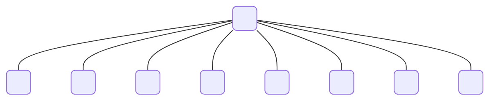
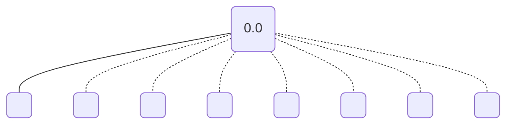
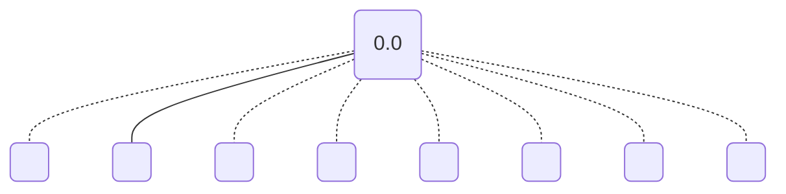
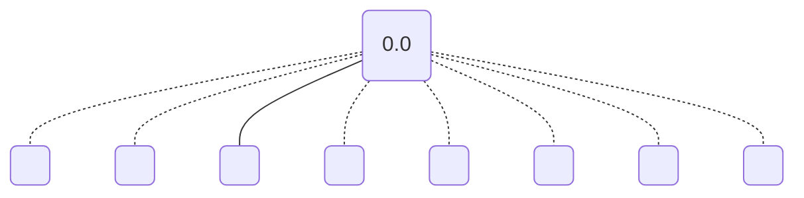
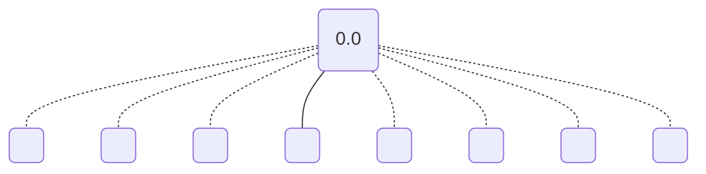
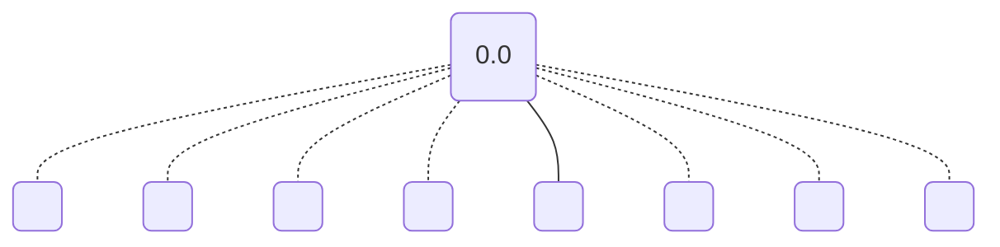
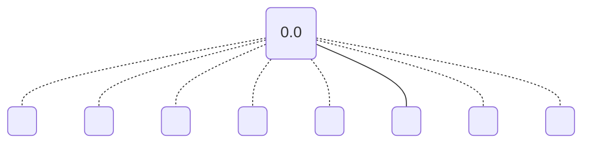
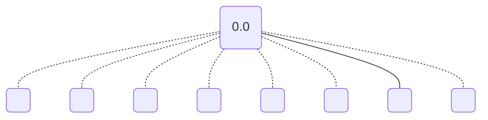
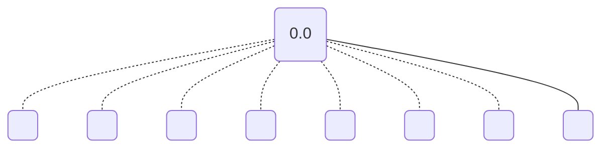

# Original graph

```mermaid
graph TD;
	0(" ");
	1(" ");
	2(" ");
	3(" ");
	4(" ");
	5(" ");
	6(" ");
	7(" ");
	8(" ");
	0 --- 1;
	0 --- 2;
	0 --- 3;
	0 --- 4;
	0 --- 5;
	0 --- 6;
	0 --- 7;
	0 --- 8;
```

## Independent sets

```mermaid
graph TD;
	0("0.0");
	1(" ");
	2(" ");
	3(" ");
	4(" ");
	5(" ");
	6(" ");
	7(" ");
	8(" ");
	0 --- 1;
	0 -.- 2;
	0 -.- 3;
	0 -.- 4;
	0 -.- 5;
	0 -.- 6;
	0 -.- 7;
	0 -.- 8;
```

```mermaid
graph TD;
	0("0.0");
	1(" ");
	2(" ");
	3(" ");
	4(" ");
	5(" ");
	6(" ");
	7(" ");
	8(" ");
	0 -.- 1;
	0 --- 2;
	0 -.- 3;
	0 -.- 4;
	0 -.- 5;
	0 -.- 6;
	0 -.- 7;
	0 -.- 8;
```

```mermaid
graph TD;
	0("0.0");
	1(" ");
	2(" ");
	3(" ");
	4(" ");
	5(" ");
	6(" ");
	7(" ");
	8(" ");
	0 -.- 1;
	0 -.- 2;
	0 --- 3;
	0 -.- 4;
	0 -.- 5;
	0 -.- 6;
	0 -.- 7;
	0 -.- 8;
```

```mermaid
graph TD;
	0("0.0");
	1(" ");
	2(" ");
	3(" ");
	4(" ");
	5(" ");
	6(" ");
	7(" ");
	8(" ");
	0 -.- 1;
	0 -.- 2;
	0 -.- 3;
	0 --- 4;
	0 -.- 5;
	0 -.- 6;
	0 -.- 7;
	0 -.- 8;
```

```mermaid
graph TD;
	0("0.0");
	1(" ");
	2(" ");
	3(" ");
	4(" ");
	5(" ");
	6(" ");
	7(" ");
	8(" ");
	0 -.- 1;
	0 -.- 2;
	0 -.- 3;
	0 -.- 4;
	0 --- 5;
	0 -.- 6;
	0 -.- 7;
	0 -.- 8;
```

```mermaid
graph TD;
	0("0.0");
	1(" ");
	2(" ");
	3(" ");
	4(" ");
	5(" ");
	6(" ");
	7(" ");
	8(" ");
	0 -.- 1;
	0 -.- 2;
	0 -.- 3;
	0 -.- 4;
	0 -.- 5;
	0 --- 6;
	0 -.- 7;
	0 -.- 8;
```

```mermaid
graph TD;
	0("0.0");
	1(" ");
	2(" ");
	3(" ");
	4(" ");
	5(" ");
	6(" ");
	7(" ");
	8(" ");
	0 -.- 1;
	0 -.- 2;
	0 -.- 3;
	0 -.- 4;
	0 -.- 5;
	0 -.- 6;
	0 --- 7;
	0 -.- 8;
```

```mermaid
graph TD;
	0("0.0");
	1(" ");
	2(" ");
	3(" ");
	4(" ");
	5(" ");
	6(" ");
	7(" ");
	8(" ");
	0 -.- 1;
	0 -.- 2;
	0 -.- 3;
	0 -.- 4;
	0 -.- 5;
	0 -.- 6;
	0 -.- 7;
	0 --- 8;
```

