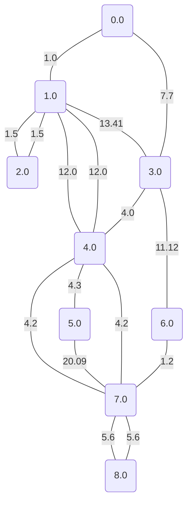

# Chinese postman problem

On input we are given graph $G$ and we have to find the solution to the *Chinese postman problem*. Given graph is:

Now we will find all **Cycle subgraphs matroids** and **Even subgraph matroids** and use them to use the intersection of matroids to solve the problem.Because the number of all possible matroids is way too many, we will show only the maximal of each.

## Cycle Matroids

This matroid has a value: `62.82000000000001`.

## Even subgraph matroids

This matroid has a value: `62.82000000000001`.

By using the matroid intersection algorithm we get this following result:

## Result of the intersection algorithm

This matroid has a value: `62.82000000000001`.

To solve the *Chinese Postman problem* we duplicate the edges not in the matroid intersection and get the multigraph $H$:

Now we are garanteed to be able to find an euler path. This euler path is the shortest solution to the *Chinese postman problem*.

### Euler path: 

First we will index our vertices and then show a path.

Euler path is as follows: `0 -> 3 -> 1 -> 4 -> 7 -> 5 -> 4 -> 7 -> 8 -> 7 -> 6 -> 3 -> 4 -> 1 -> 2 -> 1 -> 0`.

For those who may be interested in number result, it is: `109.42`.
