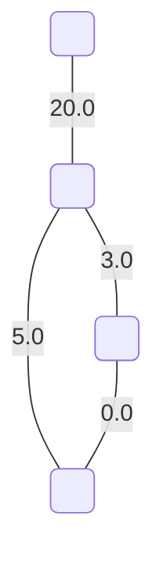
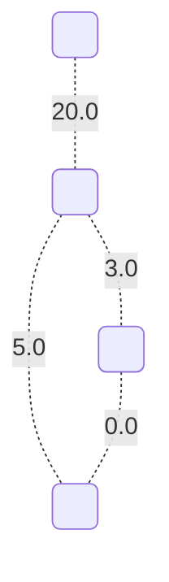
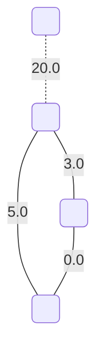

# Even subgraph matroids

On input we have following graph $G$:

## Matroid Nr.1

This matroid has a value: `0.0`.

## Matroid Nr.2

**This matroid is maximal with respect to the edge values.**

This matroid has a value: `8.0`.

