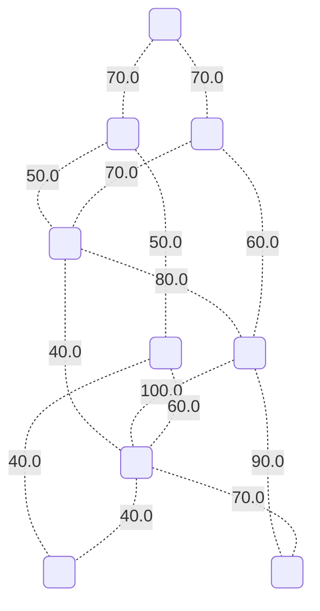
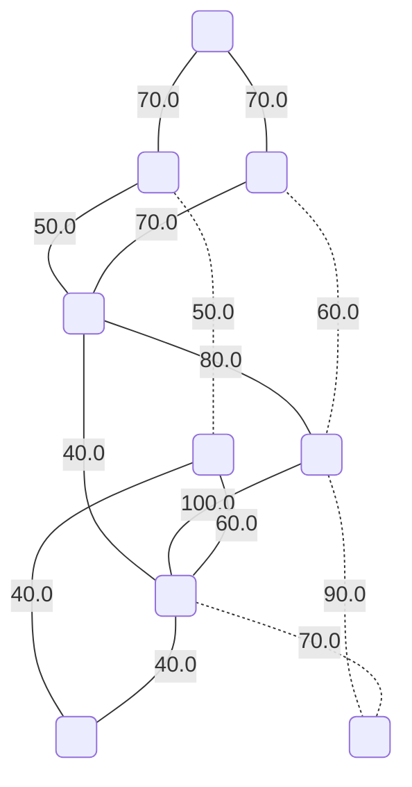
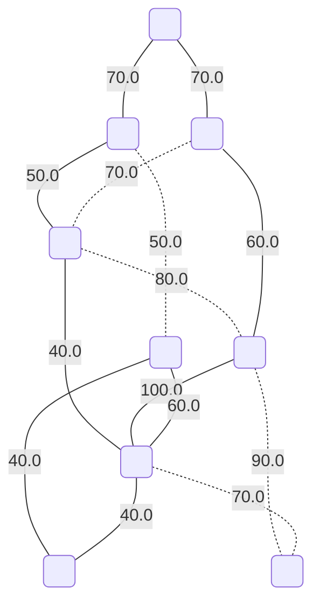
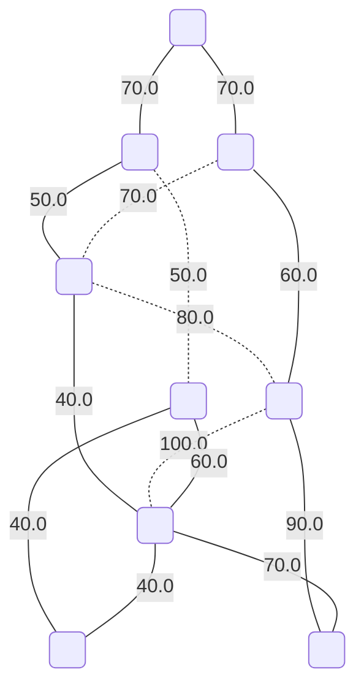

# Even subgraph matroids

On input we have following graph $G$:


## Matroid Nr.1



This matroid has a value: `0.0`.

## Matroid Nr.2



This matroid has a value: `620.0`.

## Matroid Nr.3



This matroid has a value: `530.0`.

## Matroid Nr.4


This matroid has a value: `620.0`.

## Matroid Nr.5


This matroid has a value: `530.0`.

## Matroid Nr.6


This matroid has a value: `680.0`.

## Matroid Nr.7



This matroid has a value: `590.0`.

## Matroid Nr.8


This matroid has a value: `620.0`.

## Matroid Nr.9


This matroid has a value: `530.0`.

## Matroid Nr.10


This matroid has a value: `680.0`.

## Matroid Nr.11


This matroid has a value: `590.0`.

## Matroid Nr.12


This matroid has a value: `680.0`.

## Matroid Nr.13


This matroid has a value: `590.0`.

## Matroid Nr.14

**This matroid is maximal with respect to the edge values.**


This matroid has a value: `730.0`.

## Matroid Nr.15


This matroid has a value: `730.0`.

## Matroid Nr.16


This matroid has a value: `730.0`.

## Matroid Nr.17


This matroid has a value: `730.0`.

## Matroid Nr.18


This matroid has a value: `620.0`.

## Matroid Nr.19


This matroid has a value: `620.0`.

## Matroid Nr.20

```mermaid
graph TD;
	0(" ");
	1(" ");
	2(" ");
	3(" ");
	4(" ");
	5(" ");
	6(" ");
	7(" ");
	8(" ");
	0 -- "70.0" --- 1;
	0 -- "70.0" --- 3;
	1 -- "50.0" --- 2;
	1 -. "50.0" -.- 5;
	2 -. "40.0" -.- 6;
	2 -- "80.0" --- 4;
	3 -. "70.0" -.- 2;
	3 -- "60.0" --- 4;
	4 -- "100.0" --- 6;
	4 -- "90.0" --- 8;
	5 -- "40.0" --- 7;
	5 -- "60.0" --- 6;
	6 -- "40.0" --- 7;
	6 -- "70.0" --- 8;
```

This matroid has a value: `730.0`.

## Matroid Nr.21

```mermaid
graph TD;
	0(" ");
	1(" ");
	2(" ");
	3(" ");
	4(" ");
	5(" ");
	6(" ");
	7(" ");
	8(" ");
	0 -- "70.0" --- 1;
	0 -- "70.0" --- 3;
	1 -- "50.0" --- 2;
	1 -. "50.0" -.- 5;
	2 -- "40.0" --- 6;
	2 -- "80.0" --- 4;
	3 -- "70.0" --- 2;
	3 -. "60.0" -.- 4;
	4 -- "100.0" --- 6;
	4 -. "90.0" -.- 8;
	5 -- "40.0" --- 7;
	5 -- "60.0" --- 6;
	6 -- "40.0" --- 7;
	6 -. "70.0" -.- 8;
```

This matroid has a value: `620.0`.

## Matroid Nr.22

```mermaid
graph TD;
	0(" ");
	1(" ");
	2(" ");
	3(" ");
	4(" ");
	5(" ");
	6(" ");
	7(" ");
	8(" ");
	0 -- "70.0" --- 1;
	0 -- "70.0" --- 3;
	1 -- "50.0" --- 2;
	1 -. "50.0" -.- 5;
	2 -. "40.0" -.- 6;
	2 -- "80.0" --- 4;
	3 -. "70.0" -.- 2;
	3 -- "60.0" --- 4;
	4 -- "100.0" --- 6;
	4 -- "90.0" --- 8;
	5 -- "40.0" --- 7;
	5 -- "60.0" --- 6;
	6 -- "40.0" --- 7;
	6 -- "70.0" --- 8;
```

This matroid has a value: `730.0`.

## Matroid Nr.23

```mermaid
graph TD;
	0(" ");
	1(" ");
	2(" ");
	3(" ");
	4(" ");
	5(" ");
	6(" ");
	7(" ");
	8(" ");
	0 -- "70.0" --- 1;
	0 -- "70.0" --- 3;
	1 -- "50.0" --- 2;
	1 -. "50.0" -.- 5;
	2 -. "40.0" -.- 6;
	2 -- "80.0" --- 4;
	3 -. "70.0" -.- 2;
	3 -- "60.0" --- 4;
	4 -- "100.0" --- 6;
	4 -- "90.0" --- 8;
	5 -- "40.0" --- 7;
	5 -- "60.0" --- 6;
	6 -- "40.0" --- 7;
	6 -- "70.0" --- 8;
```

This matroid has a value: `730.0`.

## Matroid Nr.24

```mermaid
graph TD;
	0(" ");
	1(" ");
	2(" ");
	3(" ");
	4(" ");
	5(" ");
	6(" ");
	7(" ");
	8(" ");
	0 -- "70.0" --- 1;
	0 -- "70.0" --- 3;
	1 -- "50.0" --- 2;
	1 -. "50.0" -.- 5;
	2 -- "40.0" --- 6;
	2 -- "80.0" --- 4;
	3 -- "70.0" --- 2;
	3 -. "60.0" -.- 4;
	4 -. "100.0" -.- 6;
	4 -- "90.0" --- 8;
	5 -- "40.0" --- 7;
	5 -- "60.0" --- 6;
	6 -- "40.0" --- 7;
	6 -- "70.0" --- 8;
```

This matroid has a value: `680.0`.

## Matroid Nr.25

```mermaid
graph TD;
	0(" ");
	1(" ");
	2(" ");
	3(" ");
	4(" ");
	5(" ");
	6(" ");
	7(" ");
	8(" ");
	0 -- "70.0" --- 1;
	0 -- "70.0" --- 3;
	1 -- "50.0" --- 2;
	1 -. "50.0" -.- 5;
	2 -. "40.0" -.- 6;
	2 -- "80.0" --- 4;
	3 -. "70.0" -.- 2;
	3 -- "60.0" --- 4;
	4 -- "100.0" --- 6;
	4 -- "90.0" --- 8;
	5 -- "40.0" --- 7;
	5 -- "60.0" --- 6;
	6 -- "40.0" --- 7;
	6 -- "70.0" --- 8;
```

This matroid has a value: `730.0`.

## Matroid Nr.26

```mermaid
graph TD;
	0(" ");
	1(" ");
	2(" ");
	3(" ");
	4(" ");
	5(" ");
	6(" ");
	7(" ");
	8(" ");
	0 -- "70.0" --- 1;
	0 -- "70.0" --- 3;
	1 -- "50.0" --- 2;
	1 -. "50.0" -.- 5;
	2 -- "40.0" --- 6;
	2 -- "80.0" --- 4;
	3 -- "70.0" --- 2;
	3 -. "60.0" -.- 4;
	4 -. "100.0" -.- 6;
	4 -- "90.0" --- 8;
	5 -- "40.0" --- 7;
	5 -- "60.0" --- 6;
	6 -- "40.0" --- 7;
	6 -- "70.0" --- 8;
```

This matroid has a value: `680.0`.

## Matroid Nr.27

```mermaid
graph TD;
	0(" ");
	1(" ");
	2(" ");
	3(" ");
	4(" ");
	5(" ");
	6(" ");
	7(" ");
	8(" ");
	0 -- "70.0" --- 1;
	0 -- "70.0" --- 3;
	1 -- "50.0" --- 2;
	1 -. "50.0" -.- 5;
	2 -. "40.0" -.- 6;
	2 -- "80.0" --- 4;
	3 -. "70.0" -.- 2;
	3 -- "60.0" --- 4;
	4 -- "100.0" --- 6;
	4 -- "90.0" --- 8;
	5 -- "40.0" --- 7;
	5 -- "60.0" --- 6;
	6 -- "40.0" --- 7;
	6 -- "70.0" --- 8;
```

This matroid has a value: `730.0`.

## Matroid Nr.28

```mermaid
graph TD;
	0(" ");
	1(" ");
	2(" ");
	3(" ");
	4(" ");
	5(" ");
	6(" ");
	7(" ");
	8(" ");
	0 -- "70.0" --- 1;
	0 -- "70.0" --- 3;
	1 -- "50.0" --- 2;
	1 -. "50.0" -.- 5;
	2 -- "40.0" --- 6;
	2 -- "80.0" --- 4;
	3 -- "70.0" --- 2;
	3 -. "60.0" -.- 4;
	4 -. "100.0" -.- 6;
	4 -- "90.0" --- 8;
	5 -- "40.0" --- 7;
	5 -- "60.0" --- 6;
	6 -- "40.0" --- 7;
	6 -- "70.0" --- 8;
```

This matroid has a value: `680.0`.

## Matroid Nr.29

```mermaid
graph TD;
	0(" ");
	1(" ");
	2(" ");
	3(" ");
	4(" ");
	5(" ");
	6(" ");
	7(" ");
	8(" ");
	0 -- "70.0" --- 1;
	0 -- "70.0" --- 3;
	1 -- "50.0" --- 2;
	1 -. "50.0" -.- 5;
	2 -. "40.0" -.- 6;
	2 -- "80.0" --- 4;
	3 -. "70.0" -.- 2;
	3 -- "60.0" --- 4;
	4 -- "100.0" --- 6;
	4 -- "90.0" --- 8;
	5 -- "40.0" --- 7;
	5 -- "60.0" --- 6;
	6 -- "40.0" --- 7;
	6 -- "70.0" --- 8;
```

This matroid has a value: `730.0`.

## Matroid Nr.30

```mermaid
graph TD;
	0(" ");
	1(" ");
	2(" ");
	3(" ");
	4(" ");
	5(" ");
	6(" ");
	7(" ");
	8(" ");
	0 -- "70.0" --- 1;
	0 -- "70.0" --- 3;
	1 -- "50.0" --- 2;
	1 -. "50.0" -.- 5;
	2 -- "40.0" --- 6;
	2 -- "80.0" --- 4;
	3 -- "70.0" --- 2;
	3 -. "60.0" -.- 4;
	4 -- "100.0" --- 6;
	4 -. "90.0" -.- 8;
	5 -- "40.0" --- 7;
	5 -- "60.0" --- 6;
	6 -- "40.0" --- 7;
	6 -. "70.0" -.- 8;
```

This matroid has a value: `620.0`.

## Matroid Nr.31

```mermaid
graph TD;
	0(" ");
	1(" ");
	2(" ");
	3(" ");
	4(" ");
	5(" ");
	6(" ");
	7(" ");
	8(" ");
	0 -- "70.0" --- 1;
	0 -- "70.0" --- 3;
	1 -- "50.0" --- 2;
	1 -. "50.0" -.- 5;
	2 -- "40.0" --- 6;
	2 -- "80.0" --- 4;
	3 -- "70.0" --- 2;
	3 -. "60.0" -.- 4;
	4 -- "100.0" --- 6;
	4 -. "90.0" -.- 8;
	5 -- "40.0" --- 7;
	5 -- "60.0" --- 6;
	6 -- "40.0" --- 7;
	6 -. "70.0" -.- 8;
```

This matroid has a value: `620.0`.

## Matroid Nr.32

```mermaid
graph TD;
	0(" ");
	1(" ");
	2(" ");
	3(" ");
	4(" ");
	5(" ");
	6(" ");
	7(" ");
	8(" ");
	0 -- "70.0" --- 1;
	0 -- "70.0" --- 3;
	1 -- "50.0" --- 2;
	1 -. "50.0" -.- 5;
	2 -- "40.0" --- 6;
	2 -- "80.0" --- 4;
	3 -- "70.0" --- 2;
	3 -. "60.0" -.- 4;
	4 -. "100.0" -.- 6;
	4 -- "90.0" --- 8;
	5 -- "40.0" --- 7;
	5 -- "60.0" --- 6;
	6 -- "40.0" --- 7;
	6 -- "70.0" --- 8;
```

This matroid has a value: `680.0`.

## Matroid Nr.33

```mermaid
graph TD;
	0(" ");
	1(" ");
	2(" ");
	3(" ");
	4(" ");
	5(" ");
	6(" ");
	7(" ");
	8(" ");
	0 -- "70.0" --- 1;
	0 -- "70.0" --- 3;
	1 -- "50.0" --- 2;
	1 -. "50.0" -.- 5;
	2 -- "40.0" --- 6;
	2 -- "80.0" --- 4;
	3 -- "70.0" --- 2;
	3 -. "60.0" -.- 4;
	4 -- "100.0" --- 6;
	4 -. "90.0" -.- 8;
	5 -- "40.0" --- 7;
	5 -- "60.0" --- 6;
	6 -- "40.0" --- 7;
	6 -. "70.0" -.- 8;
```

This matroid has a value: `620.0`.

## Matroid Nr.34

```mermaid
graph TD;
	0(" ");
	1(" ");
	2(" ");
	3(" ");
	4(" ");
	5(" ");
	6(" ");
	7(" ");
	8(" ");
	0 -- "70.0" --- 1;
	0 -- "70.0" --- 3;
	1 -- "50.0" --- 2;
	1 -. "50.0" -.- 5;
	2 -- "40.0" --- 6;
	2 -- "80.0" --- 4;
	3 -- "70.0" --- 2;
	3 -. "60.0" -.- 4;
	4 -. "100.0" -.- 6;
	4 -- "90.0" --- 8;
	5 -- "40.0" --- 7;
	5 -- "60.0" --- 6;
	6 -- "40.0" --- 7;
	6 -- "70.0" --- 8;
```

This matroid has a value: `680.0`.

## Matroid Nr.35

```mermaid
graph TD;
	0(" ");
	1(" ");
	2(" ");
	3(" ");
	4(" ");
	5(" ");
	6(" ");
	7(" ");
	8(" ");
	0 -- "70.0" --- 1;
	0 -- "70.0" --- 3;
	1 -- "50.0" --- 2;
	1 -. "50.0" -.- 5;
	2 -- "40.0" --- 6;
	2 -- "80.0" --- 4;
	3 -- "70.0" --- 2;
	3 -. "60.0" -.- 4;
	4 -. "100.0" -.- 6;
	4 -- "90.0" --- 8;
	5 -- "40.0" --- 7;
	5 -- "60.0" --- 6;
	6 -- "40.0" --- 7;
	6 -- "70.0" --- 8;
```

This matroid has a value: `680.0`.

## Matroid Nr.36

```mermaid
graph TD;
	0(" ");
	1(" ");
	2(" ");
	3(" ");
	4(" ");
	5(" ");
	6(" ");
	7(" ");
	8(" ");
	0 -- "70.0" --- 1;
	0 -- "70.0" --- 3;
	1 -- "50.0" --- 2;
	1 -. "50.0" -.- 5;
	2 -. "40.0" -.- 6;
	2 -. "80.0" -.- 4;
	3 -- "70.0" --- 2;
	3 -. "60.0" -.- 4;
	4 -- "100.0" --- 6;
	4 -- "90.0" --- 8;
	5 -- "40.0" --- 7;
	5 -- "60.0" --- 6;
	6 -- "40.0" --- 7;
	6 -- "70.0" --- 8;
```

This matroid has a value: `660.0`.

## Matroid Nr.37

```mermaid
graph TD;
	0(" ");
	1(" ");
	2(" ");
	3(" ");
	4(" ");
	5(" ");
	6(" ");
	7(" ");
	8(" ");
	0 -- "70.0" --- 1;
	0 -- "70.0" --- 3;
	1 -- "50.0" --- 2;
	1 -. "50.0" -.- 5;
	2 -. "40.0" -.- 6;
	2 -. "80.0" -.- 4;
	3 -- "70.0" --- 2;
	3 -. "60.0" -.- 4;
	4 -- "100.0" --- 6;
	4 -- "90.0" --- 8;
	5 -- "40.0" --- 7;
	5 -- "60.0" --- 6;
	6 -- "40.0" --- 7;
	6 -- "70.0" --- 8;
```

This matroid has a value: `660.0`.

## Matroid Nr.38

```mermaid
graph TD;
	0(" ");
	1(" ");
	2(" ");
	3(" ");
	4(" ");
	5(" ");
	6(" ");
	7(" ");
	8(" ");
	0 -- "70.0" --- 1;
	0 -- "70.0" --- 3;
	1 -- "50.0" --- 2;
	1 -. "50.0" -.- 5;
	2 -. "40.0" -.- 6;
	2 -. "80.0" -.- 4;
	3 -- "70.0" --- 2;
	3 -. "60.0" -.- 4;
	4 -- "100.0" --- 6;
	4 -- "90.0" --- 8;
	5 -- "40.0" --- 7;
	5 -- "60.0" --- 6;
	6 -- "40.0" --- 7;
	6 -- "70.0" --- 8;
```

This matroid has a value: `660.0`.

## Matroid Nr.39

```mermaid
graph TD;
	0(" ");
	1(" ");
	2(" ");
	3(" ");
	4(" ");
	5(" ");
	6(" ");
	7(" ");
	8(" ");
	0 -- "70.0" --- 1;
	0 -- "70.0" --- 3;
	1 -- "50.0" --- 2;
	1 -. "50.0" -.- 5;
	2 -- "40.0" --- 6;
	2 -- "80.0" --- 4;
	3 -- "70.0" --- 2;
	3 -. "60.0" -.- 4;
	4 -- "100.0" --- 6;
	4 -. "90.0" -.- 8;
	5 -- "40.0" --- 7;
	5 -- "60.0" --- 6;
	6 -- "40.0" --- 7;
	6 -. "70.0" -.- 8;
```

This matroid has a value: `620.0`.

## Matroid Nr.40

```mermaid
graph TD;
	0(" ");
	1(" ");
	2(" ");
	3(" ");
	4(" ");
	5(" ");
	6(" ");
	7(" ");
	8(" ");
	0 -- "70.0" --- 1;
	0 -- "70.0" --- 3;
	1 -- "50.0" --- 2;
	1 -. "50.0" -.- 5;
	2 -- "40.0" --- 6;
	2 -- "80.0" --- 4;
	3 -- "70.0" --- 2;
	3 -. "60.0" -.- 4;
	4 -. "100.0" -.- 6;
	4 -- "90.0" --- 8;
	5 -- "40.0" --- 7;
	5 -- "60.0" --- 6;
	6 -- "40.0" --- 7;
	6 -- "70.0" --- 8;
```

This matroid has a value: `680.0`.

## Matroid Nr.41

```mermaid
graph TD;
	0(" ");
	1(" ");
	2(" ");
	3(" ");
	4(" ");
	5(" ");
	6(" ");
	7(" ");
	8(" ");
	0 -- "70.0" --- 1;
	0 -- "70.0" --- 3;
	1 -- "50.0" --- 2;
	1 -. "50.0" -.- 5;
	2 -. "40.0" -.- 6;
	2 -. "80.0" -.- 4;
	3 -- "70.0" --- 2;
	3 -. "60.0" -.- 4;
	4 -- "100.0" --- 6;
	4 -- "90.0" --- 8;
	5 -- "40.0" --- 7;
	5 -- "60.0" --- 6;
	6 -- "40.0" --- 7;
	6 -- "70.0" --- 8;
```

This matroid has a value: `660.0`.

## Matroid Nr.42

```mermaid
graph TD;
	0(" ");
	1(" ");
	2(" ");
	3(" ");
	4(" ");
	5(" ");
	6(" ");
	7(" ");
	8(" ");
	0 -- "70.0" --- 1;
	0 -- "70.0" --- 3;
	1 -. "50.0" -.- 2;
	1 -- "50.0" --- 5;
	2 -- "40.0" --- 6;
	2 -- "80.0" --- 4;
	3 -. "70.0" -.- 2;
	3 -- "60.0" --- 4;
	4 -- "100.0" --- 6;
	4 -- "90.0" --- 8;
	5 -- "40.0" --- 7;
	5 -. "60.0" -.- 6;
	6 -- "40.0" --- 7;
	6 -- "70.0" --- 8;
```

This matroid has a value: `710.0`.

## Matroid Nr.43

```mermaid
graph TD;
	0(" ");
	1(" ");
	2(" ");
	3(" ");
	4(" ");
	5(" ");
	6(" ");
	7(" ");
	8(" ");
	0 -- "70.0" --- 1;
	0 -- "70.0" --- 3;
	1 -. "50.0" -.- 2;
	1 -- "50.0" --- 5;
	2 -- "40.0" --- 6;
	2 -- "80.0" --- 4;
	3 -. "70.0" -.- 2;
	3 -- "60.0" --- 4;
	4 -- "100.0" --- 6;
	4 -- "90.0" --- 8;
	5 -- "40.0" --- 7;
	5 -. "60.0" -.- 6;
	6 -- "40.0" --- 7;
	6 -- "70.0" --- 8;
```

This matroid has a value: `710.0`.

## Matroid Nr.44

```mermaid
graph TD;
	0(" ");
	1(" ");
	2(" ");
	3(" ");
	4(" ");
	5(" ");
	6(" ");
	7(" ");
	8(" ");
	0 -- "70.0" --- 1;
	0 -- "70.0" --- 3;
	1 -. "50.0" -.- 2;
	1 -- "50.0" --- 5;
	2 -- "40.0" --- 6;
	2 -- "80.0" --- 4;
	3 -. "70.0" -.- 2;
	3 -- "60.0" --- 4;
	4 -- "100.0" --- 6;
	4 -- "90.0" --- 8;
	5 -- "40.0" --- 7;
	5 -. "60.0" -.- 6;
	6 -- "40.0" --- 7;
	6 -- "70.0" --- 8;
```

This matroid has a value: `710.0`.

## Matroid Nr.45

```mermaid
graph TD;
	0(" ");
	1(" ");
	2(" ");
	3(" ");
	4(" ");
	5(" ");
	6(" ");
	7(" ");
	8(" ");
	0 -- "70.0" --- 1;
	0 -- "70.0" --- 3;
	1 -. "50.0" -.- 2;
	1 -- "50.0" --- 5;
	2 -- "40.0" --- 6;
	2 -. "80.0" -.- 4;
	3 -- "70.0" --- 2;
	3 -. "60.0" -.- 4;
	4 -- "100.0" --- 6;
	4 -- "90.0" --- 8;
	5 -- "40.0" --- 7;
	5 -. "60.0" -.- 6;
	6 -- "40.0" --- 7;
	6 -- "70.0" --- 8;
```

This matroid has a value: `640.0`.

## Matroid Nr.46

```mermaid
graph TD;
	0(" ");
	1(" ");
	2(" ");
	3(" ");
	4(" ");
	5(" ");
	6(" ");
	7(" ");
	8(" ");
	0 -- "70.0" --- 1;
	0 -- "70.0" --- 3;
	1 -. "50.0" -.- 2;
	1 -- "50.0" --- 5;
	2 -- "40.0" --- 6;
	2 -- "80.0" --- 4;
	3 -. "70.0" -.- 2;
	3 -- "60.0" --- 4;
	4 -- "100.0" --- 6;
	4 -- "90.0" --- 8;
	5 -- "40.0" --- 7;
	5 -. "60.0" -.- 6;
	6 -- "40.0" --- 7;
	6 -- "70.0" --- 8;
```

This matroid has a value: `710.0`.

## Matroid Nr.47

```mermaid
graph TD;
	0(" ");
	1(" ");
	2(" ");
	3(" ");
	4(" ");
	5(" ");
	6(" ");
	7(" ");
	8(" ");
	0 -- "70.0" --- 1;
	0 -- "70.0" --- 3;
	1 -. "50.0" -.- 2;
	1 -- "50.0" --- 5;
	2 -. "40.0" -.- 6;
	2 -- "80.0" --- 4;
	3 -- "70.0" --- 2;
	3 -. "60.0" -.- 4;
	4 -- "100.0" --- 6;
	4 -. "90.0" -.- 8;
	5 -- "40.0" --- 7;
	5 -. "60.0" -.- 6;
	6 -- "40.0" --- 7;
	6 -. "70.0" -.- 8;
```

This matroid has a value: `520.0`.

## Matroid Nr.48

```mermaid
graph TD;
	0(" ");
	1(" ");
	2(" ");
	3(" ");
	4(" ");
	5(" ");
	6(" ");
	7(" ");
	8(" ");
	0 -- "70.0" --- 1;
	0 -- "70.0" --- 3;
	1 -. "50.0" -.- 2;
	1 -- "50.0" --- 5;
	2 -- "40.0" --- 6;
	2 -- "80.0" --- 4;
	3 -. "70.0" -.- 2;
	3 -- "60.0" --- 4;
	4 -- "100.0" --- 6;
	4 -- "90.0" --- 8;
	5 -- "40.0" --- 7;
	5 -. "60.0" -.- 6;
	6 -- "40.0" --- 7;
	6 -- "70.0" --- 8;
```

This matroid has a value: `710.0`.

## Matroid Nr.49

```mermaid
graph TD;
	0(" ");
	1(" ");
	2(" ");
	3(" ");
	4(" ");
	5(" ");
	6(" ");
	7(" ");
	8(" ");
	0 -- "70.0" --- 1;
	0 -- "70.0" --- 3;
	1 -. "50.0" -.- 2;
	1 -- "50.0" --- 5;
	2 -- "40.0" --- 6;
	2 -- "80.0" --- 4;
	3 -. "70.0" -.- 2;
	3 -- "60.0" --- 4;
	4 -- "100.0" --- 6;
	4 -- "90.0" --- 8;
	5 -- "40.0" --- 7;
	5 -. "60.0" -.- 6;
	6 -- "40.0" --- 7;
	6 -- "70.0" --- 8;
```

This matroid has a value: `710.0`.

## Matroid Nr.50

```mermaid
graph TD;
	0(" ");
	1(" ");
	2(" ");
	3(" ");
	4(" ");
	5(" ");
	6(" ");
	7(" ");
	8(" ");
	0 -- "70.0" --- 1;
	0 -- "70.0" --- 3;
	1 -. "50.0" -.- 2;
	1 -- "50.0" --- 5;
	2 -- "40.0" --- 6;
	2 -. "80.0" -.- 4;
	3 -- "70.0" --- 2;
	3 -. "60.0" -.- 4;
	4 -- "100.0" --- 6;
	4 -- "90.0" --- 8;
	5 -- "40.0" --- 7;
	5 -. "60.0" -.- 6;
	6 -- "40.0" --- 7;
	6 -- "70.0" --- 8;
```

This matroid has a value: `640.0`.

## Matroid Nr.51

```mermaid
graph TD;
	0(" ");
	1(" ");
	2(" ");
	3(" ");
	4(" ");
	5(" ");
	6(" ");
	7(" ");
	8(" ");
	0 -- "70.0" --- 1;
	0 -- "70.0" --- 3;
	1 -. "50.0" -.- 2;
	1 -- "50.0" --- 5;
	2 -- "40.0" --- 6;
	2 -- "80.0" --- 4;
	3 -. "70.0" -.- 2;
	3 -- "60.0" --- 4;
	4 -- "100.0" --- 6;
	4 -- "90.0" --- 8;
	5 -- "40.0" --- 7;
	5 -. "60.0" -.- 6;
	6 -- "40.0" --- 7;
	6 -- "70.0" --- 8;
```

This matroid has a value: `710.0`.

## Matroid Nr.52

```mermaid
graph TD;
	0(" ");
	1(" ");
	2(" ");
	3(" ");
	4(" ");
	5(" ");
	6(" ");
	7(" ");
	8(" ");
	0 -- "70.0" --- 1;
	0 -- "70.0" --- 3;
	1 -. "50.0" -.- 2;
	1 -- "50.0" --- 5;
	2 -. "40.0" -.- 6;
	2 -- "80.0" --- 4;
	3 -- "70.0" --- 2;
	3 -. "60.0" -.- 4;
	4 -. "100.0" -.- 6;
	4 -- "90.0" --- 8;
	5 -- "40.0" --- 7;
	5 -. "60.0" -.- 6;
	6 -- "40.0" --- 7;
	6 -- "70.0" --- 8;
```

This matroid has a value: `580.0`.

## Matroid Nr.53

```mermaid
graph TD;
	0(" ");
	1(" ");
	2(" ");
	3(" ");
	4(" ");
	5(" ");
	6(" ");
	7(" ");
	8(" ");
	0 -- "70.0" --- 1;
	0 -- "70.0" --- 3;
	1 -. "50.0" -.- 2;
	1 -- "50.0" --- 5;
	2 -- "40.0" --- 6;
	2 -- "80.0" --- 4;
	3 -. "70.0" -.- 2;
	3 -- "60.0" --- 4;
	4 -- "100.0" --- 6;
	4 -- "90.0" --- 8;
	5 -- "40.0" --- 7;
	5 -. "60.0" -.- 6;
	6 -- "40.0" --- 7;
	6 -- "70.0" --- 8;
```

This matroid has a value: `710.0`.

## Matroid Nr.54

```mermaid
graph TD;
	0(" ");
	1(" ");
	2(" ");
	3(" ");
	4(" ");
	5(" ");
	6(" ");
	7(" ");
	8(" ");
	0 -- "70.0" --- 1;
	0 -- "70.0" --- 3;
	1 -. "50.0" -.- 2;
	1 -- "50.0" --- 5;
	2 -- "40.0" --- 6;
	2 -- "80.0" --- 4;
	3 -. "70.0" -.- 2;
	3 -- "60.0" --- 4;
	4 -- "100.0" --- 6;
	4 -- "90.0" --- 8;
	5 -- "40.0" --- 7;
	5 -. "60.0" -.- 6;
	6 -- "40.0" --- 7;
	6 -- "70.0" --- 8;
```

This matroid has a value: `710.0`.

## Matroid Nr.55

```mermaid
graph TD;
	0(" ");
	1(" ");
	2(" ");
	3(" ");
	4(" ");
	5(" ");
	6(" ");
	7(" ");
	8(" ");
	0 -- "70.0" --- 1;
	0 -- "70.0" --- 3;
	1 -. "50.0" -.- 2;
	1 -- "50.0" --- 5;
	2 -- "40.0" --- 6;
	2 -. "80.0" -.- 4;
	3 -- "70.0" --- 2;
	3 -. "60.0" -.- 4;
	4 -- "100.0" --- 6;
	4 -- "90.0" --- 8;
	5 -- "40.0" --- 7;
	5 -. "60.0" -.- 6;
	6 -- "40.0" --- 7;
	6 -- "70.0" --- 8;
```

This matroid has a value: `640.0`.

## Matroid Nr.56

```mermaid
graph TD;
	0(" ");
	1(" ");
	2(" ");
	3(" ");
	4(" ");
	5(" ");
	6(" ");
	7(" ");
	8(" ");
	0 -- "70.0" --- 1;
	0 -- "70.0" --- 3;
	1 -. "50.0" -.- 2;
	1 -- "50.0" --- 5;
	2 -- "40.0" --- 6;
	2 -- "80.0" --- 4;
	3 -. "70.0" -.- 2;
	3 -- "60.0" --- 4;
	4 -- "100.0" --- 6;
	4 -- "90.0" --- 8;
	5 -. "40.0" -.- 7;
	5 -- "60.0" --- 6;
	6 -. "40.0" -.- 7;
	6 -- "70.0" --- 8;
```

This matroid has a value: `690.0`.

## Matroid Nr.57

```mermaid
graph TD;
	0(" ");
	1(" ");
	2(" ");
	3(" ");
	4(" ");
	5(" ");
	6(" ");
	7(" ");
	8(" ");
	0 -- "70.0" --- 1;
	0 -- "70.0" --- 3;
	1 -. "50.0" -.- 2;
	1 -- "50.0" --- 5;
	2 -- "40.0" --- 6;
	2 -- "80.0" --- 4;
	3 -. "70.0" -.- 2;
	3 -- "60.0" --- 4;
	4 -- "100.0" --- 6;
	4 -- "90.0" --- 8;
	5 -. "40.0" -.- 7;
	5 -- "60.0" --- 6;
	6 -. "40.0" -.- 7;
	6 -- "70.0" --- 8;
```

This matroid has a value: `690.0`.

## Matroid Nr.58

```mermaid
graph TD;
	0(" ");
	1(" ");
	2(" ");
	3(" ");
	4(" ");
	5(" ");
	6(" ");
	7(" ");
	8(" ");
	0 -- "70.0" --- 1;
	0 -- "70.0" --- 3;
	1 -. "50.0" -.- 2;
	1 -- "50.0" --- 5;
	2 -- "40.0" --- 6;
	2 -- "80.0" --- 4;
	3 -. "70.0" -.- 2;
	3 -- "60.0" --- 4;
	4 -- "100.0" --- 6;
	4 -- "90.0" --- 8;
	5 -. "40.0" -.- 7;
	5 -- "60.0" --- 6;
	6 -. "40.0" -.- 7;
	6 -- "70.0" --- 8;
```

This matroid has a value: `690.0`.

## Matroid Nr.59

```mermaid
graph TD;
	0(" ");
	1(" ");
	2(" ");
	3(" ");
	4(" ");
	5(" ");
	6(" ");
	7(" ");
	8(" ");
	0 -- "70.0" --- 1;
	0 -- "70.0" --- 3;
	1 -. "50.0" -.- 2;
	1 -- "50.0" --- 5;
	2 -- "40.0" --- 6;
	2 -. "80.0" -.- 4;
	3 -- "70.0" --- 2;
	3 -. "60.0" -.- 4;
	4 -- "100.0" --- 6;
	4 -- "90.0" --- 8;
	5 -. "40.0" -.- 7;
	5 -- "60.0" --- 6;
	6 -. "40.0" -.- 7;
	6 -- "70.0" --- 8;
```

This matroid has a value: `620.0`.

## Matroid Nr.60

```mermaid
graph TD;
	0(" ");
	1(" ");
	2(" ");
	3(" ");
	4(" ");
	5(" ");
	6(" ");
	7(" ");
	8(" ");
	0 -- "70.0" --- 1;
	0 -- "70.0" --- 3;
	1 -. "50.0" -.- 2;
	1 -- "50.0" --- 5;
	2 -- "40.0" --- 6;
	2 -- "80.0" --- 4;
	3 -. "70.0" -.- 2;
	3 -- "60.0" --- 4;
	4 -- "100.0" --- 6;
	4 -- "90.0" --- 8;
	5 -. "40.0" -.- 7;
	5 -- "60.0" --- 6;
	6 -. "40.0" -.- 7;
	6 -- "70.0" --- 8;
```

This matroid has a value: `690.0`.

## Matroid Nr.61

```mermaid
graph TD;
	0(" ");
	1(" ");
	2(" ");
	3(" ");
	4(" ");
	5(" ");
	6(" ");
	7(" ");
	8(" ");
	0 -- "70.0" --- 1;
	0 -- "70.0" --- 3;
	1 -. "50.0" -.- 2;
	1 -- "50.0" --- 5;
	2 -. "40.0" -.- 6;
	2 -- "80.0" --- 4;
	3 -- "70.0" --- 2;
	3 -. "60.0" -.- 4;
	4 -- "100.0" --- 6;
	4 -. "90.0" -.- 8;
	5 -. "40.0" -.- 7;
	5 -- "60.0" --- 6;
	6 -. "40.0" -.- 7;
	6 -. "70.0" -.- 8;
```

This matroid has a value: `500.0`.

## Matroid Nr.62

```mermaid
graph TD;
	0(" ");
	1(" ");
	2(" ");
	3(" ");
	4(" ");
	5(" ");
	6(" ");
	7(" ");
	8(" ");
	0 -- "70.0" --- 1;
	0 -- "70.0" --- 3;
	1 -. "50.0" -.- 2;
	1 -- "50.0" --- 5;
	2 -- "40.0" --- 6;
	2 -- "80.0" --- 4;
	3 -. "70.0" -.- 2;
	3 -- "60.0" --- 4;
	4 -- "100.0" --- 6;
	4 -- "90.0" --- 8;
	5 -. "40.0" -.- 7;
	5 -- "60.0" --- 6;
	6 -. "40.0" -.- 7;
	6 -- "70.0" --- 8;
```

This matroid has a value: `690.0`.

## Matroid Nr.63

```mermaid
graph TD;
	0(" ");
	1(" ");
	2(" ");
	3(" ");
	4(" ");
	5(" ");
	6(" ");
	7(" ");
	8(" ");
	0 -- "70.0" --- 1;
	0 -- "70.0" --- 3;
	1 -. "50.0" -.- 2;
	1 -- "50.0" --- 5;
	2 -- "40.0" --- 6;
	2 -- "80.0" --- 4;
	3 -. "70.0" -.- 2;
	3 -- "60.0" --- 4;
	4 -- "100.0" --- 6;
	4 -- "90.0" --- 8;
	5 -. "40.0" -.- 7;
	5 -- "60.0" --- 6;
	6 -. "40.0" -.- 7;
	6 -- "70.0" --- 8;
```

This matroid has a value: `690.0`.

## Matroid Nr.64

```mermaid
graph TD;
	0(" ");
	1(" ");
	2(" ");
	3(" ");
	4(" ");
	5(" ");
	6(" ");
	7(" ");
	8(" ");
	0 -- "70.0" --- 1;
	0 -- "70.0" --- 3;
	1 -. "50.0" -.- 2;
	1 -- "50.0" --- 5;
	2 -- "40.0" --- 6;
	2 -. "80.0" -.- 4;
	3 -- "70.0" --- 2;
	3 -. "60.0" -.- 4;
	4 -- "100.0" --- 6;
	4 -- "90.0" --- 8;
	5 -. "40.0" -.- 7;
	5 -- "60.0" --- 6;
	6 -. "40.0" -.- 7;
	6 -- "70.0" --- 8;
```

This matroid has a value: `620.0`.

## Matroid Nr.65

```mermaid
graph TD;
	0(" ");
	1(" ");
	2(" ");
	3(" ");
	4(" ");
	5(" ");
	6(" ");
	7(" ");
	8(" ");
	0 -- "70.0" --- 1;
	0 -- "70.0" --- 3;
	1 -. "50.0" -.- 2;
	1 -- "50.0" --- 5;
	2 -- "40.0" --- 6;
	2 -- "80.0" --- 4;
	3 -. "70.0" -.- 2;
	3 -- "60.0" --- 4;
	4 -- "100.0" --- 6;
	4 -- "90.0" --- 8;
	5 -. "40.0" -.- 7;
	5 -- "60.0" --- 6;
	6 -. "40.0" -.- 7;
	6 -- "70.0" --- 8;
```

This matroid has a value: `690.0`.

## Matroid Nr.66

```mermaid
graph TD;
	0(" ");
	1(" ");
	2(" ");
	3(" ");
	4(" ");
	5(" ");
	6(" ");
	7(" ");
	8(" ");
	0 -- "70.0" --- 1;
	0 -- "70.0" --- 3;
	1 -. "50.0" -.- 2;
	1 -- "50.0" --- 5;
	2 -. "40.0" -.- 6;
	2 -- "80.0" --- 4;
	3 -- "70.0" --- 2;
	3 -. "60.0" -.- 4;
	4 -. "100.0" -.- 6;
	4 -- "90.0" --- 8;
	5 -. "40.0" -.- 7;
	5 -- "60.0" --- 6;
	6 -. "40.0" -.- 7;
	6 -- "70.0" --- 8;
```

This matroid has a value: `560.0`.

## Matroid Nr.67

```mermaid
graph TD;
	0(" ");
	1(" ");
	2(" ");
	3(" ");
	4(" ");
	5(" ");
	6(" ");
	7(" ");
	8(" ");
	0 -- "70.0" --- 1;
	0 -- "70.0" --- 3;
	1 -. "50.0" -.- 2;
	1 -- "50.0" --- 5;
	2 -- "40.0" --- 6;
	2 -- "80.0" --- 4;
	3 -. "70.0" -.- 2;
	3 -- "60.0" --- 4;
	4 -- "100.0" --- 6;
	4 -- "90.0" --- 8;
	5 -. "40.0" -.- 7;
	5 -- "60.0" --- 6;
	6 -. "40.0" -.- 7;
	6 -- "70.0" --- 8;
```

This matroid has a value: `690.0`.

## Matroid Nr.68

```mermaid
graph TD;
	0(" ");
	1(" ");
	2(" ");
	3(" ");
	4(" ");
	5(" ");
	6(" ");
	7(" ");
	8(" ");
	0 -- "70.0" --- 1;
	0 -- "70.0" --- 3;
	1 -. "50.0" -.- 2;
	1 -- "50.0" --- 5;
	2 -- "40.0" --- 6;
	2 -- "80.0" --- 4;
	3 -. "70.0" -.- 2;
	3 -- "60.0" --- 4;
	4 -- "100.0" --- 6;
	4 -- "90.0" --- 8;
	5 -. "40.0" -.- 7;
	5 -- "60.0" --- 6;
	6 -. "40.0" -.- 7;
	6 -- "70.0" --- 8;
```

This matroid has a value: `690.0`.

## Matroid Nr.69

```mermaid
graph TD;
	0(" ");
	1(" ");
	2(" ");
	3(" ");
	4(" ");
	5(" ");
	6(" ");
	7(" ");
	8(" ");
	0 -- "70.0" --- 1;
	0 -- "70.0" --- 3;
	1 -. "50.0" -.- 2;
	1 -- "50.0" --- 5;
	2 -- "40.0" --- 6;
	2 -. "80.0" -.- 4;
	3 -- "70.0" --- 2;
	3 -. "60.0" -.- 4;
	4 -- "100.0" --- 6;
	4 -- "90.0" --- 8;
	5 -. "40.0" -.- 7;
	5 -- "60.0" --- 6;
	6 -. "40.0" -.- 7;
	6 -- "70.0" --- 8;
```

This matroid has a value: `620.0`.

## Matroid Nr.70

```mermaid
graph TD;
	0(" ");
	1(" ");
	2(" ");
	3(" ");
	4(" ");
	5(" ");
	6(" ");
	7(" ");
	8(" ");
	0 -. "70.0" -.- 1;
	0 -. "70.0" -.- 3;
	1 -- "50.0" --- 2;
	1 -- "50.0" --- 5;
	2 -- "40.0" --- 6;
	2 -- "80.0" --- 4;
	3 -- "70.0" --- 2;
	3 -- "60.0" --- 4;
	4 -- "100.0" --- 6;
	4 -- "90.0" --- 8;
	5 -. "40.0" -.- 7;
	5 -- "60.0" --- 6;
	6 -. "40.0" -.- 7;
	6 -- "70.0" --- 8;
```

This matroid has a value: `670.0`.

## Matroid Nr.71

```mermaid
graph TD;
	0(" ");
	1(" ");
	2(" ");
	3(" ");
	4(" ");
	5(" ");
	6(" ");
	7(" ");
	8(" ");
	0 -. "70.0" -.- 1;
	0 -. "70.0" -.- 3;
	1 -- "50.0" --- 2;
	1 -- "50.0" --- 5;
	2 -- "40.0" --- 6;
	2 -- "80.0" --- 4;
	3 -- "70.0" --- 2;
	3 -- "60.0" --- 4;
	4 -- "100.0" --- 6;
	4 -- "90.0" --- 8;
	5 -- "40.0" --- 7;
	5 -. "60.0" -.- 6;
	6 -- "40.0" --- 7;
	6 -- "70.0" --- 8;
```

This matroid has a value: `690.0`.

## Matroid Nr.72

```mermaid
graph TD;
	0(" ");
	1(" ");
	2(" ");
	3(" ");
	4(" ");
	5(" ");
	6(" ");
	7(" ");
	8(" ");
	0 -. "70.0" -.- 1;
	0 -. "70.0" -.- 3;
	1 -- "50.0" --- 2;
	1 -- "50.0" --- 5;
	2 -- "40.0" --- 6;
	2 -- "80.0" --- 4;
	3 -- "70.0" --- 2;
	3 -- "60.0" --- 4;
	4 -- "100.0" --- 6;
	4 -- "90.0" --- 8;
	5 -. "40.0" -.- 7;
	5 -- "60.0" --- 6;
	6 -. "40.0" -.- 7;
	6 -- "70.0" --- 8;
```

This matroid has a value: `670.0`.

## Matroid Nr.73

```mermaid
graph TD;
	0(" ");
	1(" ");
	2(" ");
	3(" ");
	4(" ");
	5(" ");
	6(" ");
	7(" ");
	8(" ");
	0 -. "70.0" -.- 1;
	0 -. "70.0" -.- 3;
	1 -- "50.0" --- 2;
	1 -- "50.0" --- 5;
	2 -- "40.0" --- 6;
	2 -- "80.0" --- 4;
	3 -- "70.0" --- 2;
	3 -- "60.0" --- 4;
	4 -- "100.0" --- 6;
	4 -- "90.0" --- 8;
	5 -- "40.0" --- 7;
	5 -. "60.0" -.- 6;
	6 -- "40.0" --- 7;
	6 -- "70.0" --- 8;
```

This matroid has a value: `690.0`.

## Matroid Nr.74

```mermaid
graph TD;
	0(" ");
	1(" ");
	2(" ");
	3(" ");
	4(" ");
	5(" ");
	6(" ");
	7(" ");
	8(" ");
	0 -. "70.0" -.- 1;
	0 -. "70.0" -.- 3;
	1 -- "50.0" --- 2;
	1 -- "50.0" --- 5;
	2 -- "40.0" --- 6;
	2 -- "80.0" --- 4;
	3 -- "70.0" --- 2;
	3 -- "60.0" --- 4;
	4 -- "100.0" --- 6;
	4 -- "90.0" --- 8;
	5 -. "40.0" -.- 7;
	5 -- "60.0" --- 6;
	6 -. "40.0" -.- 7;
	6 -- "70.0" --- 8;
```

This matroid has a value: `670.0`.

## Matroid Nr.75

```mermaid
graph TD;
	0(" ");
	1(" ");
	2(" ");
	3(" ");
	4(" ");
	5(" ");
	6(" ");
	7(" ");
	8(" ");
	0 -. "70.0" -.- 1;
	0 -. "70.0" -.- 3;
	1 -- "50.0" --- 2;
	1 -- "50.0" --- 5;
	2 -- "40.0" --- 6;
	2 -- "80.0" --- 4;
	3 -- "70.0" --- 2;
	3 -- "60.0" --- 4;
	4 -- "100.0" --- 6;
	4 -- "90.0" --- 8;
	5 -- "40.0" --- 7;
	5 -. "60.0" -.- 6;
	6 -- "40.0" --- 7;
	6 -- "70.0" --- 8;
```

This matroid has a value: `690.0`.

## Matroid Nr.76

```mermaid
graph TD;
	0(" ");
	1(" ");
	2(" ");
	3(" ");
	4(" ");
	5(" ");
	6(" ");
	7(" ");
	8(" ");
	0 -. "70.0" -.- 1;
	0 -. "70.0" -.- 3;
	1 -- "50.0" --- 2;
	1 -- "50.0" --- 5;
	2 -- "40.0" --- 6;
	2 -- "80.0" --- 4;
	3 -- "70.0" --- 2;
	3 -- "60.0" --- 4;
	4 -- "100.0" --- 6;
	4 -- "90.0" --- 8;
	5 -. "40.0" -.- 7;
	5 -- "60.0" --- 6;
	6 -. "40.0" -.- 7;
	6 -- "70.0" --- 8;
```

This matroid has a value: `670.0`.

## Matroid Nr.77

```mermaid
graph TD;
	0(" ");
	1(" ");
	2(" ");
	3(" ");
	4(" ");
	5(" ");
	6(" ");
	7(" ");
	8(" ");
	0 -. "70.0" -.- 1;
	0 -. "70.0" -.- 3;
	1 -- "50.0" --- 2;
	1 -- "50.0" --- 5;
	2 -- "40.0" --- 6;
	2 -- "80.0" --- 4;
	3 -- "70.0" --- 2;
	3 -- "60.0" --- 4;
	4 -- "100.0" --- 6;
	4 -- "90.0" --- 8;
	5 -. "40.0" -.- 7;
	5 -- "60.0" --- 6;
	6 -. "40.0" -.- 7;
	6 -- "70.0" --- 8;
```

This matroid has a value: `670.0`.

## Matroid Nr.78

```mermaid
graph TD;
	0(" ");
	1(" ");
	2(" ");
	3(" ");
	4(" ");
	5(" ");
	6(" ");
	7(" ");
	8(" ");
	0 -. "70.0" -.- 1;
	0 -. "70.0" -.- 3;
	1 -- "50.0" --- 2;
	1 -- "50.0" --- 5;
	2 -- "40.0" --- 6;
	2 -- "80.0" --- 4;
	3 -- "70.0" --- 2;
	3 -- "60.0" --- 4;
	4 -- "100.0" --- 6;
	4 -- "90.0" --- 8;
	5 -. "40.0" -.- 7;
	5 -- "60.0" --- 6;
	6 -. "40.0" -.- 7;
	6 -- "70.0" --- 8;
```

This matroid has a value: `670.0`.

## Matroid Nr.79

```mermaid
graph TD;
	0(" ");
	1(" ");
	2(" ");
	3(" ");
	4(" ");
	5(" ");
	6(" ");
	7(" ");
	8(" ");
	0 -. "70.0" -.- 1;
	0 -. "70.0" -.- 3;
	1 -- "50.0" --- 2;
	1 -- "50.0" --- 5;
	2 -- "40.0" --- 6;
	2 -- "80.0" --- 4;
	3 -- "70.0" --- 2;
	3 -- "60.0" --- 4;
	4 -- "100.0" --- 6;
	4 -- "90.0" --- 8;
	5 -. "40.0" -.- 7;
	5 -- "60.0" --- 6;
	6 -. "40.0" -.- 7;
	6 -- "70.0" --- 8;
```

This matroid has a value: `670.0`.

## Matroid Nr.80

```mermaid
graph TD;
	0(" ");
	1(" ");
	2(" ");
	3(" ");
	4(" ");
	5(" ");
	6(" ");
	7(" ");
	8(" ");
	0 -. "70.0" -.- 1;
	0 -. "70.0" -.- 3;
	1 -- "50.0" --- 2;
	1 -- "50.0" --- 5;
	2 -- "40.0" --- 6;
	2 -- "80.0" --- 4;
	3 -- "70.0" --- 2;
	3 -- "60.0" --- 4;
	4 -- "100.0" --- 6;
	4 -- "90.0" --- 8;
	5 -- "40.0" --- 7;
	5 -. "60.0" -.- 6;
	6 -- "40.0" --- 7;
	6 -- "70.0" --- 8;
```

This matroid has a value: `690.0`.

## Matroid Nr.81

```mermaid
graph TD;
	0(" ");
	1(" ");
	2(" ");
	3(" ");
	4(" ");
	5(" ");
	6(" ");
	7(" ");
	8(" ");
	0 -. "70.0" -.- 1;
	0 -. "70.0" -.- 3;
	1 -- "50.0" --- 2;
	1 -- "50.0" --- 5;
	2 -- "40.0" --- 6;
	2 -- "80.0" --- 4;
	3 -- "70.0" --- 2;
	3 -- "60.0" --- 4;
	4 -- "100.0" --- 6;
	4 -- "90.0" --- 8;
	5 -- "40.0" --- 7;
	5 -. "60.0" -.- 6;
	6 -- "40.0" --- 7;
	6 -- "70.0" --- 8;
```

This matroid has a value: `690.0`.

## Matroid Nr.82

```mermaid
graph TD;
	0(" ");
	1(" ");
	2(" ");
	3(" ");
	4(" ");
	5(" ");
	6(" ");
	7(" ");
	8(" ");
	0 -. "70.0" -.- 1;
	0 -. "70.0" -.- 3;
	1 -- "50.0" --- 2;
	1 -- "50.0" --- 5;
	2 -- "40.0" --- 6;
	2 -- "80.0" --- 4;
	3 -- "70.0" --- 2;
	3 -- "60.0" --- 4;
	4 -- "100.0" --- 6;
	4 -- "90.0" --- 8;
	5 -- "40.0" --- 7;
	5 -. "60.0" -.- 6;
	6 -- "40.0" --- 7;
	6 -- "70.0" --- 8;
```

This matroid has a value: `690.0`.

## Matroid Nr.83

```mermaid
graph TD;
	0(" ");
	1(" ");
	2(" ");
	3(" ");
	4(" ");
	5(" ");
	6(" ");
	7(" ");
	8(" ");
	0 -. "70.0" -.- 1;
	0 -. "70.0" -.- 3;
	1 -- "50.0" --- 2;
	1 -- "50.0" --- 5;
	2 -- "40.0" --- 6;
	2 -- "80.0" --- 4;
	3 -- "70.0" --- 2;
	3 -- "60.0" --- 4;
	4 -- "100.0" --- 6;
	4 -- "90.0" --- 8;
	5 -- "40.0" --- 7;
	5 -. "60.0" -.- 6;
	6 -- "40.0" --- 7;
	6 -- "70.0" --- 8;
```

This matroid has a value: `690.0`.

## Matroid Nr.84

```mermaid
graph TD;
	0(" ");
	1(" ");
	2(" ");
	3(" ");
	4(" ");
	5(" ");
	6(" ");
	7(" ");
	8(" ");
	0 -. "70.0" -.- 1;
	0 -. "70.0" -.- 3;
	1 -- "50.0" --- 2;
	1 -- "50.0" --- 5;
	2 -- "40.0" --- 6;
	2 -- "80.0" --- 4;
	3 -- "70.0" --- 2;
	3 -- "60.0" --- 4;
	4 -- "100.0" --- 6;
	4 -- "90.0" --- 8;
	5 -. "40.0" -.- 7;
	5 -- "60.0" --- 6;
	6 -. "40.0" -.- 7;
	6 -- "70.0" --- 8;
```

This matroid has a value: `670.0`.

## Matroid Nr.85

```mermaid
graph TD;
	0(" ");
	1(" ");
	2(" ");
	3(" ");
	4(" ");
	5(" ");
	6(" ");
	7(" ");
	8(" ");
	0 -. "70.0" -.- 1;
	0 -. "70.0" -.- 3;
	1 -- "50.0" --- 2;
	1 -- "50.0" --- 5;
	2 -- "40.0" --- 6;
	2 -- "80.0" --- 4;
	3 -- "70.0" --- 2;
	3 -- "60.0" --- 4;
	4 -- "100.0" --- 6;
	4 -- "90.0" --- 8;
	5 -- "40.0" --- 7;
	5 -. "60.0" -.- 6;
	6 -- "40.0" --- 7;
	6 -- "70.0" --- 8;
```

This matroid has a value: `690.0`.

## Matroid Nr.86

```mermaid
graph TD;
	0(" ");
	1(" ");
	2(" ");
	3(" ");
	4(" ");
	5(" ");
	6(" ");
	7(" ");
	8(" ");
	0 -. "70.0" -.- 1;
	0 -. "70.0" -.- 3;
	1 -- "50.0" --- 2;
	1 -- "50.0" --- 5;
	2 -- "40.0" --- 6;
	2 -- "80.0" --- 4;
	3 -- "70.0" --- 2;
	3 -- "60.0" --- 4;
	4 -- "100.0" --- 6;
	4 -- "90.0" --- 8;
	5 -. "40.0" -.- 7;
	5 -- "60.0" --- 6;
	6 -. "40.0" -.- 7;
	6 -- "70.0" --- 8;
```

This matroid has a value: `670.0`.

## Matroid Nr.87

```mermaid
graph TD;
	0(" ");
	1(" ");
	2(" ");
	3(" ");
	4(" ");
	5(" ");
	6(" ");
	7(" ");
	8(" ");
	0 -. "70.0" -.- 1;
	0 -. "70.0" -.- 3;
	1 -- "50.0" --- 2;
	1 -- "50.0" --- 5;
	2 -- "40.0" --- 6;
	2 -- "80.0" --- 4;
	3 -- "70.0" --- 2;
	3 -- "60.0" --- 4;
	4 -- "100.0" --- 6;
	4 -- "90.0" --- 8;
	5 -- "40.0" --- 7;
	5 -. "60.0" -.- 6;
	6 -- "40.0" --- 7;
	6 -- "70.0" --- 8;
```

This matroid has a value: `690.0`.

## Matroid Nr.88

```mermaid
graph TD;
	0(" ");
	1(" ");
	2(" ");
	3(" ");
	4(" ");
	5(" ");
	6(" ");
	7(" ");
	8(" ");
	0 -. "70.0" -.- 1;
	0 -. "70.0" -.- 3;
	1 -- "50.0" --- 2;
	1 -- "50.0" --- 5;
	2 -- "40.0" --- 6;
	2 -- "80.0" --- 4;
	3 -- "70.0" --- 2;
	3 -- "60.0" --- 4;
	4 -- "100.0" --- 6;
	4 -- "90.0" --- 8;
	5 -. "40.0" -.- 7;
	5 -- "60.0" --- 6;
	6 -. "40.0" -.- 7;
	6 -- "70.0" --- 8;
```

This matroid has a value: `670.0`.

## Matroid Nr.89

```mermaid
graph TD;
	0(" ");
	1(" ");
	2(" ");
	3(" ");
	4(" ");
	5(" ");
	6(" ");
	7(" ");
	8(" ");
	0 -. "70.0" -.- 1;
	0 -. "70.0" -.- 3;
	1 -- "50.0" --- 2;
	1 -- "50.0" --- 5;
	2 -- "40.0" --- 6;
	2 -- "80.0" --- 4;
	3 -- "70.0" --- 2;
	3 -- "60.0" --- 4;
	4 -- "100.0" --- 6;
	4 -- "90.0" --- 8;
	5 -- "40.0" --- 7;
	5 -. "60.0" -.- 6;
	6 -- "40.0" --- 7;
	6 -- "70.0" --- 8;
```

This matroid has a value: `690.0`.

## Matroid Nr.90

```mermaid
graph TD;
	0(" ");
	1(" ");
	2(" ");
	3(" ");
	4(" ");
	5(" ");
	6(" ");
	7(" ");
	8(" ");
	0 -. "70.0" -.- 1;
	0 -. "70.0" -.- 3;
	1 -- "50.0" --- 2;
	1 -- "50.0" --- 5;
	2 -- "40.0" --- 6;
	2 -- "80.0" --- 4;
	3 -- "70.0" --- 2;
	3 -- "60.0" --- 4;
	4 -- "100.0" --- 6;
	4 -- "90.0" --- 8;
	5 -. "40.0" -.- 7;
	5 -- "60.0" --- 6;
	6 -. "40.0" -.- 7;
	6 -- "70.0" --- 8;
```

This matroid has a value: `670.0`.

## Matroid Nr.91

```mermaid
graph TD;
	0(" ");
	1(" ");
	2(" ");
	3(" ");
	4(" ");
	5(" ");
	6(" ");
	7(" ");
	8(" ");
	0 -. "70.0" -.- 1;
	0 -. "70.0" -.- 3;
	1 -- "50.0" --- 2;
	1 -- "50.0" --- 5;
	2 -- "40.0" --- 6;
	2 -- "80.0" --- 4;
	3 -- "70.0" --- 2;
	3 -- "60.0" --- 4;
	4 -- "100.0" --- 6;
	4 -- "90.0" --- 8;
	5 -- "40.0" --- 7;
	5 -. "60.0" -.- 6;
	6 -- "40.0" --- 7;
	6 -- "70.0" --- 8;
```

This matroid has a value: `690.0`.

## Matroid Nr.92

```mermaid
graph TD;
	0(" ");
	1(" ");
	2(" ");
	3(" ");
	4(" ");
	5(" ");
	6(" ");
	7(" ");
	8(" ");
	0 -. "70.0" -.- 1;
	0 -. "70.0" -.- 3;
	1 -- "50.0" --- 2;
	1 -- "50.0" --- 5;
	2 -- "40.0" --- 6;
	2 -- "80.0" --- 4;
	3 -- "70.0" --- 2;
	3 -- "60.0" --- 4;
	4 -- "100.0" --- 6;
	4 -- "90.0" --- 8;
	5 -. "40.0" -.- 7;
	5 -- "60.0" --- 6;
	6 -. "40.0" -.- 7;
	6 -- "70.0" --- 8;
```

This matroid has a value: `670.0`.

## Matroid Nr.93

```mermaid
graph TD;
	0(" ");
	1(" ");
	2(" ");
	3(" ");
	4(" ");
	5(" ");
	6(" ");
	7(" ");
	8(" ");
	0 -. "70.0" -.- 1;
	0 -. "70.0" -.- 3;
	1 -- "50.0" --- 2;
	1 -- "50.0" --- 5;
	2 -- "40.0" --- 6;
	2 -- "80.0" --- 4;
	3 -- "70.0" --- 2;
	3 -- "60.0" --- 4;
	4 -- "100.0" --- 6;
	4 -- "90.0" --- 8;
	5 -- "40.0" --- 7;
	5 -. "60.0" -.- 6;
	6 -- "40.0" --- 7;
	6 -- "70.0" --- 8;
```

This matroid has a value: `690.0`.

## Matroid Nr.94

```mermaid
graph TD;
	0(" ");
	1(" ");
	2(" ");
	3(" ");
	4(" ");
	5(" ");
	6(" ");
	7(" ");
	8(" ");
	0 -. "70.0" -.- 1;
	0 -. "70.0" -.- 3;
	1 -- "50.0" --- 2;
	1 -- "50.0" --- 5;
	2 -- "40.0" --- 6;
	2 -- "80.0" --- 4;
	3 -- "70.0" --- 2;
	3 -- "60.0" --- 4;
	4 -- "100.0" --- 6;
	4 -- "90.0" --- 8;
	5 -. "40.0" -.- 7;
	5 -- "60.0" --- 6;
	6 -. "40.0" -.- 7;
	6 -- "70.0" --- 8;
```

This matroid has a value: `670.0`.

## Matroid Nr.95

```mermaid
graph TD;
	0(" ");
	1(" ");
	2(" ");
	3(" ");
	4(" ");
	5(" ");
	6(" ");
	7(" ");
	8(" ");
	0 -. "70.0" -.- 1;
	0 -. "70.0" -.- 3;
	1 -- "50.0" --- 2;
	1 -- "50.0" --- 5;
	2 -- "40.0" --- 6;
	2 -- "80.0" --- 4;
	3 -- "70.0" --- 2;
	3 -- "60.0" --- 4;
	4 -- "100.0" --- 6;
	4 -- "90.0" --- 8;
	5 -- "40.0" --- 7;
	5 -. "60.0" -.- 6;
	6 -- "40.0" --- 7;
	6 -- "70.0" --- 8;
```

This matroid has a value: `690.0`.

## Matroid Nr.96

```mermaid
graph TD;
	0(" ");
	1(" ");
	2(" ");
	3(" ");
	4(" ");
	5(" ");
	6(" ");
	7(" ");
	8(" ");
	0 -. "70.0" -.- 1;
	0 -. "70.0" -.- 3;
	1 -- "50.0" --- 2;
	1 -- "50.0" --- 5;
	2 -- "40.0" --- 6;
	2 -- "80.0" --- 4;
	3 -- "70.0" --- 2;
	3 -- "60.0" --- 4;
	4 -- "100.0" --- 6;
	4 -- "90.0" --- 8;
	5 -. "40.0" -.- 7;
	5 -- "60.0" --- 6;
	6 -. "40.0" -.- 7;
	6 -- "70.0" --- 8;
```

This matroid has a value: `670.0`.

## Matroid Nr.97

```mermaid
graph TD;
	0(" ");
	1(" ");
	2(" ");
	3(" ");
	4(" ");
	5(" ");
	6(" ");
	7(" ");
	8(" ");
	0 -. "70.0" -.- 1;
	0 -. "70.0" -.- 3;
	1 -- "50.0" --- 2;
	1 -- "50.0" --- 5;
	2 -- "40.0" --- 6;
	2 -- "80.0" --- 4;
	3 -- "70.0" --- 2;
	3 -- "60.0" --- 4;
	4 -- "100.0" --- 6;
	4 -- "90.0" --- 8;
	5 -- "40.0" --- 7;
	5 -. "60.0" -.- 6;
	6 -- "40.0" --- 7;
	6 -- "70.0" --- 8;
```

This matroid has a value: `690.0`.

## Matroid Nr.98

```mermaid
graph TD;
	0(" ");
	1(" ");
	2(" ");
	3(" ");
	4(" ");
	5(" ");
	6(" ");
	7(" ");
	8(" ");
	0 -. "70.0" -.- 1;
	0 -. "70.0" -.- 3;
	1 -- "50.0" --- 2;
	1 -- "50.0" --- 5;
	2 -- "40.0" --- 6;
	2 -- "80.0" --- 4;
	3 -- "70.0" --- 2;
	3 -- "60.0" --- 4;
	4 -- "100.0" --- 6;
	4 -- "90.0" --- 8;
	5 -. "40.0" -.- 7;
	5 -- "60.0" --- 6;
	6 -. "40.0" -.- 7;
	6 -- "70.0" --- 8;
```

This matroid has a value: `670.0`.

## Matroid Nr.99

```mermaid
graph TD;
	0(" ");
	1(" ");
	2(" ");
	3(" ");
	4(" ");
	5(" ");
	6(" ");
	7(" ");
	8(" ");
	0 -. "70.0" -.- 1;
	0 -. "70.0" -.- 3;
	1 -- "50.0" --- 2;
	1 -- "50.0" --- 5;
	2 -- "40.0" --- 6;
	2 -- "80.0" --- 4;
	3 -- "70.0" --- 2;
	3 -- "60.0" --- 4;
	4 -- "100.0" --- 6;
	4 -- "90.0" --- 8;
	5 -- "40.0" --- 7;
	5 -. "60.0" -.- 6;
	6 -- "40.0" --- 7;
	6 -- "70.0" --- 8;
```

This matroid has a value: `690.0`.

## Matroid Nr.100

```mermaid
graph TD;
	0(" ");
	1(" ");
	2(" ");
	3(" ");
	4(" ");
	5(" ");
	6(" ");
	7(" ");
	8(" ");
	0 -. "70.0" -.- 1;
	0 -. "70.0" -.- 3;
	1 -- "50.0" --- 2;
	1 -- "50.0" --- 5;
	2 -- "40.0" --- 6;
	2 -- "80.0" --- 4;
	3 -- "70.0" --- 2;
	3 -- "60.0" --- 4;
	4 -- "100.0" --- 6;
	4 -- "90.0" --- 8;
	5 -. "40.0" -.- 7;
	5 -- "60.0" --- 6;
	6 -. "40.0" -.- 7;
	6 -- "70.0" --- 8;
```

This matroid has a value: `670.0`.

## Matroid Nr.101

```mermaid
graph TD;
	0(" ");
	1(" ");
	2(" ");
	3(" ");
	4(" ");
	5(" ");
	6(" ");
	7(" ");
	8(" ");
	0 -. "70.0" -.- 1;
	0 -. "70.0" -.- 3;
	1 -- "50.0" --- 2;
	1 -- "50.0" --- 5;
	2 -- "40.0" --- 6;
	2 -- "80.0" --- 4;
	3 -- "70.0" --- 2;
	3 -- "60.0" --- 4;
	4 -- "100.0" --- 6;
	4 -- "90.0" --- 8;
	5 -- "40.0" --- 7;
	5 -. "60.0" -.- 6;
	6 -- "40.0" --- 7;
	6 -- "70.0" --- 8;
```

This matroid has a value: `690.0`.

## Matroid Nr.102

```mermaid
graph TD;
	0(" ");
	1(" ");
	2(" ");
	3(" ");
	4(" ");
	5(" ");
	6(" ");
	7(" ");
	8(" ");
	0 -. "70.0" -.- 1;
	0 -. "70.0" -.- 3;
	1 -- "50.0" --- 2;
	1 -- "50.0" --- 5;
	2 -- "40.0" --- 6;
	2 -- "80.0" --- 4;
	3 -- "70.0" --- 2;
	3 -- "60.0" --- 4;
	4 -- "100.0" --- 6;
	4 -- "90.0" --- 8;
	5 -. "40.0" -.- 7;
	5 -- "60.0" --- 6;
	6 -. "40.0" -.- 7;
	6 -- "70.0" --- 8;
```

This matroid has a value: `670.0`.

## Matroid Nr.103

```mermaid
graph TD;
	0(" ");
	1(" ");
	2(" ");
	3(" ");
	4(" ");
	5(" ");
	6(" ");
	7(" ");
	8(" ");
	0 -. "70.0" -.- 1;
	0 -. "70.0" -.- 3;
	1 -- "50.0" --- 2;
	1 -- "50.0" --- 5;
	2 -- "40.0" --- 6;
	2 -- "80.0" --- 4;
	3 -- "70.0" --- 2;
	3 -- "60.0" --- 4;
	4 -- "100.0" --- 6;
	4 -- "90.0" --- 8;
	5 -- "40.0" --- 7;
	5 -. "60.0" -.- 6;
	6 -- "40.0" --- 7;
	6 -- "70.0" --- 8;
```

This matroid has a value: `690.0`.

## Matroid Nr.104

```mermaid
graph TD;
	0(" ");
	1(" ");
	2(" ");
	3(" ");
	4(" ");
	5(" ");
	6(" ");
	7(" ");
	8(" ");
	0 -. "70.0" -.- 1;
	0 -. "70.0" -.- 3;
	1 -- "50.0" --- 2;
	1 -- "50.0" --- 5;
	2 -- "40.0" --- 6;
	2 -- "80.0" --- 4;
	3 -- "70.0" --- 2;
	3 -- "60.0" --- 4;
	4 -- "100.0" --- 6;
	4 -- "90.0" --- 8;
	5 -. "40.0" -.- 7;
	5 -- "60.0" --- 6;
	6 -. "40.0" -.- 7;
	6 -- "70.0" --- 8;
```

This matroid has a value: `670.0`.

## Matroid Nr.105

```mermaid
graph TD;
	0(" ");
	1(" ");
	2(" ");
	3(" ");
	4(" ");
	5(" ");
	6(" ");
	7(" ");
	8(" ");
	0 -. "70.0" -.- 1;
	0 -. "70.0" -.- 3;
	1 -- "50.0" --- 2;
	1 -- "50.0" --- 5;
	2 -- "40.0" --- 6;
	2 -- "80.0" --- 4;
	3 -- "70.0" --- 2;
	3 -- "60.0" --- 4;
	4 -- "100.0" --- 6;
	4 -- "90.0" --- 8;
	5 -- "40.0" --- 7;
	5 -. "60.0" -.- 6;
	6 -- "40.0" --- 7;
	6 -- "70.0" --- 8;
```

This matroid has a value: `690.0`.

## Matroid Nr.106

```mermaid
graph TD;
	0(" ");
	1(" ");
	2(" ");
	3(" ");
	4(" ");
	5(" ");
	6(" ");
	7(" ");
	8(" ");
	0 -. "70.0" -.- 1;
	0 -. "70.0" -.- 3;
	1 -- "50.0" --- 2;
	1 -- "50.0" --- 5;
	2 -- "40.0" --- 6;
	2 -- "80.0" --- 4;
	3 -- "70.0" --- 2;
	3 -- "60.0" --- 4;
	4 -- "100.0" --- 6;
	4 -- "90.0" --- 8;
	5 -. "40.0" -.- 7;
	5 -- "60.0" --- 6;
	6 -. "40.0" -.- 7;
	6 -- "70.0" --- 8;
```

This matroid has a value: `670.0`.

## Matroid Nr.107

```mermaid
graph TD;
	0(" ");
	1(" ");
	2(" ");
	3(" ");
	4(" ");
	5(" ");
	6(" ");
	7(" ");
	8(" ");
	0 -. "70.0" -.- 1;
	0 -. "70.0" -.- 3;
	1 -- "50.0" --- 2;
	1 -- "50.0" --- 5;
	2 -- "40.0" --- 6;
	2 -- "80.0" --- 4;
	3 -- "70.0" --- 2;
	3 -- "60.0" --- 4;
	4 -- "100.0" --- 6;
	4 -- "90.0" --- 8;
	5 -- "40.0" --- 7;
	5 -. "60.0" -.- 6;
	6 -- "40.0" --- 7;
	6 -- "70.0" --- 8;
```

This matroid has a value: `690.0`.

## Matroid Nr.108

```mermaid
graph TD;
	0(" ");
	1(" ");
	2(" ");
	3(" ");
	4(" ");
	5(" ");
	6(" ");
	7(" ");
	8(" ");
	0 -. "70.0" -.- 1;
	0 -. "70.0" -.- 3;
	1 -- "50.0" --- 2;
	1 -- "50.0" --- 5;
	2 -- "40.0" --- 6;
	2 -- "80.0" --- 4;
	3 -- "70.0" --- 2;
	3 -- "60.0" --- 4;
	4 -- "100.0" --- 6;
	4 -- "90.0" --- 8;
	5 -. "40.0" -.- 7;
	5 -- "60.0" --- 6;
	6 -. "40.0" -.- 7;
	6 -- "70.0" --- 8;
```

This matroid has a value: `670.0`.

## Matroid Nr.109

```mermaid
graph TD;
	0(" ");
	1(" ");
	2(" ");
	3(" ");
	4(" ");
	5(" ");
	6(" ");
	7(" ");
	8(" ");
	0 -. "70.0" -.- 1;
	0 -. "70.0" -.- 3;
	1 -- "50.0" --- 2;
	1 -- "50.0" --- 5;
	2 -- "40.0" --- 6;
	2 -- "80.0" --- 4;
	3 -- "70.0" --- 2;
	3 -- "60.0" --- 4;
	4 -- "100.0" --- 6;
	4 -- "90.0" --- 8;
	5 -- "40.0" --- 7;
	5 -. "60.0" -.- 6;
	6 -- "40.0" --- 7;
	6 -- "70.0" --- 8;
```

This matroid has a value: `690.0`.

## Matroid Nr.110

```mermaid
graph TD;
	0(" ");
	1(" ");
	2(" ");
	3(" ");
	4(" ");
	5(" ");
	6(" ");
	7(" ");
	8(" ");
	0 -. "70.0" -.- 1;
	0 -. "70.0" -.- 3;
	1 -- "50.0" --- 2;
	1 -- "50.0" --- 5;
	2 -- "40.0" --- 6;
	2 -- "80.0" --- 4;
	3 -- "70.0" --- 2;
	3 -- "60.0" --- 4;
	4 -- "100.0" --- 6;
	4 -- "90.0" --- 8;
	5 -. "40.0" -.- 7;
	5 -- "60.0" --- 6;
	6 -. "40.0" -.- 7;
	6 -- "70.0" --- 8;
```

This matroid has a value: `670.0`.

## Matroid Nr.111

```mermaid
graph TD;
	0(" ");
	1(" ");
	2(" ");
	3(" ");
	4(" ");
	5(" ");
	6(" ");
	7(" ");
	8(" ");
	0 -. "70.0" -.- 1;
	0 -. "70.0" -.- 3;
	1 -- "50.0" --- 2;
	1 -- "50.0" --- 5;
	2 -- "40.0" --- 6;
	2 -- "80.0" --- 4;
	3 -- "70.0" --- 2;
	3 -- "60.0" --- 4;
	4 -- "100.0" --- 6;
	4 -- "90.0" --- 8;
	5 -- "40.0" --- 7;
	5 -. "60.0" -.- 6;
	6 -- "40.0" --- 7;
	6 -- "70.0" --- 8;
```

This matroid has a value: `690.0`.

## Matroid Nr.112

```mermaid
graph TD;
	0(" ");
	1(" ");
	2(" ");
	3(" ");
	4(" ");
	5(" ");
	6(" ");
	7(" ");
	8(" ");
	0 -. "70.0" -.- 1;
	0 -. "70.0" -.- 3;
	1 -- "50.0" --- 2;
	1 -- "50.0" --- 5;
	2 -- "40.0" --- 6;
	2 -- "80.0" --- 4;
	3 -- "70.0" --- 2;
	3 -- "60.0" --- 4;
	4 -- "100.0" --- 6;
	4 -- "90.0" --- 8;
	5 -. "40.0" -.- 7;
	5 -- "60.0" --- 6;
	6 -. "40.0" -.- 7;
	6 -- "70.0" --- 8;
```

This matroid has a value: `670.0`.

## Matroid Nr.113

```mermaid
graph TD;
	0(" ");
	1(" ");
	2(" ");
	3(" ");
	4(" ");
	5(" ");
	6(" ");
	7(" ");
	8(" ");
	0 -. "70.0" -.- 1;
	0 -. "70.0" -.- 3;
	1 -- "50.0" --- 2;
	1 -- "50.0" --- 5;
	2 -- "40.0" --- 6;
	2 -- "80.0" --- 4;
	3 -- "70.0" --- 2;
	3 -- "60.0" --- 4;
	4 -- "100.0" --- 6;
	4 -- "90.0" --- 8;
	5 -- "40.0" --- 7;
	5 -. "60.0" -.- 6;
	6 -- "40.0" --- 7;
	6 -- "70.0" --- 8;
```

This matroid has a value: `690.0`.

## Matroid Nr.114

```mermaid
graph TD;
	0(" ");
	1(" ");
	2(" ");
	3(" ");
	4(" ");
	5(" ");
	6(" ");
	7(" ");
	8(" ");
	0 -. "70.0" -.- 1;
	0 -. "70.0" -.- 3;
	1 -- "50.0" --- 2;
	1 -- "50.0" --- 5;
	2 -- "40.0" --- 6;
	2 -- "80.0" --- 4;
	3 -- "70.0" --- 2;
	3 -- "60.0" --- 4;
	4 -- "100.0" --- 6;
	4 -- "90.0" --- 8;
	5 -. "40.0" -.- 7;
	5 -- "60.0" --- 6;
	6 -. "40.0" -.- 7;
	6 -- "70.0" --- 8;
```

This matroid has a value: `670.0`.

## Matroid Nr.115

```mermaid
graph TD;
	0(" ");
	1(" ");
	2(" ");
	3(" ");
	4(" ");
	5(" ");
	6(" ");
	7(" ");
	8(" ");
	0 -. "70.0" -.- 1;
	0 -. "70.0" -.- 3;
	1 -- "50.0" --- 2;
	1 -- "50.0" --- 5;
	2 -- "40.0" --- 6;
	2 -- "80.0" --- 4;
	3 -- "70.0" --- 2;
	3 -- "60.0" --- 4;
	4 -- "100.0" --- 6;
	4 -- "90.0" --- 8;
	5 -- "40.0" --- 7;
	5 -. "60.0" -.- 6;
	6 -- "40.0" --- 7;
	6 -- "70.0" --- 8;
```

This matroid has a value: `690.0`.

## Matroid Nr.116

```mermaid
graph TD;
	0(" ");
	1(" ");
	2(" ");
	3(" ");
	4(" ");
	5(" ");
	6(" ");
	7(" ");
	8(" ");
	0 -. "70.0" -.- 1;
	0 -. "70.0" -.- 3;
	1 -- "50.0" --- 2;
	1 -- "50.0" --- 5;
	2 -- "40.0" --- 6;
	2 -- "80.0" --- 4;
	3 -- "70.0" --- 2;
	3 -- "60.0" --- 4;
	4 -- "100.0" --- 6;
	4 -- "90.0" --- 8;
	5 -. "40.0" -.- 7;
	5 -- "60.0" --- 6;
	6 -. "40.0" -.- 7;
	6 -- "70.0" --- 8;
```

This matroid has a value: `670.0`.

## Matroid Nr.117

```mermaid
graph TD;
	0(" ");
	1(" ");
	2(" ");
	3(" ");
	4(" ");
	5(" ");
	6(" ");
	7(" ");
	8(" ");
	0 -. "70.0" -.- 1;
	0 -. "70.0" -.- 3;
	1 -- "50.0" --- 2;
	1 -- "50.0" --- 5;
	2 -- "40.0" --- 6;
	2 -- "80.0" --- 4;
	3 -- "70.0" --- 2;
	3 -- "60.0" --- 4;
	4 -- "100.0" --- 6;
	4 -- "90.0" --- 8;
	5 -- "40.0" --- 7;
	5 -. "60.0" -.- 6;
	6 -- "40.0" --- 7;
	6 -- "70.0" --- 8;
```

This matroid has a value: `690.0`.

## Matroid Nr.118

```mermaid
graph TD;
	0(" ");
	1(" ");
	2(" ");
	3(" ");
	4(" ");
	5(" ");
	6(" ");
	7(" ");
	8(" ");
	0 -. "70.0" -.- 1;
	0 -. "70.0" -.- 3;
	1 -- "50.0" --- 2;
	1 -- "50.0" --- 5;
	2 -- "40.0" --- 6;
	2 -- "80.0" --- 4;
	3 -- "70.0" --- 2;
	3 -- "60.0" --- 4;
	4 -- "100.0" --- 6;
	4 -- "90.0" --- 8;
	5 -. "40.0" -.- 7;
	5 -- "60.0" --- 6;
	6 -. "40.0" -.- 7;
	6 -- "70.0" --- 8;
```

This matroid has a value: `670.0`.

## Matroid Nr.119

```mermaid
graph TD;
	0(" ");
	1(" ");
	2(" ");
	3(" ");
	4(" ");
	5(" ");
	6(" ");
	7(" ");
	8(" ");
	0 -. "70.0" -.- 1;
	0 -. "70.0" -.- 3;
	1 -- "50.0" --- 2;
	1 -- "50.0" --- 5;
	2 -- "40.0" --- 6;
	2 -- "80.0" --- 4;
	3 -- "70.0" --- 2;
	3 -- "60.0" --- 4;
	4 -- "100.0" --- 6;
	4 -- "90.0" --- 8;
	5 -- "40.0" --- 7;
	5 -. "60.0" -.- 6;
	6 -- "40.0" --- 7;
	6 -- "70.0" --- 8;
```

This matroid has a value: `690.0`.

## Matroid Nr.120

```mermaid
graph TD;
	0(" ");
	1(" ");
	2(" ");
	3(" ");
	4(" ");
	5(" ");
	6(" ");
	7(" ");
	8(" ");
	0 -. "70.0" -.- 1;
	0 -. "70.0" -.- 3;
	1 -- "50.0" --- 2;
	1 -- "50.0" --- 5;
	2 -- "40.0" --- 6;
	2 -- "80.0" --- 4;
	3 -- "70.0" --- 2;
	3 -- "60.0" --- 4;
	4 -- "100.0" --- 6;
	4 -- "90.0" --- 8;
	5 -. "40.0" -.- 7;
	5 -- "60.0" --- 6;
	6 -. "40.0" -.- 7;
	6 -- "70.0" --- 8;
```

This matroid has a value: `670.0`.

## Matroid Nr.121

```mermaid
graph TD;
	0(" ");
	1(" ");
	2(" ");
	3(" ");
	4(" ");
	5(" ");
	6(" ");
	7(" ");
	8(" ");
	0 -. "70.0" -.- 1;
	0 -. "70.0" -.- 3;
	1 -- "50.0" --- 2;
	1 -- "50.0" --- 5;
	2 -- "40.0" --- 6;
	2 -- "80.0" --- 4;
	3 -- "70.0" --- 2;
	3 -- "60.0" --- 4;
	4 -- "100.0" --- 6;
	4 -- "90.0" --- 8;
	5 -- "40.0" --- 7;
	5 -. "60.0" -.- 6;
	6 -- "40.0" --- 7;
	6 -- "70.0" --- 8;
```

This matroid has a value: `690.0`.

## Matroid Nr.122

```mermaid
graph TD;
	0(" ");
	1(" ");
	2(" ");
	3(" ");
	4(" ");
	5(" ");
	6(" ");
	7(" ");
	8(" ");
	0 -. "70.0" -.- 1;
	0 -. "70.0" -.- 3;
	1 -- "50.0" --- 2;
	1 -- "50.0" --- 5;
	2 -- "40.0" --- 6;
	2 -- "80.0" --- 4;
	3 -- "70.0" --- 2;
	3 -- "60.0" --- 4;
	4 -- "100.0" --- 6;
	4 -- "90.0" --- 8;
	5 -. "40.0" -.- 7;
	5 -- "60.0" --- 6;
	6 -. "40.0" -.- 7;
	6 -- "70.0" --- 8;
```

This matroid has a value: `670.0`.

## Matroid Nr.123

```mermaid
graph TD;
	0(" ");
	1(" ");
	2(" ");
	3(" ");
	4(" ");
	5(" ");
	6(" ");
	7(" ");
	8(" ");
	0 -. "70.0" -.- 1;
	0 -. "70.0" -.- 3;
	1 -- "50.0" --- 2;
	1 -- "50.0" --- 5;
	2 -- "40.0" --- 6;
	2 -- "80.0" --- 4;
	3 -- "70.0" --- 2;
	3 -- "60.0" --- 4;
	4 -- "100.0" --- 6;
	4 -- "90.0" --- 8;
	5 -- "40.0" --- 7;
	5 -. "60.0" -.- 6;
	6 -- "40.0" --- 7;
	6 -- "70.0" --- 8;
```

This matroid has a value: `690.0`.

## Matroid Nr.124

```mermaid
graph TD;
	0(" ");
	1(" ");
	2(" ");
	3(" ");
	4(" ");
	5(" ");
	6(" ");
	7(" ");
	8(" ");
	0 -. "70.0" -.- 1;
	0 -. "70.0" -.- 3;
	1 -- "50.0" --- 2;
	1 -- "50.0" --- 5;
	2 -- "40.0" --- 6;
	2 -- "80.0" --- 4;
	3 -- "70.0" --- 2;
	3 -- "60.0" --- 4;
	4 -- "100.0" --- 6;
	4 -- "90.0" --- 8;
	5 -. "40.0" -.- 7;
	5 -- "60.0" --- 6;
	6 -. "40.0" -.- 7;
	6 -- "70.0" --- 8;
```

This matroid has a value: `670.0`.

## Matroid Nr.125

```mermaid
graph TD;
	0(" ");
	1(" ");
	2(" ");
	3(" ");
	4(" ");
	5(" ");
	6(" ");
	7(" ");
	8(" ");
	0 -. "70.0" -.- 1;
	0 -. "70.0" -.- 3;
	1 -- "50.0" --- 2;
	1 -- "50.0" --- 5;
	2 -- "40.0" --- 6;
	2 -- "80.0" --- 4;
	3 -- "70.0" --- 2;
	3 -- "60.0" --- 4;
	4 -- "100.0" --- 6;
	4 -- "90.0" --- 8;
	5 -- "40.0" --- 7;
	5 -. "60.0" -.- 6;
	6 -- "40.0" --- 7;
	6 -- "70.0" --- 8;
```

This matroid has a value: `690.0`.

## Matroid Nr.126

```mermaid
graph TD;
	0(" ");
	1(" ");
	2(" ");
	3(" ");
	4(" ");
	5(" ");
	6(" ");
	7(" ");
	8(" ");
	0 -. "70.0" -.- 1;
	0 -. "70.0" -.- 3;
	1 -. "50.0" -.- 2;
	1 -. "50.0" -.- 5;
	2 -- "40.0" --- 6;
	2 -- "80.0" --- 4;
	3 -. "70.0" -.- 2;
	3 -. "60.0" -.- 4;
	4 -- "100.0" --- 6;
	4 -. "90.0" -.- 8;
	5 -- "40.0" --- 7;
	5 -- "60.0" --- 6;
	6 -- "40.0" --- 7;
	6 -. "70.0" -.- 8;
```

This matroid has a value: `360.0`.

## Matroid Nr.127

```mermaid
graph TD;
	0(" ");
	1(" ");
	2(" ");
	3(" ");
	4(" ");
	5(" ");
	6(" ");
	7(" ");
	8(" ");
	0 -. "70.0" -.- 1;
	0 -. "70.0" -.- 3;
	1 -. "50.0" -.- 2;
	1 -. "50.0" -.- 5;
	2 -- "40.0" --- 6;
	2 -. "80.0" -.- 4;
	3 -- "70.0" --- 2;
	3 -- "60.0" --- 4;
	4 -- "100.0" --- 6;
	4 -. "90.0" -.- 8;
	5 -- "40.0" --- 7;
	5 -- "60.0" --- 6;
	6 -- "40.0" --- 7;
	6 -. "70.0" -.- 8;
```

This matroid has a value: `410.0`.

## Matroid Nr.128

```mermaid
graph TD;
	0(" ");
	1(" ");
	2(" ");
	3(" ");
	4(" ");
	5(" ");
	6(" ");
	7(" ");
	8(" ");
	0 -. "70.0" -.- 1;
	0 -. "70.0" -.- 3;
	1 -. "50.0" -.- 2;
	1 -. "50.0" -.- 5;
	2 -- "40.0" --- 6;
	2 -- "80.0" --- 4;
	3 -. "70.0" -.- 2;
	3 -. "60.0" -.- 4;
	4 -- "100.0" --- 6;
	4 -. "90.0" -.- 8;
	5 -- "40.0" --- 7;
	5 -- "60.0" --- 6;
	6 -- "40.0" --- 7;
	6 -. "70.0" -.- 8;
```

This matroid has a value: `360.0`.

## Matroid Nr.129

```mermaid
graph TD;
	0(" ");
	1(" ");
	2(" ");
	3(" ");
	4(" ");
	5(" ");
	6(" ");
	7(" ");
	8(" ");
	0 -. "70.0" -.- 1;
	0 -. "70.0" -.- 3;
	1 -. "50.0" -.- 2;
	1 -. "50.0" -.- 5;
	2 -- "40.0" --- 6;
	2 -. "80.0" -.- 4;
	3 -- "70.0" --- 2;
	3 -- "60.0" --- 4;
	4 -- "100.0" --- 6;
	4 -. "90.0" -.- 8;
	5 -- "40.0" --- 7;
	5 -- "60.0" --- 6;
	6 -- "40.0" --- 7;
	6 -. "70.0" -.- 8;
```

This matroid has a value: `410.0`.

## Matroid Nr.130

```mermaid
graph TD;
	0(" ");
	1(" ");
	2(" ");
	3(" ");
	4(" ");
	5(" ");
	6(" ");
	7(" ");
	8(" ");
	0 -. "70.0" -.- 1;
	0 -. "70.0" -.- 3;
	1 -. "50.0" -.- 2;
	1 -. "50.0" -.- 5;
	2 -- "40.0" --- 6;
	2 -- "80.0" --- 4;
	3 -. "70.0" -.- 2;
	3 -. "60.0" -.- 4;
	4 -. "100.0" -.- 6;
	4 -- "90.0" --- 8;
	5 -- "40.0" --- 7;
	5 -- "60.0" --- 6;
	6 -- "40.0" --- 7;
	6 -- "70.0" --- 8;
```

This matroid has a value: `420.0`.

## Matroid Nr.131

```mermaid
graph TD;
	0(" ");
	1(" ");
	2(" ");
	3(" ");
	4(" ");
	5(" ");
	6(" ");
	7(" ");
	8(" ");
	0 -. "70.0" -.- 1;
	0 -. "70.0" -.- 3;
	1 -. "50.0" -.- 2;
	1 -. "50.0" -.- 5;
	2 -- "40.0" --- 6;
	2 -. "80.0" -.- 4;
	3 -- "70.0" --- 2;
	3 -- "60.0" --- 4;
	4 -. "100.0" -.- 6;
	4 -- "90.0" --- 8;
	5 -- "40.0" --- 7;
	5 -- "60.0" --- 6;
	6 -- "40.0" --- 7;
	6 -- "70.0" --- 8;
```

This matroid has a value: `470.0`.

## Matroid Nr.132

```mermaid
graph TD;
	0(" ");
	1(" ");
	2(" ");
	3(" ");
	4(" ");
	5(" ");
	6(" ");
	7(" ");
	8(" ");
	0 -. "70.0" -.- 1;
	0 -. "70.0" -.- 3;
	1 -. "50.0" -.- 2;
	1 -. "50.0" -.- 5;
	2 -- "40.0" --- 6;
	2 -- "80.0" --- 4;
	3 -. "70.0" -.- 2;
	3 -. "60.0" -.- 4;
	4 -- "100.0" --- 6;
	4 -. "90.0" -.- 8;
	5 -- "40.0" --- 7;
	5 -- "60.0" --- 6;
	6 -- "40.0" --- 7;
	6 -. "70.0" -.- 8;
```

This matroid has a value: `360.0`.

## Matroid Nr.133

```mermaid
graph TD;
	0(" ");
	1(" ");
	2(" ");
	3(" ");
	4(" ");
	5(" ");
	6(" ");
	7(" ");
	8(" ");
	0 -. "70.0" -.- 1;
	0 -. "70.0" -.- 3;
	1 -. "50.0" -.- 2;
	1 -. "50.0" -.- 5;
	2 -- "40.0" --- 6;
	2 -. "80.0" -.- 4;
	3 -- "70.0" --- 2;
	3 -- "60.0" --- 4;
	4 -- "100.0" --- 6;
	4 -. "90.0" -.- 8;
	5 -- "40.0" --- 7;
	5 -- "60.0" --- 6;
	6 -- "40.0" --- 7;
	6 -. "70.0" -.- 8;
```

This matroid has a value: `410.0`.

## Matroid Nr.134

```mermaid
graph TD;
	0(" ");
	1(" ");
	2(" ");
	3(" ");
	4(" ");
	5(" ");
	6(" ");
	7(" ");
	8(" ");
	0 -. "70.0" -.- 1;
	0 -. "70.0" -.- 3;
	1 -. "50.0" -.- 2;
	1 -. "50.0" -.- 5;
	2 -- "40.0" --- 6;
	2 -- "80.0" --- 4;
	3 -. "70.0" -.- 2;
	3 -. "60.0" -.- 4;
	4 -. "100.0" -.- 6;
	4 -- "90.0" --- 8;
	5 -- "40.0" --- 7;
	5 -- "60.0" --- 6;
	6 -- "40.0" --- 7;
	6 -- "70.0" --- 8;
```

This matroid has a value: `420.0`.

## Matroid Nr.135

```mermaid
graph TD;
	0(" ");
	1(" ");
	2(" ");
	3(" ");
	4(" ");
	5(" ");
	6(" ");
	7(" ");
	8(" ");
	0 -. "70.0" -.- 1;
	0 -. "70.0" -.- 3;
	1 -. "50.0" -.- 2;
	1 -. "50.0" -.- 5;
	2 -- "40.0" --- 6;
	2 -. "80.0" -.- 4;
	3 -- "70.0" --- 2;
	3 -- "60.0" --- 4;
	4 -. "100.0" -.- 6;
	4 -- "90.0" --- 8;
	5 -- "40.0" --- 7;
	5 -- "60.0" --- 6;
	6 -- "40.0" --- 7;
	6 -- "70.0" --- 8;
```

This matroid has a value: `470.0`.

## Matroid Nr.136

```mermaid
graph TD;
	0(" ");
	1(" ");
	2(" ");
	3(" ");
	4(" ");
	5(" ");
	6(" ");
	7(" ");
	8(" ");
	0 -. "70.0" -.- 1;
	0 -. "70.0" -.- 3;
	1 -. "50.0" -.- 2;
	1 -. "50.0" -.- 5;
	2 -- "40.0" --- 6;
	2 -- "80.0" --- 4;
	3 -. "70.0" -.- 2;
	3 -. "60.0" -.- 4;
	4 -. "100.0" -.- 6;
	4 -- "90.0" --- 8;
	5 -- "40.0" --- 7;
	5 -- "60.0" --- 6;
	6 -- "40.0" --- 7;
	6 -- "70.0" --- 8;
```

This matroid has a value: `420.0`.

## Matroid Nr.137

```mermaid
graph TD;
	0(" ");
	1(" ");
	2(" ");
	3(" ");
	4(" ");
	5(" ");
	6(" ");
	7(" ");
	8(" ");
	0 -. "70.0" -.- 1;
	0 -. "70.0" -.- 3;
	1 -. "50.0" -.- 2;
	1 -. "50.0" -.- 5;
	2 -- "40.0" --- 6;
	2 -. "80.0" -.- 4;
	3 -- "70.0" --- 2;
	3 -- "60.0" --- 4;
	4 -. "100.0" -.- 6;
	4 -- "90.0" --- 8;
	5 -- "40.0" --- 7;
	5 -- "60.0" --- 6;
	6 -- "40.0" --- 7;
	6 -- "70.0" --- 8;
```

This matroid has a value: `470.0`.

## Matroid Nr.138

```mermaid
graph TD;
	0(" ");
	1(" ");
	2(" ");
	3(" ");
	4(" ");
	5(" ");
	6(" ");
	7(" ");
	8(" ");
	0 -. "70.0" -.- 1;
	0 -. "70.0" -.- 3;
	1 -. "50.0" -.- 2;
	1 -. "50.0" -.- 5;
	2 -. "40.0" -.- 6;
	2 -- "80.0" --- 4;
	3 -- "70.0" --- 2;
	3 -- "60.0" --- 4;
	4 -- "100.0" --- 6;
	4 -- "90.0" --- 8;
	5 -- "40.0" --- 7;
	5 -- "60.0" --- 6;
	6 -- "40.0" --- 7;
	6 -- "70.0" --- 8;
```

This matroid has a value: `610.0`.

## Matroid Nr.139

```mermaid
graph TD;
	0(" ");
	1(" ");
	2(" ");
	3(" ");
	4(" ");
	5(" ");
	6(" ");
	7(" ");
	8(" ");
	0 -. "70.0" -.- 1;
	0 -. "70.0" -.- 3;
	1 -. "50.0" -.- 2;
	1 -. "50.0" -.- 5;
	2 -. "40.0" -.- 6;
	2 -- "80.0" --- 4;
	3 -- "70.0" --- 2;
	3 -- "60.0" --- 4;
	4 -- "100.0" --- 6;
	4 -- "90.0" --- 8;
	5 -- "40.0" --- 7;
	5 -- "60.0" --- 6;
	6 -- "40.0" --- 7;
	6 -- "70.0" --- 8;
```

This matroid has a value: `610.0`.

## Matroid Nr.140

```mermaid
graph TD;
	0(" ");
	1(" ");
	2(" ");
	3(" ");
	4(" ");
	5(" ");
	6(" ");
	7(" ");
	8(" ");
	0 -. "70.0" -.- 1;
	0 -. "70.0" -.- 3;
	1 -. "50.0" -.- 2;
	1 -. "50.0" -.- 5;
	2 -. "40.0" -.- 6;
	2 -- "80.0" --- 4;
	3 -- "70.0" --- 2;
	3 -- "60.0" --- 4;
	4 -- "100.0" --- 6;
	4 -- "90.0" --- 8;
	5 -- "40.0" --- 7;
	5 -- "60.0" --- 6;
	6 -- "40.0" --- 7;
	6 -- "70.0" --- 8;
```

This matroid has a value: `610.0`.

## Matroid Nr.141

```mermaid
graph TD;
	0(" ");
	1(" ");
	2(" ");
	3(" ");
	4(" ");
	5(" ");
	6(" ");
	7(" ");
	8(" ");
	0 -. "70.0" -.- 1;
	0 -. "70.0" -.- 3;
	1 -. "50.0" -.- 2;
	1 -. "50.0" -.- 5;
	2 -. "40.0" -.- 6;
	2 -- "80.0" --- 4;
	3 -- "70.0" --- 2;
	3 -- "60.0" --- 4;
	4 -- "100.0" --- 6;
	4 -- "90.0" --- 8;
	5 -- "40.0" --- 7;
	5 -- "60.0" --- 6;
	6 -- "40.0" --- 7;
	6 -- "70.0" --- 8;
```

This matroid has a value: `610.0`.

## Matroid Nr.142

```mermaid
graph TD;
	0(" ");
	1(" ");
	2(" ");
	3(" ");
	4(" ");
	5(" ");
	6(" ");
	7(" ");
	8(" ");
	0 -. "70.0" -.- 1;
	0 -. "70.0" -.- 3;
	1 -. "50.0" -.- 2;
	1 -. "50.0" -.- 5;
	2 -. "40.0" -.- 6;
	2 -- "80.0" --- 4;
	3 -- "70.0" --- 2;
	3 -- "60.0" --- 4;
	4 -- "100.0" --- 6;
	4 -- "90.0" --- 8;
	5 -- "40.0" --- 7;
	5 -- "60.0" --- 6;
	6 -- "40.0" --- 7;
	6 -- "70.0" --- 8;
```

This matroid has a value: `610.0`.

## Matroid Nr.143

```mermaid
graph TD;
	0(" ");
	1(" ");
	2(" ");
	3(" ");
	4(" ");
	5(" ");
	6(" ");
	7(" ");
	8(" ");
	0 -. "70.0" -.- 1;
	0 -. "70.0" -.- 3;
	1 -. "50.0" -.- 2;
	1 -. "50.0" -.- 5;
	2 -. "40.0" -.- 6;
	2 -- "80.0" --- 4;
	3 -- "70.0" --- 2;
	3 -- "60.0" --- 4;
	4 -- "100.0" --- 6;
	4 -- "90.0" --- 8;
	5 -- "40.0" --- 7;
	5 -- "60.0" --- 6;
	6 -- "40.0" --- 7;
	6 -- "70.0" --- 8;
```

This matroid has a value: `610.0`.

## Matroid Nr.144

```mermaid
graph TD;
	0(" ");
	1(" ");
	2(" ");
	3(" ");
	4(" ");
	5(" ");
	6(" ");
	7(" ");
	8(" ");
	0 -. "70.0" -.- 1;
	0 -. "70.0" -.- 3;
	1 -. "50.0" -.- 2;
	1 -. "50.0" -.- 5;
	2 -. "40.0" -.- 6;
	2 -- "80.0" --- 4;
	3 -- "70.0" --- 2;
	3 -- "60.0" --- 4;
	4 -- "100.0" --- 6;
	4 -- "90.0" --- 8;
	5 -- "40.0" --- 7;
	5 -- "60.0" --- 6;
	6 -- "40.0" --- 7;
	6 -- "70.0" --- 8;
```

This matroid has a value: `610.0`.

## Matroid Nr.145

```mermaid
graph TD;
	0(" ");
	1(" ");
	2(" ");
	3(" ");
	4(" ");
	5(" ");
	6(" ");
	7(" ");
	8(" ");
	0 -. "70.0" -.- 1;
	0 -. "70.0" -.- 3;
	1 -. "50.0" -.- 2;
	1 -. "50.0" -.- 5;
	2 -. "40.0" -.- 6;
	2 -- "80.0" --- 4;
	3 -- "70.0" --- 2;
	3 -- "60.0" --- 4;
	4 -- "100.0" --- 6;
	4 -- "90.0" --- 8;
	5 -- "40.0" --- 7;
	5 -- "60.0" --- 6;
	6 -- "40.0" --- 7;
	6 -- "70.0" --- 8;
```

This matroid has a value: `610.0`.

## Matroid Nr.146

```mermaid
graph TD;
	0(" ");
	1(" ");
	2(" ");
	3(" ");
	4(" ");
	5(" ");
	6(" ");
	7(" ");
	8(" ");
	0 -. "70.0" -.- 1;
	0 -. "70.0" -.- 3;
	1 -. "50.0" -.- 2;
	1 -. "50.0" -.- 5;
	2 -. "40.0" -.- 6;
	2 -- "80.0" --- 4;
	3 -- "70.0" --- 2;
	3 -- "60.0" --- 4;
	4 -- "100.0" --- 6;
	4 -- "90.0" --- 8;
	5 -- "40.0" --- 7;
	5 -- "60.0" --- 6;
	6 -- "40.0" --- 7;
	6 -- "70.0" --- 8;
```

This matroid has a value: `610.0`.

## Matroid Nr.147

```mermaid
graph TD;
	0(" ");
	1(" ");
	2(" ");
	3(" ");
	4(" ");
	5(" ");
	6(" ");
	7(" ");
	8(" ");
	0 -. "70.0" -.- 1;
	0 -. "70.0" -.- 3;
	1 -. "50.0" -.- 2;
	1 -. "50.0" -.- 5;
	2 -. "40.0" -.- 6;
	2 -- "80.0" --- 4;
	3 -- "70.0" --- 2;
	3 -- "60.0" --- 4;
	4 -- "100.0" --- 6;
	4 -- "90.0" --- 8;
	5 -- "40.0" --- 7;
	5 -- "60.0" --- 6;
	6 -- "40.0" --- 7;
	6 -- "70.0" --- 8;
```

This matroid has a value: `610.0`.

## Matroid Nr.148

```mermaid
graph TD;
	0(" ");
	1(" ");
	2(" ");
	3(" ");
	4(" ");
	5(" ");
	6(" ");
	7(" ");
	8(" ");
	0 -. "70.0" -.- 1;
	0 -. "70.0" -.- 3;
	1 -. "50.0" -.- 2;
	1 -. "50.0" -.- 5;
	2 -. "40.0" -.- 6;
	2 -. "80.0" -.- 4;
	3 -. "70.0" -.- 2;
	3 -. "60.0" -.- 4;
	4 -- "100.0" --- 6;
	4 -- "90.0" --- 8;
	5 -- "40.0" --- 7;
	5 -- "60.0" --- 6;
	6 -- "40.0" --- 7;
	6 -- "70.0" --- 8;
```

This matroid has a value: `400.0`.

## Matroid Nr.149

```mermaid
graph TD;
	0(" ");
	1(" ");
	2(" ");
	3(" ");
	4(" ");
	5(" ");
	6(" ");
	7(" ");
	8(" ");
	0 -. "70.0" -.- 1;
	0 -. "70.0" -.- 3;
	1 -. "50.0" -.- 2;
	1 -. "50.0" -.- 5;
	2 -. "40.0" -.- 6;
	2 -. "80.0" -.- 4;
	3 -. "70.0" -.- 2;
	3 -. "60.0" -.- 4;
	4 -- "100.0" --- 6;
	4 -- "90.0" --- 8;
	5 -- "40.0" --- 7;
	5 -- "60.0" --- 6;
	6 -- "40.0" --- 7;
	6 -- "70.0" --- 8;
```

This matroid has a value: `400.0`.

## Matroid Nr.150

```mermaid
graph TD;
	0(" ");
	1(" ");
	2(" ");
	3(" ");
	4(" ");
	5(" ");
	6(" ");
	7(" ");
	8(" ");
	0 -. "70.0" -.- 1;
	0 -. "70.0" -.- 3;
	1 -. "50.0" -.- 2;
	1 -. "50.0" -.- 5;
	2 -. "40.0" -.- 6;
	2 -. "80.0" -.- 4;
	3 -. "70.0" -.- 2;
	3 -. "60.0" -.- 4;
	4 -- "100.0" --- 6;
	4 -- "90.0" --- 8;
	5 -- "40.0" --- 7;
	5 -- "60.0" --- 6;
	6 -- "40.0" --- 7;
	6 -- "70.0" --- 8;
```

This matroid has a value: `400.0`.

## Matroid Nr.151

```mermaid
graph TD;
	0(" ");
	1(" ");
	2(" ");
	3(" ");
	4(" ");
	5(" ");
	6(" ");
	7(" ");
	8(" ");
	0 -. "70.0" -.- 1;
	0 -. "70.0" -.- 3;
	1 -. "50.0" -.- 2;
	1 -. "50.0" -.- 5;
	2 -. "40.0" -.- 6;
	2 -. "80.0" -.- 4;
	3 -. "70.0" -.- 2;
	3 -. "60.0" -.- 4;
	4 -. "100.0" -.- 6;
	4 -. "90.0" -.- 8;
	5 -- "40.0" --- 7;
	5 -- "60.0" --- 6;
	6 -- "40.0" --- 7;
	6 -. "70.0" -.- 8;
```

This matroid has a value: `140.0`.

